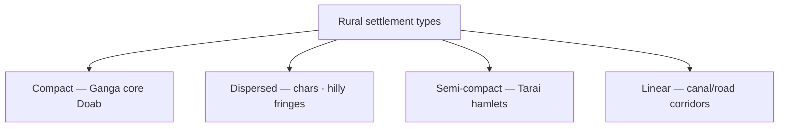

# Rural Settlement Patterns — India & Ganga Plain

> GS-1 · Topic 15.1 · Population and settlements — types and patterns (rural focus)

---

## PYQs

| Year | M | Words | Question (EN) | प्रश्न (HI) | ID |
|------|---|-------|---------------|-------------|-----|
| 2022 | 12 | — | Discuss the factors affecting rural settlement pattern in India. | भारत में ग्रामीण अधिवासों के प्रतिरूप को प्रभावित करने वाले कारकों की विवेचना कीजिए। | Q1 |
| 2021 | 8 | 125 | Discuss the patterns of rural settlements in Gangetic Plain. | गंगा के मैदान में ग्रामीण अधिवासों के प्रतिरूपों की विवेचना कीजिए। | Q2 |
| 2019 | 12 | 200 | Discuss the spatial distribution of types of rural settlements in Ganga Plain. | गंगा मैदान में ग्रामीण अधिवासों के प्रकारों का क्षेत्रीय वितरण की विवेचना कीजिए। | Q3 |
| 2019 | 8 | 125 | Explain the geographical factors which have attracted refugees to settle them in different parts of Uttar Pradesh. | उन भौगोलिक कारकों की व्याख्या कीजिए जिन्होंने शरणार्थियों को उत्तर प्रदेश के विभिन्न भागों में बसने के लिए आकर्षित किया। | Q4 |

---

## Quick Revision

```
RURAL SETTLEMENT = cluster of dwellings where primary occupation agriculture/allied
Types (shape): compact/nucleated · dispersed/scattered · semi-compact · linear (ribbon)

FACTORS INDIA (2022):
  Physical: relief · soil fertility · water (river/well) · climate · drainage
  Economic: crop type · irrigation (canal → linear) · mining/plantations
  Social: caste/joint family · defence · religion (temple-centred nucleus)
  Historical: colonial canal colonies · zamindari estates · railway/road lines

GANGA PLAIN PATTERNS (2021/2019):
  Upper (UP west/Haryana fringe): compact nucleated — fertile Doab, dense population
  Middle (UP-Bihar core): most compact, largest villages — wheat-rice, tube-well
  Lower (Bengal delta): dispersed — waterlogging, chars, embankments
  Tarai/Bhabar fringe: semi-dispersed — forest, drainage issues
  Linear: along Ganga tributaries, canals (Upper Ganga Canal, Eastern Yamuna)

SPATIAL DISTRIBUTION (2019):
  Compact → central alluvial tract (Meerut-Moradabad-Kanpur-Patna belt)
  Semi-compact → transitional margins, rolling Ganga terraces
  Dispersed → flood-prone chars, diara lands, Sundarbans-type eastern fringe
  Linear → road/canal/rail corridors (NCR fringe, Doab canals)

REFUGEE SETTLEMENT IN UP (2019):
  Fertile plain/alluvium — agriculture livelihood (west UP 1947 refugees)
  Canal irrigation colonies — planned peasant resettlement
  Urban-industrial pull — Kanpur, Lucknow, Varanasi
  Border proximity — eastern districts (1971 Bangladesh flows)
  Plain accessibility — no mountain barrier · river water
  Religious/cultural nodes — Varanasi, Ayodhya, Mathura

CONCEPTS: hamlet (dhani) · dispersed in Rajasthan vs Ganga exception
  · nucleated for social cohesion · carrying capacity · site vs situation

TRAPS: Ganga plain ≠ only compact | Dispersed ≠ only hills
  | Linear ≠ only urban | Refugee Q ≠ only Tibetans in UP
  | Settlement pattern ≠ urbanization (different file)
```

---

## Content

### Context — Settlement as the visible imprint of human geography

A settlement is a cluster of dwellings where people live and pursue livelihoods — distinguished from mere population counts by its spatial form, internal organization, and relationship to surrounding land. Rural settlements dominate India's demographic canvas: Census 2011 recorded roughly sixty-five percent of the population in rural areas, though the proportion declines with urbanization. Settlement pattern describes how buildings distribute across landscape — compact nucleated villages with fields radiating outward, dispersed farmsteads isolated on individual holdings, semi-compact hamlet clusters, or linear ribbon development stretched along roads, canals, and rivers. These patterns are not random aesthetic choices but accumulated responses to physical geography, agricultural systems, social organization, and historical land administration. The Ganga Plain offers the world's densest rural settlement belt — Uttar Pradesh, Bihar, and West Bengal heartland — where alluvial fertility, irrigation infrastructure, and joint-family social logic converge to produce compact nucleated morphology on a scale unmatched elsewhere. Uttar Pradesh additionally received displaced populations across centuries — Partition refugees in west Doab, 1971 flows in eastern Tarai, Nepalese migration through open border, urban clusters in Kanpur and Lucknow — whose geographical distribution reflects plain accessibility, canal colonies, and cultural-religious network nodes as much as policy decisions.

### Types of rural settlements — morphology and mechanism

Settlement geographers classify rural forms by building density and spatial relationship to agricultural land. Compact or nucleated settlements cluster dwellings at a central core — well, pond, temple, mosque, panchayat office — with cultivated fields forming an outer ring. This form maximizes social interaction, shared irrigation timing, and defence in historical contexts. Dispersed or scattered settlements place one farmhouse amid its own fields, common where holdings are large, terrain broken, or flood regime makes central sites unsafe. Semi-compact settlements combine loose hamlet clusters (toblas, dhanis) without a single dense core — transitional between compact and dispersed. Linear or ribbon settlements stretch along transport or water corridors — roads, railways, canals, river ghats — where accessibility rather than soil alone dictates house placement.

| Type | Character | Indian example |
|------|-----------|----------------|
| Compact / nucleated | Houses clustered; fields surround village | Ganga–Yamuna Doab; Punjab; Kerala pockets |
| Dispersed / scattered | Farmsteads isolated per holding | Meghalaya hills; Ganga diara/char lands |
| Semi-compact | Hamlets cluster loosely | Tarai UP; Saurashtra fringes |
| Linear / ribbon | Stretched along corridor | Upper Ganga Canal belt; NH-2 villages |



Proof of type-environment linkage: Rajasthan's arid zones historically favoured fortified compact villages around water sources, while Kerala's high literacy belt shows mixed compact and dispersed patterns tied to plantation and homestead horticulture — demonstrating that national generalizations require regional qualification even within one country.

### Factors affecting rural settlement pattern in India — physical, economic, social, historical

Physical factors establish the baseline carrying capacity of land. Relief controls buildability — flat alluvium favours compact nucleation; hills and escarpments force dispersion or terrace hamlets. Soil fertility in khadar (new alluvium) and bangar (old alluvium) belts of the Ganga system supports large permanent villages with surplus population. Water availability from perennial rivers, tanks in Deccan, and tube-wells in Punjab–UP determines whether settlement can remain nucleated year-round or must shift seasonally on floodplains. Climate and drainage interact critically: waterlogged Bengal tracts produce dispersion onto raised plinths (machans) rather than valley-bottom clustering; semi-arid zones produce sparse scatter. Floods create diara and char — silt bars in river channels where seasonal settlement appears and disappears with monsoon pulse, a distinctive dispersed form within otherwise compact plains.

Economic factors translate physical capacity into livelihood geometry. Wheat–rice double-cropping intensity in Doab and Awadh requires synchronized irrigation and harvest labour — reinforcing nucleation for cooperative water management. Shifting cultivation in northeastern hills produces scatter following plot rotation. Canal irrigation introduces planned settlement grids: the Upper Ganga Canal (1854) and Eastern Yamuna Canal created linear and rectangular village patterns along command areas — colonial hydraulic engineering literally drawing settlement lines on landscape. Plantations (Assam tea garden line villages) and mining belts (Jharkhand coal towns) impose employer-linked linear or nucleated forms alien to surrounding agrarian morphology.

Social and cultural factors embed community logic in spatial form. Caste and joint-family systems historically preferred nucleated villages where kin share wells, grazing commons, and festival labour exchange. Religion centres settlement — temple or mosque at village core organizes weekly markets and life-cycle rituals. Historical security against marauding produced walled compact villages in Rajasthan forts contrasted with open plain villages where threat was lower. Zamindari versus ryotwari land tenure shaped field sizes and tenant geography without always moving village sites — settlement location often outlasts tenure reform.

Historical and political factors include colonial canal colonies, railway lines reorganizing ribbon development along Howrah–Delhi rail corridor, land consolidation altering field geometry while village nuclei remain stable, and post-Independence refugee rehabilitation colonies in west UP that overlay new compact settlements on existing Doab morphology.

| Factor category | Mechanisms | Plain India effect |
|-----------------|------------|-------------------|
| Physical | Relief, soil, water, flood regime | Alluvium → compact; chars → dispersed |
| Economic | Crop type, irrigation, plantations | Canals → linear; intensive farming → nucleation |
| Social | Caste, joint family, religion, defence | Cohesion favours nucleated core |
| Historical | Tenure, colonial infra, land reform | Canals/rail reshape linear corridors |

### Rural settlements in the Gangetic Plain — regional patterns along the river axis

The Gangetic Plain's physical setting — young alluvium, flat relief, perennial tributaries (Ganga, Yamuna, Ghaghara, Gandak, Kosi) — supports among the highest rural population densities globally. The dominant pattern is compact nucleated: village core with well, pond, temple, and panchayat; fields fan outward; slightly elevated madai sites avoid routine flooding while remaining close to river-supplied irrigation.

Regional variation follows the river downstream. Upper Ganga Plain — Uttarakhand plain fringe, west UP Doab — features large compact villages with canal-linear offshoots along Upper Ganga Canal and NCR fringe merging toward urban morphology. Middle Ganga Plain — east UP, Bihar — contains the largest nucleated settlements with highest density; river port ghats at Varanasi and Patna add linear riverside extensions. Lower Ganga and delta — West Bengal, Bangladesh fringe — shows increasing dispersion due to waterlogging, embankment-protected chars, and deltaic fragmentation. Linear elements penetrate all sectors: Grand Trunk Road legacy, Howrah–Delhi railway, Sarda Sahayak and Eastern Yamuna canals creating ribbon villages with shops and periodic markets.

| Sector | Stretch | Settlement character |
|--------|---------|---------------------|
| Upper Ganga Plain | Uttarakhand plain, west UP Doab | Large compact villages; canal-linear offshoots; NCR urban fringe |
| Middle Ganga Plain | East UP, Bihar | Very large nucleated villages; highest density; ghat linearity |
| Lower Ganga / Delta | West Bengal, Bangladesh fringe | Increasing dispersion; embankment-linear; seasonal chars |

### Spatial distribution of settlement types across the Ganga Plain

Compact settlements dominate the core alluvial tract — west UP Doab (Meerut, Muzaffarnagar, Aligarh) with wheat–sugarcane and tube-well irrigation; Awadh–Rohilkhand–Gorakhpur belt with dense nucleated habitations; Bihar plains (Patna, Darbhanga) mirroring similar morphology. Semi-compact zones appear at margins — Tarai–Bhabar (Pilibhit, Kheri, Udham Singh Nagar) where forest clearance created hamlet clusters; Ganga terrace edges and Vindhya foothills entering the plain. Dispersed exceptions within the plain include diara and khadar flood tracts with seasonal silt-bar settlement; waterlogged pockets in north Bihar and Bengal with homesteads on raised plinths scattered across unusable low ground; recent embankment-protected chars with low-density scatter. Linear corridors follow Upper Ganga Canal villages (Haridwar–Muradabad belt), highway and industrial Kanpur–Lucknow–NCR axis, and riverside ghats from Varanasi to Patna — commercial ribbon morphology layered on nucleated cores.

Mental mapping aid: tracing Ganga west to east, compact core widens then dispersion increases eastward into delta — a zonation pattern driven by flood regime, embankment history, and irrigation density rather than single-factor soil fertility alone.

### Geographical factors attracting refugees and displaced persons to different parts of Uttar Pradesh

Uttar Pradesh absorbed diverse displaced populations — 1947 Partition refugees, 1971 Bangladesh refugees, Nepalese migrants through open border, smaller Afghan and Rohingya clusters in cities — whose regional distribution reflects geographical pull factors intersecting kinship and policy.

West UP (Meerut, Saharanpur, Muzaffarnagar) offers fertile Doab alluvium, Ganga–Yamuna irrigation, and proximity to Delhi–Punjab corridor — attracting 1947 Punjabi and Hindustani refugees for agricultural resettlement on available plain land. Kanpur–Lucknow industrial belt provides plain accessibility, rail connectivity, and factory employment for urban refugee rehabilitation and trade-skill absorption. Eastern border districts (Maharajganj, Siddharthnagar, Kheri, Pilibhit) interface with Nepal and Tarai forest margins with sugarcane economy — receiving Nepalese migration, 1971 eastern refugee inflows, and Tarai settlement on forest-edge land. Religious-cultural centres (Varanasi, Ayodhya, Mathura) combine river-plain habitability with pilgrimage economy attracting co-ethnic and co-religious displaced groups through network effects. Ganga plain generally preferred over Bundelkhand or Vindhya rugged tracts because flat land, river water, and all-season agriculture lower settlement cost — proof visible in refugee colony distribution maps overlapping Doab and middle plain rather than drought-prone southern UP uplands.

| UP region | Geographical pull | Displaced population link |
|-----------|-------------------|---------------------------|
| West UP Doab | Fertile alluvium; irrigation; Delhi–Punjab corridor | 1947 Partition agricultural resettlement |
| Kanpur–Lucknow belt | Plain access; rail hub; industrial employment | Urban refugee rehabilitation |
| Eastern border/Tarai | Nepal interface; forest margin; sugarcane | Nepalese migration; 1971 eastern flows |
| Religious centres | River habitability; pilgrimage economy | Co-ethnic/religious network settlement |
| Ganga plain generally | Flat land; water; all-season agriculture | Preferred over Bundelkhand/Vindhya rugged tracts |

Push from origin — Partition violence, 1971 war, persecution — explains why people left; geography explains where within UP they could settle when combined with kin networks and government colony allotments.

### Contemporary relevance

Rurbanization morphs Ganga plain villages near metros — Greater Noida fringe, Varanasi periphery — from pure agrarian nuclei toward mixed commercial-residential forms without formal urban status. PMGSY all-weather roads accelerate linear commercial strip development along new connectors. Climate-intensified floods increase char settlement risk and dispersion in north Bihar and Bengal fringes. Smart Village and Common Service Centre digitization targets nucleated village cores for e-governance without altering fundamental compact morphology. Out-migration from Purvanchal hollows some villages while remittance houses rise — settlement pattern and demographic emptiness co-evolve.

### Limits and balanced view

Compact settlement is not static — out-migration, urban fringe absorption, and flood displacement continuously reshape morphology. Multi-causal explanation is essential — physical determinism alone cannot explain why identical alluvium supports different densities across caste-tenure histories. Refugee settlement geography reflects policy and networks alongside soil and water — voluntary economic migration to Kanpur differs from camp-assigned rehabilitation yet shares plain-access logic. Tarai is not Doab — semi-compact/dispersed forest-margin forms resist simple "Ganga plain = compact" generalization. Canal colonies create linear/planned grids, not dispersion — infrastructure type overrides default nucleation. Social factors — caste, joint family — remain decisive for nucleation in core plain even as nuclear families and urban jobs weaken traditional cohesion.

---

## Answers

### Q1: Factors affecting rural settlement pattern in India. (2022, 12M)

**Introduction:**
> **Rural settlement patterns — compact, dispersed, linear — result from interplay of physical environment, economy, and social organization**, **nowhere more visible than the Ganga alluvial plain**.

**Main Points:**
- **Physical** — **Relief, soil, water, drainage, flood regime (chars = dispersion)**.
- **Economic** — **Crop intensity, canal irrigation (linear colonies), plantations**.
- **Social** — **Caste, joint family, defence — favour nucleation**.
- **Historical** — **Zamindari, colonial canals/rail, land consolidation**.
- **Regional examples** — **Compact Doab; dispersed Bengal waterlogged; linear Upper Ganga Canal; semi-compact Tarai**.

**Keywords (underline in exam):** Compact · Dispersed · Linear · Nucleated · Irrigation · Alluvium · Canal Colony

**Exam diagram (30 sec):**
```
Physical + Economic + Social → settlement type
India: Ganga compact | hills dispersed | canal linear
```

**Conclusion:**
> **India's rural morphology mirrors its agrarian civilization** — **infrastructure and climate change now reshape traditional patterns**.

---

### Q2: Patterns of rural settlements in Gangetic Plain. (2021, 8M, 125W)

**Introduction:**
> **The Gangetic Plain supports predominantly compact, nucleated rural settlements due to fertile alluvium, dense population, and cooperative agriculture**, **with regional variation from upper Doab to lower delta**.

**Main Points:**
- **Dominant compact pattern** — **Village core + surrounding fields; high population density**.
- **Upper plain** — **Large villages, canal-linear offshoots (west UP)**.
- **Middle plain** — **Largest nucleated settlements (east UP, Bihar)**.
- **Lower/delta fringe** — **Increasing dispersion on chars/waterlogged tracts**.
- **Linear along rivers, GT Road, rail, canals**.

**Keywords (underline in exam):** Gangetic Alluvium · Compact · Nucleated · Diara · Canal Belt · Doab

**Exam diagram (30 sec):**
```
Upper Ganga: compact + canal linear
Middle: largest nucleated villages
Lower: more dispersed (waterlogging)
```

**Conclusion:**
> **Ganga Plain settlements exemplify ** **human adaptation to riverine fertile lowlands** — **among world's densest rural landscapes**.

---

### Q3: Spatial distribution of types of rural settlements in Ganga Plain. (2019, 12M, 200W)

**Introduction:**
> **Types of rural settlements in the Ganga Plain show clear spatial zonation** — **compact nucleated villages dominate the core alluvial tract while semi-compact, dispersed, and linear forms appear at margins and along infrastructure**.

**Main Points:**
- **Compact** — **West-east Doab-Awadh-Bihar core; wheat-rice belt; highest density**.
- **Semi-compact** — **Tarai-Bhabar, terrace margins; hamlet clusters**.
- **Dispersed** — **Diara/char flood tracts, Bengal waterlogged pockets**.
- **Linear** — **Upper Ganga Canal, GT Road, rail corridors, riverside ghats**.
- **Factors** — **Soil, flood, irrigation, historical canal planning explain distribution**.

**Keywords (underline in exam):** Spatial Distribution · Compact · Dispersed · Linear · Tarai · Diara · Upper Ganga Canal

**Exam diagram (30 sec):**
```
Map mental: core=compact | margins=semi/dispersed | canals/roads=linear
West→East along Ganga
```

**Conclusion:**
> **Understanding spatial typology is key to regional planning — floods and infrastructure continue to alter Ganga Plain habitation geography**.

---

### Q4: Geographical factors attracting refugees to different parts of UP. (2019, 8M, 125W)

**Introduction:**
> **Uttar Pradesh's varied geography — especially the fertile Ganga plain, border Tarai, and industrial cities — has attracted refugees and displaced populations to distinct sub-regions**.

**Main Points:**
- **Fertile alluvial plain** — **Agricultural livelihood (west UP 1947 resettlement)**.
- **Canal irrigation zones** — **Peasant colonization capacity**.
- **Urban-industrial plains** — **Kanpur, Lucknow employment for displaced**.
- **Eastern border/Tarai** — **Forest margin, Nepal interface — eastern refugee flows**.
- **River water & flat access** — **Preferred over Bundelkhand rugged tracts**.
- **Cultural-religious centres** — **Varanasi, Ayodhya network effects**.

**Keywords (underline in exam):** Alluvial Plain · Doab · Tarai · Canal Colonies · Partition · 1971 Refugees

**Exam diagram (30 sec):**
```
West UP: Doab agriculture | Kanpur-Lucknow: industry
East border: Tarai | Whole plain: water + flat land
```

**Conclusion:**
> **Geography alone does not explain settlement — but UP's plain heartland has historically enabled refugee absorption when linked to community networks**.

---

## Traps

| Wrong | Correct |
|-------|---------|
| Ganga Plain only has compact settlements | **Dispersed on chars/delta; linear on canals** |
| Dispersed settlements only in hills | **Waterlogged Bengal/diara also dispersed** |
| Linear settlements only urban | **Canal and road ** **rural ribbon villages common** |
| All Indian villages nucleated | **Rajasthan/Kerala contrasts; even within Ganga variation exists** |
| Refugee Q = only Tibetans in UP | **1947 west UP, 1971 east, Nepalese Tarai, urban Afghans** |
| Settlement pattern = same as urbanization | **This is rural morphology; urbanization is demographic shift** |
| Tarai = compact like Doab | **Semi-compact/dispersed due to forest-drainage** |
| Canal colonies = dispersed | **Canal creates ** **linear/planned grid settlements** |
| Ganga settlement unrelated to floods | **Diara/chars are flood-created dispersed forms** |
| Social factors irrelevant | **Caste, joint family strongly favour nucleation in plain** |

---

*Complete.*
