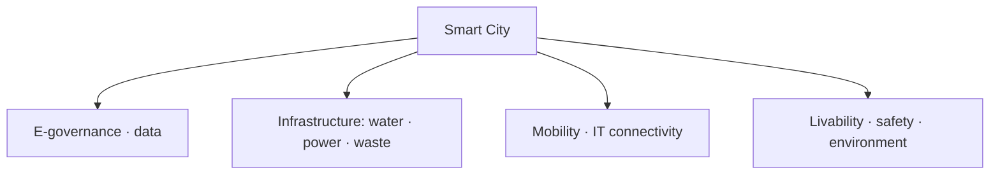

# Smart Cities Mission — India & Eastern UP

> GS-1 · Topic 15.2 · Urbanization — Smart City Mission, characteristics, core infrastructure

---

## PYQs

| Year | M | Words | Question (EN) | प्रश्न (HI) | ID |
|------|---|-------|---------------|-------------|-----|
| 2024 | 8 | 125 | What is smart city? Describe its main characteristics. | स्मार्ट सिटी क्या है? इसकी प्रमुख विशेषताओं का वर्णन कीजिए। | Q1 |
| 2022 | 8 | — | What is 'Smart City Mission'? Discuss the main characteristics of cities of Eastern Uttar Pradesh selected under this scheme. | 'स्मार्ट सिटी मिशन' क्या है? पूर्वी उत्तर प्रदेश में इस योजना हेतु चुने गये नगरों की प्रमुख विशेषताओं की विवेचना कीजिए। | Q2 |
| 2020 | 8 | 125 | What is 'Smart City Mission'? Discuss the main characteristics of cities of Eastern Uttar Pradesh selected under this scheme. | 'स्मार्ट सिटी मिशन' क्या है? पूर्वी उत्तर प्रदेश में इस योजना हेतु चुने गये नगरों की प्रमुख विशेषताओं की विवेचना कीजिए। | Q3 |
| 2018 | 8 | 125 | Enumerate the core infrastructure elements for Smart City development. | स्मार्ट सिटी विकास हेतु मूल अधोसंरचनात्मक तत्व बताए। | Q4 |

---

## Quick Revision

```
SMART CITY MISSION (SCM):
  Launched 25 June 2015 · MoHUA · 100 cities · 5-year mission (extended)
  Goal: sustainable, inclusive cities · quality of life · economic competitiveness
  NOT one-size template — city-specific SPV plans

SELECTION: Challenge rounds (2016–2018) · UP got 12 cities total
  Eastern UP under SCM: Varanasi (Round 1) · Prayagraj/Allahabad (Round 1)
  (Purvanchal core — Gorakhpur NOT selected in SCM)

IMPLEMENTATION MODEL:
  SPV (Special Purpose Vehicle) · PPP · Area-Based Development (ABD) + Pan-City
  ABD: retrofitting · redevelopment · greenfield
  Pan-city: IT connectivity · e-governance for all

CORE INFRA (2018 PYQ — 24 elements grouped):
  Adequate water · electricity · sanitation (individual/group toilets)
  · solid waste management · efficient urban mobility · robust IT connectivity
  · e-governance · citizen participation · safety · health · education
  · identity (heritage/culture) · economy · environment

SMART CITY CHARACTERISTICS (2024):
  Data-driven governance · ICT/IOT · sustainable mobility · clean energy
  · smart utility metering · integrated command centre · livability
  · resilience · inclusive housing · reduced congestion/pollution

VARANASI (Kashi) FEATURES:
  Heritage city · Ganga rejuvenation · Kashi Vishwanath Corridor
  · smart lighting ghats · integrated traffic · tourism e-services
  · waste-to-energy · riverfront development · pilgrimage infrastructure

PRAYAGRAJ FEATURES:
  Kumbh 2019 legacy infra · sangam area development · smart parking
  · water supply augmentation · sewerage · transit for melas
  · religious tourism · flood-resilient planning on Ganga-Yamuna confluence

TRAPS: Smart city ≠ only IT | SCM ≠ 100% new cities | Gorakhpur ≠ SCM city
  | Smart ≠ fully achieved yet — mostly ABD pockets | Pan-city ≠ optional luxury
```

---

## Content

### Context — Urbanization pressure and the Smart Cities Mission response

India is urbanizing at a pace that outstrips municipal capacity. Census 2011 recorded roughly thirty-one percent urban population; projections exceed forty percent by 2030 as migration and town reclassification accelerate. Cities concentrate opportunity but also concentrate crisis — water stress, gridlocked traffic, unprocessed waste, air pollution, informal housing, and fiscal weakness in municipalities that cannot fund the infrastructure their economies demand. Smart Cities Mission (SCM), launched on 25 June 2015 under the Ministry of Housing and Urban Affairs (MoHUA), represents a policy shift from basic service gap-filling (exemplified by AMRUT) toward integrated, technology-enabled, citizen-centric urban transformation in one hundred competitively selected cities. The mission does not prescribe a single template — each city develops a Special Purpose Vehicle (SPV) and city-specific plan combining physical redevelopment with digital governance. Uttar Pradesh received twelve SCM selections; for Eastern UP (Purvanchal) questions, only Varanasi (Round 1, 2016) and Prayagraj/Allahabad (Round 1, 2016) qualify — not Lucknow, Kanpur, or Agra (central/western UP), and not Gorakhpur, Azamgarh, or Ballia (not on the hundred-city list). Understanding smart cities requires defining the concept beyond Wi-Fi branding, mapping mission architecture, enumerating core infrastructure elements, and examining how heritage-religious Ganga cities implement retrofitting in dense old cores.

### What is a smart city — definition, characteristics, and what it is not

A smart city uses digital technology, data analytics, and sustainable urban design to improve quality of life, optimize resource use, and enhance economic opportunity — integrated urban governance rather than isolated gadgets. ICT and Internet of Things (IoT) sensors on traffic signals, water pipes, and energy grids generate data for responsive management; citizen-centric e-governance enables grievance redressal and participatory planning; sustainable infrastructure deploys renewable energy, LED lighting, water recycling, and green building standards; efficient mobility integrates intelligent traffic management, public transport, walkability, and parking solutions; solid waste and water management pursue segregation, waste-to-energy, twenty-four-hour supply, and leakage detection; safety and resilience include disaster early warning, CCTV where appropriate, and climate adaptation; economic vibrancy supports tourism, crafts, startups, and heritage economies; inclusive development targets affordable housing, slum redevelopment, and universal service access.

| Characteristic | What it means in practice |
|----------------|---------------------------|
| Citizen-centric governance | E-governance, grievance apps, participatory planning |
| ICT & IoT integration | Smart meters, traffic sensors, integrated command centres |
| Sustainable infrastructure | Solar rooftops, LED, water recycling, green buildings |
| Efficient mobility | ITS, public transport, walkability, smart parking |
| Waste & water management | Segregation, waste-to-energy, 24×7 supply, leakage control |
| Safety & resilience | Disaster warning, surveillance, climate adaptation |
| Economic vibrancy | Tourism, crafts, startups, heritage economy |
| Inclusive development | Affordable housing, slum upgrade, universal access |

A smart city is not merely Wi-Fi and CCTV — without water, waste, mobility, and inclusion outcomes, smart branding remains superficial. It is also not one hundred entirely new cities — most projects retrofit, redevelop, or greenfield small zones within existing urban fabric.



### Smart Cities Mission — architecture, financing, and implementation model

SCM selected one hundred cities through City Challenge competition rounds (2016–2018) based on proposals scoring vision, feasibility, and citizen engagement. Centre allocates approximately ₹500 crore per city over mission period with matching state contribution and convergence funding from AMRUT, HRIDAY (heritage), and Swachh Bharat Mission. SPV — a limited company with state and urban local body equity — plans, implements, and operates projects with authority to raise PPP investment and municipal bonds.

Two implementation pillars structure every plan. Area-Based Development (ABD) concentrates investment in defined zones through retrofitting (upgrading existing built-up areas street by street), redevelopment (replacing low-rise with higher-density mixed use), or greenfield (new planned extensions). Pan-City initiative mandates at least one digital solution applied citywide — unified e-governance portal, smart transport card, or utility billing integration — ensuring SCM benefits extend beyond ABD pockets. Objectives: improve livability, drive economic growth, enhance environmental sustainability — not relocate capitals or build speculative ghost towns.

### Core infrastructure elements — the twenty-four-feature framework grouped for clarity

MoHUA's smart city framework lists twenty-four features examinable as grouped essentials. Essential services include adequate water supply with smart metering and leakage control; assured electricity through smart grids, solar rooftops, and reduced aggregate technical and commercial (AT&C) losses; sanitation including individual and community toilets plus solid waste management with door-to-door collection, waste-to-energy, and landfill remediation; efficient urban mobility and public transport through Intelligent Transport Systems (ITS), bus rapid transit where viable, last-mile connectivity, and non-motorized transport; affordable housing especially for poor through PMAY convergence.

Governance and identity elements include robust IT connectivity and digitalization (fiber backbone, Wi-Fi hotspots); good governance especially e-Governance with citizen participation and online services; safety and security of citizens especially women, children, and elderly; health and education through smart clinics and digital classrooms. Quality and sustainability elements include mixed land use in area-based development; identity and culture through heritage conservation linked to HRIDAY; walkability with reduced congestion and pollution; safety from disasters including floods and heat; resilience to climate change. These elements define smart city substance — technology enables delivery but does not replace municipal reform, staffing, and finance.

| Group | Core elements |
|-------|---------------|
| Essential services | Water · electricity · sanitation · solid waste · mobility · affordable housing |
| Governance & identity | IT connectivity · e-governance · safety · health · education |
| Quality & sustainability | Mixed land use · heritage · walkability · disaster safety · climate resilience |

### Eastern Uttar Pradesh under SCM — Varanasi and Prayagraj characteristics

Purvanchal/eastern belt SCM cities are Varanasi and Prayagraj only — both Round 1 (2016) selections sharing Ganga-front heritage-religious identity but distinct urban challenges and project portfolios.

Varanasi (Kashi) combines ancient pilgrimage city morphology with extreme old-core congestion. SCM projects include smart roads and integrated traffic management; smart lighting on ghats; Kashi Vishwanath Temple Corridor improving access and pedestrian flow; riverfront development converging with Namami Gange for sewerage, ghat cleanliness, and waste-to-energy; digital tourist information and e-rickshaw integration; Banarasi silk craft promotion; Integrated Command and Control Centre (ICCC) with CCTV and grievance apps; parking management reducing old-city vehicle chaos.

Prayagraj (Allahabad) is defined by Sangam confluence and Kumbh Mela scale — 2019 Kumbh acted as world-scale urban stress test whose temporary infrastructure informed permanent SCM assets. Projects include water supply augmentation and sewerage treatment; smart roads and Sangam riverfront development; smart parking and melas-specific traffic plans; crowd management ICT scaling from Kumbh experience; Ganga–Yamuna pollution abatement; flood-sensitive planning on low-lying confluence zone; city surveillance and e-governance; disaster and crowd early warning systems.

| Dimension | Varanasi | Prayagraj |
|-----------|----------|-----------|
| Identity | Ancient pilgrimage; Kashi Vishwanath; ghats | Sangam city; Kumbh Mela |
| Key projects | Corridor; ghat lighting; traffic; tourism e-services | Water-sewerage; Sangam front; melas ICT |
| Convergence | Namami Gange; waste-to-energy; silk economy | Kumbh 2019 legacy; flood planning |
| Governance | ICCC; CCTV; grievance apps | Surveillance; crowd warning; e-services |

Comparative insight: both cities exemplify culture-led urban modernization — SCM prioritizes tourism economy, sanitation, and traffic in dense religious cores rather than greenfield IT parks alone. Gorakhpur's absence from SCM highlights Purvanchal urban investment gap despite high out-migration from surrounding districts.

Varanasi's old city presents a planning paradox: UNESCO-grade heritage fabric, narrow galis, and perpetual pilgrimage footfall make conventional widening impossible — SCM therefore emphasizes corridor creation (Kashi Vishwanath Corridor), one-way circulation, ghat-level waste collection, and time-slot management rather than metro-style restructuring. Prayagraj's confluence topography — low-lying floodplain between Ganga and Yamuna — makes underground sewerage and flood-resilient Sangam infrastructure as important as visible smart branding; Kumbh 2019 proved that temporary pontoon bridges, crowd-density sensors, and mass sanitation can scale to tens of millions, and SCM seeks to convert that episodic capacity into everyday urban resilience before Maha Kumbh 2025 retests the same systems.

### AMRUT convergence and how it differs from SCM

AMRUT (Atal Mission for Rejuvenation and Urban Transformation) targets five hundred cities for basic water supply, sewerage, urban transport, and parks — filling service gaps rather than competitive transformation. Varanasi and Prayagraj receive both AMRUT and SCM funding simultaneously: AMRUT lays sewerage trunk lines and water treatment foundations while SCM adds ICCC, smart traffic, and area-based retrofitting in heritage cores. Confusing the two missions — claiming SCM alone delivers basic water or that AMRUT makes a city "smart" — misrepresents complementary design. Exam answers benefit from one sentence distinguishing AMRUT's universal basic-service mandate from SCM's SPV-led innovation in selected hundred cities.

| Mission | Cities | Primary focus |
|---------|--------|---------------|
| AMRUT | ~500 | Basic water, sewerage, transport, green spaces |
| SCM | 100 (competitive) | ABD + pan-city IT via SPV |
| HRIDAY | 12 heritage cities | Identity conservation — converges with Varanasi/Prayagraj |

### Progress, challenges, and criticism

Implementation lagged due to COVID delays, land acquisition disputes, and cost escalation — many cities show partial ABD completion while pan-city IT rolls out unevenly. ABD benefits concentrate in selected zones — whole cities are not uniformly smart. Gentrification risk in old-city redevelopment may displace poor residents without inclusive housing safeguards. Surveillance expansion raises data privacy and civil liberties concerns requiring governance frameworks. SPV revenue models remain weak in tier-2 religious cities dependent on state transfers rather than self-sustaining municipal finance.

### Contemporary relevance

Smart Cities 2.0 and AMRUT 2.0 convergence (2021 onward) integrate basic services with smart upgrades. National Urban Digital Mission standardizes data across cities. Varanasi post-Kashi corridor tourism surge demonstrates SCM–heritage synergy. Prayagraj Maha Kumbh 2025 preparation retests smart crowd infrastructure. Ganga plain heat and flood resilience increasingly embedded in SCM climate adaptation plans.

### Limits and balanced view

Smart city must deliver water, waste, and mobility outcomes — not only ICT branding. Eastern UP SCM footprint limited to two cities leaves Gorakhpur and wider Purvanchal urban gap. Technology without municipal capacity, finance, and staffing reform produces showcase pockets without systemic improvement. AMRUT and SCM are complementary — five hundred cities need basic services; one hundred selected cities need transformation; conflating the two misrepresents policy architecture. Pan-city component is mandatory alongside ABD — not optional luxury. MoHUA implements SCM, not Ministry of Electronics and IT — institutional clarity matters for governance answers. Monitoring uses SCM portal project tracking; citizen perception often lags physical completion because ABD zones look transformed while adjacent wards unchanged — honest assessment distinguishes pilot success from citywide transformation claims. Integrated Command and Control Centres aggregate traffic, waste, water, and surveillance feeds — their operational value depends on municipal staff trained to act on alerts, not merely display dashboards to visiting delegations.

---

## Answers

### Q1: What is smart city? Main characteristics. (2024, 8M, 125W)

**Introduction:**
> **A smart city leverages ICT, data, and sustainable urban design to improve livability, governance, and economic efficiency** — **India's Smart Cities Mission adapts this concept to diverse heritage and metro contexts**.

**Main Points:**
- **Citizen-centric e-governance** — **Online services, grievance redressal, participation**.
- **Smart infrastructure** — **24×7 water, assured power, waste segregation, waste-to-energy**.
- **Intelligent mobility** — **Traffic management, public transport integration, reduced congestion**.
- **IT connectivity** — **IoT sensors, smart meters, integrated command centres**.
- **Safety & sustainability** — **CCTV, disaster resilience, green energy, pollution control**.
- **Inclusive & cultural identity** — **Affordable housing, heritage conservation (Varanasi model)**.

**Keywords (underline in exam):** ICT · IoT · E-governance · Sustainable Mobility · Integrated Command Centre · Livability

**Exam diagram (30 sec):**
```
Smart city = tech + governance + infra (water/waste/mobility) + inclusion
```

**Conclusion:**
> **Smart cities aim at ** **efficient, inclusive, and resilient urban life** — **technology is enabler, not substitute for municipal reform**.

---

### Q2/Q3: Smart City Mission + Eastern UP cities characteristics. (2022/2020, 8M, 125W)

**Introduction:**
> **Smart Cities Mission (2015) selects 100 cities for area-based retrofitting and pan-city digital solutions via SPVs** — **in Eastern Uttar Pradesh, Varanasi and Prayagraj exemplify heritage-religious urban smart development**.

**Main Points:**
- **Mission** — **MoHUA, 2015, 100 cities, ABD + pan-city IT, SPV implementation**.
- **Varanasi** — **Ganga ghats, Kashi Vishwanath Corridor, smart lighting/traffic, tourism e-services, waste-water under Namami Gange convergence**.
- **Prayagraj** — **Sangam/Kumbh infra, water-sewerage augmentation, smart parking, crowd management ICT, flood-sensitive confluence planning**.
- **Shared traits** — **Heritage identity, pilgrimage economy, old-city congestion challenge, ICCC governance**.

**Keywords (underline in exam):** SCM · SPV · ABD · Pan-City · Varanasi · Prayagraj · Kumbh · Namami Gange

**Exam diagram (30 sec):**
```
SCM → Eastern UP: Varanasi + Prayagraj
Heritage + Ganga + tourism + sanitation + smart traffic
```

**Conclusion:**
> **Eastern UP smart city projects show ** **culture-led urban modernization** — **scaling beyond pilot areas remains the test**.

---

### Q4: Core infrastructure elements for Smart City development. (2018, 8M, 125W)

**Introduction:**
> **Smart City Mission defines core infrastructure as essential urban systems that ensure livability, sustainability, and economic productivity** — **grouped under services, governance, and environment**.

**Main Points:**
- **Water & electricity** — **Adequate 24×7 supply, smart metering, solar integration**.
- **Sanitation & solid waste** — **Toilets, door-to-door collection, treatment plants**.
- **Urban mobility** — **Efficient public transport, ITS, walkability, parking**.
- **IT & e-governance** — **Digital connectivity, citizen services, transparency**.
- **Health, education, safety** — **Accessible services, disaster resilience, women-child safety**.
- **Identity & environment** — **Heritage preservation, mixed land use, pollution reduction**.

**Keywords (underline in exam):** Water Supply · Sanitation · Solid Waste · Urban Mobility · IT Connectivity · E-governance · Affordable Housing

**Exam diagram (30 sec):**
```
Core: water · power · waste · mobility · IT · safety · housing · environment
```

**Conclusion:**
> **Without these foundational elements, ** **smart branding remains superficial** — **SCM integrates them through SPV-delivered projects**.

---

### Q5: *Likely variant:* Difference between AMRUT and Smart Cities Mission. (—, 8M, 125W)

**Introduction:**
> **AMRUT focuses on basic urban service delivery in 500 cities; SCM targets competitive transformation in 100 selected cities through SPV-led smart solutions**.

**Main Points:**
- **AMRUT** — **Water, sewerage, parks, transport basics — mission-mode service gap filling**.
- **SCM** — **Area-based smart redevelopment + pan-city IT — innovation and competitiveness**.
- **Convergence** — **Same city may use both (Varanasi)** — **complementary not duplicate**.

**Keywords (underline in exam):** AMRUT · SCM · Basic Services · SPV · Area-Based Development

**Exam diagram (30 sec):**
```
AMRUT = basic services (500 cities)
SCM = smart transformation (100 cities)
```

**Conclusion:**
> **India needs ** **both service universalization and smart upgrading** for sustainable urbanization.

---

## Traps

| Wrong | Correct |
|-------|---------|
| Smart city = only IT and Wi-Fi | **Core water, waste, mobility equally mandatory** |
| 100 new cities being built | **Mostly ** **retrofit/redevelop existing cities** |
| Gorakhpur is Smart City | **NOT in SCM list — Varanasi & Prayagraj for Eastern UP** |
| Lucknow counts for Eastern UP Q | **Central UP — cite Varanasi/Prayagraj only** |
| SCM fully completed nationwide | **Many projects delayed/incomplete — partial ABD** |
| Pan-city optional | **Mandatory component alongside ABD** |
| Smart City Mission under Ministry of IT | **MoHUA (Housing & Urban Affairs)** |
| Varanasi SCM only about temple corridor | **Also waste, traffic, ghats, tourism, ICCC** |
| Prayagraj smart city unrelated to Kumbh | **Kumbh 2019 drove major SCM convergence** |
| Core infra excludes health/education | **Included in 24-feature framework** |

---

*Complete.*
