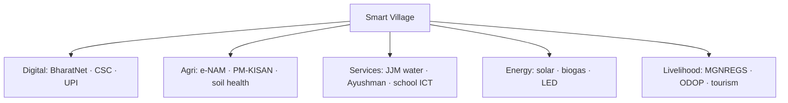

# Smart Villages — India

> GS-1 · Topic 15.3 · Smart villages — concept, features, rural-urban digital integration

---

## PYQs

| Year | M | Words | Question (EN) | प्रश्न (HI) | ID |
|------|---|-------|---------------|-------------|-----|
| 2024 | 12 | 200 | Throw light on the concept of smart village in India and describe the main features of smart village. | भारत में स्मार्ट ग्राम की अवधारणा पर प्रकाश डालिए तथा स्मार्ट ग्राम की प्रमुख विशेषताओं का वर्णन कीजिए। | Q1 |

---

## Quick Revision

```
SMART VILLAGE CONCEPT:
  No single central "Smart Village Mission" like SCM — composite vision
  · Digital India · BharatNet · Common Service Centres (CSCs)
  · Saansad Adarsh Gram Yojana (SAGY) · Rurban Mission (SRUM)
  · PM-KISAN · e-NAM · AgriStack direction · solar/village storage

DEFINITION (exam):
  Technology-enabled, economically vibrant, environmentally sustainable village
  with digital connectivity, quality services, and reduced urban migration pull

MAIN FEATURES (2024):
  Digital connectivity (fiber/BharatNet/Wi-Fi) · CSC/e-governance at doorstep
  · Smart/agri-tech (soil health, drip, drones, e-NAM mandi link)
  · Renewable energy (solar street lights, mini-grids, UJALA)
  · Sanitation (ODF+ · waste management · biogas)
  · Health (Ayushman · telemedicine · sub-centre upgrade)
  · Education (digital classrooms · DIKSHA · skill centres)
  · Roads (PMGSY) · banking (PMJDY · Aadhaar-enabled payments)
  · Water (Jal Jeevan Mission — tap to every household)
  · Livelihood (MGNREGS · ODOP · SHGs · rural haats)

INSTITUTIONS: MoPR · DoAE · MeitY · CSC SPV · State DRDAs · Panchayati Raj

UP LINK: Purvanchal villages · ODOP (Varanasi silk, Kannauj perfume)
  · SVAMITVA (property cards) · Namami Gange village sanitation

TRAPS: Smart village ≠ only Wi-Fi | ≠ opposite of smart city (complementary)
  | No standalone "Smart Village Mission 2015" | SAGY ≠ full smart village alone
  | BharatNet incomplete ≠ concept invalid
```

---

## Content

### Context — Bridging the rural–urban divide through converged development

Roughly sixty-five percent of India's population lived in rural areas at Census 2011 — a share declining as urbanization accelerates but still representing the demographic majority. Smart Cities Mission (2015) targeted urban transformation in one hundred cities, risking a narrative that rural India would be left behind in the digital and infrastructure transition. Smart village emerges as a composite policy vision rather than a single centrally legislated mission equivalent to SCM: it describes a technology-enabled, economically vibrant, environmentally sustainable rural community where digital connectivity and modern infrastructure deliver urban-quality governance, health, education, and livelihood services without abandoning agrarian roots or forcing unnecessary migration to overcrowded metros. The concept converges Digital India, BharatNet fiber, Common Service Centres (CSCs), Saansad Adarsh Gram Yojana (SAGY), Shyama Prasad Mukherji Rurban Mission (SRUM), Jal Jeevan Mission, SVAMITVA property mapping, PM-KISAN, e-NAM, and Panchayati Raj institutions into a gram panchayat-level integration framework. Unlike SCM's SPV-led hundred-city list, smart village realization depends on whether multiple schemes align at one GP — success is convergence architecture, not a standalone mission notification.

### Concept of smart village — definition, pillars, and relationship to smart city

Working definition: a smart village uses digital connectivity and modern infrastructure to provide urban-quality services in rural settings while preserving agrarian livelihoods and local identity — sustainable, inclusive, and participatory under panchayat leadership. Four philosophical pillars structure the concept. People-centric planning places Gram Sabha and Self-Help Groups at the centre rather than top-down technology drops. Technology serves as enabler of agricultural productivity and service delivery — not replacement for farming economies. Convergence integrates schemes on one village platform avoiding fragmented Wi-Fi boards without water taps. Complementarity to smart cities aims to reduce distress migration and strengthen rurban links — smart village and smart city are partners, not opposites.

| Aspect | Smart Village | Smart City |
|--------|---------------|------------|
| Focus | Agrarian livelihood + rural services | Urban density, mobility, heritage cores |
| Mission structure | Converged schemes — no single mission | Dedicated SCM 2015, 100 cities |
| Technology emphasis | Agri-tech, CSC, fiber to GP | ICCC, urban ITS, metro integration |
| Primary goal | Retain youth; raise rural productivity | Global competitiveness; decongest metros |

Proof of concept appears where BharatNet-connected GPs operate CSCs delivering telemedicine and banking alongside Jal Jeevan tap connections and solar street lights — the village becomes smart when services cluster, not when one LED board declares it so.



### Policy and programme landscape — schemes that compose the smart village stack

Digital India (2015) drives BharatNet optical fiber to gram panchayats and CSC expansion as last-mile service delivery points. CSCs function as one-stop e-governance hubs — birth and death certificates, PAN and passport applications, banking, insurance, tele-law, and telemedicine through Village Level Entrepreneurs (VLEs). Saansad Adarsh Gram Yojana (SAGY, 2014) asks each Member of Parliament to adopt one village per term for holistic development — social mobilization, sanitation, education — precursor ideas to smart village though insufficient alone without digital backbone. Shyama Prasad Mukherji Rurban Mission (SRUM) develops clusters of villages as rurban growth centres with smart infrastructure nodes bridging rural economy and urban market access. Jal Jeevan Mission (2019) targets functional household tap connections with quality monitoring — core smart utility replacing handpump dependence. SVAMITVA (2020) uses drone mapping to issue property cards enabling credit access and dispute reduction — foundational for smart planning. PM-WANI extends Wi-Fi access beyond fiber endpoints. Agriculture stack direction integrates PM-KISAN direct transfers, Soil Health Card, Kisan drones, and e-NAM online mandi linkage. ODOP/One District One Product builds village-level craft and agri value chains — UP examples include Banarasi silk (Varanasi), Kannauj attar (perfume), Moradabad metal craft.

| Initiative | Smart village function |
|------------|------------------------|
| Digital India / BharatNet | Fiber to GP; backbone connectivity |
| CSCs | Doorstep e-governance and financial inclusion |
| SAGY | MP-led holistic village model |
| SRUM | Rurban cluster smart infra nodes |
| Jal Jeevan Mission | Har Ghar Jal — smart utility layer |
| SVAMITVA | Property digitization for planning and credit |
| PM-KISAN / e-NAM / AgriTech | Smart agriculture and market linkage |
| ODOP | District craft/agri value chains |

Institutions involved include Ministry of Panchayati Raj (MoPR), Department of Agriculture and Farmers' Empowerment (DoAE), Ministry of Electronics and IT (MeitY), CSC Special Purpose Vehicle, State DRDAs, and gram panchayats as implementation floor. The Ministry of Rural Development's MGNREGS and PMAY-Gramin supply employment and housing floors without which digital layers cannot anchor — a smart village with fiber but no all-weather road or pucca house fails the inclusive test. NITI Aayog's aspirational district programme and state-level Mission Antyodaya convergence frameworks attempt GP-level scheme stacking though coordination gaps persist between line departments duplicating surveys and audits.

### Saansad Adarsh Gram Yojana versus smart village — relationship not equivalence

SAGY (2014) requires each MP to adopt one village per term (three villages over two terms under revised guidelines) for holistic development through social mobilization, sanitation drives, education enrolment, and infrastructure gaps identified with Gram Sabha. SAGY supplies political leadership and community mobilization capital — villagers engage because their MP's reputation is invested — but does not mandate BharatNet, CSC density, or Jal Jeevan completion. A SAGY village becomes a smart village when digital and utility schemes converge on the same GP: SAGY provides social architecture; smart village provides technology-service architecture. Treating SAGY adoption alone as smart village completion ignores the digital-agriculture-utility triad that defines the concept. Conversely, scheme convergence without SAGY-style social capital may fail uptake — women SHGs must trust new digital payment systems; Gram Sabha must own maintenance of solar street lights.

| Dimension | SAGY | Smart village |
|-----------|------|---------------|
| Launch | 2014 — MP-led adoption | Composite vision — no single launch date |
| Leadership | Member of Parliament anchor | Panchayat + multi-ministry convergence |
| Emphasis | Holistic social development | Digital connectivity + modern services |
| Technology | Not central | BharatNet, CSC, AgriTech, IoT utilities central |
| Relationship | Can be smart village pilot if converged | Broader than any single scheme including SAGY |

### Main features of smart village — seven integrated domains

#### Digital connectivity and e-governance

BharatNet fiber to gram panchayat, 4G/5G tower expansion, and PM-WANI Wi-Fi hotspots create connectivity layer. CSCs deliver G2C services — certificates, PAN, passport applications, bill payment — at village level. UMANG app, DigiLocker, and Aadhaar-enabled Direct Benefit Transfer reduce leakage and travel cost to district headquarters. Digital panchayat records property tax, grievances, and Gram Sabha minutes online — transparency as smart governance.

#### Smart agriculture and rural economy

Soil Health Card guides fertilizer rationalization; PM-KISAN provides income support; PM Fasal Bima Yojana (PMFBY) insures crop risk; PM Krishi Sinchayee Yojana (PMKSY) promotes micro-irrigation and solar pumps; drone spraying emerges through KVK extension; e-NAM links village produce to national mandi prices; Farmer Producer Organizations (FPOs) and custom hiring centres aggregate scale; rural tourism and homestays plus ODOP craft clusters diversify income beyond subsistence cropping.

#### Energy and environment

Solar street lighting, rooftop solar, and biogas from cattle waste through GOBARdhan scheme reduce diesel generator dependence. UJJWALA LPG and LED UJALA cut indoor air pollution and electricity cost. GP-level solid waste management, plastic enforcement, and compost pits complement ODF+ status under Swachh Bharat Mission — sanitation revolution as base layer without which smart labeling is hollow.

#### Water and sanitation

Jal Jeevan Mission's Har Ghar Jal targets functional household tap connections with quality surveillance — IoT pilots in advanced GPs monitor contamination. Village soak pits, greywater reuse, and pond rejuvenation under Amrit Sarovar integrate water conservation. Community toilets and menstrual hygiene programmes address remaining gaps.

#### Health and education

Ayushman Bharat health and wellness centres and telemedicine kiosks at CSC or sub-centre extend specialist access. ASHA workers use digital health stacks; vaccine cold chain reliability matters for rural coverage. Smart classrooms through DIKSHA portal and digital boards; PM eVIDYA for remote learning; Skill India rural centres train solar technicians, plumbers, and ITES basics — retaining youth requires local skill pathways not only farm work.

#### Infrastructure and mobility

PMGSY all-weather roads connect villages to markets; e-mobility pilots include e-rickshaw charging in rurban clusters. PMAY-Gramin provides pucca houses with electricity connections. Banking inclusion through Business Correspondents, PMJDY accounts, and Aadhaar Payment System brings financial smartness to haats and fairs.

#### Governance and social capital

Gram Sabha participatory planning and MGNREGS social audit embed accountability. SHG–Bank linkage under National Rural Livelihood Mission (NRLM) empowers women with digital literacy. SVAMITVA property rights reduce land disputes and unlock collateral — smart planning requires knowing who owns what.

### Common Service Centres — the last-mile delivery mechanism

CSCs translate smart village policy into citizen-facing reality at gram panchayat level. Over five lakh CSCs operate through Village Level Entrepreneurs (VLEs) earning commission on services — a sustainable last-mile model if connectivity and demand exist. Services span G2C (certificates, licenses), banking (PMJDY linkage, Aadhaar payments), insurance (PMFBY enrolment), telemedicine (e-Sanjeevani convergence in advanced locations), tele-law, skill training, and agricultural advisories. A GP with functional CSC plus BharatNet fiber approximates the minimum viable smart village node even before solar pumps or drone spraying arrive. Challenges include VLE viability in low-transaction villages, connectivity downtime, quality control across heterogeneous operators, and digital literacy gaps among elderly residents who depend on VLE intermediation — smart village success requires training users, not only installing hardware.

### Uttar Pradesh and Ganga plain relevance

Purvanchal villages experience high out-migration to Delhi, Mumbai, and Gulf destinations — smart village tools (CSC, JJM, PMGSY, e-Shram registration) target root causes of distress exit: water scarcity, connectivity isolation, and market access failure. ODOP districts map directly onto UP craft geographies — Varanasi silk, Kannauj perfume, Moradabad metal — where digital marketing and quality certification upgrade village artisan incomes. Namami Gange open-defecation-free village campaigns and town STPs benefit riverine hamlets. SAGY adoption by UP MPs creates demonstration villages if converged with BharatNet and JJM rather than standalone sanitation drives.

### Contemporary relevance

BharatNet Phase III pushes last-mile fiber to unelectrified and remote GPs. AgriStack and digital crop survey build farmer registries for targeted smart subsidies. G20 digital public infrastructure narrative showcases UPI at village haats as India Stack export story. ICAR-CRIDA climate-smart village concept pilots drought-resilient Bundelkhand agriculture — environmental smartness alongside digital. Union and state rural budget speeches increasingly emphasize convergence over new mission proliferation — policy maturity recognizing fragmentation limits.

### Limits and balanced view

Digital divide persists — BharatNet delays, low elderly and women's digital literacy, intermittent power undermining connectivity reliability despite solar partial fixes. Scheme fragmentation without integrated GP plan produces patchy smartness — Wi-Fi hotspot without functional taps or school toilets fails the concept. Cosmetic digitization — branding boards without service delivery — discredits genuine convergence successes. Smart village cannot reverse out-migration at scale without local non-farm jobs matching urban wage premiums; it reduces unnecessary exit and improves stay quality rather than eliminating mobility entirely. SAGY alone does not equal smart village — MP leadership without digital and utility backbone produces social mobilization without smart architecture. BharatNet incomplete coverage nationally does not invalidate concept but requires honest implementation timeline assessment. Smart village complements urbanization — opposing them misrepresents policy intent. SVAMITVA, ODF+, and agriculture centrality are core features, not optional add-ons — answers treating smart village as Wi-Fi alone miss the converged vision.

---

## Answers

### Q1: Concept of smart village in India and main features. (2024, 12M, 200W)

**Introduction:**
> **Smart village in India denotes a technology-enabled, service-rich rural community where digital connectivity and modern infrastructure deliver urban-quality governance, health, and livelihood opportunities without abandoning agrarian roots** — **realized through converged schemes rather than a single mission**.

**Main Points:**
- **Concept** — **Digital India + Panchayat Raj + rural development convergence; complement to Smart Cities; reduce divide and distress migration**.
- **Digital connectivity** — **BharatNet, CSCs, PM-WANI, e-governance at doorstep, UPI/DBT**.
- **Smart agriculture** — **PM-KISAN, soil health card, e-NAM, micro-irrigation, FPOs, AgriTech drones**.
- **Water-sanitation-energy** — **Jal Jeevan Mission taps, ODF+, solar street lights, biogas/GOBARdhan**.
- **Health & education** — **Ayushman centres, telemedicine, DIKSHA smart classes, skill centres**.
- **Infrastructure & livelihood** — **PMGSY roads, PMAY-G, SVAMITVA property cards, ODOP crafts, MGNREGS, SHGs**.
- **Governance** — **Gram Sabha participation, social audit, inclusive women-youth digital access**.

**Keywords (underline in exam):** BharatNet · CSC · Jal Jeevan Mission · e-NAM · PM-KISAN · SVAMITVA · ODF+ · Telemedicine · ODOP

**Exam diagram (30 sec):**
```
Smart village pillars:
Digital | Agri | Water/sanitation | Health/education | Roads/livelihood
(scheme convergence at GP level)
```

**Conclusion:**
> **Smart villages aim at ** **sustainable rural transformation** — **success depends on integrated panchayat planning, not isolated Wi-Fi installations**.

---

### Q2: *Likely variant:* Smart village vs Saansad Adarsh Gram Yojana (SAGY). (—, 8M, 125W)

**Introduction:**
> **SAGY is an MP-led holistic village adoption model; smart village is a broader technology-integrated development vision spanning multiple central schemes**.

**Main Points:**
- **SAGY (2014)** — **One village per MP per term; social mobilization, sanitation, education focus**.
- **Smart village** — **Emphasizes digital backbone (BharatNet, CSC), AgriTech, IoT utilities**.
- **Relationship** — **SAGY villages can become smart village pilots through scheme convergence**.
- **Difference** — **SAGY political leadership; smart village technology-service architecture**.

**Keywords (underline in exam):** SAGY · BharatNet · CSC · Convergence · Panchayat

**Exam diagram (30 sec):**
```
SAGY = MP model village (holistic)
Smart village = digital + services convergence (multi-scheme)
```

**Conclusion:**
> **Integrating SAGY social capital with smart village digital infrastructure offers a practical rural upgrade path**.

---

### Q3: *Likely variant:* Role of Common Service Centres in smart villages. (—, 8M, 125W)

**Introduction:**
> **CSCs are the last-mile digital access points making smart village services reachable beyond district headquarters**.

**Main Points:**
- **Services** — **Certificates, banking, insurance, telemedicine, skill training, bill payment**.
- **Reach** — **Lakhs of CSCs across rural India — VLE entrepreneurs**.
- **Smart village link** — **E-governance, financial inclusion, digital literacy hub at GP level**.
- **Challenges** — **Connectivity, VLE viability, quality control**.

**Keywords (underline in exam):** CSC · VLE · Digital India · Last-Mile Delivery · Financial Inclusion

**Exam diagram (30 sec):**
```
Village → CSC → e-governance + banking + telemedicine
```

**Conclusion:**
> **CSCs translate smart village policy into citizen-facing reality at the gram panchayat level**.

---

## Traps

| Wrong | Correct |
|-------|---------|
| Smart Village Mission launched like SCM 2015 | **No standalone mission — ** **convergence concept** |
| Smart village = only internet/Wi-Fi | **Water, health, agri, sanitation equally core** |
| Smart village opposes urbanization | **Complementary — reduces unnecessary migration** |
| SAGY alone equals smart village | **SAGY is one component; smart village needs digital + utilities** |
| BharatNet complete everywhere | **Implementation ongoing — partial coverage reality** |
| Smart village ignores agriculture | **Agri-tech and e-NAM are central features** |
| Only for rich villages | **Aimed at inclusive rural development via DBT/CSC** |
| SVAMITVA unrelated | **Property digitization enables smart planning & credit** |
| ODF not part of smart village | **Sanitation base under Swachh Bharat / ODF+** |
| Smart village only Southern/western states | **National programmes — UP Purvanchal ODOP linkage valid** |

---

*Complete.*
