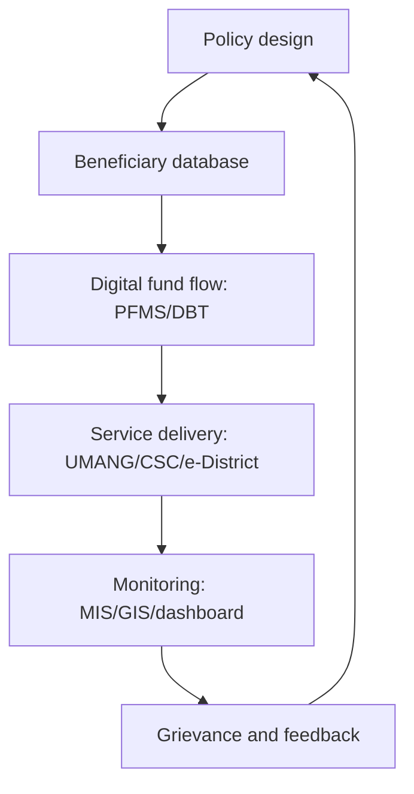

# Government Policies, Interventions & ICT in Governance

> GS-2 · Topic 11 · Policy design, implementation issues, ICT, DBT, Digital India, e-governance

---

## PYQs

| Year | M | Words | Question (EN) | प्रश्न (HI) | ID |
|------|---|-------|---------------|-------------|-----|
| 2025 | 8 | 125 | To what extent has Information and Communication Technology (ICT) been useful in policy implementation? Discuss. | नीति क्रियान्वयन में सूचना एवं संचार प्रौद्योगिकी (ICT), कहाँ तक उपयोगी रही है? विवेचना कीजिए। | Q1 |
| 2025 | 12 | 125 | How does the Direct Benefit Transfer (DBT) system align with the objectives of Digital India and good governance? Analyze. | प्रत्यक्ष लाभ अंतरण (DBT) प्रणाली किस प्रकार डिजिटल इंडिया और सुशासन के उद्देश्यों के साथ मेल खाती है? विश्लेषण कीजिए। | Q2 |
| 2024 | 12 | 200 | The labour class of the country has been significantly affected by the New Economic Policy. Explain. | नई आर्थिक नीति से देश का श्रमिक वर्ग बहुत प्रभावित हुआ है। स्पष्ट कीजिए। | Q3 |
| 2022 | 8 | 125 | Describe the salient features of "UMANG Scheme" related to e-governance. | ई-गवर्नेंस से संबंधित "उमंग योजना" की मुख्य विशेषताएं बताइए। | Q4 |
| 2021 | 8 | 125 | What are the major challenges before the revenue system of Uttar Pradesh? | उत्तर प्रदेश की राजस्व व्यवस्था के समक्ष मुख्य चुनौतियां क्या हैं? | Q5 |
| 2020 | 8 | 125 | Evaluate the role of Information and Communications Technology in the context of government policies. | सरकारी नीतियों के संदर्भ में सूचना एवं संचार प्रौद्योगिकी की भूमिका का परीक्षण कीजिए। | Q6 |
| 2019 | 8 | 125 | Describe the objectives and impact of Atal-Bhujal Yojana. | अटल भू-जल योजना के उद्देश्य व प्रभाव का वर्णन कीजिए। | Q7 |
| 2019 | 12 | 200 | What is meant by Digital India? Discuss its various pillars and challenges. | डिजिटल भारत का क्या अर्थ है? इसके विविध स्तम्भों एवं चुनौतियों की विवेचना कीजिए। | Q8 |

---

## Quick Revision

```
CORE IDEA:
  Good policy = design + delivery + feedback. ICT makes the delivery chain visible, trackable, targeted and citizen-facing.

POLICY CYCLE:
  Problem identification -> design -> budgeting -> beneficiary database -> delivery -> monitoring -> grievance -> evaluation.
  Common issues: poor targeting, leakages, exclusion, federal coordination, low capacity, delayed funds, weak grievance redressal.

ICT IN POLICY:
  Digital identity: Aadhaar | Payments: DBT, PFMS, NPCI, UPI, AEPS | Platforms: UMANG, DigiLocker, MyGov, GeM, eGramSwaraj, SVAMITVA, CoWIN
  Monitoring: dashboards, MIS, GIS, remote sensing, social audit data, geo-tagging, mobile apps.

DIGITAL INDIA (2015):
  Vision: digital infrastructure as utility + governance/services on demand + digital empowerment.
  Nine pillars: Broadband Highways, Universal Mobile Access, Public Internet Access, e-Governance, e-Kranti, Information for All, Electronics Manufacturing, IT for Jobs, Early Harvest.
  Challenges: digital divide, cyber security, privacy, last-mile connectivity, language barriers, exclusion errors, capacity gap.

DBT:
  JAM = Jan Dhan + Aadhaar + Mobile. DBT = benefit/subsidy directly to verified beneficiary bank account.
  Aligns with Digital India: digital identity + digital payment + paperless tracking.
  Aligns with good governance: transparency, leakage reduction, timeliness, accountability, audit trail.
  Limits: Aadhaar seeding errors, bank distance, biometric failure, last-mile agents, privacy, wrong exclusion.

UMANG:
  Unified Mobile Application for New-age Governance. Launched 2017 by MeitY/NeGD.
  One app for multiple central/state services; multilingual, mobile-first, Aadhaar/DigiLocker/payment integration, 24x7 access.

NITI / POLICY INTERVENTION:
  NITI Aayog gives evidence, rankings and cooperative federalism support; line ministries execute.
  ADP, SDG India Index, Health Index show policy monitoring through data.

ATAL BHUJAL YOJANA:
  Central sector scheme supported by World Bank; 2019 approval, 2020 implementation.
  Focus: community-led groundwater management in water-stressed gram panchayats of seven states.
  Tools: water budgeting, aquifer mapping, gram panchayat plans, convergence with MGNREGA/PMKSY.

NEW ECONOMIC POLICY + LABOUR:
  1991 LPG: liberalization, privatization, globalization. Gains: jobs in services, exports, mobility, skill premium.
  Costs: informalization, contract labour, wage insecurity, migration, gig precarity, weak social security.
  Responses: Labour Codes 2019-20, e-Shram, PM-SYM, Code on Social Security, Skill India.

UP REVENUE SYSTEM:
  Challenges: land records, litigation, encroachment, undervaluation, stamp duty leakage, GST compensation stress, urban property tax weakness, staff shortage, corruption, disaster relief demands.
  Reforms: Bhulekh, e-District, SVAMITVA, GIS mapping, online mutation, Treasury digitalization, anti-evasion analytics.

TRAPS:
  ICT is enabler, not substitute for administrative reform.
  DBT reduces leakage but can create exclusion.
  Digital India is broader than internet access.
  UMANG is an e-governance platform, not a cash-transfer scheme.
  Atal Bhujal is demand-side groundwater governance, not a big dam scheme.
```

---

## Content

### Context — policy is judged at the implementation stage

Government policy is a deliberate public action through which the state tries to solve a social, economic or administrative problem. In GS-II, the phrase **government policies and interventions for development** covers both sides of the policy chain: **design** and **implementation**. Design decides who will benefit, what instrument will be used, how money will flow, and which institution will be accountable. Implementation decides whether the intended person actually receives the benefit without leakage, delay or humiliation. A good welfare promise fails if a beneficiary is not identified, a bank account is dormant, a local official is absent, or grievance redressal is weak.

India's governance problem is not only scarcity of schemes; it is also scarcity of **state capacity**. A Union ministry may design a programme, but states, districts, panchayats, banks, common service centres, local data operators and private vendors execute it. This makes delivery vulnerable to **last-mile gaps**, **elite capture**, **corruption**, **exclusion errors**, and **coordination failure**. ICT became important because it can create digital identity, record transactions, track files, monitor field assets, and allow citizens to access services without repeatedly visiting offices. However, ICT is not magic. It strengthens policy only when combined with legal clarity, field capacity, social audit, human grievance systems and protection of privacy.

### Policy design and implementation — where issues arise

A policy cycle normally moves through **problem identification**, **consultation**, **design**, **budgeting**, **beneficiary identification**, **delivery**, **monitoring**, **grievance redressal**, and **evaluation**. The **Planning Commission** era relied on Five-Year Plans and plan grants. After 2015, **NITI Aayog** shifted the focus toward evidence-based advice, rankings, SDG monitoring and cooperative-competitive federalism. But execution still depends on line ministries, states and local governments.

| Stage | What should happen | Common implementation issue | ICT support |
|-------|--------------------|-----------------------------|-------------|
| **Identification** | Target the correct beneficiary or area. | Ghost beneficiaries, duplicate lists, caste/class exclusion, outdated surveys. | Aadhaar seeding, SECC data, GIS, social registries, mobile verification. |
| **Fund flow** | Money reaches implementing unit or beneficiary on time. | Delayed releases, middlemen, parking of funds, diversion. | PFMS, DBT, treasury integration, e-payment audit trail. |
| **Service delivery** | Citizen receives ration, pension, certificate, job card or subsidy. | Office delays, rent-seeking, poor last-mile infrastructure. | UMANG, e-District, DigiLocker, CSCs, mobile apps, SMS alerts. |
| **Monitoring** | Officials know progress in real time. | Paper reports, inflated achievements, no asset verification. | MIS dashboards, geo-tagging, remote sensing, CoWIN-like real-time platforms. |
| **Accountability** | Citizen can complain and evaluator can audit. | Weak grievance redressal, poor social audit, no feedback loop. | CPGRAMS, call centres, MyGov, social audit portals, data analytics. |

Policy design fails when the problem is misunderstood or when one-size-fits-all rules ignore local diversity. For example, a scheme requiring online authentication may work in an urban ward but fail in a tribal or flood-prone block with weak connectivity. Implementation fails when rules are too complex for frontline staff, when funds arrive late, when beneficiaries lack documents, or when accountability is diffused across departments. Therefore, ICT must be seen as part of **process reform**, not as a substitute for administration.

### ICT in government policy — meaning and mechanisms

**Information and Communication Technology (ICT)** in governance means using digital identity, databases, mobile networks, internet platforms, digital payments, GIS, dashboards, cloud systems and analytics to improve public policy. The objective is to make governance **SMART**: simple, moral, accountable, responsive and transparent, a formulation associated with e-governance discourse in India. ICT works through four mechanisms.

First, it creates a **digital identity and database layer**. Aadhaar, Jan Dhan accounts, mobile numbers, ration card databases, e-Shram registration and land records allow governments to identify beneficiaries. Second, it creates a **transaction layer** through PFMS, NPCI, Aadhaar Payment Bridge, UPI, AEPS and DBT, allowing direct payment to bank accounts. Third, it creates a **service platform layer** through UMANG, DigiLocker, e-District, GeM, e-NAM, eGramSwaraj, SVAMITVA, CoWIN and Government e-Marketplace. Fourth, it creates a **feedback and monitoring layer** through dashboards, GPS tagging, remote sensing, call centres, MyGov consultations and grievance portals.



ICT improves policy in several ways. **Targeting** improves because duplicate and ghost beneficiaries can be removed. **Transparency** improves because payments and file movement leave an audit trail. **Timeliness** improves because direct payments reduce departmental layers. **Citizen convenience** improves because certificates, pensions, tax services and grievance systems can be accessed through mobiles or CSCs. **Evidence-based planning** improves because real-time data allows course correction; the CoWIN vaccination platform demonstrated how beneficiary registration, appointment scheduling and certification can be integrated at national scale. **Disaster and resource governance** improve through GIS, satellite data and early-warning systems.

The limits are equally important. Digital systems can create **exclusion errors** when biometrics fail, Aadhaar is wrongly seeded, a bank account is inactive, a mobile number changes, or connectivity is weak. Algorithms and dashboards can hide local distress if field verification is poor. Cyber security, privacy and data protection have become governance issues after the **Digital Personal Data Protection Act, 2023**. Thus, ICT is useful "to a large extent" in policy implementation, but only when backed by offline alternatives, assisted access, grievance redressal and human accountability.

### Digital India — vision, pillars and challenges

**Digital India**, launched in 2015 by the Government of India, is an umbrella programme to transform India into a digitally empowered society and knowledge economy. Its vision has three core areas: **digital infrastructure as a utility to every citizen**, **governance and services on demand**, and **digital empowerment of citizens**. Digital India is not merely internet access; it is the governance architecture behind DBT, DigiLocker, UMANG, UPI, CoWIN, BharatNet, Common Service Centres and paperless certificates.

| Pillar of Digital India | Meaning for governance | Example |
|-------------------------|------------------------|---------|
| **Broadband Highways** | Connectivity backbone for services. | BharatNet for gram panchayats. |
| **Universal Mobile Access** | Mobile as the main service channel. | SMS alerts, mobile apps, UPI. |
| **Public Internet Access** | Assisted access for citizens without devices. | Common Service Centres, post offices. |
| **e-Governance** | Process re-engineering and paperless offices. | e-Office, online certificates, GeM. |
| **e-Kranti** | Electronic delivery of services. | e-health, e-education, e-courts, DBT. |
| **Information for All** | Open communication and transparency. | MyGov, government portals, dashboards. |
| **Electronics Manufacturing** | Domestic digital capacity. | Make in India, PLI for electronics. |
| **IT for Jobs** | Digital skilling and employability. | Skill India, PMGDISHA. |
| **Early Harvest Programmes** | Quick visible digital services. | Wi-Fi in universities, biometric attendance. |

Digital India supports good governance because it reduces discretion, makes information visible, enables citizen participation and improves service delivery. But it faces major challenges: digital divide between urban and rural areas; gender gap in mobile ownership; poor last-mile connectivity; cyber fraud; language barriers; low digital literacy; exclusion of elderly, disabled and migrant workers; and dependence on private vendors for public digital infrastructure. A balanced answer must say that Digital India is a governance multiplier, not a guarantee of inclusion by itself.

### Direct Benefit Transfer — Digital India and good governance in action

**Direct Benefit Transfer (DBT)** means transferring subsidies, pensions, scholarships, wages or benefits directly into the beneficiary's bank account or through a verified benefit channel. The DBT Mission began in 2013 and expanded strongly through the **JAM Trinity**: **Jan Dhan** bank accounts, **Aadhaar** identity and **Mobile** communication. DBT uses PFMS, NPCI, Aadhaar Payment Bridge and bank systems to reduce intermediaries.

DBT aligns with Digital India because it uses digital identity, digital payment rails and digital tracking. It aligns with good governance because it advances **transparency**, **accountability**, **efficiency**, **responsiveness**, **inclusion** and **leakage control**. LPG subsidy transfer, PM-KISAN income support, MGNREGA wage payments, scholarships, pensions and maternity benefits show how money can move from treasury to beneficiary with fewer layers. Audit trails make it easier for CAG, departments and social auditors to detect delays or duplicate payments.

| Good governance objective | How DBT supports it | Caution |
|---------------------------|---------------------|---------|
| **Transparency** | Beneficiary can receive SMS and bank entry; government can track payment. | SMS is useless if mobile is wrong or literacy is low. |
| **Efficiency** | Reduces intermediaries and manual cash handling. | Banking correspondents may charge informal fees. |
| **Accountability** | PFMS and dashboards show pending and failed payments. | Data may show payment sent even when cash-out is difficult. |
| **Inclusion** | Jan Dhan widened bank access for poor households. | Distance to bank/BC point can exclude elderly and women. |
| **Anti-corruption** | Ghost and duplicate beneficiaries can be removed. | Wrong deletion creates denial of rightful benefit. |
| **Citizen empowerment** | Benefit goes to individual account, often women's accounts. | Intra-household control over money may still be unequal. |

DBT's success depends on correct beneficiary databases, bank readiness, payment failure correction and accessible grievance systems. The **Supreme Court's Aadhaar judgment in K.S. Puttaswamy (2018)** allowed Aadhaar use for welfare with safeguards but underlined privacy and proportionality. The **Aadhaar Act, 2016**, **PMJDY**, **PFMS**, **NPCI** and **Digital Personal Data Protection Act, 2023** are therefore relevant named anchors.

### E-governance and UMANG

**E-governance** is the use of ICT to make government processes and services faster, more transparent, more accessible and more accountable. It is broader than putting forms online; it requires **business process re-engineering**, interoperability, authentication, payment integration, digital signatures, record management and grievance redressal.

**UMANG** means **Unified Mobile Application for New-age Governance**. It was launched in 2017 by **MeitY** and implemented through **NeGD** to provide a single mobile platform for multiple central, state and local government services. Its key features are mobile-first access, 24x7 availability, multilingual interface, integration with Aadhaar, DigiLocker and payment systems, and access to services such as EPFO, PAN, income tax, gas booking, certificates, health and agriculture-related services. UMANG reduces the need to download separate departmental apps and helps citizens treat government as one integrated service provider.

The strength of UMANG is **convenience and convergence**. The limitation is that an app-based model can exclude citizens without smartphones, stable internet, digital literacy or language comfort. Therefore, UMANG must be supported by CSCs, assisted digital access and offline grievance channels.

### Sector-wise policy interventions and ICT applications

Government interventions for development operate across welfare, health, education, agriculture, labour, land, procurement and local governance. ICT matters because each sector has a different delivery problem. In welfare, the problem is correct beneficiary targeting and timely payment. In health, the problem is patient identification, appointment management, medicine supply and disease surveillance. In agriculture, the problem is price information, market access, soil-water advice and insurance claims. In land administration, the problem is authenticity of records, boundary disputes and mutation delay. In procurement, the problem is collusion, inflated prices and opaque contracts. A mature answer should therefore avoid saying \"ICT = DBT only\"; DBT is only one part of a wider digital governance architecture.

| Sector | Policy objective | ICT application | Governance value |
|--------|------------------|-----------------|------------------|
| **Welfare and subsidies** | Target pensions, scholarships, wages and income support. | DBT, PFMS, Aadhaar Payment Bridge, SMS alerts. | Reduces leakage and creates payment audit trail. |
| **Health** | Track vaccination, insurance and public health delivery. | CoWIN, Ayushman Bharat digital records, telemedicine, health dashboards. | Improves scale, portability and monitoring. |
| **Education** | Improve access, learning data and scholarship delivery. | DIKSHA, PM eVIDYA, online scholarships, school dashboards. | Supports learning resources and targeted support. |
| **Agriculture** | Connect farmers to markets, weather and advisories. | e-NAM, PM-KISAN DBT, soil health databases, crop insurance portals. | Reduces information asymmetry and improves benefit flow. |
| **Land and revenue** | Secure records and reduce disputes. | Bhulekh, SVAMITVA drone mapping, GIS property mapping, online mutation. | Improves transparency but still needs field verification. |
| **Procurement** | Make public purchasing competitive and traceable. | Government e-Marketplace, e-tendering, digital payments. | Reduces discretion and cartel risk if vendor access is broad. |
| **Local governance** | Track panchayat plans and expenditure. | eGramSwaraj, Gram Manchitra, geo-tagged assets. | Links planning, works and public scrutiny. |
| **Grievance redressal** | Give citizens a channel after delivery failure. | CPGRAMS, state helplines, online tracking, call centres. | Converts passive beneficiaries into rights-bearing citizens. |

The deeper governance shift is from **department-centric administration** to **citizen-centric service delivery**. Earlier, a citizen had to identify the correct department, stand in queue, submit paper copies and follow the file. Digital governance tries to reverse the burden: identity, documents, payment and status should be available across departments through interoperable systems. **DigiLocker** reduces repeated document submission; **GeM** reduces procurement discretion; **eGramSwaraj** makes panchayat finances more visible; **CPGRAMS** gives a complaint trail; **e-NAM** tries to connect agricultural markets; and **SVAMITVA** gives rural households property documentation that can support credit and reduce disputes.

But sector-wise digital delivery also shows why policy design must include safeguards. A land record error can trigger litigation; a wrong welfare deletion can create hunger; an online procurement system can exclude small suppliers; a health database can raise privacy concerns; and an AI-based targeting model can reproduce social bias if data is poor. Therefore, good digital policy follows five design principles: **minimum necessary data**, **consent and purpose limitation**, **interoperability without forced centralization**, **assisted access for vulnerable groups**, and **time-bound correction of errors**.

### Policy intervention examples — NITI, Atal Bhujal and resource governance

India's policy interventions increasingly combine welfare, technology and community participation. **NITI Aayog** supports the policy ecosystem through the **Aspirational Districts Programme**, **SDG India Index**, **Health Index**, **School Education Quality Index**, and policy papers on artificial intelligence and data governance. These tools use data to compare districts and states, creating competitive pressure for better implementation.

**Atal Bhujal Yojana** is a central sector scheme approved in 2019 and implemented from 2020 with World Bank support. It focuses on sustainable groundwater management in water-stressed areas of Gujarat, Haryana, Karnataka, Madhya Pradesh, Maharashtra, Rajasthan and Uttar Pradesh. The scheme is important because groundwater is India's invisible lifeline for irrigation and drinking water, but over-extraction has depleted aquifers in many blocks.

Atal Bhujal does not build large dams. It tries to change groundwater behaviour through **community participation**, **water budgeting**, **aquifer mapping**, **Gram Panchayat-level water security plans**, **demand-side management**, and convergence with schemes such as **MGNREGA**, **PMKSY**, watershed works and micro-irrigation. Its impact lies in awareness, local planning, data-based groundwater monitoring and crop-water discipline. The limitation is that groundwater is hard to regulate because individual borewells are private, cropping choices are politically sensitive, electricity pricing affects pumping, and aquifer boundaries do not always match administrative boundaries.

### New Economic Policy and the labour class

The **New Economic Policy of 1991** introduced liberalization, privatization and globalization after India's balance-of-payments crisis. It reduced licensing, opened trade and investment, encouraged private enterprise and integrated India with the global economy. For labour, the impact has been mixed.

Positive effects include expansion of jobs in IT, telecom, construction, logistics, retail, export manufacturing and services. Higher growth created new opportunities for educated youth, women in certain service sectors, migrant workers in urban construction, and skilled professionals in global value chains. Competition and technology raised skill premiums and expanded self-employment through digital platforms.

Negative effects are visible in **informalization** and **contractualization**. A large share of Indian workers remained outside formal social security. Privatization and global competition increased pressure for flexible labour, outsourcing and casual hiring. Small industries faced import competition; organized sector employment did not grow in proportion to GDP. Migrant workers in construction, textiles, brick kilns and gig platforms faced wage insecurity, weak housing, poor occupational safety and limited bargaining power. The COVID-19 migrant crisis exposed this vulnerability.

| Dimension | Positive impact on labour | Adverse impact on labour |
|-----------|--------------------------|--------------------------|
| **Employment** | Services, exports, construction and logistics expanded. | Jobless growth and informal jobs remained high. |
| **Wages** | Skilled workers gained from IT and global firms. | Unskilled workers faced wage insecurity and contract work. |
| **Mobility** | Rural youth migrated to cities and global labour markets. | Migrants lacked housing, health cover and portability. |
| **Women** | BPO, education, retail and SHGs opened some work avenues. | Female LFPR stayed low; unpaid care burden persisted. |
| **Industrial relations** | Productivity and competition improved. | Trade union power weakened in many sectors. |
| **Social security** | Labour Codes and e-Shram seek wider coverage. | Implementation and universal portability remain incomplete. |

Policy responses include the **Code on Wages, 2019**, **Industrial Relations Code, 2020**, **Code on Social Security, 2020**, **Occupational Safety, Health and Working Conditions Code, 2020**, **e-Shram portal**, **PM Shram Yogi Maandhan**, **One Nation One Ration Card**, **Skill India**, and proposed gig-worker social security mechanisms. A balanced answer should state that the New Economic Policy expanded opportunities but did not automatically create dignified and secure work for the majority.

### Uttar Pradesh revenue system — challenges and reform direction

The revenue system of Uttar Pradesh covers land records, land revenue, stamp and registration, excise, GST-related state revenue, mining revenue, local body taxes, disaster relief assessment and recovery of government dues. Its challenges are administrative, technological and political.

Land records remain a core issue. Though **Bhulekh UP**, online khatauni, digitized maps, **SVAMITVA** and e-District services have improved access, mutation delays, boundary disputes, inheritance entries, encroachment and litigation continue. High population density, fragmented holdings and peri-urban land conversion create conflicts. Revenue courts face pendency. Stamp duty and registration face undervaluation, benami practices and informal cash components. Urban local bodies often under-collect property tax due to poor GIS mapping and political resistance. GST improved indirect tax harmonization but states face dependence on buoyant consumption and compliance capacity. Excise revenue is important but politically sensitive. Illegal mining and sand extraction affect both revenue and ecology.

The reform direction is clear: updated land records, GIS-based property mapping, transparent registration valuation, online mutation, time-bound revenue courts, anti-evasion analytics, integration of treasury systems, capacity building of lekhpals and revenue inspectors, citizen charters, and grievance redressal. ICT can improve transparency, but local field verification remains essential because land is a physical asset and disputes are social, not merely digital.

### Contemporary relevance

- **Digital public infrastructure** has become India's global governance example through **Aadhaar**, **UPI**, **DigiLocker**, **CoWIN**, **ONDC** and account-aggregator systems. For Mains, the phrase shows how public digital rails can support private innovation and welfare delivery.
- **DPDP Act, 2023** makes privacy, consent and data fiduciary duties central to digital governance. Any ICT answer should balance efficiency with rights protection.
- **DBT and PM-KISAN** show how welfare has shifted from department-mediated delivery to treasury-to-beneficiary transfers, while failed payments show why grievance systems matter.
- **One Nation One Ration Card** and **e-Shram** show portability for migrant workers, a direct lesson from the COVID-19 labour crisis.
- **SVAMITVA** uses drone mapping to create rural property records, relevant for UP's revenue and land-dispute reforms.
- **Atal Bhujal Yojana** connects water governance with community participation and data-based planning, especially important for Bundelkhand and western UP groundwater stress.
- **NITI Aayog's Aspirational Districts and SDG indices** show data-led federal policy monitoring rather than old-style plan allocation.

### Limits — balanced view of ICT-led governance

ICT improves speed, transparency and targeting, but it can also centralize power and make exclusion invisible. A dashboard may show 95% completion while the remaining 5% are the poorest, elderly or digitally disconnected. Biometric failure may deny ration or pension unless offline exceptions exist. Data collection without privacy safeguards can create surveillance and profiling risks. Digital procurement can reduce corruption but may exclude small vendors unfamiliar with GeM. Online grievance portals help literate citizens but may not help a widow without smartphone access. Therefore, the correct governance approach is **digital plus human**: digital records, assisted access, local accountability, social audit, privacy protection, cyber security and time-bound grievance redressal.

---

## Answers

### Q1: To what extent has Information and Communication Technology (ICT) been useful in policy implementation? Discuss. (2025, 8M, 125W)

**Introduction:**
> ICT uses digital identity, databases, payments, platforms and dashboards to convert policy intent into trackable delivery. In India, it has become a major implementation tool, though not a substitute for field administration.

**Main Points:**
- **Better Targeting** — Aadhaar-linked databases help reduce duplicate and ghost beneficiaries in welfare schemes.
- **Direct Delivery** — DBT and PFMS transfer benefits directly to accounts, reducing intermediaries.
- **Real-time Monitoring** — MIS dashboards, geo-tagging and GIS help track assets and scheme progress.
- **Citizen Convenience** — UMANG, DigiLocker and e-District reduce office visits and paperwork.
- **Transparency** — Digital payments and e-procurement create audit trails for accountability.
- **Evidence-based Correction** — NITI indices and CoWIN-like platforms enable data-based course correction.
- **Limits** — Biometric failure, weak connectivity, digital illiteracy and wrong databases can create exclusion.

**Keywords (underline in exam):** DBT · PFMS · Aadhaar · MIS Dashboard · Digital Divide · Grievance Redressal

**Exam diagram (30 sec):**
```
Policy -> Database -> DBT/Service -> Dashboard -> Grievance
              |             |             |
         targeting      delivery      correction
```

**Conclusion:**
> ICT has made implementation faster and more transparent to a large extent, but inclusive governance needs offline support and human accountability.

### Q2: How does the Direct Benefit Transfer (DBT) system align with the objectives of Digital India and good governance? Analyze. (2025, 12M, 125W)

**Introduction:**
> DBT transfers welfare benefits directly to verified beneficiaries through digital identity and banking channels. It operationalizes Digital India's idea of services on demand and good governance's demand for transparent delivery.

**Logical Analysis:**
- **Digital Infrastructure Use** — DBT uses Jan Dhan accounts, Aadhaar, mobile alerts, PFMS and NPCI rails.
- **Paperless Governance** — Beneficiary verification, fund release and payment tracking become digital rather than file-heavy.
- **Transparency** — Each transaction leaves an audit trail for departments, CAG scrutiny and citizen tracking.
- **Leakage Reduction** — Ghost beneficiaries and middlemen are reduced through identity seeding and direct payment.
- **Timeliness** — Scholarships, pensions, PM-KISAN and LPG subsidy can reach accounts faster.
- **Citizen Empowerment** — Money in individual bank accounts improves dignity and reduces dependence on local officials.
- **Financial Inclusion** — DBT deepens Jan Dhan usage and connects poor households with formal banking.
- **Accountability Limits** — Failed payments, biometric errors, dormant accounts and bank distance require grievance redressal.

**Keywords (underline in exam):** JAM Trinity · PFMS · NPCI · Transparency · Financial Inclusion · Leakage Control · Aadhaar Safeguards

**Exam diagram (30 sec):**
```
Digital India
   |-- Aadhaar identity
   |-- Jan Dhan account
   |-- Mobile alert
        -> DBT -> Transparency + Inclusion + Accountability
```

**Conclusion:**
> DBT is a practical bridge between Digital India and good governance, provided exclusion errors are corrected quickly.

### Q3: The labour class of the country has been significantly affected by the New Economic Policy. Explain. (2024, 12M, 200W)

**Introduction:**
> The New Economic Policy of 1991 introduced liberalization, privatization and globalization. It changed India's labour market by expanding opportunities while also increasing insecurity for many workers.

**Main Points:**
- **Employment Expansion** — IT, telecom, construction, retail, logistics and export sectors created new jobs after liberalization.
- **Skill Premium** — Educated and technically skilled workers gained higher wages in services and global value chains.
- **Informalization** — Growth did not translate into universal formal jobs; contract and casual work expanded.
- **Migration Pressure** — Rural workers moved to cities for construction and service jobs, often without housing or social protection.
- **Weak Bargaining Power** — Outsourcing, privatization and flexible hiring reduced trade union influence in many sectors.
- **Women Workers** — BPO, retail and SHGs opened opportunities, but low female LFPR and unpaid care burden persisted.
- **Gig Economy** — Platform work created income options but raised issues of social security and algorithmic control.
- **Policy Response** — Labour Codes, e-Shram, PM-SYM, Skill India and ONORC seek wider protection and portability.
- **Uneven Impact** — Skilled urban labour benefited more than unskilled, migrant and informal workers.

**Keywords (underline in exam):** LPG Reforms · Informalization · Contract Labour · Gig Economy · e-Shram · Labour Codes · Social Security

**Exam diagram (30 sec):**
```
NEP 1991
 |-- Opportunities: services, exports, skills
 |-- Pressures: contract work, migration, insecurity
 |-- Response: Labour Codes + e-Shram + Skill India
```

**Conclusion:**
> The New Economic Policy widened labour opportunities, but the governance challenge is to convert flexible growth into decent and secure work.

### Q4: Describe the salient features of "UMANG Scheme" related to e-governance. (2022, 8M, 125W)

**Introduction:**
> UMANG, or Unified Mobile Application for New-age Governance, is a MeitY-NeGD platform launched in 2017 to provide multiple government services through one mobile interface.

**Main Characteristics:**
- **Single Platform** — It integrates many central, state and local services in one app.
- **Mobile-first Access** — Citizens can access services through smartphones without visiting offices.
- **24x7 Availability** — Services remain available beyond office hours, improving convenience.
- **Multilingual Interface** — Language support improves accessibility for diverse users.
- **Integration** — Aadhaar, DigiLocker and payment systems support authentication and document access.
- **Service Diversity** — EPFO, PAN, tax, certificates, gas booking, health and agriculture services are available.
- **Good Governance Tool** — It reduces paperwork, discretion and department-wise app fragmentation.
- **Limit** — It needs assisted access through CSCs for citizens lacking smartphones or digital literacy.

**Keywords (underline in exam):** UMANG · MeitY · NeGD · Mobile Governance · DigiLocker · CSC · e-Governance

**Exam diagram (30 sec):**
```
Citizen
  -> UMANG App
      -> Central services
      -> State services
      -> Documents + payments
```

**Conclusion:**
> UMANG makes e-governance citizen-centric by bringing scattered services onto a unified digital platform.

### Q5: What are the major challenges before the revenue system of Uttar Pradesh? (2021, 8M, 125W)

**Introduction:**
> Uttar Pradesh's revenue system covers land records, stamp and registration, state taxes, excise, mining revenue and recovery of dues. Its challenges arise from high population pressure, land disputes and administrative capacity gaps.

**Main Points:**
- **Land Record Gaps** — Mutation delays, inheritance entries and boundary disputes weaken certainty of ownership.
- **Revenue Litigation** — Revenue courts face pendency, especially in partition, encroachment and tenancy-related matters.
- **Stamp Duty Leakage** — Undervaluation and informal cash components reduce registration revenue.
- **Urban Property Tax Weakness** — Poor GIS mapping and political resistance lower municipal revenue potential.
- **Encroachment and Land Conversion** — Peri-urban growth creates disputes and loss of public land.
- **Tax Compliance Issues** — GST-related compliance and anti-evasion capacity need constant strengthening.
- **Administrative Capacity** — Lekhpal and field staff shortages affect surveys, disaster relief and verification.
- **Corruption Risk** — Discretion in land and certificate processes can create rent-seeking.

**Keywords (underline in exam):** Bhulekh · Mutation · Stamp Duty · GIS Mapping · Revenue Courts · SVAMITVA · Anti-evasion

**Exam diagram (30 sec):**
```
UP Revenue Challenges
 |-- Land records/litigation
 |-- Stamp + tax leakage
 |-- Staff + corruption
 |-- Urban property tax gap
```

**Conclusion:**
> UP needs digitized records plus field verification, time-bound courts and transparent valuation to modernize revenue administration.

### Q6: Evaluate the role of Information and Communications Technology in the context of government policies. (2020, 8M, 125W)

**Introduction:**
> ICT has become a core governance instrument because modern policies require identification, delivery, monitoring and feedback at large scale.

**Main Points:**
- **Policy Design** — Data from SECC, SDG indices and dashboards helps identify target groups and lagging districts.
- **Beneficiary Verification** — Aadhaar and digital records reduce duplication when used with safeguards.
- **Fund Management** — PFMS and DBT make expenditure traceable and reduce delays.
- **Service Delivery** — UMANG, e-District, CSCs and DigiLocker make services accessible.
- **Monitoring** — Geo-tagging, GIS and MIS dashboards reduce false reporting.
- **Participation** — MyGov and grievance portals allow feedback and consultation.
- **Risk** — Privacy, cyber security, digital divide and exclusion errors can weaken policy legitimacy.

**Keywords (underline in exam):** e-Governance · DBT · PFMS · GIS · MyGov · Digital Divide · DPDP Act

**Exam diagram (30 sec):**
```
ICT Role:
Design -> Delivery -> Monitoring -> Feedback
 data      DBT/app     dashboard    grievance
```

**Conclusion:**
> ICT is indispensable for modern policy, but its legitimacy depends on inclusion, privacy and responsive administration.

### Q7: Describe the objectives and impact of Atal-Bhujal Yojana. (2019, 8M, 125W)

**Introduction:**
> Atal Bhujal Yojana is a central sector groundwater management scheme approved in 2019 and implemented from 2020 with World Bank support in water-stressed states.

**Main Points:**
- **Groundwater Sustainability** — It aims to reduce over-extraction of aquifers in stressed blocks.
- **Community Participation** — Gram Panchayats prepare local water security plans.
- **Demand-side Management** — The scheme promotes water budgeting and crop-water discipline.
- **Scientific Planning** — Aquifer mapping and groundwater data guide local decisions.
- **Convergence** — It links MGNREGA, PMKSY, watershed works and micro-irrigation.
- **Behaviour Change** — Communities learn that groundwater is a shared resource, not only private borewell property.
- **Impact** — It improves awareness, local planning and monitoring in states including Uttar Pradesh.
- **Limit** — Electricity pricing, private borewells and cropping choices make groundwater regulation difficult.

**Keywords (underline in exam):** Atal Bhujal · Aquifer Mapping · Water Budgeting · Gram Panchayat · PMKSY · MGNREGA · Groundwater

**Exam diagram (30 sec):**
```
Atal Bhujal
 |-- Data: aquifer mapping
 |-- People: gram panchayat plan
 |-- Action: recharge + demand management
```

**Conclusion:**
> Atal Bhujal is important because it shifts groundwater policy from supply construction to community-led sustainable management.

### Q8: What is meant by Digital India? Discuss its various pillars and challenges. (2019, 12M, 200W)

**Introduction:**
> Digital India is a 2015 umbrella programme to transform India into a digitally empowered society and knowledge economy through digital infrastructure, services on demand and citizen empowerment.

**Main Points:**
- **Broadband Highways** — BharatNet and connectivity form the backbone of digital services.
- **Universal Mobile Access** — Mobile phones become the main channel for citizen services and alerts.
- **Public Internet Access** — CSCs and post offices provide assisted digital access.
- **e-Governance** — Process re-engineering, e-Office, GeM and online certificates reduce paperwork.
- **e-Kranti** — Electronic delivery covers health, education, agriculture, justice and welfare.
- **Information for All** — Portals, dashboards and MyGov improve transparency and participation.
- **Electronics Manufacturing** — Domestic manufacturing and PLI reduce import dependence.
- **IT for Jobs** — Digital skilling improves employability in the new economy.
- **Early Harvest Programmes** — Quick services like biometric attendance and Wi-Fi show visible gains.

**Challenges:**
- **Digital Divide** — Rural, poor, women, elderly and disabled citizens may lack access.
- **Cyber and Privacy Risks** — Fraud, data leaks and surveillance fears require safeguards.
- **Capacity Gap** — Officials and citizens need training; language barriers remain.
- **Exclusion Errors** — Digital-only delivery can deny benefits when authentication or connectivity fails.

**Keywords (underline in exam):** Digital Infrastructure · e-Kranti · BharatNet · CSC · DigiLocker · Cyber Security · Digital Divide

**Exam diagram (30 sec):**
```
Digital India
 |-- Infrastructure
 |-- Services on demand
 |-- Digital empowerment
      -> inclusion + transparency + growth
```

**Conclusion:**
> Digital India is a transformative governance platform, but it must remain inclusive, secure and rights-based.

### Q9: Likely PYQ — Discuss the major issues arising out of policy design and implementation in India. (Future Variant, 12M, 200W)

**Introduction:**
> Policy success depends not only on good intentions but also on realistic design, adequate capacity and accountable implementation.

**Main Points:**
- **Poor Targeting** — Outdated lists and weak local verification create inclusion and exclusion errors.
- **One-size Design** — Uniform rules often ignore regional, gender, tribal or urban-rural differences.
- **Capacity Deficit** — Frontline staff shortages and weak training delay service delivery.
- **Fund Flow Delays** — Late releases and complex approvals reduce scheme effectiveness.
- **Coordination Failure** — Union, state, district and panchayat roles often overlap.
- **Data Quality Problems** — Digital dashboards fail when ground data is inaccurate.
- **Weak Grievance Redressal** — Citizens struggle to correct failed payments, wrong records or denied services.
- **Accountability Gap** — Multiple agencies allow blame-shifting when outcomes fail.
- **Social Barriers** — Caste, gender, literacy and digital divide affect actual access.

**Keywords (underline in exam):** State Capacity · Targeting · Federal Coordination · Fund Flow · Grievance Redressal · Social Audit

**Exam diagram (30 sec):**
```
Design flaw + Capacity gap + Weak feedback
              -> Implementation failure
```

**Conclusion:**
> Better policy requires local consultation, simple rules, data integrity, social audit and time-bound grievance correction.

### Q10: Likely PYQ — E-governance improves transparency but may create exclusion. Examine. (Future Variant, 12M, 200W)

**Introduction:**
> E-governance uses ICT to deliver services and improve accountability. Its democratic value depends on combining transparency with universal access.

**Main Points:**
- **Transparency Gain** — Digital files, DBT, GeM and dashboards create audit trails.
- **Reduced Discretion** — Online certificates and payments reduce face-to-face rent-seeking.
- **Faster Delivery** — UMANG, DigiLocker and e-District reduce time and paperwork.
- **Citizen Participation** — MyGov and grievance portals open feedback channels.
- **Monitoring Strength** — GIS, geo-tagging and MIS reduce false reporting.
- **Exclusion Risk** — Poor connectivity, low literacy and lack of smartphones block access.
- **Authentication Failure** — Biometric mismatch or wrong seeding can deny welfare.
- **Privacy Risk** — Large databases need consent, purpose limitation and cyber security under DPDP norms.
- **Corrective Design** — CSCs, offline options, language support and human grievance officers make e-governance inclusive.

**Keywords (underline in exam):** e-Governance · Transparency · Digital Divide · Authentication Failure · CSC · DPDP Act · Audit Trail

**Exam diagram (30 sec):**
```
e-Governance
 |-- Transparency: audit trail, DBT, dashboard
 |-- Exclusion risk: divide, biometric, literacy
 |-- Solution: CSC + offline + grievance
```

**Conclusion:**
> E-governance is most effective when digital efficiency is balanced with assisted access and rights protection.

---

## Traps

| Wrong | Correct |
|-------|---------|
| ICT automatically solves policy failure. | ICT improves visibility and speed, but field capacity and grievance redressal decide outcomes. |
| Digital India means only internet connectivity. | Digital India includes infrastructure, services on demand and digital empowerment. |
| DBT is only a banking scheme. | DBT is a governance mechanism using identity, banking, PFMS, NPCI and beneficiary databases. |
| Aadhaar seeding always means inclusion. | Wrong seeding, biometric failure or inactive accounts can create exclusion. |
| UMANG is a cash-transfer scheme. | UMANG is a unified mobile platform for accessing e-governance services. |
| E-governance means putting forms online. | True e-governance needs process re-engineering, interoperability and accountability. |
| Atal Bhujal is a dam or canal scheme. | It is a community-led groundwater management scheme focused on demand management. |
| Groundwater can be managed only by government engineers. | Atal Bhujal stresses Gram Panchayat plans, water budgeting and community participation. |
| New Economic Policy benefited all workers equally. | Skilled workers gained more; informal, migrant and contract workers faced insecurity. |
| Privatization automatically creates secure formal jobs. | It can improve efficiency but may increase outsourcing and flexible hiring. |
| UP revenue reform is only about higher taxes. | It also needs land records, mutation, GIS mapping, revenue courts and anti-corruption reform. |
| Digital dashboards always show ground reality. | Dashboards are reliable only when field data and verification are accurate. |
| Privacy is separate from governance. | Privacy, consent and cyber security are central to rights-based digital governance. |
| CSCs are obsolete after mobile apps. | CSCs remain vital for assisted access where citizens lack smartphones or digital literacy. |

---

*Complete.*
