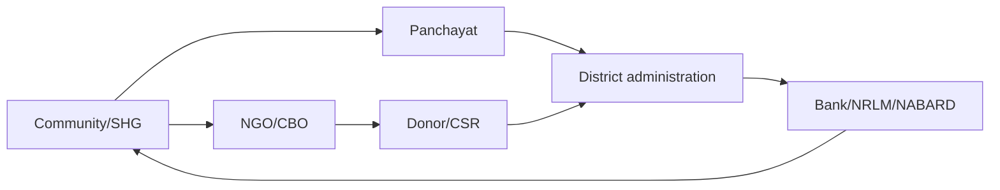

# NGOs, SHGs & Stakeholders in Development Processes

> GS-2 · Topic 12 · NGOs, SHGs, donors, charities, associations, institutional and other stakeholders

---

## PYQs

| Year | M | Words | Question (EN) | प्रश्न (HI) | ID |
|------|---|-------|---------------|-------------|-----|
| 2025 | 12 | 125 | Critically evaluate the need for coordination among support institutions, donors and institutional stakeholders in the development process and practical realities. | विकास प्रक्रिया में सहायक संस्थाओं, योगदानकर्ताओं (donors) तथा संस्थागत हितधारकों के मध्य समन्वय की आवश्यकता एवं व्यावहारिक वास्तविकताओं का समालोचनात्मक मूल्यांकन कीजिए। | Q1 |
| 2024 | 8 | 125 | What is the role of self help groups in rural development? | ग्रामीण विकास में स्वयं सहायता समूहों की क्या भूमिका है? | Q2 |
| 2023 | 8 | 125 | Write an analytical note on Self Help Group's composition and their functions. | स्वयं सहायता समूह की संरचना और उनके कार्यों पर एक विश्लेषणात्मक टिप्पणी कीजिए। | Q3 |
| 2022 | 8 | 125 | Discuss the role of non-governmental organisation in the process of policy making. | नीति निर्माण प्रक्रिया में गैर-सरकारी संगठनों की भूमिका की विवेचना कीजिए। | Q4 |
| 2022 | 12 | 200 | Discuss the challenges before Self Help Groups (SHGs). What are the measures to make it effective and beneficial? | स्वयं सहायता समूहों की चुनौतियों की विवेचना कीजिए। इसे प्रभावकारी एवं लाभकारी बनाने के साधन क्या हैं? | Q5 |
| 2021 | 8 | 125 | Discuss the role of Non-Governmental Organisations in the process of Policy Formation. | नीति निर्माण की प्रक्रिया में गैर-सरकारी संगठनों की भूमिका की विवेचना कीजिए। | Q6 |
| 2020 | 8 | 125 | Examine the role of Non-Governmental Organisations (N.G.Os.) for rural development in Uttar Pradesh. | उत्तर प्रदेश में ग्रामीण विकास हेतु गैर-सरकारी संगठनों (N.G.Os.) की भूमिका का परीक्षण कीजिए। | Q7 |
| 2019 | 12 | 200 | What do you understand by 'Bodo Problem'? Do you think that the Bodo Peace Agreement 2020 will ensure development and peace in Assam? Evaluate. | 'बोडो समस्या' से आप क्या समझते हैं? क्या बोडो शांति समझौता 2020 असम में विकास और शांति सुनिश्चित करेगा? मूल्यांकन कीजिए। | Q8 |
| 2018 | 8 | 125 | Write a short note on the contribution of the Indian diaspora towards economic structure in India. | प्रवासी भारतीयों का भारत की आर्थिक व्यवस्था में योगदान पर एक संक्षिप्त टिप्पणी लिखिए। | Q9 |

---

## Quick Revision

```
CORE IDEA:
  Development process is multi-actor: State + market + NGOs + SHGs + donors + charities + CBOs + diaspora + institutions.
  Good development needs convergence, local participation, accountability and outcome monitoring.

NGO:
  Voluntary, non-profit, non-state organisation working on rights, welfare, service delivery, awareness, research or advocacy.
  Legal routes: Societies Registration Act 1860 | Indian Trusts Act 1882 | Companies Act 2013 Sec 8 | FCRA 2010 for foreign contribution.
  Roles: policy input, field evidence, pilot models, last-mile delivery, social audit, rights awareness, disaster relief, inclusion.
  Examples: SEWA, PRADAN, Barefoot College, Sulabh, Akshaya Patra, HelpAge India, PRS-style research bodies, local UP NGOs.
  Limits: accountability gaps, donor dependency, urban bias, FCRA compliance, elite capture, duplication, political influence.

SHG:
  Small voluntary group, usually 10-20 members from similar socio-economic background; saves regularly, lends internally, links to banks.
  Anchors: NABARD SHG-Bank Linkage Programme 1992 | SGSY 1999 | DAY-NRLM/Aajeevika 2011 | NRLM women collectives.
  Structure: members -> SHG -> village organisation -> cluster-level federation -> bank/NRLM/Panchayat linkage.
  Functions: thrift, credit, livelihood, women empowerment, health/nutrition, social action, local entrepreneurship, micro-enterprise.
  Challenges: poor bookkeeping, low bank credit, elite capture, market linkage, training gaps, unpaid care burden, NPA risk.
  Fixes: capacity building, digital records, federations, producer groups, bank mitras, market access, social audit, convergence.

COORDINATION:
  Need: avoid duplication, pool funds, align schemes, reduce transaction cost, scale pilots, protect beneficiaries.
  Practical realities: donor agendas, data silos, power imbalance, reporting burden, weak district platforms, trust deficit, compliance delays.
  Tools: District Development Coordination, Gram Sabha, CSR platforms, NGO-DARPAN, FCRA transparency, outcome dashboards, social audit.

UP RURAL DEVELOPMENT:
  NGOs/SHGs support livelihoods, health, education, sanitation, women empowerment, disaster relief, migrant support, Bundelkhand water work.
  Must coordinate with NRLM, Panchayats, MGNREGA, PMAY-G, SBM-G, Jal Jeevan Mission, Anganwadi/ASHA network.

BODO PROBLEM:
  Ethnic autonomy conflict in Assam over identity, land, language and development. Bodo Accord 2020 with Centre, Assam govt and Bodo groups.
  Development-peace link: more autonomy, funds, rehabilitation, BTC strengthening. Risks: non-Bodo concerns, implementation delay, factions.

DIASPORA:
  Economic stakeholder through remittances, FDI, technology, philanthropy, startups, tourism, bonds, knowledge networks and soft power.
  Examples: remittances, Pravasi Bharatiya Divas, OCI, India Development Foundation of Overseas Indians, diaspora philanthropy.

TRAPS:
  NGO ≠ always anti-government | SHG ≠ microfinance company | donor money ≠ automatically developmental
  coordination ≠ central control | Bodo Accord ≠ instant peace | diaspora contribution ≠ only remittances
```

---

## Content

### Context — development is a multi-stakeholder process

Development is not only the construction of roads, schools and hospitals by government departments. It is a process through which people gain better livelihood, education, health, dignity, participation, security and voice. In a large and unequal society, the state cannot deliver development alone. The private sector brings investment and jobs; **Non-Governmental Organisations (NGOs)** bring field knowledge and social mobilisation; **Self Help Groups (SHGs)** build grassroots financial and social capital; **donors and charities** provide resources and innovation; **panchayats and urban local bodies** provide local legitimacy; **community-based organisations, associations, unions and ethnic groups** express collective interests; **diaspora networks** bring remittances, knowledge and philanthropy. This is why GS-II treats development as a stakeholder process, not merely as a departmental scheme.

The constitutional spirit behind stakeholder-based development lies in **participatory democracy** and **social justice**. **Article 38** asks the state to promote a social order based on justice. **Article 39** speaks of adequate livelihood and equitable distribution. **Article 40** supports village panchayats. **Articles 243G and 243ZD** encourage local planning through Panchayats and District Planning Committees. These provisions do not name NGOs or SHGs directly, but they create space for participatory, decentralised and inclusive development.

### Stakeholders and their roles

Development stakeholders differ in authority, resources and accountability. Government has legal power and public finance. NGOs have social trust and field presence. SHGs have peer solidarity and micro-level discipline. Donors have funds and technical support. Charities often respond quickly to distress. Institutions such as banks, NABARD, NRLM, panchayats, district administration, CSR foundations and international agencies connect ideas with finance and scale.

| Stakeholder | Core role | Strength | Risk if unmanaged |
|-------------|-----------|----------|-------------------|
| **Government departments** | Policy, budget, regulation and universal scale. | Legal mandate and public finance. | Bureaucratic delay and top-down design. |
| **NGOs** | Mobilisation, service delivery, advocacy and field feedback. | Trust among marginalised groups. | Accountability gaps or donor-driven agenda. |
| **SHGs** | Savings, credit, livelihoods and social action. | Peer pressure and women-led participation. | Elite capture, weak bookkeeping and market gaps. |
| **Donors/CSR/charities** | Finance, innovation and technical support. | Flexible resources and pilots. | Duplication, branding pressure and short project cycles. |
| **Banks/NABARD/NRLM** | Credit linkage and capacity building. | Institutional finance and scale. | Conservative lending or paperwork burden. |
| **Panchayats and Gram Sabha** | Local planning and legitimacy. | Community voice and social audit. | Local factionalism or weak capacity. |
| **Associations and groups** | Represent identity, occupation or community interests. | Collective bargaining and conflict resolution. | Narrow sectionalism if dialogue fails. |
| **Diaspora** | Remittances, investment, knowledge and philanthropy. | Global capital and networks. | Uneven regional benefit and episodic engagement. |

Coordination among these actors is essential because poverty, health, education, gender and livelihood problems overlap. A women's SHG may need bank credit, NRLM training, a panchayat building, NGO bookkeeping support, CSR market access and a government procurement order. If these actors work separately, the group receives training without credit, credit without market, market without quality control, or subsidy without sustainability.

### NGOs — meaning, legal base and policy role

An NGO is a voluntary, non-profit, non-state organisation working for public purpose through service delivery, awareness, research, advocacy, capacity building or rights protection. NGOs in India may be registered as societies under the **Societies Registration Act, 1860**, trusts under the **Indian Trusts Act, 1882**, or non-profit companies under **Section 8 of the Companies Act, 2013**. If they receive foreign contribution, they must comply with the **Foreign Contribution (Regulation) Act, 2010**. Many NGOs also register on **NGO-DARPAN** for government interface.

NGOs help policy making in six ways. First, they generate **field evidence** from communities that government files may not capture. For example, organisations working with forest dwellers, women workers or disabled persons highlight implementation barriers. Second, they run **pilot models** which can later be scaled by the state; community toilets, mid-day meal kitchens, barefoot health workers and livelihood collectives show this pathway. Third, they enable **consultation and representation**, especially for groups that cannot easily reach policy forums. Fourth, they conduct **awareness and behavioural change** campaigns in sanitation, health, education, gender violence and nutrition. Fifth, they support **social audit and accountability** by tracking whether benefits reach citizens. Sixth, they deliver services in difficult contexts such as disaster relief, migrant support, old-age care, disability support and tribal areas.

Examples make NGO answers credible. **SEWA** organises women in the informal sector and links livelihood with rights. **PRADAN** works on rural livelihoods and women's collectives. **Barefoot College** is associated with rural skills and community-led solutions. **Sulabh International** contributed to sanitation behaviour and toilet models. **Akshaya Patra** works with school meal delivery. **HelpAge India** supports elderly care. Local NGOs in Uttar Pradesh work in Bundelkhand water conservation, child education, health awareness, sanitation, migrant support and women's livelihoods.

The limitations must be balanced. NGOs may lack internal democracy, transparent accounts or outcome measurement. Some become donor-driven and adjust work to funding priorities rather than local needs. Urban-based NGOs may speak for rural communities without enough local accountability. Foreign funding can raise sovereignty and transparency concerns, which is why FCRA compliance is important. At the same time, over-regulation can discourage genuine civil society work. The correct approach is partnership with transparency, not blanket suspicion.

### SHGs — composition, structure and functions

A **Self Help Group (SHG)** is a small voluntary group, generally of **10-20 members** from similar socio-economic background, who save regularly, lend internally and gradually link with banks and livelihood programmes. SHGs are especially important for rural women because they combine finance with confidence, solidarity and public participation. The Indian SHG movement gained institutional strength through **NABARD's SHG-Bank Linkage Programme in 1992**, **SGSY in 1999**, and **DAY-NRLM/Aajeevika from 2011**. In Uttar Pradesh, SHGs are promoted through NRLM institutions and state rural livelihood missions.

| Level | Composition | Main function |
|-------|-------------|---------------|
| **Member** | Usually poor rural woman from similar socio-economic background. | Saves regularly, attends meetings, borrows and repays. |
| **SHG** | Around 10-20 members; office bearers such as president, secretary and treasurer. | Thrift, internal lending, bookkeeping and group decisions. |
| **Village Organisation** | Federation of SHGs at village level. | Training, conflict resolution, larger planning and bank support. |
| **Cluster-Level Federation** | Federation across villages or clusters. | Market linkage, larger credit, enterprise support and convergence. |
| **Institutional linkage** | Bank, NRLM, Panchayat, NGO, line departments. | Credit, subsidy, skill training, livelihood and scheme convergence. |

SHG functions are both economic and social. Economically, SHGs encourage small savings, provide emergency credit, reduce dependence on moneylenders, link members with banks, support livestock, tailoring, food processing, handicrafts, small shops and farm-based enterprises. Socially, they increase women's mobility, confidence, meeting habits, collective bargaining and awareness about health, nutrition, sanitation, education, domestic violence and entitlements. Administratively, SHGs help deliver schemes, identify needy households, support community mobilisation and monitor local services. Politically, SHGs prepare women for Gram Sabha participation and Panchayat leadership.

### SHGs in rural development

SHGs contribute to rural development because rural poverty is not only lack of income; it is also lack of credit, voice, information and collective power. A poor woman may need Rs. 3,000 for a medical emergency, school fees, goat rearing or seeds. Formal banks may hesitate; moneylenders charge high interest. SHG savings and internal lending create the first layer of financial security. Bank linkage then expands credit for livelihood.

SHGs also improve rural development through women empowerment. Regular meetings teach bookkeeping, public speaking and negotiation. Women who were earlier restricted to household roles begin interacting with banks, block officials, health workers and panchayats. SHGs support nutrition drives, immunisation awareness, sanitation, school enrolment and anti-liquor campaigns in many states. Under **DAY-NRLM**, SHGs are linked to livelihoods, producer groups, community resource persons and federations. During COVID-19, many SHGs produced masks, ran community kitchens and supported awareness campaigns.

The rural development impact is strongest when SHGs move from credit to enterprise. Dairy, poultry, goatery, mushroom cultivation, food processing, stitching units, community nurseries, organic inputs and local service centres can create income if supported by training, quality control and market access. Programmes such as **NRLM**, **NABARD support**, **MUDRA**, **Stand-Up India**, **PMFME**, **ODOP in Uttar Pradesh**, and e-commerce/GeM linkages can help SHGs move beyond subsistence.

### Challenges before SHGs and measures

SHGs face structural and operational challenges. Many groups are formed to meet targets but remain weak after initial training. Bookkeeping is poor; meeting regularity declines; office bearers may dominate; bank credit is delayed; members fear debt; livelihoods remain low-value; products lack branding and market access; digital literacy is weak; and unpaid care work limits women's time. Some SHGs become subsidy-seeking groups rather than self-sustaining institutions. In backward areas, patriarchal control may allow men to capture loans in women's names. In some regions, political patronage and local factionalism affect group functioning.

| Challenge | Why it weakens SHGs | Measure |
|-----------|---------------------|---------|
| **Weak bookkeeping** | Banks distrust records and members lose confidence. | Digital ledgers, trained bookkeepers and regular audit. |
| **Low credit linkage** | Groups cannot scale livelihoods. | Bank mitras, credit history, interest subvention and simplified appraisal. |
| **Poor market access** | Products remain local and low-profit. | Branding, packaging, e-commerce, GeM and ODOP convergence. |
| **Elite capture** | Benefits go to dominant members. | Rotation of leaders, social audit and federation oversight. |
| **Training gaps** | Loans are used for consumption, not enterprise. | Skill training, handholding and business planning. |
| **Patriarchal control** | Women carry liability without control over income. | Gender sensitisation and women-led financial literacy. |
| **NPA risk** | Group-bank trust declines. | Realistic repayment schedules and livelihood viability checks. |
| **Digital divide** | Digital payments and records exclude members. | Assisted digital access and local resource persons. |

Effective SHGs require a full ecosystem: regular meetings, transparent accounts, leadership rotation, bank linkage, livelihood training, federations, market support, insurance, social security, digital literacy and convergence with panchayats. The best SHG policy treats women not as beneficiaries but as community institutions.

### Coordination among support institutions, donors and institutional stakeholders

Coordination is needed because development failures often occur between institutions, not only inside them. A donor may fund toilets without water supply; an NGO may train SHGs without bank credit; a bank may give loans without market linkage; a government department may distribute assets without maintenance; and a panchayat may not know what a CSR foundation is doing in the village. Coordination prevents duplication, fills gaps, reduces transaction costs and protects beneficiaries from being over-surveyed and under-served.



The need is clear. Development requires **resource pooling**, **role clarity**, **data sharing**, **geographical targeting**, **monitoring**, **grievance redressal** and **sustainability planning**. Donors bring flexibility; NGOs bring mobilisation; institutions bring scale; panchayats bring legitimacy; banks bring finance. Coordination turns isolated projects into durable development.

The practical realities are harder. Donors have reporting formats and branding priorities. NGOs compete for funds. Government departments work in silos. District-level platforms may meet irregularly. Data is not interoperable. Smaller community organisations cannot handle complex compliance. Power imbalance allows large donors or officials to dominate local voices. Short project cycles ignore slow social change. FCRA and CSR compliance can delay fund flow. Sometimes coordination becomes excessive paperwork rather than real convergence.

The solution is not central control. It is transparent partnership: district-level convergence platforms, Gram Sabha approval for local works, public disclosure of projects, common outcome indicators, NGO-DARPAN and FCRA transparency, CSR district mapping, social audit, beneficiary feedback and independent evaluation. Coordination must preserve NGO autonomy and community voice while ensuring accountability.

### NGOs and rural development in Uttar Pradesh

Uttar Pradesh's rural development challenges include poverty, land fragmentation, migration, women workforce exclusion, malnutrition, sanitation gaps, school dropouts, health access, flood and drought vulnerability, and regional imbalance between western UP, eastern UP and Bundelkhand. NGOs can help because they operate close to communities and can build trust where government outreach is thin.

In UP, NGOs support rural development through adult literacy, girls' education, health camps, nutrition awareness, sanitation behaviour, water conservation, livelihood training, SHG formation, farmer producer groups, legal awareness, child protection, disability support and migrant worker assistance. In Bundelkhand, civil society groups often work on water harvesting, drought resilience and livelihood diversification. In eastern UP, NGOs support health awareness, flood relief, education and migrant families. NGOs also help implement or monitor schemes such as **MGNREGA**, **PMAY-G**, **SBM-G**, **Jal Jeevan Mission**, **NRLM**, **Poshan Abhiyaan**, **PM-KUSUM**, **PMFME** and local Panchayat plans.

Their role should be examined, not romanticised. NGOs cannot replace the state in a large state like UP. They may cover limited geographies and depend on donor funding. Their best role is as a partner: mobilise communities, identify gaps, innovate locally, strengthen SHGs, support social audit and feed evidence back to district administration.

### Bodo problem, peace stakeholders and development

The **Bodo problem** refers to the ethnic-political conflict in Assam involving demands by Bodo groups for identity protection, territorial autonomy, land rights and development. The roots lie in perceived cultural insecurity, migration pressures, competition over land, underdevelopment, and dissatisfaction with representation. Groups such as the **All Bodo Students' Union (ABSU)** and armed factions at different times demanded autonomy or separate statehood. Earlier settlements included the **1993 Bodo Accord** and the **2003 Bodoland Territorial Council (BTC)** arrangement under the Sixth Schedule framework.

The **Bodo Peace Agreement 2020** was signed by the Government of India, Government of Assam and Bodo representatives, including factions of the National Democratic Front of Bodoland. It aimed to end violence, strengthen autonomy, rehabilitate cadres, protect Bodo identity and support development in the Bodoland Territorial Region. It is relevant to this topic because peace and development require coordination among community groups, state institutions, civil society, security agencies, donors and local development bodies.

The accord can support peace and development through political recognition, institutional autonomy, development packages, rehabilitation and mainstreaming of former militants. But it is not an automatic solution. Non-Bodo communities may fear exclusion; implementation delays can revive distrust; factional rivalries may persist; land and migration issues are sensitive; and development funds may fail without transparency. The balanced verdict is that the accord creates an institutional opportunity for peace, but durable development requires inclusive governance, fair representation, livelihood creation and trust-building among all communities.

### Indian diaspora as economic stakeholder

The Indian diaspora includes Non-Resident Indians (NRIs), Persons of Indian Origin and Overseas Citizens of India. It contributes to India's economic structure through remittances, investment, trade networks, technology transfer, philanthropy, tourism, education links and soft power. India has consistently been among the world's top recipients of remittances, and these flows support household consumption, education, health and housing in states such as Kerala, Punjab, Gujarat, Andhra Pradesh, Telangana, Uttar Pradesh and Bihar.

Diaspora contribution is not limited to remittances. Silicon Valley professionals support startups, venture capital and technology networks. Doctors, academics and scientists contribute through knowledge exchange. Business communities support trade and FDI. Diaspora philanthropy supports schools, hospitals, water projects and disaster relief. **Pravasi Bharatiya Divas**, **OCI cards**, diaspora bonds in earlier periods, and organisations such as the **India Development Foundation of Overseas Indians** show institutional attempts to engage diaspora. The limitation is uneven benefit: some regions and skilled sectors gain more than poorer migrant-sending households. Brain drain, vulnerable Gulf labour and episodic engagement remain concerns.

### Contemporary relevance

- **DAY-NRLM** remains the main institutional platform for women SHGs, livelihood federations and rural poverty reduction.
- **Lakhpati Didi** and SHG enterprise promotion make SHGs relevant for income generation beyond thrift and credit.
- **FCRA compliance** and **NGO-DARPAN** keep NGO transparency and state-civil society trust in exam focus.
- **CSR under Companies Act, 2013** has made corporate foundations major development donors, but coordination with district priorities remains uneven.
- **Digital SHG records, UPI, Jan Dhan and bank mitras** are changing group finance, but digital literacy gaps persist.
- **COVID-19** showed the value of SHGs and NGOs in masks, community kitchens, migrant support and local awareness.
- **Bodo Accord implementation** shows that peace agreements must be tied to inclusive development, not only security surrender.
- **Diaspora remittances and startup networks** remain stable economic hooks for India's development financing and knowledge economy.

### Limits — balanced view

Civil society and stakeholder participation improve development, but they also raise accountability questions. NGOs must not become unaccountable parallel governments. Donors must not distort local priorities. SHGs must not become debt channels without livelihood viability. Panchayats must not be bypassed by externally funded projects. Ethnic associations can raise genuine demands but may also intensify identity conflict if negotiation is exclusionary. Diaspora finance is useful but cannot replace domestic public investment. Therefore, development needs a partnership model based on transparency, local consent, social audit, outcome measurement and constitutional values.

---

## Answers

### Q1: Critically evaluate the need for coordination among support institutions, donors and institutional stakeholders in the development process and practical realities. (2025, 12M, 125W)

**Introduction:**
> Development is a multi-stakeholder process involving government, NGOs, SHGs, donors, charities, banks, panchayats and communities. Coordination is necessary because poverty and exclusion are multi-dimensional.

**Main Points:**
- **Resource Pooling** — Donors, CSR, banks and government can combine funds, skills and local legitimacy.
- **Avoiding Duplication** — Coordination prevents multiple agencies from working on the same village while others remain ignored.
- **Role Clarity** — NGOs mobilise, banks finance, panchayats legitimise and departments scale interventions.
- **Beneficiary Protection** — Common data and grievance systems reduce over-surveying, leakages and confusion.
- **Scaling Innovation** — NGO pilots can become public programmes when institutions cooperate.
- **Practical Constraint** — Donor branding, NGO competition, departmental silos and weak district platforms limit convergence.
- **Power Imbalance** — Large donors or officials may dominate local community voice.
- **Balanced Solution** — Gram Sabha approval, social audit, common indicators, NGO-DARPAN and transparent CSR mapping can improve coordination.

**Keywords (underline in exam):** Convergence · CSR · NGO-DARPAN · Gram Sabha · Social Audit · Outcome Monitoring · Stakeholder Coordination

**Exam diagram (30 sec):**
```
Community
 |-- NGO: mobilisation
 |-- Donor/CSR: funds
 |-- Govt/Panchayat: scale + legitimacy
 |-- Bank: credit
        -> coordinated development
```

**Conclusion:**
> Coordination is indispensable, but it must remain transparent and community-led rather than donor- or bureaucracy-driven.

### Q2: What is the role of self help groups in rural development? (2024, 8M, 125W)

**Introduction:**
> SHGs are small voluntary groups, usually of 10-20 rural women, formed for savings, credit, livelihood and collective action. They are grassroots institutions of inclusive rural development.

**Main Points:**
- **Financial Inclusion** — Regular savings and bank linkage reduce dependence on moneylenders.
- **Livelihood Promotion** — SHGs support dairy, tailoring, food processing, goatery and local enterprises.
- **Women Empowerment** — Meetings, bookkeeping and bank dealings increase confidence and mobility.
- **Social Awareness** — SHGs spread messages on health, nutrition, sanitation and education.
- **Scheme Convergence** — NRLM links SHGs with training, credit, federations and government programmes.
- **Local Governance** — SHG women participate in Gram Sabha and Panchayat processes.
- **Crisis Response** — During COVID-19, SHGs helped with masks, kitchens and local awareness.

**Keywords (underline in exam):** SHG-Bank Linkage · DAY-NRLM · Women Empowerment · Thrift · Livelihood · Gram Sabha

**Exam diagram (30 sec):**
```
SHG
 |-- Savings/credit
 |-- Livelihood
 |-- Women voice
 |-- Social action
      -> rural development
```

**Conclusion:**
> SHGs transform rural development by converting poor women from beneficiaries into community institutions.

### Q3: Write an analytical note on Self Help Group's composition and their functions. (2023, 8M, 125W)

**Introduction:**
> A Self Help Group is a small, voluntary and usually homogeneous group that pools savings, lends internally and links members to banks and livelihood support.

**Main Points:**
- **Small Composition** — Usually 10-20 members from similar socio-economic background ensure trust and peer pressure.
- **Women-centred Character** — Most NRLM groups are women-led, improving empowerment and household welfare.
- **Office Bearers** — President, secretary and treasurer manage meetings, records and accounts.
- **Regular Savings** — Members contribute small amounts to build a group fund.
- **Internal Lending** — The group gives small loans for consumption smoothing and livelihoods.
- **Bank Linkage** — Mature SHGs access formal credit through NABARD/NRLM-supported systems.
- **Federation Structure** — Village Organisations and Cluster-Level Federations support training and market linkage.
- **Social Functions** — SHGs act on health, education, sanitation, domestic violence and entitlements.

**Keywords (underline in exam):** 10-20 Members · Thrift · Internal Lending · NABARD · NRLM · Federation · Social Capital

**Exam diagram (30 sec):**
```
Members -> SHG -> Village Organisation -> Cluster Federation
 savings   credit      training              market/linkage
```

**Conclusion:**
> SHGs are both financial groups and social institutions, making them central to participatory rural development.

### Q4: Discuss the role of non-governmental organisation in the process of policy making. (2022, 8M, 125W)

**Introduction:**
> NGOs are voluntary non-profit organisations that connect citizens, especially marginalised groups, with the state. In policy making, they bring evidence, voice and accountability.

**Main Points:**
- **Field Evidence** — NGOs report ground realities that official data may miss.
- **Representation** — They voice concerns of women, workers, tribals, disabled persons and children.
- **Policy Pilots** — Successful NGO models in sanitation, livelihoods or education can be scaled by government.
- **Consultation Support** — NGOs participate in committees, public hearings and draft policy feedback.
- **Awareness Creation** — They translate policy into local language and mobilise citizens.
- **Social Audit** — NGOs help monitor leakage and exclusion in welfare schemes.
- **Rights Advocacy** — They strengthen laws and implementation on environment, labour, gender and transparency.
- **Limit** — They must remain transparent and accountable to avoid donor-driven or elite agendas.

**Keywords (underline in exam):** Civil Society · Field Evidence · Advocacy · Social Audit · Consultation · FCRA · Accountability

**Exam diagram (30 sec):**
```
People -> NGO evidence/voice -> Policy forum -> Better design
                 |                    |
             social audit        feedback loop
```

**Conclusion:**
> NGOs enrich policy making when their autonomy is combined with transparency and constructive engagement with the state.

### Q5: Discuss the challenges before Self Help Groups (SHGs). What are the measures to make it effective and beneficial? (2022, 12M, 200W)

**Introduction:**
> SHGs are important instruments of financial inclusion and women-led rural development. Their impact, however, depends on strong group quality, credit access and livelihood viability.

**Main Points:**
- **Weak Bookkeeping** — Poor accounts reduce bank confidence and create internal disputes.
- **Irregular Meetings** — Target-based formation often leads to inactive groups after initial mobilisation.
- **Credit Bottleneck** — Banks may delay loans or provide inadequate credit for enterprise.
- **Elite Capture** — Dominant members may control decisions and benefits.
- **Market Gap** — Products often lack packaging, branding, quality control and buyers.
- **Training Deficit** — Members receive loans without business planning or skill support.
- **Patriarchal Control** — Men may control loans taken in women's names.
- **Digital Divide** — Digital payments and records are difficult without literacy and devices.

**Measures:**
- **Capacity Building** — Train members in bookkeeping, enterprise and financial literacy.
- **Federation Support** — Village Organisations and Cluster Federations should mentor weak groups.
- **Bank Linkage Reform** — Bank mitras, credit history and simplified appraisal can improve lending.
- **Market Convergence** — Link SHGs with ODOP, PMFME, GeM, e-commerce and local procurement.
- **Social Audit** — Leadership rotation and public records reduce capture.

**Keywords (underline in exam):** DAY-NRLM · SHG-Bank Linkage · Federation · Bank Mitra · ODOP · Financial Literacy · Social Audit

**Exam diagram (30 sec):**
```
SHG Problems -> books, credit, market, capture
      Solutions -> training + bank linkage + federation + market
```

**Conclusion:**
> SHGs become effective when they move from mere micro-credit groups to trained, federated and market-linked community institutions.

### Q6: Discuss the role of Non-Governmental Organisations in the process of Policy Formation. (2021, 8M, 125W)

**Introduction:**
> NGOs strengthen policy formation by connecting state institutions with community experience, especially where marginalised groups lack direct voice.

**Main Points:**
- **Problem Identification** — NGOs reveal hidden issues such as malnutrition, bonded labour or exclusion from schemes.
- **Participatory Consultation** — They organise community meetings and public hearings.
- **Research Inputs** — NGO studies provide qualitative evidence and case-based learning.
- **Draft Feedback** — Civil society comments improve feasibility and rights safeguards.
- **Innovation Models** — Pilot projects in sanitation, education and livelihoods guide policy design.
- **Accountability Lens** — NGOs highlight leakage, corruption and implementation gaps.
- **Behaviour Change** — They help convert policy into community practice.
- **Caution** — Legitimacy requires transparency, local accountability and compliance with law.

**Keywords (underline in exam):** Policy Formation · Participatory Governance · Civil Society · Field Research · Rights-based Approach · Accountability

**Exam diagram (30 sec):**
```
Community issue -> NGO research -> Consultation -> Policy design
                         -> Social audit feedback
```

**Conclusion:**
> NGOs make policy formation more participatory and realistic when they work as accountable partners, not parallel governments.

### Q7: Examine the role of Non-Governmental Organisations (N.G.Os.) for rural development in Uttar Pradesh. (2020, 8M, 125W)

**Introduction:**
> Uttar Pradesh's rural challenges include poverty, migration, malnutrition, sanitation gaps, water stress and women's limited economic participation. NGOs can support the state by mobilising communities and filling last-mile gaps.

**Main Points:**
- **Livelihood Support** — NGOs promote SHGs, skills, producer groups and micro-enterprises.
- **Education** — They support girls' education, bridge courses and school retention.
- **Health and Nutrition** — Awareness on immunisation, maternal health and Poshan improves uptake.
- **Sanitation and Water** — Behaviour change supports SBM-G, Jal Jeevan Mission and Bundelkhand water work.
- **Women Empowerment** — NGOs train SHGs and support legal awareness against violence.
- **Migrant Support** — In eastern UP, they help migrant families with entitlements and crisis relief.
- **Social Audit** — They monitor MGNREGA, PMAY-G and welfare delivery gaps.
- **Limit** — Coverage is limited; NGOs must coordinate with Panchayats, NRLM and district administration.

**Keywords (underline in exam):** Rural UP · SHGs · MGNREGA · NRLM · Poshan · SBM-G · Social Audit

**Exam diagram (30 sec):**
```
NGOs in UP
 |-- Livelihood/SHG
 |-- Health/education
 |-- Water/sanitation
 |-- Social audit
```

**Conclusion:**
> NGOs are useful rural development partners in UP, but scale and legitimacy require convergence with public institutions.

### Q8: What do you understand by 'Bodo Problem'? Do you think that the Bodo Peace Agreement 2020 will ensure development and peace in Assam? Evaluate. (2019, 12M, 200W)

**Introduction:**
> The Bodo problem refers to the ethnic-political conflict in Assam over identity, land, autonomy and development demands of the Bodo community.

**Main Points:**
- **Identity Assertion** — Bodo groups sought protection of language, culture and political voice.
- **Land and Migration Stress** — Competition over land and demographic anxieties deepened conflict.
- **Development Deficit** — Underdevelopment in Bodo areas created alienation from the state.
- **Autonomy Demand** — Movements led by groups such as ABSU and armed factions demanded autonomy or separate statehood.
- **Earlier Settlements** — 1993 and 2003 arrangements created institutional frameworks but did not fully end grievances.
- **2020 Accord Promise** — The agreement with Centre, Assam and Bodo representatives aims at autonomy, rehabilitation and development.
- **Peace Potential** — Surrender and mainstreaming of militants can reduce violence and enable development funds.
- **Practical Risks** — Non-Bodo concerns, implementation delays, factionalism and land disputes can weaken peace.
- **Inclusive Requirement** — Durable peace needs fair representation, transparent funds and livelihood opportunities for all communities.

**Keywords (underline in exam):** Bodo Problem · BTC · Bodo Accord 2020 · Autonomy · Rehabilitation · Inclusive Development · Assam

**Exam diagram (30 sec):**
```
Bodo issue: identity + land + autonomy + development
             -> 2020 Accord
             -> peace potential + implementation risk
```

**Conclusion:**
> The 2020 Accord is a strong opportunity for peace, but development will be durable only if implementation is inclusive and transparent.

### Q9: Write a short note on the contribution of the Indian diaspora towards economic structure in India. (2018, 8M, 125W)

**Introduction:**
> The Indian diaspora includes NRIs, PIOs and OCI communities abroad. It contributes to India's economic structure through money, markets, knowledge and networks.

**Main Points:**
- **Remittances** — Diaspora earnings support household consumption, education, health and housing in India.
- **Investment** — NRIs contribute through deposits, FDI, startups and business partnerships.
- **Technology Transfer** — Professionals in Silicon Valley and global firms connect India to knowledge networks.
- **Trade Linkages** — Diaspora entrepreneurs promote Indian goods, services and tourism.
- **Philanthropy** — Overseas Indians fund schools, hospitals, disaster relief and community projects.
- **Soft Power** — Diaspora success improves India's image and investor confidence.
- **Institutional Link** — Pravasi Bharatiya Divas and OCI policy maintain engagement.
- **Limit** — Benefits are uneven and vulnerable migrant labour still needs protection.

**Keywords (underline in exam):** Remittances · NRI · OCI · FDI · Technology Transfer · Philanthropy · Soft Power

**Exam diagram (30 sec):**
```
Diaspora -> Remittances + Investment + Knowledge + Philanthropy
                         -> Indian economy
```

**Conclusion:**
> The diaspora is an economic stakeholder whose value lies not only in remittances but also in knowledge, networks and credibility.

### Q10: Likely PYQ — Examine the accountability challenges of NGOs in India and suggest reforms. (Future Variant, 12M, 200W)

**Introduction:**
> NGOs deepen participatory development, but public trust requires transparency, internal democracy and legal compliance.

**Main Points:**
- **Financial Opacity** — Weak accounting can hide misuse or donor dependence.
- **Donor-driven Agenda** — Funding priorities may override local needs.
- **Limited Internal Democracy** — Founder-led organisations may lack community voice.
- **Urban Bias** — Some NGOs speak for rural groups without sustained field accountability.
- **Foreign Funding Concerns** — FCRA issues raise transparency and sovereignty questions.
- **Duplication** — Multiple NGOs may work in the same area without coordination.
- **Outcome Gap** — Activities are reported, but long-term impact is rarely measured.
- **Over-regulation Risk** — Excessive restrictions can hurt genuine civil society work.

**Reforms:**
- **Transparent Disclosure** — Public accounts, donor details and project outcomes should be available.
- **Community Accountability** — Gram Sabha feedback and social audit should guide local projects.
- **Proportionate Regulation** — FCRA and tax compliance should be strict but predictable.
- **Partnership Platforms** — NGO-DARPAN, district convergence and independent evaluation can improve trust.

**Keywords (underline in exam):** NGO Accountability · FCRA · NGO-DARPAN · Social Audit · Community Voice · Transparency

**Exam diagram (30 sec):**
```
NGO trust = transparent funds + community voice + outcome audit
```

**Conclusion:**
> India needs accountable NGOs, not weakened civil society; reform should combine transparency with civic freedom.

### Q11: Likely PYQ — SHGs are instruments of women empowerment as well as rural livelihood. Discuss. (Future Variant, 12M, 200W)

**Introduction:**
> SHGs combine small savings with collective confidence, making them both economic and social institutions for rural women.

**Main Points:**
- **Economic Security** — Thrift and internal loans reduce dependence on moneylenders.
- **Formal Finance** — SHG-bank linkage connects poor women to institutional credit.
- **Livelihood Creation** — Dairy, food processing, tailoring, goatery and ODOP-linked work generate income.
- **Decision-making Power** — Women handling accounts and meetings gain household and community voice.
- **Social Awareness** — SHGs discuss health, nutrition, sanitation, education and domestic violence.
- **Political Participation** — Members become more active in Gram Sabha and Panchayat affairs.
- **Collective Bargaining** — Federations improve market access and negotiation with banks and officials.
- **Limits** — Patriarchy, weak markets, bookkeeping gaps and unpaid care work restrict gains.

**Keywords (underline in exam):** Women Empowerment · SHG-Bank Linkage · NRLM · Livelihood · Federation · Gram Sabha · Social Capital

**Exam diagram (30 sec):**
```
SHG women
 |-- money: savings/credit
 |-- voice: meetings/Gram Sabha
 |-- work: livelihood/enterprise
```

**Conclusion:**
> SHGs empower women most when finance is joined with skills, markets, federations and social recognition.

---

## Traps

| Wrong | Correct |
|-------|---------|
| NGOs are always anti-government. | NGOs can be partners, critics, service providers or watchdogs depending on context. |
| NGO accountability means only FCRA compliance. | Accountability also includes local voice, social audit, transparent accounts and outcomes. |
| SHGs are the same as microfinance companies. | SHGs are member-owned savings and credit groups; MFIs are lending institutions. |
| SHG success depends only on giving loans. | Training, bookkeeping, market linkage and federation support are equally important. |
| All SHGs automatically empower women. | Patriarchal loan capture and inactive groups can weaken empowerment. |
| Donor funding always improves development. | Donor priorities can distort local needs without coordination and community consent. |
| Coordination means centralised control by government. | Good coordination preserves NGO autonomy and community voice while aligning roles. |
| Panchayats are optional in local development. | Panchayats and Gram Sabha give local legitimacy and accountability. |
| NGOs can replace the state in Uttar Pradesh. | NGOs support last-mile work, but state finance and scale remain essential. |
| Bodo Accord 2020 guarantees instant peace. | It creates an opportunity; implementation and inclusion decide durable peace. |
| Bodo problem is only a law-and-order issue. | It includes identity, autonomy, land, development and representation. |
| Diaspora contribution means only remittances. | Diaspora also contributes investment, technology, trade, philanthropy and soft power. |
| CSR is the same as charity. | CSR is a statutory corporate responsibility under Companies Act norms, while charity may be voluntary philanthropy. |
| SHG federations are decorative layers. | Federations provide training, dispute resolution, larger credit and market linkage. |

---

*Complete.*
