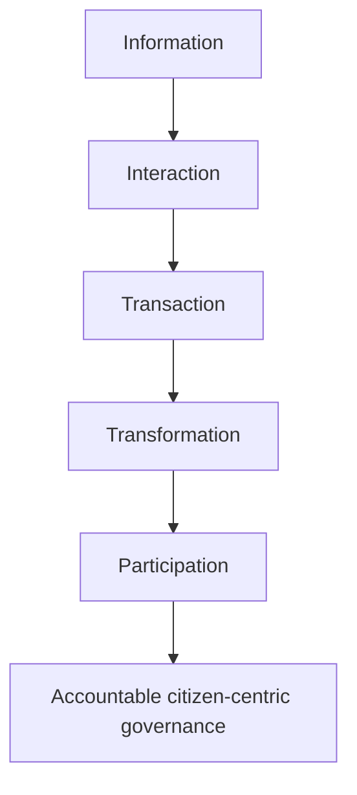

# Transparency, Accountability, Citizen Charter & E-Governance

> GS-2 · Governance Topic 3 · citizen-centric administration, transparency, accountability, e-governance, charters and institutional measures

---

## PYQs

| Year | M | Words | Question (EN) | प्रश्न (HI) | ID |
|------|---|-------|---------------|-------------|-----|
| 2025 | 8 | 125 | The Citizen Charter has been a landmark initiative in ensuring citizen-centric administration. Comment. | नागरिक-केंद्रित प्रशासन को सुनिश्चित करने के लिए नागरिक चार्टर एक ऐतिहासिक पहल रही है। टिप्पणी कीजिए। | Q1 |
| 2025 | 12 | 125 | Examine the emerging dimensions of e-governance and explain how they contribute to making government services more accessible, transparent and efficient. | ई-गवर्नेंस के क्षेत्र में उभरते हुए आयामों का परीक्षण कीजिए तथा यह स्पष्ट कीजिए कि ये आयाम सरकारी सेवाओं को अधिक सुलभ, पारदर्शी और कुशल बनाने में किस प्रकार सहायक सिद्ध हो रहे हैं। | Q2 |
| 2023 | 8 | 125 | “Transparency and Accountability are complementary to each other.” Comment. | “पारदर्शिता एवं जवाबदेही एक दूसरे के पूरक हैं।” टिप्पणी कीजिए। | Q3 |
| 2023 | 8 | 125 | “The application of Information and Communication Technology (I.C.T.) is for delivering government service.” Discuss. | “सरकारी सेवा देने के लिए सूचना और संचार प्रौद्योगिकी (आई.सी.टी.) एक अनुप्रयोग है।” व्याख्या कीजिए। | Q4 |
| 2023 | 12 | 200 | What is Citizen’s Charter? What is its role in welfare of citizens? | नागरिक अधिकार पत्र क्या है? नागरिकों के कल्याण में इसकी क्या भूमिका है? | Q5 |
| 2022 | 12 | 200 | Explain the objectives and composition of “NITI Aayog”. What are its significant achievements? | “नीति आयोग” के उद्देश्यों और संरचना की व्याख्या कीजिए। इसकी महत्वपूर्ण उपलब्धियाँ क्या हैं? | Q6 |
| 2021 | 8 | 125 | Citizen charter in India could not become effective. There is a need to make it effective and meaningful. Evaluate. | भारत में नागरिक अधिकार पत्र प्रभावी नहीं बन सके हैं। इन्हें प्रभावी एवं अर्थपूर्ण बनाने की आवश्यकता है। मूल्यांकन कीजिए। | Q7 |
| 2021 | 12 | 200 | Describing the composition and functions of the Central Vigilance Commission, analyse its limitation. | केंद्रीय सतर्कता आयोग के गठन और कार्यों का वर्णन करते हुए इसकी सीमाओं का विश्लेषण कीजिए। | Q8 |
| 2020 | 12 | 200 | Identify the major pressure groups in Indian politics and examine their role. | भारतीय राजनीति में प्रमुख दबाव समूहों की पहचान कीजिए और उनकी भूमिका का परीक्षण कीजिए। | Q9 |
| 2020 | 12 | 200 | To what extent has e-governance made the administrative system more citizen-centric? Can e-governance be made more participative? | ई-शासन ने प्रशासनिक तंत्र को किस सीमा तक अधिक नागरिक-केंद्रित बनाया है? क्या ई-शासन प्रणाली को और अधिक सहभागी बनाया जा सकता है? | Q10 |
| 2019 | 8 | 125 | Write a note on Citizen’s Charter. | सिटिजन्स चार्टर (नागरिक चार्टर) पर एक टिप्पणी लिखिए। | Q11 |
| 2019 | 12 | 200 | Describe the National Biodiversity Authority. | राष्ट्रीय जैव विविधता प्राधिकरण का वर्णन कीजिए। | Q12 |
| 2018 | 12 | 200 | In the monsoon session of the Indian Parliament in 2019, amendments were made in the anti-terror law and the Right to Information Act. What are the significant changes as a result of these amendments? Analyse. | 2019 के मानसून सत्र में संसद ने आतंक विरोधी कानून और सूचना के अधिकार में संशोधन किया है। इन संशोधनों के फलस्वरूप क्या महत्वपूर्ण बदलाव लाए गए हैं? विश्लेषण करें। | Q13 |

---

## Quick Revision

```
GOVERNANCE CORE:
  Good governance = rule of law + transparency + accountability + responsiveness + participation + equity + efficiency.
  Citizen-centric administration asks: Can citizen know, access, complain, appeal and get service on time?

TRANSPARENCY + ACCOUNTABILITY:
  Transparency = information visible; accountability = answerability + enforceability.
  Tools: RTI Act 2005, CIC/SIC, CAG, PAC, social audit, Lokpal, CVC, e-procurement, dashboards, citizen charters, CPGRAMS.
  Complement: No information -> no questioning. No accountability -> information becomes symbolic.

CITIZEN CHARTER:
  Origin: UK Citizen's Charter 1991. India push: 1997 Chief Ministers' Conference + DARPG guidelines.
  Meaning: public declaration of services, standards, time limits, fees, grievance officer, citizen duties.
  Role: service standards, citizen awareness, reduced discretion, grievance redressal, citizen-centric administration.
  Weakness: non-justiciable, vague standards, no consultation, poor awareness, weak compensation, no monitoring.
  Fix: Sevottam model, RTPS laws, CPGRAMS integration, service guarantee, public audit, department dashboards.

E-GOVERNANCE:
  Models: G2C, G2B, G2G, G2E. Stages: information -> interaction -> transaction -> transformation/participation.
  Applications: UMANG, DigiLocker, DBT/PFMS, UPI, GeM, e-Office, e-Courts, CoWIN, e-NAM, eGramSwaraj, SVAMITVA, CPGRAMS.
  Emerging dimensions: DPI, AI chatbots, mobile governance, cloud, GIS, blockchain records, open data, API platforms, cybersecurity, privacy-by-design.
  Gains: access, speed, transparency, audit trail, cost reduction, portability, 24x7 service.
  Limits: digital divide, exclusion errors, privacy, cyber fraud, low capacity, language gap, algorithmic bias.

NITI AAYOG:
  2015 executive resolution; replaced Planning Commission. PM chair, Governing Council of CMs/LGs, VC, CEO, members.
  Objectives: cooperative federalism, competitive federalism, policy think tank, SDG monitoring, innovation, state support.
  Achievements: ADP, SDG India Index, Health/education/water indices, Atal Innovation Mission, policy papers, Aspirational Blocks.

CVC:
  Origin: 1964 Santhanam Committee; statutory status: CVC Act 2003 after Vineet Narain 1997.
  Composition: Central Vigilance Commissioner + up to two Vigilance Commissioners; appointed by President on committee recommendation.
  Functions: vigilance supervision, advice to govt, CBI supervision in corruption cases, CVO coordination, integrity systems.
  Limits: advisory, no independent prosecution, depends on CBI/CVOs, limited jurisdiction, delay/vacancies.

PRESSURE GROUPS:
  Types: business (FICCI, CII), trade unions (INTUC, BMS, AITUC, CITU), farmers (BKU), caste/community, students, women, environment, professional groups.
  Role: interest articulation, policy feedback, mobilisation, expertise, democratic participation.
  Limits: sectional interest, money power, street pressure, elite capture, non-transparent lobbying.

NBA:
  National Biodiversity Authority under Biological Diversity Act 2002; HQ Chennai.
  Regulates access to biological resources, ABS, advises govt, supports Biodiversity Management Committees/PBRs, opposes bio-piracy/IPR misuse.

RTI + UAPA 2019:
  UAPA: individuals can be designated terrorists; NIA Inspector rank can investigate; NIA DG can approve seizure in NIA cases.
  RTI: Centre empowered to decide term/salary/service conditions of CIC and ICs; fixed equivalence diluted.
  Analysis: security efficiency vs civil liberty risk; administrative flexibility vs RTI independence concern.
```

---

## Content

### Context — governance as citizen-centric state capacity

Governance is the way public power is exercised to deliver rights, services, security and development. A government may have laws and schemes, but governance asks whether citizens can access those benefits fairly, quickly and transparently. Good governance is usually associated with **rule of law**, **transparency**, **accountability**, **responsiveness**, **participation**, **equity**, **effectiveness** and **efficiency**. In the Indian context, governance also means constitutional morality, welfare delivery, anti-corruption, local democracy and protection of rights.

Citizen-centric administration reverses the old colonial logic of the citizen as a petitioner before an all-powerful office. It treats the citizen as a rights-bearing participant who should know what service is available, what fee is payable, how long it will take, who is responsible, how to complain and how to appeal. Tools such as **Citizen Charter**, **RTI Act 2005**, **Central Information Commission**, **Central Vigilance Commission**, **CAG**, **Lokpal**, **social audit**, **CPGRAMS**, **e-governance portals**, **DBT**, **GeM**, **DigiLocker** and **Sevottam** are governance instruments because they convert administrative discretion into standards, information and answerability.

### Transparency and accountability — complementary principles

**Transparency** means citizens can see how decisions are made, funds are spent, files move and services are delivered. **Accountability** means officials and institutions must explain decisions and face correction, penalty or reform when they fail. They are complementary because transparency without accountability becomes mere display, while accountability without transparency becomes arbitrary punishment.

| Principle | Meaning | Governance instrument | Why it matters |
|-----------|---------|-----------------------|----------------|
| **Transparency** | Information is visible, accessible and understandable. | RTI, dashboards, open data, e-procurement, proactive disclosure. | Citizens can question power and detect leakage. |
| **Answerability** | Officials must explain actions and delays. | Citizen Charter, CPGRAMS, parliamentary questions, audit reports. | The state cannot hide behind silence. |
| **Enforceability** | Failure has consequences. | CVC advice, vigilance action, RTPS penalties, courts, Lokpal. | Standards become meaningful, not symbolic. |
| **Participation** | Citizens influence priorities and feedback. | Gram Sabha, MyGov, social audit, public consultation. | Policies reflect ground needs. |
| **Correction** | Systems learn from failure. | Evaluation, dashboards, service reform, grievance analytics. | Governance improves over time. |

The **RTI Act 2005** is the clearest example. RTI gives information; accountability emerges when citizens use information to expose ration leakage, pension delay, recruitment irregularity or public works fraud. **Social audit** under MGNREGA similarly combines public disclosure with community questioning. **CAG reports** reveal financial and performance irregularities, but accountability requires PAC discussion and executive correction. Therefore, transparency is the oxygen of accountability, and accountability is the enforcement arm of transparency.

### Citizen Charter — concept, origin and role

A **Citizen Charter** is a public declaration by a department or service agency that states the services offered, service standards, time limits, fees, responsible officers, grievance redressal mechanism and obligations of citizens. The idea became prominent in the United Kingdom through **John Major's Citizen's Charter, 1991**. In India, it was promoted after the **1997 Conference of Chief Ministers** and through **Department of Administrative Reforms and Public Grievances (DARPG)** guidelines.

A good citizen charter answers six citizen questions: What service can I get? What documents are needed? What fee must I pay? How much time will it take? Who is responsible? What can I do if the service is delayed or denied? This makes it a landmark citizen-centric initiative because it shifts administration from secrecy and discretion to public standards.

| Element of Citizen Charter | Governance purpose |
|----------------------------|-------------------|
| **Service list** | Citizen knows what the office is legally expected to provide. |
| **Time limit** | Delay becomes visible and measurable. |
| **Fee and documents** | Reduces bribery and arbitrary demands. |
| **Responsible officer** | Fixes answerability. |
| **Grievance authority** | Gives remedy beyond the counter clerk. |
| **Citizen duties** | Prevents false applications and incomplete records. |
| **Compensation/penalty link** | Makes charter meaningful where RTPS laws exist. |

Citizen charters promote welfare by reducing transaction costs for citizens, especially the poor, elderly, women and rural applicants who cannot repeatedly visit offices. They improve service delivery in certificates, pensions, ration cards, hospital services, municipal services, electricity connections, tax services and transport offices. They also create a culture of performance standards inside departments.

However, Indian citizen charters often failed to become effective because many were drafted without citizen consultation, used vague language, lacked measurable standards, had no penalty for violation, were not displayed properly, and were not known to frontline staff. Many charters became wall posters rather than enforceable service guarantees. The **Citizen's Charter and Grievance Redressal Bill, 2011** did not become law. Some states addressed this through **Right to Public Services (RTPS)** laws, such as Madhya Pradesh's 2010 law and Bihar's 2011 law, where delayed services can attract penalties. The **Sevottam model** tried to improve service delivery through citizen charter, public grievance redressal and service capability.

### E-governance — applications, models and emerging dimensions

**E-governance** means using ICT to make government processes and services simple, transparent, accountable, responsive and participatory. It is not merely digitising forms; it requires process re-engineering, digital identity, interoperability, secure data, online payment, grievance redressal and service standards.

| Model | Meaning | Examples |
|-------|---------|----------|
| **G2C** | Government to citizen service delivery. | UMANG, DigiLocker, passport, e-District, CoWIN, DBT. |
| **G2B** | Government to business interface. | GeM, GSTN, MCA21, online licences, e-tendering. |
| **G2G** | Government to government coordination. | e-Office, PFMS, Crime and Criminal Tracking Network, treasury systems. |
| **G2E** | Government to employee services. | HRMS, pension portals, biometric attendance, online service books. |

E-governance usually moves through stages: **information** (websites publish information), **interaction** (forms and queries), **transaction** (payments, certificates, applications), **transformation** (integrated single-window services) and **participation** (feedback, consultation, social audit and co-creation). India's strongest examples include **Aadhaar**, **UPI**, **DigiLocker**, **UMANG**, **PFMS**, **DBT**, **GeM**, **e-NAM**, **e-Courts**, **CoWIN**, **eGramSwaraj**, **SVAMITVA**, **CPGRAMS** and state e-District portals.



Emerging dimensions of e-governance include **digital public infrastructure**, **mobile governance**, **cloud platforms**, **AI chatbots**, **GIS and remote sensing**, **blockchain-style tamper-resistant records**, **open government data**, **API-based service integration**, **cybersecurity**, **privacy-by-design**, **vernacular interfaces** and **assisted digital access through CSCs**. These dimensions make services more accessible by enabling 24x7 access and portability; more transparent by creating audit trails and dashboards; and more efficient by reducing paperwork, queues and manual discretion.

But e-governance has limits. The digital divide excludes citizens without smartphone, internet, literacy or language comfort. Biometric failure and wrong database entries can deny welfare. Cyber fraud and data breaches threaten trust. Poorly designed portals shift the burden from officials to citizens. Algorithms may reproduce bias if data is weak. Therefore, e-governance must be **digital plus human**: online service with offline assistance, grievance correction, data protection and social audit.

### ICT for government service delivery

ICT helps deliver services by connecting four layers: identity, data, transaction and feedback. **Aadhaar** and local databases identify beneficiaries. **PFMS**, **UPI**, **DBT** and bank systems transfer money. **DigiLocker**, **UMANG**, **e-District**, **CoWIN** and **e-Courts** provide service interfaces. **CPGRAMS**, call centres and dashboards create feedback loops. In a service such as pension, ICT can show application status, verify identity, transfer payment, send SMS and record complaint. In procurement, **GeM** reduces discretion by making product, price and vendor comparison visible. In rural governance, **eGramSwaraj** and geo-tagging connect planning with expenditure.

ICT has made administration more citizen-centric to a large extent because it reduces office visits, middlemen, file opacity and arbitrary delay. Yet participatory e-governance remains incomplete unless citizens help design services, give feedback in local languages, access grievance appeals, and receive offline assistance when digital systems fail.

### NITI Aayog — objectives, composition and achievements

**NITI Aayog**, or National Institution for Transforming India, was created by executive resolution on **1 January 2015** to replace the Planning Commission. It is not a constitutional or statutory body. Its purpose is to move from top-down central planning to cooperative and competitive federalism, evidence-based policy and development monitoring.

Its objectives include fostering cooperative federalism through a **Governing Council of Chief Ministers and Lieutenant Governors**, designing strategic policy frameworks, promoting competitive federalism through indices, supporting innovation, monitoring SDGs, and giving policy advice to Union and state governments. Its composition includes the **Prime Minister as Chairperson**, **Governing Council**, **Regional Councils**, **Vice-Chairperson**, **full-time members**, **part-time members**, **ex-officio Union Ministers**, **special invitees** and a **CEO**.

Important achievements include the **Aspirational Districts Programme**, **Aspirational Blocks Programme**, **SDG India Index**, **Health Index**, **School Education Quality Index**, **Composite Water Management Index**, **Atal Innovation Mission**, policy work on artificial intelligence, nutrition, agriculture, electric mobility and data governance. Its limitation is that it has no fund allocation power like the Planning Commission and its recommendations are non-binding. From a governance perspective, NITI is important because it uses data, rankings and dialogue to improve accountability without direct coercion.

### Central Vigilance Commission — anti-corruption institutional measure

The **Central Vigilance Commission (CVC)** is India's apex vigilance institution for central government organisations. It was created in **1964** on the recommendation of the **K. Santhanam Committee** and received statutory status through the **Central Vigilance Commission Act, 2003**, after the Supreme Court's **Vineet Narain v. Union of India (1997)** stressed insulation of anti-corruption investigation from executive interference.

The CVC consists of a **Central Vigilance Commissioner** and not more than **two Vigilance Commissioners**. They are appointed by the President on the recommendation of a committee consisting of the **Prime Minister**, **Union Home Minister** and **Leader of Opposition in Lok Sabha**. Its functions include vigilance supervision over central government organisations, advising departments on vigilance cases, coordinating with **Chief Vigilance Officers (CVOs)**, supervising the **CBI** in corruption cases under the Prevention of Corruption Act, and promoting preventive vigilance.

Its limitations are significant. CVC advice is largely recommendatory. It lacks an independent investigation wing and depends on CBI, CVOs and departmental machinery. Its jurisdiction is mostly over central public servants and organisations, not all political corruption. Delays, vacancies, departmental resistance and limited prosecution control weaken deterrence. Still, it remains an important institutional accountability measure because it creates a vigilance architecture and preventive anti-corruption culture.

### Pressure groups in Indian politics

Pressure groups are organised groups that try to influence public policy without directly seeking government office. They are part of democratic governance because elected representatives cannot alone represent every interest in a complex society.

| Type | Examples | Role |
|------|----------|------|
| **Business groups** | FICCI, CII, ASSOCHAM. | Tax, trade, industry and investment policy inputs. |
| **Trade unions** | INTUC, AITUC, BMS, CITU. | Labour rights, wages, social security and working conditions. |
| **Farmer groups** | Bharatiya Kisan Union, AIKS, farmers' unions. | MSP, farm laws, electricity, land and procurement issues. |
| **Caste/community groups** | Jat, Maratha, Patidar, Dalit and OBC organisations. | Reservation, representation and social justice demands. |
| **Professional groups** | Bar associations, medical associations, teachers' bodies. | Regulation of professions and service conditions. |
| **Civil society/environment groups** | Narmada Bachao Andolan, environmental networks. | Rights, displacement, environment and accountability. |
| **Student/women groups** | Student unions, women's organisations. | Education, safety, gender justice and campus politics. |

Their positive role is interest articulation, expert input, mobilisation of neglected issues, democratic participation and policy feedback. Their negative side is sectionalism, non-transparent lobbying, money power, disruption, elite capture and pressure that may override wider public interest. Governance requires transparent consultation and lobbying regulation rather than ignoring pressure groups.

### National Biodiversity Authority as governance institution

The **National Biodiversity Authority (NBA)** is a statutory body established under the **Biological Diversity Act, 2002** and headquartered in **Chennai**. It implements India's commitments under the **Convention on Biological Diversity** by regulating access to biological resources and associated traditional knowledge, especially by foreign individuals, companies or organisations.

Its functions include granting approvals for access to biological resources, ensuring **Access and Benefit Sharing (ABS)**, advising the central government on biodiversity conservation, opposing intellectual property rights obtained without lawful access, guiding **State Biodiversity Boards**, and supporting **Biodiversity Management Committees (BMCs)** and **People's Biodiversity Registers (PBRs)**. The NBA is relevant to governance because biodiversity is not only an environmental issue; it is also about community knowledge, federal institutions, benefit sharing, research regulation and protection against bio-piracy.

The **Biological Diversity (Amendment) Act, 2023** rationalised compliance and decriminalised some offences, while raising debates on whether ease of research and AYUSH access should be balanced carefully with community rights and conservation safeguards. A good answer should describe NBA as a regulatory and institutional accountability mechanism for biodiversity governance.

### RTI and anti-terror law amendments, 2019

In 2019, Parliament amended both the **Unlawful Activities (Prevention) Act, 1967 (UAPA)** and the **Right to Information Act, 2005**. The UAPA amendment allowed the Union government to designate **individuals**, not only organisations, as terrorists. It also allowed **NIA officers of Inspector rank** to investigate UAPA cases and enabled the **Director General of NIA** to approve seizure or attachment of property in NIA-investigated cases. The governance argument in favour is speed, deterrence and ability to act against lone-wolf or networked terrorism. The concern is civil liberties, reputation harm, due process and possible misuse if safeguards are weak.

The RTI amendment changed the service conditions framework of the **Chief Information Commissioner** and **Information Commissioners**. Earlier, the Act specified a five-year term and linked their status and salary to Election Commissioners. After amendment, the Central Government was empowered to prescribe tenure, salary and service conditions. Supporters argued this gives administrative flexibility and corrects equivalence between different institutions. Critics argued it may weaken the independence of Information Commissions, which are central to transparency and accountability.

The balanced analysis is that national security and administrative flexibility are legitimate goals, but governance must preserve proportionality, independent oversight, and institutional autonomy.

### Contemporary relevance

- **Digital Personal Data Protection Act, 2023** makes privacy and consent central to e-governance design.
- **DPI tools such as Aadhaar, UPI, DigiLocker, CoWIN and ONDC** show India's movement from standalone portals to interoperable digital rails.
- **CPGRAMS reforms and service dashboards** make grievance analytics an accountability tool.
- **RTPS laws in states** show how citizen charters become meaningful when linked to enforceable time limits and penalties.
- **GeM and e-procurement** continue to make public spending more transparent, though small vendor access needs support.
- **CVC preventive vigilance** is relevant in public procurement, banking fraud, PSU integrity and digital audit trails.
- **NITI's Aspirational Districts/Blocks** show data-based accountability and competitive federalism.
- **NBA and biodiversity governance** matter for traditional knowledge, bio-piracy, AYUSH, research and climate-resilient development.

### Limits — balanced governance view

Governance reforms fail when they become slogans. Citizen charters fail without enforceable standards. RTI fails if information commissions are vacant or records are poorly maintained. E-governance fails if portals are confusing, data is wrong or citizens lack assisted access. CVC fails if its advice is ignored or investigation agencies lack autonomy. NITI indices fail if states chase rankings rather than outcomes. Pressure groups become harmful when they use money power or coercion without transparency. Thus, institutional measures must be connected: transparency, grievance redressal, audit, vigilance, citizen participation and enforceable consequences.

---

## Answers

### Q1: The Citizen Charter has been a landmark initiative in ensuring citizen-centric administration. Comment. (2025, 8M, 125W)

**Introduction:**
> A Citizen Charter is a public declaration of services, standards, time limits, fees and grievance mechanisms by a public authority. It is landmark because it shifts administration from official discretion to citizen entitlement.

**Main Points:**
- **Service Standards** — It tells citizens what service is available and within what time.
- **Reduced Discretion** — Clear fees and documents reduce arbitrary demands and rent-seeking.
- **Answerability** — Named officers and grievance channels fix responsibility.
- **Citizen Awareness** — Citizens know rights, duties and expected service quality.
- **Welfare Access** — Poor citizens save time and cost in certificates, pensions and public services.
- **Administrative Reform** — It encourages departments to measure performance.
- **Limitation** — In India, many charters remain non-enforceable unless linked with RTPS laws and grievance redressal.

**Keywords (underline in exam):** Citizen Charter · Service Standards · Citizen-centric Administration · Grievance Redressal · Sevottam · RTPS

**Exam diagram (30 sec):**
```
Citizen Charter
 |-- service list
 |-- time limit
 |-- fee/documents
 |-- grievance officer
```

**Conclusion:**
> Citizen Charter is historic in spirit, but it becomes meaningful only when standards are enforceable and publicly monitored.

### Q2: Examine the emerging dimensions of e-governance and explain how they contribute to making government services more accessible, transparent and efficient. (2025, 12M, 125W)

**Introduction:**
> E-governance uses ICT to redesign government processes and deliver services. Its emerging dimensions now go beyond websites to digital public infrastructure, AI, cloud, mobile and data-driven governance.

**Main Points:**
- **Digital Public Infrastructure** — Aadhaar, UPI and DigiLocker enable portable identity, payment and documents.
- **Mobile Governance** — UMANG and mobile apps provide 24x7 citizen access.
- **AI and Chatbots** — Automated guidance can reduce queues and language barriers if designed inclusively.
- **Cloud and APIs** — Shared platforms reduce duplication and integrate services across departments.
- **GIS/Remote Sensing** — Land, disaster, agriculture and asset monitoring become evidence-based.
- **Open Data/Dashboards** — Citizens and officials can track progress and spending.
- **e-Procurement/GeM** — Public purchase becomes more transparent and competitive.
- **Privacy and Cybersecurity** — DPDP Act and secure design are necessary for trust.

**Keywords (underline in exam):** Digital Public Infrastructure · Mobile Governance · AI Chatbots · GIS · Open Data · GeM · DPDP Act

**Exam diagram (30 sec):**
```
DPI + Mobile + AI + GIS + Dashboards
        -> access + transparency + efficiency
```

**Conclusion:**
> Emerging e-governance can transform service delivery if digital inclusion, privacy and grievance correction are built into design.

### Q3: “Transparency and Accountability are complementary to each other.” Comment. (2023, 8M, 125W)

**Introduction:**
> Transparency means information is visible; accountability means power-holders must explain and face consequences. Each is incomplete without the other.

**Main Points:**
- **Information Enables Questioning** — RTI exposes decisions, files and spending.
- **Answerability Gives Meaning** — Officials must explain delay, denial or misuse.
- **Audit Link** — CAG reports create transparency; PAC and executive action create accountability.
- **Social Audit** — Public records plus Gram Sabha questioning make MGNREGA accountable.
- **Digital Trail** — DBT, GeM and dashboards reduce hidden discretion.
- **Enforcement Need** — Without penalty, transparency becomes symbolic.
- **Balanced View** — Secrecy may be justified only narrowly for privacy and security.

**Keywords (underline in exam):** RTI · Answerability · Enforceability · CAG · Social Audit · Proactive Disclosure

**Exam diagram (30 sec):**
```
Transparency -> Information -> Questions
Accountability -> Explanation -> Correction/Penalty
```

**Conclusion:**
> Transparency is the foundation of accountability, while accountability converts information into responsible governance.

### Q4: “The application of Information and Communication Technology (I.C.T.) is for delivering government service.” Discuss. (2023, 8M, 125W)

**Introduction:**
> ICT in governance means using digital identity, data, payments, portals and communication networks to deliver public services efficiently and transparently.

**Main Points:**
- **Identity and Targeting** — Aadhaar and databases identify eligible beneficiaries.
- **Digital Payments** — DBT and PFMS transfer benefits directly to accounts.
- **Document Access** — DigiLocker reduces repeated paper submission.
- **Citizen Portals** — UMANG and e-District provide certificates and applications.
- **Procurement Reform** — GeM makes government purchase transparent.
- **Monitoring** — Dashboards, GIS and geo-tagging verify assets and progress.
- **Grievance Redressal** — CPGRAMS enables online complaint tracking.
- **Limit** — Digital divide, cyber fraud and wrong data require assisted access and safeguards.

**Keywords (underline in exam):** ICT · DBT · DigiLocker · UMANG · GeM · GIS · CPGRAMS

**Exam diagram (30 sec):**
```
ICT service chain:
Identity -> Application -> Payment/Certificate -> Feedback
```

**Conclusion:**
> ICT is central to service delivery, but citizen-centric governance requires human support and error correction.

### Q5: What is Citizen’s Charter? What is its role in welfare of citizens? (2023, 12M, 200W)

**Introduction:**
> Citizen's Charter is a written public commitment by a government agency specifying services, standards, time limits, fees and grievance remedies. It makes welfare delivery predictable and citizen-centric.

**Main Points:**
- **Service Clarity** — Citizens know what service they can demand from an office.
- **Time-bound Delivery** — Defined timelines reduce delay in certificates, pensions, utilities and licences.
- **Transparency** — Fees, documents and procedures are publicly known, reducing corruption.
- **Accountability** — Responsible officers and grievance authorities can be identified.
- **Dignity for Poor** — Poor, elderly, women and rural citizens avoid repeated visits and dependence on middlemen.
- **Performance Culture** — Departments begin measuring service quality and citizen satisfaction.
- **Grievance Redressal** — Charter links citizen dissatisfaction with complaint channels like CPGRAMS.
- **Citizen Duties** — It also informs citizens about correct documents and responsible conduct.
- **Limitation** — Without legal backing, consultation and penalty, it may remain symbolic.

**Keywords (underline in exam):** Citizen Charter · Service Guarantee · Grievance Redressal · Sevottam · RTPS · Citizen Welfare

**Exam diagram (30 sec):**
```
Citizen welfare through Charter
 standards -> time limit -> grievance -> accountability
```

**Conclusion:**
> Citizen Charter promotes welfare by turning public services from favour into accountable entitlement.

### Q6: Explain the objectives and composition of “NITI Aayog”. What are its significant achievements? (2022, 12M, 200W)

**Introduction:**
> NITI Aayog was created on 1 January 2015 by executive resolution to replace the Planning Commission and promote cooperative, competitive and evidence-based governance.

**Objectives:**
- **Cooperative Federalism** — Provide a platform for Centre-state policy dialogue.
- **Competitive Federalism** — Use indices and rankings to encourage state performance.
- **Policy Think Tank** — Provide research-based advice to Union and state governments.
- **SDG Monitoring** — Align national and state policies with sustainable development goals.
- **Innovation Promotion** — Support technology, entrepreneurship and Atal Innovation Mission.
- **Strategic Planning** — Prepare long-term vision and sectoral policy frameworks.

**Composition:**
- **Chairperson** — Prime Minister.
- **Governing Council** — Chief Ministers and Lieutenant Governors.
- **Regional Councils** — For area-specific issues.
- **Full-time Leadership** — Vice-Chairperson, members and CEO.
- **Flexible Expertise** — Part-time members, ex-officio ministers and special invitees.

**Achievements:**
- **Aspirational Districts/Blocks** — Data-led convergence for backward areas.
- **SDG India Index** — State-level development monitoring.
- **Sector Indices** — Health, education and water rankings.
- **Atal Innovation Mission** — Tinkering labs and innovation ecosystem.
- **Policy Support** — AI, nutrition, agriculture, EVs and data governance papers.

**Keywords (underline in exam):** NITI Aayog · Cooperative Federalism · Competitive Federalism · ADP · SDG India Index · Atal Innovation Mission

**Exam diagram (30 sec):**
```
NITI Aayog
 |-- PM Chair
 |-- Governing Council of CMs
 |-- Think tank + indices + innovation
```

**Conclusion:**
> NITI's achievement lies in data-based governance and federal dialogue, though its advisory nature limits direct enforcement.

### Q7: Citizen charter in India could not become effective. There is a need to make it effective and meaningful. Evaluate. (2021, 8M, 125W)

**Introduction:**
> Citizen Charters were introduced to make public services transparent and citizen-centric, but in India many remained weak administrative statements rather than enforceable guarantees.

**Main Points:**
- **Vague Standards** — Many charters list ideals but not measurable time limits.
- **No Legal Backing** — Violation often carries no penalty or compensation.
- **Poor Awareness** — Citizens and frontline staff frequently do not know charter provisions.
- **Weak Consultation** — Charters are drafted internally without citizen feedback.
- **Grievance Gap** — Complaint systems are not always linked with charter commitments.
- **Monitoring Deficit** — Departments rarely publish performance against standards.
- **Way Forward** — RTPS laws, Sevottam, CPGRAMS integration and social audit can make charters meaningful.

**Keywords (underline in exam):** Citizen Charter · RTPS · Sevottam · Service Standards · Compensation · CPGRAMS

**Exam diagram (30 sec):**
```
Weak Charter -> vague + non-legal + unknown
Fix -> RTPS + grievance + monitoring + penalty
```

**Conclusion:**
> Citizen Charters need enforceability, awareness and performance audit to become real tools of citizen-centric governance.

### Q8: Describing the composition and functions of the Central Vigilance Commission, analyse its limitation. (2021, 12M, 200W)

**Introduction:**
> The Central Vigilance Commission is the apex vigilance institution for central government organisations, created in 1964 and given statutory status by the CVC Act, 2003.

**Composition:**
- **Members** — One Central Vigilance Commissioner and up to two Vigilance Commissioners.
- **Appointment** — By the President on recommendation of a committee of Prime Minister, Home Minister and Leader of Opposition in Lok Sabha.
- **Tenure Framework** — Statutory tenure and service conditions are designed to provide independence.

**Functions:**
- **Vigilance Supervision** — Oversees vigilance administration in central government organisations.
- **CBI Supervision** — Supervises CBI investigations in corruption cases under the Prevention of Corruption Act.
- **Departmental Advice** — Advises ministries and PSUs on vigilance cases.
- **CVO Coordination** — Guides Chief Vigilance Officers in departments and public sector bodies.
- **Preventive Vigilance** — Promotes integrity systems, procurement transparency and anti-corruption awareness.

**Limitations:**
- **Advisory Nature** — Its recommendations are not always binding.
- **No Own Investigation Wing** — It depends on CBI, CVOs and departments.
- **Limited Jurisdiction** — It mainly covers central public servants and organisations.
- **Delay and Vacancies** — Institutional capacity gaps reduce deterrence.
- **Departmental Resistance** — Disciplinary authorities may dilute action.

**Keywords (underline in exam):** CVC Act 2003 · Santhanam Committee · Vineet Narain · CBI Supervision · Preventive Vigilance · CVO

**Exam diagram (30 sec):**
```
CVC
 |-- vigilance advice
 |-- CBI supervision
 |-- CVO coordination
Limits: advisory + dependence + delay
```

**Conclusion:**
> CVC is vital for integrity governance, but stronger investigative autonomy and timely follow-up are needed.

### Q9: Identify the major pressure groups in Indian politics and examine their role. (2020, 12M, 200W)

**Introduction:**
> Pressure groups are organised interests that influence public policy without directly capturing state power. They are important intermediaries between citizens and government.

**Main Groups:**
- **Business Groups** — FICCI, CII and ASSOCHAM influence tax, trade and industrial policy.
- **Trade Unions** — INTUC, AITUC, BMS and CITU raise labour, wage and social security concerns.
- **Farmer Groups** — BKU and other unions influence MSP, procurement, electricity and land policies.
- **Caste/Community Groups** — Jat, Maratha, Patidar, Dalit and OBC organisations articulate reservation and representation demands.
- **Professional Groups** — Bar, medical, teacher and civil service associations influence sector regulation.
- **Civil Society Groups** — Environmental, women, student and rights groups raise public interest issues.

**Role:**
- **Interest Articulation** — They bring specific concerns into policy debate.
- **Expertise** — Professional and business bodies provide technical feedback.
- **Mobilisation** — They organise protests, petitions and negotiations.
- **Accountability** — Civil society groups expose policy gaps and rights violations.
- **Democratic Pluralism** — They prevent monopoly of official viewpoints.
- **Limits** — Money power, sectionalism, coercive protest and opaque lobbying can distort public interest.

**Keywords (underline in exam):** Pressure Groups · Interest Articulation · FICCI · Trade Unions · BKU · Civil Society · Pluralism

**Exam diagram (30 sec):**
```
Pressure groups -> demands/expertise/mobilisation
                 -> policy influence
                 -> risk: sectionalism + money power
```

**Conclusion:**
> Pressure groups enrich democracy when transparent, but governance must balance sectional demands with constitutional public interest.

### Q10: To what extent has e-governance made the administrative system more citizen-centric? Can e-governance be made more participative? (2020, 12M, 200W)

**Introduction:**
> E-governance has made administration more citizen-centric by reducing distance, discretion and delay in public services, but participation remains a developing frontier.

**Citizen-centric Gains:**
- **Access** — UMANG, e-District and CSCs bring services closer to citizens.
- **Time Saving** — Online applications reduce queues and repeated office visits.
- **Transparency** — Dashboards, DBT and GeM create audit trails.
- **Portability** — DigiLocker, Aadhaar-enabled services and UPI support mobile citizens.
- **Grievance Tracking** — CPGRAMS gives complaint numbers and status updates.
- **Inclusion Potential** — CSCs and vernacular interfaces can support digitally weak citizens.

**Limits:**
- **Digital Divide** — Poor, elderly, women and rural citizens may lack access.
- **Data Errors** — Wrong records or biometric failure can deny services.
- **Low Participation** — Many portals collect complaints but not policy co-creation.
- **Privacy Risk** — Large databases need safeguards.

**Making it participative:**
- **MyGov-type Consultation** — Draft policies should invite public feedback.
- **Social Audit Portals** — Local records should be open to community verification.
- **Vernacular Design** — Citizen feedback must work in local languages.
- **Offline-Assisted Access** — CSCs, helpdesks and call centres must support participation.

**Keywords (underline in exam):** Citizen-centric Governance · UMANG · CPGRAMS · MyGov · Digital Divide · Social Audit · Privacy

**Exam diagram (30 sec):**
```
e-Gov: access + speed + transparency
Participative e-Gov: feedback + consultation + social audit
```

**Conclusion:**
> E-governance has improved citizen orientation, but democratic value will rise when citizens co-design and audit services.

### Q11: Write a note on Citizen’s Charter. (2019, 8M, 125W)

**Introduction:**
> Citizen's Charter is a written commitment by a public agency about services, standards, time limits, fees and grievance redressal.

**Main Points:**
- **Origin** — Inspired by the UK Citizen's Charter of 1991; promoted in India after 1997 administrative reforms push.
- **Service Declaration** — It lists services citizens can expect from a department.
- **Time Standards** — It specifies expected delivery timelines.
- **Transparency** — Fees, documents and procedures reduce arbitrary discretion.
- **Grievance Redressal** — It identifies complaint channels and responsible officers.
- **Citizen Duties** — It also states duties such as correct documents and lawful conduct.
- **Administrative Reform** — It promotes citizen-centric performance culture.
- **Weakness** — Without legal enforceability, many charters remain symbolic.

**Keywords (underline in exam):** Citizen Charter · Service Standards · DARPG · Grievance Redressal · Citizen Duties · Sevottam

**Exam diagram (30 sec):**
```
Citizen Charter = Services + Standards + Grievance + Duties
```

**Conclusion:**
> It is a key tool of good governance when linked with monitoring, awareness and enforceable service guarantees.

### Q12: Describe the National Biodiversity Authority. (2019, 12M, 200W)

**Introduction:**
> The National Biodiversity Authority is a statutory body under the Biological Diversity Act, 2002, established to regulate access to biological resources and protect India's biodiversity interests.

**Main Points:**
- **Legal Basis** — Created under the Biological Diversity Act, 2002, in line with the Convention on Biological Diversity.
- **Headquarters** — It is headquartered in Chennai.
- **Access Regulation** — It approves access to Indian biological resources by foreign individuals, companies or organisations.
- **Benefit Sharing** — It ensures Access and Benefit Sharing so communities benefit from use of biological resources.
- **Traditional Knowledge Protection** — It helps prevent bio-piracy and unlawful IPR claims.
- **Advisory Role** — It advises the central government on biodiversity conservation and sustainable use.
- **Federal Structure** — It works with State Biodiversity Boards and Biodiversity Management Committees.
- **People's Biodiversity Registers** — It supports local documentation of biodiversity and community knowledge.
- **Contemporary Debate** — The 2023 amendment rationalised compliance but raised concerns on conservation and community rights balance.

**Keywords (underline in exam):** National Biodiversity Authority · Biological Diversity Act 2002 · ABS · BMC · PBR · Bio-piracy · Chennai

**Exam diagram (30 sec):**
```
NBA
 |-- access approval
 |-- benefit sharing
 |-- traditional knowledge protection
 |-- SBB/BMC/PBR support
```

**Conclusion:**
> NBA is a governance institution that links biodiversity conservation with community rights, research regulation and benefit sharing.

### Q13: In the monsoon session of Parliament in 2019, amendments were made in the anti-terror law and the Right to Information Act. What significant changes were brought? Analyse. (2018, 12M, 200W)

**Introduction:**
> In 2019, Parliament amended the UAPA to strengthen anti-terror powers and amended the RTI Act to alter service conditions of information commissioners. Both changes affect governance, rights and accountability.

**UAPA Changes:**
- **Individual Designation** — Individuals, not only organisations, can be designated as terrorists.
- **NIA Investigation** — NIA officers of Inspector rank can investigate UAPA cases.
- **Property Seizure** — NIA Director General can approve seizure or attachment in NIA-investigated cases.
- **Security Rationale** — The state can act against lone-wolf actors and networked terrorism faster.

**RTI Changes:**
- **Tenure Control** — Central Government can prescribe tenure of CIC and Information Commissioners.
- **Salary/Service Conditions** — Earlier equivalence with Election Commissioners was diluted; government now prescribes conditions.
- **Administrative Rationale** — Supporters cite flexibility and institutional distinction.
- **Independence Concern** — Critics fear weaker autonomy of Information Commissions and reduced transparency enforcement.

**Balanced Analysis:**
- **Security vs Liberty** — Anti-terror efficiency must respect due process.
- **Flexibility vs Independence** — RTI administration must not dilute institutional autonomy.
- **Governance Test** — Both laws need oversight, proportionality and judicial review.

**Keywords (underline in exam):** UAPA 2019 · Individual Terrorist · NIA · RTI Amendment 2019 · CIC · Institutional Autonomy · Due Process

**Exam diagram (30 sec):**
```
2019 Amendments
 |-- UAPA: stronger security powers
 |-- RTI: changed IC tenure/salary control
        -> efficiency vs rights/autonomy debate
```

**Conclusion:**
> The amendments strengthen state capacity, but democratic governance requires safeguards for liberty and transparency institutions.

### Q14: Likely PYQ — Explain the institutional measures for ensuring transparency and accountability in India. (Future Variant, 12M, 200W)

**Introduction:**
> Transparency and accountability in India are ensured through a network of legal, institutional, digital and participatory mechanisms.

**Main Points:**
- **RTI Framework** — RTI Act, CIC and SICs enable citizens to seek official information.
- **Audit Institutions** — CAG and PAC examine public spending and performance.
- **Vigilance System** — CVC, CVOs and CBI supervision address corruption risks.
- **Ombudsman** — Lokpal and Lokayuktas provide anti-corruption complaint mechanisms.
- **Citizen Charter** — Service standards and grievance channels make delivery measurable.
- **Social Audit** — Community verification of MGNREGA and welfare works exposes ground gaps.
- **Digital Tools** — DBT, GeM, dashboards and e-procurement create audit trails.
- **Judicial Review** — Courts protect legality and rights against arbitrary action.
- **Legislative Oversight** — Questions, committees and debates enforce executive answerability.

**Keywords (underline in exam):** RTI · CAG · CVC · Lokpal · Social Audit · Citizen Charter · Judicial Review

**Exam diagram (30 sec):**
```
Transparency: RTI + open data + audit trails
Accountability: CAG + CVC + Lokpal + courts + social audit
```

**Conclusion:**
> Institutional accountability works best when information, grievance redressal and enforcement are connected.

### Q15: Likely PYQ — Discuss the limitations and future potential of e-governance in India. (Future Variant, 12M, 200W)

**Introduction:**
> E-governance has improved service delivery, transparency and speed, but its future depends on inclusion, trust and institutional redesign.

**Limitations:**
- **Digital Divide** — Unequal access to internet, devices and digital literacy excludes vulnerable groups.
- **Authentication Failure** — Biometric and database errors can deny welfare.
- **Cybersecurity Risk** — Fraud and data breaches reduce citizen trust.
- **Privacy Concern** — Large databases need consent, purpose limitation and safeguards.
- **Poor Process Design** — Bad portals digitise complexity instead of simplifying it.
- **Language Gap** — English-heavy interfaces exclude many citizens.
- **Capacity Deficit** — Officials need training to use digital systems responsibly.

**Future Potential:**
- **DPI Expansion** — Aadhaar, UPI, DigiLocker and APIs can integrate services.
- **AI and Analytics** — Can improve grievance triage, fraud detection and planning.
- **Participatory Platforms** — MyGov, social audit portals and local feedback can deepen democracy.
- **Assisted Access** — CSCs and helplines can include digitally weak citizens.
- **Privacy-by-design** — DPDP compliance can build trust.

**Keywords (underline in exam):** Digital Divide · Privacy · Cybersecurity · DPI · AI · CSC · Participatory Governance

**Exam diagram (30 sec):**
```
e-Gov future = inclusion + privacy + AI/DPI + participation
```

**Conclusion:**
> E-governance must move from portal-centric delivery to inclusive, secure and participatory governance.

---

## Traps

| Wrong | Correct |
|-------|---------|
| Transparency and accountability mean the same thing. | Transparency is information visibility; accountability is answerability and consequences. |
| RTI alone ensures accountability. | RTI provides information; enforcement needs audit, grievance, courts and public pressure. |
| Citizen Charter is a law everywhere in India. | Many charters are administrative declarations; RTPS laws give enforceability in some states. |
| Citizen Charter only lists citizen duties. | It mainly declares services, standards, fees, timelines and grievance remedies. |
| E-governance means only government websites. | It includes process redesign, digital identity, payments, portals, data and feedback. |
| Digital service is automatically citizen-centric. | It can exclude citizens unless assisted access and grievance correction exist. |
| NITI Aayog allocates plan funds like Planning Commission. | NITI is an advisory think tank and does not allocate plan funds. |
| CVC is a court. | CVC is a vigilance institution; its advice is mostly recommendatory. |
| CVC has its own police force for all corruption cases. | It depends on CBI, CVOs and departmental machinery. |
| Pressure groups are unconstitutional. | They are part of democratic interest articulation, but must be transparent and lawful. |
| NBA is only a wildlife body. | NBA regulates biological resource access, benefit sharing and traditional knowledge protection. |
| UAPA 2019 only banned organisations. | It also allowed individuals to be designated as terrorists. |
| RTI 2019 amendment strengthened Information Commission independence. | Critics argue it weakened independence by letting government prescribe tenure and service conditions. |
| Dashboards always prove good governance. | Dashboards need accurate data, field verification and public accountability. |

---

*Complete.*
