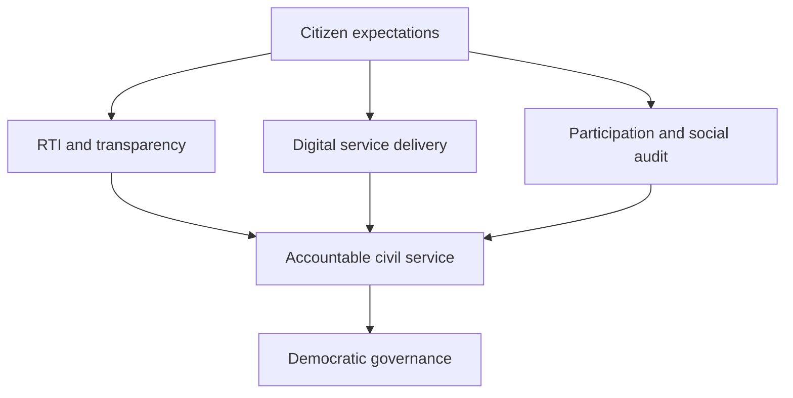

# Civil Services in Democracy & Emerging Governance Trends

> GS-2 · Governance Topic 4 · role of civil services, civil society, RTI, administrative reforms, neutrality and CBI

---

## PYQs

| Year | M | Words | Question (EN) | प्रश्न (HI) | ID |
|------|---|-------|---------------|-------------|-----|
| 2024 | 8 | 125 | Examine the role of civil society in Indian administrative development. | भारतीय प्रशासनिक विकास में नागरिक समाज की भूमिका का परीक्षण कीजिए। | Q1 |
| 2023 | 12 | 200 | Clarify the role of Civil Servants in strengthening the democratic process in India. | भारत में लोकतांत्रिक प्रक्रिया के सुदृढ़ीकरण में सिविल सेवकों की भूमिका को स्पष्ट कीजिए। | Q2 |
| 2022 | 12 | 200 | Write a critical note on problems and reforms of administrative system in Uttar Pradesh. | उत्तर प्रदेश की प्रशासनिक व्यवस्था की समस्याओं एवं सुधारों पर एक आलोचनात्मक टिप्पणी लिखिए। | Q3 |
| 2021 | 12 | 200 | Discuss the role of Civil Services in a democratic set-up with special reference to India. | एक जनतांत्रिक व्यवस्था में लोक-सेवाओं की भूमिका का भारत के विशेष सन्दर्भ में विवेचना कीजिए। | Q4 |
| 2020 | 12 | 200 | “Right to Information Act has forced civil servants to come out of steel frame and serve people sincerely.” Explain. | सूचना अधिकार अधिनियम ने लोकसेवकों को स्टील-फ्रेम के बाहर आकर निष्ठापूर्वक जनता की सेवा करने के लिये बाध्य किया है। व्याख्या करें। | Q5 |
| 2019 | 8 | 125 | The traditional quality of Civil Services has been Neutrality. Explain. | लोकसेवा का परम्परागत गुण तटस्थता रहा है। व्याख्या करें। | Q6 |
| 2018 | 12 | 200 | Describe the composition and functions of Central Bureau of Investigation (C.B.I.) in India. | भारत में केंद्रीय अन्वेषण ब्यूरो (सी.बी.आई.) के गठन और कार्य का वर्णन कीजिए। | Q7 |

---

## Quick Revision

```
CORE IDEA:
  Democracy needs elected leadership + permanent civil service + citizen participation + accountability institutions.
  Civil services are the bridge between constitutional goals and ground delivery.

CONSTITUTIONAL ANCHORS:
  Art 309 = recruitment/service conditions | Art 310 = pleasure doctrine | Art 311 = protection against arbitrary dismissal | Art 312 = All India Services.
  AIS = national integration + federal link + administrative continuity.

CIVIL SERVICES ROLE:
  Policy advice, implementation, welfare delivery, law and order, rule of law, federal coordination, disaster response, election support, record keeping, grievance redressal.
  Democratic strengthening: neutrality, constitutional loyalty, inclusion, last-mile delivery, social justice, transparency, ethical discretion.

NEUTRALITY:
  Means political impartiality + objective advice + faithful implementation of lawful orders.
  Not moral indifference: civil servants must uphold Constitution, rule of law, equality, rights and public interest.
  Risks: politicisation, transfers, post-retirement lure, fear of investigation, populist pressure.

EMERGING TRENDS:
  RTI, citizen charters, e-governance, social media scrutiny, data dashboards, lateral entry, specialisation, Mission Karmayogi, participatory governance, citizen-centric service delivery.

CIVIL SOCIETY:
  NGOs, SHGs, media, RTI activists, social movements, professional associations, community organisations.
  Role: feedback, social audit, PIL, awareness, inclusion, innovation, accountability pressure, co-production of services.
  Risks: elite capture, misinformation, donor agenda, street pressure, non-transparent advocacy.

UP ADMINISTRATION:
  Problems: population scale, vacancies, political interference, corruption, revenue disputes, police burden, weak local bodies, digital divide, pendency, regional imbalance.
  Reforms: e-District, IGRS, Bhulekh, SVAMITVA, CM dashboard, police/revenue reforms, local devolution, training, social audit, citizen charter, performance monitoring.

RTI + STEEL FRAME:
  Colonial steel frame = secrecy, hierarchy, file culture, distance from citizen.
  RTI Act 2005 = disclosure, answerability, proactive disclosure, record discipline, citizen oversight.
  Limits: vacancies in information commissions, delay, misuse claims, poor record management, fear-driven file noting.

CBI:
  Origin: DSPE Act 1946 + 1963 Home Ministry resolution. Under DoPT.
  Director selected by committee: PM, CJI/nominee, Leader of Opposition/largest opposition party leader.
  Functions: anti-corruption, economic offences, special crimes, court-referred cases, Interpol liaison.
  Limits: state consent under DSPE Act, political misuse charge, vacancies, dependence on govt, federal tension.

TRAPS:
  Neutrality ≠ silence before illegality | Civil servant ≠ elected politician | RTI ≠ only file copies
  CBI ≠ constitutional body | Civil society ≠ only NGOs | UP reform ≠ only digitisation
```

---

## Content

### Context — why civil services matter in democracy

Civil services are the permanent administrative machinery through which elected governments implement laws, policies and welfare promises. In a democracy, ministers provide political direction and are accountable to the legislature and people; civil servants provide continuity, expertise, record-based advice and ground implementation. They are expected to be politically neutral, constitutionally loyal, professionally competent and citizen-centric. This makes them a bridge between **constitutional morality** and **everyday service delivery**.

The Constitution recognises this role through service provisions. **Article 309** deals with recruitment and service conditions. **Article 310** contains the pleasure doctrine, meaning civil servants hold office during the pleasure of the President or Governor. **Article 311** protects civil servants from arbitrary dismissal, removal or reduction in rank by requiring due process. **Article 312** provides for **All India Services**, which create a common administrative framework across Union and states. The **IAS**, **IPS** and **Indian Forest Service** help maintain national integration, federal coordination and administrative continuity.

### Civil services and democratic governance

Civil services strengthen democracy when they make elected promises operational without becoming partisan instruments. They prepare policy notes, give objective advice, implement cabinet decisions, conduct elections, maintain law and order, collect revenue, deliver welfare, regulate markets, manage disasters, protect weaker sections and preserve public records. A district magistrate, police superintendent, block development officer, tehsildar, CDO, secretary, engineer, health officer or school administrator all shape citizens' lived experience of democracy.

| Democratic value | Role of civil services | Example |
|------------------|------------------------|---------|
| **Rule of law** | Apply law uniformly and record reasons. | Revenue, police, licensing and regulatory decisions. |
| **Political neutrality** | Serve elected government without partisan bias. | Smooth transition after election. |
| **Welfare delivery** | Convert schemes into benefits. | PDS, pensions, DBT, MGNREGA, PMAY, health programmes. |
| **Social justice** | Target vulnerable groups fairly. | SC/ST safeguards, disability certificates, women-child schemes. |
| **Accountability** | Maintain records and respond to audits/RTI. | RTI replies, CAG records, social audit compliance. |
| **Participation** | Work with Gram Sabha, NGOs and citizen feedback. | Local planning, social audit, grievance camps. |
| **Continuity** | Preserve institutional memory. | Disaster response, long-term infrastructure, law and order. |

A democratic civil servant must balance three loyalties: loyalty to the Constitution, loyalty to the elected government and loyalty to public interest. These are normally complementary, but tension arises when illegal orders, populist pressures or partisan demands conflict with constitutional values. The correct civil service ethic is not blind obedience; it is lawful, reasoned and impartial implementation.

### Neutrality — traditional quality and contemporary meaning

Neutrality has traditionally been called the core quality of civil services because the bureaucracy is permanent while governments change. Neutrality means political impartiality, objective advice, anonymity in policy advice and faithful implementation of lawful decisions. It enables continuity and public trust. A neutral civil servant does not change behaviour according to ruling party, caste, religion, personal ideology or electoral pressure.

However, neutrality does not mean moral indifference. In a constitutional democracy, neutrality must be anchored in **constitutional values**, **rule of law**, **equality**, **secularism**, **social justice** and **human dignity**. If an order violates law or fundamental rights, civil servants must record objections and follow due process. Thus, the modern ideal is **political neutrality plus constitutional commitment**.

| Traditional idea | Modern governance meaning |
|------------------|---------------------------|
| **Political neutrality** | No partisan bias in advice or delivery. |
| **Anonymity** | Advice remains internal, but accountability through records remains. |
| **Permanence** | Continuity across governments, not resistance to reform. |
| **Hierarchy** | Discipline, but not blind obedience to illegality. |
| **Expertise** | Evidence-based advice, data literacy and domain knowledge. |
| **Public service** | Citizen-centric delivery, not file-centric control. |

Neutrality is threatened by frequent transfers, political patronage, post-retirement appointments, fear of vigilance action, social media pressure and ideological polarisation. Reforms require fixed tenure, transparent postings, civil service board, performance appraisal, ethics training, whistle-blower protection and accountability for both action and inaction.

### Emerging trends reshaping civil services

Civil services no longer operate in the closed colonial "steel frame" model. The emerging governance environment is open, digital, participatory and scrutinised. **RTI Act 2005** exposed files to citizen questioning. **Citizen Charters**, **Right to Public Services laws**, **CPGRAMS**, **IGRS**, social media complaints and dashboards have made delay visible. **E-governance** has shifted many services from office counters to portals. **Mission Karmayogi** seeks competency-based capacity building. **Lateral entry** and domain specialisation reflect demand for expertise in infrastructure, climate, technology, finance and health. **Civil society** and media continuously question administration.



These trends have positive effects. They reduce secrecy, improve speed, create audit trails, bring citizen feedback and reward innovation. But they also create stress: online outrage may push hasty decisions; data dashboards may ignore qualitative realities; excessive fear of investigation may cause risk-averse bureaucracy; digital systems may exclude citizens without access. Therefore, civil servants need ethical judgement, communication skills, digital competence and field empathy.

### Civil society and administrative development

Civil society includes NGOs, SHGs, media, professional associations, RTI activists, social movements, community organisations, trade unions, resident welfare associations and citizen groups. It contributes to administrative development by making the state more responsive, inclusive and accountable.

Civil society helped convert administration from a closed system to a participatory one. The **Mazdoor Kisan Shakti Sangathan (MKSS)** movement popularised public hearings and social audit, influencing the RTI movement. NGOs working on education, health, disability, child rights, gender violence and tribal rights provide field evidence. SHGs and community organisations help deliver livelihoods, nutrition and sanitation behaviour change. Media and digital platforms expose administrative failure. PILs and rights campaigns push agencies to follow law. Professional associations contribute expertise.

| Civil society role | Administrative contribution | Governance caution |
|--------------------|-----------------------------|-------------------|
| **Feedback** | Shows ground gaps in schemes. | Must be evidence-based, not rumour-driven. |
| **Social audit** | Checks leakage and false reporting. | Needs access to records and local safety. |
| **Awareness** | Helps citizens claim rights and services. | Should avoid misinformation. |
| **Innovation** | Pilots models later adopted by government. | Scaling needs public finance and standards. |
| **Inclusion** | Represents marginalised communities. | Must avoid speaking without community consent. |
| **Accountability pressure** | Exposes delay, corruption and exclusion. | Should remain transparent and lawful. |

Civil society does not replace civil services; it complements and disciplines them. The best administrative development happens when civil servants treat civil society as a source of feedback and co-production, while ensuring transparency and constitutional public interest.

### Uttar Pradesh administrative system — problems and reforms

Uttar Pradesh is India's most populous state, so administrative challenges are magnified by scale. A single reform that works in a small state may be harder in UP because of population density, regional imbalance, rural-urban diversity, high litigation, migration, caste complexity, disaster vulnerability and resource constraints. Administrative quality in UP affects welfare delivery for millions.

Major problems include staff vacancies, frequent transfers, political interference, corruption in local offices, revenue disputes, police burden, slow grievance redressal, weak urban local bodies, limited Panchayat capacity, pendency in revenue courts, digital divide, poor inter-departmental coordination and uneven service quality between western UP, eastern UP and Bundelkhand. Revenue administration faces mutation delays, land disputes and encroachment. Police administration faces manpower pressure, investigation burden and public trust issues. Welfare departments face beneficiary identification, last-mile monitoring and leakage challenges.

Reforms should be governance-wide, not only technological. Digital reforms such as **e-District**, **Bhulekh**, **IGRS**, **CM dashboard**, **SVAMITVA**, online mutation and DBT improve transparency. Administrative reforms require fixed tenure, transparent transfers, field-level staffing, training, departmental convergence, citizen charters, social audit, local body empowerment, police reforms, revenue court modernization and grievance time limits. Capacity building through **Mission Karmayogi**, data-based monitoring and district-level innovation can help. But digitisation must be combined with field verification because land, policing and welfare disputes are social realities, not only database entries.

### RTI and the steel frame

The phrase "steel frame" was used for the colonial-era civil service because it provided administrative stability but also represented secrecy, hierarchy and distance from citizens. Independent India inherited this structure but gave it democratic responsibility. The **Right to Information Act, 2005** forced civil servants to come out of this closed culture by giving citizens a legal right to seek information from public authorities.

RTI changed civil service behaviour in several ways. It improved record discipline because file notings, decisions and expenditure details may be requested. It reduced arbitrary secrecy by making disclosure the norm and exemption the exception. It empowered citizens to question ration shops, pensions, recruitment, public works and local bodies. It strengthened whistle-blowers, media and civil society. It made public servants more careful in recording reasons and following procedure.

Yet RTI's impact is uneven. Information commissions face vacancies and pendency. Many departments still have poor record management. Some officials fear decision-making because file notings may be scrutinised out of context. Frivolous or repetitive RTI applications create administrative burden. The solution is not dilution of transparency but better proactive disclosure under **Section 4**, digitised records, trained public information officers, time-bound appeals and protection for genuine whistle-blowers.

### CBI — composition, functions and governance issues

The **Central Bureau of Investigation (CBI)** is India's premier central investigative agency. It traces its legal basis to the **Delhi Special Police Establishment Act, 1946** and was established as CBI through a **1963 Home Ministry resolution**. It functions under the **Department of Personnel and Training (DoPT)**. It is not a constitutional body.

The CBI is headed by a **Director**. The Director is selected by a high-powered committee consisting of the **Prime Minister**, the **Chief Justice of India or his nominee**, and the **Leader of Opposition in Lok Sabha** or the leader of the largest opposition party. The organisation has senior officers such as Special Director, Additional Director, Joint Directors, DIGs, SPs and investigating officers. Major divisions deal with anti-corruption cases, economic offences, special crimes, prosecution and policy/coordination. CBI also acts as India's National Central Bureau for **INTERPOL** coordination.

CBI functions include investigation of corruption cases involving central government employees and PSUs, economic offences such as bank frauds, special crimes such as serious murder or organised crime referred by states/courts, cases directed by High Courts or Supreme Court, and coordination with international agencies through Interpol. In corruption cases under the **Prevention of Corruption Act**, CBI has vigilance linkage with the **Central Vigilance Commission**.

The governance issues are well known. Under the DSPE Act, CBI generally needs state consent to investigate offences in a state, unless ordered by constitutional courts. Withdrawal of general consent by states creates federal friction. Allegations of political misuse affect credibility. Dependence on government for staff, budget and sanction can weaken autonomy. Delays, vacancies and low conviction in some categories create concern. Reforms include statutory clarity, functional autonomy, parliamentary oversight, transparent appointments, fixed tenure, forensic capacity and insulation from partisan use.

### Civil services, accountability and reform path

The future civil servant must be neutral but not indifferent, efficient but not mechanical, digital but not inaccessible, and accountable but not fear-driven. Governance reforms should focus on five areas. First, **ethics and constitutional values** through training and leadership. Second, **capacity and specialisation** through Mission Karmayogi, domain training and evidence-based policy. Third, **transparency and grievance redressal** through RTI, citizen charters, CPGRAMS and state grievance portals. Fourth, **field orientation** through district immersion, social audit and citizen feedback. Fifth, **institutional protection** through fixed tenure, rule-based transfers and protection from arbitrary pressure.

Civil servants strengthen democracy when they act as trustees of constitutional values, not masters of citizens or agents of parties. Their legitimacy rests on service, fairness and accountability.

### Contemporary relevance

- **Mission Karmayogi** makes competency-based capacity building central to civil service reform.
- **RTI, CPGRAMS, IGRS and service dashboards** keep civil servants under continuous citizen scrutiny.
- **Digital governance** requires officers to understand data, privacy, cyber risk and digital exclusion.
- **Frequent transfer debates** show why fixed tenure and civil service boards matter for neutrality.
- **State withdrawal of general consent to CBI** keeps federal investigative autonomy in current debate.
- **Social media complaints** create real-time accountability but also risk outrage-driven administration.
- **UP reforms such as e-District, Bhulekh, IGRS and SVAMITVA** show digitisation of service and land governance.
- **Civil society social audits** remain important for MGNREGA, PDS, local works and welfare delivery.

### Limits — balanced governance view

Civil services can strengthen democracy, but they can also weaken it if they become politicised, corrupt, inaccessible or excessively risk-averse. Civil society can improve administration, but it can also spread misinformation or represent narrow interests. RTI improves transparency, but weak records and vacant commissions limit impact. CBI improves accountability, but political misuse allegations and federal consent disputes weaken trust. UP's administrative reforms can improve service delivery, but without staff, training and local accountability, portals alone will not change citizen experience. The governance answer must therefore combine institutional autonomy, citizen oversight and performance accountability.

---

## Answers

### Q1: Examine the role of civil society in Indian administrative development. (2024, 8M, 125W)

**Introduction:**
> Civil society includes NGOs, SHGs, media, RTI activists, professional bodies and community organisations. It improves administration by bringing citizen voice, field feedback and accountability pressure.

**Main Points:**
- **Feedback Provider** — Civil society reports ground gaps in welfare delivery and service quality.
- **Accountability Tool** — RTI activists, media and social audits expose leakage and delay.
- **Participatory Planning** — NGOs and community groups help Gram Sabha and local planning.
- **Innovation Source** — Civil society pilots models in education, health, sanitation and livelihoods.
- **Inclusion Voice** — It represents women, tribals, disabled persons, workers and poor citizens.
- **Rights Awareness** — It helps citizens claim entitlements under welfare laws.
- **Governance Caution** — Civil society must remain transparent, evidence-based and lawful.

**Keywords (underline in exam):** Civil Society · Social Audit · RTI · Participation · Inclusion · Administrative Development

**Exam diagram (30 sec):**
```
Civil society -> feedback + audit + awareness + innovation
                       -> responsive administration
```

**Conclusion:**
> Civil society develops administration by making it more participatory, accountable and citizen-sensitive.

### Q2: Clarify the role of Civil Servants in strengthening the democratic process in India. (2023, 12M, 200W)

**Introduction:**
> Civil servants are the permanent executive machinery that converts constitutional values and elected mandates into everyday governance. Their role is central to democratic consolidation.

**Main Points:**
- **Rule of Law** — They apply laws uniformly and record reasoned decisions.
- **Free and Fair Elections** — Civil servants support election management under the Election Commission.
- **Policy Advice** — They provide objective, evidence-based advice to elected governments.
- **Welfare Delivery** — They implement PDS, pensions, health, education, MGNREGA and DBT schemes.
- **Social Justice** — They ensure benefits reach SCs, STs, women, minorities, disabled and poor citizens.
- **Law and Order** — They protect public order while respecting rights and due process.
- **Accountability** — RTI replies, audit records and grievance redressal make administration answerable.
- **Federal Link** — All India Services connect Union standards with state implementation.
- **Citizen Participation** — They work with Gram Sabha, civil society and social audits.

**Keywords (underline in exam):** Rule of Law · Neutrality · Welfare Delivery · Social Justice · RTI · All India Services · Citizen Participation

**Exam diagram (30 sec):**
```
Civil servants
 |-- law + welfare + advice
 |-- elections + order
 |-- accountability + participation
        -> stronger democracy
```

**Conclusion:**
> Civil servants strengthen democracy when they remain politically neutral, constitutionally committed and citizen-centric.

### Q3: Write a critical note on problems and reforms of administrative system in Uttar Pradesh. (2022, 12M, 200W)

**Introduction:**
> Uttar Pradesh's administrative system serves India's largest state population, so governance challenges are magnified by scale, diversity and high demand for public services.

**Problems:**
- **Population Scale** — Large population creates heavy pressure on police, revenue, welfare and health systems.
- **Vacancies and Capacity Gaps** — Field-level shortage affects inspections, grievance redressal and scheme delivery.
- **Political Interference** — Frequent transfers and local pressure weaken neutrality and continuity.
- **Revenue Disputes** — Mutation delays, land records and encroachment create litigation.
- **Corruption and Discretion** — Citizen-facing offices remain vulnerable to rent-seeking.
- **Weak Local Bodies** — Panchayats and ULBs often lack funds, staff and technical capacity.
- **Digital Divide** — Online systems help, but many citizens need assisted access.
- **Regional Imbalance** — Bundelkhand, eastern UP and western UP have different governance needs.

**Reforms:**
- **Digital Governance** — e-District, Bhulekh, IGRS, SVAMITVA and DBT can reduce opacity.
- **Personnel Reform** — Fixed tenure, transparent transfers and training should improve professionalism.
- **Local Devolution** — Stronger Panchayats and ULBs can improve last-mile delivery.
- **Revenue/Police Reform** — Time-bound revenue courts and investigation capacity are essential.
- **Citizen Accountability** — Citizen charters, social audit and grievance dashboards should be enforced.

**Keywords (underline in exam):** UP Administration · e-District · Bhulekh · IGRS · SVAMITVA · Fixed Tenure · Local Devolution

**Exam diagram (30 sec):**
```
UP problems: scale + vacancies + interference + disputes
Reforms: digital + tenure + local bodies + grievance
```

**Conclusion:**
> UP needs digital reform with field capacity, neutrality and local accountability, not digitisation alone.

### Q4: Discuss the role of Civil Services in a democratic set-up with special reference to India. (2021, 12M, 200W)

**Introduction:**
> In a democratic set-up, civil services are the permanent, professional and politically neutral machinery that assists elected governments and serves citizens under the Constitution.

**Main Points:**
- **Administrative Continuity** — Civil servants preserve institutional memory across changing governments.
- **Policy Implementation** — They translate laws and schemes into field action.
- **Policy Advice** — They give objective and evidence-based options to ministers.
- **Rule of Law** — They ensure decisions follow legal procedure and equality.
- **Welfare State Role** — India's poverty, diversity and inequality make civil services crucial for inclusive delivery.
- **Crisis Management** — They manage disasters, pandemics, riots, elections and relief.
- **Federal Coordination** — All India Services link Union priorities with state realities.
- **Accountability Interface** — They respond to RTI, audits, courts and grievance systems.
- **Democratic Participation** — They engage Panchayats, civil society and citizens in local governance.

**Keywords (underline in exam):** Permanent Executive · Political Neutrality · Rule of Law · Welfare State · All India Services · Accountability

**Exam diagram (30 sec):**
```
Elected govt -> policy direction
Civil service -> advice + implementation + continuity
Citizen -> feedback/accountability
```

**Conclusion:**
> Indian democracy needs civil services that are neutral in politics, committed to the Constitution and responsive to citizens.

### Q5: “Right to Information Act has forced civil servants to come out of steel frame and serve people sincerely.” Explain. (2020, 12M, 200W)

**Introduction:**
> The colonial “steel frame” symbolised secrecy, hierarchy and distance from citizens. The RTI Act, 2005 challenged this culture by legally empowering citizens to seek information.

**Main Points:**
- **Disclosure Culture** — RTI made information disclosure the rule and secrecy the exception.
- **Record Discipline** — Civil servants must maintain files, reasons and expenditure records carefully.
- **Citizen Oversight** — Citizens can question ration, pension, recruitment, works and service delays.
- **Reduced Arbitrariness** — Fear of disclosure discourages casual or biased decisions.
- **Social Audit Support** — RTI strengthens community verification of welfare schemes.
- **Proactive Disclosure** — Section 4 pushes departments to publish information without applications.
- **Behavioural Shift** — Officials must treat citizens as rights-holders, not petitioners.
- **Limitations** — Vacancies, pendency, poor records and misuse claims reduce impact.
- **Way Forward** — Digitised records, trained PIOs, time-bound appeals and whistle-blower protection are needed.

**Keywords (underline in exam):** RTI Act 2005 · Steel Frame · Section 4 · Record Discipline · Citizen Oversight · Social Audit

**Exam diagram (30 sec):**
```
Steel frame: secrecy + hierarchy
RTI: disclosure + records + citizen questioning
        -> sincere public service
```

**Conclusion:**
> RTI has democratised administration, but its promise depends on proactive disclosure and strong information commissions.

### Q6: The traditional quality of Civil Services has been Neutrality. Explain. (2019, 8M, 125W)

**Introduction:**
> Neutrality means civil servants serve the Constitution and elected government impartially, without partisan, caste, religious or personal bias.

**Main Points:**
- **Political Impartiality** — Civil servants should serve any elected government with equal professionalism.
- **Objective Advice** — They must give evidence-based advice, not politically convenient advice.
- **Faithful Implementation** — Lawful decisions of elected government must be implemented sincerely.
- **Continuity** — Neutrality preserves administration when governments change.
- **Public Trust** — Citizens trust services when officers do not act as party agents.
- **Constitutional Limit** — Neutrality does not mean obeying illegal or unconstitutional orders.
- **Threats** — Political transfers, patronage and post-retirement lure weaken neutrality.

**Keywords (underline in exam):** Neutrality · Political Impartiality · Objective Advice · Constitutional Loyalty · Rule of Law · Continuity

**Exam diagram (30 sec):**
```
Neutrality = no partisan bias
          + objective advice
          + lawful implementation
```

**Conclusion:**
> Neutrality remains essential, but modern neutrality must be anchored in constitutional values and citizen welfare.

### Q7: Describe the composition and functions of Central Bureau of Investigation (C.B.I.) in India. (2018, 12M, 200W)

**Introduction:**
> The Central Bureau of Investigation is India's premier central investigative agency, deriving legal powers from the DSPE Act, 1946 and established as CBI by a 1963 resolution.

**Composition:**
- **Administrative Control** — It functions under the Department of Personnel and Training.
- **Director** — Headed by a Director selected by a committee of Prime Minister, CJI/nominee and Leader of Opposition/largest opposition party leader.
- **Senior Hierarchy** — Special Director, Additional Director, Joint Directors, DIGs, SPs and investigating officers.
- **Functional Divisions** — Anti-corruption, economic offences, special crimes, prosecution and coordination wings.
- **International Link** — It acts as India's National Central Bureau for Interpol liaison.

**Functions:**
- **Anti-corruption Cases** — Investigates corruption involving central government employees and PSUs.
- **Economic Offences** — Handles bank frauds, financial crimes and major scams.
- **Special Crimes** — Investigates serious crimes referred by states or courts.
- **Court-directed Probes** — High Courts and Supreme Court can order CBI investigations.
- **Inter-state/International Coordination** — Handles complex cases needing central coordination.

**Limitations:**
- **State Consent** — DSPE Act requires state consent, creating federal tension.
- **Political Misuse Allegation** — Credibility suffers when seen as partisan.
- **Resource Constraints** — Vacancies and forensic gaps delay cases.

**Keywords (underline in exam):** CBI · DSPE Act 1946 · DoPT · Interpol · Anti-corruption · Economic Offences · State Consent

**Exam diagram (30 sec):**
```
CBI
 |-- anti-corruption
 |-- economic offences
 |-- special crimes
 |-- Interpol liaison
Limits: consent + autonomy + delay
```

**Conclusion:**
> CBI is a key accountability institution, but credibility requires autonomy, professionalism and federal trust.

### Q8: Likely PYQ — Explain the emerging trends affecting the role of civil services in Indian democracy. (Future Variant, 12M, 200W)

**Introduction:**
> Civil services in India are moving from a closed rule-bound bureaucracy to an open, digital, accountable and citizen-facing governance system.

**Main Points:**
- **Transparency Pressure** — RTI and proactive disclosure reduce secrecy.
- **Digital Governance** — Portals, dashboards, DBT and data systems demand digital competence.
- **Citizen Expectations** — Citizens expect time-bound, respectful and accessible services.
- **Civil Society Scrutiny** — NGOs, media and social audits question administrative outcomes.
- **Specialisation Need** — Climate, cyber, health and infrastructure require domain expertise.
- **Capacity Building** — Mission Karmayogi promotes competency-based training.
- **Social Media Accountability** — Real-time complaints increase responsiveness but may create hasty decisions.
- **Ethical Governance** — Neutrality must combine with constitutional commitment and inclusion.

**Keywords (underline in exam):** RTI · Digital Governance · Mission Karmayogi · Social Audit · Specialisation · Citizen-centric Administration

**Exam diagram (30 sec):**
```
Emerging trends: RTI + digital + civil society + specialisation
                    -> new civil service role
```

**Conclusion:**
> The emerging civil servant must be neutral, skilled, transparent and empathetic toward citizens.

### Q9: Likely PYQ — Suggest reforms to make civil services more accountable and citizen-centric. (Future Variant, 12M, 200W)

**Introduction:**
> Civil service reform should preserve neutrality and continuity while improving responsiveness, accountability and service quality.

**Main Points:**
- **Fixed Tenure** — Transparent postings reduce political pressure and improve continuity.
- **Capacity Building** — Mission Karmayogi and domain training improve competence.
- **Performance Standards** — Citizen charters and service guarantees make delivery measurable.
- **Grievance Redressal** — CPGRAMS/IGRS-style portals should be linked with accountability.
- **Transparency** — RTI, proactive disclosure and open dashboards reduce secrecy.
- **Ethics Framework** — Codes of conduct, conflict-of-interest rules and whistle-blower protection are needed.
- **Local Participation** — Social audits and Gram Sabha feedback improve ground truth.
- **Digital Inclusion** — Online systems must have assisted access and local-language interfaces.
- **Autonomy with Accountability** — Civil servants need protection for honest decisions and punishment for misconduct.

**Keywords (underline in exam):** Fixed Tenure · Mission Karmayogi · Citizen Charter · RTI · Social Audit · Grievance Redressal · Ethics

**Exam diagram (30 sec):**
```
Civil service reform
 |-- tenure + training
 |-- transparency + grievance
 |-- ethics + participation
```

**Conclusion:**
> Accountable civil services require both institutional protection from partisan pressure and strong citizen oversight.

---

## Traps

| Wrong | Correct |
|-------|---------|
| Civil services are outside democracy because they are unelected. | They support democracy by implementing elected mandates under constitutional limits. |
| Neutrality means no values. | Neutrality means political impartiality plus constitutional commitment. |
| Civil servants must obey every political order. | They must implement lawful orders and resist illegal or unconstitutional directions through due process. |
| RTI only gives citizens file copies. | RTI creates record discipline, transparency, accountability and citizen oversight. |
| Steel frame is always a positive phrase. | It indicates stability but also colonial secrecy and distance from citizens. |
| Civil society means only NGOs. | It includes NGOs, SHGs, media, social movements, professional bodies and community groups. |
| UP administrative reform is only digitisation. | It also needs staffing, training, tenure security, local devolution and social audit. |
| Dashboards replace field visits. | Digital monitoring must be verified through field inspection and citizen feedback. |
| CBI is a constitutional body. | CBI is based on DSPE Act powers and a 1963 executive resolution. |
| CBI can investigate any state case without consent. | State consent is generally needed unless constitutional courts order investigation. |
| CBI and CVC are the same. | CBI investigates; CVC supervises vigilance and advises in corruption matters. |
| Political neutrality means administrative passivity. | Neutral civil servants must actively deliver lawful policy and protect rights. |
| Social media complaints always improve governance. | They improve responsiveness but may also create outrage-driven administration. |
| Mission Karmayogi is only an online training portal. | It is a competency-based civil service capacity-building reform. |

---

*Complete.*
