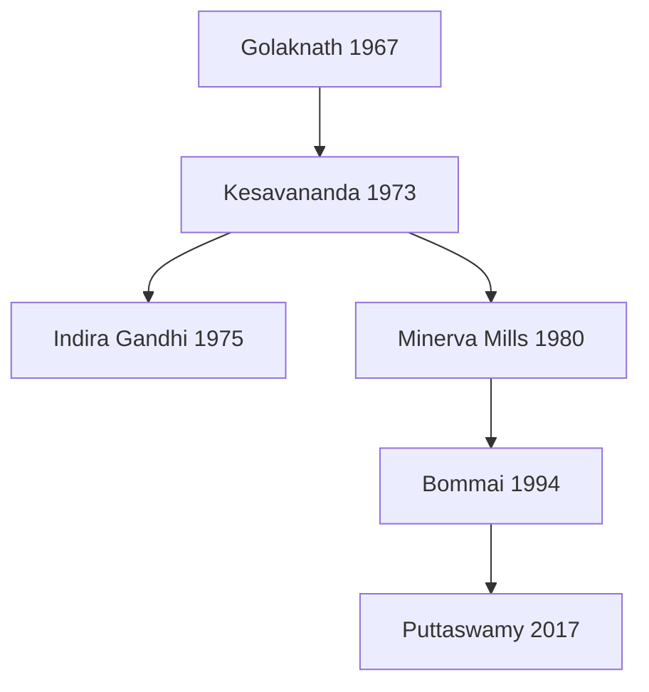

# Indian Constitution — Evolution, Features, Amendments & Basic Structure

> GS-2 · Topic 01 · Historical underpinnings, evolution, features, amendments, significant provisions, basic structure, SC role

---

## PYQs

| Year | M | Words | Question (EN) | प्रश्न (HI) | ID |
|------|---|-------|---------------|-------------|-----|
| 2025 | 12 | 125 | "India's Constituent Assembly was the legal outcome of Parliamentary developments during the Colonial period." Critically examine this statement. | "भारत की संविधान सभा असैनवेतिक काल की संसदीय गतिविधियों का विधिक परिणाम थी।" इस कथन का आलोचनात्मक परीक्षण कीजिए। | Q1 |
| 2025 | 8 | 125 | "Legislature is supreme within its domain, yet it is not sovereign." Examine this statement in the constitutional context with examples. | "विधायिका अपने क्षेत्राधिकार में सर्वोच्च है, तफिर भी वह संप्रभु नहीं है।" इस कथन का उदाहरण सहित संवैधानिक परिप्रेक्ष्य में परीक्षण कीजिए। | Q2 |
| 2024 | 8 | 125 | Write a short note on the composition of the Constituent Assembly. | संविधान सभा की संरचना पर एक संक्षिप्त टिप्पणी लिखिए। | Q3 |
| 2024 | 8 | 125 | How does the Indian Constitution ensure the independence of the judiciary? Discuss the importance of the basic structure doctrine. | भारतीय संविधान न्यायपालिका की स्वतंत्रता कैसे सुनिश्चित करता है? मूल संरचना सिद्धांत के महत्व पर चर्चा कीजिए। | Q4 |
| 2023 | 8 | 125 | Why the Preamble is called the Philosophy of the Indian Constitution? | प्रस्तावना को भारतीय संविधान का दर्शन क्यों कहा जाता है? | Q5 |
| 2023 | 8 | 125 | Why the 42nd Amendment is called a revision of the Indian Constitution? | 42वें भारतीय संशोधन को संविधान का पुनः लेखन क्यों कहा जाता है? | Q6 |
| 2023 | 12 | 200 | Critically examine the increasing powers and role of Prime Minister. How does it impact other institutions? | प्रधानमंत्री की बढ़ती शक्तियों और भूमिका का आलोचनात्मक परीक्षण करें। अन्य संस्थाओं पर इसका कैसे प्रभाव पड़ता है? | Q7 |
| 2022 | 8 | 125 | What are the rights within the ambit of Article 21 of the Indian Constitution? | भारत के संविधान के अनुच्छेद 21 की परिधि में कौन-कौन से अधिकार शामिल हैं? | Q8 |
| 2022 | 12 | 200 | Discuss the evolution and impact of the "Basic structure doctrine" of the Indian Constitution. | भारतीय संविधान के "आधारभूत ढांचा सिद्धांत" के विकास एवं प्रभाव की विवेचना कीजिए। | Q9 |
| 2021 | 8 | 125 | The Preamble of the Constitution affirms the basic features of the Constitution and the promotion of human dignity. Elucidate. | संविधान की उद्देशिका संविधान के आधारभूत लक्षण एवं मानव गरिमा की वृद्धि का प्रतिज्ञान करती है। स्पष्ट कीजिए। | Q10 |
| 2019 | 8 | 125 | The philosophy of Indian Democracy is embodied in the Preamble of the Constitution of India. Explain. | भारतीय लोकतंत्र का दर्शन भारत के संविधान की प्रस्तावना में सन्निहित है। व्याख्या कीजिए। | Q11 |
| 2019 | 12 | 200 | What do you understand by 'Doctrine of Basic Structure'? Analyse its importance for Indian Constitution. | 'आधारभूत ढाँचे का सिद्धांत' से आप क्या समझते हैं? भारतीय संविधान के लिए इसके महत्व का विश्लेषण कीजिए। | Q12 |
| 2019 | 12 | 200 | Examine the Right to Life in the Constitution of India. | भारत के संविधान में जीवन के अधिकार की समीक्षा कीजिए। | Q13 |
| 2018 | 12 | 200 | The action of Indian Government on Article 370 has changed the Status-Quo in Jammu and Kashmir. How will it affect the development in the region? Discuss. | धारा 370 पर भारत सरकार की कार्यवाही ने जम्मू-कश्मीर की यथास्थिति पर परिवर्तन किया है। यह इस क्षेत्र के विकास को किस प्रकार से प्रभावित कर सकता है? चर्चा कीजिए। | Q14 |
| 2018 | 12 | 200 | Examine Right to Equality as a Fundamental Right in the Constitution of India. | भारत के संविधान में समानता के मूलाधिकार की समीक्षा कीजिए। | Q15 |

---

## Quick Revision

`
COLONIAL SPINE: 1773 Regulating (GG Bengal, SC Calcutta 1774) → 1784 Pitt Dual Govt (Board of Control)
  → 1793/1813/1833/1853 Charters (1833 GG of India+Law Member; 1853 ICS open competition)
  → 1858 Crown + SoS + Viceroy (Canning) + Queen Proclamation 1 Nov
  → 1861 portfolio (Canning) → 1892 budget/questions/indirect → 1909 Muslim separate electorates (S.P. Sinha)
  → 1919 Dyarchy + Chamber of Princes + bicameral Centre (~60/~140) + PSC
  → Simon 1927 (all-British) → Nehru Report 1928 → Jinnah 14 Points 1929 → RTCs 1930–32
  → Communal Award 16 Aug 1932 → Poona Pact 24 Sep 1932 (71→148 reserved, joint)
  → 1935 GOI: Provincial Autonomy (works 1937); Federation NEVER; Centre Dyarchy NEVER
     Lists 59/54/36; residuary=Viceroy; Federal Court 1937; RBI; Burma/Aden out
  → Aug Offer 1940 → Cripps 1942 → Wavell/Shimla 1945 → Cabinet Mission 1946 + Interim (24 Aug/2 Sep)
  → Mountbatten 3 Jun 1947 → Independence Act 18 Jul → 15 Aug Dominions → CA legal child

CONSTITUENT ASSEMBLY: Idea 1934 (M.N. Roy) · INC 1935 · Nehru 1938 · Cabinet Mission 1946
  389 = 296+93 → 299 after Partition | Indirect PR-STV | Princely nominated | ~15 women
  9 Dec 1946 Sinha · 11 Dec Prasad · 13 Dec Objectives Res. · 22 Jul 1947 Flag
  Drafting 29 Aug 1947 Ambedkar (7) · Adviser B.N. Rau · Union/Union Const=Nehru · Provincial/Advisory=Patel
  FR Sub=Kripalani · Minorities=H.C. Mukherjee · Adopted 26 Nov 1949 · Last meet 24 Jan 1950 (Anthem+Song)
  Enforce 26 Jan 1950 · 395 Arts / 22 Parts / 8 Sch (original) · First Pres Prasad · First PM Nehru

BORROWED: UK parl/cabinet/writs · USA FR/review/impeach · Ireland DPSP · Canada residuary Centre
  · Australia Concurrent+joint sitting · Germany FR Emergency suspend · Japan procedure established by law
  · GOI 1935 largest structural source | TRAP: residuary≠Australia; Concurrent≠Canada

SALIENT: Lengthiest · Rigid+flexible Art 368 · Quasi-federal · Parliamentary · Integrated judiciary
  · FR+DPSP+Duties · Secular-Socialist-Democratic-Republic · Single citizenship · EC/CAG/UPSC
  · Emergency 352/356/360 · 73rd/74th · Sch I–XII awareness

PREAMBLE: Sovereign Socialist Secular Democratic Republic · Justice/Liberty/Equality/Fraternity
  · 42nd added Socialist Secular · Kesavananda: part of Const, amendable in BS · Berubari: key not power

42nd (1976) Mini Const: Preamble · Art 31C · DPSP 39A/43A/48A · Art 51A · terms 5→6 · review bar
44th (1978): rollback · Art 21 unsuspendable · delete 368(4–5) · Minerva Mills harmony

BASIC STRUCTURE (Kesavananda 1973): cannot destroy identity
  Elements: supremacy · republic-democracy · secular · federal · separation · rule of law · review
  · FR dignity · free elections · Art 32 · limited amend · judicial independence
  Cases: Golaknath67 · Kesavananda73 · Indira75 · Minerva80 · Bommai94 · Coelho07 · NJAC15 · Puttaswamy17

SC ROLE: Guardian · Art 13/32/142 · Art 21 Maneka/Olga/Puttaswamy · PIL · Collegium · BS arbiter · Art 370 SC 2023

ART 14: equality before law + equal protection · reasonable classification · arbitrariness (Royappa/Maneka)
ART 15–18: non-discrimination · jobs · untouchability · titles
ART 21: dignity bundle — livelihood shelter health environment speedy trial privacy 21A rarest-of-rare
LEGISLATURE: Art 245–246 Sch VII supreme in domain BUT not sovereign (FR, review, BS, federal limits)
JUDICIARY INDEP: tenure · Consolidated Fund · Art 121 · impeachment 124(4) · Collegium · Art 50/129/142
ART 370: temporary → Aug 2019 C.O.+Reorg Act → UTs · schemes/investment vs federal/representation debate
PM: Art 74–75 de facto head · PMO · impact on Cabinet/President/Parliament/bureaucracy · BS buffers

TRAPS: CA≠direct franchise · 389 at adoption FALSE (299) · Chamber of Princes=1919 not 1935
  · Federation 1935 NEVER · Poona Pact≠1933 · Residuary=Canada · Drafting≠Nehru · Adopt≠Enforce date
  · 42nd≠Preamble only · BS≠in text · Art21≠physical life only · Legislature≠UK sovereign
  · Preamble≠standalone enforceable · Secular word=42nd · GG Bengal≠GG India
`

---

## Content

### Context — what the Constitution is and why colonial lineage matters

**What the Constitution is**
- The **Indian Constitution** is the **supreme law** of the land.
- Single **written document** that:
  - Creates institutions — **Parliament**, **President**, **judiciary**, **Election Commission**.
  - Distributes power between **Union and States**.
  - Lists citizens' **Fundamental Rights**.
  - Sets the **procedure for its own change** (**Art 368**).
- **Adopted:** **26 November 1949** (Constitution Day / Samvidhan Divas).
- **Came into force:** **26 January 1950** (Republic Day) — chosen to honour **Purna Swaraj Day (1930)**.
- Replaced colonial sovereignty with a **sovereign democratic republic**.
- Ultimate source of authority: the **people** — not the Crown or Parliament alone.

**Two linked stories**
1. **Colonial continuity (1773–1947)** — British Acts created the **legal machinery** (councils, federal blueprints, dominion status) that made a **Constituent Assembly** thinkable and lawful.
2. **Republican rupture** — CA abolished **separate electorates**, **paramountcy**, **restricted franchise**; borrowed skeleton of **GOI Act 1935**; produced **FR + universal adult franchise + Republic**.

**Verdict**
- Neither foreign transplant nor mere colonial continuation.
- **Transformative republican charter** born through a **legal chain** it simultaneously superseded.
- Founding tension: **continuity and rupture** → Preamble, Art 368, basic structure, Art 21, Art 370 debates.

---

### Colonial constitutional development — full chain (1773 → 1947)

**Overview**
- Not one static constitution — successive **Charter / Councils / GOI Acts**.
- Arc: **centralise Company rule** → **Crown rule** → **Indian association without responsibility** → **Dyarchy** → **Provincial Autonomy + federal blueprint** → **transfer of power + CA**.
- Exam filter: **firsts**, **what never operated**, **chronology**, **Dyarchy vs Provincial Autonomy**.

#### Regulating Act, 1773
- First landmark toward **central administration** in British India.
- Context: Company expansion/corruption after **Plassey (1757)**.
- **Governor-General of Bengal** — first: **Warren Hastings** (Council of **4**).
- **Bombay & Madras** subordinated to Bengal.
- **Supreme Court at Calcutta (1774)** — first CJ often tagged **Elijah Impey**.
- Court of Directors to **report** to British government.
- Restricted **private trade/presents** by Company servants.
- *Mechanism:* regulated Company politics; did **not** end Company rule.
- Weakness: **SC vs GG-in-Council** jurisdiction clash → **Act of 1781 (Amending Act)** tried to settle boundaries.
- Trap: this creates **GG of Bengal**, **not** GG of India (that is **1833**).

#### Pitt's India Act, 1784
- Remedied Regulating Act defects after Hastings controversies.
- Created **Board of Control** (Crown/political) + **Court of Directors** (Company/commercial) = **Dual Government**.
- Phrase lock: "British possessions in India."
- Dual Government continued until **1858**.
- Do **not** confuse with **Dyarchy (1919)**.

#### Charter Acts
**1793**
- Renewed Company privileges; commercial monopoly continued; GG–Council framework refined.

**1813**
- Ended Company **trade monopoly** except **tea & China**.
- **₹1 lakh** annual education grant.
- Christian **missionaries** allowed.

**1833**
- **Governor-General of Bengal → Governor-General of India** (first: **Lord William Bentinck**).
- Company **commercial functions ended** — purely administrative body.
- **Law Member** added — first: **Lord Macaulay** (codification → later IPC).
- Open competition proposed in principle; **effective open competition = 1853**.

**1853**
- **Open competition** for **ICS** (ends Directors' patronage monopoly).
- **Macaulay Committee (1854)** companion tag for ICS reform.
- Separated **legislative** from **executive** Council functions; local/provincial representation in legislative wing.
- No traditional fixed **20-year** charter renewal — Company rule nearing end.
- Last major Charter before Crown rule.

*Why Charters matter:* enlarged deliberation + centralisation habits inherited by CA.

#### Government of India Act, 1858
- After **1857 Revolt** — end of **Company rule**, start of **Crown rule**.
- Created **Secretary of State for India** + **Council of India**.
- Abolished **Board of Control** and **Court of Directors**.
- GG given title **Viceroy** — first: **Lord Canning**.
- Companion: **Queen's Proclamation, 1 Nov 1858** — Crown rule; religious non-interference; equal treatment promise.
- India under direct responsibility of British Parliament via SoS.
- No responsible government for Indians yet.

#### Indian Councils Act, 1861
- **Portfolio system** (Lord **Canning**) — departmental executive business.
- Indians **nominated** to Legislative Council.
- Restored legislative powers to **Bombay & Madras**.
- GG **ordinance** power for emergencies.
- Indians in **consultative** legislation — **no** responsible government.

#### Indian Councils Act, 1892
- Expanded councils.
- Element of **indirect election** (local bodies/associations recommend).
- Members may discuss **budget** and ask **questions**.
- Still: association, not responsibility.

#### Indian Councils Act, 1909 (Morley–Minto)
- Enlarged Imperial & Provincial Legislative Councils.
- **Separate electorates for Muslims** — communal representation by law.
- First Indian in GG's Executive Council: **S.P. Sinha**.
- Morley = SoS; Minto = Viceroy.
- Still **no** responsible government.
- CA later **abolished** separate electorates — colonial continuity broken.

#### Montagu–Chelmsford / GOI Act, 1919
- Embodied **Montagu Declaration (Aug 1917)** goal of responsible government.
- **Dyarchy in provinces**:
  - **Transferred** (ministers) — education, health, local self-government, agriculture, public works.
  - **Reserved** (Governor) — police, justice, land revenue, irrigation, press control.
- Centre: **bicameral** — Council of State ~**60**; Legislative Assembly ~**140**.
- **Direct elections** under restricted franchise.
- Central & provincial subjects demarcated.
- **Public Service Commission** provided for.
- **Chamber of Princes (Narendra Mandal)** — UPPCS favourite (tied to **1919**, not 1935).
- Statutory Commission after 10 years → pathway to **Simon**.
- Failed (ministers lacked finance/Reserved levers) → case for **1935 Provincial Autonomy**.
- Centre not fully responsible to Indian legislature.

#### Government of India Act, 1935
- Longest British Indian statute; **largest structural source** of 1950 Constitution (~**250/395** Articles lineage).
- **Provincial Autonomy** — ended provincial Dyarchy; operated from **1937** ministries.
- **All-India Federation** — **never** came (princes did not accede).
- **Dyarchy at Centre** — **never** operated.
- Three lists: Federal **59** / Provincial **54** / Concurrent **36**.
- **Residuary powers** with **Viceroy** (strong Centre).
- **Federal Court** established (**1937**) — precursor to SC.
- **RBI**; Federal/Provincial/Joint **PSCs**; All-India Services continuity.
- **Council of India** (1858) **abolished**.
- **Burma** & **Aden** separated.
- Bicameralism in **6** of 11 provinces; franchise ~**10%**.
- Governor's special responsibilities — autonomy substantial, not absolute.
- Exam split: **what operated** vs **what never came**.

#### Indian Civil Service (ICS) — administrative steel frame
- Backbone of British district administration (collector–magistrate).
- Pre-competition: Directors' **patronage**; training at **Haileybury College**.
- **Charter 1853** + **Macaulay Committee 1854** → open competition.
- London-centred exams limited Indian entry; gradual Indianisation.
- First Indian ICS often cited: **Satyendranath Tagore**.
- **Covenanted** (higher ICS) vs **uncovenanted** (subordinate).
- PSC institutionalisation after **1919**.
- Continuity into independent India's higher civil services.

#### Separate electorates — full arc
- **Separate electorate** = only community voters elect community candidates.
- **1909** — Muslim separate electorates begin.
- Later reforms extend communal devices to more groups.
- **Communal Award (16 Aug 1932, Ramsay MacDonald)** — separate electorates for Depressed Classes (+ Muslims, Sikhs, Indian Christians, Anglo-Indians, Europeans awareness).
- **Poona Pact (24 Sep 1932, Gandhi–Ambedkar)** — Depressed Classes: **joint electorates + reserved seats** (**148** vs Award's **71**); Yerwada fast context.
- CA (esp. **Patel**) rejects separate electorates; Constitution adopts **joint electorates** (+ temporary SC/ST reserved seats).
- Trap: Poona Pact ≠ Gandhi–Irwin (1931); year ≠ 1933.

#### Simon Commission & Nehru Report
- **Simon Commission (1927)** — all-British (**Sir John Simon**); arrived 1928; boycott — "Simon Go Back."
- Advanced review to undercut expected Labour softness; Indians rejected exclusion.
- **Nehru Report (1928)** — **Motilal Nehru** chair — Dominion Status, parliamentary system, FR, **joint electorates**, linguistic provinces.
- **Jinnah's Fourteen Points (1929)** — counter-pole (separate electorates, provincial residuary, Muslim guarantees).
- **Lahore Congress 1929** — **Purna Swaraj** (beyond Nehru Report Dominion frame).
- Simon → RTCs → White Paper → **GOI 1935**.
- Trap: Nehru Report **not** drafted by Simon; Simon had **no** Indian members.

#### Round Table Conferences (1930–32)
- **1st RTC (Nov 1930–Jan 1931)** — Congress absent (CDM/jail); Liberals, League, princes attend.
- **Gandhi–Irwin Pact (Mar 1931)** enables Congress at 2nd RTC.
- **2nd RTC (Sep–Dec 1931)** — **Gandhi** sole Congress representative; deadlock on minorities/federation.
  - Attended: Sarojini Naidu, Madan Mohan Malaviya; **Rajendra Prasad did NOT** (UPPCS trap).
  - Ambedkar attended for Depressed Classes.
- **Communal Award / Poona Pact** between 2nd and 3rd RTC.
- **3rd RTC (Nov–Dec 1932)** — weak Congress presence → **White Paper 1933** → Joint Select Committee → **GOI 1935**.

#### August Offer, Cripps, Wavell (1940–45)
- **August Offer (8 Aug 1940, Linlithgow)** — dominion after war; expanded Executive Council; post-war constitution-making body (CA idea in principle).
- **Cripps Mission (Mar 1942)** — Dominion after war; Indians frame constitution; provinces may **opt out/secede**; Congress rejects ("post-dated cheque"); League rejects (weak Pakistan guarantee) → **Quit India (Aug 1942)**.
- **Wavell Plan + Shimla Conference (1945)** — fails on League nomination monopoly claim.
- Chronology lock: Cripps → Wavell/Shimla → Cabinet Mission.

#### Cabinet Mission & Interim Government (1946)
- Members: **Pethick-Lawrence, Stafford Cripps, A.V. Alexander** (Plan **16 May 1946**).
- Rejected sovereign Pakistan; proposed **Union** with limited Centre (defence, foreign affairs, communications + related finance).
- **Groups:** A (Hindu-majority), B (NW Muslim-majority), C (Bengal–Assam).
- CA of **389**: British India **296** + princely **93** (standard split); indirect election by provincial assemblies (**PR-STV**); ~1 seat / **10 lakh**.
- Princely representatives **nominated**.
- **Direct Action Day 16 Aug 1946** → League boycott of early CA.
- **Interim Govt** announced **24 Aug 1946**; office **2 Sep 1946**; League joins **Oct 1946**.
- CA = creature of British negotiation (legal half of colonial-origin thesis).

#### Mountbatten Plan & Indian Independence Act, 1947
- **Mountbatten Plan / 3 June Plan** — Partition into two Dominions; **15 Aug 1947**; princes free to accede; Radcliffe boundaries.
- **Indian Independence Act (18 July 1947)** — legal instrument:
  - Two **independent Dominions** from 15 Aug 1947.
  - **SoS for India abolished**.
  - **Paramountcy lapses**.
  - GG/Governors become **constitutional (nominal)** heads.
  - CAs get **dual powers** (constituent + legislative).
  - Adapted **GOI 1935** bridges until new constitutions.
- First GG Dominion India: **Mountbatten**; first Indian GG: **C. Rajagopalachari**.
- CA used legal birth to make **Republic + FR + Art 326** — transformative half.
- Date traps: **3 June** Plan / **18 July** Act / **15 Aug** Dominion / **26 Jan 1950** Republic.

| Milestone | Mechanism | Legacy for 1950 |
|-----------|-----------|-----------------|
| **1773 Regulating** | GG Bengal + SC under statute | Central executive + apex court template |
| **1919 Dyarchy** | Transferred vs Reserved | Failed; informed federal design |
| **1935 GOI** | Lists, Provincial Autonomy, Federal Court | Sch VII, quasi-federalism, review roots |
| **1946 Cabinet Mission** | 389 CA, indirect election | CA legal birth |
| **1947 Independence Act** | Dominion CA as framer | Legal chain ends; republican content begins |


---

### Constituent Assembly — composition, working, transformative output

#### Origin of demand
- **M.N. Roy (1934)** first proposes CA.
- **INC (1935)** official demand.
- **Nehru** — Faizpur **1936**, Haripura **1938** — wants CA by **universal adult franchise** (actual CA did not fully meet this).
- League participates then **boycotts** after Direct Action; many seats vacant early on.

#### Composition & election
- Original **389** = **296** British India + **93** princely (standard); after Partition → **299**.
- Indirect election by provincial assemblies — **PR / single transferable vote**.
- Princely members **nominated**.
- Congress majority; ~**15** women members.
- **284** signed final draft (**26 Nov 1949**).
- Not fully representative at inception (League boycott, uneven princely entry).

#### Leadership, dates, committees
- **9 Dec 1946** — first meeting; interim President **Sachchidananda Sinha**.
- **11 Dec 1946** — permanent President **Rajendra Prasad**; VP often tagged **H.C. Mukherjee**.
- **13 Dec 1946** — **Objectives Resolution** (Nehru); adopted **22 Jan 1947** → Preamble philosophy.
- **22 Jul 1947** — National Flag adopted.
- **29 Aug 1947** — **Drafting Committee** (7 members; Ambedkar Chair).
- **B.N. Rau** — Constitutional Adviser; initial draft **Oct 1947** / published **21 Feb 1948**.
- **26 Nov 1949** — Constitution adopted.
- **24 Jan 1950** — last CA meeting; **Jana Gana Mana** (Anthem) + **Vande Mataram** (National Song); Prasad elected first President.
- **26 Jan 1950** — enforcement; Republic.
- Duration: **2 yr 11 mo 18 days**; **11 sessions**; ~**165** sitting days.
- CA seal: **Elephant**.
- After 15 Aug 1947 CA also acts as Dominion Legislature (**dual functions**).

| Committee | Chairperson |
|-----------|-------------|
| **Drafting Committee** | **Dr. B.R. Ambedkar** |
| **Union Powers / Union Constitution** | **Jawaharlal Nehru** |
| **Provincial Constitution** | **Sardar Patel** (not Azad) |
| **Advisory Committee (FR/Minorities/Tribal)** | **Sardar Patel** |
| **FR Sub-Committee** | **J.B. Kripalani** |
| **Minorities Sub-Committee** | **H.C. Mukherjee** |
| **Excluded & Partially Excluded Areas** | **A.V. Thakkar** |
| **Rules of Procedure / Steering** | **Rajendra Prasad** |

**Drafting Committee (7):** Ambedkar (Chair), N. Gopalaswami Ayyangar, Alladi Krishnaswami Ayyar, K.M. Munshi, Syed Mohammad Saadulla, B.L. Mitter (later N. Madhava Rau), D.P. Khaitan (later T.T. Krishnamachari).

#### Sources & borrowed features

| Feature | Source | Trap |
|---------|--------|------|
| Parliamentary govt, Rule of Law, Cabinet, single citizenship, writs, bicameralism | **UK** | Not USA |
| FR, Judicial Review, Independent judiciary, Impeachment, Vice-President | **USA** | Not UK |
| DPSP, RS nomination, President election method | **Ireland** | Not USA |
| Strong-Centre federation, **Residuary with Centre** | **Canada** | **Not Australia** |
| **Concurrent List**, trade/commerce freedom, joint sitting | **Australia** | Not Canada |
| FR suspension in Emergency | **Germany (Weimar)** | — |
| Procedure established by law (Art 21 origin) | **Japan** | — |
| Republic; Liberty–Equality–Fraternity ideals | **France** | — |
| Fundamental Duties; Preamble justice tags | **USSR / socialist thought** | Later 42nd for Duties |
| Lists, Governor, emergency lineage, PSC, Federal Court | **GOI Act 1935** | Largest structural source |

**Indian originality**
- Universal adult franchise from day one (**Art 326**).
- Quasi-federalism + single citizenship + integrated judiciary.
- FR–DPSP–Duties triad; Schedule IX (later Coelho-limited); asymmetric federalism (**Art 371**, 5th/6th Schedules).
- **Basic structure** — uniquely Indian judicial innovation.

#### Firsts & number locks (raata)

| First | Who/What | Year/Act |
|-------|----------|----------|
| GG of Bengal | Warren Hastings | 1773 |
| CJ, SC Calcutta | Elijah Impey | 1774 |
| GG of India | William Bentinck | 1833 |
| Law Member | Macaulay | 1833 |
| Viceroy | Canning | 1858 |
| Portfolio system | Canning | 1861 |
| Open competition ICS | Charter 1853 | 1853 |
| Muslim separate electorates | Morley–Minto | 1909 |
| Indian Executive Councillor | S.P. Sinha | 1909 era |
| Dyarchy / Chamber of Princes | GOI 1919 | 1919 |
| Provincial Autonomy / Federal Court | GOI 1935 / 1937 | 1935–37 |
| CA temp / permanent President | Sinha / Prasad | Dec 1946 |
| Drafting Chair / Constitutional Adviser | Ambedkar / B.N. Rau | 1947 |
| First President / First PM | Prasad / Nehru | 1950 |
| First Indian GG | C. Rajagopalachari | post-Mountbatten |

---
### Salient features — each explained

#### Lengthiest written constitution
- Often called the **world's lengthiest written constitution**.
- Original: **395 Articles**, **22 Parts**, **8 Schedules** → today **470+ Articles**, **25 Parts**, **12 Schedules** (approx.; grows with amendments).
- One document governs **Union + States + UTs** in exhaustive detail (unlike short US framework).
- Length reflects **diversity management** — SC/ST, tribes, languages, emergency, finance — and creates **amendment/litigation pressure**.

#### Schedules at a glance (high-yield)
| Schedule | Content lock |
|----------|--------------|
| **I** | Names of States & UTs; territories |
| **II** | Emoluments — President, Governors, Speakers, Judges, CAG, etc. |
| **III** | Forms of Oaths/Affirmations |
| **IV** | Allocation of Rajya Sabha seats to States/UTs |
| **V** | Administration of **Scheduled Areas & Scheduled Tribes** |
| **VI** | Administration of **Tribal Areas** in Assam, Meghalaya, Tripura, Mizoram |
| **VII** | **Union / State / Concurrent Lists** (Art 246) |
| **VIII** | **Official Languages** |
| **IX** | Acts/regulations protected from judicial challenge (land reform era; limited by **I.R. Coelho 2007**) |
| **X** | **Anti-defection** (10th Schedule) |
| **XI** | Panchayats — **29 subjects** (73rd) |
| **XII** | Municipalities — **18 subjects** (74th) |

#### Blend of rigidity and flexibility
- **Art 368** three tiers:
  1. **Simple majority** (outside Art 368) — e.g. **Art 2–4** state formation/boundaries.
  2. **Special majority** — majority of total membership + ≥2/3 present and voting (most FR/DPSP changes).
  3. Special majority + **ratification by half the States** — federal core (President election, Sch VII, SC/HC, Art 368 itself, state representation in Parliament).
- More flexible than **USA Art V**; more protected than **UK** parliamentary sovereignty.
- **Basic structure** adds **judicial ceiling** on substance.

#### Quasi-federalism
- **Federal in form:** Sch VII, Art 246, state legislatures, Art 131.
- **Unitary in spirit:** residuary **Art 248**, Art **249/250/252/253**, **Art 356**, single citizenship, AIS (**Art 312**), Governor as Centre's agent.
- Ambedkar: federal in structure, **unitary in spirit**; Wheare: **quasi-federal**.
- Strong Centre design + Patel's princely integration = national unity priority.

#### Parliamentary system + responsible government
- Westminster pattern: **President (Art 52)** head of state; **PM + Council (Art 74–75)** real executive.
- Collective responsibility to **Lok Sabha (Art 75(3))** — confidence or resign.
- Fusion of executive–legislature (not US separation).

#### Integrated yet independent judiciary
- Single hierarchy: **SC (Art 124)** → **HCs (Art 214)** → subordinate courts.
- **Judicial review** — Art **13, 32, 226, 227**.
- Guardian of FR and federal balance.

#### FR + DPSP + Fundamental Duties
- **Part III FR** — justiciable; **Art 32** "heart and soul" (Ambedkar).
- **Part IV DPSP** — non-justiciable socio-economic goals; guide legislation.
- **Part IV-A Art 51A** — **10 duties** via **42nd (1976)**; **11th** via **86th (2002)** (education of children 6–14).
- Rights–duties–welfare **triad**.

#### Other key features
- **Secular state** — word added by **42nd**; equidistance + reform (**Art 25–28**); basic structure (**Bommai**).
- **Single citizenship (Art 5–11)** — unlike US dual.
- **Universal adult franchise (Art 326)** — from inception; radical vs colonial restricted franchise.
- **Independent bodies** — **EC (324)**, **CAG (148)**, **UPSC (315)**.
- **Emergency provisions (Part XVIII)** — Art **352** national, **356** President's Rule, **360** financial (never used).
- **Three-tier local government** — **73rd/74th** Amendments; Sch XI/XII.
- **Independent institutions + ordinance power (Art 123/213)** — continuity from colonial practice, constitutionally bounded.

| Feature | Operation | Why it matters |
|---------|-----------|----------------|
| Lengthiest written | One exhaustive Union–State code | Unity amid diversity; amendment load |
| Quasi-federal | Division + Centre override tools | Holds nation; risks over-centralisation |
| Parliamentary | PM/Cabinet ↔ Lok Sabha confidence | Responsive but needs stable majorities |
| Judicial review | Strike unconstitutional law | FR + federalism protection |
| Art 368 + basic structure | Amendable, not destructible | Adaptability with identity |

---

### Preamble — philosophy of the Constitution

**Text identity**
- Declares India a **Sovereign, Socialist, Secular, Democratic, Republic**.
- Resolves: **Justice** (social, economic, political); **Liberty** (thought, expression, belief, faith, worship); **Equality** (status, opportunity); **Fraternity** (dignity + unity/integrity of nation).

**Ideals**
- **Sovereign** — free externally; internally self-governing; law from Constitution, not colonial authority.
- **Socialist (42nd, 1976)** — Indian socialism: reduce inequalities (**Art 38**), strategic public sector, DPSP welfare — not Soviet abolition of property; Ambedkar's **economic democracy**.
- **Secular (42nd)** — no official religion; equal faiths; regulate for order/morality/health (**Art 25–28**); allows social reform (e.g. untouchability) — not Western wall-of-separation only.
- **Democratic** — consent via **Art 326** elections; multiparty competition; executive accountable to legislature.
- **Republic** — elected President (indirect); no hereditary head; popular sovereignty.

**Justice / Liberty / Equality / Fraternity**
- Political / social / economic justice → FR (**15–17**) + DPSP (**39**); Ambedkar: political democracy needs social–economic democracy.
- Liberty → **Art 19**, **25–28**.
- Equality → formal **Art 14** + substantive **15–16** reservations.
- Fraternity → dignity + unity; **Art 51A(e)**; check on majoritarianism.

**Judicial interpretation**
- **Berubari (1960)** — key to makers' minds; **not** source of power.
- **Kesavananda (1973)** — Preamble is **part of Constitution**; amendable under Art 368 but within **basic structure**.
- Generally **not independently enforceable** — orients interpretation of Parts III, IV, IV-A.

---

### Amendment under Art 368 — types, major amendments, 42nd/44th

**Core**
- Parliament may add/vary/repeal — **not unlimited** (basic structure).

**Three types**
1. **Simple majority** (outside Art 368) — Art 2–4 states; some Schedule/administrative changes.
2. **Special majority** — FR, DPSP, most structural changes.
3. **Special majority + half-State ratification** — federal core.

#### Major amendments (exam cluster)
| Amendment | Year | Lock |
|-----------|------|------|
| **1st** | 1951 | Land reform; Sch IX begins; reasonable restrictions on speech |
| **24th** | 1971 | Affirmed Parliament's power to amend FR; response to Golaknath |
| **25th** | 1971 | Art 31C — DPSP (39b/c) primacy vs Art 14/19 |
| **39th** | 1975 | Insulated PM election — struck in **Indira Gandhi** case |
| **42nd** | 1976 | **"Mini Constitution"** — see below |
| **44th** | 1978 | Post-Emergency rollback |
| **73rd/74th** | 1992 | Panchayats / Municipalities |
| **86th** | 2002 | Art 21A; 11th Fundamental Duty |
| **101st** | 2016 | GST |
| **103rd** | 2019 | EWS reservation |

#### 42nd Amendment Act, 1976 ("Mini Constitution")
- Emergency-era (**1975–77**); altered **~59 articles**, **4 schedules**, **Preamble** — systemic revision.
| Area | Change | Significance |
|------|--------|--------------|
| Preamble | **Socialist**, **Secular** | Identity-level |
| Art 31C | Expanded DPSP shield vs Art 14/19 | FR–DPSP tilt |
| New DPSP | **39A, 43A, 48A** | Legal aid, workers, environment |
| Art 51A | **10 Fundamental Duties** | Civic obligations |
| Terms | LS/Assemblies **5→6 years** | Executive stability |
| Art 368(4–5) | Barred court review of amendments | Parliament-over-courts attempt |
| Centre | Strengthened federal/rights tilt | Emergency product |

#### 44th Amendment Act, 1978
- Restored **5-year** terms (**Art 83, 172**).
- **Art 21** cannot be suspended even under **Art 359** Emergency.
- Deleted **Art 368(4–5)** — restored amendment review.
- FR–DPSP rebalance; **Minerva Mills (1980)** struck expanded Art 31C parts destroying harmony.
- Shows capacity for **authoritarian drift and self-correction**.

---

### Basic Structure Doctrine — evolution and impact

**Question:** Can Art 368 destroy FR / constitutional identity?

| Case | Year | Holding |
|------|------|---------|
| **Shankari Prasad** | 1951 | FR amendable; "law" in Art 13 ≠ amendment |
| **Sajjan Singh** | 1965 | Affirmed Shankari Prasad |
| **Golaknath** | 1967 | FR not amendable if abridged; Art 368 as ordinary law |
| **Kesavananda Bharati** | 1973 | **13-judge, 7:6** — amend any part **except basic structure**; response to 24th/25th/29th |
| **Indira Gandhi v. Raj Narain** | 1975 | Free/fair elections, rule of law, review = BS; struck 39th |
| **Minerva Mills** | 1980 | FR–DPSP harmony = BS; unlimited Art 368(4–5) void |
| **Waman Rao** | 1981 | BS prospective from **24 Apr 1973** |
| **S.R. Bommai** | 1994 | Secularism = BS; Art 356 judicially reviewable |
| **I.R. Coelho** | 2007 | Sch IX laws after Kesavananda open to BS review |
| **NJAC** | 2015 | Independence of judiciary = BS; NJAC struck |
| **Puttaswamy** | 2017 | Privacy intrinsic to dignity (Art 21) — reinforces FR dignity |

**Elements (non-exhaustive)**
- Supremacy of Constitution · Sovereign democratic republic · Secularism · Federalism · Separation of powers · Rule of law · Judicial review · FR (dignity/equality) · Free & fair elections · Art 32 · Limited amending power · Independence of judiciary

**Impact**
- Firewall vs Emergency-style overwrite; preserved review, secularism, federal reviewability.
- Critique: judicial supremacy; uncertain judge-made list.
- Defence: **100+ amendments** with democratic continuity = balanced adaptability.



---

### Supreme Court as constitutional evolution engine

- **Guardian of Constitution** — judicial review (**Art 13, 32, 226**).
- **Art 21 expansion** — Gopalan (1950) narrow → **Maneka (1978)** fair/just/reasonable procedure.
- **PIL (1980s+)** — Bandhua Mukti Morcha, Olga Tellis, Vishaka (1997) — relaxed locus standi.
- **Art 142** — complete justice (Bhopal remedial context) — not routine legislation.
- **Art 131** — Centre–State original jurisdiction.
- **Collegium** — Three Judges Cases; **NJAC 2015** struck.
- **Basic structure arbiter** — Kesavananda lineage.
- **Constitutional morality** — Navtej (2018), Sabarimala (2018).
- **Federal/Emergency review** — Bommai on Art 356.
- **Art 370** interpretation (SC 2023 upheld abrogation path — awareness).
- Rights–governance: Aadhaar/data via **Puttaswamy**.

---

### Significant provisions — Arts 14, 19 cluster note, 21, 370

#### Article 14 — Right to Equality
- **Equality before law** (Dicey) + **equal protection** (US 14th Amendment idea).
- **Reasonable classification:** (a) intelligible differentia; (b) rational nexus (**Anwar Ali Sarkar, 1952**).
- **Arbitrariness** = Art 14 violation (**E.P. Royappa 1974**, **Maneka 1978**).

#### Equality cluster (15–18)
- **Art 15** — no discrimination on religion/race/caste/sex/place of birth; affirmative action for women, children, SC/ST, SEBCs.
- **Art 16** — equality of opportunity in public employment + reservations.
- **Art 17** — abolishes untouchability (criminal offence) — social revolution clause.
- **Art 18** — abolishes hereditary titles (except military/academic).
- Horizontal reach: **Art 15(2), 17**; constitutional morality via Sabarimala, Navtej.

#### Article 19 (linked for Maneka trinity)
- Six freedoms (citizens): speech/expression, assembly, association, movement, residence, profession.
- Reasonable restrictions in Art 19(2–6); **Maneka** links **14–19–21**.

#### Article 21 — Life and personal liberty
- Text: no deprivation except by **procedure established by law**.
- **Gopalan (1950)** — any valid statute enough → **Maneka (1978)** — procedure must be fair, just, reasonable.
- **Francis Coralie (1981)** — life = life with **human dignity**.

**Rights read into Art 21**
- Livelihood & shelter — **Olga Tellis (1985)**; **Chameli Singh (1996)**.
- Health & environment — Bandhua Mukti Morcha; **M.C. Mehta** series.
- Speedy trial & legal aid — **Hussainara Khatoon (1979)**.
- Privacy — **Puttaswamy (2017, 9-judge)**.
- Education — **Art 21A** (86th Amendment) ages 6–14.
- Death penalty — **Bachan Singh (1980)** rarest of rare.
- Passive euthanasia / living wills — **Common Cause (2018)**.
- Custodial safeguards — **Sunil Batra**, **D.K. Basu**.
- **Art 22** — preventive detention / arrest safeguards complement Art 21.

#### Article 370 — J&K
- Temporary special status; separate Constitution (1957); flag; Union Lists only with State concurrence via Presidential Order (**Art 370(1)**).
- **Asymmetric federalism** for accession conditions.
- **Aug 2019:** C.O. **272** & **273** + **J&K Reorganisation Act** → UT of J&K (with legislature) + UT of Ladakh; special status ended; central laws uniform (GST, RBI, IPC, schemes).
- SC **2023** upheld constitutional path (awareness for contemporary answers).
- Development: central schemes (Ayushman, PM Awas, PMGSY/rail), investment, tourism, Ladakh renewables vs security, shutdowns (2019), representation — Assembly polls **2024** restore voice; integration alone ≠ sustainable development.

---

### Legislature — supreme in domain, not sovereign

**Domain supremacy**
- **Art 245–246** + **Sch VII** — supreme within allotted List; courts don't rewrite policy choices inside constitutional bounds.

**Not sovereign (unlike UK Parliament)**
1. Written Constitution — Part III FR, Part IV DPSP, Part XVIII Emergency bind law-making.
2. Judicial review — Art 13, 32/226; Kesavananda/Minerva limit even amendments.
3. Federal limits — exclusive State List; Art 249/250/252/356 are exceptions.
4. Constitutional morality/procedure — 10th Schedule, Art 21 due process, treaty obligations.
5. Basic structure — cannot create unlimited amending power (42nd's 368(4–5) struck).

*Example:* Supreme on defence (Union List); cannot permanently suspend Art 21 or abolish judicial review.

---

### Independence of the judiciary

| Provision | How it protects |
|-----------|-----------------|
| **Art 124(2)** | Appointment after consultation → **Collegium** practice |
| **Art 124(4)** | Removal only by **impeachment** (special majority) — very hard |
| **Art 121** | No debate on judge conduct except impeachment |
| **Salaries** | Charged on **Consolidated Fund** — not annual vote |
| **Art 50** | Separation of judiciary from executive (DPSP) |
| **Art 129–130** | Contempt power |
| **Art 141–142** | Binding law of SC; complete justice |
| Tenure | SC to **65**; HC to **62** |

- BS linkage: Kesavananda/Minerva protect review + independence; **NJAC (2015)** struck.

---

### Prime Minister — growing role and institutional impact

**Position**
- Head of government (**Art 74–75, 78**); advises President; de facto chief executive.
- Must command **Lok Sabha majority (Art 75(3))** or resign.

**Power sources**
- Electoral majority; party leadership; Cabinet Committees; **PMO** coordination; appointments (Governors, CVC, commissions); foreign policy; crisis management.
- Coalition era **1989–2014** checked dominance; single-party majorities **2014, 2019** recentralised in PMO + media presidentialisation.

**Impact**
- **President** — formal discretion (Art 356, 75) narrows under stable majority.
- **Cabinet** — collective responsibility formal; individual autonomy may shrink (PMO-centric).
- **Parliament** — anti-defection + whip → executive agenda dominance.
- **Bureaucracy** — PMO project monitoring: efficiency vs over-centralisation.
- **Courts/States** — Bommai, GST Council, basic structure as buffers.

**Balance:** decisive governance vs keeping Cabinet, Parliament, federal diversity real.

---

### Significance and limits

**Significance**
- Operating manual of world's largest democracy; **100+ amendments**; survived Emergency; managed linguistic reorganisation, coalitions, regional assertion.
- Method: **Art 368 flexibility** + **basic structure guardrails**.
- Colonial subject → rights-bearing republic with universal franchise from day one.

**Limits / criticism**
1. Length/complexity → frequent amendment & litigation.
2. Colonial carryover — IPC/police/bureaucracy culture partially unreformed.
3. BS vs parliamentary supremacy — judicial overreach debate.
4. **Money Bill (Art 110)** controversies — Rajya Sabha bypass.
5. **Sch IX** — post-Coelho narrowed immunity.
6. Judicial vacancies / backlog — independence rhetoric vs capacity.
7. CA critique — indirect election, Congress dominance, elite composition (counter: broad consensus post-Partition; transformative output).

---

### Contemporary relevance

- **Constitution Day (26 Nov)** — civic literacy campaigns ("Hamara Samvidhan, Hamara Swabhiman").
- **NEP 2020** — constitutional values + Art 51A in curricula.
- **Digital governance** — e-Courts, NJDG; Puttaswamy → Aadhaar/data protection.
- **ONOE debate** — Art 83/172 cycles, anti-defection, federalism/fixed terms vs basic structure.
- **J&K post-2019** — schemes, investment, Ladakh renewables vs representation/federal debates; Assembly 2024.
- **Live BS tests** — 103rd EWS, CAA/NRC, tribunals, NJAC legacy.
- **42nd/44th legacy** — welfare vs liberty (surveillance, UAPA, Art 21 environment).

---
## Answers

### Q1: "India's Constituent Assembly was the legal outcome of Parliamentary developments during the Colonial period." Critically examine. (2025, 12M, 125W)

**Introduction:**
> The Constituent Assembly (1946–49) was legally anchored in colonial constitutional law, yet it exercised transformative sovereignty beyond mere continuity of British statutes.

**Main Points:**
- **Colonial legal lineage** — **Cabinet Mission Plan (1946)** and **Indian Independence Act, 1947** created/empowered the CA as the **lawful body** to frame the Constitution.
- **Parliamentary evolution** — Sequence from **1919 Dyarchy**, **1935 GOI Act**, **1940 August Offer**, **1942 Cripps** shows **gradual transfer** of constitution-making authority.
- **Not mere continuation** — CA **rejected paramountcy**, adopted **universal adult franchise** in the final Constitution, and **abolished separate electorate** — breaks colonial logic.
- **Composition limits** — **Indirect election**, **Congress dominance**, **League boycott** — not fully representative of all communities at start.
- **Transformative function** — **Dr. Ambedkar's** Drafting Committee produced a **republican** document, not a dominion patch on **1935 Act** alone.
- **Partition effect** — Membership fell **389 → 299**; new dominion legislatures **validated** CA's work — legal but politically reconfigured.
- **Balanced verdict** — Statement is **partially valid** as **legal outcome**; **incomplete** without acknowledging **revolutionary break** from colonial sovereignty.

**Keywords (underline in exam):** Constituent Assembly · Cabinet Mission · Indian Independence Act 1947 · GOI Act 1935 · Transformative constitution · Colonial continuity

**Exam diagram (30 sec):**
```
Colonial Acts → Cabinet Mission → Independence Act → CA → Constitution 1950
                     ↑ legal chain          ↑ break: sovereignty + FR + republic
```

**Conclusion:**
> The CA was legally born of colonial parliamentary developments but politically and morally founded a sovereign republic — making the statement **half-true** without critical nuance.

---

### Q2: "Legislature is supreme within its domain, yet it is not sovereign." Examine with examples. (2025, 8M, 125W)

**Introduction:**
> In India's written constitutional order, Parliament and State Legislatures enjoy **domain supremacy** under Schedule VII but remain **bounded** by higher constitutional law.

**Main Points:**
- **Domain supremacy** — **Art 245–246** + **Schedule VII** — Parliament supreme on **Union List** (e.g. defence, foreign affairs); states on **State List**.
- **Not sovereign — written limits** — **Fundamental Rights (Part III)** restrict law-making; **Art 13** renders inconsistent laws **void**.
- **Judicial review** — **Art 32/226** — e.g. **Kesavananda**, **Minerva Mills** — courts strike down laws/amendments.
- **Basic structure cap** — Parliament cannot amend Constitution to **destroy its identity** — limits even **Art 368**.
- **Federal bounds** — States' **exclusive** fields; Centre's override (**Art 249, 356**) is **exception**, not unlimited sovereignty.
- **Constitutional morality** — **Anti-defection**, **due process** under **Art 21**, **international treaties** constrain raw legislative will.

**Keywords (underline in exam):** Domain supremacy · Schedule VII · Judicial review · Basic structure · Art 368 · Written constitution

**Exam diagram (30 sec):**
```
Legislature → makes law in its List (supreme)
     ↓ bounded by
FR · Judicial review · Federalism · Basic structure
```

**Conclusion:**
> Indian legislatures are **legally supreme in allotted spheres** but **constitutionally non-sovereign** — unlike the unwritten British Parliament model.

---

### Q3: Write a short note on the composition of the Constituent Assembly. (2024, 8M, 125W)

**Introduction:**
> The Constituent Assembly (1946–49) was constituted under the **Cabinet Mission Plan** to frame India's Constitution through indirect provincial representation.

**Main Characteristics:**
- **Total strength** — Originally **389** (292 provinces + 93 princely states + 4 Chief Commissioner provinces); **299** after **Partition (1947)**.
- **Method of election** — **Indirect** by members of **provincial legislative assemblies** — not direct adult franchise.
- **Proportional representation** — Seats allocated by **population**; one seat per roughly **10 lakh** people formula.
- **Party composition** — **Congress majority**; **Muslim League** boycotted after **Direct Action**; princely states joined unevenly.
- **Leadership** — Chairman **Dr. Rajendra Prasad**; **Drafting Committee** chaired by **Dr. B.R. Ambedkar**.
- **Duration** — First met **9 Dec 1946**; adopted Constitution **26 Nov 1949**; **284 members signed** final draft.
- **Limitation** — Not fully **representative** of all groups initially, yet achieved **broad consensus** post-Partition.

**Keywords (underline in exam):** Cabinet Mission · 389/299 members · Indirect election · Rajendra Prasad · Ambedkar · December 1946

**Exam diagram (30 sec):**
```
Provincial Assemblies → elect → CA (292+93+4)
Partition → 299 | Drafting Committee → Ambedkar
```

**Conclusion:**
> Despite indirect election and Partition, the CA's composition enabled India's **consensus-based constitutional founding**.

---

### Q4: How does the Indian Constitution ensure independence of the judiciary? Discuss importance of basic structure doctrine. (2024, 8M, 125W)

**Introduction:**
> Judicial independence is structurally embedded in Parts III and V, while the **basic structure doctrine** prevents legislative erosion of constitutional identity.

**Main Points:**
- **Security of tenure** — Judges of SC/HC removed only by **impeachment** (**Art 124(4)**) — difficult special majority procedure.
- **Financial independence** — Salaries charged on **Consolidated Fund**; not subject to **parliamentary vote**.
- **Art 121** — Restricts parliamentary criticism of judges except in **impeachment** — protects dignity of bench.
- **Separation from executive** — **Art 50** (DPSP) mandates separate judiciary; **Art 50** + institutional practice.
- **Basic structure importance** — **Kesavananda (1973)** — **judicial review**, **rule of law**, **FR dignity** cannot be amended away.
- **Checks authoritarianism** — **Minerva Mills**, **S.R. Bommai** — prevents **42nd-style** concentration destroying **constitutional balance**.
- **Contemporary role** — Guards **NJAC-type** reforms that compromise **appointments independence**; preserves **Art 32** access.

**Keywords (underline in exam):** Art 124 · Impeachment · Consolidated Fund · Kesavananda · Judicial review · Basic structure

**Exam diagram (30 sec):**
```
Tenure + Salary + Art 121 → Independence
Basic structure → shields review + Art 32 from amendment
```

**Conclusion:**
> Structural safeguards secure day-to-day independence; **basic structure** secures the **long-term survival** of an independent judiciary.

---

### Q5: Why is the Preamble called the Philosophy of the Indian Constitution? (2023, 8M, 125W)

**Introduction:**
> The Preamble encapsulates the **values, objectives, and identity** that permeate the operative text of the Constitution.

**Main Characteristics:**
- **Identity declaration** — **Sovereign, Socialist, Secular, Democratic, Republic** — defines nature of Indian state.
- **Justice trinity** — **Social, economic, political** — mirrors **DPSP** and **Ambedkarite equality** vision.
- **Liberty cluster** — Thought, expression, belief, faith, worship — aligns with **Fundamental Rights**.
- **Equality and fraternity** — **Dignity** and **unity** — bridges **Part III** and **citizenship duties (Art 51A)**.
- **Key to interpretation** — **Berubari**, **Kesavananda** — guides reading of ambiguous articles.
- **Not enforceable alone** — Philosophy orienting **law and institutions**, not standalone justiciable rights.
- **42nd Amendment** — Added **Socialist, Secular** — philosophy updated yet bounded by **basic structure**.

**Keywords (underline in exam):** Philosophy · Justice · Liberty · Equality · Fraternity · Kesavananda · Socialist Secular

**Exam diagram (30 sec):**
```
Preamble → Justice / Liberty / Equality / Fraternity
         ↓ guides
Part III FR · Part IV DPSP · Institutions
```

**Conclusion:**
> The Preamble is the Constitution's **moral compass** — declaring ends that give meaning to its legal means.

---

### Q6: Why is the 42nd Amendment called a revision of the Indian Constitution? (2023, 8M, 125W)

**Introduction:**
> The **42nd Amendment Act, 1976** altered multiple foundational features so extensively that scholars term it a **"Mini Constitution."**

**Main Characteristics:**
- **Preamble change** — Inserted **Socialist** and **Secular** — identity-level revision.
- **Fundamental Duties** — Added **Art 51A** — new chapter of citizen obligations.
- **DPSP expansion** — **Art 39A, 43A, 48A**; widened **Art 31C** — shifted **FR–DPSP balance**.
- **Legislative terms** — Extended **Lok Sabha/Assemblies** to **6 years** (later **44th** restored **5**).
- **Judicial review curbed** — Attempted to insulate amendments and DPSP laws from **court scrutiny** — partly undone.
- **Centre strengthened** — Federal balance tilted toward **Union** during **Emergency** context.
- **Scale of change** — **Wide multi-article overhaul** — not routine amendment but **systemic rewrite**.

**Keywords (underline in exam):** 42nd Amendment · Mini Constitution · Art 51A · Art 31C · Socialist Secular · Emergency 1976

**Exam diagram (30 sec):**
```
42nd → Preamble + Art 51A + Art 31C + terms + review curbs
44th → partial rollback (FR balance, 5-year term)
```

**Conclusion:**
> Its breadth across **identity, rights, duties, and federal-judicial relations** justifies calling the 42nd a **constitutional revision**, not a minor amendment.

---

### Q7: Critically examine increasing powers and role of PM. Impact on other institutions? (2023, 12M, 200W)

**Introduction:**
> The Prime Minister, as **head of government** under **Art 74–75**, has grown from **first among equals** toward **central executive hub** — especially under stable majorities.

**Main Points:**
- **Constitutional base** — **Leader of majority** in Lok Sabha; advises **President**; chairs **Cabinet** and **Cabinet Committees**.
- **PMO expansion** — **Coordination, monitoring, appointment influence** — cross-ministry decision funnel.
- **Electoral presidentialisation** — **Media campaigns** centre on PM candidate — strengthens **personal mandate**.
- **Impact on President** — **Formal head** retains **pocket veto** rarely; **real power** flows to PM in majority eras.
- **Impact on Cabinet** — **Collective responsibility (Art 75(3))** maintained formally; **individual minister discretion** may shrink.
- **Impact on Parliament** — **Anti-defection (10th Schedule)** + **whip** → **executive dominance** over law-making agenda.
- **Impact on bureaucracy/regulators** — **PMO-led project push** (infrastructure, welfare DBT) — efficiency vs **over-centralisation** risk.
- **Critical balance** — **Judiciary/basic structure** and **federal units** remain checks — **S.R. Bommai**, **GST Council** politics.

**Keywords (underline in exam):** Art 74 · PMO · Collective responsibility · Anti-defection · De facto executive · Institutional balance

**Exam diagram (30 sec):**
```
PM (majority) → PMO + Cabinet C'ttees → Parliament followership
              ↓ tension with
President (formal) · Courts · States
```

**Conclusion:**
> PM centrality enhances **decisive governance** but demands vigilance so **Cabinet, Parliament, and federal diversity** are not reduced to nominal forms.

---

### Q8: What are the rights within the ambit of Article 21? (2022, 8M, 125W)

**Introduction:**
> **Article 21** protects **life and personal liberty** against arbitrary state action — expanded by the Supreme Court into a **bundle of dignified existence**.

**Main Characteristics:**
- **Core text** — No deprivation except by **procedure established by law** — **Gopalan → Maneka** evolution to **fair procedure**.
- **Right to live with dignity** — **Maneka Gandhi (1978)**, **Francis Coralie** — life means more than animal existence.
- **Livelihood & shelter** — **Olga Tellis (1985)** — pavement dwellers; **Chameli Singh** — shelter component.
- **Health & clean environment** — **M.C. Mehta** cases — pollution control under **Art 21**.
- **Speedy trial & legal aid** — **Hussainara Khatoon** — undertrial rights; **legal aid** as essential justice.
- **Privacy** — **Puttaswamy (2017)** — intrinsic to **dignity and liberty**.
- **Education** — **Art 21A** (2002 amendment) — **6–14 years** free compulsory education linked to **life with dignity**.

**Keywords (underline in exam):** Art 21 · Maneka Gandhi · Dignity · Privacy · Livelihood · Speedy trial · Art 21A

**Exam diagram (30 sec):**
```
Art 21 → Life + Liberty
       → dignity · health · environment · privacy · trial · education
```

**Conclusion:**
> Art 21 is the Constitution's **dynamic heart** — enabling the SC to read **social and economic dimensions** into **personal liberty**.

---

### Q9: Discuss evolution and impact of Basic Structure Doctrine. (2022, 12M, 200W)

**Introduction:**
> The **basic structure doctrine** (**Kesavananda Bharati, 1973**) holds that Parliament's amending power under **Art 368** cannot destroy the Constitution's **core identity**.

**Main Points:**
- **Evolution** — **Shankari Prasad** (FR amendable) → **Golaknath (1967)** (FR not amendable) → **Kesavananda** (middle path — amend but not destroy identity).
- **Elements** — **Supremacy, democracy, secularism, federalism, rule of law, judicial review, FR dignity, free elections, Art 32**.
- **Indira Gandhi case (1975)** — **Free and fair elections** part of basic structure — struck down **39th Amendment**.
- **Minerva Mills (1980)** — **Harmony FR–DPSP**; unlimited amendment power **unconstitutional** — curbed **42nd**.
- **S.R. Bommai (1994)** — **Secularism** enforced; **President's Rule** subject to **judicial review**.
- **Impact — positive** — Prevented **authoritarian amendments**; preserved **judicial review** and **federal-secular** character.
- **Impact — debate** — Critics say **judicial supremacy** over **elected branches**; supporters cite **democratic longevity**.
- **Contemporary** — Framework for reviewing **CAA, EWS (103rd), tribunal reforms** — SC as **constitutional guardian**.

**Keywords (underline in exam):** Kesavananda · Art 368 · Golaknath · Minerva Mills · Secularism · Judicial review · S.R. Bommai

**Exam diagram (30 sec):**
```
Golaknath → Kesavananda → Minerva / Bommai / Puttaswamy
Amend power OK | Destroy identity NOT OK
```

**Conclusion:**
> The doctrine is India's **constitutional firewall** — enabling **adaptation through amendments** while preventing **suicidal transformation**.

---

### Q10: Preamble affirms basic features and promotion of human dignity. Elucidate. (2021, 8M, 125W)

**Introduction:**
> The Preamble's resolve for **justice, liberty, equality, and fraternity** affirms both **structural features** and **human dignity** as constitutional telos.

**Main Characteristics:**
- **Republican sovereignty** — **Democratic** authority from **people** — basic feature affirmed textually.
- **Secular-socialist identity** — **42nd** words now express **inclusive citizenship** and **welfare orientation**.
- **Justice (social, economic, political)** — Links to **DPSP** and **anti-discrimination (Art 15–17)** — dignity via **material equality**.
- **Liberty** — Protects **autonomy of belief and expression** — dignity of **individual conscience**.
- **Equality** — **Political and legal equality** — foundation for **FR** against **caste, gender, religion** discrimination.
- **Fraternity** — **Dignity of individual** explicitly in **Art 51A** echo; **unity** without **forced assimilation**.
- **Kesavananda link** — Preamble reflects **basic structure** — **dignity** now core to **Art 21** jurisprudence.

**Keywords (underline in exam):** Human dignity · Justice · Fraternity · Basic features · Art 21 · Preamble · Equality

**Exam diagram (30 sec):**
```
Preamble: Justice + Liberty + Equality + Fraternity
                    ↓
         Dignity → Part III + Art 51A + SC Art 21
```

**Conclusion:**
> The Preamble thus **declares** the Constitution's architecture and **elevates human dignity** as the ultimate constitutional purpose.

---

### Q11: Philosophy of Indian Democracy embodied in the Preamble. Explain. (2019, 8M, 125W)

**Introduction:**
> Indian democracy is **constitutional, inclusive, and social** — values explicitly **embodied** in the Preamble's opening resolve.

**Main Characteristics:**
- **Democratic republic** — Power from **people** via **universal franchise (Art 326)** — not hereditary/monarchical rule.
- **Sovereign nation** — **External and internal** self-determination post-1947 — democratic self-rule.
- **Secularism** — State **neutral** in religion — **equal citizenship** regardless of faith.
- **Socialist goal** — **Reduced inequalities** — welfare state via **DPSP** — not laissez-faire democracy alone.
- **Justice dimension** — **Social and economic** democracy complements **political democracy** — Ambedkar's vision.
- **Liberty & dissent** — Protects **opposition, press, belief** — essential to **deliberative democracy**.
- **Fraternity & unity** — **Diversity within unity** — democratic stability across **linguistic-religious pluralism**.

**Keywords (underline in exam):** Democratic republic · Secular · Socialist · Universal franchise · Justice · Fraternity

**Exam diagram (30 sec):**
```
Democracy = Political (vote) + Social (justice) + Economic (DPSP)
Preamble = blueprint for all three
```

**Conclusion:**
> The Preamble defines Indian democracy as **majority rule bounded by dignity, equality, and secular fraternity** — not mere electoral mechanics.

---

### Q12: What is Doctrine of Basic Structure? Analyse its importance. (2019, 12M, 200W)

**Introduction:**
> The **basic structure doctrine** limits **Art 368** — Parliament may amend but cannot **abrogate** the Constitution's **foundational identity**.

**Logical Analysis:**
- **Origin** — **Kesavananda Bharati v. State of Kerala (1973)** — response to **Golaknath** and **24th/29th Amendments** — **7:6** verdict.
- **Definition** — No exhaustive list; **judicial identification** of **essential features** — **supremacy, democracy, secularism, federalism, review, dignity**.
- **Illustrations** — **Indira Gandhi (1975)** — election fairness; **Minerva Mills (1980)** — FR–DPSP harmony; **Bommai (1994)** — secularism.

**Importance:**
- **Prevents authoritarianism** — Blocks **Emergency-era** style constitutional **overwrites (42nd)** from becoming permanent unchecked power.
- **Protects minorities** — **FR and secularism** shield against **majoritarian constitutional amendments**.
- **Federal stability** — Limits **centre-bias amendments** destroying **state autonomy** core.
- **Judicial review preserved** — **Art 32** remains **heart and soul** (**L. Chandra Kumar** spirit).
- **Democratic continuity** — Allows **103rd EWS**, **73rd/74th** type reforms while striking **unlimited amendment claims**.

**Keywords (underline in exam):** Kesavananda · Art 368 · Secularism · Judicial review · Minerva Mills · Constitutional identity

**Exam diagram (30 sec):**
```
Amendment (Art 368) → YES for change
                   → NO if destroys basic structure
```

**Conclusion:**
> The doctrine balances **flexibility and permanence** — indispensable for India's **constitutional democracy** surviving **49+ amendments**.

---

### Q13: Examine Right to Life in the Constitution of India. (2019, 12M, 200W)

**Introduction:**
> The **Right to Life** under **Art 21** is among the most **expanded** fundamental rights — from **negative liberty** to **positive entitlements** via judicial interpretation.

**Main Points:**
- **Constitutional text** — **Part III, Art 21** — protection of **life and personal liberty**; **Art 22** complements **preventive detention** safeguards.
- **Early narrow view** — **A.K. Gopalan (1950)** — formal **procedure** sufficient; **overruled in spirit** by later benches.
- **Maneka Gandhi (1978)** — Procedure must be **fair, just, reasonable** — **due process** substance enters Indian law.
- **Positive dimensions** — **Health (Bandhua Mukti Morcha)**, **environment (M.C. Mehta)**, **education (Art 21A)**, **livelihood (Olga Tellis)**.
- **Death penalty** — **Bachan Singh (1980)** — **rarest of rare** — life as **default**, death as **exception**.
- **Privacy & dignity** — **Puttaswamy (2017)** — **intrinsic to personhood**; impacts **state surveillance and data policies**.
- **Limits** — **Reasonable restrictions** via valid law; **national security, prison discipline** — subject to **proportionality**.

**Keywords (underline in exam):** Art 21 · Maneka Gandhi · Olga Tellis · Puttaswamy · Dignity · Art 21A · Bachan Singh

**Exam diagram (30 sec):**
```
Art 21: Gopalan (narrow) → Maneka (fair process) → Puttaswamy (privacy/dignity)
```

**Conclusion:**
> Right to Life anchors India's **human rights jurisprudence** — making the Constitution a **living guarantee of dignified existence**.

---

### Q14: Art 370 action changed status-quo in J&K. How will it affect development? Discuss. (2018, 12M, 200W)

**Introduction:**
> Abrogation of **Art 370 (2019)** via **Presidential Orders** and **J&K Reorganisation Act** integrated J&K fully with the Union — altering **autonomy, governance, and development pathways**.

**Main Points:**
- **Status change** — **Special status** diluted; **UT of J&K** (with legislature) + **UT of Ladakh** created — **central laws** extended uniformly.
- **Development — potential gains** — Access to **central schemes** (Ayushman Bharat, PM Awas, highways); **private investment** barriers reduced in narrative.
- **Infrastructure & tourism** — **Rail connectivity**, **pilgrimage tourism**, **Ladakh renewable/solar** potential — economic diversification.
- **Governance integration** — Single **GST**, **RBI**, **SEBI** framework — may ease **business environment**.
- **Challenges** — **Security environment**, **investor confidence**, **local participation** concerns; **post-2019 internet shutdowns** affected economy temporarily.
- **Federal/democratic debate** — **Assembly elections (2024)** restore **local voice** — development needs **legitimate local institutions**.
- **Balanced view** — Material progress depends on **employment, education, healthcare**, not **legal integration alone**.

**Keywords (underline in exam):** Art 370 · J&K Reorganisation Act 2019 · UT · Central schemes · Investment · Ladakh · Federal integration

**Exam diagram (30 sec):**
```
Art 370 abrogation → legal integration → schemes + investment
                   → needs peace + local governance for sustainable dev
```

**Conclusion:**
> Legal integration opens **national development tools** for J&K, but **inclusive governance and stability** will determine whether growth is **equitable and lasting**.

---

### Q15: Examine Right to Equality as a Fundamental Right. (2018, 12M, 200W)

**Introduction:**
> **Right to Equality (Arts 14–18)** forms the **non-discrimination core** of Part III — ensuring **equal citizenship** in a hierarchical society.

**Main Points:**
- **Art 14** — **Equality before law** + **equal protection**; prohibits **state arbitrariness** (**Maneka**, **Royappa**).
- **Art 15** — No discrimination on **religion, race, caste, sex, place of birth**; enables **affirmative action** for **SC/ST, women, socially backward**.
- **Art 16** — **Equality of opportunity** in **public employment**; **reservations** constitutionally permitted.
- **Art 17** — **Abolition of untouchability** — enforceable offence — **social revolution** clause.
- **Art 18** — Abolishes **titles** (except military/academic) — republican equality.
- **Reasonable classification** — State may classify if **intelligible differentia** + **rational nexus** — not **class legislation**.
- **Horizontal application debate** — **Art 15(2)**, **17** reach **private spaces** partially; **constitutional morality** extends via **SC** (**Sabari mala, Navtej** contexts).

**Keywords (underline in exam):** Art 14 · Art 15 · Art 16 · Art 17 · Reasonable classification · Equal protection · Untouchability

**Exam diagram (30 sec):**
```
Equality cluster: 14 (general) → 15 (non-discrimination) → 16 (jobs) → 17 (untouchability) → 18 (titles)
```

**Conclusion:**
> Right to Equality transforms **formal legal equality** into **substantive social justice** — central to India's **democratic constitutionalism**.

---

### Q16: *Likely variant:* Salient features of the Indian Constitution. (8M, 125W)

**Introduction:**
> The Indian Constitution combines **borrowed institutions** with **indigenous aspirations** — producing a **unique quasi-federal parliamentary republic**.

**Main Characteristics:**
- **Lengthiest written constitution** — Comprehensive union-state design in **single document**.
- **Quasi-federalism** — Strong **Centre** with **federal features** — **Schedule VII**, **Art 356**.
- **Parliamentary system** — **Responsible government** — PM accountable to **Lok Sabha**.
- **Fundamental Rights + DPSP + Duties** — **Rights-welfare-citizenship** triad.
- **Independent judiciary** — **Judicial review** + **Art 32** writ jurisdiction.
- **Universal adult franchise** — **Art 326** — political equality from inception.
- **Amendability with limits** — **Art 368** + **basic structure** — flexible yet protected.

**Keywords (underline in exam):** Quasi-federal · Parliamentary · Judicial review · FR · DPSP · Art 368 · Basic structure

**Exam diagram (30 sec):**
```
Written + Quasi-federal + Parliamentary + FR/DPSP + Review + Amendability
```

**Conclusion:**
> These features make the Constitution both **adaptable** and **rights-protective** — suited to India's **diverse democracy**.

---

### Q17: *Likely variant:* Role of Supreme Court in evolution of constitutional provisions. (12M, 200W)

**Introduction:**
> The **Supreme Court** is the **guardian of the Constitution** — shaping provisions through **interpretation, basic structure, and PIL**.

**Main Points:**
- **Judicial review** — **Art 13, 32** — invalidates **unconstitutional laws** — maintains **supremacy of Constitution**.
- **Basic structure arbiter** — **Kesavananda, Minerva Mills** — defines **limits of Art 368**.
- **Art 21 expansion** — **Maneka, Olga Tellis, Puttaswamy** — evolved **life, privacy, dignity**.
- **Federal disputes** — **Art 131** original jurisdiction; **S.R. Bommai** on **President's Rule**.
- **PIL jurisdiction** — **1980s expansion** — **access to justice** for **marginalised** (**Bandhua Mukti Morcha**).
- **Art 142** — **Complete justice** — fills procedural gaps (**Union Carbide**, **Bhopal** remedies context).
- **Limits** — **Separation of powers** — courts don't **legislate** routinely; **policy deference** in **resource allocation**.

**Keywords (underline in exam):** Judicial review · Kesavananda · Art 21 · PIL · Art 142 · Basic structure · Guardian of Constitution

**Exam diagram (30 sec):**
```
SC → Review laws · Define basic structure · Expand Art 21 · PIL access
```

**Conclusion:**
> Through **interpretive statesmanship**, the SC has kept the Constitution **living** while preserving its **core identity**.

---

## Traps

| Wrong | Correct |
|-------|---------|
| Constituent Assembly directly elected by adult franchise | **Indirect election** by **provincial assemblies** |
| CA had 389 members when Constitution adopted | **299** after Partition; **389** originally |
| Indian Parliament is sovereign like British Parliament | **Constitution is supreme** — **written limits + judicial review** |
| Basic structure is listed in Art 368 | **Judge-made doctrine** — **Kesavananda (1973)**; not exhaustive textual list |
| Preamble alone is enforceable in court | **Generally not standalone** — guides interpretation; **FR/DPSP** enforceable |
| 42nd Amendment only changed Preamble | **Mini Constitution** — **Art 51A, 31C, terms, review curbs**, etc. |
| Art 21 guarantees only physical survival | Includes **dignity, privacy, livelihood, health, speedy trial** (SC expansion) |
| Golaknath still holds — FR unamendable | **Overruled by Kesavananda** — amend OK if **basic structure preserved** |
| Art 370 abrogation needed simple parliamentary majority only | Done via **constitutional process** — **Presidential orders + Reorganisation Act** — debated legally |
| Secularism always in original Preamble | Added by **42nd Amendment (1976)** |
| Drafting Committee chaired by Nehru | Chaired by **Dr. B.R. Ambedkar** |
| Constitution adopted on 26 January 1950 | **Adopted 26 Nov 1949**; **came into force 26 Jan 1950** |
| Art 14 permits arbitrary state action | Prohibits **arbitrariness** — **Maneka/Royappa** jurisprudence |
| PM is constitutional head of state | **PM = head of government**; **President = head of state** |
| 44th Amendment strengthened Emergency | **44th (1978)** **curbed** Emergency abuse post-1975 |
| Chamber of Princes created by GOI Act 1935 | Created under **GOI Act 1919** |
| All-India Federation under 1935 operated | **Never came into being** (princes did not accede) |
| Dyarchy at Centre under 1935 worked | **Never operated**; Provincial Autonomy did (from **1937**) |
| Residuary powers borrowed from Australia | From **Canada** (Centre); Australia → **Concurrent List** |
| Regulating Act created GG of India | Created **GG of Bengal**; **GG of India = Charter 1833** |
| Poona Pact in 1933 | **24 September 1932** (same year as Communal Award) |
| Simon Commission had Indian members | **All-British**; boycott — "Simon Go Back" |
| Nehru Report drafted by Simon Commission | **Motilal Nehru** committee, **1928** |
| Provincial Constitution Committee = Azad | **Sardar Patel** |
| B.N. Rau chaired Drafting Committee | Rau = **Constitutional Adviser**; Drafting = **Ambedkar** |
| CA original = 292 provinces + 93 + 4 | Standard lock **296 + 93 = 389** (British India + princely) |
| Interim Government = 15 Aug 1947 Cabinet only | Announced **24 Aug 1946**; office **2 Sep 1946** |
| Independence Act date = 15 August 1947 | Act **18 July 1947**; Dominions from **15 August** |
| Portfolio system introduced in 1892/1909 | **Indian Councils Act 1861** (Canning) |

---

*Complete.*
