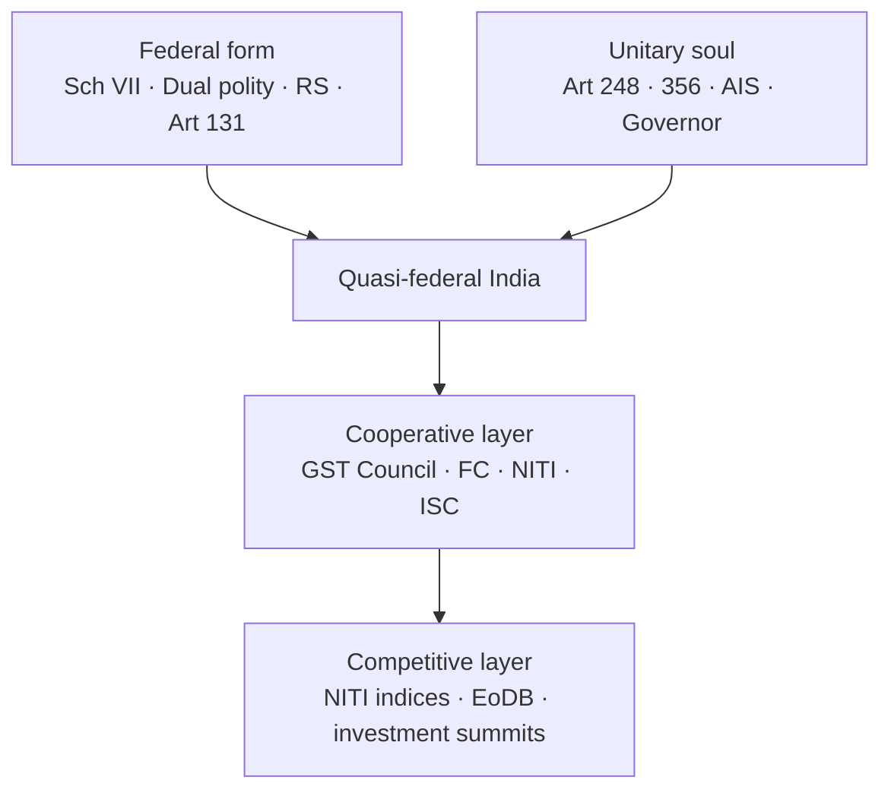
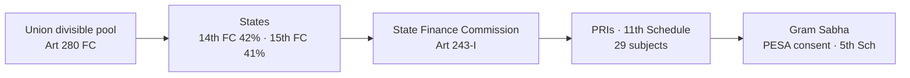

# Federalism — Union, States & Local Devolution

> GS-2 · Topic 02 · Federal structure, Union-State functions, devolution to local levels, challenges

---

## PYQs

| Year | M | Words | Question (EN) | प्रश्न (HI) | ID |
|------|---|-------|---------------|-------------|-----|
| 2025 | 8 | 125 | To what extent is it correct to say that the Inter-State Council can effectively resolve disputes between the Union and the States? Write with suitable examples. | यह कहना कहाँ तक सही है कि अंतर-राज्य परिषद् संघ तथा राज्यों के मध्य विवादों को प्रभावी ढंग से सुलझा सकती है? उपयुक्त उदाहरण सहित लिखिए। | Q1 |
| 2025 | 12 | 125 | How does the provision of legislative powers granted to the Union under the Indian Constitution contribute to the centralized character of India's federal system? Examine. | भारतीय संविधान के अंतर्गत संघ को प्रदान की गई विधायी शक्तियों का प्रावधान भारतीय संघीय प्रणाली के संघ-केंद्रित स्वरूप को किस प्रकार सudृढ़ करता है? परीक्षण कीजिए। | Q2 |
| 2025 | 12 | 125 | Critically analyze the background, key provisions and constitutional, administrative and political implications of the Jammu and Kashmir Reorganization Act, 2019. | जम्मू-कश्मीर पुनर्गठन अधिनियम, 2019 की पृष्ठभूमि, प्रमुख प्रावधानों एवं इसके संवैधानिक, प्रशासनिक और राजनीतिक प्रभावों का समालोचनात्मक विश्लेषण कीजिए। | Q3 |
| 2024 | 12 | 200 | Analyze the statement, "State legislatures are often seen as the voice of the states within India's federal structure." | "राज्य विधान-मंडलों को अक्सर भारत के संघीय ढांचे में राज्यों की आवाज के रूप में देखा जाता है।" — इस कथन का विश्लेषण कीजिए। | Q4 |
| 2023 | 12 | 200 | How does the federal structure in India accommodate the diverse needs and aspirations of different states? Are there any challenges — if yes, how are they addressed? | भारत में संघीय ढाँचा विभिन्न राज्यों की विविध आवश्यकताओं और आकांक्षाओं को कैसे समायोजित करता है? क्या इसके सम्मुख कुछ चुनौतियाँ भी हैं — यदि हाँ, तो उनका समाधान कैसे किया जाता है? | Q5 |
| 2022 | 12 | 200 | The concept of "One nation one election" has its own prospects and limitations in India. Examine. | भारत में "एक राष्ट्र एक चुनाव" की अवधारणा की अपनी संभावनाएं एवं सीमाएं हैं — परीक्षण कीजिए। | Q6 |
| 2021 | 12 | 200 | The structure of the Indian Constitution is federal but its soul is unitary. Elucidate. | 'भारतीय संविधान का ढाँचा संघात्मक है, परंतु इसकी आत्मा एकात्मक है' — स्पष्ट कीजिए। | Q7 |
| 2021 | 12 | 200 | Analyse the problems that have restricted the successes of Panchayati Raj System in India. How far has the 73rd Constitutional Amendment been successful in countering these problems? | भारत में पंचायती राज व्यवस्था की सफलताओं को सीमित करने वाली समस्याओं का विश्लेषण करें। इन समस्याओं का सामना करने में 73वां संविधान संशोधन कितना सफल रहा है? | Q8 |
| 2020 | 8 | 125 | Critically analyse the role of the Inter-State Council in promoting Co-operative Federalism in India. | भारत में सहकारी संघवाद को बढ़ावा देने में अंतर-राज्य परिषद् की भूमिका का आलोचनात्मक परीक्षण कीजिए। | Q9 |

---

## Quick Revision

```
FEDERAL CHARACTER: Dual polity (Centre + States) · Written Constitution · Sch VII division · Supremacy of Constitution
  · Independent judiciary · Bicameralism (Rajya Sabha = states' voice)
  KC Wheare = "Quasi-federal" · Ambedkar = "Unitary with federal features" / "Federal in structure, unitary in spirit"
  Granville Austin = "Cooperative federalism"

UNION LEGISLATIVE CENTRALISATION:
  Sch VII: Union List (97→100 subjects) · State List · Concurrent (47→52)
  Art 246 — Parliament supreme on Union + Concurrent (state law prevails only if assented, else centre prevails on conflict)
  Art 248 + 97 Entry — Residuary powers → UNION
  Art 249 — Rajya Sabha 2/3 → Parliament on State List (national interest)
  Art 250 — During Emergency Parliament on State List
  Art 252 — 2+ states consent → Parliament law for those states
  Art 253 — Treaty obligations override federal division
  Art 356 — President's Rule — state autonomy suspended
  Art 360 — Financial Emergency — centre control

INTER-STATE COUNCIL: Art 263 · PM chair · Created 1990 (V.P. Singh) · Permanent 2006
  Sarkaria (1988) + Punchhi (2010) recommended strengthening
  Functions: dispute resolution, coordination, policy uniformity — BUT advisory, no binding power
  Examples: water (Cauvery via tribunals more effective), GST preceded by council dialogue, NITI/GST Council parallel forums

CO-OPERATIVE FEDERALISM: GST Council (Art 279A) · Finance Commission · NITI Aayog · PM-KISAN joint implementation
COMPETITIVE FEDERALISM: Ease of Doing Business rank · NITI indices · investment summits

ASYMMETRICAL FEDERALISM: Art 370 (historical) · Art 371 A–X (NE, Goa, Sikkim, etc.) · 6th Schedule (autonomous councils)
  J&K Reorganisation Act 2019 → UT J&K (legislature) + UT Ladakh · Art 370 read down via C.O. 272/273

STATE LEGISLATURES AS VOICE: Law on State List · Resolutions · RS members elected by SL · Art 252 consent · block grants debate
  Limits: Art 356 · Governor assent · Money bill centre dominance · concurrent override

ACCOMMODATING DIVERSITY: Linguistic states (1956) · 7th FC · Special category states (historical) · NE councils · DPCO
CHALLENGES: Centre-state friction · Governor politics · fiscal dependency · water border disputes · secessionist/regionalism
  Addressed via: ISC · Inter-state water tribunals · Finance Commission · Zonal councils · Art 263 · SC (S.R. Bommai)

ONOE: Simultaneous Lok Sabha + State Assembly polls
  Pros: cost reduction · policy continuity · less model code paralysis · governance focus
  Cons: constitutional amendments (Art 83, 172) · federal cycle diversity · voter choice dilution · basic structure/federalism debate · premature dissolution sync problem

PANCHAYATI RAJ: 73rd CA 1992 · Part IX · Art 243–243O · 11th Schedule (29 subjects) · Gram Sabha · 3-tier · State Election Commission
  PROBLEMS: 3F crisis — Funds, Functions, Functionaries · State Finance Commissions weak · bureaucratic control · PRI capacity · parallel schemes
  73rd SUCCESS: Constitutional status · regular elections · reservation (SC/ST/women 1/3) · Devolution via PESA 1996 (5th Schedule areas)

LOCAL FINANCE: Art 243H · 243-I (SFC) · 14th FC 42% devolution · 15th FC · tied grants vs untied

TRAPS: India = not pure federation · ISC decisions not binding · RS ≠ only states' house (12 nominated) · 73rd ≠ applied whole India (Meghalaya etc exempt initially)
  ONOE ≠ simple executive order · J&K 2019 ≠ only Art 370 text removal
```

---

## Content

### Context — what Indian federalism is and why it exists

India is a **Union of States** — not a confederation of pre-existing sovereign entities that chose to unite, and not a unitary nation where provinces are administrative creations of the Centre alone. **Article 1** declares that India shall be a **Union of States**; the states **do not derive their existence from Parliament** but from the **Constitution itself**, which grants both the Union and the states **independent constitutional status**. This is the essence of **dual polity**: two tiers of government, each directly created by and subordinate to the Constitution, operating over the same territory and citizens.

The purpose of Indian federalism is to reconcile **national unity** with **regional diversity**. A country of continental size — **28 States** and **8 Union Territories** (after the 2019 J&K reorganisation and subsequent adjustments) — cannot be governed uniformly from Delhi without suppressing linguistic, tribal, economic, and cultural differences. Federal design allows **local self-rule** on subjects like agriculture, police, and land while reserving **defence, foreign affairs, and currency** for the Union. Yet the framers also feared **disintegration**; hence they built **unitary safeguards** so that the Centre can act decisively in emergencies, on unlisted subjects, and when states fail to function. Understanding this tension — **decentralised form, centralising capacity** — is the key to every federalism question.

The colonial **Government of India Act, 1935** had introduced provincial autonomy, but provinces were **creatures of imperial statute**, not constitutional equals of the Centre. The Constituent Assembly deliberately rejected that model. **Articles 245–246** distribute **legislative powers** between Parliament and state legislatures through **Schedule VII** (Union, State, and Concurrent Lists). Unlike the American states, which **retain residuary sovereignty**, India assigns **residuary powers to the Union** (**Article 248**, Entry 97). This single design choice explains why K.C. Wheare called India **"quasi-federal"** and why Dr. Ambedkar said the Constitution is **"federal in structure but unitary in spirit."**

### Federal features — why India qualifies as a federation (Wheare: "quasi-federal")

Each federal characteristic below is **real and operative**, not decorative — but each is **qualified** by countervailing unitary provisions examined in the next section.

- **Dual polity with constitutional status for both tiers** — The Union government and state governments each owe their authority to the Constitution, not to each other. **Article 1** names the polity a Union of States; **Article 245** restricts law-making to subjects allocated by **Schedule VII**; **Article 246** assigns exclusive domains to Parliament (List I), state legislatures (List II), and shared domains (List III). *Why it matters:* In a unitary system, states are delegate authorities; in India, a state legislature can pass laws on the State List even when it politically disagrees with the Union — until a specific overriding provision (Emergency, Art 249, repugnancy under Art 254) applies.

- **Written and supreme Constitution** — The Constitution is a **single written document** that neither tier can unilaterally amend in areas affecting federal balance. **Article 368** requires **ratification by at least half the state legislatures** for amendments affecting List boundaries, Rajya Sabha composition, or Supreme Court/High Court jurisdiction. *Why it matters:* Federal provisions cannot be casually rewritten by a Lok Sabha majority alone — protecting state interests in structural changes.

- **Division of powers (Schedule VII)** — **List I (Union List)** covers 100 subjects including defence, foreign affairs, railways, banking, citizenship, and atomic energy. **List II (State List)** covers 61 subjects including public order, police, agriculture, land, and public health. **List III (Concurrent List)** covers 52 subjects including education, forests, marriage, and adoption — both tiers may legislate. *Why it matters:* This is the **primary map of federal autonomy**; state legislatures' "voice" is strongest where List II is exclusive and Concurrent overlap is minimal.

- **Supremacy of the Constitution and independent judiciary** — Neither Parliament nor a state legislature can enact law violating the Constitution; courts strike down such law. **Article 131** gives the Supreme Court **original jurisdiction** over disputes between the Centre and states or among states. **Articles 32 and 226** provide constitutional remedies. *Why it matters:* Federal disputes are **legal**, not merely political — e.g. **S.R. Bommai (1994)** on Art 356 misuse, **2016–17** GST constitutional amendment upheld by courts.

- **Bicameralism and Rajya Sabha as states' voice at the Centre** — Parliament's **Rajya Sabha (Council of States)** under **Article 80** is composed mainly of members **elected by state legislative assemblies** through proportional representation. *Why it matters:* States influence **national legislation** and constitutional amendments; **Art 249** itself requires a **Rajya Sabha resolution (2/3 present and voting)** before Parliament can legislate on State List subjects. *Limitation:* 12 members are **nominated** for literature/science/art/social service; UTs also send representatives — RS is **not exclusively** a states' house.

### Unitary features — Ambedkar's "unitary soul"

These provisions explain why India is **centre-capable** despite federal form. Ambedkar argued such design was necessary for **national integrity** in a newly independent, diverse, and vulnerable polity.

- **Single citizenship (Part II)** — Every Indian is a citizen of India only; there is no separate state citizenship as in the USA (where one holds US + state citizenship). *Why:* Reinforces **national identity** over sub-national loyalty; simplifies rights and mobility.

- **Single integrated judiciary** — One hierarchy from district courts through High Courts to the Supreme Court; no separate state court system interpreting a separate state constitution (contrast USA). **All-India Services (Art 312)** — IAS, IPS, IFoS — officers recruited by the Union serve states but remain **Union-appointed and disciplined**. *Why:* Ensures **administrative uniformity** and gives the Centre leverage in state administration — often criticised as making states **fiscally autonomous but administratively penetrated**.

- **Residuary powers with the Union (Art 248, Entry 97)** — Subjects not in any list (e.g. **cyber regulation, AI governance, space tourism**) belong to **Parliament**. In the USA, the **10th Amendment** reserves unlisted powers to states. *Why:* Default **central sovereignty** on emerging issues — decisive for a developing economy needing uniform national standards.

- **Emergency provisions (Part XVIII)** — **Art 352** (national Emergency): Centre-directed state executive; Parliament may legislate on State List (**Art 250**). **Art 356** (President's Rule): state government suspended, President governs through Governor; assembly may be dissolved — **most frequently used** emergency provision. **Art 360** (financial Emergency): Union control over state finances — **never invoked** but constitutionally available. *Why:* Temporary **unitary transformation** when federal machinery breaks down — **S.R. Bommai (1994)** imposed judicial limits (floor test, judicial review, secularism/federalism as basic structure).

- **Governor as Union appointee (Art 155–156)** — Governor is appointed by the **President (Centre)**; holds office during **President's pleasure**; may **reserve state bills** for President's consideration; may **withhold assent** — creating recurring **Governor–CM conflicts** (Kerala, Tamil Nadu, West Bengal examples). *Why:* Constitutional **Centre oversight** within states — Punchhi Commission recommended reforms but office remains politically contested.

- **Parliament's extra-territorial and state-list legislative powers** — **Art 246(1)** allows Parliament **extra-territorial legislation** (acts outside India affecting India). **Arts 249, 250, 252, 253** (detailed below) let Parliament enter State List under defined conditions. **Art 3** lets Parliament **alter state boundaries, create/bifurcate states** — states must be **consulted** but **need not consent** (e.g. **Telangana 2014** after Srikrishna Committee; **J&K→UT 2019**).

| Dimension | USA (pure federation) | India (quasi-federation) |
|-----------|------------------------|---------------------------|
| **Origin of states** | Pre-existing sovereign entities ratified Constitution | States created/recognised by Constitution; **Art 3** allows Parliament to reorganise |
| **Residuary powers** | **States** (10th Amendment) | **Union** (Art 248, Entry 97) |
| **Citizenship** | Dual (US + state) | **Single** Indian citizenship |
| **Constitution amendment** | Difficult; states involved for some | **Art 368**; state ratification for federal provisions |
| **State emergency** | No constitutional takeover | **Art 356** President's Rule — **S.R. Bommai** limits |
| **Symmetry** | Formal equality of states | **Asymmetric** — **Art 371 A–X**, **5th/6th Schedule**, historical **Art 370** |
| **Inter-state dispute forum** | Supreme Court primary | **Art 263 ISC** (advisory) + **tribunals** + **SC** |
| **Tax sovereignty** | States had significant tax power | **GST (101st Amendment)** — pooled indirect taxes; **GST Council** co-decides |

**Granville Austin** described Indian federalism as **"cooperative federalism"** — Centre and states must **cooperate to govern** because lists overlap, planning is integrated, and fiscal transfers bind tiers. This is not mere rhetoric: **GST Council (Art 279A)**, **Finance Commission (Art 280)**, and **NITI Aayog's Governing Council** (Chief Ministers + PM) are institutional embodiments. Cooperation does **not** eliminate Centre dominance — it **channels** it into negotiated forums.



### Union legislative centralisation — every provision with mechanism and example

India's **centre-tilted federation** is primarily a **legislative design**. The Union List is the **longest and weightiest**; Concurrent List **Art 254** favours Parliament on conflict; and **multiple Articles** pierce State List autonomy.

| Provision | Mechanism | Centralising effect | Example |
|-----------|-----------|---------------------|---------|
| **Art 246 + Sch VII List I** | Parliament has **exclusive** power on 100 Union subjects | Core sovereignty — defence, foreign policy, railways, banking, atomic energy — **cannot** be legislated by states | **UAPA, IT Act** amendments — Union List but deeply affect state law-and-order |
| **Art 246 + List III + Art 254** | Both tiers legislate on Concurrent List; if laws **conflict**, central law prevails if it received **President's assent** after state law, OR state law prevails only if **prior** and **assented**, else **repugnancy → Centre wins** | States may legislate on education, forests, adoption — but **Centre can override** | **Forest Conservation Act** vs state forest laws; **BNSS 2023** replacing IPC on criminal law (Concurrent/Union interplay) |
| **Art 248 + Entry 97** | Residuary power — unlisted subjects → **Parliament** | **Default central sovereignty** on new domains | **AI regulation, cryptocurrency** debates default to Union |
| **Art 249** | **Rajya Sabha** passes resolution by **2/3 of members present and voting** that Parliament should legislate on State List subject **in national interest**; resolution valid **1 year** (renewable) | **Federal upper house authorises central encroachment** — ironic use of "states' house" | Post-independence use on **matters like essential commodities**; COVID-era discussions on **public health labour** |
| **Art 250** | During **national Emergency (Art 352)**, Parliament may legislate on **State List**; such laws cease **6 months** after Emergency ends | **Temporary unitary law-making** | **1975–77 Emergency** — extensive central legislation on state subjects |
| **Art 252** | **Two or more state legislatures** pass resolutions requesting Parliament to legislate on State List subject; Parliament law applies **only to consenting states** (other states may adopt later) | **Voluntary uniformisation** — states invite central law | **Wildlife Protection** uniform adoption; states requesting **labour/welfare** uniformity |
| **Art 253** | Parliament may legislate **any list** to implement **international treaty, agreement, or convention** — overrides federal division | **External sovereignty trumps internal division** | **WTO commitments, Paris Agreement, UN sanctions** — central implementing legislation |
| **Art 356** | If Governor reports/state situation prevents constitutional governance, **President's Rule** — state executive/legislature power suspended; President acts through Governor | **State legislative autonomy suspended** — most drastic centralisation | **Bommai (1994)** — judicial review, floor test; misuse reduced but **political use** continues |
| **Art 3** | Parliament by **simple law** may **form new states, alter areas/boundaries, change names**; President must **refer bill** to affected state legislature; **views expressed but consent not required** | **Territorial federalism controlled by Centre** | **1956 linguistic states**; **Telangana 2014** (Srikrishna Committee); **J&K bifurcation 2019** |
| **Art 246(1)** | Parliament may make laws with **extra-territorial operation** | **Foreign affairs integration** | Laws affecting **Indian diaspora, offshore assets, extradition** |

**Practice illustrations of centralisation:**
- **GST (101st Amendment, 2017)** — Removed many indirect taxes from state competence; **GST Council** decides rates (cooperative) but **Union vote weight** and **compensation cess** (2017–2022, ended 2022) show **fiscal centralisation**.
- **Farm laws (2020–21)** — Centre legislated on **agriculture (State List)** via **trade/commerce route** — massive **state protest**, eventual **repeal** — classic **federal friction**.
- **UAPA amendments** — National security centrally driven, implemented by **state police**.

### Inter-State Council (Art 263) — history, strengths, and hard limitations

**Article 263** authorises the President to establish an **Inter-State Council (ISC)** to: (a) **inquire** into inter-governmental disputes; (b) **discuss** subjects common to Union and states; (c) **make recommendations** for better policy coordination. It is **not self-operative** — requires Presidential order.

**History:** A short-lived **ISC existed from 1950**. After decades of **centre-state friction** (language riots, border disputes, Planning Commission conflicts), the **Sarkaria Commission (1983–88)** on centre-state relations recommended a **vigorous, permanent ISC**. **V.P. Singh's government** revived ISC in **1990**; it became **permanent in 2006** with **PM as Chairman**, **CMs of all states**, **Union Home Minister**, **six Union Ministers**, and **Governors of states under President's Rule**. The **Punchhi Commission (2007–10)** on centre-state relations reiterated **strengthening ISC** and **Art 263** usage for **Governor-related friction** and **local self-government coordination**.

**Strengths — cooperative federalism in action:**
- **High-level dialogue** prevents disputes escalating to litigation or street conflict — discussions on **counter-terrorism, NE insurgency, Aadhaar integration, river basin planning**.
- **Precursor to policy convergence** — **VAT→GST** transition involved sustained centre-state negotiation (ISC + Empowered Committee of Finance Ministers); **GST Council** later became the **binding** tax forum.
- **Complements Zonal Councils** — statutory bodies under **States Reorganisation Act, 1956** (not constitutional Part III bodies): **Northern, Southern, Eastern, Western, Central, North-Eastern** — regional subsets for **border disputes, infrastructure, language**.

**Limitations — why ISC cannot "effectively resolve" deep disputes:**
- **Advisory only** — Recommendations are **not binding**; Union or dissenting states may **ignore** outcomes. No enforcement mechanism.
- **Not a tribunal** — **Inter-State River Water Disputes Act, 1956** establishes **tribunals**; **Art 262** restricts judicial interference in water disputes; yet **Supreme Court (Art 136)** adjudicates **Cauvery, Krishna, Ravi-Beas** more **decisively** than ISC. Water remains **ISC's weakest** domain.
- **Infrequent, crisis-driven meetings** — Gaps of **years** (e.g. long pause until **2016**, then **2022**) — reactive, not **institutionalised conflict management**.
- **Power asymmetry** — PM-chaired forum; **opposition CMs** may perceive **unequal bargaining** when Centre-state relations are **politicised** (rival parties in power).
- **Cannot override legislative supremacy** — ISC cannot stop Parliament exercising **Art 249/254/356** powers.

**Exam verdict:** ISC is a **confidence-building forum** that **promotes cooperative federalism** and **partial consensus** — but **cannot alone effectively resolve** structural Union–state or inter-state conflicts. Effective resolution needs **binding tribunals, judicial review, fiscal devolution, Art 252 consent routes**, and **political trust**. **GST Council** is **more effective on tax** because decisions have **voting weight**; ISC **supplements, not substitutes**.

### Cooperative vs competitive federalism

| Mode | Logic | Institutions / tools | Example |
|------|-------|---------------------|---------|
| **Cooperative** | Union and states **must collaborate** to govern; shared sovereignty on overlapping subjects | **GST Council (Art 279A)** — Centre + states vote on GST rates, exemptions, compensation | **2024–25 GST Council** meetings on **rate rationalisation, online gaming tax** |
| **Cooperative** | **Fiscal transfers** reduce horizontal inequality | **Finance Commission (Art 280)** — vertical share + horizontal grants; **14th FC: 42%**, **15th FC: 41%** (post J&K/UT change) | **15th FC** disaster-risk grants, **local body grants** post-COVID |
| **Cooperative** | Policy dialogue replaces Planning Commission centralisation | **NITI Aayog** — Governing Council of CMs + PM; **PM-KISAN** joint Centre-state implementation | **Aspirational Districts Programme** — cooperative targeting |
| **Competitive** | States **compete** for rankings, investment, talent | **NITI SDG India Index**, **Export Preparedness Index**, **Ease of Doing Business** state rankings | States reform **labour, single-window clearance** to climb ranks |
| **Competitive** | States **market themselves** for capital | Investment summits | **Vibrant Gujarat**, **UP Global Investors Summit** |

Both modes **coexist** — **GST Council** requires cooperation; **NITI indices** incentivise competition. **Risk:** Competitive federalism without **Finance Commission equalisation** may **widen regional inequality** — rich states advance faster.

### Asymmetrical federalism — accommodating diversity

Pure federations emphasise **formal equality of states**; India practises **asymmetrical federalism** — **unequal constitutional provisions** for unequal historical, tribal, and regional contexts.

- **Linguistic reorganisation (States Reorganisation Act, 1956)** — After **Potti Sriramulu's fast (1952)** and **Fazl Ali Commission**, states were reorganised on **language** lines (with safeguards for minorities). *Why:* Accommodates **cultural-linguistic aspirations**, reduces **secessionist pressure** — e.g. **Tamil Nadu, Maharashtra, Andhra** identity within unity.

- **Fifth Schedule (Art 244(1)) + PESA Act, 1996** — Applies to **Scheduled Areas** in states (not NE Sixth Schedule areas). **Governor** submits annual report; **Tribes Advisory Council** advises. **PESA** mandates **Gram Sabha** consent for **land alienation, mineral leasing, local plan approval** in Scheduled Areas. *Why:* Protects **tribal self-governance** within states — but **implementation gap** persists in many states.

- **Sixth Schedule (Art 244(2))** — **Autonomous District/Regional Councils** in **Assam, Meghalaya, Tripura, Mizoram** — legislative and executive powers on specified subjects. *Why:* **Tribal autonomy** in NE where standard district administration insufficient.

- **Article 371 A–X** — State-specific special provisions: **371A (Nagaland)** — protection of Naga religious/social practices, customary law, special ownership transfer restrictions; **371F (Sikkim)** — safeguards after 1975 merger; **371G (Mizoram)** — similar to Nagaland; **371I (Goa)** — civil code continuity; multiple **371(2)** provisions for **Maharashtra/Gujarat** (Saurashtra/Kutch), **Andhra/Telangana**, **Karnataka** (Hyderabad-Karnataka), **NE states**. *Why:* **Constitutional flexibility** without breaking Union.

- **Union Territories** — Varied design: **Delhi (NCT)** — legislature + LG with **Art 239AA** split; **Puducherry** — legislature; **Ladakh, Chandigarh, Lakshadweep** — **no legislature**, direct Central administration. *Why:* Where **security, size, or administrative history** requires closer Union oversight.

- **Special Category States (historical)** — Higher **plan/grant ratios** for **Himalayan and NE states**; largely **subsumed** into **14th Finance Commission** formula using **income distance, forest cover, demographic performance** criteria instead of political "special category" label.

**Challenges and constitutional/political responses:**

| Challenge | Why it arises | Response mechanism |
|-----------|---------------|-------------------|
| **Centre-state legislative overlap** | Concurrent List + Art 249/254 | **ISC, Zonal Councils**, **judicial review**, political negotiation |
| **Inter-state water disputes** | Riparian geography vs growing demand | **River Water Disputes Tribunals**, **Supreme Court**, **Krishna/Cauvery** adjudication |
| **Fiscal dependency** | GST pooling, limited own revenue | **Finance Commission** grants; **GST compensation** (2017–22); **15th FC** flexibility |
| **Art 356 misuse** | Political use of President's Rule | **S.R. Bommai (1994)** — floor test, judicial review, federalism as basic structure |
| **Regional statehood demands** | Economic neglect, identity | **Art 3** reorganisation — **Telangana 2014** (Srikrishna Committee); **Uttarakhand, Chhattisgarh, Jharkhand 2000** |
| **Governor–CM conflict** | Appointment, assent, reporting | **Bommai**, **Punchhi recommendations**; political convention weak |
| **Secessionist/regional movements** | Historical grievance | **6th Schedule, Art 371**, **development + dialogue** |

### State legislatures — voice of the states and their constitutional limits

State legislatures (**Vidhan Sabha**; **Vidhan Parishad** where bicameral) are the **primary democratic organs** through which **regional preferences** enter the constitutional system.

- **Exclusive law-making on State List** — **Police, agriculture, land, public health, local government (pre-73rd), theatres, gambling** — laws reflect **local needs** (e.g. state **agricultural marketing acts, land ceiling laws, police regulations**). Subject to **Concurrent overlap** and **Art 254 repugnancy**.

- **Rajya Sabha link (Art 80)** — MLAs elect **RS members** — embeds **state political composition** in **national legislature**; RS must approve **Art 249 resolutions** and certain **constitutional amendments**.

- **Art 252 consent route** — State legislatures may **request Parliament** to pass uniform law on State List subject — **voluntary centralisation** from below.

- **Budgetary and fiscal voice** — State **finance bills**, **annual budgets**, **SGST** legislation implementing **GST framework** — fiscal federal expression.

- **Resolutions and dissent** — Legislatures pass resolutions against **central encroachment** (farm laws protests), demanding **special status**, **NE protections**, or **Governor recall** — politically significant even if **non-binding**.

**Limits — why the "voice" is constrained:**
- **Governor's assent power (Art 200)** — May withhold, reserve for President — **delays or blocks** state legislation.
- **Art 356** — Assembly dissolved; **state legislative voice silenced** during President's Rule.
- **Concurrent List + Art 254** — Parliament can **override** state laws on shared subjects.
- **Money Bill dominance (Art 110)** — Centre controls **tax architecture**; states depend on **FC devolution and GST Council**.
- **Not the sole voice** — **CMs in ISC/GST Council/NITI**, **regional parties in Lok Sabha**, **High Courts** also represent state interests.

### Jammu & Kashmir Reorganisation Act, 2019 — background, provisions, implications

**Background:** At accession (**1947**), J&K negotiated **special status** via **Article 370** — a **temporary provision** requiring **Constituent Assembly concurrence** for extending Union legislative and executive power. J&K adopted its **own Constitution (1957)**; **Article 35A** (via 1954 Presidential Order) defined **permanent residents** and restricted **property/employment** rights for outsiders. Decades of **insurgency (since late 1980s)**, **cross-border terrorism**, **AFSPA**, and **electoral democracy** (with periods of Governor's/President's Rule) coexisted with **autonomy politics**. The **BJP-led Union government (August 2019)** executed **Constitutional Orders C.O. 272 and 273** — effectively **reading down Art 370** and extending **all Union Constitution provisions** to J&K — followed by the **Jammu and Kashmir Reorganisation Act, 2019** passed by **Parliament**.

**Key provisions of the Reorganisation Act:**
- **Bifurcation** into **Union Territory of Jammu & Kashmir** (with **legislative assembly**) and **Union Territory of Ladakh** (**without legislature** — direct Central administration).
- **Central laws apply uniformly** — **Ranbir Penal Code replaced by IPC/BNSS**; **RTI Act, CAG audit, SC/ST Act**, central **education, labour, property** frameworks extended.
- **Article 35A invalidated** — **property/residency rules** opened to non-permanent residents (subject to post-2019 domicile policy).
- **Delimitation Commission** reconfigured assembly seats — **114 seats** framework post-delimitation (including **24 PoK-related vacant seats**).
- **Promise of restored statehood** — political commitment debated; **2024 Assembly elections** conducted after **Supreme Court timeline**.

**Constitutional implications:**
- **Asymmetric federalism reduced** — from **special-status state** to **UT** (J&K) with **Delhi-like** LG model debates.
- **Supreme Court judgment (December 2023)** — Upheld **Art 370 abrogation process** as **valid**; directed **J&K Assembly elections by September 2024**; affirmed **restoration of statehood** as **constitutional expectation** (not immediate mandamus).
- **Basic structure debate** — Petitioners argued **federalism, democracy, secularism** violated; Court held **process valid** — jurisprudence on **unilateral Centre action** in federal reorganisation **settled for now**.

**Administrative implications:**
- **Lieutenant Governor system** in J&K UT — **Centre oversight** stronger than former state autonomy.
- **Ladakh** — **no elected legislature**; **Leh/Kargil** demand **6th Schedule-style** protections; **development vs representation** tension.
- **Central schemes accelerated** — **PMGSY, Ayushman Bharat, railway connectivity, tourism infrastructure**; **G20 tourism meeting in Srinagar (2023)** signalling **normalcy narrative**.

**Political implications:**
- **National integration** narrative — **one nation, one constitution** vs **local representation, Kashmiri identity** concerns.
- **International dimension** — **Pakistan** and **UN** references; **Article 370** was globally cited in **Kashmir dispute**.
- **2024 elections** — **NC–Congress alliance** formed government; **restoration of full statehood** central demand — **political contestation continues** despite legal settlement.

### One Nation One Election (ONOE) — prospects and limits

**Concept:** Synchronise **Lok Sabha** and **State Assembly** elections into a **single electoral cycle** — reducing **perpetual election mode**.

**Constitutional backdrop:** **Art 83** — Lok Sabha term **5 years** (extendable during Emergency). **Art 172** — State Assembly term **5 years**. **Art 85/174** — President/Governor may **dissolve** houses before term ends. Since **1967**, **premature dissolutions** and **split verdicts** desynchronised cycles — India rarely holds all polls together except **1951–52, 1957, 1962, 1967** (partial overlap early era).

**Prospects:**
- **Cost reduction** — **ECI, security forces, campaign expenditure** — estimated **massive savings** if polls consolidated.
- **Governance continuity** — **Model Code of Conduct** currently paralyses **new schemes/transfers** for months each year in some state or national cycle — shorter total MCC period.
- **Policy focus** — Ministers spend less time in **campaign mode**.
- **Voter turnout** — Single mega-poll may **boost participation** (debated).
- **High Level Committee on Simultaneous Elections (2023–24, chaired by Ram Nath Kovind)** — Recommended **constitutional amendments**, **implementation roadmap**, handling **hung houses/no-confidence**, **mid-term dissolution sync** — **2024 report** reignited debate.

**Limitations:**
- **Constitutional amendments mandatory** — Cannot be done by **executive notification**; requires amending **Art 83, 172**, possibly **Art 85, 174, 356** interplay for **dissolution sync** and **caretaker conventions**.
- **Federal democracy concern** — State electoral cycles reflect **regional issues** (water, statehood, local leadership); bundling with **national mood** may **dilute voter choice** — **regional parties fear national party advantage**.
- **Coalition instability** — If Lok Sabha falls mid-cycle, **sync breaks** — complex **re-sync machinery** needed.
- **Basic structure/federalism scrutiny** — Critics invoke **S.R. Bommai spirit** — state democratic rhythm should not be **subordinate** to national convenience.
- **Practical complexity** — **Panchayat/municipal polls**, **Rajya Sabha biennial elections**, **statehood variations** — full synchronisation **multi-tier**.

### Panchayati Raj — committees, 73rd Amendment, problems, and balanced success

**Historical evolution of democratic decentralisation:**
- **Balwant Rai Mehta Committee (1957)** — Recommended **three-tier PRIs** with **panchayat samitis and zila parishads**; **democratic decentralisation** after **Community Development Programme** bureaucratic failure.
- **Ashok Mehta Committee (1977–78)** — Post-Emergency **Janata phase**; recommended **two-tier model**, **mandatory elections**, **revenue powers** — led to some **state acts** but uneven adoption.
- **G.V.K. Rao Committee (1985)** — Famous diagnosis: **"bureaucracy has hijacked development"** — PRIs weakened; **district administration** dominates.
- **L.M. Singhvi Committee (1986)** — Recommended **constitutional recognition** for PRIs — paved way for **73rd/74th Amendments**.

**73rd Constitutional Amendment Act, 1992** (effective **1993**):
- Inserted **Part IX (Art 243–243O)** and **11th Schedule** listing **29 subjects** for Panchayats (agriculture, land improvement, minor irrigation, animal husbandry, fisheries, social forestry, small-scale industry, health, sanitation, education, women/child development, welfare of weaker sections, etc.).
- **Mandatory 3-tier system** — **Village, Intermediate (block), District** — states with **population below 20 lakh** may omit intermediate tier.
- **Gram Sabha** — Village assembly of **registered voters** — approves plans, selects beneficiaries, audits — **PESA (1996)** strengthens powers in **Fifth Schedule Areas**.
- **Fixed 5-year term**; if dissolved prematurely, **fresh elections within 6 months**.
- **Reservation** — **SC/ST** in proportion to population; **women not less than one-third** (including chairpersons); state legislatures may provide **OBC reservation** (subject to overall reservation caps).
- **State Election Commission (Art 243K)** — Conducts **independent PRI elections** — like EC for states.
- **State Finance Commission (Art 243-I)** every **5 years** — recommends **devolution of taxes, duties, fees** from state to PRIs.

**Problems restricting success — the 3F crisis and beyond:**

| Problem | Mechanism | Consequence |
|---------|-----------|-------------|
| **3F crisis** | **Funds, Functions, Functionaries** not devolved | PRIs lack **money, administrative control, staff** — **B.K. Committee** highlighted; PRIs remain **implementers**, not **deciders** |
| **State reluctance** | Devolution requires **state legislation** on 11th Schedule subjects | **Kerala, Karnataka** relatively advanced; many states **weak on paper, weaker in practice** |
| **Parallel governance** | Line departments, **MP/MLA LAD funds** | Schemes bypass **Gram Sabha** planning — **accountability diffusion** |
| **Capacity deficit** | Untrained **elected functionaries**, lack of technical staff | Poor **planning, accounting, MGNREGA/health/education** delivery at village level |
| **SFC weakness** | State Finance Commission reports **unimplemented** | PRIs depend on **ad hoc grants**, not **formula-based devolution** |
| **PESA non-compliance** | Fifth Schedule states slow to **amend state Panchayat Acts** | **Gram Sabha consent** on land/minerals **not enforced** — **mining conflicts** continue |
| **Exemptions** | **Art 243M** — Part IX not applied to **Meghalaya, Nagaland, Mizoram** (tribal areas), **Darjeeling Gorkha Hill Council**, **Nagaland** modifications | **Asymmetric local governance** — not uniform nationwide |

**73rd Amendment success — balanced assessment:**
- **Structural success** — PRIs **constitutionally entrenched**; cannot be abolished at state whim; **~2.4 lakh gram panchayats**; **regular elections** in most states.
- **Inclusion success** — **14 lakh+ women representatives**; **SC/ST political entry** at grassroots — transformative for **participatory democracy**.
- **Substantive gap** — **"Skeleton strong, flesh weak"** — legal empowerment **without** full **fiscal and functional devolution**; real decentralisation needs **SFC enforcement, functionary transfer, capacity building**, and **PESA alignment**.



### Finance devolution — Union to states to local bodies

- **Finance Commission (Art 280)** — Quasi-judicial body appointed every **5 years**; recommends **vertical devolution** (Union–state share of **net proceeds of taxes**) and **horizontal distribution** among states (income distance, area, forest, population, demographic performance, tax effort).
- **14th Finance Commission (2015–20, Y.V. Reddy)** — Raised states' share to **42%** of divisible pool — **highest ever** — and provided **grants to local bodies**.
- **15th Finance Commission (2020–25, N.K. Singh)** — **41%** share (adjusted after **J&K/UT reorganisation** reduced state count weight); emphasised **grants to PRIs/ULBs**, **disaster risk management**, **performance-linked grants**; **post-COVID** fiscal stress addressed via **flexible grants**.
- **GST fiscal federalism** — **101st Amendment** created **dual GST (CGST+SGST)** and **IGST**; **50:50 IGST split**; **GST Council** co-decides — **cooperative model**. **Compensation cess (2017–2022)** ended — **revenue anxiety** for states; renewed **centre-state fiscal friction**.
- **Local finance (Art 243H)** — PRIs may **impose, collect taxes, duties, tolls, fees** — but **own revenue** remains **tiny**; dependence on **state grants + FC-linked transfers via states** continues — core of **3F crisis**. **Tied grants vs untied** debate shapes PRI autonomy.

### Contemporary relevance

- **GST Council (2024–25)** — **Rate rationalisation, casino/online gaming taxation** — live test of **cooperative federalism** vs **revenue quarrels**.
- **15th Finance Commission recommendations** — **Disaster management grants**, **local body funding**, **health sector grants** — shape **post-pandemic fiscal federalism**.
- **Kovind Committee ONOE report (2024)** — Proposed **constitutional amendments** for simultaneous elections — active **federalism vs efficiency** debate.
- **Supreme Court Art 370 judgment (2023)** — **J&K elections by 2024** completed; **statehood restoration** politically live — **asymmetric federalism** jurisprudence.
- **NITI Aayog SDG India Index, Export Preparedness Index** — **Competitive federalism** ranks states on **health, education, governance, exports**.
- **Digital India / DBT / eGramSwaraj / SVAMITVA** — **Centre-state IT integration** for welfare delivery and **property mapping** — cooperative implementation strengthening **local governance digitally**.
- **Inter-State Council reactivation agenda** — **Simultaneous elections, NE integration, water sharing** — exposes **advisory vs binding** institutional gap.
- **Governor–CM conflicts (multiple states)** — **Punchhi/Sarkaria** recommendations resurfacing — **cooperative federalism** needs **trust**, not forums alone.

### Limits — a balanced view

Indian federalism is **deliberately hybrid** — **quasi-federal** (Wheare), **cooperative** (Austin), **centre-capable** (Ambedkar's unitary soul). No single institution — **ISC, GST Council, Finance Commission, Rajya Sabha** — resolves the **permanent tension** between **national unity** and **state autonomy**.

- **ISC/GST Council** cannot substitute **trust-based politics** when **Centre and opposition-ruled states** clash over **investigation agencies, Governor actions, fiscal shares**.
- **73rd Amendment** achieved **democratic structural revolution** but **substantive devolution** remains **incomplete** without **SFC enforcement, functionary transfer, and capacity investment**.
- **ONOE** offers **administrative efficiency** but risks **homogenising democratic rhythms** that reflect India's **diverse federal society**.
- **J&K 2019** shows **Centre can reshape federal boundaries** legally — yet **political legitimacy and development outcomes** remain **contested**, proving federalism is **constitutional and political**.

---

## Answers

### Q1: Inter-State Council can effectively resolve Union–State disputes? (2025, 8M, 125W)

**Introduction:**
> The **Inter-State Council (Art 263)** is India's premier **cooperative federalism forum**, but its **advisory nature** limits effective dispute resolution.

**Main Points:**
- **Advisory mandate** — ISC **recommends** only; **no binding decisions** — states/Union may ignore outcomes.
- **Useful coordination** — **PM-chaired dialogue** prevents escalation on **GST, counter-terrorism, NE policy**.
- **Not a court/tribunal** — **Cauvery, Krishna** disputes resolved via **water tribunals + SC**, not ISC alone.
- **Infrequent meetings** — **gaps 2006–2016** — reactive rather than **institutionalised conflict management**.
- **Power asymmetry** — **Union dominance** — opposition CMs may view as **unequal bargaining**.
- **Partial truth** — Helps **manage friction** and **build consensus**; **cannot fully resolve** structural conflicts.

**Keywords (underline in exam):** Art 263 · Cooperative federalism · Advisory body · Sarkaria Commission · Water tribunals · Non-binding

**Exam diagram (30 sec):**
```
Dispute → ISC (dialogue) → recommendation only
       → Tribunal/SC (water) → binding
```

**Conclusion:**
> ISC is **correct only to a limited extent** — a **confidence-building forum**, not an **effective dispute-resolution authority**.

---

### Q2: Union legislative powers and centralized federal character. (2025, 12M, 125W)

**Introduction:**
> India's federation is **centre-tilted** because **Parliament's legislative domain** is **widened** beyond the Union List through **constitutional exceptions**.

**Main Points:**
- **Union List dominance** — **Defence, foreign policy, banking, railways** — core sovereignty with **Centre**.
- **Residuary powers (Art 248)** — Unlisted subjects (e.g. **cyber, AI**) default to **Parliament** — USA gives these to states.
- **Concurrent List + Art 254** — **Central law prevails** on repugnancy with **President assent** — state autonomy curtailed.
- **Art 249** — **Rajya Sabha** can authorise **State List legislation** for **national interest**.
- **Art 250/352** — **Emergency** enables **Parliament on State List** — **unitary shift**.
- **Art 253** — **Treaty obligation laws** override **federal division** — international commitments centralised.
- **Art 356** — **President's Rule** suspends **state legislative authority** — **federal breakdown mechanism**.

**Keywords (underline in exam):** Schedule VII · Art 248 · Art 249 · Art 254 · Residuary powers · Art 356 · Quasi-federal

**Exam diagram (30 sec):**
```
Union List + Residuary + Concurrent override + Art 249/250/253/356
              → Centre-heavy federation
```

**Conclusion:**
> Legislative design makes India **federal in form** but **decisively centre-capable in law-making** — validating **Ambedkar's "unitary spirit."**

---

### Q3: J&K Reorganisation Act, 2019 — background, provisions, implications. (2025, 12M, 125W)

**Introduction:**
> The **J&K Reorganisation Act, 2019** followed **Art 370** read-down, transforming J&K from a **special-status state** into **two Union Territories**.

**Main Points:**
- **Background** — **Art 370** autonomy; **insurgency**, **integration** debate; **C.O. 272/273 (Aug 2019)**.
- **Key provisions** — **UT J&K** (with legislature) + **UT Ladakh**; **central laws** extended; **35A** invalidated.
- **Constitutional** — **SC upheld (2023)** with **election/statehood timeline**; **asymmetric federalism** reduced.
- **Administrative** — **LG system**, **central schemes** rollout, **Delhi-like** oversight in Ladakh.
- **Political** — **National integration** vs **local representation**; **2024 elections** restored **regional government**.
- **Critical view** — **Federal consent** bypass debate; **development** gains depend on **investment + stability**.

**Keywords (underline in exam):** Art 370 · Reorganisation Act 2019 · UT J&K · Ladakh · C.O. 272 · Asymmetric federalism · SC 2023

**Exam diagram (30 sec):**
```
Art 370 → C.O. 272/273 → Reorg Act → UT J&K + UT Ladakh
                                    → central law uniformity
```

**Conclusion:**
> The Act **legally integrated** J&K with the Union while raising **federalism, democracy, and development** questions still playing out politically.

---

### Q4: State legislatures as voice of states in federal structure. (2024, 12M, 200W)

**Introduction:**
> **State legislatures** are primary **democratic organs** expressing **regional preferences** within India's **quasi-federal** Constitution.

**Main Points:**
- **State List legislation** — **Police, agriculture, health, land** — laws reflecting **local needs**.
- **Rajya Sabha link** — MLAs elect **RS members** — **state interests at Union level**.
- **Art 252 route** — States may request **uniform Parliament law** — **voluntary centralisation**.
- **Budgetary voice** — **State finance bills**, **SGST** framework — ** fiscal federal expression**.
- **Resolutions & dissent** — Criticise **central encroachment** (e.g. **farm laws**, **NE special status**).
- **Limits** — **Governor assent** delays; **Art 356** dissolution; **Concurrent override**; **Money Bill** centre dominance.
- **Not exclusive voice** — **CMs in ISC/GST Council**, **regional parties in LS** also represent states.

**Keywords (underline in exam):** State List · Rajya Sabha · Art 252 · Art 356 · Concurrent List · Regional representation · Governor

**Exam diagram (30 sec):**
```
State Legislature → State laws + RS election + budget
                 ↓ limited by
Art 254 · 356 · Governor · Concurrent override
```

**Conclusion:**
> State legislatures are **important but not sole** "voice of states" — **essential yet constrained** by **central constitutional supremacy**.

---

### Q5: Federal structure accommodates diverse needs — challenges and solutions. (2023, 12M, 200W)

**Introduction:**
> Indian federalism uses **asymmetric design** and **cooperative institutions** to accommodate **diversity**, while **constitutional mechanisms** address recurring **centre-state friction**.

**Main Points:**
- **Linguistic states (1956)** — **Language-based reorganisation** — accommodates **cultural aspirations**.
- **Art 371 A–X, 6th Schedule** — **NE tribal autonomy**, **Nagaland/Sikkim/Goa** special provisions.
- **5th Schedule + PESA** — **Tribal self-governance** via **Gram Sabha** consent.
- **Finance Commission** — **Horizontal devolution** favours **backward, NE, hill states**.
- **GST Council** — **Cooperative decision-making** on **indirect taxes** — shared sovereignty model.
- **Challenges** — **Water disputes**, **Art 356 politics**, **fiscal dependency**, **regionalism**.
- **Solutions** — **ISC/Zonal Councils**, **water tribunals**, **S.R. Bommai**, **Art 3** reorganisation (**Telangana**).

**Keywords (underline in exam):** Asymmetric federalism · Art 371 · 6th Schedule · Finance Commission · GST Council · Cooperative federalism · S.R. Bommai

**Exam diagram (30 sec):**
```
Diversity → 371/6th Schedule/PESA + FC grants
Challenge → water/356/fiscal → ISC/tribunals/Bommai
```

**Conclusion:**
> India **accommodates diversity through flexible federal design**, but **cooperative politics and judicial guardrails** remain essential to **sustain balance**.

---

### Q6: One Nation One Election — prospects and limitations. (2022, 12M, 200W)

**Introduction:**
> **ONOE** proposes synchronising **Lok Sabha and State Assembly** polls — offering **efficiency gains** but facing **constitutional and federal hurdles**.

**Main Points:**
- **Prospects — cost savings** — Reduced **EC expenditure**, **security deployment**, **campaign spending**.
- **Governance continuity** — Shorter **Model Code of Conduct** periods — more **policy implementation time**.
- **Voter turnout** — Single mega-poll may **boost participation** (debated).
- **Limitations — constitutional** — Requires **amending Art 83, 172**, handling **premature dissolution** (**Art 85/174**).
- **Federal concern** — **State cycles** tied to **national mood** — **regional issues diluted**.
- **Political resistance** — **Regional parties** fear **national party advantage**; **coalition instability** if **Lok Sabha falls mid-cycle**.
- **Kovind Committee (2023–24)** — Roadmap proposed but **consensus unfinished** — **basic structure/federalism** scrutiny likely.

**Keywords (underline in exam):** ONOE · Art 83 · Art 172 · Model Code of Conduct · Federalism · Kovind Committee · Simultaneous elections

**Exam diagram (30 sec):**
```
ONOE Pros: cost + governance focus
     Cons: Art 83/172 amend + federal cycle + dissolution sync
```

**Conclusion:**
> ONOE has **real administrative prospects** but **limited political feasibility** without **broad federal consensus and constitutional redesign**.

---

### Q7: Federal structure but unitary soul. (2021, 12M, 200W)

**Introduction:**
> **Dr. Ambedkar** described the Constitution as **federal in structure but unitary in spirit** — combining **regional autonomy** with **national unity mechanisms**.

**Main Points:**
- **Federal structure** — **Dual polity**, **Schedule VII**, **written Constitution**, **RS state representation**, **Art 131** federal disputes.
- **Unitary soul — residuary powers (Art 248)** with **Union** — central **default sovereignty**.
- **Emergency provisions (352, 356, 360)** — **temporary unitary transformation** — **Art 356** most used.
- **Single citizenship, integrated judiciary, All-India Services** — **national integration tools**.
- **Art 249/253/3** — Parliament can **legislate on state subjects**, **create states**, **implement treaties**.
- **Cooperative overlay** — **GST Council, FC** — **federal form** with **strong Centre leadership**.
- **Quote context** — **Not pure federation** like USA — **suited to India's unity-in-diversity**.

**Keywords (underline in exam):** Quasi-federal · Ambedkar · Art 356 · Residuary powers · Single citizenship · Schedule VII · Cooperative federalism

**Exam diagram (30 sec):**
```
Structure: States + Centre (federal)
Soul: Art 356/248/253 + AIS + Emergency (unitary tools)
```

**Conclusion:**
> The phrase captures **India's pragmatic federalism** — **decentralised governance** under a **constitutionally strong Centre**.

---

### Q8: Panchayati Raj problems and 73rd Amendment success. (2021, 12M, 200W)

**Introduction:**
> **Panchayati Raj** aims at **democratic decentralisation**, but **implementation gaps** persist despite the **73rd Amendment (1992)** constitutionalising local governance.

**Main Points:**
- **3F crisis** — **Funds, Functions, Functionaries** not fully transferred — **B.K. Committee** diagnosis.
- **State reluctance** — **Devolution varies** — **Kerala/Karnataka** advanced; many states **weak SFC implementation**.
- **Parallel governance** — **Line departments**, **MLA/MP funds** **bypass PRIs**.
- **Capacity deficit** — **Untrained functionaries**, **low technical staff** at **gram panchayat** level.
- **PESA non-compliance** — **Scheduled Area** states slow to **empower Gram Sabha**.
- **73rd success — constitutional status** — **Part IX + 11th Schedule** — PRIs **mandatory**, **5-year elections**.
- **73rd success — inclusion** — **Women ≥1/3**, **SC/ST reservation** — **14 lakh+ women** in PRIs; **State Election Commissions** institutionalised.

**Keywords (underline in exam):** 73rd Amendment · 11th Schedule · 3F crisis · Gram Sabha · PESA · State Finance Commission · Democratic decentralisation

**Exam diagram (30 sec):**
```
73rd → Part IX + elections + reservation ✓
Gap → Funds/Functions/Functionaries + SFC weak ✗
```

**Conclusion:**
> The **73rd Amendment succeeded structurally** but **partially substantively** — **legal empowerment** achieved; **true devolution** needs **SFC enforcement and capacity**.

---

### Q9: Inter-State Council and cooperative federalism. (2020, 8M, 125W)

**Introduction:**
> The **Inter-State Council (Art 263)** seeks to **institutionalise cooperation** between Centre and states, complementing **competitive federalism** trends.

**Main Points:**
- **Sarkaria/Punchhi legacy** — Recommended **active ISC** to reduce **centre-state distrust**.
- **PM-chaired forum** — **CMs + Union ministers** discuss **shared subjects** — **GST precursor dialogues**.
- **Cooperative federalism** — **Non-binding consensus** on **NE security, river basin planning, Aadhaar integration**.
- **Limitations** — **Advisory only**; **irregular meetings**; **cannot bind** dissenting states.
- **Parallel bodies** — **GST Council (binding vote)** more **effective** on **tax** — ISC **supplement, not substitute**.
- **Critical view** — **Politicisation** when **Centre-state rival parties** — **trust deficit** persists.

**Keywords (underline in exam):** Art 263 · Cooperative federalism · Sarkaria Commission · GST Council · Advisory · PM chairman

**Exam diagram (30 sec):**
```
ISC → dialogue + recommendations (cooperative)
GST Council → binding tax decisions (stronger cooperative)
```

**Conclusion:**
> ISC **promotes cooperative federalism as a dialogue platform** but needs **regularity, binding subsets, and political neutrality** to fulfil its potential.

---

### Q10: *Likely variant:* Centre–State financial relations in India. (12M, 200W)

**Introduction:**
> **Fiscal federalism** determines whether **political autonomy** translates into **real state capacity** — governed by **Finance Commission**, **GST**, and **FC grants to local bodies**.

**Main Points:**
- **Art 280 Finance Commission** — **Vertical/horizontal** devolution from **Union divisible pool**.
- **14th FC — 42%** to states; **15th FC — 41%** post-UT reorganisation — **grants to PRIs/ULBs**.
- **GST (101st Amendment)** — **Pooled indirect tax**; **GST Council** co-decides — **cooperative fiscal model**.
- **State dependency** — **Own tax revenue** limited post-GST; **compensation cess** ended **2022** — **revenue anxiety**.
- **Local devolution** — **Art 243-I SFC** — uneven **PRI funding** — **3F crisis** continues.
- **Disaster/flexible grants** — **15th FC** **disaster risk** component — **post-COVID** cooperative need.

**Keywords (underline in exam):** Finance Commission · 14th FC · 15th FC · GST Council · Fiscal federalism · Art 280 · SFC

**Exam diagram (30 sec):**
```
Divisible pool → FC → States → SFC → PRIs
GST Council → shared indirect tax sovereignty
```

**Conclusion:**
> India's **fiscal federalism is cooperative in design** but **centralised in outcome** — states remain **grant-dependent** with **limited revenue autonomy**.

---

### Q11: *Likely variant:* Competitive federalism in India — significance. (8M, 125W)

**Introduction:**
> **Competitive federalism** incentivises states to **outperform peers** in **governance and investment climate** — complementing **cooperative institutions**.

**Main Characteristics:**
- **NITI Aayog indices** — **SDG India Index**, **Export Preparedness**, **Aspirational Districts** — **rankings drive reform**.
- **Ease of Doing Business** — **State-wise reforms** — **single-window**, **labour law** competition.
- **Investment summits** — **Vibrant Gujarat**, **UP Global Investors Summit** — **capital competition**.
- **Benefits** — **Innovation diffusion**, **citizen-centric reforms**, **accountability**.
- **Limits** — **Rich states advance faster** — **widens regional inequality** without **FC equalisation**.
- **Vs cooperative** — **GST Council/FC** require **collaboration** — **both models coexist**.

**Keywords (underline in exam):** Competitive federalism · NITI Aayog · SDG Index · Ease of Doing Business · Investment summits · Regional inequality

**Exam diagram (30 sec):**
```
Cooperative: GST/FC (joint rules)
Competitive: rankings + investment (state vs state)
```

**Conclusion:**
> Competitive federalism **spurs state-level performance** but must be **balanced by cooperative fiscal equalisation** for **equitable national development**.

---

## Traps

| Wrong | Correct |
|-------|---------|
| India is a pure federation like the USA | **Quasi-federal** — **centre-tilted**; **Wheare/Ambedkar** |
| Inter-State Council decisions are binding | **Advisory only** under **Art 263** — not enforceable |
| Residuary powers belong to states | **Union (Art 248, Entry 97)** — unlike USA |
| 73rd Amendment applies identically nationwide | **Exemptions/modifications** — e.g. **Meghalaya, Nagaland, Mizoram** |
| Rajya Sabha represents only states | **12 nominated members** + **Union territories** representation too |
| ONOE needs only executive notification | Requires **constitutional amendments** (**Art 83, 172**, dissolution sync) |
| Art 370 still operative in original form | **Read down 2019**; **SC upheld 2023** — **UT status** |
| State law always prevails on Concurrent List | **Art 254** — **Parliament law with President assent** prevails on conflict |
| Panchayati Raj devolution complete after 73rd | **3F crisis** persists — **SFC implementation weak** in many states |
| GST ended all centre-state fiscal tension | **Compensation end 2022** renewed **revenue disputes** |
| ISC created only in 2006 | **1950** first; **permanent 2006** |
| Cooperative and competitive federalism are mutually exclusive | **Both operate** — **GST Council** + **NITI rankings** |
| J&K Reorganisation created one UT only | **Two UTs** — **J&K (with legislature)** + **Ladakh** |
| Zonal Councils are constitutional bodies | **Statutory** under **States Reorganisation Act, 1956** — not **Part III** |

---

*Complete.*
