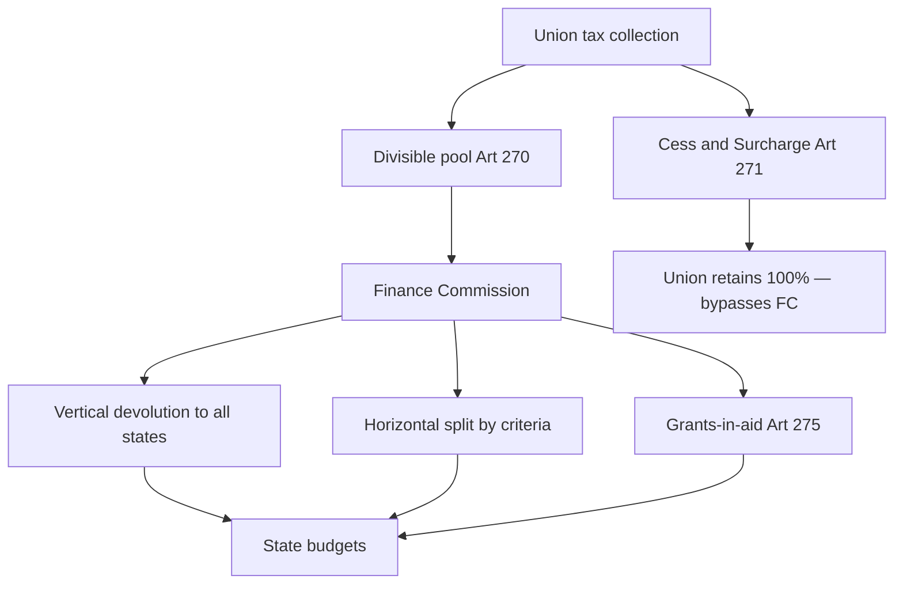

# Finance Commission — Centre–State Financial Relations

> GS-2 · Topic 03 · Role of Finance Commission in Union–State fiscal federalism

---

## PYQs

| Year | M | Words | Question (EN) | प्रश्न (HI) | ID |
|------|---|-------|---------------|-------------|-----|
| 2024 | 12 | 200 | What role can the Finance Commission play in addressing regional disparities in India and what measures has it taken so far? | भारत में क्षेत्रीय असमानताओं को दूर करने में वित्त आयोग क्या भूमिका निभा सकता है और इसने अब तक क्या उपाय किए हैं? | Q1 |
| 2022 | 8 | 125 | Critically examine the role of the Finance Commission in the Centre-State financial relations. | केन्द्र-राज्य वित्तीय सम्बन्धों में वित्त आयोग की भूमिका का समालोचनात्मक परीक्षण कीजिए। | Q2 |
| 2021 | 8 | 125 | Describe the financial relations between the Centre and States in India. | भारत में केंद्र और राज्यों के बीच वित्तीय संबंधों का वर्णन कीजिए। | Q3 |
| 2020 | 12 | 200 | What are the functions of Finance Commission? Examine its emerging role in Fiscal Federalism. | वित्त आयोग के क्या कार्य हैं? राजकोषीय संघवाद में इसकी उभरती भूमिका की समीक्षा कीजिए। | Q4 |

---

## Quick Revision

```
CONSTITUTIONAL BASE: Art 280 — President appoints FC every 5 years (or earlier)
  Qualifications: public affairs + financial expertise · Chairman + 4 members
  Reports → President → Parliament (not binding on govt but conventionally accepted)

FC FUNCTIONS (Art 280): Distribution of net proceeds of taxes between Union & States
  · Principles governing grants-in-aid from Consolidated Fund of India to states
  · Measures to augment Consolidated Fund of a state to supplement resources of Panchayats/Municipalities (73rd/74th)
  · Any matter referred by President in interests of sound finance

CENTRE-STATE FINANCE FRAMEWORK:
  Art 265 — No tax without law
  Art 268 — Stamp duties, etc. (Centre levies, states collect)
  Art 269 — GST on inter-state sale (pre-GST); now Art 269A — IGST
  Art 270 — Taxes in divisible pool (income tax, corporation tax, CGST/SGST share, etc.) — EXcludes cess/surcharge
  Art 271 — Surcharges on certain taxes → wholly for Centre (bypasses devolution)
  Art 275 — Statutory grants (NE, hill states)
  Art 282 — Discretionary grants (Plan/development — now PM-DevINE etc.)
  Art 293 — State borrowing — Centre consent if debt to GOI

DIVISIBLE POOL → FC recommends vertical % to ALL states + horizontal formula among states

VERTICAL DEVOLUTION: Share of states from divisible pool
  12th FC (2005–10): 30.5% → 13th: 32% → 14th: 42% (highest) → 15th: 41% (post J&K UT)

HORIZONTAL DEVOLUTION CRITERIA (15th FC):
  Income distance · Population (2011) · Area · Forest & ecology · Tax & fiscal effort
  Demographic performance · Institutional quality (15th)

REGIONAL DISPARITY TOOLS:
  Income distance (poorer states get more) · Area/forest grants · NE/special grants via Art 275
  Post-devolution revenue deficit grants · Performance grants · Disaster risk grants (15th)
  Grants to local bodies (ULB + PRI tiers)

14th FC HIGHLIGHTS: 42% vertical · Rs 2.87 lakh crore to local bodies · disaster relief reform
15th FC (2020–25): 41% vertical · Rs 8.55 lakh crore to local bodies · 45% population weight
  · Revenue deficit grants to 14 states · Performance-linked grants · Defence/internal security funding from FC pool debate

EMERGING ROLE: Post-GST (101st Amendment) — FC + GST Council dual pillar of fiscal federalism
  GST compensation cess ended 2022 → revenue anxiety → FC gap-filling
  Cess/surcharge proliferation reduces divisible pool → FC relevance vs bypass debate
  NITI Aayog replaced Planning Commission — FC now primary constitutional devolution body
  COVID/post-pandemic — flexible grants, health infrastructure (15th)

CRITICISMS: Recommendations not legally binding · Centre may accept partially
  Cess/surcharge erosion · Delay in FC award implementation · SFC (state level) weak → local devolution gap
  Political economy — richer states subsidise poorer via horizontal formula — friction (GST era)

Vs GST COUNCIL: FC = tax sharing + grants formula · GST Council = rate/structure co-decision (Art 279A)
Vs PLANNING COMMISSION (abolished 2015): FC constitutional; PC was executive — NITI advisory now

TRAPS: FC ≠ RBI · FC ≠ GST Council · FC ≠ NITI · Art 280 ≠ Art 243-I (SFC for local)
  15th FC = 41% not 42% · Cess not in divisible pool · FC report binding? NO — convention only
```

---

## Content

### Context — why fiscal federalism needs a Finance Commission

India's **political federalism** promises that states will govern **police, agriculture, land, public health, and local bodies** on subjects reserved to them under **Schedule VII**. But states cannot deliver on that promise unless they also possess **financial capacity** — revenue to pay salaries, build hospitals, run schools, and implement welfare schemes. The Union, however, controls the **most elastic and buoyant taxes** (income tax, corporation tax, customs, and much of the indirect tax architecture after **GST**). This structural imbalance — **expenditure responsibilities downward, revenue powers upward** — is the central problem of **Centre–State financial relations**.

The **Finance Commission (FC)**, established under **Article 280**, is the Constitution's answer to this imbalance. Every five years (or earlier if the President so decides), the FC recommends **how much** of the Union's shareable tax revenue should flow to states (**vertical devolution**), **how that pool should be divided among states** (**horizontal devolution**), and **what grants-in-aid** should supplement tax transfers for states in fiscal distress, for local bodies, and for national objectives like disaster resilience. Unlike the abolished **Planning Commission (1950–2015)**, which allocated plan grants through executive discretion, the FC is **constitutional** — it cannot be dissolved by a mere cabinet decision. After **NITI Aayog (2015)** replaced the Planning Commission as an **advisory** body, the FC became the **primary rule-based institution** for inter-governmental fiscal transfers, working alongside the **GST Council (Article 279A)** as the second pillar of **cooperative fiscal federalism**.

### Constitutional framework — articles that shape Centre–State finance

Centre–State finance is not left to political bargaining alone. A **network of constitutional articles** assigns taxing powers, defines what is shared, permits grants, regulates borrowing, and mandates the FC. Understanding each article's **mechanism** is essential before examining the FC's formulas.

| Article | What it does | Why it matters for FC |
|---------|--------------|----------------------|
| **Art 265** | No tax shall be levied except by **authority of law** | All Centre–State tax powers must be **statutory** — FC works within legally defined tax bases |
| **Art 268** | Duties levied by Union but **collected and appropriated by states** (e.g. **stamp duties** in pre-GST mix) | Shows **split levy–collection** model — not all Union taxes enter divisible pool |
| **Art 269** | Taxes levied and collected by Union but **assigned to states** (legacy inter-state taxes; largely subsumed in GST) | Historical assignment route — distinct from **Art 270 sharing** |
| **Art 269A** | **IGST** on inter-state supply — apportioned between Centre and states per GST law | Post-**101st Amendment (2017)** — IGST sharing affects **pool composition** FC divides |
| **Art 270** | Taxes on **Union List** levied by Union but **shared with states** — the **divisible pool** | **Core FC mandate** — FC recommends vertical % and inter-state split of this pool |
| **Art 271** | **Surcharges** on certain Union taxes — proceeds **wholly for Centre** | **Bypasses FC devolution** — centralisation lever states fiercely contest |
| **Art 275** | Parliament may make **grants-in-aid** to states in need; FC recommends **principles** | **Statutory grants** — revenue deficit, special states, sectoral needs |
| **Art 280** | President constitutes **Finance Commission** every **5 years** | FC's **constitutional birth** — composition, functions, periodicity |
| **Art 281** | FC report submitted to **President → laid before Parliament** | Transparency — but **not legally binding** on Union (convention of acceptance) |
| **Art 282** | Union (and states) may make **grants for public purposes** — discretionary | **CSS, PM packages, NE schemes** — outside FC formula but shape fiscal space |
| **Art 293** | States may borrow; **Centre consent** required if debt owed to **Government of India** | Constrains state **fiscal autonomy** when borrowing from Centre |
| **Art 243-I / 243-Y** | **State Finance Commissions (SFC)** for **PRI/ULB** devolution at state level | Parallel chain: **FC → states → SFC → local bodies** — weak SFC = local bottleneck |

**The divisible pool (Article 270)** is the FC's primary workspace. It includes **income tax** (excluding surcharge component), **corporation tax** (excluding surcharge), legacy **Union excise** elements, and post-GST shares of **CGST, SGST, and IGST** as prescribed by law. What is **deliberately excluded** — and therefore retained entirely by the Union — matters enormously: **all cesses** earmarked for specific purposes (**Road and Infrastructure Cess, Agriculture Infrastructure and Development Cess, Health and Education Cess**, etc.) and **surcharges under Article 271** (e.g. surcharge on income tax for disaster or health spending). Since **2014**, the **proliferation of cesses and surcharges** has shrunk the **shareable base** even while headline devolution rose to **41–42%**. States argue that a **42% share of a shrinking pool** is less meaningful than the percentage suggests — a live **fiscal federalism tension**.



### Finance Commission — composition, appointment, and four core functions

**Article 280(1)** requires the **President** to constitute a Finance Commission **within two years of Constitution commencement** and **thereafter at the expiration of every fifth year** (or earlier). The FC is thus **periodic and predictable** — a constitutional rhythm of renegotiation that institutionalises Centre–State fiscal dialogue.

**Composition:** The FC consists of a **Chairman** and **four other members**, appointed by the **President**. Members must be persons **having special knowledge of finance and accounts** or **wide experience in financial matters and administration**. This expertise requirement distinguishes the FC from political bodies — it is designed as a **technical commission**, not a cabinet committee. Recent chairpersons illustrate continuity of calibre: **Vijay Kelkar (13th FC)**, **Y.V. Reddy (14th FC)**, **N.K. Singh (15th FC)**, and **Dr. Arvind Panagariya (16th FC, appointed 2024)**.

**Process:** The President issues **Terms of Reference (ToR)** defining what the FC must examine. The FC consults the **Union government, state governments, RBI, economists, and stakeholders**, holds public hearings, and submits a **Report with recommendations** under **Article 281**. Parliament debates the report, but the **Union executive decides acceptance** — recommendations are **not legally binding**, though **convention strongly favours acceptance**. Partial acceptance (e.g. accepting devolution % but modifying grant conditions) is a recurring source of **Centre–State friction**.

**Four core functions under Article 280:**

1. **Distribution of net proceeds of taxes** — The FC recommends the **vertical share** (Union vs all states collectively) and the **horizontal allocation** (among individual states) of taxes in the **Article 270 divisible pool**. This is the FC's most visible function — the percentage headlines (**42%**, **41%**) that dominate public debate.

2. **Principles governing grants-in-aid** — Under **Article 275**, Parliament may provide **statutory grants** to states "in need of assistance." The FC recommends the **principles** determining the quantum and conditions of such grants — including **post-devolution revenue deficit grants**, **grants to special category/hill/NE states**, and **sector-specific transfers**.

3. **Measures to augment Consolidated Fund of a state** to supplement resources of **Panchayats and Municipalities** — Mandated by the **73rd and 74th Constitutional Amendments (1992)**; clarified by the **97th Amendment (2011)**. The FC can recommend **direct grants to local bodies**, bypassing slow state pass-through — a major **14th and 15th FC innovation**.

4. **Any other matter referred by the President** in the interests of **sound finance** — This open clause allows ToR expansion: **defence/internal security funding**, **climate finance**, **health infrastructure post-COVID**, **disaster risk reduction**, etc.

### Vertical devolution — how much of the pool goes to states collectively

**Vertical devolution** answers one question: of every rupee in the **divisible pool**, what **percentage** belongs to **all states together** (before horizontal splitting)? The Union retains the remainder for its own expenditure — defence, external affairs, debt service, central salaries, and Union schemes.

| Finance Commission | Award period | Vertical devolution to states | Significance |
|--------------------|--------------|-------------------------------|--------------|
| **12th FC** | 2005–2010 | **30.5%** | Gradual rise from earlier commissions |
| **13th FC** | 2010–2015 | **32%** | GST transition era began |
| **14th FC (Y.V. Reddy)** | 2015–2020 | **42%** — **highest ever** | Landmark jump — states gained **10 percentage points** over 13th FC |
| **15th FC (N.K. Singh)** | 2020–2025 | **41%** — reduced by **1%** | Cited **J&K reorganisation into UTs** (reducing state count/share) and **defence/internal security** needs in ToR |

The **14th FC's 42%** was transformative because it applied to a **broadened divisible pool** and coincided with **substantial local body grants**. The **15th FC's 41%** triggered protests — especially from **southern states** — because the **1% reduction** came alongside controversial ToR items like **using FC-assigned resources for defence** and **continued use of 2011 Census population** without immediate shift to **2026 Census** (deferred in ToR after state objections). The headline **41%** must be read against **cess erosion**: effective devolution may be lower than the percentage implies.

### Horizontal devolution — how the states' share is split among states

**Horizontal devolution** answers: once states collectively receive (say) **41%** of the pool, **how is that 41% divided among 28 states**? The FC assigns **weights to objective criteria** reflecting **need, equity, effort, and performance**. Poorer, larger, ecologically burdened states should receive more; richer states with high own-revenue capacity receive less per formula unit.

**15th FC horizontal criteria and weights:**

| Criterion | Weight | Mechanism | Who benefits / Who loses |
|-----------|--------|-----------|--------------------------|
| **Income distance** | **45%** | Measures gap between a state's **per-capita GSDP** and the **highest-income state (Haryana)** | **Bihar, UP, Odisha, Jharkhand** — poorer states gain most |
| **Population (2011 Census)** | **15%** | Larger populations receive larger absolute shares | **UP, Maharashtra, Bihar** — populous states gain |
| **Area** | **15%** | Larger geographic area = higher governance cost | **Rajasthan, Madhya Pradesh, large NE states** |
| **Forest & ecology** | **10%** | Rewards states bearing **ecological costs** of forest cover | **Chhattisgarh, Madhya Pradesh, NE states** |
| **Tax & fiscal effort** | **2.5%** | Rewards states that **mobilise own taxes** efficiently | **Gujarat, Maharashtra, Karnataka** — high-effort states |
| **Demographic performance** | **12.5%** | Rewards states that **controlled population growth** (2011 vs 1971 ratio) | **Kerala, Tamil Nadu, Andhra Pradesh** — lower fertility states |
| **Institutional quality** | (included in 15th FC framework) | Governance and institutional metrics | Incentivises **reform and delivery quality** |

The shift from **1971 to 2011 Census** for population weighting — fully adopted by the **14th FC** after prolonged debate — angered **southern states** that had successfully reduced fertility: they argued the formula **penalised demographic responsibility** while rewarding **high-population-growth states**. The **15th FC** retained **2011 population** at **15% weight** (down from **17.5%** in 14th FC) and deferred **2026 Census** transition — a compromise that keeps **federal tension** alive for the **16th FC**.

**Combined effect:** Horizontal devolution operationalises **regional equalisation** — transferring resources from **fiscally stronger "tax-exporting" states** (**Tamil Nadu, Karnataka, Maharashtra, Haryana**) to **fiscally weaker states** (**Bihar, UP, Odisha**) without breaking **national tax unity** (one income tax, one GST architecture).

### Grants-in-aid — Article 275, local body grants, and beyond tax sharing

Tax devolution alone cannot equalise India — some states lack **revenue capacity** even after receiving their horizontal share; **local bodies** starve for funds despite **73rd/74th Amendments**; **disasters and ecological burdens** need targeted support. **Grants-in-aid** fill these gaps.

**Statutory grants (Article 275):** Parliament may provide grants to states in need. The FC recommends **principles** — not ad hoc political packages. Key grant types in recent awards:

- **Post-devolution revenue deficit grants** — The **15th FC** recommended grants to **14 states** whose **revenue deficit persisted even after** receiving their tax devolution share. This is **gap-filling equalisation** — distinct from horizontal formula, targeting states whose **expenditure commitments exceed revenue capacity**.
- **Grants to local bodies** — **14th FC: Rs 2.87 lakh crore** over the award period for **PRIs and ULBs**. **15th FC: ~Rs 4.36 lakh crore to PRIs + Rs 1.21 lakh crore to ULBs** — total **~Rs 8.55 lakh crore** — unprecedented **last-mile fiscal empowerment**. Grants are often **tied to tiers** (gram panchayats in backward districts, municipal corporations) to reach **backward regions** directly.
- **Disaster management grants** — **15th FC** created a **separate window for disaster risk reduction**, helping **cyclone-prone coastal states** (Odisha, Andhra Pradesh) and **flood/Himalayan states** (Assam, Uttarakhand, Himachal Pradesh).
- **Performance-linked grants** — Conditional transfers incentivising **ODF+ sanitation**, **PM-KISAN DBT quality**, **power sector reforms**, **health infrastructure** — blending **equalisation with outcome accountability**.
- **Special/sector grants** — Historical support for **NE states, Uttarakhand, Himachal Pradesh** revenue gaps through **Art 275-type** recommendations.

**Discretionary grants (Article 282):** The Union (and states) may make grants for **any public purpose** without FC mandate — **Centrally Sponsored Schemes (CSS)**, **PM-DevINE for North-East**, **special packages**, **disaster relief ad hoc**. These are **politically flexible** but **less rule-based** — they complement FC transfers but can **skew incentives** toward compliance with Union schemes.

### Role in addressing regional disparities — mechanisms and commission-wise record

Regional disparity in India is multidimensional — **per-capita income gaps** (Bihar vs Haryana), **geographic remoteness** (NE hills), **ecological burdens** (forest-rich states), **disaster vulnerability** (coastal cyclones, Himalayan floods), and **weak local governance capacity**. The FC is India's **primary constitutional equalisation engine** — not the only tool, but the **most systematic**.

| FC mechanism | How it reduces disparity | Illustrative beneficiaries |
|--------------|--------------------------|----------------------------|
| **Income distance (45%)** | Poorer per-capita states get larger horizontal share | **Bihar, UP, Odisha, Jharkhand** |
| **Area + forest weights (25% combined)** | Compensates **governance cost** and **ecological service** burden | **Rajasthan, MP, Chhattisgarh, NE states** |
| **Revenue deficit grants** | Supports states still in deficit **after** tax devolution | **14 states (15th FC)** |
| **Local body grants** | Targets **backward districts** at last mile | **Gram panchayats in aspirational blocks** |
| **Disaster grants** | Builds **federal resilience** for hazard-prone regions | **Odisha, Assam, Kerala (floods)** |
| **Performance grants** | Conditional equalisation — funds tied to **delivery outcomes** | States meeting **sanitation/health/power** benchmarks |

**Commission-wise milestones:**

- **11th FC** — Introduced **debt relief frameworks** for **loss-making state power utilities** — linking fiscal transfers to **sector reform**.
- **12th FC** — Linked grants to **Fiscal Responsibility and Budget Management (FRBM)** state legislation — **conditional transfers** for fiscal discipline.
- **13th FC** — Operated during **GST design phase**; contributed to **compensation architecture** thinking; **disaster relief norms** reform after **14th Finance Commission Act, 2013**.
- **14th FC (Y.V. Reddy)** — **42% vertical devolution** + **Rs 2.87 lakh crore local body grants** + **revenue deficit formula overhaul** — the **landmark equalisation push** of modern Indian fiscal federalism.
- **15th FC (N.K. Singh)** — **41% vertical** + **COVID-era supplemental flexibility** + **health infrastructure grants post-pandemic** + **disaster risk window** + controversial ToR on **defence funding from FC pool** and **Census base** — reflecting **post-GST, post-pandemic** federal bargaining.

**What FC cannot fix alone:** **Investment climate**, **governance quality**, **human capital**, **private capital flight**, and **geographic handicaps** beyond fiscal transfers require **non-FC tools** — state reforms, **ease of doing business**, **skill development**, **infrastructure bonds**. Rich states argue horizontal transfers **subsidise inefficiency** in recipient states — a **political economy friction** that intensified in the **GST era**.

### Centre–State financial relations — the full architecture beyond the FC

Describing Centre–State finance requires more than the FC formula. Seven interconnected channels shape **sub-national fiscal capacity**:

**1. Tax assignment (Schedule VII)** — The Union levies **corporation tax, customs, income tax (shared), CGST, surcharges, and cesses**. States levy **SGST, excise on alcohol, stamp duty, motor vehicles tax, land revenue**, and (rarely) **agriculture income tax**. States control **politically sensitive but less buoyant** taxes; the Union controls **elastic revenue** — the root imbalance FC addresses.

**2. Tax sharing via FC** — **Vertical + horizontal** devolution from the **Article 270 divisible pool** — the **rule-based core** of inter-governmental transfers.

**3. Grants-in-aid** — **Statutory (Art 275)** via FC principles; **discretionary (Art 282)** via Union schemes and special packages — **dual track** for regional disparity (FC equalisation + PM packages for NE).

**4. Borrowings (Article 293)** — States borrow through **state development loans, Uday bonds (power DISCOMs), market bonds**. **Centre consent** is required when a state is indebted to the **Government of India** — constraining fiscal autonomy during crises.

**5. GST era (101st Amendment, 2017+)** — **Dual GST** replaced many state indirect taxes with **SGST/CGST/IGST**. The **GST Council (Art 279A)** — Centre **one-third vote weight**, states **two-thirds** — decides **rates, exemptions, and dispute resolution**. **GST compensation cess (2017–2022)** guaranteed states **14% annual revenue growth** on protected taxes; its **end in 2022** created **revenue anxiety** in compensation-dependent states — making **FC gap-filling grants** more critical. FC and GST Council are **complementary**: GST Council decides **how much tax** is collected; FC decides **how Union-collected shareable revenue is distributed**.

**6. Centrally Sponsored Schemes (CSS)** — Post-**NITI Aayog rationalisation**, CSS require **state matching shares** — they expand **programme coverage** but **compress state fiscal space** when matching burdens are heavy.

**7. Local devolution chain** — **FC → state governments → State Finance Commissions (Art 243-I/243-Y) → PRIs/ULBs**. The FC can recommend **direct local grants**, but **state compliance** in passing funds to panchayats remains uneven — the **"3F crisis"** (functions, functionaries, funds) persists where **SFCs are weak or ignored**.

| Institution | Constitutional basis | Function | Binding? |
|-------------|---------------------|----------|----------|
| **Finance Commission** | **Art 280** | Tax sharing + grant principles from divisible pool | **Conventionally accepted** — not legally binding |
| **GST Council** | **Art 279A** | GST rates, exemptions, dispute resolution | **Decisions by weighted vote** — legally operative |
| **NITI Aayog** | Executive resolution (2015) | Advisory — cooperative policy, indices | **Advisory only** |
| **Planning Commission (abolished)** | Executive (1950–2015) | Plan grants — politically powerful | **Extra-constitutional** — dissolved 2015 |

### GST fiscal impact — how indirect tax reform reshaped FC relevance

Before **GST (July 2017)**, states independently levied **VAT, entry tax, octroi**, and the Union levied **excise and service tax** — a fragmented indirect tax landscape. The **101st Constitutional Amendment** created **dual GST**: **CGST** (Centre), **SGST** (state), **IGST** (inter-state, shared). Many taxes were **subsumed** into GST; the **divisible pool composition changed** — FC had to adjust formulas for a **new revenue architecture**.

**GST compensation mechanism (2017–2022):** To secure state consent for GST, the Union promised **14% compounded annual revenue growth** on protected taxes for **five years**, funded by **GST compensation cess** (which itself is **outside the divisible pool** — another centralisation lever). When compensation **ended in 2022**, states that had grown dependent on guaranteed growth faced **revenue shortfalls** — especially **manufacturing states** and those with **high consumption bases**. The **15th FC's revenue deficit grants to 14 states** partially address this **post-compensation gap**.

**Dual pillar of fiscal federalism:** The **GST Council** harmonises **indirect tax design** (cooperative decision-making on rates); the **FC** distributes **shareable Union revenue** (periodic equalisation). Neither replaces the other — together they define **modern Indian fiscal federalism**. Tension arises when **cess proliferation** (outside both GST Council rate decisions and FC devolution) shrinks the **effective pool** states can access.

### Emerging role in fiscal federalism — post-Plan, post-GST, performance-oriented

**Historical shift:** The **Planning Commission (1950–2015)** allocated **plan grants** through **executive discretion** — politically powerful but **extra-constitutional**. Chief Ministers negotiated **plan sizes** at **National Development Council** meetings. When **NITI Aayog (2015)** replaced it as an **advisory** body without fund allocation power, the **FC became the dominant constitutional devolution institution** — a structural change in **Centre–State fiscal bargaining**.

**Emerging FC roles:**

| Trend | FC response | Why it matters |
|-------|-------------|----------------|
| **GST integration** | Adjusted formulas for **changed tax structure**; works alongside **GST Council** | FC must understand **post-GST revenue elasticity** |
| **Post-compensation era (2022+)** | **Revenue deficit grants** to **14 states** | Fills **GST revenue gap** after compensation cess ended |
| **Local governance (73rd/74th)** | **Direct PRI/ULB grants** — **Rs 8.55 lakh crore (15th FC)** | Bypasses slow **state pass-through** to panchayats |
| **Disaster & climate** | **Disaster risk reduction grants**; **forest/ecology weight** | **Federal resilience** and **green equalisation** |
| **Performance federalism** | **Outcome-linked grants** — sanitation, health, power, DBT quality | **NITI-style incentives** via **constitutional FC** |
| **Defence/internal security (15th ToR)** | ToR asked FC to consider **defence funding from FC-assigned resources** | **States protested** — FC at centre of **union-state bargain** |
| **Cess/surcharge debate** | States demand **inclusion in devolution** or **cess cap** in ToR | Reflects **fiscal centralisation** despite high devolution % |

The **16th Finance Commission (2024–)**, chaired by **Dr. Arvind Panagariya**, will address **post-COVID state debt**, **Census 2027 population base** (when available), **climate finance**, **defence/infrastructure** ToR items, and **state CM resolutions** demanding fair treatment — continuing the **five-year renegotiation cycle** that institutionalises **cooperative fiscal federalism**.

### Criticism — strengths and structural weaknesses

**Strengths:** The FC brings **constitutional legitimacy (Art 280)** — a **non-partisan expert body** insulated from day-to-day politics. Its **rule-based equalisation** reduces **pure ad hoc political grants** of the Plan era. **Published criteria, weights, and state-wise tables** ensure **transparency**. **14th and 15th FC local body grants** represent unprecedented **PRI/ULB fiscal empowerment**.

**Weaknesses:** Recommendations are **not legally binding** — the Union may **cherry-pick** (accept devolution % but modify grant conditions, or partially implement **defence funding** ToR outcomes). **Cess and surcharge proliferation** erodes the **effective divisible pool** — headline **41–42%** overstates real devolution. **Implementation lag** — mismatch between **award year and finance year**, **instalment delays** — frustrates state budgeting. **SFC weakness** means FC grants to states do not reliably reach **PRIs** — the **last-mile gap** persists. **Rich state grievance** — **Tamil Nadu, Karnataka, Maharashtra** as **"tax exporters"** feel **penalised** by horizontal formula subsidising poorer states. The FC **cannot alone eliminate structural inequality** — **capital flight, private investment gaps, governance failures** need **non-FC remedies**.

### Contemporary relevance

- **16th Finance Commission (2024–)** under **Dr. Arvind Panagariya** — ToR includes **defence, infrastructure, climate finance**; **state CM resolutions** (especially southern states) demand **fair Census treatment** and **cess-pool transparency** — the live federal debate of 2024–25.
- **15th FC award (2020–25)** — **COVID supplemental grants**, **health infrastructure** post-pandemic, **disaster grants** for **Himalayan and coastal states**, **performance-linked transfers** tied to **DBT and sanitation outcomes**.
- **GST Council (2024–25)** — **Rate rationalisation** after **compensation end (2022)** — states seek **revenue stability**; FC must **fill gaps** for compensation-dependent states through **revenue deficit grants**.
- **PM-DevINE and NE special packages** — **Art 282 discretionary grants** alongside **FC statutory equalisation** — **dual track** for **regional disparity** in North-East.
- **Digital governance** — **Performance grants** tied to **Aadhaar-seeded DBT delivery** — convergence of **FC, NITI indices, and Union ministries**.
- **Climate finance** — **15th FC forest/ecology weight (10%)** is precursor to **green equalisation** expected in **16th FC** terms — linking **ecological burden** to **fiscal transfers**.
- **SVAMITVA and eGramSwaraj** — **Local revenue mobilisation** (property mapping, panchayat digitalisation) complements **FC PRI grants** — **fiscal federalism at the last mile**.

### Limits — what the Finance Commission cannot do

- **Recommendations are advisory** — Parliament and the Union executive may **accept, modify, or delay** implementation; **convention is strong but not enforceable**.
- **Cess and surcharge bypass** — **Art 271** and earmarked cesses remain **wholly with Centre** — FC has **no jurisdiction** over this growing share of Union tax revenue.
- **Cannot fix governance failure** — Transferring money to **Bihar or UP** does not automatically improve **delivery** if **institutional quality** is weak — **15th FC's institutional quality criterion** nudges but does not compel reform.
- **SFC bottleneck** — FC recommends **local body grants**, but **states control pass-through** to PRIs; weak **State Finance Commissions (Art 243-I)** mean **3F crisis** persists.
- **Rich-poor friction is structural** — Horizontal equalisation **requires richer states to subsidise poorer ones** — politically contentious in **GST era** when states also lost **independent indirect tax sovereignty**.
- **Not a substitute for GST Council** — FC shares revenue; it does **not set tax rates** — post-2022 revenue anxiety needs **both forums**.
- **Defence funding ToR controversy** — Asking FC to allocate for **defence/internal security** from state-assigned pool **blurs expenditure responsibility** — states resist **national security charges on their devolution share**.

---

## Answers

### Q1: FC role in regional disparities + measures taken. (2024, 12M, 200W)

**Introduction:**
> The **Finance Commission (Art 280)** is India's **constitutional equalisation engine**, transferring resources to **fiscally weaker states** through **rule-based devolution and grants**.

**Main Points:**
- **Income distance criterion** — **Horizontal formula** gives **higher share to poorer states** (**Bihar, UP, Odisha**) — core disparity tool.
- **Area & forest weights** — Compensates **large, ecologically sensitive states** (**NE, Chhattisgarh, MP**) for ** governance cost**.
- **Vertical devolution rise** — **14th FC: 42%**; **15th FC: 41%** — expanded **overall state pool** vs earlier commissions.
- **Post-devolution revenue deficit grants** — **15th FC** supports **14 states** still in deficit after tax share.
- **Local body grants** — **14th/15th FC** — **lakhs of crore to PRIs/ULBs** — targets **backward regions** at **last mile**.
- **Disaster & performance grants** — **15th FC** — **cyclone/flood-prone** states + **conditional incentives** for **health, sanitation, power**.
- **Limits** — **Cess bypass**, **non-binding reports**, **SFC bottlenecks** — FC **cannot alone eliminate** disparities.

**Keywords (underline in exam):** Art 280 · Horizontal devolution · Income distance · 14th FC 42% · 15th FC · Revenue deficit grants · Regional equalisation

**Exam diagram (30 sec):**
```
Divisible pool → FC horizontal formula → poorer/larger/forest states get more
              → PRI grants + disaster grants → backward regions
```

**Conclusion:**
> FC has **progressively strengthened equalisation** since **14th/15th awards**, but **full convergence** needs **governance reform, investment, and cess-pool transparency** beyond transfers alone.

---

### Q2: Critically examine FC role in Centre–State financial relations. (2022, 8M, 125W)

**Introduction:**
> The **Finance Commission** mediates **Centre–State fiscal relations** by recommending **tax sharing and grants** under **Art 280**, yet operates within **Union-dominated constraints**.

**Main Points:**
- **Constitutional arbiter** — Recommends **vertical/horizontal** split of **Art 270 divisible pool** — **rule-based federalism**.
- **Grants-in-aid** — **Art 275** principles; **revenue deficit**, **local body**, **disaster grants** — **gap-filling role**.
- **Strength** — **Expert, periodic, transparent criteria** — reduces **pure political discretion** vs **Plan era**.
- **Weakness — non-binding** — **Union may partial accept** — **ToR politics** (e.g. **defence funding** debate).
- **Cess/surcharge erosion** — **Art 271** bypass shrinks **effective devolution** despite **41–42% headline**.
- **GST complement** — Works with **GST Council** post-**101st Amendment** — **dual fiscal federal pillar**.

**Keywords (underline in exam):** Art 280 · Divisible pool · Vertical devolution · Art 275 · Non-binding · Cess surcharge · Fiscal federalism

**Exam diagram (30 sec):**
```
FC → recommends share + grants → Parliament/Union accepts (convention)
Cess/surcharge → bypass FC → Centre retains
```

**Conclusion:**
> FC is **indispensable but incomplete** — **constitutional face of cooperative fiscal federalism**, critically limited by **pool erosion and executive selectivity**.

---

### Q3: Describe financial relations between Centre and States. (2021, 8M, 125W)

**Introduction:**
> **Centre–State financial relations** combine **constitutional tax assignment**, **Finance Commission devolution**, **grants**, **borrowings**, and **GST cooperation**.

**Main Characteristics:**
- **Tax powers** — **Union**: **income tax, corporation tax, customs, CGST**; **States**: **SGST, excise on alcohol, stamp duty, land revenue**.
- **Divisible pool (Art 270)** — Shared taxes — **FC recommends** **vertical %** and **inter-state split**.
- **Grants-in-aid** — **Statutory (Art 275)** via FC; **discretionary (Art 282)** via **Union schemes**.
- **GST architecture** — **101st Amendment**; **GST Council (Art 279A)** — **rate decisions**; **IGST (Art 269A)** sharing.
- **Borrowings** — **Art 293** — state debt; **Centre consent** when owing to **GOI**.
- **Local chain** — **FC → states → State Finance Commissions → PRIs/ULBs**.
- **Cess/surcharge** — **Art 271** — **Centre retains** — not shared with states.

**Keywords (underline in exam):** Art 270 · Art 280 · Art 275 · GST Council · Art 293 · Divisible pool · Art 282

**Exam diagram (30 sec):**
```
Taxes: Union | States | Shared pool (FC)
Plus: Grants 275/282 + GST Council + Borrowing Art 293
```

**Conclusion:**
> India's fiscal federalism is **cooperative but centre-leaning** — **FC devolution** balances **Union tax dominance** with **state spending needs**.

---

### Q4: Functions of FC + emerging role in fiscal federalism. (2020, 12M, 200W)

**Introduction:**
> Under **Art 280**, the **Finance Commission** distributes **tax proceeds** and sets **grant principles**, increasingly central as **Planning Commission ended** and **GST matured**.

**Main Points:**
- **Core functions** — **Tax distribution** Union–States; **grants-in-aid** principles; **PRI/ULB augmentation** measures; **any referred matter**.
- **Composition** — **Chairman + 4 members** — appointed by **President** every **5 years**; report to **Parliament via President**.
- **Emerging role — post-NITI** — **Primary constitutional devolution body** replacing **Plan grant dominance**.
- **GST era partner** — Complements **GST Council** after **compensation cess ended (2022)** — **revenue deficit grants**.
- **Local governance** — **14th/15th FC** — **direct local body grants** — **73rd/74th fiscal empowerment**.
- **Performance federalism** — **Outcome-linked grants** — **health, power, sanitation** — **NITI-style incentives via FC**.
- **New frontiers** — **Disaster/climate grants**, **defence funding ToR debate**, **16th FC (Panagariya)** — **post-COVID debt** equalisation.

**Keywords (underline in exam):** Art 280 · Fiscal federalism · GST Council · 14th FC · 15th FC · PRI grants · NITI Aayog

**Exam diagram (30 sec):**
```
FC functions: Share taxes + grants + local augmentation
Emerging: GST partner + performance grants + disaster/climate
```

**Conclusion:**
> FC's **emerging role** is **constitutional anchor of fiscal federalism** in a **GST-cooperative, post-Plan, performance-oriented** Union–State system.

---

### Q5: *Likely variant:* Vertical vs horizontal devolution — explain with 15th FC. (8M, 125W)

**Introduction:**
> **Finance Commission devolution** has two layers — **vertical** (Union vs all states) and **horizontal** (among individual states).

**Main Characteristics:**
- **Vertical devolution** — **15th FC: 41%** of **divisible pool** to **states as a whole** — down **1%** from **14th FC (42%)**.
- **Horizontal devolution** — Split among **28 states** using **weighted criteria**.
- **Income distance (45%)** — Benefits **low per-capita income states**.
- **Population 2011 (15%)** — Larger states gain absolute share.
- **Area (15%) + Forest (10%)** — **Geographic/ecological compensation**.
- **Demographic performance (12.5%)** — Rewards **population control** states.
- **Combined effect** — **Poorer, larger, forest-rich** states gain; **richer southern states** relatively lose share.

**Keywords (underline in exam):** Vertical devolution · Horizontal devolution · 15th FC · Income distance · Divisible pool · 41%

**Exam diagram (30 sec):**
```
Pool → 41% vertical (all states)
     → horizontal split: income + pop + area + forest + performance
```

**Conclusion:**
> **Vertical devolution sets state share nationally; horizontal devolution operationalises regional equalisation** — heart of **FC disparity policy**.

---

### Q6: *Likely variant:* Finance Commission vs GST Council. (8M, 125W)

**Introduction:**
> Both institutions structure **cooperative fiscal federalism**, but differ in **constitutional basis, function, and binding nature**.

**Main Characteristics:**
- **Finance Commission** — **Art 280**; **tax sharing + grants** from **divisible pool**; report **conventionally accepted**.
- **GST Council** — **Art 279A (101st Amendment)**; **GST rates, exemptions, dispute resolution**; **voting structure** (Centre **1/3**, states **2/3**).
- **FC — periodic (5 years)**; **GST Council — continuous** meetings.
- **FC — equalisation** focus; **GST Council — harmonisation** of **indirect tax**.
- **Overlap post-2017** — **GST changed divisible pool**; **compensation cess (2017–22)** then **FC gap grants**.
- **Complementary** — **GST Council** decides **how much tax**; **FC** decides **how to share** Union-collected revenue.

**Keywords (underline in exam):** Art 280 · Art 279A · GST Council · Divisible pool · Cooperative federalism · 101st Amendment

**Exam diagram (30 sec):**
```
GST Council → rate/structure of GST
FC → share of pool + grants to states
Both → fiscal federalism pillars
```

**Conclusion:**
> **GST Council manages tax design; Finance Commission manages tax distribution** — together they define **modern Indian fiscal federalism**.

---

## Traps

| Wrong | Correct |
|-------|---------|
| Finance Commission is a statutory body | **Constitutional body — Art 280** |
| FC recommendations are legally binding on Union | **Advisory by convention** — Parliament/Union may modify acceptance |
| 15th FC recommended 42% vertical devolution | **41%** (14th FC was **42%**) |
| Cess and surcharge are shared via FC formula | **Excluded** from divisible pool — **Art 271** surcharges to Centre |
| FC distributes all Union taxes | Only **Art 270 divisible pool** — not customs entirely, not all cesses |
| FC = GST Council | **Art 280 vs Art 279A** — sharing vs rate structure |
| FC = NITI Aayog | **FC constitutional**; **NITI advisory** — replaced **Planning Commission** |
| FC handles state-to-PRI devolution directly always | Recommends **grants to local bodies**; **states/SFC** still key pass-through |
| Finance Commission appointed by Parliament | **President appoints** under **Art 280** |
| Art 275 grants need no FC input | FC recommends **principles** for **grants-in-aid** under **Art 275** |
| 13th FC first introduced GST compensation | **GST Council/ Parliament** designed compensation; **13th FC** transition era |
| State Finance Commission = Finance Commission | **Art 243-I SFC** — **state-level** for **PRIs**; FC is **Union-level** |
| Horizontal devolution favours only small states | **Income distance** favours **poor states** (often large — **UP, Bihar**) |

---

*Complete.*
