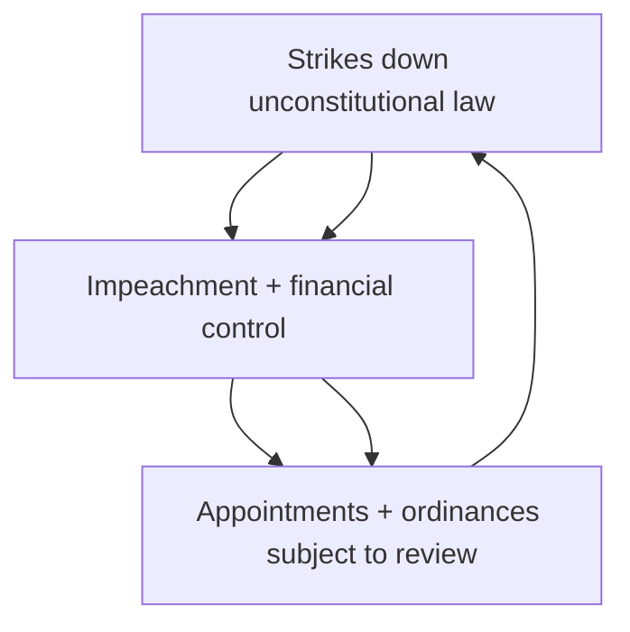
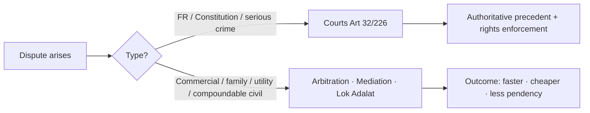

# Separation of Powers, ADR & Dispute Redressal

> GS-2 · Topic 04 · Separation of powers, dispute redressal institutions, ADR, judicial activism, PIL

---

## PYQs

| Year | M | Words | Question (EN) | प्रश्न (HI) | ID |
|------|---|-------|---------------|-------------|-----|
| 2025 | 8 | 125 | How does Alternative Dispute Resolution (ADR) strengthen efficient governance and enhance the effectiveness of the justice delivery system in India? Analyze. | वैकल्पिक विवाद समाधान (ADR) भारत में कुशल शासन को सudृढ़ करने तथा न्याय वितरण प्रणाली की प्रभावशीलता बढ़ाने में किस प्रकार सहायक है? विश्लेषण कीजिए। | Q1 |
| 2023 | 8 | 125 | Mention three demerits of Judicial Activism. | न्यायिक सक्रियता के तीन दोषों का वर्णन कीजिए। | Q2 |
| 2023 | 12 | 200 | What alternative mechanisms of dispute resolution have emerged in recent years? How far have they been effective? | विवादों के समाधान के लिए, हाल के वर्षों में कौन-से वैकल्पिक तंत्र उभरे हैं? वे कितने प्रभावी सिद्ध हुए हैं? | Q3 |
| 2022 | 8 | 125 | "Lok Adalats have acted as a great catalyst for change in the Indian Legal System." Elucidate. | "लोक अदालतों ने भारतीय विधिक प्रणाली में परिवर्तन लाने में उत्प्रेरक की भूमिका निभाई है।" स्पष्ट करें। | Q4 |
| 2020 | 8 | 125 | Explain the concept of Judicial Activism and evaluate its impact on the relationship of Executive and Judiciary in India. | न्यायिक सक्रियतावाद की व्याख्या कीजिए तथा भारत में कार्यपालिका एवं न्यायपालिका के पारस्परिक सम्बन्धों पर इसके प्रभाव का मूल्यांकन कीजिए। | Q5 |
| 2020 | 8 | 125 | 'Article 32 is the soul of the Indian Constitution.' Explain it in brief. | 'अनुच्छेद 32 भारत के संविधान की आत्मा है।' संक्षेप में व्याख्या कीजिए। | Q6 |
| 2020 | 12 | 200 | "Every matter of Public Interest cannot be a matter of Public Interest Litigation." Evaluate. | "लोकहित का प्रत्येक मामला लोकहित वाद का मामला नहीं होता।" मूल्यांकन कीजिए। | Q7 |
| 2018 | 12 | 200 | Write a short note on the emergence and use of alternative dispute redressal mechanisms in India. | भारत में वैकल्पिक विवाद निवारण तंत्रों का उदय एवं प्रयोग पर एक संक्षिप्त टिप्पणी लिखिए। | Q8 |

---

## Quick Revision

```
SEPARATION OF POWERS: Montesquieu — legislative · executive · judiciary separate
India = NOT rigid separation — "checks and balances" + functional overlap
  Legislature: Art 121/212 immunity · law-making · impeachment of judges
  Executive: Art 74 PM/Council · Art 53 President · implements law · appointments
  Judiciary: Art 50 DPSP separate judiciary · judicial review Art 13 · Art 142 complete justice
Overlap: Ordinance Art 123 · delegated legislation · PIL · tribunal adjudication

DISPUTE REDRESSAL INSTITUTIONS:
  Courts: SC (Art 124) · HC · subordinate · Art 131 inter-state · Art 262 water (Parliament may exclude SC)
  Tribunals: Art 323A (admin/service) · Art 323B (tax, land, etc.) — CAT, NGT, NCLT, DRT, RERA authority
  Commissions: NHRC · SHRC · CIC (RTI disputes)
  Ombudsman: Lokpal/Lokayukta (statutory)

ART 32 — DR AMBEDKAR "heart & soul" · FR enforcement · SC + HC Art 226
  Writs: Habeas Corpus · Mandamus · Certiorari · Prohibition · Quo Warranto
  Art 32(4) — suspended during Emergency (Art 359)

ADR TYPES: Arbitration · Conciliation · Mediation · Lok Adalat · Negotiation
Legal Services Authorities Act 1987 — NALSA · SLSA · DLSA · Taluka LS
Arbitration & Conciliation Act 1996 (amended 2015, 2019) — institutional arbitration · fast track
Lok Adalat: Nyaya Panchayat spirit · binding if compromise · no appeal · Permanent Lok Adalat (PLA) — pre-litigation public utility
Mediation Act 2023 — mediated settlement enforceable

JUDICIAL ACTIVISM: Judges fill gaps — expand FR/DPSP · PIL · Vishaka guidelines · Olga Tellis
  Proponents: accountability when executive/legislature fail · rights expansion
  Demerits: overreach · unelected judges make policy · separation breach · backlog from PIL abuse · uncertainty
  Judicial restraint vs overreach — L. Chandra Kumar (tribunal + judicial review core)

PIL: Epistolary jurisdiction — Krishna Iyer, Bhagwati · relaxed locus standi · S.P. Gupta 1981
  Limits: must be genuine public injury · not personal grievance · not mala fide · locus to affected/vigilant citizen
  Abuse: publicity PIL · corporate PIL · delayed dismissal · "every public interest ≠ PIL" (2020 PYQ)

LOK ADALAT IMPACT: 3 crore+ cases settled · pendency reduction · free · informal · catalyst for ADR culture
RECENT ADR: ODR (e-Courts Phase III) · pre-institution mediation (commercial courts) · MSME Samadhan · RERA · consumer commissions · family courts mediation · NALSA awareness

TRAPS: India ≠ US rigid separation · Lok Adalat award = decree if compromise · Art 32 ≠ Art 226 scope
  Judicial activism ≠ judicial review always · PIL ≠ writ for all public issues · Arbitration award appeal limited (Sec 34)
```

---

## Content

### Context — governance, justice delivery, and constitutional balance

Every modern state must answer three linked questions: **who makes law**, **who executes it**, and **who adjudicates disputes** when law is violated or contested. India's Constitution distributes these functions among **legislature, executive, and judiciary** — but it does not adopt the **rigid separation** of the United States. Instead, it permits **controlled overlap** with **checks and balances**, because pure separation would paralyse a developing democracy needing **fast welfare delivery, executive responsiveness, and rights enforcement**.

Simultaneously, India's courts face **3.5+ crore pending cases** — delays that undermine **rule of law, investment confidence, and citizen trust**. **Alternative Dispute Resolution (ADR)** — arbitration, mediation, conciliation, and **Lok Adalats** — emerged as **pressure valves** to divert negotiable disputes from adversarial litigation. **Judicial activism** and **Public Interest Litigation (PIL)** expanded **rights enforcement** when legislature and executive failed — but also triggered **overreach, PIL abuse, and separation-of-powers friction**. Understanding this topic means mastering **three layers**: the **Indian separation model**, the **ADR architecture**, and the **activism–restraint balance** around **Articles 32, 226, and PIL**.

### Separation of powers — Montesquieu, US model, and India's pragmatic overlap

**Doctrine origin:** **Montesquieu**, in *The Spirit of Laws* (1748), argued that liberty is safe only when **legislative, executive, and judicial** powers are **not concentrated** in one person or body — each organ checks the others. The **American Constitution** approximates this ideal most closely: **Congress** legislates, the **President** executes, **courts** adjudicate — with **explicit prohibitions** on overlap (e.g. President cannot sit in Congress).

**Indian model — not watertight separation:** The Constitution creates **three distinct organs** but **deliberately permits functional overlap** for **efficiency and accountability**. Dr. Ambedkar rejected importing **rigid American separation** — he favoured **parliamentary government** where **executive is drawn from and accountable to legislature**, and where **courts exercise judicial review** over both.

| Organ | Constitutional base | Core functions | Overlap examples |
|-------|---------------------|----------------|------------------|
| **Legislature** | Part V/VI — **Parliament, State Legislatures** | Law-making, budget approval, oversight, **impeachment of judges (Art 124(4))** | **Delegated legislation** — executive makes rules under Acts; **Art 121/212 immunity** limits judicial scrutiny of legislative speech |
| **Executive** | **Art 53** (President), **Art 74** (PM/Council), **Governor** | Policy, administration, treaties, appointments, **ordinances (Art 123/213)** | **Ordinance-making** is **legislative power** exercised by executive; **tribunal appointments** blend executive and adjudication |
| **Judiciary** | **Art 124** (SC), **Art 214** (HC) | Adjudication, **judicial review (Art 13)**, **Art 142** complete justice | **PIL** — courts initiate policy directions; **Vishaka guidelines** — judge-made law until **POSH Act 2013** |

**Checks and balances in operation:**

- **Judiciary checks legislature and executive** — **Judicial review (Art 13)** strikes down **unconstitutional laws** and **arbitrary executive action**; **Kesavananda Bharati (1973)** preserved review as **basic structure**; **Indira Gandhi v. Raj Narain (1975)** struck down amendment insulating PM's election.
- **Legislature checks executive and judiciary** — Controls **finance and taxation**; **impeaches judges**; **amends tribunal jurisdiction**; debates **judicial appointments** (though **Collegium** limits legislative control).
- **Executive checks judiciary** — **Appoints judges** (through **Collegium recommendation**); issues **ordinances** subject to **judicial scrutiny** (**R.C. Cooper v. Union of India**, **Krishna Kumar Singh v. State of Bihar** on ordinance re-promulgation limits).

**Article 50 (DPSP)** directs the State to **separate the judiciary from the executive** in public services — a **Directive Principle**, not enforceable by courts, reflecting colonial legacy where **Collector-Magistrate** combined revenue and judicial roles. Post-independence reform moved toward **separation**, but **complete divorce** remains aspirational.

**Immunities preserving institutional dignity:**

- **Art 121/212** — No discussion in Parliament/State legislature on **conduct of any judge** except during **impeachment proceedings** — protects **judicial independence** from legislative intimidation.
- **Art 361** — **President and Governor** immune from **criminal prosecution** during term — preserves **executive dignity** (civil remedies for non-official acts remain debated).

**India vs USA — exam contrast:**

| Dimension | USA | India |
|-----------|-----|-------|
| **Separation rigidity** | **Strict** — President cannot legislate | **Functional overlap** — ordinances, delegated legislation, PIL |
| **Executive origin** | **Elected separately** from Congress | **Drawn from legislature** — PM must command **Lok Sabha majority (Art 75(3))** |
| **Judicial review scope** | **Marbury v. Madison** tradition | **Art 13, 32, 226** — explicit constitutional text |
| **Writ jurisdiction** | **Habeas corpus** central; limited prerogative writs | **Five writs** under **Art 32/226** — broader FR enforcement |
| **Emergency** | **Suspension of habeas corpus** debated | **Art 359** — FR remedy may be suspended for specified rights |



### Dispute redressal institutions — courts, tribunals, commissions, ombudsman

Before examining ADR, one must map **formal dispute forums** — because ADR **complements**, not replaces, constitutional adjudication.

**1. Constitutional courts**

- **Supreme Court (Art 124)** — **Art 131** original jurisdiction on **Centre-state and inter-state disputes**; **Art 132–136** appellate jurisdiction; **Art 32** writ jurisdiction for **Fundamental Rights**. Apex **constitutional interpreter**.
- **High Courts (Art 214)** — **Art 226** writ jurisdiction — **wider than Art 32**: any person aggrieved by violation of **any legal right** (not only FR), including **statutory and contractual rights** in many cases.
- **Subordinate judiciary** — District and session courts handle **bulk civil/criminal workload** — where **pendency crisis** is most acute.

**2. Tribunals (specialised adjudication)**

- **Art 323A** — Parliament may establish **administrative tribunals** for **service matters** — **Central Administrative Tribunal (CAT)** adjudicates **Central government employee disputes**.
- **Art 323B** — Parliament/States may establish tribunals on **tax, land, labour, elections**, etc.
- Key tribunals: **NGT (2010)** — environment; **NCLT/NCLAT** — companies and **IBC 2016 insolvency**; **DRT** — bank recovery; **RERA authorities** — real estate; **ITAT, CESTAT** — tax appeals.
- **L. Chandra Kumar v. Union of India (1997)** — Tribunals are **valid** but **HC/SC judicial review remains** — **supervisory jurisdiction** is part of **basic structure**. Tribunals **cannot be final bar** to constitutional remedy.

**3. Alternative forums**

- **Consumer commissions** — **Consumer Protection Act, 2019** — district/state/national tiers — **quick consumer redressal**.
- **Family courts** — **Family Courts Act, 1984** — **conciliation and mediation** encouraged for matrimonial disputes.
- **MSME Samadhan** — Online portal for **delayed payment** disputes between MSMEs and buyers — **digital dispute facilitation**.
- **Lokpal/Lokayukta** — **Lokpal and Lokayuktas Act, 2013** — **investigative ombudsman** for corruption against public servants — **not a court substitute** but **accountability forum**.

**4. Commissions**

- **NHRC/SHRC** — Human rights complaints — **recommendatory**, not binding decrees.
- **Central Information Commission (CIC)** — **RTI disputes** — quasi-judicial orders on **information access**.

### Article 32 — why Ambedkar called it the soul of the Constitution

**Dr. B.R. Ambedkar** told the Constituent Assembly: *"If I was asked to name any particular Article in this Constitution as the most important — an Article without which this Constitution would be a nullity — I could not refer to any other Article except this one. It is the very soul of the Constitution and the very heart of it."* He referred to **Article 32**.

**Article 32(1)** — The right to move the **Supreme Court** by appropriate proceedings for **enforcement of Fundamental Rights**. **Article 32(2)** — Parliament may empower any court to issue directions/orders/writs for FR enforcement, but **Art 32 itself is a Fundamental Right** — the **remedy is part of the right**.

**Five writs (Art 32 and 226):**

| Writ | Latin meaning | Purpose | Illustrative use |
|------|---------------|---------|------------------|
| **Habeas Corpus** | "Have the body" | Court orders **production of detained person**; examines **legality of detention** | **Illegal detention**, **UAPA challenges**, **custodial disappearance** |
| **Mandamus** | "We command" | Commands **public authority** to perform **statutory duty** | Authority **failing to grant pension, licence, or statutory benefit** |
| **Certiorari** | "To be certified" | **Quashes** order of **inferior court/tribunal** acting **without jurisdiction or with legal error on face of record** | **Tribunal excess of jurisdiction**, **biased administrative decision** |
| **Prohibition** | "To forbid" | **Stops** inferior court/tribunal from **continuing ultra vires proceeding** | **Preventive** — before decision rendered |
| **Quo Warranto** | "By what authority" | Challenges **illegal occupation of public office** | **Usurper holding municipal chair, university post without qualification** |

**Why Art 32 is "soul":**

- **Direct constitutional access** — Citizens need not exhaust **lengthy lower court routes** before reaching SC for **FR violations** — rights become **practical**, not paper promises.
- **Art 32 is itself FR** — Cannot be abolished without destroying **Part III architecture** — **Kesavananda Bharati (1973)** included **Art 32** in **basic structure**.
- **Emergency exception proves rule** — **Art 359** allows President to suspend **right to move court for FR enforcement** for **specified rights during Emergency** — showing how vital **Art 32** is that its suspension requires **explicit constitutional provision**.

**Art 32 vs Art 226:**

| Feature | **Art 32** | **Art 226** |
|---------|------------|-------------|
| **Court** | **Supreme Court only** | **High Courts** |
| **Rights covered** | **Fundamental Rights only** | **FR + any other legal rights** — **wider scope** |
| **Status** | **FR itself (Art 32(2))** | **Constitutional power of HC** — not FR |
| **Suspension** | **Art 359** during Emergency for specified FR | HC writs for non-FR rights may continue |
| **Basic structure** | **Explicitly protected** | **HC jurisdiction** part of **judicial review basic structure** |

### Alternative Dispute Resolution — emergence, statutory framework, and modes compared

**Why ADR emerged in India:** Court pendency crossed **4.5+ crore cases** nationally (2024 estimates) — **decades-long delays** destroy **contract certainty, property rights, and access to justice**. Litigation costs exclude **poor citizens and MSMEs**. Indian tradition of **panchayat mediation** offered a cultural base — modern ADR **institutionalises** informal justice through **statute and court referral**.

**Statutory pillars:**

| Law / institution | What it establishes | Mechanism |
|-------------------|---------------------|-----------|
| **Arbitration and Conciliation Act, 1996** (amended **2015, 2019**) | **Binding arbitration** and **conciliation** | Party-chosen arbitrator; **Sec 9 interim relief** from courts; **12-month award timeline** (2015); **Arbitration Council of India (2019)** grades institutions |
| **Legal Services Authorities Act, 1987** | **NALSA** (national), **SLSA/DLSA/TLSA** | **Free legal aid** to eligible persons + **Lok Adalat** organisation |
| **Mediation Act, 2023** | **Mediated Settlement Agreement (MSA)** enforceable as **court decree** | **Mediation Council of India**; **court-annexed mediation** expansion |
| **Commercial Courts Act, 2015** (amended **2018**) | **Pre-institution mediation mandatory** for commercial disputes above threshold | Diverts suits before filing — **reduces commercial court load** |
| **Section 89, CPC** | Court **may refer** civil disputes to **ADR** | **Arbitration, conciliation, judicial settlement, Lok Adalat** — judge-initiated diversion |

**ADR modes compared:**

| Mode | Who decides | Binding? | Best suited for |
|------|-------------|----------|-----------------|
| **Arbitration** | **Arbitrator(s)** chosen by parties | **Yes — arbitral award** (appeal limited under **Sec 34**) | **Commercial, construction, investment contracts** |
| **Mediation** | **Mediator facilitates** — parties decide outcome | **If settlement signed** — **Mediation Act 2023** makes MSA **decree-equivalent** | **Family, commercial, community disputes** — preserves relationships |
| **Conciliation** | **Conciliator proposes terms** | **If parties accept** settlement | **Labour, trade disputes** — middle path between mediation and arbitration |
| **Lok Adalat** | **Bench + parties** negotiate compromise | **Yes if compromise** — **decree status, no appeal (Sec 21(2) LSA Act)** | **Compoundable, negotiable matters** — motor accidents, bank loans, land revenue |
| **Negotiation** | **Parties themselves** | **If contract or settlement** | **Informal pre-litigation** — no institutional cost |

**Arbitration — deeper mechanism:** Under the **1996 Act (2015/2019 amendments)**, parties agree to resolve disputes **outside courts** through **neutral arbitrator(s)**. Award is **enforceable like court decree**. **Sec 34** permits setting aside award on **limited grounds** (incapacity, invalid agreement, lack of notice, award beyond scope, composition irregularity, conflict with public policy) — **not merits review**. **2015 amendment** introduced **fast-track procedure**, **costs on frivolous challenges**, and **time limits**. **2019 amendment** created **Arbitration Council of India** to **grade arbitral institutions** — quality control for **"ease of doing business"** and **Singapore Convention** alignment on **cross-border enforcement**.

**Mediation and conciliation — distinction:** **Mediation** — neutral third party **facilitates dialogue** without imposing terms; parties retain **full control**. **Conciliation** — conciliator may **propose settlement terms** actively; if accepted, becomes binding. **Mediation Act 2023** nationalises what **family courts** and **commercial courts** had piloted — **enforceable MSAs** reduce **post-settlement breach**.

### Lok Adalats — origin, features, and catalyst role in legal transformation

**Origin:** **1982 Gujarat experiment** — informal settlement camps proved **mass disposal** possible. Formalised under **Legal Services Authorities Act, 1987** — constitutional mandate of **Art 39A** (equal justice and free legal aid) operationalised.

**Types and features:**

- **National Lok Adalat** — **NALSA-coordinated** single-day drives settling **lakhs of cases** across all courts simultaneously.
- **Permanent Lok Adalat (PLA)** — For **public utility services** (transport, postal, telecom, insurance, electricity) — operates at **pre-litigation stage** before case reaches regular court.
- **No court fee** — Parties pay nothing; if case was pending in court, **fee refunded**.
- **Free legal aid** — **DLSA/SLSA** lawyers assist weaker party.
- **Informal procedure** — No strict evidence rules; parties speak directly; **speed and accessibility** prioritised over precedent.
- **Compromise decree** — If parties agree, award has **status of civil court decree** under **Sec 21(2), LSA Act** — **binding and final**; **no appeal** lies against Lok Adalat award (except **limited review** on fraud/coercion grounds).

**Impact as "catalyst for change" (why courts and scholars use this phrase):**

- **Crores of cases settled cumulatively** — Reduces **pendency** without full trial — frees judicial bandwidth for **constitutional and complex matters**.
- **Mindset shift** — Lawyers, judges, and public learned **settlement over winner-takes-all** adversarialism — cultural change in **Indian legal profession**.
- **Gateway to ADR stack** — Success inspired **Sec 89 CPC referral**, **Arbitration Act 2015 reforms**, **Commercial Courts pre-mediation**, and **Mediation Act 2023** — **systemic ADR institutionalisation**.
- **Access to poor (Art 39A)** — **Legal aid + Lok Adalat synergy** reaches **rural litigants, motor accident victims, bank defaulters** who cannot afford **years of trial**.

**Limits:** Lok Adalats work best for **compoundable, negotiable disputes** — **motor accident claims, matrimonial property, bank recovery, land revenue, insurance**. Unsuitable for **serious non-compoundable criminal cases, constitutional questions, or precedent-setting public law matters** requiring **authoritative judicial interpretation**.

### Judicial activism — concept, drivers, impact, and demerits

**Judicial activism** means courts **proactively interpret** law and Constitution to **fill governance gaps**, **expand rights**, and sometimes **direct policy** when legislature and executive **fail or delay**. It goes beyond **passive adjudication** of disputes before the court — judges **initiate reform** through **broad interpretation, PIL, and continuing mandamus**.

**Judicial activism vs judicial review:**

| Concept | What it does | Relationship |
|---------|--------------|--------------|
| **Judicial review** | Courts examine **constitutionality of law and executive action** | **Core judicial function** — Art 13 |
| **Judicial activism** | Courts **expand rights, issue policy directions, fill legislative vacuum** | **Extends** review into **governance and policy domains** — often via **PIL** |

They **overlap** but are **not identical** — all activism involves review, but not all review is activism.

**Drivers in India:**

- **Expanded locus standi through PIL** — **S.P. Gupta v. Union of India (1981)** — public-spirited citizens may approach court for **rights of others unable to litigate**.
- **FR–DPSP gap** — Courts give **enforceable content** to welfare promises — **Olga Tellis (1985)** — pavement dwellers' **right to livelihood under Art 21**; **Unni Krishnan** — **right to education** before **86th Amendment**.
- **Executive/legislative vacuum** — **Vishaka v. State of Rajasthan (1997)** — SC issued **workplace sexual harassment guidelines** in absence of statute (later **POSH Act 2013**); **M.C. Mehta cases** — **environmental protection** directions.
- **Continuing mandamus** — Courts retain jurisdiction, issue **periodic compliance orders** — **pollution control, prison reform, police reform**.

**Impact on Executive–Judiciary relations:**

- **Positive — accountability:** Courts checked **executive arbitrariness** — **2G spectrum (2012)**, **coal block allocation (2014)** cancellations; **election reform directions**; **Prakash Singh (2006)** — **seven directives on police reform** when states failed to legislate.
- **Tension — overreach:** Executive resents **policy encroachment** — **liquor ban on national/state highways (2017)**, **Delhi air pollution orders**, **crop stubble burning directions** — courts entering **budgetary and administrative domains** lacking **democratic mandate and technical expertise**.
- **Positive feedback loop:** **Vishaka → POSH Act 2013** — activism **spurs legislation** when Parliament responds to judicial blueprint.

**Three demerits (structural critiques):**

1. **Separation of powers breach / democratic legitimacy deficit** — **Unelected judges** decide **budgetary allocations, administrative restructuring, and policy priorities** that constitutionally belong to **executive and legislature** — no **electoral accountability** mirrors the power exercised.
2. **Policy uncertainty and investment instability** — **Frequent judicial directions** without **clear statutory basis** confuse **executive implementation** — departments unsure which **court order** prevails over **cabinet policy**; businesses face **regulatory unpredictability**.
3. **PIL abuse and docket explosion** — **Frivolous, publicity-seeking, or corporate-rivalry PILs** burden **SC/HC**, delay **genuine FR cases** of **marginalised citizens**, and **weaponise courts** for **media campaigns or commercial competition** rather than **rights enforcement**.

**Judicial activism vs judicial overreach:** **Activism** within **constitutional bounds** — enforcing **FR, interpreting ambiguous statutes, filling void until legislature acts**. **Overreach** — entering **pure policy choices**, **substituting executive discretion**, **micromanaging administration** — where **accountability mechanisms** (elections, RTI, Lokpal) should operate. **Judicial restraint** counsels **deference** to elected branches on **resource allocation and policy trade-offs**.

### Public Interest Litigation — evolution, legitimate scope, and limits

**Evolution:** **1970s–80s** — Justices **V.R. Krishna Iyer** and **P.N. Bhagwati** pioneered **epistolary jurisdiction** — courts treated **postcards and newspaper cuttings** as writ petitions, **relaxing locus standi** so **public-spirited citizens** could enforce **rights of poor, bonded labourers, prisoners, and women** unable to access courts.

**Landmark — S.P. Gupta v. Union of India (1981):** Any **public-spirited individual or social action group** may approach **SC/HC** for **enforcement of constitutional/legal rights** of **others** — **representative standing** replaces **strict personal injury** requirement.

**Legitimate PIL subjects:** **Bonded labour (Bandhua Mukti Morcha)**, **prison reform**, **environmental degradation (M.C. Mehta)**, **child labour**, **corruption in high office**, **disabled rights**, **sexual harassment at workplace (Vishaka)**, **right to clean air and water (Art 21 expansion)**.

**Why "every matter of public interest cannot be PIL":**

PIL is **not a universal grievance box** for **any issue the public cares about**. Courts apply **strict filters**:

| Rejection ground | Reason | Example pattern |
|------------------|--------|-----------------|
| **No legal/constitutional right violated** | Courts adjudicate **rights**, not **general welfare preferences** | PIL demanding **specific budget allocation** without **FR/statutory breach** |
| **Pure policy/political question** | **Diplomacy, defence procurement, tax policy** — **democratic accountability** via **elections and legislature** | PIL on **foreign treaty terms** or **cabinet portfolio allocation** |
| **Personal interest disguised as public** | **Service promotions, private contracts, business rivalry** | **Corporate PIL** against competitor's licence |
| **Alternative remedy available** | **Statutory tribunals, consumer forums, RTI appeal, administrative review** must be exhausted first | PIL bypassing **CAT, RERA, CIC** |
| **Mala fide / publicity motive** | **Abuse of process** — **SC imposes costs (2023–24 reforms)** | **Media-driven PIL** without **substantive legal claim |
| **Not genuine public injury** | Must affect **marginalised class or diffuse public interest** with **enforceable legal hook** | **Neighbour dispute** labelled public interest |

**Balanced rule:** PIL is for **enforceable constitutional/statutory rights** affecting **marginalised groups or diffuse interests** — **not substitute for legislature, media debate, or electoral politics**.

**Reforms (2023–24):** **Strict locus scrutiny**, **costs on frivolous PIL**, **Master of Roster discipline**, **PIL scrutiny cells**, **deposit requirements**, **Amicus curiae** regulation — implementing the principle that **public concern ≠ justiciable PIL**.

### ADR — how it strengthens governance and justice delivery

**Strengthens efficient governance by:**

- **Reducing pendency** — Frees **judicial bandwidth** for **constitutional, criminal, and complex civil matters** that **cannot** be arbitrated or mediated.
- **Ease of doing business** — **Commercial arbitration/mediation** (**Singapore Convention** alignment post-**2019 amendment**) gives **investors contract certainty** — disputes resolved in **months, not decades**.
- **Public service continuity** — **Permanent Lok Adalat** settles **utility/insurance/bank disputes** at **pre-litigation stage** — **electricity, telecom, postal services** continue without **prolonged litigation paralysis**.
- **Social harmony** — **Family/mediation** preserves **relationships** vs **adversarial divorce/custody trials** — reduces **social cost of litigation**.
- **Digital scalability** — **ODR (Online Dispute Resolution)**, **e-Lok Adalat**, **MSME Samadhan** — align with **Digital India** and **e-Courts Phase III**.

**Enhances justice delivery by:**

- **Speed** — Arbitration **12-month target**; Lok Adalat **same-day settlement**; mediation **weeks not years**.
- **Affordability** — **No fee in legal aid/Lok Adalat**; mediation **far cheaper** than full trial with **multiple appeals**.
- **Access (Art 39A)** — **NALSA network** ensures **women, SC/ST, workers, disabled** reach justice — **inclusive dispute resolution**.
- **Party autonomy** — Choose **arbitrator, mediator, venue, procedure** — **empowerment** absent in **rigid court process**.

**Effectiveness limits:**

- **Awareness gap** — **Rural poor** remain **court-centric** — ADR **underutilised** outside **urban commercial and motor accident** domains.
- **Arbitration cost/delay paradox** — **Sec 34 court challenges** delay enforcement; **institutional arbitration fees** high in **commercial cases** — benefits skew toward **corporate litigants**.
- **Mediation Act 2023** — **Early implementation uneven** across states; **trained mediator shortage**.
- **Government as litigant** — **Executive non-compliance** with **tribunal/Lok Adalat outcomes** when **government is party** — **culture of appeal** undermines ADR finality.
- **Not substitute for criminal/constitutional adjudication** — **Serious criminal trials, FR enforcement, federal disputes** require **courts** — ADR handles **negotiable civil/commercial space only**.



### Contemporary relevance

- **Mediation Act, 2023** — **Institutional mediation** push; **court-annexed mediation** expanding in **Delhi, Bombay, Allahabad HC** circuits — **national ADR infrastructure** maturing.
- **e-Courts Phase III** — **ODR integration**, **virtual Lok Adalats** post-COVID — **digital justice delivery** at scale.
- **Commercial Courts** — **Mandatory pre-institution mediation (2018 amendment)** — **2023–25 caseload diversion** data emerging from **high commercial dispute states**.
- **IBC/NCLT** — **Creditor-debtor resolution** as **economic ADR-style** mechanism — **insolvency reform** reducing **bank NPAs** through **time-bound resolution** vs **decades of recovery suits**.
- **RERA** — **Homebuyer-developer disputes** before **state RERA authorities** — **specialised real estate redressal** protecting **middle-class housing investment**.
- **SC PIL reform (2023–24)** — **Strict locus**, **costs on frivolous PIL**, **Tehseen Poonawalla guidelines** spirit — operationalises **"not every public interest = PIL"**.
- **Arbitration Council of India (2019 Act)** — **Grading arbitral institutions** — quality control for **international arbitration hub** ambition.
- **UP context:** **UP State Legal Services Authority (UP SLSA)** drives **Lok Adalats** on **motor accident claims, land revenue, family settlements** — high-volume **state governance justice** link.

### Limits — balanced constitutional view

- **Separation of powers requires judicial restraint** where **accountability mechanisms** — **elections, RTI, Lokpal, CAG audit, free press** — can address governance failure without **court micromanagement**.
- **ADR cannot replace constitutional courts** for **basic structure challenges, FR enforcement, Centre-state federal disputes (Art 131), or serious criminal justice**.
- **Tribunalisation risk** — Expanding tribunals without **L. Chandra Kumar guardrails** would **erode HC supervisory jurisdiction** — **basic structure** protection must hold.
- **PIL + activism without self-restraint** erodes **democratic legitimacy of judiciary** — **unelected judges** cannot become **permanent super-legislature**.
- **Lok Adalat compromise** — **No appeal (Sec 21(2))** means **power imbalance** between parties may produce **unfair settlements** — **free legal aid quality** matters critically.
- **Art 32/226 are not unlimited** — **Res judicata, laches, alternative remedy, political question doctrine, and PIL filters** constrain **writ jurisdiction** — **soul of Constitution** does not mean **every grievance reaches SC**.

---

## Answers

### Q1: ADR strengthens governance and justice delivery — analyze. (2025, 8M, 125W)

**Introduction:**
> **Alternative Dispute Resolution (ADR)** — **arbitration, mediation, conciliation, Lok Adalat** — reduces **court overload** and makes **justice faster, cheaper, and governance-friendly**.

**Main Points:**
- **Pendency reduction** — **Lok Adalats/NALSA** dispose **lakhs** of cases — frees courts for **complex constitutional matters**.
- **Ease of doing business** — **Arbitration Act 1996/2015** — **commercial disputes** resolved faster — **investment climate**.
- **Affordable access (Art 39A)** — **Free legal aid + Lok Adalat** — **poor, MSMEs** not excluded from justice.
- **Governance efficiency** — **Utility/insurance/bank** disputes settled via **Permanent Lok Adalat** — **public service continuity**.
- **Mediation Act 2023** — **Enforceable settlements** — **family/commercial harmony** vs adversarial litigation.
- **Digital ADR** — **ODR, e-Lok Adalat, MSME Samadhan** — **scalable** dispute resolution aligned with **Digital India**.

**Keywords (underline in exam):** ADR · Lok Adalat · NALSA · Mediation Act 2023 · Pendency · Art 39A · Arbitration

**Exam diagram (30 sec):**
```
ADR → speed + cost saving → less pendency → better governance + justice access
```

**Conclusion:**
> ADR **complements courts** — strengthening **efficient governance** by making **justice delivery timely, inclusive, and economy-supporting**.

---

### Q2: Three demerits of Judicial Activism. (2023, 8M, 125W)

**Introduction:**
> **Judicial activism** expands **rights and accountability** but carries **structural risks** for **democracy and separation of powers**.

**Main Characteristics:**
- **Separation of powers breach** — **Unelected judges** enter **policy/budget/administration** — **democratic legitimacy deficit**.
- **Judicial overreach uncertainty** — **Frequent directions** without **statute** — **executive confusion**, **investment instability**.
- **PIL abuse & backlog** — **Frivolous PILs** clog **SC/HC** — delay **genuine Fundamental Rights** enforcement.

**Keywords (underline in exam):** Judicial overreach · Separation of powers · PIL abuse · Democratic legitimacy · Policy uncertainty

**Exam diagram (30 sec):**
```
Activism + → rights/accountability
         − → overreach · PIL abuse · policy confusion
```

**Conclusion:**
> Activism's **demerits** demand **judicial self-restraint** and **strict PIL filters** to preserve **institutional balance**.

---

### Q3: Alternative dispute mechanisms in recent years — effectiveness. (2023, 12M, 200W)

**Introduction:**
> Recent years saw **institutional expansion of ADR** — from **Lok Adalats** to **statutory mediation and ODR** — to tackle **mounting pendency**.

**Main Points:**
- **Mediation Act, 2023** — **Binding mediated agreements**; **Mediation Council of India** — **new national framework**.
- **Commercial Courts (2015/2018)** — **Mandatory pre-institution mediation** — diverts **commercial suits**.
- **Arbitration amendments (2015, 2019)** — **Time-bound awards**, **Arbitration Council of India** — **quality institutions**.
- **Permanent Lok Adalats** — **Pre-litigation** utility disputes — **high settlement rates**, **no appeal**.
- **Sector forums** — **RERA**, **NCLT/IBC**, **consumer commissions**, **MSME Samadhan** — **specialised ADR-like** redressal.
- **e-Courts/ODR** — **Virtual Lok Adalats**, **online mediation** — **post-COVID scaling**.
- **Effectiveness — partial success** — **Crores settled** via Lok Adalat; **arbitration** still faces **Sec 34 delays**; **awareness low** in **rural areas**; **government litigation** culture limits **compliance**.

**Keywords (underline in exam):** Mediation Act 2023 · Lok Adalat · Commercial Courts · NCLT · ODR · Arbitration · RERA

**Exam diagram (30 sec):**
```
Recent: Mediation Act + pre-institution mediation + ODR + PLA
Effective: mass disposal ✓ | rural reach + arb delays ✗
```

**Conclusion:**
> Emerging mechanisms **significantly eased caseload and commercial disputes** but **full effectiveness** needs **awareness, compliance, and affordable arbitration**.

---

### Q4: Lok Adalats as catalyst for change in Indian legal system. (2022, 8M, 125W)

**Introduction:**
> **Lok Adalats (Legal Services Authorities Act, 1987)** transformed Indian dispute culture from **pure adversarial litigation** toward **negotiated justice**.

**Main Characteristics:**
- **Mass disposal** — **National Lok Adalats** settle **lakhs** of cases in a day — **pendency relief**.
- **Binding compromise decree** — **Sec 21 LSA Act** — **no appeal** — **finality and speed**.
- **Zero/low cost** — **No court fee**, **free legal aid** — **access to poor (Art 39A)**.
- **Informal process** — Parties speak directly — **reduces hostility** — especially **family, motor accident, land** disputes.
- **Permanent Lok Adalat** — **Pre-litigation** for **public utilities** — **preventive justice model**.
- **Catalyst effect** — Inspired **Section 89 CPC ADR**, **arbitration reforms**, **mediation statute** — **systemic ADR shift**.

**Keywords (underline in exam):** Lok Adalat · NALSA · Legal Services Authorities Act 1987 · Compromise decree · Art 39A · Pendency

**Exam diagram (30 sec):**
```
Lok Adalat → free + fast + binding → ADR culture → arbitration/mediation reforms
```

**Conclusion:**
> Lok Adalats **catalysed India's shift** toward **inclusive, speedy, settlement-based justice** without replacing **constitutional courts**.

---

### Q5: Judicial Activism — impact on Executive–Judiciary relations. (2020, 8M, 125W)

**Introduction:**
> **Judicial activism** is **proactive judicial interpretation** filling **rights and governance gaps**, reshaping **Executive–Judiciary dynamics** through **PIL and broad FR reading**.

**Main Points:**
- **Accountability tool** — Courts check **executive arbitrariness** — **spectrum, coal, environment** cases — **rule of law strengthened**.
- **Directive governance** — **Prakash Singh (police reforms)**, **pollution orders** — **executive compelled** to act where **inaction persisted**.
- **Tension — overreach** — **Policy/budget domains** — **separation of powers** friction — **executive resentment**.
- **Positive feedback loop** — **Vishaka guidelines → POSH Act 2013** — **activism spurs legislation**.
- **Collegium + activism** — **Power concentration in judiciary** without **electoral accountability** — **balance concern**.

**Keywords (underline in exam):** Judicial activism · PIL · Separation of powers · Executive accountability · Vishaka · Overreach

**Exam diagram (30 sec):**
```
Activism → checks executive + expands FR
         → tension on policy + needs restraint
```

**Conclusion:**
> Activism **improved accountability** but **healthy Executive–Judiciary relations** require **activism with restraint** and **respect for democratic roles**.

---

### Q6: Article 32 is the soul of the Constitution. (2020, 8M, 125W)

**Introduction:**
> **Dr. Ambedkar** called **Article 32** the **"heart and soul"** of the Constitution because it **guarantees direct enforcement of Fundamental Rights**.

**Main Characteristics:**
- **Constitutional remedy** — **Art 32(1)** — move **SC** for **FR enforcement** — **right in itself (Art 32(2))**.
- **Five writs** — **Habeas corpus, Mandamus, Certiorari, Prohibition, Quo warranto** — **swift relief**.
- **Direct access** — No need for **lengthy lower court route** for **FR violations**.
- **Basic structure** — **Kesavananda** — **Art 32** cannot be **destroyed by amendment**.
- **Emergency limit** — **Art 359** may suspend **FR remedy** for specified rights — **exception proves importance**.
- **Contrast Art 226** — **HC writs wider** but **Art 32** is **special FR guarantee** at **apex level**.

**Keywords (underline in exam):** Article 32 · Ambedkar · Fundamental Rights · Writs · Basic structure · Kesavananda

**Exam diagram (30 sec):**
```
FR violated → Art 32 → SC writ → direct constitutional remedy = "soul"
```

**Conclusion:**
> Without **Art 32**, Fundamental Rights risk becoming **paper promises** — hence its **soul** status in **Ambedkar's vision**.

---

### Q7: Every matter of public interest cannot be PIL. Evaluate. (2020, 12M, 200W)

**Introduction:**
> **Public Interest Litigation (PIL)** relaxes **locus standi** for **marginalised rights**, but **not every public grievance** qualifies as **justiciable PIL**.

**Main Points:**
- **PIL test** — Must show **legal/constitutional right violation** affecting **public or disadvantaged class** — **S.P. Gupta (1981)** foundation.
- **Not PIL — pure policy** — **Budget priorities, diplomatic choices** — **political questions** — **legislature/executive domain**.
- **Not PIL — personal interest** — **Service promotions, private contracts** disguised as PIL — **dismissed with costs**.
- **Alternative remedy** — **Statutory tribunals, consumer forums, RTI appeal** exist — **PIL not bypass**.
- **Abuse risks** — **Publicity, corporate rivalry, mala fide** — **burdens SC/HC docket** — **Tehseen Poonawalla-type filtering**.
- **Legitimate PIL** — **Bonded labour, pollution, prison conditions, harassment at workplace (Vishaka)** — **enforceable rights**.
- **SC reform** — **2023–24** — **strict scrutiny, costs, amicus discipline** — **"public interest ≠ PIL"** operationalised.

**Keywords (underline in exam):** PIL · Locus standi · S.P. Gupta · Justiciability · Political question · Abuse · Alternative remedy

**Exam diagram (30 sec):**
```
Public concern → legal FR/statutory right? → YES = PIL
              → policy/personal/mala fide? → NO = reject
```

**Conclusion:**
> PIL is **powerful but narrow** — **constitutional rights enforcement**, not **universal grievance redressal** for **every public interest matter**.

---

### Q8: Emergence and use of ADR in India — short note. (2018, 12M, 200W)

**Introduction:**
> **ADR in India** evolved from **traditional panchayat mediation** to **statutory arbitration, Lok Adalats, and modern mediation law** to address **litigation explosion**.

**Main Points:**
- **Historical emergence** — **1982 Gujarat Lok Adalat** → **Legal Services Authorities Act, 1987** — **NALSA network**.
- **Arbitration & Conciliation Act, 1996** — **International/commercial arbitration** hub ambition; **2015/2019 reforms**.
- **Section 89 CPC** — Courts **refer** civil cases to **ADR modes**.
- **Lok Adalat use** — **Free, informal, binding compromise** — **crores of cases settled**.
- **Permanent Lok Adalat** — **Utility/pre-litigation** disputes — **preventive ADR**.
- **Recent use** — **Commercial mediation**, **family court conciliation**, **RERA/NCLT/consumer forums**, **Mediation Act 2023**.
- **Significance** — **Art 39A equal justice**, **pendency control**, **investment facilitation**.

**Keywords (underline in exam):** ADR · Lok Adalat · Arbitration Act 1996 · NALSA · Section 89 CPC · Mediation Act 2023

**Exam diagram (30 sec):**
```
1987 LSA Act → Lok Adalat | 1996 Arbitration | 2023 Mediation Act → ADR stack
```

**Conclusion:**
> ADR's **emergence and use** mark India's **pragmatic shift** toward **multi-door courthouse** justice without abandoning **constitutional adjudication**.

---

### Q9: *Likely variant:* Explain separation of powers in India. (8M, 125W)

**Introduction:**
> Indian **separation of powers** follows **Montesquieu** in spirit but adopts **functional overlap with checks and balances** — not **US-style rigid separation**.

**Main Characteristics:**
- **Three organs** — **Legislature** (law/budget), **Executive** (implementation), **Judiciary** (adjudication/review).
- **Checks** — **Judicial review (Art 13)**; **impeachment**; **ordinances** subject to **judicial scrutiny**.
- **Art 50 DPSP** — **Separate judiciary from executive** — reform direction.
- **Overlap** — **Delegated legislation**; **tribunals**; **PIL** — **pragmatic cooperation**.
- **Immunities** — **Art 121/212** protect **judicial/legislative** dignity in forums.

**Keywords (underline in exam):** Montesquieu · Checks and balances · Art 50 · Judicial review · Functional overlap · Art 121

**Exam diagram (30 sec):**
```
Legislature ↔ Executive ↔ Judiciary (overlap OK, concentration NOT OK)
```

**Conclusion:**
> India balances **power separation** with **coordination** — preventing **tyranny** without **paralysing governance**.

---

### Q10: *Likely variant:* Five writs under Art 32/226. (8M, 125W)

**Introduction:**
> **Writ jurisdiction (Art 32 — SC; Art 226 — HC)** empowers courts to enforce **rights** through **five prerogative writs**.

**Main Characteristics:**
- **Habeas Corpus** — **Illegal detention** — produce person before court.
- **Mandamus** — **Public authority** fails **legal duty** — command performance.
- **Certiorari** — **Quash** order of **inferior court/tribunal** acting **without jurisdiction**.
- **Prohibition** — **Stop** ongoing **ultra vires proceeding**.
- **Quo Warranto** — Challenge **illegal occupation of public office**.

**Keywords (underline in exam):** Art 32 · Art 226 · Habeas Corpus · Mandamus · Certiorari · Quo Warranto

**Exam diagram (30 sec):**
```
5 writs: HC · MA · CE · PR · QW
Art 32 (FR→SC) | Art 226 (wider→HC)
```

**Conclusion:**
> Writs make **constitutional rights practical** — core of **Art 32 as Constitution's soul**.

---

## Traps

| Wrong | Correct |
|-------|---------|
| India has rigid US-style separation of powers | **Functional overlap + checks and balances** — not watertight |
| Lok Adalat award can always be appealed | **No appeal** against **compromise decree (Sec 21(2) LSA Act)** |
| Art 32 and Art 226 are identical | **Art 32** — **FR only, SC**; **Art 226** — **wider rights, HC** |
| Judicial activism = judicial review | **Review** interprets law; **activism** proactively fills **policy/governance gaps** — often overlaps but distinct |
| Every PIL is maintainable if public interest exists | Must show **legal/constitutional violation** — not **pure policy/personal** grievance |
| Arbitration awards cannot be challenged at all | **Sec 34 Arbitration Act** — **limited grounds** to set aside |
| Mediation settlements were always enforceable before 2023 | **Mediation Act, 2023** formalised **enforceability as decree** nationally |
| Tribunals replace HC/SC entirely | **L. Chandra Kumar** — **Judicial review by HC/SC** remains — **basic structure** |
| ADR can handle all criminal matters | **Serious non-compoundable criminal cases** need **regular courts** |
| Art 32 suspended automatically in Emergency | **Art 359** — President may **suspend FR remedy** for **specified rights only** |
| NALSA only provides legal aid, not Lok Adalat | **NALSA coordinates both legal aid and Lok Adalats** |
| Permanent Lok Adalat handles all pending court cases | **Public utility services** — **pre-litigation/compoundable focus** |
| PIL started in 1950 Constitution text | **Judge-made expansion 1980s** — **S.P. Gupta 1981** landmark |

---

*Complete.*
