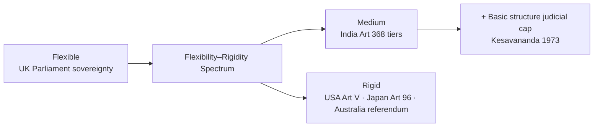

# Comparative Constitutions — India vs Major Democracies

> GS-2 · Topic 05 · Indian constitutional scheme compared with USA, UK, France and modern democracies

---

## PYQs

| Year | M | Words | Question (EN) | प्रश्न (HI) | ID |
|------|---|-------|---------------|-------------|-----|
| 2024 | 12 | 200 | How does the Indian Constitution compare with other modern constitutions in terms of flexibility and rigidity? | लचीलापन और कठोरता के संदर्भ में भारतीय संविधान की तुलना अन्य आधुनिक संविधानों से कैसे की जा सकती है? | Q1 |
| 2018 | 8 | 125 | In what ways does the Indian federal system differ from the federal system in the United States of America (USA)? Explain. | भारत की संघीय व्यवस्था किस प्रकार से अमरीकी (यू.एस.ए.) संघीय व्यवस्था से भिन्न है? व्याख्या करें। | Q2 |

---

## Quick Revision

```
INDIAN CONSTITUTION = SYNTHESIS (Granville Austin "cornerstone of a nation")
  Borrowed: UK (parliamentary, Rule of Law, CABINET) · USA (FR, judicial review, President title)
  · Ireland (DPSP, President election) · Canada (federation, Centre-state) · Australia (concurrent list)
  · Germany (Emergency suspensions spirit) · South Africa (amendment rigidity debate) · USSR (Fundamental Duties idea)

FLEXIBILITY-RIGIDITY SPECTRUM:
  Flexible (easy amend): UK — no written codified constitution — Parliament sovereign — ordinary law amends "constitution"
  Rigid (hard amend): USA — Art V: 2/3 both Houses + 3/4 state legislatures (or constitutional convention)
  India = BLEND (K.C. Wheare / Ivor Jennings): "Flexible rigidity" or "Rigid flexibility"
    Art 368: (1) Simple majority — Art 4 state creation, 2nd Schedule salaries
    (2) Special majority — total membership + 2/3 present & voting — most amendments
    (3) Special + ratification by half states — federal provisions (election President, SC/HC, distribution powers, Art 368)
  106+ amendments vs USA 27 — shows adaptability WITH procedural tiers

USA vs INDIA FEDERALISM:
  USA: Dual/federation of states · Equal state sovereignty · Written · States retain residuary powers (10th Amendment)
  · Dual citizenship (state + national historically nuanced) · Separate state courts + federal courts
  · President = real executive head · Senate equal state representation (2 each)
  · No Article 356 equivalent · Amendment very rigid · Strong state autonomy

  India: Quasi-federal · States NOT equal sovereigns · Union residuary powers (Art 248)
  · Single citizenship · Integrated judiciary (SC apex over all) · PM parliamentary executive
  · Rajya Sabha — population-linked + nominated (not equal states) · Art 356 President's Rule
  · Art 249 Rajya Sabha on State List · Single constitution for Centre + states
  · Amendment easier than USA for many provisions

OTHER COMPARISONS (future PYQs):
  UK: Unwritten · parliamentary sovereignty · constitutional monarchy · no judicial review of Parliament (traditionally)
  France: Semi-presidential (Duverger) · Fifth Republic 1958 · strong President · Constitutional Council
  Germany: Basic Law 1949 · federal · Chancellor parliamentary · Constitutional Court · rigid on federal structure/human dignity
  South Africa: 1996 Constitution — transformative · difficult amend for Bill of Rights (two-thirds + provincial participation)
  Japan: Pacifist Art 9 · rigid amendment (two-thirds Diet + national referendum since 2016)

AMENDMENT COMPARE TABLE (exam):
  India Art 368 tiers | USA Art V super-majority | UK ordinary legislation | France referendum + parliament

TRAPS: India ≠ copy of USA federal · UK has no single written constitution · Indian amendment ≠ always simple majority
  10th Amendment USA = states' residuary NOT India · Rajya Sabha ≠ Senate equality · India 106 amendments ≠ "too rigid"
```

---

## Content

### Context — what comparative constitutionalism teaches about India's design

Every modern democracy must answer the same constitutional questions: who holds executive power, how are rights protected, how is territory divided, and how can the supreme law itself be changed without destroying stability. India's **1950 Constitution** is not an isolated national document but one answer among many — shaped by **British parliamentary tradition**, **American rights jurisprudence**, **Canadian centre-heavy federalism**, and **Irish welfare-state philosophy**, yet transformed by India's own experience of **colonial subordination**, **partition**, and **social revolution**. **Granville Austin** called it the **"cornerstone of a nation"** because it is a **synthesis**: foreign institutions adapted to Indian conditions rather than copied wholesale. Dr. **B.R. Ambedkar** warned explicitly against **"copy-paste" constitutionalism** — a society with caste hierarchy, linguistic diversity, and mass poverty needed mechanisms no single foreign model supplied.

Comparative study therefore serves two purposes. First, it clarifies **what is distinctive about India** — quasi-federalism, integrated judiciary, tiered amendment, basic structure doctrine — by contrast with **USA dual federalism**, **UK parliamentary sovereignty**, and **French semi-presidentialism**. Second, it explains **why India chose hybrid solutions**: a **written constitution** (like the USA) combined with **responsible parliamentary government** (like the UK); **justiciable Fundamental Rights** (American influence) alongside **non-justiciable Directive Principles** (Irish influence); **federal form** with **unitary capacity** (Canadian influence plus Emergency provisions). Understanding these comparisons at **mechanism level** — not as country lists — is what makes constitutional analysis teachable without opening a standard textbook.

### Indian Constitution as synthesis — borrowed features and native originality

The Constituent Assembly (1946–49) consciously surveyed global constitutional experience. The result is the **world's lengthiest written constitution** — not because framers loved verbosity, but because **one document governs Union and States in exhaustive detail**, accommodating **Scheduled Castes, tribes, languages, finance, and emergencies** that shorter constitutions leave to statutes.

| Source country | What was borrowed | How it operates in India | Why it was chosen |
|----------------|-------------------|--------------------------|-------------------|
| **United Kingdom** | **Parliamentary government**, **Rule of Law**, **Cabinet system**, **legislative procedure**, **writs** heritage | **PM + Council of Ministers** accountable to **Lok Sabha (Art 75(3))**; courts follow **common-law reasoning**; **Speaker** conducts business | Westminster model familiar from colonial councils; ensures **daily executive accountability** |
| **United States** | **Fundamental Rights**, **judicial review**, **independence of judiciary**, **President** as head of state, **impeachment** procedure | **Part III FR** enforceable through **Art 32/226 writs**; **SC strikes down unconstitutional law (Art 13)**; **President** elected indirectly for fixed term | Written **bill of rights** protects minorities against majoritarian legislatures |
| **Ireland (Eire)** | **Directive Principles of State Policy (Part IV)**, **method of President's election** | **DPSP** guide welfare legislation (non-justiciable); **President elected by electoral college** of MPs + MLAs | Welfare-state goals without making every socio-economic promise justiciable |
| **Canada** | **Federation with strong Centre**, **residuary powers with Centre**, **Governor/ Lieutenant-Governor** model | **Art 248** residuary power; **Governor** as Centre's constitutional agent in states | Large diverse territory needs **national unity capacity** |
| **Australia** | **Concurrent List (Schedule VII)**, **joint sitting (Art 108)** | Both Union and states legislate on **52 concurrent subjects**; **deadlock-breaking joint session** for ordinary bills | Prevents legislative paralysis between two houses |
| **Germany (Weimar/Basic Law spirit)** | **Emergency provisions (Part XVIII)** — suspension of rights during crisis | **Art 352–360**: national, state, financial emergencies; **44th Amendment (1978)** strengthened **Art 21** protection | New republic needed **crisis governance** without permanent dictatorship |
| **USSR (historical debate)** | Idea of **citizens' duties** alongside rights | **42nd Amendment (1976)** added **Part IV-A Fundamental Duties (Art 51A)** — ten duties; **86th Amendment (2002)** added eleventh | Balance **rights with civic obligations** in a developing society |

**Indian originality** — features no foreign constitution replicated as a package:

- **Universal adult franchise from commencement (Art 326)** — In 1950, when most democracies still restricted voting by property or gender, India granted **one person, one vote** to all adults — realising Preamble **political equality** from day one.
- **Quasi-federalism with single citizenship and integrated judiciary** — Unlike the USA's **dual sovereignty** and **dual court systems**, India has **one citizenship (Part II)**, **one judicial hierarchy (Art 124–237)**, and **Union residuary power (Art 248)** — national unity over state sub-nationalism.
- **Part IV-A Fundamental Duties and Schedule IX** — Duties constitutionalised citizen obligations; **Ninth Schedule** (added by **1st Amendment, 1951**) initially shielded land-reform laws from judicial review — later limited by **I.R. Coelho (2007)** under **basic structure**.
- **Asymmetric federalism (Art 371 A–X, 5th/6th Schedule)** — Special provisions for **Nagaland, Mizoram, NE states, Goa, Sikkim** — accommodating diversity without breaking the Union.
- **Basic structure doctrine (judge-made, Kesavananda Bharati 1973)** — Parliament may amend under **Art 368** but cannot **destroy the Constitution's identity** — a **uniquely Indian judicial innovation** with no exact textual parallel abroad.

### Flexibility and rigidity — the conceptual spectrum

Constitutional scholars classify constitutions by **ease of amendment**. The labels matter because they predict **adaptability versus stability**.

- **Flexible constitution** — Amended by the **same procedure as ordinary law** — no special majority, no referendum, no state ratification. The **United Kingdom** is the classic example: there is **no single codified constitutional document**; constitutional rules exist in **statutes** (e.g. **Parliament Acts 1911/1949**), **common-law decisions**, and **conventions** (cabinet responsibility, monarch's ceremonial role). Because **Parliament is legally sovereign** (*A.V. Dicey*), a **simple majority in both Houses + Royal Assent** can alter what functionally operates as "the constitution." *Mechanism:* **Human Rights Act 1998** entrenched Convention rights by statute; **Brexit** proceeded through **ordinary legislation** (European Union (Withdrawal) Act 2018) — demonstrating extreme flexibility but also **institutional uncertainty** when fundamental rules lack written entrenchment.

- **Rigid constitution** — Amendment requires a **special procedure deliberately harder than ordinary legislation** — super-majorities, referendums, or state/provincial consent. The **United States Article V** requires **two-thirds of both Houses of Congress** (or a constitutional convention never successfully invoked) **plus ratification by three-fourths of state legislatures** (or conventions). *Result:* Only **27 amendments** in **235+ years**; the **Bill of Rights (1791)** came early; subsequent change is **politically costly**. *Why:* Framers feared **passionate majorities** would erode **federal balance and individual liberty**.

- **Indian position — Ivor Jennings and K.C. Wheare** — India occupies a **deliberate middle ground** Jennings called **"flexible rigidity"** and Wheare **"rigid flexibility"**: neither wholly amendable like the UK nor wholly frozen like the USA. **Article 368** creates **three procedural tiers** (detailed below), and **over 106 amendments** by 2024 show **real adaptability** — yet **Kesavananda Bharati (1973)** added a **judicial ceiling**: amendments cannot violate **basic structure** (federalism, secularism, democracy, judicial review, etc.). This **judge-made rigidity** is absent from **US constitutional text** though **Marbury v. Madison (1803)** established judicial review differently.

### Indian amendment procedure — Article 368 in full mechanism

**Article 368** grants Parliament power to amend the Constitution by **addition, variation, or repeal** — but the **procedure varies by subject matter**, and **judicial review** now limits **substance**.

| Amendment type | Procedure (how it works) | Constitutional basis | Examples |
|----------------|--------------------------|---------------------|----------|
| **Simple majority** | Same as **ordinary bill** — majority of members present and voting in each House | Matters **expressly excluded** from Art 368 special procedure — e.g. **Art 4** (admission/establishment of states), **2nd Schedule** (salaries), **Quorum/rules** | **Creation of Telangana (2014)** via **Art 3** ordinary law; routine Schedule adjustments |
| **Special majority** | **Majority of total membership** of each House **plus** **not less than two-thirds of members present and voting** | Default **Art 368(2)** route for most amendments | **42nd Amendment (1976)** — "Mini Constitution"; **44th Amendment (1978)** rollback; **73rd/74th (1992)** — Panchayats/Municipalities; **101st (2016)** — GST |
| **Special majority + state ratification** | Special majority **plus** ratification by **not less than half the state legislatures** | **Art 368(2) proviso** — federal core | Changes to **election of President**, **Union–State executive/legislative relations (Sch VII)**, **SC/HC jurisdiction**, **Art 368 itself** |

*Why three tiers exist:* **Simple majority** preserves **Parliamentary efficiency** for administrative adjustments (state boundaries). **Special majority** protects **constitutional identity** from casual majorities. **State ratification** protects **federal balance** — states must consent when **their constitutional position** is altered. *Judicial layer:* **Minerva Mills (1980)** struck down **Art 368(4)** (which barred court review of amendments); today amendments are **reviewable** if they **destroy basic structure** — adding **qualitative rigidity** beyond procedural tiers.

**Frequency as evidence:** India's **106+ amendments** versus the USA's **27** demonstrates that **non-federal provisions** (FR, DPSP, local government, GST) can be updated **without three-fourths state consent** — making India **more flexible than the USA** for routine constitutional evolution. Yet **GST (101st)** and **73rd/74th** still required **special majority** and political consensus — not **UK-style overnight change**.

### Comparative amendment mechanisms — India among modern democracies

| Country | Amendment mechanism (how) | Rigidity profile (why) | Contrast with India |
|---------|---------------------------|------------------------|---------------------|
| **India** | **Art 368** three tiers; **106+ amendments**; **basic structure** judicial cap | **Medium-flexible** — frequent change possible; federal core protected | Baseline for comparison |
| **USA** | **Art V**: **2/3 Congress + 3/4 states** (convention route unused) | **Highly rigid** — **27 amendments** in 235+ years | India amends **non-federal** parts far more easily |
| **UK** | **No codified constitution** — **Parliamentary statute** amends constitutional rules | **Most flexible** — **Parliament sovereign** | India rejects **unlimited parliamentary sovereignty** |
| **France** | **Fifth Republic (1958) Art 89** — revision by **Parliament** or **referendum** | **Medium** — **1962** direct presidential election via **referendum** | India uses **state ratification** instead of **national referendum** for federal changes |
| **Germany** | **Basic Law Art 79** — **two-thirds Bundestag + Bundesrat**; **Art 79(3) eternity clause** — **human dignity, federal order, democracy** unamendable | **Rigid on core** — **textual entrenchment** of identity | Parallel to India's **basic structure** but **judge-made** not **textual** |
| **South Africa** | **1996 Constitution** — **two-thirds National Assembly**; **Bill of Rights + federal matters** need **provincial super-majority** | **Rigid for rights/federalism** — **transformative constitution** | Both pursue **socio-economic justice** — SA **justiciable socio-economic rights**; India **DPSP + FR split** |
| **Japan** | **Art 96** — **two-thirds Diet + national referendum** (2016 reform) | **Very rigid** — **Art 9 pacifist clause** politically entrenched | India can amend **defence/foreign policy** by **special majority** without referendum |
| **Australia** | **Referendum** — **national majority + majority in 4 of 6 states** | **Rigid** — most referendums **fail** (44 attempts, 8 success) | India's **Art 368(2) state ratification** is **comparable difficulty** for federal provisions but **easier** for others |



**Synthesis — India's position on the spectrum:**

- India is **more flexible than the USA, Japan, and Australia** for **routine constitutional updates** — reservations, local government (73rd/74th), GST (101st), FR expansions — because **special majority alone** suffices for most changes.
- India is **less flexible than the UK** because **written constitutional supremacy**, **special majorities**, **state ratification for federal matters**, and **judicial review/basic structure** block **unilateral parliamentary rewriting**.
- India is **comparable to France and Germany** in **tiered rigidity** but **amends more frequently** due to **size, diversity, and political phases** (Emergency-era 42nd, post-Emergency 44th corrective, 1990s decentralisation, 2010s GST).
- India's **unique layer** is **judge-made basic structure** — neither US **textual entrenchment** nor UK **parliamentary absolutism** — creating **"flexible rigidity"** in practice.

### India vs United States — federal architecture in depth

Both India and the USA are **large democracies with written constitutions** and **federal labels**, but their **federal philosophies diverge fundamentally** — the most important comparative pairing for understanding Indian design.

| Dimension | **India** | **United States** |
|-----------|-----------|-------------------|
| **Federation type** | **"Holding together"** — Centre created/organised states; **Art 1: "Union of States"** — **indestructible Union** | **"Coming together"** — pre-existing **sovereign states** ratified Constitution and **delegated limited powers** |
| **Residuary powers** | **Union (Art 248, Entry 97)** — unlisted subjects default to **Parliament** | **States (10th Amendment)** — powers **not delegated** remain with states |
| **Citizenship** | **Single citizenship (Part II)** — one legal nationality | **National citizenship**; state citizenship **abolished by 14th Amendment (1868)** but **dual sovereignty culture** persists |
| **Judiciary** | **Single integrated hierarchy** — **SC apex (Art 124)** over all courts | **Dual court system** — **federal courts** + **separate state courts** with **distinct state constitutions/bills of rights** |
| **Executive model** | **Parliamentary** — **PM (Art 74–75)** real head; **President** nominal | **Presidential** — **President** real executive; **separation of powers** |
| **Upper house** | **Rajya Sabha (Art 80)** — **population-linked** state representation + **12 nominated** | **Senate** — **2 senators per state** regardless of population — **equal state voice** |
| **Centre override of states** | **Art 356 President's Rule**, **Art 249** RS resolution on State List, **Emergency (Part XVIII)** | **No President's Rule equivalent**; federal power expands via **Supremacy Clause (Art VI)** + **Commerce Clause** judicial interpretation |
| **State boundary change** | **Parliament (Art 3)** — **consultation** required, **consent not mandatory** | **Constitutional process** — states **not unilaterally reorganised** by simple federal statute |
| **Amendment record** | **Art 368** — **106+ amendments** | **Art V** — **27 amendments** |
| **Constitution length** | **Lengthiest written** — exhaustive detail | **Short framework** — **7 original Articles** + amendments |

**Mechanism-level explanation — why each difference matters:**

- **Holding together vs coming together** — The USA's thirteen colonies **voluntarily federated** in 1787, retaining **residual sovereignty**. India **inherited provinces and princely states** from empire; the Constituent Assembly **held a diverse territory together** through a **strong Centre** — **Sardar Patel's** integration of princely states exemplifies this. **Indian states cannot claim residual sovereignty** — a foundational design choice, not an oversight.

- **Residuary powers (Art 248 vs 10th Amendment)** — When a new subject arises (e.g. **cyber regulation, AI governance**), **India's default is central legislation**; in the USA, **states act first** unless Congress finds a **delegated power**. This explains India's **centre-tilted quasi-federalism**.

- **Integrated judiciary vs dual courts** — India's **single hierarchy** ensures **uniform Fundamental Rights interpretation** under **Art 21** across all states. The US **Dobbs v. Jackson (2022)** abortion ruling showed how **federal constitutional change** and **state constitutional divergence** produce **patchwork rights landscapes** — impossible under India's integrated system.

- **Art 356 President's Rule — no US equivalent** — When state constitutional machinery fails, the **President** (on Governor's report) may assume **state executive/legislative functions** — subject to **S.R. Bommai (1994)** judicial limits (floor test, misuse review). The USA has **no constitutional takeover** of state governments — **federalism protects state autonomy** even during crises.

- **Rajya Sabha ≠ Senate** — The Senate's **equal state representation (2 each)** protects **small states** (Wyoming = California in Senate votes). Rajya Sabha reflects **population/indirect election (Art 80)** plus **12 nominated experts** — demographic representation, not **formal state equality**. Yet RS has **exclusive federal powers (Art 249, 312)** the Senate lacks.

- **Parliamentary vs presidential executive** — India's **PM must maintain Lok Sabha confidence (Art 75(3))** — executive and legislature **fused**. The US **President** is elected separately, serves fixed term, and **cannot be removed by simple legislative no-confidence** — **separation of powers** with **checks and balances**.

### India vs United Kingdom — shared parliamentary DNA, divergent constitutional orders

India and the UK share **Westminster parliamentary culture** — **PM-led cabinet, Question Hour, party system, responsible government** — yet their **constitutional orders differ radically** on **writtenness, sovereignty, and rights enforcement**.

| Feature | **India** | **United Kingdom** |
|---------|-----------|-------------------|
| **Constitutional form** | **Written, codified, supreme** — single document | **Largely unwritten** — **statutes + conventions + common law** |
| **Sovereignty** | **Constitution supreme** — **Parliament bound** by FR, federal limits, **basic structure** | **Parliament sovereign (Dicey)** — can make/unmake any law; **courts traditionally cannot strike down primary legislation** |
| **Judicial review** | **Courts strike down unconstitutional laws (Art 13, 32, 226)** | Post-**Human Rights Act 1998**: courts issue **declarations of incompatibility** — **not strike down** primary Acts |
| **Head of state** | **President** — **indirectly elected (Art 54)**, fixed **5-year term** | **Monarch** — **hereditary**, **ceremonial** under convention |
| **Executive** | **Parliamentary PM** — **Art 74–75** | **Parliamentary PM** — **fusion of powers** — **strong similarity** |
| **Amendment** | **Art 368** — special majorities + state ratification for federal matters | **Ordinary Act of Parliament** — **maximum flexibility** |
| **Federalism** | **Quasi-federal Union of States** — constitutional division of powers | **Unitary state with devolution** — **Scotland, Wales, Northern Ireland** have **delegated powers**, not **constitutional federal equality** |
| **Rights** | **Justiciable FR (Part III) + non-justiciable DPSP (Part IV)** | **Common law liberties + Human Rights Act 1998** — **weaker entrenchment**, **repealable by Parliament** |

*Why the comparison matters:* India **constitutionalised** what the UK leaves to **convention and trust** — greater **predictability and judicial enforcement**, but **less legislative freedom**. **Brexit** illustrated the UK model: **fundamental constitutional change** (leaving the EU) via **ordinary legislation** without **written entrenchment or referendum requirement** (though a **political referendum** occurred in 2016) — contrast India's **written rigidity** where **secession, secularism, or federalism** cannot be altered casually.

### India vs France — parliamentary democracy vs semi-presidentialism

| Feature | **India** | **France (Fifth Republic, 1958)** |
|---------|-----------|-------------------------------------|
| **System type** | **Parliamentary** — **PM dominant**, President largely ceremonial | **Semi-presidential (Duverger)** — **President + PM share executive power** |
| **Executive power** | **PM heads government (Art 75)**; President acts on **aid and advice (Art 74)** | **President strong in defence/foreign affairs**; **PM leads domestic policy**; **cohabitation** when opposing parties hold each office |
| **Amendment** | **Art 368** — parliamentary tiers + state ratification | **Art 89** — revision by **Parliament** or **referendum**; **1962** presidential direct election by **referendum** |
| **Constitutional court** | **Supreme Court integrated** — **post-enactment judicial review** | **Conseil Constitutionnel** — **prior review** of legislation before promulgation |
| **Rights model** | **FR + DPSP** — **judicial + legislative welfare** | **Declaration of 1789 + 1946 Preamble** in constitution — **Conseil** guards rights |

*Mechanism:* France's **dual executive** creates **political complexity** (cohabitation periods 1986–88, 1997–2002) absent in India's **clear PM supremacy**. India's **integrated SC** performs **post-enactment review** like the US; France's **Conseil Constitutionnel** blocks **unconstitutional bills before they become law** — different **timing of judicial intervention**.

### India vs Canada and Australia — federal peers with different amendment cultures

**Canada** — Like India, Canada is a **centre-heavy federation** where **residuary powers lie with the federal government** (Constitution Act 1867, **Peace, Order and Good Government** clause). The **Governor-General** (like India's **President**) is nominal head; **PM** is real executive — **parliamentary similarity**. The **Charter of Rights and Freedoms (1982)** introduced **judicial review of legislation** — paralleling India's **Part III**. Canada's **GST/HST** federated tax model informed India's **101st Amendment GST Council** design — **cooperative federalism** in taxation.

**Australia** — Inspired India's **Concurrent List** and **joint sitting (Art 108)** mechanism. However, Australia amends its constitution through **referendum requiring a double majority** — **national voter majority plus majority in at least 4 of 6 states**. Of **44 referendum proposals**, only **8 succeeded** — making Australia **more rigid than India** for **any** constitutional change. India separates **federal amendments** (state ratification) from **non-federal** (special majority only) — **more nuanced flexibility**.

### Rights, executive-legislature relations, and comparative lessons

Beyond federalism and amendment, three further comparative axes illuminate Indian design:

- **Rights enforcement** — The USA **entrenched Bill of Rights (1791)** early but **amendment is hard** — social rights (health, education) remain **statutory/policy**. India combines **justiciable FR (Part III)** with **non-justiciable DPSP (Part IV)** — courts expand **Art 21** (Maneka Gandhi 1978, Puttaswamy 2017 privacy) while legislatures pursue **welfare goals**. **South Africa's 1996 Constitution** went further — **justiciable socio-economic rights** — often compared to India's **transformative constitutionalism** debate.

- **Executive-legislature relations** — India and UK: **fusion** — PM from legislature, **confidence requirement**. USA and France (partially): **separation** — fixed executive terms, **no daily question-hour accountability** to legislature in US model. India's **Question Hour, Zero Hour, no-confidence (Art 75(3))** embed **Westminster accountability** in a **written constitution**.

- **Judicial review origins** — USA: **Marbury v. Madison (1803)** — court-created. India: **explicit Art 13, 32, 226**. UK: **traditionally absent** for primary legislation. Germany: **Constitutional Court (Bundesverfassungsgericht)** — specialised tribunal. India's **integrated SC** combines **American rights review** with **British parliamentary context** — globally cited after **Kesavananda**.

### Contemporary relevance

- **Basic structure doctrine (Kesavananda 1973)** — Cited in **comparative constitutional law** globally as **unwritten entrenchment** — no exact US/UK parallel; constrains **ONOE, NJAC, abrogation of secularism** debates.
- **GST (101st Amendment, 2016)** — India's **GST Council** compared to **Canadian/Australian/EU VAT models** — chose **cooperative federalism** over **pure central or pure state tax sovereignty**.
- **Brexit and UK flexibility** — Demonstrated **advantages (adaptability) and risks (institutional uncertainty)** of **uncodified constitutional change** — contrasts India's **written entrenchment** of **federalism, secularism, democracy** as **basic structure**.
- **US Dobbs (2022) and rights uniformity** — **State-by-state abortion law divergence** under **dual federalism** — India maintains **uniform Art 21 jurisprudence** through **integrated judiciary**.
- **South African transformative constitution** — **Socio-economic justiciability** debate informs Indian **DPSP vs FR** balance and **minimum core** arguments.
- **Japan Art 9 revision debate** — **Referendum rigidity (Art 96)** for **pacifist clause** change — India can amend **defence policy** through **Art 368 special majority** without **national referendum**, but **basic structure** and **political consensus** still constrain.

### Limits — what comparison cannot do

- **Comparison is not transplantation** — Ambedkar insisted Indian **social structure** (caste, poverty, diversity) requires **native solutions**; foreign models inform but do not dictate.
- **Labels mislead** — UK is **"unitary"** yet **devolved**; India is **"federal"** yet **quasi-unitary** in emergencies — **functional analysis** beats **textbook categories**.
- **Quantitative amendment counts mislead** — India's **106 amendments** do not mean **unlimited flexibility**; **42nd Amendment (1976)** showed **over-amendment risk**, corrected by **44th (1978)** and **basic structure** — **qualitative tiers matter more than numbers**.
- **No constitution is static** — UK **post-Brexit** sovereignty debates, US **Commerce Clause expansion**, German **refugee federalism friction** — comparisons must track **living evolution**, not **frozen 1950s snapshots**.

---

## Answers

### Q1: India vs other modern constitutions — flexibility and rigidity. (2024, 12M, 200W)

**Introduction:**
> The Indian Constitution occupies a **middle ground** on the **flexibility–rigidity spectrum** — **Art 368** enables **frequent adaptation** while **special procedures and basic structure** prevent **hasty or destructive change**.

**Main Points:**
- **Indian blend** — **Three amendment tiers (Art 368)** — simple / special / special + **half state ratification** — neither **UK-flexible** nor **US-max-rigid**.
- **More flexible than USA** — **106+ amendments** vs **USA's 27** — **GST (101st), 73rd/74th local govt, 42nd/44th** — **responsive to social change**.
- **Less flexible than UK** — **No parliamentary sovereignty** — **written supremacy** + **judicial review** — **courts + basic structure (Kesavananda)** block **unlimited amendment**.
- **Germany/South Africa comparison** — **Eternity/transformative clauses** entrench **dignity/federalism** — parallel to **India's basic structure** (judge-made).
- **France/Japan** — **Referendum/super-majority** for core change — **India avoids referendum** but uses **state ratification** for **federal provisions**.
- **Australia rigidity** — **Double majority referendum** — **India amends federal features** via **Art 368(2) state ratification** — **different but comparable difficulty** for **Sch VII changes**.
- **Critical balance** — **Flexibility preserved nation-building**; **rigidity protected federalism and FR** — **unique "flexible rigidity."**

**Keywords (underline in exam):** Art 368 · Flexible rigidity · Basic structure · Kesavananda · UK parliamentary sovereignty · USA Art V

**Exam diagram (30 sec):**
```
UK (flexible) ←—— India (Art 368 tiers + basic structure) ——→ USA/Japan (rigid)
```

**Conclusion:**
> India compares as **moderately flexible among modern constitutions** — **more amendable than USA**, **more entrenched than UK**, with **basic structure** as **distinctive judicial rigidity**.

---

### Q2: Indian federal system differs from USA — explain. (2018, 8M, 125W)

**Introduction:**
> Both India and the USA are **federal democracies with written constitutions**, but India is a **quasi-federal "holding together" Union** whereas the USA is a **dual "coming together" federation of sovereign states**.

**Main Characteristics:**
- **Residuary powers** — **India: Union (Art 248)**; **USA: States (10th Amendment)**.
- **Citizenship & courts** — **India: single citizenship, integrated judiciary (SC apex)**; **USA: dual court system (federal + state)**.
- **Executive model** — **India: parliamentary PM**; **USA: presidential President** as **real executive**.
- **Upper house** — **Rajya Sabha (population-weighted)** vs **Senate (2 per state — equal states)**.
- **Centre override** — **India: Art 356 President's Rule, Art 249**; **USA: no equivalent** — **state autonomy stronger**.
- **Amendment & formation** — **India: Art 3** reorganises states; **106+ amendments** — **USA: Art V rigid**, **27 amendments**.
- **Philosophy** — **India: indestructible Union (Art 1)**; **USA: states as coordinate sovereigns** within delegated powers.

**Keywords (underline in exam):** Quasi-federal · Residuary powers · Art 356 · Integrated judiciary · 10th Amendment · Rajya Sabha vs Senate · Holding together

**Exam diagram (30 sec):**
```
USA: states sovereign + residuary + dual courts
India: Union strong + Art 356 + single judiciary + PM system
```

**Conclusion:**
> India's federalism **prioritises national unity and Centre capacity** — **fundamentally different** from **USA's state-sovereignty model**.

---

### Q3: *Likely variant:* Sources of Indian Constitution — country-wise. (8M, 125W)

**Introduction:**
> The Indian Constitution is a **thoughtful synthesis** of **global constitutional experiences**, adapted to **India's diversity and freedom struggle**.

**Main Characteristics:**
- **UK** — **Parliamentary government**, **Rule of Law**, **Cabinet system**, **legislative procedure**.
- **USA** — **Fundamental Rights**, **judicial review**, **written rights enforcement**.
- **Ireland** — **Directive Principles of State Policy**, **Presidential election method**.
- **Canada** — **Strong-centre federation**, **Centre–state relations**.
- **Australia** — **Concurrent List**, **joint sitting** concept.
- **Indian originality** — **Universal adult franchise**, **quasi-federal design**, **Fundamental Duties (42nd)**, **basic structure jurisprudence**.

**Keywords (underline in exam):** Parliamentary · FR · DPSP · Judicial review · Concurrent List · Quasi-federal · Synthesis

**Exam diagram (30 sec):**
```
UK → Parliament | USA → FR + review | Ireland → DPSP
Canada/Australia → federation + concurrent → Indian blend
```

**Conclusion:**
> India **borrowed institutions** but built an **original constitutional scheme** — **not a clone of any single democracy**.

---

### Q4: *Likely variant:* India vs UK — constitutional comparison. (12M, 200W)

**Introduction:**
> **India and UK** share **parliamentary executive** DNA, yet diverge on **writtenness, sovereignty, federalism, and amendment flexibility**.

**Main Points:**
- **Written vs unwritten** — **India: codified supreme constitution**; **UK: statutes + conventions**, **Parliament sovereign**.
- **Judicial review** — **India: courts strike down unconstitutional laws**; **UK: traditional **no review of primary legislation**** (post-**Human Rights Act** — **declaration of incompatibility** only).
- **Head of state** — **India: elected President**; **UK: hereditary monarch (ceremonial)**.
- **Federalism** — **India: quasi-federal Union of States**; **UK: unitary with **devolution** to Scotland/Wales/NI** — not constitutional federation.
- **Amendment** — **India: Art 368** special majorities; **UK: ordinary legislation** — **far more flexible**.
- **Rights** — **India: justiciable FR + DPSP**; **UK: common law + **Human Rights Act 1998**** — **weaker entrenchment**.
- **Similarity** — **Responsible government**, **PM-led executive**, **Westminster-style debate** — **shared parliamentary culture**.

**Keywords (underline in exam):** Parliamentary sovereignty · Written constitution · Judicial review · Art 368 · Devolution · Rule of Law · Responsible government

**Exam diagram (30 sec):**
```
Shared: PM + Parliament culture
Differ: UK flexible/unwritten vs India written/review/basic structure
```

**Conclusion:**
> India **constitutionalised** what the UK leaves to **convention** — **greater rigidity and judicial enforcement**, less **Parliamentary absolutism**.

---

## Traps

| Wrong | Correct |
|-------|---------|
| Indian Constitution copied entirely from USA | **Synthesis** from **UK, USA, Ireland, Canada, Australia** + **Indian innovations** |
| India is as rigid as USA in all amendments | **Only federal provisions** need **state ratification**; many amended by **special majority only** — **106+ amendments** |
| UK has a single written constitution like India | **Largely unwritten** — **statutes + conventions**; **Parliament sovereign** |
| USA and India both give residuary powers to states | **USA: 10th Amendment (states)**; **India: Art 248 (Union)** |
| Rajya Sabha = US Senate | **Senate: equal state representation (2 each)**; **Rajya Sabha: population-linked + nominated** |
| India has dual citizenship like implied US federalism | **Indian Constitution: single citizenship (Part II)** |
| USA has integrated judiciary like India | **USA: separate federal and state court systems** |
| Indian amendment always needs state ratification | **Only specific federal matters** under **Art 368(2)** proviso |
| Basic structure doctrine exists in US Constitution text | **India-specific judge-made doctrine (Kesavananda 1973)** |
| India is a "coming together" federation like USA | **"Holding together"** — **Art 1 Union indestructible**, **Art 3** state creation |
| France and India both pure parliamentary systems | **France: semi-presidential Fifth Republic**; **India: parliamentary** |
| More amendments always mean constitution is too flexible | **Tiered rigidity + basic structure** — **qualitative not just quantitative** measure |

---

*Complete.*
