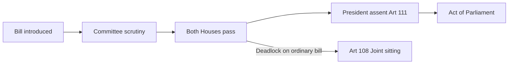

# Parliament & State Legislatures — Structure, Powers & Functioning

> GS-2 · Topic 06 · Parliament, state legislatures, law-making, committees, privileges, executive control

---

## PYQs

| Year | M | Words | Question (EN) | प्रश्न (HI) | ID |
|------|---|-------|---------------|-------------|-----|
| 2025 | 8 | 125 | What role do Joint Parliamentary Committees (JPCs) play in the Indian legislative process? How do they contribute to effective law-making? Analyse. | भारतीय विधायी प्रक्रिया में संयुक्त संसदीय समितियों (JPC) की क्या भूमिका है? वे प्रभावी कानून निर्माण में किस प्रकार योगदान देती हैं? विश्लेषण कीजिए। | Q1 |
| 2024 | 8 | 125 | What are the special legislative powers of the Council of States (Rajya Sabha)? Discuss. | राज्य सभा की विशेष विधायी शक्तियाँ क्या हैं? विवेचना कीजिए। | Q2 |
| 2023 | 12 | 200 | Describe the law-making process in the Legislative Assembly of Uttar Pradesh. | उत्तर प्रदेश की विधान सभा में विधि-निर्माण प्रक्रिया का वर्णन कीजिए। | Q3 |
| 2022 | 12 | 200 | Are the committees considered to be useful for Parliamentary work? Discuss, in this context, the role of the Estimate Committee. | क्या समितियाँ संसदीय कार्यों के लिए उपयोगी मानी जाती हैं? इस संदर्भ में प्राक्कलन समिति की भूमिका की विवेचना कीजिए। | Q4 |
| 2021 | 8 | 125 | Describe the role played by Parliamentary Committees in the functioning of Indian Parliament. | भारतीय संसद के कार्यप्रणाली में संसदीय समितियों की भूमिका का वर्णन करें। | Q5 |
| 2021 | 12 | 200 | Discuss the main methods by which the Parliament of India controls the executive. | उन मुख्य उपायों की विवेचना कीजिए जिनके द्वारा भारतीय संसद कार्यपालिका पर नियंत्रण रखती है। | Q6 |
| 2019 | 8 | 125 | Describe the procedure of creation and abolition of Legislative Council in States. Why did the Andhra Pradesh State Assembly pass a resolution to abolish the State's Legislative Council? | राज्यों में विधान परिषद के सृजन व उन्मूलन की प्रक्रिया का वर्णन कीजिए। आंध्र प्रदेश विधान सभा द्वारा राज्य के विधान परिषद को समाप्त करने का प्रस्ताव लाने के क्या कारण हैं? संक्षेप में बताइए। | Q7 |
| 2018 | 8 | 125 | Describe those special powers of the Council of States (Rajya Sabha) which are not enjoyed by the Lok Sabha, under the Indian Constitution. | राज्यसभा के उन विशिष्ट शक्तियों का वर्णन कीजिए, जो भारतीय संविधान के अंतर्गत लोकसभा को प्राप्त नहीं हैं। | Q8 |

---

## Quick Revision

```
PARLIAMENT (Part V): LS + RS + President (Art 79) — bicameral at Union
  LS: max 552 · 5 years · money bills · confidence · Art 75(3) PM accountability
  RS: max 250 (238 elected + 12 nominated) · 1/3 retire every 2 years · 6 years · permanent house
  President: part of Parliament (Art 79) · assent · ordinance · joint session summon

STATE LEGISLATURE (Part VI): Art 168 — unicameral or bicameral
  Vidhan Sabha (all states) · Vidhan Parishad (LC) — 5 states active: Bihar, MH, Karnataka, Telangana, UP abolished 1988; AP abolished again 2020–21
  UP = unicameral since LC abolished 1988

LAW-MAKING: Introduction → Publication → 1st reading → Committee (optional) → 2nd reading → 3rd reading → other house → President assent
  Money Bill: Art 110 · LS certificate final · RS 14 days only · no joint sitting
  Ordinary · Financial · Constitution Amendment (Art 368) — separate route

RAJYA SABHA SPECIAL (NOT LS):
  Art 249 — 2/3 RS → Parliament on State List (national interest) — 1 year renewable
  Art 312 — 2/3 RS → create new All India Service
  Art 67(e) — Deputy Chairman RS acts when Chairman post vacant (procedural)
  RS represents states + nominated eminent persons (Art 80)

LS DOMINANCE: Money bills · Art 108 joint sitting (RS minority) · No-confidence only LS · Budget primary

COMMITTEES = "Mini-Parliament" · continuous scrutiny · reduce overload
  STANDING: Financial — PAC (audit CAG) · Estimates (economy in estimates) · Public Undertakings
  DRSCs — 24 department-related (1993) · examine bills + demand for grants
  Ad hoc: JPC (equal LS+RS) · RAFA
  ESTIMATES: 30 LS members · NO ministers · oldest continuous 1950 · "economy in expenditure" · Chairman opposition convention since 1967
  JPC: Investigate specific scandal/bill — 2G, Bofors, Data Protection draft scrutiny — consensus law-making

EXECUTIVE CONTROL: Question Hour · Zero Hour · Adjournment · Calling Attention · No-confidence (LS) · Cut motions · Budget vote · Committees · Impeachment · RTI accountability

LEGISLATIVE COUNCIL Art 169: Parliament creates/abolishes if state assembly resolves (special majority) + Parliament law
  AP abolition Jan 2020 resolution — reasons: delay legislation, unnecessary expense, politically dominated, obstruction to govt bills

PRIVILEGES: Art 105/194 — freedom of speech in house · immunity from court for speech/vote · collective/individual

UP ASSEMBLY: 403 seats · Governor · rules similar to Parliament · Gazette · select committee · Governor assent · President if Art 254/304 conflict

TRAPS: RS cannot reject money bill · JPC ≠ standing committee · Estimate ≠ Public Accounts · Joint sitting not for money/amendment bills
  AP LC abolished 1988 originally, recreated 2007, abolition resolution 2020 again · UP unicameral
```

---

## Content

### Context — legislature as the engine of parliamentary democracy

In a parliamentary system, the **legislature is not merely a law factory** — it is the institution through which **electoral mandates become binding rules**, **public money is authorised**, and **the executive is held accountable daily**. At the Union level, **Parliament (Part V)** performs this role; at the state level, **State Legislatures (Part VI)** mirror the design with **Governor** replacing **President** as constitutional head. India's model follows the **Westminster tradition** — **fusion of executive and legislature** through **collective cabinet responsibility** — but modifies it with a **written constitution**, **judicial review**, **bicameral federalism**, and **detailed procedural rules** that no unwritten system replicates.

Understanding this topic requires grasping **four interconnected mechanisms**: (1) **institutional structure** — who sits in each house and for how long; (2) **law-making procedure** — how a bill becomes an Act; (3) **special powers** — especially **Rajya Sabha's federal legislative tools (Art 249, 312)**; and (4) **oversight architecture** — **parliamentary committees** and **floor instruments** (Question Hour, no-confidence, cut motions) that control the executive between elections. State legislatures add a fifth dimension — **regional law-making** with **Governor assent (Art 200)** and optional **Legislative Councils (Art 169)** — illustrated concretely by **Uttar Pradesh's unicameral Vidhan Sabha**.

### Structure of Parliament — Article 79 and the three constitutional components

**Article 79** defines Parliament as consisting of the **President**, the **Lok Sabha (House of the People)**, and the **Rajya Sabha (Council of States)**. The **President is part of Parliament** — not external to it — and performs **critical legislative functions**: **summoning and proroguing sessions (Art 85)**, **dissolving Lok Sabha (Art 85(2)(b))**, **assenting to bills (Art 111)**, and promulgating **ordinances (Art 123)** when Parliament is not in session. This **formal inclusion** means law-making is a **three-component process** even though **real political power** concentrates in the **two elected/nominated houses**.

| House / Office | Composition (what) | Term & continuity (how) | Primary constitutional role (why) |
|----------------|-------------------|---------------------------|-----------------------------------|
| **Lok Sabha** | Maximum **552 members** — **530 from states**, **20 from UTs**, **2 Anglo-Indian nominated** (nomination abolished by **104th Amendment, 2020**) | **5 years** from first sitting — **dissolvable**; term extendable during **Emergency (Art 83)** | **Directly elected chamber** — **money bills (Art 110)**, **no-confidence (Art 75(3))**, **primary budget control** — ensures **financial supremacy of the people** |
| **Rajya Sabha** | Maximum **250** — **238 elected** by state/UT assemblies via **proportional representation (Art 80(4))** + **12 nominated** by President for **literature, science, art, social service (Art 80(3))** | **6 years** per member — **1/3 retire every 2 years (Art 83(1))** — **permanent house, never dissolved** | **Federal and expert chamber** — **state representation at Centre**, **continuity during LS dissolution**, **exclusive powers Art 249/312** |
| **President** | Indirectly elected by **electoral college (Art 54)** — MPs + MLAs | **5 years (Art 56)** — **impeachment (Art 61)** possible | **Constitutional assent**, **ordinances**, **joint session summons (Art 108)** — **checks hasty legislation**, enables **governance between sessions** |

**Officers and sessions:** The **Lok Sabha Speaker (Art 93)** conducts proceedings, maintains order, certifies **Money Bills (Art 110(4))**, and exercises a **casting vote** in ties — expected to be **impartial** once elected. The **Rajya Sabha Chairman** is the **Vice-President ex-officio (Art 64)**; the **Deputy Chairman (Art 67(e))** presides when the Chairman's post is vacant — a **procedural distinction** unique to RS. **Parliament must meet at least twice a year** with **no gap exceeding 6 months (Art 85(1))** — conventionally **Budget, Monsoon, and Winter sessions** structure the annual calendar.

### Structure of State Legislatures — Article 168 and bicameral variation

**Article 168** establishes that every state has a **Governor** and **Legislature** — which may be **unicameral (Vidhan Sabha only)** or **bicameral (Vidhan Sabha + Vidhan Parishad/Legislative Council)**.

- **Unicameral states** — **Vidhan Sabha (Legislative Assembly)** is the **sole house** — e.g. **Uttar Pradesh** (since **Legislative Council abolished 1988**), **Punjab, Haryana, Odisha, West Bengal**, and **most states**. *Why unicameral:* **Cost efficiency**, **direct democratic mandate without second-chamber delay**, and **political judgment** that an upper house adds **obstruction without proportional benefit** — the argument that led **UP (1988)** and **Andhra Pradesh (2021)** to abolish Councils.

- **Bicameral states (currently four)** — **Maharashtra, Karnataka, Bihar, Telangana** maintain **Vidhan Parishad**. *Composition:* Maximum **one-third of Sabha strength**; **one-third retire every 2 years**; **6-year terms**; **1/6 nominated** (Governor: literature/science/co-op/social service); **1/3 elected by local bodies**, **1/12 by graduates**, **1/12 by teachers**, remainder by **Sabha MLAs**. *Powers:* Can **delay ordinary bills 4 months** (3 months + 1 month after reconsideration); **cannot reject Money Bills** — only **3 months' delay** — mirroring **Rajya Sabha's financial subordination**.

**Uttar Pradesh specifics:** **403-member Vidhan Sabha** (post-delimitation context) — **largest state legislature** by seats — **5-year term (Art 172)**; **Governor (Art 153)** as constitutional head; **unicameral since 1988** when **Vidhan Parishad was abolished** under **Art 169** after Assembly resolution and Parliamentary law — bills proceed **directly from Sabha to Governor** without upper-house delay.

### Law-making at Parliament — stages, bill types, and deadlock resolution

**Ordinary bill procedure** — the template state legislatures adapt:

1. **Introduction (First reading)** — Minister (**government bill**) or member (**private member bill**) gives **prior notice**; House grants **leave to introduce**; bill published in **Gazette of India** if not already published. *Why:* Public notice and **House permission** prevent **surprise legislation**.

2. **Committee stage (optional but critical)** — Bill referred to **Select Committee, Joint Committee**, or examined by **Department-related Standing Committee (DRSC)** — **clause-by-clause scrutiny**, **stakeholder consultation**. *Why:* Floor time is insufficient for **technical detail** — committees are **"mini-parliaments"**.

3. **Second reading** — **General debate on principles**; amendments moved. *Why:* **Political accountability** on policy direction before final text freeze.

4. **Third reading** — **Vote on bill as a whole** — usually **simple majority** (special majority only if constitutionally required). *Why:* Final **collective legislative approval**.

5. **Other House** — Same stages repeated in **Rajya Sabha** (if introduced in LS) or vice versa. *Why:* **Bicameral review** — second thought on legislation.

6. **President's assent (Art 111)** — President may **give assent**, **withhold assent** (rare — no time limit but convention-bound), or **return bill once** for reconsideration (not applicable to **Money Bills**). *Why:* **Final constitutional check** — though **real veto power is constrained by convention and judicial review**.

**Deadlock resolution — Art 108 joint sitting:** If ordinary bill passes one house but **other house rejects, or disagrees on amendments, or fails to act for 6 months**, the **President summons joint sitting** of both houses — **Speaker presides**, **simple majority** decides. *Excluded:* **Money Bills (Art 110)** and **Constitutional Amendment Bills (Art 368)** — **no joint sitting** — reflecting **LS financial supremacy** and **special amendment procedure**.

**Money Bill (Art 110)** — **Lok Sabha-dominated procedure:**
- **Speaker's certificate (Art 110(4))** is **final** — defines whether bill is Money Bill.
- **Only Lok Sabha may introduce** Money Bills.
- **Rajya Sabha: 14 days** to **recommend amendments** — **cannot reject**.
- **Lok Sabha may accept or reject RS suggestions** — **LS decides finally**.
- *Why:* **Westminster principle** — **public finance controlled by directly elected house**; **Aadhaar Act 2016** certification controversy showed **Speaker's certificate** is **politically consequential**.

**Constitutional Amendment Bills** follow **Art 368** separately — not ordinary bill route; **no joint sitting**, **no Money Bill overlap**.



### Law-making in Uttar Pradesh Legislative Assembly — unicameral state procedure

Since **1988**, **Uttar Pradesh** has **Governor + 403-member Vidhan Sabha only** — no Vidhan Parishad. The procedure **mirrors Parliament** under **state rules of procedure**:

1. **Bill introduction** — **Minister (government bill)** or **MLA (private member bill)** — latter **rarely passed**; requires **Speaker's permission**; published in **Uttar Pradesh Gazette**. *Mechanism:* Government bills dominate because **executive controls legislative majority** and **time allocation**.

2. **First reading** — **Title and objects** stated; formal introduction without merits debate (usually). *Why:* **Procedural formality** marking bill's entry into legislative process.

3. **Select Committee reference (optional)** — For **complex legislation** (e.g. **UP Revenue Code**, **police reform bills**) — **public consultation**, **clause scrutiny**, **expert evidence**. *Why:* **403-member floor** cannot examine **technical statutes** line-by-line.

4. **Second reading** — **Debate on principles**; amendments proposed and voted. *Why:* **Policy deliberation** before final passage.

5. **Third reading** — **Final vote** on bill as whole — **simple majority** unless constitution requires special majority. *Why:* **Definitive legislative authorisation**.

6. **No second chamber** — Bill sent directly to **Governor under Art 200**. *Options:* **Assent** (becomes law); **withhold assent** (reserve for President — rare); **return with message once** (Sabha may or may not amend). *Why:* **Governor as constitutional check** — but **real power limited by convention**.

7. **President's assent required** when bill affects **High Court jurisdiction**, **Election Commission**, **All-India Services**, or **conflicts with Union law (Art 254)** — **Union supremacy** over **conflicting state legislation**.

**State-level accountability tools:** **Question Hour**, **Zero Hour**, **Calling Attention Motion**, **Adjournment Motion** — same **Westminster accountability** as Parliament, adapted to **state executive (CM + Council of Ministers)**.

**Ordinance route (Art 213):** Governor promulgates **ordinance when Assembly not in session** — must be **approved within 6 weeks of reassembly** or **ceases to operate**. *Why:* **Urgent governance** between sessions — but **bypasses immediate legislative scrutiny**, a recurring **federalism/accountability concern**.

### Rajya Sabha — special legislative powers exclusive to the Council of States

The Constitution grants **Rajya Sabha two powers Lok Sabha cannot initiate** — reflecting its role as **federal chamber** representing **states at the Centre** and ensuring **continuity** in national legislation.

| Power | Constitutional mechanism (how) | Effect (what) | Rationale (why) |
|-------|-------------------------------|---------------|-----------------|
| **Legislate on State List (Art 249)** | **RS resolution by 2/3 of members present and voting** that **Parliament should make law** on State List subject **in national interest** — resolution valid **1 year**, **renewable** | Parliament may legislate on **State List** subjects (e.g. **essential commodities, labour standards**) **despite state legislative competence** | Enables **nation-wide uniform law** when **state fragmentation** threatens **national interest** — ironic that **"states' house" authorises central encroachment** |
| **Create new All-India Service (Art 312)** | **RS resolution by 2/3 majority** — authorises **Parliament** to create **new All-India Service** beyond **IAS, IPS, IFS** | **Uniform administrative cadre** serving **Union and states** — e.g. potential **Indian Legal Service, Indian Education Service** | **Administrative integration** across states — **Centre-state personnel unity** |
| **Permanent chamber (Art 83(1))** | **Not subject to dissolution** — **1/3 members retire every 2 years** | **Continuity of legislative business** when **Lok Sabha dissolved** for elections | Prevents **legislative vacuum** during **general election periods** |

**Additional RS distinctions (comparative, not exclusive):**
- **12 nominated members (Art 80(3))** — **literature, science, art, social service** expertise — **LS has no nominated members** after **104th Amendment** abolished Anglo-Indian nomination.
- **State/UT representation** — MLAs elect RS members — embeds **sub-national political composition** in **national legislature**.

**What Lok Sabha exclusively holds:**
- **Money Bills (Art 110)** — origin, Speaker certification, final decision on RS amendments.
- **No-confidence motion (Art 75(3))** — Council of Ministers must enjoy **LS confidence** — defeat forces **resignation**.
- **Primary budget initiative** — **demands for grants voted in LS first** — **financial supremacy of directly elected house**.

### Parliamentary committees — continuous scrutiny beyond the floor

Parliament cannot **examine every budget line, audit finding, and bill clause** on the crowded floor — **committees perform continuous, expert, bipartisan scrutiny** between sessions. **Dr. L.M. Singhvi** described committees as **"mini-parliaments"** — smaller groups with **specialised focus**, **evidence-taking power**, and **cross-party deliberation** away from **electoral rhetoric**.

| Committee type | Examples | Function (what → how → why) |
|----------------|----------|----------------------------|
| **Standing — Financial** | **Public Accounts Committee (PAC)**, **Estimates Committee**, **Committee on Public Undertakings (COPU)** | **PAC:** Examines **CAG audit reports** — **post-expenditure accountability** — pulls up executive on **misuse of funds**. **Estimates:** Examines **budget estimates before spending** — **"economy in expenditure"** — suggests **efficiency reforms**. **COPU:** Scrutinises **PSU performance** — **public enterprise accountability** |
| **Standing — DRSCs** | **24 Department-related Standing Committees (1993)** | **Examine bills** referred to them; analyse **demands for grants** department-wise; review **policy implementation** — **pre-legislative and post-legislative scrutiny** |
| **Standing — House** | **Business Advisory**, **Rules**, **General Purposes** | **Schedule business**, **interpret rules**, **administrative coordination** |
| **Ad hoc** | **Joint Parliamentary Committee (JPC)**, **RAFA (Rules, Assurances, etc.)** | **Specific investigation** or **targeted bill scrutiny** — dissolved after report |

**Estimates Committee — detailed mechanism:**
- **30 members, all from Lok Sabha** — **largest standing committee**; **continuous since 1950** — **oldest financial committee**.
- **No ministers permitted** — ensures **independence from executive** being scrutinised.
- **Mandate:** Examine **budget estimates** — suggest **economies, efficiency improvements, administrative reform** in **proposed expenditure** — **pre-expenditure focus**.
- **Chairman convention:** **Opposition MP** chairs since **1967** — continuing **G.V. Mavalankar** tradition of **non-partisan scrutiny spirit**.
- **Distinction from PAC:** **PAC examines CAG audit reports (post-expenditure)** — what was **actually spent and whether properly accounted**; **Estimates examines proposed spending (pre-expenditure)** — whether **allocation is efficient before money flows**. **Both are essential** — **Estimates prevents waste upstream; PAC catches misuse downstream**.

**Joint Parliamentary Committee (JPC) — detailed mechanism:**
- **Ad hoc** — **equal members from Lok Sabha and Rajya Sabha** — appointed by **Speaker and Chairman** for **specific bill or investigation**.
- **Historical examples:** **Bofors scandal (1987 JPC)**, **2G spectrum scam (2011 JPC)**, **Personal Data Protection Bill scrutiny**.
- **Role in law-making:** (1) **Clause-by-clause examination** of **contentious bills** — builds **cross-party consensus**; (2) **Stakeholder hearings** — experts, industry, civil society — **evidence-based drafting**; (3) **Detailed report** guides **floor amendments** — **reduces partisan deadlock**.
- **Limits:** Recommendations are **not legally binding** — government may **ignore**; **politicisation** in **scandal probes** may **delay** rather than **improve** legislation; **prolonged investigation** stalls **policy action**.

| Committee | Focus | Timing | Members |
|-----------|-------|--------|---------|
| **Estimates** | **Proposed budget efficiency** | **Pre-expenditure** | **30 LS, no ministers** |
| **PAC** | **CAG audit compliance** | **Post-expenditure** | **15 LS + 7 RS** |
| **JPC** | **Specific bill/scandal** | **Ad hoc** | **Equal LS + RS** |

### Parliament's control over the executive — mechanisms and limits

**Article 75(3)** establishes that the **Council of Ministers is collectively responsible to the Lok Sabha** — the **constitutional foundation** of **parliamentary control**. The mechanisms operate on **daily, financial, and political** levels:

| Method | Mechanism (how) | Control effect (why) |
|--------|-----------------|----------------------|
| **Question Hour** | **Starred questions (oral answer)**, **unstarred (written)**, **short-notice questions** — ministers must **answer on record** | **Daily departmental accountability** — exposes **policy failures, data, commitments** |
| **Zero Hour** | **Unscheduled matters** raised immediately after Question Hour | **Urgent public issues** force **immediate executive response** without prior notice |
| **Adjournment Motion** | **Suspends normal business** to discuss **urgent matter of public importance** — requires **leave of House** | **Strong censure signal** — politically costly for government |
| **Calling Attention Motion** | Minister **explains** matter of **urgent public importance** | **Forces ministerial statement** on **crisis issues** |
| **Financial control** | **Budget debate**, **vote on demands for grants**, **cut motions** (token, policy, economy, amount) — **guillotine** limits debate time | **Executive cannot spend public money** without **Parliamentary authorisation** — **ultimate fiscal control** |
| **No-confidence motion (LS only)** | **Simple majority defeat** of government on confidence motion | **Strongest political sanction** — **ministry must resign (Art 75(3))** |
| **Parliamentary committees** | **PAC** on **CAG findings**; **DRSCs** on **implementation gaps** | **Continuous audit and policy review** between sessions |
| **Impeachment/removal** | **President (Art 61)**, **Vice-President**, **judges (Art 124(4))** — **Parliamentary procedure** | **Constitutional accountability** of **highest offices** |
| **Debates and resolutions** | **Rule 193/184 discussions**, **private member resolutions** | **Moral and political pressure** on **policy direction** |

**Limits on effective control:**
- **Anti-defection (10th Schedule, 1985)** — **party whips** bind voting — reduces **independent floor judgment** on **no-confidence and cut motions**.
- **Single-party majority governments** — **weaken opposition capacity** for **daily scrutiny** — **Question Hour** becomes **ritual** rather than **accountability**.
- **Ordinance route (Art 123)** — **bypasses immediate Parliamentary approval** — ordinances must be **placed before Parliament** but enable **temporary law without prior debate**.
- **Committee reports non-binding** — government may **accept or ignore** PAC/JPC/DRSC recommendations without **legal consequence**.

### Legislative Council — creation and abolition under Article 169

**Article 169** provides a **two-step mechanism** for states to **create or abolish** a **Vidhan Parishad (Legislative Council)**:

1. **State Legislative Assembly** passes resolution by **special majority** — **majority of total membership + two-thirds of members present and voting** — resolving that **Council be created or abolished**.
2. **Parliament** enacts **law** to give effect — **simple Parliamentary process** once state resolves — **no Art 368 state ratification** required.

*Why two steps:* **Federal choice** — states **decide bicameralism** for themselves; **Parliament** provides **uniform legal framework** — balances **state autonomy** with **national legislative consistency**.

**Andhra Pradesh abolition (2020–21) — reasons cited:**
- **Newly elected Jagan Mohan Reddy government (2019)** faced **Council dominated by opposition/regional rivals** after **Council recreated in 2007** (earlier abolished **1985**, recreated **2007**).
- **Obstruction of government bills** — Council **rejected or delayed** key legislation including **capital region (Amaravati/three capitals) bills** and **Council of Ministers-related bills** — **second chamber blocking Assembly mandate**.
- **Financial burden** — **maintenance cost** of **second chamber** without **proportionate legislative benefit**.
- **Democratic representation argument** — **indirect/graduates/teachers constituencies** less **representative** than **directly elected Sabha** — **Accountability deficit**.
- **Parliament passed abolition law (2020)** — **Council abolished 2021**. *Broader pattern:* **UP abolished 1988** for similar **cost-obstruction arguments** — **bicameralism debate** continues in **Maharashtra, Telangana**.

**Council powers when it exists:** Can **delay ordinary bills 4 months**; **Money Bills: 3 months' delay only** — **cannot reject** — **subordinate to Sabha** on finance, unlike **Rajya Sabha's** broader (though still limited) role at Union level.

### Parliamentary privileges — Articles 105 and 194

**Article 105 (Parliament)** and **Article 194 (State Legislatures)** protect **legislative independence** so members can **debate and vote without external intimidation**:

- **Freedom of speech in the house** — subject to **rules of procedure** and **Art 121/212** (no discussion of **judges' conduct** / **state legislature** parallel).
- **Immunity from court proceedings** for **anything said or any vote cast** in the house — enables **frank criticism** of executive.
- **Collective privileges** — **publish reports**, **exclude strangers**, **regulate internal affairs**, **punish breach of privilege**.
- **Individual privileges** — **freedom from arrest in civil cases** during sessions plus **40 days before and after** — **not immunity from criminal law**.
- **44th Amendment (1978)** — **salaries and allowances** by **law** — reduced **arbitrary privilege expansion**.

**Keshava Singh case (1965)** — **Allahabad High Court vs U.P. Assembly** privilege conflict — Supreme Court held **legislature privileges must harmonise with fundamental rights and basic structure of parliamentary democracy** — **privileges are not unlimited**.

### Contemporary relevance

- **JPC scrutiny of major legislation** — **Data protection, telecom regulation** — **committee route** vs **fast-track ordinances** (new criminal laws **BNS, BNSS, BSA 2023**) — **DRSC time constraints** raise **effective law-making** questions.
- **Rajya Sabha Art 249** — rarely invoked but **constitutionally ready** for **labour, environment, public health** on State List when **national uniformity** needed — **federal friction** if overused.
- **Andhra Pradesh Legislative Council abolition (2020–21)** — revives **bicameralism cost-benefit debate** in **Telangana, Maharashtra, Karnataka**.
- **Uttar Pradesh Assembly (403 members)** — **largest state legislature** — **state law-making** central to **governance of India's most populous state** — **ordinance use (Art 213)**, **Governor assent delays**.
- **Estimates and PAC follow-up** — **CAG reports on PM-KISAN, MGNREGA** — **committee recommendations** shape **executive corrective action** (or **public embarrassment** if ignored).
- **Digital Parliament initiatives** — **e-Sansad, e-Vidhan** — **online committee submissions** — **transparency in pre-legislative consultation**.

### Limits — balanced view

- **Committee recommendations are advisory** — **DRSC, JPC, Estimates, PAC** reports **cannot compel** government action — **impact depends on political will** and **media amplification**.
- **Rajya Sabha special powers are rarely used** — **Art 249/312** require **2/3 RS majority** — **high threshold** limits **routine centralisation** but also **limits effectiveness** as **federal safety valve**.
- **Money Bill certification controversy** — **Aadhaar Act 2016** — **Speaker's Art 110(4) certificate** **excludes RS** from **meaningful review** — **potential misuse** to **bypass upper house**.
- **State legislative autonomy constrained** — **Governor delays (Art 200)**, **ordinance route (Art 213)**, **President reference for conflicting bills (Art 254)** — **formal state law-making power** with **real central checks**.
- **Anti-defection and party discipline** — **10th Schedule** strengthens **party control** over **individual member judgment** — **parliamentary control of executive** works best when **opposition is strong and members vote independently** — **structural trend toward executive dominance** in **majority governments**.

---

## Answers

### Q1: JPC role in legislative process and effective law-making. (2025, 8M, 125W)

**Introduction:**
> **Joint Parliamentary Committees (JPCs)** are **ad hoc bicameral bodies** that **deepen scrutiny** of **bills and investigations**, complementing **floor passage** with **expert consensus-building**.

**Main Points:**
- **Bicameral composition** — **Equal LS + RS members** — **Speaker/Chairman** appoints — **cross-party examination**.
- **Bill scrutiny** — **Clause-by-clause review**, **stakeholder hearings** — improves **draft quality** before **final vote**.
- **Investigative role** — **Scandal probes (2G, Bofors)** — **informs legislative fixes** and **accountability**.
- **Reduces deadlock** — **Detailed committee report** narrows **disputed provisions** — ** smoother floor debate**.
- **Legislative expertise** — **Specialist input** on **technical laws** (data protection, finance) — **evidence-based law-making**.
- **Limits** — **Recommendations not binding**; **politicisation** may **delay** rather than **improve** bills.

**Keywords (underline in exam):** Joint Parliamentary Committee · Ad hoc committee · Bill scrutiny · Bicameral · Stakeholder consultation · Law-making

**Exam diagram (30 sec):**
```
Bill/Scandal → JPC hearings → report → amended law on floor
```

**Conclusion:**
> JPCs **strengthen effective law-making** through **detailed scrutiny and consensus**, though **impact depends on political will** to accept recommendations.

---

### Q2: Special legislative powers of Rajya Sabha. (2024, 8M, 125W)

**Introduction:**
> **Rajya Sabha** is the **federal, continuing chamber** with **two unique legislative powers** under **Articles 249 and 312** not available to **Lok Sabha alone**.

**Main Points:**
- **Art 249 — State List legislation** — **2/3 RS majority** — Parliament may legislate on **State List** for **national interest** — **1-year renewable**.
- **Art 312 — New All-India Service** — **2/3 RS majority** — enables creation of **new AIS** beyond **IAS/IPS/IFS**.
- **Federal representation** — **States/UTs elect RS members** — **legislative voice for sub-national units**.
- **12 nominated members** — **Art 80(3)** — **literature, science, art, social service** expertise.
- **Continuity** — **Permanent house** — **1/3 retire every 2 years** — **stability in law-making**.
- **Contrast LS** — **Money bills, no-confidence** exclusive to **LS** — **RS special powers are federal/ administrative**, not financial.

**Keywords (underline in exam):** Art 249 · Art 312 · State List · All-India Service · Rajya Sabha · National interest · Art 80

**Exam diagram (30 sec):**
```
RS only: Art 249 (State List law) + Art 312 (new AIS)
Both need 2/3 RS majority first
```

**Conclusion:**
> Rajya Sabha's **special legislative powers** embody **Indian federalism** — enabling **national action** without **destroying state lists permanently**.

---

### Q3: Law-making process in UP Legislative Assembly. (2023, 12M, 200W)

**Introduction:**
> **Uttar Pradesh** has a **unicameral legislature (Vidhan Sabha + Governor)** since **1988** — law-making follows **Parliamentary stages** adapted to **state rules**.

**Main Points:**
- **Bill introduction** — **Minister/MLA** introduces with **Speaker's leave**; published in **UP Gazette**.
- **First reading** — **Title and objects** — formal introduction.
- **Committee reference (optional)** — **Select Committee** examines **clauses**, **public input** — critical for **complex bills**.
- **Second reading** — **Debate on principles**; **amendments** moved.
- **Third reading** — **Final vote** on bill as whole — **simple majority** (special majority if constitutionally required).
- **No second chamber** — bill to **Governor (Art 200)** — **assent, withhold, or return once**.
- **President assent** — if bill affects **HC jurisdiction, EC, AIS**, or **Union-state relations (Art 254)**.
- **Ordinance route (Art 213)** — **Governor ordinance** when **Assembly not in session** — must be **approved within 6 weeks** of reassembly.

**Keywords (underline in exam):** Vidhan Sabha · UP unicameral · Three readings · Governor assent · Art 200 · Select Committee · Art 213 ordinance

**Exam diagram (30 sec):**
```
Intro → 1st → Committee? → 2nd → 3rd → Governor → (President if needed) → Act
```

**Conclusion:**
> UP Assembly law-making **mirrors parliamentary democracy** with **403-member scrutiny**, **Governor as constitutional check**, and **no Legislative Council delay**.

---

### Q4: Committees useful for Parliament? Role of Estimates Committee. (2022, 12M, 200W)

**Introduction:**
> **Parliamentary committees** perform **continuous, expert scrutiny** that the **overloaded floor** cannot — the **Estimates Committee** specialises in **economy in public expenditure**.

**Main Points:**
- **Utility of committees** — **Reduce overload**, **bipartisan scrutiny**, **expert reports**, **executive accountability** between sessions.
- **Types** — **Financial (PAC, Estimates, COPU)**, **DRSCs (24)**, **ad hoc JPC** — **"mini-parliament"**.
- **Estimates Committee** — **30 LS members**, **no ministers**, **continuous since 1950**.
- **Mandate** — **Examine budget estimates** — suggest **economies, efficiency, administrative reform** — **pre-expenditure focus**.
- **Chairman convention** — **Opposition MP** since **1967** — **non-partisan scrutiny spirit**.
- **Vs PAC** — PAC examines **CAG post-audit**; Estimates examines **proposed spending efficiency**.
- **Limits** — **Recommendations not binding**; **government majority** may **ignore** suggestions.

**Keywords (underline in exam):** Estimates Committee · PAC · DRSC · Economy in expenditure · 30 members · No ministers · Parliamentary scrutiny

**Exam diagram (30 sec):**
```
Committees → continuous scrutiny
Estimates → proposed spend efficiency | PAC → CAG audit follow-up
```

**Conclusion:**
> Committees are **indispensable for parliamentary work**; **Estimates Committee** uniquely guards **taxpayer money before it is spent**.

---

### Q5: Role of Parliamentary Committees in Parliament functioning. (2021, 8M, 125W)

**Introduction:**
> **Parliamentary committees** extend **legislative oversight** beyond **debates and voting** — enabling **detailed, continuous accountability**.

**Main Characteristics:**
- **Scrutiny of bills** — **DRSCs** examine **legislation** before/after introduction — **clause-level quality**.
- **Budget examination** — **DRSCs** analyse **demands for grants**; **Estimates** suggests **economies**; **PAC** reviews **CAG audit**.
- **Executive oversight** — **PAC, COPU** — **departmental performance**, **PSU losses**.
- **Ad hoc investigation** — **JPC** on **scandals/specific bills** — **informed law-making**.
- **Bipartisan expertise** — **Cross-party membership** — **technical deliberation** away from **electoral rhetoric**.
- **Limitation** — **Time constraints**, **non-binding reports**, **government dominance** in **implementing recommendations**.

**Keywords (underline in exam):** DRSC · PAC · Estimates Committee · JPC · Demands for grants · CAG · Mini-parliament

**Exam diagram (30 sec):**
```
Parliament floor → broad debate
Committees → detailed bills + budget + audit
```

**Conclusion:**
> Committees are the **workhorse of Indian Parliament** — converting **electoral democracy** into **effective scrutiny and law-making**.

---

### Q6: Main methods Parliament controls executive. (2021, 12M, 200W)

**Introduction:**
> Under **Art 75(3)**, the **Council of Ministers is responsible to Lok Sabha** — Parliament uses **multiple tools** to **control executive action**.

**Main Points:**
- **Question Hour** — **Daily oral/written questions** — ministers **accountable** for **departmental acts**.
- **Zero Hour & Calling Attention** — **Urgent public issues** — **immediate executive response**.
- **Adjournment motion** — **Serious matter** — **censure signal** — disrupts normal business.
- **Financial control** — **Budget debate**, **vote on demands**, **cut motions** — **executive cannot spend without approval**.
- **No-confidence motion (LS)** — **Defeat forces ministry resignation** — **strongest political control**.
- **Parliamentary committees** — **PAC/DRSC** expose **implementation failures** via **CAG and departmental evidence**.
- **Debates & resolutions** — **Policy pressure** on **foreign affairs, internal security, legislation**.
- **Limits** — **Anti-defection**, **single-party majority**, **ordinances** reduce **effective daily control**.

**Keywords (underline in exam):** Art 75(3) · Question Hour · No-confidence · Cut motions · PAC · Adjournment motion · Budget control

**Exam diagram (30 sec):**
```
Control: Questions + Budget vote + No-confidence + Committees
Limit: Whip + ordinance + majority govt
```

**Conclusion:**
> Parliament controls executive through **daily questioning, financial veto, confidence sanctions, and committee audit** — **core of responsible government**.

---

### Q7: Creation/abolition of Legislative Council + AP abolition reasons. (2019, 8M, 125W)

**Introduction:**
> **Article 169** allows **creation or abolition** of **State Legislative Council (Vidhan Parishad)** through **state initiative + Parliamentary law**.

**Main Points:**
- **Step 1** — **State Assembly** passes resolution by **special majority** — **create or abolish** Council.
- **Step 2** — **Parliament** enacts **law** to implement — **no state ratification under Art 368** needed.
- **Council features** — **Max 1/3 of Sabha**; **partially elected/indirect/nominated**; can **delay non-money bills** **4 months**.
- **AP abolition resolution (Jan 2020)** — **Newly elected Jagan Mohan Reddy government** — **Council seen obstructing** **Assembly mandate**.
- **Reasons cited** — **Blocked/delayed key bills** (capital/ governance legislation); **financial cost** of **second chamber**; **indirect membership** less **democratically representative**; **political rivalry** — **Council dominated by opposition**.
- **Broader debate** — **Bicameralism vs efficiency** — **UP abolished LC 1988** earlier for similar arguments.

**Keywords (underline in exam):** Art 169 · Legislative Council · Special majority · Andhra Pradesh · Vidhan Parishad · Bicameralism · State Assembly resolution

**Exam diagram (30 sec):**
```
Assembly special majority → Parliament law → LC created/abolished
AP 2020: obstruction + cost + representation → abolition resolution
```

**Conclusion:**
> **Art 169 procedure** balances **federal choice** with **Parliamentary law**; **AP's 2020 resolution** reflected **friction between Council delay and Assembly's popular mandate**.

---

### Q8: Rajya Sabha powers not enjoyed by Lok Sabha. (2018, 8M, 125W)

**Introduction:**
> The Constitution grants **Rajya Sabha exclusive powers** reflecting its **federal, continuing role** — distinct from **Lok Sabha's popular, financial dominance**.

**Main Characteristics:**
- **Art 249** — Authorise **Parliament** to legislate on **State List** (**2/3 RS**) — **not initiatable by LS alone**.
- **Art 312** — Authorise **new All-India Service** — **2/3 RS** prerequisite.
- **Nominated members (Art 80(3))** — **12 eminent persons** — **RS only** — **LS has no equivalent**.
- **Permanent chamber** — **Not dissolved** — **continuity** during **LS dissolution** — **LS lacks this institutional feature**.
- **Not RS exclusive but contrast** — **LS alone**: **Money bills, no-confidence, primary budget initiative**.

**Keywords (underline in exam):** Art 249 · Art 312 · State List · All-India Service · Nominated members · Permanent house · Art 80

**Exam diagram (30 sec):**
```
RS only: Art 249 + Art 312 (both 2/3 RS)
LS only: Money bill + No-confidence
```

**Conclusion:**
> **Art 249 and 312** are the **constitutional core** of **Rajya Sabha's special powers** — **federal safeguards** unavailable to **Lok Sabha**.

---

### Q9: *Likely variant:* Money Bill vs Ordinary Bill — parliamentary procedure. (8M, 125W)

**Introduction:**
> **Money Bills (Art 110)** follow a **Lok Sabha-dominated procedure** protecting **financial supremacy of the directly elected house**.

**Main Characteristics:**
- **Certification** — **Speaker's certificate** under **Art 110(4)** — **final** — defines **Money Bill**.
- **Introduction** — **Only in Lok Sabha** — **RS cannot initiate or amend reject**.
- **Rajya Sabha role** — **14 days** to **recommend amendments** — **LS may reject suggestions**.
- **No joint sitting** — **Art 108** excludes **Money Bills** from **deadlock resolution**.
- **Ordinary bills** — **Both houses equal** (except **deadlock joint sitting**); **RS can delay/reject**.
- **Examples** — **Taxation, Consolidated Fund, appropriation** — **Aadhaar certification controversy** exam link.

**Keywords (underline in exam):** Art 110 · Money Bill · Speaker certificate · 14 days · Lok Sabha supremacy · Art 108 exclusion

**Exam diagram (30 sec):**
```
Money Bill → LS origin → RS 14 days suggest → LS final
Ordinary → both houses + possible Art 108 joint sitting
```

**Conclusion:**
> **Money Bill procedure** embeds **Westminster financial control** — **LS as primary guardian of public purse**.

---

### Q10: *Likely variant:* Parliamentary privileges — significance. (8M, 125W)

**Introduction:**
> **Parliamentary privileges (Art 105/194)** protect **legislative independence** — enabling **free debate and effective oversight** without **external intimidation**.

**Main Characteristics:**
- **Freedom of speech** in house — **subject to rules** — **frank policy criticism**.
- **Immunity** — **No court action** for **speech/vote** in house.
- **Collective powers** — **Exclude strangers**, **punish breach of privilege**, **regulate internal affairs**.
- **Individual protection** — **Arrest immunity** in **civil matters** during session **±40 days**.
- **State legislatures** — **Art 194** parallel privileges for **Vidhan Sabha/Parishad**.
- **Limits** — **44th Amendment**; **courts cannot inquire into proceedings (Art 122/212)** — but **abuse invites reform debate**.

**Keywords (underline in exam):** Art 105 · Art 194 · Freedom of speech · Breach of privilege · Immunity · Art 122

**Exam diagram (30 sec):**
```
Privileges → free speech + immunity + punish breach
Goal → independent oversight of executive
```

**Conclusion:**
> Privileges **secure Parliament's dignity and fearlessness** — essential for **meaningful executive control** in **parliamentary democracy**.

---

## Traps

| Wrong | Correct |
|-------|---------|
| Rajya Sabha can reject Money Bills | **14 days only** — **recommendations** — **LS decides finally** |
| Joint sitting applies to Money Bills | **Art 108 excludes Money Bills** and **constitutional amendments** |
| Estimates Committee includes ministers | **No ministers** — **30 LS members only** |
| Estimates Committee examines CAG audit | **PAC** examines **CAG**; **Estimates** examines **budget estimates/economy** |
| JPC is a permanent standing committee | **Ad hoc** — **specific bill/investigation** |
| Lok Sabha can initiate Art 249 resolution | **Only Rajya Sabha** — **2/3 majority** |
| All states have Legislative Council | **Only 6 historically** — **most states unicameral** — **UP abolished LC 1988** |
| Art 169 abolition needs only state law | **Assembly special majority + Parliament law** |
| Private member bills pass frequently | **Rarely passed** — **government bills dominate** |
| Governor must assent to all state bills | May **reserve for President**, **withhold**, or **return once (Art 200)** |
| RS and LS have equal power on Money Bills | **LS supremacy** — **Speaker certificate final** |
| Parliamentary committee reports are binding | **Recommendations advisory** — **not legally binding** on government |
| UP has Vidhan Parishad | **Abolished 1988** — **unicameral** — **403-member Sabha only** |

---

*Complete.*
