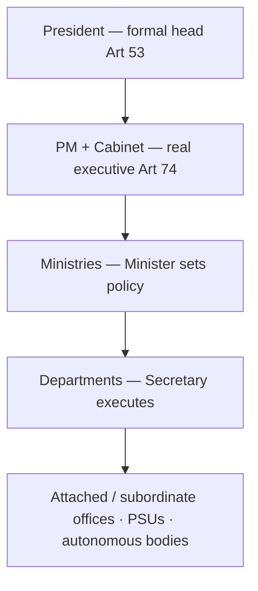

# Executive, Judiciary, PIL & Pressure Groups

> GS-2 · Topic 07 · Executive & judiciary structure, ministries, pressure groups, political parties, PIL

---

## PYQs

| Year | M | Words | Question (EN) | प्रश्न (HI) | ID |
|------|---|-------|---------------|-------------|-----|
| 2025 | 12 | 125 | Public Interest Litigation (PIL) is an important tool for promoting social justice and protecting the rights of marginalized communities. Analyse with suitable examples. | जनहित याचिका (PIL) सामाजिक न्याय को बढ़ावा देने एवं हाशिए पर पड़े समुदायों के अधिकारों की रक्षा करने का महत्त्वपूर्ण साधन है। उपयुक्त उदाहरण सहित विश्लेषण कीजिए। | Q1 |
| 2022 | 8 | 125 | Consider the functions and relations of the Chief Minister and the Governor of State. | राज्य के मुख्यमंत्री और राज्यपाल के कार्यों एवं सम्बन्धों पर विचार कीजिए। | Q2 |
| 2021 | 8 | 125 | Critically examine the impact and role of Political parties in the Indian Political System. | भारतीय राजनीतिक व्यवस्था में राजनीतिक दलों के प्रभाव और भूमिका का समालोचनात्मक परीक्षण कीजिए। | Q3 |

---

## Quick Revision

```
UNION EXECUTIVE (Part V): Art 52–78
  President (Art 53 nominal) · VP · PM + Council of Ministers (Art 74–75) · Cabinet · Attorney General
  PM = de facto head · appointed by President · leader of majority · advises President
  CoM = aids/advises President · collective responsibility Art 75(3) to LS · individual Art 75(2)
  Cabinet = inner CoM · Cabinet Committees · PMO coordinates

MINISTRIES vs DEPARTMENTS:
  Ministry = political head (Minister) · policy · Department = executive head (Secretary) · implementation
  Examples: MHA → Dept of Home; MoEFCC → Forest & Climate Change dept
  Attached/subordinate offices, PSUs, autonomous bodies under ministries

STATE EXECUTIVE (Part VI): Art 153–167
  Governor (Art 153) · CM · CoM · Advocate General
  Governor: President appointee · reserve bills · ordinance Art 213 · President's Rule recommendation · discretionary powers (Art 163)
  CM: real executive · appointed by Governor · leader of majority in Assembly · portfolios · cabinet

CM–GOVERNOR RELATIONS:
  Constitutional: CM advises Governor (Art 163(1)) · Governor bound EXCEPT discretionary
  Discretionary: reserve bill for President · Art 356 recommendation · invite CM when no clear majority
  Friction: opposition states · long pending bills · university VC appointments · "rubber stamp" vs "agent of Centre" debate
  SR Bommai · Rameshwar Prasad · Nabam Rebia — judicial limits on Governor

JUDICIARY STRUCTURE:
  SC Art 124 — 34 judges (incl CJI) · original/appellate/advisory · Art 32 writs · Art 142 · Collegium appointments
  HC Art 214 — each state/UT · Art 226 writs wider · control subordinate judiciary
  Subordinate: district/session · lower courts under HC superintendence Art 235
  Tribunals supplement (NGT, CAT) — HC review retained L. Chandra Kumar

PIL: S.P. Gupta 1981 · epistolary jurisdiction · Krishna Iyer/Bhagwati · relaxed locus standi
  For marginalized: bonded labour, undertrials, pavement dwellers, manual scavenging, tribal forest rights, transgender (NALSA), workplace Vishaka
  Art 32/226 · social justice via FR + DPSP · limits: abuse, mala fide, not every public interest

PRESSURE GROUPS:
  Formal: FICCI, CII, ASSOCHAM · trade unions (INTUC, CITU, BMS) · bar associations · professional bodies
  Informal: social movements (Narmada, RTI, anti-corruption) · caste/religious groups · farmer unions (SKM)
  Role: agenda-setting · lobbying · shaping policy/law · PIL catalyst · protest · electoral pressure via parties
  Limits: unelected influence · capture by elite · opaque funding

POLITICAL PARTIES (10th Schedule):
  Art 324 · RPA 1951 · national/state recognition · ECI symbols
  Role: aggregate interests · government formation · legislative discipline · anti-defection
  Critique: clientelism · dynasty · money power · criminalization (ADR reports) · regional vs national

TRAPS: Governor ≠ elected · CM not appointed by public directly · PIL ≠ all public grievances · Ministry ≠ department same head always
  Collegium ≠ in Constitution text originally · President not mere rubber stamp formally
```

---

## Content

### Context — how the Constitution becomes daily governance

The Constitution creates **paper institutions**; the **executive, judiciary, and civil society** turn them into **lived governance**. **Part V (Arts 52–78)** establishes the **Union executive** — President, Prime Minister, Council of Ministers, and the administrative machinery of **ministries and departments** that implement law from Delhi. **Part VI (Arts 153–167)** mirrors this at the state level through the **Governor, Chief Minister, and state Council of Ministers**, with the Governor as the Centre's constitutional sentinel inside every state. **Part V Chapter IV and Part VI Chapter V** create the **integrated judiciary** — Supreme Court, High Courts, and subordinate courts — as the **guardian of rights** and **dispute resolver**. Alongside these formal structures, **political parties** (registered under **RPA 1951**, supervised by **ECI under Art 324**) aggregate citizen demands into governments, while **pressure groups** — from **FICCI** to **Samyukta Kisan Morcha** — influence policy without seeking office. Where ordinary litigation fails the poor, **Public Interest Litigation (PIL)** under **Articles 32 and 226** opens courts to **public-spirited petitioners** on behalf of the marginalized. Together, these actors answer one question: **who decides, who executes, who checks, and who speaks for those the system excludes?**

### Union executive — constitutional frame and real power (Part V)

India follows the **Westminster parliamentary model**: the **President (Art 52–53)** is **head of state** and **formal executive**, but **real executive power** is exercised by the **Prime Minister and Council of Ministers (Arts 74–75)**. The President **acts on ministerial advice** in nearly all matters — assenting to bills, issuing **ordinances under Art 123**, making **appointments (Governors, judges on Collegium recommendation, CAG, CEC)**, and exercising **pardon and mercy under Art 72**. The **Vice-President (Art 63–64)** is **ex officio Chairman of the Rajya Sabha** and acts as President when that office is vacant. The **Attorney General of India (Art 76)** is the **government's chief legal adviser** — participates in court on its behalf but is **not a minister** and does not vote in Parliament.

The **Prime Minister** is the **de facto head of government**: appointed by the President, usually the **leader of the majority party/coalition in the Lok Sabha**, the PM **allocates portfolios**, **presides over Cabinet**, **coordinates policy**, and **advises the President** on all executive actions. The **Council of Ministers (CoM)** — ranging from **Cabinet Ministers** to **Ministers of State** — **aids and advises** the President collectively. **Art 75(3)** enshrines **collective responsibility to the Lok Sabha**: the entire Council must resign if the Lok Sabha passes a **no-confidence motion**. **Art 75(2)** adds **individual ministerial responsibility** — a minister may be removed for personal misconduct even when the government survives. The **Cabinet** is the **inner core of CoM** where **major policy decisions** are taken; **Cabinet Committees** (on Security, Economic Affairs, Political Affairs, etc.) handle **specialised coordination** so the full Cabinet is not burdened with every detail.

| Institution | Constitutional basis | Operational role |
|-------------|---------------------|------------------|
| **President** | Art 52–53 | Formal head; ordinances (Art 123); appointments; pardon (Art 72) |
| **Prime Minister** | Art 74–75 | De facto executive; portfolio allocation; Cabinet chair; President's chief adviser |
| **Council of Ministers** | Art 74–75 | Collective advice to President; collective responsibility to LS (Art 75(3)) |
| **Cabinet** | Convention + Rules of Business | Inner CoM; major decisions; Cabinet Committees |
| **Attorney General** | Art 76 | Chief legal adviser; not a minister; no vote in Parliament |
| **Vice-President** | Art 63–64 | RS Chairman; acts as President when office vacant |

**Functioning in practice:** The **PMO (Prime Minister's Office)** has become the **central coordination hub** — monitoring flagship schemes, handling key appointments, and aligning ministries in **strong majority governments**. The **Cabinet Secretariat** prepares **Cabinet agendas**, routes **Cabinet notes**, and ensures **inter-ministerial consultation** before decisions reach the Cabinet. Ministers frame **policy and legislation**; **secretaries (IAS)** execute. Reforms like **Mission Karmayogi** (capacity building for civil servants), **lateral entry** at joint-secretary level, and **e-office** digitisation target the **efficiency gap** between political direction and administrative delivery.

### Ministries and departments — the policy–execution divide

The Union executive is organised as **ministries** (political) and **departments** (administrative). A **Ministry** is headed by a **Minister** — responsible for **policy formulation, legislative proposals, budget demands in Parliament, and political accountability**. A **Department** under that ministry is headed by a **Secretary** (typically an **IAS officer**) — responsible for **day-to-day administration, rule-making, and implementation**. This distinction is constitutionally implicit but administratively explicit: the Minister answers to Parliament; the Secretary manages the file.

| Dimension | Ministry | Department |
|-----------|----------|------------|
| **Head** | Minister (political executive) | Secretary (administrative executive) |
| **Core function** | Policy, legislation, budget framing | Implementation, administration, rule-making |
| **Accountability** | To Parliament and PM | To Minister and PM through Minister |
| **Example** | Ministry of Home Affairs (MHA) | Department of Home under MHA |

**Typical hierarchy:** **Ministry** → **Department(s)** → **Attached offices** (e.g. **CBI** under MHA) → **Subordinate offices** → **PSUs and autonomous bodies** (e.g. **UIDAI**, **ISRO** under Department of Space). A single ministry may contain **multiple departments** — the **Ministry of Finance** includes the **Department of Economic Affairs**, **Department of Revenue**, and **Department of Financial Services**. Policy failure often occurs at the **ministry–department interface** — when political announcements are not translated into administrative capacity, or when departments operate in silos without Cabinet Secretariat coordination.



### State executive — Governor and Chief Minister (Part VI)

The **state executive** mirrors the Union pattern but with a critical asymmetry: the **Governor is not elected** but **appointed by the President (Art 155)** for a **five-year term** holding office during the **President's pleasure (Art 156)**. This makes the Governor the **Centre's constitutional representative** inside the state — a **federal sentinel**, not a parallel executive.

**Governor's functions (Arts 153–162):**
- **Appoint the Chief Minister (Art 164)** — usually the leader of the **majority party/coalition** in the **Vidhan Sabha**; in a **hung assembly**, the Governor exercises **discretion** in inviting a leader who can prove majority.
- **Appoint other ministers on CM's advice**; ministers hold office during the **Governor's pleasure** but are **collectively responsible to the Assembly**.
- **Summon, prorogue, and dissolve the Assembly** — normally on CM's advice; dissolution before end of term is a **high-discretion** moment.
- **Assent to bills (Art 200)** — may **give assent**, **withhold assent**, **return for reconsideration** (except Money Bills), or **reserve for President's consideration** when he believes the bill **endangers constitutional position** or **Union interests**.
- **Promulgate ordinances (Art 213)** when the Assembly is not in session — requires **subsequent Assembly approval**.
- **Recommend President's Rule (Art 356)** when satisfied that the **state government cannot be carried on per the Constitution**.
- **Chancellor of state universities** — often a **friction point** when Governor and CM belong to **rival political formations**.

**Chief Minister's functions (Arts 164–167):**
- **Appointed by the Governor** — not directly by the people; the people elect the **Assembly**, and the **majority leader** becomes CM.
- **Real executive head of the state** — **allocates portfolios**, **presides over state Cabinet**, **advises the Governor** on nearly all executive and legislative actions.
- **Leader of the Council of Ministers** — **collective responsibility to the Vidhan Sabha** (parallel to Art 75(3) at Union level).
- **Principal link** between the **state legislature, executive, and administration** — state ministers and secretaries function under CM's political direction.

### CM–Governor relations — constitutional norm, discretionary zones, and judicial guardrails

The **normal constitutional rule** is that the **Governor acts on the aid and advice of the Council of Ministers headed by the CM (Art 163(1))** — this is the **parliamentary principle** transplanted to states. **Art 163(2)** adds that the **question whether any matter falls within the Governor's discretion shall be final**, and **shall not be questioned in any court** — but courts have still **defined the outer boundaries** of discretion through landmark cases.

| Aspect | Constitutional provision | Practical manifestation |
|--------|-------------------------|------------------------|
| **Normal rule** | Art 163(1) — Governor bound by CM/CoM advice | Day-to-day governance, ordinances, summoning Assembly |
| **Discretionary zones** | Art 163(2); Art 200; Art 356 | Reserve bill for President; recommend President's Rule; invite CM in hung house |
| **Friction sources** | Political asymmetry | Opposition-ruled states vs Centre-appointed Governor; pending bill assent; university VC appointments; sanction for prosecution delays |
| **Judicial guardrails** | Bommai, Rameshwar Prasad, Nabam Rebia | Floor test mandatory; no arbitrary CM dismissal; Governor cannot bypass CM on Assembly matters |

**Landmark cases:**
- **S.R. Bommai v. Union of India (1994)** — The Supreme Court held that **President's Rule (Art 356)** is **subject to judicial review**; **secularism and federalism** are **basic structure**; and **majority must be tested on the floor of the House**, not by Governor's subjective assessment. This **curbed arbitrary dismissal** of state governments.
- **Rameshwar Prasad v. Union of India (2006)** — The Governor **cannot dismiss a CM without a floor test** merely because of political realignments or speculative loss of majority. **Defection politics** must be resolved **inside the Assembly**, not in Raj Bhavan.
- **Nabam Rebia v. Deputy Speaker (2016)** — The Governor **cannot bypass the CM** and unilaterally summon the Assembly or advance its session for **political purposes** (e.g. pre-empting a floor test). Assembly proceedings are governed by **Speaker and CM's constitutional role**.

**Balanced view:** The Governor is intended as **constitutional lubricant and federal sentinel** — ensuring that state action respects **national constitutional framework** — but must not become an **alternate executive**. When the **Centre and state are politically rival**, the office becomes contested: **Kerala, Tamil Nadu, West Bengal, and Punjab** have seen recurring **bill assent delays**, **university appointment disputes**, and **public exchanges** between CM and Governor — with the **Supreme Court** increasingly called to **clarify boundaries**.

### Judiciary — structure, jurisdiction, and functioning

India has an **integrated judicial hierarchy** — one unified system from **district courts** through **High Courts** to the **Supreme Court**, applying **one constitutional law** nationwide.

**Supreme Court (Art 124):**
- **Apex constitutional court** — current sanctioned strength **34 judges including the CJI**, fixed by **Parliament through ordinary law**.
- **Original jurisdiction (Art 131)** — disputes between **Centre and states** or **among states** (federal disputes).
- **Appellate jurisdiction (Arts 132–136)** — appeals on **constitutional questions**, **civil/criminal matters** from HCs, and **Special Leave to Appeal (Art 136)** — the Court's **wide discretionary appellate power**.
- **Advisory jurisdiction (Art 143)** — President may **refer questions of law or fact** for the Court's opinion (not binding but authoritative).
- **Writ jurisdiction (Art 32)** — enforcement of **Fundamental Rights**; Ambedkar called it the **"heart and soul"** of the Constitution.
- **Art 142** — enables the Court to pass **any order necessary for "complete justice"** — used in **environmental remediation, prison reform, and inter-state water disputes**.
- **Appointments:** The **Collegium system** evolved through **First (1981), Second (1993), and Third (1998) Judges Cases** — SC judges appointed on **CJI + senior judges' recommendation**; the **99th Amendment/NJAC Act (2014)** attempting a **National Judicial Appointments Commission** was **struck down in 2015** as violating **judicial independence (basic structure)**.

**High Courts (Arts 214–231):**
- **Constitutional courts for each state** — some **common HCs** serve multiple states (e.g. **Punjab and Haryana**, **Guwahati** for NE states).
- **Art 226 writ jurisdiction is wider than Art 32** — any person can move the HC for enforcement of **any legal right**, not only Fundamental Rights; HCs can issue **writs, orders, and directions** to **any authority including private bodies** in appropriate cases.
- **Superintendence over subordinate judiciary (Arts 227, 235)** — HCs control **posting, promotion, and discipline** of district judges.

**Subordinate judiciary:**
- **District and Sessions Judges**, **civil judges (junior division)**, and **magistrates** handle the **bulk of litigation** — over **4.5 crore pending cases** nationally.
- **Art 50 (DPSP)** directs **separation of judiciary from executive** — largely achieved by the **1950s**, but **All India Judicial Service (AIJS)** debate continues for **uniform recruitment and standards**.

**Tribunals:** Specialized tribunals (**NGT, CAT, NCLT**) supplement ordinary courts for **technical matters**. In **L. Chandra Kumar (1997)**, the SC held that **tribunal decisions remain subject to HC writ jurisdiction under Art 226/227** — preserving **judicial review** as essential.

**Functioning challenges:** **Massive pendency**, **vacancies (30%+ in some HCs)**, **inadequate infrastructure**, and **executive–judiciary tension** over **appointments, transfers, and post-retirement assignments** threaten **access to justice** — the very foundation on which PIL rests.

### Public Interest Litigation — mechanism, evolution, and social justice impact

**PIL** is not a separate statute but a **judicial innovation** that **relaxed the traditional rule of locus standi** — the requirement that only the **person whose rights are violated** may sue. In the **late 1970s–80s**, Justices **Krishna Iyer** and **P.N. Bhagwati** pioneered **epistolary jurisdiction** — treating **letters from citizens, journalists, and activists** as writ petitions. **S.P. Gupta v. Union of India (1981)** formally held that **any public-spirited citizen or social action group** may approach the court for **enforcement of constitutional rights of persons unable to litigate** due to **poverty, ignorance, or disability**.

**Mechanism:** PIL is filed under **Art 32 (Supreme Court)** or **Art 226 (High Court)** — converting **Fundamental Rights (Part III)** and **Directive Principles (Part IV)** into **enforceable remedies** for the **voiceless**. Courts may appoint **commissions, amicus curiae, and monitoring committees** to verify compliance — transforming judges from **passive adjudicators** into **ongoing reform supervisors**.

| Domain | Landmark case | Outcome for marginalized |
|--------|---------------|--------------------------|
| **Undertrial prisoners** | Hussainara Khatoon (1979) | Speedy trial, legal aid — **Art 21** expanded to include **dignified procedure** |
| **Bonded labour** | Bandhua Mukti Morcha (1984) | Court monitoring of **release and rehabilitation** — **Art 21 + Art 23** enforced |
| **Pavement dwellers** | Olga Tellis (1985) | **Livelihood = part of right to life** — procedural safeguards before eviction |
| **Manual scavenging** | Safai Karamchari Andolan PIL | Directions leading to **Prohibition of Employment as Manual Scavengers Act, 2013** |
| **Tribal forest rights** | Orissa mining PILs | Balance between **environment and tribal livelihood** under **FRA 2006** |
| **Workplace women** | Vishaka (1997) | **Guidelines against sexual harassment** → **POSH Act 2013** |
| **Transgender rights** | NALSA (2014) | **Identity, dignity, non-discrimination** — **self-identification of gender** |
| **Right to food/education** | PUCL starvation deaths; Unnikrishnan | **Right to food** from **Art 21**; **Art 21A** (education) given content |

**Why PIL matters for social justice:** Marginalized communities — **bonded labourers, undertrials, pavement dwellers, Dalit manual scavengers, tribal forest dwellers, transgender persons, and women facing workplace harassment** — often **lack resources, awareness, and standing** to approach courts individually. PIL allows **NGOs, journalists, and public-spirited citizens** to **channel their grievances into constitutional enforcement**, with courts issuing **continuing mandamus** (ongoing orders) until compliance is achieved.

**Limits and abuse:** PIL is **not available for every public grievance** — pure **policy disagreements** without **rights violation** are **non-justiciable**. Courts reject **mala fide, publicity-seeking, and corporate-rivalry petitions**. The SC has increasingly **imposed costs on frivolous PIL filers (2023–24)** and insists on **strict filtering** to prevent **judicial overload** and **separation-of-powers erosion**. PIL's net contribution to **social justice remains positive** when exercised with **judicial discipline**.

### Pressure groups — formal and informal influence on policy

**Pressure groups** seek to **influence government policy and legislation** without necessarily **contesting elections** — unlike **political parties**, which **directly seek office** under **Art 324** and **RPA 1951**. They operate in the **space between citizens and the state**, converting **sectoral or cause-based interests** into **policy inputs**.

| Type | Examples | Methods of influence |
|------|----------|---------------------|
| **Formal — business** | FICCI, CII, ASSOCHAM | Pre-budget memoranda, regulatory consultation, lobbying |
| **Formal — labour** | INTUC, AITUC, CITU, BMS | Strikes, collective bargaining, ILO links |
| **Formal — professional** | Bar Council, IMA, farmers' federations | Ethics codes, strikes, PIL support |
| **Informal — social movements** | Narmada Bachao Andolan, RTI movement, Anna movement | Protest, media campaigns, litigation, law reform |
| **Informal — identity-based** | Religious/caste associations, student unions (ABVP, SFI) | Mobilization, electoral pressure via allied parties |
| **Farmer unions** | Samyukta Kisan Morcha (SKM) | 2020–21 farm law protests — **policy repeal** |

**Positive roles:** **Agenda-setting** — the **RTI movement** converted a **civil society demand** into the **RTI Act 2005**. **Legislative input** — groups submit **memoranda to standing committees** and testify before **Joint Parliamentary Committees**. **PIL catalyst** — environmental NGOs like **MC Mehta** filed **landmark PILs** on **pollution, Taj Mahal protection, and Ganga cleaning**. **Executive check** — when **Parliament is weak or distracted**, **media + protest + courts** become alternative accountability channels — as seen in **SKM's 2020–21 protests** that led to **farm law repeal** without any single party owning the outcome.

**Critique:** **Elite capture** — big business groups (**FICCI, CII**) have **structured access** to ministries that **farmer unions or tribal movements** lack. **Opaque funding** — many groups operate without **transparent accounts** (linked to **FCRA debates**). **Disruptive methods** — **bandhs and blockades** impose **economic costs** on third parties. **Unelected veto risk** — groups may **hold policy hostage** without **electoral accountability**. The legitimacy question: **pluralism enrichment vs. oligarchic capture**.

### Political parties — indispensable intermediaries and their crisis of integrity

**Political parties** are the **primary aggregators of interests** in India's **multi-party democracy**. They are **not mentioned in the original Constitution** but are **regulated statutorily** through **RPA 1951 (registration under S.29A, symbols, funding under S.29B/C)** and **supervised by ECI under Art 324**. The **10th Schedule (1985, anti-defection law)** — upheld in **Kihoto Hollohan (1992)** — disqualifies legislators who **defect from party or violate whip** on **confidence votes**, preserving **legislative party discipline**.

**Positive roles:**
- **Interest aggregation** — convert **diverse, fragmented demands** (regional, caste, class, linguistic) into **coherent manifestos and coalitions** enabling **governability**.
- **Government formation** — translate **electoral verdicts** into **majority/coalition governments** under **Art 75/164** — the **essential link between elections and executive**.
- **Citizen–state linkage** — **membership, local branches, campaigns** connect **ordinary citizens** to **formal politics**.
- **Opposition function** — provide **accountability, alternative programmes, and parliamentary debate** — without opposition parties, democracy becomes **electoral authoritarianism**.

**Critical concerns:**
- **Criminalization** — **ADR (Association for Democratic Reforms)** reports show **43%+ Lok Sabha MPs** in recent elections facing **criminal cases** (pending or convicted) — **Lily Thomas (2013)** ended the **3-month appeal stay** benefit, mandating **immediate disqualification on conviction** under **S.8 RPA**.
- **Money power** — **electoral bonds (2018–2024)** allowed **anonymous corporate donations** until **struck down by SC in Feb 2024** (*Association for Democratic Reforms v. Union*) as violating **Art 19(1)(a) right to know** — exposing **systemic opacity** in party funding.
- **Dynasty** — **hereditary succession** in **regional and national parties** (Gandhi family in INC, Yadav families in SP/RJD, Thackeray in Shiv Sena) **dilutes merit and internal democracy**.
- **Clientelism** — **caste and religion-based vote banks** prioritise **identity patronage** over **policy competition**.
- **Anti-defection excess** — the **10th Schedule** may **stifle internal dissent** within parties, reducing MLAs/MPs to **rubber stamps** of high command.
- **Regional vs national tension** — regional parties (**DMK, TMC, BJD, AAP**) strengthen **federal expression** but pre-2014 **coalition instability** showed **governance costs** of **fragmented mandates**.

### Contemporary relevance

- **PIL docket for the marginalized continues to expand** — **manual scavenging compliance monitoring**, **Forest Rights Act (FRA) implementation**, **disability access in public spaces**, and **prison reform** remain **active judicial concerns** in 2024–25.
- **Governor–CM flashpoints** in **Kerala, Tamil Nadu, West Bengal, and Punjab** — **bill assent delays**, **university VC appointments**, and **Supreme Court interventions** on **constitutional boundaries** keep **Art 163 federalism** live.
- **Collegium vs executive tension** — **pending HC/SC vacancies (30%+ in some courts)** raise questions of **judicial independence vs appointment transparency** — the **NJAC debate** remains unresolved after **2015 strike-down**.
- **Farm law repeal (2021)** demonstrated **pressure groups + parties** acting together — **SKM's informal movement** plus **opposition parties** achieved **policy reversal** without a **single party owning the outcome**.
- **Electoral bonds judgment (2024)** forces **party funding reform** — **public disclosure of donor-party links** published post-judgment reveals **asymmetric funding patterns**.
- **Mission Karmayogi and e-governance reforms** target the **ministry–department capacity gap** — linking **executive modernisation** to **service delivery**.
- **Uttar Pradesh context** — the **UP CM–Governor relationship** and **state ministries mirroring the Union template** (Home, Finance, Education departments) make this topic **directly applicable** to **state-level governance** questions.

### Limits — balanced view

- **Executive dominance** — a **strong PM or CM** (especially in **single-party majority**) may **marginalise Cabinet collegiality**, **weaken individual ministers**, and **concentrate decision-making in PMO/CM office** — efficient but **democratically thin**.
- **PIL overreach** — when courts enter **pure policy domains** (economic redistribution, defence procurement) without **rights violation**, they risk **judicial policy-making** that **lacks electoral accountability** — balance with **separation of powers** is essential.
- **Pressure groups' unelected status** — without **transparency regulation** ( **FCRA compliance, lobbying law debates**), **elite groups** may **capture policy** while **grassroots movements** remain **excluded from structured consultation**.
- **Parties are essential but unreformed** — **inner-party democracy, decriminalization (pending bills), state funding of elections**, and **transparent donation rules** remain **unfinished** — parties sustain democracy but **undermine its integrity** without reform.

---

## Answers

### Q1: PIL for social justice and marginalized communities — analyse with examples. (2025, 12M, 125W)

**Introduction:**
> **Public Interest Litigation (PIL)**, evolved through **S.P. Gupta (1981)** and **epistolary jurisdiction**, enables **courts to enforce rights** of **those excluded from ordinary litigation**.

**Main Points:**
- **Relaxed locus standi** — **NGOs/public-spirited persons** sue for **bonded labour, prisoners, pavement dwellers** unable to access courts.
- **Bandhua Mukti Morcha (1984)** — **bonded labour release** — **Art 21 + Art 23** enforcement for **marginal workers**.
- **Hussainara Khatoon (1979)** — **undertrial prisoners** — **speedy trial, legal aid** — **poorest beneficiaries**.
- **Olga Tellis (1985)** — **pavement dwellers' livelihood** protected — **procedural justice before eviction**.
- **Vishaka (1997) / NALSA (2014)** — **women at workplace, transgender dignity** — **statutory follow-up (POSH Act)**.
- **Manual scavenging / FRA PILs** — **Dalit/tribal communities** — **court-monitored implementation**.
- **Limits** — **Abuse, frivolous PIL, policy-only grievances** — **SC strict filtering** — yet **net gain for social justice**.

**Keywords (underline in exam):** PIL · S.P. Gupta · Art 32 · Locus standi · Bandhua Mukti Morcha · Olga Tellis · NALSA · Social justice

**Exam diagram (30 sec):**
```
Marginalized → PIL Art 32/226 → SC/HC → FR enforcement + court monitoring
Examples: bonded labour · undertrials · pavement dwellers · NALSA
```

**Conclusion:**
> PIL transforms **constitutional rights into tools for the voiceless** — **indispensable for social justice**, when used **with judicial discipline**.

---

### Q2: Functions and relations of Chief Minister and Governor. (2022, 8M, 125W)

**Introduction:**
> **Chief Minister** is the **real executive head** of the state; **Governor** is the **constitutional head** appointed by **President** — their relationship defines **state governance**.

**Main Points:**
- **CM functions** — **Leader of CoM**, **portfolio allocation**, **policy/advises Governor**, **accountable to Assembly (Art 164–167)**.
- **Governor functions** — **Formal assent to bills**, **ordinances (Art 213)**, **summon Assembly**, **recommend President's Rule**.
- **Normal relation** — **Governor acts on CM advice (Art 163(1))** — **parliamentary system**.
- **Discretionary powers** — **Reserve bill for President**, **Art 356 recommendation**, **CM appointment in hung house**.
- **Friction** — **Assent delays**, **university appointments**, **opposition states vs Centre-appointed Governor**.
- **Judicial limits** — **Bommai, Rameshwar Prasad, Nabam Rebia** — **floor test**, **no arbitrary CM dismissal**.

**Keywords (underline in exam):** Art 163 · Art 200 · Chief Minister · Governor · Discretionary powers · S.R. Bommai · Collective responsibility

**Exam diagram (30 sec):**
```
CM (real executive) → advises → Governor (formal head)
Exception: discretionary · reserve bill · Art 356
```

**Conclusion:**
> CM–Governor relations should be **cooperative constitutionalism** — **advice-based**, with **Governor as federal sentinel, not parallel executive**.

---

### Q3: Impact and role of political parties — critical examination. (2021, 8M, 125W)

**Introduction:**
> **Political parties** are **indispensable intermediaries** in India's **democracy**, aggregating interests and forming governments — yet face **legitimacy and integrity crises**.

**Main Points:**
- **Positive — aggregation** — Convert **diverse demands** into **manifestos and coalitions** — ** governability**.
- **Government formation** — **Majority/coalition** under **Art 75/164** — **link elections to executive**.
- **Legislative discipline** — **Whips, anti-defection (10th Schedule)** — **policy implementation**.
- **Opposition role** — **Accountability**, **alternative programmes**, **debate in Parliament/Assembly**.
- **Critique — criminalization** — **ADR data** — **tainted candidates** weaken **representative ethics**.
- **Money power** — **Opaque funding (electoral bonds debate)** — **policy capture risk**.
- **Dynasty/clientelism** — **Hereditary leadership**, **vote banks** — **merit and ideology diluted**.

**Keywords (underline in exam):** Political parties · Art 324 · RPA 1951 · 10th Schedule · Anti-defection · ECI · Criminalization · Coalition

**Exam diagram (30 sec):**
```
Parties + → aggregation · govt formation · opposition
         − → money · crime · dynasty · whip excess
```

**Conclusion:**
> Parties **sustain democratic polity** but need **transparency, decriminalization, and inner-party democracy** to match **constitutional ideals**.

---

### Q4: *Likely variant:* Union executive — ministries and departments. (8M, 125W)

**Introduction:**
> The **Union executive** implements laws through a **hierarchy of political ministries and administrative departments** headed by **ministers and secretaries**.

**Main Characteristics:**
- **President (Art 53)** — **Formal head**; **PM + CoM (Art 74–75)** — **real power**.
- **Ministry** — **Minister** — **policy, budget, legislation** — e.g. **MHA, MoF, MoEFCC**.
- **Department** — **Secretary (IAS)** — **administration, implementation** under ministry.
- **Attached/subordinate bodies** — **CBI, UIDAI, PSUs** — **specialised delivery**.
- **PMO/Cabinet Secretariat** — **Coordination, monitoring, inter-ministerial alignment**.
- **Collective responsibility (Art 75(3))** — **Cabinet unity** to **Lok Sabha**.

**Keywords (underline in exam):** Council of Ministers · Ministry · Department · PMO · Art 75(3) · Cabinet · Secretary

**Exam diagram (30 sec):**
```
PM → Ministers (policy) → Secretaries (execution) → attached bodies
```

**Conclusion:**
> **Ministries decide direction; departments deliver** — core of **Indian executive functioning**.

---

### Q5: *Likely variant:* Formal vs informal pressure groups in Indian polity. (12M, 200W)

**Introduction:**
> **Pressure groups** influence **policy without seeking office** — **formal associations (FICCI, unions)** and **informal movements (RTI, farmers' protests)** shape **Indian polity** alongside **parties**.

**Main Points:**
- **Formal business groups (FICCI, CII)** — **Budget inputs, regulatory lobbying** — **ease of doing business** agenda.
- **Trade unions (INTUC, CITU, BMS)** — **Labour laws, wages, strikes** — **industrial relations**.
- **Professional bodies (IMA, Bar)** — **Standards, ethics, litigation support**.
- **Informal movements** — **Narmada Bachao, RTI campaign** — **law creation (RTI Act 2005)**.
- **Farmer unions (SKM 2020–21)** — **Mass protest** — **farm laws repealed** — **policy reversal**.
- **PIL partnership** — **NGOs as petitioners** — **environment, human rights**.
- **Limits** — **Elite access, opaque funding, bandh disruption** — **accountability gap**.

**Keywords (underline in exam):** Pressure groups · FICCI · Trade unions · Social movements · SKM · Lobbying · PIL · Agenda-setting

**Exam diagram (30 sec):**
```
Formal: FICCI/unions → lobby Parliament/ministries
Informal: movements → protest + PIL → law reform
```

**Conclusion:**
> Pressure groups **enrich pluralism** but require **transparency** to prevent **unelected capture** of **democratic policy**.

---

## Traps

| Wrong | Correct |
|-------|---------|
| Governor is elected by state people | **Appointed by President (Art 155)** |
| Governor always bound by CM advice | **Discretionary powers (Art 163(2))** — reserve bill, **Art 356** |
| CM is appointed by public directly | **Appointed by Governor** — leader of **Assembly majority** |
| PIL available for every public grievance | Only **legal/constitutional rights violations** — not pure policy |
| Pressure groups contest elections as parties | **Influence policy** — **parties seek office** |
| Ministry and department are same | **Minister (political)** vs **Secretary (administrative)** |
| SC appointed by President alone | **Collegium recommendation** — **Judges Cases** |
| Art 226 narrower than Art 32 | **HC writs wider** — **any legal right**; **Art 32** for **FR at SC** |
| Anti-defection applies to parties in general | **10th Schedule** — **legislators** switching party/office |
| Informal groups have no polity role | **RTI, SKM** show **major informal impact** on law |

---

*Complete.*
