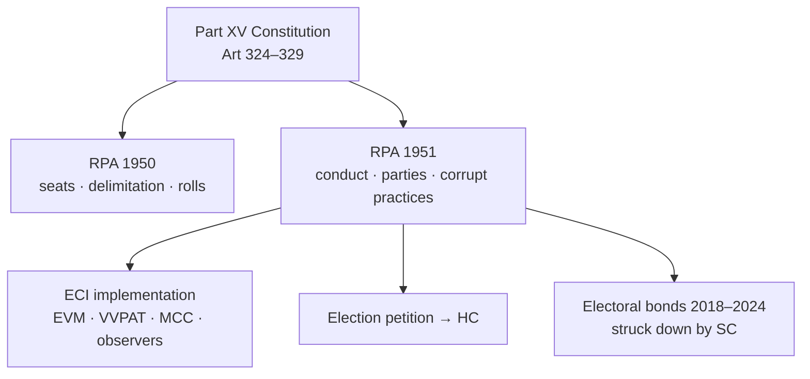

# Representation of the People Act (RPA)

> GS-2 · Topic 08 · Salient features of RPA, electoral bonds, VVPAT, political funding transparency

---

## PYQs

| Year | M | Words | Question (EN) | प्रश्न (HI) | ID |
|------|---|-------|---------------|-------------|-----|
| 2019 | 8 | 125 | Critically examine the main elements of the Representation of People's Act. | जन प्रतिनिधत्व कानून के मुख्य तत्वों का आलोचनात्मक परीक्षण कीजिए। | Q1 |
| 2018 | 8 | 125 | What are electoral bonds? Are they capable of bringing transparency in the political funding system? | चुनावी बांड क्या हैं? क्या यह राजनीतिक वित्त पोषण प्रणाली में पारदर्शिता लाने में सक्षम है? | Q2 |
| 2018 | 8 | 125 | Evaluate the use of VVPAT in the General Election of India. | भारत के आम चुनाव में मतदाता सत्यापन पेपर ऑडिट ट्रायल (VVPAT) के प्रयोग का मूल्यांकन कीजिए। | Q3 |

---

## Quick Revision

```
CONSTITUTIONAL FRAME: Part XV (Art 324–329) · Art 326 adult suffrage · Art 327 Parliament may make law for elections
  Art 324 — superintendence, direction, control of elections → Election Commission of India (ECI)

RPA SUITE:
  RPA 1950 — seat allocation · delimitation framework · electoral rolls principles · parliamentary constituencies
  RPA 1951 — actual conduct — qualification/disqualification · registration of parties · corrupt practices · election petitions · campaign silence · expenditure limits

MAIN ELEMENTS RPA 1951:
  Qualification LS: Art 84 + RPA — citizen · 25 years · registered voter · no office of profit (exceptions)
  Disqualification: S.8 criminal convictions · S.8A disqualification for corrupt practices · S.10 office of profit
  S.29A party registration · S.29B/C party funds
  S.123 corrupt practices — bribery · undue influence · appeal on religion/race · booth capturing · paid news
  S.126 48-hour silence period · S.127 loudspeaker limits
  S.77 election expenditure · S.78 accounts · S.81 limits (amended periodically)
  S.100 grounds for declaring election void — corrupt practice · non-compliance · improper acceptance of nomination
  Election petition — HC (LS/State LS single member) · SC for RS biennial — time-bound

ECI POWERS: Art 324 plenary · MCC (not statutory but enforced) · registration · EVM · VVPAT · observers · SVEEP
EVM: 1982 trial · 2004 phased · 2019 nearly all · VVPAT — voter-verifiable paper trail unit attached to EVM
  VVPAT shows candidate name/symbol for 7 sec · stored for verification · SC 2019: 5 random per assembly segment count

ELECTORAL BONDS (2018 Finance Act):
  Anonymous bearer instrument · SBI only · eligible donors · parties redeem · 15-day validity
  Critique: anonymity · shell companies · quid pro quo · no public disclosure
  SC Association for Democratic Reforms v. Union (Feb 2024) — unconstitutional · violated Art 19(1)(a) right to know · struck down scheme

VVPAT 2024 LS: 100% VVPAT coverage · ~10.5 lakh units · ECI verification protocol · demand for 100% count vs statistical sample debate

OTHER: NOTA 2013 SC · Form 26 asset disclosure · ADR/NGO monitoring · criminalization (S.8 RPA) · decriminalization bills pending

TRAPS: RPA ≠ one Act only (1950+1951) · MCC not in RPA statute · ECI not constitutional body originally but Art 324 · electoral bonds struck down 2024 not 2018 answer only pro side
  VVPAT ≠ full paper ballot · RS elected by MLAs not direct on same VVPAT scale in state RS elections different
```

---

## Content

### Context — electoral law as the backbone of representative democracy

Free and fair elections are the **foundation of democratic legitimacy** — but the Constitution's promise of **universal adult franchise (Art 326)** and **non-discrimination in electoral rolls (Art 325)** requires **detailed statutory machinery** to become operational reality. **Part XV (Arts 324–329)** creates the **constitutional skeleton**: the **Election Commission's plenary superintendence (Art 324)**, Parliament's power to make election law (Art 327), and the **bar on ordinary court interference (Art 329)** except through **election petitions under RPA**. The **Representation of the People Acts, 1950 and 1951** — supplemented by the **Conduct of Election Rules, 1961**, **Delimitation Acts**, and **ECI instructions** — form India's **electoral rulebook**: defining **who votes, who contests, how campaigns run, what corrupt practices are forbidden, and how electoral disputes are resolved**. Understanding RPA is understanding **how 970 million registered voters (2024)** convert ballots into **representative government** — and where the system's **gaps in criminalization, money power, and transparency** persist despite decades of reform debate.

### Constitutional foundation — Part XV and the Election Commission

| Article | Provision | Operational significance |
|---------|-----------|-------------------------|
| **Art 324** | ECI — **superintendence, direction, and control** of elections to **Parliament, state legislatures, President, and Vice-President** | Plenary power — **Kihoto Hollohan (1992)**, **ADR (2002)** on affidavits |
| **Art 325** | **No discrimination** in electoral rolls on religion, race, caste, sex | Equal franchise — rolls are **non-communal** |
| **Art 326** | **Adult suffrage** — every citizen **18 years and above** has right to vote | Lowered from 21 by **61st Amendment, 1988** |
| **Art 327** | **Parliament** may make law relating to **elections** | Enables **RPA 1950, 1951** and amendments |
| **Art 328** | **State legislature** may make law for **local body elections** (subject to consistency) | Panchayat/municipal elections — **State Election Commissions (Art 243K)** |
| **Art 329** | **Bars interference by courts** in electoral matters except **election petitions** under RPA | Only **HC/SC via election petition** can void elections |

**Election Commission of India (ECI):**
- **Multi-member body** — **Chief Election Commissioner (CEC) + Election Commissioners (ECs)** — appointed by the **President**.
- **CEC removal** requires the **same process as a Supreme Court judge (Art 324(5))** — **impeachment-level protection** ensuring independence.
- **Other ECs** can be removed on **CEC's recommendation** (post-2023 law) — a **contentious reform** debated for **ECI autonomy**.
- **Plenary power under Art 324** — upheld in **Kihoto Hollohan (1992)** (anti-defection) and **Association for Democratic Reforms v. Union (2002)** — candidates must **disclose assets, criminal cases, and educational qualifications** in **Form 26 affidavits**.
- **Operational tools:** **Model Code of Conduct (MCC)**, **EVM/VVPAT deployment**, **observers**, **SVEEP (voter education)**, **expenditure monitoring**, **paid news panels**, and **party registration/symbol allocation**.

### RPA 1950 — seats, delimitation, and electoral rolls

The **Representation of the People Act, 1950** provides the **structural framework** before elections are actually conducted:

- **Allocation of seats** to **states and Union Territories** in the **Lok Sabha** and **state legislative assemblies** — based on **population** (with **special provisions** for **NE states, UTs, and SC/ST reservation**).
- **Delimitation of territorial constituencies** — read with **Delimitation Acts** and **Delimitation Commission** orders. The **42nd Amendment (1976) froze delimitation based on 1971 Census** to protect **southern states** from losing seats due to successful population control; the **84th Amendment (2001) extended this freeze to 2026**. The **Delimitation Commission (2002)** under **Justice Kuldeep Singh** was the **last full exercise** — a **post-2026 delimitation** based on **2021 Census** will **significantly alter seat distribution**.
- **Qualification of voters and electoral rolls** — principles for **registration, revision, deletion, and appeals**; the **Chief Electoral Officer (CEO)** in each state maintains rolls under **ECI supervision**.
- **Framework for Parliamentary constituencies** — **name, extent, and reservation** (SC/ST seats under **Arts 330, 332**).

### RPA 1951 — main elements (the conduct code)

The **Representation of the People Act, 1951** governs the **actual conduct of elections** — from nomination to counting to dispute resolution. Its **salient elements**:

**1. Qualifications and disqualifications for membership**

| Office | Qualification (summary) | Key disqualification |
|--------|-------------------------|----------------------|
| **Lok Sabha** | Citizen; **≥25 years**; **registered voter** in a constituency; no **office of profit** (with exceptions) | **S.8** — conviction for **specified offences** (e.g. bribery, rape, dacoity) → **6-year disqualification** |
| **Rajya Sabha** | **≥30 years**; must be **elector in the state** he seeks to represent | Same **S.8** framework |
| **State Assembly** | **≥25 years**; registered voter | **S.8, S.9, S.10** — conviction, corruption, office of profit |

**Section 8 RPA** is the **criminalization battleground**: it lists **offences** whose conviction leads to **disqualification** — but **pending trial candidates can still contest** (unless convicted). **Lily Thomas v. Union of India (2013)** held that **convicted legislators are immediately disqualified** — ending the **3-month appeal stay** benefit that allowed **convicted MPs/MLAs to continue in office** during appeal. **ADR reports** each election cycle document **43%+ Lok Sabha candidates/MPs with criminal cases pending or convicted** — the **reform gap** between **law and practice**.

**Section 8A** disqualifies for **corrupt practices** (post-election finding). **Section 10** disqualifies for **office of profit** (unless exempted by Parliament/state legislature).

**2. Registration of political parties (Section 29A)**
- Parties must **register with ECI** — providing **name, constitution, office-bearers, and membership criteria**.
- **National party** status requires **6% vote in 4 states + 4 LS seats**, or **2% seats in 3 states**, or **recognised state party in 4 states** — criteria periodically **revised by ECI**.
- **Sections 29B and 29C** — parties must **maintain accounts**, **accept contributions only through prescribed channels**, and **submit audited accounts to ECI** — the **transparency framework** that **electoral bonds circumvented until 2024**.

**3. Corrupt practices (Section 123) — the electoral purity code**

Section 123 defines **corrupt practices** that, if proven, can **void an election (S.100)**:

| Corrupt practice | What it covers |
|-----------------|----------------|
| **Bribery (S.123(1))** | Offering money/gifts to induce voting |
| **Undue influence (S.123(2))** | Threats, coercion, or spiritual pressure on voters |
| **Appeal on religion/race/caste (S.123(3))** | Communal/caste-based appeals — **Hindutva cases** debated |
| **Promotion of enmity (S.123(3A))** | Speeches promoting hatred between groups |
| **Canvassing near polling stations (S.123(4))** | Campaigning within **100 metres** of polling booth |
| **Transport of voters (S.123(5))** | Conveying voters to/from polling (except authorised) |
| **Booth capturing (S.123(6))** | Seizing polling station, ballot stuffing |
| **Paid news (S.123(7))** | Later **ECI/legislative recognition** — disguised advertising as news |

**4. Campaign regulation**
- **Section 126** — **48-hour silence period** before poll end — **no campaigning, public meetings, or loudspeaker use** — prevents **last-minute influence** when voters cannot verify claims.
- **Section 127** — **loudspeaker restrictions** near polling areas.
- **Model Code of Conduct (MCC)** — **not statutory** but **ECI-enforced since the 1960s** — covers **ministers' announcements, transfer of officials, use of government machinery, and hate speech** from **announcement of elections to result declaration**. Violations invite **ECI censure, FIR, or campaign ban** — but **lack statutory criminal penalty** for many violations.

**5. Election expenditure (Sections 77–78)**
- Candidates must **maintain accounts of all election spending** and **submit returns to ECI**.
- **Expenditure ceilings** are **revised periodically** — for **2024 Lok Sabha**, ECI enhanced limits to approximately **₹95 lakh–₹1 crore per constituency** (varies by state size).
- **Star campaigners** (party-nominated) are **exempt from individual candidate caps** — their expenses count against the **party's overall limit** — a **loophole** exploited for **unlimited high-profile campaigning**.
- **Enforcement weakness** — actual spending often **exceeds limits by multiples**; **seizure of cash, liquor, and freebies** during MCC is **ECI's primary tool**, but **post-election prosecution** is rare.

**6. Election petitions and dispute resolution**
- **High Court tries petitions** for **Lok Sabha and state assembly (single-member) constituencies** — not the Supreme Court directly.
- **Supreme Court** tries petitions for **Rajya Sabha biennial elections**.
- **Grounds under Section 100** — **corrupt practice by candidate/agent**, **non-compliance with RPA provisions**, **improper acceptance of nomination**.
- **Time-bound trial** — **Representatives of the People (Amendment) Act, 1966** intended **3-year limit** — but **actual delays of 5–10 years** are common, meaning **disqualified legislators may serve full terms** before petitions are decided.



### Critical examination — strengths and weaknesses of RPA

**Strengths:**
- **Comprehensive procedural code** for the **world's largest electorate** (~970 million registered voters in 2024).
- **Universal franchise operationalised** through **electoral rolls, EVM, and VVPAT** — eliminating **ballot stuffing and booth capturing** at scale.
- **Corrupt practices defined** with **election petition remedy** — a **legal framework for electoral purity**.
- **Party registration (S.29A)** enables **ECI oversight** of **symbols, recognition, and accounts**.
- **Form 26 affidavits** (mandated by **ADR 2002**) force **criminal and asset disclosure** — enabling **voter awareness** through **NGO analysis**.

**Weaknesses (critical):**
- **Criminalization gap** — **S.8** disqualifies on **conviction**, but **pending trial candidates contest freely** — **decades of pending reform bills** (e.g. **disqualification on framing of charges for heinous offences**) remain **unpassed**.
- **Money power** — **expenditure limits routinely breached**; **enforcement weak**; **star campaigner loophole**; **electoral bonds (2018–2024)** allowed **anonymous corporate funding** until **SC struck down**.
- **Digital campaigning lag** — **paid news, deepfakes, social media misinformation** outpace **S.123 and S.126** — ECI extends **MCC to digital platforms (2024)** but **without statutory backing**.
- **Election petition delay** — **years to decide** — **disqualification comes too late** to affect the term.
- **MCC not legally binding** — **no statutory criminal penalty** for many violations — relies on **ECI moral authority** alone.
- **Political funding opacity** — even after **electoral bonds struck down (2024)**, **cash donations, shell companies, and electoral trusts** remain **partially opaque**.

### Electoral bonds — mechanism, claims, failure, and SC judgment

**Scheme introduction (2018):** The **Finance Act 2017** (passed as **Money Bill**) amended **RPA 1951, Income Tax Act, and Companies Act** to introduce **electoral bonds** — **anonymous bearer instruments** for **political donations**.

**Mechanism:**
- **Bearer bonds** sold exclusively by **State Bank of India (SBI)** in **January, April, July, and October** windows.
- **Eligible donors** — **citizens and companies** (with **KYC at bank**); **foreign source ban** theoretically applied.
- **Eligible recipients** — **registered political parties** that received **≥1% of valid votes** in the **last general election** to Lok Sabha or state assembly.
- **15-day validity** — bonds must be **redeemed within 15 days** or **deposited to PM National Relief Fund**.
- **Anonymity to public** — **donor identity not disclosed to citizens or ECI** — only **SBI and government** could trace flows through **banking channels**.

**Official arguments (pre-2024):**
- **White money alternative** to **cash donations** — bonds could only be purchased through **banking channels** with **KYC**.
- **State knows donor** (via SBI) even if **public does not** — claimed as **balance between privacy and accountability**.

**Arguments against — transparency failure:**
- **Voters' right to know** under **Art 19(1)(a)** — established in **Association for Democratic Reforms v. Union (2002)** — requires **candidate and party funding disclosure** so voters can **assess quid pro quo**.
- **Anonymity defeated the purpose** — citizens could not know **who funded whom**, making **policy capture invisible**.
- **Shell companies and loss-making firms** donated **massive sums** — suggesting **quid pro quo** rather than **ideological support**.
- **Asymmetric information** — the **ruling party** allegedly had **better access to SBI data** than **opposition parties** — creating **structural unfairness**.
- **Amendment via Money Bill** — bypassed **Rajya Sabha scrutiny** — a **constitutional controversy** on **what qualifies as Money Bill**.

**Supreme Court, February 2024 (*Association for Democratic Reforms v. Union of India*):**
- Held the **electoral bonds scheme unconstitutional** — **violates freedom of speech and right to information (Art 19(1)(a))**.
- **Anonymity was the fatal flaw** — democratic accountability requires **public disclosure**, not **bank-only secrecy**.
- **Directed SBI** to **disclose all donor-party transaction details** to **ECI**, which published **data in March 2024** — revealing **highly asymmetric funding patterns** (majority to ruling party).
- **Verdict:** Electoral bonds were **not capable of bringing meaningful transparency** to political funding — they **formalised opacity** under a **legal veneer**.

### VVPAT — function, deployment, and evaluation

**What is VVPAT?**
The **Voter Verifiable Paper Audit Trail (VVPAT)** is a **printer-like unit attached to the Electronic Voting Machine (EVM)** that **prints a paper slip** showing the **candidate's name and symbol** for approximately **7 seconds** behind a **glass window** — allowing the voter to **verify that the electronic vote matches their intent** before the slip **drops into a sealed box** for **post-election audit**.

**Introduction timeline:**
- **EVM trials** began in **1982 (Kerala)**; **phased nationwide deployment from 2004**; **2019 Lok Sabha** — **VVPAT with all EVMs** (ECI's phased 100% goal achieved).
- **2013** — ECI piloted VVPAT; **2019 SC orders** made VVPAT **mandatory** alongside EVMs.
- **2024 Lok Sabha** — **~10.5 lakh VVPAT units** deployed — **100% coverage** across all polling stations — the **largest paper-trail election in history**.

| Aspect | Detail |
|--------|--------|
| **Voter experience** | Vote on EVM → VVPAT slip shows name/symbol for ~7 sec → voter verifies → slip sealed |
| **Storage** | **Form 17C** records; VVPAT slips stored **45 days** (extendable by court order) |
| **Verification protocol** | **SC order (2019): 5 random polling stations per assembly segment** — VVPAT slips **physically counted** and matched against EVM totals |
| **Debate** | **ECI: statistical sample sufficient**; **activists: demand 100% slip count** — ECI resists citing **time (5–6 days extra) and logistics** |

**Advantages:**
- **Voter confidence** — the **paper confirmation** reduces **EVM tampering fears** that fuel **post-election disputes**.
- **Audit trail** — **sealed slips** provide **physical evidence** for **dispute resolution** and **random verification**.
- **Deterrence** — knowing **paper trail exists** discourages **malicious manipulation** of electronic counts.
- **2024 scale proves feasibility** — **10.5 lakh units** deployed without **systemic breakdown** — a **technological milestone**.

**Limitations:**
- **Not full paper ballot** — only **5 VVPAT slips per assembly segment** are **physically counted** (per **SC 2019 order**) — **not 100% recount** — leaving **residual trust gap** for sceptics.
- **Technical failures** — **VVPAT malfunction** during **2019 elections** caused **polling delays** and **voter frustration** at some stations.
- **Storage burden** — **millions of paper slips** require **secure warehousing** for **45+ days** — **environmental and logistical cost**.
- **Verification protocol debate** — **ECI's statistical model** (5 per segment) vs **100% count advocates** — unresolved tension between **practicality and absolute certainty**.

**Overall evaluation:** VVPAT is a **major integrity upgrade** over **standalone EVM** — the **2024 full deployment** demonstrates **operational feasibility at scale**. However, the **verification protocol** (sample vs full count) remains **contested**, and VVPAT **does not address money power, criminalization, or hate speech** — it solves **one dimension** of electoral integrity ( **vote recording accuracy** ), not all.

### Related electoral reforms and ECI initiatives

- **NOTA (None of the Above) — *PUCL v. Union (2013)*:** The SC mandated a **NOTA option on EVMs** — voters may **reject all candidates symbolically**. **Limitation:** NOTA has **no electoral consequence** — the **candidate with highest valid votes still wins** even if NOTA exceeds all individual candidate totals. It is **accountability signalling**, not **negative vote power**.
- **Form 26 affidavit disclosure — *ADR (2002)*:** Every candidate must **declare assets, liabilities, criminal cases (pending and convicted), and educational qualifications**. **ADR and other NGOs** analyse and **publish comparative data** each election — enabling **informed voting** but **not preventing tainted candidates from contesting**.
- **SVEEP (Systematic Voters' Education and Electoral Participation):** ECI's **voter education programme** — targets **youth, women, PwD, and marginalised communities** for **registration and turnout** — critical in a **970-million-voter electorate**.
- **One Nation One Election (ONOE):** Separate constitutional topic, but would require **RPA amendments**, **constitutional amendments**, and **synchronisation of Assembly terms** — **not achievable by executive order alone**.
- **Remote voting and migrant voter inclusion:** ECI has **piloted debates** on **remote voting technology** for **domestic migrants** — would require **RPA and Rules amendments** and **security protocols**.

### Contemporary relevance

- **Electoral bonds struck down (Feb 2024)** — **reform window open** for **state funding of elections**, **digital donations with real-time disclosure**, and **amendment of S.29C** to **mandate public donor lists**.
- **2024 Lok Sabha elections** — **100% VVPAT coverage** (~10.5 lakh units); **ECI mobile app** for **turnout tracking**; **MCC extended to social media platforms** for **paid political content and deepfakes**.
- **Criminal politics — SC directions (2023):** The Court directed **6-year fast-track trial** for **MPs/MLAs facing heinous offence charges** — **implementation uneven** across states; **pending trial candidates still contest**.
- **Electoral rolls — Special Intensive Revision (SIR) debates (2024–25):** ECI/state CEOs conducting **intensive roll revision** in some states — **disenfranchisement concerns** (vulnerable voters unable to produce documents) vs **duplicate/fake voter removal** — a **live federal tension**.
- **Paid news and social media:** **Digital campaigning** has **outpaced RPA's S.123/S.126 framework** — ECI's **MCC extensions** for **2024** cover **social media** but **lack statutory criminal backing**.
- **Post-bonds funding patterns:** **March 2024 ECI publication** of **electoral bond data** revealed **highly asymmetric party funding** — fuelling **demands for permanent transparency architecture**.

### Limits — balanced view

- **RPA alone cannot fix political culture** — **party inner democracy, media ethics, voter education, and civic norms** are **beyond statute** — RPA provides **procedure**, not **political morality**.
- **ECI independence under stress** — **executive appointments**, **transfer controversies**, and **MCC's non-statutory status** limit **ECI's enforcement power** against **powerful ruling parties**.
- **VVPAT adds confidence but is not a panacea** — it addresses **vote recording accuracy** but not **money power, criminalization, communal appeals, or fake news** — **comprehensive reform** requires **RPA amendments + political will**.
- **Electoral bonds judgment closes one opacity channel** but **cash, electoral trusts, and shell companies** remain — **transparency reform is incomplete** without **real-time public disclosure of all donations above a threshold**.
- **Delimitation post-2026** will **reallocate Lok Sabha seats** based on **2021 Census** — **southern states fear loss of representation** relative to **high-population northern states** — a **federal tension** RPA's **1950 framework** must navigate.

---

## Answers

### Q1: Critically examine main elements of Representation of People's Act. (2019, 8M, 125W)

**Introduction:**
> The **RPA (1950, 1951)** gives **statutory flesh** to **Part XV** — governing **who votes, who contests, how elections run, and how disputes are resolved**.

**Main Points:**
- **RPA 1950** — **Seat allocation, delimitation, electoral rolls** framework for **Parliament/state legislatures**.
- **Qualifications/disqualifications (RPA 1951)** — **age, citizenship, voter registration**; **S.8 criminal conviction bars**.
- **Party registration (S.29A)** — **ECI symbols**, **national/state recognition**, **accountability (29B/C)**.
- **Corrupt practices (S.123)** — **bribery, communal appeal, booth capturing, undue influence** — **election void grounds**.
- **Campaign rules** — **48-hour silence (S.126)**, **expenditure limits (S.77–78)**, **MCC enforcement**.
- **Election petitions (S.100)** — **HC trial** — **remedy against unfair elections**.
- **Critical gaps** — **criminalization, money power, digital campaigning lag, petition delays, MCC non-statutory**.

**Keywords (underline in exam):** RPA 1950 · RPA 1951 · Section 123 · Section 8 · Art 324 · Election petition · Corrupt practices · ECI

**Exam diagram (30 sec):**
```
RPA 1950: seats/rolls | RPA 1951: conduct/parties/corrupt practices → ECI → election petition
```

**Conclusion:**
> RPA is **indispensable but incomplete** — **strong procedural code** needing **reform on crime, money, and speedy justice**.

---

### Q2: What are electoral bonds? Capable of bringing transparency? (2018, 8M, 125W)

**Introduction:**
> **Electoral bonds (2018 scheme)** were **SBI-issued anonymous instruments** for **donating to registered political parties** — ** struck down as unconstitutional in 2024**.

**Main Points:**
- **Mechanism** — **Bearer bond**, **15-day validity**, **redeemable by eligible parties** — **donor identity hidden from public**.
- **Official claim** — **White money**, **KYC at bank**, **alternative to cash**.
- **Transparency failure** — **Voters could not know** **who funded whom** — violates **Art 19(1)(a) right to know** (**ADR precedent**).
- **Shell companies**, **quid pro quo**, **asymmetric information** — **policy capture risk**.
- **SC Feb 2024** — **Scheme unconstitutional** — **mandated disclosure** — **proved opacity harm**.
- **Verdict** — **Not capable** of **meaningful transparency** in **political funding** — **anonymity was fatal flaw**.

**Keywords (underline in exam):** Electoral bonds · SBI · Anonymity · Art 19(1)(a) · ADR · SC 2024 · Political funding · Transparency

**Exam diagram (30 sec):**
```
Donor → bond (anonymous to public) → party
SC 2024: struck down — transparency needs disclosure not secrecy
```

**Conclusion:**
> Electoral bonds **failed transparency test** — **2024 judgment** confirms **democratic funding requires **public accountability**, not **bank-only secrecy**.

---

### Q3: Evaluate use of VVPAT in General Election of India. (2018, 8M, 125W)

**Introduction:**
> **VVPAT (Voter Verifiable Paper Audit Trail)** adds a **paper verification layer to EVMs**, strengthening **voter confidence** in **Indian general elections**.

**Main Points:**
- **Function** — **Slip shows candidate/symbol** for **~7 seconds** — voter **verifies vote** before **sealed storage**.
- **Scale** — **2019 LS near-universal**; **2024 LS 100% VVPAT coverage** (~**10.5 lakh units**).
- **Advantage** — **Deterrence against tampering**; **audit sample** — **SC-ordered 5 slips per assembly segment** matched with **EVM count**.
- **Integrity boost** — **Addresses EVM mistrust** better than **standalone machines**.
- **Limits** — **Not full paper ballot**; **100% slip count** not done — **ECI statistical verification only**.
- **Operational issues** — **Malfunctions, delays**, **storage logistics** — manageable at scale but **not zero-cost**.

**Keywords (underline in exam):** VVPAT · EVM · ECI · Paper audit trail · SC verification · 2024 Lok Sabha · Electoral integrity

**Exam diagram (30 sec):**
```
Vote on EVM → VVPAT slip verify → sealed box
Audit: 5 random/segment (SC) — debate: sample vs 100%
```

**Conclusion:**
> VVPAT **significantly enhances electoral transparency** — **2024 full deployment a milestone** — but **verification protocol** should **evolve toward greater statistical or full audit trust**.

---

### Q4: *Likely variant:* Salient features of RPA — enumerate. (8M, 125W)

**Introduction:**
> **Salient features of RPA** span **two Acts** implementing **constitutional adult franchise** and **ECI-controlled elections**.

**Main Characteristics:**
- **Universal adult franchise (Art 326)** — **18+**, **electoral rolls**, **non-discrimination (Art 325)**.
- **Delimitation and seat allocation (1950 Act)** — **Lok Sabha/state constituencies**.
- **Conduct of elections (1951 Act)** — **nomination, polling, counting, observers**.
- **Political party registration (S.29A)** — **symbols, recognition criteria**.
- **Corrupt practices (S.123)** and **disqualifications (S.8)** — **electoral purity**.
- **Expenditure limits and accounts (S.77–78)** — ** curb money power**.
- **Election petitions (S.100)** — **judicial remedy** in **HC**.

**Keywords (underline in exam):** RPA 1950 · RPA 1951 · Art 326 · Section 123 · Section 29A · Election petition · ECI

**Exam diagram (30 sec):**
```
1950: seats/rolls | 1951: conduct + parties + S.123 + petitions
```

**Conclusion:**
> Together, RPA features form **India's electoral rulebook** — **foundation of representative democracy**.

---

### Q5: *Likely variant:* Role of Election Commission under Art 324. (8M, 125W)

**Introduction:**
> **Article 324** vests **ECI** with **plenary superintendence, direction, and control** over **national and state legislative elections**.

**Main Characteristics:**
- **Independent body** — **CEC removal protection** — **fair election guardian**.
- **Electoral roll preparation** — **revision, SIR, voter registration**.
- **Conduct elections** — **EVM/VVPAT, MCC, observers, counting**.
- **Party registration** — **symbols, national/state status**.
- **Enforcement** — **MCC, expenditure monitoring, paid news panels**.
- **Voter education** — **SVEEP** — **inclusion of marginalized voters**.
- **Limits** — **MCC not statutory**; **needs legislative backup** on **criminalization, funding**.

**Keywords (underline in exam):** Art 324 · ECI · Superintendence · MCC · VVPAT · Electoral rolls · SVEEP

**Exam diagram (30 sec):**
```
Art 324 → ECI → rolls + conduct + MCC + EVM/VVPAT + party reg
```

**Conclusion:**
> ECI under **Art 324** is **democracy's referee** — **effectiveness depends on RPA strength and institutional independence**.

---

## Traps

| Wrong | Correct |
|-------|---------|
| RPA is a single Act | **Two Acts — 1950 and 1951** (+ Conduct of Election Rules 1961) |
| Model Code of Conduct is in RPA statute | **Not statutory** — **ECI evolved guideline** — **moral force** |
| Electoral bonds still valid | **Struck down SC Feb 2024** — **unconstitutional** |
| VVPAT replaces EVM entirely | **VVPAT attaches to EVM** — **electronic vote + paper verify** |
| NOTA can reject all candidates and re-poll | **NOTA symbolic** — **candidate with highest valid votes still wins** |
| Election petitions go to Supreme Court for LS | **High Court** for **LS/Assembly** (single member); **RS biennial to SC** |
| Any citizen can contest without voter registration | Must be **registered voter in constituency** (LS/Assembly) |
| Section 123 only covers bribery | **Multiple corrupt practices** — **religion appeal, booth capture, etc.** |
| 18-year voting age in original Constitution | **61st Amendment 1988** lowered from **21 to 18** |
| Electoral bonds disclosed donor to public | **Anonymous to public** — **key flaw cited by SC 2024** |
| VVPAT means 100% paper count in India | **Sample verification (5/segment)** per **SC orders** — **not full recount** |
| Art 324 covers local body elections only by ECI | **Local elections** — **State Election Commissions (Art 243K)** |

---

*Complete.*
