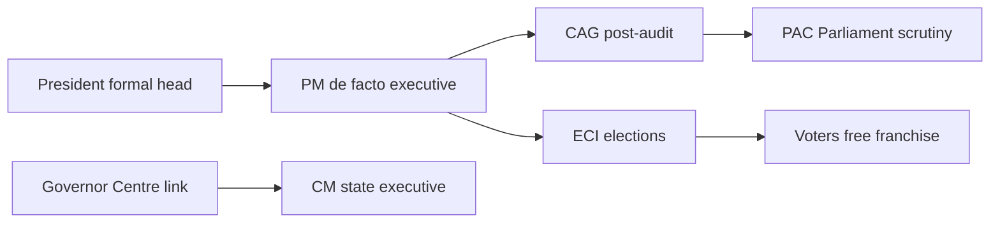

# Constitutional Posts — Appointment, Powers & Responsibilities

> GS-2 · Topic 09 · President, Governor, PM, CAG, ECI, pardoning powers, constitutional office-holders

---

## PYQs

| Year | M | Words | Question (EN) | प्रश्न (HI) | ID |
|------|---|-------|---------------|-------------|-----|
| 2025 | 12 | 125 | "The CAG of India is the supreme authority of India's finance." Critically analyse his functions and position in the light of this statement. | "भारत का नियंत्रक एवं महालेखापरीक्षक (CAG) भारत के वित्त का सर्वोच्च अधिकारी है।" इस कथन के आलोक में उसके कार्यों एवं स्थिति का आलोचनात्मक विश्लेषण कीजिए। | Q1 |
| 2024 | 12 | 200 | What are the implications of the revised appointment process of Election Commission for ensuring its independence? | चुनाव आयोग की स्वतंत्रता सुनिश्चित करने के लिए उसकी संशोधित नियुक्ति प्रक्रिया के निहितार्थ क्या हैं? | Q2 |
| 2023 | 8 | 125 | How is the power of Governor to pardon different from the power of President under Article 72? | भारतीय संविधान के अनुच्छेद 72 के अंतर्गत राष्ट्रपति की क्षमादान का अधिकार राज्यपाल की क्षमादान शक्ति से किस प्रकार भिन्न है? | Q3 |
| 2022 | 12 | 200 | How is the President of India elected? | भारत का राष्ट्रपति कैसे निर्वाचित होता है? | Q4 |
| 2021 | 12 | 200 | Examine the role of the CAG in India as the custodian of public money. | सार्वजनिक धन के संरक्षक के रूप में, भारत में नियंत्रक एवं महालेखा परीक्षक की भूमिका का परीक्षण कीजिए। | Q5 |
| 2020 | 8 | 125 | "The President of India cannot become a dictator." Explain. | "भारत का राष्ट्रपति तानाशाह नहीं बन सकता।" समझाइये। | Q6 |
| 2020 | 12 | 200 | What are the problems faced by the Election Commission at present? Also mention solutions. | एक संस्था के रूप में चुनाव आयोग द्वारा वर्तमान में किन-किन समस्याओं का सामना किया जा रहा है? इसके समाधान का भी उल्लेख कीजिए। | Q7 |
| 2019 | 12 | 200 | Discuss the emerging role of the Prime Minister in India. | भारत में प्रधानमंत्री की उभरती भूमिका का वर्णन कीजिए। | Q8 |
| 2018 | 8 | 125 | Examine the Constitutional Position of the CAG of India. | भारत के नियंत्रक एवं महालेखा परीक्षक की संवैधानिक स्थिति का परीक्षण कीजिए। | Q9 |

---

## Quick Revision

```
CONSTITUTIONAL POSTS: Independent offices insulating governance from partisan capture
  President · VP · PM (not fully "constitutional post" same sense but central) · Governor · CAG · CEC/EC · AG · FC Chairman · UPSC Chairman

PRESIDENT (Art 52–62): Indirect election · Electoral College Art 54 = LS+RS MPs + State/UT MLAs (value weighted)
  Art 55 — proportional representation + STV · Quota system for state vote value
  Term 5 years · Impeachment Art 61 · Art 53 executive power formally · Art 72 pardon (Union, military, death all India)
  NOT dictator: PM+CoM advice Art 74 · ordinance · judicial review · fixed term · impeachment · no discretionary war power like US pre-1976 fully

GOVERNOR (Art 153–161): President appoints Art 155 · pleasure Art 156 · Art 161 pardon STATE offences · NOT military · death sentence subject to Art 72 overlap if affects
  Agent vs constitutional head debate · Bommai limits

CAG (Art 148–151): Appointed by President · 6 years/65 age · removal like SC judge · NOT executive finance controller
  Post-audit · reports to President → Parliament · PAC examines · custodian of PUBLIC PURSE not spender
  Audit Union + States · PSUs · compliance audit · performance audit · 2G/CAG coal reports fame
  "Supreme finance" OVERSTATEMENT — no veto on budget/expenditure

ECI (Art 324): CEC + ECs · plenary election superintendence
  OLD: Executive appointment by President · CEC removal = SC judge level
  NEW: Chief Election Commissioner And Other Election Commissioners Act 2023
  Search Committee (PM, LoP, Minister, CJI nominee) → panel → President appoints from panel with PM, Minister, LoP, CJI nominee committee
  Debate: executive dominance persists · LoP when no clear LoP weak · independence partial improvement vs opaque past

ECI PROBLEMS: MCC not statutory · money power · criminal candidates · staff/deputation from govt · model code digital gap · violence · electoral bonds (struck 2024) · ONOE pressure · insufficient legal powers to de-register parties

PM EMERGING ROLE: Art 74 de facto head · PMO · cabinet committees · presidentialisation of campaigns · single-party majority centralisation · foreign policy · appointments · coordination

VP: RS Chairman · succeeds President · electoral college similar without MLAs in VP election - Art 66 different college (LS+RS only)

TRAPS: CAG controls finance NO — audits after · Governor pardon ≠ all death sentences independent of President · President not directly elected · ECI Act 2023 ≠ CJI sole appointer · PM not constitutional post Part V same line as President but Art 75 central
```

---

## Content

### Context — constitutional posts and why independence is designed into the Constitution

**Constitutional posts** are offices that the Constitution itself creates, defines, and protects — not bodies established later by ordinary legislation. What distinguishes them from ordinary executive appointments is the **deliberate insulation** built into their **mode of appointment, fixed tenure, difficult removal, and post-retirement restrictions**, so that functions like **auditing public money, conducting elections, advising on prosecution, and linking Union with States** continue even when governments change. The framers understood that a parliamentary democracy where the executive dominates day-to-day policy still needs **neutral constitutional guardians** who can speak truth to power without fear of instant dismissal.

India's constitutional architecture therefore places certain officers **outside the ordinary ministerial chain of command**. The **President** and **Governor** are heads of state at Union and state levels; the **Prime Minister** is the constitutional head of government though not listed in the same "independent office" category as the CAG or Election Commission. The **Comptroller and Auditor General (CAG)**, **Election Commission of India (ECI)**, **Attorney General**, **Advocate General**, **Finance Commission Chairman**, and **UPSC Chairman** each occupy distinct constitutional spaces — some fiercely independent, others explicitly tied to the government they serve. Understanding **what each office does, how it is appointed, why it was made independent (or not), and where its powers stop** is essential to grasp how Indian democracy checks executive power without collapsing into either presidential dictatorship or unaccountable bureaucracy.

### Overview — major constitutional posts at a glance

| Post | Constitutional basis | Appointed by | Independence mechanism | Core function |
|------|---------------------|--------------|------------------------|---------------|
| **President** | **Art 52–62** | **Electoral College (Art 54)** | **Impeachment (Art 61)**; fixed 5-year term | Formal head of state; executive power exercised on ministerial advice |
| **Vice-President** | **Art 63–71** | **Electoral College (Art 66)** — Parliament members only | Removal by **RS resolution + LS agreement (Art 67)** | **RS Chairman**; succeeds President on vacancy |
| **Prime Minister** | **Art 74–75, 78** | **President** (usually leader of LS majority) | Survives only while commanding **LS confidence (Art 75(3))** | **De facto** executive head; advises President |
| **Governor** | **Art 153–162** | **President (Art 155)** | Holds office during **President's pleasure (Art 156)** — weak independence | Constitutional head of state in state; Centre's link |
| **CAG** | **Art 148–151** | **President (Art 148)** | **Removal like SC judge** — proved misbehaviour/incapacity | **Post-audit** of Union/state accounts; reports to legislatures |
| **CEC / ECs** | **Art 324** + **CEC Act 2023** | **President** on **Selection Committee** recommendation | **CEC removal = SC judge standard**; ECs on CEC recommendation | **Superintendence, direction, control** of elections |
| **Attorney General** | **Art 76** | **President** | **No independence** — holds brief for Union government | Chief legal adviser; represents Union in courts |
| **Advocate General** | **Art 165** | **Governor** | **No independence** — state government's legal officer | Chief legal adviser to state government |
| **Finance Commission Chairman** | **Art 280** | **President** | Fixed by statute; reappointment possible | Recommends **tax devolution** between Centre and states |
| **UPSC Chairman/members** | **Art 315–323** | **President (Art 316)** | Removal only by **President after inquiry** | **Merit-based recruitment** to All-India and central services |

### President — indirect election, powers, and why dictatorship is structurally impossible

**Article 52** establishes the office of President of India as the **formal head of the Republic**. The President is **not directly elected by the people** — a deliberate choice matching the **Westminster parliamentary model**, where real executive power rests with the **Prime Minister and Council of Ministers** accountable to the **Lok Sabha**, while the President provides **continuity, ceremonial dignity, and federal symbolism**.

**How the President is elected (Articles 54–55):** The President is chosen by an **Electoral College** under **Article 54**, comprising **(a) elected members of both Houses of Parliament** — that is, all elected **Lok Sabha** MPs and elected **Rajya Sabha** MPs, but **not nominated RS members**; and **(b) elected members of state legislative assemblies** — meaning **Vidhan Sabha** MLAs, including MLAs from **Delhi and Puducherry** (UTs with legislatures). **Excluded** from the college are **nominated members** of either House, and **MLCs** (members of legislative councils) where bicameral states exist — only **directly elected assembly members** participate. *Why this design:* The college balances **national representation** (MPs) with **federal representation** (MLAs weighted by state population), so the President reflects **both the Union as a whole and its constituent states** without becoming a populist chief executive like the American President.

**Voting method:** **Article 55** mandates **proportional representation by means of the single transferable vote (STV)** with a **secret ballot**. Each elector ranks candidates in order of preference; votes transfer until a candidate reaches the **quota** required for election. **Vote value** is calculated to ensure **parity between the MP block and MLA block**: each MLA's vote value equals **State population ÷ (Number of elected MLAs × 1000)**, while MP vote value is uniform so that **total value of all MP votes ≈ total value of all MLA votes**. *Example:* In the **2022 presidential election**, **Droupadi Murmu** won by securing a majority of electoral college votes after preference transfers — illustrating how **STV + weighted MLA votes** produce a winner acceptable across federal units. **Term:** **5 years (Art 56)**; eligible for **re-election**; vacancy filled per **Art 62**.

**Removal:** **Article 61** provides **impeachment** for **violation of the Constitution** — charges initiated by **either House**, investigation, then **special majority** (two-thirds of members present and voting) in **both Houses**. This is a **high threshold** accountability mechanism, distinct from ordinary no-confidence votes against ministers.

**Powers — what the President can do and how they operate:**

- **Executive power (Art 53)** — Vests in the President but, in practice, is exercised **on the aid and advice of the Council of Ministers (Art 74)**. After the **42nd Amendment (1976)** made ministerial advice binding and the **44th Amendment (1978)** restored clarity, the President **must ordinarily act on CoM advice** — real policy power lies with the **PM**, not the President.
- **Legislative powers** — **Summon, prorogue, and dissolve Parliament** (on advice); **promulgate ordinances (Art 123)** when Parliament is not in session — but ordinances **expire after 6 weeks** of reassembly unless approved; **assent, withhold, or return bills** (limited pocket veto on non-Money Bills).
- **Judicial powers — pardon (Art 72)** — Grant **pardon, reprieve, respite, remission, or commutation** for **Union law offences**, **all court-martial cases**, and **death sentences under any law** (Union or State). Exercised on **Union CoM advice**; subject to **limited judicial review** — **Epuru Sudhakar (2006)** held pardon is not a court appeal but cannot be **arbitrary**; must consider **relevant material** (**Kehar Singh, 1989**).
- **Military** — **Supreme Commander of armed forces (Art 53(2))** — **symbolic**; operational control with **Defence Minister and service chiefs**.
- **Diplomatic** — **Appoints ambassadors, receives credentials, negotiates treaties** — all on **ministerial advice**.

**Why the President cannot become a dictator:** India's Constitution embeds **multiple structural checks** that prevent a US-style imperial presidency. First, the **parliamentary system (Art 74–75)** binds the President to **ministerial advice** — the **PM commands Lok Sabha majority (Art 75(3))**, so power flows from **electoral mandate to PM**, not President. Second, **indirect election** means the President lacks a **personal plebiscitary mandate** comparable to a directly elected strongman. Third, **ordinances (Art 123)** are **temporary** — Parliament must ratify or they lapse; they cannot permanently bypass legislature. Fourth, **judicial review** — unconstitutional presidential actions are **void** — rooted in **Kesavananda Bharati (1973)** basic structure and **Minerva Mills (1980)**. Fifth, **impeachment (Art 61)** provides removal for constitutional violation. Sixth, unlike pre-**44th Amendment** debates, the President has **no independent war-making or emergency-initiation power** without **CoM backing** and **Parliamentary oversight**. The President is **head of state, not head of government** — a **constitutional monarch without crown**.

| Power domain | Constitutional source | Operational reality |
|--------------|----------------------|---------------------|
| **Executive** | Art 53, 74 | PM + CoM decide; President signs |
| **Legislative** | Art 85, 111, 123 | Summon/dissolve on advice; ordinance temporary |
| **Judicial mercy** | Art 72 | Union CoM advice; wider than Governor on death |
| **Military** | Art 53(2) | Symbolic supreme commander |
| **Accountability** | Art 61 | Impeachment — not routine removal |

### Vice-President — distinct electoral college and succession role

**Articles 63–71** establish the **Vice-President**, who serves as **ex-officio Chairman of the Rajya Sabha (Art 64)** and **acts as President** during vacancy, absence, or illness (**Art 65**). **Election (Art 66):** The Electoral College consists **only of members of both Houses of Parliament** — **both elected and nominated** — with **no MLAs**. Voting uses **STV** and **proportional representation**, similar method to the President but a **narrower, Parliament-centric college**. *Why different:* The VP's primary constitutional role is **presiding over the Rajya Sabha**, not representing states federally. **Removal (Art 67):** **Rajya Sabha resolution by effective majority**, agreed to by **Lok Sabha** — distinct from presidential impeachment. **Term:** **5 years**; eligible for re-election.

### Governor — Centre's constitutional agent and pardoning limits

**Articles 153–162** provide for a **Governor in each state** as the **formal executive head**. **Appointment (Art 155):** The **President appoints** the Governor — typically a person **not belonging to the state**, reinforcing the Governor's role as **Centre's constitutional representative** rather than state agent. **Tenure (Art 156):** Holds office during the **pleasure of the President** — meaning **weak constitutional independence**; Governors can be transferred or removed when Centre wishes, unlike CAG or CEC. **Powers** include **summoning/proroguing state legislature**, **assent to bills (Art 200)** — may **reserve** bills for President's consideration — and **promulgating ordinances (Art 213)** when assembly is not in session.

**Governor vs Chief Minister tension:** Recurring **Governor–CM conflicts** (Kerala, Tamil Nadu, West Bengal, Punjab examples) arise because the Governor retains **discretionary zones** under **Art 163** (though **limited — Shamsher Singh, 1974**) while CM heads **real executive power**. **S.R. Bommai (1994)** and federalism as **basic structure** constrain **Art 356** misuse but not everyday friction over **assent, remission files, or university appointments**.

**Pardoning power — Art 161 vs Art 72:** Both grant **mercy jurisdiction**, but over **different offence domains**:

| Aspect | **President (Art 72)** | **Governor (Art 161)** |
|--------|------------------------|------------------------|
| **Offences covered** | **Union law offences**; **all court-martial cases** | **Offences against state laws** only |
| **Death sentence** | Can **pardon, commute, or remit death sentences** under **any law** — Union or State | **Cannot independently override** the full death-penalty domain — **Maru Ram (1980)** held Governor acts on **state CoM advice**; death cases often reach **President** for final mercy |
| **Military offences** | **Exclusive President jurisdiction** | **No jurisdiction** over court-martial |
| **Advice basis** | **Union Council of Ministers (Art 74)** | **State Council of Ministers (Art 163)** |
| **Judicial review** | **Epuru Sudhakar (2006)** — limited review for **non-arbitrariness** | Same principle applies — mercy is **executive prerogative**, not a **second appeal**, but cannot ignore **relevant materials** |

*Mechanism:* When a person is convicted under the **IPC applied as state law** vs **central statute** (e.g. **UAPA, NDPS**), the **mercy forum follows the convicting law's origin**. **Overlap cases** — e.g. **Rajiv Gandhi assassination** — involved **both state remission politics and Union Article 72** dimensions, showing how **federal mercy jurisdiction** can collide in high-profile cases.

### CAG — constitutional position, audit mechanics, and the "supreme finance" myth

The **Comptroller and Auditor General of India** is among the **most independent constitutional officers**. **Article 148** provides for appointment by the **President under warrant under his hand and seal**. **Tenure:** **6 years or age 65, whichever is earlier**. **Removal:** **Same procedure as a Supreme Court judge** — address to President passed by **special majorities in both Houses** on grounds of **proved misbehaviour or incapacity** — ensuring **security of tenure** comparable to judiciary. **Post-retirement bar:** **Not eligible to hold any office under the Government of India or any state** — preventing **revolving-door capture**.

**Duties (Art 149):** Parliament prescribes duties by law — primarily the **CAG (DPC) Act, 1971** — to **audit the accounts of the Union and of the states**, including **accounts of bodies substantially financed from Consolidated Fund**. **Reporting (Art 151):** CAG submits reports to the **President (Union)** or **Governor (state)**, who causes them to be **laid before Parliament or state legislature** — basis for **Public Accounts Committee (PAC)** and **Committee on Public Undertakings (COPU)** scrutiny.

**What CAG actually does — three audit types:**

- **Post-audit of expenditure** — CAG examines whether money **was spent legally and for intended purposes after it was spent** — the Indian CAG **does not control the purse in advance** despite the title "Comptroller"; unlike historical UK models, there is **no pre-expenditure veto**. *Why the misnomer persists:* Colonial-era title retained; **real power is ex-post accountability**.
- **Compliance audit** — Checks adherence to **rules, regulations, and financial propriety** — whether departments followed **GFR, tender norms, delegation of financial powers**.
- **Performance audit** — Assesses **economy, efficiency, and effectiveness (3E)** of programmes — e.g. **defence procurement delays, MGNREGA implementation gaps, PM-KISAN beneficiary duplication**.

**Audit scope extends to** Union ministries, **state governments**, **PSUs**, **autonomous bodies**, and **local bodies** as assigned — making CAG a **pan-Indian public audit institution**, though **spending decisions remain with executive and legislature**.

**CAG as "custodian of public purse" vs "supreme authority of finance":** The **accountability sense** is accurate — CAG is the **supreme audit authority**, the **fearless watchdog** whose reports exposed **2G spectrum allocation irregularities, coal block allocation deficiencies**, and recurring **subsidy leakages**. **Independence** — SC-level removal, fixed tenure, post-retirement bar — enables such reporting. But calling CAG **"supreme authority of India's finance"** is an **overstatement**: **Finance Minister** formulates budget; **Parliament** authorises taxation and expenditure; **RBI** manages monetary policy and banking regulation; **executive departments** **spend**; CAG **audits afterwards**. CAG reports are **recommendatory** — **PAC** pursues follow-up, but **implementation depends on political will** — CAG has **no sword**, only **pen and moral authority**. On **state accounts**, CAG audits but **state executive controls spending** — dual accountability in **federal fiscal architecture**.

| Claim | Valid? | Reason |
|-------|--------|--------|
| Supreme **audit** authority | **Yes** | Art 148–151; audits Union + states |
| Supreme **finance** executive | **No** | No budget, tax, borrow, or spend power |
| Custodian of public purse | **Partially** | Guardian of **accountability**, not **treasury** |
| Binding enforcement | **No** | PAC/Parliament follow-up; recommendatory reports |

### Election Commission — Art 324 mandate, 2023 Act reforms, and institutional challenges

**Article 324** vests in the **Election Commission of India** the **superintendence, direction, and control** of **preparation of electoral rolls and conduct of elections** to **Parliament, state legislatures, and offices of President and Vice-President**. This is a **plenary constitutional mandate** — ECI is the **guardian of free and fair elections**, recognised as part of **basic structure** (**Indira Gandhi v. Raj Narain, 1975**).

**Composition:** **Chief Election Commissioner (CEC)** plus **Election Commissioners (ECs)** — **multi-member body since 1993** after **Seshan-era** reforms; decisions by **majority** among members.

**Removal safeguards:** **CEC** can be removed **only in like manner and on like grounds as a Supreme Court judge (Art 324(5))** — exceptionally high bar. **Other ECs** — removed on **CEC's recommendation** (strengthened under **2023 Act**).

**Revised appointment — Chief Election Commissioner and Other Election Commissioners Act, 2023:** Following **Supreme Court directions in Anoop Baranwal v. Union of India (2023)** — which had temporarily mandated a **selection committee of PM, LoP, and CJI** until Parliament legislated — Parliament enacted a **statutory framework**:

| Stage | Composition | Function |
|-------|-------------|----------|
| **Search Committee** | **PM**, **Union Minister**, **LoP (or leader of largest opposition party)**, **CJI or nominee** | Shortlists **panel of 5 names** |
| **Selection Committee** | **PM**, **Minister**, **LoP**, **CJI or nominee** | **Appoints CEC/ECs from panel** |
| **President** | Formal appointing authority | Issues warrant of appointment |

*Implications for independence:* **Positive** — Replaces **pre-2023 opaque executive convention** where the **government alone chose CEC/ECs**; introduces **statutory transparency**, **LoP participation**, and **judiciary nominee voice**; Act provides **fixed tenure and salary security**. **Concerns** — **PM + Minister form executive majority on both committees** — **dominance persists**; when **no recognised LoP** exists (e.g. 2014–2019), **opposition representation weakens**; **CJI nominee ≠ full judicial collegium** — advisory, not controlling; **not comparable to UPSC or SC independence** — incremental reform, not transformation.

**ECI institutional problems and reform directions:**

| Problem | Why it matters | Solution direction |
|---------|----------------|-------------------|
| **Model Code of Conduct (MCC) not statutory** | Violations punished weakly; parties ignore with impunity | **Legalise MCC**; fast-track **election tribunals** |
| **Money power and criminalisation** | Crores of undeclared spending; **Section 8 RPA** allows convicted legislators loopholes | **RPA reform**; **fast-track trials** for MPs/MLAs; transparent funding post-**electoral bonds strike-down (2024)** |
| **Staff on government deputation** | ECI officers owe loyalty to parent department | **Permanent ECI cadre** |
| **Digital manipulation, paid news, social media** | **RPA silent** on many new media forms | **Amend RPA**; **ECI–platform protocols** during elections |
| **Violence, booth capturing, intimidation** | Undermines equal franchise | **Central forces deployment**; stiffer **Section 123 corrupt practices** penalties |
| **Limited party regulation** | Cannot **de-register parties** easily | **Statutory de-registration powers** |
| **Enforcement delays** | HC stays on ECI orders | **Special election benches** in High Courts |

**2024 Lok Sabha conduct** — **100% VVPAT verification capability**, **appointment of new CEC/ECs under 2023 Act** — first major cycles under the new law — test whether **statutory process** improves **perceived independence**.



### Prime Minister — constitutional anchor and emerging centralisation

**Articles 74–75 and 78** establish the **Prime Minister** as the **head of the Council of Ministers**, **principal adviser to the President**, and the **leader who must command Lok Sabha confidence**. Unlike CAG or ECI, the PM is **not an independent constitutional guardian** — the PM **is the government**, accountable to **Parliament and voters**.

**Constitutional core:** The **President appoints the PM** (typically the **leader of the majority party/coalition in Lok Sabha**); other ministers are appointed **on PM's advice**; **collective responsibility (Art 75(2))** means all ministers share PM's fate; **individual responsibility** allows PM to require a minister's resignation. **Art 78** lists PM's duties — **communicating decisions to President**, ** furnishing information demanded**, **referring Council of Ministers reconsideration** if President so asks ( **once only** under **44th Amendment**).

**Emerging role trends:** The **PMO (Prime Minister's Office)** has expanded as a **parallel coordination hub** — monitoring **flagship schemes (PM-KISAN, Swachh Bharat, Ayushman Bharat)**, bypassing individual ministries on **speed and messaging**. **Cabinet Committees** on **Security, Economic Affairs, Political Affairs** — **chaired by PM** — decide **national agenda** before full cabinet. **Presidentialisation of campaigns** — **2014, 2019, 2024** elections centred on **PM personality** despite **parliamentary form** — creates **personal mandate narrative** stronger than **collegial cabinet governance**. **Foreign policy** — PM-led **summit diplomacy (G20, QUAD, neighbourhood)** makes PM **India's global face**. **Appointments** — **Governors, CVC, key regulatory heads, national commissions** — reflect **PMO influence**. **Federal impact** — **strong PM + same-party state governments** centralises; **opposition-ruled states** face **Governor friction, central agency scrutiny, fiscal leverage**.

**Critical balance:** Centralisation may bring **policy coherence and decisive crisis management (COVID vaccination drive, surgical strikes)** but risks **cabinet marginalisation**, **weaker parliamentary scrutiny under anti-defection**, and **tension with judiciary and regulators**. Democratic health requires **Parliament, courts, media, and federal units** as counterweights.

### Attorney General and Advocate General — legal officers, not independent guardians

**Article 76 — Attorney General of India:** Appointed by **President**; must be **qualified to be appointed a Supreme Court judge** (typically **distinguished jurist or senior advocate**). **Role:** **Chief legal adviser to Union government**; **represents Union in SC/HC**; **right to participate in Parliament** (both Houses) without **voting** — can explain legal aspects of bills. **Not a full-time minister** but may accept **private briefs** unless conflict arises. **Article 165 — Advocate General:** **Governor appoints** state's chief legal adviser with similar **HC-eligibility**; represents **state in courts**. **Critical distinction from CAG/ECI:** AG and Advocate General are **executive legal arms** — they **hold brief for government**, defend its policies, and **lack independence mandate**. Resign when government falls. Contrast with **CAG**, who **audits government**, or **ECI**, which **conducts elections against incumbent advantage**.

### Other constitutional office-holders — Finance Commission and UPSC

**Finance Commission Chairman (Art 280):** Constitution requires **President to constitute FC every five years** (or earlier) to recommend **distribution of net proceeds of taxes** between **Centre and states** and **grants-in-aid**. Chairman and members appointed by **President**; FC is **recommendatory** — **not a regulator** — but **constitutional status** elevates it above ordinary commissions.

**UPSC (Art 315–323):** **Union Public Service Commission** conducts **examinations for All-India Services (IAS, IPS, IFS)** and **Group A central posts**. **Chairman and members** appointed by **President**; removal only by **President after inquiry** — **functional independence** for **merit-based recruitment**, insulating civil services from **patronage**.

### Contemporary relevance

- **CAG reports 2024–25** scrutinising **PM-KISAN duplicate beneficiaries, MGNREGA fund diversion, defence capital procurement delays** — **PAC follow-up** determines whether audit translates to **corrective action**.
- **ECI and 2024 Lok Sabha** — **first appointments under CEC Act 2023**; **100% VVPAT slip availability**; post-**electoral bonds** judgment, **funding transparency** remains contested.
- **President Murmu (2022 election)** — **STV arithmetic** with **weighted MLA votes** demonstrated **tribal representation** at apex office while preserving **indirect, non-populist** selection.
- **Governor–CM conflicts 2023–25** — **withheld assent, remission disputes, university VC appointments** in **Kerala, Tamil Nadu, Punjab** — **Art 163 discretionary zone** under scrutiny.
- **Mercy jurisdiction politics** — **Rajiv Gandhi case remission** raised **Art 161 vs Art 72** federal overlap; **Epuru Sudhakar** principles invoked in **judicial review of pardons**.
- **Supreme Court trajectory** — **Anoop Baranwal (2023)** pushed **statutory ECI appointments**; debate continues whether **2023 Act** meets **Court's independence standard**.

### Limits — balanced view

- **Independence is uneven** — **CAG and CEC** enjoy **strong removal protection**; **Governor and AG** are **executive-dependent**; **President** is **formally powerful but practically bound** by **Art 74**.
- **CAG audits without sword** — **No enforcement power**; **PAC and political will** determine outcomes — **2G/coal reports** led to **political fallout** but **not automatic prosecution**.
- **ECI 2023 Act** — **Incremental transparency**, not **full autonomy** — **PM-chaired selection** leaves **executive gatekeeping** intact; **LoP weakness** when opposition fragmented.
- **Governor's pleasure tenure** — **Undermines state federal dignity** — **Punchhi Commission** reforms **largely unimplemented**.
- **PM centralisation** — **Efficiency gains** may **erode cabinet collegiality and federal balance** — needs **active Parliament, judiciary, and media** as checks.
- **Mercy powers** — **Executive prerogative** with **limited judicial review** — **not a substitute for fair trial** or **sentencing reform**.

---

## Answers

### Q1: CAG is supreme authority of India's finance — critical analysis. (2025, 12M, 125W)

**Introduction:**
> The **CAG (Art 148–151)** is India's **constitutional auditor** — **supreme in audit accountability**, **not supreme in financial governance**.

**Main Points:**
- **Post-audit role** — **Audits after expenditure** — **no power to approve/block budget** — **not "finance controller"**.
- **Supreme audit jurisdiction** — **Union, states, PSUs** — **compliance + performance audit** — **public money watchdog**.
- **Reports to President/Governor** → **Parliament/PAC** — **transparency**, **not execution**.
- **Independence** — **6-year tenure**, **removal like SC judge** — **fearless reporting (2G, coal audits)**.
- **Overstatement in quote** — **FM, RBI, Parliament** control **policy, tax, borrow, spend** — **CAG examines **propriety** later**.
- **Custodian sense** — **Guardian of public purse** — **accountability**, **not **authority to spend****.

**Keywords (underline in exam):** CAG · Art 148 · Post-audit · PAC · Public purse · Performance audit · Not finance controller

**Exam diagram (30 sec):**
```
Spend (Executive/Parliament) → CAG audit → Report → PAC → accountability
CAG ≠ budget maker/spender
```

**Conclusion:**
> CAG is **supreme audit authority**, **not supreme financial authority** — **critical pillar of **fiscal accountability**, not **fiscal sovereignty**.

---

### Q2: Implications of revised ECI appointment for independence. (2024, 12M, 200W)

**Introduction:**
> The **Chief Election Commissioner and Other Election Commissioners Act, 2023** replaced **opaque executive appointments** with a **statutory Search/Selection Committee** — **mixed implications** for **ECI independence**.

**Main Points:**
- **Statutory framework** — **Art 324** supplemented — **predictable process**, **LoP + CJI nominee participation**.
- **Search Committee** — **Panel of 5** — **reduces arbitrary single-point picks**.
- **Selection Committee** — **PM, Minister, LoP, CJI nominee** — **appoints CEC/ECs** — **President formal order**.
- **Positive** — **More transparent** than **pre-2023 convention**; **fixed tenure/salary security** in **Act**.
- **Concern — executive majority** — **PM + Minister** dominate **both committees** — **partial not full autonomy**.
- **Weak LoP** — **When no recognised LoP**, **opposition underrepresented** — **2014-type scenarios**.
- **Not collegium-level independence** — **Judiciary voice advisory** — **executive still gatekeeper**.
- **Net implication** — **Incremental improvement**, **not constitutional transformation** — **needs **balanced committee** or **JAC model** debate**.

**Keywords (underline in exam):** ECI Act 2023 · Art 324 · Search Committee · Selection Committee · CEC independence · LoP · Anoop Baranwal

**Exam diagram (30 sec):**
```
Search Committee → panel → Selection (PM+Min+LoP+CJI nom) → President appoints CEC/EC
Independence: improved transparency · executive majority remains
```

**Conclusion:**
> Revised process **institutionalises appointments** but **full independence** requires **non-executive majority** or **statutory insulation** beyond **2023 Act**.

---

### Q3: Governor's pardon power vs President under Art 72. (2023, 8M, 125W)

**Introduction:**
> **Art 72 (President)** and **Art 161 (Governor)** grant **mercy jurisdiction** over **different offence domains** with **death sentence asymmetry**.

**Main Characteristics:**
- **President (Art 72)** — **Union law offences**, **court-martial cases**, **death sentences under any law**.
- **Governor (Art 161)** — **State law offences only** — **no martial law jurisdiction**.
- **Death penalty** — **President has **national death mercy** power**; **Governor's death commutation** subject to **federal/coM advice constraints** — **Maru Ram** — **Governor acts on **state CoM advice****.
- **Advice basis** — **President: Union CoM (Art 74)**; **Governor: State CoM (Art 163)**.
- **Judicial review** — **Both subject to **limited review** — **non-arbitrary, relevant material (Epuru Sudhakar)**.
- **Overlap** — **Union offences** even in state → **President**; **pure state crime → Governor**.

**Keywords (underline in exam):** Art 72 · Art 161 · Pardon · Death sentence · State offence · Union offence · Maru Ram

**Exam diagram (30 sec):**
```
State law → Governor Art 161
Union law + martial + all death → President Art 72
Both: CoM advice · limited judicial review
```

**Conclusion:**
> **President's pardon power is wider**, especially on **death and Union/military cases**; **Governor's is **state-specific** mercy power**.

---

### Q4: How is President of India elected? (2022, 12M, 200W)

**Introduction:**
> The **President is elected indirectly** by an **Electoral College** under **Articles 54–55** — balancing **federalism** and **national representation**.

**Main Points:**
- **Electoral College (Art 54)** — **Elected MPs (LS+RS)** + **Elected MLAs of states** + **Delhi/Puducherry MLAs**.
- **Excludes** — **Nominated RS members**, **MLCs not in system** — **MLA = Vidhan Sabha elected**.
- **Voting method** — **Proportional representation + Single Transferable Vote (STV)** — **secret ballot**.
- **Vote value** — **Uniform MP value**; **MLA value proportional to state population** — **parity of state block vs MP block totals**.
- **Quota** — **Candidate needs **quota** to win** — **preferences transferred** — **majority through STV rounds**.
- **Term** — **5 years**; **re-eligible**; **impeachment safeguard (Art 61)**.
- **Significance** — **Indirect election** suits **parliamentary system** — **President symbolic-federal unifier**, **not populist executive like US**.

**Keywords (underline in exam):** Art 54 · Art 55 · Electoral College · STV · Vote value · Indirect election · Federal balance

**Exam diagram (30 sec):**
```
MPs (LS+RS elected) + MLAs → STV ballot → President (5-year term)
MLA vote value ∝ state population
```

**Conclusion:**
> **STV + weighted college** ensures **President reflects **both national and federal units**** without **direct presidential supremacy**.

---

### Q5: CAG as custodian of public money — examine. (2021, 12M, 200W)

**Introduction:**
> **CAG** safeguards **public money** through **independent post-audit** — **constitutional custodian of accountability**, not **custodian of treasury operations**.

**Main Points:**
- **Art 148–151** — **Independent tenure**, **SC-level removal** — **fearless audit**.
- **Audit scope** — **Union/state accounts**, **PSUs**, **autonomous bodies** — **CAG DPC Act 1971**.
- **Compliance audit** — **Legal/regulatory propriety of spending**.
- **Performance audit** — **Economy, efficiency, effectiveness** — **value for money**.
- **Reports to President** → **Parliament** → **PAC examination** — **public scrutiny**.
- **Custodian meaning** — **Protects public purse** by **exposing waste, fraud, irregularities** — **2G/coal examples**.
- **Limits** — **No spending control**; **recommendations not binding** — **executive may ignore** until **PAC/political pressure**.

**Keywords (underline in exam):** CAG · Custodian public money · Art 151 · PAC · Performance audit · Post-audit · Art 148

**Exam diagram (30 sec):**
```
Public spend → CAG audit → PAC/Parliament → corrective action
Custodian = accountability guardian
```

**Conclusion:**
> CAG **custodies public money by auditing and exposing misuse** — **indispensable fiscal watchdog** in **parliamentary democracy**.

---

### Q6: President cannot become dictator — explain. (2020, 8M, 125W)

**Introduction:**
> India's **parliamentary Constitution** distributes **real power to PM/CoM** while **limiting President** through **law and accountability** — preventing **dictatorship**.

**Main Characteristics:**
- **Aid and advice (Art 74)** — **President bound by CoM** — **44th Amendment** — **not independent executive**.
- **PM accountability (Art 75(3))** — **Power flows from **LS majority**, not President alone**.
- **Ordinance limited (Art 123)** — **Parliament must ratify** — **temporary only**.
- **Judicial review** — **Unconstitutional acts void** — **Kesavananda basic structure**.
- **Impeachment (Art 61)** — **Removal for constitutional violation**.
- **No direct mandate** — **Indirect election** — **lacks mass plebiscitary power** of **dictators**.

**Keywords (underline in exam):** Art 74 · Aid and advice · Parliamentary system · Art 61 impeachment · Judicial review · Art 75(3)

**Exam diagram (30 sec):**
```
President formal ← CoM advice ← PM (LS majority)
Checks: impeachment · courts · ordinance limit
```

**Conclusion:**
> **Structural constitutional design** — **not individual virtue** — ensures **President remains head of state, not dictator**.

---

### Q7: ECI problems and solutions. (2020, 12M, 200W)

**Introduction:**
> **ECI (Art 324)** manages **world's largest elections** but faces **legal, logistical, and political headwinds** requiring **institutional strengthening**.

**Main Points:**
- **Problem — MCC not statutory** — **Violations weakly punished** → **Solution: legalise MCC**, **expedited penalties**.
- **Problem — money power & criminalization** — **Solution: RPA reform**, **fast-track MP/MLA cases**, **transparent funding post-bonds strike-down**.
- **Problem — staff on govt deputation** — **Solution: independent ECI cadre**.
- **Problem — digital/paid news/social media** — **Solution: amend RPA**, **ECI- platform protocols**.
- **Problem — violence, intimidation** — **Solution: central forces**, **strengthen S.123 corrupt practices**.
- **Problem — limited party control** — **Solution: statutory **de-registration** powers**.
- **Problem — appointment independence (pre/post 2023 Act)** — **Solution: balanced appointment board**, **CEC removal parity for all ECs**.

**Keywords (underline in exam):** Art 324 · MCC · Money power · Criminalization · ECI cadre · RPA reform · VVPAT

**Exam diagram (30 sec):**
```
Problems: MCC weak · money · crime · staff · digital
Solutions: statute · RPA · cadre · enforcement · funding reform
```

**Conclusion:**
> ECI **needs **legal teeth + autonomous capacity**** to match **scale and stakes** of **Indian democracy**.

---

### Q8: Emerging role of Prime Minister. (2019, 12M, 200W)

**Introduction:**
> **Prime Minister**, as **head of government (Art 74–75)**, has **grown central** to **policy, elections, and governance** — especially under **single-party majorities**.

**Main Points:**
- **Constitutional core** — **Leader of CoM**, **advises President**, **accountable to LS (Art 75(3))**.
- **PMO expansion** — **Cross-ministry coordination**, **monitoring flagship schemes** — **decision funnel**.
- **Presidentialisation of politics** — **Modi/Indira-type campaigns** — **personal mandate narrative** despite **parliamentary form**.
- **Cabinet Committees** — **PM chairs Security, Economic Affairs** — **sets national agenda**.
- **Foreign policy & appointments** — **Summits, governors, key posts** — **executive face of India**.
- **Federal impact** — **Centre-state friction** when **strong PM + same-party states** vs **opposition states**.
- **Critique** — **Over-centralisation**, **cabinet marginalisation**, **weak parliamentary scrutiny** under **anti-defection**.

**Keywords (underline in exam):** Art 74 · PMO · De facto executive · Presidentialisation · Cabinet Committees · Art 75(3) · Centralisation

**Exam diagram (30 sec):**
```
PM → PMO + Cabinet C'ttees → policy centralisation
Democracy check: LS + federal units + courts
```

**Conclusion:**
> PM's **emerging role** drives **efficient leadership** but must stay **within **cabinet, Parliament, federal balance**** to avoid **executive overload**.

---

### Q9: Constitutional position of CAG. (2018, 8M, 125W)

**Introduction:**
> **CAG (Art 148)** is an **independent constitutional officer** — **neither part of executive nor judiciary** — **audit arm of Parliament**.

**Main Characteristics:**
- **Appointment** — **President**; **tenure 6 years/65 age**.
- **Removal** — **Like Supreme Court judge** — **high independence**.
- **Post-retirement bar** — **No GOI/state office** — **conflict prevention**.
- **Duties (Art 149)** — **Audit Union/state accounts** per **Parliamentary law**.
- **Reporting (Art 151)** — **To President/Governor** → **Legislature** — **PAC scrutiny**.
- **Position** — **Guardian of public purse** — **post-audit**, **not policy maker**.

**Keywords (underline in exam):** Art 148 · Art 151 · Independent office · PAC · Six-year tenure · SC-level removal

**Exam diagram (30 sec):**
```
Art 148 CAG → independent → audits → Art 151 report → PAC
```

**Conclusion:**
> CAG occupies **unique constitutional space** — **fearless auditor** supporting **parliamentary control over finance**.

---

### Q10: *Likely variant:* Attorney General vs Advocate General — constitutional roles. (8M, 125W)

**Introduction:**
> **Attorney General (Art 76)** and **Advocate General (Art 165)** are **chief legal advisers** to **Union and state governments** respectively — **not independent constitutional guardians like CAG**.

**Main Characteristics:**
- **AG** — **Appointed by President**, **must be **SC-eligible****, **holds brief for Union** in **courts**.
- **Advocate General** — **State Governor appoints**, **state law officer**.
- **Not a full-time minister** but **participates in Parliament** ( **AG only** ) without **vote**.
- **Role** — **Legal advice**, **represent government litigation** — **neither controls judiciary nor audit**.
- **Difference from CAG/ECI** — **Executive legal arm** — **no independence mandate**.

**Keywords (underline in exam):** Art 76 · Art 165 · Attorney General · Advocate General · Government legal adviser

**Exam diagram (30 sec):**
```
Union → AG Art 76 | State → Adv General Art 165
Both: legal counsel · not independent watchdogs
```

**Conclusion:**
> **AG/Advocate General** serve **government litigation needs** — distinct from **CAG/ECI independence architecture**.

---

## Traps

| Wrong | Correct |
|-------|---------|
| CAG controls and approves expenditure before spending | **Post-audit** role — **no pre-spending veto** |
| President is directly elected by people | **Indirect** — **Electoral College (Art 54)** |
| Governor can pardon military offences | **President Art 72** — **court-martial cases** |
| Governor's death sentence power equals President's | **President has **wider death mercy** jurisdiction** |
| CEC appointed solely by CJI under 2023 Act | **Selection Committee: PM, Minister, LoP, CJI nominee** |
| President can ignore CoM advice routinely | **Bound by Art 74** ( **44th Amendment** ) except **limited zones** |
| CAG is part of Parliament | **Independent constitutional office** — **reports TO Parliament via PAC** |
| ECI Act 2023 removed executive role completely | **PM still chairs selection** — **partial reform** |
| VP elected by same college as President | **Art 66** — **Parliament members only** (no MLAs) |
| PM is not mentioned in Constitution | **Art 75** — **PM appointed by President** — **central to CoM** |
| CAG can re-audit rejected reports bindingly | **Recommendatory** — **PAC/Parliament pursues** |
| Nominated RS members vote in Presidential election | **Excluded from Electoral College** |

---

*Complete.*
