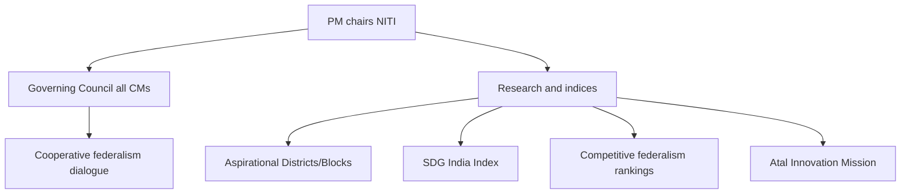

# Statutory, Regulatory & Quasi-Judicial Bodies + NITI Aayog

> GS-2 · Topic 10 · Statutory/regulatory/quasi-judicial institutions, NITI Aayog features and functioning

---

## PYQs

| Year | M | Words | Question (EN) | प्रश्न (HI) | ID |
|------|---|-------|---------------|-------------|-----|
| 2024 | 8 | 125 | Write the role of NITI Aayog in the development of India. | भारत के विकास में नीति आयोग की भूमिका लिखिए। | Q1 |

---

## Quick Revision

```
TYPES:
  Constitutional — Part of Constitution (ECI Art 324, CAG Art 148, UPSC Art 315, FC Art 280)
  Statutory — Created by Act of Parliament (NHRC 1993, Lokpal 2013, NITI Aayog 2015 resolution + executive order, CIC RTI 2005)
  Regulatory — Sector regulators by statute (SEBI, TRAI, RBI, CCI, FSSAI, PFRDA, IRDAI merged into IFSCA partly)
  Quasi-judicial — Adjudicatory powers, hearings, orders like courts but not full judiciary (CIC, Lokpal, CCI, tribunals, consumer commissions)

NITI AAYOG (2015): Replaced Planning Commission · NOT constitutional/statutory body strictly — executive resolution Jan 2015 · PM = Chair · Governing Council = CMs + LGs · CEO + VC + experts
  NO plan grants / financial powers (unlike Planning Commission) · advisory think tank · cooperative + competitive federalism
  Roles: policy inputs · SDG India Index · Aspirational Districts Programme · reform monitoring · state rankings · tech policy (AI, blockchain) · health/education indices · NITI for States · development monitoring · PM's development agenda coordination

PLANNING COMMISSION vs NITI:
  PC: Five-Year Plans · central plan grants · top-down · Finance Minister ex-officio · heavy bureaucracy
  NITI: no FYP binding · no allocation power · bottom-up with states · evidence-based · multi-sector advisory

QUASI-JUDICIAL EXAMPLES:
  CIC/ICs — RTI appeals · penalties · information orders
  NHRC — inquire human rights · recommend · not punish (recommendatory)
  Lokpal/Lokayukta — corruption inquiry · prosecution sanction coordination
  CCI — anti-competition orders · penalties
  Tribunals — NGT environment · CAT service · NCLT companies · DRT banks · RERA real estate
  Consumer commissions — district/state/national · binding orders
  L. Chandra Kumar — HC/SC review of tribunal orders retained

REGULATORY BODIES:
  SEBI — securities · TRAI — telecom · RBI — banking/monetary · CCI — competition · FSSAI — food safety · CERC — electricity tariff
  Features: autonomy · expert members · quasi-legislative (rules) + quasi-judicial (orders) · accountability to Parliament

STATUTORY COMMISSIONS: NCW · NCPCR · NCSC · NCST · National Commission for Minorities · CVC (statute 2003)

FUNCTIONING COMMON THEMES: independence vs executive control · appointment controversies · pendency · recommendatory vs binding powers · overlap with judiciary (tribunal reform debate)

TRAPS: NITI ≠ allocates plan funds · NITI not constitutional · NHRC orders not binding like court · CIC is quasi-judicial · Planning Commission abolished 2014 announcement · NITI CEO ≠ Cabinet rank minister automatically
```

---

## Content

### Context — why India needs bodies beyond constitutional offices

Constitutional bodies like the **Election Commission**, **CAG**, and **Finance Commission** anchor the **basic structure** of Indian democracy — they are created by the Constitution itself with **hard independence guarantees**. But a modern economy and welfare state of **1.4 billion people** cannot be governed by ministries alone. Parliament therefore creates **statutory commissions**, **sector regulators**, and **quasi-judicial tribunals** to handle **technical complexity**, **resolve specialised disputes**, and **coordinate development policy** without overloading the ordinary judiciary or centralising every decision in Delhi.

This institutional layer sits between **constitutional guardians** and **ordinary executive departments**. A **statutory body** derives authority from an **Act of Parliament** — its powers, composition, and tenure are **defined by law**, not the Constitution. A **regulatory body** typically oversees an **entire economic sector** with **rule-making and enforcement powers**. A **quasi-judicial body** conducts **hearings and passes orders** on specific disputes — **court-like procedure** without being a full court. **NITI Aayog** occupies a unique fourth category — an **executive-advisory think tank** created by **Cabinet resolution**, not statute, replacing the **Planning Commission's top-down grant allocation** with **evidence-based policy dialogue and federal rankings**. Together, these institutions embody India's shift from **centralised planning socialism** toward a **regulatory state with cooperative-competitive federalism**.

### Classification — constitutional, statutory, regulatory, quasi-judicial, and executive-advisory

| Type | Source of authority | How it is created | Examples | Typical powers |
|------|---------------------|---------------------|----------|----------------|
| **Constitutional** | **Constitution (Part V, etc.)** | **Constituent Assembly design** | **ECI (Art 324), CAG (Art 148), UPSC (Art 315), Finance Commission (Art 280)** | **Mandated functions**; **strong independence** |
| **Statutory** | **Parliament Act** | **Ordinary legislation** | **NHRC (1993), Lokpal (2013), CIC (RTI 2005), NCW, CVC (2003)** | **Defined by statute** — powers vary from **binding orders to recommendations only** |
| **Regulatory** | **Sectoral Acts** | **Specialised economic legislation** | **RBI, SEBI, TRAI, CCI, FSSAI, CERC/SERCs, PFRDA, IRDAI** | **Quasi-legislative rules + quasi-judicial penalties** over **whole sectors** |
| **Quasi-judicial** | **Statute (adjudicatory wings)** | **Often part of regulatory or rights statutes** | **CIC appeals, CCI orders, consumer commissions, tribunals (NGT, CAT, NCLT, DRT, RERA), Lokpal inquiries** | **Hear parties, record evidence, pass orders** — subject to **HC/SC review** |
| **Executive-advisory** | **Executive resolution/order** | **Cabinet decision** | **NITI Aayog (2015)** | **Policy advice, research, coordination** — **no statutory adjudication or fund allocation** |

**Critical distinction:** A **quasi-judicial body resolves specific disputes** between parties using **due process** — e.g. a citizen denied information appeals to the **CIC**. A **regulatory body oversees an entire sector** — setting **standards, licensing, tariffs, and market conduct** for all participants — e.g. **TRAI** regulates all telecom operators. **Overlap is common:** **SEBI** and **CCI** are **regulators** with **quasi-judicial adjudication wings**; **CIC** is **quasi-judicial** but not a **sector regulator**. **NHRC** conducts **quasi-judicial inquiries** but its orders are **recommendatory**, not binding like court decrees — **"soft quasi-judicial"**.

### Planning Commission vs NITI Aayog — the institutional pivot of 2014–15

**Planning Commission (1950–2014)** was established by **executive resolution** (not constitutional) as the **central planning hub** of the **command-and-control economy era**. Chaired by the **Prime Minister** with the **Finance Minister as ex-officio member**, it drafted **Five-Year Plans (FYP)**, negotiated **central plan grants** to states and ministries, and set **top-down production targets** — effectively an **extra-constitutional super-cabinet** that controlled **financial carrots** states could not ignore. *Why it worked post-Independence:* Scarce capital, import substitution, and **state-led industrialisation** required **central allocation** of resources.

**Why it was abolished:** Liberalisation after **1991** made **Five-Year Plans** increasingly **misaligned with market economy realities**. States resented **grant bargaining** through Planning Commission deputies; **Governing Council** lacked real power compared to **Commission bureaucracy**. In **August 2014**, the **Prime Minister announced abolition**; on **1 January 2015**, **NITI Aayog (National Institution for Transforming India)** was established by **Cabinet resolution** as a **policy think tank** — **not constitutional, not a standalone statutory body**.

| Dimension | **Planning Commission** | **NITI Aayog** |
|-----------|--------------------------|----------------|
| **Legal status** | Executive body (1950 resolution) | Executive body (2015 resolution) — **not in Constitution** |
| **Financial power** | **Allocated plan funds** to ministries and states | **No allocation power** — **advisory only** |
| **Planning instrument** | **Five-Year Plans** — binding framework | **Three-Year Action Agenda**, **Strategy papers**, **SDG alignment** — **no FYP** |
| **Federal model** | **Top-down** — states petitioned for grants | **Cooperative + competitive federalism** — **Governing Council of CMs + PM** |
| **Bureaucracy** | **Heavy permanent staff** — plan scrutiny of every scheme | **Leaner think tank** — **CEO, VC, part-time experts, partnerships** |
| **Accountability** | Presented plans to **NDC (National Development Council)** | **Not accountable to Parliament** as statutory body — **transparency debate** |
| **Relation to Finance Commission** | **Overlapped** with FC in fiscal matters | **Complements FC** — NITI advises; **FC devolves taxes (Art 280)** |

*NITI did not replace Finance Commission* — a common confusion. **FC is constitutional** and recommends **tax shares**; **NITI advises on policy** and **monitors performance** through **indices and programmes**.

**NITI Aayog structure:**

| Component | Role |
|-----------|------|
| **Chairperson** | **Prime Minister** — sets national development agenda |
| **Governing Council** | **All Chief Ministers + LGs of UTs with legislature** — **cooperative federalism platform** for **national priorities without grant politics** |
| **Regional Councils** | **Sub-national groupings** (e.g. **Himalayan, coastal states**) for **region-specific issues** |
| **Vice-Chairperson** | **Full-time head** — successive appointees include **Arvind Panagariya, Rajiv Kumar, Suman Bery** |
| **CEO** | **Full-time administrative head** — **not automatically Cabinet Minister rank** |
| **Ex-officio members** | **Union Ministers** in relevant domains |
| **Part-time members / special invitees** | **Domain experts**, ** economists**, ** technologists** |

### Role of NITI Aayog in India's development — mechanisms and outcomes

**1. Policy think tank and reform catalyst:** NITI produces **research inputs** on **health (Ayushman Bharat design), education (NEP implementation), agriculture (doubling farmers' income reports), infrastructure (Gati Shakti coordination), and technology (AI, blockchain, digital public infrastructure)** for **Union ministries and state governments**. It **monitors reform implementation** — e.g. **labour code rollout**, **ease of doing business** state-level compliance — providing **evidence-based nudges** rather than **financial penalties**. *Why it matters:* Ministries often lack **cross-sectoral analytical capacity**; NITI fills **coordination gaps** without duplicating **line-department execution**.

**2. Cooperative federalism:** The **Governing Council (PM + all CMs)** meets to deliberate **national priorities** — **GST implementation feedback, health emergency coordination (COVID), SDG targets** — in a forum where **states are partners, not supplicants for plan grants**. **NITI for States** provides **customised policy support** — **handholding for fiscal reforms, health system redesign, or agricultural marketing liberalisation** tailored to **state capacity**.

**3. Competitive federalism:** NITI publishes **performance indices** that **rank states/UTs**, creating **peer pressure** to improve without **central fund threats**:

| Index | What it measures | Effect |
|-------|------------------|--------|
| **SDG India Index** | Progress on **17 Sustainable Development Goals** | States compete on **health, poverty, gender, climate targets** |
| **Export Preparedness Index** | **State export infrastructure and policy** | Drives **trade facilitation reforms** |
| **Health Index** | **Health outcomes and systems** | Identifies **laggard states** for targeted intervention |
| **School Education Quality Index** | **Learning outcomes, infrastructure** | Pushes **education quality beyond enrolment** |
| **Composite Water Management Index** | **Water conservation and management** | Addresses **inter-state water stress** through data |

**4. Aspirational Districts Programme (ADP, 2018):** Identified **115 most backward districts** (later expanded logic to **Aspirational Blocks Programme, 2023+**) for **convergence of central and state schemes** — **health, education, agriculture, financial inclusion** — with **delta ranking** measuring **month-on-month improvement**, not just absolute levels. **Champions of Change** workshops connect **district collectors** with **Centre-state teams**. *Mechanism:* **Competition among districts** for **visibility and ranking**, not **plan grant release**.

**5. SDG localisation:** NITI aligns India's **2030 Agenda** through **state SDG indices** and **district monitoring** — shifting development discourse **beyond GDP** toward **multidimensional progress** (poverty, gender, environment, institutions).

**6. Technology and innovation — Atal Innovation Mission (AIM):** Under NITI, **AIM** runs **Atal Tinkering Labs** in schools, **Atal Incubation Centres** for startups, and **Atal Community Innovation Centres** — building **human capital and entrepreneurship** as **development infrastructure**.

**7. Post-COVID and capacity building:** NITI coordinated **health federal dialogue**, documented **Kerala's SDG model**, and supported **state recovery strategies** — illustrating **soft coordination power** when **crisis demands unified response**.



**Critical limits of NITI:** Recommendations are **non-binding** — states may **ignore advice** without **financial penalty** (unlike Planning Commission's **grant leverage**). **No Parliament accountability** as a **statutory body** raises **transparency concerns**. **Overlap with ministries** — line departments resist **NITI encroachment** on their turf. Critics call it **elite advisory** without **grassroots mandate** — debate on **statutory backing** for long-term stability continues.

### Quasi-judicial bodies — definition, examples, and functioning

A **quasi-judicial body** exercises **judicial functions** — **hearing parties, taking evidence, passing reasoned orders** — **outside the ordinary court hierarchy**, but **subject to High Court and Supreme Court review**. The **Supreme Court in L. Chandra Kumar (1997)** held that **tribunal orders are judicially reviewable** and **HC supervisory jurisdiction** over tribunals is part of **basic structure** — tribunals **supplement, not replace**, the judiciary.

**Standard functioning pattern:** **Complaint or application** → **notice to respondents** → **oral/written hearing** → **reasoned order** (binding or recommendatory per statute) → **appeal** to higher tribunal, **SAT**, or **writ to HC under Art 226**.

| Body | Establishing law | Quasi-judicial function | Order nature |
|------|------------------|-------------------------|--------------|
| **Central Information Commission (CIC)** | **RTI Act, 2005** | **Second appeal** on information denial; **penalties on PIOs** for **mala fide refusal** | **Binding** within RTI framework |
| **State Information Commissions** | **RTI Act, 2005** | Same at **state level** | **Binding** |
| **Competition Commission (CCI)** | **Competition Act, 2002** | **Anti-cartel orders**, **abuse of dominance findings**, **merger clearances**, **penalties** | **Binding** — appeal to **COMPAT/SAT** |
| **Consumer commissions** | **Consumer Protection Act, 2019** | **District, State, National** forums — **defective goods/services compensation** | **Binding orders** — accessible justice |
| **NGT** | **National Green Tribunal Act, 2010** | **Environmental civil/administrative cases** — **pollution, forest clearance disputes** | **Binding** — appeal to **SC** |
| **CAT** | **Administrative Tribunals Act, 1985** | **Central government service disputes** — **promotion, termination** | **Binding** — **HC review retained** |
| **NCLT / NCLAT** | **Companies Act, 2013** | **Insolvency (IBC)**, **company law disputes** | **Binding** |
| **DRT / DRAT** | **RDDBFI Act, 1993** | **Bank recovery** — **loan default cases** | **Binding** |
| **RERA authorities** | **RERA Act, 2016** | **Real estate buyer-developer disputes** | **Binding** |
| **Lokpal / Lokayukta** | **Lokpal Act, 2013** | **Inquiry into corruption** against **public servants**; **prosecution coordination** | **Inquiry powers** — **quasi-judicial elements** |
| **SAT** | **SEBI Act** | **Appeals against SEBI orders** | **Appellate quasi-judicial** |

**NHRC (Human Rights Commission):** Conducts **investigations, spot inquiries, recommends compensation** — **quasi-judicial investigation** but orders are **recommendatory**, not **enforceable like court decrees** — government may **accept or reject** recommendations.

**Systemic challenges:** **Vacancies and pendency** — **CIC, tribunal benches** often understaffed; **executive interference in appointments** — **CIC, NHRC, Lokpal** vacancies undermine **credibility**; **tribunal merger proposals** via **Finance Acts** sparked **basic structure** and **independence debates**; **overlap with courts** — parties **forum-shop** between **HC writs and tribunals**.

### Regulatory bodies — sector oversight in a complex economy

**Regulators** are **statutory bodies** overseeing **specific economic sectors** where **technical expertise** exceeds **generalist ministry capacity**. They combine **quasi-legislative power** (issue **rules, regulations, standards**) with **quasi-judicial power** ( **adjudicate violations, impose penalties**).

| Regulator | Sector | Key powers | Accountability |
|-----------|--------|------------|----------------|
| **RBI** | **Banking, monetary policy, currency** | **Licenses, repo rate, forex management, lender of last resort** | **Parliament**, **annual report**, **judicial review**; **RBI Act, 1934** |
| **SEBI** | **Securities and capital markets** | **Investor protection, insider trading penalties, IPO regulation** | **SEBI Act, 1992**; appeal to **SAT** |
| **TRAI** | **Telecom and broadcasting** | **Tariffs, spectrum recommendations, QoS standards** | **TRAI Act, 1997** |
| **CCI** | **Competition across economy** | **Anti-trust, merger control** — also covers **government abuse of dominance** | **Competition Act, 2002** |
| **FSSAI** | **Food safety** | **Standards, licensing, food recall** | **FSSAI Act, 2006** |
| **CERC / SERCs** | **Electricity** | **Tariff determination, licensing** | **Electricity Act, 2003** |
| **PFRDA** | **Pensions (NPS)** | **Pension fund and intermediary regulation** | **PFRDA Act, 2013** |
| **IRDAI** | **Insurance** | **Insurer licensing, policyholder protection** | **IRDAI Act, 1999** |

**Common regulatory features:** **Statutory autonomy** — **appointed by government** but **fixed tenure** and **expertise requirements** insulate from **daily political interference**; **quasi-legislative** — **subordinate legislation** fills **statutory gaps** (e.g. **SEBI (LODR) Regulations**); **quasi-judicial** — **adjudication wings** impose **fines, suspensions, licence cancellations**; **accountability chain** — **annual reports to Parliament**, **CAG audit** of some regulators, **judicial review of orders**.

**Regulatory failures and debates:** **IL&FS collapse (2018)** and **PMC Bank fraud** exposed **RBI supervision gaps** — **regulatory capture** and **forbearance** questions. **SEBI vs RBI overlap** on **certain financial products** ( **derivatives, crypto policy** ) creates **jurisdictional friction**. **Revolver door** — **regulators joining regulated entities** — raises **conflict of interest**. **Under-resourcing** — **CCI, SEBI** handle **exploding caseloads** with **limited benches**.

### Important statutory commissions — rights protection without full adjudication

Beyond tribunals and regulators, Parliament created **national commissions** for **vulnerable groups** — primarily **inquiry and recommend**, not **punish**:

- **NCW (National Commission for Women)** — **Inquiry into women's rights violations**, **recommend policy** — **limited coercive power**.
- **NCPCR (National Commission for Protection of Child Rights)** — **Child rights monitoring**, **inspections**, **recommendations** to government.
- **NCSC / NCST** — **Scheduled Castes and Scheduled Tribes** safeguards — **atrocity case monitoring**, **policy advice**.
- **National Commission for Minorities** — **Minority rights inquiry and reports**.
- **CVC (Central Vigilance Commission Act, 2003)** — **Advisory on integrity** in **central administration**; **sanctions prosecution** through **CBI** channels — **not a prosecutor itself**; **statutory status** post- **Vineet Narain (1997)** direction for **independence from executive**.

These bodies **complement courts** by **specialised monitoring** but suffer when **appointments are delayed** or **recommendations ignored**.

### How the institutional ecosystem fits together

India's governance chain links **multiple accountability layers**: **Ministries** formulate **policy**; **Regulators** set **sector rules and enforce compliance**; **Quasi-judicial bodies** resolve **individual disputes**; **CAG** **post-audits** expenditure; **PAC** scrutinises **CAG reports**; **NITI** provides **evidence-based development advice** and **federal rankings** without **fund control**; **Finance Commission** **devolves taxes** constitutionally. **Specialisation** reduces **HC/SC overload** — **NGT** handles **environment**, **CAT** handles **service matters** — but **L. Chandra Kumar** ensures **HC supervision** remains. **Federal development** shifts from **Planning Commission grant coercion** to **NITI's cooperative-competitive dialogue** — states **choose reforms** to **climb indices**, not merely **petition for plan allocations**.

| Function | Primary institution | Nature of power |
|----------|--------------------|-----------------|
| **Tax devolution** | **Finance Commission (Art 280)** | **Constitutional recommendation** |
| **Development advice** | **NITI Aayog** | **Executive-advisory, non-binding** |
| **Sector regulation** | **RBI, SEBI, TRAI, etc.** | **Statutory quasi-legislative + quasi-judicial** |
| **Dispute resolution** | **Tribunals, CIC, consumer forums** | **Quasi-judicial orders (binding or recommendatory)** |
| **Expenditure audit** | **CAG (Art 148)** | **Constitutional post-audit** |
| **Rights monitoring** | **NHRC, NCW, NCPCR** | **Statutory inquiry + recommend** |

### Contemporary relevance

- **NITI SDG India Index 2023–24** ranks states on **2030 targets** — **Kerala, Tamil Nadu, Himachal** typically lead; **empowering states** and **Uttar Pradesh** use rankings to **identify lagging indicators** in **health, gender, poverty**.
- **Aspirational Blocks Programme (2023+)** extends **ADP convergence logic** to **block level** — **500 blocks** targeted for **accelerated development**.
- **NITI working papers** on **Data Governance Framework, National Strategy for Artificial Intelligence, blockchain in governance** shape **Digital India policy**.
- **Tribunal ecosystem** — **Finance Act tribunal merger attempts**, **New Delhi International Arbitration Centre** — ongoing **quasi-judicial reform** debate.
- **Digital Personal Data Protection Act, 2023** — creates **Data Protection Board** as **statutory regulatory-cum-quasi-judicial authority** over **privacy complaints** — new addition to the **regulatory-quasi-judicial family**.
- **Electoral bonds strike-down (2024)** — reinforces need for **transparent statutory regulation** of **political finance** — overlaps **ECI, RBI, and legislative reform**.
- **Regulatory stress tests** — **RBI tightening after PMC Bank, NBFC crises**; **SEBI on mutual fund norms** — post-failure **accountability** cycles.

### Limits — balanced view

- **NITI without funds** possesses **soft power only** — cannot **replace Finance Commission tax devolution** or **ministry budget execution**; **states ignore advice** when **politically inconvenient**.
- **Not accountable to Parliament** — NITI lacks **statutory standing** — **transparency and conflict-of-interest** concerns persist; **Planning Commission at least faced NDC scrutiny**.
- **Quasi-judicial proliferation** — **L. Chandra Kumar** protects **HC review**, but **vacancies, executive appointment control, and tribunal mergers** risk **weakening specialised justice** and **basic structure** balance.
- **Regulatory capture** — **IL&FS, PMC Bank, crypto exchange failures** show **regulators may lag innovation** or **defer to politically connected entities** — **independence on paper ≠ independence in crisis**.
- **Recommendatory commissions** — **NHRC, NCW, CVC** depend on **government accepting recommendations** — **toothless without political will**.
- **Overlap and forum confusion** — **SEBI-RBI, CCI-sector regulators, tribunal-HC** jurisdictional disputes **delay justice** and **raise compliance costs**.
- **Federal asymmetry** — **NITI indices** may **penalise poorer states** on **absolute metrics** unless **delta ranking** and **Finance Commission equalisation** compensate — **competitive federalism needs cooperative fiscal floor**.

---

## Answers

### Q1: Role of NITI Aayog in development of India. (2024, 8M, 125W)

**Introduction:**
> **NITI Aayog (2015)** replaced the **Planning Commission** as the **government's premier policy think tank**, steering development through **cooperative and competitive federalism** rather **central plan grants**.

**Main Points:**
- **Advisory policy role** — **Research inputs** on **health, education, agriculture, infrastructure, technology** to **Union and states**.
- **Governing Council (PM + CMs)** — **Cooperative federalism** — **national priorities** with **state participation**.
- **Competitive federalism** — **SDG India Index**, **health/education/water indices** — **rank states**, **drive reform**.
- **Aspirational Districts/Blocks** — **115+ backward districts/blocks** — **convergence of schemes**, **delta ranking**.
- **SDG localisation** — **2030 Agenda** monitoring at **state/district level** — **holistic development metrics**.
- **Atal Innovation Mission** — **startup/tinkering labs** — **human capital and innovation**.
- **Limit** — **No financial allocation power** — **recommendations non-binding** — **soft coordination role**.

**Keywords (underline in exam):** NITI Aayog · Cooperative federalism · Competitive federalism · SDG India Index · Aspirational Districts · Think tank · Governing Council

**Exam diagram (30 sec):**
```
NITI → PM+CMs council + indices/rankings + ADP → policy advice
≠ Planning Commission (no plan grants)
```

**Conclusion:**
> NITI Aayog **shapes India's development agenda** through **evidence, rankings, and federal dialogue** — **complementing**, not **replacing**, **Finance Commission and line ministries**.

---

### Q2: *Likely variant:* NITI Aayog vs Planning Commission. (8M, 125W)

**Introduction:**
> **Planning Commission (1950–2014)** and **NITI Aayog (2015+)** represent **shift from centralised planning to advisory cooperative federalism**.

**Main Characteristics:**
- **Planning Commission** — **Five-Year Plans**, **central plan fund allocation**, **top-down targets**.
- **NITI Aayog** — **No FYP binding**, **no grant powers**, **think tank model**.
- **Federalism** — **PC: Finance Minister central**; **NITI: Governing Council of CMs**.
- **Accountability** — **PC dominated ministries**; **NITI **indices + monitoring**** — **competitive rankings**.
- **Structure** — **PC heavy bureaucracy**; **NITI lean + expert/part-time members**.
- **Common goal** — **National development** — **different instruments**.

**Keywords (underline in exam):** Planning Commission · NITI Aayog · Five-Year Plan · Cooperative federalism · Advisory · No allocation power

**Exam diagram (30 sec):**
```
PC: plans + money (top-down)
NITI: advice + indices (federal dialogue, no grants)
```

**Conclusion:**
> Transition reflects **liberalisation-era governance** — **states as partners**, not **mere plan recipients**.

---

### Q3: *Likely variant:* Quasi-judicial bodies in India — features and examples. (12M, 200W)

**Introduction:**
> **Quasi-judicial bodies** perform **adjudicatory functions** — **hearings and binding/recommendatory orders** — **outside ordinary courts** but **under judicial review**.

**Main Points:**
- **Definition** — **Court-like procedure** without being **full judiciary** — **specialised jurisdiction**.
- **Examples** — **CIC (RTI appeals)**, **CCI (competition orders)**, **consumer commissions**, **NGT, CAT, NCLT, DRT, RERA tribunals**, **Lokpal inquiries**.
- **Powers** — **Summon records**, **pass orders**, **impose penalties** ( **varies by statute** ).
- **CIC** — **Penalties on PIOs**, **information orders** — **transparency enforcement**.
- **Consumer forums** — **Binding relief** — **accessible justice**.
- **Tribunals** — **Sector expertise**, **faster disposal** — **L. Chandra Kumar** — **HC/SC review retained**.
- **Limits** — **Vacancy pendency**, **appointment capture**, **overlap with courts** — **tribunal reform debates**.

**Keywords (underline in exam):** Quasi-judicial · CIC · CCI · Tribunals · NGT · Consumer Protection Act · L. Chandra Kumar · RTI Act

**Exam diagram (30 sec):**
```
Complaint → quasi-judicial body → order → appeal to HC/SC/tribunal hierarchy
Examples: CIC · CCI · NGT · consumer commissions
```

**Conclusion:**
> Quasi-judicial institutions **expand access to specialised justice** — essential in **complex regulatory state** if **independence and HC oversight** are preserved.

---

### Q4: *Likely variant:* Regulatory bodies — role in Indian economy. (8M, 125W)

**Introduction:**
> **Statutory regulators** oversee **specialised sectors** with **technical rule-making and enforcement** — **complementing ministries**.

**Main Characteristics:**
- **Examples** — **RBI (banking)**, **SEBI (securities)**, **TRAI (telecom)**, **CCI (competition)**, **FSSAI (food)**, **CERC (power tariff)**.
- **Quasi-legislative** — **Issue regulations**, **standards**, **licensing norms**.
- **Quasi-judicial** — **Adjudicate violations**, **penalties**, **merger clearances**.
- **Independence** — **Expert boards**, **tenure security** — **investor/consumer confidence**.
- **Accountability** — **Parliament**, **annual reports**, **judicial review**.
- **Challenges** — **Capture**, **overlap**, **under-enforcement** — **PMC Bank, IL&FS lessons**.

**Keywords (underline in exam):** RBI · SEBI · TRAI · CCI · Regulatory body · Quasi-legislative · Sector oversight

**Exam diagram (30 sec):**
```
Ministry (policy) + Regulator (rules + enforce) + Judiciary (review)
SEBI TRAI RBI CCI = sector guardians
```

**Conclusion:**
> Regulators **stabilise markets and protect consumers** — **critical for **ease of doing business** and **public welfare****.

---

## Traps

| Wrong | Correct |
|-------|---------|
| NITI Aayog is a constitutional body | **Executive-created think tank (2015)** — **not in Constitution** |
| NITI allocates Five-Year Plan funds | **No financial powers** — **Planning Commission did** |
| NITI Aayog replaced Finance Commission | **Replaced Planning Commission** — **FC is constitutional (Art 280)** |
| All quasi-judicial orders are binding like SC | **Varies** — **NHRC recommends**; **CIC/consumer orders binding** within statute |
| CIC is a constitutional body | **Statutory** — **RTI Act 2005** |
| Tribunals are outside judicial review | **L. Chandra Kumar** — **HC/SC review** remains |
| Planning Commission still exists | **Abolished 2014** — **NITI from 2015** |
| NITI Governing Council excludes CMs | **All CMs + UTs with legislature** are members |
| Regulators are part of judiciary | **Separate statutory bodies** — **accountable to Parliament** |
| Lokpal is only advisory | **Inquiry/prosecution coordination** — **quasi-judicial elements** under **2013 Act** |
| NITI CEO equals Cabinet Minister automatically | **CEO is administrative head** — **not necessarily Cabinet rank** |
| CCI regulates only private companies | **Also **government dominance/abuse** of dominance** under **Competition Act** |

---

*Complete.*
