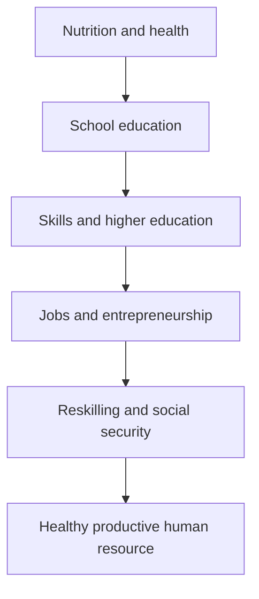

# Social Sector Services — Health, Education & Human Resources

> GS-2 · Social Justice Topic 2 · development and management of health, education and human resources

---

## PYQs

| Year | M | Words | Question (EN) | प्रश्न (HI) | ID |
|------|---|-------|---------------|-------------|-----|
| 2025 | 8 | 125 | Explain the main issues relating to Human Resource Development in India. | भारत में मानव संसाधन विकास से संबंधित प्रमुख मुद्दों की व्याख्या कीजिए। | Q1 |
| 2023 | 12 | 200 | Discuss the various aspects relating to the management of Health Services in the State of Uttar Pradesh. | उत्तर प्रदेश में स्वास्थ्य सेवाओं के प्रबंधन से सम्बंधित विभिन्न पहलुओं की व्याख्या कीजिए। | Q2 |
| 2022 | 12 | 200 | Describing the objective of the “Mission Shakti” program run by the Government of Uttar Pradesh, tell how far it has been successful in achieving its objectives? | उत्तर प्रदेश सरकार द्वारा संचालित 'मिशन शक्ति' कार्यक्रम के उद्देश्य का वर्णन करते हुए बताइए कि यह अपने उद्देश्यों की प्राप्ति में कहाँ तक सफल है? | Q3 |
| 2021 | 12 | 200 | Mahatma Gandhi National Rural Employment Guarantee Act empowers rural poor to alleviate poverty, comment on it. | महात्मा गांधी राष्ट्रीय ग्रामीण रोजगार गारंटी अधिनियम ग्रामीण गरीबों को गरीबी कम करने का अधिकार देता है, टिप्पणी करें। | Q4 |
| 2020 | 8 | 125 | Analyse various aspects relating to Management of Human Resources in India. | भारत में मानव संसाधन प्रबन्धन से सम्बंधित विभिन्न पहलुओं का विश्लेषण कीजिये। | Q5 |
| 2018 | 8 | 125 | Throw light on the challenges and problems of farmers and agriculture sector in Uttar Pradesh. Suggest measures for improvement. | उत्तर प्रदेश में किसान और कृषि क्षेत्र की समस्याओं एवं चुनौतियों पर प्रकाश डालिए। इनके सुधार के लिए सुझाव दीजिए। | Q6 |

---

## Quick Revision

```
CORE IDEA:
  Social sector = health + education + nutrition + skills + gender safety + employment capability.
  HRD = converting population into healthy, educated, skilled and productive citizens.

HRD ISSUES:
  Malnutrition, poor learning outcomes, school dropout, skill mismatch, unemployability, informal work, low female LFPR, regional inequality, digital divide, migration, ageing, health burden.
  Anchors: NEP 2020, Skill India, PMKVY, Samagra Shiksha, Ayushman Bharat, Poshan, MGNREGA, Mission Karmayogi, Digital India.

HR MANAGEMENT:
  Planning, education, health, skilling, deployment, productivity, labour welfare, social security, lifelong learning.
  India challenge = demographic dividend window + jobs/skills mismatch + health/nutrition deficit.

UP HEALTH SERVICES:
  Structure: sub-centre/AAM -> PHC -> CHC -> district hospital -> medical college/speciality.
  Management aspects: infrastructure, HR, medicines, referral, ambulance 108/102, HMIS, NHM, PMJAY, immunisation, maternal-child health, disease surveillance, telemedicine.
  Problems: doctor/nurse shortage, rural-urban gap, OOPE, poor referral, quality, malnutrition, communicable + NCD burden.
  Reforms: Ayushman Arogya Mandir, telemedicine, medical colleges, supply chain, health insurance, public health cadre, data systems.

MISSION SHAKTI UP:
  Launched 2020; women safety, dignity, empowerment and self-reliance.
  Tools: awareness, women help desks, helplines 1090/181/112, One Stop Centres, police outreach, anti-harassment measures, convergence with schemes.
  Success: awareness, reporting, institutional visibility. Limits: patriarchy, under-reporting, conviction delay, rural reach, economic empowerment gap.

MGNREGA:
  Rights-based 100 days wage employment; poverty alleviation through income, wage floor, women participation, local assets and reduced distress migration.

UP FARMERS:
  Problems: small holdings, irrigation, input cost, market volatility, sugarcane arrears, stray cattle, climate risk, storage, low processing.
  Measures: FPOs, PM-KISAN, KCC, PMFBY, PMKSY, e-NAM, storage, processing, diversification, dairy, micro-irrigation.
```

---

## Content

### Context — social sector as capability building

Social sector refers to public systems that build human capability: health, education, nutrition, skill, employment, gender safety, social security and community well-being. Economic growth becomes inclusive only when people are healthy enough to work, educated enough to learn, skilled enough to earn, and secure enough to participate in society. Therefore, health and education are not expenditure burdens; they are human capital investments.

**Human Resource Development (HRD)** means developing people's knowledge, health, skills, values, employability and productivity. For India, HRD is central because the country has a large young population and a limited demographic dividend window. A demographic dividend becomes a liability if youth remain unhealthy, poorly educated, unemployed or unemployable. Social Justice Topic 2 therefore connects health, education and human resources with poverty reduction, gender equality, rural livelihood and state capacity.

### Main issues in Human Resource Development in India

India's HRD challenge begins before school, with maternal health, child nutrition and early childhood care. Malnutrition, anaemia and stunting affect learning and productivity. In school education, enrolment has improved, but learning outcomes, teacher quality, digital access, foundational literacy and numeracy remain concerns. In higher education, access expanded, but employability, research quality, vocational linkages and regional inequality remain weak. In skill development, certification often does not match employer demand. In labour markets, informal employment, low female labour force participation, migration vulnerability and gig-work insecurity reduce human resource utilisation.

| HRD issue | Why it matters | Policy response |
|-----------|----------------|-----------------|
| **Nutrition deficit** | Poor health weakens learning and productivity. | Poshan Abhiyaan, ICDS, PM POSHAN. |
| **Learning gap** | Schooling without learning reduces employability. | NEP 2020, NIPUN Bharat, Samagra Shiksha. |
| **Skill mismatch** | Youth certificates do not match jobs. | Skill India, PMKVY, apprenticeships, ITIs. |
| **Health burden** | Disease and out-of-pocket expenditure reduce work capacity. | Ayushman Bharat, NHM, Health and Wellness Centres. |
| **Gender gap** | Low female LFPR wastes human capability. | Mission Shakti, SHGs, safety, childcare, skilling. |
| **Digital divide** | Online learning and services exclude poor households. | DIKSHA, PM eVIDYA, CSCs, digital literacy. |
| **Informal work** | Workers lack security and training. | e-Shram, social security codes, MGNREGA. |
| **Regional inequality** | UP, Bihar, tribal and rural districts lag in health-education outcomes. | Aspirational Districts, state missions, local planning. |

HRD must be managed across the life cycle: nutrition and immunisation in childhood, school education, skill and higher education in youth, employment and reskilling in adulthood, and health/social security in old age. A narrow degree-focused approach cannot solve India's HRD problem.

### Human resource management in India

Human Resource Management (HRM) at national level means planning, developing, deploying and protecting human capabilities. It includes population health, education quality, skill development, labour market matching, workplace safety, social security, migration support, gender inclusion and lifelong learning. India's HRM challenge is not only creating skilled people but also matching skills with opportunities.

Government initiatives include **National Education Policy 2020**, **Samagra Shiksha**, **NIPUN Bharat**, **Skill India Mission**, **Pradhan Mantri Kaushal Vikas Yojana**, **National Apprenticeship Promotion Scheme**, **Ayushman Bharat**, **National Health Mission**, **Poshan Abhiyaan**, **MGNREGA**, **e-Shram**, **Digital India** and **Mission Karmayogi** for civil service capacity. The private sector, universities, ITIs, industry associations, SHGs and NGOs also contribute.



The main reform need is integration. Health departments, education departments, labour departments, skilling agencies and industry often work in silos. Data on school completion, skills, migration and jobs is fragmented. HRD policy should link local school quality with district skill plans, local industry demand, apprenticeship, women's safety, transport, digital access and public health.

### Management of health services in Uttar Pradesh

Health service management in Uttar Pradesh is complex because of population size, rural spread, regional disparities, communicable diseases, rising non-communicable diseases, maternal-child health needs and shortage of trained health personnel. The health system is structured through **Sub-Centres/Ayushman Arogya Mandirs**, **Primary Health Centres (PHCs)**, **Community Health Centres (CHCs)**, **district hospitals**, **medical colleges** and specialised institutions. Management means ensuring infrastructure, human resources, medicines, referral, financing, data, ambulance, quality and accountability.

| Health management aspect | UP challenge | Reform direction |
|--------------------------|--------------|------------------|
| **Infrastructure** | PHC/CHC gaps, equipment shortage, uneven district hospitals. | Upgrade Ayushman Arogya Mandirs, CHCs and medical colleges. |
| **Human resources** | Shortage of doctors, nurses, specialists and public health managers. | Recruitment, rural incentives, training and telemedicine support. |
| **Referral system** | Patients bypass PHCs or face delays. | Strong gatekeeping, ambulance 108/102, digital referral. |
| **Medicines and diagnostics** | Stock-outs and private spending. | Supply chain management, essential diagnostics and free drug systems. |
| **Maternal-child health** | Anaemia, malnutrition, institutional delivery quality. | NHM, Poshan, immunisation, ASHA/ANM strengthening. |
| **Disease burden** | AES, TB, vector diseases plus diabetes/hypertension. | Surveillance, Health and Wellness Centres, NCD screening. |
| **Finance** | Out-of-pocket expenditure remains high. | PMJAY, state insurance, stronger public facilities. |
| **Data and grievance** | HMIS quality and citizen feedback gaps. | Digital health records, dashboards, patient feedback. |

UP has improved through ambulance services, medical college expansion, immunisation drives, Ayushman Bharat/PMJAY, Health and Wellness Centres, e-Sanjeevani telemedicine and disease control campaigns. But health service management still faces rural-urban inequality, staff shortage, quality variation, referral weakness, private-sector dependence and public health capacity gaps. The state needs a stronger public health cadre, district health planning, preventive care, nutrition convergence and accountable facility management.

### Education and human capability

Education is the foundation of HRD because it creates literacy, numeracy, citizenship, employability and social mobility. India has improved enrolment, but quality remains the central issue. Foundational literacy and numeracy gaps reduce later learning. Dropout among girls, poor children and marginalised groups continues at higher levels. Teacher absenteeism, multi-grade classrooms, weak school leadership and digital divide affect outcomes. Higher education faces employability and research-quality gaps.

**NEP 2020** addresses early childhood care, foundational literacy, multidisciplinary education, vocational exposure and flexibility. **NIPUN Bharat** focuses on foundational learning. **Samagra Shiksha** integrates school education support. **DIKSHA** and **PM eVIDYA** expand digital learning. But digital tools cannot replace teachers, classrooms, nutrition and language-sensitive pedagogy. Education reform must be linked with health, nutrition, safety and local employment pathways.

### Mission Shakti in Uttar Pradesh

**Mission Shakti** is a Uttar Pradesh government programme launched in 2020 to promote women's safety, dignity, empowerment and self-reliance. It combines awareness, policing, welfare convergence and institutional support. Its objectives include preventing crimes against women, improving reporting, increasing awareness of legal rights, linking women to welfare schemes, strengthening police responsiveness and promoting self-confidence among girls and women.

The programme uses helplines such as **1090**, **181** and **112**, women help desks in police stations, One Stop Centres, anti-harassment measures, awareness campaigns in schools and communities, police outreach, and convergence with schemes for girls and women. It seeks to shift governance from reactive policing to preventive, rights-aware and community-connected safety administration.

Its success lies in raising awareness, increasing visibility of women's safety issues, improving access to police help desks, and creating convergence between departments. It has helped normalise discussion of safety, rights and self-reliance. However, deep social patriarchy, under-reporting, slow trials, rural awareness gaps, cyber harassment, economic dependence and uneven police sensitivity limit success. Mission Shakti becomes more effective when safety is linked with education, transport, livelihood, digital literacy, fast justice and community attitude change.

### MGNREGA as human resource and livelihood security

MGNREGA is repeated in this topic because employment is a core part of human resource management. The Act provides up to 100 days of demand-driven wage employment to rural households. It converts unused rural labour into public asset creation. For poor households, it provides income support, reduces distress migration, raises rural wage floor and strengthens women's work participation.

From an HRD perspective, MGNREGA preserves human capability during lean seasons. A rural worker who receives local employment can avoid distress migration, debt and hunger. Works such as water conservation, land development, ponds and rural roads improve the productive base of villages. Social audit and Gram Sabha planning also build civic capability. But delays in wage payment, demand suppression, low awareness and poor asset quality reduce empowerment.

### Farmers and agriculture in Uttar Pradesh

Farmers in UP are central to human resource and rural livelihood policy because agriculture employs a large population. The main problems are small and fragmented holdings, uneven irrigation, rising input costs, low mechanisation for small farmers, crop price volatility, sugarcane payment delays, stray cattle damage, climate shocks, weak storage, low agro-processing and weak extension services. These problems reduce rural income and create underemployment.

Improvement requires **FPOs**, better procurement and MSP awareness, timely sugarcane payment, crop diversification, dairy and allied sectors, micro-irrigation, **PM-KISAN**, **Kisan Credit Card**, **PMFBY**, **PMKSY**, soil testing, e-NAM, storage, cold chains, agro-processing and local skill training. Farmer welfare should be seen as HRD because a healthier, skilled and better-paid rural workforce reduces poverty and improves productivity.

### Contemporary relevance

- **NEP 2020 and NIPUN Bharat** make foundational literacy and lifelong learning central to HRD.
- **Ayushman Bharat, PMJAY and Ayushman Arogya Mandirs** shift health policy toward primary care and financial protection.
- **Digital health and e-Sanjeevani** improve access but require digital literacy and reliable public facilities.
- **Mission Shakti** connects women safety with education, mobility and workforce participation.
- **Skill India, PMKVY and apprenticeships** remain important for employability, but industry linkage is essential.
- **MGNREGA** acts as a social protection and climate-resilience tool through water and land works.
- **FPOs and agro-processing in UP** are critical for improving rural livelihoods and human resource productivity.
- **Female labour force participation** remains a major HRD concern; safety, childcare, transport and skills must converge.

### Limits — balanced view

Social sector reform fails when departments work in silos. A child cannot learn if she is anaemic; a skilled youth cannot work if jobs are absent; a woman cannot join the workforce if safety and transport are weak; a farmer cannot become productive without irrigation, credit and market access. Health, education and HRD must therefore be managed as an integrated capability system. India's challenge is not only more schemes but better outcomes, quality, inclusion and accountability.

---

## Answers

### Q1: Explain the main issues relating to Human Resource Development in India. (2025, 8M, 125W)

**Introduction:**
> Human Resource Development means improving people's health, education, skills, employability and productivity. For India, it decides whether the demographic dividend becomes an asset or burden.

**Main Points:**
- **Nutrition Deficit** — Malnutrition and anaemia weaken learning and productivity.
- **Learning Gap** — Enrolment has improved, but foundational literacy and numeracy remain weak.
- **Skill Mismatch** — Training often does not match industry demand.
- **Health Burden** — Disease and out-of-pocket expenditure reduce work capacity.
- **Gender Gap** — Low female labour force participation wastes human capability.
- **Regional Inequality** — Rural, poor and backward districts lag in education and health.
- **Digital Divide** — Online learning and services exclude digitally weak households.
- **Informal Employment** — Workers lack social security and reskilling.

**Keywords (underline in exam):** Demographic Dividend · NEP 2020 · Skill India · Poshan · Female LFPR · Digital Divide · Employability

**Exam diagram (30 sec):**
```
HRD issues: health + education + skills + jobs + gender
                 -> demographic dividend risk
```

**Conclusion:**
> India needs integrated health, education, skill and employment policy to convert population into productive human capital.

### Q2: Discuss the various aspects relating to the management of Health Services in the State of Uttar Pradesh. (2023, 12M, 200W)

**Introduction:**
> Uttar Pradesh's health service management is challenging because of large population, rural spread, regional inequality and dual burden of communicable and non-communicable diseases.

**Main Points:**
- **Infrastructure Management** — Sub-centres, PHCs, CHCs, district hospitals and medical colleges need adequate buildings and equipment.
- **Human Resources** — Shortage of doctors, nurses, specialists and public health managers affects rural care.
- **Referral System** — PHC-CHC-district hospital linkage and 108/102 ambulance services must be efficient.
- **Medicines and Diagnostics** — Stock-outs increase out-of-pocket expenditure.
- **Maternal-child Health** — Anaemia, malnutrition, immunisation and institutional delivery quality need constant attention.
- **Disease Surveillance** — TB, AES, vector diseases and NCDs need data-based public health response.
- **Financial Protection** — PMJAY and public hospitals reduce catastrophic expenditure if quality is reliable.
- **Digital Health** — HMIS, e-Sanjeevani and dashboards improve monitoring and access.
- **Accountability** — Patient feedback, facility audits and grievance systems improve service quality.

**Keywords (underline in exam):** UP Health · PHC · CHC · NHM · PMJAY · Ayushman Arogya Mandir · e-Sanjeevani · HMIS

**Exam diagram (30 sec):**
```
UP health management
 infrastructure + HR + referral + medicines + data + accountability
```

**Conclusion:**
> UP needs stronger primary care, trained personnel, referral discipline and public health management to make health services equitable.

### Q3: Describing the objective of the “Mission Shakti” program run by the Government of Uttar Pradesh, tell how far it has been successful in achieving its objectives? (2022, 12M, 200W)

**Introduction:**
> Mission Shakti is a Uttar Pradesh programme launched in 2020 to promote women's safety, dignity, empowerment and self-reliance through awareness, policing and welfare convergence.

**Objectives:**
- **Women Safety** — Prevent harassment and crimes against women through police outreach.
- **Legal Awareness** — Inform women and girls about rights, helplines and remedies.
- **Institutional Support** — Strengthen women help desks, One Stop Centres and helplines.
- **Confidence Building** — Encourage girls and women to report violence and claim entitlements.
- **Convergence** — Link safety with education, welfare, health and livelihood schemes.

**Success:**
- **Visibility Increase** — Women's safety became a public administrative priority.
- **Reporting Channels** — Helplines 1090, 181 and 112 and help desks improved access.
- **Awareness Campaigns** — Schools and communities received rights-based messaging.
- **Police Interface** — Women help desks improved first contact with police.

**Limitations:**
- **Patriarchal Norms** — Social pressure still discourages reporting.
- **Justice Delay** — Reporting does not always lead to speedy trial or conviction.
- **Rural Reach** — Awareness and trust remain uneven.
- **Economic Gap** — Safety must be linked with education, transport, skills and jobs.

**Keywords (underline in exam):** Mission Shakti · Women Safety · 1090 · One Stop Centre · Legal Awareness · Empowerment · UP

**Exam diagram (30 sec):**
```
Mission Shakti
 safety + awareness + help desks + convergence
      -> dignity, but needs justice + livelihood support
```

**Conclusion:**
> Mission Shakti has improved visibility and access, but full success requires social attitude change and stronger justice delivery.

### Q4: Mahatma Gandhi National Rural Employment Guarantee Act empowers rural poor to alleviate poverty, comment on it. (2021, 12M, 200W)

**Introduction:**
> MGNREGA, 2005 gives rural households a legal guarantee of wage employment, making livelihood support a right rather than charity.

**Main Points:**
- **Right to Work** — Demand-driven employment empowers poor households legally.
- **Income Security** — Wages support consumption during lean agricultural seasons.
- **Migration Reduction** — Local work reduces distress migration.
- **Women Participation** — Local worksites increase women's paid work.
- **Wage Floor** — It improves bargaining power of rural labourers.
- **Asset Creation** — Water conservation, roads and land works strengthen village economy.
- **Social Audit** — Gram Sabha and public records create accountability.
- **Human Resource Protection** — It prevents hunger, debt and distress during unemployment.
- **Limitations** — Wage delays, demand suppression and poor asset quality reduce impact.

**Keywords (underline in exam):** MGNREGA · Right to Work · Wage Security · Social Audit · Gram Sabha · Rural Livelihood · Poverty Reduction

**Exam diagram (30 sec):**
```
MGNREGA -> work + wages + assets + audit
              -> rural poverty reduction
```

**Conclusion:**
> MGNREGA empowers the rural poor by protecting livelihood and dignity, provided wage and work guarantees are implemented sincerely.

### Q5: Analyse various aspects relating to Management of Human Resources in India. (2020, 8M, 125W)

**Introduction:**
> Human Resource Management in India means planning, developing and utilising people's health, education, skills and work capacity for national development.

**Main Points:**
- **Health Management** — Nutrition, primary care and disease control build work capacity.
- **Education Quality** — NEP 2020 and NIPUN Bharat focus on learning, not only enrolment.
- **Skill Development** — PMKVY, ITIs and apprenticeships must match labour market needs.
- **Employment Linkage** — Training should connect with jobs, enterprises and local industry.
- **Gender Inclusion** — Safety, childcare and skills are needed for women's work participation.
- **Migration Management** — Portability of ration, health and social security protects workers.
- **Digital Skills** — Digital literacy is essential for modern jobs and services.
- **Social Security** — Informal workers need e-Shram-linked benefits and reskilling.

**Keywords (underline in exam):** HRM · Health · Education · Skill India · NEP 2020 · Employability · Social Security

**Exam diagram (30 sec):**
```
HRM = health + education + skills + jobs + security
```

**Conclusion:**
> India needs life-cycle HR management that links schools, skills, health and labour markets.

### Q6: Throw light on the challenges and problems of farmers and agriculture sector in Uttar Pradesh. Suggest measures for improvement. (2018, 8M, 125W)

**Introduction:**
> Agriculture in Uttar Pradesh supports a large rural workforce, but small farmers face income insecurity, market risk and climate stress.

**Main Points:**
- **Small Holdings** — Fragmentation reduces mechanisation and scale benefits.
- **Irrigation Gap** — Water access is uneven across regions.
- **Input Cost** — Diesel, fertiliser, seed and labour costs reduce margins.
- **Market Volatility** — Weak storage and processing force distress sale.
- **Sugarcane Arrears** — Delayed payments hurt western UP farmers.
- **Climate and Stray Cattle** — Flood, drought, heat and crop damage increase risk.

**Measures:**
- **FPOs** — Collective bargaining and aggregation improve market power.
- **Irrigation/Diversification** — PMKSY, micro-irrigation, horticulture and dairy reduce risk.
- **Credit/Insurance** — KCC, PM-KISAN and PMFBY need timely coverage.
- **Value Addition** — Storage, cold chains and agro-processing raise income.
- **Digital Extension** — e-NAM and advisories improve price and crop decisions.

**Keywords (underline in exam):** UP Farmers · FPO · PM-KISAN · KCC · PMFBY · PMKSY · Agro-processing

**Exam diagram (30 sec):**
```
UP farmer distress: land + water + price + climate
Solution: FPO + irrigation + credit + processing
```

**Conclusion:**
> UP agriculture needs both welfare support and productivity reforms to strengthen rural human resources.

### Q7: Likely PYQ — Discuss the major issues in education-sector management in India. (Future Variant, 12M, 200W)

**Introduction:**
> Education-sector management is central to HRD because schooling must translate into learning, skills, citizenship and employability.

**Main Points:**
- **Foundational Learning Gap** — Many children progress without literacy and numeracy.
- **Teacher Quality** — Training, motivation and accountability vary widely.
- **Dropouts** — Girls, poor children and marginalised groups face higher dropout risk.
- **Digital Divide** — Online learning excludes households without devices or connectivity.
- **Language Barrier** — Early learning suffers when pedagogy ignores mother tongue.
- **Vocational Weakness** — Schools and colleges remain weakly linked with skills and jobs.
- **Higher Education Quality** — Research, faculty and employability need improvement.
- **Governance Fragmentation** — Centre, state, school boards and local bodies need better coordination.
- **Nutrition/Safety Link** — Mid-day meals, health and safe transport affect attendance.

**Keywords (underline in exam):** NEP 2020 · NIPUN Bharat · Samagra Shiksha · Learning Outcomes · Digital Divide · Vocational Education

**Exam diagram (30 sec):**
```
Education management = access + learning + teachers + skills + equity
```

**Conclusion:**
> Education reform must move from enrolment-centred success to learning, inclusion and employability outcomes.

### Q8: Likely PYQ — Health, education and skill development are interlinked pillars of HRD. Explain. (Future Variant, 12M, 200W)

**Introduction:**
> HRD depends on a life-cycle approach: a healthy child learns better, an educated youth trains better, and a skilled worker earns better.

**Main Points:**
- **Health Foundation** — Nutrition, immunisation and primary care build physical and cognitive capacity.
- **Education Base** — Literacy, numeracy and critical thinking enable further learning.
- **Skill Conversion** — Vocational training converts education into employability.
- **Gender Link** — Girls' education, safety and health increase workforce participation.
- **Productivity Link** — Healthy and skilled workers raise economic output.
- **Poverty Reduction** — Education and skills reduce inter-generational deprivation.
- **Digital Economy** — Digital skills connect youth with modern services and jobs.
- **Social Security** — Informal workers need reskilling and protection to remain productive.
- **Governance Need** — Health, education and labour departments must coordinate.

**Keywords (underline in exam):** HRD · Health · Education · Skills · Demographic Dividend · Female LFPR · Life-cycle Approach

**Exam diagram (30 sec):**
```
Health -> Learning -> Skill -> Job -> Productivity
```

**Conclusion:**
> India can realise demographic dividend only by integrating health, education, skills and employment policy.

---

## Traps

| Wrong | Correct |
|-------|---------|
| HRD means only higher education. | HRD includes health, nutrition, schooling, skills, employment and social security. |
| Demographic dividend is automatic. | It needs health, education, skills and jobs. |
| Health management means only hospitals. | It includes primary care, HR, medicines, referral, data, finance and prevention. |
| UP health issues are only infrastructure gaps. | Human resources, referral, quality, finance and public health management are equally important. |
| Mission Shakti is only a policing scheme. | It combines safety, awareness, help desks, helplines and empowerment convergence. |
| Women safety alone ensures empowerment. | Education, livelihood, transport, justice and social norms also matter. |
| MGNREGA is unrelated to HRD. | It protects rural labour capability through wage security and local asset creation. |
| Skill certificates guarantee employment. | Skills must match industry demand and local opportunities. |
| Digital education solves learning gaps by itself. | Teacher quality, language, nutrition and access remain essential. |
| Farmer welfare is outside social sector. | Farmer livelihood affects rural human resources, poverty and social security. |
| PMJAY alone can fix health systems. | Insurance needs strong public facilities, doctors, medicines and referral systems. |
| Female LFPR is only an economic issue. | It is linked to safety, health, education, childcare and social norms. |
| Social sector success means more spending only. | Outcomes, quality, equity and accountability matter equally. |
| Human resource management is only for government employees. | At national level, it means managing the population's capabilities and work potential. |

---

*Complete.*
