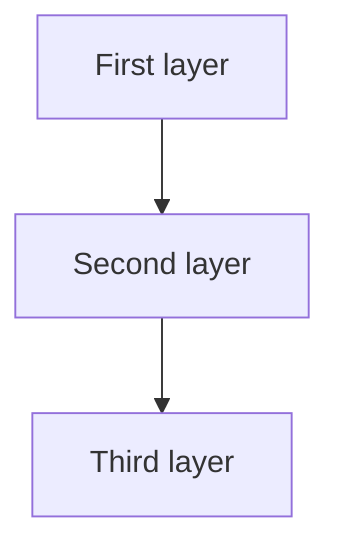

# [Subtopic Name]

> GS-_ · Topic NN · [keyword]

---

## PYQs

| Year | M | Words | Question (EN) | प्रश्न (HI) | ID |
|------|---|-------|---------------|-------------|-----|

---

## Quick Revision

```
[ASCII shorthand — A → B → C chains OK here]
```

---

## Content

[Point-wise facts + tables]

<!-- Optional: 0–2 mermaid blocks below relevant subsection — NOT a separate section -->

<!--

-->

---

## Answers

### Q1: [Exact PYQ] (Year, _M, _W)

**Introduction:**
> 

**Main Characteristics:** *(or Main Points / Main Advantages — match directive)*
- **Exam Keyword Label** — one crisp line with example

**Keywords (underline in exam):** Keyword1 · Keyword2 · Keyword3

**Exam diagram (30 sec):**
```
[hand-drawable ASCII — 30 sec]
```

**Conclusion:**
> 

---

## Traps

| Wrong | Correct |
|-------|---------|

---

*Complete.*
