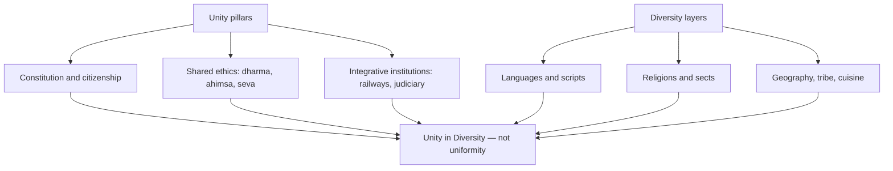

### Context — What Indian society and culture are

Indian society is the web of institutions through which roughly 1.4 billion people organize life on the subcontinent: family and kinship, caste (jati) and tribe, village and city, religion and class, gender and generation. This structure accumulated over five millennia — from Harappan urbanism through Vedic ritual society, Mauryan and Gupta empires, Bhakti and Sufi movements, Mughal synthesis, British colonial reordering, and the constitutional republic inaugurated in 1950. What makes Indian society analytically distinctive is that ancient institutions survive alongside modern ones: a software engineer in Noida may video-call her grandmother in a Bihar village for a wedding ritual on the same day she submits a quarterly report to a multinational firm.

Indian culture is the shared meaning system that gives those institutions moral and aesthetic grammar. It encompasses philosophy (dharma, karma, moksha, ahimsa), languages and literatures, festivals and life-cycle rituals, dietary and dress codes, music-dance-architecture, and ethical ideals such as *atithi devo bhava* and *vasudhaiva kutumbakam*. Culture here is not synonymous with Hinduism alone: Islam, Christianity, Sikhism, Jainism, Buddhism, Zoroastrianism, Judaism, and hundreds of tribal cosmologies are constitutive threads. Sociologists from G.S. Ghurye to M.N. Srinivas, André Béteille, and Louis Dumont converge on one paradox: India is simultaneously hierarchical and plural, ritual-centric and syncretic, astonishingly continuous and yet undergoing accelerated change since the nineteenth century.

### Salient characteristics of Indian culture

**Spiritual and philosophical depth.** Indian civilization has never treated religion as a compartment separate from ethics, art, or daily conduct. The Upanishads pose ultimate questions about Brahman and Atman; Buddhism articulates the Four Noble Truths; Jainism insists on ahimsa and anekantavada (many-sided truth); Bhakti and Sufi traditions democratize devotion through vernacular poetry. The purusharthas — dharma (righteous duty), artha (material pursuit), kama (desire), moksha (liberation) — frame a balanced life visible in the Mahabharata, Ramayana, and countless folk morality tales. This is why Indian culture feels simultaneously worldly and transcendent: a merchant in Varanasi may begin the day with Ganga arati and end it negotiating commodity prices.

**Religious pluralism and syncretism.** India is the birthplace of Hinduism, Buddhism, Jainism, and Sikhism, and has hosted Islam, Christianity, Zoroastrianism, and Judaism for centuries alongside tribal animist traditions. These faiths coexist, sometimes contest, and often intermix. The Bhakti–Sufi movements of the fourteenth to sixteenth centuries — Kabir, Guru Nanak, Nizamuddin Auliya, Chaitanya, Mirabai — rejected rigid orthodoxy, composed in Awadhi, Braj, and Punjabi, and created the Ganga-Jamuni tehzeeb especially visible in Uttar Pradesh. Proof of syncretism is architectural and musical: the Qutub Minar complex layers Islamic and pre-Islamic stonework; Hindustani classical music blends Persian and Indic scales.

**Continuity with antiquity.** Unlike many civilizations where ancient and modern are severed, India maintains living links to Harappan urbanism, the Vedic corpus, Mauryan and Gupta art, classical Sanskrit, and Tamil Sangam literature. The Kumbh Mela — inscribed as UNESCO Intangible Cultural Heritage in 2017 — connects mythic time to mass contemporary participation at Prayagraj, Haridwar, Nashik, and Ujjain. A pilgrim in 2024 performs rituals whose textual references are millennia old.

**Regional and linguistic diversity.** The Eighth Schedule recognizes 22 languages; hundreds of dialects exist beyond that list. Food cultures range from sattvic vegetarianism to coastal seafood, Mughlai feasts, and tribal foraging traditions. Classical dance forms include Bharatanatyam, Kathak, Odissi, Manipuri, Kuchipudi, Mohiniyattam, and Sattriya; folk forms include Bhangra, Garba, Bihu, and Lavani. Unity operates through shared festivals, cricket, cinema (Bollywood plus regional industries), and constitutional citizenship — not through linguistic uniformity.

**Family-centric social organization.** The joint family ideal — multi-generational, patrilineal, with collective responsibility and elder authority — remains influential though nuclear families rise in metros. Marriage functions as sacrament (sanskar) and alliance between kin networks; arranged marriage persists alongside self-choice, demonstrating continuity and change in the same institution.

**Art, craft, and aesthetic continuity.** Ajanta-Ellora, Khajuraho, Taj Mahal, Hampi, and Konark trace an architectural timeline; living crafts — Banarasi silk, Chikankari of Lucknow, Varanasi metalwork — carry GI tags linking heritage to livelihood. Music gharanas preserve Hindustani and Carnatic traditions; Bollywood functions as a modern folk epic consumed across classes.

**Tolerance and coexistence ethos.** Gandhi's *sarva dharma sambhava* (equal respect for all faiths) expresses a civilizational ideal that the Constitution institutionalized through secularism (Preamble, Articles 25–28). History records partition violence and communal riots, yet the dominant cultural ideal remains inclusive coexistence — visible when gurdwaras serve langar to all regardless of faith.

### Indian society — uniqueness and diversity

| Dimension | Unique / diverse feature | Illustration |
|-----------|-------------------------|--------------|
| Civilizational depth | Unbroken 5000+ year cultural layers | Harappa seals → Vedic fire altars → Mughal miniatures |
| Social structure | Caste (jati) + tribe + class overlap | Srinivas's sanskritization; Ambedkar's annihilation-of-caste critique |
| Religion | Multi-religious, syncretic shrines | Ajmer Sharif, Vrindavan, Golden Temple langar |
| Language | No single national language | UP: Hindi heartland plus Awadhi, Bhojpuri, Braj |
| Rural–urban | 65%+ rural (Census 2011); diverse agrarian cultures | Khadar/Bangar doabs; terrace farming in NE; tank irrigation in Deccan |
| Tribe (Adivasi) | 8.6% population (2011); distinct kinship | Gond, Santhal, Bhil, Naga — PESA 1996 protects gram sabha culture |
| Gender | Patrilineal norms vs goddess worship | Rani Lakshmibai, Lata Mangeshkar, Kalpana Chawla |
| Diaspora | 32 million+ overseas Indians | Diwali public holidays abroad; yoga globalized |

India's uniqueness lies in scale plus diversity plus simultaneous modernity and tradition — mobile phones alongside temple rituals, IT hubs alongside arranged-marriage portals. Amartya Sen highlights the political uniqueness: universal adult franchise from 1950 despite low per-capita income and mass illiteracy — democracy sustained before prosperity, unlike the Western sequence.

### Composite culture — meaning and advantages

Composite culture means cultures blend without erasing distinct identities. Indo-Islamic architecture (Qutub Minar, Taj Mahal), Urdu-Hindi rekhta, biryani and pulao, Hindustani classical (Khayal, thumri), and Sikh gurdwara seva traditions exemplify synthesis. The Ganga-Jamuni tehzeeb of Lucknow, Varanasi, and Delhi shows Shia–Sunni and Hindu–Muslim neighbourhoods sharing Holi colours and Muharram processions.

| Advantage | Mechanism | Proof |
|-----------|-----------|-------|
| Social cohesion | Cross-cutting ties reduce sectarian isolation | Mixed mohallas in Varanasi-Lucknow belt |
| Creative synthesis | Interaction produces new art, music, cuisine | Indo-Islamic architecture; Hindustani music |
| National integration | Shared symbols atop diversity | Tricolour, Constitution, cricket unify without homogenizing |
| Soft power | Global appeal of yoga, Bollywood, cuisine | UNESCO Yoga (2016); International Day of Yoga (UN 2014) |
| Resilience | Composite memory counters exclusive nationalism | Bhakti-Sufi saints as dialogue precedent |
| Economic tourism | Heritage circuits monetize plural heritage | PRASAD/Swadesh Darshan: Sufi, Buddhist, Ramayana trails |
| Conflict management | Constitutional FRs plus syncretic tradition | Articles 25–28; langar/seva ethics |

### Unity in Diversity — analytical framework

Unity operates at three levels: political (single citizenship, Union of States), civilizational (ethos of dharma, tolerance, ahimsa), and institutional (Parliament, judiciary, All India Services, railways). Diversity spans religion, language, ethnicity, cuisine, dress, folklore, and ecology-adapted lifestyles. The Constitution transforms diversity from an imperial administrative problem into a democratic resource through federalism, linguistic states (States Reorganisation Act 1956), minority rights (Articles 29–30), and SC/ST protections.

Illustrations: Kumbh Mela draws millions across regions and castes to one sacred geography; Independence Day is celebrated nationally with locally distinctive performances; the three-language formula promotes pluralism with link languages; armed forces recruit regiments from all regions; during COVID-19, gurdwaras, temples, and mosques ran community kitchens demonstrating unity in service.

Logical analysis of the statement "Indian Culture is the symbol of Unity in Diversity": Premise one — immense pluralism (22 languages, six major religions, tribal cultures) protected by Articles 29–30. Premise two — unity through citizenship, Preamble fraternity, federal Union, shared festivals. Logical link — diversity becomes democratic resource when institutions guarantee equal dignity; counter-evidence (Partition, riots, linguistic disputes) shows unity is an ongoing project, not automatic — which strengthens the need for the ideal.

### Continuity and change — factors

| Continuity factors | Change factors |
|--------------------|----------------|
| Sacred texts and ritual calendar (Vedas, Puranas, Islamic lunar calendar) | Colonial modernity: English education, railways, census codifying caste |
| Endogamous jati marriage norms (strong in rural UP) | Social reform: Rammohun Roy (1829 sati ban), Phule, Periyar, Ambedkar |
| Joint family ideal and elder authority | Urban nuclear families, women workforce, double-income households |
| Village community memory: panchayat, cooperative irrigation | Green Revolution, MGNREGA, migration remittances |
| Sanskrit/Persian cultural prestige | Mass media: Ramayan (1987 TV effect), social media, OTT |
| Gandhi's swadeshi reinforced indigenous pride | LPG 1991: consumer culture, MNCs, global fashion |
| Caste-based occupation memory | Constitution Articles 14–17, reservations |
| Oral tradition: folk tales, bhajans, qawwali | Legal reforms: Hindu Code Acts, Special Marriage Act, anti-dowry laws |
| Pilgrimage networks unchanged for centuries | Digital India: UPI, e-governance, online distance education |
| Guru–shishya parampara in classical arts | NEP 2020: multidisciplinary education, IKS formalized |

Indian society is not static. Srinivas's sanskritization (lower groups emulating upper ritual norms) and westernization describe cultural mobility within continuity; Béteille notes hierarchy persists but content changes — caste enters politics, not merely ritual rank. Reform and Constitution renegotiate tradition rather than erase it, producing selective modernization anchored in civilizational memory.

### Caste alliances — secular and political vs primordial identity

Primordial identity, in Louis Dumont's framework, is ascribed jati at birth with ritual rank and endogamy rules — a stable cultural identity reproduced through marriage and occupation memory. Political caste alliance is different: it is an electoral coalition of jati groups for vote arithmetic. Rajni Kothari documented how the Congress system gave way after 1967 to competitive caste mobilization; the Mandal Commission (1990) and OBC reservations intensified strategic OBC bloc formation.

Secular factors drive alliances: candidate winnability, patronage and local development delivery, anti-incumbency, class splits within jati (rich versus poor Yadav), and gender-youth interests cutting across ritual lines. These are not ancient ritual mergers. Mahagathbandhan experiments in UP-Bihar, BSP-Brahmin outreach (2007), and RJD-JDU OBC combinations are strategic and often short-lived, reconfigured each election. Proof: the same jati splits across parties (Yadav voters divided between RJD and BJP).

Balanced view: jati supplies identity anchors — leaders deploy Dalit pride or OBC pride symbols even when formation logic is political. Srinivas argued caste adapts under democracy; it does not disappear. Alliances do not erase jati boundaries or create new unified ritual communities — they are contingent secular bargains where caste functions as a resource for power, not a frozen ritual order reproduced intact from antiquity.

### Bhakti and Sufi movements in composite culture

Bhakti reformers (Kabir, Guru Nanak, Chaitanya, Mirabai) and Sufi syncretists (Nizamuddin Auliya, Amir Khusrau of the Chishti order) democratized devotion in the fourteenth to sixteenth centuries. They used vernacular languages (Awadhi, Braj, Punjabi), rejected ritual rigidity, and emphasized love, equality, service, and tolerance — laying foundations of Ganga-Jamuni tehzeeb in UP. Cultural legacy includes Hindustani music, Urdu, shared festival spaces, and langar/seva ethics in gurdwaras and temples today. Indian unity grows through interaction and shared humanism, not suppression of religious difference.

### Indian culture during COVID-19 — global impact

During the COVID-19 pandemic, Indian cultural idioms gained global visibility. Yoga and pranayama — already institutionalized through International Day of Yoga (UN 2014) — were promoted by WHO and global health bodies as home wellness tools during lockdowns. Ministry of AYUSH guidelines on kadha, turmeric, and giloy circulated among diaspora communities; scientific debate continues, but cultural export is undeniable. Vasudhaiva Kutumbakam framed India's Vaccine Maitri (2021) as civilizational seva diplomacy. Gurdwara langar models were replicated globally; temples and mosques ran food relief. Namaste replaced the handshake in diplomatic and corporate protocol. Diaspora streamed Durga Puja, Navrati, Eid, and Christmas online — culture as resilience during isolation. Reverse migration briefly highlighted intergenerational care in Indian households versus Western nursing-home models. Limits: India did not "solve" COVID through culture; Ayurveda claims require scientific validation; culture supplemented, not replaced, modern medicine.

### Globalization and Indian family patterns

Globalization since LPG 1991 accelerates nuclearization, women's autonomy, and digital matchmaking, yet family ideals of duty, elder care, and kinship festivals persist in modified form. IT hubs (Bengaluru, Noida) show smaller households and geographic mobility; matrimonial platforms and delayed marriage coexist with parental approval and kin networks dominant in UP and rural India. Festival reunions maintain bonds despite distance; elder care continues via remittances and visits. Legal frameworks (Special Marriage Act, domestic violence laws, Hindu Marriage Act) mediate tradition versus rights. Globalization filters through caste, class, and region — selective modernization, not wholesale Westernization.

### Contemporary relevance

The Preamble commits to unity and integrity of the Nation; Article 51A(f) values composite culture; Articles 29–30 protect minority culture and education. Ek Bharat Shreshtha Bharat (2015) pairs states for language, food, and festival exchange. NEP 2020 embeds Indian Knowledge Systems — Sanskrit, Ayurveda, yoga, classical arts — in curriculum. UNESCO intangible heritage listings (Kumbh Mela 2017, Yoga 2016) recognize living culture. GI tags for UP crafts (Banarasi brocade, Chikankari, Varanasi glass beads) tie Make in India and ODOP to livelihood. Tourism circuits (Swadesh Darshan, PRASAD) develop Ramayana, Buddhist (Sarnath-Kushinagar), and Sufi trails in Varanasi, Ayodhya, Lucknow. Digital India (UPI, BharatNet) connects village rituals to diaspora via live streaming. Supreme Court judgments on Sabarimala, triple talaq, and Section 377 show law mediating tradition versus rights.

### Limits and balanced view

Unity in diversity is aspiration and institutional goal, not always social reality — communal violence, linguistic chauvinism, and caste atrocities persist. Composite culture is uneven — stronger in syncretic centres, weaker where segregation exists. Continuity can preserve inequality (patriarchy, caste discrimination); reformers argued change is moral necessity. COVID cultural export requires balanced scientific claims for Ayurveda. Caste alliances risk reducing complex voters to identity blocks. Diversity does not always strengthen unity. Joint family has not disappeared — nuclear rise in cities coexists with rural practice and cultural ideal. Sanskritization is not westernization: Srinivas defined sanskritization as lower-caste emulation of upper ritual norms — a distinct mechanism from westernization.
