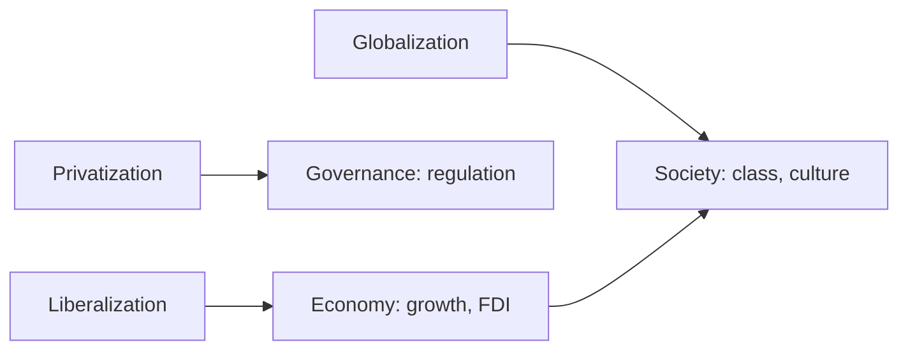

### Context — LPG and Indian society

India's 1991 balance-of-payments crisis left forex reserves covering barely two weeks of imports. The P.V. Narasimha Rao government with Dr Manmohan Singh as Finance Minister launched the New Economic Policy (NEP 1991) — Liberalization, Privatization, Globalization (LPG) — under IMF conditionalities. What changed: state withdrew from direct production control, opened trade and investment, and integrated India into global supply chains. Why it matters sociologically: Yogendra Singh argued modernization produces structural differentiation — caste, village, and joint family lose monolithic authority while class, market, and media gain salience. M.N. Srinivas showed sanskritization and westernization operate alongside LPG-driven change. LPG is ongoing — Make in India, GST (2017), Digital India, PLI, Atmanirbhar — not a closed 1991 event.

### Definitions and objectives

**Liberalization** means reducing state economic controls — industrial licensing, trade barriers, FDI caps, financial repression — to promote efficiency, competition, innovation, and technology transfer. **Privatization** transfers or manages public sector assets through disinvestment, PPP, and strategic sale to cut fiscal losses, improve PSU efficiency, and focus government on regulation and welfare. **Globalization** denotes intensified worldwide flows of goods, services, capital, technology, ideas, and people through WTO (1995), IMF, World Bank, and MNCs — seeking comparative advantage, scale economies, and cultural exchange; critics cite dependency and inequality.

| Year | Event | Social significance |
|------|-------|---------------------|
| 1991 | BoP crisis, NEP, Manmohan Singh budget | Reform watershed; middle-class consumer boom |
| 1993 | SEBI statutory, NSE expansion | Capital market enters middle-class life |
| 1994 | Telecom liberalization | Mobile revolution transforms aspirations |
| 1995 | WTO entry | Agriculture, IPR, services bound by global rules |
| 2005 | MGNREGA | Reform-with-human-face rural wage floor |
| 2014– | Make in India, Digital India, GST, UPI | Second-generation globalization |
| 2020 | Farm laws debate/repeal | Rural society vs global agribusiness |

### Effects on economy

GDP growth averaged higher post-reform versus Hindu rate of growth era — services and IT led Bangalore, Hyderabad, Pune, Gurugram. FDI and MNCs — Coca-Cola re-entry, Maruti-Suzuki, telecom revolution, Flipkart/Amazon — expanded consumer choice and aspirational lifestyles. New middle class in IT/BPO and finance coexists with informalization — contract labour and gig workers (Swiggy, Zomato) with weak social security and no provident fund. Gini coefficient rose; Oxfam reports document inequality (use cautiously in answers). Farmer protests (2020–21) against farm laws symbolized rural-global market friction — MSP, WTO subsidy limits, corporate agribusiness fears. PLI and Make in India aim manufacturing jobs to broaden gains beyond services elite.

| Sector | Pre-1991 | Post-LPG visible change |
|--------|----------|-------------------------|
| Telecom | DOT monopoly, decade wait for phone | Mobile penetration, Jio data — farmer WhatsApp groups |
| Aviation | Air India elite monopoly | IndiGo — migrant worker flights |
| Automobiles | Ambassador, Padmini | Maruti-Suzuki — two-wheeler village status |
| Media | Doordarshan monopoly | Star Plus, OTT — soap operas reshape gender norms |
| Banking | Nationalized dominance | Private banks, UPI — cashless street vendors |

### Effects on polity and governance

Shift from command to regulatory state — SEBI (capital markets), TRAI (telecom), Competition Commission. States compete for investment (Vibrant Gujarat model); GST unified indirect tax with cooperative federalism revenue conflicts. Coalition era paired reforms with welfare — MGNREGA 2005 as human-face offset. Crony capitalism allegations (telecom, coal scams) require critical balance. RTI Act 2005 and e-governance enable citizen accountability as state withdraws from production. Social movements — Narmada Bachao Andolan linked displacement to development models; Mandal (1990) contemporaneous with 1991 — social justice versus market merit tension in polity.

### Effects on social structure

**Caste and class:** imperfect market meritocracy coexists with reservation; urban service economy creates caste-crossing middle class; rural land remains caste-linked. Srinivas: sanskritization interacts with western consumer styles — hybrid identities. **Village and kinship:** jajmani and biradari authority weaken with migration, cash wages, 73rd Amendment PRI; remittances from Gulf and IT cities alter status hierarchies. **Culture:** English premium, private schooling, mall culture, social media create stratified cultural capital (Pierre Bourdieu). **Glocalization:** McDonald's aloo tikki burger, Starbucks in metros, alongside yoga, Ayurveda, Bollywood global reach — integration and conflict coexist.

### Cultural integration vs cultural conflict

| Integration examples | Conflict examples |
|---------------------|-------------------|
| Diaspora, Diwali holidays abroad, International Yoga Day (UN 2014) | Homogenization fear — youth abandoning regional languages |
| Bollywood, IPL, Indian cuisine worldwide | Religious-nationalist backlash against Western values |
| Fusion music, fashion, food | MNC labour practices; Walmart vs kirna livelihood loss |
| UNESCO yoga, AYUSH export | Tribal displacement for mining/SEZ |
| Internet cosmopolitanism — Netflix, YouTube | Cyber nationalism, fake news, polarization |

Exam line: globalization is dual — creates cosmopolitan identities and reactive localism simultaneously. NEP 2020 IKS and Atmanirbhar represent cultural self-assertion amid global flows.

### Rural social structure impacts

Green Revolution legacy plus LPG markets shift to cash crops and contract farming (Punjab, Maharashtra). Out-migration from Bihar, UP, Odisha leaves women and elderly behind; remittance houses signal status. SHG–NRLM and microfinance increase women's public role amid patriarchy. Agrarian distress — farmer suicides in Vidarbha, debt linked to global price shocks and seed MNC debates (Mahyco-Monsanto). Digital penetration via UPI and CSCs alters patwari-centric hierarchy. Assessment: transformative but uneven — connectivity and women's collectives versus distress and hollowed villages.

### Globalization and women — with examples

**Positive:** IT/BPO jobs (Bangalore, Hyderabad) for urban educated women — financial autonomy; SEWA (Ela Bhatt) mobilizes home-based workers in global supply chains (garments, beedi) — collective bargaining; SHG–NABARD linkage — rural credit and panchayat leadership spillover; global feminist discourse and #MeToo India raise legal awareness (POSH 2013). **Negative:** double burden — paid work without redistribution of domestic labour; consumer beauty standards; trafficking in border zones; LFPR still ~24% — globalization did not absorb majority. **Examples synthesis:** TCS campus hires versus garment factory precarity — class-education mediates impact. WEF Gender Gap ranking provides global comparison context.

### Economy–polity–society linkage

Economy → society: IT exports create English-speaking coastal elite; mining/SEZ displacement triggers tribal social conflict. Polity → society: GST and cooperative federalism change citizen-state interface; welfare rights (RTE, RTI, MGNREGA) raise consciousness among women, Dalits, Adivasis. Society → polity: farmer protests, #MeToo, caste census demand feed back into policy — globalization politically contested. Amartya Sen — Development as Freedom: LPG expands some freedoms (consumption, mobility) while contracting others (employment security, ecological) — useful conclusion frame for 12-mark essays.

### LPG effects on polity — extended analysis

Regulatory state emergence: SEBI protects retail investors post-1992 Harshad Mehta scandal legacy; TRAI reduced telecom tariffs from monopoly era; Competition Commission checks MNC abuse. Federal competition for FDI: states offer land, tax breaks — "race to bottom" risk but also spreads investment beyond Delhi-Mumbai axis. GST Council: states as co-sovereigns on indirect tax — cooperative federalism with conflict (compensation cess debates). Welfare offset: MGNREGA, NFSA, RTI — UPA-era response to inequality from first LPG decade — proves India never adopted pure neoliberal model. Atmanirbhar (2020): strategic autonomy turn — semiconductor PLI, toy manufacturing, pharma API — globalization repositioned after COVID and China supply shock. Farmer protests: rural society rejected global agribusiness entry without MSP guarantee — cultural-economic conflict not merely economic technicality.

### Contemporary relevance

NEP 2020 IKS as cultural self-assertion; Atmanirbhar de-risking supply chains post-COVID; G20 presidency (2023) projected UPI and Co-WIN as globalization with Indian characteristics; PLI schemes for semiconductor and electronics; OTT platforms (Paatal Lok vs Korean Wave) balance cultural import-export; WTO fishery subsidies and MSP debates place rural India in global trade rules.

### LPG comprehensive social impact — exam integration scaffold

Define LPG with 1991 anchors (BoP crisis, Manmohan Singh, industrial delicensing, rupee devaluation, WTO 1995). Objectives: efficiency, competition, FDI, technology — not laissez-faire abolition of state (MGNREGA, FCI, subsidies persist). Economy: GDP rise, IT/services boom, consumer culture, inequality, informalization, farmer protests. Polity: regulatory state (SEBI, TRAI, CCI), GST federalism, coalition welfare bargains, RTI accountability. Social structure: caste-class reconfiguration, nuclear family, village authority decline, English premium, glocalization (aloo tikki plus yoga). Rural: migration, remittances, SHGs, agrarian distress, UPI in villages. Women: IT/BPO niches versus garment precarity; SEWA model; LFPR paradox. Cultural integration versus conflict: both true — diaspora, Bollywood, Yoga Day versus language loss, kirana-Walmart, tribal displacement. Yogendra Singh and Srinivas frameworks essential. Atmanirbhar and NEP IKS show nationalist-cultural response within globalization. Sen's freedoms frame for balanced conclusion: gains in consumption and mobility, losses in employment security and ecological sustainability for some groups.

### Additional depth — globalization sociological frameworks and proof points

Yogendra Singh's modernization of tradition explains why LPG did not erase caste or joint family — differentiated structure where market criteria overlay ritual hierarchy. Srinivas: sanskritization (emulate upper ritual) and westernization (emulate Western lifestyle) operate simultaneously among upwardly mobile groups — hybrid identity. Little and great tradition: village oral culture absorbs Bollywood and WhatsApp — global media localized. Anti-globalization movements: Narmada Bachao linked displacement to development model; WTO Seattle 1999 inspired Indian farmer-labour skepticism of free trade. Consumer culture: mall revolution, credit card debt, festival marketing — tyaga ethic strained. Diaspora reverse flow: Silicon Valley CEOs, Diwali in White House, yoga diplomacy — integration export. Backlash: ghar wapsi debates, book bans, anti-Valentine squads — conflict export. WTO fishery subsidy negotiation affects Kerala coastal communities — globalization reaches fishing villages not only IT parks. Gig economy: Swiggy-Zomato riders — new informal proletariat without labour code social security fully operationalized. Proof for women answer: TCS and Infosys campus recruitment of women engineers versus Tamil Nadu garment belt sweatshops — same globalization, opposite outcomes by class and geography.

LPG answers must always balance: IT boom and consumer choice alongside farmer distress and gig precarity; diaspora soft power alongside tribal displacement; regulatory modernization alongside crony capitalism allegations. Name institutions — SEBI, TRAI, WTO, IMF 1991, MGNREGA offset — for credibility. Yogendra Singh and Srinivas frameworks distinguish social-structure answers from pure economic narration. Cultural integration AND conflict both mandatory in 2025 globalization-cultural question.

### Liberalization effects on Indian social structure — detailed

Liberalization reduced state control over investment, trade, and employment — status increasingly determined by education, English fluency, and capital rather than birth alone, though imperfectly. New middle class in metros consumes globally branded goods, sends children to private English schools, and lives in gated communities — cultural capital divide widens between urban elite and vernacular hinterland. Urbanization accelerated as SEZ, IT parks, and construction booms pulled migration — joint family weakened, nuclear households norm in Bengaluru and Gurugram. Consumer culture replaced frugality ethos for aspirational youth — EMIs for phones, vehicles, housing. Caste persists in marriage and land but softens in corporate hiring for skilled roles — reservation plus market creates dual mobility channels. Dalit Indian Chamber of Commerce exemplifies caste entrepreneurship within LPG economy — proof market opens some paths while discrimination continues elsewhere.

### Limits and balanced view

LPG ≠ complete free market — subsidies, FCI, MGNREGA, bank nationalization core persist in mixed economy. Globalization benefits skew to English-educated urban youth — Dalit-Adivasi exclusion unless affirmative action and skilling work. Cultural conflict often politicized — distinguish livelihood threats from instrumental nativism. Not uni-linear modernity — joint family persists in modified form; arranged marriage survives with matrimonial apps. LPG began before 1991 in colonial trade and Green Revolution — 1991 accelerated integration. Globalization ≠ only Westernization — diaspora exports Indian culture, IKS revival. Privatization partial — strategic PSU retention in oil, rail core. Consumerism requires tie to debt, inequality, environmental cost. Yogendra Singh framework valuable in social-structure answers.
