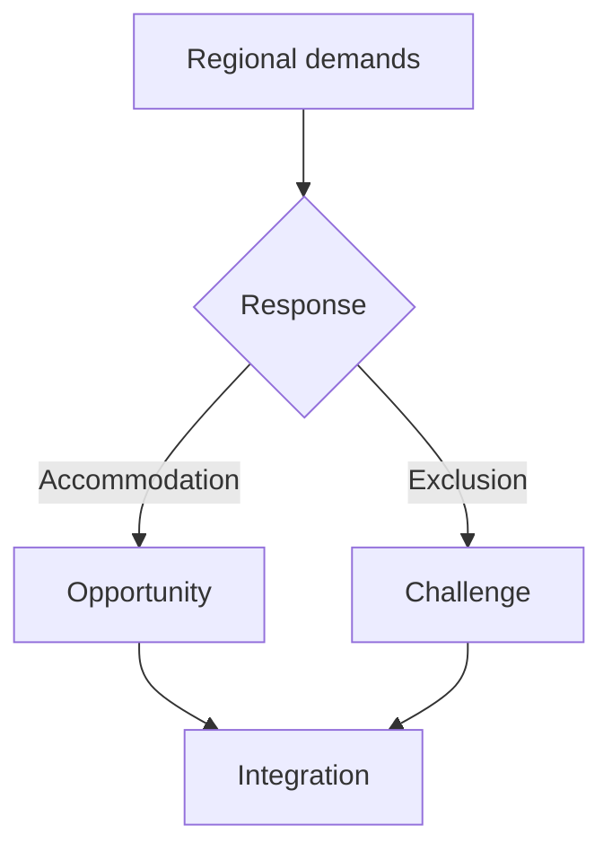

### Context — Regionalism in modern India

Regionalism is mobilization around region-based identity or interest — language, ethnicity, culture, economic deprivation, sub-regional neglect — seeking power, resources, autonomy, or recognition within the Indian Union. It is not synonymous with separatism: most movements culminate in statehood or policy concessions — Telangana (2014), Jharkhand, Uttarakhand, Chhattisgarh (2000) — rather than exit. Historical arc: Congress dominance → States Reorganisation Act 1956 → Rajni Kothari's Congress system breakdown → regional party era (DMK, AIADMK, TDP, Shiv Sena). Paul Brass analyzed communal-regional overlap in UP; D.L. Sheth treated region as political community. Dual framing required: challenge AND opportunity.

### Types and examples

| Type | Drivers | Examples |
|------|---------|----------|
| Linguistic | Language pride | TN anti-Hindi 1965, Shiv Sena |
| Sub-regional | Within-state neglect | Telangana, Vidarbha, Gorkhaland |
| Economic/resource | Water, royalties | Cauvery, Krishna-Godavari, mining |
| Ethnic/tribal | Autonomy | NE Mizo/Naga, Sixth Schedule |
| Son-of-soil | Local jobs | Mumbai nativism, HP/Haryana quotas |

### Constitutional framework

Article 1: Union of States — indestructible union of destructible states (K.C. Wheare). Article 3: Parliament forms new states. Article 371: special provisions. Seventh Schedule: Union-State list friction. Inter-State Council (Art 263), Zonal Councils. Eighth Schedule: 22 languages.

### Regionalism as challenge

Separatist memory: Khalistan, NE insurgencies. Paul Brass: communal-regional overlap in UP-Bihar. Water disputes delay irrigation — Cauvery. Policy fragmentation across states. Son-of-soil blocks labour mobility. Identity politics diverts resources from human development. Coalition instability delays national reforms.

### Regionalism as opportunity

Linguistic states (1956) reduced secession pressure — Tamil, Telugu pride within India. Competitive federalism: Kerala HDI, TN industrial policy, Gujarat investment. Regional cinema, literature preserve pluralism. Regional parties represent local grievances. Ek Bharat Shreshtha Bharat (2015). Corrects Hindi homogenization anxiety.

### Impact on economy

| Channel | Effect |
|---------|--------|
| GST Council | States negotiate rates — fiscal federalism |
| Investment competition | FDI diffusion beyond Delhi-Mumbai |
| Resource conflicts | Mining royalties, water — project delays |
| Labour migration | Productivity plus son-of-soil tension |
| Finance Commission | Devolution to backward regions |

### Impact on polity

Regional parties (TMC, BJD, DMK, AAP) federalize power — coalitions depend on satraps. Centre-State friction: Governor disputes, CAA in Assam, SR Bommai (1994) curbed Art 356 misuse. National parties adapt with state alliances. Democratic deepening — more entry points for marginal regions.

### Regionalism and national integration

**Strain when:** exclusive majoritarianism, violence, blockades, inter-regional stereotyping (Bihari-migrant abuse). **Strengthen when:** constitutional accommodation (Telangana, Art 371), shared symbols (cricket, Constitution, ISRO), migration, Ek Bharat Shreshtha Bharat. Rajni Kothari: regionalization deepens democracy if federal institutions hold. Integration survives when regions feel respected — Nehruvian unity in diversity.

### Case studies

Anti-Hindi 1965 TN — central retreat, integration preserved. Khalistan — extreme challenge. Telangana 2014 — Art 3 opportunity. Cauvery — development hindrance until compliance. NE accords — negotiation converts challenge to stability. Shiv Sena son-of-soil — migrant attacks harm economy and integration.

### Rajni Kothari and federal party system

Congress breakdown regionalized politics — not disintegration if institutions hold. Opportunity = democratic deepening; challenge = coordination failure.

### Linguistic reorganisation of states

1956 Act honoured language identity within Union — reduced secession appeal, improved delivery via local language governance. Sub-regional demands (Vidarbha) show ongoing process. Anti-Hindi legacy shows limits of central linguistic push.

### Hindrances to development

Water disputes, blockades, son-of-soil restrictions, coalition policy paralysis, symbolic politics over health-education, insurgency security costs, duplicative port/airport competition.

### Theoretical foundations — why regionalism emerges in India

India's continental scale and civilizational diversity make some regional assertion inevitable in a democratic federation. Rajni Kothari documented how the Congress system (1950s–60s) integrated diverse regions under a single party umbrella; its breakdown after 1967 opened state-specific political arenas where regional parties could thrive. What changed: national issues no longer subsumed local grievances; caste, language, and resource conflicts found direct electoral expression. Paul Brass, studying UP, showed how communal and regional identities intersect — not identical but mutually reinforcing in electoral competition. D.L. Sheth argued region functions as a political community with shared memory, media, and leadership — not merely administrative geography.

Why regionalism differs from separatism: the Constitution (Article 1) defines a Union of States where states are destructible but the Union is indestructible — channels exist for accommodation (new states under Article 3, special provisions under Article 371) that reduce exit appeal. Proof: Telangana achieved statehood through constitutional process in 2014; Tamil anti-Hindi agitation (1965) ended with central compromise, not secession; even Khalistan movement, the extreme case, was contained through security and political settlement.

### Federal institutions and dispute resolution

Inter-State Council (Article 263) and Zonal Councils were designed to resolve Centre-State and inter-state friction — water, boundary, language — through consultation. Why they matter: technical disputes (river water sharing) become emotional regional conflicts when institutions fail — Cauvery between Tamil Nadu and Karnataka flares periodically despite tribunal awards because compliance and trust deficit persist. Finance Commission horizontal devolution formula balances equity (backward states need transfers) with efficiency (productive states contribute more tax) — each Finance Commission report triggers regional bargaining. GST Council (post-2017) made states co-legislators on indirect tax — economic federalism in action, but also venue for regional veto on rate changes.

### UP and regionalism relevance

Uttar Pradesh, though not a "regionalist" state in the Tamil or NE sense, contains sub-regional disparities (Purvanchal vs western UP, Bundelkhand drought belt) that fuel demands for separate statehood (Bundelkhand, Harit Pradesh proposals). Migration of UP workers to Mumbai, Punjab, and NCR generates son-of-soil backlash elsewhere — UP as exporter of labour shapes other states' regional politics. Hindi heartland centrality in national politics sometimes triggers southern and NE resistance to perceived Hindi imposition (NEP three-language formula, NEET language debates) — regionalism as reaction to perceived homogenization from the gangetic core.

### Contemporary relevance

NITI Aayog cooperative federalism; 15th Finance Commission; Vidarbha/Gorkhaland demands; Hindi imposition debates (NEET-JEE, NEP); Act East NE connectivity.

### Regionalism — economy, polity, integration — full exam scaffold

Challenge AND opportunity mandatory in every answer. Challenge: separatist pockets (Khalistan history, NE insurgency); water wars (Cauvery, Krishna); son-of-soil (Shiv Sena migrant attacks); policy paralysis in coalitions; identity politics diverting resources; inter-state stereotypes. Opportunity: linguistic states 1956 reduced secession; competitive federalism (Kerala health, TN mid-day meal, Gujarat investment); regional culture (cinema, literature); regional parties voice local grievances; Ek Bharat Shreshtha Bharat; Art 3 flexibility (Telangana 2014). Economy: GST Council bargaining; FDI competition among states; mining royalty conflicts; Bihar-UP labour migration productivity versus tension; Finance Commission devolution. Polity: TMC, BJD, DMK, AAP rise; national parties state alliances; Governor friction; SR Bommai limits on Art 356; CAA regional colour in Assam. National integration: inclusive federalism strengthens; exclusive majoritarianism weakens; shared symbols (cricket, Constitution, ISRO); Art 51A(c) duty. Rajni Kothari: regionalization democratizes, not disintegrates, if institutions hold. UP angle: sub-regional disparity, labour export shaping other states' politics, Hindi imposition backlash from south-NE. Case studies: 1965 TN anti-Hindi, Telangana, Cauvery, Shiv Sena — proof for illustrations.

### Additional depth — water, coalitions, and comparative federalism

Inter-state water disputes embody regionalism economically: Cauvery affects Tamil Nadu paddy and Karnataka sugarcane; Krishna-Godavari tribunal awards contested; Narmada benefits Gujarat-Madhya Pradesh but displaced tribal regions protest — development regionalism not only language politics. Coalition era 1990s–2010s: national policy (economic reforms, nuclear deal) negotiated with DMK, TDP, Left — regional parties as veto players — democratic deepening or paralysis depending on accommodation quality. Vibrant Gujarat versus Bihar model — competitive federalism compares state GDP strategies — regional pride instrument for investment marketing. North-East: AFSPA, insurgency, Act East connectivity — regionalism as security and development intersection; Sixth Schedule autonomy as opportunity framework. Hindi imposition protests: Tamil Nadu 1965 legacy repeats in NEET-JEE language row, NEP three-language formula resistance — cultural regionalism against perceived gangetic core dominance. Comparative: Spain (Catalonia), Canada (Quebec) — India managed similar pressures through linguistic states and Article 3 flexibility better than many federations — proof for optimistic integration argument. Fazl Ali Commission (States Reorganisation) historical anchor — linguistic principle chosen over economic or administrative convenience — foundational decision enabling today's federal stability.

Every regionalism answer needs challenge-opportunity duality with named cases: 1965 Tamil anti-Hindi (accommodation), Telangana 2014 (Art 3), Cauvery (hindrance), Shiv Sena son-of-soil (exclusion challenge), Ek Bharat Shreshtha Bharat (positive integration). Rajni Kothari Congress breakdown explains polity regionalization. Economy section: GST Council, investment summits, labour migration from UP-Bihar. Integration: civic nationalism versus ethnic nationalism — Constitution binds diversity if regions feel respected.

### National integration — stress and strength mechanisms

When regionalism stresses integration, exclusive linguistic or ethnic majoritarianism makes minorities within the region feel alien — Shiv Sena targeting Bihari and UP migrants in Mumbai is regionalism harming both migrants and national cohesion. Violence and blockades — Manipur 2023, NE highway blockades, river riots during Cauvery flare-ups — disrupt trade and trust simultaneously. External interference in insurgency (historical NE cross-border support) adds security dimension beyond domestic federal negotiation.

When regionalism strengthens integration, constitutional accommodation channels grievances institutionally — Telangana statehood via Article 3 prevented violent secession; Article 371 special provisions for NE, Sikkim, and others recognize asymmetric federalism; autonomy councils under Sixth Schedule protect tribal self-governance within Union. Shared civic symbols transcend region — cricket World Cup, ISRO Chandrayaan celebrations, Constitution anniversary — create pan-Indian emotional community. Inter-regional migration and marriage produce hybrid identities — Delhi, Bengaluru, Pune cosmopolitanism. Article 51A(c) fundamental duty to uphold unity and integrity codifies citizen responsibility. Nehru's unity in diversity is not empty slogan but operational principle when federal institutions deliver equitable development — backward regions receiving Finance Commission transfers, aspirational districts programme targeting laggards including UP blocks.

### Hindrances to development — expanded analysis

Inter-state water disputes delay irrigation and hydropower projects for years — farmers suffer while tribunals and politics negotiate. Infrastructure blockades in NE and protest seasons halt trade convoys — economic cost in crores daily. Son-of-soil job reservations for locals discourage efficient labour allocation — Mumbai and Hyderabad IT belts debate this recurrently. Policy paralysis when regional parties veto national legislation in coalition — economic reform slowed in 1990s–2000s though also humanized via MGNREGA bargain. Symbolic politics — statue disputes, language riots, renaming cities — consumes administrative bandwidth better spent on health and education. Security costs of insurgency — defence and paramilitary expenditure in NE and historical Punjab — divert resources from development. Uncoordinated sub-national competition — duplicate ports, airports, SEZs — wastes capital; NITI Aayog cooperative federalism aims to reduce this through shared planning frameworks.

### Limits and balanced view

Regionalism instrumentalized by elites. Integration ≠ uniformity. Water disputes need tribunals. Regional parties not uniformly virtuous. Not always separatism. Linguistic states strengthened India. Federalism ≠ regionalism. Challenge AND opportunity both mandatory. Constitution Article 1 Union of States remains ultimate frame — regional pride compatible with national integrity when accommodation replaces exclusion.
