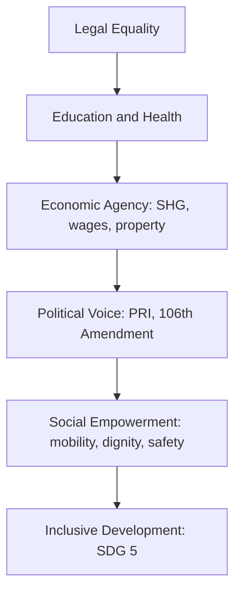

### Context — Women in Indian society

Indian society has historically been patrilineal and patriarchal: property, ritual authority, and public decision-making centred on men, while women's roles were defined through marriage, motherhood, and domestic labour, often under purdah, child marriage, and dowry systems in many regions. The nineteenth century opened a reform arc — Raja Rammohun Roy campaigned against sati (abolished 1829); Ishwar Chandra Vidyasagar pushed the Widow Remarriage Act 1856; Jyotirao and Savitribai Phule opened schools for girls in Pune (1848); Pandita Ramabai worked on women's education; Gandhi mobilized women in nationalist struggle through Kasturba Gandhi, Sarojini Naidu, and Aruna Asaf Ali. Independent India promised formal equality through the Constitution, yet son preference, violence, low workforce participation, unpaid care burden, and under-representation at economic and political apex persist. The central analytical tension is legal progress versus social lag — how constitutional guarantees translate into lived freedom for half the population.

### Changing status of women — continuity and change

**Legal and political gains.** The Constitution guarantees equality (Articles 14, 15, 16), directs the state toward adequate livelihood, equal pay, dignity, and maternity relief (Articles 39(a)(d)(e), 42), and enjoins citizens to renounce practices derogatory to women's dignity (Article 51A(e)). The 73rd and 74th Amendments (1992) reserve not less than one-third of seats and chairpersons for women in Panchayati Raj and urban local bodies — some states adopted 50% voluntarily. The 106th Constitutional Amendment (2023) — Nari Shakti Vandan Adhiniyam — provides 33% reservation for women in Lok Sabha and State Assemblies (implementation phased post-delimitation/census). Personal law reforms include Hindu Marriage Act 1955, Special Marriage Act, and Muslim Women (Protection of Rights on Marriage) Act 2019 criminalizing triple talaq.

| Domain | Milestone | Significance |
|--------|-----------|--------------|
| Constitution | Articles 14, 15, 16 | Equality, non-discrimination, equal opportunity |
| DPSP | Articles 39(a)(d)(e), 42 | Livelihood, equal pay, dignity, maternity |
| Panchayati Raj | 73rd/74th Amendments | ≥33% PRI/ULB seats for women |
| Parliament | 106th Amendment (2023) | 33% LS/Assembly reservation |
| Personal laws | HMA 1955, Triple Talaq Act 2019 | Marriage reform, divorce protection |

**Social and educational indicators.** Female literacy rose from roughly 9% (1951) to about 70% (Census 2011); gender gap narrowed but rural-tribal pockets remain weak. NFHS-5 (2019–21) shows more women with 10+ years schooling; sex ratio at birth improved in several states though son preference persists in Haryana, Punjab, and UP belt historically. MMR declined toward SDG targets; anaemia, nutrition, and reproductive health access remain concerns. Female LFPR stays low (~24%, PLFS 2022–23) versus men — explained by unpaid care work, safety deficits, social norms, and lack of decent work; urban educated women face glass ceilings despite Companies Act provisions.

**Persistent challenges.** Violence spans dowry deaths, domestic cruelty (498A), sexual assault, harassment, acid attacks, trafficking, and cyber crimes — rooted in patriarchal control and economic dependency. Economic gaps include wage disparity, limited land ownership despite HSA 2005, and informal sector vulnerability. PRI reservation created mass grassroots leadership; parliament and corporate apex remained male-dominated until 106th Amendment.

### Major women's organisations — timeline and roles

| Organisation | Founded | Key figures | Primary contribution |
|--------------|---------|-------------|----------------------|
| AIWC | 1927, Delhi | Margaret Cousins, Sarojini Naidu, Kamaladevi Chattopadhyay | Education, health, legislative reform |
| NFIW | 1954 | Left-led federation | Working women, peasants, anti-price rise, legal aid |
| SEWA | 1972, Ahmedabad | Ela Bhatt | Union + cooperative + bank for informal sector |
| MKSS | 1990s, Rajasthan | Aruna Roy, Nikhil Dey | RTI movement, jan sunwai, wage transparency |
| Mahila Samakhya | 1989 | MoWCD | Education for empowerment, rural/tribal collectives |
| Kudumbashree | 1998, Kerala | State mission | NHG network, micro-enterprise, disaster response |
| SHG–Bank Linkage | NABARD 1992 | NABARD, DAY-NRLM | Credit, insurance — 12+ crore women linked |
| NCW | 1992 | Statutory body | Investigate, recommend, review laws |

Typology: national federations (AIWC, NFIW); trade/livelihood unions (SEWA); rights CSOs (MKSS); state missions (Kudumbashree); government programme collectives (Mahila Samakhya, SHGs under DAY-NRLM). NCW is statutory watchdog, not grassroots collective — distinguish in answers.

### Women's organisations and rural development

SHGs under DAY-NRLM provide revolving funds, bank linkage, and skill training — women move from subsistence to dairy, handicrafts (GI-tagged), and petty trade, raising household income and child nutrition spillovers. The 73rd Amendment enables women sarpanches to prioritize water, sanitation, mid-day meals, and ICDS when supported by collectives — visible in Rajasthan, UP, and Bihar. ASHA and Anganwadi workers, backed by Mahila Arogya Samitis, strengthen immunization and nutrition under Poshan Abhiyan. MKSS-style social audits expose MGNREGA and PDS corruption through RTI Act 2005. Grassroots groups train on DV Act 2005, dowry laws, and inheritance rights. Swachh Bharat mahila mandals drove toilet construction and menstrual hygiene. Limits: elite capture in some SHGs, debt distress from commercialized microcredit, pati-panch proxy sarpanches, funding dependence on government schemes.

### Women empowerment — dimensions and inclusive development link

| Dimension | Indicators / tools | Development link |
|-----------|-------------------|------------------|
| Economic | Wages, MGNREGA workdays, property, MSME | Household income, child nutrition/education |
| Political | PRI reservation, voting, 106th Amendment | Voice in water, roads, schools allocation |
| Social | Education, mobility, freedom from violence | Breaks intergenerational poverty |
| Legal | Courts, One Stop Centres, Mahila Police | Converts paper rights to remedies |

Why social empowerment precedes inclusive development: without social voice, credit and property may be controlled by male kin (capabilities remain unrealized per Amartya Sen); education is undermined by early marriage; political reservation becomes ineffective under proxy rule; violence damages mental health and work attendance — imposing development costs of patriarchy. India's demographic dividend requires gender-equal human capital; sidelining half the population undermines SDG 5 and sustainable growth.

### Crime against women — data, debate, root causes

NCRB Crime in India records cruelty by husband/relatives (498A), assault, kidnapping, rape (376), dowry deaths (304B), POCSO offences, acid attacks, and cyber harassment. Registered cases show upward trajectory — multi-causal, not purely rising violence.

| Factor | Explanation |
|--------|-------------|
| Better reporting | Nirbhaya 2012 shock, helplines (181), OSCs, media awareness |
| Legal expansion | POCSO 2012, POSH 2013, IT Act cyber offences codified |
| Persistent patriarchy | Dowry, son preference, alcohol, economic dependency |
| Under-reporting | Rural, migrant, Dalit-Adivasi women; marital rape gap; stigma |

Institutional response: Nirbhaya Fund (2013), Mission Shakti (2021), fast-track courts, POSH Act 2013. Verdict: partially agree — registered crimes increased; both real violence burden and better registration explain trend. Low conviction rates sustain impunity.

### Constitutional and policy framework

Articles 15(3), 39(d), 42, 243D/243T, 106th Amendment; Beti Bachao Beti Padhao (2015); Mission Shakti; Maternity Benefit (Amendment) Act 2017 (26 weeks). Key laws: Dowry Prohibition 1961; DV Act 2005; Vishaka 1997 → POSH 2013; POCSO 2012; Triple Talaq Act 2019.

### 106th Amendment significance

Historically women comprised less than 15% of Lok Sabha. Reservation corrects democratic deficit; female legislators often prioritize health, education, safety; visible leadership inspires girls' education; complements PRI pipeline from 73rd Amendment. Implementation phased — not instantly operational. Needs party democracy, violence-free elections, economic base — avoid tokenism and proxy candidacy.

### SHGs — economic and social empowerment

NABARD SHG–Bank Linkage (1992) and DAY-NRLM: financial inclusion for rural poor women; livelihood diversification; social capital through regular meetings; government last-mile delivery platform; Kudumbashree model at scale. Risks: over-indebtedness, commercial MF abuse, elite capture — livelihood-first design essential.

### Social empowerment of women and inclusive development — elaboration

Social empowerment (education, dignity, freedom from violence, decision-making) is foundational because economic and political empowerment without transformed social norms fails. Girl's education and delayed marriage (NFHS-5 link) improve child health and break intergenerational poverty. Social restrictions on mobility and safety depress LFPR. PRI and 106th Amendment reservation works when women attend meetings and speak freely — not as proxies. Constitution Articles 15(3) and DPSP make inclusion moral and legal obligation, not charity. Violence blocks development through mental health and work attendance costs.

### Historical arc — from reform to constitutional equality

The nineteenth-century reform phase established precedent that social practice could be changed by law and movement combined — Roy's sati abolition (1829) proved scriptural reinterpretation plus colonial legislation could override custom. Phules' girls' school (1848) attacked Brahminical gatekeeping of knowledge. Gandhi's mass mobilization of women in Salt March and Khadi normalized female public political presence — not merely elite club reformism. Post-1950, Constitution promised equality but Nehru-era planning prioritized industrial growth over gender-transformative social policy — women's status improved unevenly: legal rights advanced faster than social practice (proof: dowry deaths persist despite 1961 Act; LFPR fell in some decades despite rising literacy). 1970s–90s autonomous women's movement (Shahada, anti-rape, anti-dowry campaigns) plus global feminist discourse shaped DV Act 2005 and POSH 2013. 73rd Amendment (1992) was watershed — millions of women entered formal political space as PRI members. 106th Amendment (2023) scales this to Parliament — completing arc from reform to representation, though social empowerment gaps remain.

### Contemporary relevance

106th Amendment (2023); Mission Shakti and Mission Vatsalya; Digital Shakti for cyber safety; NFHS-5 for SRB, anaemia, spousal violence; Poshan 2.0, Anaemia Mukt Bharat; gig economy and labour codes debate; SDG 5.

### Integrated synthesis — women, development, and the state

The relationship between women's status and national development is bidirectional. When women gain education and health, household fertility falls, child nutrition improves, and human capital formation accelerates — NFHS-5 documents inverse correlation between women's schooling years and early marriage. When women lack social empowerment, economic assets fail to translate into agency — microcredit reaches SHG accounts controlled by male kin; property titles under Hindu Succession Amendment 2005 remain socially denied in village practice. Political reservation creates visibility — PRI sarpanches deliver water and sanitation in Rajasthan and UP studies — but pati-panch proxy undermines voice. Crime data requires nuanced reading: rising NCRB registration reflects awareness post-Nirbhaya as much as violence burden; under-reporting among Dalit-Adivasi-migrant women persists; conviction rates low. Organisations remain indispensable intermediaries between constitutional promise and lived freedom — AIWC for policy advocacy, SEWA for informal sector, MKSS for transparency, SHGs for scale — but each model carries limits (debt, capture, co-option) requiring accountable design.

### Limits and balanced view

Legal equality ≠ lived equality — police, courts, khap panchayats. Reservation without capacity building and economic base yields tokenism. SHG success uneven — Andhra microfinance crisis caution. NCRB ≠ conviction rates or unreported crime. Credit grassroots Dalit-Adivasi movements alongside elite clubs. Status improved ≠ full equality. Sati banned ≠ all harmful customs ended. POSH covers private sector. Critical examination requires debt distress, elite capture, co-option limits.
