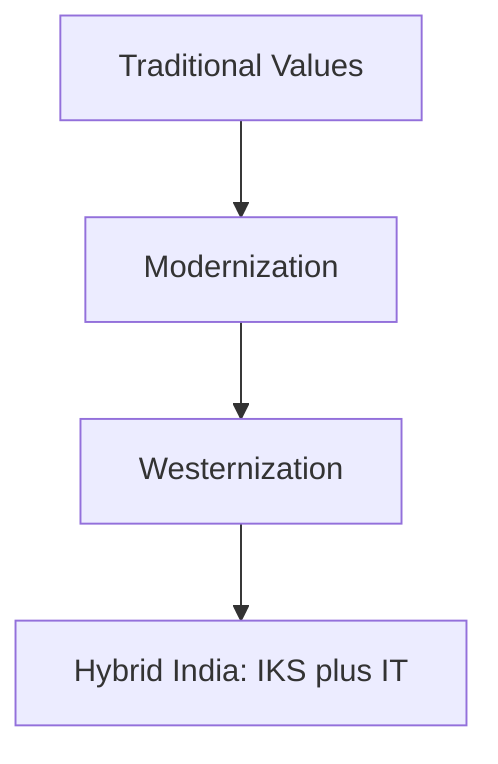

### Context — Tradition, modernity, and the West

Indian society carries ancient value systems — dharma, karma, ahimsa, joint family, guru-shishya parampara, religious pluralism — continuously reinterpreted through Bhakti, Sufi, and reform movements and the colonial encounter. **Modernization** (sociological) denotes structural transformation toward rationality, scientific outlook, achievement orientation, occupational specialization, and universalistic norms. Yogendra Singh (*Modernization of Indian Tradition*, 1973) argues India modernizes through tradition, not by erasing it. **Westernization** (M.N. Srinivas) means adoption of Western habits and institutions — dress, diet, language, marriage forms, secular education — often starting with upper castes/classes, distinct from **sanskritization** (emulating upper-caste Hindu ritual status). D.P. Mukerji viewed tradition and modernity in dialectical tension. Critical evaluation requires positive, negative, and synthesis — never one-sided glorification or rejection.

### Traditional Indian values — core reference list

| Value cluster | Traditional expression | Modern/Western pressure |
|---------------|------------------------|-------------------------|
| Ethical-spiritual | Dharma, ahimsa, moksha | Secular rationalism, utilitarianism |
| Social organization | Joint family, patriarchy, filial duty | Nuclear family, individual rights |
| Knowledge | Guru-shishya, oral tradition, IKS | Formal schooling, English, STEM |
| Cosmology | Vasudhaiva kutumbakam, sarva dharma | Nation-state citizenship |
| Economy | Tyaga, seva, frugality, jajmani | Consumerism, market self-interest |
| Nature | Sacred ecology | Industrial extraction, climate crisis |

### Modernization — features and Indian trajectory

Yogendra Singh: modernization produces structural differentiation — caste-jati partially gives way to class, occupation, education as status markers; little tradition (village) interacts with great tradition (Sanskritic) and modern institutions. Nehruvian scientific temper — Constitution, planning, IITs, ISRO — framed modernization as nation-building. Legal reforms — Hindu Marriage Act 1955, anti-dowry laws, Article 17 — reform tradition through modern law. Selective adaptation persists: caste endogamy, arranged marriage, ritual festivals (M.S.A. Rao, André Béteille).

### Westernization — mechanisms and social layers

Colonial phase: English, railways, Western medicine, Christianity, Victorian morality — Macaulay Minute 1835 aimed at "interpreters." Post-Independence: Bollywood Western dress, cricket, parliamentary democracy — Western forms with Indian content. LPG era: MNC lifestyle, social media, Valentine's Day debates, fast food — accelerated among urban youth. Srinivas: westernization accompanies upward mobility — status strategy.

### Impact on traditional values — critical evaluation matrix

**Positive/transformative:** human rights and constitutional morality challenge untouchability and gender injustice — reframing Bhakti-Sufi equality ethics; women's literacy and Savitribai Phule lineage extended by modern schooling; democracy and rule of law enable accountable governance; scientific medicine and technology improve life quality without abandoning spiritual pluralism.

**Negative/strains:** materialism erodes frugality and tyaga; individualism versus joint family creates elderly care crises; English hegemony creates elite-mass divide — NEP 2020 multilingualism responds; homogenized youth culture triggers moral panic; IKS sidelined in colonial curricula until revival.

**Synthesis:** India selectively absorbs West while reasserting identity — arranged marriage with apps, festivals plus malls. Necessary modernization of oppressive customs (sati, untouchability); risk of materialism and rootlessness.

### Western impact on Indian education — historical layers

| Phase | Milestone | Impact |
|-------|-----------|--------|
| Colonial | Macaulay 1835 | English medium — babu class disconnected from masses |
| Colonial | Wood's Dispatch 1854 | Mass schooling framework |
| Colonial | Universities 1857 | Professional classes, nationalist intelligentsia |
| Post-1947 | IITs, Kothari Commission | Science-technology focus |
| LPG era | Private schools, IB, Kota coaching | Exam culture, English premium |
| Contemporary | NEP 2020 | IKS, multilingual, holistic |

Gandhi's Nai Talim: craft, vernacular, non-violence — rejected colonial literary education. Tagore's Visva-Bharati: global humanism without mimicry. Positives: literacy expansion, IIT/IIM pipeline, RTE 2009 access. Negatives: rootlessness, coaching factories, student mental health crisis, craft deskilling. Ambedkar, Kalam, global diaspora prove empowerment through hybridity.

### Indian vs Western paths to modernity

| Dimension | Western | Indian |
|-----------|---------|--------|
| Secularization | Church decline | Festivals thrive with science |
| Individualism | Autonomous self | Rights via Constitution; family identity unit |
| Industrialization | Factory proletariat | Services leapfrogging; informal sector |
| Knowledge | Enlightenment rationalism | NEP 2020 IKS plus STEM |

India cannot be judged by pure Western template — Yogendra Singh's modernity is distinctive synthesis.

### Reform movements — tradition modernized before LPG

Raja Rammohun Roy (sati abolition 1829); Phules (girls' education 1848); Vivekananda (1893 Chicago — universal Vedanta); Gandhi (Swadeshi, Nai Talim); Ambedkar (Constitution, annihilation of caste). Thinkers: Srinivas (sanskritization/westernization); Yogendra Singh (modernization of tradition); Mukerji (dialectical); Ashis Nandy (plural knowledge critique).

### NEP 2020 and education decolonization

IKS in higher education; multilingual mother-tongue base; holistic vocational curriculum; critical thinking vs rote; Bhashini for regional AI. Limits: implementation funding, teacher training, exam inertia. English retained — balance not abolition.

### Deep dive — modernization of tradition (Yogendra Singh)

Yogendra Singh rejected the linear Western model that assumed tradition must die for modernity to arrive. What he observed in India was structural differentiation: occupational roles multiplied beyond caste-defined templates; universalistic laws (Constitution, IPC) competed with particularistic norms (personal laws, khap decisions); scientific institutions (ISRO, ICMR) coexisted with ritual calendars (Kumbh, Eid, Gurpurab). How this works in practice: a Dalit entrepreneur may westernize consumption (SUV, English-medium children) while sponsoring village temple renovation (sanskritization); a Muslim professional observes Ramadan while working in a multinational firm governed by global HR codes. Why this matters analytically: India cannot be classified as "traditional" or "modern" — both operate in the same household. Proof: NFHS-5 shows rising female education (modern) alongside persistent son preference in some states (traditional); UPI digital payments (modern) fund wedding dowries (traditional practice despite law).

### Deep dive — Western impact on education (critical layers)

Macaulay's 1835 Minute aimed to create a class "Indian in blood and colour, but English in taste, in opinions, in morals, and in intellect" — interpreters between British and the governed. What it achieved: English became the language of courts, higher administration, and elite opportunity — creating a bifurcated society where vernacular masses and English elite lived in parallel worlds. Wood's Dispatch 1854 systematized departmental education and grants-in-aid, laying infrastructure for mass schooling that reformers later expanded. Universities of 1857 (Calcutta, Bombay, Madras) produced the nationalist intelligentsia — lawyers, journalists, scientists — who used Western education to challenge colonial rule (proof: Gandhi trained as barrister; Ambedkar held Columbia and LSE degrees; Tagore engaged globally from Bengali roots).

Post-1947, Kothari Commission (1964–66) and IIT/IIM creation prioritized STEM for nation-building — further Western curricular tilt. LPG era intensified English premium through private international schools, IB boards, and Kota coaching factories producing IIT entrants but also student suicide crises. NEP 2020 responds by embedding IKS, multilingual instruction till Grade 5+, vocational exposure, and critical thinking — attempting education decolonization without abandoning scientific universalism. Gandhi's Nai Talim and Tagore's Visva-Bharati remain reference points for alternative pedagogy: craft-centred vernacular learning versus cosmopolitan humanism.

### Contemporary relevance

NEP 2020 IKS; Ek Bharat Shreshtha Bharat; International Yoga Day; Ed-tech DIKSHA; Bhashini regional language tools.

### Critical evaluation — traditional values under dual pressure

Modernization attacks inequality embedded in tradition — untouchability, sati, child marriage, gender subordination — through Constitution (Art 14–17), courts, and reform movements (Roy, Phule, Ambedkar). Westernization introduces lifestyle stratification — English schools, malls, nuclear families, consumer debt — that can erode tyaga, joint family elder care, and regional language pride without replacing them with equal universalistic solidarity. Indian hybrid outcomes prove selective synthesis: democracy plus dharma discourse; IIT plus joint festival reunions; NEP 2020 IKS plus STEM — neither pure tradition nor pure Western copy. Education critical layer: Macaulay created English elite-mass divide; Wood's Dispatch and 1857 universities built institutional capacity; Gandhi-Nai Talim and Tagore-Visva-Bharati offered alternatives; LPG coaching culture intensified stress; NEP 2020 attempts decolonization through multilingual IKS integration. Japan comparison: modern institutions without cultural self-destruction — India follows similar selective path per Yogendra Singh. Avoid nostalgic uncritical tradition praise (sati was traditional) and avoid Western supremacy (Ambedkar, Kalam used Western education for justice).

### Additional depth — value clusters under pressure and education stress

Dharma under pressure: market rationality measures success by income not righteous conduct — yet dharma discourse persists in politics (Ram Mandir, ethical AI debates invoking Indian philosophy). Ahimsa under pressure: industrial extraction, factory farming, communal violence — yet Gandhi's legacy invoked in environmental and peace movements. Joint family under pressure: nuclear residence but joint responsibility during crisis — festival economy and wedding networks maintain kin collectivity. Vasudhaiva kutumbakam revived in Vaccine Maitri diplomacy — traditional value repurposed for global age. Guru-shishya parampara under pressure: YouTube replaces ashram for classical music learning — continuity through new medium. Western education mental health crisis: Kota suicides, NEET pressure, coaching class dominance — LPG-era hyper-competition damages youth; NEP 2020 holistic education response. Ashis Nandy warns homogenizing modernity erases plural knowledge — IKS revival is intellectual counter-movement. Periyar and Ambedkar used modernity against traditional hierarchy — modernization can be emancipatory not only destructive. Comparative: Turkey, Indonesia — Muslim-majority nations combining faith and modern institutions — India comparable selective synthesis path.

Critical evaluate answers on traditional values require named proof: sati abolition (modern law vs traditional practice), joint family nuclearization (Census household size), English premium (NEP multilingual response), IKS revival (Ayurveda in NEP), mental health crisis (Kota coaching). Distinguish modernization from westernization explicitly — Panchayati Raj and ISRO are modern Indian institutions without Western lifestyle mimicry. Gandhi and Tagore offer indigenous critiques of colonial education — not only Western import story.

### Western impact on education — expanded critical examination

Colonial education created structural dualism persisting today: English-medium elite accesses global universities, corporate careers, and state power; vernacular-medium masses face limited mobility despite RTE 2009 access expansion. Macaulay intended interpreters — what emerged was nationalist elite who used English to demand freedom (Gandhi, Nehru, Ambedkar all English-educated critics of colonialism). Wood's Dispatch created departmental hierarchy — directorates, inspectors, grants-in-aid — still recognizable in today's NCERT-State board structure. 1857 universities produced lawyers who led Congress — education as anti-colonial weapon.

Post-1947 IIT/IIM creation prioritized STEM for development — further Western curricular orientation. LPG-era private international schools and coaching factories (Kota, Hyderabad) intensified exam hyper-competition — student suicide epidemic questions human cost of meritocracy. NEP 2020 responds holistically: IKS in higher education, mother-tongue instruction early grades, vocational integration, credit bank flexibility — attempting decolonization without abandoning scientific universalism. Gandhi's Nai Talim remains moral reference — education through productive craft, not rote literacy alone. Tagore's Visva-Bharati — creative synthesis of East and West. Critical verdict: Western education built institutional capacity and global connectivity; also created elite-mass divide, rootlessness, coaching stress, and IKS marginalization — NEP 2020 is corrective work in progress, not completed decolonization.

### Limits and balanced view

Modernization ≠ Westernization. Westernization not all bad — democracy, medicine, universities. Traditional values not wholly good — sati, caste, patriarchy reformed. Macaulay dialectical — institutions plus elite disconnect. Gandhi vs Tagore different education critiques. Sanskritization ≠ westernization. NEP does not end English. Religion adapts — Bhakti revival, festival economy. Critical evaluate = pros and cons mandatory. Western education impact continues post-1947. IKS plus STEM, not anti-science. Joint family modified continuity.
