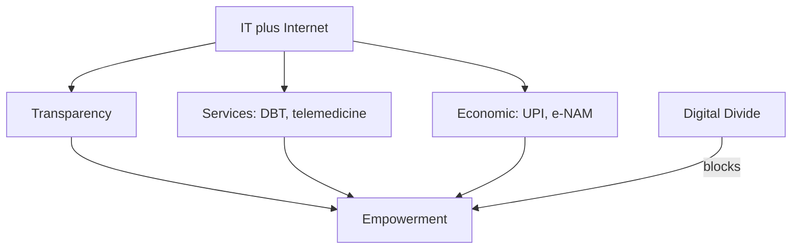

### Context — Social empowerment in India

Social empowerment is the process by which marginalized groups — SC, ST, OBC, women, disabled, religious minorities — acquire capabilities, rights awareness, economic assets, political voice, and social dignity to participate equally in development. Amartya Sen and Martha Nussbaum define empowerment as expanded real freedoms, not merely formal legal equality. Constitutional vision: Art 38, Art 46 (ST/SC promotion), Fundamental Rights, reservation (Art 15(4), 16(4), 243D), Fifth/Sixth Schedule protections. This analysis covers IT/Internet empowerment broadly and Scheduled Tribe barriers specifically.

### Dimensions of social empowerment

| Dimension | Mechanisms | Examples |
|-----------|------------|----------|
| Political | Reservation, PRI, voting | 73rd ST reservation, PESA gram sabha |
| Economic | Land, credit, livelihood | FRA titles, MGNREGA, TRIFED MSP |
| Social | Anti-discrimination | SC/ST PoA Act, language protection |
| Educational | Scholarships, EMRS | Eklavya Model Residential Schools |
| Digital | Connectivity, e-services | CSCs, DBT, telemedicine |

### IT and Internet — role in social empowerment

**Transparency:** RTI online; social media (#MeToo, farmer protests); MyGov participation. **Service delivery:** Digital India 2015 — DBT via JAM (Jan Dhan-Aadhaar-Mobile) reduces leakage for MGNREGA, LPG PAHAL; UMANG app; e-Sanjeevani telemedicine; DIKSHA education platform. **Economic inclusion:** UPI for street vendors and SHGs; e-NAM mandi prices (uneven); gig platforms with precarity. **Political mobilization:** vernacular YouTube coaching democratizes knowledge; WhatsApp awareness plus misinformation risk. **Open Government Data** for activist research.

### Digital divide — limits

| Gap | Who affected | Consequence |
|-----|--------------|-------------|
| Connectivity | Tribal hamlets, NE | BharatNet delays |
| Gender | Rural women | Lower phone ownership |
| Language | Non-English | App exclusion |
| Literacy | Elderly, landless | Cannot navigate e-gov |
| Misinformation | WhatsApp | Mob violence |
| Aadhaar errors | Poorest, migrants | Benefit exclusion |

IT/Internet are force multipliers where access and rights exist — without structural inequality addressed, digital tools reproduce gaps. Evaluation requires limits alongside gains.

### Scheduled Tribes — constitutional framework

STs (~8.6%, Census 2011; 705 groups) under Art 366(25). Art 46 DPSP: promote ST educational/economic interests, protect from injustice. Art 15(4)/(5), 16(4)/(4A): reservation. Art 244 + Fifth Schedule: Governor, Tribes Advisory Council (MP, Chhattisgarh, Jharkhand, Odisha, Rajasthan, Gujarat, Maharashtra, AP, Telangana, Himachal). Sixth Schedule: autonomous councils (Assam, Meghalaya, Tripura, Mizoram). Art 338A: NCST (2004). PESA 1996: gram sabha consent for land, minerals — weak implementation. FRA 2006: individual/community forest rights — slow titles, eviction conflicts.

### Main barriers to ST empowerment

**Land, forest, displacement:** alienation by moneylenders and settlers; mining/dam displacement (Odisha bauxite, Vedanta, Narmada) without fair R&R; FRA non-implementation vs forest department; evictions (Kaziranga conflicts). **Education and health:** low literacy especially ST women; dropout, child labour, migration; EMRS insufficient; malnutrition, malaria, TB, sickle cell; distant PHCs; witch-hunting, trafficking (Jharkhand, Odisha). **Governance:** PESA rules not notified — gram sabha bypassed on mining; welfare corruption; Naxal zones (Chhattisgarh, Jharkhand, Odisha) — schools closed. **Discrimination and culture:** untouchability at tribal-plain interface; language loss; alcohol exploitation, bonded labour. **Economy:** MFP dependence — TRIFED MSP helps but volatility; seasonal migration without social security.

### Forest Rights Act 2006 significance

IFR (cultivation, residence security); CFR (collective management, MFP, sacred groves); Community Resource Rights (grazing, fishing). Claims at gram sabha — democratic empowerment. Synergy with PESA. Implementation gaps: low acceptance, evictions, forest dept resistance. Evidence: CFR can improve forest cover under community management. Paradigm: protect forests with tribals, not from tribals.

### Digital India for marginalized

BharatNet, CSCs in blocks, DBT via JAM, UMANG, DigiLocker for migrants, DIKSHA/SWAYAM, UPI inclusion. Limits: PVTG offline pockets, literacy, gender phone gap — needs paired legal rights and literacy.

### Schemes table

| Scheme | Purpose |
|--------|---------|
| TRIFED / MSP for MFP | Fair forest produce price |
| EMRS | Quality ST education — 728 target |
| Vanbandhu Kalyan Yojana | Integrated tribal development |
| PM-JANMAN (2023) | PVTG housing, water, roads, mobile |
| Dharti Aaba Abhiyan (2024) | 5 crore tribal beneficiaries |
| GI tags — Warli, Dokra | Cultural-economic empowerment |

Traditional Knowledge Digital Library (CSIR) against bio-piracy. NCST reports on eviction. SC FRA-eviction episode (2019). PESA 2022 rules debate — Centre-state friction.

### IT/Internet — channel-by-channel evaluation

**RTI online and transparency:** Citizens file RTI applications digitally, reducing travel cost for rural complainants — MKSS jan sunwai model scaled through information access. Limit: illiterate cannot draft queries; appeals process still slow. **DBT-JAM trinity:** Jan Dhan accounts plus Aadhaar plus mobile link subsidies (MGNREGA wages, LPG, pensions) directly — reduced middleman leakage documented in PAHAL and wage payment studies. Limit: Aadhaar biometric failures, migrant workers without local address excluded. **UPI revolution:** NPCI's Unified Payments Interface enables instant peer-to-peer and merchant payments — street vendors, SHG women, auto drivers participate in formal digital trail. Limit: smartphone and connectivity required; digital fraud targets elderly. **Telemedicine (e-Sanjeevani):** COVID accelerated remote consultation for rural and tribal blocks — health empowerment through access. Limit: diagnostic and surgical care still needs physical facilities. **Social media mobilization:** #MeToo India, Nirbhaya protests, farmer movement used Twitter, Facebook, WhatsApp for coordination — voice amplification. Limit: misinformation, communal rumour, algorithmic polarization — same tools disempower.

Digital India (2015) pillars — infrastructure (BharatNet), governance (UMANG, DigiLocker), literacy (PMGDISHA) — aim inclusion but implementation uneven. Evaluation verdict for exams: IT/Internet are empowerment accelerators where literacy, connectivity, and legal rights exist; without addressing landlessness, caste discrimination, and gender violence, digital tools reproduce existing gaps — force multiplier, not substitute for structural reform.

### ST empowerment — community-specific barriers and FRA-PESA synergy

ST communities are not homogeneous — 705 notified groups from Bhil and Gond (central India) to Naga and Mizo (NE) to PVTGs (Jarawa, Sentinelese protection). PVTGs under PM-JANMAN (2023) face extreme isolation — connectivity and health outreach prioritized. Central Indian tribes experience mining displacement (Odisha bauxite, Chhattisgarh iron ore) — FRA community forest rights offer alternative livelihood through MFP management if titles granted. NE tribes navigate Sixth Schedule autonomy versus development pressure — AFSPA legacy and insurgency complicate governance delivery.

FRA 2006 and PESA 1996 together: gram sabha consent required for land acquisition and minor minerals (PESA) plus forest rights recognition (FRA) — double empowerment if both implemented. Reality: many states delayed PESA rules notification; forest department resists CFR titles; eviction drives (2019 Supreme Court order episode) triggered political mobilization — rights on paper versus land mafia and extractive capital on ground. NCST constitutional status (Art 338A) provides institutional voice — cite reports in answers for contemporary evidence.

### Contemporary relevance

PESA implementation push; digital tribal connectivity; tribal university; IP rights on traditional knowledge; social empowerment of women requires social voice before economic assets usable (Sen).

### Social empowerment — IT plus ST — full exam scaffold

Social empowerment = agency across political, economic, social, educational, digital dimensions for SC/ST/OBC/women/disabled/minorities. Sen-Nussbaum capabilities: real freedoms not paper rights. IT/Internet channels: RTI transparency; DBT-JAM leakage reduction; UPI financial inclusion; e-Sanjeevani telemedicine; DIKSHA education; social media mobilization (#MeToo, farmers) — each with digital divide limits (connectivity, gender, language, literacy, Aadhaar exclusion, misinformation). Digital India: BharatNet, CSCs, UMANG — inclusion when paired with literacy and rights. ST barriers: land alienation; mining displacement (Odisha, Chhattisgarh); FRA non-implementation; PESA gram sabha bypass; education-health gaps; witch-hunting; Naxal governance vacuum; language loss; 705 heterogeneous communities — avoid monolith. FRA 2006: IFR, CFR, gram sabha claims — protect forests with tribals. Schemes: TRIFED MSP, EMRS, PM-JANMAN PVTG, Dharti Aaba 2024, GI crafts. Reservation necessary not sufficient. Evaluation: IT accelerates empowerment, never substitutes land rights, anti-atrocity enforcement, quality schools, and health access.

### Additional depth — SC/OBC/women intersection and digital governance

Social empowerment not ST-only though 2019 PYQ focuses ST: SC communities face untouchability despite Art 17 — PoA Act 1989 enforcement gaps; manual scavenging prohibition incomplete. OBC mobilization post-Mandal — political empowerment without full economic transformation for many jatis. Women: social empowerment prerequisite for inclusive development (2021 logic) — applies across groups. Disabled: RPwD Act 2016 rights awareness growing — accessibility in digital governance uneven. Minorities: Sachar deprivation limits economic empowerment despite formal citizenship. Common Service Centres (CSCs) — 5 lakh village-level entrepreneurs deliver PAN, passport, pension services — digital last mile; VLE income model empowers rural youth operator class. DIKSHA and SWAYAM MOOCs — education empowerment during COVID school closure. MyGov participatory platforms — weak but direction toward digital citizenship. Cybercrime against women and children — CCPWC scheme — digital disempowerment counter-current. Blockchain land records pilots — potential ST land titling transparency if scaled with FRA. Evaluation template: name channel (RTI, DBT, UPI), state benefit, cite limit (divide, exclusion, misinformation), conclude IT multiplies structural empowerment never replaces it. PM-JANMAN 100-day sprint for PVTG — 2023–24 contemporary anchor for tribal digital-health-housing integration.

IT empowerment evaluation template: channel (RTI/DBT/UPI/telemedicine) + benefit + digital divide limit. ST barriers: FRA-PESA synergy on paper, implementation failure on ground; PM-JANMAN for PVTG; TRIFED MSP; EMRS education; mining displacement in Odisha-Chhattisgarh. Reservation necessary not sufficient — land, health, education, anti-atrocity enforcement equally critical. Heterogeneous 705 ST groups — avoid monolithic answer. Social empowerment spans SC/OBC/women/disabled — not ST-only though 2019 PYQ focuses tribal barriers.

### FRA, PESA, and tribal self-governance — expanded

Forest Rights Act 2006 emerged from decades of tribal movement against colonial forest laws that criminalized traditional forest dwellers as encroachers. What FRA grants: Individual Forest Rights secure cultivation and residence; Community Forest Rights restore collective management of MFP, sacred groves, and grazing; Community Resource Rights protect access routes. How claims work: gram sabha initiates, forest rights committee verifies, district committee decides — democratic procedure embedding empowerment in village institution. Why implementation fails: forest department resists loss of control; state governments delay recognition; mining lobbies pressure for diversion; eviction drives continue despite pending claims — 2019 Supreme Court order episode mobilized national tribal protest.

PESA 1996 mandates gram sabha consent for land acquisition and minor mineral leases in Fifth Schedule areas — synergy with FRA if both operational. Reality: many states delayed PESA rules for decades; panchayat extension to scheduled areas incomplete; gram sabha meetings captured by elites or bypassed by district collectors. NCST (Article 338A) monitors violations — cite reports for contemporary answers. PM-JANMAN (2023) targets PVTGs with saturation approach — housing, road, mobile, health — acknowledging extreme marginalization. Dharti Aaba Janjatiya Gram Utkarsh Abhiyan (2024) scales integrated village development to five crore tribal beneficiaries. Empowerment requires land security plus services plus voice — any single pillar alone fails.

### Limits and balanced view

ST heterogeneous — 700+ communities, PVTGs especially vulnerable. Reservation necessary not sufficient. IT helps only with connectivity — PVTGs offline. Development vs conservation false binary — FRA recognizes community stewardship. Digital India reduced leakage but Aadhaar exclusion persists. Internet dual-edged — misinformation, surveillance. Evaluate IT = limits mandatory. EMRS gaps remain. Social empowerment not only digital — land, education, health equally critical.
