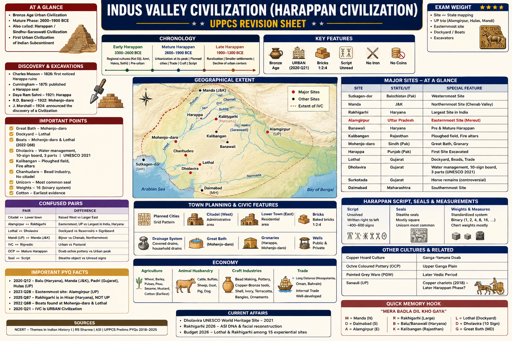

# Topic 2 — Indus Valley Civilization (Harappan Civilization)
### ★ UPPCS Revision Sheet — Lucent / PW style (one home per fact · no repetition · Practice ≥45)

<details>
<summary><strong>Covers syllabus</strong> (click to expand)</summary>

Indus Valley Civilization | Features of Harappan Civilization | Major Harappan Sites | Archaeological Sites and Excavations | Archaeological Sites of Uttar Pradesh | Major Ports of Ancient India | Harappan Economy | Harappan Trade | Town Planning | Drainage System | Agriculture | Craft Industries | Religion | Script | Seals | Weights and Measures | Dholavira | Rakhigarhi | Lothal Dockyard | Kalibangan | Banawali | Surkotada | Daimabad | Copper Hoard Culture | Ochre Coloured Pottery (OCP)

</details>

> **Sources baked in:** NCERT *Themes in Indian History* I, RS Sharma, ASI, UPPCS Prelims PYQs 2018–2025  
> **Exam weight:** ★★★ — site↔state, UP trio, eastern boundary, dockyard/boats, excavators  
> **Last verified:** August 2026  
> **Current Affairs:** Dholavira UNESCO **2021**; Rakhigarhi 2026 ASI DNA/facial reconstruction; Budget 2026 lists Lothal and Rakhigarhi among 15 experiential sites

---

## Quick Revision — Spine Only

```
Charles Masson 1826 noticed Harappa ruins | Cunningham 1875 published a Harappa seal
Sahni 1921 Harappa | Banerji 1922 Mohenjo-daro | Marshall 1924 announced a civilization
Early 3300–2600 | Mature 2600–1900 | Late 1900–1300 BCE
Bronze Age | URBAN (2020 Q21) | bricks 1:2:4 | script unread | no iron | no coins

W Sutkagen-dor | E Alamgirpur UP (2023 Q28) | N Manda J&K | S Daimabad MH
UP: Alamgirpur (Meerut) Hulas (Baghpat) Mandi (Bijnor) | Sanauli chariots 2018
Rakhigarhi = Hisar Haryana NOT UP (2025 Q87)

Great Bath = Mohenjo-daro | Dockyard = Lothal | Boats = MD + Lothal (2022 Q68)
Dholavira = water + 10-sign board + 3 parts | UNESCO 2021
Kalibangan = ploughed field + fire altars | Chanhudaro = beads, no citadel
Unicorn = most common seal | weights 16 | cotton earliest
2020 Q12: Balu-Haryana, Manda-J&K, Padri-Gujarat, Hulas-UP
```

### Confused pairs

| A | B | Difference | Hindi |
|---|----|------------|-------|
| Harappan | Indus Valley | Same culture; named after first site **Harappa** | हड़प्पा / सिंधु घाटी |
| Citadel | Lower town | Raised **west** platform vs larger **east** residential zone | दुर्ग / निम्न नगर |
| Alamgirpur | Rakhigarhi | **Easternmost, UP** vs **largest in India, Haryana** | आलमगीरपुर / राखीगढ़ी |
| Lothal | Dholavira | **Dockyard** vs **reservoirs + signboard** | लोथल / धोलावीरा |
| Mandi (UP) | Manda (J&K) | **Bijnor** vs **Chenab, northernmost** | मंडी / मांडा |
| IVC | Rigvedic | **Urban** vs **pastoral** | नगरीय / पशुपालक |
| OCP | Mature Harappan | Doab ochre pottery vs urban peak | गेरूआ मृद्भांड |
| Seal | Script | Steatite object vs unread signs on it | मुद्रा / लिपि |

---


## 2.1 Indus Valley Civilization

**Bronze Age urban culture | Mature ~2600–1900 BCE | also called Harappan**

- First urban civilization of the subcontinent; contemporary with Mesopotamia and Egypt.
- Named **Harappan** after **Harappa** (first excavated site). Geography is wider than the Indus: Ghaggar–Hakra (Saraswati belt), Gujarat, Haryana, eastern UP, northern Afghanistan.
- Some books say **Sindhu–Saraswati** civilization — same culture, different label.
- **Early Harappan** (~3300–2600 BCE): regional cultures (Kot Diji, Amri, Hakra, Sothi). Pre-urban, pottery, mud-brick.
- **Mature Harappan** (~2600–1900 BCE): planned cities, seals, weights, long-distance trade. This is what exams mean by “IVC.”
- **Late Harappan** (~1900–1300 BCE): de-urbanisation; Cemetery-H, Jhukar, Lustrous Red Ware (Rangpur); OCP overlap in the doab.
- Spread about **12.5–13 lakh km²**. West–east roughly Sutkagen-dor to Alamgirpur; north–south Manda to Daimabad.
- **West:** Sutkagen-dor (Makran). **East:** **Alamgirpur** (Meerut, UP). **North:** **Manda** (Jammu, Chenab). **South:** **Daimabad** (Maharashtra).
- About **1400+** sites known; under **100** fully excavated. Core cluster in Pakistan + Haryana–Rajasthan–Gujarat.
- Origin: **indigenous** growth from Mehrgarh / Early Harappan is the standard view. Mesopotamian-colony theory is outdated.
- Decline ~1900 BCE: climate shift, Ghaggar drying, floods, overuse of land. **Wheeler’s Aryan-invasion massacre** at Mohenjo-daro is **rejected**. No single agreed cause.
- Economy type in match-lists = **Urban** (not pastoral). Pastoral = Rigvedic.

> **Exam note:** Eastern boundary = **Alamgirpur**, not Rakhigarhi. IVC economy type = **Urban** (Rigvedic = pastoral).

**PYQ — UPPCS Prelims 2020, Q21**

Match List-I with List-II: A. Indus Valley Civilization  B. Later Vedic Society  C. Rigvedic Society  D. Medieval Period  
with 1. Pastoral  2. Land Lordism  3. Agrarian  4. Urban  

A. 4 2 3 1

B. 2 1 4 3

C. 3 4 1 2

D. 4 3 1 2

<details>
<summary>Show answer</summary>

**Ans: D** — IVC = Urban (4); Later Vedic = Agrarian (3); Rigvedic = Pastoral (1); Medieval = Land Lordism (2).

</details>

---

## 2.2 Features of Harappan Civilization

- **Planned cities:** grid streets; citadel (usually west) + lower town (east). Dholavira adds a **middle town**.
- **Burnt bricks** in ratio **1 : 2 : 4** (thickness : width : length), same idea from Punjab to Gujarat.
- **Covered drains**, house bathrooms, wells. Best at Mohenjo-daro; **weak at Kalibangan**.
- **Bronze** (copper + tin), lost-wax casting. **No iron. No coined money.**
- Steatite **seals**, wheel-made pottery, bead-making, cotton cloth.
- Script **undeciphered** (~400–600 signs).
- Public works: **Great Bath** (only Mohenjo-daro), granaries (Harappa, Mohenjo-daro), dockyard (Lothal).
- **No** identified palace or stone temple. No royal pyramid-tombs.
- Relatively few weapons; some sites still **fortified** (Dholavira, Surkotada, Kalibangan citadel).
- Cotton among the **earliest** in the world. Standard weights (binary, key unit **16**).

> **Exam note:** Iron plough / Ashokan-style temple / gold coins are **not** Harappan.

---

## 2.26 Social Organisation and Polity

- Harappan society was **urban and specialised**, but archaeologists have **not** identified a palace of a named king.
- The **"Priest-King"** steatite bust is an **interpretation**, not a proven title.
- **Merchants, seal-cutters, bead-makers, and bronze-smiths** formed a craft hierarchy fed by **agricultural surplus** in granaries.
- There is **no coined money**; exchange used **barter** and the **weight system** (key unit 16).
- Fortified sites show **defence**, but few weapons — the "peaceful civilisation" claim is partly true, partly oversimplified.

## 2.27 Early Harappan and Late Harappan Phases

- **Early Harappan** (~3300–2600 BCE): **Kot Diji**, **Amri**, **Hakra**, **Sothi** — before full cities.
- **Mature Harappan** (~2600–1900 BCE): planned cities, seals, script, Great Bath, Lothal dock.
- **Late Harappan** (~1900–1300 BCE): **de-urbanisation**; **Cemetery H** at Harappa; **Jhukar** and **Rangpur** ware.
- In the eastern doab, Late Harappan overlaps **OCP** then **PGW** — not Mature Harappan urbanism.

## 2.3 Major Harappan Sites

**Site ↔ river/state ↔ one signature find | Pakistan first, then India**

**Pakistan**

- **Harappa** stands on the **Ravi** in Pakistani Punjab.
- **Daya Ram Sahni** excavated it in **1921**.
- It has **six granaries** and **twelve working-floors**.
- Cemetery **R-37** includes coffin burial.
- Finds include a red-sandstone **male torso** and a bronze mirror.

- **Mohenjo-daro** means “mound of the dead” and lies in **Sindh**.
- **R.D. Banerji** excavated it in **1922**.
- The **Great Bath** is here. No other Harappan city has this exact public tank.
- An assembly or college building stands near the bath.
- The bronze **Dancing Girl** is about **10.5 cm** and was cast by the lost-wax method.
- The **Priest-king** is a steatite bust with a trefoil shawl.
- Boat models occur here. Population is often cited at about **35,000–40,000**.

- **Chanhudaro** in Sindh is a **bead factory** town with **no citadel**.
- **N.G. Majumdar** excavated it in **1931**.

- **Sutkagen-dor** on the Makran is the **western** sea-gate of the culture.
- **Sotka Koh** is the neighbouring Makran coastal site.
- **Kot Diji** in Sindh is an Early Harappan / pre-urban site.
- **Amri** is another Early Harappan site in Sindh.
- **Nausharo** is an Early-to-Mature sequence site.
- **Rehman Dheri** is a pre-urban planned settlement in the Gomal belt.
- **Gumla** is an Early Harappan site in the same northwest cluster.
- **Balakot** is a coastal site known for shell and fish.
- **Alladino** is another coastal craft site.

**India**

- **Dholavira** stands on Khadir island in **Kutch**.
- It is known for water **reservoirs** and a **10-sign board**.
- The city has **three** divisions and more **stone** architecture than the Indus brick cities.
- UNESCO inscribed it in **2021**.

- **Lothal** lies in the Ahmedabad belt on the **Bhogavo**.
- **S.R. Rao** excavated it.
- The **dockyard** is about **218 × 37 m**.
- A warehouse stood beside the dock.
- Lothal had a bead factory.
- Rice husk is reported here.
- A fire altar occurs at Lothal.
- Boat models also occur at Lothal.

- **Surkotada** in Kutch is a fortified settlement.
- **J.P. Joshi** reported **horse bones** here. The identification is **disputed**.

- **Nageshwar** in Gujarat is a **shell** workshop.
- **Rangpur** in Gujarat is a Late Harappan site with lustrous red ware.
- **Rojdi** in Gujarat is a Sorath Harappan settlement.
- **Desalpur** in Kutch is a fortified Harappan site.
- **Kuntasi** in Gujarat is a coastal craft and port-linked site.
- **Padri** in Gujarat was the 2020 match for **Gujarat**.
- **Bhagatrav** in Gujarat is a coastal Harappan site.

- **Kalibangan** in Hanumangarh, Rajasthan, stands on the **Ghaggar**.
- **B.B. Lal** excavated it.
- It is known for a **ploughed field** and **fire altars**.
- Terracotta cakes and camel bones occur. Drains are poorer than at Mohenjo-daro.

- **Banawali** in Fatehabad, Haryana, was excavated by **R.S. Bisht**.
- It has a **radial or oval** plan, a terracotta **plough**, and barley.

- **Rakhigarhi** in **Hisar, Haryana**, is the **largest** Harappan site in India.
- It has **seven mounds**. It is **not** in Uttar Pradesh.

- **Bhirrana** in Haryana is often called among the **oldest** Harappan settlements.
- **Balu** in Haryana was the 2020 match for **Haryana**.
- **Kunal** in Haryana is an Early Harappan site.
- **Farmana** in Haryana is a Mature Harappan cemetery and settlement.
- **Girawad** in Haryana is Early Harappan.
- **Mitathal** in Haryana is Harappan.

- **Ropar (Rupnagar)** on the Sutlej in Punjab was excavated by **Y.D. Sharma**.
- **Sanghol** in Punjab has Harappan and later levels.

- **Manda** on the Chenab in Jammu is the **northernmost** Harappan site.
- **Alamgirpur** on the Hindon in Meerut is the **easternmost** Harappan site.
- **Hulas** in Baghpat is an eastern Harappan habitation.
- **Mandi** in Bijnor, on the Ramganga, is in **Uttar Pradesh** (2021, 2025). Do not confuse Mandi with **Manda**.

- **Daimabad** on the Pravara in Maharashtra is the **southernmost** site.
- It yielded a bronze **chariot**.
- It also yielded bronze buffalo, elephant, and rhinoceros figures.

- **Shortughai** in Afghanistan is a **lapis lazuli** colony of the Harappans.

> **Exam note:** **Mandi is not Manda**. Rakhigarhi is not in Uttar Pradesh. Padri is Gujarat. Balu is Haryana. Hulas is Uttar Pradesh.

**PYQ — UPPCS Prelims 2020, Q12**

Match: A. Balu  B. Manda  C. Padri  D. Hulas  
with 1. UP  2. J&K  3. Haryana  4. Gujarat  

A. 3 2 1 4

B. 2 3 4 1

C. 2 4 3 1

D. 3 2 4 1

<details>
<summary>Show answer</summary>

**Ans: D** — Balu–Haryana, Manda–J&K, Padri–Gujarat, Hulas–UP.

</details>

---

## 2.4 Archaeological Sites and Excavations

**Who dug what | 1826 notice to 2018 Sanauli**

- **Charles Masson** in **1826** described the ruins at Harappa.
- **Alexander Cunningham** in **1875** published a Harappa seal, before the civilization was named.
- **Daya Ram Sahni** excavated **Harappa** in **1921**.
- **R.D. Banerji** excavated **Mohenjo-daro** in **1922**.
- **John Marshall**, as ASI Director General, announced a new Bronze Age civilization in **1924** in the *Illustrated London News*.
- **M.S. Vats** worked on the Harappa granary. He is the **2020 Bhimbetka distractor**.
- **N.G. Majumdar** excavated Chanhudaro in **1931**. He was killed in Sindh in 1938.
- **Mortimer Wheeler** dug at Harappa in **1946** and introduced grid-stratigraphy.
- Wheeler **did not discover** the Indus civilization.
- He pushed an Aryan-massacre reading of Mohenjo-daro that is now **dropped**.
- **S.R. Rao** excavated the Lothal dockyard in **1955–62**.
- **B.B. Lal** excavated Kalibangan, and later Hastinapur, OCP, and Mahabharata-related archaeology.
- **R.S. Bisht** excavated Dholavira and Banawali.
- **Y.D. Sharma** excavated Ropar.
- **J.P. Joshi** excavated Surkotada.
- **Amarendra Nath** and **Vasant Shinde** worked at Rakhigarhi.
- Dates rest on stratigraphy plus **C-14**. The exam Mature bracket is about **2600–1900 BCE**.
- **Sanauli** in Baghpat, Uttar Pradesh, was announced by ASI in **2018**.
- It yielded wooden coffins, copper antennae swords, and **chariot burials**.
- Sanauli is Late Harappan / OCP. It is **not** a Mature grid-city with a Great Bath.

> **Exam note:** Sahni is Harappa. Banerji is Mohenjo-daro. Wheeler is later method, not the discoverer.

---

## 2.5 Archaeological Sites of Uttar Pradesh

**Eastern fringe | smaller pottery-heavy sites | where UPPCS actually scores**

- Uttar Pradesh is the **eastern fringe** of Harappan culture, not the Indus core.

- **Alamgirpur** on the Hindon in Meerut marks the **eastern boundary** of the civilisation.
- **Hulas** in Baghpat is an eastern Harappan habitation site in Uttar Pradesh.
- **Mandi** on the Ramganga in Bijnor is also in **Uttar Pradesh** — do not confuse with **Manda** (Jammu).
- **Sanauli** in Baghpat (2018) has coffins, copper weapons, and **chariots**.
- Sanauli is Late Harappan / OCP. It is not a Mature urban Indus city.

- **Rakhigarhi** is in **Hisar, Haryana**, not Uttar Pradesh.
- **Kalibangan** is in Rajasthan.
- **Lothal** is in Gujarat.
- **Dholavira** is in Gujarat.
- **Surkotada** is in Gujarat.
- **Banawali** is in Haryana.
- **Balu** is in Haryana.
- **Bhirrana** is in Haryana.
- **Manda** is in Jammu and Kashmir.

> **Exam note:** UP site pair = **Mandi + Hulas**; Rakhigarhi is in Haryana. Eastern boundary = **Alamgirpur + Hulas**; Kalibangan and Lothal are not the eastern edge.

**PYQ — UPPCS Prelims 2025, Q87**

Which IVC sites are in present-day Uttar Pradesh? 1. Mandi  2. Rakhigarhi  3. Hulas  

A. 1 and 2

B. Only 3

C. 1 and 3

D. Only 1

<details>
<summary>Show answer</summary>

**Ans: C** — Mandi (Bijnor) and Hulas (Baghpat). Rakhigarhi = Hisar, Haryana.

</details>

**PYQ — UPPCS Prelims 2023, Q28**

The eastern boundary of the Harappan culture is indicated by which of the following?  
A. Harappa  B. Alamgirpur  C. Rakhigarhi  D. Manda

<details>
<summary>Show answer</summary>

**Ans: B** — Alamgirpur (Meerut, UP).

</details>

**PYQ — UPPCS Prelims 2021, Q100**

In which State of India is the Harappan Civilization site Mandi situated?  
A. Gujarat  B. Haryana  C. Rajasthan  D. Uttar Pradesh

<details>
<summary>Show answer</summary>

**Ans: D** — Bijnor, Uttar Pradesh. Not **Manda** (J&K).

</details>

**PYQ — UPPCS Prelims 2018, Q88**

Which centres related to Indus Valley are in Uttar Pradesh?  
I. Kalibanga  II. Lothal  III. Alamgirpur  IV. Hulas  

A. I, II, III, IV

B. I, II

C. II, III

D. III, IV

<details>
<summary>Show answer</summary>

**Ans: D** — Alamgirpur + Hulas.

</details>

---

## 2.6 Major Ports of Ancient India

**Harappan coast first | later historic ports are a separate syllabus lock**

- **Lothal** is the only widely accepted **artificial dockyard**, a basin with a spillway.
- A warehouse stood on a platform beside the basin.
- The site reached the Gulf of Khambhat via the Bhogavo and Sabarmati.

- **Sutkagen-dor** is a Makran coastal gate on the Arabian Sea.
- **Sotka Koh** is the neighbouring Makran coastal site.
- **Balakot** on the Pakistan coast has shell bangles and fish remains.
- **Alladino** is another Pakistan-coast craft site.
- **Kuntasi** is a Gujarat coastal workshop.
- **Bhagatrav** is a Gujarat coastal site.
- **Nageshwar** is the Gujarat **shell** industry site.

- Boat models or figures come from **Mohenjo-daro and Lothal** — not Dholavira alone.
- **Dholavira** is **not** that pair. It is inland Kutch water-harvesting.

**Later ports (same syllabus bullet; not Mature Harappan cities)**

- **Bharuch (Barygaza)** in Gujarat appears in the Periplus as a Roman-trade port.
- **Sopara** is a Konkan port.
- **Muziris** in Kerala was the Roman pepper port.
- **Kaveripattinam (Puhar)** is the Sangam Chola coast.
- **Arikamedu** near Puducherry yielded Roman amphorae.
- **Tamralipti** in Bengal served the east coast and Southeast Asia.

> **Exam note:** The dockyard is **Lothal**. Boat models are **Mohenjo-daro and Lothal**. Dholavira is not the port in that question.

**PYQ — UPPCS Prelims 2022, Q68**

From which archaeological site of the Indus Valley Civilization are figures or models of boats found?  
A. Dholavira and Bhagatrav  B. Harappa and Kot Diji  C. Mohenjo-daro and Lothal  D. Kalibangan and Ropar

<details>
<summary>Show answer</summary>

**Ans: C**

</details>

---

## 2.7 Harappan Economy

- Mixed: **agriculture + cattle + craft + long-distance trade**, organised from **cities**.
- Surplus grain in **granaries** (Harappa, Mohenjo-daro) fed specialists — bead-makers, seal-cutters, bronze-smiths, brick-makers.
- Exchange by **barter and weights**. **No coins.** Seals marked bundles, not a currency.
- Craft towns: Chanhudaro (beads), Nageshwar (shell), Lothal (beads + port).
- Do **not** import Mauryan **shreni** (guild) into IVC — that is a later institution.

> **Exam note:** 2020 match: IVC = **Urban**. “Harappan coin economy” is false.

---

## 2.8 Harappan Trade

- Mesopotamian texts call the region **Meluhha**. **Dilmun** = Bahrain entrepot. **Magan** = Oman (copper).
- **Exports:** carnelian beads, cotton cloth, ivory, timber, shell, peacock (in texts).
- **Imports / raw:** **lapis** (Badakhshan via **Shortughai**), copper (Khetri / Baluchistan), tin, silver, gold (Kolar hinterland is often cited).
- Steatite from Kirthar/Baluchistan; shell from Nageshwar and the Makran.
- Seals of Harappan type turn up in the Gulf and Sumer — proof of contact, not of political empire.
- Inland: ox-carts (terracotta models), river boats on Indus–Ghaggar.

> **Exam note:** Meluhha ≈ Harappan land. Shreni is **not** a Harappan guild.

---

## 2.9 Town Planning

**Grid streets | citadel west | lower town east | burnt brick**

- Streets run in a **grid**, crossing at right angles.
- Main roads run north–south and east–west.
- Street width is about **3 m to 10 m**.
- The **citadel** sits on a mud-brick platform.
- It is usually **west** and higher.
- The **lower town** is **east**, larger, and used for houses and craft.
- Houses use burnt brick and rooms around a **courtyard**.
- Many houses have a private **well** and **bathroom**.
- Houses are often **two-storeyed**, with a wooden stair.
- Ground-floor **windows rarely open on the street**.
- Street corners at Mohenjo-daro show **lamp-posts**.
- **Dholavira** uses more **stone** and has **three** units: citadel, middle town, and lower town.
- Dholavira is not a photocopy of Mohenjo-daro.
- **Banawali** has **radial or oval** streets.
- Fort walls exist at Dholavira, Surkotada, and the Kalibangan citadel.
- “Unwalled peaceful villages” is too simple.
- **No** palace of a named king has been identified.

> **Exam note:** The citadel is **west**. The Great Bath is **not** at every city.

---

## 2.10 Drainage System

**Covered brick street drains | house bathrooms | Great Bath only at Mohenjo-daro**

- Each house bathroom connected to a **covered brick street drain**.
- Soak-pits or cesspits stood at intervals.
- Manholes allowed cleaning.
- Bath floors were often made watertight with gypsum or bitumen, as at the Great Bath.
- The **Great Bath** at Mohenjo-daro is about **12 × 7 × 2.4 m**.
- It uses burnt brick plus bitumen, with steps on the north and south.
- Side rooms were used for changing.
- It is a **ritual tank**, not a sports pool.
- Kalibangan’s drainage is **not** in the same class. That is a favourite “which is NOT true of all sites” trap.

> **Exam note:** The Great Bath is at **Mohenjo-daro only**.

---

## 2.11 Agriculture

**Wheat and barley first | cotton early | no iron plough**

- Staples are **wheat and barley**.
- Peas, sesame, mustard, dates, ragi, and melon also occur.
- **Cotton** is among the world’s **earliest**, known from cloth impressions and threads.
- **Rice** is reported at **Lothal** in Gujarat.
- Rice is also reported at **Rangpur** in Gujarat.
- Do not mix that rice with Koldihwa in Neolithic Uttar Pradesh.
- **Kalibangan** has a fossil **ploughed field** with a furrow grid.
- It is often cited for **double cropping**.
- **Banawali** yielded a terracotta **plough**.
- There is no iron ploughshare. The real plough was wooden.
- Irrigation used wells and flood.
- **Dholavira** used **reservoirs**.
- There is no inscribed canal-empire like Mesopotamia.
- Domestic animals include the humped bull, buffalo, sheep, goat, pig, dog, and fowl.
- The bullock pulled the plough.
- The **horse** is not a standard seal motif.
- Horse bones are only a **Surkotada** claim and remain **disputed** (onager versus horse).
- Camel bones are reported at Kalibangan.
- Elephant, rhinoceros, and tiger appear on **seals** as wild or sacred animals, not as farm stock.

> **Exam note:** The ploughed field is **Kalibangan**. Cotton is yes. Horse is **not** a safe “yes.”

---

## 2.12 Craft Industries

**Beads, bronze, seals, shell, terracotta | civic brick-making**

- Bead materials include carnelian (heated for red), agate, steatite, lapis, and faience.
- Factory debris is densest at **Chanhudaro** and Lothal.
- Long-barrel carnelian is a Harappan export.
- **Bronze** used the **lost-wax (cire perdue)** method.
- The dancing girl is bronze.
- Daimabad bronzes include a chariot and animals.
- Pottery is wheel-thrown red ware with black-on-red painting.
- Perforated jars were used for grain or ritual.
- Seals are **steatite**, carved intaglio, then fired hard.
- Shell was used for bangles and ladles at Nageshwar, Balakot, and Lothal.
- **Faience** is a blue-green glazed paste used for jewellery.
- Terracotta includes mother goddesses, toy carts, and animals.
- **Dice and gamesmen** occur at Lothal.
- Terracotta cakes occur at Kalibangan.
- Spindle whorls show textile work. Cotton was the cloth.
- Brick-making was a civic industry with a standard size.

> **Exam note:** The dancing girl is **bronze**, from Mohenjo-daro, about **10.5 cm**. Chanhudaro is beads with **no citadel**.

---

## 2.13 Religion

**Reconstructed from objects | no readable scripture | no standing temple**

- The **Pashupati / proto-Shiva seal** from Mohenjo-daro shows a horned yogic figure with animals around: elephant, tiger, rhinoceros, and buffalo.
- That identification is a **debate**. It is not proof of later Puranic Shaivism.
- **Mother-goddess** terracottas wear a fan-shaped headdress and jewellery and point to fertility.
- The **peepal** appears on seals.
- **Linga–yoni** stones are reported.
- The **swastika** appears on some seals.
- The **unicorn** is the most common seal animal and is mythical.
- The **humped bull** is the main real sacred animal.
- **Fire altars** occur at Kalibangan.
- Fire altars also occur at Lothal.
- Fire altars also occur at Banawali.
- Do not automatically equate those altars with Vedic yajna.
- The Great Bath points to ritual purity and a water cult.
- Burials are usually extended inhumation, often north–south, with pottery and ornaments.
- **Fractional** burial and **urn** burial occur in late levels.
- **Double burial** occurs at Lothal.
- Harappa has **coffin** burials in cemetery **R-37**.
- There are **no** royal pyramids.
- **Cemetery H** at Harappa is Late Harappan, with painted urns and fractional burial.
- Keep Cemetery H as **Late Harappan**. Do not treat it as “Aryans proved.”

> **Exam note:** “A Hindu temple was excavated at Mohenjo-daro” is false. Pashupati is an **interpretation**.

---

## 2.14 Script

- **Undeciphered.** About **400–600** signs; most texts **5–6** signs; longest often cited **26** signs (Harappa) plus the **Dholavira signboard** (~10 large signs).
- On seals, copper tablets, pottery, bangles. No long literary book.
- Direction: generally **right to left**; some lines **boustrophedon** (alternate like a ploughed field).
- No bilingual (no Rosetta Stone). Dravidian vs Indo-Aryan readings exist; **neither is proved**.
- Appears fully in **Mature** phase; thins out in Late Harappan.

> **Exam note:** “Script has been read as Sanskrit” = false. Signboard = **Dholavira**.

---

## 2.15 Seals

- Square/rectangular **steatite**, ~2–4 cm; carved **intaglio**; then fired.
- Animal below, **script above**. Reverse has a boss for a cord. Clay **sealings** on packages and doors.
- **Unicorn** = **most common**. Then humped bull; also buffalo, elephant, rhino, tiger, goat; rare composite monsters.
- **Pashupati** seal is the religious celebrity, not the statistical majority.
- Function: identity + cargo control + amulet — **not coins**.
- Harappan seals in Mesopotamia = trade, not conquest.
- Horse is **not** the standard seal animal (that trap confuses unicorn with horse).

> **Exam note:** Material = **steatite**. Unicorn ≠ horse.

---

## 2.16 Weights and Measures

- Cubical weights of **chert / jasper / black stone**, same system from Afghanistan to Maharashtra.
- Series: **1, 2, 4, 8, 16, 32, 64…** then bigger decimal jumps (**160, 200, 320, 640…**). Exam one-liner: **16** is the key ratio.
- Smallest unit often ~**0.85 g**.
- Length: shell/ivory **scale** at Mohenjo-daro; another at Lothal. Cubit-like units debated.
- No gold punch-marked coins (those are later Janapada/Mahajanapada).

> **Exam note:** Weights = **stone cubes**, not minted coins.

---

## 2.17 Dholavira

**Khadir island, Rann of Kutch, Gujarat | R.S. Bisht | UNESCO WHS 2021**

- Three parts: **citadel, middle town, lower town** — unique among big Harappan cities.
- Built more in **stone** than the all-brick Punjab–Sindh cities.
- Elaborate **water harvesting**: check dams, storm channels, about **16 reservoirs** (exam number).
- Famous **signboard** of about **10** large Harappan signs near the northern gate — biggest public inscription.
- Street drainage is **not** a clone of Mohenjo-daro’s covered-brick textbook.
- Inland Kutch trade via the Rann; **not** Lothal’s dockyard; **not** the 2022 boat-model answer.

> **Exam note:** UNESCO **2021** = Dholavira. Water ≠ dock.

---

## 2.18 Rakhigarhi

**Hisar, Haryana (Ghaggar–Hakra) | largest Harappan site in India | 7 mounds | ~550 hectares often cited**

- Sequence from Early to Mature; planned housing, crafts, burials.
- Excavators: **Amarendra Nath** (ASI 1997–2000); **Vasant Shinde** (Deccan College); ASI still digging (2026 skeletons sent for DNA + facial reconstruction; 3-year programme).
- DNA papers (Shinde et al.) are used in “Aryan” debates — for Prelims: site = **Haryana**, **not** the eastern end, **not UP**.
- Budget **2026**: listed with Lothal among 15 experiential archaeological destinations.

> **Exam note:** Rakhigarhi is in **Haryana**, not Uttar Pradesh. Eastern boundary remains **Alamgirpur**.

---

## 2.19 Lothal Dockyard

**Ahmedabad district belt, Gujarat | S.R. Rao 1955–62**

- Artificial **dockyard** / basin about **218 × 37 m**, with a spillway — principal Harappan **port**.
- Warehouse on a mud-brick platform; bead factory; copper workshop; **fire altar**; rice husk; dice/gamesmen; **double burial**.
- **Boat models** (paired with Mohenjo-daro in 2022).
- Acropolis + lower town; linked to the Gulf of Khambhat by the Bhogavo.
- **Not** in UP. **Not** Dholavira.

> **Exam note:** If the option says dockyard / port / boats, think **Lothal** first.

---

## 2.20 Kalibangan

**Hanumangarh, Rajasthan | Ghaggar | B.B. Lal**

- Pre-Harappan **ploughed field** (criss-cross furrows) — unique agriculture lock.
- **Fire altars** on citadel and in the lower town; terracotta cakes.
- Citadel + lower town; early levels mud-brick; **drainage poorer** than Mohenjo-daro.
- Cylindrical seals (different from the common square steatite type); **camel** bones reported.
- **Not in UP** (2018 distractor).

> **Exam note:** Ploughed field + fire altars = **Kalibangan**. Great Bath ≠ here.

---

## 2.21 Banawali

**Fatehabad, Haryana | Ghaggar–Hakra | R.S. Bisht**

- Early + Mature Harappan; **fortified**.
- Streets more **radial / oval** than a strict grid.
- Terracotta **plough**; barley; beads; fire-altar reports.
- **Haryana**, not Rajasthan (don’t swap with Kalibangan) and not a dockyard.

---

## 2.22 Surkotada

**Kutch, Gujarat | J.P. Joshi**

- Small **fortified** citadel plus residential annexe.
- **Horse bones** claimed — still **disputed** (true horse vs onager/wild ass). Do not tick “Harappans definitely used the horse.”
- Not a dockyard; not in Rajasthan.

---

## 2.23 Daimabad

**Ahmednagar / Pravara, Maharashtra | southernmost Harappan-related site**

- Late Harappan / Chalcolithic overlap (Jorwe).
- Bronze hoard: **chariot**, water buffalo, elephant, rhinoceros.
- These bronzes are **not** the same as Sanauli’s wooden/copper **chariot burials** in Baghpat.
- **Maharashtra**, not Gujarat.

---

## 2.24 Copper Hoard Culture

**Stray copper tools and figures in the Gangetic doab | usually paired with OCP | not Harappan workshop bronze**

- The **Copper Hoard Culture** is a scatter of **copper** objects across the **Ganga–Yamuna doab** and neighbouring belts: **anthropomorphs**, **harpoons**, **antennae swords**, **celts**, and axes.
- The largest hoard is **Gungeria** in **Balaghat**, Madhya Pradesh.
- These objects are usually discussed with **Ochre Coloured Pottery (OCP)** sites. They are **not** the same as the urban bronze crafts of Mature Harappan **Mohenjo-daro** or **Chanhudaro**.
- **Sanauli** (Baghpat, UP) copper weapons and chariot burials belong to the Late Harappan / OCP conversation in the upper doab. They are **not** Gujarat dockyard bronzes.
- The culture is rural and pre-urban. It sits **before** PGW and long before NBPW cities.
- Trap: “anthropomorph” on a paper usually means this **Gangetic copper hoard** type, not a Harappan seal figure.

> **Exam note:** Anthropomorph = Gangetic Copper Hoard shape. Not a Gujarat dockyard craft.

---

## 2.25 Ochre Coloured Pottery (OCP)

**Late rural doab culture | ochre wash on pottery | bridge between Late Harappan east and PGW**

- **Ochre Coloured Pottery** gets its name from a red ochre wash that rubs off on the fingers.
- The main belt is **western UP, Haryana, and Rajasthan**: **Hastinapur**, **Bahadarabad**, **Lal Qila**, **Bargaon**, and **Atranjikhera**.
- **B.B. Lal** excavated OCP at **Hastinapur**. That dig is famous in the Mahabharata archaeology debate, but OCP alone does **not** prove the epic war.
- The date-band is roughly the **late 3rd to 2nd millennium BCE**. It overlaps the **eastern fringe** of Late Harappan decline and comes **before PGW** in stratigraphy.
- Settlements are **rural**, not planned Harappan cities. **Copper Hoards** often appear nearby.
- OCP is **not** Lothal red ware. It is **not** megalithic black-and-red ware of the south.
- Sequence memory for the doab: **Late Harappan / OCP → PGW → NBPW**.

> **Exam note:** OCP = **doab**, not Lothal red ware. Hastinapur OCP ≠ automatic “Mahabharata proved.”

---

## UP Focus (once)

- **Alamgirpur** (Meerut) — eastern boundary, 2023 Q28.  
- **Hulas** (Baghpat) — 2018, 2025.  
- **Mandi** (Bijnor) — 2021, 2025.  
- **Sanauli** (Baghpat) — 2018 chariots, Late Harappan/OCP.  
- OCP belt = western UP doab (Hastinapur).  
- Rakhigarhi is **not** this list.

---

## Current Affairs

- **2021:** Dholavira → UNESCO World Heritage Site.  
- **2018:** Sanauli chariot burials (ASI).  
- **2026:** Rakhigarhi skeletons to AnSI (Kolkata) and BSIP Lucknow for DNA / facial reconstruction; ASI 3-year excavation.  
- **Budget 2026:** 15 archaeological sites as experiential destinations, including **Lothal** and **Rakhigarhi**.

---

## Practice Zone — UPPCS Format Drill

> **45 questions**. Answers in `<details>`. ≥60% multi-statement / application. Includes A/R, Match-List, chronology, NOT-matched.

**Q1.** Which of the following archaeological sites related to the Indus Valley Civilization are situated in present-day Uttar Pradesh?

1. Mandi  
2. Rakhigarhi  
3. Hulas

A. 1 and 2

B. Only 3

C. 1 and 3

D. Only 1

<details>
<summary>Show answer</summary>

**Ans: C** — Same lock as 2025 Q87. Rakhigarhi = Haryana.

</details>

---

**Q2.** The eastern boundary of the Harappan culture is indicated by:

A. Harappa  B. Alamgirpur  C. Rakhigarhi  D. Manda

<details>
<summary>Show answer</summary>

**Ans: B** — Alamgirpur (Meerut). Manda = north; Rakhigarhi = largest in Haryana, not east end.

</details>

---

**Q3.** With reference to Harappan sites, which of the following statements is/are correct?

1. Mandi is in Bijnor district of Uttar Pradesh.  
2. Manda is the northernmost site, on the Chenab in Jammu.

A. Only 1

B. Only 2

C. Both 1 and 2

D. Neither 1 nor 2

<details>
<summary>Show answer</summary>

**Ans: C** — Mandi ≠ Manda.

</details>

---

**Q4.** From which sites are figures or models of boats found?

A. Dholavira and Bhagatrav  
B. Harappa and Kot Diji  
C. Mohenjo-daro and Lothal  
D. Kalibangan and Ropar

<details>
<summary>Show answer</summary>

**Ans: C** — 2022 Q68 lock.

</details>

---

**Q5.** Match List-I with List-II:

| List-I | List-II |
|--------|---------|
| A. Balu | 1. Uttar Pradesh |
| B. Manda | 2. Jammu & Kashmir |
| C. Padri | 3. Haryana |
| D. Hulas | 4. Gujarat |

A. 3 2 1 4

B. 2 3 4 1

C. 2 4 3 1

D. 3 2 4 1

<details>
<summary>Show answer</summary>

**Ans: D** — 2020 Q12.

</details>

---

**Q6.** Which centres related to the Indus Valley are in Uttar Pradesh?

I. Kalibangan  II. Lothal  III. Alamgirpur  IV. Hulas

A. I, II, III, IV

B. I, II

C. II, III

D. III, IV

<details>
<summary>Show answer</summary>

**Ans: D** — 2018 Q88.

</details>

---

**Q7.** Match List-I with List-II:

| List-I | List-II |
|--------|---------|
| A. Indus Valley Civilization | 1. Pastoral |
| B. Later Vedic Society | 2. Land Lordism |
| C. Rigvedic Society | 3. Agrarian |
| D. Medieval Period | 4. Urban |

A. 4 2 3 1

B. 2 1 4 3

C. 3 4 1 2

D. 4 3 1 2

<details>
<summary>Show answer</summary>

**Ans: D** — 2020 Q21. IVC = Urban.

</details>

---

**Q8.** Arrange the following from west to east:

1. Alamgirpur  
2. Sutkagen-dor  
3. Kalibangan  
4. Harappa

A. 2, 4, 3, 1

B. 4, 2, 3, 1

C. 2, 3, 4, 1

D. 2, 4, 1, 3

<details>
<summary>Show answer</summary>

**Ans: A** — Makran → Pakistani Punjab → Rajasthan Ghaggar → Meerut.

</details>

---

**Q9.** With reference to the discovery of the Indus civilization, which of the following statements is/are correct?

1. Daya Ram Sahni excavated Harappa in 1921.  
2. R.D. Banerji excavated Mohenjo-daro in 1922.  
3. Mortimer Wheeler discovered the civilization in 1921.

A. 1 and 2 only

B. 2 and 3 only

C. 1 and 3 only

D. 1, 2 and 3

<details>
<summary>Show answer</summary>

**Ans: A** — Wheeler came later (1946 stratigraphy). Marshall announced 1924.

</details>

---

**Q10.** Given below are two statements:

**Assertion (A):** Rakhigarhi marks the eastern boundary of the Harappan culture.  

**Reason (R):** Rakhigarhi is in Hisar district of Haryana and is the largest Harappan site in India.

Options:  
A. Both (A) and (R) are true and (R) is the correct explanation of (A)  
B. Both (A) and (R) are true, but (R) is not the correct explanation of (A)  
C. (A) is true, but (R) is false  
D. (A) is false, but (R) is true

<details>
<summary>Show answer</summary>

**Ans: D** — East end = Alamgirpur (UP). R is true.

</details>

---

**Q11.** Consider the following statements:

1. Harappan burnt bricks commonly follow a 1:2:4 ratio.  
2. Iron tools were a regular feature of Mature Harappan cities.

A. Only 1

B. Only 2

C. Both 1 and 2

D. Neither 1 nor 2

<details>
<summary>Show answer</summary>

**Ans: A** — Bronze Age, not Iron Age.

</details>

---

**Q12.** Which of the following pairs is/are **NOT** correctly matched?

1. Great Bath — Mohenjo-daro  
2. Dockyard — Dholavira  
3. Ploughed field — Kalibangan

A. Only 2

B. Only 1 and 2

C. Only 2 and 3

D. Only 1

<details>
<summary>Show answer</summary>

**Ans: A** — Dockyard = Lothal.

</details>

---

**Q13.** With reference to Dholavira, which of the following statements is/are correct?

1. It has citadel, middle town and lower town.  
2. It was inscribed as a UNESCO World Heritage Site in 2021.  
3. It is famous as the principal Harappan dockyard.

A. 1 and 2 only

B. 1 and 3 only

C. 2 and 3 only

D. 1, 2 and 3

<details>
<summary>Show answer</summary>

**Ans: A** — Dockyard is Lothal.

</details>

---

**Q14.** Match List-I with List-II:

| List-I | List-II |
|--------|---------|
| A. S.R. Rao | 1. Dholavira |
| B. R.S. Bisht | 2. Lothal |
| C. B.B. Lal | 3. Kalibangan |
| D. Daya Ram Sahni | 4. Harappa |

Options:  
A. A-2, B-1, C-3, D-4  
B. A-1, B-2, C-4, D-3  
C. A-2, B-3, C-1, D-4  
D. A-4, B-1, C-2, D-3

<details>
<summary>Show answer</summary>

**Ans: A**

</details>

---

**Q15.** Chanhudaro is best known for:

A. Great Bath and priest-king statue  
B. Bead-making and absence of a citadel  
C. Dockyard and warehouse  
D. Horse bones and a stone signboard

<details>
<summary>Show answer</summary>

**Ans: B** — No citadel; craft town.

</details>

---

**Q16.** Consider the following statements about Kalibangan:

1. It lies on the Ghaggar in Rajasthan.  
2. It has yielded a ploughed field and fire altars.  
3. It is the easternmost Harappan site in India.

How many of the above are correct?

A. Only one

B. Only two

C. All three

D. None

<details>
<summary>Show answer</summary>

**Ans: B** — Stmt 3 is Alamgirpur.

</details>

---

**Q17.** Given below are two statements:

**Assertion (A):** Harappan script has been fully deciphered as an early form of Sanskrit.  

**Reason (R):** Inscriptions are short and no bilingual text has been accepted.

Options:  
A. Both (A) and (R) are true and (R) is the correct explanation of (A)  
B. Both (A) and (R) are true, but (R) is not the correct explanation of (A)  
C. (A) is true, but (R) is false  
D. (A) is false, but (R) is true

<details>
<summary>Show answer</summary>

**Ans: D** — Script undeciphered; R explains why readings remain unproven, and A is false.

</details>

---

**Q18.** With reference to Harappan seals, which of the following statements is/are correct?

1. The unicorn is the most common motif.  
2. Most seals are of steatite.  
3. Seals were used as coined currency.

A. 1 and 2 only

B. 1 and 3 only

C. 2 and 3 only

D. 1, 2 and 3

<details>
<summary>Show answer</summary>

**Ans: A** — Identity/cargo sealing, not coins.

</details>

---

**Q19.** Consider the following statements:

1. Harappan weights follow a binary series in which 16 is a key unit.  
2. Gold punch-marked coins were issued by Harappan cities.

A. Only 1

B. Only 2

C. Both 1 and 2

D. Neither 1 nor 2

<details>
<summary>Show answer</summary>

**Ans: A** — No coined money.

</details>

---

**Q20.** Which of the following pairs is **NOT** correctly matched?

A. Shortughai — Afghanistan, lapis  
B. Sutkagen-dor — western coastal site  
C. Daimabad — southernmost, Maharashtra  
D. Banawali — Gujarat dockyard

<details>
<summary>Show answer</summary>

**Ans: D** — Banawali = Haryana; dockyard = Lothal.

</details>

---

**Q21.** With reference to Harappan agriculture, which of the following statements is/are correct?

1. Wheat and barley were staple cereals.  
2. Cotton was grown.  
3. Rice evidence is reported from Lothal and Rangpur.

A. 1 and 2 only

B. 2 and 3 only

C. 1 and 3 only

D. 1, 2 and 3

<details>
<summary>Show answer</summary>

**Ans: D**

</details>

---

**Q22.** Surkotada is associated with:

A. Undisputed horse cavalry of Mature Harappa  
B. Disputed horse bones at a fortified Kutch site  
C. The Great Bath  
D. The eastern boundary in Meerut

<details>
<summary>Show answer</summary>

**Ans: B** — Do not treat horse as settled fact.

</details>

---

**Q23.** Match List-I with List-II:

| List-I | List-II |
|--------|---------|
| A. Dancing girl | 1. Mohenjo-daro |
| B. Bronze chariot | 2. Daimabad |
| C. Signboard | 3. Dholavira |
| D. Dockyard | 4. Lothal |

Options:  
A. A-1, B-2, C-3, D-4  
B. A-2, B-1, C-4, D-3  
C. A-1, B-3, C-2, D-4  
D. A-1, B-2, C-4, D-3

<details>
<summary>Show answer</summary>

**Ans: A**

</details>

---

**Q24.** Consider the following statements about OCP:

1. It is mainly a Ganga–Yamuna doab pottery culture.  
2. It is identical with Mature Harappan urban planning at Mohenjo-daro.

A. Only 1

B. Only 2

C. Both 1 and 2

D. Neither 1 nor 2

<details>
<summary>Show answer</summary>

**Ans: A**

</details>

---

**Q25.** Copper Hoard Culture is characterised by:

1. Anthropomorphs, harpoons and celts  
2. Concentration in the Gangetic plain  
3. Identity with Lothal’s dockyard warehouse

A. 1 and 2 only

B. 1 and 3 only

C. 2 and 3 only

D. 1, 2 and 3

<details>
<summary>Show answer</summary>

**Ans: A** — Gungeria (MP) is the largest hoard; not a Gujarat port culture.

</details>

---

**Q26.** Given below are two statements:

**Assertion (A):** Sanauli in Baghpat has yielded chariot burials.  

**Reason (R):** Sanauli is a Mature Harappan grid-city with a Great Bath.

Options:  
A. Both (A) and (R) are true and (R) is the correct explanation of (A)  
B. Both (A) and (R) are true, but (R) is not the correct explanation of (A)  
C. (A) is true, but (R) is false  
D. (A) is false, but (R) is true

<details>
<summary>Show answer</summary>

**Ans: C** — Late Harappan/OCP horizon; Great Bath is Mohenjo-daro.

</details>

---

**Q27.** Which of the following is the correct north-to-south order?

A. Daimabad — Kalibangan — Manda  
B. Manda — Kalibangan — Daimabad  
C. Kalibangan — Manda — Daimabad  
D. Manda — Daimabad — Kalibangan

<details>
<summary>Show answer</summary>

**Ans: B** — J&K → Rajasthan → Maharashtra.

</details>

---

**Q28.** With reference to Harappan religion, which of the following statements is/are correct?

1. A Pashupati-type seal was found at Mohenjo-daro.  
2. Monumental stone temples like later Hindu garbhagrihas have been identified at every major site.

A. Only 1

B. Only 2

C. Both 1 and 2

D. Neither 1 nor 2

<details>
<summary>Show answer</summary>

**Ans: A** — No identified temples.

</details>

---

**Q29.** Bhirrana is located in:

A. Gujarat  B. Haryana  C. Uttar Pradesh  D. Rajasthan

<details>
<summary>Show answer</summary>

**Ans: B** — Fatehabad, Haryana; early/Hakra levels.

</details>

---

**Q30.** Consider the following statements:

1. Shortughai was a Harappan outpost in Afghanistan linked to lapis lazuli.  
2. Chanhudaro was the westernmost coastal port on the Makran.

A. Only 1

B. Only 2

C. Both 1 and 2

D. Neither 1 nor 2

<details>
<summary>Show answer</summary>

**Ans: A** — Western coastal = Sutkagen-dor. Chanhudaro = Sindh bead town.

</details>

---

**Q31.** Which of the following pairs are **NOT** correctly matched?

1. Padri — Gujarat  
2. Balu — Uttar Pradesh  
3. Hulas — Uttar Pradesh

A. Only 2

B. Only 1 and 2

C. Only 2 and 3

D. Only 1

<details>
<summary>Show answer</summary>

**Ans: A** — Balu = Haryana (2020 Q12).

</details>

---

**Q32.** With reference to Lothal, which of the following statements is/are correct?

1. It was excavated by S.R. Rao.  
2. It had an artificial dockyard.  
3. It lies in present-day Uttar Pradesh.

A. 1 and 2 only

B. 1 and 3 only

C. 2 and 3 only

D. 1, 2 and 3

<details>
<summary>Show answer</summary>

**Ans: A** — Gujarat.

</details>

---

**Q33.** The Harappan site famous for a terracotta plough and a less grid-like, radial plan is:

A. Mohenjo-daro  B. Banawali  C. Sutkagen-dor  D. Alamgirpur

<details>
<summary>Show answer</summary>

**Ans: B** — Haryana.

</details>

---

**Q34.** Consider the following statements about town planning:

1. Most cities show a western citadel and an eastern lower town.  
2. Dholavira uniquely shows a middle town as well.  
3. Every site has a Great Bath.

A. 1 and 2 only

B. 1 and 3 only

C. 2 and 3 only

D. 1, 2 and 3

<details>
<summary>Show answer</summary>

**Ans: A** — Great Bath = Mohenjo-daro.

</details>

---

**Q35.** Given below are two statements:

**Assertion (A):** Kalibangan is the best example of Harappan covered street drainage.  

**Reason (R):** Mohenjo-daro has an elaborate system of covered drains and house bathrooms.

Options:  
A. Both (A) and (R) are true and (R) is the correct explanation of (A)  
B. Both (A) and (R) are true, but (R) is not the correct explanation of (A)  
C. (A) is true, but (R) is false  
D. (A) is false, but (R) is true

<details>
<summary>Show answer</summary>

**Ans: D** — Kalibangan drainage is weaker; R is true of Mohenjo-daro.

</details>

---

**Q36.** Which of the following is/are correctly matched?

1. Dilmun — Bahrain entrepot  
2. Meluhha — name often taken as Harappan land in Mesopotamian texts  
3. Magan — Oman copper zone

A. 1 and 2 only

B. 2 and 3 only

C. 1 and 3 only

D. 1, 2 and 3

<details>
<summary>Show answer</summary>

**Ans: D**

</details>

---

**Q37.** In which State is the Harappan site Mandi situated?

A. Gujarat  B. Haryana  C. Rajasthan  D. Uttar Pradesh

<details>
<summary>Show answer</summary>

**Ans: D** — 2021 Q100.

</details>

---

**Q38.** Consider the following statements:

1. Mature Harappan is roughly 2600–1900 BCE.  
2. Late Harappan overlaps OCP in parts of the doab.  
3. Early Harappan is the phase of the Great Bath and unicorn seals at full urban scale.

How many are correct?

A. Only one

B. Only two

C. All three

D. None

<details>
<summary>Show answer</summary>

**Ans: B** — Stmt 3 describes Mature, not Early.

</details>

---

**Q39.** Which of the following pairs is correctly matched?

A. Gungeria — largest Copper Hoard (MP)  
B. Gungeria — Harappan dockyard (Gujarat)  
C. Hastinapur — Great Bath  
D. Ropar — easternmost IVC site

<details>
<summary>Show answer</summary>

**Ans: A**

</details>

---

**Q40.** With reference to later ancient Indian ports (post-Harappan), which of the following statements is/are correct?

1. Tamralipti was an east-coast port in Bengal.  
2. Muziris was associated with Roman trade on the Kerala coast.  
3. Lothal was a Chola-period pepper emporium described in the Periplus.

A. 1 and 2 only

B. 1 and 3 only

C. 2 and 3 only

D. 1, 2 and 3

<details>
<summary>Show answer</summary>

**Ans: A** — Lothal is Harappan, not a Periplus Chola port.

</details>

---

**Q41.** Match List-I with List-II:

| List-I | List-II |
|--------|---------|
| A. Alamgirpur | 1. Bijnor |
| B. Hulas | 2. Meerut |
| C. Mandi | 3. Baghpat |
| D. Sanauli | 4. Baghpat (chariot burials) |

Options:  
A. A-2, B-3, C-1, D-4  
B. A-1, B-2, C-3, D-4  
C. A-2, B-1, C-3, D-4  
D. A-3, B-2, C-1, D-4

<details>
<summary>Show answer</summary>

**Ans: A** — Hulas and Sanauli are both Baghpat belt; Mandi = Bijnor.

</details>

---

**Q42.** Consider the following statements:

1. The dancing girl is a bronze lost-wax figure from Mohenjo-daro.  
2. The priest-king is a steatite bust from Mohenjo-daro.

A. Only 1

B. Only 2

C. Both 1 and 2

D. Neither 1 nor 2

<details>
<summary>Show answer</summary>

**Ans: C**

</details>

---

**Q43.** Which of the following is/are correct about Harappan script?

1. It is undeciphered.  
2. The Dholavira signboard is the longest known grouping of signs.  
3. It is written only left to right, like modern English.

A. 1 and 2 only

B. 1 and 3 only

C. 2 and 3 only

D. 1, 2 and 3

<details>
<summary>Show answer</summary>

**Ans: A** — Generally right-to-left; some boustrophedon.

</details>

---

**Q44.** Given below are two statements:

**Assertion (A):** Cotton cultivation is among the distinctive Harappan agricultural locks.  

**Reason (R):** Harappans regularly smelted iron for ploughshares.

Options:  
A. Both (A) and (R) are true and (R) is the correct explanation of (A)  
B. Both (A) and (R) are true, but (R) is not the correct explanation of (A)  
C. (A) is true, but (R) is false  
D. (A) is false, but (R) is true

<details>
<summary>Show answer</summary>

**Ans: C**

</details>

---

**Q45.** Which of the following statements is/are correct?

1. Rakhigarhi has seven mounds and lies in Hisar, Haryana.  
2. Union Budget 2026 listed Rakhigarhi and Lothal among sites to be developed as experiential cultural destinations.

A. Only 1

B. Only 2

C. Both 1 and 2

D. Neither 1 nor 2

<details>
<summary>Show answer</summary>

**Ans: C** — CA lock + geography lock.

</details>

---

## Complete PYQ Bank (Topic 2)

> Full UPPCS Prelims hits 2018–2025 mapped to this topic. Answers hidden. Newest first. No RO-ARO folder in `pyq/`.

### UPPCS Prelims 2025

**Q1. UPPCS Prelims 2025, Q87**

Which of the following archaeological sites related to the Indus Valley Civilization are situated in present-day Uttar Pradesh?

1. Mandi  
2. Rakhigarhi  
3. Hulas

A. 1 and 2

B. Only 3

C. 1 and 3

D. Only 1

<details>
<summary>Show answer</summary>

**Ans: C** — Mandi (Bijnor) and Hulas (Baghpat). Rakhigarhi = Hisar, Haryana.

</details>

### UPPCS Prelims 2023

**Q2. UPPCS Prelims 2023, Q28**

The eastern boundary of the Harappan culture is indicated by which of the following?

A. Harappa  B. Alamgirpur  C. Rakhigarhi  D. Manda

<details>
<summary>Show answer</summary>

**Ans: B** — Alamgirpur (Meerut, UP).

</details>

### UPPCS Prelims 2022

**Q3. UPPCS Prelims 2022, Q68**

From which archaeological site of the Indus Valley Civilization are figures or models of boats found?

A. Dholavira and Bhagatrav  
B. Harappa and Kot Diji  
C. Mohenjo-daro and Lothal  
D. Kalibangan and Ropar

<details>
<summary>Show answer</summary>

**Ans: C** — Mohenjo-daro and Lothal.

</details>

### UPPCS Prelims 2021

**Q4. UPPCS Prelims 2021, Q100**

In which State of India is the Harappan Civilization site Mandi situated?

A. Gujarat  B. Haryana  C. Rajasthan  D. Uttar Pradesh

<details>
<summary>Show answer</summary>

**Ans: D** — Bijnor, Uttar Pradesh.

</details>

### UPPCS Prelims 2020

**Q5. UPPCS Prelims 2020, Q12**

Match List-I with List-II and answer using the codes given below the lists:

| List-I (Harappan Site) | List-II (UT/State of India) |
|------------------------|-----------------------------|
| A. Balu | 1. Uttar Pradesh |
| B. Manda | 2. Jammu & Kashmir |
| C. Padri | 3. Haryana |
| D. Hulas | 4. Gujarat |

A. 3 2 1 4

B. 2 3 4 1

C. 2 4 3 1

D. 3 2 4 1

<details>
<summary>Show answer</summary>

**Ans: D** — Balu–Haryana, Manda–J&K, Padri–Gujarat, Hulas–UP.

</details>

**Q6. UPPCS Prelims 2020, Q21**

Match List-I with List-II and select the correct answer using the codes given below the lists:

| List-I | List-II |
|--------|---------|
| A. Indus Valley Civilization | 1. Pastoral |
| B. Later Vedic Society | 2. Land Lordism |
| C. Rigvedic Society | 3. Agrarian |
| D. Medieval Period | 4. Urban |

A. 4 2 3 1

B. 2 1 4 3

C. 3 4 1 2

D. 4 3 1 2

<details>
<summary>Show answer</summary>

**Ans: D** — IVC = Urban (4); Later Vedic = Agrarian (3); Rigvedic = Pastoral (1); Medieval = Land Lordism (2).

</details>

### UPPCS Prelims 2018

**Q7. UPPCS Prelims 2018, Q88**

Which of the following centres related to Indus Valley are situated in Uttar Pradesh?

I. Kalibanga  II. Lothal  III. Alamgirpur  IV. Hulas

A. I, II, III, IV

B. I, II

C. II, III

D. III, IV

<details>
<summary>Show answer</summary>

**Ans: D** — Alamgirpur and Hulas only.

</details>

### Years with zero extra IVC hits in local `pyq/`

UPPCS Prelims **2024, 2019** — no question in `pyq/` maps to this topic after keyword search (Harappa/Indus/Alamgirpur/Lothal/Mohenjo/Kalibangan/Dholavira/Rakhigarhi/Hulas/Mandi). 2024 Q2 on river-ports/entrepots is **trade**, not an IVC site question.

---

## Common Traps — Don't Fall For These

1. **Rakhigarhi in UP / eastern boundary** → **Hisar, Haryana**; east = **Alamgirpur**.
2. **Mandi = Manda** → Mandi = **Bijnor, UP**; Manda = **J&K**, northernmost.
3. **Lothal = Dholavira** → Lothal = **dockyard**; Dholavira = **water + signboard** (UNESCO 2021).
4. **Boat models at Dholavira** → **Mohenjo-daro + Lothal** (2022).
5. **Kalibangan / Lothal in UP** → Rajasthan / Gujarat (2018).
6. **IVC = pastoral** → **Urban**; pastoral = **Rigvedic** (2020 Q21).
7. **Wheeler discovered IVC** → Sahni **1921**, Banerji **1922**, Marshall **1924**.
8. **Great Bath at Harappa / Dholavira** → **Mohenjo-daro only**.
9. **Iron / coins / decoded Sanskrit script** → all **false**.
10. **Horse is definite** → only **Surkotada**, and **disputed**.
11. **Chanhudaro = citadel city** → bead town, **no citadel**.
12. **OCP = Mature Harappan grid** → doab ochre pottery.
13. **Sanauli = Great Bath city** → Baghpat **chariots**, Late Harappan/OCP.
14. **Balu = UP / Padri = Haryana** → Balu = **Haryana**, Padri = **Gujarat**, Hulas = **UP**.
15. **Daimabad in Gujarat** → **Maharashtra**; bronzes ≠ Sanauli chariots.
