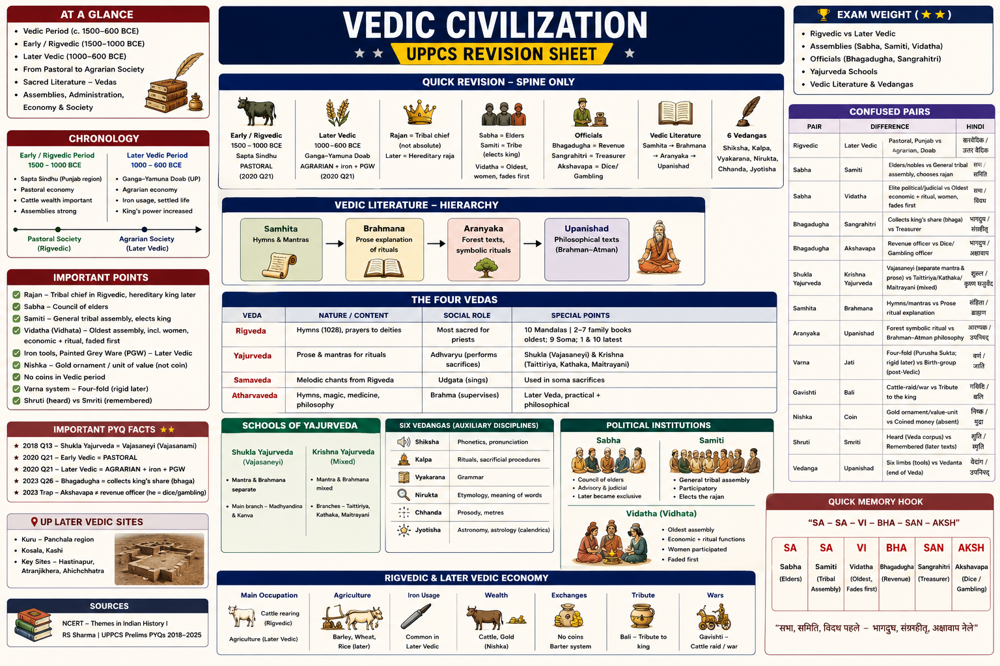

# Topic 3 — Vedic Civilization
### ★ UPPCS Revision Sheet — Lucent / PW style (one home per fact · no repetition · Practice ≥46)

<details>
<summary><strong>Covers syllabus</strong> (click to expand)</summary>

Vedic Period | Rigvedic Society | Later Vedic Society | Vedic Administration | Rigvedic Economy | Political Institutions | Sabha | Samiti | Vidhata | Vedic Literature | Four Vedas | Brahmanas | Aranyakas | Upanishads | Vedangas | Painted Grey Ware (PGW) | Iron Age in India

</details>

> **Sources baked in:** NCERT *Themes in Indian History* I, RS Sharma, UPPCS Prelims PYQs 2018–2025  
> **Exam weight:** ★★★ — Rigvedic vs Later Vedic, assemblies, officials, Yajurveda schools  
> **Last verified:** August 2026  
> **Current Affairs:** N/A — purely historical; no scheme/report/appointment surface

---

## Quick Revision — Spine Only

```
Early/Rigvedic ~1500–1000 BCE | Sapta Sindhu (Punjab) | PASTORAL (2020 Q21)
Later Vedic ~1000–600 BCE | Ganga–Yamuna doab (UP) | AGRARIAN + iron + PGW (2020 Q21)

Rajan = tribal chief (not absolute) | Later = hereditary raja
Sabha = elders | Samiti = tribe (elects king) | Vidatha/Vidhata = oldest, women, fades first
Bhagadugha = revenue (bhaga) ← 2023 Q26 D | Sangrahitri = treasurer | Akshavapa = dice/gambling

Rigveda 1028 hymns, 10 mandalas | 2–7 family books oldest | 9 Soma | 1 & 10 latest
Shukla Yajurveda = Vajasaneyi (paper: Vajasanami) ← 2018 Q13 A
Krishna = Taittiriya, Kathaka, Maitrayani
Samhita → Brahmana → Aranyaka → Upanishad
6 Vedangas: Shiksha Kalpa Vyakarana Nirukta Chhanda Jyotisha

UP Later Vedic: Kuru–Panchala, Kosala, Kashi | Hastinapur, Atranjikhera, Ahichchhatra
PGW ~1100–600 BCE | grey + black geometric paint | Later Vedic doab marker
Iron: shyama ayas / krishna ayas in texts | PGW + megalithic south = Iron Age markers
PGW → NBPW ~700–200 BCE (mahajanapada / second urbanisation — Topic 5)
```

### Confused pairs

| A | B | Difference | Hindi |
|---|----|------------|-------|
| Rigvedic | Later Vedic | **Pastoral**, Punjab, assemblies strong vs **agrarian**, doab, king strong | ऋग्वेदिक / उत्तर वैदिक |
| Sabha | Samiti | Elders/nobles (later exclusive) vs **general tribal** assembly that **chooses the rajan** | सभा / समिति |
| Sabha | Vidatha | Political/judicial elite vs **oldest** gathering — **economic + ritual**, women, **fades first** | सभा / विदथ |
| Bhagadugha | Sangrahitri | Collects king's **share (bhaga)** vs **treasurer** | भागदुघ / संग्रहीतृ |
| Bhagadugha | Akshavapa | Revenue vs **dice / gambling** officer (2023 trap C) | भागदुघ / अक्षावाप |
| Shukla Yajurveda | Krishna Yajurveda | **Vajasaneyi** (mantra & prose separate) vs Taittiriya / Kathaka / Maitrayani (mixed) | शुक्ल / कृष्ण यजुर्वेद |
| Samhita | Brahmana | Hymns/mantras vs **prose ritual** explanation | संहिता / ब्राह्मण |
| Aranyaka | Upanishad | Forest **symbolic ritual** vs **Brahman–Atman** philosophy | आरण्यक / उपनिषद् |
| Varna | Jati | Four-fold (Purusha Sukta; rigid later) vs birth-group (post-Vedic) | वर्ण / जाति |
| Gavishti | Bali | Cattle-raid / war vs **tribute** to the king | गविष्टि / बलि |
| Nishka | Coin | Gold **ornament / value-unit** vs coined money (**absent**) | निष्क / मुद्रा |
| Shruti | Smriti | Heard (Veda corpus) vs remembered (later dharma texts) | श्रुति / स्मृति |
| Vedanga | Upanishad | Six **limbs** (tools) vs **Vedanta** (end of Veda) | वेदांग / उपनिषद् |
| PGW | NBPW | Later Vedic **grey painted** doab ware vs mahajanapada **black polished** elite ware | चित्रित धूसर / उत्तरी काली |
| PGW | OCP | Iron-age **painted grey** vs pre-PGW **ochre-wash** doab rural | PGW / OCP |
| shyama ayas | ayas (Rigveda) | Later Vedic **iron** vs Early Vedic **copper/bronze** | श्याम आयस / आयस |

---

## 3.1 Vedic Period

**Indo-Aryan culture of Vedic Sanskrit texts | Early ~1500–1000 BCE | Later ~1000–600 BCE**

- The **Early / Rigvedic** heartland is **Sapta Sindhu**, the north-west Punjab belt.
- The seven rivers are **Sindhu** (Indus), **Vitasta** (Jhelum), **Asikni** (Chenab), **Parushni** (Ravi), **Vipas** (Beas), **Sutudri** (Sutlej), and **Saraswati**.
- **Later Vedic** culture shifts **east** into the **Ganga–Yamuna doab** of western–central UP.
- It then reaches **Kosala**, **Kashi**, and **Videha**.
- The archaeological marker of Later Vedic is **Painted Grey Ware (PGW)**, about **1100–600 BCE**, with **iron**.
- Early Vedic has **no** Harappan-style cities.
- **Ayas** in the Rigveda means copper or bronze, not iron.
- Iron appears as **shyama ayas** or **krishna ayas** in Later Vedic texts.
- The language is **Vedic Sanskrit**, older than Panini’s Classical Sanskrit.
- The Vedic age ends around **600 BCE**. Mahajanapadas, Buddhism, and Jainism follow.
- There was **no** Vedic empire.

> **Exam note:** Rigvedic = **northwest pastoral**. Later Vedic = **Gangetic agrarian**. Trap: “Vedic period = only UP.”

**PYQ — UPPCS Prelims 2020, Q21**

Match List-I with List-II:

| List-I | List-II |
|--------|---------|
| A. Indus Valley Civilization | 1. Pastoral |
| B. Later Vedic Society | 2. Land Lordism |
| C. Rigvedic Society | 3. Agrarian |
| D. Medieval Period | 4. Urban |

A. 4 2 3 1

B. 2 1 4 3

C. 3 4 1 2

D. 4 3 1 2

<details>
<summary>Show answer</summary>

**Ans: D** — IVC = Urban (4); Later Vedic = Agrarian (3); Rigvedic = Pastoral (1); Medieval = Land Lordism (2).

</details>

---

## 3.2 Rigvedic Society

**Tribal · pastoral · jana / vis · women relatively free · varna not yet a cage**

- The social unit is the **jana** (tribe) and the **vis** (clan).
- Loyalty is to kin, not to a fixed territory.
- There is no janapada-state.
- The **rajan** is a war-chief and ritual head.
- He is chosen with assembly consent.
- He is **not** an absolute hereditary king.
- **Cattle are wealth.**
- Wars are often **gavishti**, a cattle-raid.
- **Dasas** and **Dasyus** are rival groups in the hymns.
- **Panis** are cattle-keepers or traders, often hostile in the hymns.
- **Apala** is a woman hymn-composer.
- **Lopamudra** is a woman hymn-composer.
- **Visvavara** is a woman hymn-composer.
- **Ghosha** is a woman hymn-composer.
- Women could attend the **Sabha**.
- Women could attend the **Vidatha**.
- There is no sati, purdah, or child-marriage as a system.
- **Varna** is named in the **Purusha Sukta** (Rigveda **X.90**), a **late** hymn.
- Occupation is still flexible in Early Vedic.
- Do not call this the full caste system.
- Religion is of nature gods, with **no temples and no idols**.
- **Indra** has the most hymns. He is a war and rain god.
- **Agni** is the fire god.
- **Soma** is the ritual drink-god.
- **Varuna** guards **rita**.
- **Ushas** is the dawn goddess.
- **Savitr** is a solar god.
- **Vishnu** and **Rudra** are still **minor**.
- About **33** gods are grouped in three layers: earth, air, and sky.
- Houses are of wood and thatch.
- The **ratha** is a horse-chariot.
- There are no stone cities, no iron, and no coins.

> **Exam note:** Rigvedic society is **Pastoral**, not agrarian. Later Vedic = agrarian.

---

## 3.3 Later Vedic Society

**Settled agrarian · iron plough · janapadas · rigid varna · women lose ground**

- Iron and the plough open Gangetic forests.
- Surplus supports specialists.
- The economy type in match-lists is **Agrarian** — not pastoral like the Rigvedic phase.
- The **jana** becomes a **janapada**, a territorial kingdom.
- Famous Later Vedic polities are **Kuru** and **Panchala**.
- **Kosala** is a Later Vedic polity in eastern UP.
- **Kashi** is a Later Vedic polity.
- **Videha** is a Later Vedic polity further east.
- Four varnas **harden**: Brahmana, Kshatriya, Vaishya, Shudra.
- Shudras are denied **upanayana**.
- **Gotra** exogamy appears.
- Anuloma and pratiloma marriage rules appear.
- **Women** drop from assemblies and from Vedic study.
- Child marriage begins to show.
- There are no more hymn-composers of the Early type.
- **Gargi** is a Later Vedic **exception** in Upanishadic debate.
- **Maitreyi** is another Later Vedic **exception**.
- They are not the social average.
- Four **ashramas** are systematized: Brahmacharya, Grihastha, Vanaprastha, and Sannyasa.
- About sixteen samskaras appear in later lists.
- Land grants to priests (**brahmadeya**) start the landlord pattern.
- Assemblies weaken. The king claims more.
- Thought shifts from ritual Brahmanas to forest Aranyakas.
- It then reaches the **Upanishads**, which put jnana over yajna.

> **Exam note:** “Women equal throughout the Vedic age” is false. The decline is **Later Vedic**.

---

## 3.4 Vedic Administration

**Rajan + purohita + senani core | Later Vedic adds revenue staff | no Mauryan bureaucracy**

- The **rajan** is the chief or king.
- In Later Vedic he becomes **hereditary**.
- He takes a divine aura.
- A household of **ratnins**, the jewel-officers of consecration, grows around him.
- The **purohita** is chief priest and political adviser.
- **Vasishtha** served Sudas as purohita.
- **Visvamitra** is the rival priest in that tradition.
- The **senani** is the army commander.
- The **gramani** is the village head and is also listed among the ratnins.
- The **bhagadugha** is the **revenue collector**.
- He takes the king’s **bhaga** (share) of produce or booty.
- **Bhagadugha** collects the king’s **bhaga** (revenue share) — the standard match-list lock for that officer.
- The **sangrahitri** is the treasurer or chamberlain.
- The **akshavapa** is the officer of **dice and gambling**, and sometimes of accounts.
- Akshavapa is option **C** in 2023. It is the **wrong** answer for Bhagadugha, but it is a **real** office. Learn both.
- The **suta** is the charioteer or bard.
- The **kshattri** is another ratnin.
- The **takshan** is the carpenter.
- **Govikartana** appears in ratnin lists.
- **Palagala** also appears in ratnin lists.

| Ratnin (jewel-officer) | Role |
|------------------------|------|
| **Purohita** | Chief priest and royal adviser |
| **Senani** | Army commander |
| **Gramani** | Village head |
| **Suta** | Charioteer / court bard |
| **Kshattri** | Chamberlain-type officer |
| **Bhagadugha** | Revenue collector of the king’s **bhaga** |
| **Sangrahitri** | Treasurer |
| **Akshavapa** | Dice / gambling officer (2023 trap vs Bhagadugha) |
| **Takshan** | Carpenter |
| **Govikartana** | Cowherd / cattle officer in lists |
| **Palagala** | Another ratnin name in Later Vedic lists |

- **Bali** is tribute.
- **Bhaga** is the king’s share.
- Later **shulka** is a toll.
- Spies appear in later texts.
- The system is still clan-based. It is **not** Ashokan district officers.

> **Exam note:** In 2023, Bhagadugha is not a messenger, not a forest officer, and not the gambling chief.

**PYQ — UPPCS Prelims 2023, Q26**

Which officer was known as **'Bhagadugha'** during Vedic administration?

A. Messenger  
B. Chief Officer of Forests  
C. Chief Officer of the Gambling Department  
D. Revenue Collector

<details>
<summary>Show answer</summary>

**Ans: D** — collected the king’s **bhaga** (share). Gambling officer = **Akshavapa** (option C).

</details>

---

## 3.5 Rigvedic Economy
## 3.18 Later Vedic Economy

- Later Vedic society became **agrarian** because the **iron plough** opened Gangetic forest and supported **surplus grain**.
- **Land grants to priests (brahmadeya)** began the pattern of religious landlords.
- **Bali** (tribute) and **bhaga** (king's share) were collected; **shulka** (toll) appears in later texts.
- Iron tools are the material backbone — linked to **PGW** layers in the doab.
- This economy supports the **second urbanisation** and the rise of **sixteen mahajanapadas** from about the sixth century BCE.

## 3.19 Rigvedic vs Later Vedic — Comparison Framework

| Point | Rigvedic | Later Vedic |
|-------|----------|-------------|
| Territory | **Sapta Sindhu** (Punjab) | **Ganga–Yamuna doab** and beyond |
| Economy | **Pastoral** | **Agrarian** |
| Polity | elected **rajan** + Sabha–Samiti | hereditary **raja**; weaker assemblies |
| Archaeology | no cities | **PGW** villages and forts |

## 3.20 Vedic Religion and Ritual

- Early Vedic religion was **nature worship** through **hymns and fire sacrifice** — **no temples and no idols**.
- **Indra** has the most Rigvedic hymns; **Agni** carries offerings; **Varuna** guards **rita** (cosmic order).
- Later Vedic kings used **Rajasuya**, **Ashvamedha**, and **Vajapeya** to claim **supremacy**.
- Thought shifted from **Brahmana** ritual to **Upanishadic** knowledge (Brahman–Atman).

### Battle of Ten Kings (Dasarajna) — Cause, Course, Result

**Cause:** Rival tribal confederacies fought for pasture and river water in **Sapta Sindhu**.  
**Course:** Bharata king **Sudas**, advised by **Vasishtha**, fought a **ten-king coalition** on the **Parushni (Ravi)**; **Visvamitra** on the opposite side.  
**Result:** Sudas **won**; Bharata–Tritsu line became prominent in Rigvedic memory.


**Cattle-wealth · barter · barley · no coins · no iron plough**

- Wealth is counted in **cows**.
- **Gavishti** is a cattle-raid, not a tax.
- Agriculture exists but is **secondary**.
- **Yava** (barley) is known in Early Vedic.
- Wheat (**godhuma**) and rice become important **later**, with the iron plough.
- Exchange is by **barter**.
- **Nishka** is a gold necklace used as a **value standard**. It is **not** a coin.
- **Hiranya** means gold.
- There are **no** punch-marked coins yet.
- Crafts include copper and bronze work, leather, pottery, and **chariot**-making.
- The soma plant is brought from the mountains for ritual.
- There is no private landed estate of the Later Vedic grant type.
- Pasture is tribal.
- **Dakshina** is a gift to the priest after yajna. It is not a land-revenue department.

> **Exam note:** Trap — “nishka was a gold coin of the Rigvedic age.”

---

## 3.6 Political Institutions

**Early: tribe + three assemblies check the rajan | Later: hereditary king + royal yajnas**

- The political unit is the vis and the jana.
- Later it becomes a **janapada**.
- There is no written constitution. Custom and **dharma** rule.
- There is no standing army. A tribal **sena** fights under the senani.
- The **Battle of Ten Kings (Dasarajna)** is the core **Rigvedic** political event.
- Bharata king **Sudas** of the Tritsu line wins on the **Parushni (Ravi)**.
- His priest is **Vasishtha**.
- He defeats a ten-king coalition.
- **Visvamitra** stands on the opposite side in that tradition.
- Later Vedic kingship is advertised through big sacrifices.
- **Rajasuya** is consecration.
- **Ashvamedha** is the horse sacrifice that claims territory.
- **Vajapeya** is another royal rite.
- Some tribes keep **gana / sangha** oligarchy habits. Later Vajji and Licchavi echo this.

> **Exam note:** Assemblies are strong in Rigvedic times. The **king is strong** in Later Vedic. Do not merge Sabha, Samiti, and Vidatha.

---

## 3.7 Sabha

**Smaller assembly of elders / nobles | advice + disputes**

- It is a select gathering, not the whole tribe.
- It advises the rajan.
- It handles **disputes** and is more judicial than the Samiti.
- In **Rigvedic** hymns women could be present as **sabhavati** or **sabha vadhu**.
- In **Later Vedic** it becomes an elite-male club.
- Women drop out. The king is less bound by it.
- Later literature also uses *sabha* for a **gambling hall**. That is a social hall, not the early political body.
- It is **not** Lok Sabha, Rajya Sabha, or the 73rd-Amendment **Gram Sabha**.

> **Exam note:** Sabha means **elders**. Samiti means the **people**.

---

## 3.8 Samiti

**General tribal assembly | broader than Sabha | elects / confirms the rajan**

- It is the assembly of the freemen of the jana.
- War, migration, and **king-making** sit here in Early Vedic.
- Together with the Sabha it checks the chief.
- It is popular, not oligarchic.
- Women have little or no Samiti role. Early Sabha and Vidatha are more open.
- Later Vedic hereditary succession **kills** its electoral job. The body fades.

> **Exam note:** Trap — “Samiti = Rajya Sabha.” Zero link.

---

## 3.9 Vidhata (Vidatha)

**Oldest of the three | ritual + distribution + women | disappears first**

- The syllabus spelling is **Vidhata**. Standard books say **Vidatha**. It is the same institution.
- Hymns show it as a **wide gathering**.
- It holds a feast, a **share-out of booty**, soma, and martial talk.
- It is not a law-court. Disputes lean toward the Sabha.
- **Women** sing and attend.
- It is more inclusive than the Later Vedic Sabha.
- It is the **first assembly to vanish** from Later Vedic texts.
- If a question asks which faded earliest, the answer is Vidatha.

> **Exam note:** If a question asks which assembly faded earliest, the answer is Vidatha.

---

## 3.10 Vedic Literature

**Oral Shruti | four layers per Veda | written down much later**

- **Shruti** means “that which is heard.”
- It covers Samhita, Brahmana, Aranyaka, and Upanishad.
- **Smriti** is later remembered law. It is not the core of this chapter.
- Growth order is **Samhita** (mantra), then **Brahmana** (ritual prose), then **Aranyaka** (forest and symbol), then **Upanishad** (philosophy).
- The corpus is kept by **guru–shishya** recitation.
- **Shakhas** are recension schools.
- The Rigveda is the oldest Veda.
- The Atharvaveda and the prose layers are younger.
- Later Vedic books take shape in **Kuru–Panchala** and **Videha** in the east.
- **Sayana** of fourteenth-century Vijayanagara commented on the Vedas. He is **medieval**, not Vedic-age.

> **Exam note:** Vedas were **not** “published on paper” in 1500 BCE. Oral first.

---

## 3.11 Four Vedas

**Rig · Sama · Yajur · Atharva | each has a Samhita core**

- The **Rigveda** is the oldest Veda.
- It has about **1028** hymns, counted as **1017 plus 11 Valakhilya**.
- It is arranged in **10 mandalas**.
- Mandalas **II–VII** are the family books and the oldest core.
- Mandala **IX** is the Soma book.
- Mandalas **I and X** are the latest.
- The **Purusha Sukta** lives in Mandala X.
- The **Gayatri Mantra** is RV **III.62.10**.
- It is addressed to **Savitr**. The seer is **Vishvamitra**.
- The Nasadiya Sukta, the creation hymn, is also in Mandala X.
- The **Samaveda** is a book of **melodies (saman)** for the Soma ritual.
- Most Samaveda verses are lifted from the Rigveda.
- The Samaveda priest is the **Udgatri**.
- The **Yajurveda** is a book of **yajus**. It is the adhvaryu’s sacrificial handbook.
- **Shukla (White) Yajurveda** keeps mantra and Brahmana **apart**.
- Its Samhita is **Vajasaneyi**, with Madhyandina and Kanva schools.
- Some papers print **Vajasanami** — that is the same school as **Vajasaneyi** (Shukla Yajurveda).
- **Krishna (Black) Yajurveda** mixes mantra and prose.
- Its Samhitas are **Taittiriya**, **Kathaka**, and **Maitrayani**. Some lists add Kapishthala.
- In 2018, options B, C, and D are all **Krishna**.
- The **Atharvaveda** is the newest of the four.
- It has **20** books of spells, healing, and household life, with early **iron** hints.
- Its priest is the **Brahman**, the supervisor of the rite.
- It is everyday religion, not only royal yajna.
- The four ritual priests are the **Hotri** of the Rigveda, the **Udgatri** of the Samaveda, the **Adhvaryu** of the Yajurveda, and the **Brahman** of the Atharvaveda overall.
- Traditional compiler of the Vedas is **Vyasa**.

> **Exam note:** Shukla Yajurveda = **Vajasaneyi** (also printed Vajasanami). Taittiriya / Maitrayani / Kathak = **Krishna** Yajurveda.

**PYQ — UPPCS Prelims 2018, Q13**

Which of the following is a Samhita of Shukla Yajurveda?

A. Vajasanami  
B. Maitrayani  
C. Taittiriya  
D. Kathak

<details>
<summary>Show answer</summary>

**Ans: A** — Vajasaneyi / Vajasanami. B, C, D = Krishna (Black) Yajurveda.

</details>

---

## 3.12 Brahmanas

**Prose manuals of yajna — not hymns**

| Brahmana | Veda |
|----------|------|
| Aitareya, Kausitaki (Shankhayana) | Rigveda |
| Tandya / Panchavimsha, Jaiminiya | Samaveda |
| **Shatapatha** (largest, **100** chapters) | **Shukla Yajurveda** |
| Taittiriya | Krishna Yajurveda |
| **Gopatha** (only one) | Atharvaveda |

- Brahmanas fix **how** to perform the sacrifice and **why** the myth says so.
- They set priest roles and varna duties.
- **Rajasuya** is treated in the Aitareya Brahmana.
- **Ashvamedha** is treated in the Shatapatha Brahmana.
- The **Shatapatha** also carries the Videha eastward-expansion story of Mathava and Videgha.
- The language is Later Vedic Sanskrit **prose**.
- They are the bridge toward Aranyakas.

> **Exam note:** Brahmanas are **not** collections of hymns. Hymns sit in the Samhita.

---

## 3.13 Aranyakas

**“Forest books” | symbol over public fire-altar | hinge to Upanishads**

- They are meant for **vanaprastha** hermits.
- They give a quieter, inward reading of ritual.
- The **Aitareya Aranyaka** belongs to the Rigveda.
- The **Taittiriya Aranyaka** belongs to the Krishna Yajurveda.
- The **Brihadaranyaka** sits on the Shatapatha / Shukla line.
- The Brihadaranyaka **is also an Upanishad**.
- Not every Veda has a fat separate Aranyaka.
- The Atharvaveda is thin here.
- The teaching is secretive. It is not the village public cult.

> **Exam note:** An Aranyaka is not a Brahmana. Forest symbol is not public yajna prose.
> An Aranyaka is not an Upanishad, though the Brihadaranyaka overlaps.

---

## 3.14 Upanishads

**Vedanta — Brahman and Atman | jnana over outer yajna**

- Tradition counts **108** Upanishads.
- Exams use the principal early set: Brihadaranyaka, Chandogya, Isha, Kena, Katha, Mundaka, Mandukya, Prashna, Taittiriya, and Aitareya.
- **Svetasvatara** is often added to that list.
- **Tat Tvam Asi** is taught in the **Chandogya**.
- Uddalaka Aruni speaks it to Shvetaketu.
- The **Yajnavalkya–Maitreyi** dialogue is in the **Brihadaranyaka**.
- **Gargi** also debates there.
- The Brihadaranyaka belongs to the Shukla Yajurveda.
- The **Nachiketa–Yama** story is in the **Katha Upanishad**.
- The **Mandukya** is the shortest.
- It teaches **Om / AUM** and the four states of consciousness.
- **Janaka of Videha** patronises these debates.
- The date-band is about **800–600 BCE**, in eastern courts.

> **Exam note:** Upanishads **question** big public yajna. They are **Shruti**. They are **not** a Vedanga.

---

## 3.15 Vedangas

**Six limbs — tools to keep and decode the Veda | not Shruti philosophy**

| Vedanga | Job | Lock |
|---------|-----|------|
| **Shiksha** | Phonetics | Pratishakhya texts |
| **Kalpa** | Ritual sutras | **Shrauta** (public), **Grihya** (domestic), **Dharma** (law), **Sulba** (altar geometry — Baudhayana, Apastamba) |
| **Vyakarana** | Grammar | **Panini**, *Ashtadhyayi* (~5th c. BCE, edge of / just after Vedic) |
| **Nirukta** | Etymology | **Yaska** |
| **Chhanda** | Metre | **Pingala** |
| **Jyotisha** | Ritual calendar / astronomy | Vedanga Jyotisha |

Memory: **S-K-V-N-C-J**.

> **Exam note:** Upanishad / Puranas / Itihasa are **not** Vedangas. Yaska ≠ Panini.

---

## 3.16 Painted Grey Ware (PGW)

**Archaeological marker of Later Vedic culture | ~1100–600 BCE | upper Gangetic–Ghaggar belt**

- **Painted Grey Ware** is fine grey pottery with geometric designs painted in black. It is the standard archaeological signature of the **Later Vedic** phase in the doab.
- The date-band is about **1100–600 BCE**, overlapping the end of the Vedic textual period. Sites often sit on top of or beside **OCP** layers.
- Distribution runs through **western UP, Haryana, Punjab, and Rajasthan**: Hastinapur, Ahichchhatra, Kurukshetra, Mathura, Jakhera, and Panipat are textbook names.
- PGW settlements are mostly villages, but some grow into **fortified towns** with moats and palisades before the full mahajanapada cities.
- The culture is linked in tradition to **Kuru–Panchala** and the Mahabharata geography. Archaeology does **not** by itself prove every epic event.
- PGW layers show **iron** tools and weapons along with horse bones and ivory work. That is why PGW marks the **early Iron Age** in the north.
- Stratigraphy usually runs **OCP → PGW → NBPW** in the doab. PGW is **not** the same as Harappan red ware or megalithic black-and-red ware of the south.

> **Exam note:** PGW = **Later Vedic / doab**, not Sangam south. PGW comes **before** NBPW, not after.

---

## 3.17 Iron Age in India

**Metal transition that reshapes agriculture, war, and settlement | north and south follow different pottery tracks**

- The Rigveda knows metal as **ayas**, usually read as **copper or bronze**. True iron appears in Later Vedic texts as **shyama ayas** or **krishna ayas** (“dark metal”).
- In **north India**, iron technology spreads with **PGW** from about the 12th century BCE and then with **NBPW** cities after about 700 BCE.
- Iron ploughshares, axes, and weapons made dense farming and forest clearance possible in the Ganga plain. That underpins the **second urbanisation** and the sixteen mahajanapadas.
- In **south and central India**, the Iron Age is often studied through **megalithic** burials with **black-and-red ware**, not through PGW.
- Key southern megalithic names include **Brahmagiri**, **Adichanallur**, **Maski**, and **Hallur**. Burial types include dolmens, cists, stone circles, and **hero stones (virakkal)**.
- Iron did **not** arrive everywhere at one instant. Gandhara, the doab, and the Deccan show different start-dates in excavation.

| Region | Iron Age marker | Period lock |
|--------|-----------------|-------------|
| **Northwest / doab** | PGW then NBPW | Later Vedic → mahajanapada |
| **South / Deccan** | Megaliths + black-and-red ware | Pre-Sangam bed |
| **Chalcolithic overlap** | Limited copper before iron | Mehrgarh, Jorwe, OCP zones |

> **Exam note:** “Iron in Rigveda” is a **trap** unless the question means Later Vedic shyama ayas. PGW iron is **north**; megalithic iron is mainly **peninsular**.

---

## UP Focus

| Lock | Detail |
|------|--------|
| Later Vedic **core** | **Ganga–Yamuna doab** — western–central UP |
| **Kuru** | Delhi–Haryana–Meerut belt; Hastinapur tradition |
| **Panchala** | Rohilkhand–central doab (Ahichchhatra near Bareilly) |
| **Kosala** | Eastern UP (later Ayodhya / Shravasti world) |
| **Kashi** | Varanasi |
| **Videha** | North Bihar (Janaka) — east of UP, linked in Shatapatha |
| PGW sites | **Hastinapur** (Meerut), **Atranjikhera** (Etah), **Ahichchhatra**, Noh (Rajasthan) |
| Rigvedic | **Not** a UP heartland — Punjab / Sapta Sindhu |

---

## Practice Zone — UPPCS Format Drill

**Q1.** Match List-I with List-II and select the correct answer using the code given below:

| List-I | List-II |
|--------|---------|
| A. Indus Valley Civilization | 1. Pastoral |
| B. Later Vedic Society | 2. Land Lordism |
| C. Rigvedic Society | 3. Agrarian |
| D. Medieval Period | 4. Urban |

A. 4 2 3 1  
B. 2 1 4 3  
C. 3 4 1 2  
D. 4 3 1 2

<details>
<summary>Show answer</summary>

**Ans: D**

</details>

---

**Q2.** Which of the following statements is/are correct?

1. Rigvedic culture is centred on the Sapta Sindhu, not the Ganga–Yamuna doab.  
2. Painted Grey Ware is the usual archaeological correlate of Later Vedic settlements in the doab.

A. Only 1

B. Only 2

C. Both 1 and 2

D. Neither 1 nor 2

<details>
<summary>Show answer</summary>

**Ans: C**

</details>

---

**Q3.** With reference to Rigvedic society, consider the following statements:

1. Jana and vis were the main political-social units.  
2. Varna as a rigid birth-order already governed all occupations.  
3. Women such as Apala and Lopamudra are credited with hymns.

How many of the above statements are correct?  
A. Only one  B. Only two  C. All three  D. None

<details>
<summary>Show answer</summary>

**Ans: B** — 1 and 3. Rigid varna is Later Vedic; Purusha Sukta is late and not yet a full caste cage.

</details>

---

**Q4.** Given below are two statements:

**Assertion (A):** Later Vedic society is classified as agrarian in UPPCS match-lists.  

**Reason (R):** Iron plough agriculture in the Gangetic plain produced a settled surplus.

A. Both (A) and (R) are true and (R) is the correct explanation of (A)  
B. Both (A) and (R) are true, but (R) is not the correct explanation of (A)  
C. (A) is true, but (R) is false  
D. (A) is false, but (R) is true

<details>
<summary>Show answer</summary>

**Ans: A**

</details>

---

**Q5.** Which of the following statements regarding Later Vedic society is **not** correct?

A. Janapadas replaced purely tribal jana as the main territorial unit.  
B. Women’s public and ritual status generally declined.  
C. Upanayana was opened equally to Shudras.  
D. Kuru, Panchala, Kosala and Kashi are Later Vedic polities.

<details>
<summary>Show answer</summary>

**Ans: C**

</details>

---

**Q6.** Which officer was known as ‘Bhagadugha’ during Vedic administration?

A. Messenger  
B. Chief Officer of Forests  
C. Chief Officer of the Gambling Department  
D. Revenue Collector

<details>
<summary>Show answer</summary>

**Ans: D**

</details>

---

**Q7.** Match List-I with List-II:

| List-I (Officer) | List-II (Charge) |
|------------------|------------------|
| A. Bhagadugha | 1. Treasurer |
| B. Sangrahitri | 2. Village head |
| C. Akshavapa | 3. King’s share / revenue |
| D. Gramani | 4. Dice / gambling |

A. 3 1 4 2  
B. 3 4 1 2  
C. 1 3 4 2  
D. 2 1 4 3

<details>
<summary>Show answer</summary>

**Ans: A**

</details>

---

**Q8.** Which of the following statements is/are correct?

1. Bali in Vedic polity means a tribute to the chief.  
2. Nishka was a punch-marked silver coin of the Rigvedic age.

A. Only 1

B. Only 2

C. Both 1 and 2

D. Neither 1 nor 2

<details>
<summary>Show answer</summary>

**Ans: A** — nishka is a gold ornament / value-unit, not a coin.

</details>

---

**Q9.** With reference to Rigvedic economy, consider the following statements:

1. Cattle were the chief measure of wealth.  
2. Gavishti refers to cattle-raids.  
3. Iron plough was the basis of Early Vedic agriculture.

How many of the above statements are correct?  
A. Only one  B. Only two  C. All three  D. None

<details>
<summary>Show answer</summary>

**Ans: B** — 1 and 2. Iron plough = Later Vedic.

</details>

---

**Q10.** The Battle of Ten Kings (Dasarajna) was fought on the bank of which river?

A. Saraswati  
B. Parushni (Ravi)  
C. Yamuna  
D. Sindhu

<details>
<summary>Show answer</summary>

**Ans: B** — Sudas (Bharata / Tritsu) vs a ten-king coalition; Vasishtha as priest.

</details>

---

**Q11.** Match List-I with List-II:

| List-I (Assembly) | List-II (Character) |
|-------------------|---------------------|
| A. Sabha | 1. General tribal body; king-making |
| B. Samiti | 2. Oldest gathering; booty / ritual; fades first |
| C. Vidatha | 3. Elders / nobles; more judicial |

A. 3 1 2  
B. 1 3 2  
C. 3 2 1  
D. 2 1 3

<details>
<summary>Show answer</summary>

**Ans: A**

</details>

---

**Q12.** Which of the following statements is/are correct?

1. In the Rigvedic period women could be associated with Sabha and Vidatha.  
2. Later Vedic kingship became more hereditary and less dependent on Samiti.

A. Only 1

B. Only 2

C. Both 1 and 2

D. Neither 1 nor 2

<details>
<summary>Show answer</summary>

**Ans: C**

</details>

---

**Q13.** Which Vedic assembly is generally said to have disappeared first from Later Vedic literature?

A. Sabha  
B. Samiti  
C. Vidatha (Vidhata)  
D. Paura

<details>
<summary>Show answer</summary>

**Ans: C**

</details>

---

**Q14.** Given below are two statements:

**Assertion (A):** Samiti is described as a popular tribal assembly.  

**Reason (R):** It is identical with the Rajya Sabha of the Constitution of India.

A. Both (A) and (R) are true and (R) is the correct explanation of (A)  
B. Both (A) and (R) are true, but (R) is not the correct explanation of (A)  
C. (A) is true, but (R) is false  
D. (A) is false, but (R) is true

<details>
<summary>Show answer</summary>

**Ans: C**

</details>

---

**Q15.** Arrange the following layers of Vedic literature in the usual order of development:

1. Upanishad  
2. Samhita  
3. Aranyaka  
4. Brahmana

A. 2–4–3–1  
B. 2–3–4–1  
C. 4–2–3–1  
D. 2–4–1–3

<details>
<summary>Show answer</summary>

**Ans: A**

</details>

---

**Q16.** Which of the following is a Samhita of Shukla Yajurveda?

A. Vajasanami  
B. Maitrayani  
C. Taittiriya  
D. Kathak

<details>
<summary>Show answer</summary>

**Ans: A**

</details>

---

**Q17.** With reference to the Yajurveda, consider the following statements:

1. In the Shukla recension, mantra and Brahmana portions are kept separate.  
2. Taittiriya, Kathaka and Maitrayani belong to the Krishna Yajurveda.  
3. Vajasaneyi is a Krishna Yajurveda Samhita.

How many of the above statements are correct?  
A. Only one  B. Only two  C. All three  D. None

<details>
<summary>Show answer</summary>

**Ans: B** — 1 and 2. Vajasaneyi = Shukla.

</details>

---

**Q18.** Match List-I with List-II:

| List-I (Veda) | List-II (Lock) |
|---------------|----------------|
| A. Rigveda | 1. Spells, healing, 20 books |
| B. Samaveda | 2. 1028 hymns, 10 mandalas |
| C. Yajurveda | 3. Melodies for Soma |
| D. Atharvaveda | 4. Sacrificial formulas (yajus) |

A. 2 3 4 1  
B. 2 4 3 1  
C. 3 2 4 1  
D. 2 3 1 4

<details>
<summary>Show answer</summary>

**Ans: A**

</details>

---

**Q19.** Which of the following statements regarding the Rigveda is **not** correct?

A. Mandalas II–VII are the oldest family books.  
B. Mandala IX is devoted mainly to Soma.  
C. Purusha Sukta occurs in Mandala X.  
D. Gayatri mantra is from Atharvaveda Book I.

<details>
<summary>Show answer</summary>

**Ans: D** — Gayatri = RV III.62.10.

</details>

---

**Q20.** Match List-I with List-II:

| List-I (Priest) | List-II (Veda) |
|-----------------|----------------|
| A. Hotri | 1. Samaveda |
| B. Udgatri | 2. Yajurveda |
| C. Adhvaryu | 3. Atharvaveda / overall |
| D. Brahman | 4. Rigveda |

A. 4 1 2 3  
B. 4 2 1 3  
C. 1 4 2 3  
D. 4 1 3 2

<details>
<summary>Show answer</summary>

**Ans: A**

</details>

---

**Q21.** Which of the following statements is/are correct?

1. Shatapatha Brahmana is attached to the Shukla Yajurveda and is the largest Brahmana.  
2. Gopatha is the Brahmana of the Atharvaveda.  
3. Aitareya Brahmana belongs to the Samaveda.

A. 1 and 2 only

B. 2 and 3 only

C. 1 and 3 only

D. 1, 2 and 3

<details>
<summary>Show answer</summary>

**Ans: A** — Aitareya = Rigveda.

</details>

---

**Q22.** Consider the following pairs:

| Brahmana | Veda |
|----------|------|
| 1. Tandya / Panchavimsha | Samaveda |
| 2. Taittiriya Brahmana | Krishna Yajurveda |
| 3. Kausitaki | Atharvaveda |

How many of the above pairs are correctly matched?  
A. Only one  B. Only two  C. All three  D. None

<details>
<summary>Show answer</summary>

**Ans: B** — 1 and 2. Kausitaki = Rigveda.

</details>

---

**Q23.** Aranyakas are best described as:

A. Hymn collections of the Early Vedic age  
B. Forest texts that read ritual in a symbolic way and lead toward Upanishads  
C. Six auxiliary limbs of the Veda  
D. Medieval commentaries of Sayana

<details>
<summary>Show answer</summary>

**Ans: B**

</details>

---

**Q24.** Given below are two statements:

**Assertion (A):** Brihadaranyaka is counted among the principal Upanishads.  

**Reason (R):** It grows out of the Shatapatha / Shukla Yajurveda forest-prose line.

A. Both (A) and (R) are true and (R) is the correct explanation of (A)  
B. Both (A) and (R) are true, but (R) is not the correct explanation of (A)  
C. (A) is true, but (R) is false  
D. (A) is false, but (R) is true

<details>
<summary>Show answer</summary>

**Ans: A**

</details>

---

**Q25.** “Tat Tvam Asi” is a mahavakya of which Upanishad?

A. Katha  
B. Mandukya  
C. Chandogya  
D. Isha

<details>
<summary>Show answer</summary>

**Ans: C** — Uddalaka–Shvetaketu.

</details>

---

**Q26.** Match List-I with List-II:

| List-I | List-II |
|--------|---------|
| A. Nachiketa and Yama | 1. Brihadaranyaka |
| B. Yajnavalkya and Maitreyi | 2. Katha |
| C. Om / four states | 3. Chandogya |
| D. Uddalaka and Shvetaketu | 4. Mandukya |

A. 2 1 4 3  
B. 1 2 4 3  
C. 2 1 3 4  
D. 2 4 1 3

<details>
<summary>Show answer</summary>

**Ans: A**

</details>

---

**Q27.** Which of the following is **not** a Vedanga?

A. Shiksha  
B. Nirukta  
C. Upanishad  
D. Jyotisha

<details>
<summary>Show answer</summary>

**Ans: C**

</details>

---

**Q28.** Match List-I with List-II:

| List-I (Vedanga) | List-II |
|------------------|---------|
| A. Nirukta | 1. Panini |
| B. Vyakarana | 2. Yaska |
| C. Chhanda | 3. Pingala |
| D. Kalpa | 4. Shrauta / Grihya / Dharma / Sulba |

A. 2 1 3 4  
B. 1 2 3 4  
C. 2 1 4 3  
D. 2 3 1 4

<details>
<summary>Show answer</summary>

**Ans: A**

</details>

---

**Q29.** With reference to Kalpa, consider the following statements:

1. Shrauta sutras deal with public Vedic sacrifice.  
2. Sulba sutras deal with altar geometry.  
3. Jyotisha is a subdivision of Kalpa.

How many of the above statements are correct?  
A. Only one  B. Only two  C. All three  D. None

<details>
<summary>Show answer</summary>

**Ans: B** — 1 and 2. Jyotisha is a separate Vedanga.

</details>

---

**Q30.** Consider the following statements about Vedic religion:

1. Early Vedic worship used temples and cult images as the main form.  
2. Indra receives the largest number of Rigvedic hymns.  
3. Vishnu is already the supreme god of the Rigveda.

How many of the above statements are correct?  
A. Only one  B. Only two  C. All three  D. None

<details>
<summary>Show answer</summary>

**Ans: A** — only 2. No temples/idols; Vishnu is minor in RV.

</details>

---

**Q31.** Match List-I with List-II (Rigvedic river → later name):

| List-I | List-II |
|--------|---------|
| A. Vitasta | 1. Beas |
| B. Asikni | 2. Jhelum |
| C. Parushni | 3. Chenab |
| D. Vipas | 4. Ravi |

A. 2 3 4 1  
B. 2 4 3 1  
C. 3 2 4 1  
D. 2 3 1 4

<details>
<summary>Show answer</summary>

**Ans: A**

</details>

---

**Q32.** Which of the following statements is/are correct?

1. Ayas in the Rigveda is best read as copper/bronze, not iron.  
2. Shyama / krishna ayas in Later Vedic texts is associated with iron.

A. Only 1

B. Only 2

C. Both 1 and 2

D. Neither 1 nor 2

<details>
<summary>Show answer</summary>

**Ans: C**

</details>

---

**Q33.** Arrange the following from west/early to east/later as Vedic geography moved:

1. Kashi–Videha belt  
2. Sapta Sindhu  
3. Kuru–Panchala doab

A. 2–3–1  
B. 3–2–1  
C. 2–1–3  
D. 1–2–3

<details>
<summary>Show answer</summary>

**Ans: A**

</details>

---

**Q34.** Which of the following pairs is **not** correctly matched?

A. Hastinapur — Meerut belt, PGW  
B. Atranjikhera — Etah, PGW  
C. Ahichchhatra — Panchala / Bareilly belt  
D. Alamgirpur — Later Vedic capital of Videha

<details>
<summary>Show answer</summary>

**Ans: D** — Alamgirpur is Harappan (eastern boundary), not Videha’s capital.

</details>

---

**Q35.** With reference to royal rituals, consider the following statements:

1. Ashvamedha advertised territorial overlordship.  
2. Rajasuya is a royal consecration.  
3. Both belong mainly to the Early Rigvedic pastoral phase, not Later Vedic kingship.

How many of the above statements are correct?  
A. Only one  B. Only two  C. All three  D. None

<details>
<summary>Show answer</summary>

**Ans: B** — 1 and 2. These yajnas swell in **Later Vedic** monarchy.

</details>

---

**Q36.** Given below are two statements:

**Assertion (A):** Purusha Sukta is used as the locus classicus of four varnas.  

**Reason (R):** It is one of the oldest family-book hymns of Mandalas II–VII.

A. Both (A) and (R) are true and (R) is the correct explanation of (A)  
B. Both (A) and (R) are true, but (R) is not the correct explanation of (A)  
C. (A) is true, but (R) is false  
D. (A) is false, but (R) is true

<details>
<summary>Show answer</summary>

**Ans: C** — Purusha Sukta is RV X.90 (late).

</details>

---

**Q37.** Which of the following statements regarding Shruti is/are correct?

1. Brahmanas and Upanishads are included in Shruti.  
2. Sayana’s commentary is itself a Vedic-age Shruti text.

A. Only 1

B. Only 2

C. Both 1 and 2

D. Neither 1 nor 2

<details>
<summary>Show answer</summary>

**Ans: A**

</details>

---

**Q38.** Consider the following pairs:

| Term | Meaning |
|------|---------|
| 1. Gavishti | Cattle-raid |
| 2. Dakshina | Priest’s gift after yajna |
| 3. Shulka | Early Rigvedic name for the Sabha |

How many of the above pairs are correctly matched?  
A. Only one  B. Only two  C. All three  D. None

<details>
<summary>Show answer</summary>

**Ans: B** — 1 and 2. Shulka = toll / customs (later).

</details>

---

**Q39.** Which of the following statements is/are correct about Uttar Pradesh in this topic?

1. The Later Vedic political centre of gravity includes the Ganga–Yamuna doab.  
2. Rigvedic Sapta Sindhu is essentially the same as the Kosala–Kashi belt.

A. Only 1

B. Only 2

C. Both 1 and 2

D. Neither 1 nor 2

<details>
<summary>Show answer</summary>

**Ans: A**

</details>

---

**Q40.** Match List-I with List-II:

| List-I | List-II |
|--------|---------|
| A. Sudas | 1. Videha patron of debates |
| B. Janaka | 2. Bharata king of Dasarajna |
| C. Yaska | 3. Nirukta |
| D. Panini | 4. Ashtadhyayi |

A. 2 1 3 4  
B. 1 2 3 4  
C. 2 1 4 3  
D. 2 3 1 4

<details>
<summary>Show answer</summary>

**Ans: A**

</details>

---

**Q41.** Which of the following statements regarding Vedic polity is **not** correct?

A. Purohita was the chief priest and a political adviser.  
B. Senani commanded the army.  
C. Bhagadugha collected the king’s share of revenue.  
D. Akshavapa was the messenger of the rajan.

<details>
<summary>Show answer</summary>

**Ans: D** — Akshavapa = dice / gambling (and related accounts).

</details>

---

**Q42.** With reference to Later Vedic culture, consider the following statements:

1. Gotra rules and ashrama theory become systematic.  
2. PGW sites such as Hastinapur and Atranjikhera lie in / beside the UP doab.  
3. The economy type matched with Later Vedic Society in 2020 is Urban.

How many of the above statements are correct?  
A. Only one  B. Only two  C. All three  D. None

<details>
<summary>Show answer</summary>

**Ans: B** — 1 and 2. 2020: Later Vedic = **Agrarian**; Urban = IVC.

</details>

---

**Q43.** Which of the following statements regarding **Painted Grey Ware (PGW)** is/are correct?

1. PGW is the usual archaeological marker of the Later Vedic phase in the doab.  
2. Hastinapur and Ahichchhatra are among the textbook PGW sites.  
3. PGW is the same ware as Northern Black Polished Ware (NBPW).

A. 1 and 2 only  B. 2 and 3 only  C. 1 and 3 only  D. 1, 2 and 3

<details>
<summary>Show answer</summary>

**Ans: A** — PGW comes **before** NBPW. NBPW belongs to the mahajanapada / early historic cities (Topic 5).

</details>

---

**Q44.** Match List-I with List-II:

| List-I | List-II |
|--------|---------|
| A. PGW | 1. South / Deccan Iron Age burials with black-and-red ware |
| B. NBPW | 2. Later Vedic grey painted doab ware |
| C. OCP | 3. Mahajanapada black polished elite ware |
| D. Megalithic BRW | 4. Ochre-wash rural doab before PGW |

A. 2 3 4 1  B. 2 1 4 3  C. 3 2 4 1  D. 4 2 1 3

<details>
<summary>Show answer</summary>

**Ans: A** — PGW = 2; NBPW = 3; OCP = 4; Megalithic BRW = 1.

</details>

---

**Q45.** Given below are two statements:

**Assertion (A):** Later Vedic texts use **shyama ayas** or **krishna ayas** for iron.  

**Reason (R):** In the Rigveda, **ayas** usually means copper or bronze, not iron.

A. Both (A) and (R) are true and (R) is the correct explanation of (A)  
B. Both (A) and (R) are true, but (R) is not the correct explanation of (A)  
C. (A) is true, but (R) is false  
D. (A) is false, but (R) is true

<details>
<summary>Show answer</summary>

**Ans: A**

</details>

---

**Q46.** With reference to the **Iron Age in India**, consider the following statements:

1. North India links iron spread with PGW and then NBPW city layers.  
2. Megalithic burials with black-and-red ware are mainly a south / Deccan pattern.  
3. **Brahmagiri** is a textbook megalithic site name.

How many of the above statements are correct?  
A. Only one  B. Only two  C. All three  D. None

<details>
<summary>Show answer</summary>

**Ans: C**

</details>

---

## Complete PYQ Bank (Topic 3)

> Full UPPCS Prelims hits 2018–2025 mapped to this topic. Answers hidden. Newest first. No RO-ARO folder in `pyq/`.

### UPPCS Prelims 2023

**Q1. UPPCS Prelims 2023, Q26**

Which officer was known as **'Bhagadugha'** during Vedic administration?

A. Messenger  
B. Chief Officer of Forests  
C. Chief Officer of the Gambling Department  
D. Revenue Collector

<details>
<summary>Show answer</summary>

**Ans: D** — revenue collector (king’s **bhaga**). Option C describes **Akshavapa**.

</details>

### UPPCS Prelims 2020

**Q2. UPPCS Prelims 2020, Q21**

Match List-I with List-II and select the correct answer using the codes given below the lists:

| List-I | List-II |
|--------|---------|
| A. Indus Valley Civilization | 1. Pastoral |
| B. Later Vedic Society | 2. Land Lordism |
| C. Rigvedic Society | 3. Agrarian |
| D. Medieval Period | 4. Urban |

A. 4 2 3 1

B. 2 1 4 3

C. 3 4 1 2

D. 4 3 1 2

<details>
<summary>Show answer</summary>

**Ans: D** — IVC = Urban (4); Later Vedic = Agrarian (3); Rigvedic = Pastoral (1); Medieval = Land Lordism (2).

</details>

### UPPCS Prelims 2018

**Q3. UPPCS Prelims 2018, Q13**

Which of the following is a Samhita of Shukla Yajurveda?

A. Vajasanami  
B. Maitrayani  
C. Taittiriya  
D. Kathak

<details>
<summary>Show answer</summary>

**Ans: A** — Vajasaneyi (paper spelling Vajasanami). B/C/D = Krishna Yajurveda.

</details>

### Years with zero extra Vedic hits in local `pyq/`

UPPCS Prelims **2025, 2024, 2022, 2021, 2019** — keyword search (Vedic / Rigved / Yajurveda / Bhagadugha / Upanishad / Sabha-as-Vedic-assembly) returned **no further GS-I questions** for this topic. Polity “Sabha” hits are Lok/Rajya/Gram Sabha — **out of boundary**.

---

## Common Traps — Don't Fall For These

1. **Rigvedic = agrarian / urban** → **Pastoral**; urban = IVC; agrarian = Later Vedic (2020).
2. **Bhagadugha = gambling / forest / messenger** → **Revenue**; gambling = **Akshavapa** (2023 C).
3. **Taittiriya / Maitrayani / Kathak = Shukla** → all **Krishna**; Shukla = **Vajasaneyi** (2018).
4. **Sabha = Samiti = Vidatha** → elders vs tribe vs oldest ritual-share gathering.
5. **Vedic Sabha = Gram Sabha / Rajya Sabha** → zero link.
6. **Nishka = coin** → gold **ornament**.
7. **Purusha Sukta = oldest hymn** → Mandala **X**, late.
8. **Upanishad = Vedanga** → Shruti / Vedanta, not a limb.
9. **Iron plough in Rigveda** → **Later Vedic**; RV ayas = copper/bronze.
10. **Women’s status same throughout** → falls in **Later Vedic**.
11. **Gayatri = Atharvaveda** → RV **III.62.10**.
12. **Aitareya Brahmana = Samaveda** → **Rigveda**; Shatapatha = **Shukla Yajurveda**.
13. **Vidatha still powerful in Later Vedic** → **first to fade**.
14. **Alamgirpur = Vedic Videha** → **Harappan** east end (Meerut belt).
15. **Sayana = Vedic rishi** → **14th century** commentator.
16. **PGW = Sangam south / NBPW** → PGW = **Later Vedic doab**; NBPW = mahajanapada cities (Topic 5).
17. **Megalithic = PGW** → megaliths = **south/Deccan** Iron Age; PGW = **northwest doab**.
18. **Iron in Rigveda = shyama ayas** → RV **ayas** = copper/bronze; iron = **Later Vedic**.
