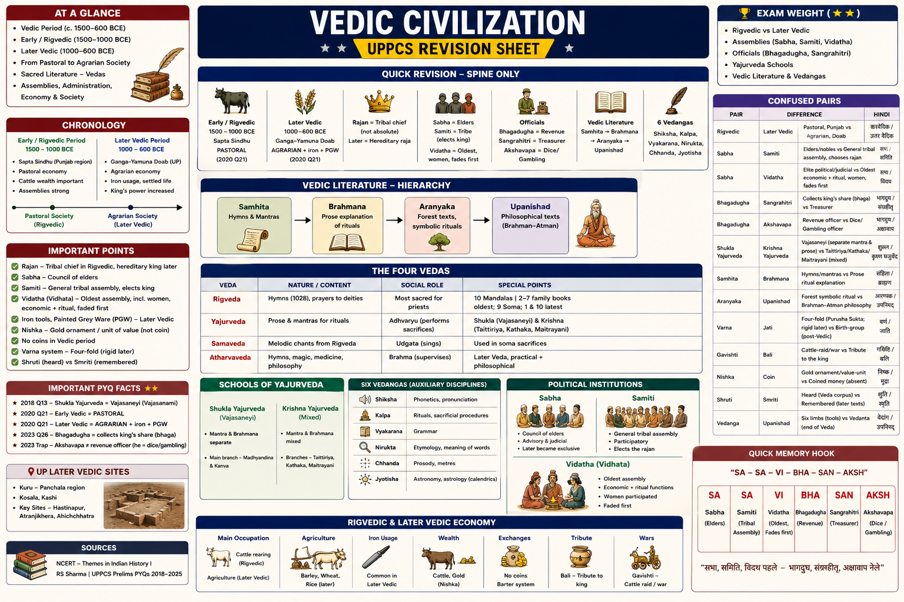

# Topic 3 — Vedic Civilization
### ★ UPPCS Revision Sheet — Lucent / PW style (one home per fact · no repetition · Practice ≥46)

<strong>Covers syllabus</strong> (click to expand)

Vedic Period | Rigvedic Society | Later Vedic Society | Vedic Administration | Rigvedic Economy | Later Vedic Economy | Political Institutions | Sabha | Samiti | Vidhata | Vedic Religion | Four Vedas | Brahmanas | Aranyakas | Upanishads | Vedangas | Painted Grey Ware (PGW) | Iron Age in India

> **Sources baked in:** NCERT *Themes in Indian History* I, RS Sharma, Ghatnachakra Vedic Age (B–31+), UPPCS Prelims PYQs 2018–2025, UKPCS Prelims 2025 (Yajurveda Krishna/Shukla)
> **Weight:** ★★★ — Rigvedic vs Later Vedic, assemblies, officials, Yajurveda schools
> **Last verified:** September 2026
> **Current Affairs:** N/A — purely historical; no scheme/report/appointment surface

---

## Consolidated — 42 Must-Score Facts

1. The **Early / Rigvedic** age is about **1500–1000 BCE** in the **Sapta Sindhu** (Punjab) belt. Its economy type is **pastoral**.
2. The **Later Vedic** age is about **1000–600 BCE** in the **Ganga–Yamuna doab**, including much of western–central Uttar Pradesh. Its economy type is **agrarian**, with iron and **PGW**.
3. The Early Vedic **rajan** (राजन) was a tribal chief, not an absolute king. Later Vedic kingship became more **hereditary** and stronger over land and ritual.
4. **Sabha** (सभा) was an assembly of elders or nobles. **Samiti** (समिति) was the wider tribal assembly that could **choose the rajan** (राजन).
5. **Vidatha** (विदथ / विधाता) is the **oldest** gathering, with economic and ritual roles and women’s presence. It **fades first** in Later Vedic times.
6. **Bhagadugha** (भागदुघ) collected the king’s share (**bhaga** (भाग)). **Sangrahitri** (संग्रहीतृ) was the **treasurer**. **Akshavapa** (अक्षावाप) handled **dice / gambling**. Do not swap revenue with dice.
7. The **Rigveda** (ऋग्वेद) has **1028** hymns in **10 mandalas**. Mandala **2–7** are the oldest family books. Mandala **9** is Soma. Mandalas **1** and **10** are latest.
8. Hymn-count facts are roughly **Indra ~250**, **Agni ~200**, **Soma ~120**, and **Ashvins 50+**. **Varuna** has fewer hymns but guards **rita** (ऋत - cosmic moral order).
9. Early popular gods are **Indra, Agni, Soma, Varuna, Ushas, and Savitr**. **Vishnu** and **Rudra** are minor in the Rigveda and rise in Later Vedic religion.
10. Later Vedic ritual elevates **Prajapati**, and **Vishnu** and **Rudra** grow in importance beside older storm and fire gods.
11. **Shukla (White) Yajurveda** is the **Vajasaneyi** (वाजसनेयी) school, with mantra and prose kept separate. **Krishna** (कृष्णा) here means **Black Yajurveda**, not the god Krishna.
12. Black Yajurveda schools include **Taittiriya** (तैत्तिरीय), **Kathaka**, and **Maitrayani**, where mantra and Brahmana prose are mixed.
13. Vedic literature order is **Samhita (संहिता) → Brahmana (ब्राह्मण) → Aranyaka (आरण्यक) → Upanishad (उपनिषद्)**. Samhitas are hymns; Brahmanas explain ritual in prose.
14. **Aranyakas** (आरण्यक) are forest texts of symbolic ritual. **Upanishads** (उपनिषद्) teach **Brahman–Atman** philosophy (Vedanta).
15. The six **Vedangas** (वेदांग) are **Shiksha (शिक्षा - phonetics), Kalpa (कल्प - rituals), Vyakarana (व्याकरण - grammar), Nirukta (निरुक्त - etymology), Chhanda (छन्द - metrics), and Jyotisha (ज्योतिष - astronomy)**. They are tools of the Veda, not the Upanishads themselves.
16. **Varna** (वर्ण) is the four-fold order (Purusha Sukta; more rigid later). **Jati** (जाति) is later birth-group identity. Do not treat them as identical.
17. **Gavishti** (गविष्टि) means cattle-raid or war for cows. **Bali** (बलि) is tribute to the king. **Nishka** (निष्क) is a gold ornament or value-unit, **not** coined money.
18. **Shruti** (श्रुति) is “heard” Vedic revelation. **Smriti** (स्मृति) is remembered later dharma literature.
19. **PGW** (Painted Grey Ware), about **1100–600 BCE**, is the Later Vedic **doab** (दोआब) marker: grey pottery with black geometric paint.
20. Later Vedic iron appears in texts as **shyama ayas / krishna ayas** (श्याम अयस / कृष्ण अयस). Early Rigvedic **ayas** (अयस) usually means copper or bronze, not iron.
21. Doab pottery sequence continues **PGW → NBPW** (~700–200 BCE) into the mahajanapada / second-urbanisation age.
22. Uttar Pradesh Later Vedic geography centres on **Kuru–Panchala**, **Kosala**, and **Kashi**. Key sites include **Hastinapur** (हस्तिनापुर), **Atranjikhera**, and **Ahichchhatra**.
23. Rigvedic culture is **not** a UP heartland story. Its core is Punjab / Sapta Sindhu.
24. **OCP** is pre-PGW ochre-wash doab rural pottery. **PGW** is iron-age painted grey ware of Later Vedic settlements.
25. Later Vedic society shows stronger **raja** (राजा), rising **Brahmana** (ब्राह्मण) ritual power, more settled agriculture, and clearer varna ranking than the Early Vedic pastoral tribes.
26. Political institutions to fact are **Sabha, Samiti, and Vidatha**. Vidatha fades; Sabha becomes more exclusive; Samiti remains the broader tribal body in Early Vedic memory.
27. The **Atharvaveda** (अथर्ववेद) adds charms and domestic rites beside the three liturgical Vedas (Rig, Yajur, Sama).
28. **Brahmana** texts are ritual prose, not the same as the **Brahmana** varna. Context decides which meaning is asked.
29. **Videha** (north Bihar, Janaka tradition) is east of the UP doab but linked in Later Vedic texts such as the Shatapatha Brahmana.
30. Match economy types carefully: Indus = **Urban**, Rigvedic = **Pastoral**, Later Vedic = **Agrarian**, Medieval landlordism is a later match-list item.
31. **Arya** in classical Sanskrit means a **noble** person. Homeland theories include Tilak’s **Arctic** (*The Arctic Home in the Vedas*), Max Müller’s **Central Asia**, and others — none is a closed scientific proof.
32. **Sindhu** is named most often in the Rigveda; **Saraswati** is the most sacred (*Naditama / Devitama / Matetama* / नदीतमा, देवितमा, मातेतमा). Afghanistan rivers in the hymns include **Kubha, Krumu, Gomati, Suvastu**.
33. **Gayatri** (RV III.62.10, Vishvamitra → Savitr); **Satyameva Jayate** (*Mundaka*); **Tamaso mā jyotir gamaya** (*Brihadaranyaka*); Nachiketa–Yama (*Katha*).
34. **Boghaz-köi** (Hittite / Asia Minor) names **Indra, Varuna, Mitra, Nasatya**. Cow is **aghanya** (अघन्या - not to be killed). **Dasharajna** (दशराज्ञ युद्ध) was fought on the **Parushni** (परुष्णी / रावी).
35. Later Vedic kings advertise power through **Rajasuya** (consecration), **Ashvamedha** (horse sacrifice / territory claim), and **Vajapeya**. **Ashvamedha** is treated in the **Shatapatha Brahmana**; **Rajasuya** in the **Aitareya Brahmana**.
36. Four **ashramas** (Brahmacharya → Grihastha → Vanaprastha → Sannyasa) and four **purusharthas** (Dharma, Artha, Kama, Moksha) are systematized in the Later / post-Vedic horizon.
37. Core Vedic officers: **purohita** (priest-adviser), **senani** (army), **gramani** (village head). Later Vedic **ratnins** expand the jewel-officer household around the king.
38. Early Vedic staple grain is **yava** (barley). Later crop vocabulary adds **vrihi** (rice), **godhuma** (wheat), **mudga**, and **ikshu**. Wealth is still counted in **cows**.
39. The **Purusha Sukta** (Rigveda **X.90**, late Mandala X) names the four **varnas**; **Shudra** appears clearly here. It is **not** the oldest hymn of the Rigveda.
40. Kinship terms **kula / vamsha / gotra** are not the same as **kosha** (treasury). **Gotra** is clan identity; **kosha** is the store.
41. **Sama Veda** is chant / melody drawn largely from Rigvedic verses. **Yajurveda** is the ritual-formula Veda (White / Black schools). **Atharvaveda** is charms and household rites.
42. **Aitareya** and **Shatapatha** are key **Brahmana** texts. **Brihadaranyaka** and **Chandogya** are major early **Upanishads**. **Mundaka** gives *Satyameva Jayate*.

---

## Confused Pairs

| A | B | Difference | Hindi |
|---|----|------------|-------|
| Rigvedic | Later Vedic | **Pastoral**, Punjab, assemblies strong vs **agrarian**, doab, king strong | ऋग्वेदिक / उत्तर वैदिक |
| Sabha | Samiti | Elders/nobles (later exclusive) vs **general tribal** assembly that **chooses the rajan** | सभा / समिति |
| Sabha | Vidatha | Political/judicial elite vs **oldest** gathering — **economic + ritual**, women, **fades first** | सभा / विदथ |
| Bhagadugha | Sangrahitri | Collects king's **share (bhaga)** vs **treasurer** | भागदुघ / संग्रहीतृ |
| Bhagadugha | Akshavapa | Revenue vs **dice / gambling** officer | भागदुघ / अक्षावाप |
| Shukla Yajurveda | Krishna Yajurveda | **Vajasaneyi** (mantra & prose separate) vs Taittiriya / Kathaka / Maitrayani (mixed). **Krishna here = Black Yajurveda**, not the god Krishna | शुक्ल / कृष्ण यजुर्वेद |
| Indra | Agni | **~250** hymns, war/rain vs **~200** hymns, fire / offering-carrier | इन्द्र / अग्नि |
| Indra (Early) | Prajapati (Later) | War-chief god of Rigveda vs creator / ritual supreme of Later Vedic | इन्द्र / प्रजापति |
| Vishnu (RV) | Vishnu (Later) | **Minor** in Rigveda vs rises with Rudra in Later Vedic / Upanishadic age | ऋग्वेद विष्णु / उत्तर वैदिक विष्णु |
| Samhita | Brahmana | Hymns/mantras vs **prose ritual** explanation | संहिता / ब्राह्मण |
| Aranyaka | Upanishad | Forest **symbolic ritual** vs **Brahman–Atman** philosophy | आरण्यक / उपनिषद् |
| Varna | Jati | Four-fold (Purusha Sukta; rigid later) vs birth-group (post-Vedic) | वर्ण / जाति |
| Gavishti | Bali | Cattle-raid / war vs **tribute** to the king | गविष्टि / बलि |
| Nishka | Coin | Gold **ornament / value-unit** vs coined money (**absent**) | निष्क / मुद्रा |
| Shruti | Smriti | Heard (Veda corpus) vs remembered (later dharma texts) | श्रुति / स्मृति |
| Vedanga | Upanishad | Six **limbs** (tools) vs **Vedanta** (end of Veda) | वेदांग / उपनिषद् |
| PGW | NBPW | Later Vedic **grey painted** doab ware vs mahajanapada **black polished** elite ware | चित्रित धूसर / उत्तरी काली |
| PGW | OCP | Iron-age **painted grey** vs pre-PGW **ochre-wash** doab rural | PGW / OCP |
| shyama ayas | ayas (Rigveda) | Later Vedic **iron** vs Early Vedic **copper/bronze** | श्याम आयस / आयस |
| Trayi | Atharvaveda | Rig–Yajur–Sama liturgical trio vs fourth Veda of charms / household | त्रयी / अथर्ववेद |
| Karma-kanda | Jnana-kanda | Samhita + Brahmana ritual vs Aranyaka + Upanishad philosophy | कर्मकांड / ज्ञानकांड |
| Aghanya | Horse sacrifice | Cow “not to be killed” vs Ashvamedha horse rite | अघन्या / अश्वमेध |
| Sindhu (most named) | Saraswati (most sacred) | Frequency in hymns vs *Naditama* piety | सिन्धु / सरस्वती |

---

## Must-score facts — Early vs Later, assemblies, texts

### Age ↔ geography / economy

| Age | Lock |
|-----|------|
| Early / Rigvedic (~1500–1000 BCE) | **Sapta Sindhu**; **pastoral** |
| Later Vedic (~1000–600 BCE) | **Ganga–Yamuna doab**; **agrarian**; iron + **PGW** |

### Assembly / official ↔ role

| Term | Lock |
|------|------|
| Sabha (सभा) | Elders / nobles |
| Samiti (समिति) | Wider assembly; could **choose the rajan** (राजन) |
| Vidatha (विदथ) | Oldest gathering; fades first |
| Bhagadugha (भागदुघ) | King’s share (**bhaga** / भाग) collector |
| Sangrahitri (संग्रहीतृ) | Treasurer |
| Akshavapa (अक्षावाप) | Dice / gambling (not revenue) |

### Veda / text tags

| Item | Lock |
|------|------|
| Rigveda | **1028** hymns; 10 mandalas; 2–7 oldest; 9 = Soma; **Hota** recites |
| Shukla Yajurveda | **Vajasaneyi**; mantra/prose separate |
| Krishna Yajurveda | Black; mixed mantra + Brahmana |
| Literature order | Samhita → Brahmana → Aranyaka → Upanishad |
| Brahmin Era | **800–600 BCE** (Brahmana prose period; Sutra period = 600–300 BCE) |
| Six Vedangas | Shiksha, Kalpa, Vyakarana, Nirukta, Chhanda, Jyotisha |
| Upanayana meters | **Brahmin = Gayatri** · **Kshatriya = Trishtubh** · **Vaishya = Jagati** |
| Puranas (18) | **Pancha-Lakshana** (Sarga, Pratisarga, Vansa, Manvantara, Vanshanucharita) · **Vishnu Purana = Maurya** · **Vayu Purana = Gupta** · **Matsya = Satavahana** |
| Mahabharata | **Jayasamhita** (8,800) → **Bharata** (24,000) → **Shatasahasri-Samhita** (100,000) |
| Upanishads | **Shvetashvatara** = "carried on a white horse" · **Brihadaranyaka** = *Tamaso Ma Jyotirgamaya* & Yagnavalkya-Gargi · **Chandogya** = Satyakama Jabala |
| Teachers | **Upadhyaya** = taught for livelihood/fees · **Acharya** = initiated & taught full Veda free |
| PGW | ~1100–600 BCE Later Vedic doab marker |
| OCP → PGW → NBPW | Pottery ladder |

### Economy type ladder

**Indus = Urban · Rigvedic = Pastoral · Later Vedic = Agrarian · Medieval = Land Lordism**

### UP Later Vedic sites

**Hastinapur · Atranjikhera · Ahichchhatra** (Kuru–Panchala belt)

---

## Books and Writers — Vedic Age

**Book–writer pairs | Vedanga authors | corpus heads stay without personal writers**

| Book / text | Writer / authority | What it is for |
|-------------|--------------------|----------------|
| *Ashtadhyayi* (अष्टाध्यायी) | **Panini** (पाणिनि) | Vyakarana; Classical Sanskrit grammar |
| *Nirukta* (निरुक्त) | **Yaska** (यास्क) | Etymology Vedanga |
| Chhanda / metre tradition | **Pingala** | Metre Vedanga |

- The Samhitas, Brahmanas, Aranyakas, and Upanishads are **corpus** heads. They do not carry a single match-list author like Panini.
- **Panini** is the usual Vyakarana name. Do not swap him with Yaska.

> **Logic:** *Ashtadhyayi* = **Panini**. *Nirukta* = **Yaska**.

---

## 3.1 Vedic Period

**Indo-Aryan culture of Vedic Sanskrit texts | Early ~1500–1000 BCE | Later ~1000–600 BCE**

- **Veda** (वेद) means knowledge. The post-Harappan textual culture of the Indo-Aryans is called the **Vedic** age.
- **Arya** in classical Sanskrit means a **noble** person. Older booklet keys sometimes call it a “superior race”; standard teaching treats Arya as a **cultural–linguistic** self-designation, not a modern racial science label.
- Homeland theories differ by named author, not by settled proof.
- **Bal Gangadhar Tilak** (बाल गंगाधर तिलक) argued the **Arctic / North Pole** in *The Arctic Home in the Vedas*; historians generally reject it.
- **Max Müller** stressed **Central Asia**.
- Other writers place Aryans in South Russia, Tibet, the Danube, Kashmir, or “seven Indus states.”
- The **Early / Rigvedic** heartland is **Sapta Sindhu**, the north-west Punjab belt.
- The seven rivers are **Sindhu** (Indus), **Vitasta** (Jhelum), **Asikni / Asakini** (Chenab), **Parushni** (Ravi), **Vipas / Vipasa** (Beas), **Sutudri / Shutudri** (Sutlej), and **Saraswati**.
- Afghanistan rivers named in the Rigveda include **Kubha** (Kabul), **Krumu** (Kurram), **Gomati** (गोमती) (Gomal), and **Suvastu** (Swat).
- **Sindhu** is mentioned **most often** and is called **Hiranyayi**; it empties toward the Arabian Sea.
- **Saraswati** is the **most sacred** river — *Matetama*, *Devitama*, *Naditama*.
- **Yamuna** (यमुना) appears a few times; **Ganga** (गंगा) appears once in early Rigvedic memory.
- **Sadaneera** is identified with the **Gandak** (गंडक); **Drishadvati** with the Ghaggar belt in many notes.
- Aryans called the doab fringe **Brahmarshi Desh**, the Himalaya–Vindhya belt **Madhya Desh**, and later the wider north **Aryavarta**.
- **Later Vedic** culture shifts **east** into the **Ganga–Yamuna doab** of western–central UP.
- It then reaches **Kosala**, **Kashi**, and **Videha**.
- The archaeological marker of Later Vedic is **Painted Grey Ware (PGW)**, about **1100–600 BCE**, with **iron**.
- Early Vedic has **no** Harappan-style cities.
- **Ayas** in the Rigveda means copper or bronze, not iron.
- Iron appears as **shyama ayas** or **krishna ayas** in Later Vedic texts. Early iron in the doab is often linked to sites such as **Atranjikhera** (~1000 BCE band).
- The language is **Vedic Sanskrit**, older than Panini’s Classical Sanskrit. Avestan of **Iran** shares close kinship with Rigvedic language.
- The Vedic age ends around **600 BCE**. Mahajanapadas, Buddhism, and Jainism follow.
- There was **no** Vedic empire.

> **Logic:** Rigvedic = **northwest pastoral**. Later Vedic = **Gangetic agrarian**. Trap: “Vedic period = only UP.”

> [!TIP]
> **Exam Anchor [UPPCS Prelims 2020, Q21]:** Rigvedic Society = Pastoral; Later Vedic = Agrarian; IVC = Urban; Medieval = Land Lordism. *(See Q2 in Complete PYQ Bank below)*

---

## 3.2 Rigvedic Society

**Tribal · pastoral · jana / vis · women relatively free · varna not yet a cage**

- The social unit is the **jana** (tribe) and the **vis** (clan).
- Loyalty is to kin, not to a fixed territory.
- There is no janapada-state.
- The **rajan** is a war-chief and ritual head.
- He is chosen with assembly consent.
- He is **not** an absolute hereditary king.
- **Cattle are wealth.**
- Wars are often **gavishti**, a cattle-raid.
- **Dasas** and **Dasyus** are rival groups in the hymns.
- **Panis** are cattle-keepers or traders, often hostile in the hymns.
- Women hymn-composers (**Brahmavadinis**) include **Lopamudra** (wife of Agastya), **Visvavara**, **Ghosha**, **Sikata**, and **Apala**.
- Women could attend the **Sabha**.
- Women could attend the **Vidatha**.
- There is no sati, purdah, or child-marriage as a system.
- **Varna** is named in the **Purusha Sukta** (Rigveda **X.90**), a **late** hymn. **Shudra** appears clearly here; earlier hymns stress three functional groups more loosely.
- The **Panchajana** tribes are **Yadu, Turvasa, Druhyu, Anu, and Puru**. **Kikata** is **not** one of them.
- **Kul / kula** is the smallest family unit. Society is **patriarchal**.
- **Gotra** in early Rigvedic usage can mean a cow-pen / herd; lineage sense grows later.
- The cow is **aghanya** — “not to be killed.” Cattle are wealth and a medium of exchange.
- Occupation is still flexible in Early Vedic.
- Early Vedic **varna** is still **flexible** occupation; the later four-fold *jati* system is a Later Vedic growth.
- Religion is of **nature gods**, with **no temples and no idols**.
- Chief Early Vedic gods are **Indra**, **Agni** (अग्नि), **Soma**, and **Varuna**.
- Houses are of wood and thatch.
- The **ratha** is a horse-chariot.
- There are no stone cities, no iron, and no coins.
- Clothing terms include **vasa** (lower) and **adhivasa** (upper). Craft terms include **taksha** (carpenter), **karma** (metal-worker), **veknat** (moneylender), and **aritri** (boatman).

> **Logic:** Rigvedic society is **Pastoral**, not agrarian. Later Vedic = agrarian. **Yava** = **barley** (not millet).

---

## 3.3 Later Vedic Society

**Settled agrarian · iron plough · janapadas · rigid varna · women lose ground**

- Iron and the plough open Gangetic forests.
- Surplus supports specialists.
- The economy type in match-lists is **Agrarian** — not pastoral like the Rigvedic phase.
- The **jana** becomes a **janapada** (जनपद), a territorial kingdom.
- Famous Later Vedic polities are **Kuru** and **Panchala**.
- **Kosala** is a Later Vedic polity in eastern UP.
- **Kashi** is a Later Vedic polity.
- **Videha** is a Later Vedic polity further east.
- Four varnas **harden**: Brahmana, Kshatriya, Vaishya, Shudra.
- Shudras are denied **upanayana**.
- **Gotra** exogamy appears.
- Anuloma and pratiloma marriage rules appear.
- **Women** drop from assemblies and from Vedic study.
- Child marriage begins to show.
- There are no more hymn-composers of the Early type.
- **Gargi** is a Later Vedic **exception** in Upanishadic debate.
- **Maitreyi** is another Later Vedic **exception**.
- They are not the social average.
- Four **ashramas** are systematized: Brahmacharya, Grihastha, Vanaprastha, and Sannyasa.
- About sixteen samskaras appear in later lists.
- Land grants to priests (**brahmadeya**) start the landlord pattern.
- Assemblies weaken. The king claims more.
- Thought shifts from ritual Brahmanas to forest Aranyakas.
- It then reaches the **Upanishads**, which put jnana over yajna.
- Religious focus shifts: **Prajapati**, **Vishnu**, and **Rudra** rise; royal **Rajasuya / Ashvamedha / Vajapeya** advertise kingship.

> **Logic:** “Women equal throughout the Vedic age” is false. The decline is **Later Vedic**.

---

## 3.4 Vedic Administration

**Rajan + purohita + senani core | Later Vedic adds revenue staff | no Mauryan bureaucracy**

- The **rajan** is the chief or king.
- In Later Vedic he becomes **hereditary**.
- He takes a divine aura.
- A household of **ratnins**, the jewel-officers of consecration, grows around him.
- The **purohita** (पुरोहित) is chief priest and political adviser.
- **Vasishtha** served Sudas as purohita.
- **Visvamitra** is the rival priest in that tradition.
- The **senani** (सेनानी) is the army commander.
- The **gramani** (ग्रामिणी) is the village head and is also listed among the ratnins.
- The **bhagadugha** is the **revenue collector**.
- He takes the king’s **bhaga** (share) of produce or booty.
- The **sangrahitri** is the treasurer or chamberlain.
- The **akshavapa** is a real Later Vedic **ratnin**.
- His charge is **dice and gambling**, and sometimes accounts.
- He is **not** the revenue collector. Revenue is **Bhagadugha**.
- The **suta** is the charioteer or bard.
- The **kshattri** is another ratnin.
- The **takshan** is the carpenter.
- **Govikartana** appears in ratnin lists.
- **Palagala** also appears in ratnin lists.

| Ratnin (jewel-officer) | Role |
|------------------------|------|
| **Purohita** | Chief priest and royal adviser |
| **Senani** | Army commander |
| **Gramani** | Village head |
| **Suta** | Charioteer / court bard |
| **Kshattri** | Chamberlain-type officer |
| **Bhagadugha** | Revenue collector of the king’s **bhaga** |
| **Sangrahitri** | Treasurer |
| **Akshavapa** | Dice / gambling officer |
| **Takshan** | Carpenter |
| **Govikartana** | Cowherd / cattle officer in lists |
| **Palagala** | Another ratnin name in Later Vedic lists |

- **Bali** is tribute.
- **Bhaga** is the king’s share.
- Later **shulka** is a toll.
- Spies appear in later texts.
- In family vocabulary, **kula**, **vamsha**, and **gotra** belong together; **kosha** (कोष) means **treasury**, not a kinship term.
- The system is still clan-based. It is **not** Ashokan district officers.

> [!TIP]
> **Exam Anchor [UPPCS Prelims 2023, Q26]:** **Bhagadugha** = Revenue / tax collector; **Samgrahitri** = Treasurer in Vedic Ratnin list. *(See Q1 in Complete PYQ Bank below)*

---

## 3.5 Rigvedic Economy

**Cattle-wealth · barter · barley · no coins · no iron plough**

- Wealth is counted in **cows**.
- **Gavishti** is a cattle-raid, not a tax.
- Agriculture exists but is **secondary**.
- **Yava** (barley) is known in Early Vedic. Do not match *yava* to millet.
- Later crop vocabulary includes **vrihi** (rice), **mudga** (mung), and **ikshu** (sugarcane).
- Wheat (**godhuma**) and rice become important **later**, with the iron plough.
- Exchange is by **barter**.
- **Nishka** is a gold necklace used as a **value standard**. It is **not** a coin. Later ages use *nishka* as a coin-name.
- **Hiranya** means gold.
- There are **no** punch-marked coins yet.
- Crafts include copper and bronze work, leather, pottery, and **chariot**-making.
- The soma plant is brought from the mountains for ritual.
- There is no private landed estate of the Later Vedic grant type.
- Pasture is tribal.
- **Dakshina** is a gift to the priest after yajna. It is not a land-revenue department.

> **Logic:** Trap — “nishka was a gold coin of the Rigvedic age.”

---

## Later Vedic Economy

**Iron plough · surplus grain · bali / bhaga · brahmadeya · path to second urbanisation**

- Later Vedic society became **agrarian** because the **iron plough** opened Gangetic forest and supported **surplus grain**.
- **Land grants to priests (brahmadeya)** began the pattern of religious landlords.
- **Bali** (tribute) and **bhaga** (king’s share) were collected.
- **Shulka** (toll) appears in later texts.
- Iron tools are the material backbone — linked to **PGW** layers in the doab.
- Crafts and specialist priests grow with surplus.
- Trade still uses barter and metal value-units more than coined money.
- This agrarian base supports the **second urbanisation** and the rise of **sixteen mahajanapadas** from about the sixth century BCE.

> **Logic:** Match-list fact — Rigvedic = **Pastoral**; Later Vedic = **Agrarian**.

---

## Rigvedic vs Later Vedic — Comparison Framework

| Point | Rigvedic | Later Vedic |
|-------|----------|-------------|
| Territory | **Sapta Sindhu** (Punjab) | **Ganga–Yamuna doab** and beyond |
| Economy | **Pastoral** (cattle wealth) | **Agrarian** (iron plough, surplus) |
| Polity | elected **rajan** + strong Sabha–Samiti–Vidatha | hereditary **raja**; weaker assemblies |
| Society | flexible occupation; women freer | rigid **varna**; women lose ground |
| Religion | nature gods; **Indra** tops hymns | ritual kings’ yajnas; **Prajapati / Vishnu / Rudra** rise |
| Archaeology | no cities; **ayas** = copper/bronze | **PGW** + **iron** (*shyama ayas*) |

---

## Vedic Religion and Ritual

**Nature hymns + fire sacrifice | no temples · no idols | Early Indra → Later Prajapati / Vishnu / Rudra**

### Rigvedic gods and hymn counts

About **33** gods are grouped in three layers: **earth**, **air (antariksha)**, and **sky**.

| God | Approx. Rigvedic hymns | Role / fact |
|-----|------------------------|-------------|
| **Indra** | **~250** (largest) | War god, rain-bringer, slayer of **Vritra**; called **Purandara** (fort-breaker) |
| **Agni** | **~200** (second) | Fire god; carries offerings to other gods |
| **Soma** | **~120** | Ritual drink-god; Mandala **IX** is the Soma book |
| **Ashvins** | **~50+** | Twin healer / dawn horsemen gods |
| **Varuna** | fewer (but high prestige) | Guardian of **rita** (cosmic / moral order) |
| **Mitra** (मित्र -) | paired with Varuna | Treaty / friendship; often **Mitra–Varuna** |
| **Maruts** | storm band with Indra | Wind / storm companions |
| **Ushas** | dawn hymns | Dawn goddess |
| **Savitr** | solar | Invoked in the **Gayatri** (RV III.62.10) |
| **Surya / Pushan** | solar group | Sun and path / cattle-path gods |
| **Vishnu** | few / **minor** | Three strides myth; **not** yet supreme |
| **Rudra** | few / **minor** | Fierce storm / healer; later rises as Shiva |

- Early Vedic religion is **polytheistic** nature worship through **hymns and fire sacrifice** (yajna).
- There are **no temples** and **no idols** in the Rigvedic pattern.
- **Rita** is cosmic / natural order; **Varuna** is its chief guardian (**Ritasyagopa**).
- **Dharma** in Vedic usage points to duty and ordinance that keep order; **rita** is the impersonal universal law. Both appear from the Rigveda onward.
- **Brihaspati** is the priest / teacher of the gods (**Deva-guru**).
- The **Boghaz-köi** (Boğazköy) inscription from Asia Minor / Hittite lands (about **14th century BCE**) names **Indra, Varuna, Mitra, and Nasatya** — proof of Indo-Aryan god-names outside India.
- **Dyaus** (sky) and **Prithvi** (earth) are older nature pair names in the hymns.

### Later Vedic religion

- Kings advertise power through **Rajasuya** (consecration), **Ashvamedha** (horse sacrifice / territory claim), and **Vajapeya**.
- **Prajapati** rises as a creator / ritual-supreme figure.
- **Vishnu** and **Rudra** gain importance (they were **minor** in the Rigveda).
- **Indra** remains famous but is no longer the unchallenged centre of religion.
- Four **ashramas** (Brahmacharya → Grihastha → Vanaprastha → Sannyasa) and four **purusharthas** (Dharma, Artha, Kama, Moksha) are systematized in the post / Later Vedic horizon.
- **Pancha Mahayajnas** belong to the **Grihastha** (गृहस्थ) stage.
- About **sixteen samskaras** appear in later lists (from Garbhadhana to Antyeshti).
- Directional kingship titles in Later Vedic lists include **Samrat** (सम्राट) (east), **Svarat** (west), **Virat** (north), **Bhoja** (south), and **Raja** (centre).
- Thought shifts from **Brahmana** ritual manuals to forest **Aranyakas**.
- It then reaches the **Upanishads**, which put **jnana** (Brahman–Atman) over **yajna**.
- Untouchability as a clear social system is usually dated to the later **Dharmashastra** phase, not Early Rigvedic society.

> **Logic:** Trap — “Vishnu is already the supreme Rigvedic god.” False. Trap — “Krishna Yajurveda = hymns to god Krishna.” False; **Krishna** here means **Black** Yajurveda.

---

## 3.6 Political Institutions

**Early: tribe + three assemblies check the rajan | Later: hereditary king + royal yajnas**

- The political unit is the vis and the jana.
- Later it becomes a **janapada**.
- There is no written constitution. Custom and **dharma** rule.
- There is no standing army. A tribal **sena** fights under the senani.
- The **Battle of Ten Kings (Dasarajna)** is the core **Rigvedic** political event.
- Later Vedic kingship is advertised through big sacrifices.
- **Rajasuya** is consecration.
- **Ashvamedha** is the horse sacrifice that claims territory.
- **Vajapeya** is another royal rite.
- Some tribes keep **gana / sangha** oligarchy habits. Later Vajji and Licchavi echo this.

### Battle of Ten Kings (Dasarajna) — Cause, Course, Result

**Cause:** Rival tribal confederacies fought for pasture and river water in **Sapta Sindhu**.

**Course:** Bharata king **Sudas** of the Tritsu line, advised by **Vasishtha**, fought a **ten-king coalition** on the **Parushni (Ravi)**. **Visvamitra** stands on the opposite side in that tradition.

**Result:** Sudas **won**. The Bharata–Tritsu line became prominent in Rigvedic memory.

> **Logic:** Assemblies are strong in Rigvedic times. The **king is strong** in Later Vedic. **Sabha**, **Samiti**, and **Vidatha** are three distinct bodies.

---

## 3.7 Sabha

**Smaller assembly of elders / nobles | advice + disputes**

- It is a select gathering, not the whole tribe.
- It advises the rajan.
- It handles **disputes** and is more judicial than the Samiti.
- In **Rigvedic** hymns women could be present as **sabhavati** or **sabha vadhu**.
- In **Later Vedic** it becomes an elite-male club.
- Women drop out. The king is less bound by it.
- Later literature also uses *sabha* for a **gambling hall**. That is a social hall, not the early political body.
- The **Atharvaveda** calls **Sabha** and **Samiti** the **two daughters of Prajapati** and treats them as distinct institutions more clearly than the Rigveda.
- It is **not** Lok Sabha, Rajya Sabha, or the 73rd-Amendment **Gram Sabha** (ग्राम सभा).

> **Logic:** Sabha means **elders**. Samiti means the **people**.

---

## 3.8 Samiti

**General tribal assembly | broader than Sabha | elects / confirms the rajan**

- It is the assembly of the freemen of the jana.
- War, migration, and **king-making** sit here in Early Vedic.
- Together with the Sabha it checks the chief.
- It is popular, not oligarchic.
- Women have little or no Samiti role. Early Sabha and Vidatha are more open.
- Later Vedic hereditary succession **kills** its electoral job. The body fades.

> **Logic:** Trap — “Samiti = Rajya Sabha.” Zero link.

---

## 3.9 Vidhata (Vidatha)

**Oldest of the three | ritual + distribution + women | disappears first**

- The syllabus spelling is **Vidhata**. Standard books say **Vidatha**. It is the same institution.
- Hymns show it as a **wide gathering**.
- It holds a feast, a **share-out of booty**, soma, and martial talk.
- It is not a law-court. Disputes lean toward the Sabha.
- **Women** sing and attend.
- It is more inclusive than the Later Vedic Sabha.
- It is the **first assembly to vanish** from Later Vedic texts.
- Among the three assemblies, **Vidatha** fades first from Later Vedic texts.

---

## 3.10 Vedic Literature

**Oral Shruti | four layers per Veda | written down much later**

- **Shruti** means “that which is heard.”
- It covers Samhita, Brahmana, Aranyaka, and Upanishad.
- **Smriti** is later remembered law. It is not the core of this chapter.
- Growth order is **Samhita** (संहिता) (mantra), then **Brahmana** (ritual prose), then **Aranyaka** (forest and symbol), then **Upanishad** (उपनिषद्) (philosophy).
- **Karma-kanda** = Samhita + Brahmana (ritual). **Jnana-kanda** = Aranyaka + Upanishad (philosophy).
- **Trayi / Vedatrayi** = Rigveda + Yajurveda + Samaveda (the three liturgical Vedas). Atharvaveda is the fourth.
- The corpus is kept by **guru–shishya** recitation.
- **Shakhas** are recension schools. Patanjali cites **21** Rigveda branches.
- The Rigveda is the oldest Veda.
- The Atharvaveda and the prose layers are younger.
- Later Vedic books take shape in **Kuru–Panchala** and **Videha** in the east. Post-Vedic notes treat **Kuru–Panchala** as the axis of Aryan culture.
- **Sayana** of fourteenth-century Vijayanagara commented on the Vedas. He is **medieval**, not Vedic-age.
- An **Upadhyaya** teaches a portion of Veda / Vedanga for livelihood; an **Acharya** is a fuller teacher of the tradition.

> **Logic:** Vedas were **not** “published on paper” in 1500 BCE. Oral first.

---

## 3.11 Four Vedas

**Rig · Sama · Yajur · Atharva | each has a Samhita core | compiler Vyasa**

| Veda | Core content | Priest | Upaveda | Main Samhita(s) | Key Brahmana(s) | Structure fact |
|------|--------------|--------|---------|-----------------|-----------------|----------------|
| **Rigveda** | Oldest; hymns (*rik*) | **Hotri / Hota** | **Ayurveda** (often also linked Atharva) | Rigveda Samhita | **Aitareya**, Kausitaki | **1028** hymns; **~10552** verses (*richas*); **10** mandalas |
| **Samaveda** (सामवेद) | Melodies (*saman*) for Soma | **Udgatri** | **Gandharvaveda** | Samaveda Samhita (mostly from Rig) | Tandya / Panchavimsha, Jaiminiya | Chant-book for sacrifice |
| **Yajurveda** (यजुर्वेद) | Sacrificial formulas (*yajus*) | **Adhvaryu** | **Dhanurveda** | **Shukla:Vajasaneyi** (Madhyandina, Kanva; paper: **Vajasanami**). **Krishna:** Taittiriya, Kathaka, Maitrayani (+ Kapishthala) | **Shatapatha** (Shukla, **100** ch.); Taittiriya (Krishna) | Shukla = mantra & Brahmana **apart**; Krishna = **mixed** |
| **Atharvaveda** | Spells, healing, household | **Brahman** (rite supervisor) | **Arthashastra** (अर्थशास्त्र) | Atharvaveda Samhita | **Gopatha** (only one) | **20** books; newest of the four; early **iron** hints |

- Mandalas **II–VII** are the family books and the oldest Rigvedic core (Gritsamada, Vishvamitra, Vamadeva, Atri, Bharadvaja, Vasishtha traditions).
- Mandala **VIII** is linked with Kanva and Angiras lines.
- Mandala **IX** is the Soma book (**114** hymns to Soma).
- Mandalas **I and X** are the latest.
- The **Purusha Sukta** lives in Mandala X.
- The **Gayatri Mantra** is RV **III.62.10**.
- It is addressed to **Savitr**. The seer is **Vishvamitra**.
- The Nasadiya Sukta, the creation hymn, is also in Mandala X.
- Most **Samaveda** verses are lifted from the Rigveda (about **1875** verses; only a small residue is not from Rig).
- **Shukla (White) Yajurveda** keeps mantra and Brahmana **apart**.
- **Krishna (Black) Yajurveda** mixes mantra and prose.
- In **- Here **Krishna** means the **Black Yajurveda** school (mantra + prose mixed). It does **not** mean the deity Krishna.
- The Atharvaveda is everyday religion, charms, healing, and household rites — not only royal yajna.
- First textual notice of **Anga** and **Magadha** (मगध) (with Gandhari and Mujavat) appears in the **Atharvaveda**.
- **Ayurveda** (science of life) is treated as an Upaveda / Upanga linked especially with the **Atharvaveda**.
- The supervising priest of the Atharvan rite is often called **Brahman**.

> **Logic:** Shukla Yajurveda = **Vajasaneyi** (also printed Vajasanami). Taittiriya / Maitrayani / Kathak = **Krishna (Black)** Yajurveda — not hymns to god Krishna.

> [!TIP]
> **Exam Anchor [UPPCS Prelims 2018, Q13]:** **Vajasaneyi Samhita** = Samhita of Shukla (White) Yajurveda (Madhyandina & Kanva recensions). *(See Q3 in Complete PYQ Bank below)*

---

## 3.12 Brahmanas

**Prose manuals of yajna — not hymns**

| Brahmana | Veda |
|----------|------|
| Aitareya, Kausitaki (Shankhayana) | Rigveda |
| Tandya / Panchavimsha, Jaiminiya | Samaveda |
| **Shatapatha** (largest, **100** chapters) | **Shukla Yajurveda** |
| Taittiriya | Krishna Yajurveda |
| **Gopatha** (only one) | Atharvaveda |

- Brahmanas fix **how** to perform the sacrifice and **why** the myth says so.
- They set priest roles and varna duties.
- **Rajasuya** is treated in the Aitareya Brahmana.
- **Ashvamedha** is treated in the Shatapatha Brahmana.
- **Purushamedha** is also discussed in the **Shatapatha** (and in Taittiriya Brahmana notes).
- The **Shatapatha** also carries the Videha eastward-expansion story of **Videgha Mathava / Madhava** with priest **Gautama Rahugana** carrying Agni Vaisvanara east of the Sadaneera.
- The language is Later Vedic Sanskrit **prose**.
- They are the bridge toward Aranyakas.

> **Logic:** Brahmanas are **not** collections of hymns. Hymns sit in the Samhita.

---

## 3.13 Aranyakas

**“Forest books” | symbol over public fire-altar | hinge to Upanishads**

- They are meant for **vanaprastha** (वानप्रस्थ) hermits.
- They give a quieter, inward reading of ritual.
- The **Aitareya Aranyaka** belongs to the Rigveda.
- The **Taittiriya Aranyaka** belongs to the Krishna Yajurveda.
- The **Brihadaranyaka** sits on the Shatapatha / Shukla line.
- The Brihadaranyaka **is also an Upanishad**.
- Not every Veda has a fat separate Aranyaka.
- The Atharvaveda is thin here.
- The teaching is secretive. It is not the village public cult.

> **Logic:** An Aranyaka is not a Brahmana. Forest symbol is not public yajna prose.
> An Aranyaka is not an Upanishad, though the Brihadaranyaka overlaps.

---

## 3.14 Upanishads

**Vedanta — Brahman and Atman | jnana over outer yajna**

- Tradition counts **108** Upanishads.
- Notes use the principal early set: Brihadaranyaka, Chandogya, Isha, Kena, Katha, Mundaka, Mandukya, Prashna, Taittiriya, and Aitareya.
- **Svetasvatara** (“white horse” etymology in many notes) is often added to that list.
- **Moksha / salvation** as liberation language is developed in the **Upanishads**, not as a Rigvedic Samhita keyword.
- **Tat Tvam Asi** is taught in the **Chandogya**.
- Uddalaka Aruni speaks it to Shvetaketu.
- **Satyakama Jabala** appears in the **Chandogya**.
- The **Yajnavalkya–Maitreyi** and **Yajnavalkya–Gargi** dialogues are in the **Brihadaranyaka**.
- The Brihadaranyaka belongs to the Shukla Yajurveda.
- The **Nachiketa–Yama** story is in the **Katha Upanishad**.
- **Satyameva Jayate** (“Truth alone triumphs”) is from the **Mundaka Upanishad** — India’s national motto under the state emblem (adopted **26 January 1950**).
- **Tamaso mā jyotir gamaya** is from the **Brihadaranyaka**.
- The **Mandukya** is the shortest.
- It teaches **Om / AUM** and the four states of consciousness.
- **Janaka of Videha** patronises these debates. Other Upanishadic scholar-kings include **Asvapati of Kekaya**, Pravahana Jaivali of Panchala, and Ajatashatru of Kashi (in tradition).
- The date-band is about **800–600 BCE**, in eastern courts.
- Upanishads use **parables** (e.g. two-birds imagery) — they are not parable-free.

> **Logic:** Upanishads **question** big public yajna. They are **Shruti**. They are **not** a Vedanga.

---

## 3.14A Puranas and Itihasa (Vedic desk extras)

- There are **18** Mahapuranas. Five traditional marks (*pancha-lakshana*) are **Sarga, Pratisarga, Vamsha, Manvantara, and Vamshanucharita**.
- **Vishnu Purana** preserves Mauryan genealogical memory; **Vayu Purana** is often linked with Gupta-period material in booklet keys.
- The **Bhagavad Gita** (भगवद्गीता) is originally in **Sanskrit** (about **700** verses) inside the Mahabharata.
- The Mahabharata’s early form is remembered as **Jaya / Jayasamhita** (~**8,800** verses); the expanded epic is called **Shatasahasri Samhita** (~**100,000** verses), attributed to **Vyasa** (व्यास).
- Ocean-churning myths name **Vasuki** as the churning rope.

---

## 3.15 Vedangas

**Six limbs — tools to keep and decode the Veda | not Shruti philosophy**

| Vedanga | Job | Fact |
|---------|-----|------|
| **Shiksha** | Phonetics | Pratishakhya texts |
| **Kalpa** | Ritual sutras | **Shrauta** (public), **Grihya** (domestic), **Dharma** (law), **Sulba** (altar geometry — Baudhayana, Apastamba) |
| **Vyakarana** | Grammar | **Panini**, *Ashtadhyayi* (~5th c. BCE, edge of / just after Vedic) |
| **Nirukta** | Etymology | **Yaska** |
| **Chhanda** | Metre | **Pingala** |
| **Jyotisha** | Ritual calendar / astronomy | Vedanga Jyotisha |

Memory: **S-K-V-N-C-J**.

> **Logic:** Upanishad / Puranas / Itihasa are **not** Vedangas. Yaska ≠ Panini.

---

## 3.16 Painted Grey Ware (PGW)

**Archaeological marker of Later Vedic culture | ~1100–600 BCE | upper Gangetic–Ghaggar belt**

- **Painted Grey Ware** is fine grey pottery with geometric designs painted in black. It is the standard archaeological signature of the **Later Vedic** phase in the doab.
- The date-band is about **1100–600 BCE**, overlapping the end of the Vedic textual period. Sites often sit on top of or beside **OCP** layers.
- Distribution runs through **western UP, Haryana, Punjab, and Rajasthan**: Hastinapur, Ahichchhatra, Kurukshetra, Mathura, Jakhera, and Panipat are textbook names.
- PGW settlements are mostly villages, but some grow into **fortified towns** with moats and palisades before the full mahajanapada cities.
- The culture is linked in tradition to **Kuru–Panchala** and the Mahabharata geography. Archaeology does **not** by itself prove every epic event.
- PGW layers show **iron** tools and weapons along with horse bones and ivory work. That is why PGW marks the **early Iron Age** in the north.
- Stratigraphy usually runs **OCP → PGW → NBPW** in the doab. PGW is **not** the same as Harappan red ware or megalithic black-and-red ware of the south.

> **Logic:** PGW = **Later Vedic / doab**, not Sangam south. PGW comes **before** NBPW, not after.

---

## 3.17 Iron Age in India

**Metal transition that reshapes agriculture, war, and settlement | north and south follow different pottery tracks**

- The Rigveda knows metal as **ayas**, usually read as **copper or bronze**. True iron appears in Later Vedic texts as **shyama ayas** or **krishna ayas** (“dark metal”).
- In **north India**, iron technology spreads with **PGW** from about the 12th century BCE and then with **NBPW** cities after about 700 BCE.
- Iron ploughshares, axes, and weapons made dense farming and forest clearance possible in the Ganga plain. That underpins the **second urbanisation** and the sixteen mahajanapadas.
- In **south and central India**, the Iron Age is often studied through **megalithic** burials with **black-and-red ware**, not through PGW.
- Key southern megalithic names include **Brahmagiri**, **Adichanallur**, **Maski** (मास्की), and **Hallur**. Burial types include dolmens, cists, stone circles, and **hero stones (virakkal)**.
- Iron did **not** arrive everywhere at one instant. Gandhara, the doab, and the Deccan show different start-dates in excavation.

| Region | Iron Age marker | Period fact |
|--------|-----------------|-------------|
| **Northwest / doab** | PGW then NBPW | Later Vedic → mahajanapada |
| **South / Deccan** | Megaliths + black-and-red ware | Pre-Sangam bed |
| **Chalcolithic overlap** | Limited copper before iron | Mehrgarh, Jorwe, OCP zones |

> **Logic:** “Iron in Rigveda” is a **trap** unless the question means Later Vedic shyama ayas. PGW iron is **north**; megalithic iron is mainly **peninsular**.

---

---

## 3.18 Lucent GK Complete Comprehensive Reference & Direct Gap-Fill

> **Note for Aspirants:** Every single fact, classification, literary work, official name, ritual category, marriage type, samskara, and quote from Lucent's General Knowledge (Ancient History Section 2) has been compiled below. You will never need to consult Lucent GK separately for Vedic Culture.

### 1. Original Home of Aryans & Boghazkoi Evidence
- **Debate on Aryan Homeland:**
  - **Central Asia:** Proposed by **Max Muller** (most widely accepted view; migrated in stages during **2000 BC – 1500 BC**).
  - **Arctic Region:** Proposed by **Bal Gangadhar Tilak** (*The Arctic Home in the Vedas*).
  - **Tibet / Himalayan Region:** Proposed by Swami Dayanand Saraswati.
  - **European Homeland:** Proposed by William Jones, P. Giles.
- **Boghazkoi / Boghazkai Inscription (Asia Minor, Turkey, ~1400 BC):**
  - Mentions **4 Vedic gods:** **Indra, Varuna, Mitra, and Nasatyas (Ashwins)**.
  - Proves the Central Asian theory and marks the migration trail of Aryans towards the Indian subcontinent.

---

### 2. Geographical Horizons & Rigvedic Rivers (Nadisukta)
- **Primary Habitation:** Aryans first settled in the Frontier Province and Punjab, known as **Sapta Sindhu** (the land of seven rivers: Indus + 5 Punjab tributaries + Saraswati).
- **Mountains:** Rigveda mentions **Himvant** (Himalaya) and **Munjavant** (Hindukush, source of Soma plant).
- **River Mentions:** Rigveda mentions **40 rivers** in total. The celebrated **Nadisukta** hymn mentions **21 rivers**, including Ganga in the east and Kubha (Kabul) in the west.
- **Frequency of River Mentions:**
  - **Sindhu (Indus):** Most frequently mentioned river.
  - **Saraswati:** Most sacred/pious river (called *Naditama*, *Devitama*, *Matetama*).
  - **Ganga:** Mentioned only **1 time**.
  - **Yamuna:** Mentioned **3 times**.
- **Master Table of Rigvedic vs Modern River Names:**
  | Rigvedic Name | Modern Name | Region |
  | :--- | :--- | :--- |
  | **Sindhu** | Indus | Punjab / Sindh |
  | **Vitasta** | Jhelum | Punjab |
  | **Asikani** | Chenab | Punjab |
  | **Vipas** | Beas | Punjab |
  | **Parushni** | Ravi | Punjab |
  | **Sutudri** | Sutlej | Punjab |
  | **Saraswati** | Sarsuti / Ghaggar-Hakra | Rajasthan / Haryana |
  | **Drishadvati** | Ghaggar / Rakshi | Rajasthan / Haryana |
  | **Kubha** | Kabul | Afghanistan |
  | **Suvastu** | Swat | Afghanistan |
  | **Krumu** | Kurram | Afghanistan |
  | **Gomati** | Gomal | Afghanistan |

---

### 3. The Dasrajan War (Battle of Ten Kings)
- **Source:** Described in Rigveda (7th Mandala). It was an internecine war of the Aryans.
- **Protagonist:** **Sudas**, the Bharata king of the **Tritsus** family (guided by sage Vasishtha).
- **Opponents (Confederacy of 10 Kings):**
  - **5 Aryan States (Panchajana):** **Purus, Yadus, Turvasas, Anus, and Druhyus**.
  - **5 Non-Aryan / Frontier Tribes:** **Alinas, Pakhtas, Bhalanas, Sibis, and Vishanins** (guided by sage Vishwamitra).
- **Venue & Result:** Fought on the bank of **Parushni (Ravi)**. Sudas emerged completely victorious.

---

### 4. Vedic Literature (Shruti — 1500 BC to 600 BC)
- **Nature of Shruti:** Passed down orally through generations; called **Shruti** ("to hear").
- **Nature of Vedas:** Called **Apaurasheya** (not created by man, but God-gifted) and **Nitya** (existing in all eternity).
- **Vedatrayi (Trio of Vedas):** Rigveda, Samaveda, and Yajurveda (excludes Atharvaveda).
- **The Four Vedas:**
  1. **Rigveda (Collection of Lyrics):**
     - Oldest religious text in the world; known as *"the first testament of mankind"*.
     - Contains **1028 hymns** (1017 Sakala + 11 Valakhilya) divided into **10 Mandalas**.
     - Mandalas **2nd to 7th** are the oldest and called **Gotra / Vamsha Mandalas (Kula Granth)**.
     - 1st and 10th Mandalas were added later.
     - **10th Mandala** contains the famous **Purushasukta**, which explains the divine creation of the **4 Varnas** (Brahmana, Kshatriya, Vaishya, Shudra).
     - Hymns were recited by the **Hotri** priest.
  2. **Samaveda (Book of Chants):**
     - Contains **1549 hymns** (all hymns except **75** were borrowed from the Rigveda).
     - Recited by the **Udgatri** priest.
     - Fundamental foundational text for Indian classical music and melody.
  3. **Yajurveda (Book of Sacrificial Prayers):**
     - A ritual Veda; its hymns were recited by the **Adhvaryu** priest.
     - Divided into two branches: **Krishna Yajurveda** (black, mixed prose and verse) and **Shukla Yajurveda** (white, pure verse).
     - Unique because it is composed in **both verse and prose** (unlike Rig and Sama which are entirely in verse).
  4. **Atharvaveda (Book of Magical Formulae):**
     - Contains charms, spells, and incantations to ward off evils and diseases.
     - For a long time, it was not included in the category of the Vedas (excluded from Vedatrayi).
- **The Brahmanas (Prose Exegesis of Sacrifices):**
  - *Brahma* means "sacrifice"; they explain the Vedic hymns and ritual applications in prose.
  - **Rigveda:** **Aitareya** and **Kaushitaki / Sankhyan**.
  - **Samaveda:** **Panchavimsha (Tandya Maha Brahmana)**, **Shadvimsha**, **Chhandogya**, and **Jaiminiya**.
  - **Yajurveda:** **Shatapatha** (*the oldest and largest Brahmana*) and **Taittiriya**.
  - **Atharvaveda:** **Gopatha**.
- **The Aranyakas (Forest Texts):**
  - Derived from *Aranya* (forest); written for hermits and students living in jungles; form the concluding portions of the Brahmanas.
- **The Upanishads (Philosophical Texts / Vedanta):**
  - Known as **Vedanta** because they stand at the end of the Vedic period and literature.
  - Total **108 Upanishads**. **Brihadaranyaka Upanishad** is the oldest Upanishad.

---

### 5. Literature of Vedic Tradition (Smriti — 600 BC to 600 AD)
Comprises 6 categories: Vedangas/Sutras, Smritis, Mahakavyas (Epics), Puranas, Upavedas, and Shad-Darshanas.

#### A. Six Vedangas (Limbs of the Vedas)
1. **Shiksha (Phonetics):** Oldest text is *Pratishakhya*.
2. **Kalpa Sutras (Rituals):**
   - *Shrauta Sutras / Shulva Sutras:* Deal with grand sacrifices; *Shulva Sutras* are the oldest Indian texts on geometry (altar measurements).
   - *Grihya Sutras:* Deal with domestic life, samskaras, and family ceremonies.
   - *Dharma Sutras:* Deal with laws, duties, Varnas, and Ashramas.
3. **Vyakarana (Grammar):** *Ashtadhyayi* by **Panini** (the oldest grammar book in the world).
4. **Nirukta (Etymology):** *Nirukta* by **Yaska**, based on *Nighantu* by **Kashyapa** (*Nighantu* is the world's oldest glossary; *Nirukta* is the world's oldest dictionary).
5. **Chhanda (Metrics):** *Chhandasutras* by **Pingala**.
6. **Jyotisha (Astronomy):** *Vedanga Jyotisha* by **Lagadha Muni** (the oldest astronomy treatise).

#### B. Six Famous Smritis (Dharmashastras)
1. **Manu Smriti (Pre-Gupta Period):** Oldest Smriti text. Renowned commentators: **Vishwarupa, Medhatithi, Govindaraja, and Kulluka Bhatta**. Translated into English by Sir William Jones under the title *"Institutes of Hindoo Law"*.
2. **Yajnavalkya Smriti (Pre-Gupta Period):** Renowned commentators: **Vishwarupa, Vijnaneshwara** (author of Mitakshara), and **Apararka** (a king of the Shilahara Dynasty).
3. **Narada Smriti (Gupta Period).**
4. **Parashara Smriti (Gupta Period).**
5. **Brihaspati Smriti (Gupta Period).**
6. **Katyayana Smriti (Gupta Period):** Notable as the first Smriti to use the technical legal term **"asprasya"** for the untouchables.

#### C. Two Mahakavyas (Epics)
1. **The Ramayana (Valmiki):** Known as **"Adi Kavya"** (the oldest epic of the world). Presently consists of **24,000 shlokas (verses)** in **7 Kandas** (evolved from 6,000 → 12,000 → 24,000). The 1st (*Bal Kanda*) and 7th (*Uttar Kanda*) were the latest additions.
2. **The Mahabharata (Ved Vyasa):** The longest epic in the world. Presently consists of **1,00,000 shlokas** in **18 Parvans** plus the *Harivamsa* supplement:
   - Originally **8,800 verses:** Called **Jaya Samhita**.
   - Expanded to **24,000 verses:** Called **Bharata / Chaturvimshati Sahasri Samhita**.
   - Finally expanded to **1,00,000 verses:** Called **Mahabharata / Shatasahasri Samhita**.
   - The *Bhagavad Gita* is extracted from the **Bhishma Parvan**.
   - The largest parvan is the **Shanti Parvan**.

#### D. Puranas
- Total **18 Puranas**. *Purana* means "the old".
- **Matsya Purana** is the oldest Puranic text.
- Other major Puranas: Bhagavata, Vishnu, Vayu, and Brahmanda Puranas (crucial for ancient royal dynastic genealogies).

#### E. Upavedas (Auxiliary Vedas)
| Upaveda | Subject | Associated Veda |
| :--- | :--- | :--- |
| **Ayurveda** | Medicine | **Rigveda** |
| **Gandharvaveda** | Music | **Samaveda** |
| **Dhanurveda** | Archery & Warfare | **Yajurveda** |
| **Shilpaveda / Arthaveda** | Science of Craft / Wealth (Vishwakarma) | **Atharvaveda** |

#### F. Shad-Darshanas (Six Schools of Indian Philosophy)
| Darshana (School) | Founder | Basic Text |
| :--- | :--- | :--- |
| **Sankhya Darshana** | **Kapila** | *Sankhya Sutra* |
| **Yoga Darshana** | **Patanjali** | *Yoga Sutra* |
| **Nyaya Darshana** | **Akshapada Gautama** | *Nyaya Sutra* |
| **Vaishesika Darshana** | **Uluka Kanada** | *Vaishesika Sutra* |
| **Purva Mimamsa (Mimamsa)** | **Jaimini** | *Purva Mimamsa Sutra* |
| **Uttara Mimamsa (Vedanta)** | **Badarayana** | *Brahma Sutra / Vedanta Sutra* |

---

### 6. Early Vedic / Rigvedic Period (1500 BC – 1000 BC)
- **Political Units & Heads:**
  - **Kula (Family):** Headed by **Kulapa**.
  - **Grama (Village):** Headed by **Gramani**.
  - **Vis (Clan):** Headed by **Vispati**.
  - **Jana (People / Tribe):** Headed by **Gopa / Gopati**.
  - **Rashtra (Country / State):** Ruled by **Rajan (King)**.
- **Form of Government:** Patriarchal monarchy normal (law of primogeniture), though elective monarchy existed.
- **Key Officials:**
  - **Purohita:** Chief domestic priest, first ranking official; king's preceptor, friend, philosopher, guide.
  - **Senani:** Army commander.
  - **Gramani:** Village head.
- **Military:** Foot-soldiers and charioteers. Weapons of wood, stone, bone, and metals. Moving fort called **Purcharishnu** and siege machines for assaulting strongholds.
- **Assemblies:** Sabha, Samiti, Vidatha, Gana. **Sabha** was a council of select elders/privileged individuals; later functioned as a **court of justice**. **Samiti** was the broad folk assembly.
- **Society:** 4 Varnas based on occupation, strictly **non-hereditary**. Famous Rigvedic hymn quote: *"I am a singer; my father is a physician, my mother is a grinder of corn."*
- **Family & Marriage:** Monogamous and patriarchal. Child marriage was **not** in vogue. **Niyoga** (levirate: widow marrying younger brother of deceased husband) was permitted. Sons inherited father's property.
- **Food & Drink:** Milk and dairy central. Grain cooked with milk was called **Kshira-pakamodanam**. Cow was considered **Aghanya** (not to be killed); death penalty or expulsion was prescribed for killing/injuring cows. Consumed intoxicating drinks: **Sura** and **Soma**.
- **Amusements:** Music, dancing, chariot-racing, dicing. Famous Rigvedic verse (*The Gambler's Lament*): *"My wife rejects me and her mother hates me."*
- **Religion (Henotheism):**
  - **Henotheism / Kathenotheism:** Belief in many gods, but treating each god in turn as the supreme highest (term coined by Max Muller).
  - Nearly **33 gods** classified into **3 categories**:
    1. **Terrestrial (Prithvisthaniya):** Prithvi, Agni, Soma, Brihaspati, Rivers.
    2. **Aerial / Intermediate (Antarikshasthaniya):** Indra, Rudra, Vayu-Vata, Parjanya.
    3. **Celestial (Dyusthaniya):** Dyaus, Surya, Varuna, Aditi, Usha, Ashvin.
  - **Indra (Purandara / Fort-Breaker):** Most popular deity (**250 hymns**); warlord and rain god.
  - **Agni:** Second most important (**200 hymns**); intermediary between gods and mortals.
  - **Varuna:** Personified water; upholder of cosmic and moral order (**Ritasyagopa**).
  - **Surya:** Worshipped in **5 solar forms:** Surya (chariot of 7 horses), **Savitri** (goddess of light; Gayatri Mantra addressed to her in 3rd Mandala), **Mitra**, **Pushan** (god of marriage, roads, and straying cattle), and **Vishnu** (covered earth in three giant strides — *Upakrama*).
  - **Soma:** King of plants; Agnishtoma drink; entire **9th Mandala (114 hymns)** is dedicated to Soma (*The Soma Mandala*).
  - **Dyaus:** Oldest god and father of the world.
- **Economy:** Nomadic-pastoral transitioning to agriculture. Wealth reckoned in cows (*Gau*). Medium of exchange: cows and gold ornaments (*Nishka*). **Coins were NOT known**.
- **Pottery Horizon:** **OCP (Ochre Coloured Pottery) Culture: 1500 BC – 1000 BC**.

---

### 7. Later Vedic Period (1000 BC – 600 BC)
- **Geography & Expansion:**
  - Shift of civilizational centre from Saraswati to the Ganges (**Madhya-desa**).
  - Three broad divisions of India: **Aryavarta** (Northern India), **Madhya-desa** (Central India), and **Dakshinapatha** (Southern India).
  - **Videha Madhava Legend (Shatapatha Brahmana):** Narrates how king Videha Madhava accompanied by priest Gautama Rahugana followed the sacrificial fire eastward from Saraswati, crossing the **Sadanira (modern Gandak)** river to settle the land of **Videha (Tirhut)**.
  - Janapadas emerged: **Kuru** (merger of Purus and Bharatas) and **Panchala** (merger of Turvashas and Krivis).
- **Polity & 12 Ratninas:**
  - King's power grew; *Taittiriya Brahmana* records the **theory of divine origin of kingship**.
  - **12 Ratninas (King-makers / High Functionaries in Shatapatha Brahmana):**
    1. **Purohita:** The Royal Priest
    2. **Mahishi:** The Chief Queen
    3. **Yuvaraja:** The Crown Prince
    4. **Suta / Sarathi:** Royal Herald / Charioteer
    5. **Senani:** The General of the Army
    6. **Gramani:** Head of the Village
    7. **Kshatta:** Chamberlain / Gateman
    8. **Sangrahitri:** Treasurer
    9. **Bhagadudha:** Collector of Taxes
    10. **Akshavapa:** Courier / Superintendent of Dicing
    11. **Palagala:** Friend / Companion of the King
    12. **Govikarta:** Head of Forest Department
  - **Provincial / Rural Officials:**
    - **Sthapati:** Administering outlying border tracts occupied by aboriginals.
    - **Satapati:** Administrative head over a group of **100 villages**.
    - **Adhikrita:** Village-level officer.
    - **Ugras:** Police official mentioned in the Upanishads.
  - **Assemblies:** **Vidhata (Vidatha) completely disappeared**. Kings did not possess a permanent standing army.
- **Social Structure:**
  - Institution of **Gotra** (clan lineage) appeared. Concept of social pollution emerged.
  - **Four Ashramas:** First recorded in the **Jabala Upanishad** (Brahmacharya, Grihastha, Vanaprastha, Sanyasa) to attain the **4 Purusharthas** (Dharma, Artha, Kama, Moksha).
  - **Deterioration of Women's Status:**
    - *Aitareya Brahmana:* *"A daughter is the source of misery, but a son is the protector of the family."*
    - *Maitrayani Samhita:* Lists three major evils — *liquor, woman, and dice*.
    - Women were prohibited from attending political assemblies (Sabha).
    - Higher education existed: Demonstrated by the **Yajnavalkya-Gargi philosophical dialogue** in the *Brihadaranyaka Upanishad*.
  - **Eight Types of Hindu Marriage (Vivaha):**
    1. **Brahma Vivaha:** Giving daughter with dowry to a learned man.
    2. **Daiva Vivaha:** Giving daughter to the officiating priest in lieu of his fee.
    3. **Arsha Vivaha:** Giving daughter after accepting a bride-price (pair of kine).
    4. **Prajapatya Vivaha:** Giving daughter without demanding bride-price.
    5. **Gandharva Vivaha:** Love marriage (mutual consent).
    6. **Asura Vivaha:** Marriage with a purchased bride.
    7. **Rakshasa Vivaha:** Marriage with captive daughter of a defeated king or kidnapped girl.
    8. **Paishacha Vivaha:** Marriage to a girl after drugging, seducing, or raping her.
    - **Anuloma:** Upper-caste groom + lower-caste bride.
    - **Pratiloma:** Lower-caste groom + upper-caste bride (condemned).
  - **Sixteen Samskaras (Sacraments):**
    1. Garbhadhana, 2. Pumsavana, 3. Simantonnayana, 4. Jatakarma, 5. Namakarana, 6. Nishkramana, 7. Annaprashana, 8. Chudakarma, 9. Karnachhedana, 10. Vidyarambha, 11. Upanayana, 12. Vedarambha, 13. Samavartana, 14. Vivaha, 15. Vanaprastha, 16. Antyeshti.
- **Religion & Grand Sacrifices:**
  - Old gods (Indra, Agni) lost prominence. **Prajapati** (creator / Brahma) became the supreme deity. **Rudra** (god of animals) and **Vishnu** rose in importance. **Pushan** was relegated to the god of the Shudras.
  - **Transmigration Doctrine:** **Brihadaranyaka Upanishad** was the first text to formulate the doctrine of transmigration (**Punarjanma / Samsara-chakra**) and deeds (**Karma**).
  - **Sacrifices Categorisation:**
    - **Laghuyajnas (Simple Domestic Sacrifices):** Performed by householders: *Pancha Mahayajna*, *Agnihotra*, *Darsha Yajna* (performed on Amavasya / new moon), and *Purnamasa Yajna* (performed on Purnima / full moon).
    - **Mahayajnas (Grand State Sacrifices):**
      - **Rajasuya Yajna:** Royal consecration lasting over a year; conferred supreme status; later simplified to Abhisheka.
      - **Vajapeya Yajna:** "Drink of strength"; included a royal chariot race; lasted 17 days to a full year.
      - **Ashvamedha Yajna:** Horse sacrifice for imperial sovereignty; lasted 3 days.
      - **Agnishtoma Yajna:** One-day animal sacrifice to Agni preceded by a year of ascetic discipline by performer and wife; Soma rasa was ritually consumed.
- **Economy & Pottery:**
  - Agriculture became primary livelihood. Heavy iron ploughshares drawn by up to **24 oxen**; manure was known.
  - Metals: Gold, ayas, tin, silver, and **iron (shyama / krishna ayas)**.
  - Trade: Merchant corporations (**Ganas**) and aldermen (**Sreshtins**) emerged.
  - **Pottery Horizon:** **PGW (Painted Grey Ware) Culture: 1100 BC – 600 BC**.

## UP Focus

| Fact | Detail |
|------|--------|
| Later Vedic **core** | **Ganga–Yamuna doab** — western–central UP |
| **Kuru** | Delhi–Haryana–Meerut belt; Hastinapur tradition |
| **Panchala** | Rohilkhand–central doab (Ahichchhatra near Bareilly) |
| **Kosala** | Eastern UP (later Ayodhya / Shravasti world) |
| **Kashi** | Varanasi |
| **Videha** | North Bihar (Janaka) — east of UP, linked in Shatapatha |
| PGW sites | **Hastinapur** (Meerut), **Atranjikhera** (Etah), **Ahichchhatra**, Noh (Rajasthan) |
| Rigvedic | **Not** a UP heartland — Punjab / Sapta Sindhu |

---

## Complete PYQ Bank (Topic 3)

> Full UPPCS Prelims hits 2018–2025 mapped to this topic. Answers hidden. Newest first. No RO-ARO folder in `pyq/`.

### UPPCS Prelims 2023

**Q1. UPPCS Prelims 2023, Q26**

Which officer was known as **'Bhagadugha'** during Vedic administration?

A. Messenger
B. Chief Officer of Forests
C. Chief Officer of the Gambling Department
D. Revenue Collector

Show answer

**Ans: D** — revenue collector (king’s **bhaga**). Option C describes **Akshavapa**.

### UPPCS Prelims 2020

### UPPCS Prelims 2018

**Q3. UPPCS Prelims 2018, Q13**

Which of the following is a Samhita of Shukla Yajurveda?

A. Vajasanami
B. Maitrayani
C. Taittiriya
D. Kathak

Show answer

**Logic:** Identify the **Shukla** Samhita. B/C/D are all **Krishna (Black)** Yajurveda names — classic three-trap pattern.

**Ans: A** — Vajasaneyi (paper spelling Vajasanami).
**B/C/D** = Krishna (Black) Yajurveda Samhitas. **Krishna** = Black school, not the deity.

### UKPCS Prelims 2025

**Q4. UKPCS Prelims 2025, Q62**

Which of the following Vedas is divided into two branches as Krishna and Shukla?

A. Rig Veda
B. Sama Veda
C. Yajur Veda
D. Atharva Veda

Show answer

**Logic:** Same Krishna/Shukla split as UPPCS 2018, but the stem asks for the **Veda**, not the Samhita name.

**Ans: C (Series B provisional key).** Only the Yajurveda has Krishna (Black) and Shukla (White) branches. Krishna mixes mantra with prose; Shukla keeps them apart.

### Years with zero extra Vedic hits in local `pyq/`

UPPCS Prelims **2025–2018** year-codes for this topic are banked above (plus UKPCS 2025 Yajurveda). Older UPPCS / RO-ARO / Lower / IAS / sister stems in the Ghatnachakra bank below close the booklet gap.

---

## Complete PYQ Bank — Ghatnachakra Vedic Age (UPPCS / UKPCS / standard)

Older stems from Ghatnachakra Vedic Age (B–31+). Teaching lives in Topic 3 sections 3.1–3.17. Year-coded UPPCS stems already banked (2023 Bhagadugha, 2020 economy match, 2018 Vajasanami / Shukla Yajurveda) and UKPCS 2025 Krishna–Shukla Yajurveda are not repeated as identical entries.

**Q-GC1. IAS / UPPCS 1999**

The term ‘Aryan’ / ‘Arya’ in classical Sanskrit denotes

A. An ethnic group only

B. A nomadic people only

C. A speech group only

D. A noble man (self-designation)

Show answer

**Ans: D.** Classical Sanskrit **Arya** means a **noble** person. Teaching treats it as a cultural–linguistic self-name, not modern racial science.

---

**Q-GC2. UKPCS / UPPCS**

Which among the following Vedas is the earliest composition?

A. Yajurveda

B. Rigveda

C. Samaveda

D. Atharvaveda

Show answer

**Ans: B.** **Rigveda** is the oldest of the four Vedas.

---

**Q-GC3. UPPSC (GIC) 2010**

‘Trayi’ is a name for

A. Three Vedas

B. Dharma, Sangha and Buddha

C. Three Gods in Hindu Pantheon

D. Three seasons

Show answer

**Ans: A.** **Trayi** = Rigveda + Yajurveda + Samaveda.

---

**Q-GC4. UKPCS (Pre) 2012**

In which Vedic text the term ‘Varna’ is found referred for the first time?

A. Rigveda

B. Atharvaveda

C. Samaveda

D. Yajurveda

Show answer

**Ans: A.** The **Purusha Sukta** varna framework appears in the **Rigveda** (Mandala X).

---

**Q-GC5. CGPCS (Pre) 2014**

The ‘Purush Sukta’ related to Varna System is originally found in

A. Atharvaveda

B. Samaveda

C. Rig Veda

D. Manusmriti

Show answer

**Ans: C.** **Purusha Sukta** = Rigveda **X.90**.

---

**Q-GC6. UPPCS (Pre) 2003**

Match List-I with List-II:

| List-I | List-II |
|---|---|
| A. Rigveda | 1. Musical hymns |
| B. Yajurveda | 2. Hymns and rituals |
| C. Samaveda | 3. Charms and spells |
| D. Atharvaveda | 4. Hymns and prayers |

*Row order is not the answer.*

A. 4 2 1 3

B. 3 2 4 1

C. 4 1 2 3

D. 2 3 1 4

Show answer

**Ans: A.** Rig–hymns/prayers; Yajur–rituals; Sama–musical hymns; Atharva–charms/spells.

---

**Q-GC7. Jharkhand PCS (Pre) 2011**

Which one of the following four Vedas contains an account of magical charms and spells?

A. Rig Veda

B. Yajurveda

C. Atharvaveda

D. Samaveda

Show answer

**Ans: C.** Charms and spells = **Atharvaveda**.

---

**Q-GC8. UP RO/ARO (Pre) 2016**

The Rig Veda is the

A. Collection of hymns

B. Collection of stories

C. Collection of words

D. Text of war

Show answer

**Ans: A.** Rigveda is a collection of **hymns** (*rik*).

---

**Q-GC9. RAS/RTS (Pre) 2013**

Match List-I and List-II (Veda — Brahmana):

| List-I | List-II |
|---|---|
| A. Rig Veda | i. Gopatha |
| B. Samaveda | ii. Shatpatha |
| C. Atharvaveda | iii. Aitariya |
| D. Yajurveda | iv. Panchvisha |

*Row order is not the answer.*

A. iv ii iii i

B. ii iv iii i

C. iii iv i ii

D. i ii iv iii

Show answer

**Ans: C.** Rig–**Aitareya**; Sama–**Panchavimsha**; Atharva–**Gopatha**; Yajur–**Shatapatha**.

---

**Q-GC10. MPPCS (Pre) 2017**

Which one of the following Brahmana texts belongs to the Rigveda?

A. Aitareya Brahmana

B. Gopatha Brahmana

C. Shatpatha Brahmana

D. Taittiriya Brahmana

Show answer

**Ans: A.** **Aitareya** (and Kaushitaki) belong to the Rigveda.

---

**Q-GC11. MPPCS (Pre) 2025**

The Brahmin texts related to Yajurveda are

A. Gopatha

B. Panchvish and Jaiminiya

C. Aitareya and Kaushitaki

D. Taittiriya and Shatpatha

Show answer

**Ans: D.** **Taittiriya** (Krishna) and **Shatapatha** (Shukla) belong to Yajurveda.

---

**Q-GC12. UP RO/ARO (Pre) 2014**

‘Gopatha Brahmana’ is associated with

A. Yajurveda

B. Samaveda

C. Atharvaveda

D. Rigveda

Show answer

**Ans: C.** **Gopatha** is the only Brahmana of the **Atharvaveda**.

---

**Q-GC13. BPSC**

Which Mandala of Rig Veda is completely dedicated to ‘Soma’?

A. Seventh Mandala

B. Eighth Mandala

C. Ninth Mandala

D. Tenth Mandala

Show answer

**Ans: C.** Mandala **IX** is the **Soma** book (~114 hymns).

---

**Q-GC14. RAS/RTS (Pre) 1999**

Rights and Rituals related to Yajnas are mentioned in

A. Rig Veda

B. Samaveda

C. Brahmin Granthas

D. Yajurveda

Show answer

**Ans: D.** Sacrificial formulas / ritual procedure = **Yajurveda**.

---

**Q-GC15. UPPCS (Pre) 1997**

The compilation of which among the following is based upon the Rig Veda?

A. Yajurveda

B. Samaveda

C. Atharvaveda

D. None of the above

Show answer

**Ans: B.** Most **Samaveda** verses are taken from the Rigveda.

---

**Q-GC16. UPPCS (Pre) 1998**

The earliest evidence of the use of iron in India has been discovered from

A. Taxila

B. Atranjikhera

C. Kaushambi

D. Hastinapur

Show answer

**Ans: B.** Booklet key: early iron at **Atranjikhera** (doab, ~1000 BCE band).

---

**Q-GC17. UPPCS (Mains) 2004**

Upanishads are books on

A. Religion

B. Yoga

C. Law

D. Philosophy

Show answer

**Ans: D.** Upanishads are primarily **philosophy** (Brahman–Atman).

---

**Q-GC18. UPPCS (Mains) 2003**

Which one of the following Vedic literature talks about salvation

A. Rig Veda

B. Later Samhitas

C. Brahmins

D. Upanishads

Show answer

**Ans: D.** **Moksha** language is developed in the **Upanishads**.

---

**Q-GC19. IAS / UPPCS**

The famous dialogue between Nachiketa and Yama is mentioned in the

A. Brihadaranyaka Upanishad

B. Chhandogyopanishad

C. Kathopanishad

D. Kenopanishad

Show answer

**Ans: C.** Nachiketa–Yama = **Katha / Kathopanishad**.

---

**Q-GC20. UPPCS (Pre) 1999**

King Asvapati of the Upanishadic period was the ruler of

A. Kashi

B. Kekaya

C. Panchala

D. Videha

Show answer

**Ans: B.** **Asvapati** of **Kekaya**.

---

**Q-GC21. UPPCS (Mains) 2014**

Which of the following is the correct order of the Vedic literature?

A. Vedic Samhitas, Brahmanas, Aranyakas, Upanishads

B. Vedic Samhitas, Upanishads, Aranyakas, Brahmanas

C. Vedic Samhitas, Aranyakas, Brahmanas, Upanishads

D. Vedic Samhitas, Vedangas, Aranyakas, Smritis

Show answer

**Ans: A.** **Samhita → Brahmana → Aranyaka → Upanishad**.

---

**Q-GC22. IAS (Pre) 1996**

The river mentioned most in early Vedic literature is

A. Sindhu

B. Shutudri

C. Sarasvati

D. Ganga

Show answer

**Ans: A.** **Sindhu** is named most often; **Saraswati** is most sacred (*Naditama*).

---

**Q-GC23. UPPSC (GIC) 2010**

Vedic river Askini is identified with which one of the following rivers?

A. Beas

B. Ravi

C. Chenab

D. Jhelum

Show answer

**Ans: C.** **Asikni / Askini** = **Chenab**.

---

**Q-GC24. UPPCS (Pre) 2010**

Which of the following rivers mentioned in the Rig Veda indicates the relations of Aryans with Afghanistan?

A. Askini

B. Parushni

C. Kubha, Krumu

D. Vipasha, Shutudri

Show answer

**Ans: C.** **Kubha, Krumu** (with Gomati, Suvastu) flow in the Afghanistan belt.

---

**Q-GC25. UPPCS (Pre) 2012**

Match List-I and List-II (Vedic Rivers — Modern Name):

| List-I | List-II |
|---|---|
| A. Kubha | 1. Gandak |
| B. Parushni | 2. Kabul |
| C. Sadaneera | 3. Ravi |
| D. Shutudri | 4. Sutlej |

*Row order is not the answer.*

A. 1 2 4 3

B. 2 3 1 4

C. 3 4 2 1

D. 4 1 3 2

Show answer

**Ans: B.** Kubha–Kabul; Parushni–Ravi; Sadaneera–Gandak; Shutudri–Sutlej.

---

**Q-GC26. IAS (Pre) 1994**

Which of the followings customs emerged during the post-Vedic period

A. Dharma, Artha, Kama, Moksha

B. Brahmin, Kshatriya, Vaishya, Shudra

C. Brahmcharya, Grihastha, Vanaprastha, Sanyasa

D. Indra, Surya, Rudra, Maruta

Show answer

**Ans: A and C (both accepted in booklet).** Four **purusharthas** and four **ashramas** are systematized in the post / Later Vedic horizon.

---

**Q-GC27. MPPCS (Pre) 2025**

While living in which Ashram did a person have to perform the rituals of the Pancha Mahayagya?

A. Brahmacharya Ashram

B. Grihastha Ashram

C. Vanaprastha Ashram

D. Sannyasa Ashram

Show answer

**Ans: B.** **Pancha Mahayajnas** belong to the **Grihastha** stage.

---

**Q-GC28. IAS (Pre) 2011**

‘Dharma’ and ‘Rita’ depict a central idea of ancient Vedic Civilization. Consider:

1. ‘Dharma’ was a conception of obligations and the discharge of one’s duties to oneself and to others.
2. ‘Rita’ was the fundamental moral law governing the functioning of the universe and all it contained.

Which of the statements given above is/are correct?

A. 1 only

B. 2 only

C. Both 1 and 2

D. Neither 1 nor 2

Show answer

**Ans: C.** Both statements are correct. Varuna is *Ritasyagopa*.

---

**Q-GC29. CGPCS (Pre) 2016**

In context on Indian culture 'Rita' means

A. Natural law

B. Artificial law

C. Human law

D. Social law

Show answer

**Ans: A.** **Rita** = universal **natural order**.

---

**Q-GC30. UPPCS (Mains) 2013**

Who among the following Vedic deities was believed to be their priest?

A. Agni

B. Brihaspati

C. Dyaus

D. Indra

Show answer

**Ans: B.** **Brihaspati** = priest / guru of the gods.

---

**Q-GC31. IAS (Pre) 1995**

Who among the following was a Brahmavadini who composed some hymns of the Vedas?

A. Lopamudra

B. Gargi

C. Leelavati

D. Savitri

Show answer

**Ans: A.** **Lopamudra** (and Ghosha, Visvavara, etc.) are Rigvedic **Brahmavadinis**.

---

**Q-GC32. IAS (Pre) 1993**

During the Rigvedic Period word ‘Nishka’ was used for a Jewellery but in later periods it was used for the meaning of

A. Arms

B. Farming equipment

C. Script

D. Coin

Show answer

**Ans: D.** Rigvedic **nishka** = gold neck ornament / value-unit; later used as a **coin** name.

---

**Q-GC33. UPPCS (Pre) 1996**

Boghaz-Koi is important because

A. It was an important trading centre between Central Asia and Tibet

B. Inscriptions were found which mentioned the names of Vedic Gods and Goddesses

C. Original Texts of the Vedas were composed here

D. None of the above

Show answer

**Ans: B.** **Boghaz-köi** names **Indra, Varuna, Mitra, Nasatya**.

---

**Q-GC34. UPPCS (Pre) 1996**

Who among the following wrote on the original homeland of the Aryans?

A. Sankaracharya

B. Annie Besant

C. Vivekanand

D. Bal Gangadhar Tilak

Show answer

**Ans: D.** Tilak’s *The Arctic Home in the Vedas* (Arctic homeland theory — not accepted by most historians).

---

**Q-GC35. UP Lower Sub (Pre) 2015**

The priest associated with King Videgha Madhava referred in Shatpatha Brahmana was

A. Rishi Bharadwaj

B. Rishi Vashishta

C. Rishi Vishwamitra

D. Rishi Gautama Rahugana

Show answer

**Ans: D.** **Gautama Rahugana** accompanies **Videgha Madhava**.

---

**Q-GC36. UPPCS (Mains) 2007**

In the post-Vedic period which was considered as the axis of Aryan Culture

A. Anga, Magadha

B. Kosal, Videha

C. Kuru, Panchala

D. Matsya, Shurasena

Show answer

**Ans: C.** **Kuru–Panchala** is treated as the Later / post-Vedic cultural axis.

---

**Q-GC37. UPPCS (Mains) 2005**

The word Gotra occurs for the first time in

A. Atharvaveda

B. Rigveda

C. Samaveda

D. Yajurveda

Show answer

**Ans: B.** Early **gotra** = cow-pen / herd in the **Rigveda**; lineage sense grows later.

---

**Q-GC38. IAS (Pre) 2012**

The religion of early Vedic Aryans was primarily of

A. Bhakti

B. Image worship and yajnas

C. Worship of nature and yajnas

D. Worship of nature and bhakti

Show answer

**Ans: C.** Early Vedic religion = **nature worship + yajnas** (no idols/temples).

---

**Q-GC39. BPSC / UPPCS**

Famous Battle of ‘Ten Kings’ was fought on the bank of the river

A. The Ganges

B. Brahmaputra

C. Kaveri

D. Parushni

Show answer

**Ans: D.** **Dasharajna** on the **Parushni (Ravi)**; Sudas defeats the ten-king confederacy.

---

**Q-GC40. UPPCS (Spl) (Mains) 2008**

Which of the following rivers among the following referred as ‘Matetama’, 'Devitama' and ‘Naditama’ in the Rig Veda?

A. Sindhu

B. Saraswati

C. Vitasta

D. Yamuna

Show answer

**Ans: B.** Those epithets belong to **Saraswati**.

---

**Q-GC41. UPPCS (Mains) 2009**

Give the name of the tribe which is not related to the ‘Panchjana’ of the Rigveda Aryans

A. Yadu

B. Puru

C. Turvasu

D. Kikat

Show answer

**Ans: D.** Panchajana = Yadu, Turvasa, Druhyu, Anu, Puru. **Kikata** is outside that five.

---

**Q-GC42. UPPCS (Spl) (Mains) 2008**

The word ‘Yava’ mentioned in Rigveda is used for which agricultural product?

A. Barley

B. Gram

C. Rice

D. Wheat

Show answer

**Ans: A.** **Yava** = **barley** (not millet).

---

**Q-GC43. MPPCS (Pre) 2019**

The Rigvedic "Pani" belonged to which class of citizens?

A. Priests

B. Ironsmiths

C. Goldsmiths

D. Traders

Show answer

**Ans: D.** **Panis** are remembered as **traders** / cattle-dealers hostile in hymns.

---

**Q-GC44. RAS/RTS (Pre) 1993**

The System of Governance prevalent in the Vedic era was

A. Autocratic

B. Democratic

C. Republic

D. Descended monarchy

Show answer

**Ans: D.** Hereditary / descended **monarchy** was the prevalent form (with Sabha–Samiti checks).

---

**Q-GC45. UPPCS (Mains) 2009**

In which of the Vedas, Sabha and Samiti are called as two daughters of Prajapati?

A. Rigveda

B. Samveda

C. Yajurveda

D. Atharvaveda

Show answer

**Ans: D.** Atharvaveda names Sabha and Samiti as **two daughters of Prajapati**.

---

**Q-GC46. Jharkhand PCS (Pre) 2016**

The Rigvedic tribal assembly associated with judicial function was

A. Sabha

B. Samiti

C. Vidhata

D. All of these

Show answer

**Ans: A.** **Sabha** handles disputes / judicial work more clearly than Samiti.

---

**Q-GC47. UPPCS (Pre) 1994**

‘Ayurveda’ that is ‘Science of Life’ appeared first in

A. Aranyaka

B. Samveda

C. Yajurveda

D. Atharvaveda

Show answer

**Ans: D.** **Ayurveda** is linked as Upaveda with the **Atharvaveda**.

---

**Q-GC48. UPPCS (Mains) 2014**

Rig-vedic religion was

A. Polytheistic

B. Monotheistic

C. Monistic

D. Libertarian

Show answer

**Ans: A.** Rigvedic religion is **polytheistic** nature-worship.

---

**Q-GC49. UPPCS (Mains) 2002**

The largest number of Rigvedic hymns are devoted to

A. Agni

B. Indra

C. Rudra

D. Vishnu

Show answer

**Ans: B.** **Indra** (~250 hymns) is the leading Rigvedic war / rain god (**Purandara**).

---

**Q-GC50. BPSC (Pre) 1994**

Gayatri Mantra is found in which book?

A. Upanishad

B. Bhagwadgita

C. Rig Veda

D. Yajurveda

Show answer

**Ans: C.** **Gayatri** = Rigveda **III.62.10**, seer **Vishvamitra**, deity **Savitr**.

---

**Q-GC51. UKPCS (Pre) 2006**

Who composed the Gayatri Mantra?

A. Vasishtha

B. Vishwamitra

C. Indra

D. Parikshit

Show answer

**Ans: B.** Seer **Vishwamitra**.

---

**Q-GC52. UPPCS (Pre) (Re. Exam) 2015**

Sarga, Pratisarga, Vansa, Manvantara and Vanshanucharita are the indicators of

A. Vedas

B. Puranas

C. Upanishads

D. Sutras

Show answer

**Ans: B.** Those five marks define **Purana** content.

---

**Q-GC53. UPPSC (GIC) 2010**

The number of Puranas is

A. 16

B. 18

C. 19

D. 21

Show answer

**Ans: B.** There are **18** Mahapuranas.

---

**Q-GC54. IAS (Pre) 2024**

Consider the following statements:

1. There are no parables in Upanishads.
2. Upanishads were composed earlier than the Puranas.

Which of the statements given above is/are correct?

A. 1 only

B. 2 only

C. Both 1 and 2

D. Neither 1 nor 2

Show answer

**Ans: B.** Statement 1 is false (parables exist). Statement 2 is true.

---

**Q-GC55. UPPCS (Pre) 2023**

With reference to the Puranas, which statement is/are correct?

(1) Information about the Mauryan dynasty is found in the Vishnu Purana.
(2) Vayu Purana throws light on the Gupta's governance system.

A. Only 1

B. Neither 1 nor 2

C. Only 2

D. Both 1 and 2

Show answer

**Ans: D.** Both booklet statements are treated as correct.

---

**Q-GC56. UP RO/ARO (Pre) 2014**

Originally the Mahabharata was known as

A. Brihatkatha

B. Brahmins

C. Brihatsamhita

D. Jayasamhita

Show answer

**Ans: D.** Early name **Jaya / Jayasamhita**; expanded form ~100,000 verses (*Shatasahasri*).

---

**Q-GC57. UPPCS / IAS**

From which Upanishad have the words “Satyameva Jayate” been taken?

A. Mundakopanishad

B. Kathopnishad

C. Chhandogyopanishad

D. None of these

Show answer

**Ans: A.** **Mundaka Upanishad** — national motto under the emblem (26 January 1950).

---

**Q-GC58. CGPCS (Pre) 2016**

The statement "Tamsoma Jyotirgamaya" was originally mentioned in

A. Upanishadas

B. Mahakavyas

C. Puranas

D. Shaddarshanas

Show answer

**Ans: A.** From the **Brihadaranyaka Upanishad**.

---

**Q-GC59. MPPCS (Pre) 2025**

In which Upanishad is the famous dialogue of Yagnavalkya and Gargi mentioned?

A. Brihadaranyaka Upanishad

B. Taittiriya Upanishad

C. Aitareya Upanishad

D. Prashnopanishad

Show answer

**Ans: A.** **Yajnavalkya–Gargi** = **Brihadaranyaka**.

---

**Q-GC60. RAS/RTS (Pre) 2016**

The legend of Satyakam Jabal, which challenges the stigma of being an unmarried mother, is mentioned in

A. Jabal Upanishad

B. Prashnophishad

C. Chhandogya Upanishad

D. Kathopanishad

Show answer

**Ans: C.** **Satyakama Jabala** = **Chandogya** IV.

---

**Q-GC61. UP RO/ARO (Mains) 2013**

In the Vedic rituals HOTA is associated with the

A. Rig Veda

B. Yajurveda

C. Samaveda

D. Atharvaveda

Show answer

**Ans: A.** **Hotri / Hota** = Rigveda priest.

---

**Q-GC62. UP Lower Sub (Spl) (Pre) 2004**

There is a similarity in Avesta and the Rig Veda; Avesta is related to

A. India

B. Iran

C. Israel

D. Egypt

Show answer

**Ans: B.** **Avesta** = ancient **Iran** (Zoroastrian scripture; kinship with Rigvedic language).

---

**Q-GC63. UPPCS (Pre) 2008**

Which of the following animals was considered as “Aghanya” during the Vedic period

A. Bull

B. Sheep

C. Cow

D. Elephant

Show answer

**Ans: C.** **Cow** = **aghanya** (not to be killed).

---

**Q-GC64. IAS (Pre) 2017**

With reference to the difference between the culture of Rigvedic Aryans and Indus Valley people, which statements is/are correct?

1. Rigvedic Aryans used the coat of mail and helmet in warfare whereas the people of Indus Valley Civilization did not leave any evidence of using them.
2. Rigvedic Aryans knew gold, silver and copper whereas Indus Valley people knew only copper and iron.
3. Rigvedic Aryans had domesticated the horse whereas there is no evidence of Indus Valley people having been aware of this animal.

A. 1 only

B. 2 and 3 only

C. 1 and 3 only

D. 1, 2 and 3

Show answer

**Ans: A.** Statement 1 is accepted. Statement 2 is false (IVC had no iron). Statement 3 is false as framed (horse evidence at IVC is disputed, not a clean absence).

---

**Q-GC65. UPPCS (Pre) (Re. Exam) 2015**

In the early Rigvedic period, what was considered to be the most valuable property?

A. Land

B. Cow

C. Women

D. Water

Show answer

**Ans: B.** **Cattle / cow** was the chief measure of wealth.

---

**Q-GC66. IAS (Pre) 1996**

In the context of ancient Indian society which one of the following terms does not belong to the category of the other three?

A. Kula

B. Vansha

C. Kosa

D. Gotra

Show answer

**Ans: C.** **Kosha** = treasury; the others are kinship terms.

---

**Q-GC67. MPPCS (Pre) 2015**

What is the total number of Sanskaras?

A. 10

B. 12

C. 15

D. 16

Show answer

**Ans: D.** Traditional list has **sixteen** samskaras.

---

**Q-GC68. UK UDA/LDA (Mains) 2007**

The teacher who taught ‘Ved-Vedanga’ for livelihood, was called

A. Acharya

B. Adhvaryu

C. Upadhyaya

D. Purohita

Show answer

**Ans: C.** **Upadhyaya** teaches a portion for livelihood.

---

**Q-GC69. Ghatnachakra / standard**

Which correctly pairs Rigvedic river names with modern rivers?

A. Vipasa–Chenab; Asakini–Beas

B. Parushni–Ravi; Vitasta–Jhelum; Shutudri–Sutlej

C. Kubha–Sutlej; Krumu–Ravi

D. Saraswati–Indus only

Show answer

**Ans: B.** Parushni–Ravi; Vitasta–Jhelum; Shutudri–Sutlej (Vipasa–Beas; Asakini–Chenab).

---

**Q-GC70. Ghatnachakra / standard**

Karma-kanda and Jnana-kanda correctly mean

A. Upanishads vs Samhitas only

B. Samhita + Brahmana ritual vs Aranyaka + Upanishad philosophy

C. Vedangas vs Puranas

D. Smriti vs Shruti

Show answer

**Ans: B.** Karma-kanda = Samhita + Brahmana; Jnana-kanda = Aranyaka + Upanishad.

---

**Q-GC71. MPPCS (Pre) 2024**

In which Veda are Sabha and Samiti declared as separate institutions?

A. Rigveda

B. Samaveda

C. Atharvaveda

D. Yajurveda

Show answer

**Ans: C.** Atharvaveda treats them most clearly as separate institutions (two daughters of Prajapati).

---

**Q-GC72. UK UDA/LDA (Pre) 2007**

In which language was the ‘Shrimad Bhagavad Gita’ originally written?

A. Sanskrit

B. Urdu

C. Pali

D. Hindi

Show answer

**Ans: A.** The **Gita** was originally written in **Sanskrit**.

---

**Q-GC73. UPPCS (Mains) 2011**

Who among the following is regarded as War-God in the Rig Veda?

A. Agni

B. Indra

C. Surya

D. Varuna

Show answer

**Correct Answer:** **B** (Indra)

**Detailed Explanation:**
- In the Rigveda, **Indra** is revered as the divine chieftain and **War-God** of the Aryans who wields the thunderbolt (*Vajra*).
- He is conferred titles like **Purandara** (destroyer of enemy fortresses/strongholds), *Vritrahan* (slayer of the drought demon Vritra), and *Maghavan* (bountiful lord).

**Key Exam Takeaway / Trap:**
- **War-God of Rigveda** = **Indra (Purandara)**.

---

**Q-GC74. Uttarakhand PCS (Pre) 2021**

The largest hymn of Rigveda is dedicated to which Vedic god?

A. Agni

B. Indra

C. Varuna

D. Aditya

Show answer

**Correct Answer:** **B** (Indra)

**Detailed Explanation:**
- See explanation to **Q-GC73** and **Q-GC74**. Indra commands the single largest compilation of verses and hymns in the Rigvedic Samhita (250 dedicated hymns).

**Key Exam Takeaway / Trap:**
- **Largest share of hymns** = **Indra**.

---

**Q-GC75. UPPCS (Mains) 2010**

The largest number of the Hymns in Rig Veda belongs to —

A. Agni

B. Varuna

C. Vishnu

D. Yama

Show answer

**Correct Answer:** **A** (Agni — in the absence of Indra)

**Detailed Explanation:**
- **Exam Selection Strategy:** In questions where **Indra (250 hymns)** is deliberately omitted from the given options, **Agni (200 hymns)** is the correct choice as he ranks second in total dedicated hymns.

**Key Exam Takeaway / Trap:**
- If Indra is not an option, the correct answer for highest hymns is **Agni (200 hymns)**.

---

**Q-GC76. UPPCS (Mains) 2017**

Study the following statements about the Vedic God Indra and select the correct answer from the codes given below:

1. Was the God of thunder.
2. Punished the sinners.
3. Was the guardian of the moral order.
4. Was the God of rain.

Codes:

A. 1 and 2 are correct.

B. 1 and 3 are correct.

C. 2 and 4 are correct.

D. 1 and 4 are correct.

Show answer

**Correct Answer:** **D** (1 and 4 are correct)

**Detailed Explanation:**
- **Statement 1 & 4 are CORRECT:** Indra is the god of thunder, atmospheric lightning, and rains who releases the waters (*Apas*) by piercing the clouds with his thunderbolt (*Vajra*).
- **Statement 3 is INCORRECT:** The guardian of the cosmic and moral order (*Rita*) was **Varuna** (*Ritasya Gopa*), not Indra.
- **Statement 2 is INCORRECT:** Upholding moral purity, punishing ethical transgressors, and binding sinners in his cosmic noose (*Pasha*) was primarily the divine function of **Varuna** (along with Mitra).

**Key Exam Takeaway / Trap:**
- **Indra = Thunder + Rain + War**.
- **Varuna = Moral order (Rita) + Cosmic law + Punishing sinners**.

---

**Q-GC77. UPPCS (Mains) 2008**

Who among the following was the most popular God of the early Vedic Aryans?

A. Varuna

B. Vishnu

C. Rudra

D. Indra

Show answer

**Correct Answer:** **D** (Indra)

**Detailed Explanation:**
- **Indra** was the most invoked, celebrated, and popular deity of the early Rigvedic pastoral society, reflecting their constant martial skirmishes for cattle (*Gavishti*) and territorial expansion.

**Key Exam Takeaway / Trap:**
- **Most popular Early Vedic God** = **Indra**. (In the Later Vedic period, supremacy shifted to Prajapati, Rudra, and Vishnu).

---

**Q-GC78. Uttarakhand PCS (Pre) 2016**

Who of the following Gods was considered as War-God in the Vedic literature?

A. Varuna

B. Indra

C. Agni

D. Mitra

Show answer

**Correct Answer:** **B** (Indra)

**Detailed Explanation:**
- See explanation to **Q-GC74**. Indra is the archetype warrior deity (*Purandara*).

**Key Exam Takeaway / Trap:**
- War-God = **Indra**.

---

**Q-GC79. UPPCS (Pre) 2002**

800 B.C. to 600 B.C. is related to which era?

A. Brahmin era

B. Sutra era

C. Ramayana era

D. Mahabharata era

Show answer

**Correct Answer:** **A** (Brahmin era)

**Detailed Explanation:**
- **Periodisation of Vedic and Post-Vedic Literature:**
  - **800 BCE to 600 BCE:** Characterized by modern historians as the **Brahmin Era (Brahmana Period)**, during which the prose liturgical treatises explaining Vedic sacrificial rituals (*Brahmanas* like Shatapatha, Aitareya, Taittiriya) were composed.
  - **600 BCE / 700 BCE to 300 BCE:** Known as the **Sutra Period** (Kalpa Sutras, Shrauta, Grihya, and Dharma Sutras).

**Key Exam Takeaway / Trap:**
- **800–600 BCE** = **Brahmin (Brahmana) era**; **600–300 BCE** = **Sutra era**.

---

**Q-GC80. UPPCS (Pre) 2013**

The 'Mantra' famous with the name of 'Gayatri Mantra' found in which of the following scriptures —

A. Bhagwat Gita

B. Atharvaveda

C. Rig Veda

D. Manusmriti

Show answer

**Correct Answer:** **C** (Rig Veda)

**Detailed Explanation:**
- See explanation to **Q-GC81**.

**Key Exam Takeaway / Trap:**
- Gayatri Mantra source = **Rigveda**.

---

**Q-GC81. MPPCS (Pre) 2024**

There was a provision for reciting which mantra in the Upanayana ritual of the Kshatriya castes?

A. Jagati Mantra

B. Gayatri Mantra

C. Sarvesham Mantra

D. Trishtubh Mantra

Show answer

**Correct Answer:** **D** (Trishtubh Mantra)

**Detailed Explanation:**
- **Metrical Formulas Prescribed for Varnas in Upanayana (Sacred Thread) Ceremony:**
  - **Brahmana boy:** Initiated with the **Gayatri Mantra** (in the *Gayatri* meter — 24 syllables: 3 lines of 8 syllables each), symbolizing spiritual radiance (*Brahmavarchas*).
  - **Kshatriya boy:** Initiated with a mantra composed in the **Trishtubh meter** (44 syllables: 4 lines of 11 syllables each), symbolizing martial vigor, heroism, and physical power (*Virya*).
  - **Vaishya boy:** Initiated with a mantra in the **Jagati meter** (48 syllables: 4 lines of 12 syllables each), symbolizing cattle wealth and material expansion (*Poshana*).

**Key Exam Takeaway / Trap:**
- Upanayana meters by Varna:
  - **Brahmin = Gayatri meter**
  - **Kshatriya = Trishtubh meter**
  - **Vaishya = Jagati meter**.

---

**Q-GC82. UPPCS (Pre) 2023**

With reference to the Puranas, which one of the following statements is/are correct?

1. Information about the Mauryan dynasty is found in the Vishnu Purana.
2. Vayu Purana throws light on the Gupta's governance system.

Select the correct answer from the codes given below:

A. Only 1

B. Neither 1 nor 2

C. Only 2

D. Both 1 and 2

Show answer

**Correct Answer:** **D** (Both 1 and 2)

**Detailed Explanation:**
- **Dynastic Chronicles in Puranas:**
  - **Vishnu Purana:** Contains detailed dynastic lists and political accounts of the **Mauryan Dynasty** (including Chandragupta Maurya and Chanakya).
  - **Vayu Purana:** Focuses on the rise of the **Gupta Dynasty** (*"The descendants of the Guptas will enjoy all these territories along the Ganga, Prayaga, Saketa, and Magadha"*).
  - **Matsya Purana:** Provides the most authentic dynastic genealogy of the **Andhra Satavahanas**.

**Key Exam Takeaway / Trap:**
- Dynasty-Purana mapping:
  - **Vishnu Purana = Maurya**
  - **Vayu Purana = Gupta**
  - **Matsya Purana = Satavahana**.

---

**Q-GC83. UP BEO (Pre) 2019**

The Shatasahasri-Samhita is the nickname of which of the following texts?

A. Rigveda

B. Atharvaveda

C. Ramayana

D. Mahabharata

Show answer

**Correct Answer:** **D** (Mahabharata)

**Detailed Explanation:**
- *Shatasahasri Samhita* literally translates to *"a collection of one hundred thousand (100,000) verses"*, which is the classical epithet for the **Mahabharata**.
- The Ramayana contains 24,000 verses and is known as *Chaturvimshati-Sahasri Samhita*.

**Key Exam Takeaway / Trap:**
- **Shatasahasri Samhita (100,000 verses)** = **Mahabharata**.
- **Chaturvimshati-Sahasri Samhita (24,000 verses)** = **Ramayana**.

---

**Q-GC84. Uttarakhand UDA/LDA (Pre) 2007**

According to Hindu mythology, which serpent offered himself as a rope for churning the ocean?

A. Kalia

B. Vasuki

C. Pushkar

D. Sheshnag

Show answer

**Correct Answer:** **B** (Vasuki)

**Detailed Explanation:**
- During the churning of the cosmic ocean of milk (*Samudra Manthan*) by the Devas and Asuras:
  - **Mount Mandara** served as the churning rod (*churning staff*).
  - The serpent king **Vasuki** (who coils around Lord Shiva's neck) offered his body as the churning rope.
  - Lord Vishnu assumed the form of the giant tortoise (**Kurma Avatar**) to support Mount Mandara upon his back.

**Key Exam Takeaway / Trap:**
- Samudra Manthan: **Churning rod = Mount Mandara**; **Churning rope = Serpent Vasuki**; **Support base = Kurma (Tortoise avatar)**.

---

**Q-GC85. 39th BPSC (Pre) 1994**

In which phase, the concept of untouchability was put clearly?

A. Rigvedic phase

B. Later Vedic phase

C. Later Gupta phase

D. Dharmashastra phase

Show answer

**Correct Answer:** **D** (Dharmashastra phase)

**Detailed Explanation:**
- **Evolution of Social Stratification and Untouchability:**
  - In the Rigvedic phase, society was fluid and occupational, based on the three and later four Varnas; untouchability was completely absent.
  - In the Later Vedic period, social distinctions hardened, and marginalized groups (e.g., Chandalas) appeared at the social periphery.
  - The institutional, codified concept of **untouchability (*Asprishyata*)** assumed rigid, explicit statutory form during the **Dharmashastra / Sutra phase** (around the turn of the Common Era / post-Mauryan to early centuries CE) in legal digests like *Manusmriti*, *Apastamba*, and *Gautama Dharmasutra*.

**Key Exam Takeaway / Trap:**
- Explicit crystalized formulation of untouchability = **Dharmashastra phase**.

---

**Q-GC86. UPPCS (Spl) (Pre) 2004 / UPPCS (Mains) 2004**

From which Upanishad, the words "Satyameva Jayate" have been taken?

A. Mundakopanishad

B. Kathopanishad

C. Chhandogyopanishad

D. None of these

Show answer

**Correct Answer:** **A** (Mundakopanishad)

**Detailed Explanation:**
- The national motto of India, ***"Satyameva Jayate"*** (Truth Alone Triumphs), is inscribed in Devanagari script at the base of the Lion Capital of Ashoka adopted as the State Emblem of India on **26 January 1950**.
- It is taken verbatim from the **Mundaka Upanishad** (Mundakopanishad 3.1.6: *"Satyameva Jayate Nanritam"*).

**Key Exam Takeaway / Trap:**
- **Satyameva Jayate** = **Mundaka Upanishad** (never confuse with Mandukya Upanishad!).

---

**Q-GC87. IAS (Pre) 2004 / MPPCS (Pre) 1992, 1994 / UPPCS (Pre) 1991**

From where was the word 'Satyameva Jayate' taken?

A. Manusmriti

B. Bhagawadgita

C. Rig Veda

D. Mundakopanishad

Show answer

**Correct Answer:** **D** (Mundakopanishad)

**Detailed Explanation:**
- See explanation to **Q-GC94**.

**Key Exam Takeaway / Trap:**
- Source of Satyameva Jayate = **Mundaka Upanishad**.

---

**Q-GC88. UPPSC (R.I.) 2014**

'Satyamev Jayate', which is engraved on the Indian Emblem, has been taken from —

A. Rig Veda

B. Bhagavad Gita

C. Mundakopanishad

D. Matsya Purana

Show answer

**Correct Answer:** **C** (Mundakopanishad)

**Detailed Explanation:**
- See explanation to **Q-GC94**.

**Key Exam Takeaway / Trap:**
- Motto on National Emblem = **Mundaka Upanishad**.

---

**Q-GC89. CGPCS (Pre) 2016**

The literal meaning of which Upanishad is "white horse"?

A. Kathopanishad

B. Chhandogya Upanishad

C. Taittiriya Upanishad

D. Eshopanishad

E. None of these

Show answer

**Correct Answer:** **E** (None of these — Shvetashvatara Upanishad)

**Detailed Explanation:**
- The **Shvetashvatara Upanishad** (embedded in the Krishna Yajurveda) literally translates to **"carried on a white horse"** or **"the one owning white mules/horses"** (*Shveta* = white, *Ashva / Ashvatara* = horse/mule).
- None of the options A, B, C, or D correspond to this name; hence Option E (None of these) is the correct answer.

**Key Exam Takeaway / Trap:**
- Upanishad meaning "carried on a white horse" = **Shvetashvatara Upanishad**.

---

**Q-GC90. RAS/RTS (Pre) 2016**

The legend of Satyakama Jabala, which challenges the stigma of being an unmarried mother, is mentioned in —

A. Jabala Upanishad

B. Prashnopanishad

C. Chhandogya Upanishad

D. Kathopanishad

Show answer

**Correct Answer:** **C** (Chhandogya Upanishad)

**Detailed Explanation:**
- **The Story of Satyakama Jabala:**
  - Narrated in Chapter IV of the **Chandogya Upanishad** (*Samaveda*).
  - Young Satyakama wishes to study the Vedas and asks his mother Jabala about his lineage (*Gotra*). She truthfully tells him that in her youth, while serving as a maid in many households, she did not know who his father was: *"I am Jabala, and you are Satyakama; therefore call yourself Satyakama Jabala."*
  - When Satyakama repeats this unfiltered truth to sage **Haridramata Gautama**, the guru declares: *"None but a true Brahmana could speak such truth without fear!"* and initiates him into Brahmacharya.

**Key Exam Takeaway / Trap:**
- **Satyakama Jabala and truth-seeking mother Jabala** = **Chandogya Upanishad** (not Jabala Upanishad!).

---

**Q-GC91. UPPCS (Spl) (Pre) 2004**

Fundamental or basic script of the 'Rig Veda' was —

A. Devanagari

B. Kharoshthi

C. Pali

D. Brahmi

Show answer

**Correct Answer:** **D** (Brahmi)

**Detailed Explanation:**
- While the Rigveda was originally preserved and transmitted orally (*Shruti* and *Smriti*) for centuries, when it was first committed to writing in ancient India, it was inscribed in the archaic **Brahmi script**.
- Modern manuscripts use Devanagari, but the ancient historical script ancestral to all Indian alphabets is Brahmi.

**Key Exam Takeaway / Trap:**
- **Ancient base script of Vedic texts** = **Brahmi**.

---

**Q-GC92. UP Lower Sub (Spl) (Pre) 2004**

There is a similarity in Avesta and the Rig Veda, from which region the Avesta is related to —

A. India

B. Iran

C. Israel

D. Egypt

Show answer

**Correct Answer:** **B** (Iran)

**Detailed Explanation:**
- **Zend-Avesta and Rigvedic Linguistic Parallels:**
  - The **Zend-Avesta**, the sacred scripture of Zoroastrianism, belongs to ancient **Iran (Persia)**.
  - The Old Avestan language (Gathas) and Vedic Sanskrit are virtually twin dialects sharing striking phonetic, religious, and lexical correspondences (e.g., Vedic *Soma* = Avestan *Haoma*; Vedic *Asura* = Avestan *Ahura*; Vedic *Mitra* = Avestan *Mithra*; Vedic *Hotr* = Avestan *Zaotar*).

**Key Exam Takeaway / Trap:**
- **Zend-Avesta** = Ancient **Iran (Persia)**.

---

**Q-GC93. UP UDA/LDA (Spl) (Pre) 2010**

Aghanya in Rig Veda is mentioned for —

A. Goat

B. Cow

C. Elephant

D. Horse

Show answer

**Correct Answer:** **B** (Cow)

**Detailed Explanation:**
- See explanation to **Q-GC104**.

**Key Exam Takeaway / Trap:**
- Aghanya = **Cow**.

---

**Q-GC94. UPPCS (Pre) 2017**

The name 'Aghanya' mentioned in many passages of the Rig Veda refers to:

A. Priest

B. Women

C. Cows

D. Brahmanas

Show answer

**Correct Answer:** **C** (Cows)

**Detailed Explanation:**
- See explanation to **Q-GC104**.

**Key Exam Takeaway / Trap:**
- Aghanya = **Cows**.

---

**Q-GC95. UPPCS (Pre) 2020, Q21**

Match List-I with List-II and select the correct answer using the codes given below the lists:

List - I
A. Indus Valley Civilization
B. Later Vedic Society
C. Rigvedic Society
D. Medieval Period

List - II
1. Pastoral
2. Land Lordism (Feudalism)
3. Agrarian
4. Urban

Codes:

A. A-4, B-2, C-3, D-1

B. A-2, B-1, C-4, D-3

C. A-3, B-4, C-1, D-2

D. A-4, B-3, C-1, D-2

Show answer

**Correct Answer:** **D** (A-4, B-3, C-1, D-2)

**Detailed Explanation:**
- **Socio-Economic Epoch Matching:**
  - **Indus Valley Civilization (A):** India's first **Urban** civilization (4) with planned brick cities, drainage, and bronze technology.
  - **Later Vedic Society (B):** Primarily an **Agrarian** society (3) based on settled agriculture, iron ploughshares, and permanent territorial kingdoms (*Janapadas*).
  - **Rigvedic Society (C):** Predominantly a semi-nomadic **Pastoral** society (1) revolving around cattle rearing.
  - **Medieval Period (D):** Dominated by **Land Lordism / Feudalism (Jagirdari/Iqta/Samanta)** (2).

**Key Exam Takeaway / Trap:**
- Chronological economic typology:
  - **IVC = Urban**
  - **Rigvedic = Pastoral**
  - **Later Vedic = Agrarian**
  - **Medieval = Land Lordism / Feudal**.

---

## Practice Zone — UPPCS Format Drill

> **30 questions** | Original drill | ≥60% multi-statement/application | A/R · Match · chronology · NOT-matched | Keys balanced | **Ans first, then Logic**

**Q1.** With reference to Early and Later Vedic ages, which of the following statements is/are correct?

1. Early / Rigvedic age (~1500–1000 BCE) is centred on the Ganga–Yamuna doab and is agrarian.
2. Later Vedic age (~1000–600 BCE) is centred on the Ganga–Yamuna doab and is agrarian.
3. Rigvedic culture is primarily a Uttar Pradesh heartland story.

A. Only 2

B. 1 and 2

C. 2 and 3

D. 1 and 3

Show answer

**Ans: A.** Only 2 is correct.

**Logic:** Stmt 1 false: Rigvedic age is Sapta Sindhu / pastoral; Ganga doab agrarian is Later Vedic. Stmt 3 remains false: Rigvedic core is not UP heartland.

---

**Q2.** Match List-I with List-II and select the correct answer from the code given below the lists:

| List-I (Assembly / Official) | List-II (Role) |
|---|---|
| 1. Sabha | A. Collects king’s share (bhaga) |
| 2. Samiti | B. Elders/nobles assembly |
| 3. Bhagadugha | C. Wider tribal assembly that can choose the rajan |
| 4. Akshavapa | D. Dice / gambling officer |

*Row order is not the answer code.*

A. 1-C, 2-B, 3-A, 4-D

B. 1-B, 2-C, 3-A, 4-D

C. 1-B, 2-C, 3-D, 4-A

D. 1-B, 2-A, 3-C, 4-D

Show answer

**Ans: B.** Sabha–elders; Samiti–chooses rajan; Bhagadugha–bhaga; Akshavapa–dice.

**Logic:** Never swap Bhagadugha (revenue) with Akshavapa (dice) or Sangrahitri (treasurer).

---

**Q3.** Consider the following statements about Vedic assemblies:

1. Vidatha is the oldest gathering with economic and ritual roles and women’s presence.
2. Vidatha fades first in Later Vedic times.
3. Sabha becomes more exclusive while Samiti remains the broader tribal body in Early Vedic memory.

Select the correct answer from the code given below:

A. 1, 2 and 3

B. 2 and 3

C. Only 1

D. 1 and 2

Show answer

**Ans: A.** All three statements are correct.

**Logic:** Sabha / Samiti / Vidatha triad is a high-yield confused-pair set.

---

**Q4.** Arrange the following layers of Vedic literature in correct order:

1. Upanishad
2. Samhita
3. Brahmana
4. Aranyaka

Select the correct answer from the code given below:

A. 2, 4, 3, 1

B. 2, 3, 4, 1

C. 3, 2, 4, 1

D. 2, 3, 1, 4

Show answer

**Ans: B.** Samhita → Brahmana → Aranyaka → Upanishad.

**Logic:** Samhitas = hymns; Brahmanas = ritual prose; Aranyakas = forest symbolic ritual; Upanishads = Vedanta.

---

**Q5.** Given below are two statements, one labelled as Assertion (A) and the other as Reason (R).

**Assertion (A):** Samiti could choose the rajan in Early Vedic polity.

**Reason (R):** Sabha was the wider tribal assembly while Samiti was only an elders’ council.

Select the correct answer from the code given below:

A. Both (A) and (R) are true, but (R) is not the correct explanation of (A)

B. (A) is false, but (R) is true

C. (A) is true, but (R) is false

D. Both (A) and (R) are true and (R) is the correct explanation of (A)

Show answer

**Ans: C.** A true; R reverses Sabha and Samiti.

**A/R logic:** Sabha = elders/nobles; Samiti = wider body that chooses the rajan.

---

**Q6.** With reference to the Rigveda, which of the following statements is/are correct?

1. It has 1028 hymns in 10 mandalas.
2. Mandalas 2–7 are the oldest family books; Mandala 9 is Soma.
3. Mandalas 1 and 10 are among the latest.

Select the correct answer from the code given below:

A. Only 2 and 3

B. Only 1

C. 1 and 2

D. Only 1, 2 and 3

Show answer

**Ans: D.** All three statements are correct.

**Logic:** Standard Rigveda structure tags.

---

**Q7.** Which of the following hymn-count statements is/are correct?

1. Varuna has the largest number of hymns, exceeding Indra.
2. Indra has roughly 250 hymns.
3. Agni has roughly 250 hymns, exceeding Indra.

A. 1 and 2

B. 2 and 3

C. Only 2

D. 1 and 3

Show answer

**Ans: C.** Only 2 is correct.

**Logic:** Stmt 3 false: Indra has ~250 hymns; Agni ~200. Stmt 1 remains false: Varuna does not exceed Indra in hymn count.

---

**Q8.** Which one of the following pairs is NOT correctly matched?

A. Shukla Yajurveda — Vajasaneyi (mantra and prose separate)

B. Krishna Yajurveda — Black Yajurveda schools with mixed mantra-prose

C. Krishna Yajurveda — devotion to the god Krishna as its defining feature

D. Taittiriya / Kathaka / Maitrayani — Black Yajurveda schools

Show answer

**Ans: C.** Krishna here means Black Yajurveda, not the god Krishna.

**Logic:** Classic trap: Krishna Yajurveda ≠ Krishna-bhakti text.

---

**Q9.** With reference to Later Vedic officials and terms, which of the following is/are correct?

1. Sangrahitri was the treasurer.
2. Nishka was coined silver money of the Rigvedic age.
3. Gavishti means coined silver money of the Rigvedic age.

A. 1 and 2

B. Only 1

C. 2 and 3

D. 1 and 3

Show answer

**Ans: B.** Only 1 is correct.

**Logic:** Stmt 3 false: Gavishti = cattle-raid / war for cows; coined money is absent. Stmt 2 remains false: Nishka = gold ornament/value-unit, not coined silver.

---

**Q10.** Match List-I with List-II and select the correct answer from the code given below the lists:

| List-I (Term) | List-II (Meaning) |
|---|---|
| 1. Shruti | A. Remembered later dharma literature |
| 2. Smriti | B. Heard Vedic revelation |
| 3. PGW | C. Later Vedic doab painted grey ware |
| 4. shyama ayas | D. Later Vedic iron |

*Row order is not the answer code.*

A. 1-B, 2-A, 3-D, 4-C

B. 1-A, 2-B, 3-C, 4-D

C. 1-B, 2-A, 3-C, 4-D

D. 1-B, 2-C, 3-A, 4-D

Show answer

**Ans: C.** Shruti–heard; Smriti–remembered; PGW–Later Vedic; shyama ayas–iron.

**Logic:** Early Rigvedic ayas usually means copper/bronze, not iron.

---

**Q11.** Given below are two statements, one labelled as Assertion (A) and the other as Reason (R).

**Assertion (A):** Vishnu and Rudra are minor in the Rigveda.

**Reason (R):** In Later Vedic religion Vishnu and Rudra rise in importance beside older storm and fire gods.

Select the correct answer from the code given below:

A. Both (A) and (R) are true, but (R) is not the correct explanation of (A)

B. (A) is false, but (R) is true

C. (A) is true, but (R) is false

D. Both (A) and (R) are true and (R) is the correct explanation of (A)

Show answer

**Ans: A.** Both (A) and (R) are true, but (R) is not the correct explanation of (A).

**A/R logic:** Both (A) and (R) are true, but (R) does NOT explain (A). Chronological reversal: later development cannot explain prior state.

---

**Q12.** Consider the following statements about Vedangas:

1. The six Vedangas are Shiksha, Kalpa, Vyakarana, Nirukta, Chhanda and Upanishad.
2. Vedangas teach Brahman–Atman philosophy as their primary content.
3. Vedangas are tools of the Veda, not identical with the Upanishads.

A. 1 and 2

B. 2 and 3

C. 1 and 3

D. Only 3

Show answer

**Ans: D.** Only 3 is correct.

**Logic:** Stmt 1 false: Sixth Vedanga is Jyotisha, not Upanishad. Stmt 2 remains false: Brahman–Atman = Upanishads/Vedanta, not Vedangas.

---

**Q13.** With reference to pottery chronology, which of the following is/are correct?

1. NBPW precedes PGW in the standard doab sequence.
2. OCP is pre-PGW ochre-wash doab rural pottery.
3. PGW (~1100–600 BCE) is the Later Vedic doab marker.

A. Only 3

B. 2 and 3

C. Only 1

D. 1 and 2

Show answer

**Ans: B.** 2 and 3 only are correct.

**Logic:** Stmt 1 false: sequence is OCP → PGW → NBPW.

---

**Q14.** Arrange the following economy types against cultural phases as usually matched:

1. Later Vedic — Agrarian
2. Indus — Urban
3. Rigvedic — Pastoral

Select the correct chronological culture order (earliest culture first) for the three economies:

A. 3, 2, 1

B. 2, 3, 1

C. 2, 1, 3

D. 1, 2, 3

Show answer

**Ans: B.** Indus (Urban) → Rigvedic (Pastoral) → Later Vedic (Agrarian).

**Logic:** Match-list economy types must not be swapped across cultures.

---

**Q15.** Which river is named most often in the Rigveda?

A. Saraswati

B. Sindhu

C. Ganga

D. Yamuna

Show answer

**Ans: B.** Sindhu is named most often; Saraswati is the most sacred.

**Logic:** Confused pair: frequency (Sindhu) vs piety (Saraswati as Naditama).

---

**Q16.** With reference to Uttar Pradesh Later Vedic geography, which of the following is/are correct?

1. Centres include Kuru–Panchala, Kosala and Kashi.
2. Videha (north Bihar) is described as west of the UP doab in Later Vedic texts.
3. Key sites include Hastinapur, Atranjikhera and Ahichchhatra.

A. 2 and 3

B. Only 1

C. Only 1 and 3

D. Only 2

Show answer

**Ans: C.** 1 and 3 only are correct.

**Logic:** Stmt 2 false: Videha is east of the UP doab (Janaka / Shatapatha tradition).

---

**Q17.** Which of the following statements about Early Vedic polity is/are correct?

1. Bali was a cattle-raid term identical with gavishti.
2. The rajan was a tribal chief, not an absolute king.
3. Later Vedic kingship became more hereditary and stronger over land and ritual.

A. Only 2

B. Only 2 and 3

C. Only 1

D. Only 1 and 3

Show answer

**Ans: B.** 2 and 3 only are correct.

**Logic:** Stmt 1 false: Bali = tribute; Gavishti = cattle-raid.

---

**Q18.** Given below are two statements, one labelled as Assertion (A) and the other as Reason (R).

**Assertion (A):** Arya in classical Sanskrit means a noble person.

**Reason (R):** Tilak’s Arctic homeland theory is a closed scientific proof of Aryan origins.

Select the correct answer from the code given below:

A. Both (A) and (R) are true, but (R) is not the correct explanation of (A)

B. (A) is false, but (R) is true

C. (A) is true, but (R) is false

D. Both (A) and (R) are true and (R) is the correct explanation of (A)

Show answer

**Ans: C.** A true; R false — homeland theories (Tilak, Max Müller, etc.) are not closed proofs.

**A/R logic:** Meaning of Arya ≠ settled homeland archaeology.

---

**Q19.** Which one of the following pairs is NOT correctly matched?

A. Gayatri — RV III.62.10 (Vishvamitra → Savitr)

B. Satyameva Jayate — Mundaka Upanishad

C. Tamaso mā jyotir gamaya — Brihadaranyaka

D. Nachiketa–Yama dialogue — Rigveda Mandala 9

Show answer

**Ans: D.** Nachiketa–Yama is Katha Upanishad, not Rigveda Mandala 9.

**Logic:** Mandala 9 is Soma; Katha holds Nachiketa.

---

**Q20.** Consider the following statements:

1. Atharvaveda adds charms and domestic rites beside the liturgical Trayi.
2. Trayi means Rig–Yajur–Sama.
3. Brahmana texts are identical in meaning with the Brahmana varna in every context.

A. Only 1

B. 1 and 2

C. Only 1, 2 and 3

D. Only 2 and 3

Show answer

**Ans: B.** 1 and 2 only are correct.

**Logic:** Stmt 3 false: context decides Brahmana text vs Brahmana varna.

---

**Q21.** Boghaz-köi (Asia Minor) inscriptions name which set of Vedic deities?

A. Indra, Varuna, Mitra, Nasatya

B. Prajapati, Vishnu, Rudra, Soma

C. Agni, Ushas, Savitr, Ashvins only

D. Only Varuna and Mitra

Show answer

**Ans: A.** Indra, Varuna, Mitra, Nasatya appear at Boghaz-köi.

**Logic:** External Indo-Iranian name peg used in Vedic chronology discussions.

---

**Q22.** With reference to Later Vedic society, which of the following is/are correct?

1. Stronger raja and rising Brahmana ritual power appear.
2. Settled agriculture and clearer varna ranking increase versus Early Vedic pastoral tribes.
3. Varna and jati are identical terms in Vedic Samhitas.

A. Only 1 and 3

B. 1, 2 and 3

C. 1 and 2

D. Only 2 and 3

Show answer

**Ans: C.** 1 and 2 only are correct.

**Logic:** Stmt 3 false: Varna = four-fold order; Jati = later birth-group identity.

---

**Q23.** Which of the following statements about Dasharajna is/are correct?

1. It was fought on the Parushni.
2. It was fought on the Ganga near Hastinapur.
3. Cow is called aghanya in Vedic memory.

A. 1 and 2

B. Only 3

C. 1 and 3

D. Only 1

Show answer

**Ans: C.** 1 and 3 only are correct.

**Logic:** Stmt 2 false: Parushni (Ravi), not Ganga.

---

**Q24.** Given below are two statements, one labelled as Assertion (A) and the other as Reason (R).

**Assertion (A):** Aranyakas are forest texts of symbolic ritual.

**Reason (R):** Upanishads teach Brahman–Atman philosophy (Vedanta).

Select the correct answer from the code given below:

A. Both (A) and (R) are true, but (R) is not the correct explanation of (A)

B. (A) is false, but (R) is true

C. (A) is true, but (R) is false

D. Both (A) and (R) are true and (R) is the correct explanation of (A)

Show answer

**Ans: A.** Both true, but R describes Upanishads, not why Aranyakas are forest ritual texts.

**A/R logic:** Keep Aranyaka (symbolic ritual) distinct from Upanishad (philosophy).

---

**Q25.** With reference to Afghanistan rivers in Rigvedic hymns, which of the following is/are correctly named?

1. Kubha
2. Krumu
3. Gomati
4. Suvastu

Select the correct answer from the code given below:

A. 1 and 2 only

B. 1, 2 and 3 only

C. 2, 3 and 4 only

D. 1, 2, 3 and 4

Show answer

**Ans: D.** All four names appear among Afghanistan rivers in the hymns.

**Logic:** Standard north-west river name set in Rigvedic geography.

---

**Q26.** Karma-kanda and Jnana-kanda are correctly paired as:

A. Samhita + Brahmana ritual vs Aranyaka + Upanishad philosophy

B. Only Atharvaveda vs only Rigveda

C. PGW vs NBPW

D. Sabha vs Samiti

Show answer

**Ans: A.** Ritual corpus vs philosophy corpus is the standard pair.

**Logic:** Confused-pair table: Karma-kanda ↔ Jnana-kanda.

---

**Q27.** Consider the following statements about Early popular gods:

1. Early popular gods include Indra, Agni, Soma, Varuna, Ushas and Savitr.
2. Later Vedic ritual elevates Prajapati.
3. Indra remains the sole Later Vedic supreme without ritual change.

A. Only 2 and 3

B. Only 1

C. 1 and 2

D. 1, 2 and 3

Show answer

**Ans: C.** 1 and 2 only are correct.

**Logic:** Stmt 3 false: Prajapati rises; Indra’s war-chief primacy is Early Vedic.

---

**Q28.** Which of the following is/are correct about iron terminology?

1. PGW is unrelated to Later Vedic iron settlements.
2. Later Vedic iron appears as shyama ayas / krishna ayas.
3. Early Rigvedic ayas usually means copper or bronze.

A. Only 3

B. Only 2 and 3

C. Only 1

D. Only 1 and 2

Show answer

**Ans: B.** 2 and 3 only are correct.

**Logic:** Stmt 1 false: PGW is the Later Vedic doab marker with iron.

---

**Q29.** Which one of the following pairs is NOT correctly matched?

A. Bhagadugha — collects bhaga

B. Sangrahitri — treasurer

C. Akshavapa — dice / gambling

D. Samiti — exclusively a dice officer

Show answer

**Ans: D.** Samiti is the wider tribal assembly, not a dice officer.

**Logic:** Dice officer = Akshavapa; Samiti chooses the rajan.

---

**Q30.** With reference to Later Vedic kingship and ritual, which of the following is/are correct?

1. Kingship becomes more hereditary and stronger over land and ritual.
2. Clearer varna ranking appears than in Early Vedic pastoral tribes.
3. Sabha, Samiti and Vidatha all grow equally stronger in Later Vedic times.

A. Only 3

B. 1 and 3

C. Only 1

D. 1 and 2

Show answer

**Ans: D.** 1 and 2 only are correct.

**Logic:** Stmt 3 false: Vidatha fades first; Sabha becomes more exclusive.

## Common Traps — Facts

1. **Rigvedic = agrarian / urban** → **Pastoral**; urban = IVC; agrarian = Later Vedic (2020).
2. **Bhagadugha = gambling / forest / messenger** → **Revenue**; gambling = **Akshavapa** (2023 C).
3. **Taittiriya / Maitrayani / Kathak = Shukla** → all **Krishna (Black)** Yajurveda; Shukla = **Vajasaneyi** (2018). **Krishna ≠ deity Krishna**.
4. **Sabha = Samiti = Vidatha** → elders vs tribe vs oldest ritual-share gathering.
5. **Vedic Sabha = Gram Sabha / Rajya Sabha** → zero link.
6. **Nishka = coin** → gold **ornament**.
7. **Purusha Sukta = oldest hymn** → Mandala **X**, late.
8. **Upanishad = Vedanga** → Shruti / Vedanta, not a limb.
9. **Iron plough in Rigveda** → **Later Vedic**; RV ayas = copper/bronze.
10. **Women’s status same throughout** → falls in **Later Vedic**.
11. **Gayatri = Atharvaveda** → RV **III.62.10**.
12. **Aitareya Brahmana = Samaveda** → **Rigveda**; Shatapatha = **Shukla Yajurveda**.
13. **Vidatha still powerful in Later Vedic** → **first to fade**.
14. **Alamgirpur = Vedic Videha** → **Harappan** east end (Meerut belt).
15. **Sayana = Vedic rishi** → **14th century** commentator.
16. **PGW = Sangam south / NBPW** → PGW = **Later Vedic doab**; NBPW = mahajanapada cities (Topic 5).
17. **Megalithic = PGW** → megaliths = **south/Deccan** Iron Age; PGW = **northwest doab**.
18. **Iron in Rigveda = shyama ayas** → RV **ayas** = copper/bronze; iron = **Later Vedic**.
19. **Indra hymns unknown / Vishnu tops RV** → Indra **~250**, Agni **~200**, Soma **~120**; Vishnu **minor** in Rigveda.
20. **Krishna Yajurveda = Krishna-bhakti text** → Black Yajurveda school (mixed mantra–prose).
