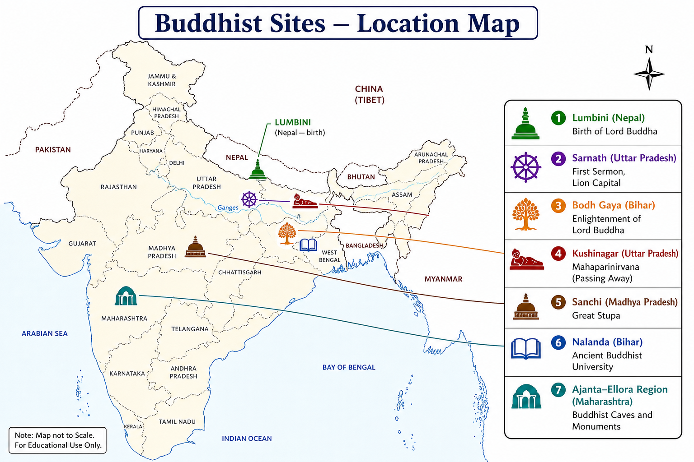

# Topic 4 — Religious Movements
### ★ Complete Source of Truth — No other book/notes needed for this topic

> **Covers syllabus:** Buddhism | Buddha | Buddhist Philosophy | Buddhist Councils | Buddhist Texts | Tripitaka | Cave Architecture | Hinayana | Mahayana | Vajrayana | Eightfold Path | Four Noble Truths | Ashokan Patronage | Jainism | Tirthankaras | Tirthankaras and their Symbols | Nirvana Sites of Tirthankaras | Mahavira | Parshvanatha | Five Great Vows | Digambara | Svetambara | Shramana Tradition | Ajivika Sect | Charvaka (Lokayata) | Materialist Thinkers | Heterodox Schools | Hinduism | Shaivism | Vaishnavism | Bhagavatism | Various Religious Sects  
> **Sources baked in:** NCERT *Themes in Indian History* I (Ch 4–5), *An Introduction to Indian Art*, RS Sharma, UPPCS/UPSC PYQs  
> **Exam weight:** ★★★ High — councils chronology, Tripitaka, Jain tirthankara-nirvana matching, Ashoka-Buddhism  
> **Last verified:** July 2026

---

## Quick Revision Box — Raata This First

```
SHRAMANA = Renouncer traditions vs BRAHMANICAL (Vedic orthodoxy)
  Nastika (heterodox): Buddhism, Jainism, Ajivika, Charvaka
  Astika (orthodox): Hinduism (Brahmanism), six schools of philosophy

BUDDHA: Siddhartha Gautama | Sakya clan | Kapilavastu | Lumbini birth
  Bodh Gaya enlightenment | Sarnath first sermon | Kushinagar Mahaparinirvana
  Four Noble Truths + Eightfold Path | Middle Path (Madhyama Pratipad)

4 BUDDHIST COUNCILS ← UPPCS 2025 Q105:
  1st Rajagriha (487 BCE) | 2nd Vaishali (383 BCE) | 3rd Pataliputra (250 BCE, Ashoka)
  4th Kundalvana/Kashmir (~72 CE Sarvastivada) OR Sri Lanka (Theravada tradition)
  2025 answer: 2-1-4-3 (Rajagriha → Vaishali → Pataliputra → Kundalvana)

TRIPITAKA (3 baskets): Vinaya | Sutta | Abhidhamma (Pali) / Abhidharma (Sanskrit)
  Hinayana (Theravada) = original canon | Mahayana = new sutras | Vajrayana = tantras

ASHOKA + BUDDHISM: Dhamma Mahamatras (14th regnal year) ← 2024 Q20
  Rahulovada Sutta = dhamma definition source | Third Council at Pataliputra

JAINISM: 24 Tirthankaras | Mahavira (24th) | Parshvanatha (23rd, serpent symbol)
  5 Great Vows (Mahavratas) | Ahimsa foremost
  Digambara (sky-clad, nude monks) vs Svetambara (white-clad)
  Mahavira nirvana: Pavapuri (Bihar) | 2021 Q131 trap: Vasupujya ≠ Sammedashikhar

CAVE ARCHITECTURE: Barabar (Mauryan, earliest) | Ajanta | Ellora | Kanheri
  Ghantasala stupa = Ayaka/Aryaka pillars ← UPPCS 2022 Q80

CHARVAKA: Brihaspati | Perception only pramana | No soul, no karma, no rebirth
AJIVIKA: Makkhali Gosala | Niyati (fate) doctrine
```

### Must-Know Term Comparisons (very frequently asked)

| Term | One-line difference | Hindi |
|------|---------------------|-------|
| **Hinayana vs Mahayana** | Hinayana = individual arhat goal, Pali canon; Mahayana = bodhisattva ideal, Sanskrit sutras | हीनयान / महायान |
| **Digambara vs Svetambara** | Digambara = nude monks, reject women moksha; Svetambara = white robes, allow women renouncers | दिगंबर / श्वेतांबर |
| **Nastika vs Astika** | Nastika = reject Vedas (Buddha, Mahavira, Charvaka); Astika = accept Vedas (Hindu schools) | नास्तिक / आस्तिक |
| **Shramana vs Brahmana** | Shramana = renouncer ascetic traditions; Brahmana = Vedic priestly orthodoxy | श्रमण / ब्राह्मण |
| **Four Noble Truths vs Eightfold Path** | Truths = diagnosis of suffering; Path = prescription to end suffering | चार आर्य सत्य / अष्टांग मार्ग |
| **Vinaya vs Sutta Pitaka** | Vinaya = monastic discipline rules; Sutta = Buddha's discourses | विनय / सूत्र पिटक |
| **Mahavira vs Parshvanatha** | Mahavira = 24th tirthankara, 5 vows; Parshvanatha = 23rd, 4 vows, serpent symbol | महावीर / पार्श्वनाथ |
| **Charvaka vs Ajivika** | Charvaka = materialist, perception-only; Ajivika = fatalist (niyati), Gosala founder | चार्वाक / आजीविक |
| **Shaivism vs Vaishnavism** | Shaivism = Shiva worship, linga; Vaishnavism = Vishnu/Krishna avatars | शैव / वैष्णव |
| **Bhagavatism vs Vaishnavism** | Bhagavatism = Krishna-Vasudeva cult origin; Vaishnavism = broader Vishnu worship including avatars | भागवत / वैष्णव |

### Memory Tricks

| Trick | Remembers |
|-------|-----------|
| **R-V-P-K** | Councils: Rajagriha, Vaishali, Pataliputra, Kundalvana (2025: 2-1-4-3) |
| **L-B-S-K** | Buddha: Lumbini birth, Bodh Gaya enlightenment, Sarnath sermon, Kushinagar death |
| **V-S-A** | Tripitaka: Vinaya, Sutta, Abhidhamma |
| **A-S-A-B-A** | 5 Jain vows: Ahimsa, Satya, Asteya, Brahmacharya, Aparigraha |
| **24 Mahavira** | Mahavira = 24th tirthankara |
| **23 Serpent** | Parshvanatha = 23rd, snake symbol |
| **Ghantasala Ayaka** | 2022 Q80 answer |
| **Nagasena Milind** | 2023 Q24 Milinda Panha |
| **Pavapuri Mahavira** | Correct nirvana pair (2021 trap = Vasupujya) |
| **H-M-V** | Buddhist sects: Hinayana, Mahayana, Vajrayana |

---

## Exam Visuals — High-ROI Images

> **Type priority:** location map → conceptual diagram. Images stored locally (`images/`) so they open offline.

### 1. Buddhist Sites — Location Map (India & Nepal)



*Raata **event ↔ place**: **Lumbini = birth** (Nepal); **Bodh Gaya = enlightenment**; **Sarnath = first sermon** (UP); **Kushinagar = Mahaparinirvana** (UP). **Sanchi = Great Stupa** (MP, Ashokan origin). **2025 council order trap**: Rajagriha → Vaishali → Pataliputra → Kundalvana.*
*Source: Study map — generated for UPPCS location-matching*

---

## 4.1 Buddhism

### Definitions

| Term | Meaning |
|------|---------|
| **Buddhism** | Shramana religion founded by Siddhartha Gautama (Buddha); Four Noble Truths and Eightfold Path |
| **Dhamma/Dharma** | Buddha's teaching; cosmic law of cause-effect (karma) and ethical conduct |
| **Sangha** | Buddhist monastic order — monks (bhikkhu) and nuns (bhikkhuni) |

### Buddhism — How It Works

- **Buddhism** arose in **6th century BCE** North India as **Shramana** movement challenging Vedic ritualism.
- **Founder:** This refers to **Siddhartha Gautama**. "Buddha" = Awakened One. Sakya clan of Kapilavastu.
- **Core teaching:** life is **dukkha** (suffering). suffering has cause. cessation possible via **Eightfold Path**.
- **Middle Path (Madhyama Pratipad)**. Avoids extreme asceticism AND luxury indulgence.
- **No soul (anatta/anatman):** rejects permanent self. **No creator God**. Non-theistic religion.
- **Karma and rebirth** accepted. But no eternal atman transmigrating.
- **Three Jewels (Triratna)**: **Buddha** (teacher), **Dhamma** (teaching), **Sangha** (community).
- **Monasticism** central. Monks depend on alms. Viharas (monasteries) developed.
- **Spread:** India then Sri Lanka, Central Asia, China, Japan, Southeast Asia. Declined in India after Gupta/Turkish invasions.
- **Division**: Hinayana/Theravada, Mahayana, Vajrayana. Same Buddha, different texts and goals.

> **Exam note:** Buddhism = **nastika** (rejects Veda authority). Trap: "Buddha founded a theistic religion" — false.

### Exam Facts (raata)

- Founded ~6th–5th century BCE
- Siddhartha Gautama = Buddha
- Triratna: Buddha, Dhamma, Sangha
- Middle Path doctrine
- Anatta (no permanent soul)
- Karma + rebirth without atman
- Shramana origin
- Three major sects: Hinayana, Mahayana, Vajrayana

### PYQs — Buddhism

1. **(UPSC Prelims 2019 — pattern)** Buddhism is a:  
   → **Shramana/nastika tradition** rejecting Vedic sacrifices.

2. **(UPSC Prelims 2017 — pattern)** Triratna in Buddhism refers to:  
   → **Buddha, Dhamma, Sangha.**

### Examples (4.1)

| Example | Detail |
|---------|--------|
| **Sarnath** | First sermon — Dhammacakkappavattana |
| **Sangha** | 60 arahants after first sermon |
| **Middle Path** | Between luxury and extreme asceticism |

---

## 4.2 Buddha

### Buddha — How It Works

- **Birth:** This refers to **Lumbini** (Nepal), ~563 BCE (traditional). mother **Mahamaya**. father **Suddhodana** (Sakya chief).
- **Early life:** This refers to raised in **Kapilavastu** palace. Saw **four sights**. Old man, sick man, corpse, ascetic.
- **Great Renunciation (Mahabhinishkramana):** left palace at age **29**. cut hair. became wandering ascetic.
- **Teachers**: tried **Alara Kalama** and **Udraka Ramaputra**. Extreme asceticism failed.
- **Enlightenment (Nirvana):** under **Bodhi tree** at **Bodh Gaya** (Uruvela). age **35**. became Buddha.
- **First sermon:** This refers to **Sarnath** (Isipatana). "Setting in Motion the Wheel of Dhamma". Converted five ascetics (Pancavaggiya).
- **Ministry:** This refers to 45 years teaching across Gangetic plain. monasteries (Jetavana, Nalanda early viharas) patronized.
- **Death (Mahaparinirvana):** This refers to **Kushinagar** (Kusinara), age **80**. between two Sal trees.
- **No idol worship initially**. Aniconic symbols (footprint, wheel, stupa, Bodhi tree) represented Buddha.
- **Titles**: Tathagata, Shakyamuni, Bhagavat, Sugata.

> **Exam note:** Lumbini (birth) → Bodh Gaya (enlightenment) → Sarnath (sermon) → Kushinagar (death). Trap: "Buddha was born at Bodh Gaya" — false.

### Exam Facts (raata)

- Lumbini = birth (Nepal)
- Bodh Gaya = enlightenment
- Sarnath = first sermon
- Kushinagar = Mahaparinirvana
- Four sights triggered renunciation
- Age 35 enlightenment. 80 death.
- Sakya clan, Kapilavastu
- Aniconic representation early

### PYQs — Buddha

1. **(UPSC Prelims 2020 — pattern)** Buddha attained enlightenment at:  
   → **Bodh Gaya.**

2. **(UPSC Prelims 2018 — pattern)** Buddha delivered first sermon at:  
   → **Sarnath.**

### Examples (4.2)

| Example | Detail |
|---------|--------|
| **Lumbini pillar** | Ashoka commemorated birth site |
| **Four sights** | Old, sick, dead, ascetic |
| **Pancavaggiya** | First five disciples at Sarnath |

---

## 4.3 Four Noble Truths

### Four Noble Truths — How It Works

- **First Noble Truth (Dukkha)**: life involves **suffering/unsatisfactoriness**. Birth, disease, old age, death, separation from loved ones.
- **Second Noble Truth (Samudaya)**: suffering has **cause**. **Trishna/tanha** (craving/desire/thirst) and **avidya** (ignorance).
- **Third Noble Truth (Nirodha)**: suffering can **cease**. **Nirvana** attainable in this life.
- **Fourth Noble Truth (Magga)**: path to end suffering is the **Eightfold Path** (Ashtangika Marga).
- **Diagnosis then Cause then Cure then Prescription** structure. Medical analogy Buddha used.
- **Dukkha** does not mean only pain. Includes impermanence (anicca) of all conditioned things.
- **Central to all Buddhist schools**. Hinayana, Mahayana, Vajrayana accept Four Truths.
- **First sermon at Sarnath** expounded these truths. Core of Dhammacakkappavattana Sutta.
- **Ignorance (avidya)**. Not seeing things as they are (impermanent, no-self) perpetuates suffering.
- **Nirvana:** blowing out of craving. not extinction of person but of suffering's causes.

> **Exam note:** Four Truths = Dukkha, Samudaya, Nirodha, Magga. Trap: "Third truth says suffering is eternal" — false; cessation is possible.

### Exam Facts (raata)

- 1: Dukkha (suffering exists)
- 2: Samudaya (craving/ignorance cause)
- 3: Nirodha (cessation possible)
- 4: Magga (Eightfold Path)
- Trishna = craving cause
- Nirvana = end of suffering
- Taught at Sarnath first sermon
- Foundation of all Buddhism

### PYQs — Four Noble Truths

1. **(UPSC Prelims 2019 — pattern)** Second Noble Truth identifies cause as:  
   → **Trishna (craving/desire).**

2. **(UPSC Prelims 2016 — pattern)** Fourth Noble Truth prescribes:  
   → **Eightfold Path.**

### Examples (4.3)

| Example | Detail |
|---------|--------|
| **Dhammacakkappavattana Sutta** | First sermon on Four Truths |
| **Trishna** | Attachment to pleasures causes rebirth |
| **Nirodha** | Third truth — hope of liberation |

---

## 4.4 Eightfold Path

### Eightfold Path — How It Works

- **Ashtangika Marga**. Practical path to **nirvana** prescribed in Fourth Noble Truth.
- **Three divisions**. **Wisdom (Prajna)**, **Ethics (Sila)**, **Meditation (Samadhi)**:

| Division | Factor | Meaning |
|----------|--------|---------|
| **Prajna** | 1. Right View (Samyag Drishti) | Understanding Four Truths |
| **Prajna** | 2. Right Resolve (Samyak Sankalpa) | Renunciation, goodwill |
| **Sila** | 3. Right Speech (Samyak Vak) | No lying, abuse, gossip |
| **Sila** | 4. Right Conduct (Samyak Karmanta) | No killing, stealing, misconduct |
| **Sila** | 5. Right Livelihood (Samyak Ajiva) | Ethical occupation |
| **Samadhi** | 6. Right Effort (Samyak Vyayama) | Cultivate good, remove evil |
| **Samadhi** | 7. Right Mindfulness (Samyak Smriti) | Awareness of body, feelings, mind |
| **Samadhi** | 8. Right Concentration (Samyak Samadhi) | Meditation (jhana/dhyana) |

- **Middle Path** embodied. Neither extreme asceticism nor sensual indulgence.
- **Lay followers** follow Five Precepts (simplified Sila). monks follow full Vinaya.
- **Right Livelihood** excludes trade in weapons, living beings, meat, intoxicants, poison.
- **Mindfulness (satipatthana)**. Foundation of Buddhist meditation practice worldwide.
- **Leads to arhatship** (Hinayana) or bodhisattva path (Mahayana extension).

> **Exam note:** 8 factors — 2 Wisdom + 3 Ethics + 3 Meditation. Trap: "Eightfold Path has 10 steps" — exactly 8.

### Exam Facts (raata)

- 8 factors total
- Prajna (2) + Sila (3) + Samadhi (3)
- Right View = understanding Four Truths
- Right Mindfulness = satipatthana
- Middle Path implementation
- Monks follow full path via Vinaya
- Lay people follow Five Precepts

### PYQs — Eightfold Path

1. **(UPSC Prelims 2018 — pattern)** Right Livelihood is part of:  
   → **Eightfold Path (Sila division).**

2. **(UPSC Prelims 2015 — pattern)** How many factors in Eightfold Path?  
   → **8.**

### Examples (4.4)

| Example | Detail |
|---------|--------|
| **Five Precepts** | Lay Buddhist minimum ethics |
| **Satipatthana** | Mindfulness meditation sutta |
| **Middle Path** | Avoids ascetic + luxury extremes |

---

## 4.5 Buddhist Philosophy

### Buddhist Philosophy — How It Works

- **Anatta (Anatman):** no permanent, unchanging **soul/self**. five skandhas (aggregates) constitute person.
- **Anicca (Impermanence):** all conditioned phenomena are transient. clinging causes suffering.
- **Dukkha**. Unsatisfactoriness inherent in conditioned existence.
- **Pratityasamutpada (Dependent Origination)**. **12-linked chain** of cause-effect explaining rebirth cycle.
- **12 Nidanas**: ignorance then formations then consciousness then name-form then six senses then contact then feeling then craving then grasping then becoming then birth then old age/death.
- **Karma:** intentional action shapes rebirth. No divine judge. Automatic moral causation.
- **Nirvana:** cessation of craving and rebirth. **unconditioned state** beyond description.
- **Sunyata (Emptiness):** Mahayana concept (Nagarjuna). all phenomena lack inherent existence.
- **Bodhisattva ideal**. Mahayana. Postpone own nirvana to help all beings.
- **Madhyamaka and Yogacara**. Major Mahayana philosophical schools.

> **Exam note:** Anatta + Anicca + Dukkha = **three marks of existence**. Trap: "Buddhism accepts permanent atman" — false.

### Exam Facts (raata)

- Three marks: Anicca, Dukkha, Anatta
- 12-linked Dependent Origination
- Karma = intentional action
- Nirvana = unconditioned
- Sunyata = Mahayana (Nagarjuna)
- Bodhisattva = Mahayana ideal
- Five skandhas = person components
- No creator God

### PYQs — Buddhist Philosophy

1. **(UPSC Prelims 2019 — pattern)** Anatta means:  
   → **No permanent self/soul.**

2. **(UPSC Prelims 2017 — pattern)** Pratityasamutpada has how many links?  
   → **12.**

### Examples (4.5)

| Example | Detail |
|---------|--------|
| **12 Nidanas chain** | Explains rebirth mechanism |
| **Nagarjuna** | Madhyamaka sunyata philosophy |
| **Skandhas** | Form, feeling, perception, formations, consciousness |

---

## 4.6 Buddhist Councils

### Buddhist Councils — Complete Table

| # | Council | Place | Year (approx.) | Patron | Key outcome |
|---|---------|-------|----------------|--------|-------------|
| 1 | First | **Rajagriha** (Rajgir) | 487 BCE (after Buddha's death) | Ajatashatru | Upali recited Vinaya; Ananda recited Suttas |
| 2 | Second | **Vaishali** | 383 BCE | Kalashoka | Schism: Sthaviravada vs Mahasanghika |
| 3 | Third | **Pataliputra** | 250 BCE | Ashoka | Moggaliputta Tissa; compiled Abhidhamma; sent missionaries |
| 4 | Fourth | **Kundalvana** (Kashmir) / Tambapanni (Sri Lanka) | ~72 CE / ~29 BCE | Kanishka / Vattagamani | Canon finalized (school-specific) |

### Buddhist Councils — How It Works

- **First Council:** **Rajagriha** immediately after Buddha's Mahaparinirvana. **Mahakassapa** presided. **Upali** (Vinaya), **Ananda** (Suttas) recited.
- **Second Council:** **Vaishali**. Dispute over **10 monastic rules**. Split into **Sthaviravada** (elders) and **Mahasanghika** (majority). Origin of sectarian Buddhism.
- **Third Council:** **Pataliputra** under **Ashoka**. **Moggaliputta Tissa** presided. **Abhidhamma Pitaka** compiled. Buddhist missions sent abroad.
- **Fourth Council**. **Two traditions**: **Kundalvana/Kashmir** (Sarvastivada, Kanishka) OR **Sri Lanka** (Theravada, Vattagamani). Different canons finalized.
- **UPPCS 2025 Q105**. Arrange places chronologically: **Rajagriha(2) then Vaishali(1) then Pataliputra(4) then Kundalvana(3)** = **Answer C (2-1-4-3)**.
- Councils preserved oral teachings in written form over centuries.
- Each council reflects geographic and doctrinal expansion of Buddhism.
- **Third Council** critical for **Ashokan missionary expansion**. Buddhism becomes world religion.
- **Vaishali** = Vajji mahajanapada. **Rajgriha** = Magadha capital.

> **Exam note:** UPPCS 2025 Q105 answer **C: 2-1-4-3**. Trap: "First Council at Vaishali" — Vaishali is Second.

### Exam Facts (raata)

- 1st Rajagriha 487 BCE
- 2nd Vaishali 383 BCE
- 3rd Pataliputra 250 BCE (Ashoka)
- 4th Kundalvana/Kashmir
- 2025 Q105 answer C
- 2nd Council = schism
- 3rd = Abhidhamma compiled
- Moggaliputta Tissa = 3rd Council president

### PYQs — Buddhist Councils

1. **(UPPCS Prelims 2025, Q105)** Four Buddhist Councils places — chronological order:  
   1. Vaishali  2. Rajagriha  3. Kundalvana  4. Pataliputra  
   → **C — 2-1-4-3** (Rajagriha → Vaishali → Pataliputra → Kundalvana).

2. **(UPSC Prelims 2018 — pattern)** Third Buddhist Council held at:  
   → **Pataliputra under Ashoka.**

### Examples (4.6)

| Example | Detail |
|---------|--------|
| **2025 Q105** | Direct chronology question |
| **Moggaliputta Tissa** | Third Council president |
| **Vaishali schism** | Sthaviravada vs Mahasanghika |

---

## 4.7 Buddhist Texts

### Buddhist Texts — How It Works

- **Pali Canon** (Theravada). Oldest complete Buddhist canon. Sri Lanka preserved.
- **Sanskrit Canon** (Mahayana). Expanded sutras. Composed centuries after Buddha.
- **Milindapanha (Milinda Panha)**. Dialogue between **King Menander (Milinda)** and **Nagasena**. the **UPPCS 2023 Q24**.
- **Jataka tales:** 547 birth stories of Buddha's previous lives. moral fables.
- **Dhammapada:** most popular verse text. 26 chapters of ethical aphorisms.
- **Buddhacharita**. Ashvaghosha's Sanskrit poetic biography of Buddha.
- **Lalitavistara**. Mahayana Buddha biography with supernatural elements.
- **Vinaya texts**. Monastic discipline for each school.
- **Abhidhamma/Abhidharma**. Philosophical systematization of doctrine.
- **Tibetan Kanjur and Tanjur**. Vajrayana canon translations.

> **Exam note:** Milindapanha saint = **Nagasena** (2023 Q24, answer C). Trap: Nagarjuna — philosopher, not Milinda's interlocutor.

### Exam Facts (raata)

- Pali Canon = Theravada standard
- Milindapanha = Milinda + Nagasena (2023 Q24)
- Jataka = 547 tales
- Dhammapada = popular verses
- Ashvaghosha = Buddhacharita
- Abhidhamma = Third Council compilation
- Sanskrit sutras = Mahayana additions

### PYQs — Buddhist Texts

1. **(UPPCS Prelims 2023, Q24)** *Milind Panho* dialogue saint was:  
   A. Nagarjun  B. Nagbhatt  C. Nagasena  D. Kumaril Bhatt  
   → **C — Nagasena.**

2. **(UPSC Prelims 2019 — pattern)** Dhammapada is part of:  
   → **Sutta Pitaka (Pali Canon).**

### Examples (4.7)

| Example | Detail |
|---------|--------|
| **Milindapanha** | Indo-Greek king + Buddhist monk dialogue |
| **Jataka No. 347** | Famous Vessantara Jataka |
| **Dhammapada** | "Mind is chief" verses |

---

## 4.8 Tripitaka

### Tripitaka — How It Works

- **Tripitaka** = **"Three Baskets"**. Complete Buddhist canon in three divisions.
- **Vinaya Pitaka:** monastic rules. discipline for monks/nuns. recited by Upali at First Council.
- **Sutta Pitaka (Sutra Pitaka):** Buddha's discourses/sermons. largest basket. includes Dhammapada, Jataka.
- **Abhidhamma Pitaka (Abhidharma Pitaka):** philosophical analysis. systematized doctrine. compiled at Third Council.
- **Pali Tripitaka:** Theravada standard. preserved in Sri Lanka. most complete early canon.
- **Sanskrit Tripitaka:** Mahayana additions. many new sutras (Lotus Sutra, Prajnaparamita).
- **Tibetan Buddhist canon**. Kanjur (Buddha's words) + Tanjur (commentaries).
- **Chinese Tripitaka:** massive collection of translations. includes texts lost in India.
- **Originally oral**. Written down centuries later (Sri Lanka ~1st century BCE).
- **Tripitaka structure** same across schools but **content differs**. Mahayana adds sutras.

> **Exam note:** Three baskets = **Vinaya + Sutta + Abhidhamma**. Trap: "Tripitaka has four baskets" — exactly three.

### Exam Facts (raata)

- Tri = three pitakas (baskets)
- Vinaya = discipline rules
- Sutta = Buddha's teachings
- Abhidhamma = philosophy
- Pali version = Theravada
- Upali = Vinaya reciter (1st Council)
- Written down ~1st century BCE Sri Lanka

### PYQs — Tripitaka

1. **(UPSC Prelims 2018 — pattern)** Vinaya Pitaka deals with:  
   → **Monastic discipline/rules.**

2. **(UPSC Prelims 2016 — pattern)** Tripitaka means:  
   → **Three baskets of Buddhist canon.**

### Examples (4.8)

| Example | Detail |
|---------|--------|
| **Vinaya Pitaka** | 227 rules for monks (Patimokkha) |
| **Sutta Pitaka** | Digha Nikaya, Majjhima Nikaya collections |
| **Abhidhamma** | Third Council Pataliputra compilation |

---

## 4.9 Hinayana

### Hinayana — How It Works

- **Hinayana** = "Lesser Vehicle". **Pejorative term** used by Mahayana. Prefer **Theravada** ("Way of the Elders").
- **Goal**: individual **arhat**. One who attains nirvana for self only.
- **Canon:** This refers to **Pali Tripitaka**. Earliest Buddhist texts. No Mahayana sutras.
- **Geography**: **Sri Lanka**, **Myanmar**, **Thailand**, **Laos**, **Cambodia**. Southeast Asia.
- **Buddha:** This refers to revered as **historical teacher** (Shakyamuni). not eternal cosmic Buddha.
- **Bodhisattva:** rare ideal. focus on personal liberation.
- **Monasticism** strict. Vinaya rules central. Forest and village monks.
- **No idol worship initially:** aniconic. later Buddha images accepted.
- **Theravada** traces to **Sthaviravada** school of Second Council split.
- **Original Buddhism** closest. Four Noble Truths, Eightfold Path, anatta core.

> **Exam note:** Hinayana = Theravada preferred term. Trap: "Hinayana worships multiple cosmic Buddhas" — that's Mahayana.

### Exam Facts (raata)

- Theravada = preferred name
- Goal = arhat (individual nirvana)
- Pali canon
- Sri Lanka, Southeast Asia
- Sthaviravada origin
- Strict Vinaya monasticism
- Historical Buddha focus

### PYQs — Hinayana

1. **(UPSC Prelims 2019 — pattern)** Hinayana goal is:  
   → **Arhatship (individual liberation).**

2. **(UPSC Prelims 2017 — pattern)** Pali canon is used by:  
   → **Theravada/Hinayana Buddhism.**

### Examples (4.9)

| Example | Detail |
|---------|--------|
| **Sri Lanka Theravada** | Oldest living Hinayana tradition |
| **Arhat** | Ideal practitioner |
| **Pali Canon** | Complete Tripitaka preserved |

---

## 4.10 Mahayana

### Mahayana — How It Works

- **Mahayana** = "Great Vehicle". Emerged ~1st century CE. Major Buddhist reform movement.
- **Goal:** **Bodhisattva**. Seeks enlightenment to help **all beings**. Postpones final nirvana.
- **New sutras**: Lotus Sutra, Prajnaparamita, Avatamsaka, Vimalakirti. Sanskrit compositions.
- **Cosmic Buddha**: **Amitabha**, **Vairocana**. Eternal Buddhas beyond historical Shakyamuni.
- **Bodhisattva figures**: **Avalokiteshvara** (compassion), **Manjushri** (wisdom), **Maitreya** (future Buddha).
- **Sunyata philosophy:** Nagarjuna's Madhyamaka. all phenomena empty of inherent nature.
- **Geography**: **China**, **Japan**, **Korea**, **Vietnam**, **Tibet** (with Vajrayana overlay).
- **Idol worship:** rich iconography. Buddha and bodhisattva images in monasteries.
- **Lay Buddhism** stronger. Bodhisattva vow open to non-monastics.
- **Split from Hinayana** at Second Council (Vaishali) roots. fully distinct by 1st century CE.

> **Exam note:** Mahayana = **Bodhisattva ideal** + Sanskrit sutras. Trap: "Mahayana rejects Four Noble Truths" — false; builds on them.

### Exam Facts (raata)

- Great Vehicle
- Bodhisattva ideal
- Lotus Sutra, Prajnaparamita
- Amitabha, Avalokiteshvara
- Nagarjuna = sunyata
- China, Japan, Korea
- Emerged ~1st century CE

### PYQs — Mahayana

1. **(UPSC Prelims 2020 — pattern)** Bodhisattva ideal is associated with:  
   → **Mahayana Buddhism.**

2. **(UPSC Prelims 2018 — pattern)** Lotus Sutra belongs to:  
   → **Mahayana tradition.**

### Examples (4.10)

| Example | Detail |
|---------|--------|
| **Avalokiteshvara** | Compassion bodhisattva |
| **Lotus Sutra** | Key Mahayana text |
| **Nagarjuna** | Madhyamaka philosopher |

---

## 4.11 Vajrayana

### Vajrayana — How It Works

- **Vajrayana** = "Diamond/Thunderbolt Vehicle". Esoteric Buddhism. **Tantric** practices.
- **Emergence:** This refers to ~6th–7th century CE India. flourished in **Nalanda**, **Vikramashila** universities.
- **Goal**: **enlightenment in one lifetime** through tantric methods. "fast path.".
- **Guru (Lama)** essential. Oral initiation (empowerment/abhisheka) from master required.
- **Mandalas:** geometric diagrams for meditation. deity yoga visualization.
- **Mantras:** These include **Om Mani Padme Hum** (Avalokiteshvara). sacred sound formulas.
- **Texts**: **Tantras** (Guhyasamaja, Chakrasamvara). Not in Hinayana/Mahayana early canon.
- **Geography:** This refers to **Tibet**, **Bhutan**, **Mongolia**, **Nepal** (Newar Buddhism). Bihar/Nalanda origin.
- **Dalai Lama:** Tibetan Vajrayana leader. reincarnation of Avalokiteshvara (believed).
- **Absorbed into Mahayana** framework. Considers itself "third turning of Dhamma wheel.".
- **Declined in India** with Turkic invasions (~12th century). survived in Tibet.

> **Exam note:** Vajrayana = **Tantric/esoteric** Buddhism. Trap: "Vajrayana rejects guru" — guru is essential.

### Exam Facts (raata)

- Diamond Vehicle
- Tantric practices
- Tibet, Mongolia, Bhutan
- Guru/lama essential
- Mantras and mandalas
- Nalanda origin
- Om Mani Padme Hum
- Enlightenment in one lifetime claim

### PYQs — Vajrayana

1. **(UPSC Prelims 2019 — pattern)** Vajrayana Buddhism is associated with:  
   → **Tantric practices and Tibet.**

2. **(UPSC Prelims 2017 — pattern)** Om Mani Padme Hum is:  
   → **Vajrayana/Mahayana mantra.**

### Examples (4.11)

| Example | Detail |
|---------|--------|
| **Tibetan Buddhism** | Living Vajrayana tradition |
| **Nalanda** | Tantric scholarship centre |
| **Mandala** | Meditation diagram |

---

## 4.12 Cave Architecture

### Cave Architecture — How It Works

- **Buddhist cave architecture**. Rock-cut **viharas** (monasteries) and **chaityas** (prayer halls) from 3rd century BCE onward.
- **Barabar caves** (Bihar). **Earliest** rock-cut caves. **Mauryan** (Ashoka donated). Polished granite. **Lomas Rishi** horseshoe arch.
- **Ajanta** (Maharashtra). 30 caves. **2nd century BCE to 6th century CE**. Finest **murals/paintings**. UNESCO WHS.
- **Ellora** (Maharashtra). 34 caves. Buddhist (1–12), Hindu (13–29), Jain (30–34). **Kailash temple** (cave 16) monolithic.
- **Kanheri** (Mumbai). Buddhist caves in **Sahyadri**. Important **western India** Buddhist centre.
- **Karle, Bhaja, Bedsa:** early **chaitya halls** with horseshoe windows. western Deccan.
- **Nagarjunakonda:** Andhra Buddhist site. **stupas with ayaka pillars**. Ikshvaku patronage.
- **Ghantasala stupa**. **Ayaka/Aryaka pillars** on platform. the **UPPCS 2022 Q80 answer B (Ghantasala)**.
- **Amaravati, Amaravati-style:** Andhra sculpture. narrative reliefs. ayaka pillars.
- **Bodh Gaya:** Mahabodhi temple (not cave). enlightenment site architecture.

> **Exam note:** 2022 Q80 — **Ghantasala** has Aryaka-pillars. Trap: "Ajanta is earliest" — Barabar (Mauryan) is earlier.

### Exam Facts (raata)

- Barabar = earliest (Mauryan, Bihar)
- Ajanta = paintings (Maharashtra)
- Ellora = Buddhist+Hindu+Jain
- Ghantasala = Ayaka pillars (2022 Q80)
- Chaitya = prayer hall. Vihara = monastery.
- Kanheri = Mumbai Buddhist caves
- Karle = famous chaitya hall

### PYQs — Cave Architecture

1. **(UPPCS Prelims 2022, Q80)** Aryaka-Pillars platform found at which stupa?  
   A. Nagarjunakonda  B. Ghantasala  C. Amaravati  D. Bodhgaya  
   → **B — Ghantasala.**

2. **(UPSC Prelims 2019 — pattern)** Earliest rock-cut Buddhist caves:  
   → **Barabar caves (Mauryan).**

### Examples (4.12)

| Example | Detail |
|---------|--------|
| **Barabar, Lomas Rishi** | Mauryan earliest cave |
| **Ajanta Cave 26** | Mahaparinirvana painting |
| **Ghantasala** | 2022 UPPCS Ayaka pillars |

---

## 4.13 Ashokan Patronage

### Ashokan Patronage — How It Works

- **Ashoka** (268–232 BCE). Greatest **royal patron** of Buddhism after initial conversion post-Kalinga war.
- **Conversion:** This refers to remorse after **Kalinga war** (~261 BCE). adopted **Dhamma** (Buddhist-inspired ethical policy, not conversion of state to Buddhism alone).
- **Third Buddhist Council:** convened at **Pataliputra** (~250 BCE). **Moggaliputta Tissa** presided. **Abhidhamma** compiled.
- **Dhamma Mahamatras**. Officials appointed in **14th regnal year** to propagate dhamma. the **UPPCS 2024 Q20 statement 2 (correct)**.
- **Dhamma definition**. Ashoka's dhamma drawn from **Rahulovada Sutta**. the **2024 Q20 statement 1 (correct)** then **Both correct (A)**.
- **Missionaries sent:** These include son **Mahinda** and daughter **Sanghamitta** to **Sri Lanka**. others to Central Asia, Greece, Southeast Asia.
- **Stupas and pillars:** These include built **84,000 stupas** (tradition). **Ashokan pillars** with dhamma inscriptions. **Lion Capital** (Sarnath) = national emblem.
- **Barabar caves** donated to **Ajivika** monks (not Buddhist). Shows tolerance. Also patronized Buddhism heavily.
- **Buddha relics** enshrined in stupas across empire.
- **Decline:** This refers to post-Ashoka, Mauryan empire fragmented. Buddhism continued but royal patronage reduced until Kushan/Kanishka.

> **Exam note:** 2024 Q20 — **both statements correct (A)**. Dhamma Mahamatras = 14th year. Trap: "Ashoka made Buddhism state religion exclusively" — he tolerated all sects.

### Exam Facts (raata)

- Ashoka converted post-Kalinga war
- Third Council Pataliputra ~250 BCE
- Dhamma Mahamatras 14th year (2024 Q20)
- Rahulovada Sutta = dhamma source
- Mahinda then Sri Lanka mission.
- 84,000 stupas tradition
- Lion Capital Sarnath
- Barabar caves donation

### PYQs — Ashokan Patronage

1. **(UPPCS Prelims 2024, Q20)** Ashoka statements: 1. Dhamma from Rahulovada-sutta  2. Dhamma-mahamatras in 14th year  
   → **A — Both correct.**

2. **(UPSC Prelims 2018 — pattern)** Third Buddhist Council patron:  
   → **Ashoka.**

### Examples (4.13)

| Example | Detail |
|---------|--------|
| **2024 Q20** | Dhamma Mahamatras + Rahulovada |
| **Mahinda in Sri Lanka** | Buddhism to island |
| **Sarnath Lion Capital** | Ashokan pillar art |

---

## 4.14 Jainism

### Definitions

| Term | Meaning |
|------|---------|
| **Jainism** | Ancient Shramana religion; 24 Tirthankaras; ahimsa (non-violence) central; Mahavira = 24th prophet |
| **Tirthankara** | "Ford-maker" — one who has crossed samsara and shows path to others |
| **Jina** | Conqueror (of passions) — origin of word "Jain" |

### Jainism — How It Works

- **Jainism:** parallel Shramana movement to Buddhism. **older tradition** claiming **Rishabhanatha** as first tirthankara.
- **24 Tirthankaras:** spiritual teachers. **Mahavira** (24th) = historical founder for present era.
- **Ahimsa (non-violence):** supreme principle. extends to all living beings including insects.
- **Anekantavada:** **non-absolutism**. Multiple viewpoints (syadvada. Conditioned predication).
- **Karma:** subtle matter (pudgala) sticks to soul (jiva). causes rebirth. must be shed through austerity.
- **Three jewels (Ratnatraya)**: **Right Faith, Right Knowledge, Right Conduct**.
- **Asceticism extreme:** monks practice severe penance. lay followers observe **vratas** (vows).
- **No creator God:** eternal universe. no beginning. **nastika** (rejects Vedas).
- **Digambara and Svetambara**. Two major sects (see §4.21–4.22).
- **Flourished under royal patronage**: Chandragupta Maurya (legend. Became Jain monk at Shravanabelagola), **Kumarapala** (Chaulukya, Gujarat), **Amoghavarsha** (Rashtrakuta).

> **Exam note:** Jainism = **ahimsa foremost**. Trap: "Mahavira founded Jainism" — 23 tirthankaras before him; he **reformed/revived**.

### Exam Facts (raata)

- 24 Tirthankaras
- Mahavira = 24th
- Ahimsa supreme principle
- Anekantavada = non-absolutism
- Ratnatraya: Faith, Knowledge, Conduct
- Nastika. Rejects Vedas.
- Two sects: Digambara, Svetambara
- Karma as material particles on soul

### PYQs — Jainism

1. **(UPSC Prelims 2019 — pattern)** Anekantavada is doctrine of:  
   → **Jainism.**

2. **(UPSC Prelims 2018 — pattern)** Jainism rejects:  
   → **Vedic authority (nastika).**

### Examples (4.14)

| Example | Detail |
|---------|--------|
| **Shravanabelagola** | Gommateshwara Bahubali statue |
| **Anekantavada** | Blind men and elephant parable |
| **Ratnatraya** | Three jewels of Jainism |

---

## 4.15 Tirthankaras

### Tirthankaras — How It Works

- **24 Tirthankaras:** spiritual masters who attained **moksha** and taught path. Mahavira = last in current cycle.
- **Rishabhanatha (Adinath):** **1st tirthankara**. bull symbol. legendary founder of agriculture, arts.
- **Parshvanatha:** **23rd tirthankara**. **serpent/hood symbol**. 4 great vows (Mahavira added 5th).
- **Mahavira (Vardhamana):** **24th tirthankara**. historical. lion symbol. 5 vows.
- **Neminatha:** **22nd**. conch symbol. associated with Krishna legend (cousin).
- **Each tirthankara** has fixed **symbol (lanchhana)**, **colour**, and **attendant yaksha/yakshi**.
- **Tirthankara images:** identical posture (kayotsarga/ meditation). distinguished only by **symbol on pedestal**.
- **Jain temples:** **Bimba** (idol) of tirthankara in sanctum. **mandapa** halls.
- **24 tirthankaras** span cosmic time. Not all historical persons.
- **First tirthankara Rishabhanatha** mentioned in Rigveda (Rishabha reference debated).

> **Exam note:** Mahavira = **24th**; Parshvanatha = **23rd**. Trap: "Mahavira was first tirthankara" — Rishabhanatha is first.

### Exam Facts (raata)

- Total 24 tirthankaras
- Rishabhanatha = 1st (bull)
- Parshvanatha = 23rd (serpent)
- Mahavira = 24th (lion)
- Neminatha = 22nd (conch)
- Each has unique symbol
- Identical meditating posture in art
- Not all historically verifiable

### PYQs — Tirthankaras

1. **(UPPCS Prelims 2021, Q131)** Tirthankara-Nirvana place matching — see §4.17.

2. **(UPSC Prelims 2018 — pattern)** How many tirthankaras in Jainism?  
   → **24.**

### Examples (4.15)

| Example | Detail |
|---------|--------|
| **Rishabhanatha** | First tirthankara |
| **Parshvanatha** | 23rd, serpent symbol |
| **Mahavira** | 24th, historical founder |

---

## 4.16 Tirthankaras and their Symbols

### Tirthankaras and their Symbols — Complete Table

| # | Tirthankara | Symbol (Lanchhana) |
|---|-------------|-------------------|
| 1 | Rishabhanatha (Adinath) | Bull |
| 2 | Ajitanatha | Elephant |
| 3 | Sambhavanatha | Horse |
| 4 | Abhinandananatha | Monkey |
| 5 | Sumatinatha | Curlew (bird) |
| 6 | Padmaprabha | Lotus |
| 7 | Suparshvanatha | Swastika |
| 8 | Chandraprabha | Crescent moon |
| 9 | Pushpadanta/Suvidhinatha | Crocodile |
| 10 | Shitalanatha | Shrivatsa (mark) |
| 11 | Shreyansanatha | Rhinoceros |
| 12 | Vasupujya | Buffalo |
| 13 | Vimalanatha | Boar |
| 14 | Anantanatha | Bear / Falcon |
| 15 | Dharmanatha | Vajra (thunderbolt) |
| 16 | Shantinatha | Deer |
| 17 | Kunthunatha | Goat |
| 18 | Aranatha | Nandyavarta (fish) |
| 19 | Mallinatha | Kalasha (pot) |
| 20 | Munisuvrata | Tortoise |
| 21 | Naminatha | Blue lotus |
| 22 | Neminatha | Conch |
| 23 | Parshvanatha | Serpent |
| 24 | Mahavira (Vardhamana) | Lion |

### Tirthankaras and their Symbols — How It Works

- **Lanchhana (symbol)**. Identifies each tirthankara in art since all share same **kayotsarga** (standing meditation) or **padmasana** (seated) posture.
- **Most tested**: **Rishabha-Bull**, **Parshvanatha-Serpent**, **Mahavira-Lion**, **Neminath-Conch**.
- **Symbols carved on pedestal (asan)** below tirthankara image in temples.
- **Colour association** also fixed. Parshvanatha green, Mahavira golden yellow.
- **Yaksha/Yakshi**. Attendant deities unique to each tirthankara (e.g., Mahavira's yakshi Siddhayika).
- **Symbol origin**. Linked to events in tirthankara's life stories (Puranic/Jain Agama texts).
- **Swastika**. Suparshvanatha's symbol (Jain swastika distinct from Nazi. Arms different).
- **Digambara and Svetambara**. Same 24 symbols agreed upon.
- **Exam strategy:** memorize **1st, 12th, 22nd, 23rd, 24th** minimum. full table for comprehensive prep.

> **Exam note:** Parshvanatha = **Serpent**; Mahavira = **Lion**; Rishabhanatha = **Bull**. Trap: "Mahavira symbol = serpent" — that's Parshvanatha.

### Exam Facts (raata)

- 24 unique symbols
- Rishabha = Bull
- Parshvanatha = Serpent
- Mahavira = Lion
- Neminatha = Conch
- Vasupujya = Buffalo
- Suparshvanatha = Swastika
- Symbols on pedestal in temples

### PYQs — Tirthankaras and Symbols

1. **(UPSC Prelims 2019 — pattern)** Parshvanatha's symbol:  
   → **Serpent.**

2. **(UPSC Prelims 2017 — pattern)** Mahavira's symbol:  
   → **Lion.**

### Examples (4.16)

| Example | Detail |
|---------|--------|
| **Parshvanatha serpent** | Hood of snakes in art |
| **Mahavira lion** | Pedestal symbol |
| **Rishabhanatha bull** | First tirthankara icon |

---

## 4.17 Nirvana Sites of Tirthankaras

### Nirvana Sites — Complete Table

| Tirthankara | Nirvana Place (Kalyanaka Bhoomi) | State |
|-------------|----------------------------------|-------|
| Rishabhanatha | **Ashtapad** (Kailash) / Mount Kailash | Tibet/Himalaya |
| Ajitanatha | Sammed Shikhar (Shikharji) | Jharkhand |
| Sambhavanatha | Sammed Shikhar | Jharkhand |
| Abhinandananatha | Sammed Shikhar | Jharkhand |
| Sumatinatha | Sammed Shikhar | Jharkhand |
| Padmaprabha | Sammed Shikhar | Jharkhand |
| Suparshvanatha | Sammed Shikhar | Jharkhand |
| Chandraprabha | Sammed Shikhar | Jharkhand |
| Pushpadanta | Sammed Shikhar | Jharkhand |
| Shitalanatha | Sammed Shikhar | Jharkhand |
| Shreyansanatha | Sammed Shikhar | Jharkhand |
| **Vasupujya** | **Champapuri (Champa)** | **Bihar** |
| Vimalanatha | Sammed Shikhar | Jharkhand |
| Anantanatha | Sammed Shikhar | Jharkhand |
| Dharmanatha | Sammed Shikhar | Jharkhand |
| Shantinatha | Sammed Shikhar | Jharkhand |
| Kunthunatha | Sammed Shikhar | Jharkhand |
| Aranatha | Sammed Shikhar | Jharkhand |
| Mallinatha | Sammed Shikhar | Jharkhand |
| Munisuvrata | Sammed Shikhar | Jharkhand |
| Naminatha | Sammed Shikhar | Jharkhand |
| **Neminatha** | **Girnar (Urjayanta)** | **Gujarat** |
| Parshvanatha | Sammed Shikhar | Jharkhand |
| **Mahavira** | **Pavapuri (Pawa)** | **Bihar** |

### Nirvana Sites of Tirthankaras — How It Works

- **Kalyanaka Bhoomi**. Holy site where tirthankara attained **moksha/nirvana**.
- **Pavapuri (Pawa), Bihar:** **Mahavira's nirvana** site. Jal Mandir temple in lake. **correct pair** in exams.
- **Sammed Shikhar (Parasnath Hill), Jharkhand**. **20 tirthankaras** attained nirvana here. Most sacred Jain mountain.
- **Girnar (Urjayanta), Gujarat:** **Neminatha's nirvana**. also associated with older traditions.
- **Champapuri (Champa), Bihar** is **Vasupujya's nirvana** site. It is **NOT Sammedashikhar**. This is the **UPPCS 2021 Q131 trap answer B**.
- **Ashtapad / Kailash:** **Rishabhanatha's nirvana** (Himalaya). difficult pilgrimage site.
- **UPPCS 2021 Q131:** NOT matched pair: **B. Vasupujya - Sammedashikhar** (wrong, correct = Champapuri).
- **Mahavira-Pavapuri** = **correct** pair (option D in 2021 Q131).
- **Pilgrimage (Tirtha)**. Visiting nirvana sites = major Jain religious practice.
- **Moksha** in Jainism = complete liberation from karma. soul rises to **siddhashila** (top of universe).

> **Exam note:** 2021 Q131 wrong pair = **Vasupujya-Sammedashikhar** (answer B). Mahavira-Pavapuri is CORRECT. Trap: all tirthankaras nirvana at Sammed Shikhar — only 20 of 24.

### Exam Facts (raata)

- Mahavira = Pavapuri (Bihar) ✓
- Vasupujya = Champapuri (NOT Sammed Shikhar). This is 2021 trap.
- Neminatha = Girnar/Urjayanta (Gujarat)
- Rishabhanatha = Ashtapad/Kailash
- Sammed Shikhar = 20 tirthankaras
- 2021 Q131 answer B (NOT matched)
- Pavapuri = Jal Mandir

### PYQs — Nirvana Sites

1. **(UPPCS Prelims 2021, Q131)** Which pair NOT correctly matched (Tirthankar-Nirvan Place)?  
   A. Rishabhanath-Ashtapad  B. Vasupujya-Sammedashikhar  C. Neminath-Urjayanta  D. Mahavira-Pavapuri  
   → **B — Vasupujya-Sammedashikhar** (wrong). Vasupujya = Champapuri. D is correct pair.

2. **(UPSC Prelims 2018 — pattern)** Mahavira attained nirvana at:  
   → **Pavapuri (Pawa), Bihar.**

### Examples (4.17)

| Example | Detail |
|---------|--------|
| **Pavapuri** | Mahavira nirvana; annual Diwali for Jains |
| **Sammed Shikhar** | 20 tirthankaras moksha site |
| **2021 Q131** | Vasupujya trap |

---

## 4.18 Mahavira

### Mahavira — How It Works

- **Mahavira (Vardhamana):** **24th tirthankara**. historical founder of Jainism in present era.
- **Birth:** This refers to **Kundagrama** (Vaishali area, Bihar), ~599 BCE (traditional). parents **Siddhartha** and **Trishala**. **Kshatriya** of Jnatrika clan.
- **Early life:** This refers to married **Yashoda**. daughter **Priyadarshana** (Anojja). lived as householder until **30**.
- **Renunciation:** This refers to left home at **30**. extreme asceticism for **12 years**.
- **Kevala Jnana (Omniscience)**: attained at **42** under **Sala tree** on bank of **Rijukula river** (Jrimbhikagrama).
- **Five Great Vows**. Added **celibacy (brahmacharya)** as 5th to Parshvanatha's four vows.
- **Ministry:** **30 years** preaching. converted **11 ganadharas** (chief disciples). **Gosala** (later Ajivika founder) was companion initially.
- **Nirvana:** This refers to **Pavapuri (Pawa)**, Bihar, age **72** (~527 BCE). **correct nirvana site** in exams.
- **Symbol:** This refers to **Lion**. colour yellow/golden.
- **Title**: Jina (conqueror), Kevalin (omniscient), Arhat.

> **Exam note:** Mahavira nirvana = **Pavapuri** (2021 Q131 correct pair). Added **5th vow** (brahmacharya). Trap: "Mahavira was contemporary of Ashoka" — he lived ~300 years before Ashoka.

### Exam Facts (raata)

- 24th tirthankara
- Birth Kundagrama ~599 BCE
- Renounced at 30. kevala jnana at 42.
- 5 Great Vows (added brahmacharya)
- Nirvana Pavapuri age 72
- Lion symbol
- Contemporary of Buddha
- 11 ganadharas (chief disciples)

### PYQs — Mahavira

1. **(UPPCS Prelims 2021, Q131)** Mahavira-Pavapuri = correctly matched (option D).

2. **(UPSC Prelims 2019 — pattern)** Mahavira attained kevala jnana at age:  
   → **42.**

### Examples (4.18)

| Example | Detail |
|---------|--------|
| **Pavapuri nirvana** | Jains celebrate Diwali for this |
| **12 years asceticism** | Before enlightenment |
| **Gosala companion** | Later founded Ajivika |

---

## 4.19 Parshvanatha

### Parshvanatha — How It Works

- **Parshvanatha (Parshva):** **23rd tirthankara**. historical. lived ~250 years before Mahavira (~8th century BCE traditional).
- **Symbol**: **Serpent/Snake**. Hood of cobras sheltering him during meditation (legend).
- **Four Great Vows**. Preached **ahimsa, satya, asteya, aparigraha** (non-violence, truth, non-stealing, non-possession).
- **Mahavira added 5th vow**. **Brahmacharya (celibacy)**. Distinguishing Jain from pre-Mahavira Parshva tradition.
- **Nirvana**: **Sammed Shikhar (Parasnath Hill), Jharkhand**. Major pilgrimage site named after him.
- **Colour:** This refers to green. **yaksha** Matanga, **yakshi** Kusuma.
- **Historical evidence:** earlier than Mahavira. some scholars date to 8th–7th century BCE.
- **Images**. Often shown with **serpent hood canopy**. Distinctive from Mahavira images.
- **Parents:** These include **Ashvasena** (father), **Vama** (mother). Kashi (Varanasi) birthplace tradition.
- **Bridge figure**. Connects legendary tirthankaras to historical Mahavira era.

> **Exam note:** Parshvanatha = **23rd, serpent symbol, 4 vows**. Trap: "Parshvanatha had 5 vows" — Mahavira added 5th.

### Exam Facts (raata)

- 23rd tirthankara
- Serpent symbol
- 4 vows (not 5)
- Nirvana Sammed Shikhar
- ~250 years before Mahavira
- Mahavira added brahmacharya
- Green colour
- Serpent hood in art

### PYQs — Parshvanatha

1. **(UPSC Prelims 2018 — pattern)** 23rd Jain tirthankara:  
   → **Parshvanatha.**

2. **(UPSC Prelims 2016 — pattern)** Serpent symbol tirthankara:  
   → **Parshvanatha.**

### Examples (4.19)

| Example | Detail |
|---------|--------|
| **Parasnath Hill** | Named after Parshvanatha |
| **Serpent hood art** | Distinctive iconography |
| **4 vows** | Pre-Mahavira Jain tradition |

---

## 4.20 Five Great Vows

### Five Great Vows (Mahavratas) — How It Works

- **Five Mahavratas:** core ethical code for **Jain monks**. lay followers observe **anuvratas** (lesser versions).
- **1. Ahimsa (Non-violence):** supreme vow. no harm to any living being by thought, word, or deed. strictest in all religions.
- **2. Satya (Truthfulness):** speak only truth. if truth causes harm, remain silent (ahimsa overrides).
- **3. Asteya (Non-stealing):** do not take what is not given. includes not taking uncared-for objects.
- **4. Brahmacharya (Celibacy):** complete chastity for monks. **added by Mahavira** (5th vow). Parshvanatha had only 4.
- **5. Aparigraha (Non-possession):** renounce property and attachment. monks own nothing. laypeople limit possessions.
- **Lay followers (Shravakas)**. Observe **anuvratas**: limited versions (e.g., avoid killing humans/animals intentionally, not all insects).
- **Three jewels support vows**: Right Faith + Right Knowledge + Right Conduct.
- **Profession restrictions**. Jains avoid agriculture (kills insects in soil), butchers, honey, wine trade.
- **Ahimsa influence**. Gandhi's non-violence partly inspired by Jain ahimsa.
- **Violation**. Requires **prayaschitta** (penance) to shed accumulated karma.

> **Exam note:** **5 vows = ASAAB** (Ahimsa, Satya, Asteya, Aparigraha, Brahmacharya). Trap: "Parshvanatha taught 5 vows" — only 4; Mahavira added brahmacharya.

### Five Great Vows — Table

| # | Vow (Sanskrit) | Meaning | For monks |
|---|----------------|---------|-----------|
| 1 | **Ahimsa** | Non-violence | No harm to any life |
| 2 | **Satya** | Truthfulness | No false speech |
| 3 | **Asteya** | Non-stealing | No taking without permission |
| 4 | **Brahmacharya** | Celibacy | Complete chastity |
| 5 | **Aparigraha** | Non-possession | No property ownership |

### Exam Facts (raata)

- 5 Mahavratas for monks
- Ahimsa = foremost/supreme
- Brahmacharya added by Mahavira
- Parshvanatha had 4 vows only
- Lay = anuvratas (lesser vows)
- Satya subordinate to ahimsa when conflict
- Aparigraha = non-attachment

### PYQs — Five Great Vows

1. **(UPSC Prelims 2019 — pattern)** Supreme Jain vow:  
   → **Ahimsa.**

2. **(UPSC Prelims 2017 — pattern)** Fifth vow added by Mahavira:  
   → **Brahmacharya (celibacy).**

### Examples (4.20)

| Example | Detail |
|---------|--------|
| **Jain monks** | Sweep path to avoid killing insects |
| **Gandhi's ahimsa** | Influenced by Jainism |
| **Anuvrata** | Layperson's limited vows |

---

## 4.21 Digambara

### Digambara — How It Works

- **Digambara** = "Sky-clad". Jain sect where **monks renounce all clothing**. Symbolize complete detachment.
- **Origin**: schism with Svetambara ~1st century CE (or 3rd century CE debate). **Council of Valabhi** disputes.
- **Monks:** **nude** (digambara = clothed in sky/directions). practice extreme asceticism. **bhattarakas** (semi-monastic leaders) manage temples.
- **Women's moksha**: Digambaras traditionally hold **women cannot attain moksha** in female body. Must be reborn as male (disputed within sect).
- **Tirthankara idols:** These include **unadorned nude**. No eyes, ornaments, or cloth. Plain meditation posture.
- **Scriptures:** These include reject **12 of 45** Angas as Svetambara corruptions. own **Satkhandagama**, **Kasayapahuda**.
- **Geography**: dominant in **Madhya Pradesh, Karnataka, Maharashtra, Rajasthan** (south and central India).
- **Gommateshwara (Bahubali)**. **Shravanabelagola**, Karnataka. 57-foot monolithic Digambara statue.
- **Chandragupta Maurya:** legend: abdicated, became Digambara monk at Shravanabelagola. died by sallekhana (fasting).
- **Stricter asceticism** than Svetambara. Fewer concessions for monks.

> **Exam note:** Digambara = **nude monks, no women moksha (traditional view), south India**. Trap: "Digambara monks wear white" — that's Svetambara.

### Exam Facts (raata)

- Sky-clad (nude monks)
- South/central India dominant
- Nude tirthankara idols
- Women moksha debate
- Shravanabelagola Bahubali
- Chandragupta Maurya legend
- Schism ~1st–3rd century CE
- Stricter asceticism

### PYQs — Digambara

1. **(UPSC Prelims 2018 — pattern)** Digambara monks:  
   → **Do not wear clothes (sky-clad).**

2. **(UPSC Prelims 2016 — pattern)** Bahubali statue at:  
   → **Shravanabelagola (Digambara).**

### Examples (4.21)

| Example | Detail |
|---------|--------|
| **Shravanabelagola** | Gommateshwara statue |
| **Nude tirthankara** | Digambara icon style |
| **Chandragupta legend** | Mauryan emperor as Jain monk |

---

## 4.22 Svetambara

### Svetambara — How It Works

- **Svetambara** = "White-clad". Jain sect where **monks wear white robes**.
- **Origin:** This refers to same schism as Digambara (~1st–3rd century CE). **Council of Valabhi** (453 CE). Svetambara canon finalized.
- **Monks:** wear **white unstitched cloth** (mupati). carry **rajoharana** (broom) to sweep insects from path. **mukhavastrika** (cloth over mouth) to avoid inhaling insects.
- **Women's moksha**: **Svetambaras allow women renouncers** (sadhvis). Can attain moksha in female body.
- **Tirthankara idols**: **adorned with eyes, ornaments, cloth**. More decorated than Digambara.
- **Scriptures:** accept **45 Angas** (12 Angas + 33 other texts). **Kalpa Sutra** important (Mahavira's life).
- **Geography**: dominant in **Gujarat, Rajasthan, Punjab** (north and west India).
- **Palitana temples:** Shatrunjaya hill, Gujarat. 900+ Svetambara temples. Holiest pilgrimage.
- **Less extreme asceticism:** white clothing permitted. more lay participation.
- **Majority sect**. More Jains worldwide identify as Svetambara (especially diaspora).

> **Exam note:** Svetambara = **white robes, women can be nuns/moksha, north/west India**. Trap: "Svetambara monks are nude" — that's Digambara.

### Exam Facts (raata)

- White-clad monks
- Gujarat, Rajasthan dominant
- Women sadhvis allowed
- Adorned tirthankara idols
- 45 Angas accepted
- Kalpa Sutra text
- Palitana pilgrimage (Gujarat)
- Rajoharana broom for insects

### PYQs — Svetambara

1. **(UPSC Prelims 2019 — pattern)** Svetambara monks wear:  
   → **White robes.**

2. **(UPSC Prelims 2017 — pattern)** Jain sect allowing women moksha:  
   → **Svetambara.**

### Examples (4.22)

| Example | Detail |
|---------|--------|
| **Palitana, Gujarat** | 900+ white marble temples |
| **Kalpa Sutra** | Mahavira biography text |
| **Sadhvis** | Female Jain renouncers |

---

## 4.23 Shramana Tradition

### Shramana Tradition — How It Works

- **Shramana** = "striver/laborer". Ascetic traditions rejecting **Vedic Brahmanism** (~6th century BCE onward).
- **Core features:** These include renunciation of household life. **ahimsa** (non-violence). **karma-rebirth** belief. **nastika** (reject Veda authority).
- **Major Shramana schools**: **Buddhism**, **Jainism**, **Ajivika**, **Charvaka** (materialist).
- **Opposed Vedic**: animal sacrifices (yajna), caste hierarchy by birth, Brahmin priestly monopoly.
- **Alternative paths**: personal ethics and asceticism over ritual sacrifice for moksha/liberation.
- **Wandering mendicants:** parivrajaka (wanderers). depended on alms. debated in public (shastrartha).
- **Royal patronage divided**: Bimbisara patronized Buddha, Mahavira, and Gosala (Ajivika) simultaneously.
- **Sixth century BCE**. Golden age of Shramana challenge to orthodoxy.
- **Buddhism and Jainism survived**. Ajivika and Charvaka declined.
- **Influence on Hinduism**. Later Brahmanism absorbed ahimsa, vegetarianism, monastic orders (sannyasa).

> **Exam note:** Shramana = **anti-Vedic renouncer traditions**. Buddhism + Jainism = surviving Shramana schools. Trap: "Shramana accepted Vedas" — they were nastika.

### Exam Facts (raata)

- Renouncer ascetic movements
- Nastika. Reject Vedas.
- Buddhism, Jainism, Ajivika, Charvaka
- Opposed Vedic sacrifices
- 6th century BCE flowering
- Karma-rebirth shared belief
- Influenced later Hinduism
- Wandering mendicant lifestyle

### PYQs — Shramana Tradition

1. **(UPSC Prelims 2019 — pattern)** Shramana traditions:  
   → **Rejected Vedic authority (nastika).**

2. **(UPSC Prelims 2018 — pattern)** Which is Shramana religion?  
   → **Buddhism and Jainism.**

### Examples (4.23)

| Example | Detail |
|---------|--------|
| **Public debates** | Buddha vs other Shramanas |
| **Bimbisara's court** | Hosted multiple Shramana teachers |
| **Nastika schools** | Four heterodox traditions |

---

## 4.24 Ajivika Sect

### Ajivika Sect — How It Works

- **Ajivika:** major **Shramana sect** founded by **Makkhali Gosala** (Maskariputta Gosala). contemporary of Buddha and Mahavira.
- **Niyati (Fate) doctrine:** **everything predetermined** by cosmic force. **Free will is illusion**. Actions cannot change destiny.
- **No karma moralism**. Since fate governs all, individual effort is futile (contrast with Buddhist/Jain karma ethics).
- **Gosala:** companion of **Mahavira** for 6 years before split. claimed to be more advanced ascetic.
- **Ajivika** = "those who follow special rules of livelihood". Strict ascetic discipline despite fatalism.
- **Royal patronage:** This refers to **Bindusara** (Mauryan emperor) patronized Ajivikas. **Barabar caves** (Bihar) donated by Ashoka to **Ajivikas** (not Buddhists).
- **Decline:** This refers to after Mauryan period. Absorbed/absorbed. Texts lost. Known mainly from Buddhist/Jain polemics.
- **Philosophy trap**: if all is predetermined, why practice asceticism? Ajivikas practiced anyway for spiritual status.
- **Competitor** to Buddhism and Jainism in 6th–3rd century BCE.
- **Ashokan Barabar caves**. **Nagarjuni and Barabar hill** caves with Ashoka inscriptions for Ajivikas.

> **Exam note:** Ajivika founder = **Makkhali Gosala**; doctrine = **Niyati (fate)**. Trap: "Ajivikas believed in free will karma" — that's Buddhist/Jain view.

### Exam Facts (raata)

- Founder: Makkhali Gosala
- Niyati (fate) doctrine
- Contemporary of Buddha + Mahavira
- Gosala was Mahavira's companion
- Bindusara patronized Ajivikas
- Barabar caves for Ajivikas
- Declined post-Mauryan
- Predeterminism philosophy

### PYQs — Ajivika Sect

1. **(UPSC Prelims 2018 — pattern)** Ajivika doctrine:  
   → **Niyati (fate/predeterminism).**

2. **(UPSC Prelims 2016 — pattern)** Barabar caves donated to:  
   → **Ajivika monks (by Ashoka).**

### Examples (4.24)

| Example | Detail |
|---------|--------|
| **Barabar caves** | Ashokan donation to Ajivikas |
| **Gosala-Mahavira** | 6-year companionship |
| **Bindusara** | Mauryan Ajivika patron |

---

## 4.25 Charvaka (Lokayata)

### Charvaka (Lokayata) — How It Works

- **Charvaka** (also **Lokayata**, **Brihaspatya**). **Materialist** school. **No survival** as organized religion.
- **Founder attributed:** This refers to **Brihaspati** (legendary). actual texts lost. known from Buddhist/Jain/Mimamsa critiques.
- **Epistemology:** **Pratyaksha (perception) only valid pramana**. Only direct sense perception is proof. Inference rejected (can't prove fire from smoke logically to Charvakas).
- **Metaphysics**: **no soul (atman)**, **no rebirth**, **no karma**, **no God**. Death = complete annihilation.
- **Materialism:** This refers to only **four elements** (earth, water, fire, air). consciousness arises from matter combination (like alcohol from grains).
- **Ethics:** **pleasure (bhoga)** is highest good. "while life remains, live happily. Incur debt for ghee if needed?".
- **Anti-Vedic**: rejects sacrifices, rituals, afterlife rewards. **Nastika** extremist.
- **Slogan**: **"Yevat sukham adhyatmika, tat sukham"**. Bodily pleasure is the only happiness.
- **No asceticism:** opposite of Buddhist/Jain Shramana ideals. hedonistic materialism.
- **Declined completely:** no followers today. preserved only in opponents' texts.

> **Exam note:** Charvaka = **perception-only, no soul, no rebirth, pleasure ethics**. Trap: "Charvaka accepted inference as pramana" — only perception valid.

### Exam Facts (raata)

- Materialist philosophy
- Perception only pramana
- No soul, no rebirth, no God
- Pleasure = highest good
- Brihaspati legendary founder
- Nastika extremist
- Texts lost. Known from critiques.
- Four elements only

### PYQs — Charvaka

1. **(UPSC Prelims 2019 — pattern)** Charvaka accepts only:  
   → **Pratyaksha (perception) as valid knowledge.**

2. **(UPSC Prelims 2017 — pattern)** Charvaka denies:  
   → **Soul, rebirth, and karma.**

### Examples (4.25)

| Example | Detail |
|---------|--------|
| **"Debt for ghee"** | Famous Charvaka hedonism quote |
| **Brihaspati** | Legendary founder name |
| **Lost texts** | Known via Buddhist polemics |

---

## 4.26 Materialist Thinkers

### Materialist Thinkers — How It Works

- **Materialist philosophy in India:** primarily **Charvaka/Lokayata** school. matter is primary reality.
- **Consciousness from matter**. Like intoxication from fermented grain mixture. No separate soul substance.
- **Four elements theory:** earth, water, fire, air compose all existence. no fifth element (ether/akasha) accepted.
- **Rejection of supernatural**. No gods, no heaven/hell, no ancestor spirits requiring shraddha rituals.
- **Political implication**. Kings should focus on earthly welfare, not religious rituals (feared by orthodox).
- **Buddhist/Jain critique**. Charvakas called "the worst sinners" for denying karma and rebirth ethics.
- **Comparison with Greek materialists**. Democritus (atoms) similar but independent development.
- **Ajivika contrast:** Ajivikas are fatalist, not materialist. Charvakas deny fate too.
- **No organized sangha:** unlike Buddhism/Jainism. individual philosophers, no monasteries.
- **Influence limited:** never gained royal patronage like Buddhism. remained fringe intellectual current.

> **Exam note:** Indian materialism = **Charvaka mainly**. Trap: "Buddhism is materialist" — Buddhism accepts rebirth/karma (not materialist).

### Exam Facts (raata)

- Charvaka = main Indian materialism
- Consciousness from matter combination
- Four elements only
- No supernatural realm
- Rejected by all orthodox schools
- No organized institution
- Pleasure ethics
- Texts survive only in quotations

### PYQs — Materialist Thinkers

1. **(UPSC Prelims 2018 — pattern)** Indian materialist school:  
   → **Charvaka/Lokayata.**

2. **(UPSC Prelims 2016 — pattern)** Charvaka view on consciousness:  
   → **Arises from material combination.**

### Examples (4.26)

| Example | Detail |
|---------|--------|
| **Charvaka** | Primary materialist school |
| **Grain-alcohol analogy** | Consciousness from matter |
| **Anti-ritual stance** | Rejected Vedic sacrifices |

---

## 4.27 Heterodox Schools

### Heterodox Schools — How It Works

- **Heterodox (Nastika)**. Schools rejecting **Vedic authority** and **Brahmanical orthodoxy**.
- **Four main nastika schools**: **Buddhism**, **Jainism**, **Ajivika**, **Charvaka**.
- **Orthodox (Astika)**. Accept Veda authority: **six schools of Hindu philosophy** (Nyaya, Vaisheshika, Samkhya, Yoga, Mimamsa, Vedanta).
- **Common nastika features:** These include reject Brahmin priesthood monopoly. challenge caste-by-birth. offer alternative liberation paths.
- **Buddhism:** Middle Path, anatta, Four Noble Truths. survived globally.
- **Jainism:** ahimsa, 24 tirthankaras. survived in India.
- **Ajivika:** niyati fatalism. extinct.
- **Charvaka:** materialism. extinct.
- **Shramana umbrella**. All four are Shramana traditions (except Charvaka is less ascetic).
- **Intellectual debate culture**. 6th–2nd century BCE public debates (Buddha, Mahavira, Sanjaya Belatthaputta, Makkhali Gosala, Ajita Kesakambalin).

> **Exam note:** **4 nastika schools** — Buddhism, Jainism, Ajivika, Charvaka. Trap: "Nyaya is heterodox" — Nyaya is astika (orthodox).

### Heterodox vs Orthodox — Table

| Category | Schools | Veda authority |
|----------|---------|----------------|
| **Nastika (Heterodox)** | Buddhism, Jainism, Ajivika, Charvaka | Rejected |
| **Astika (Orthodox)** | Nyaya, Vaisheshika, Samkhya, Yoga, Mimamsa, Vedanta | Accepted |

### Exam Facts (raata)

- Nastika = heterodox (4 schools)
- Astika = orthodox (6 schools)
- Buddhism + Jainism survived
- Ajivika + Charvaka extinct
- All nastika = Shramana (mostly)
- Public debate tradition
- Rejected Vedic sacrifices

### PYQs — Heterodox Schools

1. **(UPSC Prelims 2019 — pattern)** Nastika schools include:  
   → **Buddhism, Jainism, Charvaka, Ajivika.**

2. **(UPSC Prelims 2018 — pattern)** Astika schools:  
   → **Six orthodox Hindu philosophy schools.**

### Examples (4.27)

| Example | Detail |
|---------|--------|
| **Six astika schools** | Nyaya through Vedanta |
| **Four nastika** | Buddhist, Jain, Ajivika, Charvaka |
| **Public shastrartha** | Debate culture of era |

---

## 4.28 Hinduism

### Hinduism — How It Works

- **Hinduism:** not single founded religion. **synthesis** of Vedic Brahmanism + indigenous traditions + Shramana influences.
- **Also called Sanatana Dharma** (eternal law) or **Vedic religion** (evolved form).
- **Astika (orthodox)**. Accepts **Veda authority** as revealed scripture (shruti).
- **Key concepts**: **karma, rebirth (samsara), moksha (liberation)**, varna-ashrama-dharma.
- **Trimurti**: **Brahma** (creator), **Vishnu** (preserver), **Shiva** (destroyer). Post-Vedic synthesis.
- **Bhakti (devotion):** major medieval and modern Hindu practice. personal god worship.
- **Absorbed Shramana ideas**: ahimsa, vegetarianism, monasticism (sannyasa ashrama), yoga meditation.
- **Puranas:** post-Gupta encyclopaedic texts. mythology, cosmology, genealogy of gods.
- **No single founder, single church, or single scripture**. Pluralistic tradition.
- **Modern Hinduism** shaped by Shankaracharya (Advaita), Ramanuja (Vishishtadvaita), Madhva (Dvaita) Vedanta schools.

> **Exam note:** Hinduism = **astika** (accepts Vedas). Trap: "Hinduism has single founder like Buddhism" — evolved synthesis, no one founder.

### Exam Facts (raata)

- Sanatana Dharma
- Astika. Accepts Vedas.
- Karma, samsara, moksha
- Trimurti: Brahma, Vishnu, Shiva
- Bhakti tradition
- Absorbed Shramana influences
- No single founder
- Puranas = post-Gupta texts

### PYQs — Hinduism

1. **(UPSC Prelims 2019 — pattern)** Hinduism is:  
   → **Astika tradition accepting Veda authority.**

2. **(UPSC Prelims 2018 — pattern)** Sanatana Dharma refers to:  
   → **Hinduism.**

### Examples (4.28)

| Example | Detail |
|---------|--------|
| **Vedanta schools** | Shankara, Ramanuja, Madhva |
| **Puranic synthesis** | Trimurti concept |
| **Bhakti movement** | Medieval devotional Hinduism |

---

## 4.29 Shaivism

### Shaivism — How It Works

- **Shaivism:** worship of **Shiva** as supreme deity. one of three major Hindu traditions.
- **Shiva forms**: **Linga** (aniconic symbol), **Nataraja** (cosmic dancer), **Ardhanarishvara** (half-Shiva half-Parvati), **Rudra** (Vedic precursor).
- **Linga worship:** Shiva's aniconic representation. **Not phallic worship** in theological sense. Symbol of creative/destructive energy.
- **Shaiva sects**: **Pashupata** (earliest, Lakulisha 2nd century CE), **Kalamukha**, **Kapalika**, **Shaiva Siddhanta** (Tamil), **Nath** (Gorakhnath).
- **Nataraja iconography:** Shiva dancing in **ring of fire**. creation-destruction cycle. Chola bronze masterpieces.
- **Jyotirlingas**. **12 sacred Shiva linga sites** across India (Kashi Vishwanath UP, Kedarnath, Somnath).
- **Shaiva philosophy:** **Shaiva Siddhanta** (pluralistic theism). **Kashmir Shaivism** (Pratyabhijna. Monistic).
- **Major temples**: **Kailashnath (Ellora cave 16)**, **Brihadeshwara (Thanjavur)**, **Kashi Vishwanath (Varanasi, UP)**.
- **Vedic roots:** **Rudra** in Rigveda. Fierce deity. Evolved into benevolent Shiva.
- **Shaiva saints:** These include **Nayanars** (Tamil, 63 saints). Appar, Sundarar, Sambandar.

> **Exam note:** Shiva = **destroyer in Trimurti**; linga = primary symbol. Trap: "Shiva has no Vedic origin" — Rudra is Vedic precursor.

### Twelve Jyotirlingas — Complete List

| # | Jyotirlinga | State |
|---|-------------|-------|
| 1 | Somnath | Gujarat |
| 2 | Mallikarjuna (Srisailam) | Andhra Pradesh |
| 3 | Mahakaleshwar | Madhya Pradesh (Ujjain) |
| 4 | Omkareshwar | Madhya Pradesh |
| 5 | Kedarnath | Uttarakhand |
| 6 | Bhimashankar | Maharashtra |
| 7 | Kashi Vishwanath | **Uttar Pradesh** (Varanasi) |
| 8 | Trimbakeshwar | Maharashtra |
| 9 | Vaidyanath (Baidyanath) | Jharkhand |
| 10 | Nageshwar | Gujarat |
| 11 | Rameshwaram | Tamil Nadu |
| 12 | Grishneshwar | Maharashtra |

### Exam Facts (raata)

- Shiva worship tradition
- Linga = primary symbol
- Nataraja = cosmic dancer
- Pashupata = early sect
- 12 Jyotirlingas
- Kashi Vishwanath = UP
- Rudra = Vedic origin
- Nayanars = Tamil saints

### PYQs — Shaivism

1. **(UPSC Prelims 2019 — pattern)** Jyotirlinga in UP:  
   → **Kashi Vishwanath (Varanasi).**

2. **(UPSC Prelims 2017 — pattern)** Nataraja represents:  
   → **Shiva as cosmic dancer.**

### Examples (4.29)

| Example | Detail |
|---------|--------|
| **Kashi Vishwanath** | UP Jyotirlinga |
| **Chola Nataraja bronze** | Masterpiece sculpture |
| **Ellora Kailashnath** | Monolithic Shaiva temple |

---

## 4.30 Vaishnavism

### Vaishnavism — How It Works

- **Vaishnavism**. Worship of **Vishnu** (and his avatars) as supreme deity.
- **Vishnu:** **preserver** in Trimurti. lies on **Sheshanaga** (cosmic serpent). consort **Lakshmi**.
- **Dashavatara (10 avatars)**: Matsya (fish), Kurma (tortoise), Varaha (boar), Narasimha (man-lion), Vamana (dwarf), Parashurama, **Rama**, **Krishna**, Buddha (some lists), Kalki (future).
- **Rama and Krishna:** most popular avatars. **Ramayana** and **Mahabharata** epics centred on them.
- **Vaishnava sects**: **Sri Vaishnavism** (Ramanuja, Alvars), **Gaudiya Vaishnavism** (Chaitanya, ISKCON), **Rudra Sampradaya** (Vallabhacharya).
- **Alvars:** 12 Tamil poet-saints. **Divya Prabandham** hymns. South Indian bhakti.
- **Philosophy**: **Vishishtadvaita** (Ramanuja. Qualified non-dualism), **Dvaita** (Madhva. Dualism), **Achintya Bhedabheda** (Chaitanya).
- **Major temples**: **Ranganathaswamy (Srirangam)**, **Venkateswara (Tirupati)**, **Jagannath (Puri)**, **Ayodhya Ram** (UP).
- **Tulsi Das:** **Ramcharitmanas** (Awadhi Hindi). popularized Rama bhakti in North India (UP).
- **Bhagavata Purana:** most important Vaishnava scripture. Krishna stories.

> **Exam note:** **10 Dashavatara** — complete list often tested. Trap: "Buddha is never listed as Vishnu avatar" — some traditions include Buddha as 9th avatar.

### Dashavatara — Complete Table

| # | Avatar | Form | Key deed |
|---|--------|------|----------|
| 1 | Matsya | Fish | Saved Manu from flood |
| 2 | Kurma | Tortoise | Churned ocean (Samudra Manthan) |
| 3 | Varaha | Boar | Rescued Earth from Hiranyaksha |
| 4 | Narasimha | Man-lion | Killed Hiranyakashipu |
| 5 | Vamana | Dwarf | Subdued Bali |
| 6 | Parashurama | Brahmin warrior | Destroyed Kshatriyas |
| 7 | Rama | Prince | Killed Ravana (Ramayana) |
| 8 | Krishna | Cowherd/prince | Killed Kamsa; Bhagavad Gita |
| 9 | Buddha/Balarama | Sage/hero | Debated in lists |
| 10 | Kalki | Future warrior | Will end Kali Yuga |

### Exam Facts (raata)

- Vishnu = preserver
- 10 Dashavatara
- Rama + Krishna most popular
- Ramanuja = Sri Vaishnavism
- Alvars = 12 Tamil saints
- Ayodhya = Rama (UP)
- Tulsi Das Ramcharitmanas
- Bhagavata Purana key text

### PYQs — Vaishnavism

1. **(UPSC Prelims 2019 — pattern)** 10 avatars of:  
   → **Vishnu (Dashavatara).**

2. **(UPSC Prelims 2018 — pattern)** Ramanuja founded:  
   → **Vishishtadvaita (Sri Vaishnavism).**

### Examples (4.30)

| Example | Detail |
|---------|--------|
| **Ayodhya** | Rama birthplace (UP) |
| **Tirupati Venkateswara** | Richest Vaishnava temple |
| **Ramcharitmanas** | Tulsi Das UP classic |

---

## 4.31 Bhagavatism

### Bhagavatism — How It Works

- **Bhagavatism:** cult of **Bhagavata** (worshipper of **Bhagavan/Vasudeva-Krishna**). precursor to modern Vaishnavism.
- **Origin**: **Vasudeva-Krishna** worship in **Mathura region (UP)**. Merged with **Narayana-Vishnu** cult by 2nd century BCE.
- **Heliodorus pillar** (Besnagar, MP). Greek ambassador called himself **Bhagavata** (~113 BCE). Early evidence.
- **Bhagavad Gita:** core text. Krishna as **Bhagavan** teaches Arjuna on battlefield of Kurukshetra.
- **Bhagavata Purana** (Srimad Bhagavatam). **12 books**. Krishna's life. Most sacred Vaishnava Purana.
- **Pancharatra theology**. Vaishnava doctrine of **Vyuhas** (emanations of Vishnu).
- **Merged with Vedic Vishnu**. Originally separate folk hero (Krishna) and Vedic deity (Vishnu) identified as one.
- **Bhakti emphasis**. Personal devotion to Krishna/Vishnu over Vedic ritual sacrifice.
- **Gopala-Krishna:** cowherd Krishna of Vrindavan (Mathura region UP). pastoral deity roots.
- **Influence on Hinduism**. Bhagavatism transformed Vedic religion into devotional Hinduism.

> **Exam note:** Bhagavatism = **Krishna-Vasudeva cult origin** (Mathura UP). Trap: "Bhagavatism and Vaishnavism unrelated" — Bhagavatism evolved into Vaishnavism.

### Exam Facts (raata)

- Vasudeva-Krishna cult origin
- Mathura region (UP)
- Heliodorus pillar evidence
- Bhagavad Gita central text
- Bhagavata Purana 12 books
- Merged Krishna + Vishnu
- Pancharatra theology
- Bhakti over ritual

### PYQs — Bhagavatism

1. **(UPSC Prelims 2018 — pattern)** Heliodorus pillar mentions:  
   → **Bhagavata (Vasudeva worshipper).**

2. **(UPSC Prelims 2016 — pattern)** Bhagavad Gita is part of:  
   → **Mahabharata (Bhagavatism core text).**

### Examples (4.31)

| Example | Detail |
|---------|--------|
| **Mathura** | Krishna birthplace region |
| **Heliodorus pillar** | Indo-Greek Bhagavata evidence |
| **Bhagavata Purana** | Krishna life story |

---

## 4.32 Various Religious Sects

### Various Religious Sects — How It Works

- **Beyond Trimurti worship**. Hinduism encompasses **multiple sects and regional traditions**.
- **Shaktism:** worship of **Devi/Shakti** (Divine Mother). **Durga, Kali, Parvati**. **51 Shakti Peethas**. **Vaishno Devi**, **Kamakhya**.
- **Smartism:** worship of **five deities** (Panchayatana): Shiva, Vishnu, Shakti, Surya, Ganesha. **Shankaracharya** tradition.
- **Saura:** **Surya (Sun)** worship. **Konark Sun Temple** (Odisha). declining sect.
- **Ganapatya:** **Ganesha** as supreme deity. minor sect.
- **Kaumara:** **Kartikeya/Skanda** as supreme. Tamil tradition (Murugan).
- **Regional traditions**: **Vithoba** (Pandharpur, Maharashtra), **Ayyappa** (Sabarimala, Kerala), **Jagannath** (Puri, Odisha. Syncretic).
- **Tantric Hinduism:** esoteric practices. **Shri Vidya**, **Kaula** traditions within Shaktism and Shaivism.
- **Sikhism, Islam, Christianity**. Later additions to Indian religious landscape (out of scope for ancient period but context).
- **Syncretism:** Jagannath worshipped as Vishnu/Krishna/Shiva by different devotees. Hindu pluralism.

> **Exam note:** **Shaktism + Smartism + Saura** = other major Hindu sects beyond Shaiva/Vaishnava. Trap: "Hinduism = only Shiva + Vishnu worship" — Shaktism equally major.

### Major Hindu Sects — Table

| Sect | Supreme deity | Key region |
|------|---------------|------------|
| **Shaivism** | Shiva | Pan-India; strong south |
| **Vaishnavism** | Vishnu/Krishna | Pan-India; strong north |
| **Shaktism** | Devi/Durga | Bengal, Assam, pan-India |
| **Smartism** | Panchayatana (5 deities) | Shankara tradition |
| **Saura** | Surya (Sun) | Odisha, declining |
| **Ganapatya** | Ganesha | Minor |
| **Kaumara** | Kartikeya | Tamil Nadu |

### Exam Facts (raata)

- Shaktism = Devi worship
- Smartism = 5 deity worship
- 51 Shakti Peethas
- Konark = Saura (Surya)
- Jagannath = syncretic
- Shankaracharya = Smarta tradition
- Hindu pluralism. Many sects coexist.

### PYQs — Various Religious Sects

1. **(UPSC Prelims 2019 — pattern)** Shaktism worships:  
   → **Devi/Shakti (Divine Mother).**

2. **(UPSC Prelims 2018 — pattern)** Panchayatana puja in:  
   → **Smartism (Shankaracharya tradition).**

### Examples (4.32)

| Example | Detail |
|---------|--------|
| **Kamakhya, Assam** | Major Shakti Peetha |
| **Konark Sun Temple** | Saura tradition |
| **Jagannath Puri** | Syncretic deity |

---

## Consolidated Reference — Everything in One Place

### Buddhist Councils Chronology (2025 Q105)

| Order | Place | Year | Key event |
|-------|-------|------|-------------|
| 1st | Rajagriha | 487 BCE | Vinaya + Sutta recited |
| 2nd | Vaishali | 383 BCE | Schism |
| 3rd | Pataliputra | 250 BCE | Ashoka; Abhidhamma |
| 4th | Kundalvana | ~72 CE | Sarvastivada canon |

**2025 answer: C (2-1-4-3)**

### UP Focus — Religious Sites in Uttar Pradesh

| Tradition | Site | City/Region |
|-----------|------|-------------|
| **Buddhism** | Sarnath | Varanasi (first sermon) |
| **Buddhism** | Kushinagar | Mahaparinirvana |
| **Hinduism** | Kashi Vishwanath | Varanasi (Jyotirlinga) |
| **Hinduism** | Ayodhya | Rama birthplace |
| **Bhagavatism** | Mathura-Vrindavan | Krishna cult origin |
| **Jainism** | (nearby) Pavapuri | Bihar border — Mahavira nirvana |

### Jain Tirthankara Key Symbols + Nirvana

| Tirthankara | Symbol | Nirvana site |
|-------------|--------|--------------|
| Rishabhanatha | Bull | Ashtapad/Kailash |
| Vasupujya | Buffalo | **Champapuri** (NOT Sammed Shikhar) |
| Neminatha | Conch | Girnar |
| Parshvanatha | Serpent | Sammed Shikhar |
| Mahavira | Lion | **Pavapuri** |

### Important Dates

| Event | Date |
|-------|------|
| Buddha birth (traditional) | ~563 BCE |
| Buddha enlightenment | ~528 BCE |
| Mahavira birth (traditional) | ~599 BCE |
| Mahavira nirvana | ~527 BCE |
| First Buddhist Council | 487 BCE |
| Second Buddhist Council | 383 BCE |
| Third Council (Ashoka) | 250 BCE |
| Ashoka Dhamma Mahamatras | 14th regnal year |
| Digambara-Svetambara schism | ~1st–3rd century CE |

---

## Practice Zone — UPPCS Format Questions

> **Answers hidden** — click *Show answer* under each question to reveal.

**Q1.** The four Buddhist Councils were held at the following places. Arrange them in correct chronological order and select the correct answer from the code given below.

1. Vaishali
2. Rajagriha
3. Kundalvana
4. Pataliputra

Options:
A. 1, 2, 4, 3
B. 2, 1, 3, 4
C. 2, 1, 4, 3
D. 1, 2, 3, 4

<details>
<summary>Show answer</summary>

**Ans: C — 2-1-4-3** (2025 Q105). Order: **Rajagriha** (1st) → **Vaishali** (2nd) → **Pataliputra** (3rd, Ashoka) → **Kundalvana** (4th). **Trap:** Vaishali is **Second** Council — never pick options placing Vaishali first.

</details>

**Q2.** *Milind Panho* is in the form of a dialogue between King Milind and a Buddhist saint. The concerned saint was—

Options:
A. Nagarjun
B. Nagbhatt
C. Nagasena
D. Kumaril Bhatt

<details>
<summary>Show answer</summary>

**Ans: C — Nagasena** (2023 Q24). King Milind = Indo-Greek **Menander**. **Trap:** **Nagarjuna** is a later Mahayana philosopher (Madhyamaka/sunyata) — not Milinda's interlocutor.

</details>

**Q3.** Consider the following statements with respect to Ashoka:

1. The definition of Dhamma given by Ashoka is taken from "Rahulovada-sutta".
2. In the 14th year of his coronation, Ashoka appointed a new type of staff, called Dhamma-mahamatras.

Select the correct answer from the code given below:

Options:
A. Both 1 and 2
B. Neither 1 nor 2
C. Only 1
D. Only 2

<details>
<summary>Show answer</summary>

**Ans: A — Both 1 and 2** (2024 Q20). Rahulovada Sutta = dhamma definition source; Dhamma-mahamatras = 14th regnal year. **Trap:** "Dhamma = imposing Buddhism as state religion" — Ashoka promoted welfare for **all sects** (Brahmans, Shramanas, Ajivikas).

</details>

**Q4.** Consider the following statements about the Four Noble Truths of Buddhism:

1. The First Noble Truth states that life involves dukkha (suffering).
2. The Second Noble Truth identifies trishna (craving) as the cause of suffering.
3. The Third Noble Truth is Magga (the Eightfold Path).

Select the correct answer from the code given below:

Options:
A. 1 and 2 only
B. 2 and 3 only
C. 1 and 3 only
D. 1, 2 and 3

<details>
<summary>Show answer</summary>

**Ans: A — 1 and 2 only.** Third truth = **Nirodha** (cessation of suffering); **Magga** = **Fourth** truth (path). **Trap:** swapping Nirodha ↔ Magga order — classic Four Truths trap.

</details>

**Q5.** The Second Noble Truth (Samudaya) identifies the cause of suffering as:

Options:
A. Avidya and trishna (ignorance and craving)
B. The Eightfold Path
C. Nirvana
D. Anatta (no-soul doctrine)

<details>
<summary>Show answer</summary>

**Ans: A — Avidya and trishna.** Samudaya = cause (craving/desire + ignorance). **Trap:** Eightfold Path = **Fourth** truth (Magga); Nirvana = **Third** truth (Nirodha).

</details>

**Q6.** The Fourth Noble Truth (Magga) prescribes which of the following as the path to end suffering?

Options:
A. Four Noble Truths
B. Ashtangika Marga (Eightfold Path)
C. Bodhisattva vow
D. Vedic sacrifice

<details>
<summary>Show answer</summary>

**Ans: B — Eightfold Path.** Diagnosis (1st) → Cause (2nd) → Cure (3rd) → Prescription (4th). **Trap:** Bodhisattva ideal = **Mahayana extension**, not the Fourth Noble Truth itself.

</details>

**Q7.** Consider the following statements:

1. Hinayana (Theravada) aims at individual arhatship.
2. Mahayana emphasises the bodhisattva ideal of postponing nirvana to help all beings.

Select the correct answer from the code given below:

Options:
A. Both 1 and 2
B. Neither 1 nor 2
C. Only 1
D. Only 2

<details>
<summary>Show answer</summary>

**Ans: A — Both 1 and 2.** Hinayana = arhat + Pali canon; Mahayana = bodhisattva + Sanskrit sutras. **Trap:** "Hinayana rejects Four Noble Truths" — false; both schools accept them.

</details>

**Q8.** Which of the following is associated with Hinayana/Theravada Buddhism?

Options:
A. Lotus Sutra and Prajnaparamita
B. Pali Tripitaka and arhat ideal
C. Tantric mantras and mandalas
D. Bodhisattva Avalokiteshvara worship

<details>
<summary>Show answer</summary>

**Ans: B — Pali Tripitaka and arhat ideal.** Hinayana = "Way of the Elders"; Sri Lanka/Southeast Asia stronghold. **Trap:** Lotus Sutra, Avalokiteshvara, tantras = **Mahayana/Vajrayana**.

</details>

**Q9.** Which of the following is a characteristic feature of Mahayana Buddhism?

Options:
A. Rejection of the Four Noble Truths
B. Exclusive use of Pali canon without additions
C. Bodhisattva ideal and Sanskrit sutras like the Lotus Sutra
D. Goal limited to individual arhat nirvana only

<details>
<summary>Show answer</summary>

**Ans: C — Bodhisattva ideal and Sanskrit sutras.** Mahayana emerged ~1st century CE; Nagarjuna's sunyata philosophy belongs here. **Trap:** Mahayana **builds on** Four Truths — does not reject them.

</details>

**Q10.** Consider the following statements:

1. Mahayana Buddhism completely rejects the Four Noble Truths.
2. Hinayana is also called Theravada ("Way of the Elders").

Select the correct answer from the code given below:

Options:
A. Both 1 and 2
B. Neither 1 nor 2
C. Only 1
D. Only 2

<details>
<summary>Show answer</summary>

**Ans: D — Only 2.** All Buddhist schools accept Four Noble Truths — statement 1 is the **trap**. Theravada = preferred term over pejorative "Hinayana."

</details>

**Q11.** The Charvaka (Lokayata) school accepts which of the following as the only valid pramana (means of knowledge)?

Options:
A. Pratyaksha (perception) only
B. Anumana (inference) only
C. Shabda (verbal testimony/Veda) only
D. All six pramanas of orthodox schools

<details>
<summary>Show answer</summary>

**Ans: A — Pratyaksha (perception) only.** Charvaka = materialist nastika; rejects inference, testimony, and Vedic authority. **Trap:** "Charvaka accepts anumana" — false; "perception + inference" is Nyaya, not Charvaka.

</details>

**Q12.** Consider the following statements about Charvaka philosophy:

1. Charvaka denies the existence of soul, rebirth, and karma.
2. Charvaka accepts Vedic sacrifice as the basis of ethics.

Select the correct answer from the code given below:

Options:
A. Both 1 and 2
B. Neither 1 nor 2
C. Only 1
D. Only 2

<details>
<summary>Show answer</summary>

**Ans: C — Only 1.** Charvaka = nastika materialist; **rejects** Vedic rituals (statement 2 false). **Trap:** confusing Charvaka with **Ajivika** (fatalist niyati) or **Buddhism** (accepts karma/rebirth).

</details>

**Q13.** Match List-I (Tirthankara) with List-II (Symbol/Lanchhana) and select the correct answer using the code given below:

List-I:
A. Rishabhanatha
B. Parshvanatha
C. Mahavira
D. Neminatha

List-II:
1. Serpent
2. Lion
3. Bull
4. Conch

Options:
A. A-3, B-1, C-2, D-4
B. A-1, B-2, C-3, D-4
C. A-3, B-2, C-1, D-4
D. A-4, B-1, C-2, D-3

<details>
<summary>Show answer</summary>

**Ans: A — A-3, B-1, C-2, D-4.** Rishabha-Bull (1st), Parshvanatha-Serpent (23rd), Mahavira-Lion (24th), Neminatha-Conch (22nd). **Trap:** swapping Parshvanatha ↔ Mahavira symbols (serpent vs lion).

</details>

**Q14.** The symbol (lanchhana) of the 23rd Jain Tirthankara, Parshvanatha, is:

Options:
A. Bull
B. Lion
C. Serpent
D. Conch

<details>
<summary>Show answer</summary>

**Ans: C — Serpent.** Parshvanatha = 23rd; Mahavira = 24th with **lion**. **Trap:** bull = Rishabhanatha (1st); "23 Serpent, 24 Lion" memory trick.

</details>

**Q15.** Which of the following pairs is correctly matched?

Options:
A. Mahavira — Serpent symbol
B. Rishabhanatha — Bull symbol
C. Parshvanatha — Lion symbol
D. Neminatha — Elephant symbol

<details>
<summary>Show answer</summary>

**Ans: B — Rishabhanatha — Bull.** Mahavira = lion; Parshvanatha = serpent; Neminatha = conch. **Trap:** reversing 23rd/24th tirthankara symbols is the #1 Jain art question trap.

</details>

**Q16.** The Third Buddhist Council was held at which place under whose patronage?

Options:
A. Rajagriha under Ajatashatru
B. Vaishali under Kalashoka
C. Pataliputra under Ashoka
D. Kundalvana under Kanishka

<details>
<summary>Show answer</summary>

**Ans: C — Pataliputra under Ashoka.** Moggaliputta Tissa presided; Abhidhamma compiled; missionaries sent abroad. **Trap:** Kundalvana = **4th** Council (Kanishka/Sarvastivada tradition).

</details>

**Q17.** The First Buddhist Council was held at:

Options:
A. Vaishali
B. Rajagriha
C. Pataliputra
D. Taxila

<details>
<summary>Show answer</summary>

**Ans: B — Rajagriha** (487 BCE, after Buddha's death). Upali recited Vinaya; Ananda recited Suttas. **Trap:** Vaishali = **Second** Council — UPPCS loves this swap (2025 Q105).

</details>

**Q18.** Who presided over the Third Buddhist Council at Pataliputra?

Options:
A. Mahakassapa
B. Yasa
C. Moggaliputta Tissa
D. Vasumitra

<details>
<summary>Show answer</summary>

**Ans: C — Moggaliputta Tissa.** Mahakassapa = 1st Council; Yasa = 2nd; Vasumitra = 4th (Kashmir tradition). **Trap:** Ashoka patronised but did not preside personally.

</details>

**Q19.** King Milind of *Milind Panha* is identified with which historical ruler?

Options:
A. Kanishka of the Kushan dynasty
B. Menander I, an Indo-Greek king
C. Ashoka of the Mauryan dynasty
D. Harsha of the Vardhana dynasty

<details>
<summary>Show answer</summary>

**Ans: B — Menander I (Indo-Greek).** Dialogue with **Nagasena** (2023 Q24). **Trap:** Kanishka = Kushan patron of **4th** Council, not Milinda Panha.

</details>

**Q20.** Which of the following is NOT correctly matched?

Options:
A. Milinda Panha — Nagasena
B. Madhyamaka philosophy — Nagarjuna
C. Milinda Panha — Nagarjuna
D. Third Council — Pataliputra

<details>
<summary>Show answer</summary>

**Ans: C — Milinda Panha — Nagarjuna.** Nagarjuna = Mahayana philosopher centuries later. **Trap:** similar names "Naga—" cause careless matching in exam.

</details>

**Q21.** Consider the following statements about Jain sects:

1. Digambara monks are sky-clad (nude).
2. Svetambara monks wear white robes.
3. Digambara traditionally holds that women cannot attain moksha in a female body.

Select the correct answer from the code given below:

Options:
A. 1 and 2 only
B. 2 and 3 only
C. 1 and 3 only
D. 1, 2 and 3

<details>
<summary>Show answer</summary>

**Ans: D — 1, 2 and 3.** Digambara vs Svetambara = major schism (~1st–3rd century CE). **Trap:** "Digambara wear white" — that is **Svetambara** (Shvet = white).

</details>

**Q22.** Mahavira added which fifth vow to the four vows of Parshvanatha?

Options:
A. Ahimsa
B. Satya
C. Brahmacharya (celibacy)
D. Aparigraha

<details>
<summary>Show answer</summary>

**Ans: C — Brahmacharya.** Parshvanatha (23rd) had 4 vows; Mahavira (24th) added celibacy as 5th Mahavrata. **Trap:** ahimsa is foremost but was already among Parshvanatha's four — not the "added" vow.

</details>

**Q23.** Which of the following are nastika (heterodox) schools?

1. Buddhism
2. Nyaya
3. Charvaka
4. Mimamsa

Select the correct answer from the code given below:

Options:
A. 1 and 3 only
B. 1, 2 and 3
C. 2 and 4 only
D. 1, 2, 3 and 4

<details>
<summary>Show answer</summary>

**Ans: A — 1 and 3 only.** Nastika = reject Veda authority (Buddhism, Jainism, Ajivika, Charvaka). **Trap:** Nyaya and Mimamsa are **astika** (orthodox) — accept Vedas.

</details>

**Q24.** The three baskets (Tripitaka) of the Buddhist canon are:

Options:
A. Vinaya, Sutta, Abhidhamma
B. Vinaya, Jataka, Tantra
C. Dhammapada, Vinaya, Veda
D. Sutta, Purana, Agama

<details>
<summary>Show answer</summary>

**Ans: A — Vinaya, Sutta, Abhidhamma.** Vinaya = discipline; Sutta = discourses; Abhidhamma = philosophy. **Trap:** Jataka is **within** Sutta Pitaka, not a separate basket; Tantra = Vajrayana.

</details>

**Q25.** Which of the following pairs is correctly matched (Buddha's life events)?

Options:
A. Birth — Bodh Gaya
B. Enlightenment — Lumbini
C. First Sermon — Sarnath
D. Mahaparinirvana — Kapilavastu

<details>
<summary>Show answer</summary>

**Ans: C — First Sermon — Sarnath.** L-B-S-K: **L**umbini birth, **B**odh Gaya enlightenment, **S**arnath sermon, **K**ushinagar death. **Trap:** swapping Lumbini ↔ Bodh Gaya is the most common Buddha biography trap.

</details>

**Q26.** The Buddhist doctrine of Madhyama Pratipad (Middle Path) means:

Options:
A. Rejecting both luxury indulgence and extreme asceticism
B. Accepting Vedic rituals alongside meditation
C. Following only the materialist Charvaka view
D. Worshipping Shiva and Vishnu equally

<details>
<summary>Show answer</summary>

**Ans: A — Avoiding both extremes.** Buddha tried extreme asceticism under Alara Kalama/Udraka Ramaputra before enlightenment. **Trap:** Middle Path ≠ Hindu syncretism or Charvaka materialism.

</details>

**Q27.** The Buddhist doctrine of Anatta (Anatman) means:

Options:
A. Eternal soul transmigrates through rebirth
B. No permanent, unchanging self exists
C. Brahman is the ultimate reality
D. Fate (niyati) determines all actions

<details>
<summary>Show answer</summary>

**Ans: B — No permanent self.** Buddhism accepts karma/rebirth but **without** eternal atman. **Trap:** Jainism believes in eternal **jiva** (soul) — opposite metaphysics.

</details>

**Q28.** Which of the following pairs is correctly matched?

Options:
A. Charvaka — Niyati (fate) doctrine
B. Ajivika — Perception-only pramana
C. Ajivika — Makkhali Gosala; niyati (fatalism)
D. Charvaka — Accepts Vedic authority

<details>
<summary>Show answer</summary>

**Ans: C — Ajivika — Gosala; niyati.** Charvaka = materialist, perception-only, anti-Vedic. **Trap:** swapping Charvaka ↔ Ajivika doctrines — classic nastika comparison question.

</details>

**Q29.** Vajrayana Buddhism is primarily associated with:

Options:
A. Pali Tripitaka and arhat ideal only
B. Tantric texts, mantras, and Tibetan Buddhism
C. Rejection of all Buddhist councils
D. Vedic fire sacrifice combined with meditation

<details>
<summary>Show answer</summary>

**Ans: B — Tantric Buddhism.** Third "vehicle" after Hinayana and Mahayana. **Trap:** arhat + Pali = Hinayana; Vedic sacrifice = Brahmanical, not Buddhist.

</details>

**Q30.** Consider the following statements about Buddhist Councils:

1. The Second Council at Vaishali led to the schism between Sthaviravada and Mahasanghika.
2. The Fourth Council at Kundalvana is associated with the Sarvastivada tradition under Kanishka.

Select the correct answer from the code given below:

Options:
A. Both 1 and 2
B. Neither 1 nor 2
C. Only 1
D. Only 2

<details>
<summary>Show answer</summary>

**Ans: A — Both 1 and 2.** Reinforces 2025 Q105 chronology: Rajagriha → Vaishali → Pataliputra → Kundalvana. **Trap:** placing Vaishali first or confusing 3rd (Ashoka/Pataliputra) with 4th (Kanishka/Kundalvana).

</details>

---


## Complete PYQ Bank (Topic 4)

> **Answers hidden** — click *Show answer* under each question to reveal.


### UPPCS Prelims 2025

**Q105.** The four Buddhist Councils were held at: 1. Vaishali  2. Rajagriha  3. Kundalvana  4. Pataliputra — chronological order?

<details>
<summary>Show answer</summary>
**C — 2-1-4-3** (Rajagriha → Vaishali → Pataliputra → Kundalvana).
</details>

### UPPCS Prelims 2024

**Q20.** Ashoka: 1. Dhamma from Rahulovada-sutta  2. Dhamma-mahamatras in 14th year

<details>
<summary>Show answer</summary>
**A — Both correct.**
</details>

### UPPCS Prelims 2023

**Q24.** *Milind Panho* saint was: A. Nagarjun  B. Nagbhatt  C. Nagasena  D. Kumaril Bhatt

<details>
<summary>Show answer</summary>
**C — Nagasena.**
</details>

### UPPCS Prelims 2022

**Q80.** Aryaka-Pillars platform at which stupa? A. Nagarjunakonda  B. Ghantasala  C. Amaravati  D. Bodhgaya

<details>
<summary>Show answer</summary>
**B — Ghantasala.**
</details>

### UPPCS Prelims 2021

**Q131.** NOT matched (Tirthankar-Nirvan Place): A. Rishabhanath-Ashtapad  B. Vasupujya-Sammedashikhar  C. Neminath-Urjayanta  D. Mahavira-Pavapuri

<details>
<summary>Show answer</summary>
**B — Vasupujya-Sammedashikhar** (wrong). Vasupujya = Champapuri.
</details>

---

## Common Traps — Don't Fall For These

1. **2025 Q105 answer C (2-1-4-3)** — NOT Vaishali first (Rajagriha = 1st Council).
2. **Ghantasala = Ayaka pillars** — NOT Nagarjunakonda/Amaravati (2022 Q80).
3. **Milinda Panha = Nagasena** — NOT Nagarjuna (2023 Q24).
4. **Vasupujya = Champapuri** — NOT Sammedashikhar (2021 Q131 trap B).
5. **Mahavira-Pavapuri = CORRECT** pair (2021 Q131).
6. **Parshvanatha = Serpent**; **Mahavira = Lion** — do not swap.
7. **5th vow (brahmacharya) added by Mahavira** — Parshvanatha had 4 only.
8. **Digambara = nude**; **Svetambara = white robes**.
9. **Charvaka = perception only** — rejects inference, soul, rebirth.
10. **Ajivika = niyati (fate)** — NOT karma ethics.
11. **Third Council = Pataliputra** — NOT Vaishali (Vaishali = 2nd).
12. **Barabar caves = Ajivika** — NOT Buddhist (Ashoka donated).
13. **Anatta (Buddhism)** = no soul; **Jainism** accepts eternal jiva.
14. **Ashoka 2024 Q20 both statements correct** — Rahulovada + 14th year Mahamatras.
15. **Taxila NOT a Buddhist council site** in standard four-council list.

