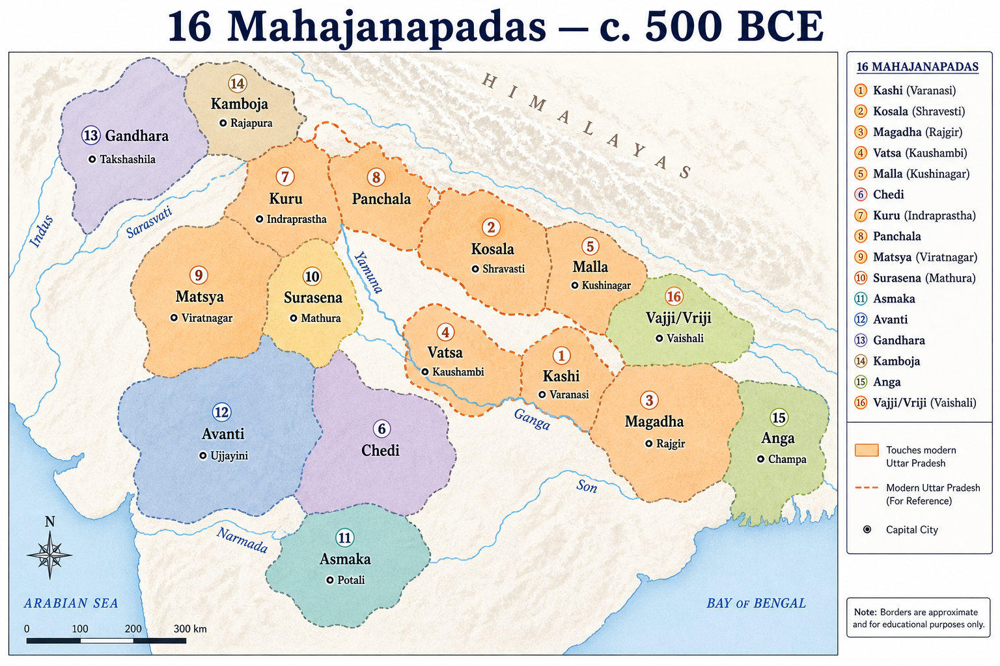

# Topic 5 — Sixth Century BCE
### ★ Complete Source of Truth — No other book/notes needed for this topic

> **Covers syllabus:** Political Condition of Sixth Century BCE | Sixteen Mahajanapadas | Mahajanapadas of Uttar Pradesh | Capitals of Mahajanapadas | Expansion of Mahajanapadas | Rise of Magadha | Haryanka Dynasty | Shishunaga Dynasty | Nanda Dynasty  
> **Sources baked in:** NCERT *Themes in Indian History* I (Ch 5–6), RS Sharma, Buddhist/Jain texts, UPPCS/UPSC PYQs  
> **Exam weight:** ★★★ High — 16 Mahajanapada capitals, UP mahajanapadas, Magadha dynasties, chronology  
> **Last verified:** July 2026

---

## Quick Revision Box — Raata This First

```
6TH CENTURY BCE CONTEXT:
  Age of Mahajanapadas (~600–300 BCE) | Iron Age | Gangetic urbanization
  16 states: monarchies + gana-sanghas (republics) | Constant warfare
  Shramanic movements (Buddhism, Jainism) emerge — heterodox challenge to Brahmanism

16 MAHAJANAPADAS + CAPITALS (★★★):
  Kashi–Varanasi | Kosala–Shravasti/Ayodhya | Anga–Champa | Magadha–Rajgir→Pataliputra
  Vajji–Vaishali | Malla–Kushinagar | Chedi–Shuktimati | Vatsa–Kaushambi
  Kuru–Indraprastha/Hastinapur | Panchala–Ahichchhatra | Matsya–Viratnagar
  Surasena–Mathura | Asmaka–Potana | Avanti–Ujjain | Gandhara–Taxila | Kamboja–Rajapura

UP MAHAJANAPADAS (8):
  Kashi, Kosala, Vatsa, Kuru, Panchala, Malla, Surasena, Chedi (partial Bundelkhand)

2020 Q6 MATCH (UPPCS):
  Matsya–Viratnagar(3) | Kuru–Indraprastha(4) | Surasena–Mathura(1) | Asmaka–Potana(2)
  Answer C: 3-4-1-2

MAGADHA DYNASTIES (chronology):
  Haryanka: Bimbisara → Ajatashatru → Udayin (Pataliputra shift)
  Shishunaga: Shishunaga → Kalashoka (2nd Buddhist Council, Vaishali)
  Nanda: Mahapadma Nanda → Dhana Nanda (Alexander era; overthrown by Chandragupta)

RISE OF MAGADHA — 4 FACTORS:
  Fertile land + rainfall | Iron + elephants | Strategic capitals (Rajgir fort, Pataliputra)
  Ambitious rulers + matrimonial alliances + military expansion
```

### Must-Know Term Comparisons (very frequently asked)

| Term | One-line difference | Hindi |
|------|---------------------|-------|
| **Mahajanapada vs Janapada** | Janapada = territorial settlement; Mahajanapada = large sovereign state (16 major ones) | महाजनपद / जनपद |
| **Gana-sangha vs Monarchy** | Gana-sangha = oligarchic republic (Vajji, Malla); Monarchy = hereditary king (Magadha, Kosala) | गण-संघ / राजतंत्र |
| **Rajgir vs Pataliputra** | Rajgir (Rajagriha) = early Magadha capital; Pataliputra = later capital (from Udayin) | राजगृह / पाटलिपुत्र |
| **Haryanka vs Shishunaga** | Haryanka = Bimbisara-Ajatashatru line; Shishunaga = overthrew later Haryanka successors | हर्यंक / शिशुनाग |
| **Bimbisara vs Ajatashatru** | Bimbisara = expansion via alliances; Ajatashatru = killed father, conquered Vajji | बिंबिसार / अजातशत्रु |
| **Mahapadma vs Dhana Nanda** | Mahapadma = Nanda empire founder; Dhana Nanda = last Nanda (Alexander period) | महापद्म / धन नंद |
| **Kosala vs Kashi** | Kosala = eastern UP (Ayodhya/Shravasti); Kashi = Varanasi — separate mahajanapadas | कोसल / काशी |
| **Vatsa vs Panchala** | Vatsa = Kaushambi (Allahabad region); Panchala = Ahichchhatra/Kampilya (Bareilly) | वत्स / पांचाल |
| **Matsya vs Surasena** | Matsya = Viratnagar (Rajasthan); Surasena = Mathura — both near UP border | मत्स्य / शूरसेन |
| **Expansion vs Rise** | Expansion = all mahajanapadas grew; Rise of Magadha = one state dominates to empire | विस्तार / मगध का उत्थान |

### Memory Tricks

| Trick | Remembers |
|-------|-----------|
| **K-K-A-M-V-M-C-V-K-P-M-S-A-A-G-K** | 16 mahajanapadas order mnemonic (Kashi first...) |
| **UP = 8 K's** | Kashi, Kosala, Kuru, Panchala + Vatsa, Malla, Surasena, Chedi |
| **B-A-U** | Haryanka order: Bimbisara → Ajatashatru → Udayin |
| **S-K-N** | Shishunaga → Kalashoka → (then) Nanda |
| **M-D-C** | Nanda: Mahapadma → Dhana → Chandragupta overthrows |
| **3-4-1-2** | 2020 Q6 answer: Matsya-Kuru-Surasena-Asmaka capitals |
| **Rajgir before Patna** | Magadha capital shift Udayin |
| **Vaishali = Vajji** | Gana-sangha capital |
| **Mathura = Surasena** | Krishna region mahajanapada |
| **Kaushambi = Vatsa** | Near Prayagraj UP |

---

## Exam Visuals — High-ROI Images

> **Type priority:** location map → conceptual diagram. Images stored locally (`images/`) so they open offline.

### 1. Sixteen Mahajanapadas — Location Map (~500 BCE)



*Core **capital-matching** visual — **UPPCS 2020 Q6** answer **3-4-1-2**: **Matsya** (Viratnagar) → **Kuru** (Indraprastha) → **Surasena** (Mathura) → **Asmaka** (Potana). **8 mahajanapadas touch modern UP** (highlighted). **Magadha capital shift**: Rajgir → Pataliputra (Udayin).*
*Source: Study map — generated for UPPCS capital-matching*

---

## 5.1 Political Condition of Sixth Century BCE

### Definitions (learn all — exams pick different ones)

| Term | Meaning |
|------|---------|
| **Sixth Century BCE** | ~600–500 BCE — transformative period in North Indian history |
| **Mahajanapada** | "Great realm" — 16 large territorial states replacing tribal janapadas |
| **Second Urbanization** | Rise of cities in Gangetic plain after Harappan decline — iron-based agriculture |

### Political Condition of Sixth Century BCE — How It Works

- North India transitioned from **Later Vedic janapadas** to **16 Mahajanapadas**. They became territorial states with capitals.
- **Iron technology** widespread. Enabled **forest clearance** and surplus agriculture in Middle and Lower Gangetic plains.
- **Two polity types**: **monarchies** (Magadha, Kosala, Vatsa) and **gana-sanghas/republics** (Vajji, Malla, Shakya).
- **Constant interstate warfare**. It reflected ambition to control fertile doabs and trade routes.
- **Rise of heterodox movements**. Buddhism and Jainism challenged Brahmanical orthodoxy (brief: full treatment in Topic 4).
- **Urban centres grew**. Varanasi, Rajgir, Kaushambi, Shravasti, Vaishali became administrative and commercial hubs.
- **Coinage begins**. **punch-marked coins** (silver) appear in 6th–5th century BCE. This facilitated trade.
- **Social change** made the varna-jati system more rigid. Urban merchants (**setthi**) and craftsmen also gained wealth.
- **No pan-Indian empire existed yet** because politics remained fragmented. Magadha's rise began in this century.
- **Greek-Persian context** mattered because Achaemenid Persia touched the northwest, including Gandhara. Alexander arrived only at the end of the 4th century BCE.

> **Exam note:** 6th century BCE = Mahajanapada age + Shramanic movements. Trap: "Pan-Indian Mauryan empire existed in 6th century" — false.

### Exam Facts (raata)

- Age of 16 Mahajanapadas (~600–300 BCE)
- Iron Age and second urbanization
- Monarchies and gana-sanghas coexist
- Buddhism and Jainism founded ~6th–5th century BCE
- Punch-marked coins emerge
- Interstate warfare common
- Gangetic plain = political core
- No unified empire until Magadha expansion

### PYQs — Political Condition

1. **(UPSC Prelims 2020 — pattern)** The 6th century BCE in India is known for:  
   → **Mahajanapadas, rise of Buddhism/Jainism, iron technology, urbanization.**

2. **(UPSC Prelims 2018 — pattern)** Gana-sanghas in ancient India were:  
   → **Oligarchic republics** (Vajji, Malla) — not absolute monarchies.

### Examples (5.1)

| Example | Detail |
|---------|--------|
| **Punch-marked coins** | 6th century trade revolution |
| **Vaishali** | Vajji gana-sangha capital |
| **Gangetic cities** | Second urbanization centres |

---

## 5.2 Sixteen Mahajanapadas

### Sixteen Mahajanapadas — Complete Table

| # | Mahajanapada | Capital(s) | Modern region |
|---|--------------|------------|---------------|
| 1 | **Kashi** | Varanasi (Banaras) | Uttar Pradesh |
| 2 | **Kosala** | Shravasti / Ayodhya | Uttar Pradesh |
| 3 | **Anga** | Champa (Bhagalpur) | Bihar |
| 4 | **Magadha** | Rajgir → Pataliputra | Bihar |
| 5 | **Vajji** (Vrijji) | Vaishali | Bihar |
| 6 | **Malla** | Kushinagar (Kusinara) / Pawa | Uttar Pradesh |
| 7 | **Chedi** | Shuktimati / Tripuri | MP / UP (Bundelkhand) |
| 8 | **Vatsa** | Kaushambi | Uttar Pradesh |
| 9 | **Kuru** | Indraprastha / Hastinapur | UP / Delhi / Haryana |
| 10 | **Panchala** | Ahichchhatra / Kampilya | Uttar Pradesh |
| 11 | **Matsya** | Viratnagar (Virata) | Rajasthan (Bharatpur) |
| 12 | **Surasena** | Mathura | Uttar Pradesh |
| 13 | **Asmaka** (Assaka) | Potana / Pratishthana | Maharashtra / Andhra |
| 14 | **Avanti** | Ujjain / Mahishmati | Madhya Pradesh |
| 15 | **Gandhara** | Taxila (Takshashila) | Pakistan (Punjab) |
| 16 | **Kamboja** | Rajapura | Afghanistan |

### Sixteen Mahajanapadas — How It Works

- **Solasa Mahajanapada** refers to the **16 major states** listed in Buddhist and Jain texts. The **Anguttara Nikaya** is a key source.
- **Geographic spread** ran from **Gandhara** in the northwest to **Asmaka** in the south. **Kamboja** lay farthest west.
- **Gangetic heartland**. Most mahajanapadas clustered in **UP-Bihar** belt. The region was fertile and densely populated.
- **Monarchical states**. Kashi, Kosala, Magadha, Vatsa, Avanti, Anga, Chedi, Kuru, Panchala.
- **Republican gana-sanghas**. **Vajji** (confederacy of 8 clans including Licchavi), **Malla** (nine clans), **Shakya** (Kapilavastu. Buddha's clan, sometimes counted separately).
- **Largest rivals**. **Magadha, Kosala, Vatsa, Avanti**. They drove the four-power struggle in the early period.
- **Naming**. Their names derived from dominant clan or region (Kuru from Kuru tribe, Panchala from Panchala tribe).
- **Armies** used infantry, cavalry, elephants, and chariots. **Elephants** gave Magadha a military edge.
- **Buddha and Mahavira**. Both lived and taught in this mahajanapada landscape (~6th–5th century BCE).
- **Eventually absorbed**. Magadha conquered all by Mauryan period.

> **Exam note:** Complete 16 with capitals — no truncation. Trap: "Shakya was one of 16" — sometimes listed separately from Malla/Vajji.

### Exam Facts (raata)

- 16 mahajanapadas total
- Buddhist Anguttara Nikaya lists them
- Vajji and Malla = gana-sanghas
- Gandhara (northwest) to Asmaka (south)
- Four great rivals: Magadha, Kosala, Vatsa, Avanti
- Elephants in warfare. Magadha advantage
- All absorbed by Magadha/Mauryas eventually

### PYQs — Sixteen Mahajanapadas

1. **(UPPCS Prelims 2020, Q6)** Mahajanapada-capital match — see §5.4 for full question.

2. **(UPSC Prelims 2019 — pattern)** How many Mahajanapadas are traditionally listed?  
   → **16.**

### Examples (5.2)

| Example | Detail |
|---------|--------|
| **Anguttara Nikaya** | Buddhist source for 16 states |
| **Vajji confederacy** | Eight clans including Licchavi |
| **Four-power rivalry** | Magadha-Kosala-Vatsa-Avanti |

---

## 5.3 Mahajanapadas of Uttar Pradesh

### Mahajanapadas of Uttar Pradesh — How It Works

- **Eight mahajanapadas** had core territory in present-day **Uttar Pradesh**. This is high-yield for UPPCS.
- **Kashi** was centered on Varanasi, the oldest living city. It was powerful at first and was later absorbed by Kosala and then Magadha.
- **Kosala** had **Ayodhya** as its southern capital and **Shravasti** as its northern capital. It was Rama's legendary kingdom, and Buddha spent much time here.
- **Vatsa** had **Kaushambi** near Allahabad/Prayagraj as its capital. King Udayana legends and its strategic doab position make it exam-relevant.
- **Kuru** had **Hastinapur** in Meerut and **Indraprastha** in Delhi as key centres. It is strongly associated with the Mahabharata tradition.
- **Panchala** had **Ahichchhatra** in Bareilly and **Kampilya** as key centres. Epic tradition associates it with Draupadi's kingdom.
- **Malla** was a **gana-sangha** linked to **Kushinagar** (Kusinara). Buddha attained Mahaparinirvana there.
- **Surasena** was centered on **Mathura**. It is associated with Krishna legends and a strategic Yamuna position.
- **Chedi** covered **Bundelkhand** in southern UP and northern MP. Its capital was Shuktimati, and epic tradition remembers Chedi kings.
- **UPPCS strategy**. Know which of 16 are in UP vs Bihar/MP/Rajasthan traps.

> **Exam note:** **8 UP mahajanapadas** — Kashi, Kosala, Vatsa, Kuru, Panchala, Malla, Surasena, Chedi. Trap: "Magadha is in UP" — Magadha = Bihar.

### UP Mahajanapadas — Complete Table

| # | Mahajanapada | Capital | UP district/region |
|---|--------------|---------|------------------|
| 1 | Kashi | Varanasi | Varanasi |
| 2 | Kosala | Ayodhya, Shravasti | Ayodhya, Shravasti (border) |
| 3 | Vatsa | Kaushambi | Kaushambi (Prayagraj) |
| 4 | Kuru | Hastinapur, Indraprastha | Meerut, NCR |
| 5 | Panchala | Ahichchhatra, Kampilya | Bareilly, Farrukhabad |
| 6 | Malla | Kushinagar | Kushinagar |
| 7 | Surasena | Mathura | Mathura |
| 8 | Chedi | Shuktimati | Bundelkhand (Banda/Chitrakoot) |

### NOT in UP (Trap List)

| Mahajanapada | Actual state |
|--------------|--------------|
| Magadha | Bihar |
| Anga | Bihar |
| Vajji | Bihar |
| Avanti | Madhya Pradesh |
| Matsya | Rajasthan |
| Asmaka | Maharashtra/Andhra |
| Gandhara | Pakistan |
| Kamboja | Afghanistan |

### Exam Facts (raata)

- 8 mahajanapadas in UP
- Kashi = Varanasi
- Kosala = Ayodhya and Shravasti
- Vatsa = Kaushambi
- Kushinagar = Malla (Buddha's death)
- Mathura = Surasena
- Magadha NOT in UP
- Most densely political region of ancient India

### PYQs — Mahajanapadas of UP

1. **(UPSC Prelims 2018 — pattern)** Kaushambi was capital of:  
   → **Vatsa mahajanapada** (UP).

2. **(UPSC Prelims 2017 — pattern)** Kushinagar is associated with which mahajanapada?  
   → **Malla** (UP).

### Examples (5.3)

| Example | Detail |
|---------|--------|
| **Varanasi, Kashi** | Continuous urban history |
| **Kaushambi excavations** | Vatsa capital archaeology |
| **Kushinagar** | Malla + Buddha Mahaparinirvana |

---

## 5.4 Capitals of Mahajanapadas

### Capitals of Mahajanapadas — How It Works

- **Capital matching** is the **#1 UPPCS question format** for this topic.
- **UPPCS 2020 Q6** was labeled Geography but is cross-subject for this topic:
  - **Matsya** matches **Viratnagar** (3).
  - **Kuru** matches **Indraprastha** (4).
  - **Surasena** matches **Mathura** (1).
  - **Asmaka** matches **Potana** (2).
  - **Answer: C (3-4-1-2)**
- **Dual capitals** common. Kosala (Ayodhya and Shravasti), Avanti (Ujjain and Mahishmati), Kuru (Hastinapur and Indraprastha).
- **Magadha shift**. **Rajgir** (Rajagriha) early to **Pataliputra** (Patna) from **Udayin** onward.
- **Taxila** was the capital of Gandhara. It was an ancient university city and a northwest gateway.
- **Vaishali** was the capital of the Vajji **gana-sangha**. It also overlaps with Topic 4 through Buddhist council traditions.
- **Varanasi** was the capital of Kashi. It remained a continuously inhabited sacred and political centre.
- **Champa** was the capital of Anga. It lay near modern Bhagalpur in Bihar.
- **Pratishthana/Potana** was linked to Asmaka. It was the southernmost mahajanapada capital.
- Memorize **all 16 pairs**. Exams swap one wrong capital in match lists.

> **Exam note:** 2020 Q6 answer **C: 3-4-1-2**. Trap: Matsya = Mathura (that's Surasena).

### Exam Facts (raata)

- 2020 Q6: Matsya-Viratnagar, Kuru-Indraprastha, Surasena-Mathura, Asmaka-Potana
- Magadha: Rajgir to Pataliputra
- Kosala: Shravasti and Ayodhya
- Vajji: Vaishali
- Gandhara: Taxila
- Avanti: Ujjain
- Vatsa: Kaushambi
- Kashi: Varanasi

### PYQs — Capitals of Mahajanapadas

1. **(UPPCS Prelims 2020, Q6)** Match Mahajanapadas with Capitals:  
   A. Matsya  B. Kuru  C. Surasena  D. Asmaka — 1. Mathura  2. Potana  3. Viratnagar  4. Indraprastha  
   → **C — 3-4-1-2** (Matsya-Viratnagar, Kuru-Indraprastha, Surasena-Mathura, Asmaka-Potana).

2. **(UPSC Prelims 2019 — pattern)** Vaishali was the capital of:  
   → **Vajji (Vrijji) mahajanapada.**

### Examples (5.4)

| Example | Detail |
|---------|--------|
| **2020 Q6** | Direct UPPCS capital match |
| **Rajgir fort** | Early Magadha capital |
| **Taxila** | Gandhara capital |

---

## 5.5 Expansion of Mahajanapadas

### Expansion of Mahajanapadas — How It Works

- All mahajanapadas **expanded territorially** from 6th–4th century BCE. Warfare and alliances drove growth.
- **Magadha** expanded most successfully. It absorbed Anga, Vajji, Kosala, Kashi, eventually most of North India.
- **Kosala** under **Prasenajit** was a major power. Prasenajit patronized Buddha and was later defeated by Ajatashatru of Magadha.
- **Avanti** under King **Chanda Pradyota** rivaled Bimbisara. It was eventually conquered by Shishunaga.
- **Vatsa**. It allied with Magadha through **matrimonial ties** (Bimbisara married Kosala princess).
- **Anga**. It was **first annexed** by Bimbisara of Magadha (6th century BCE). Magadha's first major expansion.
- **Vajji (Vaishali)** was a **confederacy** that resisted Magadha for decades. Ajatashatru conquered it after 16 years of war and used the **Rathamusala** war engine.
- **Gana-sanghas**. Malla and Vajji resisted monarchy longer. They were eventually absorbed.
- **Northwest**. Gandhara and Kamboja were affected by **Persian** and later **Greek** incursions (Topic 6).
- **Result**. The result was a **pan-Gangetic empire** under Nandas, then Mauryas. The mahajanapada system ended.

> **Exam note:** First Magadha annexation = **Anga** (Bimbisara). Longest resistance = **Vajji** (Ajatashatru).

### Exam Facts (raata)

- Magadha = most successful expander
- Bimbisara annexed Anga first
- Ajatashatru conquered Vajji (16-year war)
- Kosala defeated by Magadha (Ajatashatru)
- Avanti conquered by Shishunaga dynasty
- Gana-sanghas absorbed last
- End result: Nanda then Mauryan empire

### PYQs — Expansion of Mahajanapadas

1. **(UPSC Prelims 2018 — pattern)** First territory annexed by Bimbisara was:  
   → **Anga** (Champa).

2. **(UPSC Prelims 2016 — pattern)** Ajatashatru fought a long war against:  
   → **Vajji confederacy (Vaishali).**

### Examples (5.5)

| Example | Detail |
|---------|--------|
| **Anga annexation** | Bimbisara's first conquest |
| **Vaishali war** | Ajatashatru's 16-year campaign |
| **Nanda empire** | All mahajanapadas absorbed |

---

## 5.6 Rise of Magadha

### Rise of Magadha — How It Works

- **Magadha** (southern Bihar) rose from one of 16 mahajanapadas to **dominant imperial power**. It formed the foundation of the Mauryan empire.
- **Geographic advantages**. It had fertile **Gangetic alluvial soil**, heavy **rainfall**, rich **iron ore** (Rajgir hills), abundant **elephants** for army.
- **Strategic capitals** strengthened Magadha. **Rajgir** was surrounded by **5 hills** as an impregnable fort, while **Pataliputra** at the **Ganga-Son confluence** became a trade and military hub.
- **Control of trade routes** helped Magadha connect the eastern Gangetic valley to Bengal. Later conquests extended its reach toward the northwest.
- **Ambitious rulers**. Bimbisara, Ajatashatru, Mahapadma Nanda. They followed a continuous expansion policy.
- **Matrimonial alliances**. Bimbisara married **Kosala princess**, **Chellana** (Lichchhavi), **Madhavi** (Madhra). These alliances supported peaceful annexation and diplomacy.
- **Military innovation**. **Rathamusala** (scythed chariot) used by Ajatashatru against Vajji.
- **Administrative growth**. It built a standing army, ministerial system (Purohita, Senapati). This was a precursor to Mauryan bureaucracy.
- **Rival elimination**. It systematically defeated Kosala, Vatsa, Avanti, Vajji over two centuries.
- **Nanda rule marked the climax** of pre-Mauryan Magadha. It created the first **pan-North Indian empire** before the Mauryas, with a vast army and treasury.

> **Exam note:** Four factors: **fertile land + iron/elephants + strategic capital + ambitious rulers**. Trap: "Magadha rose due to maritime trade" — primarily land-based expansion.

### Exam Facts (raata)

- Fertile soil and rainfall and iron and elephants
- Rajgir = fortified hill capital
- Pataliputra = Ganga-Son confluence
- Matrimonial alliances (Bimbisara)
- Defeated Kosala, Vajji, Avanti, Anga
- Nanda = first great Magadha empire
- Precursor to Mauryan empire

### PYQs — Rise of Magadha

1. **(UPSC Prelims 2019 — pattern)** Magadha rose to prominence due to:  
   → **Natural resources, strategic location, able rulers, elephant army.**

2. **(UPSC Prelims 2017 — pattern)** Which city was the early capital of Magadha?  
   → **Rajgir (Rajagriha).**

### Examples (5.6)

| Example | Detail |
|---------|--------|
| **Rajgir hills** | Five hills fortification |
| **Elephant corps** | Magadha military edge |
| **Bimbisara's alliances** | Diplomatic expansion model |

---

## 5.7 Haryanka Dynasty

### Haryanka Dynasty — How It Works

- **Haryanka** was the first **historical dynasty** of Magadha (~544–413 BCE). Buddhist and Jain sources provide the main evidence.
- **Bimbisara** (Shrenika) was the **founder** and ruled c. **544–492 BCE**. He was a contemporary of **Buddha and Mahavira**.
- **Bimbisara expanded Magadha** by annexing **Anga** (Champa). He also built matrimonial alliances with **Kosala, Lichchhavi, and Madra**.
- **Bimbisara patronized Buddhism** when Buddha accepted his invitation. The Jetavana monastery gift is linked to Anathapindada.
- **Ajatashatru** (Kunika) was Bimbisara's son. He **killed or imprisoned Bimbisara** around 492 BCE and seized the throne.
- **Ajatashatru expanded Magadha** by defeating **Kosala** under Prasenajit. He also fought a **16-year war against Vajji** (Vaishali) and used the **Rathamusala**.
- **First Buddhist Council**. It was held at **Rajagriha** after Buddha's death during Ajatashatru's reign (Topic 4 overlap).
- **Udayin** (Udayibhadda), the son of Ajatashatru, shifted the capital from **Rajgir to Pataliputra** around 460 BCE. The new site was strategic because it lay near the Ganga-Son confluence.
- **Udayin** founded **Pataliputra** on the site of the future Mauryan capital. He fortified the city.
- **Later Haryankas** such as **Mundas** and **Nagadasaka** were weak successors. The dynasty ended around 413 BCE.

> **Exam note:** Bimbisara = alliances; Ajatashatru = parricide + Vajji conquest; Udayin = Pataliputra. Trap: "Pataliputra founded by Chandragupta" — Udayin founded it.

### Haryanka Rulers — Complete Table

| # | Ruler | Period (approx.) | Key achievement |
|---|-------|------------------|-----------------|
| 1 | Bimbisara | 544–492 BCE | Anga annexation; Buddha's patron |
| 2 | Ajatashatru | 492–460 BCE | Killed father; conquered Vajji + Kosala |
| 3 | Udayin | 460–440 BCE | Shifted capital to Pataliputra |
| 4 | Anuruddha | 440–436 BCE | Weak successor |
| 5 | Munda | 436–428 BCE | Decline phase |
| 6 | Nagadasaka | 428–413 BCE | Last Haryanka |

### Exam Facts (raata)

- Bimbisara 544–492 BCE
- Ajatashatru killed Bimbisara
- Udayin to Pataliputra capital
- Anga first annexation (Bimbisara)
- Vajji war 16 years (Ajatashatru)
- Contemporary of Buddha and Mahavira
- Dynasty ended ~413 BCE

### PYQs — Haryanka Dynasty

1. **(UPSC Prelims 2018 — pattern)** Who shifted Magadha capital to Pataliputra?  
   → **Udayin (Udayibhadda).**

2. **(UPSC Prelims 2016 — pattern)** Bimbisara belonged to which dynasty?  
   → **Haryanka dynasty.**

### Examples (5.7)

| Example | Detail |
|---------|--------|
| **Bimbisara + Buddha** | Royal patronage of Buddhism |
| **Ajatashatru + Vajji** | 16-year Vaishali war |
| **Pataliputra founding** | Udayin's capital shift |

---

## 5.8 Shishunaga Dynasty

### Shishunaga Dynasty — How It Works

- **Shishunaga** was the founder of the dynasty. He was a **minister who seized the throne** after the Haryanka decline around 413 BCE.
- **Ruled c. 413–344 BCE**. It restored Magadha dominance after period of instability.
- **Shishunaga conquered Avanti** and ended Magadha's long rivalry with it. This brought **Ujjain** into the Magadha sphere.
- **Capital**. It remained **Pataliputra** (Rajgir secondary).
- **Kalashoka** (Kakavarna), the son of Shishunaga, ruled when the **Second Buddhist Council** was held at **Vaishali** around 383 BCE.
- **The Second Council** produced a Buddhist schism between Sthaviravada and Mahasanghika. It also overlaps with Topic 4 because Vaishali was a mahajanapada site.
- **The dynasty declined** under weak successors. **Mahapadma Nanda**, described as a minister or rebel, overthrew the last Shishunaga ruler around 344 BCE.
- **10 rulers** traditionally listed. It included Shishunaga and 9 successors including Kalashoka.
- **Northward expansion** consolidated Magadha control over Gangetic plain fully.
- **Transition**. It moved Magadha from regional power to **subcontinental empire** under succeeding Nandas.

> **Exam note:** Shishunaga conquered **Avanti**. Kalashoka = **Second Buddhist Council at Vaishali**. Trap: "Shishunaga founded Pataliputra" — Udayin did.

### Shishunaga Rulers — Key Table

| # | Ruler | Key fact |
|---|-------|----------|
| 1 | Shishunaga | Founder; minister; conquered Avanti (~413 BCE) |
| 2 | Kalashoka | Second Buddhist Council at Vaishali |
| 3–10 | Successors | Declining power; ended by Nandas |

### Exam Facts (raata)

- Shishunaga ~413 BCE founder
- Minister who usurped throne
- Conquered Avanti (Ujjain)
- Kalashoka = Second Buddhist Council
- Capital Pataliputra
- Ended by Mahapadma Nanda ~344 BCE
- 10 rulers in dynasty

### PYQs — Shishunaga Dynasty

1. **(UPSC Prelims 2019 — pattern)** Second Buddhist Council held at Vaishali during reign of:  
   → **Kalashoka (Shishunaga dynasty).**

2. **(UPSC Prelims 2017 — pattern)** Shishunaga conquered which rival mahajanapada?  
   → **Avanti.**

### Examples (5.8)

| Example | Detail |
|---------|--------|
| **Avanti conquest** | Ended Pradyota rivalry |
| **Vaishali Council** | Kalashoka period |
| **Nanda takeover** | Shishunaga line ended |

---

## 5.9 Nanda Dynasty

### Nanda Dynasty — How It Works

- **The Nanda dynasty** created the first **empire-scale** Magadha rule (~344–322 BCE). It preceded the Mauryas.
- **Mahapadma Nanda** was the founder. Puranic tradition calls him the **"destroyer of all Kshatriyas"**, and his possible **Shudra origin** challenged the varna order.
- **Mahapadma**. He conquered **Kosala, Kalinga, Kuru, Panchala, Vatsa**. Most of North India.
- **Dhana Nanda** was the last Nanda ruler. He was a contemporary of **Alexander's invasion** in 326 BCE and was famous for enormous wealth as a "great hoarder."
- **Army strength**. Greek sources record **200,000 infantry, 20,000 cavalry, 2,000 chariots, 3,000 elephants**. This deterred Alexander from advancing into Gangetic Magadha.
- **Nanda wealth** came from extensive taxation. Greek and Jain accounts describe hoarded treasure and unpopularity among subjects.
- **Chanakya-Kautilya** was humiliated by Dhana Nanda. He vowed revenge and mentored **Chandragupta Maurya**.
- **Overthrow**. Chandragupta Maurya defeated Dhana Nanda ~**322 BCE** with Chanakya's strategy. He founded the Mauryan empire (Topic 7).
- **9 Nanda rulers** per Puranic lists. They included Mahapadma and 8 sons including Dhana.
- **Administrative legacy**. They left centralized revenue, large standing army. Model for Mauryas.

> **Exam note:** Dhana Nanda = Alexander's contemporary; huge army. Trap: "Alexander defeated Nandas" — Alexander turned back at Beas; never fought Nandas directly.

### Nanda Rulers — Complete Table

| # | Ruler | Period (approx.) | Key fact |
|---|-------|------------------|----------|
| 1 | Mahapadma Nanda | 344–329 BCE | Founder; empire builder; "Ekarat" (sole sovereign) |
| 2–8 | Eight sons | 329–322 BCE | Successor brothers |
| 9 | Dhana Nanda | 329–322 BCE | Last; wealthiest; Alexander contemporary |

### Exam Facts (raata)

- Mahapadma Nanda = founder (~344 BCE)
- Dhana Nanda = last ruler
- Alexander invasion 326 BCE. Did not fight Nandas
- Army: 200,000 infantry (Greek accounts)
- Overthrown by Chandragupta ~322 BCE
- Chanakya's humiliation legend
- First subcontinental-scale Magadha empire
- Shudra origin claim (Puranic)

### PYQs — Nanda Dynasty

1. **(UPSC Prelims 2018 — pattern)** Alexander turned back from India because of:  
   → **Power of Nanda empire army** (and mutinous troops) — not direct battle.

2. **(UPSC Prelims 2016 — pattern)** Who overthrew the Nanda dynasty?  
   → **Chandragupta Maurya** (~322 BCE).

### Examples (5.9)

| Example | Detail |
|---------|--------|
| **Dhana Nanda's army** | Deterred Alexander's advance |
| **Chanakya** | Vengeance against Dhana Nanda |
| **Mahapadma** | "Destroyer of Kshatriyas" title |

---

## Consolidated Reference — Everything in One Place

### Magadha Dynasty Chronology

| Dynasty | Period | Key rulers | Capital |
|---------|--------|------------|---------|
| Haryanka | ~544–413 BCE | Bimbisara, Ajatashatru, Udayin | Rajgir → Pataliputra |
| Shishunaga | ~413–344 BCE | Shishunaga, Kalashoka | Pataliputra |
| Nanda | ~344–322 BCE | Mahapadma, Dhana Nanda | Pataliputra |

### 16 Mahajanapadas — Capital Quick Match (Full)

| Mahajanapada | Capital |
|--------------|---------|
| Kashi | Varanasi |
| Kosala | Shravasti / Ayodhya |
| Anga | Champa |
| Magadha | Rajgir / Pataliputra |
| Vajji | Vaishali |
| Malla | Kushinagar |
| Chedi | Shuktimati |
| Vatsa | Kaushambi |
| Kuru | Indraprastha / Hastinapur |
| Panchala | Ahichchhatra |
| Matsya | Viratnagar |
| Surasena | Mathura |
| Asmaka | Potana |
| Avanti | Ujjain |
| Gandhara | Taxila |
| Kamboja | Rajapura |

### UP Focus — Mahajanapadas in Uttar Pradesh

| Mahajanapada | Capital | Modern UP location |
|--------------|---------|-------------------|
| Kashi | Varanasi | Varanasi district |
| Kosala | Ayodhya, Shravasti | Ayodhya, Shravasti |
| Vatsa | Kaushambi | Kaushambi/Prayagraj |
| Kuru | Hastinapur | Meerut |
| Panchala | Ahichchhatra | Bareilly |
| Malla | Kushinagar | Kushinagar |
| Surasena | Mathura | Mathura |
| Chedi | Shuktimati | Bundelkhand |

### Important Dates

| Event | Date (approx.) |
|-------|----------------|
| Bimbisara begins rule | 544 BCE |
| Buddha's lifetime | 563–483 BCE |
| Ajatashatru kills Bimbisara | 492 BCE |
| Udayin shifts to Pataliputra | 460 BCE |
| Shishunaga usurps throne | 413 BCE |
| Second Buddhist Council (Vaishali) | 383 BCE |
| Mahapadma Nanda founds dynasty | 344 BCE |
| Alexander's invasion | 326 BCE |
| Chandragupta overthrows Nandas | 322 BCE |

---

## Practice Zone — UPPCS Format Questions

> **Answers hidden** — click *Show answer* under each question to reveal.

**Q1.** Match the Mahajanapadas with their capitals (2020 Q6 pattern):

List-I: A. Matsya  B. Kuru  C. Surasena  D. Asmaka

List-II: 1. Mathura  2. Potana  3. Viratnagar  4. Indraprastha

Options:
A. 3-4-1-2
B. 4-3-2-1
C. 1-2-3-4
D. 2-1-4-3

<details>
<summary>Show answer</summary>

**Ans: A — 3-4-1-2** (2020 Q6). Matsya-Viratnagar, Kuru-Indraprastha, Surasena-Mathura, Asmaka-Potana. Trap: Matsya ≠ Mathura.

</details>

**Q2.** Consider the following statements about Mahajanapadas of Uttar Pradesh:

1. Eight of the sixteen Mahajanapadas had core territory in present-day UP.
2. Magadha was one of the eight UP Mahajanapadas.

Select the correct answer from the code given below:

Options:
A. Both 1 and 2
B. Neither 1 nor 2
C. Only 1
D. Only 2

<details>
<summary>Show answer</summary>

**Ans: C — Only 1.** UP eight: Kashi, Kosala, Vatsa, Kuru, Panchala, Malla, Surasena, Chedi. Magadha = Bihar.

</details>

**Q3.** Given below are two statements, one labelled as Assertion (A) and the other as Reason (R):

Assertion (A): Magadha rose to dominance primarily due to maritime trade dominance in the 6th century BCE.

Reason (R): Magadha possessed fertile Gangetic soil, iron ore, elephants, and strategically located capitals.

Select the correct answer from the code given below:

Options:
A. Both (A) and (R) are true and (R) is the correct explanation of (A)
B. Both (A) and (R) are true, but (R) is not the correct explanation of (A)
C. (A) is true, but (R) is false
D. (A) is false, but (R) is true

<details>
<summary>Show answer</summary>

**Ans: D — A false, R true.** Magadha's rise was land-based (agriculture, iron, elephants, Rajgir/Pataliputra) — not maritime trade.

</details>

**Q4.** Match List-I with List-II:

List-I (Mahajanapada)
A. Vajji
B. Gandhara
C. Vatsa
D. Avanti

List-II (Capital)
1. Taxila
2. Ujjain
3. Vaishali
4. Kaushambi

Options:
A. 3-1-4-2
B. 1-3-2-4
C. 4-2-3-1
D. 2-4-1-3

<details>
<summary>Show answer</summary>

**Ans: A — 3-1-4-2.** Vajji-Vaishali, Gandhara-Taxila, Vatsa-Kaushambi, Avanti-Ujjain.

</details>

**Q5.** Consider the following statements about gana-sanghas:

1. Vajji was a confederacy of eight clans including the Licchavis.
2. All sixteen Mahajanapadas were monarchical states.

Select the correct answer from the code given below:

Options:
A. Both 1 and 2
B. Neither 1 nor 2
C. Only 1
D. Only 2

<details>
<summary>Show answer</summary>

**Ans: C — Only 1.** Vajji and Malla were republican gana-sanghas; not all sixteen were monarchies (2018 pattern).

</details>

**Q6.** Given below are two statements:

Assertion (A): Pataliputra was founded by Chandragupta Maurya as the first Magadha capital.

Reason (R): Udayin of the Haryanka dynasty shifted the Magadha capital from Rajgir to Pataliputra.

Select the correct answer from the code given below:

Options:
A. Both (A) and (R) are true and (R) is the correct explanation of (A)
B. Both (A) and (R) are true, but (R) is not the correct explanation of (A)
C. (A) is true, but (R) is false
D. (A) is false, but (R) is true

<details>
<summary>Show answer</summary>

**Ans: D — A false, R true.** Early capital = Rajgir; Udayin (~460 BCE) founded/shifted to Pataliputra — before Mauryas.

</details>

**Q7.** Match List-I with List-II:

List-I (Ruler/Dynasty)
A. Bimbisara
B. Ajatashatru
C. Mahapadma Nanda
D. Shishunaga

List-II (Achievement)
1. First annexation of Anga
2. Conquest of Vajji after 16-year war
3. First pan-North Indian empire before Mauryas
4. Conquest of Avanti

Options:
A. 1-2-3-4
B. 2-1-4-3
C. 1-2-4-3
D. 4-3-2-1

<details>
<summary>Show answer</summary>

**Ans: A — 1-2-3-4.** Bimbisara-Anga; Ajatashatru-Vajji; Nanda-empire; Shishunaga-Avanti.

</details>

**Q8.** Consider the following statements about Bimbisara:

1. He was a contemporary of both Buddha and Mahavira.
2. His first major territorial annexation was the kingdom of Anga.

Select the correct answer from the code given below:

Options:
A. Both 1 and 2
B. Neither 1 nor 2
C. Only 1
D. Only 2

<details>
<summary>Show answer</summary>

**Ans: A — Both correct.** Bimbisara (Haryanka) patronised Buddha; Anga (Champa) was first Magadha annexation (2018 pattern).

</details>

**Q9.** Given below are two statements:

Assertion (A): Kaushambi was the capital of the Vatsa Mahajanapada in Uttar Pradesh.

Reason (R): Kaushambi is located in the Prayagraj district region of modern UP.

Select the correct answer from the code given below:

Options:
A. Both (A) and (R) are true and (R) is the correct explanation of (A)
B. Both (A) and (R) are true, but (R) is not the correct explanation of (A)
C. (A) is true, but (R) is false
D. (A) is false, but (R) is true

<details>
<summary>Show answer</summary>

**Ans: A — Both true; R explains A.** Vatsa capital = Kaushambi (2018 pattern: Kaushambi → Vatsa).

</details>

**Q10.** Match List-I with List-II:

List-I (UP Mahajanapada)
A. Kashi
B. Malla
C. Panchala
D. Surasena

List-II (Capital)
1. Varanasi
2. Kushinagar
3. Ahichchhatra
4. Mathura

Options:
A. 1-2-3-4
B. 2-1-4-3
C. 4-3-2-1
D. 1-4-3-2

<details>
<summary>Show answer</summary>

**Ans: A — 1-2-3-4.** Kashi-Varanasi, Malla-Kushinagar, Panchala-Ahichchhatra, Surasena-Mathura.

</details>

**Q11.** Consider the following statements on the rise of Magadha:

1. Rajgir was surrounded by five hills making it a fortified early capital.
2. Elephant corps gave Magadha a military edge over rival Mahajanapadas.

Select the correct answer from the code given below:

Options:
A. Both 1 and 2
B. Neither 1 nor 2
C. Only 1
D. Only 2

<details>
<summary>Show answer</summary>

**Ans: A — Both correct.** Geographic + military factors: Rajgir fortification and elephant warfare (2019 pattern).

</details>

**Q12.** Match List-I with List-II (2019 pattern):

List-I (Site/Capital)
A. Vaishali
B. Champa
C. Shravasti
D. Varanasi

List-II (Association)
1. Anga capital
2. Vajji capital
3. Kashi capital
4. Kosala capital

Options:
A. 2-1-4-3
B. 1-2-3-4
C. 4-3-1-2
D. 2-4-1-3

<details>
<summary>Show answer</summary>

**Ans: A — 2-1-4-3.** Vaishali-Vajji, Champa-Anga, Shravasti-Kosala, Varanasi-Kashi.

</details>

**Q13.** Consider the following statements about Mahajanapada sources and count:

1. Buddhist Anguttara Nikaya is a key source listing sixteen Mahajanapadas.
2. Jain texts also refer to the sixteen major territorial states of ancient India.

Select the correct answer from the code given below:

Options:
A. Both 1 and 2
B. Neither 1 nor 2
C. Only 1
D. Only 2

<details>
<summary>Show answer</summary>

**Ans: A — Both correct.** Traditionally **16** Mahajanapadas (2019 pattern); Anguttara Nikaya = primary Buddhist source.

</details>

**Q14.** Which Mahajanapada was the southernmost among the sixteen?

Options:
A. Avanti
B. Asmaka
C. Chedi
D. Gandhara

<details>
<summary>Show answer</summary>

**Ans: B — Asmaka.** Capital Potana/Pratishthana in Maharashtra/Andhra region — farthest south.

</details>

**Q15.** The early capital of Magadha before Pataliputra was:

Options:
A. Vaishali
B. Rajgir (Rajagriha)
C. Champa
D. Ujjain

<details>
<summary>Show answer</summary>

**Ans: B — Rajgir.** Rajagriha = fortified hill capital; Pataliputra came later under Udayin.

</details>

**Q16.** Who among the following killed/imprisoned his father Bimbisara to seize the Magadha throne?

Options:
A. Udayin
B. Ajatashatru
C. Mahapadma Nanda
D. Prasenajit

<details>
<summary>Show answer</summary>

**Ans: B — Ajatashatru.** Parricide ~492 BCE; then conquered Kosala and Vajji.

</details>

**Q17.** Kushinagar is associated with which Mahajanapada?

Options:
A. Vajji
B. Kosala
C. Malla
D. Kashi

<details>
<summary>Show answer</summary>

**Ans: C — Malla.** Buddha attained Mahaparinirvana at Kushinagar (Kusinara) — UP (2017/2018 pattern).

</details>

**Q18.** The Second Buddhist Council was held at Vaishali during the reign of:

Options:
A. Bimbisara
B. Ashoka
C. Ajatashatru
D. Kanishka

<details>
<summary>Show answer</summary>

**Ans: C — Ajatashatru.** Second Council at Vaishali — century after First Council at Rajagriha (2019 pattern).

</details>

**Q19.** Which dynasty succeeded the Haryankas in Magadha?

Options:
A. Nanda
B. Maurya
C. Shishunaga
D. Gupta

<details>
<summary>Show answer</summary>

**Ans: C — Shishunaga.** Shishunaga (~413 BCE) → Nanda → Maurya chronological chain.

</details>

**Q20.** Mahapadma Nanda is credited with:

Options:
A. Founding Buddhism in Magadha
B. Building the Great Bath at Mohenjo-daro
C. Creating the first pan-North Indian empire before the Mauryas
D. Shifting capital from Rajgir to Pataliputra

<details>
<summary>Show answer</summary>

**Ans: C — First great Magadha empire.** Nanda dynasty preceded Chandragupta Maurya's overthrow of Dhana Nanda.

</details>

**Q21.** Gandhara Mahajanapada had its capital at:

Options:
A. Taxila (Takshashila)
B. Rajapura
C. Viratnagar
D. Indraprastha

<details>
<summary>Show answer</summary>

**Ans: A — Taxila.** Gandhara = northwest (modern Pakistan); Kamboja capital = Rajapura (Afghanistan).

</details>

**Q22.** Which of the following was NOT among the four great rival Mahajanapadas in the early period?

Options:
A. Magadha
B. Gandhara
C. Kosala
D. Vatsa

<details>
<summary>Show answer</summary>

**Ans: B — Gandhara.** Four-power struggle: Magadha, Kosala, Vatsa, Avanti — Gandhara was northwest frontier.

</details>

**Q23.** Bimbisara expanded Magadha through matrimonial alliances with all EXCEPT:

Options:
A. Kosala princess
B. Lichchhavi (Chellana)
C. Prasenajit of Avanti
D. Madra

<details>
<summary>Show answer</summary>

**Ans: C — Prasenajit was Kosala king, not Avanti.** Bimbisara allied with Kosala, Lichchhavi, Madra — diplomacy before war.

</details>

**Q24.** Ajatashatru used which military innovation against the Vajji confederacy?

Options:
A. Rathamusala (scythed chariot engine)
B. Greek phalanx formation
C. War elephants imported from Sri Lanka
D. Naval fleet on the Ganga

<details>
<summary>Show answer</summary>

**Ans: A — Rathamusala.** Scythed chariot war engine — 16-year war against Vaishali/Vajji.

</details>

**Q25.** The Shishunaga dynasty is noted for conquering:

Options:
A. Gandhara and Kamboja
B. Avanti
C. Sri Lanka
D. Kalinga

<details>
<summary>Show answer</summary>

**Ans: B — Avanti.** Shishunaga defeated Avanti (Ujjain) — rival eliminated before Nanda expansion.

</details>

**Q26.** Mathura was the capital of which Mahajanapada?

Options:
A. Matsya
B. Surasena
C. Kuru
D. Panchala

<details>
<summary>Show answer</summary>

**Ans: B — Surasena.** Krishna legends region; Yamuna strategic position — UP Mahajanapada.

</details>

**Q27.** Which source primarily lists the sixteen Mahajanapadas?

Options:
A. Rigveda
B. Anguttara Nikaya (Buddhist text)
C. Manusmriti
D. Arthashastra alone

<details>
<summary>Show answer</summary>

**Ans: B — Anguttara Nikaya.** Buddhist canonical source; Jain texts also mention the sixteen states.

</details>

**Q28.** Hastinapur is associated with which Mahajanapada?

Options:
A. Panchala
B. Kuru
C. Chedi
D. Anga

<details>
<summary>Show answer</summary>

**Ans: B — Kuru.** Kuru also linked to Indraprastha (Delhi NCR); Hastinapur in Meerut district, UP.

</details>

**Q29.** The Nanda ruler overthrown by Chandragupta Maurya was:

Options:
A. Bimbisara
B. Dhana Nanda
C. Mahapadma Nanda's immediate successor only
D. Ajatashatru

<details>
<summary>Show answer</summary>

**Ans: B — Dhana Nanda.** Last Nanda king; overthrown ~322 BCE with Chanakya's assistance.

</details>

**Q30.** Asmaka Mahajanapada had its capital at:

Options:
A. Mathura
B. Potana
C. Viratnagar
D. Ujjain

<details>
<summary>Show answer</summary>

**Ans: B — Potana** (2020 Q6 option 2). Southernmost mahajanapada; also called Pratishthana region.

</details>

---


## Complete PYQ Bank (Topic 5)

> **Answers hidden** — click *Show answer* under each question to reveal.


### UPPCS Prelims 2020

**Q6.** Match List-I (Mahajanapadas) with List-II (Capitals):
A. Matsya  B. Kuru  C. Surasena  D. Asmaka — 1. Mathura  2. Potana  3. Viratnagar  4. Indraprastha

<details>
<summary>Show answer</summary>
**C — 3-4-1-2.** Matsya-Viratnagar, Kuru-Indraprastha, Surasena-Mathura, Asmaka-Potana.
</details>

### UPSC Pattern (Concept Overlap)

**Pattern — Vaishali:** Capital of Vajji gana-sangha.

**Pattern — Pataliputra:** Founded/shifted by Udayin (Haryanka).

**Pattern — 16 Mahajanapadas:** Buddhist Anguttara Nikaya source.

---

## Common Traps — Don't Fall For These

1. **Matsya = Viratnagar** — NOT Mathura (2020 Q6).
2. **Surasena = Mathura** — NOT Viratnagar.
3. **Kuru = Indraprastha** in UPPCS 2020 — NOT Potana.
4. **Asmaka = Potana** — southernmost; NOT Indraprastha.
5. **Magadha = Bihar** — NOT Uttar Pradesh.
6. **Pataliputra founded by Udayin** — NOT Chandragupta.
7. **Ajatashatru killed Bimbisara** — parricide trap.
8. **Alexander never fought Nandas** — turned back at Beas.
9. **Vajji + Malla = gana-sanghas** — NOT monarchies.
10. **8 UP mahajanapadas** — include Kashi, Kosala, Vatsa, Kuru, Panchala, Malla, Surasena, Chedi.
11. **Shishunaga conquered Avanti** — NOT Bimbisara.
12. **Anga first annexed by Bimbisara** — NOT Ajatashatru.
13. **Kaushambi = Vatsa** — NOT Avanti.
14. **Dhana Nanda ≠ Alexander's victor** — no direct battle.
15. **2020 Q6 answer = C (3-4-1-2)** — memorize the code.
