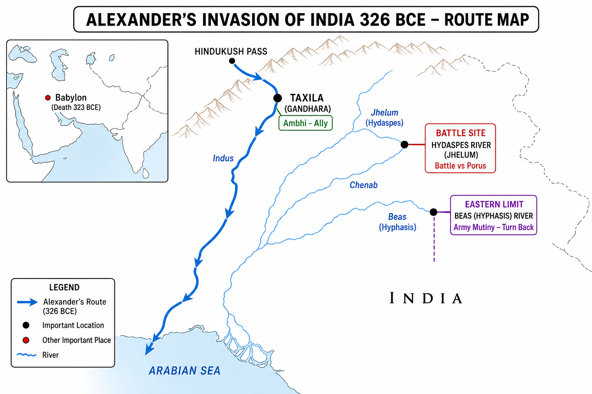

# Topic 6 — Foreign Invasions
### ★ Complete Source of Truth — No other book/notes needed for this topic

> **Covers syllabus:** Greek Invasion | Alexander's Invasion | Persons Accompanying Alexander | Foreign Invasions | Seleucus Nicator | Indo-Greek Kingdom  
> **Sources baked in:** NCERT *Themes in Indian History* I (Ch 4–5), RS Sharma, Arrian/Plutarch (Alexander sources), UPPCS/UPSC PYQs  
> **Exam weight:** ★★★ High — invasion chronology (2023 Q23), Alexander campaign route, Hydaspes/Beas, Seleucus–Chandragupta treaty, Indo-Greek rulers  
> **Last verified:** July 2026

---

## Quick Revision Box — Raata This First

```
FOREIGN INVASION CHRONOLOGY (★★★ 2023 Q23):
  Persians (Achaemenid) → Greeks (Alexander 326 BCE) → Indo-Greeks (2nd c. BCE)
  → Shakas (~1st c. BCE) → Parthians (~1st c. CE) → Kushans (~1st–2nd c. CE)
  UPPCS 2023 Q23 answer: A — Greeks → Sakas → Kushans

ALEXANDER IN INDIA (326 BCE):
  Crossed Indus | Ally = Ambhi (Taxila) | Foe = Porus (Paurava)
  Battle of Hydaspes (Jhelum) — Porus defeated, reinstated as satrap
  Army MUTINY at Hyphasis (Beas) — refused to march against Nanda Magadha
  Turned back — did NOT fight Dhana Nanda | Returned via Indus delta
  Died 323 BCE Babylon — empire divided among generals (Diadochi)

KEY RIVERS (Alexander route):
  Indus (entry) → Hydaspes/Jhelum (battle) → Acesines/Chenab → Hyphasis/Beas (turn-back)

SELEUCUS NICATOR:
  Alexander's general → Seleucid Empire founder
  War with Chandragupta Maurya → Treaty ~303 BCE
  Ceded territories west of Indus + Afghanistan | Got 500 elephants
  Sent Megasthenes as ambassador to Mauryan court

INDO-GREEK KINGDOM:
  Bactria-based | Demetrius I (~180 BCE) | Menander I = Milinda (Milinda Panha)
  Capitals: Taxila, Sagala (Sialkot) | Bilingual Greek-Kharoshthi coins
  Gandhara Greco-Buddhist art | 2023 Q24 — Milinda Panha saint = Nagasena

PERSONS WITH ALEXANDER (exam names):
  Aristobulus (historian) | Nearchus (naval voyage) | Onesicritus (helmsman)
  Ptolemy (memoir) | Seleucus Nicator (later Seleucid king)
```

### Must-Know Term Comparisons (very frequently asked)

| Term | One-line difference | Hindi |
|------|---------------------|-------|
| **Greek Invasion vs Alexander's Invasion** | Greek invasion = broader (Persian-era Greek contact + Macedonian); Alexander = specific 326 BCE Macedonian campaign | यूनानी आक्रमण / सिकंदर का आक्रमण |
| **Hydaspes vs Hyphasis** | Hydaspes (Jhelum) = battle with Porus; Hyphasis (Beas) = mutiny/turn-back point | हाइडेस्पीस / हाइफेसिस |
| **Ambhi vs Porus** | Ambhi (Taxila) = Alexander's ally; Porus (Paurava) = defeated at Hydaspes, then reinstated | अंभि / पोरस |
| **Seleucus vs Indo-Greeks** | Seleucus = Alexander's general, Seleucid western empire; Indo-Greeks = Bactrian-Greek kingdoms IN India (Demetrius, Menander) | सेल्यूकस / इंडो-ग्रीक |
| **Milinda vs Menander** | Same person — Greek name Menander I; Indian/Pali name Milinda (Milinda Panha) | मिलिंद / मेनेंडर |
| **Diadochi vs Satrap** | Diadochi = Alexander's successor generals; Satrap = Persian-style provincial governor Alexander appointed | उत्तराधिकारी / सत्राप |
| **Achaemenid vs Macedonian** | Achaemenid = Persian empire (Darius/Xerxes, 6th–4th c. BCE); Macedonian = Alexander's Greek kingdom | अचेमेनिड / मैसेडोनियन |
| **Indo-Greek vs Indo-Scythian** | Indo-Greek = Hellenistic Greek rulers (Menander); Indo-Scythian = Shaka rulers (Maues, Rudradaman) | इंडो-ग्रीक / इंडो-शक |
| **Gandhara vs Magadha** | Gandhara (Taxila) = Alexander reached; Magadha (Pataliputra) = Alexander never reached | गांधार / मगध |
| **Megasthenes vs Aristobulus** | Megasthenes = Seleucid ambassador, wrote *Indica*; Aristobulus = accompanied Alexander, source for Arrian | मेगस्थनीज / अरिस्टोबुलस |

### Memory Tricks

| Trick | Remembers |
|-------|-----------|
| **G-S-K** | 2023 Q23: Greeks → Shakas → Kushans (answer A) |
| **I-H-B** | Indus entry → Hydaspes battle → Beas turn-back |
| **Ambhi Ally, Porus Fight** | Taxila king helped; Paurava king fought |
| **Beas = Back** | Army mutiny at Beas — Alexander returned |
| **Seleucus 500 Elephants** | Treaty with Chandragupta — elephants for territory |
| **Milinda = Menander** | Indo-Greek king of Milinda Panha |
| **Nagasena = 2023 Q24** | Buddhist saint in Milinda dialogue |
| **323 Babylon Death** | Alexander died 323 BCE — never consolidated India |
| **Demetrius First Indo-Greek** | Major invader ~180 BCE |
| **Taxila = Entry Gate** | Alexander entered India via Taxila region |

---

## Exam Visuals — High-ROI Images

> **Type priority:** location map → conceptual diagram. Images stored locally (`images/`) so they open offline.

### 1. Alexander's Invasion — Route Map (326 BCE)



*Route trap chain: **Taxila** entry (king **Ambhi** ally) → **Hydaspes/Jhelum** battle vs **Porus** → army mutiny at **Beas** → turned back. **Never reached Magadha/Pataliputra**. Died **323 BCE Babylon** — no Indian empire left behind.*
*Source: Study map — generated for UPPCS route-matching*

---

## 6.1 Greek Invasion

### Definitions (learn all — exams pick different ones)

| Term | Meaning |
|------|---------|
| **Greek Invasion** | Series of contacts/invasions from Greek world into northwest India — Achaemenid-era Persian-Greek administration + Macedonian invasion under Alexander |
| **Achaemenid Empire** | Persian empire (c. 550–330 BCE) under Cyrus, Darius, Xerxes — included northwest Indian satrapies |
| **Hellenism** | Spread of Greek language, culture, and political models after Alexander's conquests |

### Greek Invasion — How It Works

- **First Greek contact** with India came through **Achaemenid Persians**. It was not direct Macedonian invasion yet.
- **Darius I** (~518 BCE) extended Persian empire into **northwest India**. **Gandhara** and **Hindush** (Indus region) became **satrapies** (provinces).
- **Indian soldiers** from Persian-controlled territories fought for Xerxes against Greeks. Mentioned by **Herodotus** in Persian Wars.
- Persian rule brought **Aramaic script** influence and administrative models to northwest India.
- **Alexander of Macedon** (son of Philip II) invaded after destroying Achaemenid Persia (330 BCE onwards).
- **Greek invasion proper (Macedonian)**. Alexander crossed **Hindukush** and entered India **326 BCE** during eastward campaign.
- Before Alexander, **northwest India** already knew Greek culture through **Persian-Greek administrative contact** and trade.
- Alexander's invasion was **brief** (~2 years in Indian borderlands). It created no permanent Macedonian empire in Gangetic India.
- **Political vacuum** after Alexander's death enabled **Mauryan rise** (Chandragupta) and later **Indo-Greek kingdoms** in Bactria-Gandhara.
- Greek invasion impact: **coins, sculpture, astronomy, political terminology**. It laid the foundation for Indo-Greek and Gandhara art.

> **Exam note:** "Greek invasion" in NCERT/syllabus includes **Persian-phase Greek contact** AND **Alexander**. Trap: "First Greeks in India = Alexander only" — Persians brought Greek contacts earlier via satrapies.

### Exam Facts (raata)

- Darius I annexed northwest India ~518 BCE
- Gandhara and Hindush = Persian satrapies
- Herodotus mentions Indian troops in Persian army
- Alexander entered India 326 BCE
- Destroyed Achaemenid Persia before reaching India
- Greek invasion = Persian contact and Macedonian campaign
- No permanent Greek rule in Gangetic plains
- Led to Indo-Greek successor states later

### PYQs — Greek Invasion

1. **(UPPCS Prelims 2023, Q23)** Chronological order of invaders: Greeks — Sakas — Kushans  
   → **A — Greeks → Sakas → Kushans** (Indo-Greeks precede Shakas in full sequence).

2. **(UPSC Prelims 2018 — pattern)** Darius I's Indian provinces included:  
   → **Gandhara and Hindush (Indus region)** — Persian satrapies.

### Examples (6.1)

| Example | Detail |
|---------|--------|
| **Gandhara satrapy** | Persian-administered northwest before Alexander |
| **Herodotus account** | Indian troops at Marathon (490 BCE) |
| **Hindukush crossing** | Alexander's entry route to India |

---

## 6.2 Alexander's Invasion

### Definitions

| Term | Meaning |
|------|---------|
| **Alexander the Great** | Philip II's son; Macedonian king (336–323 BCE); conquered Persian empire and reached India |
| **Battle of Hydaspes** | 326 BCE battle on river Jhelum — Alexander vs King Porus |
| **Hyphasis** | Ancient name for river **Beas** — where Alexander's army mutinied and refused to advance east |

### Alexander's Invasion — How It Works

- **Alexander** invaded India in **326 BCE**. He invaded after conquering Persian empire and Bactria.
- Crossed **Indus**. **Ambhi (Omphis)**, king of **Taxila**, **submitted and allied** with Alexander against rival Indian kings.
- Fought **Porus (Purushottama/Paurava)**. He ruled the region between Jhelum and Chenab.
- **Battle of Hydaspes** took place in May **326 BCE** on the river **Hydaspes (Jhelum)**. Porus's **war elephants** gave fierce resistance, but Alexander won tactically.
- Alexander **admired Porus's courage**. He reinstated him as **satrap** (governor) with expanded territory under Macedonian suzerainty.
- Advanced to **Hyphasis (Beas)** river. His soldiers **mutinied** (exhaustion, monsoon, fear of Nanda Magadha's large army).
- **Coenus** (general) spoke for army. Alexander **turned back** (326 BCE). **never crossed Beas** into Gangetic heartland.
- **Did NOT fight Dhana Nanda** of Magadha. He turned back before reaching Nanda territory.
- Established **satrapies** in Punjab: Porus and others governed under Macedonian control.
- Alexander returned westward **down the Indus** to the Arabian Sea. **Nearchus** led the naval fleet along the coast.
- **Marched through Gedrosia** (Makran desert). He suffered heavy losses.
- **Alexander died in 323 BCE** at **Babylon**. His Indian territories were immediately lost, and his generals divided the empire.

### Alexander's Indian Campaign — Key Events Table

| Year | Event | River/Place |
|------|-------|---------------|
| 327 BCE | Crossed Hindukush into India | Northwest passes |
| 326 BCE | Alliance with Ambhi | Taxila |
| 326 BCE | Battle of Hydaspes | Jhelum (Hydaspes) |
| 326 BCE | Army mutiny | Beas (Hyphasis) |
| 326 BCE | Return via Indus | Indus delta |
| 323 BCE | Alexander's death | Babylon |

> **Exam note:** Alexander turned back at **Beas (Hyphasis)** — NOT Ganga, NOT Yamuna. Trap: "Alexander defeated Nanda army" — he never reached them.

### Exam Facts (raata)

- Invasion year 326 BCE
- Battle of Hydaspes = Jhelum river
- Porus defeated then reinstated
- Ambhi of Taxila = ally
- Mutiny at Beas (Hyphasis)
- Never fought Dhana Nanda
- Died 323 BCE Babylon
- Satrapies in Punjab only

### PYQs — Alexander's Invasion

1. **(UPPCS Prelims 2023, Q23)** Greeks first among Greeks–Sakas–Kushans sequence — Alexander era Greek invasion.  
   → **A — Greeks first.**

2. **(UPSC Prelims 2019 — pattern)** Alexander's army turned back at which river?  
   → **Hyphasis (Beas).** Not Ganga.

### Examples (6.2)

| Example | Detail |
|---------|--------|
| **Hydaspes battle** | Porus's elephants vs Macedonian phalanx |
| **Beas mutiny** | Soldiers refused to fight Nanda Magadha |
| **Taxila alliance** | Ambhi welcomed Alexander |

---

## 6.3 Persons Accompanying Alexander

### Definitions

| Term | Meaning |
|------|---------|
| **Diadochi** | "Successors" — Alexander's generals who divided his empire after 323 BCE |
| **Companion (Hetairoi)** | Macedonian elite cavalry — Alexander's inner military circle |

### Persons Accompanying Alexander — Complete Table

| Person | Role | Significance for India |
|--------|------|------------------------|
| **Aristobulus** | Engineer and historian on campaign | Source for Arrian's *Anabasis* — descriptions of Indian customs |
| **Nearchus** | Naval commander | Led fleet from **Indus mouth to Persian Gulf** (326–325 BCE) |
| **Onesicritus** | Chief helmsman | Recorded Indian observations in voyage accounts |
| **Ptolemy I** | General; later Pharaoh of Egypt | Wrote memoir used by Arrian — battle details |
| **Seleucus Nicator** | Infantry officer | Later founded **Seleucid empire**; fought/treatied with Chandragupta |
| **Callisthenes** | Official historian (nephew of Aristotle) | Executed by Alexander — did not complete India account |
| **Hephaestion** | Closest friend and general | Died 324 BCE before Alexander — not in India return |
| **Coenus** | General | Spoke for army at Beas mutiny — persuaded Alexander to turn back |
| **Aristotle** | Alexander's tutor | Did NOT accompany campaign — educated Alexander in Greek philosophy/science |
| **Ambhi (Omphis)** | Indian ally | King of Taxila — provided troops and supplies |
| **Porus** | Indian opponent-turned-ally | Fought at Hydaspes; later satrap under Alexander |

### Persons Accompanying Alexander — How It Works

- Alexander's campaign records survive through **secondary sources**. They are primarily **Arrian** and **Plutarch** (using lost primary accounts).
- **Aristobulus** and **Ptolemy**. They were the most important eyewitness sources for Indian campaign details.
- **Nearchus** commanded the **Indus-to-sea voyage**. It proved the river-sea connection and was vital for logistics and geographic knowledge.
- **Onesicritus** interviewed Indian **gymnosophists** (naked philosophers). These are Greek accounts of Indian asceticism.
- **Seleucus Nicator** was junior officer in Alexander's army. Rose to power after 323 BCE partition.
- **Coenus** led mutiny delegation at **Beas**. Historically decisive in stopping eastward advance.
- **Aristotle** taught Alexander **Homer, science, politics**. This influenced Alexander's view of Eastern kings as equals/rivals.
- **Callisthenes** criticized Alexander's **proskynesis** (Persian court ritual). He was executed 327 BCE.
- **Indian allies**: **Ambhi (Taxila)** and later **Porus** provided local knowledge, troops, and administrative continuity.
- **Megasthenes** did NOT accompany Alexander. Came later as **Seleucid ambassador** to Chandragupta's court.

> **Exam note:** **Aristotle did NOT accompany** Alexander to India — common trap. **Nearchus** = naval commander on Indus. **Megasthenes** = post-Alexander Seleucid envoy.

### Exam Facts (raata)

- Aristobulus = historian-engineer on campaign
- Nearchus = Indus-to-sea naval voyage
- Onesicritus = helmsman, Indian observations
- Ptolemy = memoir source for Arrian
- Seleucus = Alexander's officer, later Seleucid king
- Coenus = Beas mutiny spokesman
- Aristotle = tutor only, not on campaign
- Megasthenes = later ambassador, not with Alexander

### PYQs — Persons Accompanying Alexander

1. **(UPSC Prelims 2018 — pattern)** Who commanded Alexander's fleet on the Indus?  
   → **Nearchus.**

2. **(UPSC Prelims 2016 — pattern)** Which of the following accompanied Alexander to India?  
   A. Aristotle  B. Megasthenes  C. Aristobulus  D. Kautilya  
   → **C — Aristobulus.** Aristotle and Megasthenes did not accompany.

### Examples (6.3)

| Example | Detail |
|---------|--------|
| **Nearchus voyage** | Indus mouth to Persian Gulf 326–325 BCE |
| **Arrian's Anabasis** | Compiled from Aristobulus + Ptolemy |
| **Coenus at Beas** | Key speech ending eastward march |

---

## 6.4 Foreign Invasions

### Definitions

| Term | Meaning |
|------|---------|
| **Foreign Invasions (Ancient India)** | Series of invasions from northwest: Persians, Greeks, Indo-Greeks, Shakas, Parthians, Kushans |
| **Northwest Gateway** | Khyber/Bolan passes — entry route for Central Asian and West Asian invaders into Indian subcontinent |

### Foreign Invasions — How It Works

- Indian subcontinent faced **repeated northwest invasions** from **6th century BCE to 3rd century CE**. These invasions shaped politics, trade, art, and coinage.
- **1. Achaemenid Persians** (~518–330 BCE). It was the first imperial power to absorb **Gandhara/Indus** into a trans-regional empire.
- **2. Macedonian Greeks (Alexander)** came in 326 BCE through a military campaign. Their control in Punjab was brief and satrapal, and they made no Gangetic conquest.
- **3. Seleucid (Seleucus Nicator)** intervention around 305–303 BCE led to conflict with **Chandragupta Maurya**. The treaty ceded eastern territories and brought the **Megasthenes** embassy.
- **4. Indo-Greeks (Bactrian Greeks)** (~2nd–1st century BCE). **Demetrius I, Menander (Milinda), Apollodotus**. Ruled Gandhara-Punjab from Bactria base.
- **5. Shakas (Indo-Scythians)** (~1st century BCE–1st century CE). **Maues, Rudradaman, Nahapana**. Displaced Indo-Greeks in west India.
- **6. Parthians (Pahlavas)** (~1st century CE). **Gondophares**. Brief rule in northwest.
- **7. Kushans** ruled from about the 1st to 3rd century CE under rulers such as **Kujula Kadphises** and **Kanishka**. Their large empire marked the peak of Gandhara art.
- **UPPCS 2023 Q23** tests subset: **Greeks to Sakas to Kushans** = **Answer A** (Indo-Greeks fit before Shakas in full sequence).
- Each invasion wave brought **new coin types, art styles, and administrative titles**. They created cumulative Hellenistic and Central Asian synthesis.
- **Mauryas and Guptas** were indigenous empires between/around these foreign waves. They were not themselves foreign invasions.

### Foreign Invasions — Chronology Table

| Order | Invader | Period | Key figure |
|-------|---------|--------|------------|
| 1 | Achaemenid Persians | 6th–4th c. BCE | Darius I, Xerxes |
| 2 | Macedonian Greeks | 326 BCE | Alexander |
| 3 | Seleucid Greeks | 4th–3rd c. BCE | Seleucus Nicator |
| 4 | Indo-Greeks | 2nd–1st c. BCE | Menander (Milinda) |
| 5 | Shakas (Scythians) | 1st c. BCE–1st c. CE | Maues, Rudradaman |
| 6 | Parthians (Pahlavas) | 1st c. CE | Gondophares |
| 7 | Kushans | 1st–3rd c. CE | Kanishka |

> **Exam note:** **2023 Q23 answer = A (Greeks — Sakas — Kushans).** Trap: "Kushans before Shakas" — Shakas came first. Trap: "Greeks last" — Greeks were earliest of these three.

### Exam Facts (raata)

- Northwest = invasion gateway
- 2023 Q23: Greeks to Sakas to Kushans (A)
- Persians first (Achaemenid)
- Alexander 326 BCE
- Indo-Greeks before Shakas
- Kushans last of the three in Q23
- Each wave brought coins and art influence
- Mauryas/Guptas = indigenous empires

### PYQs — Foreign Invasions

1. **(UPPCS Prelims 2023, Q23)** With reference to invaders in Ancient India, correct chronological order?  
   A. Greeks — Sakas — Kushans  B. Greeks — Kushans — Sakas  C. Sakas — Greeks — Kushans  D. Sakas — Kushans — Greeks  
   → **A — Greeks → Sakas → Kushans.**

2. **(UPSC Prelims 2019 — pattern)** Arrange: Indo-Greeks, Kushans, Shakas — earliest to latest:  
   → **Indo-Greeks → Shakas → Kushans.**

### Examples (6.4)

| Example | Detail |
|---------|--------|
| **2023 Q23** | Direct chronology MCQ |
| **Khyber Pass** | Main invasion route |
| **Gandhara** | Repeatedly conquered frontier zone |

---

## 6.5 Seleucus Nicator

### Definitions

| Term | Meaning |
|------|---------|
| **Seleucus Nicator** | Alexander's general; founder of **Seleucid Empire** (312 BCE); "Nicator" = Victor |
| **Treaty with Chandragupta** | Peace settlement ~303/305 BCE — territory exchange and diplomatic marriage alliance |

### Seleucus Nicator — How It Works

- **Seleucus I Nicator** was one of **Alexander's infantry officers**. He received **Babylon** in the partition of the empire in 323 BCE.
- Built **Seleucid Empire** stretching from **Anatolia to Bactria**. It was the largest of Diadochi kingdoms.
- **Invaded India** (~305 BCE) to reclaim Alexander's eastern satrapies. Clashed with **Chandragupta Maurya**.
- **War inconclusive**. Seleucus faced Mauryan strength (Chandragupta's army included **war elephants**).
- **Treaty (~303 BCE)**. Seleucus ceded **eastern Afghanistan, Baluchistan, and regions west of Indus** to Chandragupta.
- Chandragupta gave **500 war elephants** to Seleucus. Seleucus used the elephants in Seleucid wars in West Asia.
- **Diplomatic alliance**. Seleucus's daughter **Helena (Helen)** reportedly married Chandragupta (sources: Appian, Strabo).
- **Megasthenes** sent as **Seleucid ambassador** to **Pataliputra**. He wrote ***Indica*** describing Mauryan court, society, administration.
- Seleucus consolidated his power in the west, while the **Mauryas controlled India**. This settlement defined the early boundary of the Indian empire.
- Seleucus assassinated **281 BCE**. The Seleucid empire continued but Indian territories permanently with Mauryas.

### Seleucus–Chandragupta Treaty — Key Terms

| Seleucus gave | Chandragupta gave |
|---------------|------------------|
| Territories west of Indus (Arachosia, Paropamisadae, Gedrosia) | 500 war elephants |
| Diplomatic recognition of Mauryan sovereignty | Marriage alliance (Helena) |
| Ambassador Megasthenes to Mauryan court | Peace on northwest frontier |

> **Exam note:** Seleucus **lost** Indian territories to Chandragupta — NOT conquered India. Trap: "Seleucus ruled Magadha" — false. **Megasthenes** = ambassador after treaty.

### Exam Facts (raata)

- Alexander's general to Seleucid founder
- Fought Chandragupta Maurya ~305 BCE
- Treaty ~303 BCE
- Ceded territories west of Indus
- Received 500 elephants
- Helena marriage alliance
- Megasthenes ambassador
- Killed 281 BCE

### PYQs — Seleucus Nicator

1. **(UPSC Prelims 2019 — pattern)** Seleucus Nicator ceded which to Chandragupta?  
   → **Territories west of Indus + eastern Afghanistan.**

2. **(UPSC Prelims 2017 — pattern)** Megasthenes was ambassador of:  
   → **Seleucus Nicator** to Chandragupta's court.

### Examples (6.5)

| Example | Detail |
|---------|--------|
| **Megasthenes' Indica** | Source on Mauryan Pataliputra |
| **500 elephants** | Mauryan military asset in treaty |
| **Helena marriage** | Indo-Hellenistic diplomatic link |

---

## 6.6 Indo-Greek Kingdom

### Definitions

| Term | Meaning |
|------|---------|
| **Indo-Greek Kingdom** | Hellenistic Greek states ruling parts of northwest India (2nd–1st century BCE) from Bactrian base |
| **Bactria** | Region north of Hindukush (modern Afghanistan) — springboard for Indo-Greek expansion into India |
| **Milinda Panha** | Pali Buddhist text — dialogue between King **Milinda (Menander)** and monk **Nagasena** |

### Indo-Greek Kingdom — How It Works

- After Alexander and Seleucid withdrawal, **Greco-Bactrian kingdom** emerged in **Bactria** (~3rd–2nd century BCE).
- **Demetrius I** (~180 BCE). He was the first major Indo-Greek king to invade and rule **northwest India** extensively.
- **Menander I (Milinda)** was the most famous Indo-Greek ruler. His capital was **Sagala (Sialkot)**, and he patronized Buddhism.
- ***Milinda Panha***. It is a philosophical dialogue in which King Milinda questions **Nagasena** on Buddhist doctrine. **UPPCS 2023 Q24: saint = Nagasena**.
- Indo-Greek coins. **bilingual inscriptions** (Greek and Kharoshthi/Prakrit). They are key archaeological evidence.
- Rulers: **Apollodotus I, Antialcidas, Strato I, Hippostratos**. They controlled Punjab, Gandhara, parts of Rajasthan/Gujarat.
- **Heliodorus pillar** at Besnagar, MP, belongs to the era of Indo-Greek ambassador **Antialcidas**. Its inscription records **Bhagavata (Vasudeva)** worship.
- **Gandhara art** fused Greco-Buddhist sculpture traditions. It showed the Buddha in Greek-style drapery with Mediterranean facial features.
- Indo-Greeks were displaced by **Shakas** from the northwest around the 1st century BCE. This shift preceded the rise of the Kushans.
- Their legacy combined **Hellenistic art and Indian religion**. Indo-Greek coins also provide key numismatic evidence for chronology.

### Major Indo-Greek Rulers — Table

| Ruler | Period (approx.) | Notes |
|-------|------------------|-------|
| **Demetrius I** | ~200–180 BCE | First major Indian conquest |
| **Menander I (Milinda)** | ~165–130 BCE | Milinda Panha; Buddhist patron |
| **Apollodotus I** | ~180–160 BCE | Coinage in Gandhara |
| **Antialcidas** | ~115–95 BCE | Heliodorus pillar connection |
| **Strato I** | ~130–110 BCE | Eastern Punjab rule |

> **Exam note:** **Milinda = Menander** (same Indo-Greek king). 2023 Q24 answer = **Nagasena**. Trap: "Milinda Panha saint = Nagarjuna" — Nagarjuna was later Mahayana philosopher.

### Exam Facts (raata)

- Bactria = base region
- Demetrius I first major invader
- Menander = Milinda
- Milinda Panha. Nagasena (2023 Q24)
- Bilingual Greek-Kharoshthi coins
- Sagala (Sialkot) capital
- Gandhara Greco-Buddhist art
- Displaced by Shakas ~1st c. BCE

### PYQs — Indo-Greek Kingdom

1. **(UPPCS Prelims 2023, Q24)** *Milind Panho* dialogue saint was: A. Nagarjun  B. Nagbhatt  C. Nagasena  D. Kumaril Bhatt  
   → **C — Nagasena.** King Milinda = Indo-Greek Menander.

2. **(UPPCS Prelims 2023, Q23)** Indo-Greeks precede Shakas in invasion chronology.  
   → **Greeks (including Indo-Greeks) before Shakas.**

### Examples (6.6)

| Example | Detail |
|---------|--------|
| **Milinda Panha** | Menander-Nagasena Buddhist debate |
| **Gandhara Buddha head** | Greco-Roman style sculpture |
| **Bilingual coins** | Greek king name + Kharoshthi script |

---

## Consolidated Reference — Everything in One Place

### Foreign Invasion Chronology (Master List)

| # | Invader | Period | Key name |
|---|---------|--------|----------|
| 1 | Achaemenid Persians | 518–330 BCE | Darius I |
| 2 | Macedonian Greeks | 326 BCE | Alexander |
| 3 | Seleucid | 4th–3rd c. BCE | Seleucus Nicator |
| 4 | Indo-Greeks | 2nd–1st c. BCE | Menander (Milinda) |
| 5 | Shakas | 1st c. BCE–1st c. CE | Rudradaman |
| 6 | Parthians | 1st c. CE | Gondophares |
| 7 | Kushans | 1st–3rd c. CE | Kanishka |

**2023 Q23 subset: Greeks → Sakas → Kushans = A**

### Alexander's Indian Route

| Stage | River (ancient = modern) | Event |
|-------|--------------------------|-------|
| Entry | Indus | Crossed into India |
| Alliance | — | Taxila (Ambhi) |
| Battle | Hydaspes = Jhelum | Defeated Porus |
| Turn-back | Hyphasis = Beas | Army mutiny |
| Exit | Indus delta | Nearchus naval voyage |

### UP Focus — Foreign Invasions & Uttar Pradesh

| Point | Detail |
|-------|--------|
| **Alexander's limit** | Stopped at **Beas** — never entered modern **UP heartland** (Ganga-Yamuna doab) |
| **Magadha untouched** | Dhana Nanda's empire (Bihar/eastern UP border) — Alexander never fought |
| **Eastern UP mahajanapadas** | Kosala, Kashi, Vatsa (Kaushambi) — outside Alexander's campaign zone |
| **Later Indo-Greeks** | Ruled **Gandhara-Punjab** — not eastern UP |
| **Heliodorus pillar** | **Besnagar (Vidisha), MP** — Indo-Greek connection to Bhagavatism; near UP border region |
| **Exam trap** | "Alexander conquered Kaushambi/Kashi" — **FALSE** |

### Important Dates

| Event | Date |
|-------|------|
| Darius I Indian satrapies | ~518 BCE |
| Alexander's Indian invasion | 326 BCE |
| Battle of Hydaspes | 326 BCE |
| Mutiny at Beas (Hyphasis) | 326 BCE |
| Alexander's death | 323 BCE |
| Seleucus–Chandragupta treaty | ~303 BCE |
| Demetrius I Indo-Greek expansion | ~180 BCE |
| Menander (Milinda) reign | ~165–130 BCE |

---

## Practice Zone — UPPCS Format Questions

> **Answers hidden** — click *Show answer* under each question to reveal.

**Q1.** Arrange the following foreign invaders in chronological order of their appearance in India (2023 Q23):

1. Greeks (Indo-Greeks/Macedonians)
2. Sakas (Indo-Scythians)
3. Kushans

Options:
A. 1 — 2 — 3
B. 2 — 1 — 3
C. 1 — 3 — 2
D. 3 — 2 — 1

<details>
<summary>Show answer</summary>

**Ans: A — Greeks → Sakas → Kushans** (2023 Q23). Trap: Kushans before Shakas (wrong); Greeks were earliest of these three.

</details>

**Q2.** Consider the following statements about Milinda Panha (2023 Q24):

1. Milinda was an Indo-Greek king whose Greek name was Menander I.
2. Nagasena was the Buddhist saint who debated Milinda on doctrine.

Select the correct answer from the code given below:

Options:
A. Both 1 and 2
B. Neither 1 nor 2
C. Only 1
D. Only 2

<details>
<summary>Show answer</summary>

**Ans: A — Both correct** (2023 Q24). Milinda = Menander; saint = Nagasena (NOT Nagarjuna).

</details>

**Q3.** Consider the following statements about Alexander's invasion:

1. Alexander invaded India in 326 BCE after destroying the Achaemenid Persian Empire.
2. Alexander reached Pataliputra, the Magadha capital, before turning back.

Select the correct answer from the code given below:

Options:
A. Both 1 and 2
B. Neither 1 nor 2
C. Only 1
D. Only 2

<details>
<summary>Show answer</summary>

**Ans: C — Only 1.** Alexander reached Taxila/Gandhara and Hydaspes (Jhelum); never reached Magadha/Pataliputra.

</details>

**Q4.** Given below are two statements:

Assertion (A): Milinda and Menander I refer to the same Indo-Greek ruler.

Reason (R): Milinda Panha is a Pali dialogue between King Milinda and Nagasena on Buddhist doctrine.

Select the correct answer from the code given below:

Options:
A. Both (A) and (R) are true and (R) is the correct explanation of (A)
B. Both (A) and (R) are true, but (R) is not the correct explanation of (A)
C. (A) is true, but (R) is false
D. (A) is false, but (R) is true

<details>
<summary>Show answer</summary>

**Ans: B — Both true; R does not explain A.** Same person (Greek Menander = Indian Milinda); R describes the text, not the name equivalence.

</details>

**Q5.** Match List-I with List-II:

List-I (Person)
A. Ambhi
B. Porus (Paurava)
C. Seleucus Nicator
D. Aristobulus

List-II (Role)
1. Defeated at Hydaspes, then reinstated
2. Ruler of Taxila who allied with Alexander
3. Alexander's general who founded Seleucid Empire
4. Accompanied Alexander; source for Arrian

Options:
A. 2-1-3-4
B. 1-2-4-3
C. 2-1-4-3
D. 4-3-2-1

<details>
<summary>Show answer</summary>

**Ans: A — 2-1-3-4.** Ambhi-Taxila ally; Porus-Hydaspes; Seleucus-successor general; Aristobulus-historian source.

</details>

**Q6.** Consider the following statements on foreign invasion chronology:

1. Indo-Greeks appeared in India before the Shakas.
2. Kushans established their empire before the Shakas entered northwest India.

Select the correct answer from the code given below:

Options:
A. Both 1 and 2
B. Neither 1 nor 2
C. Only 1
D. Only 2

<details>
<summary>Show answer</summary>

**Ans: C — Only 1.** Order: Greeks → Shakas → Kushans (2023 Q23 logic). Kushans came AFTER Shakas.

</details>

**Q7.** Given below are two statements:

Assertion (A): Alexander's army mutinied at the Beas (Hyphasis) River and refused to march further east.

Reason (R): The soldiers were exhausted and feared the vast Magadha army described by Greek sources.

Select the correct answer from the code given below:

Options:
A. Both (A) and (R) are true and (R) is the correct explanation of (A)
B. Both (A) and (R) are true, but (R) is not the correct explanation of (A)
C. (A) is true, but (R) is false
D. (A) is false, but (R) is true

<details>
<summary>Show answer</summary>

**Ans: A — Both true; R explains A.** Beas = turn-back point (~326 BCE); army refused further advance toward Gangetic plains.

</details>

**Q8.** Match List-I with List-II:

List-I (Indo-Greek ruler/event)
A. Demetrius I
B. Menander I (Milinda)
C. Bilingual coins
D. Sagala (Sialkot)

List-II (Significance)
1. Major Indo-Greek invader ~180 BCE
2. Milinda Panha king; patron of Buddhism
3. Greek + Kharoshthi legends
4. Indo-Greek capital city

Options:
A. 1-2-3-4
B. 2-1-4-3
C. 1-2-4-3
D. 4-3-2-1

<details>
<summary>Show answer</summary>

**Ans: A — 1-2-3-4.** Demetrius-first major invader; Menander-Milinda; bilingual coinage hallmark; Sagala = capital with Taxila.

</details>

**Q9.** Consider the following statements about Seleucus Nicator:

1. He was a general of Alexander who founded the Seleucid Empire in West Asia.
2. He ceded northwestern territories to Chandragupta Maurya in exchange for 500 war elephants.

Select the correct answer from the code given below:

Options:
A. Both 1 and 2
B. Neither 1 nor 2
C. Only 1
D. Only 2

<details>
<summary>Show answer</summary>

**Ans: A — Both correct.** Seleucus-Maurya treaty (~305 BCE); Megasthenes sent as ambassador to Pataliputra.

</details>

**Q10.** Given below are two statements:

Assertion (A): The first Greek contact with India came through Achaemenid Persian administration of northwest India.

Reason (R): Indian soldiers from Persian territories fought for Xerxes against the Greeks, as mentioned by Herodotus.

Select the correct answer from the code given below:

Options:
A. Both (A) and (R) are true and (R) is the correct explanation of (A)
B. Both (A) and (R) are true, but (R) is not the correct explanation of (A)
C. (A) is true, but (R) is false
D. (A) is false, but (R) is true

<details>
<summary>Show answer</summary>

**Ans: B — Both true; R supports but does not directly explain A.** Persian-era Greek contact predated Alexander's 326 BCE invasion.

</details>

**Q11.** Match List-I with List-II:

List-I (Battle/Site)
A. Hydaspes (Jhelum)
B. Beas (Hyphasis)
C. Taxila
D. Babylon

List-II (Event)
1. Alexander's army mutiny and turn-back
2. Battle against Porus (Paurava)
3. Entry point into Indian subcontinent
4. Alexander's death (323 BCE)

Options:
A. 2-1-3-4
B. 1-2-3-4
C. 2-3-1-4
D. 3-2-4-1

<details>
<summary>Show answer</summary>

**Ans: A — 2-1-3-4.** Hydaspes-Porus; Beas-mutiny; Taxila-entry; Babylon-death without consolidating India.

</details>

**Q12.** Consider the following statements:

1. Shakas (Indo-Scythians) displaced Indo-Greeks in parts of northwest India.
2. In the 2023 Q23 chronology subset, Greeks came before Shakas.

Select the correct answer from the code given below:

Options:
A. Both 1 and 2
B. Neither 1 nor 2
C. Only 1
D. Only 2

<details>
<summary>Show answer</summary>

**Ans: A — Both correct.** Full sequence: Persians → Greeks → Shakas → Parthians → Kushans; 2023 tests Greeks-Sakas-Kushans.

</details>

**Q13.** Alexander defeated Porus (Paurava) at the battle of:

Options:
A. Granicus
B. Hydaspes
C. Gaugamela
D. Plataea

<details>
<summary>Show answer</summary>

**Ans: B — Hydaspes (Jhelum River).** Porus fought with war elephants; Alexander reinstated him as satrap after victory.

</details>

**Q14.** Alexander died in 323 BCE at:

Options:
A. Pataliputra
B. Taxila
C. Babylon
D. Susa

<details>
<summary>Show answer</summary>

**Ans: C — Babylon.** Never consolidated Indian conquests; empire divided among Diadochi (successor generals).

</details>

**Q15.** Who wrote *Indica* describing Mauryan Pataliputra after the Seleucus-Chandragupta treaty?

Options:
A. Megasthenes
B. Nearchus
C. Plutarch
D. Herodotus

<details>
<summary>Show answer</summary>

**Ans: A — Megasthenes.** Seleucid ambassador to Chandragupta Maurya's court; NOT Alexander's companion (trap).

</details>

**Q16.** The Indo-Greek kingdom is best known for which distinctive cultural contribution?

Options:
A. Ashokan Brahmi edicts
B. Gandhara Greco-Buddhist art and bilingual coins
C. Sanchi stupa construction
D. Ajanta cave paintings

<details>
<summary>Show answer</summary>

**Ans: B — Gandhara Greco-Buddhist art.** Greek-Kharoshthi bilingual coins; Hellenistic influence on Buddhist sculpture.

</details>

**Q17.** Which river marked the eastern limit of Alexander's advance into India?

Options:
A. Indus
B. Jhelum (Hydaspes)
C. Beas (Hyphasis)
D. Ganga

<details>
<summary>Show answer</summary>

**Ans: C — Beas (Hyphasis).** Army refused to cross further east; Alexander turned back via Indus delta route.

</details>

**Q18.** Demetrius I is associated with:

Options:
A. First major Indo-Greek invasion of India (~180 BCE)
B. Defeat of Ashoka at Kalinga
C. Founding the Kushan Empire
D. Milinda Panha dialogue

<details>
<summary>Show answer</summary>

**Ans: A — Major Indo-Greek invader ~180 BCE.** Bactria-based; preceded/was contemporary with Menander's peak.

</details>

**Q19.** The treaty between Seleucus and Chandragupta Maurya involved exchange of:

Options:
A. Gold for silk
B. Territories for 500 elephants
C. Buddhist missionaries for Greek philosophers
D. Taxila for Ujjain

<details>
<summary>Show answer</summary>

**Ans: B — 500 elephants for territory.** Seleucus ceded Arachosia, Paropamisadae, and Gedrosia; received war elephants.

</details>

**Q20.** Milinda Panha is written in which language?

Options:
A. Sanskrit
B. Pali
C. Greek
D. Prakrit only (excluding Pali)

<details>
<summary>Show answer</summary>

**Ans: B — Pali.** Philosophical dialogue text; Milinda = Menander I Indo-Greek king (2023 Q24 context).

</details>

**Q21.** Who among the following accompanied Alexander and is cited as a source by Arrian?

Options:
A. Megasthenes
B. Aristobulus
C. Kautilya
D. Fa-Hien

<details>
<summary>Show answer</summary>

**Ans: B — Aristobulus.** Accompanied Alexander's campaign; Megasthenes = later Mauryan-era ambassador.

</details>

**Q22.** Indo-Greek rulers Menander and Demetrius issued coins with legends in:

Options:
A. Sanskrit and Tamil only
B. Greek and Kharoshthi/Prakrit (bilingual)
C. Persian cuneiform only
D. Brahmi and Latin

<details>
<summary>Show answer</summary>

**Ans: B — Bilingual Greek-Kharoshthi.** Key archaeological evidence for Indo-Greek rule in northwest India.

</details>

**Q23.** Alexander appointed which Persian-style provincial governors in conquered territories?

Options:
A. Samantas
B. Satraps
C. Rajukas
D. Shreni heads

<details>
<summary>Show answer</summary>

**Ans: B — Satraps.** Persian administrative model continued; Diadochi = successor generals (different term).

</details>

**Q24.** The capital cities of the Indo-Greek kingdom included:

Options:
A. Pataliputra and Rajgir
B. Taxila and Sagala (Sialkot)
C. Kannauj and Thanesar
D. Ujjain and Vidisha

<details>
<summary>Show answer</summary>

**Ans: B — Taxila and Sagala.** Northwest Bactria-Greek kingdom; NOT Gangetic capitals.

</details>

**Q25.** Herodotus mentions Indian soldiers in the context of:

Options:
A. Alexander's Hydaspes battle
B. Persian Wars under Xerxes against Greeks
C. Seleucid-Maurya treaty
D. Kushan conquest of Gandhara

<details>
<summary>Show answer</summary>

**Ans: B — Persian Wars.** Early Greek awareness of Indians through Achaemenid Persian armies.

</details>

**Q26.** Which of the following correctly describes Alexander's relationship with Ambhi of Taxila?

Options:
A. Ambhi was defeated and executed at Hydaspes
B. Ambhi allied with Alexander and assisted his entry into India
C. Ambhi was the same person as Porus
D. Ambhi ruled Magadha

<details>
<summary>Show answer</summary>

**Ans: B — Ambhi allied with Alexander.** Porus (not Ambhi) fought at Hydaspes; Ambhi = Taxila submission.

</details>

**Q27.** After Alexander's death, his empire in the east was primarily contested by:

Options:
A. Mauryas and Guptas
B. Diadochi (successor generals) including Seleucus
C. Shakas and Kushans immediately
D. Harsha and Pulakeshin

<details>
<summary>Show answer</summary>

**Ans: B — Diadochi.** Seleucus, Ptolemy, Antigonus, and other successor generals; Seleucid Empire succeeded in West Asia/northwest.

</details>

**Q28.** The Indo-Greek kingdom flourished roughly in:

Options:
A. 6th century BCE
B. 2nd–1st century BCE
C. 4th–5th century CE
D. 1st century CE only (Kushan period)

<details>
<summary>Show answer</summary>

**Ans: B — 2nd–1st century BCE.** After Alexander (326 BCE) and before/full overlap with Shaka-Kushan phases.

</details>

**Q29.** Gandhara during Alexander's invasion was part of which Mahajanapada region?

Options:
A. Magadha
B. Gandhara (northwest)
C. Avanti
D. Kosala

<details>
<summary>Show answer</summary>

**Ans: B — Gandhara.** Taxila = Gandhara capital; Alexander reached Gandhara but NOT Magadha (Pataliputra).

</details>

**Q30.** Nagasena in Milinda Panha is described as a:

Options:
A. Greek philosopher from Athens
B. Buddhist monk/scholar who answered Milinda's questions
C. Mauryan Dhamma-mahamatra
D. Shaka ruler of Mathura

<details>
<summary>Show answer</summary>

**Ans: B — Buddhist monk/scholar** (2023 Q24). Debated King Milinda (Menander) on Buddhist philosophy and doctrine.

</details>

**Q31.** Consider the following statements about Darius I and early Greek contact with India:

1. Darius I annexed northwest India (~518 BCE), making Gandhara and Hindush Persian satrapies.
2. Indian soldiers from Persian territories fought for Xerxes in the Persian Wars, as recorded by Herodotus.

Select the correct answer from the code given below:

Options:
A. Both 1 and 2
B. Neither 1 nor 2
C. Only 1
D. Only 2

<details>
<summary>Show answer</summary>

**Ans: A — Both correct.** Achaemenid Persian rule preceded Alexander; this is the "first Greek contact" trap — not Alexander alone.

</details>

**Q32.** Consider the following statements about Indo-Greek rulers:

1. Demetrius I (~180 BCE) was among the first major Indo-Greek kings to rule extensively in northwest India.
2. Menander I (Milinda) is associated with the Pali text Milinda Panha and the Buddhist monk Nagasena.

Select the correct answer from the code given below:

Options:
A. Both 1 and 2
B. Neither 1 nor 2
C. Only 1
D. Only 2

<details>
<summary>Show answer</summary>

**Ans: A — Both correct** (2023 Q24 context). Milinda = Menander; Nagasena NOT Nagarjuna.

</details>

**Q33.** Match List-I with List-II:

List-I (Ancient river name)
A. Hydaspes
B. Hyphasis
C. Acesines
D. Indus

List-II (Modern river / role)
1. Beas — Alexander's eastern turn-back point
2. Jhelum — site of battle with Porus
3. Chenab — advanced beyond Hydaspes
4. Entry river into Indian subcontinent

Options:
A. 2-1-3-4
B. 1-2-3-4
C. 2-3-1-4
D. 4-2-1-3

<details>
<summary>Show answer</summary>

**Ans: A — 2-1-3-4.** Hydaspes=Jhelum (Porus); Hyphasis=Beas (mutiny); Acesines=Chenab; Indus=entry.

</details>

---


## Complete PYQ Bank (Topic 6)

> **Answers hidden** — click *Show answer* under each question to reveal.


### UPPCS Prelims 2023

**Q23.** With reference to the invaders in Ancient India, which one of the following is the correct chronological order?

A. Greeks — Sakas — Kushans  
B. Greeks — Kushans — Sakas  
C. Sakas — Greeks — Kushans  
D. Sakas — Kushans — Greeks

<details>
<summary>Show answer</summary>
**A — Greeks → Sakas → Kushans.**
</details>

**Q24.** *Milind Panho* is in the form of a dialogue between King Milind and a Buddhist saint. The concerned saint was—

A. Nagarjun  B. Nagbhatt  C. Nagasena  D. Kumaril Bhatt

<details>
<summary>Show answer</summary>
**C — Nagasena.** King Milind = Indo-Greek Menander.
</details>

### UPSC Pattern (Concept Overlap)

**Pattern — Hyphasis:** Alexander turned back at Beas (Hyphasis), not Ganga.

**Pattern — Megasthenes:** Seleucid (not Alexander) ambassador to Chandragupta.

**Pattern — Hydaspes:** Jhelum river battle with Porus (326 BCE).

---

## Common Traps — Don't Fall For These

1. **2023 Q23 answer = A** — Greeks → Sakas → Kushans (NOT Kushans before Shakas).
2. **Beas (Hyphasis) = turn-back** — NOT Ganga, NOT Yamuna.
3. **Hydaspes = Jhelum** — battle with Porus; do not confuse with Beas.
4. **Alexander never fought Nanda/Dhana Nanda** — mutiny before reaching Magadha.
5. **Ambhi = ally**; **Porus = fought then reinstated** — do not swap.
6. **Aristotle did NOT accompany** Alexander — tutor only.
7. **Megasthenes = Seleucid ambassador** — NOT Alexander's companion.
8. **Milinda = Menander** — Indo-Greek king; saint = **Nagasena** (2023 Q24), NOT Nagarjuna.
9. **Seleucus LOST Indian territory** to Chandragupta — did not conquer Magadha.
10. **Alexander died 323 BCE Babylon** — Indian conquests not consolidated.
11. **Persian (Darius) preceded Alexander** — Greek invasion ≠ only Alexander.
12. **Indo-Greeks before Shakas** — in full and 2023 Q23 subset logic.
13. **Alexander did NOT reach UP heartland** — stopped at Beas; Kashi/Kaushambi untouched.
14. **500 elephants** went from Chandragupta TO Seleucus — not reverse.
15. **Taxila = Ambhi** — NOT Porus's kingdom.
