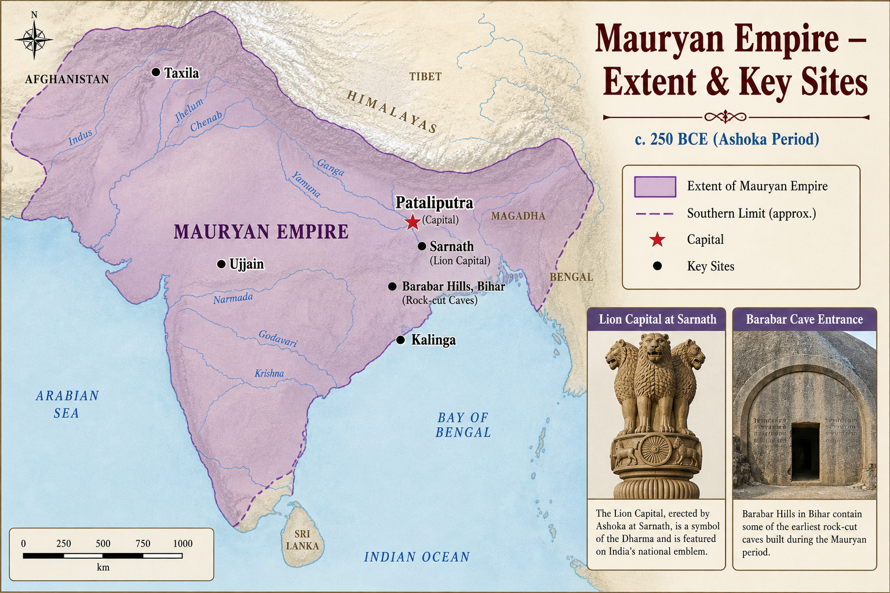

# Topic 7 — Mauryan Empire
### ★ Complete Source of Truth — No other book/notes needed for this topic

> **Covers syllabus:** Mauryan Empire | Mauryan Administration | Important Mauryan Officials | Ashoka | Ashoka's Dhamma | Major Rock Edicts | Minor Rock Edicts | Pillar Edicts | Cave Architecture of Mauryan Period | Kautilya's Arthashastra | Megasthenes | Indica | Provincial Administration | Revenue Administration | Spy System  
> **Sources baked in:** NCERT *Themes in Indian History* I (Ch 4–5), RS Sharma, Arthashastra, Megasthenes fragments, Ashokan epigraphy, UPPCS/UPSC PYQs  
> **Exam weight:** ★★★ High — Ashoka edicts (2022 Q54), Dhamma (2024 Q20), officials (2020 Q4), Mauryan sources (2023 Q29)  
> **Last verified:** July 2026

---

## Quick Revision Box — Raata This First

```
MAURYAN DYNASTY (322–185 BCE):
  Chandragupta Maurya (322–297) + Chanakya/Kautilya → overthrew Nandas
  Bindusara (297–273) | Ashoka (268–232) | Decline: Dasaratha → Brihadratha (killed by Pushyamitra Shunga)

EMPIRE: Afghanistan to Bengal | Himalayas to Karnataka | Capital = Pataliputra
  Treaty with Seleucus ~303 BCE | Megasthenes ambassador

ASHOKA (★★★):
  Kalinga war 261 BCE → conversion to Buddhism | Devanampiya Priyadarshi
  2024 Q20: Rahulovada-sutta + Dhamma-mahamatras (14th year) = BOTH correct (A)
  2022 Q54: Religious synthesis = Rock Edict XII (B)

14 MAJOR ROCK EDICTS: RE XIII = Kalinga war | RE XII = religious synthesis (2022)
  RE V/VI = Dhamma mahamatras | RE XI = religious tolerance

7 PILLAR EDICTS: Sarnath Lion Capital = national emblem | PE V = Rajuka duties

MINOR ROCK EDICTS: Maski, Brahmagiri — first name "Ashoka" explicitly

MAURYAN CAVES: Barabar + Nagarjuni (Bihar) — earliest rock-cut | Lomash Rishi horseshoe arch

KEY OFFICIALS:
  Samaharta = revenue collector-general | Sannidhata = treasury chief
  Rajuka = land revenue + judicial | Agronomai = revenue/land measurement ← 2020 Q4 (D)
  Dhamma-mahamatras = Ashoka moral officers | Pradeshtri = district officer/spy

SOURCES: Kautilya Arthashastra | Megasthenes Indica | Ashokan inscriptions | Vishnu Purana (Mauryas)
  2023 Q29: Mauryan info in Vishnu Purana = Only 1 correct (A)
```

### Must-Know Term Comparisons (very frequently asked)

| Term | One-line difference | Hindi |
|------|---------------------|-------|
| **Chandragupta Maurya vs Chandragupta II** | Chandragupta Maurya = Mauryan founder (322 BCE); Chandragupta II = Gupta emperor (Vikramaditya) | चंद्रगुप्त मौर्य / चंद्रगुप्त द्वितीय |
| **Samaharta vs Sannidhata** | Samaharta = collects revenue; Sannidhata = controls treasury/storehouse | समाहर्ता / संनिधाता |
| **Major vs Minor Rock Edicts** | Major = 14 uniform edicts empire-wide; Minor = local edicts, first name Ashoka at Maski | प्रमुख शैल अशस्ति / लघु शैल अशस्ति |
| **Rock Edict vs Pillar Edict** | Rock Edicts carved on rock surfaces (Girnar, Kalsi); Pillar Edicts on monolithic pillars (Sarnath, Delhi) | शैल अशस्ति / स्तंभ अशस्ति |
| **Dhamma vs Buddhism** | Ashoka's Dhamma = ethical policy for all subjects; Buddhism = specific religion Ashoka patronized | धम्म / बौद्ध धर्म |
| **Arthashastra vs Indica** | Arthashastra = Kautilya's Sanskrit treatise on governance; Indica = Megasthenes' Greek account of India | अर्थशास्त्र / इंडिका |
| **Kautilya vs Chanakya** | Same person — Kautilya (author name); Chanakya/Vishnugupta (political advisor) | कौटिल्य / चाणक्य |
| **Bindusara vs Ashoka** | Bindusara = father, maintained empire; Ashoka = son, Kalinga war + Dhamma policy | बिंदुसार / अशोक |
| **Rajuka vs Dhamma-mahamatra** | Rajuka = Mauryan land revenue/judicial officer; Dhamma-mahamatra = Ashoka's moral welfare officers | राजुक / धम्म-महामात्र |
| **Barabar vs Ajanta** | Barabar = Mauryan earliest rock-cut (Bihar); Ajanta = later Gupta-era paintings (Maharashtra) | बराबर / अजंता |

### Memory Tricks

| Trick | Remembers |
|-------|-----------|
| **C-B-A-D** | Chandragupta → Bindusara → Ashoka → Decline |
| **322 Overthrow** | Chandragupta founded empire 322 BCE |
| **261 Kalinga** | Ashoka's Kalinga war year |
| **XII = Synthesis** | 2022 Q54 Rock Edict XII |
| **2024 Both A** | Rahulovada + Dhamma-mahamatras 14th year |
| **XIII = Kalinga** | Rock Edict XIII describes Kalinga war |
| **S-S-R** | Samaharta (revenue) → Sannidhata (treasury) → Rajuka (land) |
| **Maski Names Ashoka** | Minor Rock Edict discovery |
| **Barabar Earliest** | Mauryan cave architecture start |
| **Vishnu Purana Maurya** | 2023 Q29 statement 1 only |

---

## Exam Visuals — High-ROI Images

> **Type priority:** location map → conceptual diagram. Images stored locally (`images/`) so they open offline.

### 1. Mauryan Empire — Extent & Key Sites Map



*Raata **site ↔ dynasty ↔ artefact**. **Pataliputra = capital**. **Sarnath = Lion Capital** (national emblem, Ashokan). **Barabar Hills (Bihar) = earliest rock-cut caves** (Mauryan, Ajivika). **Kalinga war 261 BCE** → Ashoka's Dhamma policy. Trap: **Barabar = Mauryan**; **Ajanta = Gupta** (much later).*
*Source: Study map — generated for UPPCS extent & site-matching*

---

## 7.1 Mauryan Empire

### Definitions (learn all — exams pick different ones)

| Term | Meaning |
|------|---------|
| **Mauryan Empire** | First pan-Indian empire (c. 322–185 BCE) unifying most of Indian subcontinent under centralized rule |
| **Pataliputra** | Capital city at confluence of Ganga and Son — administrative centre of Mauryan state |
| **Saptanga** | Seven limbs of state in Arthashastra — swamin, amatya, janapada, durga, kosha, bala, mitra |

### Mauryan Empire — How It Works

- **Founded by Chandragupta Maurya** (~**322 BCE**) with guidance of **Kautilya (Chanakya)**. Overthrew **Dhana Nanda**.
- Chandragupta defeated **Seleucus Nicator** around 305 BCE. The **treaty of about 303 BCE** gave him northwest territories, while **500 elephants** were exchanged.
- **Bindusara** (297–273 BCE) was the son of Chandragupta. He maintained the empire, was called **Amitraghata** (slayer of foes), and patronized **Ajivikas**.
- **Ashoka** (268–232 BCE) was Chandragupta's grandson. The empire reached its maximum extent after the **Kalinga war (261 BCE)**.
- **Territorial extent**: **Afghanistan to Bengal**, **Himalayas to Karnataka**. Largest empire in ancient India till then.
- **Capital**: **Pataliputra** (modern Patna). Described by Megasthenes as fortified with wooden palisade.
- **Decline post-Ashoka** came under weak successors such as **Dasaratha, Samprati, and Brihadratha**. General **Pushyamitra Shunga** killed **Brihadratha in 185 BCE**, ending the Mauryan dynasty.
- **Sources**: **Arthashastra**, **Megasthenes' Indica**, **Ashokan inscriptions**, **Puranas** (Vishnu Purana has Mauryan genealogy. **2023 Q29**).
- **Historical significance** lies in the Mauryan Empire being the first **centralized bureaucratic empire**. It became a model for later Gupta and Mughal administrations.
- **Material culture**: **Northern Black Polished Ware (NBPW)**, punch-marked coins, polished stone pillars.

> **Exam note:** Mauryan empire ≠ Gupta empire. Trap: "Chandragupta II founded Mauryan dynasty" — that's Gupta ruler. **Vishnu Purana** records Mauryan line (2023 Q29).

### Mauryan Rulers — Table

| Ruler | Period (approx.) | Key event |
|-------|------------------|-----------|
| **Chandragupta Maurya** | 322–297 BCE | Empire founded; Seleucus treaty |
| **Bindusara** | 297–273 BCE | Empire maintained |
| **Ashoka** | 268–232 BCE | Kalinga war; Dhamma policy |
| **Dasaratha** | 232–224 BCE | Post-Ashoka partition |
| **Brihadratha** | Last ruler | Killed 185 BCE by Pushyamitra Shunga |

### Exam Facts (raata)

- Founded 322 BCE by Chandragupta
- Capital Pataliputra
- First pan-Indian empire
- Bindusara = Ashoka's father
- Ashoka ruled 268–232 BCE
- Ended 185 BCE (Shunga coup)
- Vishnu Purana = Mauryan source (2023 Q29)
- Treaty with Seleucus ~303 BCE

### PYQs — Mauryan Empire

1. **(UPPCS Prelims 2023, Q29)** Puranas: 1. Mauryan info in Vishnu Purana  2. Vayu Purana on Gupta governance  
   → **A — Only 1 correct.**

2. **(UPSC Prelims 2019 — pattern)** Who founded Mauryan dynasty?  
   → **Chandragupta Maurya (~322 BCE).**

### Examples (7.1)

| Example | Detail |
|---------|--------|
| **Pataliputra** | Megasthenes describes 570 towers and moat |
| **Seleucus treaty** | Chandragupta gained Afghan territories |
| **185 BCE Shunga coup** | End of Mauryan dynasty |

---

## 7.2 Mauryan Administration

### Definitions

| Term | Meaning |
|------|---------|
| **Mauryan Administration** | Centralized bureaucratic system combining Arthashastra theory and Megasthenes' eyewitness account |
| **Mantriparishad** | Council of ministers advising the king |
| **Civil Service** | Hierarchy of officials (mahamatras, yuktas, rajukas) managing provinces, revenue, law |

### Mauryan Administration — How It Works

- **Monarchy absolute in theory** was king as **Chakravartin** (wheel-turner) with divine association but bound by **dharma**.
- **Arthashastra** prescribes **Saptanga** (7 organs of state): ruler, ministers, territory, fort, treasury, army, allies.
- **Central administration** at **Pataliputra**. King assisted by **Mantriparishad** (council of ministers).
- **Mahamatras** were high commissioners for departments (revenue, military, justice, welfare).
- **Provincial division** was empire split into provinces ruled by **Kumara** (royal princes) or trusted governors.
- **Local administration** was districts under **Rajuka** (revenue and judicial) and **Pradeshtri** (district head with spy duties).
- **Megasthenes** describes **six boards/committees** of five members each managing: industry, foreigners, registration, trade, supervision, collection.
- **Ashoka's innovation** added **Dhamma-mahamatras** (14th regnal year) for moral and social welfare alongside existing bureaucracy.
- **Law and justice** were handled partly by the **Rajuka**, who settled disputes. **Vyavaharika** law was based on customs, and torture was restricted under Ashoka.
- **Communication** was royal roads (Uttarapatha), **dutas** (messengers), spy network for intelligence.
- **The army** was managed by **six committees** in Megasthenes' account. War elephants were central, and **Mitashas** formed the war office.

> **Exam note:** Mauryan administration = **centralized + bureaucratic**. Trap: "Mauryan king was constitutional monarch" — absolute ruler advised by ministers, not elected.

### Exam Facts (raata)

- Saptanga = 7 state organs
- Mantriparishad = minister council
- Mahamatras = departmental heads
- Megasthenes 6 committees
- Rajuka = revenue and judicial
- Kumara = provincial governor (prince)
- Dhamma-mahamatras added by Ashoka
- Royal roads and messenger system

### PYQs — Mauryan Administration

1. **(UPPCS Prelims 2020, Q4)** Agronomai during Mauryan age related to:  
   → **D — Revenue management** (land measurement for tax assessment).

2. **(UPSC Prelims 2018 — pattern)** Megasthenes describes administration of:  
   → **Mauryan empire (Pataliputra).**

### Examples (7.2)

| Example | Detail |
|---------|--------|
| **Six committees** | Megasthenes' account of departmental boards |
| **Mantriparishad** | Arthashastra minister council |
| **Dhamma-mahamatras** | Ashoka's welfare bureaucracy |

---

## 7.3 Important Mauryan Officials

### Important Mauryan Officials — Complete Table

| Official | Function | Source |
|----------|----------|--------|
| **Samaharta** | Collector-general of revenue — aggregates taxes from all sources | Arthashastra |
| **Sannidhata** | Chief treasury officer — controls state storehouse (kosha) | Arthashastra |
| **Rajuka** | Land revenue assessment, settlement, judicial duties | Arthashastra + Ashokan edicts |
| **Yukta** | Subordinate executive officer under higher officials | Arthashastra |
| **Pradeshtri** | District officer — inspection, law enforcement, spy network | Arthashastra |
| **Antapala** | Commander of frontier fort/outpost | Arthashastra |
| **Durgapala** | Governor/commander of fort (durga) | Arthashastra |
| **Agronomai** | Land measurement and agricultural inspection for revenue | Megasthenes (Greek term) |
| **Mahamatra** | High commissioner — provincial or departmental head | Arthashastra + inscriptions |
| **Dhamma-mahamatra** | Officer propagating Ashoka's Dhamma; welfare of all sects | Ashokan Rock Edict V |
| **Nagaradhyaksha** | City superintendent — urban administration | Arthashastra |
| **Pautavadhyaksha** | Head of weights and measures | Arthashastra |
| **Kumara** | Royal prince governing province (Taxila, Ujjain, Suvarnagiri) | Arthashastra + Ashokan edicts |

### Important Mauryan Officials — How It Works

- **Samaharta** and **Sannidhata**. Paired revenue officials: one **collects**, other **stores**. Checks corruption through separation of duties.
- **Rajuka** was the most versatile local officer. Ashokan edicts empowered Rajukas for **fair judgment** and **dhamma promotion**.
- **Pradeshtri** acted as a roving inspector. He also functioned as an **intelligence agent** reporting to the central authority.
- **Agronomai** (Megasthenes' Greek term). Measured fields, inspected irrigation. Function tied to **revenue assessment**. **2020 Q4 answer D**.
- **Dhamma-mahamatras** were appointed in Ashoka's **14th regnal year** (2024 Q20). They looked after **Brahmans, Shramanas, prisoners, and border tribes**.
- **Kumara** was royal princes posted to strategic provinces (**Taxila, Ujjain, Suvarnagiri**). Combines loyalty and administrative control.
- **Committee system** (Megasthenes). Five-member boards for separate functions. Early **departmental specialization**.
- **Antapala/Durgapala** was frontier and fort security. Critical for vast empire's border control.
- **Nagaradhyaksha** managed city sanitation, markets, guild registration.
- Officials paid in **cash or land grants**. Career bureaucracy, not hereditary nobility.

> **Exam note:** **Samaharta ≠ Sannidhata** — collector vs treasurer. **Agronomai = revenue/land measurement** (2020 Q4), NOT road construction.

### Exam Facts (raata)

- Samaharta = revenue collector-general
- Sannidhata = treasury chief
- Rajuka = revenue and judicial
- Agronomai = revenue management (2020 Q4)
- Pradeshtri = district officer/spy
- Dhamma-mahamatra = Ashoka's 14th year
- Kumara = provincial governor-prince
- Megasthenes 5-member committees

### PYQs — Important Mauryan Officials

1. **(UPPCS Prelims 2020, Q4)** The official 'Agronomai' during Mauryan age was related with:  
   A. Weight and measurement  B. Administrative management  C. Construction of roads  D. Revenue management  
   → **D — Revenue management.**

2. **(UPPCS Prelims 2024, Q20)** Dhamma-mahamatras appointed in 14th regnal year — Ashoka official category.

### Examples (7.3)

| Example | Detail |
|---------|--------|
| **Samaharta-Sannidhata pair** | Revenue collection separated from storage |
| **Agronomai** | Megasthenes' land survey officers |
| **Kumara at Taxila** | Provincial governance by royal prince |

---

## 7.4 Ashoka

### Definitions

| Term | Meaning |
|------|---------|
| **Ashoka (Asoka)** | Third major Mauryan ruler; expanded empire; adopted Dhamma after Kalinga war |
| **Devanampiya Priyadarshi** | Ashoka's epithets in inscriptions — "Beloved of the Gods, Pleasant to Behold" |
| **Kalinga War** | 261 BCE war against Kalinga (Odisha) — turning point in Ashoka's policy |

### Ashoka — How It Works

- **Ashoka** was the son of **Bindusara**, and his mother was **Subhadrangi (Dharma)**. He fought a succession war against his brothers.
- **Coronation** ~**268 BCE** (some sources 269 BCE). Became third Mauryan emperor.
- **Early reign**: continued expansion. **Kalinga war (261 BCE)**. Massive slaughter despite victory.
- **Remorse after Kalinga** was edict describes **100,000 killed, 150,000 deported**. Turned to **Dhamma/Buddhism**.
- **Third Buddhist Council** at **Pataliputra** (~250 BCE) under **Moggaliputta Tissa**. Buddhist church reorganized.
- **Ashoka sent missionaries** such as his son **Mahinda** and daughter **Sanghamitta** to **Sri Lanka**. Buddhism also spread to Central and Southeast Asia.
- **Titles in inscriptions**: **Devanampiya** (beloved of gods), **Priyadarshi/Priyadarsin** (pleasant appearance).
- **First identified from inscriptions** were name "Ashoka" found in **Minor Rock Edicts** (Maski, Brahmagiri).
- **Ashoka died around 232 BCE**. The empire began fragmenting under his successors.
- **Ashoka's legacy** rests on his role as the greatest royal patron of Buddhism. His **Dhamma policy** influenced governance across the empire.

> **Exam note:** Ashoka identified as **Devanampiya Priyadarshi** in Major Edicts; name "Ashoka" appears first in **Minor Rock Edict (Maski)**. Trap: "Ashoka ruled till 185 BCE" — he died **232 BCE**.

### Exam Facts (raata)

- Son of Bindusara
- Coronation ~268 BCE
- Kalinga war 261 BCE
- Converted to Dhamma post-Kalinga
- Devanampiya Priyadarshi titles
- Third Buddhist Council Pataliputra
- Mahinda to Sri Lanka mission
- Died 232 BCE

### PYQs — Ashoka

1. **(UPPCS Prelims 2024, Q20)** Ashoka: 1. Dhamma from Rahulovada-sutta  2. Dhamma-mahamatras in 14th year  
   → **A — Both correct.**

2. **(UPPCS Prelims 2022, Q54)** Rock Edict on religious synthesis:  
   → **B — Rock Edict XII.**

### Examples (7.4)

| Example | Detail |
|---------|--------|
| **Kalinga war 261 BCE** | Turning point to Dhamma |
| **Maski inscription** | First explicit "Ashoka" name |
| **Mahinda in Sri Lanka** | Buddhist missionary expansion |

---

## 7.5 Ashoka's Dhamma

### Definitions

| Term | Meaning |
|------|---------|
| **Dhamma (Dharma)** | Ashoka's ethical policy — social morality, religious tolerance, welfare; NOT imposition of Buddhism alone |
| **Dhammaghosha** | "Drum of Dhamma" — proclamation of moral law replacing war drum (Bherighosha) |
| **Dhamma-mahamatra** | Officials appointed to propagate Dhamma and ensure welfare of all religious communities |

### Ashoka's Dhamma — How It Works

- **Ashoka's Dhamma** was practical ethical code for subjects of **all religions**. Not state conversion to Buddhism.
- **Definition source**: drawn from **Rahulovada Sutta** (Buddhist text on humility). **2024 Q20 statement 1 (correct)**.
- **Core principles**: respect parents and elders, **ahimsa** (non-violence), truthfulness, compassion, religious tolerance.
- **Dhamma-mahamatras** appointed in **14th regnal year**. **2024 Q20 statement 2 (correct)**.
- **Dhamma-mahamatras' duties**: care for **Brahmans, Shramanas, Ajivikas, prisoners, slaves, border tribes, women, children**.
- **Bherighosha to Dhammaghosha**: Ashoka abandoned war drum for moral proclamation (Rock Edict XIII).
- **Animal welfare** under Ashoka restricted animal slaughter in Rock Edicts I and II. He also established **veterinary hospitals**.
- **Religious tolerance**: respect all sects. Brahmans and Shramanas equally (Rock Edicts VII, XII).
- **Public works** included wells, rest houses, and shade trees along roads. Medical herbs were also planted.
- **Not a rigid legal code** was persuasive moral policy enforced through officials and royal example.

### Ashoka's Dhamma — Key Elements Table

| Element | Content |
|---------|---------|
| **Ahimsa** | Non-violence to humans and animals |
| **Tolerance** | Respect all religious sects equally |
| **Welfare** | Hospitals, roads, wells, shade trees |
| **Officials** | Dhamma-mahamatras (14th regnal year) |
| **Source text** | Rahulovada Sutta (2024 Q20) |
| **Propagation** | Rock Edicts, Pillar Edicts, dhamma tours |

> **Exam note:** **2024 Q20 = Both statements correct (A).** Trap: "Dhamma = making Buddhism state religion" — Ashoka tolerated **Ajivikas, Brahmans, Jains**.

### Exam Facts (raata)

- Not Buddhism as state religion
- Rahulovada Sutta = definition source (2024 Q20)
- Dhamma-mahamatras 14th year (2024 Q20)
- Ahimsa central principle
- Religious tolerance of all sects
- Bherighosha replaced by Dhammaghosha
- Animal welfare policies
- Welfare officials for prisoners/women

### PYQs — Ashoka's Dhamma

1. **(UPPCS Prelims 2024, Q20)** Consider statements on Ashoka's Dhamma — both correct.  
   → **A — Both 1 and 2.**

2. **(UPSC Prelims 2019 — pattern)** Ashoka's Dhamma emphasized:  
   → **Religious tolerance and ethical conduct (not sectarian imposition).**

### Examples (7.5)

| Example | Detail |
|---------|--------|
| **2024 Q20** | Rahulovada + Dhamma-mahamatras |
| **Veterinary hospitals** | Rock Edict II reference |
| **Ajivika tolerance** | Barabar cave patronage alongside Buddhism |

---

## 7.6 Major Rock Edicts

### Definitions

| Term | Meaning |
|------|---------|
| **Major Rock Edicts** | Set of **14 edicts** inscribed on rock at multiple sites — uniform moral and administrative policy |
| **Girnar/Junagarh** | Rock in Gujarat bearing Major Rock Edicts — key Ashokan site |

### Major Rock Edicts — Complete Table

| Edict | Main theme |
|-------|------------|
| **RE I** | No slaughter of animals on certain days; restrictions on feasting |
| **RE II** | Medical treatment for humans and animals; planting of medicinal herbs |
| **RE III** | Generosity to Brahmans and Shramanas; respect to all sects |
| **RE IV** | Rajuka's duty tours every 5 years for dhamma and welfare |
| **RE V** | Appointment of **Dhamma-mahamatras**; their duties |
| **RE VI** | King's desire to promote dhamma constantly (Dhammaghosha) |
| **RE VII** | Tolerance among all religious sects |
| **RE VIII** | Ashoka's dhamma tours (first 10 years after Kalinga) |
| **RE IX** | Criticism of popular ceremonies; true dhamma practice |
| **RE X** | No excess zeal in dhamma; measured approach |
| **RE XI** | Explanation of dhamma policy; criticism of glory-seeking |
| **RE XII** | **Religious synthesis** — harmonious relations among sects ← **2022 Q54 answer** |
| **RE XIII** | **Kalinga war** description; remorse; conquest by dhamma |
| **RE XIV** | Record of inscription placement in different regions |

### Major Rock Edicts — How It Works

- **14 Major Rock Edicts** were core Ashokan policy statements. Carved at **Kalsi, Girnar (Junagarh), Dhauli, Jaugada, Mansehra, Shahbazgarhi**.
- **Scripts used**: **Brahmi** (most of India), **Kharoshthi** (northwest), **Greek and Aramaic** (Kandahar).
- **RE XIII** was most historically important. Describes **Kalinga war**, remorse, and shift to **dhamma-vijaya** (moral conquest).
- **RE XII** urges **concord (samavaya) among sects**. **religious synthesis**. **UPPCS 2022 Q54 answer B**.
- **RE V** establishes **Dhamma-mahamatras**. Links to 2024 Q20.
- **RE I–II**. **animal welfare** and medical care. Practical dhamma.
- **RE IV**. **Rajuka** tours every 5 years. Connects administration to dhamma.
- **RE VII, XII**. **religious tolerance**. Respect Brahmans, Shramanas, Ajivikas equally.
- **RE XIV** was meta-edict listing where inscriptions were placed. Helps map empire extent.
- **Dhauli and Jaugada**. Kalinga region edicts. Local context of post-war remorse.

> **Exam note:** **2022 Q54 = Rock Edict XII** (religious synthesis). Trap: "RE XIII = religious synthesis" — RE XIII is **Kalinga war**. Trap: "RE XI = synthesis" — RE XI explains dhamma policy generally.

### Major Rock Edict Sites — Table

| Site | Region | Notes |
|------|--------|-------|
| **Girnar (Junagarh)** | Gujarat | Full 14 edicts |
| **Kalsi** | Uttarakhand | Northern limit of empire |
| **Dhauli** | Odisha | Kalinga region |
| **Jaugada** | Odisha | Kalinga region |
| **Mansehra** | Pakistan | Khyber area |
| **Shahbazgarhi** | Pakistan | Kharoshthi script |

### Exam Facts (raata)

- Total 14 Major Rock Edicts
- RE XII = religious synthesis (2022 Q54)
- RE XIII = Kalinga war
- RE V = Dhamma-mahamatras
- Girnar/Junagarh = key site
- Brahmi and Kharoshthi scripts
- Dhauli/Jaugada in Odisha
- RE XIV lists inscription sites

### PYQs — Major Rock Edicts

1. **(UPPCS Prelims 2022, Q54)** Which Rock Edict speaks of religious synthesis?  
   A. RE XI  B. RE XII  C. RE XIII  D. RE II  
   → **B — Rock Edict XII.**

2. **(UPSC Prelims 2018 — pattern)** Kalinga war described in:  
   → **Rock Edict XIII.**

### Examples (7.6)

| Example | Detail |
|---------|--------|
| **2022 Q54** | RE XII religious synthesis |
| **Dhauli edict** | Post-Kalinga remorse in situ |
| **Kalsi** | Northernmost Major Rock Edict |

---

## 7.7 Minor Rock Edicts

### Definitions

| Term | Meaning |
|------|---------|
| **Minor Rock Edicts** | Earlier/smaller Ashokan inscriptions at local sites — include first explicit naming of "Ashoka" |
| **Maski Edict** | Karnataka inscription — first decoded naming king as "Ashoka" (not just Devanampiya) |

### Minor Rock Edicts — How It Works

- **Minor Rock Edicts** were two groups (I and II) at **local sites**. Precede or supplement Major Rock Edicts.
- **Minor Rock Edict I** records Ashoka's commitment to dhamma in a personal tone. It is found at **Maski, Brahmagiri, Rairat, Siddapur, and Jatinga-Rameshwar**.
- **Minor Rock Edict II** was instructions to officials and subjects on dhamma conduct.
- **Maski inscription (Karnataka)**. **first edict identifying king as "Ashoka"**. Earlier edicts used only **Devanampiya Priyadarshi**.
- **Brahmagiri, Nittur, Udegolam**. Karnataka cluster of minor edicts.
- **Kandahar bilingual edict**. Greek and Aramaic. Minor Rock Edict for **Afghan frontier** population.
- **Scholarly significance** was enabled linking **Devanampiya Priyadarshi** with historical **Ashoka** of Buddhist texts.
- **Local audience** was more personal, less policy-oriented than Major Rock Edicts.
- **Distribution** was south India (Karnataka), suggesting Ashoka's reach beyond north.
- **Dated feel** was some scholars place Minor Edicts in early post-Kalinga propagation phase.

### Minor Rock Edict Sites — Table

| Site | State/Region | Significance |
|------|--------------|--------------|
| **Maski** | Karnataka | First "Ashoka" name |
| **Brahmagiri** | Karnataka | Minor edict cluster |
| **Rairat** | Rajasthan | Western India |
| **Kandahar** | Afghanistan | Greek-Aramaic bilingual |
| **Sasaram** | Bihar | Near Barabar hills |

> **Exam note:** **Maski = first explicit "Ashoka"** in inscriptions. Trap: "Ashoka name on Lion Capital" — pillar inscription uses titles, Maski decoded the king's identity.

### Exam Facts (raata)

- Minor Rock Edicts I and II
- Maski = first "Ashoka" name
- Karnataka sites important
- Kandahar = Greek-Aramaic
- Devanampiya linked to Ashoka via Maski
- More personal tone than Major Edicts
- Southern distribution (Karnataka)
- Rairat in Rajasthan

### PYQs — Minor Rock Edicts

1. **(UPSC Prelims 2019 — pattern)** Maski inscription helped identify:  
   → **Devanampiya Priyadarshi as Ashoka.**

2. **(UPSC Prelims 2017 — pattern)** Minor Rock Edicts found in:  
   → **Karnataka (Maski, Brahmagiri) among other sites.**

### Examples (7.7)

| Example | Detail |
|---------|--------|
| **Maski, Karnataka** | Key to decoding Ashoka's name |
| **Kandahar bilingual** | Greek-Aramaic frontier edict |
| **Brahmagiri** | Southern minor edict site |

---

## 7.8 Pillar Edicts

### Definitions

| Term | Meaning |
|------|---------|
| **Pillar Edicts** | **7 edicts** inscribed on monolithic polished sandstone pillars — mostly Gangetic plain |
| **Lion Capital** | Sculpture atop Sarnath pillar — four lions; adopted as **national emblem of India** |

### Pillar Edicts — Complete Table

| Edict | Main theme |
|-------|------------|
| **PE I** | Ashoka's dhamma policy — no slaughter, moral conduct |
| **PE II** | Defines dhamma — minimum of sins, many virtues, mercy |
| **PE III** | Abolishes harsh practices; promotes kindness |
| **PE IV** | Rajuka duties — fair judgment, dhamma tours |
| **PE V** | Appointment of Dhamma-mahamatras (overlap with RE V) |
| **PE VI** | King's work for dhamma — welfare of people |
| **PE VII** | Summary of dhamma — gift of dhamma is best gift |

### Pillar Edicts — How It Works

- **7 Pillar Edicts** were carved on **monolithic pillars** of polished **Chunar sandstone**. Hallmark of Mauryan sculpture.
- **Sarnath pillar** bears edict and famous **Lion Capital**. **four lions on abacus with Dharma Chakra**. **India's national emblem** (adopted 1950).
- **Pillar sites**: **Sarnath, Allahabad (Kosam), Delhi-Meerut, Delhi-Topra, Lauriya-Araraj, Lauriya-Nandangarh, Rampurva**.
- **PE II** was most detailed **definition of dhamma**. Good conduct, mercy, truth, purity, kindness.
- **PE IV**. **Rajuka** instructed to tour every 5 years. Administrative dhamma (parallels RE IV).
- **PE V**. **Dhamma-mahamatras**. Connects to 2024 Q20.
- **PE VII**. Ashoka's summary: **"gift of dhamma is the best gift"**.
- **Schism Edict** (not numbered with 7) and **Queen's Edict** on some pillars. Additional pillar inscriptions.
- **Allahabad pillar** has Ashokan edicts and later Samudragupta and Jahangir inscriptions.
- **Polished mirror-like surface** was unique Mauryan technical achievement. "Mauryan polish."

> **Exam note:** **Lion Capital = Sarnath** (national emblem). Trap: "Lion Capital at Delhi" — Delhi has pillars but **Sarnath** lion capital is the emblem source.

### Pillar Edict Sites — Table

| Site | Location | Feature |
|------|----------|---------|
| **Sarnath** | Near Varanasi, UP | Lion Capital; national emblem |
| **Allahabad (Kosam)** | Prayagraj region, UP | Multiple later inscriptions too |
| **Lauriya-Nandangarh** | Bihar | Animal capital (single lion) |
| **Rampurva** | Bihar | Bull capital |
| **Delhi-Meerut** | Delhi | Pillar edicts |
| **Delhi-Topra** | Delhi | Pillar edicts |

### Exam Facts (raata)

- 7 Pillar Edicts total
- Sarnath Lion Capital = national emblem
- Chunar sandstone pillars
- PE II = dhamma definition
- PE VII = "gift of dhamma best gift"
- Allahabad pillar = multiple dynasties
- Mauryan polish technique
- PE V = Dhamma-mahamatras

### PYQs — Pillar Edicts

1. **(UPSC Prelims 2019 — pattern)** India's national emblem adapted from:  
   → **Sarnath Lion Capital (Ashokan pillar).**

2. **(UPSC Prelims 2018 — pattern)** Pillar Edict II defines:  
   → **Ashoka's concept of dhamma.**

### Examples (7.8)

| Example | Detail |
|---------|--------|
| **Sarnath Lion Capital** | Four lions + Dharma Chakra |
| **Allahabad pillar** | Ashokan + Gupta + Mughal layers |
| **Rampurva bull capital** | Mauryan pillar sculpture |

---

## 7.9 Cave Architecture of Mauryan Period

### Cave Architecture of Mauryan Period — How It Works

- **Earliest rock-cut caves in India**. **Mauryan period** (~3rd century BCE). Patronized by **Ashoka and Dasharatha**.
- **Barabar Caves** (Bihar). **four caves**: **Karan Chaupar, Sudama, Lomas Rishi, Vishva Zopri**. Donated to **Ajivika** sect.
- **Nagarjuni Hills caves** (near Barabar). **Gopika, Vadathi, Vapiya**. Ashoka and Dasharatha inscriptions.
- **Lomas Rishi cave** was famous **horseshoe-shaped arch** entrance. Prototype for later Buddhist chaitya arches.
- **Sudama cave** was circular mandapa with polished interior. Mauryan mirror polish inside.
- **Barabar polished granite** was same technical excellence as Ashokan pillars.
- **Donations to Ajivikas** show Ashoka's religious tolerance beyond Buddhist patronage. **Barabar inscriptions** name Ashoka and Dasharatha.
- **No structural (built) Mauryan temples survive** was rock-cut caves are primary Mauryan architectural evidence.
- **Influence**: Lomas Rishi arch copied in **Ajanta, Bhaja, Karla** chaitya caves centuries later.
- **Location**: **Makhdumpur region, Jehanabad district, Bihar**. Not UP, but exam-critical as earliest caves.

### Mauryan Caves — Complete List

| Cave | Hill | Patron | Notes |
|------|------|--------|-------|
| **Sudama** | Barabar | Ashoka | Polished interior |
| **Lomas Rishi** | Barabar | Dasharatha | Horseshoe arch facade |
| **Karan Chaupar** | Barabar | Ashoka | Single chamber |
| **Vishva Zopri** | Barabar | Ashoka | — |
| **Gopika** | Nagarjuni | Dasharatha | Ajivika |
| **Vadathi** | Nagarjuni | Dasharatha | Ajivika |
| **Vapiya (Mirza Mandi)** | Nagarjuni | Dasharatha | Ajivika |

> **Exam note:** **Barabar = earliest rock-cut caves** (Mauryan). Trap: "Barabar caves for Buddhists" — donated to **Ajivikas**. Trap: "Ajanta = Mauryan" — Ajanta is later.

### Exam Facts (raata)

- Earliest Indian rock-cut caves
- Barabar and Nagarjuni hills, Bihar
- Donated to Ajivika sect
- Lomas Rishi horseshoe arch
- Ashoka and Dasharatha patronage
- Polished interior surfaces
- Prototype for later chaitya caves
- Sudama cave = circular mandapa

### PYQs — Cave Architecture of Mauryan Period

1. **(UPSC Prelims 2019 — pattern)** Earliest rock-cut caves in India:  
   → **Barabar caves (Mauryan period).**

2. **(UPSC Prelims 2017 — pattern)** Lomas Rishi cave is at:  
   → **Barabar hills, Bihar (Mauryan).**

### Examples (7.9)

| Example | Detail |
|---------|--------|
| **Lomas Rishi arch** | Model for later Buddhist chaitya |
| **Sudama polished cave** | Mauryan granite polish |
| **Ajivika donation** | Ashoka's religious tolerance |

---

## 7.10 Kautilya's Arthashastra

### Definitions

| Term | Meaning |
|------|---------|
| **Arthashastra** | Sanskrit treatise on statecraft, economy, law, and military strategy — "science of wealth/polity" |
| **Kautilya** | Author of Arthashastra; also called **Chanakya** or **Vishnugupta** |

### Kautilya's Arthashastra — How It Works

- **Kautilya (Chanakya/Vishnugupta)**. Brahman minister who helped **Chandragupta Maurya** overthrow Nandas.
- ***Arthashastra***. **15 adhikaranas (books)**, **150 chapters**, **180 sections**. Comprehensive governance manual.
- **Composed for Chandragupta** was practical guide to running the Mauryan state. Not purely theoretical.
- **Topics covered**: kingship duties, **council of ministers**, **provincial administration**, **espionage**, **law**, **treasury**, **army**, **foreign policy** (six-fold policy: sandhi, vigraha, asana, yana, samsarya, dvaidhibhava).
- **Economic policies**: state **monopolies** (mining, salt, forests), **land revenue** (1/6 produce), regulation of **guilds (shreni)**.
- **Spy system** detailed extensively. **gudhapurusha** (secret agents) in foreign courts and domestic surveillance.
- **Mantriparishad** was the council of ministers with defined roles. The king had to consult it, but he made the final decision.
- **Saptanga theory** was seven organs of state as foundation of polity.
- **Realpolitik** was pragmatic, not idealistic. "ends justify means" in state interest (unlike Ashoka's later dhamma).
- **The text was lost for centuries** before rediscovery. **R. Shamasastry** published the first edition in **1909** from a Mysore manuscript.

> **Exam note:** **Kautilya = Chanakya = Vishnugupta** (same person). Trap: "Arthashastra written by Ashoka" — Kautilya for Chandragupta. Trap: "Megasthenes wrote Arthashastra" — he wrote *Indica*.

### Arthashastra — Key Books (Overview)

| Book topic | Content |
|------------|---------|
| Kingship | Duties, training, daily routine |
| Ministers | Mantriparishad, appointment |
| Forts & cities | Urban administration |
| Treasury | Revenue, expenditure |
| Army | Organization, strategy |
| Espionage | Spy networks |
| Law | Civil and criminal codes |

### Exam Facts (raata)

- Author: Kautilya/Chanakya/Vishnugupta
- 15 books, 150 chapters
- Written for Chandragupta Maurya
- Saptanga state theory
- Spy system detailed
- Land tax 1/6 standard
- Six-fold foreign policy
- Rediscovered 1909 (Shamasastry)

### PYQs — Kautilya's Arthashastra

1. **(UPSC Prelims 2019 — pattern)** Arthashastra author:  
   → **Kautilya (Chanakya).**

2. **(UPSC Prelims 2018 — pattern)** Arthashastra deals with:  
   → **Statecraft, economy, and governance (not religious philosophy).**

### Examples (7.10)

| Example | Detail |
|---------|--------|
| **Chandragupta-Chanakya alliance** | Nanda overthrow per Arthashastra tradition |
| **Six-fold foreign policy** | Sandhi (peace) to Vigraha (war) options |
| **1909 publication** | Shamasastry Mysore discovery |

---

## 7.11 Megasthenes

### Definitions

| Term | Meaning |
|------|---------|
| **Megasthenes** | Greek ambassador from **Seleucus Nicator** to **Chandragupta's court** at Pataliputra |
| **Seleucid envoy** | Sent after treaty ~303 BCE to establish diplomatic relations with Mauryan empire |

### Megasthenes — How It Works

- **Megasthenes** was a Greek writer and diplomat. **Seleucus Nicator** sent him to **Chandragupta Maurya's court** around 302–288 BCE.
- **Resided at Pataliputra** was firsthand observation of Mauryan administration and society.
- **Megasthenes wrote *Indica***, but the original Greek text is **lost**. It is known through **fragments quoted by later authors** such as Strabo, Arrian, Diodorus, and Pliny.
- **Described Pataliputra** was city with **wooden palisade**, **570 towers**, **64 gates**, moat. Grand capital.
- **Seven castes theory** was philosophers, farmers, herdsmen, artisans, soldiers, overseers, councillors. Debated accuracy.
- **Six committees** were five-member boards managing industry, foreigners, census, trade, inspection, revenue collection.
- **King worship** described Indian king (Chandragupta) surrounded by elaborate court ritual.
- **No slavery** was noted absence of chattel slavery (debated by modern scholars).
- **Fauna and geography** described Indian animals (ants gathering gold), rivers, climate.
- **Megasthenes is not the same as Kautilya**. Megasthenes was a Greek foreign observer, while Kautilya was an Indian minister-theorist.

> **Exam note:** Megasthenes = **Seleucid ambassador** (NOT Alexander's companion). Sent **after Seleucus-Chandragupta treaty**.

### Exam Facts (raata)

- Greek ambassador to Mauryan court
- Sent by Seleucus Nicator
- Contemporary of Chandragupta
- Wrote Indica (lost text)
- Described Pataliputra fortifications
- Six committees of 5 members
- Seven castes theory
- Fragments via Strabo, Arrian

### PYQs — Megasthenes

1. **(UPSC Prelims 2019 — pattern)** Megasthenes was ambassador of:  
   → **Seleucus Nicator to Chandragupta Maurya.**

2. **(UPSC Prelims 2017 — pattern)** Megasthenes visited court of:  
   → **Chandragupta Maurya at Pataliputra.**

### Examples (7.11)

| Example | Detail |
|---------|--------|
| **Pataliputra description** | 570 towers, wooden walls |
| **Seleucus treaty context** | Diplomatic embassy post-303 BCE |
| **Strabo's quotations** | Surviving Indica fragments |

---

## 7.12 Indica

### Definitions

| Term | Meaning |
|------|---------|
| ***Indica*** | Megasthenes' account of India — title means "things Indian" in Greek |
| **Fragmentary source** | Original work lost; reconstructed from quotations in Strabo, Arrian, Diodorus, Pliny, Clement |

### Indica — How It Works

- ***Indica***. **Megasthenes' book** describing Mauryan India. Primary **foreign account** of Chandragupta's empire.
- **Original lost** survives only as **fragments** quoted by later Greek/Roman geographers and historians.
- **Main witnesses**: **Strabo** (Geography), **Arrian**, **Diodorus Siculus**, **Pliny the Elder**, **Clement of Alexandria**.
- **Pataliputra description** was most cited passage. Fortified capital on **Ganga-Son confluence**.
- **Administration** was six boards/committees of five members each. Early evidence of **departmental governance**.
- **Social structure** was described as a seven-fold division of society. This was not identical to the Indian varna system and reflects a Greek interpretive lens.
- **Army organization** included **war elephants**, infantry, and cavalry. Military committees were separate from civil administration.
- **Geography** was rivers (Ganga, Yamuna, Sarayu), climate, monsoon, Indian fauna.
- **King and court**. Chandragupta's royal lifestyle, bodyguards, hunting practices.
- **Historical value** comes from how *Indica* corroborates the **Arthashastra** on administration. It also fills gaps where inscriptions are silent.
- **Limitations** include Greek cultural bias and fanciful elements such as gold-digging ants. The seven-castes description may be an oversimplification.

> **Exam note:** *Indica* = **Megasthenes only** (not Kautilya, not Ashoka). Trap: "Indica is Sanskrit text" — Greek work, lost original.

### Indica — Key Topics Covered

| Topic | What Megasthenes describes |
|-------|---------------------------|
| **Capital** | Pataliputra fortifications |
| **Government** | Six committees, king's court |
| **Society** | Seven castes theory |
| **Military** | Army with elephants |
| **Geography** | Rivers, climate, animals |
| **Economy** | Agriculture, no slavery claim |

### Exam Facts (raata)

- Megasthenes' book on India
- Greek title "Indica"
- Original text lost
- Fragments in Strabo, Arrian
- Pataliputra description key passage
- Six administrative committees
- Seven castes (debated)
- Foreign account of Mauryan India

### PYQs — Indica

1. **(UPSC Prelims 2018 — pattern)** Indica was written by:  
   → **Megasthenes (Greek ambassador).**

2. **(UPSC Prelims 2016 — pattern)** Best foreign account of Mauryan administration:  
   → **Megasthenes' Indica (fragments).**

### Examples (7.12)

| Example | Detail |
|---------|--------|
| **Strabo quotations** | Main source of surviving Indica |
| **Pataliputra passage** | Fortified capital on Ganga |
| **Gold-digging ants** | Famous (legendary) Indica episode |

---

## 7.13 Provincial Administration

### Provincial Administration — How It Works

- Mauryan empire divided into **provinces (adesha/mandala)**. Governed by centrally appointed officials.
- **Kumara** (royal prince). Preferred provincial governor for strategic regions. Combines **royal blood loyalty** with administrative authority.
- **Key provincial centres**: **Taxila** (northwest), **Ujjain** (Avanti/west), **Suvarnagiri** (south, Karnataka goldfields).
- **Aryaputra** was non-prince governor appointed where no kumara posted.
- **Mahamatra** was provincial commissioner overseeing multiple districts within province.
- **Pradeshtri** was district-level officer reporting to provincial governor. Inspection and intelligence.
- **Rajuka** was district revenue and judicial officer. Periodic tours mandated by Ashokan edicts.
- **Provincial autonomy limited** was all major appointments, revenue collection, and military controlled from **Pataliputra**.
- **Strategic placement** put princes at border and route centres. Taxila guarded northwest threats, Ujjain controlled western routes, and Suvarnagiri managed southern control.
- **Post-Ashoka partition** was empire divided among grandsons (**Dasaratha got eastern, Samprati western**). Provincial system became basis for fragmentation.
- **Eastern UP regions** (Kosala, Kashi areas) under direct imperial administration. No separate provincial capital named but integrated into Gangetic core.

> **Exam note:** **Taxila, Ujjain, Suvarnagiri** = three key kumara provinces. Trap: "Pataliputra was a province" — it was **capital**, not provincial seat.

### Provincial Centres — Table

| Province centre | Region controlled | Governor type |
|-----------------|-------------------|---------------|
| **Taxila (Takshashila)** | Northwest frontier | Kumara |
| **Ujjain** | Avanti/Malwa/western India | Kumara |
| **Suvarnagiri** | Southern India (Karnataka) | Kumara |
| **Pataliputra** | Imperial capital (Magadha core) | King directly |

### Exam Facts (raata)

- Provinces governed by Kumara or Aryaputra
- Taxila, Ujjain, Suvarnagiri = key centres
- Mahamatra = provincial commissioner
- Pradeshtri = district level
- Central control from Pataliputra
- Royal princes as frontier governors
- Post-Ashoka partition among grandsons
- Eastern UP in imperial core zone

### PYQs — Provincial Administration

1. **(UPSC Prelims 2019 — pattern)** Mauryan provincial capital in south:  
   → **Suvarnagiri (Karnataka).**

2. **(UPSC Prelims 2018 — pattern)** Taxila was Mauryan provincial centre for:  
   → **Northwest frontier.**

### Examples (7.13)

| Example | Detail |
|---------|--------|
| **Kumara at Taxila** | Northwest frontier governance |
| **Suvarnagiri** | Southern provincial control |
| **Dasaratha-Samprati partition** | Post-Ashoka provincial split |

---

## 7.14 Revenue Administration

### Revenue Administration — How It Works

- **Land revenue (bhaga)** was primary tax source. Standard rate **1/6 of produce** (according to Arthashastra). Could vary by land quality.
- **Samaharta**. **collector-general of revenue**. Aggregates taxes from all provinces and sources.
- **Sannidhata**. **treasury chief**. Receives and stores collected revenue. **checks Samaharta** through separation of duties.
- **Rajuka** assesses land, records boundaries, settles revenue disputes. Periodic reassessment tours.
- **Agronomai**. **land measurement officers** (Megasthenes' term). Measure fields, inspect irrigation. Feed revenue assessment. **2020 Q4**.
- **Non-agricultural revenue**: **customs duties** (sulka) on trade, **forest produce**, **mining royalties**, **guild taxes**.
- **State monopolies**. **mines, salt, liquor, forest products**. Arthashastra recommends crown control of key resources.
- **Pautavadhyaksha** was superintendent of **weights and measures**. Prevents fraud in revenue collection.
- **Treasury (kosha)** stored gold, silver, and punch-marked coins. It funded the army, administration, and public works.
- **Ashoka's dhamma** added welfare expenditure. Hospitals, roads, wells. From same revenue base.
- **No private ownership of land by king** was crown claimed revenue share, not necessarily ownership (debated by scholars).

### Revenue Officials — Table

| Official | Revenue role |
|----------|--------------|
| **Samaharta** | Collects and aggregates all revenue |
| **Sannidhata** | Stores treasury; audits receipts |
| **Rajuka** | Land assessment and revenue disputes |
| **Agronomai** | Field measurement for tax (2020 Q4) |
| **Pautavadhyaksha** | Standardizes weights/measures |
| **Samahartri** (regional) | Provincial revenue supervisor |

> **Exam note:** **2020 Q4 Agronomai = Revenue management (D).** Trap: "Samaharta stores treasury" — that's **Sannidhata**. Trap: "Agronomai = road construction" — land measurement for tax.

### Exam Facts (raata)

- Land tax 1/6 of produce (standard)
- Samaharta = revenue collector-general
- Sannidhata = treasury chief
- Agronomai = revenue/land measurement (2020 Q4)
- Customs, mining, forest taxes
- State monopolies on salt, mines
- Rajuka assesses land revenue
- Punch-marked coins in treasury

### PYQs — Revenue Administration

1. **(UPPCS Prelims 2020, Q4)** Agronomai during Mauryan age related to:  
   → **D — Revenue management.**

2. **(UPSC Prelims 2019 — pattern)** Mauryan land revenue share (Arthashastra):  
   → **1/6 of produce (bhaga).**

### Examples (7.14)

| Example | Detail |
|---------|--------|
| **2020 Q4** | Agronomai = revenue field measurement |
| **Samaharta-Sannidhata** | Collection separated from storage |
| **State salt monopoly** | Arthashastra revenue source |

---

## 7.15 Spy System

### Definitions

| Term | Meaning |
|------|---------|
| **Gudhapurusha** | Secret agent/spy in Arthashastra terminology — "hidden man" |
| **Espionage** | Systematic intelligence gathering — domestic and foreign — central to Kautilyan statecraft |

### Spy System — How It Works

- **Arthashastra** devotes extensive chapters to **espionage**. Considers it essential for **state security and stability**.
- **Gudhapurusha (secret agents)** were classified types: **spy as ascetic, merchant, householder, poisoner, firebrand agent**.
- **Pradeshtri** was district officer with **intelligence duties**. Inspects officials, reports corruption and rebellion.
- **Domestic spies** were monitor ministers, provincial governors, and general population. Detect **conspiracy and disloyalty**.
- **Foreign spies** were stationed in **neighbouring states**. Report on enemy military, alliances, and court politics.
- **Double agents**. Arthashastra describes using **enemy spies turned** to feed false information.
- **Female agents** were women spies in harems and households. Gather intelligence in domestic settings.
- **King's direct access** were spies report **secretly to king**. Bypassing normal administrative chain to prevent collusion.
- **Ashoka's later dhamma policy** de-emphasized harsh espionage. It focused on **moral governance** through Dhamma-mahamatras.
- **Practical purpose** was in large empire without modern communication, spy network was **early warning system** against rebellion and invasion.
- **Ethical debate**. Kautilya justifies deception for state survival. "ends justify means" in Arthashastra tradition.

### Spy Types in Arthashastra — Table

| Type | Cover identity | Function |
|------|----------------|----------|
| **Ascetic spy** | Fake renouncer | Gathers public opinion |
| **Merchant spy** | Trader | Foreign court intelligence |
| **Householder spy** | Resident | Local conspiracy detection |
| **Institutional spy** | Temple/ashram staff | Monitors ministers |
| **Poisoner/agent** | Covert operative | Eliminates threats (extreme) |

> **Exam note:** Spy system primarily from **Arthashastra** (not Ashokan edicts). Trap: "Ashoka abolished all spies" — dhamma softened policy but Arthashastra system existed under early Mauryas.

### Exam Facts (raata)

- Gudhapurusha = secret agents
- Arthashastra details spy types
- Pradeshtri has intelligence role
- Domestic and foreign espionage
- Female agents in households
- King receives direct spy reports
- Double agents used
- Contrast with Ashoka's dhamma approach

### PYQs — Spy System

1. **(UPSC Prelims 2019 — pattern)** Arthashastra on espionage:  
   → **Extensive spy network (gudhapurusha) essential for state security.**

2. **(UPSC Prelims 2017 — pattern)** Pradeshtri in Mauryan administration:  
   → **District officer with inspection and intelligence duties.**

### Examples (7.15)

| Example | Detail |
|---------|--------|
| **Gudhapurusha** | Arthashastra secret agent categories |
| **Pradeshtri** | District-level intelligence officer |
| **Kautilyan realpolitik** | Espionage as state necessity |

---

## Consolidated Reference — Everything in One Place

### Mauryan Chronology

| Event | Date |
|-------|------|
| Chandragupta founds empire | ~322 BCE |
| Seleucus treaty | ~303 BCE |
| Bindusara reign | 297–273 BCE |
| Ashoka coronation | ~268 BCE |
| Kalinga war | 261 BCE |
| Dhamma-mahamatras appointed | 14th regnal year (~254 BCE) |
| Ashoka's death | 232 BCE |
| Mauryan dynasty ends | 185 BCE |

### Ashokan Edicts — Quick Map

| Type | Count | Key exam point |
|------|-------|----------------|
| Major Rock Edicts | 14 | RE XII = synthesis (2022); RE XIII = Kalinga |
| Minor Rock Edicts | I + II | Maski = first "Ashoka" name |
| Pillar Edicts | 7 | Sarnath Lion Capital = national emblem |
| Cave inscriptions | Barabar/Nagarjuni | Earliest rock-cut caves |

### UP Focus — Mauryan Empire & Uttar Pradesh

| Point | Detail |
|-------|--------|
| **Territorial inclusion** | Eastern UP (Kosala, Kashi, Vatsa regions) within Mauryan empire |
| **Kaushambi** | Important Mauryan city (Vatsa mahajanapada); archaeological Mauryan layers |
| **Sarnath pillar** | Near **Varanasi, UP** — Lion Capital = national emblem |
| **Allahabad (Kosam) pillar** | **Prayagraj region, UP** — Ashokan + later inscriptions |
| **Kushinagar** | Mauryan period Buddhist site (Malla region, UP) |
| **No Mauryan rock edicts deep in UP plains** | Major edicts at empire edges; pillars at Sarnath/Allahabad |
| **Exam trap** | "Ashoka's only edict in UP is Sarnath pillar region" — know Sarnath + Allahabad pillar |

### Important Officials — One-Line Raata

| Official | One line |
|----------|----------|
| Samaharta | Revenue collector-general |
| Sannidhata | Treasury chief |
| Rajuka | Land revenue + judge |
| Agronomai | Land measurement (2020 Q4) |
| Dhamma-mahamatra | Ashoka moral officer |
| Kumara | Provincial governor-prince |
| Pradeshtri | District inspector/spy |

---

## Practice Zone — UPPCS Format Questions

> **Answers hidden** — click *Show answer* under each question to reveal.

**Q1.** Consider the following statements with respect to Ashoka:

1. The definition of Dhamma given by Ashoka is taken from "Rahulovada-sutta".
2. In the 14th year of his coronation, Ashoka appointed a new type of staff, called Dhamma-mahamatras.

Select the correct answer from the code given below:

Options:
A. Both 1 and 2
B. Neither 1 nor 2
C. Only 1
D. Only 2

<details>
<summary>Show answer</summary>

**Ans: A — Both 1 and 2** (2024 Q20). Both statements are historically accepted in standard texts.

</details>

**Q2.** Which of the following Rock Edicts of Ashoka speaks of religious synthesis?

Options:
A. Rock Edict XI
B. Rock Edict XII
C. Rock Edict XIII
D. Rock Edict II

<details>
<summary>Show answer</summary>

**Ans: B — Rock Edict XII** (2022 Q54). RE XIII = Kalinga war; RE XI = broader dhamma themes.

</details>

**Q3.** The official 'Agronomai' during the Mauryan age was related to which of the following fields?

Options:
A. Weight and measurement
B. Administrative management
C. Construction of roads
D. Revenue management

<details>
<summary>Show answer</summary>

**Ans: D — Revenue management** (2020 Q4). Trap: confusing with road construction or weights.

</details>

**Q4.** With reference to the Puranas, which one of the following statements is correct?

1. Information about the Mauryan dynasty is found in the Vishnu Purana.
2. Vayu Purana throws light on the Gupta system of governance.

Options:
A. Only 1
B. Only 2
C. Both 1 and 2
D. Neither 1 nor 2

<details>
<summary>Show answer</summary>

**Ans: A — Only 1** (2023 Q29). Vishnu Purana has Mauryan genealogy; Vayu-Gupta governance is unreliable.

</details>

**Q5.** Consider the following statements about Mauryan officials:

1. Samaharta was the chief revenue collector.
2. Sannidhata was in charge of the treasury/storehouse.

Select the correct answer from the code given below:

Options:
A. Only 1
B. Only 2
C. Both 1 and 2
D. Neither 1 nor 2

<details>
<summary>Show answer</summary>

**Ans: C — Both correct.** Samaharta = revenue; Sannidhata = treasury — classic Arthashastra pair.

</details>

**Q6.** Given below are two statements, one labelled as Assertion (A) and the other as Reason (R):

Assertion (A): Ashoka's Dhamma was Buddhism imposed as the state religion.

Reason (R): Ashoka appointed Dhamma-mahamatras to promote welfare among all religious sects.

Select the correct answer from the code given below:

Options:
A. Both (A) and (R) are true and (R) is the correct explanation of (A)
B. Both (A) and (R) are true, but (R) is not the correct explanation of (A)
C. (A) is true, but (R) is false
D. (A) is false, but (R) is true

<details>
<summary>Show answer</summary>

**Ans: D — A false, R true.** Dhamma = ethical policy for all subjects, not state-imposed Buddhism.

</details>

**Q7.** The Kalinga war is described in which of Ashoka's Major Rock Edicts?

Options:
A. Rock Edict XII
B. Rock Edict XIII
C. Rock Edict V
D. Pillar Edict II

<details>
<summary>Show answer</summary>

**Ans: B — Rock Edict XIII.** RE XII = religious synthesis; RE V/VI = Dhamma-mahamatras.

</details>

**Q8.** Given below are two statements:

Assertion (A): The Maski inscription was the first to name Ashoka explicitly.

Reason (R): Earlier edicts used only the title Devanampiya Priyadarshi without the name Ashoka.

Select the correct answer from the code given below:

Options:
A. Both (A) and (R) are true and (R) is the correct explanation of (A)
B. Both (A) and (R) are true, but (R) is not the correct explanation of (A)
C. (A) is true, but (R) is false
D. (A) is false, but (R) is true

<details>
<summary>Show answer</summary>

**Ans: A — Both true; R explains A.** Minor Rock Edicts at Maski/Brahmagiri first give name "Ashoka."

</details>

**Q9.** India's national emblem is adopted from:

Options:
A. Sarnath Lion Capital of Ashokan pillar
B. Allahabad pillar Prayag Prashasti
C. Barabar cave entrance
D. Kalinga war memorial at Dhauli

<details>
<summary>Show answer</summary>

**Ans: A — Sarnath Lion Capital.** Four lions on Ashokan monolithic pillar at Sarnath (UP).

</details>

**Q10.** Consider the following about Mauryan cave architecture:

1. Barabar Hills caves are among the earliest rock-cut caves in India.
2. These caves were donated exclusively to Buddhist monks.

Select the correct answer from the code given below:

Options:
A. Only 1
B. Only 2
C. Both 1 and 2
D. Neither 1 nor 2

<details>
<summary>Show answer</summary>

**Ans: A — Only 1.** Barabar/Nagarjuni donated to **Ajivikas**, not Buddhists exclusively.

</details>

**Q11.** Megasthenes was sent as ambassador by:

Options:
A. Seleucus Nicator to the court of Chandragupta Maurya
B. Chandragupta Maurya to Alexander
C. Ashoka to the Greek world
D. Bindusara to the Persian court

<details>
<summary>Show answer</summary>

**Ans: A — Seleucus to Chandragupta.** Megasthenes wrote *Indica* describing Pataliputra.

</details>

**Q12.** Match List-I with List-II:

List-I (Author)
A. Kautilya
B. Megasthenes

List-II (Work)
1. Indica
2. Arthashastra

Options:
A. 1 2
B. 2 1
C. 2 2
D. 1 1

<details>
<summary>Show answer</summary>

**Ans: B — 2, 1.** Kautilya = Arthashastra; Megasthenes = Indica (Greek account).

</details>

**Q13.** According to Kautilya's Arthashastra, the standard land revenue (bhaga) was:

Options:
A. One-sixth of the produce
B. One-fourth of the produce
C. One-third of the produce
D. One-tenth of the produce

<details>
<summary>Show answer</summary>

**Ans: A — One-sixth (1/6).** Gupta period often cited as 1/4 — do not confuse dynasties.

</details>

**Q14.** Consider the following Mauryan provincial centres:

1. Taxila was in the northwest.
2. Suvarnagiri was in the south.
3. Ujjain was in the west.

Select the correct answer from the code given below:

Options:
A. 1 and 2 only
B. 2 and 3 only
C. 1 and 3 only
D. 1, 2 and 3

<details>
<summary>Show answer</summary>

**Ans: D — All three correct.** Kumara (royal prince) governed these provincial seats.

</details>

**Q15.** Which of the following are Mauryan officials?

1. Samaharta
2. Samanta
3. Rajuka
4. Vishti

Select the correct answer from the code given below:

Options:
A. 1 and 3 only
B. 1, 2 and 3
C. 2 and 4 only
D. 1, 2, 3 and 4

<details>
<summary>Show answer</summary>

**Ans: A — 1 and 3 only.** Samanta = later Gupta feudatory; Vishti = forced labour, not a title.

</details>

**Q16.** The definition of dhamma in Ashoka's Seven Pillar Edicts appears primarily in:

Options:
A. Pillar Edict II
B. Pillar Edict VII
C. Rock Edict XII
D. Minor Rock Edict at Maski

<details>
<summary>Show answer</summary>

**Ans: A — Pillar Edict II.** PE VII = "gift of dhamma is best gift"; RE XII = synthesis on rock edicts.

</details>

**Q17.** Consider the following statements:

1. Rock Edict XII deals with religious synthesis.
2. Rock Edict XIII describes the Kalinga war.

Select the correct answer from the code given below:

Options:
A. Only 1
B. Only 2
C. Both 1 and 2
D. Neither 1 nor 2

<details>
<summary>Show answer</summary>

**Ans: C — Both correct** (2022 Q54 + standard edict mapping).

</details>

**Q18.** In Kautilya's Arthashastra, *gudhapurusha* refers to:

Options:
A. Secret agents and spies
B. Village headmen
C. Revenue collectors
D. Provincial governors

<details>
<summary>Show answer</summary>

**Ans: A — Secret agents/spies.** Mauryan spy system famously described in Arthashastra.

</details>

**Q19.** The Mauryan dynasty ended in:

Options:
A. 185 BCE
B. 232 BCE
C. 261 BCE
D. 322 BCE

<details>
<summary>Show answer</summary>

**Ans: A — 185 BCE.** Pushyamitra Shunga killed Brihadratha. 232 BCE = Ashoka's death; 322 BCE = empire founded.

</details>

**Q20.** Which of the following pairs is correctly matched?

Options:
A. Chandragupta Maurya — founded empire ~322 BCE
B. Bindusara — author of Arthashastra
C. Ashoka — Kalinga war 322 BCE
D. Brihadratha — grandson of Ashoka who expanded empire

<details>
<summary>Show answer</summary>

**Ans: A — Chandragupta ~322 BCE.** Kautilya wrote Arthashastra; Ashoka's Kalinga = 261 BCE; Brihadratha = last king.

</details>

**Q21.** Given below are two statements:

Assertion (A): *Indica* is a Sanskrit text written by Kautilya.

Reason (R): *Indica* describes the administration of Pataliputra.

Select the correct answer from the code given below:

Options:
A. Both (A) and (R) are true and (R) is the correct explanation of (A)
B. Both (A) and (R) are true, but (R) is not the correct explanation of (A)
C. (A) is true, but (R) is false
D. (A) is false, but (R) is true

<details>
<summary>Show answer</summary>

**Ans: D — A false, R true.** *Indica* = Megasthenes (Greek); Arthashastra = Kautilya (Sanskrit).

</details>

**Q22.** Which of the following pairs is **NOT** correctly matched?

Options:
A. Girnar — Major Rock Edicts of Ashoka
B. Maski — Minor Rock Edict naming Ashoka
C. Ajanta — Mauryan period rock-cut caves
D. Barabar Hills — earliest Mauryan rock-cut caves

<details>
<summary>Show answer</summary>

**Ans: C — NOT correct.** Ajanta = Gupta-era paintings; Barabar = Mauryan earliest caves.

</details>

**Q23.** Chandragupta Maurya's treaty with Seleucus Nicator involved:

Options:
A. Chandragupta receiving territories west of Indus; giving 500 elephants
B. Seleucus annexing entire Mauryan empire
C. Ashoka marrying a Greek princess
D. Megasthenes becoming Mauryan revenue minister

<details>
<summary>Show answer</summary>

**Ans: A — Territories + 500 elephants (~303 BCE).** Megasthenes came as Greek ambassador, not minister.

</details>

**Q24.** Consider the following about Ashoka:

1. He convened the Third Buddhist Council at Pataliputra.
2. The Kalinga war preceded his major Dhamma policy.

Select the correct answer from the code given below:

Options:
A. Only 1
B. Only 2
C. Both 1 and 2
D. Neither 1 nor 2

<details>
<summary>Show answer</summary>

**Ans: C — Both correct.** Kalinga war 261 BCE → conversion; Third Council during his reign.

</details>

**Q25.** With reference to UP and Mauryan sites, consider:

1. Sarnath (UP) has the Ashokan Lion Capital pillar.
2. Kaushambi had Mauryan occupation layers.

Select the correct answer from the code given below:

Options:
A. Only 1
B. Only 2
C. Both 1 and 2
D. Neither 1 nor 2

<details>
<summary>Show answer</summary>

**Ans: C — Both correct.** Sarnath = national emblem source; Kaushambi = important UP archaeological site.

</details>

**Q26.** How many Major Rock Edicts of Ashoka are traditionally counted?

Options:
A. 7
B. 14
C. 12
D. 10

<details>
<summary>Show answer</summary>

**Ans: B — 14 Major Rock Edicts.** Seven = Pillar Edicts (different category).

</details>

**Q27.** Match List-I with List-II:

List-I (Edict theme)
A. Rock Edict V/VI
B. Rock Edict XIII

List-II (Subject)
1. Kalinga war
2. Dhamma-mahamatras

Options:
A. 2 1
B. 1 2
C. 2 2
D. 1 1

<details>
<summary>Show answer</summary>

**Ans: A — 2, 1.** RE V/VI = Dhamma-mahamatras; RE XIII = Kalinga war description.

</details>

**Q28.** Consider the following about Mauryan administration:

1. The Arthashastra describes an elaborate spy system.
2. Megasthenes mentions six committees managing Pataliputra city affairs.

Select the correct answer from the code given below:

Options:
A. Only 1
B. Only 2
C. Both 1 and 2
D. Neither 1 nor 2

<details>
<summary>Show answer</summary>

**Ans: C — Both correct.** Gudhapurusha spies (Arthashastra) + Megasthenes' six committees.

</details>

**Q29.** Given below are two statements:

Assertion (A): Mauryan administration was feudal decentralization like Gupta samanta system.

Reason (R): Royal princes (kumaras) governed provinces under central Pataliputra control.

Select the correct answer from the code given below:

Options:
A. Both (A) and (R) are true and (R) is the correct explanation of (A)
B. Both (A) and (R) are true, but (R) is not the correct explanation of (A)
C. (A) is true, but (R) is false
D. (A) is false, but (R) is true

<details>
<summary>Show answer</summary>

**Ans: D — A false, R true.** Mauryan = centralized bureaucracy; Gupta samanta = later feudatory model.

</details>

**Q30.** Pillar Edict VII of Ashoka emphasises that:

Options:
A. "The gift of dhamma is the best gift"
B. Kalinga war was Ashoka's greatest victory
C. Only Buddhism should be patronised by the state
D. Mauryan land revenue should be one-fourth

<details>
<summary>Show answer</summary>

**Ans: A — "Gift of dhamma is the best gift."** Classic PE VII message; Kalinga = RE XIII.

</details>

---


## Complete PYQ Bank (Topic 7)

> **Answers hidden** — click *Show answer* under each question to reveal.


> **Answers hidden** — click *Show answer* under each question to reveal.

### UPPCS Prelims 2024

**Q20.** Consider the following statements with respect to Ashoka:
1. The definition of Dhamma given by Ashoka is taken from "Rahulovada-sutta".
2. In the 14th year of his coronation, Ashoka appointed a new type of staff, called Dhamma-mahamatras.

Which of the above statements is/are correct?
A. Both 1 and 2  B. Neither 1 nor 2  C. Only 1  D. Only 2

<details>
<summary>Show answer</summary>
**A — Both correct.**
</details>

### UPPCS Prelims 2023

**Q29.** With reference to the Puranas, which one of the following statements is correct?
1. Information about the Mauryan dynasty is found in the Vishnu Purana.
2. Vayu Purana throws light on the Gupta system of governance.

A. Only 1  B. Only 2  C. Both 1 and 2  D. Neither 1 nor 2

<details>
<summary>Show answer</summary>
**A — Only 1 correct.**
</details>

### UPPCS Prelims 2022

**Q54.** Which of the following Rock Edicts of Ashoka speaks of religious synthesis?
A. Rock Edict XI  B. Rock Edict XII  C. Rock Edict XIII  D. Rock Edict II

<details>
<summary>Show answer</summary>
**B — Rock Edict XII.**
</details>

### UPPCS Prelims 2020

**Q4.** The official 'Agronomai' during Mauryan age was related with which of the following field?
A. Weight and measurement  B. Administrative management  C. Construction of roads  D. Revenue management

<details>
<summary>Show answer</summary>
**D — Revenue management.**
</details>

### UPSC Pattern (Concept Overlap)

**Pattern — Sarnath:** Lion Capital = national emblem.

**Pattern — Maski:** First inscription naming Ashoka.

**Pattern — Arthashastra:** Kautilya/Chanakya; 15 books; spy system.

---

## Common Traps — Don't Fall For These

1. **2024 Q20 = Both correct (A)** — Rahulovada Sutta + Dhamma-mahamatras 14th year.
2. **2022 Q54 = Rock Edict XII** — NOT XIII (Kalinga) or XI.
3. **2020 Q4 Agronomai = Revenue (D)** — NOT roads or weight/measures.
4. **2023 Q29 = Only 1 (A)** — Vishnu Purana has Mauryas; Vayu-Gupta statement wrong.
5. **Chandragupta Maurya ≠ Chandragupta II** — Mauryan founder vs Gupta emperor.
6. **Kautilya = Chanakya** — NOT Megasthenes; Megasthenes wrote *Indica*.
7. **Barabar caves = Ajivika** — NOT Buddhist; Ajanta is NOT Mauryan.
8. **Sarnath Lion Capital** = national emblem — NOT Delhi pillar alone.
9. **Maski = first "Ashoka" name** — earlier edicts say Devanampiya Priyadarshi only.
10. **Samaharta collects; Sannidhata stores** — do not swap roles.
11. **Ashoka's Dhamma ≠ state Buddhism** — tolerance of all sects.
12. **Alexander never fought Mauryas** — Chandragupta came after Alexander's retreat.
13. **Pataliputra = capital** — NOT a kumara provincial seat.
14. **RE XIII = Kalinga war** — RE XII = religious synthesis.
15. **Mauryan dynasty ended 185 BCE** — NOT 232 BCE (that's Ashoka's death).
