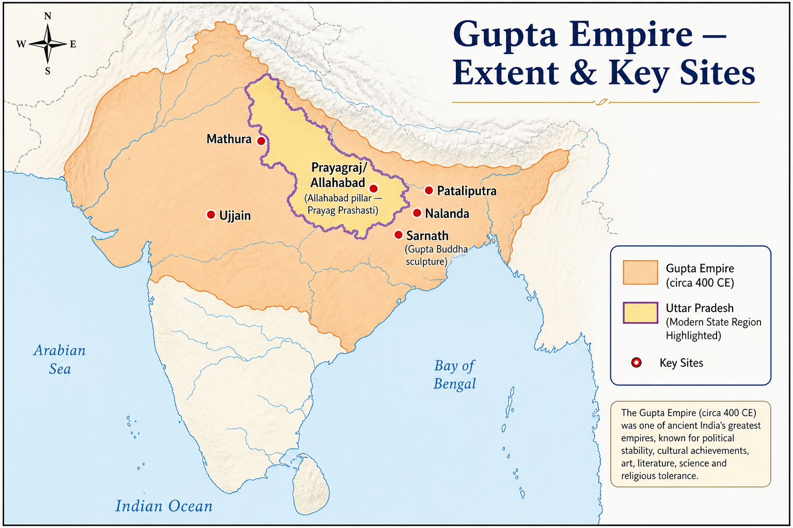

# Topic 9 — Gupta Age
### ★ Complete Source of Truth — No other book/notes needed for this topic

> **Covers syllabus:** Gupta Administration | Gupta Administration System | Chandragupta II | Samudragupta's Military Campaigns | Gupta Inscriptions | Gupta Coins | Gupta Gold Coins | Gupta Achievements | Prayag Prashasti | Allahabad Pillar Inscription | Nalanda University | Gupta Art | Gupta Literature | Gupta Science  
> **Sources baked in:** NCERT *Themes in Indian History* I (Ch 7), RS Sharma, Allahabad pillar/Mehrauli epigraphy, Fa-Hien, UPPCS/UPSC PYQs  
> **Exam weight:** ★★★ High — Chandragupta II coins (2022 Q23), Samudragupta matching (2018 Q87), Kalidasa (2025 Q48), authors-books match (2025 Q86), Fa-Hien (2024 Q149)  
> **Last verified:** July 2026

---

## Quick Revision Box — Raata This First

```
GUPTA DYNASTY (~320–550 CE) — GOLDEN AGE:
  Chandragupta I (320–335) + Licchavi Kumaradevi | Samudragupta (335–375)
  Chandragupta II Vikramaditya (380–415) | Kumaragupta I | Skandagupta (Hun wars)
  Capital: Pataliputra | Ujjain (Chandragupta II)

CHANDRAGUPTA II (★★★ 2022 Q23):
  Defeated Shakas (Western Kshatrapas) | Title Vikramaditya
  2022 Q23: Shaka victory evidence = silver coins + ~33 grains = BOTH correct (B)
  Fa-Hien visited his court | Udayagiri Varaha caves | Mehrauli Iron Pillar (debated)

SAMUDRAGUPTA (★★★ 2018 Q87):
  Prayag Prashasti by Harishena | Digvijaya policy
  2018 Q87 match: Dhananjaya-Kusthalpura(3), Nilaraja-Avamukta(1), Ugrasena-Palaka(4), Vishnugopa-Kanchi(2)
  Answer C: 3-1-4-2

ALLAHABAD PILLAR = Ashokan edicts + Samudragupta Prayag Prashasti + later inscriptions

ADMINISTRATION:
  Provinces (Bhuktis) → Uparikas | Districts (Vishayas) → Kumaramatyas/Ayuktakas
  Sandhivigrahika = foreign minister | Land grants to Brahmans → samanta system begins

COINS: Gold dinaras | Silver rupaka (~33 grains) | Archer type = Chandragupta II
  King-Queen type = Chandragupta I-Kumaradevi | Ashvamedha horse = Samudragupta

NALANDA: Flourished under Kumaragupta I (~427 CE) | Hiuen Tsang studied here

LITERATURE: Kalidasa — Shakuntala, Meghaduta, Raghuvamsa
  2025 Q48: Shringara Shataka NOT Kalidasa = Only 3 (B) | Bhartrihari wrote it
  2025 Q86: Trivikram-Nal Champu | Somdev-Kathasaritsagara | Jaidev-Gita Govinda | Kshemendra-Brihatkathamanjari = A (3-4-1-2)

SCIENCE: Aryabhata (Aryabhatiya, zero) | Varahamihira | Brahmagupta

2024 Q149: Fa-Hien earliest → 4,3,1,2 (B) | 2023 Q29: Vayu Purana-Gupta governance = FALSE (Only 1)
```

### Must-Know Term Comparisons (very frequently asked)

| Term | One-line difference | Hindi |
|------|---------------------|-------|
| **Chandragupta I vs Chandragupta II** | Chandragupta I = founder (Licchavi marriage); Chandragupta II = Vikramaditya, defeated Shakas | चंद्रगुप्त प्रथम / चंद्रगुप्त द्वितीय |
| **Samudragupta vs Chandragupta II** | Samudragupta = digvijaya conqueror (Prayag Prashasti); Chandragupta II = Shaka defeat, cultural peak | समुद्रगुप्त / चंद्रगुप्त द्वितीय |
| **Prayag Prashasti vs Allahabad Pillar** | Prayag Prashasti = Harishena's text praising Samudragupta; inscribed on same **Allahabad pillar** as Ashokan edicts | प्रयाग प्रशस्ति / इलाहाबाद स्तंभ |
| **Gupta gold vs silver coins** | Gold dinaras = imperial prestige; silver rupaka (~33 grains) = Shaka-victory evidence (2022 Q23) | स्वर्ण मुद्रा / रजत मुद्रा |
| **Bhukti vs Vishaya** | Bhukti = province under Uparika; Vishaya = district under Kumaramatya/Ayuktaka | भुक्ति / विषय |
| **Sandhivigrahika vs Mahamatya** | Sandhivigrahika = foreign minister (peace/war); Mahamatya = general minister | संधिविग्रहिक / महामात्य |
| **Kalidasa vs Bhartrihari** | Kalidasa = Meghaduta, Raghuvamsa; Bhartrihari = Shringara Shataka (2025 Q48 trap) | कालिदास / भर्तृहरि |
| **Somdev vs Kshemendra** | Somadeva = *Kathasaritsagara*; Kshemendra = *Brihatkathamanjari* (2025 Q86) | सोमदेव / क्षेमendra |
| **Jaidev vs Trivikram Bhatta** | Jaidev = *Gita Govinda*; Trivikram Bhatta = *Nal Champu* (2025 Q86) | जयदेव / त्रिविक्रम भट्ट |
| **Aryabhata vs Varahamihira** | Aryabhata = Aryabhatiya, Earth's rotation; Varahamihira = Panchasiddhantika, Brihat Samhita | आर्यभट / वराहमिहिर |
| **Fa-Hien vs Hiuen Tsang** | Fa-Hien (~399–414 CE) = Chandragupta II era; Hiuen Tsang (~630s) = Harsha era (later) | फाह्यान / ह्वेन त्सांग |
| **Skandagupta vs Kumaragupta** | Skandagupta = fought Huns (Bhitari inscription); Kumaragupta I = Nalanda patron | स्कंदगुप्त / कुमारगुप्त |

### Memory Tricks

| Trick | Remembers |
|-------|-----------|
| **I-S-II-K-S** | Chandragupta I → Samudragupta → Chandragupta II → Kumaragupta → Skandagupta |
| **2022 Both B** | Chandragupta II silver coins + 33 grains |
| **2018 C 3142** | Samudragupta south kings match order |
| **2025 Only 3** | Shringara Shataka ≠ Kalidasa |
| **2024 Fa-Hien first** | 4,3,1,2 chronology |
| **Prayag = Samudra** | Prayag Prashasti on Allahabad pillar |
| **Vikram = Chandragupta II** | Vikramaditya title |
| **33 grains silver** | Chandragupta II rupaka |
| **Nalanda = Kumaragupta** | University peak patron |
| **Zero = Aryabhata** | Gupta science |

---

## Exam Visuals — High-ROI Images

> **Type priority:** location map → conceptual diagram. Images stored locally (`images/`) so they open offline.

### 1. Gupta Empire — Extent & Key Sites Map



*Raata **site ↔ ruler ↔ artefact**. **Prayagraj/Allahabad pillar** = Ashokan edicts + **Samudragupta's Prayag Prashasti** (**2018 Q87**). **Sarnath = Gupta Buddha school** (not Gandhara/Kushan). **Nalanda = Kumaragupta I** patron. Trap: **Prayag Prashasti = Samudragupta**, NOT Chandragupta II.*
*Source: Study map — generated for UPPCS extent & site-matching*

---

## 9.1 Gupta Administration

### Definitions (learn all — exams pick different ones)

| Term | Meaning |
|------|---------|
| **Gupta Administration** | Decentralized imperial system combining central control with feudatory and land-grant autonomy |
| **Samanta** | Feudatory chief accepting Gupta suzerainty — paid tribute, supplied troops |
| **Bhukti** | Provincial division of Gupta empire under **Uparika** (governor) |

### Gupta Administration — How It Works

- **Gupta empire** restored pan-north Indian unity (~320 CE) after post-Mauryan fragmentation and Kushan decline.
- **Administration was less centralized than Mauryan administration** because **land grants (brahmadeya, agrahara)** to Brahmans created local autonomous pockets.
- **King** was the supreme sovereign and used titles such as **Maharajadhiraja** and **Paramabhattaraka**. Gupta political ideology gave divine kingship a stronger emphasis than in the Mauryan era.
- **Council of ministers (Mantriparishad)** advised the king. The **Sandhivigrahika** served as the minister of foreign affairs and war-and-peace, a distinctive Gupta title.
- **Provincial system**: empire divided into **Bhuktis** (provinces) governed by **Uparikas** (governors).
- **District level** had **Vishayas** administered by **Kumaramatyas** or **Ayuktakas**, who served as executive officers.
- **Village level**: **Gramika** (village headman), **Kutumbins** (leading families) managed local affairs.
- **Revenue** came mainly from land tax (**bhaga**), typically **1/4 to 1/6** of produce. Rates were lower during the prosperous Gupta phase.
- **Guilds (shreni)** remained autonomous and managed trade and crafts. The state recognized guild laws.
- **Legal traditions**: **Dharmashastras** and **Smritis** (Narada, Yajnavalkya) codified during Gupta period.
- **Sources** include inscriptions for land grants and **Puranas** for genealogy. The **Vayu Purana Gupta governance claim is unreliable** per 2023 Q29.

> **Exam note:** Gupta admin = **decentralized + land grants**. Trap: "Gupta administration more centralized than Mauryas" — false; samanta feudatories increased.

### Exam Facts (raata)

- Gupta administration was less centralized than Mauryan administration.
- **Bhukti** was the province, and **Uparika** was its governor.
- **Vishaya** was the district-level unit.
- **Sandhivigrahika** was the foreign minister or war-and-peace officer.
- **Samanta** was a feudatory chief.
- **Brahmadeya** land grants increased local autonomy.
- Guilds (**shreni**) enjoyed recognized autonomy.
- Dharmashastra codification was important in this period.

### PYQs — Gupta Administration

1. **(UPPCS Prelims 2023, Q29)** Vayu Purana on Gupta governance — statement 2 **false** (Only 1 correct for Mauryan Vishnu Purana).  
   → Gupta governance NOT reliably from Vayu Purana alone.

2. **(UPSC Prelims 2019 — pattern)** Gupta provincial governor:  
   → **Uparika (Bhukti head).**

### Examples (9.1)

| Example | Detail |
|---------|--------|
| **Land grant copper plates** | Administrative decentralization evidence |
| **Sandhivigrahika** | Unique Gupta ministerial title |
| **Shreni guild laws** | Autonomous commercial corporations |

---

## 9.2 Gupta Administration System

### Gupta Administration System — How It Works

- **Hierarchical structure** moved from the king to ministers, then to **Uparikas** for provinces, **Kumaramatyas/Ayuktakas** for districts, and **Gramikas** for villages.
- **Maharajadhiraja** stood at the apex and claimed **paramount sovereignty** over subordinate kings or samantas.
- **Kumaramatya** was a versatile officer who handled revenue, justice, and military work in **Vishayas** and special assignments.
- **Ayuktaka** was an appointed official for specific districts. Its function was similar to that of a Kumaramatya.
- **Pustapalas** were record keepers who maintained land grant registers and revenue accounts.
- **Dutaka** was a messenger or commissioner who delivered royal grants and carried orders.
- **Army** used **Chaturangabala**, which included infantry, cavalry, elephants, and chariots. Samantas supplied contingents.
- **Feudatory integration** turned defeated kings into **samantas** who acknowledged Gupta suzerainty, paid tribute, and attended court.
- **Land grants to temples/Brahmans** carried fiscal and administrative immunity and reduced direct crown control.
- **Judicial system** relied on local village assemblies in the **panchayat** tradition. The king remained the court of final appeal.
- **Gupta rule lacked an elaborate spy system** like the Arthashastra model and relied more on feudal loyalty and Brahmanical legitimacy.

### Administrative Hierarchy — Table

| Level | Unit | Officer |
|-------|------|---------|
| Empire | Rashtra | Maharajadhiraja (King) |
| Province | Bhukti | Uparika |
| District | Vishaya | Kumaramatya / Ayuktaka |
| Village | Grama | Gramika |

> **Exam note:** **Kumaramatya** appears frequently in land grant inscriptions — multi-purpose district officer. Trap: "Gupta had no feudatories" — samantas were integral.

### Exam Facts (raata)

- The administrative chain ran from king to Uparika, then to Kumaramatya and Gramika.
- Kumaramatya = district executive
- Dutaka = grant delivery officer
- Pustapala = record keeper
- Chaturangabala army
- Samanta feudatory system
- Temple/Brahman land grant immunity
- Village panchayat tradition

### PYQs — Gupta Administration System

1. **(UPSC Prelims 2018 — pattern)** Kumaramatya in Gupta administration:  
   → **District-level executive officer.**

2. **(UPSC Prelims 2017 — pattern)** Gupta feudatory called:  
   → **Samanta.**

### Examples (9.2)

| Example | Detail |
|---------|--------|
| **Damodarpur copper plates** | Kumaramatya land grant records |
| **Samanta tribute** | Feudatory integration mechanism |
| **Chaturangabala** | Four-fold army organization |

---

## 9.3 Chandragupta II

### Definitions

| Term | Meaning |
|------|---------|
| **Chandragupta II** | Gupta emperor (~380–415 CE); took title **Vikramaditya**; peak of Gupta power |
| **Vikramaditya** | "Sun of Valour" — legendary title; Chandragupta II most associated Gupta ruler with this name |

### Chandragupta II — How It Works

- **Chandragupta II** (~380–415 CE) was the son of **Samudragupta**. Literary tradition also calls him **Vikramaditya**.
- **Greatest military achievement** was Chandragupta II's defeat of the **Western Kshatrapas (Shakas)**, which ended Shaka rule in western India.
- **Strongest evidence of Shaka victory**: **silver coins** issued by Chandragupta II commemorating victory ← **UPPCS 2022 Q23 statement 1 (correct)**.
- **Silver coin weight** was approximately **33 grains** under the rupaka standard. **2022 Q23 statement 2** is correct, so the answer is **B (Both 1 and 2)**.
- **Court of Nine Gems (Navaratna)** included legendary scholars such as **Kalidasa, Amarasimha, and Varahamihira**, although the tradition is partly literary.
- **Fa-Hien (Faxian)** was a Chinese pilgrim who visited India during **399–414 CE** in Chandragupta II's reign and described **Pataliputra, Nalanda, and Ujjain**.
- **Udayagiri caves** in Madhya Pradesh contain the **Vishnu Varaha** sculpture commissioned under his patronage.
- **Mehrauli Iron Pillar** in Delhi has an inscription that mentions **Chandra**, who is widely identified with **Chandragupta II**, though this is debated.
- **Capital** was primarily **Pataliputra**, while **Ujjain** was an important second city visited by Fa-Hien.
- **Marriage alliance** with **Kuberanaga**, a Naga princess, strengthened Gupta hold over central India.
- **Cultural peak**: Gupta Golden Age reaches maximum under his patronage.

> **Exam note:** **2022 Q23 = Both correct (B).** Silver coins + 33 grains = Shaka victory evidence. Trap: "Chandragupta Maurya defeated Shakas" — that was **Chandragupta II Gupta**.

### Exam Facts (raata)

- Reigned ~380–415 CE
- Title Vikramaditya
- Defeated Western Kshatrapas (Shakas)
- 2022 Q23: silver coins + 33 grains (B)
- Fa-Hien visited his court
- Udayagiri Varaha caves
- Mehrauli Iron Pillar (Chandra)
- Navaratna court tradition

### PYQs — Chandragupta II

1. **(UPPCS Prelims 2022, Q23)** Chandragupta II: 1. Shaka victory evidence = silver coins  2. Weight ~33 grains  
   → **B — Both 1 and 2 correct.**

2. **(UPPCS Prelims 2024, Q149)** Fa-Hien earliest among listed travellers — visited during Chandragupta II.  
   → **B — 4, 3, 1, 2** (Fa-Hien first).

### Examples (9.3)

| Example | Detail |
|---------|--------|
| **2022 Q23** | Silver rupaka coins |
| **Fa-Hien account** | Pataliputra prosperity description |
| **Udayagiri Varaha** | Chandragupta II patronage |

---

## 9.4 Samudragupta's Military Campaigns

### Definitions

| Term | Meaning |
|------|---------|
| **Samudragupta** | Gupta emperor (~335–375 CE); son of Chandragupta I; greatest conqueror of dynasty |
| **Digvijaya** | Policy of military conquest in all directions — Samudragupta's expansion strategy |

### Samudragupta's Military Campaigns — How It Works

- **Samudragupta** (~335–375 CE) expanded the Gupta empire through **digvijaya**, or conquest in all directions.
- **Primary source**: **Prayag Prashasti** (Allahabad pillar inscription) composed by court poet **Harishena**.
- **Aryavarta (North India)** saw **nine kings uprooted**, and their kingdoms were annexed directly into the Gupta empire.
- **Dakshinapatha (South India)** saw **twelve kings defeated**. They were made **tributaries**, not annexed, and were then released and reinstated under Gupta suzerainty.
- **Frontier kings (Atavika/Davaka)** ruled **five frontier kingdoms** that accepted tributary status.
- **Tribal republics (ganarajyas)** included **nine republics** in Punjab and Rajasthan that were forced to pay tribute.
- **Samudragupta performed Ashvamedha**, the horse sacrifice that confirmed imperial status. The ritual was depicted on gold coins.
- **South Indian kings** listed in the inscription form the exam matching source for **UPPCS 2018 Q87**:

| King | Kingdom | List-II code |
|------|---------|--------------|
| **Dhananjaya** | Kusthalapura | 3 |
| **Nilaraja** | Avamukta | 1 |
| **Ugrasena** | Palaka (Palakka) | 4 |
| **Vishnugopa** | Kanchi | 2 |

- **2018 Q87 answer = C (3-1-4-2)**.
- **Diplomatic marriages** continued the Licchavi alliance. Matrimonial ties with the Vakatakas were strengthened through Prabhavatigupta.
- **Samudragupta never lost a battle** according to the Prayag Prashasti, which is royal propaganda. His empire extended from the Himalayas to the Krishna-Godavari region.

> **Exam note:** **2018 Q87 = C (3-1-4-2).** Trap: "Samudragupta annexed all of South India" — south kings made **tributaries**, not directly ruled.

### Exam Facts (raata)

- Reigned ~335–375 CE
- Digvijaya expansion policy
- Prayag Prashasti = main source
- 9 north kings uprooted
- 12 south kings made tributaries
- Ashvamedha performed
- 2018 Q87: 3-1-4-2 (C)
- Harishena = court poet

### PYQs — Samudragupta's Military Campaigns

1. **(UPPCS Prelims 2018, Q87)** Samudragupta's contemporary south Indian kings match:  
   A-Dhananjaya B-Nilaraja C-Ugrasena D-Vishnugopa — 1-Avamukta 2-Kanchi 3-Kusthalpura 4-Palaka  
   → **C — 3-1-4-2.**

2. **(UPSC Prelims 2019 — pattern)** Prayag Prashasti describes military campaigns of:  
   → **Samudragupta.**

### Examples (9.4)

| Example | Detail |
|---------|--------|
| **2018 Q87** | South king-kingdom matching |
| **Ashvamedha coins** | Samudragupta horse sacrifice type |
| **Vishnugopa of Kanchi** | Defeated then released tributary |

---

## 9.5 Gupta Inscriptions

### Definitions

| Term | Meaning |
|------|---------|
| **Gupta Inscriptions** | Stone/copper epigraphic records — primary historical sources for Gupta polity, grants, and wars |
| **Copper plate grants** | Charters recording land donations to Brahmans/temples — **tamrapatra** |

### Gupta Inscriptions — How It Works

- **Gupta history is reconstructed mainly from inscriptions** because coins supplement the record while inscriptions give names, dates, and territories.
- **Prayag Prashasti (Allahabad pillar)** is Samudragupta's eulogy by **Harishena** and serves as the most important military source.
- **Mehrauli Iron Pillar inscription** praises **Chandra** and stands as a Gupta metallurgical marvel in rust-resistant iron.
- **Bhitari pillar inscription** records **Skandagupta's** victory over the **Hunas** or Huns.
- **Udayagiri cave inscriptions** connect **Chandragupta II** and **Kumaragupta I** with Vishnu worship.
- **Eran inscription** in Madhya Pradesh mentions **Samudragupta** and **Buddhagupta** and is the earliest Gupta stone inscription.
- **Mandasor inscription** preserves records from the eras of **Kumaragupta** and **Yashodharman**.
- **Copper plate grants** such as **Damodarpur, Baigram, and Banskhera** record land grants with administrative details.
- **Later Gupta vs Imperial Gupta** matters because **Jivitagupta II** was a later Gupta of Magadha with inscriptions at **Aphsad/Bankura**, not "Deva Barnark." This is **2022 Q87 trap pair C**.
- **Maukhari inscriptions** are contemporary sources, and **Ishanavarman with the Harha/Mau stone inscription** is the correct pair in 2022 Q87.
- **Ishwaravarman and Jaunpur** are **NOT correctly matched** in the 2022 Q87 answer options.

### Major Gupta Inscriptions — Table

| Inscription | Ruler | Content |
|-------------|-------|---------|
| **Prayag Prashasti** | Samudragupta | Digvijaya eulogy |
| **Mehrauli Iron Pillar** | Chandra (Chandragupta II?) | King's virtues |
| **Bhitari pillar** | Skandagupta | Hun victory |
| **Udayagiri caves** | Chandragupta II | Vishnu cult |
| **Eran pillar** | Samudragupta | Early Gupta record |
| **Damodarpur plates** | Various | Land grants |
| **Harha stone** | Ishanavarman (Maukhari) | Contemporary dynasty |

> **Exam note:** **2022 Q87 NOT matched = C (Jivitagupta II — Deva Barnark)** OR **D (Ishwaravarman — Jaunpur)** — verify: **Jivitagupta II** linked to **Aphsad**, not Deva Barnark → **answer C**.

### Exam Facts (raata)

- Inscriptions = primary Gupta sources
- Prayag Prashasti = Samudragupta
- Mehrauli Iron Pillar = Chandra
- Bhitari = Skandagupta vs Huns
- Copper plate land grants
- 2022 Q87 inscription matching
- Ishanavarman = Harha (Maukhari)
- Jivitagupta II ≠ Deva Barnark

### PYQs — Gupta Inscriptions

1. **(UPPCS Prelims 2022, Q87)** NOT correctly matched inscription pair:  
   → **C — Jivitagupta II — Deva Barnark inscription** (wrong; Aphsad is correct site).

2. **(UPSC Prelims 2018 — pattern)** Prayag Prashasti inscribed on:  
   → **Allahabad pillar (Ashokan pillar reused).**

### Examples (9.5)

| Example | Detail |
|---------|--------|
| **2022 Q87** | Inscription-ruler matching trap |
| **Mehrauli Iron Pillar** | 1600+ years rust-free |
| **Damodarpur copper plates** | Bihar land grant records |

---

## 9.6 Gupta Coins

### Definitions

| Term | Meaning |
|------|---------|
| **Gupta Coins** | Gold, silver, and copper coinage reflecting Gupta imperial ideology and economy |
| **Dinara** | Gupta gold coin derived from Kushan/Roman influence |

### Gupta Coins — How It Works

- **Gupta coinage** was among the finest in ancient India and included gold, silver, and copper coins used for **trade, tribute, and propaganda**.
- **Gold dinaras** were the standard gold coin. They carried the king's portrait or symbolic types on the obverse.
- **Silver coins (rupaka)** were issued by **Chandragupta II** to commemorate the **Shaka victory**, which is tested in **2022 Q23**.
- **Silver weight standard**: approximately **33 grains** per rupaka ← **2022 Q23 statement 2**.
- **Copper coins (karshapana)** were used for everyday market exchange. They were less artistic than gold and silver issues.
- **Chandragupta I-Kumaradevi type** shows the king and queen standing together and symbolizes the **Licchavi alliance**.
- **Samudragupta Ashvamedha type** shows the king performing the horse sacrifice on the reverse.
- **Chandragupta II Archer type** depicts the king as an archer and symbolizes the Shaka defeat.
- **Skandagupta Lion-slayer type** shows the king fighting a lion and symbolizes the Hun wars.
- **Kumaragupta Lion-trampler type** continues imperial imagery.
- **Inscriptions on coins** used Sanskrit legends. The coins also carried deity images such as Lakshmi, Garuda, and altar motifs.
- **Numismatic evidence** fills gaps where stone inscriptions are absent and helps with chronology and genealogy.

### Gupta Coin Types — Table

| Coin type | Ruler | Symbolism |
|-----------|-------|-----------|
| **King-Queen** | Chandragupta I | Licchavi marriage |
| **Ashvamedha horse** | Samudragupta | Horse sacrifice |
| **Archer** | Chandragupta II | Shaka victory |
| **Lion-slayer** | Skandagupta | Hun campaigns |
| **Silver rupaka** | Chandragupta II | Shaka defeat (2022 Q23) |

> **Exam note:** **2022 Q23** — Chandragupta II **silver** coins (~33 grains) = Shaka victory evidence. Trap: "Gold coins prove Shaka victory" — silver rupaka is the key evidence cited.

### Exam Facts (raata)

- Gold dinaras + silver rupaka + copper
- 2022 Q23: silver coins, 33 grains
- King-Queen = Chandragupta I
- Ashvamedha type = Samudragupta
- Archer type = Chandragupta II
- Lion-slayer = Skandagupta
- Sanskrit coin legends
- Numismatic genealogy aid

### PYQs — Gupta Coins

1. **(UPPCS Prelims 2022, Q23)** Chandragupta II silver coins and 33 grains.  
   → **B — Both correct.**

2. **(UPSC Prelims 2019 — pattern)** Gupta king on Ashvamedha-type coin:  
   → **Samudragupta.**

### Examples (9.6)

| Example | Detail |
|---------|--------|
| **2022 Q23** | Silver rupaka evidence |
| **Kumaradevi coin** | Licchavi alliance symbol |
| **Archer type** | Chandragupta II Shaka victory |

---

## 9.7 Gupta Gold Coins

### Gupta Gold Coins — How It Works

- **Gupta gold dinaras** achieved the highest artistic and metallurgical quality in ancient Indian numismatics.
- **Kushan gold coins influenced Gupta coinage**, and the Guptas adapted and refined the dinara standard.
- **Chandragupta I-Kumaradevi gold coins** are the most famous Gupta coins. The obverse shows the king and queen standing, while the reverse goddess signals the **Licchavi dynasty** connection.
- **Samudragupta gold types**: **Ashvamedha** (horse sacrifice), **Lyrist** (king playing veena), **Standard** (Garuda emblem).
- **Chandragupta II gold types**: **Archer** (most common), **Couch-and-Lion**, **Horseman**.
- **Kumaragupta I gold types**: **Garuda type**, **Peacock type**, **Lion-trampler**.
- **Skandagupta gold types**: **Lion-slayer**, **King-and-Queen** (rare).
- **Gold content remained high** and reflects Gupta economic prosperity and control of trade revenues.
- **Gold coins were used for** army payment, diplomatic gifts, and hoarded wealth. They were used less for daily markets, where copper coins circulated.
- **Hoard discoveries** include the Bayana hoard in Rajasthan, which contains thousands of Gupta gold coins and is a key numismatic find.
- **Decline** appeared when gold coin quality and quantity decreased after Skandagupta because Hun invasions strained the treasury.

> **Exam note:** **Gold dinara ≠ Shaka victory evidence** — that's **silver rupaka** (2022 Q23). Gold = imperial prestige; silver = specific Shaka victory commemoration.

### Gupta Gold Coin Types — Complete List

| Ruler | Gold coin types |
|-------|-----------------|
| **Chandragupta I** | King-and-Queen (Kumaradevi) |
| **Samudragupta** | Ashvamedha, Lyrist, Standard |
| **Chandragupta II** | Archer, Couch-Lion, Horseman |
| **Kumaragupta I** | Garuda, Peacock, Lion-trampler |
| **Skandagupta** | Lion-slayer |

### Exam Facts (raata)

- Dinara = gold standard
- Kumaradevi coin most famous
- Samudragupta Ashvamedha gold type
- Chandragupta II Archer gold
- Bayana hoard discovery
- Kushan influence on dinara
- Quality declined post-Skandagupta
- Gold coins mainly expressed imperial prestige, while silver coins are the key evidence for the Shaka victory.

### PYQs — Gupta Gold Coins

1. **(UPPCS Prelims 2022, Q23)** Shaka evidence = **silver** (not gold) — distinction from gold coins.  
   → Silver rupaka, not dinara.

2. **(UPSC Prelims 2018 — pattern)** Chandragupta I gold coin features:  
   → **King Chandragupta I with queen Kumaradevi.**

### Examples (9.7)

| Example | Detail |
|---------|--------|
| **Bayana hoard** | Massive Gupta gold coin discovery |
| **Lyrist type** | Samudragupta playing veena |
| **Kumaradevi type** | Licchavi matrimonial alliance |

---

## 9.8 Gupta Achievements

### Gupta Achievements — How It Works

- **Gupta period** (~320–550 CE) is called the **Golden Age of India** because political stability enabled cultural flowering.
- **Political** achievements included a pan-north Indian empire, effective administration, **digvijaya**, and feudatory integration.
- **Economic** achievements rested on prosperous agriculture, **Silk Road** and Indian Ocean trade, guild commerce, and gold coinage.
- **Religious** life saw a **Hindu revival** in Vaishnavism and Shaivism. **Buddhism** remained patronized at places such as Nalanda and Sarnath, and Jainism continued.
- **Educational**: **Nalanda**, **Takshashila**, **Vallabhi** universities flourished.
- **Artistic achievements** included Ajanta paintings, Sarnath Buddha, Mathura sculptures, and Deogarh temple. See §9.12.
- **Literary achievements** included Sanskrit classics by Kalidasa and Vishakhadatta. See §9.13.
- **Scientific achievements** included the work of Aryabhata, Varahamihira, and Brahmagupta. See §9.14.
- **Technological achievement** appears in the **Mehrauli Iron Pillar**, which shows rust-resistant wrought iron metallurgy.
- **Legal/social** developments included Dharmashastra compilation and documentation of the varna-jati system. The position of women varied, with some royal agency but an overall patriarchal order.
- **Legacy** lay in a model for later medieval Indian kingship. Historians often treat Gupta cultural standards as unmatched until the Mughal era.

> **Exam note:** "Golden Age" = **Gupta period specifically** — not Mauryan, not Mughal. Trap: attributing Ajanta's **earliest** phase to Guptas — earliest caves pre-Gupta; **Gupta-era paintings** in caves 16-17.

### Exam Facts (raata)

- Golden Age of India label
- Political unity + prosperity
- Silk Road trade
- Hindu + Buddhist patronage
- Nalanda university peak
- Sanskrit literature flowering
- Aryabhata astronomy
- Mehrauli Iron Pillar metallurgy

### PYQs — Gupta Achievements

1. **(UPPCS Prelims 2024, Q149)** Fa-Hien visited during Gupta Golden Age (Chandragupta II).  
   → Chronology confirms Gupta peak era.

2. **(UPSC Prelims 2019 — pattern)** Golden Age of ancient India associated with:  
   → **Gupta period.**

### Examples (9.8)

| Example | Detail |
|---------|--------|
| **Mehrauli Iron Pillar** | Metallurgical marvel |
| **Silk Road trade** | Gupta economic prosperity |
| **Nalanda** | International Buddhist university |

---

## 9.9 Prayag Prashasti

### Definitions

| Term | Meaning |
|------|---------|
| **Prayag Prashasti** | Sanskrit eulogy (prashasti = praise) of **Samudragupta** composed by **Harishena** |
| **Harishena** | Sandhivigrahika (minister) and poet who composed Prayag Prashasti |

### Prayag Prashasti — How It Works

- **Prayag Prashasti** is the primary literary-historical source for **Samudragupta's reign** and military campaigns.
- **Harishena composed it** and served as **Sandhivigrahika** (foreign minister) and **Mahadandanayaka** (chief judicial officer).
- **Allahabad (Prayagraj) pillar** carries the inscription on the same Ashokan pillar that has Ashoka's edicts, showing that the Guptas reused an ancient monument.
- **Written in Sanskrit**, it uses elegant **chandah** (metrical) and **prose** forms and became a model of classical Sanskrit court poetry.
- **Lists conquests in four categories**: Aryavarta kings uprooted (9), Dakshinapatha tributaries (12), frontier kings (5), tribal republics (9).
- **South Indian kings named** include Dhananjaya, Nilaraja, Ugrasena, and Vishnugopa. These names form the matching pairs for **2018 Q87**.
- **Samudragupta's qualities praised** include poet, musician or lyre player, warrior, and donor, creating the **versatile king** ideal.
- **Ashvamedha performance** is recorded as an imperial sovereignty ritual.
- **Genealogical section**: traces lineage from **Chandragupta I** and **Kumaradevi** (Licchavi).
- **Historiographical value**: combines royal propaganda with genuine territorial information.

> **Exam note:** Prayag Prashasti = **Samudragupta only** (not Chandragupta II). Same stone as **Allahabad pillar**. **2018 Q87** south king matching from this text.

### Exam Facts (raata)

- Samudragupta's eulogy
- Composed by Harishena
- On Allahabad pillar
- Sanskrit prashasti genre
- Four conquest categories
- 2018 Q87 south kings source
- Ashvamedha mentioned
- Licchavi genealogy

### PYQs — Prayag Prashasti

1. **(UPPCS Prelims 2018, Q87)** South Indian king-kingdom pairs from Prayag Prashasti.  
   → **C — 3-1-4-2.**

2. **(UPSC Prelims 2018 — pattern)** Author of Prayag Prashasti:  
   → **Harishena.**

### Examples (9.9)

| Example | Detail |
|---------|--------|
| **2018 Q87** | South king matching |
| **Harishena** | Poet-minister author |
| **Four conquest lists** | Digvijaya structure |

---

## 9.10 Allahabad Pillar Inscription

### Definitions

| Term | Meaning |
|------|---------|
| **Allahabad Pillar Inscription** | Multi-layered inscription on single monolithic pillar at **Prayagraj (Allahabad)** |
| **Prayagraj** | Modern name for **Prayag** — confluence of Ganga-Yamuna; Gupta inscription site |

### Allahabad Pillar Inscription — How It Works

- **Allahabad pillar** is a single monolithic sandstone pillar that bears **inscriptions from four eras**.
- **Layer 1 contains Ashokan edicts**, including **Pillar Edict VI and VII** on the moral policy of Ashoka around the 3rd century BCE.
- **Layer 2 belongs to the Gupta period** and contains the **Prayag Prashasti** of **Samudragupta** by **Harishena** from around the 4th century CE.
- **Layer 3 belongs to the Mughal period** and contains **Jahangir's inscription** from 1601 CE, which records his accession and court events.
- **Layer 4** contains later medieval additions.
- **Samudragupta portion** lists **military campaigns, tributary kings, and Ashvamedha** and matches the Prayag Prashasti content in §9.9.
- **South Indian section** names kings of **Kanchi, Avamukta, Kusthalapura, and Palaka** and serves as the **2018 Q87** matching source.
- **Pillar originally stood** at **Kosam (Kaushambi region)** and was moved to **Allahabad Fort** by Akbar.
- **UP location** is **Prayagraj, Uttar Pradesh**, which is exam-critical geography.
- **Ashoka and Samudragupta appear on the same pillar**, making it a unique multi-dynasty epigraphic monument.

### Allahabad Pillar — Inscription Layers

| Layer | Dynasty | Content |
|-------|---------|---------|
| 1 | Mauryan (Ashoka) | Pillar Edicts VI-VII |
| 2 | Gupta (Samudragupta) | Prayag Prashasti |
| 3 | Mughal (Jahangir) | Accession record |
| 4 | Medieval | Minor additions |

> **Exam note:** **Prayag Prashasti = Allahabad pillar Gupta layer** — same inscription. Trap: "Allahabad pillar only Ashokan" — Gupta prashasti is major component.

### Exam Facts (raata)

- Prayagraj (Allahabad), UP
- Ashoka + Samudragupta + Jahangir layers
- Prayag Prashasti on this pillar
- 2018 Q87 south kings listed here
- Originally Kosam/Kaushambi area
- Now in Allahabad Fort
- Sandstone monolithic pillar
- Multi-dynasty epigraphic monument

### PYQs — Allahabad Pillar Inscription

1. **(UPPCS Prelims 2018, Q87)** South king list from Allahabad/Prayag Prashasti.  
   → **C — 3-1-4-2.**

2. **(UPSC Prelims 2019 — pattern)** Allahabad pillar contains edicts of:  
   → **Ashoka AND Samudragupta (Prayag Prashasti).**

### Examples (9.10)

| Example | Detail |
|---------|--------|
| **Prayagraj, UP** | Pillar location (exam geography) |
| **Ashoka + Gupta layers** | Multi-era single monument |
| **2018 Q87** | South king matching source |

---

## 9.11 Nalanda University

### Nalanda University — How It Works

- **Nalanda Mahavihara** was an ancient Buddhist monastic university near **Rajgir, Bihar** and was among the world's earliest residential universities.
- **Origins** go back to a monastic settlement from the early Buddhist period. Nalanda gained **formal university status under Guptas**.
- **Kumaragupta I** (~427 CE) is traditionally credited with **founding/building the main mahavihara** complex.
- **Layout** included **8 large compounds**, **10 temples**, and **numerous classrooms and meditation halls**. Hiuen Tsang counted **10,000+ students**.
- **Curriculum**: **Buddhist philosophy** (Mahayana, Hinayana), logic, grammar, medicine, astronomy, Vedas studied too.
- **International students** came from China, Korea, Tibet, Central Asia, and Sri Lanka, making Nalanda truly cosmopolitan.
- **Fa-Hien** (~399–414 CE) noted monastic learning. **Hiuen Tsang** (630s CE) and **I-Tsing** (670s CE) studied at Nalanda and praised it.
- **Famous teachers**: **Dharmapala, Shilabhadra** (Hiuen Tsang's teacher), **Shankaracharya** debated here (later).
- **Library** included **Ratnodadhi, Ratnasagara, and Ratnaranjaka**, which were legendary vast collections burned by Bakhtiyar Khilji in 1193 CE.
- **Patronage** came from Gupta kings and later Pala kings, and Nalanda declined after its 12th century destruction.
- **Archaeological remains**: red-brick ruins excavated by **Alexander Cunningham** and later ASI.

> **Exam note:** Nalanda peak under **Guptas + Palas**. Trap: "Nalanda founded by Ashoka" — expanded under **Kumaragupta I**. Fa-Hien saw it before full Gupta expansion.

### Exam Facts (raata)

- Near Rajgir, Bihar
- Kumaragupta I main patron
- Buddhist mahavihara university
- 10,000+ students (Hiuen Tsang)
- International student body
- Fa-Hien, Hiuen Tsang, I-Tsing visited
- Destroyed 1193 CE (Bakhtiyar Khilji)
- ASI excavated ruins

### PYQs — Nalanda University

1. **(UPPCS Prelims 2024, Q149)** Fa-Hien (earliest) saw Nalanda region during Gupta era.  
   → **B — 4,3,1,2** traveller chronology.

2. **(UPSC Prelims 2019 — pattern)** Nalanda flourished under:  
   → **Gupta and Pala rulers (Kumaragupta I key Gupta patron).**

### Examples (9.11)

| Example | Detail |
|---------|--------|
| **Hiuen Tsang account** | 10,000 students description |
| **Kumaragupta I** | Main Gupta builder-patron |
| **Ratnodadhi library** | Legendary manuscript collection |

---

## 9.12 Gupta Art

### Gupta Art — How It Works

- **Gupta art** represents the classical phase of Indian art with defined proportions, spiritual serenity, and refined craftsmanship.
- **Schools** included the **Mathura school** in the north and the **Sarnath school** in the east, which had distinct Gupta sculptural styles.
- **Sarnath Buddha** shows the **preaching Buddha (Dharmachakra mudra)** with refined transparent drapery and a halo, making it an iconic Gupta image.
- **Mathura sculptures** used red sandstone. They represented Buddha, Vishnu, and Yaksha figures with sensuous modeling.
- **Ajanta caves** contain **paintings** in caves 16-17 from the Gupta period, including Jataka stories, Bodhisattvas, and vivid colors.
- **Ellora caves** began early excavation, although later phases became more prominent.
- **Udayagiri** is known for the **Vishnu Varaha** boar incarnation linked with Chandragupta II. It also contains rock-cut shrines.
- **Deogarh temple** in Jhansi is the **Dashavatara Vishnu temple** and one of the earliest **stone Hindu temples** with a shikhara.
- **Terracotta art** produced folk and religious figurines across Gangetic towns.
- **Coin art** used king portraits and deity images and formed a miniature sculpture tradition.
- **Influence**: Gupta art model for **Southeast Asian** Buddhist art (Srivijaya, Cham kingdoms).

### Gupta Art — Major Sites Table

| Site | Art form | Notes |
|------|----------|-------|
| **Sarnath** | Buddha sculpture | Preaching Buddha classic |
| **Mathura** | Red sandstone figures | Buddha + Hindu deities |
| **Ajanta** | Cave paintings | Caves 16-17 Gupta phase |
| **Udayagiri** | Rock-cut Vishnu | Varaha sculpture |
| **Deogarh** | Stone temple | Dashavatara Vishnu |
| **Nalanda** | Brick architecture | University complex |

> **Exam note:** **Sarnath Buddha = Gupta classical style**. Trap: "Ajanta all Gupta" — earliest caves 1st century BCE; **Gupta paintings** mainly caves 16-17.

### Exam Facts (raata)

- Classical Indian art peak
- Sarnath + Mathura schools
- Preaching Buddha iconic image
- Ajanta Gupta paintings (caves 16-17)
- Udayagiri Varaha sculpture
- Deogarh Dashavatara temple
- Red sandstone Mathura style
- Southeast Asian art influence

### PYQs — Gupta Art

1. **(UPSC Prelims 2019 — pattern)** Gupta Buddha sculpture classic found at:  
   → **Sarnath (preaching Buddha).**

2. **(UPSC Prelims 2018 — pattern)** Udayagiri Varaha sculpture patron:  
   → **Chandragupta II.**

### Examples (9.12)

| Example | Detail |
|---------|--------|
| **Sarnath Dharmachakra Buddha** | Gupta classical masterpiece |
| **Ajanta cave 17 paintings** | Gupta-era murals |
| **Deogarh temple** | Early shikhara Hindu temple |

---

## 9.13 Gupta Literature

### Gupta Literature — How It Works

- **Sanskrit revival** during the Guptas occurred because the court patronized **classical Sanskrit** literature, drama, and poetry.
- **Kalidasa** was the greatest Sanskrit poet-dramatist. Tradition places him in **Chandragupta II's court**.
- **Kalidasa's works**: **Abhijnanashakuntalam (Shakuntala)**, **Meghaduta**, **Raghuvamsha**, **Kumarasambhava**, **Malavikagnimitram**, **Vikramorvashiyam**.
- **Shringara Shataka** was **NOT by Kalidasa** and was written by **Bhartrhari**. This supports **UPPCS 2025 Q48 answer B (Only 3)**.
- **Vishakhadatta** wrote **Mudrarakshasa**, a political drama about Chanakya and Chandragupta Maurya.
- **Shudraka** wrote **Mrichchhakatika (Little Clay Cart)**, a social drama.
- **Vishnu Sharma** is associated with **Panchatantra**, a fable collection compiled in this period.
- **Amarasimha** wrote **Amarakosha**, a Sanskrit thesaurus, and is counted as a Navaratna member.
- **Puranas** were compiled and redacted in the Gupta era, including **Vishnu Purana** and **Vayu Purana**. Their genealogies should be used cautiously per 2023 Q29.
- **Scientific literature** included Aryabhatiya and Panchasiddhantika. See §9.14.
- **Dramatic theory**: based on **Natyashastra** of Bharata (earlier text, applied in Gupta plays).
- **Later Sanskrit authors** are also tested in UPPCS 2025 Q86, so match each writer with the correct text carefully:
  - **Trivikram Bhatta** wrote ***Nal Champu***, a campu-kavya blending prose and verse.
  - **Somadeva (Somdev)** wrote ***Kathasaritsagara***, an ocean of stories based on Gunadhya's Brihatkatha.
  - **Jaidev (Jayadeva)** wrote ***Gita Govinda***, a 12th-century lyrical poem on Radha-Krishna linked with the Odisha/Bengal tradition.
  - **Kshemendra** wrote ***Brihatkathamanjari***, a condensed version of the Brihatkatha narrative cycle.
- **2025 Q86 answer = A (3-4-1-2)** because A matches 3, B matches 4, C matches 1, and D matches 2.
- **Trap**: Somadeva did not write Brihatkathamanjari, which belongs to Kshemendra. Jaidev did not write Nal Champu, which belongs to Trivikram Bhatta.

### Sanskrit Authors — Books Match Table (2025 Q86)

| # | Author | Work | Notes |
|---|--------|------|-------|
| 1 | **Trivikram Bhatta** | **Nal Champu** | Campu genre |
| 2 | **Somadeva** | **Kathasaritsagara** | Story collection |
| 3 | **Jaidev (Jayadeva)** | **Gita Govinda** | Krishna bhakti lyric |
| 4 | **Kshemendra** | **Brihatkathamanjari** | Brihatkatha abridgement |

### Kalidasa — Works Table

| Work | Type | Topic |
|------|------|-------|
| **Abhijnanashakuntalam** | Drama | Shakuntala-Dushyanta |
| **Meghaduta** | Lyric poem | Yaksha's message to wife |
| **Raghuvamsha** | Epic poem | Raghu dynasty |
| **Kumarasambhava** | Epic poem | Shiva-Parvati, Kartikeya |
| **Malavikagnimitram** | Drama | King Agnimitra's love |
| **Vikramorvashiyam** | Drama | King Pururava-Urvashi |

> **Exam note:** **2025 Q48 = B (Only 3)** — Shringara Shataka is **Bhartrihari's**, NOT Kalidasa's. **2025 Q86 = A (3-4-1-2)** — four author-book pairs; trap: swapping Somdev and Kshemendra works.

### Exam Facts (raata)

- Sanskrit Golden Age literature
- Kalidasa = greatest poet-dramatist
- 2025 Q48: Shringara Shataka ≠ Kalidasa
- 2025 Q86 = A (3-4-1-2) author-book match
- Somdev wrote Kathasaritsagara, and Kshemendra wrote Brihatkathamanjari.
- Jaidev wrote Gita Govinda, and Trivikram Bhatta wrote Nal Champu.
- Meghaduta, Raghuvamsha, Shakuntala
- Mudrarakshasa = Vishakhadatta
- Panchatantra = Vishnu Sharma
- Amarakosha = Amarasimha
- Puranas redacted in Gupta era

### PYQs — Gupta Literature

1. **(UPPCS Prelims 2025, Q86)** Match List-I (Writer) with List-II (Book):  
   A. Trivikram Bhatta  B. Somdev  C. Jaidev  D. Kshemendra  
   → 1. Gita Govinda  2. Brihatkathamanjari  3. Nal Champu  4. Kathasaritsagara  
   → **A — 3, 4, 1, 2.**

2. **(UPPCS Prelims 2025, Q48)** NOT written by Kalidasa: 1. Meghaduta  2. Raghuvamsha  3. Shringara Shataka  
   → **B — Only 3** (Shringara Shataka = Bhartrihari).

3. **(UPSC Prelims 2019 — pattern)** Kalidasa flourished in court of:  
   → **Chandragupta II (Vikramaditya tradition).**

### Examples (9.13)

| Example | Detail |
|---------|--------|
| **2025 Q86** | Author-book four-pair match |
| **2025 Q48** | Shringara Shataka trap |
| **Shakuntalam** | Most famous Kalidasa drama |

---

## 9.14 Gupta Science

### Definitions

| Term | Meaning |
|------|---------|
| **Gupta Science** | Advances in mathematics, astronomy, and medicine during Gupta period |
| **Aryabhatiya** | Aryabhata's treatise — mathematics and astronomy (499 CE) |

### Gupta Science — How It Works

- **Aryabhata** (476–550 CE) was the greatest Gupta mathematician-astronomer. He wrote **Aryabhatiya** (499 CE) and **Arya-siddhanta**.
- **Aryabhata's contributions**: **zero** as placeholder, **decimal system**, **pi (π) ≈ 3.1416**, **Earth's rotation** on axis, **solar eclipse** explanation.
- **Varahamihira** (~505–587 CE) was a polymath. His works included **Panchasiddhantika** on five astronomical schools and **Brihat Samhita**, an encyclopedia covering astrology, architecture, gems, and rain.
- **Brahmagupta** (~598–670 CE) wrote **Brahmasphutasiddhanta**. He gave rules for **zero, negative numbers**, and quadratic equations.
- **Astronomy** advanced through **heliocentric hints** associated with Aryabhata. Gupta scientists also refined the **solar year** length and **eclipse calculations**.
- **Medicine** preserved and commented on the **Sushruta Samhita** and **Charaka Samhita**. Surgery and Ayurveda were systematized.
- **Chemistry/metallurgy** includes the **Mehrauli Iron Pillar**, whose corrosion-resistant iron demonstrates advanced metallurgy.
- **Calendar** science used **Aryabhata's sine tables**. Improved **luni-solar calendars** helped fix festival dates.
- **Influence** of Gupta mathematics reached the **Arab world** through later translations and helped form a foundation for modern mathematics.
- **Navaratna tradition** links **Varahamihira** and **Aryabhata** to Chandragupta II's court (partly legendary).

> **Exam note:** **Aryabhata = Aryabhatiya (499 CE)**. Trap: "Zero invented by Brahmagupta only" — Aryabhata used zero earlier; Brahmagupta gave **rules for zero/negatives**.

### Gupta Scientists — Table

| Scientist | Work | Key contribution |
|-----------|------|------------------|
| **Aryabhata** | Aryabhatiya | Zero, pi, Earth's rotation |
| **Varahamihira** | Panchasiddhantika, Brihat Samhita | Astronomy, encyclopedia |
| **Brahmagupta** | Brahmasphutasiddhanta | Zero rules, negative numbers |

### Exam Facts (raata)

- Aryabhata = Aryabhatiya (499 CE)
- Zero, decimal, pi contributions
- Varahamihira = Panchasiddhantika
- Brahmagupta = negative numbers
- Earth's rotation (Aryabhata)
- Mehrauli Iron Pillar metallurgy
- Sushruta/Charaka medicine preserved
- Arabic transmission later

### PYQs — Gupta Science

1. **(UPSC Prelims 2019 — pattern)** Aryabhata's work:  
   → **Aryabhatiya — mathematics and astronomy (499 CE).**

2. **(UPSC Prelims 2018 — pattern)** Zero and decimal system in ancient India:  
   → **Aryabhata and later Brahmagupta.**

### Examples (9.14)

| Example | Detail |
|---------|--------|
| **Aryabhatiya 499 CE** | Dated scientific text |
| **Mehrauli Iron Pillar** | Metallurgical achievement |
| **Brihat Samhita** | Varahamihira's encyclopedia |

---

## Consolidated Reference — Everything in One Place

### Gupta Ruler Chronology

| Ruler | Period (approx.) | Key achievement |
|-------|------------------|-----------------|
| **Chandragupta I** | 320–335 CE | Founder; Licchavi marriage |
| **Samudragupta** | 335–375 CE | Digvijaya; Prayag Prashasti |
| **Chandragupta II** | 380–415 CE | Vikramaditya; Shaka defeat (2022 Q23) |
| **Kumaragupta I** | 415–455 CE | Nalanda patron |
| **Skandagupta** | 455–467 CE | Hun wars; Bhitari inscription |
| **Buddhagupta** | Late 5th c. CE | Last major emperor |

### UP Focus — Gupta Age & Uttar Pradesh

| Point | Detail |
|-------|--------|
| **Allahabad (Prayagraj) Pillar** | Samudragupta's Prayag Prashasti — **UP site** (2018 Q87) |
| **Kaushambi (Kosam)** | Original pillar location; Gupta-period urban centre |
| **Mathura** | Major Gupta art centre (Buddha/Vishnu sculptures) |
| **Eastern UP** | Core Gupta heartland (Magadha-Gangetic doab extension) |
| **Mehrauli Iron Pillar** | Delhi (NCR) — Chandragupta II association |
| **Fa-Hien** | Visited Pataliputra and region during Chandragupta II |
| **Exam trap** | "Gupta capital was Allahabad" — capital was **Pataliputra**; Allahabad has pillar only |

### Important Dates

| Event | Date |
|-------|------|
| Gupta empire founded | ~320 CE |
| Samudragupta digvijaya | ~335–375 CE |
| Prayag Prashasti composed | ~4th century CE |
| Chandragupta II reign | ~380–415 CE |
| Fa-Hien in India | 399–414 CE |
| Aryabhatiya composed | 499 CE |
| Kumaragupta I / Nalanda expansion | ~427 CE |
| Skandagupta Hun wars | ~460s CE |
| Gupta decline | ~550 CE |

### UPPCS PYQ Quick Map

| Q# | Year | Answer | Section |
|----|------|--------|---------|
| Q23 | 2022 | B (both) | §9.3 Chandragupta II |
| Q87 | 2022 | C | §9.5 Gupta Inscriptions |
| Q87 | 2018 | C (3-1-4-2) | §9.4, §9.9, §9.10 |
| Q29 | 2023 | A (Only 1) | §9.1 (Vayu-Gupta false) |
| Q149 | 2024 | B (4,3,1,2) | §9.3, §9.11 |
| Q48 | 2025 | B (Only 3) | §9.13 Gupta Literature |
| Q86 | 2025 | A (3-4-1-2) | §9.13 Gupta Literature |

---

## Practice Zone — UPPCS Format Questions

> **Answers hidden** — click *Show answer* under each question to reveal.

**Q1.** Match List-I with List-II and select the correct answer using the code given below:

List-I (Writer)
A. Trivikram Bhatta
B. Somdev
C. Jaidev
D. Kshemendra

List-II (Book)
1. Gita Govinda
2. Brihatkathamanjari
3. Nal Champu
4. Kathasaritsagara

Options:
A. 3 4 1 2
B. 4 3 2 1
C. 4 3 1 2
D. 3 4 2 1

<details>
<summary>Show answer</summary>

**Ans: A — 3, 4, 1, 2** (2025 Q86). Trivikram = Nal Champu; Somdev = Kathasaritsagara; Jaidev = Gita Govinda; Kshemendra = Brihatkathamanjari.

</details>

**Q2.** Which of the following works was **NOT** written by Kalidasa?

1. Meghaduta
2. Raghuvamsha
3. Shringara Shataka

Select the correct answer from the code given below:

Options:
A. 1 and 2
B. Only 3
C. 2 and 3
D. Only 1

<details>
<summary>Show answer</summary>

**Ans: B — Only 3** (2025 Q48). Shringara Shataka = **Bhartrihari**, not Kalidasa.

</details>

**Q3.** With reference to Chandragupta II, consider the following statements:

1. Silver coins of about 33 grains weight provide evidence of his victory over the Shakas.
2. He issued only gold coins, not silver.

Select the correct answer from the code given below:

Options:
A. Only 1
B. Only 2
C. Both 1 and 2
D. Neither 1 nor 2

<details>
<summary>Show answer</summary>

**Ans: A — Only 1** (2022 Q23). Silver rupaka (~33 grains) = Shaka-victory evidence; he issued both gold and silver.

</details>

**Q4.** Match List-I with List-II (Samudragupta's southern campaign — 2018 Q87 pattern):

List-I (King)
A. Dhananjaya
B. Nilaraja
C. Ugrasena
D. Vishnugopa

List-II (Region)
1. Avamukta
2. Kanchi
3. Kusthalpura
4. Palaka

Options:
A. 3 1 4 2
B. 1 3 2 4
C. 2 4 1 3
D. 4 2 3 1

<details>
<summary>Show answer</summary>

**Ans: A — 3, 1, 4, 2** (2018 Q87). Vishnugopa = Kanchi (2) in full match — learn all four pairs.

</details>

**Q5.** Consider the following foreign travellers and arrange them in ascending chronological order:

1. I-Tsing
2. Al-Biruni
3. Hiuen Tsang (Huentsang)
4. Fa-Hien (Fahyan)

Select the correct answer from the code given below:

Options:
A. 1, 2, 3, 4
B. 4, 3, 1, 2
C. 2, 1, 4, 3
D. 3, 4, 2, 1

<details>
<summary>Show answer</summary>

**Ans: B — 4, 3, 1, 2** (2024 Q149). Fa-Hien earliest (~400 CE); Al-Biruni latest (11th c.).

</details>

**Q6.** Prayag Prashasti praising Samudragupta was composed by:

Options:
A. Harishena
B. Kalidasa
C. Fa-Hien
D. Kautilya

<details>
<summary>Show answer</summary>

**Ans: A — Harishena.** Inscribed on Allahabad pillar alongside Ashokan edicts.

</details>

**Q7.** Given below are two statements:

Assertion (A): The Allahabad pillar contains only Ashokan edicts.

Reason (R): Samudragupta's Prayag Prashasti is inscribed on the same pillar.

Select the correct answer from the code given below:

Options:
A. Both (A) and (R) are true and (R) is the correct explanation of (A)
B. Both (A) and (R) are true, but (R) is not the correct explanation of (A)
C. (A) is true, but (R) is false
D. (A) is false, but (R) is true

<details>
<summary>Show answer</summary>

**Ans: D — A false, R true.** Pillar has Ashokan + Samudragupta + later inscriptions.

</details>

**Q8.** Consider the following statements about Gupta administration:

1. Gupta administration was more decentralized than Mauryan administration.
2. Samanta feudatories paid tribute to the Gupta king.

Select the correct answer from the code given below:

Options:
A. Only 1
B. Only 2
C. Both 1 and 2
D. Neither 1 nor 2

<details>
<summary>Show answer</summary>

**Ans: C — Both correct.** Land grants and samantas reduced direct central control vs Mauryan bureaucracy.

</details>

**Q9.** Which of the following pairs is **NOT** correctly matched?

Options:
A. Chandragupta II — Title Vikramaditya
B. Samudragupta — Prayag Prashasti
C. Kalidasa — Shringara Shataka
D. Kumaragupta I — Nalanda patron

<details>
<summary>Show answer</summary>

**Ans: C — NOT correct.** Shringara Shataka = Bhartrihari (2025 Q48 trap).

</details>

**Q10.** Gupta provincial governor (head of Bhukti) was called:

Options:
A. Uparika
B. Kumaramatya
C. Samaharta
D. Rajuka

<details>
<summary>Show answer</summary>

**Ans: A — Uparika.** Kumaramatya = district officer; Samaharta/Rajuka = Mauryan officials.

</details>

**Q11.** Consider the following about Nalanda:

1. Kumaragupta I was a major Gupta patron of Nalanda.
2. Fa-Hien studied as a regular student at Nalanda Mahavihara.

Select the correct answer from the code given below:

Options:
A. Only 1
B. Only 2
C. Both 1 and 2
D. Neither 1 nor 2

<details>
<summary>Show answer</summary>

**Ans: A — Only 1.** Fa-Hien visited India in Chandragupta II era but **before** Nalanda's peak; Hiuen Tsang studied there later.

</details>

**Q12.** Sandhivigrahika in Gupta administration was:

Options:
A. Minister of foreign affairs (peace and war)
B. Revenue collector-general
C. District executive officer
D. Village headman

<details>
<summary>Show answer</summary>

**Ans: A — Foreign minister.** Unique Gupta ministerial title.

</details>

**Q13.** Which of the following pairs is correctly matched?

Options:
A. Somdev — Brihatkathamanjari
B. Kshemendra — Kathasaritsagara
C. Jaidev — Gita Govinda
D. Trivikram Bhatta — Gita Govinda

<details>
<summary>Show answer</summary>

**Ans: C — Jaidev.** A = Somdev wrote Kathasaritsagara; B = Kshemendra wrote Brihatkathamanjari; D = Trivikram wrote Nal Champu (2025 Q86).

</details>

**Q14.** Consider the following about Gupta coins:

1. Gold dinaras were issued by Gupta emperors.
2. Chandragupta II's Shaka-victory evidence comes from silver coins of ~33 grains.

Select the correct answer from the code given below:

Options:
A. Only 1
B. Only 2
C. Both 1 and 2
D. Neither 1 nor 2

<details>
<summary>Show answer</summary>

**Ans: C — Both correct** (2022 Q23). Trap: attributing Shaka evidence to gold dinaras.

</details>

**Q15.** Samudragupta's Ashvamedha horse type gold coin indicates:

Options:
A. Samudragupta's horse sacrifice performance
B. Chandragupta II's Shaka victory
C. Skandagupta's Hun wars
D. Kumaragupta's Nalanda grant

<details>
<summary>Show answer</summary>

**Ans: A — Samudragupta.** Archer type = Chandragupta II; Hun battles = Skandagupta.

</details>

**Q16.** With reference to the Puranas as Gupta-era sources, which statement is correct?

1. Vishnu Purana contains Mauryan dynasty information.
2. Vayu Purana reliably documents Gupta administrative system.

Options:
A. Only 1
B. Only 2
C. Both 1 and 2
D. Neither 1 nor 2

<details>
<summary>Show answer</summary>

**Ans: A — Only 1** (2023 Q29). Vayu Purana Gupta governance claim = false trap.

</details>

**Q17.** Aryabhata's major work is:

Options:
A. Aryabhatiya
B. Brihat Samhita
C. Brahmasphutasiddhanta
D. Panchatantra

<details>
<summary>Show answer</summary>

**Ans: A — Aryabhatiya (499 CE).** Brihat Samhita = Varahamihira; Brahmasphutasiddhanta = Brahmagupta.

</details>

**Q18.** Given below are two statements:

Assertion (A): Gupta art at Sarnath represents the Sarnath school of Buddhist sculpture.

Reason (R): Sarnath Buddha images show refined spiritual expression distinct from Gandhara Greco-Buddhist style.

Select the correct answer from the code given below:

Options:
A. Both (A) and (R) are true and (R) is the correct explanation of (A)
B. Both (A) and (R) are true, but (R) is not the correct explanation of (A)
C. (A) is true, but (R) is false
D. (A) is false, but (R) is true

<details>
<summary>Show answer</summary>

**Ans: A — Both true; R explains A.** Sarnath school = classic Gupta Buddhist art (not Kushan Gandhara).

</details>

**Q19.** Chandragupta II is traditionally associated with which title?

Options:
A. Vikramaditya
B. Devanampiya
C. Maharajadhiraja only (never Vikramaditya)
D. Amitraghata

<details>
<summary>Show answer</summary>

**Ans: A — Vikramaditya.** Devanampiya = Ashoka; Amitraghata = Bindusara.

</details>

**Q20.** Consider Gupta science statements:

1. Aryabhata proposed the Earth's rotation on its axis.
2. Varahamihira wrote the Aryabhatiya.

Select the correct answer from the code given below:

Options:
A. Only 1
B. Only 2
C. Both 1 and 2
D. Neither 1 nor 2

<details>
<summary>Show answer</summary>

**Ans: A — Only 1.** Aryabhatiya = **Aryabhata**; Varahamihira wrote Panchasiddhantika and Brihat Samhita.

</details>

**Q21.** Mudrarakshasa was written by:

Options:
A. Vishakhadatta
B. Kalidasa
C. Bhartrhari
D. Vishnu Sharma

<details>
<summary>Show answer</summary>

**Ans: A — Vishakhadatta.** Political drama on Chanakya-Chandragupta Maurya. Panchatantra = Vishnu Sharma.

</details>

**Q22.** Which of the following is **NOT** correctly matched?

Options:
A. Fa-Hien — Chandragupta II era visit
B. Prayag Prashasti — Samudragupta
C. Mehrauli Iron Pillar — Skandagupta inscription (tradition)
D. Chandragupta I — Defeated Shakas of western India

<details>
<summary>Show answer</summary>

**Ans: D — NOT correct.** **Chandragupta II** defeated Shakas; Chandragupta I = Licchavi marriage, empire founder.

</details>

**Q23.** Gupta feudatory chief who paid tribute was called:

Options:
A. Samanta
B. Uparika
C. Gramika
D. Ayuktaka

<details>
<summary>Show answer</summary>

**Ans: A — Samanta.** Uparika = provincial governor; Gramika = village head.

</details>

**Q24.** Consider the following about Kalidasa:

1. Abhijnanashakuntalam is attributed to Kalidasa.
2. Meghaduta is a Sanskrit lyric poem by Kalidasa.

Select the correct answer from the code given below:

Options:
A. Only 1
B. Only 2
C. Both 1 and 2
D. Neither 1 nor 2

<details>
<summary>Show answer</summary>

**Ans: C — Both correct.** Both are canonical Kalidasa works — unlike Shringara Shataka.

</details>

**Q25.** Match List-I with List-II:

List-I (Gupta Ruler)
A. Chandragupta I
B. Samudragupta
C. Chandragupta II
D. Kumaragupta I

List-II (Association)
1. Prayag Prashasti
2. Licchavi marriage
3. Nalanda patronage
4. Shaka defeat / Vikramaditya

Options:
A. 2 1 4 3
B. 1 2 3 4
C. 4 3 2 1
D. 2 4 1 3

<details>
<summary>Show answer</summary>

**Ans: A — 2, 1, 4, 3.** Chandragupta I-Licchavi; Samudragupta-Prayag; Chandragupta II-Shakas; Kumaragupta-Nalanda.

</details>

**Q26.** Skandagupta is best known for:

Options:
A. Fighting Hun invasions (Bhitari inscription)
B. Founding the Gupta dynasty
C. Composing Gita Govinda
D. Fourth Buddhist Council at Kashmir

<details>
<summary>Show answer</summary>

**Ans: A — Hun wars.** Fourth Council = Kanishka (Kushan); Gita Govinda = Jaidev.

</details>

**Q27.** Given below are two statements:

Assertion (A): Gupta period is called the Golden Age of ancient India.

Reason (R): Political stability under the Guptas enabled achievements in art, literature, and science.

Select the correct answer from the code given below:

Options:
A. Both (A) and (R) are true and (R) is the correct explanation of (A)
B. Both (A) and (R) are true, but (R) is not the correct explanation of (A)
C. (A) is true, but (R) is false
D. (A) is false, but (R) is true

<details>
<summary>Show answer</summary>

**Ans: A — Both true; R explains A.** Standard NCERT framing for Gupta achievements.

</details>

**Q28.** Amarakosha (Sanskrit thesaurus) is attributed to:

Options:
A. Amarasimha
B. Panini
C. Patanjali
D. Bhartrihari

<details>
<summary>Show answer</summary>

**Ans: A — Amarasimha** (Navaratna tradition). Panini = grammar; Patanjali = Mahabhashya.

</details>

**Q29.** With reference to 2025 Q86 author-book pairs, which statement is correct?

1. Kshemendra wrote Brihatkathamanjari.
2. Somdev wrote Nal Champu.

Select the correct answer from the code given below:

Options:
A. Only 1
B. Only 2
C. Both 1 and 2
D. Neither 1 nor 2

<details>
<summary>Show answer</summary>

**Ans: A — Only 1.** Somdev = Kathasaritsagara; Nal Champu = Trivikram Bhatta.

</details>

**Q30.** The Deogarh temple (Dashavatara) is a Gupta-era monument dedicated to:

Options:
A. Vishnu
B. Shiva
C. Buddha
D. Surya

<details>
<summary>Show answer</summary>

**Ans: A — Vishnu.** Famous Gupta temple with Dashavatara panels.

</details>

---

## Complete PYQ Bank (Topic 9)

> **Answers hidden** — click *Show answer* under each question to reveal.

### UPPCS Prelims 2025

**Q86.** Match List-I with List-II and select the correct answer using the code given below:

List-I (Writer)
A. Trivikram Bhatta
B. Somdev
C. Jaidev
D. Kshemendra

List-II (Book)
1. Gita Govinda
2. Brihatkathamanjari
3. Nal Champu
4. Kathasaritsagara

Options:
A. 3 4 1 2
B. 4 3 2 1
C. 4 3 1 2
D. 3 4 2 1

<details>
<summary>Show answer</summary>

**Ans: A — 3, 4, 1, 2.**

</details>

**Q48.** Which of the following works was NOT written by Kalidasa?

1. Meghaduta
2. Raghuvamsha
3. Shringara Shataka

Options:
A. 1 and 2
B. Only 3
C. 2 and 3
D. Only 1

<details>
<summary>Show answer</summary>

**Ans: B — Only 3** (Shringara Shataka = Bhartrihari).

</details>

### UPPCS Prelims 2024

**Q149.** Arrange foreign travellers chronologically: 1. I-Tsing  2. Al-Biruni  3. Hiuen Tsang  4. Fa-Hien

<details>
<summary>Show answer</summary>
**B — 4, 3, 1, 2** (Fa-Hien earliest).
</details>

### UPPCS Prelims 2023

**Q29.** Puranas: 1. Mauryan info in Vishnu Purana  2. Vayu Purana on Gupta governance

<details>
<summary>Show answer</summary>
**A — Only 1 correct** (statement 2 unreliable).
</details>

### UPPCS Prelims 2022

**Q23.** Chandragupta II: 1. Shaka victory evidence = silver coins  2. Weight ~33 grains

<details>
<summary>Show answer</summary>
**B — Both 1 and 2 correct.**
</details>

**Q87.** NOT correctly matched inscription pair:
A. Ishanavarman — Harha  B. Sarvavarman — Gaya  C. Jivitagupta II — Deva Barnark  D. Ishwaravarman — Jaunpur

<details>
<summary>Show answer</summary>
**C — Jivitagupta II — Deva Barnark** (incorrect pairing).
</details>

### UPPCS Prelims 2018

**Q87.** Samudragupta's contemporary south kings: A-Dhananjaya B-Nilaraja C-Ugrasena D-Vishnugopa — 1-Avamukta 2-Kanchi 3-Kusthalpura 4-Palaka

<details>
<summary>Show answer</summary>
**C — 3-1-4-2.**
</details>

### UPSC Pattern (Concept Overlap)

**Pattern — Sarnath Buddha:** Gupta classical art.

**Pattern — Aryabhatiya:** 499 CE mathematics-astronomy.

**Pattern — Samanta:** Gupta feudatory system.

---

## Common Traps — Don't Fall For These

1. **2022 Q23 = B (both)** — silver coins + 33 grains for Chandragupta II Shaka victory.
2. **2018 Q87 = C (3-1-4-2)** — Samudragupta south king matching.
3. **2025 Q48 = B (Only 3)** — Shringara Shataka ≠ Kalidasa (Bhartrihari).
4. **2025 Q86 = A (3-4-1-2)** — Somdev = Kathasaritsagara; Kshemendra = Brihatkathamanjari.
5. **2024 Q149 = B** — Fa-Hien (4) earliest traveller.
6. **2023 Q29** — Vayu Purana Gupta governance statement **false**.
6. **Chandragupta II ≠ Chandragupta Maurya** — Shaka defeat = Gupta Chandragupta II.
7. **Prayag Prashasti = Samudragupta** — NOT Chandragupta II.
8. **Silver (not gold) coins = Shaka evidence** — 2022 Q23 distinction.
9. **Samudragupta made south kings tributaries** — NOT annexed south India.
10. **Allahabad pillar = Ashoka + Samudragupta + Jahangir** — multiple layers.
11. **Pataliputra = capital** — NOT Allahabad (pillar site only).
12. **Jivitagupta II ≠ Deva Barnark** — 2022 Q87 trap (Aphsad correct).
13. **Nalanda expanded under Kumaragupta I** — NOT Ashoka alone.
14. **Aryabhata (499 CE) before Brahmagupta** — zero development sequence.
15. **Fa-Hien = Chandragupta II era** — NOT Harsha or Ashoka.
