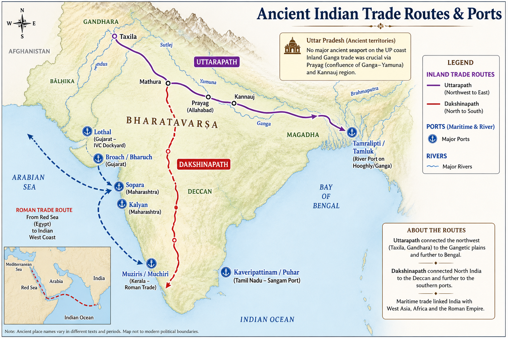
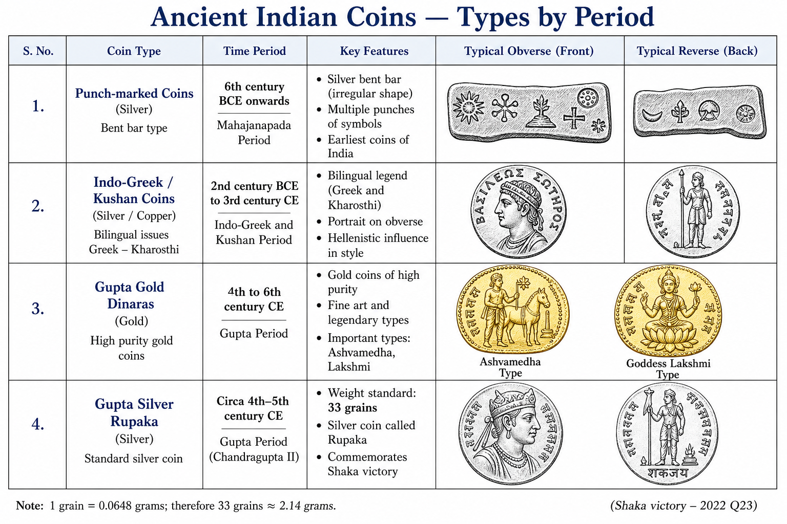

# Topic 12 — Ancient Indian Economy
### ★ Complete Source of Truth — No other book/notes needed for this topic

> **Covers syllabus:** Ancient Indian Coins | Gold Coins in India | Trade | Trade Organisations | Ports | Economy | Guilds (Shreni) | Inland Trade | Maritime Trade | Roman Trade  
> **Sources baked in:** NCERT *Themes in Indian History* I–II, RS Sharma, Periplus of the Erythraean Sea, IVC/Mauryan/Gupta numismatic evidence, UPPCS/UPSC PYQs  
> **Exam weight:** ★★★ High — 2024 Q2 (river-ports + entrepots), 2022 Q23 (Gupta silver coins), 2018 Q89 (trade guilds), 2022 Q68 (Lothal boats)  
> **Last verified:** July 2026

---

## Quick Revision Box — Raata This First

```
COIN EVOLUTION:
  Punch-marked (6th c. BCE) → earliest Indian coins | silver | mahajanapada period
  Indo-Greek/Kushan → bilingual portrait coins | gold + silver
  Gupta dinara = gold coin | silver rupaka ~33 grains (Chandragupta II — 2022 Q23)
  Cast coins (IVC?) → die-struck later

GOLD COINS IN INDIA:
  Indo-Greeks introduced portrait gold | Kushan gold widespread
  Gupta gold dinaras = imperial prestige (Ashvamedha horse, Lakshmi types)
  2022 Q23: Chandragupta II SILVER coins (not gold) = Shaka victory evidence

GUILDS & TRADE ORGS:
  Shreni (Śreni) = ancient craft + trade guild | Mauryan onward
  Nagaram = town merchant corporation (later)
  Nanadesi = inter-regional/long-distance merchants
  Manigrama = foreign/overseas trade guild (2018 Q89 = D)
  Arthashastra recognizes shreni laws

PORTS (★★★):
  IVC: Lothal (dockyard Gujarat), Sutkagen-dor (Baluchistan)
  East: Tamralipti (Bengal — Ganga mouth)
  West: Broach/Bharuch, Sopara, Kalyan (Maharashtra-Gujarat)
  South: Muziris/Muchiri (Kerala — Roman), Kaveripattinam/Puhar (Tamil)
  2022 Q68: Boat models = Mohenjo-daro + Lothal (C)

TRADE ROUTES:
  Uttarapath = northwest to Gangetic plain (inland)
  Dakshinapath = north to south India
  Maritime = Arabian Sea + Bay of Bengal circuits

ROMAN TRADE (1st–3rd c. CE):
  Periplus of Erythraean Sea = key source
  Exports: pepper, spices, textiles, ivory, gems
  Imports: Roman gold coins (gold drain to India)
  Muziris = chief Roman trading port on Malabar coast

2024 Q2: River-ports + entrepots = BOTH correct (A)
ECONOMY BASE: Agriculture + crafts + trade | urban centres as entrepots
```

### Must-Know Term Comparisons (very frequently asked)

| Term | One-line difference | Hindi |
|------|---------------------|-------|
| **Punch-marked vs cast coins** | Punch-marked = silver bars with symbol punches (janapadas); cast = poured molten metal mould (early IVC?) | चित्रित मुद्रा / ढलाई मुद्रा |
| **Dinara vs rupaka** | Dinara = Gupta gold coin; rupaka = Gupta silver coin (~33 grains) | दीनार / रूपक |
| **Shreni vs Manigrama** | Shreni = ancient general craft/trade guild; Manigrama = specialized foreign-trade merchant guild | श्रेणी / मणिग्राम |
| **Shreni vs Nagaram** | Shreni = pan-Indian guild from Mauryan era; Nagaram = south Indian urban merchant body | श्रेणी / नगरम् |
| **Nanadesi vs Manigrama** | Nanadesi = merchants of many lands (long-distance); Manigrama = overseas/foreign commerce guild | नानादेशी / मणिग्राम |
| **Lothal vs Muziris** | Lothal = Harappan dockyard (Gujarat, Bronze Age); Muziris = Roman-period Kerala port | लोथल / मुचिरि |
| **Tamralipti vs Broach** | Tamralipti = east coast/Ganga river port (Bengal); Broach = west coast port (Gujarat) | ताम्रलिप्ति / भरूच |
| **Uttarapath vs Dakshinapath** | Uttarapath = northern trans-India route; Dakshinapath = north–south trade route | उत्तरापथ / दक्षिणापथ |
| **Entrepot vs port** | Port = landing/shipping point; entrepot = warehousing + redistribution centre for goods | स्थानांतरण केंद्र / बंदरगाह |
| **Periplus vs Arthashastra** | Periplus = Roman trade manual on Indian ports; Arthashastra = Mauryan economic governance text | पेरिप्लस / अर्थशास्त्र |

### Memory Tricks

| Trick | Remembers |
|-------|-----------|
| **2024 Q2 = A** | Both river-ports + entrepots correct |
| **2022 Q23 = B** | Chandragupta II silver coins + 33 grains |
| **2022 Q68 = C** | Boats at Mohenjo-daro + Lothal |
| **2018 Q89 = D** | Manigrama = foreign trade guild |
| **Punch first** | Earliest coins = punch-marked silver |
| **Gold Gupta** | Dinara = Gupta gold imperial coin |
| **Lothal = Logistics** | IVC dockyard + boat models |
| **Muziris = Roman** | Pepper port Kerala |
| **Tamralipti = Tamluk** | East Ganga river port |
| **Shreni = Shared guild** | Craft + trade corporation |

---

## Exam Visuals — High-ROI Images

> **Type priority:** location map → conceptual diagram. Images stored locally (`images/`) so they open offline.

### 1. Ancient Trade Routes & Ports — Location Map



*Raata **port ↔ coast ↔ trade**. **Lothal = Gujarat** (IVC dockyard, 2022 Q68). **Muziris = Kerala** (Roman pepper trade). **Tamralipti = Bengal** (Ganga river-port). **Broach/Sopara = west coast**. Inland: **Uttarapath** + **Dakshinapath**.*
*Source: Study map — generated for UPPCS port-matching*

### 2. Ancient Indian Coins — Types by Period (Conceptual)



*Raata **coin ↔ period ↔ ruler**. **Punch-marked** = earliest (janapadas). **Gupta dinara** = gold. **Silver rupaka ~33 grains** = Chandragupta II Shaka victory (**2022 Q23**). Trap: Shaka evidence is **silver**, not gold.*
*Source: Study chart — generated for UPPCS numismatic matching*

---

## 12.1 Ancient Indian Coins

### Definitions (learn all — exams pick different ones)

| Term | Meaning |
|------|---------|
| **Ancient Indian Coins** | Metal currency used for exchange, tribute, and propaganda from ~6th century BCE onward |
| **Punch-marked coins** | Earliest Indian coins — silver pieces punched with official symbols/weight marks |
| **Karshapana** | Standard silver coin unit in ancient India (weight-based) |

### Ancient Indian Coins — How It Works

- **Barter** dominated the early Vedic economy. **Coinage emerged** in the **6th–5th century BCE** with the mahajanapadas.
- **Punch-marked coins (PMCs)** were the earliest widespread Indian coinage. They were **silver** pieces cut into bars or rounds and stamped with **punches** such as the sun, six-armed symbol, and elephant.
- **Janapada coins** had distinct punch-mark types issued by each mahajanapada, including Magadha, Kashi, and Gandhara.
- The **weight standard** was based on the **ratti/shanapada** system and was later standardized under the Mauryas.
- In the **Mauryan period**, punch-marked coins circulated widely. **Cast copper coins** were also used for small transactions.
- **Indo-Greeks** introduced **round die-struck coins** with **portraits** and bilingual legends (Greek + Kharosthi/Brahmi).
- **Kushans** perfected **gold + copper** portrait coinage and influenced Gupta style.
- **Gupta coinage** reached an artistic peak through **gold dinaras**, **silver rupakas**, and **copper** coins used for propaganda and trade.
- **Coins as historical sources** provide ruler names, dates, titles, deity iconography, and military victories that complement inscriptions.
- **Regional continuity** appeared in south India's independent punch-mark and Sangam-era coin traditions, which ran parallel to northern traditions.

### Coin Types by Period — Complete Table

| Period | Coin Type | Metal | Feature |
|--------|-----------|-------|---------|
| 6th–4th c. BCE | Punch-marked | Silver | Janapada symbols |
| 4th–2nd c. BCE | Punch-marked (standardized) | Silver, copper | Mauryan expansion |
| 2nd c. BCE–1st c. CE | Indo-Greek die-struck | Silver, gold | Portrait + bilingual |
| 1st–3rd c. CE | Kushan | Gold, copper | King + deity |
| 4th–6th c. CE | Gupta | Gold (dinara), silver (rupaka), copper | Royal types, Lakshmi |
| 1st–3rd c. CE | Satavahana | Lead, copper | Bilingual legends |

> **Exam note:** Earliest Indian coins = **punch-marked silver** (NOT gold). Gold coinage systematic use begins **Indo-Greek/Kushan** era; Gupta gold dinaras are peak imperial gold.

### Exam Facts (raata)

- Punch-marked = earliest (~6th c. BCE)
- Silver janapada coins first
- Indo-Greeks = portrait die-struck
- Kushan gold coin influence
- Gupta = artistic peak
- Coins = numismatic historical source
- Mauryan punch-marked widespread
- Copper for small change

### PYQs — Ancient Indian Coins

1. **(UPPCS Prelims 2022, Q23)** Chandragupta II: 1. Shaka victory evidence = silver coins  2. Weight ~33 grains  
   → **B — Both correct** (silver rupaka, not gold dinara).

2. **(UPSC pattern)** Earliest coins of India were:  
   → **Punch-marked silver coins** of mahajanapadas.

### Examples (12.1)

| Example | Detail |
|---------|--------|
| **2022 Q23** | Gupta silver rupaka = Shaka victory evidence |
| **Magadha punch-marks** | Earliest janapada coinage |
| **Indo-Greek bilingual** | Greek-Kharosthi portrait coins |

---

## 12.2 Gold Coins in India

### Definitions (learn all — exams pick different ones)

| Term | Meaning |
|------|---------|
| **Gold Coins in India** | Gold currency introduced systematically by Indo-Greeks/Kushans; perfected as imperial propaganda by Guptas |
| **Dinara** | Gupta gold coin — derived from Roman **denarius/dinar** influence via Kushans |
| **Gold drain** | Flow of Roman gold into India in exchange for spices/textiles (Roman trade period) |

### Gold Coins in India — How It Works

- The **Indus Valley** had no confirmed standard gold coinage. Trade used **weights of metal** and barter.
- In the **Vedic period**, **nishka** was mentioned as a gold ornament or wealth unit, not as standardized coinage.
- **Indo-Greeks (2nd–1st c. BCE)** issued the first **round gold coins** with royal portraits in northwest India.
- **Kushans (1st–3rd c. CE)** issued extensive **gold dinaras**. Their king-and-deity types, including Shiva, Buddha, and Nana, facilitated Central Asian trade.
- **Gupta gold dinaras (4th–6th c. CE)** became the most celebrated Indian gold coinage. Their types include:
  - **King-Queen type** (Chandragupta I + Kumaradevi)
  - **Ashvamedha horse type** (Samudragupta)
  - **Lion-slayer/Archer type** (Chandragupta II)
  - **Goddess Lakshmi seated on throne**
- **Gold coins served propaganda** by displaying royal power, divine sanction, and military victories, not just everyday market exchange.
- **Roman gold coins (aurei/denarii)** found in Indian hoards were imported through **Muziris trade**. They were melted or circulated as bullion.
- **Gold drain theory** records Pliny's complaint that Rome's gold flowed east for **pepper and luxuries**, so India accumulated gold.
- In the **post-Gupta** period, gold coinage declined with empire fragmentation. Regional kingdoms issued fewer imperial gold types.
- **Trap**: Chandragupta II's **Shaka victory evidence** appears on **silver** coins (2022 Q23), not gold dinaras.

### Gupta Gold Coin Types — Table

| Type | Ruler | Significance |
|------|-------|--------------|
| King-Queen | Chandragupta I | Licchavi marriage alliance |
| Ashvamedha horse | Samudragupta | Horse sacrifice imperial claim |
| Archer/Lion-slayer | Chandragupta II | Shaka victory symbolism |
| Lakshmi seated | Multiple Guptas | Prosperity goddess |

> **Exam note:** **2022 Q23 = silver coins + 33 grains** for Chandragupta II — do NOT pick gold dinara for Shaka victory evidence.

### Exam Facts (raata)

- Indo-Greeks introduced portrait gold
- Kushan gold dinaras widespread
- Gupta dinara = imperial gold peak
- Samudragupta Ashvamedha type on gold
- Roman gold found in south Indian hoards
- Gold drain during Roman trade
- 2022 Q23 = silver NOT gold for Shaka
- Nishka = Vedic gold reference (not coin)

### PYQs — Gold Coins in India

1. **(UPPCS Prelims 2022, Q23)** Strongest Shaka victory evidence = silver coins (~33 grains) of Chandragupta II  
   → **B — Both statements correct** — teaches gold vs silver trap for Gupta coinage.

2. **(UPSC pattern)** Gupta gold coins depicting Ashvamedha horse belong to:  
   → **Samudragupta.**

### Examples (12.2)

| Example | Detail |
|---------|--------|
| **Bayana hoard** | Gupta gold coins discovery |
| **2022 Q23 trap** | Silver rupaka, not gold dinara |
| **Roman aurei in Kerala** | Gold drain evidence |

---

## 12.3 Guilds (Shreni) & Trade Organisations

### Definitions (learn all — exams pick different ones)

| Term | Meaning |
|------|---------|
| **Shreni (Śreni)** | Ancient Indian guild — association of craftsmen/traders in same occupation with own laws and leadership |
| **Shreshthin** | Head/president of a shreni guild |
| **Manigrama (Manigramam)** | Merchant guild specializing in **foreign/overseas trade** |

### Guilds & Trade Organisations — How It Works

- **Shreni system** emerged by the **Mauryan period** or earlier and organized artisans and merchants by occupation, including weavers, metalworkers, and traders.
- **Guild autonomy** gave shrenis **own rules (shreni-dharma)**, elected heads, and internal dispute resolution, while the **Arthashastra** shows state recognition of guild law.
- **Economic functions** included quality control, price regulation, apprentice training, collective bargaining with the state, and financing trade expeditions.
- **Religious donations** came from guilds to **Buddhist stupas** and Hindu temples, as inscriptions at Bharhut and Sanchi record shreni gifts.
- **Nagaram** was an urban merchant corporation that managed town trade, especially in **medieval south India**.
- **Nanadesi (Nanadesis)** was a federation of merchants from **many regions** that handled long-distance inter-regional trade, not exclusively foreign trade.
- **Manigrama** was a merchant guild engaged specifically in **foreign/overseas commerce** and was prominent in **Tamil/Chola** trade with Southeast Asia and Rome (**2018 Q89 answer D**).
- **Ainnurruvar** was another south Indian merchant guild of 500+ nagarams that supported overseas trade as syllabus expansion.
- The **Mauryan and Gupta states** collected tax from guild-organized production. Guilds also provided economic stability.
- **Decline pattern** after post-Gupta feudatory fragmentation increased guild autonomy, while long-distance trade guilds such as Manigrama and Nanadesi dominated coastal commerce.

### Trade Organisations — Complete Comparison Table

| Organisation | Primary Function | Period/Region |
|--------------|------------------|---------------|
| **Shreni** | Craft + local/regional trade guild | Mauryan onward (pan-India) |
| **Nagaram** | Urban merchant corporation | Medieval south India |
| **Nanadesi** | Inter-regional long-distance merchants | South India (8th c. CE onward) |
| **Manigrama** | **Foreign/overseas trade** | South India, SE Asia routes |
| **Ainnurruvar** | Overseas merchant guild (500 nagarams) | Chola period |

> **Exam note:** **2018 Q89 = D (Manigrama)** for foreign trade institution. Trap: **Shreni** = general guild (craft + trade), NOT exclusively foreign trade.

### Exam Facts (raata)

- Shreni = ancient guild system
- Shreshthin = guild head
- Arthashastra recognizes shreni law
- Guild donations to stupas
- Manigrama = foreign trade (2018 Q89)
- Nanadesi = long-distance merchants
- Nagaram = urban merchant body
- Mauryan period guild evidence

### PYQs — Guilds & Trade Organisations

1. **(UPPCS Prelims 2018, Q89)** Which institution belonged to foreign trade?  
   A. Śreni  B. Nagaram  C. Nānādesis  D. Manigrama  
   → **D — Manigrama** (specialized foreign/overseas trade guild).

2. **(UPSC pattern)** Ancient Indian guilds were called:  
   → **Shreni** — with autonomous laws recognized by the state.

### Examples (12.3)

| Example | Detail |
|---------|--------|
| **2018 Q89** | Manigrama = foreign trade |
| **Bharhut inscriptions** | Shreni donations recorded |
| **Arthashastra** | State regulation of shrenis |

---

## 12.4 Inland Trade

### Definitions (learn all — exams pick different ones)

| Term | Meaning |
|------|---------|
| **Inland Trade** | Commerce conducted overland via rivers and roads within Indian subcontinent |
| **Uttarapath** | Northern highway route — Taxila to Pataliputra to Bengal (later extended) |
| **Dakshinapath** | North–south route connecting Gangetic plain to Deccan/south India |
| **Entrepot** | Warehousing/transshipment centre where goods are stored and redistributed |

### Inland Trade — How It Works

- **Rivers as trade highways** made the Ganga, Yamuna, Narmada, Godavari, and Krishna cheaper routes than roads for bulk goods transport.
- **River-ports** dotted major rivers, where goods were loaded and unloaded at urban centres along the banks (**2024 Q2 statement 1 = correct**).
- **Entrepots** were large cities that functioned as **warehousing + redistribution hubs** for regional and long-distance goods (**2024 Q2 statement 2 = correct**).
- **Mauryan imperial unification** standardized weights and measures and improved **royal highways**, as Megasthenes mentions Chandragupta's road network.
- **Major inland trade goods**: textiles (cotton, silk), grains, salt, metals, gems, horses (imported from Central Asia), wine, pottery.
- **Urban centres as entrepots** included **Pataliputra**, **Ujjain**, **Varanasi**, **Taxila**, and later **Kannauj**, which collected, stored, and redistributed goods.
- **Dakshinapath** linked north Indian markets to **Deccan and Tamil regions** and facilitated the northward flow of spices and textiles.
- **Guild-organized trade** relied on shrenis to manage caravan logistics, quality standards, and inter-city contracts.
- **Taxation** included tolls at river ferries, city gates, and marketplaces. The Mauryan **samaharta** collected trade-related revenue.
- **2024 Q2 answer = A (Both 1 and 2)** confirms river-ports and entrepots as features of early Indian trade.

### Major Inland Trade Centres — Table

| Centre | Role | Region |
|--------|------|--------|
| **Pataliputra** | Imperial capital + entrepot | Magadha (Bihar) |
| **Ujjain** | Commercial hub on Dakshinapath | Malwa (MP) |
| **Varanasi** | Textile + religious trade centre | UP |
| **Taxila** | Northwest gateway entrepot | Gandhara |
| **Kannauj** | Later imperial trade capital | UP |
| **Shravasti** | North trade node | UP |

> **Exam note:** **2024 Q2 = A (Both correct)** — numerous river-ports AND large entrepots. Trap: denying either statement.

### Exam Facts (raata)

- Rivers = primary inland transport
- 2024 Q2 both statements correct
- Uttarapath + Dakshinapath routes
- Pataliputra = major entrepot
- Ujjain = Dakshinapath hub
- Guilds organized caravan trade
- Mauryan weights standardized trade
- Varanasi = textile trade centre

### PYQs — Inland Trade

1. **(UPPCS Prelims 2024, Q2)** Early trade: 1. Numerous river-ports  2. Large entrepots of goods and traffic  
   → **A — Both 1 and 2 correct.**

2. **(UPSC pattern)** Which Mauryan city was the principal entrepot of inland trade?  
   → **Pataliputra.**

### Examples (12.4)

| Example | Detail |
|---------|--------|
| **2024 Q2** | River-ports + entrepots both true |
| **Ujjain** | Chandragupta II capital — trade hub |
| **Ganga river trade** | Varanasi-Kannauj axis |

---

## 12.5 Maritime Trade & Ports

### Definitions (learn all — exams pick different ones)

| Term | Meaning |
|------|---------|
| **Maritime Trade** | Commerce via sea routes along Indian coast and to foreign lands |
| **Port** | Coastal/river-mouth facility for loading, unloading, and ship repair |
| **Lothal** | Harappan dockyard site (Gujarat) — earliest known artificial port structure in India |

### Maritime Trade & Ports — How It Works

- **Harappan maritime trade** (~2500 BCE) used **Lothal**, which had a **dockyard** with berthing chambers. It supported trade with Mesopotamia through the Persian Gulf.
- **Boat models** found at **Mohenjo-daro and Lothal** provide evidence of riverine and maritime transport awareness (**2022 Q68 = C**).
- **West coast ports** such as **Lothal**, **Sutkagen-dor** (Baluchistan), **Broach/Bharuch**, **Sopara**, and **Kalyan** served as gateways to Arabian Sea trade.
- **East coast ports** included **Tamralipti** (Tamluk, Bengal), the chief **Ganga mouth** port. **Kalinga ports** such as Palur and Gopalpur also served the Bay of Bengal route.
- **South coast ports** included **Muziris/Muchiri** (Kerala), **Kaveripattinam/Puhar** (Tamil Nadu), and **Arikamedu**, near Pondicherry, which shows Roman contact.
- **Monsoon knowledge** helped Indian sailors use **monsoon winds** for Arabian Sea crossings, as documented in the Periplus.
- **Shipbuilding** used teak wood from the western Ghats. Sangam texts mention **colandia**, or large ships.
- **Goods exported by sea**: spices, pepper, pearls, diamonds, ivory, cotton textiles, sandalwood.
- **Goods imported by sea**: horses, wine, gold, glass, coral, slaves (limited), luxury metals.
- **Bay of Bengal circuit** connected Tamralipti to southeast Asian ports and later supported Kalinga and Srivijaya trade.

### Ancient Ports — Complete List (exam-matching)

| Port | Coast | Period | Significance |
|------|-------|--------|--------------|
| **Lothal** | Gujarat (Arabian Sea) | Harappan | Dockyard; boat models (2022 Q68) |
| **Sutkagen-dor** | Baluchistan | Harappan | Westernmost Harappan port |
| **Broach/Bharuch** | Gujarat | Mauryan–Gupta | Major west coast port |
| **Sopara** | Maharashtra | Mauryan onward | Ancient west coast emporium |
| **Kalyan** | Maharashtra | Mauryan onward | Trade near Mumbai region |
| **Tamralipti** | Bengal (Bay of Bengal) | Mauryan–Gupta | Ganga river-mouth port |
| **Muziris/Muchiri** | Kerala | Sangam–Roman | Pepper trade with Rome |
| **Kaveripattinam/Puhar** | Tamil Nadu | Sangam | Chola port city |
| **Arikamedu** | Tamil Nadu | Roman contact | Indo-Roman trade site |
| **Dwaraka** | Gujarat | Mythological/historic | West coast reference |

> **Exam note:** **2022 Q68 = C** — boat models at **Mohenjo-daro AND Lothal** (not Dholavira alone). **Lothal = dockyard** is the #1 IVC port trap.

### Exam Facts (raata)

- Lothal = earliest dockyard
- 2022 Q68 boats = Mohenjo-daro + Lothal
- Tamralipti = east Ganga port
- Muziris = Roman Kerala port
- Broach = west coast ancient port
- Kaveripattinam = Sangam port
- Monsoon navigation known
- Harappan-Mesopotamia sea trade

### PYQs — Maritime Trade & Ports

1. **(UPPCS Prelims 2022, Q68)** Boat models found at which IVC sites?  
   A. Dholavira and Bhagatrav  B. Harappa and Kot Diji  C. Mohenjo-daro and Lothal  D. Kalibangan and Ropar  
   → **C — Mohenjo-daro and Lothal.**

2. **(UPPCS Prelims 2024, Q2)** River-ports reference supports maritime-inland connection via river-mouth ports like Tamralipti.  
   → **A — Both statements correct.**

### Examples (12.5)

| Example | Detail |
|---------|--------|
| **2022 Q68** | Boat models = Lothal + Mohenjo-daro |
| **Lothal dockyard** | Berthing chambers Gujarat |
| **Tamralipti** | Mauryan east coast port |

---

## 12.6 Roman Trade

### Definitions (learn all — exams pick different ones)

| Term | Meaning |
|------|---------|
| **Roman Trade** | Commerce between Roman Empire and India (~1st BCE–3rd CE peak) via Red Sea and Arabian Sea |
| **Periplus of the Erythraean Sea** | 1st-century CE Greek sailing manual listing Indian ports, goods, and routes |
| **Pepper** | Primary Roman import from India — called "black gold" in Mediterranean markets |

### Roman Trade — How It Works

- **Roman trade with India** peaked **1st–3rd century CE** when Roman Empire controlled Egypt and Red Sea access.
- **Route**: Roman goods shipped to **Alexandria**, moved to Red Sea ports such as **Myos Hormos** and **Berenice**, and then crossed by monsoon route to **Muziris** (Kerala) and other Indian west coast ports.
- **Periplus of the Erythraean Sea** (~mid-1st c. CE) is a key source that names **Muziris, Nelcynda, Barbarikon (Broach)** and trade conditions.
- **Primary Indian exports to Rome**: **pepper** (most valuable), **spices** (cardamom, ginger), **cotton textiles**, **ivory**, **pearls**, **precious stones**, **sandalwood**, **animals** (peacocks, monkeys).
- **Roman imports to India**: **gold coins** (aurei, denarii), **wine**, **copper**, **tin**, **lead**, **glass**, **coral**, **slaves** (limited).
- **Gold drain** refers to Roman writer **Pliny the Elder** complaining that millions of sesterces flowed to India for pepper, which meant India accumulated Roman gold.
- **Roman coin hoards** found in **Kerala, Tamil Nadu, and Karnataka** provide evidence of direct trade contact.
- **Arikamedu**, near Pondicherry, provides archaeological evidence of **Roman pottery/amphorae** and functioned as an Indo-Roman trading post.
- **Sangam literature** references **Yavanas** (foreigners/Romans) and **Muziris** prosperity from overseas trade.
- **Roman trade** declined after the **3rd century CE** crisis in the Roman Empire. It continued at a lower scale through Byzantine and Arab intermediaries.

### Roman Trade — Key Ports & Goods Table

| Indian Port | Roman Name (Periplus) | Main Export |
|-------------|----------------------|-------------|
| **Muziris** | Muziris | Pepper, pearls |
| **Broach** | Barygaza | Textiles, agate |
| **Nelcynda** | Nelcynda | Pepper, gems |
| **Arikamedu** | Podouke (nearby) | Shells, beads, textiles |

> **Exam note:** **Muziris = pepper port** for Roman trade. Trap: "Roman trade entered through east coast Tamralipti primarily" — FALSE; main Roman contact was **west/south coast** (Arabian Sea route).

### Exam Facts (raata)

- Peak 1st–3rd century CE
- Periplus = key source
- Muziris = chief Roman port
- Pepper = top export
- Gold drain to India
- Roman coins in south hoards
- Arikamedu = Roman pottery site
- Yavana = foreign trader in Sangam
- Pliny on gold outflow

### PYQs — Roman Trade

1. **(UPPCS Prelims 2024, Q2)** Entrepots and river-ports facilitated trade including Roman goods entering via coastal entrepots.  
   → **A — Both statements correct** (broader trade context including Roman era entrepots).

2. **(UPSC pattern)** Which port was the most important in Indo-Roman trade on the Malabar coast?  
   → **Muziris (Muchiri).**

### Examples (12.6)

| Example | Detail |
|---------|--------|
| **Muziris** | Pepper export to Rome |
| **Arikamedu** | Roman amphorae found |
| **Pliny's gold drain** | Rome's trade deficit with India |

---

## 12.7 Ancient Indian Economy

### Definitions (learn all — exams pick different ones)

| Term | Meaning |
|------|---------|
| **Ancient Indian Economy** | Combined agrarian-base economy with craft production, guild organization, and expanding trade networks |
| **Shreni economy** | Economic system where guilds organized production and trade with state oversight |
| **Urbanization** | Growth of cities as administrative + commercial centres (IVC → Mauryan → Gupta peaks) |

### Ancient Indian Economy — How It Works

- The **agrarian foundation** meant that most people engaged in **agriculture**. Land revenue, especially the bhaga/bali tax, was the primary state income.
- **Craft specialization** led urban centres to develop **specialized industries** such as metallurgy, textiles, pottery, bead-making, and jewelry.
- **Harappan economy** combined surplus agriculture, standardized weights, and long-distance **Mesopotamian trade** to form the earliest urban market economy.
- **Mauryan economy** used state-controlled **granaries**, **royal workshops (rajakula)**, standardized weights, and extensive **road and irrigation** investment per the Arthashastra.
- The **Gupta economy** marked a **prosperity peak** or golden age. Land grants to Brahmans changed the revenue pattern, **guild autonomy** increased, and coinage flourished.
- **Money economy growth** moved from punch-marked silver to gold dinaras and regional copper. This facilitated market exchange beyond barter.
- The **tax structure** used the Mauryan **1/6th** land produce standard in the Arthashastra. Gupta demands often ranged from **1/4 to 1/6**, along with tolls on trade routes.
- **Labour organization** depended on **shreni guilds**, which provided apprenticeship, quality control, and collective economic bargaining.
- **Internal trade** through rivers and roads was larger than foreign trade. However, **Roman trade** brought a significant **gold inflow** into south India.
- The **Sangam economy** of south India centered on **pearls, salt, fish, paddy, and textiles**. The Chera, Chola, and Pandya kingdoms competed for **Muziris trade** revenue.
- In the **post-Harsha** period, economic fragmentation produced regional markets. Guild and coastal trade continued without pan-Indian imperial coordination.

### Economy by Period — Overview Table

| Period | Base | Trade | State Role |
|--------|------|-------|------------|
| **IVC** | Surplus agri + crafts | Mesopotamia maritime | Urban planning |
| **Vedic** | Pastoral → agrarian | Limited local | Tribal redistribution |
| **Mauryan** | Agrarian empire | Inland + coastal expansion | Centralized control |
| **Gupta** | Agrarian prosperity | Peak coinage + guild trade | Feudatory grants |
| **Sangam** | Agri + maritime | Roman + SE Asia | Kingdom tolls |
| **Harsha** | North Indian agrarian | Continued guild trade | Charitable + feudatory |

> **Exam note:** Ancient Indian economy was **NOT purely barter** by Mauryan era — coinage + guilds + state revenue system = sophisticated mixed economy. Trap: "No foreign trade before Mauryas" — Harappans traded with Mesopotamia.

### Exam Facts (raata)

- Agriculture = economic base
- IVC = earliest urban market economy
- Mauryan state-controlled granaries
- Gupta = prosperity peak
- Shreni = labour organization
- Land revenue = primary state income
- Roman gold inflow to south
- Sangam three-kingdom trade
- 2024 Q2 confirms trade infrastructure

### PYQs — Ancient Indian Economy

1. **(UPPCS Prelims 2024, Q2)** Early trade infrastructure (river-ports + entrepots) reflects mature ancient economy.  
   → **A — Both 1 and 2 correct.**

2. **(UPPCS Prelims 2018, Q89)** Foreign trade institution in ancient/medieval economy:  
   → **D — Manigrama.**

### Examples (12.7)

| Example | Detail |
|---------|--------|
| **2024 Q2** | Trade infrastructure = economic maturity |
| **Gupta prosperity** | Fa-Hien on economic well-being |
| **Sangam Muziris** | South maritime economic peak |

---

## Consolidated Reference — Everything in One Place

### Ports — Exam Matching Card

| Port | State/Region | Period | Trap |
|------|--------------|--------|------|
| **Lothal** | Gujarat | Harappan | Has dockyard; boat models (2022 Q68) |
| **Tamralipti** | Bengal | Mauryan–Gupta | Ganga river-mouth |
| **Muziris** | Kerala | Sangam–Roman | Pepper trade |
| **Broach** | Gujarat | Mauryan onward | West coast emporium |
| **Kaveripattinam** | Tamil Nadu | Sangam | Chola port |
| **Arikamedu** | Tamil Nadu | Roman | Amphorae evidence |

### Coins — Exam Matching Card

| Coin | Period | Ruler/Feature |
|------|--------|---------------|
| Punch-marked silver | 6th c. BCE+ | Janapadas |
| Gold dinara | Gupta | Imperial gold |
| Silver rupaka (~33 grains) | Gupta | Chandragupta II (2022 Q23) |
| Indo-Greek portrait | 2nd c. BCE | Bilingual |

### Trade Organisations — Exam Card

| Organisation | Function | PYQ |
|--------------|----------|-----|
| **Shreni** | Craft + general trade guild | General |
| **Manigrama** | Foreign/overseas trade | 2018 Q89 = D |
| **Nanadesi** | Long-distance merchants | Not foreign-specific |
| **Nagaram** | Urban merchant body | Medieval |

### UP Focus — Ancient Economy

| Element | Detail |
|---------|--------|
| **Varanasi** | Ancient textile trade centre (UP) |
| **Kannauj** | Later imperial trade hub (UP) |
| **Prayag** | Ganga-Yamuna trade junction |
| **No ancient seaport in modern UP** | UP = inland river trade, not maritime port |
| **Shravasti** | North trade node in UP region |
| **Alamgirpur** | IVC eastern trade outpost (UP) |

### PYQ Answer Card — Consolidated

| Year | Q# | Answer | Topic |
|------|-----|--------|-------|
| 2024 | Q2 | A — Both | River-ports + entrepots |
| 2022 | Q23 | B — Both | Silver coins + 33 grains |
| 2022 | Q68 | C | Mohenjo-daro + Lothal boats |
| 2018 | Q89 | D | Manigrama = foreign trade |

---

## Practice Zone — UPPCS Format Questions

> **Answers hidden** — click *Show answer* under each question to reveal.

**Q1.** Consider the following statements about early Indian trade (2024 Q2):

1. There were numerous river-ports in early India.
2. Large cities functioned as entrepots (warehousing and redistribution centres).

Select the correct answer from the code given below:

Options:
A. Both 1 and 2
B. Neither 1 nor 2
C. Only 1
D. Only 2

<details>
<summary>Show answer</summary>

**Ans: A — Both 1 and 2** (2024 Q2). River-ports on Ganga/Yamuna etc. + urban entrepots for regional/long-distance trade.

</details>

**Q2.** Which institution belonged specifically to foreign/overseas trade?

Options:
A. Śreni (Shreni)
B. Nagaram
C. Nānādesis
D. Manigrama

<details>
<summary>Show answer</summary>

**Ans: D — Manigrama** (2018 Q89). Specialized foreign/overseas merchant guild; Shreni = general craft/trade guild.

</details>

**Q3.** From which archaeological sites of the Indus Valley Civilization are figures or models of boats found?

Options:
A. Dholavira and Bhagatrav
B. Harappa and Kot Diji
C. Mohenjo-daro and Lothal
D. Kalibangan and Ropar

<details>
<summary>Show answer</summary>

**Ans: C — Mohenjo-daro and Lothal** (2022 Q68). Lothal dockyard + boat models at both sites — key maritime trade evidence.

</details>

**Q4.** Consider the following statements about Lothal:

1. Lothal had a dockyard suggesting Harappan maritime trade.
2. Lothal is located in Gujarat, not Uttar Pradesh.

Select the correct answer from the code given below:

Options:
A. Both 1 and 2
B. Neither 1 nor 2
C. Only 1
D. Only 2

<details>
<summary>Show answer</summary>

**Ans: A — Both correct.** Lothal = Gujarat IVC port/dockyard; NOT a UP site (trap in mixed site questions).

</details>

**Q5.** Given below are two statements:

Assertion (A): Shreni (Śreni) was a general ancient Indian guild of craftsmen and traders recognized by the Arthashastra.

Reason (R): Manigrama was identical to Shreni and handled all domestic craft production only.

Select the correct answer from the code given below:

Options:
A. Both (A) and (R) are true and (R) is the correct explanation of (A)
B. Both (A) and (R) are true, but (R) is not the correct explanation of (A)
C. (A) is true, but (R) is false
D. (A) is false, but (R) is true

<details>
<summary>Show answer</summary>

**Ans: C — A true, R false.** Shreni = general guild; Manigrama = specialized **foreign/overseas** trade (2018 Q89).

</details>

**Q6.** Match List-I with List-II:

List-I (Port/Site)
A. Muziris (Muchiri)
B. Tamralipti
C. Broach (Bharuch)
D. Lothal

List-II (Feature)
1. Roman pepper trade on Malabar coast (Kerala)
2. Ganga river-mouth port (Bengal)
3. West coast Gujarat port
4. Harappan dockyard

Options:
A. 1-2-3-4
B. 2-1-4-3
C. 4-3-2-1
D. 1-4-2-3

<details>
<summary>Show answer</summary>

**Ans: A — 1-2-3-4.** Muziris-Roman/Kerala; Tamralipti-Bengal east; Broach-west Gujarat; Lothal-IVC dockyard.

</details>

**Q7.** Consider the following statements about Roman trade with India:

1. Pepper, spices, textiles, and ivory were major Indian exports to Rome.
2. Pliny complained about Rome's gold drain to India for luxuries.

Select the correct answer from the code given below:

Options:
A. Both 1 and 2
B. Neither 1 nor 2
C. Only 1
D. Only 2

<details>
<summary>Show answer</summary>

**Ans: A — Both correct.** Periplus of Erythraean Sea = key source; Roman aurei found in south Indian hoards.

</details>

**Q8.** Given below are two statements:

Assertion (A): Chandragupta II's victory over the Shakas is best evidenced by Gupta gold dinaras alone.

Reason (R): The silver rupaka coins (~33 grains) of Chandragupta II provide stronger Shaka victory evidence (2022 Q23).

Select the correct answer from the code given below:

Options:
A. Both (A) and (R) are true and (R) is the correct explanation of (A)
B. Both (A) and (R) are true, but (R) is not the correct explanation of (A)
C. (A) is true, but (R) is false
D. (A) is false, but (R) is true

<details>
<summary>Show answer</summary>

**Ans: D — A false, R true** (2022 Q23). Shaka victory evidence = **silver** rupaka (~33 grains), NOT gold dinara trap.

</details>

**Q9.** Match List-I with List-II:

List-I (Trade term)
A. Shreni
B. Manigrama
C. Nanadesi
D. Nagaram

List-II (Description)
1. Inter-regional merchants of many lands
2. General craft/trade guild (Mauryan onward)
3. South Indian urban merchant corporation
4. Foreign/overseas trade guild

Options:
A. 2-4-1-3
B. 4-2-3-1
C. 2-1-4-3
D. 1-3-2-4

<details>
<summary>Show answer</summary>

**Ans: A — 2-4-1-3.** Shreni-general guild; Manigrama-foreign trade (2018 Q89); Nanadesi-long-distance; Nagaram-south urban body.

</details>

**Q10.** Consider the following statements about ancient Indian coins:

1. Punch-marked silver coins are the earliest widespread Indian coinage (~6th c. BCE).
2. Gupta gold dinaras represent the artistic peak of ancient Indian coinage.

Select the correct answer from the code given below:

Options:
A. Both 1 and 2
B. Neither 1 nor 2
C. Only 1
D. Only 2

<details>
<summary>Show answer</summary>

**Ans: A — Both correct.** Earliest = punch-marked janapada silver; Gupta dinara = imperial gold peak (Samudragupta Ashvamedha type etc.).

</details>

**Q11.** Given below are two statements:

Assertion (A): Lothal and Muziris both served as ancient Indian ports facilitating maritime trade.

Reason (R): Both ports belonged to the same historical period and the same geographic region.

Select the correct answer from the code given below:

Options:
A. Both (A) and (R) are true and (R) is the correct explanation of (A)
B. Both (A) and (R) are true, but (R) is not the correct explanation of (A)
C. (A) is true, but (R) is false
D. (A) is false, but (R) is true

<details>
<summary>Show answer</summary>

**Ans: C — A true, R false.** Lothal = IVC/Gujarat (~2600 BCE); Muziris = Roman-era Kerala — different periods and regions.

</details>

**Q12.** Match List-I with List-II:

List-I (Trade route)
A. Uttarapath
B. Dakshinapath
C. Silk Road connection
D. Periplus routes

List-II (Description)
1. North–south peninsular trade route
2. Northwest to Gangetic plain inland route
3. Roman maritime trade manual source
4. Central Asian link to Indian exports

Options:
A. 2-1-4-3
B. 1-2-3-4
C. 2-1-3-4
D. 4-2-1-3

<details>
<summary>Show answer</summary>

**Ans: A — 2-1-4-3.** Uttarapath-northwest inland; Dakshinapath-north-south; Silk Road-Central Asia; Periplus-Roman sea trade.

</details>

**Q13.** Consider the following statements about ancient Indian coinage:

1. Punch-marked silver coins of Mahajanapadas are the earliest widespread Indian coinage.
2. Gupta gold dinaras represent the artistic peak of imperial ancient Indian coinage.

Select the correct answer from the code given below:

Options:
A. Both 1 and 2
B. Neither 1 nor 2
C. Only 1
D. Only 2

<details>
<summary>Show answer</summary>

**Ans: A — Both correct.** Earliest = punch-marked janapada silver (~6th c. BCE); Gupta dinara = gold imperial peak.

</details>

**Q14.** Which port on the east coast served as a Ganga river-mouth trading centre?

Options:
A. Sopara
B. Tamralipti (Tamluk)
C. Broach
D. Kalyan

<details>
<summary>Show answer</summary>

**Ans: B — Tamralipti.** Bengal/Ganga mouth; east coast; Broach/Sopara = west coast (Gujarat/Maharashtra).

</details>

**Q15.** The Periplus of the Erythraean Sea is important for studying:

Options:
A. Mauryan spy system
B. Roman-period maritime trade with Indian ports
C. Vedic ashvamedha rituals
D. Gupta land revenue rates

<details>
<summary>Show answer</summary>

**Ans: B — Roman maritime trade.** 1st century CE manual listing Indian ports (Muziris, Barygaza/Broach, etc.).

</details>

**Q16.** Head/president of a Shreni guild was called:

Options:
A. Shreshthin
B. Rajuka
C. Samaharta
D. Agronomai

<details>
<summary>Show answer</summary>

**Ans: A — Shreshthin.** Guild leader; Rajuka/Samaharta = Mauryan officials (administration, not guild head).

</details>

**Q17.** Gupta gold coin depicting an Ashvamedha horse belongs to:

Options:
A. Chandragupta I
B. Samudragupta
C. Skandagupta
D. Kumaragupta I only

<details>
<summary>Show answer</summary>

**Ans: B — Samudragupta.** Ashvamedha horse type = imperial horse sacrifice claim on gold dinara.

</details>

**Q18.** "Gold drain" in ancient Indian economic history refers to:

Options:
A. Gold flowing from India to Rome
B. Roman gold flowing to India for spices and luxuries
C. Gupta gold coins melting during Huna invasions
D. Mauryan treasury depletion after Kalinga war

<details>
<summary>Show answer</summary>

**Ans: B — Roman gold to India.** Pliny's complaint; pepper/spices/textiles exported; Roman aurei in Kerala hoards.

</details>

**Q19.** Kaveripattinam (Puhar) was an important port of:

Options:
A. Mauryan Pataliputra region
B. Tamil/Sangam coastal trade
C. Gandhara Indo-Greek kingdom
D. Vedic Kuru janapada

<details>
<summary>Show answer</summary>

**Ans: B — Tamil/Sangam coast.** Bay of Bengal maritime trade; Chola/Sangam literature references.

</details>

**Q20.** Nanadesi merchants were associated with:

Options:
A. Village subsistence farming only
B. Inter-regional and long-distance trade across many lands
C. Mauryan land revenue collection
D. Harappan bead-making at Chanhudaro only

<details>
<summary>Show answer</summary>

**Ans: B — Long-distance/inter-regional trade.** "Merchants of many lands"; distinct from Manigrama (overseas focus).

</details>

**Q21.** Sopara (near modern Mumbai) was:

Options:
A. An inland capital of Magadha
B. An ancient west coast port in Maharashtra-Gujarat circuit
C. A Harappan site in Uttar Pradesh
D. A Gupta provincial capital in Bihar

<details>
<summary>Show answer</summary>

**Ans: B — West coast port.** Part of west coast trade network with Broach; NOT inland or UP.

</details>

**Q22.** Indo-Greeks contributed to Indian coinage by introducing:

Options:
A. Punch-marked bar silver only
B. Round die-struck portrait coins with bilingual legends
C. Paper currency
D. Copper coins exclusively without silver

<details>
<summary>Show answer</summary>

**Ans: B — Die-struck portrait bilingual coins.** Greek + Kharoshthi; influenced Kushan and Gupta styles.

</details>

**Q23.** Arthashastra recognizes Shreni guilds for:

Options:
A. Military conscription only
B. Craft/trade regulation with guild laws accepted by the state
C. Religious taxation of Buddhist monasteries only
D. Foreign diplomatic missions

<details>
<summary>Show answer</summary>

**Ans: B — Guild laws recognized by state.** Mauryan economic policy regulated guilds (shreni); craft + trade corporations.

</details>

**Q24.** Arikamedu near Puducherry is archaeologically important for:

Options:
A. Mauryan pillar edicts
B. Indo-Roman trade (Mediterranean amphorae finds)
C. Vedic fire altar excavations
D. Kushan Buddhist stupa only

<details>
<summary>Show answer</summary>

**Ans: B — Indo-Roman trade.** Coastal factory/trading post; Roman pottery/amphorae evidence.

</details>

**Q25.** Entrepot cities in ancient India functioned primarily as:

Options:
A. Military fortresses only
B. Warehousing and redistribution hubs for regional and long-distance goods
C. Religious pilgrimage centres exclusively
D. Agricultural villages without trade

<details>
<summary>Show answer</summary>

**Ans: B — Warehousing/redistribution** (2024 Q2 statement 2). Large cities as trade entrepots — distinct from simple river-landing ports.

</details>

**Q26.** Kushan gold coinage influenced:

Options:
A. Only Vedic barter systems
B. Later Gupta coin designs and imperial gold propaganda
C. Harappan seal manufacturing exclusively
D. Mauryan punch-marked copper only

<details>
<summary>Show answer</summary>

**Ans: B — Gupta coinage style.** Kushan gold dinaras preceded Gupta artistic imperial gold coinage.

</details>

**Q27.** Consider the following about 2022 Q23 (Chandragupta II coins):

1. Shaka victory evidence comes from silver coins.
2. Weight is approximately 33 grains.

Options:
A. Both 1 and 2
B. Neither 1 nor 2
C. Only 1
D. Only 2

<details>
<summary>Show answer</summary>

**Ans: A — Both correct** (2022 Q23 = B). Silver rupaka trap — NOT gold dinara for Shaka victory evidence.

</details>

**Q28.** The standard silver coin unit in ancient India was often called:

Options:
A. Dinara
B. Karshapana
C. Aureus
D. Tanka

<details>
<summary>Show answer</summary>

**Ans: B — Karshapana.** Weight-based silver unit; dinara = gold; aureus = Roman.

</details>

**Q29.** Which pair correctly matches port and coast?

Options:
A. Muziris — Gujarat west coast
B. Tamralipti — Bengal east coast
C. Lothal — Kerala Malabar coast
D. Broach — Tamil Nadu coast

<details>
<summary>Show answer</summary>

**Ans: B — Tamralipti — Bengal east coast.** Muziris = Kerala; Lothal/Broach = Gujarat west.

</details>

**Q30.** 2018 Q89 tested foreign trade institutions — the correct answer was:

Options:
A. Śreni (general guild)
B. Nagaram (urban corporation)
C. Nānādesis (many-land merchants)
D. Manigrama (foreign/overseas trade guild)

<details>
<summary>Show answer</summary>

**Ans: D — Manigrama** (2018 Q89). Trap: Shreni handles general craft/trade, NOT exclusively foreign commerce.

</details>

---


## Complete PYQ Bank (Topic 12)

> **Answers hidden** — click *Show answer* under each question to reveal.


### UPPCS Prelims 2024

**Q2.** Early trade: 1. Numerous river-ports  2. Large entrepots of goods and traffic

<details>
<summary>Show answer</summary>
**A — Both 1 and 2 correct.**
</details>

### UPPCS Prelims 2022

**Q23.** Chandragupta II: 1. Shaka victory evidence = silver coins  2. Weight ~33 grains

<details>
<summary>Show answer</summary>
**B — Both 1 and 2 correct.**
</details>

**Q68.** Boat models at IVC sites:

<details>
<summary>Show answer</summary>
**C — Mohenjo-daro and Lothal.**
</details>

### UPPCS Prelims 2018

**Q89.** Institution belonging to foreign trade: A. Śreni  B. Nagaram  C. Nānādesis  D. Manigrama

<details>
<summary>Show answer</summary>
**D — Manigrama.**
</details>

### UPSC Pattern (Concept Overlap)

**Pattern — Earliest coins:** Punch-marked silver of janapadas.

**Pattern — Roman trade port:** Muziris on Malabar coast.

**Pattern — IVC port:** Lothal dockyard, Gujarat.

---

## Common Traps — Don't Fall For These

1. **2024 Q2 = A** — Both river-ports AND entrepots correct.
2. **2022 Q23 = B** — Shaka victory = **silver** coins (33 grains), NOT gold dinara.
3. **2022 Q68 = C** — Boats at **Mohenjo-daro + Lothal** (not Dholavira).
4. **2018 Q89 = D** — **Manigrama** = foreign trade; Shreni = general guild.
5. **Punch-marked = silver** — earliest coins were NOT gold.
6. **Lothal = Gujarat** — NOT Uttar Pradesh; UP has inland river trade only.
7. **Muziris = Roman/Kerala** — main pepper port; NOT east coast.
8. **Tamralipti = Bengal** — east coast Ganga port; NOT Gujarat.
9. **Shreni ≠ foreign-only** — craft + local/regional trade guild.
10. **Harappans had maritime trade** — Lothal dockyard proves sea commerce.
11. **Gold dinara ≠ Shaka evidence** — silver rupaka for Chandragupta II.
12. **Roman trade = west/south coast** — NOT primarily Tamralipti east coast route.

---
