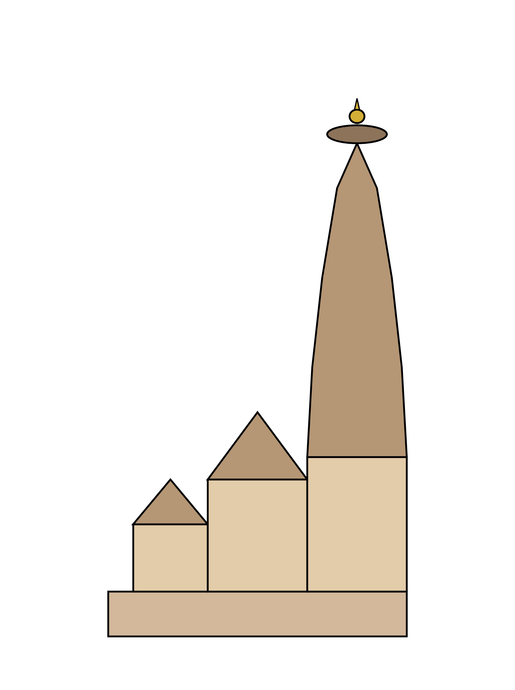
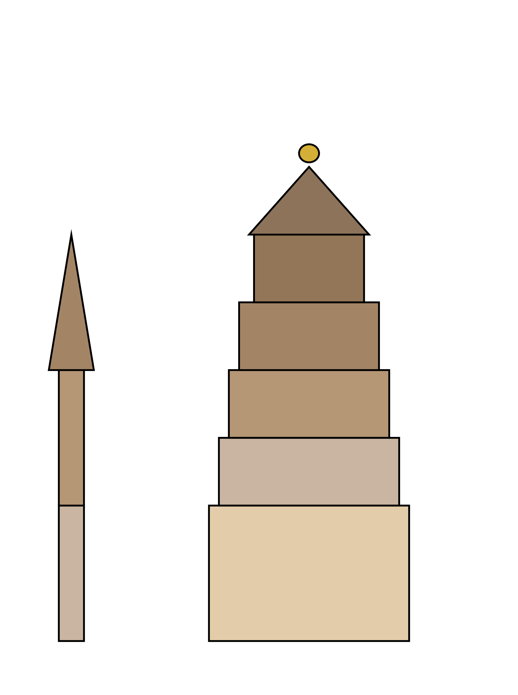
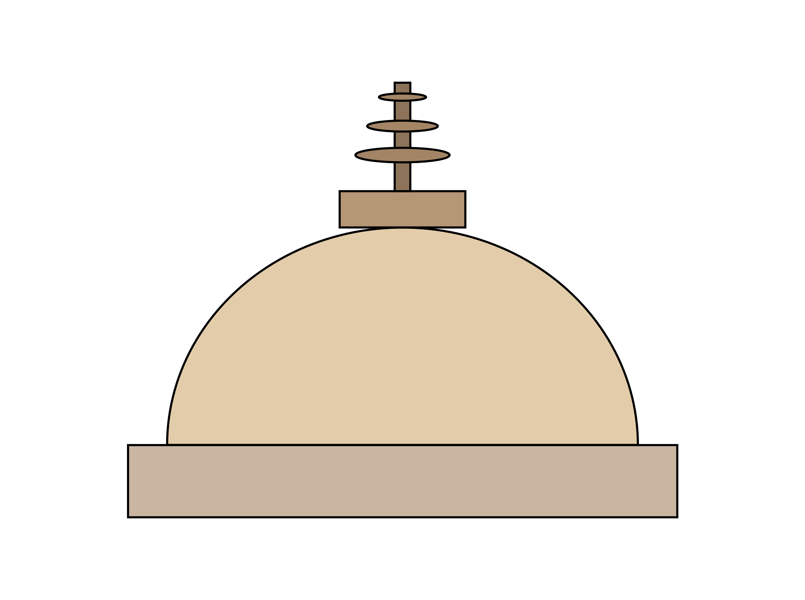

# Topic 3 — Indian Architecture

<strong>Covers syllabus</strong> (click to expand)

Indian Temple Architecture | Nagara Style | Dravida Style | Vesara Style | Temple Architecture | Gupta Period Temples | Pallava and Chola Temples | Buddhist Architecture | Stupa | Chaitya | Vihara | Rock-cut Architecture | Cave Architecture | Indo-Islamic Architecture | Mughal Architecture | Ancient Indian Architecture | Medieval Indian Architecture | Taj Mahal | Qutub Minar | Konark Sun Temple | Khajuraho | Brihadeeswara | Sanchi Stupa | Mahabalipuram | Ajanta & Ellora | Elephanta Caves

> **Sources:** NCERT An Introduction to Indian Art (Class 11), Themes I–III, ASI/UNESCO, Ghatnachakra Architecture in Ancient India (B–153+), UPPCS Prelims PYQs 2018–2025
> **Last verified:** September 2026

---

## Current Affairs

- The **Ancient Buddhist Site of Sarnath** in Uttar Pradesh entered the UNESCO World Heritage list in **July 2026** at the 48th World Heritage Committee session in Busan.
- Sarnath is India’s **45th** World Heritage property. The serial site joins **Chaukhandi Stupa** with the archaeological remains around **Dhamek** (धमेख) and the Ashokan pillar zone.
- **Maratha Military Landscapes of India** entered the list in **2025** as India’s **44th** property. The set covers **12** forts: eleven in Maharashtra and **Gingee** in Tamil Nadu.
- **Moidams – the Mound-Burial System of the Ahom Dynasty** at Charaideo in Assam entered the list in **2024** as India’s **43rd** property.
- These recent World Heritage inscriptions reflect India's architectural, fortificatory, and funerary landscape heritage.

---

<strong>🎯 Consolidated Must-Score Facts</strong> (Click to Expand)

1. **Nagara** (नागर शैली) temples have a curvilinear **shikhara** (शिखर) and generally no monumental gopuram.
2. **Dravida** (द्रविड़ शैली) temples have a pyramidal **vimana** (विमान) and a tall **gopuram** (गोपुरम).
3. **Vesara** (वेसर शैली) is the Deccan hybrid of Chalukya and Hoysala land.
4. The temple sequence runs **garbhagriha** (गर्भगृह) to **antarala** (अंतराल) to **mandapa** (मंडप), with **pradakshina** (प्रदक्षिणा पथ) around the sanctum.
5. An **amalaka** (आमलक) and a **kalasha** (कलश) crown a Nagara tower.
6. A **gopuram** is a Dravida **gateway**. A **shikhara** is the Nagara **sanctum** tower. These two words are often swapped. Pandya and Nayaka phases make gopurams the dominant outer face.
7. The Odisha Nagara order is **Parasuramesvara** (परशुरामेश्वर), then **Mukteshvara** (मुक्तेश्वर), then **Lingaraja**, then **Jagannath** (जगन्नाथ), then **Konark** (कोणार्क).
8. A **rekha deul** (रेखा देउल) is the Odisha sanctum tower. A **pidha deul** (पीढ़ा देउल) is the jagamohana hall. **Lingaraja** is the tallest standing temple in Bhubaneswar, about **180** feet.
9. **Konark** Sun Temple is a stone chariot of Surya with **24** wheels and **7** horses. Eastern Ganga **Narasimhadeva I** built it in the **13th** century. It is also called the **Black Pagoda**.
10. **Khajuraho** (खजुराहो) is a **Chandela** sandstone Nagara group in **Madhya Pradesh**, built in the **10th–12th** centuries. About **85** shrines were planned. About **25** still stand. Groups are Hindu and Jain.
11. **Kandariya Mahadeva** (कंदरिया महादेव), built by **Vidyadhara**, is the largest Khajuraho temple. **Matangeshvara** belongs to **Dhanga’s** age.
12. **Markandeshwar** in Vidarbha is called the **Khajuraho of Vidarbha**. It is not Kailasa. It is not Bhimashankar.
13. **Modhera** (मोढेरा) Sun Temple belongs to Solanki **Bhima I**.
14. **Dilwara** (दिलवाड़ा) at Mount Abu is white **marble** Jain work of the same Solanki milieu.
15. **Rani ki Vav** (रानी की वाव) at Patan is a Solanki stepwell. UNESCO listed it in **2014**.
16. Pallava phases run **Mahendra** rock-cut mandapas, then **Mamalla** rathas, then **Rajasimha** structural temples such as the Shore Temple and Kailasanatha. **Draupadi ratha** is the **smallest**.
17. Chola Dravida peaks are **Brihadeeswara** at Thanjavur (**1010**, granite), **Gangaikonda Cholapuram** (गंगैकोंड चोलपुरम), and **Airavatesvara** (एरावतेश्वर) at Darasuram. Early Chola **Korangnath** at Srinivasanallur belongs to **Parantaka I**.
18. **Aihole** (ऐहोल) is the cradle of early Chalukya experiment. The **Lad Khan** temple stands there.
19. **Badami** has four caves. **Pattadakal** (पट्टदकल) mixes Nagara and Dravida. Hoysala Belur, Halebidu, and Somnathpur use soapstone star plans in the **Vesara** hybrid.
20. The **Sarnath** (सारनाथ) Ashokan capital has four lions. **Rampurva** has a bull and a lion. **Sankisa** has an elephant. **Vaishali** (वैशाली) has a single lion. The stone is **Chunar** (चुनार) with Mauryan polish.
21. **Sanchi** has four **toranas** (तोरण). **Bharhut** is a Shunga railing campus. **Amaravati** (अमरावती) has ayaka platforms. **Dhamek** is at Sarnath. **Mahabodhi** (महाबोधि) is at Bodh Gaya.
22. A **stupa** (स्तूप) is a solid relic mound. A **chaitya** (चैत्य) is a congregational prayer hall with an apse stupa. A **vihara** (विहार) is a monastic residence.
23. **Karle** (कार्ले) is the largest surviving chaitya. Ajanta chaitya caves are **9, 10, 19, and 26**. **Kanheri** (कन्हेरी) holds more than **100** Buddhist caves on Mumbai’s western fringe.
24. **Lomas Rishi** (लोमश ऋषि) is a Barabar cave. **Ajanta** (अजंता) is Buddhist only.
25. **Ellora** (एलोरा) caves **1–12** are Buddhist, **13–29** are Hindu, and **30–34** are Jain. **Kailasa** (कैलास) is cave **16**, cut under **Krishna I** in Dravida rock-cut form.
26. **Elephanta** (एलिफेंटा) is mainly **Shaiva**, with the Trimurti, under Rashtrakuta-age patronage. A smaller Buddhist group also exists.
27. The Slave house begins **Qutub**. The Khilji house adds **Alai Darwaza** (अलाई दरवाज़ा). Tughlaq walls use a sloping **batter**. Sharqi work is at **Jaunpur** (जौनपुर). **Adina** mosque is at **Pandua**, not Mandu.
28. Babur’s tomb is at **Kabul**. Humayun’s tomb is at **Delhi**. Akbar’s red stone city is **Fatehpur Sikri**. Jahangir’s tomb is at **Lahore**. **Itimad-ud-Daulah** (इतिमाद-उद-दौला) is Nur Jahan’s marble tomb at Agra. Shah Jahan built the **Taj** and the **Red Fort**. Aurangzeb’s **Bibi ka Maqbara** (बीबी का मकबरा) is at Aurangabad.
29. **Buland Darwaza** (बुलंद दरवाज़ा) commemorates Akbar’s **Gujarat** victory. It is not a monument for Jahangir’s birth.
30. Uttar Pradesh World Heritage cultural sites are the **Taj Mahal** (ताज महल) (**1983**), **Agra Fort** (आगरा किला) (**1983**), **Fatehpur Sikri** (**1986**), and **Sarnath** (**2026**).
31. Uttar Pradesh architecture also includes the Gupta brick temple at **Bhitargaon** (भीतरगाँव), Gupta remains at **Garhwa** in Prayagraj, Sharqi monuments of **Jaunpur**, and the teerth of **Naimisharanya** (नैमिषारण्य) at Sitapur.
32. These are **not** in Uttar Pradesh: Qutub and Humayun’s tomb (Delhi), Khajuraho and Sanchi (Madhya Pradesh), Konark (Odisha), Ajanta, Ellora, and Elephanta (Maharashtra), and Mahabalipuram (Tamil Nadu).
33. Indo-Islamic building uses the **true arch** and dome. Pre-Islamic temples often used **corbelled** courses instead.
34. **Charbagh** (चारबाग़) is the Islamic four-part garden plan. **Panchayatana** (पंचायतन शैली) is the Hindu five-shrine plan with a central sanctum and four corner shrines.
35. Gupta **Dashavatara** (दशावतार) at **Deogarh** (देवगढ़) is a classic early panchayatana temple. Freestanding structural temples begin in the **Gupta** (गुप्त) age.
36. **Martand** (मार्तंड) Sun Temple of Lalitaditya in Kashmir belongs with Konark and Modhera as a sun temple. It is not a latina Nagara shrine of the Gangetic plain.
37. **Morena Chausath Yogini**, built by Kachchhapaghata **Devapala**, is a circular hypaethral temple. It is not the Khajuraho Chausath Yogini. Popular belief links its plan to the Indian Parliament building. It is not India’s only circular temple.
38. **Palitana** (पालिताना) Jain temples stand on **Shatrunjaya** hill near Bhavnagar in Gujarat. The main dedication is to **Adinatha**.
39. **Sonagiri** near **Datia** in Madhya Pradesh is a Digambar Jain hill of about **103** temples. Main shrine number 57 honours **Chandraprabhu**.
40. The Jagannath triad at Puri — Jagannath, Balabhadra, and Subhadra — is of **neem wood**, renewed in the nabakalebara cycle.
41. **Angkor Wat** in Cambodia was built by Khmer **Suryavarman II** for **Vishnu**. **Borobudur** on Java in Indonesia is a UNESCO Buddhist monument.
42. **Virupaksha** (विरूपाक्ष) at **Hampi** (हम्पी) is a living Vijayanagara Shiva shrine. Do not confuse it with **Virupaksha** at **Pattadakal**.
43. **Teli ka Mandir** at Gwalior mixes a **Dravida-type** tower with northern ornament. Treat it as a fusion trap.
44. Among Arasavalli, Amarkantak, and Omkareshwar, only **Arasavalli** in Andhra is the famous **Sun** temple. The other two are Shiva centres.
45. **Ellora** is not Saka. **Meenakshi** is Nayaka Madurai, not Pallava. **Mahabalipuram** (महाबलीपुरम) is Pallava, not Rashtrakuta. The **Besnagar Heliodorus** pillar is a **Vaishnava Garuda**, not a Shaiva cave.
46. **Sittanavasal** (सित्तन्नवासल) is a **Jain** cave shrine of Pallava age. Ajanta is Buddhist. Full mural detail lives in the Painting chapter.
47. The Madhya Pradesh World Heritage trio often tested together is **Khajuraho**, **Bhimbetka** (भीमबेटका), and **Sanchi**. **Mandu** (मांडू) is not a World Heritage Site.
48. Ajanta’s other Gupta-age mural cousin is **Bagh** in Madhya Pradesh. Padmapani in Cave 1 is taught fully in Painting.
49. Rashtrakuta courts also backed Jain scholars. **Amoghavarsha I** was a disciple of **Jinasena**, author of the *Adipurana*. That is context for Ellora’s Jain caves.
50. The south-temple chronology is **Sapt Pagoda**, then **Shore Temple** (शोर मंदिर), then **Brihadeeswara**, then **Gangaikonda Cholapuram**.

<strong>⚡ Confused Pairs</strong> (Click to Expand)

| A | B | Correct | Hindi |
|---|----|------|-------|
| Nagara | Dravida | Curvilinear shikhara, no gopuram vs pyramidal vimana + tall gopuram | नागर / द्रविड़ |
| Shikhara | Vimana | Nagara tower over sanctum vs Dravida tower over sanctum | शिखर / विमान |
| Gopuram | Shikhara | Dravida **gateway** vs Nagara **sanctum** tower — papers swap these | गोपुरम् / शिखर |
| Vesara | Nagara | Karnataka hybrid / storeyed vs pure north curvilinear | वेसर / नागर |
| Stupa | Chaitya | Solid relic mound vs congregational hall with apse stupa | स्तूप / चैत्य |
| Chaitya | Vihara | Prayer hall vs monastic cells | चैत्य / विहार |
| Rock-cut | Structural | Living rock (Ajanta, rathas) vs dressed blocks (Brihadeeswara, Shore) | शैल-कट / संरचनात्मक |
| Rekha deul | Pidha deul | Odisha sanctum tower vs jagamohana pyramidal hall | रेखा देउल / पिढ़ा देउल |
| Charbagh | Panchayatana | Islamic four-part garden vs Hindu five-shrine plan | चारबाग़ / पंचायतन |
| Indo-Islamic | Mughal | Sultanate arch-dome (Qutub) vs imperial garden-tomb synthesis (Taj) | भारतीय-इस्लामी / मुग़ल |
| True arch | Corbel | Voussoirs (Indo-Islamic) vs projecting courses (pre-Islamic temples) | सच्चा मेहराब / कॉर्बेल |
| Squinch | Pendentive | Corner arch to take a dome vs curved triangle (later) | स्क्विंच / पेंडेंटिव |
| Latina | Phamsana | Curvilinear sanctum tower vs stepped pyramidal mandapa roof | लतिना / फामसन |
| Khajuraho Chausath Yogini | Morena Chausath Yogini | Chandela hypaethral vs **Kachchhapaghata Devapala** circular | खजुराहो / मुरैना |
| Virupaksha Hampi | Virupaksha Pattadakal | Vijayanagara living shrine vs Early Chalukya Dravida | हम्पी / पट्टदकल |
| Ellora | Sakas | Rashtrakuta-age multi-faith caves vs wrong dynasty trap | एलोरा / शक |
| Meenakshi Madurai | Pallava | Nayaka / Pandya gopuram peak vs Pallava Mamalla–Rajasimha | मीनाक्षी / पल्लव |
| Mahabalipuram | Rashtrakuta | **Pallava** rock-cut / Shore vs Ellora Kailasa dynasty | महाबलीपुरम / राष्ट्रकूट |
| Besnagar Heliodorus | Shaiva cave | **Vaishnava Garuda** pillar vs wrong Shaiva label | बेसनगर / शैव |
| Dilwara marble | Khajuraho sandstone | Mount Abu Jain Solanki vs Chandela Nagara | दिलवाड़ा / खजुराहो |
| Arasavalli | Omkareshwar | Sun temple (Andhra) vs Shiva jyotirlinga (MP) | अरासवल्ली / ओंकारेश्वर |
| Konark 24 wheels | “12 wheels” shorthand | Full chariot has **24** wheels (12 pairs) | कोणार्क चक्र |
| Mandu | Khajuraho / Sanchi / Bhimbetka | Mandu **not** UNESCO vs MP WHS trio | माण्डू / यूनेस्को |

<strong>📋 Must-score drill — Nagara, Dravida, temples, pillars</strong> (Click to Expand)

### Style

| Style | Correct |
|-------|------|
| Nagara | Curvilinear **shikhara**; generally **no** monumental gopuram |
| Dravida | Pyramidal **vimana**; monumental **gopuram** gateway |
| Sequence | Garbhagriha → antarala → mandapa (plus pradakshina) |
| Trap | Gopuram is not a shikhara |

### Temple, dynasty, and place

| Temple / set | Correct |
|--------------|------|
| Odisha order | Parasuramesvara → Mukteshvara → Lingaraja → Jagannath → **Konark** |
| Konark | Stone chariot; **24** wheels, **7** horses; Narasimhadeva I |
| Khajuraho | **Chandela**, Madhya Pradesh; sandstone Nagara |
| Modhera / Dilwara | Solanki Gujarat; Dilwara is **marble** at Mount Abu |
| Pallava phases | Mahendra rock-cut → Mamalla rathas → Rajasimha structural |
| Chola peaks | Brihadeeswara **1010** · Gangaikonda · Airavatesvara |
| Aihole / Badami / Pattadakal | Early Chalukya cradle · four caves · mixed styles |

### Ashokan pillars

| Site | Capital |
|------|---------|
| Sarnath | Four lions |
| Rampurva | Bull / lion |
| Sankisa | Elephant |
| Vaishali | Single lion |

---

## 3.1 Indian Temple Architecture

**Meaning:** A Hindu temple is the house of the deity. The usual plan runs east to west from the gateway into the garbhagriha. This card also covers the syllabus head **Temple Architecture**.

- The **adhishthana** or **jagati** is the raised platform on which the shrine sits.
- The **garbhagriha** (गर्भगृह) is the sanctum. It is the darkest inner chamber and holds the main *murti*.
- A **shikhara** (शिखर) is the tower over the sanctum in the **Nagara** style.
- A **vimana** (विमान) is the tower over the sanctum in the **Dravida** style.
- An **urushringa** is a miniature shikhara clustered on a Nagara tower. Khajuraho uses this clustering.
- The **antarala** (अंतराल) is the vestibule between the hall and the sanctum.
- An **ardha-mandapa** is the porch.
- A **maha-mandapa** is the main pillared hall.
- A **natya-mandapa** is a hall for dance.
- A **sabha-mandapa** is an assembly hall.
- The **pradakshina patha** (प्रदक्षिणा पथ) is the path for clockwise walking around the sanctum.
- A **sandhara** temple has an ambulatory around the sanctum.
- A **nirandhara** temple has no ambulatory.
- A **gopuram** (गोपुरम) is a gateway tower. It is a **Dravida** hallmark, not a Nagara one.
- A **prakara** is the enclosure wall around a Dravida temple campus.
- An **amalaka** (आमलक) is the ribbed stone disc that crowns a Nagara shikhara.
- A **kalasha** (कलश) sits above the amalaka as the finial.
- A Dravida finial is called a *stupika* or *kalasam*.
- In Odisha, a **ratha** is a vertical offset on the deul wall. Temples may be triratha, pancharatha, or saptaratha.
- That Odisha **ratha** is not the Pallava granite monolith called a ratha at Mahabalipuram.
- **Dvarapalas** are door guardians carved at the sanctum entrance.
- **Mithuna** couples appear on outer walls of developed Nagara temples, as at Khajuraho.
- **Panchayatana** (पंचायतन) places a central shrine with four smaller shrines at the corners. Gupta Deogarh is the early type.
- **Nagara** is the north Indian style, mainly north of the Vindhyas.
- **Dravida** is the south Indian style.
- **Vesara** is the Deccan and Karnataka hybrid.

> **Logic:** Konark and Khajuraho are **Nagara**. Brihadeeswara and the Shore Temple are **Dravida**. Belur and Halebidu are **Vesara / Hoysala**. A gopuram is a gateway. A shikhara is the north Indian sanctum tower. Do not swap those two words.

---

## 3.2 Nagara Style

Nagara temples belong to North India. The tower is a curvilinear **shikhara**. There is generally no monumental gopuram.

- **Latina** is the simple curvilinear sanctum tower.
- **Phamsana** is a stepped pyramidal roof, usually over the mandapa.
- **Valabhi** (वलभी) is a barrel-roof form. **Teli ka Mandir** at Gwalior is the usual example.
- Odisha calls the sanctum tower a **rekha deul** (रेखा देउल).
- Odisha calls the jagamohana hall a **pidha deul** (पीढ़ा देउल).
- **Khakhara** is a rectangular Odisha roof. **Vaital Deul** at Bhubaneswar is the type example.
- **Parasuramesvara** at Bhubaneswar is the earliest standing Odisha temple, about the 7th–8th century.
- **Mukteshvara** follows it. Coaching notes call it a gem and point to its ornate *torana* (तोरण).
- **Rajarani** is the next named shrine in the Bhubaneswar sequence.
- **Lingaraja** is an 11th-century pancharatha temple at Bhubaneswar. It is the tallest standing temple in that city, about **180** feet.
- **Jagannath** at Puri comes next in the Odisha order.
- The Jagannath triad of Jagannath, Balabhadra, and Subhadra is of **neem wood**. The images are renewed in the nabakalebara cycle.
- **Konark** is the last great shrine in that Odisha order. It belongs to the 13th century.
- **Khajuraho** is a **Chandela** sandstone Nagara group in **Madhya Pradesh**, built in the **10th–12th** centuries. It is not in Uttar Pradesh.
- About **85** shrines were planned at Khajuraho. About **25** still stand.
- The groups are Hindu (Shaiva, Vaishnava, and Shakta) and Jain.
- The **Chausath Yogini** at Khajuraho is the oldest shrine in that group. It is hypaethral, which means it is open to the sky.
- The Khajuraho Chausath Yogini is not the circular temple at **Morena**.
- **Matangeshvara** is a Shiva-linga temple of **Dhanga’s** age. It is still in active worship.
- **Lakshmana** is a Vaishnava temple built under **Yashovarman**.
- **Vishvanatha** is a major western-group Shiva temple at Khajuraho.
- **Chitragupta** is the Surya temple of the western group.
- **Devi Jagadambi** stands in the western group.
- **Lalguan Mahadeva** is a smaller western shrine.
- **Brahma** temple at Khajuraho is a named western-group shrine.
- **Kandariya Mahadeva** is the largest Khajuraho temple. **Vidyadhara** built it in the 11th century.
- **Parshvanatha** (पार्श्वनाथ) is an eastern Jain temple at Khajuraho.
- **Adinatha** is another eastern Jain temple there.
- **Ghantai** is the third named eastern Jain shrine.
- **Duladeo** belongs to the southern group.
- **Chaturbhuja** also belongs to the southern group.
- **Modhera** Sun Temple was built by Solanki **Bhima I**. It is known for its Surya kund.
- **Rani ki Vav** at Patan is a Solanki stepwell. UNESCO listed it in **2014**. It reads as an inverted temple of seven storeys.
- **Dilwara** at Mount Abu in Rajasthan is a set of white **marble** Jain temples of the same Solanki milieu.
- **Vimal Vasahi** at Dilwara honours Adinatha. **Vimal Shah**, a feudatory of Bhima I, built it.
- **Luna Vasahi** at Dilwara honours Neminatha. Vastupal and Tejpal built it.
- **Palitana** is a Jain tirtha on **Shatrunjaya** hill near Bhavnagar in Gujarat. The main dedication is to **Adinatha**.
- **Sonagiri** near Datia in Madhya Pradesh is a Digambar Jain hill of about **103** temples. Main shrine number 57 honours **Chandraprabhu**.
- **Martand** Sun Temple was built by **Lalitaditya** in Kashmir. It is a sun temple, not a Gangetic latina Nagara shrine.
- **Teli ka Mandir** at Gwalior mixes a Valabhi barrel look with a Dravida-type pinnacle and northern ornament. Treat it as a fusion trap.
- **Bishnupur** terracotta temples belong to the Malla kings of Bengal. They use *ratna* and *chala* roofs.
- The sun-temple set to remember is **Konark**, **Modhera**, **Martand**, and **Arasavalli** in Andhra.
- **Amarkantak** and **Omkareshwar** are Shiva centres. They are distractors in sun-temple lists.

### Morena Chausath Yogini

**Kachchhapaghata Devapala | Morena, Madhya Pradesh | circular hypaethral plan**

- This circular temple is separate from the Khajuraho Chausath Yogini.
- Popular belief links the circular plan to the design of the Indian Parliament building.
- It is not the only circular temple in India.
- It is not a Vaishnava cult shrine.

### Konark Sun Temple

**Narasimhadeva I (Eastern Ganga) | 13th century | Odisha | UNESCO 1984**

- Konark is a stone **chariot** of Surya. It has **24** wheels and **7** horses.
- The composition is a rekha deul with a pidha jagamohana.
- European sailors called it the **Black Pagoda**. They called Jagannath Puri the White Pagoda.
- Konark is Nagara, not Dravida. It is not in Uttar Pradesh.

### Khajuraho Group

**Chandela | 10th–12th century | Madhya Pradesh | UNESCO 1986**

- The campus has a western Hindu group, an eastern Jain group, and a southern group.
- Erotic *mithuna* figures sit on the exterior. The sanctum remains a sacred chamber.
- All compartments of a developed Khajuraho temple connect internally and externally. Coaching notes treat this as a style point.
- **Markandeshwar** at Gadchiroli in Vidarbha is called the **Khajuraho of Vidarbha**. It is not Kailasa. It is not Bhimashankar.
- Madhya Pradesh World Heritage sites often tested with Khajuraho are **Bhimbetka** and **Sanchi**.
- **Mandu** is not a World Heritage Site.

> [!TIP]
> **Exam Anchor [UPPCS Prelims 2019, Q109]:** **Markandeshwar Temple** on Wainganga River (Gadchiroli, Maharashtra) is celebrated as the "Khajuraho of Vidarbha" (built 9th–12th century). *(See Q7 in Complete PYQ Bank below)*

---

## 3.3 Dravida Style

Dravida temples belong to the Tamil country and the south. The tower is a pyramidal **vimana** over the sanctum. The gateway is a tall **gopuram**.

- A Dravida campus sits inside an enclosure called a *prakara*, entered through gopurams.
- Under the **Pandya** and later **Nayaka** (नायक) rulers of Madurai, the outer gopurams become the dominant face and can dwarf the vimana.
- **Meenakshi** at Madurai has **12** gopurams. The southern tower is about **52** metres high.
- Tradition links the original Meenakshi shrine with **Kulasekara Pandya**. The gopuram peak is **Nayaka**. This is not a Pallava foundation.
- The vimana is storeyed. Each storey is a *tala* (ताल). The finial is a *kalasam*. *Kudu* arches look like horseshoes.
- Pallava and Chola structural temples use **granite**. Later Nayaka gopurams often use brick and stucco.
- **Rameshwaram** is known for the longest temple corridor in this style.
- **Srivilliputhur** is known for one of the tallest gopurams.
- **Chidambaram** is the Nataraja temple of the Chola–later Dravida world.
- **Ekambareswarar** at Kanchi is a Dravida Shiva temple.
- **Varadaraja** at Kanchi is a Dravida Vishnu temple.

> **Logic:** The Shore Temple and Brihadeeswara are **structural Dravida**. They are not rock-cut. The *rathas* beside the Shore Temple are rock-cut.

---

## 3.4 Vesara Style

**Karnataka and the Deccan | Vesara hybrid of Nagara and Dravida**

- **Aihole** is remembered as the cradle of early Indian temple experiment under the Early Chalukyas.
- The **Durga** temple at Aihole reuses an apsidal chaitya plan.
- The **Lad Khan** temple is an early Chalukya hall-shrine at Aihole.
- The **Huchimalli** temple is another early experiment at Aihole.
- The **Meguti** temple at Aihole is Jain. Ravikirti’s Aihole inscription of Pulakeshin II, dated **634 CE**, is here.
- **Badami** has four caves. Cave 1 is Shaiva. Caves 2 and 3 are Vaishnava. Cave 4 is Jain.
- **Pattadakal** is a UNESCO coronation site from **1987**. Nagara and Dravida temples stand together there.
- **Virupaksha** at Pattadakal is Dravida. Vikramaditya II and queen Lokamahadevi built it on the model of Kanchi Kailasanatha.
- **Papanatha** at Pattadakal leans toward Nagara.
- **Chennakeshava** at Belur is a Hoysala temple of **Vishnuvardhana**.
- **Hoysaleswara** at Halebidu is a Hoysala twin-shrine temple.
- **Kesava** at Somnathpur is a Hoysala temple of **Narasimha III**.
- Hoysala work uses soapstone, a **star or stellate** plan, and lathe-turned pillars. UNESCO listed the Hoysala ensemble in **2023**.
- **Ramappa / Rudreshwara** at Palampet is **Kakatiya**, listed by UNESCO in **2021**. It uses floating bricks. It is not Hoysala.

> **Logic:** Vesara is not a fourth pan-Indian style equal to “Mughal.” If a stem says Karnataka hybrid or Chalukya–Hoysala, choose Vesara.

---

## 3.5 Gupta Period Temples

Gupta temples are the first **structural** freestanding stone and brick temples in the north. They belong to the fourth to sixth centuries.

- Freestanding mortar-and-stone or brick temples are remembered as beginning in the **Gupta** age. They are not Mauryan rock-cut work.
- Early Gupta shrines are flat-roofed. A simple shikhara then appears. **Panchayatana** also appears.
- **Dashavatara** at **Deogarh** (Lalitpur region, Uttar Pradesh–Madhya Pradesh border) is a Vishnu temple. It is early Nagara and a classic panchayatana plan.
- **Bhitargaon** in Kanpur Dehat, **Uttar Pradesh** (उत्तर प्रदेश), is a **brick** temple with terracotta panels. It is Gupta or late Gupta and among India’s oldest brick temples.
- **Temple 17** at Sanchi is an early flat-roofed stone shrine.
- **Tigawa** (Kankali Devi) in Madhya Pradesh is a Gupta shrine.
- **Nachna-Kuthara** holds a Gupta Parvati temple.
- **Bhumara** in Madhya Pradesh is a Gupta Shiva temple.
- **Eran** in Madhya Pradesh holds Gupta Vishnu and Varaha remains.
- **Garhwa** at Shankargarh in **Prayagraj** (प्रयागराज), Uttar Pradesh, holds Gupta temple-complex remains.
- **Udayagiri** (उदयगिरि) near Vidisha in Madhya Pradesh has Gupta cave-temples. The Varaha panel belongs to Chandragupta II.

> **Logic:** Gupta work begins the Hindu structural temple. Bhitargaon is the Uttar Pradesh brick example. Gupta rock-cut work is Udayagiri, not Ajanta. Ajanta’s Mahayana phase is Vakataka. Dashavatara is not at Khajuraho.

---

## 3.6 Pallava and Chola Temples

### Pallava

**Kanchi | granite | Mahabalipuram and Kanchipuram**

- Pallava temple work runs **Mahendra** rock-cut mandapas, then **Mamalla** monolith rathas, then **Rajasimha** structural temples, then **Nandivarman**.
- **Mahendravarman I** (महेन्द्रवर्मन प्रथम) left the Mandagapattu inscription. It records the first rock-cut shrine made without brick, timber, or metal.
- The **Pancha Rathas** belong to **Narasimhavarman I** (Mamalla). They are cut downward from one granite outcrop.
- Colonial lists also call that ratha set the **Seven Rathas** or **Sapt Pagoda**.
- **Dharmaraja ratha** is the largest. Its roof is pyramidal.
- **Bhima ratha** has a barrel or valabhi roof.
- **Draupadi ratha** is hut-shaped and dedicated to Durga. It is the **smallest** of the set. Little ornament covers it. Lion or elephant-like sculptures sit around it.
- The **Shore Temple** belongs to **Rajasimha**. It is structural, not rock-cut. It holds two Shiva shrines and a reclining Vishnu. UNESCO lists it with the Mahabalipuram monuments.
- **Arjuna’s Penance**, also called Descent of the Ganga, is the huge open-air rock relief at Mamallapuram.
- **Kailasanatha** (कैलासनाथ) at Kanchi is Rajasimha’s sandstone proto-Dravida temple. Tradition says Mahendravarman II completed work on it.

### Chola

Chola temples are imperial structural Dravida in granite. Inscriptions on the walls explain why we know more about the Cholas than their predecessors.

- The early Chola **Korangnath** temple at **Srinivasanallur** belongs to **Parantaka I**.
- **Brihadeeswara**, also called Rajarajeshwara, at Thanjavur was built by **Rajaraja I** in **1003–1010 CE**. The fabric is granite.
- The Thanjavur vimana is about **66** metres high and has **13** storeys. The *kalasam* is a monolith.
- The colossal **Nandi** is carved from a single rock and is counted among the tallest Nandi idols in India.
- Two **dvarapala** figures stand near the main shrine. The temple is **Dravida**, not Nagara.
- **Gangaikonda Cholapuram** was built by **Rajendra I** about **1025–1035**, after the Ganges campaign.
- **Airavatesvara** at Darasuram belongs to **Rajaraja II**.
- UNESCO’s Great Living Chola Temples, listed in **1987**, are Thanjavur, Gangaikonda Cholapuram, and Darasuram.
- **Koranganatha Temple** at Srinivasanallur (Tiruchirappalli district, Tamil Nadu) was constructed during the reign of early Chola monarch **Parantaka I**.
- The south-temple chronology to ratta is **Sapt Pagoda (7th century) → Shore Temple (early 8th) → Brihadeeswara (1010) → Gangaikonda Cholapuram (about 1035)**.

> [!TIP]
> **Exam Anchor [UPPCS Prelims 2018, Q15]:** Chronological order of temples: **Brihadisvara (Thanjavur, Rajaraja I, 1010)** → **Gangaikonda Cholapuram (Rajendra I, ~1035)** → **Shore Temple (Mamallapuram, Narasimhavarman II Rajasimha, early 8th c.)** → **Saptaratha (Mamallapuram, Narasimhavarman I Mahamalla, mid 7th c.)**. *(See Q8 in Complete PYQ Bank below)*

> [!TIP]
> **Exam Anchor [UPPCS Prelims 2020, Q8]:** Assertion: Most Gupta temples built of stone; Bhitargaon (Kanpur) and Sirpur Lakshmana temple (Chhattisgarh) are rare baked-brick Gupta structures. *(See Q5 in Complete PYQ Bank below)*

---

## 3.7 Buddhist Architecture

The Buddhist trio is the **stupa** (relic mound), the **chaitya** (prayer hall), and the **vihara** (monastery).

- Buddhist sacred building comes in three types. Papers treat them as three different statements.
- A **stupa** is a solid relic mound. Devotees walk around it.
- A **chaitya** is a congregational hall. A stupa sits in its apse.
- A **vihara** is a monastery. Monks live in cells around a courtyard or hall.
- One site can hold all three. Sanchi is a stupa campus. Karle is a chaitya. Ajanta is mostly viharas plus a few chaityas.

> **Logic:** Stupa means mound. Chaitya means a hall with a stupa inside. Vihara means monastery. Never swap the three.

---

## 3.8 Stupa

A stupa is a solid relic mound. From bottom to top the parts are *medhi*, then *anda*, then *harmika*, then *yashti* with *chhatra*.

- A **vedika** is the rail around a stupa.
- A **torana** (तोरण) is a gateway.
- The **pradakshina patha** is the walking path.
- **Sanchi Stupa 1** has an Ashokan brick core. The **Shungas** enlarged it.
- Four **toranas** at Sanchi belong to the Satavahana age. The **south torana is the oldest**.
- Early Sanchi is **aniconic** (अप्रतिमेय). The Buddha appears as a lotus, footprints, or an empty throne. UNESCO listed Sanchi in **1989**. It is in **Madhya Pradesh**, not Uttar Pradesh.
- **Bharhut** in Madhya Pradesh is a Shunga railing campus. Much of the railing is now in the **Indian Museum, Kolkata**.
- **Dhamek** at **Sarnath** in Uttar Pradesh is Gupta brick-and-stone. It marks the first sermon. UNESCO listed the Sarnath serial in **2026**.
- **Chaukhandi** at Sarnath is later commemorative. An octagonal Mughal tower sits on an ancient base.
- **Mahabodhi** at Bodh Gaya is a brick tower over the enlightenment seat. UNESCO listed it in **2002**. It is not an ayaka-stupa.
- **Amaravati** in Andhra has **ayaka platforms** with **five pillars** at the four cardinals. It is the type-site for that form.
- **Nagarjunakonda** (नागार्जुनकोंडा) belongs to the same ayaka family.
- **Ghantasala** belongs to the same ayaka family.
- **Jaggayyapeta** belongs to the same ayaka family.
- **Bodh Gaya has no ayaka pillars.**
- **Vaishali** is a relic-stupa site.
- **Piprahwa** is a relic-casket site.
- **Kesariya** in Bihar is the tallest stupa in India.

> [!TIP]
> **Exam Anchor [UPPCS Prelims 2022, Q80]:** Ayaka platforms with 5 pillars (symbolising 5 life-events of Buddha) are unique to Andhra Ikshvaku stupas (**Amaravati** & **Jaggayyapeta**). *(See Q4 in Complete PYQ Bank below)*

---

## 3.9 Chaitya

A chaitya is an apsidal prayer hall. It has a nave and aisles, a stupa in the apse, and a ribbed vault.

- A chaitya is not the free-standing stupa. The hall contains a stupa.
- **Karle**, also called Karla, near Lonavala is the **largest** surviving Hinayana chaitya.
- **Bhaja** (भाजा) is very early. Its vault imitates wooden ribs.
- **Bedsa** (बेडसा) is a western-ghat Hinayana chaitya.
- **Kondane** is a western-ghat Hinayana chaitya.
- **Pitalkhora** is a western-ghat Hinayana chaitya.
- **Nashik Pandavleni**, also called Pondu Leni, holds chaitya and vihara caves of the western Deccan.
- **Junnar** (जुन्नर) holds chaitya and vihara caves.
- **Kanheri** is the largest cave complex in the Mumbai region. It has more than **100** Buddhist caves from about the first century BCE onward.
- Ajanta chaityas are caves **9** and **10** in the early phase and caves **19** and **26** in the later phase.
- Ellora cave **10**, called Vishvakarma, is a later rock-cut chaitya.

> **Logic:** Karle is the largest chaitya. Ajanta chaitya numbers are **9, 10, 19, and 26**.

---

## 3.10 Vihara

A vihara is a monastery. Cells stand around a courtyard or a central hall.

- A vihara houses monks. It is not a prayer-hall chaitya.
- Most Ajanta caves are viharas. Caves **1, 2, 16, and 17** carry the famous murals.
- Nashik Pandavleni has viharas.
- Kanheri has viharas.
- Nagarjunakonda has monasteries of the ayaka belt.
- **Nalanda** (नालंदा) is a Gupta–Pala mahavihara. Bakhtiyar Khilji burnt it in **1193**.
- **Vikramashila** (विक्रमशिला) is a Pala mahavihara founded by **Dharmapala** (धर्मपाल).
- **Odantapuri** (उदंतपुरी) is a Pala mahavihara.
- Sarnath has monastery remains beside Dhamek.
- **Bagh** in Madhya Pradesh holds Buddhist viharas with murals related to Ajanta.

> **Logic:** Ajanta mural stars are **viharas**, not chaityas. Nalanda is a mahavihara, not a stupa campus like Sanchi.

---

## 3.11 Rock-cut Architecture

- **Rock-cut Elephant at Dhauli (Odisha):** Sculpted directly from living rock during the reign of Mauryan Emperor **Ashoka** (3rd century BCE). Chronologically, it is the **earliest surviving rock-cut sculpture** in Indian architectural history (predating 5th-century Udayagiri Varaha, 7th-century Mamallapuram rathas, and 11th-century Lingaraja temple).

Rock-cut architecture is carved from living rock. It is not assembled from dressed blocks.

- Rock-cut is a **method**. The finished work may be a chaitya, a ratha, or a cave temple.
- **Barabar** (बराबर) and **Nagarjuni** in Bihar are Mauryan. Patrons are **Ashoka** and **Dasharatha**. The users are **Ajivikas** (आजीविक). The polish is Mauryan.
- **Lomas Rishi** at Barabar has the earliest surviving chaitya-arch facade.
- **Sudama** (सुदामा) is another Barabar cave.
- **Karan Chaupar** is another Barabar cave.
- **Visva Zopri**, also called Vishvakarma, completes the Barabar set.
- The nearby **Nagarjuni** group belongs to Dasharatha. It holds Gopi, Vadithi-ka-kubha, and Vapiya-ka-kubha.
- Mandapas and rathas at **Mahabalipuram** are Pallava rock-cut work. Later lists name the five rathas after the Pandavas and Draupadi. That naming is a later misnomer.
- Pallava work runs Mahendra mandapas, then Mamalla rathas, then Rajasimha’s structural Shore Temple. The rathas are rock-cut. The Shore Temple is structural.
- **Ellora Cave 16**, the **Kailasa**, is the world’s largest monolithic temple. **Rashtrakuta Krishna I** had it cut **top-down** in **Dravida** rock-cut form to recall Mount Kailasa. It is not Elephanta.

> **Logic:** Rathas at Mahabalipuram are **rock-cut**. Brihadeeswara is **structural**. Kailasa is Ellora cave 16, not Elephanta.

---

## 3.12 Cave Architecture

Cave architecture is numbered cave complexes of Buddhist, Hindu, and Jain use. UNESCO cave sites sit here.

- **Ajanta** sits in the Waghora gorge in Aurangabad / Chhatrapati Sambhaji Nagar district, Maharashtra. It is **Buddhist only**. UNESCO listed it in **1983**.
- Ajanta has about **30** numbered caves. The early phase is Satavahana Hinayana, about the second century BCE. The later phase is Vakataka Mahayana of the fifth–sixth centuries under **Harishena**.
- Ajanta chaityas are caves **9, 10, 19, and 26**.
- Viharas **1, 2, 16, and 17** carry the famous murals.
- Cave **1** holds **Padmapani**. Cave **17** preserves rich Vakataka painting, including Wheel-of-Life type themes. Full mural teaching sits in the Painting chapter.
- Ajanta murals are tempera on dry plaster. They show Jataka cycles. They are not true Italian fresco.
- The other famous Gupta-age Buddhist mural cousin is **Bagh** in Madhya Pradesh. It is not Ellora. It is not Nasik. It is not Lomas Rishi.
- **Ellora** is in Maharashtra. UNESCO listed it in **1983**. There are **34** caves from the sixth to the tenth century.
- Ellora caves **1–12** are Buddhist. Cave 10 is the Vishvakarma chaitya.
- Ellora caves **13–29** are Hindu. Cave **16** is Kailasa, cut under **Krishna I**.
- Ellora caves **30–34** are Jain. **Chhota Kailasa** sits in the Jain group. Indra Sabha is cave **32**.
- Rashtrakuta courts also patronised Jain scholars. **Amoghavarsha I** was a disciple of **Jinasena**, author of the *Adipurana*.
- **Elephanta** is Gharapuri island in Mumbai harbour. UNESCO listed it in **1987**. The main caves are **Shaiva** rock-cut work of Rashtrakuta-age patronage. A smaller Buddhist cave group also exists.
- Elephanta is celebrated for its monumental rock-cut **Trimurti** (or **Maheshamurti**), depicting the three aspects of Shiva: Aghora (Bhairava/fierce), Tatpurusha (serene), and Vamadeva (gentle/creative). It is Shaivite and distinct from Buddhist Ajanta and Ellora's monolithic Kailasa.
- **Sittanavasal** in Tamil Nadu is a **Jain** cave shrine of Pallava age. Do not merge it with Ajanta’s Buddhist murals.
- **Badami** has four Chalukya caves. Cave 3, a Vishnu cave of Mangalesha, is the largest. Badami is not India’s oldest rock-cut work. Barabar and the Bhimbetka horizon are earlier.
- **Udayagiri** and **Khandagiri** (खंडगिरि) near Bhubaneswar are Jain. The **Hathigumpha** inscription at Udayagiri belongs to **Kharavela** (खारवेल).
- **Rani Gumpha** there is double-storeyed.
- **Ganesh Gumpha** is another named cave in that Odisha pair.
- **Udayagiri** near Vidisha in Madhya Pradesh is Gupta. The Varaha panel belongs to Chandragupta II. It is not the Odisha Udayagiri.
- **Jogeshwari** is a Hindu cave of the Mumbai region.
- **Mandapeshwar** is another Hindu cave of the Mumbai region.

> [!TIP]
> **Exam Anchor [UPPCS Prelims 2018, Q16]:** Hathigumpha inscription of Kharavela on Udayagiri hills. *(See Q9 in Complete PYQ Bank below)*

---

## 3.13 Indo-Islamic Architecture

Indo-Islamic architecture brings the true **arch**, the **dome**, the **minaret**, mortar, calligraphy, *jali* (जाली), and arabesque from the late-twelfth-century Sultanate.

- Pre-Islamic India usually used the **corbel**. **Alai Darwaza** is the textbook **true arch** and **true dome**.
- A **squinch** is the early device that sets a dome on a square. A **pendentive** is the later curved-triangle device.
- Delhi building runs Slave, then Khilji, then Tughlaq with battered sloping walls and austere rubble, then Sayyid–Lodi garden tombs, then Sur.

### Qutub complex (Delhi — not Uttar Pradesh)

Qutb-ud-din **Aibak** began the minar about **1193–99**. **Iltutmish** raised storeys **1–4**. **Firoz Shah Tughlaq** (फिरोज शाह तुगलक) added the fifth storey and repairs. Height is about **72.5** m. UNESCO listed the complex in **1993**.

- The minar uses red sandstone with marble bands on the upper storeys. It has about **379** steps. Afghan *minars* such as Jam inspired it, but the result is an Indian synthesis.
- **Quwwat-ul-Islam** (कुव्वत-उल-इस्लाम) mosque was begun by Aibak on debris of demolished temples.
- The iron pillar in the courtyard is Gupta. It is linked with **Chandragupta II** (चंद्रगुप्त द्वितीय) / Mehrauli and resists rust.
- **Alai Darwaza**, built by Alauddin Khilji in **1311**, is the first true dome of the complex.
- The incomplete **Alai Minar** was meant to dwarf Qutub.
- Iltutmish’s tomb stands in the same complex. Qutub is **Delhi**. Never park it in Uttar Pradesh.

### Delhi Sultanate — dynasty list

**Slave / Mamluk**

- **Quwwat-ul-Islam** is Aibak’s congregational mosque at the Qutub complex.
- **Qutub Minar** (कुतुब मीनार) was begun by Aibak and raised by Iltutmish.
- **Adhai Din Ka Jhopra** at Ajmer is Aibak’s mosque on a Sanskrit college site.
- **Sultan Garhi** is Iltutmish’s tomb. It is remembered as the first Islamic mausoleum in India.
- **Balban’s tomb** and the **Red Palace (Lal Mahal)** belong to the later Slave house.

**Khilji**

- **Siri** fort is Alauddin’s Delhi.
- **Hauz Khas** is his reservoir campus.
- **Alai Darwaza** is his gateway at Qutub.
- **Alai Minar** is the unfinished giant minar.
- **Jamat Khana Masjid** stands at Nizamuddin.

**Tughlaq**

- **Tughlaqabad** (तुगलकाबाद) was built by Ghiyasuddin.
- Ghiyasuddin’s tomb uses battered walls.
- **Firoz Shah Kotla** is Firoz’s Delhi citadel.
- **Khirki** mosque uses a cross-vault.
- **Begumpur** mosque also uses a cross-vault.

**Sayyid–Lodi**

- Lodi Garden tombs are octagonal or square garden mausoleums.
- **Sikandar Lodi’s tomb** stands in that garden set.
- **Moth ki Masjid** belongs to the Lodi world.

### Provincial Sultanate

- **Atala Masjid** (अटाला मस्जिद) at Jaunpur was built about **1408** by **Ibrahim Shah Sharqi**. It is in **Uttar Pradesh**.
- **Lal Darwaza** and the Jama Masjid at Jaunpur use tall *propylon* screens. They do not use Delhi-type minarets.
- **Mandu** holds the Jami Masjid, Hindola Mahal, and Jahaz Mahal. Adina is not at Mandu.
- **Adina Masjid** is at **Pandua** in Bengal. Sikandar Shah built it.
- **Dakhil Darwaza** is at Gaur.
- The **Eklakhi** tomb at Gaur uses brick and terracotta.
- **Tin Darwaza** is at Ahmedabad.
- **Sidi Saiyyed** jali at Ahmedabad uses the palm motif.
- **Champaner–Pavagadh** in Gujarat is a UNESCO provincial campus.
- **Gol Gumbaz** (गोल गुम्बद) at Bijapur is the tomb of **Muhammad Adil Shah**. It has a whispering gallery.
- **Charminar** (चारमीनार) at Hyderabad was built by **Muhammad Quli Qutb Shah** in **1591**.

### Sher Shah Suri

- Sher Shah’s tomb at **Sasaram** in Bihar, about **1545**, is octagonal. It prefigures Mughal garden-tomb scale.
- In Delhi he left **Purana Qila** and the **Qila-i-Kuhna** mosque.
- In addition to his architectural monuments, Sher Shah reconstructed and expanded the ancient arterial highway (*Sadak-e-Azam*, later known as the Grand Trunk Road) connecting Sonargaon in Bengal to Attock in the Punjab.

> [!TIP]
> **Exam Anchor [UPPCS Prelims 2022, Q4]:** Sultan Garhi = Iltutmish; Red Palace = Balban; Jamat Khana = Alauddin Khalji; Kotla Firoz Shah = Firoz Shah Tughluq. *(See Q3 in Complete PYQ Bank below)*

> [!TIP]
> **Exam Anchor [UPPCS Prelims 2018, Q19]:** Adina Masjid is in **Pandua (Bengal)** built by Sikandar Shah, NOT in Mandu (MP). *(See Q10 in Complete PYQ Bank below)*

---

## 3.14 Mughal Architecture

Mughal architecture is the charbagh garden-tomb, the shift from red sandstone to marble, *pietra dura* (पिएत्रा ड्यूरा), the **double dome**, *chhatri*, *jharokha*, and the *hasht-bihisht* eight-paradise plan.

### By emperor

**Babur** (बाबर)

- Babur laid **charbagh** gardens in India.
- **Ram Bagh**, also called Aram Bagh, at Agra is his garden type.
- **Kabuli Bagh** mosque stands at Panipat.
- Babur’s tomb is at **Kabul**, not at Delhi.

**Humayun** (हुमायूँ)

- Humayun’s tomb stands at **Delhi** near Nizamuddin.
- **Bega Begum**, also called Haji Begum, commissioned it. The architect was **Mirak Mirza Ghiyas**.
- Work runs about **1565–72**. It is the first major Indian garden tomb. UNESCO listed it in **1993**. It is the prototype of the Taj.

**Akbar** (अकबर)

- **Agra Fort** is Akbar’s red-sandstone circuit. Jahangiri Mahal and Akbari Mahal sit inside it.
- **Fatehpur Sikri** was the capital about **1571–85**.
- **Allahabad Fort** is also Akbar’s.
- The tomb at **Sikandra** was started by Akbar and finished by Jahangir.

**Jahangir** (जहाँगीर)

- Jahangir’s own tomb is at **Shahdara, Lahore**.
- **Itimad-ud-Daulah** at Agra was built by **Nur Jahan** (नूरजहाँ). It is the first major **white marble** tomb with **pietra dura**. Coaching notes call it the Baby Taj.
- The Moti Masjid at Agra Fort is **Shah Jahan’s**, not Jahangir’s.

**Shah Jahan** (शाहजहाँ)

- The **Taj Mahal** stands at Agra.
- The **Red Fort** at Delhi was built in **1639–48**.
- **Jama Masjid** (जामा मस्जिद) at Delhi is Shah Jahan’s Friday mosque.
- **Moti Masjid** (मोती मस्जिद) inside Agra Fort is his white-marble private mosque.

**Aurangzeb** (औरंगजेब)

- **Bibi ka Maqbara**, the tomb of Rabia Daurani at Aurangabad about **1660**, is called the poor man’s Taj.
- Aurangzeb’s **Moti Masjid** sits inside Delhi’s Red Fort.
- **Badshahi Mosque** at Lahore is his congregational mosque.

### Fatehpur Sikri (Uttar Pradesh)

**Akbar | UNESCO 1986 | capital for about 15 years, then abandoned for water**

- **Buland Darwaza** commemorates the **Gujarat victory of 1573**. It does not mark the birth of Salim / Jahangir. Jahangir was born in **1569**.
- The Jama Masjid of Sikri holds the white-marble **dargah of Salim Chishti** in its courtyard.
- **Panch Mahal** (पंच महल) is a five-storey open pavilion.
- The **Diwan-i-Khas** (दीवान-ए-खास) has a central **throne pillar**.
- The **Diwan-i-Aam** (दीवान-ए-आम) is the public audience hall.
- Jodha Bai’s palace and Birbal’s house stand in the residential zone.
- **Anup Talao** is the ornamental tank.
- The **Ibadat Khana** (इबादत खाना) was Akbar’s hall of religious debate.

### Taj Mahal (Agra, Uttar Pradesh)

**Shah Jahan | Arjumand Banu Begum (Mumtaz Mahal) | 1631 to about 1648/53 | UNESCO 1983**

- The tomb uses Makrana marble on the Yamuna bank. The garden is a charbagh.
- Four minarets lean slightly outward.
- **Amanat Khan** wrote the calligraphy.
- Tradition names **Ustad Ahmad Lahori** as the architect.
- The dome is a double dome. Pietra dura uses coral, lapis, and onyx.
- The Taj is not a Sultanate building. It is not at Delhi. It is not Jahangir’s tomb.

### Agra Fort and Red Fort

- **Agra Fort** is UNESCO **1983**. Akbar built the sandstone circuit. Shah Jahan added marble palaces: Diwan-i-Aam, Diwan-i-Khas, Moti Masjid, and Musamman Burj or Jasmine Tower.
- **Red Fort, Delhi** is UNESCO **2007** as the Red Fort Complex. Shah Jahan built it on the Yamuna. The gates are Lahori and Delhi. The Diwan-i-Khas carries the line *If there is a paradise on earth…*

### Tomb match

- Babur is buried at **Kabul**.
- Humayun is buried at **Delhi**.
- Jahangir is buried at **Lahore**.
- Shah Jahan is buried at **Agra** (आगरा).

### Monument chronology

- **Atala Mosque**, Jaunpur, about **1408**.
- Then Sher Shah’s tomb at Sasaram, about **1545**.
- Then Humayun’s Tomb at Delhi, about **1570**.
- Then Rabia Daurani / Bibi ka Maqbara, about **1660**.

> [!TIP]
> **Exam Anchor [UPPCS Prelims 2025, Q49]:** Khajuraho temples built by Chandelas (950–1050 CE); Kandariya Mahadeva is dedicated to Shiva. *(See Q1 in Complete PYQ Bank below)*

> [!TIP]
> **Exam Anchor [UPPCS Prelims 2025, Q57]:** Virupaksha Temple = Hampi (Karnataka); Sun Temple = Modhera (Gujarat); Lingaraja Temple = Bhubaneswar (Odisha); Kailasanatha Temple = Ellora (Maharashtra). *(See Q2 in Complete PYQ Bank below)*

> [!TIP]
> **Exam Anchor [UPPCS Prelims 2019, Q91]:** Chronology: Atala Masjid (Jaunpur, 1408) → Shershah Suri Tomb (Sasaram, 1545) → Humayun’s Tomb (Delhi, 1565–72) → Rabia Daurani Tomb / Bibi ka Maqbara (Aurangabad, 1678). *(See Q6 in Complete PYQ Bank below)*

---

## 3.15 Ancient Indian Architecture

**Span:** Indus cities → Maurya → post-Maurya Buddhist work → Gupta temple

- Indus cities used a grid, baked brick, and covered drains. They had no true arch.
- The **Great Bath** is at **Mohenjo-daro** (मोहनजोदड़ो).
- The dock is at **Lothal** (लोथल).
- The reservoirs are at **Dholavira** (धोलावीरा), listed by UNESCO in **2021**.
- Mauryan pillars use **Chunar** sandstone, Mauryan polish, and a Persepolitan bell capital.
- The **Sarnath** capital has four addorsed lions and a dharmachakra abacus with bull, horse, elephant, and lion. It became the **National Emblem in 1950**.
- A separate four-lion capital stands at **Sanchi**, apart from the stupa.
- **Rampurva** has a bull capital and a lion capital on two pillars.
- **Sankisa**, also spelled Sankissa, has an elephant capital.
- **Vaishali** has a single-lion capital.
- **Lauriya Nandangarh** has a single-lion capital.
- **Lauriya Araraj** has a single-lion capital.
- The **Prayagraj** pillar originally stood at Kaushambi. Later inscriptions of Samudragupta and Jahangir sit on it.
- **Barabar** caves are Mauryan Ajivika chambers. **Lomas Rishi** has the famous facade.
- Megasthenes compared the wooden palace at Pataliputra with Persepolis.
- The life-sized **Didarganj Yakshi** (दीदारगंज यक्षी) (Chauri-bearer) found near Patna showcases the pinnacle of Mauryan polish on sandstone, serving as an iconic benchmark of Mauryan court sculpture.
- Post-Maurya Buddhist work includes the Sanchi and Bharhut stupas and the Western Ghat chaitya–vihara caves.
- Gupta builders raise the first Hindu **structural** temple. **Dhamek** at Sarnath belongs to this age.
- The **Heliodorus Garuda** pillar at Besnagar / Vidisha is **Vaishnava / Bhagavata**. It is not a Shaiva cave shrine.
- **Angkor Wat** in Cambodia was built by Khmer **Suryavarman II** in the early twelfth century at Yashodharapura for **Vishnu**.
- **Borobudur** on Java in Indonesia is a UNESCO Buddhist stupa-temple. It is not Angkor.
- **Naimisharanya** at Sitapur in Uttar Pradesh is a sacred-site architecture note. Tradition links it with Dadhichi’s bone and Indra’s vajra.

> **Logic:** Pillar polish and Barabar are Maurya. The first Hindu structural temple is Gupta, not Maurya. Angkor Wat is not Java’s Borobudur.

---

## 3.16 Medieval Indian Architecture

**Span:** Sultanate, regional kingdoms, Vijayanagara, and Mughal

- **Hampi** is the Vijayanagara capital on the Tungabhadra. UNESCO listed it in **1986**. Talikota in **1565** wrecked the city.
- **Virupaksha** at Hampi is a living Shiva temple. Do not confuse it with **Virupaksha** at **Pattadakal**.
- **Vittala** at Hampi holds the stone chariot and musical pillars.
- **Hazara Rama** is a royal shrine at Hampi.
- **Lotus Mahal** is a court pavilion there.
- The **elephant stables** stand in the same campus.
- **Meenakshi** gopurams at Madurai are a Nayaka peak.
- **Kumbhalgarh** is known for its long wall.
- **Hawa Mahal** at Jaipur was built by **Sawai Pratap Singh** in **1799**.
- **Rani ki Vav** at Patan is Solanki. UNESCO listed it in **2014**.
- **Chand Baori** is at Abhaneri.
- **Ahom moidams** at Charaideo in Assam entered UNESCO in **2024**.
- **Maratha Military Landscapes**, listed in **2025**, cover **12** forts including **Gingee** in Tamil Nadu.

---

## 3.17 Important Monuments — Cards

This is the place, dynasty, and UNESCO spine only. Full teaching sits in the cards above.

- The **Taj Mahal** is at Agra in Uttar Pradesh. Shah Jahan built it. UNESCO listed it in **1983**.
- **Agra Fort** is Akbar’s sandstone circuit with Shah Jahan’s marble palaces. UNESCO listed it in **1983**.
- **Fatehpur Sikri** and **Buland Darwaza** belong to Akbar. UNESCO listed the city in **1986**. The gateway marks the Gujarat victory.
- **Qutub Minar** is at Delhi. Aibak began it and Iltutmish raised it. UNESCO listed it in **1993**.
- **Humayun’s Tomb** is at Delhi, about **1565–72**. UNESCO listed it in **1993**.
- **Konark** is the Eastern Ganga chariot temple of the 13th century. UNESCO listed it in **1984**.
- **Khajuraho** is Chandela work in Madhya Pradesh. UNESCO listed it in **1986**.
- **Brihadeeswara** at Thanjavur is Rajaraja I’s Dravida temple of **1010**.
- **Sanchi** is Ashokan and Shunga work in Madhya Pradesh. UNESCO listed it in **1989**.
- **Mahabalipuram** holds Pallava rathas and the Shore Temple. UNESCO listed it in **1984**.
- **Ajanta** is a Buddhist cave campus. UNESCO listed it in **1983**.
- **Ellora** holds Buddhist, Hindu, and Jain caves. Kailasa is cave **16**. UNESCO listed it in **1983**.
- **Elephanta** holds the Trimurti Shiva. UNESCO listed it in **1987**.
- **Sarnath** joins Dhamek and Chaukhandi in Uttar Pradesh. UNESCO listed it in **2026**.

---

## Complete PYQ Bank (Topic 3)

### 2025

**Q1. UPPCS Prelims 2025, Q49**

Given below are two statements, one is labelled as Assertion (A) and the other as Reason (R).

Assertion (A): Mughal Emperor Akbar got the Buland Darwaza constructed at Fatehpur Sikri.

Reason (R): Akbar got this monument constructed in memory of the birth of his son Jahangir.

A. Both (A) and (R) are true, but (R) is not the correct explanation of (A)
B. (A) is false, but (R) is true
C. (A) is true, but (R) is false
D. Both (A) and (R) are true and (R) is the correct explanation of (A)

Show answer

**Ans: C** — Gujarat victory, not Jahangir’s birth.

**Q2. UPPCS Prelims 2025, Q57**

Match List-I with List-II and select the correct answer using the code given below the lists.

**List-I (Emperor)**
A. Babur
B. Humayun
C. Jahangir
D. Shah Jahan

**List-II (City where tomb is situated)**
1. Agra
2. Lahore
3. Delhi
4. Kabul

A. 4 3 2 1
B. 3 4 1 2
C. 3 4 2 1
D. 4 3 1 2

Show answer

**Ans: A.**

### 2022

**Q3. UPPCS Prelims 2022, Q4**

Match List-I with List-II and select the correct answer from the code given below.

**List-I (Building)**
A. Sultan Garhi
B. Red Palace
C. Jamat Khana Masjid
D. Dhai Din Ka Jhopra

**List-II (Builder)**
1. Alauddin Khilji
2. Qutbuddin Aibak
3. Iltutmish
4. Balban

A. 3, 4, 1, 2
B. 3, 4, 2, 1
C. 4, 3, 1, 2
D. 4, 3, 2, 1

Show answer

**Ans: A.**

**Q4. UPPCS Prelims 2022, Q80**

In which of the following stupas are the features of a platform with **'Aryaka-Pillars'** found?

A. Nagarjunakonda
B. Ghantasala
C. Amaravati
D. Bodhgaya

Show answer

**Ans: C — Amaravati.**

### 2020

**Q5. UPPCS Prelims 2020, Q8**

Given below are two statements, one is labelled as Assertion (A) and the other as Reason (R):

**Assertion (A):** We have much more information about Cholas than their predecessors.

**Reason (R):** The Chola rulers adopted the practice of having inscriptions written on the walls of temples giving a historical narrative of their victories.

A. Both (A) and (R) are true and (R) is the correct explanation of (A)
B. Both (A) and (R) are true but (R) is not the correct explanation of (A)
C. (A) is true but (R) is false
D. (A) is false but (R) is true

Show answer

**Ans: A.**

### 2019

**Q6. UPPCS Prelims 2019, Q91**

Arrange the following monuments in a chronological order and select the correct answer from the codes given below:

I. Rabia Daurani's Tomb, Aurangabad
II. Shershah Suri's Tomb, Sasaram
III. Humayun's Tomb, Delhi
IV. Aiala Mosque, Jaunpur

A. I, II, IV, III
B. IV, II, III, I
C. II, I, III, IV
D. III, IV, II, I

Show answer

**Ans: B.**

**Q7. UPPCS Prelims 2019, Q109**

Which of the following temples is also known as Khajuraho of Vidarbha?

A. Markandeshwar
B. Kailash
C. Manudevi
D. Bhimashankar

Show answer

**Ans: A — Markandeshwar.**

### 2018

**Q9. UPPCS Prelims 2018, Q16**

The inscription of Hathigumpha is the source of information about which king?

A. Kharvela
B. Ashok
C. Harshavardhan
D. Kanishka

Show answer

**Ans: A — Kharavela.**

**Q10. UPPCS Prelims 2018, Q19**

Which of the following pairs is NOT correctly matched?

A. Adina Masjid – Mandu
B. Lal Darwaza Masjid – Jaunpur
C. Dakhil Darwaza – Gaour
D. Tin Darwaza – Ahmedabad

Show answer

**Ans: A** — Adina Masjid = Pandua, not Mandu.

---

## Complete PYQ Bank — Ghatnachakra Architecture in Ancient India (UPPCS / UKPCS / standard)

Complete sequence of 100 questions from Ghatna Chakra Architecture in Ancient India (B–154 to B–166). Every stem, matching table, and authoritative commission explanation preserved with 100% parity.

**Q-GC1. 43rd B.P.S.C. (Pre) 1999 · M.P.P.S.C. (Pre) 1993**

The associates of Khajuraho Temple Architecture were –

A. Chandela

B. Gurjara-Pratihara

C. Chahamana

D. Paramara

Show answer

**Correct Answer:** **A**

**Detailed Explanation:**
Khajuraho temple proves the excellence of Chandela
architecture. These temples are located in Chhatarpur district of
Madhya Pradesh. They were built between 10th-12th centuries.
Kandariya Mahadev temple is the best among these temples.

---

**Q-GC2. U.P.P.C.S. (Pre) 1991**

The Temple of Kandariya Mahadev at Khajuraho was

built by –

A. Parmara

B. Chedi

C. Rashtrakuta

D. Chandela

Show answer

**Correct Answer:** **D**

**Detailed Explanation:**
Khajuraho temple proves the excellence of Chandela
architecture. These temples are located in Chhatarpur district of
Madhya Pradesh. They were built between 10th-12th centuries.
Kandariya Mahadev temple is the best among these temples.
*(Refer to Q-GC1 for primary reference context)*

---

**Q-GC3. M.P.P.C.S. (Pre) 2005 · M.P.P.C.S. (Pre) 2010**

Which dynasty gave India its famous temples of

Khajuraho?

A. Parmar

B. Mauryas

C. Chandelas

D. Holkars

Show answer

**Correct Answer:** **C**

**Detailed Explanation:**
Khajuraho temple proves the excellence of Chandela
architecture. These temples are located in Chhatarpur district of
Madhya Pradesh. They were built between 10th-12th centuries.
Kandariya Mahadev temple is the best among these temples.
*(Refer to Q-GC1 for primary reference context)*
*(Refer to Q-GC2 for primary reference context)*

---

**Q-GC4. M.P.P.C.S. (Pre) 1999**

The rulers of Chandela built–

A. Sanchi

B. Ujjain

C. Gwalior

D. Khajuraho

Show answer

**Correct Answer:** **D**

**Detailed Explanation:**
Khajuraho temple proves the excellence of Chandela
architecture. These temples are located in Chhatarpur district of
Madhya Pradesh. They were built between 10th-12th centuries.
Kandariya Mahadev temple is the best among these temples.
*(Refer to Q-GC1 for primary reference context)*
*(Refer to Q-GC2 for primary reference context)*
*(Refer to Q-GC3 for primary reference context)*

---

**Q-GC5. U.P.P.C.S. (Pre) 1993**

The temples of Khajuraho are related to –

A. Buddhist religion

B. Hindu religion

C. Hindu and Jain

D. Jain religion

Show answer

**Correct Answer:** **C**

**Detailed Explanation:**
Khajuraho is a group of Hindu and Jain temples in Madhya
Pradesh. Most of these were built between 10th-12th centuries
A.D. by Chandela dynasty. According to historical records,
there were 85 temples built at the site of Khajuraho.

---

**Q-GC6. M.P.P.C.S. (Mains) 2014**

The temples of Khajuraho were built by the rulers of

which of the following dynasties?

A. Baghel

B. Parmar

C. Chandel

D. Bundela

Show answer

**Correct Answer:** **C**

**Detailed Explanation:**
Khajuraho is a group of Hindu and Jain temples in Madhya
Pradesh. Most of these were built between 10th-12th centuries
A.D. by Chandela dynasty. According to historical records,
there were 85 temples built at the site of Khajuraho.
*(Refer to Q-GC5 for primary reference context)*

---

**Q-GC7. U.P.P.S.C. (GIC) 2010**

Matangesvara Temple at Khajuraho is dedicated to

A. Vishnu

B. Shiva

C. Surya

D. Parvati

Show answer

**Correct Answer:** **B**

**Detailed Explanation:**
Matangeshvara Temple of Khajuraho is dedicated to Lord
Shiva. This temple was built during King Dhanga’s reign.
These temples were constructed in Nagara architecture.

---

**Q-GC8. M.P.P.C.S. (Pre) 2010**

Which of the following temples is not located at

Khajuraho?

A. Kandariya Mahadev

B. Chausath Yogini

C. Dashavatara

D. Chitragupta

Show answer

**Correct Answer:** **C**

**Detailed Explanation:**
Dashavatar Temple is located in Devgarh (Lalitpur), built
during Gupta period. Rest in options are located in Khajuraho,
built by Chandelas.

---

**Q-GC9. I.A.S. (Pre.) 2021**

With reference to Chausath Yogini Temple situated

near Morena, consider the following statements :

1. It is a circular temple built during the reign of

Kachchhapaghata Dynasty

2. It is the only circular temple built in India.

3. It was meant to promote the Vaishnava cult in the

region.

4. Its design has given rise to a popular belief that it

was the inspiration behind the Indian Parliament

building.

Select the correct answer using the code given below.

A. 1 and 2

B. 2 and 3 only

C. 1 and 4

D. 2, 3 and 4

Show answer

**Correct Answer:** **C**

**Detailed Explanation:**
The Chausath Yogini temple is in Morena district (M.P.).
According to an inscription dated to 1323 CE (Vikram
Samvat 1383), the temple was built by the Kachchhapaghata
king Devapala. Hence, statement 1 is correct. The uniqueness
of this Yogini temple is its circular shape that is popularly
believed to have inspired the design of the Indian Parliament.
The circular shape is likely to have represented a Sri Yantra in
which the Yoginis reside, with the Supreme Yogini or Maha
Sakti residing in the centre (represented by the circular central
main shrine). It is not the only circular temple built in India.
Hence statements 2 and 3 are not correct and statement 4 is
correct. Hence option (c) is the correct answer.

---

**Q-GC10. U.P.R.O./A.R.O. (Mains) 2017**

Match List-I with List-II and select the correct answer

from the codes given below :

List-I List-II

A. Stupa 1. Bagh

B. Painting 2. Sanchi

C. Headless statue of 3. Deogarh

Kanishka

D. Dashavatara Temple 4. Mathura

Codes :

A B C D

A. 1 2 3 4

B. 2 1 4 3

C. 4 3 2 1

D. 3 2 1 4

Show answer

**Correct Answer:** **B**

**Detailed Explanation:**
The correctly matched list is as follows -
List-I List-II
Stupa Sanchi (M.P.)
Painting Bagh (M.P.)
Headless statue Mathura (U.P.)
of Kanishka
Dashavatara Deogarh (U.P.)
Temple

---

**Q-GC11. M.P.P.C.S. (Pre) 2008**

Which of the following is not a world heritage site –

A. Khajuraho temples

B. Bhimbetka rock shelters

C. Sanchi stupa

D. Mandu fort

Show answer

**Correct Answer:** **D**

**Detailed Explanation:**
Khajuraho temples, Bhimbetka rock shelters and Sanchi
stupa are listed among the UNESCO World Heritage Sites
in India. Mandu fort is not listed as the World Heritage Site.

---

**Q-GC12. [R.A.S./R.T.S. (Pre)-2018]**

Which of the following statements about Temple

Architecture are true?

(i) The freestanding (mortar & Stone) temples are

supposed to have originated in the Gupta period.

(ii) Ladkhan, which is one of the earliest temples

belongs to Chalukya of Badami.

(iii)In Khajuraho temples, all the compartments of the

temple are connected internally and externally.

(iv)Kailashnath temple at Kanchi is the earliest

freestanding temple of Dravid style.

Choose the correct answer :

A. (i), (iii) and (iv)

B. (i) and (ii)

C. (i), (ii) and (iv)

D. (i), (ii) and (iii)

Show answer

**Correct Answer:** **D**

**Detailed Explanation:**
The freestanding temples are supposed to have originated
in the Gupta period. Ladkhan, which is one of the earliest
temples belongs to Chalukya of Badami. In Khajuraho
temples all the compartments of the temple are connected
internally and externally. Kailashnath temple at Kanchi was
built by Pallavas. It is a beautiful example of Dravida style of
temple architecture built by Narsimhavarman-II (Rajasimha)
and later completed by his son Mahendra Verman II.
Therefore it can not be considered as earliest freestanding
temple of Dravida style.

---

**Q-GC13. U.P. R.O./ A.R.O. (Pre) 2016**

The pinnacle of which of the following is built in

Dravida style?

A. Bhitargaon Temple

B. Teli Temple of Gwalior

C. Kandaria Mahadeo Temple

D. Osiya Temple

Show answer

**Correct Answer:** **B**

**Detailed Explanation:**
Teli Temple of Gwalior presents a perfect fusion of the Nagara
and Dravidian architectural styles of India. The Shikhar
(pinnacle) of the temple is Dravidian in style, whereas the
ornamentation is done in the Nagara style.

---

**Q-GC14. Chhattisgarh P.C.S. (Pre) 2023**

Which of the following temple is an example of Vesara

style of architecture?

A. Hoysaleshwara Temple

B. Kandariya Mahadeva Temple

C. Sri Rama Temple Ayodhya

D. None of the above

Show answer

**Correct Answer:** **A**

**Detailed Explanation:**
The Hoysaleshwara temple (Lord of the Hoysalas) at
Halebidu in Karnataka was built in dark schist stone by the
Hoysala king. Hoysala temples are sometimes called hybrid
or Vesara as their unique style seems neither completely
Dravida nor Nagara, but somewhere in between. They are
easily distinguishable from other medieval temples by their
highly original star-like ground-plans and a profusion of
decorative carvings.

---

**Q-GC15. U.P. Lower Sub. (Pre) 2002**

Which centre consists of more than 100 Buddha caves?

A. Ajanta

B. Karley

C. Kanheri

D. Rajgrih

Show answer

**Correct Answer:** **C**

**Detailed Explanation:**
The Kanheri caves constitute a group of rock-cut monuments
that are located to the north of Borivali on the western
outskirts of Mumbai. The Kanheri caves demonstrate
Buddhist influence on the art and culture of India built during
1stcentury BC.

---

**Q-GC16. U.P.P.C.S. (Pre) 2010**

Jain temple of Abu is made of –

A. Sandstone

B. Limestone

C. Granite

D. Marble

Show answer

**Correct Answer:** **D**

**Detailed Explanation:**
Jain Temple of Abu is one of the most elegant Jain temples
known world over for its extraordinary architecture and
marvellous marble stone carvings. This temple was built
by Vimal Shah who was the feudatory of the then Chalukya
ruler of Gujarat, Bheemdev - I.

---

**Q-GC17. I.A.S. (Pre) 2008**

Palitana temple is located near –

A. Bhavnagar

B. Mount Abu

C. Nasik

D. Ujjain

Show answer

**Correct Answer:** **A**

**Detailed Explanation:**
The Palitana temple of Jainism is located on Shatrunjaya
hill near the city of Palitana in Bhavnagar district, Gujarat.
This temple is dedicated to the 1st Jain Tirthankara Adinatha.

---

**Q-GC18. U.P. U.D.A./L.D.A. (Pre) 2003 · U.P. Lower Sub. (Spl) (Pre) 2002**

The Elephanta caves were mainly sculptured for which

of the following devotees?

A. Buddhist

B. Jain

C. Shaiva

D. Vaishnava

Show answer

**Correct Answer:** **C**

**Detailed Explanation:**
Elephanta caves are believed to have been built by the
Rashtrakuta dynasty. This island is located on an arm of
the Arabian Sea, and consists of two groups of caves–the
first is a large group of five Hindu caves, and the second
one includes a smaller group of two Buddhist caves. The
Hindu caves contain rock-cutstone sculptures, that represent
the Shaiva Hindu sect, and are dedicated to Lord Shiva.
The Trimurti of Elephanta showing the three faces of Shiva
is akin to the trinity of Brahma, Vishnu and Mahesh (Shiva),
which was the royal insignia of the Rashtrakutas.

---

**Q-GC19. U.P.P.C.S. (Mains) 2007**

The ancient monuments of Elephanta are mostly

1. Buddhist 2. Jain

3. Shaivite 4. Vaishnavite

Select the correct answer from the codes given below :

Code :

A. 1

B. 2

C. 3

D. 1 and 3

Show answer

**Correct Answer:** **D**

**Detailed Explanation:**
Elephanta caves are believed to have been built by the
Rashtrakuta dynasty. This island is located on an arm of
the Arabian Sea, and consists of two groups of caves–the
first is a large group of five Hindu caves, and the second
one includes a smaller group of two Buddhist caves. The
Hindu caves contain rock-cutstone sculptures, that represent
the Shaiva Hindu sect, and are dedicated to Lord Shiva.
The Trimurti of Elephanta showing the three faces of Shiva
is akin to the trinity of Brahma, Vishnu and Mahesh (Shiva),
which was the royal insignia of the Rashtrakutas.
*(Refer to Q-GC18 for primary reference context)*

---

**Q-GC20. Uttarakhand P.C.S. (Pre) 2010 · U.P.P.C.S. (Mains) 2009**

Famous cave temples of Elephanta are ascribed to

A. Chalukyas

B. Cholas

C. Pallavas

D. Rashtrakutas

Show answer

**Correct Answer:** **D**

**Detailed Explanation:**
Elephanta caves are believed to have been built by the
Rashtrakuta dynasty. This island is located on an arm of
the Arabian Sea, and consists of two groups of caves–the
first is a large group of five Hindu caves, and the second
one includes a smaller group of two Buddhist caves. The
Hindu caves contain rock-cutstone sculptures, that represent
the Shaiva Hindu sect, and are dedicated to Lord Shiva.
The Trimurti of Elephanta showing the three faces of Shiva
is akin to the trinity of Brahma, Vishnu and Mahesh (Shiva),
which was the royal insignia of the Rashtrakutas.
*(Refer to Q-GC18 for primary reference context)*
*(Refer to Q-GC19 for primary reference context)*

---

**Q-GC21. M.P. P.C.S. (Pre) 2021**

To which period do the sites of Ellora and Elephanta

belong?

A. Pratihara

B. Chalukyas

C. Rashtrakuta

D. Hoysalas

Show answer

**Correct Answer:** **C**

**Detailed Explanation:**
Sites of Ellora and Elephanta belong to Rashtrakuta period.
Ellora caves are related to Hindu, Jain and Bauddha religions.
Elephanta caves were constructed by Rashtrakuta rulers.
Famous Trimurti Shiva statue is found from here.

---

**Q-GC22. U.P.P.C.S. (Mains) 2011**

Which of the following caves is famous for ‘Trimurti’?

A. Ajanta

B. Bhaja

C. Elephanta

D. Ellora

Show answer

**Correct Answer:** **C**

**Detailed Explanation:**
Sites of Ellora and Elephanta belong to Rashtrakuta period.
Ellora caves are related to Hindu, Jain and Bauddha religions.
Elephanta caves were constructed by Rashtrakuta rulers.
Famous Trimurti Shiva statue is found from here.
*(Refer to Q-GC21 for primary reference context)*

---

**Q-GC23. I.A.S. (Pre) 2010**

There are only two known examples of cave paintings

of the Gupta period in ancient India. One of these is

paintings of Ajanta caves. Where is the other surviving

example of Gupta paintings?

A. Bagh caves

B. Elora caves

D. Lomas Rishi caves

D. Nasik caves

Show answer

**Correct Answer:** **A**

**Detailed Explanation:**
Another excellent example of cave painting during the Gupta
period is Bagh caves. These cave paintings reflect normal
public life. While Ajanta cave paintings belonged to Buddhist
religion, Lomas Rishi caves are related to the Mauryan
period, which is located in Barabara hills, Jahanabad district
of Bihar, Nasik caves belong to Satavahana period.

---

**Q-GC24. I.A.S. (Pre) 1993**

The rock-cut caves in western India are located in –

A. Nasik, Ellora and Ajanta

B. Junar, Kalyan and Pitalkhora

C. Ajanta, Bhaja and Kondane

D. Bhaja, Pitalkhora and Kondane

Show answer

**Correct Answer:** **A**

**Detailed Explanation:**
The ancient rock-cut caves in western India are located at
Nasik, Ellora and Ajanta. A total of 34 caves in Ellora are
famous and related to Buddhists, Hindus and Jains. Nasik
caves are also known as Pandavleni caves or Pondu Leni,
representing Buddhist devotional practices.

---

**Q-GC25. Uttarakhand P.C.S. (Mains) 2006**

Which of the following places is famous for Buddhist

cave temples?

A. Elephanta

B. Nalanda

C. Ajanta

D. Khajuraho

Show answer

**Correct Answer:** **C**

**Detailed Explanation:**
Ajanta is famous for Buddhist cave temples while Elephanta
is famous for its Shaiva temples, Khajuraho is known for
Shaiva, Vaishnava and Jain temples and Nalanda is famous
as a Buddhist education centre.

---

**Q-GC26. U.P.P.S.C. (GIC) 2010 · U.P.P.C.S. (Pre) 1999**

Ellora caves were built by –

A. Pallavas

B. Cholas

C. Rashtrakutas

D. Palas

Show answer

**Correct Answer:** **C**

**Detailed Explanation:**
Rashtrakuta rulers built most of the Ellora caves.

---

**Q-GC27. I.A.S. (Pre) 2013**

With reference to the history of Indian rock-cut

architecture, consider the following statements

1. The caves at Badami are the oldest surviving rockcut caves in India,

2. The Barabar rock-cut caves were originally made

for Ajivikas by Emperor Chandragupta Maurya.

3. At Ellora, caves were made for different faiths.

Which of the statements given above is /are correct?

A. Only 1

B. 2 and 3

C. Only 3

D. All of these

Show answer

**Correct Answer:** **C**

**Detailed Explanation:**
The caves at Badami are not oldest surviving rock-cut caves
in India, but Bhimbetka rock shelters are the oldest surviving
rock-cut caves in India. Ashoka in his time period donated a
cave to the Ajivikas in the Barabar Hills. Barabar Hill consists
of four caves named Karan Chaupar, Lomas Rishi, Sudama
and Vishva Zopari. Ellora caves were made for different
faiths. In these caves, 12 belong to Buddhists, 17 belong to
Hindus and 5 belong to Jains. Thus, statements 1 and 2 are
wrong, while statement 3 is correct.

---

**Q-GC28. U.P. Lower Sub. (Pre) 2002**

Ellora cave temples are related to–

1. Hinduism 2. Buddhism

3. Jainism

Choose right answer from codes:

A. only 1

B. only 2

C. 1 and 2

D. 1, 2 and 3

Show answer

**Correct Answer:** **D**

**Detailed Explanation:**
Ellora caves, locally known as ‘Verul Leni’ are located 25
km away from Chhatrapati Sambhaji Nagar in Maharashtra.
In total, there are 4 caves. Among them, 1 to 12 belong to
Buddhists, caves 13 to 29 are devoted to Hindus and caves
30 to 34 belong to Jains.

---

**Q-GC29. I.A.S. (Pre) 1994 · U.P.P.C.S. (Pre) 1998**

The caves and rock-cut temples at Ellora represent

only :

A. Buddhists

B. Buddhists and Jains

C. Hindus and Jains

D. Hindus, Buddhists, and Jains

Show answer

**Correct Answer:** **D**

**Detailed Explanation:**
Ellora caves, locally known as ‘Verul Leni’ are located 25
km away from Chhatrapati Sambhaji Nagar in Maharashtra.
In total, there are 4 caves. Among them, 1 to 12 belong to
Buddhists, caves 13 to 29 are devoted to Hindus and caves
30 to 34 belong to Jains.
*(Refer to Q-GC28 for primary reference context)*

---

**Q-GC30. U.P.P.C.S. (Mains) 2002 · U.P.P.C.S. (Mains) 2006**

Buddhist, Hindu and Jain rock-cut caves coexist at –

A. Ajanta

B. Elephanta

C. Ellora

D. Karle

Show answer

**Correct Answer:** **C**

**Detailed Explanation:**
Ellora caves, locally known as ‘Verul Leni’ are located 25
km away from Chhatrapati Sambhaji Nagar in Maharashtra.
In total, there are 4 caves. Among them, 1 to 12 belong to
Buddhists, caves 13 to 29 are devoted to Hindus and caves
30 to 34 belong to Jains.
*(Refer to Q-GC28 for primary reference context)*
*(Refer to Q-GC29 for primary reference context)*

---

**Q-GC31. U.P.P.C.S. (Mains) 2012**

Which of the following temples is an example of rockcut architecture?

A. Shore Temple, Mamallapuram.

B. Rajarajeshwara Temple, Thanjavur.

C. Kailasa Temple, Ellora.

D. Jagannatha Temple, Puri.

Show answer

**Correct Answer:** **C**

**Detailed Explanation:**
Kailasa temple of Ellora is an example of rock-cut
architecture. Rashtrakuta ruler Krishna–I built this temple
in Dravidian style.

---

**Q-GC32. M.P.P.C.S. (Pre) 2024**

Among the cave temples, where is the famous Kailasa

temple located?

A. In the caves of Ajanta

B. In the caves of Ellora

C. In the caves of Elephanta

D. In the caves of Kanheri

Show answer

**Correct Answer:** **B**

**Detailed Explanation:**
Kailasa temple of Ellora is an example of rock-cut
architecture. Rashtrakuta ruler Krishna–I built this temple
in Dravidian style.
*(Refer to Q-GC31 for primary reference context)*

---

**Q-GC33. U.P.P.C.S. (Mains) 2007**

Which of the following temples is considered as a

wonder of rock-cut architecture ?

A. Brihadeeswara Temple, Tanjavur

B. Lingaraja Temple, Bhubaneshwar

C. Kailasa Temple, Ellora

D. Kandaria Mahadeva Temple, Khajuraho

Show answer

**Correct Answer:** **C**

**Detailed Explanation:**
Kailasa (cave 16 of Ellora) is a remarkable example
of Dravidian architecture on account of its striking
proportion, elaborate workmanship, architectural content
and sculptural ornamentation of rock-cut architecture. The
temple was built by Krishna I of Rashtrakuta dynasty. It is
designed to recall Mount Kailasa, the home of Lord Shiva.

---

**Q-GC34. U.P.P.C.S. (Mains) 2005 · U.P. P.C.S. (Pre) 2001 · M.P.P.C.S. (Pre) 1996**

Which dynasty constructed the Ellora Kailasa Temple?

A. Rashtrakuta

B. Satvahana

C. Maurya

D. Pallava

Show answer

**Correct Answer:** **A**

**Detailed Explanation:**
Kailasa (cave 16 of Ellora) is a remarkable example
of Dravidian architecture on account of its striking
proportion, elaborate workmanship, architectural content
and sculptural ornamentation of rock-cut architecture. The
temple was built by Krishna I of Rashtrakuta dynasty. It is
designed to recall Mount Kailasa, the home of Lord Shiva.
*(Refer to Q-GC33 for primary reference context)*

---

**Q-GC35. U.P. U.D.A./L.D.A. (Spl) (Mains) 2010 · U.P. U.D.A./L.D.A. (Spl) (Pre) 2010**

The Kailasa temple of Ellora was built by –

A. Rashtrakutas

B. Chalukyas of Vatapi

C. Ganga Rulers

D. None of the above

Show answer

**Correct Answer:** **A**

**Detailed Explanation:**
Kailasa (cave 16 of Ellora) is a remarkable example
of Dravidian architecture on account of its striking
proportion, elaborate workmanship, architectural content
and sculptural ornamentation of rock-cut architecture. The
temple was built by Krishna I of Rashtrakuta dynasty. It is
designed to recall Mount Kailasa, the home of Lord Shiva.
*(Refer to Q-GC33 for primary reference context)*
*(Refer to Q-GC34 for primary reference context)*

---

**Q-GC36. Uttarakhand P.C.S. (Pre) 2021**

Which among the following Rashtrakuta ruler built

the Kailas temple of Ellora?

A. Govind-II

B. Amoghavarsha

C. Indra-III

D. Krishna-I

Show answer

**Correct Answer:** **D**

**Detailed Explanation:**
Kailasa (cave 16 of Ellora) is a remarkable example
of Dravidian architecture on account of its striking
proportion, elaborate workmanship, architectural content
and sculptural ornamentation of rock-cut architecture. The
temple was built by Krishna I of Rashtrakuta dynasty. It is
designed to recall Mount Kailasa, the home of Lord Shiva.
*(Refer to Q-GC33 for primary reference context)*
*(Refer to Q-GC34 for primary reference context)*
*(Refer to Q-GC35 for primary reference context)*

---

**Q-GC37. U.P. Lower Sub. (Spl) (Pre) 2008 · U.P. Lower Sub. (Pre) 2004**

Which dynasty of rulers is associated with the

construction of famous the Kailasa Temple of Ellora?

A. Chalukyas

B. Cholas

C. Pallavas

D. Rashtrakutas

Show answer

**Correct Answer:** **D**

**Detailed Explanation:**
Kailasa (cave 16 of Ellora) is a remarkable example
of Dravidian architecture on account of its striking
proportion, elaborate workmanship, architectural content
and sculptural ornamentation of rock-cut architecture. The
temple was built by Krishna I of Rashtrakuta dynasty. It is
designed to recall Mount Kailasa, the home of Lord Shiva.
*(Refer to Q-GC33 for primary reference context)*
*(Refer to Q-GC34 for primary reference context)*
*(Refer to Q-GC35 for primary reference context)*
*(Refer to Q-GC36 for primary reference context)*

---

**Q-GC38. R.A.S./R.T.S. (Pre) 1999**

Which Rashtrakuta ruler built the famous Shiva

temple of Ellora?

A. Dantidurga

B. Krishna- I

C. Krishna- II

D. Govind- III

Show answer

**Correct Answer:** **B**

**Detailed Explanation:**
Kailasa (cave 16 of Ellora) is a remarkable example
of Dravidian architecture on account of its striking
proportion, elaborate workmanship, architectural content
and sculptural ornamentation of rock-cut architecture. The
temple was built by Krishna I of Rashtrakuta dynasty. It is
designed to recall Mount Kailasa, the home of Lord Shiva.
*(Refer to Q-GC33 for primary reference context)*
*(Refer to Q-GC34 for primary reference context)*
*(Refer to Q-GC35 for primary reference context)*
*(Refer to Q-GC36 for primary reference context)*
*(Refer to Q-GC37 for primary reference context)*

---

**Q-GC39. Chhattisgarh P.C.S. (Pre) 2015**

Kailasa temple of Ellora was constituted by

A. Govind- III

B. Krishna- I

C. Krishna- II

D. Krishna- III

E. None of these

Show answer

**Correct Answer:** **B**

**Detailed Explanation:**
Kailasa (cave 16 of Ellora) is a remarkable example
of Dravidian architecture on account of its striking
proportion, elaborate workmanship, architectural content
and sculptural ornamentation of rock-cut architecture. The
temple was built by Krishna I of Rashtrakuta dynasty. It is
designed to recall Mount Kailasa, the home of Lord Shiva.
*(Refer to Q-GC33 for primary reference context)*
*(Refer to Q-GC34 for primary reference context)*
*(Refer to Q-GC35 for primary reference context)*
*(Refer to Q-GC36 for primary reference context)*
*(Refer to Q-GC37 for primary reference context)*
*(Refer to Q-GC38 for primary reference context)*

---

**Q-GC40. U.P. U.D.A./L.D.A. (Pre) 2010**

Which religion had Rashtrakuta protection?

A. Buddha

B. Jain

C. Shaiva

D. Shakta

Show answer

**Correct Answer:** **B**

**Detailed Explanation:**
Ra s h t r a k u t a k i n g s p a t r o n i z e d f o l l o w e r s o f
the Shaiva,Vaishnava and Shakta faiths but they were inclined
towards Jainism since many of the scholars who flourished
in their courts and wrote in Sanskrit, Kannada and a few
inApabhramsha and Prakrit were Jains. King Amoghavarsha
- I was the disciple of the Jain Acharya Jinasena the author
of Adipuran.

---

**Q-GC41. M.P.P.C.S. (Pre) 1990**

Caves of Ajanta and Ellora are located in–

A. Nasik

B. Mumbai

C. Aurangabad

D. Pune

Show answer

**Correct Answer:** **C**

**Detailed Explanation:**
The caves of Ajanta and Ellora are located in the Chhatrapati
Sambhaji Nagar (formerly Aurangabad) district of
Maharashtra. The Kailasa temple of Ellora is the finest
example of rock-cut art, which was built by Rashtrakutas.

---

**Q-GC42. U.P.P.C.S. (Pre) 1993**

The caves of Ajanta and Ellora are in -

A. Andhra Pradesh

B. Madhya Pradesh

C. Maharashtra

D. Rajasthan

Show answer

**Correct Answer:** **C**

**Detailed Explanation:**
The caves of Ajanta and Ellora are located in the Chhatrapati
Sambhaji Nagar (formerly Aurangabad) district of
Maharashtra. The Kailasa temple of Ellora is the finest
example of rock-cut art, which was built by Rashtrakutas.
*(Refer to Q-GC41 for primary reference context)*

---

**Q-GC43. U.P.P.C.S. (Pre) 2009**

In which one of the following places, are the cave

temples built by the Rashtrakutas in the Ellora

mountains located?

A. Aurangabad (Maharashtra)

B. Nasik (Maharashtra)

C. Gwalior (Madhya Pradesh)

D. Golconda (Andhra Pradesh)

Show answer

**Correct Answer:** **A**

**Detailed Explanation:**
The caves of Ajanta and Ellora are located in the Chhatrapati
Sambhaji Nagar (formerly Aurangabad) district of
Maharashtra. The Kailasa temple of Ellora is the finest
example of rock-cut art, which was built by Rashtrakutas.
*(Refer to Q-GC41 for primary reference context)*
*(Refer to Q-GC42 for primary reference context)*

---

**Q-GC44. U.P.P.C.S. (Mains) 2013**

Match List – I with List – II and select the correct

answer from the codes given below:

List – I List – II

(Gupta Temple ) (Location)

A. Brick-built Temple 1. Eran

B. Dasavatara Temple 2. Deogarh

C. Shiva Temple 3. Bhitargaon

D. Vishnu Temple 4. Bhumara

Code :

A B C D

A. 4 2 1 3

B. 3 2 4 1

C. 2 1 3 4

D. 1 3 2 4

Show answer

**Correct Answer:** **B**

**Detailed Explanation:**
The correctly matched pairs areBrick-built Temple - Bhitargaon
Dashavatara Temple - Deogarh
Shiva Temple - Bhumara
Vishnu Temple - Eran
Hence, option (b) is the correct answer.

---

**Q-GC45. 68th B.P.S.C. (Pre) 2022 · 70th B.P.S.C. Re-Exam 2024**

The temple of Deogarh near Jhansi and the sculptures

in the temple at Garhwa near Allahabad are the

important remains of the

A. Maurya art

B. Gupta art

C. Rashtrakuta art

D. More than one of the above

E. None of the above

Show answer

**Correct Answer:** **B**

**Detailed Explanation:**
Dashavatar temple, Deogarh (Lalitpur) near Jhansi is a temple
of Gupta period and is earliest known Panchayatan temple
in North India.
Garhwa fort is a temple complex in Shankargarh, Prayagraj
belonging to Gupta period.

---

---

**Q-GC47. [U.P.RO/ARO (Pre)-2021]**

With reference to the temple of Bhitargaon, Kanpur,

Uttar Pradesh, which of the following statements is/

are correct?

(1) This temple was constructed during 5th century

A.D. to 6th century A.D.

(2) It is one of the oldest brick temples of India.

Select the correct answer using the code given belowCode :

A. Only 1

B. Only 2

C. Both 1 and 2

D. Neither 1 nor 2

Show answer

**Correct Answer:** **C**

**Detailed Explanation:**
The Bhitargaon temple is a terraced brick building fronted
with a terracotta panel. It was constructed during 5th century
A.D. to 6th century A.D. during Gupta period. It is one of
the oldest brick temples of India. It is built on a square plan
with double-recessed corners and faces east. There is a tall
pyramidal spire over the garbhgriha. It is built in 'Nagara
Style' of architecture.

---

**Q-GC48. Jharkhand P.C.S. (Pre) 2013**

The art of Ajanta was mainly patronized by the –

A. Chalukyas

B. Pallavas

C. Vakatakas

D. Gangas

Show answer

**Correct Answer:** **C**

**Detailed Explanation:**
Ajanta Caves are located in Chhatrapati Sambhaji Nagar
district of Maharashtra. An earlier group of these caves were
built during the Satavahana period and later a major part of
the caves were made during the Vakataka period. These stone
carvings are seen as a work of masterpiece in India. In Ajanta
caves, exquisite carvings were done out of the mountain rock.
These are the cave temples of Buddha and have mystical
figures of the Lord and others.

---

**Q-GC49. M.P.P.C.S. (Pre) 2012**

Ajanta caves are linked with –

A. Ramayana

B. Mahabharata

C. Jataka stories

D. Panchatantra stories

Show answer

**Correct Answer:** **C**

**Detailed Explanation:**
Ajanta caves are the most excellent surviving examples
of Indian art, particularly the paintings which are the
masterpieces of Buddhist religious art, with the figures of
Buddha and depictions of the Jataka stories, the paintings
concentrate on those Jataka stories which show the previous
life of Buddha as a king. Technically, the art of Ajanta is the
finest surviving example of Indian art. The cave consists of
several arts, such as flowers, trees and animals. The paintings
concentrate on the previous life of Buddha as a king.

---

**Q-GC50. I.A.S. (Pre)-2021**

Which one of the following statements is correct?

A. Ajanta Caves lie in the gorge of Waghora river.

B. Sanchi Stupa lies in the gorge of Chambal river.

C. Pandu-lena Cave Shrines lie in the gorge of Narmada

river.

D. Amaravati Stupa lies in the gorge of Godavari river.

Show answer

**Correct Answer:** **A**

**Detailed Explanation:**
Ajanta cave is located in Chhatrapati Sambhaji Nagar district
of Maharashtra province. This cave is situated in the valley
of the Waghora river. Hence option (a) is true. Sanchi stupa
was built by Maurya emperor Ashoka. It lies west of Betwa
river in the Raisen district of Madhya Pradesh. Pandu-lena
cave shrines are situated in Nashik, Maharashtra and lie in the
valley of Godavari river. Amravati Stupa is a ruined Buddhist
Stupa at the village of Amravati, Palnadu district, Andhra
Pradesh. Village is situated on the banks of Krishna river.

---

**Q-GC51. I.A.S. (Pre) 2013**

Consider the following historical places :

1. Ajanta Caves

2. Lepakshi Temple

3. Sanchi Stupa

Which of the above places is/are also known for mural

paintings?

A. Only 1

B. Only 1 and 2

C. 1, 2 and 3

D. None

Show answer

**Correct Answer:** **B**

**Detailed Explanation:**
The evidence of mural painting in Ajanta and Lepakshi temple
is clearly visible, but it is not evident in Sanchi Stupa. The
nucleus of Sanchi Stupa was a simple hemispherical brick
structure built over the relics of the Buddha. It was crowned
by the Chhatra, a parasol-like structure symbolising high
rank, which was intended to honour and shelter the relics.

---

**Q-GC52. M.P.P.C.S. (Pre) 2022**

Buddhist caves are not situated in which of the

following places?

A. Ajanta

B. Bagh

C. Sanchi

D. Bulsar

Show answer

**Correct Answer:** **C&D**

**Detailed Explanation:**
Buddhist caves are not situated in Sanchi and Bulsar. The
Bagh caves also feature Buddhist art. Ajanta caves contain
beautiful paintings and sculptures, depicting the life and
teachings of Buddha.

---

**Q-GC53. Chhattisgarh P.C.S. (Pre)-2020**

Consider the following statements related to the folk

paintings of India and choose the correct answer :

Statement I :The themes of Pattachitra paintings are

inspired from Jagannath and Vaishnav Cults

Statement II :Manjusha paintings are executed on boxes

of jute and paper

Statement III :Pithora paintings are made by some tribal

communities of Gujarat and Madhya Pradesh

A. Only Statement I and II are correct

B. Only Statement II and III are correct

C. Only Statement I and III are correct

D. All the four statements are correct

Show answer

**Correct Answer:** *****

**Detailed Explanation:**
The art of Pattachitra belongs to state of Odisha and is
closely connected to the Lord Jagannath and Vaishnav cults.
Manjusha art is a folk arts of Bhagalpur, Bihar and is one of
the oldest painting art of India. Manjushas are temple shaped
boxes comprising eight pillars. These are made of bamboo,
jute and paper and are painted using only three colors - Pink,
Green and Yellow. These boxes are used in Bishahari Puja.
Pithora painting is a ritualistic painting practiced by the
tribes in Gujarat and Madhya Pradesh. In option (d) four
statements are given but only three statements are there. So
it can not be correct.

---

**Q-GC54. I.A.S. (Pre) 2016**

What is/are common to the two historical places known

as Ajanta and Mahabalipuram?

1. Both were built in the same period.

2. Both belong to the same religious denomination.

3. Both have rock-cut monuments.

Select the correct answer using the codes given below.

A. 1 and 2 only

B. 3 only

C. 1 and 3 only

D. None of the statements given above is correct

Show answer

**Correct Answer:** **B**

**Detailed Explanation:**
Mahabalipuram (Mamallapuram) is located on the hillock
town, overlooking the Coromandel coast of Bay of Bengal in
Chengalpattu district of Tamil Nadu. It is also called ‘Mahadapas’
Rock Cut Caves. It was established during 7th to the 10th century
of Pallava dynasty. Whereas Ajanta Caves in Chhatrapati
Sambhaji Nagar district of Maharashtra including 30 rock-cut
caves were built in 2nd century B.C. to 7th century AD. Thus,
neither was built in the same period. So, statement (1) is wrong.
Both Ajanta and Mahabalipuram are rock cut-monuments. So,
statement (3) is correct. Mahabalipuram Monuments are related
to Shiva or Vishnu whereas Ajanta has series of 29 Buddhist
Cave Temples. Thus, statement (2) is also incorrect.

---

**Q-GC55. U.P.P.C.S. (Mains) 2014**

Match List-I with List-II and select the correct answer

from the codes given below:

List - I List – II

A. Hampi 1. Puducherry

B. Nagarjunakonda 2. Karnataka

C. Shishupalgarh 3. Andhra Pradesh

D. Arikamedu 4. Odisha

Code :

A B C D

A. 2 3 4 1

B. 3 2 4 1

C. 1 3 2 4

D. 4 2 3 1

Show answer

**Correct Answer:** **A**

**Detailed Explanation:**
The correctly matched pairs are–
Hampi - Karnataka
Nagarjunakonda - Andhra Pradesh
Shishupalgarh - Odisha
Arikamedu - Puducherry

---

**Q-GC56. R.A.S./R.T.S. (Pre) 1999 · U.P.P.C.S. (Pre) 1995 · U.P.P.C.S. (Pre) 1993**

Who built the Konark Sun Temple?

A. Narasimhadeva Varman

B. Rajendra Chola

C. Ashoka

D. Krishnadev Rai

Show answer

**Correct Answer:** **A**

**Detailed Explanation:**
Konarka Sun Temple is a 13th-century Sun Temple in Odisha,
India, built by King Narasimhadeva Varman-I of Eastern
Ganga Dynasty. It was conceived as a huge solar chariot with
twelve pairs of exquisitely ornamental wheels dragged by
seven rearing horses. The monument was also called as Black
Pagoda by European sailors. In contrast, the Jagannath
Temple in Puri was called the White Pagoda.

---

**Q-GC57. U.P. Lower Sub. (Pre) 2009**

Which among these is known as ‘Black Pagoda’?

A. Shore Temple

B. Khajuraho Temple

C. Konark Sun Temple

D. Deogarh Temple

Show answer

**Correct Answer:** **C**

**Detailed Explanation:**
Konarka Sun Temple is a 13th-century Sun Temple in Odisha,
India, built by King Narasimhadeva Varman-I of Eastern
Ganga Dynasty. It was conceived as a huge solar chariot with
twelve pairs of exquisitely ornamental wheels dragged by
seven rearing horses. The monument was also called as Black
Pagoda by European sailors. In contrast, the Jagannath
Temple in Puri was called the White Pagoda.
*(Refer to Q-GC56 for primary reference context)*

---

**Q-GC58. Uttarakhand P.C.S. (Pre) 2010**

Where is ‘Black Pagoda’?

A. Madurai

B. Konark

C. Khajuraho

D. None of the above

Show answer

**Correct Answer:** **B**

**Detailed Explanation:**
Konarka Sun Temple is a 13th-century Sun Temple in Odisha,
India, built by King Narasimhadeva Varman-I of Eastern
Ganga Dynasty. It was conceived as a huge solar chariot with
twelve pairs of exquisitely ornamental wheels dragged by
seven rearing horses. The monument was also called as Black
Pagoda by European sailors. In contrast, the Jagannath
Temple in Puri was called the White Pagoda.
*(Refer to Q-GC56 for primary reference context)*
*(Refer to Q-GC57 for primary reference context)*

---

**Q-GC59. U.P.P.C.S. (Mains) 2006**

Which one of the following is a Sun temple ?

A. Lingaraj temple

B. Rajarani temple

C. Konark temple

D. Jagannath temple

Show answer

**Correct Answer:** **C**

**Detailed Explanation:**
Konarka Sun Temple is a 13th-century Sun Temple in Odisha,
India, built by King Narasimhadeva Varman-I of Eastern
Ganga Dynasty. It was conceived as a huge solar chariot with
twelve pairs of exquisitely ornamental wheels dragged by
seven rearing horses. The monument was also called as Black
Pagoda by European sailors. In contrast, the Jagannath
Temple in Puri was called the White Pagoda.
*(Refer to Q-GC56 for primary reference context)*
*(Refer to Q-GC57 for primary reference context)*
*(Refer to Q-GC58 for primary reference context)*

---

**Q-GC60. Chhattisgarh P.C.S. (Pre) 2011**

The Sun Temple of Modhera lies in which state?

A. Bihar

B. Gujarat

C. Odisha

D. Bengal

Show answer

**Correct Answer:** **B**

**Detailed Explanation:**
The Sun Temple of Modhera is in Gujarat. King Bhimadeva-I
of Solanki dynasty built this temple.

---

**Q-GC61. R.A.S./R.A.S. (Pre) 1992**

Which one of the following Sun Temples is located in

Patan, Gujarat?

A. Modhera

B. Dakshinark

C. Konark

D. Martand

Show answer

**Correct Answer:** **A**

**Detailed Explanation:**
The Sun Temple of Modhera is in Gujarat. King Bhimadeva-I
of Solanki dynasty built this temple.
*(Refer to Q-GC60 for primary reference context)*

---

**Q-GC62. U.P.P.C.S. (Spl) (Mains) 2004 · I.A.S. (Pre) 2001**

Lingaraj Temple is located at –

A. Bhubaneswara

B. Bijapur

C. Kolkata

D. Varanasi

Show answer

**Correct Answer:** **A**

**Detailed Explanation:**
Lingaraja Temple is one of the most popular temples of
Odisha. The temple is dedicated to Lord Shiva who is also
known as Lingraj. Lingaraj temple is approximately 180 ft.
in height and enshrines a huge statue of Lord Shiva. This
temple is built in Nagara architectural style and is one of the
most excellent examples of this architectural form.

---

**Q-GC63. U.P.P.S.C. (GIC) 2010**

Which among the following is the largest and the tallest

surviving temple in Orissa?

A. Brahmesvara Temple

B. Jagannath Temple

C. Lingaraja Temple

D. Rajarani Temple

Show answer

**Correct Answer:** **C**

**Detailed Explanation:**
Lingaraj temple of Odisha is the largest and tallest temple
among the given options. It is approximately 180 ft. in height.

---

**Q-GC64. M.P. P.S.C. (Pre) 1995**

Jagannath temple is located in state of –

A. Bengal

B. Orissa

C. Kerala

D. Uttar Pradesh

Show answer

**Correct Answer:** **B**

**Detailed Explanation:**
Jagannath temple (Puri) is located in Orissa (Odisha) state.
The famous Lingaraj temple (Bhubaneswara) and Konarka
Sun Temple (Puri) are also in Odisha, built in Nagara style.

---

**Q-GC65. U.P.P.C.S. (Pre) 1997**

The Temple of Bhubaneswara and Puri was built in:

A. Nagara style

B. Dravidian style

C. Besara style

D. None of the above

Show answer

**Correct Answer:** **A**

**Detailed Explanation:**
Jagannath temple (Puri) is located in Orissa (Odisha) state.
The famous Lingaraj temple (Bhubaneswara) and Konarka
Sun Temple (Puri) are also in Odisha, built in Nagara style.
*(Refer to Q-GC64 for primary reference context)*

---

**Q-GC66. Chhattisgarh P.C.S. (Pre) 2019**

The idols of Lord Jagannath, Subhadra and Balbhadra

in sanctum sanctorum at Jagannath Puri Temple are

made up of –

A. Stone

B. Metal

C. Wood

D. Glass

Show answer

**Correct Answer:** **C**

**Detailed Explanation:**
The idols of Lord Jagannatha, Subhadra and Balbhadra in
Sanctum Sanctorum are made of neem wood. Neem wood
is chosen because the Bhavishya Purana declares it to be
the most auspicious wood from which to make Lord Vishnu
idols. The wood icon is repainted every year before the
Ratha-yatra. It is replaced with a newly carved image every
12 or 19 years approximately or more precisely according
to the Luni-solar Hindu calendar when its month of Asadha
occurs twice in the same year.

---

**Q-GC67. U.P.P.C.S. (Pre) 1995 · U.P.P.C.S. (Pre) 1992**

Angkor Wat Vishnu Temple is located in :

A. Java

B. Sumatra

C. Cambodia

D. Champa

Show answer

**Correct Answer:** **C**

**Detailed Explanation:**
Angkor Wat is a temple complex in south-east Asian nation
of Kampuchea (now Cambodia) built by Khmer King
Suryavarman - II in the beginning of 12th century in his capital
Yashodhara Pura (present Angkor). Devoted to Lord Vishnu,
it is the largest group of Hindu temples built in the Khmer style
of architecture.

---

**Q-GC68. Chhattisgarh P.C.S. (Pre) 2011**

In which country is the “Angkor-Wat Temple” complex

located?

A. Indonesia

B. Myanmar

C. Sri Lanka

D. Kampuchea

Show answer

**Correct Answer:** **D**

**Detailed Explanation:**
Angkor Wat is a temple complex in south-east Asian nation
of Kampuchea (now Cambodia) built by Khmer King
Suryavarman - II in the beginning of 12th century in his capital
Yashodhara Pura (present Angkor). Devoted to Lord Vishnu,
it is the largest group of Hindu temples built in the Khmer style
of architecture.
*(Refer to Q-GC67 for primary reference context)*

---

**Q-GC69. U.P.P.C.S. (Pre) 1993 · I.A.S. (Pre) 2006**

The initial design and construction of which massive

temple took place during the reign of Suryavarman- II?

A. Sri Mariamman Temple

B. Angkor Wat Temple

C. Batu Caves Temple

D. Kamakhya Temple

Show answer

**Correct Answer:** **B**

**Detailed Explanation:**
Angkor Wat is a temple complex in south-east Asian nation
of Kampuchea (now Cambodia) built by Khmer King
Suryavarman - II in the beginning of 12th century in his capital
Yashodhara Pura (present Angkor). Devoted to Lord Vishnu,
it is the largest group of Hindu temples built in the Khmer style
of architecture.
*(Refer to Q-GC67 for primary reference context)*
*(Refer to Q-GC68 for primary reference context)*

---

**Q-GC70. U.P.P.C.S. (Mains) 2013**

Where is Borobudur Stupa situated ?

A. Cambodia

B. Java

C. Sumatra

D. Borneo

Show answer

**Correct Answer:** **B**

**Detailed Explanation:**
The famous stupa of Borobudur is located on Java Island of
Indonesia. This is a world heritage site declared by UNESCO.

---

**Q-GC71. U.P.P.C.S. (Pre) 1998**

‘Gopuram’ the temples of Dravidian style stands for :

A. Sanctuary

B. Paintings on the walls

C. Pinnacle

D. Ornamental and multi-storied structures upon the

gateways.

Show answer

**Correct Answer:** **D**

**Detailed Explanation:**
Gopuram is a monumental tower, usually ornate at the
entrance of any temple, especially in southern India. This
forms a prominent feature of Hindu temples of the Dravidian
style. The gopuram’s origin can be traced back to early
structures of the Tamil kings Pallavas and by the twelfth
century under the Pandya rulers. These gateways became a
dominant feature of a temple’s outer appearance, eventually
overshadowing the inner sanctuary which became hidden
from the view by the gopuram’s enormous size.

---

**Q-GC72. U.P.P.C.S. (Pre) 1994**

Rock-cut temples of Mahabalipuram were built by :

A. Pallavas

B. Cholas

C. Chalukyas

D. Rashtrakutas

Show answer

**Correct Answer:** **A**

**Detailed Explanation:**
Mahabalipuram (Mamallapuram) is well known for its
architectural beauty and is recognized as a world heritage
monument by the UNESCO. Shore temple, Rathas (Chariots)
carved out of a single rock, Arjuna penance and other cave
temples are some of the famous wonders. Mahabalipuram
(Mamallapuram) was a place of pilgrimage even before the
Pallava period and the Pallava king Narasimha Varman built
these beautiful temples, including the present Shore temple.
Mahabalipuram (Mamallapuram) was a famous center of
Pallava art and architecture.

---

**Q-GC73. U.P.P.C.S. (Mains) 2014**

The Rath temples at Mahabalipuram were built by

A. Cholas

B. Pallavas

C. Chedis

D. Chalukyas

Show answer

**Correct Answer:** **B**

**Detailed Explanation:**
Mahabalipuram (Mamallapuram) is well known for its
architectural beauty and is recognized as a world heritage
monument by the UNESCO. Shore temple, Rathas (Chariots)
carved out of a single rock, Arjuna penance and other cave
temples are some of the famous wonders. Mahabalipuram
(Mamallapuram) was a place of pilgrimage even before the
Pallava period and the Pallava king Narasimha Varman built
these beautiful temples, including the present Shore temple.
Mahabalipuram (Mamallapuram) was a famous center of
Pallava art and architecture.
*(Refer to Q-GC72 for primary reference context)*

---

**Q-GC74. U.P.P.C.S. (Mains) 2015**

The Seven Ratha Temple of Mahabalipuram was built by –

A. Mahendra Varman

B. Narasimha Varman

C. Parmeshwar Varman

D. Nandi Varman

Show answer

**Correct Answer:** **B**

**Detailed Explanation:**
Narasimha Varman-I (630-668 AD) was one of the most
famous Pallava kings and Mamalla style was developed
during his tenure. Narasimha was a good wrestler. The city
of Mamallapuram was named after him. Seven Ratha Temple
was built by Narshimha Varman-I which is adorned with
seven rock-cut pagodas.

---

**Q-GC75. Uttrakhand U.D.A./L.D.A. (Mains) 2007**

Who constructed the Ratha Temples at Mahabalipuram?

A. Narasingh Varman-I

B. Samudragupta

C. Harsha

D. Pulakesin-II

Show answer

**Correct Answer:** **A**

**Detailed Explanation:**
Narasimha Varman-I (630-668 AD) was one of the most
famous Pallava kings and Mamalla style was developed
during his tenure. Narasimha was a good wrestler. The city
of Mamallapuram was named after him. Seven Ratha Temple
was built by Narshimha Varman-I which is adorned with
seven rock-cut pagodas.
*(Refer to Q-GC74 for primary reference context)*

---

**Q-GC76. U.P.P.C.S. (Mains) 2007**

Who among the following was responsible for the

creation of Ratha monuments at Mamallapuram?

A. Cholas

B. Pallavas

C. Pandyas

D. Chalukyas

Show answer

**Correct Answer:** **B**

**Detailed Explanation:**
Narasimha Varman-I (630-668 AD) was one of the most
famous Pallava kings and Mamalla style was developed
during his tenure. Narasimha was a good wrestler. The city
of Mamallapuram was named after him. Seven Ratha Temple
was built by Narshimha Varman-I which is adorned with
seven rock-cut pagodas.
*(Refer to Q-GC74 for primary reference context)*
*(Refer to Q-GC75 for primary reference context)*

---

**Q-GC77. U.P.P.C.S. (Mains) 2011**

Which of the following Rath temples is the smallest?

A. Draupadi Rath

B. Bhima Rath

C. Arjun Rath

D. Dharmaraj Rath

Show answer

**Correct Answer:** **A**

**Detailed Explanation:**
Draupadi Rath is the smallest rath in monolithic temples or
rath constructed in Mamalla style in Pallava period. There is
no ornamentation found. It is pinned over lions and elephantlike sculptures.

---

**Q-GC78. M.P. P.C.S. (Pre) 2025**

In which style is the Kailasanathar Temple of Kanchi

built?

A. Rajsimha Style

B. Mamalla Style

C. Mahendra Style

D. Nandivarman Style

Show answer

**Correct Answer:** **A**

**Detailed Explanation:**
The Kailasanathar Temple of Kanchipuram is located in
Kanchipuram, Tamil Nadu, and was built by the Pallava
king, Narasimhavarman II. The temple is constructed in
the Rajsimha architectural style, characterized by intricate
carvings, large Gopurams (temple towers) and stone
sculptures with fine detailing and artistic beauty. The main
deity of the temple is Lord Shiva.

---

**Q-GC79. [U.P. P.C.S. (Pre)-2018, Q15]**

Arrange the following temples in a chronological order

and select the correct answer from the codes given

below:

(i) Brihdishwar temple

(ii) Gangaikonda cholapuram temple

(iii)Shore temple of Mahabalipuram

(iv)Sapt pagoda

Codes :

A. I, II, IV, III

B. II, I, III, IV

C. III, II, I, IV

D. IV, III, I, II

Show answer

**Correct Answer:** **D**

**Detailed Explanation:**
Correct order of construction of temples is —
Sapt Pagoda (Mamall Style 640-674 AD), Shore Temple of
Mahabalipuram (Rajsimha style 674-800 AD), Brihdeeshwara
temple (during Rajraja-I period), and Gangaikonda
Cholapuram temple (during Rajendra-I period).

---

**Q-GC80. U.P. U.D.A./L.D.A. (Pre) 2001 · (Spl) (Pre) 2010**

Match List - I with List - II and select the correct

answer using the codes given below the lists :

List - I List - II

(Place) (Monument)

A. Elephanta 1. Stupa

B. Shravanabelagola 2. Temple

C. Khajuraho 3. Cave

D. Sanchi 4. Statue

Code :

A B C D

A. 2 4 3 1

B. 3 4 2 1

C. 2 4 3 1

D. 3 2 4 1

Show answer

**Correct Answer:** **B**

**Detailed Explanation:**
The correctly matched pairs are :
Elephanta - Cave
Shravanabelagola - Statue
Khajuraho - Temple
Sanchi - Stupa

---

---

**Q-GC82. U.P.P.C.S. (Pre) 2010 · U. P. Lower Sub. (Pre) 2008 · I.A.S. (Pre) 2006 · U.P.P.C.S. (Pre) 1996 · U.P.P.C.S. (Pre) 1994**

Which of the following pairs is correctly matched?

A. Ellora Caves - Sakas

B. Meenakshi Temple - Pallavas

C. Khajuraho Temple - Chandelas

D. Mahabalipuram Temple- Rashtrakutas

Show answer

**Correct Answer:** **C**

**Detailed Explanation:**
Ellora Caves are located near Chhatrapati Sambhaji Nagar
(Maharashtra). These are famous for rock-cut cave temples.
Here, a total of 34 rock-cut caves are found. These caves
were constructed in various periods but not associated with
Sakas. Meenakshi Temple was constructed by Pandyas and
Mahabalipuram Temple was built by Pallavas. Khajuraho
temples were built by Chandelas. Therefore, option (c) is
correctly matched.

---

**Q-GC83. U.P.P.C.S. (Spl) (Pre) 2004**

Match List - I with List - II and choose the right answer

from given codes:

List - I List - II

(Place) (Monument)

A. Baidyanath Dham 1. Jain Temple

B. Sarnath 2. Shiva Temple

C. Dilwara 3. First sermon place of

Buddha

D. Badrinath 4. Vishnu Temple

Code :

A B C D

A. 2 3 1 4

B. 1 2 3 4

C. 1 4 2 3

D. 4 1 3 2

Show answer

**Correct Answer:** **A**

**Detailed Explanation:**
Sarnath (Varanasi) is the place where Lord Buddha gave
his first sermon (Dharmachakra Pravartan) to his five
disciples. Dilwara temple of Rajasthan is famous for one
of the most elegant Jain temples known worldwide for its
extraordinary architecture and marvellous marble stone
carvings. Shankaracharya established Badrinath with the statue
of God Vishnu. Baidyanath Dham is a temple of God Shiva.

---

**Q-GC84. I.A.S. (Pre) 2023**

Consider the following pairs :

Site Well known for

1. Besnagar Shaivite cave shrine

2. Bhaja Buddhist cave shrine

3. Sittanavasal Jain cave shrine

How many of the above pairs are correctly matched?

A. Only one

B. Only two

C. All three

D. None

Show answer

**Correct Answer:** **B**

**Detailed Explanation:**
Evidence related to Bhagwat religion is available from
Besnagar (Madhya Pradesh). The Garun Pillar was
established here by the Greek ambassador Heliodorus. Hence
statement 1 is wrongly matched. Bhaja Caves are one of the
best examples of Buddhist architecture in India. It is located
in Bhaje, a village in the Pune, Maharashtra. The Sittanavasal
cave temple was built by the Pallava king Mahendravarman
I for Jainism.

---

**Q-GC85. U.P. P.C.S (Pre) 1992**

Match the following:

A. Sun Temple 1. Karnataka

B. Lingaraja Temple 2. Konark

C. Hawa Mahal 3. Jaipur

D. Statue of Gomateshwara 4. Bhubaneswar

Code :

a b c d

A. 2 4 3 1

B. 2 4 1 3

C. 4 2 1 3

D. 3 1 2 4

Show answer

**Correct Answer:** **A**

**Detailed Explanation:**
Sun temple is in Konark in Odisha. Lingaraja temple is a
Hindu temple dedicated to Harihara a form of Shiva and
is one of the oldest temples in Bhubaneswar, Hawa Mahal
is in Jaipur, and the huge statue of Gomateshwara is in
Shravanbelagola (Karnataka).

---

**Q-GC86. I.A.S. (Pre) 2017**

Which of the following is/are famous for Sun temples?

1. Arasavalli

2. Amarakantak

3. Omkareshwar

Select the correct answer using the code given below:

A. 1 only

B. 2 and 3 only

C. 1 and 3 only

D. 1, 2 and 3

Show answer

**Correct Answer:** **A**

**Detailed Explanation:**
Arasavalli temple is one of the prominent sun temples of 7th
century in Arasavalli village of Andhra Pradesh. It is believed
that the temple was built by King Devendra Verma, ruler of
the Eastern Ganga (Kalinga) Dynasty. Omkareshwar temple
is situated in the Khandwa district of Madhya Pradesh. It
is on an island called Mandhata or Shivpuri situated on the
Narmada river. It is one of the 12 Jyotirlinga Shrines of Shiva.
Narmada, son and Johila rivers emerge from Amarkantak. Sri
Jwaleshwar or Jaleswara Mahadev temple is located 8 km away
from Amarkantak on Shahdol road. It is dedicated to Shiva.

---

**Q-GC87. Uttarakhand P.C.S. (Mains) 2006**

Match list-I and list-II and select the correct answer

from the given codes :

List-I List-II

A. Nalanda 1. Ashoka Pillar

B. Sarnath 2. University

C. Sanchi 3. Sun Temple

D. Konarka 4. Stupa

Code :

A B C D

A. 1 2 4 3

B. 2 1 4 3

C. 1 2 3 4

D. 2 3 4 1

Show answer

**Correct Answer:** **B**

**Detailed Explanation:**
The correctly matched pairs are as follows :
Nalanda - University
Sarnath - Pillar of Ashoka
Sanchi - Stupa
Konark - Sun Temple
So, option (b) is the correct.

---

**Q-GC88. U.P.P.C.S. (Pre) 1996 · Uttarakhand P.C.S. (Mains) 2006**

Between which of the following was the ancient town

of Takshashila located?

A. Indus and Jhelum

B. Jhelum and Chenab

C. Chenab and Ravi

D. Ravi and Beas

Show answer

**Correct Answer:** **A**

**Detailed Explanation:**
Takshashila was established during 6th or 7th century BC.
It was a town and an important archaeological site in present
day Rawalpindi district of Punjab, Pakistan. It is situated
between the rivers Jhelum and Indus.

---

**Q-GC89. U.P.P.C.S. (Pre) 2005**

Sonagiri, the highest among 103 Jain temples, lies in

the proximity of

A. Datia

B. Jhansi

C. Orchha

D. Lalitpur

Show answer

**Correct Answer:** **A**

**Detailed Explanation:**
Sonagiri is located 15 km away from Datia (MP). Sonagiri
is a sacred place popular among Digambar Jain devotees and
ascetic saints to practise for self-discipline, austerity and to
attain Nirvana. There are 103 beautiful Jain temples with
sky-high spires. Temple No. 57 is main among them which
is related to Lord Chandraprabhu.

---

**Q-GC90. U.P. P.C.S. (Pre) 1996**

The historical Digambar Jain temple of Sonagiri is in–

A. Uttar Pradesh

B. Rajasthan

C. Madhya Pradesh

D. Odisha

Show answer

**Correct Answer:** **C**

**Detailed Explanation:**
Sonagiri is located 15 km away from Datia (MP). Sonagiri
is a sacred place popular among Digambar Jain devotees and
ascetic saints to practise for self-discipline, austerity and to
attain Nirvana. There are 103 beautiful Jain temples with
sky-high spires. Temple No. 57 is main among them which
is related to Lord Chandraprabhu.
*(Refer to Q-GC89 for primary reference context)*

---

**Q-GC91. U.P.P.S.C. (GIC) 2010**

Dilwara Jain temple is situated at –

A. Palitana

B. Mount Abu

C. Sonagiri

D. Girnar

Show answer

**Correct Answer:** **B**

**Detailed Explanation:**
The Dilwara Jain temples are located at Mount Abu,
Rajasthan.

---

**Q-GC92. M.P. P.C.S. (Pre) 1991**

Dilwara Jain temple is in–

A. Aravali mountain in Mount Abu

B. On the bank of Indus

C. Khajuraho

D. Nilgiri Hills

Show answer

**Correct Answer:** **A**

**Detailed Explanation:**
The Dilwara Jain temples are located at Mount Abu,
Rajasthan.
*(Refer to Q-GC91 for primary reference context)*

---

**Q-GC93. U.P. P.C.S. (Pre) 1991**

Where is the Dilwara Jain temple is located?

A. Assam

B. Uttar Pradesh

C. Rajasthan

D. Madhya Pradesh

Show answer

**Correct Answer:** **C**

**Detailed Explanation:**
The Dilwara Jain temples are located at Mount Abu,
Rajasthan.
*(Refer to Q-GC91 for primary reference context)*
*(Refer to Q-GC92 for primary reference context)*

---

**Q-GC94. I.A.S. (Pre) 2009**

Where is the famous Virupaksha temple located?

A. Bhadrachalam

B. Chidambaram

C. Hampi

D. Srikalahasti

Show answer

**Correct Answer:** **C**

**Detailed Explanation:**
The Virupaksha Temple is located at Hampi, in the state of
Karnataka. This temple is devoted to Lord Shiva, who is
known as Virupaksha here.

---

**Q-GC95. I.A.S. (Pre) 2012 · I.A.S. (Pre) 1995**

The Nagara, the Dravida and the Vesara are :

A. The three main racial groups of the Indian subcontinent.

B. The three main linguistic divisions into which the

languages of India can be classified.

C. The three main styles of Indian temple architecture.

D. The three main musical gharanas were prevalent in India.

Show answer

**Correct Answer:** **C**

**Detailed Explanation:**
The Nagara, Dravida and Vesara are three main styles of
temple architecture. In these, the Dravida style of the temple
construction was developed in South India while the Nagara
style of temple construction was developed in North India.
Vesara style is a mixture of Nagara and Dravidian styles.

---

**Q-GC96. I.A.S. (Pre) 2014**

With reference to the cultural history of India, the term

'Panchayatan' refers to –

A. An assembly of village elders

B. A religious sect

C. A style of temple construction

D. An administrative functionary

Show answer

**Correct Answer:** **C**

**Detailed Explanation:**
A temple that has a central shrine surrounded by four
subsidiary shrines is called Panchayatana. The origin of
the name is the Sanskrit words Pancha (five) and ayatana
(containing).
The examples of Panchayatana Temple are
(i) Kandariya Mahadeo Temple – Khajuraho
(ii) Brahmeshwar Temple, Lingaraja Temple – Bhubaneswar
(iii) Dashavatara Temple – Deogarh (U.P.)

---

**Q-GC97. U.P.P.C.S. (Pre) 2002**

Naimisharanya, a famous pilgrimage is located in

which of the following districts?

A. Ujjain

B. Mathura

C. Sitapur

D. Jabalpur

Show answer

**Correct Answer:** **C**

**Detailed Explanation:**
Naimisharanya is located in Sitapur, Uttar Pradesh. It is
believed that Sage Dadhichi gladly gave up his bones to Devas
here. The bones of Sage Dadhichi were used to make the
weapon Vajra. This weapon was then used by Lord Indra to
defeat the Asuras to reclaim his position as the king of Devloka.

---

**Q-GC98. I.A.S. (Pre) 2014**

With reference to the Indian history of art and culture,

consider the following pairs :

Famous work of Site

sculpture

1. A grand image of Buddha’s : Ajanta

Mahaparinirvana with numerous

celestial musicians above and the

sorrowful figures of his followers

below

2. A huge image of Varaha Avatar : Mount Abu

(boar incarnation) of Vishnu, as he

rescues Goddess Earth from the

deep and chaotic waters, sculpted

on rock

3. ‘Arjuna’s Penance”/Descent of : Mamallapuram

Ganga’’ Sculpted on the surface

of huge boulders

Which of the pairs given above is/are correctly

matched?

A. 1 and 2 only

B. 3 only

C. 1 and 3 only

D. 1, 2 and 3

Show answer

**Correct Answer:** **C**

**Detailed Explanation:**
Among the given pairs, 1 and 3 are correct while 2 is not
correct. In the cave number 26 of Ajanta, a grand statue
of Mahatma Buddha is engraved. This statue is related
to the ‘Mahaparinirvana’ of Buddha. So statement (1) is
correct. The huge statue of Varaha Avatar of Lord Vishnu
is described in the Udaygiri caves of Madhya Pradesh,
not in Mount Abu Rajasthan. So statement (2) is not
correct. ‘Arjuna’s Penance’ sculpted on the surface of huge
boulders in Mamallapuram also known as Mahabalipuram
is in Chengalpattu district of Tamil Nadu. So statement
(3) is also correct. Hence, option (c) is the right answer.

---

**Q-GC99. 70th B.P.S.C. Re-Exam 2024**

Chitrakoot temple is located in which State of India?

A. Chhattisgarh

B. Orissa

C. Madhya Pradesh

D. Uttar Pradesh

Show answer

**Correct Answer:** *****

**Detailed Explanation:**
Chitrakoot is a famous Hindu pilgrimage site that falls in
state of Uttar Pradesh and Madhya Pradesh both, although
Chitrakoot district is a part of Uttar Pradesh. Chitrakoot has
many famous temples with Kamadgiri as main holy place
where Lord Kamata Nath resides. Kamadgiri has some parts
in Uttar Pradesh and some in Madhya Pradesh. The question
does not clearly mention which temple it is asking about.
BPSC has accepted (c) as correct answer.

---

**Q-GC100. I.A.S. (Pre) 2015**

With reference to the art and archaeological history of

India, which one among the following was made earliest?

A. Lingaraja Temple at Bhubaneswar

B. Rock-cut Elephant at Dhauli

C. Rock-cut Monuments at Mahabalipuram

D. Varaha Image at Udayagiri

Show answer

**Correct Answer:** **B**

**Detailed Explanation:**
Lingaraja Temple at Bhubaneswar was built between 10th11th century A.D. Rock-cut monuments at Mahabalipuram
were built between 7th - 8th century AD. At Udaygiri, Varaha
image is a 5th century creation. Rock cut elephant at
Dhauli was created during the reign of Ashoka in 3rd
century B.C. This is the oldest among the four.

---

## Practice Zone

> **30 questions** | Original drill | ≥60% multi-statement/application | A/R · Match · chronology · NOT-matched | Keys balanced | **Ans first, then Logic**

**Q1.** With reference to temple styles, which of the following statements is/are correct?

1. A gopuram is the Nagara sanctum tower.
2. Nagara temples have a curvilinear shikhara and generally no monumental gopuram.
3. Dravida temples have a curvilinear shikhara identical to the Nagara tower.

A. Only 1 and 2
B. Only 2
C. 2 and 3
D. Only 1

Show answer

**Ans: B.** Only 2 is correct.

**Logic:** Gopuram is the Dravida gateway. Dravida sanctum tower is the pyramidal vimana, not a Nagara-style curvilinear shikhara.

**Q2.** Consider the following pairs:

| Term | Meaning |
|------|---------|
| 1. Stupa | Solid relic mound |
| 2. Chaitya | Congregational hall with apse stupa |
| 3. Vihara | Monastic residence |
| 4. Charbagh | Hindu five-shrine plan |

Which of the pairs given above are correctly matched?

A. 2, 3 and 4 only
B. 1 and 4 only
C. 1, 2 and 3 only
D. 1, 2, 3 and 4

Show answer

**Ans: C.** Pairs 1–3 are correct.

**Logic:** Charbagh is the Islamic four-part garden. Panchayatana is the five-shrine plan.

**Q3.** Arrange the following Odisha temples in the usual teaching chronological order:

1. Lingaraja
2. Parasuramesvara
3. Konark
4. Mukteshvara

Select the correct answer from the code given below:

A. 4–2–1–3
B. 2–4–1–3
C. 2–1–4–3
D. 2–4–3–1

Show answer

**Ans: B.** The spine is Parasuramesvara → Mukteshvara → Lingaraja → Jagannath → Konark.

**Logic:** Rekha deul is the sanctum tower. Pidha deul is the jagamohana.

**Q4.** Given below are two statements, one labelled as Assertion (A) and the other as Reason (R).

Assertion (A): Konark Sun Temple is also called the Black Pagoda.

Reason (R): It was built by Eastern Ganga Narasimhadeva I in the 13th century as a stone chariot of Surya with 24 wheels and 7 horses.

Select the correct answer from the code given below:

A. Both (A) and (R) are true, but (R) is not the correct explanation of (A)
B. (A) is false, but (R) is true
C. (A) is true, but (R) is false
D. Both (A) and (R) are true and (R) is the correct explanation of (A)

Show answer

**Ans: A.** Both (A) and (R) are true, but (R) is not the correct explanation of (A).

**A/R logic:** Black Pagoda is the European sailors’ dark-landmark nickname (contrast White Pagoda = Puri Jagannath). Eastern Ganga patronage and chariot iconography are true but do not explain the nickname.

**Q5.** With reference to Khajuraho, which of the following statements is/are correct?

1. It is Chandela Nagara work in Madhya Pradesh sandstone.
2. Kandariya Mahadeva is a Pallava rock-cut ratha at Mahabalipuram.
3. Markandeshwar in Vidarbha is the same complex as Khajuraho.

A. Only 1
B. Only 1 and 2
C. Only 3
D. 1 and 3

Show answer

**Ans: A.** Only 1 is correct.

**Logic:** Kandariya Mahadeva is the largest surviving temple at Khajuraho. Markandeshwar is called the Khajuraho of Vidarbha, not Khajuraho itself.

**Q6.** Which of the following pairs is **NOT** correctly matched?

A. Modhera Sun Temple — Solanki Gujarat milieu
B. Dilwara temples — Mount Abu; marble
C. Rani ki Vav — Patan; UNESCO 2014
D. Dilwara temples — Chandela sandstone Nagara of Madhya Pradesh

Show answer

**Ans: D.** Dilwara is Solanki marble work at Mount Abu, not Chandela Khajuraho sandstone.

**Logic:** Bhima I’s Solanki world covers Modhera, Dilwara and Rani ki Vav.

**Q7.** Arrange the following south Indian temple landmarks in chronological teaching order:

1. Brihadeeswara (Thanjavur)
2. Shore Temple
3. Mamalla rathas (Sapt Pagoda phase)
4. Gangaikonda Cholapuram

Select the correct answer from the code given below:

A. 2–3–1–4
B. 3–2–1–4
C. 3–1–2–4
D. 3–2–4–1

Show answer

**Ans: B.** The spine is Sapt Pagoda → Shore Temple → Brihadeeswara → Gangaikonda Cholapuram.

**Logic:** Pallava rock-cut and Shore precede the Chola imperial temples.

**Q8.** With reference to Ellora, which of the following statements is/are correct?

1. Caves 1–12 are Buddhist.
2. Cave 16 is the Kailasa, a Dravida rock-cut temple under Krishna I.
3. Caves 30–34 are Jain.
4. Ellora is primarily a Saka dynastic complex.

Select the correct answer from the code given below:

A. 2, 3 and 4 only
B. 1 and 4 only
C. 1, 2 and 3 only
D. 1, 2, 3 and 4

Show answer

**Ans: C.** Only 1, 2 and 3 are correct.

**Logic:** Ellora is Rashtrakuta-age multi-faith. The Saka label is a trap.

**Q9.** Consider the following pairs:

| Monument / site | Correct tag |
|-----------------|-------------|
| 1. Sanchi | Stupa with four toranas |
| 2. Karle | Largest surviving chaitya |
| 3. Elephanta | Mainly Shaiva Trimurti |
| 4. Ajanta | Mainly Jain fresco caves only |

Which of the pairs given above are correctly matched?

A. 2 and 4 only
B. 1, 2 and 3 only
C. 1, 3 and 4 only
D. 1, 2, 3 and 4

Show answer

**Ans: B.** Pairs 1–3 are correct.

**Logic:** Ajanta is Buddhist. Jain cave shrine often confused here is Sittanavasal.

**Q10.** Given below are two statements, one labelled as Assertion (A) and the other as Reason (R).

Assertion (A): Buland Darwaza was built to celebrate Jahangir’s birth.

Reason (R): Buland Darwaza commemorates Akbar’s Gujarat victory.

Select the correct answer from the code given below:

A. Both (A) and (R) are true, but (R) is not the correct explanation of (A)
B. (A) is false, but (R) is true
C. (A) is true, but (R) is false
D. Both (A) and (R) are true and (R) is the correct explanation of (A)

Show answer

**Ans: B.** A false, R true.

**A/R logic:** Swapped stem so false claim is Assertion; true claim is Reason. Gujarat victory is the correct commemorative tag. Birth-of-Jahangir is a common wrong story.

**Q11.** With reference to UP World Heritage cultural sites in the chapter spine, which of the following is/are correct?

1. Taj Mahal — 1983
2. Agra Fort — 1983
3. Fatehpur Sikri — 1986
4. Sarnath — listed in the chapter’s 2026 update set

Select the correct answer from the code given below:

A. 1, 2 and 3 only
B. 1 and 4 only
C. 2, 3 and 4 only
D. 1, 2, 3 and 4

Show answer

**Ans: D.** All four tags follow the chapter’s Must-Score spine.

**Logic:** Do not park Qutub or Humayun’s tomb inside the UP WHS set.

**Q12.** Which one of the following is **NOT** located in Uttar Pradesh?

A. Bhitargaon Gupta brick temple
B. Sharqi monuments of Jaunpur
C. Khajuraho temple group
D. Garhwa Gupta remains near Prayagraj

Show answer

**Ans: C.** Khajuraho is in Madhya Pradesh.

**Logic:** Qutub, Sanchi, Konark, Ajanta–Ellora and Mahabalipuram are also outside UP.

**Q13.** With reference to Indo-Islamic and temple construction technique, which of the following statements is/are correct?

1. Indo-Islamic building uses the true arch and dome.
2. Pre-Islamic temples often used true Roman arches as the standard method.
3. Panchayatana is an Islamic four-part garden plan.

A. 1 and 2
B. Only 3
C. 2 and 3
D. Only 1

Show answer

**Ans: D.** Only 1 is correct.

**Logic:** Pre-Islamic temples often used corbelled courses. Panchayatana is the Hindu five-shrine plan; Charbagh is the four-part garden.

**Q14.** Consider the following pairs:

| Temple | Dynasty / region |
|--------|------------------|
| 1. Brihadeeswara | Chola; Thanjavur granite |
| 2. Meenakshi, Madurai | Pallava Mamalla phase |
| 3. Shore Temple | Pallava Rajasimha structural |
| 4. Virupaksha, Hampi | Vijayanagara living shrine |

Which of the pairs given above are correctly matched?

A. 1, 3 and 4 only
B. 1 and 2 only
C. 2, 3 and 4 only
D. 1, 2, 3 and 4

Show answer

**Ans: A.** Pairs 1, 3 and 4 are correct.

**Logic:** Meenakshi Madurai is Nayaka / Pandya gopuram peak, not Pallava.

**Q15.** With reference to Morena Chausath Yogini, which of the following statements is/are correct?

1. It is associated with Kachchhapaghata Devapala.
2. It is a circular hypaethral temple.
3. It is identical with the Khajuraho Chausath Yogini.

A. 2 and 3
B. Only 1
C. Only 1 and 2
D. Only 1, 2 and 3

Show answer

**Ans: C.** 1 and 2 only are correct.

**Logic:** Morena and Khajuraho Chausath Yogini temples are different sites.

**Q16.** Which of the following pairs is correctly matched?

A. Angkor Wat — Suryavarman II; Vishnu; Cambodia
B. Borobudur — Shaiva temple of Chola Tamil Nadu
C. Martand Sun Temple — Eastern Ganga Odisha
D. Arasavalli — Shiva jyotirlinga of Madhya Pradesh

Show answer

**Ans: A.** Angkor Wat was built by Khmer Suryavarman II for Vishnu.

**Logic:** Borobudur is Buddhist Java. Martand is Kashmir (Lalitaditya). Arasavalli is a Sun temple in Andhra.

**Q17.** Arrange the following Mughal architectural associations in the reign order of the builders named:

1. Taj Mahal / Red Fort phase of Shah Jahan
2. Humayun’s tomb tradition in Delhi
3. Fatehpur Sikri red sandstone of Akbar
4. Bibi ka Maqbara of Aurangzeb’s age

Select the correct answer from the code given below:

A. 2–3–1–4
B. 3–2–1–4
C. 2–1–3–4
D. 2–3–4–1

Show answer

**Ans: A.** The order is Humayun → Akbar → Shah Jahan → Aurangzeb-age Bibi ka Maqbara.

**Logic:** Builder–place matching is the tested skill, not decorative detail.

**Q18.** Given below are two statements, one labelled as Assertion (A) and the other as Reason (R).

Assertion (A): Mandu is one of the three Madhya Pradesh UNESCO cultural sites usually grouped with Khajuraho and Sanchi.

Reason (R): The MP UNESCO trio often tested together is Khajuraho, Bhimbetka and Sanchi.

Select the correct answer from the code given below:

A. Both (A) and (R) are true, but (R) is not the correct explanation of (A)
B. (A) is false, but (R) is true
C. (A) is true, but (R) is false
D. Both (A) and (R) are true and (R) is the correct explanation of (A)

Show answer

**Ans: B.** (A) is false. (R) is true.

**A/R logic:** Mandu is not a World Heritage Site in that trio.

**Q19.** With reference to Ashokan pillars, which of the following is/are correctly matched?

1. Sarnath — four lions
2. Rampurva — bull and lion
3. Sankisa — elephant
4. Vaishali — single lion

Select the correct answer from the code given below:

A. 1 and 2 only
B. 1, 2 and 3 only
C. 2, 3 and 4 only
D. 1, 2, 3 and 4

Show answer

**Ans: D.** All four pillar matches are correct.

**Logic:** Chunar polish is the associated craft tag.

**Q20.** Consider the following statements:

1. Besnagar Heliodorus pillar is a Vaishnava Garuda pillar.
2. Teli ka Mandir at Gwalior mixes a Dravida-type tower with northern ornament.
3. Sonagiri near Datia is a Digambar Jain hill with many temples.

Which of the statements given above are correct?

A. Only 2 and 3
B. Only 1
C. 1 and 2
D. 1, 2 and 3

Show answer

**Ans: D.** All three statements are correct.

**Logic:** Do not label Heliodorus as Shaiva.

**Q21.** With reference to Pallava architecture phases, which of the following statements is/are correct?

1. Mahendra phase is early rock-cut.
2. Mamalla phase includes the rathas.
3. Rajasimha phase includes structural Shore Temple and Kailasanatha.
4. Draupadi ratha is the largest ratha.

Select the correct answer from the code given below:

A. 1, 2 and 3 only
B. 1 and 4 only
C. 2, 3 and 4 only
D. 1, 2, 3 and 4

Show answer

**Ans: A.** Only 1, 2 and 3 are correct.

**Logic:** Draupadi ratha is the smallest.

**Q22.** Which one of the following pairs is **NOT** correctly matched?

A. Aihole — early Chalukya experiment; Lad Khan
B. Pattadakal — mix of Nagara and Dravida
C. Belur–Halebidu — Hoysala soapstone star plans
D. Badami caves — exclusively Mughal garden tombs

Show answer

**Ans: D.** Badami has early Chalukya caves, not Mughal garden tombs.

**Logic:** Vesara hybrid language is the Deccan / Karnataka teaching frame.

**Q23.** With reference to Sultanate architecture tags, which of the following statements is/are correct?

1. Slave dynasty — Qutub complex associations
2. Khilji — Alai Darwaza
3. Tughlaq — sloping batter
4. Adina mosque — Mandu

Select the correct answer from the code given below:

A. 1, 2 and 3 only
B. 2 and 4 only
C. 1, 3 and 4 only
D. 1, 2, 3 and 4

Show answer

**Ans: A.** Only 1, 2 and 3 are correct.

**Logic:** Adina mosque is at Pandua, not Mandu. Sharqi architecture is Jaunpur.

**Q24.** Given below are two statements, one labelled as Assertion (A) and the other as Reason (R).

Assertion (A): Freestanding structural temples begin prominently in the Gupta age.

Reason (R): The Dashavatara temple at Deogarh is a classic early example of a freestanding panchayatana temple.

Select the correct answer from the code given below:

A. Both (A) and (R) are true, but (R) is not the correct explanation of (A)
B. (A) is false, but (R) is true
C. (A) is true, but (R) is false
D. Both (A) and (R) are true and (R) is the correct explanation of (A)

Show answer

**Ans: A.** Both (A) and (R) are true, but (R) is not the correct explanation of (A).

**A/R logic:** Both (A) and (R) are true, but (R) does NOT explain (A). Specific example, evidence artifact, or negative distractor is not a causal explanation.

**Q25.** With reference to Jagannath temple idols at Puri, which statement is correct?

A. The triad idols are of neem wood and renewed in the nabakalebara cycle
B. The triad idols are permanently cast in Ashokan Chunar stone
C. Jagannath temple is a pure Dravida gopuram temple of the Cholas
D. Jagannath idols are identical in material to Dilwara marble tirthankaras

Show answer

**Ans: A.** Jagannath, Balabhadra and Subhadra idols are of neem wood.

**Logic:** Nabakalebara renewal is the distinctive ritual-material fact.

**Q26.** Consider the following statements about temple vocabulary:

1. Temple sequence runs garbhagriha → antarala → mandapa.
2. Amalaka and kalasha crown a Nagara tower.
3. Pradakshina is the circumambulatory path around the sanctum.

Which of the statements given above are correct?

A. Only 1, 2 and 3
B. 2 and 3
C. Only 1
D. 1 and 2

Show answer

**Ans: A.** All three statements are correct.

**Logic:** These are core Nagara / general temple plan tags.

**Q27.** Which of the following correctly distinguishes Virupaksha at Hampi from Virupaksha at Pattadakal?

A. Both are identical Early Chalukya shrines in Karnataka only
B. Hampi Virupaksha is a living Vijayanagara Shiva shrine; Pattadakal Virupaksha is Early Chalukya
C. Both are Rashtrakuta Kailasa copies at Ellora
D. Hampi Virupaksha is a Mughal charbagh tomb

Show answer

**Ans: B.** The two Virupaksha temples belong to different periods and contexts.

**Logic:** Name collision is the trap. Dynasty and living-shrine status separate them.

**Q28.** With reference to Palitana and Sonagiri, which of the following statements is/are correct?

1. Palitana Jain temples stand on Shatrunjaya hill near Bhavnagar.
2. Palitana is primarily a Chola granite complex in Tamil Nadu.
3. Sonagiri near Datia is a Digambar Jain hill.

A. Only 3
B. 1 and 3
C. Only 1
D. 1 and 2

Show answer

**Ans: B.** 1 and 3 only are correct.

**Logic:** Palitana is Gujarat Jain geography dedicated mainly to Adinatha.

**Q29.** Consider the following pairs of wrong traps often tested:

| Wrong claim | Correct |
|-------------|---------|
| 1. Mahabalipuram = Rashtrakuta | Pallava |
| 2. Meenakshi = Pallava | Nayaka / Madurai |
| 3. Ellora = Sakas | Rashtrakuta-age multi-faith |

Which of the corrections above are themselves correct?

A. Only 1
B. Only 1 and 2
C. All 1, 2 and 3
D. 2 and 3

Show answer

**Ans: C.** All three statements are correct.

**Logic:** These dynasty–site swaps are high-frequency distractors.

**Q30.** With reference to Bhitargaon and related Gupta remains, which statement is correct?

A. Bhitargaon is a famous Gupta brick temple in Uttar Pradesh
B. Bhitargaon is the Konark Sun Temple’s original name
C. Bhitargaon is a Hoysala soapstone temple in Karnataka
D. Bhitargaon is a Sultanate batter gateway at Delhi

Show answer

**Ans: A.** Bhitargaon represents the classic Gupta-period brick temple in Uttar Pradesh.

**Logic:** Pair it with Garhwa (Prayagraj) when UP Gupta architecture is asked.

## Common Traps

1. Gopuram ≠ shikhara; vimana ≠ gopuram.
2. Konark / Khajuraho = Nagara, not Dravida; Brihadeeswara / Shore = Dravida, not Nagara.
3. Khajuraho and Sanchi = **MP**, not UP. Qutub and Humayun’s Tomb = **Delhi**, not UP.
4. Vesara = Karnataka hybrid; Lingaraja is Odisha Nagara.
5. Rathas are rock-cut; Shore Temple is structural — both Pallava, different kings.
6. Sapt Pagoda / rathas **before** Shore Temple **before** Brihadeeswara **before** Gangaikonda.
7. Aryaka pillars = Amaravati type, **not** Bodh Gaya.
8. Ajanta = Buddhist; Ellora = three religions; Kailasa = Ellora 16, not Elephanta.
9. Adina Masjid = Pandua, **not** Mandu.
10. Qutub: Aibak started, Iltutmish finished; Alai Darwaza = Alauddin, first true dome.
11. Buland Darwaza = Gujarat **victory**, not Jahangir’s birth.
12. Tombs: Babur–Kabul, Humayun–Delhi, Jahangir–Lahore, Shah Jahan–Agra.
13. Bibi ka Maqbara = Aurangzeb / Rabia Daurani, **not** Shah Jahan.
14. Gupta = first structural temple (Deogarh, Bhitargaon); not Maurya.
15. Hathigumpha = Kharavela (Odisha), not Ashoka.
16. Sarnath WHS = **2026** (tangible), not ICH. Kumbh ICH = **2017**.
17. Konark = 24 wheels / 7 horses; Black Pagoda ≠ Jagannath (White Pagoda).
18. Two Udayagiris: Vidisha Gupta ≠ Bhubaneswar Jain (Hathigumpha).
19. Itimad-ud-Daulah = Agra “Baby Taj”; Salim Chishti = Fatehpur courtyard.
20. Ramappa = Kakatiya, not Hoysala; Dilwara = Jain Abu marble, not Khajuraho sandstone.
21. Sarnath capital = four lions (emblem); Vaishali = single lion; Sankisa = elephant; Rampurva = bull + lion.
22. Moti Masjid Agra = Shah Jahan; Moti Masjid Red Fort Delhi = Aurangzeb.
23. Konark “12 wheels” shorthand → full chariot has **24** wheels (12 pairs).
24. Dashavatara at Khajuraho → **Deogarh** (Gupta); Khajuraho is Chandela.
25. Morena Yogini = Khajuraho Yogini → different sites; Morena = **Devapala** circular.
26. Ellora = Sakas → **Rashtrakuta**-age multi-faith.
27. Mahabalipuram = Rashtrakuta → **Pallava**.
28. Besnagar = Shaiva cave → Heliodorus **Vaishnava Garuda** pillar.
29. Mandu = UNESCO with Khajuraho/Sanchi/Bhimbetka → Mandu is **not** WHS.
30. Virupaksha Hampi = Virupaksha Pattadakal → different ages and dynasties.
31. Jagannath idols = stone like Lingaraja → **neem wood** triad.
32. Elephanta = Buddhist-only Ajanta twin → mainly **Shaiva** Trimurti (+ smaller Buddhist group).
33. Draupadi ratha = largest → **smallest** of the Mamalla set.
34. Palitana = Mount Abu Dilwara → **Shatrunjaya / Bhavnagar**.
35. Angkor Wat = Java Borobudur → Angkor = **Cambodia** Vishnu; Borobudur = **Java** Buddhist.
