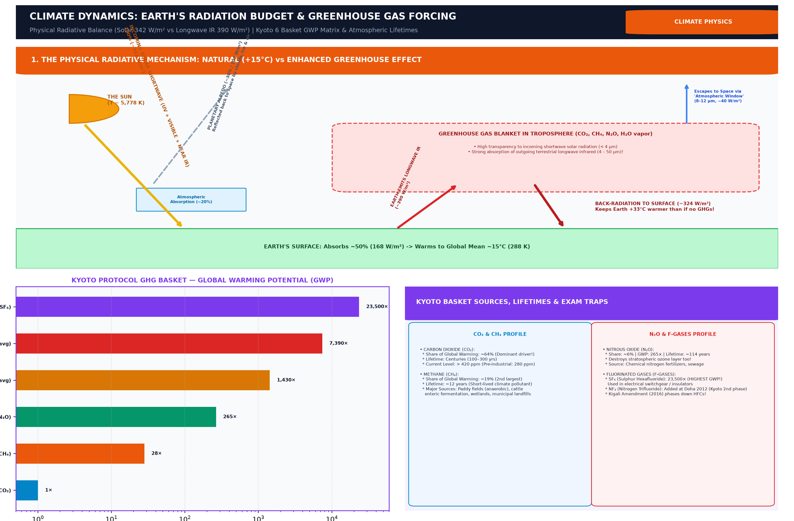

# Topic 10 — Climate Change (जलवायु परिवर्तन)
### ★ UPPCS Revision Sheet — Lucent-style (no repetition · Practice ≥25)

<strong>Covers syllabus</strong> (click to expand)

Global Warming (भूमंडलीय तापन) | Greenhouse Effect | Greenhouse Gases (GHGs) | Carbon Footprint | Carbon Sink (कार्बन सिंक) | Carbon Sequestration (कार्बन पृथक्करण) | Climate Change Impacts | Climate Adaptation (जलवायु अनुकूलन) | Climate Mitigation (जलवायु शमन)

> **Sources baked in:** IPCC AR6, NCERT Geography/Biology, India NDC 2022, NAPCC 2008, MoEFCC, IMD, WMO GHG Bulletin shares, UPPCS/UPSC PYQs 2018–2025
> **Weight:** ★★★ High — GHG traps, adaptation vs mitigation, treaty years, India targets
> **Last verified:** September 2026

---

## Current Affairs (this topic)

- Keep India NDC / Net Zero 2070 / LiFE as living climate CA; treaty years stay in the ladder below.
- Do not put **Montreal** into a climate-mitigation answer slot when Kyoto (क्योटो) / Paris are present.

---

## Consolidated — 36 Must-Score Facts

1. **Global warming** is the long-term rise in average surface temperature. It is a subset of broader **climate change**, which also includes rainfall, extremes, and sea-level shifts.
2. IPCC (आईपीसीसी) AR6 facts about **1.1°C** above 1850–1900 globally. India has warmed about **0.7°C** since 1901 (IMD class figure). Past-century surface rise is about **1°C ≈ 1.8°F**.
3. The natural greenhouse effect (प्राकृतिक ग्रीनहाउस प्रभाव) keeps Earth near about **+15°C**. Without it, Earth would be near about **−18°C**.
4. **Joseph Fourier (1820s)** postulated the greenhouse-effect idea. Sun sends **shortwave** (UV + visible + IR); Earth re-emits **longwave IR**. Ozone absorbs harmful UV; GHGs trap outgoing IR.
5. Enhanced greenhouse effect (मानवजनित संवर्धित प्रभाव) means excess anthropogenic GHGs trap outgoing infrared radiation. Main cause of recent warming is **CO₂** (highest concentration among long-lived GHGs).
6. Kyoto-basket majors: **CO₂** (GWP **1**), **CH₄** (GWP about **28–36**), **N₂O** (GWP about **265**), plus HFCs, PFCs, **SF₆** (and **NF₃** in later inventories).
7. Rough **WMO-style relative (सापेक्ष) shares** often used in Indian papers: **CO₂ ~64%, CH₄ ~19%, N₂O ~6%, CFCs + others ~11%**. Decreasing order: **CO₂ > CH₄ > CFCs > N₂O**.
8. **Water vapour** is Earth’s most abundant natural GHG (NASA: ~half of the natural greenhouse effect) but mainly a **feedback**, not the primary policy driver.
9. **Not GHGs:** **argon, nitrogen (N₂), oxygen, hydrogen, propane**. **SO₂ / NOx** do **not** contribute to warming **directly** (indirect / other roles).
10. **Direct** GHGs include CO₂, CH₄, N₂O, CFCs, SF₆, NF₃. **Indirect** agents include **NOx, CO, NMVOCs, SO₂**.
11. India is about the **third**-largest total emitter (**China** first); **Bhutan** is often cited as **carbon-negative**.
12. A **carbon footprint** totals GHGs in tCO₂e across Scope **1** (direct), **2** (energy), and **3** (supply chain).
13. A **carbon sink** absorbs more CO₂ than it releases (forests, oceans, soils, mangroves / **blue carbon** (नीला कार्बन)). **Sequestration** is the storage process.
14. **Carbon fertilization** = more plant growth from higher atmospheric CO₂ (not the same as ocean acidification (महासागरीय अम्लीकरण) or warming).
15. Pre-industrial CO₂ ~**278–280 ppm (~0.03%)**; mid-20th century ~**315 ppm**; now **415–420+ ppm**.
16. **Methane (“marsh gas”)** sources: paddies, cattle, coal mines, landfills, termites; natural wetlands dominate natural CH₄ (~**75–76%** of natural). **Rice** is a key anthropogenic source of **both CH₄ and N₂O**.
17. **Methane hydrates** under Arctic tundra (टुंड्रा) / seafloor can release CH₄ if warmed; atmospheric CH₄ oxidises to CO₂ in roughly a decade or two.
18. Impacts include heat waves, glacier melt, sea-level rise, coral bleaching (प्रवाल विरंजन), disease spread, stronger storms. **Arctic / Greenland ice** is among the most fragile first-hit systems.
19. Rough IPCC-style risk: beyond about **+2°C** pre-industrial → widespread coral mortality; beyond about **+3°C** → terrestrial biosphere tends toward a **net carbon source**.
20. **Adaptation** = coping with impacts. **Mitigation** = cutting emissions and enhancing sinks.
21. **NAPCC (2008)** has **eight** national missions — **not** nuclear power as a listed mission.
22. India’s updated **NDC** path includes about **45%** emission-intensity cut and about **50%** non-fossil electricity capacity by **2030** (not “60% energy from renewables” as a false paraphrase).
23. India’s **Net Zero** pledge is **2070**. Net zero means emissions balanced by removals — **not** literally zero every emission.
24. **LiFE Mission** launched **June 2022**; idea at **COP26 (2021)**, not COP25.
25. Climate treaty chain: **UNFCCC (यूएनएफसीसीसी) 1992 → Kyoto 1997 (force 2005) → Paris 2015**. **Montreal 1987** = ozone, not climate.
26. **CDM** (Kyoto Art. 12) lets Annex-I parties fund projects in developing countries for **CERs** (1 CER ≈ 1 tCO₂). **Carbon credit** (कार्बन क्रेडिट) concept originates from Kyoto.
27. **Green Climate Fund** was set up at **Cancun COP-16 (2010)**, not Durban. **Earth Hour** (अर्थ आवर) = **WWF** (डब्ल्यूडब्ल्यूएफ), last Saturday of March (lights off ~8:30–9:30 pm).
28. **GHG Protocol** = **WRI + WBCSD** accounting tool. **Blue carbon** = ocean/coastal carbon (mangroves, seagrass, salt (लवणाध्यक्ष) marsh).
29. UP heat vulnerability often cites (साइट्स) Lucknow (लखनऊ), Agra, Prayagraj (प्रयागराज), and NCR.
30. UP drought (सूखा) fact is **Bundelkhand’s seven districts**. Flood facts include Ballia, Ghazipur, and Varanasi (वाराणसी) belts.
31. Emissions hotspot language for UP–MP often points to the **Singrauli** coal belt.
32. Terai (तराई) forests at Dudhwa (दुधवा) and Pilibhit are UP **carbon-sink** examples.
33. **Milankovitch** orbital theory (eccentricity, obliquity, precession) — **solar irradiance** is **not** part of that astronomical set.
34. **Ice cores** are the classic **cryogenic** climate archive (Greenland / Antarctica).
35. **Solar flares** are **not** a primary cause of recent climate change in standard NASA/IPCC framing.
36. Farm practices that help soil carbon storage include **contour bunding, relay cropping, and zero tillage**.

---

## Confused Pairs

| A | B | Distinguishing Fact / Correct Match | Hindi Terminology |
|---|---|-------------------------------------|-------------------|
| **Global Warming** | **Climate Change** | Long-term monotonic increase in Earth's average surface and tropospheric temperature driven by greenhouse gas buildup vs broad spectrum of shifting weather patterns, rising sea levels, altering precipitation, and intensifying extreme climate anomalies | भूमंडलीय तापन (ग्लोबल वार्मिंग) / जलवायु परिवर्तन |
| **Climate Mitigation** | **Climate Adaptation** | Interventions designed to reduce greenhouse gas emissions at the source or enhance carbon sinks (renewable energy, afforestation, carbon capture) vs adjustments in natural or human systems to moderate harm, exploit beneficial opportunities, and cope with actual/expected climate impacts (flood barriers, drought-tolerant seeds) | जलवायु शमन (उत्सर्जन रोकथाम) / जलवायु अनुकूलन (सहनशीलता वृद्धि) |
| **Natural Greenhouse Effect** | **Enhanced Greenhouse Effect** | Essential natural phenomenon keeping Earth's surface habitable at an average ~15°C (without it Earth would freeze at -18°C) vs excessive anthropogenic heat-trapping caused by fossil fuel combustion and industrial emissions driving global warming | प्राकृतिक ग्रीनहाउस प्रभाव / मानवजनित संवर्धित प्रभाव |
| **Global Warming Potential (GWP)** | **Radiative Forcing** | Metric measuring the cumulative heat-trapping ability of 1 kg of a specific GHG over 100 years relative to CO₂ (=1.0) vs the net change in Earth's radiative energy balance (measured in Watts/m²) caused by changes in atmospheric gas concentrations | वैश्विक तापन क्षमता (GWP) / विकिरण दबाव |
| **Carbon Sink** | **Carbon Sequestration** | Natural or artificial reservoir that absorbs and stores more carbon than it releases into the atmosphere (oceans, boreal forests, soil) vs the actual physical, biological, or chemical process of capturing and securing carbon dioxide in long-term storage | कार्बन सिंक (अवशोषक भंडार) / कार्बन पृथक्करण (भंडारण प्रक्रिया) |
| **Carbon Credit** | **Carbon Offset** | Formal tradable permit or certificate representing the reduction or removal of 1 metric tonne of CO₂ equivalent under a compliance cap-and-trade system vs voluntary purchase of emission reduction units to neutralize an individual's or company's carbon footprint | कार्बन क्रेडिट (1 टन CO₂e प्रमाण-पत्र) / कार्बन ऑफसेट |
| **Kyoto Protocol (1997)** | **Paris Agreement (2015)** | Top-down legally binding emission reduction targets imposed exclusively on developed nations (Annex-I) with Common But Differentiated Responsibilities vs bottom-up universal framework requiring all countries to submit voluntary Nationally Determined Contributions (NDCs) aiming to cap warming well below 2.0°C/1.5°C | क्योटो प्रोटोकॉल (बाध्यकारी/विकसित देश) / पेरिस समझौता (सार्वभौमिक NDCs) |
---

## Must-score facts — warming, GHGs, sinks

### Frame

| Item | Lock |
|------|------|
| Warming vs climate change | Temp rise subset / broader incl. rainfall & extremes |
| Natural GHG effect | ~+15°C with; ~−18°C without |
| Fourier | 1820s greenhouse-effect idea |
| Main recent driver | Anthropogenic **CO₂** |
| Kyoto basket | CO₂, CH₄, N₂O, HFCs, PFCs, SF₆ (+NF₃ later) |
| Relative shares (WMO-style) | CO₂~64% > CH₄~19% > CFCs+~11% > N₂O~6% |
| Not GHGs | Ar, N₂, O₂, H₂, propane |
| India rank / Bhutan | ~3rd absolute (निरपेक्ष) / often carbon-negative |
| Sink / sequestration | Net CO₂ absorb / storage process |
| Blue carbon | Ocean–coastal sinks (mangroves etc.) |

---

## 10.1 Global Warming

**Identity:** Temperature rise since industrial era | IPCC 1.1°C | Anthropogenic dominant

- **Global warming** is the long-term increase in Earth's average near-surface temperature.
- **Climate change** is broader and includes shifts in rainfall, monsoon timing, cyclones, and extremes.
- Since the industrial era, atmospheric **CO₂** has risen from about **280 ppm to over 420 ppm**.
- **IPCC AR6** estimates (प्राकलन समिति) warming of about **1.1°C** above the **1850–1900** pre-industrial baseline.
- **Human activities** — fossil fuels, deforestation, industry, agriculture — are the **dominant cause** of recent warming.
- **India** has warmed about **0.7°C** since 1901 according to **IMD** data.
- **Oceans absorb about 90%** of excess heat, causing thermal expansion and marine stress.
- **Arctic warming** is about **2–3 times faster** than the global average.
- A single cold day is **weather**. Multi-decade warming trend is **climate**.

> **Logic:** "Warming is entirely natural" is **false**. IPCC attributes recent trend mainly to human activity.

---

## 10.2 Greenhouse Effect

**Identity:** Fourier 1820s | Shortwave in · longwave out | Natural vs enhanced | ≠ ozone depletion (ओजोन क्षरण)

- The **greenhouse effect** is the process by which atmospheric gases absorb and re-emit **outgoing infrared radiation**, warming the surface and lower atmosphere.
- **Joseph Fourier (1820s)** postulated the greenhouse-effect concept.
- The Sun emits **high-energy shortwave** radiation (UV, visible, near-IR). Harmful **UV** is largely absorbed by the **ozone layer**; visible and IR reach the surface as heat.
- Earth, being cooler, re-emits energy as **longwave IR**. Greenhouse gases absorb much of that longwave and re-radiate it in all directions.
- The **natural greenhouse effect** keeps Earth's average temperature near **+15°C**.
- Without it, Earth's average would be about **−18°C** and largely uninhabitable.
- The **enhanced greenhouse effect** comes from human-caused GHG buildup faster than natural sinks can absorb — this drives **global warming**.
- **Water vapour** is the most abundant natural GHG (about **half** of the natural greenhouse effect in NASA-style framing) but acts mainly as a **feedback**, not a primary emitted driver like fossil CO₂.
- The greenhouse effect is **not ozone depletion**. Ozone blocks UV; GHGs trap IR.

> **Logic:** Natural greenhouse effect is **essential**. The problem is the **enhanced** anthropogenic effect. Fourier coined the concept — do not invent modern IPCC authors for that stem.

---

## 10.3 Greenhouse Gases (GHGs)

**Identity:** Kyoto basket | WMO share order | Argon/H₂/propane not GHG | Direct vs indirect

- **Greenhouse gases** absorb and emit infrared radiation in the atmosphere.
- **CO₂** is the main anthropogenic driver by concentration and total forcing. IPCC-style forcing share is often ~**76%**; older WMO-bulletin style relative shares used in many Indian papers are **CO₂ ~64%, CH₄ ~19%, N₂O ~6%, CFCs + others ~11%**.
- Decreasing contribution order commonly tested: **CO₂ > CH₄ > CFCs > N₂O**.
- **CO₂** has **GWP = 1**. Pre-industrial ~**278–280 ppm (~0.03%)**; ~**315 ppm** around 1950s; now **415–420+ ppm**.
- **Methane (CH₄)** — also called **marsh gas** — has **GWP around 28–36** (100-yr). Sources: paddies, cattle, coal mines, landfills, termites; natural **wetlands** dominate natural CH₄ (~**75–76%**).
- **Rice** is a major anthropogenic source of **both methane and nitrous oxide** (anaerobic soils + nitrogen fertiliser).
- **Nitrous oxide (N₂O)** has **GWP around 265** and links strongly to synthetic fertilisers.
- The **Kyoto Protocol** covers **CO₂, CH₄, N₂O, HFCs, PFCs, and SF₆** (later inventories also track **NF₃**).
- **Not greenhouse gases:** **argon, N₂, O₂, hydrogen, propane**. **Nitrogen oxide (NOₓ)** is **not** listed among the classic naturally occurring GHGs in UPPCS-style keys.
- **SO₂ and oxides of nitrogen** do **not** contribute to global warming **directly** (acid rain (अम्ल वर्षा) / air pollution / indirect chemistry roles).
- **IPCC direct GHGs** include CO₂, CH₄, N₂O, halocarbons, SF₆, NF₃. **Indirect** agents include **NOₓ, CO, NMVOCs, SO₂**.
- **Carbon fertilization** means increased plant growth from higher atmospheric CO₂ — distinct from warming or ocean acidification.
- Oceans remove much atmospheric CO₂ via **phytoplankton photosynthesis** (biological pump) — destroying phytoplankton harms the ocean carbon sink and marine food webs, not seawater density.
- **Black carbon (soot)** is a climate forcer but **not a GHG**.
- **India is the 3rd largest total GHG emitter** (**China** #1); **low per capita**. **Bhutan** is often described as **carbon-negative**.

| GHG / group | Rough relative share (WMO-style stems) | GWP (100-yr) |
|-------------|----------------------------------------|--------------|
| CO₂ | ~64% | 1 |
| CH₄ | ~19% | 28–36 |
| N₂O | ~6% | 265 |
| CFCs + others | ~11% | Very high (F-gases) |

> **Logic:** Highest **GWP per molecule** ≠ largest total warming. **CO₂ dominates by volume**. Water vapour can win “most abundant natural GHG / largest share of natural effect” stems; CO₂ wins “main component / highest contribution to anthropogenic warming” stems.

---

## 10.4 Carbon Footprint

**Identity:** tCO₂e | Scope 1/2/3 | India low per capita, high total

- A **carbon footprint** is the total GHG emissions caused by a person, product, organisation, or country.
- It is measured in **tonnes of CO₂ equivalent (tCO₂e)** using GWP conversion.
- **Scope 1** covers **direct** emissions from owned sources such as factory (फैक्टरी) boilers.
- **Scope 2** covers **indirect** emissions from purchased electricity or heat.
- **Scope 3** covers other indirect emissions such as supply chains, travel, and product disposal.
- **India's per capita footprint** is about **2 tCO₂e**, below the global average of about **4.7**.
- The **energy/electricity sector** is India's largest emissions source.
- **LiFE Mission (2022)** promotes lifestyle changes to reduce individual footprints.

> **Logic:** India has low **per capita** footprint but high **total** emissions due to population (जनसंख्या) size.

---

## 10.5 Carbon Sink

**Identity:** Net CO₂ absorption | Forests, oceans, soil | Opposite = source

- A **carbon sink** absorbs more CO₂ than it releases over time.
- **Forests** store carbon in biomass and soil through photosynthesis.
- **Oceans** absorb about **25% of anthropogenic CO₂** through dissolution (विघटन) and the biological pump.
- **Soils and wetlands** store organic carbon. Degraded land can become a **carbon source**.
- **Mangroves** are **blue carbon** sinks with very high sequestration rates per hectare.
- **Deforestation** converts a sink into a **source** by releasing stored carbon and removing uptake capacity.
- India's NDC targets an additional **2.5–3 GtCO₂e forest carbon sink** by 2030.

> **Logic:** A coal plant is a **source**. A growing forest is a **sink**.

---

## 10.6 Carbon Sequestration

**Identity:** Long-term carbon storage | Biological + geological | Farm practices | CCS (सुरक्षा कैबिनेट समिति) sites

- **Carbon sequestration** is the process of capturing and storing atmospheric carbon for long periods.
- **Biological sequestration** uses afforestation, soil carbon build-up, and mangrove restoration.
- Farm practices that help soil carbon storage include **contour bunding**, **relay cropping**, and **zero tillage**.
- **Geological sequestration / CCS** can use abandoned coal seams, depleted oil and gas reservoirs, and deep saline (लवणीय) formations; other discussed methods include crushed basalt on farmland and ocean alkalinity enhancement.
- **Afforestation and reforestation** are India's main practical sequestration tools under **Green India Mission**.
- **Blue carbon** is carbon captured by oceans and coastal ecosystems (mangroves, seagrasses, salt marshes).
- **CAMPA** and the **Green Credit Programme (2023)** finance ecosystem (पारिस्थितिकी तंत्र) restoration in India.
- Stored carbon can be **re-released** by fire or deforestation, creating permanence risk.

> **Logic:** Sequestration is the **process**. Sink is the **reservoir**. Blue carbon ≠ forest biomass carbon label.

---

## 10.7 Climate Change Impacts

**Identity:** Heat, glaciers, monsoon extremes, agriculture, coral bleaching | Arctic first

- **Heat waves** are increasing in frequency across India, especially in **northwest India and UP**.
- **Himalayan glaciers** such as Gangotri (गंगोत्री) are retreating, affecting lean-season Ganga (गंगा) flow.
- **Monsoon** shows more **extreme rainfall bursts** and longer dry spells rather than uniform change.
- **Bundelkhand** faces recurring **drought** and water scarcity.
- **Eastern UP** along the Ganga faces **flood risk** from intense monsoon events.
- **Wheat** in UP plains is sensitive to **March heat spikes** during the rabi (रबी) season.
- **Sea-level rise** threatens coastal India and increases delta (डेल्टा) salinity pressures.
- **Coral bleaching** occurs when sea surface temperature rises about **1–2°C above normal** for sustained periods.
- Impacts of warming commonly listed together: rise in sea level, melting glaciers, spread of diseases, coral bleaching, stronger cyclones/storms/hurricanes.
- The **Arctic and Greenland ice sheet** are among the most fragile systems hit first by warming.
- Rough IPCC risk framing: above about **+2°C** pre-industrial → widespread coral mortality; above about **+3°C** → terrestrial biosphere tends toward a **net carbon source** (wetlands do not all permanently disappear; cereal farming does not become impossible everywhere).
- Climate stress on agriculture and food security can raise **social tension** through resource pressure and food insecurity.
- **Milankovitch** astronomical climate theory covers **eccentricity, obliquity, and precession** — **not** solar irradiance as a listed element of that set.
- **Ice cores** provide the classic **cryogenic** record of past climate and atmospheric composition.
- Primary causes of recent climate change: fossil-fuel burning, oil-driven automobile growth, deforestation — **not** increasing solar flares as a major driver.

> **Logic:** — Andaman (अंडमान) coral bleaching linked to **+2°C Indian Ocean warming**. Do not mark “all wetlands vanish” or “no cereals anywhere” as automatic +3°C outcomes.

**PYQ — UPPCS Prelims 2024, Q19**

Coral bleaching in Andaman & Nicobar (निकोबार) caused by:

A. Coastal industry

B. +2°C Indian Ocean warming

C. Heavy pollution

D. −4°C cooling

Show answer

**Ans: B**

---

## 10.8 Climate Adaptation

**Identity:** Build resilience | NAPCC 2008 | 8 missions | ≠ mitigation

- **Climate adaptation** means adjusting to actual or expected climate impacts to reduce harm.
- **Mitigation** reduces emissions. **Adaptation** copes with impacts already occurring or already committed in the climate system.
- **NAPCC (National Action Plan on Climate Change, 2008)** is India's master climate framework with **8 national missions**.
- Adaptation-focused missions include **National Water Mission**, **Sustainable Agriculture Mission**, and **Himalayan Ecosystem Mission**.
- **National Water Mission** goals include a public water database and climate-impact assessment, citizen/state conservation action, focus on over-exploited areas, **~20% water-use efficiency gain**, and basin-level IWRM. Urban (नगरीय) wastewater recycling fits; nationwide Himalaya (हिमालय)–peninsula river linking and free borewell reimbursement do **not**.
- **Early warning systems** from IMD and CWC (केंद्रीय जल आयोग) for heat, floods, and cyclones are adaptation tools.
- **Climate-resilient crops**, micro-irrigation, and **PM Fasal Bima Yojana** support farm adaptation.
- **Bundelkhand water harvesting** and **Lucknow heat action plans** are UP adaptation examples.

| # | NAPCC Mission |
|---|---------------|
| 1 | National Solar Mission |
| 2 | Enhanced Energy Efficiency |
| 3 | Sustainable Habitat (वास स्थान) |
| 4 | National Water Mission |
| 5 | Sustaining Himalayan Ecosystem |
| 6 | Green India |
| 7 | Sustainable Agriculture |
| 8 | Strategic Knowledge for Climate Change |

- **Atomic / nuclear power is not** one of the eight NAPCC missions.
- Climate-smart village approaches linked to **CCAFS / CGIAR** (HQ France; **ICRISAT** is a CGIAR centre) sit in the adaptation–agriculture research lane.

> **Logic:** Building sea walls = **adaptation**. Closing coal plants = **mitigation**. Nuclear ≠ listed NAPCC mission.

---

## 10.9 Climate Mitigation

**Identity:** Cut emissions + sinks | UNFCCC/Kyoto/Paris | CDM · GCF | India NDC | LiFE

### Treaty ladder — climate vs ozone (read the stem)

| Ladder | Instruments | What it controls | Classic trap |
|--------|-------------|------------------|--------------|
| **Climate** | UNFCCC (1992) (जलवायु परिवर्तन संधि) → **Kyoto** (क्योटो) (1997) → **Paris** (2015) | GHG mitigation / NDCs | Montreal is **not** climate mitigation |
| **Ozone** | Vienna (1985) → **Montreal** (1987) → **Kigali** (HFCs, 2016) | ODS / HFC phase-down | Kyoto is **not** ozone |

- **UNFCCC** (यूएनएफसीसीसी) is the parent climate convention. **Kyoto** gave binding Annex-I cuts and CDM. **Paris** uses voluntary **NDCs** for all parties.
- **CBDR** (common but differentiated responsibilities) is the climate equity line — do not paste it onto Montreal automatically.
- **Montreal** protects the ozone layer; **Kigali** amends Montreal for HFCs (also climate-relevant, but still ozone-family architecture).

- **Climate mitigation** means reducing GHG sources or enhancing sinks to limit future warming.
- **UNFCCC (1992, Rio)** entered into force **21 March 1994**; it frames greenhouse-gas mitigation.
- **Kyoto Protocol (1997; force 16 February 2005)** was the first binding emission-cut treaty for **developed (Annex I) countries**.
- Kyoto’s **Clean Development Mechanism (CDM)** lets Annex-I parties fund projects in developing countries and earn **CERs** (1 CER ≈ **1 tCO₂**). Carbon credits are **market-traded**, not fixed by UNEP (संयुक्त राष्ट्र पर्यावरण कार्यक्रम) price.
- **Paris Agreement (पेरिस समझौता) (2015)** (पेरिस समझौता) uses voluntary **NDCs** to limit warming well below **2°C** and pursue **1.5°C**. The “$1000 billion/year” paraphrase is wrong — finance language was about mobilising **$100 billion** class climate finance.
- **Green Climate Fund (GCF)** (जीसीएफ) was established at **Cancun COP-16 (2010)** under UNFCCC to help developing countries with adaptation and mitigation — **not** founded at Durban and **not** under UNEP/OECD/ADB/World Bank as its founding aegis.
- **India's updated NDC (2022)** targets **45% lower emissions intensity of GDP by 2030** (vs 2005).
- India targets **50% cumulative electric installed capacity from non-fossil sources by 2030** (not a “60% of total energy from renewables” paraphrase).
- India pledged **Net Zero by 2070** at **COP-26 Glasgow (2021)**. **Net zero** means emissions are **balanced by absorption/removal** — not that every emission falls to absolute zero.
- **LiFE (Lifestyle for Environment (जीवनशैली पर्यावरण))** was launched in **June 2022**. The idea was proposed at **COP-26**, not COP-25.
- **Earth Hour** is a **WWF** awareness event (usually last Saturday of March, lights off ~1 hour) — not UNEP/UNESCO.
- **Montreal Protocol (मॉन्ट्रियल प्रोटोकॉल) (1987)** (मॉन्ट्रियल प्रोटोकॉल) controls **ozone-depleting substances**, not climate change.
- **GHG Protocol** (WRI + WBCSD) is an accounting tool for governments and business — not a UN treaty.

> **Logic:** Climate mitigation treaty stem → **Kyoto**. Montreal = ozone. GCF = Cancun 2010. Net zero ≠ absolute zero emissions.

**PYQ — UPPCS Prelims 2024, Q35**

Which agreement relates to climate change mitigation?

A. Montreal Protocol

B. Ramsar (रामसर)

C. Kyoto Protocol

D. CITES

Show answer

**Ans: C**

**PYQ — UPPCS Prelims 2025, Q139**

LiFE: (1) Launched June 2022. (2) Idea proposed at COP-25 Madrid.

A. Only 2

B. Neither

C. Both

D. Only 1

Show answer

**Ans: D** — Idea at **COP-26 Glasgow**.

| Treaty | Year | Focus |
|--------|------|-------|
| UNFCCC | 1992 | Framework |
| Kyoto Protocol | 1997 | Binding cuts (developed countries) |
| Paris Agreement | 2015 | NDC pledges |
| Montreal Protocol | 1987 | **Ozone** (not climate) |

---

## Complete PYQ Bank (Topic 10)

**Q1. UPPCS Prelims 2025, Q139**

With reference to the **LiFE (Lifestyle for Environment)** Mission, consider the following statements:

1. LiFE was launched in **June 2022**. 
2. The idea was first proposed at **COP-25 in Madrid**. 

A. 2 only 
B. Neither 1 nor 2 
C. Both 1 and 2 
D. 1 only 

Show answer

**Logic:** LiFE launch date vs COP venue where PM Modi first floated the concept.

**Ans: D.** LiFE launched **June 2022**; the idea was announced at **COP-26 Glasgow (2021)**, not COP-25 Madrid.

**Trap:** COP-25 Madrid is a plausible-sounding UN climate venue — the correct pitch was **Glasgow 2021**.

---

**Q2. UPPCS Prelims 2024, Q35**

Which of the following international agreements relates to **climate change mitigation**?

A. Montreal Protocol 
B. Ramsar Convention 
C. Kyoto Protocol 
D. CITES 

Show answer

**Logic:** Treaty-family trap — Montreal controls ozone; Kyoto/Paris address greenhouse-gas mitigation.

**Ans: C.** The **Kyoto Protocol (1997)** imposed binding emission cuts on developed (Annex I) parties.

**Trap:** **Montreal Protocol** is the most picked wrong answer — it phases out **ODS**, not CO₂ mitigation.

---

**Q3. UPPCS Prelims 2024, Q19**

Coral bleaching in the **Andaman & Nicobar Islands** was primarily caused by—

A. Increased coastal industrial effluents alone 
B. About **+2°C warming** of the Indian Ocean 
C. Heavy marine pollution alone 
D. A **−4°C** drop in sea-surface temperature 

Show answer

**Logic:** Climate-impact stem — thermal stress on reef symbionts drives bleaching events.

**Ans: B.** **+2°C Indian Ocean warming** triggered bleaching; pollution adds stress but warming is primary.

**Trap:** Cooling (−4°C) would not expel zooxanthellae — bleaching follows **heat stress**.

---

**Q4. UPPCS Prelims 2023, Q109**

What was India's rank in the world in **greenhouse gas emissions** in 2022 (as framed in the paper)?

A. 9th 
B. 10th 
C. 11th 
D. 12th 

Show answer

**Logic:** Rank framing trap — paper used a 9th–12th band; absolute total-emission rank is ~3rd.

**Ans: B.** The keyed answer is **10th** (performance-index style framing in the paper).

**Trap:** India is ~**3rd in absolute total emissions** — do not confuse with the paper's **10th** option key.

---

**Q5. UPPCS Prelims 2022, Q103**

Which of the following is **NOT** a greenhouse gas?

A. Argon 
B. Methane 
C. Carbon dioxide 
D. Nitrous oxide 

Show answer

**Logic:** Non-GHG noble gas trap among Kyoto-basket gases.

**Ans: A.** **Argon** is an inert atmospheric component and **not** a greenhouse gas.

**Trap:** **Water vapour** is a natural GHG but absent here — **argon** is the keyed non-GHG distractor set.

---

**Q6. UPPCS Prelims 2018 pattern**

Global warming is most directly linked to an increased frequency and intensity of—

A. Total solar eclipses 
B. **Extreme weather events** such as heat waves and intense rainfall 
C. Milankovitch ice-age cycles alone 
D. Stratospheric ozone recovery 

Show answer

**Logic:** Climate-impact consequence — enhanced greenhouse effect raises extreme-event probability.

**Ans: B.** Warming intensifies **heat waves, droughts, floods, and cyclone rainfall** — core IPCC impact framing.

**Trap:** Milankovitch cycles operate on **millennial** scales — they do not explain recent decadal extreme-weather rise.

---

**Q7. UPSC pattern**

Under the **Kyoto Protocol**, quantified emission-reduction commitments applied primarily to—

A. All UN member states equally 
B. **Annex I developed countries** 
C. Only Least Developed Countries 
D. Only island nations 

Show answer

**Logic:** CBDR architecture — Kyoto bound industrialised Annex I parties, not India or other developing countries.

**Ans: B.** Kyoto's binding cuts targeted **Annex I (developed) countries**; developing nations had no binding targets.

**Trap:** India is a major emitter today but was **not** under Kyoto binding cuts — Paris uses voluntary NDCs instead.

---

## Extra Drill — Ghatnachakra-pattern (Q31–Q40)

**Logic (set):** Mechanism, non-GHG traps, methane/rice, impacts thresholds, treaties/finance, and net-zero wording.

**Q31.** The greenhouse-effect concept was postulated by:

A. C.C. Park 
B. Joseph Fourier 
C. L. Zobler 
D. Arrhenius only in 1990s 

Show answer

**Ans: B.** Joseph Fourier in the **1820s**.

**Q32.** Which is **not** responsible for global warming?

A. Methane 
B. Water vapour 
C. Argon 
D. Carbon dioxide 

Show answer

**Ans: C.** Argon is **not** a greenhouse gas.

**Q33.** Decreasing order of contribution commonly tested:

A. CO₂ > CH₄ > CFCs > N₂O 
B. CH₄ > CO₂ > CFCs > N₂O 
C. CO₂ > N₂O > CH₄ > CFCs 
D. CFCs > CO₂ > CH₄ > N₂O 

Show answer

**Ans: A.** WMO-style share order used in many Indian papers.

**Q34.** Among the following crops, the most important anthropogenic source of **both** methane and nitrous oxide is:

A. Cotton 
B. Rice 
C. Sugarcane 
D. Wheat 

Show answer

**Ans: B.** Paddy anaerobic CH₄ + fertiliser N₂O.

**Q35.** Carbon fertilization best describes:

A. Ocean acidification from CO₂ 
B. Increased plant growth from higher atmospheric CO₂ 
C. Global warming from CO₂ alone 
D. Adaptation of all species to climate change 

Show answer

**Ans: B.** More photosynthesis / greening from elevated CO₂.

**Q36.** Without the greenhouse effect, Earth’s average surface temperature would be about:

A. 0°C 
B. −18°C 
C. 5°C 
D. −20°C 

Show answer

**Ans: B.** Roughly **−18°C**.

**Q37.** If warming exceeds about **3°C** above pre-industrial levels, which impacts are plausible?

1. Terrestrial biosphere tends toward a net carbon source 
2. Widespread coral mortality 
3. All global wetlands permanently disappear 
4. Cereals cannot be cultivated anywhere 

A. 1 only 
B. 1 and 2 only 
C. 2, 3 and 4 only 
D. All four 

Show answer

**Logic:** +2°C already implies widespread coral mortality; +3°C adds net carbon-source risk. Absolute “all wetlands” / “no cereals anywhere” are overstated.

**Ans: B**

**Q38.** Green Climate Fund was established at:

A. Durban COP 
B. Cancun COP-16 (2010) 
C. Paris COP-21 only as first idea 
D. Stockholm 1972 

Show answer

**Ans: B.** Cancun **2010** under UNFCCC.

**Q39.** With reference to net-zero for 2050/2070 pathways, which is correct?

A. A country must bring every emission to absolute zero. 
B. Residual emissions are compensated by absorption and removal. 
C. Both A and B 
D. Neither 

Show answer

**Ans: B.** Balance of emissions and removals — Bhutan-style negative emissions possible if removals exceed emissions.

**Q40.** Assertion (A): Climate change can increase social tension in India. 
Reason (R): Extreme weather frequency/intensity has serious repercussions on food security.

A. Both true; R explains A 
B. Both true; R does not explain A 
C. A true; R false 
D. A false; R true 

Show answer

**A/R logic:** A tests socio-political stress; R tests the food-security pathway linking climate extremes to social tension.

**Ans: A**

## Practice Zone — UPPCS Format Drill

> **30 questions** | Original drill (not a PYQ dump) | ≥60% multi-statement/application | A/R · Match · chronology · NOT-matched | Keys balanced A–D | **Ans first, then Logic**

**Q1.** With reference to global warming and climate change, which of the following statements is/are correct?

1. Global warming is the long-term fall in average surface temperature.
2. Climate change is broader and also includes rainfall and extremes.
3. The two terms are identical in every Prelims key.

A. Only 2
B. Only 1
C. 2 and 3
D. 1 and 2

Show answer

**Ans: A.** Only 2 is correct.

**Logic:** Only statement 2 remains true among the numbered claims. Statement 1 is false. Statement 2 is true. Statement 3 is false.

**Q2.** Given below are two statements, one labelled as Assertion (A) and the other as Reason (R).

Assertion (A): Without the natural greenhouse effect Earth would average about −18°C.

Reason (R): With the natural greenhouse effect the surface averages about +15°C.

A. Both (A) and (R) are true, but (R) is not the correct explanation of (A)
B. (A) is false, but (R) is true
C. (A) is true, but (R) is false
D. Both (A) and (R) are true and (R) is the correct explanation of (A)

Show answer

**Ans: A.** Both true; R states the with-GHG temperature, not why without-GHG is −18°C — related pair, not explanation of A’s counterfactual.

**A/R logic:** Both are standard temperature facts; R does not explain the −18°C claim.

**Q3.** Match List-I with List-II:

| List-I | List-II |
|--------|--------|
| A. CO₂ GWP | 1. ~28–36 |
| B. CH₄ GWP | 2. 1 |
| C. N₂O GWP | 3. ~265 |

Code:

A. A-2, B-3, C-1
B. A-1, B-2, C-3
C. A-2, B-1, C-3
D. A-3, B-1, C-2

Show answer

**Ans: C.** A-2, B-1, C-3.

**Logic:** CO₂=1; CH₄~28–36; N₂O~265.

**Q4.** With reference to relative GHG shares (WMO-style teaching), which of the following statements is/are correct?

1. Order often tested: CO₂ > CH₄ > CFCs+others > N₂O.
2. Rough shares reverse CO₂ and CH₄ (~19% CO₂ and ~64% CH₄).
3. Argon is the largest Kyoto-basket GHG by share.

A. 2 and 3
B. Only 1
C. 1 and 2
D. Only 3

Show answer

**Ans: B.** Only 1 is correct.

**Logic:** Statement 1 is the usual relative-share order. Statement 2 invents reversed CO₂/CH₄ shares. Statement 3 is false — argon is not a Kyoto-basket GHG.

**Q5.** Which of the following is/are NOT greenhouse gases?

1. Argon
2. Nitrogen (N₂)
3. Oxygen
4. Carbon dioxide

A. Only 3
B. 1 and 2
C. 1, 2 and 3
D. Only 4

Show answer

**Ans: C.** Argon, nitrogen and oxygen are not greenhouse gases; CO₂ is.

**Logic:** Major GHGs include CO₂, CH₄, N₂O, ozone and water vapour. N₂, O₂ and argon dominate dry air but are not greenhouse gases.

**Q6.** Arrange IPCC AR6 warming idea:

A. About 5°C cooling since 1900
B. About 1.1°C above 1850–1900 globally
C. No human influence in AR6
D. Exact 0.00°C change

Show answer

**Ans: B.** About 1.1°C above 1850–1900.

**Logic:** AR6 global warming fact.

**Q7.** Given below are two statements, one labelled as Assertion (A) and the other as Reason (R).

Assertion (A): Water vapour is Earth’s most abundant natural GHG.

Reason (R): Water vapour is mainly treated as a feedback, not the primary policy lever like CO₂.

A. Both (A) and (R) are true, but (R) is not the correct explanation of (A)
B. (A) is false, but (R) is true
C. (A) is true, but (R) is false
D. Both (A) and (R) are true and (R) is the correct explanation of (A)

Show answer

**Ans: A.** Both true; R does not explain why vapour is most abundant — it states policy/feedback role.

**A/R logic:** Abundance vs feedback/policy distinction.

**Q8.** With reference to enhanced greenhouse effect, which of the following statements is/are correct?

1. Excess anthropogenic GHGs trap outgoing infrared.
2. Main cause of recent warming is CO₂.
3. Joseph Fourier (1820s) framed the greenhouse-effect idea.

A. 1 and 2 only
B. 2 and 3 only
C. 1, 2 and 3
D. 1 and 3 only

Show answer

**Ans: C.** All three.

**Logic:** Enhanced GHG + CO₂ driver + Fourier.

**Q9.** Match List-I with List-II:

| List-I | List-II |
|--------|--------|
| A. Carbon sink | 1. Storage process |
| B. Sequestration | 2. Net CO₂ absorption |
| C. Blue carbon | 3. Ocean/coastal sinks |

Code:

A. A-3, B-1, C-2
B. A-1, B-2, C-3
C. A-2, B-3, C-1
D. A-2, B-1, C-3

Show answer

**Ans: D.** A-2, B-1, C-3.

**Logic:** Sink absorbs; sequestration stores; blue = coastal/ocean.

**Q10.** Which of the following pairs is/are correctly matched?

1. India — about third-largest absolute emitter
2. China — largest absolute emitter
3. Bhutan — often cited as carbon-negative

A. 1, 2 and 3
B. 2 and 3 only
C. 1 and 3 only
D. 1 and 2 only

Show answer

**Ans: A.** All three.

**Logic:** China #1; India ~3rd; Bhutan carbon-negative teaching.

**Q11.** With reference to carbon footprint, which of the following statements is/are correct?

1. It totals GHGs in tCO₂e.
2. Scope 1 is direct; Scope 2 purchased energy; Scope 3 value chain.
3. Ecological footprint uses the same unit tCO₂e only.

A. 2 and 3 only
B. 1 and 2 only
C. 1 and 3 only
D. 1, 2 and 3

Show answer

**Ans: B.** Only 1 and 2.

**Logic:** Ecological footprint uses gha — not only tCO₂e.

**Q12.** Given below are two statements, one labelled as Assertion (A) and the other as Reason (R).

Assertion (A): Montreal Protocol addresses ozone-depleting substances.

Reason (R): Kyoto/Paris instruments are climate/GHG instruments — not ozone ODS phase-out treaties.

A. Both (A) and (R) are true, but (R) is not the correct explanation of (A)
B. (A) is false, but (R) is true
C. (A) is true, but (R) is false
D. Both (A) and (R) are true and (R) is the correct explanation of (A)

Show answer

**Ans: A.** Both true; R contrasts climate treaties but does not explain Montreal’s ODS purpose by itself as causal explanation — still both true, R not explanation of A.

**A/R logic:** Issue-tag separation; R is true contrast, not the definitional explanation of Montreal.

**Q13.** Which of the following are direct GHGs in teaching lists?

1. CO₂
2. CH₄
3. N₂O
4. SF₆

A. 1 and 2 only
B. 1, 2 and 3 only
C. 1, 2, 3 and 4
D. 2, 3 and 4 only

Show answer

**Ans: C.** All four.

**Logic:** Direct GHGs include F-gases too.

**Q14.** With reference to India warming, which of the following statements is/are correct?

1. IMD-class figure often cites about 0.7°C warming since 1901.
2. AR6 global figure is about 1.1°C above 1850–1900.
3. India has cooled by 3°C since 1901 in all datasets.

A. 1, 2 and 3
B. 2 and 3 only
C. 1 and 3 only
D. 1 and 2 only

Show answer

**Ans: D.** Only 1 and 2.

**Logic:** Statement 3 false.

**Q15.** Arrange radiation idea:

1. Sun sends shortwave insolation
2. Earth re-emits longwave IR
3. GHGs trap outgoing IR

A. 1, 2 and 3
B. 1 and 2 only
C. 2 and 3 only
D. Only 1

Show answer

**Ans: A.** All three.

**Logic:** Shortwave in → longwave out → GHG trap.

**Q16.** Which of the following pairs is/are NOT correctly matched?

1. Carbon fertilization — more plant growth from higher CO₂
2. Ocean acidification — identical to carbon fertilization
3. Blue carbon — mangroves/seagrass/coastal sinks

A. 1 and 3 only
B. 2 only
C. 2 and 3 only
D. 1, 2 and 3

Show answer

**Ans: B.** Only pair 2 is not correctly matched.

**Logic:** Acidification ≠ fertilization.

**Q17.** Match Kyoto-basket teaching:

| List-I | List-II |
|--------|--------|
| A. HFCs | 1. Later inventories also |
| B. PFCs | 2. Kyoto F-gas |
| C. NF₃ | 3. Kyoto F-gas |

Code:

A. A-3, B-2, C-1
B. A-1, B-2, C-3
C. A-2, B-3, C-1
D. A-2, B-1, C-3

Show answer

**Ans: C.** A-2, B-3, C-1.

**Logic:** HFCs/PFCs Kyoto basket; NF₃ later inventories.

**Q18.** Given below are two statements, one labelled as Assertion (A) and the other as Reason (R).

Assertion (A): SO₂ and NOx do not contribute to warming as primary direct GHGs in the same way as CO₂.

Reason (R): They may have indirect/other atmospheric roles but are not classic Kyoto-basket GHGs.

A. Both (A) and (R) are true, but (R) is not the correct explanation of (A)
B. (A) is false, but (R) is true
C. (A) is true, but (R) is false
D. Both (A) and (R) are true and (R) is the correct explanation of (A)

Show answer

**Ans: D.** Both true and R explains the classification.

**A/R logic:** Indirect agents vs direct Kyoto GHGs.

**Q19.** With reference to carbon sink examples, which of the following statements is/are correct?

1. Forests, oceans, soils, mangroves can act as sinks.
2. A sink absorbs more CO₂ than it releases.
3. Every coal plant is a carbon sink by definition.

A. 1, 2 and 3
B. 2 and 3 only
C. 1 and 3 only
D. 1 and 2 only

Show answer

**Ans: D.** Only 1 and 2.

**Logic:** Coal plants are sources.

**Q20.** Which one of the following correctly states GWP?

A. A measure comparing heat-trapping to CO₂ over a stated horizon
B. A measure of ocean salinity only
C. A unit of forest canopy density
D. Identical to Dobson Unit

Show answer

**Ans: A.** Heat-trapping vs CO₂ over a horizon (often 100 years).

**Logic:** GWP ≠ DU.

**Q21.** How many of the following are Kyoto-basket gases (classic six + note NF₃ later)?

CO₂, CH₄, N₂O, HFCs, PFCs, SF₆

A. Only three
B. All six
C. Only five
D. Only four

Show answer

**Ans: B.** All six.

**Logic:** Classic Kyoto basket six.

**Q22.** With reference to propane/hydrogen/argon, which of the following statements is/are correct?

1. They are listed among gases that are not GHGs in standard traps.
2. CO₂ is also not a GHG.
3. N₂O is a GHG.

A. 1 and 2 only
B. 2 and 3 only
C. 1 and 3 only
D. 1, 2 and 3

Show answer

**Ans: C.** Only 1 and 3.

**Logic:** CO₂ is a GHG.

**Q23.** Arrange decreasing relative share teaching:

A. N₂O > CO₂ > CH₄
B. CFCs > CO₂ > CH₄ > N₂O
C. CH₄ > CO₂ > N₂O
D. CO₂ > CH₄ > CFCs+others > N₂O

Show answer

**Ans: D.** CO₂ > CH₄ > CFCs+ > N₂O.

**Logic:** WMO-style order.

**Q24.** Given below are two statements, one labelled as Assertion (A) and the other as Reason (R).

Assertion (A): Carbon fertilization can increase plant growth from higher atmospheric CO₂.

Reason (R): Carbon fertilization is the same process as stratospheric ozone depletion.

A. Both (A) and (R) are true, but (R) is not the correct explanation of (A)
B. (A) is false, but (R) is true
C. (A) is true, but (R) is false
D. Both (A) and (R) are true and (R) is the correct explanation of (A)

Show answer

**Ans: C.** A true, R false.

**A/R logic:** Different processes.

**Q25.** With reference to India’s emitter rank, which of the following statements is/are correct?

1. Absolute emissions place India near the top (about 3rd).
2. Per capita emissions remain relatively low versus many developed countries.
3. Absolute rank and per capita rank are always the same number.

A. 1 and 2 only
B. 2 and 3 only
C. 1 and 3 only
D. 1, 2 and 3

Show answer

**Ans: A.** Only 1 and 2.

**Logic:** Absolute ≠ per capita.

**Q26.** Which of the following pairs is/are correctly matched?

1. Direct GHG — CO₂
2. Indirect agent teaching — NOx, CO, NMVOCs, SO₂
3. Direct GHG — argon

A. 2 and 3 only
B. 1 and 2 only
C. 1 and 3 only
D. 1, 2 and 3

Show answer

**Ans: B.** Only 1 and 2.

**Logic:** Argon not GHG.

**Q27.** With reference to Scope emissions, which of the following statements is/are correct?

1. Scope 1 — direct
2. Scope 2 — purchased energy
3. Scope 3 — wider value chain

A. 1 and 2 only
B. 2 and 3 only
C. 1, 2 and 3
D. 1 and 3 only

Show answer

**Ans: C.** All three.

**Logic:** Standard Scope 1/2/3.

**Q28.** Which one of the following best states the main recent warming driver in teaching?

A. Argon increase
B. Montreal Protocol alone
C. Purely orbital cooling only
D. Anthropogenic CO₂

Show answer

**Ans: D.** Anthropogenic CO₂.

**Logic:** Main recent driver fact.

**Q29.** Given below are two statements, one labelled as Assertion (A) and the other as Reason (R).

Assertion (A): Blue carbon refers to ocean and coastal carbon sinks such as mangroves.

Reason (R): Blue carbon is identical to black carbon soot from incomplete combustion.

A. Both (A) and (R) are true, but (R) is not the correct explanation of (A)
B. (A) is false, but (R) is true
C. (A) is true, but (R) is false
D. Both (A) and (R) are true and (R) is the correct explanation of (A)

Show answer

**Ans: C.** A true, R false.

**A/R logic:** Blue ≠ black carbon.

**Q30.** With reference to HFCs, which of the following statements is/are correct?

1. HFCs are high-GWP greenhouse gases.
2. Kigali Amendment phases down HFCs.
3. HFCs are classic ozone-depleting substances under Montreal’s original ODS list.

A. 1 and 2 only
B. 2 and 3 only
C. 1 and 3 only
D. 1, 2 and 3

Show answer

**Ans: A.** Only 1 and 2.

**Logic:** HFCs are not classic ODS; Kigali is climate/GWP.

---

## Mains Answer Framework

**Climate change and India (250 words):** Define warming, greenhouse effect, major GHGs. India profile — 3rd total emitter, low per capita, sector split. Impacts on agriculture, water, heat, Himalaya, coast. Adaptation — NAPCC 8 missions, UP Bundelkhand/flood/heat examples. Mitigation — NDC 2030 targets, net zero 2070, renewables, forest sink, LiFE. Treaty chain UNFCCC → Kyoto → Paris; distinguish Montreal. Conclude with both adaptation and mitigation needed under CBDR.

---

### UKPCS Prelims 2025

**Q. UKPCS Prelims 2025, Q115**

The 'Panchamrit' targets announced by Prime Minister Modi in Glasgow are related with

A. Science and technology
B. Foreign policy
C. Climate change
D. Investment plans in other countries

Show answer

**Logic:** Glasgow venue points straight to the climate package.

**Ans: C (Series B provisional key).** Panchamrit is the five climate commitments at COP26 Glasgow (2021), including 500 GW non-fossil by 2030 and net zero by 2070.

---

## Common Traps — Don't Fall For These

| Trap | Correct fact |
|------|----------------|
| Montreal = climate treaty | **Ozone** — Kyoto/Paris = climate |
| LiFE proposed at COP-25 | **COP-26 Glasgow** |
| Eliminate greenhouse effect | **Natural effect essential** — problem is enhanced |
| Wilson/IPCC invented greenhouse effect | **Joseph Fourier (1820s)** |
| CH₄ highest total contribution | **CO₂** (~64% WMO-style / ~76% IPCC forcing) |
| Water vapour = main Kyoto inventory driver | Most abundant **natural** GHG / feedback; policy driver = **CO₂** |
| Argon / H₂ / propane / N₂ are GHGs | **Not** GHGs |
| SO₂ / NOx warm Earth directly | **Not direct** GHGs |
| India highest per capita emitter | **Low per capita**, ~3rd total; **China** #1 |
| Net zero = absolute zero emissions | Emissions **balanced** by removals |
| Nuclear power is an NAPCC mission | **Not** among the eight |
| GCF founded at Durban | **Cancun COP-16 (2010)** |
| Earth Hour = UNEP/UNESCO | **WWF** |
| Carbon credit price fixed by UNEP | **Market-traded** |
| Adaptation = cut emissions | **Mitigation** cuts emissions |
| Kyoto bound India to cuts | Bound **Annex I developed** countries |
| Solar flares = primary recent climate cause | **Not** major (NASA/IPCC framing) |
| Milankovitch includes solar irradiance | Eccentricity, obliquity, precession only |
| Blue carbon = petroleum carbon | **Ocean/coastal** ecosystems |

---

