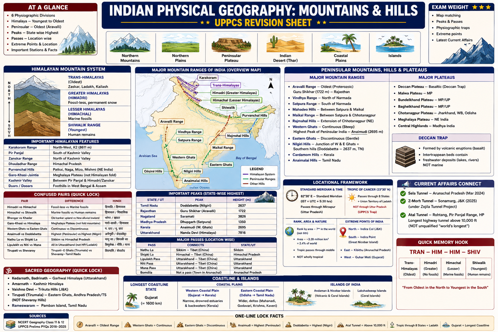

# Topic 1 — Indian Physical Geography: Mountains & Hills

### ★ UPPCS Revision Sheet — Lucent / PW style (one home per fact · no repetition · Practice ≥25)

<details>
<summary><strong>Covers syllabus</strong> (click to expand)</summary>

**Physiographic Divisions:** Physiographic Divisions of India | Northern Mountains | Northern Plains | Peninsular Plateau | Indian Desert | Coastal Plains (Eastern & Western) | Islands of India (Andaman, Nicobar, Lakshadweep)
**Himalayan Mountain System:** Himalayan Mountain System | Trans-Himalayas | Greater Himalayas (Himadri) | Lesser Himalayas (Himachal) | Shiwalik Range | Karakoram Range | Pir Panjal | Zanskar | Dhauladhar | Purvanchal Hills | Garo-Khasi-Jaintia Hills | Kashmir Valley | Duars / Dooars
**Peninsular Mountains, Hills & Plateaus:** Peninsular Mountains | Aravalli Range | Vindhya Range | Satpura Range | Western Ghats | Eastern Ghats | Nilgiri Hills | Cardamom Hills | Anamalai Hills | Rajmahal Hills | Maikal Range | Shevaroy Hills | Major Hills of India | Deccan Plateau | Central Highlands | Malwa Plateau | Bundelkhand Plateau | Baghelkhand Plateau | Chotanagpur Plateau | Meghalaya Plateau | Deccan Trap
**Passes, Peaks & Sacred Geography:** Mountain Passes | Major Mountain Passes | Important Peaks | Highest Peaks of Major Ranges | State-wise Highest Peaks | Religious Places & Geographic Location
**Locational Framework:** Standard Meridian of India | Tropic of Cancer through Indian States | Latitude and Longitude of India | Extreme Points of India | Longest Coastline & Coastal States
</details>

> **Sources baked in:** NCERT Geography Class 11 (Ch 2–3), Class 12 (Ch 1–2), UPPCS Prelims PYQs 2018–2025  
> **Exam weight:** ★★★ — map matching, peaks, passes, physiographic traps every year  
> **Last verified:** August 2026  
> **Current Affairs:** Sela Tunnel (Mar 2024, Arunachal); Z-Morh / Sonamarg Tunnel (2025); Atal Tunnel = longest highway tunnel **above 10,000 ft** (not unqualified “world’s longest” — UPPCS 2025 Q44)

---

## Quick Revision — Spine Only

```
6 DIVISIONS: N Mountains | N Plains | Peninsular Plateau | Thar | Coastal Plains | Islands
HIMALAYA N→S: Trans (Zaskar/Ladakh/Kailash) → Himadri (fossil-less, snow) → Himachal (marine fossils) → Shiwalik (youngest, human remains)
 Kashmir = Pir Panjal (S) + Himadri/Zanskar (N) Karakoram = NW, K2 Purvanchal = Patkai+Naga+Mizo+Mishmi
 Garo-Khasi-Jaintia = Meghalaya Plateau (not Himalayan fold) Duars = WB/Assam foothills
PENINSULAR: Aravalli = OLDEST (Guru Shikhar 1722 m) Vindhya N of Narmada | Satpura S of Narmada
 W→E hills: Satpura → Mahadeo → Maikal → Chhotanagpur
 W Ghats = continuous, Anaimudi (S India highest) | E Ghats = discontinuous
 Nilgiri = W+E Ghats + Southern hills (Doddabetta = TN) Deccan Trap intertrappean = freshwater NOT sea
PEAKS (repeat match): TN Doddabetta | RJ Guru Shikhar | NL Saramati | MP Dhupgarh | KL Anaimudi | UK Nanda Devi
PASSES: Nathu La Sikkim | Shipki La HP | Lipulekh/Niti/Mana = Uttarakhand (NOT Ladakh/HP) | Bomdila = town
 Atal Tunnel = Rohtang, Pir Panjal, HP — longest highway tunnel ABOVE 10,000 ft (not unqualified world longest)
LOCATION: 82°30′ E = IST +5:30 (Mirzapur, UP) | Tropic 23°30′ N = 8 states + Ladakh — NOT UP
 Rank = **7th** (not 6th) | Area ~3.28 M km² = **2.4%** | Tropic through middle (NCERT) | NOT wholly tropical
 N Indira Col | S Indira Point (Great Nicobar) ≠ Kanyakumari | E Kibithu (AR) | W Guhar Moti (GJ)
 Longest state coast = Gujarat
SACRED: Tirupati = Tirumala/Mallamalla (E Ghats) NOT Shevaroy
```

### Confused pairs

| A | B | Lock | Hindi |
|---|----|------|-------|
| Himadri | Himachal | Fossil-less crystalline vs marine fossils | हिमाद्रि / हिमाचल |
| Himachal | Shiwalik | Marine fossils vs human remains; outer youngest | हिमाचल / शिवालिक |
| Bhangar | Khadar | Older kankar upland vs newer flood-renewed, more fertile | भांगर / खादर |
| Bhabar | Terai | Streams sink (pebbles) vs streams re-emerge (marsh/forest) | भाबर / तराई |
| Western Ghats | Eastern Ghats | Continuous high wall vs discontinuous eroded hills | पश्चिमी घाट / पूर्वी घाट |
| Vindhya | Satpura | North of Narmada vs south of Narmada | विंध्य / सतपुड़ा |
| Andaman–Nicobar | Lakshadweep | Volcanic (Bay of Bengal) vs coral atolls (Arabian Sea) | अंडमान / लक्षद्वीप |
| Deccan Plateau | Deccan Trap | Southern tableland vs basalt lava cover on it | दक्कन पठार / दक्कन ट्रैप |
| Purvanchal Hills | UP Purvanchal | NE hill system vs eastern UP region | पूर्वांचल पहाड़ियाँ / पूर्वांचल (UP) |
| Indira Point | Kanyakumari | Southernmost **territory** vs southernmost **mainland** | इंदिरा पॉइंट / कन्याकुमारी |

### Memory Tricks

| Trick | Remembers |
|-------|-----------|
| **OLD Aravalli, YOUNG Himadri** | UPPCS 2020 Q60 youngest = Himadri |
| **Kashmir sandwich** | Pir Panjal (S) + Himadri (N) |
| **Lipu in UK** | Lipulekh = Uttarakhand, not Ladakh |
| **Guru on Aravalli** | Guru Shikhar = Rajasthan |
| **Dodda in Nilgiri / Anai in Kerala / Sara in Nagaland / Dhup in Satpura** | State-peak match |
| **82°30′ = 5½ hours** | Standard Meridian → IST |
| **8+1 Tropic** | 8 states + Ladakh; not UP |
| **Gujarat = coast king** | Longest state coastline |

---

## 1.1 Physiographic Divisions of India

India has **six** major relief units (geological age + structure + landforms).

| Division | Where | Exam lock | Age |
|----------|-------|-----------|-----|
| **Northern Mountains** | N frontier | Himalaya + Karakoram + Purvanchal; climatic wall | Tertiary (young) |
| **Northern Plains** | Himalaya–Plateau | Bhabar → Terai → Bhangar/Khadar; Indus–Ganga–Brahmaputra alluvium | Recent |
| **Peninsular Plateau** | S of Narmada–Son line | Oldest stable block; Deccan + Central Highlands + NE plateaus | Precambrian |
| **Indian Desert** | W Rajasthan | Thar/Marusthali; leeward of Aravalli | Pleistocene–recent |
| **Coastal Plains** | E & W margins | West **narrow**; East **broad, deltaic** | Recent |
| **Islands** | Arabian Sea & BoB | Lakshadweep = **coral**; A&N = **volcanic** | Recent |

- Northern Mountains block cold Central Asian winds and force orographic rain on southern slopes.
- Peninsular Plateau ≠ Deccan Plateau alone — Deccan is the **southern** (often basalt-covered) part; Central Highlands (Malwa, Bundelkhand) are the **northern** part.
- Plateau is tilted **high west → low east**, so most peninsular rivers flow to the Bay of Bengal.
- Plateau separated from Northern Plains roughly along the **Narmada–Son rift**.
- **Malda gap** separates Meghalaya Plateau from the main peninsular block.

> **Exam note:** Thar sands = **Pleistocene and recent** (not Paleocene/Oligocene/Pliocene) — UPPCS 2018 Q101. Gujarat = longest **state** coastline — UPPCS 2018 Q98.

**PYQ — UPPCS Prelims 2018, Q101**

Rajasthan desert or Thar desert is the expanse of which of the following?

A. Pliocene

B. Paleocene

C. Pleistocene and recent deposits

D. Oligocene

<details>
<summary>Show answer</summary>

**Ans: C** — Quaternary sands. A/B/D are older Tertiary labels used as traps.
</details>

### Northern Plains

| Belt | Lock |
|------|------|
| **Bhabar** | 8–16 km S of Shiwaliks; porous pebbles; streams **disappear** |
| **Terai** | S of Bhabar; streams **re-emerge**; marsh, forest; Dudhwa / Katarniaghat (UP) |
| **Bhangar** | Older alluvium above flood; **kankar**; less fertile |
| **Khadar** | Newer floodplain alluvium; renewed annually; **more fertile** |
| Sub-division | Location | Lock |
|--------------|----------|------|
| Punjab Plain | Punjab, Haryana | Indus tributaries; Doabs (Bist, Bari, Rachna, Chaj, Sind Sagar) |
| Ganga Plain | UP, Bihar, WB | Ganga–Yamuna Doab; most populous |
| Brahmaputra Plain | Assam | Braided channel; floods; Kaziranga |
| Terai belt | UP–UK–Nepal–WB | Foothill forests |

> **Exam note:** South of Shiwaliks the order is **Bhabar → Terai → Bhangar/Khadar**. Khadar is newer and more fertile — never reverse with Bhangar.

### Indian Desert (Thar / Marusthali)

- Leeward of **Aravalli**; core rainfall generally **<250 mm**.
- Shifting dunes (barchans), gravel plains, playas.
- **Luni** = only major river — **seasonal, inland-draining** (not a perennial Arabian Sea river).
- Southern margin **Rann of Kutch**; eastern margin Aravalli.

### Coastal Plains

| Feature | Western | Eastern |
|---------|---------|---------|
| Width | Narrow (~50–80 km) | Broad (~100–200 km) |
| Backdrop | High Western Ghats escarpment | Low, discontinuous Eastern Ghats |
| Harbours | Good (submerged coast, estuaries) | Poor (deltas, silting) |
| Sub-divisions | **Konkan** (MH–Goa), **Kanara** (KA), **Malabar** (KL) | **Northern Circars**, **Coromandel** (TN) |
| Special | Kerala backwaters | Mahanadi–Godavari–Krishna–Kaveri deltas; Chilika, Pulicat |

> **Exam note:** Do not reverse widths. West is narrow because Ghats rise close to the Arabian Sea.

### Islands

- **Andaman & Nicobar** — volcanic/tectonic; Arakan Yoma submerged chain; capital **Port Blair**.
- **Barren Island** = India’s **only active volcano**.
- **Ten Degree Channel** separates Andaman group from Nicobar group.
- **Indira Point** (Great Nicobar, ~6°45′ N) = southernmost **territory** — not Kanyakumari.
- **Lakshadweep** — coral atolls on a submarine ridge; capital **Kavaratti**.

> **Exam note:** Never reverse origins: A&N = volcanic; Lakshadweep = coral.

---

## 1.2 Himalayan Mountain System

Young fold mountains from Indian–Eurasian collision (~50 Ma); ~2400 km arc from Indus gorge to Dihang gorge. Still rising in zones.
**N → S profile (fossil/age home — do not restate below)**

| Range | Altitude | Rock / fossil lock | Peaks / features |
|-------|----------|--------------------|------------------|
| **Trans-Himalaya** | 3000–6500 m | Granitic; cold desert; **N of Indus** | Zaskar, Ladakh, Kailash |
| **Himadri** (Greater) | >6000 m | Crystalline; **fossil-less**; permanent snow | Kanchenjunga, Nanda Devi, Kamet |
| **Himachal** (Lesser) | 3700–4500 m | Sedimentary; **marine fossils** | Pir Panjal, Dhauladhar; hill stations |
| **Shiwalik** (Outer) | 900–1100 m | Youngest; unconsolidated; **human remains** | Dehra Dun, Kotli Dun, Patli Dun |

**W → E sections:** Punjab Himalaya (J&K/HP) → Kumaon (UK) → Nepal Himalaya → Sikkim (Kanchenjunga) → Darjeeling/Bhutan (Sandakphu) → Arunachal (Kangto).

| Peak | m | Lock |
|------|---|------|
| **K2 (Godwin Austin)** | 8611 | **Karakoram** (PoK) — not main Himalayan arc |
| **Kanchenjunga** | 8586 | Highest peak **fully in India** (Sikkim, Himadri) |
| **Nanda Devi** | 7816 | Uttarakhand; 2nd highest in India |
| **Kamet** | 7756 | Uttarakhand |
| **Cho Oyu / Lhotse** | 8188 / 8516 | Himalayan (Nepal–Tibet) — UPPCS 2022 Q31 |
| **Nanga Parbat** | 8126 | Western Himalaya (“Killer mountain”) |
| **Namcha Barwa** | 7782 | **Tibet/China** — NOT in India (UPPCS 2019 Q82) |

- High snow-covered ranges feed **perennial** Himalayan rivers (Indus, Ganga, Brahmaputra headwaters).
- Altitude → climate belts → successive vegetation zones (tropical → temperate → alpine → nival).

> **Exam note:** UPPCS 2019 Q11 — **all three** true: Greater = fossil-less; Lesser = marine fossils; Shiwalik = human remains. 2020 Q60 youngest among options = **Himadri** (Aravalli is oldest). 2022 Q31: Cho Oyu + Lhotse Himalayan; **Annamalai and Sirumalai = TN peninsular**. 2025 Q94 A/R: snow → perennial rivers (**both true, R explains A**). 2025 Q21 A/R: altitude → vegetation (**both true, R explains A**).

**PYQ — UPPCS Prelims 2019, Q11**

With reference to the Himalayan range, which of the statements is/are correct?

1. The sedimentary rocks of the greater Himalayas were fossil less.
2. Marine livings fossils are found in the sedimentary rocks of lesser Himalayas.
3. Remains of human civilization are found in outer or Shivalik Himalayas.

A. 1 and 2 only

B. 2 and 3 only

C. 1 and 3 only

D. 1, 2 and 3 are correct

<details>
<summary>Show answer</summary>

**Ans: D** — All three zonation locks. Trap: putting marine fossils in Greater Himalaya.
</details>

### Trans-Himalaya & Karakoram

- Trans-Himalaya = **Tibetan Himalaya** zone; monsoon does **not** reach (rain shadow of Himadri).
- Indus, Sutlej, Tsangpo/Brahmaputra associated with this belt.
- **Karakoram:** extreme NW, joins **Pamir Knot**; **Siachen**; Karakoram Pass (historic Silk Route).
- K2 is in Karakoram, **not** Himadri.

### Pir Panjal, Zanskar, Dhauladhar, Kashmir Valley

| Feature | Lock |
|---------|------|
| **Pir Panjal** | Longest Lesser Himalaya range; **S wall of Kashmir Valley**; **Atal Tunnel** (Rohtang, 9.02 km) — Manali ↔ Lahaul-Spiti |
| **Zanskar** | **N of Kashmir Valley**; separates valley from Ladakh; Pensi La; Kargil at western end |
| **Dhauladhar** | Outer Lesser Himalaya in **HP**; Kangra Valley (not Kashmir); Dharamshala/McLeod Ganj |
| **Kashmir Valley** | ~135 km × 32–40 km; **Jhelum**; Srinagar, Dal, Wular |

> **Exam note:** Kashmir Valley = **Pir Panjal + Himadri** (UPPCS 2020 Q66). Kangra–Dhauladhar is a **Himachal** pairing. Atal Tunnel is in **Pir Panjal**, not Karakoram/Zanskar. Unqualified “world’s longest highway tunnel” is **false** (UPPCS 2025 Q44 — only statement 2 correct). Correct qualifier: longest highway tunnel **above 10,000 ft**.

### Purvanchal, Garo–Khasi–Jaintia, Duars

| Group | Location | Lock |
|-------|----------|------|
| **Patkai Bum** | Arunachal–Myanmar | Eastern Himalaya beyond Dihang gorge |
| **Naga Hills** | Nagaland | **Saramati 3841 m** |
| **Mizo / Lushai** | Mizoram | **Phawngpui / Blue Mountain 2165 m** |
| **Mishmi Hills** | Arunachal | Purvanchal set |
| **Garo** | W Meghalaya | Meghalaya Plateau (peninsular block + Malda gap) |
| **Khasi** | C Meghalaya | **Shillong Peak 1965 m**; **Mawsynram / Cherrapunji** |
| **Jaintia** | E Meghalaya | Limestone caves |
| **Duars / Dooars** | WB & Assam foothills | Tea, wildlife corridors (Jaldapara, Gorumara, Buxa); “door” to Bhutan |

- **Purvanchal Hills** = NE fold hills (Patkai, Naga, Mizo, Mishmi) — **not** eastern Uttar Pradesh.
- Garo–Khasi–Jaintia are **geologically peninsular**, listed here because the syllabus places them with NE hills.

> **Exam note:** Wettest places sit on **Khasi Hills**, not Garo or Jaintia. Duars ≠ Terai of UP (similar foothill ecotone, different region).

---

## 1.3 Peninsular Mountains, Hills & Plateaus

Ancient Precambrian block; faulted and eroded, not recently folded like the Himalaya.

| Range | Trend | Location | Highest | Lock |
|-------|-------|----------|---------|------|
| **Aravalli** | SW–NE | Gujarat–Rajasthan–Delhi | **Guru Shikhar 1722 m** | **Oldest** fold mountains; RJ highest |
| **Vindhya** | E–W | **N of Narmada**, MP | Sadbhawna Shikhar | Aryavarta / Dakshinapatha divide |
| **Satpura** | E–W | **S of Narmada** | **Dhupgarh 1350 m** (Pachmarhi) | MP highest; Mahadeo + Maikal east |
| **Western Ghats** | N–S | Tapi gap → Kanyakumari | **Anaimudi 2695 m** | **Continuous**; Sahyadri in MH |
| **Eastern Ghats** | N–S | Odisha → TN | Jindhagada ~1690 m | **Discontinuous**; dissected by E-flowing rivers |
| **Nilgiri** | — | TN–Kerala | **Doddabetta 2637 m** | Junction of W Ghats + E Ghats + Southern hills |
| **Rajmahal** | — | Jharkhand | — | Volcanic (Rajmahal Trap) |
| **Shevaroy** | — | Salem, TN | — | Eastern Ghats; **NOT Tirupati** |

**Central India hills, west → east:** **Satpura → Mahadeo → Maikal → Chhotanagpur** (UPPCS 2019 Q6).

### Aravalli, Vindhya, Satpura

- Aravalli ~800 km; rain-shadow for Thar; minerals (Zawar Zn–Pb); Delhi Ridge is the NE stump.
- **Amarkantak** (eastern Vindhya–Satpura junction) = source of **Narmada and Son**.
- Tapi flows in a Satpura gorge; Gavilgarh Hills = western Satpura (MH).
- Kaimur Hills = Vindhyan extension into **UP–Bihar** (Amsot ≈ UP highest).

> **Exam note:** Never reverse Vindhya/Satpura across Narmada. 2019 Q6 — do not put Maikal before Satpura or Chhotanagpur before Maikal.

**PYQ — UPPCS Prelims 2019, Q6**

Which one of the following is the correct sequence of the hills of Central India located from West to East?

A. Maikal, Satpura, Mahadeo and Chhotanagpur

B. Satpura, Mahadeo, Maikal and Chhotanagpur

C. Maikal, Mahadeo, Satpura and Chhatanagpur

D. Satpura, Mahadeo, Chhotanagpur and Maikal

<details>
<summary>Show answer</summary>

**Ans: B** — Satpura → Mahadeo → Maikal → Chhotanagpur.
</details>

### Western Ghats, Eastern Ghats, Southern hills

- W Ghats: orographic barrier to SW monsoon; rain-shadow Deccan to the east; UNESCO biodiversity hotspot.
- Gaps: **Thal Ghat, Bhor Gap, Palghat Gap** (Kerala–TN).
- **Anaimudi** = highest in Western Ghats **and South India** (Kerala; Anamalai/Cardamom complex).
- E Ghats: Mahendragiri (Odisha), Arma Konda (AP), Shevaroy (TN).
- **Tirumala Hills** (Tirupati) = Eastern Ghats — sacred lock lives in §1.4.
- **Cardamom Hills** south of Palani (spice); **Anamalai** (“Elephant Mountains”) south of Palghat Gap; **Palani** = Kodaikanal; **Sirumalai** = TN outlier (2022 Q31 trap with Annamalai).
- Ooty in Nilgiris; Eravikulam (Nilgiri Tahr), Periyar in this southern complex.

> **Exam note:** Doddabetta = **TN** highest; Anaimudi = **Kerala** highest. Annamalai/Sirumalai are **not** Himalayan.

### Deccan Plateau & Deccan Trap

- Deccan = **southern** triangular tableland: Satpura–Vindhya (N), W Ghats (W), E Ghats (E); slope **eastward**.
- Sub-units: Maharashtra / Karnataka / Telangana plateaus. Black **regur** on trap = cotton.
- Trap = fissure-eruption **basalt**, Cretaceous–Eocene (~66 Ma), ~5 lakh km² (MH, MP, GJ, KA).

| Trap layer | Depth lock (UPPCS 2024 Q59) |
|------------|------------------------------|
| Upper | ~**450 m** |
| Middle | ~**1200 m** |
| Lower | ~**150 m** |
| **Intertrappean beds** | Sediment **between** lava flows; **land/freshwater** fossils — **NOT sea plants and animals** |

**PYQ — UPPCS Prelims 2024, Q59**

Which one of the following pairs (Deccan Trap – Peculiarity) is not correctly matched?

A. Depth of middle trap – approximately 1200 metres

B. Intertrappean beds – Fossils of sea plants and animals

C. Depth of lower trap – approximately 150 metres

D. Depth of upper trap – approximately 450 metres

<details>
<summary>Show answer</summary>

**Ans: B** — Intertrappean = freshwater/land fossils. Depth figures A/C/D are the matched pairs.
</details>

### Central Highlands & sub-plateaus

Northern Peninsular Plateau (N of Narmada–Son).

| Plateau | States | Lock |
|---------|--------|------|
| **Malwa** | MP, Rajasthan | Aravalli (W), Vindhya (S); black soil |
| **Bundelkhand** | UP, MP | Granite-gneiss; drought; Jhansi, Banda, Chitrakoot |
| **Baghelkhand** | UP, MP | E of Bundelkhand; bauxite, limestone; Rewa, Mirzapur–Sonbhadra fringe |
| **Chotanagpur** | Jharkhand, Odisha | Coal (Jharia, Bokaro), iron, mica; Damodar; easternmost of W→E hill sequence |
| **Meghalaya** | Meghalaya | Garo–Khasi–Jaintia; Malda gap from Chotanagpur |

### Major hills — one reference (no second copy in Consolidated)

| Hill / range | State | Highest / note |
|--------------|-------|----------------|
| Maikal | MP, CG | Satpura east; Kanha |
| Mahadeo | MP | Satpura system |
| Cardamom / Anamalai / Palani | KL, TN | Southern W Ghats complex |
| Tirumala | AP | Tirupati — §1.4 |
| Naga / Mizo / Patkai | NE | Purvanchal — §1.2 |
| Kaimur | UP, Bihar | **Amsot ~941 m** — UP highest |
| Parasnath | Jharkhand | 1366 m; Jain; Chotanagpur |

---

## 1.4 Passes, Peaks & Sacred Geography

### Passes

UPPCS tests **pass ↔ State/UT**. Wrong state is the trap.

| Pass | State/UT | Route / note | Trap |
|------|----------|--------------|------|
| **Shipki La** | Himachal Pradesh | India–Tibet; Sutlej valley | — |
| **Bara Lacha La** | Himachal Pradesh | Manali–Leh | — |
| **Rohtang La** | Himachal Pradesh | Kullu–Lahaul; Atal Tunnel below | — |
| **Niti Pass** | **Uttarakhand** | India–Tibet; Garhwal | 2023 Q57 correct pair |
| **Mana Pass** | **Uttarakhand** | Near Badrinath | **NOT HP** |
| **Lipulekh** | **Uttarakhand** | Kailash–Mansarovar; India–Nepal–China | **NOT Ladakh** |
| **Nathu La** | Sikkim | India–Tibet trade (reopened 2006) | — |
| **Jelep La** | Sikkim | Alternate to Nathu La | — |
| **Zoji La** | Ladakh / J&K | Srinagar–Kargil–Leh | — |
| **Bomdi La** | Arunachal Pradesh | Near **Bomdila town** | Bomdila ≠ pass name |
| **Pangsau / Dihang** | Arunachal Pradesh | India–Myanmar / E Himalaya | — |
| **Aghil** | Karakoram (not AP) | 2023 wrong option | — |

> **Exam note:** 2025 Q55 — **only Lipulekh–Ladakh is NOT matched**. Nathu La–Sikkim and Shipki La–HP are correct. 2023 Q57 — Niti–UK correct; Mana–HP false.

**PYQ — UPPCS Prelims 2025, Q55**

Which of the following pairs are NOT correctly matched? (Pass) — (State/Union Territory)

1. Lipulekh — Ladakh
2. Nathu La — Sikkim
3. Bomdila — Arunachal Pradesh
4. Shipki La — Himachal Pradesh

A. Only 1 and 2

B. Only 2, 3 and 4

C. Only 1, 2 and 3

D. Only 1

<details>
<summary>Show answer</summary>

**Ans: D** — Only (1) is geographically wrong (Lipulekh = Uttarakhand). Key treats Bomdila–Arunachal as the accepted corridor pair.
</details>

### State-wise highest peaks (match-list home)

| State/UT | Peak | m | Range |
|----------|------|---|-------|
| **Sikkim** | Kanchenjunga | 8586 | Himadri |
| **Uttarakhand** | Nanda Devi | 7816 | Himadri |
| **Himachal Pradesh** | Reo Purgyil | 6816 | Kinnaur Himalaya |
| **Arunachal Pradesh** | Kangto | 7090 | E Himalaya |
| **J&K / Ladakh** | Nun / Kun | 7135 / 7077 | Zanskar |
| **West Bengal** | Sandakphu | 3636 | Singalila |
| **Nagaland** | **Saramati** | 3841 | Naga Hills |
| **Manipur** | Tenipu / Mt Iso | 2994 | Manipur Hills |
| **Mizoram** | Phawngpui | 2165 | Mizo Hills |
| **Meghalaya** | Shillong Peak | 1965 | Khasi |
| **Kerala** | **Anaimudi** | 2695 | W Ghats |
| **Tamil Nadu** | **Doddabetta** | 2637 | Nilgiri |
| **Karnataka** | Mullayanagiri | 1930 | W Ghats |
| **Maharashtra** | Kalsubai | 1646 | W Ghats |
| **Rajasthan** | **Guru Shikhar** | 1722 | Aravalli |
| **Madhya Pradesh** | **Dhupgarh** | 1350 | Satpura |
| **Andhra Pradesh** | Arma Konda | ~1680 | E Ghats |
| **Odisha** | Deomali | 1672 | E Ghats |
| **Gujarat** | Girnar | 1117 | Kathiawar |
| **Jharkhand** | Parasnath | 1366 | Chotanagpur |
| **Uttar Pradesh** | Amsot (Sonbhadra) | ~941 | Kaimur |
| **Chhattisgarh** | Gudla Maina | ~1270 | Maikal ext. |

**Range highest (don’t restudy state table):** Himalaya-in-India Kanchenjunga 8586 · Karakoram K2 8611 · W Ghats Anaimudi 2695 · E Ghats Jindhagada ~1690 · Aravalli Guru Shikhar 1722 · Satpura Dhupgarh 1350 · Nilgiri Doddabetta 2637 · Naga Saramati 3841.

> **Exam note:** Same four-pair lock in **2018 Q108, 2021 Q127, 2025 Q37**: TN–Doddabetta, RJ–Guru Shikhar, NL–Saramati, MP–Dhupgarh (2018 used Kerala–Anaimudi + UK–Nanda Devi). 2019 Q82 official key: **Namcha Barwa NOT in India**. Gurla Mandhata is also in Tibet — don’t treat the distractor as a “in India” teaching fact.

### Sacred geography

| Site | State | Hill / lock |
|------|-------|-------------|
| **Tirupati (Venkateswara)** | AP | **Tirumala / Mallamalla**, Eastern Ghats — **not Shevaroy** |
| Kedarnath / Badrinath | UK | Garhwal Himalaya (Mandakini / Alaknanda) |
| Gangotri / Yamunotri | UK | Source glaciers |
| Amarnath | J&K | Lidder Valley |
| Vaishno Devi | J&K | **Trikuta Hills**, Jammu |
| Sabarimala | Kerala | Western Ghats |
| Palitana | Gujarat | Shatrunjaya Hills |
| Parasnath | Jharkhand | Chotanagpur |
| Girnar | Gujarat | Junagadh |
| Ajmer Sharif | Rajasthan | Aravalli foothills |
| Chamundi | Karnataka | Mysuru |
| Konark | Odisha | **Coastal plain** (not a hill) |

> **Exam note:** 2018 Q100 official key = **Mallmalla**. Real site = Tirumala Hills (E Ghats). Shevaroy = Yercaud (TN); Biligiriranga = Karnataka; Javadhee = TN.

---

## 1.5 Locational Framework

### Standard Meridian

- **82°30′ E**, near **Mirzapur, Uttar Pradesh** — not Prayagraj / Lucknow / Delhi.
- **IST = GMT + 5 hours 30 minutes**; **one** time zone for the whole country.
- 1° longitude ≈ 4 minutes; India’s ~29° long. spread ≈ 2 hours solar difference (A&N sunrise earlier than Gujarat).

### Tropic of Cancer (23°30′ N)

**Passes through (8 states + Ladakh):** Gujarat, Rajasthan, Madhya Pradesh, Chhattisgarh, Jharkhand, West Bengal, Tripura, Mizoram, **Ladakh**.
**Does not pass through:** UP, Bihar, Odisha, Maharashtra, Karnataka, Kerala, Tamil Nadu, Punjab, Haryana, Delhi, Assam, Nagaland, Manipur, Arunachal, Sikkim, HP, Uttarakhand, Goa, AP, Telangana.

> **Exam note:** Rank = **7th**, not 6th. Area **2.4%**. Tropic through the **middle** = NCERT / 2022 Q35 stmt 3 lock. India is **not** wholly tropical. UP is **not** on the Tropic. If a stem asks *only* “equal latitudinal halves,” bulk of land is **north** of 23°30′ N — that standalone overclaim is false.

### Lat–long, area, extremes

| Item | Lock |
|------|------|
| Lat | **8°4′ N – 37°6′ N** (~29°; ~3214 km) |
| Long | **68°7′ E – 97°25′ E** (~29°; ~2933 km) |
| Area | ~**3.28 million km²** = **2.4%** of world land |
| Rank | Conventionally **7th** largest (after RU, CA, US, CN, BR, AU) |
| Hemisphere | Entirely **eastern**; mostly **northern** |
| Extreme | Place |
|---------|-------|
| **N** | **Indira Col**, Siachen / Ladakh |
| **S (territory)** | **Indira Point**, Great Nicobar |
| **S (mainland)** | **Kanyakumari** (Cape Comorin) |
| **E** | **Kibithu**, Anjaw, Arunachal |
| **W** | **Guhar Moti**, Kutch, Gujarat |

**PYQ — UPPCS Prelims 2022, Q35**

With reference to India, which of the following statements is/are correct?

1. India is the sixth largest country in the world.
2. India occupies about 2.4% of the total area of the world.
3. The Tropic of Cancer passes through the middle of the country dividing it into two latitudinal halves.
4. India lies completely in the tropical zone.

A. 2 and 3

B. 2 and 4

C. 3 and 4

D. 1 and 2

<details>
<summary>Show answer</summary>

**Ans: A** — **2 and 3**. Rank is **7th**, not 6th (stmt 1 false). **2.4%** is true. Tropic through the middle is the NCERT lock (stmt 3). India is **not** wholly tropical (stmt 4).
</details>

### Coastline

Mainland + islands ≈ **7516 km** (mainland ~6100 km). **Nine** coastal states + two island UTs.
**States, longest → shortest (exam order):** **Gujarat** > Andhra Pradesh > Tamil Nadu > Maharashtra > Kerala > Odisha > Karnataka > West Bengal > Goa.
- Gujarat longest because of Kachchh + Saurashtra indentation (~1600 km class figure).
- Andaman & Nicobar UT coastline is long (~1962 km) but **not** in the **state** ranking.

> **Exam note:** UPPCS 2018 Q98 — **Gujarat**, not Maharashtra / AP / Kerala.

---

## Consolidated Reference — Once Only

### Numbers (not already a full table above)

| Item | Value |
|------|-------|
| IST offset | GMT + 5 h 30 min |
| Coastline (incl. islands) | ~7516 km |
| Highest peak fully in India | Kanchenjunga 8586 m |

### UP Focus

| Element | Lock |
|---------|------|
| Foothills | Bhabar/Terai in Pilibhit, Lakhimpur, Bahraich, Shravasti |
| Core plain | Ganga–Yamuna Doab |
| Bundelkhand | SW UP — Jhansi, Chitrakoot, Banda; granitic, drought |
| Rohilkhand | N UP between Ganga and Ramganga |
| Vindhyan / Kaimur | Sonbhadra–Mirzapur; **Amsot ~941 m** = UP highest (not Himalayan) |
| Standard Meridian | **Mirzapur** |
| Tropic of Cancer | **Does not** pass through UP |
| “Purvanchal” in UP | Eastern UP region / expressway — **not** NE Purvanchal Hills |

---

## Practice Zone — UPPCS Format Questions

> **Answers hidden** — click *Show answer* under each question to reveal.  
> **Format mix:** 50 questions — 21 multi-statement | 10 A/R | 8 match | 5 NOT-matched | 3 sequence | 3 direct recall

**Q1.** With reference to the physiographic divisions of India, which of the following statements is/are correct?

1. The Peninsular Plateau is composed mainly of ancient crystalline rocks.
2. The Thar Desert rests primarily on Pleistocene and recent deposits.
3. Lakshadweep Islands are of volcanic origin like the Andaman Islands.

Select the correct answer from the code given below:

A. 1 and 2 only

B. 2 and 3 only

C. 1 and 3 only

D. 1, 2 and 3

<details>
<summary>Show answer</summary>

**Ans: A** — (1) and (2) are correct. (3) fails: Lakshadweep = coral atolls; Andaman = volcanic. **B** wrongly accepts volcanic Lakshadweep. **C** drops the Thar geology trap (UPPCS 2018 Q101). **D** accepts all three including the island-origin reversal.
</details>

**Q2.** Given below are two statements, one labelled as Assertion (A) and the other as Reason (R):

**Assertion (A):** The Greater Himalayas (Himadri) contain fossil-less sedimentary rocks.

**Reason (R):** Intense metamorphism during uplift destroyed marine fossils that existed in Tethys sediments.

Select the correct answer from the code given below:

A. Both (A) and (R) are true and (R) is the correct explanation of (A)

B. Both (A) and (R) are true, but (R) is not the correct explanation of (A)

C. (A) is true, but (R) is false

D. (A) is false, but (R) is true

<details>
<summary>Show answer</summary>

**Ans: A** — UPPCS 2019 Q11 pattern: Himadri = fossil-less; metamorphic uplift explains absence. **B** denies the causal link. **C** wrongly rejects Reason. **D** reverses truth values — Lesser Himalaya (not Himadri) has marine fossils.
</details>

**Q3.** Match **List-I** with **List-II** and select the correct answer using the code given below:

| List-I (State) | List-II (Highest Peak) |
|---|---|
| A. Kerala | 1. Dodda Betta |
| B. Nagaland | 2. Nanda Devi |
| C. Uttarakhand | 3. Anaimudi |
| D. Tamil Nadu | 4. Saramati |

A. 1 3 4 2

B. 2 3 4 1

C. 3 4 2 1

D. 1 2 3 4

<details>
<summary>Show answer</summary>

**Ans: C** — Kerala-Anaimudi(3), Nagaland-Saramati(4), Uttarakhand-Nanda Devi(2), TN-Dodda Betta(1) — same logic as UPPCS 2018 Q108. **A** = Kerala-Dodda Betta trap (most picked wrong answer). **D** = sequential guess without mapping knowledge.
</details>

**Q4.** With reference to the Northern Plains of India, which of the following statements is/are correct?

1. Bhabar is a narrow belt south of the Shiwaliks where streams disappear underground.
2. Khadar is older and less fertile than Bhangar.
3. Terai lies south of Bhabar and supports dense forests.

Select the correct answer from the code given below:

A. 1 and 2 only

B. 2 and 3 only

C. 1 and 3 only

D. 1, 2 and 3

<details>
<summary>Show answer</summary>

**Ans: C** — (1) and (3) correct; southward sequence = Shiwalik → Bhabar → Terai → Bhangar/Khadar. **(2) fails:** Khadar is *newer* floodplain alluvium and *more* fertile than Bhangar — classic UPPCS trap. **A** keeps the Khadar-Bhangar reversal. **B** drops correct Bhabar fact. **D** accepts the reversed fertility statement.
</details>

**Q5.** Given below are two statements, one labelled as Assertion (A) and the other as Reason (R):

**Assertion (A):** Western Coastal Plains of India are narrower than Eastern Coastal Plains.

**Reason (R):** Western Ghats rise abruptly close to the Arabian Sea, leaving little room for a broad coastal lowland.

Select the correct answer from the code given below:

A. Both (A) and (R) are true and (R) is the correct explanation of (A)

B. Both (A) and (R) are true, but (R) is not the correct explanation of (A)

C. (A) is true, but (R) is false

D. (A) is false, but (R) is true

<details>
<summary>Show answer</summary>

**Ans: A** — Western plain ≈ 50–80 km vs Eastern ≈ 100–200 km; steep Western Ghats escarpment explains narrowness. **B** denies the escarpment link. **C/D** reverse Assertion — trap "Eastern is narrower" is false.
</details>

**Q6.** Match **List-I** with **List-II**:

| List-I (Himalayan Range/Feature) | List-II (Characteristic) |
|---|---|
| A. Himadri | 1. Marine fossils in sedimentary rocks |
| B. Himachal | 2. Human civilization remains |
| C. Shiwalik | 3. Highest peaks; permanent snow; fossil-less |
| D. Trans-Himalaya | 4. Cold desert north of Indus (Zaskar, Ladakh) |

A. 3 1 2 4

B. 1 3 2 4

C. 3 2 1 4

D. 2 1 3 4

<details>
<summary>Show answer</summary>

**Ans: A** — Himadri-3, Himachal-1 (Lesser = marine fossils), Shiwalik-2 (outermost, youngest, human remains), Trans-Himalaya-4. **B/C/D** swap Himachal-Shiwalik fossil/human-remains pairing — direct 2019 Q11 trap.
</details>

**Q7.** With reference to the Indian Desert (Thar), which of the following statements is/are correct?

1. It lies on the leeward side of the Aravalli Range.
2. Its sands rest on Pleistocene and recent deposits.
3. Luni is a perennial river that drains into the Arabian Sea.

Select the correct answer from the code given below:

A. 1 and 2 only

B. 2 and 3 only

C. 1 and 3 only

D. 1, 2 and 3

<details>
<summary>Show answer</summary>

**Ans: A** — (1) Aravalli blocks monsoon; (2) UPPCS 2018 Q101 answer. **(3) fails:** Luni is seasonal, inland-draining (ends in Rann of Kutch), not perennial or open sea drainage. **C/D** accept false Luni description.
</details>

**Q8.** Which of the following pairs is/are **NOT** correctly matched?
(Pass) — (State/UT)

1. Lipulekh — Ladakh
2. Nathu La — Sikkim
3. Shipki La — Himachal Pradesh
4. Niti — Uttarakhand

Select the correct answer from the code given below:

A. Only 1

B. Only 1 and 3

C. Only 2 and 4

D. Only 1, 2 and 3

<details>
<summary>Show answer</summary>

**Ans: A** — Only (1) wrong: Lipulekh is in **Uttarakhand** (UPPCS 2025 Q55 trap). (2), (3), (4) all correct. **B/C/D** wrongly mark correctly matched Nathu La, Shipki La, or Niti as errors.
</details>

**Q9.** Match **List-I** with **List-II**:

| List-I (Pass) | List-II (State/UT) |
|---|---|
| A. Nathu La | 1. Himachal Pradesh |
| B. Shipki La | 2. Sikkim |
| C. Mana | 3. Uttarakhand |
| D. Rohtang | 4. Himachal Pradesh (Pir Panjal) |

A. 2 1 3 4

B. 2 4 3 1

C. 1 2 3 4

D. 2 1 3 1

<details>
<summary>Show answer</summary>

**Ans: A** — Nathu La-Sikkim(2), Shipki La-HP(1), Mana-Uttarakhand(3), Rohtang-HP/Pir Panjal(4). **B** swaps Shipki-Rohtang both to HP incorrectly paired. **C** puts Nathu La in HP. **D** duplicates HP for C and D.
</details>

**Q10.** With reference to India's coastal plains and islands, which of the following statements is/are correct?

1. Indira Point on Great Nicobar is India's southernmost point.
2. Ten Degree Channel separates Andaman from Nicobar group.
3. Barren Island (Andaman) is India's only active volcano.

Select the correct answer from the code given below:

A. 1 and 2 only

B. 2 and 3 only

C. 1 and 3 only

D. 1, 2 and 3

<details>
<summary>Show answer</summary>

**Ans: D** — All three standard facts. **A** drops Barren Island. **B** drops Indira Point (Kanyakumari trap — mainland tip ≠ southernmost territory). **C** drops Ten Degree Channel.
</details>

**Q11.** Given below are two statements, one labelled as Assertion (A) and the other as Reason (R):

**Assertion (A):** In the Himalayan mountains, different types of vegetation are found.

**Reason (R):** In the Himalayas, there are variations in climate with change in altitude.

Select the correct answer from the code given below:

A. Both (A) and (R) are true, but (R) is not the correct explanation of (A)

B. (A) is false, but (R) is true

C. (A) is true, but (R) is false

D. Both (A) and (R) are true and (R) is the correct explanation of (A)

<details>
<summary>Show answer</summary>

**Ans: D** — UPPCS 2025 Q21: altitudinal climate zones (tropical → temperate → alpine → nival) directly explain vegetation zonation. **A** denies the explanatory link. **B/C** falsify a true Assertion or Reason.
</details>

**Q12.** Match **List-I** with **List-II** (UPPCS 2025 Q37 / 2021 Q127 pattern):

| List-I (State) | List-II (Highest Peak) |
|---|---|
| A. Tamil Nadu | 1. Dhupgarh |
| B. Rajasthan | 2. Doddabetta |
| C. Nagaland | 3. Guru Shikhar |
| D. Madhya Pradesh | 4. Saramati |

A. 2 3 4 1

B. 3 2 1 4

C. 2 3 1 4

D. 4 3 2 1

<details>
<summary>Show answer</summary>

**Ans: A** — TN-Doddabetta(2), Rajasthan-Guru Shikhar(3), Nagaland-Saramati(4), MP-Dhupgarh(1). **B** swaps TN-Rajasthan peaks. **C** puts Dhupgarh on Nagaland. **D** random reversal.
</details>

**Q13.** With reference to the Peninsular Plateau, which of the following statements is/are correct?

1. It is bounded north by the Narmada-Son rift line.
2. Deccan Trap covers parts of Maharashtra and Madhya Pradesh with basalt flows.
3. Peninsular Plateau and Deccan Plateau are identical terms.

Select the correct answer from the code given below:

A. 1 and 2 only

B. 2 and 3 only

C. 1 and 3 only

D. 1, 2 and 3

<details>
<summary>Show answer</summary>

**Ans: A** — (1) and (2) correct. **(3) fails:** Deccan is the *southern basalt-covered part*; Central Highlands (Malwa, Bundelkhand) are the northern peninsular section. **C/D** accept the false equivalence.
</details>

**Q14.** Given below are two statements, one labelled as Assertion (A) and the other as Reason (R):

**Assertion (A):** The Himalayas form the source of several large perennial rivers.

**Reason (R):** The higher ranges of the Himalayas remain snow-covered throughout the year.

Select the correct answer from the code given below:

A. Both (A) and (R) are true, but (R) is not the correct explanation of (A)

B. (A) is false, but (R) is true

C. (A) is true, but (R) is false

D. Both (A) and (R) are true and (R) is the correct explanation of (A)

<details>
<summary>Show answer</summary>

**Ans: D** — UPPCS 2025 Q94: snow-melt from high Himalayan ranges feeds Ganga, Indus, Brahmaputra headwaters → perennial flow. **A** breaks the snow-melt link. **B/C** deny true statements about Himalayan hydrology.
</details>

**Q15.** Which of the following pairs is/are **NOT** correctly matched?
(Hill/Peak) — (State/Feature)

1. Guru Shikhar — Rajasthan (Aravalli)
2. Dhupgarh — Madhya Pradesh (Satpura)
3. Anaimudi — Karnataka
4. Doddabetta — Tamil Nadu (Nilgiri)

Select the correct answer from the code given below:

A. Only 3

B. Only 1 and 3

C. Only 2 and 4

D. Only 3 and 4

<details>
<summary>Show answer</summary>

**Ans: A** — Only (3) wrong: Anaimudi is in **Kerala** (Western Ghats), not Karnataka. (1), (2), (4) correct. **B** wrongly flags Guru Shikhar. **C** wrongly flags Dhupgarh/Doddabetta.
</details>

**Q16.** With reference to Trans-Himalaya and associated features, which of the following statements is/are correct?

1. Zaskar range lies north of the main Himalayan arc across the Indus.
2. Ladakh range is part of the Trans-Himalayan zone.
3. Karakoram lies southeast of the main Himalayan arc and contains K2.

Select the correct answer from the code given below:

A. 1 and 2 only

B. 2 and 3 only

C. 1 and 3 only

D. 1, 2 and 3

<details>
<summary>Show answer</summary>

**Ans: A** — (1) and (2) correct. **(3) fails:** Karakoram is **northwest** of the Himalayan arc (K2 on India-Pakistan-China border), not southeast. **C/D** accept the wrong Karakoram position.
</details>

**Q17.** Match **List-I** with **List-II**:

| List-I (Purvanchal / NE Hills) | List-II (State/Region) |
|---|---|
| A. Patkai Bum | 1. Nagaland-Arunachal border hills |
| B. Naga Hills | 2. Nagaland |
| C. Mizo Hills | 3. Mizoram |
| D. Mishmi Hills | 4. Arunachal Pradesh (eastern) |

A. 1 2 3 4

B. 2 1 3 4

C. 1 2 4 3

D. 4 3 2 1

<details>
<summary>Show answer</summary>

**Ans: A** — Patkai-1 (Assam-Arunachal-Nagaland frontier), Naga-2, Mizo-3, Mishmi-4 (eastern Arunachal). **B** swaps Patkai-Naga. **D** full reversal.
</details>

**Q18.** Which one of the following is the correct sequence of the hills of Central India located from **West to East**?

A. Maikal, Satpura, Mahadeo and Chhotanagpur

B. Satpura, Mahadeo, Maikal and Chhotanagpur

C. Satpura, Mahadeo, Chhotanagpur and Maikal

D. Maikal, Mahadeo, Satpura and Chhotanagpur

<details>
<summary>Show answer</summary>

**Ans: B** — UPPCS 2019 Q6 pattern: Satpura (west) → Mahadeo → Maikal (Satpura extension east) → Chhotanagpur (east). **A** starts with Maikal. **C** puts Chhotanagpur before Maikal. **D** scrambles Satpura-Maikal order.
</details>

**Q19.** With reference to Deccan Trap, which of the following statements is/are correct?

1. It formed from fissure eruptions of basaltic lava during Cretaceous-Eocene.
2. Intertrappean beds contain freshwater fossils, not marine sea fossils.
3. Black regur soil of the region is unrelated to volcanic basalt.

Select the correct answer from the code given below:

A. 1 and 2 only

B. 2 and 3 only

C. 1 and 3 only

D. 1, 2 and 3

<details>
<summary>Show answer</summary>

**Ans: A** — (1) and (2) correct. **(3) fails:** regur (black soil) is derived from weathering of Deccan basalt — UPPCS 2024 Q59 trap reverses this. **C/D** accept the false soil-origin statement.
</details>

**Q20.** Given below are two statements, one labelled as Assertion (A) and the other as Reason (R):

**Assertion (A):** The Aravalli Range is the oldest fold mountain system in India.

**Reason (R):** The Aravalli has been severely eroded and reduced in height due to prolonged denudation since Precambrian times.

Select the correct answer from the code given below:

A. Both (A) and (R) are true and (R) is the correct explanation of (A)

B. Both (A) and (R) are true, but (R) is not the correct explanation of (A)

C. (A) is true, but (R) is false

D. (A) is false, but (R) is true

<details>
<summary>Show answer</summary>

**Ans: A** — Aravalli = oldest; extreme erosion explains low remnant heights (Guru Shikhar 1722 m). **B** denies erosion-age link. **D** reverses — Himalaya (Himadri) is youngest among major systems (UPPCS 2020 Q60 trap picks Himadri as youngest).
</details>

**Q21.** With reference to sacred geography and hills, which of the following statements is/are correct?

1. Tirupati (Venkateswara) temple is on Tirumala Hills in the Eastern Ghats.
2. Vaishno Devi shrine is in the Trikuta Hills of Jammu.
3. Amarnath cave shrine lies in the Pir Panjal range of Jammu & Kashmir.

Select the correct answer from the code given below:

A. 1 and 2 only

B. 2 and 3 only

C. 1 and 3 only

D. 1, 2 and 3

<details>
<summary>Show answer</summary>

**Ans: A** — (1) and (2) correct — UPPCS 2018 Q100 trap: NOT Shevaroy/Biligiri. **(3) fails:** Amarnath is in the **Himadri/Greater Himalaya** (Lidder valley), not Pir Panjal. **B/C** accept wrong Amarnath range.
</details>

**Q22.** With reference to India's locational framework, which of the following statements is/are correct?

1. Standard Meridian of India is 82°30′ E; IST is 5 hours 30 minutes ahead of GMT.
2. Tropic of Cancer (23°30′ N) passes through 8 states and Ladakh.
3. Tropic of Cancer divides India into two equal latitudinal halves.

Select the correct answer from the code given below:

A. 1 and 2 only

B. 2 and 3 only

C. 1 and 3 only

D. 1, 2 and 3

<details>
<summary>Show answer</summary>

**Ans: A** — (1) and (2) correct. **(3) fails** if asked *alone*: more land lies **north** of 23°30′ N, so a bare “equal latitudinal halves” claim is an overclaim. The **2022 Q35** bundled statement (“through the middle…”) is keyed **true** with 2.4% → **A (2 and 3)**; do not mix that paper key with this drill. **C/D** accept the equal-halves overclaim.
</details>

**Q23.** Given below are two statements, one labelled as Assertion (A) and the other as Reason (R):

**Assertion (A):** Most peninsular rivers of India flow eastward into the Bay of Bengal.

**Reason (R):** The Peninsular Plateau slopes generally from west to east.

Select the correct answer from the code given below:

A. Both (A) and (R) are true and (R) is the correct explanation of (A)

B. Both (A) and (R) are true, but (R) is not the correct explanation of (A)

C. (A) is true, but (R) is false

D. (A) is false, but (R) is true

<details>
<summary>Show answer</summary>

**Ans: A** — West-high (Western Ghats) → east-low gradient drives Mahanadi, Godavari, Krishna, Kaveri eastward; west-flowing (Narmada, Tapi) are exceptions in rift/structural lows. **B** denies slope-drainage link. **D** falsifies the well-known east-flowing pattern.
</details>

**Q24.** Match **List-I** with **List-II**:

| List-I (Sacred Site) | List-II (Hill/Range) |
|---|---|
| A. Kedarnath | 1. Trikuta Hills |
| B. Vaishno Devi | 2. Greater Himalaya (Garhwal) |
| C. Tirupati | 3. Tirumala Hills (Eastern Ghats) |
| D. Badrinath | 4. Greater Himalaya (Garhwal) |

A. 2 1 3 4

B. 4 1 3 2

C. 2 1 3 2

D. 1 2 3 4

<details>
<summary>Show answer</summary>

**Ans: C** — Kedarnath-2, Vaishno Devi-1, Tirupati-3, Badrinath-2 (both Kedarnath and Badrinath in Greater Himalaya — codes use 2 and 4 both Garhwal; option C: A-2, B-1, C-3, D-2). **A/B** swap Kedarnath-Badrinath or Vaishno Devi. **D** puts Tirupati on Trikuta.
</details>

**Q25.** With reference to the Kashmir Valley, which of the following statements is/are correct?

1. It lies between the Pir Panjal and Himadri (Greater Himalaya) ranges.
2. Zanskar range lies to the north-west of the Kashmir Valley.
3. The valley is an example of a lacustrine plain like Imphal Basin.

Select the correct answer from the code given below:

A. 1 and 2 only

B. 2 and 3 only

C. 1 and 3 only

D. 1, 2 and 3

<details>
<summary>Show answer</summary>

**Ans: A** — UPPCS 2020 Q66: valley between Pir Panjal (south) and Himadri (north); Zanskar west/north-west. **(3) fails:** Kashmir Valley = tectonic/ alluvial vale; Imphal = lacustrine (different landform). **C/D** accept false lacustrine classification.
</details>

**Q26.** Match **List-I** with **List-II**:

| List-I (Coastal Sub-division) | List-II (Location) |
|---|---|
| A. Konkan | 1. Kerala coast |
| B. Malabar | 2. Maharashtra-Goa coast |
| C. Northern Circars | 3. Odisha-northern AP coast |
| D. Coromandel | 4. Tamil Nadu coast |

A. 2 1 3 4

B. 1 2 4 3

C. 2 1 4 3

D. 3 4 1 2

<details>
<summary>Show answer</summary>

**Ans: A** — Konkan-2 (Maharashtra-Goa), Malabar-1 (Kerala), Northern Circars-3, Coromandel-4 (TN). **B** swaps Konkan-Malabar. **C** swaps Circars-Coromandel.
</details>

**Q27.** Which of the following pairs is/are **NOT** correctly matched?
(Physiographic Feature) — (Description)

1. Bhabar — Marshy belt with re-emerging rivers
2. Bhangar — Older alluvium with kankar nodules
3. Duars/Dooars — Himalayan foothill tract (WB/Assam)
4. Malda Gap — Gap between Meghalaya Plateau and main Peninsular block

Select the correct answer from the code given below:

A. Only 1

B. Only 1 and 4

C. Only 2 and 3

D. Only 3 and 4

<details>
<summary>Show answer</summary>

**Ans: A** — Only (1) wrong: marshy belt with re-emerging rivers = **Terai**, not Bhabar (porous pebbles, streams sink). (2), (3), (4) all correct. **B/C/D** flag correct pairs as errors.
</details>

**Q28.** With reference to the Himalayan range, which of the following statements is/are correct?

1. The sedimentary rocks of the Greater Himalayas were fossil-less.
2. Marine living fossils are found in the sedimentary rocks of Lesser Himalayas.
3. Remains of human civilization are found in the outer or Shiwalik Himalayas.

Select the correct answer from the code given below:

A. 1 and 2 only

B. 2 and 3 only

C. 1 and 3 only

D. 1, 2 and 3

<details>
<summary>Show answer</summary>

**Ans: D** — Verbatim UPPCS 2019 Q11: all three statements correct. **A/B/C** each drop one valid geological-zonation fact.
</details>

**Q29.** Given below are two statements, one labelled as Assertion (A) and the other as Reason (R):

**Assertion (A):** Shiwalik is the outermost and youngest Himalayan range.

**Reason (R):** Fossils of horses, elephants, and human tools are found in Shiwalik sedimentary rocks.

Select the correct answer from the code given below:

A. Both (A) and (R) are true and (R) is the correct explanation of (A)

B. Both (A) and (R) are true, but (R) is not the correct explanation of (A)

C. (A) is true, but (R) is false

D. (A) is false, but (R) is true

<details>
<summary>Show answer</summary>

**Ans: B** — Both true, but young age is tectonic (latest folding/uplift phase), not *because* of human fossils — fossils reflect later deposition in already-formed outer ranges. **A** overstates causal link. **C/D** deny established Shiwalik fossil record.
</details>

**Q30.** Which one of the following is the correct sequence of Himalayan ranges from **South to North** (main Himalaya belt)?

A. Himadri → Himachal → Shiwalik

B. Shiwalik → Himachal → Himadri

C. Himachal → Shiwalik → Himadri

D. Shiwalik → Himadri → Himachal

<details>
<summary>Show answer</summary>

**Ans: B** — Memory trick H-S-T-G southward: Shiwalik (outer) → Himachal (middle) → Himadri (inner/highest). **A/C/D** reverse inner-outer order — common map-match trap.
</details>

**Q31.** With reference to Western Ghats and Eastern Ghats, which of the following statements is/are correct?

1. Western Ghats are continuous; Eastern Ghats are discontinuous.
2. Anaimudi in Kerala is the highest peak in the Western Ghats / South India.
3. Eastern Ghats are higher and more continuous than Western Ghats.

Select the correct answer from the code given below:

A. 1 and 2 only

B. 2 and 3 only

C. 1 and 3 only

D. 1, 2 and 3

<details>
<summary>Show answer</summary>

**Ans: A** — (1) and (2) correct. **(3) fails:** reverses the comparison — Western Ghats are higher and continuous; Eastern are lower, eroded, discontinuous. **C/D** accept the reversed Ghats comparison.
</details>

**Q32.** Given below are two statements, one labelled as Assertion (A) and the other as Reason (R):

**Assertion (A):** Indian Standard Time (IST) is based on the Standard Meridian 82°30′ E.

**Reason (R):** IST applies only to the states east of the Standard Meridian, not the whole country.

Select the correct answer from the code given below:

A. Both (A) and (R) are true and (R) is the correct explanation of (A)

B. Both (A) and (R) are true, but (R) is not the correct explanation of (A)

C. (A) is true, but (R) is false

D. (A) is false, but (R) is true

<details>
<summary>Show answer</summary>

**Ans: C** — (A) true: 82°30′ E → UTC+5:30. **(R) false:** IST is uniform for **all of India** (single time zone). **A/B** accept the false regional-IST claim. **D** rejects correct Assertion.
</details>

**Q33.** Match **List-I** with **List-II** (2018 Q108 pattern):

| List-I (State) | List-II (Highest Peak) |
|---|---|
| A. Kerala | 1. Dodda Betta |
| B. Nagaland | 2. Nanda Devi |
| C. Uttarakhand | 3. Anaimudi |
| D. Tamil Nadu | 4. Saramati |

A. 3 4 2 1

B. 2 3 4 1

C. 1 3 4 2

D. 1 2 3 4

<details>
<summary>Show answer</summary>

**Ans: A** — UPPCS 2018 Q108: Kerala-Anaimudi(3), Nagaland-Saramati(4), Uttarakhand-Nanda Devi(2), TN-Dodda Betta(1). **C** = trap answer listing Kerala-Dodda Betta (1-3-4-2). **D** sequential pairing without knowledge.
</details>

**Q34.** With reference to India's extreme points, which of the following statements is/are correct?

1. Indira Col (Siachen) is the northernmost point of India.
2. Kibithu in Arunachal Pradesh is the easternmost point.
3. Kanyakumari is the southernmost point of Indian territory.

Select the correct answer from the code given below:

A. 1 and 2 only

B. 2 and 3 only

C. 1 and 3 only

D. 1, 2 and 3

<details>
<summary>Show answer</summary>

**Ans: A** — (1) and (2) correct. **(3) fails:** southernmost **territory** = Indira Point (Great Nicobar); Kanyakumari = southernmost **mainland**. **C/D** accept Kanyakumari trap.
</details>

**Q35.** Which of the following pairs is/are **NOT** correctly matched?
(Peak) — (Location)

1. Cho Oyu — Himalayan peak (in India/Nepal/Tibet context; 8000 m cluster)
2. Annamalai — Himalayan peak
3. Lhotse — Himalayan peak
4. Sirumalai — Himalayan peak

Select the correct answer from the code given below:

A. 2, 3 and 4

B. 2 and 4 only

C. Only 2

D. 1 and 2 only

<details>
<summary>Show answer</summary>

**Ans: B** — UPPCS 2022 Q31 pattern: Annamalai (2) and Sirumalai (4) are **Peninsular/South Indian** hills, not Himalaya. Cho Oyu and Lhotse are Himalayan. **A** wrongly includes Lhotse. **C** misses Sirumalai.
</details>

**Q36.** Which of the following States of India has the longest coastline?

A. Maharashtra

B. Andhra Pradesh

C. Kerala

D. Gujarat

<details>
<summary>Show answer</summary>

**Ans: D** — UPPCS 2018 Q98: Gujarat (~1600 km mainland coast). **A** = second (not first). **B/C** much shorter — common guess trap.
</details>

**Q37.** With reference to Meghalaya Plateau and associated hills, which of the following statements is/are correct?

1. Garo, Khasi, and Jaintia hills form the Meghalaya Plateau.
2. Cherrapunji-Mawsynram rainfall fame lies in Khasi Hills.
3. Meghalaya Plateau is separated from the Peninsular block by the Malda Gap.

Select the correct answer from the code given below:

A. 1 and 2 only

B. 2 and 3 only

C. 1 and 3 only

D. 1, 2 and 3

<details>
<summary>Show answer</summary>

**Ans: D** — All three correct NE plateau facts. **A** drops Malda Gap. **B** drops Garo-Khasi-Jaintia grouping. **C** drops rainfall-Khasi link.
</details>

**Q38.** Given below are two statements, one labelled as Assertion (A) and the other as Reason (R):

**Assertion (A):** Intertrappean beds of the Deccan Trap contain fossils of freshwater plants and animals.

**Reason (R):** Intertrappean beds are lacustrine (lake) deposits formed between successive basalt lava flows.

Select the correct answer from the code given below:

A. Both (A) and (R) are true and (R) is the correct explanation of (A)

B. Both (A) and (R) are true, but (R) is not the correct explanation of (A)

C. (A) is true, but (R) is false

D. (A) is false, but (R) is true

<details>
<summary>Show answer</summary>

**Ans: A** — UPPCS 2024 Q59 trap: NOT *marine* sea fossils — freshwater lake beds between lava flows explain freshwater fauna/flora. **B** denies lake-deposit link. **D** accepts false marine fossil claim from option B of original PYQ.
</details>

**Q39.** Match **List-I** with **List-II**:

| List-I (Hill Range) | List-II (Region/State) |
|---|---|
| A. Rajmahal Hills | 1. Jharkhand (Eastern plateau) |
| B. Maikal Hills | 2. MP-Chhattisgarh (Satpura extension) |
| C. Shevaroy Hills | 3. Tamil Nadu (Eastern Ghats) |
| D. Cardamom Hills | 4. Kerala (Southern Ghats) |

A. 1 2 3 4

B. 2 1 4 3

C. 1 2 4 3

D. 4 3 2 1

<details>
<summary>Show answer</summary>

**Ans: A** — Standard peninsular hill matching. **B** swaps Rajmahal-Maikal. **C** swaps Shevaroy-Cardamom south-North. **D** full reversal.
</details>

**Q40.** With reference to mountain peaks and international boundaries, which of the following statements is/are correct?

1. Namcha Barwa is not located within India's territory.
2. Nanga Parbat lies in the Pakistan-administered/ disputed Himalayan zone (not wholly in Indian-controlled area).
3. Gurla Mandhata is entirely outside India.

Select the correct answer from the code given below:

A. 1 only

B. 1 and 2 only

C. 2 and 3 only

D. 1, 2 and 3

<details>
<summary>Show answer</summary>

**Ans: A** — UPPCS 2019 Q82: Namcha Barwa is in Tibet/China — **not** in India (only statement 1 correct). **(2) fails:** Nanga Parbat is associated with Indian Himalaya/PoK context. **(3) fails:** Gurla Mandhata lies in India's Trans-Himalaya. **B/C/D** bundle false boundary claims with the correct Namcha Barwa fact.
</details>

**Q41.** Which of the following pairs is/are **NOT** correctly matched?
(Pass/Town) — (State)

1. Bomdila — Arunachal Pradesh (town, not a pass)
2. Mana — Himachal Pradesh
3. Niti — Uttarakhand
4. Atal Tunnel — Rohtang Pass area, Himachal Pradesh

Select the correct answer from the code given below:

A. Only 2

B. Only 1 and 2

C. Only 2 and 3

D. Only 1, 2 and 4

<details>
<summary>Show answer</summary>

**Ans: A** — UPPCS 2023 Q57 / 2025 Q55 traps: Mana is **Uttarakhand**, not HP (2 wrong). (1) true statement about Bomdila being town; (3), (4) correct. **B/C/D** wrongly flag Bomdila, Niti, or Atal Tunnel pairings.
</details>

**Q42.** Which one of the following is the correct **North-to-South** sequence of major physiographic divisions encountered along 80° E longitude in mainland India?

A. Northern Mountains → Northern Plains → Peninsular Plateau → Coastal Plains

B. Northern Plains → Northern Mountains → Peninsular Plateau

C. Peninsular Plateau → Northern Plains → Northern Mountains

D. Northern Mountains → Peninsular Plateau → Northern Plains

<details>
<summary>Show answer</summary>

**Ans: A** — Along typical N-S section: Himalaya → Gangetic plain → plateau → southern coastal margin (before Indian Ocean). **B/C/D** invert mountains-plains or plateau position.
</details>

**Q43.** With reference to the Atal Tunnel, which of the following statements is/are correct?

1. It is the world's longest highway tunnel above 10,000 feet.
2. It is built beneath the Rohtang Pass in the Pir Panjal range of Himachal Pradesh.

Select the correct answer from the code given below:

A. Only 2

B. Neither 1 nor 2

C. Both 1 and 2

D. Only 1

<details>
<summary>Show answer</summary>

**Ans: A** — UPPCS 2025 Q44: Pir Panjal/Rohtang (2) ✓. **(1) fails** as stated — "world's longest highway tunnel" without qualification is false; qualified high-altitude record differs. **C/D** accept unqualified "world's longest" claim.
</details>

**Q44.** India's southernmost point is located at:

A. Kanyakumari, Tamil Nadu

B. Indira Point, Great Nicobar

C. Port Blair, Andaman

D. Minicoy, Lakshadweep

<details>
<summary>Show answer</summary>

**Ans: B** — Indira Point (6°45′ N) on Great Nicobar. **A** = southernmost **mainland** only. **C/D** wrong island groups/locations.
</details>

**Q45.** Given below are two statements, one labelled as Assertion (A) and the other as Reason (R):

**Assertion (A):** The Tropic of Cancer passes through the middle of India.

**Reason (R):** The Tropic of Cancer divides India into two equal latitudinal halves.

Select the correct answer from the code given below:

A. Both (A) and (R) are true and (R) is the correct explanation of (A)

B. Both (A) and (R) are true, but (R) is not the correct explanation of (A)

C. (A) is true, but (R) is false

D. (A) is false, but (R) is true

<details>
<summary>Show answer</summary>

**Ans: C** — (A) true as NCERT “through the middle.” (R) **false** as a strict equal-area split (more land north of the Tropic). **A/B** accept the equal-halves overclaim. 2022 Q35 still keys the bundled “middle” statement with **2.4%** → **A (2 and 3)**; rank is **7th**, not 6th.
</details>

**Q46.** Match **List-I** with **List-II** and select the correct answer using the codes given below:

| List-I (State) | List-II (Highest Peak) |
|---|---|
| A. Tamil Nadu | 1. Dhupgarh |
| B. Rajasthan | 2. Saramati |
| C. Nagaland | 3. Guru Shikhar |
| D. Madhya Pradesh | 4. Doddabetta |

A. 4 3 2 1

B. 1 4 3 2

C. 4 2 3 1

D. 3 2 1 4

<details>
<summary>Show answer</summary>

**Ans: A** — TN-Doddabetta(4), Rajasthan-Guru Shikhar(3), Nagaland-Saramati(2), MP-Dhupgarh(1) — same logic as 2021 Q127 / 2025 Q37. **B/C/D** scramble MP-Rajasthan or Nagaland peaks.
</details>

**Q47.** With reference to Uttar Pradesh and the Northern Plains, which of the following statements is/are correct?

1. Dudhwa National Park lies in the Terai belt of UP.
2. Katarniaghat Wildlife Sanctuary is in the Terai/floodplain zone of UP.
3. Bhabar belt of UP is the most densely populated tract of the plains.

Select the correct answer from the code given below:

A. 1 and 2 only

B. 2 and 3 only

C. 1 and 3 only

D. 1, 2 and 3

<details>
<summary>Show answer</summary>

**Ans: A** — Dudhwa and Katarniaghat = Terai/floodplain wildlife zones ✓. **(3) fails:** Bhabar = porous, rivers sink, **sparse** settlement; dense population = Khadar/Ganga Plain. **C/D** accept false Bhabar-density claim.
</details>

**Q48.** Which of the following pairs is/are **NOT** correctly matched?
(Himalayan Region) — (Key Feature)

1. Kashmir Himalaya — Pir Panjal, Zanskar, Kashmir Valley
2. Kumaon Himalaya — Nanda Devi, Mana Pass
3. Assam Himalaya — Kanchenjunga as easternmost 8000 m peak in this section
4. Punjab Himalaya — Shipki La, Rohtang Pass

Select the correct answer from the code given below:

A. Only 3

B. Only 4

C. 3 and 4

D. 2 and 4

<details>
<summary>Show answer</summary>

**Ans: A** — Only (3) wrong: Kanchenjunga lies in **Sikkim Himalaya** (Nepal-Sikkim border), not the Assam Himalaya section. (1) Kashmir features ✓. (2) Nanda Devi, Mana Pass in Kumaon ✓. (4) Shipki La and Rohtang both in Himachal/Punjab Himalaya belt ✓. **B/C/D** wrongly flag correct western Himalayan pairings.
</details>

**Q49.** With reference to India, which of the following statements is/are correct?

1. India occupies about 2.4% of the total area of the world.
2. India is the sixth largest country by area.
3. India lies entirely north of the Equator and entirely east of the Prime Meridian.

Select the correct answer from the code given below:

A. 1 and 2 only

B. 2 and 3 only

C. 1 and 3 only

D. 1, 2 and 3

<details>
<summary>Show answer</summary>

**Ans: C** — UPPCS 2022 Q35 pattern: (1) and (3) correct. **(2) fails:** India = **7th** largest by area (after Australia etc.), not 6th. **A/D** accept false 6th-rank claim.
</details>

**Q50.** Which one of the following is the youngest mountain range of India?

A. Himadri Range

B. Aravalli Range

C. Western Ghats

D. Vindhya Range

<details>
<summary>Show answer</summary>

**Ans: A** — UPPCS 2020 Q60: Himadri (Greater Himalaya) = youngest among options. **B** = oldest fold mountains. **C/D** = ancient peninsular block hills.
</details>

---

## Complete PYQ Bank

> **Answers hidden** — click *Show answer* under each question to reveal.  
> **Coverage:** All 19 UPPCS Prelims geography hits (2018–2025) for this topic — grouped **2025 → 2018**.

**Q1. UPPCS Prelims 2025, Q37**
Match List-I with List-II and select the correct answer using the code given below the lists.
**List-I (State)**

A. Tamil Nadu

B. Rajasthan

C. Nagaland

D. Madhya Pradesh
**List-II (Highest Peak)**

1. Dhupgarh
2. Doddabetta
3. Guru Shikhar
4. Saramati

A. 2 3 1 4

B. 3 2 4 1

C. 3 2 1 4

D. 2 3 4 1

<details>
<summary>Show answer</summary>

**Ans: D** — A→2 (Doddabetta, TN), B→3 (Guru Shikhar, Rajasthan/Aravalli), C→4 (Saramati, Nagaland), D→1 (Dhupgarh, Satpura/MP). **A** swaps MP-Nagaland peaks. **B/C** put Guru Shikhar on TN or Dhupgarh on Rajasthan.
</details>

---

**Q2. UPPCS Prelims 2025, Q44**
With reference to the Atal Tunnel, which of the following statements is/are correct?

1. This tunnel is the world's longest highway tunnel.
2. This tunnel is built in the Pir Panjal range of the Himalayas.

Select the correct answer from the code given below:

A. Only 2

B. Neither 1 nor 2

C. Both 1 and 2

D. Only 1

<details>
<summary>Show answer</summary>

**Ans: A** — Statement 2 correct: Rohtang Pass, Pir Panjal, HP. Statement 1 false without qualification (other longer tunnels exist globally; high-altitude record is different). **C/D** accept the absolute "world's longest" trap.
</details>

---

**Q3. UPPCS Prelims 2025, Q55**
Which of the following pairs are NOT correctly matched?
(Pass) — (State/Union Territory)

1. Lipulekh — Ladakh
2. Nathu La — Sikkim
3. Bomdila — Arunachal Pradesh
4. Shipki La — Himachal Pradesh

Select the correct answer from the code given below:

A. Only 1 and 2

B. Only 2, 3 and 4

C. Only 1, 2 and 3

D. Only 1

<details>
<summary>Show answer</summary>

**Ans: D** — Only pair (1) wrong: Lipulekh = **Uttarakhand** (2025 trap). (2) Nathu La-Sikkim ✓. (3) Bomdila is a **town**, not a pass — but question asks NOT matched; Bomdila as "pass" is the implicit trap yet only Ladakh option is clearly wrong geographically. **A/B/C** over-count errors on correct pairs.
</details>

---

**Q4. UPPCS Prelims 2025, Q94**
Given below are two statements, one is labelled as Assertion (A) and the other as Reason (R):

**Assertion (A):** The Himalayas form the source of several large perennial rivers.

**Reason (R):** The higher ranges of the Himalayas remain snow-covered throughout the year.

Select the correct answer from the code given below:

A. Both (A) and (R) are true, but (R) is not the correct explanation of (A)

B. (A) is false, but (R) is true

C. (A) is true, but (R) is false

D. Both (A) and (R) are true and (R) is the correct explanation of (A)

<details>
<summary>Show answer</summary>

**Ans: D** — Perennial Himalayan rivers (Ganga, Indus, Brahmaputra headwaters) fed by year-round snow-melt from high ranges. **A** severs the snow-melt → perennial flow logic. **B/C** deny true hydrological facts.
</details>

---

**Q5. UPPCS Prelims 2025, Q21**
Given below are two statements, one is labelled as Assertion (A) and the other as Reason (R):

**Assertion (A):** In the Himalayan mountains different types of vegetation are found.

**Reason (R):** In Himalayas, there are variations in climate with change in altitude.

Select the correct answer from the code given below:

A. Both (A) and (R) are true, but (R) is not the correct explanation of (A)

B. (A) is false, but (R) is true

C. (A) is true, but (R) is false

D. Both (A) and (R) are true and (R) is the correct explanation of (A)

<details>
<summary>Show answer</summary>

**Ans: D** — Altitudinal belts (tropical → temperate → alpine → nival) directly cause vegetation zonation. **A** treats independent phenomena. **B/C** falsify obviously true Himalayan ecology facts.
</details>

---

**Q6. UPPCS Prelims 2024, Q59**
Which one of the following pairs (Deccan Trap – Peculiarity) is not correctly matched?

A. Depth of middle trap – approximately 1200 metres

B. Intertrappean beds – Fossils of sea plants and animals

C. Depth of lower trap – approximately 150 metres

D. Depth of upper trap – approximately 450 metres

<details>
<summary>Show answer</summary>

**Ans: B** — Intertrappean = **freshwater/lacustrine** fossils between lava flows, NOT marine sea fossils. **A/C/D** are accepted approximate trap thickness facts from standard geomorphology sources.
</details>

---

**Q7. UPPCS Prelims 2023, Q57**
Which one of the following (**Pass — State/UT**) is correctly matched?

A. Aghil — Arunachal Pradesh

B. Diphu — Ladakh

C. Niti — Uttarakhand

D. Mana — Himachal Pradesh

<details>
<summary>Show answer</summary>

**Ans: C** — Niti Pass = Uttarakhand ✓. **A** Aghil in Karakoram/China side. **B** Diphu in Karakoram, not Ladakh as commonly tested. **D** Mana = **Uttarakhand**, not HP — recurring UPPCS trap.
</details>

---

**Q8. UPPCS Prelims 2022, Q31**
Which of the following mountain peaks are in the Himalayan Mountains?

1. Cho Oyu
2. Lhotse
3. Annamalai
4. Sirumalai

A. Only 2, 3 and 4

B. Only 1, 2 and 3

C. Only 3 and 4

D. Only 1 and 2

<details>
<summary>Show answer</summary>

**Ans: D** — Cho Oyu and Lhotse = Himalayan 8000 m cluster. Annamalai (Kerala/TN Western Ghats) and Sirumalai (Tamil Nadu) = Peninsular. **B** wrongly includes Annamalai. **C** picks only peninsular peaks.
</details>

---

**Q9. UPPCS Prelims 2022, Q35**
With reference to India, which of the following statements is/are correct?

1. India is the sixth largest country in the world.
2. India occupies about 2.4% of the total area of the world.
3. The Tropic of Cancer passes through the middle of the country dividing it into two latitudinal halves.
4. India lies completely in the tropical zone.

A. 2 and 3

B. 2 and 4

C. 3 and 4

D. 1 and 2

<details>
<summary>Show answer</summary>

**Ans: A** — **2 and 3**. India is **7th** largest, not 6th. **2.4%** true. Tropic through the middle = NCERT lock. **Not** wholly tropical (extends to 37°6′ N).
</details>

---

**Q10. UPPCS Prelims 2021, Q127**
Match List-I with List-II and select the correct answer using the codes given below the lists.
**List-I (State of India)**

A. Tamil Nadu

B. Rajasthan

C. Nagaland

D. Madhya Pradesh
**List-II (Highest Peak)**

1. Dhupgarh Peak
2. Saramati Peak
3. Gurushikhar Peak
4. Dodda Betta

A. 3 2 1 4

B. 1 4 3 2

C. 4 2 3 1

D. 4 3 2 1

<details>
<summary>Show answer</summary>

**Ans: D** — TN-Dodda Betta(4), Rajasthan-Guru Shikhar(3), Nagaland-Saramati(2), MP-Dhupgarh(1). **A** reverses TN-Rajasthan. **B** assigns Dhupgarh to TN.
</details>

---

**Q11. UPPCS Prelims 2020, Q60**
Which one of the following is the youngest mountain range of India?

A. Himadri Range

B. Aravalli Range

C. Western Ghat

D. Vindhya Range

<details>
<summary>Show answer</summary>

**Ans: A** — Himadri (Greater Himalaya) = tectonically youngest major range. **B** = oldest fold mountains. **C/D** = ancient peninsular hills — "OLD Aravalli, YOUNG Himalaya" memory trick.
</details>

---

**Q12. UPPCS Prelims 2020, Q66**
Valley of Kashmir is situated between

A. Kangara and Dhauladhar ranges

B. Pir-Panjal and Himadri ranges

C. Mahabharat and Dhauladhar ranges

D. Pir-Panjal and Mahabharat ranges

<details>
<summary>Show answer</summary>

**Ans: B** — Kashmir "sandwich": Pir Panjal (south) + Himadri/Greater Himalaya (north). **A/C/D** swap in Kangara, Dhauladhar, or Mahabharat (Peninsular/outlier names).
</details>

---

**Q13. UPPCS Prelims 2019, Q82**
Which one of the following peaks is NOT located in India?

A. Gurla Mandhata

B. Namcha Barwa

C. Kamet

D. Nanga Parbat

<details>
<summary>Show answer</summary>

**Ans: B** — Namcha Barwa = eastern Tibet/China (Brahmaputra bend), outside India. **A** Gurla Mandhata = Trans-Himalaya, India. **C** Kamet = Uttarakhand. **D** Nanga Parbat = partly in PoK/disputed but associated with Indian Himalaya context — Namcha Barwa is clearest "NOT in India" answer.
</details>

---

**Q14. UPPCS Prelims 2019, Q11**
With reference to the Himalayan range, which of the statements is/are correct?

1. The sedimentary rocks of the greater Himalayas were fossil less.
2. Marine livings fossils are found in the sedimentary rocks of lesser Himalayas.
3. Remains of human civilization are found in outer or Shivalik Himalayas.

Select the correct answer using the codes given below:

A. 1 and 2 only

B. 2 and 3 only

C. 1 and 3 only

D. 1, 2 and 3 are correct

<details>
<summary>Show answer</summary>

**Ans: D** — All three correct: Himadri fossil-less; Himachal marine fossils; Shiwalik human/civilization remains. **A/B/C** each omit one valid zonation fact — designed to trap partial knowledge.
</details>

---

**Q15. UPPCS Prelims 2019, Q6**
Which one of the following is the correct sequence of the hills of Central India located from West to East?

A. Maikal, Satpura, Mahadeo and Chhotanagpur

B. Satpura, Mahadeo, Maikal and Chhotanagpur

C. Maikal, Mahadeo, Satpura and Chhotanagpur

D. Satpura, Mahadeo, Chhotanagpur and Maikal

<details>
<summary>Show answer</summary>

**Ans: B** — West→East: Satpura → Mahadeo → Maikal → Chhotanagpur. **A/D** start or misplace Maikal. **C** puts Chhotanagpur before Maikal.
</details>

---

**Q16. UPPCS Prelims 2018, Q108**
Match List-I and List-II and select the correct answer using the codes given below the list:

| List-I (States) | List-II (Highest Peak) |
|---|---|
| A. Kerala | 1. Dodda Betta |
| B. Nagaland | 2. Nand Devi |
| C. Uttarakhand | 3. Anai Mudi |
| D. Tamil Nadu | 4. Saramati |

A. 1 3 4 2

B. 2 3 4 1

C. 3 4 2 1

D. 1 2 3 4

<details>
<summary>Show answer</summary>

**Ans: C** — Kerala-Anai Mudi(3), Nagaland-Saramati(4), Uttarakhand-Nanda Devi(2), TN-Dodda Betta(1). **A** = Kerala-Dodda Betta trap (most common wrong pick). **D** = sequential guess without mapping.
</details>

---

**Q17. UPPCS Prelims 2018, Q100**
In which of the following hills the world famous temple of Lord Venkateshwar (Tirupati) is located?

A. Shevaroy

B. Biligiriranga

C. Javadhee

D. Mallmalla

<details>
<summary>Show answer</summary>

**Ans: D** — Tirupati on **Tirumala/Mallamalla** hills (Eastern Ghats), Andhra Pradesh. **A** Shevaroy = Tamil Nadu (Yercaud). **B** Biligiriranga = Karnataka. **C** Javadhee = Tamil Nadu. All distractors are real South Indian hill names — not giving away "Tirumala" in options.
</details>

---

**Q18. UPPCS Prelims 2018, Q101**
Rajasthan desert or Thar desert is the expanse of which of the following?

A. Pliocene

B. Paleocene

C. Pleistocene and recent deposits

D. Oligocene

<details>
<summary>Show answer</summary>

**Ans: C** — Thar sands = Pleistocene + recent (UPPCS direct repeat concept). **A/B/D** = older Cenozoic eras — trap for students who pick "old desert = Paleocene."
</details>

---

**Q19. UPPCS Prelims 2018, Q98**
Which of the following States of India has the longest coastline?

A. Maharashtra

B. Andhra Pradesh

C. Kerala

D. Gujarat

<details>
<summary>Show answer</summary>

**Ans: D** — Gujarat has the longest state coastline. Maharashtra, Andhra Pradesh, and Kerala are the usual wrong options.
</details>

---

## Current Affairs (this topic)

| Year | Fact | Why asked | Source |
|------|------|-----------|--------|
| **Mar 2024** | **Sela Tunnel** (BRO) — all-weather Tezpur–**Tawang** (Arunachal); longest twin-lane tunnel **above ~13,000 ft** | Border tunnel / pass CA | PIB / inauguration |
| **2025** | **Z-Morh / Sonamarg Tunnel** — all-weather Srinagar–Ladakh axis | Pair with Zoji La | PIB |
| 2020 / PYQ 2025 | Atal Tunnel qualifier only → **§1.2**: longest highway tunnel **above 10,000 ft**, not unqualified world longest | UPPCS 2025 Q44 | PIB / BRO |

---

## Common Traps — Don't Fall For These

1. **Lipulekh is in Ladakh** — FALSE. **Uttarakhand** (India–Nepal–China trijunction) — UPPCS 2025 Q55.
2. **Mana Pass is in Himachal** — FALSE. **Niti and Mana** are both **Uttarakhand** — UPPCS 2023 Q57.
3. **Bomdila is a pass** — FALSE. Bomdila is a **town**; the pass is **Bomdi La** (Arunachal).
4. **Tirupati is on Shevaroy Hills** — FALSE. **Tirumala / Mallamalla (Eastern Ghats)** — UPPCS 2018 Q100.
5. **Kanyakumari is India's southernmost point** — FALSE. **Indira Point (Great Nicobar)** = southernmost territory.
6. **Aravalli is the youngest range** — FALSE. **Himadri** is youngest among usual options; Aravalli is **oldest** — UPPCS 2020 Q60.
7. **India = 6th largest / wholly tropical** — FALSE. **7th**; **2.4%**; Tropic through the middle; **not** wholly tropical. 2022 Q35 = **A (2 and 3)**.
8. **Intertrappean beds have sea fossils** — FALSE. **Freshwater/land** fossils — UPPCS 2024 Q59.
9. **K2 is in the main Himalaya** — FALSE. **Karakoram**.
10. **Kashmir Valley = Kangra + Dhauladhar** — FALSE. **Pir Panjal + Himadri** — UPPCS 2020 Q66.
11. **Annamalai / Sirumalai are Himalayan** — FALSE. **Tamil Nadu peninsular** — UPPCS 2022 Q31.
12. **Atal Tunnel is the world's longest highway tunnel (unqualified)** — FALSE. **Pir Panjal**; longest **above 10,000 ft** — UPPCS 2025 Q44.
13. **Both Ghats are continuous** — FALSE. **Western = continuous; Eastern = discontinuous**.
14. **Lakshadweep is volcanic like Andaman** — FALSE. Lakshadweep = **coral**; A&N = **volcanic**.
15. **Vindhya lies south of Narmada** — FALSE. **Vindhya = north; Satpura = south**.
