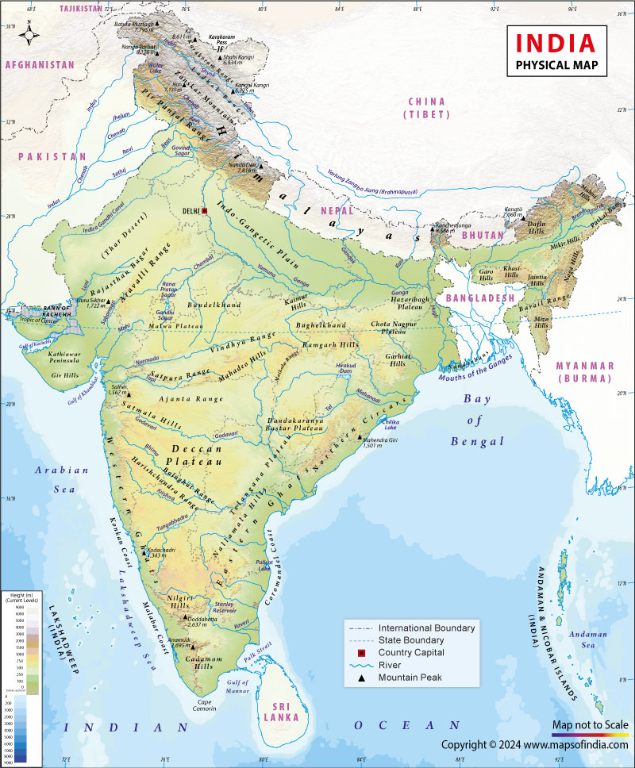

# Topic 1 — Indian Physical Geography: Mountains & Hills

### ★ UPPCS Revision Sheet — Lucent / PW style (one home per association · no repetition · Practice ≥25)

<strong>Covers syllabus</strong> (click to expand)

**Physiographic Divisions:** Physiographic Divisions of India | Northern Mountains | Northern Plains | Peninsular Plateau | Indian Desert | Coastal Plains (Eastern & Western) | Islands of India (Andaman, Nicobar, Lakshadweep)
**Himalayan Mountain System:** Himalayan Mountain System | Trans-Himalayas | Greater Himalayas (Himadri) | Lesser Himalayas (Himachal) | Shiwalik Range | Karakoram Range | Pir Panjal | Zanskar | Dhauladhar | Purvanchal Hills | Garo-Khasi-Jaintia Hills | Kashmir Valley | Duars / Dooars
**Peninsular Mountains, Hills & Plateaus:** Peninsular Mountains | Aravalli Range | Vindhya Range | Satpura Range | Western Ghats | Eastern Ghats | Nilgiri Hills | Cardamom Hills | Anamalai Hills | Rajmahal Hills | Maikal Range | Shevaroy Hills | Major Hills of India | Deccan Plateau | Central Highlands | Malwa Plateau | Bundelkhand Plateau | Baghelkhand Plateau | Chotanagpur Plateau | Meghalaya Plateau | Deccan Trap
**Passes, Peaks & Sacred Geography:** Mountain Passes | Major Mountain Passes | Important Peaks | Highest Peaks of Major Ranges | State-wise Highest Peaks | Religious Places & Geographic Location
**Locational Framework:** Standard Meridian of India | Tropic of Cancer through Indian States | Latitude and Longitude of India | Extreme Points of India | Longest Coastline & Coastal States

> **Sources baked in:** NCERT Geography Class 11 (Ch 2–3), Class 12 (Ch 1–2), physiography map (Kullar), UPPCS Prelims PYQs 2018–2025
> **Weight:** ★★★ — map matching, peaks, passes, physiographic traps every year
> **Last verified:** August 2026
> **Current Affairs:** Sela Tunnel (Mar 2024, Arunachal); Z-Morh / Sonamarg Tunnel (2025); Atal Tunnel = longest highway tunnel **above 10,000 ft** (not unqualified “world’s longest” —)

---

## Current Affairs (this topic)

| Year | Fact | Why asked | Source |
|------|------|-----------|--------|
| **Mar 2024** | **Sela Tunnel** (BRO) — all-weather Tezpur–**Tawang** (Arunachal); longest twin-lane tunnel **above ~13,000 ft** | Border tunnel / pass CA | PIB / inauguration |
| **2025** | **Z-Morh / Sonamarg Tunnel** — all-weather Srinagar–Ladakh axis | Pair with Zoji La | PIB |
| 2020 / PYQ 2025 | Atal Tunnel qualifier only: longest highway tunnel **above 10,000 ft**, not unqualified world longest | | PIB / BRO |

---

### UKPCS Prelims 2025

**Q. UKPCS Prelims 2025, Q84**

The Shiwalik range is primarily composed of which type of material?

A. Igneous rocks
B. Consolidated rocks
C. Unconsolidated sediments
D. Metamorphic rocks

Show answer

**Logic:** Youth of the Shiwaliks explains unconsolidated sediment fill.

**Ans: C.** Shiwaliks are thick unconsolidated sediments from rising Himalaya — landslide-prone and dun-forming.

**Q. UKPCS Prelims 2025, Q90**

Which is the largest glacier of the Trans-Himalayas?

A. Biafo
B. Siachen
C. Baltoro
D. Hispar

Show answer

**Logic:** Among Karakoram glaciers, relative length decides it.

**Ans: B.** Siachen (~76 km) is the largest Trans-Himalayan / Karakoram glacier among the options.

---

## Consolidated — 32 Must-Score Facts

1. India has **six** relief divisions for map questions: Northern Mountains, Northern Plains, Peninsular Plateau, Indian Desert (Thar), Coastal Plains, and Islands. The Thar is a **Pleistocene and recent** sand sheet, not an older Tertiary desert.
2. From north to south the Himalayan belts are **Trans-Himalaya → Himadri (Greater) → Himachal (Lesser) → Shiwalik**. Himadri is crystalline and **fossil-less**. Himachal carries **marine fossils**. Shiwalik is the outermost belt and holds **human remains**.
3. Among the usual age options, **Himadri is the youngest** Himalayan belt and **Aravalli is the oldest** fold mountain system of India. Guru Shikhar (**1722 m**) on Mount Abu is Rajasthan’s highest peak.
4. The Kashmir Valley sits between **Pir Panjal on the south** and **Himadri on the north**, with Zanskar toward the north-west. **Karewas** are old lake-bed terraces of this valley and grow saffron. A **dun** is a different landform — a longitudinal valley between Himachal and Shiwalik.
5. Central India hills from west to east run **Satpura → Mahadeo → Maikal → Chhotanagpur**. **Vindhya** lies **north** of the Narmada and **Satpura** lies **south** of the Narmada. Do not reverse them.
6. The classic state–peak match set is **Tamil Nadu–Doddabetta**, **Rajasthan–Guru Shikhar**, **Nagaland–Saramati**, and **Madhya Pradesh–Dhupgarh**. Also fact **Kerala–Anaimudi** and **Uttarakhand–Nanda Devi**.
7. **Lipulekh, Niti, and Mana** are all in **Uttarakhand**. Lipulekh is **not** in Ladakh. Mana is **not** in Himachal. **Nathu La** is Sikkim. **Shipki La** is Himachal.
8. Tirupati’s Venkateswara temple stands on the **Tirumala / Mallamalla Hills** of the **Eastern Ghats** in Andhra Pradesh. It is **not** on the Shevaroy Hills of Tamil Nadu.
9. **Intertrappean beds** between Deccan lava flows hold **land and freshwater** fossils. They do **not** hold sea plants and animals. Keep the depth figures: upper about **450 m**, middle about **1200 m**, lower about **150 m**.
10. India is the **seventh**-largest country by area (about **3.28 million km²**, roughly **2.4%** of world land). The Tropic of Cancer passes through the **middle** of the country, so India is **not** wholly tropical.
11. The **Atal Tunnel** runs under **Rohtang** in the **Pir Panjal** of Himachal Pradesh. The safe line is longest highway tunnel **above 10,000 ft** — not an unqualified “world’s longest.”
12. The Tropic of Cancer (**23°30′ N**) crosses **eight states only**, west to east: Gujarat, Rajasthan, Madhya Pradesh, Chhattisgarh, Jharkhand, West Bengal, Tripura, Mizoram. It does **not** cross **Uttar Pradesh** or **Ladakh**.
13. India’s Standard Meridian is **82°30′ E** near **Mirzapur, Uttar Pradesh**. It passes through **five states**: Uttar Pradesh, Madhya Pradesh, Chhattisgarh, Odisha, and Andhra Pradesh. **IST is GMT + 5 hours 30 minutes** for the whole country.
14. **Namcha Barwa** lies in **Tibet** and is **not** an Indian peak. **K2** stands in the **Karakoram**, not on Himadri. **Kanchenjunga** is the highest peak **fully in India**.
15. The **Konkan** coast is a coast of **submergence**. The **Malabar** and **Coromandel** coasts are coasts of **emergence**.
16. The **Marwar Plateau** lies **east** of the Aravalli. The **Marwar Plain / Thar** lies **west** of the Aravalli. Do not swap the two.
17. **Palghat (Palakkad) Gap** is a **rift** and the widest break in the Western Ghats, linking Kerala with Tamil Nadu. **Anaimudi (2695 m)** is the hub of Anamalai, Palani, and Cardamom and is the highest peak of South India.
18. The snowline is **lower in the western Himalaya** than in the east. **Siachen** is the long Karakoram glacier of the Nubra belt. **Zemu** in Sikkim feeds the **Teesta**.
19. The Western Ghats are a **continuous** wall from the Tapi gap toward Kanyakumari. The Eastern Ghats are **discontinuous** and lower. Nilgiri is the junction of both Ghats with the southern hills.
20. **Purvanchal Hills** are the north-eastern fold hills beyond the Dihang (Patkai, Naga, Mizo, Mishmi). They are **not** the eastern Uttar Pradesh region also called Purvanchal.
21. **Garo, Khasi, and Jaintia** hills form the **Meghalaya Plateau**. They are geologically **peninsular**, not Himalayan fold ranges. Mawsynram and Cherrapunji sit on the **Khasi Hills**.
22. India’s northern extreme is **Indira Col** (Siachen / Ladakh). The southernmost **territory** is **Indira Point** on Great Nicobar. The southernmost **mainland** point is **Kanyakumari**. East is **Kibithu** (Arunachal); west is **Guhar Moti** (Gujarat).
23. **Gujarat** has the longest **state** coastline. Mainland plus islands is about **7516 km**. Telangana is **not** a coastal state.
24. The **10° Channel** separates Andaman from Nicobar. The **9° Channel** separates Minicoy from the rest of Lakshadweep. The **8° Channel** lies between Minicoy and the Maldives. Andaman–Nicobar are largely **volcanic**; Lakshadweep is **coral**.
25. The Himalayan arc is about **2400 km** from the Indus gorge to the Dihang gorge. The western syntaxial bend is around **Nanga Parbat**. The eastern bend is around **Namcha Barwa** in Tibet.
26. A **dun** is a longitudinal valley between Himachal and Shiwalik (Dehra Dun is the classic example). **Duars** are the West Bengal–Assam foothills that open toward Bhutan. They are not the same as the UP Terai belt.
27. **Uttar Pradesh’s** highest point is **Amsot** (about **941 m**) in the Kaimur / Sonbhadra belt. It is a Vindhyan fringe peak, **not** a Himalayan summit.
28. In Uttar Pradesh, Bhabar–Terai foothills appear in Pilibhit, Lakhimpur Kheri, Bahraich, and Shravasti. The core plain is the **Ganga–Yamuna Doab**. Bundelkhand in south-west UP is granite–gneiss and drought-prone.
29. The Standard Meridian place fact for Uttar Pradesh is **Mirzapur**. The Tropic of Cancer does **not** enter Uttar Pradesh. Eastern UP “Purvanchal” is a **plain region**, not the NE Purvanchal Hills.
30. **Annamalai** and **Sirumalai** are **Tamil Nadu peninsular** hills. They are **not** Himalayan peaks and must not sit in a Himalayan match list.
31. The Deccan Plateau is the **southern** tableland of the old peninsular block. The Central Highlands (Malwa, Bundelkhand, Baghelkhand) are the **northern** part of the same block. The plateau slopes **high in the west and low in the east**.
32. The Aravalli runs about **800 km** from Palanpur (Gujarat) toward Delhi. It is a **relict** Archaean fold belt and helps cast the rain shadow that feeds the Thar.

---

## Confused Pairs

| A | B | Correct | Hindi |
|---|----|------|-------|
| Himadri | Himachal | Fossil-less crystalline vs marine fossils | हिमाद्रि / हिमाचल |
| Himachal | Shiwalik | Marine fossils vs human remains; outer youngest | हिमाचल / शिवालिक |
| Bhangar | Khadar | Older kankar upland vs newer flood-renewed, more fertile | भांगर / खादर |
| Bhabar | Terai | Streams sink (pebbles) vs streams re-emerge (marsh/forest) | भाबर / तराई |
| Western Ghats | Eastern Ghats | Continuous high wall vs discontinuous eroded hills | पश्चिमी घाट / पूर्वी घाट |
| Vindhya | Satpura | North of Narmada vs south of Narmada | विंध्य / सतपुड़ा |
| Andaman–Nicobar | Lakshadweep | Volcanic (Bay of Bengal) vs coral atolls (Arabian Sea) | अंडमान / लक्षद्वीप |
| Deccan Plateau | Deccan Trap | Southern tableland vs basalt lava cover on it | दक्कन पठार / दक्कन ट्रैप |
| Purvanchal Hills | UP Purvanchal | NE hill system vs eastern UP region | पूर्वांचल पहाड़ियाँ / पूर्वांचल (UP) |
| Indira Point | Kanyakumari | Southernmost **territory** vs southernmost **mainland** | इंदिरा पॉइंट / कन्याकुमारी |
| K2 | Kanchenjunga | Karakoram (PoK) vs highest peak **fully in India** (Sikkim) | के2 / कंचनजंगा |
| Dun | Karewa | Shiwalik longitudinal valley vs Kashmir lacustrine terrace | दून / करेवा |
| Marusthali | Bagar | Sandy desert core vs semi-arid eastern fringe | मरुस्थली / बागड़ |
| 10° Channel | 9° Channel | Andaman–Nicobar vs Minicoy–rest of Lakshadweep | दस डिग्री / नौ डिग्री |
| Coast of emergence | Coast of submergence | Coromandel / Kerala raised vs Konkan drowned | उद्गमन / निमज्जन तट |
| Marwar Plateau | Marwar Plain | **East** of Aravalli vs **west** (Thar) | मारवाड़ पठार / मैदान |
| Malnad | Maidan | Karnataka forested hill tract vs rolling granite plain | मलनाड / मैदान |
| Kangra Valley | Kulu Valley | Strike / longitudinal vs transverse valley (HP) | कांगड़ा / कुल्लू |
| Standard Meridian | Tropic of Cancer | **82°30′ E** N–S time line (Mirzapur; 5 states) vs **23°30′ N** E–W line (8 states; **not UP**) | मानक याम्योत्तर / कर्क रेखा |
| Indira Col | Indira Point | Northern extreme (Siachen / Ladakh) vs southernmost **territory** (Great Nicobar) | इंदिरा कोल / इंदिरा पॉइंट |

---

## Must-score facts — belts, peaks, passes

### Himalayan belts (N → S)

**Trans-Himalaya → Himadri (Greater) → Himachal (Lesser) → Shiwalik**

| Item | Lock |
|------|------|
| Youngest belt (usual options) | **Himadri** |
| Oldest fold system (usual options) | **Aravalli** |
| Kashmir Valley | Pir Panjal **south**; Himadri **north** |

### Central India hills (W → E)

**Satpura → Mahadeo → Maikal → Chhotanagpur** · **Vindhya** lies **north** of Narmada

### State ↔ peak

| State | Peak |
|-------|------|
| Tamil Nadu | **Doddabetta** |
| Rajasthan | **Guru Shikhar** (Aravalli) |
| Nagaland | **Saramati** |

### Passes / temple

| Item | Lock |
|------|------|
| Lipulekh / Niti / Mana | All in **Uttarakhand** (Lipulekh ≠ Ladakh) |
| Venkateswara / Tirupati | **Tirumala / Mallamalla** — Eastern Ghats (AP) |
| Intertrappean beds | Land / freshwater fossils (not marine) |
| India area rank | **7th** (~3.28 million km²; ~2.4% world land) |

---

## 1.0 Physiographic framework

- NCERT splits India’s geology into **three** structural units. Standard relief maps then teach **six** relief divisions on that skeleton.

| Structural unit | What it is | Note |
|-----------------|------------|-----------|
| **Peninsular Block** | Oldest stable crust; gneiss, granite, schist | Faulted and eroded, **not** recently folded like the Himalaya |
| **Himalayas and extra-peninsular mountains** | Young fold belt from India–Eurasia collision | Still rising in zones; includes Karakoram and Purvanchal |
| **Indo–Ganga–Brahmaputra Plain** | Foredeep filled with Himalayan alluvium | One of the world’s largest alluvial tracts |

- The **six** relief units used in map questions are Northern Mountains, Northern Plains, Peninsular Plateau, Indian Desert, Coastal Plains, and Islands.
- Some notes list only **five** units and fold the Thar into the **Rajasthan Plain**. Keep the Thar as a **separate** Pleistocene–recent sand sheet, so use six divisions.
- About **43%** of India is plains, **28%** plateau, **19%** hills, and **11%** high mountains (standard class figures).
- The Himalaya is a **climatic wall**. It blocks cold Central Asian winds in winter and forces orographic rain on the southern slopes in the monsoon.
- The Peninsular Plateau is **not** the same as the Deccan Plateau. The Deccan is the **southern** tableland. The Central Highlands (Malwa, Bundelkhand, Baghelkhand) are the **northern** part of the same old block.
- The plateau is tilted **high in the west and low in the east**. That is why most peninsular rivers drain to the Bay of Bengal.
- The plateau is separated from the Northern Plains roughly along the **Narmada–Son** line.
- The **Malda Gap** (Rajmahal–Garo gap) separates the Meghalaya Plateau from the main peninsular block.

> **Logic:** Thar sands = **Pleistocene and recent** (not Paleocene/Oligocene/Pliocene). Gujarat = longest **state** coastline (~1600 km mainland).

---

## 1.1 Physiographic Divisions of India

| Division | Where | Age | One-line identity |
|----------|-------|-----|-------------------|
| **Northern Mountains** | Northern frontier | Tertiary (young) | Himalaya + Karakoram + Purvanchal |
| **Northern Plains** | Between Himalaya and plateau | Recent | Indus–Ganga–Brahmaputra alluvium |
| **Peninsular Plateau** | South of Narmada–Son | Precambrian | Oldest stable block |
| **Indian Desert** | Western Rajasthan | Pleistocene–recent | Thar / Marusthali, leeward of Aravalli |
| **Coastal Plains** | East and west margins | Recent | West **narrow**; East **broad and deltaic** |
| **Islands** | Arabian Sea and Bay of Bengal | Recent | Lakshadweep **coral**; A&N **volcanic** |

**PYQ — UPPCS Prelims 2018, Q101**

Rajasthan desert or Thar desert is the expanse of which of the following?

A. Pliocene

B. Paleocene

C. Pleistocene and recent deposits

D. Oligocene

Show answer

**Ans: C** — Quaternary sands. A/B/D are older Tertiary labels used as traps.

### Northern Plains

- The Northern Plain is a **foredeep** filled by Himalayan rivers. South of the Shiwaliks the belts run **Bhabar**, then **Terai**, then **Bhangar / Khadar**. Never reverse that order.
- Direction matters. From the **Himalaya foot moving south**, the order is **Shiwalik → Bhabar → Terai**. From the **Gangetic edge moving north**, UK-style lists read **Tarai → Bhabar → Shiwalik**. Same belts — opposite reading direction. Always note where the stem starts.
- The Indian sector of this alluvial tract is about **2400 km** long. Width is greatest in the west (about **500 km**) and narrows eastward.
- Average elevation is about **200 m**. The **Ambala** watershed (about **291 m**) divides the **Indus** and **Ganga** systems.
- The **Bhabar** is a narrow pebble belt, about **8–16 km** wide, immediately south of the Shiwaliks. Streams **sink** into the porous gravel here.
- Bhabar fans run with remarkable continuity from the **Indus to the Tista**. The belt is wider in the west than in the east.
- Bhabar is **poor for plough agriculture**. Only deep-rooted trees do well.
- The **Terai** lies south of the Bhabar. Streams **re-emerge**, so the belt is marshy and forested. It is about **15–30 km** wide.
- Terai is **more marked in the east** because rainfall is higher there.
- **Jim Corbett** (Uttarakhand) and **Kaziranga** (Assam) sit in terai / floodplain forest.
- **Dudhwa** National Park and **Katarniaghat** Wildlife Sanctuary sit in the Terai of Uttar Pradesh.
- **Bhangar** is older alluvium above the present flood level. It carries **kankar** (calcareous nodules) and is less fertile.
- **Barind** in the Bengal delta and **bhur** (wind-blown sand mounds in the Ganga–Yamuna Doab) are regional names of older alluvium.
- **Khadar** is newer floodplain alluvium, renewed almost every flood, and is **more fertile** than Bhangar.
- Alkaline patches on older alluvium are called **reh** or **kallar** (also **kollar** in drier Haryana). Extra irrigation can spread reh by capillary salts.

| Sub-region | Location | Fact |
|------------|----------|------|
| **Punjab Plain** | Punjab, Haryana | Doabs; **chos** gullying on Shiwalik edge |
| **Haryana Tract** | Ghaggar–Yamuna | Water-divide; **Ghaggar** as Saraswati successor |
| **Ganga Plain** | Delhi to Kolkata | Rohilkhand, Awadh, Mithila, Magadh |
| **Brahmaputra Plain** | Assam | Braided channel with **bils** (ox-bows) and heavy floods |

- A **doab** is the land between two rivers.

| Doab | Between |
|------|---------|
| **Bist** | Beas and Satluj |
| **Bari** | Beas and Ravi |
| **Rachna** | Ravi and Chenab |
| **Chaj** | Chenab and Jhelum |
| **Sind Sagar** | Jhelum–Chenab and the Indus |

- The **Ganga–Yamuna Doab** is the core agricultural heart of western Uttar Pradesh.
- **Majuli** in Assam is the world’s largest inhabited **river island** (shrinking by erosion). **Kaziranga** sits on the Brahmaputra floodplain.
- The Ganga delta is **arcuate**. The **Sundarbans** mangrove tract straddles India and Bangladesh.

> **Logic:** Khadar is newer and more fertile. Never swap it with Bhangar. Duars of West Bengal–Assam are a **different** foothill tract from the UP Terai.

### Indian Desert (Thar / Marusthali)

- The Thar lies on the **leeward** side of the Aravalli. Core rainfall is generally **below 250 mm**.
- At depth the desert sits on **peninsular** gneiss and granite. Only the surface looks like a young sand sheet.
- **Marusthali** is the sandy desert core with shifting **barchans**. The **west** is sandier; the **east** is rockier.
- **Bagar** is the semi-arid eastern fringe up to the Aravalli, with short seasonal streams and **rohi** patches.
- The tract **north of the Luni** is the **thali** (sandy plain) with inland saline lakes.
- **Sambhar Lake** near Jaipur is the largest inland salt lake. **Didwana, Degana, and Kuchaman** are other saline lakes.
- The **Luni** is the only major river of the region. It is **seasonal** and **inland-draining**. It is not a perennial Arabian Sea river.
- The southern margin is the **Rann of Kachchh**. The eastern margin is the Aravalli.

> **Logic:** Thar sands = Pleistocene and recent (not older Tertiary epochs).

### Coastal Plains

- The **Western Coastal Plain** is **narrow** (about 50–80 km) because the Western Ghats rise close to the Arabian Sea.
- The **Eastern Coastal Plain** is **broad** (about 100–200 km) and **deltaic**. Average width is about **120 km**.
- India’s mainland coast is fairly **straight** (Cretaceous Gondwana faulting). It offers **fewer** deep natural harbours than an indented European coast.
- **Konkan** (Maharashtra–Goa) is a coast of **submergence** (faulted, drowned inlets, Mumbai harbour).
- **Malabar / Kerala** is a coast of **emergence** (lagoons, spits, kayals).
- **Coromandel** (Tamil Nadu) is a coast of **emergence**. Deltas silt harbours.
- **Kachchh and Kathiawar** are geologically a **peninsular** extension (Kathiawar has Deccan lava). They are still mapped with the western coastal plains because they are now levelled.
- **Kachchh** was once an island. The **Great Rann** is the salt waste to its north. The **Little Rann** lies to the south-east.
- **Girnar (1117 m)** is a volcanic high on Kathiawar. The **Gir** forest is the last home of the Asiatic lion.

| Western strip | Stretch |
|---------------|---------|
| **Kachchh–Kathiawar** | Gujarat |
| **Gujarat Plain** | Narmada–Tapi–Mahi–Sabarmati fill |
| **Konkan** | Daman to Goa |
| **Kanara (Canara)** | Goa to Mangaluru |
| **Malabar** | Kerala |

| Eastern strip | Stretch |
|---------------|---------|
| **Utkal Coast** | Odisha coast with the Mahanadi delta and **Chilika** |
| **Northern Circars** | Mahanadi to Krishna |
| **Carnatic** | Krishna to Kaveri |
| **Coromandel / Payan Ghat** | False Divi Point to Kanyakumari |

- The **Sharavati** drops as **Jog (Gersoppa) Falls** (about 271 m) on the Karnataka Ghats scarp.
- **Sriharikota** is the sand spit that bars **Pulicat** Lake (ISRO).
- **Kolleru** was once a coastal lagoon. Emergence has left it **inland** on the combined Godavari–Krishna delta.
- The **Kaveri delta** (about 130 km wide) is the “granary of South India.”
- The **Kerala kayals** (backwaters) are lagoon–estuary waterways. **Vembanad** is the largest.
- **Chilika** (Odisha) is India’s largest coastal lagoon.
- Kerala beach sands carry **monazite** (thorium). The KG offshore basin is a hydrocarbon play.
- West-flowing Narmada and Tapi form **estuaries**, not large deltas.

> **Logic:** Do not reverse widths. West is narrow; east is broad. Do not call the **whole** west coast submerged — only **Konkan** is the classic drowned coast.

### Islands of India

- The **Andaman and Nicobar** chain is a southward continuation of the **Arakan Yoma** (Purvanchal–Myanmar arc). The rocks are **volcanic / tectonic**. The capital is **Port Blair** on **South Andaman**.
- **Saddle Peak (737 m)** on **North Andaman** is the highest point of the archipelago.
- **Barren Island** is India’s **only active volcano**. **Narcondam** is volcanic but **dormant / extinct**. (Do not copy the older “both active” line.)
- The **Ten Degree Channel** separates the Andaman group from the Nicobar group.
- **Duncan Passage** separates **South Andaman** from **Little Andaman**.
- The **Coco Channel** lies between North Andaman and Myanmar’s Coco Islands.
- **Car Nicobar** is the northernmost Nicobar island. **Great Nicobar** is the largest and southernmost, close to **Sumatra**.
- **Indira Point** on **Great Nicobar** (about 6°45′ N) is India’s southernmost **territory**. It is not Kanyakumari.
- **Lakshadweep** islands are **coral atolls** (Reunion hotspot trail) about 200–500 km off Kerala. The capital is **Kavaratti**.
- The old three-fold names are **Amindivi** (north), **Laccadive** (middle), and **Minicoy** (south).
- **Minicoy** is the largest and southernmost inhabited island of Lakshadweep. Elevation is generally **under 5 m**, so the group is highly exposed to sea-level rise.
- The **Nine Degree Channel** separates **Minicoy** from the rest of Lakshadweep.
- The **Eight Degree Channel** separates **Minicoy** from the **Maldives**.
- Adam’s Bridge / **Rama Setu** remnants lie between India and Sri Lanka. They are a submerged limestone shoal, not a Himalayan fold.

> **Logic:** Never reverse origins. A&N = volcanic. Lakshadweep = coral.

---

## 1.2 Himalayan Mountain System

- The Himalaya is a **young fold** belt from the **Indian–Eurasian** collision (about 50 million years ago). The arc is about **2400 km** from the **Indus gorge** (west) to the **Dihang gorge** (east).
- The arc has two **syntaxial bends**. The western bend is around **Nanga Parbat**. The eastern bend is around **Namcha Barwa** in **Tibet**, not in India.

### North to south (parallel ranges)

| Range | Typical height | Rock / fossil fact |
|-------|----------------|--------------------|
| **Trans-Himalaya** | 3000–6500 m | Granitic cold desert **north of the Indus** |
| **Himadri** (Greater) | generally **>6000 m** | Crystalline, **fossil-less**, with permanent snow |
| **Himachal** (Lesser) | 3700–4500 m | Sedimentary; **marine fossils** |
| **Shiwalik** (Outer) | 900–1100 m | Youngest unconsolidated rocks; **human remains** |

- The **Himadri** is the highest and most continuous range. It is crystalline (granite–gneiss) with a steep **south** face and gentler **north** face (**hogback**).
- The **Himachal** belt holds most famous hill stations. **Pir Panjal**, **Dhauladhar**, **Mussoorie**, and **Nag Tibba** belong here.
- **Mahabharat Lekh** is the Lesser Himalaya name in **Nepal**.
- The **Shiwalik** is the outermost and youngest range (about 600–1500 m; often quoted 900–1100 m). It is folded conglomerate fans, not crystalline rock.
- Seasonal torrents that dissect the Punjab–Himachal Shiwalik are **chos**. Forest cover on Shiwalik **decreases westwards** with rainfall.

| Region | Local name of Shiwalik |
|--------|------------------------|
| Jammu | Jammu Hills |
| Uttarakhand | Dhang / Dundwa |
| Nepal | Churia Ghat Hills |
| Arunachal | Dafla, Miri, Abor, Mishmi (outer hills) |

- Longitudinal valleys between Himachal and Shiwalik are **duns** in the west and **duars** in the east.
- **Dehra Dun** is the best-known dun (about 75 km by 15–20 km). **Kotli, Patli, Kyarda, Chaukhamba, and Udhampur** are other named duns.
- High snow-covered ranges feed **perennial** Himalayan rivers (Indus, Ganga, Brahmaputra headwaters).
- Altitude creates climate belts, so vegetation changes from tropical through temperate and alpine to nival.

> **Logic:** All three fossil facts are true. Greater Himalaya is **fossil-less**. Lesser Himalaya carries **marine fossils**. Shiwalik carries **human remains**. Among usual options the **youngest** range is **Himadri** (Aravalli is oldest). Snow-melt feeds perennial rivers. Altitude creates vegetation zonation.

**PYQ — UPPCS Prelims 2019, Q11**

With reference to the Himalayan range, which of the statements is/are correct?

1. The sedimentary rocks of the greater Himalayas were fossil less.
2. Marine livings fossils are found in the sedimentary rocks of lesser Himalayas.
3. Remains of human civilization are found in outer or Shivalik Himalayas.

A. 1 and 2 only

B. 2 and 3 only

C. 1 and 3 only

D. 1, 2 and 3 are correct

Show answer

**Ans: D** — All three zonation facts. Trap: putting marine fossils in Greater Himalaya.

### West to east (regional sections)

- NCERT cuts the Himalaya by rivers, west to east.
- The **Punjab Himalaya** (about **560 km**) lies between the **Indus and the Satluj**. Karakoram, Ladakh, Pir Panjal, Zaskar, and Dhauladhar sit in this western block.
- The **Kumaon Himalaya** lies between the **Satluj and the Kali**. It is Uttarakhand Himalaya, with **Nanda Devi**, **Mana**, and **Niti**. Mussoorie and Nag Tibba represent the Lesser Himalaya here.
- **Western Himalaya** as a major regional block runs **Indus to Kali** (Kashmir + Himachal + Kumaon).
- The **Nepal / Central Himalaya** (about **800 km**) lies between the **Kali and the Tista**. Everest, Dhaulagiri, Annapurna, and Makalu sit here. **Kathmandu** and **Pokhara** are lacustrine valleys.
- The **Assam / Eastern Himalaya** (about **720 km**) lies between the **Tista and the Dihang / Brahmaputra**. Fluvial erosion is strong because rainfall is heavy.
- **Kanchenjunga** belongs to the **Sikkim** Himalaya, not to the Assam Himalaya section.
- Western Himalaya rises **gradually** through many ranges. Eastern Himalaya rises **abruptly** from the Bengal–Assam plains.
- **Sandakphu** on the **Singalila** ridge is West Bengal’s highest point.
- **Kangto** is the usual peak for Arunachal Pradesh.
- Beyond the Dihang gorge the ranges swing south as the **Purvanchal**.

### Trans-Himalaya, Karakoram, glaciers

- The Trans-Himalaya is the **Tibetan Himalaya** zone. The monsoon does **not** reach it because Himadri casts a rain shadow.
- The **Zaskar (Zanskar)**, **Ladakh**, and **Kailash** ranges are the Trans-Himalayan set taught for India.
- The **Kailash (Gangdise)** range is treated as an offshoot of the Ladakh Range. The **Indus** rises on its northern slope.
- The **Karakoram** (also called **Krishnagiri**) occupies the extreme north-west and joins the **Pamir Knot**.
- **K2 (Godwin Austin, 8611 m)** is in the Karakoram in **PoK**. It is **not** on the Himadri.
- North-east of Karakoram the **Ladakh Plateau** is cut into **Aksai Chin, Depsang, Lingzi Tang, Chang Chenmo, and Soda Plains**.
- **Siachen** (about **75 km**, Nubra valley) is the longest glacier in the **Indian-administered** Karakoram. **Fedchenko** in the Pamir is longer. **Hispar** is another giant Karakoram glacier.
- **Sonapani** (about 15 km, Lahaul Chandra valley) is the longest named glacier of the **Pir Panjal** set.
- The **Gangotri** glacier (about 30 km) feeds the **Bhagirathi**. The **Yamunotri** glacier feeds the **Yamuna**.
- **Zemu** glacier (Sikkim) is the largest glacier of the eastern Himalaya and feeds the **Teesta**.
- Snowline is **lower in the west** (about 2500 m) than in the **east / Kumaon** (about 3500 m), mainly because western precipitation falls more as snow at higher latitude.
- On Himadri the snowline is **lower on the steep, wetter southern slope** than on the drier north.
- The **Karakoram Pass** was a historic Silk Route col. Do not confuse it with **Khardung La** (Ladakh road pass).

### Pir Panjal, Zanskar, Dhauladhar, Kashmir Valley

- The **Pir Panjal** is the longest range of the Lesser Himalaya. It is the **southern wall** of the Kashmir Valley. It runs from the Jhelum to the upper Beas (over 300 km) and contains much **volcanic** rock.
- **Banihal Pass** carries the Jammu–Srinagar highway and the rail alignment through this wall.
- The **Atal Tunnel** (about 9.02 km) runs under **Rohtang** in the Pir Panjal of **Himachal**. It links Manali with Lahaul–Spiti.
- Unqualified “world’s longest highway tunnel” is **false**. The correct qualifier is longest highway tunnel **above 10,000 ft**.
- The **Zanskar** range lies **north** of the Kashmir Valley and separates it from Ladakh. **Pensi La** crosses it. **Kargil** sits toward its western end.
- The **Dhauladhar** is an outer Lesser Himalayan range in **Himachal**. **Kangra Valley** is a **strike** (longitudinal) valley at its foot. **Kulu Valley** (upper Ravi) is a **transverse** valley.
- The Kashmir Valley is about **135 km by 32–40 km**. The **Jhelum** drains it through the **Baramulla gorge**. **Srinagar**, **Dal Lake**, and **Wular Lake** belong to this vale.
- The valley lies between **Pir Panjal (south)** and **Himadri (north)**.
- **Karewas** are Pleistocene **lacustrine** terraces left when the Kashmir lake drained through Baramulla. Thickness can reach about **1400 m**.
- Karewas grow **saffron**, almond, walnut, and apple. They are **not** the same landform as a dun.

> **Logic:** Kangra–Dhauladhar is a **Himachal** pairing. Do not use it for Kashmir. Atal Tunnel is in **Pir Panjal**, not Karakoram or Zanskar.

### Purvanchal, Garo–Khasi–Jaintia, Duars

- **Purvanchal Hills** are the north-eastern **fold** hills beyond the Dihang. They are **convex to the west**. They are **not** eastern Uttar Pradesh.
- The **Patkai Bum** runs along the Arunachal–Myanmar border. It is mostly sandstone.
- The **Naga Hills** are in Nagaland. **Saramati (3841 m)** is Nagaland’s highest peak.
- The **Barail Range** separates the Naga Hills from the **Manipur Hills**.
- The **Mizo / Lushai Hills** are in Mizoram. **Phawngpui (Blue Mountain, 2165 m)** is Mizoram’s highest.
- The **Mishmi Hills** are in eastern Arunachal.
- The **Manipur Hills** hold **Tenipu / Mount Iso**, Manipur’s usual highest peak.
- **Garo, Khasi, and Jaintia** hills form the **Meghalaya Plateau**. They are **geologically peninsular**, not Himalayan folds.
- The **Garo Hills** occupy western Meghalaya.
- The **Khasi Hills** occupy central Meghalaya. **Shillong Peak (1965 m)** is Meghalaya’s highest.
- **Mawsynram** and **Cherrapunji** sit on the **Khasi Hills**, not on Garo or Jaintia.
- The **Jaintia Hills** occupy eastern Meghalaya and are known for limestone caves.
- **Duars / Dooars** are the Himalayan foothills of **West Bengal and Assam**. They are the “door” to Bhutan and carry tea and wildlife corridors (Jaldapara, Gorumara, Buxa).

> **Logic:** Wettest places sit on **Khasi Hills**. Duars ≠ Terai of UP.

### Himalayan peaks (match home)

| Peak | m | Note |
|------|---|------|
| **K2 (Godwin Austin)** | 8611 | **Karakoram** (PoK) — not the main Himalayan arc |
| **Kanchenjunga** | 8586 | Highest peak **fully in India** (Sikkim, Himadri) |
| **Nanda Devi** | 7816 | Uttarakhand; highest entirely in Uttarakhand |
| **Kamet** | 7756 | Uttarakhand |
| **Cho Oyu** | 8188 | Himalaya (Nepal–Tibet) — |
| **Lhotse** | 8516 | Himalaya (Nepal–Tibet) — |
| **Nanga Parbat** | 8126 | Western syntaxial bend (Gilgit–Baltistan / PoK) |
| **Namcha Barwa** | 7782 | **Tibet / China** — **not** in India |
| **Gurla Mandhata** | 7694 | **Tibet**, north of Mansarovar — **not** an Indian peak |

- **Annamalai** and **Sirumalai** are **Tamil Nadu peninsular** hills. They are **not** Himalayan.

> **Logic:** **Namcha Barwa** is not in India. **Gurla Mandhata** is Tibetan — do not list either as an Indian Trans-Himalayan peak.

---

## 1.3 Peninsular Mountains, Hills & Plateaus

- The peninsula is an ancient **Precambrian** block. Most peninsular hills are **relict** (residual) **horsts**, not young folds.
- The plateau is roughly **triangular** (base along the northern plain, apex at Kanyakumari) and covers about **16 lakh km²**. Average height is about **600–900 m**.

| Range | Trend | Location | Highest | Fact |
|-------|-------|----------|---------|------|
| **Aravalli** | SW–NE | Gujarat–Rajasthan–Delhi | **Guru Shikhar 1722 m** | **Oldest** fold mountains; Rajasthan highest |
| **Vindhya** | E–W | **North of Narmada**, MP | Sadbhawna Shikhar | Aryavarta / Dakshinapatha divide |
| **Satpura** | E–W | **South of Narmada** | **Dhupgarh 1350 m** (Pachmarhi) | Madhya Pradesh highest |
| **Western Ghats** | N–S | Tapi gap to Kanyakumari | **Anaimudi 2695 m** | **Continuous**; Sahyadri in Maharashtra |
| **Eastern Ghats** | N–S | Odisha to Tamil Nadu | **Jindhagada ~1690 m** | **Discontinuous** |
| **Nilgiri** | — | Tamil Nadu–Kerala | **Doddabetta 2637 m** | Junction of both Ghats |
| **Rajmahal** | — | Jharkhand | — | Rajmahal Trap (volcanic) |
| **Shevaroy** | — | Salem, Tamil Nadu | — | Eastern Ghats; **not** Tirupati |

- Central India hills run **west to east** as **Satpura**, then **Mahadeo**, then **Maikal**, then **Chhotanagpur**.

### Aravalli Range

- The Aravalli is about **800 km** from **Palanpur (Gujarat)** to Delhi. It is the **oldest** fold mountain system of India (Archaean), now a **relict** range.
- **Guru Shikhar (1722 m)** on Mount Abu is Rajasthan’s highest peak. Mount Abu is cut from the main range by the **Banas** valley.
- South of Ajmer the range is continuous. North of Ajmer it breaks into detached ridges (Haryana–Delhi).
- The buried north-east stump continues toward **Haridwar** under Ganga alluvium. The **Delhi Ridge** is the visible remnant.
- **Pipli Ghat, Dewair, and Desuri** are the road–rail gaps through the Rajasthan Aravalli.
- The range casts a rain shadow that helps create the **Thar**.
- **Zawar** (Rajasthan) is the classic zinc–lead locality of the Aravalli belt.

### Vindhya Range

- The Vindhya runs **east–west north of the Narmada** as an escarpment on the **Narmada–Son trough**, from **Jobat (Gujarat)** to **Sasaram (Bihar)** (over 1200 km).
- It is the watershed between the **Ganga system** and peninsular rivers. Chambal, Betwa, and Ken rise within about 30 km of the Narmada.
- The Vindhya continues east as the **Bhanrer** and **Kaimur** hills.
- **Kaimur Hills** are the Vindhyan extension into **Uttar Pradesh and Bihar**.
- **Amsot (about 941 m)** in Sonbhadra is Uttar Pradesh’s highest point. It is **not** Himalayan.

### Satpura Range

- The Satpura is a series of **seven** residual blocks (**sat-pura**) and is treated as a **horst**. It runs **east–west south of the Narmada**, between the Narmada and the Tapi, for about **900 km**.
- **Dhupgarh (1350 m)** at **Pachmarhi** on the **Mahadeo Hills** is Madhya Pradesh’s highest peak.
- **Mahadeo Hills** continue the Satpura eastward.
- **Maikal Hills** continue still farther east into Madhya Pradesh–Chhattisgarh. **Amarkantak** sits at this eastern junction.
- **Amarkantak** is the source of the **Narmada** and the **Son**.
- The **Tapi** flows in a rift/gorge south of the Satpura. **Gavilgarh Hills** are the western Satpura in Maharashtra.

> **Logic:** Never reverse Vindhya and Satpura across the Narmada. do not put Maikal before Satpura or Chhotanagpur before Maikal.

**PYQ — UPPCS Prelims 2019, Q6**

Which one of the following is the correct sequence of the hills of Central India located from West to East?

A. Maikal, Satpura, Mahadeo and Chhotanagpur

B. Satpura, Mahadeo, Maikal and Chhotanagpur

C. Maikal, Mahadeo, Satpura and Chhatanagpur

D. Satpura, Mahadeo, Chhotanagpur and Maikal

Show answer

**Ans: B** — Satpura → Mahadeo → Maikal → Chhotanagpur.

### Western Ghats (Sahyadri)

- The Western Ghats are a **continuous** escarpment from the **Tapi valley** to near **Kanyakumari** (about **1600 km**).
- They rise as a steep wall on the west and slope **gently east** into the Deccan, so they hardly look like a mountain from the plateau.
- Northern Sahyadri is **Deccan Trap** lava with a **landing-stair** (stepped) west face.
- **Kalsubai (1646 m)** is Maharashtra’s highest peak. **Salher** and **Mahabaleshwar** are other northern Sahyadri highs.
- Middle Sahyadri (south of about 16° N) is **granite–gneiss**. **Kudremukh** and **Baba Budan / Mullayanagiri** sit here.
- **Mullayanagiri (1930 m)** is Karnataka’s highest peak.
- **Thal Ghat (Kasara)** carries the Mumbai–Nashik route.
- **Bhor Ghat (Khandala)** carries the Mumbai–Pune route.
- **Palghat (Palakkad) Gap** is a **rift** and the **widest** gap. It links Kerala with Tamil Nadu and lets south-west monsoon moisture into the Mysore–Coimbatore interior.

### Eastern Ghats

- The Eastern Ghats are **discontinuous** and lower. They have neither structural unity nor a continuous crest.
- True mountain character is clearest between the **Mahanadi and the Godavari** (**Maliya** and **Madugula Konda** ranges).
- **Jindhagada (about 1690 m)** in Araku Valley is the usual highest peak of the Eastern Ghats.
- **Arma Konda** (Andhra Pradesh) is another high Eastern Ghats peak used in match lists.
- **Mahendragiri (1501 m)** is the well-known Odisha peak of the Maliya range.
- Between the **Godavari and the Krishna** the Ghats almost vanish. That low is the **KG (Gondwana) basin**.
- The **Nallamala** Hills (Cuddapah–Kurnool) restore a hill chain. The southern part is the **Palkonda** Range.
- The **Javadi** Hills and the **Shevaroy–Kalrayan** Hills are the Tamil Nadu remnants.
- **Biligiri Rangan** Hills sit on the Karnataka–Tamil Nadu border.
- The **Shevaroy** Hills (Yercaud, Salem) are **not** the site of Tirupati.
- **Tirumala / Mallamalla** Hills (Tirupati) are Eastern Ghats of **Andhra Pradesh**.

### Southern hills (Nilgiri–Anamalai–Cardamom)

- The **Nilgiri Hills** are the junction of the Western Ghats, Eastern Ghats, and southern hills. They rise abruptly above 2000 m.
- **Doddabetta (2637 m)** is Tamil Nadu’s highest peak. **Makurti** is the other named Nilgiri high.
- **Udhagamandalam (Ooty)** sits in the Nilgiris.
- South of Palghat, **Anaimudi (2695 m)** is the highest peak of the Western Ghats **and of South India**.
- Three ranges radiate from Anaimudi. The **Anamalai** runs north. The **Palani** runs north-east (**Kodaikanal**). The **Cardamom / Ealaimalai** runs south.
- **Sirumalai** is a Tamil Nadu outlier. Pair it with Annamalai as **peninsular**, not Himalayan.
- **Eravikulam** (Nilgiri Tahr) and **Periyar** belong to this southern Western Ghats complex.

> **Logic:** Doddabetta = **Tamil Nadu**. Anaimudi = **Kerala**. Annamalai / Sirumalai are **not** Himalayan.

### Deccan Plateau and Deccan Trap

- The **Deccan Plateau** is the **southern** triangular tableland (about **5 lakh km²**). Satpura–Vindhya bound it on the north-west, Mahadeo–Maikal on the north, Western Ghats on the west, Eastern Ghats on the east. It **slopes eastward**. Height is about **1000 m** in the south and about **500 m** in the north.
- The **Maharashtra Plateau** is trap country with **step topography** and **regur**.
- The **Karnataka (Mysore) Plateau** splits into **Malnad** (forested hill country) and **Maidan** (rolling granite plain). It tapers into the Nilgiris.
- The **Telangana Plateau** is Archaean gneiss drained by Godavari, Krishna, and Penner.
- The **Chhattisgarh Plain** is the only true plain inside the peninsula: a **saucer** of limestone–shale drained by the upper **Mahanadi**, between Maikal and the Odisha hills.
- The **Deccan Trap** is a **basalt** cover from fissure eruptions (Cretaceous–Eocene, about 66 Ma), about **5 lakh km²** over Maharashtra, Madhya Pradesh, Gujarat, and Karnataka.
- Black **regur** cotton soil is weathered trap basalt.

| Trap layer | Depth fact |
|------------|------------------------------|
| Upper | about **450 m** |
| Middle | about **1200 m** |
| Lower | about **150 m** |
| **Intertrappean beds** | Sediment **between** lava flows; **land / freshwater** fossils — **not** sea plants and animals |

**PYQ — UPPCS Prelims 2024, Q59**

Which one of the following pairs (Deccan Trap – Peculiarity) is not correctly matched?

A. Depth of middle trap – approximately 1200 metres

B. Intertrappean beds – Fossils of sea plants and animals

C. Depth of lower trap – approximately 150 metres

D. Depth of upper trap – approximately 450 metres

Show answer

**Ans: B** — Intertrappean = freshwater/land fossils. Depth figures A/C/D are the matched pairs.

### Central Highlands and north-eastern plateaus

- The Central Highlands are the **northern** Peninsular Plateau, **north of the Narmada–Son**.
- **Marwar / Mewar Plateau** is **east** of the Aravalli (sandstone–shale–limestone, Banas toward Chambal). **Marwar Plain** is the Thar **west** of the Aravalli. Do not swap them.
- **Madhya Bharat Pathar** (Central Highland) is the Chambal basin with ravines / badlands.
- The **Malwa Plateau** is lava-covered and **north-sloping**. It has **dual drainage**: Narmada–Tapi–Mahi to the Arabian Sea, and Chambal–Betwa–Ken to the Yamuna / Bay of Bengal.
- The **Bundelkhand Plateau** lies in south-west Uttar Pradesh and Madhya Pradesh. It is **granite–gneiss**, drought-prone, and includes Jhansi, Banda, and Chitrakoot. Betwa, Dhasan, and Ken cross it.
- The **Baghelkhand Plateau** lies **east** of Bundelkhand, **north of Maikal**. The Son bounds it on the north. It divides Son drainage from Mahanadi drainage.
- The **Chotanagpur Plateau** lies mainly in Jharkhand (with Odisha–West Bengal edges). Average height is about **700 m**. **Damodar** flows in a **rift** through Gondwana coalfields.
- **Hazaribagh Plateau** lies north of Damodar. **Ranchi Plateau** lies south of Damodar.
- The **Rajmahal Hills** are the north-eastern basalt edge of Chotanagpur.
- The **Meghalaya Plateau** is Garo–Khasi–Jaintia. The **Malda / Garo–Rajmahal Gap** is a down-fault filled by Ganga–Brahmaputra alluvium.
- **Mikir (Karbi) Hills** are listed with this north-eastern block on the relief map.
- **Jharia** and **Bokaro** are the Damodar-rift coalfields. Iron and mica are the other Chotanagpur matchs.
- Chotanagpur is the easternmost unit of the west-to-east central-India hill sequence.

### Other hills

- The **Rajmahal Hills** of Jharkhand are volcanic (**Rajmahal Trap**), older than the Deccan Trap.
- **Parasnath (1366 m)** is Jharkhand’s highest peak and a Jain sacred hill on Chotanagpur.
- **Girnar (1117 m)** is Gujarat’s usual highest point (Kathiawar).
- **Gudla Maina** (about 1270 m) is the usual Chhattisgarh high point on a Maikal extension.

---

## 1.4 Passes, Peaks & Sacred Geography

### Mountain passes

- UPPCS tests **pass ↔ State / UT**. The wrong state is the trap.

| Pass | State / UT | Route / note | Trap |
|------|------------|--------------|------|
| **Burzil** | J&K / Ladakh | Greater Himalaya (pass table) | — |
| **Thaga La** | Uttarakhand | Greater Himalaya with Niti / Lipulekh | — |
| **Zoji La** | Ladakh / J&K | Srinagar–Kargil–Leh | Pair with Z-Morh tunnel |
| **Banihal** | J&K | Jammu–Srinagar; Jawahar Tunnel | Not a Tibet pass |
| **Rohtang La** | Himachal Pradesh | Kullu–Lahaul; Atal Tunnel below | Not Karakoram |
| **Bara Lacha La** | Himachal Pradesh | Manali–Leh | — |
| **Kunzum La** | Himachal Pradesh | Lahaul–Spiti | — |
| **Shipki La** | Himachal Pradesh | India–Tibet; Sutlej valley | — |
| **Niti Pass** | **Uttarakhand** | Garhwal–Tibet | 2023 Q57 correct pair |
| **Mana Pass** | **Uttarakhand** | Near Badrinath | **Not HP** |
| **Lipulekh** | **Uttarakhand** | Kailash–Mansarovar; India–Nepal–China | **Not Ladakh** |
| **Nathu La** | Sikkim | India–Tibet trade (reopened 2006) | — |
| **Jelep La** | Sikkim | Alternate to Nathu La | — |
| **Bomdi La** | Arunachal Pradesh | Near **Bomdila town** | Bomdila ≠ pass name |
| **Sela Pass** | Arunachal Pradesh | Tezpur–Tawang; **Sela Tunnel** (2024) | — |
| **Bum La** | Arunachal Pradesh | Tawang–Tibet | — |
| **Pangsau Pass** | Arunachal Pradesh | India–Myanmar (Stilwell Road) | — |
| **Diphu / Aghil** | Karakoram | Not Arunachal / not “Ladakh town” traps | 2023 wrong options |
| **Khardung La** | Ladakh | Leh–Nubra road | High motorable pass; not a Tibet trade pass of the Nathu type |

> **Logic:** Only Lipulekh–Ladakh is NOT matched** among common pass–state pairs. Nathu La–Sikkim and Shipki La–HP are correct. **Niti** and **Mana** are **Uttarakhand**, not Himachal.

**PYQ — UPPCS Prelims 2025, Q55**

Which of the following pairs are NOT correctly matched? (Pass) — (State/Union Territory)

1. Lipulekh — Ladakh
2. Nathu La — Sikkim
3. Bomdila — Arunachal Pradesh
4. Shipki La — Himachal Pradesh

A. Only 1 and 2

B. Only 2, 3 and 4

C. Only 1, 2 and 3

D. Only 1

Show answer

**Ans: D** — Only (1) is geographically wrong (Lipulekh = Uttarakhand). Key treats Bomdila–Arunachal as the accepted corridor pair.

### State-wise highest peaks (match-list home)

| State / UT | Peak | m | Range |
|------------|------|---|-------|
| **Sikkim** | Kanchenjunga | 8586 | Himadri |
| **Uttarakhand** | Nanda Devi | 7816 | Himadri |
| **Himachal Pradesh** | Reo Purgyil | 6816 | Kinnaur Himalaya |
| **Arunachal Pradesh** | Kangto | 7090 | Eastern Himalaya |
| **J&K / Ladakh** | Nun / Kun | 7135 / 7077 | Zanskar |
| **West Bengal** | Sandakphu | 3636 | Singalila |
| **Nagaland** | **Saramati** | 3841 | Naga Hills |
| **Manipur** | Tenipu / Mt Iso | 2994 | Manipur Hills |
| **Mizoram** | Phawngpui | 2165 | Mizo Hills |
| **Meghalaya** | Shillong Peak | 1965 | Khasi |
| **Kerala** | **Anaimudi** | 2695 | Western Ghats |
| **Tamil Nadu** | **Doddabetta** | 2637 | Nilgiri |
| **Karnataka** | Mullayanagiri | 1930 | Western Ghats |
| **Maharashtra** | Kalsubai | 1646 | Western Ghats |
| **Rajasthan** | **Guru Shikhar** | 1722 | Aravalli |
| **Madhya Pradesh** | **Dhupgarh** | 1350 | Satpura |
| **Andhra Pradesh** | Arma Konda | ~1680 | Eastern Ghats |
| **Odisha** | Deomali | 1672 | Eastern Ghats |
| **Gujarat** | Girnar | 1117 | Kathiawar |
| **Jharkhand** | Parasnath | 1366 | Chotanagpur |
| **Uttar Pradesh** | Amsot (Sonbhadra) | ~941 | Kaimur |
| **Chhattisgarh** | Gudla Maina | ~1270 | Maikal extension |

- Range highest (do not restudy the state table): Himalaya-in-India **Kanchenjunga 8586** · Karakoram **K2 8611** · Western Ghats **Anaimudi 2695** · Eastern Ghats **Jindhagada ~1690** · Aravalli **Guru Shikhar 1722** · Satpura **Dhupgarh 1350** · Nilgiri **Doddabetta 2637** · Naga **Saramati 3841**.

> **Logic:** Standard hill–state pairs: TN–Doddabetta, RJ–Guru Shikhar, NL–Saramati, MP–Dhupgarh. Older variants also used Kerala–Anaimudi and UK–Nanda Devi.

### Sacred geography

| Site | State | Hill / fact |
|------|-------|-------------|
| **Tirupati (Venkateswara)** | Andhra Pradesh | **Tirumala / Mallamalla**, Eastern Ghats — **not Shevaroy** |
| Kedarnath | Uttarakhand | Garhwal Himalaya; Mandakini |
| Badrinath | Uttarakhand | Garhwal Himalaya; Alaknanda |
| Gangotri | Uttarakhand | Bhagirathi source glacier |
| Yamunotri | Uttarakhand | Yamuna source glacier |
| Amarnath | J&K | Lidder Valley (Greater Himalaya, not Pir Panjal) |
| Vaishno Devi | J&K | **Trikuta Hills**, Jammu |
| Sabarimala | Kerala | Western Ghats |
| Palitana | Gujarat | Shatrunjaya Hills |
| Parasnath | Jharkhand | Chotanagpur |
| Girnar | Gujarat | Junagadh |
| Ajmer Sharif | Rajasthan | Aravalli foothills |
| Chamundi | Karnataka | Mysuru |
| Konark | Odisha | **Coastal plain** (not a hill shrine) |

> **Logic:** **Mallmalla** in options usually means **Tirumala Hills** (Eastern Ghats). **Shevaroy** = Yercaud (Tamil Nadu). **Biligiriranga** = Karnataka. **Javadhee** = Tamil Nadu.

---

## 1.5 Locational Framework

### Latitude, longitude, area

- India lies entirely in the **northern** and **eastern** hemispheres.

| Item | Note |
|------|------|
| Latitude | **8°4′ N – 37°6′ N** (about 29°; about 3214 km N–S) |
| Longitude | **68°7′ E – 97°25′ E** (about 29°; about 2933 km E–W) |
| Area | about **3.28 million km²** = **2.4%** of world land |
| Rank | Conventionally **7th** largest (after Russia, Canada, USA, China, Brazil, Australia) |

- The **N–S and E–W degree spans are almost equal** (both about 29°). That is why NCERT maps show India as a near-square / diamond outline, not a long east–west strip.
- India is **not** wholly tropical. The Tropic of Cancer cuts the country, so the Himalayan north is subtropical to alpine.

### Standard Meridian

**Easy idea first:** Earth spins once in 24 hours. Time is tied to **longitude** (north–south lines). Places farther **east** see sunrise **earlier**. India is wide enough for about **two hours** of natural solar difference, so one official line — the **Standard Meridian** — gives the whole country a **single clock time (IST)**.

- The Standard Meridian of India is **82°30′ E** (also written **82.5° E**). The classic place centre is **Mirzapur, Uttar Pradesh** (Prayagraj / Allahabad belt). It is **not** Lucknow, Delhi, or “exactly at Prayagraj city.”
- **IST** is **GMT / UTC + 5 hours 30 minutes**. India keeps **one** time zone for the whole country (mainland + islands). CSIR–NPL maintains the official time signal.

**Why 82°30′ E, not 80° or 85°?**

| Step | Easy fact |
|------|-----------|
| Earth | 360° in 24 h means roughly **15°** of longitude per hour, or **1° ≈ 4 minutes** |
| Offset maths | 82.5 ÷ 15 = **5.5 hours** = **5 h 30 min** ahead of GMT |
| Why this line | It sits near the **middle** of India’s longitude span (~68° E to ~97° E), so west (Gujarat) and east (Arunachal / Andaman) share one national clock |

- Natural solar gap across India is about **2 hours** (roughly 29° × 4 min). **Gujarat** clocks feel “early” vs sun; **Arunachal / Andaman** feel “late” vs sun — but **legal time is still IST everywhere**.
- Sunrise is earlier in the **east** (Andaman / Arunachal) than in **Gujarat**. Do not reverse that.

**Where the meridian passes (north to south)**

| State | Place / belt fact | trap |
|-------|-------------------|-----------|
| **Uttar Pradesh** | **Mirzapur** (near Prayagraj belt) | Not Lucknow / Delhi; Tropic does **not** hit UP |
| **Madhya Pradesh** | Eastern MP / **Singrauli** belt | Not the whole of MP |
| **Chhattisgarh** | Central–east belt (**Bilaspur–Korba** class) | Not Jharkhand |
| **Odisha** | **Western** Odisha | Not the Bhubaneswar coast as the “IST city” |
| **Andhra Pradesh** | Northern / coastal AP strip | **Not Telangana** (TG lies west of 82.5° E) |

- The IST meridian passes through **five states — UP, Madhya Pradesh, Chhattisgarh, Odisha, Andhra Pradesh**.
- It does **not** pass through **Uttarakhand, Jharkhand, Bihar, West Bengal, Telangana, Maharashtra, or Tamil Nadu**. Options that sneak in **Uttarakhand** or **Jharkhand** are classic wrong sets.
- Do **not** confuse this N–S **longitude** line with the Tropic of Cancer (an E–W **latitude** line). They are different. Both do cut through **Madhya Pradesh** and **Chhattisgarh**, so map stems can mix them.

> **Logic:** Place = **Mirzapur**. Offset = **+5:30**. States = **five** (UP–MP–CG–Odisha–AP). IST is **uniform** for all of India — never “only east of 82°30′ E.”

### Tropic of Cancer (23°30′ N)

**Easy idea:** This is a **latitude** line (runs east–west). South of it the sun can be overhead once a year; north of it (Himalaya belt) India is **not** purely tropical.

| Order (west → east) | State on the Tropic |
|---------------------|---------------------|
| 1 | **Gujarat** |
| 2 | **Rajasthan** |
| 3 | **Madhya Pradesh** |
| 4 | **Chhattisgarh** |
| 5 | **Jharkhand** |
| 6 | **West Bengal** |
| 7 | **Tripura** |
| 8 | **Mizoram** |

- **Eight states only.** Memorise the west-to-east chain; do not invent a ninth.
- It does **not** pass through **Uttar Pradesh**.
- It does **not** pass through **Ladakh** (Ladakh lies near 32°–36° N).
- It does **not** pass through Bihar, Odisha, Maharashtra, Karnataka, Kerala, Tamil Nadu, Punjab, Haryana, Delhi, Assam, Nagaland, Manipur, Arunachal, Sikkim, Himachal, Uttarakhand, Goa, Andhra Pradesh, or Telangana.
- NCERT says the Tropic passes through the **middle** of the country. That does **not** mean equal land area north and south of 23°30′ N: **more land lies north** of the Tropic.

> **Logic:** Rank = **7th**, not 6th. Area **2.4%**. Tropic through the **middle** matches the NCERT wording used in statement 3. India is **not** wholly tropical. UP is **not** on the Tropic.

**PYQ — UPPCS Prelims 2022, Q35Logic:** Stmt 1 tests rank (7th vs 6th). Stmt 2 tests area share. Stmt 3 is the NCERT “middle” wording (do not upgrade it to equal land area). Stmt 4 traps “wholly tropical.”

With reference to India, which of the following statements is/are correct?

1. India is the sixth largest country in the world.
2. India occupies about 2.4% of the total area of the world.
3. The Tropic of Cancer passes through the middle of the country dividing it into two latitudinal halves.
4. India lies completely in the tropical zone.

A. 2 and 3

B. 2 and 4

C. 3 and 4

D. 1 and 2

Show answer

**Ans: A** — **2 and 3**. Rank is **7th**, not 6th (stmt 1 false). **2.4%** is true. Tropic through the middle is the NCERT fact (stmt 3) — not a claim of equal land area. India is **not** wholly tropical (stmt 4). **B/C** keep wholly-tropical. **D** keeps the 6th-largest trap.

### Extreme points

| Extreme | Place | Easy fact |
|---------|-------|-----------|
| **North** | **Indira Col**, Siachen / Ladakh | High pass on the northern frontier — not a city |
| **South (territory)** | **Indira Point**, Great Nicobar | Southernmost **India** (islands included) |
| **South (mainland)** | **Kanyakumari** (Cape Comorin) | Southernmost **peninsula** only |
| **East** | **Kibithu**, Anjaw, Arunachal Pradesh | Near the Myanmar–China corner; not Walong as the usual key |
| **West** | **Guhar Moti** (also Ghuar Mota), Kutch, Gujarat | Westernmost village belt of Kachchh |

- **Indira Col ≠ Indira Point.** Same first name, opposite ends of India.
- **Indira Point ≠ Kanyakumari.** Territory south vs mainland south.

### Coastline

- Mainland plus islands is about **7516 km** (mainland about **6100 km** class figure). There are **nine** coastal states and two island Union Territories (**A&N** and **Lakshadweep**).

| Rank (longest → shortest) | Coastal state |
|---------------------------|---------------|
| 1 | **Gujarat** |
| 2 | Andhra Pradesh |
| 3 | Tamil Nadu |
| 4 | Maharashtra |
| 5 | Kerala |
| 6 | Odisha |
| 7 | Karnataka |
| 8 | West Bengal |
| 9 | **Goa** (shortest state coast) |

- Gujarat is longest because of the **Kachchh** and **Saurashtra** indentation (about **1600 km** class figure).
- The Andaman and Nicobar coastline is long (about **1962 km**) but it is **not** in the **state** ranking.
- **Telangana** is not a coastal state. **Puducherry** is a coastal UT with enclaves, not a “tenth coastal state” in this ranking.

> **Logic:** Gujarat** has the longest **state** mainland coastline — not Maharashtra, Andhra Pradesh, or Kerala.

---

## Complete PYQ Bank

> **Answers hidden** — click *Show answer* under each question to reveal.
> **Coverage:** All 19 UPPCS Prelims geography hits (2018–2025) for this topic — grouped **2025 → 2018**.

**Q1. UPPCS Prelims 2025, Q37**
Match List-I with List-II and select the correct answer using the code given below the lists.
**List-I (State)**

A. Tamil Nadu

B. Rajasthan

C. Nagaland

D. Madhya Pradesh
**List-II (Highest Peak)**

1. Dhupgarh
2. Doddabetta
3. Guru Shikhar
4. Saramati

A. 2 3 1 4

B. 3 2 4 1

C. 3 2 1 4

D. 2 3 4 1

Show answer

**Ans: D** — A→2 (Doddabetta, TN), B→3 (Guru Shikhar, Rajasthan/Aravalli), C→4 (Saramati, Nagaland), D→1 (Dhupgarh, Satpura/MP). **A** swaps MP-Nagaland peaks. **B/C** put Guru Shikhar on TN or Dhupgarh on Rajasthan.

---

**Q2. UPPCS Prelims 2025, Q44**
With reference to the Atal Tunnel, which of the following statements is/are correct?

1. This tunnel is the world's longest highway tunnel.
2. This tunnel is built in the Pir Panjal range of the Himalayas.

Select the correct answer from the code given below:

A. Only 2

B. Neither 1 nor 2

C. Both 1 and 2

D. Only 1

Show answer

**Ans: A** — Statement 2 correct: Rohtang Pass, Pir Panjal, HP. Statement 1 false without qualification (other longer tunnels exist globally; high-altitude record is different). **C/D** accept the absolute "world's longest" trap.

---

**Q3. UPPCS Prelims 2025, Q55**
Which of the following pairs are NOT correctly matched?
(Pass) — (State/Union Territory)

1. Lipulekh — Ladakh
2. Nathu La — Sikkim
3. Bomdila — Arunachal Pradesh
4. Shipki La — Himachal Pradesh

Select the correct answer from the code given below:

A. Only 1 and 2

B. Only 2, 3 and 4

C. Only 1, 2 and 3

D. Only 1

Show answer

**Ans: D** — Only pair (1) wrong: Lipulekh = **Uttarakhand** (2025 trap). (2) Nathu La-Sikkim ✓. (3) Bomdila is a **town**, not a pass — but question asks NOT matched; Bomdila as "pass" is the implicit trap yet only Ladakh option is clearly wrong geographically. **A/B/C** over-count errors on correct pairs.

---

**Q4. UPPCS Prelims 2025, Q94**
Given below are two statements, one is labelled as Assertion (A) and the other as Reason (R):

**Assertion (A):** The Himalayas form the source of several large perennial rivers.

**Reason (R):** The higher ranges of the Himalayas remain snow-covered throughout the year.

Select the correct answer from the code given below:

A. Both (A) and (R) are true, but (R) is not the correct explanation of (A)

B. (A) is false, but (R) is true

C. (A) is true, but (R) is false

D. Both (A) and (R) are true and (R) is the correct explanation of (A)

Show answer

**Ans: D** — Perennial Himalayan rivers (Ganga, Indus, Brahmaputra headwaters) fed by year-round snow-melt from high ranges. **A** severs the snow-melt → perennial flow logic. **B/C** deny true hydrological facts.

---

**Q5. UPPCS Prelims 2025, Q21**
Given below are two statements, one is labelled as Assertion (A) and the other as Reason (R):

**Assertion (A):** In the Himalayan mountains different types of vegetation are found.

**Reason (R):** In Himalayas, there are variations in climate with change in altitude.

Select the correct answer from the code given below:

A. Both (A) and (R) are true, but (R) is not the correct explanation of (A)

B. (A) is false, but (R) is true

C. (A) is true, but (R) is false

D. Both (A) and (R) are true and (R) is the correct explanation of (A)

Show answer

**Ans: D** — Altitudinal belts (tropical → temperate → alpine → nival) directly cause vegetation zonation. **A** treats independent phenomena. **B/C** falsify obviously true Himalayan ecology facts.

---

**Q6. UPPCS Prelims 2024, Q59**
Which one of the following pairs (Deccan Trap – Peculiarity) is not correctly matched?

A. Depth of middle trap – approximately 1200 metres

B. Intertrappean beds – Fossils of sea plants and animals

C. Depth of lower trap – approximately 150 metres

D. Depth of upper trap – approximately 450 metres

Show answer

**Ans: B** — Intertrappean = **freshwater/lacustrine** fossils between lava flows, NOT marine sea fossils. **A/C/D** are accepted approximate trap thickness facts from standard geomorphology sources.

---

**Q7. UPPCS Prelims 2023, Q57**
Which one of the following (**Pass — State/UT**) is correctly matched?

A. Aghil — Arunachal Pradesh

B. Diphu — Ladakh

C. Niti — Uttarakhand

D. Mana — Himachal Pradesh

Show answer

**Ans: C** — Niti Pass = Uttarakhand ✓. **A** Aghil in Karakoram/China side. **B** Diphu in Karakoram, not Ladakh as commonly tested. **D** Mana = **Uttarakhand**, not HP — recurring UPPCS trap.

---

**Q8. UPPCS Prelims 2022, Q31**
Which of the following mountain peaks are in the Himalayan Mountains?

1. Cho Oyu
2. Lhotse
3. Annamalai
4. Sirumalai

A. Only 2, 3 and 4

B. Only 1, 2 and 3

C. Only 3 and 4

D. Only 1 and 2

Show answer

**Ans: D** — Cho Oyu and Lhotse = Himalayan 8000 m cluster. Annamalai (Kerala/TN Western Ghats) and Sirumalai (Tamil Nadu) = Peninsular. **B** wrongly includes Annamalai. **C** picks only peninsular peaks.

---

**Q9. UPPCS Prelims 2022, Q35**
With reference to India, which of the following statements is/are correct?

1. India is the sixth largest country in the world.
2. India occupies about 2.4% of the total area of the world.
3. The Tropic of Cancer passes through the middle of the country dividing it into two latitudinal halves.
4. India lies completely in the tropical zone.

A. 2 and 3

B. 2 and 4

C. 3 and 4

D. 1 and 2

Show answer

**Ans: A** — **2 and 3**. India is **7th** largest, not 6th. **2.4%** true. Tropic through the middle = NCERT fact. **Not** wholly tropical (extends to 37°6′ N).

---

**Q10. UPPCS Prelims 2021, Q127**
Match List-I with List-II and select the correct answer using the codes given below the lists.
**List-I (State of India)**

A. Tamil Nadu

B. Rajasthan

C. Nagaland

D. Madhya Pradesh
**List-II (Highest Peak)**

1. Dhupgarh Peak
2. Saramati Peak
3. Gurushikhar Peak
4. Dodda Betta

A. 3 2 1 4

B. 1 4 3 2

C. 4 2 3 1

D. 4 3 2 1

Show answer

**Ans: D** — TN-Dodda Betta(4), Rajasthan-Guru Shikhar(3), Nagaland-Saramati(2), MP-Dhupgarh(1). **A** reverses TN-Rajasthan. **B** assigns Dhupgarh to TN.

---

**Q11. UPPCS Prelims 2020, Q60**
Which one of the following is the youngest mountain range of India?

A. Himadri Range

B. Aravalli Range

C. Western Ghat

D. Vindhya Range

Show answer

**Ans: A** — Himadri (Greater Himalaya) = tectonically youngest major range. **B** = oldest fold mountains. **C/D** = ancient peninsular hills. Remember: **old Aravalli, young Himalaya**.

---

**Q12. UPPCS Prelims 2020, Q66**
Valley of Kashmir is situated between

A. Kangara and Dhauladhar ranges

B. Pir-Panjal and Himadri ranges

C. Mahabharat and Dhauladhar ranges

D. Pir-Panjal and Mahabharat ranges

Show answer

**Ans: B** — Kashmir "sandwich": Pir Panjal (south) + Himadri/Greater Himalaya (north). **A/C/D** swap in Kangara, Dhauladhar, or Mahabharat (Peninsular/outlier names).

---

**Q13. UPPCS Prelims 2019, Q82**
Which one of the following peaks is NOT located in India?

A. Gurla Mandhata

B. Namcha Barwa

C. Kamet

D. Nanga Parbat

Show answer

**Ans: B** — Official key. Namcha Barwa is in Tibet at the eastern syntaxial bend. **Kamet** is in Uttarakhand. **Nanga Parbat** is the western syntaxial bend (Gilgit–Baltistan / PoK). **Gurla Mandhata** is geographically in **Tibet** (north of Mansarovar) — do not convert this distractor into an “in India” teaching fact.

---

**Q14. UPPCS Prelims 2019, Q11**
With reference to the Himalayan range, which of the statements is/are correct?

1. The sedimentary rocks of the greater Himalayas were fossil less.
2. Marine livings fossils are found in the sedimentary rocks of lesser Himalayas.
3. Remains of human civilization are found in outer or Shivalik Himalayas.

Select the correct answer using the codes given below:

A. 1 and 2 only

B. 2 and 3 only

C. 1 and 3 only

D. 1, 2 and 3 are correct

Show answer

**Ans: D** — All three correct: Himadri fossil-less; Himachal marine fossils; Shiwalik human/civilization remains. **A/B/C** each omit one valid zonation fact — designed to trap partial knowledge.

---

**Q15. UPPCS Prelims 2019, Q6**
Which one of the following is the correct sequence of the hills of Central India located from West to East?

A. Maikal, Satpura, Mahadeo and Chhotanagpur

B. Satpura, Mahadeo, Maikal and Chhotanagpur

C. Maikal, Mahadeo, Satpura and Chhotanagpur

D. Satpura, Mahadeo, Chhotanagpur and Maikal

Show answer

**Ans: B** — West→East: Satpura → Mahadeo → Maikal → Chhotanagpur. **A/D** start or misplace Maikal. **C** puts Chhotanagpur before Maikal.

---

**Q16. UPPCS Prelims 2018, Q108**
Match List-I and List-II and select the correct answer using the codes given below the list:

| List-I (States) | List-II (Highest Peak) |
|---|---|
| A. Kerala | 1. Dodda Betta |
| B. Nagaland | 2. Nand Devi |
| C. Uttarakhand | 3. Anai Mudi |
| D. Tamil Nadu | 4. Saramati |

A. 1 3 4 2

B. 2 3 4 1

C. 3 4 2 1

D. 1 2 3 4

Show answer

**Ans: C** — Kerala-Anai Mudi(3), Nagaland-Saramati(4), Uttarakhand-Nanda Devi(2), TN-Dodda Betta(1). **A** = Kerala-Dodda Betta trap (most common wrong pick). **D** = sequential guess without mapping.

---

**Q17. UPPCS Prelims 2018, Q100**
In which of the following hills the world famous temple of Lord Venkateshwar (Tirupati) is located?

A. Shevaroy

B. Biligiriranga

C. Javadhee

D. Mallmalla

Show answer

**Ans: D** — Tirupati on **Tirumala/Mallamalla** hills (Eastern Ghats), Andhra Pradesh. **A** Shevaroy = Tamil Nadu (Yercaud). **B** Biligiriranga = Karnataka. **C** Javadhee = Tamil Nadu. All distractors are real South Indian hill names — not giving away "Tirumala" in options.

---

**Q18. UPPCS Prelims 2018, Q101**
Rajasthan desert or Thar desert is the expanse of which of the following?

A. Pliocene

B. Paleocene

C. Pleistocene and recent deposits

D. Oligocene

Show answer

**Ans: C** — Thar sands = Pleistocene + recent (UPPCS direct repeat concept). **A/B/D** = older Cenozoic eras — trap for students who pick "old desert = Paleocene."

---

**Q19. UPPCS Prelims 2018, Q98**
Which of the following States of India has the longest coastline?

A. Maharashtra

B. Andhra Pradesh

C. Kerala

D. Gujarat

Show answer

**Ans: D** — Gujarat has the longest state coastline. Maharashtra, Andhra Pradesh, and Kerala are the usual wrong options.

---

## Practice Zone — UPPCS Format Drill

> **30 questions** | Original drill (not a PYQ dump) | ≥60% multi-statement/application | A/R · Match · chronology · NOT-matched | Keys balanced A–D

**Q1.** With reference to India’s physiographic framework, which of the following statements is/are correct?

1. Standard map teaching uses six relief divisions, keeping the Thar as a separate Pleistocene–recent sand sheet.
2. The Peninsular Plateau is identical with the Deccan Plateau alone.
3. The plateau is generally high in the west and low in the east.

A. 1 and 2 only
B. 2 and 3 only
C. 1 and 3 only
D. 1, 2 and 3

Show answer

**Ans: C.** Statements 1 and 3 are correct.

**Logic:** Deccan is only the southern tableland; Central Highlands form the northern part of the same old block.

**Q2.** Arrange the Himalayan belts from north to south:

1. Himachal (Lesser Himalaya)
2. Trans-Himalaya
3. Shiwalik
4. Himadri (Greater Himalaya)

A. 2–4–3–1
B. 4–2–1–3
C. 2–1–4–3
D. 2–4–1–3

Show answer

**Ans: D.** Order is Trans-Himalaya → Himadri → Himachal → Shiwalik.

**Logic:** Chronology of belts N→S; swapping Himadri/Himachal is the classic trap.

**Q3.** Which of the following pairs is/are NOT correctly matched?

1. Himadri — marine fossils
2. Himachal — marine fossils
3. Shiwalik — human remains

A. 1 and 3 only
B. 2 only
C. 1 only
D. 2 and 3 only

Show answer

**Ans: C.** Pair 1 is wrong.

**Logic:** Himadri is crystalline and fossil-less; marine fossils sit in Himachal.

**Q4.** Given below are two statements, one labelled as Assertion (A) and the other as Reason (R).

Assertion (A): Among usual age options, Himadri is treated as the youngest Himalayan belt.

Reason (R): Aravalli is the oldest fold mountain system of India among common options.

A. Both (A) and (R) are true, but (R) is not the correct explanation of (A)
B. (A) is false, but (R) is true
C. (A) is true, but (R) is false
D. Both (A) and (R) are true and (R) is the correct explanation of (A)

Show answer

**Ans: A.** Both statements are true, but R does not explain why Himadri is youngest.

**A/R logic:** A and R are separate age facts; R does not cause A.

**Q5.** Match List-I with List-II:

| List-I (State) | List-II (Peak) |
|---|---|
| A. Tamil Nadu | 1. Guru Shikhar |
| B. Rajasthan | 2. Doddabetta |
| C. Nagaland | 3. Saramati |
| D. Madhya Pradesh | 4. Dhupgarh |

*Row order is not the answer code.*

Code:

A. A-3, B-1, C-2, D-4
B. A-1, B-2, C-3, D-4
C. A-2, B-3, C-1, D-4
D. A-2, B-1, C-3, D-4

Show answer

**Ans: D.** TN–Doddabetta; RJ–Guru Shikhar; NL–Saramati; MP–Dhupgarh.

**Logic:** Do not put Guru Shikhar with Tamil Nadu or Saramati with Rajasthan.

**Q6.** With reference to the Kashmir Valley, which of the following statements is/are correct?

1. Pir Panjal lies to the south of the valley and Himadri to the north.
2. Karewas are old lake-bed terraces famous for saffron.
3. A dun is the same landform as a karewa.

A. 1 and 3 only
B. 2 and 3 only
C. 1 and 2 only
D. 1, 2 and 3

Show answer

**Ans: C.** Only 1 and 2 are correct.

**Logic:** Dun = longitudinal valley between Himachal and Shiwalik; karewa = Kashmir lacustrine terrace.

**Q7.** Which one of the following sequences of Central India hills from west to east is correct?

A. Maikal → Satpura → Mahadeo → Chhotanagpur
B. Vindhya → Satpura → Maikal → Chhotanagpur
C. Satpura → Vindhya → Maikal → Mahadeo
D. Satpura → Mahadeo → Maikal → Chhotanagpur

Show answer

**Ans: D.** West→east teaching spine is Satpura–Mahadeo–Maikal–Chhotanagpur.

**Logic:** Vindhya lies north of Narmada; it is not the west–east Satpura chain substitute.

**Q8.** With reference to Narmada–Satpura–Vindhya geometry, which of the following statements is/are correct?

1. Vindhya lies north of the Narmada.
2. Satpura lies south of the Narmada.
3. Both ranges lie entirely south of the Narmada.

A. 1 and 3 only
B. 2 and 3 only
C. 1 and 2 only
D. 1, 2 and 3

Show answer

**Ans: C.** Statements 1 and 2 are correct.

**Logic:** Do not reverse Vindhya/Satpura relative to Narmada.

**Q9.** Which of the following pairs is/are NOT correctly matched?

1. Lipulekh — Ladakh
2. Nathu La — Sikkim
3. Shipki La — Himachal Pradesh

A. 1 and 2 only
B. 2 only
C. 2 and 3 only
D. 1 only

Show answer

**Ans: D.** Pair 1 is wrong.

**Logic:** Lipulekh, Niti and Mana are all in Uttarakhand — Lipulekh is not in Ladakh.

**Q10.** Given below are two statements, one labelled as Assertion (A) and the other as Reason (R).

Assertion (A): Tirupati’s Venkateswara temple stands on the Shevaroy Hills of Tamil Nadu.

Reason (R): The Tirumala / Mallamalla Hills belong to the Eastern Ghats in Andhra Pradesh.

A. Both (A) and (R) are true, but (R) is not the correct explanation of (A)
B. (A) is false, but (R) is true
C. (A) is true, but (R) is false
D. Both (A) and (R) are true and (R) is the correct explanation of (A)

Show answer

**Ans: B.** (A) is false; (R) is true.

**A/R logic:** Temple is on Tirumala/Mallamalla (EG, AP), not Shevaroy (TN).

**Q11.** With reference to the Tropic of Cancer in India, which of the following statements is/are correct?

1. It crosses eight states from Gujarat to Mizoram.
2. It passes through Uttar Pradesh.
3. It does not cross Ladakh.

A. 1 and 2 only
B. 1 and 3 only
C. 2 and 3 only
D. 1, 2 and 3

Show answer

**Ans: B.** Statements 1 and 3 are correct.

**Logic:** UP is not on the Tropic of Cancer list.

**Q12.** With reference to India’s Standard Meridian, which of the following statements is/are correct?

1. It is 82°30′ E near Mirzapur, Uttar Pradesh.
2. It passes through five states including Odisha and Andhra Pradesh.
3. IST is GMT + 6 hours 30 minutes.

A. 1 and 3 only
B. 2 and 3 only
C. 1 and 2 only
D. 1, 2 and 3

Show answer

**Ans: C.** Only 1 and 2 are correct.

**Logic:** IST is GMT + 5 hours 30 minutes.

**Q13.** Match List-I with List-II:

| List-I | List-II |
|---|---|
| A. K2 | 1. Highest peak fully in India |
| B. Kanchenjunga | 2. Karakoram peak |
| C. Namcha Barwa | 3. Peak in Tibet |
| D. Anaimudi | 4. Highest peak of South India |

*Row order is not the answer code.*

Code:

A. A-2, B-1, C-3, D-4
B. A-1, B-2, C-3, D-4
C. A-2, B-3, C-1, D-4
D. A-3, B-1, C-2, D-4

Show answer

**Ans: A.** K2 = Karakoram; Kanchenjunga = highest fully in India; Namcha Barwa = Tibet; Anaimudi = South India.

**Logic:** Namcha Barwa is not an Indian peak; K2 is not on Himadri.

**Q14.** With reference to Indian coasts, which of the following statements is/are correct?

1. The Konkan coast is a coast of submergence.
2. The Malabar and Coromandel coasts are coasts of emergence.
3. Telangana is a coastal state.

A. 1 and 2 only
B. 2 and 3 only
C. 1 and 3 only
D. 1, 2 and 3

Show answer

**Ans: A.** Statements 1 and 2 are correct.

**Logic:** Telangana is inland; Gujarat has the longest state coastline.

**Q15.** Which one of the following pairs is correctly matched?

A. Marwar Plateau — west of Aravalli (Thar)
B. Marwar Plain — east of Aravalli
C. Marwar Plateau — east of Aravalli
D. Marusthali — east fringe Bagar only

Show answer

**Ans: C.** Marwar Plateau lies east of the Aravalli; Thar/Marwar Plain lies west.

**Logic:** Do not swap plateau and plain relative to Aravalli.

**Q16.** Given below are two statements, one labelled as Assertion (A) and the other as Reason (R).

Assertion (A): The Western Ghats form a continuous wall from the Tapi gap toward Kanyakumari.

Reason (R): The Eastern Ghats are discontinuous and generally lower than the Western Ghats.

A. Both (A) and (R) are true, but (R) is not the correct explanation of (A)
B. (A) is false, but (R) is true
C. (A) is true, but (R) is false
D. Both (A) and (R) are true and (R) is the correct explanation of (A)

Show answer

**Ans: A.** Both true; R describes EG character but does not explain WG continuity.

**A/R logic:** Both are true contrast facts; R is not the cause of A.

**Q17.** With reference to island channels, which of the following statements is/are correct?

1. The 10° Channel separates Andaman from Nicobar.
2. The 9° Channel separates Minicoy from the rest of Lakshadweep.
3. Andaman–Nicobar are largely coral; Lakshadweep is volcanic.

A. 1 and 2 only
B. 2 and 3 only
C. 1 and 3 only
D. 1, 2 and 3

Show answer

**Ans: A.** Only 1 and 2 are correct.

**Logic:** Andaman–Nicobar are largely volcanic; Lakshadweep is coral.

**Q18.** Arrange India’s extreme points correctly with their locations:

1. Northern extreme — Indira Col
2. Southernmost territory — Indira Point
3. Southernmost mainland — Kanyakumari
4. Western extreme — Kibithu

A. 1, 2 and 3 only
B. 1, 2 and 4 only
C. 2, 3 and 4 only
D. 1, 2, 3 and 4

Show answer

**Ans: A.** Statements 1–3 are correct; 4 is wrong.

**Logic:** West extreme is Guhar Moti (Gujarat); Kibithu is the eastern extreme.

**Q19.** Which of the following statements about the Meghalaya Plateau is/are correct?

1. Garo, Khasi and Jaintia hills form the Meghalaya Plateau.
2. Geologically they are peninsular, not Himalayan fold ranges.
3. Mawsynram and Cherrapunji sit on the Khasi Hills.

A. 1 and 2 only
B. 2 and 3 only
C. 1 and 3 only
D. 1, 2 and 3

Show answer

**Ans: D.** All three statements are correct.

**Logic:** Do not treat Garo–Khasi–Jaintia as Himalayan fold ranges.

**Q20.** With reference to Palghat Gap and Anaimudi, which of the following statements is/are correct?

1. Palghat (Palakkad) Gap is a rift and the widest break in the Western Ghats.
2. Anaimudi is the highest peak of South India.
3. Anaimudi lies in the Eastern Ghats of Andhra Pradesh.

A. 1 and 2 only
B. 2 and 3 only
C. 1 and 3 only
D. 1, 2 and 3

Show answer

**Ans: A.** Statements 1 and 2 are correct.

**Logic:** Anaimudi is the hub of Anamalai–Palani–Cardamom, not Eastern Ghats AP.

**Q21.** Which of the following pairs is/are NOT correctly matched?

1. Dun — longitudinal valley between Himachal and Shiwalik
2. Duars — West Bengal–Assam foothills opening toward Bhutan
3. Purvanchal Hills — eastern Uttar Pradesh plain region

A. 1 only
B. 3 only
C. 1 and 2 only
D. 2 and 3 only

Show answer

**Ans: B.** Pair 3 is wrong.

**Logic:** Purvanchal Hills = NE fold hills beyond Dihang; eastern UP ‘Purvanchal’ is a plain region.

**Q22.** Given below are two statements, one labelled as Assertion (A) and the other as Reason (R).

Assertion (A): Intertrappean beds between Deccan lava flows hold land and freshwater fossils.

Reason (R): They are famous for marine plant and animal fossils of a shallow sea.

A. Both (A) and (R) are true, but (R) is not the correct explanation of (A)
B. (A) is false, but (R) is true
C. (A) is true, but (R) is false
D. Both (A) and (R) are true and (R) is the correct explanation of (A)

Show answer

**Ans: C.** (A) is true; (R) is false.

**A/R logic:** Intertrappean fossils are land/freshwater — not marine.

**Q23.** With reference to the Atal Tunnel, which of the following statements is/are correct?

1. It runs under Rohtang in the Pir Panjal of Himachal Pradesh.
2. The safe description is longest highway tunnel above 10,000 ft.
3. It lies in the Eastern Ghats.

A. 1 and 2 only
B. 2 and 3 only
C. 1 and 3 only
D. 1, 2 and 3

Show answer

**Ans: A.** Only 1 and 2 are correct.

**Logic:** Avoid the unqualified “world’s longest” claim; location is Pir Panjal HP.

**Q24.** Match List-I with List-II:

| List-I | List-II |
|---|---|
| A. Bhangar | 1. Streams sink in pebble belt |
| B. Khadar | 2. Older kankar upland |
| C. Bhabar | 3. Newer flood-renewed alluvium |
| D. Terai | 4. Streams re-emerge; marsh/forest |

*Row order is not the answer code.*

Code:

A. A-2, B-3, C-1, D-4
B. A-3, B-2, C-1, D-4
C. A-2, B-1, C-3, D-4
D. A-1, B-3, C-2, D-4

Show answer

**Ans: A.** Bhangar=older kankar; Khadar=newer fertile; Bhabar=sink; Terai=re-emerge.

**Logic:** Do not swap Bhabar/Terai or Bhangar/Khadar.

**Q25.** With reference to Uttar Pradesh physical tags, which of the following statements is/are correct?

1. UP’s highest point Amsot is a Vindhyan fringe peak, not Himalayan.
2. The Tropic of Cancer enters eastern Uttar Pradesh.
3. Standard Meridian place fact for UP is Mirzapur.

A. 1 and 2 only
B. 1 and 3 only
C. 2 and 3 only
D. 1, 2 and 3

Show answer

**Ans: B.** Statements 1 and 3 are correct.

**Logic:** Tropic of Cancer does not enter Uttar Pradesh.

**Q26.** Which one of the following is correct about the snowline in the Himalaya?

A. Snowline is higher in the western Himalaya than in the east
B. Snowline is lower in the western Himalaya than in the east
C. Snowline is the same all along the arc
D. Snowline exists only in the Eastern Himalaya

Show answer

**Ans: B.** Snowline is lower in the western Himalaya than in the east.

**Logic:** Western Himalaya is colder/drier relative geometry vs eastern moist warmer side.

**Q27.** With reference to Deccan Trap and Intertrappean beds, which of the following statements is/are correct?

1. Deccan Trap is the basalt lava cover on parts of the peninsular tableland.
2. Deccan Plateau and Deccan Trap are identical terms.
3. Upper/middle/lower Intertrappean depth figures are often taught near 450 m / 1200 m / 150 m.

A. 1 and 2 only
B. 1 and 3 only
C. 2 and 3 only
D. 1, 2 and 3

Show answer

**Ans: B.** Statements 1 and 3 are correct.

**Logic:** Plateau = southern tableland; Trap = lava cover — do not treat as synonyms.

**Q28.** Given below are two statements, one labelled as Assertion (A) and the other as Reason (R).

Assertion (A): Garo–Khasi–Jaintia hills are geologically peninsular.

Reason (R): The Malda Gap separates the Meghalaya Plateau from the main peninsular block.

A. Both (A) and (R) are true, but (R) is not the correct explanation of (A)
B. (A) is false, but (R) is true
C. (A) is true, but (R) is false
D. Both (A) and (R) are true and (R) is the correct explanation of (A)

Show answer

**Ans: D.** Both true and R helps explain the detached peninsular identity of Meghalaya.

**A/R logic:** R states the structural separation that keeps Meghalaya as a peninsular outlier.

**Q29.** Which of the following statements about India’s area and latitude frame is/are correct?

1. India is the seventh-largest country by area (~3.28 million km²; ~2.4% of world land).
2. Because the Tropic of Cancer crosses the middle, India is wholly tropical.
3. The Himalayan arc is about 2400 km from Indus gorge to Dihang gorge.

A. 1 and 2 only
B. 1 and 3 only
C. 2 and 3 only
D. 1, 2 and 3

Show answer

**Ans: B.** Statements 1 and 3 are correct.

**Logic:** India is not wholly tropical — subtropical north matters.

**Q30.** Which of the following pairs is/are NOT correctly matched?

1. Annamalai / Sirumalai — Tamil Nadu peninsular hills
2. Siachen — long Karakoram glacier of the Nubra belt
3. Zemu — glacier feeding the Yamuna

A. 1 only
B. 3 only
C. 1 and 2 only
D. 2 and 3 only

Show answer

**Ans: B.** Pair 3 is wrong.

**Logic:** Zemu in Sikkim feeds the Teesta, not the Yamuna.

## Common Traps — Don't Fall For These

1. **Lipulekh is in Ladakh** — FALSE. **Uttarakhand** (India–Nepal–China trijunction).
2. **Mana Pass is in Himachal** — FALSE. **Niti and Mana** are both **Uttarakhand**.
3. **Bomdila is a pass** — FALSE. Bomdila is a **town**; the pass is **Bomdi La** (Arunachal).
4. **Tirupati is on Shevaroy Hills** — FALSE. **Tirumala / Mallamalla (Eastern Ghats)**.
5. **Kanyakumari is India's southernmost point** — FALSE. **Indira Point (Great Nicobar)** = southernmost territory.
6. **Aravalli is the youngest range** — FALSE. **Himadri** is youngest among usual options; Aravalli is **oldest**.
7. **India = 6th largest / wholly tropical** — FALSE. **7th**; **2.4%**; Tropic through the middle; **not** wholly tropical.
8. **Intertrappean beds have sea fossils** — FALSE. **Freshwater/land** fossils.
9. **K2 is in the main Himalaya** — FALSE. **Karakoram**.
10. **Kashmir Valley = Kangra + Dhauladhar** — FALSE. **Pir Panjal + Himadri**.
11. **Annamalai / Sirumalai are Himalayan** — FALSE. **Tamil Nadu peninsular**.
12. **Atal Tunnel is the world's longest highway tunnel (unqualified)** — FALSE. **Pir Panjal**; longest **above 10,000 ft**.
13. **Both Ghats are continuous** — FALSE. **Western = continuous; Eastern = discontinuous**.
14. **Lakshadweep is volcanic like Andaman** — FALSE. Lakshadweep = **coral**; A&N = **volcanic**.
15. **Vindhya lies south of Narmada** — FALSE. **Vindhya = north; Satpura = south**.
16. **Tropic of Cancer crosses UP / Ladakh** — FALSE. **Eight states only** (GJ–RJ–MP–CG–JH–WB–Tripura–Mizoram).
17. **Standard Meridian = Prayagraj / Lucknow / “only eastern states use IST”** — FALSE. Place = **Mirzapur**; path = **UP–MP–CG–Odisha–AP**; IST = **one zone for all India**. Uttarakhand / Jharkhand / Telangana are **not** on the line.
18. **Karewa = dun** — FALSE. Karewa = Kashmir **lacustrine** terrace (saffron). Dun = **Shiwalik** longitudinal valley.
19. **Ten Degree Channel separates Minicoy** — FALSE. **10°** = Andaman–Nicobar. **9°** = Minicoy–rest of Lakshadweep. **8°** = Minicoy–Maldives.
20. **Palghat is the Mumbai–Pune gap** — FALSE. Palghat / Palakkad = **Kerala–Tamil Nadu**. Bhor Ghat = Mumbai–Pune.
21. **Gurla Mandhata is an Indian Trans-Himalayan peak** — FALSE. It is in **Tibet**. Namcha Barwa is also **not** in India.
22. **Whole west coast is submerged** — FALSE. **Konkan** is drowned; **Kerala / Malabar** is emerged.
23. **Marwar Plateau is west of Aravalli** — FALSE. Plateau = **east**; Thar plain = **west**.
