# Topic 1 — Indian Physical Geography: Mountains & Hills

### ★ UPPCS Revision Sheet — Lucent / PW style (one home per association · no repetition · Practice ≥25)

<strong>Covers syllabus</strong> (click to expand)

**Physiographic Divisions:** Physiographic Divisions of India | Northern Mountains | Northern Plains | Peninsular Plateau | Indian Desert | Coastal Plains (Eastern & Western) | Islands of India (Andaman (अंडमान), Nicobar (निकोबार), Lakshadweep (लक्षद्वीप))
**Himalayan Mountain System:** Himalayan Mountain System | Trans-Himalayas | Greater Himalayas (Himadri (हिमाद्रि)) | Lesser Himalayas (Himachal (हिमाचल)) | Shiwalik (शिवालिक) Range | Karakoram (काराकोरम) Range | Pir (पीर) Panjal (पीर पंजाल) | Zanskar (ज़ांस्कर) | Dhauladhar (धौलाधार) | Purvanchal (पूर्वांचल) Hills (पूर्वांचल पहाड़ियाँ) | Garo-Khasi-Jaintia Hills | Kashmir Valley | Duars / Dooars
**Peninsular Mountains, Hills & Plateaus:** Peninsular Mountains | Aravalli (अरावली) Range | Vindhya (विंध्य) Range | Satpura (सतपुड़ा) Range | Western Ghats (पश्चिमी घाट) | Eastern Ghats (पूर्वी घाट) | Nilgiri (नीलगिरि) Hills | Cardamom Hills | Anamalai Hills | Rajmahal Hills (संथाल परगना) | Maikal Range | Shevaroy Hills | Major Hills of India | Deccan (दक्कन) Plateau (दक्कन पठार) | Central Highlands | Malwa Plateau | Bundelkhand Plateau | Baghelkhand Plateau | Chotanagpur (छोटानागपुर) Plateau | Meghalaya (मेघालय) Plateau | Deccan Trap (दक्कन ट्रैप)
**Passes, Peaks & Sacred Geography:** Mountain Passes | Major Mountain Passes | Important Peaks | Highest Peaks of Major Ranges | State-wise Highest Peaks | Religious Places & Geographic Location
**Locational Framework:** Standard Meridian (मानक याम्योत्तर) of India | Tropic of Cancer (कर्क रेखा) through Indian States | Latitude and Longitude of India | Extreme Points of India | Longest Coastline & Coastal States

> **Sources baked in:** NCERT Geography Class 11 (Ch 2–3), Class 12 (Ch 1–2), physiography map (Kullar), UPPCS Prelims PYQs 2018–2025
> **Weight:** ★★★ — map matching, peaks, passes, physiographic traps every year
> **Last verified:** August 2026
> **Current Affairs:** Sela Tunnel (Mar 2024, Arunachal); Z-Morh / Sonamarg Tunnel (2025); Atal Tunnel = longest highway tunnel **above 10,000 ft** (not unqualified “world’s longest” —)

---

## Current Affairs (this topic)

| Year | Fact | Why asked | Source |
|------|------|-----------|--------|
| **Mar 2024** | **Sela Tunnel** (BRO) — all-weather Tezpur–**Tawang** (Arunachal); longest twin-lane tunnel **above ~13,000 ft** | Border tunnel / pass CA | PIB / inauguration |
| **2025** | **Z-Morh / Sonamarg Tunnel** — all-weather Srinagar–Ladakh (लद्दाख) axis | Pair with Zoji La (ज़ोजिला) | PIB |
| 2020 / PYQ 2025 | Atal Tunnel qualifier only: longest highway tunnel **above 10,000 ft**, not unqualified world longest | | PIB / BRO |

---

### UKPCS Prelims 2025

**Q. UKPCS Prelims 2025, Q84**

The Shiwalik range is primarily composed of which type of material?

A. Igneous rocks
B. Consolidated rocks
C. Unconsolidated sediments
D. Metamorphic rocks

Show answer

**Logic:** Youth of the Shiwaliks explains unconsolidated sediment fill.

**Ans: C.** Shiwaliks are thick unconsolidated sediments from rising Himalaya (हिमालय) — landslide-prone and dun-forming.

**Q. UKPCS Prelims 2025, Q90**

Which is the largest glacier of the Trans-Himalayas?

A. Biafo
B. Siachen (सियाचिन)
C. Baltoro
D. Hispar

Show answer

**Logic:** Among Karakoram glaciers, relative (सापेक्ष) length decides it.

**Ans: B.** Siachen (~76 km) is the largest Trans-Himalayan / Karakoram glacier among the options.

---

## Consolidated — 50 Must-Score Facts (Ghatnachakra & UPPCS Aligned)

1. India has **six** relief divisions for map questions: Northern Mountains, Northern Plains, Peninsular Plateau, Indian Desert (Thar (थार)), Coastal Plains, and Islands. The Thar is a **Pleistocene and recent** sand sheet, not an older Tertiary desert.
2. From north to south the Himalayan belts are **Trans-Himalaya → Himadri (Greater) → Himachal (Lesser) → Shiwalik**. Himadri (हिमाद्रि) is crystalline and **fossil-less**. Himachal (हिमाचल) carries **marine fossils**. Shiwalik (शिवालिक) is the outermost belt and holds **human remains**.
3. Among the usual age options, **Himadri is the youngest** Himalayan belt and **Aravalli is the oldest** fold mountain system of India. Guru (गुरु) Shikhar (**1722 m**) on Mount Abu is Rajasthan’s highest peak.
4. The Kashmir Valley sits between **Pir Panjal on the south** and **Himadri on the north**, with Zanskar toward the north-west. **Karewas** are old lake-bed terraces of this valley and grow saffron. A **dun** (दून) is a different landform — a longitudinal valley between Himachal and Shiwalik.
5. Central India hills from west to east run **Satpura → Mahadeo → Maikal → Chhotanagpur**. **Vindhya** (विंध्य) lies **north** of the Narmada (नर्मदा) and **Satpura** (सतपुड़ा) lies **south** of the Narmada. Do not reverse them.
6. The classic state–peak match set is **Tamil Nadu (नाडु)–Doddabetta**, **Rajasthan–Guru Shikhar**, **Nagaland–Saramati**, and **Madhya Pradesh–Dhupgarh**. Also fact **Kerala–Anaimudi (अनाइमुदी)** and **Uttarakhand (उत्तराखंड)–Nanda Devi (नंदा देवी)**.
7. **Lipulekh (लिपुलेख), Niti (नीति), and Mana (माना)** are all in **Uttarakhand** (उत्तराखंड). Lipulekh is **not** in Ladakh. Mana is **not** in Himachal. **Nathu La** (नाथू ला) is Sikkim. **Shipki La** (शिपकी ला) is Himachal.
8. Tirupati’s Venkateswara temple stands on the **Tirumala / Mallamalla Hills** of the **Eastern Ghats** (पूर्वी घाट) in Andhra Pradesh. It is **not** on the Shevaroy Hills of Tamil Nadu.
9. **Intertrappean beds** between Deccan lava flows hold **land and freshwater** fossils. They do **not** hold sea plants and animals. Keep the depth figures: upper about **450 m**, middle about **1200 m**, lower about **150 m**.
10. India is the **seventh**-largest country by area (about **3.28 million km²**, roughly **2.4%** of world land). The Tropic of Cancer passes through the **middle** of the country, so India is **not** wholly tropical.
11. The **Atal Tunnel** runs under **Rohtang** (रोहतांग) in the **Pir Panjal** (पीर पंजाल) of Himachal Pradesh. The safe line is longest highway tunnel **above 10,000 ft** — not an unqualified “world’s longest.”
12. The Tropic of Cancer (**23°30′ N**) crosses **eight states only**, west to east: Gujarat, Rajasthan, Madhya Pradesh, Chhattisgarh, Jharkhand, West Bengal, Tripura, Mizoram. It does **not** cross **Uttar Pradesh** (उत्तर प्रदेश) or **Ladakh** (लद्दाख).
13. India’s Standard Meridian is **82°30′ E** near **Mirzapur (मिर्ज़ापुर), Uttar Pradesh**. It passes through **five states**: Uttar Pradesh, Madhya Pradesh, Chhattisgarh, Odisha, and Andhra Pradesh. **IST is GMT + 5 hours 30 minutes** for the whole country.
14. **Namcha Barwa** lies in **Tibet** and is **not** an Indian peak. **K2** stands in the **Karakoram**, not on Himadri. **Kanchenjunga** (कंचनजंगा) is the highest peak **fully in India**.
15. The **Konkan** coast is a coast of **submergence**. The **Malabar** and **Coromandel** coasts are coasts of **emergence**.
16. The **Marwar (मारवाड़) Plateau** (मारवाड़ पठार) lies **east** of the Aravalli. The **Marwar Plain (मैदान) / Thar** lies **west** of the Aravalli. Do not swap the two.
17. **Palghat (Palakkad) Gap** is a **rift** and the widest break in the Western Ghats, linking Kerala with Tamil Nadu. **Anaimudi (2695 m)** is the hub of Anamalai, Palani, and Cardamom and is the highest peak of South India.
18. The snowline is **lower in the western Himalaya** than in the east. **Siachen** (सियाचिन) is the long Karakoram glacier of the Nubra belt. **Zemu** in Sikkim feeds the **Teesta**.
19. The Western Ghats are a **continuous** wall from the Tapi (तापी) gap toward Kanyakumari (कन्याकुमारी). The Eastern Ghats are **discontinuous** and lower. Nilgiri is the junction of both Ghats with the southern hills.
20. **Purvanchal Hills** are the north-eastern fold hills beyond the Dihang (दिहांग) (Patkai (पटकाई), Naga (नागा), Mizo (मिज़ो), Mishmi (मिश्मी)). They are **not** the eastern Uttar Pradesh region also called Purvanchal.
21. **Garo (गारो), Khasi (खासी), and Jaintia (जयंतिया)** hills form the **Meghalaya Plateau**. They are geologically **peninsular**, not Himalayan fold ranges. Mawsynram and Cherrapunji sit on the **Khasi Hills**.
22. India’s northern extreme is **Indira Col** (इंदिरा कोल) (Siachen / Ladakh). The southernmost **territory** is **Indira Point** (इंदिरा पॉइंट) on Great Nicobar. The southernmost **mainland** point is **Kanyakumari** (कन्याकुमारी). East is **Kibithu** (Arunachal); west is **Guhar Moti** (Gujarat).
23. **Gujarat** has the longest **state** coastline. Mainland plus islands is about **7516 km**. Telangana is **not** a coastal state.
24. The **10° Channel** (दस डिग्री) separates Andaman from Nicobar. The **9° Channel** (नौ डिग्री) separates Minicoy from the rest of Lakshadweep. The **8° Channel** lies between Minicoy and the Maldives. Andaman–Nicobar (अंडमान) are largely **volcanic**; Lakshadweep is **coral**.
25. The Himalayan arc is about **2400 km** from the Indus (सिंधु) gorge to the Dihang gorge. The western syntaxial bend is around **Nanga Parbat** (नंगा पर्वत). The eastern bend is around **Namcha Barwa** in Tibet.
26. A **dun** is a longitudinal valley between Himachal and Shiwalik (Dehra Dun is the classic example). **Duars** are the West Bengal–Assam foothills that open toward Bhutan. They are not the same as the UP Terai (तराई) belt.
27. **Uttar Pradesh’s** highest point is **Amsot** (about **941 m**) in the Kaimur / Sonbhadra (सोनभद्र) belt. It is a Vindhyan fringe peak, **not** a Himalayan summit.
28. In Uttar Pradesh, Bhabar (भाबर)–Terai foothills appear in Pilibhit, Lakhimpur Kheri, Bahraich, and Shravasti. The core plain is the **Ganga (गंगा)–Yamuna (यमुना) Doab (दोआब)**. Bundelkhand in south-west UP is granite–gneiss and drought-prone.
29. The Standard Meridian place fact for Uttar Pradesh is **Mirzapur** (मिर्ज़ापुर). The Tropic of Cancer does **not** enter Uttar Pradesh. Eastern UP “Purvanchal” is a **plain region**, not the NE Purvanchal Hills.
30. **Annamalai** and **Sirumalai** are **Tamil Nadu peninsular** hills. They are **not** Himalayan peaks and must not sit in a Himalayan match list.
31. The Deccan Plateau is the **southern** tableland of the old peninsular block. The Central Highlands (Malwa, Bundelkhand, Baghelkhand) are the **northern** part of the same block. The plateau slopes **high in the west and low in the east**.
32. The Aravalli runs about **800 km** from Palanpur (Gujarat) toward Delhi. It is a **relict** Archaean fold belt and helps cast the rain shadow (छाया) that feeds the Thar.

---
33. The **Northern Plains** are built by Indus–Ganga–Brahmaputra alluvium and include Bhabar, Terai, Bhangar and Khadar belts in the standard ladder.
34. Island groups: **Andaman & Nicobar** (Bay of Bengal, volcanic / tectonic) vs **Lakshadweep** (Arabian Sea, coral). Do not swap the two origin tags.

---
35. **Indo-Gangetic Basin Foredeep:** The Indo-Gangetic depression was formed as a **fore-deep** (concept proposed by Eduard Suess, 1893) in front of the rising Himalayas, subsequently filled by fluvial alluvium from Himalayan and Peninsular rivers.
36. **Artesian Wells in Tarai:** In Uttarakhand and the northern plains, **artesian wells** (aquifers where hydrostatic pressure forces water to the surface without a pump) are uniquely found in the marshy **Tarai belt**, not in Bhabhar or Shiwalik.
37. **Geological Time Scale of India:** Sir T.S. Holland (Geological Survey of India) classified Indian rock systems into **Archaean → Purana → Dravidian → Aryan**. J.D. Dana introduced the term *Archaean* for pre-Cambrian formations.
38. **Rock Sequence by Age:** Archaean (oldest) → Dharwar (highly metalliferous: gold, iron, manganese, mica) → Cuddapah (limestone, sandstone) → Vindhyan (sandstone, limestone, diamond) → Gondwana (98% of Indian coal, high-grade bituminous) → Deccan Traps (Cretaceous-Eocene basalt lava) → Tertiary → Quaternary (Pleistocene/recent alluvium).
39. **Kuttanad (Kerala):** Lowest altitude region in India (**1.2 to 3.0 m below sea level**), known as the 'Rice Bowl of Kerala', recognized by FAO as a Globally Important Agricultural Heritage System (GIAHS).
40. **Luni River & Thar Desert:** Luni is the **only large river** in the Indian Desert (Thar); the arid region receives less than 150 mm rainfall annually.
41. **Structural Thrusts of Himalaya (S → N):** Main Frontal Thrust (MFT, Indo-Gangetic plain / Shiwalik) → Main Boundary Thrust (MBT, Shiwalik / Lesser Himalaya) → Main Central Thrust (MCT, Lesser Himalaya / Greater Himalaya) → South Tibetan Detachment System (STDS) → Indus-Tsangpo Suture Zone (ITSZ).
42. **Lacustrine Plains:** **Kashmir Valley** (famous for *Karewas* / saffron terraces) and **Imphal Basin** (Manipur) are classic examples of lacustrine plains (sediment-filled ancient lake basins). Mizoram is composed of unconsolidated sediments and termed a **Molassis Basin**.
43. **Highest Peak of Eastern Ghats:** **Jindhagada Peak** (1,690 m) in Araku Valley, Andhra Pradesh, is the highest peak of the Eastern Ghats (followed by Arma Konda / Deomali).
44. **Submarine Relief in Arabian Sea:** **Raman Sagar Mountain** (1,505 m high undersea peak, ~455 km SW of Mumbai) was discovered by Indian oceanographers in the Arabian Sea.
45. **Standard Time & Tropic of Cancer Intersection:** The Tropic of Cancer (23°30′ N) and Indian Standard Time meridian (82°30′ E) intersect each other at **Koria (Korea) district** in Chhattisgarh on the **Baghelkhand Plateau**.
46. **IST Calculations & Time Lag:** Standard Meridian 82°30′ E passes through 5 states (**UP, MP, Chhattisgarh, Odisha, Andhra Pradesh**; not Telangana, not Maharashtra). Gujarat to Arunachal time lag is ~2 hours (~118 minutes; 29°26′ × 4 min). When it is noon (12:00) IST, it is 14:30 (2:30 PM) at 120° E. At 10:00 AM IST, Shillong (92° E) is 10:38 AM.
47. **Bordering Countries Ranking (Ascending length):** Afghanistan (106 km) < Bhutan (699 km) < Myanmar (1,643 km) < Nepal (1,751 km) < Pakistan (3,323 km) < China (3,488 km) < Bangladesh (4,096.7 km). Total land frontier = **15,106.7 km**.
48. **Glaciers Decreasing Length Order:** **Hispar (61 km) > Biafo (60 km) > Drang Drung > Sonapani > Bara Shigri**. Siachen (76.64 km) is the longest in India, located north of the Nubra Valley. Sonapani in Chandra valley (Lahaul-Spiti) is the largest glacier in the Pir Panjal.
49. **Coastline Statistics & MSL:** Total coastline is **7,516.6 km** (mainland 5,422.6 km; islands 2,094 km). 9 states + 4 UTs. Longest mainland coast: **Gujarat (1,214.7 km)**, followed by **Andhra Pradesh (973.7 km)** and **Tamil Nadu (906.9 km)**. Mean Sea Level (MSL) is measured from **Chennai coast**. Maximum coastal erosion is caused by **waves**.
50. **Islands & Channels:** 10° Channel (~150 km wide) separates Andaman from Nicobar. 9° Channel separates Minicoy from main Lakshadweep; 8° Channel separates Minicoy from Maldives. Saddle Peak (732 m, North Andaman) is highest in Andaman; Mount Thuillier (642 m, Great Nicobar) is highest in Nicobar. Barren Island is the **only active volcano in South Asia**.

## Confused Pairs

| A | B | Correct | Hindi |
|---|----|------|-------|
| Himadri | Himachal | Fossil-less crystalline vs marine fossils | हिमाद्रि / हिमाचल |
| Himachal | Shiwalik | Marine fossils vs human remains; outer youngest | हिमाचल / शिवालिक |
| Bhangar | Khadar | Older kankar upland vs newer flood-renewed, more fertile | भांगर / खादर |
| Bhabar | Terai | Streams sink (pebbles) vs streams re-emerge (marsh/forest) | भाबर / तराई |
| Western Ghats | Eastern Ghats | Continuous high wall vs discontinuous eroded hills | पश्चिमी घाट / पूर्वी घाट |
| Vindhya | Satpura | North of Narmada vs south of Narmada | विंध्य / सतपुड़ा |
| Andaman–Nicobar | Lakshadweep | Volcanic (Bay of Bengal) vs coral atolls (Arabian Sea) | अंडमान / लक्षद्वीप |
| Deccan Plateau | Deccan Trap | Southern tableland vs basalt lava cover on it | दक्कन पठार / दक्कन ट्रैप |
| Purvanchal Hills | UP Purvanchal | NE hill system vs eastern UP region | पूर्वांचल पहाड़ियाँ / पूर्वांचल (UP) |
| Indira Point | Kanyakumari | Southernmost **territory** vs southernmost **mainland** | इंदिरा पॉइंट / कन्याकुमारी |
| K2 | Kanchenjunga | Karakoram (PoK) vs highest peak **fully in India** (Sikkim) | के2 / कंचनजंगा |
| Dun | Karewa | Shiwalik longitudinal valley vs Kashmir lacustrine terrace | दून / करेवा |
| Marusthali | Bagar | Sandy desert core vs semi-arid eastern fringe | मरुस्थली / बागड़ |
| 10° Channel | 9° Channel | Andaman–Nicobar vs Minicoy–rest of Lakshadweep | दस डिग्री / नौ डिग्री |
| Coast of emergence | Coast of submergence | Coromandel / Kerala raised vs Konkan drowned | उद्गमन / निमज्जन तट |
| Marwar Plateau | Marwar Plain | **East** of Aravalli vs **west** (Thar) | मारवाड़ पठार / मैदान |
| Malnad | Maidan | Karnataka forested hill tract vs rolling granite plain | मलनाड / मैदान |
| Kangra Valley | Kulu Valley | Strike / longitudinal vs transverse valley (HP) | कांगड़ा / कुल्लू |
| Standard Meridian | Tropic of Cancer | **82°30′ E** N–S time line (Mirzapur; 5 states) vs **23°30′ N** E–W line (8 states; **not UP**) | मानक याम्योत्तर / कर्क रेखा |
| Indira Col | Indira Point | Northern extreme (Siachen / Ladakh) vs southernmost **territory** (Great Nicobar) | इंदिरा कोल / इंदिरा पॉइंट |

---

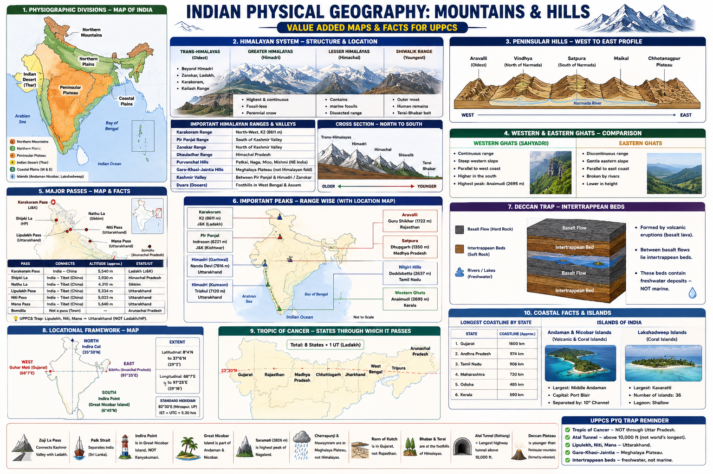

## Must-score facts — belts, peaks, passes

### Himalayan belts (N → S)

**Trans-Himalaya → Himadri (Greater) → Himachal (Lesser) → Shiwalik**

| Item | Lock |
|------|------|
| Youngest belt (usual options) | **Himadri** (हिमाद्रि) |
| Oldest fold system (usual options) | **Aravalli** (अरावली) |
| Kashmir Valley | Pir Panjal **south**; Himadri **north** |

### Central India hills (W → E)

**Satpura → Mahadeo → Maikal → Chhotanagpur** · **Vindhya** lies **north** of Narmada

### State ↔ peak

| State | Peak |
|-------|------|
| Tamil Nadu | **Doddabetta** |
| Rajasthan | **Guru Shikhar** (Aravalli) |
| Nagaland | **Saramati** |

### Passes / temple

| Item | Lock |
|------|------|
| Lipulekh / Niti / Mana | All in **Uttarakhand** (Lipulekh ≠ Ladakh) |
| Venkateswara / Tirupati | **Tirumala / Mallamalla** — Eastern Ghats (AP) |
| Intertrappean beds | Land / freshwater fossils (not marine) |
| India area rank | **7th** (~3.28 million km²; ~2.4% world land) |

---

## 1.0 Physiographic framework

- NCERT splits India’s geology into **three** structural (संरचनात्मक) units. Standard relief maps then teach **six** relief divisions on that skeleton.

| Structural unit | What it is | Note |
|-----------------|------------|-----------|
| **Peninsular Block** | Oldest stable crust; gneiss, granite, schist | Faulted and eroded, **not** recently folded like the Himalaya |
| **Himalayas and extra-peninsular mountains** | Young fold belt from India–Eurasia collision | Still rising in zones; includes Karakoram and Purvanchal |
| **Indo–Ganga–Brahmaputra (ब्रह्मपुत्र) Plain** | Foredeep filled with Himalayan alluvium | One of the world’s largest alluvial (जलोढ़) tracts |

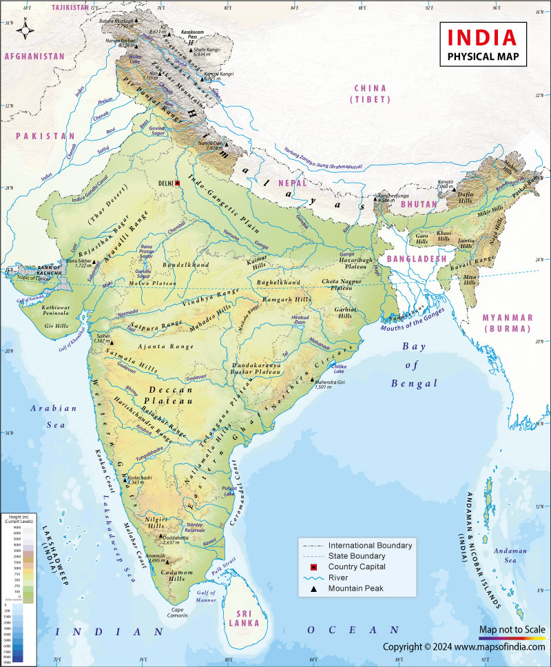

- The **six** relief units used in map questions are Northern Mountains, Northern Plains, Peninsular Plateau, Indian Desert, Coastal Plains, and Islands.
- Some notes list only **five** units and fold the Thar into the **Rajasthan Plain**. Keep the Thar as a **separate** Pleistocene–recent sand sheet, so use six divisions.
- About **43%** of India is plains, **28%** plateau, **19%** hills, and **11%** high mountains (standard class figures).
- The Himalaya is a **climatic wall**. It blocks cold Central Asian winds in winter and forces orographic rain on the southern slopes in the monsoon.
- The Peninsular Plateau is **not** the same as the Deccan Plateau. The Deccan is the **southern** tableland. The Central Highlands (Malwa, Bundelkhand, Baghelkhand) are the **northern** part of the same old block.
- The plateau is tilted **high in the west and low in the east**. That is why most peninsular rivers drain to the Bay of Bengal.
- The plateau is separated from the Northern Plains roughly along the **Narmada–Son** line.
- The **Malda Gap** (Rajmahal–Garo gap) separates the Meghalaya Plateau from the main peninsular block.

> **Logic:** Thar sands = **Pleistocene and recent** (not Paleocene/Oligocene/Pliocene). Gujarat = longest **state** coastline (~1600 km mainland).

---

## 1.1 Physiographic Divisions of India

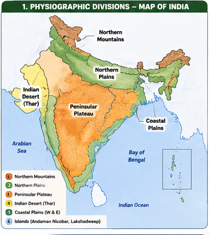

| Division | Where | Age | One-line identity |
|----------|-------|-----|-------------------|
| **Northern Mountains** | Northern frontier | Tertiary (young) | Himalaya + Karakoram + Purvanchal |
| **Northern Plains** | Between Himalaya and plateau | Recent | Indus–Ganga–Brahmaputra alluvium |
| **Peninsular Plateau** | South of Narmada–Son | Precambrian | Oldest stable block |
| **Indian Desert** | Western Rajasthan | Pleistocene–recent | Thar / Marusthali (मरुस्थली), leeward of Aravalli |
| **Coastal Plains** | East and west margins | Recent | West **narrow**; East **broad and deltaic** |
| **Islands** | Arabian Sea and Bay of Bengal | Recent | Lakshadweep **coral**; A&N **volcanic** |

**PYQ — UPPCS Prelims 2018, Q101**

Rajasthan desert or Thar desert is the expanse of which of the following?

A. Pliocene

B. Paleocene

C. Pleistocene and recent deposits

D. Oligocene

Show answer

**Ans: C** — Quaternary sands. A/B/D are older Tertiary labels used as traps.

### Northern Plains

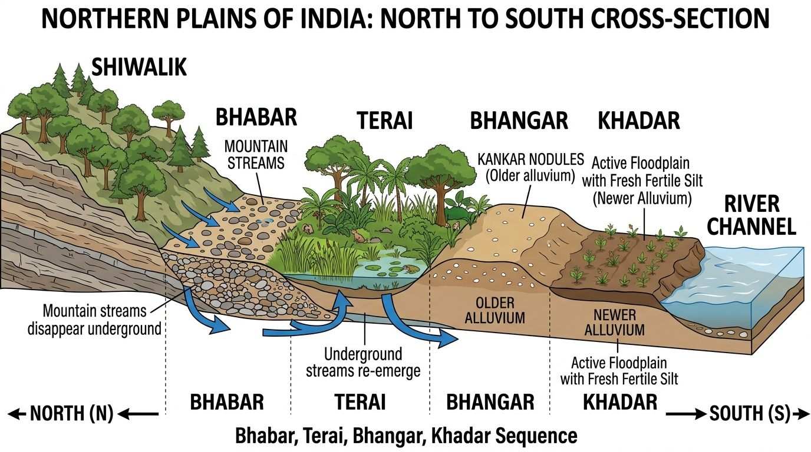

- The Northern Plain is a **foredeep** filled by Himalayan rivers. South of the Shiwaliks the belts run **Bhabar** (भाबर), then **Terai** (तराई), then **Bhangar (भांगर) / Khadar (खादर)**. Never reverse that order.
- Direction matters. From the **Himalaya foot moving south**, the order is **Shiwalik → Bhabar → Terai**. From the **Gangetic edge moving north**, UK-style lists read **Tarai → Bhabar → Shiwalik**. Same belts — opposite reading (रीडिंग) direction. Always note where the stem starts.
- The Indian sector of this alluvial tract is about **2400 km** long. Width is greatest in the west (about **500 km**) and narrows eastward.
- Average elevation is about **200 m**. The **Ambala** watershed (about **291 m**) divides the **Indus** (सिंधु) and **Ganga** (गंगा) systems.
- The **Bhabar** is a narrow pebble belt, about **8–16 km** wide, immediately south of the Shiwaliks. Streams **sink** into the porous gravel here.
- Bhabar fans run with remarkable continuity from the **Indus to the Tista**. The belt is wider in the west than in the east.
- Bhabar is **poor for plough agriculture**. Only deep-rooted trees do well.
- The **Terai** lies south of the Bhabar. Streams **re-emerge**, so the belt is marshy and forested. It is about **15–30 km** wide.
- Terai is **more marked in the east** because rainfall is higher there.
- **Jim Corbett** (जिम कॉर्बेट) (Uttarakhand) and **Kaziranga** (काजीरंगा) (Assam) sit in terai / floodplain forest.
- **Dudhwa** (दुधवा) National Park and **Katarniaghat** Wildlife Sanctuary sit in the Terai of Uttar Pradesh.
- **Bhangar** (भांगर) is older alluvium above the present flood level. It carries **kankar** (calcareous nodules) and is less fertile.
- **Barind** in the Bengal delta (डेल्टा) and **bhur** (wind-blown sand mounds in the Ganga–Yamuna Doab) are regional names of older alluvium.
- **Khadar** (खादर) is newer floodplain alluvium, renewed almost every flood, and is **more fertile** than Bhangar.
- Alkaline patches on older alluvium are called **reh** or **kallar** (also **kollar** in drier Haryana). Extra irrigation can spread reh by capillary salts.

| Sub-region | Location | Fact |
|------------|----------|------|
| **Punjab Plain** | Punjab, Haryana | Doabs; **chos** gullying on Shiwalik edge |
| **Haryana Tract** | Ghaggar–Yamuna | Water-divide; **Ghaggar** (घग्गर) as Saraswati (सरस्वती) successor |
| **Ganga Plain** | Delhi to Kolkata | Rohilkhand, Awadh (अवध), Mithila, Magadh |
| **Brahmaputra Plain** | Assam | Braided channel with **bils** (ox-bows) and heavy floods |

- A **doab** (दोआब) is the land between two rivers.

| Doab | Between |
|------|---------|
| **Bist** | Beas (ब्यास) and Satluj |
| **Bari** | Beas and Ravi (रावी) |
| **Rachna** | Ravi and Chenab (चिनाब) |
| **Chaj** | Chenab and Jhelum (झेलम) |
| **Sind (सिंध) Sagar** | Jhelum–Chenab and the Indus |

- The **Ganga–Yamuna Doab** is the core agricultural heart of western Uttar Pradesh.
- **Majuli** in Assam is the world’s largest inhabited **river island** (shrinking by erosion). **Kaziranga** sits on the Brahmaputra floodplain.
- The Ganga delta is **arcuate** (चापाकार). The **Sundarbans** (सुंदरबन) mangrove tract straddles India and Bangladesh.

> **Logic:** Khadar is newer and more fertile. Never swap it with Bhangar. Duars of West Bengal–Assam are a **different** foothill tract from the UP Terai.

### Indian Desert (Thar / Marusthali)

- The Thar lies on the **leeward** side of the Aravalli. Core rainfall is generally **below 250 mm**.
- At depth the desert sits on **peninsular** gneiss and granite. Only the surface looks like a young sand sheet.
- **Marusthali** is the sandy desert core with shifting **barchans**. The **west** is sandier; the **east** is rockier.
- **Bagar** (बागड़) is the semi-arid eastern fringe up to the Aravalli, with short seasonal streams and **rohi** patches.
- The tract **north of the Luni (लूनी)** is the **thali** (sandy plain) with inland saline (लवणीय) lakes.
- **Sambhar Lake** near Jaipur is the largest inland salt (लवणाध्यक्ष) lake. **Didwana, Degana, and Kuchaman** are other saline lakes.
- The **Luni** (लूनी) is the only major river of the region. It is **seasonal** and **inland-draining**. It is not a perennial Arabian Sea river.
- The southern margin is the **Rann of Kachchh**. The eastern margin is the Aravalli.

> **Logic:** Thar sands = Pleistocene and recent (not older Tertiary epochs).

### Coastal Plains

- The **Western Coastal Plain** is **narrow** (about 50–80 km) because the Western Ghats rise close to the Arabian Sea.
- The **Eastern Coastal Plain** is **broad** (about 100–200 km) and **deltaic**. Average width is about **120 km**.
- India’s mainland coast is fairly **straight** (Cretaceous Gondwana faulting). It offers **fewer** deep natural harbours than an indented European coast.
- **Konkan** (Maharashtra–Goa (गोवा)) is a coast of **submergence** (faulted, drowned inlets, Mumbai harbour).
- **Malabar / Kerala** is a coast of **emergence** (lagoons, spits, kayals).
- **Coromandel** (Tamil Nadu) is a coast of **emergence**. Deltas silt harbours.
- **Kachchh and Kathiawar** are geologically a **peninsular** extension (Kathiawar has Deccan lava). They are still mapped with the western coastal plains because they are now levelled.
- **Kachchh** was once an island. The **Great Rann** is the salt waste to its north. The **Little Rann** lies to the south-east.
- **Girnar (1117 m)** is a volcanic high on Kathiawar. The **Gir** (गीर) forest is the last home of the Asiatic lion (सिंह).

| Western strip | Stretch |
|---------------|---------|
| **Kachchh–Kathiawar** | Gujarat |
| **Gujarat Plain** | Narmada–Tapi–Mahi (माही)–Sabarmati (साबरमती) fill |
| **Konkan** | Daman to Goa |
| **Kanara (Canara)** | Goa to Mangaluru |
| **Malabar** | Kerala |
| Eastern strip | Stretch |
|---------------|---------|
| **Utkal Coast** | Odisha coast with the Mahanadi (महानदी) delta and **Chilika** |
| **Northern Circars** | Mahanadi to Krishna (कृष्णा) |
| **Carnatic** (कर्नाटक) | Krishna to Kaveri (कावेरी) |
| **Coromandel / Payan Ghat** | False Divi Point to Kanyakumari |

- The **Sharavati** drops as **Jog (Gersoppa) Falls** (about 271 m) on the Karnataka Ghats scarp.
- **Sriharikota** is the sand spit that bars **Pulicat** Lake (ISRO).
- **Kolleru** was once a coastal lagoon. Emergence has left it **inland** on the combined Godavari (गोदावरी)–Krishna delta.
- The **Kaveri delta** (about 130 km wide) is the “granary of South India.”
- The **Kerala kayals** (backwaters) are lagoon–estuary (ज्वारनदमुख) waterways. **Vembanad** is the largest.
- **Chilika** (Odisha) is India’s largest coastal lagoon.
- Kerala beach sands carry **monazite** (thorium). The KG offshore basin is a hydrocarbon play.
- West-flowing Narmada and Tapi form **estuaries**, not large deltas.

> **Logic:** Do not reverse widths. West is narrow; east is broad. Do not call the **whole** west coast submerged — only **Konkan** is the classic drowned coast.

### Islands of India

- The **Andaman and Nicobar** chain is a southward continuation of the **Arakan Yoma** (Purvanchal–Myanmar arc). The rocks are **volcanic / tectonic**. The capital is **Port (बंदरगाह) Blair** on **South Andaman**.
- **Saddle Peak (737 m)** on **North Andaman** is the highest point of the archipelago.
- **Barren Island** is India’s **only active volcano**. **Narcondam** is volcanic but **dormant / extinct**. (Do not copy the older “both active” line.)
- The **Ten Degree Channel** separates the Andaman group from the Nicobar group.
- **Duncan Passage** separates **South Andaman** from **Little Andaman**.
- The **Coco Channel** lies between North Andaman and Myanmar’s Coco Islands.
- **Car Nicobar** is the northernmost Nicobar island. **Great Nicobar** is the largest and southernmost, close to **Sumatra**.
- **Indira Point** on **Great Nicobar** (about 6°45′ N) is India’s southernmost **territory**. It is not Kanyakumari.
- **Lakshadweep** (लक्षद्वीप) islands are **coral atolls** (Reunion hotspot trail) about 200–500 km off Kerala. The capital is **Kavaratti**.
- The old three-fold names are **Amindivi** (north), **Laccadive** (middle), and **Minicoy** (south).
- **Minicoy** is the largest and southernmost inhabited island of Lakshadweep. Elevation is generally **under 5 m**, so the group is highly exposed to sea-level rise.
- The **Nine Degree Channel** separates **Minicoy** from the rest of Lakshadweep.
- The **Eight Degree Channel** separates **Minicoy** from the **Maldives**.
- Adam’s Bridge / **Rama Setu** remnants lie between India and Sri Lanka. They are a submerged limestone shoal, not a Himalayan fold.

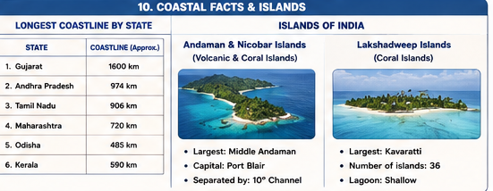

> **Logic:** Never reverse origins. A&N = volcanic. Lakshadweep = coral.

---

## 1.2 Himalayan Mountain System

- The Himalaya is a **young fold** belt from the **Indian–Eurasian** collision (about 50 million years ago). The arc is about **2400 km** from the **Indus gorge** (west) to the **Dihang gorge** (east).
- The arc has two **syntaxial bends**. The western bend is around **Nanga Parbat**. The eastern bend is around **Namcha Barwa** in **Tibet**, not in India.

### North to south (parallel ranges)

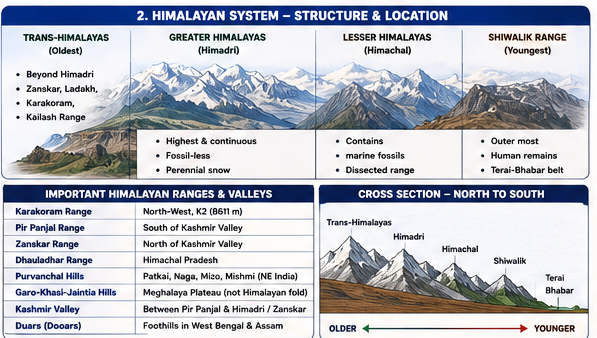

| Range | Typical height | Rock / fossil fact |
|-------|----------------|--------------------|
| **Trans-Himalaya** | 3000–6500 m | Granitic cold desert **north of the Indus** |
| **Himadri** (Greater) | generally **>6000 m** | Crystalline, **fossil-less**, with permanent snow |
| **Himachal** (हिमाचल) (Lesser) | 3700–4500 m | Sedimentary; **marine fossils** |
| **Shiwalik** (शिवालिक) (Outer) | 900–1100 m | Youngest unconsolidated rocks; **human remains** |

- The **Himadri** is the highest and most continuous range. It is crystalline (granite–gneiss) with a steep **south** face and gentler **north** face (**hogback**).
- The **Himachal** belt holds most famous hill stations. **Pir Panjal**, **Dhauladhar** (धौलाधार), **Mussoorie** (मसूरी), and **Nag Tibba** belong here.
- **Mahabharat Lekh** is the Lesser Himalaya name in **Nepal**.
- The **Shiwalik** is the outermost and youngest range (about 600–1500 m; often quoted 900–1100 m). It is folded conglomerate fans, not crystalline rock.
- Seasonal torrents that dissect the Punjab–Himachal Shiwalik are **chos**. Forest cover (वन आवरण) on Shiwalik **decreases westwards** with rainfall.

| Region | Local name of Shiwalik |
|--------|------------------------|
| Jammu | Jammu Hills |
| Uttarakhand | Dhang / Dundwa |
| Nepal | Churia Ghat Hills |
| Arunachal | Dafla, Miri (मीरी), Abor, Mishmi (outer hills) |

- Longitudinal valleys between Himachal and Shiwalik are **duns** in the west and **duars** in the east.
- **Dehra Dun** is the best-known dun (about 75 km by 15–20 km). **Kotli, Patli, Kyarda, Chaukhamba (चौखंबा), and Udhampur** are other named duns.
- High snow-covered ranges feed **perennial** Himalayan rivers (Indus, Ganga, Brahmaputra headwaters).
- Altitude creates climate belts, so vegetation changes from tropical through temperate and alpine to nival.

> **Logic:** All three fossil facts are true. Greater Himalaya is **fossil-less**. Lesser Himalaya carries **marine fossils**. Shiwalik carries **human remains**. Among usual options the **youngest** range is **Himadri** (Aravalli is oldest). Snow-melt feeds perennial rivers. Altitude creates vegetation zonation.

**PYQ — UPPCS Prelims 2019, Q11**

With reference to the Himalayan range, which of the statements is/are correct?

1. The sedimentary rocks of the greater Himalayas were fossil less.
2. Marine livings fossils are found in the sedimentary rocks of lesser Himalayas.
3. Remains of human civilization are found in outer or Shivalik (शिवालिक) Himalayas.

A. 1 and 2 only

B. 2 and 3 only

C. 1 and 3 only

D. 1, 2 and 3 are correct

Show answer

**Ans: D** — All three zonation facts. Trap: putting marine fossils in Greater Himalaya.

### West to east (regional sections)

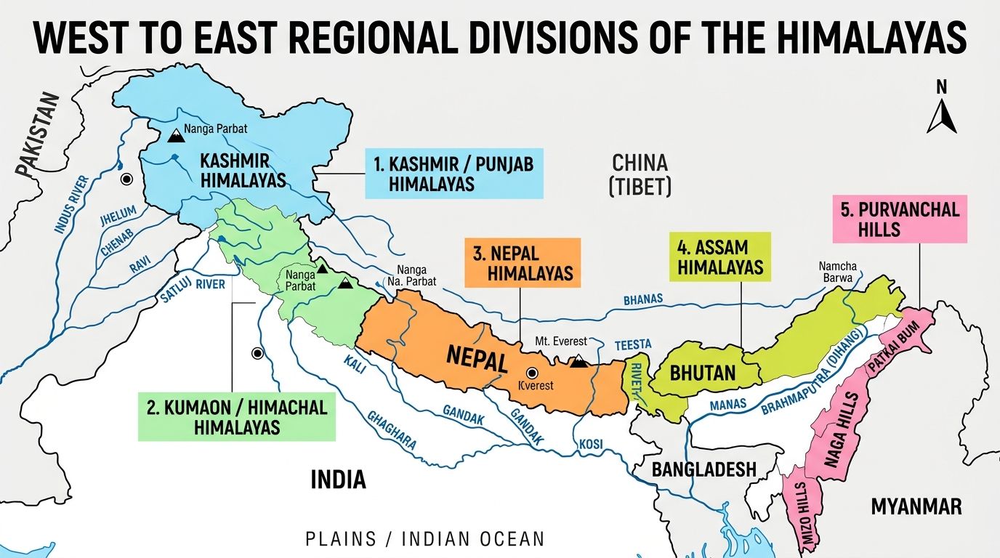

#### 1. Longitudinal River Divisions (West → East by Sir Sidney Burrard)

| Section (खंड) | River Boundaries (नदी सीमाएं) | Length (लंबाई) | Key Ranges & Peaks (प्रमुख श्रेणियां व चोटियां) |
|---|---|---|---|
| **Punjab / Kashmir / Himachal Himalaya** | **Indus (सिंधु) to Satluj (सतलज)** | ~560 km | Karakoram, Ladakh, Zanskar, Pir Panjal, Dhauladhar; Nanga Parbat |
| **Kumaon Himalaya (कुमाऊँ)** | **Satluj (सतलज) to Kali (काली / शारदा)** | ~320 km | Nanda Devi, Kamet, Badrinath, Kedarnath, Trishul |
| **Nepal / Central Himalaya (नेपाल)** | **Kali (काली) to Teesta (तीस्ता)** | ~800 km *(Longest & Highest)* | Mt. Everest, Kanchenjunga, Dhaulagiri, Annapurna, Makalu |
| **Assam / Eastern Himalaya (असम)** | **Teesta (तीस्ता) to Dihang (दिहांग / ब्रह्मपुत्र)** | ~720 km | Namcha Barwa, Kula Kangri, Kangto |

- **Western Himalaya** as a major regional block runs **Indus to Kali** (Kashmir + Himachal + Kumaon).
- Western Himalaya rises **gradually** through multiple parallel ranges; Eastern Himalaya rises **abruptly** from the Bengal–Assam plains.
- **Sandakphu** on the **Singalila** ridge is West Bengal’s highest point.
- Beyond the Dihang gorge the ranges swing sharply southwards as the **Purvanchal (पूर्वांचल)** hills.

---

#### 2. Cardinal Orientation Master Guides (Exam Fact-Locks)

##### A. North to South Sequence of Northern Ranges (उत्तर से दक्षिण क्रम)
> **Mnemonic:** **K – L – Z – P – D – S** (*"Kal Ladakh Zaskar se Pir Dhaula Shiwalik"*):
1. **Karakoram Range (काराकोरम श्रेणी)** — Trans-Himalayas; K2 (Godwin Austen, 8611 m), Siachen glacier.
2. **Ladakh Range (लद्दाख श्रेणी)** — Trans-Himalayas; sits between Indus and Shyok rivers; Khardung La pass.
3. **Zaskar / Zanskar Range (जांस्कर श्रेणी)** — Trans-Himalayas / Greater Himalaya transition; separates Ladakh from Kashmir.
4. **Great Himalayas / Himadri (वृहद हिमालय / हिमाद्रि)** — Highest continuous arc; average elevation ~6,000 m.
5. **Pir Panjal Range (पीर पंजाल श्रेणी)** — Middle/Lesser Himalaya (longest range); south wall of Kashmir valley; Rohtang & Banihal passes.
6. **Dhauladhar Range (धौलाधार श्रेणी)** — Middle/Lesser Himalaya in Himachal Pradesh; Kangra valley at foot.
7. **Shiwalik Range (शिवालिक श्रेणी)** — Outer/Sub-Himalaya; youngest sedimentary fold; elevation 900–1100 m.

##### B. West to East Sequence of Major Himalayan Peaks (पश्चिम से पूर्व चोटियां)
> **West → East:**
> **Nanga Parbat (8126 m, PoK/J&K)** $\to$ **Kamet (7756 m, Uttarakhand)** $\to$ **Nanda Devi (7816 m, Uttarakhand)** $\to$ **Dhaulagiri (8167 m, Nepal)** $\to$ **Annapurna (8091 m, Nepal)** $\to$ **Manaslu (8163 m, Nepal)** $\to$ **Cho Oyu (8188 m, Nepal)** $\to$ **Mt. Everest (8848.86 m, Nepal/Tibet)** $\to$ **Lhotse (8516 m, Nepal)** $\to$ **Makalu (8485 m, Nepal)** $\to$ **Kanchenjunga (8586 m, Sikkim)** $\to$ **Namcha Barwa (7782 m, Tibet/Arunachal)**

##### C. West to East Sequence of Arunachal / Purvanchal Foothills
> **West → East:** **Dafla Hills (डफला)** $\to$ **Miri Hills (मिरी)** $\to$ **Abor Hills (अबोर्)** $\to$ **Mishmi Hills (मिशमी)**

##### D. West to East Sequence of West Asian to Indian Ranges (UPPCS 2024 Paper Pattern)
> **West → East:** **Pontic (Turkey)** $\to$ **Zagros (Iran)** $\to$ **Hindu Kush (Afghanistan)** $\to$ **Karakoram (Ladakh/Pak/China)**

---

### Trans-Himalaya, Karakoram, glaciers

- The Trans-Himalaya is the **Tibetan Himalaya** zone. The monsoon does **not** reach it because Himadri casts a rain shadow.
- The **Zaskar (Zanskar)**, **Ladakh**, and **Kailash** ranges are the Trans-Himalayan set taught for India.
- The **Kailash (Gangdise)** range is treated as an offshoot of the Ladakh Range. The **Indus** rises on its northern slope.
- The **Karakoram** (also called **Krishnagiri**) occupies the extreme north-west and joins the **Pamir Knot**.
- **K2 (Godwin Austin, 8611 m)** is in the Karakoram in **PoK**. It is **not** on the Himadri.
- North-east of Karakoram the **Ladakh Plateau** is cut into **Aksai Chin, Depsang, Lingzi Tang, Chang Chenmo, and Soda Plains**.
- **Siachen** (about **75 km**, Nubra valley) is the longest glacier in the **Indian-administered** Karakoram. **Fedchenko** in the Pamir is longer. **Hispar** is another giant Karakoram glacier.
- **Sonapani** (about 15 km, Lahaul Chandra valley) is the longest named glacier of the **Pir Panjal** set.
- The **Gangotri** (गंगोत्री) glacier (about 30 km) feeds the **Bhagirathi** (भागीरथी). The **Yamunotri** (यमुनोत्री) glacier feeds the **Yamuna** (यमुना).
- **Zemu** glacier (Sikkim) is the largest glacier of the eastern Himalaya and feeds the **Teesta**.
- Snowline is **lower in the west** (about 2500 m) than in the **east / Kumaon** (about 3500 m), mainly because western precipitation falls more as snow at higher latitude.
- On Himadri the snowline is **lower on the steep, wetter southern slope** than on the drier north.
- The **Karakoram Pass** was a historic (ऐतिहासिक) Silk Route col. Do not confuse it with **Khardung La** (खारदुंग ला) (Ladakh road pass).

### Pir Panjal, Zanskar, Dhauladhar, Kashmir Valley

- The **Pir Panjal** is the longest range of the Lesser Himalaya. It is the **southern wall** of the Kashmir Valley. It runs from the Jhelum to the upper Beas (over 300 km) and contains much **volcanic** rock.
- **Banihal Pass** carries the Jammu–Srinagar highway and the rail alignment through this wall.
- The **Atal Tunnel** (about 9.02 km) runs under **Rohtang** in the Pir Panjal of **Himachal**. It links Manali with Lahaul–Spiti.
- Unqualified “world’s longest highway tunnel” is **false**. The correct qualifier is longest highway tunnel **above 10,000 ft**.
- The **Zanskar** (ज़ांस्कर) range lies **north** of the Kashmir Valley and separates it from Ladakh. **Pensi La** crosses it. **Kargil** (कारगिल) sits toward its western end.
- The **Dhauladhar** is an outer Lesser Himalayan range in **Himachal**. **Kangra (कांगड़ा) Valley** (कांगड़ा) is a **strike** (longitudinal) valley at its foot. **Kulu Valley** (कुल्लू) (upper Ravi) is a **transverse** valley.
- The Kashmir Valley is about **135 km by 32–40 km**. The **Jhelum** (झेलम) drains it through the **Baramulla gorge**. **Srinagar**, **Dal Lake**, and **Wular Lake** belong to this vale.
- The valley lies between **Pir Panjal (south)** and **Himadri (north)**.
- **Karewas** are Pleistocene **lacustrine** terraces left when the Kashmir lake drained through Baramulla. Thickness can reach about **1400 m**.
- Karewas grow **saffron**, almond, walnut, and apple. They are **not** the same landform as a dun.

> **Logic:** Kangra–Dhauladhar is a **Himachal** pairing. Do not use it for Kashmir. Atal Tunnel is in **Pir Panjal**, not Karakoram or Zanskar.

### Purvanchal, Garo–Khasi–Jaintia, Duars

- **Purvanchal Hills** are the north-eastern **fold** hills beyond the Dihang. They are **convex to the west**. They are **not** eastern Uttar Pradesh.
- The **Patkai Bum** runs along the Arunachal–Myanmar border. It is mostly sandstone.
- The **Naga Hills** are in Nagaland. **Saramati (3841 m)** is Nagaland’s highest peak.
- The **Barail Range** separates the Naga Hills from the **Manipur Hills**.
- The **Mizo / Lushai Hills** are in Mizoram. **Phawngpui (Blue Mountain, 2165 m)** is Mizoram’s highest.
- The **Mishmi Hills** are in eastern Arunachal.
- The **Manipur Hills** hold **Tenipu / Mount Iso**, Manipur’s usual highest peak.
- **Garo, Khasi, and Jaintia** hills form the **Meghalaya Plateau**. They are **geologically peninsular**, not Himalayan folds.
- The **Garo Hills** occupy western Meghalaya.
- The **Khasi Hills** occupy central Meghalaya. **Shillong Peak (1965 m)** is Meghalaya’s highest.
- **Mawsynram** and **Cherrapunji** sit on the **Khasi Hills**, not on Garo or Jaintia.
- The **Jaintia Hills** occupy eastern Meghalaya and are known for limestone caves.
- **Duars / Dooars** are the Himalayan foothills of **West Bengal and Assam**. They are the “door” to Bhutan and carry tea and wildlife corridors (Jaldapara, Gorumara, Buxa).

> **Logic:** Wettest places sit on **Khasi Hills**. Duars ≠ Terai of UP.

### Himalayan peaks (match home)

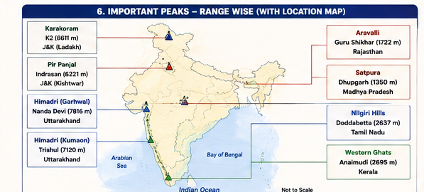

| Peak | m | Note |
|------|---|------|
| **K2 (Godwin Austin)** | 8611 | **Karakoram** (PoK) — not the main Himalayan arc |
| **Kanchenjunga** | 8586 | Highest peak **fully in India** (Sikkim, Himadri) |
| **Nanda Devi** | 7816 | Uttarakhand; highest entirely in Uttarakhand |
| **Kamet** (कामेत) | 7756 | Uttarakhand |
| **Cho Oyu** | 8188 | Himalaya (Nepal–Tibet) — |
| **Lhotse** | 8516 | Himalaya (Nepal–Tibet) — |
| **Nanga Parbat** | 8126 | Western syntaxial bend (Gilgit–Baltistan / PoK) |
| **Namcha Barwa** | 7782 | **Tibet / China** — **not** in India |
| **Gurla Mandhata** | 7694 | **Tibet**, north of Mansarovar — **not** an Indian peak |

- **Annamalai** and **Sirumalai** are **Tamil Nadu peninsular** hills. They are **not** Himalayan.

> **Logic:** **Namcha Barwa** is not in India. **Gurla Mandhata** is Tibetan — do not list either as an Indian Trans-Himalayan peak.

---

## 1.3 Peninsular Mountains, Hills & Plateaus

- The peninsula is an ancient **Precambrian** block. Most peninsular hills are **relict** (residual) **horsts**, not young folds.
- The plateau is roughly **triangular** (base along the northern plain, apex at Kanyakumari) and covers about **16 lakh km²**. Average height is about **600–900 m**.

| Range | Trend | Location | Highest | Fact |
|-------|-------|----------|---------|------|
| **Aravalli** | SW–NE | Gujarat–Rajasthan–Delhi | **Guru Shikhar 1722 m** | **Oldest** fold mountains; Rajasthan highest |
| **Vindhya** | E–W | **North of Narmada**, MP | Sadbhawna Shikhar | Aryavarta / Dakshinapatha (दक्षिणापथ) divide |
| **Satpura** | E–W | **South of Narmada** | **Dhupgarh 1350 m** (Pachmarhi) | Madhya Pradesh highest |
| **Western Ghats** (पश्चिमी घाट) | N–S | Tapi gap to Kanyakumari | **Anaimudi 2695 m** | **Continuous**; Sahyadri in Maharashtra |
| **Eastern Ghats** | N–S | Odisha to Tamil Nadu | **Jindhagada ~1690 m** | **Discontinuous** |
| **Nilgiri** (नीलगिरि) | — | Tamil Nadu–Kerala | **Doddabetta 2637 m** | Junction of both Ghats |
| **Rajmahal** | — | Jharkhand | — | Rajmahal Trap (volcanic) |
| **Shevaroy** | — | Salem, Tamil Nadu | — | Eastern Ghats; **not** Tirupati |

- Central India hills run **west to east** as **Satpura**, then **Mahadeo**, then **Maikal**, then **Chhotanagpur**.

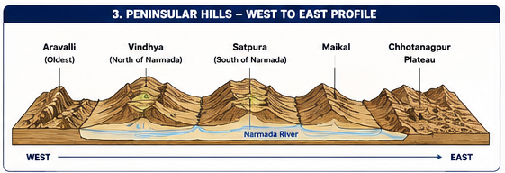

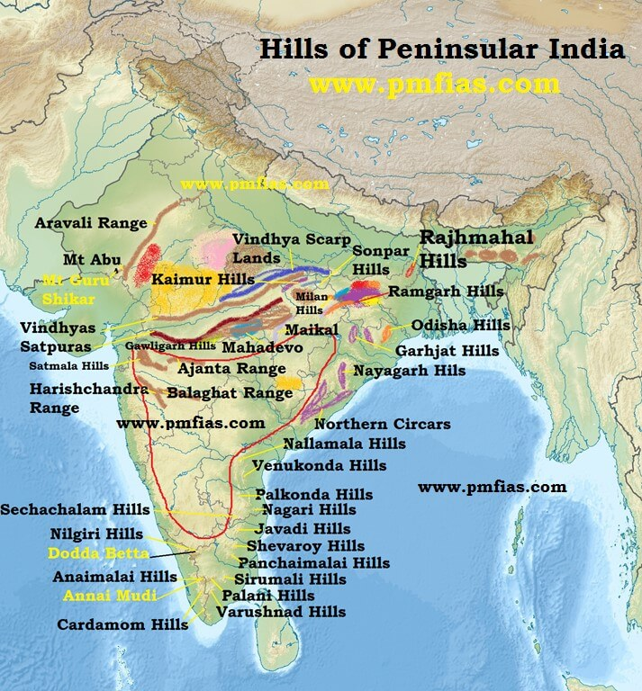

### Aravalli Range

- The Aravalli is about **800 km** from **Palanpur (Gujarat)** to Delhi. It is the **oldest** fold mountain system of India (Archaean), now a **relict** range.
- **Guru Shikhar (1722 m)** on Mount Abu is Rajasthan’s highest peak. Mount Abu is cut from the main range by the **Banas** valley.
- South of Ajmer (अजमेर) the range is continuous. North of Ajmer it breaks into detached ridges (Haryana–Delhi).
- The buried north-east stump continues toward **Haridwar** (हरिद्वार) under Ganga alluvium. The **Delhi Ridge** is the visible remnant.
- **Pipli Ghat, Dewair, and Desuri** are the road–rail gaps through the Rajasthan Aravalli.
- The range casts a rain shadow that helps create the **Thar** (थार).
- **Zawar** (Rajasthan) is the classic zinc–lead locality of the Aravalli belt.

### Vindhya Range

- The Vindhya runs **east–west north of the Narmada** as an escarpment on the **Narmada–Son trough**, from **Jobat (Gujarat)** to **Sasaram (सासाराम) (Bihar)** (over 1200 km).
- It is the watershed between the **Ganga system** and peninsular rivers. Chambal (चंबल), Betwa (बेतवा), and Ken rise within about 30 km of the Narmada.
- The Vindhya continues east as the **Bhanrer** and **Kaimur** hills.
- **Kaimur Hills** are the Vindhyan extension into **Uttar Pradesh and Bihar**.
- **Amsot (about 941 m)** in Sonbhadra is Uttar Pradesh’s highest point. It is **not** Himalayan.

### Satpura Range

- The Satpura is a series of **seven** residual blocks (**sat-pura**) and is treated as a **horst**. It runs **east–west south of the Narmada**, between the Narmada and the Tapi, for about **900 km**.
- **Dhupgarh (1350 m)** at **Pachmarhi** on the **Mahadeo Hills** is Madhya Pradesh’s highest peak.
- **Mahadeo Hills** continue the Satpura eastward.
- **Maikal Hills** continue still farther east into Madhya Pradesh–Chhattisgarh. **Amarkantak** sits at this eastern junction.
- **Amarkantak** is the source of the **Narmada** (नर्मदा) and the **Son**.
- The **Tapi** (तापी) flows in a rift/gorge south of the Satpura. **Gavilgarh Hills** are the western Satpura in Maharashtra.

> **Logic:** Never reverse Vindhya and Satpura across the Narmada. do not put Maikal before Satpura or Chhotanagpur before Maikal.

**PYQ — UPPCS Prelims 2019, Q6**

Which one of the following is the correct sequence of the hills of Central India located from West to East?

A. Maikal, Satpura, Mahadeo and Chhotanagpur

B. Satpura, Mahadeo, Maikal and Chhotanagpur

C. Maikal, Mahadeo, Satpura and Chhatanagpur

D. Satpura, Mahadeo, Chhotanagpur and Maikal

Show answer

**Ans: B** — Satpura → Mahadeo → Maikal → Chhotanagpur.

### Western Ghats (Sahyadri)

- The Western Ghats are a **continuous** escarpment from the **Tapi valley** to near **Kanyakumari** (about **1600 km**).
- They rise as a steep wall on the west and slope **gently east** into the Deccan, so they hardly look like a mountain from the plateau.
- Northern Sahyadri is **Deccan Trap** lava with a **landing-stair** (stepped) west face.
- **Kalsubai (1646 m)** is Maharashtra’s highest peak. **Salher** and **Mahabaleshwar** are other northern Sahyadri highs.
- Middle Sahyadri (south of about 16° N) is **granite–gneiss**. **Kudremukh** and **Baba Budan / Mullayanagiri** sit here.
- **Mullayanagiri (1930 m)** is Karnataka’s highest peak.
- **Thal Ghat (Kasara)** carries the Mumbai–Nashik route.
- **Bhor Ghat (Khandala)** carries the Mumbai–Pune (पुणे) route.
- **Palghat (Palakkad) Gap** is a **rift** and the **widest** gap. It links Kerala with Tamil Nadu and lets south-west monsoon moisture into the Mysore (मैसूर)–Coimbatore interior.

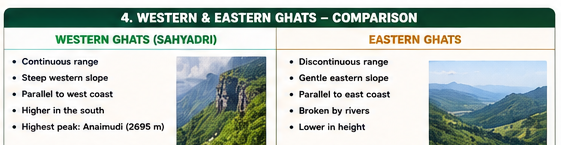

### Eastern Ghats

- The Eastern Ghats are **discontinuous** and lower. They have neither structural unity nor a continuous crest.
- True mountain character is clearest between the **Mahanadi and the Godavari** (**Maliya** and **Madugula Konda** ranges).
- **Jindhagada (about 1690 m)** in Araku Valley is the usual highest peak of the Eastern Ghats.
- **Arma Konda** (Andhra Pradesh) is another high Eastern Ghats peak used in match lists.
- **Mahendragiri (1501 m)** is the well-known Odisha peak of the Maliya range.
- Between the **Godavari and the Krishna** the Ghats almost vanish. That low is the **KG (Gondwana) basin**.
- The **Nallamala** Hills (Cuddapah–Kurnool) restore a hill chain. The southern part is the **Palkonda** Range.
- The **Javadi** Hills and the **Shevaroy–Kalrayan** Hills are the Tamil Nadu remnants.
- **Biligiri Rangan** Hills sit on the Karnataka–Tamil Nadu border.
- The **Shevaroy** Hills (Yercaud, Salem) are **not** the site of Tirupati.
- **Tirumala / Mallamalla** Hills (Tirupati) are Eastern Ghats of **Andhra Pradesh**.

### Southern hills (Nilgiri–Anamalai–Cardamom)

- The **Nilgiri Hills** are the junction of the Western Ghats, Eastern Ghats, and southern hills. They rise abruptly above 2000 m.
- **Doddabetta (2637 m)** is Tamil Nadu’s highest peak. **Makurti** is the other named Nilgiri high.
- **Udhagamandalam (Ooty)** sits in the Nilgiris.
- South of Palghat, **Anaimudi (2695 m)** is the highest peak of the Western Ghats **and of South India**.
- Three ranges radiate from Anaimudi. The **Anamalai** runs north. The **Palani** runs north-east (**Kodaikanal**). The **Cardamom / Ealaimalai** runs south.
- **Sirumalai** is a Tamil Nadu outlier. Pair it with Annamalai as **peninsular**, not Himalayan.
- **Eravikulam** (Nilgiri Tahr) and **Periyar** (पेरियार) belong to this southern Western Ghats complex.

> **Logic:** Doddabetta = **Tamil Nadu**. Anaimudi = **Kerala**. Annamalai / Sirumalai are **not** Himalayan.

### Deccan Plateau and Deccan Trap

- The **Deccan Plateau** is the **southern** triangular tableland (about **5 lakh km²**). Satpura–Vindhya bound it on the north-west, Mahadeo–Maikal on the north, Western Ghats on the west, Eastern Ghats on the east. It **slopes eastward**. Height is about **1000 m** in the south and about **500 m** in the north.
- The **Maharashtra Plateau** is trap country with **step topography** and **regur** (रेगुर).
- The **Karnataka (Mysore) Plateau** splits into **Malnad** (मलनाड) (forested hill country) and **Maidan** (मैदान) (rolling granite plain). It tapers into the Nilgiris.
- The **Telangana Plateau** is Archaean gneiss drained by Godavari, Krishna, and Penner.
- The **Chhattisgarh Plain** is the only true plain inside the peninsula: a **saucer** of limestone–shale drained by the upper **Mahanadi** (महानदी), between Maikal and the Odisha hills.
- The **Deccan Trap** is a **basalt** cover from fissure eruptions (Cretaceous–Eocene, about 66 Ma), about **5 lakh km²** over Maharashtra, Madhya Pradesh, Gujarat, and Karnataka.
- Black **regur** cotton soil is weathered trap basalt.

| Trap layer | Depth fact |
|------------|------------------------------|
| Upper | about **450 m** |
| Middle | about **1200 m** |
| Lower | about **150 m** |
| **Intertrappean beds** | Sediment **between** lava flows; **land / freshwater** fossils — **not** sea plants and animals |

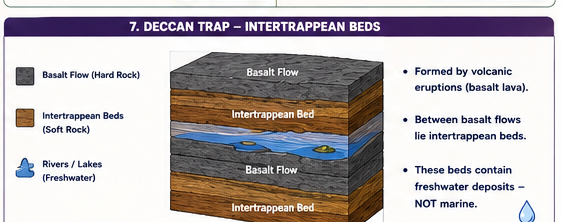

**PYQ — UPPCS Prelims 2024, Q59**

Which one of the following pairs (Deccan Trap – Peculiarity) is not correctly matched?

A. Depth of middle trap – approximately 1200 metres

B. Intertrappean beds – Fossils of sea plants and animals

C. Depth of lower trap – approximately 150 metres

D. Depth of upper trap – approximately 450 metres

Show answer

**Ans: B** — Intertrappean = freshwater/land fossils. Depth figures A/C/D are the matched pairs.

### Central Highlands and north-eastern plateaus

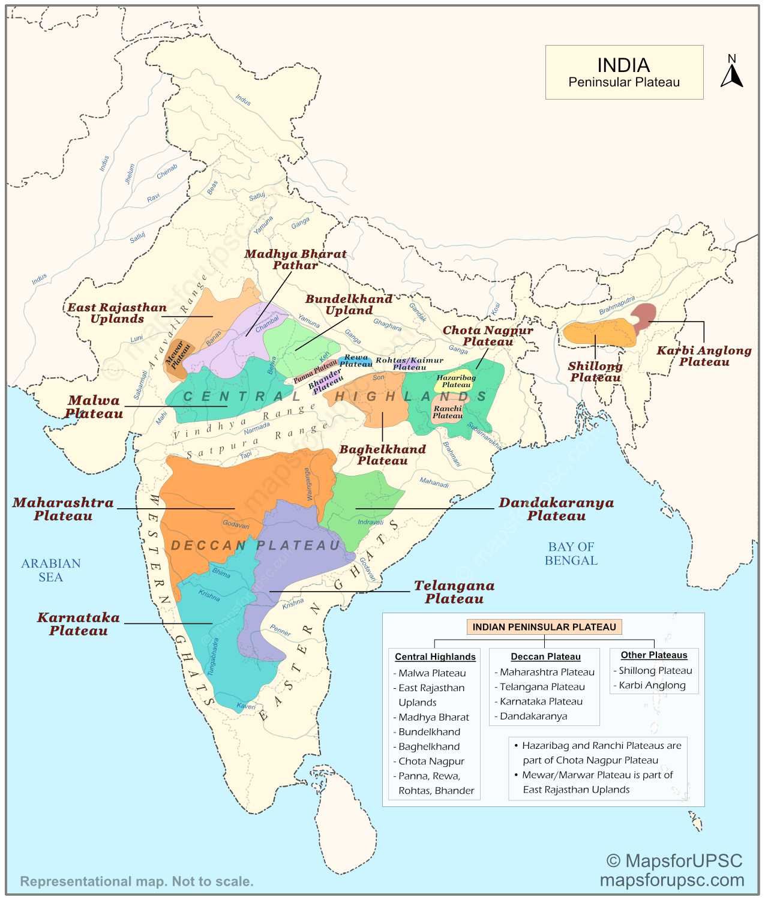

- The Central Highlands are the **northern** Peninsular Plateau, **north of the Narmada–Son**.
- **Marwar / Mewar (मेवाड़) Plateau** is **east** of the Aravalli (sandstone–shale–limestone, Banas toward Chambal). **Marwar Plain** is the Thar **west** of the Aravalli. Do not swap them.
- **Madhya Bharat Pathar** (Central Highland) is the Chambal basin with ravines / badlands.
- The **Malwa Plateau** is lava-covered and **north-sloping**. It has **dual drainage**: Narmada–Tapi–Mahi to the Arabian Sea, and Chambal–Betwa–Ken to the Yamuna / Bay of Bengal.
- The **Bundelkhand Plateau** lies in south-west Uttar Pradesh and Madhya Pradesh. It is **granite–gneiss**, drought-prone, and includes Jhansi (झांसी), Banda, and Chitrakoot (चित्रकूट). Betwa, Dhasan, and Ken cross it.
- The **Baghelkhand Plateau** lies **east** of Bundelkhand, **north of Maikal**. The Son bounds it on the north. It divides Son drainage from Mahanadi drainage.
- The **Chotanagpur Plateau** lies mainly in Jharkhand (with Odisha–West Bengal edges). Average height is about **700 m**. **Damodar** (दामोदर) flows in a **rift** through Gondwana coalfields.
- **Hazaribagh Plateau** lies north of Damodar. **Ranchi Plateau** lies south of Damodar.
- The **Rajmahal Hills** are the north-eastern basalt edge of Chotanagpur.
- The **Meghalaya Plateau** is Garo–Khasi–Jaintia. The **Malda / Garo–Rajmahal Gap** is a down-fault filled by Ganga–Brahmaputra alluvium.
- **Mikir (Karbi) Hills** are listed with this north-eastern block on the relief map.
- **Jharia** and **Bokaro** are the Damodar-rift coalfields. Iron and mica are the other Chotanagpur matchs.
- Chotanagpur is the easternmost unit of the west-to-east central-India hill sequence.

### Other hills

- The **Rajmahal Hills** of Jharkhand are volcanic (**Rajmahal Trap**), older than the Deccan Trap.
- **Parasnath (1366 m)** is Jharkhand’s highest peak and a Jain sacred hill on Chotanagpur.
- **Girnar (1117 m)** is Gujarat’s usual highest point (Kathiawar).
- **Gudla Maina** (about 1270 m) is the usual Chhattisgarh high point on a Maikal extension.

---

## 1.4 Passes, Peaks & Sacred Geography

### Mountain passes

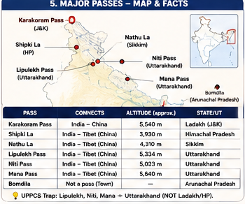

- UPPCS tests **pass ↔ State / UT**. The wrong state is the trap.

| Pass | State / UT | Route / note | Trap |
|------|------------|--------------|------|
| **Burzil** | J&K / Ladakh | Greater Himalaya (pass table) | — |
| **Thaga La** | Uttarakhand | Greater Himalaya with Niti / Lipulekh | — |
| **Zoji La** (ज़ोजिला) | Ladakh / J&K | Srinagar–Kargil–Leh (लेह) | Pair with Z-Morh tunnel |
| **Banihal** | J&K | Jammu–Srinagar; Jawahar Tunnel | Not a Tibet pass |
| **Rohtang La** | Himachal Pradesh | Kullu–Lahaul; Atal Tunnel below | Not Karakoram |
| **Bara Lacha La** | Himachal Pradesh | Manali–Leh | — |
| **Kunzum La** | Himachal Pradesh | Lahaul–Spiti | — |
| **Shipki La** | Himachal Pradesh | India–Tibet; Sutlej (सतलुज) valley | — |
| **Niti Pass** | **Uttarakhand** | Garhwal (गढ़वाल)–Tibet | 2023 Q57 correct pair |
| **Mana Pass** | **Uttarakhand** | Near Badrinath (बद्रीनाथ) | **Not HP** |
| **Lipulekh** (लिपुलेख) | **Uttarakhand** | Kailash–Mansarovar; India–Nepal–China | **Not Ladakh** |
| **Nathu La** | Sikkim | India–Tibet trade (पण्याध्यक्ष) (reopened 2006) | — |
| **Jelep La** | Sikkim | Alternate to Nathu La | — |
| **Bomdi La** | Arunachal Pradesh | Near **Bomdila town** | Bomdila ≠ pass name |
| **Sela Pass** | Arunachal Pradesh | Tezpur–Tawang; **Sela Tunnel** (2024) | — |
| **Bum La** | Arunachal Pradesh | Tawang–Tibet | — |
| **Pangsau Pass** | Arunachal Pradesh | India–Myanmar (Stilwell Road) | — |
| **Diphu / Aghil** | Karakoram | Not Arunachal / not “Ladakh town” traps | 2023 wrong options |
| **Khardung La** | Ladakh | Leh–Nubra road | High motorable pass; not a Tibet trade pass of the Nathu type |

> **Logic:** Only Lipulekh–Ladakh is NOT matched** among common pass–state pairs. Nathu La–Sikkim and Shipki La–HP are correct. **Niti** and **Mana** are **Uttarakhand**, not Himachal.

**PYQ — UPPCS Prelims 2025, Q55**

Which of the following pairs are NOT correctly matched? (Pass) — (State/Union Territory)

1. Lipulekh — Ladakh
2. Nathu La — Sikkim
3. Bomdila — Arunachal Pradesh
4. Shipki La — Himachal Pradesh

A. Only 1 and 2

B. Only 2, 3 and 4

C. Only 1, 2 and 3

D. Only 1

Show answer

**Ans: D** — Only (1) is geographically wrong (Lipulekh = Uttarakhand). Key treats Bomdila–Arunachal as the accepted corridor pair.

### State-wise highest peaks (match-list home)

| State / UT | Peak | m | Range |
|------------|------|---|-------|
| **Sikkim** | Kanchenjunga | 8586 | Himadri |
| **Uttarakhand** | Nanda Devi | 7816 | Himadri |
| **Himachal Pradesh** | Reo Purgyil | 6816 | Kinnaur Himalaya |
| **Arunachal Pradesh** | Kangto | 7090 | Eastern Himalaya |
| **J&K / Ladakh** | Nun / Kun | 7135 / 7077 | Zanskar |
| **West Bengal** | Sandakphu | 3636 | Singalila |
| **Nagaland** | **Saramati** | 3841 | Naga Hills |
| **Manipur** | Tenipu / Mt Iso | 2994 | Manipur Hills |
| **Mizoram** | Phawngpui | 2165 | Mizo Hills |
| **Meghalaya** (मेघालय) | Shillong Peak | 1965 | Khasi |
| **Kerala** | **Anaimudi** (अनाइमुदी) | 2695 | Western Ghats |
| **Tamil Nadu** | **Doddabetta** | 2637 | Nilgiri |
| **Karnataka** | Mullayanagiri | 1930 | Western Ghats |
| **Maharashtra** | Kalsubai | 1646 | Western Ghats |
| **Rajasthan** (थार) | **Guru Shikhar** | 1722 | Aravalli |
| **Madhya Pradesh** | **Dhupgarh** | 1350 | Satpura |
| **Andhra Pradesh** | Arma Konda | ~1680 | Eastern Ghats |
| **Odisha** (ओडिशा) | Deomali | 1672 | Eastern Ghats |
| **Gujarat** | Girnar | 1117 | Kathiawar |
| **Jharkhand** | Parasnath | 1366 | Chotanagpur |
| **Uttar Pradesh** | Amsot (Sonbhadra) | ~941 | Kaimur |
| **Chhattisgarh** | Gudla Maina | ~1270 | Maikal extension |

- Range highest (do not restudy the state table): Himalaya-in-India **Kanchenjunga 8586** · Karakoram **K2 8611** · Western Ghats **Anaimudi 2695** · Eastern Ghats **Jindhagada ~1690** · Aravalli **Guru Shikhar 1722** · Satpura **Dhupgarh 1350** · Nilgiri **Doddabetta 2637** · Naga **Saramati 3841**.

> **Logic:** Standard hill–state pairs: TN–Doddabetta, RJ–Guru Shikhar, NL–Saramati, MP–Dhupgarh. Older variants also used Kerala–Anaimudi and UK–Nanda Devi.

### Sacred geography

| Site | State | Hill / fact |
|------|-------|-------------|
| **Tirupati (Venkateswara)** | Andhra Pradesh | **Tirumala / Mallamalla**, Eastern Ghats — **not Shevaroy** |
| Kedarnath (केदारनाथ) | Uttarakhand | Garhwal Himalaya; Mandakini (मंदाकिनी) |
| Badrinath | Uttarakhand | Garhwal Himalaya; Alaknanda (अलकनंदा) |
| Gangotri | Uttarakhand | Bhagirathi source glacier |
| Yamunotri | Uttarakhand | Yamuna source glacier |
| Amarnath | J&K | Lidder Valley (Greater Himalaya, not Pir Panjal) |
| Vaishno Devi | J&K | **Trikuta Hills**, Jammu |
| Sabarimala | Kerala | Western Ghats |
| Palitana (पालिताना) | Gujarat | Shatrunjaya Hills |
| Parasnath | Jharkhand | Chotanagpur |
| Girnar | Gujarat | Junagadh (जूनागढ़) |
| Ajmer Sharif | Rajasthan | Aravalli foothills |
| Chamundi | Karnataka | Mysuru |
| Konark (कोणार्क) | Odisha | **Coastal plain** (not a hill shrine) |

> **Logic:** **Mallmalla** in options usually means **Tirumala Hills** (Eastern Ghats). **Shevaroy** = Yercaud (Tamil Nadu). **Biligiriranga** = Karnataka. **Javadhee** = Tamil Nadu.

---

## 1.5 Locational Framework

### Latitude, longitude, area

- India lies entirely in the **northern** and **eastern** hemispheres.

| Item | Note |
|------|------|
| Latitude | **8°4′ N – 37°6′ N** (about 29°; about 3214 km N–S) |
| Longitude | **68°7′ E – 97°25′ E** (about 29°; about 2933 km E–W) |
| Area | about **3.28 million km²** = **2.4%** of world land |
| Rank | Conventionally **7th** largest (after Russia, Canada, USA, China, Brazil, Australia) |

- The **N–S and E–W degree spans are almost equal** (both about 29°). That is why NCERT maps show India as a near-square / diamond outline, not a long east–west strip.
- India is **not** wholly tropical. The Tropic of Cancer cuts the country, so the Himalayan north is subtropical to alpine.

### Standard Meridian

**Easy idea first:** Earth spins once in 24 hours. Time is tied to **longitude** (north–south lines). Places farther **east** see sunrise **earlier**. India is wide enough for about **two hours** of natural solar difference, so one official line — the **Standard Meridian** — gives the whole country a **single clock time (IST)**.

- The Standard Meridian of India is **82°30′ E** (also written **82.5° E**). The classic place centre is **Mirzapur, Uttar Pradesh** (Prayagraj (प्रयागराज) / Allahabad (इलाहाबाद) belt). It is **not** Lucknow (लखनऊ), Delhi, or “exactly at Prayagraj city.”
- **IST** is **GMT / UTC + 5 hours 30 minutes**. India keeps **one** time zone for the whole country (mainland + islands). CSIR–NPL maintains the official time signal.

**Why 82°30′ E, not 80° or 85°?**

| Step | Easy fact |
|------|-----------|
| Earth | 360° in 24 h means roughly **15°** of longitude per hour, or **1° ≈ 4 minutes** |
| Offset maths | 82.5 ÷ 15 = **5.5 hours** = **5 h 30 min** ahead of GMT |
| Why this line | It sits near the **middle** of India’s longitude span (~68° E to ~97° E), so west (Gujarat) and east (Arunachal / Andaman) share one national clock |

- Natural solar gap across India is about **2 hours** (roughly 29° × 4 min). **Gujarat** clocks feel “early” vs sun; **Arunachal / Andaman** feel “late” vs sun — but **legal time is still IST everywhere**.
- Sunrise is earlier in the **east** (Andaman / Arunachal) than in **Gujarat**. Do not reverse that.

**Where the meridian passes (north to south)**

| State | Place / belt fact | trap |
|-------|-------------------|-----------|
| **Uttar Pradesh** | **Mirzapur** (near Prayagraj belt) | Not Lucknow / Delhi; Tropic does **not** hit UP |
| **Madhya Pradesh** | Eastern MP / **Singrauli** belt | Not the whole of MP |
| **Chhattisgarh** | Central–east belt (**Bilaspur–Korba** class) | Not Jharkhand |
| **Odisha** | **Western** Odisha | Not the Bhubaneswar coast as the “IST city” |
| **Andhra Pradesh** | Northern / coastal AP strip | **Not Telangana** (TG lies west of 82.5° E) |

- The IST meridian passes through **five states — UP, Madhya Pradesh, Chhattisgarh, Odisha, Andhra Pradesh**.
- It does **not** pass through **Uttarakhand, Jharkhand, Bihar, West Bengal, Telangana, Maharashtra, or Tamil Nadu**. Options that sneak in **Uttarakhand** or **Jharkhand** are classic wrong sets.
- Do **not** confuse this N–S **longitude** line with the Tropic of Cancer (an E–W **latitude** line). They are different. Both do cut through **Madhya Pradesh** and **Chhattisgarh**, so map stems can mix them.

> **Logic:** Place = **Mirzapur**. Offset = **+5:30**. States = **five** (UP–MP–CG–Odisha–AP). IST is **uniform** for all of India — never “only east of 82°30′ E.”

### Tropic of Cancer (23°30′ N)

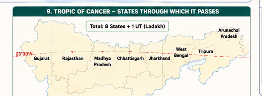

**Easy idea:** This is a **latitude** line (runs east–west). South of it the sun can be overhead once a year; north of it (Himalaya belt) India is **not** purely tropical.

| Order (west → east) | State on the Tropic |
|---------------------|---------------------|
| 1 | **Gujarat** |
| 2 | **Rajasthan** |
| 3 | **Madhya Pradesh** |
| 4 | **Chhattisgarh** |
| 5 | **Jharkhand** |
| 6 | **West Bengal** |
| 7 | **Tripura** |
| 8 | **Mizoram** |

- **Eight states only.** Memorise the west-to-east chain; do not invent a ninth.
- It does **not** pass through **Uttar Pradesh**.
- It does **not** pass through **Ladakh** (Ladakh lies near 32°–36° N).
- It does **not** pass through Bihar, Odisha, Maharashtra, Karnataka, Kerala, Tamil Nadu, Punjab, Haryana, Delhi, Assam, Nagaland, Manipur, Arunachal, Sikkim, Himachal, Uttarakhand, Goa, Andhra Pradesh, or Telangana.
- NCERT says the Tropic passes through the **middle** of the country. That does **not** mean equal land area north and south of 23°30′ N: **more land lies north** of the Tropic.

> **Logic:** Rank = **7th**, not 6th. Area **2.4%**. Tropic through the **middle** matches the NCERT wording used in statement 3. India is **not** wholly tropical. UP is **not** on the Tropic.

**PYQ — UPPCS Prelims 2022, Q35Logic:** Stmt 1 tests rank (7th vs 6th). Stmt 2 tests area share. Stmt 3 is the NCERT “middle” wording (do not upgrade it to equal land area). Stmt 4 traps “wholly tropical.”

With reference to India, which of the following statements is/are correct?

1. India is the sixth largest country in the world.
2. India occupies about 2.4% of the total area of the world.
3. The Tropic of Cancer passes through the middle of the country dividing it into two latitudinal halves.
4. India lies completely in the tropical zone.

A. 2 and 3

B. 2 and 4

C. 3 and 4

D. 1 and 2

Show answer

**Ans: A** — **2 and 3**. Rank is **7th**, not 6th (stmt 1 false). **2.4%** is true. Tropic through the middle is the NCERT fact (stmt 3) — not a claim of equal land area. India is **not** wholly tropical (stmt 4). **B/C** keep wholly-tropical. **D** keeps the 6th-largest trap.

### Extreme points

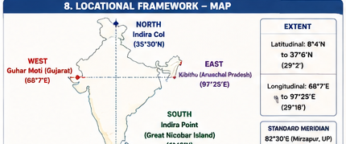

| Extreme | Place | Easy fact |
|---------|-------|-----------|
| **North** | **Indira Col**, Siachen / Ladakh | High pass on the northern frontier — not a city |
| **South (territory)** | **Indira Point**, Great Nicobar | Southernmost **India** (islands included) |
| **South (mainland)** | **Kanyakumari** (Cape Comorin) | Southernmost **peninsula** only |
| **East** | **Kibithu**, Anjaw, Arunachal Pradesh | Near the Myanmar–China corner; not Walong as the usual key |
| **West** | **Guhar Moti** (also Ghuar Mota), Kutch, Gujarat | Westernmost village belt of Kachchh |

- **Indira Col ≠ Indira Point.** Same first name, opposite ends of India.
- **Indira Point ≠ Kanyakumari.** Territory south vs mainland south.

### Coastline

- Mainland plus islands is about **7516 km** (mainland about **6100 km** class figure). There are **nine** coastal states and two island Union Territories (**A&N** and **Lakshadweep**).

| Rank (longest → shortest) | Coastal state |
|---------------------------|---------------|
| 1 | **Gujarat** |
| 2 | Andhra Pradesh |
| 3 | Tamil Nadu |
| 4 | Maharashtra |
| 5 | Kerala |
| 6 | Odisha |
| 7 | Karnataka |
| 8 | West Bengal |
| 9 | **Goa** (shortest state coast) |

- Gujarat is longest because of the **Kachchh** and **Saurashtra** indentation (about **1600 km** class figure).
- The Andaman and Nicobar coastline is long (about **1962 km**) but it is **not** in the **state** ranking.
- **Telangana** is not a coastal state. **Puducherry** is a coastal UT with enclaves, not a “tenth coastal state” in this ranking.

> **Logic:** Gujarat** has the longest **state** mainland coastline — not Maharashtra, Andhra Pradesh, or Kerala.

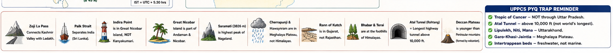

---

## Complete PYQ Bank

> **Answers hidden** — click *Show answer* under each question to reveal.
> **Coverage:** All 19 UPPCS Prelims geography hits (2018–2025) for this topic — grouped **2025 → 2018**.

**Q1. UPPCS Prelims 2025, Q37**
Match List-I with List-II and select the correct answer using the code given below the lists.
**List-I (State)**

A. Tamil Nadu

B. Rajasthan

C. Nagaland

D. Madhya Pradesh
**List-II (Highest Peak)**

1. Dhupgarh
2. Doddabetta
3. Guru Shikhar
4. Saramati

A. 2 3 1 4

B. 3 2 4 1

C. 3 2 1 4

D. 2 3 4 1

Show answer

**Ans: D** — A→2 (Doddabetta, TN), B→3 (Guru Shikhar, Rajasthan/Aravalli), C→4 (Saramati, Nagaland), D→1 (Dhupgarh, Satpura/MP). **A** swaps MP-Nagaland peaks. **B/C** put Guru Shikhar on TN or Dhupgarh on Rajasthan.

---

**Q2. UPPCS Prelims 2025, Q44**
With reference to the Atal Tunnel, which of the following statements is/are correct?

1. This tunnel is the world's longest highway tunnel.
2. This tunnel is built in the Pir Panjal range of the Himalayas.

Select the correct answer from the code given below:

A. Only 2

B. Neither 1 nor 2

C. Both 1 and 2

D. Only 1

Show answer

**Ans: A** — Statement 2 correct: Rohtang Pass, Pir Panjal, HP. Statement 1 false without qualification (other longer tunnels exist globally; high-altitude record is different). **C/D** accept the absolute "world's longest" trap.

---

**Q3. UPPCS Prelims 2025, Q55**
Which of the following pairs are NOT correctly matched?
(Pass) — (State/Union Territory)

1. Lipulekh — Ladakh
2. Nathu La — Sikkim
3. Bomdila — Arunachal Pradesh
4. Shipki La — Himachal Pradesh

Select the correct answer from the code given below:

A. Only 1 and 2

B. Only 2, 3 and 4

C. Only 1, 2 and 3

D. Only 1

Show answer

**Ans: D** — Only pair (1) wrong: Lipulekh = **Uttarakhand** (2025 trap). (2) Nathu La-Sikkim ✓. (3) Bomdila is a **town**, not a pass — but question asks NOT matched; Bomdila as "pass" is the implicit trap yet only Ladakh option is clearly wrong geographically. **A/B/C** over-count errors on correct pairs.

---

**Q4. UPPCS Prelims 2025, Q94**
Given below are two statements, one is labelled as Assertion (A) and the other as Reason (R):

**Assertion (A):** The Himalayas form the source of several large perennial rivers.

**Reason (R):** The higher ranges of the Himalayas remain snow-covered throughout the year.

Select the correct answer from the code given below:

A. Both (A) and (R) are true, but (R) is not the correct explanation of (A)

B. (A) is false, but (R) is true

C. (A) is true, but (R) is false

D. Both (A) and (R) are true and (R) is the correct explanation of (A)

Show answer

**Ans: D** — Perennial Himalayan rivers (Ganga, Indus, Brahmaputra headwaters) fed by year-round snow-melt from high ranges. **A** severs the snow-melt → perennial flow logic. **B/C** deny true hydrological facts.

---

**Q5. UPPCS Prelims 2025, Q21**
Given below are two statements, one is labelled as Assertion (A) and the other as Reason (R):

**Assertion (A):** In the Himalayan mountains different types of vegetation are found.

**Reason (R):** In Himalayas, there are variations in climate with change in altitude.

Select the correct answer from the code given below:

A. Both (A) and (R) are true, but (R) is not the correct explanation of (A)

B. (A) is false, but (R) is true

C. (A) is true, but (R) is false

D. Both (A) and (R) are true and (R) is the correct explanation of (A)

Show answer

**Ans: D** — Altitudinal belts (tropical → temperate → alpine → nival) directly cause vegetation zonation. **A** treats independent phenomena. **B/C** falsify obviously true Himalayan ecology facts.

---

**Q6. UPPCS Prelims 2024, Q59**
Which one of the following pairs (Deccan Trap – Peculiarity) is not correctly matched?

A. Depth of middle trap – approximately 1200 metres

B. Intertrappean beds – Fossils of sea plants and animals

C. Depth of lower trap – approximately 150 metres

D. Depth of upper trap – approximately 450 metres

Show answer

**Ans: B** — Intertrappean = **freshwater/lacustrine** fossils between lava flows, NOT marine sea fossils. **A/C/D** are accepted approximate trap thickness facts from standard geomorphology sources.

---

**Q7. UPPCS Prelims 2023, Q57**
Which one of the following (**Pass — State/UT**) is correctly matched?

A. Aghil — Arunachal Pradesh

B. Diphu — Ladakh

C. Niti — Uttarakhand

D. Mana — Himachal Pradesh

Show answer

**Ans: C** — Niti Pass = Uttarakhand ✓. **A** Aghil in Karakoram/China side. **B** Diphu in Karakoram, not Ladakh as commonly tested. **D** Mana = **Uttarakhand**, not HP — recurring UPPCS trap.

---

**Q8. UPPCS Prelims 2022, Q31**
Which of the following mountain peaks are in the Himalayan Mountains?

1. Cho Oyu
2. Lhotse
3. Annamalai
4. Sirumalai

A. Only 2, 3 and 4

B. Only 1, 2 and 3

C. Only 3 and 4

D. Only 1 and 2

Show answer

**Ans: D** — Cho Oyu and Lhotse = Himalayan 8000 m cluster. Annamalai (Kerala/TN Western Ghats) and Sirumalai (Tamil Nadu) = Peninsular. **B** wrongly includes Annamalai. **C** picks only peninsular peaks.

---

**Q9. UPPCS Prelims 2022, Q35**
With reference to India, which of the following statements is/are correct?

1. India is the sixth largest country in the world.
2. India occupies about 2.4% of the total area of the world.
3. The Tropic of Cancer passes through the middle of the country dividing it into two latitudinal halves.
4. India lies completely in the tropical zone.

A. 2 and 3

B. 2 and 4

C. 3 and 4

D. 1 and 2

Show answer

**Ans: A** — **2 and 3**. India is **7th** largest, not 6th. **2.4%** true. Tropic through the middle = NCERT fact. **Not** wholly tropical (extends to 37°6′ N).

---

**Q10. UPPCS Prelims 2021, Q127**
Match List-I with List-II and select the correct answer using the codes given below the lists.
**List-I (State of India)**

A. Tamil Nadu

B. Rajasthan

C. Nagaland

D. Madhya Pradesh
**List-II (Highest Peak)**

1. Dhupgarh Peak
2. Saramati Peak
3. Gurushikhar Peak
4. Dodda Betta

A. 3 2 1 4

B. 1 4 3 2

C. 4 2 3 1

D. 4 3 2 1

Show answer

**Ans: D** — TN-Dodda Betta(4), Rajasthan-Guru Shikhar(3), Nagaland-Saramati(2), MP-Dhupgarh(1). **A** reverses TN-Rajasthan. **B** assigns Dhupgarh to TN.

---

**Q11. UPPCS Prelims 2020, Q60**
Which one of the following is the youngest mountain range of India?

A. Himadri Range

B. Aravalli Range

C. Western Ghat

D. Vindhya Range

Show answer

**Ans: A** — Himadri (Greater Himalaya) = tectonically youngest major range. **B** = oldest fold mountains. **C/D** = ancient peninsular hills. Remember: **old Aravalli, young Himalaya**.

---

**Q12. UPPCS Prelims 2020, Q66**
Valley of Kashmir is situated between

A. Kangara and Dhauladhar ranges

B. Pir-Panjal and Himadri ranges

C. Mahabharat and Dhauladhar ranges

D. Pir-Panjal and Mahabharat ranges

Show answer

**Ans: B** — Kashmir "sandwich": Pir Panjal (south) + Himadri/Greater Himalaya (north). **A/C/D** swap in Kangara, Dhauladhar, or Mahabharat (Peninsular/outlier names).

---

**Q13. UPPCS Prelims 2019, Q82**
Which one of the following peaks is NOT located in India?

A. Gurla Mandhata

B. Namcha Barwa

C. Kamet

D. Nanga Parbat

Show answer

**Ans: B** — Official key. Namcha Barwa is in Tibet at the eastern syntaxial bend. **Kamet** is in Uttarakhand. **Nanga Parbat** is the western syntaxial bend (Gilgit–Baltistan / PoK). **Gurla Mandhata** is geographically in **Tibet** (north of Mansarovar) — do not convert this distractor into an “in India” teaching fact.

---

**Q14. UPPCS Prelims 2019, Q11**
With reference to the Himalayan range, which of the statements is/are correct?

1. The sedimentary rocks of the greater Himalayas were fossil less.
2. Marine livings fossils are found in the sedimentary rocks of lesser Himalayas.
3. Remains of human civilization are found in outer or Shivalik Himalayas.

Select the correct answer using the codes given below:

A. 1 and 2 only

B. 2 and 3 only

C. 1 and 3 only

D. 1, 2 and 3 are correct

Show answer

**Ans: D** — All three correct: Himadri fossil-less; Himachal marine fossils; Shiwalik human/civilization remains. **A/B/C** each omit one valid zonation fact — designed to trap partial knowledge.

---

**Q15. UPPCS Prelims 2019, Q6**
Which one of the following is the correct sequence of the hills of Central India located from West to East?

A. Maikal, Satpura, Mahadeo and Chhotanagpur

B. Satpura, Mahadeo, Maikal and Chhotanagpur

C. Maikal, Mahadeo, Satpura and Chhotanagpur

D. Satpura, Mahadeo, Chhotanagpur and Maikal

Show answer

**Ans: B** — West→East: Satpura → Mahadeo → Maikal → Chhotanagpur. **A/D** start or misplace Maikal. **C** puts Chhotanagpur before Maikal.

---

**Q16. UPPCS Prelims 2018, Q108**
Match List-I and List-II and select the correct answer using the codes given below the list:

| List-I (States) | List-II (Highest Peak) |
|---|---|
| A. Kerala | 1. Dodda Betta |
| B. Nagaland | 2. Nand Devi |
| C. Uttarakhand | 3. Anai Mudi |
| D. Tamil Nadu | 4. Saramati |

A. 1 3 4 2

B. 2 3 4 1

C. 3 4 2 1

D. 1 2 3 4

Show answer

**Ans: C** — Kerala-Anai Mudi(3), Nagaland-Saramati(4), Uttarakhand-Nanda Devi(2), TN-Dodda Betta(1). **A** = Kerala-Dodda Betta trap (most common wrong pick). **D** = sequential guess without mapping.

---

**Q17. UPPCS Prelims 2018, Q100**
In which of the following hills the world famous temple of Lord Venkateshwar (Tirupati) is located?

A. Shevaroy

B. Biligiriranga

C. Javadhee

D. Mallmalla

Show answer

**Ans: D** — Tirupati on **Tirumala/Mallamalla** hills (Eastern Ghats), Andhra Pradesh. **A** Shevaroy = Tamil Nadu (Yercaud). **B** Biligiriranga = Karnataka. **C** Javadhee = Tamil Nadu. All distractors are real South Indian hill names — not giving away "Tirumala" in options.

---

**Q18. UPPCS Prelims 2018, Q101**
Rajasthan desert or Thar desert is the expanse of which of the following?

A. Pliocene

B. Paleocene

C. Pleistocene and recent deposits

D. Oligocene

Show answer

**Ans: C** — Thar sands = Pleistocene + recent (UPPCS direct repeat concept). **A/B/D** = older Cenozoic eras — trap for students who pick "old desert = Paleocene."

---

**Q19. UPPCS Prelims 2018, Q98**
Which of the following States of India has the longest coastline?

A. Maharashtra

B. Andhra Pradesh

C. Kerala

D. Gujarat

Show answer

**Ans: D** — Gujarat has the longest state coastline. Maharashtra, Andhra Pradesh, and Kerala are the usual wrong options.

---

## Practice Zone — UPPCS Format Drill

> **30 questions** | Original drill (not a PYQ dump) | ≥60% multi-statement/application | A/R · Match · chronology · NOT-matched | Keys balanced A–D

**Q1.** With reference to India’s physiographic framework, which of the following statements is/are correct?

1. Standard map teaching uses six relief divisions, keeping the Thar as a separate Pleistocene–recent sand sheet.
2. The Peninsular Plateau is identical with the Deccan Plateau alone.
3. The plateau is generally high in the east and low in the west.

A. Only 1
B. Only 1 and 3
C. Only 2
D. 2 and 3

Show answer

**Ans: A.** Only 1 is correct.

**Logic:** Deccan is only the southern tableland; Central Highlands form the northern part of the same old block. The plateau slopes west→east (high west, low east).

**Q2.** Arrange the Himalayan belts from north to south:

1. Himachal (Lesser Himalaya)
2. Trans-Himalaya
3. Shiwalik
4. Himadri (Greater Himalaya)

A. 2–4–3–1
B. 4–2–1–3
C. 2–1–4–3
D. 2–4–1–3

Show answer

**Ans: D.** Order is Trans-Himalaya → Himadri → Himachal → Shiwalik.

**Logic:** Chronology of belts N→S; swapping Himadri/Himachal is the classic trap.

**Q3.** Which of the following pairs is/are NOT correctly matched?

1. Himadri — marine fossils
2. Himachal — marine fossils
3. Shiwalik — human remains

A. 1 and 3 only
B. 2 only
C. 1 only
D. 2 and 3 only

Show answer

**Ans: C.** Pair 1 is wrong.

**Logic:** Himadri is crystalline and fossil-less; marine fossils sit in Himachal.

**Q4.** Given below are two statements, one labelled as Assertion (A) and the other as Reason (R).

Assertion (A): Among usual age options, Himadri is treated as the youngest Himalayan belt.

Reason (R): Aravalli is the oldest fold mountain system of India among common options.

A. Both (A) and (R) are true, but (R) is not the correct explanation of (A)
B. (A) is false, but (R) is true
C. (A) is true, but (R) is false
D. Both (A) and (R) are true and (R) is the correct explanation of (A)

Show answer

**Ans: A.** Both statements are true, but R does not explain why Himadri is youngest.

**A/R logic:** A and R are separate age facts; R does not cause A.

**Q5.** Match List-I with List-II:

| List-I (State) | List-II (Peak) |
|---|---|
| A. Tamil Nadu | 1. Guru Shikhar |
| B. Rajasthan | 2. Doddabetta |
| C. Nagaland | 3. Saramati |
| D. Madhya Pradesh | 4. Dhupgarh |

*Row order is not the answer code.*

Code:

A. A-3, B-1, C-2, D-4
B. A-1, B-2, C-3, D-4
C. A-2, B-3, C-1, D-4
D. A-2, B-1, C-3, D-4

Show answer

**Ans: D.** TN–Doddabetta; RJ–Guru Shikhar; NL–Saramati; MP–Dhupgarh.

**Logic:** Do not put Guru Shikhar with Tamil Nadu or Saramati with Rajasthan.

**Q6.** With reference to the Kashmir Valley, which of the following statements is/are correct?

1. Pir Panjal lies to the north of the valley and Himadri to the south.
2. A dun is the same landform as a karewa.
3. Karewas are old lake-bed terraces famous for saffron.

A. 1 and 2
B. Only 3
C. 2 and 3
D. Only 1

Show answer

**Ans: B.** Only 3 is correct.

**Logic:** Pir Panjal lies south of the Kashmir Valley and Himadri to the north. Dun is not the same as karewa.

**Q7.** Which one of the following sequences of Central India hills from west to east is correct?

A. Maikal → Satpura → Mahadeo → Chhotanagpur
B. Vindhya → Satpura → Maikal → Chhotanagpur
C. Satpura → Vindhya → Maikal → Mahadeo
D. Satpura → Mahadeo → Maikal → Chhotanagpur

Show answer

**Ans: D.** West→east teaching spine is Satpura–Mahadeo–Maikal–Chhotanagpur.

**Logic:** Vindhya lies north of Narmada; it is not the west–east Satpura chain substitute.

**Q8.** With reference to Narmada–Satpura–Vindhya geometry, which of the following statements is/are correct?

1. Both ranges lie entirely south of the Narmada.
2. Vindhya lies north of the Narmada.
3. Satpura lies north of the Narmada.

A. 1 and 2
B. Only 2
C. Only 3
D. 2 and 3

Show answer

**Ans: B.** Only 2 is correct.

**Logic:** Vindhya lies north of the Narmada; Satpura lies south. Do not reverse the pair.

**Q9.** Which of the following pairs is/are NOT correctly matched?

1. Lipulekh — Ladakh
2. Nathu La — Sikkim
3. Shipki La — Himachal Pradesh

A. 1 and 2 only
B. 2 only
C. 2 and 3 only
D. 1 only

Show answer

**Ans: D.** Pair 1 is wrong.

**Logic:** Lipulekh, Niti and Mana are all in Uttarakhand — Lipulekh is not in Ladakh.

**Q10.** Given below are two statements, one labelled as Assertion (A) and the other as Reason (R).

Assertion (A): Tirupati’s Venkateswara temple stands on the Shevaroy Hills of Tamil Nadu.

Reason (R): The Tirumala / Mallamalla Hills belong to the Eastern Ghats in Andhra Pradesh.

A. Both (A) and (R) are true, but (R) is not the correct explanation of (A)
B. (A) is false, but (R) is true
C. (A) is true, but (R) is false
D. Both (A) and (R) are true and (R) is the correct explanation of (A)

Show answer

**Ans: B.** (A) is false; (R) is true.

**A/R logic:** Temple is on Tirumala/Mallamalla (EG, AP), not Shevaroy (TN).

**Q11.** With reference to the Tropic of Cancer in India, which of the following statements is/are correct?

1. It crosses eight states from Gujarat to Mizoram.
2. It does not cross Ladakh.
3. It passes through Uttar Pradesh.

A. 1 and 2
B. All 1, 2 and 3
C. 2 and 3
D. Only 1

Show answer

**Ans: A.** 1 and 2 only are correct.

**Logic:** UP is not on the Tropic of Cancer list.

**Q12.** With reference to India’s Standard Meridian, which of the following statements is/are correct?

1. It is 82°30′ E near Mirzapur, Uttar Pradesh.
2. It passes through five states including Odisha and Andhra Pradesh.
3. IST is GMT + 6 hours 30 minutes.

A. Only 3
B. 1 and 3
C. Only 1
D. 1 and 2

Show answer

**Ans: D.** 1 and 2 only are correct.

**Logic:** IST is GMT + 5 hours 30 minutes.

**Q13.** Match List-I with List-II:

| List-I | List-II |
|---|---|
| A. K2 | 1. Highest peak fully in India |
| B. Kanchenjunga | 2. Karakoram peak |
| C. Namcha Barwa | 3. Peak in Tibet |
| D. Anaimudi | 4. Highest peak of South India |

*Row order is not the answer code.*

Code:

A. A-2, B-1, C-3, D-4
B. A-1, B-2, C-3, D-4
C. A-2, B-3, C-1, D-4
D. A-3, B-1, C-2, D-4

Show answer

**Ans: A.** K2 = Karakoram; Kanchenjunga = highest fully in India; Namcha Barwa = Tibet; Anaimudi = South India.

**Logic:** Namcha Barwa is not an Indian peak; K2 is not on Himadri.

**Q14.** With reference to Indian coasts, which of the following statements is/are correct?

1. The Konkan coast is a coast of submergence.
2. The Malabar and Coromandel coasts are coasts of emergence.
3. Telangana is a coastal state.

A. Only 3
B. Only 2 and 3
C. Only 1
D. Only 1 and 2

Show answer

**Ans: D.** 1 and 2 only are correct.

**Logic:** Telangana is inland; Gujarat has the longest state coastline.

**Q15.** Which one of the following pairs is correctly matched?

A. Marwar Plateau — west of Aravalli (Thar)
B. Marwar Plain — east of Aravalli
C. Marwar Plateau — east of Aravalli
D. Marusthali — east fringe Bagar only

Show answer

**Ans: C.** Marwar Plateau lies east of the Aravalli; Thar/Marwar Plain lies west.

**Logic:** Do not swap plateau and plain relative to Aravalli.

**Q16.** Given below are two statements, one labelled as Assertion (A) and the other as Reason (R).

Assertion (A): The Western Ghats form a continuous wall from the Tapi gap toward Kanyakumari.

Reason (R): The Eastern Ghats are discontinuous and generally lower than the Western Ghats.

A. Both (A) and (R) are true, but (R) is not the correct explanation of (A)
B. (A) is false, but (R) is true
C. (A) is true, but (R) is false
D. Both (A) and (R) are true and (R) is the correct explanation of (A)

Show answer

**Ans: A.** Both true; R describes EG character but does not explain WG continuity.

**A/R logic:** Both are true contrast facts; R is not the cause of A.

**Q17.** With reference to island channels, which of the following statements is/are correct?

1. Andaman–Nicobar are largely coral; Lakshadweep is volcanic.
2. The 10° Channel separates Andaman from Nicobar.
3. The 9° Channel separates Minicoy from the rest of Lakshadweep.

A. Only 1 and 3
B. Only 2
C. Only 2 and 3
D. Only 1

Show answer

**Ans: C.** 2 and 3 only are correct.

**Logic:** Andaman–Nicobar are largely volcanic; Lakshadweep is coral.

**Q18.** Arrange India’s extreme points correctly with their locations:

1. Northern extreme — Indira Col
2. Southernmost territory — Indira Point
3. Southernmost mainland — Kanyakumari
4. Western extreme — Kibithu

A. 1, 2 and 3 only
B. 1, 2 and 4 only
C. 2, 3 and 4 only
D. 1, 2, 3 and 4

Show answer

**Ans: A.** Statements 1–3 are correct; 4 is wrong.

**Logic:** West extreme is Guhar Moti (Gujarat); Kibithu is the eastern extreme.

**Q19.** Which of the following statements about the Meghalaya Plateau is/are correct?

1. Garo, Khasi and Jaintia hills form the Meghalaya Plateau.
2. Geologically they are peninsular, not Himalayan fold ranges.
3. Mawsynram and Cherrapunji sit on the Khasi Hills.

A. Only 1 and 2
B. All 1, 2 and 3
C. Only 2 and 3
D. Only 1

Show answer

**Ans: B.** All three statements are correct.

**Logic:** Do not treat Garo–Khasi–Jaintia as Himalayan fold ranges.

**Q20.** With reference to Palghat Gap and Anaimudi, which of the following statements is/are correct?

1. Palghat (Palakkad) Gap is a rift and the widest break in the Western Ghats.
2. Anaimudi is the highest peak of South India.
3. Anaimudi lies in the Eastern Ghats of Andhra Pradesh.

A. 1 and 3
B. Only 1
C. 1 and 2
D. Only 3

Show answer

**Ans: C.** 1 and 2 only are correct.

**Logic:** Anaimudi is the hub of Anamalai–Palani–Cardamom, not Eastern Ghats AP.

**Q21.** Which of the following pairs is/are NOT correctly matched?

1. Dun — longitudinal valley between Himachal and Shiwalik
2. Duars — West Bengal–Assam foothills opening toward Bhutan
3. Purvanchal Hills — eastern Uttar Pradesh plain region

A. 1 only
B. 3 only
C. 1 and 2 only
D. 2 and 3 only

Show answer

**Ans: B.** Pair 3 is wrong.

**Logic:** Purvanchal Hills = NE fold hills beyond Dihang; eastern UP ‘Purvanchal’ is a plain region.

**Q22.** Given below are two statements, one labelled as Assertion (A) and the other as Reason (R).

Assertion (A): They are famous for marine plant and animal fossils of a shallow sea.

Reason (R): Intertrappean beds between Deccan lava flows hold land and freshwater fossils.

A. Both (A) and (R) are true, but (R) is not the correct explanation of (A)
B. (A) is false, but (R) is true
C. (A) is true, but (R) is false
D. Both (A) and (R) are true and (R) is the correct explanation of (A)

Show answer

**Ans: B.** A false, R true.

**A/R logic:** Swapped stem so false claim is Assertion; true claim is Reason. Intertrappean fossils are land/freshwater — not marine.

**Q23.** With reference to the Atal Tunnel, which of the following statements is/are correct?

1. It lies in the Eastern Ghats.
2. It runs under Rohtang in the Pir Panjal of Himachal Pradesh.
3. The safe description is longest highway tunnel above 10,000 ft.

A. Only 1
B. Only 1 and 2
C. Only 3
D. Only 2 and 3

Show answer

**Ans: D.** 2 and 3 only are correct.

**Logic:** Avoid the unqualified “world’s longest” claim; location is Pir Panjal HP.

**Q24.** Match List-I with List-II:

| List-I | List-II |
|---|---|
| A. Bhangar | 1. Streams sink in pebble belt |
| B. Khadar | 2. Older kankar upland |
| C. Bhabar | 3. Newer flood-renewed alluvium |
| D. Terai | 4. Streams re-emerge; marsh/forest |

*Row order is not the answer code.*

Code:

A. A-2, B-3, C-1, D-4
B. A-3, B-2, C-1, D-4
C. A-2, B-1, C-3, D-4
D. A-1, B-3, C-2, D-4

Show answer

**Ans: A.** Bhangar=older kankar; Khadar=newer fertile; Bhabar=sink; Terai=re-emerge.

**Logic:** Do not swap Bhabar/Terai or Bhangar/Khadar.

**Q25.** With reference to Uttar Pradesh physical tags, which of the following statements is/are correct?

1. The Tropic of Cancer enters eastern Uttar Pradesh.
2. UP’s highest point Amsot is a Vindhyan fringe peak, not Himalayan.
3. Standard Meridian place fact for UP is Mirzapur.

A. Only 3
B. Only 2 and 3
C. Only 1
D. Only 1 and 2

Show answer

**Ans: B.** 2 and 3 only are correct.

**Logic:** Tropic of Cancer does not enter Uttar Pradesh.

**Q26.** Which one of the following is correct about the snowline in the Himalaya?

A. Snowline is higher in the western Himalaya than in the east
B. Snowline is lower in the western Himalaya than in the east
C. Snowline is the same all along the arc
D. Snowline exists only in the Eastern Himalaya

Show answer

**Ans: B.** Snowline is lower in the western Himalaya than in the east.

**Logic:** Western Himalaya is colder/drier relative geometry vs eastern moist warmer side.

**Q27.** With reference to Deccan Trap and Intertrappean beds, which of the following statements is/are correct?

1. Deccan Trap is the basalt lava cover on parts of the peninsular tableland.
2. Deccan Plateau and Deccan Trap are identical terms.
3. Upper/middle/lower Intertrappean depth figures are often taught near 450 m / 1200 m / 150 m.

A. Only 1 and 3
B. Only 1
C. 1 and 2
D. Only 3

Show answer

**Ans: A.** 1 and 3 only are correct.

**Logic:** Plateau = southern tableland; Trap = lava cover — do not treat as synonyms.

**Q28.** Given below are two statements, one labelled as Assertion (A) and the other as Reason (R).

Assertion (A): Garo–Khasi–Jaintia hills are geologically peninsular.

Reason (R): The Malda Gap separates the Meghalaya Plateau from the main peninsular block.

A. Both (A) and (R) are true, but (R) is not the correct explanation of (A)
B. (A) is false, but (R) is true
C. (A) is true, but (R) is false
D. Both (A) and (R) are true and (R) is the correct explanation of (A)

Show answer

**Ans: D.** Both true and R helps explain the detached peninsular identity of Meghalaya.

**A/R logic:** R states the structural separation that keeps Meghalaya as a peninsular outlier.

**Q29.** Which of the following statements about India’s area and latitude frame is/are correct?

1. India is the seventh-largest country by area (~3.28 million km²; ~2.4% of world land).
2. Because the Tropic of Cancer crosses the middle, India is wholly tropical.
3. The Himalayan arc is about 2400 km from Indus gorge to Dihang gorge.

A. 1 and 3
B. Only 2
C. 2 and 3
D. Only 1

Show answer

**Ans: A.** 1 and 3 only are correct.

**Logic:** India is not wholly tropical — subtropical north matters.

**Q30.** Which of the following pairs is/are NOT correctly matched?

1. Annamalai / Sirumalai — Tamil Nadu peninsular hills
2. Siachen — long Karakoram glacier of the Nubra belt
3. Zemu — glacier feeding the Yamuna

A. 1 only
B. 3 only
C. 1 and 2 only
D. 2 and 3 only

Show answer

**Ans: B.** Pair 3 is wrong.

**Logic:** Zemu in Sikkim feeds the Teesta, not the Yamuna.

## Ghatnachakra Purvavlokan — Topic 1 PYQ Bank

> **Curated Coverage:** Complete 301 Ghatnachakra Purvavlokan questions for Indian Physical Geography (Mountains, Hills, Plateaus, Passes, Glaciers, Coasts, Islands, Area & Boundaries) aligned to UPPSC Prelims standards.

### 1.5.1 Area

**Inline PYQ — U.P.P.C.S. (Pre) 2022, Q-IND-1**
India is the sixth largest country of the world.
2. India occupies about 2.4% of the total area of the
world.
3. Tropic of Cancer passes through the middle of the
country, dividing it into two latitudinal halves.
4. India lies completely in tropic zone.
Select the correct answer from the code given below:
Code :

A. 2 and 4

B. 1 and 2

C. 2 and 3

D. 3 and 4

Show answer

**Ans: C** — Area wise, India (3.28 million sq. km) is the seventh largest country of the world. India's total area accounts for about 2.4 percent of the total geographical area of the world. Lying entirely on the Northern hemisphere the main land lies between latitudes 80 4'N and 370 6'N and longitudes 680 7'E and 970 25' E. The Tropic of Cancer (230 30'N) divides the country into almost two equal parts, thus one part lies in tropical zone while other in temperature zone.

---

**Inline PYQ — U.P.P.C.S. (Mains) 2006, Q-IND-2**
It occupies about 2.4 percent of the total area of
the lithosphere.
3. Whole of India lies in the torrid zone.
4. 82o
30' East Meridian and hemishphere is used to
determine Indian Standard Time
Code :

A. 1 and 2

B. 2 and 3

C. 1 and 3

D. 2 and 4

Show answer

**Ans: D** — India is the seventh largest country after Russia, Canada, USA, China, Brazil and Australia respectively by area and the second largest by population. It occupies about 2.4 percent of the total area of the land surface. The mainland of India extends between 8º4' North to 37º6' North latitudes, while the tropical zone is stretched between 23º 30' north and south latitudes. Therefore statement 1 & 3 is incorrect. The latitudinal extension of the whole of India (including Andaman & Nicobar Islands) lies between 6º45' to 37º 6' North latitudes. 82º 30' East longitude is used to determine Indian Standard Time.

---

**Inline PYQ — Jharkhand P.C.S. (Pre) 2016, Q-IND-3**
Where does India rank in the area among the countries
of the World?

A. Fifth

B. Sixth

C. Seventh

D. Eighth

Show answer

**Ans: C** — See the explanation of the above question.

---

**Inline PYQ — M.P.P.C.S. (Pre) 2010, Q-IND-4**
India is in size -

A. Fifth largest country in the world

B. Sixth largest country in the world

C. Seventh largest country in the world

D. None of the above

Show answer

**Ans: C** — See the explanation of the above question.

---

**Inline PYQ — 39th B.P.S.C. (Pre) 1994, Q-IND-5**
Area of India is 2.4% of the total area of the world but
its–

A. population is 16% of the world population

B. population is 17% of the world population

C. population is 18% of the world population

D. population is 28% of the world population

Show answer

**Ans: B** — As per Census 2001, area of India is 3287263 square km which is approximately 2.4% of the total land area of the world, whereas its total population is 16.7% (17.5% as per Census 2011) of the total population of the world. Hence option (b) is the closest answer.

---

**Inline PYQ — M.P.P.C.S. (Pre) 2010, Q-IND-6**
How many villages are (approximately) there in India –

A. 5 lakh

B. 6 lakh 30 thousand

C. 8 lakh

D. None of these

Show answer

**Ans: D** — According to Census 2011, the total number of villages in India is 6,40,932. Thus option (d) is the correct answer.

---

**Inline PYQ — Jharkhand P.C.S. (Pre) 2016, Q-IND-7**
Which of the following pair is not correctly matched?

A. Total area of India - 3.28 million sq. km

B. Latitudinal extent - 8o 4' N - 37o 6' N

C. Longitudinal extent - 68o 7' E - 97o 25' E

D. Number of states in India - 26

Show answer

**Ans: D** — The total area of India is 3.28 million sq. km. Its latitudinal extent is 8o 4' N - 37o 6' N and longitudinal extent is 68o 7' E - 97o 25' E. There are 28 states and 8 union territories in India.

---

**Inline PYQ — U.P. R.O./A.R.O. (Mains) 2016, Q-IND-8**
Which of the following statements about India is
incorrect?

A. India is the 7th largest country in the world

B. India is the second populous country of the world

C. Its land boundary extends for around 15,200 km

D. The earliest sunrise is seen in it's Mizoram State

Show answer

**Ans: D** — In 1999, it was learnt that 'Dong' (a village in Arunachal Pradesh), not Katchal Island in the Andamans. It was widely believed experience earliest sunrise in the world. Dong is also the easternmost village in India's geography.

---

### 1.5.2 Latitudinal & Longitudinal Expansion

**Inline PYQ — 39th B.P.S.C. (Pre) 1994, Q-IND-9**
The expansion of India is between –

A. 37° 17' 53'' North and 8° 6' 28" South

B. 37° 17' 53" North and 8° 4' 28" South

C. 37° 17' 53" North and 8° 28" North

D. None of the above

Show answer

**Ans: D** — The area of India extends between 8°4' North to 37°6' North latitudes and 68° 7' East to 97° 25' East longitudes. The Tropic of Cancer passes almost through the middle of India. Thus, it is clear that none of the options are correct.

---

**Inline PYQ — I.A.S. (Pre) 2010, Q-IND-10**
The latitude that passes through Sikkim also passes
through:

A. Rajasthan

B. Punjab

C. Himachal Pradesh

D. Jammu & Kashmir

Show answer

**Ans: A** — The latitude that passes through Sikkim also passes through Rajasthan.

---

**Inline PYQ — R.A.S./R.T.S. (Pre) 2010, Q-IND-11**
700
East longitude passes through :

A. Jodhpur

B. Jaisalmer

C. Dholpur

D. Nagaur

Show answer

**Ans: B** — 700 East longitude passes through Jaisalmer, Rajasthan.

---

### 1.5.3 India and the Tropic of Cancer

**Inline PYQ — U.P. P.C.S. (Pre) 1990, Q-IND-12**
The Tropic of Cancer passes through which of the
following states :

A. Odisha

B. Bihar (Jharkhand)

C. Uttar Pradesh

D. Andhra Pradesh

Show answer

**Ans: B** — Tropic of Cancer passes almost through the middle of India. It passes through 8 Indian states, namely Mizoram, Tripura, West Bengal, Jharkhand, Chhattisgarh, Madhya Pradesh, Rajasthan and Gujarat. Thus, at present none of the options are correct. At the time of examination, Jharkhand was part of the Bihar. Therefore option (b) has been considered as the correct answer.

---

**Inline PYQ — U.P.P.C.S. (Pre) 2017, Q-IND-13**
The Tropic of cancer passes through which of the
following states?
Select the correct answer from the code given below:
1. Gujarat 2. Chhattisgarh
3. Uttar Pradesh 4. Jharkhand
Code :

A. 1, 2 and 4

B. 1, 2, 3 and 4

C. 1, 3 and 4

D. 2, 3 and 4

Show answer

**Ans: A** — See the explanation of the above question.

---

**Inline PYQ — M.P.P.C.S. (Pre) 2014, Q-IND-14**
Tropic of Cancer passes through –

A. Madhya Pradesh

B. Tripura

C. Mizoram

D. All of these

Show answer

**Ans: D** — See the explanation of the above question.

---

**Inline PYQ — Uttarakhand P.C.S. (Pre) 2010, Q-IND-15**
Through how many Indian states does the Tropic of
Cancer pass?

A. 6

B. 8

C. 7

D. 9

Show answer

**Ans: B** — See the explanation of the above question.

---

**Inline PYQ — Jharkhand P.C.S. (Pre) 2011, Q-IND-16**
The state of India through which Tropic of Cancer
passes is –

A. Jammu and Kashmir

B. Himachal Pradesh

C. Bihar

D. Jharkhand

Show answer

**Ans: D** — See the explanation of above question.

---

**Inline PYQ — U.P. R.O./A.R.O. (Pre) (Re-Exam) 2016, Q-IND-17**
Tropic of Cancer does not cross which of the following
State?

A. Tripura

B. Chhattisgarh

C. Manipur

D. Mizoram

Show answer

**Ans: C** — See the explanation of the above question.

---

**Inline PYQ — U.P. Lower Sub. (Pre) 2002, Q-IND-18**
Which one of the following towns is nearest to the
Tropic of Cancer :

A. Agartala

B. Gandhinagar

C. Jabalpur

D. Ujjain U.P.P.S.C. (GIC) 2010 U.P.P.C.S. (Pre) 1999

Show answer

**Ans: B** — The place whose latitudinal position is at a minimum distance from the latitude of Tropic of Cancer will be the nearest place to the Tropic of Cancer. The Tropic of Cancer is at 23° 30' N; divides India into almost two equal parts. Latitudinal position of the towns given in the options is :- Place Latitude Diff erence in Position (23o 30') Agartala 23º 50' N –20' Gandhinagar 23º19' N +11' Jabalpur 23º 11' N +19' Ujjain 23º 09' N +21' According to the distance from the Tropic of Cancer, Gandhinagar is the nearest town . Thus, option (b) is the correct answer.

---

**Inline PYQ — I.A.S. (Pre) 2003, Q-IND-19**
Among the following cities, which one is nearest to the
Tropic of Cancer?

A. Delhi

B. Kolkata

C. Jodhpur

D. Nagpur

Show answer

**Ans: B** — The latitudinal position of the above cities in context to the Tropic of Cancer is :- Delhi - 28º25' - 28º53' North Kolkata - 22º30' North Jodhpur - 26º0' - 27º37' North Nagpur - 21º09' North The Tropic of Cancer is located approximately 23º 30' North of the Equator, so the nearest city to the Tropic of Cancer from the above options is Kolkata.

---

**Inline PYQ — M.P.P.C.S. (Pre) 2008, Q-IND-20**
Which important latitude divides India into almost
two equal parts?

A. 23°30' South

B. 33°30' North

C. 0°

D. 23°30' North

Show answer

**Ans: D** — 230 30' North latitude divides India almost into two equal parts. It is known as Tropic of Cancer.

---

**Inline PYQ — Jharkhand P.C.S. (Pre) 2023, Q-IND-21**
Which of the following statements are true?
I. The Tropic of Cancer divides India into two halves.
II. The Tropic of Cancer divides Indian International
boundary into two halves.
III. Maximum East-West expansion of India lies along
the Tropic of Cancer.
IV. Line joining the easternmost and westernmost
points of India lies to the north of the Tropic of
Cancer.
Select the correct answer from the options given below:

A. I and II

B. III and IV

C. II and III

D. I and IV

Show answer

**Ans: D** — The Tropic of Cancer is an imaginary line (230 30' North latitudes passes through the middle of the country). This imaginary line divides India into two halves. Signifi cantly, the tropic of cancer does not divide the Indian International boundary into two halves. Notably, the maximum eastwest expansion of India does not lie along the Tropic of Cancer. Signifi cantly the line joining the easternmost and westernmost points of India dies to the North of the Tropic of Cancer. Easternmost point of India is Kibithu in Arunachal Pradesh while the Westernmost point is Guhar Moti in the Kutch district of Gujarat.

---

**Inline PYQ — U.P.P.C.S. (Mains) 2008, Q-IND-22**
Which of the following Indian state lies north of the
tropic of Cancer ?

A. Jharkhand

B. Manipur

C. Mizoram

D. Tripura R.A.S./R.T.S. (Pre) (Re. Exam) 2013

Show answer

**Ans: B** — The Tropic of Cancer passes through 8 Indian states namely Mizoram, Tripura, West Bengal, Jharkhand, Chhattisgarh, Madhya Pradesh, Rajasthan and Gujarat. Manipur lies north of the Tropic of Cancer.

---

**Inline PYQ — Uttarakhand P.C.S. (Mains) 2006, Q-IND-23**
Which, among the following places, will have maximum
day length in the month of June ?

A. Hyderabad

B. Chennai

C. Bhopal

D. Delhi

Show answer

**Ans: D** — The length of days in northern hemisphere, start increasing after the sun is moving north of equator. On 21 June (summer solstice) the sun is directly overhead and north pole is tilted towards the sun and therefore the northern hemisphere has days ranging from just over 12 hours around to 24 hours in Arctic Circle. Delhi is the most appropriate answer as it is the most northerly given option.

---

**Inline PYQ — U.P.P.C.S. (Mains) 2017, Q-IND-24**
Which of the following city is nearest to the Tropic of
Cancer?

A. Jabalpur

B. Ahmedabad

C. Ujjain

D. Varanasi

Show answer

**Ans: A** — The latitudinal position of the cities given in the option is as follows : (Place) (Latitude) Jabalpur 230 11' North Ahmedabad 230 02' North Ujjain 230 09' North Varanasi 250 18' North According to the latitudinal position of the above mentioned cities, the nearest city to the Tropic of Cancer would be Jabalpur, because of the latitudinal difference between the latitude of Jabalpur and the Tropic of Cancer are the least.

---

**Inline PYQ — U.P.R.O./A.R.O. (Re-exam) (Pre.) 2016, Q-IND-25**
Which of the following rivers of India crosses the tropic
of cancer twice?

A. Mahi

B. Chambal

C. Narmada

D. None of the above

Show answer

**Ans: A** — Mahi River crosses the Tropic of Cancer twice. It originates in Madhya Pradesh and flows through Rajasthan, Gujarat, and drains into the Gulf of Khambhat in Arabian Sea.

---

### 1.5.4 Standard Time

**Inline PYQ — Jharkhand P.C.S. (Pre) 2023, Q-IND-26**
Consider the following statements :
I. The latitudinal and longitudinal extent of mainland
India is around 300
.
II. From Gujarat to Arunachal Pradesh, there is a
time lag of two and half hours.
III. The 820
30' E is the Standard Meridian of India.
IV. Time along the Standard Meridian is taken as the
standard time for India.
Select the correct answer from the options given below:

A. I- True, II- False, III- False, IV- True

B. I-True, II-False, III-True, IV- True

C. I-True, II-True, III-True, IV-False

D. I-False, II-True, III-False, IV-True

Show answer

**Ans: B** — India lies in the Northern Hemispher with respect to the latitudinal and longitudinal extent, India lies between latitudes 80 4'N and 370 6'N and the longitudes 680 7'E and 970 25'E. It is around 300 . From Gujarat to Arunachal Pradesh, there is a time lag of two hours. Signifi cantly, the standard meridian of India is 820 30'E. Notably, the longitude of 820 30'E is considered as the standard meridian.

---

**Inline PYQ — U.P.P.C.S. (Mains) 2002, Q-IND-27**
When it is midnight at IST meridian, a place observes
6 A.M. The meridian on which the said place is located
is-

A. 70 31' E

B. 1720 30' E

C. 70 30' E

D. 1270 30' W

Show answer

**Ans: B** — When there is midnight at IST meridian, a place observes 6:00 A.M. has to be in the east of India. It is because Sun rises early in the east. The difference in their meridian after 6 hours will be 15 × 6 = 90º (15º = 1 hour). Indian Standard Time (IST) is the time observed throughout India and is calculated based on the East longitude. Thus, the place is situated at = 90º + = 172º 30' East.

---

**Inline PYQ — U.P.P.C.S. (Pre) 1992, Q-IND-28**
How many hours of time difference will be there
between the most western village of Gujarat and the
most eastern village of Arunachal Pradesh, Walong ?

A. 1 hour

B. 2 hour

C. 3 hour

D. 1/2 hour

Show answer

**Ans: B** — The state of Gujarat is situated on the west coast of India between 68º 4' East and 74º4' east longitudes and Arunachal Pradesh is located between 91° 30' East and 97° 30' East longitudes. Thus, the longitudinal difference between western village of Gujarat and eastern village of Arunachal Pradesh is 97º30' – 68º4' = 29º26' . As we know from one longitude to next longitude the difference is 4 minutes, thus 29º26' × 4 = Approximately 118 minutes (approx 2 hours) difference.

---

**Inline PYQ — I.A.S. (Pre) 2003, Q-IND-29**
Consider the following statements:
1. Longitude of Jabalpur's location is between those
of Indore and Bhopal.
2. Latitude of Aurangabad's location is between those
of Vadodara and Pune.
3. Bengaluru is situated more southward than
Chennai.
Which of these statements is/are correct?

A. 1 and 3

B. Only 2

C. 2 and 3

D. 1, 2 and 3

Show answer

**Ans: C** — Latitudinal and longitudinal positions of the locations (districts) as per "Census of India - 2011" given below:- Jabalpur - 22o 49' N to 24o 08'N; 79º 21' E to 80º 58' E Indore - 22o 20' N to 23º 05' N; 75º 26' E to 76º 14' E Bhopal - 23º 04' N to 23º53' N; 77º12' E to 77º 40' E Aurangabad - 19o 18' N to 20º 40' N; 74o 34' E to 76º 04' E Vadodara - 21o 50' N to 22º 50' N; 72º 50' E to 74º 10' E Pune - 17o 54' N to 19º 24' N; 73o 19' E to 75º 10' E Bengaluru - 12o 39' N to 13º 14' N; 77º 19' E to 77º 50' E Chennai - 12o 54' N to 13º 54' N; 80o 7' E to 80º 11' E Explanation according to given facts - Statement (1) - Longitude of Jabalpur's location is not between those of Indore and Bhopal. Statement (2) - Latitude of Aurangabad's location is between those of Vadodara and Pune. Statement (3) - Bengaluru is situated more southward than Chennai.

---

**Inline PYQ — M.P.P.C.S. (Pre) 2008, Q-IND-30**
Which of the following cities is closest to IST (Indian
Standard Time) Meridian ?

A. Rewa

B. Sagar

C. Ujjain

D. Hoshangabad

Show answer

**Ans: A** — Indian Standard Time (IST) is 5 : 30 hours (5 hours 30 minutes) ahead of Greenwich Mean Time (GMT). The Standard Time of India is calculated on 82o 30' East longitude. It passes through Mirzapur district in Uttar Pradesh. The location of above cities with regard to their closeness to IST meridian is: Rewa - 81º 02' E to 82º 20' E Sagar - 78º 04' E to 78º 20' E Ujjain - 75º 00' E to 76º 30' E Hoshangabad - 76º 47' E to 78º 44' E Thus, it is clear that Rewa is closest to the IST meridian.

---

**Inline PYQ — I.A.S. (Pre) 1999, Q-IND-31**
If it is 10.00 a.m. IST, then what would be the local
time at Shillong at 92° E longitude?

A. 9.38 a.m.

B. 10.38 a.m.

C. 10.22 a.m.

D. 09.22 a.m.

Show answer

**Ans: B** — Indian Standard Time is calculated on the basis of 82.5° E longitude .The difference between the longitude of Shillong and the Indian Standard Time is 92°-82.5° = 9.5° . As we know that the difference of 1 longitude is equals to 4 minutes. So the difference in time between them is 9.5 × 4 = 38 minutes. So, if a watch indicates 10:00a.m. on IST , then 10:38 a.m. would be the local time at Shillong. Thus the correct answer is option (b).

---

**Inline PYQ — U.P.P.C.S.(Pre) 2001, Q-IND-32**
When it is noon at IST meridian, what would be the
local time at 1200 East longitude –

A. 09.30

B. 14.30

C. 17.30

D. 20.00

Show answer

**Ans: B** — The longitudinal difference between the Indian Standard Time and 120°E longitude is 120° – 82°30'= 37°30'. Since the difference of 1 longitude is equal to 4 minutes. So the difference in time between them is 37°30' × 4= 150 minutes (means 2 hours, 30 minutes).Thus, if it is noon at IST meridian, then the local time at 120° East longitude is 12:00+2:30=14:30.

---

**Inline PYQ — U.P.P.C.S. (Mains) 2010, Q-IND-33**
The Indian Standard Time Meridian does not pass
through-

A. Andhra Pradesh

B. Chhattisgarh

C. Maharashtra

D. Uttar Pradesh

Show answer

**Ans: C** — The Indian Standard Time Meridian 82 E passes through Uttar Pradesh, Madhya Pradesh, Chhattisgarh, Odisha and Andhra Pradesh. It does not pass through Telangana also .

---

**Inline PYQ — M.P.P.C.S. (Pre) 1996, Q-IND-34**
Standard Indian Time (Meridian Longitude 82° 30')
passes through which of the following towns?

A. Nagpur

B. Delhi

C. Patna

D. Allahabad

Show answer

**Ans: D** — Indian Standard Time is calculated on the basis of 82° 30' E longitude. This Meridian passes through Mirzapur district (Near Prayagraj) in the state of Uttar Pradesh. It also passes through Jagdalpur of Chhattisgarh. The Indian Standard Time is ahead of Greenwich Mean Time by 5 hours and 30 minutes.

---

**Inline PYQ — U.P. Lower Sub. (Pre) 2013, Q-IND-35**
Which of the following longitudes is known as
“Standard Meridian” in India?

A. 87° 30' E

B. 85° 30' E

C. 84° 30' E

D. 82° 30' E U.P.P.C.S.(Pre) 2013

Show answer

**Ans: D** — See the explanation of the above question.

---

**Inline PYQ — U.P.P.C.S. (Pre) 1993, Q-IND-36**
The Indian Standard Time is taken from which of the
following city?

A. Allahabad (Naini)

B. Lucknow

C. Meerut

D. Muzaff arnagar

Show answer

**Ans: A** — See the explanation of the above question.

---

**Inline PYQ — Jharkhand P.C.S. (Pre) 2003, Q-IND-37**
How much is the difference between Indian Standard
Time (I.S.T.) and Greenwich Mean Time (G.M.T.)?

A. + 4 2 1 hours

B. + 5 2 1 hours

C. – 5 hours

D. – 4 2 1 hours Jharkhand P.C.S. (Pre) 2010 45th B.P.S.C (Pre) 2001

Show answer

**Ans: B** — See the explanation of the above question.

---

**Inline PYQ — U.P.P.C.S (Pre) 2010, Q-IND-38**
If the Sun rises at TIRAP in Arunachal Pradesh at
5.00 am (IST) then what time (IST) will the Sun rise
in Kandla in Gujarat?

A. About 5.30 a.m.

B. About 6.00 a.m.

C. About 7.00 a.m.

D. About 7.30 a.m.

Show answer

**Ans: C** — There is a difference of about 2 hours between Kandla (Gujarat) and Tirap (Arunachal Pradesh) due to the longitudinal position of both the cities. Thus, if the Sun rises at Tirap (95° 31') in Arunachal Pradesh at 5:00 a.m. (IST) then the Sun will rise at 7:00 a.m. in Kandla (70° 11').

---

**Inline PYQ — I.A.S. (Pre), 2018, Q-IND-39**
Among the following cities, which one lies on a
longitude closest to that of Delhi?

A. Bengaluru

B. Hyderabad

C. Nagpur

D. Pune

Show answer

**Ans: A** — The longitudinal extent of Delhi is between 760 50' East to 770 22' East. That city will be located on the longitude nearest to Delhi, which will have the least longitude difference from Delhi the longitudinal extent of the cities given in the question is as follows– (City) (Longitudinal extent) Bengaluru - 77°19' East to 77°50' East Hyderabad - 78°23' East to mes 78°68' East Nagpur - 78°15' East to 79°40' East Pune - 73°19' East to 75°10' East Among the given option, Bengaluru will be located of the closest longitude to Delhi, because the longitudinal difference between Delhi and Bengaluru is the most. Hence the option (a) is correct answer.

---

**Inline PYQ — 69th B.P.S.C. (Pre), 2023, Q-IND-40**
On which plateau, the Tropic of Cancer and the Indian
Standard Time Line intersect each other?

A. Bundelkhand

B. Baghelkhand

C. Malwa

D. None of the above

Show answer

**Ans: B** — Tropic of Cancer is 23.50 N and Indian standard date line is 82.50 E. Signifi cantly, Tropic of cancer passes through eight states - Rajasthan, Gujarat, Madhya Pradesh, Chhattisgarh, Jharkhand, West Bengal, Tripura and Mizoram while Indian standard time line passes through five states- Uttar Pradesh, Madhya Pradesh, Chhattisgarh, Odisha and Andhra Pradesh. They both intersect at Koria district in Chhattisgarh. Korea district lies in Baghelkhand Plateau.

---

### 1.5.5 Extreme Points

**Inline PYQ — U.P. Lower Sub. (Pre) 2002, Q-IND-41**
The southern most point of India is-

A. Kanyakumari

B. Rameshwaram

C. Indira Point

D. Point Calimere Uttarakhand P.C.S. (Pre) 2003

Show answer

**Ans: C** — The four extreme points of India are : Southernmost Point - Indira Point (6o 4' N latitudes) is a village in the Nicobar district of Andaman and Nicobar Islands, India. It is located in the Great Nicobar tehsil.It is the location of the southernmost point of India’s territory. On the mainland, Kanyakumari, Tamil Nadu (8o 4' N latitudes) is the southern most point. Northernmost Point - Near Siachen Glacier, at Indira Col Ladakh. Westernmost point - Guhar Moti or Guhar Mota (Gujarat). Easternmost Point - Kibithu (Arunachal Pradesh). Thus the correct answer is option (c).

---

**Inline PYQ — U.P.P.C.S. (Pre) 1990, Q-IND-42**
Where is the southern most point of India located ?

A. Kanyakumari

B. Great Nicobar

C. Lakshadweep

D. Madras

Show answer

**Ans: B** — See the explanation of the above question.

---

**Inline PYQ — M.P.P.C.S. (Pre) 2006, Q-IND-43**
The southernmost point of India "Indira Point" is in :

A. Tamil Nadu

B. Chhota Nicobar

C. Great Nicobar

D. Kar Nicobar Island

Show answer

**Ans: C** — See the explanation of the above question.

---

**Inline PYQ — I.A.S. (Pre) 2015, Q-IND-44**
Which one of the following pair of states of India
indicates the easternmost and westernmost state?

A. Assam and Rajasthan

B. Arunachal Pradesh and Rajasthan

C. Assam and Gujarat

D. Arunachal Pradesh and Gujarat

Show answer

**Ans: D** — The eastern most state is Arunachal Pradesh and the western most is Gujarat.

---

**Inline PYQ — M.P.P.C.S. (Pre) 2008, Q-IND-45**
The westernmost point of India is -

A. 68° 7' W, Gujarat

B. 68° 7' W, Rajasthan

C. 68° 7' E, in Gujarat

D. 68° 7' E, Rajasthan

Show answer

**Ans: C** — West of Guhar Moti in Kutch, Gujarat is the westernmost point of India. Its Latitude/Longitude is 230 7' N/ 68°7' E. Guhar Moti is in the Kutch region of Gujarat.

---

**Inline PYQ — I.A.S. (Pre) 2007, Q-IND-46**
Which one among the following major Indian cities is
most eastward located ?

A. Hyderabad

B. Bhopal

C. Lucknow

D. Bangalore

Show answer

**Ans: C** — The location of the above-mentioned cities can be determined by their longitudinal extension, which are Hyderabad - 78° 23' E to 78º 68' E Bhopal - 77º 12' E to 77º 40' E Lucknow - 80º 34' E to 81º 12' E Bangalore (Now Bengaluru) - 77º 19' E to 77º 50' E All the above cities are located in the middle of the eastern longitudes. Thus, the city which has the largest longitudinal extension is located most eastward. By looking at the above longitudes Lucknow is most eastward located.

---

**Inline PYQ — Jharkhand P.C.S. (Pre) 2016, Q-IND-47**
Name the place in India where Bay of Bengal, Arabian
Sea and Indian Ocean meet.

A. Kanyakumari

B. Indira Point

C. Nagercoil

D. Rameshwaram

Show answer

**Ans: A** — Kanyakumari, which is the southernmost point of the Indian mainland, is the place where Bay of Bengal, Arabian Sea and Indian Ocean meet. Kanyakumari is a part of Tamil Nadu.

---

### 1.5.6 Bordering Countries

**Inline PYQ — I.A.S. (Pre) 2006, Q-IND-48**
Assam shares border with Bhutan and Bangladesh.
2. West Bengal shares border with Bhutan and Nepal.
3. Mizoram shares border with Bangladesh and
Myanmar.
Which of the statements given above are correct?

A. 1, 2 and 3

B. 1 and 2 only

C. 2 and 3 only

D. 1 and 3 only

Show answer

**Ans: A** — The political map of India clearly shows that Assam shares border with Bhutan and Bangladesh. West Bengal shares border with Bhutan, Nepal and Bangladesh. Mizoram shares border with Bangladesh and Myanmar. Thus all the above three statements are correct. Hence option (a) is the correct answer.

---

**Inline PYQ — Jharkhand P.C.S. (Pre) 2023, Q-IND-49**
Which of the following Indian States shares its
boundary with Bangladesh and Myanmar?

A. Nagaland

B. Tripura

C. Mizoram

D. Manipur

Show answer

**Ans: C** — Mizoram shares its boundary with Bangladesh and Myanmar. Notably, Mizoram is located in the North East part of India and shares its Western border with Bangladesh and its eastern border with Myanmar.

---

**Inline PYQ — U.P. Lower Sub. (Pre) 2002, Q-IND-50**
Which one of the following states does not form the
border with Bangladesh?

A. Meghalaya

B. Tripura

C. Manipur

D. Mizoram Uttarakhand U.D.A./L.D.A. (Mains) 2007 U.P.P.C.S. (Spl) (Mains) 2004 U.P.P.C.S. (Pre) 2002

Show answer

**Ans: C** — West Bengal, Assam, Meghalaya, Mizoram and Tripura are the Indian states that share their borders with Bangladesh. Mymensingh, Rangpur, Khulna, Sylhet, Rajshahi and Chittagong are the six divisions of Bangladesh that are situated along the India-Bangladesh border. Manipur does not share border with Bangladesh. Manipur has an International border with Myanmar.

---

**Inline PYQ — U.P.P.C.S. (Mains) 2016, Q-IND-51**
Which of the following states does not form its
boundary with Bangladesh?

A. Assam

B. Nagaland

C. Meghalaya

D. Mizoram

Show answer

**Ans: B** — See the explanation of the above question.

---

**Inline PYQ — Chhattisgarh P.C.S. (Pre) 2003, Q-IND-52**
Indian states bordering Bangladesh are –

A. W. Bengal, Nagaland, Assam, Meghalaya

B. Nagaland, Assam, Sikkim, W. Bengal

C. Meghalaya, Assam, W. Bengal, Tripura

D. Nagaland, Assam, W. Bengal, Tripura

Show answer

**Ans: C** — See the explanation of the above question.

---

**Inline PYQ — M.P.P.C.S. (Pre) 2012, Q-IND-53**
Which one of the following Indian states does not share
border with Bhutan?

A. Sikkim

B. Meghalaya

C. Arunachal Pradesh

D. West Bengal

Show answer

**Ans: B** — Bhutan and India are neighbouring countries that share border with each other. The Indian states of West Bengal, Sikkim, Assam, and Arunachal Pradesh share their borders with Bhutan. Meghalaya does not share border with Bhutan. It shares border with Bangladesh.

---

**Inline PYQ — Jharkhand P.C.S. (Pre) 2021, Q-IND-54**
Which of the following states in India, do not share
border with Bhutan?

A. Assam

B. Sikkim

C. Bihar

D. Arunachal Pradesh

Show answer

**Ans: C** — See the explanation of the above question.

---

**Inline PYQ — I.A.S. (Pre) 1999, Q-IND-55**
In November 1998, the Composite Dialogue Process
between India and Pakistan included three contentious
issues listed below as 1, 2 and 3. Contentious Issues are –
1. Disengagement of troops
2. Settlement of boundary dispute
3. Sharing river water.
Match the issues with the areas marked in the map
as A, B and C and select the correct answer using the
code given below :-
Code :

A. A-2 B-1 C-3

B. A-2 B-3 C-1

C. A-1 B-3 C-2

D. A-3 B-2 C-1

Show answer

**Ans: A** — The Composite Dialogue Process between India and Pakistan was started in November, 1998, under which 6 issues were scheduled for negotiation, including Sir Creek Sea Treaty, Wullar Barrage/Tulbul Navigation Project and deployment of army troops on LOC . A denotes Sir Creek region, B denotes LOC region , C denotes Sindhu river Region.

---

**Inline PYQ — R.A.S./R.T.S. (Pre) 2007, Q-IND-56**
Which of the following Indian state shares the maximum
boundary with Myanmar ?

A. Manipur

B. Arunachal Pradesh

C. Mizoram

D. Nagaland

Show answer

**Ans: B** — Arunachal Pradesh shares maximum boundary with Myanmar. The neighbouring countries of India are Pakistan, Afghanistan, China, Nepal, Bhutan, Myanmar, Bangladesh, Maldives and Sri Lanka. The Indian boundaries are of both types i.e., natural and man-made. India shares the longest land boundary with Bangladesh (4096.7 km) and the shortest Land boundary with Afghanistan (106 km). Indian States & UTs bordering with neighbouring countries are – 1. Bordering Pakistan - Ladakh, Jammu and Kashmir, Punjab, Rajasthan and Gujarat 2. Bordering China - Ladakh, Himachal Pradesh, Uttarakhand, Sikkim and Arunachal Pradesh 3. Bordering Nepal - Bihar, Uttarakhand, Uttar Pradesh, Sikkim and West Bengal 4. Bordering Bangladesh - West Bengal, Assam, Meghalaya, Tripura and Mizoram 5. Bordering Bhutan - West Bengal, Sikkim, Assam and Arunachal Pradesh 6. Bordering Myanmar - Arunachal Pradesh, Nagaland, Manipur and Mizoram 7. Bordering Afghanistan - Ladakh

---

**Inline PYQ — 68th B.P.S.C. (Pre) 2022, Q-IND-57**
Which States of India have a common border with
Myanmar?

A. Manipur, Mizoram, Nagaland, Tripura

B. Arunachal Pradesh, Nagaland, Manipur, Mizoram

C. Arunachal Pradesh, Assam, Manipur, Mizoram

D. More than one of the above

Show answer

**Ans: B** — See the explanation of the above question.

---

**Inline PYQ — U.P.P.C.S. (Mains) 2012, Q-IND-58**
Which of the following states of India does not have a
common border with Myanmar ?

A. Assam

B. Nagaland

C. Arunachal Pradesh

D. Mizoram

Show answer

**Ans: A** — Arunachal Pradesh, Nagaland, Manipur and Mizoram are Indian states which share border with Myanmar but Assam does not share its border with Myanmar. It shares with Bangladesh & Bhutan.

---

**Inline PYQ — U.P. P.C.S. (Pre) 1990, Q-IND-59**
Which of the following groups of Indian states share
its boundaries with Pakistan ?

A. Jammu and Kashmir, Himachal Pradesh , Punjab and Rajasthan.

B. Punjab, Jammu and Kashmir, Rajasthan and Gujarat.

C. Punjab, Haryana, Jammu and Kashmir and Rajasthan.

D. Punjab, Himachal Pradesh, Rajasthan, Gujarat. U.P. U.D.A./L.D.A. (Pre) 2001

Show answer

**Ans: B** — Ladakh, Jammu and Kashmir, Punjab, Rajasthan and Gujarat are India states shared boundaries with Pakistan.

---

**Inline PYQ — R.A.S./R.T.S. (Pre) 1999, 2000, Q-IND-60**
The group of Indian states neighbouring Nepal is –

A. Sikkim-Bhutan

B. Sikkim-Bihar

C. Assam- Bihar

D. Uttar Pradesh-Haryana

Show answer

**Ans: B** — Sikkim, Bihar, Uttarakhand, Uttar Pradesh and West Bengal are Indian states, shared boundaries with Nepal.

---

**Inline PYQ — M.P.P.C.S. (Pre) 2016, Q-IND-61**
Which one of the following countries share the longest
land frontier with India?

A. China

B. Nepal

C. Pakistan

D. Bangladesh

Show answer

**Ans: D** — Bangladesh forms longest land frontiers with India with 4096.7 km long international boundary. Indian states bordering Bangladesh are Mizoram, Tripura, Assam, Meghalaya and West Bengal.

---

**Inline PYQ — U.P.P.C.S. (Pre) 1996, Q-IND-62**
The boundary between India and Pakistan was
demarcated by:

A. Durand Line

B. McMahon Line

C. Maginot Line

D. Radcliffe Line

Show answer

**Ans: D** — The boundary between India and Pakistan was demarcated by Radcliffe line. z Durand Line is between India and Afghanistan z McMahon Line is between India and China z Maginot Line is between France and Germany.

---

**Inline PYQ — M.P.P.C.S. (Pre) 2006, Q-IND-63**
What is the Radcliffe line?

A. America-Canada boundary line

B. Indo-Pakistan boundary line

C. Indo-China boundary line

D. Russia-Finland boundary line

Show answer

**Ans: B** — India has natural as well as man-made boundaries. Himalaya in the north, Bay of Bengal in the south-east, Indian Ocean in the south and Arabian sea in the south-west forms it's natural boundary. India shares its border with China (Tibet), Bangladesh, Afghanistan, Pakistan, Bhutan, Nepal, Maldive, Sri Lanka and Myanmar. Radcliffe line demarcates the border between India and Pakistan and Macmahon line between India and China. Durand line demarcates the border between India and Afghanistan. Sri Lanka is separated from India by the Palk Strait. It is about 64-137 km wide. It was named after the then Governor of Madras Robert Palk.

---

**Inline PYQ — U.P. U.D.A./L.D.A. (Pre) 2006, Q-IND-64**
Durand Line demarcated the Indian boundary with
which of the following countries?

A. Afghanistan

B. Burma

C. Nepal

D. Tibet

Show answer

**Ans: A** — See the explanation of the above question.

---

**Inline PYQ — M.P.P.C.S. (Pre) 2016, Q-IND-65**
The boundary line between India and Pakistan is an
example of -

A. Superimposed boundary

B. Antecedent boundary

C. Relict boundary

D. Subsequent boundary

Show answer

**Ans: A** — In 1947, Pakistan and India were separated on draft created by Sir Radcliffe and Radcliffe line was made. The two countries share superimposed boundary. A superimposed boundary is a boundary that has been imposed on an area by an outsider or conquering power.

---

**Inline PYQ — M.P. P.C.S. (Pre) 2021, Q-IND-66**
Which of the two countries is divided by 'McMahon
Line'?

A. India and China

B. China and Afghanistan

C. Pakistan and India

D. Pakistan and Afghanistan

Show answer

**Ans: A** — The McMahan Line is the boundary line between India and China. It was the result of the Shimla Treaty of 1914. It was named after Sir Henry McMahon. Hence option (a) is correct.

---

**Inline PYQ — 67th B.P.S.C. (Pre) (Re. Exam) 2022, Q-IND-67**
What is the boundary line between India and China
called?

A. McMahon Line

B. Radcliffe Line

C. Indira Point

D. Durand Line

Show answer

**Ans: A** — The boundary line between India and China was named McMahon line. This boundary line was determined by Sir Henry McMahon.

---

**Inline PYQ — M.P.P.C.S. (Pre) 1993, Q-IND-68**
Which of the following line demarcates India and the
south-eastern part of China?

A. Durand Line

B. McMahon Line

C. Radcliffe Line

D. None of these.

Show answer

**Ans: B** — See the explanation of the above question.

---

**Inline PYQ — U.P. P.C.S. (Pre) 2018, Q-IND-69**
McMahon line forms the boundary between

A. India and China

B. India and Pakistan

C. India and Myanmar

D. India and Nepal

Show answer

**Ans: A** — See the explanation of the above question.

---

**Inline PYQ — M.P.P.C.S. (Pre) 1990, Q-IND-70**
Which of the following separates India and Sri
Lanka ?

A. Suez Canal

B. Palk Strait Bay

C. Gulf of Khambhat

D. Gulf of Kutch

Show answer

**Ans: B** — Palk Strait and Gulf of Mannar separated Sri Lanka from India.

---

**Inline PYQ — M.P.P.C.S. (Pre) 2015, Q-IND-71**
Which State of India has borders with three countries
namely Nepal, Bhutan and China?

A. Arunachal Pradesh

B. Meghalaya

C. West Bengal

D. Sikkim M.P.P.C.S. (Pre) 2008

Show answer

**Ans: D** — The State of Sikkim in India has borders with three countries namely Nepal, Bhutan and China.

---

**Inline PYQ — U.P.P.C.S. (Spl) (Mains) 2008, Q-IND-72**
Which one of the following states of India has an
international boundary on its three sides ?

A. Assam

B. Nagaland

C. Tripura

D. West Bengal

Show answer

**Ans: C** — Tripura is bordered by Bangladesh from north, west and south. Thus it has an international border on three sides. Assam and Mizoram are located in the east of Tripura.

---

**Inline PYQ — M.P. P.C.S. (Pre) 2019, Q-IND-73**
Extension of the International boundaries of India
along with their neighbouring countries in ascending
order are :

A. China, Bangladesh, Pakistan, Nepal

B. Nepal, Pakistan,China, Bangladesh

C. Nepal, Pakistan, Bangladesh, China

D. Pakistan, Nepal, China, Bangladesh

Show answer

**Ans: B** — The length of the international border (land border) with the neighbouring countries of India is as follows : Country Length of border (in km) Bangladesh 4096.7 China 3488 Pakistan 3323 Nepal 1751 Myanmar 1643 Bhutan 699 Afghanistan 106 Total 15,106.7 Therefore, according to the question, the ascending order is - Nepal, Pakistan, China, and Bangladesh.

---

**Inline PYQ — 68th B.P.S.C. (Pre) 2022, Q-IND-74**
India's territorial limit extends towards the sea up to
how many nautical miles/km from the coast?

A. 10 nautical miles (about 19.9 km)

B. 16 nautical miles (about 25.9 km)

C. 12 nautical miles (about 21.9 km)

D. More than one of the above

Show answer

**Ans: C** — India's territorial limit extends towards the up to 12 nautical miles (about 21.9 km) from the coast. Signifi cantly, the main land of India, extends from Kashmir in the north to Kanniyakumari in the South and Arunachal Pradesh in the east to Gujarat in the West. India's Southern boundary extends upto 60 45'N latitude in the Bay of Bengal. The actual distance measured from north to south is 3214 km and that of east to west is only 2933 kms.

---

**Inline PYQ — 69th B.P.S.C. (Pre), 2023, Q-IND-75**
Which district of Uttarakhand is not situated along
the Tibbet boundary?

A. Uttarkashi

B. Chamoli

C. Almora

D. None of the above

Show answer

**Ans: C** — Almora district of Uttarakhand is not situated along the Tibbet boundary. Signifi cantly, three districts of Uttarakhand shares border with Tibet-Chamoli, Pithoragarh and Uttarkashi.

---

### 1.1.1 Natural Regions of India & Geological Formations

**Inline PYQ — I.A.S. (Pre) 1995, Q-IND-76**
The paleomagnetic results obtained from India indicate
that in the past, the Indian land mass has moved :

A. Northward

B. Southward

C. Eastward

D. Westward U.P.P.C.S. (Pre) 1998

Show answer

**Ans: A** — The Indian Landmass has moved northward. This is evident from the paleomagnetic results obtained from India. Even the extension of the plateau region in the north side is evident. Paleomagnetism is the study of the record of the Earth's magnetic fi eld in rocks, sediment or archeological materials. This record provides information on the past behavior of Earth's magnetic fi eld and the past location of tectonic plates. According to continental drift theory Indian land mass was part of Gondwanaland which included South America, Antarctica, Australia, Africa and Peninsular India. This large land mass broke and Indian land mass moved north wards. Vindhya and Western Ghat mountains emerged during this period.

---

**Inline PYQ — I.A.S. (Pre) 1995, Q-IND-77**
The Indian subcontinent was originally part of a huge
mass called :

A. Jurassic land mass

B. Aryavarta

C. Indiana

D. Gondwana Continent

Show answer

**Ans: D** — The Indian subcontinent was originally part of a huge landmass called Gondwana Continent. Gondwana was an ancient supercontinent that broke up about 200 million years ago. The continent eventually split into landmasses that we recognize today as Africa, South America, Australia, Antarctica, the Indian subcontinent and the Arabian Peninsula.

---

**Inline PYQ — R.A.S./R.T.S. (Pre) 1996, Q-IND-78**
India is divided into how many Natural Territories ?

A. 4

B. 6

C. 7

D. 8

Show answer

**Ans: A** — India is divided into four main natural regions. These are – (i) Northern mountainous region (ii) Large Plains (iii) Peninsular Plateau (iv) Coasts and Islands It is further categorized in six sub-physical regions: (i) Northern Mountains (ii) Sindhu-Ganga Plains (iii) Thar Desert (iv) Central highland and Deccan Plateau (v) Coastal Plains (vi) Sea and Islands

---

**Inline PYQ — Uttarakhand P.C.S. (Mains) 2006, Q-IND-79**
In which part of Uttarakhand are artesian wells found?

A. Bhabhar

B. Tarai

C. Shivalik Hills

D. None of the above

Show answer

**Ans: B** — An artesian well is simply a well that doesn’t require a pump to bring water to the surface. This occurs when there is enough pressure in the aquifer. The pressure forces the water to the surface without any sort of assistance. In Uttarakhand, artesian wells are mostly found in the Tarai Region.

---

**Inline PYQ — 47th B.P.S.C. (Pre) 2005, Q-IND-80**
Consider the following statements regarding formation
of landforms in India :
I. Structurally, the Meghalaya plateau is an extended
part of the Deccan plateau.
II. The Valley of Kashmir was formed in a synclinorium.
III. The Gangetic plain was formed in a fore deep.
IV. The Himalayas originated as a result of triangular
convergence of the Indian plate, the European plate
and the Chineses plate.
Which of these statements are correct?

A. I, II and III

B. I, III and IV

C. I and III

D. II and IV

Show answer

**Ans: A** — Meghalaya plateau is an extension of the Peninsular plateau. It is believed that due to the force exerted by the north eastward movement of the Indian plate at the time of the Himalayan origin, a huge fault was created between the Rajmahal hills and the Meghalaya plateau. Later, this depression got filled up by the deposition activity of numerous rivers. Today, the Meghalaya and Karbi Anglong plateau stand detached from the main Peninsular Block. Thus statement (1) is correct. The Valley of Kashmir was formed in a synclinorium. The IndoGangetic basin is an active foreland basin having east-west elongated shape. The basin formed in response to the uplift of Himalaya after the collision of India and China plates (Dewey and Bird, 1970). Suess (1893-1909) was the first geologist to suggest that the Indo-Gangetic depression is a ‘fore-deep’ and was formed in front of the high crust-waves of the Himalayas as their southward migration was resisted by the rigid landmass of the Peninsula. Thus statement (3) is also correct. The Himalayan mountain range and Tibetan plateau have formed as a result of the collision between the Indian plate and the Eurasian plate. Chinese plate is not mentioned in the theory of plate tectonics. Thus statement (4) is wrong.

---

**Inline PYQ — U.P. Lower Sub. (Pre) 2004, Q-IND-81**
Which of the following statement is incorrect ?

A. Geologically Peninsula region is India’s most ancient part.

B. Himalaya mountains demonstrate the most newly developed folded mountains in the world.

C. The Western coastline of India is formed by the deposition process of the rivers.

D. Gondwana rocks have the largest reserve of coal in India.

Show answer

**Ans: C** — The Western coastline of India is not formed by the deposition process of the rivers. In fact, it is formed by submergence and emergence of the land . Gondwana rocks have the largest reserve of coal in India. Himalaya is the newly developed folded mountain. Geologically, Peninsular region is the most ancient part of India. Thus statement (c) is incorrect.

---

**Inline PYQ — I.A.S. (Pre) 1997, Q-IND-82**
Match List I with List II and select the correct answer:
List-I List-II
A. Deccan Traps 1. Late Cenozoic
B. Western Ghats 2. Pre-Cambrian
C. Aravalli 3. Cretaceous Eocene
D. Narmada-Tapti 4. Cambrian
alluvial deposits
5. Pleistocene
Code :
A B C D

A. 3 5 1 4

B. 3 1 2 5

C. 2 1 3 4

D. 1 4 2 5

Show answer

**Ans: B** — The correctly matched order is : The origin of the Deccan Traps - Cretaceous Eocene Origin of Western Ghats - Late Cenozoic period Origin of Aravalli Mountain - Pre-Cambrian Narmada-Tapi alluvial deposits - Pleistocene period

---

**Inline PYQ — U.P.P.C.S. (Mains) 2015, Q-IND-83**
Kuttanad (or Kuttanadu) of Kerala is famous for :

A. A freshwater lake

B. The region with the lowest altitude in India

C. A coral island

D. The westernmost point of India

Show answer

**Ans: B** — Kuttanad (or Kuttanadu) of Kerala is famous for its lowest altitude in India. Kuttanad is called the Rice Bowl of Kerala. Here farming is (4 to 10 ft.) practiced 1.2 to 3.0 meters below sea level. FAO has declared the Kuttanad farming system as a globally important Agriculture Heritage System.

---

**Inline PYQ — M.P. P.C.S. (Pre) 2018, Q-IND-84**
Which of the following is a desert region?

A. Sindhu area

B. Gangetic area

C. Assam area

D. Central India area

Show answer

**Ans: A** — The Sindhu area or the Indus Valley Region is a desert region located in the Northwestern Punjab Province (Pakistan).

---

**Inline PYQ — 65th B.P.S.C. (Pre) 2019, Q-IND-85**
Which one of the following districts does not have
Dharwar geological formations?

A. Munger

B. Rohtas

C. Jamui

D. Nawada

Show answer

**Ans: B** — Rohtas District does not have Dharwar geological formations. District having Dharwar land level composition in Bihar come under South-East Bihar. These are Munger, Nawada and Jamui districts. Whereas Rohtas is a part of South-West Bihar. Vindhyan type of ground level formation is found in this area. In Bihar, Vindhyan ground level formation is found in Kaimur and Son river valley (Rohtas).

---

**Inline PYQ — U.P.P.C.S. (Pre) 2016, Q-IND-86**
Which of the following rock systems in India is the
latest one?

A. Vindhyan

B. Cuddapah

C. Dharwar

D. Gondwana

Show answer

**Ans: D** — The rocks of the Dharwar order were formed by the transformation or faulting of the rocks of the Archean order. These rocks are highly metallic, in which minerals like gold, Iron, Manganese, Mica, Cobalt, Chromium, Copper, Tungsten, Lead etc. are obtained. The Cuddapah Rock System were formed after the rocks of the Dharwar sequence. Limestone, Sandstone, Sugar clay, and Black soil are found in them. The rocks of the Gondwana sequence were formed long after the rocks of the Vindhya sequence. Most of India's coal is obtained from the Gondwana region only. The coal of this area is of high graded. Maximum Bituminous coal is obtained here.

---

**Inline PYQ — Chhattisgarh P.C.S. (Pre) 2021, Q-IND-87**
Read the following statements and choose the correct
option :
Statement - I : J.D. Dana prepared a special Geological
Time Scale to indicate the geological history of Indian
subcontinent rocks
Statement - II : As per Geological Time Scale, Indian
rocks are subdivided into Archaean, Puranic, Dravidian
and Aryan periods

A. Statement - I and Statement - II both are true

B. Statement -I and Statement - II both are false

C. Statement - I is true but Statement - II is false

D. Statement - I is false but Statement - II is true

Show answer

**Ans: D** — J.D. Dana's 'Manual of Geology' is a source of information regarding the geology of America.The term Archaean was introduced by J.D. Dana to designate the geological formations older than the Cambrian period. Sir T.S. Holland of the Geological Survey of India has classified rock system of the country into Archaean, Purana, Dravidian and Aryan periods.

---

**Inline PYQ — 67th B.P.S.C. (Pre) 2022, Q-IND-88**
Ganga Plain has been described as a :

A. pediplain

B. peneplain

C. geosyncline

D. karst plain

Show answer

**Ans: C** — Geosyncline is an obsolete concept which means linear trough of subsidence of the Earth's crust within which vast amounts of sediment accumulate. Ganga Plain can be best described as a geosyncline. Peneplain means a more or less level land surface produced by erosion over a long period. Pediplain is a broad, relatively flat rock surface formed by the joining of several pediments. Pediplains are usually formed in arid or semi-arid climates and may have a thin veneer of sediments. Karst plain can be best described as limestone plain.

---

**Inline PYQ — Chhattisgarh P.C.S. (Pre) 2023, Q-IND-89**
Which one of the following statements about the Indian
desert is/are correct?

A. The Indian desert lies towards the western margins of the Arvali Hills

B. This region receives very low rainfall below 150 mm per year

C. Luni is the only large river in this region

D. All the above.

Show answer

**Ans: D** — The Indian desert is popularly known as the Thar desert. The Indian desert lies towards the western margins of the Aravalis hills. It is an undulating sandy plain covered with sand dunes. This region receives very low rainfall below 150 mm per year. It has arid climate with low vegetation cover. Luni is the only large river in this region. Hence all three statements are correct.

---

### 1.2.1 Northern Mountainous Region (Himalayas)

**Inline PYQ — U.P.P.C.S. (Mains) 2011, Q-IND-90**
Consider the following statements and select the correct
answer from the code given below :
Assertion (A) : All rivers originating from the
Himalayas are perennial.
Reason (R) : Himalayas receive much of their
precipitation from South-Western
monsoon.
Code :

A. Both (A) and (R) are true, and (R) is the correct explanation of (A)

B. Both (A) and (R) are true, but (R) is not the correct explanation of (A)

C. (A) is true, but (R) is false

D. (A) is false, but (R) is true

Show answer

**Ans: B** — The rivers originating from the Himalayas are perennial because their source is located in the Himalayan glaciers. The Himalaya receives much of it's rain from the south-western monsoon. Assertion and Reason both are true. However Reason (R) does not explain the Assertion (A) correctly.

---

**Inline PYQ — R.A.S./R.T.S. (Pre) (Re. Exam) (2013), Q-IND-91**
Consider the following statements and select the correct
answer from the code given below :
Assertion (A) : All rivers originating from the
Himalayas are perennial.
Reason (R) : Source of Himalayan rivers is
located in glaciers.
Code :

A. (A) is false, but (R) is true

B. Both (A) and (R) are true, and (R) is the correct explanation of (A)

C. Both (A) and (R) are true, but (R) is not the correct explanation of (A)

D. (A) is true, but (R) is false.

Show answer

**Ans: B** — See the explanation of the above question.

---

**Inline PYQ — I.A.S. (Pre) 1994, Q-IND-92**
The Himalayas are formed of parallel fold ranges, of
which the oldest range is –

A. The Shiwalik Range

B. The Lesser Himalayas

C. The Great Himalayan Range

D. The Dhauladhar Range

Show answer

**Ans: C** — On the basis of folds and age of formation, the Himalayas is divided into four parallel structural areas - 1. Trans Himalaya 2. Great Himalaya 3. the Middle Himalayas

---

**Inline PYQ — I.A.S. (Pre) 2010, Q-IND-93**
If there were no Himalayan ranges, what would have
been the most likely geographical impact on India?
1. Much of the country would experience the cold
waves from Siberia.
2. Indo-gangetic plain would be devoid of such
extensive alluvial soils.
3. The pattern of monsoon would be different from
what it is at present.
Which of the statements given above is/are correct?

A. 1 only

B. 1 and 3 only

C. 2 and 3 only

D. 1, 2 and 3

Show answer

**Ans: D** — If the Himalayan mountain range did,nt exist, most of India would have experienced cold waves coming from Siberia, the Indo-Gangetic Plain would have been deprived of such elaborative alluvial soil and the monsoon pattern would have been different from the present pattern. Signifi cantly, the Himalayas infl uence the monsoon pattern as they effectively intercept the summer monsoons coming from the Bay of Bengal and Arabian sea. It leads to precipitation in the snow of rain. Also, the Indus, Ganga's and their tributaries flowing from the Himalayan region create alluvial plains through erosion and deposition.

---

**Inline PYQ — U.P.P.C.S. (Pre) 2007, Q-IND-94**
The flat plains along the sub-Himalayan region in
North India, are called –

A. Tarai

B. Doon

C. Khadar

D. Bhabar

Show answer

**Ans: D** — The flat plains along the sub-Himalayan region in North India, are called Bhabar. It is a narrow belt only 8 to 16 kms in width and lying parallel to the Shiwalik foothills at the break-up of the slope. This zone is studded with pebbles and it consists of porous beds which have been laid down by the numerous streams as they descend down the hills. The porosity is so high that all streams lose themselves in the Bhabar. South of the Bhabar is the Tarai belt, with an approximate width of 15-30 km where most of the streams and rivers re-emerge without having any properly demarcated channel, thereby, creating marshy and swampy conditions known as the Tarai. This has a luxurious growth of natural vegetation and houses a varied wildlife.

---

**Inline PYQ — 43rd B.P.S.C. (Pre) 1999, Q-IND-95**
The foothills region of Himalayas is –

A. Trans-Himalayas

B. Shiwalik

C. Great Himalayas

D. Aravali

Show answer

**Ans: B** — The foothills region of the Himalaya is called Shiwalik. These are the outer most range of the Himalayas . They extend over a width of 10-50 km and have an altitude varying between 900 to 1100 meters. These ranges are composed of unconsolidated sediments brought down by rivers from the main Himalayan ranges located farther north.

---

**Inline PYQ — M.P.P.C.S. (Pre) 2013, Q-IND-96**
Shiwalik Hills are part of which of the following?

A. Aravali

B. Western Ghats

C. Himalaya

D. Satpura

Show answer

**Ans: C** — See the explanation of the above question.

---

**Inline PYQ — 42nd B.P.S.C. (Pre) 1997, Q-IND-97**
Shiwalik series was formed in –

A. Eozoic

B. Paleozoic

C. Mesozoic

D. Cenozoic

Show answer

**Ans: D** — Shiwalik or outer Himalaya has formed approximately 2-5 million years ago in Pliocene Epoch means in Cainozic Era.

---

**Inline PYQ — Chhattisgarh P.C.S. (Pre) 2023, Q-IND-98**
The outer-most range of the Himalayas is called as :

A. Shiwaliks

B. Kumaon Himalayas

C. Kashmir Himalayas

D. None of the above

Show answer

**Ans: A** — See the explanation of the above question.

---

**Inline PYQ — Chhattisgarh P.C.S. (Pre) 2023, Q-IND-99**
The outer-most range of the Himalayas is called as :

A. Shiwaliks

B. Kumaon Himalayas

C. Kashmir Himalayas

D. None of the above

Show answer

**Ans: A** — See the explanation of the above question.

---

**Inline PYQ — Uttarakhand P.C.S. (Pre) 2010, Q-IND-100**
The altitude of Shiwalik peaks fall in between –

A. 850 – 1200 Mts

B. 750 – 1100 Mts

C. 750 –1500 Mts

D. 750 – 1300 Mts

Show answer

**Ans: B** — Shiwalik peaks average altitude is 900–1100 m; nearest option in original key is 750–1100 m. Shiwalik range, spread over about 2500 km is the southern range of Himalaya. Its average altitude is 900-1100 meters. Although there is regional variation in the height of the Shiwalik ranges.

---

**Inline PYQ — U.P. R.O./A.R.O. (Pre) (Re-Exam) 2016, Q-IND-101**
The Kumaon Himalaya is situated between which of
the rivers?

A. Indus and Satluj

B. Kali and Tista

C. Satluj and Kali

D. Tista and Brahmputra

Show answer

**Ans: C** — The Kumaon Himalaya is situated between the Satluj and Kali rivers. The geographic Himalayas' part between the Indus and Satluj rivers is called the 'Punjab Himalayas', the Himalayas between the Kali and Teesta rivers as the 'Nepal Himalaya' and the one between the Teesta and Dihang rivers is known as 'Assam Himalayas'.

---

**Inline PYQ — U.P.P.C.S. (Pre) 1994, Q-IND-102**
The south of 'Shiwalik' rock series, Bhabar region is
an example of -

A. Midland Situation.

B. Intermountain situation.

C. Piedmont situation.

D. Littoral Region.

Show answer

**Ans: C** — Bhabar region is a narrow belt ranging between 8-16 km parallel to the Shiwalik foothill at the break-up of the slope. As a result of this, the stream and rivers coming from the mountains deposits heavy material of rock and boulders. South of Bhabar is a Tarai belt with an approximate width of 15-30 km. Bhabar in the Southern region of Shiwalik is an example of the Piedmont situation.

---

**Inline PYQ — Chhattisgarh P.C.S. (Pre), 2022, Q-IND-103**
Correctly match the following :
(I) (II)
A. North-Western Himalayas 1. Zaskar
B. Himachal and Uttarakhand 2. Shivalik
Himalaya Range
C. Darjeeling and Sikkim 3. Namcha Barwa
Himalaya
D. Arunachal Himalaya 4. Lepcha tribe
Code :
A B C D

A. 1 2 3 4

B. 2 1 3 4

C. 2 1 4 3

D. 1 2 4 3

Show answer

**Ans: D** — Correct matchis following - (I) (II) North-Western Himalayas Zaskar Himachal and Uttarakhand Shivalik Range Himalaya Darjeeling and Sikkim Lepcha tribe Himalaya Arunachal Himalaya Namcha Barwa

---

**Inline PYQ — I.A.S. (Pre) 2012, Q-IND-104**
When you travel in Himalayas, you will see the
following
1. Deep gorges
2. U-turn river courses
3. Parallel Mountain ranges
4. Steep gradients causing landsliding
Which of the above can be said to be the evidences for
Himalayas being young fold mountains ?

A. 1 and 2

B. 1, 2 and 4

C. 3 and 4

D. 1, 2, 3 and 4

Show answer

**Ans: D** — All the above features are said to be an evidence for Himalayas being young folded mountain . Deep gorges , U- turn river courses, Parallel Mountain Ranges and steep gradient causing land sliding are very common views on Himalayas.

---

**Inline PYQ — I.A.S. (Pre) 1995, Q-IND-105**
Examine the map of Jammu and Kashmir given below:
The mountains ranges marked 1,2,3 and 4 respectively:

A. Ladakh, Zanskar, Karakoram and Pir Panjal

B. Karakoram, Pir Panjal, Zanskar and Ladakh

C. Karakoram, Ladakh, Zanskar and Pir Panjal

D. Ladakh, Pir Panjal , Karakoram and zanskar

Show answer

**Ans: C** — The mountain ranges marked 1,2,3 and 4 on the map of Jammu and Kashmir are :- 1. Karakoram ranges 2. Ladakh ranges 3. Zanskar ranges 4. Pir Panjal

---

**Inline PYQ — Uttarakhand P.C.S. (Pre) 2006, Q-IND-106**
The Lesser Himalaya is located between-

A. Trans Himalaya and Great Himalaya

B. Shiwalik and Great Himalaya

C. Trans Himalaya and Shiwalik

D. Shiwaliks and Outer Himalaya

Show answer

**Ans: B** — The Himalayan Range consists of parallel mountain ranges. It includes Great Himalayas, Trans Himalayan range, Middle Himalaya and the Shiwalik. The mountain range which runs parallel between the Shiwalik in the south and the Great Himalayas in the north is classified as the Middle Himalayas, sometimes also called Lesser Himalaya or Himachal or Lower Himalayas. It has an intricate system of ranges that have an average width of 50 km having elevation varying from 3,700 to 4,500 m above sea level. Pir Panjal, the Dhauladhar, the Mussoorie Range, the Nag Tibba and Mahabharat are some of the important ranges of the Middle Himalaya.

---

**Inline PYQ — Chhattisgarh P.C.S. (Pre) 2015, Q-IND-107**
Which of the following is the correct order of the
Himalayan Ranges from south to north in the western
section ?

A. Great Himalaya-Lesser Himalaya-Shiwalik

B. Shiwalik-Lesser Himalaya-Great Himalaya

C. Lesser Himalaya-Great Himalaya-Shiwalik

D. Shiwalik-Great Himalaya- Lesser Himalaya

Show answer

**Ans: B** — The correct order of Himalayan Ranges in the western section from south to north is the Shiwalik-Lesser Himalaya-Great Himalaya.

---

**Inline PYQ — U.P. U.D.A./L.D.A. (Pre) 2010, Q-IND-108**
Which one of the following is the youngest mountain
chain ?

A. Vindhyas

B. Aravalli

C. Shiwaliks

D. Annamalai

Show answer

**Ans: C** — The Shiwalik Himalaya formed in the last stage of formation of Himalaya, thus they are considered as the youngest mountain range. It comprises the outermost range of the Himalayas and is also known as outer Himalayas. Flat scraps, anticlinal crests and synclinal valleys are the chief characteristics of this range. The Shiwaliks are formed of great thickness of Mio-Pleistocene sand, gravels and conglomerates which have been brought by the rivers flowing from the higher ranges of the Himalayas. These have been folded and faulted by the earth movements. Shiwaliks have a different names in different areas like Jammu Hills in Jammu. Dafl a, Miri, Abor and Mishmi Hills in Arunachal Pradesh.

---

**Inline PYQ — Jharkhand P.C.S. (Pre) 2013, Q-IND-109**
Consider the following relief features –
1. Zaskar Range
2. Dhauladhar Range
3. Ladakh Range
4. Karakoram Range
The correct south to the northward sequence of the
above relief features is

A. 2, 1, 3, 4

B. 2, 3, 4, 1

C. 4, 3, 2, 1

D. 4, 2, 1, 3

Show answer

**Ans: A** — From south to northward, the correct sequence of above options is: Dhauladhar Range, Zaskar (Zanskar) Range, Ladakh Range and Karakoram. Karakoram, Ladakh and Zaskar Ranges are related to trans Himalaya while Dhauladhar Range is situated in Lesser or Middle Himalaya .

---

**Inline PYQ — R.A.S./R.T.S. (Pre) 2013, Q-IND-110**
Which one of the following is the correct northward
sequence of the relief features?

A. Zaskar Range, Pirpanjal Range, Ladakh Range, Karakoram Range

B. Pirpanjal Range, Zaskar Range, Ladakh Range, Karakoram Range

C. Karakoram Range, Ladakh Range, Zaskar Range, Pirpanjal Range

D. Pirpanjal Range, Ladakh Range, Zaskar Range, Karakoram Range

Show answer

**Ans: B** — The correct northward sequence of the relief features is - Pirpanjal Range, Zaskar Range, Ladakh Range, Karakoram Range. Pirpanjal Range is situated in Middle Himalaya while remaining are related to Great Himalaya . Thus, option (b) is the correct answer.

---

**Inline PYQ — Uttarakhand P.C.S. (Pre) 2012, Q-IND-111**
Which one of the following groups is the correct
sequence of mountain peaks from east to west?

A. Everest, Kanchenjunga, Annapurna, Dhaulagiri

B. Kanchenjunga, Everest, Annapurna, Dhaulagiri

C. Kanchenjunga, Dhaulagiri, Annapurna, Everest

D. Everest, Kanchenjunga, Dhaulagiri, Annapurna

Show answer

**Ans: B** — The correct sequence of mountain peaks from east to west is: Kanchenjunga, Everest, Annapurna, Dhaulagiri. Kanchenjunga is the third tallest mountain in the world. Three of the five summits of the Kanchenjunga (main, central, and south) are situated on the boundary of the North Sikkim district in Sikkim, India and the Taplejung District in Nepal. The two other peaks are entirely situated in Taplejung District. Mt. Everest is the tallest mountain in the world above sea surface. The elevation of Mount Everest is 8,848 meters (Now 8848.86 m). The peak is situated in the Himalayas on the border of Nepal and China, which is also known as the Sagarmatha Zone. The Annapurna region is an area in north central Nepal where some of the most popular treks are located. Dhaulagiri Peak is also located in West Central Nepal, west of Annapurna peak.

---

**Inline PYQ — R.A.S./R.T.S. (Pre) 1996, Q-IND-112**
Which mountain range amongst the following is latest
in origin?

A. Ajanta range

B. Palkonda range

C. Kaimur Hills

D. Patkai range

Show answer

**Ans: D** — Patkai Range is originated in the tertiary era. Remaining all ranges/hills are situated in South and Central India . Thus the latest mountain range is Patkai Range.

---

**Inline PYQ — U.P.P.C.S. (Mains) 2015, Q-IND-113**
Which one of the following states does not lie along
Patkai hills?

A. Nagaland

B. Tripura

C. Manipur

D. Mizoram

Show answer

**Ans: B** — The Patkai hills are situated on India's north-eastern border with Myanmar. The Indian states along Patkai hills are Assam, Manipur, Meghalaya, Mizoram and Nagaland. Tripura does not lie along Patkai hills. Mizo hills stretch through Mizoram and Tripura.

---

**Inline PYQ — U.P.P.C.S. (Mains) 2007, Q-IND-114**
Pir Panjal Range is located/found in-

A. Arunachal Pradesh

B. Jammu and Kashmir

C. Punjab

D. Uttarakhand

Show answer

**Ans: B** — Pir Panjal Range is located in Middle Himalaya. It is spread in Himachal Pradesh and Jammu and Kashmir from south east to north west.

---

**Inline PYQ — U.P. R.O./A.R.O. (Mains) 2016, Q-IND-115**
Consider the following statements regarding 'Atal
Tunnel' Which of them is / are correct?
1. It was built by the Border Roads Organisation.
2. It connects Manali and Lahaul Spiti Valley
3. It is located across Pir-Panjal Range of Himalayas
4. It is strategically important for India
Choose the correct answer from the code given below.
Code :

A. Only 1 and 2

B. Only 2 and 3

C. Only 1, 2 and 4

D. All 1, 2, 3 and 4

Show answer

**Ans: D** — Atal tunnel is across Eastern Pir Panjal range. It connects Manali and Lahaul-Spiti Valley. It is 9.02 km long and was built by Border Roads Organisation (BRO). The tunnel reduces the distance by 46 km between Manali and Leh and the travel time by about 4 to 5 hours. Strategically, it provides better connectivity to the armed forces in reaching Ladakh.

---

**Inline PYQ — 67th B.P.S.C. (Pre) 2022, Q-IND-116**
What is the length of the Atal Tunnel, Rohtang.
Himachal Pradesh?

A. 8.02 km

B. 9.02 km

C. 1002 km

D. 1102 km

Show answer

**Ans: B** — See the explanation of the above question.

---

**Inline PYQ — 66th B.P.S.C. (Pre) 2020, Q-IND-117**
Atal Tunnel is across which one of the following
Himalayan ranges?

A. Zanskar

B. Western Pir Panjal

C. Ladakh

D. Eastern Pir Panjal

Show answer

**Ans: D** — See the explanation of the above question.

---

**Inline PYQ — M.P.P.C.S (Pre) 2016, Q-IND-118**
Between which two mountain ranges is the Valley of
Kashmir situated?

A. Ladakh and Zanskar

B. Great Himalayas and Pir Panjal

C. Great Himalayas and Zanskar

D. Karakoram and Ladakh

Show answer

**Ans: B** — The Kashmir Valley is bounded on the southwest by Pir Panjal Range and on the north-east by Great Himalayan (Himadri) Range.

---

**Inline PYQ — U.P. P.C.S. (Pre) 2020, Q-IND-119**
Valley of Kashmir is situated between:

A. Kangara and Dhauladhar ranges

B. Pir Panjal and Himadri ranges

C. Mahabharat and Dhauladhar ranges

D. Pir Panjal and Mahabharat ranges

Show answer

**Ans: B** — See the explanation of the above question.

---

**Inline PYQ — U.P.P.C.S. (Pre) 1995, Q-IND-120**
Which of the following is a part of Aksai Chin region:

A. Karakoram Range

B. Shiwalik Range

C. Kashmir Valley

D. Ladakh Plateau

Show answer

**Ans: D** — Aksai Chin is spread over about 3800 square kilometers in Ladakh region. It is an Indian territory under the occupation of China.

---

**Inline PYQ — Jharkhand P.C.S. (Pre) 2011, Q-IND-121**
What is the height of Great Himalaya ?

A. 8850 m Above sea level

B. 8815 m Above sea level

C. 8890 m Above sea level

D. 8860 m Above sea level

Show answer

**Ans: A** — The average height of the Great Himalaya is about 6000m while the height of its highest peak, Mount Everest is approximately 8850 m. Note : Nepal and China Jointly announced the new height of Mount Everest as 8848.86 meters.

---

**Inline PYQ — U.P.P.C.S. (Spl) (Mains) 2008, Q-IND-122**
Himachal stands for -

A. The Great Himalaya

B. The Middle Himalaya

C. Shiwalik

D. Trans-Himalaya

Show answer

**Ans: B** — The Middle Himalayas forms the most intricate and rugged mountainous system, with an average width of 50 km and elevation 3700-4500m. Its Vedic name is Himachal. Most of the hill stations like Shimla, Nainital, Mussoorie are located in this range.

---

**Inline PYQ — I.A.S. (Pre) 2017, Q-IND-123**
Consider the following statements:
1. In India, the Himalayas are spread over five States
only.
2. Western Ghats are spread over five States only.
3. Pulicat Lake is spread over two states only.
Which of the statements given above is/are correct?

A. 1 and 2 only

B. 3 only

C. 2 and 3 only

D. 1 and 3 only

Show answer

**Ans: B** — The Himalayas are spread over most of the northern and north-eastern States & UTs i.e., Jammu & Kashmir, Ladakh, Himachal Pradesh, Uttarakhand, Sikkim, Arunachal Pradesh, Meghalaya, Nagaland, Manipur, Mizoram and Tripura. Besides these, mountain range of Assam and West Bengal are also part of the Himalayas. So, Himalayas are spread over more than five states. The Western Ghats are spread over the states of Gujarat, Maharashtra, Goa, Karnataka, Tamil Nadu and Kerala i.e., 6 states. Pulicat lake is second largest (after Chilika lake) lagoon in India, straddles the border of Tamil Nadu and Andhra Pradesh. Therefore statements 1 and 2 are wrong and statement 3 is correct.

---

**Inline PYQ — M.P.P.C.S. (Pre) 2012, Q-IND-124**
The Himalayan Mountain Ranges are not a part of
which of the following states?

A. Uttarakhand

B. Uttar Pradesh

C. Sikkim

D. Himachal Pradesh

Show answer

**Ans: B** — The Indian Himalayan Region (IHR) spreads across 9 states (administrative regions) namely, Himachal Pradesh, Uttarakhand, Sikkim, Arunachal Pradesh, Meghalaya, Nagaland, Manipur, Mizoram, Tripura & 2 UTs - Jammu and Kashmir and Ladakh and hill regions of 2 states viz. Assam and West Bengal. On the other hand the expansion of Uttar Pradesh lies only in the plain regions. So the Himalayan Mountain Ranges are not a part of Uttar Pradesh .

---

**Inline PYQ — Chhattisgarh P.C.S. (Pre) 2018, Q-IND-125**
Which of the following ranges is the most recent one?

A. Aravallis

B. Vindhyachal Range

C. The Himalayas

D. The Eastern Ghats

Show answer

**Ans: C** — The Himalayan range is an example of a young folded mountain range and is the most youngest range among the given options. The Aravalli Range is the most ancient mountain range in India. Notably, the Great Himalayas is also called the Himadri range.

---

**Inline PYQ — U.P. P.C.S. (Pre) 2020, Q-IND-126**
Which one of the following is the youngest mountain
range of India?

A. Himadri Range

B. Aravalli Range

C. Western Ghat

D. Vindhya Range

Show answer

**Ans: A** — The Himadri Range is an example of the new fold mountain and is the youngest mountain range in India among the above mentioned options. Aravalli range is the oldest mountain range in India.

---

**Inline PYQ — U.P. P.C.S. (Pre) 2019, Q-IND-127**
Given below are two statements, one is labelled as
Assertion (A) and the other as Reason (R).
Assertion (A) : The highest concentration of Seismic
zones lies in Himalayan region in India.
Reason (R) : There are many longitudinal thrust zones
in Himalayas.
Codes :

A. Both (A) and (R) are true and (R) is the correct explanation of (A)

B. Both (A) and (R) are true, but (R) is not the correct explanation of (A)

C. (A) is true, but (R) is false

D. (A) is false, but (R) is true

Show answer

**Ans: A** — The highest concentration of seismic zones in India lies in the Himalayan region. Most of the area lies in seismic zone IV and V. Under this region, the area of Northeast India, Jammu and Kashmir, Ladakh, Himachal Pradesh and Uttarakhand is included. So we can say that the highest concentration of Seismic zones lies in Himalayan region in India. Hence statement (a) is correct. Many longitudinal thrusts and faults lie in the Himalayas. Main frontal thrust (MFT) lies when moving from south to north. Between MFT and MBT (Main Boundary Fault) there is extension of Sub-Himalayan (Shiwalik). Between MBT and MCT (Main Central Thrust) there is an extension of lesser Himalayas. Above this is the extension of Greater Himalayas, which is also known as the CCZ (Central Crystalline Zone). HHC (Higher Himalayan Crystalline) is located above the MCT Tibet Himalaya is situated between HHC and STDS (South Tibetan Detachment System). The Himalaya lies to the north of ITSA Due to the location of the reverse region and the Himalayan geographical structure, it becomes the most concentrated earthquake zone in India. Due to the operation of plates in this area, it is an earthquake-prone area.

---

**Inline PYQ — U.P.P.C.S. (Pre) 2019, Q-IND-128**
'Imphal Basin' surrounded by Manipur hills is a fi ne
example of -

A. Lacustrine plain

B. Loess plain

C. Glacial plain

D. Alluvial plain

Show answer

**Ans: A** — Due to the existence of a lake in the past, the plain formed by sediment deposition is called lacustrine plains. Kashmir valley and Imphal basin are the best examples of this.

---

**Inline PYQ — U.P.P.C.S. (Pre) 2019, Q-IND-129**
With reference to the Himalayan range, which of the
statements is/are correct?
1. The sedimentary rocks of the greater Himalayas
were fossil less.
2. Marine livings fossils are found in the sedimentary
rocks of lesser Himalayas.
3. Remains of human civilization are found in outer
or Shiwalik Himalayas.
Select the correct answer using the codes given below:

A. 1 and 2 only

B. 2 and 3 only

C. 1 and 3 only

D. 1, 2 and 3 are correct

Show answer

**Ans: B** — Marine living fossils are found in the sedimentary rocks of lesser Himalayas, is the correct statement. Remains of human civilization are found in outer, or Shiwalik Himalayas is also a correct statement. The sedimentary rocks of Himalayas fossil less is incorrect statement as the sedimentary rocks of greater Himalayas have fossils in it. Statements (2) and (3) are right while statement (1) is wrong. So, the correct answer to this question is option (b).

---

**Inline PYQ — M.P.P.C.S. (Pre) 2019, Q-IND-130**
In which part of Himalayas is 'Karewa' landform
found?

A. North-East Himalaya

B. Eastern Himalaya

C. Himachal-Uttarakhand Himalaya

D. Kashmir Himalaya

Show answer

**Ans: D** — In Kashmir Himalayas, landform found is known as 'Karewa'. A succession of plateaus is present above the plains of Jhelum and its tributaries. These plateau like terraces are called 'Karewas' or 'Vuhr' in the local language.

---

**Inline PYQ — Raj. P.C.S. (Pre) 2023, Q-IND-131**
Consider the following statements :
A. The Kashmir Himalayas are famous for 'Karewa'
formations.
B. Nalagarh Dun is the largest of all Duns.
C. Namcha Barwa mountain peak is located in
Arunachal, Himalayas.
D. 'Valley of Flowers" is situated in Himachal and
Uttarakhand, Himalayas.
Code :

A. A, B, C and D are correct

B. B and C are correct

C. A, C and D are correct

D. A, B and C are correct

Show answer

**Ans: C** — Karewa landform is found in the Kashmir-Himalaya. Notably, Kashmir Himalayas are famous for Karewa formations. Signifi cantly Nalagarh Dun is not the largest of all Duns. Notably Dehra Dun is the largest of all the duns. It is worth mentioning that Namcha Barwa Moutains peak is located in the state of Arunachal Pradesh, Except this valley of flowers is situated in Himachal and Uttarakhand, Himalaya.

---

**Inline PYQ — Jharkhand P.C.S. (Pre) 2021, Q-IND-132**
Mount Kailash is situated in which of the following
area?

A. Sikkim

B. Tibet

C. Nepal

D. Uttarakhand

Show answer

**Ans: B** — Mount Kailash is located in the Tibet (China) region, it is known as the holy pilgrimage site of Hinduism.

---

**Inline PYQ — U.P.P.C.S. (Pre) 2022, Q-IND-133**
Which of the following mountain ranges are in the
Himalayan mountains?
1. Cho Oyu 2. Lhotse
3. Annamalai 4. Sirumali
Select the correct answer from the code given below:
Code :

A. Only 1, 2 and 3

B. Only 1 and 2

C. Only 2, 3 and 4

D. Only 3 and 4

Show answer

**Ans: B** — Cho Oyu and Lhotse are mountain ranges located in the Himalayan mountain range, while Annamalai and Sirumali are mountain range.

---

### 1.3.1 Mountain Ranges & Hills of South and Central India

**Inline PYQ — M.P.P.C.S. (Pre) 1993, Q-IND-134**
Which of the following is the oldest mountain range in
India?

A. Himalaya

B. Aravalli

C. Vindhya

D. Satpura R.A.S./R.T.S. (Pre) 2003

Show answer

**Ans: B** — The Aravalli Range is a range of mountains in western India running approximately 800 km in north-eastern direction across the states of Gujarat, Rajasthan and Haryana, ending in Delhi. These are highly eroded hills and are found as broken hills. The Aravalli Range is the oldest fold mountains of the world. It was formed in the Precambrian Era. Its highest peak is Guru-Shikhar (1722 m.)

---

**Inline PYQ — U.P. P.C.S. (Mains) 2017, Q-IND-135**
Which of the following mountain systems of India is
the oldest?

A. Aravalli

B. Himalayas

C. Satpura

D. Nilgiri

Show answer

**Ans: A** — See the explanation of the above question.

---

**Inline PYQ — Chhattisgarh P.C.S. (Pre) 2016, Q-IND-136**
Among the following which mountain range is the
oldest in India?

A. Nilgiri

B. Aravalli

C. Satpura

D. Western Ghat

Show answer

**Ans: B** — See the explanation of the above question.

---

**Inline PYQ — U.P.R.O./A.R.O. (Pre) 2014, Q-IND-137**
In which of the following states are the Aravalli Ranges
located?

A. Rajasthan

B. Himachal Pradesh

C. Odisha

D. Andhra Pradesh

Show answer

**Ans: A** — See the explanation of the above question.

---

**Inline PYQ — U.P. P.C.S. (Pre) 1991, Q-IND-138**
The oldest mountain range in India is:-

A. Aravalli

B. Himalaya

C. Shiwalik

D. Vindhya U.P.P.S.C. (GIC) 2010 M.P. P.C.S. (Pre) 1995

Show answer

**Ans: A** — See the explanation of the above question.

---

**Inline PYQ — I.A.S. (Pre) 2001, Q-IND-139**
The approximate age of the Aravalli Range is:

A. 370 million years

B. 470 million years

C. 570 million years

D. 670 million years

Show answer

**Ans: C** — See the explanation of the above question.

---

**Inline PYQ — Chhattisgarh P.C.S. (Pre) 2017, Q-IND-140**
Which one of the following geographical regions is the
oldest in the country?

A. Himalayan Mountainous Region

B. Great Plains of North India

C. Indian Peninsular Plateau

D. Eastern Coastal Plains

Show answer

**Ans: C** — The Indian Peninsular Plateau is the oldest of the given geographical regions. It is formed due to weathering and runoff of Gondwana Land.

---

**Inline PYQ — U.P.P.C.S. (Mains) 2005, Q-IND-141**
Which of the following is the example of ‘Residual
Mountain’ ?

A. Himalaya

B. Kilimanjaro

C. Etna

D. Aravalli

Show answer

**Ans: D** — Residual Mountains are remnants of old mountains that have been worn down by agents of denudation. Residual mountains are formed from old fold, block or volcanic materials. Aravalli is an examples of residual mountains.

---

**Inline PYQ — U.P.U.D.A./L.D.A. (Pre) 2013, Q-IND-142**
Which of the following is the highest peak in South
India?

A. Anaimudi

B. Doddabetta

C. Amarkantak

D. Mahendragiri U.P. P.C.S. (Pre) 2005, 2012

Show answer

**Ans: A** — Anaimudi is the highest peak of Southern India and a part of the Western Ghats mountains, having an elevation of 2,695 metres. It is located in the Ernakulam and Idukki district of Kerala.

---

**Inline PYQ — M.P.P.C.S. (Pre) 2016, Q-IND-143**
Which of the following is the highest peak of South
India?

A. Anaimudi

B. Doddabetta

C. Guru Shikhar

D. Mahendragiri

Show answer

**Ans: A** — See the explanation of the above question.

---

**Inline PYQ — U.P.P.C.S. (Pre) 2016, Q-IND-144**
The highest peak of the Indian Peninsula is

A. Ootacamund

B. Anaimudi

C. Doddabetta

D. Mahabaleshwar

Show answer

**Ans: B** — See the explanation of the above question.

---

**Inline PYQ — U.P.P.C.S. (Pre) 2007, Q-IND-145**
The Narmada and Tapti rivers flank –

A. Vindhyan Mountains

B. Satpura Ranges

C. Rajmahal Hills

D. Aravalli Hills

Show answer

**Ans: B** — Satpura Range, is part of the Deccan plateau, in central India. The range rise in eastern Gujarat running east through the border of Maharashtra and Madhya Pradesh to the east of Chhattisgarh. The Satpura range, means "Seven Folds", which forms the watershed between the Narmada (North) and Tapti (South) rivers. Hence, the correct option is (b).

---

**Inline PYQ — I.A.S. (Pre) 2005, Q-IND-146**
Which one of the following is the correct sequence
of the given hills starting from the north and going
towards the south?

A. Nallamalai Hills – Nilgiri Hills – Javadi Hills – Anaimalai Hills

B. Anaimalai Hills – Javadi Hills –Nilgiri Hills – Nallamalai Hills

C. Nallamalai Hills – Javadi Hills –Nilgiri Hills – Anaimalai Hills

D. Anaimalai Hills – Nilgiri Hills – Javadi Hills – Nallamalai Hills

Show answer

**Ans: C** — Nallamalai Hills are situated between the Krishna River and Pennar river, streched from north to south, parallel to the Coromandel Coast on the Bay of Bengal. Javadi Hills are located on the Eastern Ghats in the Tirupattur and Tiruvannamalai district of Tamil Nadu State. Renowned as ‘Queen of Hills’, Nilgiri Hills are located at the junction of Western Ghats and Eastern Ghats. Doddabetta is the highest mountain in the Nilgiri Hills at 2,637 metres. There are around 15 tribal groups in the Nilgiris. Among them the Badagas, Kotas, and Todas are the main tribal groups of the region. The Anaimalai or Annamalai Hills form the southern portion of the Western Ghats and span upto the border of Kerala and Tamil Nadu in southern India. Anaimudi is the highest peak in the Anaimalai Hills at 2695 metres. These four hills are located in Andhra Pradesh, Tamil Nadu and Kerala state in India from north to south. Hence, the correct option is (c).

---

**Inline PYQ — Jharkhand P.C.S. (Pre) 2016, Q-IND-147**
Consider the following relief features:
1. Mahadeo Range
2. Maikal Range
3. Chotanagpur Plateau
4. Khasi Hills
The correct west to eastward sequence of the above
relief features is

A. 1, 2, 3, 4

B. 4, 3, 2, 1

C. 2, 3, 4, 1

D. 1, 3, 2, 4

Show answer

**Ans: A** — West to east sequence of the above relief features is Mahadeo range, Maikal range, Chotanagpur plateau and Khasi hills. Mahadeo and Maikal ranges are the eastward extension of Satpura range. Chotanagpur plateau spread over much of Jharkhand as well as adjacent parts of Chhattisgarh, Bihar, West Bengal and Odisha. Khasi hills are situated in Meghalaya.

---

**Inline PYQ — 60th to 62nd B.P.S.C. (Pre) 2016, Q-IND-148**
At which of the following hills the Eastern Ghats join
the Western Ghats?

A. Palni Hills

B. Anaimudi Hills

C. Nilgiri Hills

D. Shevaroy Hills

Show answer

**Ans: C** — Nilgiri Hills are situated at the meeting point of the Eastern Ghats of the Indian Peninsula. Nilgiri Hills are also known as the Blue Mountains. Its highest peak is Doddabetta (about 2637 m.).

---

**Inline PYQ — R.A.S./R.T.S. (Pre) 2021, Q-IND-149**
Doddabetta Peak is situated in :

A. The Anaimalai Hills

B. The Nilgiri Hills

C. The Vindhya Range

D. The Satpura Range

Show answer

**Ans: B** — See the explanation of the above question.

---

**Inline PYQ — 43rd B.P.S.C. (Pre) 1999, Q-IND-150**
Which of the following hills are found where the
Eastern Ghats and the Western Ghats meet?

A. Nilgiri Hills

B. Cardamom Hills

C. Annamalai Hills

D. Sahyadri Hills I.A.S. (Pre) 2008

Show answer

**Ans: A** — See the explanation of the above question.

---

**Inline PYQ — Uttarakhand P.C.S. (Pre) 2021, Q-IND-151**
Which of the following hills are present where Eastern
Ghats and Western Ghats meet?

A. Nilgiri Hills

B. Cardamom Hills

C. Annamalai Hills

D. Sahyadri Hills

Show answer

**Ans: A** — See the explanation of the above question.

---

**Inline PYQ — U.P.P.C.S. (Mains) 2015, Q-IND-152**
Which one of the following lies at the junction of
Karnataka, Kerala and Tamil Nadu states?

A. Anaimalai Hills

B. Palni Hills

C. Nandi Hills

D. Nilgiri Hills

Show answer

**Ans: D** — Nilgiri Hills are part of Western Ghats spread in western Tamil Nadu, Karnataka and Kerala in southern India.

---

**Inline PYQ — Uttarakhand Lower (Sub.) (Pre) 2010, Q-IND-153**
Nilgiri Mountain Range lies in –

A. Tamil Nadu

B. Maharashtra

C. Orissa

D. Uttarakhand

Show answer

**Ans: A** — See the explanation of the above question.

---

**Inline PYQ — 40th B.P.S.C. (Pre) 1995, Q-IND-154**
Indian Oceanists discovered a high mountain with a
height of 1505 meter at the bottom of the Arabian sea
about 455 km west, South West from Bombay, the
mountain is called-

A. Kailash II

B. Raman Sagar mountain

C. Kanya Sagar Parvat

D. Bombay Parvat

Show answer

**Ans: B** — Indian Oceanists have discovered three marine mountain ranges in which one is located in Indian Ocean basin; Second is Sagar Kanya in Eastern Arabian Sea and third one is a high mountain with height of 1505 meter at the bottom of Arabian Sea about 455 km west, south west from Mumbai. This mountain is named after famous scientist C.V.Raman as Raman Sagar mountain.

---

**Inline PYQ — I.A.S. (Pre) 2005, Q-IND-155**
Which one of the following statements is not correct?

A. The Western Ghats are relatively high in their Northern region.

B. The Anaimudi is the highest peak in the Western Ghats.

C. Tapti river lies to the south of Satpura.

D. The Narmada and the Tapti river valleys are said to be old rift valleys.

Show answer

**Ans: A** — Anaimudi (2695 meters) is the highest peak of southern India as well as in the Western Ghats in India, located in southern region. Hence, statement (b) is correct. Tapti river lies to the south of Satpura. Hence, Statement (c) is correct. The Rift valley is a linear-shaped lowland between several highlands or mountain ranges created by the action of a geologic rift or fault. Hence Narmada, Damodar & Tapti rivers are examples of Indian rift valley. Hence, statement (d) is also correct. Statement (a) is wrong because southern part of Western Ghats is relatively high.

---

**Inline PYQ — I.A.S. (Pre) 1995, Q-IND-156**
Which one of the following mountain ranges is spread
over only one state in India?

A. Aravalli

B. Satpura

C. Ajanta

D. Sahyadri M.P.P.C.S. (Pre) 2017

Show answer

**Ans: C** — Ajanta Range : Ajanta Range is located in Maharashtra. It is a mountain range that is spread over only one state. Others are expanded to more than one state. Satpura Range : The Satpura Range is a range of hills in Central India. The range rises in eastern Gujarat running east through the border of Maharashtra and Madhya Pradesh to the east of Chhattisgarh. Aravalli Range: The Aravalli Range is a range of mountains in western India running approximately 800 km in northeast direction across the states of Gujarat, Rajasthan, and Haryana ending in Delhi. Sahyadri Range: Sahyadri Mountain Range or the Western Ghats originates in Gujarat runs parallel to the Western coast and merge with the Nilgiri hill in the south. These hills cover 1500 km and form the catchment area for complex river drainage systems.

---

**Inline PYQ — 44th B.P.S.C. (Pre) 2000, Q-IND-157**
Western Ghats in Maharashtra and Karnataka is
known as –

A. Nilgiri mountain

B. Sahyadri

C. Deccan plateau

D. None of these

Show answer

**Ans: B** — Western Ghats is known as Sahyadri in Maharashtra, Goa & Karnataka. The Western Ghats has a high altitudinal variation and the average elevation is 1200 metres.

---

**Inline PYQ — U.P.P.C.S. (Mains) 2015, Q-IND-158**
Select from the code given below the correct locational
sequence of the following hills proceeding from south
to north.
(1) Satmala hills (2) Kaimur hills
(3) Pir Panjal Range (4) Naga hills
Code :

A. 2, 3, 1, 4

B. 1, 2, 4, 3

C. 1, 2, 3, 4

D. 4, 3, 2, 1

Show answer

**Ans: B** — The correct locational sequence from south to north of the given hills is - Satmala Hills (Maharashtra), Kaimur Hills (Madhya Pradesh to Bihar), Naga Hills (Indo-Myanmar Border) and Pir Panjal Range (Jammu and Kashmir to Himachal Pradesh).

---

**Inline PYQ — U.P.P.C.S. (Spl) (Pre) 2008, Q-IND-159**
Cardamom Hills lie along the border of the states of –

A. Karnataka and Tamil Nadu

B. Karnataka and Kerala

C. Kerala and Tamil Nadu

D. Tamil Nadu and Andhra Pradesh U.P. Lower Sub. (Spl) (Pre) 2010

Show answer

**Ans: C** — The Cardamom Hills are southern hills of India and part of the southern Western Ghats located in south east Kerala and south west Tamil Nadu in South India. This name comes from the Cardamom spice grown abundantly on these hills. They conjoin the Anaimalai Hills to the north west, the Palni Hills to the north east and the Agasthyamalai Hills to the south.

---

**Inline PYQ — M.P. P.C.S. (Pre) 2018, Q-IND-160**
The southernmost range of India is :

A. Nilgiri

B. Annamalai

C. Cardamom

D. Nallamalai

Show answer

**Ans: C** — The Cardamom hills or Yela Mala is the Southernmost mountain range of India. Located in the Western Ghats, Southeast Kerala and Southwest Tamil Nadu in South India. Its name comes from the Cardamom spice grown in most part of the hills, cool elevation also supports Pepper and Coff ee. The Western Ghats and Periyar sub Cluster including the Cardamom hills are UNESCO World Heritage site.

---

**Inline PYQ — I.A.S. (Pre) 2007, Q-IND-161**
Where are Shevaroy Hills located ?

A. Andhra Pradesh

B. Karnataka

C. Kerala

D. Tamil Nadu

Show answer

**Ans: D** — Shevaroy Hills are located in the Salem town of Tamil Nadu. The height of Shevaroy Hills is about 4000 to 5000 feet above sea level. Its total area is about 50 sq. km. The famous 'Yercaud' hill station is situated in these hills.

---

**Inline PYQ — U.P.P.C.S (Pre) 2011, Q-IND-162**
Which one of the following does not lie in Maharashtra?

A. Balaghat Range

B. Harishchandra Range

C. Mandav Hills

D. Satmala Hills

Show answer

**Ans: C** — Balaghat Range, Harishchandra Range & Satmala Hills are expanded in Maharashtra while Mandav Hills are located in Gujarat.

---

**Inline PYQ — U.P.P.C.S. (Mains) 2011, Q-IND-163**
Which one of the following pairs is not correctly
matched?

A. Garhjat Hills : Orissa

B. Mandav Hills : Maharashtra

C. Nallamalai Hills : Andhra Pradesh

D. Shevaroy Hills : Tamil Nadu

Show answer

**Ans: B** — Mandav Hills are located in Gujarat not in Maharashtra , hence, option (b) is not correctly matched . The Garhjat Hills is a mountain range that stretch into Odisha from the Utkal Plains in the Chotanagpur region of Jharkhand and the Chhattisgarh Plains where Gond tribes reside. Nallamalai Hills are located in Andhra Pradesh and Shevaroy Hills are located in the state of Tamil Nadu.

---

**Inline PYQ — I.A.S. (Pre) 2014, Q-IND-164**
Consider the following pairs :
Hills Region
1. Cardamom Hills : Coromandel Coast
2. Kaimur Hills : Konkan Coast
3. Mahadeo Hills : Central India
4. Mikir Hills : North-East India
Which of the above pairs are correctly matched?

A. 1 and 2

B. 2 and 3

C. 3 and 4

D. 2 and 4

Show answer

**Ans: C** — Cardamom Hills are part of Western Ghats in the state of Kerala and Tamil Nadu whereas Coromandel Coast is the south eastern region between Eastern Ghat and Bay of Bengal. Thus pair (1) is not matched correctly. Kaimur Hills is extending from in Madhya Pradesh to Bihar while Konkan Coast lies along the western coastline ( Maharashtra) of India. Thus pair (2) is also not correctly matched. Mahadeo Hills are situated in Central India in Madhya Pradesh and Mikir Hills are situated in North East India region. Thus pair (3) and (4) are correctly matched.

---

**Inline PYQ — Chhattisgarh P.C.S. (Pre) 2014, Q-IND-165**
Mahadeo mountains are part of –

A. Satpura

B. Vindhya

C. Kaimur

D. None of these

Show answer

**Ans: A** — Mahadeo Hills are part of Satpura Hills. Satpura Mountain Range is southward of Vindhya Hills and parallel to it. It extends from Raj pipla Hills in the west to the west of Chotanagpur Plateau in the form of Mahadeo and Maikal Hills.

---

**Inline PYQ — M.P.P.C.S. (Pre) 2015, Q-IND-166**
The Dhupgarh peak is situated in –

A. Satpura Range

B. Maikal Range

C. Vindhya Range

D. None of these

Show answer

**Ans: A** — Dhupagarh is the highest peak of the Satpura Range located in Pachmarhi (MP).

---

**Inline PYQ — Chhattisgarh P.C.S. (Pre) 2015, Q-IND-167**
The hills of Ramgiri are part of this mountain range

A. Vindhyachal

B. Satpura

C. Maikal

D. Sahyadri

Show answer

**Ans: B** — Official revised answer key: Ramgiri hills considered under Satpura/Maikal range (Option B). The hills of Ramgiri are located in Peddapalli district of Telangana. It is part of Eastern Ghat or Mahendra Parvat. Apart from this Ramgiri Hills are also located in Maikal Range of Chhattisgarh. Since Maikal Range is a part of Satpura Range so option (b), (c) and (e) can be possible answer. Chhattisgarh Public Service Commission held option (b) as correct in the revised answer key.

---

**Inline PYQ — Jharkhand P.C.S. (Pre) 2016, Q-IND-168**
What is the height of Parasnath Hill?

A. 1600 Meters

B. 1565 Meters

C. 1365 Meters

D. 1260 Meters

Show answer

**Ans: C** — Parasnath hill is located in Giridih district of Jharkhand. Its height is approximately 1365 m. Shikharji Jain temple is situated on this hill. Parasnath hills is one of the most important pilgrimage centre for Jains named after Parasnath, the 23rd Tirthankara.

---

**Inline PYQ — U.P.R.O./A.RO. (Pre) 2017, Q-IND-169**
Match List-I with List-II and select the correct answer
using the codes given below the lists :
List-I (Hills) List - II (States)
A. Garo 1. Meghalaya
B. Miri 2. Tamil Nadu
C. Kollai Mallai 3. Arunachal Pradesh
D. Dalma 4. Jharkhand
Codes -
A B C D

A. 1 3 2 4

B. 1 2 3 4

C. 1 3 4 2

D. 2 1 3 4

Show answer

**Ans: A** — The correct match is : (Hills) (State) Garo Meghalaya Miri Arunachal Pradesh Kollai Mallai Tamil Nadu Dalma Jharkhand

---

**Inline PYQ — U.P. R.O. / A.R.O. (Main), 2017, Q-IND-170**
Consider the following statements about Western
Ghats :
1. It is a block mountain
2. Its eastern slope is a gently lowering down plateau.
3. Its northern section is covered by lava (Basalt)
Which of the above statements are correct?

A. 1 and 2

B. 2 and 3

C. 1 and 3

D. 1, 2 and 3

Show answer

**Ans: D** — The Western Ghats or Sahyadri that stretches over approx 1500-1600 km parallel to the western coast of India is a structurally block mountain range, parallel to the western sea coast from the mouth of Tapi in the north to Cape Comorin in the south. These are block mountains that have been formed due to upwelling of a block of land in the Arabian Sea. Its western slope is sharp and steep, while the eastern slope is a gently lowering down the plateau.

---

**Inline PYQ — Chhattisgarh P.C.S. (Pre) 2017, Q-IND-171**
'Kodaikanal' is situated in which hill?

A. Anaimalai

B. Bundi

C. Palni

D. Amarkantak

Show answer

**Ans: C** — Kodaikanal is a city in the Palni Hills of the Dindigul district in the state of Tamil Nadu.

---

**Inline PYQ — R.A.S./R.T.S. (Pre), 2018, Q-IND-172**
Which of the given hills is an extension of Vindhyan
ranges in Rajasthan?

A. Mukandara hills

B. Dora mountain

C. Alwar hills

D. Girwa hills

Show answer

**Ans: A** — The Mukandra hills are an extension of the Vindhyan mountain ranges in Rajasthan. Mukandra hill is situated between Kota and Jhalawar.

---

**Inline PYQ — R.A.S./R.T.S. (Pre) 2018, Q-IND-173**
Which of the following mountain peak is not situated
in Eastern Ghats?

A. Gali Konda

B. Salher

C. Sinkram Gutta

D. Madugula Konda

Show answer

**Ans: B** — Salher is a place located in Satna Tehsil in Nasik district of Maharashtra. It is the site of the highest fort in the Sahyadri mountains and the second highest peak at 1,567 mts.

---

**Inline PYQ — U.P. P.C.S. (Pre) 2018, Q-IND-174**
Match List-I and List-II and select the correct answer
using the codes given below the list :
List-I List-II
States Highest Peak
A. Kerala 1. Doddabetta
B. Nagaland 2. Nanda Devi
C. Uttarakhand 3. Anaimudi
D. Tamil Nadu 4. Saramati
Code :
A B C D

A. 1 3 4 2

B. 2 3 4 1

C. 3 4 2 1

D. 1 2 3 4

Show answer

**Ans: C** — State Highest Peak Kerala – Anaimudi Nagaland – Saramati Uttarakhand – Nanda Devi Tamil Nadu – Doddabetta

---

**Inline PYQ — U.P.P.C.S. (Pre) 2019, Q-IND-175**
Which one of the following is the correct sequence of
the hills of Central India located from West to East ?

A. Maikal, Satpura, Mahadeo and Chotanagpur

B. Satpura, Mahadeo, Maikal and Chotanagpur

C. Maikal, Mahadeo, Satpura and Chotanagpur

D. Satpura, Mahadeo, Chotanagpur and Maikal

Show answer

**Ans: B** — The correct sequence of the hills of Central India located from west to east is Satpura, Mahadeo, Maikal and Chotanagpur. So, the correct answer is option (b).

---

**Inline PYQ — M.P.P.C.S. (Pre) 2019, Q-IND-176**
Which of the following sequences presents the correct
location of the ranges in the Satpura region from West
to East?

A. Barwani Hills - Mahadeo Range - Maikal Range

B. Mahadeo Range - Barwani Hills - Maikal Range

C. Mahadeo Range-Maikal Range-Barwani Hills

D. Maikal Range -Mahadeo Range - Barwani Hills

Show answer

**Ans: A** — The correct sequence of the ranges in the Satpura region from West to East is Barwani Hills-Mahadeo Range-Maikal Range.

---

**Inline PYQ — 65th B.P.S.C. (Pre) 2019, Q-IND-177**
The Hills situated closer to Kanyakumari are :

A. Anaimalai Hills

B. Nilgiri Hills

C. Cardamom Hills

D. Shevaroy Hills

Show answer

**Ans: C** — Cardamom Hills are closest to Kanyakumari which is approximately 365 km from Cardamom Hills. Cardamom Hills are part of the Western Ghats located in southeast Kerala and southwest Tamil Nadu.

---

**Inline PYQ — Jharkhand P.C.S. (Pre) 2023, Q-IND-178**
From north to south, Western Ghats are locally known
as-

A. Sahyadri-Nilgiri-Anaimalai-Cardamom Hills

B. Sahyadri-Anaimalai-Nilgiri-Cardamom Hills

C. Nilgiri-Sahyadri-Cardamom Hills-Anaimalai

D. Sahyadri-Nilgiri-Cardamom Hills-Anaimalai

Show answer

**Ans: A** — See the explanation of the above.

---

**Inline PYQ — 65th B.P.S.C. (Pre) 2019, Q-IND-179**
Which one of the following hills does not have tea
plantations?

A. Kanan Devan

B. Nilgiri

C. Darjeeling

D. Girnar

Show answer

**Ans: D** — Girnar hills is not a tea garden among the given options. All other hills have tea gardens. Kanan Devan hill is located in the Idukki district of Kerala state, India. This area is located in near Munnar hill station. Tea plantations were established in the Munnar region in the 1870s. - The Nilgiris, an important mountain region of the Western Ghats located to the South, Nilgiri tea is one of the most exclusive teas in India. - India's Darjeeling is mainly famous for tea production, which is located in the state of West Bengal in the South of the state of Sikkim. - Mount Girnar is located in the State of Gujarat, where tea-making has not been developed.

---

**Inline PYQ — U.P.P.C.S. (Pre) 2022, Q-IND-180**
Match List - I with List- II and select the correct answer
from the code given below the lists.
List - I List - II
(Hill/Mountain) (Location in State of India)
A. Bateshwar Hill 1. Haryana
B. Bilari Range 2. Manipur
C. Chin Range 3. Bihar
D. Dhoshi Hill 4. Karnataka
Code :
A B C D

A. 3 2 4 1

B. 4 3 1 2

C. 2 3 1 4

D. 3 4 2 1

Show answer

**Ans: D** — Hill/Mountain State Bateshwar Hill Bihar (Bhagalpur) Chin range Manipur (Myanmar to Manipur) Dhoshi Hill Haryana (Mahendragarh) Note : The question has been asked about the Bilari range, where as the Bellari/Bellary Gudda range exists in Karnataka. Although nearest Bilari can be considered as Bellary. Hence option (d) is the correct.

---

**Inline PYQ — I.A.S. (Pre) 2023, Q-IND-181**
Consider the following statements :
1. Amarkantak Hills are at the confluence of Vindhya
and Sahyadri Ranges.
2. Biligirirangan Hills constitute the easternmost part
of Satpura Range.
3. Seshachalam Hills constitute the southernmost part
of Western Ghats.
How many of the statements given above are correct?

A. Only one

B. Only two

C. All three

D. None

Show answer

**Ans: D** — The Vindhya and Satpura Ranges converge at the Amarkantak Hill, a distinctive natural heritage site. So statement 1 is incorrect. Biligirirangan Hills are located in southeast Karnataka. Therefore, statement 2 is incorrect. The Seshachalam Hills are hilly region that are the part of the Eastern Ghat in Southern Andhra Pradesh. Therefore statement 3 is also incorrect.

---

### 1.4.1 Mountain Peaks of India & World

**Inline PYQ — I.A.S. (Pre) 2022, Q-IND-182**
Namcha Barwa - Garhwal Himalaya
2. Nanda Devi - Kumaon Himalaya
3. Nokrek - Sikkim Himalaya
Which of the pairs given above is/are correctly
matched?

A. 1 and 2

B. 2 only

C. 1 and 3

D. 3 only

Show answer

**Ans: B** — Namcha Barwa mountain peak is located in Tibet (China). So it is not located in Garhwal Himalaya. There are two peak named as Nanda Devi mountain peak - Nanda Devi main (7816 m) and Nanda Devi East (7434 m). Of these, Nanda Devi is situated in West Chamoli district, which is the peak of the Garhwal Himalaya Mountains, while Nanda Devi located on the border of East Chamoli, Pithoragarh and Bageshwar districts, which is the peak of the Kumaon Himalaya Mountains. Since only Nanda Devi Shikhar has been asked in the question. Hence pair 2 is correctly matched. According to Sidney Burrard's regional division of the Himalayas, Nanda Devi is also a mountain peak of the Kumaon Himalayas. Nokrek peak is the highest peak of the Garo hill (Meghalaya) range. It is not the peak of the Sikkim Himalayas.

---

**Inline PYQ — M.P.P.C.S. (Pre) 1995, Q-IND-183**
Where is 'Mount Everest' located?

A. Pakistan

B. India

C. Tibet

D. Nepal

Show answer

**Ans: D** — Mt. Everest is located on the border of Nepal and Tibet (China); Sagarmatha in Nepal (Option D). Mount Everest is the highest peak in the world located in Nepal and China (Tibet). Its height is 8848m. Nepal and China Jointly announced the new height of Mount Everest as 8848.86 meters. It is also known as “Sagarmatha” in Nepal.

---

**Inline PYQ — Chhattisgarh P.C.S. (Pre) 2011, Q-IND-184**
Which of the following is the highest mountain on
Earth?

A. Mount Everest

B. Kanchenjunga

C. Lhotse

D. Makalu

Show answer

**Ans: A** — See the explanation of the above question.

---

**Inline PYQ — U.P.P.C.S. (Pre) 1996, Q-IND-185**
The first Indian woman to have climbed Mt. Everest
is :

A. Bachendri Pal

B. Dicky Dolma

C. Santosh yadav

D. P.T. Usha

Show answer

**Ans: A** — Bachendri Pal is the first Indian woman to reach the summit of Mount Everest in 1984.

---

**Inline PYQ — M.P.P.C.S. (Pre) 2015, Q-IND-186**
The first woman to climb Mount Everest was :

A. Junko Tabei

B. Karoline Mikkelson

C. Valentina Tereshkova

D. None of the above

Show answer

**Ans: A** — Junko Tabei (22 September, 1939-20 October, 2016) was a Japanese mountaineer. She was the first woman to climb Mount Everest on 16 May, 1975. She was also the first woman to climb the highest peaks of all the seven continents.

---

**Inline PYQ — Uttarakhand P.C.S. (Pre) 2002, Q-IND-187**
The woman mountaineer who climbed Mt. Everest
twice is :

A. Bachendri Pal

B. Chandra Prabha Aitwal

C. Jaya Kshetri

D. Santosh Yadav

Show answer

**Ans: D** — Santosh Yadav is the first woman in the world to climb Mount Everest twice. She first climbed the peak in May 1992 and then again in May 1993. She is also the second Indian woman to climb Mt. Everest. The first Indian woman was Bachendri Pal who succeeded in climbing the Everest in 1984.

---

**Inline PYQ — M.P.P.C.S. (Pre) 1992, Q-IND-188**
Who was the second Indian women to climb Mount
Everest–

A. Bachendri Pal

B. Madhu Yadav

C. Santosh Yadav

D. Suneeta Godra

Show answer

**Ans: C** — See the explanation of the above question.

---

**Inline PYQ — 42nd B.P.S.C. (Pre) 1997, Q-IND-189**
Highest mountain peak in India is–

A. K2 Godwin Austin

B. Kanchenjunga

C. Nanda Devi

D. Mount Everest

Show answer

**Ans: A** — Mount K2 also known as Godwin Austin is the highest peak of India and the second highest peak of the world. It is located in Ladakh in Karakoram range. Its height is 8611m.

---

**Inline PYQ — U.P.P.C.S. (Mains) 2009, Q-IND-190**
Which of the following is the highest mountain peak in
India?

A. Everest

B. Siachen

C. K2

D. Kargil

Show answer

**Ans: C** — See the explanation of the above question.

---

**Inline PYQ — R.A.S./R.T.S. (Pre) 1995, Q-IND-191**
Highest mountain peak in India –

A. Kanchenjunga

B. Makalu

C. Karakoram

D. Mt. Everest

Show answer

**Ans: A** — The peaks of the Himalayan Mountain range and their countries are as follows – Mount Everest (8848m) - Nepal and China (Tibet) Godwin Austin (K2) [8611m] - India Kanchenjunga (8598m) - India/Nepal Makalu (8463m) - Nepal Highest Peak of India, Godwin Austin is not in the options so Kanchenjunga is the correct answer. Note : Nepal and China Jointly announced the new height of Mount Everest as 8848.86 meters.

---

**Inline PYQ — M.P.P.C.S. (Pre) 2014, Q-IND-192**
Himalayan peak Kanchenjunga is situated at

A. Kashmir

B. Nepal

C. Sikkim

D. Himachal Pradesh

Show answer

**Ans: B** — & (c) See the explanation of the above question.

---

**Inline PYQ — M.P.P.C.S. (Pre) 1991, Q-IND-193**
Choose the correct order from the following –

A. Godwin Austin, Kanchenjunga, Mount Everest

B. Nanda Devi, Godwin Austin, Kanchenjunga.

C. Mount Everest, Godwin Austin, Kanchenjunga.

D. Godwin Austin, Mount Everest, Kanchenjunga.

Show answer

**Ans: C** — See the explanation of the above question.

---

**Inline PYQ — I.A.S. (Pre) 2003, Q-IND-194**
Nanda Devi peak forms a part of:

A. Assam Himalayas

B. Garhwal Himalayas

C. Nepal Himalayas

D. Punjab Himalayas

Show answer

**Ans: B** — Nanda Devi (7816 m) is the fourth highest peak in India after K2 (8611 m) and Kanchenjunga (8598m) and Nanga Parbat. It is located in Garhwal Uttarakhand.

---

**Inline PYQ — Jharkhand P.C.S. (Pre) 2013, Q-IND-195**
Nanda Devi is situated in –

A. Himachal Pradesh

B. Uttarakhand

C. Nepal

D. Sikkim

Show answer

**Ans: B** — Nanda Devi Peak is part of the Great Himalayas. It is located in Uttarakhand, India. It is the fourth highest peak in India. The height of Nanda Devi is 7816 m. This region has been declared as Nanda Devi National Park. UNESCO recognised it as a World Heritage Site in 1988.

---

**Inline PYQ — M.P.P.C.S. (Pre) 2013, Q-IND-196**
Nanda Devi Peak is located in :

A. Himachal Pradesh

B. Uttarakhand

C. Uttar Pradesh

D. Sikkim

Show answer

**Ans: B** — See the explanation of the above question.

---

**Inline PYQ — I.A.S. (Pre) 2007, Q-IND-197**
In which state is the Guru Shikhar Peak located ?

A. Rajasthan

B. Gujarat.

C. Madhya Pradesh

D. Maharashtra

Show answer

**Ans: A** — The highest peak of Aravalli Range is Guru Shikhar (1722 m). It is located in Sirohi district of Rajasthan.

---

**Inline PYQ — R.A.S./R.T.S. (Pre) 2012, Q-IND-198**
Which one of the following is the highest Aravalli peak?

A. Sajjangarh

B. Lilagarh

C. Kumbhalgarh

D. Taragarh

Show answer

**Ans: C** — Guru Shikhar peak, the highest peak in Aravalli Mountain, is not given in the options, therefore Kumbhalgarh (1224 m) is the highest peak among the given options.

---

**Inline PYQ — U.P.P.C.S. (Spl) (Mains) 2008, Q-IND-199**
Which one of the following gives correct sequence of
Himalayan peaks in the direction east to west ?

A. Dhaulagiri, Kanchenjunga, Makalu, Mount Everest

B. Namcha Barwa, Kanchenjunga, Nanda Devi, Mount Everest

C. Makalu, Dhaulagiri, Kumaun, Namcha Barwa

D. Namcha Barwa, Kanchenjunga, Mount Everest, Nanda Devi

Show answer

**Ans: D** — The correct sequence of Himalayan Peaks in the direction east to west is – Namcha Barwa-Tibet, Kanchenjunga (Sikkim/Nepal), Mount Everest [(Nepal and China (Tibet)], Nanda Devi (Uttarakhand).

---

**Inline PYQ — U.P.P.C.S. (Mains) 2005, Q-IND-200**
Which one of the following mountain peaks is not
located in India ?

A. Gosainthan

B. Kamet

C. Nanda Devi

D. Trishul

Show answer

**Ans: A** — Nanda devi, Kamet and Trishul are the peaks located in Uttarakhand, India. Gosainthan is located in Tibet near Nepal border.

---

**Inline PYQ — U.P.U.D.A./L.D.A. (Pre) 2013, Q-IND-201**
Which one of the following is not correctly matched –

A. Mount Abu - Aravalli Hills

B. Kodaikanal - Annamalai Hills

C. Ootacamund - Nilgiri Hills

D. Shimla - Pir Panjal Range

Show answer

**Ans: B** — Both B (Kodaikanal is in Palni hills, not Anaimalai) and D (Shimla is in Lesser Himalaya, not Pir Panjal) are incorrect; Option B is primary key. Kodaikanal lies in Palni Hills of Dindigul district of Tamil Nadu not in Anaimalai Hills. Palni Hills is connected to Anaimalai Hills in its south and extends north east into the plains of Tamil Nadu. Similarly, Shimla is located in Shivalik Range not in Pir Panjal Range. Thus, option (b) and (d) both are not correctly matched.

---

**Inline PYQ — U.P.P.C.S. (Pre) 2019, Q-IND-202**
Which one of the following peaks are not located in
India?

A. Gurla Mandhata

B. Namcha Barwa

C. Kamet

D. Nanga Parbat

Show answer

**Ans: A** — Both Gurla Mandhata (A) and Namcha Barwa (B) are in Tibet/China (outside India); Option A is primary answer. Kamet peak and Nanga Parbat are located in India. Gurla Mandhata and Namcha Barwa (Tibet) peak are located in China.

---

**Inline PYQ — Chhattisgarh P.C.S. (Pre) 2019, Q-IND-203**
In which Pat 'Gaurlata' peak is situated?

A. Samri Pat

B. Main Pat

C. Jashpur Pat

D. Jarang Pat

Show answer

**Ans: A** — Gaurlata Peak situated in Samri Pat, in Balrampur Ramanujganj district of Chhattisgarh is the highest peak in Chhattisgarh.

---

**Inline PYQ — U.P.P.C.S. (Pre) 2021, Q-IND-204**
Match List - I with List - II and select the correct answer using the codes given below the lists.
List - I - List - II
(State of India) (Highest Peak)
A. Tamil Nadu - 1. Dhupgarh Peak
B. Rajasthan - 2. Saramati Peak
C. Nagaland - 3. Guru Shikhar peak
D. Madhya Pradesh - 4. Doddabetta peak
Codes :
A B C D

A. 3 2 1 4

B. 1 4 3 2

C. 4 2 3 1

D. 4 3 2 1

Show answer

**Ans: D** — State of India Highest Peak Tamil Nadu - Doddabetta Peak Rajasthan - Gurushikhar Peak Nagaland - Saramati Peak Madhya Pradesh - Dhupgarh Peak

---

**Inline PYQ — U.P. R.O./A.R.O. (Mains) 2021, Q-IND-205**
With reference to the 'Trishul Peak in Himalayas',
which of the following statements is/are correct?
(1) It is situated in Bageshwar district of Uttarakhand.
(2) The peak is more than 7500 m high.
Select the correct answer from the code given below.
Code :

A. Only 1

B. Only 2

C. Both 1 and 2

D. Neither 2 nor 2

Show answer

**Ans: A** — Trishul is a group of three Himalayan mountain peaks namely Trishul I, Trishul II and Trishul III. The heights of Trisul I, Trishul II and Trishul III are 7120m, 6690m and 6008m respectively. It is located in Uttarakhand. It looks like the Trishul of Lord Shiva.

---

### 1.4.2 Valleys of India

**Inline PYQ — U.P.P.C.S. (Pre) 1999, Q-IND-206**
The Kullu Valley is situated between the mountain
ranges of :

A. Dhauladhar and Pir Panjal

B. Ranjoti and Nagtibba

C. Ladakh and Pir Panjal

D. Middle Himalayas and Shiwalik U.P. Lower Sub. (Spl.) (Pre) 2002

Show answer

**Ans: A** — Kullu Valley is situated in Himachal Pradesh. It is located between Dhauladhar and Pir Panjal Ranges.

---

**Inline PYQ — U.P.P.C.S. (Pre) 2016, Q-IND-207**
In which state is the Nelang Valley located?

A. Himachal Pradesh

B. Sikkim

C. Jammu and Kashmir

D. Uttarakhand

Show answer

**Ans: D** — Nelang Valley falls under the Gangotri National Park in Uttarkashi district of Uttarakhand. It is near Indo-China border, which was closed for civilians after the 1962 war. It was finally re-opened to tourist in 2015.

---

**Inline PYQ — I.A.S. (Pre) 2006, Q-IND-208**
Match List-I (Valley) with List-II (State) and select the
correct answer using the code given below the lists :
List I List II
(Valley) (State)
A. Markha Valley 1. Sikkim
B. Dzukou Valley 2. Himachal Pradesh
C. Sangla Valley 3. Jammu and Kashmir
D. Yumthang Valley 4. Nagaland
Code :
A B C D

A. 2 4 3 1

B. 3 1 2 4

C. 2 1 3 4

D. 3 4 2 1

Show answer

**Ans: D** — Markha Valley is situated in Ladakh UTs, when the question was asked it was part of Jammu and Kashmir region. Dzukou Valley is located in Nagaland at a height of 2438 m above sea level behind Japfu Range. This valley is well known for its natural beauty and seasonal flowers. It is approximately 30 km away from Kohima (Nagaland's Capital). Sangla Valley is in the Kinnaur district of Himachal Pradesh. It is surrounded by mountain peaks and Baspa river. Yumthang Valley is in Sikkim at a distance of approx 149 km from Gangtok (Capital of Sikkim). The valley is also known for its Hot Springs.

---

**Inline PYQ — I.A.S. (Pre) 2005, Q-IND-209**
Consider the following statements:
1. Silent Valley National Park is in the Nallamalai
range.
2. Pathrakkadavu Hydroelectric project is proposed
to be built near the Silent Valley National Park.
3. The Kunthi river originates in Silent Valley's
rainforests.
Which of the statements given above is/are correct?

A. 1 and 3

B. 2 only

C. 2 and 3

D. 1, 2 and 3

Show answer

**Ans: C** — Silent Valley National Park is located in Palakkad/Palghat district of Kerala. It is situated on Nilgiri Hills of Western Ghat not Nallamalai Range. Therefore statement 1 is wrong. Pathrakkadavu hydroelectric project was proposed by Kerala State Electricity Board at a distance of 1 km from Silent Valley National Park. Thus, statement 2 is correct. Kunthi River is the tributary of Thuthapuzha River and originates in the Silent Valley. Thus, statement 3 is also correct. Thus, the correct answer will be option (c).

---

**Inline PYQ — Chhattisgarh P.C.S. (Pre) 2019, Q-IND-210**
In which State 'Silent Valley' is located in India?

A. Tamil Nadu

B. Kerala

C. Karnataka

D. Assam

Show answer

**Ans: B** — See the explanation of above question.

---

**Inline PYQ — Chhattisgarh P.C.S. (Pre) 2021, Q-IND-211**
What is/are correct among the following ?
(i) Galwan river was named after Ghulam Rassul
Galwan
(ii) Ghulam Rassul Galwan was a Ladakhi explorer
(iii) He wrote a book in English named 'Servants of
Sahibs'

A. (i), (ii) and (iii)

B. (i) and (ii)

C. (i) and (iii)

D. Only (i)

Show answer

**Ans: A** — The Galwan River is the main source of the formation of the Galwan Valley. The valley is named after Ghulam Rassul Galwan. He was a Ladakhi explorer. He wrote a book named 'Servant of Sahibs' in English.

---

**Inline PYQ — M.P.P.C.S. (Pre) 2023, Q-IND-212**
Which of the following is also called 'Molassis Basin?'

A. Manipur

B. Tripura

C. Mizoram

D. Nagaland

Show answer

**Ans: C** — Mizoram is also called 'Molassis Basin', because Mizoram is composed of unconsolidated sediments, Signifi cantly Mizoram is a hilly state in the North-East and is characterised by the presence of homogenous tribal population. Notably, the common language of Mizoram is Lushai.

---

### 1.4.3 Mountain Passes of India

**Inline PYQ — U.P.P.C.S. (Mains) 2015, Q-IND-213**
Which one of the following is not correctly matched?

A. Chang La - Jammu and Kashmir

B. Rohtang - Himachal Pradesh

C. Bomdi La - Arunachal Pradesh

D. Se La - Uttarakhand

Show answer

**Ans: D** — The Passes and their location is as follows– Chang La – Jammu and Kashmir Rohtang – Himachal Pradesh Bomdi La – Arunachal Pradesh Se La – Arunachal Pradesh Thus option (d) is not correctly matched. In present scenario, Chang La pass is in Ladakh region i.e. Union Territory. (bifurcated from Jammu and Kashmir).

---

**Inline PYQ — R.A.S./R.T.S. (Pre) 2013, Q-IND-214**
Palghat is situated between :

A. The Nilgiris and the Cardamom Hills

B. The Nilgiris and the Annamalai Hills

C. The Annamalai Hills and the Cardamom Hills

D. The Cardamom Hills and Palni Hills

Show answer

**Ans: B** — Palghat Pass is located between the Nilgiri Hills to the north and Annamalai (Anaimalai) Hills to the south. It is located in Kerala. Thalghat, Bhorghat and Palghat are main passes of Western Ghat.

---

**Inline PYQ — U.P.P.C.S. (Pre) 1998, Q-IND-215**
Which of the following is not correctly matched :

A. Bomdi La Pass - Arunachal Pradesh

B. Nathu La Pass - Sikkim

C. Bhorghat Pass - Himachal Pradesh

D. Palghat - Kerala

Show answer

**Ans: C** — Bomdi La Pass is located in Arunachal Pradesh in West Kameng district. Nathu La Pass is located in Sikkim. Bhorghat is located in Maharashtra which connects Mumbai and Pune. Palghat Pass is located in Kerala which connects Kollam and Madurai.

---

**Inline PYQ — U.P. R.O./A.R.O. (Mains) 2016, Q-IND-216**
Which of the following is NOT a pass in the Western
Ghats Mountain ranges?

A. Thalghat

B. Bhorghat

C. Khyber Pass

D. Palghat

Show answer

**Ans: C** — The Khyber Pass is located in Khyber Pakhtunkhwa province (formerly NWFP) of Pakistan. It falls on Pakistan's and Afghanistan border. Thalghat is near the town of Kasara in Maharashtra. It is along the busy Mumbai-Nashik route. Bhor ghat links Mumbai with Pune. Palghat connects Kerala and Tamil Nadu (links Kochi with Chennai).

---

**Inline PYQ — U.P.P.C.S. (Mains) 2014, Q-IND-217**
Which one of the following is not correctly matched:

A. Shipki La - Himachal Pradesh

B. Lipulekh – Uttar Pradesh

C. Nathu La – Sikkim

D. Zojila - Kashmir U.P.P.C.S.(Pre) 2001

Show answer

**Ans: B** — Lipulekh Pass is located on India- China border in Uttarakhand not in Uttar Pradesh.

---

**Inline PYQ — U.P.P.C.S. (Pre) 2017, Q-IND-218**
Which of the following is not correctly matched?

A. Shipki La - Himachal Pradesh

B. Bomdi La - Arunachal Pradesh

C. Nathu La - Meghalaya

D. Zoji La - Jammu & Kashmir

Show answer

**Ans: C** — See the explanation of the above question.

---

**Inline PYQ — U.P.P.C.S. (Pre) 2006, Q-IND-219**
Nathu La Pass is situated in which state ?

A. Arunachal

B. Assam

C. Meghalaya

D. Sikkim

Show answer

**Ans: D** — Nathu La is a mountain pass in the Himalayan region situated at a height of 4404.36 m above sea level. On the Indian side, the pass is 55 km east of Gangtok, the capital of Sikkim and opens in Chumbi Valley in Tibet. Nathu La is one of the three open trading border posts between India and China. The others being Shipki La in Himachal Pradesh and Lipulekh in Uttarakhand.

---

**Inline PYQ — U.P.P.C.S. (Pre) 2016, Q-IND-220**
Which of the following Passes lead to Leh?

A. Zozila

B. Shipki La

C. Chumbi Valley

D. Banihal

Show answer

**Ans: A** — Zozila Pass is a high mountain pass in Ladakh located on the Indian National Highway-1 between Uri and Leh.

---

**Inline PYQ — I.A.S. (Pre) 2007, Q-IND-221**
Which one of the following Himalayan Passes was
reopened around the middle of the year 2006 to
facilitate trade between India and China ?

A. Chang La

B. Jara La

C. Nathu La

D. Shipki La

Show answer

**Ans: C** — Nathu La pass was re-opened in 2006 following numerous bilateral trade negotiations after 1962 Indo-China War.

---

**Inline PYQ — U.P.P.C.S. (Spl) (Mains) 2004, Q-IND-222**
Match List-I with List-II and select the correct answer
using the code given below :
List-I (Mountain Pass) List-II (State)
A. Banihal 1. Himachal Pradesh
B. Nathu La 2. Jammu and Kashmir
C. Niti 3. Sikkim
D. Shipki 4. Uttaranchal
Code :
A B C D

A. 2 1 4 3

B. 2 3 4 1

C. 4 3 1 2

D. 3 4 2 1 U.P.P.C.S. (Mains) 2011

Show answer

**Ans: B** — The correct match is as follows : (Mountain Pass) (State) Banihal Jammu and Kashmir (Now UT) Nathu La Sikkim Niti Uttaranchal (Now Uttarakhand) Shipki La Himachal Pradesh

---

**Inline PYQ — U.P.P.C.S. (Mains) 2006, Q-IND-223**
Match List-I with List-II and select the correct answer
using the code given below the Lists :
List-I List-II
(Mountain Pass) (State)
A. Bum La 1. Arunachal Pradesh
B. Jelep La 2. Himachal Pradesh
C. Muling La 3. Sikkim
D. Shipki La 4. Uttarakhand
Code :
A B C D

A. 1 2 3 4

B. 1 3 4 2

C. 4 3 2 1

D. 3 1 4 2

Show answer

**Ans: B** — The correct match of Mountain Pass and the corresponding state is as follows. Mountain Pass - State Bum La - Arunachal Pradesh Jelep La - Sikkim Muling La - Uttarakhand Shipki La - Himachal Pradesh

---

**Inline PYQ — U.P.P.C.S. (Pre) 2016, Q-IND-224**
Match the list-I and List-II and select the correct
answer using the code given below :
List -I List-II
(Mountain Pass) (State)
A. Mana 1. Sikkim
B. Nathu La 2. Jammu and Kashmir
C. Zozi La 3. Himachal Pradesh
D. Shipki La 4. Uttarakhand
Code :
A B C D

A. 2 3 1 4

B. 4 3 2 1

C. 4 1 2 3

D. 4 1 3 2

Show answer

**Ans: C** — The correct match of the given Mountain Passes and States is as follows – (Mountain Pass) (State) Mana - Uttarakhand Nathu La - Sikkim Zozi La - Jammu and Kashmir Shipki La - Himachal Pradesh Note : Zozi La Pass is situated in the Ladakh UTs.

---

**Inline PYQ — R.A.S./R.T.S. (Pre) 2016, Q-IND-225**
Which of the following is not a correct match ?
Passes State

A. Jelep La - Sikkim

B. Mana and Niti - Uttarakhand

C. Shipki La - Jammu and Kashmir

D. Bom Di La - Arunachal Pradesh

Show answer

**Ans: C** — Shipki La is a mountain pass and border post on the IndoChina border. It is located in Kinnaur district of Himachal Pradesh not in Jammu and Kashmir. Rest of the passes are correctly matched with their States.

---

**Inline PYQ — U.P.P.C.S. (Pre) 2023, Q-IND-226**
Which one of the following (Passes – States/U.T.) is
correctly matched?

A. Mana – Himachal Pradesh

B. Niti – Uttarakhand

C. Diphu – Ladakh

D. Aghil – Arunachal Pradesh

Show answer

**Ans: B** — Correct matching of Passes and States/U.T. are as following : Mana - Uttarakhand Niti - Uttarakhand Diphu - Arunanchal Pradesh Aghil - Ladakh

---

**Inline PYQ — U.P.P.C.S. (Spl) (Mains) 2008, Q-IND-227**
Which one of the following passes is located in
Uttarakhand ?

A. Jelep La

B. Lipulekh

C. Nathu La

D. Shipki

Show answer

**Ans: B** — Jelep La is located in eastern Sikkim between India and Tibet. Lipulekh Pass is located in Pithoragarh district of Uttarakhand. It provides entry to Mansarovar lake through Kailash Valley. Nathu La is located in Sikkim whereas Shipki-la is located in Himachal Pradesh.

---

**Inline PYQ — Chhattisgarh P.C.S (Pre) 2013, Q-IND-228**
Lipulekh Pass is situated in –

A. Jammu and Kashmir

B. Himachal Pradesh

C. Uttarakhand

D. Arunachal Pradesh

Show answer

**Ans: C** — See the explanation of the above question.

---

**Inline PYQ — U.P.P.C.S. (Pre) 2013, Q-IND-229**
Which one of the following is not correctly matched ?

A. Nathu La - Arunachal Pradesh

B. Lipulekh - Uttarakhand

C. Rohtang - Himachal Pradesh

D. Palghat - Kerala M.P.P.C.S. (Pre) 2017 U.P. Lower Sub. (Pre) 2013 U.P. U.D.A./L.D.A. (Pre) 2010

Show answer

**Ans: A** — The correct order of Passes and related States is as follows: Pass State Nathu La - Sikkim Lipulekh - Uttarakhand Rohtang - Himachal Pradesh Palghat - Kerala

---

**Inline PYQ — U.P. Lower Sub.(Pre) 2009, Q-IND-230**
Rohtang pass is located in –

A. Himachal Pradesh

B. Jammu and Kashmir

C. Sikkim

D. Uttarakhand

Show answer

**Ans: A** — See the explanation of the above question.

---

**Inline PYQ — Uttarakhand P.C.S. (Pre) 2010, Q-IND-231**
Mana Pass is located in –

A. Uttar Pradesh

B. Uttarakhand

C. Jammu & Kashmir

D. Himachal Pradesh

Show answer

**Ans: B** — Mana Pass is located in the Himalayan Region between India and Tibet. It is also known as Dungri La. It is located in Nanda Devi Biosphere Reserve, Uttarakhand Deotal lake is located in this pass, where river Saraswati, the tributary of Alaknanda originates.

---

**Inline PYQ — Uttarakhand P.C.S. (Pre) 2016, Q-IND-232**
What are Kingri-Wingri, Neeti-Mana?

A. Passes

B. Rivers

C. Mountains

D. Religious places

Show answer

**Ans: A** — Kingri-Wingri, Neeti-Mana are passes located in Uttarakhand. Neeti is an important pass of Himalaya who connecting Uttarakhand to Tibet. Mana pass which is also called as Dungri La is located between India and Tibet. Deotal lake which is the source of Saraswati river (tributary of Alaknanda) is situated in this pass.

---

**Inline PYQ — U.P. Lower Sub. (Pre) 2009, Q-IND-233**
Which of the following options represents correct order
of mountain Passes from west to east
I. Shipki La II. Nathu La
III. Bomdi La IV. Lipulekh
Code :

A. I, II, III, IV

B. II, III, IV, I

C. I, IV, II, III

D. III, II, I, IV

Show answer

**Ans: C** — The correct order of mountain Passes from west to east is Shipki La (Himachal Pradesh), Lipulekh (Uttarakhand), Nathu La (Sikkim) and Bomdi La (Arunachal Pradesh).

---

**Inline PYQ — 64th B.P.S.C. (Pre) 2018, Q-IND-234**
The Pass, which is situated at the highest elevation,
is

A. Zoji La

B. Rohtang

C. Nathu La

D. Khyber

Show answer

**Ans: A** — Yangzi Diwan is the highest pass; among standard options Nathu La (4,404 m) is highest elevation (Option E/None of the above accepted in BPSC). According to first four options Nathu La is situated at the highest elevation. Nathu La is in Sikkim at an elevation of approximately 4404 m followed by Rohtang (Himachal Pradesh) 3978 m (approx.), Zojila (Ladakh) 3528 m (approx.) and Khyber (Pakistan) 1070 m (approx). But Yangzi Diwan is the India's highest Pass, since none of the above is also given as option. So, option (e) will be the right answer.

---

### 1.2.2 Snow Lines and Glaciers

**Inline PYQ — 39th B.P.S.C. (Pre) 1994, Q-IND-235**
The snow-line in Himalayas lies between

A. 4300 to 6000 meters in East

B. 4000 to 5800 meters in West

C. 4500 to 6000 meters in West

D. None of the above

Show answer

**Ans: A** — The altitude in a particular place above which some snow remains on the ground throughout the year is called snow line. The snowline in the Himalayas has different heights in different parts. On an average it has height of 5500 – 6000m in Northern Part and 4500- 6000m in Sourthern Part of the Himalaya . In this way snowline in Himalayas lies between 4300 m to 6000 m.

---

**Inline PYQ — I.A.S. (Pre) 2020, Q-IND-236**
Siachen Glacier is situated to the:

A. East of Aksai Chin

B. East of Leh

C. North of Gilgit

D. North of Nubra Valley

Show answer

**Ans: D** — Siachen Glacier is located in the Eastern Karakoram range in the Himalayas, and it lies to the North of Nubra Valley. The Siachen glacier (highest battlefi eld in the world) demarcates central Asia from the Indian subcontinent, and seperates Pakistan and China in the region. The Saltoro Ridge of the Siachen glacier serves as a divide that prevents direct links of POK with China, preventing them to develop any military links on land.

---

**Inline PYQ — U.P.U.D.A./L.D.A. (Pre) 2013, Q-IND-237**
Which of the following is the largest glacier ?

A. Siachen

B. Baltoro

C. Chogo Lungma

D. Biafo

Show answer

**Ans: A** — The length of the above glaciers is as follows: Glacier Length (km) Siachen – 76.64 Baltoro – 63 Chongo Lungma – 50 Biafo – 60 In the above question, Siachen is the largest glacier. So option (a) is correct.

---

**Inline PYQ — U.P.P.C.S. (Pre) 1995, Q-IND-238**
Which of the following is the largest glacier?

A. Kanchenjunga

B. Rundun

C. Gangotri

D. Kedarnath

Show answer

**Ans: C** — The length of above glaciers are given below : Gangotri - 30.2 km Rundun - 19 km Kanchenjunga - 26 km Kedarnath - 14 km In the above question, Gangotri is the largest glacier. So option (c) is correct.

---

**Inline PYQ — U.P.P.C.S. (Pre) 2017, Q-IND-239**
Which amongst the following is the largest glacier?

A. Sasaini

B. Gangotri

C. Zemu

D. Siachen

Show answer

**Ans: D** — Siachen is the largest glaciar in India.According to the textbooks titled as 'Bhautik Bhugol ka Swaroop' written by Savindra Singh, 'Geography of India' written by V.S. Chauhan and Alka Gautam and 'Physical Geography (Introduction to Earth)' written by K. Bharadwaj and 'Bharat Ka Bhugol (Geography of India)' written by Professor Ram Chandra Tiwari, the length of Siachen is 72 km. According to world Glaciar Inventory length of the Siachen is 76.64 km.

---

**Inline PYQ — U.P.P.S.C. (GIC) 2010, Q-IND-240**
Chaurabari Glacier is located towards –

A. South of Kedarnath temple

B. West of Kedarnath temple

C. North of Kedarnath temple

D. East of Kedarnath temple U.P.P.C.S. (Mains) 2004

Show answer

**Ans: C** — Chaurabari Glacier is located in Garhwal Himalayas region of Uttarakhand. The glacier lies in north of the Kedarnath Temple. Due to melting of glacier, a lake is formed which is named as Gandhi Sarovar Lake.

---

**Inline PYQ — Uttarakhand P.C.S. (Pre) 2006, Q-IND-241**
The rate of melting of Himalayan glaciers is:

A. Lowest in the world

B. Highest in the world

C. Same as of the glaciers of other parts of the world

D. No information is available about the melting rate of Himalayan glaciers

Show answer

**Ans: B** — The rate of melting of Himalayan Glaciers is highest in the world. The Gangotri Glacier from where river Ganga originates is melting very fast, due to which it is reduced to half of its extension in the last 50 years.

---

**Inline PYQ — U.P.P.S.C. (R.I.) 2014, Q-IND-242**
Which one of the following glaciers is located in
Kumaun region of Uttarakhand ?

A. Hispar

B. Zemu

C. Milam

D. Rupal

Show answer

**Ans: C** — Milam Glacier is a major glacier of the Kumaun region in Uttarakhand. Sharda River (Kali Ganga) originates from this glacier.

---

**Inline PYQ — I.A.S. (Pre) 2019, Q-IND-243**
Consider the following pairs :
Glacier River
1. Bandarpunch : Yamuna
2. Bara Shigri : Chenab
3. Milam : Mandakini
4. Siachen : Nubra
5. Zemu : Manas
Which of the pairs given above are correctly matched?

A. 1, 2 and 4

B. 1, 3 and 4

C. 2 and 5

D. 3 and 5

Show answer

**Ans: A** — Mandakini river originates from Charibari glacier. Zemu Glacier is the largest glacier in the Eastern Himalaya. It is about 26 kilometres in length and is located at the base of Kanchenjunga in the Himalayan region of Sikkim. The Manas River is transboundary river in Himalayan foothills between southern Bhutan & India. It is the most extensive river system of Bhutan. Besides Nubra, Yamuna & Chenab originates from the several glaciers, i.e. Siachen, Bandarpunch & Bara Shigri.

---

**Inline PYQ — Chhattisgarh P.C.S. (Pre) 2021, Q-IND-244**
Arrange the following glaciers in decreasing order of
their lengths :

A. Biafo > Hispar > Sonapani > Bara Shigri > Drang Drung

B. Hispar > Drang Drung > Biafo > Sonapani > Bara Shigri

C. Hispar > Biafo > Drang Drung > Sonapani > Bara Shigri

D. Biafo > Hispar > Bara Shigri > Sonapani > Drang Drung

Show answer

**Ans: C** — Decreasing order of the length of the glaciers are - Hispar > Biafo > Drang Drung > Sonapani > Bara Shigri.

---

### 1.3.2 Plateaus of India

**Inline PYQ — Uttarakhand P.C.S. (Pre) 2012, Q-IND-245**
Basaltic Lava rocks over Indian Deccan Plateau were
formed in which of the following period ?

A. Cretaceous period

B. Pleistocene period

C. Carboniferous period

D. Miocene period

Show answer

**Ans: A** — The origin of rocks of Peninsular India is about 3600 million years old . Before the Carboniferous Period, it was a part of Gondwanaland. It was during the Carboniferous period that coal was formed in the Damodar, Son, Mahanadi, Wardha and Godavari basins. During the Cretaceous Period, large scale volcanicity produced the Deccan Trap (the Lava Plateau of India) comprising Lava sheets of several thousand meter in depth. The Deccan Trap originated about 66.25 million years ago.

---

**Inline PYQ — U.P.U.D.A./L.D.A. (Pre) 2013, Q-IND-246**
Meghalaya plateau is the part of –

A. Himalayan Range

B. Peninsular Plateau

C. Mountains of Eastern Ghats

D. Satpura Range

Show answer

**Ans: B** — Meghalaya plateau is an extension of the Indian peninsular plateau. It was separated from the peninsular plateau by Malda Gap. Peninsular plateau is triangular in shape. It extends from plains of Uttar Pradesh and Bihar towards south and encompasses whole of the peninsula.

---

**Inline PYQ — 41st B.P.S.C. (Pre) 1996, Q-IND-247**
Extra peninsular mountains of India were formed
during :

A. Eozoic Era

B. Palaeozoic Era

C. Mesozoic Era

D. Cenozoic Era

Show answer

**Ans: D** — Extra peninsular mountains of India were formed in Cenozoic Era. Himalayan Ranges are example of extra peninsular mountains of India.

---

**Inline PYQ — U.P.P.C.S. (Mains) 2007, Q-IND-248**
Why is Dhanbad the most densely inhabited district
of Chotanagpur plateau ?

A. Fertile soil and irrigational facilities by canals from the Damodar.

B. Availability of coal, iron ore, mica, copper etc.

C. Development of mining industries and industrialization.

D. All of the above.

Show answer

**Ans: C** — Dhanbad comes under Chotanagpur plateau which is famous for coal mining and has some of the largest mines in India. Red soil is found in most of its region which is not useful for agriculture. Availability of coal, iron ore, mica etc. is not a good reason for population density.

---

**Inline PYQ — 40th B.P.S.C. (Pre) 1995, Q-IND-249**
Chota Nagpur Plateau –

A. Is a front sloping

B. Is a pitfall

C. Is a foothill

D. Is a plain sub land

Show answer

**Ans: A** — Chota Nagpur plateau covers much of Jharkhand as well as adjacent parts of Odisha, West Bengal, Bihar and Chhattisgarh. The Chotanagpur Plateau extends over an area of approximately 87239 sq.km. Chotanagpur consists of a series of plateaus at different levels of elevation. On Central Western portion the 'Patland' is extended whose height is about 1100 m. In this the sharp break in slope is marked by steep scarps. Hence it is a front sloping.

---

**Inline PYQ — I.A.S. (Pre) 1997, Q-IND-250**
Consider the map given below :
The place marked A, B, C and D in the map are
respectively :

A. Rift valley region, Chhattisgarh plain, Rain shadow region and Chota Nagpur

B. Chhattisgarh Plain, Chota Nagpur plateau, Rift Valley region, and Rain shadow region

C. Rift Valley region, Chhattisgarh plain, Chota Nagpur plateau and Rain shadow region

D. Chhattisgarh plain, Rain shadow region, Chota Nagpur plateau and Rift valley region

Show answer

**Ans: C** — The place marked 'A' in the map is Narmada and Tapti river's rift valley region. The place marked 'B' is Chhattisgarh plain which is drained mostly by Mahanadi river. The place marked 'C' is Chota Nagpur plateau. The place marked 'D' is a rainshadow area which is part of Western Ghat.

---

**Inline PYQ — Uttarakhand P.C.S. (Pre) 2021, Q-IND-251**
Which plateau lies between the Aravalli and the
Vindhya ranges?

A. Malwa Plateau

B. Chotanagpur Plateau

C. Deccan Plateau

D. Peninsular Plateau M.P.P.C.S. (Pre), 2008

Show answer

**Ans: A** — Malwa plateau spreads over an area of 150000 sq .km with a length of 530km and a width of 390 km. It's northern end is determined by Aravalli, southern end by the Vindhya range and eastern border by Bundelkhand plateau.

---

**Inline PYQ — U.P.P.C.S. (Spl) (Mains) 2008, Q-IND-252**
Dandakaranya lies in –

A. Chhattisgarh and Madhya Pradesh

B. Chhattisgarh and Orissa

C. Jharkhand and Orissa

D. Andhra Pradesh and Jharkhand

Show answer

**Ans: B** — Dandakaranya region occupies an area of about 89078 sq. km in the State of Orissa (now Odisha), Chhattisgarh, Telangana, Maharashtra and Andhra Pradesh. The region extends for about 480km from east to west and 320km from north to south.

---

**Inline PYQ — 66th B.P.S.C. (Re-Exam) (Pre) 2020, Q-IND-253**
Dandakaranya region lies in the state of :

A. Odisha

B. Chhattisgarh

C. Andhra Pradesh

D. Telangana

Show answer

**Ans: D** — Dandakaranya spans Odisha, Chhattisgarh, AP, Telangana, Maharashtra (Option E/More than one accepted in BPSC). See the explanation of the above question.

---

**Inline PYQ — Jharkhand P.C.S. (Pre) 2013, Q-IND-254**
In which part of India, Dandakaranya is situated?

A. Northern

B. Eastern

C. Central

D. Western

Show answer

**Ans: C** — Dandakaranya is a part of South India's peninsular plateau. It extends over an area of approximately 89078 sq. km in Odisha, Chhattisgarh, Telangana, Maharashtra and Andhra Pradesh.

---

**Inline PYQ — 64th B.P.S.C. (Pre) 2018, Q-IND-255**
Which one of the following parts of Bihar is geologically
older in age relatively?

A. Rohtas Plateau

B. North-Western Hills

C. Kharagpur Hills

D. North Ganga Plains

Show answer

**Ans: C** — The Kharagpur Hills belong to the Dharwad order, while the Rohtas plateau belongs to the Vindhyan order, the North-west Hills belong to the Tertiary order and the North Ganga plain is the latest.

---

**Inline PYQ — 64th B.P.S.C. (Pre) 2018, Q-IND-256**
Which one of the following is not a part of the
Meghalaya Plateau?

A. Bhuban Hills

B. Garo Hills

C. Khasi Hills

D. Jaintia Hills

Show answer

**Ans: A** — Garo, Khasi, Jaintia Hills are parts of Meghalaya Plateau whereas Bhuban Hills is located in Barak Valley in Assam.

---

**Inline PYQ — Chhattisgarh P.C.S. (Pre) 2018, Q-IND-257**
Albama Hill located at

A. the west of Bijapur upland

B. the east of Bijapur upland

C. the south of Bijapur upland

D. the north of Bijapur upland

Show answer

**Ans: C** — Albama Hill is located in the south of Bijapur upland.

---

**Inline PYQ — Chhattisgarh P.C.S. (Pre) 2023, Q-IND-258**
Consider the following statements about Peninsular
plateau.
1. Rising from the height of 150 m above the river
plains up to an elevation of 600-900 m is the
irregular triangle known as the Peninsular plateau.
2. Delhi ridge in the northwest, the Rajmahal hills
in the east, Gir range in the west and the
Cardamom hills in the south constitute the outer
extent of the Peninsular plateau.
Which of the statements given above is/are correct?

A. 1 only

B. 2 only

C. Both 1 and 2

D. Neither 1 nor 2

Show answer

**Ans: C** — Peninsular Plateau Rising from the height of 150 m above the river plains upto an elevation of 600-900 m is the irregular triangle know as the peninsular platue. Delhi ridge in the northwest, (extension of Aravalis), the Rajmahal hills in the east, Gir range in the west and the Cardamom hills in the South consitute the outer extent of the peninsular plateau. However, an extension of this is also seen in the northeast, in the form of Shillong and Karbi - Anglong plateau. The peninsular India is made up of a series of patland Plateaus such as the Hazaribagh plateau, the palamu plateau, the Ranchi plateau, the Malwa plateau, the Coimbatore plateau and the Karnataka pleteau etc. This is one of the oldest and the most stable landmass of India. The geneal elevation of the plateau is from the west to the east, which is also proved by the pattern of flow of rivers.

---

**Inline PYQ — Chhattisgarh P.C.S. (Pre), 2022, Q-IND-259**
What are not true about the Peninsular Plateau?
1. Height of this plateau is approximately 1000-1500
meters.
2. Height of this plateau generally decreases from
West to East.
3. On its East there are Gir Range and on West there
are Rajmahal Hills.

A. 1 and 2

B. 2 and 3

C. 1 and 3

D. None of the above.

Show answer

**Ans: C** — The peninsular plateau rising from the height of 150m above. The river plains up to an elevation of 600-900m is the irregular triangle known as the Peninsular Plateau. Delhi ridge in the North West (extension of Aravalis), the Rajmahal hills in the east, Gir range in the west and the Cardamom hills in the South constitute the outer extent of the Peninsular Plateau. So statement (3) is incorrect.

---

### 1.1.2 Coastal Regions — Indian Coastline

**Inline PYQ — Chhattisgarh P.C.S. (Pre) 2021, Q-IND-260**
Based on following statements choose the correct
option:
Statement - I : Theory of Plate tectonics was given by
H.H. Hess in 1967.
Statement - II : Theory of Plate Tectonics is based on
Theory of Seafl oor Spreading.

A. Statement - I and Statement - II both are true

B. Statement - I and Statement- II both are false

C. Statement - I is true but Statement - II is false

D. Statement - I is false but Statement - II is true

Show answer

**Ans: D** — The concept of plate tectonics was formulated in the 1960s. Wilson, Morgan, Parker, Mckenzie, Harry Hess etc. contributed to the development of this theory. The theory of plate tectonics is based on the ocean fl oor spreading theory.

---

**Inline PYQ — U.P.U.D.A./L.D.A. (Pre) 2013, Q-IND-261**
From which of the following coasts the mean sea level
of India is measured ?

A. Mumbai

B. Chennai

C. Kochi

D. Visakhapatnam

Show answer

**Ans: B** — The mean sea level of India is measured with reference to Chennai coast.

---

**Inline PYQ — U.P.P.C.S. (Mains) 2005, Q-IND-262**
The limit of the territorial water of India extends upto

A. 3 nautical miles from the coast

B. 6 nautical miles from the coast

C. 12 nautical miles from the coast

D. 24 nautical miles from the coast

Show answer

**Ans: C** — Territorial waters in the area of the sea immediately adjacent to the shore of a state are subject to the territorial jurisdiction of that state. This area is generally 12 nautical miles.

---

**Inline PYQ — Jharkhand P.C.S. (Pre) 2003, Q-IND-263**
What is the total length of coastal line of India?

A. 3500 km

B. 800 km

C. 6000 km

D. 7500 km

Show answer

**Ans: D** — India is surrounded by sea on three sides. The length of it's total coastline is 7516.6 km. India's coastline consists of Bay of Bengal in the east, Indian Ocean in south and Arabian Sea in the west. India's coastline extends to nine states and four Union Territories. These are – Gujarat – 1214.70km Maharashtra – 652.60 km Goa – 101 km Karnataka – 280 km Kerala – 569.70 km Tamil Nadu – 906.90 km Andhra Pradesh – 973.70 km Odisha – 476.40 km West Bengal – 157.50 km Dadra and Nagar Haveli and Daman and Diu – 42.50 km Lakshadweep – 132 km Puducherry – 47.60 km Andman & Nicobar Island – 1962 km The length of mainland India's coastline is 5422.6 km and offshore is 2094 km.

---

**Inline PYQ — 39th B.P.S.C. (Pre) 1994, Q-IND-264**
Coastal line of India is –

A. 6,200 km long

B. 6,100 km long

C. 5,985 km long

D. 6,175 km long

Show answer

**Ans: B** — Total coastline is 7,516 km (mainland 5,422 km); 6,100 km was old conventional textbook figure (Option B). See the explanation of the above question.

---

**Inline PYQ — U.P. P.C.S. (Pre) 2018, Q-IND-265**
Which of the following States of India has the longest
coastline?

A. Maharashtra

B. Andhra Pradesh

C. Kerala

D. Gujarat

Show answer

**Ans: D** — See the explanation of the above question.

---

**Inline PYQ — U.P.P.C.S. (Pre) 2007, Q-IND-266**
Which of the following Indian states has the longest
sea coast ?

A. Andhra Pradesh

B. Maharashtra

C. Gujarat

D. Tamil Nadu M.P.P.C.S. (Pre) 1995, 2014 Uttarakhand P.C.S. (Pre) 2006 Uttarakhand P.C.S. (Mains) 2006 U.P.U.D.A./L.D.A. (Pre) 2006

Show answer

**Ans: C** — See the explanation of the above question.

---

**Inline PYQ — U.P. R.O./A.R.O. (Pre) (Re-Exam) 2016, Q-IND-267**
Which of the following State has longest coast line of
India?

A. Andhra Pradesh

B. Gujarat

C. Tamil Nadu

D. Kerala

Show answer

**Ans: B** — See the explanation of the above question.

---

**Inline PYQ — I.A.S. (Pre) 2008, Q-IND-268**
In India, how many States share the coastline?

A. 7

B. 8

C. 9

D. 10

Show answer

**Ans: C** — See the explanation of the above question.

---

**Inline PYQ — I.A.S. (Pre) 1994, Q-IND-269**
During ancient Indian historical geography, the term
'Ratnakara' denoted –

A. The Arabian Sea

B. The bay of Bengal

C. The Indian Ocean

D. The Confl uence of the Ganga, the Jamuna and the mythical Saraswati in Prayag.

Show answer

**Ans: C** — In ancient Indian historical geography the Indian Ocean has been named as “Ratnakara”- a place where gems and jewels are found.

---

**Inline PYQ — Uttarakhand P.C.S. (Pre) 2016, Q-IND-270**
Maximum Coastal erosion is caused by :

A. Waves

B. Tides

C. Currents

D. Tsunami waves

Show answer

**Ans: A** — Sea waves, tides, currents, tsunami waves and human activities etc. have a major role in coastal erosion. Most of these coastal erosions are caused by waves.

---

### 1.1.3 Coastal Regions — Eastern & Western Coasts

**Inline PYQ — U.P.U.D.A./L.D.A. (Pre) 2001, Q-IND-271**
Janjira 2. Kannur
3. Nagercoil 4. Sindhudurg
Which of the following option represents correct order
of cities from north to south –
Code :

A. 1 2 3 4

B. 2 1 3 4

C. 1 2 4 3

D. 1 4 2 3

Show answer

**Ans: D** — The correct order of the above cites from north to south is: Janjira – Located in Raigad district of Maharashtra. Sindhudurg – Located in Sindhudurg district of Maharashtra. Kannur – Located in Kannur district of Kerala. Nagercoil – It is located in Kanyakumari district of Tamil Nadu.

---

**Inline PYQ — I.A.S. (Pre) 1996, Q-IND-272**
"You might see a few curious Danes around, but that is
because ……. used to be Danish out post. This quaint
town with its fort and a beautiful Church, the New
Jerusalem, empty streets and deserted beach front is
a quaint gem” The place referred to in this quotation
lies on the –

A. Tamil Nadu Coast

B. Kerala Coast

C. Karnataka Coast

D. Goa Coast.

Show answer

**Ans: A** — "Tharangambadi" a town in the located coast of Tamil Nadu, was a colony of Denmark from 1620 to 1845. New Jerusalem Church and Zion Church are among the important buildings built by Danish people. They left this place in 1845 after selling it to the British.

---

**Inline PYQ — I.A.S. (Pre) 1995, Q-IND-273**
Consider the map given below :
The divisions along India's coastal region indicate?

A. Coastal pollution zones

B. Salinity density isopleths

C. The areas upto which sovereignty extends

D. Underwater relief contours

Show answer

**Ans: D** — The divisions along India's coastline indicate underwater coastal relief contours. These show the depth of the sea fl oor. On this basis, there are four relief zones in the sea region – continental coast, continental slope, Deep sea plains and sea trough.

---

**Inline PYQ — U.P. Lower Sub. (Pre) 2002, Q-IND-274**
Which of the following city is/are located on western
coast of India.
1. Janjira 2. Udupi
3. Auroville 4. Tuticorin
Code :

A. 1 and 2

B. 2 and 3

C. 3 and 4

D. 1,2 and 4

Show answer

**Ans: A** — The location of above cities is as follows – Janjira – It is located in Raigad district of Maharashtra. Udupi – Udupi is located in the state of Karnataka. Auroville – It is located in Tamil Nadu and Puducherry along the Coromandel coast. Tuticorin – It is a port city located on south-east coast of Tamil Nadu.

---

**Inline PYQ — U.P.P.C.S. (Spl) (Mains) 2008, Q-IND-275**
Match List-I with List-II and select the correct answer
by using the code given below the lists :
List-I List-II
(Sea Beach) (State)
A. Digha 1. Tamil Nadu
B. Gopalpur 2. West Bengal
C. Calangute 3. Orissa
D. Marina 4. Goa
Code :
A B C D

A. 1 2 4 3

B. 2 3 4 1

C. 2 1 3 4

D. 4 3 2 1

Show answer

**Ans: B** — The correct match of list I and II is as follows : Digha – West Bengal Gopalpur – Orissa (now Odisha) Calangute – Goa Marina – Tamil Nadu

---

**Inline PYQ — R.A.S./R.T.S.(Pre) 2010, Q-IND-276**
The name of the coast of Tamil Nadu and Andhra
Pradesh is:

A. Coromandel

B. Malabar

C. Northern Circar

D. Konkan

Show answer

**Ans: A** — The Coromandel Coast runs between False Divi point in south east (Andhra Pradesh) to the Cape Comorin (Kanyakumari) of Tamil Nadu in the Southern India. It is located between Krishna delta and Cape Comorin.

---

**Inline PYQ — Uttarakhand P.C.S. (Pre) 2016, Q-IND-277**
The sea coast of Tamil Nadu is known as-

A. Circar coast

B. Konkan coast

C. Malabar coast

D. Coromandel coast

Show answer

**Ans: D** — See the explanation of the above question.

---

**Inline PYQ — U.P.P.C.S. (Pre) 2015, Q-IND-278**
Which one of the following coasts of India is located
between Krishna delta and Cape Comorin?

A. Coromandel Coast

B. North Circar

C. Malabar Coast

D. Konkan Coast

Show answer

**Ans: A** — See the explanation of the above question.

---

**Inline PYQ — Uttarakhand U.D.A./L.D.A. (Pre) 2007, Q-IND-279**
Which of the following is also known as ‘Cape
Comorin’?

A. Mizoram

B. Kashmir

C. Kanyakumari

D. Gujarat

Show answer

**Ans: C** — See the explanation of the above question.

---

**Inline PYQ — U.P.P.C.S.(Pre) 2016, Q-IND-280**
The northern part of the western Coastal Plain of India
is also known as :

A. Karnataka Coast

B. Malabar

C. Konkan

D. Coromandel

Show answer

**Ans: C** — The western coastal plain of India is hybridized, its northern part is called the Konkan Coast and the southern part is called the Malabar coast, while the northern part of the eastern coastal plain is called the North Government Coast and the southern part is called the Coromandel Coast.

---

**Inline PYQ — I.A.S. (Pre) 2023, Q-IND-281**
Which one of the following is the best example of
repeated falls in sea level, giving rise to present-day
extensive marshland?

A. Bhitarkanika Mangroves

B. Marakkanam Salt Pans

C. Naupada Swamp

D. Rann of Kutch

Show answer

**Ans: D** — The Runn of Kutch is a Salt Marshy land. It is located in the Thar desert in the Kachchh district of Western Gujarat, India. This area was a once a sprawling shallow of the Arabian sea until a constant geological shift closed off the connection with the sea. Over the years, the region gradually became a seasonal marshy salt desert. The present day shoreline and the sand dune deposition of Kutch's is the result of hundreds of years of rainless years around 5,000 years ago.

---

### 1.1.4 Islands of Bay of Bengal

**Inline PYQ — I.A.S. (Pre) 1996, Q-IND-282**
"Saddle peak" the highest peak of Andaman &Nicobar
is located in-

A. Great Nicobar

B. Middle Andaman

C. Little Andaman

D. North Andaman

Show answer

**Ans: D** — Saddle Peak (732 m) is the highest peak of Andaman islands, is located near Diglipur on North Andaman Island.

---

**Inline PYQ — U.P.P.C.S. (Pre) 2009, Q-IND-283**
Which of the following is the highest peak of Andaman
and Nicobar group of islands ?

A. Saddle peak

B. Mount Thuillier

C. Mount Diavolo

D. Mount Koyale

Show answer

**Ans: A** — See the explanation of the above question.

---

**Inline PYQ — M.P.P.C.S. (Pre) 1993, Q-IND-284**
Andaman and Nicobar are –

A. Two Islands in Bay of Bengal

B. Group of Islands in Bay of Bengal

C. Group of Islands in Arabian Sea

D. Two Islands in Indian ocean.

Show answer

**Ans: B** — Andaman and Nicobar Island, located in the Bay of Bengal.

---

**Inline PYQ — Jharkhand P.C.S. (Pre) 2003, Q-IND-285**
Number of islands in Andaman and Nicobar is–

A. 200

B. 240

C. 220

D. 250

Show answer

**Ans: D** — Actual count of islands/islets/rocks in Andaman & Nicobar is 836; closest/highest option in older exam was 250 (Option D). Total number of islands (Islands/Islets/Rock Outcrops) in Andaman and Nicobar is 836.

---

**Inline PYQ — U.P.P.C.S. (Pre) 2005, Q-IND-286**
Ten degree channel separates –

A. Andaman from Nicobar Islands

B. Andaman from Myanmar

C. India from Sri Lanka

D. Lakshadweep from Maldives

Show answer

**Ans: A** — Ten degree channel separates Andaman group of Island from Nicobar group of Island. The expansion of the channel is about 150 km. It is parallel to 10o North latitude so it is called 10 degree channel.

---

**Inline PYQ — I.A.S. (Pre) 2014, Q-IND-287**
Which one of the following pairs of islands is separated
from each other by the Ten degree channel’?

A. Andaman and Nicobar

B. Nicobar and Sumatra

C. Maldives and Lakshadweep

D. Sumatra and Java

Show answer

**Ans: A** — See the explanation of the above question.

---

**Inline PYQ — U.P.U.D.A./L.D.A. (Spl) (Pre) 2010, Q-IND-288**
Which one of the following pair of island is separated
by 10 degree channel ?

A. Lakshadweep and Minicoy

B. South Andaman and Little Andaman

C. Andaman and Nicobar

D. Pamban and Mannar

Show answer

**Ans: C** — See the explanation of the above question.

---

**Inline PYQ — I.A.S. (Pre) 2018, Q-IND-289**
Consider the following statements :
1. The Barren Island volcano is an active volcano
located in the Indian territory.
2. Barren Island lies about 140 km east of Great
Nicobar.
3. The last time the Barren Island Volcano erupted
was in 1991 and it has remained inactive since then.
Which of the statements given above is/are correct?

A. 1 only

B. 2 and 3

C. 3 only

D. 1 and 3

Show answer

**Ans: A** — The Barren island is an island located in Andaman sea, dominated by Barren Volcano, the only confirmed active volcano in South Asia. It is a part of the Indian Union Territory of Andaman and Nicobar Islands. Hence statement 1 is correct. It lies about 135 km, northeast of the Union territory's capital Port Blair and about 540 km from Great Nicobar. Hence statement 2 is incorrect. The volcano erupted for the first time (as per the records) in 1787. In 1991 there was another eruption that lasted for about six months and was particularly harmful to island's fauna. However there were eruptions in 1994-95 and 2005- 06, the latter considered to be linked to the 2004 Indian ocean earthquake. Hence statement 3 is incorrect.

---

**Inline PYQ — U.P.P.S.C. (GIC) 2010, Q-IND-290**
Barren island is located in-

A. Bay of Bengal

B. Arabian sea.

C. Mediterranean Sea

D. China sea

Show answer

**Ans: A** — The Barren Island is located in the Andaman Sea in the Bay of Bengal is about 135 km northeast from Port Blair. It is the only active volcano in South Asia. It first erupted (recorded) in 1787.

---

**Inline PYQ — M.P.P.C.S. (Pre) 2016, Q-IND-291**
Which of the following islands of India has a volcanic
origin?

A. Barren

B. Car Nicobar

C. Little Nicobar

D. North Andaman

Show answer

**Ans: A** — The Barren Island is located in Andaman. It is the only confirmed active volcano in South Asia. It is a part of the Indian Union Territory of Andaman and Nicobar Island.

---

**Inline PYQ — U.P.P.C.S. (Pre) 2016, Q-IND-292**
Which one of the following is a volcanic island of India?

A. Little Andaman

B. Little Nicobar

C. Great Nicobar

D. Barren Island

Show answer

**Ans: D** — See the explanation of the above question.

---

**Inline PYQ — Chhattisgarh P.C.S. (Pre) 2011, Q-IND-293**
Sriharikota island is located in –

A. Near Chilka lake

B. Near the mouth of Mahanadi River

C. Near Pulicat lake

D. Near the mouth of Godavari River

Show answer

**Ans: C** — Sriharikota island is located near Pulicat Lake of Andhra Pradesh. It separates Pulicat Lake from the Bay of Bengal. Satish Dhawan Space Centre is located in Sriharikota.

---

**Inline PYQ — U.P. U.D.A./L.D.A. (Spl) (Pre) 2010, Q-IND-294**
The Adam’s Bridge begins from –

A. Dhanushkodi

B. Mandapam

C. Pamban

D. Rameshwaram

Show answer

**Ans: A** — Adam Bridge is also known as 'Ram Setu'. It is spread as chain of shoals from Dhanushkodi tip of India's Pamban island to Sri Lanka's Mannar island. Pamban island is semi connected to Indian mainland by 2.2 km long Pamban Bridge.

---

**Inline PYQ — I.A.S. (Pre) 2017, Q-IND-295**
Which of the following is geographically closest to
Great Nicobar?

A. Sumatra

B. Borneo

C. Java

D. Sri Lanka

Show answer

**Ans: A** — Great Nicobar is the southernmost island of India located between 6o 45' N - 7o 15' N and 93o 37' E - 93o 56' E. This is approximately 480 km away from Port Blair. Indonesian island Sumatra is geographically closest to Great Nicobar as compare to Borneo, Java and Sri Lanka. Java is an island of Indonesia to the south of Sumatra. Borneo is located to the east of Sumatra.

---

### 1.1.5 Islands of Arabian Sea

**Inline PYQ — M.P.P.C.S. (Pre) 1990, Q-IND-296**
Where is Lakshadweep located?

A. Indian Ocean

B. Arabian Sea

C. Bay of Bengal

D. Pacifi c Ocean

Show answer

**Ans: B** — Lakshadweep is a group of islands in the Arabian sea. The entire island group is built of coral deposits. There are 36 islands in the Lakshadweep island group. Minicoy is the second largest island separated from other islands by 9o Channel. Kavaratti is the capital of Lakshadweep. The largest island of Lakshadweep is Andrott. These islands are located at a distance of 220 - 440 km off the Kerala coast.

---

**Inline PYQ — Chhattisgarh P.C.S. (Pre) 2023, Q-IND-297**
Earlier they were known as Laccadive, Minicoy
and Amindive.
3. Islands group lying close to the Coramandal Coast
of Tamil Nadu.
Which of the statements given above is/are correct?

A. Only 1

B. Only 1 and 2

C. Only 3

D. None of the above

Show answer

**Ans: B** — Lakshadweep, the group of 36 islands is known for its exotic and Sun-kissed beaches and lush green landscape. The name Lashadweep in Malayalam and Sanskrit means 'A hundred thousand island'. Lakshadweep islands group lying close to the Malabar coast of Kerala. Hence statement (3) are wrong. This group of islands is composed of small coral islands. Earlier they were known as Laccadive, Minicry and Aminive. In 1973 these were re-named as Lakshadweep. Kavaratti island is the administrative headquarters of Lakshadweep. The Island have a total area of 32 sq. km.

---

**Inline PYQ — Uttarakhand P.C.S. (Pre) 2021, Q-IND-298**
Which of the following Island is not a part of Laccadive
Island?

A. Tilanchong

B. Agathi

C. Kavaratti

D. Kalpeni

Show answer

**Ans: A** — Tilanchong is a part of the Andaman and Nicobar Islands. All the remaining islands are part of the Laccadive (Lakshadweep) archipelago.

---

**Inline PYQ — Jharkhand P.C.S. (Pre) 2021, Q-IND-299**
In which of the following parts of India 'Atolls' are
commonly found?

A. Near Sunderbans

B. Near Khambhat Gulf

C. Near Lakshadweep

D. Near Rameshwaram

Show answer

**Ans: C** — 'Atolls' are commonly found near Lakshadweep.

---

**Inline PYQ — U.P.U.D.A./L.D.A. (Pre) 2013, Q-IND-300**
Which of the following is a coral island ?

A. New Moore

B. Car Nicobar

C. Andaman

D. Lakshadweep

Show answer

**Ans: D** — Lakshadweep is a coral island located in the Arabian sea and its capital is Kavaratti. It is located in south west of India.

---

**Inline PYQ — 38th B.P.S.C. (Pre) 1992, Q-IND-301**
Lakshadweep island is situated –

A. In South West India

B. In South India

C. In South East India

D. In East India near West Bengal

Show answer

**Ans: A** — See the explanation of the above ques <truncated 514901 bytes> NOTE: The output was truncated because it was too long. Use a more targeted query or a smaller range to get the information you need.

---

---

## Common Traps — Don't Fall For These

1. **Lipulekh is in Ladakh** — FALSE. **Uttarakhand** (India–Nepal–China trijunction).
2. **Mana Pass is in Himachal** — FALSE. **Niti and Mana** are both **Uttarakhand**.
3. **Bomdila is a pass** — FALSE. Bomdila is a **town**; the pass is **Bomdi La** (Arunachal).
4. **Tirupati is on Shevaroy Hills** — FALSE. **Tirumala / Mallamalla (Eastern Ghats)**.
5. **Kanyakumari is India's southernmost point** — FALSE. **Indira Point (Great Nicobar)** = southernmost territory.
6. **Aravalli is the youngest range** — FALSE. **Himadri** is youngest among usual options; Aravalli is **oldest**.
7. **India = 6th largest / wholly tropical** — FALSE. **7th**; **2.4%**; Tropic through the middle; **not** wholly tropical.
8. **Intertrappean beds have sea fossils** — FALSE. **Freshwater/land** fossils.
9. **K2 is in the main Himalaya** — FALSE. **Karakoram**.
10. **Kashmir Valley = Kangra + Dhauladhar** — FALSE. **Pir Panjal + Himadri**.
11. **Annamalai / Sirumalai are Himalayan** — FALSE. **Tamil Nadu peninsular**.
12. **Atal Tunnel is the world's longest highway tunnel (unqualified)** — FALSE. **Pir Panjal**; longest **above 10,000 ft**.
13. **Both Ghats are continuous** — FALSE. **Western = continuous; Eastern = discontinuous**.
14. **Lakshadweep is volcanic like Andaman** — FALSE. Lakshadweep = **coral**; A&N = **volcanic**.
15. **Vindhya lies south of Narmada** — FALSE. **Vindhya = north; Satpura = south**.
16. **Tropic of Cancer crosses UP / Ladakh** — FALSE. **Eight states only** (GJ–RJ–MP–CG–JH–WB–Tripura–Mizoram).
17. **Standard Meridian = Prayagraj / Lucknow / “only eastern states use IST”** — FALSE. Place = **Mirzapur**; path = **UP–MP–CG–Odisha–AP**; IST = **one zone for all India**. Uttarakhand / Jharkhand / Telangana are **not** on the line.
18. **Karewa = dun** — FALSE. Karewa = Kashmir **lacustrine** terrace (saffron). Dun = **Shiwalik** longitudinal valley.
19. **Ten Degree Channel separates Minicoy** — FALSE. **10°** = Andaman–Nicobar. **9°** = Minicoy–rest of Lakshadweep. **8°** = Minicoy–Maldives.
20. **Palghat is the Mumbai–Pune gap** — FALSE. Palghat / Palakkad = **Kerala–Tamil Nadu**. Bhor Ghat = Mumbai–Pune.
21. **Gurla Mandhata is an Indian Trans-Himalayan peak** — FALSE. It is in **Tibet**. Namcha Barwa is also **not** in India.
22. **Whole west coast is submerged** — FALSE. **Konkan** is drowned; **Kerala / Malabar** is emerged.
23. **Marwar Plateau is west of Aravalli** — FALSE. Plateau = **east**; Thar plain = **west**.
