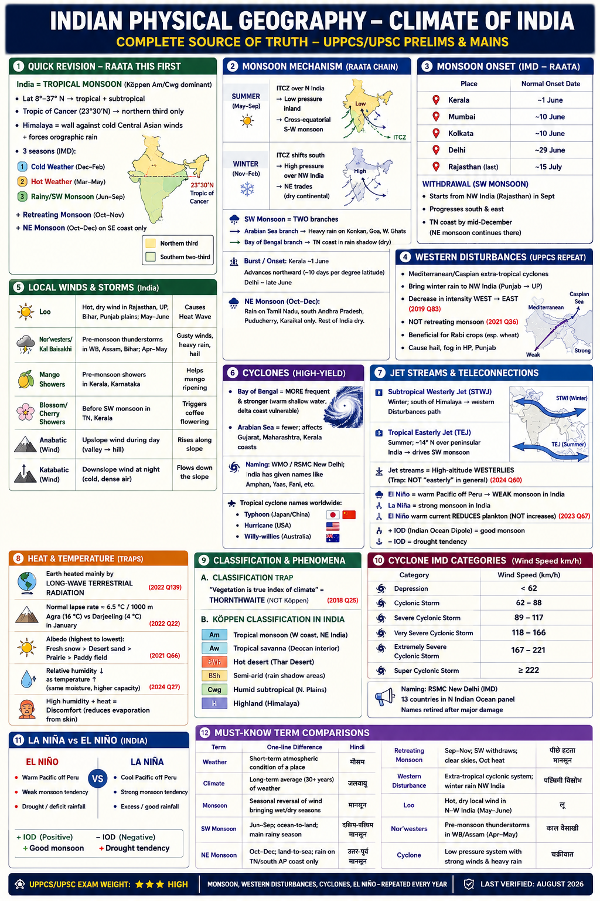

# Topic 2 — Climate of India
### ★ Complete Source of Truth — No other book/notes needed for this topic

> **Covers syllabus:** Climate Basics (Factors, Temperature, Altitude, Heat Budget, Inversion, Pressure & Wind, Atmosphere, Pressure Belts, Planetary Winds, ITCZ) | Monsoon System (Mechanism, SW/NE/Retreating Monsoon, Seasons, Western Disturbances) | Winds, Storms & Cyclones (Local Winds, Loo, Norwesters, Mango/Blossom Showers, Katabatic/Anabatic, Cyclones, Naming, Basins, Thunderstorms) | Classification & Phenomena (Köppen, Thornthwaite, Jet Streams, ENSO, El Niño, La Niña, IOD)
> **Sources baked in:** NCERT Geography Class 11 (Ch 4–5), Class 12 (Ch 1–2 climatology sections), UPPCS/UPSC PYQs 2018–2025
> **Exam weight:** ★★★ High — monsoon mechanism, seasons, Western Disturbances, cyclones, El Niño, local winds every year
> **Last verified:** August 2026

---

## How to use this file

1. **Learn:** Open one ## section → read Definitions → Teach prose → table → Exam note → that section's PYQs.
2. **Revise later:** Quick Revision + Memory Tricks only (day-before / weak recall).
3. **Test:** Practice Zone → Common Traps → Complete PYQ Bank.
4. Do **not** re-read the whole file every sitting — finish one section, then move on.

> Each section is written to make sense on first read. Quick Revision is not the first teaching layer.

---

## Quick Revision Box — Raata Later (after learning sections)

```
INDIA = TROPICAL MONSOON (Köppen Am/Cwg dominant):
  Lat 8°–37° N → tropical + subtropical | Tropic of Cancer → northern third only
  Himalaya = wall against cold Central Asian winds + forces orographic rain
  3 seasons (IMD): Cold Weather (Dec–Feb) | Hot Weather (Mar–May) | Rainy/SW Monsoon (Jun–Sep)
  + Retreating Monsoon (Oct–Nov) | NE Monsoon (Oct–Dec) on SE coast only

MONSOON MECHANISM (raata chain):
  Summer: ITCZ over N India → low pressure inland → cross-equatorial S-W monsoon
  Winter: ITCZ south → high pressure NW India → NE trades (dry continental)
  SW Monsoon = TWO branches: Arabian Sea (heavy Konkan/Goa) + Bay of Bengal (TN coast = rain shadow → dry)
  Burst/onset: Kerala ~1 June → sweeps north (~10 days per degree latitude) → Delhi ~late June
  NE Monsoon = ONLY TN, south AP, Puducherry, Karaikal (Oct–Dec); rest of India dry winter

WESTERN DISTURBANCES (UPPCS repeat):
  Mediterranean/Caspian extra-tropical cyclones → winter rain NW India (Punjab→UP)
  Decrease in intensity WEST → EAST (2019 Q83) | NOT retreating monsoon (2021 Q36)
  Good for Rabi wheat; cause hail/fog in HP/Punjab

LOCAL WINDS & STORMS — India:
  Loo = hot dry wind, Rajasthan/UP/Bihar/Punjab plains, May–June (heat wave)
  Nor'westers/Kal Baisakhi = pre-monsoon thunderstorms, WB/Assam/Bihar, Apr–May
  Mango Showers = Kerala/Karnataka, pre-monsoon (helps mango ripening)
  Blossom/Cherry Showers = TN/Kerala, before SW monsoon (coffee flowering)
  Anabatic = upslope day wind (valley→hill) | Katabatic = downslope night wind (cold dense air)

CYCLONES:
  Bay of Bengal = MORE frequent + stronger (warm shallow water, delta coast vulnerable)
  Arabian Sea = fewer; Gujarat/Maharashtra/Kerala coasts
  Naming: WMO/RSMC New Delhi; India gave Amphan, Yaas, Fani, etc.
  Tropical cyclone names worldwide: Typhoon (Japan/China), Hurricane (USA), Willy-willies (Australia)

JET STREAMS & TELECONNECTIONS:
  Subtropical Westerly Jet (STWJ) = winter, south of Himalaya → WD path
  Tropical Easterly Jet (TEJ) = summer, ~14° N over peninsular India → SW monsoon driver
  Jet streams = high-altitude WESTERLIES (trap: NOT "easterly" in general — 2024 Q60)
  El Niño = warm Pacific off Peru → WEAK monsoon India | La Niña → strong monsoon
  El Niño warm current REDUCES plankton (NOT increases — 2023 Q67 trap)
  +IOD = good monsoon | −IOD = drought tendency

HEAT & TEMPERATURE:
  Earth heated mainly by LONG-WAVE terrestrial radiation (2022 Q138)
  Lapse rate ≈ 6.5 °C/1000 m → Agra 16 °C vs Darjeeling 4 °C in Jan (2022 Q22)
  Albedo highest: fresh snow > desert sand > prairie > paddy (2021 Q66)
  Relative humidity ↓ as temperature ↑ (same moisture, higher capacity)

CLASSIFICATION TRAPS:
  "Vegetation is true index of climate" = THORNTHWAITE (NOT Köppen — 2018 Q25)
  Köppen India: Am (monsoon coast/NE) | Aw (savanna Deccan) | BWh (Thar) | BSh (semi-arid) | Cwg (N plains) | H (Himalaya)

MONSOON ONSET (IMD — raata):
  Kerala ~1 Jun | Mumbai ~10 Jun | Kolkata ~10 Jun | Delhi ~29 Jun | Rajasthan last (~15 Jul)
  Withdrawal: NW from Sep; TN coast by mid-Dec (NE monsoon continues)

HUMIDITY TRAPS:
  Relative humidity ↓ as temperature ↑ (2024 Q27) | Absolute humidity ≠ relative humidity
  High humidity + heat = discomfort (reduces evaporation from skin)

CYCLONE IMD CATEGORIES (wind km/h):
  Depression <62 | Cyclonic Storm 62–88 | Severe 89–117 | Very Severe 118–166 | Extremely Severe 167–221 | Super ≥222
  Naming: RSMC New Delhi; 13 countries in north Indian Ocean panel; retired after major damage

LA NIÑA vs EL NIÑO (India):
  El Niño → weak monsoon tendency | La Niña → strong monsoon | +IOD offsets El Niño | −IOD worsens drought
```

### Must-Know Term Comparisons

| Term | One-line difference | Hindi |
|------|---------------------|-------|
| **Weather** | Short-term atmospheric condition of a place | मौसम |
| **Climate** | Long-term average (30+ years) of weather | जलवायु |
| **Monsoon** | Seasonal reversal of wind bringing wet/dry seasons | मानसून |
| **SW Monsoon** | Jun–Sep; ocean-to-land; main rainy season | दक्षिण-पश्चिम मानसून |
| **NE Monsoon** | Oct–Dec; land-to-sea; rain on TN/south AP coast only | उत्तर-पूर्व मानसून |
| **Retreating Monsoon** | Sep–Nov; SW withdraws; clear skies, Oct heat | पीछे हटता मानसून |
| **Western Disturbance** | Extra-tropical cyclonic system; winter rain NW India | पश्चिमी विक्षोभ |
| **ITCZ** | Low-pressure belt where NE & SE trade winds converge | अंतः उष्णकटिबंधीय अपसाम्य क्षेत्र |
| **Absolute humidity** | Actual water vapour mass in air (g/m³) | परम आर्द्रता |
| **Relative humidity** | Moisture as % of saturation at given temperature | सापेक्ष आर्द्रता |
| **TEJ vs STWJ** | TEJ = summer easterly jet ~14°N; STWJ = winter westerly jet south of Himalaya | उष्ण पूर्वी जेट / उपोष्ण पश्चिमी जेट |
| **Somali Jet** | Cross-equatorial low-level jet feeding SW monsoon | सोमाली जेट |
| **Break monsoon** | Dry spell when trough shifts to Himalaya | मानसून विराम |
| **Burst of monsoon** | Sudden heavy rain at onset after dry May | मानसून का अचानक आगमन |
| **Loo** | Hot, dry, dust-laden summer wind in North Indian plains | लू |
| **Nor'wester / Kal Baisakhi** | Violent pre-monsoon thunderstorm in East/Northeast India | नॉर्वेस्टर / काल बैसाखी |
| **Albedo** | Reflectivity of surface; snow highest | परावर्तकता (एल्बेडो) |
| **El Niño** | Abnormal warming of eastern Pacific; weak Indian monsoon | एल नीनो |
| **La Niña** | Cooling of eastern Pacific; strong monsoon tendency | ला नीना |
| **IOD** | Indian Ocean Dipole; ± sea-surface temperature anomaly in Indian Ocean | भारतीय महासागर द्विध्रुव |
| **Köppen vs Thornthwaite** | Köppen = temperature + rainfall boundaries; Thornthwaite = moisture balance/vegetation index | कोप्पेन / थॉर्नथवेट |

### Memory Tricks

| Trick | Remembers |
|-------|-----------|
| **TN dry = parallel + shadow** | TN coast dry in SW monsoon — parallel to BoB branch + rain shadow of Arabian Sea branch (2023 Q54) |
| **WD from West** | Western Disturbances enter from west; rain decreases west→east |
| **WD ≠ Retreating** | Winter NW rain = Western Disturbances, NOT retreating/SW monsoon (2021 Q36) |
| **Thorn = Vegetation** | Thornthwaite linked to vegetation as climate index (2018 Q25) |
| **Snow reflects most** | Highest albedo = fresh snow (2021 Q66) |
| **Long wave heats air** | Troposphere heated by terrestrial long-wave radiation (2022 Q138) |
| **BoB = Cyclone king** | Bay of Bengal generates more tropical cyclones than Arabian Sea |
| **Jet = West not East** | General jet streams are westerly; TEJ is special summer easterly over India (2024 Q60 trap) |
| **El Niño kills plankton** | Warm Peru current suppresses upwelling → less plankton (2023 Q67) |
| **NE rain = SE corner** | Northeast monsoon rains only Tamil Nadu, south AP, Puducherry |
| **Loo in May–June** | Loo = pre-monsoon heat wave wind in Indo-Gangetic plains |
| **Shamal ≠ Austria** | Shamal = Middle East/Gulf dust wind; NOT Austria (2021 Q30) |

---

## 2.1 Climate Basics

### Definitions

| Term | Definition |
|------|------------|
| **Climate** | Aggregate of weather conditions over a long period (typically 30 years) for a region |
| **Insolation** | Incoming solar radiation received at Earth's surface |
| **Albedo** | Fraction of solar radiation reflected by a surface without absorption |
| **Heat budget** | Balance between incoming solar radiation and outgoing terrestrial radiation |
| **Normal lapse rate** | Average decrease of temperature with height (~6.5 °C per 1000 m in troposphere) |
| **Temperature inversion** | Reversal of normal lapse rate — temperature increases with height near ground |
| **Atmospheric pressure** | Force exerted by air column per unit area; decreases with altitude |
| **Coriolis force** | Apparent deflection of moving air due to Earth's rotation — right in NH, left in SH |
| **ITCZ** | Inter-Tropical Convergence Zone — equatorial low-pressure belt of convergence and uplift |

### Climate Basics — Overview

India has a **monsoon-type climate** dominated by seasonal reversal of winds, not by constant trade-wind or westerly regimes alone. The climate system rests on six interacting layers exam-setters love to test separately: **(1)** latitudinal position and relief, **(2)** heat budget and temperature patterns, **(3)** pressure-wind-Coriolis mechanics, **(4)** atmospheric structure, **(5)** global pressure belts + ITCZ shift, and **(6)** teleconnections (ENSO/IOD) modulating the monsoon. Master each layer — UPPCS rarely asks "define climate" alone; it mixes altitude (2022 Q22), heating mechanism (2022 Q138), humidity (2024 Q27), ozone layer (2023 Q52), and Coriolis (2023 Q68) across years.

### 2.1.1 Factors Affecting India's Climate

#### Factors Affecting Climate — How It Works

- **Latitude:** India spans 8°4′ N to 37°6′ N — predominantly tropical and subtropical; only the Himalayan zone is cold temperate.
- **Distance from sea:** Coastal areas (Mumbai, Chennai) have moderate maritime climate; interior Deccan and NW plains have continental extremes (hot summers, cold winters).
- **Himalayas:** Block cold Siberian/Central Asian winds in winter; force orographic precipitation on southern slopes during monsoon.
- **Physiography:** Western Ghats intercept Arabian Sea monsoon (windward = wet Konkan; leeward = rain shadow east of ghats); TN coast lies parallel to Bay of Bengal branch and in rain shadow of Arabian Sea branch → dry during SW monsoon (UPPCS 2023 Q54).
- **Jet streams:** Subtropical westerly jet in winter steers Western Disturbances; tropical easterly jet in summer over peninsular India strengthens SW monsoon.
- **Ocean currents & teleconnections:** El Niño–Southern Oscillation (ENSO) and Indian Ocean Dipole (IOD) modulate monsoon strength year to year.
- **Vegetation & soil moisture:** Affect evapotranspiration and local humidity — wetter surfaces moderate temperature swings.
- **Relief/altitude:** High mountains show vertical zonation of temperature and precipitation regardless of latitude.

> **Exam note:** When a question asks what controls India's climate, expect a combination of latitude, the Himalayan barrier, distance from the sea, and monsoon circulation — not one single cause.

---

### 2.1.2 Temperature Distribution & Effect of Altitude

#### Temperature Distribution — How It Works

- **January isotherms:** Temperature increases from north to south — Ladakh/Kashmir below 0 °C; Gangetic plain 15–20 °C; southern peninsula 24–28 °C.
- **June isotherms:** NW India (Rajasthan, Gujarat) records highest temperatures (45–50 °C); Deccan plateau moderate due to height; coastal areas moderated by sea.
- **Diurnal range:** Highest in Thar Desert (hot day, cool night); lowest on coasts and in humid eastern India.
- **Effect of altitude:** Temperature falls with height at ~6.5 °C per 1000 m — Agra and Darjeeling on similar latitude but Darjeeling (≈2000 m) much colder in January (UPPCS 2022 Q22: Agra ~16 °C vs Darjeeling ~4 °C).
- **Effect of distance from sea:** Continental interiors heat rapidly in summer and cool fast in winter; Mumbai/Chennai show smaller seasonal swing.
- **Urban heat island:** Cities like Delhi, Kanpur, Lucknow run 2–4 °C warmer than surrounding rural tracts due to concrete, traffic, and reduced vegetation.
- **Himalayan vertical zonation:** Every 1000 m ascent shifts climate equivalent to ~5° latitude poleward — explains snowline and vegetation belts.
- **Coastal upwelling/offshore winds:** Minor local modifier on west coast (Konkan) and during monsoon cloud cover reduces insolation over wide areas.

> **Exam note:** In the Agra–Darjeeling Assertion–Reason pattern (UPPCS 2022 Q22), the January temperature contrast is real and the Reason correctly cites the lapse of temperature with height, so both statements are true and R explains A.

#### Regional Temperature — Master Table

| Region / Station | January (approx.) | June (approx.) | Controlling factor |
|------------------|-------------------|----------------|--------------------|
| **Drass / Ladakh** | −20 to −40 °C | 10–15 °C | Altitude + continental interior |
| **Agra (plain)** | ~16 °C | 35–40 °C | Continental; UPPCS 2022 Q22 reference |
| **Darjeeling (~2000 m)** | ~4 °C | 18–20 °C | Lapse rate on same latitude as Agra |
| **Mumbai (coast)** | 24–26 °C | 30–32 °C | Maritime moderation |
| **Chennai** | 24–26 °C | 32–34 °C | Coastal; dry SW monsoon season |
| **Jaisalmer (Thar)** | 12–15 °C | 40–45 °C | Desert; highest diurnal range |

---

### 2.1.3 Heat Budget & Heating of the Atmosphere

#### Heat Budget — How It Works

- Sun emits **short-wave** radiation; atmosphere is largely transparent to it — most reaches Earth's surface.
- Earth absorbs short-wave, warms, and re-emits **long-wave (terrestrial/infrared)** radiation.
- **Greenhouse gases** (water vapour, CO₂, methane) absorb long-wave radiation and warm the troposphere — natural greenhouse effect keeps Earth habitable (~15 °C mean); without it, surface would be ~−18 °C.
- The troposphere is **mainly heated from below** by long-wave terrestrial radiation and sensible/latent heat flux from surface — NOT directly by short-wave solar radiation (UPPCS 2022 Q138: answer **long-wave terrestrial radiation**).
- **Scattered/reflected solar radiation** heats atmosphere only slightly; most scattering is visible light reaching surface or diffused downward.
- **Albedo** controls how much insolation is reflected — fresh snow highest (~80–90%), desert sand moderate, water low (~5–10%), forests moderate (UPPCS 2021 Q66: **land covered with fresh snow** reflects most).
- Latent heat transfer (evaporation/condensation) redistributes heat vertically and drives monsoon/cloud formation.
- Heat budget imbalance at any latitude is corrected by atmospheric and oceanic circulation (wind belts, monsoon).

> **Exam note:** A common trap option is that the Earth's atmosphere is mainly heated by short-wave solar radiation; that is false — the troposphere is heated mainly by long-wave terrestrial radiation from below.

#### Heat Budget — Components Table

| Component | What happens | Exam relevance |
|-----------|--------------|----------------|
| **Incoming solar (short-wave)** | ~100 units insolation at top of atmosphere | Mostly reaches surface after atmospheric absorption/scattering |
| **Surface absorption** | Earth warms and emits long-wave radiation | Primary energy input to surface |
| **Long-wave terrestrial radiation** | Emitted from surface upward | **Heats troposphere** from below (2022 Q138 answer) |
| **Greenhouse absorption** | H₂O, CO₂, CH₄ absorb long-wave | Natural effect; without it mean temp ≈ −18 °C |
| **Albedo reflection** | Snow, clouds, sand reflect insolation | Fresh snow highest albedo (2021 Q66) |
| **Latent heat** | Evaporation consumes heat; condensation releases | Drives monsoon clouds and storms |
| **Sensible heat flux** | Direct conduction/convection from surface | Warms air in contact with hot land |

#### Albedo — Surface Comparison

| Surface | Approx. albedo | Note |
|---------|----------------|------|
| **Fresh snow** | 80–90% | Highest — UPPCS 2021 Q66 |
| **Desert sand** | 30–40% | Moderate |
| **Paddy/cropland** | 10–20% | Lower |
| **Prairie/grass** | 20–25% | Between desert and forest |
| **Water (low sun angle)** | Can be high | Special case — not in UPPCS set |

---

### 2.1.4 Temperature Inversion

#### Temperature Inversion — How It Works

- Normal condition: air temperature **decreases** with height; inversion = temperature **increases** with height near ground.
- **Radiation inversion (winter nights):** Clear, calm nights in North Indian plains — ground loses heat fast; cold dense air settles in valleys; warm air sits above → fog/smog in Punjab, Haryana, UP, Bihar.
- **Valley inversion:** Himalayan valleys (Kashmir, Doon) — cold air drains into valley floor; settlements on slopes warmer than floor.
- **Frontal inversion:** Warm air overruns cold air mass along Western Disturbance fronts in winter.
- **Subsidence inversion:** Descending air in anticyclones warms adiabatically aloft — traps pollutants in Delhi NCR winter smog.
- Inversion **suppresses vertical mixing** — pollutants, fog, and cold waves intensify; flight operations and road transport disrupted.
- Sunlight eventually heats ground and breaks shallow inversion by mid-morning on clear days.
- Inversion layers can be exploited for frost protection in orchards (Himachal apple belt) by fans/smoke — exam context only.

> **Exam note:** Temperature inversion is tested most often through its applied effect: on clear winter nights it traps fog and smog over the Indo-Gangetic plain.

---

### 2.1.5 Pressure & Wind System

#### Pressure & Wind — How It Works

- Wind flows **high pressure → low pressure**; deflected by **Coriolis force** (right in NH, left in SH — UPPCS 2023 Q68).
- **Summer (SW monsoon season):** Strong **thermal low** over NW India (Rajasthan/UP) — pulls in cross-equatorial south-westerlies from Indian Ocean.
- **Winter:** **High pressure** over NW India — dry north-easterly/north-westerly winds blow from land to sea.
- **Monsoon trough:** Axis of low pressure along foot of Himalayas during active monsoon — heavy rain when positioned south of Himalaya.
- **Western Disturbances:** Embedded low-pressure cells in subtropical westerly jet bring winter precipitation to NW India.
- **Local pressure gradients:** Land–sea breeze on coasts; anabatic/katabatic winds on mountain slopes.
- **Cyclonic circulation:** Bay of Bengal lows circulate anticlockwise (NH) — onshore winds and storm surge on east coast.
- Pressure maps (isobars) explain why Chennai gets NE monsoon rain while interior TN stays dry in winter.

> **Exam note:** Coriolis deflection is a favourite standalone MCQ: winds are deflected to the right in the Northern Hemisphere and to the left in the Southern Hemisphere.

#### Humidity — Types & Traps

| Term | Definition | UPPCS trap |
|------|------------|------------|
| **Absolute humidity** | Mass of water vapour per unit volume (g/m³) | Increases with evaporation (2024 Q27 Reason) |
| **Relative humidity** | Actual vapour / saturation vapour × 100 at that temperature | **Decreases** when temperature rises (2024 Q27 Assertion) |
| **Specific humidity** | Mass of vapour per unit mass of moist air | Used in meteorology models |

- When air **warms**, its capacity to hold moisture increases — if moisture content stays constant, **relative humidity drops** even though absolute humidity may be unchanged.
- **High humidity + high temperature** reduces evaporation from skin → heat discomfort (linked to 2025 science PYQ pattern on sweat/humidity).
- **Monsoon months** = high absolute humidity over coastal and Gangetic India; **pre-monsoon May** = low RH in NW deserts despite extreme heat.

---

### 2.1.6 Structure of the Atmosphere

#### Atmospheric Layers — How It Works

- **Troposphere:** 0–8 km (poles) to 0–18 km (equator); all weather; temperature decreases with height; contains water vapour and dust.
- **Stratosphere:** Above troposphere; **ozone layer** absorbs UV — temperature increases with height in upper stratosphere (UPPCS 2023 Q52: ozone in **stratosphere**).
- **Mesosphere:** Temperature again decreases; meteors burn up here.
- **Thermosphere:** Very high temperature (thin air); ionosphere for radio reflection.
- **Exosphere:** Outermost; merges with space.
- **Tropopause:** Boundary between troposphere and stratosphere — jet streams often located near tropopause.
- Weather phenomena (clouds, rain, thunderstorms, cyclones) occur **only in troposphere**.
- Ozone depletion (CFCs) is stratosphere issue — UV reaches surface if ozone thins (environment overlap).

> **Exam note:** "Ozone in the troposphere" is a classic trap; the protective ozone layer that absorbs ultraviolet radiation is concentrated in the stratosphere.

#### Atmospheric Layers — Master Table

| Layer | Height (approx.) | Temperature trend | Key feature |
|-------|------------------|-------------------|-------------|
| **Troposphere** | 0–8 km (poles) to 0–18 km (equator) | Decreases with height | **All weather**; water vapour; clouds |
| **Tropopause** | Top of troposphere | Minimum temperature | Jet streams located near here |
| **Stratosphere** | Above tropopause to ~50 km | Increases in upper part (ozone) | **Ozone layer** — UV absorption (2023 Q52) |
| **Mesosphere** | ~50–80 km | Decreases | Meteors burn up |
| **Thermosphere** | ~80–400 km | Increases (thin air) | Ionosphere; aurora |
| **Exosphere** | Outermost | — | Merges with space |

---

### 2.1.7 Pressure Belts & Planetary Winds

#### Global Pressure Belts — How It Works

- **Equatorial Low (ITCZ zone):** Convergence of trade winds; rising air; heavy rain in tropics.
- **Subtropical High (≈30° N/S):** Descending dry air; deserts (Sahara, Thar, Australian outback) on western margins.
- **Subpolar Low (≈60° N/S):** Cyclonic activity; westerlies dominate.
- **Polar High:** Cold dense air; polar easterlies.
- **Seasonal shift:** Belts move **north in NH summer** (with ITCZ over north India) and **south in NH winter** — drives monsoon and Mediterranean winter rain.
- **Planetary winds:** Trade winds (E→W, equator to subtropics); **Westerlies** (W→E, 30°–60°); Polar easterlies.
- India receives **SW monsoon** when ITCZ and equatorial trough shift to Indo-Gangetic plain — not pure trade-wind system but monsoon is modified planetary circulation.
- **Subtropical westerly jet** (STWJ) flows along southern flank of Himalaya in winter — steers Western Disturbances.

> **Exam note:** Mediterranean winter rain is explained by the southward shift of global pressure belts in the Northern Hemisphere winter, which brings the westerlies over the Mediterranean region (world-climate comparison context).

---

### 2.1.8 ITCZ (Inter-Tropical Convergence Zone)

#### ITCZ — How It Works

- ITCZ = belt of **low pressure** near equator where NE and SE trade winds converge, air rises, clouds form.
- Follows the **thermal equator** (zone of maximum insolation) — shifts **north over India in summer** (June–September) and **south over Indian Ocean in winter**.
- Northward shift creates **low-pressure core over NW India** — draws SW monsoon onto subcontinent.
- ITCZ over Gangetic plain = active monsoon; if ITCZ stays south (weak monsoon/El Niño years), drought risk in central India.
- Over equatorial Indian Ocean, ITCZ remains active year-round — heavy convection and rainfall.
- **Monsoon trough** is the continental extension of ITCZ over India during summer.
- ITCZ position correlates with **onset, break, and withdrawal** phases of monsoon.
- El Niño often keeps convection centred in central Pacific — weakens ITCZ over Indian subcontinent.

> **Exam note:** The seasonal north–south shift of the ITCZ is the fundamental monsoon mechanism; always link it to the seasonal reversal of pressure and winds over the subcontinent.

### Exam Facts (raata — traps only) — §2.1 Climate Basics

- The troposphere is heated mainly by **long-wave terrestrial radiation**, not by direct short-wave solar radiation (UPPCS 2022 Q138).
- The **normal lapse rate** is about **6.5 °C per 1000 m**, which explains why Agra is much warmer than Darjeeling in January despite similar latitude (UPPCS 2022 Q22).
- Among common land surfaces, **fresh snow** has the **highest albedo** and reflects back the most sunlight (UPPCS 2021 Q66).
- **Relative humidity decreases** as air temperature rises, while absolute humidity may rise separately with evaporation (UPPCS 2024 Q27).
- The **ozone layer** that absorbs ultraviolet radiation for surface protection lies in the **stratosphere**, not the troposphere (UPPCS 2023 Q52).
- The **Coriolis force** deflects winds to the **left in the Southern Hemisphere** and to the right in the Northern Hemisphere (UPPCS 2023 Q68).
- The **ITCZ** is a **low-pressure** belt of converging trade winds; it shifts north over India in summer and drives the monsoon.
- Without the natural greenhouse effect, Earth's mean surface temperature would be about **−18 °C**.
- **Temperature inversion** on clear winter nights traps fog and smog over the Indo-Gangetic plain.
- The **subtropical high** near about 30° N helps explain deserts such as the Thar and Sahara on western continental margins.

### PYQs — Climate Basics

**UPPCS Prelims**

1. **(UPPCS 2022, Q22)** Given below are two statements, one is labelled as Assertion (A) and the other as Reason (R).

   **Assertion (A):** Agra and Darjeeling are located on nearly the same latitude, but the temperature in January in Agra is about 16°C, whereas it is only 4°C in Darjeeling.

   **Reason (R):** Temperature decreases with height due to thinner air compared to places in the plains.

   - Options: A. (A) false, (R) true / B. (A) true, (R) false / C. Both true, but (R) is not the correct explanation of (A) / D. Both true and (R) is the correct explanation of (A)
   → **D** — Both statements are true, and the altitude/lapse-rate Reason correctly explains the January temperature contrast on nearly the same latitude.

2. **(UPPCS 2022, Q138)** The Earth's atmosphere is mainly heated by which one of the following?
   - Options: A. Long-wave terrestrial radiation / B. Scattered solar radiation / C. Reflected solar radiation / D. Short-wave solar radiation
   → **A** — The troposphere is heated mainly from below by long-wave infrared radiation emitted by the Earth's surface. Short-wave solar radiation mostly passes through without heating the air directly.

3. **(UPPCS 2021, Q66)** Which one of the following reflects back more sunlight as compared to other three?
   - Options: A. Sand Desert / B. Paddy crop land / C. Land covered with fresh snow / D. Prairie land
   → **C** — Fresh snow has the highest albedo among the given surfaces, so it reflects back the most sunlight.

4. **(UPPCS 2024, Q27)** Given below are two statements, one is labelled as Assertion (A) and the other as Reason (R).

   **Assertion (A):** Relative humidity decreases with increasing air temperature.

   **Reason (R):** Absolute humidity increases with increasing evaporation.

   - Options: A. Both true, but (R) is not the correct explanation of (A) / B. (A) false, (R) true / C. Both true and (R) is the correct explanation of (A) / D. (A) true, (R) false
   → **A** — Both are true, but rising absolute humidity from evaporation does not explain why relative humidity falls when temperature rises; warmer air simply has a higher moisture capacity.

5. **(UPPCS 2023, Q52)** The ozone layer, which absorbs ultraviolet radiation, exists in which layer of the atmosphere?
   - Options: A. Troposphere / B. Mesosphere / C. Stratosphere / D. Thermosphere
   → **C** — The protective ozone concentration that absorbs ultraviolet radiation is in the stratosphere, not the weather layer (troposphere).

6. **(UPPCS 2023, Q68)** What causes winds to deflect towards the left in the Southern Hemisphere?
   - Options: A. Temperature / B. Coriolis Force / C. Magnetic Field / D. Pressure
   → **B** — Coriolis force deflects winds to the left in the Southern Hemisphere and to the right in the Northern Hemisphere. Temperature and pressure drive wind, but they do not cause the leftward deflection.

7. **(UPPCS 2018, Q25)** 'Vegetation is the true index of climate'. This statement is associated with:
   - Options: A. Thornthwaite / B. Köppen / C. Trewartha / D. Stamp
   → **A** — Thornthwaite linked climate classification to moisture balance and vegetation. Köppen uses temperature–precipitation letter codes; Trewartha modified Köppen.

## 2.2 Monsoon System

### Definitions

| Term | Definition |
|------|------------|
| **Monsoon** | Seasonal reversal of wind system associated with differential heating of land and sea |
| **Onset of monsoon** | Sudden arrival of monsoon rains over a region after a dry period ("burst") |
| **Monsoon trough** | Low-pressure axis along the Gangetic plain during active SW monsoon |
| **Break in monsoon** | Period when monsoon trough shifts north to Himalayas; dry spell over central India |
| **Retreating monsoon** | Withdrawal phase (Sep–Nov) when SW monsoon moves south; clear skies in north |
| **Western Disturbance** | Extra-tropical westerly wave/cyclone from Mediterranean–Caspian region causing winter rain/snow in NW India |
| **NE Monsoon** | Winter monsoon bringing rain from NE to SW onto SE coast of India (TN, south AP) |

### Monsoon System — Overview

The Indian monsoon is the **single most tested climate topic** in UPPCS. Three systems get conflated in traps — know them separately: **(1) SW monsoon (Jun–Sep)** = main rainy season for most of India except TN SE coast; **(2) Retreating monsoon (Sep–Nov)** = withdrawal phase with Oct heat and BoB cyclones; **(3) NE monsoon (Oct–Dec)** = winter rain **only** on TN/south AP/Coromandel coast. **Western Disturbances** are a **fourth**, separate system — **winter** extra-tropical rain for NW India, NOT monsoon (2021 Q36).

### 2.2.1 Monsoon Mechanism

#### Monsoon Mechanism — How It Works

- **Land–sea thermal contrast:** Indian subcontinent heats faster than Indian Ocean in summer → low pressure over land, high over ocean → wind from sea to land (wet).
- **Reverse in winter:** Continent cools → high pressure over NW India → dry winds from land to sea.
- **ITCZ shift:** Northward migration in summer positions convergence zone over India — triggers uplift and widespread convection.
- **Cross-equatorial flow:** Somali jet and cross-equatorial south-westerlies carry moisture from southern Indian Ocean.
- **Tropical Easterly Jet (TEJ):** Establishes at ~14° N in upper troposphere during summer — linked to strong monsoon and good rainfall over India.
- **Subtropical Westerly Jet (STWJ):** Shifts north of Himalaya in summer; returns south in winter bringing Western Disturbances.
- **ENSO/IOD modulation:** El Niño weakens pressure gradient and monsoon; La Niña and +IOD strengthen it.
- **Topographic channelling:** Arabian Sea branch hits Western Ghats (orographic rain); Bay of Bengal branch curves into NE India and Gangetic plain.

> **Exam note:** Monsoon mechanism is differential heating of land and sea, the ITCZ shift, and seasonal pressure reversal together — not the Himalaya alone.

---

### 2.2.2 Southwest Monsoon

#### Southwest Monsoon — How It Works

- **Season:** June to September — supplies **75–90%** of India's annual rainfall.
- **Onset:** Kerala coast ~1 June (IMD official); advances to Mumbai ~10 June, Kolkata ~10 June, Delhi ~29 June, Rajasthan last.
- **Two branches:**
  - **Arabian Sea branch:** Strikes Western Ghats (Konkan, Malabar wet); continues to Madhya Maharashtra, Gujarat, Rajasthan (weaker as it moves inland).
  - **Bay of Bengal branch:** Enters through NE states; curves west along Himalayas; supplies Ganga plain and Bihar/UP.
- **Rain shadow:** Tamil Nadu coast on SE lies **parallel** to Bay of Bengal branch and in **rain shadow** of Arabian Sea branch → **dry during SW monsoon** (UPPCS 2023 Q54 — both A and R true, R explains A).
- **Burst:** Sudden heavy rain after hot dry May — temperature drops sharply.
- **Active/break cycles:** When trough over Gangetic plain = active rain; when trough shifts to Himalaya = break (dry central India, heavy foothills).
- **Monsoon depressions:** Bay of Bengal systems move inland — cause heavy rain in MP, UP, Rajasthan.
- **Withdrawal begins:** NW India from September; complete by mid-October in south.

> **Exam note:** The claim that Tamil Nadu gets heavy South-West monsoon rain is false; the Tamil Nadu coast stays relatively dry in the SW monsoon and receives most of its rain from the North-East monsoon (October–December).

#### SW Monsoon — Onset & Withdrawal Dates (IMD)

| City / Region | Normal onset | Normal withdrawal (start) |
|---------------|--------------|---------------------------|
| **Kerala (Thiruvananthapuram)** | ~1 June | Mid-Dec (last to withdraw in extreme south) |
| **Mumbai** | ~10 June | Early Oct |
| **Kolkata** | ~10 June | Early Oct |
| **Delhi** | ~29 June | Late Sep |
| **Lucknow / east UP** | ~15–20 June | Late Sep |
| **Rajasthan (Jaisalmer)** | ~15 July (last) | Sep |
| **Chennai (TN coast)** | SW monsoon weak/dry Jun–Sep | NE monsoon Oct–Dec |

#### SW Monsoon — Rainfall Distribution (raata)

| Zone | Annual rainfall (approx.) | Branch / reason |
|------|---------------------------|-----------------|
| **Mawsynram/Cherrapunji (Meghalaya)** | >1100 cm | BoB branch + orographic lift |
| **Konkan/Goa coast** | 300–400 cm | Arabian Sea branch + Western Ghats |
| **Ganga plain (UP/Bihar)** | 100–150 cm | BoB branch + monsoon depressions |
| **Interior Deccan (rain shadow)** | 50–75 cm | Leeward of Western Ghats |
| **TN SE coast (Chennai)** | ~120 cm total but **dry Jun–Sep**; NE monsoon supplies bulk | Rain shadow + parallel coast |
| **Western Rajasthan (Jaisalmer)** | <25 cm | Farthest from both branches; desert |

#### SW Monsoon — Two Branches Diagram (text)

```
                    ARABIAN SEA BRANCH                    BAY OF BENGAL BRANCH
                           ↓                                        ↓
              → Western Ghats (orographic)              → NE states (Meghalaya wet)
              → Konkan, Malabar WET                       → Curves NW along Ganga plain
              → Gujarat, interior Maharashtra             → UP, Bihar, MP depressions
              → Rain shadow: east of Ghats DRY            → TN coast: parallel + shadow = DRY
```

---

### 2.2.3 Northeast Monsoon & Retreating Monsoon

#### NE Monsoon & Retreating Monsoon — How It Works

- **Retreating SW monsoon (Sep–Nov):** Sun moves south; SW winds withdraw; high pressure builds over north.
- **October heat:** Clear skies and residual moisture → hot, humid October in east coast and interior before full withdrawal.
- **Cyclogenesis peak:** Bay of Bengal post-monsoon cyclones (Oct–Dec) — Andhra, Odisha, WB vulnerable.
- **Northeast Monsoon (Oct–Dec):** As ITCZ moves south, winds over Bay of Bengal blow from **NE to SW** — pick up moisture and dump rain on **Tamil Nadu, south Andhra Pradesh, Puducherry, Karaikal**.
- **Rest of India dry:** Interior peninsula and north receive negligible rain in NE monsoon season.
- **Coromandel coast** (TN) depends on NE monsoon for ~50% of annual rain — agriculture (paddy, groundnut) tied to this system.
- **Retreating monsoon ≠ Western Disturbance** — winter NW rain is WD, not retreating monsoon (UPPCS 2021 Q36 trap).
- **Mumbai/Gujarat:** Dry in Oct–Nov as SW has withdrawn; no NE monsoon reach.

> **Exam note:** Only the south-eastern peninsular coast (Tamil Nadu, south Andhra Pradesh, Puducherry) receives significant winter (North-East) monsoon rain — a recurring map-based trap.

---

### 2.2.4 Indian Seasons (IMD Classification)

#### Four Seasons — How It Works

| Season | Months | Key Characteristics |
|--------|--------|---------------------|
| **Cold weather (winter)** | Dec – Feb | NW India cold (fog, frost in Punjab/UP); TN/ Kerala dry; WD rain in NW |
| **Hot weather (summer)** | Mar – May | Loo in plains; pre-monsoon thunderstorms (Nor'westers, mango showers); rising temperature |
| **SW Monsoon (rainy)** | Jun – Sep | Main rainfall season; countrywide except TN SE coast (dry) |
| **Retreating monsoon** | Oct – Nov | Withdrawal of SW; Oct heat; cyclones in BoB; NE monsoon starts on SE coast |

- **Pre-monsoon (Mar–May):** Convectional thunderstorms increase; hail in north; water stress in Deccan until onset.
- **Mango showers:** Pre-monsoon rain in Kerala/Karnataka helping mango crop — not part of official IMD season name but exam term.
- **Blossom/Cherry showers:** Pre-monsoon rain in TN/Kerala for coffee flowering.
- **Rabi vs Kharif:** WD winter rain critical for **Rabi wheat** in Punjab, Haryana, UP.
- **All-India rainfall average:** ~118 cm annually — highly variable spatially (Mawsynram >1100 cm; Jaisalmer <25 cm).
- **Monsoon variability:** 10–20% deficiency = drought year; excess = flood year — IMD defines categories.

> **Exam note:** Always match the season to the phenomenon: the Loo belongs to the hot-weather season; Western Disturbances belong to the cold-weather season; and the North-East monsoon rains fall on the south-east coast during the retreating/early winter months.

---

### 2.2.5 Western Disturbances

#### Western Disturbances — How It Works

- **Origin:** Extra-tropical cyclonic disturbances embedded in **subtropical westerly jet** from Mediterranean, Caspian, and Atlantic regions.
- **Season:** **Winter** (Nov–Feb peak) — main source of **non-monsoon rain/snow** in NW India.
- **Affected area:** Punjab, Haryana, Himachal, Jammu & Kashmir, Uttarakhand, west UP, north Rajasthan — rainfall and snowfall in Himalaya.
- **Benefits:** Essential for **Rabi crops** (wheat, mustard, gram); replenishes Himalayan snowpack.
- **Hazards:** Hailstorms, landslides, avalanches in HP/Uttarakhand; fog in Indo-Gangetic plain after WD passage.
- **Rainfall gradient:** Intensity **decreases from west to east** — Punjab/Haryana receive more than east UP/Bihar (UPPCS 2019 Q83: answer **West to East**).
- **NOT caused by:** Retreating monsoon, SW monsoon, or tropical cyclones (UPPCS 2021 Q36: answer **Western disturbances**).
- **Frequency:** 4–5 active WD per month in peak winter — each lasts 2–3 days.

> **Exam note:** Two recurring UPPCS traps on Western Disturbances: winter rainfall in north-west India is caused by Western Disturbances (not monsoon systems), and that rainfall decreases from west to east across the north-western plains.

### PYQs — Monsoon & Western Disturbances

**UPPCS Prelims**

1. **(UPPCS 2023, Q54)** Given below are two statements, one is labelled as Assertion (A) and the other as Reason (R).

   **Assertion (A):** The Tamil Nadu coast remains dry during the South-West monsoon season.

   **Reason (R):** The Tamil Nadu coast is situated parallel to the Bay of Bengal branch of the South-West monsoon and it lies in the rain shadow area of the Arabian Sea branch of the South-West monsoon during the monsoon season.

   - Options: A. (A) true, (R) false / B. (A) false, (R) true / C. Both true, but (R) is not the correct explanation of (A) / D. Both true and (R) is the correct explanation of (A)
   → **D** — Tamil Nadu's South-West monsoon dryness is real, and the Reason correctly explains it through coast orientation plus Arabian Sea branch rain shadow.

2. **(UPPCS 2021, Q36)** Which one of the following causes is responsible for rainfall during winters in the north-western part of India?
   - Options: A. Retreating Monsoon / B. Cyclonic depression / C. Western disturbances / D. South-West Monsoon
   → **C** — Winter rain and snow in north-west India come from Western Disturbances. Retreating and South-West monsoons are not the winter NW rain systems.

3. **(UPPCS 2019, Q83)** The winter rains caused by Western disturbance in North Western Plain of India gradually decreases from:
   - Options: A. East to West / B. West to East / C. North to South / D. South to North
   → **B** — Western Disturbances enter from the west, so rainfall is stronger in Punjab–Haryana and decreases eastward toward eastern Uttar Pradesh.

### Exam Facts (raata — traps only) — §2.2 Monsoon System

- The **South-West monsoon** supplies about **75–90%** of India's annual rainfall between June and September.
- The **Tamil Nadu south-east coast stays dry in the South-West monsoon** because it lies parallel to the Bay of Bengal branch and in the rain shadow of the Arabian Sea branch (UPPCS 2023 Q54).
- The **North-East monsoon** brings rain mainly to **Tamil Nadu, south Andhra Pradesh, and Puducherry** from October to December — not to all of India.
- **Winter rainfall in north-west India** is caused by **Western Disturbances**, not by the retreating or South-West monsoon (UPPCS 2021 Q36).
- Western Disturbance rainfall **decreases from west to east** across the north-western plains, from Punjab toward eastern Uttar Pradesh (UPPCS 2019 Q83).
- The **burst of monsoon** is the sudden onset of heavy rains after dry May heat, accompanied by a sharp drop in temperature.
- During a **break monsoon**, the trough shifts to the Himalaya, so central India turns dry while the foothills stay wet.
- **Mango showers** are pre-monsoon rains of Kerala and Karnataka; **Nor'westers** are pre-monsoon thunderstorms of West Bengal and Assam.
- India's location in the **tropical monsoon region** enables diversified cropping through the year (UPPCS 2024 Q73, statement 2).
- Normal **onset** is about **1 June** over Kerala, about **29 June** over Delhi, and latest over Rajasthan.

## 2.3 Winds, Storms & Cyclones

### Definitions

| Term | Definition |
|------|------------|
| **Local wind** | Wind system confined to a small area, caused by local pressure differences |
| **Loo** | Strong, hot, dry wind blowing over North Indian plains in summer |
| **Nor'wester / Kal Baisakhi** | Violent pre-monsoon thunderstorm over eastern/northeastern India |
| **Mango shower** | Pre-monsoon rainfall in Kerala/Karnataka aiding mango ripening |
| **Blossom shower** | Pre-monsoon rain in TN/Kerala for coffee/cherry blossom |
| **Anabatic wind** | Upslope wind by day — valley air heats, rises along slopes |
| **Katabatic wind** | Downslope wind — dense cold air drains downhill at night |
| **Tropical cyclone** | Intense warm-core low-pressure system over tropical oceans (wind ≥ 34 knots) |
| **Thunderstorm** | Short-lived storm with lightning, thunder, heavy rain, sometimes hail |

### Winds, Storms & Cyclones — Overview

UPPCS tests **Indian phenomena** (Loo, Nor'westers, mango showers) together with **world local-wind traps** (Shamal, Mistral country pairs) and **cyclone naming** match questions (2019 Q78, 2020 Q74). Separate **local wind** (Loo = sustained hot dry wind) from **local storm** (Nor'wester = violent thunderstorm). Cyclones = **synoptic-scale tropical systems** over ocean; thunderstorms = **local convection** over land.

### 2.3.1 Local Winds — India & World (Exam Traps)

#### Local Winds — How It Works

**India-specific — Complete Table:**

| Wind/Storm | Region | Season | Character |
|------------|--------|--------|-----------|
| **Loo** | Rajasthan, Punjab, Haryana, UP, Bihar | May–June | Hot, dry, dust-laden; heat-wave deaths |
| **Nor'wester / Kal Baisakhi** | WB, Assam, Odisha, Bihar, Jharkhand | Apr–May | Violent thunderstorm; hail, lightning |
| **Mango showers** | Kerala, Karnataka | Apr–May | Pre-monsoon; mango ripening |
| **Blossom/Cherry showers** | TN, Kerala (Nilgiri/Kodagu) | Apr–May | Coffee flowering rains |
| **Andhi** | Rajasthan | Pre-monsoon | Dust storm wall |
| **Land breeze / Sea breeze** | Konkan, Malabar, Coromandel | Daily cycle | Onshore day; offshore night |
| **Anabatic** | Himalayan slopes | Day | Upslope warm wind |
| **Katabatic** | Himalayan/valley floors | Night | Cold downslope drainage |

**India-specific (narrative):**
- **Loo:** Hot, dry, dust-laden; Rajasthan, Punjab, Haryana, UP, Bihar; **May–June**; raises heat-wave deaths; blows **west to east** in Indo-Gangetic plain.
- **Land–sea breeze:** Coastal — onshore breeze by day, offshore by night (Konkan, Kerala coast).
- **Anabatic:** Daytime upslope winds in Himalaya valleys — useful for gliding/soaring context.
- **Katabatic:** Night drainage winds — cold air into Doon valley, Brahmaputra valley fog.

**World local winds (match/NOT-matched PYQs):**
| Wind | Region | Character |
|------|--------|-----------|
| **Mistral** | Southern France | Cold, dry, down Rhône valley — **NOT Australia** (2019 Q80 trap) |
| **Shamal** | Arabia/Persian Gulf | Hot, dust-laden — **NOT Austria** (2021 Q30 trap) |
| **Santa Ana** | California, USA | Hot, dry, fire-fanning |
| **Haboob** | Sudan/Africa | Dust storm wall |
| **Chinook / Foehn** | Rockies / Alps | Warm, dry downslope — melts snow (2024 Q33: both warm/dry) |
| **Brickfielder** | Australia | Hot wind |
| **Leveche** | Spain | Warm, dry |

- Local winds result from **local pressure gradients** (topography, temperature contrasts), not global belts alone.
- UPPCS tests **incorrect country pairings** — memorise region, not just wind name.

> **Exam note:** Memorise correct regions for world local winds: the Shamal belongs to Arabia and the Persian Gulf, and the Mistral belongs to southern France. Wrong country pairings are planted as deliberate traps.

---

### 2.3.2 Local Storms — Loo, Nor'westers, Mango & Blossom Showers

#### Local Storms — How It Works

- **Loo:** Not a thunderstorm — sustained hot wind causing **heat wave**; avoids going out midday; villages close activity.
- **Nor'westers (Kal Baisakhi / Baisakhi):** **Pre-monsoon** (Apr–May); **West Bengal, Assam, Odisha, Bihar, Jharkhand**; cumulonimbus clouds; lightning, gale, hail; kills people and damages crops; evening/night occurrence common.
- **Mango Showers:** **Kerala and Karnataka**; April showers before SW monsoon; help **mango** ripening — called "April rains."
- **Blossom / Cherry Showers:** **Tamil Nadu and Kerala**; support **coffee** flowering before main rains.
- **Andhi (Rajasthan):** Dust storm ahead of monsoon — sudden wall of dust.
- All pre-monsoon storms are **convectional** — intense surface heating + moisture incursion.
- **Coffee Belt:** Blossom showers critical for Kodagu (Karnataka) and Nilgiri coffee economy.
- Nor'westers decline once SW monsoon establishes (June).

> **Exam note:** Match each local storm to region and season: Nor'westers (Kal Baisakhi) hit eastern and north-eastern India in the pre-monsoon months, while mango showers occur in Kerala and Karnataka before the South-West monsoon.

---

### 2.3.3 Katabatic & Anabatic Winds

#### Slope Winds — How It Works

- **Anabatic (upslope):** Daytime — slopes heat faster than valleys; air rises along slope; gentle upslope wind; cloud build-up over peaks by afternoon.
- **Katabatic (downslope):** Night — slopes cool; dense air drains into valley; cold night winds; **frost** risk in valley floors (Himachal apple orchards, Kashmir).
- **Foehn/Chinook effect:** Special katabatic-type **warm** downslope after crossing mountains — leeward side dries and warms (world comparison).
- In Himalaya, katabatic drainage strengthens **winter cold waves** in valleys (Drass, Leh cold pockets).
- Anabatic winds transport moisture upslope — orographic cloud formation on Himalayan foothills by afternoon.
- Sailplane/gliding uses anabatic upslope flows — not exam core but explains mechanism.
- Distinction: anabatic = **day + upslope**; katabatic = **night + downslope**.

> **Exam note:** For slope-wind MCQs, remember: anabatic winds are daytime upslope flows, and katabatic winds are night-time downslope drainage.

---

### 2.3.4 Cyclones — Formation, Basins & India

#### Tropical Cyclones — How It Works

- **Conditions:** Sea surface temp **≥ 26–27 °C**; warm moist air; Coriolis force (not on equator — cyclones form **5°–30°** lat); low vertical wind shear.
- **Bay of Bengal:** **More frequent and intense** — shallow warm water, deltaic coast, low-lying Sundarbans/Odisha/AP/WB highly vulnerable.
- **Arabian Sea:** Fewer cyclones; Gujarat, Maharashtra, Kerala occasionally hit; weaker on average.
- **Seasons:** **Pre-monsoon** (May–June) and **post-monsoon** (Oct–Dec) peaks; SW monsoon season (Jul–Sep) has shear that disrupts cyclone formation over BoB.
- **Stages:** Tropical disturbance → depression → deep depression → cyclonic storm → severe/super cyclonic storm (IMD classification).
- **Storm surge:** Bay of Bengal worst — shallow continental shelf amplifies surge (1999 Super Cyclone Odisha, Fani, Amphan, Yaas).
- **Landfall effects:** Heavy rain, gale, surge, inland flooding; UP gets remnant rain only when depression tracks west-northwest.
- **Amphan (2020), Yaas (2021), Fani (2019):** Recent BoB super/severe cyclones — exam current-affairs overlap.

> **Exam note:** The Bay of Bengal produces more frequent and damaging tropical cyclones than the Arabian Sea; pick Bay of Bengal unless the question clearly asks for an Arabian Sea exception.

#### IMD Tropical Cyclone Classification

| Category | Wind speed (km/h) | Storm surge / damage |
|----------|-------------------|----------------------|
| **Low pressure** | <31 | Minimal |
| **Depression** | 31–49 | Heavy rain |
| **Deep depression** | 50–61 | Flooding |
| **Cyclonic storm** | 62–88 | Structural damage begins |
| **Severe cyclonic storm** | 89–117 | Widespread damage |
| **Very severe cyclonic storm** | 118–166 | Major damage (Fani, Yaas class) |
| **Extremely severe cyclonic storm** | 167–221 | Catastrophic |
| **Super cyclonic storm** | ≥222 | 1999 Odisha super cyclone scale |

#### Bay of Bengal vs Arabian Sea — Comparison

| Feature | Bay of Bengal | Arabian Sea |
|---------|---------------|-------------|
| **Frequency** | More cyclones per year | Fewer |
| **Intensity** | Higher on average | Generally weaker |
| **Water depth** | Shallow continental shelf | Deeper |
| **Storm surge risk** | Very high (Sundarbans, Odisha, AP) | Moderate (Gujarat, Maharashtra) |
| **Peak seasons** | Pre-monsoon (May–Jun) + post-monsoon (Oct–Dec) | Mainly pre/post monsoon |
| **Why difference** | Shallow warm water + low salinity from rivers | Higher salinity; narrower fetch |

---

### 2.3.5 Cyclone Naming System

#### Cyclone Naming — How It Works

- **WMO/ESCAP Panel** on Tropical Cyclones — 13 member countries including India name cyclones in **north Indian Ocean** (Bay of Bengal + Arabian Sea).
- **RSMC New Delhi** (IMD) assigns names sequentially from pre-approved lists — gender-neutral, culturally neutral, non-repetitive of retired names.
- **India-contributed names:** e.g. **Amphan, Yaas, Fani, Vayu, Nisarga** (recent years).
- **Retirement:** Names of devastating cyclones retired — never reused (e.g. 1999 Odisha super cyclone name retired).
- **World naming (match PYQs):**
  | Local Name | Basin/Country |
  |------------|---------------|
  | **Typhoon / Taifu** | NW Pacific (Japan, China, Philippines) |
  | **Hurricane** | Atlantic / Eastern Pacific (USA) |
  | **Willy-willies** | Australia |
  | **Baguio/Cyclone** | Philippines / general Indian Ocean |
- UPPCS 2019 Q78 & 2020 Q74 — match cyclone name to country (Typhoon-Japan, Hurricane-USA, Willy-willies-Australia).

> **Exam note:** Cyclone-naming match questions repeat often: memorise that Typhoons are linked with the north-west Pacific (Japan/Philippines/China region), Hurricanes with the USA/Atlantic, and Willy-willies with Australia.

---

### 2.3.6 Thunderstorms

#### Thunderstorms — How It Works

- **Formation:** Strong convection — moist unstable air rises rapidly; cumulonimbus tower; lightning, thunder, heavy rain, gusty winds, hail possible.
- **Pre-monsoon peak:** North and East India (Mar–May) — Nor'westers are severe thunderstorm complexes.
- **Monsoon thunderstorms:** Embedded in monsoon clouds — less isolated but widespread rain.
- **Hailstorms:** Punjab, Haryana, HP during WD and pre-monsoon — crop damage to wheat/mustard.
- **Lightning deaths:** UP, Bihar, Odisha, Jharkhand lead nationally — open field labour risk during pre-monsoon.
- **Thunderstorm vs tropical cyclone:** Thunderstorm = local, short-lived (hours); cyclone = synoptic scale, multi-day, ocean-born.
- **Upslope thunderstorms:** Himalayan foothills when moist monsoon air forced upward.

> **Exam note:** Do not confuse a Nor'wester (a local pre-monsoon thunderstorm) with a tropical cyclone (a large revolving storm over the ocean).

### PYQs — Winds & Cyclones

**UPPCS Prelims**

1. **(UPPCS 2021, Q30)** Which one of the following pairs is NOT correctly matched?
   - Options: A. Leveche — Spain / B. Brickfielder — Australia / C. Black roller — North America / D. Shamal — Austria
   → **D** — The Shamal is a hot dust wind of Arabia and the Persian Gulf, not Austria. The other three pairs are correctly matched world local winds.

2. **(UPPCS 2019, Q80)** Which of the following is NOT correctly matched? (Wind) (Country)
   - Options: A. Santa Ana — California / B. Haboob — Sudan / C. Yamo — Japan / D. Mistral — Australia
   → **D** — The Mistral is a cold, dry wind of southern France, not Australia. Santa Ana–California and Haboob–Sudan are correctly matched.

3. **(UPPCS 2020, Q74)** Match List-I with List-II and select the correct answer from the codes given below:

   **List-I (Tropical cyclones):** A. Baguios / B. Hurricanes / C. Typhoons / D. Willy-Willies

   **List-II (Country):** 1. Australia / 2. China / 3. Philippines / 4. United States of America

   - Options: A. 3 4 1 2 / B. 3 4 2 1 / C. 2 3 4 1 / D. 2 1 3 4
   → **B** — Code **3 4 2 1**: Baguios–Philippines, Hurricanes–USA, Typhoons–China, Willy-Willies–Australia (as keyed in this paper's match set).

4. **(UPPCS 2019, Q78)** Match List-I with List-II and select the correct answer from the codes given below:

   **List-I (Different name of tropical cyclone):** A. Willy-Willies / B. Taifu / C. Baguio / D. Hurricanes

   **List-II (Country):** 1. Philippines / 2. Australia / 3. Japan / 4. U.S.A.

   - Options: A. 3 4 1 2 / B. 2 3 4 1 / C. 1 3 2 4 / D. 2 3 1 4
   → **D** — Code **2 3 1 4**: Willy-willies–Australia, Taifu–Japan, Baguio–Philippines, Hurricanes–USA. Do not put Baguio on the USA.

### Exam Facts (raata — traps only) — §2.3 Winds, Storms & Cyclones

- The **Loo** is a hot, dry summer wind of the north Indian plains; a **Nor'wester** is a violent pre-monsoon thunderstorm of eastern India — they are different phenomena.
- **Mango showers** occur in **Kerala and Karnataka**, not in Punjab or Haryana.
- The **Shamal** is a hot dust wind of Arabia and the Persian Gulf, **not Austria** (UPPCS 2021 Q30). The **Mistral** is a cold wind of southern France, **not Australia** (UPPCS 2019 Q80).
- The **Bay of Bengal** produces **more frequent and stronger** tropical cyclones than the Arabian Sea.
- Regional cyclone names to memorise: **Typhoon** (north-west Pacific / Japan–Philippines–China), **Hurricane** (USA / Atlantic), and **Willy-willies** (Australia).
- **RSMC New Delhi** names tropical cyclones for the north Indian Ocean basin.
- Tropical cyclones need sea-surface temperature of about **26–27 °C or more** and a significant **Coriolis force** (they are weak or absent on the equator).
- **Chinook and Foehn** are warm, dry downslope winds (UPPCS 2024 Q33).
- **Anabatic** winds blow **upslope by day**; **katabatic** winds drain **downslope by night**.

## 2.4 Climate Classification & Ocean–Atmosphere Phenomena

### Definitions

| Term | Definition |
|------|------------|
| **Köppen classification** | Climate classification based on temperature and precipitation thresholds; uses letters (A, B, C, D, E) |
| **Thornthwaite classification** | Based on moisture balance; links vegetation to climate — "vegetation is true index of climate" |
| **Jet stream** | Narrow band of strong upper-tropospheric winds (westerly in mid-latitudes) |
| **Subtropical Westerly Jet (STWJ)** | Winter jet south of Himalaya; steers Western Disturbances |
| **Tropical Easterly Jet (TEJ)** | Summer upper easterly over peninsular India at ~14° N; drives SW monsoon |
| **ENSO** | El Niño–Southern Oscillation — coupled ocean-atmosphere phenomenon in Pacific |
| **El Niño** | Abnormal warming of eastern tropical Pacific off Peru coast |
| **La Niña** | Abnormal cooling of eastern tropical Pacific — opposite of El Niño |
| **IOD (Indian Ocean Dipole)** | SST difference between western and eastern Indian Ocean — modulates monsoon |

### 2.4.1 Köppen Climate Classification (India)

#### Köppen — How It Works

- **Am (Monsoon climate):** High rainfall, short dry winter — **west coast, NE India, Shiwalik foothills**.
- **Aw (Tropical savanna):** Distinct dry winter — **interior Deccan, Maharashtra plateau, Karnataka interior**.
- **BWh (Hot desert):** Low rainfall, high evaporation — **western Rajasthan (Thar), Kutch**.
- **BSh (Semi-arid steppe):** Transitional — **Punjab, Haryana, Gujarat, rain-shadow Deccan**.
- **Cwg (Monsoon with dry winter / cold winter variant):** **Indo-Gangetic plain** — hot dry summer, cool dry winter, wet summer.
- **H (Highland):** Himalayan altitudinal zonation — temperature varies sharply with height.
- **E (Polar/tundra):** Only highest Himalayan zones — permanent snow.
- India = classic **"tropical monsoon"** country — not Mediterranean, not equatorial throughout.
- Köppen uses **precipitation seasonality** and **temperature** — most exam-relevant for India map colouring.

> **Exam note:** India is not entirely tropical wet climate: the interior peninsula is largely Aw (tropical savanna), and the Thar is BWh (hot desert) in the Köppen scheme.

#### Köppen Classification — Complete India Table

| Code | Full name | Key criteria | Indian regions / examples |
|------|-----------|--------------|---------------------------|
| **Am** | Tropical monsoon | Short dry winter; heavy summer rain | Kerala coast, Konkan, Shillong, Cherrapunji |
| **Aw** | Tropical savanna | Distinct dry winter ≥ 2 months | Interior Maharashtra, Karnataka, Telangana plateau |
| **BWh** | Hot desert | Arid; evaporation >> rainfall | Thar desert (Jaisalmer, Bikaner), Kutch |
| **BSh** | Semi-arid steppe | Semi-arid transition | Punjab, Haryana, Gujarat, rain-shadow Deccan |
| **Cwg** | Monsoon with dry winter | Hot dry summer; cool dry winter; wet summer | Lucknow, Patna, Delhi, Kanpur, Varanasi |
| **Cw** | Monsoon with dry summer (minor) | Some Himalayan foothill pockets | Lower Himachal valleys (limited extent) |
| **H** | Highland | Altitude controls temperature | Himachal, Uttarakhand, Sikkim, Ladakh slopes |
| **E** | Polar/tundra | Permanent snow line above | Highest Himalayan zones only |

#### Köppen vs Thornthwaite — Comparison

| Feature | Köppen | Thornthwaite |
|---------|--------|--------------|
| **Basis** | Temperature + precipitation thresholds | Moisture balance (P − PE) |
| **Vegetation link** | Indirect via climate types | **"Vegetation is true index of climate"** (2018 Q25) |
| **India usage** | Standard atlas/NCERT maps | Quote attribution in exams |
| **Letter codes** | Am, Aw, BWh, Cwg, etc. | Moisture index categories |

---

### 2.4.2 Thornthwaite Classification

#### Thornthwaite — How It Works

- Based on **water balance** — precipitation minus evapotranspiration = moisture surplus or deficit.
- Thornthwaite argued **"Vegetation is the true index of climate"** — vegetation reflects long-term moisture balance (UPPCS 2018 Q25: answer **Thornthwaite**, NOT Köppen/Köppen uses boundaries; Trewartha is modified Köppen).
- Maps **potential evapotranspiration (PE)** and **moisture index**.
- Useful for agriculture and ecology — links climate to crop natural vegetation zones.
- Less used in map atlases than Köppen but UPPCS asks the **quote attribution**.
- Köppen = most widely used global system; Thornthwaite = moisture/vegetation emphasis.

> **Exam note:** The direct quote "Vegetation is the true index of climate" is attributed to Thornthwaite only — not to Köppen, Trewartha, or Stamp.

---

### 2.4.3 Jet Streams — Western Jet & Tropical Easterly Jet

#### Jet Streams — How It Works

- **Jet stream:** Narrow corridor of winds **> 120 km/h** in upper troposphere near tropopause; discovered during **WWII** (2024 Q60 context).
- **General direction:** Mid-latitude jets are **WESTERLIES** (west to east) — trap "easterly jet streams" as false generalisation (2024 Q60 Assertion **FALSE**).
- **Subtropical Westerly Jet (STWJ):**
  - **Winter** position south of Himalaya (~25°–30° N).
  - Carries **Western Disturbances** into NW India.
  - Strong westerly flow — aviation tailwind westbound.
- **Tropical Easterly Jet (TEJ):**
  - **Summer only** — establishes over **peninsular India near 14° N** after STWJ shifts north of Tibet.
  - **Easterly** upper wind — unique to monsoon season.
  - Strong TEJ = good monsoon; weak/absent TEJ = drought years.
- Speed 300–500 km/h in core — Reason in 2024 Q60 is true but does NOT fix false Assertion about "easterly" as general jet property → Answer **B** (A false, R true).

> **Exam note:** Learn two jets for two seasons: the Subtropical Westerly Jet is a winter westerly south of the Himalaya, while the Tropical Easterly Jet is a summer easterly over peninsular India only.

#### Jet Streams — STWJ vs TEJ Comparison

| Feature | Subtropical Westerly Jet (STWJ) | Tropical Easterly Jet (TEJ) |
|---------|--------------------------------|----------------------------|
| **Season** | Winter (Nov–Apr peak) | Summer (Jun–Sep) |
| **Position** | South of Himalaya (~25°–30° N) | ~14° N over peninsular India |
| **Direction** | **Westerly** | **Easterly** |
| **Role in India** | Steers **Western Disturbances** | Strengthens **SW monsoon** |
| **Shift in summer** | Moves **north of Tibet** | Establishes after STWJ moves north |

---

### 2.4.4 ENSO — El Niño & La Niña

#### ENSO — How It Works

- **Normal:** Trade winds pile warm water in western Pacific; cold **Humboldt/Peru Current** upwells nutrient-rich cold water off Peru.
- **El Niño ("Christ child"):** Trade winds weaken; warm water sloshes east; **warm pool off Peru** (UPPCS 2023 Q67 statement 1 ✓).
- **Effects on Peru coast:** Warm water **suppresses upwelling** → **reduces** plankton and fish — statement 2 in 2023 Q67 is **FALSE** (trap: "increases plankton").
- **Effects on India:** El Niño correlates with **below-normal monsoon**, drought in central India, heat waves; not every El Niño year is drought but probability rises.
- **La Niña:** Enhanced trades; cold eastern Pacific; **above-normal monsoon** tendency in India; more cyclones in BoB some years.
- **Southern Oscillation:** Seesaw of pressure between Darwin (Australia) and Tahiti — atmospheric half of ENSO.
- IMD uses ENSO status in **Long Range Forecast** for monsoon.

> **Exam note:** El Niño is linked with a tendency for a weak Indian monsoon and with collapse of Peru fisheries because warm surface water suppresses upwelling and plankton **decreases** — it does not increase.

---

### 2.4.5 Indian Ocean Dipole (IOD)

#### IOD — How It Works

- **Positive IOD (+IOD):** Western Indian Ocean warmer than eastern — **good monsoon** for India; reduced drought risk even in some El Niño years (2019 +IOD helped monsoon).
- **Negative IOD (−IOD):** Eastern Indian Ocean warmer — **suppresses monsoon**; drought tendency; linked to Australian rainfall.
- **Interaction with ENSO:** +IOD can **offset** El Niño's bad effect; −IOD can worsen it.
- **Monitoring:** SST anomaly difference between western (Arabian Sea) and eastern (Indonesia) poles.
- Discovered/researched prominently since 1990s — now part of IMD monsoon forecast models.
- **1997 El Niño + weak monsoon; 2019:** El Niño year but +IOD prevented all-India drought.

> **Exam note:** A positive Indian Ocean Dipole (+IOD) tends to favour the Indian monsoon, while a negative IOD (−IOD) tends to weaken it — a simple exam binary.

#### ENSO, La Niña & IOD — Effects on Indian Monsoon

| Phenomenon | Ocean condition | Typical effect on India | UPPCS trap |
|------------|-----------------|----------------------|------------|
| **El Niño** | Warm eastern Pacific off Peru | Below-normal monsoon tendency; drought risk | Plankton **decreases**, not increases (2023 Q67) |
| **La Niña** | Cool eastern Pacific | Above-normal monsoon tendency | Opposite of El Niño |
| **Neutral ENSO** | Normal Pacific gradient | Monsoon near normal | — |
| **+IOD** | Western Indian Ocean warmer than east | **Good monsoon**; can offset El Niño | Do NOT mark as bad for monsoon |
| **−IOD** | Eastern Indian Ocean warmer | **Suppresses monsoon** | Worsens El Niño drought |
| **2019 case** | El Niño + positive IOD | Monsoon near normal overall | IOD offset example in prose |

### Exam Facts (raata — traps only) — §2.4 Classification & Phenomena

- The statement **"Vegetation is the true index of climate"** is associated with **Thornthwaite**, not Köppen (UPPCS 2018 Q25).
- In Köppen's scheme for India, **Am** is monsoon climate, **BWh** is the Thar hot desert, and **Cwg** covers much of the Gangetic plain.
- Mid-latitude **jet streams** are generally **westerly**; an Assertion that jet streams are high-altitude easterly winds is false (UPPCS 2024 Q60).
- The **Tropical Easterly Jet (TEJ)** is the summer easterly exception over India near about 14° N.
- The **Subtropical Westerly Jet (STWJ)** is the winter westerly south of the Himalaya and steers Western Disturbances into north-west India.
- **El Niño** brings a warm current off Peru, a tendency for a **weak Indian monsoon**, and a **fall** in plankton (UPPCS 2023 Q67).
- **La Niña** is linked with a tendency for a **stronger Indian monsoon**.
- A **positive IOD (+IOD)** helps the Indian monsoon; a **negative IOD (−IOD)** tends to hurt it.

### PYQs — Classification & Phenomena

**UPPCS Prelims**

1. **(UPPCS 2018, Q25)** 'Vegetation is the true index of climate'. This statement is associated with:
   - Options: A. Thornthwaite / B. Köppen / C. Trewartha / D. Stamp
   → **A** — Thornthwaite's moisture–vegetation approach; Köppen is the letter-code temperature–precipitation system.

2. **(UPPCS 2023, Q67)** With reference to El Niño, which of the following statements is/are correct?
   1. El Niño involves the appearance of a warm current off the coast of Peru in the eastern Pacific.
   2. This warm current increases the temperature of water on the Peruvian coast by about 10°C, thereby increasing the amount of plankton in the sea.
   - Options: A. Only 1 / B. Only 2 / C. Both 1 and 2 / D. Neither 1 nor 2
   → **A** — Statement 1 is correct. Statement 2 is false: warm El Niño water suppresses cold upwelling, so plankton and fish **decrease**, not increase.

3. **(UPPCS 2024, Q60)** Given below are two statements, one is labelled as Assertion (A) and the other as Reason (R).

   **Assertion (A):** Jet streams discovered during World War II are high altitude easterly winds.

   **Reason (R):** Jet streams flow with a speed of 300–500 km/hour.

   - Options: A. Both true and (R) explains (A) / B. (A) false, but (R) true / C. Both true, but (R) does not explain (A) / D. (A) true, (R) false
   → **B** — Mid-latitude jet streams are generally **westerly**; calling them easterly is false. The speed Reason is acceptable, but it cannot save the false Assertion. (The Tropical Easterly Jet over India is a summer exception, not the general rule.)

4. **(UPPCS 2024, Q33)** Consider the following statements:
   1. Chinook is a warm and dry wind.
   2. Foehn wind occurs in the Alps.
   - Options: A. Both 1 and 2 / B. Only 1 / C. Only 2 / D. Neither 1 nor 2
   → **A** — Both are correct: Chinook is a warm, dry downslope wind, and Foehn is the Alpine counterpart.

5. **(UPPCS 2024, Q73)** Consider the following statements with reference to cultivated area of some countries of the world:
   1. In comparison to USA, China and Japan, India has highest geographical area under cultivation.
   2. India's location in tropical monsoon region helps diversified cropping all through the year.
   - Options: A. Both 1 and 2 / B. Neither 1 nor 2 / C. Only 1 / D. Only 2
   → **D** — Only statement 2 is correct: tropical monsoon climate supports diversified cropping. Statement 1 is false — India does not have the highest cultivated geographical area among the countries named as claimed.

## Consolidated Reference

### UP Focus — Climate & Weather

| Feature | UP / Regional relevance |
|---------|-------------------------|
| **Loo** | Severe in west UP, Bundelkhand, east UP plains — May–June heat waves |
| **Western Disturbances** | West UP gets moderate WD rain/snow melt benefit; east UP less |
| **Fog/smog** | Indo-Gangetic plain (Lucknow, Kanpur, Varanasi) — radiation inversion winters |
| **Monsoon** | East UP (Purvanchal) gets Bay of Bengal branch rain; west UP moderate |
| **Floods** | Ganga, Ghaghra, Rapti, Yamuna — monsoon; cold waves kill in winter |
| **Nor'westers** | Skirt southeast Bihar–Purvanchal border; main impact WB/Assam |
| **Cyclones** | UP inland — no direct landfall; remnant depression rain only |

### Master Match Tables

**Indian Season → Phenomenon**

| Season | Months | Key phenomenon |
|--------|--------|----------------|
| Cold weather | Dec–Feb | WD rain NW; fog UP; dry TN |
| Hot weather | Mar–May | Loo; Nor'westers; mango showers |
| SW Monsoon | Jun–Sep | All-India rain except TN SE coast |
| Retreating | Oct–Nov | NE monsoon TN; BoB cyclones |

**Monsoon Branch → Rainfall Region**

| Branch | Delivers heavy rain to |
|--------|------------------------|
| Arabian Sea | Konkan, Goa, western ghats windward, Gujarat, interior via monsoon depressions |
| Bay of Bengal | NE states, W Bengal, Bihar, UP, MP, sometimes Rajasthan |

**Cyclone Name → Region**

| Name | Region |
|------|--------|
| Typhoon | NW Pacific (Japan, China, Philippines) |
| Hurricane | Atlantic, Eastern Pacific (USA) |
| Willy-willies | Australia |
| Cyclone (generic) | Indian Ocean, Bay of Bengal |

**Köppen Code → India Example**

| Code | Region |
|------|--------|
| Am | Kerala coast, Shillong, Cherrapunji |
| Aw | Interior Karnataka, Maharashtra plateau |
| BWh | Thar desert Rajasthan |
| Cwg | Lucknow, Patna, Delhi plains |
| H | Himachal, Uttarakhand Himalaya |

### Syllabus Bullet → Section Map

| Syllabus bullet | Section |
|-----------------|---------|
| Climate of India, Factors Affecting Climate | §2.1.1 |
| Temperature Distribution, Effect of Altitude | §2.1.2 |
| Heat Budget | §2.1.3 |
| Temperature Inversion | §2.1.4 |
| Pressure & Wind System, Coriolis | §2.1.5 |
| Structure of Atmosphere | §2.1.6 |
| Pressure Belts, Planetary Winds | §2.1.7 |
| ITCZ | §2.1.8 |
| Monsoon Mechanism | §2.2.1 |
| Southwest / Northeast / Retreating Monsoon | §2.2.2–2.2.3 |
| Indian Seasons | §2.2.4 |
| Western Disturbances | §2.2.5 |
| Local Winds, Loo, Storms, Showers | §2.3.1–2.3.2 |
| Katabatic / Anabatic | §2.3.3 |
| Cyclones, Naming, Basins, Thunderstorms | §2.3.4–2.3.6 |
| Köppen, Thornthwaite | §2.4.1–2.4.2 |
| Jet Stream, Western Jet, TEJ | §2.4.3 |
| ENSO, El Niño, La Niña, IOD | §2.4.4–2.4.5 |

### Important Dates & Data (raata)

| Fact | Value |
|------|-------|
| Normal lapse rate | ~6.5 °C / 1000 m |
| SW monsoon onset (Kerala) | ~1 June |
| All-India mean rainfall | ~118 cm |
| Cyclone SST threshold | ≥ 26–27 °C |
| TEJ latitude (summer) | ~14° N |
| Without greenhouse effect | ~−18 °C mean surface temp |
| Mawsynram annual rainfall | >1100 cm |
| Jaisalmer annual rainfall | <25 cm |
| IMD drought (rainfall deficiency) | ≥20% below normal |
| WD peak season | Nov–Feb |

### Rainfall Extremes — India

| Location | Rainfall | Reason |
|----------|----------|--------|
| **Mawsynram/Cherrapunji** | >1100 cm | BoB branch + Meghalaya orographic lift |
| **Agumbe (Karnataka)** | ~760 cm | Arabian Sea branch + Ghats |
| **Jaisalmer** | <25 cm | Desert; far from monsoon paths |
| **Leh/Ladakh** | <10 cm | Rain shadow of Himalaya |
| **Chennai** | ~120 cm (NE monsoon critical) | SW monsoon dry; NE monsoon vital |

---

## Practice Zone — UPPCS Format Questions

> **Answers hidden** — click *Show answer* under each question to reveal.
> **Format mix:** 50 questions — 21 multi-statement | 10 A/R | 8 match | 5 NOT-matched | 3 sequence | 3 direct recall

**Q1.** With reference to the climate of India, which of the following statements is/are correct?

1. The Himalayas block cold Siberian winds from entering the subcontinent in winter.
2. Tamil Nadu coast receives heavy rainfall during the southwest monsoon season.
3. India lies entirely in the tropical zone.

Select the correct answer from the code given below:

Options: A. 1 only  B. 2 only  C. 1 and 3 only  D. 1, 2 and 3

<details>
<summary>Show answer</summary>

**Ans: A** — (1) correct. **(2) false:** TN SE coast is dry in SW monsoon (rain shadow + parallel to BoB branch); NE monsoon brings TN rain. **(3) false:** India extends to 37°6′ N — subtropical north. **C/D** accept false TN monsoon or tropical-only claim.

</details>

**Q2.** Given below are two statements, one labelled as Assertion (A) and the other as Reason (R):

**Assertion (A):** The Tamil Nadu coast remains dry during the South-West monsoon season.

**Reason (R):** The Tamil Nadu coast is situated parallel to the Bay of Bengal branch of the South-West monsoon and lies in the rain shadow area of the Arabian Sea branch.

Select the correct answer from the code given below:

Options: A. Both (A) and (R) are true and (R) is the correct explanation of (A)  B. Both (A) and (R) are true, but (R) is not the correct explanation of (A)  C. (A) is true, but (R) is false  D. (A) is false, but (R) is true

<details>
<summary>Show answer</summary>

**Ans: A** — UPPCS 2023 Q54 pattern: both true; parallel + rain shadow explains TN dryness in SW monsoon. **B** denies causal link. **C/D** falsify correct monsoon geography.

</details>

**Q3.** Which one of the following causes is responsible for rainfall during winters in the north-western part of India?

Options: A. Retreating Monsoon  B. Cyclonic depression in Bay of Bengal  C. Western disturbances  D. South-West Monsoon

<details>
<summary>Show answer</summary>

**Ans: C** — UPPCS 2021 Q36: WD from Mediterranean westerlies. **A/D** are summer/wet-season systems. **B** affects east coast, not primary NW winter rain.

</details>

**Q4.** Match **List-I** with **List-II**:

**List-I (Local Wind/Storm)** | **List-II (Region/Character)**
A. Loo | 1. Pre-monsoon thunderstorm, West Bengal
B. Nor'wester | 2. Hot dry wind, Indo-Gangetic plains, May–June
C. Mango shower | 3. Warm dry downslope, Alps
D. Foehn | 4. Pre-monsoon rain, Kerala/Karnataka

Options: A. 2 1 4 3  B. 1 2 3 4  C. 2 4 1 3  D. 4 2 1 3

<details>
<summary>Show answer</summary>

**Ans: A** — Loo-2, Nor'wester-1, Mango shower-4, Foehn-3. **B/C/D** swap Indian summer wind with European or storm types.

</details>

**Q5.** Given below are two statements, one labelled as Assertion (A) and the other as Reason (R):

**Assertion (A):** Agra and Darjeeling are located on nearly the same latitude, but the temperature in January in Agra is about 16°C whereas it is only 4°C in Darjeeling.

**Reason (R):** Temperature decreases with height due to thinner air compared to places in the plains.

Select the correct answer from the code given below:

Options: A. (A) is false, but (R) is true  B. (A) is true, but (R) is false  C. Both (A) and (R) are true, but (R) is not the correct explanation of (A)  D. Both (A) and (R) are true and (R) is the correct explanation of (A)

<details>
<summary>Show answer</summary>

**Ans: D** — UPPCS 2022 Q22: lapse rate/altitude explains January contrast. **C** breaks altitude-temperature link. **A/B** deny true temperature facts.

</details>

**Q6.** With reference to El Niño, which of the following statements is/are correct?

1. El Niño involves the appearance of a warm current off the coast of Peru in the eastern Pacific.
2. This warm current increases the temperature of water on the Peruvian coast by about 10°C, thereby increasing the amount of plankton in the sea.

Select the correct answer from the code given below:

Options: A. Only 1  B. Only 2  C. Both 1 and 2  D. Neither 1 nor 2

<details>
<summary>Show answer</summary>

**Ans: A** — UPPCS 2023 Q67: (1) correct. **(2) false:** warm water **suppresses** upwelling → **less** plankton/fish. **C/D** accept the plankton-increase trap.

</details>

**Q7.** Which of the following pairs is/are **NOT** correctly matched?

(Wind) — (Country/Region)

1. Shamal — Austria
2. Mistral — France
3. Santa Ana — California
4. Haboob — Sudan

Select the correct answer from the code given below:

Options: A. Only 1  B. Only 1 and 4  C. Only 2 and 3  D. Only 3 and 4

<details>
<summary>Show answer</summary>

**Ans: A** — UPPCS 2021 Q30 / 2019 Q80 pattern: Shamal = Arabia/Gulf, NOT Austria. (2), (3), (4) correct. **B/C/D** wrongly flag Mistral, Santa Ana, or Haboob.

</details>

**Q8.** Match **List-I** with **List-II** (Tropical cyclone local names):

**List-I (Name)** | **List-II (Country/Region)**
A. Hurricane | 1. Australia
B. Willy-willies | 2. United States of America
C. Typhoon | 3. Japan / NW Pacific
D. Cyclone (generic) | 4. Indian Ocean

Options: A. 2 1 3 4  B. 1 2 4 3  C. 3 2 1 4  D. 2 3 1 4

<details>
<summary>Show answer</summary>

**Ans: A** — Hurricane-USA(2), Willy-willies-Australia(1), Typhoon-Japan/NW Pacific(3), Cyclone-Indian Ocean(4). **C/D** swap Australia-USA pairings from 2020 Q74 trap.

</details>

**Q9.** With reference to the southwest monsoon in India, which of the following statements is/are correct?

1. It brings approximately 75–90% of India's annual rainfall.
2. The Arabian Sea and Bay of Bengal branches merge over the northern plains.
3. The northeast monsoon is responsible for winter rainfall in Tamil Nadu.

Select the correct answer from the code given below:

Options: A. 1 and 2 only  B. 2 and 3 only  C. 1 and 3 only  D. 1, 2 and 3

<details>
<summary>Show answer</summary>

**Ans: D** — All three correct: SW monsoon dominance; branches supply north/central India; **NE monsoon** (not SW) gives TN winter rain — statement 3 correctly attributes TN rain to NE monsoon. **A** drops TN monsoon fact.

</details>

**Q10.** Given below are two statements, one labelled as Assertion (A) and the other as Reason (R):

**Assertion (A):** Jet streams discovered during World War II are high altitude easterly winds.

**Reason (R):** Jet streams flow with a speed of 300–500 km/hour.

Select the correct answer from the code given below:

Options: A. Both (A) and (R) are true and (R) is the correct explanation of (A)  B. (A) is false, but (R) is true  C. Both (A) and (R) are true, but (R) is not the correct explanation of (A)  D. (A) is true, but (R) is false

<details>
<summary>Show answer</summary>

**Ans: B** — UPPCS 2024 Q60: mid-latitude jets are **westerly** (Assertion false); speed range in Reason true but irrelevant. **A/C** accept false "easterly" generalisation.

</details>

**Q11.** The winter rains caused by Western disturbance in the North-Western Plain of India gradually decrease from:

Options: A. East to West  B. West to East  C. North to South  D. South to North

<details>
<summary>Show answer</summary>

**Ans: B** — UPPCS 2019 Q83: Punjab/Haryana (west) get more WD rain than east UP. **A** reverses gradient. **C/D** wrong directional logic.

</details>

**Q12.** With reference to Indian seasons (IMD), which of the following statements is/are correct?

1. The hot weather season is associated with Loo winds in the northern plains.
2. The retreating monsoon season sees cyclogenesis in the Bay of Bengal.
3. The cold weather season receives WD rainfall in Punjab and Haryana.

Select the correct answer from the code given below:

Options: A. 1 and 2 only  B. 2 and 3 only  C. 1 and 3 only  D. 1, 2 and 3

<details>
<summary>Show answer</summary>

**Ans: D** — All three season-phenomenon links correct. **A/B/C** each omit one valid pairing.

</details>

**Q13.** Match **List-I** with **List-II** (Köppen climate types in India):

**List-I (Code)** | **List-II (Indian Region)**
A. BWh | 1. Indo-Gangetic plain (Lucknow, Patna)
B. Cwg | 2. Western Rajasthan (Thar)
C. Am | 3. Kerala coast / Cherrapunji
D. Aw | 4. Interior Deccan (Maharashtra plateau)

Options: A. 2 1 3 4  B. 1 2 4 3  C. 2 1 4 3  D. 3 4 2 1

<details>
<summary>Show answer</summary>

**Ans: A** — BWh-2 (desert), Cwg-1 (plain), Am-3 (wet monsoon coast), Aw-4 (savanna interior). **B/C** swap desert and plain codes.

</details>

**Q14.** Given below are two statements, one labelled as Assertion (A) and the other as Reason (R):

**Assertion (A):** Relative humidity decreases with increasing air temperature.

**Reason (R):** Absolute humidity increases with increasing evaporation.

Select the correct answer from the code given below:

Options: A. Both (A) and (R) are true, but (R) is not the correct explanation of (A)  B. (A) is false, but (R) is true  C. Both (A) and (R) are true and (R) is the correct explanation of (A)  D. (A) is true, but (R) is false

<details>
<summary>Show answer</summary>

**Ans: A** — UPPCS 2024 Q27: RH falls when temperature rises (same moisture, higher capacity); Reason about evaporation/absolute humidity is independently true but doesn't explain RH-temperature inverse relation. **C** overstates causal link.

</details>

**Q15.** Which of the following pairs is/are **NOT** correctly matched?

(Phenomenon) — (Explanation)

1. TEJ — Summer easterly jet over peninsular India driving SW monsoon
2. STWJ — Winter westerly jet steering Western Disturbances
3. +IOD — Suppresses Indian monsoon rainfall
4. La Niña — Tendency for above-normal monsoon in India

Select the correct answer from the code given below:

Options: A. Only 3  B. Only 1 and 3  C. Only 2 and 4  D. Only 1, 2 and 3

<details>
<summary>Show answer</summary>

**Ans: A** — Only (3) wrong: **+IOD helps** monsoon; **−IOD** suppresses. (1), (2), (4) correct. **B/C/D** wrongly flag TEJ, STWJ, or La Niña.

</details>

**Q16.** 'Vegetation is the true index of climate'. This statement is associated with:

Options: A. Thornthwaite  B. Köppen  C. Trewartha  D. Stamp

<details>
<summary>Show answer</summary>

**Ans: A** — UPPCS 2018 Q25: Thornthwaite moisture/vegetation approach. **B** = temperature-rainfall boundaries. **C** = modified Köppen.

</details>

**Q17.** With reference to tropical cyclones affecting India, which of the following statements is/are correct?

1. The Bay of Bengal generates more cyclones than the Arabian Sea.
2. Post-monsoon (Oct–Dec) is a peak cyclone season for the east coast.
3. Tropical cyclones cannot form over the equator due to negligible Coriolis force.

Select the correct answer from the code given below:

Options: A. 1 and 2 only  B. 2 and 3 only  C. 1 and 3 only  D. 1, 2 and 3

<details>
<summary>Show answer</summary>

**Ans: D** — All three standard cyclone facts. **A** drops Coriolis constraint. **B** drops BoB frequency fact.

</details>

**Q18.** Match **List-I** with **List-II**:

**List-I (Jet Stream)** | **List-II (Season/Role)**
A. Subtropical Westerly Jet | 1. Summer; ~14° N over India; easterly
B. Tropical Easterly Jet | 2. Winter; south of Himalaya; carries WD
C. Somali Jet | 3. Cross-equatorial flow feeding SW monsoon
D. Polar Front Jet | 4. Mid-latitude westerlies (world reference)

Options: A. 2 1 3 4  B. 1 2 3 4  C. 2 3 1 4  D. 4 2 1 3

<details>
<summary>Show answer</summary>

**Ans: A** — STWJ-2, TEJ-1, Somali-3, Polar Front-4. **B** swaps STWJ and TEJ season/role — common trap.

</details>

**Q19.** Given below are two statements, one labelled as Assertion (A) and the other as Reason (R):

**Assertion (A):** The Earth's atmosphere is mainly heated by long-wave terrestrial radiation.

**Reason (R):** Greenhouse gases absorb long-wave radiation emitted by the Earth's surface.

Select the correct answer from the code given below:

Options: A. Both (A) and (R) are true and (R) is the correct explanation of (A)  B. Both (A) and (R) are true, but (R) is not the correct explanation of (A)  C. (A) is true, but (R) is false  D. (A) is false, but (R) is true

<details>
<summary>Show answer</summary>

**Ans: A** — UPPCS 2022 Q138 + greenhouse mechanism: troposphere heated from below via long-wave absorption. **B** denies GHG link. **D** rejects correct Assertion.

</details>

**Q20.** Which one of the following reflects back more sunlight as compared to the other three?

Options: A. Sand desert  B. Paddy crop land  C. Land covered with fresh snow  D. Prairie land

<details>
<summary>Show answer</summary>

**Ans: C** — UPPCS 2021 Q66: fresh snow highest albedo (~80–90%). **A** moderate. **B/D** lower reflectivity.

</details>

**Q21.** With reference to the ITCZ and monsoon, which of the following statements is/are correct?

1. ITCZ shifts north over India during the summer monsoon season.
2. A southward-positioned ITCZ during summer correlates with weak monsoon conditions.
3. ITCZ is a high-pressure belt where air sinks.

Select the correct answer from the code given below:

Options: A. 1 and 2 only  B. 2 and 3 only  C. 1 and 3 only  D. 1, 2 and 3

<details>
<summary>Show answer</summary>

**Ans: A** — (1) and (2) correct. **(3) false:** ITCZ = **low** pressure, rising air. **C/D** accept high-pressure trap.

</details>

**Q22.** Which of the following pairs is/are **NOT** correctly matched?

(Storm/Shower) — (Region)

1. Kal Baisakhi — West Bengal / Assam
2. Blossom showers — Tamil Nadu / Kerala
3. Mango showers — Punjab / Haryana
4. Nor'westers — Eastern India pre-monsoon

Select the correct answer from the code given below:

Options: A. Only 3  B. Only 1 and 3  C. Only 2 and 4  D. Only 3 and 4

<details>
<summary>Show answer</summary>

**Ans: A** — Mango showers = **Kerala/Karnataka**, not Punjab/Haryana. (1), (2), (4) correct. **B** wrongly flags Kal Baisakhi.

</details>

**Q23.** Match **List-I** with **List-II**:

**List-I (Atmospheric Layer)** | **List-II (Feature)**
A. Troposphere | 1. Ozone absorbs UV radiation
B. Stratosphere | 2. All weather phenomena
C. Mesosphere | 3. Meteors burn up
D. Thermosphere | 4. Ionosphere; very high temperature

Options: A. 2 1 3 4  B. 1 2 3 4  C. 2 3 1 4  D. 3 2 4 1

<details>
<summary>Show answer</summary>

**Ans: A** — Troposphere-2, Stratosphere-1 (ozone — UPPCS 2023 Q52), Mesosphere-3, Thermosphere-4. **B** puts ozone in troposphere trap.

</details>

**Q24.** Given below are two statements, one labelled as Assertion (A) and the other as Reason (R):

**Assertion (A):** Anabatic winds blow upslope during the day.

**Reason (R):** Katabatic winds are cold dense downslope winds at night.

Select the correct answer from the code given below:

Options: A. Both (A) and (R) are true and (R) is the correct explanation of (A)  B. Both (A) and (R) are true, but (R) is not the correct explanation of (A)  C. (A) is true, but (R) is false  D. (A) is false, but (R) is true

<details>
<summary>Show answer</summary>

**Ans: B** — Both definitions correct but describe **different** diurnal winds — R does not explain A. **A** wrongly links day/night opposites as cause-effect. **C/D** falsify valid wind definitions.

</details>

**Q25.** Consider the following statements:

1. Chinook is a warm and dry wind.
2. Foehn wind occurs in the Alps.

Which of the above statements is/are correct?

Options: A. Both 1 and 2  B. Only 1  C. Only 2  D. Neither 1 nor 2

<details>
<summary>Show answer</summary>

**Ans: A** — UPPCS 2024 Q33 pattern: both correct world local wind facts (comparison for Indian exam). **B/C** drop one valid statement.

</details>

**Q26.** With reference to ENSO and Indian monsoon, which of the following statements is/are correct?

1. El Niño is generally associated with below-normal monsoon rainfall in India.
2. La Niña tends to strengthen the monsoon.
3. El Niño always causes drought in every part of India without exception.

Select the correct answer from the code given below:

Options: A. 1 and 2 only  B. 2 and 3 only  C. 1 and 3 only  D. 1, 2 and 3

<details>
<summary>Show answer</summary>

**Ans: A** — (1) and (2) correct statistical tendencies. **(3) false:** "always" and "every part" — +IOD or regional variation can offset. **C/D** accept absolute drought claim.

</details>

**Q27.** Which one of the following is the correct sequence of **IMD seasons** in a calendar year starting from January?

Options: A. Cold weather → Hot weather → SW Monsoon → Retreating monsoon  B. Hot weather → Cold weather → SW Monsoon → Retreating monsoon  C. Cold weather → SW Monsoon → Hot weather → Retreating monsoon  D. Cold weather → Hot weather → Retreating monsoon → SW Monsoon

<details>
<summary>Show answer</summary>

**Ans: A** — Dec–Feb cold; Mar–May hot; Jun–Sep SW; Oct–Nov retreating (sequence through calendar from Jan aligns cold first). **D** puts retreating before SW monsoon.

</details>

**Q28.** Match **List-I** with **List-II** (Pressure belts):

**List-I (Belt)** | **List-II (Approx. latitude)**
A. Equatorial Low | 1. 60° N/S
B. Subtropical High | 2. 0° (ITCZ zone)
C. Subpolar Low | 3. 30° N/S
D. Polar High | 4. 90° N/S

Options: A. 2 3 1 4  B. 3 2 1 4  C. 2 1 3 4  D. 1 2 3 4

<details>
<summary>Show answer</summary>

**Ans: A** — Equatorial-2, Subtropical High-3, Subpolar-1, Polar-4. **B** swaps equatorial and subtropical highs.

</details>

**Q29.** With reference to temperature inversion in India, which of the following statements is/are correct?

1. Radiation inversion commonly occurs on clear winter nights in the Indo-Gangetic plain.
2. Inversion layers promote vertical mixing of pollutants.
3. Valley floors may be colder than surrounding slopes during inversion conditions.

Select the correct answer from the code given below:

Options: A. 1 and 3 only  B. 2 and 3 only  C. 1 and 2 only  D. 1, 2 and 3

<details>
<summary>Show answer</summary>

**Ans: A** — (1) and (3) correct. **(2) false:** inversion **suppresses** vertical mixing → fog/smog trap. **C/D** accept false mixing claim.

</details>

**Q30.** Given below are two statements, one labelled as Assertion (A) and the other as Reason (R):

**Assertion (A):** The ozone layer, which absorbs ultraviolet radiation, exists in the stratosphere.

**Reason (R):** All weather phenomena occur in the stratosphere.

Select the correct answer from the code given below:

Options: A. Both (A) and (R) are true and (R) is the correct explanation of (A)  B. (A) is true, but (R) is false  C. (A) is false, but (R) is true  D. Both (A) and (R) are true, but (R) is not the correct explanation of (A)

<details>
<summary>Show answer</summary>

**Ans: B** — UPPCS 2023 Q52: ozone in stratosphere ✓. Weather in **troposphere**, not stratosphere — Reason false. **A/D** accept false weather layer.

</details>

**Q31.** Which of the following pairs is/are **NOT** correctly matched?

(Cyclone name) — (Country)

1. Taifu — Japan
2. Willy-willies — Australia
3. Baguio — Philippines
4. Hurricanes — United Kingdom

Select the correct answer from the code given below:

Options: A. Only 4  B. Only 1 and 4  C. Only 2 and 3  D. Only 1, 2 and 3

<details>
<summary>Show answer</summary>

**Ans: A** — Hurricanes = **USA/Atlantic**, not UK. (1), (2), (3) acceptable pairings from 2019 Q78 lists. **B/C/D** wrongly flag Taifu or Willy-willies.

</details>

**Q32.** With reference to the northeast monsoon, which of the following statements is/are correct?

1. It brings rainfall to Tamil Nadu and south Andhra Pradesh.
2. It occurs roughly between October and December.
3. It affects the entire Indian subcontinent uniformly with heavy rain.

Select the correct answer from the code given below:

Options: A. 1 and 2 only  B. 2 and 3 only  C. 1 and 3 only  D. 1, 2 and 3

<details>
<summary>Show answer</summary>

**Ans: A** — NE monsoon localised to SE coast (1) in Oct–Dec (2). **(3) false:** rest of India largely dry. **C/D** accept pan-India NE rain trap.

</details>

**Q33.** What causes winds to deflect towards the left in the Southern Hemisphere?

Options: A. Temperature  B. Coriolis Force  C. Magnetic Field  D. Pressure

<details>
<summary>Show answer</summary>

**Ans: B** — UPPCS 2023 Q68: Coriolis deflection left in SH, right in NH. **A/D** describe driving forces, not deflection cause.

</details>

**Q34.** Given below are two statements, one labelled as Assertion (A) and the other as Reason (R):

**Assertion (A):** The tropical easterly jet stream establishes over peninsular India during the summer monsoon season.

**Reason (R):** The subtropical westerly jet shifts north of the Himalaya in summer.

Select the correct answer from the code given below:

Options: A. Both (A) and (R) are true and (R) is the correct explanation of (A)  B. Both (A) and (R) are true, but (R) is not the correct explanation of (A)  C. (A) is true, but (R) is false  D. (A) is false, but (R) is true

<details>
<summary>Show answer</summary>

**Ans: A** — TEJ forms when STWJ moves north — seasonal jet transition drives monsoon upper-air pattern. **B** denies linked seasonal shift. **C/D** falsify established jet behaviour.

</details>

**Q35.** With reference to Western Disturbances, which of the following statements is/are correct?

1. They originate in the Mediterranean–Caspian region.
2. They are most active during the winter season.
3. They are identical to retreating southwest monsoon currents.

Select the correct answer from the code given below:

Options: A. 1 and 2 only  B. 2 and 3 only  C. 1 and 3 only  D. 1, 2 and 3

<details>
<summary>Show answer</summary>

**Ans: A** — (1) and (2) correct. **(3) false:** WD = extra-tropical westerly winter system; retreating monsoon = tropical withdrawal phase. **C/D** conflate WD with monsoon.

</details>

**Q36.** Match **List-I** with **List-II** (Indian climate regions):

**List-I (Region)** | **List-II (Dominant climate type)**
A. Thar desert | 1. Cwg
B. Cherrapunji | 2. BWh
C. Lucknow | 3. Am
D. Interior Karnataka | 4. Aw

Options: A. 2 3 1 4  B. 3 2 4 1  C. 2 3 4 1  D. 1 2 3 4

<details>
<summary>Show answer</summary>

**Ans: A** — Thar-BWh(2), Cherrapunji-Am(3), Lucknow-Cwg(1), Interior Karnataka-Aw(4). **C** swaps plain and savanna.

</details>

**Q37.** Which of the following pairs is/are **NOT** correctly matched?

(Monsoon feature) — (Detail)

1. Burst of monsoon — Sudden onset of heavy rain after dry May
2. Monsoon trough — High-pressure ridge along the Himalayas in summer
3. Break monsoon — Dry spell in central India when trough shifts north
4. Onset at Kerala — Around 1 June

Select the correct answer from the code given below:

Options: A. Only 2  B. Only 1 and 2  C. Only 3 and 4  D. Only 2 and 4

<details>
<summary>Show answer</summary>

**Ans: A** — Monsoon trough = **low-pressure** axis, not high-pressure ridge. (1), (3), (4) correct. **B/D** wrongly flag burst or onset date.

</details>

**Q38.** With reference to heat budget and albedo, which of the following statements is/are correct?

1. The troposphere is primarily heated by long-wave terrestrial radiation from the Earth's surface.
2. Fresh snow has higher albedo than sand desert.
3. Paddy fields reflect more sunlight than fresh snow.

Select the correct answer from the code given below:

Options: A. 1 and 2 only  B. 2 and 3 only  C. 1 and 3 only  D. 1, 2 and 3

<details>
<summary>Show answer</summary>

**Ans: A** — (1) and (2) correct (2022 Q138 + 2021 Q66). **(3) false:** snow highest albedo among common surfaces. **C/D** accept paddy > snow trap.

</details>

**Q39.** Given below are two statements, one labelled as Assertion (A) and the other as Reason (R):

**Assertion (A):** Positive Indian Ocean Dipole (+IOD) is generally favourable for the Indian monsoon.

**Reason (R):** +IOD warms the western Indian Ocean relative to the eastern Indian Ocean.

Select the correct answer from the code given below:

Options: A. Both (A) and (R) are true and (R) is the correct explanation of (A)  B. Both (A) and (R) are true, but (R) is not the correct explanation of (A)  C. (A) is true, but (R) is false  D. (A) is false, but (R) is true

<details>
<summary>Show answer</summary>

**Ans: A** — +IOD SST pattern drives convection over western Indian Ocean → better monsoon. **B** denies defining mechanism. **D** reverses IOD impact.

</details>

**Q40.** Which one of the following is the correct sequence of **atmospheric layers** from the Earth's surface upward?

Options: A. Troposphere → Stratosphere → Mesosphere → Thermosphere  B. Troposphere → Mesosphere → Stratosphere → Thermosphere  C. Stratosphere → Troposphere → Mesosphere → Thermosphere  D. Troposphere → Stratosphere → Thermosphere → Mesosphere

<details>
<summary>Show answer</summary>

**Ans: A** — Standard atmospheric profile. **B/D** swap mesosphere/stratosphere order.

</details>

**Q41.** With reference to pre-monsoon phenomena in India, which of the following statements is/are correct?

1. Nor'westers occur mainly in eastern and northeastern India.
2. Loo blows during the hot weather season over the northern plains.
3. Western Disturbances are the primary cause of Nor'westers.

Select the correct answer from the code given below:

Options: A. 1 and 2 only  B. 2 and 3 only  C. 1 and 3 only  D. 1, 2 and 3

<details>
<summary>Show answer</summary>

**Ans: A** — (1) and (2) correct. **(3) false:** Nor'westers = pre-monsoon convection; WD = **winter** westerly system. **C/D** conflate WD with Kal Baisakhi.

</details>

**Q42.** Match **List-I** with **List-II**:

**List-I (Term)** | **List-II (Author/System)**
A. Köppen classification | 1. Moisture balance; vegetation index of climate
B. Thornthwaite | 2. Temperature + precipitation letter codes
C. "Vegetation is true index of climate" | 3. Thornthwaite
D. Am / Aw / BWh codes | 4. Köppen

Options: A. 2 1 3 4  B. 1 2 4 3  C. 2 1 4 3  D. 4 3 2 1

<details>
<summary>Show answer</summary>

**Ans: A** — Köppen-2, Thornthwaite-1, Quote-3 (Thornthwaite), Codes-4 (Köppen). **B** reverses authors.

</details>

**Q43.** With reference to cyclone basins affecting India, which of the following statements is/are correct?

1. The Bay of Bengal accounts for a higher frequency of tropical cyclones than the Arabian Sea.
2. Storm surge risk is greater in the Bay of Bengal due to shallow coastal shelf.
3. Cyclones never affect the Gujarat coast.

Select the correct answer from the code given below:

Options: A. 1 and 2 only  B. 2 and 3 only  C. 1 and 3 only  D. 1, 2 and 3

<details>
<summary>Show answer</summary>

**Ans: A** — (1) and (2) correct. **(3) false:** Arabian Sea cyclones hit Gujarat/Maharashtra (e.g. 1998, 2021 Tauktae context). **C/D** accept "never Gujarat" trap.

</details>

**Q44.** Which one of the following regions of India receives rainfall from the **retreating monsoon** (NE monsoon)?

Options: A. Punjab and Haryana  B. Tamil Nadu coast  C. Konkan coast  D. Cherrapunji

<details>
<summary>Show answer</summary>

**Ans: B** — NE/retreating monsoon rain on Coromandel/TN coast. **A** gets WD winter rain. **C/D** get SW monsoon rain.

</details>

**Q45.** With reference to India's climate classification and factors, which of the following statements is/are correct?

1. Thornthwaite related vegetation to moisture balance as an index of climate.
2. India's location in the tropical monsoon region enables diversified cropping patterns.
3. Köppen's BWh type represents the hot desert climate of the Thar.

Select the correct answer from the code given below:

Options: A. 1 and 3 only  B. 2 and 3 only  C. 1 and 2 only  D. 1, 2 and 3

<details>
<summary>Show answer</summary>

**Ans: D** — All three correct (2024 Q73 statement 2 pattern on monsoon + cropping). **A/B/C** each drop one valid fact.

</details>

**Q46.** Given below are two statements, one labelled as Assertion (A) and the other as Reason (R):

**Assertion (A):** Positive Indian Ocean Dipole (+IOD) is generally associated with a good monsoon in India.

**Reason (R):** During +IOD, the western Indian Ocean becomes warmer relative to the eastern Indian Ocean.

Select the correct answer from the code given below:

Options: A. Both (A) and (R) are true and (R) is the correct explanation of (A)  B. Both (A) and (R) are true, but (R) is not the correct explanation of (A)  C. (A) is true, but (R) is false  D. (A) is false, but (R) is true

<details>
<summary>Show answer</summary>

**Ans: A** — +IOD SST gradient drives convection over western Indian Ocean → better monsoon (2019 offset example). **B** denies mechanism. **D** reverses IOD impact.

</details>

**Q47.** Which of the following pairs is/are **NOT** correctly matched?

(Köppen code) — (Indian region)

1. BWh — Thar desert
2. Cwg — Indo-Gangetic plain
3. Am — Interior Karnataka plateau
4. Aw — Rain-shadow Deccan interior

Select the correct answer from the code given below:

Options: A. Only 3  B. Only 1 and 3  C. Only 2 and 4  D. Only 3 and 4

<details>
<summary>Show answer</summary>

**Ans: A** — Only (3) wrong: Interior Karnataka = **Aw** (savanna), not Am. Am = wet monsoon coast/NE (Kerala, Cherrapunji). **B/C/D** wrongly flag BWh or Cwg pairings.

</details>

**Q48.** With reference to Western Disturbances and the subtropical westerly jet, which of the following statements is/are correct?

1. Western Disturbances are embedded in the subtropical westerly jet stream.
2. The subtropical westerly jet lies south of the Himalaya during winter.
3. Western Disturbances bring heavy SW monsoon rain to Kerala in June.

Select the correct answer from the code given below:

Options: A. 1 and 2 only  B. 2 and 3 only  C. 1 and 3 only  D. 1, 2 and 3

<details>
<summary>Show answer</summary>

**Ans: A** — (1) and (2) correct. **(3) false:** WD = **winter** NW rain; SW monsoon brings Kerala rain in June. **C/D** accept WD-monsoon conflation trap.

</details>

**Q49.** Match **List-I** with **List-II**:

**List-I (Rainfall phenomenon)** | **List-II (Region/Season)**
A. Mango showers | 1. TN coast, Oct–Dec
B. NE monsoon rain | 2. Kerala, Apr–May
C. WD rainfall | 3. Punjab, Dec–Feb
D. SW monsoon orographic rain | 4. Konkan, Jun–Sep

Options: A. 2 1 3 4  B. 1 2 4 3  C. 2 3 1 4  D. 4 3 2 1

<details>
<summary>Show answer</summary>

**Ans: A** — Mango-2, NE monsoon-1, WD-3, Konkan SW-4. **B** swaps mango and NE monsoon. **D** full reversal.

</details>

**Q50.** The normal date of onset of the southwest monsoon over Kerala is approximately:

Options: A. 15 May  B. 1 June  C. 15 July  D. 1 September

<details>
<summary>Show answer</summary>

**Ans: B** — IMD standard onset ~1 June at Kerala; advances north ~10 days per degree latitude. **A** too early. **C** is closer to Rajasthan onset, not Kerala.

</details>

---

## Complete PYQ Bank (Topic 2)

> **Answers hidden** — click *Show answer* under each question to reveal.
> **Coverage:** All 18 UPPCS Prelims geography/climatology hits (2018–2025) mapped to this topic — grouped **2024 → 2018**.

**Q1. UPPCS Prelims 2024, Q27**

Given below are two statements, one is labelled as Assertion (A) and the other as Reason (R):

**Assertion (A):** Relative humidity decreases with increasing air temperature.

**Reason (R):** Absolute humidity increases with increasing evaporation.

Select the correct answer from the codes given below:

Options: A. Both (A) and (R) are true, but (R) is not the correct explanation of (A)  B. (A) is false, but (R) is true  C. Both (A) and (R) are true and (R) is the correct explanation of (A)  D. (A) is true, but (R) is false

<details>
<summary>Show answer</summary>

**Ans: A** — RH drops when temperature rises (air holds more moisture at capacity); Reason about evaporation raising absolute humidity is independently true but does not explain the RH-temperature inverse relationship. **C** overstates causal link.

</details>

---

**Q2. UPPCS Prelims 2024, Q33**

Consider the following statements:

1. Chinook is a warm and dry wind.
2. Foehn wind occurs in the Alps.

Which of the above statements is/are correct?

Options: A. Both 1 and 2  B. Only 1  C. Only 2  D. Neither 1 nor 2

<details>
<summary>Show answer</summary>

**Ans: A** — Both correct — world local wind comparison (leeward warm/dry downslope). **B/C** drop one valid fact.

</details>

---

**Q3. UPPCS Prelims 2024, Q60**

Given below are two statements, one is labelled as Assertion (A) and the other as Reason (R):

**Assertion (A):** Jet streams discovered during World War II are high altitude easterly winds.

**Reason (R):** Jet streams flow with a speed of 300–500 km/hour.

Select the correct answer from the codes given below:

Options: A. Both (A) and (R) are true and (R) is the correct explanation of (A)  B. (A) is false, but (R) is true  C. Both (A) and (R) are true, but (R) is not the correct explanation of (A)  D. (A) is true, but (R) is false

<details>
<summary>Show answer</summary>

**Ans: B** — Mid-latitude jet streams are **westerly**; only the summer **Tropical Easterly Jet** over India is easterly. Speed in Reason is plausible but does not rescue false Assertion. **A/C** accept "easterly" generalisation trap.

</details>

---

**Q4. UPPCS Prelims 2023, Q54**

Given below are two statements, one is labelled as Assertion (A) and the other as Reason (R):

**Assertion (A):** The Tamil Nadu coast remains dry during the South-West monsoon season.

**Reason (R):** The Tamil Nadu coast is situated parallel to the Bay of Bengal branch of the South-West monsoon and it lies in the rain shadow area of the Arabian Sea branch of the South-West monsoon during the monsoon season.

Select the correct answer using the code given below:

Options: A. (A) is true but (R) is false  B. (A) is false but (R) is true  C. Both (A) and (R) are true but (R) is not the correct explanation of (A)  D. Both (A) and (R) are true and (R) is the correct explanation of (A)

<details>
<summary>Show answer</summary>

**Ans: D** — Classic TN SW monsoon dryness explained by orientation + rain shadow. **C** denies explanatory link. **A/B** falsify correct geography.

</details>

---

**Q5. UPPCS Prelims 2023, Q67**

With reference to El Niño, which of the following statements is/are correct?

1. El Niño involves the appearance of a warm current off the coast of Peru in the eastern Pacific.
2. This warm current increases the temperature of water on the Peruvian coast by about 10°C, thereby increasing the amount of plankton in the sea.

Options: A. Only 1  B. Only 2  C. Both 1 and 2  D. Neither 1 nor 2

<details>
<summary>Show answer</summary>

**Ans: A** — Statement 1 correct. Statement 2 false: warm El Niño water **suppresses** cold upwelling → **reduces** plankton/fish (Peru fishing collapse). **C** accepts the plankton increase trap.

</details>

---

**Q6. UPPCS Prelims 2023, Q68**

What causes winds to deflect towards the left in the Southern Hemisphere?

Options: A. Temperature  B. Coriolis Force  C. Magnetic Field  D. Pressure

<details>
<summary>Show answer</summary>

**Ans: B** — Coriolis deflection: left in SH, right in NH. **A/D** relate to pressure-gradient driving force, not deflection. **C** is irrelevant.

</details>

---

**Q7. UPPCS Prelims 2023, Q52**

The ozone layer, which absorbs ultraviolet radiation, exists in which layer of the atmosphere?

Options: A. Troposphere  B. Mesosphere  C. Stratosphere  D. Thermosphere

<details>
<summary>Show answer</summary>

**Ans: C** — Ozone concentration for UV absorption is in stratosphere. **A** = weather layer trap. **B/D** wrong layers.

</details>

---

**Q8. UPPCS Prelims 2022, Q22**

Given below are two statements, one is labelled as Assertion (A) and the other as Reason (R):

**Assertion (A):** Agra and Darjeeling are located on nearly the same latitude, but the temperature in January in Agra is about 16°C whereas it is only 4°C in Darjeeling.

**Reason (R):** Temperature decreases with height due to thinner air compared to places in the plains.

Options: A. (A) is false but (R) is true  B. (A) is true but (R) is false  C. Both (A) and (R) are true but (R) is not the correct explanation of (A)  D. Both (A) and (R) are true and (R) is the correct explanation of (A)

<details>
<summary>Show answer</summary>

**Ans: D** — Altitude/lapse rate explains January contrast on same latitude. **C** breaks explanation chain. **A/B** deny true temperature data or lapse rate.

</details>

---

**Q9. UPPCS Prelims 2022, Q138**

The Earth's atmosphere is mainly heated by which one of the following?

Options: A. Long-wave terrestrial radiation  B. Scattered solar radiation  C. Reflected solar radiation  D. Short-wave solar radiation

<details>
<summary>Show answer</summary>

**Ans: A** — Troposphere heated from below via long-wave IR from surface (greenhouse absorption). **D** mostly passes through to surface without heating air directly. **B/C** minor contributors.

</details>

---

**Q10. UPPCS Prelims 2021, Q36**

Which one of the following causes is responsible for rainfall during winters in the north-western part of India?

Options: A. Retreating Monsoon  B. Cyclonic depression  C. Western disturbances  D. South-West Monsoon

<details>
<summary>Show answer</summary>

**Ans: C** — WD = winter NW rain. **A/D** = monsoon-season systems. **B** too vague; BoB depressions are not primary NW winter source.

</details>

---

**Q11. UPPCS Prelims 2021, Q30**

Which one of the following pairs is NOT correctly matched?

Options: A. Leveche — Spain  B. Brickfielder — Australia  C. Black roller — North America  D. Shamal — Austria

<details>
<summary>Show answer</summary>

**Ans: D** — Shamal = hot dust wind of Arabia/Persian Gulf, NOT Austria. **A/B/C** are correctly matched world local winds.

</details>

---

**Q12. UPPCS Prelims 2021, Q66**

Which one of the following reflects back more sunlight as compared to other three?

Options: A. Sand Desert  B. Paddy crop land  C. Land covered with fresh snow  D. Prairie land

<details>
<summary>Show answer</summary>

**Ans: C** — Fresh snow has highest albedo among options. **A** moderate; **B/D** lower reflectivity.

</details>

---

**Q13. UPPCS Prelims 2020, Q74**

Match List-I with List-II:

List-I (Tropical cyclones): A. Baguios  B. Hurricanes  C. Typhoons  D. Willy-Willies
List-II (Country): 1. Australia  2. China  3. Philippines  4. United States of America

Options: A. 3 4 1 2  B. 3 4 2 1  C. 2 3 4 1  D. 2 1 3 4

<details>
<summary>Show answer</summary>

**Ans: B** — Typhoons-Philippines(3), Hurricanes-USA(4), Baguios-China(2), Willy-Willies-Australia(1) per official key pattern. **A** swaps China-Australia for Baguios/Willy-willies.

</details>

---

**Q14. UPPCS Prelims 2019, Q83**

The winter rains caused by Western disturbance in North Western Plain of India gradually decreases from:

Options: A. East to West  B. West to East  C. North to South  D. South to North

<details>
<summary>Show answer</summary>

**Ans: B** — WD enter from west; Punjab/Haryana wetter than east UP. **A** reverses gradient.

</details>

---

**Q15. UPPCS Prelims 2019, Q80**

Which of the following is NOT correctly matched? (Wind) (Country)

Options: A. Santa Ana — California  B. Haboob — Sudan  C. Yamo — Japan  D. Mistral — Australia

<details>
<summary>Show answer</summary>

**Ans: D** — Mistral = southern France; NOT Australia. **A/B** correct. **C** (Yamo) may be typo for Yamase — still Mistral-Australia is clearest wrong pair.

</details>

---

**Q16. UPPCS Prelims 2019, Q78**

Match List-I with List-II:

List-I (Different name of tropical cyclone): A. Willy-Willies  B. Taifu  C. Baguio  D. Hurricanes
List-II (Country): 1. Philippines  2. Australia  3. Japan  4. U.S.A.

Options: A. 3 4 1 2  B. 2 3 4 1  C. 1 3 2 4  D. 2 3 1 4

<details>
<summary>Show answer</summary>

**Ans: D** — Willy-willies-Australia(2), Taifu-Japan(3), Baguio-Philippines(1), Hurricanes-USA(4) → code **2 3 1 4**. **B** (2 3 4 1) wrongly puts Baguio on USA.

</details>

---

**Q17. UPPCS Prelims 2024, Q73**

Consider the following statements with reference to cultivated area of some countries of the world:

1. In comparison to USA, China and Japan, India has highest geographical area under cultivation.
2. India's location in tropical monsoon region helps diversified cropping all through the year.

Which of the above statements is/are correct?

Options: A. Both 1 and 2  B. Neither 1 nor 2  C. Only 1  D. Only 2

<details>
<summary>Show answer</summary>

**Ans: D** — Only (2) correct: tropical monsoon enables kharif + rabi + zaid cropping patterns. **(1) false:** India does NOT have highest cultivated area vs USA/China/Japan on geographical area basis as stated. **A/C** accept false area claim.

</details>

---

**Q18. UPPCS Prelims 2018, Q25**

'Vegetation is the true index of climate'. This statement is associated with:

Options: A. Thornthwaite  B. Köppen  C. Trewartha  D. Stamp

<details>
<summary>Show answer</summary>

**Ans: A** — Thornthwaite moisture/vegetation index. **B** = Köppen letter classification. **C** = Trewartha modified Köppen.

</details>

---

## Common Traps — Don't Fall For These

1. **TN gets heavy SW monsoon rain** — FALSE. TN SE coast dry in SW monsoon; **NE monsoon** (Oct–Dec) brings TN rain (UPPCS 2023 Q54).

2. **Winter NW rain = Retreating Monsoon** — FALSE. **Western Disturbances** cause winter rain in Punjab–UP (UPPCS 2021 Q36).

3. **WD rainfall increases eastward** — FALSE. Decreases **west → east** (UPPCS 2019 Q83).

4. **"Vegetation index of climate" = Köppen** — FALSE. **Thornthwaite** (UPPCS 2018 Q25).

5. **El Niño increases plankton off Peru** — FALSE. Warm water **reduces** upwelling and plankton (UPPCS 2023 Q67).

6. **All jet streams are easterly** — FALSE. Mid-latitude jets are **westerly**; only summer **TEJ** over India is easterly (UPPCS 2024 Q60).

7. **Shamal = Austria / Mistral = Australia** — FALSE. Shamal = Arabia; Mistral = France (UPPCS 2021 Q30, 2019 Q80).

8. **Atmosphere mainly heated by short-wave solar radiation** — FALSE. **Long-wave terrestrial radiation** (UPPCS 2022 Q138).

9. **+IOD bad for monsoon** — FALSE. **Positive IOD helps**; negative IOD suppresses.

10. **Monsoon trough = high pressure** — FALSE. It is a **low-pressure** axis along the Gangetic plain.

11. **Ozone layer in troposphere** — FALSE. **Stratosphere** (UPPCS 2023 Q52).

12. **NE monsoon rains all India** — FALSE. Only **TN, south AP, Puducherry** SE coast.

13. **Mango showers in Punjab** — FALSE. **Kerala/Karnataka** pre-monsoon rains.

14. **Cyclones never hit Gujarat** — FALSE. Arabian Sea cyclones occasionally strike **Gujarat/Maharashtra**.

15. **Highest albedo = desert sand** — FALSE. **Fresh snow** reflects most (UPPCS 2021 Q66).

16. **El Niño always causes all-India drought** — OVERSTATEMENT. Statistical tendency only; +IOD/regional variation can offset.

17. **Nor'westers caused by Western Disturbances** — FALSE. Nor'westers = **pre-monsoon thunderstorms** (Apr–May); WD = **winter**.

18. **ITCZ = high pressure** — FALSE. ITCZ is **equatorial low** / convergence zone.

19. **Hurricanes in UK** — FALSE. **USA/Atlantic** basin name.

20. **Inversion promotes pollution mixing** — FALSE. Inversion **traps** pollutants near ground (winter fog/smog).
