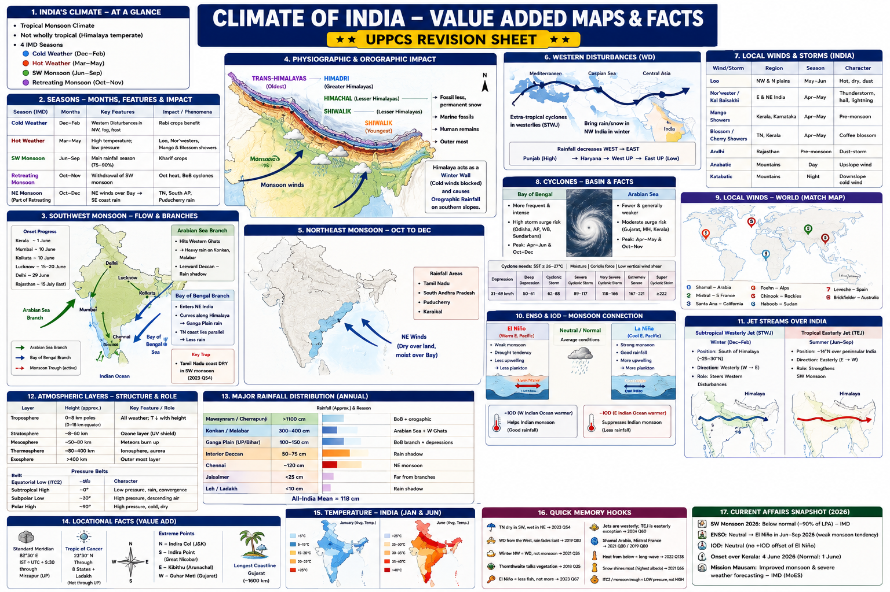

# Topic 2 — Climate of India

### ★ UPPCS Revision Sheet — Lucent / PW style (one home per fact · no repetition · Practice ≥25)

<details>
<summary><strong>Covers syllabus</strong> (click to expand)</summary>

**Climate Basics:** Climate of India | Factors Affecting Climate | Temperature Distribution | Effect of Altitude | Heat Budget | Temperature Inversion | Pressure & Wind System | Structure of Atmosphere | Pressure Belts | Planetary Winds | ITCZ
**Monsoon System:** Monsoon Mechanism | Southwest Monsoon | Northeast Monsoon | Retreating Monsoon | Indian Seasons | Western Disturbances
**Winds, Storms & Cyclones:** Local Winds | Local Storms | Katabatic Winds | Anabatic Winds | Loo | Mango Showers | Blossom Showers | Kalbaisakhi / Norwesters | Cyclones | Cyclone Naming System | Cyclone Basins (Bay of Bengal & Arabian Sea) | Thunderstorms
**Classification & Phenomena:** Köppen Climate Classification (India) | Thornthwaite Climate Classification | Jet Stream | Western Jet | Tropical Easterly Jet | ENSO | El Niño | La Niña | Indian Ocean Dipole (IOD)
</details>

> **Sources baked in:** NCERT Geography Class 11 (Ch 4–5), Class 12 climatology, UPPCS Prelims PYQs 2018–2025  
> **Exam weight:** ★★★ — monsoon traps, Western Disturbances, jets, El Niño, local winds, cyclone names  
> **Last verified:** August 2026  
> **Current Affairs:** IMD 2026 SW monsoon **below normal (~90% LPA)**; ENSO shifting toward **El Niño**; IOD **neutral** (no +IOD offset)

---

## Quick Revision — Spine Only

```
INDIA = tropical monsoon (not wholly tropical) | Himalaya = winter wall + orographic rain
SEASONS (IMD): Cold Dec–Feb (WD in NW) | Hot Mar–May (Loo, Nor'westers, mango/blossom)
 SW monsoon Jun–Sep (75–90% rain) | Retreating Oct–Nov (Oct heat, BoB cyclones) + NE monsoon on SE coast
SW MONSOON: ITCZ north → thermal low NW India → two branches
 Arabian Sea → W Ghats wet / leeward dry | BoB → NE + Ganga plain
 TN SE coast DRY in SW (parallel to BoB branch + rain shadow of Arabian Sea branch) — 2023 Q54
 Onset: Kerala ~1 Jun | Mumbai/Kolkata ~10 Jun | Delhi ~29 Jun | Rajasthan last (~15 Jul)
NE MONSOON Oct–Dec = TN, south AP, Puducherry only | NOT all-India winter rain
WD = Mediterranean extra-tropical; winter NW rain; decreases WEST→EAST — NOT retreating monsoon
LOCAL: Loo = hot dry plains May–Jun | Kal Baisakhi = E/NE thunderstorms Apr–May
 Mango = KL/KA | Blossom = coffee TN/KL | Anabatic day-up | Katabatic night-down
 Shamal ≠ Austria (Arabia) | Mistral ≠ Australia (S France)
 Sirocco = Sahara→Med | Bora = Adriatic cold | Harmattan = W Africa NOT E Africa
 Khamsin = Egypt | Zonda = Andes AR | Samun = Kurdistan | Willy-willy = cyclone NOT Brickfielder
CYCLONES: BoB > Arabian Sea | SST ≥26–27 °C | not on equator
 Hurricane USA | Typhoon/Taifu China–Japan | Baguio Philippines | Willy-willies Australia
JETS: mid-latitude jets = WESTERLY (2024 Q60 A false) | STWJ winter S of Himalaya (WD)
 TEJ summer easterly ~14°N (SW monsoon)
ENSO: El Niño = warm Peru → weak monsoon + LESS plankton | La Niña → stronger monsoon
 +IOD helps India | −IOD hurts | 2026: El Niño developing, IOD neutral, monsoon below normal
HEAT: troposphere heated by LONG-WAVE terrestrial (not short-wave) | lapse ~6.5 °C/1000 m
 Albedo: fresh snow highest | RH ↓ as T ↑ | ozone UV shield = STRATOSPHERE
 Thornthwaite = "vegetation is true index of climate" — NOT Köppen
```

### Confused pairs

| A | B | Lock | Hindi |
|---|----|------|-------|
| SW monsoon | NE monsoon | Jun–Sep most of India vs Oct–Dec **SE coast only** | दक्षिण-पश्चिम / उत्तर-पूर्व मानसून |
| Retreating monsoon | Western Disturbance | Withdrawal/Oct heat vs winter extra-tropical NW rain | लौटता मानसून / पश्चिमी विक्षोभ |
| Loo | Nor'wester | Sustained hot dry wind vs violent pre-monsoon thunderstorm | लू / काल बैसाखी |
| Anabatic | Katabatic | Day upslope vs night downslope | आरोही / अवरोही पवन |
| STWJ | TEJ | Winter westerly (WD) vs summer easterly (SW monsoon) | पश्चिमी जेट / उष्णकटिबंधीय पूर्वी जेट |
| El Niño | La Niña | Warm E Pacific, weak monsoon vs cool E Pacific, strong monsoon | अल नीनो / ला नीना |
| +IOD | −IOD | Helps Indian monsoon vs suppresses it | धनात्मक / ऋणात्मक IOD |
| Köppen | Thornthwaite | T+P letter codes vs moisture/vegetation index | कोपेन / थॉर्नथ्वेट |
| Absolute humidity | Relative humidity | Mass of vapour vs % of saturation (RH falls as T rises) | निरपेक्ष / सापेक्ष आर्द्रता |
| Willy-willy | Brickfielder | Australian **cyclone** vs Australian **hot local wind** | विली-विली / ब्रिकफील्डर |
| Bora | Chinook | Adriatic **cold** vs Rockies **warm dry** | बोरा / चिनूक |
| Harmattan | Khamsin | West Africa dust vs Egypt heat | हरमट्टन / खामसिन |

### Memory Tricks

| Trick | Remembers |
|-------|-----------|
| **TN dry in SW, wet in NE** | 2023 Q54 |
| **WD from the West, rain fades East** | 2019 Q83 |
| **Winter NW = WD, not monsoon** | 2021 Q36 |
| **Thornthwaite talks vegetation** | 2018 Q25 |
| **El Niño = less fish, not more** | 2023 Q67 |
| **Jets are westerly; TEJ is the easterly exception** | 2024 Q60 |
| **Shamal Arabia, Mistral France** | 2021 Q30 / 2019 Q80 |
| **Heat from below = long-wave** | 2022 Q138 |
| **Snow shines most** | albedo 2021 Q66 |

---

## 2.1 Climate Basics

India has a **monsoon climate**. Winds reverse seasonally. No single factor makes that climate.

Latitude places most of India in the tropical and subtropical belts. The Himalaya adds a cold-temperate belt in the north.

The Himalaya blocks cold Central Asian winds in winter. It also forces orographic rain on the southern slopes in the monsoon.

Coasts stay moderate because of the sea. The interior Deccan and north-west India have continental extremes.

The Western Ghats make the Konkan–Malabar windward slope wet. The Deccan to their east is in rain shadow.

Jet streams, ENSO, and IOD change monsoon strength from year to year. Those mechanisms are taught in the classification section below.

### Temperature and altitude

The normal lapse rate is about **6.5 °C per 1000 m**.

| Station | January (approx.) | Control |
|---------|-------------------|---------|
| Drass / Ladakh | −20 to −40 °C | Altitude plus continentality |
| **Agra** | about **16 °C** | Ganga plain — UPPCS 2022 Q22 |
| **Darjeeling (about 2000 m)** | about **4 °C** | Same latitude as Agra; **lapse rate** |
| Mumbai / Chennai | 24–26 °C | Maritime |
| Jaisalmer | 12–15 °C in January; 40–45 °C in June | Highest **diurnal** range among usual stations |

January is coldest in the north-west and the Himalaya. January is warmest in the far south.

June is hottest in north-west Rajasthan and Gujarat.

> **Exam note:** 2022 Q22 — Agra versus Darjeeling in January is true. Altitude / lapse rate **explains** it (both true, R explains A).

**PYQ — UPPCS Prelims 2022, Q22**

**Assertion (A):** Agra and Darjeeling are located on nearly the same latitude, but the temperature in January in Agra is about 16°C, whereas it is only 4°C in Darjeeling.

**Reason (R):** Temperature decreases with height due to thinner air compared to places in the plains.

A. (A) false, (R) true

B. (A) true, (R) false

C. Both true, R not the explanation of A

D. Both true and R is the correct explanation of A

<details>
<summary>Show answer</summary>

**Ans: D** — Same-latitude contrast is lapse-rate / altitude.
</details>

### Heat budget, albedo, humidity

The Sun sends **short-wave** radiation. The Earth re-emits **long-wave infrared**.

The troposphere is heated **from below** by long-wave terrestrial radiation plus sensible and latent heat. It is **not** heated mainly by incoming short-wave (2022 Q138).

Without the natural greenhouse effect, mean surface temperature would be about **−18 °C**. The actual mean is about **15 °C**.

| Surface | Albedo | Lock |
|---------|--------|------|
| **Fresh snow** | 80–90% | **Highest** among usual options — 2021 Q66 |
| Desert sand | 30–40% | Moderate |
| Prairie | 20–25% | — |
| Paddy / cropland | 10–20% | Lower |

**Absolute humidity** is the mass of water vapour in a given volume of air.

**Relative humidity** is actual vapour as a percentage of saturation. Relative humidity **falls when temperature rises**, because capacity rises even if moisture is unchanged.

In 2024 Q27, Assertion is true (RH falls as temperature rises). Reason is also true (absolute humidity can rise with evaporation). Reason does **not** explain Assertion.

> **Exam note:** 2022 Q138 answer = **long-wave terrestrial radiation**. 2021 Q66 = **fresh snow**. 2024 Q27 = both true, R **not** the explanation.

### Temperature inversion

Normally temperature **decreases** with height. In an inversion, temperature **increases** with height near the ground.

Clear, calm **winter nights** on the Indo-Gangetic plain create a radiation inversion. Fog and smog then trap over Delhi, Uttar Pradesh, and Bihar.

In Kashmir and Doon, cold air drains to the valley floor. The floor is then colder than the slopes.

Inversion **suppresses mixing**. Pollution stays near the ground.

### Pressure, wind, Coriolis

Wind blows from **high pressure toward low pressure**.

**Coriolis** deflects moving air to the **right in the Northern Hemisphere** and to the **left in the Southern Hemisphere** (2023 Q68).

In **summer**, a thermal **low** sits over north-west India. That low helps pull the south-west monsoon.

In **winter**, a thermal **high** sits over north-west India. Winds are then dry from the north-east and north-west.

The **monsoon trough** is a **low-pressure** axis along the Himalayan foot and the Ganga plain. Rain is **active** when the trough sits there.

A **break** monsoon occurs when the trough shifts onto the Himalaya. Central India then goes dry. The foothills stay wet.

> **Exam note:** 2023 Q68 — leftward deflection in the Southern Hemisphere is **Coriolis**, not temperature, pressure, or the magnetic field.

### Atmosphere, pressure belts, ITCZ

| Layer | Height | Lock |
|-------|--------|------|
| **Troposphere** | 0–8 km at poles / 0–18 km at the equator | **All weather**; temperature falls with height |
| Tropopause | Top of the troposphere | Jets fly near here |
| **Stratosphere** | to about 50 km | **Ozone UV shield** (2018 Q52, 2023 Q52, 2025 Q45) |
| Mesosphere | about 50–80 km | Meteors burn |
| Thermosphere | about 80–400 km | Ionosphere and aurora |
| Exosphere | outermost | Space |

| Belt | About | Lock |
|------|-------|------|
| Equatorial low / **ITCZ** | 0° | Convergence and rain; **shifts north over India in summer** |
| Subtropical high | 30° | Descending dry air; Thar and Sahara on west-coast margins |
| Subpolar low | 60° | Westerlies and extra-tropical cyclones |
| Polar high | 90° | Polar easterlies |

**Trade winds** blow from east to west in the tropics.

**Westerlies** blow from west to east between about 30° and 60°.

**Polar easterlies** blow out of the polar highs.

The ITCZ is an equatorial **low**. The monsoon trough is its summer continental arm over India.

El Niño years often keep convection over the central Pacific. The Indian ITCZ is then weaker.

> **Exam note:** Protective ozone sits in the **stratosphere**, not the troposphere. The ITCZ is a **low**, not a high. 2025 Q45: ozone blocks UV **and** depletion is linked to CFCs — both true.

---

## 2.2 Monsoon System

The monsoon is a seasonal reversal of wind. Land–sea heating, the **northward shift of the ITCZ**, and cross-equatorial flow all matter. The Himalaya helps. It is **not** the only cause.

Exams mix four systems. Do not treat them as one rain.

The **south-west monsoon** runs from June to September.

The **retreating monsoon** runs from September to November.

The **north-east monsoon** runs from October to December on the **south-east coast only**.

**Western Disturbances** bring winter rain to the north-west. They are **not** a monsoon.

### Southwest monsoon

The south-west monsoon lasts from **June to September**. It gives about **75–90%** of India’s annual rain.

IMD’s normal onset at **Kerala** is about **1 June**. The front then moves north at roughly ten days per degree of latitude.

| Place | Normal onset | Withdrawal (start) |
|-------|----------------|--------------------|
| Kerala | about 1 June | Extreme south last (December for NE rains) |
| Mumbai / Kolkata | about 10 June | Early October |
| Lucknow / eastern UP | about 15–20 June | Late September |
| Delhi | about **29 June** | Late September |
| Rajasthan | about **15 July** (last) | September |
| Chennai | South-west is **weak and dry** | North-east monsoon October–December |

The monsoon has **two branches**.

The **Arabian Sea branch** hits the Western Ghats. Konkan and Malabar are wet. The **leeward Deccan** is dry. Tamil Nadu also lies in this branch’s rain shadow.

The **Bay of Bengal branch** first soaks north-east India. It then curves along the Himalaya into the Ganga plain, Uttar Pradesh, and Bihar.

The Tamil Nadu coast lies **parallel** to the Bay branch. There is little orographic lift. That is why the Tamil Nadu coast stays **dry in the south-west monsoon** (2023 Q54).

The **burst** is the sudden heavy rain after May heat. Temperature then falls.

Rain is **active** when the trough sits over the Ganga plain.

A **break** occurs when the trough sits on the Himalaya. Central India then dries. The foothills stay wet.

Bay of Bengal monsoon depressions usually track west-north-west into Madhya Pradesh, Uttar Pradesh, and Rajasthan.

> **Exam note:** 2023 Q54 — Tamil Nadu coast is **dry in the south-west monsoon**. The reason (parallel to the Bay branch plus Arabian Sea rain shadow) **explains** the assertion.

**PYQ — UPPCS Prelims 2023, Q54**

**Assertion (A):** The Tamil Nadu coast remains dry during the South-West monsoon season.

**Reason (R):** The Tamil Nadu coast is situated parallel to the Bay of Bengal branch of the South-West monsoon and it lies in the rain shadow area of the Arabian Sea branch of the South-West monsoon during the monsoon season.

A. (A) true, (R) false

B. (A) false, (R) true

C. Both true, R not the explanation

D. Both true and R is the correct explanation

<details>
<summary>Show answer</summary>

**Ans: D** — Orientation + rain shadow = TN SW-monsoon dryness.
</details>

| Zone | Rain (approx.) | Why |
|------|----------------|-----|
| Mawsynram / Cherrapunji | more than 1100 cm | Bay branch plus orography |
| Konkan / Goa | 300–400 cm | Arabian Sea plus Western Ghats |
| Ganga plain (UP / Bihar) | 100–150 cm | Bay branch plus depressions |
| Interior Deccan | 50–75 cm | Rain shadow |
| Chennai | about 120 cm, **mostly north-east monsoon** | South-west is dry |
| Jaisalmer | less than 25 cm | Far from both branches |
| Leh / Ladakh | less than 10 cm | Himalayan rain shadow |

All-India mean rainfall is about **118 cm**.

India’s tropical monsoon belt allows **kharif, rabi, and zaid**. That statement in 2024 Q73 is true. The claim that India has the highest cultivated area versus the USA, China, and Japan is false.

### Northeast monsoon and retreating monsoon

The **retreating south-west monsoon** runs from September to November. Winds withdraw. **October heat** returns. **Bay of Bengal cyclones** peak.

The **north-east monsoon** runs from October to December. Winds blow north-east to south-west. They pick up Bay moisture. Rain falls on **Tamil Nadu, south Andhra Pradesh, Puducherry, and Karaikal only**.

The rest of India is dry in this season.

The Coromandel coast gets about **half** its annual rain from the north-east monsoon.

Mumbai and Gujarat lose the south-west rains. The north-east monsoon does not reach them. October–November is therefore dry there.

### Indian seasons (IMD)

| Season | Months | Match |
|--------|--------|-------|
| Cold weather | December–February | Western Disturbance rain and snow in the north-west; fog and frost on the plains |
| Hot weather | March–May | **Loo**; Nor’westers; mango and blossom showers |
| South-west monsoon | June–September | Main rain; **Tamil Nadu south-east coast stays dry** |
| Retreating | October–November | Withdrawal; October heat; Bay cyclones; north-east monsoon starts on the south-east coast |

### Western Disturbances

Western Disturbances are **extra-tropical** cyclones. They travel in the **subtropical westerly jet** from the Mediterranean–Caspian–Atlantic region.

They peak in **winter (November–February)**. They bring rain and snow to Punjab, Haryana, Himachal, Jammu and Kashmir, Uttarakhand, western Uttar Pradesh, and northern Rajasthan.

They help **rabi wheat**. They also bring hail, fog, and avalanche risk.

Intensity **decreases from west to east**. Punjab is wetter than eastern Uttar Pradesh (2019 Q83).

They are **not** the retreating monsoon. They are **not** the south-west monsoon. They are **not** Bay of Bengal depressions (2021 Q36).

> **Exam note:** Winter north-west rain = **Western Disturbances**. The rainfall gradient is **west to east**.

---

## 2.3 Winds, Storms and Cyclones

### Local winds and storms of India

The **Loo** is a hot, dry, dusty wind on the plains of Rajasthan, Punjab, Haryana, Uttar Pradesh, and Bihar in **May–June**. It is a heat-wave wind. It is **not** a thunderstorm.

The **Nor’wester / Kal Baisakhi** is a violent **pre-monsoon thunderstorm** over West Bengal, Assam, Odisha, Bihar, and Jharkhand in **April–May**. It brings hail and lightning.

**Mango showers** are pre-monsoon rains of **April–May** in **Kerala and Karnataka**. They help mangoes ripen.

**Blossom / cherry showers** are pre-monsoon rains of **April–May** in the coffee belt of **Tamil Nadu and Kerala**. They help coffee flower.

**Andhi** is a pre-monsoon dust-storm wall of Rajasthan.

The **sea breeze** blows onshore by day. The **land breeze** blows offshore by night.

An **anabatic** wind is a **daytime upslope** wind on mountain slopes.

A **katabatic** wind is a **night-time downslope** drainage of cold air into valleys. Frost then sits on the valley floor.

**Foehn** and **Chinook** are **warm, dry** downslope winds after air has crossed a mountain. They are world cousins of a special warming downslope, not the cold katabatic of a Himalayan valley night.

**Elephanta** is a Malabar (Kerala) wind of about **September**. It marks the fading of the south-west monsoon and can bring rough seas.

| Name | Region | Season | Character |
|------|--------|--------|-----------|
| **Loo** | RJ, PB, HR, UP, Bihar plains | May–June | Hot, dry, dust; heat-wave; **not** a thunderstorm |
| **Nor’wester / Kal Baisakhi** | WB, Assam, Odisha, Bihar, Jharkhand | April–May | Violent **thunderstorm**; hail, lightning |
| **Mango showers** | **Kerala, Karnataka** | April–May | Pre-monsoon; mango ripening |
| **Blossom / cherry showers** | TN, Kerala (coffee belt) | April–May | Coffee flowering |
| **Andhi** | Rajasthan | Pre-monsoon | Dust-storm wall |
| **Elephanta** | Malabar / Kerala | About September | End of SW monsoon; rough sea |
| Sea / land breeze | Coasts | Daily | Onshore by day; offshore by night |
| **Anabatic** | Mountain slopes | **Day** | **Upslope** |
| **Katabatic** | Valleys | **Night** | **Downslope** cold drainage |

### World local winds (full match map)

UPPCS has already asked Mistral, Shamal, Chinook, Foehn, Santa Ana, Haboob, Brickfielder, Leveche, Black roller, and Yamo. Next year’s paper can still pick **Sirocco, Bora, Harmattan, Khamsin, Zonda, Samun**, or a Willy-willy trap. Teach the **whole coaching set**, not only the asked names.

Local winds are short-lived and near the ground. Group them by **family**, then lock the region.

**Warm and dry after crossing a mountain (Foehn family)**

The **Foehn (Föhn)** is the Alpine warm, dry downslope. It can melt snow and help grapes ripen.

The **Chinook** is the Rockies twin. It is warm **and dry**. Ranchers call it the **snow eater**.

The **Zonda** is the same family on the eastern Andes in **Argentina**.

The **Berg** wind is the South African cousin.

The **Santa Ana** is the hot, dry California downslope.

New Zealand’s **Nor’wester** (Canterbury) is a foehn-type wind. It is **not** the Indian Kal Baisakhi thunderstorm.

**Cold downslope / outbreak winds**

The **Mistral** is a cold, dry blast down the **Rhône** in southern **France**, funnelled between the Alps and the Massif Central. It is **not** Australian (2019 Q80).

The **Bora** is the cold north-easterly cousin on the **Adriatic** (Italy–Croatia).

The **Tramontane** is a cold north wind of southern France and the western Mediterranean.

The **Gregale** is a cold north-east wind around **Malta**.

The **Pampero** is a cold outbreak on the Argentine pampas.

The **Buran / Purga** is a Siberian blizzard-type wind.

The **Norte** is a cold outbreak into Mexico and the Gulf.

**Hot, dusty desert winds**

The **Sirocco** is a hot, dusty Saharan wind that crosses into the **Mediterranean** and southern Europe. It can raise “blood rain” from red dust.

The **Khamsin** is Egypt’s sirocco cousin (about fifty days of spring heat).

The **Ghibli** is the Libyan name. The **Chili** is the Tunisian name. The **Leveche** is the Spanish name (2021 correct pair).

The **Shamal** is a dusty north-westerly of **Arabia and the Persian Gulf**. It is **not** Austrian (2021 Q30).

The **Simoom** is a scorching Arabian desert wind.

The **Harmattan** is a dry, dusty winter wind from the Sahara over **West Africa** and the Gulf of Guinea. It is **not** an East African coast wind.

The **Samun** is a hot wind of **Kurdistan / Iran** (UPSC 2001-type match).

The **Brickfielder** is a hot wind of **Australia**.

The **Black roller** is a dusty North American plains wind.

The **Haboob** is a dust-wall storm of **Sudan** and the wider Sahara.

The **Karaburan** (“black storm”) is a dusty Central Asian wind.

The **Loo** is the north-Indian plains member of this hot family. It lives in the India table above.

**Other named winds used in match lists**

The **Levanter** is an easterly through the Strait of **Gibraltar**.

The **Etesian / Meltemi** is a summer northerly of the **Aegean**.

The **Yamo** is a Japanese local wind (2019 correct pair).

The **Cape Doctor** is a south-easter at Cape Town.

The **Williwaw** is a violent squall of Alaska / Magellan.

**Do not mix cyclone names into this list**

**Willy-willy** is an Australian **tropical cyclone**. It is **not** a local wind like the Brickfielder.

Hurricane, typhoon, taifu, and baguio are **synoptic storms**. They belong in the cyclone-naming table below.

| Family | Wind | Region | Exam trap |
|--------|------|--------|-----------|
| Warm dry downslope | **Foehn** | Alps | Not Australia |
| Warm dry downslope | **Chinook** | Rockies | Not a cold wind |
| Warm dry downslope | **Zonda** | Andes, Argentina | Not Alps |
| Warm dry downslope | **Santa Ana** | California | Not Spain |
| Warm dry downslope | **Berg** | South Africa | — |
| Cold | **Mistral** | S France, Rhône | **Not Australia** |
| Cold | **Bora** | Adriatic | Not Chinook |
| Cold | **Pampero** | Argentina | — |
| Cold | **Buran / Purga** | Siberia | — |
| Hot dusty | **Sirocco** | Sahara → Mediterranean | — |
| Hot dusty | **Khamsin** | Egypt | Not Australia |
| Hot dusty | **Shamal** | Arabia / Gulf | **Not Austria** |
| Hot dusty | **Harmattan** | **West** Africa | Not East Africa |
| Hot dusty | **Samun** | Kurdistan | — |
| Hot dusty | **Leveche** | Spain | — |
| Hot dusty | **Ghibli** | Libya | — |
| Hot dusty | **Brickfielder** | Australia | Not Mistral |
| Hot dusty | **Haboob** | Sudan | — |
| Hot dusty | **Black roller** | North America | — |
| Other | **Yamo** | Japan | — |
| Other | **Levanter** | Gibraltar | — |
| Not a local wind | **Willy-willy** | Australia | Cyclone, not Brickfielder |

> **Exam note:** 2024 Q33 — Chinook is warm and dry **and** Foehn is in the Alps. 2019 Q80 — Mistral is France. 2021 Q30 — Shamal is Arabia. Harmattan is **West** Africa. Willy-willy is a **cyclone**.

### Tropical cyclones

A tropical cyclone needs sea-surface temperature of about **26–27 °C or more**. It also needs moisture, **Coriolis**, and low vertical shear.

Coriolis is too weak on the equator. Typical genesis is between about **5° and 30°**.

Peaks are **pre-monsoon (May–June)** and **post-monsoon (October–December)**. Strong south-west-monsoon shear suppresses Bay cyclones in July–September.

The **Bay of Bengal** has **more and stronger** cyclones than the Arabian Sea. The Bay has a warm, shallow shelf and river freshwater. Storm surge risk is very high on Odisha, Andhra Pradesh, West Bengal, and the Sundarbans.

The **Arabian Sea** has fewer, generally weaker storms. Salinity is higher and the fetch is narrower. Gujarat, Maharashtra, and Kerala still take hits.

| IMD class | Wind (km/h) |
|-----------|-------------|
| Depression | 31–49 |
| Deep depression | 50–61 |
| Cyclonic storm | 62–88 |
| Severe cyclonic storm | 89–117 |
| Very severe | 118–166 |
| Extremely severe | 167–221 |
| **Super cyclone** | **222 or more** |

A **thunderstorm** is local convection lasting hours. A **cyclone** is a synoptic ocean storm lasting days. A Nor’wester is **not** a cyclone.

### Cyclone naming

The **WMO/ESCAP** panel agrees the name lists. **RSMC New Delhi (IMD)** assigns names in the north Indian Ocean.

Devastating names are **retired**. India has contributed names such as **Amphan**.

**Yaas** is another retired Indian-Ocean name.

**Fani** is another.

**Vayu** is another.

**Nisarga** is another.

| Local name | Country / basin |
|------------|-----------------|
| **Hurricane** | USA / Atlantic |
| **Typhoon / Taifu** | NW Pacific — **China / Japan** |
| **Baguio / Baguios** | **Philippines** |
| **Willy-willies** | **Australia** |

> **Exam note:** 2019 Q78 code **2 3 1 4** (Willy-willies–Australia, Taifu–Japan, Baguio–Philippines, Hurricanes–USA). 2020 Q74 code **3 4 2 1** (Baguios–Philippines, Hurricanes–USA, Typhoons–China, Willy-willies–Australia).

---

## 2.4 Classification and ocean–atmosphere phenomena

### Köppen (India) versus Thornthwaite

Köppen classifies climate by **temperature and precipitation letter codes**.

Thornthwaite classifies by **moisture balance** (precipitation minus potential evapotranspiration).

The exam quote **“Vegetation is the true index of climate”** belongs to **Thornthwaite** (2018 Q25). Do not credit it to Köppen, Trewartha, or Stamp.

Trewartha is a **modified Köppen**, not Thornthwaite.

India is **not** all **Am**. The interior Deccan is **Aw**. The Thar is **BWh**. The Tamil Nadu coast is often mapped as **As** because its dry season is the south-west-monsoon **summer**.

| Code | Type | India |
|------|------|-------|
| **Am** | Tropical monsoon | Kerala / Konkan, north-east (Cherrapunji) |
| **Aw** | Tropical savanna | Interior Deccan |
| **As** | Monsoon with dry **summer** | **Tamil Nadu / Coromandel** (rain in NE monsoon) |
| **BWh** | Hot desert | **Thar**, Kutch |
| **BSh** | Semi-arid | Punjab, Haryana, Gujarat, rain-shadow Deccan |
| **Cwg** | Monsoon with dry winter | **Indo-Gangetic plain** (Lucknow, Delhi, Patna) |
| **H** | Highland | Himalayan slopes |
| **E** | Polar / tundra | Highest snow zones only |

### Jet streams

Mid-latitude jet streams are **westerlies**. They blow west to east in the upper troposphere. Speeds of **300–500 km/h** are typical. They were noticed widely in **World War II**.

Calling jet streams generally **easterly** is **false** (2024 Q60). The **Tropical Easterly Jet** is the summer exception, not the rule.

The **polar front jet** is the high-latitude westerly jet along the polar front. The **subtropical westerly jet** is the lower-latitude branch that winters south of the Himalaya. Both are **westerly**. Do not call either “the easterly jet.”

The **subtropical westerly jet (STWJ)** is a **winter** jet south of the Himalaya (about 25–30° N). It is **westerly**. It steers **Western Disturbances**. In summer it shifts **north of Tibet**.

The **Tropical Easterly Jet (TEJ)** is a **summer** jet near **14° N** over the peninsula. It is **easterly**. A strong TEJ supports the **south-west monsoon**. It sets up after the STWJ has moved north of Tibet.

**PYQ — UPPCS Prelims 2024, Q60**

**Assertion (A):** Jet streams discovered during World War II are high altitude easterly winds.

**Reason (R):** Jet streams flow with a speed of 300–500 km/hour.

A. Both true and R explains A

B. (A) false, (R) true

C. Both true, R not explanation

D. (A) true, (R) false

<details>
<summary>Show answer</summary>

**Ans: B** — General jets are **westerly**. Speed is plausible; it does not save A. TEJ is a summer exception, not the rule.
</details>

### ENSO and IOD

**El Niño** is a warm current **off Peru** in the eastern Pacific. It **tends** to weaken the Indian monsoon.

Warm El Niño water **cuts upwelling**. **Plankton and fish fall**. They do **not** increase (2023 Q67 statement 2 is false).

**La Niña** is a cool eastern Pacific. It **tends** to strengthen the Indian monsoon.

A **positive IOD** means the western Indian Ocean is warmer than the east. It **helps** the Indian monsoon. It can offset an El Niño.

A **negative IOD** means the eastern Indian Ocean is warmer. It **suppresses** the Indian monsoon. It can worsen an El Niño drought.

There is **no one-to-one** drought rule. 2019 had El Niño plus a **positive IOD** and finished near normal.

The **Southern Oscillation** is the Darwin–Tahiti pressure seesaw.

**PYQ — UPPCS Prelims 2023, Q67**

With reference to El Niño, which of the following statements is/are correct?

1. El Niño involves the appearance of a warm current off the coast of Peru in the eastern Pacific.
2. This warm current increases the temperature of water on the Peruvian coast by about 10°C, thereby increasing the amount of plankton in the sea.

A. Only 1

B. Only 2

C. Both 1 and 2

D. Neither 1 nor 2

<details>
<summary>Show answer</summary>

**Ans: A** — Warm El Niño water **reduces** plankton. C is the classic trap.
</details>

---

## Consolidated Reference — Once Only

### UP Focus

The **Loo** brings May–June heat waves on the Uttar Pradesh plains.

Winter rain and fog on the UP plains come from **Western Disturbances**. **Western UP is wetter than eastern UP**.

Monsoon rain on the Ganga plain is often from **Bay of Bengal depressions**. An active spell needs the trough over the plain.

Most of the UP plain is Köppen **Cwg**.

Pre-monsoon **lightning** and winter **inversion smog** (west UP / NCR fringe) are the usual climate hazards.

### Rainfall extremes (once)

**Mawsynram** and **Cherrapunji** are the wettest class stations.

**Jaisalmer** and **Leh** are the driest class stations.

**Chennai** depends on the **north-east monsoon**.

---

## Practice Zone — UPPCS Format Questions

> **Answers hidden** — click *Show answer* under each question to reveal.  
> **Format mix:** 55 questions — mix of multi-statement, A/R, match, NOT-matched, and direct recall

**Q1.** With reference to the climate of India, which of the following statements is/are correct?

1. The Himalayas block cold Siberian winds from entering the subcontinent in winter.
2. Tamil Nadu coast receives heavy rainfall during the southwest monsoon season.
3. India lies entirely in the tropical zone.

Select the correct answer from the code given below:

A. 1 only

B. 2 only

C. 1 and 3 only

D. 1, 2 and 3

<details>
<summary>Show answer</summary>

**Ans: A** — (1) correct. **(2) false:** TN SE coast is dry in SW monsoon (rain shadow + parallel to BoB branch); NE monsoon brings TN rain. **(3) false:** India extends to 37°6′ N — subtropical north. **C/D** accept false TN monsoon or tropical-only claim.
</details>

**Q2.** Given below are two statements, one labelled as Assertion (A) and the other as Reason (R):

**Assertion (A):** The Tamil Nadu coast remains dry during the South-West monsoon season.

**Reason (R):** The Tamil Nadu coast is situated parallel to the Bay of Bengal branch of the South-West monsoon and lies in the rain shadow area of the Arabian Sea branch.

Select the correct answer from the code given below:

A. Both (A) and (R) are true and (R) is the correct explanation of (A)

B. Both (A) and (R) are true, but (R) is not the correct explanation of (A)

C. (A) is true, but (R) is false

D. (A) is false, but (R) is true

<details>
<summary>Show answer</summary>

**Ans: A** — UPPCS 2023 Q54 pattern: both true; parallel + rain shadow explains TN dryness in SW monsoon. **B** denies causal link. **C/D** falsify correct monsoon geography.
</details>

**Q3.** Which one of the following causes is responsible for rainfall during winters in the north-western part of India?

A. Retreating Monsoon

B. Cyclonic depression in Bay of Bengal

C. Western disturbances

D. South-West Monsoon

<details>
<summary>Show answer</summary>

**Ans: C** — UPPCS 2021 Q36: WD from Mediterranean westerlies. **A/D** are summer/wet-season systems. **B** affects east coast, not primary NW winter rain.
</details>

**Q4.** Match **List-I** with **List-II**:

| List-I (Local Wind/Storm) | List-II (Region/Character) |
|---|---|
| A. Loo | 1. Pre-monsoon thunderstorm, West Bengal |
| B. Nor'wester | 2. Hot dry wind, Indo-Gangetic plains, May–June |
| C. Mango shower | 3. Warm dry downslope, Alps |
| D. Foehn | 4. Pre-monsoon rain, Kerala/Karnataka |

A. 2 1 4 3

B. 1 2 3 4

C. 2 4 1 3

D. 4 2 1 3

<details>
<summary>Show answer</summary>

**Ans: A** — Loo-2, Nor'wester-1, Mango shower-4, Foehn-3. **B/C/D** swap Indian summer wind with European or storm types.
</details>

**Q5.** Given below are two statements, one labelled as Assertion (A) and the other as Reason (R):

**Assertion (A):** Agra and Darjeeling are located on nearly the same latitude, but the temperature in January in Agra is about 16°C whereas it is only 4°C in Darjeeling.

**Reason (R):** Temperature decreases with height due to thinner air compared to places in the plains.

Select the correct answer from the code given below:

A. (A) is false, but (R) is true

B. (A) is true, but (R) is false

C. Both (A) and (R) are true, but (R) is not the correct explanation of (A)

D. Both (A) and (R) are true and (R) is the correct explanation of (A)

<details>
<summary>Show answer</summary>

**Ans: D** — UPPCS 2022 Q22: lapse rate/altitude explains January contrast. **C** breaks altitude-temperature link. **A/B** deny true temperature facts.
</details>

**Q6.** With reference to El Niño, which of the following statements is/are correct?

1. El Niño involves the appearance of a warm current off the coast of Peru in the eastern Pacific.
2. This warm current increases the temperature of water on the Peruvian coast by about 10°C, thereby increasing the amount of plankton in the sea.

Select the correct answer from the code given below:

A. Only 1

B. Only 2

C. Both 1 and 2

D. Neither 1 nor 2

<details>
<summary>Show answer</summary>

**Ans: A** — UPPCS 2023 Q67: (1) correct. **(2) false:** warm water **suppresses** upwelling → **less** plankton/fish. **C/D** accept the plankton-increase trap.
</details>

**Q7.** Which of the following pairs is/are **NOT** correctly matched?
(Wind) — (Country/Region)

1. Shamal — Austria
2. Mistral — France
3. Santa Ana — California
4. Haboob — Sudan

Select the correct answer from the code given below:

A. Only 1

B. Only 1 and 4

C. Only 2 and 3

D. Only 3 and 4

<details>
<summary>Show answer</summary>

**Ans: A** — UPPCS 2021 Q30 / 2019 Q80 pattern: Shamal = Arabia/Gulf, NOT Austria. (2), (3), (4) correct. **B/C/D** wrongly flag Mistral, Santa Ana, or Haboob.
</details>

**Q8.** Match **List-I** with **List-II** (Tropical cyclone local names):

| List-I (Name) | List-II (Country/Region) |
|---|---|
| A. Hurricane | 1. Australia |
| B. Willy-willies | 2. United States of America |
| C. Typhoon | 3. Japan / NW Pacific |
| D. Cyclone (generic) | 4. Indian Ocean |

A. 2 1 3 4

B. 1 2 4 3

C. 3 2 1 4

D. 2 3 1 4

<details>
<summary>Show answer</summary>

**Ans: A** — Hurricane-USA(2), Willy-willies-Australia(1), Typhoon-Japan/NW Pacific(3), Cyclone-Indian Ocean(4). **C/D** swap Australia-USA pairings from 2020 Q74 trap.
</details>

**Q9.** With reference to the southwest monsoon in India, which of the following statements is/are correct?

1. It brings approximately 75–90% of India's annual rainfall.
2. The Arabian Sea and Bay of Bengal branches merge over the northern plains.
3. The northeast monsoon is responsible for winter rainfall in Tamil Nadu.

Select the correct answer from the code given below:

A. 1 and 2 only

B. 2 and 3 only

C. 1 and 3 only

D. 1, 2 and 3

<details>
<summary>Show answer</summary>

**Ans: D** — All three correct: SW monsoon dominance; branches supply north/central India; **NE monsoon** (not SW) gives TN winter rain — statement 3 correctly attributes TN rain to NE monsoon. **A** drops TN monsoon fact.
</details>

**Q10.** Given below are two statements, one labelled as Assertion (A) and the other as Reason (R):

**Assertion (A):** Jet streams discovered during World War II are high altitude easterly winds.

**Reason (R):** Jet streams flow with a speed of 300–500 km/hour.

Select the correct answer from the code given below:

A. Both (A) and (R) are true and (R) is the correct explanation of (A)

B. (A) is false, but (R) is true

C. Both (A) and (R) are true, but (R) is not the correct explanation of (A)

D. (A) is true, but (R) is false

<details>
<summary>Show answer</summary>

**Ans: B** — UPPCS 2024 Q60: mid-latitude jets are **westerly** (Assertion false); speed range in Reason true but irrelevant. **A/C** accept false "easterly" generalisation.
</details>

**Q11.** The winter rains caused by Western disturbance in the North-Western Plain of India gradually decrease from:

A. East to West

B. West to East

C. North to South

D. South to North

<details>
<summary>Show answer</summary>

**Ans: B** — UPPCS 2019 Q83: Punjab/Haryana (west) get more WD rain than east UP. **A** reverses gradient. **C/D** wrong directional logic.
</details>

**Q12.** With reference to Indian seasons (IMD), which of the following statements is/are correct?

1. The hot weather season is associated with Loo winds in the northern plains.
2. The retreating monsoon season sees cyclogenesis in the Bay of Bengal.
3. The cold weather season receives WD rainfall in Punjab and Haryana.

Select the correct answer from the code given below:

A. 1 and 2 only

B. 2 and 3 only

C. 1 and 3 only

D. 1, 2 and 3

<details>
<summary>Show answer</summary>

**Ans: D** — All three season-phenomenon links correct. **A/B/C** each omit one valid pairing.
</details>

**Q13.** Match **List-I** with **List-II** (Köppen climate types in India):

| List-I (Code) | List-II (Indian Region) |
|---|---|
| A. BWh | 1. Indo-Gangetic plain (Lucknow, Patna) |
| B. Cwg | 2. Western Rajasthan (Thar) |
| C. Am | 3. Kerala coast / Cherrapunji |
| D. Aw | 4. Interior Deccan (Maharashtra plateau) |

A. 2 1 3 4

B. 1 2 4 3

C. 2 1 4 3

D. 3 4 2 1

<details>
<summary>Show answer</summary>

**Ans: A** — BWh-2 (desert), Cwg-1 (plain), Am-3 (wet monsoon coast), Aw-4 (savanna interior). **B/C** swap desert and plain codes.
</details>

**Q14.** Given below are two statements, one labelled as Assertion (A) and the other as Reason (R):

**Assertion (A):** Relative humidity decreases with increasing air temperature.

**Reason (R):** Absolute humidity increases with increasing evaporation.

Select the correct answer from the code given below:

A. Both (A) and (R) are true, but (R) is not the correct explanation of (A)

B. (A) is false, but (R) is true

C. Both (A) and (R) are true and (R) is the correct explanation of (A)

D. (A) is true, but (R) is false

<details>
<summary>Show answer</summary>

**Ans: A** — UPPCS 2024 Q27: RH falls when temperature rises (same moisture, higher capacity); Reason about evaporation/absolute humidity is independently true but doesn't explain RH-temperature inverse relation. **C** overstates causal link.
</details>

**Q15.** Which of the following pairs is/are **NOT** correctly matched?
(Phenomenon) — (Explanation)

1. TEJ — Summer easterly jet over peninsular India driving SW monsoon
2. STWJ — Winter westerly jet steering Western Disturbances
3. +IOD — Suppresses Indian monsoon rainfall
4. La Niña — Tendency for above-normal monsoon in India

Select the correct answer from the code given below:

A. Only 3

B. Only 1 and 3

C. Only 2 and 4

D. Only 1, 2 and 3

<details>
<summary>Show answer</summary>

**Ans: A** — Only (3) wrong: **+IOD helps** monsoon; **−IOD** suppresses. (1), (2), (4) correct. **B/C/D** wrongly flag TEJ, STWJ, or La Niña.
</details>

**Q16.** 'Vegetation is the true index of climate'. This statement is associated with:

A. Thornthwaite

B. Köppen

C. Trewartha

D. Stamp

<details>
<summary>Show answer</summary>

**Ans: A** — UPPCS 2018 Q25: Thornthwaite moisture/vegetation approach. **B** = temperature-rainfall boundaries. **C** = modified Köppen.
</details>

**Q17.** With reference to tropical cyclones affecting India, which of the following statements is/are correct?

1. The Bay of Bengal generates more cyclones than the Arabian Sea.
2. Post-monsoon (Oct–Dec) is a peak cyclone season for the east coast.
3. Tropical cyclones cannot form over the equator due to negligible Coriolis force.

Select the correct answer from the code given below:

A. 1 and 2 only

B. 2 and 3 only

C. 1 and 3 only

D. 1, 2 and 3

<details>
<summary>Show answer</summary>

**Ans: D** — All three standard cyclone facts. **A** drops Coriolis constraint. **B** drops BoB frequency fact.
</details>

**Q18.** Match **List-I** with **List-II**:

| List-I (Jet Stream) | List-II (Season/Role) |
|---|---|
| A. Subtropical Westerly Jet | 1. Summer; ~14° N over India; easterly |
| B. Tropical Easterly Jet | 2. Winter; south of Himalaya; carries WD |
| C. Somali Jet | 3. Cross-equatorial flow feeding SW monsoon |
| D. Polar Front Jet | 4. Mid-latitude westerlies (world reference) |

A. 2 1 3 4

B. 1 2 3 4

C. 2 3 1 4

D. 4 2 1 3

<details>
<summary>Show answer</summary>

**Ans: A** — STWJ-2, TEJ-1, Somali-3, Polar Front-4. **B** swaps STWJ and TEJ season/role — common trap.
</details>

**Q19.** Given below are two statements, one labelled as Assertion (A) and the other as Reason (R):

**Assertion (A):** The Earth's atmosphere is mainly heated by long-wave terrestrial radiation.

**Reason (R):** Greenhouse gases absorb long-wave radiation emitted by the Earth's surface.

Select the correct answer from the code given below:

A. Both (A) and (R) are true and (R) is the correct explanation of (A)

B. Both (A) and (R) are true, but (R) is not the correct explanation of (A)

C. (A) is true, but (R) is false

D. (A) is false, but (R) is true

<details>
<summary>Show answer</summary>

**Ans: A** — UPPCS 2022 Q138 + greenhouse mechanism: troposphere heated from below via long-wave absorption. **B** denies GHG link. **D** rejects correct Assertion.
</details>

**Q20.** Which one of the following reflects back more sunlight as compared to the other three?

A. Sand desert

B. Paddy crop land

C. Land covered with fresh snow

D. Prairie land

<details>
<summary>Show answer</summary>

**Ans: C** — UPPCS 2021 Q66: fresh snow highest albedo (~80–90%). **A** moderate. **B/D** lower reflectivity.
</details>

**Q21.** With reference to the ITCZ and monsoon, which of the following statements is/are correct?

1. ITCZ shifts north over India during the summer monsoon season.
2. A southward-positioned ITCZ during summer correlates with weak monsoon conditions.
3. ITCZ is a high-pressure belt where air sinks.

Select the correct answer from the code given below:

A. 1 and 2 only

B. 2 and 3 only

C. 1 and 3 only

D. 1, 2 and 3

<details>
<summary>Show answer</summary>

**Ans: A** — (1) and (2) correct. **(3) false:** ITCZ = **low** pressure, rising air. **C/D** accept high-pressure trap.
</details>

**Q22.** Which of the following pairs is/are **NOT** correctly matched?
(Storm/Shower) — (Region)

1. Kal Baisakhi — West Bengal / Assam
2. Blossom showers — Tamil Nadu / Kerala
3. Mango showers — Punjab / Haryana
4. Nor'westers — Eastern India pre-monsoon

Select the correct answer from the code given below:

A. Only 3

B. Only 1 and 3

C. Only 2 and 4

D. Only 3 and 4

<details>
<summary>Show answer</summary>

**Ans: A** — Mango showers = **Kerala/Karnataka**, not Punjab/Haryana. (1), (2), (4) correct. **B** wrongly flags Kal Baisakhi.
</details>

**Q23.** Match **List-I** with **List-II**:

| List-I (Atmospheric Layer) | List-II (Feature) |
|---|---|
| A. Troposphere | 1. Ozone absorbs UV radiation |
| B. Stratosphere | 2. All weather phenomena |
| C. Mesosphere | 3. Meteors burn up |
| D. Thermosphere | 4. Ionosphere; very high temperature |

A. 2 1 3 4

B. 1 2 3 4

C. 2 3 1 4

D. 3 2 4 1

<details>
<summary>Show answer</summary>

**Ans: A** — Troposphere-2, Stratosphere-1 (ozone — UPPCS 2023 Q52), Mesosphere-3, Thermosphere-4. **B** puts ozone in troposphere trap.
</details>

**Q24.** Given below are two statements, one labelled as Assertion (A) and the other as Reason (R):

**Assertion (A):** Anabatic winds blow upslope during the day.

**Reason (R):** Katabatic winds are cold dense downslope winds at night.

Select the correct answer from the code given below:

A. Both (A) and (R) are true and (R) is the correct explanation of (A)

B. Both (A) and (R) are true, but (R) is not the correct explanation of (A)

C. (A) is true, but (R) is false

D. (A) is false, but (R) is true

<details>
<summary>Show answer</summary>

**Ans: B** — Both definitions correct but describe **different** diurnal winds — R does not explain A. **A** wrongly links day/night opposites as cause-effect. **C/D** falsify valid wind definitions.
</details>

**Q25.** Consider the following statements:

1. Chinook is a warm and dry wind.
2. Foehn wind occurs in the Alps.
Which of the above statements is/are correct?

A. Both 1 and 2

B. Only 1

C. Only 2

D. Neither 1 nor 2

<details>
<summary>Show answer</summary>

**Ans: A** — UPPCS 2024 Q33 pattern: both correct world local wind facts (comparison for Indian exam). **B/C** drop one valid statement.
</details>

**Q26.** With reference to ENSO and Indian monsoon, which of the following statements is/are correct?

1. El Niño is generally associated with below-normal monsoon rainfall in India.
2. La Niña tends to strengthen the monsoon.
3. El Niño always causes drought in every part of India without exception.

Select the correct answer from the code given below:

A. 1 and 2 only

B. 2 and 3 only

C. 1 and 3 only

D. 1, 2 and 3

<details>
<summary>Show answer</summary>

**Ans: A** — (1) and (2) correct statistical tendencies. **(3) false:** "always" and "every part" — +IOD or regional variation can offset. **C/D** accept absolute drought claim.
</details>

**Q27.** Which one of the following is the correct sequence of **IMD seasons** in a calendar year starting from January?

A. Cold weather → Hot weather → SW Monsoon → Retreating monsoon

B. Hot weather → Cold weather → SW Monsoon → Retreating monsoon

C. Cold weather → SW Monsoon → Hot weather → Retreating monsoon

D. Cold weather → Hot weather → Retreating monsoon → SW Monsoon

<details>
<summary>Show answer</summary>

**Ans: A** — Dec–Feb cold; Mar–May hot; Jun–Sep SW; Oct–Nov retreating (sequence through calendar from Jan aligns cold first). **D** puts retreating before SW monsoon.
</details>

**Q28.** Match **List-I** with **List-II** (Pressure belts):

| List-I (Belt) | List-II (Approx. latitude) |
|---|---|
| A. Equatorial Low | 1. 60° N/S |
| B. Subtropical High | 2. 0° (ITCZ zone) |
| C. Subpolar Low | 3. 30° N/S |
| D. Polar High | 4. 90° N/S |

A. 2 3 1 4

B. 3 2 1 4

C. 2 1 3 4

D. 1 2 3 4

<details>
<summary>Show answer</summary>

**Ans: A** — Equatorial-2, Subtropical High-3, Subpolar-1, Polar-4. **B** swaps equatorial and subtropical highs.
</details>

**Q29.** With reference to temperature inversion in India, which of the following statements is/are correct?

1. Radiation inversion commonly occurs on clear winter nights in the Indo-Gangetic plain.
2. Inversion layers promote vertical mixing of pollutants.
3. Valley floors may be colder than surrounding slopes during inversion conditions.

Select the correct answer from the code given below:

A. 1 and 3 only

B. 2 and 3 only

C. 1 and 2 only

D. 1, 2 and 3

<details>
<summary>Show answer</summary>

**Ans: A** — (1) and (3) correct. **(2) false:** inversion **suppresses** vertical mixing → fog/smog trap. **C/D** accept false mixing claim.
</details>

**Q30.** Given below are two statements, one labelled as Assertion (A) and the other as Reason (R):

**Assertion (A):** The ozone layer, which absorbs ultraviolet radiation, exists in the stratosphere.

**Reason (R):** All weather phenomena occur in the stratosphere.

Select the correct answer from the code given below:

A. Both (A) and (R) are true and (R) is the correct explanation of (A)

B. (A) is true, but (R) is false

C. (A) is false, but (R) is true

D. Both (A) and (R) are true, but (R) is not the correct explanation of (A)

<details>
<summary>Show answer</summary>

**Ans: B** — UPPCS 2023 Q52: ozone in stratosphere ✓. Weather in **troposphere**, not stratosphere — Reason false. **A/D** accept false weather layer.
</details>

**Q31.** Which of the following pairs is/are **NOT** correctly matched?
(Cyclone name) — (Country)

1. Taifu — Japan
2. Willy-willies — Australia
3. Baguio — Philippines
4. Hurricanes — United Kingdom

Select the correct answer from the code given below:

A. Only 4

B. Only 1 and 4

C. Only 2 and 3

D. Only 1, 2 and 3

<details>
<summary>Show answer</summary>

**Ans: A** — Hurricanes = **USA/Atlantic**, not UK. (1), (2), (3) acceptable pairings from 2019 Q78 lists. **B/C/D** wrongly flag Taifu or Willy-willies.
</details>

**Q32.** With reference to the northeast monsoon, which of the following statements is/are correct?

1. It brings rainfall to Tamil Nadu and south Andhra Pradesh.
2. It occurs roughly between October and December.
3. It affects the entire Indian subcontinent uniformly with heavy rain.

Select the correct answer from the code given below:

A. 1 and 2 only

B. 2 and 3 only

C. 1 and 3 only

D. 1, 2 and 3

<details>
<summary>Show answer</summary>

**Ans: A** — NE monsoon localised to SE coast (1) in Oct–Dec (2). **(3) false:** rest of India largely dry. **C/D** accept pan-India NE rain trap.
</details>

**Q33.** What causes winds to deflect towards the left in the Southern Hemisphere?

A. Temperature

B. Coriolis Force

C. Magnetic Field

D. Pressure

<details>
<summary>Show answer</summary>

**Ans: B** — UPPCS 2023 Q68: Coriolis deflection left in SH, right in NH. **A/D** describe driving forces, not deflection cause.
</details>

**Q34.** Given below are two statements, one labelled as Assertion (A) and the other as Reason (R):

**Assertion (A):** The tropical easterly jet stream establishes over peninsular India during the summer monsoon season.

**Reason (R):** The subtropical westerly jet shifts north of the Himalaya in summer.

Select the correct answer from the code given below:

A. Both (A) and (R) are true and (R) is the correct explanation of (A)

B. Both (A) and (R) are true, but (R) is not the correct explanation of (A)

C. (A) is true, but (R) is false

D. (A) is false, but (R) is true

<details>
<summary>Show answer</summary>

**Ans: A** — TEJ forms when STWJ moves north — seasonal jet transition drives monsoon upper-air pattern. **B** denies linked seasonal shift. **C/D** falsify established jet behaviour.
</details>

**Q35.** With reference to Western Disturbances, which of the following statements is/are correct?

1. They originate in the Mediterranean–Caspian region.
2. They are most active during the winter season.
3. They are identical to retreating southwest monsoon currents.

Select the correct answer from the code given below:

A. 1 and 2 only

B. 2 and 3 only

C. 1 and 3 only

D. 1, 2 and 3

<details>
<summary>Show answer</summary>

**Ans: A** — (1) and (2) correct. **(3) false:** WD = extra-tropical westerly winter system; retreating monsoon = tropical withdrawal phase. **C/D** conflate WD with monsoon.
</details>

**Q36.** Match **List-I** with **List-II** (Indian climate regions):

| List-I (Region) | List-II (Dominant climate type) |
|---|---|
| A. Thar desert | 1. Cwg |
| B. Cherrapunji | 2. BWh |
| C. Lucknow | 3. Am |
| D. Interior Karnataka | 4. Aw |

A. 2 3 1 4

B. 3 2 4 1

C. 2 3 4 1

D. 1 2 3 4

<details>
<summary>Show answer</summary>

**Ans: A** — Thar-BWh(2), Cherrapunji-Am(3), Lucknow-Cwg(1), Interior Karnataka-Aw(4). **C** swaps plain and savanna.
</details>

**Q37.** Which of the following pairs is/are **NOT** correctly matched?
(Monsoon feature) — (Detail)

1. Burst of monsoon — Sudden onset of heavy rain after dry May
2. Monsoon trough — High-pressure ridge along the Himalayas in summer
3. Break monsoon — Dry spell in central India when trough shifts north
4. Onset at Kerala — Around 1 June

Select the correct answer from the code given below:

A. Only 2

B. Only 1 and 2

C. Only 3 and 4

D. Only 2 and 4

<details>
<summary>Show answer</summary>

**Ans: A** — Monsoon trough = **low-pressure** axis, not high-pressure ridge. (1), (3), (4) correct. **B/D** wrongly flag burst or onset date.
</details>

**Q38.** With reference to heat budget and albedo, which of the following statements is/are correct?

1. The troposphere is primarily heated by long-wave terrestrial radiation from the Earth's surface.
2. Fresh snow has higher albedo than sand desert.
3. Paddy fields reflect more sunlight than fresh snow.

Select the correct answer from the code given below:

A. 1 and 2 only

B. 2 and 3 only

C. 1 and 3 only

D. 1, 2 and 3

<details>
<summary>Show answer</summary>

**Ans: A** — (1) and (2) correct (2022 Q138 + 2021 Q66). **(3) false:** snow highest albedo among common surfaces. **C/D** accept paddy > snow trap.
</details>

**Q39.** Given below are two statements, one labelled as Assertion (A) and the other as Reason (R):

**Assertion (A):** Positive Indian Ocean Dipole (+IOD) is generally favourable for the Indian monsoon.

**Reason (R):** +IOD warms the western Indian Ocean relative to the eastern Indian Ocean.

Select the correct answer from the code given below:

A. Both (A) and (R) are true and (R) is the correct explanation of (A)

B. Both (A) and (R) are true, but (R) is not the correct explanation of (A)

C. (A) is true, but (R) is false

D. (A) is false, but (R) is true

<details>
<summary>Show answer</summary>

**Ans: A** — +IOD SST pattern drives convection over western Indian Ocean → better monsoon. **B** denies defining mechanism. **D** reverses IOD impact.
</details>

**Q40.** Which one of the following is the correct sequence of **atmospheric layers** from the Earth's surface upward?

A. Troposphere → Stratosphere → Mesosphere → Thermosphere

B. Troposphere → Mesosphere → Stratosphere → Thermosphere

C. Stratosphere → Troposphere → Mesosphere → Thermosphere

D. Troposphere → Stratosphere → Thermosphere → Mesosphere

<details>
<summary>Show answer</summary>

**Ans: A** — Standard atmospheric profile. **B/D** swap mesosphere/stratosphere order.
</details>

**Q41.** With reference to pre-monsoon phenomena in India, which of the following statements is/are correct?

1. Nor'westers occur mainly in eastern and northeastern India.
2. Loo blows during the hot weather season over the northern plains.
3. Western Disturbances are the primary cause of Nor'westers.

Select the correct answer from the code given below:

A. 1 and 2 only

B. 2 and 3 only

C. 1 and 3 only

D. 1, 2 and 3

<details>
<summary>Show answer</summary>

**Ans: A** — (1) and (2) correct. **(3) false:** Nor'westers = pre-monsoon convection; WD = **winter** westerly system. **C/D** conflate WD with Kal Baisakhi.
</details>

**Q42.** Match **List-I** with **List-II**:

| List-I (Term) | List-II (Author/System) |
|---|---|
| A. Köppen classification | 1. Moisture balance; vegetation index of climate |
| B. Thornthwaite | 2. Temperature + precipitation letter codes |
| C. "Vegetation is true index of climate" | 3. Thornthwaite |
| D. Am / Aw / BWh codes | 4. Köppen |

A. 2 1 3 4

B. 1 2 4 3

C. 2 1 4 3

D. 4 3 2 1

<details>
<summary>Show answer</summary>

**Ans: A** — Köppen-2, Thornthwaite-1, Quote-3 (Thornthwaite), Codes-4 (Köppen). **B** reverses authors.
</details>

**Q43.** With reference to cyclone basins affecting India, which of the following statements is/are correct?

1. The Bay of Bengal accounts for a higher frequency of tropical cyclones than the Arabian Sea.
2. Storm surge risk is greater in the Bay of Bengal due to shallow coastal shelf.
3. Cyclones never affect the Gujarat coast.

Select the correct answer from the code given below:

A. 1 and 2 only

B. 2 and 3 only

C. 1 and 3 only

D. 1, 2 and 3

<details>
<summary>Show answer</summary>

**Ans: A** — (1) and (2) correct. **(3) false:** Arabian Sea cyclones hit Gujarat/Maharashtra (e.g. 1998, 2021 Tauktae context). **C/D** accept "never Gujarat" trap.
</details>

**Q44.** Which one of the following regions of India receives rainfall from the **retreating monsoon** (NE monsoon)?

A. Punjab and Haryana

B. Tamil Nadu coast

C. Konkan coast

D. Cherrapunji

<details>
<summary>Show answer</summary>

**Ans: B** — NE/retreating monsoon rain on Coromandel/TN coast. **A** gets WD winter rain. **C/D** get SW monsoon rain.
</details>

**Q45.** With reference to India's climate classification and factors, which of the following statements is/are correct?

1. Thornthwaite related vegetation to moisture balance as an index of climate.
2. India's location in the tropical monsoon region enables diversified cropping patterns.
3. Köppen's BWh type represents the hot desert climate of the Thar.

Select the correct answer from the code given below:

A. 1 and 3 only

B. 2 and 3 only

C. 1 and 2 only

D. 1, 2 and 3

<details>
<summary>Show answer</summary>

**Ans: D** — All three correct (2024 Q73 statement 2 pattern on monsoon + cropping). **A/B/C** each drop one valid fact.
</details>

**Q46.** Given below are two statements, one labelled as Assertion (A) and the other as Reason (R):

**Assertion (A):** Positive Indian Ocean Dipole (+IOD) is generally associated with a good monsoon in India.

**Reason (R):** During +IOD, the western Indian Ocean becomes warmer relative to the eastern Indian Ocean.

Select the correct answer from the code given below:

A. Both (A) and (R) are true and (R) is the correct explanation of (A)

B. Both (A) and (R) are true, but (R) is not the correct explanation of (A)

C. (A) is true, but (R) is false

D. (A) is false, but (R) is true

<details>
<summary>Show answer</summary>

**Ans: A** — +IOD SST gradient drives convection over western Indian Ocean → better monsoon (2019 offset example). **B** denies mechanism. **D** reverses IOD impact.
</details>

**Q47.** Which of the following pairs is/are **NOT** correctly matched?
(Köppen code) — (Indian region)

1. BWh — Thar desert
2. Cwg — Indo-Gangetic plain
3. Am — Interior Karnataka plateau
4. Aw — Rain-shadow Deccan interior

Select the correct answer from the code given below:

A. Only 3

B. Only 1 and 3

C. Only 2 and 4

D. Only 3 and 4

<details>
<summary>Show answer</summary>

**Ans: A** — Only (3) wrong: Interior Karnataka = **Aw** (savanna), not Am. Am = wet monsoon coast/NE (Kerala, Cherrapunji). **B/C/D** wrongly flag BWh or Cwg pairings.
</details>

**Q48.** With reference to Western Disturbances and the subtropical westerly jet, which of the following statements is/are correct?

1. Western Disturbances are embedded in the subtropical westerly jet stream.
2. The subtropical westerly jet lies south of the Himalaya during winter.
3. Western Disturbances bring heavy SW monsoon rain to Kerala in June.

Select the correct answer from the code given below:

A. 1 and 2 only

B. 2 and 3 only

C. 1 and 3 only

D. 1, 2 and 3

<details>
<summary>Show answer</summary>

**Ans: A** — (1) and (2) correct. **(3) false:** WD = **winter** NW rain; SW monsoon brings Kerala rain in June. **C/D** accept WD-monsoon conflation trap.
</details>

**Q49.** Match **List-I** with **List-II**:

| List-I (Rainfall phenomenon) | List-II (Region/Season) |
|---|---|
| A. Mango showers | 1. TN coast, Oct–Dec |
| B. NE monsoon rain | 2. Kerala, Apr–May |
| C. WD rainfall | 3. Punjab, Dec–Feb |
| D. SW monsoon orographic rain | 4. Konkan, Jun–Sep |

A. 2 1 3 4

B. 1 2 4 3

C. 2 3 1 4

D. 4 3 2 1

<details>
<summary>Show answer</summary>

**Ans: A** — Mango-2, NE monsoon-1, WD-3, Konkan SW-4. **B** swaps mango and NE monsoon. **D** full reversal.
</details>

**Q50.** The normal date of onset of the southwest monsoon over Kerala is approximately:

A. 15 May

B. 1 June

C. 15 July

D. 1 September

<details>
<summary>Show answer</summary>

**Ans: B** — IMD standard onset ~1 June at Kerala; advances north ~10 days per degree latitude. **A** too early. **C** is closer to Rajasthan onset, not Kerala.
</details>

**Q51.** Match **List-I** with **List-II** and select the correct answer using the code given below:

| List-I (Local wind) | List-II (Region) |
|---|---|
| A. Sirocco | 1. Alps |
| B. Bora | 2. Sahara to Mediterranean |
| C. Foehn | 3. Adriatic coast |
| D. Harmattan | 4. West Africa |

A. 2 3 1 4

B. 3 2 1 4

C. 2 3 4 1

D. 1 3 2 4

<details>
<summary>Show answer</summary>

**Ans: A** — Sirocco-2, Bora-3, Foehn-1, Harmattan-4. **B** swaps Sirocco and Bora. **C** puts Harmattan on the Alps.
</details>

**Q52.** Which of the following pairs is/are **NOT** correctly matched?

1. Khamsin — Egypt
2. Zonda — Argentina (Andes)
3. Harmattan — East African coast
4. Samun — Kurdistan

Select the correct answer from the code given below:

A. Only 3

B. Only 1 and 3

C. Only 2 and 4

D. Only 3 and 4

<details>
<summary>Show answer</summary>

**Ans: A** — Only (3) is wrong. Harmattan is a **West** African Saharan dust wind, not East African. (1), (2), (4) are standard coaching matches.
</details>

**Q53.** With reference to named winds, which of the following statements is/are correct?

1. Willy-willy is a hot local wind of the Australian interior, like the Brickfielder.
2. Chinook is a warm and dry wind of the Rockies.
3. Mistral is a cold wind of southern France.

Select the correct answer from the code given below:

A. 1 and 2 only

B. 2 and 3 only

C. 1 and 3 only

D. 1, 2 and 3

<details>
<summary>Show answer</summary>

**Ans: B** — (2) and (3) correct. **(1) fails:** Willy-willy is an Australian **tropical cyclone**, not a local wind. Brickfielder is the hot Australian local wind.
</details>

**Q54.** Given below are two statements, one labelled as Assertion (A) and the other as Reason (R):

**Assertion (A):** Foehn-type winds are warm and dry on the leeward side of mountains.

**Reason (R):** The air loses moisture as rain on the windward slope and warms by compression as it descends.

Select the correct answer from the code given below:

A. Both (A) and (R) are true and (R) is the correct explanation of (A)

B. Both (A) and (R) are true, but (R) is not the correct explanation of (A)

C. (A) is true, but (R) is false

D. (A) is false, but (R) is true

<details>
<summary>Show answer</summary>

**Ans: A** — Same physics for Foehn, Chinook, Zonda, Santa Ana, and Berg.
</details>

**Q55.** Köppen’s **As** type in India is best matched with which region?

A. Thar Desert

B. Tamil Nadu / Coromandel coast

C. Kerala coast

D. Interior Deccan plateau

<details>
<summary>Show answer</summary>

**Ans: B** — **As** = monsoon with a dry **summer**; Tamil Nadu’s main rain is the north-east monsoon. Thar = **BWh**. Kerala = **Am**. Interior Deccan = **Aw**.
</details>

---

## Complete PYQ Bank

> **Answers hidden** — click *Show answer* under each question to reveal.  
> **Coverage:** 20 UPPCS Prelims hits (2018–2025) for this topic — **2025 → 2018**.

**Q1. UPPCS Prelims 2025, Q45**
With reference to the ozone layer, which of the following statements is/are correct?

1. The ozone layer protects the Earth's surface from ultraviolet radiation coming from the Sun.
2. Ozone depletion has been linked to chlorofluorocarbons (CFCs).

A. Only 2

B. Neither 1 nor 2

C. Both 1 and 2

D. Only 1

<details>
<summary>Show answer</summary>

**Ans: C** — Both true. Protective ozone is in the **stratosphere**. CFCs linked to depletion. **D** drops CFCs; **A** drops UV shield.
</details>

---

**Q2. UPPCS Prelims 2024, Q27**
Given below are two statements, one is labelled as Assertion (A) and the other as Reason (R):

**Assertion (A):** Relative humidity decreases with increasing air temperature.

**Reason (R):** Absolute humidity increases with increasing evaporation.

Select the correct answer from the codes given below:

A. Both (A) and (R) are true, but (R) is not the correct explanation of (A)

B. (A) is false, but (R) is true

C. Both (A) and (R) are true and (R) is the correct explanation of (A)

D. (A) is true, but (R) is false

<details>
<summary>Show answer</summary>

**Ans: A** — RH falls because warmer air has higher saturation capacity. Evaporation raising absolute humidity is separately true and does **not** explain A. **C** over-links.
</details>

---

**Q3. UPPCS Prelims 2024, Q33**
Consider the following statements:

1. Chinook is a warm and dry wind.
2. Foehn wind occurs in the Alps.
Which of the above statements is/are correct?

A. Both 1 and 2

B. Only 1

C. Only 2

D. Neither 1 nor 2

<details>
<summary>Show answer</summary>

**Ans: A** — Both are warm/dry downslope winds; Foehn = Alps, Chinook = Rockies analogue.
</details>

---

**Q4. UPPCS Prelims 2024, Q60**
Given below are two statements, one is labelled as Assertion (A) and the other as Reason (R):

**Assertion (A):** Jet streams discovered during World War II are high altitude easterly winds.

**Reason (R):** Jet streams flow with a speed of 300–500 km/hour.

Select the correct answer from the codes given below:

A. Both (A) and (R) are true and (R) is the correct explanation of (A)

B. (A) is false, but (R) is true

C. Both (A) and (R) are true, but (R) is not the correct explanation of (A)

D. (A) is true, but (R) is false

<details>
<summary>Show answer</summary>

**Ans: B** — Mid-latitude jets are **westerly**. TEJ over India is a summer exception. Speed in R is acceptable.
</details>

---

**Q5. UPPCS Prelims 2024, Q73**
Consider the following statements with reference to cultivated area of some countries of the world:

1. In comparison to USA, China and Japan, India has highest geographical area under cultivation.
2. India's location in tropical monsoon region helps diversified cropping all through the year.
Which of the above statements is/are correct?

A. Both 1 and 2

B. Neither 1 nor 2

C. Only 1

D. Only 2

<details>
<summary>Show answer</summary>

**Ans: D** — Only (2): tropical monsoon supports kharif + rabi + zaid. (1) is false as stated.
</details>

---

**Q6. UPPCS Prelims 2023, Q52**
The ozone layer, which absorbs ultraviolet radiation, exists in which layer of the atmosphere?

A. Troposphere

B. Mesosphere

C. Stratosphere

D. Thermosphere

<details>
<summary>Show answer</summary>

**Ans: C** — Stratosphere. **A** = weather-layer trap.
</details>

---

**Q7. UPPCS Prelims 2023, Q54**
Given below are two statements, one is labelled as Assertion (A) and the other as Reason (R):

**Assertion (A):** The Tamil Nadu coast remains dry during the South-West monsoon season.

**Reason (R):** The Tamil Nadu coast is situated parallel to the Bay of Bengal branch of the South-West monsoon and it lies in the rain shadow area of the Arabian Sea branch of the South-West monsoon during the monsoon season.

Select the correct answer using the code given below:

A. (A) is true but (R) is false

B. (A) is false but (R) is true

C. Both (A) and (R) are true but (R) is not the correct explanation of (A)

D. Both (A) and (R) are true and (R) is the correct explanation of (A)

<details>
<summary>Show answer</summary>

**Ans: D** — Parallel coast + Arabian Sea rain shadow.
</details>

---

**Q8. UPPCS Prelims 2023, Q67**
With reference to El Niño, which of the following statements is/are correct?

1. El Niño involves the appearance of a warm current off the coast of Peru in the eastern Pacific.
2. This warm current increases the temperature of water on the Peruvian coast by about 10°C, thereby increasing the amount of plankton in the sea.

A. Only 1

B. Only 2

C. Both 1 and 2

D. Neither 1 nor 2

<details>
<summary>Show answer</summary>

**Ans: A** — Warm water **suppresses** upwelling → plankton **falls**. **C** is the trap.
</details>

---

**Q9. UPPCS Prelims 2023, Q68**
What causes winds to deflect towards the left in the Southern Hemisphere?

A. Temperature

B. Coriolis Force

C. Magnetic Field

D. Pressure

<details>
<summary>Show answer</summary>

**Ans: B** — Left in SH, right in NH. A/D drive wind, they do not cause the leftward deflection.
</details>

---

**Q10. UPPCS Prelims 2022, Q22**
Given below are two statements, one is labelled as Assertion (A) and the other as Reason (R):

**Assertion (A):** Agra and Darjeeling are located on nearly the same latitude, but the temperature in January in Agra is about 16°C whereas it is only 4°C in Darjeeling.

**Reason (R):** Temperature decreases with height due to thinner air compared to places in the plains.

A. (A) is false but (R) is true

B. (A) is true but (R) is false

C. Both (A) and (R) are true but (R) is not the correct explanation of (A)

D. Both (A) and (R) are true and (R) is the correct explanation of (A)

<details>
<summary>Show answer</summary>

**Ans: D** — Lapse rate / altitude on nearly the same latitude.
</details>

---

**Q11. UPPCS Prelims 2022, Q138**
The Earth's atmosphere is mainly heated by which one of the following?

A. Long-wave terrestrial radiation

B. Scattered solar radiation

C. Reflected solar radiation

D. Short-wave solar radiation

<details>
<summary>Show answer</summary>

**Ans: A** — Troposphere heated from below by long-wave IR. **D** mostly reaches the surface without heating air directly.
</details>

---

**Q12. UPPCS Prelims 2021, Q30**
Which one of the following pairs is NOT correctly matched?

A. Leveche — Spain

B. Brickfielder — Australia

C. Black roller — North America

D. Shamal — Austria

<details>
<summary>Show answer</summary>

**Ans: D** — Shamal = Arabia / Persian Gulf, **not Austria**.
</details>

---

**Q13. UPPCS Prelims 2021, Q36**
Which one of the following causes is responsible for rainfall during winters in the north-western part of India?

A. Retreating Monsoon

B. Cyclonic depression

C. Western disturbances

D. South-West Monsoon

<details>
<summary>Show answer</summary>

**Ans: C** — WD. A/D are monsoon-season systems.
</details>

---

**Q14. UPPCS Prelims 2021, Q66**
Which one of the following reflects back more sunlight as compared to other three?

A. Sand Desert

B. Paddy crop land

C. Land covered with fresh snow

D. Prairie land

<details>
<summary>Show answer</summary>

**Ans: C** — Highest albedo among the options.
</details>

---

**Q15. UPPCS Prelims 2020, Q74**
Match List-I with List-II:
**List-I (Tropical cyclones):** A. Baguios B. Hurricanes C. Typhoons D. Willy-Willies
**List-II (Country):** 1. Australia 2. China 3. Philippines 4. United States of America

A. 3 4 1 2

B. 3 4 2 1

C. 2 3 4 1

D. 2 1 3 4

<details>
<summary>Show answer</summary>

**Ans: B** — **3 4 2 1**: Baguios–Philippines, Hurricanes–USA, Typhoons–China, Willy-Willies–Australia.
</details>

---

**Q16. UPPCS Prelims 2019, Q78**
Match List-I with List-II:
**List-I (Different name of tropical cyclone):** A. Willy-Willies B. Taifu C. Baguio D. Hurricanes
**List-II (Country):** 1. Philippines 2. Australia 3. Japan 4. U.S.A.

A. 3 4 1 2

B. 2 3 4 1

C. 1 3 2 4

D. 2 3 1 4

<details>
<summary>Show answer</summary>

**Ans: D** — **2 3 1 4**: Australia, Japan, Philippines, USA.
</details>

---

**Q17. UPPCS Prelims 2019, Q80**
Which of the following is NOT correctly matched? (Wind) (Country)

A. Santa Ana — California

B. Haboob — Sudan

C. Yamo — Japan

D. Mistral — Australia

<details>
<summary>Show answer</summary>

**Ans: D** — Mistral = southern **France**, not Australia.
</details>

---

**Q18. UPPCS Prelims 2019, Q83**
The winter rains caused by Western disturbance in North Western Plain of India gradually decreases from:

A. East to West

B. West to East

C. North to South

D. South to North

<details>
<summary>Show answer</summary>

**Ans: B** — Enter from the west; Punjab/Haryana wetter than east UP.
</details>

---

**Q19. UPPCS Prelims 2018, Q25**
'Vegetation is the true index of climate'. This statement is associated with:

A. Thornthwaite

B. Koppen

C. Trewartha

D. Stamp

<details>
<summary>Show answer</summary>

**Ans: A** — Thornthwaite moisture/vegetation index. Köppen = letter codes; Trewartha = modified Köppen.
</details>

---

**Q20. UPPCS Prelims 2018, Q52**
The maximum concentration of Ozone is found in which of the following?

A. Troposphere

B. Mesosphere

C. Stratosphere

D. Exosphere

<details>
<summary>Show answer</summary>

**Ans: C** — Same lock as 2023 Q52. **A** is the weather-layer trap. Ozone = **stratosphere**.
</details>

## Current Affairs (this topic)

| Year | Fact | Why asked | Source |
|------|------|-----------|--------|
| **2026** | IMD SW monsoon **below normal (~90% of LPA)** | Seasonal rainfall category | IMD LRF Apr/May 2026 |
| **2026** | ENSO: **neutral → El Niño** during Jun–Sep 2026 | Weak-monsoon tendency | IMD / MMCFS |
| **2026** | **IOD neutral** (no +IOD offset of El Niño) | Contrast with 2019 +IOD rescue | IMD Jul 2026 |
| **2026** | Onset over Kerala **4 June** (slightly after normal 1 June) | Onset date trap | USDA / IMD advance |
| Ongoing | **Mission Mausam** (MoES/IMD) — improved monsoon & severe-weather forecast | Scheme/institution CA | IMD–MHA |

El Niño **tendency** ≠ guaranteed all-India drought — still the 2026 exam-relevant pairing.

---

## Common Traps — Don't Fall For These

1. **TN gets heavy SW monsoon rain** — FALSE. Dry in SW; **NE monsoon** Oct–Dec — 2023 Q54.
2. **Winter NW rain = retreating monsoon** — FALSE. **Western Disturbances** — 2021 Q36.
3. **WD rain increases eastward** — FALSE. Decreases **west → east** — 2019 Q83.
4. **"Vegetation is the true index of climate" = Köppen** — FALSE. **Thornthwaite** — 2018 Q25.
5. **El Niño increases plankton off Peru** — FALSE. **Reduces** upwelling/plankton — 2023 Q67.
6. **Jet streams are easterly** — FALSE as a general rule. Mid-latitude jets = **westerly**; **TEJ** is the summer exception — 2024 Q60.
7. **Shamal = Austria / Mistral = Australia** — FALSE. Shamal = Arabia; Mistral = France.
8. **Atmosphere heated mainly by short-wave sun** — FALSE. **Long-wave terrestrial** — 2022 Q138.
9. **+IOD is bad for Indian monsoon** — FALSE. **+IOD helps**; −IOD hurts.
10. **Ozone UV layer = troposphere** — FALSE. **Stratosphere** — 2018 Q52 / 2023 Q52.
11. **NE monsoon rains all India** — FALSE. **TN, south AP, Puducherry** only.
12. **Mango showers in Punjab** — FALSE. **Kerala/Karnataka**.
13. **Highest albedo = desert sand** — FALSE. **Fresh snow** — 2021 Q66.
14. **ITCZ / monsoon trough = high pressure** — FALSE. Both are **lows**.
15. **Nor'westers = Western Disturbances** — FALSE. Nor'westers = **pre-monsoon thunderstorms**; WD = **winter**.
16. **Harmattan = East African coast** — FALSE. **West Africa** / Gulf of Guinea.
17. **Willy-willy = Brickfielder** — FALSE. Willy-willy = Australian **cyclone**. Brickfielder = Australian **hot local wind**.
18. **Bora is a warm Rockies wind** — FALSE. Bora = **cold Adriatic**. Chinook = warm Rockies.
