# Topic 2 — Climate of India

### ★ UPPCS Revision Sheet — Lucent / PW style (one home per association · no repetition · Practice ≥25)

<strong>Covers syllabus</strong> (click to expand)

**Climate Basics:** Climate of India | Factors Affecting Climate | Temperature Distribution | Effect of Altitude | Heat Budget | Temperature Inversion | Pressure & Wind System | Structure of Atmosphere | Pressure Belts | Planetary Winds | ITCZ
**Monsoon System:** Monsoon Mechanism | Southwest Monsoon | Northeast Monsoon | Retreating Monsoon (लौटता मानसून) | Indian Seasons | Western Disturbances
**Winds, Storms & Cyclones:** Local Winds | Local Storms | Katabatic (अवरोही पवन) Winds | Anabatic (आरोही) Winds | Loo (लू) | Mango Showers | Blossom Showers | Kalbaisakhi / Norwesters | Cyclones | Cyclone Naming System | Cyclone Basins (Bay of Bengal & Arabian Sea) | Thunderstorms
**Classification & Phenomena:** Köppen (कोपेन) Climate Classification (India) | Thornthwaite (थॉर्नथ्वेट) Climate Classification | Jet Stream | Western Jet | Tropical Easterly Jet | ENSO | El Niño (अल नीनो) | La Niña (ला नीना) | Indian Ocean Dipole (IOD)

> **Sources baked in:** NCERT Geography Class 11 (Ch 4–5), Class 12 climatology, UPPCS Prelims PYQs 2018–2025
> **Weight:** ★★★ — monsoon traps, Western Disturbances, jets, El Niño, local winds, cyclone names
> **Last verified:** August 2026
> **Current Affairs:** IMD 2026 SW monsoon **below normal (~90% LPA)**; ENSO shifting toward **El Niño**; IOD **neutral** (no +IOD offset)

---

## Current Affairs (this topic)

| Year | Fact | Why asked | Source |
|------|------|-----------|--------|
| **2026** | IMD SW monsoon (दक्षिण-पश्चिम) **below normal (~90% of LPA)** | Seasonal rainfall category | IMD LRF Apr/May 2026 |
| **2026** | ENSO: **neutral → El Niño** during Jun–Sep 2026 | Weak-monsoon tendency | IMD / MMCFS |
| **2026** | **IOD neutral** (no +IOD (धनात्मक) offset of El Niño) | Contrast with 2019 +IOD rescue | IMD Jul 2026 |
| **2026** | Onset over Kerala **4 June** (slightly after normal 1 June) | Onset date trap | USDA / IMD advance |
| Ongoing | **Mission Mausam** (MoES/IMD) — improved monsoon & severe-weather forecast | Scheme/institution CA | IMD–MHA |

El Niño **tendency** ≠ guaranteed all-India drought (सूखा) — still the 2026 -relevant pairing.

---

### UKPCS Prelims 2025

**Q. UKPCS Prelims 2025, Q96**

According to Koppen's climatic classification, the (Amw) climate is found predominantly in which part of India?

A. North-Western India
B. Western coastal region
C. Thar (थार) desert
D. Northern plain

Show answer

**Logic:** A = tropical, w = dry winter — western coastal strip.

**Ans: B.** Amw marks the western coastal strip (and parts of the north-east). Thar is BWhw; northern plain largely Cwg.

**Q. UKPCS Prelims 2025, Q98**

Which local wind affects some parts of Kerala and Tamil Nadu (नाडु) during the pre-monsoon season?

A. Loo
B. Mango Shower
C. Kal Baisakhi (बैसाखी)
D. Mistral

Show answer

**Logic:** Loo and Kal Baisakhi are northern — southern pre-monsoon is mango shower.

**Ans: B.** Mango showers help ripen mangoes in Kerala and coastal Tamil Nadu.

---

<strong>🎯 Consolidated — 40 Must-Score Facts</strong> (Click to Expand)

1. India’s climate is **tropical monsoon**, not wholly tropical, because the country stretches into the subtropical north. The Himalaya (हिमालय) acts as a winter **wall** against Central Asian cold and forces **orographic** rain on southern slopes in the monsoon.
2. The word monsoon comes from Arabic **mausim** (season). About **75–90%** of India’s rain falls with the south-west monsoon from June to September. Onset usually begins first in **Kerala around 1 June**.
3. IMD seasons are Cold Weather (**December–February**, Western Disturbances in the north-west), Hot Weather (**March–May**, Loo, Nor’westers, mango and blossom showers), South-West Monsoon (**June–September**), and Retreating Monsoon (**October–November**, October heat and Bay of Bengal / Andaman (अंडमान) cyclones).
4. South-west monsoon starts when the **ITCZ** shifts north and a thermal low forms over north-west India. South-east trades cross the equator near about **40–60° E**, then the **Mascarene High** and **Somali Jet** feed the two monsoon branches.
5. The **Arabian Sea branch** soaks the Western Ghats (पश्चिमी घाट) windward slope and leaves the leeward Deccan (दक्कन) dry. The Chhattisgarh basin is comparatively weak on this branch. The **Bay of Bengal branch** waters the north-east and the Ganga (गंगा) plain.
6. The Tamil Nadu south-east coast stays **dry in the south-west monsoon** because it lies parallel to the Bay branch and in the rain shadow (छाया) of the Arabian Sea branch. Its main rain comes with the **north-east monsoon** later.
7. Typical onset dates are Kerala about **1 June**, Mumbai and Kolkata about **10 June**, Delhi about **29 June**, and Rajasthan last around **mid-July**.
8. An **active** monsoon keeps the trough on the **Ganga plain** so the plains stay wet. A **break** monsoon shifts the trough onto the **Himalaya** (हिमालय), so central India goes dry.
9. On the northern plains rainfall generally **declines east to west**. The rainy season is **shorter from south to north**. Rajasthan stays dry partly because the Aravalli (अरावली) runs **parallel** to the Arabian Sea branch. A rainy day is counted from about **2.5 mm** of rain.
10. The **north-east monsoon (October–December)** is mainly for Tamil Nadu, south Andhra Pradesh, the south-east Karnataka–Kerala fringe, and Puducherry. It is **not** all-India winter rain.
11. **Western Disturbances** are Mediterranean **extra-tropical** systems that bring winter rain to the north-west. Their rain **decreases west to east**. They are **not** the retreating monsoon. Core belt: Punjab, Haryana, Himachal (हिमाचल), Jammu & Kashmir, Uttarakhand (उत्तराखंड), western Uttar Pradesh (उत्तर प्रदेश), and northern Rajasthan.
12. Mid-latitude jet streams are **westerly**. In winter the **Subtropical Westerly Jet** south of the Himalaya steers Western Disturbances after Tibet splits the jet. The northern branch does **not** drive India’s winter rain.
13. The **Tropical Easterly Jet** is a summer **easterly** around about **14° N** and supports the south-west monsoon. The **Somali Jet** is the cross-equatorial feed into that monsoon.
14. **El Niño** warms the eastern Pacific off Peru, usually weakens the Indian monsoon, and **reduces** plankton because warm water suppresses upwelling. **La Niña** cools that ocean and usually strengthens the monsoon.
15. The **Indian Ocean Dipole** compares the western and eastern **Indian Ocean**, not the Pacific. A **positive IOD** helps the Indian monsoon; a **negative IOD** hurts it.
16. Köppen map for India: **Am** = Kerala / Konkan / north-east; **Aw** = Deccan; **As** = Tamil Nadu dry-summer Coromandel; **BWh** = Thar; **Cwg** = Ganga / Great Plains / north Bihar (and most of the Uttar Pradesh plain).
17. The January **18°C** isotherm is the usual tropical–subtropical divide. **Diurnal range** is highest in the Rajasthan desert. **Leh** (लेह) is among the driest class stations; Mawsynram / Cherrapunji are the wettest class.
18. The troposphere (क्षोभमंडल) is heated mainly by **long-wave** radiation from the ground. Condensation releases **latent heat**. Normal lapse rate is about **6.5 °C per 1000 m**. Relative (सापेक्ष) humidity (सापेक्ष आर्द्रता) **falls as temperature rises**. Ozone peaks in the **stratosphere** (समतापमंडल).
19. Circulation cells are **Hadley (0–30°)**, **Ferrel (30–60°)**, and **Polar (60–90°)**. **Doldrums** (डोलड्रम) mark the rainy ITCZ calm belt. **Horse latitudes** (हॉर्स अक्षांश) are the dry subtropical highs near **30°**.
20. Rain types to fact are **orographic**, **convectional**, and **cyclonic**. An **isohyet** is a line of equal rainfall.
21. **Loo** is the hot dry wind of the Indo-Gangetic plains in May–June. **Kal Baisakhi / Nor’westers** are violent pre-monsoon thunderstorms of eastern and north-eastern India in April–May.
22. **Mango showers** are pre-monsoon rains of Kerala and Karnataka. **Blossom showers** help coffee in Tamil Nadu and Kerala. **Sea breeze** blows by day toward land; **land breeze** blows by night toward sea.
23. **Anabatic** winds climb slopes by day. **Katabatic** winds drain downslope by night. **Foehn / Chinook (चिनूक)** are warm dry lee winds — not the same as cold katabatic drainage.
24. Tropical cyclones form more often over the **Bay of Bengal** than the Arabian Sea. Sea surface temperature needs about **26–27°C**. The **eye** is calm; the **eyewall** is fiercest. They do **not** form on the equator.
25. Local cyclone names: **Hurricane** (USA / Atlantic), **Typhoon / Taifu** (NW Pacific / Japan), **Baguio** (Philippines), **Willy-willies** (Australia), and generic **Cyclone** in the North Indian Ocean. Willy-willy (विली-विली) is **not** the Australian hot wind **Brickfielder** (ब्रिकफील्डर).
26. Thornthwaite’s famous line is that **vegetation is the true index of climate**. That fact is **not** Köppen’s letter-code system.
27. In Uttar Pradesh, May–June **Loo** heat waves hit the plains. Winter rain and fog track **Western Disturbances**, and **western UP is wetter than eastern UP**.
28. Uttar Pradesh’s south-west monsoon rain often arrives with **Bay of Bengal depressions**. An active spell needs the trough on the plain. Pre-monsoon **lightning** and winter **inversion smog** (west UP / NCR fringe) are key hazards.
29. Absolute (निरपेक्ष) humidity (निरपेक्ष) is the **mass of vapour** in air. Relative humidity is the **percentage of saturation**. Relative humidity falls when temperature rises even if vapour mass stays the same.
30. The north-east monsoon on the Coromandel / Chennai coast is **NE-monsoon dependent**, not a south-west monsoon belt. Do not confuse retreating-monsoon October heat with Western Disturbance (पश्चिमी विक्षोभ) winter rain in the north-west.

---
31. Retreating monsoon months are mainly **October–November**, with October heat and Bay of Bengal / Andaman cyclone risk. Do not call this the Western Disturbance season.
32. Burst of monsoon is sudden onset with heavy rain; withdrawal is gradual from north-west to south-east. Break monsoon ≠ retreating monsoon.
33. **Monsoon origin concepts:** The classical **Thermal concept** relies on differential heating rates between the continental landmass and the Indian Ocean. **Flohn’s Dynamic concept** explains monsoon as the seasonal migration of planetary pressure and wind belts with the shifting ITCZ.
34. **Traditional Indian Calendar (6 Ritus):** Six bimonthly seasons in chronological order: **Vasanta** (Spring: Mar–Apr) → **Grishma** (Summer: May–Jun) → **Varsha** (Rainy: Jul–Aug) → **Sharad** (Autumn: Sep–Oct) → **Hemant** (Pre-winter: Nov–Dec) → **Shishir** (Winter: Jan–Feb).
35. **Rainy Day standard:** IMD officially defines a "rainy day" as any 24-hour period recording **≥ 2.5 mm** of precipitation.
36. **Thirsty Land paradox:** Despite receiving ~1,236 mm average annual precipitation, India faces severe seasonal water stress because ~75–90% is concentrated in 4 monsoon months, with rapid runoff and high evaporation during hot dry months.
37. **Spatial rainfall hierarchy:** Kochi (~3,932 mm) > Kolkata (~2,451 mm) > Patna (~1,100 mm) > Delhi (~904 mm). Driest station: **Leh** (~4.17 cm / 41.7 mm); Rajasthan driest: **Jaisalmer** (~31.67 cm). Wettest: **Mawsynram / Cherrapunji** (Khasi Hills, Meghalaya > 5,000 mm).
38. **Pushkar Hills to Balotra flood link:** Heavy rainfall in the Pushkar hills (Ajmer) drains down the Luni River basin, producing severe flash floods downstream in **Balotra** (Barmer) due to the low-lying slope of the Pachpadra depression.
39. **Desert Development Programme (DDP):** Launched in 1977–78 initially in 131 blocks across 21 districts in 5 states (Rajasthan, Gujarat, Haryana, J&K, HP), later expanded to 235 blocks across 40 districts in 7 states.
40. **Winter Anticyclone vs Western Disturbance:** Winter anti-cyclonic high pressure over northern India is a natural result of cold, dense, subsiding continental air (NOT caused by winter rain). Western Disturbances are **extra-tropical** (temperate) depressions from the Mediterranean whose rainfall decreases from **West to East**.

<strong>⚡ Confused Pairs</strong> (Click to Expand)

| A | B | Correct | Hindi |
|---|----|------|-------|
| SW monsoon | NE monsoon | Jun–Sep most of India vs Oct–Dec **SE coast only** | दक्षिण-पश्चिम / उत्तर-पूर्व मानसून |
| Retreating monsoon | Western Disturbance | Withdrawal/Oct heat vs winter extra-tropical NW rain | लौटता मानसून / पश्चिमी विक्षोभ |
| Loo | Nor'wester | Sustained hot dry wind vs violent pre-monsoon thunderstorm | लू / काल बैसाखी |
| Anabatic | Katabatic | Day upslope vs night downslope | आरोही / अवरोही पवन |
| STWJ | TEJ | Winter westerly (WD) vs summer easterly (SW monsoon) | पश्चिमी जेट / उष्णकटिबंधीय पूर्वी जेट |
| El Niño | La Niña | Warm E Pacific, weak monsoon vs cool E Pacific, strong monsoon | अल नीनो / ला नीना |
| +IOD | −IOD | Helps Indian monsoon vs suppresses it | धनात्मक / ऋणात्मक IOD |
| Köppen | Thornthwaite | T+P letter codes vs moisture/vegetation index | कोपेन / थॉर्नथ्वेट |
| Absolute humidity | Relative humidity | Mass of vapour vs % of saturation (RH falls as T rises) | निरपेक्ष / सापेक्ष आर्द्रता |
| Active monsoon | Break monsoon | Trough on **Ganga plain** (plains wet) vs trough on **Himalaya** (central India dry) | सक्रिय / विराम मानसून |
| Doldrums | Horse latitudes | Rainy ITCZ calm belt vs dry subtropical **high** near 30° | डोलड्रम / हॉर्स अक्षांश |
| Am (Köppen) | As (Köppen) | Short dry spell / wet SW coast–NE vs **dry summer** Coromandel (NE rain) | Am / As |
| Willy-willy | Brickfielder | Australian **cyclone** vs Australian **hot local wind** | विली-विली / ब्रिकफील्डर |
| Bora | Chinook | Adriatic **cold** vs Rockies **warm dry** | बोरा / चिनूक |
| Harmattan | Khamsin | West Africa dust vs Egypt heat | हरमट्टन / खामसिन |

---

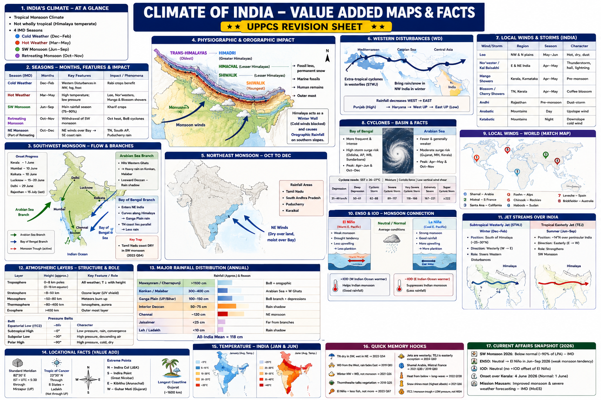

<strong>📋 Must-score facts — seasons, monsoon, onset</strong> (Click to Expand)

### Frame

| Item | Lock |
|------|------|
| Climate type | **Tropical monsoon** (not wholly tropical) |
| Etymology | Arabic **mausim** (season) |
| SW monsoon share | ~**75–90%** of annual rain |

### IMD seasons

| Season | Months | Tag |
|--------|--------|-----|
| Cold | Dec–Feb | Western Disturbances (NW) |
| Hot | Mar–May | Pre-monsoon / loo |
| SW monsoon | Jun–Sep | Main rains |
| Retreating / NE | Oct–Dec | TN coast rain |

### Onset / branch tags

| Place | Typical onset |
|-------|---------------|
| Kerala | ~**1 June** |
| Mumbai / Kolkata | ~**10 June** |
| Delhi | ~**29 June** |
| Branch | Lock |
|--------|------|
| Arabian Sea | Windward Western Ghats wet; leeward Deccan dry |
| Tamil Nadu SE coast | **Dry in SW monsoon**; rain in **NE monsoon** (उत्तर-पूर्व मानसून) |
| Active vs break | Trough on Ganga plain vs shift to Himalaya foothills |
| Plains rain | Declines **east → west** |

---

## 2.1 Climate Basics

Climate is the long-term weather pattern of a place. India’s climate is **tropical monsoon** because winds reverse with the seasons. Latitude, the Himalaya, the sea, relief, pressure systems, jets, and ENSO/IOD all shape that pattern.

| Factor | What it does in India |
|--------|------------------------|
| **Latitude** | Most of India is tropical / subtropical; the far north is cooler |
| **Himalaya** | Winter **wall** against Central Asian cold; summer **orographic** rain on southern slopes |
| **Distance from sea** | Coasts stay moderate (नरम दल); NW plains and interior Deccan have **continental** extremes |
| **Altitude** | Temperature falls about **6.5 °C per 1000 m** (lapse rate) |
| **Relief / orography** | Western Ghats → windward wet, leeward Deccan dry; Meghalaya (मेघालय) scarp → extreme rain |
| **Pressure & ITCZ** | Summer thermal **low** + north-shifted ITCZ pull the south-west monsoon |
| **Jet streams** | Winter STWJ (पश्चिमी जेट) steers Western Disturbances; summer TEJ (उष्णकटिबंधीय पूर्वी जेट) supports SW monsoon |
| **ENSO / IOD** | Year-to-year monsoon strength (El Niño weakens; +IOD helps) |

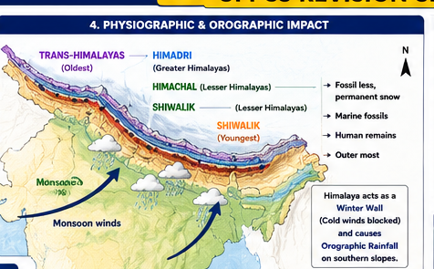

- Latitude places most of India in the tropical and subtropical belts. The Himalaya adds a cold-temperate belt in the north.
- The Himalaya blocks cold Central Asian winds in winter. It also forces orographic rain on the southern slopes in the monsoon.
- Coasts stay moderate because of the sea. The interior Deccan and north-west India have continental extremes.
- The Western Ghats make the Konkan–Malabar windward slope wet. The Deccan to their east is in rain shadow.
- Jet streams, ENSO, and IOD change monsoon strength from year to year. Those mechanisms are taught in full below.

### Temperature and altitude

Temperature normally falls with height because the ground heats the lowest air. Higher up, air is thinner and farther from that heat source. The normal lapse rate is about **6.5 °C per 1000 m**.

| Station | January (approx.) | Control |
|---------|-------------------|---------|
| Drass / Ladakh (लद्दाख) | −20 to −40 °C | Altitude plus continentality |
| **Agra** (आगरा) | about **16 °C** | Ganga plain — |
| **Darjeeling (about 2000 m)** | about **4 °C** | Same latitude as Agra; **lapse rate** |
| Mumbai / Chennai | 24–26 °C | Maritime |
| Jaisalmer | 12–15 °C in January; 40–45 °C in June | Highest **diurnal** range among usual stations |

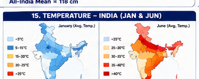

- January is coldest in the north-west and the Himalaya. January is warmest in the far south.
- June is hottest in north-west Rajasthan and Gujarat.
- **Diurnal range** means day temperature minus night temperature. Deserts have a large range. Coasts have a small range.
- The **January 18 °C isotherm** is the usual key fact that divides India into tropical (south of it) and subtropical (north of it) zones.
- Same-latitude pairs differ mainly by altitude: **Agra–Darjeeling** and **Amritsar (अमृतसर)–Shimla**.

| Climate contrast | Main control |
|------------------|--------------|
| Chennai warmer than Kolkata (annual) | **Latitude** (Chennai farther south) |
| Himalayan snowfall / hill stations cooler | **Altitude** |
| Rainfall falls West Bengal → Punjab | **Distance from the Bay / moisture loss westward** |
| Sutlej (सतलुज)–Ganga plain winter rain | **Western Disturbances** |

**PYQ — UPPCS Prelims 2022, Q22A/R logic:** (A) tests same-latitude January contrast. (R) tests lapse-rate wording. Check whether thinner air / height **explains** Agra vs Darjeeling.

**Assertion (A):** Agra and Darjeeling are located on nearly the same latitude, but the temperature in January in Agra is about 16°C, whereas it is only 4°C in Darjeeling.

**Reason (R):** Temperature decreases with height due to thinner air compared to places in the plains.

A. (A) false, (R) true

B. (A) true, (R) false

C. Both true, R not the explanation of A

D. Both true and R is the correct explanation of A

Show answer

**Ans: D** — **(A) true** and **(R) true**; altitude / lapse rate **explains** the January contrast. Same latitude, different height. **C** wrongly denies the causal link. **A/B** falsify correct temperature facts.

### Heat budget, albedo, humidity

The Sun sends **short-wave** radiation. The Earth returns **long-wave infrared**. The troposphere is heated mainly from below by that terrestrial long-wave radiation, plus sensible and latent heat. It is **not** heated mainly by incoming short-wave sunlight.

- **Latent heat:** when water vapour condenses into cloud droplets, heat is released into the air. That heat helps power thunderstorms and monsoon systems.
- Without the natural greenhouse effect (प्राकृतिक ग्रीनहाउस प्रभाव), mean surface temperature would be about **−18 °C**. The actual mean is about **15 °C**.

| Surface | Albedo | Fact |
|---------|--------|------|
| **Fresh snow** | 80–90% | **Highest** among usual surface options |
| Desert sand | 30–40% | Moderate |
| Prairie (प्रेयरी) | 20–25% | — |
| Paddy / cropland | 10–20% | Lower |
| Forest / water (typical) | under 10–20% | Absorb more; warm more |

- **Albedo** is the share of sunlight a surface reflects. Fresh snow reflects most. Dark forest absorbs more and warms more.
- **Absolute humidity** is the mass of water vapour in a given volume of air.
- **Relative humidity** is actual vapour as a percentage of what the air can hold at that temperature. When temperature rises, holding capacity rises, so relative humidity falls even if the vapour mass is unchanged.
- Absolute humidity can still rise with stronger evaporation even while relative humidity falls. The two facts are both true, but the second does **not** explain the first.

> **Teaching note:** The troposphere is heated mainly by **long-wave terrestrial radiation (भौमिक विकिरण)** from below. Among common surfaces, **fresh snow** has the highest albedo. Absolute humidity can rise with evaporation while relative humidity falls with warming; the evaporation fact does **not** explain the RH fall.

#### Same-Latitude / Contrasting Stations Map Bank

| Pair / Station | Latitude / Location | What differs | Primary Control |
|----------------|---------------------|--------------|-----------------|
| **Agra vs Darjeeling** | Both ~27°N | January: Agra **16 °C** vs Darjeeling **4 °C** | **Altitude & Lapse Rate** (~1 °C per 165 m; Darjeeling ~2,042 m vs Agra ~169 m) |
| **Amritsar vs Shimla** | Both ~31°–32°N | Amritsar hot summer / mild winter vs Shimla snow / cool | **Altitude** (Amritsar ~230 m / 756 ft vs Shimla ~2,400 m / 7,866 ft) |
| **Ajmer vs Shillong** | Both ~26°–27°N | Ajmer ~587 mm/yr vs Shillong ~5,160 mm/yr | **Distance from Sea & Orographic Relief** (Khasi Hills funnel vs Thar margin) |
| **Chennai Station Profile** | 13°N (Coromandel) | Mean annual temp **26 °C**, annual rain **63 cm**, annual range **9 °C** | **Tropical Maritime & NE Monsoon dependence** |

### Traditional Indian Seasons (Hindu Calendar Ritus)

According to Indian tradition, the year is divided into 6 bimonthly seasons (*Ritus*):

| Sr. | Season (*Ritu*) | Hindu Months | Gregorian Months | Key Characteristics |
|:---:|-----------------|--------------|------------------|---------------------|
| 1 | **Vasanta** (वसंत - Spring) | Chaitra – Vaishakha | March – April | Mild pleasant weather, blooming flowers, new foliage |
| 2 | **Grishma** (ग्रीष्म - Summer) | Jyeshtha – Ashadha | May – June | Intense heat, dry westerly winds (Loo), localized dust storms |
| 3 | **Varsha** (वर्षा - Rainy) | Shravana – Bhadrapada | July – August | Peak South-West monsoon, widespread torrential rains, high humidity |
| 4 | **Sharad** (शरद - Autumn) | Ashvina – Kartika | September – October | Retreating monsoon, clear skies, October heat, transition to cool |
| 5 | **Hemant** (हेमंत - Pre-winter) | Margashirsha – Pausha | November – December | Pleasant cool weather, Coromandel coast rainfall (NE monsoon) |
| 6 | **Shishir** (शिशिर - Winter) | Magha – Phalguna | January – February | Coldest months, frost/fog in north, Western Disturbance rains |

> **Chronological Order Drill:** Vasanta (Spring) → Grishma (Summer) → Varsha (Rainy) → Sharad (Autumn) → Hemant (Pre-winter) → Shishir (Winter).

#### IMD Rainy Day, Water Management & "Thirsty Land" Paradox
- **Official Definition of a Rainy Day (IMD):** A day is officially recorded as a **rainy day** when a meteorological station records **≥ 2.5 mm** of rainfall within a 24-hour period.
- **The "Thirsty Land" Paradox:** Although India receives a generous national average annual rainfall of ~**1,236.4 mm**, it is often described as a "thirsty land". Why?
  1. **Temporal concentration:** Nearly 75–90% of rain falls in just 3 to 4 monsoon months (June–September), leaving the country dry for the remaining 8 months.
  2. **Rapid runoff:** Torrential downpours cause swift surface runoff into rivers and seas before moisture can infiltrate aquifers.
  3. **High evaporation:** High tropical temperatures drive rapid evaporative losses from soil and surface water bodies.
- **Inland Waterways Limitation:** Inland water transport remains underdeveloped largely because rivers outside the snow-fed Himalayas shrink dramatically during the 8 dry months due to monsoon seasonality.
- **Watershed Hallmark in Semi-Arid India:** Embanking seasonal rivulets and rivers into a **system of traditional tanks** and check dams (over 120,000 tanks irrigating >4 million hectares). Tamil Nadu is the leading state in mandatory rainwater harvesting.
- **Desert Development Programme (DDP):** Launched in 1977–78 to combat desertification, starting with 131 blocks across 21 districts in 5 states (Rajasthan, Gujarat, Haryana, J&K, HP), later covering 235 blocks of 40 districts in 7 states (including Andhra Pradesh and Karnataka).
- **All-India Water Divide:** Major divide separating Arabian Sea drainage from Bay of Bengal drainage, traversing from Western Ghats through Satpura/Vindhya, Aravallis, Delhi ridge, to the Siwaliks and Himalayas.

### Temperature inversion

Normally temperature falls with height. In an **inversion**, temperature rises with height near the ground. Cold air below warmer air traps smoke and fog near the surface.

| Type | When / where | What happens |
|------|--------------|--------------|
| **Radiation inversion** | Clear, calm **winter nights** on the Indo-Gangetic plain | Ground cools fast; fog / smog trap over Delhi, UP, Bihar |
| **Valley / drainage inversion** | Kashmir, Doon, hill valleys | Cold air drains to the **floor**; slopes stay milder |
| **Subsidence inversion** | Under high-pressure / descending air | Mixing stops; haze can persist |

- Inversion suppresses vertical mixing. Pollution stays near the ground. That is why NCR and west-UP winter smog spells persist.

### Pressure, wind, Coriolis

Air moves from **high pressure to low pressure**. That pressure difference creates wind.

Earth rotates, so moving air is deflected sideways. That deflection is the **Coriolis effect**. Coriolis does not create wind. It only bends wind that already exists.

| Hemisphere | Deflection |
|------------|------------|
| **Northern** (India) | to the **right** |
| **Southern** | to the **left** |

This is why India’s summer monsoon is south-west, not south-east. Southern Hemisphere trade (पण्याध्यक्ष) winds approach the equator from the **south-east**. After they cross into the Northern Hemisphere, Coriolis turns them to the right, so they become **south-west** winds.

Coriolis comes from Earth’s **rotation**. It is not magnetism. Heat creates pressure differences; Coriolis only turns the resulting wind.

- In **summer**, hot land creates a thermal **low** over north-west India and Pakistan. Moist ocean air is drawn in and feeds the south-west monsoon.
- In **winter**, cool land creates a thermal **high** over north-west India. Dry winds then blow out from the north-east and north-west.
- The **monsoon trough** is a low-pressure axis along the Himalayan foothills and the Ganga plain.

| Spell | Trough position | Rain |
|-------|-----------------|------|
| **Active monsoon** (सक्रिय) | Over the **Ganga plain** | Plains wet (UP, Bihar, MP) |
| **Break monsoon** (विराम मानसून) | Over the **Himalaya** | Central India dry; foothills wet |

> **Logic:** leftward deflection in the Southern Hemisphere is **Coriolis**, not temperature, pressure, or the magnetic field.

### Atmosphere, pressure belts, ITCZ

The equator receives more sun than the poles. Warm air rises near the equator. Cooler air sinks near about 30° latitude and at the poles. That pattern creates Earth’s main **pressure belts**. Air flows between the belts as **planetary winds**, and Coriolis bends those winds.

| Layer | Height | Fact |
|-------|--------|------|
| **Troposphere** (क्षोभमंडल) | 0–8 km at poles / 0–18 km at the equator | **All weather**; temperature falls with height |
| Tropopause | Top of the troposphere | Jets fly near here |
| **Stratosphere** | to about 50 km | **Ozone UV shield** |
| Mesosphere (मध्यमंडल) | about 50–80 km | Meteors burn |
| Thermosphere | about 80–400 km | Ionosphere and aurora |
| Exosphere | outermost | Space |

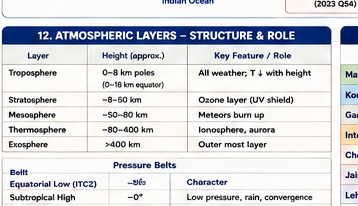

#### Pressure belts and circulation cells

| Step | Process | Surface result |
|------|---------|----------------|
| 1 | Strong heating at the equator | Air rises |
| 2 | Rising air reduces surface weight | Equatorial **low** / ITCZ |
| 3 | Air aloft moves poleward and sinks near 30° | Subtropical **high** (horse latitudes) |
| 4 | Surface air returns from 30° to the equator | **Trade winds** |
| 5 | Other surface air from 30° moves toward 60° | **Westerlies** |
| 6 | Cold air sinks at the poles | Polar **high** |
| 7 | Polar air moves toward 60° and meets westerlies | Subpolar **low**; **polar easterlies** |
| Cell | Span | Role |
|------|------|------|
| **Hadley cell** | Equator to ~30° | Rise at ITCZ, sink at 30°, trades return |
| **Ferrel cell** | ~30° to 60° | Mid-latitude belt of the westerlies |
| **Polar cell** | ~60° to pole | Polar easterlies; rise near 60° |
| Nickname | Meaning |
|----------|---------|
| **Doldrums** | Rainy, weak-surface-wind belt of the ITCZ |
| **Horse latitudes** | Dry, calm subtropical highs near 30° |
| Belt | Latitude | Pressure | Weather |
|------|----------|----------|---------|
| Equatorial low / **ITCZ** | Near 0° (shifts with the Sun) | **Low** | Rising air, cloud, heavy rain |
| Subtropical high | About **30° N / S** | **High** | Sinking dry air; west-margin deserts |
| Subpolar low | About **60° N / S** | **Low** | Stormy meeting of warm and cold air |
| Polar high | About **90°** | **High** | Cold, dry outflow |

#### ITCZ

The **Inter Tropical Convergence Zone** is the rainy low-pressure belt where Northern Hemisphere and Southern Hemisphere trade winds meet.

Trade winds move toward the heated equatorial belt, converge, and rise. Rising moist air cools and gives heavy rain. The ITCZ is therefore a **low**, never a high.

It is not fixed on the equator. It shifts with the overhead Sun.

| Season | ITCZ position | Effect on India |
|--------|---------------|-----------------|
| Summer (Jun–Sep) | Shifts **north** over South Asia | Forms / guides the monsoon trough; supports SW monsoon |
| Winter (Dec–Feb) | Shifts **south** | Most of India under dry NE trades |
| Strong El Niño years | Indian branch often weaker | Monsoon tends to weaken |

If the monsoon trough lies on the Ganga plain, rains are **active**. If it shifts onto the Himalaya, a **break** occurs and central India dries.

#### Planetary winds

| Wind | Direction | Where | Cause | Effect |
|------|-----------|-------|-------|--------|
| **Trade winds** | East → west (NE trades in NH; SE trades in SH) | Between ~30° highs and the ITCZ | Air leaves subtropical high toward equatorial low; Coriolis turns it | Feed ITCZ rain; after equator crossing they become India’s SW monsoon |
| **Westerlies** | West → east | About **30°–60°** (both hemispheres) | Air leaves 30° high toward 60° low; Coriolis turns it | Drive mid-latitude storms and help steer Western Disturbances |
| **Polar easterlies** | East → west | Polar high toward ~60° | Cold air leaves polar high; Coriolis turns it | Bring cold outbreaks; meet westerlies at the subpolar low |

Winter NE trades over India are mostly dry on land. Summer SE trades that cross the equator and turn right become the **south-west monsoon**. Westerlies exist in **both** hemispheres; they are not Southern Hemisphere only.

> **Logic:** Protective ozone sits in the **stratosphere**, not the troposphere. The ITCZ is a **low**, not a high. Ozone blocks UV **and** depletion is linked to CFCs — both statements hold.

---

## 2.2 Monsoon System

A monsoon is a seasonal reversal of wind. In summer, heated land draws moist ocean air inland. In winter, cooled land sends dry air outward.

- The word **monsoon** comes from Arabic **mausim** (season).
- India receives about **75–90%** of its rain from the south-west monsoon (June–September).
- India’s climate has both tropical and subtropical traits. The Himalaya adds climatic distinctiveness. India is not limited to the Tropics; it extends to about **37°6′ N**.
- The monsoon is produced by land–sea heating, the northward shift of the ITCZ, cross-equatorial flow, the Mascarene High, the Somali Jet, and Himalayan / Tibetan heating. The Himalaya helps, but it is not the only cause.

| System | Months | Where the rain falls | Trap |
|--------|--------|----------------------|------|
| **South-west monsoon** | Jun–Sep | Most of India (~75–90% of annual rain) | TN SE coast stays **dry** |
| **Retreating monsoon** | Sep–Nov | Withdrawal phase with **October heat** and BoB / Andaman Sea cyclones | Not WD winter rain |
| **North-east monsoon** | Oct–Dec | **TN, south AP, SE Karnataka fringe, Puducherry, Karaikal** | Not all-India winter rain |
| **Western Disturbances** | Nov–Feb (peak) | NW India rain/snow | Extra-tropical; **not** a monsoon |

### Monsoon mechanism

Two standard explanations work together:

| Concept | Fact |
|---------|------|
| **Thermal** | Land heats faster than sea → summer low over India pulls ocean air in |
| **Dynamic (Flohn)** | Pressure belts and the ITCZ shift with the Sun; monsoon is largely that seasonal shift |
| Step | What happens | Note |
|------|--------------|------|
| 1 | Tibetan Plateau / NW India heat strongly in late spring | Thermal **low** over NW India–Pakistan |
| 2 | ITCZ shifts **north** onto India | Monsoon trough forms |
| 3 | **Mascarene High** strengthens over the southern Indian Ocean | Pushes SE trades toward Africa / equator |
| 4 | SE trades cross the equator roughly between **40° E and 60° E**; Coriolis turns them SW | South-west monsoon |
| 5 | Cross-equatorial flow strengthens as the **Somali Jet** | Moist air aimed at India |
| 6 | STWJ jumps north of Tibet; **TEJ** sets up near 14° N | Upper-air support |
| 7 | Onset **burst** at Kerala (~1 June), then the front marches north | About 10 days per degree of latitude |

- In winter the ITCZ shifts south. Winds reverse to the north-east. Over most of India those winds are dry. They rain on the Coromandel only after picking up Bay moisture.
- Withdrawal begins in the **north-west** and ends in the extreme south. That north-to-south pullback is the retreating monsoon.
#### Concepts of Monsoon Origin & Upper Atmosphere Controls
1. **Thermal Concept (Halley / Classical):** Differential heating rates between the vast continental landmass of Asia/India and the surrounding Indian Ocean drive an enormous seasonal sea-breeze / land-breeze cycle.
2. **Dynamic Concept (Flohn):** The monsoon is primarily the seasonal displacement and migration of the planetary wind belts and the Inter-Tropical Convergence Zone (ITCZ) northward across the equator in summer and southward in winter.
3. **Jet Stream Theory & Tibetan Plateau:**
   - The high **Tibetan Plateau** acts as an elevated mechanical barrier and summer thermal engine, dividing the Subtropical Westerly Jet (STWJ) into two branches:
     - **Northern branch:** Flows north of the Himalayas/Tibetan Plateau across Central Asia and China; it plays **no role** in India's winter precipitation.
     - **Southern branch:** Flows south of the Himalayas across northern India; it steers Mediterranean **Western Disturbances** and governs winter weather.
   - In late May/early June, the sudden northward shift of this southern branch north of Tibet triggers the dramatic **"burst"** of the South-West monsoon over the Indian peninsula.

#### Drainage & Regional Rainfall Traps
- **Chhattisgarh Basin & Arabian Sea Branch:** The Arabian Sea branch splits after hitting the Western Ghats (one sub-branch heads along the Aravallis, another up the Narmada-Tapi into MP and western CG). The inland **Chhattisgarh Basin** remains largely sheltered from this branch; it receives almost its entire rainfall from the **Bay of Bengal branch**. Its climate is classified as **Humid South-East**.
- **Pushkar Hills Heavy Rain → Balotra Floods:** When intense rainfall strikes the Pushkar hills in Ajmer, floodwaters channel down the Luni river basin and surge into **Balotra (Barmer)** because Balotra sits on the low downward gradient of the Pachpadra depression.
- **Signs of Monsoon Decline (Retreating Monsoon):**
  1. **Clear sky** replaces monsoon cloudiness.
  2. **October Heat:** Rising daytime temperatures on land combined with high residual humidity.
  3. **Low pressure shift to Bay of Bengal:** Development of cyclonic depressions and storms that track across the Coromandel coast.
- **Rainfall Gradient across Major Cities (Descending Order):**
  - **Kochi (~3,932 mm)** > **Kolkata (~2,451 mm)** > **Patna (~1,100 mm)** > **Delhi (~904 mm)**.
- **Lowest Rainfall Benchmarks:**
  - **Leh (Ladakh UT):** ~4.17 cm (41.7 mm) — **lowest in all India**.
  - **Jaisalmer:** ~31.67 cm — lowest in Rajasthan.
  - **Bikaner:** ~32.84 cm.

### Southwest monsoon

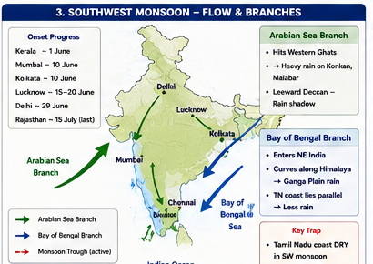

- The south-west monsoon lasts from **June to September**. It gives about **75–90%** of India’s annual rain.
- IMD’s normal onset at **Kerala** is about **1 June** (first among major states). The front then moves north at roughly ten days per degree of latitude.

| Place | Normal onset | Withdrawal (start) |
|-------|----------------|--------------------|
| Kerala | about 1 June | Extreme south last (December for NE rains) |
| Mumbai / Kolkata | about 10 June | Early October |
| Lucknow (लखनऊ) / eastern UP | about 15–20 June | Late September |
| Delhi | about **29 June** | Late September |
| Rajasthan | about **15 July** (last) | September |
| Chennai | South-west is **weak and dry** | North-east monsoon October–December |

**Two branches — remember as two arms of the same monsoon**

| Branch | Path | Wet places | Dry / weak places |
|--------|------|------------|-------------------|
| **Arabian Sea branch** | Arabian Sea → Western Ghats → inland (also a stream toward central India / Ganga that later meets the Bay branch) | Konkan, Malabar, Goa (गोवा); some rain into Gujarat / western MP | Leeward Deccan and TN rain shadow; **Chhattisgarh basin** is little fed by this branch |
| **Bay of Bengal branch** | BoB → NE India → curves west along Himalaya | Assam, Meghalaya, Ganga plain, UP, Bihar | TN coast (sits **parallel** — little orographic lift) |

- The Tamil Nadu coast lies **parallel** to the Bay branch. There is little orographic lift. That is why the Tamil Nadu coast stays **dry in the south-west monsoon**.
- The **burst** is the sudden heavy rain after May heat. Temperature then falls.
- Bay of Bengal monsoon depressions usually track west-north-west into Madhya Pradesh, Uttar Pradesh, and Rajasthan.

**Rainfall character facts (Ganga / all-India)**

| Pattern | Fact |
|---------|------|
| Season | Mostly **June–September** (SW monsoon) |
| Relief | Orography governs amounts (Western Ghats, Meghalaya scarp) |
| Distance from sea | Rain generally **declines inland** / with distance from the moisture source |
| Northern plains | Annual rain **decreases east → west** (humid Bay air loses moisture westward) |
| Duration | Monsoon season length **decreases south → north** (Kerala longer than the far north-west) |
| Break | Rainless spells when the trough sits on the **Himalaya** |
| Rajasthan dryness | Aravalli runs **roughly parallel** to SW winds → little forced uplift on the western Thar |

**PYQ — UPPCS Prelims 2023, Q54A/R logic:** (A) tests TN dryness in SW season. (R) packs two causes — parallel to Bay branch **and** Arabian Sea rain shadow. Check if both halves of R are true and whether they explain A.

**Assertion (A):** The Tamil Nadu coast remains dry during the South-West monsoon season.

**Reason (R):** The Tamil Nadu coast is situated parallel to the Bay of Bengal branch of the South-West monsoon and it lies in the rain shadow area of the Arabian Sea branch of the South-West monsoon during the monsoon season.

A. (A) true, (R) false

B. (A) false, (R) true

C. Both true, R not the explanation

D. Both true and R is the correct explanation

Show answer

**Ans: D** — **(A) true** and **(R) true**; orientation + rain shadow **explain** TN SW-monsoon dryness. **C** denies the causal link. **A/B** falsify correct monsoon geography.

| Zone | Rain (approx.) | Why |
|------|----------------|-----|
| Mawsynram / Cherrapunji (**Khasi (खासी) Hills**, Meghalaya) | more than 1100 cm | Bay branch plus orography; Mawsynram = wettest class |
| Konkan / Goa | 300–400 cm | Arabian Sea plus Western Ghats |
| Ganga plain (UP / Bihar) | 100–150 cm | Bay branch plus depressions |
| Interior Deccan | 50–75 cm | Rain shadow |
| Chennai | about 120 cm, **mostly north-east monsoon** | South-west is dry |
| Jaisalmer | less than 25 cm | Far from both branches; Aravalli parallel |
| Leh / Ladakh | less than 10 cm (often ~4 cm class) | Himalayan rain shadow — driest among usual options |

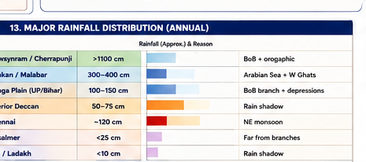

- All-India mean rainfall is about **118–124 cm** (class figures vary by yearbook; ~**118 cm / ~1236 mm** both appear).
- IMD calls a **rainy day** a day with **2.5 mm or more** rain in 24 hours.
- India’s tropical monsoon belt allows **kharif (खरीफ), rabi (रबी), and zaid (जायद)**. The claim that India has the highest cultivated area versus the USA, China, and Japan is false.

**How rain forms (three types)**

| Type | Cause | India example |
|------|------------|---------------|
| **Orographic** | Moist wind is forced **up a mountain**, cools, and rains on the windward side | Western Ghats windward vs Deccan; Meghalaya scarp |
| **Convectional** | Hot ground heats air → air rises in a column → afternoon thunder showers | Pre-monsoon storms; parts of interior summer heating |
| **Cyclonic / frontal** | Air rises in a **low-pressure storm** system | Monsoon depressions; Western Disturbances; Bay cyclones |

- On the orographic path, the **leeward** side stays dry (rain shadow).
- Cyclonic / frontal lift is the storm-system path for monsoon depressions, Western Disturbances and Bay cyclones.

| Map line | Meaning |
|----------|---------|
| **Isotherm** | Same temperature |
| **Isobar** | Same pressure |
| **Isohyet** | Same rainfall |

### Northeast monsoon and retreating monsoon

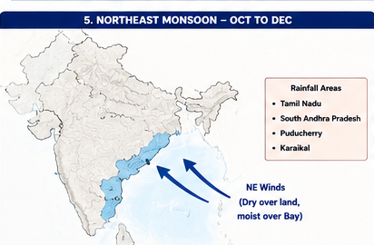

These two names cover the same autumn window, but they are not the same process.

| Feature | Retreating SW monsoon | North-east monsoon |
|---------|----------------------|--------------------|
| Months | About **Sep–Nov** | About **Oct–Dec** |
| Process | SW monsoon withdraws from north to south | Dry NE winds pick up Bay moisture and rain on the SE coast |
| Signature | October heat, clear spells, and Bay / Andaman Sea cyclones | Coromandel rain |
| Rain belt | Withdrawal rains + east-coast cyclone rains | TN, south AP, SE Karnataka, SE Kerala fringe, Puducherry, Karaikal |
| North India | Mostly dry | Mostly dry |

- Signs of retreat include clearer skies, rising land temperatures, and cyclone activity shifting into the Bay.
- The Coromandel coast gets about half to two-thirds (ते-भागा) of its annual rain in this season.
- Mumbai and Gujarat lose SW rains and do not receive the NE monsoon, so October–November is dry there.

### Indian seasons (IMD)

| Season | Months | Main weather |
|--------|--------|--------------|
| Cold weather | December–February | Western Disturbance rain/snow in the north-west, fog on the plains, and the rabi season |
| Hot weather | March–May | Loo heat waves, Nor’westers, and mango / blossom showers |
| South-west monsoon | June–September | Main rainy season for most of India |
| Retreating | October–November | Withdrawal, October heat, Bay cyclones, then NE monsoon on the SE coast |

- **Cold weather (Dec–Feb):** north-west rain and snow come from **Western Disturbances**. Fog is common on the Indo-Gangetic plain. This is the main **rabi** (रबी) wheat season. Most of India stays dry under **NE trade / land winds**.
- **Hot weather (Mar–May):** **Loo** heat waves strike the north-west plains. **Nor'westers** and other pre-monsoon storms hit the east. **Mango** and **blossom** showers appear in the south.
- **South-west monsoon (Jun–Sep):** This is the main rainy season. Tamil Nadu’s **south-east coast** stays relatively dry in this phase.
- **Retreating monsoon (Oct–Nov)** is the withdrawal of the southwest monsoon from the north-west.
- The same season brings **October heat** and Bay of Bengal cyclones.
- The **north-east monsoon** then begins to rain on the Tamil Nadu coast.

### Western Disturbances

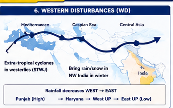

Western Disturbances are **extra-tropical** winter storms. They form near the Mediterranean–Caspian region, travel east in the subtropical westerly jet, and bring rain or snow to north-west India. They are not monsoon lows and not Bay of Bengal depressions.

| Item | Note |
|------|------|
| Type | Extra-tropical cyclone |
| Carrier jet | STWJ branch **south of the Himalaya** (not the northern Tibetan branch) |
| Peak season | November–February |
| Rain / snow belt | Punjab, Haryana, Himachal, J&K / Ladakh fringe, Uttarakhand, western UP, northern Rajasthan |
| Gradient | Decreases **west → east** |
| Farm link | Helps rabi wheat; also hail, fog, avalanche risk |

> **Logic:** ** Winter north-west rain comes from **Western Disturbances**. The rainfall gradient runs **west to east**.

---

## 2.3 Winds, Storms and Cyclones

### Local winds and storms of India

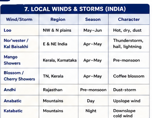

Local winds are short-lived and stay near the ground.

- The **Loo** is a hot, dry, dusty wind on the plains of Rajasthan, Punjab, Haryana, Uttar Pradesh, and Bihar in **May–June**. It is a heat-wave wind, not a thunderstorm.
- The **Nor’wester / Kal Baisakhi** is a violent pre-monsoon thunderstorm over West Bengal, Assam, Odisha, Bihar, and Jharkhand in **April–May**.
- **Mango showers** are April–May pre-monsoon rains in Kerala and Karnataka that help mangoes ripen.
- **Blossom / cherry showers** are April–May pre-monsoon rains in the coffee belt of Tamil Nadu and Kerala.
- **Andhi** is a pre-monsoon dust-storm wall of Rajasthan.
- **Elephanta** (एलिफेंटा) is a Malabar wind of about September at the fading of the SW monsoon.

| Time | Land vs sea | Wind |
|------|-------------|------|
| **Day** | Land heats faster → low over land | **Sea breeze** (sea → land) |
| **Night** | Land cools faster → high over land | **Land breeze** (land → sea) |
| Wind | When | Direction | Cause |
|------|------|-----------|-------|
| **Anabatic** | Day | Upslope | Slope heats; warm air climbs |
| **Katabatic** | Night | Downslope | Slope cools; cold air drains into the valley |
| **Foehn / Chinook** | After crossing a mountain | Warm and dry downslope | Air rains on the windward side, then sinks and warms by compression on the lee |

Foehn / Chinook are warm-dry lee winds. They are not the same as cold night-time katabatic drainage.

| Name | Region | Season | Character |
|------|--------|--------|-----------|
| **Loo** | RJ, PB, HR, UP, Bihar plains | May–June | Hot, dry dust and heat-wave; **not** a thunderstorm |
| **Nor’wester / Kal Baisakhi** | WB, Assam, Odisha, Bihar, Jharkhand | April–May | Violent **thunderstorm**; hail, lightning |
| **Mango showers** | **Kerala, Karnataka** | April–May | Pre-monsoon; mango ripening |
| **Blossom / cherry showers** | TN, Kerala (coffee belt) | April–May | Coffee flowering |
| **Andhi** | Rajasthan | Pre-monsoon | Dust-storm wall |
| **Elephanta** | Malabar / Kerala | About September | End of SW monsoon; rough sea |
| Sea / land breeze | Coasts | Daily | Onshore by day; offshore by night |
| **Anabatic** | Mountain slopes | **Day** | **Upslope** |
| **Katabatic** | Valleys | **Night** | **Downslope** cold drainage |

### World local winds (full match map)

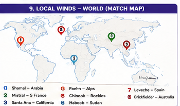

- Past papers have already asked Mistral, Shamal, Chinook, Foehn, Santa Ana, Haboob, Brickfielder, Leveche, Black roller, and Yamo. Other standard local winds still worth knowing include **Sirocco, Bora (बोरा), Harmattan (हरमट्टन), Khamsin (खामसिन), Zonda, Samun**, and the Willy-willy trap.
- Local winds are short-lived and near the ground. Group them by **family**, then fact the region.
- **Warm and dry after crossing a mountain (Foehn family)**
- The **Foehn (Föhn)** is the Alpine warm, dry downslope. It can melt snow and help grapes ripen.
- The **Chinook** is the Rockies twin. It is warm **and dry**. Ranchers call it the **snow eater**.
- The **Zonda** is the same family on the eastern Andes in **Argentina**.
- The **Berg** wind is the South African cousin.
- The **Santa Ana** is the hot, dry California downslope.
- New Zealand’s **Nor’wester** (Canterbury) is a foehn-type wind. It is **not** the Indian Kal Baisakhi thunderstorm.
- **Cold downslope / outbreak winds**
- The **Mistral** is a cold, dry blast down the **Rhône** in southern **France**, funnelled between the Alps and the Massif Central. It is **not** Australian.
- The **Bora** is the cold north-easterly cousin on the **Adriatic** (Italy–Croatia).
- The **Tramontane** is a cold north wind of southern France and the western Mediterranean.
- The **Gregale** is a cold north-east wind around **Malta**.
- The **Pampero** is a cold outbreak on the Argentine pampas.
- The **Buran / Purga** is a Siberian blizzard-type wind.
- The **Norte** is a cold outbreak into Mexico and the Gulf.
- **Hot, dusty desert winds**
- The **Sirocco** is a hot, dusty Saharan wind that crosses into the **Mediterranean** and southern Europe. It can raise “blood rain” from red dust.
- The **Khamsin** is Egypt (मिस्र)’s sirocco cousin (about fifty days of spring heat).
- The **Ghibli** is the Libyan name. The **Chili** is the Tunisian name. The **Leveche** is the Spanish name (2021 correct pair).
- The **Shamal** is a dusty north-westerly of **Arabia and the Persian (फ़ारसी) Gulf**. It is **not** Austrian.
- The **Simoom** is a scorching Arabian desert wind.
- The **Harmattan** is a dry, dusty winter wind from the Sahara over **West Africa** and the Gulf of Guinea. It is **not** an East African coast wind.
- The **Samun** is a hot wind of **Kurdistan / Iran** (UPSC (संघ लोक सेवा आयोग) 2001-type match).
- The **Brickfielder** is a hot wind of **Australia**.
- The **Black roller** is a dusty North American plains wind.
- The **Haboob** is a dust-wall storm of **Sudan** and the wider Sahara.
- The **Karaburan** (“black storm”) is a dusty Central Asian wind.
- The **Loo** is the north-Indian plains member of this hot family. It lives in the India table above.
- **Other named winds used in match lists**
- The **Levanter** is an easterly through the Strait of **Gibraltar**.
- The **Etesian / Meltemi** is a summer northerly of the **Aegean**.
- The **Yamo** is a Japanese local wind (2019 correct pair).
- The **Cape Doctor** is a south-easter at Cape Town.
- The **Williwaw** is a violent squall of Alaska / Magellan.
- **Do not mix cyclone names into this list**
- **Willy-willy** is an Australian **tropical cyclone**. It is **not** a local wind like the Brickfielder.
- Hurricane, typhoon, taifu, and baguio are **synoptic storms**. They belong in the cyclone-naming table below.

| Family | Wind | Region | trap |
|--------|------|--------|-----------|
| Warm dry downslope | **Foehn** | Alps | Not Australia |
| Warm dry downslope | **Chinook** | Rockies | Not a cold wind |
| Warm dry downslope | **Zonda** | Andes, Argentina | Not Alps |
| Warm dry downslope | **Santa Ana** | California | Not Spain |
| Warm dry downslope | **Berg** | South Africa | — |
| Cold | **Mistral** | S France, Rhône | **Not Australia** |
| Cold | **Bora** | Adriatic | Not Chinook |
| Cold | **Pampero** | Argentina | — |
| Cold | **Buran / Purga** | Siberia | — |
| Hot dusty | **Sirocco** | Sahara → Mediterranean | — |
| Hot dusty | **Khamsin** | Egypt | Not Australia |
| Hot dusty | **Shamal** | Arabia / Gulf | **Not Austria** |
| Hot dusty | **Harmattan** | **West** Africa | Not East Africa |
| Hot dusty | **Samun** | Kurdistan | — |
| Hot dusty | **Leveche** | Spain | — |
| Hot dusty | **Ghibli** | Libya | — |
| Hot dusty | **Brickfielder** | Australia | Not Mistral |
| Hot dusty | **Haboob** | Sudan | — |
| Hot dusty | **Black roller** | North America | — |
| Other | **Yamo** | Japan | — |
| Other | **Levanter** | Gibraltar | — |
| Not a local wind | **Willy-willy** | Australia | Cyclone, not Brickfielder |

> **Logic:** Chinook is warm and dry **and** Foehn is in the Alps. Mistral is France. Shamal is Arabia. Harmattan is **West** Africa. Willy-willy is a **cyclone**.

### Tropical cyclones

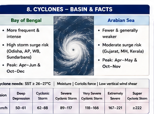

A tropical cyclone is a large spinning storm over warm ocean. It needs sea-surface temperature of about **26–27 °C or more**, deep moisture, Coriolis spin, and low vertical wind shear. Coriolis is too weak on the equator, so genesis is usually between about **5° and 30°**.

| Need | Note |
|------|------|
| Sea surface temperature | About **26–27 °C or more** |
| Moisture | Deep moist air |
| Coriolis | Enough spin — usually **5°–30°** latitude |
| Vertical wind shear | **Low** (strong SW-monsoon shear suppresses many Bay storms in Jul–Sep) |
| Part | Meaning |
|------|---------|
| **Eye** | Calm centre with sinking air and clearer skies |
| **Eyewall** | Ring of strongest winds and rain around the eye |
| Spiral bands | Outer rain bands |

- Peak seasons are pre-monsoon (May–June) and post-monsoon (October–December).
- In the Northern Hemisphere these storms spin anti-clockwise.

| Basin | Frequency / strength | Why | Hit states |
|-------|---------------------|-----|------------|
| **Bay of Bengal** | **More and stronger** | Warm shallow shelf + river freshwater; storm surge (तूफानी महोर्मि) risk high | Odisha, AP, West Bengal, Sundarbans (सुंदरबन) |
| **Arabian Sea** | Fewer, often weaker | Higher salinity; narrower fetch | Gujarat, Maharashtra, Kerala still take hits |
| IMD class | Wind (km/h) |
|-----------|-------------|
| Depression | 31–49 |
| Deep depression | 50–61 |
| Cyclonic storm | 62–88 |
| Severe cyclonic storm | 89–117 |
| Very severe | 118–166 |
| Extremely severe | 167–221 |
| **Super cyclone** | **222 or more** |
| Local storm | Scale | Fact |
|-------------|-------|------|
| **Thunderstorm / Nor’wester** | Hours; local convection | **Not** a cyclone |
| **Tropical cyclone** | Days; ocean-scale | Synoptic storm |

### Cyclone naming (match bank — next year can swap any pair)

- The **WMO/ESCAP** panel agrees the name lists. **RSMC New Delhi (IMD)** assigns names in the north Indian Ocean.
- Devastating names are **retired**. India has contributed names such as **Amphan**, **Yaas**, **Fani**, **Vayu**, and **Nisarga**.
- UPPCS has already asked the four (चातुर्याम) classic pairs (Hurricane / Typhoon–Taifu / Baguio / Willy-willies). Next stem can still pick **Cyclone** (NIO), **Cordonazo**, or split Taifu from Typhoon. Learn the **full basin bank**.

| Local / basin name | Where | Note |
|--------------------|-------|------|
| **Hurricane** ★ | **USA** / Atlantic–Caribbean / E Pacific | 2019–2020 PYQ fact |
| **Typhoon** ★ | NW Pacific — **China** / Philippines / Taiwan class | 2020 Q74 “Typhoons–China” |
| **Taifu** ★ | **Japan**-facing name for NW Pacific storm | Same basin as typhoon; 2019 paired with Japan |
| **Baguio / Baguios** ★ | **Philippines** | 2019–2020 fact |
| **Willy-willies** ★ | **Australia** | Cyclone — **not** Brickfielder (hot local wind) |
| **Cyclone** | North Indian Ocean — **India / BoB / Arabian Sea** | IMD / RSMC New Delhi names |
| **Cordonazo** | West Mexico / E Pacific coast | Lucent-class distractor |
| **Hurricane** (also) | Caribbean / Gulf of Mexico | Same Atlantic family as USA |

**Named-event note (not a closed four-pack):** Amphan (2020, BoB→WB/Odisha), Fani (2019), Yaas (2021), Tauktae (2021, Arabian), Biparjoy (2023), Hudhud (2014), Phailin (2013), Odisha Super Cyclone (1999).

> **Logic:** Willy-willies–Australia, Taifu–Japan, Baguio–Philippines, Hurricanes–USA. Alternate set: Baguios–Philippines, Hurricanes–USA, Typhoons–China, Willy-willies–Australia. Willy-willy ≠ Brickfielder.

---

## 2.4 Classification and ocean–atmosphere phenomena

### Köppen (India) versus Thornthwaite

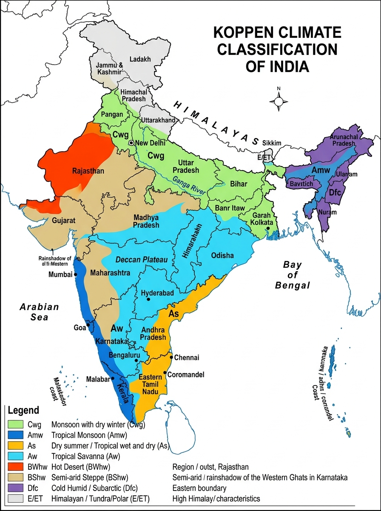

Köppen classifies climate by temperature and rainfall letter codes. Thornthwaite classifies by moisture balance. The line **“Vegetation is the true index of climate”** belongs to Thornthwaite, not Köppen.

| Thinker | Method | Note |
|---------|--------|-----------|
| **Köppen** | Temperature + precipitation **letter codes** | India’s Am / Aw / As / BWh / Cwg map |
| **Thornthwaite** | Moisture balance (P minus potential ET) | **“Vegetation is the true index of climate”** — 2018 Q25 |
| **Trewartha** | Modified Köppen | **Not** Thornthwaite |

**How to read Köppen letters (India map)**

| Letter clue | Meaning | India example |
|-------------|---------|---------------|
| **A** | Tropical | Kerala, Deccan, Coromandel |
| **B** | Dry (arid / semi-arid) | Thar, rain-shadow Deccan fringe |
| **C** | Temperate / subtropical with distinct seasons | Ganga plain |
| **m** | Monsoon (short dry spell) | Kerala / Konkan / NE hills |
| **w** | Dry **winter** | Interior Deccan (**Aw**); Ganga plain (**Cwg**); also the second small letter in strings like **Amw** |
| **s** | Dry **summer** | **Tamil Nadu As** — dry in SW monsoon; rain in NE monsoon |
| **h** | Hot | Thar **BWh** |

- In fuller Köppen strings, the **second small letter** marks the **seasonality of dryness**. **Amw** still maps to the **humid monsoon west coast and parts of the north-east** on India maps — not Thar (**BWh**) and not Coromandel dry-summer (**As**).

| Code | Type | India |
|------|------|-------|
| **Am / Amw** | Tropical monsoon (short dry spell; **w** = dry winter in full strings) | Kerala / Konkan, north-east (Cherrapunji) |
| **Aw** | Tropical savanna (सवाना) | Interior Deccan |
| **As** | Monsoon with dry **summer** | **Tamil Nadu / Coromandel** (rain in NE monsoon) |
| **BWh** | Hot desert | **Thar** (थार), Kutch |
| **BSh** | Semi-arid | Punjab, Haryana, Gujarat, rain-shadow Deccan |
| **Cwg** | Monsoon with dry winter | **Indo-Gangetic / Great Plains** (Lucknow, Delhi, Patna (पटना)); also covers **North Bihar**, **North Bengal / much of NE plain** on class maps |
| **H** | Highland | Himalayan slopes |
| **E** | Polar / tundra (टुंड्रा) | Highest snow zones only |

- India is **not** all **Am**. The interior Deccan is **Aw**. The Thar is **BWh**. The Tamil Nadu coast is often mapped as **As** because its dry season is the south-west-monsoon **summer**.
- The “humid south-east” belts (Chotanagpur (छोटानागपुर)–Odisha–south Chhattisgarh fringe) sit in the wetter monsoon east; do not confuse with Thar **BWh**.

| Köppen Code | Climatic Type | Representative Regions in India |
|:---:|---|---|
| **Amw** | Monsoon with short dry season | Western coastal plains south of Goa (Malabar/Konkan), parts of Arunachal/Assam |
| **As** | Monsoon with dry summer | **Coromandel Coast** (coastal Tamil Nadu and adjoining Andhra Pradesh) |
| **Aw** | Tropical Savanna (wet & dry) | Most of the Peninsular plateau south of the Tropic of Cancer |
| **BWhw** | Tropical desert (arid) | Western Rajasthan (Thar Desert) |
| **BShw** | Semi-arid steppe | Rain-shadow belt east of Western Ghats; parts of Rajasthan, Haryana, Punjab |
| **Cwg** | **Humid subtropical with dry winter** | **Great Plains of India (Indo-Gangetic plain), North-East India (including North Bengal and Assam plains), and North Bihar** |
| **Dfc** | Cold humid winter with short summer | High-altitude Sikkim and Arunachal Pradesh Himalayas |
| **E / ET** | Polar / Tundra | High mountain belts of Jammu & Kashmir, Ladakh, Himachal Pradesh, Uttarakhand |

> **Key UPPCS / UKPCS Trap:** **Cwg** is the exact Köppen code for the Great Plains of India, North Bihar, and North-East India (including North Bengal).

### Jet streams

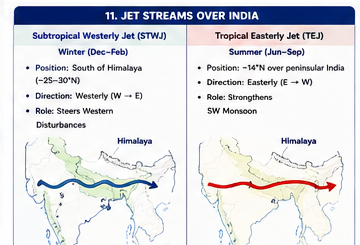

Jet streams are narrow, fast winds near the tropopause. Most mid-latitude jets are **westerly** (west → east). Speeds of about **300–500 km/h** are typical. The summer **Tropical Easterly Jet** over India is the main exception.

| Jet | Season | Direction | Where | Role for India |
|-----|--------|-----------|-------|----------------|
| **Polar front jet** | Year-round (shifts) | Westerly | High latitudes | Extra-tropical weather belt |
| **STWJ** | Winter | Westerly | About 25–30° N, south of Himalaya | Steers Western Disturbances |
| **STWJ north branch** | Winter | Westerly | North of Tibet after the plateau splits the jet | Does not drive India’s winter rain |
| **STWJ summer position** | Summer | Westerly | North of Tibet | Clears space for monsoon setup |
| **TEJ** | Summer | Easterly | Near 14° N over the peninsula | Supports SW monsoon circulation |
| **Somali Jet** | Summer | Cross-equatorial / SW | Off East Africa → Arabian Sea | Feeds SW monsoon moisture |

Calling jet streams generally easterly is false. In winter the Asian westerly jet is split by Tibet; India’s Western Disturbances ride the **southern** branch.

- The **Tropical Easterly Jet (TEJ)** is a **summer** upper-level **easterly** near about **14° N** over the peninsula.
- It helps maintain the **southwest-monsoon circulation** after the STWJ has jumped north of Tibet.
- It is **not** the winter jet that steers Western Disturbances, and it is **not** proof that “all jets are easterly.”
- Keep TEJ separate from the **Somali Jet**, which is the low-level cross-equatorial moisture feed into the Arabian Sea.

**PYQ — UPPCS Prelims 2024, Q60A/R logic:** (A) claims jets are high-altitude **easterlies** (false as a general rule). (R) states a plausible speed. Even if R is true, it does **not** make A true.

**Assertion (A):** Jet streams discovered during World War II are high altitude easterly winds.

**Reason (R):** Jet streams flow with a speed of 300–500 km/hour.

A. Both true and R explains A

B. (A) false, (R) true

C. Both true, R not explanation

D. (A) true, (R) false

Show answer

**Ans: B** — **(A) false:** general mid-latitude jets are **westerly**; TEJ is only the summer Indian exception. **(R) true:** 300–500 km/h is the usual class figure, but speed does not save A. **A/C** wrongly accept “easterly.” **D** rejects a true speed line.

### El Niño, La Niña, and IOD

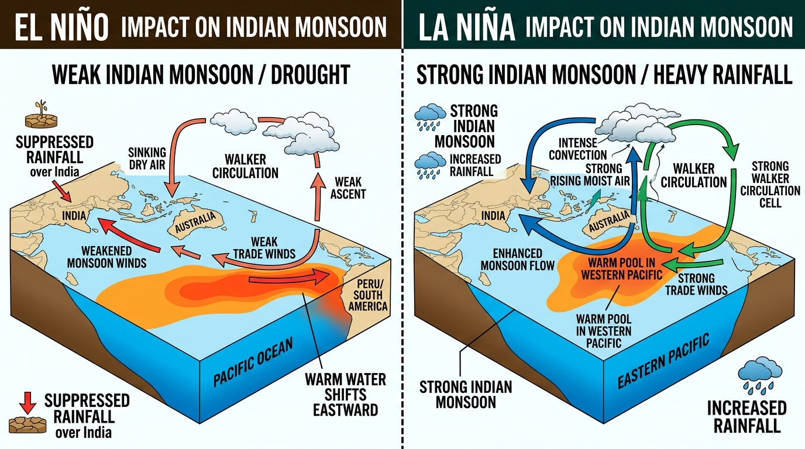

These three names scare many students. Keep them separate first.

- **El Niño** and **La Niña** happen in the **Pacific Ocean** (near Peru / South America).
- **IOD** happens in the **Indian Ocean**.
- All three can change India’s monsoon, but they are **not** the same thing.

#### First understand a normal Pacific year

Look at the Pacific from Peru (east) to Indonesia / Australia (west).

In a normal year:

1. Trade winds blow from **east to west** across the Pacific.
2. They push warm surface water toward the **west** (Indonesia side).
3. Near **Peru** (east), cold deep water rises to the surface. This rise is called **upwelling**.
4. Cold upwelling water brings nutrients. **Plankton** grow. Fish that eat plankton also do well.
5. Rain prefers the warm western Pacific.

So normal year fact: **Peru cool + upwelling on + plankton good**. West Pacific warmer and rainier.

#### El Niño

**Meaning:** the eastern Pacific near Peru becomes unusually **warm**.

What happens step by step:

1. Trade winds become **weak**.
2. Warm water stays near Peru instead of being pushed fully west.
3. Cold upwelling near Peru **stops or weakens**.
4. Nutrients fall. So **plankton fall** and fish catch falls. trap: warm water does **not** increase plankton.
5. Rain shifts toward the central / eastern Pacific.
6. For India: monsoon circulation often becomes weaker. So El Niño years **tend** to give a **weaker** Indian monsoon / drought risk. This is a tendency, not a fixed law.

El Niño is a warm current phase off **Peru**. Weak upwelling cuts nutrients, so plankton and fish fall. India’s monsoon often weakens in El Niño years.

#### La Niña

**Meaning:** the opposite of El Niño.

What happens:

1. Eastern Pacific near Peru becomes **extra cool**.
2. Trade winds become **stronger**.
3. Upwelling near Peru is strong.
4. For India: monsoon often becomes **stronger** / wetter.

La Niña cools the Peru side of the Pacific. India’s monsoon often strengthens in La Niña years.

#### What is ENSO then?

**ENSO** means **El Niño–Southern Oscillation**. It joins the ocean temperature change with the linked pressure swing.

- El Niño and La Niña are the **ocean** temperature phases.
- The Southern Oscillation is the linked **pressure** change between Darwin (Australia side) and Tahiti (Pacific side).
- Ocean phase plus pressure swing together make ENSO.

You do not need two separate stories. If a question says ENSO, think El Niño / La Niña family in the Pacific.

#### IOD (Indian Ocean Dipole)

IOD is **only** about the **Indian Ocean**. Do not mix it with the Pacific.

Compare two sides of the Indian Ocean:

- western Indian Ocean (near Africa / Arabian Sea side)
- eastern Indian Ocean (near Indonesia / Sumatra side)

**Positive IOD (+IOD)**

- Western Indian Ocean is **warmer** than the eastern Indian Ocean.
- More moisture is available toward India.
- Indian monsoon is usually **helped**.
- A +IOD can even **save** a year that also has El Niño. Example: **2019** had El Niño but +IOD, and monsoon finished near normal.

**Negative IOD (−IOD (ऋणात्मक IOD))**

- Eastern Indian Ocean is **warmer**.
- Indian monsoon is usually **hurt / suppressed**.
- If El Niño and −IOD come together, drought risk rises.

**UPSC trap:** IOD is west Indian Ocean versus **east Indian Ocean**. It is **not** west Indian Ocean versus eastern **Pacific**.

#### How to use them in questions

| Name | Ocean | India monsoon | Note |
|------|-------|---------------|------------|
| **El Niño** | Pacific (warm Peru) | Often weaker | Plankton **decrease** |
| **La Niña** | Pacific (cool Peru) | Often stronger | Opposite of El Niño |
| **+IOD** | Indian Ocean (west warmer) | Helps | Can offset El Niño |
| **−IOD** | Indian Ocean (east warmer) | Hurts | Can worsen drought |

Final rule: never say “El Niño always means drought in India.” Say “El Niño **tends** to weaken the monsoon,” and check whether IOD is helping or hurting in that year.

**PYQ — UPPCS Prelims 2023, Q67Logic:** Stmt 1 is the classic warm-Peru definition. Stmt 2 wrongly says plankton increase.

With reference to El Niño, which of the following statements is/are correct?

1. El Niño involves the appearance of a warm current off the coast of Peru in the eastern Pacific.
2. This warm current increases the temperature of water on the Peruvian coast by about 10°C, thereby increasing the amount of plankton in the sea.

A. Only 1

B. Only 2

C. Both 1 and 2

D. Neither 1 nor 2

Show answer

**Ans: A** — Stmt 1 true: warm current off Peru. Stmt 2 false: warm El Niño water weakens upwelling, so plankton and fish **fall**, they do not rise. **C** is the classic trap.

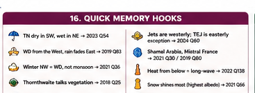

---

## Complete PYQ Bank

> **Answers hidden** — click *Show answer* under each question to reveal.
> **Coverage:** 20 UPPCS Prelims hits (2018–2025) for this topic — **2025 → 2018**.

**Q1. UPPCS Prelims 2025, Q45**
With reference to the ozone layer, which of the following statements is/are correct?

1. The ozone layer protects the Earth's surface from ultraviolet radiation coming from the Sun.
2. Ozone depletion has been linked to chlorofluorocarbons (CFCs).

A. Only 2

B. Neither 1 nor 2

C. Both 1 and 2

D. Only 1

Show answer

**Ans: C** — Both true. Protective ozone is in the **stratosphere**. CFCs linked to depletion. **D** drops CFCs; **A** drops UV shield.

---

**Q2. UPPCS Prelims 2024, Q27**
Given below are two statements, one is labelled as Assertion (A) and the other as Reason (R):

**Assertion (A):** Relative humidity decreases with increasing air temperature.

**Reason (R):** Absolute humidity increases with increasing evaporation.

Select the correct answer from the codes given below:

A. Both (A) and (R) are true, but (R) is not the correct explanation of (A)

B. (A) is false, but (R) is true

C. Both (A) and (R) are true and (R) is the correct explanation of (A)

D. (A) is true, but (R) is false

Show answer

**Ans: A** — RH falls because warmer air has higher saturation capacity. Evaporation raising absolute humidity is separately true and does **not** explain A. **C** over-links.

---

**Q3. UPPCS Prelims 2024, Q33**
Consider the following statements:

1. Chinook is a warm and dry wind.
2. Foehn wind occurs in the Alps.
Which of the above statements is/are correct?

A. Both 1 and 2

B. Only 1

C. Only 2

D. Neither 1 nor 2

Show answer

**Ans: A** — Both are warm/dry downslope winds; Foehn = Alps, Chinook = Rockies analogue.

---

**Q4. UPPCS Prelims 2024, Q60**
Given below are two statements, one is labelled as Assertion (A) and the other as Reason (R):

**Assertion (A):** Jet streams discovered during World War II are high altitude easterly winds.

**Reason (R):** Jet streams flow with a speed of 300–500 km/hour.

Select the correct answer from the codes given below:

A. Both (A) and (R) are true and (R) is the correct explanation of (A)

B. (A) is false, but (R) is true

C. Both (A) and (R) are true, but (R) is not the correct explanation of (A)

D. (A) is true, but (R) is false

Show answer

**Ans: B** — Mid-latitude jets are **westerly**. TEJ over India is a summer exception. Speed in R is acceptable.

---

**Q5. UPPCS Prelims 2024, Q73**
Consider the following statements with reference to cultivated area of some countries of the world:

1. In comparison to USA, China and Japan, India has highest geographical area under cultivation.
2. India's location in tropical monsoon region helps diversified cropping all through the year.
Which of the above statements is/are correct?

A. Both 1 and 2

B. Neither 1 nor 2

C. Only 1

D. Only 2

Show answer

**Ans: D** — Only (2): tropical monsoon supports kharif + rabi + zaid. (1) is false as stated.

---

**Q6. UPPCS Prelims 2023, Q52**
The ozone layer, which absorbs ultraviolet radiation, exists in which layer of the atmosphere?

A. Troposphere

B. Mesosphere

C. Stratosphere

D. Thermosphere

Show answer

**Ans: C** — Stratosphere. **A** = weather-layer trap.

---

**Q7. UPPCS Prelims 2023, Q54**
Given below are two statements, one is labelled as Assertion (A) and the other as Reason (R):

**Assertion (A):** The Tamil Nadu coast remains dry during the South-West monsoon season.

**Reason (R):** The Tamil Nadu coast is situated parallel to the Bay of Bengal branch of the South-West monsoon and it lies in the rain shadow area of the Arabian Sea branch of the South-West monsoon during the monsoon season.

Select the correct answer using the code given below:

A. (A) is true but (R) is false

B. (A) is false but (R) is true

C. Both (A) and (R) are true but (R) is not the correct explanation of (A)

D. Both (A) and (R) are true and (R) is the correct explanation of (A)

Show answer

**Ans: D** — Parallel coast + Arabian Sea rain shadow.

---

**Q8. UPPCS Prelims 2023, Q67**
With reference to El Niño, which of the following statements is/are correct?

1. El Niño involves the appearance of a warm current off the coast of Peru in the eastern Pacific.
2. This warm current increases the temperature of water on the Peruvian coast by about 10°C, thereby increasing the amount of plankton in the sea.

A. Only 1

B. Only 2

C. Both 1 and 2

D. Neither 1 nor 2

Show answer

**Ans: A** — Warm water **suppresses** upwelling → plankton **falls**. **C** is the trap.

---

**Q9. UPPCS Prelims 2023, Q68**
What causes winds to deflect towards the left in the Southern Hemisphere?

A. Temperature

B. Coriolis Force

C. Magnetic Field

D. Pressure

Show answer

**Ans: B** — Left in SH, right in NH. A/D drive wind, they do not cause the leftward deflection.

---

**Q10. UPPCS Prelims 2022, Q22**
Given below are two statements, one is labelled as Assertion (A) and the other as Reason (R):

**Assertion (A):** Agra and Darjeeling are located on nearly the same latitude, but the temperature in January in Agra is about 16°C whereas it is only 4°C in Darjeeling.

**Reason (R):** Temperature decreases with height due to thinner air compared to places in the plains.

A. (A) is false but (R) is true

B. (A) is true but (R) is false

C. Both (A) and (R) are true but (R) is not the correct explanation of (A)

D. Both (A) and (R) are true and (R) is the correct explanation of (A)

Show answer

**Ans: D** — Lapse rate / altitude on nearly the same latitude.

---

**Q11. UPPCS Prelims 2022, Q138**
The Earth's atmosphere is mainly heated by which one of the following?

A. Long-wave terrestrial radiation

B. Scattered solar radiation

C. Reflected solar radiation

D. Short-wave solar radiation

Show answer

**Ans: A** — Troposphere heated from below by long-wave IR. **D** mostly reaches the surface without heating air directly.

---

**Q12. UPPCS Prelims 2021, Q30**
Which one of the following pairs is NOT correctly matched?

A. Leveche — Spain

B. Brickfielder — Australia

C. Black roller — North America

D. Shamal — Austria

Show answer

**Ans: D** — Shamal = Arabia / Persian Gulf, **not Austria**.

---

**Q13. UPPCS Prelims 2021, Q36**
Which one of the following causes is responsible for rainfall during winters in the north-western part of India?

A. Retreating Monsoon

B. Cyclonic depression

C. Western disturbances

D. South-West Monsoon

Show answer

**Ans: C** — WD. A/D are monsoon-season systems.

---

**Q14. UPPCS Prelims 2021, Q66**
Which one of the following reflects back more sunlight as compared to other three?

A. Sand Desert

B. Paddy crop land

C. Land covered with fresh snow

D. Prairie land

Show answer

**Ans: C** — Highest albedo among the options.

---

**Q15. UPPCS Prelims 2020, Q74**
Match List-I with List-II:
**List-I (Tropical cyclones):** A. Baguios B. Hurricanes C. Typhoons D. Willy-Willies
**List-II (Country):** 1. Australia 2. China 3. Philippines 4. United States of America

A. 3 4 1 2

B. 3 4 2 1

C. 2 3 4 1

D. 2 1 3 4

Show answer

**Ans: B** — **3 4 2 1**: Baguios–Philippines, Hurricanes–USA, Typhoons–China, Willy-Willies–Australia.

---

**Q16. UPPCS Prelims 2019, Q78**
Match List-I with List-II:
**List-I (Different name of tropical cyclone):** A. Willy-Willies B. Taifu C. Baguio D. Hurricanes
**List-II (Country):** 1. Philippines 2. Australia 3. Japan 4. U.S.A.

A. 3 4 1 2

B. 2 3 4 1

C. 1 3 2 4

D. 2 3 1 4

Show answer

**Ans: D** — **2 3 1 4**: Australia, Japan, Philippines, USA.

---

**Q17. UPPCS Prelims 2019, Q80**
Which of the following is NOT correctly matched? (Wind) (Country)

A. Santa Ana — California

B. Haboob — Sudan

C. Yamo — Japan

D. Mistral — Australia

Show answer

**Ans: D** — Mistral = southern **France**, not Australia.

---

**Q18. UPPCS Prelims 2019, Q83**
The winter rains caused by Western disturbance in North Western Plain of India gradually decreases from:

A. East to West

B. West to East

C. North to South

D. South to North

Show answer

**Ans: B** — Enter from the west; Punjab/Haryana wetter than east UP.

---

**Q19. UPPCS Prelims 2018, Q25**
'Vegetation is the true index of climate'. This statement is associated with:

A. Thornthwaite

B. Koppen

C. Trewartha

D. Stamp

Show answer

**Ans: A** — Thornthwaite moisture/vegetation index. Köppen = letter codes; Trewartha = modified Köppen.

---

**Q20. UPPCS Prelims 2018, Q52**
The maximum concentration of Ozone is found in which of the following?

A. Troposphere

B. Mesosphere

C. Stratosphere

D. Exosphere

Show answer

**Ans: C** — Same fact as 2023 Q52. **A** is the weather-layer trap. Ozone = **stratosphere**.

---

## Complete PYQ Bank — Ghatnachakra Climate (Monsoon, Rainfall & Winter Rainfall)

Comprehensive question bank from Ghatnachakra covering Monsoon, Rainfall, and Winter Rainfall sections. Fully verified with official PSC answer keys and analytical explanations.

**Q-GC1. MPPCS Prelims 2013**

The term 'Monsoon' is originated from:

A. Arabic Language

B. Spanish

C. Hindi

D. English

Show answer

**Ans: A.** The word 'Monsoon' is derived from the Arabic word 'mausim', which literally translates to 'season'. Traditionally, monsoon describes a seasonal reversal in the direction of winds that brings extensive precipitation to South and South-East Asia.

---

**Q-GC2. UPPCS Prelims 1996 / 1998 / UP Lower Sub. Prelims 1998**

Given below are two statements, one is labelled as Assertion (A) and the other as Reason (R):

**Assertion (A):** India is a Monsoonal Country.
**Reason (R):** The high Himalayas impart it climatic distinctiveness.

Select the correct answer from the code given below:

A. Both (A) and (R) are true, and (R) is the correct explanation of (A).

B. Both (A) and (R) are true, but (R) is not the correct explanation of (A).

C. (A) is true, but (R) is false.

D. (A) is false, but (R) is true.

Show answer

**Ans: A.** Both statements are true and (R) explains (A). India's overarching climatic regime is essentially monsoonal. The towering Himalayan mountain system functions as an impassable climatic divide: it shields the subcontinent from frigid Arctic/Central Asian blizzards in winter and obstructs the moisture-laden summer monsoon winds, forcing them to shed precipitation across India.

---

**Q-GC3. IAS Prelims 1994**

An index map of India showing isothermal bands and thermal regimes across different geographical regions depicts the distribution of:

A. Winter Rainfall

B. Pressure

C. Annual rainy days

D. Mean Temperature

Show answer

**Ans: D.** The map delineates annual mean temperature zones. India hosts climatic environments spanning humid tropical in the south to temperate/alpine in the north. Northern interior regions experience substantially higher seasonal temperature variations than peninsular and coastal regions.

---

**Q-GC4. Jharkhand PCS Prelims 2013**

Given below are two statements, one is labelled as Assertion (A) and the other as Reason (R):

**Assertion (A):** India has a tropical Monsoon type climate.
**Reason (R):** India is located exactly between the tropical latitudes.

Select the correct answer using the code given below:

A. Both (A) and (R) are true, and (R) is the correct explanation of (A).

B. (A) is true, but (R) is false.

C. Both (A) and (R) are true, but (R) is not the correct explanation of (A).

D. (A) is false, but (R) is true.

Show answer

**Ans: B.** Assertion (A) is correct: India's dominant climate is tropical monsoonal. Reason (R) is false: tropical latitudes lie strictly between 23°30' N and 23°30' S (Tropic of Cancer to Tropic of Capricorn), whereas India's mainland extends from 8°4' N up to 37°6' N, placing more than half its geographic territory in the subtropical and warm temperate zone.

---

**Q-GC5. UPPCS Prelims 2006**

In which of the following States does the South-West Monsoon arrive first?

A. Assam

B. West Bengal

C. Maharashtra

D. Kerala

Show answer

**Ans: D.** In mainland India, the South-West monsoon makes landfall first on the coast of Kerala around 1 June. (Across Indian territories as a whole, it reaches the Andaman & Nicobar Islands around 20–25 May).

---

**Q-GC6. MPPCS Prelims 2012 / UKPCS Prelims 2006**

The general direction of flow of the summer monsoon in India is:

A. from South to North

B. from South West to South East

C. from South East to South West

D. from South West to North East

Show answer

**Ans: D.** During summer, moisture-bearing monsoonal winds travel from South-West to North-East across the Indian landmass. In the winter retreating phase, the prevailing wind direction reverses to blow from North-East to South-West.

---

**Q-GC7. UP RO/ARO Mains 2016**

The Indian summer monsoon originates from which of the following wind systems?

A. South-West winds

B. South-East winds

C. North-East winds

D. North-West winds

Show answer

**Ans: A.** The summer monsoon originates as South-East trade winds in the southern Indian Ocean. Upon crossing the equator between 40° E and 60° E, they are deflected to the right by Coriolis force, becoming South-West winds that blow into the Indian subcontinent.

---

**Q-GC8. IAS Prelims 1996**

High temperature and low pressure over the Indian Subcontinent during the summer season draw air from the Indian Ocean leading to the in-blowing of the:

A. South-East monsoon

B. South-West monsoon

C. Trade winds

D. Westerlies

Show answer

**Ans: B.** Intense summer insolation over the northwestern plains and Tibetan Plateau establishes an intense low-pressure cell. This thermal gradient draws cool, moisture-laden air masses across the equator from the high-pressure southern Indian Ocean as the South-West monsoon.

---

**Q-GC9. IAS Prelims 1993**

A climograph characterizing a region with high relative humidity (above 75–80%) and moderate-to-warm temperatures (20°C to 32°C) throughout May to October with intense wet spells represents which Indian region?

A. North–West region of India

B. South region of India

C. Central region of India

D. North-East region of India

Show answer

**Ans: D.** The climograph represents the North-East region of India (Assam and adjoining states), where high humidity, persistent cloudiness, and heavy orographic rainfall dominate from May through October, contrasting with the dry extremes of the North-West.

---

**Q-GC10. BPSC Prelims 2015**

Which one of the following is the driest place in India?

A. Mumbai

B. Delhi

C. Leh

D. Bengaluru

Show answer

**Ans: C.** Leh (Ladakh) is located in the rain-shadow of the Greater Himalayas and receives only ~4.17 cm (41.7 mm) of precipitation annually, making it the driest meteorological station in India.

---

**Q-GC11. IAS Prelims 1997**

The January isotherm taken as a basis for dividing India into tropical and subtropical zones is:

A. 21°C

B. 18°C

C. 12°C

D. 15°C

Show answer

**Ans: B.** The 18°C mean January isotherm runs roughly parallel to the Tropic of Cancer across central India, dividing the country into the tropical zone to the south (where mean January temperatures remain ≥ 18°C) and the subtropical zone to the north.

---

**Q-GC12. IAS Prelims 2001**

In the central peninsular plateau region of India, the mean temperature for the month of July typically varies between:

A. 22.5°C - 25.0°C

B. 25.0°C - 27.5°C

C. 27.5°C - 30.0°C

D. 30.0°C - 32.5°C

Show answer

**Ans: B.** Over the central peninsular plateau (Deccan interior), July mean temperatures stay moderate between 25.0°C and 27.5°C owing to persistent monsoonal cloud cover, rainfall, and moderate elevation.

---

**Q-GC13. CGPCS Prelims 2011**

In which part of India is the daily range of temperature (diurnal range) highest?

A. Eastern coastal areas

B. Interior areas of Chhattisgarh plain

C. Andaman island

D. Desert areas of Rajasthan

Show answer

**Ans: D.** Desert areas of western Rajasthan exhibit the highest diurnal temperature range. Sandy soils heat up very rapidly under direct sunshine during the day and radiate heat swiftly under cloudless skies at night.

---

**Q-GC14. MPPCS Prelims 2005**

Which are the principal months for monsoon rainfall in Tamil Nadu?

A. March-April

B. June-July

C. September-October

D. November-December

Show answer

**Ans: D.** Tamil Nadu receives approximately 50–60% of its annual precipitation during the North-East monsoon period between October and December (with peak rainfall occurring in November and December).

---

**Q-GC15. BPSC Prelims 1994**

The Indian monsoon is marked by seasonal displacement of wind systems primarily because of:

A. Differential temperature of land and sea

B. Cold wind of middle Asia

C. Excess similarity of temperature

D. None of the above

Show answer

**Ans: A.** The primary physical engine driving the seasonal reversal of winds is the differential rate of heating and cooling of the continental landmass relative to the surrounding ocean. In addition, Flohn's dynamic concept explains it through the seasonal migration of planetary pressure belts and the ITCZ.

---

**Q-GC16. IAS Prelims 2012**

Consider the following statements:

1. The duration of the monsoon decreases from southern India to northern India.
2. The amount of annual rainfall in the northern plains of India decreases from east to west.

Which of the statement(s) given above is/are correct?

A. Only 1

B. Only 2

C. 1 and 2

D. Neither 1 nor 2

Show answer

**Ans: C.** Both statements are correct. Southern India experiences an earlier onset (1 June) and later withdrawal (November/December for the south), giving it a longer monsoon duration than the northern plains. In the northern plains, the Bay of Bengal branch loses moisture progressively as it moves westward, so rainfall decreases from East to West.

---

**Q-GC17. IAS Prelims 2017**

With reference to 'Indian Ocean Dipole (IOD)' sometimes mentioned in the news while forecasting Indian monsoon, which of the following statements is/are correct?

1. IOD phenomenon is characterised by a difference in sea surface temperature between tropical Western Indian Ocean and tropical Eastern Pacific Ocean.
2. An IOD phenomenon can influence an El Nino's impact on the monsoon.

Select the correct answer using the code given below:

A. 1 only

B. 2 only

C. Both 1 and 2

D. Neither 1 nor 2

Show answer

**Ans: B.** Statement 1 is incorrect because IOD is an oscillation of sea-surface temperatures entirely within the Indian Ocean (between the tropical Western Indian Ocean and the tropical Eastern Indian Ocean south of Indonesia), NOT the Pacific. Statement 2 is correct because a positive IOD (+IOD) pumps extra moisture toward India and can offset or neutralize the drying effect of an El Niño.

---

**Q-GC18. CGPCS Prelims 2022**

Which of the following statements are true in relation to the upper tropospheric jet stream over Asia?

1. Jet stream blows across the Asian Continent at latitudes North of the Himalayas parallel to Tibetan highlands.
2. Tibetan highland divides the jet stream into North and South Branches.
3. The northern branch of jet stream plays an important role in winter weather in India.

Select the correct code:

A. 1 and 2

B. 1 and 3

C. 1, 2 and 3

D. None of the above

Show answer

**Ans: A.** Statements 1 and 2 are true: in winter, the Subtropical Westerly Jet stream blowing eastward is bifurcated by the Tibetan Plateau into two branches. Statement 3 is false because the northern branch blows north of Tibet across China; it is the southern branch (flowing south of the Himalayas across northern India) that steers Western Disturbances and controls India's winter weather.

---

**Q-GC19. UPPCS Prelims 2022**

Given below are two statements, one is labelled as Assertion (A) and the other as Reason (R):

**Assertion (A):** Agra and Darjeeling are located on the same latitude but temperature of January in Agra is 16° Centigrade whereas it is only 4° Centigrade in Darjeeling.
**Reason (R):** Temperature decreases with height and due to thin air, places in the mountains are cooler than places in the plains.

Select the correct answer from the code given below:

A. (A) is true but (R) is false

B. Both (A) and (R) are true and (R) is the correct explanation of (A)

C. (A) is false but (R) is true

D. Both (A) and (R) are true but (R) is not the correct explanation of (A)

Show answer

**Ans: B.** Both Agra (27°10' N) and Darjeeling (27°03' N) share nearly identical latitude. However, Agra is in the plains (~169 m) while Darjeeling is at high altitude (~2,042 m). By the normal environmental lapse rate (~1°C per 165 m, or ~6.5°C per 1,000 m), temperature decreases with height, explaining why Darjeeling is 12°C colder in January. Hence R correctly explains A.

---

**Q-GC20. BPSC Prelims 2011**

Amritsar and Shimla are almost on the same latitude, but their climate difference is primarily due to:

A. The difference in their altitudes

B. Their distance from sea

C. Snowfall in Shimla

D. Pollution in Amritsar

Show answer

**Ans: A.** Amritsar (31°38' N) and Shimla (31°06' N) lie on virtually the same parallel. Amritsar is located at ~756 feet (~230 m) above mean sea level, whereas Shimla sits at ~7,866 feet (~2,400 m). This elevation disparity explains their contrasting climatic conditions.

---

**Q-GC21. CGPCS Prelims 2011**

Which one of the following types of climate is found in Chhattisgarh state?

A. Humid South-East

B. Sub Humid transitional

C. Sub Humid Littoral

D. Sub Humid continental

Show answer

**Ans: A.** A Humid South-East climate characterizes West Bengal, Chotanagpur, the Odisha plains, southern Chhattisgarh, and north-east Andhra Pradesh. Sub-humid transitional spreads over the central Gangetic plain; sub-humid littoral across the Coromandel coast; and sub-humid continental over the upper Gangetic plain.

---

**Q-GC22. CGPCS Prelims 2016**

Which of the following regions is not affected much by the Arabian Sea branch of Monsoon?

A. The Western Ghat

B. Deccan Plateau

C. Madhya Pradesh

D. Chhattisgarh Basin

Show answer

**Ans: D.** The Chhattisgarh Basin receives very little precipitation from the Arabian Sea branch. The Arabian Sea branch is obstructed by the Western Ghats and splits: one stream moves across Gujarat/Aravallis, and another traverses the Narmada-Tapi trough across the Vindhyas into MP. The low-lying interior Chhattisgarh Basin is shielded and receives the vast bulk of its rainfall from the Bay of Bengal branch.

---

**Q-GC23. UP UDA/LDA Spl. Prelims 2010**

Which of the following places experience a humid climate?

1. Ahmedabad
2. Kochi
3. Ludhiana
4. Tejpur

Select the correct answer from the code given below:

A. 1 and 2 only

B. 1 and 3 only

C. 2 and 3 only

D. 2 and 4 only

Show answer

**Ans: D.** Kochi (coastal Kerala, rainfall > 3,000 mm) and Tejpur (Sonitpur district, Assam, rainfall > 1,400 mm) experience humid climates with heavy rainfall and high relative humidity. By contrast, Ahmedabad (semi-arid Gujarat) and Ludhiana (semi-arid Punjab) receive much less precipitation.

---

**Q-GC24. BPSC Prelims 1995**

The decline or withdrawal of the monsoon in northern India is indicated by which of the following features?

1. Clear Sky
2. Pressure conditions in the Bay of Bengal
3. Rising temperature on land

Select the answer using the code given below:

A. only 1

B. 1 and 2 both

C. 1, 2 and 3

D. 2 and 3 both

Show answer

**Ans: C.** All three indicate the decline/retreating monsoon (October–November): skies become clear, daytime temperatures rise temporarily on land (causing the oppressive 'October Heat'), and atmospheric pressure falls over the Bay of Bengal, giving rise to cyclonic depressions.

---

**Q-GC25. IAS Prelims 2015**

Consider the following statements:

1. The winds which blow between 30°N and 60°S latitudes throughout the year are known as westerlies.
2. The moist air masses that cause winter rains in the North-Western region of India are part of westerlies.

Which of the statements given above is/are correct?

A. 1 only

B. 2 only

C. Both 1 and 2

D. Neither 1 nor 2

Show answer

**Ans: B.** Statement 1 is incorrect because westerlies blow between 30° and 60° latitude in each hemisphere (30°N–60°N in the Northern Hemisphere and 30°S–60°S in the Southern Hemisphere), not continuously across the equator from 30°N to 60°S. Statement 2 is correct because the Western Cyclonic Disturbances that cause winter rains in NW India are extratropical systems steered into India by the subtropical westerly jet stream.

---

**Q-GC26. MPPCS Prelims 2018**

The Intertropical Convergence Zone (ITCZ), a low-pressure belt, is located:

A. between trade winds and westerlies belt

B. between westerlies and polar winds belt

C. nearby the poles

D. at the equator

Show answer

**Ans: D.** The ITCZ is a broad trough of low pressure located in equatorial latitudes where the Northeast and Southeast trade winds converge. It shifts northward and southward following the apparent seasonal movement of the Sun.

---

**Q-GC27. RAS/RTS Prelims 2018**

The dust storms originating in Rajasthan during May and June months are caused due to:

A. Origin of convectional currents at few places

B. Aravalli hills are parallel to south-western winds

C. Origin of fast speedy easterly winds

D. High atmospheric pressure in the desert

Show answer

**Ans: A.** Intense surface heating in May and June creates localized intense low-pressure pockets. Surrounding air is sucked in rapidly, originating vigorous vertical convectional currents that whip up fine desert sand into dust storms (locally known as Andhi).

---

**Q-GC28. BPSC Prelims Re-Exam 2022**

Rajasthan receives very little rain during the South-West monsoon season because:

A. the monsoon fails to reach this area

B. it is too hot

C. there is no water available and thus, the winds remain dry

D. the winds do not come across any barriers to cause the necessary uplift to cool the air

Show answer

**Ans: D.** The Aravalli mountain range runs parallel to the direction of the Arabian Sea monsoon winds, offering no transverse orographic barrier to force the air masses to rise, cool, and condense. Furthermore, intense desert heat lowers relative humidity, preventing precipitation.

---

**Q-GC29. UP RO/ARO Prelims 2021**

Arrange the following seasons in Chronological order according to the traditional Hindu Calendar:

1. Autumn (Sharad)
2. Summer (Grishma)
3. Spring (Vasanta)
4. Rainy (Varsha)

Select the correct answer using the code given below:

A. 2, 4, 3, 1

B. 3, 2, 4, 1

C. 4, 2, 1, 3

D. 1, 4, 2, 3

Show answer

**Ans: B.** The 6 seasons (*Ritus*) of the Hindu calendar in chronological sequence are: 1. Vasanta (Spring: Chaitra–Vaishakha / Mar–Apr), 2. Grishma (Summer: Jyeshtha–Ashadha / May–Jun), 3. Varsha (Rainy: Shravana–Bhadrapada / Jul–Aug), 4. Sharad (Autumn: Ashvina–Kartika / Sep–Oct), followed by Hemant (Pre-winter) and Shishir (Winter). Thus the correct order is 3, 2, 4, 1.

---

**Q-GC30. UKPCS Prelims 2021**

Köppen has used which of the following letter symbols for the climate of the Great Plains of India?

A. Amw

B. As

C. Cwg

D. Aw

Show answer

**Ans: C.** Köppen designated the climate of the Great Plains of India (Indo-Gangetic plains) as Cwg. Here 'C' represents warm temperate / mesothermal climate, 'w' indicates dry winter, and 'g' represents the Ganges temperature curve where the hottest month precedes the summer solstice rains.

---

**Q-GC31. UKPCS Prelims 2016**

As per Köppen's classification of climate, which one of the following is the most suitable description of North-East India including North Bengal?

A. Tropical monsoon rainforest (Amw)

B. Sub-tropical monsoon rainforest (Am)

C. Tropical wet and dry climate (Monsoon Savannah) (Aw)

D. Humid sub-tropical climate with dry winter (Cwg)

Show answer

**Ans: D.** As per Köppen's climatic scheme, North-East India (including the Brahmaputra valley and North Bengal) is categorized under Humid sub-tropical climate with dry winter (Cwg).

---

**Q-GC32. BPSC Prelims 2017**

According to Köppen's climatic classification, the climate of North Bihar is designated as:

A. Cwg

B. Aw

C. CA'w

D. CB'w

Show answer

**Ans: A.** According to Köppen's scheme, the climate of North Bihar and the surrounding Middle Gangetic plain is classified as Cwg (humid subtropical with dry winter).

---

**Q-GC33. BPSC Prelims 2008**

India receives its maximum annual rainfall mainly from which of the following?

A. North-East Monsoon

B. Retreating Monsoon

C. South-West Monsoon

D. Convectional rainfall

Show answer

**Ans: C.** The South-West monsoon (June to September) supplies approximately 75% to 90% of India's total annual rainfall. It enters India through two branches: the Arabian Sea branch and the Bay of Bengal branch.

---

**Q-GC34. UPPCS Prelims 2009**

The Indian state which receives the maximum share of its annual rainfall due to the North-East monsoon is:

A. Assam

B. West Bengal

C. Tamil Nadu

D. Odisha

Show answer

**Ans: C.** Tamil Nadu receives 50% to 60% of its total annual precipitation during the North-East monsoon (October to December), as the offshore winds pick up copious moisture while crossing the warm waters of the Bay of Bengal.

---

**Q-GC35. UPPCS Mains 2016**

Which amongst the following States records the highest average annual rainfall?

A. Arunachal Pradesh

B. Sikkim

C. Kerala

D. Jammu and Kashmir

Show answer

**Ans: B.** Among the four states listed in the options, Sikkim receives the highest average annual rainfall (~3,043 mm). (Nationally, Goa records the highest state average annual rainfall at ~3,947 mm, followed by Kerala at ~3,606 mm and Sikkim at ~3,043 mm).

---

**Q-GC36. IAS Prelims 1993**

Which among the following pairs of places exhibit the most marked differences in total annual rainfall despite being located along approximately the same latitude?

A. Bengaluru and Chennai

B. Mumbai and Vishakhapatnam

C. Ajmer and Shillong

D. Nagpur and Kolkata

Show answer

**Ans: C.** Both Ajmer and Shillong lie near latitude 26°–27° N. However, Ajmer receives only ~587 mm of rain annually (situated on the arid margin of the Thar), whereas Shillong in the Khasi Hills receives ~5,160 mm annually due to funnel-shaped orographic lifting of Bay of Bengal winds.

---

**Q-GC37. IAS Prelims 2002**

The average annual temperature of a meteorological station is 26°C, its average annual rainfall is 63 cm, and its annual range of temperature is 9°C. The station in question is:

A. Allahabad

B. Chennai

C. Cherrapunji

D. Kolkata

Show answer

**Ans: B.** Chennai has an equable tropical maritime climate with an annual mean temperature of ~26°C, a low annual temperature range of ~8°–9°C, and moderate rainfall (~63–100 cm, occurring predominantly in winter during October–December).

---

**Q-GC38. IAS Prelims 2005**

Which one of the following is the correct sequence of the given Indian cities in decreasing order of their normal annual rainfall?

A. Kochi – Kolkata – Delhi – Patna

B. Kolkata – Kochi – Patna – Delhi

C. Kochi – Kolkata – Patna – Delhi

D. Kolkata – Kochi – Delhi – Patna

Show answer

**Ans: C.** In descending order of annual rainfall: Kochi (~3,932 mm) > Kolkata (~2,451 mm) > Patna (~1,100 mm) > Delhi (~904 mm). Rainfall steadily decreases inland and westward along the Gangetic plain.

---

**Q-GC39. BPSC Prelims 1994 / JPSC Prelims 2023**

Mango showers are common pre-monsoon phenomena in which of the following States of India?

A. Uttar Pradesh and Madhya Pradesh

B. Madhya Pradesh and Karnataka

C. Uttar Pradesh and Tamil Nadu

D. Kerala and Karnataka

Show answer

**Ans: D.** Mango showers are pre-monsoon thunderstorm showers occurring in Kerala, coastal Karnataka, and parts of Goa/Konkan during April–May. They prevent premature fruit drop and aid in the ripening of mangoes.

---

**Q-GC40. BPSC Prelims 2022**

Towards the end of summer, there are pre-monsoon showers which are a common phenomenon in Kerala and coastal Karnataka. Locally, they are known as:

A. Mango showers

B. Blossom showers

C. Norwesters

D. Loo

Show answer

**Ans: A.** Pre-monsoon showers in Kerala and coastal Karnataka that prevent premature dropping and help mangoes ripen are called Mango Showers. Blossom showers are coffee-blossoming rains in Kerala/Karnataka, and Norwesters occur in Bengal/Assam.

---

**Q-GC41. UPPCS Prelims 2008 / Mains 2010**

Which one of the following places records the lowest annual rainfall in India?

A. Bikaner

B. Jaisalmer

C. Jodhpur

D. Leh

Show answer

**Ans: D.** Leh (Ladakh UT) records the lowest annual rainfall in India at only ~4.17 cm (41.7 mm). By comparison, Jaisalmer receives ~31.67 cm (lowest in Rajasthan), and Bikaner receives ~32.84 cm.

---

**Q-GC42. MPPCS Prelims 2005 / BPSC Prelims 1996**

Cherrapunji, one of the wettest places in the world, is located in the state of:

A. Assam

B. Manipur

C. Meghalaya

D. Mizoram

Show answer

**Ans: C.** Cherrapunji (Sohra) is located in the East Khasi Hills district of the northeastern state of Meghalaya. It holds historic global rainfall records alongside neighbouring Mawsynram.

---

**Q-GC43. MPPCS Prelims 2010**

The highest rainfall zones in India are concentrated in:

A. Western Ghats, Himalayan Region and Meghalaya

B. Madhya Pradesh and Bihar

C. Uttar Pradesh, Haryana and Punjab

D. Andhra Pradesh and Vidarbha

Show answer

**Ans: A.** Zones receiving extreme rainfall (> 250 cm annually) in India are the windward slopes of the Western Ghats, the Sub-Himalayan belt in the North-East, and the Meghalaya Plateau (Khasi, Garo, and Jaintia Hills).

---

**Q-GC44. UPPCS Prelims 1994**

India has an abundant volume of rainfall but is still regarded as a 'thirsty land'. This paradoxical condition is due to:

A. Rapid run off of water

B. Quick evaporation of rainwater

C. Concentration of rainfall during a few months only

D. All the above

Show answer

**Ans: D.** All three factors contribute to the paradox: rainfall is temporally concentrated in just 3–4 monsoon months, torrential bursts cause rapid surface runoff into rivers and seas before recharging groundwater, and high tropical heat leads to rapid evaporation.

---

**Q-GC45. UPPCS Mains 2011**

Which of the following Water Management Strategies in India is the most cost-effective?

A. Improvement of the flush system

B. Treatment and use of wastewater

C. Rainwater Harvesting

D. Recycling and Re-use of Water

Show answer

**Ans: C.** Rainwater harvesting is the most cost-effective and decentralized water management strategy in India. It recharges depleted aquifers, raises the water table, and prevents runoff. Tamil Nadu was the first Indian state to make rooftop rainwater harvesting compulsory.

---

**Q-GC46. UPPCS Prelims 1994**

Which of the following areas in India receive an average of only about 200 mm (20 cm) of annual rainfall?

A. Kerala, Tamil Nadu, Karnataka

B. Jammu and Kashmir (Ladakh / Zanskar)

C. West Bengal, Odisha, Bihar

D. Assam, Manipur, Tripura

Show answer

**Ans: B.** The cold desert tract of Ladakh and the northern Zanskar range (formerly Jammu & Kashmir, now Ladakh UT), along with the extreme western margin of Rajasthan (Thar), receive an average annual rainfall under 200 mm (20 cm).

---

**Q-GC47. JPSC Prelims 2011**

Jharkhand receives the vast majority of its annual rainfall from which monsoon system?

A. North East Monsoon

B. South West Monsoon

C. North West Monsoon

D. None of these

Show answer

**Ans: B.** Jharkhand receives almost all its annual rainfall during the South-West monsoon season between June and September (principally via the Bay of Bengal branch, supplemented by the Arabian Sea branch).

---

**Q-GC48. IAS Prelims 1993**

The mean annual rainfall across the sub-humid interior tracts of central and peninsular India (Deccan plateau / eastern MP / Vidarbha) typically ranges between:

A. 100 to 150 cm

B. 150 to 200 cm

C. 200 to 250 cm

D. 250 to 300 cm

Show answer

**Ans: A.** The sub-humid central and eastern Deccan plateau belts receive moderate mean annual rainfall varying between 100 cm and 150 cm (1,000 to 1,500 mm).

---

**Q-GC49. RAS/RTS Prelims 2008**

When very heavy rainfall occurs in the Pushkar Hills (Ajmer), where do flash floods unexpectedly occur?

A. Ajmer

B. Sawai Madhopur

C. Balotra

D. Sojat

Show answer

**Ans: C.** Runoff from the Pushkar hills flows into the Luni River. Downstream, Balotra (in Barmer district) is situated on the lower gradient slope near the Pachpadra depression where the river channel is shallow, resulting in severe flash flooding in Balotra.

---

**Q-GC50. IAS Prelims 1993**

A 'rainy day' as defined by the Indian Meteorological Department (IMD) is a day when the rainfall received at a station in 24 hours is:

A. 0.5 mm to 1 mm

B. 1.1 mm to 1.5 mm

C. 1.6 mm to 2 mm

D. Above 2.5 mm

Show answer

**Ans: D.** According to the Indian Meteorological Department (IMD) official classification, a 'rainy day' is defined as a calendar day on which a meteorological station measures 2.5 mm or more rainfall in 24 hours.

---

**Q-GC51. IAS Prelims 1994**

Given below are two statements, one is labelled as Assertion (A) and the other as Reason (R):

**Assertion (A):** The Monsoonal rainfall decreases as one goes toward the West and North–West in the Ganga plain.
**Reason (R):** The moisture bearing Monsoonal winds go higher and lose moisture as they move up in the Ganga plain.

In the context of the above two statements, which one of the following is correct?

A. Both (A) and (R) are true, and (R) is correct explanation of (A).

B. Both (A) and (R) are true, but (R) is not the correct explanation of (A).

C. (A) is true, but (R) is false.

D. (A) is false, but (R) is true.

Show answer

**Ans: A.** Both (A) and (R) are true and (R) explains (A). As the Bay of Bengal branch travels westward and northwestward along the Himalayan barrier across the Gangetic plain, it sheds moisture progressively; by the time it reaches Punjab and Haryana, atmospheric humidity has significantly diminished.

---

**Q-GC52. IAS Prelims 1994**

A physical line on a geographical map of India extending from the Western Ghats across the Satpuras, Aravallis, and Delhi Ridge up to the Himalayas depicts the:

A. An Isohyet

B. All India water divide

C. A combination of national highways

D. A combination of major pipeline routes

Show answer

**Ans: B.** The line represents the Great All-India Water Divide. Drainage originating to the west of this ridge line discharges into the Arabian Sea, whereas drainage to the east discharges into the Bay of Bengal.

---

**Q-GC53. IAS Prelims 1997**

Match List-I (Climatic condition) with List-II (Reasons) and select the correct answer using the given code:

**List-I:**
A. Chennai is warmer than Kolkata
B. Snowfall in Himalayas
C. Rainfall decreases from West Bengal to Punjab
D. Sutlej-Ganga plain gets some rain in winter

**List-II:**
1. North East Monsoon
2. Altitude
3. Western depressions
4. Distance from sea
5. Latitude

Codes:

A. A-1, B-2, C-4, D-5

B. A-4, B-5, C-1, D-3

C. A-5, B-2, C-4, D-3

D. A-5, B-1, C-3, D-4

Show answer

**Ans: C.** Chennai is warmer than Kolkata because it is located closer to the equator (Latitude - 5). Snowfall occurs in the Himalayas due to extreme elevation (Altitude - 2). Rainfall decreases from WB to Punjab due to increasing Distance from the sea / moisture depletion (4). Sutlej-Ganga plain receives winter rain due to Western depressions / disturbances (3).

---

**Q-GC54. IAS Prelims 1994**

The hallmark of traditional watershed development in the semi-arid regions of India is the:

A. Establishment of sheds on a large scale, so that the rain-water does not evaporate

B. Undertaking of earthworks, soil conservation, moisture and recharge underground water

C. Drilling deep tube well so as to tap water at the rock-strata level

D. Setting up a system of tanks by embanking water from seasonal rivers

Show answer

**Ans: D.** The hallmark of traditional and effective watershed development across semi-arid Peninsular and central India is constructing earthen bunds and check dams to create a system of interconnected tanks embanking seasonal rivers and rivulets (over 120,000 tanks irrigating >4 million hectares).

---

**Q-GC55. RAS/RTS Prelims 1993**

How many districts in India were initially covered under the Desert Development Programme (DDP) at its inception?

A. 11 Districts

B. 14 Districts

C. 17 Districts

D. 21 Districts

Show answer

**Ans: D.** The Desert Development Programme (DDP) was launched in 1977–78 initially covering 131 blocks across 21 districts in 5 states (Rajasthan, Gujarat, Haryana, Jammu & Kashmir, and Himachal Pradesh). In 1995–96, coverage was expanded to 235 blocks of 40 districts across 7 states (including Andhra Pradesh and Karnataka).

---

**Q-GC56. UPPCS Prelims 2008**

Given below are two statements, one is labelled as Assertion (A) and the other as Reason (R):

**Assertion (A):** Inland waterways are not well developed in India.
**Reason (R):** Most parts of India receive rainfall only for four months in a year.

Select the correct answer using the codes given below:

A. Both (A) and (R) are true, and (R) is the correct explanation of (A)

B. Both (A) and (R) are true, but (R) is NOT the correct explanation of (A)

C. (A) is true, but (R) is false

D. (A) is false, but (R) is true

Show answer

**Ans: A.** Both statements are true and (R) explains (A). Because rainfall is concentrated in the 3 to 4 months of the South-West monsoon, rivers outside the snow-fed Himalayan system experience drastic seasonal drops in water discharge and depth during the dry months, impeding perennial inland navigation.

---

**Q-GC57. CGPCS Prelims 2019**

Cherrapunji, renowned for receiving extraordinary rainfall, is situated on which hill range?

A. Naga Hills

B. Garo Hills

C. Khasi Hills

D. Mikir Hills

Show answer

**Ans: C.** Cherrapunji (Sohra) and Mawsynram are situated on the southern slopes of the Khasi Hills in Meghalaya, where moist Bay of Bengal winds are forced into a funnel-shaped gorge, triggering extreme orographic rainfall.

---

**Q-GC58. UPPCS Prelims 2016**

Which one of the following places receives the lowest rainfall during the South-West Monsoon season?

A. Kolkata

B. Mangalore

C. Chennai

D. Delhi

Show answer

**Ans: C.** During the South-West monsoon (June to September), Chennai receives minimal rainfall (~35–40 cm) because it lies parallel to the Bay of Bengal branch and in the rain shadow of the Western Ghats. It gets the bulk of its precipitation from the North-East monsoon.

---

**Q-GC59. UPPCS Prelims 1993**

India's Northern plains receive winter rainfall primarily due to:

A. Western Disturbance

B. Monsoon in Bay of Bengal

C. Monsoon in Arabian sea

D. Retreating Monsoon

Show answer

**Ans: A.** Winter rainfall in the northern plains (Punjab, Haryana, Delhi, Western UP) is caused by Western Disturbances—shallow extra-tropical cyclonic depressions that originate over the Mediterranean Sea and travel eastward steered by the subtropical westerly jet stream.

---

**Q-GC60. RAS/RTS Prelims 1999**

Which of the following pairs of Indian regions receives winter rainfall?

A. Odisha – Karnataka

B. Punjab – Tamil Nadu

C. Arunachal Pradesh – Bihar

D. Tamil Nadu – Karnataka

Show answer

**Ans: B.** Punjab receives winter rainfall from extra-tropical Western Disturbances, whereas Tamil Nadu receives copious winter rainfall from the retreating North-East Monsoon.

---

**Q-GC61. UPPCS Prelims 2023**

Given below are two statements, one is labelled as Assertion (A) and other is Reason (R):

**Assertion (A):** The Tamil Nadu coast remains dry during South-West monsoon season.
**Reason (R):** The Tamil Nadu coast is situated parallel to the Bay of Bengal branch of South-West monsoon and it lies in the rain shadow area of the Arabian Sea branch of the South-West monsoon during monsoon season.

Select the correct answer using the code given below:

A. (A) is false but (R) is true

B. (A) is true but (R) is false

C. Both (A) and (R) are true but (R) is not correct explanation of (A)

D. Both (A) and (R) are true and (R) is correct explanation of (A)

Show answer

**Ans: D.** Both (A) and (R) are true and (R) correctly explains (A). The Tamil Nadu coastline runs parallel to the Bay of Bengal branch (precluding orographic lift), while the Western Ghats intercept the Arabian Sea branch, casting a rain shadow over Tamil Nadu during the summer monsoon.

---

**Q-GC62. RAS/RTS Prelims 2010 / UPPCS Prelims 2008**

Winter rainfall in Tamil Nadu is mostly brought by:

A. Western disturbances

B. South-West monsoon

C. North-East monsoon

D. South-East monsoon

Show answer

**Ans: C.** Winter rainfall over the Coromandel coast of Tamil Nadu (October–December) is primarily caused by the North-East monsoon winds picking up humidity while blowing across the Bay of Bengal.

---

**Q-GC63. UPPCS Prelims 1998**

Given below are two statements, one is labelled as Assertion (A) and the other as Reason (R):

**Assertion (A):** Northern plains of India receive some rainfall in winter.
**Reason (R):** North East Monsoon is active in winter.

Select the correct code:

A. Both (A) and (R) are true, and (R) is the correct explanation of (A).

B. Both (A) and (R) are true, but (R) is not the correct explanation of (A).

C. (A) is true, but (R) is false.

D. (A) is false, but (R) is true.

Show answer

**Ans: B.** Both statements are factually true, but (R) is NOT the correct explanation of (A). The North-East monsoon is indeed active in winter, but it blows offshore from land to sea and is dry over northern India. Winter rainfall in the northern plains is brought entirely by Western Disturbances, not the North-East monsoon.

---

**Q-GC64. UP RO/ARO Prelims 2023**

Given below are two statements, in which one is labelled as Assertion (A) and the other as Reason (R):

**Assertion (A):** During the winter season, most parts of India are dry.
**Reason (R):** Most parts of the country are under the influence of the northeast trade winds during the winter season.

Select the correct answer using the code given below:

A. Both (A) and (R) are true and (R) is the correct explanation of (A).

B. (A) is false but (R) is true.

C. (A) is true but (R) is false.

D. Both (A) and (R) are true but (R) is not the correct explanation of (A).

Show answer

**Ans: A.** Both statements are true and (R) explains (A). During winter, continental northeast trade winds blow from land toward the sea across most of India. Because they originate over dry landmasses, they carry minimal humidity and produce dry conditions across almost the entire country (except when they cross the Bay of Bengal to bring rain to Tamil Nadu).

---

**Q-GC65. BPSC Prelims 2000**

Of the following, the state which receives substantial rainfall in the winter season is:

A. Kerala

B. Tamil Nadu

C. West Bengal

D. Odisha

Show answer

**Ans: B.** Tamil Nadu receives the major portion of its annual rainfall during the winter months (October to December) via the North-East monsoon.

---

**Q-GC66. JPSC Prelims 2021**

Which of the following coastal regions in India receives rainfall primarily from the North Eastern monsoon?

A. Malabar Coast

B. Gujarat Coast

C. Coromandel Coast

D. Konkan Coast

Show answer

**Ans: C.** The Coromandel Coast (Tamil Nadu and south coastal Andhra Pradesh) receives the majority of its annual precipitation from the North-East monsoon.

---

**Q-GC67. RAS/RTS Prelims 2023**

Which of the following areas of India receive rainfall from the North-East Monsoon?

1. Tamil Nadu Coast
2. Gujarat Coast
3. Southern Andhra Pradesh
4. South-East Karnataka

Select the correct code:

A. 1, 2, 3 and 4

B. 1, 3 and 4 only

C. 2, 3 and 4 only

D. 1, 2 and 3 only

Show answer

**Ans: B.** Areas receiving rainfall from the North-East monsoon include the Tamil Nadu Coast (Coromandel), Southern Andhra Pradesh (Rayalaseema and coastal tracts), and the South-Eastern fringe of Karnataka (along with south-eastern Kerala). Gujarat remains completely dry during this season.

---

**Q-GC68. IAS Prelims 2001**

Given below are two statements, one is labelled as Assertion (A) and the other as Reason (R):

**Assertion (A):** Anti-cyclonic conditions are formed in winter season when atmospheric pressure is high and air temperature is low.
**Reason (R):** Winter rainfall in Northern India causes development of anticyclonic conditions with low temperature.

Select the correct answer using the code given below:

A. Both (A) and (R) are true, and (R) is the correct explanation of (A)

B. Both (A) and (R) are true, but (R) is not the correct explanation of (A)

C. (A) is true, but (R) is false

D. (A) is false, but (R) is true

Show answer

**Ans: C.** Assertion (A) is true: in winter, cold dense subsiding air creates a persistent surface high pressure and anticyclonic circulation over northern India. Reason (R) is false: anticyclonic conditions are a seasonal thermal feature of cold dry air, not caused by winter rainfall (in fact, winter rainfall is associated with passing cyclonic depressions known as Western Disturbances).

---

**Q-GC69. UPPCS Mains 2012**

Which of the following areas of India receives rainfall during the winter season?

A. North-West and South-East

B. South-West and North-East

C. North-East only

D. Central India only

Show answer

**Ans: A.** Both North-West India (Punjab, Haryana, Delhi, Western UP via Western Disturbances) and South-East India (Tamil Nadu/Coromandel Coast via the North-East monsoon) receive substantial rainfall in winter.

---

**Q-GC70. UPPCS Prelims 2019**

The winter rains caused by Western Disturbances in the North-Western Plains of India gradually decrease from:

A. East to West

B. West to East

C. North to South

D. South to North

Show answer

**Ans: B.** Western Disturbances enter India from the west via Pakistan; hence, their winter rainfall progressively decreases from West to East (Punjab receives ~50–60 mm, western UP receives ~20–30 mm, and eastern UP receives < 15 mm).

---

**Q-GC71. UP RO/ARO Prelims 2023**

Given below are two statements, in which one is labelled as Assertion (A) and the other as Reason (R):

**Assertion (A):** Rabi crops in India are predominantly cultivated in north-western states like Punjab and Haryana.
**Reason (R):** The success of Rabi crops in these states depends on the rain due to western tropical cyclones during winters.

Select the correct answer using the code given below:

A. Both (A) and (R) are true and (R) is the correct explanation of (A).

B. (A) is true but (R) is false.

C. (A) is false but (R) is true.

D. Both (A) and (R) are true but (R) is not the correct explanation of (A).

Show answer

**Ans: B.** Assertion (A) is true: Rabi crops (notably wheat and mustard) are predominantly cultivated in north-western states like Punjab, Haryana, and western UP. Reason (R) is false because the winter depressions bringing beneficial rain are **extra-tropical / temperate cyclones** originating over the Mediterranean, NOT tropical cyclones.

---

**Q-GC72. UPPCS Prelims 2021**

Which one of the following causes is responsible for rainfall during winters in the north-western part of India?

A. Retreating Monsoon

B. Cyclonic depression

C. Western disturbances

D. South-West Monsoon

Show answer

**Ans: C.** Western Disturbances (extra-tropical depressions steered eastward across Central Asia by the subtropical westerly jet stream) are responsible for winter rain in north-western India.

---

## Practice Zone — UPPCS Format Drill

> **30 questions** | Original drill (not a PYQ dump) | ≥60% multi-statement/application | A/R · Match · chronology · NOT-matched | Keys balanced A–D

**Q1.** With reference to India’s climate type, which of the following statements is/are correct?

1. India’s climate is tropical monsoon, not wholly tropical.
2. About 75–90% of India’s rain falls with the north-east monsoon.
3. The Himalaya does not block Central Asian cold and India has a wholly continental winter climate.

A. Only 2 and 3
B. Only 1
C. 1 and 3
D. Only 2

Show answer

**Ans: B.** Only 1 is correct.

**Logic:** India’s climate is tropical monsoon. SW monsoon brings most rain; the Himalaya does act as a winter wall against Central Asian cold.

**Q2.** Arrange the usual onset dates of the south-west monsoon from earliest to latest:

1. Delhi
2. Kerala
3. Mumbai / Kolkata
4. Rajasthan (last)

A. 3–2–1–4
B. 2–1–3–4
C. 2–3–1–4
D. 2–3–4–1

Show answer

**Ans: C.** Kerala (~1 Jun) → Mumbai/Kolkata (~10 Jun) → Delhi (~29 Jun) → Rajasthan mid-July.

**Logic:** Onset marches roughly south-west/coast first, then inland north-west last.

**Q3.** Which of the following pairs is/are NOT correctly matched?

1. Active monsoon — trough on the Himalaya; central India dry
2. Break monsoon — trough on the Ganga plain; plains wet
3. Tamil Nadu SE coast — dry in SW monsoon; rains mainly with NE monsoon

A. 3 only
B. 1 and 2 only
C. 1 only
D. 2 and 3 only

Show answer

**Ans: B.** Pairs 1 and 2 are reversed/wrong; 3 is correct.

**Logic:** Active = trough on Ganga plain; break = trough on Himalaya.

**Q4.** Given below are two statements, one labelled as Assertion (A) and the other as Reason (R).

Assertion (A): Western Disturbances bring winter rain to north-west India.

Reason (R): They are Mediterranean extra-tropical systems steered by the subtropical westerly jet.

A. Both (A) and (R) are true, but (R) is not the correct explanation of (A)
B. (A) is false, but (R) is true
C. (A) is true, but (R) is false
D. Both (A) and (R) are true and (R) is the correct explanation of (A)

Show answer

**Ans: D.** Both true and R correctly explains the mechanism of A.

**A/R logic:** WD ≠ retreating monsoon; R states the jet-steered extra-tropical origin.

**Q5.** Match List-I with List-II:

| List-I | List-II |
|---|---|
| A. Loo | 1. Pre-monsoon Kerala–Karnataka rain |
| B. Kal Baisakhi | 2. Hot dry wind of Indo-Gangetic plains |
| C. Mango showers | 3. Violent pre-monsoon storms of east/NE India |
| D. Blossom showers | 4. Coffee-aiding showers of TN/Kerala |

*Row order is not the answer code.*

Code:

A. A-2, B-1, C-3, D-4
B. A-3, B-2, C-1, D-4
C. A-2, B-3, C-1, D-4
D. A-1, B-3, C-2, D-4

Show answer

**Ans: C.** Loo=hot dry; Kal Baisakhi=Nor’westers; mango=Kerala/Karnataka; blossom=coffee.

**Logic:** Do not put Loo on Kerala or mango showers on the Gangetic plains.

**Q6.** With reference to jet streams over India, which of the following statements is/are correct?

1. The Subtropical Westerly Jet is a winter westerly that helps steer Western Disturbances.
2. The Tropical Easterly Jet is a winter westerly that steers Western Disturbances.
3. Mid-latitude jets are easterly in both seasons over India.

A. 1 and 2
B. Only 3
C. 2 and 3
D. Only 1

Show answer

**Ans: D.** Only 1 is correct.

**Logic:** TEJ is a summer easterly supporting the SW monsoon. Mid-latitude jets are westerly, not easterly in both seasons.

**Q7.** With reference to ENSO and IOD, which of the following statements is/are correct?

1. IOD compares the western and eastern Pacific Ocean.
2. El Niño usually weakens the Indian monsoon.
3. A positive IOD always weakens the Indian monsoon like El Niño.

A. 1 and 2
B. Only 2
C. Only 3
D. 2 and 3

Show answer

**Ans: B.** Only 2 is correct.

**Logic:** IOD is an Indian Ocean dipole, not Pacific. A positive IOD helps the Indian monsoon; El Niño usually weakens it.

**Q8.** Which one of the following Köppen types is correctly matched?

A. BWh — Kerala / Konkan
B. Am — Thar desert
C. As — dry-summer Coromandel (Tamil Nadu)
D. Cwg — Arabian Sea branch rain shadow only

Show answer

**Ans: C.** As marks Tamil Nadu’s dry-summer Coromandel with NE-monsoon rain.

**Logic:** Am = wet SW coast/NE; BWh = Thar; Cwg = Ganga/Great Plains.

**Q9.** Given below are two statements, one labelled as Assertion (A) and the other as Reason (R).

Assertion (A): Relative humidity falls when temperature rises even if vapour mass stays the same.

Reason (R): Relative humidity is the percentage of saturation, not the absolute mass of vapour.

A. Both (A) and (R) are true, but (R) is not the correct explanation of (A)
B. (A) is false, but (R) is true
C. (A) is true, but (R) is false
D. Both (A) and (R) are true and (R) is the correct explanation of (A)

Show answer

**Ans: D.** Both true and R explains A.

**A/R logic:** Absolute humidity = mass; RH = % saturation — temperature changes capacity.

**Q10.** With reference to tropical cyclones, which of the following statements is/are correct?

1. They form more often over the Bay of Bengal than the Arabian Sea.
2. Sea surface temperature needs about 26–27°C.
3. They commonly form on the equator because Coriolis is strongest there.

A. Only 1 and 2
B. Only 3
C. 2 and 3
D. Only 1

Show answer

**Ans: A.** 1 and 2 only are correct.

**Logic:** Cyclones do not form on the equator — Coriolis is near zero.

**Q11.** Which of the following pairs is/are NOT correctly matched?

1. Willy-willy — Australian cyclone name
2. Brickfielder — Australian hot local wind
3. Willy-willy — Australian hot local wind

A. 1 only
B. 3 only
C. 1 and 2 only
D. 2 and 3 only

Show answer

**Ans: B.** Pair 3 is wrong.

**Logic:** Willy-willy ≠ Brickfielder; do not mix cyclone name with hot wind.

**Q12.** Match List-I with List-II:

| List-I | List-II |
|---|---|
| A. Anabatic | 1. Night downslope drainage |
| B. Katabatic | 2. Day upslope climb |
| C. Sea breeze | 3. Day wind toward land |
| D. Land breeze | 4. Night wind toward sea |

*Row order is not the answer code.*

Code:

A. A-2, B-1, C-3, D-4
B. A-1, B-2, C-3, D-4
C. A-2, B-3, C-1, D-4
D. A-3, B-1, C-2, D-4

Show answer

**Ans: A.** Anabatic day up; katabatic night down; sea day landward; land night seaward.

**Logic:** Do not confuse foehn/chinook (warm dry lee) with cold katabatic drainage.

**Q13.** With reference to IMD seasons, which of the following statements is/are correct?

1. Hot Weather is June–September.
2. Cold Weather is December–February with Western Disturbances in the north-west.
3. Retreating Monsoon is October–November with October heat and Bay/Andaman cyclones.

A. Only 1 and 3
B. Only 2
C. 2 and 3
D. Only 1

Show answer

**Ans: C.** 2 and 3 only are correct.

**Logic:** Hot Weather is March–May; SW monsoon is June–September.

**Q14.** Which one of the following is correct about rainfall patterns on the northern plains?

A. Rainfall generally increases east to west
B. Rainfall generally declines east to west
C. Rainy season lengthens from south to north
D. Rajasthan is wet because Aravalli lies across the Arabian Sea branch

Show answer

**Ans: B.** On the northern plains rainfall generally declines east to west.

**Logic:** Rainy season is shorter south→north; Aravalli runs parallel to the Arabian Sea branch.

**Q15.** Given below are two statements, one labelled as Assertion (A) and the other as Reason (R).

Assertion (A): Köppen’s system is based only on vegetation maps without temperature–precipitation letter codes.

Reason (R): Thornthwaite said vegetation is the true index of climate.

A. Both (A) and (R) are true, but (R) is not the correct explanation of (A)
B. (A) is false, but (R) is true
C. (A) is true, but (R) is false
D. Both (A) and (R) are true and (R) is the correct explanation of (A)

Show answer

**Ans: B.** A false, R true.

**A/R logic:** Swapped stem so false claim is Assertion; true claim is Reason. Thornthwaite owns the vegetation-index line; Köppen uses T+P letter codes.

**Q16.** With reference to monsoon branches, which of the following statements is/are correct?

1. Arabian Sea branch soaks Western Ghats windward slopes and leaves leeward Deccan drier.
2. Bay of Bengal branch waters the north-east and the Ganga plain.
3. Tamil Nadu’s main rain comes with the south-west monsoon Bay branch.

A. 2 and 3
B. Only 1
C. 1 and 2
D. Only 1, 2 and 3

Show answer

**Ans: C.** 1 and 2 only are correct.

**Logic:** TN SE coast is rain-shadowed in SW monsoon; NE monsoon is its main rain.

**Q17.** Arrange the pressure/circulation belts from equator toward pole in the classic three-cell model:

1. Ferrel cell
2. Hadley cell
3. Polar cell

A. 2–1–3
B. 1–2–3
C. 2–3–1
D. 3–1–2

Show answer

**Ans: A.** Hadley (0–30°) → Ferrel (30–60°) → Polar (60–90°).

**Logic:** Doldrums = ITCZ calm; horse latitudes = dry subtropical highs near 30°.

**Q18.** Which of the following statements about Uttar Pradesh climate tags is/are correct?

1. May–June Loo heat waves hit the plains.
2. North-east monsoon is the main all-UP winter rainfall system.
3. Winter rain/fog track Western Disturbances; western UP is wetter than eastern UP in that regime.

A. Only 1
B. 1 and 3
C. Only 2
D. Only 2 and 3

Show answer

**Ans: B.** 1 and 3 only are correct.

**Logic:** NE monsoon is mainly SE coast, not all-UP winter rain.

**Q19.** Match List-I with List-II (local cyclone names):

| List-I | List-II |
|---|---|
| A. Hurricane | 1. North Indian Ocean generic |
| B. Typhoon | 2. USA / Atlantic |
| C. Willy-willies | 3. NW Pacific / Japan |
| D. Cyclone | 4. Australia |

*Row order is not the answer code.*

Code:

A. A-2, B-3, C-4, D-1
B. A-3, B-2, C-4, D-1
C. A-2, B-4, C-3, D-1
D. A-1, B-3, C-2, D-4

Show answer

**Ans: A.** Hurricane=Atlantic; Typhoon=NW Pacific; Willy-willies=Australia; Cyclone=NIO.

**Logic:** Baguio is Philippines; do not mix with Brickfielder.

**Q20.** With reference to El Niño ocean effects, which of the following statements is/are correct?

1. El Niño warms the eastern Pacific off Peru.
2. Warm surface water can suppress upwelling and reduce plankton.
3. La Niña cools that ocean and usually strengthens the Indian monsoon.

A. Only 1 and 2
B. Only 1, 2 and 3
C. 2 and 3
D. Only 1

Show answer

**Ans: B.** All three statements are correct.

**Logic:** Keep El Niño weak-monsoon tendency distinct from guaranteed all-India drought.

**Q21.** Which of the following pairs is/are NOT correctly matched?

1. Doldrums — rainy ITCZ calm belt
2. Horse latitudes — dry subtropical high near 30°
3. Horse latitudes — rainy ITCZ calm belt

A. 1 only
B. 3 only
C. 1 and 2 only
D. 2 and 3 only

Show answer

**Ans: B.** Pair 3 is wrong.

**Logic:** Do not swap doldrums with horse latitudes.

**Q22.** Given below are two statements, one labelled as Assertion (A) and the other as Reason (R).

Assertion (A): The Tropical Easterly Jet supports the south-west monsoon.

Reason (R): The Somali Jet is a cross-equatorial feed into the south-west monsoon.

A. Both (A) and (R) are true, but (R) is not the correct explanation of (A)
B. (A) is false, but (R) is true
C. (A) is true, but (R) is false
D. Both (A) and (R) are true and (R) is the correct explanation of (A)

Show answer

**Ans: A.** Both true; R is another monsoon feed fact, not the explanation of TEJ’s role in A.

**A/R logic:** TEJ and Somali Jet are related monsoon features but R does not define TEJ.

**Q23.** With reference to rain types and isohyets, which of the following statements is/are correct?

1. Orographic, convectional and cyclonic are the three rain types to fact.
2. An isohyet is a line of equal rainfall.
3. A rainy day is often counted from about 2.5 mm of rain.

A. All 1, 2 and 3
B. Only 2 and 3
C. Only 1
D. 1 and 2

Show answer

**Ans: A.** All three statements are correct.

**Logic:** Plain application of climate teaching facts.

**Q24.** Which one of the following is correct about January temperature divide in India?

A. The 18°C isotherm is a usual tropical–subtropical divide
B. Diurnal range is highest in Kerala
C. Leh is among the wettest class stations
D. Ozone peaks in the troposphere only

Show answer

**Ans: A.** January 18°C isotherm is the usual tropical–subtropical divide.

**Logic:** Diurnal range peaks in Rajasthan desert; ozone peaks in stratosphere.

**Q25.** With reference to retreating monsoon vs Western Disturbance, which of the following statements is/are correct?

1. Retreating monsoon is withdrawal / October heat season.
2. Western Disturbances are winter extra-tropical NW rain systems.
3. Western Disturbance rain increases west to east across the plains.

A. 2 and 3
B. Only 1
C. Only 1 and 2
D. 1, 2 and 3

Show answer

**Ans: C.** 1 and 2 only are correct.

**Logic:** WD rain decreases west to east.

**Q26.** Which of the following statements about the troposphere heat budget is/are correct?

1. Troposphere is heated mainly by long-wave radiation from the ground.
2. Condensation releases latent heat.
3. Normal lapse rate is about 6.5°C per 1000 m.

A. 1 and 2
B. Only 2 and 3
C. 1 and 3
D. Only 1, 2 and 3

Show answer

**Ans: D.** All three statements are correct.

**Logic:** RH falls as temperature rises — separate humidity trap.

**Q27.** Given below are two statements, one labelled as Assertion (A) and the other as Reason (R).

Assertion (A): Rajasthan stays relatively dry partly because the Aravalli runs parallel to the Arabian Sea branch.

Reason (R): Parallel alignment reduces forced ascent compared with a transverse barrier.

A. Both (A) and (R) are true, but (R) is not the correct explanation of (A)
B. (A) is false, but (R) is true
C. (A) is true, but (R) is false
D. Both (A) and (R) are true and (R) is the correct explanation of (A)

Show answer

**Ans: D.** Both true and R explains A.

**A/R logic:** Orographic geometry is the reason the Arabian Sea branch under-rains Rajasthan.

**Q28.** With reference to SW monsoon onset mechanism, which of the following statements is/are correct?

1. ITCZ shifts north and a thermal low forms over north-west India.
2. South-east trades cross the equator near about 40–60° E.
3. Mascarene High and Somali Jet feed the monsoon branches.

A. 1 and 2
B. 1, 2 and 3
C. Only 2 and 3
D. Only 1

Show answer

**Ans: B.** All three statements are correct.

**Logic:** Classic monsoon setup from Must-Score.

**Q29.** Which of the following pairs is correctly matched for local winds?

A. Bora — Rockies warm dry wind
B. Chinook — Adriatic cold wind
C. Harmattan — West Africa dust wind
D. Khamsin — West Africa dust wind

Show answer

**Ans: C.** Harmattan is the West Africa dust wind; Khamsin is Egypt heat.

**Logic:** Bora = Adriatic cold; Chinook = Rockies warm dry.

**Q30.** Which of the following statements is/are correct?

1. Eye of a cyclone is calm; eyewall is fiercest.
2. Word monsoon comes from Arabic mausim (season).
3. Onset of SW monsoon usually begins first in Kerala around 1 June.

A. Only 2 and 3
B. Only 1
C. 1 and 2
D. Only 1, 2 and 3

Show answer

**Ans: D.** All three statements are correct.

**Logic:** Basic cyclone structure + monsoon etymology/onset.

## Common Traps — Don't Fall For These

1. **TN gets heavy SW monsoon rain** — FALSE. Dry in SW; **NE monsoon** Oct–Dec — 2023 Q54.
2. **Winter NW rain = retreating monsoon** — FALSE. **Western Disturbances** — 2021 Q36.
3. **WD rain increases eastward** — FALSE. Decreases **west → east** — 2019 Q83.
4. **"Vegetation is the true index of climate" = Köppen** — FALSE. **Thornthwaite** — 2018 Q25.
5. **El Niño increases plankton off Peru** — FALSE. **Reduces** upwelling/plankton — 2023 Q67.
6. **Jet streams are easterly** — FALSE as a general rule. Mid-latitude jets = **westerly**; **TEJ** is the summer exception — 2024 Q60.
7. **Shamal = Austria / Mistral = Australia** — FALSE. Shamal = Arabia; Mistral = France.
8. **Atmosphere heated mainly by short-wave sun** — FALSE. **Long-wave terrestrial** — 2022 Q138.
9. **+IOD is bad for Indian monsoon** — FALSE. **+IOD helps**; −IOD hurts.
10. **Ozone UV layer = troposphere** — FALSE. **Stratosphere** — 2018 Q52 / 2023 Q52.
11. **NE monsoon rains all India** — FALSE. **TN, south AP, Puducherry** only.
12. **Mango showers in Punjab** — FALSE. **Kerala/Karnataka**.
13. **Highest albedo = desert sand** — FALSE. **Fresh snow** — 2021 Q66.
14. **ITCZ / monsoon trough = high pressure** — FALSE. Both are **lows**.
15. **Nor'westers = Western Disturbances** — FALSE. Nor'westers = **pre-monsoon thunderstorms**; WD = **winter**.
16. **Harmattan = East African coast** — FALSE. **West Africa** / Gulf of Guinea.
17. **Willy-willy = Brickfielder** — FALSE. Willy-willy = Australian **cyclone**. Brickfielder = Australian **hot local wind**.
18. **Bora is a warm Rockies wind** — FALSE. Bora = **cold Adriatic**. Chinook = warm Rockies.
19. **Active monsoon = trough on Himalaya** — FALSE. Active = trough on **Ganga plain**; break = trough on **Himalaya**.
20. **Köppen As = Kerala / Konkan** — FALSE. **As** = Tamil Nadu dry **summer**; Kerala/Konkan = **Am**.
21. **Retreating monsoon = NE monsoon** — FALSE. Retreating = SW withdrawal + Oct heat + BoB cyclones; NE monsoon = SE-coast rain Oct–Dec.
22. **Monsoon from Hindi / Spanish** — FALSE. Arabic **mausim** (season).
23. **IOD = west Indian Ocean vs eastern Pacific** — FALSE. West vs **east Indian Ocean** (UPSC 2017).
24. **Northern jet branch steers India’s winter rain** — FALSE. Tibet splits the jet; **southern** branch (STWJ south of Himalaya) steers WD.
25. **India lies exactly between the Tropics** — FALSE. Extends to ~**37°6′ N** (subtropical north).
26. **IMD rainy day = any drizzle** — FALSE. **≥ 2.5 mm** in 24 hours.
27. **January tropical/subtropical divide = 21 °C / 15 °C** — FALSE. **18 °C** isotherm.
