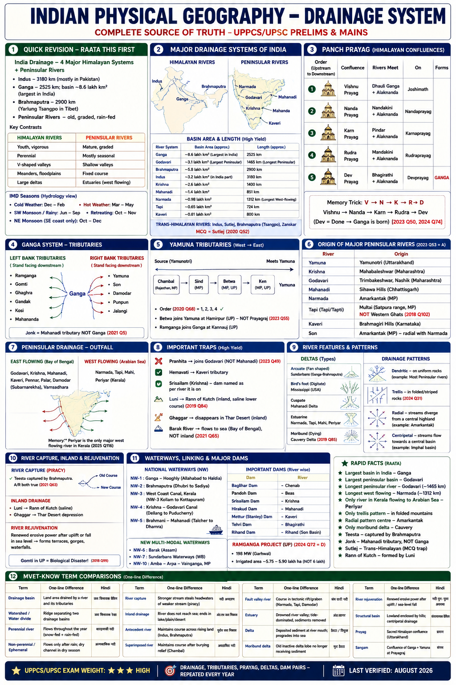

# Topic 3 — Drainage System
### ★ Complete Source of Truth — No other book/notes needed for this topic

> **Covers syllabus:** Drainage Framework (outlets %, water divides, regimes, evolution types) | Himalayan Rivers (Indus, Ganga, Brahmaputra, Trans-Himalayan, River Capture, Panch Prayag, Uttarakhand, Tributaries, Barak, Farakka–Padma) | Peninsular Rivers (Godavari, Krishna, Kaveri, Mahanadi, Narmada, Tapi, Luni, Inland Rivers, Inland Drainage, Fault Valley) | Rivers of UP | River Features (Deltas, Estuaries, Origin, Confluence, Patterns, Rejuvenation, Structural Basins, Landforms, City–River, Dam–River) | Waterways & Linking (NW-1–NW-5, New Waterways, River Interlinking, Water Disputes)
> **Sources baked in:** NCERT Geography Class 11 (Ch 3), Class 12 (Ch 2–3), UPPCS/UPSC PYQs 2018–2025
> **Exam weight:** ★★★ High — Prayag/confluence matching, tributary traps, west-flowing rivers, deltas, UP rivers, dam–river pairs every year
> **Last verified:** August 2026

---

## How to use this file

1. **Learn:** Open one ## section → read Definitions → Teach prose → table → Exam note → that section's PYQs.
2. **Revise later:** Quick Revision + Memory Tricks only (day-before / weak recall).
3. **Test:** Practice Zone → Common Traps → Complete PYQ Bank.
4. Do **not** re-read the whole file every sitting — finish one section, then move on.

> Each section is written to make sense on first read. Quick Revision is not the first teaching layer.

---

## Quick Revision Box — Raata Later (after learning sections)

```
INDIA DRAINAGE FRAMEWORK:
  ~77% → Bay of Bengal | ~23% → Arabian Sea | ~8% land area inland (Rajasthan/Ladakh)
  Western Ghats = major peninsular water divide | Amarkantak = radial divide (Narmada↔Son)
  Major basin = catchment >20,000 km² | Ganga largest IN basin | Godavari largest peninsular

INDIA DRAINAGE — 4 MAJOR SYSTEMS + PENINSULAR:
  Indus (3180 km; mostly Pak) | Ganga (2525 km; basin ~8.6 lakh km² = largest IN)
  Brahmaputra (2900 km; Yarlung Tsangpo) | Peninsular = old, graded, rain-fed

HIMALAYAN vs PENINSULAR:
  Himalayan = youth, perennial (melt+monsoon), V-gorges, meanders, capture, large deltas
  Peninsular = mature, rain-fed seasonal swing, shallow valleys, fixed course, west estuaries

REGIME: Himalayan = dual peak (melt+monsoon) | Peninsular = monsoon-dominated
EVOLUTION: Antecedent=Indus/Sutlej/Brahmaputra | Superimposed=Chambal | Fault=Narmada/Tapi/Damodar

BASIN & LENGTH (raata):
  Godavari = largest peninsular basin (~3.1 lakh km²), longest (~1465 km)
  Krishna ~1400 km | Narmada = longest west-flowing (~1312 km) | Mahanadi largest in 2022 Q16 options

TRANS-HIMALAYAN: Indus, Sutlej, Brahmaputra (Tsangpo), Zanskar — MCQ = Sutlej (2020 Q52)

PANCH PRAYAG (V→N→K→R→D): Vishnu(Dhauli) → Nanda(Nandakini) → Karn(Pindar) → Rudra(Mandakini)
  → Dev(Bhagirathi) = GANGA (2023 Q50, 2024 Q74 code D = 2 4 1 3)

GANGA TRIBUTARIES:
  LEFT: Ramganga, Gomti, Ghaghra, Gandak, Kosi, Mahananda
  RIGHT: Yamuna, Son, Damodar, Punpun, Jalangi | Jonk = Mahanadi NOT Ganga (2021 Q5)
  Lower: Farakka→Hooghly diversion | Ganga in Bangladesh = Padma | Brahmaputra = Jamuna

YAMUNA TRIBS (W→E): Chambal → Sind → Betwa → Ken (all RIGHT bank) (2020 Q68: 1 Betwa, 2 Ken, 3 Sindh, 4 Chambal → Ans A = 4,3,1,2)
  Betwa @ Hamirpur — NOT Prayagraj (2023 Q55) | Ramganga @ Kannauj | Hindon = LEFT bank (NCR)

PENINSULAR ORIGINS (2023 Q53 = A):
  Yamuna-Yamunotri | Krishna-Mahabaleshwar | Godavari-Nashik | Mahanadi-Sihawa
  Narmada-Amarkantak | Tapi-Multai/Satpura (NOT Western Ghats — 2018 Q102)
  Kaveri-Brahmagiri | Son-Amarkantak (radial with Narmada)

EAST → BoB: Godavari, Krishna, Mahanadi, Kaveri, Pennar, Palar, Damodar, Subarnarekha, Vamsadhara, Barak
WEST → Arabian Sea: Narmada, Tapi, Mahi, Sabarmati, Periyar, Sharavati, Mandovi — Periyar only in 2025 Q116 set

TRIBUTARY TRAPS: Pranhita→Godavari (NOT Mahanadi) | Hemavati→Kaveri | Srisailam→Krishna

INLAND: Luni→Rann (saline lower — 2019 Q84) | Ghaggar→Thar | Barak reaches BoB (NOT inland)

DELTAS: Arcuate=Sundarbans | Bird's foot=Mississippi (2018 Q33) | Cuspate=Mahanadi/Ebro
  Moribund=Cauvery (2019 Q85) | Estuarine=Narmada/Tapi
PATTERNS: Trellis=folded (2024 Q31) | Radial=Amarkantak | Centripetal=Imphal | +Annular/Deranged
LANDFORMS: Youth=gorge | Mature=meander/floodplain | Old=ox-bow/delta | Braided=Brahmaputra

CAPTURE: Teesta→Brahmaputra A/R both true (2021 Q63) | UP Gomti=biological disaster (2018 Q99)

CITY–RIVER: Lucknow=Gomti | Ayodhya=Ghaghra/Saryu | Surat=Tapi | Hyderabad=Musi | Ahmedabad=Sabarmati

NW-1 Ganga-Hooghly | NW-2 Brahmaputra | NW-3 Kerala | NW-4 Krishna-Godavari | NW-5 Brahmani-Mahanadi

DAMS: Baglihar=Chenab | Pandoh=Beas | Srisailam=Krishna | Hirakud=Mahanadi | Mettur=Kaveri
  Tehri=Bhagirathi | Rihand=Son trib. | Farakka=Ganga | Sardar Sarovar=Narmada
  Ramganga Project: 198 MW Garhwal; irrigated ~5.75–5.90 lakh ha NOT 6 lakh (2024 Q72 = D)
`# Must-Know Term Comparisons

| Term | One-line difference | Hindi |
|------|---------------------|-------|
| **Drainage basin** | Land area drained by a river and its tributaries | जल विभाजक बेसिन |
| **Watershed / water divide** | Ridge separating two drainage basins | जल विभाजक रेखा |
| **Perennial river** | Flows throughout the year (snow-fed + rain-fed Himalayan) | बारहमासी नदी |
| **Non-perennial / ephemeral** | Flows only after rain; dry channel in dry season | अल्पकालिक नदी |
| **Dendritic pattern** | Tree-like branching on uniform geology | शाखान्वित जल निकास |
| **Trellis pattern** | Subparallel tributaries on folded/alternating strata | जालीदार जल निकास |
| **Radial pattern** | Streams diverge from a central dome/peak | अरीय जल निकास |
| **Centripetal pattern** | Streams converge to a central basin/low | केंद्राभिमुख जल निकास |
| **Delta** | Deposited sediment at river mouth; progradation into sea | डelta / त्रिभुज |
| **Estuary** | Drowned river valley; tide-dominated; sediments removed | अंतःसागर |
| **River capture** | Stronger stream steals headwaters of weaker stream (piracy) | नदी अपहरण |
| **Inland drainage** | River does not reach sea; ends in lake/plain/desert | अंत:स्थ जल निकास |
| **Antecedent river** | Maintains course across rising land (Indus, Brahmaputra) | पूर्वज जल निकास |
| **Superimposed river** | Maintains old course after burying relief (Chambal) | अध्यासित नदी |
| **Fault valley river** | Course in tectonic rift/graben (Narmada, Tapi, Damodar) | भ्रंश घाटी नदी |
| **Moribund delta** | Old inactive delta lobe no longer receiving sediment | मृत डelta |
| **River rejuvenation** | Renewed erosive power after uplift/sea-level fall | नदी पुनः युवा अवस्था |
| **Structural basin** | Lowland enclosed by hills; centripetal drainage | संरचनात्मक बेसिन |
| **Prayag** | Sacred Himalayan confluence (Uttarakhand) | प्रयाग |
| **Sangam** | Confluence of Ganga + Yamuna at Prayagraj | संगम |
| **River regime** | Seasonal pattern of discharge through the year | नदी प्रवाह व्यवस्था |
| **Meander** | Sinuous bend of a river in plains | विसर्प |
| **Ox-bow lake** | Abandoned meander loop cut off from main channel | गोखुर झील |
| **Braided river** | Multiple intertwining channels with sediment bars | गुंफित नदी |
| **Water divide** | Ridge separating two drainage basins | जल विभाजक |
| **Distributary** | Branch flowing away from main channel in delta | वितरिका |
| **Tributary** | Stream joining a larger river | सहायक नदी |

### Memory Tricks

| Trick | Remembers |
|-------|-----------|
| **Dev = Done (Ganga born)** | Devprayag = Alaknanda + Bhagirathi → Ganga (2023 Q50) |
| **V-N-K-R-D** | Vishnu → Nanda → Karn → Rudra → Dev (Prayag order upstream) |
| **Pranhita ≠ Mahanadi** | Pranhita joins Godavari (2023 Q49) |
| **Jonk ≠ Ganga** | Jonk = Mahanadi system, Odisha (2021 Q5) |
| **Tapi from Satpura** | NOT Western Ghats — Multai, Satpura (2018 Q102) |
| **Mississippi bird foot** | Bird's-foot delta = Mississippi (2018 Q33) |
| **Damodar = fault** | Rift valley drainage (2019 Q9) |
| **Cauvery moribund** | Moribund delta subdivision (2019 Q85) |
| **Gomti disaster** | UP "biological disaster" = Gomti (2018 Q99) |
| **Periyar west only** | Periyar → Arabian Sea; Pennar/Palar → BoB (2025 Q116) |
| **Srisailam = Krishna** | NOT Tungabhadra (2025 Q92) |
| **Betwa before Prayag** | Betwa → Yamuna at Hamirpur, not Prayagraj (2023 Q55) |
| **Chambal no Haryana** | Sanctuary in UP, MP, Rajasthan only (2020) |
| **Trellis = folded** | Trellis on folded structures (2024 Q31) |
| **Sutlej trans** | Trans-Himalayan MCQ (2020 Q52) |
| **Dakshin Ganga** | Godavari = largest peninsular basin |
| **Panj Ab E→W** | **J**helum **C**henab **R**avi **B**eas **S**utlej (JCRBS) |
| **Amarkantak triple** | Narmada west, Son east — radial drainage |
| **Left bank = Himalaya** | Ramganga, Gomti, Ghaghra, Gandak, Kosi join Ganga from left |
| **Lucknow ≠ Ganga** | Lucknow on Gomti — city–river trap |

---


## 3.0 India's Drainage — Framework (Start Here)

### Definitions

| Term | Definition |
|------|------------|
| **Drainage system** | Network of rivers and streams that drain a region into a sea, lake, or inland basin |
| **Drainage basin / catchment** | Total land area drained by a river and its tributaries |
| **Water divide / watershed** | Elevated ridge separating two adjacent drainage basins |
| **River regime** | Seasonal pattern of river discharge through the year |
| **Concordant drainage** | River courses follow geological structure and slope |
| **Discordant drainage** | River courses cut across geological structure (antecedent / superimposed) |

### India's Drainage — Overview

India's surface water drains into three outlets: the **Bay of Bengal** (~77% of drainage area), the **Arabian Sea** (~23%), and a small **inland drainage** zone (~8% of area, mainly Rajasthan desert and Ladakh closed basins). UPPCS rarely asks the percentage alone; it mixes **direction traps** (east vs west), **basin-size ranking**, **water-divide geography**, and **regime contrast** (Himalayan snow-fed vs peninsular rain-fed). Master this framework before diving into individual river systems.

### 3.0.1 Classification of Drainage Systems

#### Classification — How It Works

- **By origin:** **Himalayan drainage** (Indus, Ganga, Brahmaputra) vs **Peninsular drainage** (Godavari, Krishna, Narmada, etc.).
- **By destination:** **Bay of Bengal** (east-flowing), **Arabian Sea** (west-flowing), **Inland** (no sea outlet).
- **By size (India classification):**
  - **Major basins:** catchment **> 20,000 km²** (Ganga, Godavari, Krishna, Indus, Brahmaputra, Mahanadi, Narmada, Kaveri, Tapi, etc.).
  - **Medium basins:** **2,000–20,000 km²**.
  - **Minor basins:** **< 2,000 km²**.
- **By geological control:** Concordant (follow structure) vs discordant (cut across structure).
- **By evolution type:** Antecedent, consequent, subsequent, obsequent, superimposed (see §3.0.4).
- **By pattern:** Dendritic, trellis, radial, centripetal, parallel, rectangular, annular, deranged (see §3.4.5).
- Himalayan systems are **young, perennial, high-sediment**; peninsular systems are **old, graded, mostly rain-fed**.
- The **Ganga basin** alone covers ~26% of India's area — the single largest basin in the country.

> **Exam note:** "Largest river basin in India" = **Ganga**. "Largest peninsular basin" = **Godavari**. Do not confuse length with basin area.

#### Drainage by Outlet — Master Table

| Outlet | Approx. % of India's drainage area | Major rivers |
|--------|-----------------------------------|--------------|
| **Bay of Bengal** | ~77% | Ganga, Brahmaputra, Godavari, Krishna, Mahanadi, Kaveri, Pennar, Palar, Damodar, Subarnarekha, Barak |
| **Arabian Sea** | ~23% | Indus (Pak), Narmada, Tapi, Mahi, Sabarmati, Periyar, Sharavati, Mandovi, Zuari |
| **Inland** | ~8% of land area | Luni, Ghaggar, desert streams, Ladakh closed lakes |

---

### 3.0.2 Water Divides of India

#### Water Divides — How It Works

- **Western Ghats** are India's **major water divide** for peninsular India — short west-flowing streams to Arabian Sea; long east-flowing rivers to Bay of Bengal.
- **Aravalli Range** separates inland Rajasthan drainage (Luni) from east-flowing Ganga system tributaries.
- **Vindhya–Satpura** axis guides **Narmada (west)** and **Son (northeast to Ganga)**; Amarkantak is a **radial water divide**.
- **Himalaya** separates northward Tibetan drainage (Tsangpo/Indus headwaters) from southward Indian drainage — but **antecedent** rivers (Indus, Sutlej, Brahmaputra) cut through the divide.
- **Delhi Ridge / Aravalli extension** influences Yamuna–Ganga interfluve (Doab) drainage.
- A water divide need not be a continuous mountain — a plateau rim or subtle ridge can separate basins.
- **Godavari–Krishna–Pennar** share Western Ghats–Deccan divides; confusion of origins is a common MCQ trap.
- **Exam link:** Amarkantak radial divide explains why **Narmada** and **Son** originate near each other but flow opposite directions.

> **Exam note:** Western Ghats = **peninsular water divide**; Himalaya = **climatic + drainage barrier**, pierced by antecedent rivers.

---

### 3.0.3 River Regimes

#### River Regimes — How It Works

- **Himalayan regime:** Two discharge peaks — **summer snowmelt** + **monsoon rain** — keep rivers **perennial** even in dry months.
- **Peninsular regime:** Dominated by **monsoon rain**; discharge falls sharply in winter/summer dry months; many streams become seasonal.
- **Ganga in plains:** Peak flood in **July–September**; low stage in winter; WD rain can raise winter levels slightly in upper Yamuna.
- **Brahmaputra:** Extremely high monsoon peak; bank erosion and braiding intensify with peak discharge.
- **Narmada/Tapi:** Monsoon-fed but perennial due to groundwater and catchment size; still show strong seasonal swing.
- **Luni:** Highly seasonal; lower course may dry or become saline pools outside monsoon.
- Regime explains why Himalayan rivers support year-round irrigation and navigation better than most peninsular rivers.
- **Climate teleconnections** (El Niño / IOD) modulate monsoon regime year to year — link to Topic 2 climate.

#### Regime Comparison Table

| Feature | Himalayan rivers | Peninsular rivers |
|---------|------------------|-------------------|
| **Peak season** | Summer melt + SW monsoon | SW monsoon mainly |
| **Winter flow** | Substantial (snowmelt/baseflow) | Low / often dry |
| **Flood risk** | High (Kosi, Brahmaputra, Ghaghra) | High but shorter season |
| **Irrigation reliability** | Higher | Needs storage dams |

---

### 3.0.4 Drainage Evolution Types

#### Evolution Types — How It Works

- **Consequent river:** Flows down the **initial slope** of the land (e.g. many Deccan streams following plateau tilt).
- **Subsequent river:** Develops later along a belt of **weak rock** (fault, soft strata) at an angle to the consequent stream.
- **Obsequent river:** Flows opposite to the original consequent direction after capture or structure change.
- **Antecedent river:** Exists **before** uplift; cuts down as land rises — **Indus, Sutlej, Brahmaputra, Teesta**.
- **Superimposed (epigenetic) river:** Maintains course after eroding through an overlying cover onto different structure below — **Chambal** on Malwa plateau is classic.
- **Discordant drainage:** Antecedent + superimposed rivers cut **across** structure.
- **Concordant drainage:** Follows structure and slope.
- Understanding these terms unlocks "why Narmada is straight" (fault) vs "why Indus cuts Himalaya" (antecedent).

> **Exam note:** **Antecedent** = older than uplift (Himalayan giants). **Superimposed** = inherited course on buried surface (Chambal). Do not swap.

#### Evolution Types — Quick Match

| Type | Key idea | India example |
|------|----------|---------------|
| Antecedent | Cuts rising mountains | Indus, Brahmaputra, Sutlej |
| Consequent | Follows original slope | Many Deccan plateau streams |
| Subsequent | Along weak belt | Tributaries along faults |
| Superimposed | Inherited after cover removed | Chambal |
| Fault-guided | Occupies rift/graben | Narmada, Tapi, Damodar |

### Exam Facts (raata — traps only) — §3.0 Framework

| # | Fact to remember |
|---|------|
| 1 | About **77%** of India’s drainage goes to the **Bay of Bengal** and about **23%** to the **Arabian Sea** |
| 2 | **Inland drainage** covers roughly **8%** of India’s area (mainly Rajasthan and parts of Ladakh) |
| 3 | The **Western Ghats** are the main **peninsular water divide** (short west streams vs long east rivers) |
| 4 | A **major river basin** is defined as a catchment larger than **20,000 km²** |
| 5 | Himalayan rivers are **perennial** because they get both **snow-melt and monsoon** rain |
| 6 | **Antecedent** rivers that cut through rising Himalaya include **Indus, Sutlej and Brahmaputra** |
| 7 | **Chambal** is the classic Indian example of **superimposed** drainage |
| 8 | India’s **largest basin** is the **Ganga**; the **largest peninsular basin** is the **Godavari** |

## 3.1 Himalayan Rivers

### Definitions

| Term | Definition |
|------|------------|
| **Himalayan river** | Snow-fed + rain-fed perennial stream originating in Himalaya; youth stage, high erosive power |
| **Antecedent river** | Maintains course across rising land (Indus, Brahmaputra, Sutlej, Teesta) |
| **Consequent river** | Flows down slope parallel to dip of strata |
| **Subsequent river** | Develops along belt of weak rock (joints, faults) |
| **Trans-Himalayan river** | Originates north of main Himalayan axis in Tibet or trans-Himalayan ranges |
| **River capture (piracy)** | Headward erosion diverts one river's tributary into another drainage |
| **Prayag** | Sacred confluence in Uttarakhand where Alaknanda meets a major tributary |
| **Distributary** | Branch of river flowing away from main channel in delta/plain (Bhagirathi-Hooghly) |

### Himalayan Rivers — Overview

India's northern drainage is dominated by three great systems — **Indus, Ganga, Brahmaputra** — all fed by Himalayan snowmelt and monsoon rain. These rivers are geologically **young**: they cut deep gorges in mountains, carry enormous sediment loads, and build some of the world's largest deltas. UPPCS tests five clusters repeatedly: **(1)** origin/confluence matching (Devprayag, Panch Prayag — 2023 Q50, 2024 Q74), **(2)** tributary–master river pairs (Pranhita–Godavari trap — 2023 Q49), **(3)** trans-Himalayan identification (Sutlej — 2020 Q52), **(4)** river capture A/R (Teesta — 2021 Q63), and **(5)** Ganga basin boundary (Jonk trap — 2021 Q5). The **Ganga basin** (~8.6 lakh km²) is India's largest; **UP** sits on the core plain where Yamuna, Ramganga, Gomti, Ghaghra, and Gandak join.

#### Himalayan vs Peninsular — Complete Comparison

| Feature | Himalayan rivers | Peninsular rivers |
|---------|------------------|-------------------|
| **Geological age** | Young (Tertiary uplift) | Old (Pre-Cambrian plateau) |
| **Profile** | Youth → early mature in plains | Mature/graded |
| **Valley form** | Deep gorges, V-shaped, waterfalls | Shallow, broad, graded |
| **Water source** | Snow melt + monsoon rain | Mainly monsoon rain |
| **Perenniality** | Perennial headwaters | Seasonal fluctuation |
| **Sediment load** | Very high | Moderate to low |
| **Course stability** | Meanders, avulsion, shifting | Fixed, superimposed |
| **Special processes** | Capture, rejuvenation, flooding | Fault-guided (Narmada/Tapi) |
| **Delta/ mouth** | Huge deltas (Ganga-Brahmaputra) | East-coast deltas; west estuaries |
| **Examples** | Ganga, Indus, Brahmaputra | Godavari, Krishna, Narmada |

### 3.1.1 Indus System

#### Indus System — How It Works

- **Indus** rises near **Bokhar Chu** (Tibet, near Mansarovar/Kailash); flows **northwest** through Ladakh in a **deep antecedent gorge**, turns south near Gilgit, enters **Pakistan**, drains into **Arabian Sea** near Karachi.
- **Total length** ~3180 km (one of longest in world); **in India** mainly **Ladakh**; Indian portion short but strategically vital.
- **Upper Indus tributaries (in India/Ladakh):** **Zanskar, Shyok, Gilgit** — join in Kashmir/Ladakh zone.
- **Five rivers of Punjab (Panj Ab):** **Jhelum, Chenab, Ravi, Beas, Sutlej** — all ultimately join Indus in Pakistan.
- **Panj Ab order east to west:** **Jhelum → Chenab → Ravi → Beas → Sutlej** (mnemonic **JCRBS**).
- **Indus Water Treaty (1960):** India uses **eastern** tributaries (Ravi, Beas, Sutlej); Pakistan **western** (Indus, Jhelum, Chenab).
- **Trans-Himalayan:** Indus and Sutlej cross Tibet before entering India.
- **Major projects:** **Baglihar** (Chenab), **Salal** (Chenab), **Pandoh** (Beas), **Bhakra-Nangal** (Sutlej), **Ranjit Sagar/Thein** (Ravi).

> **Exam note:** In dam–river matching, **Pandoh Dam** is on the **Beas**, not the Ravi; **Baglihar Dam** is on the **Chenab**. Mixing these names is a frequent UPPCS trap (2025 Q92).

#### Exam Facts (raata) — Indus System

| Fact to remember | Detail |
|------|--------------|
| Trans-Himalayan pick in MCQs | Among common options, **Sutlej** is the Trans-Himalayan river (rises in Tibet) |
| Baglihar Dam | Built on the **Chenab** |
| Pandoh Dam | Built on the **Beas**, not on the Ravi |
| Panj Ab order (east to west) | **Jhelum, Chenab, Ravi, Beas, Sutlej** |
| Indus Waters Treaty — India’s share | Eastern rivers: **Ravi, Beas, Sutlej** |
| Indus Waters Treaty — Pakistan’s share | Western rivers: **Indus, Jhelum, Chenab** |
| Outlet sea | Indus system drains to the **Arabian Sea** |

#### Indus Tributaries — Master Table

| River | Origin | Joins | States | Notes |
|-------|--------|-------|--------|-------|
| **Zanskar** | Zanskar range | Indus (Ladakh) | Ladakh | Frozen in winter |
| **Shyok** | Rimo glacier | Indus | Ladakh | |
| **Jhelum** | Verinag (Kashmir) | Chenab | JK, Punjab | Through **Wular Lake** |
| **Chenab** | Bara Lacha La (HP) | Sutlej | HP, Punjab | Largest volume Panj Ab |
| **Ravi** | Bara Bhangal (HP) | Chenab | HP, Punjab | Ranjit Sagar dam |
| **Beas** | Rohtang Pass (HP) | Sutlej | HP, Punjab | Pandoh dam |
| **Sutlej** | Rakas Tal (Tibet) | Indus | HP, Punjab | Trans-Himalayan; Bhakra |

---

### 3.1.2 Ganga System

#### Ganga System — How It Works

- **Ganga** proper begins at **Devprayag** (Alaknanda + Bhagirathi); length ~2525 km; basin ~**8.6 lakh km²** (~26% India); world's most populated river basin.
- **Upper course (UK):** Bhagirathi from Gangotri + Alaknanda trunk; five Prayags; mountainous gorges.
- **Middle course (UP-Bihar):** Alluvial plain; heavy meandering; dense tributary network; floodplain agriculture.
- **Lower course (WB):** **Hooghly (Bhagirathi distributary)** carries most discharge to Bay of Bengal; main Ganga channel also reaches sea via Bangladesh.
- **Left-bank tributaries (from Himalaya/south):** **Ramganga, Gomti, Ghaghra (Saryu/Karnali), Gandak (Narayani), Kosi, Mahananda** — long, flood-prone, high sediment.
- **Right-bank tributaries (from peninsula/north):** **Yamuna** (largest), **Son**, **Damodar**, **Punpun**, **Ajay**, **Mayurakshi** — shorter but important.
- **Yamuna:** Origin **Yamunotri**; through Delhi, Agra, Mathura; joins Ganga at **Prayagraj (Sangam)**; polluted stretch Delhi–Agra.
- **Son:** Origin **Amarkantak** (MP); joins Ganga at **Patna** (right bank); long perennial peninsular tributary of Ganga.
- **Damodar:** Rift valley; joins **Hooghly** system; "Sorrow of Bengal" (floods before dams).
- **Ramganga:** Joins Ganga near **Kannauj** (2023 Q55 ✓); Kalagarh/Ramganga Project in Garhwal.
- **Gomti:** Lucknow; **biological disaster** pollution tag (2018 Q99).
- **Ghaghra:** Ayodhya on bank; Ayodhya–Faizabad twin cities on Saryu/Ghaghra.
- **Kosi:** "Sorrow of Bihar" — frequent course shifts (avulsion); heavy silt.
- **Jonk river (Odisha)** — **NOT** in Ganga basin (2021 Q5); in **Mahanadi** system.

> **Exam note:** Left bank = join from **south** (Himalayan side when facing downstream). Yamuna joins from **west/south** at Prayagraj — classified as **right-bank** tributary of Ganga.

#### Ganga — Left-Bank Tributaries (Complete)

| River | Origin | Joins Ganga at | Key fact |
|-------|--------|----------------|----------|
| **Ramganga** | Doodhatoli, UK | Near Kannauj, UP | Ramganga Project; Corbett NP |
| **Gomti** | Gomat Taal, Pilibhit | Kaithi (near Varanasi) | Lucknow; pollution |
| **Ghaghra (Saryu)** | Nepal (Karnali system) | Chhapra, Bihar | Ayodhya; flood-prone |
| **Gandak** | Nepal (Dhaulagiri region) | Bihar | Nepal–India border |
| **Kosi** | Tibet/Nepal | Near Katihar, Bihar | Avulsions; embankments |
| **Mahananda** | Darjeeling hills | West Bengal | Last major left tributary in India |
| **Punpun** | Palamu, Jharkhand | Near Patna | Ganga basin ✓ (2021 Q5) |
| **Jalangi** | West Bengal | Murshidabad district | Ganga basin ✓ |

#### Ganga — Right-Bank Tributaries (Complete)

| River | Origin | Joins at | Key fact |
|-------|--------|----------|----------|
| **Yamuna** | Yamunotri, UK | Prayagraj | Largest tributary by volume |
| **Son** | Amarkantak, MP | Patna (south of) | Right bank; Rihand dam |
| **Damodar** | Chota Nagpur | Hooghly system | Fault valley; DVC dams |
| **Ajoy (Ajaya)** | Jharkhand | West Bengal | Ganga basin ✓ |
| **Mayurakshi** | Jharkhand | West Bengal | Massanjore dam |

#### Yamuna Tributaries — Master Table

| Tributary | Origin | Joins Yamuna at | Bank of Yamuna |
|-----------|--------|-----------------|----------------|
| **Tons** | Bandarpunch, UK | Near Kalsi / Dehradun region | **Right** |
| **Hindon** | Shivalik | Ghaziabad/Noida, UP | **Left** |
| **Chambal** | Mhow, MP (Vindhya) | Etawah, UP | **Right** (from SW) |
| **Sind** | Malwa plateau | UP | **Right** |
| **Betwa** | Vindhya, MP | Hamirpur, UP | **Right** |
| **Ken** | Vindhya, MP | Banda, UP | **Right** |

> **Bank rule:** Looking downstream, Chambal–Sind–Betwa–Ken join from the south-west = **right bank** of Yamuna (NCERT). Hindon joins from the east near NCR = **left bank**.

**West-to-east order on the Yamuna (UPPCS 2020 Q68):** Looking across the right-bank tributaries from west to east gives **Chambal, then Sindh, then Betwa, then Ken**. In the actual paper the list was numbered **1 Betwa, 2 Ken, 3 Sindh, 4 Chambal**, so the west-to-east code is **4, 3, 1 and 2 (option A)**.

#### Exam Facts (raata) — Ganga System

| Fact to remember | Detail |
|------|-----------|
| Where Ganga is formed | At **Devprayag**, where Alaknanda meets Bhagirathi |
| Largest Indian basin | **Ganga** basin (~8.6 lakh km²) |
| Largest Ganga tributary | **Yamuna** |
| Yamuna joins Ganga | At **Prayagraj (Sangam)** |
| Ramganga joins Ganga | Near **Kannauj** (not Prayagraj) |
| Betwa joins Yamuna | At **Hamirpur** — not near Prayagraj |
| River NOT in Ganga basin | **Jonk** (it is in the Mahanadi basin) |
| Son origin | **Amarkantak** plateau |
| UP “biological disaster” river tag | **Gomti** (Lucknow stretch) |
| Hooghly | A **Bhagirathi distributary**; used as **NW-1** |
| Ganga’s name in Bangladesh | **Padma** (do not confuse with Yamuna) |
| Brahmaputra’s name in Bangladesh | **Jamuna** (do not confuse with Yamuna) |
| Farakka Barrage role | Diverts Ganga water into the **Hooghly** to help Kolkata port |

---

### 3.1.3 Brahmaputra System

#### Brahmaputra System — How It Works

- **Tibet:** **Yarlung Tsangpo** (world's highest major river system in plateau).
- **India entry:** **Dihang gorge** (Arunachal Pradesh) — near **Namcha Barwa** bend.
- **Assam:** Called **Brahmaputra**; **braided** channel; heavy **bank erosion**; **Majuli** = world's largest river island.
- **Tributaries:** **Dibang, Lohit** (form Brahmaputra), **Subansiri, Manas, Kameng, Teesta, Kopili, Dhansiri**.
- **Bangladesh:** Enters as Brahmaputra, then **Jamuna** (≠ Yamuna), joins **Padma (Ganga)** → **Meghna** → Bay of Bengal.
- **Characteristics:** High rainfall, seismic activity, soft alluvium → shifting channels.
- **Delta:** Combined with Ganga → **Sundarbans** (world's largest mangrove delta).
- **NW-2:** National Waterway on Brahmaputra (Dhubri–Sadiya).

#### Brahmaputra Tributaries — Master Table

| Tributary | Region | Note |
|-----------|--------|------|
| **Dibang** | Arunachal | Meets Lohit |
| **Lohit** | Arunachal | Forms Brahmaputra with Dibang |
| **Subansiri** | Arunachal | Largest tributary by volume |
| **Manas** | Bhutan–Assam | Manas NP (UNESCO) |
| **Teesta** | Sikkim–WB | River capture from Ganga system |
| **Kopili** | Meghalaya | South bank |
| **Dhansiri** | Nagaland–Assam | Enters at Kaziranga region |

#### Exam Facts (raata) — Brahmaputra

| Fact to remember | Detail |
|------|----------------|
| Name in Tibet | **Yarlung Tsangpo** |
| Entry into India | Through the **Dihang gorge** in Arunachal Pradesh |
| Name in Bangladesh | **Jamuna** — not the same as India’s Yamuna |
| Largest river island | **Majuli** (Assam) |
| Combined delta | Forms the **Sundarbans** with the Ganga |
| Famous river-capture example | **Teesta** shifted from Ganga system to Brahmaputra |

> **Exam note:** Brahmaputra is **antecedent** — cuts through rising Himalaya. NOT west-flowing.

---

### 3.1.4 Trans-Himalayan Rivers

#### Trans-Himalayan Rivers — How It Works

- Originate **north of Indus–Tsangpo suture** (Tibet/trans-Himalayan ranges), cross the Himalayan barrier through **antecedent gorges**.
- **Major trans-Himalayan rivers:** **Indus, Sutlej, Brahmaputra (Tsangpo), Zanskar, Spiti, Shyok, Gar**.
- **Sutlej:** **Rakas Tal/Mansarovar** region (Tibet) → **Shipki La** → HP → Punjab; **Bhakra-Nangal** dam.
- **NOT trans-Himalayan in MCQs:** **Jhelum, Ravi** (originate in Himachal/Kashmir Himalaya, south of main axis).
- **Himalayan perennial source (UPPCS 2025 Q94):** Assertion that the Himalayas feed large perennial rivers is true, and the Reason — higher ranges stay snow-covered year-round — correctly explains that melt sustains flow, so the answer is **D**.

#### Trans-Himalayan vs Himalayan — Comparison

| River | Origin zone | Trans-Himalayan? |
|-------|-------------|------------------|
| **Indus** | Tibet (Bokhar Chu) | ✓ Yes |
| **Sutlej** | Tibet (Rakas Tal) | ✓ Yes |
| **Brahmaputra** | Tibet (Angsi Glacier) | ✓ Yes |
| **Jhelum** | Verinag, Kashmir | ✗ No |
| **Ravi** | Bara Bhangal, HP | ✗ No |
| **Ganga** | Gangotri/Alaknanda, UK | ✗ No (Himalayan) |

---

### 3.1.5 River Capture (River Piracy)

#### River Capture — How It Works

- Active in **youthful, tectonically active Himalaya** where **headward erosion** is intense.
- **Mechanism:** Lower river incises faster → knickpoint migrates upstream → captures adjacent weaker drainage → **wind gap**, **elbow of capture**, **beheaded stream**.
- **Teesta (UPPCS 2021 Q63):** Teesta was earlier linked to the **Ganga system** and is now a **Brahmaputra** tributary because of **river capture**. Both Assertion and Reason are true, and capture correctly explains the shift (**A**).
- **Sutlej capture:** Classic textbook — captured tributaries of Beas system historically.
- **Subansiri–Brahmaputra:** Headward competition in Eastern Himalaya.
- **NOT in peninsular India:** Old graded rivers lack aggressive headward erosion for capture.

#### River Capture — Landforms Table

| Landform | Meaning |
|----------|---------|
| **Wind gap** | Dry pass where captured stream once flowed |
| **Elbow of capture** | Sharp bend at capture point |
| **Beheaded stream** | Original river left with reduced drainage |
| **Pirate stream** | Stream that steals water |

---

### 3.1.6 Panch Prayag & Rivers of Uttarakhand

#### Panch Prayag — How It Works

- **Alaknanda** = trunk stream from Satopanth; **Bhagirathi** from Gangotri meets at **Devprayag** → **Ganga**.
- **Upstream to downstream order:** Vishnuprayag → Nandaprayag → Karnaprayag → Rudraprayag → Devprayag.
- **Vishnuprayag:** Alaknanda + **Dhauli Ganga**
- **Nandaprayag:** Alaknanda + **Nandakini**
- **Karnaprayag:** Alaknanda + **Pindar**
- **Rudraprayag:** Alaknanda + **Mandakini** (Kedarnath valley)
- **Devprayag:** Alaknanda + **Bhagirathi** meet here to form the Ganga (tested in UPPCS 2023 Q50).
- **Tehri:** On the Bhagirathi; the confluence of **Bhagirathi and Bhilangana** is near Tehri Dam (List-II item 3 in UPPCS 2024 Q74).

#### Panch Prayag — Master Table

| Prayag | Confluence | Trunk after merge |
|--------|------------|-------------------|
| **Vishnuprayag** | Dhauli Ganga + Alaknanda | Alaknanda |
| **Nandaprayag** | Nandakini + Alaknanda | Alaknanda |
| **Karnaprayag** | Pindar + Alaknanda | Alaknanda |
| **Rudraprayag** | Mandakini + Alaknanda | Alaknanda |
| **Devprayag** | Bhagirathi + Alaknanda | **Ganga** |

> **Exam note:** For the 2024 Uttarakhand confluence match, remember each place by rivers: **Devprayag** = Alaknanda + Bhagirathi; **Rudraprayag** = Alaknanda + Mandakini; **Karnaprayag** = Alaknanda + Pindar; **Tehri** = Bhagirathi + Bhilangana. That order of List-II codes is **2, 4, 1, 3 (option D)**.

#### Uttarakhand Rivers — Complete Table

| River | Origin / glacier | Prayag / role |
|-------|------------------|---------------|
| **Bhagirathi** | Gangotri | Devprayag → Ganga |
| **Alaknanda** | Satopanth/Badrinath region | Main trunk to Devprayag |
| **Mandakini** | Kedarnath | Rudraprayag |
| **Pindar** | Pindari glacier | Karnaprayag |
| **Nandakini** | Nanda Devi region | Nandaprayag |
| **Dhauli Ganga** | Niti valley | Vishnuprayag |
| **Yamuna** | Yamunotri | Leaves UK westward to plains |
| **Tons** | Bandarpunch | Yamuna tributary |
| **Ramganga (West)** | Doodhatoli | Kalagarh dam; to Ganga at Kannauj |

---

### 3.1.7 Himalayan Tributaries — Consolidated Reference

#### All Major Himalayan Tributaries by System

**Indus system (India):** Zanskar, Shyok, Jhelum, Chenab, Ravi, Beas, Sutlej

**Ganga system — Left bank:** Ramganga, Gomti, Ghaghra, Gandak, Kosi, Mahananda, Punpun, Jalangi, Bagmati (Nepal)

**Ganga system — Right bank:** Yamuna (+ Chambal, Sind, Betwa, Ken, Hindon, Tons), Son, Damodar, Ajay, Mayurakshi

**Brahmaputra system:** Dibang, Lohit, Subansiri, Manas, Teesta, Kopili, Dhansiri, Kameng

#### Tributary–Master River — High-Yield Match (raata)

| Tributary | Master river | Trap |
|-----------|--------------|------|
| **Pranhita** | Godavari | NOT Mahanadi (2023 Q49) |
| **Manjra** | Godavari | ✓ |
| **Hemavati** | Kaveri | NOT Godavari |
| **Malaprabha** | Krishna | ✓ |
| **Tungabhadra** | Krishna | Srisailam on Krishna, not Tungabhadra |
| **Chambal** | Yamuna | NOT Ganga directly |
| **Teesta** | Brahmaputra | Capture from Ganga system |
| **Jonk** | Mahanadi | NOT Ganga (2021 Q5) |

### 3.1.8 Barak River System (Northeast)

#### Barak System — How It Works

- **Barak** rises in the **Manipur hills**; flows through **Manipur–Mizoram–Assam**; enters Bangladesh as **Surma–Kushiyara** system.
- Joins the **Meghna** system in Bangladesh and reaches the **Bay of Bengal** — **NOT an inland river**.
- **UPPCS 2019 Q84 trap:** Barak is offered alongside Luni/Ghaggar for "upper fresh, lower saline" — **Barak is wrong**; answer is **Luni**.
- Forms part of the **Ganga–Brahmaputra–Meghna (GBM)** mega-basin at the international scale.
- Important for **NE India drainage** and **NW-16** (Barak National Waterway).
- Tributaries include **Tuivai, Jiri, Sonai** in the Barak valley of Assam.
- Flood-prone valley floor in Cachar (Assam); dense population along banks.
- Distinct from Brahmaputra main stem but hydrologically linked via Meghna in Bangladesh.

> **Exam note:** Barak → **Bay of Bengal** via Meghna. Never mark it as inland/saline like Luni.

---

### 3.1.9 Ganga Lower Course — Farakka, Padma, Meghna & Cleaning

#### Lower Ganga — How It Works

- Near **Farakka (West Bengal)**, the **Farakka Barrage** diverts water into the **Bhagirathi–Hooghly** to keep Kolkata port navigable.
- The main Ganga channel enters Bangladesh as the **Padma**.
- **Padma + Jamuna (Brahmaputra) + Meghna** combine before entering the Bay of Bengal — world's largest delta system (**Sundarbans**).
- **Hooghly** is a **distributary** of the Ganga (via Bhagirathi), not a separate Himalayan river.
- **Ganga Action Plan (1985):** launched to make Ganga pollution-free — UPPCS 2022 Q121 pattern (environment overlap; retain for drainage–pollution link).
- **Namami Gange (2014–15):** integrated conservation mission — sewage treatment, riverfront, biodiversity, navigation (NW-1).
- UP cities on polluted stretches: **Kanpur** (tanneries), **Varanasi**, **Prayagraj**; **Gomti** at Lucknow tagged **biological disaster** (2018 Q99).
- Lower course is tide-influenced near the mouth; cyclone storm surge can push water inland (Sundarbans).

> **Exam note:** **Padma ≠ Yamuna**. Padma = Ganga in Bangladesh. Jamuna = Brahmaputra in Bangladesh.

---

### PYQs — §3.1 Himalayan Rivers

**UPPCS Prelims**

1. **(UPPCS 2025, Q92)** Which of the following pairs is/are NOT correctly matched? (Dam) — (River) 1. Baglihar Dam — Chenab 2. Pandoh Dam — Ravi 3. Srisailam Dam — Tungabhadra
   - Options: A. 1 and 2 / B. Only 3 / C. 2 and 3 / D. Only 1
   → **C** — Pandoh is on the Beas (not Ravi). Srisailam is on the Krishna (not Tungabhadra). The NOT-matched pairs make C correct.

2. **(UPPCS 2025, Q94)** Given below are two statements, one is labelled as Assertion (A) and the other as Reason (R). Assertion (A): The Himalayas form the source of several large perennial rivers. Reason (R): The higher ranges of the Himalayas remain snow-covered throughout the year.
   - Options: A. Both (A) and (R) are true, but (R) is not the correct explanation of (A) / B. (A) is false, but (R) is true / C. (A) is true, but (R) is false / D. Both (A) and (R) are true and (R) is the correct explanation of (A)
   → **D** — Both true and Reason explains Assertion: Himalayan snow/ice feed makes many rivers perennial.

3. **(UPPCS 2024, Q74)** Match List-I with List-II and choose the correct answer using the codes given below the lists: List-I (Place) A. Devprayag B. Rudraprayag C. Karnaprayag D. Tehri List-II (Confluencing Rivers) 1. Alaknanda and Pindar 2. Alaknanda and Bhagirathi 3. Bhagirathi and Bhilangna 4. Alaknanda and Mandakini
   - Options: A. 4 1 2 3 / B. 2 3 1 4 / C. 4 1 3 2 / D. 2 4 1 3
   → **D** — Matching order is Devprayag–2, Rudraprayag–4, Karnaprayag–1, Tehri–3 → code 2 4 1 3.

4. **(UPPCS 2023, Q50)**  Which one of the following places is the confluence of the rivers Alaknanda and Bhagirathi? 
   - Options: A. Vishnu Prayag / B. Karn Prayag / C. Rudra Prayag / D. Dev Prayag
   → **D** — Alaknanda and Bhagirathi meet at Devprayag to form the Ganga.

5. **(UPPCS 2023, Q55)** Which of the following statement(s) is/are correct?
   1. Ram Ganga River joins the Ganga at Kannauj.
   2. River Betwa joins the Yamuna near Prayagraj.
   - Options: A. Only 1 / B. Only 2 / C. Both 1 and 2 / D. Neither 1 nor 2
   → **A** — Statement 1 is correct (Ramganga–Ganga near Kannauj). Statement 2 is false: Betwa joins the Yamuna near **Hamirpur**, not near Prayagraj.

6. **(UPPCS 2021, Q5)** Which one of the following rivers is NOT the part of Indian Ganga river basin ?
   - Options: A. Punpun river / B. Ajoy river / C. Jalangi river / D. Jonk river
   → **D** — Jonk is a Mahanadi tributary, not in the Ganga basin.

7. **(UPPCS 2021, Q63)** Given below are two statements, one is labelled as Assertion (A) and other as Reason (R): Assertion (A): Teesta river was earlier a tributary of Ganga now it is a tributary of Brahmaputra. Reason (R): River capturing is a major feature of Himalayan rivers.
   - Options: A. Both (A) and (R) are true and (R) is correct explanation of (A) / B. Both (A) and (R) are true, but (R) is not correct explanation of (A) / C. (A) is true, but (R) is false / D. (A) is false, but (R) is true
   → **A** — Teesta capture statement set — both true and Reason explains (standard key).

8. **(UPPCS 2020, Q52)** Which of the following rivers is a Trans-Himalayan river?
   - Options: A. Jhelum / B. Sutlej / C. Ganga / D. Ravi
   → **B** — Sutlej is the trans-Himalayan river among typical options.

9. **(UPPCS 2020, Q68)** Consider the following tributaries of River Yamuna and arrange them from West to East:
   1. Betwa  2. Ken  3. Sindh  4. Chambal
   - Options: A. 4, 3, 1 and 2 / B. 1, 2, 3 and 4 / C. 3, 2, 1 and 4 / D. 2, 3, 1 and 4
   → **A** — Geographic west→east is Chambal–Sindh–Betwa–Ken. With paper numbering that is **4, 3, 1, 2**. Do not assume the printed numbers are already in west–east order.

### Exam Facts (raata — traps only) — §3.1 Summary

| # | Fact to remember |
|---|------|
| 1 | The **Ganga** begins at **Devprayag** where **Alaknanda** meets **Bhagirathi** |
| 2 | India’s **largest river basin** is the **Ganga** (~8.6 lakh km²) |
| 3 | In Trans-Himalayan MCQs, pick **Sutlej** among the usual Indus-system options |
| 4 | Panch Prayag upstream-to-downstream order is **Vishnu → Nanda → Karn → Rudra → Dev** |
| 5 | **Teesta** was captured from the Ganga system into the **Brahmaputra** |
| 6 | **Jonk** is **not** in the Ganga basin (it is Mahanadi) |
| 7 | Yamuna right-bank tributaries west to east: **Chambal, Sind, Betwa, Ken** |
| 8 | **Pandoh Dam** is on the **Beas**; **Baglihar Dam** is on the **Chenab** |

---
## 3.2 Peninsular Rivers

### Definitions

| Term | Definition |
|------|------------|
| **Peninsular river** | Mostly rain-fed; older graded profile; shallow valleys; fixed course in gneiss/granite |
| **Superimposed drainage** | River maintains course after burying older surface (Chambal on Malwa plateau) |
| **Fault-guided river** | Course follows tectonic rift/lineament (Narmada, Tapi, Damodar) |
| **Inland drainage** | No outlet to sea; ends in desert/lake (Luni, Ghaggar) |
| **Graded river** | River in equilibrium with base level; mild gradient in old age |
| **Black water river** | Krishna delta distributaries with high organic content (local term) |

### Peninsular Rivers — Overview

The **Peninsular Plateau** sends **most major rivers eastward** into the Bay of Bengal. **West-flowing** rivers are fewer — **Narmada and Tapi** in **rift valleys** between Satpura and Vindhya; short coastal streams (Periyar, Bharathapuzha) on Kerala coast. Syllabus tests each major river separately — know **origin, direction, tributaries, dams, delta** for **Godavari, Krishna, Kaveri, Mahanadi, Narmada, Tapi, Luni**. UPPCS traps: **direction** (2025 Q116), **origin** (2018 Q102 Tapi), **tributary match** (2023 Q49 Pranhita), **basin size** (2022 Q16).

---

### 3.2.1 Godavari

#### Godavari — How It Works

- **Origin:** **Trimbakeshwar** near **Nashik**, Maharashtra (Western Ghats fringe).
- **Length:** ~**1465 km** — **longest peninsular river**; basin ~**3.1 lakh km²** — **largest peninsular basin**.
- **Nickname:** **"Dakshin Ganga"** — length, sacred status, delta size.
- **Direction:** Eastward through Maharashtra, Telangana, Andhra Pradesh → **Bay of Bengal**.
- **Tributaries (left & right):** **Penganga, Indravati, Pranhita** (Wardha + Wainganga), **Manjra, Sabari, Wainganga, Wardha**.
- **Pranhita** = Wardha + Wainganga joins Godavari — **NOT Mahanadi** (2023 Q49 trap).
- **Manjra** — Maharashtra/Telangana tributary ✓ matched to Godavari.
- **Delta:** Shared **Andhra Pradesh–Telangana** coast; second largest east-coast delta after Ganga.
- **Dams:** **Polavaram** (AP — multipurpose), **Sriram Sagar (Pochampad)**, **Nizam Sagar**, **Jayakwadi (Paithan)**.
- **NW-4:** Krishna–Godavari canal system links both deltas for navigation.

> **Exam note:** In origin-matching questions, **Godavari** rises near **Nashik (Trimbakeshwar)**; **Mahabaleshwar** is the origin of the **Krishna**. Do not swap the two (UPPCS 2023 Q53).

#### Godavari — Quick Facts

| Item | Detail |
|------|--------|
| Origin | Trimbakeshwar, Nashik |
| Length | ~1465 km |
| Basin area | ~3.1 lakh km² |
| Sea | Bay of Bengal |
| Key tributary trap | Pranhita → Godavari |
| Major dam | Polavaram, Jayakwadi |

---

### 3.2.2 Mahanadi

#### Mahanadi — How It Works

- **Origin:** **Sihawa** near **Dhamtari**, **Chhattisgarh** (NOT Western Ghats).
- **Length:** ~851 km; basin ~**1.41 lakh km²** — **largest among UPPCS 2022 Q16 options** (Tapi/Narmada/Mahanadi/Cauvery).
- **Course:** Chhattisgarh → Odisha → **Bay of Bengal**; delta at **False Point/Paradip coast**.
- **Tributaries:** **Seonath, Hasdeo, Mand, Ib, Ong, Tel, Jonk**.
- **Jonk river** — Mahanadi tributary in Odisha — **NOT Ganga basin** (2021 Q5).
- **Hirakud Dam:** Longest mainstream dam on Mahanadi; flood control + irrigation + power (Odisha).
- **Floods:** Cuttack, Sambalpur regions; monsoon-heavy basin.
- **NW-5:** Brahmani–Mahanadi delta waterway (Odisha coast).

> **Exam note:** Godavari is the largest peninsular basin overall, but if the option set is only Tapti, Narmada, Mahanadi and Cauvery, pick **Mahanadi** as the largest among those four (UPPCS 2022 Q16).

---

### 3.2.3 Krishna

#### Krishna — How It Works

- **Origin:** **Mahabaleshwar**, Maharashtra (Western Ghats).
- **Length:** ~1400 km; basin ~**2.58 lakh km²** — second largest peninsular basin after Godavari.
- **States:** Maharashtra → Karnataka → Telangana → Andhra Pradesh.
- **Tributaries:** **Tungabhadra** (Kudremukh region), **Bhima**, **Malaprabha**, **Ghataprabha**, **Musi**, **Koyna**.
- **Malaprabha** → Krishna ✓ (2023 Q49); **Hemavati** → **Kaveri**, not Krishna/Godavari.
- **Srisailam Dam:** On **Krishna** — NOT on Tungabhadra (2025 Q92 trap).
- **Nagarjuna Sagar:** Major dam on Krishna (AP–Telangana).
- **Delta:** Along with Godavari delta on AP coast; fertile deltaic agriculture.

#### Krishna — Tributary Table

| Tributary | Origin region | Dam/project |
|-----------|---------------|-------------|
| **Tungabhadra** | Karnataka (Varaha mountains) | Tungabhadra dam; Hampi on banks |
| **Bhima** | Maharashtra | Ujjani dam |
| **Malaprabha** | Karnataka | Basava Sagar |
| **Ghataprabha** | Karnataka | |
| **Koyna** | Maharashtra | Koyna hydro (earthquake linked) |

---

### 3.2.4 Kaveri (Cauvery)

#### Kaveri — How It Works

- **Origin:** **Brahmagiri hills**, **Coorg (Kodagu)**, Karnataka — Western Ghats.
- **Length:** ~765 km; basin ~81,000 km².
- **Course:** Karnataka → Tamil Nadu → **Bay of Bengal**; forms **Shivasamudram** falls, **Mettur** dam (TN).
- **Tributaries:** **Hemavati, Kabini, Bhavani, Amaravati, Noyyal**.
- **Hemavati** → **Kaveri** ✓ (2023 Q49 option B).
- **Delta:** Tamil Nadu; famous in exams for a **moribund delta** subdivision (UPPCS 2019 Q85).
- **Dispute:** Karnataka–Tam Nadu water sharing — Inter-State River Water Disputes Tribunal.
- **Mettur Dam:** On Kaveri in Tamil Nadu — **NOT Krishna** (common trap).

> **Exam note:** Moribund delta = **Cauvery/Kaveri**, not Ganga or Krishna-Godavari.

---

### 3.2.5 Narmada

#### Narmada — How It Works

- **Origin:** **Amarkantak plateau**, Madhya Pradesh (~1057 m) — **radial drainage centre**.
- **Length:** ~**1312 km** — **longest west-flowing river** of India.
- **Course:** Through **fault/rift valley** between **Satpura (south)** and **Vindhya (north)** — straight, cliff-bound valley.
- **Direction:** **West** → Gulf of Khambhat (**Arabian Sea**), Gujarat.
- **Falls:** **Dhuandhar** at **Bhedaghat** (Marble Rocks), Jabalpur — on **Narmada** (2021 Q9 waterfall match ✓).
- **Dams:** **Sardar Sarovar** (Gujarat — largest Narmada dam), **Indira Sagar**, **Omkareshwar**.
- **States:** MP, Maharashtra (border), Gujarat.
- **Tributaries:** **Hiran, Barna, Tawa, Shakkar**.
- **Ongoing:** Narmada Bachao Andolan context — exam awareness only.

> **Exam note:** Narmada + Tapi both from **Amarkantak/Multai region** but **different origins** — Narmada Amarkantak, Tapi Multai (Satpura).

---

### 3.2.6 Tapi (Tapti)

#### Tapi — How It Works

- **Origin:** **Multai**, **Satpura Range**, Betul district, MP — **not** from the Western Ghats (UPPCS 2018 Q102).
- **Length:** ~724 km.
- **Course:** **Fault valley** parallel to Narmada, south of it; west through MP, Maharashtra, Gujarat → **Arabian Sea** (Surat estuary).
- **Tributaries:** **Purna, Girna, Panzara, Bori, Aner**.
- **Multai = "Mini Kashmir"** — origin marker.
- **Trap vs Godavari/Kaveri:** Both originate on plateau/Ghats fringe; **Tapi clearly Satpura**, not Western Ghats.

---

### 3.2.7 Other Peninsular Rivers

#### East-Flowing (Bay of Bengal) — Summary Table

| River | Origin | States | Special |
|-------|--------|--------|---------|
| **Pennar** | Nandi Hills, KA | KA, AP | East-flowing; NOT Arabian Sea |
| **Palar** | Nandi Hills, KA | KA, TN | East-flowing |
| **Vaigai** | Varusanadu hills, TN | TN | Madurai region |
| **Subarnarekha** | Chota Nagpur | Jharkhand, Odisha, WB | Hundru falls |
| **Vamsadhara** | Eastern Ghats | Odisha, AP | East-flowing |
| **Brahmani** | Odisha | Odisha | With Baitarani; NW-5 |
| **Baitarani** | Odisha | Odisha | |
| **Damodar** | Khamerpatna, Jharkhand | Jharkhand, WB | **Fault valley** (2019 Q9) |
| **Mahanadi** | Sihawa, CG | CG, Odisha | Hirakud |

#### West-Flowing (Arabian Sea) — Summary Table

| River | Origin | States | Special |
|-------|--------|--------|---------|
| **Narmada** | Amarkantak | MP, Gujarat | Longest west-flowing; fault valley |
| **Tapi** | Multai (Satpura) | MP, MH, Gujarat | Fault valley; NOT Western Ghats origin |
| **Mahi** | Vindhya, MP | MP, Rajasthan, Gujarat | West-flowing |
| **Sabarmati** | Aravalli, Rajasthan | Rajasthan, Gujarat | Ahmedabad |
| **Periyar** | Sivagiri hills, Western Ghats | Kerala | **Arabian Sea** (2025 Q116) |
| **Bharathapuzha** | Western Ghats | Kerala | Longest river of Kerala by some counts |
| **Pamba** | Western Ghats | Kerala | Sabarimala region |
| **Netravati** | Western Ghats | Karnataka | Mangalore region |
| **Sharavati** | Western Ghats | Karnataka | **Jog Falls** |
| **Kali (Karwar)** | Western Ghats | Karnataka | West coast |
| **Mandovi** | Western Ghats | Goa | With Zuari — Goa estuary |
| **Zuari** | Western Ghats | Goa | Goa estuary |

> **Exam note:** Short Western Ghats streams (Sharavati, Periyar, Mandovi) are **west-flowing**. Pennar and Palar are **east-flowing** — 2025 Q116 trap.

---

### 3.2.8 Luni & Inland Drainage

#### Luni — How It Works

- **Also called:** **Salt River** (Luni = salt).
- **Origin:** **Aravalli Range** near **Ajmer**, Rajasthan.
- **Course:** Flows **southwest** through **Jodhpur, Barmer**; **no outlet to sea**.
- **End:** Dissipates in **Rann of Kutch** (salt marsh).
- **Fresh upper, saline lower:** Upper course potable; lower course **hyper-saline** from evaporation (UPPCS 2019 Q84 classic on Luni).
- **Tributaries:** **Sukri, Mithri, Bandi, Jojri**.

#### Ghaggar / Saraswati (Inland River)

- **Origin:** Shivalik foothills (Himachal); fed by **Markanda, Sarsuti, Tangri, Ghaggar**.
- **Course:** Through Haryana, Punjab, Rajasthan; **disappears in Thar** near **Hanumangarh/Sirsa**.
- **Historical:** Identified with **Vedic Saraswati**; paleo-channel research.
- **Seasonal:** Non-perennial in lower course; **inland drainage**.

#### Other Inland Drainage Areas

| Area | Feature |
|------|---------|
| **Ladakh** | Tso Kar, Tso Moriri — closed basins |
| **Spiti** | Spiti river → Sutlej eventually (NOT inland) |
| **Rajasthan desert** | ~8% India area inland drainage |
| **Sambhar Lake** | Endorheic (Luni tributaries region) |

> **Exam note:** **Barak** (Assam) reaches Bay of Bengal — NOT inland saline (2019 Q84 trap).

---

### 3.2.9 Fault Valley Drainage

#### Fault Valley — How It Works

- **Rift/graben:** Land subsides between parallel faults → straight valley → river occupies floor.
- **Narmada & Tapi:** Between **Satpura and Vindhya** — classic peninsular rift rivers.
- **Damodar:** **Damodar rift valley** (Jharkhand–WB) — UPPCS 2019 Q9 answer **B. Damodar**.
- **Features:** Steep parallel scarps, straight course, waterfall zones (Dhuandhar on Narmada).
- **NOT fault-famous in exams:** Chambal (gorge/ ravine), Gandak (Himalayan longitudinal), Ramganga.

#### Fault Valley Rivers — Comparison

| River | Rift location | Flow direction |
|-------|---------------|----------------|
| **Narmada** | Satpura–Vindhya | West to Arabian Sea |
| **Tapi** | Satpura–Vindhya (south of Narmada) | West to Arabian Sea |
| **Damodar** | Chota Nagpur rift | East to Hooghly |

---

### 3.2.10 Inland Rivers (Syllabus)

- **Inland rivers** = rivers that **do not reach the sea** — end in inland basins, lakes, or deserts.
- **Examples:** **Luni** (Rann of Kutch), **Ghaggar** (Thar), streams into **Sambhar Lake**, **Ladakh closed lakes**.
- **Contrast:** **Barak, Periyar, Narmada** all reach sea — NOT inland.
- **Salinity pattern:** Evaporation exceeds inflow in terminal basins → **Luni lower course saline**.

### PYQs — §3.2 Peninsular Rivers

**UPPCS Prelims**

1. **(UPPCS 2025, Q116)** Which of the following rivers fall into the Arabian Sea? 1. Periyar 2. Pennar 3. Palar
   - Options: A. Only 1 / B. Only 3 / C. 2 and 3 / D. 1 and 2
   → **A** — Among the given rivers, only Periyar drains to the Arabian Sea in the intended key.

2. **(UPPCS 2023, Q49)**  Which one of the following pairs (Tributary — River) is not correctly matched? 
   - Options: A. Manjra — Godavari / B. Hemavathi — Kaveri / C. Malaprabha — Krishna / D. Pranhita — Mahanadi
   → **D** — Pranhita is not a Mahanadi tributary — that is the incorrect match.

3. **(UPPCS 2023, Q53)**  Match the following rivers with their places of origin. | River | Place of Origin | |-------|-----------------| | (A) Yamuna | (1) Sihawa | | (B) Krishna | (2) Nashik | | (C) Godavari | (3) Mahabaleshwar | | (D) Mahanadi | (4) Yamunotri | 
   - Options: A. A-(4), B-(3), C-(2), D-(1) / B. A-(1), B-(2), C-(3), D-(4) / C. A-(4), B-(2), C-(1), D-(3) / D. A-(4), B-(2), C-(3), D-(1)
   → **A** — Origin match: Yamuna–4, Krishna–3, Godavari–2, Mahanadi–1 (option A).

4. **(UPPCS 2022, Q16)** Which one of the following river basins is the largest in respect of area?
   - Options: A. Tapti / B. Narmada / C. Mahanadi / D. Cauvery
   → **C** — Among the given options, Mahanadi has the largest basin.

5. **(UPPCS 2021, Q9)** Which of the following is NOT correctly matched?
   - Options: A. Hundru Waterfall - Subarnarekha River / B. Chachai Waterfall - Bihad River / C. Dhuandhar Waterfall - Narmada River Waterfall / D. Budha Ghagh - Kanchi River
   → **B** — Chachai is not correctly matched with Bihad — that is the wrong pair.

6. **(UPPCS 2019, Q9)** Which of the following rivers is famous for its fault valley drainage?
   - Options: A. Chambal / B. Damodar / C. Gandak / D. Ramaganga
   → **B** — Damodar flows in a fault/rift valley setting among the options.

7. **(UPPCS 2019, Q84)** In which of the following rivers, the upper course contains fresh water but saline water flowing at the lower part?
   - Options: A. Barak river / B. Luni river / C. Ghaggar river / D. None of the above
   → **B** — Luni has saline lower course / inland drainage character among the options.

8. **(UPPCS 2019, Q85)** 'Moribund Delta' is a subdivision of which of the following Delta?
   - Options: A. Krishna-Godawari Delta / B. Mahanadi Delta / C. Bengul Deltu / D. Cauvery Delta
   → **D** — Cauvery is associated with a moribund delta character in the standard question.

9. **(UPPCS 2018, Q102)** Which of the following rivers of India does NOT originate from the Western Ghats ?
   - Options: A. Godavari / B. Tapti/Tapi / C. Kaveri / D. Kabam
   → **B** — Tapi does not originate in the Western Ghats in the sense of the wrong option — it rises in Satpura (Multai area).

### Exam Facts (raata — traps only) — §3.2 Summary

| # | Fact to remember |
|---|------|
| 1 | **Godavari** is the **longest peninsular** river (~1465 km) |
| 2 | **Godavari** also has the **largest peninsular basin** (~3.1 lakh km²) |
| 3 | **Narmada** is the **longest major west-flowing** river of India |
| 4 | **Tapi** rises at **Multai (Satpura)**, not on the Western Ghats |
| 5 | **Pranhita** joins the **Godavari**, not the Mahanadi |
| 6 | **Srisailam Dam** is on the **Krishna**, not the Tungabhadra |
| 7 | The exam’s **moribund delta** example is the **Cauvery (Kaveri)** |
| 8 | The famous **fault-valley** river in MCQs is the **Damodar** |
| 9 | **Luni** has an **inland** course whose **lower reach turns saline** |

---

## 3.3 Rivers of Uttar Pradesh

### Rivers of UP — Overview

**Uttar Pradesh** lies entirely within the **Ganga plain** and is India's most river-dense state for exam purposes. The **Ganga** and **Yamuna** form the main axes; **nine+ Himalayan tributaries** join within or along UP borders. UPPCS tests: **Gomti pollution**, **confluence locations**, **Yamuna tributary order**, **Chambal Sanctuary states**, **Ramganga Project**. Know **river–city–district** triads.

---

### 3.3.1 Ganga & Yamuna in UP

#### Ganga in UP — How It Works

- **Entry:** From Uttarakhand border; flows **southeast** through entire UP.
- **Major cities on Ganga:** **Kanpur, Prayagraj, Varanasi, Mirzapur, Ghazipur, Ballia**.
- **Left-bank tributaries joining in UP:** **Ramganga, Gomti, Ghaghra, Rapti (near border)**.
- **Right-bank:** **Yamuna** at Prayagraj; **Tamsa** near Mirzapur; **Son** (border Bihar).
- **Length in UP:** ~860 km — longest river stretch in single state.
- **Ganga–Yamuna Doab:** Fertile interfluve between Ganga and Yamuna — western/central UP core agricultural belt (Meerut–Kanpur–Prayagraj tract).
- **Doab districts** historically named by rivers (e.g. Antarved / Ganga-Yamuna Doab) — exam awareness for UP geography.

#### Yamuna in UP — How It Works

- **Entry:** From Haryana/Delhi border (already polluted).
- **Cities:** **Agra, Mathura, Firozabad, Etawah**; joins Ganga at **Prayagraj**.
- **Tributaries in UP:** Chambal, Sind, Betwa, Ken (all from SW); Hindon (right bank, NCR).

---

### 3.3.2 Major UP Tributaries — Complete Table

| River | Origin | UP districts / cities | Joins | Notes |
|-------|--------|----------------------|-------|-------|
| **Ramganga** | Doodhatoli, UK | Moradabad, Bareilly, Shahjahanpur | Ganga near **Kannauj** | Ramganga Project |
| **Gomti** | Pilibhit (Gomat Taal) | Lucknow, Sultanpur, Jaunpur | Ganga at Kaithi | **Biological disaster** (2018 Q99) |
| **Ghaghra (Saryu)** | Nepal | Bahraich, Gonda, Ayodhya, Basti | Ganga (Bihar border) | Ayodhya on bank |
| **Rapti** | Nepal | Gorakhpur, Deoria | Ghaghra system | Purvanchal floods |
| **Gandak** | Nepal | UP border (east) | Ganga in Bihar | |
| **Yamuna** | Yamunotri | Agra, Mathura, Firozabad, Etawah | Ganga at **Prayagraj** | Sangam |
| **Chambal** | MP (Mhow) | Etawah (UP) | Yamuna at Etawah | Ravines; sanctuary |
| **Sind** | MP | | Yamuna | Between Chambal–Betwa |
| **Betwa** | MP | Hamirpur, Jhansi | Yamuna at **Hamirpur** | Ken-Betwa link |
| **Ken** | MP | Banda | Yamuna at Banda | |
| **Hindon** | Shivalik | Ghaziabad, Noida | Yamuna | NCR pollution |
| **Sai** | MP hills | Rae Bareli, Pratapgarh | Ganga | Minor tributary |
| **Tamsa (Tons)** | UK/MP | Mirzapur | Ganga | Near Varanasi region |
| **Belan** | MP | Mirzapur | Tamsa | Prehistoric sites |
| **Varuna** | Varanasi district | Varanasi | Ganga | Minor |
| **Kali (Kali East)** | Nepal | Pilibhit, Shahjahanpur | Ghaghra system | Terai |

---

### 3.3.3 Yamuna Tributaries in UP (West → East)

#### Yamuna Tributaries — How It Works

1. **Chambal** — westernmost; **Etawah** confluence; **badland ravines** in Morena/UP border.
2. **Sind** — between Chambal and Betwa.
3. **Betwa** — **Hamirpur** confluence — **NOT Prayagraj** (2023 Q55).
4. **Ken** — **Banda**; Ken-Betwa link canal planned.
- **Hindon** — joins downstream near **Noida/Ghaziabad** — separate from W→E core four.
- **2020 Q68:** Paper list was 1 Betwa, 2 Ken, 3 Sindh, 4 Chambal. West→east geographic order Chambal–Sindh–Betwa–Ken = **4, 3, 1 and 2 (option A)**.

---

### 3.3.4 UP Confluences & Sangam

| Confluence | Rivers | Place | Significance |
|------------|--------|-------|--------------|
| **Sangam** | Ganga + Yamuna (+ Saraswati mythical) | **Prayagraj** | Kumbh Mela |
| **Ramganga–Ganga** | Ramganga + Ganga | **Kannauj** area | 2023 Q55 |
| **Betwa–Yamuna** | Betwa + Yamuna | **Hamirpur** | Upstream of Sangam |
| **Chambal–Yamuna** | Chambal + Yamuna | **Etawah** | Ravine tract |
| **Gomti–Ganga** | Gomti + Ganga | **Kaithi** (Varanasi) | |
| **Tamsa–Ganga** | Tamsa + Ganga | Mirzapur area | |

---

### 3.3.5 Ramganga Project & Chambal Sanctuary

| Item | Fact | UPPCS link |
|------|------|------------|
| **Ramganga (Kalagarh) Dam** | Pauri Garhwal, UK; 825.8 m length; **198 MW** | 2024 Q72 |
| **Irrigated area** | About **5.75–5.90 lakh ha** — “exactly 6 lakh ha” is the incorrect pair in 2024 Q72 | 2024 Q72 |
| **Beneficiary state** | Primarily **western UP** plains | |
| **National Chambal Sanctuary** | Gharial, Gangetic dolphin, Indian skimmer | **UP, MP, Rajasthan** — **NOT Haryana** (2020) |
| **Ken-Betwa Link** | First major interlink; MP–UP; Panna TR concerns | National perspective plan |

### PYQs — §3.3 UP Rivers

**UPPCS Prelims**

1. **(UPPCS 2024, Q72)** Which one of the following pairs is not correctly matched regarding peculiarities of Ramganga Project?
   - Options: A. Dam's length – 825.8 metres / B. Hydropower generation capacity – 198 MW / C. Location – Garhwal (Uttarakhand) / D. Irrigated area – 6 lakh hectares
   → **D** — The incorrectly matched Ramganga irrigation figure/pair is the 6 lakh ha option set.

2. **(UPPCS 2023, Q55)** Which of the following statement(s) is/are correct?
   1. Ram Ganga River joins the Ganga at Kannauj.
   2. River Betwa joins the Yamuna near Prayagraj.
   - Options: A. Only 1 / B. Only 2 / C. Both 1 and 2 / D. Neither 1 nor 2
   → **A** — Statement 1 is correct. Statement 2 is false: Betwa joins Yamuna near **Hamirpur**, not Prayagraj.

3. **(UPPCS 2018, Q99)** Which of the following rivers of Uttar Pradesh has been declared a 'Biological Disaster due to environmental pollution?
   - Options: A. Yamuna / B. Gomati / C. Sai / D. Tamsa
   → **B** — Gomti was tagged with biological disaster / pollution framing.

4. **(UPPCS 2020, Q150)** The National Chambal Sanctuary does NOT fall in which of the following States?
   - Options: A. Uttar Pradesh / B. Madhya Pradesh / C. Haryana / D. Rajasthan
   → **C** — The sanctuary is not in Haryana among typical wrong options.

## 3.4 River Features & Patterns

### Definitions

| Term | Definition |
|------|------------|
| **Delta** | Triangular/alluvial deposit at river mouth where sediment deposition exceeds removal |
| **Estuary** | Tidal drowned valley; sediments flushed — no delta build-up |
| **Arcuate delta** | Wide convex seaward front (Ganga-Brahmaputra, Nile) |
| **Bird's-foot delta** | Few distributaries; finger-like lobes (Mississippi) |
| **Cuspate delta** | Triangular pointed front (Ebro) |
| **Moribund delta** | Abandoned lobe cut off from sediment supply (Cauvery) |
| **Distributary** | Branch leaving main river (Bhagirathi, Hooghly) |
| **River rejuvenation** | Renewed erosion after uplift/sea-level fall/capture |
| **Structural basin** | Enclosed lowland with centripetal drainage |
| **Knickpoint** | Sudden break in river long profile from rejuvenation |

### River Features — Overview

UPPCS tests **delta types** (2018 Q33 bird's-foot, 2019 Q85 moribund), **drainage patterns** (2024 Q31 trellis on folds), **estuary vs delta** (west vs east coast India), and **origin/confluence matching**. Know **Indian + world examples** for each delta type and **each drainage pattern**.

---

### 3.4.1 Deltas & Types

#### Deltas — How It Works

- **Conditions for delta:** High sediment load + shallow continental shelf + low tidal/wave energy.
- **Arcuate (arc-shaped):** **Ganga-Brahmaputra (Sundarbans)**, **Nile**, **Godavari-Krishna** — wide, active lobes.
- **Bird's-foot:** **Mississippi** is the classic world example (UPPCS 2018 Q33) — distributaries push thin sediment fingers; strong river, moderate tide.
- **Cuspate:** Pointed triangular front — **Ebro (Spain)** world example; **Mahanadi** often cited as Indian cuspate/pointed type in exam notes.
- **Moribund:** Old delta lobe abandoned — **Cauvery delta** has moribund subdivision (2019 Q85 = **D**).
- **Estuarine mouth:** Strong tides prevent classic delta — **Narmada, Tapi** (Arabian Sea).
- **Sundarbans:** World's largest **mangrove** delta; Ganga-Brahmaputra combined; UNESCO site.
- **Trap:** Ganga delta is **arcuate**, NOT bird's-foot. Mississippi = bird's-foot, not Ganga.

#### Delta Types — Master Table

| Type | Shape | Example | Sea |
|------|-------|---------|-----|
| **Arcuate** | Convex wide front | Sundarbans, Nile, Godavari–Krishna | BoB / Mediterranean |
| **Bird's-foot** | Finger distributaries | **Mississippi** (2018 Q33) | Gulf of Mexico |
| **Cuspate** | Pointed triangular | Ebro; **Mahanadi** (India) | Mediterranean / BoB |
| **Moribund lobe** | Inactive old segment | **Cauvery** delta (2019 Q85) | BoB |
| **Estuarine** | Funnel mouth, little build-up | **Narmada, Tapi** | Arabian Sea |

---

### 3.4.2 Estuaries vs Deltas

#### Estuary vs Delta — How It Works

| | **Delta** | **Estuary** |
|---|-----------|-------------|
| **Process** | Deposition dominates | Erosion/tide removes sediment |
| **Shape** | Prograding landform | Funnel-shaped inlet |
| **Tides** | Weaker relative to river | Strong tidal influence |
| **Indian west coast** | Rare (narrow shelf, strong waves) | **Narmada, Tapi, Mandovi** mouths |
| **Indian east coast** | Large deltas common | Some estuaries in TN |

- **Why east coast has big deltas:** **Wide continental shelf** + lower wave energy + heavy sediment from Himalayan + peninsular rivers.
- **Why west coast has estuaries:** **Narrow shelf**, strong wave action, fault-short rivers.

---

### 3.4.3 River Origin — Master Reference

#### Major Rivers — Origin Table (Complete)

| River | Place of origin | State/region |
|-------|-----------------|--------------|
| **Ganga (Bhagirathi)** | Gangotri glacier | Uttarakhand |
| **Alaknanda** | Satopanth region | Uttarakhand |
| **Yamuna** | Yamunotri | Uttarakhand |
| **Indus** | Bokhar Chu, Tibet | Tibet/Ladakh |
| **Sutlej** | Rakas Tal, Tibet | Tibet/HP |
| **Brahmaputra** | Angsi Glacier, Tibet | Tibet/Arunachal |
| **Godavari** | Trimbakeshwar, Nashik | Maharashtra |
| **Krishna** | Mahabaleshwar | Maharashtra |
| **Mahanadi** | Sihawa, Dhamtari | Chhattisgarh |
| **Narmada** | Amarkantak | Madhya Pradesh |
| **Tapi** | Multai, Satpura | Madhya Pradesh |
| **Kaveri** | Brahmagiri, Coorg | Karnataka |
| **Luni** | Aravalli, Ajmer | Rajasthan |
| **Son** | Amarkantak | Madhya Pradesh |
| **Damodar** | Khamerpatna, Chota Nagpur | Jharkhand |
| **Chambal** | Mhow, Vindhya | Madhya Pradesh |
| **Ken** | Vindhya | Madhya Pradesh |
| **Betwa** | Vindhya | Madhya Pradesh |
| **Ghaghra** | Nepal Himalaya | Nepal |
| **Gomti** | Gomat Taal, Pilibhit | Uttar Pradesh |
| **Ramganga** | Doodhatoli | Uttarakhand |

> **Exam note:** Correct origin match is Yamuna–Yamunotri, Krishna–Mahabaleshwar, Godavari–Nashik, Mahanadi–Sihawa (UPPCS 2023 Q53 option **A**).

---

### 3.4.4 Confluence — Master Reference

#### Major Confluences — India

| Confluence name | Rivers | Location |
|-----------------|--------|----------|
| **Devprayag** | Alaknanda + Bhagirathi | Uttarakhand → **Ganga** |
| **Rudraprayag** | Alaknanda + Mandakini | Uttarakhand |
| **Karnaprayag** | Alaknanda + Pindar | Uttarakhand |
| **Vishnuprayag** | Alaknanda + Dhauli Ganga | Uttarakhand |
| **Nandaprayag** | Alaknanda + Nandakini | Uttarakhand |
| **Sangam** | Ganga + Yamuna | **Prayagraj, UP** |
| **Ramganga join** | Ramganga + Ganga | Kannauj, UP |
| **Betwa join** | Betwa + Yamuna | Hamirpur, UP |
| **Chambal join** | Chambal + Yamuna | Etawah, UP |
| **Son join** | Son + Ganga | Near Patna, Bihar |
| **Teesta join** | Teesta + Brahmaputra | West Bengal/Assam |

---

### 3.4.5 Drainage Patterns — Complete

#### Drainage Patterns — How It Works

- **Dendritic:** Tree-like branching on **uniform lithology**; most common on plains (Ganga plain tributaries).
- **Trellis:** Main stream with **subparallel tributaries** on **folded / alternating hard-soft rocks** — UPPCS 2024 Q31 answer **B. Trellis**.
- **Radial:** Streams diverge from a central high (**Amarkantak** — Narmada, Son, Johilla).
- **Centripetal:** Streams converge into a central basin (**Imphal basin**, Manipur).
- **Parallel:** Steep, evenly spaced streams on a uniform slope (**Western Ghats** escarpment).
- **Rectangular:** Controlled by **joints and fractures** in resistant rock (**Deccan Trap** basalt).
- **Annular:** Concentric ring-like tributaries around a dome/uplift where soft beds form rings — rarer in India; know the definition for MCQs.
- **Deranged:** Chaotic, poorly integrated drainage on recently glaciated or disrupted terrain — not typical of peninsular India; Himalayan glacial valleys may show local derangement.

> **Exam note:** Drainage on **folded** rock structures is typically **trellis**, not dendritic (UPPCS 2024 Q31). Domes give **radial** drainage; enclosed basins give **centripetal** drainage.

#### Drainage Patterns — Master Table

| Pattern | Geology / control | Indian example | UPPCS |
|---------|-------------------|----------------|-------|
| **Dendritic** | Uniform rock, gentle slope | Ganga plain | Default |
| **Trellis** | Folded / hard-soft beds | Himalayan foothills, folded tracts | Associated with folded structures (2024 Q31) |
| **Radial** | Central dome / peak | **Amarkantak** | High yield |
| **Centripetal** | Enclosed basin | **Imphal basin** | Structural basin |
| **Parallel** | Steep uniform slope | Western Ghats escarpment | |
| **Rectangular** | Joints / fractures | Deccan Trap | |
| **Annular** | Concentric soft beds around dome | Rare / conceptual | Definition MCQ |
| **Deranged** | Glacial / disrupted surface | Local Himalayan glacial tracts | Awareness |

---

### 3.4.6 Structural Basins

#### Structural Basins — How It Works

- **Definition:** Lowland enclosed by hills/mountains; rivers drain **inward** (centripetal pattern).
- **Imphal Basin (Manipur):** Surrounded by **Manipur hills**; centripetal drainage into **Loktak Lake** region — exam awareness (related 2019 Q8 lacustrine plain context).
- **Kashmir Valley:** Structural basin between Pir Panjal and Himalaya — Jhelum drains out (not fully centripetal).
- **Desert basins:** Internal drainage in Thar — no outlet.
- **Rift valleys:** Narmada-Tapi graben — rivers drain **out** to sea (not centripetal).

---

### 3.4.7 River Rejuvenation

#### Rejuvenation — How It Works

- **Causes:** **Uplift** of land (Himalaya ongoing rise), **fall in sea level** (glacial eustatic), **river capture** (increased gradient), **glacial unloading**.
- **Landforms:** **Knickpoints**, **river terraces**, **incised meanders**, **gorges** below old floodplain level.
- **Himalayan rivers:** Continuous uplift rejuvenates upper courses — deep gorges (Indus, Sutlej, Brahmaputra).
- **Chambal ravines:** Partly accelerated erosion on soft alluvium — badland topography (semi-arid + overgrazing + rejuvenated tributaries).
- **Peninsular rivers:** Generally graded; rejuvenation local (uplift of Western Ghats sections).


### 3.4.8 River Landforms (Stages & Features)

#### River Landforms — How It Works

- **Youth stage (Himalayan upper course):** V-shaped valleys, gorges, waterfalls, rapids, intensive vertical erosion.
- **Mature stage (plains):** Lateral erosion dominates; **meanders**, wide floodplain, natural levees.
- **Old stage (lower course / delta):** Gentle gradient; **ox-bow lakes**, backswamps, distributaries, delta building.
- **Meander:** Sinuous bend; outer bank eroded (cut bank), inner bank deposited (point bar).
- **Ox-bow lake:** Abandoned meander loop cut off when the river shortens its course — common in Ganga–Ghaghra plains of UP/Bihar.
- **Floodplain:** Flat alluvial land beside channel, flooded in high stage — **Khadar** (newer) vs **Bhangar** (older) in Indo-Gangetic plain.
- **Natural levee:** Raised embankment of coarser sediment along channel banks.
- **Alluvial fan:** Cone-shaped deposit where a mountain stream enters a plain (Himalayan foothills / Bhabar zone).
- **River terrace:** Abandoned floodplain left above present channel after rejuvenation.
- **Braided channel:** Multiple intertwining channels with sediment bars — **Brahmaputra** in Assam classic.
- **Knickpoint:** Break in long profile from rejuvenation or resistant rock (waterfall site).
- These landforms explain UP flood geography: meanders + ox-bows + embankments on Ghaghra, Rapti, Ganga.

> **Exam note:** Ox-bow and meanders = **plain / mature–old stage**, not mountain youth stage. Braided = **Brahmaputra**, not typical Ganga middle course.

#### River Stage → Landform Table

| Stage | Dominant process | Landforms |
|-------|------------------|-----------|
| **Youth** | Vertical erosion | Gorge, V-valley, waterfall, rapid |
| **Mature** | Lateral erosion | Meander, floodplain, levee |
| **Old** | Deposition | Ox-bow, delta, distributary, backswamp |
| **Rejuvenated** | Renewed vertical cut | Terrace, knickpoint, incised meander |

---

### 3.4.9 City–River Match (India + UP)

#### City–River — How It Works

UPPCS and UPSC love **city on which river** matching. Memorise the high-yield pairs below; UP cities are tested every few years alongside national classics.

#### City–River — Master Table

| City | River | Trap / note |
|------|-------|-------------|
| **Lucknow** | **Gomti** | NOT Ganga |
| **Kanpur** | Ganga | Tannery pollution stretch |
| **Prayagraj** | Ganga + Yamuna | Sangam |
| **Varanasi** | Ganga | |
| **Agra / Mathura** | Yamuna | |
| **Ayodhya** | Ghaghra (Saryu) | |
| **Delhi** | Yamuna | |
| **Haridwar / Rishikesh** | Ganga | |
| **Patna** | Ganga (Son joins nearby) | |
| **Kolkata** | Hooghly | |
| **Guwahati** | Brahmaputra | |
| **Srinagar** | Jhelum | Through Wular |
| **Ludhiana** | Sutlej (near) | |
| **Ahmedabad** | Sabarmati | |
| **Surat** | Tapi | Estuary |
| **Nashik** | Godavari | Origin region |
| **Hyderabad** | Musi (Krishna trib.) | |
| **Vijayawada** | Krishna | |
| **Cuttack** | Mahanadi | |
| **Madurai** | Vaigai | |
| **Tiruchirappalli** | Kaveri | |
| **Jabalpur** | Narmada | Dhuandhar nearby |
| **Hampi** | Tungabhadra | |
| **Srirangapatna** | Kaveri | |
| **Pandharpur** | Bhima | |
| **Ujjain** | Shipra (Chambal system) | |

> **Exam note:** **Lucknow–Gomti** and **Hyderabad–Musi** are classic city–river traps.

---

### 3.4.10 Major Dams & Barrages on Rivers (Drainage Match)

#### Dam–River — Complete High-Yield Table

| Dam / Barrage | River | State / note |
|---------------|-------|--------------|
| **Tehri** | Bhagirathi | Uttarakhand |
| **Ramganga (Kalagarh)** | Ramganga | UK; 198 MW; irrigates western UP |
| **Bhakra-Nangal** | Sutlej | HP/Punjab |
| **Pandoh** | **Beas** | HP — NOT Ravi (2025 Q92) |
| **Baglihar** | **Chenab** | J&K |
| **Salal** | Chenab | J&K |
| **Ranjit Sagar (Thein)** | Ravi | Punjab/HP |
| **Farakka Barrage** | Ganga | West Bengal; Hooghly diversion |
| **Rihand (Govind Ballabh Pant Sagar)** | Rihand (Son trib.) | UP–MP border |
| **Hirakud** | Mahanadi | Odisha |
| **Sardar Sarovar** | Narmada | Gujarat |
| **Indira Sagar** | Narmada | MP |
| **Srisailam** | **Krishna** | AP — NOT Tungabhadra (2025 Q92) |
| **Nagarjuna Sagar** | Krishna | AP–Telangana |
| **Almatti** | Krishna | Karnataka |
| **Tungabhadra Dam** | Tungabhadra | Karnataka–AP |
| **Mettur** | **Kaveri** | Tamil Nadu — NOT Krishna |
| **Krishnaraja Sagar (KRS)** | Kaveri | Karnataka |
| **Polavaram** | Godavari | Andhra Pradesh |
| **Jayakwadi** | Godavari | Maharashtra |
| **Ukai** | Tapi | Gujarat |
| **Koyna** | Koyna (Krishna trib.) | Maharashtra |
| **Idukki** | Periyar | Kerala |
| **Gandhi Sagar** | Chambal | MP |
| **Rana Pratap Sagar** | Chambal | Rajasthan |
| **Jawahar Sagar** | Chambal | Rajasthan |

> **Exam note:** Always match **dam ↔ river**, not dam ↔ nearest famous river. Srisailam≠Tungabhadra; Pandoh≠Ravi; Mettur≠Krishna.

---

### PYQs — §3.4 River Features

**UPPCS Prelims**

1. **(UPPCS 2024, Q31)** Which one of the following drainage patterns is associated with folded structures?
   - Options: A. Radial / B. Trellis / C. Dendritic / D. Rectangular
   → **B** — Folded structures typically give trellis drainage.

2. **(UPPCS 2018, Q33)** At the mouth of which of the following rivers the 'bird's foot' type delta is formed?
   - Options: A. Huang Ho / B. Nile / C. Danube / D. Mississippi
   → **D** — Bird's-foot delta classic example is the Mississippi.

3. **(UPPCS 2019, Q85)** 'Moribund Delta' is a subdivision of which of the following Delta?
   - Options: A. Krishna-Godawari Delta / B. Mahanadi Delta / C. Bengul Deltu / D. Cauvery Delta
   → **D** — Cauvery is associated with a moribund delta character in the standard question.

## 3.5 Waterways & River Linking

### 3.5.1 National Waterways (NW-1 to NW-5)

#### National Waterways — How It Works

| NW | Route | Length (approx.) | States | Significance |
|----|-------|------------------|--------|--------------|
| **NW-1** | **Ganga–Bhagirathi–Hooghly** (Haldia–Prayagraj) | ~1620 km | WB, Jharkhand, Bihar, UP | Longest NW; Varanasi, Patna, Kolkata |
| **NW-2** | **Brahmaputra** (Dhubri–Sadiya) | ~891 km | Assam | NE connectivity; Pandu port |
| **NW-3** | **West Coast Canal** (Kollam–Kozhikode–Bekal) | ~205 km | Kerala | Backwaters + canals |
| **NW-4** | **Krishna–Godavari** delta/canals | ~1078 km | AP, Puducherry | Kakinada–Puducherry stretch |
| **NW-5** | **Brahmani–Mahanadi–Paradip** delta | ~588 km | Odisha | East coast industrial ports |

- **Declared under:** **National Waterways Act 2016** (106 waterways declared; focus on 1–5 for exams).
- **NW-1** overlaps **Ganga Action Plan** / **Namami Gange** navigation component.

---

### 3.5.2 New National Waterways (Awareness)

| NW | River | Region |
|----|-------|--------|
| **NW-10** | **Amba River** | Maharashtra (Konkan) |
| **NW-16** | **Barak** | Assam |
| **NW-27** | **Cauvery** | Tamil Nadu |
| **NW-44** | **Ichamati** | West Bengal |
| **NW-68** | **Mandovi** | Goa |
| **NW-97** | **Yamuna** (Delhi–Agra stretch) | UP/Delhi |

> **Exam note:** MCQs usually test **classic NW-1 to NW-5** — match river system to number.

---

### 3.5.3 River Interlinking Project

#### River Interlinking — How It Works

- **Authority:** **National Water Development Agency (NWDA)** under Jal Shakti Ministry.
- **Two components:** **Himalayan** (surplus rivers in north) + **Peninsular** (south-bound links).
- **Peninsular links (high-yield):**
  - **Ken–Betwa Link** — first project under implementation; links Ken (Chhatarpur) to Betwa basin; **MP–UP** benefit; **Panna Tiger Reserve** environmental concern.
  - **Par–Tapi–Narmada** — Gujarat–Maharashtra.
  - **Damanganga–Pinjal** — Maharashtra.
  - **Mahanadi–Godavari–Krishna–Pennar–Cauvery** — south peninsular grid.
  - **Parbati–Kalindi–Chambal** — Rajasthan–MP water supply.
- **Himalayan links (planned):** **Kosi–Ghaghra**, **Ganga–Damodar–Subernarekha**, **Manas–Sankosh–Teesta–Ganga**.
- **Aims:** Drought proofing, flood moderation, hydropower, navigation.
- **Concerns:** Displacement, ecological damage, interstate disputes.

#### Ken-Betwa Link — Exam Facts

| Fact | Detail |
|------|--------|
| **Rivers linked** | Ken (Yamuna basin) → Betwa (Yamuna basin) |
| **States** | MP primarily; benefits Bundelkhand UP |
| **Purpose** | Irrigation + drinking water to drought-prone Bundelkhand |
| **Issue** | Submergence in **Panna Tiger Reserve** |

### PYQs — §3.5 Waterways

*(No direct UPPCS Prelims 2018–2025 standalone NW MCQ in current bank — tested via integrated geography/environment questions.)*

### 3.5.4 Inter-State River Water Disputes (Awareness)

#### River Disputes — How It Works

- Peninsular rivers cross multiple states — water sharing disputes are high-yield current-affairs + geography overlap.
- **Cauvery:** Karnataka–Tamil Nadu–Kerala–Puducherry — Tribunal awards; Supreme Court modifications.
- **Krishna:** Maharashtra–Karnataka–Telangana–Andhra Pradesh — KWDT awards; Almatti height disputes historically.
- **Godavari:** Multi-state; Polavaram project interstate clearances.
- **Ravi–Beas:** Punjab–Haryana–Rajasthan — SYL canal dispute.
- **Narmada:** Award of Narmada Water Disputes Tribunal — Gujarat, MP, Maharashtra, Rajasthan.
- Constitutional frame: **Inter-State River Water Disputes Act, 1956**; Tribunals under Article 262.
- Geography angle for Prelims: know **which rivers** and **which states**, not full legal chronology.

> **Exam note:** Match **river ↔ disputing states**. Cauvery = KA–TN core; Ravi–Beas = Punjab–Haryana (SYL).

---

## Consolidated Reference

### UP Focus — Drainage

| Feature | UP relevance |
|---------|--------------|
| **Ganga plain** | Core alluvial drainage; 860 km Ganga in UP |
| **Yamuna** | Agra–Mathura–Etawah; Delhi pollution enters UP |
| **Gomti** | Lucknow; **biological disaster** pollution tag |
| **Ramganga** | Kannauj confluence; western UP irrigation |
| **Ghaghra/Saryu** | Ayodhya; eastern UP floods |
| **Chambal ravines** | Bundelkhand badlands; tri-state sanctuary |
| **Sangam** | Prayagraj — Ganga + Yamuna + Saraswati |
| **Ken-Betwa** | Bundelkhand drought relief link |

### River Length & Basin — Master Data

| River | Length (approx.) | Basin area (approx.) | Sea |
|-------|------------------|----------------------|-----|
| **Ganga** | 2525 km | 8.6 lakh km² | BoB |
| **Godavari** | 1465 km | 3.1 lakh km² | BoB |
| **Krishna** | 1400 km | 2.58 lakh km² | BoB |
| **Indus** | 3180 km (total) | — (mostly Pak) | Arabian Sea |
| **Narmada** | 1312 km | 98,796 km² | Arabian Sea |
| **Mahanadi** | 851 km | 1.41 lakh km² | BoB |
| **Kaveri** | 765 km | 81,155 km² | BoB |
| **Tapi** | 724 km | 65,145 km² | Arabian Sea |

### Master Match Tables

**Prayag → Confluence (Uttarakhand)**

| Place | Rivers |
|-------|--------|
| Vishnuprayag | Alaknanda + Dhauli Ganga |
| Nandaprayag | Alaknanda + Nandakini |
| Karnaprayag | Alaknanda + Pindar |
| Rudraprayag | Alaknanda + Mandakini |
| Devprayag | Alaknanda + Bhagirathi → **Ganga** |

**River → Origin (Peninsular + Himalayan MCQ set)**

| River | Origin |
|-------|--------|
| Yamuna | Yamunotri |
| Krishna | Mahabaleshwar |
| Godavari | Nashik (Trimbakeshwar) |
| Mahanadi | Sihawa (Chhattisgarh) |
| Narmada | Amarkantak |
| Tapi | Multai (Satpura) |
| Kaveri | Brahmagiri (Coorg) |
| Luni | Aravalli (Ajmer) |
| Son | Amarkantak |

**Tributary → Master River**

| Tributary | Master |
|-----------|--------|
| Pranhita | Godavari |
| Manjra | Godavari |
| Hemavati | Kaveri |
| Malaprabha | Krishna |
| Tungabhadra | Krishna |
| Chambal | Yamuna |
| Teesta | Brahmaputra |
| Jonk | Mahanadi |

**Dam → River**

| Dam | River |
|-----|-------|
| Baglihar | Chenab |
| Pandoh | Beas |
| Bhakra-Nangal | Sutlej |
| Srisailam | Krishna |
| Nagarjuna Sagar | Krishna |
| Hirakud | Mahanadi |
| Sardar Sarovar | Narmada |
| Tehri | Bhagirathi |
| Mettur | Kaveri |
| Polavaram | Godavari |
| Ramganga (Kalagarh) | Ramganga |

**Delta type → Example**

| Type | Example |
|------|---------|
| Arcuate | Sundarbans, Nile |
| Bird's-foot | Mississippi |
| Cuspate | Ebro |
| Moribund lobe | Cauvery |

**Drainage pattern → Geology / Example**

| Pattern | Example |
|---------|---------|
| Dendritic | Ganga plain |
| Trellis | Folded Himalaya (2024 Q31) |
| Radial | Amarkantak |
| Centripetal | Imphal basin |
| Rectangular | Deccan Trap joints |

### Syllabus Bullet → Section Map

| Syllabus bullet | Section |
|-----------------|---------|
| Drainage framework, outlets, regimes, evolution types | §3.0 |
| Indus System | §3.1.1 |
| Ganga System | §3.1.2 |
| Brahmaputra System | §3.1.3 |
| Trans-Himalayan Rivers | §3.1.4 |
| River Capture | §3.1.5 |
| Panch Prayag, Uttarakhand | §3.1.6 |
| Tributaries (consolidated) | §3.1.7 |
| Barak / NE drainage; Farakka–Padma–Meghna | §3.1.8–3.1.9 |
| Godavari | §3.2.1 |
| Mahanadi | §3.2.2 |
| Krishna | §3.2.3 |
| Kaveri | §3.2.4 |
| Narmada | §3.2.5 |
| Tapi | §3.2.6 |
| Other peninsular (east/west) | §3.2.7 |
| Luni, inland drainage | §3.2.8 |
| Fault valley drainage | §3.2.9 |
| Inland rivers | §3.2.10 |
| Rivers of Uttar Pradesh | §3.3 |
| Deltas & types | §3.4.1 |
| Estuaries vs deltas | §3.4.2 |
| River origin | §3.4.3 |
| Confluence | §3.4.4 |
| Drainage patterns (all 8) | §3.4.5 |
| Structural basins | §3.4.6 |
| River rejuvenation | §3.4.7 |
| River landforms (stages) | §3.4.8 |
| City–river match | §3.4.9 |
| Dam–river match | §3.4.10 |
| NW-1–NW-5, new waterways | §3.5.1–3.5.2 |
| River interlinking / Ken-Betwa | §3.5.3 |
| Inter-state river water disputes | §3.5.4 |

### Important Facts (raata)

| Fact | Value |
|------|-------|
| Largest basin in India | Ganga (~8.6 lakh km²) |
| Largest peninsular basin | Godavari (~3.1 lakh km²) |
| Longest peninsular river | Godavari (~1465 km) |
| Longest west-flowing river | Narmada (~1312 km) |
| West-flowing major pair | Narmada, Tapi |
| Ganga formed at | Devprayag |
| Yamuna joins Ganga at | Prayagraj |
| Ramganga joins Ganga at | Kannauj (near) |
| Betwa joins Yamuna at | Hamirpur (UP) |
| Bird's-foot delta | Mississippi |
| Moribund delta (UPPCS) | Cauvery |
| Fault valley river (UPPCS) | Damodar |
| Trans-Himalayan MCQ | Sutlej |
| Drainage on folded structures | **Trellis** pattern |
| NW-1 | Ganga–Hooghly system |
| NW-2 | Brahmaputra (Dhubri–Sadiya) |

---
## Practice Zone — UPPCS Format Questions

> **Answers hidden** — click *Show answer* under each question to reveal.
> **Format mix:** 50 questions — 20 multi-statement | 10 A/R | 8 match | 6 NOT-matched | 3 sequence | 3 direct recall

**Q1.** With reference to the drainage system of India, which of the following statements is/are correct?

1. The Ganga river is formed at Devprayag by the confluence of the Alaknanda and Bhagirathi.
2. The Godavari is the largest peninsular river basin in India by area.
3. The Narmada and Tapi rivers flow eastward into the Bay of Bengal.

Select the correct answer from the code given below:

Options: A. 1 and 2 only  B. 2 and 3 only  C. 1 and 3 only  D. 1, 2 and 3

<details>
<summary>Show answer</summary>

**Ans: A** — (1) and (2) correct. **(3) false:** Narmada and Tapi flow **west** to Arabian Sea. **B/C/D** accept east-flowing trap for west-flowing rivers.

</details>

**Q2.** Given below are two statements, one labelled as Assertion (A) and the other as Reason (R):

**Assertion (A):** Teesta river was earlier a tributary of Ganga but is now a tributary of Brahmaputra.

**Reason (R):** River capturing is a major feature of Himalayan rivers.

Select the correct answer from the code given below:

Options: A. Both (A) and (R) are true and (R) is the correct explanation of (A)  B. Both (A) and (R) are true, but (R) is not the correct explanation of (A)  C. (A) is true, but (R) is false  D. (A) is false, but (R) is true

<details>
<summary>Show answer</summary>

**Ans: A** — UPPCS 2021 Q63 pattern: capture explains Teesta shift; Himalayan youthfulness enables piracy. **B** denies explanatory link. **C/D** falsify capture geography.

</details>

**Q3.** Which one of the following pairs (**Tributary — River**) is **NOT** correctly matched?

Options: A. Pranhita — Godavari  B. Manjra — Godavari  C. Malaprabha — Krishna  D. Pranhita — Mahanadi

<details>
<summary>Show answer</summary>

**Ans: D** — UPPCS 2023 Q49: Pranhita (Wardha+Wainganga) joins **Godavari**, not Mahanadi. **A/B/C** are valid pairs.

</details>

**Q4.** Match **List-I** with **List-II**:

**List-I (Prayag)** | **List-II (Confluence)**
A. Devprayag | 1. Alaknanda + Pindar
B. Karnaprayag | 2. Alaknanda + Bhagirathi
C. Rudraprayag | 3. Alaknanda + Mandakini
D. Vishnuprayag | 4. Alaknanda + Dhauli Ganga

Options: A. 2 1 3 4  B. 4 1 2 3  C. 2 4 1 3  D. 1 2 3 4

<details>
<summary>Show answer</summary>

**Ans: A** — Dev-2, Karn-1, Rudra-3, Vishnu-4. **B/C/D** swap Bhagirathi or Mandakini confluences.

</details>

**Q5.** Which of the following rivers of India does **NOT** originate from the Western Ghats?

Options: A. Godavari  B. Tapti/Tapi  C. Kaveri  D. Kabini

<details>
<summary>Show answer</summary>

**Ans: B** — UPPCS 2018 Q102: Tapi rises at **Multai (Satpura)**, not Western Ghats. Kaveri/Kabini from Ghats; Godavari near Nashik (Ghats fringe). **A/C/D** originate on or near Western Ghats.

</details>

**Q6.** With reference to rivers of Uttar Pradesh, which of the following statements is/are correct?

1. Ram Ganga joins the Ganga at Kannauj.
2. River Betwa joins the Yamuna near Prayagraj.
3. Gomti has been in news as a 'biological disaster' due to pollution.

Select the correct answer from the code given below:

Options: A. 1 and 3 only  B. 2 and 3 only  C. 1 and 2 only  D. 1, 2 and 3

<details>
<summary>Show answer</summary>

**Ans: A** — UPPCS 2023 Q55 + 2018 Q99: (1) and (3) correct. **(2) false:** Betwa joins Yamuna at **Hamirpur**, upstream of Prayagraj. **B/C/D** place Betwa at Sangam.

</details>

**Q7.** Which one of the following rivers is a **Trans-Himalayan** river?

Options: A. Jhelum  B. Sutlej  C. Ganga  D. Ravi

<details>
<summary>Show answer</summary>

**Ans: B** — UPPCS 2020 Q52: Sutlej originates in Tibet/trans-Himalayan zone. Jhelum/Ravi are Punjab Himalaya rivers. **A/D** trap with Panj Ab names.

</details>

**Q8.** Which one of the following drainage patterns is associated with **folded structures**?

Options: A. Radial  B. Trellis  C. Dendritic  D. Rectangular

<details>
<summary>Show answer</summary>

**Ans: B** — UPPCS 2024 Q31: trellis on alternating resistant/soft folded beds. **C** is uniform rock. **A** is dome/volcano. **D** is joint-controlled.

</details>

**Q9.** Given below are two statements, one labelled as Assertion (A) and the other as Reason (R):

**Assertion (A):** The Himalayas form the source of several large perennial rivers.

**Reason (R):** The higher ranges of the Himalayas remain snow-covered throughout the year.

Select the correct answer from the code given below:

Options: A. Both (A) and (R) are true, but (R) is not the correct explanation of (A)  B. (A) is false, but (R) is true  C. (A) is true, but (R) is false  D. Both (A) and (R) are true and (R) is the correct explanation of (A)

<details>
<summary>Show answer</summary>

**Ans: D** — UPPCS 2025 Q94: snow cover gives year-round melt → perennial headwaters. **A/C** break snow-melt link. **B** denies Himalayan river source fact.

</details>

**Q10.** Which of the following pairs (**Dam — River**) is/are **NOT** correctly matched?

1. Baglihar Dam — Chenab
2. Pandoh Dam — Ravi
3. Srisailam Dam — Tungabhadra

Select the correct answer from the code given below:

Options: A. 1 and 2  B. Only 3  C. 2 and 3  D. Only 1

<details>
<summary>Show answer</summary>

**Ans: C** — UPPCS 2025 Q92: Pandoh on **Beas** (not Ravi); Srisailam on **Krishna** (not Tungabhadra). (1) correct. **B** misses Pandoh trap. **A/D** wrongly flag Baglihar.

</details>

**Q11.** Which of the following rivers fall into the **Arabian Sea**?

1. Periyar
2. Pennar
3. Palar

Select the correct answer from the code given below:

Options: A. Only 1  B. Only 3  C. 2 and 3  D. 1 and 2

<details>
<summary>Show answer</summary>

**Ans: A** — UPPCS 2025 Q116: Periyar west-flowing; Pennar and Palar east to BoB. **C/D** treat east-flowing rivers as Arabian Sea.

</details>

**Q12.** Which one of the following rivers is **NOT** part of the Indian Ganga river basin?

Options: A. Punpun  B. Ajoy  C. Jalangi  D. Jonk

<details>
<summary>Show answer</summary>

**Ans: D** — UPPCS 2021 Q5: Jonk is in **Mahanadi basin** (Odisha). Others are Ganga tributaries/system. **A/B/C** are Bengal/Bihar Ganga basin streams.

</details>

**Q13.** At the mouth of which of the following rivers is a **'bird's foot'** type delta formed?

Options: A. Huang Ho  B. Nile  C. Danube  D. Mississippi

<details>
<summary>Show answer</summary>

**Ans: D** — UPPCS 2018 Q33: Mississippi classic bird's-foot. Ganga is arcuate. **B** is arcuate delta trap.

</details>

**Q14.** 'Moribund Delta' is a subdivision of which of the following deltas?

Options: A. Krishna-Godavari Delta  B. Mahanadi Delta  C. Bengal Delta  D. Cauvery Delta

<details>
<summary>Show answer</summary>

**Ans: D** — UPPCS 2019 Q85: Cauvery has moribund lobe. **A/C** are large active deltas.

</details>

**Q15.** Which of the following rivers is famous for its **fault valley** drainage?

Options: A. Chambal  B. Damodar  C. Gandak  D. Ramganga

<details>
<summary>Show answer</summary>

**Ans: B** — UPPCS 2019 Q9: Damodar rift valley. Chambal has gorges but exam tag is Damodar. **A/C/D** are not standard fault-valley answers.

</details>

**Q16.** In which of the following rivers does the upper course contain fresh water but saline water flow in the lower part?

Options: A. Barak  B. Luni  C. Ghaggar  D. None of the above

<details>
<summary>Show answer</summary>

**Ans: B** — UPPCS 2019 Q84 pattern: **Luni** inland drainage → saline lower Rann. Ghaggar also inland but Luni is textbook MCQ answer. Barak reaches sea fresh. **A** is NE river trap.

</details>

**Q17.** Which one of the following river basins is the **largest in respect of area** among the following?

Options: A. Tapti  B. Narmada  C. Mahanadi  D. Cauvery

<details>
<summary>Show answer</summary>

**Ans: C** — UPPCS 2022 Q16: Mahanadi (~1.41 lakh km²) > Narmada > Cauvery > Tapti among options. Godavari (not listed) is largest peninsular overall.

</details>

**Q18.** The National Chambal Sanctuary does **NOT** fall in which of the following States?

Options: A. Uttar Pradesh  B. Madhya Pradesh  C. Haryana  D. Rajasthan

<details>
<summary>Show answer</summary>

**Ans: C** — UPPCS 2020: Sanctuary in **UP, MP, Rajasthan** — not Haryana. **A/B/D** are valid range states.

</details>

**Q19.** Which of the following rivers of Uttar Pradesh has been declared a **'Biological Disaster'** due to environmental pollution?

Options: A. Yamuna  B. Gomati  C. Sai  D. Tamsa

<details>
<summary>Show answer</summary>

**Ans: B** — UPPCS 2018 Q99: **Gomti** (Lucknow stretch). Yamuna polluted but not this exact tag. **C/D** minor tributaries.

</details>

**Q20.** Match the following **rivers** with their **places of origin**:

**List-I** | **List-II**
A. Yamuna | 1. Sihawa
B. Krishna | 2. Nashik
C. Godavari | 3. Mahabaleshwar
D. Mahanadi | 4. Yamunotri

Options: A. A-4, B-3, C-2, D-1  B. A-1, B-2, C-3, D-4  C. A-4, B-2, C-1, D-3  D. A-4, B-2, C-3, D-1

<details>
<summary>Show answer</summary>

**Ans: A** — UPPCS 2023 Q53. **D** swaps Krishna/Godavari origins. **B/C** scramble Sihawa/Yamunotri.

</details>

**Q21.** Which of the following is **NOT** correctly matched?

Options: A. Hundru Waterfall — Subarnarekha  B. Chachai Waterfall — Bihad River  C. Dhuandhar Waterfall — Narmada  D. Budha Ghagh — Kanchi

<details>
<summary>Show answer</summary>

**Ans: B** — UPPCS 2021 Q9: Chachai on **Son/Bhadar**, not "Bihad." **A/C/D** correct pairs.

</details>

**Q22.** Consider the following tributaries of River Yamuna and arrange them from **West to East**:

1. Betwa  2. Ken  3. Sindh  4. Chambal

Options: A. 4, 3, 1 and 2  B. 1, 2, 3 and 4  C. 3, 2, 1 and 4  D. 2, 3, 1 and 4

<details>
<summary>Show answer</summary>

**Ans: A** — UPPCS 2020 Q68: geographic west→east is Chambal → Sindh → Betwa → Ken. With this numbering that is **4, 3, 1 and 2**. Do not assume printed numbers are already west–east order.

</details>

**Q23.** With reference to **National Waterways**, which of the following statements is/are correct?

1. NW-1 is the Ganga-Bhagirathi-Hooghly system.
2. NW-2 is on the Brahmaputra river.
3. NW-3 is the West Coast Canal in Kerala.

Select the correct answer from the code given below:

Options: A. 1 and 2 only  B. 2 and 3 only  C. 1, 2 and 3  D. 1 and 3 only

<details>
<summary>Show answer</summary>

**Ans: C** — All three classic NW definitions correct. **A/B/D** drop one valid NW.

</details>

**Q24.** Which of the following statements about **peninsular rivers** is/are correct?

1. Most major peninsular rivers flow eastward into the Bay of Bengal.
2. Narmada and Tapi occupy fault-guided valleys.
3. Luni is an example of inland drainage.

Select the correct answer from the code given below:

Options: A. 1 and 2 only  B. 2 and 3 only  C. 1 and 3 only  D. 1, 2 and 3

<details>
<summary>Show answer</summary>

**Ans: D** — All standard peninsular drainage facts. **A/B/C** omit one true statement.

</details>

**Q25.** Given below are two statements:

**Statement-I:** Estuaries are common on India's west coast where rivers meet the Arabian Sea.
**Statement-II:** Deltas are generally larger on India's east coast than on the west coast.

Select the correct answer from the code given below:

Options: A. Both Statement-I and Statement-II are correct  B. Both Statement-I and Statement-II are incorrect  C. Statement-I is correct, Statement-II is incorrect  D. Statement-I is incorrect, Statement-II is correct

<details>
<summary>Show answer</summary>

**Ans: A** — Narrow shelf + strong waves → estuaries west; wide shelf east → big deltas (Godavari, Ganga). **B/C/D** deny coastal process contrast.

</details>

**Q26.** Which one of the following places is the confluence of the rivers **Alaknanda** and **Bhagirathi**?

Options: A. Vishnu Prayag  B. Karn Prayag  C. Rudra Prayag  D. Dev Prayag

<details>
<summary>Show answer</summary>

**Ans: D** — UPPCS 2023 Q50. Others are Alaknanda + other tributaries. **A/B/C** are pre-Devprayag confluences.

</details>

**Q27.** Which one of the following pairs is **NOT** correctly matched regarding **Ramganga Project**?

Options: A. Location — Garhwal (Uttarakhand)  B. Hydropower capacity — 198 MW  C. Dam length — 825.8 metres  D. Irrigated area — 6 lakh hectares

<details>
<summary>Show answer</summary>

**Ans: D** — UPPCS 2024 Q72: official irrigation potential ~**5.75–5.90 lakh ha**; **6 lakh ha** is the imprecise pair. **A/B/C** are exact specs. **A/B/C** as wrong options ignore precise dam data.

</details>

**Q28.** Match **List-I** with **List-II**:

**List-I (River)** | **List-II (Sea/Ocean)**
A. Narmada | 1. Bay of Bengal
B. Mahanadi | 2. Arabian Sea
C. Periyar | 2
D. Pennar | 1

Options: A. A-2, B-1, C-2, D-1  B. A-1, B-2, C-2, D-1  C. A-2, B-1, C-1, D-2  D. A-1, B-1, C-2, D-2

<details>
<summary>Show answer</summary>

**Ans: A** — Narmada/Periyar → Arabian Sea; Mahanadi/Pennar → BoB. **B/C/D** swap east/west drainage.

</details>

**Q29.** With reference to the **Indus system**, which of the following statements is/are correct?

1. Sutlej is a trans-Himalayan tributary of the Indus.
2. Pandoh Dam is located on the Beas river.
3. Baglihar Dam is on the Ravi river.

Select the correct answer from the code given below:

Options: A. 1 and 2 only  B. 2 and 3 only  C. 1 and 3 only  D. 1, 2 and 3

<details>
<summary>Show answer</summary>

**Ans: A** — (1) and (2) correct. **(3) false:** Baglihar on **Chenab**. **B/C/D** accept Ravi error.

</details>

**Q30.** Which of the following is the correct sequence of **Panch Prayag** from **upstream to downstream** along the Alaknanda?

Options: A. Vishnuprayag → Nandaprayag → Karnaprayag → Rudraprayag → Devprayag  B. Karnaprayag → Rudraprayag → Vishnuprayag → Nandaprayag → Devprayag  C. Vishnuprayag → Karnaprayag → Nandaprayag → Rudraprayag → Devprayag  D. Nandaprayag → Vishnuprayag → Karnaprayag → Devprayag → Rudraprayag

<details>
<summary>Show answer</summary>

**Ans: A** — Standard upstream order before Devprayag. **B/C/D** scramble Nand/Karn/Rudra sequence.

</details>

**Q31.** Given below are two statements, one labelled as Assertion (A) and the other as Reason (R):

**Assertion (A):** The east coast of India has larger river deltas than the west coast.

**Reason (R):** The continental shelf is wider on the east coast and wave energy is relatively lower.

Select the correct answer from the code given below:

Options: A. Both (A) and (R) are true and (R) is the correct explanation of (A)  B. Both (A) and (R) are true, but (R) is not the correct explanation of (A)  C. (A) is true, but (R) is false  D. (A) is false, but (R) is true

<details>
<summary>Show answer</summary>

**Ans: A** — Shelf width + energy explain delta asymmetry. **B** denies geomorphic link. **C/D** falsify coastal fact.

</details>

**Q32.** Which of the following rivers originate from **Amarkantak**?

1. Narmada  2. Son  3. Johilla

Select the correct answer from the code given below:

Options: A. 1 and 2 only  B. 2 and 3 only  C. 1 and 3 only  D. 1, 2 and 3

<details>
<summary>Show answer</summary>

**Ans: D** — Amarkantak plateau = radial drainage source for Narmada (west), Son (east), Johilla etc. **A/B/C** drop valid Amarkantak headstreams.

</details>

**Q33.** Which one of the following is **NOT** a left-bank tributary of the Ganga?

Options: A. Ramganga  B. Gomti  C. Yamuna  D. Ghaghra

<details>
<summary>Show answer</summary>

**Ans: C** — Yamuna joins from **south/right bank** at Prayagraj (convention: looking downstream). Ramganga, Gomti, Ghaghra are left-bank Himalayan tributaries. **A/B/D** are left-bank.

</details>

**Q34.** Match **List-I** with **List-II**:

**List-I (Delta type)** | **List-II (Example)**
A. Bird's-foot | 1. Ganga-Brahmaputra
B. Arcuate | 2. Mississippi
C. Moribund subdivision | 3. Cauvery

Options: A. 2 1 3  B. 1 2 3  C. 2 3 1  D. 3 2 1

<details>
<summary>Show answer</summary>

**Ans: A** — Bird's-foot-Mississippi, Arcuate-Sundarbans/Ganga type, Moribund-Cauvery. **B/C/D** swap bird's-foot with arcuate.

</details>

**Q35.** Which of the following statements about **Brahmaputra** is/are correct?

1. It is known as Yarlung Tsangpo in Tibet.
2. Teesta is its tributary.
3. It drains into the Arabian Sea.

Select the correct answer from the code given below:

Options: A. 1 and 2 only  B. 2 and 3 only  C. 1 and 3 only  D. 1, 2 and 3

<details>
<summary>Show answer</summary>

**Ans: A** — (1) and (2) correct. **(3) false:** drains to **Bay of Bengal** via Bangladesh. **B/C/D** accept Arabian Sea trap.

</details>

**Q36.** Which of the following pairs (**Waterfall — River**) is correctly matched?

Options: A. Jog — Sharavathi  B. Dhuandhar — Narmada  C. Chachai — Son  D. Hundru — Damodar

<details>
<summary>Show answer</summary>

**Ans: B** — Dhuandhar on Narmada at Bhedaghat. Jog on Sharavathi ✓ but only B listed correctly among single best; Hundru-Subarnarekha; Chachai-Son. **D** wrong river.

</details>

**Q37.** With reference to **inland drainage**, consider the following statements:

1. Luni river ends in the Rann of Kutch.
2. About 8% of India's area has inland drainage.
3. Ghaggar river reaches the Arabian Sea.

Which of the statements given above is/are correct?

Options: A. 1 and 2 only  B. 2 and 3 only  C. 1 and 3 only  D. 1, 2 and 3

<details>
<summary>Show answer</summary>

**Ans: A** — (1) and (2) correct. **(3) false:** Ghaggar lost in **Thar**, no sea outlet. **B/C/D** accept Ghaggar outlet error.

</details>

**Q38.** Which of the following is **NOT** a tributary of the Godavari?

Options: A. Manjra  B. Pranhita  C. Penganga  D. Hemavati

<details>
<summary>Show answer</summary>

**Ans: D** — Hemavati is **Kaveri** tributary. Others join Godavari. **A/B/C** are Godavari system.

</details>

**Q39.** Given below are two statements:

1. Ken-Betwa river link is an inter-basin transfer project.
2. NW-4 connects the Krishna and Godavari river systems for navigation.

Select the correct answer from the code given below:

Options: A. Both 1 and 2  B. Only 1  C. Only 2  D. Neither 1 nor 2

<details>
<summary>Show answer</summary>

**Ans: A** — Both standard river linking/NW facts. **B/C** drop one correct statement.

</details>

**Q40.** Arrange the following **west-flowing rivers** from **north to south**:

1. Narmada  2. Tapi  3. Mahi  4. Periyar

Options: A. 1, 2, 3, 4  B. 3, 1, 2, 4  C. 1, 3, 2, 4  D. 2, 1, 3, 4

<details>
<summary>Show answer</summary>

**Ans: C** — Narmada (north) → Mahi → Tapi → Periyar (far south Kerala). **A/B/D** swap Tapi/Mahi order incorrectly.

</details>

**Q41.** Which of the following rivers passes through a **rift valley**?

Options: A. Godavari  B. Narmada  C. Mahanadi  D. Kaveri

<details>
<summary>Show answer</summary>

**Ans: B** — Narmada (with Tapi) in fault between Satpura-Vindhya. Others are east-flowing plateau rivers. **A/C/D** not rift-guided.

</details>

**Q42.** Consider the following statements about **Himalayan rivers**:

1. They are in youthful stage and carry heavy sediment.
2. They form meanders and ox-bow lakes in plain stage.
3. They are mainly seasonal ephemeral streams.

Which is/are correct?

Options: A. 1 and 2 only  B. 2 and 3 only  C. 1 and 3 only  D. 1, 2 and 3

<details>
<summary>Show answer</summary>

**Ans: A** — (1) and (2) correct. **(3) false:** Himalayan rivers are **perennial**, not ephemeral. **B/C/D** accept seasonal trap.

</details>

**Q43.** Match **List-I** with **List-II** (Uttarakhand — 2024 Q74 pattern):

**List-I** | **List-II**
A. Devprayag | 1. Alaknanda + Pindar
B. Rudraprayag | 2. Alaknanda + Bhagirathi
C. Karnaprayag | 3. Bhagirathi + Bhilangana
D. Tehri | 4. Alaknanda + Mandakini

Options: A. 2 4 1 3  B. 4 1 2 3  C. 2 3 1 4  D. 1 2 3 4

<details>
<summary>Show answer</summary>

**Ans: A** — UPPCS 2024 Q74 code **D = 2 4 1 3**. **B/C** swap Devprayag or Tehri pairs.

</details>

**Q44.** Which of the following is the **longest river** of Peninsular India?

Options: A. Krishna  B. Godavari  C. Mahanadi  D. Narmada

<details>
<summary>Show answer</summary>

**Ans: B** — Godavari ~1465 km, "Dakshin Ganga." **A** second by length. **D** west-flowing shorter.

</details>

**Q45.** Given below are two statements, one labelled as Assertion (A) and the other as Reason (R):

**Assertion (A):** Dendritic drainage pattern develops on uniformly resistant rock.

**Reason (R):** Trellis pattern develops on folded sedimentary rocks with alternating hard and soft beds.

Select the correct answer from the code given below:

Options: A. Both (A) and (R) are true and (R) is the correct explanation of (A)  B. Both (A) and (R) are true, but (R) is not the correct explanation of (A)  C. (A) is true, but (R) is false  D. (A) is false, but (R) is true

<details>
<summary>Show answer</summary>

**Ans: B** — Both statements true independently; Reason does not explain Assertion (different patterns, different controls). **A** over-links. **C/D** falsify one true pattern fact.

</details>

**Q46.** Which of the following cities is **NOT** located on the river Ganga?

Options: A. Kanpur  B. Varanasi  C. Lucknow  D. Prayagraj

<details>
<summary>Show answer</summary>

**Ans: C** — Lucknow on **Gomti**, not Ganga directly. **A/B/D** on Ganga. **C** is UP city trap.

</details>

**Q47.** With reference to **Sundarbans**, which of the following statements is/are correct?

1. It is formed by the Ganga and Brahmaputra delta.
2. It is the largest mangrove forest in the world.
3. It is a bird's-foot delta.

Select the correct answer from the code given below:

Options: A. 1 and 2 only  B. 2 and 3 only  C. 1 and 3 only  D. 1, 2 and 3

<details>
<summary>Show answer</summary>

**Ans: A** — (1) and (2) correct. **(3) false:** Sundarbans is **arcuate**, not bird's-foot. **B/C/D** accept bird's-foot trap for Ganga delta.

</details>

**Q48.** Which of the following is **NOT** matched correctly?

Options: A. Hirakud — Mahanadi  B. Sardar Sarovar — Narmada  C. Tehri — Bhagirathi  D. Mettur — Krishna

<details>
<summary>Show answer</summary>

**Ans: D** — Mettur dam on **Kaveri**, not Krishna. **A/B/C** correct dam-river pairs.

</details>

**Q49.** Consider the following statements about **river rejuvenation**:

1. It may result from uplift of the land.
2. It produces knickpoints and terraces.
3. It is common in mature peninsular rivers with graded profiles.

Select the correct answer from the code given below:

Options: A. 1 and 2 only  B. 2 and 3 only  C. 1 and 3 only  D. 1, 2 and 3

<details>
<summary>Show answer</summary>

**Ans: A** — (1) and (2) correct. **(3) false:** rejuvenation affects previously graded streams after disturbance — peninsular rivers are old/graded, rejuvenation is exception (uplift/capture). **B/C/D** accept blanket peninsular rejuvenation.

</details>

**Q50.** Which one of the following sequences shows rivers of the **Panj Ab** (Indus tributaries in Punjab) from **east to west**?

Options: A. Sutlej, Beas, Ravi, Chenab, Jhelum  B. Jhelum, Chenab, Ravi, Beas, Sutlej  C. Ravi, Beas, Sutlej, Chenab, Jhelum  D. Chenab, Jhelum, Ravi, Beas, Sutlej

<details>
<summary>Show answer</summary>

**Ans: B** — Classic mnemonic **Jhelum → Chenab → Ravi → Beas → Sutlej** (east to west). **A/C/D** reverse Panj Ab order.

</details>

---

## Complete PYQ Bank (Topic 3)

> **Answers hidden** — click *Show answer* under each question to reveal.
> **Coverage:** All 25 UPPCS Prelims drainage hits (2018–2025) mapped to this topic — grouped **2025 → 2018**.

**Q1. UPPCS Prelims 2025, Q92**

Which of the following pairs is/are NOT correctly matched?

(Dam) — (River)

1. Baglihar Dam — Chenab
2. Pandoh Dam — Ravi
3. Srisailam Dam — Tungabhadra

Select the correct answer from the code given below:

Options: A. 1 and 2  B. Only 3  C. 2 and 3  D. Only 1

<details>
<summary>Show answer</summary>

**Ans: C** — Pair (2) is wrong because **Pandoh Dam** is on the **Beas**, not the Ravi; pair (3) is wrong because **Srisailam** is on the **Krishna**, not the Tungabhadra. Baglihar–Chenab is correctly matched, so the NOT-matched pairs are 2 and 3.

</details>

---

**Q2. UPPCS Prelims 2025, Q94**

Given below are two statements, one is labelled as Assertion (A) and the other as Reason (R):

Assertion (A): The Himalayas form the source of several large perennial rivers.

Reason (R): The higher ranges of the Himalayas remain snow-covered throughout the year.

Select the correct answer from the code given below:

Options: A. Both (A) and (R) are true, but (R) is not the correct explanation of (A)  B. (A) is false, but (R) is true  C. (A) is true, but (R) is false  D. Both (A) and (R) are true and (R) is the correct explanation of (A)

<details>
<summary>Show answer</summary>

**Ans: D** — Both statements are true: the Himalayas do feed large perennial rivers, and year-round snow on the higher ranges supplies meltwater that keeps those headwaters flowing. Reason correctly explains Assertion.

</details>

---

**Q3. UPPCS Prelims 2025, Q116**

Which of the following rivers fall into the Arabian Sea?

1. Periyar  2. Pennar  3. Palar

Select the correct answer from the code given below:

Options: A. Only 1  B. Only 3  C. 2 and 3  D. 1 and 2

<details>
<summary>Show answer</summary>

**Ans: A** — Among the three rivers, only **Periyar** drains west into the **Arabian Sea**. **Pennar** and **Palar** flow east into the **Bay of Bengal**, so “only 1” is correct.

</details>

---

**Q4. UPPCS Prelims 2024, Q31**

Which one of the following drainage patterns is associated with folded structures?

Options: A. Radial  B. Trellis  C. Dendritic  D. Rectangular

<details>
<summary>Show answer</summary>

**Ans: B** — On **folded** terrain with alternating hard and soft beds, tributaries form a **trellis** pattern. Dendritic is the trap for uniform lithology; radial suits domes; rectangular suits joint control.

</details>

---

**Q5. UPPCS Prelims 2024, Q72**

Which one of the following pairs is not correctly matched regarding peculiarities of Ramganga Project?

Options: A. Dam's length – 825.8 metres  B. Hydropower generation capacity – 198 MW  C. Location – Garhwal (Uttarakhand)  D. Irrigated area – 6 lakh hectares

<details>
<summary>Show answer</summary>

**Ans: D** — Dam length (825.8 m), hydropower (198 MW), and Garhwal location are precise matches. **Irrigated area** is officially ~**5.75–5.90 lakh ha**; **6 lakh ha** is the least accurate pair. **A/B/C** are exact project specs.

</details>

---

**Q6. UPPCS Prelims 2024, Q74**

Match List-I with List-II:

List-I: A. Devprayag B. Rudraprayag C. Karnaprayag D. Tehri

List-II: 1. Alaknanda and Pindar  2. Alaknanda and Bhagirathi  3. Bhagirathi and Bhilangna  4. Alaknanda and Mandakini

Options: A. 4 1 2 3  B. 2 3 1 4  C. 4 1 3 2  D. 2 4 1 3

<details>
<summary>Show answer</summary>

**Ans: D** — Match by confluence: **Devprayag** = Alaknanda + Bhagirathi (2); **Rudraprayag** = Alaknanda + Mandakini (4); **Karnaprayag** = Alaknanda + Pindar (1); **Tehri** = Bhagirathi + Bhilangana (3). Code **2 4 1 3**.

</details>

---

**Q7. UPPCS Prelims 2023, Q49**

Which one of the following pairs (Tributary — River) is not correctly matched?

Options: A. Manjra — Godavari  B. Hemavathi — Kaveri  C. Malaprabha — Krishna  D. Pranhita — Mahanadi

<details>
<summary>Show answer</summary>

**Ans: D** — **Pranhita** is formed by Wardha and Wainganga and joins the **Godavari**. Pairing it with Mahanadi is wrong; Manjra–Godavari, Hemavathi–Kaveri and Malaprabha–Krishna are correct.

</details>

---

**Q8. UPPCS Prelims 2023, Q50**

Which one of the following places is the confluence of the rivers Alaknanda and Bhagirathi?

Options: A. Vishnu Prayag  B. Karn Prayag  C. Rudra Prayag  D. Dev Prayag

<details>
<summary>Show answer</summary>

**Ans: D** — Alaknanda and Bhagirathi meet only at **Devprayag** to form the Ganga. Vishnu, Karn and Rudra Prayag are Alaknanda confluences with other tributaries.

</details>

---

**Q9. UPPCS Prelims 2023, Q53**

Match the following rivers with their places of origin.

(A) Yamuna — (1) Sihawa  
(B) Krishna — (2) Nashik  
(C) Godavari — (3) Mahabaleshwar  
(D) Mahanadi — (4) Yamunotri

Options: A. A-4, B-3, C-2, D-1  B. A-1, B-2, C-3, D-4  C. A-4, B-2, C-1, D-3  D. A-4, B-2, C-3, D-1

<details>
<summary>Show answer</summary>

**Ans: A** — Correct pairing is Yamuna–Yamunotri (4), Krishna–Mahabaleshwar (3), Godavari–Nashik (2), Mahanadi–Sihawa (1). The usual trap is swapping Krishna and Godavari origins.

</details>

---

**Q10. UPPCS Prelims 2023, Q55**

Which of the following statement(s) is/are correct?

1. Ram Ganga River joins the Ganga at Kannauj.
2. River Betwa joins the Yamuna near Prayagraj.

Select the correct answer using the code given below.

Options: A. Only 1  B. Only 2  C. Both 1 and 2  D. Neither 1 nor 2

<details>
<summary>Show answer</summary>

**Ans: A** — Statement 1 is correct: Ramganga joins the Ganga near **Kannauj**. Statement 2 is wrong: Betwa joins the Yamuna at **Hamirpur**, upstream of Prayagraj, so only statement 1 is correct.

</details>

---

**Q11. UPPCS Prelims 2022, Q16**

Which one of the following river basins is the largest in respect of area?

Options: A. Tapti  B. Narmada  C. Mahanadi  D. Cauvery

<details>
<summary>Show answer</summary>

**Ans: C** — Among Tapti, Narmada, Mahanadi and Cauvery, **Mahanadi** has the largest basin area. Godavari is larger overall but is not among these options.

</details>

---

**Q12. UPPCS Prelims 2021, Q5**

Which one of the following rivers is NOT part of Indian Ganga river basin?

Options: A. Punpun  B. Ajoy  C. Jalangi  D. Jonk

<details>
<summary>Show answer</summary>

**Ans: D** — **Jonk** drains to the **Mahanadi** system, so it is not part of the Indian Ganga basin. Punpun, Ajoy and Jalangi belong to the Ganga system.

</details>

---

**Q13. UPPCS Prelims 2021, Q9**

Which of the following is NOT correctly matched?

Options: A. Hundru — Subarnarekha  B. Chachai — Bihad River  C. Dhuandhar — Narmada  D. Budha Ghagh — Kanchi

<details>
<summary>Show answer</summary>

**Ans: B** — The mismatched pair is Chachai–Bihad: **Chachai Falls** are associated with the **Son/Bhadar** system, not a river called Bihad. Hundru–Subarnarekha and Dhuandhar–Narmada are correctly matched.

</details>

---

**Q14. UPPCS Prelims 2021, Q63**

Assertion (A): Teesta river was earlier a tributary of Ganga now it is a tributary of Brahmaputra.

Reason (R): River capturing is a major feature of Himalayan rivers.

Options: A. Both (A) and (R) are true and (R) is correct explanation of (A)  B. Both (A) and (R) are true, but (R) is not correct explanation of (A)  C. (A) is true, but (R) is false  D. (A) is false, but (R) is true

<details>
<summary>Show answer</summary>

**Ans: A** — Assertion is true: Teesta shifted from the Ganga system to the Brahmaputra. Reason is also true: river capture is common in the Himalaya, and that process explains the Teesta shift.

</details>

---

**Q15. UPPCS Prelims 2020, Q52**

Which of the following rivers is a Trans-Himalayan river?

Options: A. Jhelum  B. Sutlej  C. Ganga  D. Ravi

<details>
<summary>Show answer</summary>

**Ans: B** — **Sutlej** rises in the Tibet/Mansarovar region and is Trans-Himalayan. Jhelum and Ravi rise in the Himalaya of Kashmir/Himachal; Ganga is formed at Devprayag south of the main crest.

</details>

---

**Q16. UPPCS Prelims 2020, Q68**

Consider the following tributaries of River Yamuna and arrange them from West to East:

1. Betwa  2. Ken  3. Sindh  4. Chambal

Options: A. 4, 3, 1 and 2  B. 1, 2, 3 and 4  C. 3, 2, 1 and 4  D. 2, 3, 1 and 4

<details>
<summary>Show answer</summary>

**Ans: A** — Geographic west→east is Chambal → Sindh → Betwa → Ken, which with paper numbering is **4, 3, 1 and 2**. The archived `pyq/2020` OCR omitted the numbered list; restored from the standard paper wording (Testbook / official pattern).

</details>

---

**Q17. UPPCS Prelims 2020, Chambal Sanctuary Q**

The National Chambal Sanctuary does NOT fall in which of the following States?

Options: A. Uttar Pradesh  B. Madhya Pradesh  C. Haryana  D. Rajasthan

<details>
<summary>Show answer</summary>

**Ans: C** — National Chambal Sanctuary extends through **Uttar Pradesh, Madhya Pradesh and Rajasthan**. It does **not** fall in **Haryana**.

</details>

---

**Q18. UPPCS Prelims 2019, Q9**

Which of the following rivers is famous for its fault valley drainage?

Options: A. Chambal  B. Damodar  C. Gandak  D. Ramaganga

<details>
<summary>Show answer</summary>

**Ans: B** — **Damodar** is the standard Indian example of **fault-valley (rift) drainage**. Chambal is famous for ravines/gorges but is not the usual keyed answer for this wording.

</details>

---

**Q19. UPPCS Prelims 2019, Q84**

In which of the following rivers, the upper course contains fresh water but saline water flowing at the lower part?

Options: A. Barak  B. Luni  C. Ghaggar  D. None of the above

<details>
<summary>Show answer</summary>

**Ans: B** — **Luni** is an inland river ending toward the Rann; its upper course is fresher while the lower course becomes **saline**. Barak reaches the sea; Ghaggar is inland but Luni is the textbook keyed example.

</details>

---

**Q20. UPPCS Prelims 2019, Q85**

'Moribund Delta' is a subdivision of which of the following Delta?

Options: A. Krishna-Godawari Delta  B. Mahanadi Delta  C. Bengal Delta  D. Cauvery Delta

<details>
<summary>Show answer</summary>

**Ans: D** — A **moribund delta** subdivision is associated with the **Cauvery (Kaveri)** delta in standard exam geography, not with the large active Bengal or Krishna–Godavari deltas.

</details>

---

**Q21. UPPCS Prelims 2018, Q33**

At the mouth of which of the following rivers the 'bird's foot' type delta is formed?

Options: A. Huang Ho  B. Nile  C. Danube  D. Mississippi

<details>
<summary>Show answer</summary>

**Ans: D** — The classic world **bird's-foot** delta is at the mouth of the **Mississippi**. Nile is often arcuate; Huang Ho and Danube are not the standard bird's-foot example in this paper.

</details>

---

**Q22. UPPCS Prelims 2018, Q99**

Which of the following rivers of Uttar Pradesh has been declared a 'Biological Disaster due to environmental pollution?

Options: A. Yamuna  B. Gomati  C. Sai  D. Tamsa

<details>
<summary>Show answer</summary>

**Ans: B** — The UP river tagged as a **biological disaster** due to pollution in this question is the **Gomti (Gomati)**. Yamuna is polluted but was not the keyed answer here.

</details>

---

**Q23. UPPCS Prelims 2018, Q102**

Which of the following rivers of India does NOT originate from the Western Ghats?

Options: A. Godavari  B. Tapti/Tapi  C. Kaveri  D. Kabam

<details>
<summary>Show answer</summary>

**Ans: B** — **Tapi/Tapti** rises at **Multai on the Satpura range**, so it does **not** originate from the Western Ghats. Godavari, Kaveri and Kabini/Kabam are Western Ghats–linked.

</details>

---

**Q24. UPPCS Prelims 2018, Q24** *(River–waterfall overlap; drainage relevance)*

Which of the following is the highest waterfall in India?

Options: A. Jog fall  B. Kunchikal fall  C. Rakim Kund fall  D. Kevti fall

<details>
<summary>Show answer</summary>

**Ans: B** — Kunchikal (Shimoga, Sharavathi tributary). Brief cross-link to Topic 4 (Waterfalls).

</details>

---

**Q25. UPPCS Prelims 2022, Q121** *(Drainage–pollution overlap)*

The main purpose of the **'Ganga Action Plan'** project, launched in 1985, was—

Options: A. To make its water pollution-free only  B. To utilize the river water for irrigation only  C. To build new dams over the Ganga river valley  D. None of the above

<details>
<summary>Show answer</summary>

**Ans: A** — Primary stated purpose was pollution abatement / making Ganga water pollution-free. Irrigation and dam-building were not the main GAP objective. Links to §3.1.9 and Namami Gange successor.

</details>

---

## Common Traps — Don't Fall For These

| # | Trap | Correct fact |
|---|------|--------------|
| 1 | **Pranhita is Mahanadi tributary** | Pranhita joins **Godavari** (2023 Q49) |
| 2 | **Betwa joins Yamuna at Prayagraj** | Joins at **Hamirpur** upstream (2023 Q55) |
| 3 | **Devprayag = any Prayag** | Only Devprayag = Alaknanda + **Bhagirathi** (2023 Q50) |
| 4 | **Ganga delta = bird's-foot** | **Mississippi** bird's-foot; Ganga arcuate (2018 Q33) |
| 5 | **Moribund delta = Ganga** | **Cauvery** moribund subdivision (2019 Q85) |
| 6 | **Tapi originates Western Ghats** | Origin **Multai, Satpura** (2018 Q102) |
| 7 | **Jonk in Ganga basin** | Jonk in **Mahanadi** basin (2021 Q5) |
| 8 | **Srisailam on Tungabhadra** | Srisailam on **Krishna** (2025 Q92) |
| 9 | **Pandoh on Ravi** | Pandoh on **Beas** (2025 Q92) |
| 10 | **Pennar/Palar → Arabian Sea** | East-flowing → **Bay of Bengal** (2025 Q116) |
| 11 | **Fault valley = Chambal** | Exam tag = **Damodar** (2019 Q9) |
| 12 | **Folded rock = dendritic** | **Trellis** on folds (2024 Q31) |
| 13 | **Trans-Himalayan = Jhelum/Ravi** | **Sutlej/Indus** (2020 Q52) |
| 14 | **Chambal Sanctuary in Haryana** | **UP, MP, Rajasthan only** (2020) |
| 15 | **UP biological disaster = Yamuna** | **Gomti** tag (2018 Q99) |
| 16 | **Barak = inland saline** | Barak reaches BoB; **Luni** inland saline (2019 Q84) |
| 17 | **Godavari not largest basin** | Largest **peninsular** basin; Mahanadi among 4-option set (2022 Q16) |
| 18 | **Teesta capture — Reason false** | Both A and R true; capture explains shift (2021 Q63) |
| 19 | **Ramganga joins at Prayagraj** | Joins near **Kannauj** on Ganga |
| 20 | **Lucknow on Ganga** | Lucknow on **Gomti** |
| 21 | **Ramganga irrigates exactly 6 lakh ha** | Project irrigation is about **5.75–5.90 lakh ha**; “6 lakh ha” is the incorrect pair in 2024 Q72 |
| 22 | **Lucknow on Ganga** | Lucknow on **Gomti** |
| 23 | **Mettur on Krishna** | Mettur on **Kaveri** |
| 24 | **Son origin ≠ Mahabaleshwar** | Son + Narmada from **Amarkantak** (radial) |
| 25 | **Hooghly ≠ separate river system** | **Bhagirathi distributary**; NW-1 on Ganga-Hooghly |
| 26 | **Padma = Yamuna** | Padma = **Ganga in Bangladesh**; Jamuna = Brahmaputra |
| 27 | **Chambal = left bank of Yamuna** | Chambal–Sind–Betwa–Ken = **right bank** of Yamuna |
| 28 | **Barak = inland** | Barak → **Bay of Bengal** via Meghna |
| 29 | **Cuspate = only Ebro** | Indian exam notes also cite **Mahanadi** as cuspate type |
| 30 | **Folded rock = dendritic** | **Trellis** (2024 Q31); also know annular/deranged definitions |
| 31 | **Ox-bow in mountain youth stage** | Ox-bow/meander = **plain mature–old** stage |
| 32 | **Sharavati / Periyar east-flowing** | Short Western Ghats streams → **Arabian Sea** |
| 33 | **Farakka creates Ganga** | Farakka **diverts** to Hooghly; Ganga already formed at Devprayag |

---

*End of Topic 3 — Drainage System*
