# Topic 3 — Drainage System

### ★ UPPCS Revision Sheet — Lucent / PW style (one home per association · no repetition · Practice ≥25)

<strong>Covers syllabus</strong> (click to expand)

**Himalayan Rivers:** Indus (सिंधु) System | Ganga (गंगा) System | Brahmaputra (ब्रह्मपुत्र) System | Trans-Himalayan Rivers | River Capture (River Piracy) | Panch Prayag (प्रयाग) | Rivers of Uttarakhand (उत्तराखंड) | Tributaries
**Peninsular Rivers:** Godavari (गोदावरी) | Krishna (कृष्णा) | Kaveri (कावेरी) | Mahanadi (महानदी) | Narmada (नर्मदा) | Tapi (तापी) | Luni (लूनी) | Inland Rivers | Inland Drainage | Fault Valley Drainage
**Uttar Pradesh (उत्तर प्रदेश):** Rivers of Uttar Pradesh
**River Features & Patterns:** Deltas | Types of Deltas (Bird’s Foot, Arcuate (चापाकार), Cuspate, Moribund) | Estuaries | Estuaries vs Deltas | River Origin | Confluence | Drainage Patterns | River Rejuvenation | Structural (संरचनात्मक) Basins
**Waterways & Linking:** River Linking Project | River Interlinking | National Waterways | Inland Waterways (NW-1 to NW-5 and New Waterways)

> **Sources baked in:** NCERT Geography Class 11 (Ch 3), Class 12 (Ch 2–3), drainage map (Kullar), UPPCS Prelims PYQs 2018–2025
> **Weight:** ★★★ — Prayag/confluence, tributary traps, west-flowing rivers, deltas, UP rivers, dam–river
> **Last verified:** August 2026
> **Current Affairs:** Ken–Betwa = **only NPP link under implementation** (foundation Dec 2024; ~₹44,605 cr; Bundelkhand MP–UP; Panna TR)

---

## Current Affairs (this topic)

| Year | Fact | Why asked | Source |
|------|------|-----------|--------|
| **Dec 2021 / Dec 2024** | Ken–Betwa (बेतवा) Link: Cabinet ₹44,605 cr; PM foundation **25 Dec 2024** | First ILR under implementation | PIB |
| **2025–26** | **Only** priority NPP link in implementation (30 identified: 16 peninsular + 14 Himalayan); NWDA nodal | “How many links operational?” trap | Rajya Sabha (राज्यसभा) / Jal Shakti (शक्ति) Aug 2026 |
| **2026** | Spend ~₹12,382 cr to Jun 2026; target ~Mar 2030; Bundelkhand MP–UP; **Panna TR** forest | Cost / ecology (पारिस्थितिकी) pairing | LS Q Aug 2026 |
| Ongoing | Polavaram includes Godavari–Krishna (Vijayawada) link assistance | Peninsular grid | PIB |
| 2016 | National Waterways Act — 106 NWs; core still NW-1 to NW-5 | Number vs names | Act |

Namami Gange (नमामि गंगे) and GAP are Ganga cleaning programmes. They are not river-origin facts.

---

### 🗺️ Visual Cheat Sheet — Complete Indian Drainage System

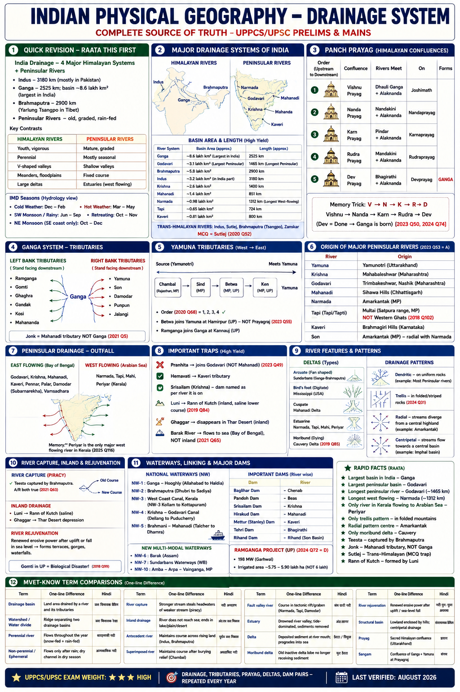

---

<strong>🎯 Consolidated — 48 Must-Score Facts</strong> (Click to Expand)

1. About **77%** of India’s drainage **area** faces the **Bay of Bengal**, about **23%** faces the **Arabian Sea**, and inland basins cover about **8%** of area. Over **90% of river water** still goes to the Bay of Bengal.
2. Water-share fact: **Brahmaputra about 40%**, **Ganga about 25%**, **Godavari about 6%**. Brahmaputra leads water volume; Ganga leads Indian basin area.
3. The Western Ghats (पश्चिमी घाट) are the main peninsular divide. From **Amarkantak**, drainage is radial — **Narmada** (नर्मदा) west and **Son** toward the Ganga.
4. **Ganga** is the largest basin **inside India**. **Godavari** (गोदावरी) is the largest **peninsular** basin. Among Tapti (ताप्ती) / Narmada / Mahanadi / Cauvery alone, **Mahanadi** (महानदी) is the largest basin.
5. Himalayan rivers are mostly **perennial** (melt plus rain) and include **antecedent** (पूर्ववर्ती) giants. Peninsular rivers are mostly **rain-fed** and graded.
6. Drainage types: **consequent** (अनुवर्ती) follows original slope; **subsequent** (परवर्ती) follows weak belts later; **antecedent** (Indus, Sutlej (सतलुज), Brahmaputra) cuts rising Himalaya (हिमालय); **superimposed** (अध्यारोपित) (Chambal (चंबल)) inherits an older course.
7. **Trans-Himalayan** rivers rise north of the Great Himalaya in Tibet and cut through — fact **Sutlej** (सतलुज), and also Indus and Brahmaputra (Tsangpo). Among Jhelum (झेलम) / Sutlej / Ganga / Ravi (रावी), the trans-Himalayan pick is **Sutlej**.
8. The Indus rises in a Tibet gorge and reaches the Arabian Sea in Pakistan. The five Punjab rivers east to west are **Sutlej–Beas (ब्यास)–Ravi–Chenab (चिनाब)–Jhelum**. Under the Indus Treaty, India gets Ravi, Beas, and Sutlej; Pakistan gets Indus, Jhelum, and Chenab.
9. Dam (दाम -)–river pairs: **Baglihar = Chenab**, **Pandoh = Beas** (not Ravi), **Srisailam = Krishna** (not Tungabhadra (तुंगभद्रा)).
10. The Ganga is named only at **Devprayag** (देवप्रयाग) where Alaknanda (अलकनंदा) meets Bhagirathi (भागीरथी). It is about **2525 km** long. In Bangladesh it becomes the **Padma** (पद्मा), meets the Brahmaputra as **Jamuna** (जमुना), then joins the Meghna system to the Bay of Bengal.
11. Ganga joins: Yamuna (यमुना) at **Prayagraj** (प्रयागराज), Ramganga (रामगंगा) at **Kannauj** (कन्नौज), Ghaghara (घाघरा) at **Chhapra**, Gandak (गंडक) at **Sonpur**, Son at **Patna** (पटना), Kosi (कोसी) at **Kursela**. Left-bank Himalayan tributes include Ramganga, Ghaghara, Gandak, Kosi, and Mahananda (महानंदा); **Gomti** is a plains-origin left-bank river. Right-bank facts are Yamuna, Son, and Damodar (दामोदर).
12. Yamuna right-bank tributes west to east are **Chambal–Sind (सिंध)–Betwa–Ken**. Chambal joins at Etawah (इटावा); Betwa at **Hamirpur**; Ken at **Banda**. Betwa does **not** meet at Prayagraj.
13. **Jonk** (जोंक) joins the **Mahanadi**, not the Ganga. **Gandak** (गंडक) is not an Uttar Pradesh river in the usual state list (राज्य सूची). **Punpun** (पुनपुन) meets near Fatuha. Chambal ravines (चंबल) start near **Mhow**.
14. Panch Prayag upstream to downstream: **Vishnu** (Dhauli (धौली)) → **Nanda** (Nandakini) → **Karn** (Pindar (पिंडर)) → **Rudra** (Mandakini) → **Dev** (Bhagirathi) = Ganga. Badrinath (बद्रीनाथ) is on the **Alaknanda** (अलकनंदा); Kedarnath (केदारनाथ) is on the **Mandakini** (मंदाकिनी).
15. The eastern **Dhauliganga** (धौलीगंगा) joins the **Kali** (काली), not the Alaknanda. Do not confuse it with the Dhauli of Vishnuprayag (विष्णुप्रयाग).
16. The Brahmaputra rises as Angsi / Tsangpo, makes a **U-turn at the eastern syntaxial bend near Namcha Barwa**, and enters India as Siang / Dihang (दिहांग). **Majuli** is the classic island. Right-bank north tributes include Subansiri, Manas, Sankosh, and Teesta; left-bank south tributes include Burhi Dihing and Dhansiri.
17. **Teesta** was captured from the Ganga system into the Brahmaputra. Barak (बराक) becomes Meghna and reaches the Bay of Bengal — it is **not** inland drainage.
18. Peninsular length fact: **Godavari (~1465 km) > Krishna (~1400) > Narmada (~1312) > Mahanadi (~851) > Tapi (~724)**. Godavari is also called Dakshin / Vriddha Ganga and rises near **Trimbak**.
19. Origins: Yamuna–Yamunotri (यमुनोत्री), Krishna–Mahabaleshwar, Godavari–Nashik, Mahanadi–Sihawa, Narmada–Amarkantak, Tapi–**Multai (Satpura (सतपुड़ा))** not Western Ghats, Kaveri–Brahmagiri.
20. **Pranhita** (प्रणहिता) joins **Godavari**. **Hemavati** joins Kaveri. **Malaprabha** joins Krishna. Hyderabad (हैदराबाद) stands on the **Musi**, not the Krishna stem. Ludhiana is on the **Sutlej**, not the Ravi.
21. West-flowing set: Narmada, Tapi, Mahi (माही), Sabarmati (साबरमती), **Periyar** (पेरियार). East-flowing examples include Pennar (पेन्नार) and Palar. Narmada and Tapi form **estuaries** in rift valleys; most east-flowing peninsular rivers build **deltas**.
22. **Luni** (लूनी) is inland: upper course fresh, lower course **saline** (लवणीय). The classic fault-valley tag is **Damodar** (दामोदर); Narmada and Tapi are also rift valleys.
23. Delta (डेल्टा) types: **Arcuate** = Sundarbans (सुंदरबन); **Bird’s-foot** (पक्षी-पाद) = Mississippi (not Ganga). **Moribund** as a **Bengal subdivision** ≠ **Cauvery** as a **moribund lobe** match — read the stem. **Trellis** (जालनुमा) marks folded structure; **radial** marks Amarkantak; **dendritic** (वृक्षाकार) is the common homogeneous pattern.
24. National Waterways: **NW-1** Ganga–Hooghly (हुगली), **NW-2** Brahmaputra, **NW-3** Kerala, **NW-4** Krishna–Godavari, **NW-5** Brahmani–Mahanadi.
25. **Ken–Betwa** is the only National Perspective Plan link under implementation, linking Madhya Pradesh and Uttar Pradesh in Bundelkhand.
26. Uttar Pradesh points: Sangam (संगम) at **Prayagraj**; **Gomti** is Lucknow (लखनऊ)’s river and the pollution tag; **Ghaghara** (घाघरा) is Ayodhya (अयोध्या)’s river; the Ganga–Yamuna **Doab** (दोआब) is the core plain.
27. Chambal sanctuary spans **Uttar Pradesh, Madhya Pradesh, and Rajasthan** — not Haryana.
28. Kaveri island sequence includes **Srirangapatna (श्रीरंगपट्टनम)–Shivasamudram–Srirangam**. Bhubaneswar is **not** a Mahanadi-bank city fact in the usual trap set.
29. East-flowing peninsular rivers north to south often run **Subarnarekha → Mahanadi → Godavari → Krishna → Pennar → Cauvery → Vaigai**.
30. Indus is the longest of the four (चातुर्याम) Himalayan systems overall, but most of its course lies in Pakistan. Ganga is the longest river **in India**.
31. Concordant (संगत) drainage follows structure; discordant (असंगत) drainage cuts across it — Himalayan antecedents are the classic discordant case.
32. **Kosi** (कोसी) is the Sorrow of Bihar; **Damodar** is the Sorrow of Bengal. Do not swap those titles.

---
33. Ganga left-bank Himalayan tributes include Ramganga, Ghaghara, Gandak, Kosi and Mahananda; **Gomti** is plains-origin. Right-bank facts include Yamuna, Son and Damodar.
34. Peninsular rivers are older, graded and mostly rain-fed; Himalayan rivers are younger, perennial and often antecedent through rising ranges.
35. Dendritic rivers include the **Ganga** and **Indus** plains, the **Godavari**, the **Mahanadi**, the **Krishna**, and the **Kaveri**.
36. The Indian **trellis** ground is the old folded belt of **Singhbhum** (Chotanagpur). **Rectangular** streams follow joints on the **Vindhyan** rocks.
37. **Centripetal** streams drain into **Loktak** and into **Sambhar** (Mendha, Rupangarh).
38. The **Sharavati** follows a **parallel** pattern down the Western Ghats.
39. **Ganga Alluvial Depth:** Depth of Gangetic alluvium below the surface is estimated at **4,000–6,000 metres** according to Oldham, and ~**2,000 metres** according to Glennie.
40. **Son River Origin & Catchment:** Originates from Amarkantak Hill (Sonmuda in Anuppur MP / Sonbachharwar in Gaurela-Pendra-Marwahi CG). Catchment area is **70,055 sq km**, the largest among Ganga's major tributaries (vs Gandak ~45,731, Ramganga ~30,811, Mahananda ~23,700). Flows northward to join Ganga near Patna.
41. **Kaimur Water Divide:** The **Kaimur Range** acts as the primary watershed dividing the Son system to the south from the Tons/Yamuna system to the north.
42. **Gandak & Triveni Canal:** In Nepal, the Gandak is known as the **Gandaki or Narayani**, formed by the confluence of the Kali Gandak and Trishulganga. The **Triveni Canal** draws water from the Gandak in West Champaran (Bihar). Gandak joins Ganga at Sonpur (near Patna) and does **not** flow through Uttar Pradesh.
43. **Ganga in Bihar:** Passes through **12 districts**; maximum length is in **Patna (~99 km)**, followed by **Bhagalpur (~97 km)**. Punpun joins the Ganga at **Fatuha**.
44. **Kosi System & Kanwar Lake Trap:** Kosi is formed by 7 Himalayan streams (Arun being principal); it does **not** originate from glaciers. Average elevation of the Kosi plain is **30–40 metres**. **Kanwar Lake** (Begusarai, Bihar) is an oxbow lake formed by a cutoff meander of the **Burhi Gandak**, NOT the Gandak.
45. **Eastern Ghats Origins:** **Nagavali** and **Vamsadhara** rise from the Eastern Ghats. By contrast, **Brahmani** and **Subarnarekha** (origin: Nagri village near Ranchi) originate from the Chotanagpur / Ranchi Plateau.
46. **Punjab Doabs & Chenab Headwaters:** **Chandra** (Chandra Tal) and **Bhaga** (Bara Lacha La) unite at **Tandi** in the Lahaul valley to form the **Chandrabhaga (Chenab)**. Doabs: **Bist** (Beas–Sutlej), **Bari** (Beas–Ravi), **Rechna** (Ravi–Chenab), **Chaj** (Chenab–Jhelum).
47. **Gandikota Canyon & S.P. Chatterjee Division:** The spectacular Gandikota canyon ("Grand Canyon of India") in Kadapa (AP) was carved by the **Pennar River**. In S.P. Chatterjee's physiographic division, the Mahanadi Basin is classified under the **Northern Deccan Plateau**.
48. **Key City Riverbank Anchors:** **Kanpur** is the largest city on the Ganga; **Uttarkashi** is on the Bhagirathi (before Ganga forms); **Leh** is on the **right bank** of the Indus; **Pahalgam** is on the **Lidder**; **Hampi** is on the **Tungabhadra** (not Malaprabha); **Pandharpur** is on the **Chandrabhaga (Bhima)**; **Govindghat** is on the **Alaknanda / Lakshman Ganga** (not Mandakini).

<strong>⚡ Confused Pairs</strong> (Click to Expand)

| A | B | Correct | Hindi |
|---|----|------|-------|
| Ganga basin | Godavari basin | Largest **India** vs largest **peninsular** | गंगा / गोदावरी |
| Left-bank Ganga | Right-bank Ganga | Himalayan trib vs Yamuna/Son/Damodar | बायाँ / दायाँ तट |
| Delta | Estuary | East-coast deposition vs west-coast tidal funnel | डेल्टा / ज्वारनदमुख |
| Arcuate | Bird’s-foot | Sundarbans vs **Mississippi** | चापाकार / पक्षी-पाद |
| Antecedent | Superimposed | Cuts rising Himalaya vs inherited course (Chambal) | पूर्ववर्ती / अध्यारोपित |
| Trans-Himalayan | Himalayan-origin | Tibet origin + cuts Himalaya (Sutlej) vs rises in Himalaya (Jhelum/Ravi) | पार-हिमालयी |
| Narmada | Tapi | Amarkantak vs **Multai (Satpura)** | नर्मदा / तापी |
| Luni | Barak | Inland saline lower vs BoB via Meghna | लूनी / बराक |
| Padma | Jamuna | Ganga in BD vs Brahmaputra in BD | पद्मा / जमुना |
| Devprayag | Rudraprayag | +Bhagirathi = **Ganga** vs +Mandakini | देवप्रयाग / रुद्रप्रयाग |
| Trellis | Dendritic | **Folded** structure vs homogeneous slope | जालनुमा / वृक्षाकार |
| Consequent | Subsequent | Follows original slope vs later weak-belt tributary | अनुवर्ती / परवर्ती |
| Concordant | Discordant | Follows structure vs cuts across (antecedent Himalaya) | संगत / असंगत |
| Pranhita | Jonk | Godavari trib vs Mahanadi trib | प्रणहिता / जोंक |
| Hyderabad–Musi | Hyderabad–Krishna | City on Musi trib, not Krishna stem | मुसी / कृष्णा |
| E. Dhauliganga | Alaknanda Dhauli | Kali trib vs Vishnuprayag Dhauli | पूर्वी धौली |
| Chambal ravines | Damodar rift | Badlands vs fault-valley tag | चंबल / दामोदर |
| Kosi | Damodar | Sorrow of Bihar vs Sorrow of Bengal | कोसी / दामोदर |

---

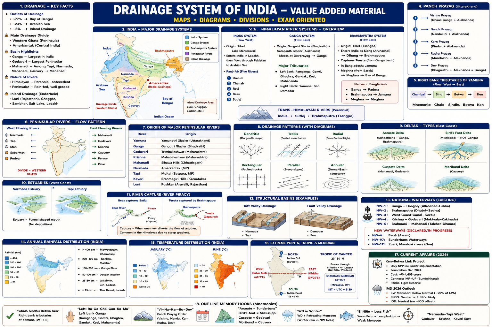

## Must-score facts — basins, types, dam–river

### Area / water share

| Item | Lock |
|------|------|
| Bay of Bengal drainage area | ~**77%** |
| Arabian Sea drainage area | ~**23%** |
| Water volume | Brahmaputra ~**40%** · Ganga ~**25%** · Godavari ~**6%** |
| Largest basin in India | **Ganga** |
| Largest peninsular basin | **Godavari** |
| Main peninsular divide | **Western Ghats** (पश्चिमी घाट) |
| Amarkantak radial | **Narmada** west · **Son** east |

### Drainage types

| Type | Lock |
|------|------|
| Consequent | Follows original slope |
| Subsequent | Follows weak belts later |
| Antecedent | Cuts rising land (Indus, Sutlej, Brahmaputra) |
| Himalayan vs peninsular | Mostly perennial vs mostly rain-fed / seasonal |

### Dam ↔ river

| Dam | River |
|-----|-------|
| Baglihar | **Chenab** (चिनाब) |
| Pandoh | **Beas** (ब्यास) (≠ Ravi) |
| Srisailam | **Krishna** (कृष्णा) (≠ Tungabhadra) |

### Master Table — Panch Prayag of Uttarakhand (पंच प्रयाग)

*(Tested heavily in match-the-pair: UPPCS 2023 Q50, UKPCS)*

| Prayag (प्रयाग) | Headstream 1 | Headstream 2 (Tributary) | District / Location | Key Shrine / Geographical Landmark |
|:----------------|:-------------|:-------------------------|:--------------------|:-----------------------------------|
| **1. Vishnuprayag** (विष्णुप्रयाग) | **Alaknanda** (अलकनंदा) | **Dhauliganga** (धौलीगंगा - Western) | Chamoli, Uttarakhand | Nearest prayag to Badrinath & Joshimath; origin from Satopanth glacier |
| **2. Nandaprayag** (नंदप्रयाग) | **Alaknanda** | **Nandakini** (नंदाकिनी) | Chamoli, Uttarakhand | Confluence named after King Nanda; Nandakini rises from Nanda Ghunti |
| **3. Karnaprayag** (कर्णप्रयाग) | **Alaknanda** | **Pindar** (पिंडर) | Chamoli, Uttarakhand | Pindar rises from Pindari glacier (Kumaon/Garhwal border) |
| **4. Rudraprayag** (रुद्रप्रयाग) | **Alaknanda** | **Mandakini** (मंदाकिनी / Kali Ganga) | Rudraprayag, Uttarakhand | Mandakini flows down from **Kedarnath** (Chorabari glacier) |
| **5. Devprayag** (देवप्रयाग) | **Alaknanda** | **Bhagirathi** (भागीरथी) | Tehri Garhwal, Uttarakhand | **The river is officially named GANGA (गंगा) from this confluence onward**; Bhagirathi rises from Gaumukh (Gangotri glacier) |

---

### Master Table — Tributaries of Major Indian River Systems (बाएँ एवं दाएँ तट की सहायक नदियाँ)

*(High-yield for list-matching and tributary identification questions)*

| River System | Origin (उद्गम) | Left-Bank Tributaries (बायाँ तट) | Right-Bank Tributaries (दायाँ तट) | Drainage Mouth / Key Notes |
|:-------------|:---------------|:---------------------------------|:----------------------------------|:---------------------------|
| **Ganga** (2,525 km) | Devprayag (Bhagirathi + Alaknanda) | • **Ramganga** (meets at Kannauj) • **Gomti** (origin Gomat Taal/Phulhar Jheel, Pilibhit; meets near Saidpur) • **Ghaghara / Saryu** (meets at Chhapra) • **Gandak** (meets at Sonpur) • **Burhi Gandak** • **Kosi** ("Sorrow of Bihar"; meets at Kursela) • **Mahananda** (easternmost left tributary) | • **Yamuna** (largest tributary; meets at Prayagraj Sangam) • **Tamas / Tons** (meets near Sirsa) • **Son** (radial from Amarkantak; meets at Patna/Danapur) • **Punpun** (meets at Fatuha) | Enters Bangladesh as **Padma**; combines with **Jamuna** (Brahmaputra) and **Meghna** to form Sundarbans delta |
| **Yamuna** (1,376 km) | Yamunotri Glacier (Bandarpunch) | • Tons (largest Himalayan tributary) • Hindon (meets near Noida/Greater Noida) • Rind, Sasur Khaderi | • **Chambal** (meets near Muradganj/Etawah) • **Sindh** (meets in Jalaun) • **Betwa** (meets at Hamirpur) • **Ken** (meets at Chilla, Banda) | Parallel to Ganga; forms fertile Ganga-Yamuna Doab |
| **Indus** (Sindhu, 2,880 km) | Bokhar Chu (near Lake Mansarovar, Tibet) | • **Zanskar** • Suru, Soan • **Panjnad** (combined flow of Jhelum, Chenab, Ravi, Beas, Sutlej) | • **Shyok** (with Nubra) • **Gilgit** • Hunza • **Kabul** (with Swat) • Kurram, Gomal | Trans-Himalayan; enters Arabian Sea south of Karachi |
| **Brahmaputra** (2,900 km) | Angsi / Chemayungdung Glacier (Tibet as *Yarlung Tsangpo*) | • **Lohit** • **Dibang** (Sikang) • **Burhi Dihing** • **Dhansiri** (South) • Kopili | • **Subansiri** (gold-bearing; largest tributary) • Kameng (Jia Bhoreli) • **Manas** • Sankosh • **Teesta** (captured from Ganga system in 1787 flood) | Syntaxial U-turn at Namcha Barwa; world's largest river island **Majuli** (Assam) |
| **Godavari** (1,465 km) *"Dakshin Ganga" / "Vriddha Ganga"* | Trimbakeshwar (Nashik, Maharashtra) | • **Dharna** • **Penganga** • **Wainganga** • **Wardha** (combined: **Pranhita**) • **Indravati** (Chitrakote Falls) • **Sabari** & Sileru | • **Pravara** • Mula • **Manjra / Manjira** (longest right-bank tributary, flows through Nizamabad) • Maner | **Largest Peninsular river basin**; forms lobate delta in Andhra Pradesh |
| **Krishna** (1,400 km) | Near Mahabaleshwar (Western Ghats, Maharashtra) | • **Bhima** (longest tributary, 861 km) • Dindi • Peddavagu • **Musi** (Hyderabad sits on its banks) • Paleru, Munneru | • **Venna** • **Koyna** (Shivsagar reservoir) • Panchganga • Dudhganga • **Ghataprabha** (Gokak falls) • **Malaprabha** • **Tungabhadra** (Tunga + Bhadra; largest basin tributary) | Second largest east-flowing peninsular river; major dams: Almatti, Srisailam, Nagarjuna Sagar |
| **Cauvery / Kaveri** (800 km) *"Ganga of the South"* | Talakaveri, Brahmagiri Range (Kodagu, Karnataka) | • **Harangi** • **Hemavati** • **Shimsha** • **Arkavathi** | • **Lakshmantirtha** • **Kabini** • Suvarnavathi • **Bhavani** • **Noyyal** • **Amaravati** | Perennial due to dual monsoons (SW monsoon in upper basin + NE monsoon in lower basin); islands: Srirangapatna, Shivanasamudra, Srirangam |
| **Mahanadi** (851 km) | Sihawa highlands (Dhamtari, Chhattisgarh) | • **Seonath** (longest tributary, 383 km) • **Hasdeo** • **Mand** • **Ib** | • **Jonk** (UPPCS repeated trap: Jonk joins Mahanadi, NOT Ganga!) • **Ong** • **Tel** | Hirakud Dam (longest earthen dam); drains Chhattisgarh and Odisha into Bay of Bengal |
| **Narmada** (1,312 km) | Amarkantak Plateau (Anuppur, MP) | • **Sher** • **Shakkar** • **Dudhi** • **Tawa** (longest tributary) • Ganjal, Kundi | • **Hiran** • Barna • Choral • Man, Uri, Orsang | Flows through **rift valley** between Vindhyas (north) & Satpuras (south); Dhuandhar falls; Sardar Sarovar Dam; forms **estuary** (no delta) |
| **Tapi / Tapti** (724 km) | Multai (Betul district, Satpura Range, MP) | • **Purna** (main tributary; drains Vidarbha) • **Girna** • Panjhra • Bori, Waghur | • Suki • Gomai • Arunavati | Parallel rift valley south of Satpuras; Ukai & Kakrapar dams; forms estuary at Surat |

---

### Master Table — Major Mountain Passes of India (भारत के प्रमुख पर्वतीय दर्रे)

*(High-frequency match-the-pair: Pass ↔ State / Mountain Range)*

| Pass Name (दर्रा) | State / Union Territory | Mountain Range | Strategic / Historical Connection |
|:------------------|:------------------------|:---------------|:----------------------------------|
| **Zoji La** (ज़ोजिला) | Ladakh (UT) | Great Himalayas | Connects **Srinagar to Leh**; Zojila Tunnel under construction |
| **Karakoram Pass** | Ladakh (UT) | Karakoram Range | Highest pass in India (~5,540 m); ancient silk route to Tarim Basin / Yarkand |
| **Bara-lacha La** (बारालाचा) | Himachal Pradesh | Zanskar Range | Connects **Mandi/Manali to Leh**; source of Bhaga river (Chenab) |
| **Shipki La** (शिपकी ला) | Himachal Pradesh | Zanskar Range | **Sutlej river enters India from Tibet** through this gorge; India-China border trade post |
| **Rohtang Pass** (रोहतांग) | Himachal Pradesh | Pir Panjal Range | Connects Kullu Valley with Lahaul and Spiti; bypassed by **Atal Tunnel** (9.02 km) |
| **Mana Pass** (माना दर्रा) / *Dungri-La* | Uttarakhand | Greater Himalayas | Located in Nanda Devi Biosphere; connects Uttarakhand with Tibet; near Badrinath |
| **Niti Pass** (नीति दर्रा) | Uttarakhand | Greater Himalayas | Ancient trade route between Uttarakhand (Chamoli) and Tibet |
| **Lipulekh Pass** (लिपुलेख) | Uttarakhand (Pithoragarh) | Kumaon Himalayas | **Tri-junction of India, Nepal, and Tibet**; pilgrimage route for **Kailash-Mansarovar Yatra** |
| **Nathu La** (नाथुला) | Sikkim | Dongkya Range | Ancient Silk Route to Lhasa (Chumbi Valley, Tibet); reopened for border trade in 2006 |
| **Jelep La** (जेलेप ला) | Sikkim | Greater Himalayas | Passes through Chumbi Valley connecting Sikkim/Kalimpong with Lhasa (Tibet) |
| **Bomdi La** (बोमडिला) | Arunachal Pradesh | Greater Himalayas | Connects Arunachal Pradesh (Tawang) with Lhasa (Tibet) |
| **Diphu Pass** (दिफू दर्रा) | Arunachal Pradesh | Mishmi Hills | Tri-junction border of India, China, and Myanmar |
| **Thal Ghat** (थाल घाट) / *Kasara Ghat* | Maharashtra | Western Ghats (Sahyadri) | Links **Mumbai to Nashik & Kolkata** (NH-3 & Central Railway) |
| **Bhor Ghat** (भोर घाट) | Maharashtra | Western Ghats (Sahyadri) | Links **Mumbai to Pune & Chennai** (Mumbai-Pune Expressway & rail line) |
| **Palghat Gap** (पालघाट) | Kerala & Tamil Nadu | Between Nilgiris & Anaimalai | Major gap connecting **Palakkad (Kerala) with Coimbatore (Tamil Nadu)** |
| **Shencottah Gap** (शेनकोट्टा) | Kerala & Tamil Nadu | Between Cardamom & Agasthyamalai | Connects **Kollam (Kerala) with Madurai (Tamil Nadu)** |

---

## 3.0 Drainage framework

### River basics (must know before systems)

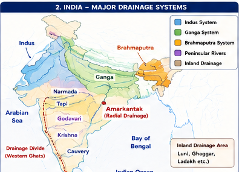

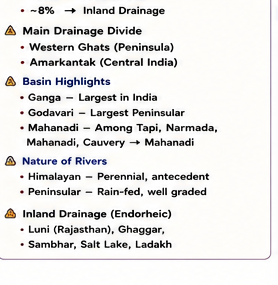

- A **drainage basin** is the whole catchment of a large river. A **watershed** is a smaller unit inside that basin.
- A **major** basin has a catchment above **20,000 km²**. A **medium** basin is 2,000–20,000 km². A **minor** basin is below 2,000 km².
- About **77% of India’s drainage area** faces the **Bay of Bengal**. About **23%** faces the **Arabian Sea**. Inland basins cover about **8% of area** (Luni, Ghaggar (घग्गर), Ladakh (लद्दाख) closed basins).
- **Water volume is more lopsided than area.** Over **90% of river water** goes to the Bay of Bengal. The Brahmaputra alone contributes about **40%** of India’s river water. The Ganga contributes about **25%**.

| Outlet | Share of **area** | Typical rivers |
|--------|-------------------|----------------|
| **Bay of Bengal** | about 77% | Ganga, Brahmaputra, Godavari, Krishna, Mahanadi, Kaveri, Pennar, Palar, Vaigai, Damodar, Subarnarekha, Barak |
| **Arabian Sea** | about 23% | Indus (in Pakistan), Narmada, Tapi, Mahi, Sabarmati, **Periyar**, Sharavati, Mandovi |
| **Inland** | about 8% of area | Luni, Ghaggar, Rajasthan salt (लवणाध्यक्ष) lakes, Ladakh |

- **Ganga** is the largest basin **inside India** (about **8.61 lakh km²**, about 26% of India).
- **Godavari** is the largest **peninsular** basin (about **3.13 lakh km²**).
- Among Tapti / Narmada / Mahanadi / Cauvery, the largest basin is **Mahanadi**. Godavari is not in that set.

#### Himalayan vs peninsular rivers

- The **Himalayan drainage** includes the three great systems: **Indus, Ganga, and Brahmaputra**.
- Himalayan rivers are young and mostly **perennial**. They get water from **glaciers, springs, and monsoon rain**.
- In the mountains they cut **gorges, waterfalls, and steep valleys**. In the plains they build floodplains, meanders, and deltas.
- **Peninsular rivers** are older and **graded**. Most are **rain-fed** and more seasonal. Courses are fixed. Meanders are fewer than in the Himalaya.
- East-flowing peninsular rivers build **deltas**. West-flowing **Narmada and Tapi** (rift valleys) build **estuaries**.

#### Drainage types (definitions) — Teaching Card

Genetic drainage names describe **what the river follows** or **when it formed relative (सापेक्ष) to uplift**.

- A **consequent** river follows the **original slope** of the land — Godavari, Krishna and Kaveri draining from the Western Ghats are Indian examples.
- A **subsequent** river grows later along a **weak belt** and often joins at right angles — Chambal, Sind, Betwa, Ken, Tons (टौंस) and Son toward Yamuna / Ganga.
- An **antecedent** river is **older than uplift**; it keeps its course by cutting a gorge through rising land — classic set **Indus, Sutlej, Brahmaputra**; many keys also tag **Ganga**.
- A **superimposed** river inherits an older course onto newer structure and does **not** follow today’s slope — **Chambal** (चंबल) (also Son in some notes).
- **Chambal can carry both labels.** **Subsequent** answers stems about a weak-belt tributary joining the Yamuna at right angles. **Superimposed** answers stems about an inherited course that does not follow present structure. Match the **word in the stem**; do not treat the two tags as mutually exclusive facts about different rivers.
- **Antecedent** is genetic history (इतिहास) (river older than Himalayan uplift). **Dendritic** is plan-view pattern on homogeneous rock or alluvium. The Ganga can be **antecedent** in origin keys and still show **dendritic** drainage on the middle–lower plain — those are different questions, not a contradiction.
- **Concordant** drainage follows structure and slope — most peninsular rivers.
- **Discordant** drainage cuts **across** structure — Himalayan antecedent rivers.
- A **river capture (piracy)** happens when a stronger stream steals the headwaters of a weaker one. **Teesta** shifting from Ganga to Brahmaputra is the UPPCS fact.

| Type | Meaning | India |
|------|---------|------------|
| **Consequent** | Follows the original slope of the land | Godavari, Krishna, Kaveri from Western Ghats |
| **Subsequent** | Grows later along a weak belt; often joins at right angles | Chambal, Sind, Betwa, Ken, Tons, Son to Yamuna/Ganga |
| **Antecedent** | Older than uplift; keeps course by cutting a gorge through rising land | Classic set: **Indus, Sutlej, Brahmaputra**; many PCS keys also tag **Ganga** |
| **Superimposed** | Older course inherited onto newer structure; does not follow present slope | **Chambal** (also Son in some notes) |
| **Concordant** | Follows structure and slope | Most peninsular rivers |
| **Discordant** | Cuts across structure | Himalayan antecedent rivers |

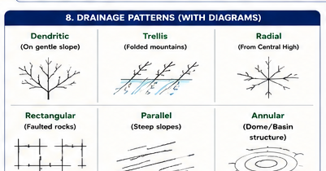

#### Trans-Himalayan rivers (separate tag)

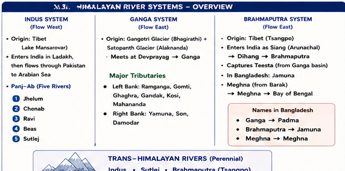

- **Trans-Himalayan rivers** rise **north of the Great Himalaya**, usually on the **Tibetan Plateau**, then **cut through** the Himalaya into India.
- They are typically **antecedent**. Origin is beyond the main Himalayan crest, not in the Himachal (हिमाचल) / Kashmir Himalaya proper.
- set: **Indus, Sutlej, and Brahmaputra (Tsangpo)**.
- Among common options (Jhelum / Sutlej / Ganga / Ravi), the Trans-Himalayan pick is **Sutlej**.
- **Sutlej** rises at **Rakas Tal** near Mansarovar (Tibet), enters India near **Shipki La** (शिपकी ला), and gorges through the Himalaya. That origin-plus-cut-through is why papers ask “Sutlej is Trans-Himalayan.”
- **Jhelum, Ravi, Beas, and Ganga** (formed at Devprayag) are **not** the Trans-Himalayan pick in that MCQ set.

- The peninsula’s water divide is the **Western Ghats**. **Amarkantak** is a **radial** node: Narmada goes west, Son goes to the Ganga.

> **Logic:** Among Tapi / Narmada / Mahanadi / Cauvery, the largest basin is **Mahanadi**. Himalayan snow feeds perennial rivers — assertion and reason both hold, and the reason explains the assertion. Trans-Himalayan is **not** every Himalayan river.

---

## 3.1 Himalayan rivers

### Indus system

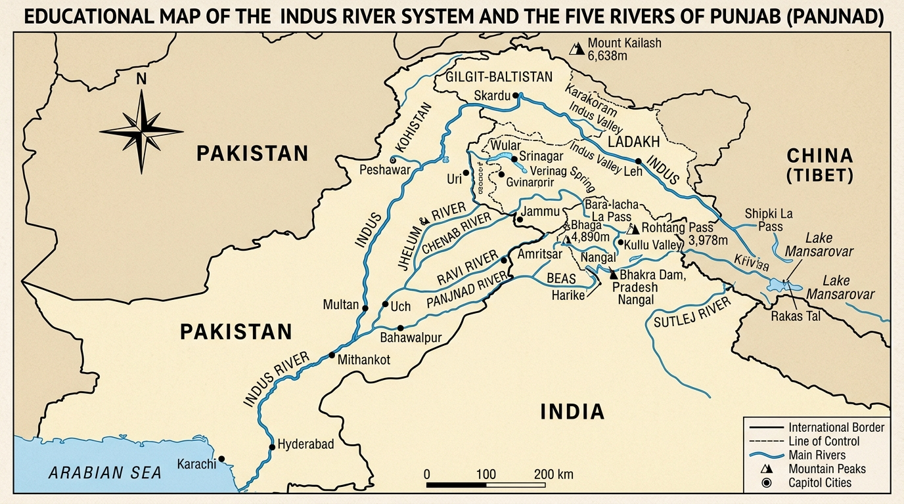

- The Indus rises near the **Kailash / Mansarovar** region of Tibet (Bokhar Chu class origin). It is **antecedent** and **Trans-Himalayan**. It cuts a gorge in Ladakh and reaches the **Arabian Sea** near Karachi.
- Total length is about **2900–3180 km**. Only about **710 km** lies in India.
- **Shyok** and **Zanskar** (ज़ांस्कर) join in Ladakh. **Gilgit** joins farther west.
- The five eastern tributaries are the **Panj Ab**. From **east to west** they are **Sutlej, Beas, Ravi, Chenab, Jhelum**.
- They meet as **Panjnad** just above **Mithankot**, then join the Indus.
- The **Jhelum** (झेलम) rises at **Verinag**. It flows through **Wular Lake** and joins the Chenab. **Kishanganga** (Neelum in Pakistan) is a Jhelum tributary.
- The **Chenab** forms near **Bara Lacha La** (Chandra + Bhaga (भाग) in Lahaul). **Baglihar** and **Salal** stand on the Chenab.
- The **Ravi** rises in the Kullu hills near **Rohtang** (रोहतांग). It drains between Pir (पीर) Panjal (पीर पंजाल) and Dhauladhar (धौलाधार). **Ranjit Sagar** is on the Ravi. **Pandoh is not** on the Ravi.
- The **Beas** rises near **Rohtang**. **Pandoh Dam** is on the Beas. Beas meets Sutlej near **Harike**.
- The **Sutlej** rises at **Rakas Tal**, Tibet. It is both **Trans-Himalayan** and **antecedent**. It enters Himachal near **Shipki La** and cuts deep gorges across the Himalayan ranges. **Bhakra–Nangal** stands on the Sutlej. Among Jhelum / Sutlej / Ganga / Ravi, the Trans-Himalayan answer is **Sutlej**.
- Join order toward the Indus: the **Jhelum** and **Ravi** join the **Chenab**. The Chenab then meets the **Sutlej**. The Sutlej finally joins the **Indus** (सिंधु).
- **Indus Waters Treaty (1960):** India uses **Ravi, Beas, Sutlej**. Pakistan uses **Indus, Jhelum, Chenab**.

> **Logic:** **Pandoh–Ravi** and **Srisailam–Tungabhadra** are the classic NOT-matched pairs. Among usual Himalayan options, the Trans-Himalayan river is the **Sutlej**.

**PYQ — UPPCS Prelims 2025, Q92**

Which of the following pairs is/are NOT correctly matched? (Dam) — (River)

1. Baglihar Dam — Chenab
2. Pandoh Dam — Ravi
3. Srisailam Dam — Tungabhadra

A. 1 and 2

B. Only 3

C. 2 and 3

D. Only 1

Show answer

**Ans: C** — Pandoh = **Beas**; Srisailam = **Krishna**. Baglihar–Chenab is correct.

### Ganga system

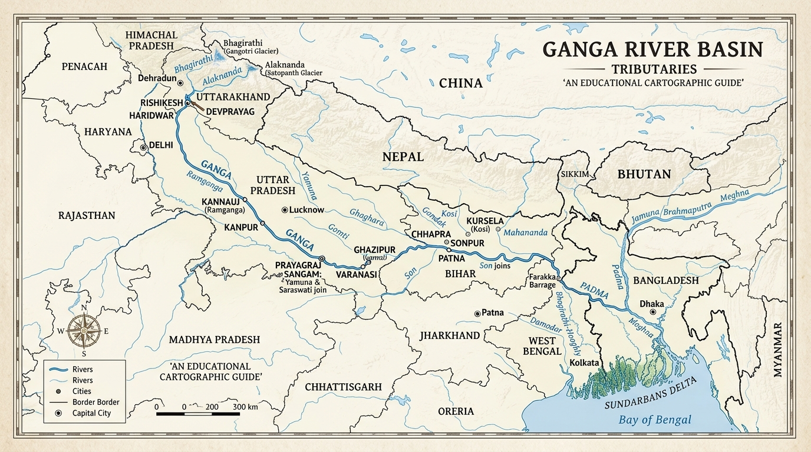

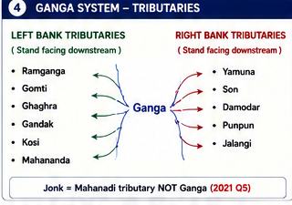

- The Ganga is formed at **Devprayag** where **Alaknanda** meets **Bhagirathi** (भागीरथी). Length is about **2525 km** — India’s longest river.
- The **Bhagirathi** rises at **Gomukh** (Gangotri (गंगोत्री) glacier). The **Alaknanda** rises near **Satopanth** above Badrinath. **Badrinath** sits on the Alaknanda. **Kedarnath** (केदारनाथ) sits on the Mandakini.
- The Ganga enters the plains at **Haridwar** (हरिद्वार). At **Farakka** water is diverted into the **Hooghly** (Bhagirathi–Hooghly arm in West Bengal). The main stem enters Bangladesh near Farakka as the **Padma**.
- In Bangladesh the Padma is joined by the **Jamuna** (Brahmaputra). Further downstream the Padma meets the **Meghna**. From that join onward the combined outlet is commonly called the **Meghna system**, which drains into the **Bay of Bengal**.
- The world’s largest delta is the **Ganga–Brahmaputra–Meghna (Sundarbans)** delta. It lies between the **Hooghly** in the west and the **Meghna** in the east.
- The Ganga is often cited as an **antecedent** river. The classic antecedent set remains **Indus, Sutlej, Brahmaputra**; many PCS keys also tag Ganga.
- **Left-bank (Himalayan) tributaries** join from the north: Ramganga, Gomti, Ghaghara, Gandak, Kosi, Mahananda.
- **Right-bank tributaries** come mainly from the peninsula: Yamuna, Son, Damodar (via Hooghly).

#### In-depth Tributary Profiles & Ganga Traps
- **Ganga Alluvial Depth:** According to R.D. Oldham, the depth of alluvium in the Indo-Gangetic trough is about **4,000 to 6,000 metres**, while gravity surveys by E.A. Glennie estimated it at ~**2,000 metres**.
- **Son River Origin & Drainage:** Rises on the Amarkantak plateau (Sonmuda in Anuppur district, MP; geologically also recognized from Sonbachharwar/Sonekund in Pendra Road, Gaurela-Pendra-Marwahi, CG). Its catchment area is **70,055 sq km**, highest among major Ganga feeders. It flows northward to meet the Ganga near Patna.
- **Kaimur Range:** Acts as a decisive watershed separating the Son basin on the south from the Tons (Yamuna system) on the north.
- **Gandak (Narayani) & Triveni Canal:** Originates in Nepal Himalayas between Dhaulagiri and Everest as the Kaligandak and Trishulganga. Known as the **Gandaki** or **Narayani** in Nepal. The **Triveni Canal** is constructed on the Gandak in West Champaran (Bihar). It joins the Ganga at Sonpur near Patna and does **not** flow through Uttar Pradesh.
- **Ganga in Bihar:** Traverses **12 districts** (Saran, Buxar, Bhojpur, Patna, Vaishali, Samastipur, Begusarai, Lakhisarai, Munger, Khagaria, Bhagalpur, Katihar). Length is longest in **Patna (~99 km)** and second in **Bhagalpur (~97 km)**.
- **Punpun River:** Originates in Chotanagpur Plateau (Jharkhand), flows through Aurangabad district of Bihar, and merges into the Ganga at **Fatuha** (Patna district).
- **Kosi Plain:** Formed by the confluence of 7 streams (principal: Arun Kosi, Sun Kosi, Tamur Kosi). Drains northern slopes of Himalayas in Tibet and southern slopes in Nepal; does **not** have its origin in glaciers. Joins Ganga at Kursela (Katihar). Average elevation of Kosi plain is **30 to 40 metres**.
- **Kanwar Lake (Begusarai):** Asia's largest freshwater oxbow lake, formed by a cutoff meander of the **Burhi Gandak** River, NOT the main Gandak.

#### Where major rivers meet the Ganga

| Tributary | Bank | Meets Ganga at / near |
|-----------|------|------------------------|
| **Yamuna** (यमुना) | Right | **Prayagraj (Sangam)** |
| **Ramganga** (रामगंगा) | Left | **Kannauj** |
| **Gomti** | Left | Near **Saidpur / Ghazipur** belt (after Lucknow) |
| **Ghaghara** | Left | **Chhapra / Revilganj (Saran)** |
| **Gandak** | Left | **Sonpur near Patna** |
| **Son** | Right | Near **Patna** |
| **Punpun** | Right | **Fatuha** (Patna) |
| **Kosi** | Left | **Kursela, Katihar** |
| **Mahananda** (महानंदा) | Left | West Bengal (last left-bank in India) |
| **Damodar** | — | Joins **Hooghly**, not the main Ganga stem |

- The **Ramganga** rises in Garhwal (गढ़वाल) / Doodhatoli. It meets the Ganga at **Kannauj**.
- The **Gomti** rises at **Gomat Taal** (Pilibhit). It is the usual key fact for a Ganga tributary that **rises in the plains**. **Lucknow** (लखनऊ) sits on it. UPPCS 2018 tagged it a **biological disaster**.
- The **Ghaghara / Saryu** (Karnali in Nepal; Mapchachungo glacier class origin) is joined by the **Sharda (शारदा) / Kali**. It meets the Ganga near **Chhapra / Revilganj (Saran)**. **Ayodhya** (अयोध्या) sits on it.
- The **Gandak** (also **Narayani** in Nepal; Kaligandak–Trishuli) joins the Ganga at **Sonpur near Patna**. It does **not** flow through Uttar Pradesh.
- The **Kosi** is the **Sorrow of Bihar**. Sun Kosi, Arun, and Tamur meet in Nepal. It shifts course and floods. It joins the Ganga near **Kursela (Katihar)**.
- The **Mahananda** is the last left-bank tributary in India (West Bengal).
- The **Son** rises at **Amarkantak** (near Narmada’s source). It is the main **north-flowing** right-bank Ganga (दायाँ तट) tributary and joins near **Patna**. Rihand (रिहंद) and North Koel are Son tributaries. **Kaimur Range** divides the Son (south) from the Tons / Yamuna system (north).
- The **Damodar** drains Chotanagpur (छोटानागपुर) in a **rift**. It is the **Sorrow of Bengal**. **Barakar** is its main tributary. It meets the Hooghly. Eden Canal is taken from Damodar.
- The **Punpun** joins the Ganga at **Fatuha** (Patna).
- **Jonk** is **not** a Ganga tributary. It joins the **Mahanadi**.

#### Yamuna system — where tributaries meet

- The **Yamuna** is the longest / largest tributary of the Ganga. It rises at **Yamunotri** on **Bandarpunch** (बंदरपूंछ). It meets the Ganga at **Prayagraj**.

| Tributary | Bank of Yamuna | Meets Yamuna at / near |
|-----------|----------------|------------------------|
| **Tons** (टौंस) | Left | Near **Kalsi** (Uttarakhand) |
| **Hindon** | Left | NCR / western UP belt |
| **Chambal** | Right | Near **Etawah** |
| **Sind** (सिंध) | Right | Between Chambal and Betwa (Auraiya–Kalpi belt) |
| **Betwa** (बेतवा) | Right | **Hamirpur** — **not** Prayagraj |
| **Ken** | Right | Near **Banda** |

- Yamuna **right-bank** feeders from west to east are **Chambal**, then **Sind**, then **Betwa**, then **Ken**.
- The **Chambal** rises near **Mhow / Dr Ambedkar (अम्बेडकर) Nagar** on the Malwa Plateau (Janapao / Vindhya (विंध्य) class). It is famous for **Chambal Ravines** (badlands), not the Damodar fault-valley tag.
- The **Betwa** rises in the Vindhya. The **Ken** joins near Banda.
- A west-to-east right-bank order stem that lists Betwa, Ken, Sind, and Chambal as items 1–4 answers with Chambal first, then Sind, then Betwa, then Ken.

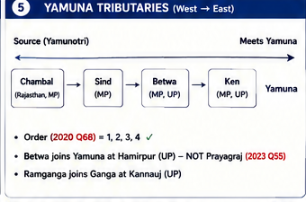

> **Logic:** Ramganga at Kannauj is **true**. Betwa at Prayagraj is **false**. The **Padma** is the Ganga in Bangladesh. The **Jamuna** is the Brahmaputra in Bangladesh.

### Panch Prayag and Uttarakhand

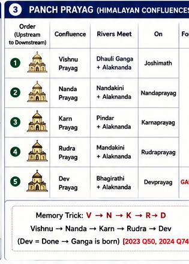

- Upstream to downstream on the Alaknanda the order is **Vishnuprayag** (विष्णुप्रयाग), then **Nandaprayag**, then **Karnaprayag** (कर्णप्रयाग), then **Rudraprayag** (रुद्रप्रयाग), then **Devprayag**.

| Prayag | Confluence |
|--------|------------|
| Vishnuprayag | Alaknanda + **Dhauli Ganga** (western / Alaknanda Dhauli — not Eastern Dhauliganga of Kali) |
| Nandaprayag | Alaknanda + **Nandakini** |
| Karnaprayag | Alaknanda + **Pindar** (पिंडर) |
| Rudraprayag | Alaknanda + **Mandakini** (Kedarnath belt) |
| **Devprayag** | Alaknanda + **Bhagirathi** = **Ganga** |

- **Eastern Dhauliganga** is a tributary of the **Kali / Sharda**, not of the Alaknanda Prayag set.
- **Mandakini** flows between Kedarnath and Rudraprayag.
- **Tehri** (टिहरी) is **Bhagirathi + Bhilangana**. It is a dam site, not one of the five Prayags.

**PYQ — UPPCS Prelims 2024, Q74**

Match List-I with List-II:

A. Devprayag · B. Rudraprayag · C. Karnaprayag · D. Tehri

1. Alaknanda and Pindar · 2. Alaknanda and Bhagirathi · 3. Bhagirathi and Bhilangna · 4. Alaknanda and Mandakini

A. 4 1 2 3

B. 2 3 1 4

C. 4 1 3 2

D. 2 4 1 3

Show answer

**Ans: D** — 2 4 1 3: Dev-2, Rudra-4, Karn-1, Tehri-3.

- The western **Ramganga** rises in the Doodhatoli hills and is regulated at Kalagarh.

### Brahmaputra, capture, Barak

- The Brahmaputra rises as **Yarlung Tsangpo** near **Chemayungdung / Angsi** (Mansarovar region of Tibet). **Indus, Sutlej, and Brahmaputra** all have sources near Mansarovar / Kailash.
- It flows east in Tibet, then makes a sharp **U-turn** around **Namcha Barwa**. That bend is the eastern **syntaxial bend** of the Himalaya.
- It enters India west of Sadiya as **Siang / Dihang**. **Dibang** and **Lohit** join; thereafter it is the Brahmaputra in Assam.
- In Assam the channel is **braided**. **Majuli** is the world’s largest inhabited river island (and India’s first island district).
- Looking downstream in Assam (mostly westward flow): **right-bank (north)** tributaries include **Subansiri, Kameng, Manas, Sankosh, Teesta**. **Left-bank (south)** tributaries include **Burhi Dihing, Dhansiri, Kopili**.
- The **Teesta** rises in Sikkim (Khangchung Chho class — **not** the same source as the Brahmaputra). **Rangeet** is a Teesta tributary from Sikkim. Teesta was once a Ganga tributary; **river capture** shifted it to the Brahmaputra.

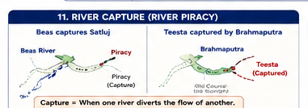

- Near Dhubri the river enters Bangladesh. There the **Tista** joins, and the river is called the **Jamuna** (not the Yamuna).
- The **Barak** rises in the Manipur hills (not Arunachal like Lohit/Subansiri). It becomes Surma–Kushiyara, then the **Meghna**, and reaches the **Bay of Bengal**. It is **not** inland drainage.
- Padma is joined by Jamuna, then by Meghna; the combined Sundarbans delta lies between the Hooghly and the Meghna. The Bengal Delta is subdivided into **moribund, mature, and active** belts.

> **Logic:** ** Padma = Ganga in Bangladesh. Jamuna = Brahmaputra in Bangladesh. Do not swap them with the Yamuna.

---

## 3.2 Peninsular rivers

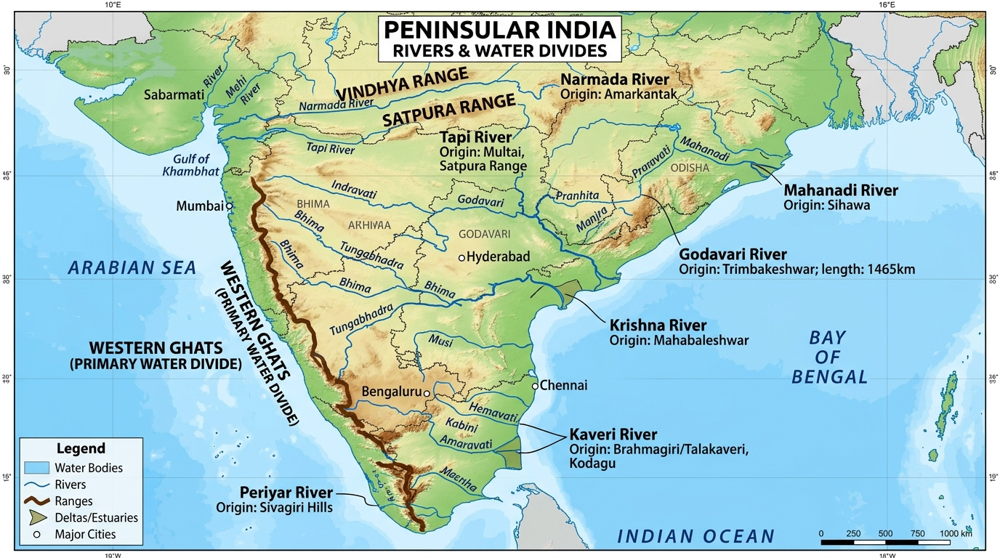

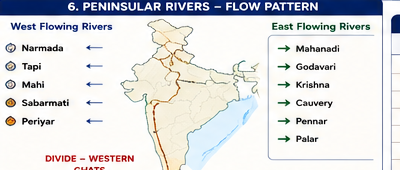

- The main peninsular water divide is the **Western Ghats**. Most large rivers flow **east** to the Bay of Bengal and build **deltas**.
- **Narmada, Tapi, and Mahi** flow **west** to the Arabian Sea and mostly build **estuaries**, not deltas. They run short, steep courses through hard rock / rift valleys and carry less delta-building silt.
- Peninsular rivers are mostly rain-fed, with fixed courses and fewer meanders than Himalayan rivers. Narmada and Tapi in rift valleys are the main structural exceptions.

#### Eastern Ghats vs Chotanagpur Origins
- **Rivers originating from Eastern Ghats:** **Nagavali** and **Vamsadhara** rise directly from the Eastern Ghats.
- **Rivers originating from Chotanagpur Plateau:** **Subarnarekha** (rises near Nagri village in Ranchi district; Hundru falls; joined by Kharkai and Kanchi), **Damodar** (rises from Khamarpat hill), and **North/South Koel**.
- **Mahanadi Confluences & Classification:** The holy **Chandrahasini Devi Temple** is situated at the confluence of the **Mand** and **Mahanadi** rivers at Chandrapur (Chhattisgarh). In S.P. Chatterjee's 8-fold physiographic scheme of India, the Mahanadi Basin is grouped under the **Northern Deccan Plateau**.
- **Gandikota Canyon:** Known as the "Grand Canyon of India", sculpted through quartzite rocks by the **Pennar River** in Kadapa (YSR) district of Andhra Pradesh.
- **Kolleru Lake:** Freshwater lake in Andhra Pradesh situated between the Godavari and Krishna deltas; it is fed directly by the **Budameru** and **Tammileru** streams (indirectly connected to Krishna and Godavari systems).
- **Damodar Rift Valley & Coal Belts:** Flows through a downwarped fault valley across Jharkhand and West Bengal. Major tributaries include **Barakar**, **Jamunia**, **Barki**, and **Konar**. The **Eden Canal** (1938) was constructed from the Damodar for irrigation. The river valley hosts over 90% of India's Gondwana coal reserves (along with Son, Mahanadi, and Godavari valleys). Between Giridih and Durgapur, heavy industrial and mining effluents have turned the Damodar into a **biological desert**.

### Godavari

- The Godavari is the longest peninsular river (about **1465 km**) and the largest peninsular basin. It is called **Dakshin Ganga** / **Vriddha Ganga**.
- It rises at **Trimbakeshwar, Nashik**, only about 80 km from the Arabian Sea, then flows east to the Bay.
- Left-bank tributaries are larger. **Penganga, Wardha, and Wainganga** meet as the **Pranhita**. **Indravati** and **Sabari** also join on the left.
- The **Manjra** is the main **right-bank** tributary (Nizam (निजाम) Sagar).
- **Pranhita belongs to the Godavari**, not the Mahanadi.
- Below Rajahmundry (राजमहेन्द्रवरम) the river splits into **Gautami** and **Vashishta** and builds a **lobate** delta.
- **Jayakwadi, Sriram Sagar, and Polavaram** are the projects.

### Krishna

- The Krishna is the second-largest east-flowing peninsular river (about **1400 km**, basin about **2.59 lakh km²**).
- It rises just north of **Mahabaleshwar**.
- **Right bank:** Ghataprabha, **Malaprabha**, **Tungabhadra** (तुंगभद्रा).
- **Left bank:Bhima**, **Musi** (Hyderabad), Munneru.
- **Tungabhadra** is Tunga + Bhadra from the central Sahyadri.
- **Srisailam** and **Nagarjuna (नागार्जुन) Sagar** (नागार्जुन सागर) stand on the **Krishna**, not on the Tungabhadra.
- **Koyna** is a small tributary famous for its dam.
- The Krishna and Godavari deltas **merge** on the Andhra coast.

### Mahanadi

- The Mahanadi rises at **Sihawa / Dandakaranya** in Chhattisgarh (about **851 km**, basin about **1.42 lakh km²**).
- Its upper course is the saucer **Chhattisgarh Plain**.
- **Left bank:** Seonath, Hasdeo, Mand, Ib.
- **Right bank:** Ong, **Tel**, **Jonk**.
- **Hirakud** (हीराकुंड) at Sambalpur is the great dam. **Cuttack** sits on the delta. The mouth is near **False Point**.
- In water and flood, Mahanadi ranks **second to Godavari** among peninsular rivers.

### Kaveri (Cauvery)

- The Kaveri rises at **Talakaveri on Brahmagiri**, Coorg (about **765–800 km**). Some papers call it the **Ganga of the South**; Godavari remains **Dakshin / Vriddha Ganga**.
- **Hemavati, Kabini, Bhavani, and Amravati** are the usual tributaries.
- It forms the islands of **Srirangapatna, Shivasamudram, and Srirangam**. **Shivasamudram** is also the great Kaveri waterfall by volume.
- **Mettur (Stanley)** is on the Kaveri, **not** on the Krishna.
- The Kaveri delta is old and heavily irrigated. In **landform match-lists**, that ageing / abandoned-lobe story is why many keys tag **Cauvery** as a **moribund lobe**. Separately, UPPCS **“moribund subdivision”** stems still answer **Bengal Delta** — do not use Kaveri for that wording.
- Kaveri water is a **Karnataka–Tamil Nadu (नाडु)** dispute. Basin also touches Kerala and Puducherry.

### Other east-flowing rivers

- The **Pennar** (पेन्नार) (Penner) drains Andhra–Karnataka to the Bay. It is **east-flowing**.
- The **Palar** and **Ponnaiyar** are Tamil Nadu east-flowing rivers.
- The **Vaigai** drains Madurai (मदुरै) to the Bay.
- The **Subarnarekha** rises on Chotanagpur (Ranchi). **Hundru Falls** is on it. It reaches the Bay.
- The **Brahmani–Baitarani** pair drains Odisha (NW-5 country).
- Of Periyar / Pennar / Palar, only **Periyar** reaches the Arabian Sea.
- Standard origin pairs: Yamuna–Yamunotri · Krishna–Mahabaleshwar · Godavari–Nashik · Mahanadi–Sihawa.

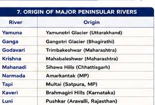

**PYQ — UPPCS Prelims 2018, Q102**

Which of the following rivers of India does NOT originate from the Western Ghats?

A. Godavari

B. Tapti/Tapi

C. Kaveri

D. Kabini *(paper: Kabam in some OCR)*

Show answer

**Ans: B** — Tapi = **Multai (Satpura)**.

### Narmada, Tapi, and other west-flowing rivers

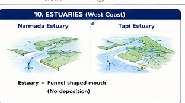

- The **Narmada** is the **longest west-flowing** peninsular river (about **1312 km**). It rises at **Amarkantak** (Maikal) and uses the **rift** between Vindhya (north) and Satpura (south).
- It falls as **Dhuandhar** at the **Marble Rocks** near Jabalpur. It reaches the **Gulf of Khambhat**. **Aliabet** is the large estuary (ज्वारनदमुख) island.
- Right-bank tributaries are few. **Hiran** is the usual named right-bank stream. **Tawa** is a major left-bank tributary (joins near the Narmadapuram / Hoshangabad belt).
- Major dams on the Narmada, roughly upstream to downstream:
- **Bargi** is in Madhya Pradesh near Jabalpur. It is an upper Narmada multipurpose dam.
- **Indira Sagar** is in Madhya Pradesh (Khandwa / Punasa belt). It is among the largest reservoirs on the Narmada chain.
- **Omkareshwar** (ओंकारेश्वर) is also in Madhya Pradesh, downstream of Indira Sagar, near the Omkareshwar Jyotirlinga belt.
- **Sardar Sarovar** (सरदार सरोवर) is in Gujarat (Narmada district, near Navagam). It is the terminal multipurpose project of the Narmada Valley Development. Gujarat, Madhya Pradesh, Maharashtra, and Rajasthan share benefits. Do not confuse it with Indira Sagar (MP) or with Tapi’s **Ukai**.
- The **Tapi (Tapti)** is the Narmada’s “twin.” It rises at **Multai** in the **Satpura** (सतपुड़ा), **not** on the Western Ghats. Length is about **724 km**. **Surat** sits near its mouth. **Ukai Dam** stands on the Tapi in Gujarat.
- The **Mahi** (माही) rises on the Vindhya in Dhar district. It crosses Madhya Pradesh, Rajasthan, and Gujarat to the Gulf of Khambhat.
- The **Sabarmati** rises in the Aravalli (अरावली) (Udaipur (उदयपुर) district). **Ahmedabad** (अहमदाबाद) and **Gandhinagar** sit on it.
- Hundreds of short **Sahyadri torrents** drop west. The **Sharavati** makes **Jog / Gersoppa Falls**.
- The **Periyar** is Kerala’s great west-flowing river.
- **Mandovi** and **Zuari** are Goa (गोवा)’s estuary rivers.

### Inland and fault-valley drainage

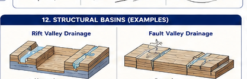

- The **Luni** (“salt river”) rises on the western Aravalli near **Ajmer** (अजमेर). It dies in the **Rann of Kachchh**. Water is **fresh in the upper course** and **saline below Balotra**.
- The **Ghaggar** (घग्गर) is a seasonal Shiwalik (शिवालिक) stream. It fades in the Thar (थार) near Hanumangarh. It is the usual **Saraswati (सरस्वती) palaeo-channel**. It is **inland**.
- **Barak is not inland.** It reaches the Bay through the Meghna.
- **Fault / rift rivers:Narmada, Tapi, Damodar**. The phrase “famous for fault valley drainage” keys **Damodar**. Chambal is ravines, not that tag.

---

## 3.3 Rivers of Uttar Pradesh

**Identity:** Almost all of Uttar Pradesh sits in the **Ganga basin** (गंगा). The master streams are the **Ganga** and the **Yamuna**. Left-bank Himalayan feeders enter from the north and east. Right-bank peninsular feeders enter the Yamuna from Bundelkhand and the Chambal belt.

### Ganga in Uttar Pradesh

The **Ganga** is **formed in Uttarakhand** at Devprayag. It is **not** born inside Uttar Pradesh.

The river enters the UP plain in the **Bijnor** belt after Haridwar.

In Uttar Pradesh it passes **Kannauj, Kanpur (कानपुर), Prayagraj, Varanasi (वाराणसी), Ghazipur and Ballia**.

It leaves Uttar Pradesh into Bihar after the Ballia–Ghazipur fringe.

At **Prayagraj** the Ganga meets the Yamuna at the **Sangam** (संगम) (with the mythical Saraswati in tradition).

### Yamuna in Uttar Pradesh

The **Yamuna** rises at **Yamunotri** on Bandarpunch in Uttarakhand.

It forms much of western Uttar Pradesh’s border story after the Haryana–Delhi reach.

**Mathura** (मथुरा) and **Agra** (आगरा) stand on the Yamuna.

The Yamuna joins the Ganga at the Sangam in **Prayagraj**.

### Left-bank feeders of the Ganga in / near UP

The **Ramganga** rises in the Doodhatoli / Garhwal hills of Uttarakhand.

It irrigates western Uttar Pradesh and meets the Ganga near **Kannauj**.

The Ramganga Project dam is about **825.8 m** long and **198 MW** in Garhwal.

The “**6 lakh ha** irrigated” figure is the **NOT matched** fact on that stem.

The **Gomati** (गोमती) (Gomti) rises at **Gomat Taal / Fulhar** in **Pilibhit**.

It is a classic plains-born tributary of the Ganga.

**Lucknow** stands on the Gomati.

The Gomati meets the Ganga near the **Saidpur / Ghazipur** belt.

The **Ghaghara** (Karnali in Nepal; **Saryu** at Ayodhya) rises near the Mapchachungo glacier class origin in Tibet / Nepal.

It enters the Terai (तराई) near **Bahraich** and waters Ayodhya–Gonda country.

**Ayodhya** stands on the Ghaghara / Saryu.

The Ghaghara meets the Ganga near **Chhapra / Revilganj (Saran)** in Bihar, not inside a UP city sangam.

The **Rapti** (राप्ती) rises in the Nepal Himalaya.

It enters eastern Uttar Pradesh and passes **Gorakhpur** (गोरखपुर).

The Rapti joins the **Ghaghara** inside Uttar Pradesh. It does **not** join the Ganga as a direct master feeder.

The **Gandak** (Narayani in Nepal) rises in the Nepal Himalaya from the Kali Gandak–Trishuli set.

It marks the eastern **Uttar Pradesh–Bihar** fringe (Kushinagar (कुशीनगर)–Deoria side) after entering India near Valmikinagar.

The Gandak meets the Ganga at **Sonpur near Patna**. The confluence itself is in Bihar.

### Right-bank / southern rivers linked to UP

The **Son** rises at **Amarkantak** in Madhya Pradesh.

It cuts the Vindhyan / Sonbhadra (सोनभद्र) fringe of southern Uttar Pradesh.

The **Rihand** joins the Son in **Sonbhadra** (सोनभद्र). **Govind Ballabh Pant Sagar** sits on the Rihand.

The Son meets the Ganga near **Maner / Patna** in Bihar. Do not invent a Son–Ganga sangam inside UP.

The **Chambal** rises near Janapav in Madhya Pradesh.

It meets the Yamuna near **Etawah**.

The National Chambal Sanctuary is **Uttar Pradesh + Madhya Pradesh + Rajasthan**. It is **not** in Haryana.

The **Betwa** rises in the Vindhya range of Madhya Pradesh.

It meets the Yamuna at **Hamirpur**. It does **not** meet at Prayagraj.

The **Ken** rises in Madhya Pradesh and meets the Yamuna near **Banda**.

**Ken–Betwa** is the river-link under implementation for Bundelkhand water.

From west to east, the major Yamuna right-bank feeders in the UP story are **Chambal**, then **Sind**, then **Betwa**, then **Ken**.

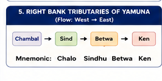

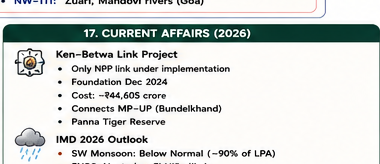

The **Hindon** is a Yamuna **left**-bank stream of western Uttar Pradesh / NCR.

---

## 3.4 River features and patterns

### Deltas versus estuaries
### Types of deltas — Teaching Card

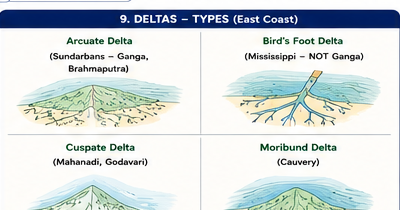

- **Arcuate delta** has a convex seaward front and many distributaries spreading like a fan. The **Ganga–Brahmaputra (Sundarbans)** and **Godavari–Krishna** are Indian examples.
- **Bird's-foot (digitate) delta** has long finger-like distributaries. The **Mississippi** is the classic world example — **not** the Ganga.
- **Cuspate delta** forms when waves from two directions meet the river mouth. **Ebro** (Spain) is cited; **Mahanadi** is often used in Indian match-lists.
- **Lobate delta** is rounded with many shifting mouths. **Godavari** is sometimes classed here for its bulging front.
- **Moribund delta** means a dying / inactive part of a delta. Rivers there are silted, poorly connected to the main channel, and add little new land. Ox-bow lakes and marshes are common.
- Indian papers use **two frames**. Read the stem carefully.
- If the stem says **subdivision** of a named delta (UPPCS 2019 wording), the answer is the **Bengal (Ganga–Brahmaputra) Delta**, which is classed into **moribund, mature, and active** belts. The moribund belt lies mainly in the older western / north-western delta where distributaries decayed after main discharge shifted east toward the Padma.
- If the stem asks which river’s delta is classed as a **moribund / abandoned lobe** in landform match-lists, coaching often keys the **Cauvery (Kaveri)** delta — an old, heavily irrigated delta with little active progradation.
- Do **not** merge the two into one memory line. Do **not** pick Krishna–Godavari or Mahanadi for either classic stem.
- **Estuary** replaces a delta where waves and tides dominate and the river mouth stays funnel-shaped — **Narmada, Tapi, Mandovi** on India's west coast.

- A **delta** grows where a river dumps silt faster than waves can remove it. The **east coast** has a wide shelf, so large deltas form.
- An **estuary** is a partly enclosed tidal mouth where river and sea mix. The **west coast** is steep and wave-strong, and rift rivers carry less silt, so **Narmada, Tapi, and Mandovi** form estuaries rather than deltas.
- Short, fast west-flowing Western Ghat rivers also fail to build large deltas for the same reason.
- World’s largest estuary class example is often the **St Lawrence (लॉरेंस)**. India’s largest estuary mouths are on the **Narmada / Tapi** side.

| Type | Meaning | example |
|------|---------|--------------|
| **Arcuate** | Fan-shaped front, many distributaries | Ganga–Brahmaputra (Sundarbans), Nile, Godavari–Krishna |
| **Lobate** | Rounded bulge, many mouths | Godavari (often) |
| **Bird’s-foot** | Long finger-like distributaries | **Mississippi** — **not** Ganga |
| **Cuspate** | Pointed front from opposing waves | Ebro; **Mahanadi** often cited for India |
| **Moribund (Bengal subdivision stem)** | Dying belt inside a large delta’s moribund–mature–active scheme | **Bengal Delta** (UPPCS 2019) |
| **Moribund (lobe / river match stem)** | Abandoned / ageing delta lobe | **Cauvery** in many landform keys |
| Estuarine mouth | Tidal funnel, little delta build-up | Narmada, Tapi |

### Origins, cities, dams (one home)

| River | Origin |
|-------|--------|
| Bhagirathi | Gomukh / Gangotri |
| Alaknanda | Satopanth (above Badrinath) |
| Yamuna | Yamunotri (Bandarpunch) |
| Indus | Tibet, near Kailash / Mansarovar |
| Sutlej | Rakas Tal, Tibet (Trans-Himalayan; enters near Shipki La) |
| Brahmaputra | Tibet / Angsi–Chemayungdung (Tsangpo) |
| Godavari | Nashik / Trimbakeshwar |
| Krishna | Mahabaleshwar |
| Mahanadi | Sihawa, Chhattisgarh |
| Kaveri | Brahmagiri / Talakaveri, Coorg |
| Narmada | Amarkantak |
| Tapi | Multai, Satpura |
| Son | Amarkantak |
| Chambal | Mhow / Ambedkar Nagar (Malwa) |
| Luni | Aravalli near Ajmer |
| Sharavati | Western Ghats (Jog Falls) |
| Subarnarekha | Chotanagpur (Ranchi / Nagri class) |
| Jhelum | Verinag (Pir Panjal) |
| City | River | Trap |
|------|-------|------|
| Lucknow | Gomti | Not Ganga |
| Ayodhya | Ghaghara / Saryu | — |
| Prayagraj | Ganga + Yamuna (Sangam) | — |
| Kanpur | Ganga | — |
| Varanasi | Ganga | — |
| Patna | Ganga | — |
| Bhagalpur | Ganga | — |
| Surat | Tapi | — |
| Hyderabad | Musi | Not Krishna main stem |
| Vijayawada | Krishna | — |
| Ahmedabad | Sabarmati | — |
| Cuttack | Mahanadi | — |
| Bhubaneswar | Not on Mahanadi bank | Often wrongly paired with Mahanadi |
| Ujjain (उज्जैन) | Kshipra | — |
| Jabalpur | Narmada | — |
| Nasik (नासिक) | Godavari | — |
| Nanded | Godavari | — |
| Rajahmundry | Godavari | — |
| Srinagar | Jhelum | — |
| Leh (लेह) | Indus (right bank) | Not Jhelum |
| Ludhiana | Old Sutlej belt | Not Ravi |
| Firozpur | Old Sutlej belt | Not Ravi |
| Jamshedpur | Subarnarekha | — |
| Guwahati | Brahmaputra | — |
| Dibrugarh | Brahmaputra | — |
| Kota | Chambal | — |
| Gorakhpur | Rapti | — |
| Dam / project | River |
|---------------|-------|
| **Bhakra–Nangal** | Sutlej |
| **Pandoh** | Beas (**not** Ravi) |
| **Baglihar / Salal** | Chenab |
| **Ranjit Sagar** | Ravi |
| **Tehri** | Bhagirathi |
| **Farakka Barrage** | Ganga (Hooghly diversion) |
| **Hirakud** | Mahanadi |
| **Nagarjuna Sagar / Srisailam** | Krishna (**not** Tungabhadra) |
| **Mettur (Stanley)** | Kaveri (**not** Krishna) |
| **Jayakwadi** | Godavari (Maharashtra) |
| **Sriram Sagar** | Godavari (Telangana) |
| **Polavaram** | Godavari (Andhra Pradesh) |
| **Bargi** | Narmada (MP, near Jabalpur) |
| **Indira Sagar** | Narmada (MP, Khandwa / Punasa) |
| **Omkareshwar** | Narmada (MP) |
| **Sardar Sarovar** | Narmada (Gujarat, Navagam) — terminal Narmada project |
| **Ukai** | Tapi (Gujarat) |
| **Gandhi (गांधी) Sagar** | Chambal |
| **Rihand** | Rihand (Son system) |
| **Rajghat** | Betwa (UP–MP) |

> **Teaching note:** **Pandoh** stands on the **Beas**, not the Ravi. **Srisailam** stands on the **Krishna**, not the Tungabhadra. **Mettur (Stanley)** stands on the **Kaveri** (कावेरी), not the Krishna. Hyderabad is not a Krishna-stem dam site. **Sardar Sarovar** is on the **Narmada** in Gujarat; it is not Indira Sagar in Madhya Pradesh and not Ukai on the Tapi.

| Additional City / Town | River | Key Geographic Anchor |
|------------------------|-------|-----------------------|
| **Pahalgam** | **Lidder** | Starting point of Amarnath Yatra in Kashmir (2,130 m altitude) |
| **Pandharpur** | **Chandrabhaga (Bhima)** | Famous pilgrimage centre of Vithoba in Maharashtra |
| **Hampi** | **Tungabhadra** | Historic capital of Vijayanagara Empire (not Malaprabha) |
| **Govindghat** | **Alaknanda + Lakshman Ganga** | Confluence point en route to Hemkund Sahib and Valley of Flowers |
| **Gaurikund / Guptakashi / Rambara** | **Mandakini** | Pilgrim transit halts along the Mandakini gorge to Kedarnath |
| **Bhubaneswar** | **Kuakhai** (delta branch) | Southwest of Mahanadi main stem; Cuttack is on Mahanadi |
| **Kanpur** | **Ganga** | Largest urban agglomeration (>2.9 million) on the bank of Ganga |
| **Leh** | **Indus (Right Bank)** | Situated strictly on the right bank of the Indus in Ladakh |

### Drainage patterns, rejuvenation, basins — Teaching Card

A **drainage pattern** is the map shape of rivers. The shape tells you what **controls** the ground — rock type, folds, joints, or slope.

**Tree and grid patterns**

- **Dendritic** looks like a **tree** with many irregular branches.
- It develops on **homogeneous / uniform rock** — the same resistance everywhere, so streams join at acute angles without a forced grid.
- The **Ganga (गंगा)** on the northern plain follows a dendritic pattern.
- The **Indus (सिंधु)** on the plain follows a dendritic pattern.
- The **Godavari (गोदावरी)** follows a dendritic pattern.
- The **Mahanadi (महानदी)** follows a dendritic pattern.
- The **Krishna (कृष्णा)** follows a dendritic pattern.
- The **Kaveri (कावेरी)** follows a dendritic pattern.
- **Trellis** looks like a **garden trellis / lattice** — long parallel master streams with short cross-links.
- It develops on **folded** belts of **hard and soft rock** alternating — soft belts become strike valleys; hard belts become ridges.
- The Indian trellis ground is the old folded belt of **Singhbhum (सिंहभूम)** on the **Chotanagpur (छोटानागपुर)** plateau.
- Memory: **same rock → tree (dendritic)**; **folds → lattice (trellis)**.

**From a high centre or into a bowl**

- **Radial** streams run **outward** from a high centre — like spokes from a hub.
- Typical Indian controls are a dome, a volcano, or a highland such as **Amarkantak** or **Girnar**.
- The **Narmada (नर्मदा)** leaves Amarkantak toward the **west**.
- The **Son (सोन)** leaves Amarkantak toward the **Ganga**.
- The Mahanadi rises at **Sihawa**, so it is not an Amarkantak radial river.
- **Centripetal** is the opposite — streams run **inward** into a **closed basin**.
- Streams of the **Imphal** basin drain inward toward **Loktak (लोकतक)**.
- The **Mendha (मेंढा)** drains inward toward **Sambhar (सांभर)** lake.
- The **Rupangarh (रुपनगढ़)** drains inward toward Sambhar lake.

**Joints and steep slopes**

- **Rectangular** drainage bends at near-right angles because streams follow **joints** and **faults**.
- Streams on the jointed **Vindhyan (विंध्य)** rocks follow a rectangular pattern.
- **Parallel** drainage has many streams running side by side on a **steep, uniform slope**.
- The **Sharavati (शरावती)** follows a parallel pattern down the Western Ghats.

| Pattern | Control | River / ground |
|---------|---------|----------------|
| **Dendritic** | Uniform rock | **Ganga** and **Indus** plains; **Godavari**; **Mahanadi**; **Krishna**; **Kaveri** |
| **Trellis** | **Folded** ridges and valleys | **Singhbhum** (Chotanagpur) |
| **Radial** | Dome or peak | **Narmada** west and **Son** toward the Ganga from **Amarkantak**; Girnar |
| **Centripetal** | Closed basin | **Loktak** (Imphal); **Mendha** and **Rupangarh** into **Sambhar** |
| **Parallel** | Steep uniform slope | **Sharavati** (Western Ghats) |
| **Rectangular** | Joints and faults | Jointed **Vindhyan** streams |

- Youth shows gorges and waterfalls. Maturity shows meanders and floodplains. Old age shows ox-bows and deltas. The Brahmaputra is **braided**.
- **Rejuvenation** is renewed downcutting after uplift, base-level fall, or capture. Knickpoints, terraces, and incised meanders appear.
- A **structural basin** is an enclosed lowland, often centripetal (Kashmir vale, Imphal).

> **Teaching note:** Folded structures (जाली) produce a **trellis** pattern. They do not produce dendritic, radial, or rectangular patterns as the first answer.

---

## 3.5 Waterways and river linking

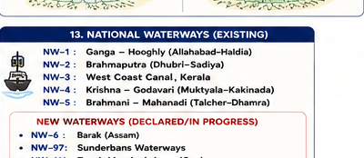

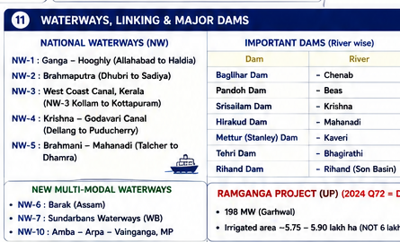

| NW | Route |
|----|-------|
| **NW-1** | Ganga–Bhagirathi–Hooghly (Haldia–Prayagraj) — longest |
| **NW-2** | Brahmaputra (Dhubri–Sadiya) |
| **NW-3** | Kerala west-coast canal / backwaters |
| **NW-4** | Krishna–Godavari canals |
| **NW-5** | Brahmani–Mahanadi–Paradip |

- The National Waterways Act **2016** declared **106** waterways. Core remains NW-1 to NW-5. Other named waterways: **NW-16 Barak**, **NW-97 Yamuna**, **NW-37 Gandak**.
- The most navigable rivers are the **Ganga, Brahmaputra, and Mahanadi**. Godavari, Krishna, Narmada, and Tapi are navigable mainly near their mouths.
- **Interlinking (NPP):** NWDA / Jal Shakti. The plan lists **16 peninsular + 14 Himalayan** links. The aim is surplus to deficit, plus flood, drought (सूखा), power, and navigation.
- **Ken–Betwa** is the **only priority NPP link under implementation** (Cabinet 2021; foundation **25 December 2024**). Both rivers are in the **Yamuna** basin. The project is **Madhya Pradesh–Uttar Pradesh Bundelkhand**. **Daudhan dam** and **Panna Tiger Reserve** submergence are the ecology facts.
- Polavaram includes Godavari–Krishna link assistance.
- Disputes: **Cauvery** (Karnataka–Tamil Nadu). **Krishna** (Maharashtra–Karnataka–Telangana–Andhra Pradesh). **Ravi–Beas / SYL** (Punjab–Haryana). **Narmada** (Gujarat–Madhya Pradesh–Maharashtra–Rajasthan). Law: ISRWD Act 1956 (अधिनियम) and Article **262**.
- Namami Gange and GAP (1985) clean the Ganga on the NW-1 stretch.

---

### 📝 Master Drainage Comparisons & Memory Hooks

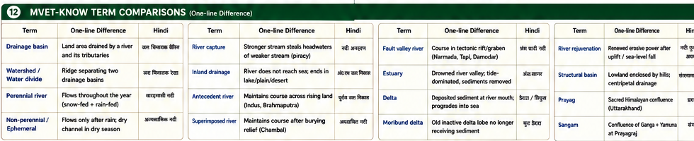

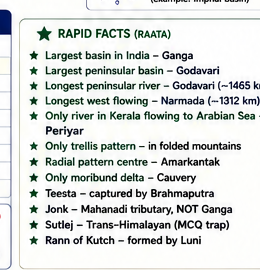

---

## Complete PYQ Bank

> **Answers hidden** — click *Show answer* under each question to reveal.
> **Coverage:** All 25 UPPCS Prelims drainage hits (2018–2025) mapped to this topic — grouped **2025 → 2018**.

**Q1. UPPCS Prelims 2025, Q92**
Which of the following pairs is/are NOT correctly matched?
(Dam) — (River)

1. Baglihar Dam — Chenab
2. Pandoh Dam — Ravi
3. Srisailam Dam — Tungabhadra

Select the correct answer from the code given below:

A. 1 and 2

B. Only 3

C. 2 and 3

D. Only 1

Show answer

**Ans: C** — Pair (2) is wrong because **Pandoh Dam** is on the **Beas**, not the Ravi; pair (3) is wrong because **Srisailam** is on the **Krishna**, not the Tungabhadra. Baglihar–Chenab is correctly matched, so the NOT-matched pairs are 2 and 3.

---

**Q2. UPPCS Prelims 2025, Q94**
Given below are two statements, one is labelled as Assertion (A) and the other as Reason (R):
Assertion (A): The Himalayas form the source of several large perennial rivers.
Reason (R): The higher ranges of the Himalayas remain snow-covered throughout the year.

Select the correct answer from the code given below:

A. Both (A) and (R) are true, but (R) is not the correct explanation of (A)

B. (A) is false, but (R) is true

C. (A) is true, but (R) is false

D. Both (A) and (R) are true and (R) is the correct explanation of (A)

Show answer

**Ans: D** — Both statements are true: the Himalayas do feed large perennial rivers, and year-round snow on the higher ranges supplies meltwater that keeps those headwaters flowing. Reason correctly explains Assertion.

---

**Q3. UPPCS Prelims 2025, Q116**
Which of the following rivers fall into the Arabian Sea?

1. Periyar 2. Pennar 3. Palar

Select the correct answer from the code given below:

A. Only 1

B. Only 3

C. 2 and 3

D. 1 and 2

Show answer

**Ans: A** — Among the three rivers, only **Periyar** drains west into the **Arabian Sea**. **Pennar** and **Palar** flow east into the **Bay of Bengal**, so “only 1” is correct.

---

**Q4. UPPCS Prelims 2024, Q31**
Which one of the following drainage patterns is associated with folded structures?

A. Radial

B. Trellis

C. Dendritic

D. Rectangular

Show answer

**Ans: B** — On **folded** terrain with alternating hard and soft beds, tributaries form a **trellis** pattern. Dendritic is the trap for uniform lithology; radial suits domes; rectangular suits joint control.

---

**Q5. UPPCS Prelims 2024, Q72**
Which one of the following pairs is not correctly matched regarding peculiarities of Ramganga Project?

A. Dam's length – 825.8 metres

B. Hydropower generation capacity – 198 MW

C. Location – Garhwal (Uttarakhand)

D. Irrigated area – 6 lakh hectares

Show answer

**Ans: D** — Dam length (825.8 m), hydropower (198 MW), and Garhwal location are precise matches. **Irrigated area** is officially ~**5.75–5.90 lakh ha**; **6 lakh ha** is the least accurate pair. **A/B/C** are exact project specs.

---

**Q6. UPPCS Prelims 2024, Q74**
Match List-I with List-II:
List-I: A. Devprayag B. Rudraprayag C. Karnaprayag D. Tehri
List-II: 1. Alaknanda and Pindar 2. Alaknanda and Bhagirathi 3. Bhagirathi and Bhilangna 4. Alaknanda and Mandakini

A. 4 1 2 3

B. 2 3 1 4

C. 4 1 3 2

D. 2 4 1 3

Show answer

**Ans: D** — Match by confluence: **Devprayag** = Alaknanda + Bhagirathi (2); **Rudraprayag** = Alaknanda + Mandakini (4); **Karnaprayag** = Alaknanda + Pindar (1); **Tehri** = Bhagirathi + Bhilangana (3). Code **2 4 1 3**.

---

**Q7. UPPCS Prelims 2023, Q49**
Which one of the following pairs (Tributary — River) is not correctly matched?

A. Manjra — Godavari

B. Hemavathi — Kaveri

C. Malaprabha — Krishna

D. Pranhita — Mahanadi

Show answer

**Ans: D** — **Pranhita** is formed by Wardha and Wainganga and joins the **Godavari**. Pairing it with Mahanadi is wrong; Manjra–Godavari, Hemavathi–Kaveri and Malaprabha–Krishna are correct.

---

**Q8. UPPCS Prelims 2023, Q50**
Which one of the following places is the confluence of the rivers Alaknanda and Bhagirathi?

A. Vishnu Prayag

B. Karn Prayag

C. Rudra Prayag

D. Dev Prayag

Show answer

**Ans: D** — Alaknanda and Bhagirathi meet only at **Devprayag** to form the Ganga. Vishnu, Karn and Rudra Prayag are Alaknanda confluences with other tributaries.

---

**Q9. UPPCS Prelims 2023, Q53**
Match the following rivers with their places of origin.
(A) Yamuna — (1) Sihawa
(B) Krishna — (2) Nashik
(C) Godavari — (3) Mahabaleshwar
(D) Mahanadi — (4) Yamunotri

A. A-4, B-3, C-2, D-1

B. A-1, B-2, C-3, D-4

C. A-4, B-2, C-1, D-3

D. A-4, B-2, C-3, D-1

Show answer

**Ans: A** — Correct pairing is Yamuna–Yamunotri (4), Krishna–Mahabaleshwar (3), Godavari–Nashik (2), Mahanadi–Sihawa (1). The usual trap is swapping Krishna and Godavari origins.

---

**Q10. UPPCS Prelims 2023, Q55**
Which of the following statement(s) is/are correct?

1. Ram Ganga River joins the Ganga at Kannauj.
2. River Betwa joins the Yamuna near Prayagraj.

Select the correct answer using the code given below.

A. Only 1

B. Only 2

C. Both 1 and 2

D. Neither 1 nor 2

Show answer

**Ans: A** — Statement 1 is correct: Ramganga joins the Ganga near **Kannauj**. Statement 2 is wrong: Betwa joins the Yamuna at **Hamirpur**, upstream of Prayagraj, so only statement 1 is correct.

---

**Q11. UPPCS Prelims 2022, Q16**
Which one of the following river basins is the largest in respect of area?

A. Tapti

B. Narmada

C. Mahanadi

D. Cauvery

Show answer

**Ans: C** — Among Tapti, Narmada, Mahanadi and Cauvery, **Mahanadi** has the largest basin area. Godavari is larger overall but is not among these options.

---

**Q12. UPPCS Prelims 2021, Q5**
Which one of the following rivers is NOT part of Indian Ganga river basin?

A. Punpun

B. Ajoy

C. Jalangi

D. Jonk

Show answer

**Ans: D** — **Jonk** drains to the **Mahanadi** system, so it is not part of the Indian Ganga basin. Punpun, Ajoy and Jalangi belong to the Ganga system.

---

**Q13. UPPCS Prelims 2021, Q9**
Which of the following is NOT correctly matched?

A. Hundru — Subarnarekha

B. Chachai — Bihad River

C. Dhuandhar — Narmada

D. Budha Ghagh — Kanchi

Show answer

**Ans: B** — The mismatched pair is Chachai–Bihad: **Chachai Falls** are associated with the **Son/Bhadar** system, not a river called Bihad. Hundru–Subarnarekha and Dhuandhar–Narmada are correctly matched.

---

**Q14. UPPCS Prelims 2021, Q63**
Assertion (A): Teesta river was earlier a tributary of Ganga now it is a tributary of Brahmaputra.
Reason (R): River capturing is a major feature of Himalayan rivers.

A. Both (A) and (R) are true and (R) is correct explanation of (A)

B. Both (A) and (R) are true, but (R) is not correct explanation of (A)

C. (A) is true, but (R) is false

D. (A) is false, but (R) is true

Show answer

**Ans: A** — Assertion is true: Teesta shifted from the Ganga system to the Brahmaputra. Reason is also true: river capture is common in the Himalaya, and that process explains the Teesta shift.

---

**Q15. UPPCS Prelims 2020, Q52**
Which of the following rivers is a Trans-Himalayan river?

A. Jhelum

B. Sutlej

C. Ganga

D. Ravi

Show answer

**Ans: B** — **Sutlej** rises in the Tibet/Mansarovar region and is Trans-Himalayan. Jhelum and Ravi rise in the Himalaya of Kashmir/Himachal; Ganga is formed at Devprayag south of the main crest.

---

**Q16. UPPCS Prelims 2020, Q68**
Consider the following tributaries of River Yamuna and arrange them from West to East:

1. Betwa 2. Ken 3. Sindh 4. Chambal

A. 4, 3, 1 and 2

B. 1, 2, 3 and 4

C. 3, 2, 1 and 4

D. 2, 3, 1 and 4

Show answer

**Ans: A** — Geographic west→east is Chambal → Sindh → Betwa → Ken, which with paper numbering is **4, 3, 1 and 2**. The archived `pyq/2020` OCR omitted the numbered list; restored from the standard paper wording (Testbook / official pattern).

---

**Q17. UPPCS Prelims 2020, Chambal Sanctuary Q**
The National Chambal Sanctuary does NOT fall in which of the following States?

A. Uttar Pradesh

B. Madhya Pradesh

C. Haryana

D. Rajasthan

Show answer

**Ans: C** — National Chambal Sanctuary extends through **Uttar Pradesh, Madhya Pradesh and Rajasthan**. It does **not** fall in **Haryana**.

---

**Q18. UPPCS Prelims 2019, Q9**
Which of the following rivers is famous for its fault valley drainage?

A. Chambal

B. Damodar

C. Gandak

D. Ramaganga

Show answer

**Ans: B** — **Damodar** is the standard Indian example of **fault-valley (rift) drainage**. Chambal is famous for ravines/gorges but is not the usual answer for this wording.

---

**Q19. UPPCS Prelims 2019, Q84**
In which of the following rivers, the upper course contains fresh water but saline water flowing at the lower part?

A. Barak

B. Luni

C. Ghaggar

D. None of the above

Show answer

**Ans: B** — **Luni** is an inland river ending toward the Rann; its upper course is fresher while the lower course becomes **saline**. Barak reaches the sea; Ghaggar is inland but Luni is the textbook example.

---

**Q20. UPPCS Prelims 2019, Q85**
'Moribund Delta' is a subdivision of which of the following Delta?

A. Krishna-Godawari Delta

B. Mahanadi Delta

C. Bengal Delta

D. Cauvery Delta

Show answer

**Logic:** Word **subdivision** points to Bengal’s moribund–mature–active classification, not to naming Cauvery as an ageing delta.

**Ans: C** — Moribund is a subdivision of the **Bengal Delta**. Cauvery is the common trap option.

---

**Q21. UPPCS Prelims 2018, Q33**
At the mouth of which of the following rivers the 'bird's foot' type delta is formed?

A. Huang Ho

B. Nile

C. Danube

D. Mississippi

Show answer

**Ans: D** — The classic world **bird's-foot** delta is at the mouth of the **Mississippi**. Nile is often arcuate; Huang Ho and Danube are not the standard bird's-foot example in this paper.

---

**Q22. UPPCS Prelims 2018, Q99**
Which of the following rivers of Uttar Pradesh has been declared a 'Biological Disaster due to environmental pollution?

A. Yamuna

B. Gomati

C. Sai

D. Tamsa

Show answer

**Ans: B** — The UP river tagged as a **biological disaster** due to pollution in this question is the **Gomti (Gomati)**. Yamuna is polluted but was not the answer here.

---

**Q23. UPPCS Prelims 2018, Q102**
Which of the following rivers of India does NOT originate from the Western Ghats?

A. Godavari

B. Tapti/Tapi

C. Kaveri

D. Kabam

Show answer

**Ans: B** — **Tapi/Tapti** rises at **Multai on the Satpura range**, so it does **not** originate from the Western Ghats. Godavari, Kaveri and Kabini/Kabam are Western Ghats–linked.

---

**Q24. UPPCS Prelims 2018, Q24** *(River–waterfall overlap; drainage relevance)*
Which of the following is the highest waterfall in India?

A. Jog fall

B. Kunchikal fall

C. Rakim Kund fall

D. Kevti fall

Show answer

**Ans: B** — Kunchikal (Shimoga, Sharavathi tributary). Brief cross-link to (Waterfalls).

---

**Q25. UPPCS Prelims 2022, Q121** *(Drainage–pollution overlap)*
The main purpose of the **'Ganga Action Plan'** project, launched in 1985, was—

A. To make its water pollution-free only

B. To utilize the river water for irrigation only

C. To build new dams over the Ganga river valley

D. None of the above

Show answer

**Ans: A** — Primary stated purpose was pollution abatement / making Ganga water pollution-free. Irrigation and dam-building were not the main GAP objective. Links to §3.1.9 and Namami Gange successor.

---

## Complete PYQ Bank — Ghatnachakra Drainage System

Comprehensive question bank from Ghatnachakra covering the Ganga, Brahmaputra, Peninsular, and Other River systems, along with riverbank cities. All multi-exam duplicate questions have been merged into single high-yield questions with complete attribution.

**Q-GC1. UP UDA/LDA Prelims 2013**

The Ganga river is a classic example of:

A. Antecedent Drainage System

B. Consequent Drainage System

C. Superimposed Drainage System

D. Subsequent Drainage System

Show answer

**Ans: A.** The Ganga is an antecedent river system. Antecedent streams existed prior to the uplift of the Himalayan mountain barriers and maintained their southward courses by incising deep transverse gorges through the rising landmass.

---

**Q-GC2. UKPCS Prelims 2005 / UPPCS Mains 2016 / UK Lower Sub. Prelims 2010**

In Bangladesh, the main mainstream branch of the River Ganges is known by which name?

A. Meghna

B. Padma

C. Bhagirathi

D. Mahaganga

Show answer

**Ans: B.** After bifurcating at Farakka in West Bengal, the main branch of the Ganga enters Bangladesh where it is known as the Padma. The Padma is joined by the Jamuna (Brahmaputra), and further downstream by the Meghna, under whose name the combined river empties into the Bay of Bengal.

---

**Q-GC3. MPPCS Prelims 2014**

The Sundarban Delta, the largest delta in the world, is formed by which rivers?

A. Ganga and Brahmaputra

B. Ganga and Jhelum

C. Sindhu and Jhelum

D. Ganga and Sindhu

Show answer

**Ans: A.** The Sundarban Delta is formed by the Ganga, Brahmaputra, and Meghna river systems between the Hooghly and Meghna estuaries. Approximately two-thirds of the delta lies in Bangladesh and one-third in India.

---

**Q-GC4. UPPCS Prelims 2005**

Given below are two statements, one is labelled as Assertion (A) and the other as Reason (R):

**Assertion (A):** The Ganga is a highly polluted river.
**Reason (R):** The holier the river, the more polluted it is.

Select the correct answer from the following code:

A. Both (A) and (R) are true, and (R) is the correct explanation of (A).

B. Both (A) and (R) are true, but (R) is not the correct explanation of (A).

C. (A) is true, but (R) is false.

D. (A) is false, but (R) is true.

Show answer

**Ans: C.** Assertion (A) is correct: the Ganga suffers from severe water pollution. Reason (R) is absurd and false: pollution is caused by massive discharge of untreated domestic municipal sewage and industrial effluents, not religious sanctity.

---

**Q-GC5. BPSC Prelims 1994**

According to geological estimations by R.D. Oldham, the depth of Gangetic alluvial deposits below the land surface reaches up to:

A. 4000 to 6000 metres

B. 600 metres

C. 800 metres

D. 100 metres

Show answer

**Ans: A.** According to geologists R.D. Oldham, the depth of alluvium in the Indo-Gangetic foredeep ranges between 4,000 and 6,000 metres. E.A. Glennie's gravity surveys estimated it at ~2,000 metres.

---

**Q-GC6. UP Lower Sub. Prelims 2002**

Examine the following statements and select the correct answer using the codes given below:

1. Devprayag is located at the confluence of the Bhagirathi and Alaknanda rivers.
2. Rudraprayag is located at the confluence of the Mandakini and Alaknanda rivers.
3. Alaknanda flows past Badrinath.
4. Kedarnath is considered the biggest seat established by Adi Shankaracharya.

Code:

A. 1, 2 and 3

B. 2, 3 and 4

C. 1, 2 and 4

D. 1, 2, 3 and 4

Show answer

**Ans: A.** Statements 1, 2, and 3 are correct. Statement 4 is incorrect: Adi Shankaracharya established his northern monastery (*Jyotirmath*) at Joshimath near Badrinath, not at Kedarnath (Kedarnath is his Samadhi Sthal).

---

**Q-GC7. UP UDA/LDA Prelims 2013**

Match List-I (Place) with List-II (Confluence of Rivers) and select the correct code:

**List-I:**
A. Rudraprayag
B. Nandprayag
C. Karnaprayag
D. Devprayag

**List-II:**
1. Bhagirathi - Alaknanda
2. Mandakini - Alaknanda
3. Alaknanda - Pindar
4. Nandakini - Alaknanda

Codes:

A. A-1, B-3, C-2, D-4

B. A-2, B-4, C-3, D-1

C. A-3, B-2, C-4, D-1

D. A-4, B-1, C-3, D-2

Show answer

**Ans: B.** Rudraprayag = Mandakini + Alaknanda (2); Nandprayag = Nandakini + Alaknanda (4); Karnaprayag = Pindar + Alaknanda (3); Devprayag = Bhagirathi + Alaknanda (1).

---

**Q-GC8. UKPCS Prelims 2006**

With which main river drainage system is the Mandakini river associated?

A. Alaknanda

B. Bhagirathi

C. Yamuna

D. Dhauliganga

Show answer

**Ans: A.** The Mandakini river originates from Chorabari Glacier near Kedarnath and merges into the Alaknanda at Rudraprayag.

---

**Q-GC9. UKPCS Prelims 2016**

The Eastern Dhauliganga (Poorvi Dhauliganga) is a tributary of which river?

A. Alaknanda

B. Kali river

C. Gomti river

D. Sharda river

Show answer

**Ans: B.** Eastern Dhauliganga originates in the Pithoragarh district of Uttarakhand and is a tributary of the Kali River (which flows along the Indo-Nepal border from Kalapani). It should not be confused with Western Dhauliganga which joins Alaknanda at Vishnuprayag.

---

**Q-GC10. UKPCS Prelims 2006**

Name the river which flows between Kedarnath and Rudraprayag:

A. Bhagirathi

B. Alaknanda

C. Saryu

D. Mandakini

Show answer

**Ans: D.** The Mandakini flows down from Kedarnath through Gaurikund and Sonprayag, joining the Alaknanda at Rudraprayag.

---

**Q-GC11. UP UDA/LDA Prelims 2013**

Along the bank of which of the following rivers is the famous shrine of Badrinath located?

A. Alaknanda

B. Bhagirathi

C. Mandakini

D. Ganga

Show answer

**Ans: A.** The sacred Badrinath temple is situated on the right bank of the Alaknanda river. Kedarnath is situated on the Mandakini.

---

**Q-GC12. BPSC Prelims 1995 / MPPCS Prelims 2018**

Which is the longest flowing river within India?

A. Brahmaputra

B. Ganga

C. Godavari

D. Indus

Show answer

**Ans: B.** The Ganga is the longest river inside India, flowing for 2,525 km. While Indus (3,180 km) and Brahmaputra (2,900 km) are longer overall, the bulk of their lengths lie outside India in Pakistan and Tibet.

---

**Q-GC13. MPPCS Prelims 2013 / UKPCS Prelims 2006 / CGPCS Prelims 2011**

The Bhagirathi river emerges from:

A. Gaumukh

B. Gangotri

C. Tapovan

D. Vishnuprayag

Show answer

**Ans: A.** The Bhagirathi emerges from the snout of the Gangotri Glacier at Gaumukh (~3,920 m altitude) in Uttarkashi district of Uttarakhand.

---

**Q-GC14. UP Lower Sub. Prelims 2008**

Identify the only tributary of River Ganga which rises in the plains:

A. Son

B. Sharda or Saryu

C. Gomti

D. Ramganga

Show answer

**Ans: C.** The Gomti originates from Gomat Taal (Fulhar Lake) near Madho Tanda in Pilibhit district of Uttar Pradesh. It is the only tributary of the Ganga that originates in the plains rather than in mountains.

---

**Q-GC15. UPPCS Prelims 2015**

Given below are two statements, one is labelled as Assertion (A) and the other as Reason (R):

**Assertion (A):** Yamuna becomes a dead river between Delhi and Agra for most of the year.
**Reason (R):** Yamuna is a non-perennial river.

Select the correct answer from the code given below:

A. Both (A) and (R) are true, and (R) is the correct explanation of (A).

B. Both (A) and (R) are true, but (R) is not the correct explanation of (A).

C. (A) is true, but (R) is false.

D. (A) is false, but (R) is true.

Show answer

**Ans: C.** Assertion (A) is true: heavy sewage and industrial waste discharge render the Yamuna biologically dead between Delhi and Agra outside the monsoon. Reason (R) is false: Yamuna is a glacier-fed perennial river originating at the Yamunotri Glacier.

---

**Q-GC16. UPPSC GIC 2010**

Which one of the following rivers is NOT a tributary of the Yamuna?

A. Betwa

B. Chambal

C. Ken

D. Ramganga

Show answer

**Ans: D.** The Ramganga originates in the Dudhatoli range in Pauri Garhwal and joins the Ganga directly near Kannauj. Chambal, Betwa, and Ken are direct tributaries of the Yamuna.

---

**Q-GC17. UK UDA/LDA Mains 2006**

The river Yamuna has its source in the Yamunotri Glacier situated near which mountain peak?

A. Chaukhamba

B. Bandarpunch

C. Nanda Devi

D. Neelkanth

Show answer

**Ans: B.** The Yamunotri Glacier is situated on the western slopes of the Bandarpunch Peak (~6,316 m) in the Uttarkashi district of Uttarakhand.

---

**Q-GC18. MPPCS Prelims 2008**

Which of the following rivers does not fall into the river Yamuna?

A. Ken

B. Betwa

C. Son

D. Chambal

Show answer

**Ans: C.** The Son river flows northward from Amarkantak and joins the Ganga directly near Patna (Bihar). Ken, Betwa, and Chambal join the Yamuna.

---

**Q-GC19. MPPCS Prelims 2018**

Which one of the following rivers does not join the river Chambal?

A. Kshipra

B. Kali Sindh

C. Betwa

D. Parvati

Show answer

**Ans: C.** The Betwa rises in the Vindhyan Range in Raisen (MP) and flows into the Yamuna near Hamirpur (UP). Kshipra, Kali Sindh, and Parvati are tributaries of the Chambal.

---

**Q-GC20. MPPCS Prelims 2020 / UP RO/ARO Prelims 2014**

The Betwa river originates from which hill range and joins which river?

A. Aravalli Hills — joins Ganga

B. Satpura Hills — joins Narmada

C. Vindhyan Hills — joins Yamuna

D. Western Ghats — joins Son

Show answer

**Ans: C.** The Betwa rises in the Vindhyan Range near Kumra village in Raisen district (MP) and joins the Yamuna near Hamirpur in Uttar Pradesh.

---

**Q-GC21. UK Lower Sub. Prelims 2010 / UKPCS Prelims 2012**

Which of the following major tributaries of the Ganga system flows Northwards to join the Ganga on its right bank?

A. Kosi

B. Ghaghara

C. Son

D. Gandak

Show answer

**Ans: C.** The Son originates near Amarkantak in Madhya Pradesh/Chhattisgarh and flows northward down the plateau slope to join the Ganga near Patna. Kosi, Ghaghara, and Gandak are left-bank Himalayan tributaries flowing southward.

---

**Q-GC22. MPPCS Prelims 2016**

Which mountain range acts as a watershed dividing the Yamuna/Tons drainage on the north from the Son drainage on the south?

A. Bhander Range

B. Kaimur Range

C. Maikal Range

D. Mukundwara Range

Show answer

**Ans: B.** The Kaimur Range forms the prominent watershed dividing the Son river basin on the south from the Tons and Ken basins (Yamuna drainage) on the north.

---

**Q-GC23. UP RO/ARO Mains 2017**

Among the following tributaries of the Ganga, the catchment area is maximum for:

A. Mahananda

B. Son

C. Ramganga

D. Gandak

Show answer

**Ans: B.** Among the options: Son catchment area is 70,055 sq km; Gandak is ~45,731 sq km; Ramganga is ~30,811 sq km; and Mahananda is ~23,700 sq km.

---

**Q-GC24. BPSC Prelims 2023**

In Nepal, the Gandak River is also known by which of the following names?

A. Burhi Gandak

B. Mahananda

C. Narayani

D. Punpun

Show answer

**Ans: C.** In Nepal, the Gandak is referred to as the Gandaki or Narayani. It is formed by the union of the Kaligandak and Trishulganga between Dhaulagiri and Mount Everest.

---

**Q-GC25. BPSC Prelims 2019**

Among the following rivers, which one is a sub-tributary within the Ganga river basin?

A. Sankh

B. North Koel

C. South Koel

D. Barakar

Show answer

**Ans: B.** Both North Koel (which joins the Son) and Barakar (which joins the Damodar $\to$ Hooghly) belong to the Ganga basin. Official BPSC answer was More than one of the above / (e). North Koel is a prime right-bank tributary of the Son.

---

**Q-GC26. BPSC Prelims 2019**

How many administrative districts of Bihar are situated along the banks of the river Ganga?

A. 21

B. 17

C. 12

D. 6

Show answer

**Ans: C.** The river Ganga passes through 12 districts of Bihar: Saran, Buxar, Bhojpur, Patna, Vaishali, Samastipur, Begusarai, Lakhisarai, Munger, Khagaria, Bhagalpur, and Katihar.

---

**Q-GC27. BPSC Prelims 2019**

In which district of Bihar does the river Ganga have the longest stretch of its course?

A. Bhagalpur

B. Katihar

C. Patna

D. Begusarai

Show answer

**Ans: C.** The Ganga flows for approximately 99 km in Patna district, the longest stretch among all 12 districts of Bihar. Bhagalpur comes second with ~97 km.

---

**Q-GC28. UP RO/ARO Prelims 2021**

Which of the following rivers does NOT flow through the state of Uttar Pradesh?

A. Son River

B. Hindon River

C. Gandak River

D. Sharda River

Show answer

**Ans: C.** The Gandak flows from Nepal directly into northern Bihar (West Champaran) and joins the Ganga near Sonpur/Patna; it does not flow across Uttar Pradesh. Son (Sonbhadra), Hindon (western UP), and Sharda (Pilibhit/Lakhimpur) flow through UP.

---

**Q-GC29. BPSC Prelims 2017**

Which one of the following rivers joins the Ganga at Fatuha in Patna district?

A. Son

B. Punpun

C. Sakri

D. Balan

Show answer

**Ans: B.** The Punpun river originates from the Chotanagpur Plateau in Jharkhand, flows northeast through Aurangabad and Gaya districts of Bihar, and meets the Ganga at Fatuha.

---

**Q-GC30. BPSC Prelims 2023**

The average elevation of the Kosi Plain from mean sea level is approximately:

A. 300 m

B. 150 m

C. 30 m

D. 500 m

Show answer

**Ans: C.** The Kosi alluvial plain in northern Bihar has a gentle slope toward the Ganga, with average elevations lying between 30 m and 40 m above mean sea level.

---

**Q-GC31. IAS Prelims 2011**

The Brahmaputra, Irrawaddy, and Mekong rivers originate in Tibet and flow in parallel mountain ranges in their upper reaches. Of these, the Brahmaputra makes a sharp 'U' turn near Namcha Barwa to enter India. This 'U' turn is due to:

A. Uplift of folded Himalayan ranges

B. Syntaxial bending of geologically young Himalayas

C. Geo-tectonic disturbance in tertiary folded mountain chains

D. Both A and B

Show answer

**Ans: B.** The dramatic knee-bend or hairpin flexure of the Brahmaputra gorge near Namcha Barwa is caused by the syntaxial bend of the geologically young Himalayas at their eastern extremity.

---

**Q-GC32. BPSC Prelims 2015**

In India, the river known as 'Yarlung Zangbo' in Tibet is called:

A. Ganga

B. Indus

C. Brahmaputra

D. Mahanadi

Show answer

**Ans: C.** The Yarlung Zangbo (Tsangpo) originates from the Angsi Glacier in western Tibet and is known as Siang/Dihang in Arunachal Pradesh and Brahmaputra in Assam.

---

**Q-GC33. BPSC Prelims 1994**

Near Mansarovar Lake in Tibet, which of the following rivers have their sources?

A. Brahmaputra

B. Sutlej

C. Indus

D. All the above

Show answer

**Ans: D.** All three major Trans-Himalayan rivers—the Indus (near Bokhar Chu), the Sutlej (Rakas Tal), and the Brahmaputra (Angsi/Chemayungdung)—originate near Lake Mansarovar in Tibet.

---

**Q-GC34. IAS Prelims 2014**

Consider the following rivers:

1. Barak
2. Lohit
3. Subansiri

Which of the above flows/flow through Arunachal Pradesh?

A. 1 only

B. 2 and 3 only

C. 1 and 3 only

D. 1, 2 and 3

Show answer

**Ans: B.** Lohit and Subansiri flow through Arunachal Pradesh into Assam. The Barak originates in the Manipur Hills, flows through Manipur, Nagaland, and Assam (Cachar Valley) into Bangladesh, and does not enter Arunachal Pradesh.

---

**Q-GC35. BPSC Prelims 2000 / JPSC Prelims 2003**

Manas is a major right-bank tributary of which river?

A. Godavari

B. Mahanadi

C. Krishna

D. Brahmaputra

Show answer

**Ans: D.** The Manas river flows from southern Bhutan and Assam into the right bank of the Brahmaputra river. The Manas National Park is situated along its banks.

---

**Q-GC36. UPPCS Prelims 1990**

The international catchment basin of the river Brahmaputra spans which countries?

A. Tibet (China), Bangladesh, India, Bhutan

B. India, China, Bangladesh, Pakistan

C. India, Pakistan, Bangladesh, Sikkim

D. Bangladesh, West Bengal, Bhutan, Nepal

Show answer

**Ans: A.** The Brahmaputra drainage basin covers Tibet (China), India, Bhutan, and Bangladesh.

---

**Q-GC37. CGPCS Prelims 2023**

Majuli, the largest inhabited riverine island in the world, is formed by which river?

A. Ganga river

B. Narmada river

C. Brahmaputra river

D. Indus river

Show answer

**Ans: C.** Majuli is formed by the Brahmaputra and its distributary channels in Assam. In 2016, it was declared the first river island district of India.

---

**Q-GC38. IAS Prelims 2016**

Which of the following is/are tributary/tributaries of the Brahmaputra?

1. Dibang
2. Kameng
3. Lohit

Select the correct answer using the code given below:

A. 1 only

B. 2 and 3 only

C. 1 and 3 only

D. 1, 2 and 3

Show answer

**Ans: D.** All three are tributaries of the Brahmaputra: Dibang and Lohit join on the left bank near Sadiya; Kameng (Jiabharali) joins on the right bank.

---

**Q-GC39. IAS Prelims 2017**

With reference to the river Teesta, consider the following statements:

1. The source of river Teesta is the same as that of Brahmaputra but it flows through Sikkim.
2. River Rangeet originates in Sikkim and it is a tributary of river Teesta.
3. River Teesta flows into the Bay of Bengal on the border of India and Bangladesh.

Which of the statements given above is/are correct?

A. 1 and 3 only

B. 2 only

C. 2 and 3 only

D. 1, 2 and 3

Show answer

**Ans: B.** Statement 1 is false: Teesta originates in Sikkim (Khangchung Chho / Tso Lhamo lake), whereas Brahmaputra originates in Tibet (Angsi glacier). Statement 2 is correct: Rangeet originates in Sikkim and joins Teesta at Tribeni. Statement 3 is false: Teesta joins the Jamuna (Brahmaputra) in Bangladesh, not the Bay of Bengal directly.

---

**Q-GC40. UPPCS Prelims 2006**

Which of the following pairs of rivers have their origins in close proximity on the Tibetan Plateau?

A. Brahmaputra and Ganga

B. Tapi and Beas

C. Brahmaputra and Indus

D. Indus and Ganga

Show answer

**Ans: C.** Both the Brahmaputra and the Indus originate in western Tibet near Mount Kailash and Lake Mansarovar.

---

**Q-GC41. UPPCS Prelims 2014 / UP UDA/LDA Prelims 2010 / UP RO/ARO Mains 2013**

Given below are two statements, one is labelled as Assertion (A) and the other as Reason (R):

**Assertion (A):** The rivers originating from the Western Ghats flowing west do not form deltas.
**Reason (R):** They flow through short courses with high gradients over hard rocks.

Select the correct answer from the codes given below:

A. Both (A) and (R) are correct, and (R) is the correct explanation of (A)

B. Both (A) and (R) are correct, but (R) is not the correct explanation of (A)

C. (A) is true, but (R) is false

D. (A) is false, but (R) is true

Show answer

**Ans: A.** West-flowing rivers of the Western Ghats (e.g. Sharavati, Mandovi, Periyar) traverse very short distances down steep rocky slopes. They carry negligible sediment load and discharge directly into deep tidal coastal waters as estuaries rather than building deltas. Hence (R) explains (A).

---

**Q-GC42. UPPCS Mains 2002 / Prelims 1999**

Given below are two statements, one is labelled as Assertion (A) and the other as Reason (R):

**Assertion (A):** While all major rivers of peninsular India flow into the Bay of Bengal, the Narmada and the Tapi flow into the Arabian Sea.
**Reason (R):** The Narmada and the Tapi rivers flow in rift valleys.

Select the correct answer using the codes given below:

A. Both (A) and (R) are true, and (R) is the correct explanation of (A).

B. Both (A) and (R) are true, but (R) is not the correct explanation of (A).

C. (A) is true, but (R) is false.

D. (A) is false, but (R) is true.

Show answer

**Ans: A.** While the regional slope of the Deccan plateau tilts eastward, the Narmada and Tapi flow westward because their courses are confined within deep linear structural rift valleys formed by tectonic downfaulting.

---

**Q-GC43. IAS Prelims 2013**

The Narmada river flows westward, while most other large peninsular rivers flow eastward. Why?

1. It occupies a linear rift valley.
2. It flows between the Vindhyas and the Satpuras.
3. The land slopes to the west from Central India.

Select the correct answer using the code given below:

A. Only 1

B. 2 and 3

C. 1 and 3

D. None of these

Show answer

**Ans: A.** Statement 1 is the primary geological reason: it occupies a structural rift valley. Statement 3 is false because peninsular India tilts eastward, not westward.

---

**Q-GC44. MPPCS Prelims 2014 / UPPCS Prelims 2012**

The Narmada Valley lies between which of the following mountain ranges?

A. Bhander and Maikal

B. Satpura and Aravalli

C. Satpura and Vindhyachal

D. Vindhyachal and Aravalli

Show answer

**Ans: C.** The Narmada flows through a graben / rift valley flanked by the Vindhyachal Range on the north and the Satpura Range on the south.

---

**Q-GC45. UPPCS Mains 2005**

Given below are two statements, one is labelled as Assertion (A) and the other as Reason (R):

**Assertion (A):** The Narmada forms a delta at its mouth.
**Reason (R):** It flows through a rift valley.

Select the correct answer from the codes given below:

A. Both (A) and (R) are true, and (R) is the correct explanation of (A)

B. Both (A) and (R) are true, but (R) is not the correct explanation of (A)

C. (A) is true, but (R) is false

D. (A) is false, but (R) is true

Show answer

**Ans: D.** Assertion (A) is false: Narmada does not form a delta; it forms an estuary. Reason (R) is true: it flows through a rift valley, which imparts high velocity and prevents alluvial deposition at its mouth.

---

**Q-GC46. Jharkhand PCS Prelims 2021**

Which of the following characteristic features is most appropriate for the course of the Narmada river?

A. Volcanic origin

B. Wind origin

C. Structural origin

D. Glacial origin

Show answer

**Ans: C.** The course of the Narmada is of structural origin: it follows a major tectonic fault trough (graben/rift valley) formed during the collision and deformation of the Indian plate.

---

**Q-GC47. CGPCS Prelims 2011**

Which of the following districts of Chhattisgarh has a portion included in the Narmada river basin?

A. Rajnandgaon

B. Raipur

C. Bastar

D. Korba

Show answer

**Ans: A.** A small catchment area (~5.68%) of undivided Rajnandgaon district in western Chhattisgarh drains into the Narmada basin.

---

**Q-GC48. BPSC Prelims 2000 / UPPCS Mains 2008 / IAS Prelims 2007**

Which of the following rivers originates at the Amarkantak plateau?

A. Damodar

B. Mahanadi

C. Narmada

D. Tapi

Show answer

**Ans: C.** Narmada originates from the Amarkantak Hill in the Maikal range in Madhya Pradesh (at ~1,057 m altitude). Son also originates from this plateau.

---

**Q-GC49. UPPCS Mains 2007**

In administrative and revenue gazetteer records, which place is officially cited as the origin of the Son river?

A. Amarkantak in Shahdol/Anuppur district

B. Sonmuda in Shahdol district

C. Sonbachharwar in Bilaspur/GPM district

D. Mandla Plateau

Show answer

**Ans: A.** The Son river originates on the Amarkantak hill (Sonmuda in Anuppur district, MP, formerly part of Shahdol). Survey of India and local gazetteers also trace its source stream to Sonbachharwar in Gaurela-Pendra-Marwahi (Chhattisgarh).

---

**Q-GC50. BPSC Prelims 1999**

Which of the following sets consists exclusively of westward-flowing peninsular rivers?

A. Narmada and Tapi

B. Tapi and Rapti

C. Narmada and Rapti

D. Narmada, Tapi and Rapti

Show answer

**Ans: A.** Narmada, Tapi, and Mahi flow westward into the Arabian Sea. The Rapti is a tributary of the Ghaghara in the Ganga system flowing southeastward.

---

**Q-GC51. MPPCS Prelims 2023**

The Purna river is a major tributary of which river?

A. Narmada

B. Tapi

C. Sonar

D. Dhasan

Show answer

**Ans: B.** The Purna is the chief tributary of the Tapi river, draining the Vidarbha region of Maharashtra before joining the Tapi in Jalgaon district.

---

**Q-GC52. IAS Prelims 1996 / UP RO/ARO Mains 2013 / UPPCS Mains 2011**

Which river forks into two streams and reunites multiple times downstream, forming the riverine islands of Srirangapatna, Shivasamudram, and Srirangam?

A. Cauvery

B. Tungabhadra

C. Krishna

D. Godavari

Show answer

**Ans: A.** The Cauvery bifurcates and reunites at three distinct points along its course across Karnataka and Tamil Nadu, creating the sacred riverine islands of Srirangapatna, Shivasamudram, and Srirangam.

---

**Q-GC53. BPSC Prelims 1997**

The Cauvery river basin extends across which Indian States/UTs?

A. Gujarat, Madhya Pradesh, Tamil Nadu

B. Karnataka, Kerala, Tamil Nadu, Puducherry

C. Karnataka, Kerala, Andhra Pradesh

D. Madhya Pradesh, Maharashtra, Tamil Nadu

Show answer

**Ans: B.** The Cauvery basin spans Tamil Nadu (56%), Karnataka (41%), Kerala (3%), and the Union Territory of Puducherry (Karaikal).

---

**Q-GC54. UPPCS Prelims 2015**

Which one of the following rivers is traditionally referred to as the 'Ganga of the South' (Dakshin Bharat ki Ganga) for its sanctity?

A. Cauvery

B. Krishna

C. Godavari

D. Narmada

Show answer

**Ans: A.** Cauvery is celebrated as the 'Ganga of the South' for its perennial character and sacred status in Tamil Nadu/Karnataka. Note: Godavari is known as 'Dakshin Ganga' or 'Vriddha Ganga' due to its grand size and age.

---

**Q-GC55. UP UDA/LDA Prelims 2013**

The historic Krishna River Water Dispute exists among which of the following states?

A. Karnataka & Maharashtra

B. Karnataka, Maharashtra & Andhra Pradesh (including Telangana)

C. Andhra Pradesh & Tamil Nadu

D. Andhra Pradesh & Maharashtra

Show answer

**Ans: B.** The Krishna river water dispute has existed since 1957 among Maharashtra, Karnataka, and Andhra Pradesh (now Andhra Pradesh and Telangana), adjudicated by KWDT-I (Bachawat) and KWDT-II (Brijesh Kumar).

---

**Q-GC56. IAS Prelims 2003 / CGPCS Prelims 2020**

What is the correct sequence of the rivers Godavari, Krishna, Narmada, and Mahanadi in descending order of their total length?

A. Godavari > Mahanadi > Narmada > Krishna

B. Godavari > Krishna > Narmada > Mahanadi

C. Narmada > Godavari > Krishna > Mahanadi

D. Krishna > Godavari > Narmada > Mahanadi

Show answer

**Ans: B.** Lengths: Godavari (1,465 km) > Krishna (1,400 km) > Narmada (1,312 km) > Mahanadi (851 km) > Tapi (724 km).

---

**Q-GC57. IAS Prelims 2016**

Under India's National River Linking Project, which pair of rivers was successfully linked in September 2015 via the Pattiseema Lift Irrigation scheme?

A. Cauvery and Tungabhadra

B. Godavari and Krishna

C. Mahanadi and Son

D. Narmada and Tapi

Show answer

**Ans: B.** The Godavari–Krishna interlink was commissioned on 16 September 2015 via the Pattiseema Lift Irrigation scheme in Andhra Pradesh, diverting floodwaters from the Godavari to the Krishna.

---

**Q-GC58. IAS Prelims 2002**

What is the correct sequence of eastward-flowing peninsular rivers arranged from North to South?

A. Subarnarekha, Mahanadi, Godavari, Krishna, Pennar, Cauvery, Vaigai

B. Subarnarekha, Mahanadi, Krishna, Godavari, Cauvery, Pennar, Vaigai

C. Mahanadi, Subarnarekha, Godavari, Cauvery, Pennar, Vaigai

D. Mahanadi, Subarnarekha, Krishna, Godavari, Cauvery, Vaigai, Pennar

Show answer

**Ans: A.** From North to South: Subarnarekha $\to$ Mahanadi $\to$ Godavari $\to$ Krishna $\to$ Pennar $\to$ Cauvery $\to$ Vaigai.

---

**Q-GC59. UPPCS Prelims 2014**

The drainage systems of Peninsular South India predominantly exhibit which drainage pattern?

A. Radial

B. Intermittent

C. Dendritic

D. Trellis

Show answer

**Ans: C.** The drainage networks of the Godavari, Krishna, Mahanadi, and Cauvery develop a tree-like branching pattern known as a dendritic pattern on the uniform plateau lithology.

---

**Q-GC60. IAS Prelims 2006**

Which one of the following statements is NOT correct?

A. Mahanadi River rises from the Chhattisgarh plateau

B. Godavari River rises in Maharashtra

C. Cauvery River rises in Andhra Pradesh

D. Tapti River rises in Madhya Pradesh

Show answer

**Ans: C.** Statement C is incorrect: the Cauvery originates at Talakaveri in the Brahmagiri Hills in Kodagu (Coorg) district of Karnataka, NOT Andhra Pradesh.

---

**Q-GC61. BPSC Prelims 2016**

The river Tel is an important tributary of which river?

A. Bagmati

B. Ghaghara

C. Gandak

D. Mahanadi

Show answer

**Ans: D.** The Tel river is a principal right-bank tributary of the Mahanadi in Odisha. Other tributaries include Seonath, Hasdeo, Mand, Ib, and Jonk.

---

**Q-GC62. UP Lower Sub. Prelims 2002**

Which of the following rivers suffer from severe water deficiency / seasonal deficit in their terminal channels?

A. Sabarmati and Tapi

B. Krishna and Godavari

C. Ganga and Brahmaputra

D. Mahanadi and Narmada

Show answer

**Ans: A.** The basins of the Sabarmati and Tapi in semi-arid Gujarat and western MP/Maharashtra experience chronic seasonal water deficits and low lean-season discharge.

---

**Q-GC63. IAS Prelims 2009**

At which one of the following places do two important rivers of India originate, where one flows north to join the Ganga and the other flows west to the Arabian Sea?

A. Amarkantak

B. Badrinath

C. Mahabaleshwar

D. Nasik

Show answer

**Ans: A.** Amarkantak is the source of the Son (flowing north to the Ganga) and the Narmada (flowing west to the Arabian Sea).

---

**Q-GC64. IAS Prelims 2009**

Consider the following statements:

1. There are no east-flowing rivers in Kerala.
2. There are no west-flowing rivers in Madhya Pradesh.

Which of the statement(s) given above is/are correct?

A. 1 only

B. 2 only

C. Both 1 and 2

D. Neither 1 nor 2

Show answer

**Ans: D.** Both statements are false. Kerala has three east-flowing rivers: Kabini, Bhavani, and Pambar. Madhya Pradesh is the origin of major west-flowing rivers: Narmada, Tapi, and Mahi.

---

**Q-GC65. UPPCS Prelims 2009**

Which of the following rivers has the largest catchment basin in Peninsular India?

A. Narmada

B. Cauvery

C. Godavari

D. Krishna

Show answer

**Ans: C.** The Godavari has the largest catchment basin in Peninsular India, covering 3,12,812 sq km (~9.5% of India's total geographical area). Krishna is second with 2,58,948 sq km.

---

**Q-GC66. MPPCS Prelims 2023**

Which of the following rivers rises from the Trimbak Hills in Nashik district and flows west into the Arabian Sea?

A. Shetrunji

B. Bhadra

C. Dhadhar

D. Vaitarna

Show answer

**Ans: D.** The Vaitarna rises from the Trimbak Hills in Nashik district (Maharashtra) and flows westward for ~171 km into the Arabian Sea north of Mumbai.

---

**Q-GC67. IAS Prelims 2015**

Consider the following rivers:

1. Vamsadhara
2. Indravati
3. Pranhita
4. Pennar

Which of the above are tributaries of the Godavari?

A. 1, 2 and 3

B. 2, 3 and 4

C. 1, 2 and 4

D. 2 and 3 only

Show answer

**Ans: D.** Indravati and Pranhita are major tributaries of the Godavari. Vamsadhara and Pennar are independent east-flowing rivers.

---

**Q-GC68. IAS Prelims 2021**

Consider the following rivers:

1. Brahmani
2. Nagavali
3. Subarnarekha
4. Vamsadhara

Which of the above rise from the Eastern Ghats?

A. 1 and 2

B. 2 and 4

C. 3 and 4

D. 1 and 3

Show answer

**Ans: B.** Nagavali and Vamsadhara originate from the Eastern Ghats in Odisha. Brahmani and Subarnarekha originate from the Ranchi / Chotanagpur Plateau.

---

**Q-GC69. BPSC Prelims 2023**

The river Subarnarekha originates near which of the following villages in Jharkhand?

A. Ormanjhi

B. Mandar

C. Hehal

D. Nagri

Show answer

**Ans: D.** The Subarnarekha river originates near Nagri village in Ranchi district on the Chotanagpur Plateau in Jharkhand.

---

**Q-GC70. CGPCS Prelims 2021**

Where is the place of origin of the Malger river?

A. Bailadila hills

B. Abujhmar hills

C. Keshkal valley

D. Jhiram valley

Show answer

**Ans: A.** The Malger river originates in the Bailadila hills of Dantewada (Chhattisgarh) and joins the Sabari river.

---

**Q-GC71. CGPCS Prelims 2021**

Match the rivers in List-I with their places of origin in List-II:

**List-I:**
A. Mand
B. Banas
C. Jonk
D. Kelo

**List-II:**
1. Ludeng hills
2. Sunabera plateau
3. Devgarh hills
4. Mainpat

Codes:

A. A-3, B-1, C-4, D-2

B. A-4, B-3, C-2, D-1

C. A-2, B-3, C-1, D-4

D. A-1, B-2, C-4, D-3

Show answer

**Ans: B.** Mand = Mainpat plateau (4); Banas = Devgarh hills (3); Jonk = Sunabera plateau (2); Kelo = Ludeng hills (1).

---

**Q-GC72. MPPCS Prelims 2016**

The river Tawa is the longest tributary of which river?

A. Tapi

B. Narmada

C. Parvati

D. Mahanadi

Show answer

**Ans: B.** The Tawa is the longest tributary of the Narmada. It rises in the Mahadeo Hills of the Satpura range in Chhindwara district (MP) and joins the Narmada at Bandra Bhan.

---

**Q-GC73. CGPCS Prelims 2019**

Which religious Shaktipeeth temple is situated at the confluence of the Mand and Mahanadi rivers?

A. Didineshwari Devi

B. Angar Moti

C. Chandrahasini Devi

D. Mahamaya

Show answer

**Ans: C.** The Maa Chandrahasini Devi Temple is located at Chandrapur in Sakti/Janjgir-Champa district (Chhattisgarh) at the confluence of the Mand and Mahanadi rivers.

---

**Q-GC74. CGPCS Prelims 2017**

In the physiographic division of India by Professor S.P. Chatterjee, in which sub-division of the Peninsular Plateau is the Mahanadi Basin placed?

A. The Northern Deccan Plateau

B. The Southern Deccan Plateau

C. The Eastern Plateau

D. The Eastern Ghats

Show answer

**Ans: A.** Professor S.P. Chatterjee classified the Mahanadi Basin under the Northern Deccan Plateau subdivision.

---

**Q-GC75. BPSC Prelims 2022**

Compare the Himalayan rivers with the Peninsular rivers based on the following statements:

1. Most of the Himalayan rivers are perennial, whereas most of the Peninsular rivers are rain-fed.
2. The gradient of Himalayan rivers is steeper than Peninsular rivers.
3. Peninsular rivers cause more erosion than Himalayan rivers.

Choose the correct answer:

A. 1 and 2 only

B. 2 and 3 only

C. 1 and 3 only

D. 1, 2 and 3

Show answer

**Ans: A.** Statements 1 and 2 are correct. Statement 3 is false: Himalayan rivers possess youthful topography, steeper gradients, and higher discharge, causing far greater erosional activity and sediment transport than graded Peninsular rivers.

---

**Q-GC76. IAS Prelims 2021**

With reference to the Indus river system, of the following four rivers, three pour into one which joins the Indus directly. Which one is that river?

A. Chenab

B. Jhelum

C. Ravi

D. Sutlej

Show answer

**Ans: D.** Jhelum and Ravi join Chenab; Chenab joins Sutlej; and the combined Panjnad (Sutlej) empties directly into the Indus above Mithankot in Pakistan.

---

**Q-GC77. BPSC Prelims 2022**

At the end of its mountainous journey near Attock in Pakistan, the Indus River is joined by which major river flowing from Afghanistan?

A. Helmand River

B. Amu Darya

C. Kabul River

D. Hari River

Show answer

**Ans: C.** Near Attock, Pakistan, the Kabul River joins the Indus on its right bank from eastern Afghanistan.

---

**Q-GC78. BPSC Prelims 2020**

The Chandra and Bhaga rivers originate and flow through which valley before meeting at Tandi to form the Chenab?

A. Spiti

B. Ladakh

C. Lahaul

D. Kargil

Show answer

**Ans: C.** The Chandra (from near Chandra Tal) and the Bhaga (from Bara Lacha La) flow through the Lahaul Valley in Himachal Pradesh and unite at Tandi to form the Chandrabhaga (Chenab).

---

**Q-GC79. UP RO/ARO Mains 2014 / UPPCS Mains 2012**

Which of the following rivers of India cuts across all ranges of the Himalayas in deep gorges?

A. Ravi

B. Sutlej

C. Beas

D. Chenab

Show answer

**Ans: B.** The Sutlej originates beyond the Great Himalayas at Rakas Tal in Tibet and enters India through Shipki La, incising deep gorges across all three Himalayan ranges as an antecedent stream.

---

**Q-GC80. UKPCS Prelims 2021**

Which of the following rivers is NOT a direct tributary of the river Sutlej?

A. Baspa

B. Spiti

C. Ravi

D. Beas

Show answer

**Ans: C.** The Ravi joins the Chenab at Sarai Sidhu in Pakistan, not the Sutlej. Baspa, Spiti, and Beas are direct tributaries of the Sutlej.

---

**Q-GC81. UPPCS Prelims Re-Exam 2015**

A river by the name of 'Doodh-Ganga' flows in which of the following states/UTs?

A. Jammu and Kashmir and Uttarakhand

B. Himachal Pradesh

C. West Bengal

D. Assam

Show answer

**Ans: A.** Rivers named Doodh Ganga flow in Jammu & Kashmir (tributary of Jhelum), Uttarakhand, and also in Maharashtra/Karnataka (tributary of Krishna). Official key accepted Jammu & Kashmir.

---

**Q-GC82. UP UDA/LDA Spl. Prelims 2010**

Which one of the following is NOT a tributary of the Krishna river?

A. Bhima

B. Doni

C. Tel

D. Tungabhadra

Show answer

**Ans: C.** Tel is a tributary of the Mahanadi in Odisha, not of the Krishna. Major tributaries of the Krishna include Koyna, Ghataprabha, Malaprabha, Bhima, and Tungabhadra.

---

**Q-GC83. UPPCS Mains 2009**

The Hagari river (also known as Vedavathi) is a tributary of which river?

A. Bhima

B. Godavari

C. Krishna

D. Tungabhadra

Show answer

**Ans: D.** The Hagari (formed by the union of Veda and Avathi rivers in the Western Ghats) flows through Karnataka and Andhra Pradesh to join the Tungabhadra river.

---

**Q-GC84. IAS Prelims 1996**

What is the correct sequence of the following rivers when arranged in North-to-South direction?

1. Kishanganga
2. Ganga
3. Wainganga
4. Penganga

Code:

A. 1, 2, 3, 4

B. 2, 1, 3, 4

C. 2, 1, 4, 3

D. 1, 2, 4, 3

Show answer

**Ans: A.** From North to South: Kishanganga (Jammu & Kashmir, ~34°N) $\to$ Ganga (Uttarakhand/UP/Bihar, ~25°–30°N) $\to$ Wainganga (Madhya Pradesh/Maharashtra, ~20°N) $\to$ Penganga (Maharashtra, ~19°N).

---

**Q-GC85. IAS Prelims 2010**

Which of the following groups of rivers pass through Himachal Pradesh?

A. Beas and Chenab only

B. Beas and Ravi only

C. Chenab, Ravi and Sutlej only

D. Beas, Chenab, Ravi, Sutlej and Yamuna

Show answer

**Ans: D.** All five rivers—Beas, Chenab, Ravi, Sutlej, and Yamuna (Tons tributary forming HP-Uttarakhand border)—pass through Himachal Pradesh.

---

**Q-GC86. UKPCS Prelims 2016**

Match the Doabs of Punjab in List-I with their bounding rivers in List-II:

**List-I:**
A. Bist Doab
B. Bari Doab
C. Rechna Doab
D. Chaj Doab

**List-II:**
1. Between Ravi and Chenab
2. Between Ravi and Beas
3. Between Beas and Sutlej
4. Between Chenab and Jhelum

Codes:

A. A-3, B-2, C-1, D-4

B. A-1, B-2, C-3, D-4

C. A-4, B-3, C-2, D-1

D. A-1, B-4, C-2, D-3

Show answer

**Ans: A.** Bist Doab = Beas + Sutlej (3); Bari Doab = Beas + Ravi (2); Rechna Doab = Ravi + Chenab (1); Chaj Doab = Chenab + Jhelum (4).

---

**Q-GC87. BPSC Prelims 2022**

The rivers Damodar, North Koel, and Subarnarekha all originate from which physiographic unit?

A. Deccan Plateau

B. Central Highlands

C. Chotanagpur Plateau

D. Meghalaya Plateau

Show answer

**Ans: C.** All three rivers—Damodar (Khamarpat hill), North Koel, and Subarnarekha (Nagri village)—originate on the Chotanagpur Plateau in Jharkhand.

---

**Q-GC88. UPPCS Prelims Re-Exam 2015**

The Eden Canal, opened in 1938 to irrigate thousands of hectares in Bengal, was taken out from which river?

A. Sirhind Canal

B. Damodar River

C. Bist Doab Canal

D. Eastern Grey Canal

Show answer

**Ans: B.** The Eden Canal was constructed from the Damodar river in West Bengal to provide irrigation and flood management.

---

**Q-GC89. UP BEO Prelims 2019**

Which of the following rivers is NOT a tributary of the Damodar River?

A. Barakar

B. Indravati

C. Jamunia

D. Barki

Show answer

**Ans: B.** The Indravati is a principal tributary of the Godavari flowing through Odisha, Maharashtra, and Chhattisgarh. Barakar, Jamunia, and Barki are tributaries of the Damodar.

---

**Q-GC90. BPSC Prelims 2022**

Over 90% of India's commercial coal reserves occur in the structural valleys of which rivers?

A. Mahanadi River Valley

B. Damodar River Valley

C. Son River Valley

D. All the above

Show answer

**Ans: D.** More than 90% of India's Gondwana coal reserves are located in the river valleys of the Damodar, Son, Mahanadi, and Godavari.

---

**Q-GC91. UP UDA/LDA Prelims 2006 / UPPCS Prelims 2008**

The Damodar river is a major right-bank tributary of which river?

A. Ganga

B. Hooghly

C. Padma

D. Subarnarekha

Show answer

**Ans: B.** The Damodar joins the Hooghly (Bhagirathi-Hooghly distributary of the Ganga) about 48 km south of Kolkata in West Bengal.

---

**Q-GC92. Jharkhand PCS Prelims 2016**

The ancient Rajarappa Chhinnamastika temple is situated on a hillock at the confluence of which two rivers?

A. Damodar and Bhera (Bhairavi)

B. Damodar and Sherbukhi

C. Damodar and Barakar

D. Damodar and Konar

Show answer

**Ans: A.** Rajarappa in Ramgarh district of Jharkhand is an ancient Shaktipeeth temple dedicated to Goddess Chhinnamastika located at the confluence of the Damodar and Bhera (Bhairavi) rivers.

---

**Q-GC93. UP UDA/LDA Prelims 2013**

Which river in eastern India is known as a 'biological desert' between Giridih and Durgapur due to extreme pollution?

A. Gomti

B. Periyar

C. Damodar

D. Mahanadi

Show answer

**Ans: C.** The Damodar is heavily polluted by coal washeries, mine runoff, iron and steel plants, and domestic sewage, turning its 300-km stretch between Giridih and Durgapur into a virtual biological desert.

---

**Q-GC94. BPSC Prelims 1995 / IAS Prelims 2010**

With reference to the river Luni, which one of the following statements is correct?

A. It flows into the Gulf of Khambhat

B. It flows into the Gulf of Kutch

C. It flows into Pakistan and merges with the Indus

D. It is lost in the marshy land of the Rann of Kutch

Show answer

**Ans: D.** The Luni originates in the Aravallis southwest of Ajmer and flows for 511 km across the Thar desert before dissipating into the salt marshes of the Rann of Kutch without reaching the ocean.

---

**Q-GC95. MPPCS Prelims 2014**

Which of the following is a classic example of an inland drainage river?

A. Mahi

B. Ghaggar

C. Narmada

D. Krishna

Show answer

**Ans: B.** The Ghaggar rises in the Shivalik Hills of Himachal Pradesh and flows through Punjab and Haryana to disappear into the sands of the Thar Desert near Hanumangarh in Rajasthan, making it an inland drainage river.

---

**Q-GC96. BPSC Prelims 2022 / MPPCS Prelims 2008 / UP UDA/LDA Prelims 2013**

Which river of northern Bihar is notoriously called the 'Sorrow of Bihar' because of frequent devastating floods and maximum shifting of its course?

A. Ghaghara

B. Ganga

C. Kosi

D. Son

Show answer

**Ans: C.** The Kosi is infamous for its dramatic shifts of course (over 120 km westward in the past 250 years) and catastrophic monsoon floods, earning it the title 'Sorrow of Bihar'.

---

**Q-GC97. RAS/RTS Prelims 2010**

Two distinct rivers named 'Khari' originate in Rajasthan. To which two drainage basins do they belong?

A. Arabian Sea and Bay of Bengal

B. Arabian Sea and Inland drainage only

C. Bay of Bengal and Inland drainage only

D. Inland drainage only

Show answer

**Ans: A.** One Khari river rises in Sirohi and joins the Western Banas (flowing into the Arabian Sea via Little Rann of Kutch); the other Khari rises near Pushkar and joins Banas $\to$ Chambal $\to$ Yamuna $\to$ Ganga $\to$ Bay of Bengal.

---

**Q-GC98. UKPCS Prelims 2006**

Which of the following rivers does NOT have its source in glaciers?

A. Yamuna

B. Alaknanda

C. Kosi

D. Mandakini

Show answer

**Ans: C.** Yamuna (Yamunotri glacier), Alaknanda (Satopanth glacier), and Mandakini (Chorabari glacier) originate from glaciers. The Kosi is formed by mountain streams draining non-glaciated high catchment slopes and springs in Nepal and Tibet.

---

**Q-GC99. BPSC Prelims 2001 / 2017**

The Triveni Canal has been constructed on which river in West Champaran district of Bihar?

A. Son

B. Kosi

C. Gandak

D. Kamla

Show answer

**Ans: C.** The Triveni Canal is an irrigation canal constructed along the Gandak river in West Champaran district of Bihar.

---

**Q-GC100. IAS Prelims 2006**

From north towards south, which one of the following is the correct sequence of the given rivers in the Trans-Himalayan / Himalayan region?

A. Shyok – Spiti – Zanskar – Sutlej

B. Shyok – Zanskar – Spiti – Sutlej

C. Zanskar – Shyok – Sutlej – Spiti

D. Zanskar – Sutlej – Shyok – Spiti

Show answer

**Ans: B.** From North to South: Shyok (Karakoram range) $\to$ Zanskar (Ladakh range) $\to$ Spiti (Himachal Pradesh) $\to$ Sutlej (Kinnaur/Punjab).

---

**Q-GC101. Jharkhand PCS Prelims 2003**

The historic Hizla Fair of Dumka in Santhal Pargana is celebrated on the banks of which river?

A. Subarnarekha

B. Barakar

C. Mayurakshi

D. Falgu

Show answer

**Ans: C.** The traditional Hizla Mela has been held since 1890 on the banks of the Mayurakshi river in Dumka (Jharkhand).

---

**Q-GC102. UPPCS Prelims 2006 / 2015**

The joint Rajghat River Valley Project between Uttar Pradesh and Madhya Pradesh is built across which river in Lalitpur district?

A. Ken river

B. Son river

C. Chambal river

D. Betwa river

Show answer

**Ans: D.** The Rajghat Dam is an inter-state project of UP and MP constructed on the Betwa river, located 22 km from Lalitpur in Uttar Pradesh.

---

**Q-GC103. IAS Prelims 2007**

Given below are two statements, one is labelled as Assertion (A) and the other as Reason (R):

**Assertion (A):** River Kalinadi is an east-flowing river in the southern part of India.
**Reason (R):** The Deccan Plateau is higher along its western edge and gently slopes towards the Bay of Bengal in the east.

Code:

A. Both (A) and (R) are individually true, and (R) is the correct explanation of (A)

B. Both (A) and (R) are individually true, but (R) is not the correct explanation of (A)

C. (A) is true, but (R) is false

D. (A) is false, but (R) is true

Show answer

**Ans: D.** Assertion (A) is false: Kalinadi rises near Diggi in Uttara Kannada district of Karnataka and flows west into the Arabian Sea near Karwar. Reason (R) is true: the Deccan plateau as a whole tilts gently from west to east.

---

**Q-GC104. UP UDA/LDA Prelims 2006**

The world's highest railway arch bridge (359 metres above riverbed) has been constructed across which Indian river in Jammu and Kashmir?

A. Chenab

B. Sutlej

C. Jhelum

D. Beas

Show answer

**Ans: A.** The iconic Chenab Rail Bridge, soaring 359 m above the river bed in Reasi district of Jammu and Kashmir, is the highest railway arch bridge in the world.

---

**Q-GC105. UPPCS Prelims 1993**

The Mahatma Gandhi Setu, a 5.575-km-long bridge connecting Patna and Hajipur, is built over which river in Bihar?

A. Ganga

B. Gandak

C. Son

D. Kosi

Show answer

**Ans: A.** The Mahatma Gandhi Setu spans the Ganga river, linking Patna on the south to Hajipur on the north.

---

**Q-GC106. UPPCS Mains 2007**

The Sankosh river forms the natural state boundary between:

A. Bihar and West Bengal

B. Assam and Arunachal Pradesh

C. Assam and West Bengal

D. Bihar and Jharkhand

Show answer

**Ans: C.** The Sankosh river originates in northern Bhutan (as Puna Tsang Chhu) and forms the interstate boundary between Assam and West Bengal before merging into the Brahmaputra.

---

**Q-GC107. RAS/RTS Prelims 2012**

Which of the following rivers originates in Madhya Pradesh, enters Rajasthan in Banswara district, and discharges into the Gulf of Khambhat?

A. Parvati

B. Luni

C. Mahi

D. Jawai

Show answer

**Ans: C.** The Mahi river originates in the Vindhyan hills of Dhar (MP), cuts across the Tropic of Cancer twice in Rajasthan (Banswara), and drains into the Gulf of Khambhat in Gujarat.

---

**Q-GC108. UPPCS Mains 2013**

The Kishanganga river (known as Neelum in Pakistan) is a principal tributary of which river?

A. Ravi

B. Chenab

C. Jhelum

D. Beas

Show answer

**Ans: C.** Kishanganga is a tributary of the Jhelum river in Jammu and Kashmir. The Kishanganga hydroelectric project is built on it.

---

**Q-GC109. UP RO/ARO Prelims 2014**

The Mithi river of Mumbai originates from which lake?

A. Tulsi Lake

B. Vihar Lake

C. Powai Lake

D. Bhatsa Lake

Show answer

**Ans: B.** The Mithi river originates from the overflow of Vihar Lake in Mumbai, receives water from Powai Lake, and empties into the Arabian Sea at Mahim Bay after an 18-km course.

---

**Q-GC110. IAS Prelims 2022**

The spectacular Gandikota Canyon ('Grand Canyon of India') in Andhra Pradesh was carved by which river?

A. Cauvery

B. Manjira

C. Pennar

D. Tungabhadra

Show answer

**Ans: C.** The Gandikota canyon was incised through the Erramala hills in Kadapa (YSR) district of Andhra Pradesh by the Pennar River.

---

**Q-GC111. IAS Prelims 2023**

Consider the following statements:

1. Jhelum River passes through Wular Lake.
2. Krishna River directly feeds Kolleru Lake.
3. Meandering of Gandak River formed Kanwar Lake.

How many of the statements given above are correct?

A. Only one

B. Only two

C. All three

D. None

Show answer

**Ans: A.** Only statement 1 is correct. Statement 2 is false: Kolleru Lake is fed directly by the Budameru and Tammileru seasonal streams, not directly by the Krishna. Statement 3 is false: Kanwar Lake (Begusarai, Bihar) was formed by a cutoff meander of the Burhi Gandak River, not the main Gandak.

---

**Q-GC112. BPSC Prelims 2000**

Which of the following is the largest city in population located on the bank of the river Ganga?

A. Varanasi

B. Patna

C. Kanpur

D. Allahabad (Prayagraj)

Show answer

**Ans: C.** According to Census data, Kanpur is the most populous city / urban agglomeration (>2.92 million) directly situated on the banks of the river Ganga, surpassing Patna (~2.04 m), Varanasi (~1.43 m), and Prayagraj (~1.21 m).

---

**Q-GC113. BPSC Prelims 2011**

Which one of the following towns is located on the bank of the Bhagirathi river, rather than the Ganga?

A. Fatehpur

B. Bhagalpur

C. Uttarkashi

D. Kanpur

Show answer

**Ans: C.** Uttarkashi is located on the banks of the Bhagirathi river in Uttarakhand. The river only takes the name 'Ganga' after the confluence of Bhagirathi and Alaknanda at Devprayag. Fatehpur, Bhagalpur, and Kanpur are located on the Ganga.

---

**Q-GC114. UP UDA/LDA Prelims 2013**

Leh, the administrative capital of Ladakh, is located on which bank of which river?

A. Right bank of River Jhelum

B. Left bank of River Jhelum

C. Right bank of River Indus

D. Left bank of River Indus

Show answer

**Ans: C.** Leh is located on the right bank of the Indus River in Ladakh at an elevation of approximately 3,500 m.

---

**Q-GC115. UKPCS Prelims 2002**

Which of the following city–river pairs is NOT correctly matched?

A. Gorakhpur – Rapti

B. Ludhiana – Ravi

C. Jabalpur – Narmada

D. Surat – Tapi

Show answer

**Ans: B.** Ludhiana was historically situated on the old channel of the Sutlej river (the river now flows ~13 km north of the city), NOT the Ravi. Gorakhpur is on the Rapti, Jabalpur on the Narmada, and Surat on the Tapi.

---

**Q-GC116. UPPCS Prelims 1999 / UPPSC GIC 2010**

Which of the following capital cities is NOT located on the main bank of the Mahanadi river?

A. Kota

B. Bhubaneswar

C. Jabalpur

D. Surat

Show answer

**Ans: B.** Bhubaneswar is located on the Kuakhai river (a distributary/delta branch), not on the mainstem of the Mahanadi. The historic city of Cuttack is on the Mahanadi.

---

**Q-GC117. UP RO/ARO Mains 2016 / UPPCS Prelims 1996**

Which of the following pairs is NOT correctly matched?

A. Jabalpur – Narmada

B. Hyderabad – Krishna

C. Kota – Chambal

D. Nasik – Godavari

Show answer

**Ans: B.** Hyderabad is situated on the banks of the Musi River (a tributary of the Krishna), NOT on the mainstem of the Krishna river. Vijayawada is on the Krishna.

---

**Q-GC118. UPPCS Prelims 1992**

Match the cities in List-I with their corresponding rivers in List-II:

**List-I:**
A. Cuttack
B. Ludhiana
C. Nashik
D. Ujjain

**List-II:**
1. Godavari
2. Kshipra
3. Mahanadi
4. Sutlej

Codes:

A. A-3, B-4, C-1, D-2

B. A-3, B-2, C-1, D-4

C. A-4, B-1, C-3, D-2

D. A-1, B-2, C-3, D-4

Show answer

**Ans: A.** Cuttack = Mahanadi (3); Ludhiana = Sutlej (4); Nashik = Godavari (1); Ujjain = Kshipra (2).

---

**Q-GC119. IAS Prelims 2007**

Match the towns in List-I with the rivers in List-II:

**List-I:**
A. Betul
B. Jagdalpur
C. Jabalpur
D. Ujjain

**List-II:**
1. Indravati
2. Narmada
3. Kshipra
4. Tapi

Codes:

A. A-1, B-4, C-2, D-3

B. A-4, B-1, C-2, D-3

C. A-4, B-1, C-3, D-2

D. A-1, B-4, C-3, D-2

Show answer

**Ans: B.** Betul (near Multai origin) = Tapi (4); Jagdalpur = Indravati (1); Jabalpur = Narmada (2); Ujjain = Kshipra (3).

---

**Q-GC120. UPPCS Mains 2013**

Which one of the following pilgrimage places in Uttarakhand is NOT located along the Mandakini river?

A. Gaurikund

B. Rambara

C. Govindghat

D. Guptakashi

Show answer

**Ans: C.** Gaurikund, Rambara, and Guptakashi are situated along the Mandakini river on the Kedarnath route. Govindghat is located on the Alaknanda (at its confluence with the Lakshman Ganga) on the Hemkund/Valley of Flowers route.

---

**Q-GC121. IAS Prelims 2019**

Consider the following pairs:

1. Pandharpur : Chandrabhaga
2. Tiruchirappalli : Cauvery
3. Hampi : Malaprabha

Which of the pairs given above are correctly matched?

A. 1 and 2 only

B. 2 and 3 only

C. 1 and 3 only

D. 1, 2 and 3

Show answer

**Ans: A.** Pairs 1 and 2 are correctly matched: Pandharpur is on the Chandrabhaga (Bhima), and Tiruchirappalli is on the Cauvery. Pair 3 is mismatched: Hampi (capital of Vijayanagara) is located on the banks of the Tungabhadra River, not the Malaprabha.

---

**Q-GC122. BPSC Prelims 2020**

Pahalgam, the famous hill resort and base camp for the Amarnath Yatra in Kashmir, is located on the bank of which river?

A. Shyok

B. Jhelum

C. Lidder

D. Chenab

Show answer

**Ans: C.** Pahalgam is situated at an elevation of 2,130 m on the banks of the Lidder River, a major tributary of the Jhelum in the Anantnag district of Jammu and Kashmir.

---

## Practice Zone — UPPCS Format Drill

> **30 questions** | Original drill (not a PYQ dump) | ≥60% multi-statement/application | A/R · Match · chronology · NOT-matched | Keys balanced A–D

**Q1.** With reference to India’s drainage area shares, which of the following statements is/are correct?

1. Over 90% of river water still goes to the Arabian Sea.
2. About 77% of drainage area faces the Bay of Bengal and about 23% the Arabian Sea.
3. Inland basins cover about 40% of India’s area.

A. 1 and 2
B. Only 2
C. Only 3
D. 2 and 3

Show answer

**Ans: B.** Only 2 is correct.

**Logic:** About 77% of drainage area faces the Bay of Bengal and about 23% the Arabian Sea. Inland basins are about 8%, not 40%. Most river water still goes to the Bay.

**Q2.** Arrange the following by water-volume share in the usual teaching set (largest first):

1. Godavari
2. Brahmaputra
3. Ganga

A. 2–1–3
B. 3–2–1
C. 2–3–1
D. 3–1–2

Show answer

**Ans: C.** Brahmaputra ~40% → Ganga ~25% → Godavari ~6%.

**Logic:** Ganga leads basin area inside India; Brahmaputra leads water volume.

**Q3.** Which of the following pairs is/are NOT correctly matched?

1. Ganga — largest basin inside India
2. Godavari — largest peninsular basin
3. Cauvery — largest among Tapti / Narmada / Mahanadi / Cauvery

A. 1 only
B. 2 and 3 only
C. 1 and 2 only
D. 3 only

Show answer

**Ans: D.** Pair 3 is wrong.

**Logic:** Among that set, Mahanadi is the largest basin.

**Q4.** Given below are two statements, one labelled as Assertion (A) and the other as Reason (R).

Assertion (A): Himalayan rivers are mostly perennial while peninsular rivers are mostly rain-fed.

Reason (R): Himalayan systems are fed by snowmelt plus rain; peninsular streams lack comparable glacier feed.

A. Both (A) and (R) are true, but (R) is not the correct explanation of (A)
B. (A) is false, but (R) is true
C. (A) is true, but (R) is false
D. Both (A) and (R) are true and (R) is the correct explanation of (A)

Show answer

**Ans: D.** Both true and R explains A.

**A/R logic:** Perennial vs seasonal contrast rests on melt + rain versus rain-fed regimes.

**Q5.** Match List-I with List-II:

| List-I | List-II |
|---|---|
| A. Antecedent | 1. Follows original slope |
| B. Superimposed | 2. Cuts rising Himalaya |
| C. Consequent | 3. Inherited older course (e.g. Chambal) |
| D. Subsequent | 4. Later weak-belt tributary |

*Row order is not the answer code.*

Code:

A. A-2, B-1, C-3, D-4
B. A-1, B-2, C-3, D-4
C. A-2, B-3, C-1, D-4
D. A-3, B-2, C-1, D-4

Show answer

**Ans: C.** Antecedent=cuts rising land; superimposed=inherited; consequent=original slope; subsequent=weak belt.

**Logic:** Classic drainage-type confused pairs.

**Q6.** With reference to trans-Himalayan rivers, which of the following statements is/are correct?

1. They rise north of the Great Himalaya and cut through it.
2. Jhelum rises in Tibet like the Sutlej.
3. Among Jhelum / Sutlej / Ganga / Ravi, Jhelum is the classic trans-Himalayan pick.

A. 1 and 3
B. Only 1
C. 1 and 2
D. Only 3

Show answer

**Ans: B.** Only 1 is correct.

**Logic:** Trans-Himalayan rivers rise north of the Great Himalaya. Sutlej (with Indus/Brahmaputra) is the classic pick; Jhelum/Ravi are Himalayan-origin.

**Q7.** Arrange the five Punjab rivers from east to west in the usual teaching spine:

1. Chenab
2. Sutlej
3. Jhelum
4. Beas
5. Ravi

A. 3–5–1–4–2
B. 2–4–5–1–3
C. 3–1–5–4–2
D. 1–3–5–4–2

Show answer

**Ans: B.** Sutlej–Beas–Ravi–Chenab–Jhelum (east → west).

**Logic:** Usual teaching order from east to west is Sutlej → Beas → Ravi → Chenab → Jhelum. Option C is the west → east reverse. Indus Treaty split: India — Ravi–Beas–Sutlej; Pakistan — Indus–Jhelum–Chenab.

**Q8.** Which one of the following dam–river pairs is correctly matched?

A. Baglihar — Beas
B. Pandoh — Ravi
C. Srisailam — Krishna
D. Pandoh — Sutlej

Show answer

**Ans: C.** Srisailam is on the Krishna; Baglihar=Chenab; Pandoh=Beas.

**Logic:** Do not put Pandoh on Ravi/Sutlej or Srisailam on Tungabhadra.

**Q9.** With reference to Ganga naming and Bangladesh names, which of the following statements is/are correct?

1. Rudraprayag is where Bhagirathi meets Alaknanda to form the Ganga.
2. Ganga is named at Devprayag where Alaknanda meets Bhagirathi.
3. In Bangladesh, Ganga becomes Padma and Brahmaputra becomes Jamuna.

A. Only 1
B. Only 1 and 3
C. Only 2
D. 2 and 3

Show answer

**Ans: D.** 2 and 3 only are correct.

**Logic:** Rudraprayag = Alaknanda + Mandakini; Devprayag = Ganga naming.

**Q10.** Given below are two statements, one labelled as Assertion (A) and the other as Reason (R).

Assertion (A): Betwa meets the Yamuna at Prayagraj.

Reason (R): Yamuna right-bank tributes west to east are Chambal–Sind–Betwa–Ken.

A. Both (A) and (R) are true, but (R) is not the correct explanation of (A)
B. (A) is false, but (R) is true
C. (A) is true, but (R) is false
D. Both (A) and (R) are true and (R) is the correct explanation of (A)

Show answer

**Ans: B.** (A) is false; (R) is true.

**A/R logic:** Betwa joins at Hamirpur; Ken at Banda — not Prayagraj.

**Q11.** Arrange Panch Prayag from upstream to downstream:

1. Devprayag
2. Vishnuprayag
3. Rudraprayag
4. Karnaprayag
5. Nandaprayag

A. 5–2–4–3–1
B. 2–4–5–3–1
C. 2–5–4–3–1
D. 2–5–3–4–1

Show answer

**Ans: C.** Vishnu → Nanda → Karn → Rudra → Dev.

**Logic:** Badrinath on Alaknanda; Kedarnath on Mandakini.

**Q12.** Which of the following pairs is/are NOT correctly matched?

1. Narmada origin — Amarkantak
2. Tapi origin — Multai (Satpura)
3. Tapi origin — Western Ghats

A. 1 only
B. 3 only
C. 1 and 2 only
D. 2 and 3 only

Show answer

**Ans: B.** Pair 3 is wrong.

**Logic:** Tapi rises at Multai in Satpura, not Western Ghats.

**Q13.** With reference to peninsular river length order, which of the following is correct?

A. Krishna > Godavari > Narmada > Mahanadi > Tapi
B. Godavari > Krishna > Narmada > Mahanadi > Tapi
C. Godavari > Narmada > Krishna > Mahanadi > Tapi
D. Mahanadi > Godavari > Krishna > Narmada > Tapi

Show answer

**Ans: B.** Godavari (~1465) > Krishna (~1400) > Narmada (~1312) > Mahanadi (~851) > Tapi (~724).

**Logic:** Godavari is also called Dakshin/Vriddha Ganga.

**Q14.** Match List-I with List-II:

| List-I | List-II |
|---|---|
| A. Pranhita | 1. Kaveri tributary |
| B. Hemavati | 2. Godavari tributary |
| C. Malaprabha | 3. Krishna tributary |
| D. Jonk | 4. Mahanadi tributary |

*Row order is not the answer code.*

Code:

A. A-2, B-1, C-3, D-4
B. A-1, B-2, C-3, D-4
C. A-2, B-3, C-1, D-4
D. A-4, B-1, C-3, D-2

Show answer

**Ans: A.** Pranhita→Godavari; Hemavati→Kaveri; Malaprabha→Krishna; Jonk→Mahanadi.

**Logic:** Hyderabad stands on Musi, not Krishna stem.

**Q15.** With reference to deltas and estuaries, which of the following statements is/are correct?

1. Most east-flowing peninsular rivers build deltas.
2. Narmada and Tapi form estuaries in rift valleys.
3. Sundarbans delta is bird’s-foot type like the Mississippi.

A. Only 2 and 3
B. Only 1
C. 1 and 2
D. Only 1, 2 and 3

Show answer

**Ans: C.** 1 and 2 only are correct.

**Logic:** Sundarbans = arcuate; Mississippi = bird’s-foot.

**Q16.** Given below are two statements, one labelled as Assertion (A) and the other as Reason (R).

Assertion (A): Kosi is called the Sorrow of Bihar.

Reason (R): Damodar is called the Sorrow of Bengal.

A. Both (A) and (R) are true, but (R) is not the correct explanation of (A)
B. (A) is false, but (R) is true
C. (A) is true, but (R) is false
D. Both (A) and (R) are true and (R) is the correct explanation of (A)

Show answer

**Ans: A.** Both true; R is a parallel title fact, not the explanation of Kosi’s Bihar tag.

**A/R logic:** Do not swap the two sorrow titles; R does not explain A.

**Q17.** With reference to National Waterways, which of the following pairs is/are correct?

1. NW-1 — Ganga–Hooghly
2. NW-3 — Krishna–Godavari
3. NW-2 — Brahmaputra

A. Only 1
B. 1 and 3
C. Only 2
D. 2 and 3

Show answer

**Ans: B.** 1 and 3 only are correct.

**Logic:** NW-3 = Kerala; NW-4 = Krishna–Godavari; NW-5 = Brahmani–Mahanadi.

**Q18.** Which of the following statements about Luni and Barak is/are correct?

1. Barak is a classic inland drainage river like Luni.
2. Luni is inland with saline lower course.
3. Barak becomes Meghna and reaches the Bay of Bengal.

A. 1 and 2
B. Only 3
C. Only 2 and 3
D. Only 1

Show answer

**Ans: C.** 2 and 3 only are correct.

**Logic:** Barak is not inland drainage.

**Q19.** Arrange east-flowing peninsular rivers roughly north to south:

1. Krishna
2. Mahanadi
3. Godavari
4. Cauvery

A. 2–3–1–4
B. 3–2–1–4
C. 2–1–3–4
D. 2–3–4–1

Show answer

**Ans: A.** Mahanadi → Godavari → Krishna → Cauvery (with Subarnarekha north and Pennar/Vaigai in fuller lists).

**Logic:** Standard peninsular east-coast order.

**Q20.** Which of the following pairs is/are NOT correctly matched?

1. Trellis — folded structure
2. Dendritic — homogeneous slope
3. Radial — Damodar fault valley only

A. 1 only
B. 3 only
C. 1 and 2 only
D. 2 and 3 only

Show answer

**Ans: B.** Pair 3 is wrong.

**Logic:** Radial classic = Amarkantak; Damodar is fault-valley tag.

**Q21.** With reference to Brahmaputra, which of the following statements is/are correct?

1. It makes a U-turn near Namcha Barwa at the eastern syntaxial bend.
2. Majuli is the classic river island.
3. Teesta was captured from the Ganga system into the Brahmaputra.

A. Only 1
B. Only 1 and 2
C. 1, 2 and 3
D. 2 and 3

Show answer

**Ans: C.** All three statements are correct.

**Logic:** Siang/Dihang entry and capture of Teesta are standard traps.

**Q22.** Given below are two statements, one labelled as Assertion (A) and the other as Reason (R).

Assertion (A): Hyderabad stands on the Krishna main stem.

Reason (R): The Musi is a tributary on which Hyderabad is located.

A. Both (A) and (R) are true, but (R) is not the correct explanation of (A)
B. (A) is false, but (R) is true
C. (A) is true, but (R) is false
D. Both (A) and (R) are true and (R) is the correct explanation of (A)

Show answer

**Ans: B.** (A) is false; (R) is true.

**A/R logic:** City-on-Musi trap — not Krishna stem.

**Q23.** With reference to Uttar Pradesh river tags, which of the following statements is/are correct?

1. Sangam is at Prayagraj.
2. Chambal sanctuary spans only Uttar Pradesh and Haryana.
3. Gomti is Lucknow’s river; Ghaghara is Ayodhya’s river.

A. Only 3
B. Only 1 and 3
C. Only 1
D. 1 and 2

Show answer

**Ans: B.** 1 and 3 only are correct.

**Logic:** Chambal sanctuary spans UP–MP–Rajasthan, not Haryana.

**Q24.** Which one of the following is correct?

A. Ganga is the longest of the four Himalayan systems overall including Pakistan course
B. Indus is the longest overall, but Ganga is the longest river in India
C. Brahmaputra is the longest river in India
D. Godavari is longer than Ganga inside India

Show answer

**Ans: B.** Indus is longest overall; Ganga is longest in India.

**Logic:** Most of Indus course lies in Pakistan.

**Q25.** With reference to Ken–Betwa and concordant drainage, which of the following statements is/are correct?

1. Ken–Betwa is the National Perspective Plan link under implementation (MP–UP Bundelkhand).
2. Concordant drainage follows structure; discordant cuts across it.
3. Himalayan antecedents are classic concordant drainage.

A. 1 and 2
B. Only 3
C. 2 and 3
D. Only 1

Show answer

**Ans: A.** 1 and 2 only are correct.

**Logic:** Antecedent Himalayan rivers are classic discordant cases.

**Q26.** Which of the following pairs is correctly matched?

A. Eastern Dhauliganga — joins Alaknanda at Vishnuprayag
B. Eastern Dhauliganga — joins the Kali
C. Badrinath — Mandakini
D. Kedarnath — Alaknanda

Show answer

**Ans: B.** Eastern Dhauliganga joins the Kali; do not confuse with Vishnuprayag Dhauli.

**Logic:** Badrinath=Alaknanda; Kedarnath=Mandakini.

**Q27.** Given below are two statements, one labelled as Assertion (A) and the other as Reason (R).

Assertion (A): From Amarkantak, drainage is radial — Narmada west and Son toward the Ganga.

Reason (R): The Western Ghats are the main peninsular divide.

A. Both (A) and (R) are true, but (R) is not the correct explanation of (A)
B. (A) is false, but (R) is true
C. (A) is true, but (R) is false
D. Both (A) and (R) are true and (R) is the correct explanation of (A)

Show answer

**Ans: A.** Both true; R is a separate divide fact and does not explain Amarkantak radial drainage.

**A/R logic:** Amarkantak radial vs WG divide are different map facts.

**Q28.** With reference to Ganga tributary banks, which of the following statements is/are correct?

1. Left-bank Himalayan tributes include Ramganga, Ghaghara, Gandak and Kosi.
2. Yamuna, Son and Damodar are right-bank facts.
3. Gomti is a plains-origin left-bank river.

A. Only 2 and 3
B. Only 1
C. 1 and 2
D. Only 1, 2 and 3

Show answer

**Ans: D.** All three statements are correct.

**Logic:** Do not put Yamuna on the left bank.

**Q29.** Which of the following statements about Kaveri islands is/are correct?

1. Island sequence includes Srirangapatna–Shivasamudram–Srirangam.
2. Ludhiana is on the Sutlej, not the Ravi.
3. Bhubaneswar is a classic Mahanadi-bank city in the usual trap set.

A. 2 and 3
B. Only 1
C. 1 and 2
D. Only 3

Show answer

**Ans: C.** 1 and 2 only are correct.

**Logic:** Bhubaneswar is NOT the usual Mahanadi-bank city fact.

**Q30.** Which of the following pairs is/are NOT correctly matched?

1. Padma — Ganga in Bangladesh
2. Jamuna — Brahmaputra in Bangladesh
3. Jamuna — Ganga in Bangladesh

A. 1 only
B. 3 only
C. 1 and 2 only
D. 2 and 3 only

Show answer

**Ans: B.** Pair 3 is wrong.

**Logic:** Do not swap Padma and Jamuna.

## Common Traps — Don't Fall For These

1. **Pranhita → Mahanadi** — FALSE. **Godavari**.
2. **Betwa joins Yamuna at Prayagraj** — FALSE. **Hamirpur**.
3. **Any Prayag forms the Ganga** — FALSE. Only **Devprayag** (Alaknanda + Bhagirathi).
4. **Ganga delta = bird’s-foot** — FALSE. **Mississippi**; Ganga is **arcuate**.
5. **Moribund delta subdivision = Cauvery / Krishna–Godavari** — FALSE. UPPCS 2019 keys **Bengal Delta** (moribund / mature / active). Cauvery is the usual trap.
6. **Tapi from Western Ghats** — FALSE. **Multai, Satpura**.
7. **Jonk in Ganga basin** — FALSE. **Mahanadi**.
8. **Srisailam on Tungabhadra / Pandoh on Ravi** — FALSE. **Krishna / Beas**.
9. **Pennar and Palar → Arabian Sea** — FALSE. **Bay of Bengal**; Periyar is west.
10. **Fault-valley tag = Chambal** — FALSE. **Damodar**.
11. **Folded structure = dendritic** — FALSE. **Trellis**.
12. **Trans-Himalayan = Jhelum or Ravi** — FALSE. **Sutlej** among usual options. Also Indus and Brahmaputra are Trans-Himalayan; Ganga is not the pick in that set.
13. **Chambal Sanctuary includes Haryana** — FALSE. **UP, MP, Rajasthan** only (2020).
14. **UP biological disaster = Yamuna** — FALSE. **Gomti**.
15. **Barak = inland saline like Luni** — FALSE. Barak → **BoB**; Luni = fresh upper / saline lower.
16. **Indus / Sutlej / Brahmaputra = superimposed** — FALSE. They are **antecedent**. Superimposed example = **Chambal**.
17. **Hemavati → Mahanadi** — FALSE. **Kaveri**.
18. **Largest share of river *water* = Ganga basin area rank** — FALSE. **Brahmaputra** ~40% of water; Ganga is the largest **Indian basin by area**.
19. **Hyderabad on Krishna** — FALSE. On **Musi** (Krishna tributary).
20. **Northern Assam Brahmaputra tribs = left bank** — FALSE when looking downstream west: north bank = **right bank** (Subansiri, Manas, Sankosh, Teesta).
21. **Eastern Dhauliganga = Alaknanda Prayag set** — FALSE. Eastern Dhauliganga → **Kali / Sharda**.
22. **Gandak flows through UP** — FALSE. Nepal → Bihar → Ganga at Sonpur.
23. **Narmada forms a delta** — FALSE. **Estuary** (rift / hard rock / little silt).
24. **Ludhiana on Ravi** — FALSE. Old **Sutlej** bank belt.
