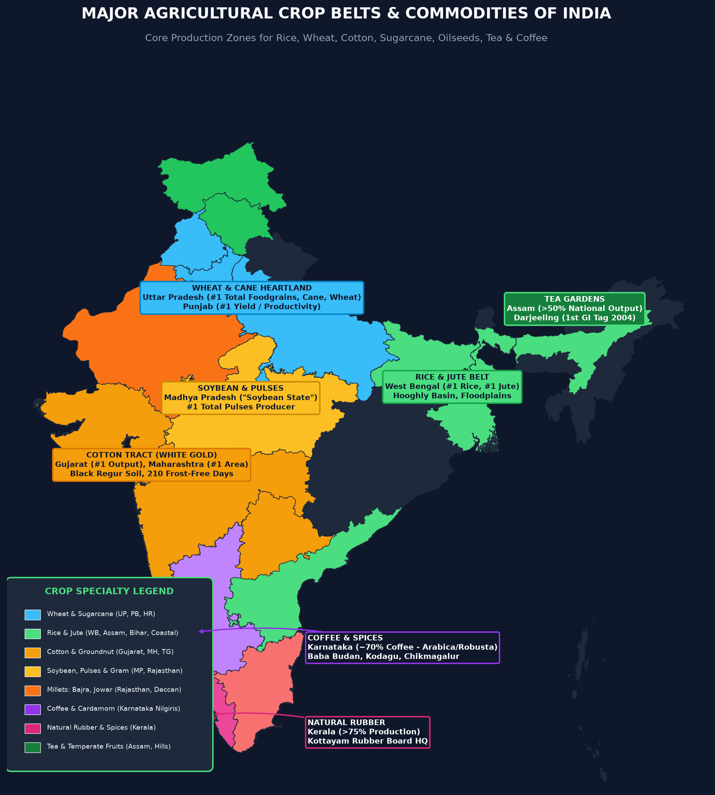

# Topic 6 — Agriculture

### ★ UPPCS Revision Sheet — Lucent / PW style (one home per association · no repetition · Practice ≥70)

<strong>Covers syllabus</strong> (click to expand)

**Crops:** Rice | Wheat | Millets | Pulses | Oilseeds | Cotton | Jute | Sugarcane | Tea | Coffee | Rubber | Spices | Fruits | Major GI Crops
**Systems & regions:** Cropping Seasons | Patterns | Intensity | Agricultural Regions | Agro-climatic Zones | Irrigation Types | Command Area Development | Seed Production | Agricultural Universities | ICAR | Pest Control | Animal Husbandry | Shifting Cultivation | Organic Farming | Precision Farming | MSP | MSP & Agricultural Marketing | Green Revolution (हरित क्रांति)
**Revolutions:** Green | White | Blue | Yellow | Golden | Silver (रूपक) | Pink | Rainbow | Evergreen

> **Sources baked in:** NCERT Class 10 (Agriculture), Class 12 (Resources), cropping patterns + crop conditions + GR/BGREI + irrigation, ICAR/Planning Commission zones, **Ghatnachakra Agriculture CA–195+** + Irrigation/Canals facts, UPPCS Prelims 2018–2025
> **Weight:** ★★★★ — crop triples, ACZ 15, revolutions match, CACP/MSP/FRP, GR personalities, UP cane/potato
> **Last verified:** August 2026
> **Current Affairs:** CCEA MSP — **22 mandated crops**; CACP recommends → Cabinet; Kharif 2026–27 common paddy **₹2,441/q**; MSP ≥ **1.5×** cost (Budget 2018–19)

---

## Current Affairs (this topic)

| Year | Fact | Why asked | Source |
|------|------|-----------|--------|
| **May 2026** | CCEA raised MSP for **14 Kharif (खरीफ)** crops, MS 2026–27; common paddy **₹2,441/q** (+₹72); Grade A ₹2,461 | Latest paddy MSP figure | PIB / CCEA |
| Static rule | MSP for **22 mandated crops**; CACP recommends, Cabinet decides; target **≥1.5×** all-India cost (Budget 2018–19) | Institution > old rupees | PIB |
| 2025–26 Kharif | Highest MSP hike then: nigerseed, ragi, cotton, sesamum; extra push pulses/oilseeds/**Shree Anna** | Diversification narrative | PIB |
| Ongoing | **PM-AASHA** (PSS via NAFED/NCCF); **e-NAM**; **PM-KISAN**; **PMFBY** | Scheme names | DA&FW |
| 2025 | Delhi **bio-decomposer** (fungal mix, free) for stubble | Free fungal mix for stubble-to-manure | PYQ / GNCTD |

---

## Consolidated — 50 Must-Score Facts (Ghatnachakra & UPPCS Aligned)

1. **Net sown area (NSA)** is land sown at least once a year. **Gross cropped area (GCA)** counts every sowing. **Cropping intensity** = **GCA / NSA × 100** (about **111%** in 1950–51 to about **156%** now). About **86%** of holdings are small or marginal, and about half of NSA is still rainfed.
2. Groundwater covers about **64%** of irrigated area (**2018–19**: tubewell ~**48.5%**; canals ~**23%**; tanks ~**2.3%**). Canals suit clayey plains; tube wells dominate north-west and western Uttar Pradesh (उत्तर प्रदेश); tanks suit the peninsula; drip suits horticulture. Minor projects (CCA ≤ **2,000 ha**) create ~**62%** of irrigation potential.
3. **Kharif** (खरीफ) (June–October) includes rice, maize, jowar (ज्वार), bajra (बाजरा), ragi, cotton, jute, groundnut, soy, and tur. **Rabi** (रबी) (October–March) includes wheat, barley, gram, mustard, peas, and linseed, helped by Western Disturbances. **Zaid** (जायद) (March–June) covers melons, cucumber, fodder, and vegetables. Cane is long-duration; tea, coffee, and rubber are perennial.
4. Rice needs hot-wet conditions (often above **20–27°C** and above **100 cm** rain) on clayey alluvium. Methods include transplant, broadcast, drill, **DSR**, and **AWD**. Aus / Aman / Boro are eastern season names. **Azolla** is a biofertiliser. Golden rice carries **Vitamin A**.
5. West Bengal often leads rice **volume**; Punjab leads **yield**. India is usually the world’s **second** rice producer after **China**. In **2024–25**, the Union Agriculture Minister claimed India had become **first** — that is a separate recent claim, not the usual textbook rank.
6. Wheat needs cool growing weather and bright ripening, about **50–75 cm** rain, and loam soils. It is a **rabi** crop with two belts: Ganga (गंगा)–Satluj plains and Deccan (दक्कन) black soil (काली मिट्टी). Assam–Wheat is a wrong pair. India is usually world **number two**.
7. Millet leaders: **Jowar = Maharashtra**, **Bajra = Rajasthan**, **Ragi = Karnataka**. Maize is food plus feed and mostly kharif. International Year of Millets 2023 marketed millets as **Shree Anna**.
8. Pulses fix nitrogen through **Rhizobium**. Gram is rabi; tur, moong, and urad are kharif. India is the world’s top pulse producer.
9. Oilseed leaders: **Groundnut = Gujarat**, **Mustard = Rajasthan** (rabi), **Soybean = Madhya Pradesh** (kharif). The **Yellow Revolution** (पीली क्रांति) is oilseeds — not the Golden Revolution.
10. Cotton (**white gold**) needs above about **21°C**, **50–100 cm** rain, about **210 frost-free days**, and preferably black soil. It is **kharif**, lasts about **6–8 months**, is about two-thirds (ते-भागा) rainfed, hates waterlogging, and has three zones (north alluvial (जलोढ़), central black, south mixed). India grows all four (चातुर्याम) species (*arboreum*, *herbaceum*, *hirsutum*, *barbadense*); bulk is *hirsutum* / Bt; crop is mostly **medium** staple, not Egyptian ELS.
11. Ahmedabad (अहमदाबाद) lies in the cotton belt, but India’s traditional largest textile mill centre is **Mumbai**, not Ahmedabad.
12. Jute (**golden fibre**) needs about **25–35°C**, above **150 cm** rain, alluvial soil, and standing water for **retting**. India grows **white** (*C. capsularis*) and **tossa** (*C. olitorius*); **mesta** is the drier-area allied fibre. The state leader is **West Bengal**. Uttar Pradesh–Jute is wrong. India is world number one in jute.
13. Sugarcane needs about **21–27°C** and **75–150 cm** rain or irrigation. **Uttar Pradesh leads quantity**; **Maharashtra leads productivity** and cooperatives. Frost and Loo (लू) hurt the north; the south is frost-free. Heavy rain lowers sugar; dry stress makes fibre. Price policy is **FRP** (plus SAP), not cereal MSP. Ratoon means a crop from stubble.
14. Tea is a **plantation** crop needing about **20–30°C**, **150–300 cm** rain, and slopes — Assam, West Bengal, and Nilgiri (नीलगिरि). Coffee needs shade and is strongest in **Karnataka**, then Kerala and Tamil Nadu (नाडु).
15. Rubber needs about **25–35°C** and above **200 cm** rain; the correct state pair is **Kerala**. Pepper (काली मिर्च) and cardamom also concentrate in **Kerala**. World citrus is a Mediterranean specialty.
16. Potato leadership is with **Uttar Pradesh** (उत्तर प्रदेश). CIP-SARC is at **Agra (Singna)**, not Aligarh (अलीगढ़). **Sultana, Gulabi and Kali (काली) Champa (चम्पा)** are **guava** varieties — not grapes.
17. Planning Commission (योजना आयोग) agro-climatic zones = **15**; NARP zones about **127**; agro-ecological regions about **20**. The Trans-Gangetic belt is the classic Green Revolution wheat–rice zone.
18. **CACP recommends** MSP; the **Cabinet decides**. Mandated MSP crops are **22**. Cane uses FRP, not the cereal MSP schedule.
19. Green Revolution = HYV seed + water + fertiliser (Lerma Rojo, Sonora 64, IR-8) in Punjab–Haryana–western Uttar Pradesh. Costs include groundwater crash, monoculture, millet/pulse neglect, and the stubble window. **BGREI** targets eastern rice systems. Norman Borlaug’s Nobel is for **Peace**.
20. **M.S. Swaminathan** (एम.एस. स्वामीनाथन) is the Green / Evergreen face. **Verghese Kurien** is White Revolution (श्वेत क्रांति) / Operation Flood (ऑपरेशन फ्लड) / NDDB / Amul — not milk for Swaminathan.
21. Revolution colours: **Golden** = horticulture + honey; **Grey** = fertiliser; **Yellow** = oilseed; **Black** = petroleum; **Silver** (रूपक) = egg; **Pink** = onion / meat / prawn; **Rainbow** = integrated; **Evergreen** = sustainable agriculture; **Blue** = fish (**Hiralal Chaudhuri**).
22. Institutions: **ICAR** Delhi; **IARI** Pusa; seed chain **Breeder → Foundation → Certified**; **KVK** at district level. First agri university = **Pantnagar (1960)**. **Agmark** = Act **1937**. FAO grain moisture ≤ **14%**.
23. **Jhum** is north-east shifting cultivation (also podu / bewar / dahiya / kumari / waltre). Organic farming bans synthetics; **Sikkim** is the first fully organic state. Precision farming is GIS / GPS site-specific management.
24. India usually ranks **first** in milk, pulses, and jute, and often **second** in rice, wheat, and cane.
25. Red rot of cane is a **fungus**; citrus canker is a **bacterium**. Command Area Development improves an existing command — it is not a new dam (बांध).
26. Green Revolution costs include monoculture and groundwater stress in Punjab–Haryana. Bio-decomposer sprays are the free fungal stubble-management tool in recent papers.
27. Amartya Sen’s food thesis is **entitlements**, not Swaminathan’s breeding story.
28. Lift irrigation matters where southern canal layouts are irregular. Drip and sprinkler raise water-use efficiency in horticulture and dry tracts.
29. Cotton is **kharif**; wheat is **rabi** — never swap those seasons. Cane is long-duration and straddles seasons.
30. World coffee order often taught for 2016 is Brazil > Vietnam > Colombia > Indonesia. Do not put Gujarat–Tea or Assam–Wheat in a correct-pair list.
31. Mixed farming = crops + livestock. Double cropping = two crops in one year. Parallel cropping classic = **wheat + mustard**. Contract farming pioneer = **Punjab**.
32. Green manure N% fact: **cowpea highest** among common options; sunhemp often max kg N/ha. Fertigation avoids rock / super phosphate. Conservation agri = min till + residue + rotation.
33. Cane points: Sugar Bowl **UP**; breeding **Coimbatore**; first mill **Pratappur 1903**; SSI = WWF (डब्ल्यूडब्ल्यूएफ)–ICRISAT **2009**. Rice Bowl of India = **Krishna (कृष्णा)–Godavari (गोदावरी) delta (डेल्टा)**.
34. Board HQ: Coffee **Bengaluru**, Tea **Kolkata**, Rubber **Kottayam**, Tobacco **Guntur**. History (इतिहास) of Indian Agriculture = **M.S. Randhawa**.

---
35. Horticulture / plantation boards: Coffee Board **Bengaluru**, Tea Board **Kolkata**, Rubber Board **Kottayam**, Tobacco Board **Guntur** — keep HQ matches straight.
36. Animal husbandry flash: India usually leads world **milk** volume; White Revolution / Operation Flood pairs with **Verghese Kurien** and **NDDB Anand**.

---
37. **Wheat Dwarfing Gene & Mutants:** **Norin-10** is the principal dwarfing gene of wheat. **Sonora-64** was developed through induced mutation at IARI. **Macaroni wheat** (*Triticum durum*) is ideal for rainfed/dryland conditions. **Triticale** is a man-made cereal cross between **Wheat and Rye (Rai)**.
38. **Critical Irrigation Stage in Wheat:** **Crown Root Initiation (CRI)** stage (20–25 days after sowing) is the single most critical stage for wheat irrigation; moisture stress at CRI leads to severe tillering loss.
39. **Rice Intensification (SRI):** Developed in Madagascar (1980s), the System of Rice Intensification relies on alternate wetting and drying, resulting in **reduced seed rate, reduced methane emissions, and lower electricity consumption**.
40. **Rice Seasons in Eastern India:** **Aman** (winter crop, sown June–July, harvested Nov–Dec); **Aus/Kar** (autumn crop, sown May–June, harvested Sept–Oct); **Boro/Dalua** (summer crop, sown Nov–Dec, harvested March–April).
41. **Cotton Biology & "White Gold":** Cotton belongs to the **Malvaceae** family; fibres are seed hairs obtained from seeds. India was the first to develop **hybrid cotton**. Requires **210 frost-free days**. Khandwa–Khargone (Nimar region, MP) is famously known as the *White Gold* region.
42. **Sustainable Sugarcane Initiative (SSI):** Joint venture of **WWF-ICRISAT (2009)** using fewer seed canes, bud chips in nurseries, wide spacing, and drip fertigation. Adsali sugarcane in Maharashtra takes **16–18 months** to mature.
43. **First Sugar Mill & Breeding:** The first sugar mill in India was established at **Pratappur (Deoria, UP) in 1903**. The **Sugarcane Breeding Institute (SBI)** was set up in **Coimbatore (Tamil Nadu) in 1912**.
44. **Oilseed Dynamics & Pegging:** **Pegging** is the unique physiological process in **groundnut** where fertilized flower pegs penetrate the soil horizontally to form pods; groundnut requires **gypsum** application for pod filling. Safflower (*Carthamus tinctorius*) oil contains 78% linoleic acid which reduces blood cholesterol.
45. **Pulses & Atmospheric Nitrogen:** Legumes fix nitrogen symbiotically with *Rhizobium*, requiring **Cobalt** as an essential micronutrient. Balanced NPK ratio for pulses is **1:2:2** or **1:2:3**. **Rajma** (*Phaseolus vulgaris*) is the only major pulse that has poor/inefficient symbiotic nitrogen fixation.
46. **Sericulture Monopolies:** India is the only country producing all four commercial silks: **Mulberry** (Karnataka ~43%), **Tasar** (Jharkhand ~66%; Oak Tasar in Manipur), **Muga** (Assam ~81%, endemic golden silk), and **Eri** (Assam ~75%).
47. **Commodity Boards Headquarters:** **Coffee Board** = Bengaluru (Karnataka); **Rubber Board** = Kottayam (Kerala); **Tea Board** = Kolkata (West Bengal); **Tobacco Board** = Guntur (Andhra Pradesh); **Spices Board** = Kochi (Kerala).
48. **Livestock Census & Leading Breeds:** Total cattle in 2019 Census = **193.46 million** (West Bengal #1, UP #2, MP #3). Buffaloes = UP #1. Sheep = Telangana #1. **Jamunapari** is the highest milk-yielding Indian goat breed (2.5–3 kg/day). **Kharai camels** of Kutch swim up to 3 km in seawater to graze on mangroves.
49. **National Seed Bag Tags:** **Breeder Seed** = Golden Yellow; **Foundation Seed** = White; **Certified Seed** = Blue.
50. **Organic Farming Pioneer:** **Sikkim** became India's first 100% organic state in January 2016, operating under the National Programme for Organic Production (NPOP) with APEDA as secretariat.

## Confused Pairs

| Pair | Correct | Trap | Hindi |
|------|------------|------|-------|
| Kharif vs rabi | Wheat = **rabi**; cotton/rice = **kharif** | Wheat kharif / cotton rabi | गेहूँ रबी; कपास खरीफ |
| NSA vs GCA | Intensity = **GCA/NSA × 100** | Invert the ratio | सकल/शुद्ध |
| MSP vs FRP | Cereals/oilseeds/pulses = MSP; cane = **FRP** | Call cane MSP | गन्ना = FRP |
| CACP vs Cabinet | CACP **recommends**; Cabinet **decides** | RBI/NITI recommends | सीएसीपी सिफारिश |
| Swaminathan vs Kurien | Swaminathan = GR; Kurien = **milk** | Swap | कुरियन = दूध |
| Borlaug Nobel | **Peace** | Agriculture | शांति नोबेल |
| Yellow vs Golden | Yellow = **oilseeds**; Golden = **horti + honey** | Swap | पीला = तिलहन |
| Grey vs Black | Grey = fertiliser; Black = petroleum | Swap | ग्रे = उर्वरक |
| UP vs MH cane | UP **quantity**; MH **productivity** | Coops explain UP yield (they don’t) | UP मात्रा; MH उत्पादकता |
| WB vs UP jute | Jute = **WB** | UP–Jute | जूट = बंगाल |
| Kerala rubber vs GJ tea | KL–Rubber **correct**; GJ–Tea / Assam–Wheat **wrong** | Pick GJ tea | रबर = केरल |
| Ahmedabad vs Mumbai | Ahmedabad in cotton **region**; largest mill centre traditionally **Mumbai** | Ahmedabad = largest centre | कपड़ा केंद्र = मुंबई |
| Potato CIP | **Agra (Singna)** | Aligarh | आलू केंद्र = आगरा |
| Sultana / Gulabi / Kali Champa vs grapes | These three names are **guava** varieties | Pick grapes because Sultana is also a grape name | अमरूद ≠ अंगूर |
| Azolla vs pesticide | Azolla = **biofertiliser** in rice | Insecticide | एजोला = जैव उर्वरक |
| 15 vs 127 vs 20 | ACZ **15** / NARP **~127** / AER **~20** | Mix counts | 15 कृषि-जलवायु |
| Sen vs Swaminathan | Food **entitlements** = Amartya Sen | Swaminathan | सेन = एंटाइटलमेंट |
| Two wheat belts | Ganga–Satluj plains + Deccan black soil | Assam as wheat belt | दो गेहूँ पेटियाँ |
| White gold vs golden fibre | Cotton = white gold; jute = golden fibre | Swap nicknames | सफेद सोना / सुनहरा रेशा |
| White vs tossa jute | White = *capsularis* (flood-tolerant); tossa = *olitorius* (upland, better fibre) | Swap flood / upland | सफेद / टोसा जूट |
| Cotton species vs staple | Four species (*arboreum / herbaceum / hirsutum / barbadense*); *hirsutum* = bulk; ELS = *barbadense* | “India grows only short staple” | चार प्रजाति; ELS कम |
| Sikkim organic | Sikkim = first fully organic state | Call any NE state first | सिक्किम जैविक |
| Rice rank | Textbook **#2 after China**; 2024–25 GoI **#1 claim** | Mixing the usual rank with the 2025 headline | रैंक अलग रखें |
| WB rice vs PB yield | WB often **volume** leader; Punjab **yield** leader | Punjab = largest producer always | बंगाल मात्रा; पंजाब उपज |
| DSR vs transplant | DSR = seed in field, less water; transplant = nursery + puddle | DSR needs more standing water | डीएसआर = कम पानी |
| Ratoon vs rotation | Ratoon = cane from **stubble**; rotation = change the crop | Call wheat a ratoon crop | रैटून = गन्ना |
| Mixed vs double vs inter | Mixed = crops+livestock; Double = two crops/year; Inter = same-time rows | Swap definitions | मिश्रित ≠ डबल |
| Parallel cropping | Wheat + mustard | Potato + rice as parallel | समान्तर = गेहूँ+सरसों |
| 15 ACZ vs 20 AER | Planning ACZ **15**; NBSS AER **20**; Sengupta micro **60** | Swap 15/20 | 15 जलवायु; 20 पारिस्थितिक |
| Pantnagar year | First agri uni **1960** (Nehru; later GBPUAT) | 1950 / 1970 | पंतनगर 1960 |
| Randhawa vs Swaminathan | History of Indian Agriculture = **Randhawa** | Credit Swaminathan | रंधावा पुस्तक |
| Agmark Act | **1937** grading mark | Call it co-op egg mark | एगमार्क 1937 |
| Moisture 14% | FAO safe storage ≤ **14%** | 16 / 18 / 20% | नमी 14% |
| Cowpea green manure | Highest N% among common options | Pick dhaincha only | लोबिया N% |
| Fertigation phosphate | Avoid rock / super phosphate in fertigation | “All P fertilisers OK” | फर्टिगेशन P |
| Coimbatore cane | Sugarcane Breeding Institute | Lucknow only | कोयंबटूर |
| Pratappur mill | First sugar mill **1903** | Mawana / Balrampur first | प्रतापपुर |
| Contract farming | Pioneer **Punjab** | Pick Haryana / TN | पंजाब अनुबंध |

---

## Must-score facts — seasons, crop–state, irrigation

### Land-use terms

| Term | Lock |
|------|------|
| NSA | Land sown ≥ once a year |
| GCA | Counts every sowing |
| Cropping intensity | (GCA/NSA) × 100 |
| Irrigation share | Groundwater ~**64%** (tubewell heavy) |

### Season crops

| Season | Lock |
|--------|------|
| Kharif (Jun–Oct) | Rice, maize, millets, cotton, jute, groundnut, soy, tur |
| Rabi (Oct–Mar) | Wheat, barley, gram, mustard, potato |

### Crop ↔ leader / need

| Crop | Lock |
|------|------|
| Rice | WB volume often; Punjab yield; hot-wet; clayey alluvium |
| Wheat | Cool grow / bright ripen; ~50–75 cm; **rabi** |
| Jowar / Bajra / Ragi | **MH** / **RJ** / **KA** |
| Groundnut / Mustard / Soy | **GJ** / **RJ** (rabi) / **MP** (kharif) |
| Cotton | ~21°C+; 50–100 cm; ~210 frost-free days; black soil preferred |
| Pulses | Rhizobium N-fix; India top producer |

---

## N.1 Land Use, Farming Types, Seasons

India’s land-use reporting (NCERT / Ministry of Agriculture) splits reported area into seven heads. These are accounting classes for the agricultural year — not a soil map.

| Class | What it means |
|-------|----------------|
| Forests | Area reported as forest |
| Barren and unculturable land | Rocky, desert, or otherwise unfit for crops |
| Permanent pastures and grazing land | Grasslands kept for grazing |
| Miscellaneous tree crops and groves | Orchards, groves, and tree crops outside net sown |
| Culturable waste | Land that could be ploughed but is currently unused |
| Fallow (current + other) | Cultivable land left unsown for a season or longer |
| **Net sown area (NSA)** | Land sown with crops **at least once** in the year |

- **Net sown area (NSA)** counts a plot **once**, even if it grows two or three crops that year.
- **Gross cropped area (GCA)** counts **every** sowing on that land. One hectare sown with wheat after rice adds **two** to GCA and only **one** to NSA.
- **Cropping intensity** is (GCA ÷ NSA) × 100.
- Example: NSA of 100 ha and GCA of 156 ha give intensity **156%**.
- Intensity rises when irrigation and short-duration varieties allow a second or third crop on the same land.

### Farming types

- **Primitive subsistence** farming grows food mainly for the family and includes **jhum** (shifting cultivation) in India’s hills and North-East.
- **Intensive subsistence** farming uses small holdings with high labour on rice or wheat for household use and a thin local surplus.
- **Commercial grain** farming aims at market surplus; Green Revolution wheat belts are the Indian face of this type.
- **Plantation** farming is estate monoculture of perennials such as tea, coffee and rubber (**tea** is the usual plantation-crop pick).
- **Mixed farming** keeps crops **and** livestock on the same farm — not merely two field crops together.
- **Dairy** farming is commercial milk production for market sale.
- **Mediterranean** farming (world map) sits under winter rain and grows citrus, olives and vines.
- **Truck farming** grows vegetables for city markets on urban (नगरीय) fringes.
- **Dryland farming** is rainfed on low-rain tracts and favours millets and pulses.
- **Wetland / irrigated farming** uses standing water or assured canal or tube-well supply for rice and sugarcane.
- **Contract farming** links growers to buyers under agreement; **Punjab** is India’s classic pioneer state for this model.

| Type | Recall |
|------|--------|
| Primitive subsistence | Family food; includes **jhum** |
| Intensive subsistence | Small farms, high labour, rice/wheat |
| Commercial grain | Market surplus (GR wheat belts) |
| Plantation | Estate perennial — tea/coffee/rubber |
| Mixed farming | Crops **and** livestock together |
| Dairy | Milk commercial |
| Mediterranean (world) | Winter rain; citrus/olives/vines |
| Truck farming | Vegetables near cities |
| Dryland farming | Rainfed millets, pulses |
| Wetland / irrigated | Standing water or canal/tube-well |
| Contract farming | **Punjab** pioneer in India |

- Agriculture still engages about **half or more** of India’s workforce (~**54.6%** in Economic Survey **2021–22** / Census 2011) and contributes under **one-fifth** of GVA (~**18.8%** GVA, 2021–22 1st AE). The direction matters more than any single year figure.
- Indian agriculture is marked by over-dependence on nature, low productivity, crop diversity, and **predominance of small holdings** — not large farms.
- Low productivity causes: population (जनसंख्या) pressure on land, small holdings, traditional practices, and disguised unemployment. **Cooperative farming** is a remedy, not a cause.
- **Sikkim** has under **10%** land available for agriculture (forest hill state).
- Uttar Pradesh, Punjab and Haryana are major grain states.
- **Uttar Pradesh** often leads total foodgrain volume.

### Cropping patterns

- **Mixed cropping** grows two or more crops **together** on the same field at the same time.
- **Intercropping** mixes crops in fixed **row ratios** so spacing stays planned.
- **Parallel cropping** grows two crops in parallel rows that do **not** compete hard for nutrients; the classic pair is **wheat + mustard**.
- **Double cropping** takes two or more crops in **one crop year** on the same land in sequence — they need not grow side by side.
- **Crop rotation** changes the crop grown on the same land across seasons or years to rest soil and break pests.
- **Sequential cropping** sows one crop after another on the same field in the same year.
- **Relay cropping** sows the second crop **before** the first is harvested so the seasons overlap briefly.
- **Ratoon cropping** raises a new crop from the **stubble** of the previous harvest; **sugarcane** is the classic Indian case.
- **Multiple cropping** means more than one crop in a year on the same land and raises cropping intensity.
- Do **not** swap double cropping (year sequence) with intercropping (same-time proximity).

| Pattern | Recall |
|---------|--------|
| Mixed cropping | Two+ crops **together** at once |
| Intercropping | Fixed **row ratios** |
| **Parallel cropping** | Parallel rows; classic **wheat + mustard** |
| **Double cropping** | Two+ crops in **one crop year** (sequential) |
| Crop rotation | Sequential change on same land |
| Sequential cropping | One after another same year |
| Relay cropping | Second sown **before** first harvest |
| Ratoon cropping | From **stubble** (sugarcane) |
| Multiple cropping | More than one crop / year → intensity |

- Cropping **pattern** is the share and sequence of crops in a region.
- Climate, soil, irrigation, markets, technology and MSP all shape it.
- Before **1965**, farming was largely rainfed subsistence with coarse cereals and pulses and low yield.
- From **1965–90**, Green Revolution rice–wheat HYV belts spread, then **monoculture** and water stress followed.
- After **1991**, horticulture, commercial crops and contract farming grew.
- Cropping intensity rose from about **111% (1950–51)** to about **156%** now.
- Irrigation and HYV made the extra sowings possible.
- About **86%** of holdings are small or marginal (Agriculture Census **2015–16**: small + marginal ≈ **86.2%** of farmers but only about **47%** of operated area).
- That caps machines and diversification.
- Holding size classes run from **marginal** (under **1 ha**) through small (1–2 ha), semi-medium (2–4 ha), and medium (4–10 ha) to large (**over 10 ha**).
- Average size of operational holdings is often largest in **Rajasthan** (थार) among major states.
- About **half of NSA** is still rainfed.
- Groundwater waters about **two-thirds** (ते-भागा) of the irrigated area.
- Land-use ballpark (Ministry of Agriculture): net sown area about **45–47%**, forest about **23%**, other uses about **30–31%**. A common round figure is **47 / 23 / 30**.
- Horticulture output has overtaken foodgrain tonnage in recent years. That is volume, not calorie king.
- MSP and free power still pull **paddy in Punjab** and **cane in drought (सूखा) Maharashtra**. That is policy, not climate.

### Seasons

| Season | Months | Typical crops |
|--------|--------|---------------|
| **Kharif** | Jun–Oct (SW monsoon (दक्षिण-पश्चिम)) | Rice, maize, jowar, bajra, ragi, cotton, jute, groundnut, soybean, tur, sesame |
| **Rabi** | Oct–Mar | Wheat, barley, gram, mustard, peas, linseed |
| **Zaid** | Mar–Jun | Watermelon, cucumber, fodder, vegetables |
| Long / perennial | — | Sugarcane (10–18 months); tea, coffee, rubber |

- India’s tropical monsoon supports diversified cropping almost year-round — kharif, rabi and zaid on the same land where water allows.
- India has a **higher share** of its geographical area under cultivation than the **USA, China or Japan**. That is a **percentage-of-land** fact.
- It does **not** mean India has the world’s largest **absolute** cropland. The USA’s arable area is comparable or larger because the USA’s total land is much bigger.
- Rabi belts of PB–HR–W UP also benefit from **western disturbances** (winter rain) plus irrigation.

**School agricultural regions** (crop-system map — separate from the 15 ACZ names):

- The east is a wet-rice region.
- The plains are a wheat–sugarcane region.
- The Deccan is a cotton region.
- The drylands are a millet region.
- The Ghats are a plantation region.
- The arid west is a livestock region.

---

## N.2 Food Crops

### Rice

Rice needs heat plus moisture (or irrigation). India is usually the world’s **2nd** rice producer after **China**. In **2024–25**, the Union Agriculture Minister claimed India had become **#1** — treat that as a separate recent claim, not the usual textbook rank.

- Temperature typically runs about **20–27°C** (NCERT often stresses **above 25°C** with high humidity).
- NCERT rain need is about **100 cm or more**. Many notes use **above 150 cm** for the humid core.
- Punjab rice depends on **irrigation**, not on 150 cm of rain.
- Soil is typically **clayey or alluvial** that puddles, with standing water.
- The main season in the north is **kharif**. With irrigation, the south can grow rice **almost year-round**.
- The east also grows three paddies — **Aus**, **Aman** and **Boro** — in Assam, West Bengal and Odisha.
- **Aus** is the summer / pre-monsoon rice.
- **Aman** runs from monsoon into winter.
- **Boro** is irrigated winter–spring rice.
- Methods include **transplantation** (nursery then puddled field), **broadcasting** and **drilling**.
- **DSR** sows seed in the field and saves water.
- **AWD** (alternate wetting and drying) also cuts irrigation.
- DSR needs a dry sowing window. Sudden rain after sowing hurts it.
- Usual volume order is **West Bengal > Uttar Pradesh > Punjab**.
- **Punjab** (then Tamil Nadu / Telangana) leads **yield** because of full irrigation.
- Rice covers the **largest cropped area** among foodgrains.
- India is also the world’s largest **rice exporter** in recent years (Basmati to West Asia; non-Basmati to Africa / SE Asia).
- **Azolla** is a floating fern that lives with the cyanobacterium **Anabaena** in its leaf cavities.
- In flooded paddy, Anabaena fixes atmospheric nitrogen.
- When Azolla dies and decays, that nitrogen enters the soil.
- So Azolla is a **biofertiliser** for water-logged rice — not an insecticide.
- Other rice biofertilisers taught with Azolla are **blue-green algae**, Azospirillum, and phosphobacteria.
- **Golden rice** is genetically engineered rice whose grain makes **beta-carotene** (provitamin A). Ordinary rice endosperm does not. Link it to **Vitamin A**, not nitrogen, ozone, or petroleum.
- North-west India’s Green Revolution staple sequence is **rice in kharif**, then **wheat in rabi**.
- Only a short gap sits between rice harvest and wheat sowing, so farmers often burn leftover straw to clear the field fast.
- That **stubble burning** is strongest in **Punjab–Haryana**.
- **Krishna–Godavari delta** (Andhra Pradesh) is the classic **“Rice Bowl of India”** tag (distinct from the Chhattisgarh plain nickname).
- **System of Rice Intensification (SRI)** uses alternate wetting and drying. It cuts seed need, methane, and electricity use.
- Hybrid Basmati includes **Pusa RH-10**.
- Transplant seed rate for Basmati is about **15–20 kg/ha**.
- Variety names often asked include **Jaya**, **Padma** (पद्मा), **Hansa**, **Krishna** (कृष्णा), **Ratna**, **Barani (बरनी) Deep** and **Pusa Sugandha**.
- **Mahi (माही) Sugandha** is aromatic rice (not wheat).
- **Jawala** is **not** a rice variety in the usual variety lists.
- **Dee-gee-woo-gen** is the rice dwarfing gene (wheat’s is **Norin-10**).

| Belt | States |
|------|--------|
| Lower Ganga / delta | West Bengal (multi-rice + jute) |
| Middle Ganga | E-UP, Bihar |
| Coastal east | Odisha, AP/TG, TN |
| Irrigated NW | Punjab, Haryana, W-UP |
| Krishna–Godavari delta | AP — “Rice Bowl of India” |
| Chhattisgarh plain | “Rice bowl” tag |

### Wheat

**Rabi** cereal. India ranks **2nd** globally.

- It is cool while growing (about **10–15°C**).
- It needs a **brighter / warmer** ripening phase (about **20–25°C**).
- It needs **moderate (नरम दल) temperature and moderate rainfall** (not high heat plus heavy rain).
- Frost at flowering or rain at harvest hurts yield.
- Rain of about **50–75 cm** evenly (many notes say about **75 cm**), or irrigation, suits wheat.
- Well-drained **alluvial loam** is the classic soil.
- Two textbook belts stand out: the **Ganga–Satluj** plains of the north-west, and **black-soil** Deccan wheat.
- Core states are **Uttar Pradesh, Punjab and Haryana**, with Madhya Pradesh, Rajasthan and Bihar also strong.
- Pairing **Assam with wheat** is wrong.
- HYV semi-dwarf wheat plus water and fertiliser created the Green Revolution surplus in Punjab–Haryana–western UP.
- The dwarfing gene in wheat is **Norin-10**.
- **Macaroni wheat** (*Triticum durum*) suits **rainfed / dry** conditions.
- **Triticale** is a hybrid of **wheat and rye**.
- Wheat diseases include **yellow, brown and black rust**.
- **Karnal bunt** is fungal (*Tilletia indica*, first noted **1931**).
- Varieties often asked include **Sonalika**, **Arjun**, **Kalyan Sona**, **Sonora-64** (induced mutation at IARI), **Raj 3077**, **Pusa Sindhu Ganga (HD 2967)** and **UP-308**.
- The most critical irrigation stage for wheat is often taught as **CRI (crown root initiation)**, not flowering.
- **UPAS-120** is a pigeon-pea (arhar) variety suited for **double cropping with wheat**.

### Maize & millets (nutri-cereals)

- Maize is mostly a **kharif** crop used for food, feed and starch.
- Rabi maize also appears in Bihar pockets.
- The botanical name is **Zea mays**. It is called the **“Queen of cereals.”**
- It is also used for starch, biodiesel (बायो-डीजल) feedstock and alcoholic beverages.
- **Shaktiman-I** and **Shaktiman-II** are genetically modified / hybrid maize varieties.
- Maturity is often about **90–150 days** (options near **110 days** are closest).
- Maize is a **C4** plant (rice and wheat are C3).
- Leading producers in recent data are often **Karnataka, Madhya Pradesh and Maharashtra**.
- Millets are rainfed, drought-tolerant, light-soil crops and are often mixed with pulses.
- The UN marked **2023** as the **International Year of Millets**.
- The Government of India brand is **Shree Anna**.
- The millet group includes sorghum, kodo, kangani and ragi — not moong.

| Crop | Leading state | Note |
|------|---------------|------|
| **Jowar** (ज्वार) | **Maharashtra** | Some rabi jowar in the peninsula |
| **Bajra** (बाजरा) | **Rajasthan** | Lowest-rainfall cereal |
| **Ragi** | **Karnataka** | Ca-rich; red/lateritic soils OK |

### Pulses

- **Rhizobium** fixes nitrogen in root nodules of **pulses** and other legumes. It is not the biofertiliser story for rice, wheat, or cane.
- Protein crop that also rebuilds soil fertility.
- Green Revolution historically neglected pulses vs wheat–rice.
- India is the world’s **largest** producer — and still a major importer (largest consumer and importer among major crops).
- **Cobalt** is essential for symbiotic nitrogen fixation by Rhizobium (and for vitamin B12 synthesis).
- Balanced NPK ratios for legumes are often **0:1:1**, **1:2:2** or **1:2:3** — not a cereal-heavy N dose.
- About **90%** of pulse area is classically rainfed.
- Arhar varieties often asked include **Malaviya (मालवीय) Chamatkar**, **Bahar** and **Amar**.
- **Aparna** is a leafless pea.
- **UPAS-120** is arhar bred for wheat double-cropping.

| Pulse | Season | Note |
|-------|--------|------|
| Gram / chana | **Rabi** | MP often among leaders |
| Masoor (lentil) | Rabi | Cool season |
| Tur / arhar | **Kharif** | Central India; red gram origin often tagged **India** |
| Moong, urad, moth | Kharif | Short-duration; drylands; urad can be kharif and rabi in the south |
| Peas | Rabi | With wheat belts |

States: MP, RJ, MH, UP, KA. Mixed cropping with millets is common.

---

## N.3 Cash, Fibre & Plantation

### Oilseeds — Yellow Revolution

| Crop | Season | Core state |
|------|--------|------------|
| Groundnut | Kharif | **Gujarat** |
| Mustard / rapeseed | **Rabi** | **Rajasthan** |
| Soybean | Kharif | **Madhya Pradesh** (oilseed, not pulse) |
| Sesame | Kharif | Drylands |
| Sunflower | Flexible | KA/MH/AP |
| Castor | Drought-hardy | GJ/RJ |
| Linseed | Rabi | Central/north |
| Safflower | Cool dry rabi | Deccan |
| Niger | Minor | Tribal (आदिवासी)/peninsula |

- Oilcake feeds dairy (White Revolution link).
- Do **not** swap **Yellow** (oilseeds) with **Golden** (horticulture and honey).
- Groundnut is the classic **dryland** oilseed.
- **Pegging** after flowering pushes the peg into soil — a groundnut-specific fact.
- Groundnut needs **gypsum**-rich soil for quality pods.
- Sesame often tops oil-content % among common oilseed options.
- **Safflower** is *Carthamus tinctorius*.
- Mustard varieties include **Varuna** (वरुणा), **Pusa Bold** and **Pitambari** (yellow mustard).
- **Kaushal** is a groundnut variety.
- Soybean area is largest in **Madhya Pradesh**.
- Recent production leadership can flip with **Maharashtra** — check the year of the data.

### Cotton (white gold)

**Kharif** fibre. India is among the world’s top / often **largest** producers; **Bt cotton** dominates area. It takes about **6–8 months**.

- It needs warmth above about **21°C**, rain about **50–100 cm**, about **210 frost-free days**, and bright sun at boll opening.
- Hard frost kills cotton.
- Best soils are **black regur (रेगुर)**.
- The north zone uses **deep alluvium**.
- The south zone uses mixed black–red soils.
- Three belts stand out: **North** (Punjab–Haryana–Rajasthan–western UP, irrigated), **Central** (Gujarat–Maharashtra–Madhya Pradesh, the volume core), and **South** (Telangana–Andhra Pradesh–Karnataka–Tamil Nadu).
- About **two-thirds** of Indian cotton is **rainfed**.
- Yield is below the world average.
- Cotton can take some **salinity**.
- It **hates waterlogging**.

**Four species India grows** (India is often taught as the only country that cultivates all four recognised cotton species):

| Species | Common tag | What it gives |
|---------|------------|---------------|
| *Gossypium arboreum* | Desi / Old World | Short staple; drought- and pest-hardy |
| *Gossypium herbaceum* | Desi / Old World | Short–medium; harsh rainfed tracts (GJ / KA pockets) |
| *Gossypium hirsutum* | American / Upland | **Bulk of India’s crop**; medium to long staple; most **Bt** hybrids |
| *Gossypium barbadense* | Egyptian / Sea Island | **Extra-long staple (ELS)**; small premium pockets in the south |

**Staple-length classes** (fibre length decides mill use; CCI / trade (पण्याध्यक्ष) classes):

| Class | Approx. length | India note |
|-------|----------------|------------|
| **Short staple** | ≤ about **20 mm** | Desi types; coarse cloth, blending, surgical cotton |
| **Medium staple** | about **20.5–24.5 mm** | Large share of domestic mill use |
| **Medium-long staple** | about **25–27 mm** | Modern mill demand |
| **Long staple** | about **27.5–32 mm** | High-speed spinning; MSP is also quoted for a long-staple grade |
| **Extra-long staple (ELS)** | about **≥32.5 mm** | Premium yarn; India still **imports** much ELS (Egypt (मिस्र) / USA style) |

- India’s harvested cotton is still **mostly medium** (and medium-long), not Egyptian-style ELS. Mills **blend** staples.
- MSP for kapas is announced separately for **medium staple** and **long staple** grades (CACP recommends; the Union Cabinet decides).
- **Ahmedabad** (अहमदाबाद) lies in a major cotton **region** (raw (रॉ) material true).
- Traditionally India’s largest cotton-textile **centre** is **Mumbai**, not Ahmedabad.
- Cotton is indigenous to India (Rigveda (ऋग्वेद) / Manusmriti (मनुस्मृति) mention). India was first to commercialise **hybrid cotton**.
- Cotton fibre is obtained from the **seed**.
- **Khandwa–Khargone** (Madhya Pradesh) is tagged the **“White Gold”** cotton belt. Maharashtra also calls cotton white gold on black soil.
- Expansion of irrigation made cane more profitable than cotton on parts of the Deccan black-soil belt.

### Jute (golden fibre) & mesta

- Hot humid conditions run about **24–35°C**, with rain often cited about **120–150 cm or more**, high humidity, and deltaic **alluvium**.
- Jute needs **retting** in still or standing water.
- It is the second fibre after cotton.
- It is largely **rainfed** and uses little fertiliser or pesticide — the opposite of cotton.
- It is sown to catch the monsoon.
- Many notes give a long **February–October** window (about 8–10 months).
- Still treat it as a **humid-east kharif** crop, not a rabi cereal.
- The core belt is **West Bengal**, with Assam, Bihar and Odisha also important.
- Mills sit on the **Hugli**.
- Pairing **Uttar Pradesh with jute** is wrong.
- India is the world’s top jute producer.

**Jute types India grows** (two true jute species + one related fibre often asked with them):

| Type | Botanical name | Field note |
|------|----------------|------------|
| **White jute** | *Corchorus capsularis* | Stronger flood tolerance; classical lowland / waterlogged delta crop |
| **Tossa jute** | *Corchorus olitorius* | Softer, usually better fibre and higher yield; prefers **uplands** and hates prolonged flood |
| **Mesta** | *Hibiscus cannabinus* / *H. sabdariffa* (related fibre, not true jute) | Grown on **drier** tracts as a jute substitute; coarser fibre |

- In volume, eastern India grows both white and tossa; **tossa** has expanded where drainage is better.
- Do **not** call mesta a separate “jute species” in a strict botanical question — it is the **allied fibre** used like jute.

### Sugarcane

Long-duration crop (**~10–18 months**) — not a single short season.

- Ideal temperature is about **21–27°C**.
- Water need is about **75–150 cm**, or irrigation.
- Any soil that **holds moisture** works.
- The crop **exhausts** fertility, so manure matters.
- Too much rain **lowers sugar**.
- Too little rain makes a **fibrous** cane.
- A bright, open second half thickens juice.
- A short **cool dry** spell at harvest is ideal.
- **Frost** and the **loo** hurt north Indian cane.
- South India lacks both, so yield is often higher.
- **Ratoon** (stubble sprout) is common.
- It saves planting cost, but yields fall after a cycle or two.
- **Uttar Pradesh** often leads **area and production**.
- **Maharashtra** often leads **yield** and cooperative factories.
- Cane on a small share of Maharashtra land still drinks a huge share of irrigation water.
- Cooperative mills in Maharashtra are a true institutional fact, but they do **not** explain why Uttar Pradesh’s yield is lower. North Indian frost, the loo, a shorter crushing season and ratoon cycles do.
- Price uses **FRP** (plus possible state SAP) — not cereal MSP.
- By-products include bagasse and molasses / ethanol.
- Sugar can also come from **beet**, not cane alone.
- Philippines cane and coconut credit go to the **Spanish and Americans**.
- **Uttar Pradesh** is the classic **“Sugar Bowl”** of India by quantity.
- South India often leads **sucrose and productivity** (longer crushing season, frost-free).
- The first sugar mill in India was **Pratappur** (Deoria, UP) in **1903**.
- Sugarcane breeding HQ is the **Sugarcane Breeding Institute, Coimbatore** (1912; under ICAR).
- A key variety is **Co. 1148**.
- **Adsali** cane in the Maharashtra low-rain belt takes about **16–18 months**.
- **Sustainable Sugarcane Initiative (SSI)** (WWF–ICRISAT, **2009**) uses fewer seeds, nursery seedlings, wider spacing, drip-friendly layout and more intercropping scope — it does **not** ban all chemical fertiliser.
- Among pearl millet, red gram, sunflower and sugarcane, **sugarcane** is the **least water-efficient**.

### Tea · Coffee · Rubber · Spices

| Crop | Climate | Site | India |
|------|---------|------|-------|
| **Tea** | 20–30°C; 150–300 cm | Well-drained **slopes** (no stagnant water) | Assam (volume), WB **Darjeeling GI**, Nilgiris/TN–KL; **plantation** |
| **Coffee** | 15–28°C; 150–250 cm | **Shade**, well-drained | **KA > KL > TN** (Baba Budan / Coorg / Wayanad / Nilgiri) |
| **Rubber** | 25–35°C; **>200 cm** | Humid equatorial; *Hevea brasiliensis* latex | **Kerala** (also TN, KA, A&N, Tripura pockets) |
| Pepper / cardamom | Hot wet Ghats | Hills | **Kerala** largest |
| Chilli | Warm Deccan | — | AP/TG strong — **not Kerala-only** |
| Turmeric / ginger | Warm | South + NE | Many GIs |

- **CTC** (Crush–Tear–Curl) is bulk everyday tea.
- **Orthodox** processing makes premium leaf tea.
- Tea likes acidic, well-drained hill soils.
- Tea is often nicknamed **Green Gold**.
- Origin notes tag the **Yunnan** plateau of South China.
- Coffee was first grown in India in **Chikkamagaluru** (Karnataka).
- Coffee is propagated by **seeds**.
- Tea is propagated mainly by **stem cuttings**.
- Kerala is the classic **“Garden of Spices.”**
- Black pepper is nicknamed **black gold** or **black diamond**.
- **Clove** is the flower bud of *Eugenia caryophyllata*.
- The **Coffee Board** headquarters is in **Bengaluru**.
- The **Tea Board** headquarters is in **Kolkata**.
- The **Rubber Board** headquarters is in **Kottayam**.
- The **Tobacco Board** headquarters is in **Guntur**.
- The **Spices Board** headquarters is in **Kochi**.
- The **National Horticulture Board** was set up in **1984** with headquarters at **Gurugram**.

| Coffee species | Note |
|----------------|------|
| **Arabica** | Higher elevation, milder cup, more pest-sensitive |
| **Robusta** | Lower elevation, stronger cup, hardier |

- World coffee order often taught for **2016** is **Brazil > Vietnam > Colombia > Indonesia**.
- Cocoa majors are Ivory Coast, Ghana (घन) and Cameroon. Latvia is **not** a cocoa major.
- Philippines cane and coconut history is linked to Spanish and American periods.
- Tobacco leadership has shifted toward **Gujarat** in recent data (older notes often said Andhra Pradesh).
- Coconut leadership still sits with **Kerala** (Karnataka is close in recent years).
- Cashew leadership often sits with **Maharashtra** among states.
- Commercial saffron production is centred in **Jammu & Kashmir** (Zafran).
- **Guar (cluster bean)** gum is used in **shale-gas / hydraulic fracturing**; India–Pakistan dominate world production.
- In sericulture, India is usually world **#2** after China.
- **Mulberry** silk leadership is **Karnataka**.
- **Muga** and **eri** silk leadership is **Assam**.
- **Tropical tasar** leadership is **Jharkhand**.
- **Oak tasar** leadership is **Manipur**.

## N.4 Fruits, Potato, GI

- Tropical fruits include mango, banana and pineapple.
- Subtropical fruits include citrus and grapes.
- Temperate hill fruits include apple in Jammu & Kashmir, Himachal (हिमाचल) Pradesh and Uttarakhand (उत्तराखंड).
- The world citrus belt is the **Mediterranean**.
- India’s orange renown centres on **Nagpur**.
- Improved **guava** varieties include **Lalit** and **Banarsi**.
- **Sultana, Gulabi and Kali Champa** are **guava** varieties.
- Do not treat this trio as grapes. The name **Sultana** is also used for a seedless grape, and that is the usual mix-up.
- **Uttar Pradesh** is the **leading potato producer**.
- The CIP South Asia Regional Centre is at **Singna, Agra**, not Aligarh.
- Best processing potato varieties are **Kufri Chipsona-2** and Chipsona-3 in the plains, and **Kufri Himsona** in the hills.
- **Sindhu** is a seedless mango.
- **Amrapali** is a Dasheri × Neelam hybrid from IARI (**1971**).
- **Kanchan**, **Krishna** and **Banarasi** (बनारसी) are improved amla (Indian gooseberry) varieties.
- **Lalit** is a guava variety.
- The ginger storage organ is a **rhizome**.
- The **Golden Revolution** covers horticulture **and honey**.
- **Arunachal Pradesh** is the classic low-cost orchid / export-horticulture climate pair.

| GI / variety | Place |
|--------------|-------|
| Darjeeling Tea (दार्जिलिंग चाय) | WB hills |
| Basmati | North India GI belt |
| Alphonso | Maharashtra |
| Banganapalle | AP |
| Gir (गीर) Kesar | Gujarat |
| Dasheri / Langra | UP |
| Malabar Pepper | Kerala |
| Kashmiri saffron | J&K |
| Nashik grapes | MH |
| Coorg coffee / Alleppey cardamom | KA / KL GI note |

---

## N.5 Agricultural Regions & Agro-climatic Zones

Three **number** facts — do not mix:

| System | Count | Use |
|--------|-------|-----|
| Planning Commission **ACZ** | **15** (~72–73 sub-zones) | Broad planning |
| ICAR **NARP** | **~127** | Research / extension |
| NBSS&LUP **AER** | **~20** | Soils + LGP (Length of Growing Period) |

### 15 Agro-climatic Zones (Planning Commission)

| # | Zone | Core | Agri tag |
|---|------|------|----------|
| 1 | Western Himalayan | J&K, HP, UK | Apple, valley cereals |
| 2 | Eastern Himalayan | Assam, NE, Sikkim, N WB | Tea, rice, spices, jhum |
| 3 | Lower Gangetic Plains | West Bengal | Rice, jute, mustard |
| 4 | Middle Gangetic Plains | E-UP, Bihar | Rice–wheat, maize, cane |
| 5 | Upper Gangetic Plains | W/central UP | Wheat–rice–cane (GR) |
| 6 | Trans-Gangetic Plains | PB, HR, Delhi, parts RJ | Intensive wheat–rice |
| 7 | Eastern Plateau & Hills | CG, JH, OD uplands | Rice, millets, rainfed |
| 8 | Central Plateau & Hills | MP, RJ, Bundelkhand edge | Soybean, wheat, gram |
| 9 | Western Plateau & Hills | MH upland | Cotton, jowar, pulses |
| 10 | Southern Plateau & Hills | Interior AP/TG, KA, TN | Groundnut, millets, cotton |
| 11 | East Coast Plains & Hills | Coastal OD–AP–TN | Rice, coconut, cashew |
| 12 | West Coast Plains & Ghats | KL, coastal KA, Goa (गोवा), Konkan | Rice, coconut, spices, rubber, coffee |
| 13 | Gujarat Plains & Hills | Gujarat | Cotton, groundnut |
| 14 | Western Dry Region | W Rajasthan | Bajra, pulses, livestock |
| 15 | Islands Region | A&N, Lakshadweep (लक्षद्वीप) | Coconut, horticulture |

- One state can sit in **multiple** zones.
- Western Dry ≠ West Coast Ghats.
- Do not swap the counts: Planning Commission agro-climatic zones are **15**; NBSS agro-ecological regions are about **20**. A claim that India has **20** agro-climatic and **15** agro-ecological regions reverses both numbers, so it is false.
- **P. Sengupta and G. Sdasyuk (1968)** divided India into **60** micro agricultural regions (Registrar General monograph).

### Agro-ecological regions (NBSS&LUP ≈ 20)

Grouped by ecosystem (पारिस्थितिकी तंत्र) (remember the **count** and the **15 vs 20** swap trap more than every name):

| Ecosystem | Example AER tags |
|-----------|------------------|
| Arid | Western Himalayas cold arid; Western Plain–Kachchh; Deccan Plateau (दक्कन पठार) arid |
| Semi-arid | Upper / Middle Ganga plains; Rajasthan–Gujarat plains; Deccan red–black / red sandy |
| Sub-humid | Eastern Plateau (Satpura (सतपुड़ा)–Mahanadi (महानदी), Bundelkhand, red–laterite (लेटराइट)); Lower Ganga; warm W Himalaya (हिमालय); Bengal Basin |
| Humid–perhumid | Assam–N Bengal plains; Eastern Himalayas; Purvanchal (पूर्वांचल) hills (पूर्वांचल पहाड़ियाँ) |
| Coastal | Eastern Coastal Plains + A&N; Western Ghats (पश्चिमी घाट) coastal plains and hills |

**PYQ — UPPCS Prelims 2022, Q142**

Which is correctly matched?

A. Gujarat—Tea

B. Uttar Pradesh—Jute

C. Kerala—Rubber

D. Assam—Wheat

Show answer

**Ans: C** — Rubber–Kerala is the only correct pair in that set.

---

## N.6 Irrigation & Command Area Development

CAD develops the **command** of an existing project (channels, drainage, warabandi). It is **not** “build a new dam.” Classic CADP launches (from **Dec 1974**) include **Sharda (शारदा) Tributary**, **Ramganga** (रामगंगा), and **Gandak** (गंडक).

- Most of India is warm enough that evaporation creates a soil-moisture deficit for crops — hence irrigation.
- Agriculture uses most of India’s freshwater (NCERT surface about **89%** / groundwater about **92%**; often cited about **80%** overall).
- In **2018–19**, tubewells covered about **48.5%** of irrigated area.
- Wells plus tubewells together covered about **64%**.
- Canals covered about **23%**.
- Tanks covered about **2.3%**.
- About **two-thirds** of irrigated land drinks **groundwater**.
- Punjab paddy plus free power is the over-exploited poster case.
- Project size by **CCA**: **minor** projects are **2,000 ha or less** and hold about **62%** of irrigation potential (wells, tubewells, tanks, lift, drip, sprinkler).
- **Medium** projects cover **2,000–10,000 ha**.
- **Major** projects exceed **10,000 ha**.
- Major plus medium together cover about **38%**.
- Rice and sugarcane together take a huge share of irrigation water, often in **water-stressed** states.
- Micro-irrigation (drip/sprinkler) is still a **small** slice of irrigated area.
- It cuts nutrient loss and can slow groundwater decline in places — it is **not** the only dryland irrigation method.
- PMKSY (**1 Jul 2015**) carries the “more crop per drop” scheme tag.
- **Protective / life-saving irrigation** means watering at **permanent wilting point (PWP)**.
- The peninsula classic is **tanks and ponds** on hard rock with seasonal rivers.
- Sir **Arthur Cotton** is the pioneer of irrigation works in South India.
- **Uttar Pradesh** leads absolute (निरपेक्ष) tubewell / well irrigated area and replenishable groundwater among major states (about **40.7 bcm** for irrigation).
- UP net irrigated share (**2018–19**): tubewell about **74.6%**, canal about **15.2%**, other wells about **8.8%**, tanks about **0.6%**.
- Spectacular tubewell growth is noted on the **Saryupar** plain, where canals are scarce.

| Type | Best terrain | Risk / note |
|------|--------------|-------------|
| Perennial canal | Alluvial plains (PB–HR–UP; IGC RJ). Clayey beds **leak less** | Waterlogging / usar |
| Inundation canal | Flood plains | Unreliable timing |
| **River lift** | Where canal flow is irregular; common in **peninsular** belts; **Pattiseema** = Godavari→Krishna | Pumping cost |
| Tube well | Alluvial aquifers; GR NW + W-UP | Groundwater depletion |
| Dug well | Local / hard-rock | Limited yield |
| **Tank** | **Peninsular** hard rock | Siltation |
| Drip | Horti, cane, cotton, veg; 40–60% water save; less weed / erosion | High efficiency; capital cost |
| Sprinkler | Sandy / undulating | Wind drift |

**CADWM pack:** field channels, land levelling, **warabandi** (roster turns), drainage, farmer organisations, suitable cropping patterns.

- Over-irrigation without drainage produces saline (लवणीय) or alkaline usar.
- The Indira Gandhi (गांधी) Canal (इंदिरा गांधी नहर) is the desert example.
- Zero / reduced tillage, gypsum before irrigation, and leaving crop residue on the field all help **water conservation** in agriculture.
- The full canal–project map (Gang, IGC, Upper/Lower Ganga, Sharda, Farakka, Hariyali, IWMP) is covered under Lakes and Water Resources.

---

## N.7 Seeds, ICAR, Universities, Pests & Practices

- **ICAR** (HQ **New Delhi**) is the apex research and agri-education body.
- **IARI Pusa** is the flagship institute.
- **CACP** sets price advice — never swap with ICAR.
- Seed purity runs downhill from **Breeder** to **Foundation** to **Certified**.
- Tag colours are Breeder **golden yellow**, Foundation **white**, and Certified **blue**.
- A **KVK** is the district farm-science centre.
- India’s **first agricultural university** is **G.B. Pant University of Agriculture and Technology, Pantnagar** (opened as Uttar Pradesh Agricultural University; inaugurated by **Jawaharlal Nehru** (जवाहरलाल नेहरू) on **17 November 1960**).
- Other Green Revolution–era SAUs include **PAU Ludhiana** and **HAU Hisar**.
- UP SAUs include CSAUAT Kanpur (कानपुर) and SVPUAT Meerut (मेरठ).
- **‘History of Indian Agriculture’** is by **M.S. Randhawa** (Mohinder Singh Randhawa) — not Swaminathan.
- FAO rule: for safe grain storage, moisture should not exceed about **14%**.
- **Agmark** is quality certification under the **Agricultural Produce (Grading and Marking) Act, 1937**.
- The **Seed Village Concept** trains farmer groups to produce quality seed for self-use and neighbours at the right time and affordable cost (not “ban buying seed” and not “only certified-seed villages”).
- Seed Replacement Rate is constrained by a demand–supply gap for quality seed in **low-value, high-volume** crops.
- India **does** have a National Seeds Policy (**2002**).
- Private firms are active in high-value vegetable and horti seed.
- The **Zero Till Seed-cum-Fertilizer Drill** was developed at **G.B. Pant University, Pantnagar**.
- The **Borlaug Award** honours agricultural science (named after Norman Borlaug; from **1972**).

### Green manure, nutrients, fertigation

- Green manure means growing plants such as **sunhemp / sanai, dhaincha, guar and lobia (cowpea)** and ploughing them in before the main crop.
- Nitrogen % often taught: cowpea about **0.49%** (highest among common options), sunhemp **0.43%**, dhaincha **0.42%**, guar **0.34%**.
- Sunhemp often returns the **maximum kg N/ha**.
- **Lobia** is preferred green manure on newly improved **arid** land.
- Balanced fertilisers raise production, improve grain quality, and maintain soil productivity.
- Fertiliser **intensity (kg/ha)** leaders are **Punjab and Haryana** (Puducherry often highest among UTs).
- Fertiliser **total tonnage** leader is **Uttar Pradesh**.
- **Fertigation** dissolves fertiliser in irrigation water (usually drip).
- It can raise nutrient availability and cut leaching.
- **Rock phosphate / superphosphate** is a poor fertigation choice because of precipitation.
- Controlling irrigation-water alkalinity is a taught advantage.
- **Permaculture** discourages monoculture, stresses mulching, and resists salinity buildup better than chemical monoculture.
- It **is** workable in semi-arid settings. Do not treat “not easily possible in semi-arid tracts” as true.
- **Zero tillage** allows wheat sowing without burning previous residue, supports direct-seeded rice logic, and aids carbon sequestration (कार्बन पृथक्करण).
- **Conservation agriculture** core practices are minimum / zero tillage, residue mulch on the soil, and crop rotation / sequencing — **not** “ban plantation crops.”
- Eco-friendly practice sets often include crop diversification, legume intensification, **tensiometer** use, and **vertical farming**.
- **Green agriculture** (UPPCS wording) means integrated pest management plus integrated nutrient supply plus integrated natural resource management.

### Schemes (practice)

| Scheme | Key point |
|--------|-----------|
| Soil Health Card | Soil fertility / balanced nutrient advice |
| PMKSY (incl. more crop per drop) | Irrigation access / water efficiency |
| **PKVY** (Paramparagat Krishi Vikas Yojana) | Organic / traditional farming clusters |
| Kisan Credit Card | Crop credit via commercial, cooperative and RRBs |
| e-NAM / national agri market push | Better price discovery |
| NFSM | Rice, wheat, pulses (later oilseeds / millets) productivity |

- **IPM** combines cultural, biological and chemical tools — not calendar spray alone.
- Bt cotton targets bollworm.
- Azolla is a biofertiliser, not an insecticide.
- The 2025 Delhi **bio-decomposer** was free to farmers.
- The fungal mix turns stubble to manure.
- **Butachlor** is a herbicide (versus chlorpyrifos / quinalphos as insecticides and carbendazim as a fungicide).
- The first widely used herbicide is often tagged **2,4-D**.

| Disease / problem | Cause |
|-------------------|------------------|
| Citrus canker | **Bacteria** |
| Red rot of sugarcane | **Fungus** |
| Potato “Krishnakant” | **O₂ deficiency** |
| Wheat “Sahu” | **Insect** |
| Wheat Karnal bunt | Fungus (*Tilletia indica*) |
| Wheat rusts | Yellow / brown / black |
| Paddy Khaira | Zn deficiency (ZnSO₄ spray) |
| Potato late blight | Classic potato disease |
| Arhar wilt | Wilt disease |

---

## N.8 Animal Husbandry

- India is the world’s largest **milk** producer by volume (about one-fourth of world milk in recent FAOSTAT figures).
- Buffalo are important in the north (higher fat).
- The **White Revolution** (श्वेत क्रांति) is linked to **Verghese Kurien**, **Operation Flood** (ऑपरेशन फ्लड), **NDDB**, and **Amul / Anand** cooperatives.
- Textbook phases run **I 1970–81** (milk grids / coops), then **II 1981–85** (expand dairies), then **III 1985–96** (consolidate).
- White Revolution launch is often tagged **July 1970**.
- The **Indian Dairy Corporation** was set up at **Anand (Gujarat)** in **1970**.
- **NDDB** was established in **1965**.
- **NDRI** is at **Karnal** (Deemed University from 1989).
- The **Silver Revolution** covers eggs and poultry.
- The **Blue Revolution** (नीली क्रांति) covers fisheries and aquaculture (**Hiralal Chaudhuri** often tagged).
- Recent inland plus marine fish leadership often sits with **Andhra Pradesh**.
- Milch cows give more milk but weaker draft (Gir, Sahiwal, Red Sindhi, Tharparkar).
- Drought breeds work better as draft (Nagauri, Hallikar, Kangayam, Khillari).
- **Tharparkar** is a Rajasthan border-region cattle breed.
- **Hallikar** is Karnataka — not a Rajasthan breed.
- Goat is the “poor man’s cow.”
- **Jamunapari** is India’s classic high-milk goat.

| Breed | Animal | Tag |
|-------|--------|-----|
| Murrah | Buffalo | Haryana / high yield |
| Bhadawari | Buffalo | UP / Bundelkhand note |
| Gir | Cattle | Gujarat |
| Sahiwal | Cattle | Punjab-region note; high milk |
| Tharparkar | Cattle | Western Rajasthan border |
| Deoni | Cattle | Dual-purpose |
| Jamunapari | Goat | UP renown; high milk |
| Barbari / Beetal | Goat | Other common breeds |

- 20th Livestock Census (**2019**): cattle about **193 million**. Top cattle states often **West Bengal, UP, Madhya Pradesh**. Top total livestock often **UP > Rajasthan > MP**. Top sheep often **Telangana**.
- UP usually leads state milk production; Rajasthan and Madhya Pradesh follow in recent years.

---

## N.9 Jhum, Organic, Precision

**Identity:** Three contrasting farming ideas — **shifting cultivation**, **certified organic**, and **site-specific precision** inputs.

| System | Core | Where / tool |
|--------|------|--------------|
| **Jhum** (shifting) | Slash-burn, 1–3 yr crop, then fallow | **NE** (jhum); **podu / penda** (AP/Odisha); **bewar / dahiya / mashan** (MP–CG); **kumari** (W Ghats); **waltre** (SE Rajasthan); **poonam** (Kerala); **kuruwa** (Jharkhand); **khil** (Himalayan belt) |
| **Organic** | No synthetic agrochemicals (standards) | Compost, rotation, Azolla, Rhizobium; **Sikkim** = first fully organic state (declared **2016**) |
| **Precision** | Site-specific inputs | GIS / GPS / sensors / drones — not “stop irrigation” |

### Jhum / shifting cultivation

**Jhum** is the north-east name for slash-and-burn shifting cultivation.

Farmers clear a forest patch, burn the residue, raise crops for about **one to three years**, then leave the plot fallow while opening a new patch.

Short fallows raise **erosion** and forest damage.

Regional names must be matched separately.

**Podu / penda** is the Andhra–Odisha label.

**Bewar / dahiya / mashan** is the Madhya Pradesh–Chhattisgarh label.

**Kumari** is the Western Ghats label.

**Waltre** is the south-east Rajasthan label.

**Poonam** is the Kerala label.

**Kuruwa** is the Jharkhand label.

**Khil** is the Himalayan-belt label.

### Organic farming

**Organic farming** bans synthetic fertilisers and pesticides under a certification standard.

It relies on compost, crop rotation, green manure, **Azolla**, and **Rhizobium**-type biofertilisers.

**Organic** is not automatic for “any traditional practice.”

**Sikkim** is India’s first fully organic state, declared in **2016**.

**NPOP** is implemented with **APEDA** as secretariat.

The Ministry of Rural Development is **not** the NPOP operator.

### Precision farming

**Precision farming** means site-specific input doses using **GIS, GPS, sensors and drones**.

It adjusts water, seed and fertiliser plot by plot.

It does **not** mean “stop irrigation” or abandon mechanisation.

---

## N.10 MSP & Agricultural Marketing

- The **CACP** recommends MSP. The **Union Cabinet** decides. Do not swap CACP with RBI, NITI (नीति) Aayog (नीति आयोग), or the Finance Ministry.
- MSP covers **22 mandated crops**, plus derived cases such as toria and de-husked coconut.
- Procurement makes MSP real. Coverage is deepest for **wheat and paddy**.
- Pulses and oilseeds have weaker effective procurement.
- **PM-AASHA** supports price support for pulses and oilseeds through agencies such as NAFED.
- Sugarcane uses **FRP** (Fair and Remunerative Price), not the cereal MSP label.
- An **APMC** is a regulated mandi (मंडी).
- **e-NAM** is the electronic national mandi network.
- **PM-KISAN** gives direct income support to farmers.
- **PMFBY** is the crop-insurance scheme.
- **NFSM** pushes rice, wheat, pulses, millets and oilseeds.
- **NMSA** targets climate-smart farming and soil–water care.
- Budget **2021–22** placed an Agriculture Infrastructure and Development Cess (AIDC) on **29** products.
- Older paddy MSP figures such as **₹1,750/q** (2018) are year-specific. Keep the CACP-recommend / Cabinet-decide process, not the old rupee number.
- Fertiliser, power and irrigation support count as **indirect** subsidy.

**PYQ — UPPCS Prelims 2024, Q43**

Who recommends the Minimum Support Price (MSP) for agricultural crops?

A. RBI

B. NITI Aayog

C. CACP

D. Ministry of Finance

Show answer

**Ans: C** — CACP recommends. The Union Cabinet decides.

---

## N.11 Green Revolution & Colour Revolutions

**Green Revolution** (हरित क्रांति) (mid-1960s): **HYV + irrigation + fertiliser** (+ pesticide, credit, machines).

- The Green Revolution heartland is **Punjab, Haryana and western UP**.
- It started as a **wheat** revolution, then expanded to rice. Some notes also tag maize, soybean and cane yield jumps.
- Classic HYVs include Mexican wheat **Lerma Rojo** and **Sonora 64** from **CIMMYT**, and rice **IR-8** from IRRI.
- Rockefeller Foundation support is a taught funding tag.
- Phasing is often taught as first stage about **1966–1981**, second **1981–1995**, and third from **1995** outward.
- Gains included a yield surge, surplus, and exit from PL-480 dependence.
- Wheat gained most in production and productivity; rice came next.
- Costs included regional inequality, a **groundwater** crash, nutrient mining, millet and pulse neglect, rice–wheat **monoculture**, and stubble burning.
- Social and environmental costs are real — do not treat “no cost” as true.
- Large parts of **rainfed / dry-zone** India are still **agrarian**: farming remains the main livelihood even where rainfall is low.
- Those same tracts can raise yields sharply if **irrigation** arrives. That is the **second Green Revolution** idea for drylands the first Green Revolution skipped.
- Second Green Revolution aims to extend seed–water–fertiliser to left-out areas and integrate crops with animal husbandry, social forestry (सामाजिक वानिकी) and fishing — not only more wheat–rice in already-benefited belts.
- **BGREI** (Bringing Green Revolution to Eastern India) sits under RKVY.
- It targets **rice-based** systems in the east and unused water, not a second Punjab in the desert.
- **Evergreen Revolution** (Swaminathan) means high productivity **without** ecological harm.
- Steps taught include biofertiliser/compost with chemicals, rainwater harvesting, agri-economic zones and contract farming.
- **Rainbow Revolution** entered the **National Agricultural Policy (28 July 2000)** as an integrated colour-revolution package.
- The National Zero Till Seed-cum-Fertilizer Drill from Pantnagar links Green Revolution residue management to zero tillage.

| Person | Role |
|--------|------|
| M.S. Swaminathan | GR in India; Evergreen idea |
| Norman Borlaug | HYV wheat; Nobel **Peace** not Agriculture |
| Verghese Kurien | White / milk |
| L.K. Jha | Economic Administration Reforms |
| Morarji Desai (आमिल) | Bank social control |
| Amartya Sen | Food **entitlements** — not Swaminathan |
| Hiralal Chaudhuri | Blue Revolution (fisheries) tag |
| Revolution | Sector |
|------------|--------|
| Green | Food grains (wheat → rice) |
| White | Milk (Kurien / Flood / NDDB) |
| Blue | Fisheries / aquaculture |
| Yellow | Oilseeds |
| Golden | Horticulture **and honey** |
| Silver | Eggs / poultry |
| Pink | Onion / meat / prawn (context) |
| Grey | Fertilisers |
| Black | Petroleum |
| Brown | Sometimes leather / cocoa / biofuel talk — weaker association |
| Rainbow | Integrated multi-sector |
| Evergreen | Sustainable productivity |

### Colour Revolutions — must-score set

The colour tags name sector pushes that sit beside the classic Green Revolution.

The **Golden Revolution** covers **horticulture and honey**.

The **Grey Revolution** covers **fertilisers**.

The **Yellow Revolution** covers **oilseeds**.

The **Black Revolution** covers **petroleum**.

Do **not** swap Golden with Yellow. Golden is horticulture and honey; Yellow is oilseeds.

| Colour | Sector |
|--------|--------|
| Golden | Horticulture **and honey** |
| Grey | Fertilisers |
| Yellow | Oilseeds |
| Black | Petroleum |

---

## UP Focus (compact)

**Identity:** Uttar Pradesh is a **plains agricultural giant** — wheat–rice–sugarcane in the west and centre, rice in the east, potato and mango as specialty tags, and almost no plantation leadership.

| Theme | Fact |
|-------|------|
| Sugarcane | Quantity leader often; productivity < MH; Sugar Bowl tag |
| Wheat–rice | Western UP GR (Upper Gangetic / Zone 5) |
| Potato | Leading producer; CIP **Agra** (आगरा) not Aligarh |
| Mango | Dasheri / Langra; Amrapali hybrid |
| Dairy | Large bovine base; Jamunapari goat; top milk state |
| Mentha oil | UP is the classic near-total producer |
| Not | Jute / tea / rubber leader |
| SAU | **Pantnagar (first, 1960)**; Kanpur / Meerut |

Uttar Pradesh often leads India in **sugarcane quantity**, but **Maharashtra** usually beats it on cane **productivity**.

Western Uttar Pradesh is the State’s **Green Revolution** wheat–rice–sugarcane heartland (Upper Gangetic / Agro-climatic Zone 5).

Uttar Pradesh is India’s leading **potato** producer.

The International Potato Centre (CIP) India office tag is **Agra**, not Aligarh.

**Dasheri** and **Langra** are classic UP mango identities.

**Amrapali** is a famous hybrid mango associated with Indian breeding notes.

Uttar Pradesh has a very large bovine base and is routinely among the top **milk** states.

The **Jamunapari** goat is an Etawah (इटावा)–Bundelkhand identity.

**Mentha (mint) oil** production is classically concentrated in Uttar Pradesh.

Uttar Pradesh is **not** India’s jute, tea or rubber leader.

**G.B. Pant University of Agriculture and Technology, Pantnagar** (1960) is India’s first agricultural university.

Kanpur and Meerut also host major State agricultural university campuses.

---

## Complete PYQ Bank — Agriculture (2018–2025)

> Study these as real papers: read the question, attempt mentally, then open the answer.
> **Coverage:** UPPCS Prelims 2018–2025 agri hits (MSP, crops, GR, revolutions, plantation, potato, Azolla, CACP, diseases, subsidies, W-UP). Year-grouped.

### 2018

**Q9.** From 4th July 2018 the Minimum Support Price (MSP) during 2018-19 for paddy per quintal is

A. Rs. 1,550

B. Rs. 1,650

C. Rs. 1,750

D. Rs. 1,950

Show answer

**Ans: C (Rs. 1,750)** — Year-specific. CACP recommends and the Cabinet decides — that process is the lasting fact.

**Q28.** Arrange the following coffee producing countries in descending order of their coffee production (2016, quantity) and select the correct answer from the codes given below:

A. Colombia B. Vietnam C. Brazil D. Indonesia

A. D, C, B, A

B. C, B, A, D

C. B, D, C, A

D. C, A, B, D

Show answer

**Ans: B** — Brazil > Vietnam > Colombia > Indonesia (C, B, A, D).

**Q56.** Norman Borlaug was given Nobel Prize in which field?

A. Agriculture

B. Economics

C. Medicine

D. Peace

Show answer

**Ans: D Peace** — Trap is Agriculture.

**Q57.** Which pair is NOT correctly matched?

A. Renneting–Cheese

B. Genetic Engineering–Plasmids

C. Golden rice–Vitamin A

D. Ozone layer–Troposphere (क्षोभमंडल)

Show answer

**Logic:** Find the one false pair. Golden rice–Vitamin A is true; ozone lives in the **stratosphere** (समतापमंडल), not the troposphere.

**Ans: D.** Ozone layer = **stratosphere**. **C** is correct (golden rice → Vitamin A). Trap is picking golden rice because another question once mixed science pairs.

**Q106.** Sultana, Gulabi and Kali Champa varieties are of which major fruit?

A. Custard Apple

B. Orange

C. Guava

D. Grapes

Show answer

**Logic:** Grapes is the trap because **Sultana** is also a seedless-grape name. This trio is **guava**.

**Ans: C.** **Guava**.

**Q107.** Largest producer of cardamom and pepper in India?

A. Tamil Nadu

B. Goa

C. Kerala

D. Maharashtra

Show answer

**Ans: C Kerala**

### 2019

**Q46.** Nitrogen fixing bacteria make combination with cells of the roots of

A. Pulses

B. Rice

C. Wheat

D. Sugarcane

Show answer

**Ans: A Pulses**

**Q86.** A: Sugarcane and sugar production in U.P. is more than Maharashtra but productivity is less. R: Most sugar factories in Maharashtra are in cooperative sector.

A. Both, R explains

B. Both, R does not explain

C. A true R false

D. A false R true

Show answer

**Ans: B** — Both true; cooperatives do not explain UP’s lower productivity.

### 2020

**Q58.** A: Ahmedabad is the largest centre of cotton textile industry in India. R: Ahmedabad is located in a major cotton growing region, so no raw-material problem.

A. Both, R explains

B. Both, R not explanation

C. A true R false

D. A false R true

Show answer

**Ans: D** — The first statement is false (Mumbai, not Ahmedabad, is traditionally the largest cotton textile centre). The second statement is true (Ahmedabad is in a major cotton-growing region).

**Q72.** In which of the following regions of the world, the production of citrus fruits is well developed?

A. (Hindi OCR hill-range pair)

B. (Hindi OCR Himalayan pair)

C. Mediterranean regions

D. Equatorial regions

Show answer

**Ans: C** — Mediterranean climate (winter rain, bright summer) is the classic world citrus belt. Equatorial is too wet/cloudy; the hill-range distractors are not the world citrus belt.

**Q143.** A: Union Budget 2020-21 focused on rural development aiming at doubling farmer income. R: 16 action points centred on agriculture, irrigation and rural development.

Options: standard A/R codes

Show answer

**Ans: A** — Both true; R explains A.

### 2021

**Q45.** Which is NOT a major cocoa producer country?

A. Latvia

B. Cameroon

C. Ghana

D. Ivory Coast

Show answer

**Ans: A Latvia**

**Q103.** Agriculture Infrastructure and Development Cess (Budget 2021-22) levied on how many products?

A. 12

B. 20

C. 25

D. 29

Show answer

**Ans: D 29**

### 2022

**Q21.** Match List-I with List-II and select the correct answer from the code given below.
| List-I (Plant Disease) | List-II (Cause) |
|---|---|
| A. Citrus Canker | 1. Insect |
| B. Red Rot Disease of Sugarcane | 2. Deficiency of Oxygen |
| C. Krishnakant Disease of Potato | 3. Bacteria |
| D. Sahu Disease of Wheat | 4. Fungus |

A. A-4, B-1, C-3, D-2

B. A-1, B-3, C-4, D-2

C. A-3, B-4, C-2, D-1

D. A-1, B-2, C-3, D-4

Show answer

**Ans: C** — Citrus canker = bacteria (3); red rot = fungus (4); Krishnakant = O₂ deficiency (2); Sahu = insect (1).

**Q39.** Match List-I with List-II and select the correct answer from the code given below.
| List-I (Person) | List-II (Concerned with) |
|---|---|
| A. M. S. Swaminathan | 1. Social control on Banks |
| B. L. K. Jha | 2. Milk Production |
| C. Verghese Kurien | 3. Green Revolution |
| D. Morarji Desai | 4. Economic Administration Reforms |

A. A-4, B-1, C-3, D-2

B. A-2, B-3, C-4, D-1

C. A-3, B-4, C-2, D-1

D. A-1, B-2, C-4, D-3

Show answer

**Ans: C** — Swaminathan–GR (3); Jha–Economic Admin (4); Kurien–Milk (2); Desai–Bank social control (1).

**Q74.** Consider the following statements about farm subsidies in India.

1. The input subsidies in India, such as on fertilizers, fall under indirect farm subsidies.
2. Reduction in power and irrigation bills offered to farmers fall under direct farm subsidies.
3. The agricultural provisions of the World Trade Organization (WTO) allow direct farm subsidies but prohibit indirect subsidies.
4. All subsidies provided by the governments in India fall under indirect subsidies.

A. 1 and 4

B. 3 and 4

C. 2 and 3

D. 1 and 2

Show answer

**Ans:** Statement **1 is correct** (fertiliser = indirect input subsidy). Statement **2 is usually treated as false** (cheap power/irrigation is also an *input/indirect* subsidy, not a direct cash transfer). 3 and 4 are false (WTO does not simply “allow direct / prohibit indirect”; not *all* Indian subsidies are indirect). Best reading (रीडिंग) is **only 1**; some notes still mark **D** — know the trap.

**Q91.** With reference to Western Uttar Pradesh, which of the following statements is/are correct?

1. The western region of U.P. is much more developed compared to other regions.
2. The region has witnessed the Green Revolution.

A. Neither 1 nor 2

B. Both 1 and 2

C. Only 2

D. Only 1

Show answer

**Ans: B** — Both. W-UP is the GR wheat–rice–cane heartland and the more developed plain belt.

**Q136.** Match List-I with List-II and select the correct answer from the code given below.
| List-I (Revolution) | List-II (Related with) |
|---|---|
| A. Golden Revolution | 1. Oilseed production |
| B. Grey Revolution | 2. Horticulture and honey |
| C. Yellow Revolution | 3. Petroleum production |
| D. Black Revolution | 4. Fertilizers |

A. A-2, B-4, C-1, D-3

B. A-2, B-3, C-4, D-1

C. A-1, B-2, C-3, D-4

D. A-4, B-2, C-1, D-3

Show answer

**Ans: A** — Golden→horticulture & honey (2); Grey→fertilisers (4); Yellow→oilseed (1); Black→petroleum (3).

**Q142.** Which one of the following is correctly matched?

A. Gujarat — Tea

B. Uttar Pradesh — Jute

C. Kerala — Rubber

D. Assam — Wheat

Show answer

**Ans: C** — Kerala–Rubber. Gujarat–Tea, UP–Jute, Assam–Wheat are all wrong pairs.

### 2023

**Q64.** Credit for coconut and sugarcane agriculture in the Philippines?

A. French

B. Britishers

C. Hollanders

D. Spanish and Americans

Show answer

**Ans: D Spanish and Americans**

**Q104.** Aquatic plant used as biofertilizer in water-logged rice fields?

A. Lemna

B. Azolla

C. Wolffia

D. Trapa

Show answer

**Ans: B Azolla**

### 2024

**Q34.** Crop predominantly grown under plantation agriculture?

A. Wheat

B. Tea

C. Rice

D. Maize

Show answer

**Ans: B Tea**

**Q43.** Who recommends MSP for agricultural crops?

A. RBI

B. NITI Aayog

C. CACP

D. Ministry of Finance

Show answer

**Ans: C CACP** — Cabinet decides later.

**Q73.** Consider the following statements with reference to cultivated area of some countries of the world:

1. In comparison to USA, China and Japan, India has highest geographical area under cultivation.
2. India's location in tropical monsoon region helps diversified cropping all through the year.
Which of the above statements is/are correct?

A. Both 1 and 2

B. Neither 1 nor 2

C. Only 1

D. Only 2

Show answer

**Logic:** Statement 1 as worded claims the **highest geographical area** under cultivation versus the USA, China and Japan. That reads as **absolute** cropland. India’s **share** of land cultivated is higher than those three, but the USA’s **absolute** arable area is comparable or larger, so statement 1 is false as written. Statement 2 is true: tropical monsoon supports kharif, rabi and zaid.

**Ans: D.** Only 2 is correct.

### 2025

**Q10.** With reference to 'Delhi Government's Bio-decomposer and Spray Programme', which of the following statements is/are correct?

1. The Bio-decomposer solution is provided free of cost to farmers to help convert stubble into manure.
2. The Bio-decomposer solution is prepared using a mix of several fungi.

A. Only 2

B. Neither 1 nor 2

C. Both 1 and 2

D. Only 1

Show answer

**Ans: C** — Both. Free fungal mix for stubble-to-manure.

**Q34.** With reference to Uttar Pradesh, which of the following statements is/are correct?

1. Uttar Pradesh is the leading producer of potato in the country.
2. Government of India has approved the establishment of the South Asia Regional Centre of the International Potato Centre at Aligarh.

A. Only 2

B. Neither 1 nor 2

C. Both 1 and 2

D. Only 1

Show answer

**Ans: D** — Stmt 1 true. Stmt 2 false: CIP-SARC is at **Singna, Agra**, not Aligarh.

**Q147.** Who among the following introduced the concept of entitlements in food security?

1. M. S. Swaminathan 2. Atul Pranay 3. Samali Srikant 4. Amartya Sen

A. 1 and 2

B. Only 4

C. 3 and 4

D. Only 1

Show answer

**Ans: B** — **Amartya Sen** only. Swaminathan is GR/Evergreen — not the entitlements approach.

---

## Complete PYQ Bank — Ghatnachakra Agriculture (UPPCS / UKPCS / standard)

Older agriculture questions from Ghatnachakra CA–195 onward. Teaching cards live in N.1–N.11. No Logic lines.

**Q-GC1. IAS Prelims 2013**

Which of the following statements is/are correct about **permaculture**?

1. It discourages monoculture.
2. It emphasises mulching and organic matter.
3. It is not easily possible in semi-arid regions.

Select the correct answer using the code given below:

A. 1 and 2 only

B. 2 and 3 only

C. 1 and 3 only

D. 1, 2 and 3

Show answer

**Ans: A.** Permaculture resists monoculture and stresses mulching; the claim that it is not workable in semi-arid settings is false.

**Q-GC2. UPPCS / standard**

Zero tillage in the rice–wheat belt mainly helps by

A. forcing stubble burning before every wheat sowing

B. allowing wheat sowing without burning previous crop residue

C. banning all irrigation in rabi

D. replacing wheat with only zaid melons

Show answer

**Ans: B.** Zero tillage supports residue retention and carbon sequestration; wheat can be sown without burning straw.

**Q-GC3. IAS Prelims / standard**

With reference to **fertigation**, which statement is correct?

A. Rock phosphate and superphosphate are ideal fertigation sources

B. Fertigation dissolves fertiliser in irrigation water, usually via drip

C. Fertigation always increases soil alkalinity without control

D. Fertigation is used only in rainfed millets

Show answer

**Ans: B.** Fertigation feeds nutrients through irrigation water. Rock / super phosphate is a poor choice because of precipitation.

**Q-GC4. IAS Prelims 2014-type**

Which of the following is/are considered eco-friendly agricultural practice(s)?

1. Crop diversification
2. Legume intensification
3. Use of tensiometers for irrigation scheduling
4. Vertical farming

Select the correct answer using the code given below:

A. 1 and 2 only

B. 1, 2 and 3 only

C. 2, 3 and 4 only

D. 1, 2, 3 and 4

Show answer

**Ans: D.** All four appear in standard eco-friendly agri practice sets.

**Q-GC5. UPPCS / standard**

Who wrote *History of Indian Agriculture*?

A. M.S. Swaminathan

B. Verghese Kurien

C. Norman Borlaug

D. M.S. Randhawa

Show answer

**Ans: D.** M.S. Randhawa authored *History of Indian Agriculture*. Swaminathan is the Green / Evergreen face, not this book’s author.

**Q-GC6. CGPCS / standard**

Consider the following statements:

1. India has 20 agro-climatic zones and 15 agro-ecological regions.
2. Planning Commission agro-climatic zones number 15.
3. NBSS&LUP agro-ecological regions number about 20.

Which of the statements given above is/are correct?

A. 1 only

B. 2 and 3 only

C. 1 and 2 only

D. 1, 2 and 3

Show answer

**Ans: B.** Statement 1 swaps the counts. Correct pair is ACZ **15** and AER **~20**.

**Q-GC7. UPPCS / standard**

P. Sengupta and G. Sdasyuk (1968) divided India into how many micro agricultural regions?

A. 15

B. 20

C. 60

D. 127

Show answer

**Ans: C.** Their Registrar General monograph used **60** micro agricultural regions. Do not confuse with ACZ 15 or AER 20.

**Q-GC8. IAS Prelims / standard**

Seed Replacement Rate is constrained mainly because of

A. a demand–supply gap for quality seed in low-value, high-volume crops

B. a complete ban on private seed firms in India

C. absence of any National Seeds Policy

D. farmers being forbidden to buy seed

Show answer

**Ans: A.** Quality seed shortfalls hit low-value, high-volume crops hardest. India has a National Seeds Policy (2002).

**Q-GC9. UPPCS / UKPCS standard**

India’s first agricultural university was established at Pantnagar in

A. 1950

B. 1960

C. 1970

D. 1980

Show answer

**Ans: B.** Uttar Pradesh Agricultural University (later GBPUAT, Pantnagar) was inaugurated by Nehru on **17 November 1960**.

**Q-GC10. FAO / standard**

For safe grain storage, FAO guidance commonly cites moisture not exceeding about

A. 8%

B. 14%

C. 18%

D. 22%

Show answer

**Ans: B.** Safe storage moisture for grain is taught as not more than about **14%**.

**Q-GC11. IAS Prelims 2010-type**

Which of the following is the closest land-use share pattern taught for India (net sown / forest / other)?

A. 23% / 47% / 30%

B. 47% / 23% / 30%

C. 30% / 47% / 23%

D. 60% / 20% / 20%

Show answer

**Ans: B.** Ballpark Ministry figures: net sown about **45–47%**, forest about **23%**, other about **30–31%**.

**Q-GC12. UPPCS / standard**

Mixed farming correctly means

A. growing two crops in the same year only

B. growing crops and livestock together

C. growing only plantation tea

D. leaving land fallow for two years

Show answer

**Ans: B.** Mixed farming = crops **plus** livestock. Two crops in one year is double cropping.

**Q-GC13. UPPCS / standard**

Double cropping means

A. two crops grown at the same time in the same rows only

B. two or more crops in one crop year on the same land

C. only ratoon cane forever

D. only jhum fallow

Show answer

**Ans: B.** Double cropping is sequential sowings in **one year** on the same land — not the same as intercropping.

**Q-GC14. UPPCS / standard**

A classic example of **parallel cropping** is

A. wheat + mustard

B. potato + rice as the only correct pair

C. tea + wheat in Punjab

D. jute + rubber

Show answer

**Ans: A.** **Wheat + mustard** is the classic parallel pair — crops in parallel that do not compete hard for nutrients.

**Q-GC15. UPPCS / standard**

Assertion (A): Punjab is the pioneer state for contract farming in India.
Reason (R): Sikkim has less than 10% of its land available for agriculture.

Select the correct answer:

A. Both (A) and (R) are true and (R) explains (A)

B. Both (A) and (R) are true but (R) does not explain (A)

C. (A) is true but (R) is false

D. (A) is false but (R) is true

Show answer

**Ans: B.** Both facts are true. Punjab pioneered contract farming; Sikkim’s low cultivable share does not explain that.

**Q-GC16. UPPCS / standard**

Which of the following is **NOT** a cause of low agricultural productivity in India?

A. Population pressure on land

B. Predominance of small holdings

C. Traditional practices and disguised unemployment

D. Cooperative farming

Show answer

**Ans: D.** **Cooperative farming** is a remedy, not a cause of low productivity.

**Q-GC17. Agriculture Census / standard**

Among major states, the average size of operational holdings is often largest in

A. Kerala

B. Bihar

C. Rajasthan

D. West Bengal

Show answer

**Ans: C.** **Rajasthan** often leads average operational holding size among major states.

**Q-GC18. IAS Prelims / standard**

About what share of India’s pulse area is classically rainfed?

A. About 10%

B. About 40%

C. About 90%

D. Almost nil

Show answer

**Ans: C.** About **90%** of pulse area is taught as rainfed.

**Q-GC19. UPPCS / standard**

Among common green manure options, which has the highest nitrogen percentage?

A. Dhaincha

B. Sunhemp

C. Cowpea

D. Guar

Show answer

**Ans: C.** Cowpea is taught at about **0.49%** N — highest among the usual options. Sunhemp may still return more kg N/ha.

**Q-GC20. UPPCS / standard**

**Lobia** (cowpea) as green manure is preferred especially on

A. newly improved arid land

B. waterlogged jute deltas only

C. apple orchards of Himachal only

D. rubber estates of Kerala only

Show answer

**Ans: A.** Lobia is preferred green manure on newly improved **arid** land.

**Q-GC21. UPPCS / standard**

Balanced fertiliser use is important because it

A. only raises short-run yield and then ruins soil forever

B. raises production, improves grain quality, and maintains soil productivity

C. replaces the need for any organic matter

D. works only on plantation rubber

Show answer

**Ans: B.** Balanced nutrients support yield, quality, and soil productivity together.

**Q-GC22. UPPCS / standard**

Among major state options, which leads absolute tubewell / well irrigated area and replenishable groundwater for irrigation?

A. Rajasthan

B. Uttar Pradesh

C. Kerala

D. Himachal Pradesh

Show answer

**Ans: B.** **Uttar Pradesh** leads absolute groundwater irrigation volume among major states (~40.7 bcm).

**Q-GC23. UPPCS / standard**

In UPPCS wording, **green agriculture** means

A. only growing green vegetables

B. integrated pest management + integrated nutrient supply + integrated natural resource management

C. banning all livestock

D. only plantation coffee

Show answer

**Ans: B.** Green agriculture = IPM + integrated nutrient supply + integrated natural resource management.

**Q-GC24. UPPCS / standard**

The Seed Village Concept correctly means

A. farmers must never buy seed

B. trained farmer groups produce quality seed for self-use and neighbours at the right time and affordable cost

C. whole villages are reserved only for certified-seed companies

D. only urban entrepreneurs get seed finance

Show answer

**Ans: B.** Seed Village trains local groups to produce and supply affordable quality seed — not a ban on buying seed.

**Q-GC25. UPPCS / standard**

Agmark is a quality certification mark under the Agricultural Produce (Grading and Marking) Act of

A. 1927

B. 1937

C. 1955

D. 1966

Show answer

**Ans: B.** Agmark rests on the **1937** Act. It is not an egg cooperative.

**Q-GC26. Agriculture Census 2015–16**

In the Agriculture Census holding-size classes, a **marginal** holding is

A. less than 1 hectare

B. 1–2 hectares

C. 2–4 hectares

D. more than 10 hectares

Show answer

**Ans: A.** **Marginal < 1 ha**; small 1–2 ha; semi-medium 2–4 ha; medium 4–10 ha; large > 10 ha.

**Q-GC27. IAS Prelims / standard**

Conservation agriculture’s core package is

A. ban on all plantation crops

B. minimum / zero tillage + residue mulch + crop rotation / sequencing

C. only calendar pesticide sprays

D. only deep ploughing every season

Show answer

**Ans: B.** Conservation agri = min/zero till + residue cover + rotation — not “ban plantation crops.”

**Q-GC28. Agriculture Census 2015–16**

As per Agriculture Census 2015–16, small + marginal farmers are about

A. 26% of farmers owning 86% of area

B. 86% of farmers operating about 47% of area

C. 50% of farmers operating 90% of area

D. 10% of farmers operating 10% of area

Show answer

**Ans: B.** Small + marginal ≈ **86.2%** of farmers but only about **47%** of operated area.

**Q-GC29. UPPCS / standard**

Certified seed in India’s seed chain is associated with which tag colour?

A. Golden yellow

B. White

C. Blue

D. Red

Show answer

**Ans: C.** Breeder = golden yellow; Foundation = white; **Certified = blue**.

**Q-GC30. UPPCS / standard**

The Zero Till Seed-cum-Fertilizer Drill was developed at

A. IARI Pusa only

B. G.B. Pant University, Pantnagar

C. Coffee Board, Bengaluru

D. Rubber Board, Kottayam

Show answer

**Ans: B.** National Zero Till Seed-cum-Fertilizer Drill → **Pantnagar**.

**Q-GC31. UPPCS / standard**

Norman Borlaug, associated with HYV wheat, received the Nobel Prize for

A. Agriculture

B. Chemistry

C. Peace

D. Economics

Show answer

**Ans: C.** Borlaug’s Nobel is for **Peace**, not Agriculture.

**Q-GC32. UPPCS / standard**

Who is regarded as the face of the Green Revolution in India and of the Evergreen Revolution idea?

A. Verghese Kurien

B. M.S. Swaminathan

C. Hiralal Chaudhuri

D. Amartya Sen

Show answer

**Ans: B.** **M.S. Swaminathan** = GR in India and Evergreen Revolution. Kurien = White / milk.

**Q-GC33. UPPCS / standard**

The Evergreen Revolution means

A. endless chemical monoculture only

B. high productivity without ecological harm

C. only blue fisheries

D. only petroleum exploration

Show answer

**Ans: B.** Evergreen (Swaminathan) = high productivity **without** ecological harm.

**Q-GC34. UPPCS / standard**

The first phase of India’s Green Revolution mainly benefited which crop?

A. Jute

B. Wheat

C. Rubber

D. Coffee

Show answer

**Ans: B.** GR began as a **wheat** revolution (Mexican HYVs), then expanded to rice.

**Q-GC35. UPPCS / standard**

Classic Mexican wheat varieties linked to India’s Green Revolution include

A. IR-8 and Padma only

B. Lerma Rojo and Sonora 64

C. Co. 1148 only

D. Pusa RH-10 only

Show answer

**Ans: B.** **Lerma Rojo / Sonora 64** from CIMMYT powered early wheat HYV gains. IR-8 is rice.

**Q-GC36. UPPCS / standard**

The Second Green Revolution aim is best described as

A. only more wheat–rice in already-benefited Punjab belts

B. extending seed–water–fertiliser to left-out areas and integrating crops with animal husbandry, social forestry and fishing

C. banning all irrigation

D. replacing foodgrains with only jute

Show answer

**Ans: B.** Second GR widens technology to left-out regions and integrates farming systems — not only more monoculture wheat–rice.

**Q-GC37. UPPCS / standard**

Rainbow Revolution entered India’s National Agricultural Policy as an integrated package in

A. 1966

B. 1985

C. 2000

D. 2015

Show answer

**Ans: C.** Rainbow Revolution is tagged to the National Agricultural Policy of **28 July 2000**.

**Q-GC38. UPPCS Prelims 2022-type**

Match the following revolutions with sectors:

| List-I | List-II |
| --- | --- |
| A. Golden | 1. Oilseeds |
| B. Grey | 2. Horticulture and honey |
| C. Yellow | 3. Petroleum |
| D. Black | 4. Fertilisers |

*Row order is not the answer code.*

A. A-2, B-4, C-1, D-3

B. A-1, B-2, C-4, D-3

C. A-2, B-1, C-4, D-3

D. A-4, B-2, C-1, D-3

Show answer

**Ans: A.** Golden = horticulture **and honey**; Grey = fertilisers; Yellow = oilseeds; Black = petroleum.

**Q-GC39. UPPCS / standard**

Which colour revolution is correctly matched?

A. Blue — poultry

B. Silver — fisheries

C. Yellow — oilseeds

D. Pink — fertilisers

Show answer

**Ans: C.** **Yellow = oilseeds**. Blue = fisheries; Silver = eggs/poultry.

**Q-GC40. UPPCS / standard**

Blue Revolution is associated with

A. poultry eggs only

B. fisheries / aquaculture

C. petroleum

D. fertilisers

Show answer

**Ans: B.** Blue = **fisheries / pisciculture** (Hiralal Chaudhuri often tagged). Not poultry.

**Q-GC41. UPPCS / standard**

White Revolution / Operation Flood is associated with

A. M.S. Swaminathan

B. Verghese Kurien

C. Norman Borlaug

D. Amartya Sen

Show answer

**Ans: B.** **Verghese Kurien** = White Revolution / NDDB / Amul. Swaminathan is not the milk face.

**Q-GC42. UPPCS / standard**

Wheat varieties frequently asked with Green Revolution India include

A. Arjun and Sonalika

B. Co. 1148 and Adsali only

C. Pusa RH-10 only

D. Mahi Sugandha only

Show answer

**Ans: A.** **Arjun** and **Sonalika** (with Kalyan Sona / Sonora-64) are classic wheat variety names.

**Q-GC43. UPPCS / standard**

**Triticale** is a hybrid of

A. wheat and rye

B. rice and maize

C. cotton and jute

D. tea and coffee

Show answer

**Ans: A.** Triticale = **wheat × rye**.

**Q-GC44. UPPCS / standard**

Karnal bunt of wheat is caused by

A. a bacterium

B. a fungus (*Tilletia indica*)

C. zinc deficiency only

D. an insect named Sahu

Show answer

**Ans: B.** Karnal bunt is fungal (*Tilletia indica*), first noted **1931**.

**Q-GC45. UPPCS / standard**

Which statement about wheat climate is most correct?

A. High heat and heavy rain throughout the season

B. Cool growing weather and brighter / warmer ripening with about 50–75 cm rain or irrigation

C. Only frost-loving Himalayan alpine conditions

D. Standing water like puddled rice all season

Show answer

**Ans: B.** Wheat needs cool growth, bright ripening, and moderate moisture / irrigation on well-drained loam.

**Q-GC46. UPPCS / standard**

Among foodgrains, which crop covers the largest cropped area in India?

A. Wheat

B. Rice

C. Gram

D. Maize

Show answer

**Ans: B.** **Rice** covers the largest cropped area among foodgrains.

**Q-GC47. UPPCS / standard**

The classic “Rice Bowl of India” tag is for

A. Krishna–Godavari delta

B. Thar Desert

C. Ladakh cold desert

D. Western Ghats coffee belt

Show answer

**Ans: A.** **Krishna–Godavari delta** (Andhra Pradesh) is the classic Rice Bowl tag.

**Q-GC48. UPPCS / standard**

Which state is the usual **yield** leader in rice among major options?

A. Assam always

B. Punjab

C. Rajasthan

D. Himachal Pradesh

Show answer

**Ans: B.** **Punjab** leads rice **yield** (full irrigation). West Bengal often leads volume.

**Q-GC49. UPPCS / standard**

Blue-green algae (BGA) in flooded rice fields act as

A. insecticides only

B. biofertilisers fixing atmospheric nitrogen

C. petroleum catalysts

D. ratoon cane starters

Show answer

**Ans: B.** BGA (with Azolla–Anabaena) are rice **biofertilisers**, not insecticides.

**Q-GC50. UPPCS / standard**

Uttar Pradesh is often the leading state in

A. rubber production

B. total foodgrain volume

C. tea volume

D. coffee volume

Show answer

**Ans: B.** **UP** often leads total **foodgrain** volume among states.

**Q-GC51. UPPCS / standard**

Cotton requires approximately how many frost-free days?

A. 90

B. 120

C. 210

D. 365

Show answer

**Ans: C.** Cotton needs about **210 frost-free days**; hard frost kills the crop.

**Q-GC52. UPPCS / standard**

Among major cotton states, which is a core volume state of the central black-soil belt?

A. Himachal Pradesh

B. Gujarat

C. Sikkim

D. Kerala

Show answer

**Ans: B.** **Gujarat** (with Maharashtra / Madhya Pradesh) sits in the central cotton volume core.

**Q-GC53. UPPCS / standard**

Which statement about Indian cotton is correct?

A. India never grew hybrid cotton commercially first

B. India was first to commercialise hybrid cotton

C. Cotton fibre comes from the root only

D. Cotton is only a rabi crop

Show answer

**Ans: B.** India was first to commercialise **hybrid cotton**. Cotton is **kharif**; fibre is from the seed.

**Q-GC54. UPPCS / standard**

India’s classic “Sugar Bowl” (quantity) is

A. Kerala

B. Uttar Pradesh

C. Assam

D. Himachal Pradesh

Show answer

**Ans: B.** **Uttar Pradesh** = Sugar Bowl by quantity; Maharashtra often leads productivity.

**Q-GC55. UPPCS / standard**

India’s first sugar mill is tagged at Pratappur (Deoria, UP) in

A. 1857

B. 1903

C. 1947

D. 1966

Show answer

**Ans: B.** First sugar mill: **Pratappur, 1903**.

**Q-GC56. UPPCS / standard**

The Sugarcane Breeding Institute is located at

A. Lucknow only

B. Coimbatore

C. Kolkata

D. Kottayam

Show answer

**Ans: B.** Classic cane breeding HQ is **Coimbatore** (ICAR; key variety Co. 1148).

**Q-GC57. UPPCS / standard**

Yellow Revolution is associated with

A. horticulture and honey

B. oilseeds

C. fisheries

D. eggs

Show answer

**Ans: B.** **Yellow = oilseeds**. Golden = horticulture and honey.

**Q-GC58. UPPCS / standard**

Match oilseed / pulse leaders:

| List-I | List-II |
| --- | --- |
| A. Soybean | 1. Gujarat |
| B. Groundnut | 2. Madhya Pradesh |
| C. Mustard | 3. Rajasthan |
| D. Gram (often) | 4. Madhya Pradesh (leader belt) |

*Row order is not the answer code.*

Which pairing set is best?

A. A-2, B-1, C-3, D-4

B. A-1, B-2, C-4, D-3

C. A-3, B-1, C-2, D-4

D. A-2, B-3, C-1, D-4

Show answer

**Ans: A.** Soybean → MP; Groundnut → Gujarat; Mustard → Rajasthan; gram belt often MP.

**Q-GC59. UPPCS / standard**

Madhya Pradesh is classically strongest among states for

A. rubber and tea together

B. soybean and a major pulse / gram belt

C. Assam-style tea only

D. Kerala spices only

Show answer

**Ans: B.** **MP** leads soybean area/production note and is a major pulse / gram state.

**Q-GC60. UPPCS / standard**

Karnataka is correctly paired with

A. mulberry silk leadership and coffee leadership

B. muga silk and Assam tea only

C. rubber Board HQ at Kottayam only as a Karnataka fact

D. jute mills on the Hugli

Show answer

**Ans: A.** **Karnataka** leads mulberry silk and coffee (KA > KL > TN).

**Q-GC61. UPPCS Prelims 2022-type**

Which is correctly matched?

A. Gujarat — Tea

B. Uttar Pradesh — Jute

C. Kerala — Rubber

D. Assam — Wheat

Show answer

**Ans: C.** **Kerala–Rubber** is the only correct pair in that trap set.

**Q-GC62. UPPCS / standard**

Assam is India’s classic volume leader for

A. wheat

B. tea

C. cotton ELS only

D. soybean

Show answer

**Ans: B.** **Assam** leads tea volume; Assam–Wheat is a wrong pair.

**Q-GC63. UPPCS / standard**

Kerala is correctly famous for

A. rubber and spices (pepper / cardamom belt)

B. largest wheat area

C. largest jute mills

D. cold-desert saffron only

Show answer

**Ans: A.** **Kerala** = rubber + Garden of Spices (pepper / cardamom).

**Q-GC64. UPPCS / standard**

Match shifting cultivation names:

| List-I | List-II |
| --- | --- |
| A. Jhum | 1. Western Ghats |
| B. Kumari | 2. North-East India |
| C. Waltre | 3. Madhya Pradesh–Chhattisgarh |
| D. Dahiya | 4. South-East Rajasthan |

*Row order is not the answer code.*

A. A-2, B-1, C-4, D-3

B. A-1, B-2, C-3, D-4

C. A-2, B-4, C-1, D-3

D. A-3, B-1, C-2, D-4

Show answer

**Ans: A.** Jhum → NE; Kumari → Western Ghats; Waltre → SE Rajasthan; Dahiya → MP–CG.

**Q-GC65. UPPCS / standard**

Match Boards with Headquarters:

| List-I (Board) | List-II (HQ) |
| --- | --- |
| A. Coffee Board | 1. Kottayam |
| B. Rubber Board | 2. Bengaluru |
| C. Tea Board | 3. Guntur |
| D. Tobacco Board | 4. Kolkata |

*Row order is not the answer code.*

A. A-2, B-1, C-4, D-3

B. A-1, B-2, C-4, D-3

C. A-2, B-4, C-1, D-3

D. A-4, B-1, C-2, D-3

Show answer

**Ans: A.** Coffee → Bengaluru; Rubber → Kottayam; Tea → Kolkata; Tobacco → Guntur.

**Q-GC66. UPPCS / standard**

Sikkim is famous in Indian agriculture as

A. the largest wheat state

B. the first fully organic state

C. the Sugar Bowl

D. the Cotton White Gold belt

Show answer

**Ans: B.** **Sikkim** was declared the first fully organic state (**2016**).

**Q-GC67. UPPCS / standard**

Rice climate is best summarised as

A. cool dry rabi only

B. hot–wet (or irrigation) on clayey alluvium with standing water typical

C. frost-free desert only

D. Mediterranean winter rain only

Show answer

**Ans: B.** Rice wants heat + moisture (or irrigation) on puddling clayey soils.

**Q-GC68. UPPCS / standard**

Wheat is mainly a

A. kharif crop

B. rabi crop

C. only zaid melon

D. plantation perennial

Show answer

**Ans: B.** Wheat = **rabi**. Cotton and rice (north) = **kharif**.

**Q-GC69. UPPCS / standard**

Cotton is mainly a

A. rabi cereal

B. kharif fibre crop

C. zaid melon

D. temperate apple

Show answer

**Ans: B.** Cotton = **kharif** fibre (~6–8 months), not rabi.

**Q-GC70. UPPCS / standard**

Among major wheat producers, which state is often the top producer?

A. Assam

B. Uttar Pradesh

C. Kerala

D. Meghalaya

Show answer

**Ans: B.** **UP** is the classic top wheat producer; Assam–Wheat is wrong.

**Q-GC71. UPPCS / standard**

Seed chain purity order is

A. Certified → Foundation → Breeder

B. Breeder → Foundation → Certified

C. Foundation → Certified → Breeder

D. Breeder → Certified → Foundation

Show answer

**Ans: B.** Purity downhill: **Breeder → Foundation → Certified**.

**Q-GC72. UPPCS / standard**

Which fertiliser form is a poor choice for fertigation?

A. Fully water-soluble N sources taught as suitable

B. Rock phosphate / superphosphate

C. Compatible drip-grade nutrients

D. Carefully managed soluble fertilisers

Show answer

**Ans: B.** Avoid **rock / super phosphate** in fertigation (precipitation).

**Q-GC73. UPPCS / standard**

Eco-friendly agri practice sets often include use of

A. only calendar sprays with no soil tests

B. tensiometers for irrigation scheduling

C. forced stubble burning every year

D. monoculture forever

Show answer

**Ans: B.** **Tensiometers**, diversification, legumes, and vertical farming appear in eco-friendly sets.

**Q-GC74. UPPCS / standard**

India’s Green Revolution heartland is

A. only Kerala and Assam plantation belts

B. Punjab, Haryana and western Uttar Pradesh

C. only Rajasthan desert without irrigation

D. only Andaman islands

Show answer

**Ans: B.** GR heartland = **Punjab–Haryana–western UP**.

**Q-GC75. UPPCS / standard**

Amartya Sen’s food thesis is about

A. HYV wheat breeding

B. food entitlements

C. Operation Flood dairy coops

D. Mexican wheat imports only

Show answer

**Ans: B.** Amartya Sen = food **entitlements** — not Swaminathan’s breeding story.

**Q-GC76. UPPCS / standard**

Which statement about Indian agriculture features is correct?

A. Predominance of large capitalist farms only

B. Predominance of small holdings with over-dependence on nature and low productivity

C. Zero role of monsoon

D. No crop diversity

Show answer

**Ans: B.** Indian agriculture is marked by small holdings, nature dependence, low productivity, and crop diversity.

**Q-GC77. UPPCS / standard**

Cropping intensity is correctly expressed as

A. NSA / GCA × 100

B. GCA / NSA × 100

C. Forest / NSA only

D. GCA − NSA only

Show answer

**Ans: B.** Intensity = **GCA ÷ NSA × 100**.

**Q-GC78. UPPCS / standard**

Net sown area (NSA) means

A. land sown at least once in the year, counted once

B. every sowing counted separately

C. only forest land

D. only barren rock

Show answer

**Ans: A.** **NSA** counts a plot once even if multi-cropped; **GCA** counts every sowing.

**Q-GC79. UPPCS / standard**

About what share of irrigated area is watered by groundwater (wells + tubewells) in recent figures?

A. About one-tenth

B. About two-thirds (~64%)

C. Almost 100% canals only

D. Zero

Show answer

**Ans: B.** Groundwater covers about **two-thirds** (~64%) of irrigated area; canals ~23%.

**Q-GC80. UPPCS / standard**

UP’s net irrigated share is dominated by

A. tanks

B. tubewells

C. only drip from the start

D. only inundation canals

Show answer

**Ans: B.** UP irrigation is tubewell-heavy (~**74.6%** tubewell in **2018–19**).

**Q-GC81. UPPCS / standard**

Sunhemp among green manures is often noted for

A. lowest N% and lowest kg N/ha

B. maximum kg N returned per hectare even if cowpea N% is higher

C. being a wheat disease

D. being a coffee variety

Show answer

**Ans: B.** Cowpea leads **N%**; sunhemp often returns the **maximum kg N/ha**.

**Q-GC82. UPPCS / standard**

Fertiliser **total tonnage** leadership among states is often with

A. Goa

B. Uttar Pradesh

C. Sikkim

D. Lakshadweep

Show answer

**Ans: B.** **UP** leads fertiliser tonnage; Punjab/Haryana lead intensity (kg/ha).

**Q-GC83. UPPCS / standard**

Which is **NOT** part of conservation agriculture’s core?

A. Minimum / zero tillage

B. Residue mulch on the soil

C. Crop rotation / sequencing

D. Ban on all plantation crops

Show answer

**Ans: D.** “Ban plantation crops” is the false add-on — not part of conservation agri.

**Q-GC84. UPPCS / standard**

Hybrid Basmati rice variety often asked is

A. Co. 1148

B. Pusa RH-10

C. Lerma Rojo

D. UPAS-120

Show answer

**Ans: B.** **Pusa RH-10** is hybrid Basmati. UPAS-120 is arhar for wheat double-crop.

**Q-GC85. UPPCS / standard**

Dee-gee-woo-gen is associated with

A. wheat dwarfing only

B. rice dwarfing gene

C. cotton ELS only

D. rubber latex

Show answer

**Ans: B.** **Dee-gee-woo-gen** = rice dwarfing gene; wheat’s is **Norin-10**.

**Q-GC86. UPPCS / standard**

Macaroni wheat (*Triticum durum*) suits

A. flooded jute deltas only

B. rainfed / dry conditions

C. rubber estates

D. tea nurseries

Show answer

**Ans: B.** Durum / macaroni wheat suits **rainfed / dry** tracts.

**Q-GC87. UPPCS / standard**

Most critical irrigation stage for wheat is often taught as

A. only flowering

B. crown root initiation (CRI)

C. only harvest day

D. only zaid sowing

Show answer

**Ans: B.** **CRI (crown root initiation)** is the classic critical irrigation stage for wheat.

**Q-GC88. UPPCS / standard**

India grows how many recognised cotton species (arboreum, herbaceum, hirsutum, barbadense)?

A. Only one

B. Two

C. Three

D. All four

Show answer

**Ans: D.** India is taught as growing **all four** cotton species; bulk is *hirsutum* / Bt.

**Q-GC89. UPPCS / standard**

Sustainable Sugarcane Initiative (SSI) is associated with

A. WWF–ICRISAT, 2009

B. only Coffee Board 1937

C. only Tea Board Kolkata

D. Borlaug Peace Prize alone

Show answer

**Ans: A.** SSI = **WWF–ICRISAT, 2009** — fewer seeds, nursery seedlings, wider spacing, drip-friendly.

**Q-GC90. UPPCS / standard**

Spices Board headquarters is at

A. Bengaluru

B. Kolkata

C. Kochi

D. Guntur

Show answer

**Ans: C.** Spices Board → **Kochi**. Coffee Bengaluru; Tea Kolkata; Rubber Kottayam; Tobacco Guntur.

---

## Practice Zone — UPPCS Format Drill

> **30 questions** | Original drill (not a PYQ dump) | ≥60% multi-statement/application | A/R · Match · chronology · NOT-matched | Keys balanced A–D

**Q1.** With reference to NSA and GCA, which of the following statements is/are correct?

1. Cropping intensity = GCA / NSA × 100.
2. About 10% of holdings are small or marginal.
3. Intensity is calculated as NSA / GCA × 100.

A. 1 and 2
B. Only 1, 2 and 3
C. Only 2 and 3
D. Only 1

Show answer

**Ans: D.** Only 1 is correct.

**Logic:** Cropping intensity = GCA / NSA × 100. About 86% of holdings are small or marginal. Do not invert GCA/NSA.

**Q2.** Which of the following pairs is/are NOT correctly matched?

1. Wheat — rabi
2. Cotton — kharif
3. Wheat — kharif

A. 1 only
B. 3 only
C. 1 and 2 only
D. 2 and 3 only

Show answer

**Ans: B.** Pair 3 is wrong.

**Logic:** Never swap wheat/cotton seasons.

**Q3.** Arrange the following irrigation source shares (2018–19 provisional) from largest to smallest:

1. Canals
2. Tubewells
3. Tanks

A. 2–3–1
B. 1–2–3
C. 2–1–3
D. 1–3–2

Show answer

**Ans: C.** Tubewells ~48.5% → canals ~23% → tanks ~2.3%.

**Logic:** Wells+tubewells together ~64%.

**Q4.** Given below are two statements, one labelled as Assertion (A) and the other as Reason (R).

Assertion (A): CACP recommends MSP while the Cabinet decides.

Reason (R): Sugarcane price policy uses FRP (plus SAP), not the cereal MSP schedule.

A. Both (A) and (R) are true, but (R) is not the correct explanation of (A)
B. (A) is false, but (R) is true
C. (A) is true, but (R) is false
D. Both (A) and (R) are true and (R) is the correct explanation of (A)

Show answer

**Ans: A.** Both true; R is a related price-policy fact but does not explain the CACP–Cabinet split in A.

**A/R logic:** Keep MSP vs FRP and recommender vs decider distinct.

**Q5.** Match List-I with List-II (millets / oilseeds leaders):

| List-I | List-II |
|---|---|
| A. Jowar | 1. Rajasthan |
| B. Bajra | 2. Maharashtra |
| C. Ragi | 3. Karnataka |
| D. Groundnut | 4. Gujarat |

*Row order is not the answer code.*

Code:

A. A-2, B-3, C-1, D-4
B. A-1, B-2, C-3, D-4
C. A-2, B-1, C-3, D-4
D. A-3, B-1, C-2, D-4

Show answer

**Ans: C.** Jowar=MH; Bajra=RJ; Ragi=KA; Groundnut=GJ.

**Logic:** Mustard=RJ (rabi); Soybean=MP (kharif).

**Q6.** With reference to rice and wheat, which of the following statements is/are correct?

1. Assam–Wheat is a correct belt pair.
2. West Bengal often leads rice volume; Punjab leads yield.
3. Textbook rank usually places India first in rice ahead of China.

A. 1 and 2
B. Only 2
C. Only 3
D. 2 and 3

Show answer

**Ans: B.** Only 2 is correct.

**Logic:** Assam–Wheat is a wrong belt pair. West Bengal often leads rice volume; Punjab leads yield. India is usually second in rice after China.

**Q7.** Which one of the following revolution colours is correctly matched?

A. Yellow — horticulture
B. Golden — oilseeds
C. Yellow — oilseeds; Golden — horticulture + honey
D. Grey — petroleum

Show answer

**Ans: C.** Yellow=oilseeds; Golden=horti+honey; Grey=fertiliser; Black=petroleum.

**Logic:** Do not swap Yellow and Golden.

**Q8.** With reference to cotton, which of the following statements is/are correct?

1. Cotton is kharif, needs frost-free days, prefers black soil, hates waterlogging.
2. Traditional largest textile mill centre is Ahmedabad, not Mumbai.
3. India grows only Gossypium arboreum and rejects Bt / hirsutum entirely.

A. Only 1
B. 1 and 2
C. Only 3
D. 1 and 3

Show answer

**Ans: A.** Only 1 is correct.

**Logic:** Cotton is kharif on black soil and hates waterlogging. India grows all four species; bulk is hirsutum/Bt. Traditional largest mill centre is Mumbai, not Ahmedabad.

**Q9.** Given below are two statements, one labelled as Assertion (A) and the other as Reason (R).

Assertion (A): Uttar Pradesh leads sugarcane quantity while Maharashtra leads productivity.

Reason (R): Cooperatives and frost-free south help Maharashtra’s productivity edge.

A. Both (A) and (R) are true, but (R) is not the correct explanation of (A)
B. (A) is false, but (R) is true
C. (A) is true, but (R) is false
D. Both (A) and (R) are true and (R) is the correct explanation of (A)

Show answer

**Ans: D.** Both true and R helps explain the productivity contrast.

**A/R logic:** Do not invert UP quantity vs MH productivity.

**Q10.** Which of the following pairs is/are NOT correctly matched?

1. Jute — West Bengal leader; golden fibre
2. Uttar Pradesh — jute leader
3. Rubber — Kerala

A. 1 only
B. 2 only
C. 1 and 3 only
D. 2 and 3 only

Show answer

**Ans: B.** Pair 2 is wrong.

**Logic:** UP–Jute and Gujarat–Tea / Assam–Wheat are wrong pairs.

**Q11.** Match List-I with List-II (people / institutions):

| List-I | List-II |
|---|---|
| A. M.S. Swaminathan | 1. White Revolution / NDDB / Amul |
| B. Verghese Kurien | 2. Green / Evergreen face |
| C. Norman Borlaug | 3. Nobel Peace |
| D. Hiralal Chaudhuri | 4. Blue Revolution (fish) |

*Row order is not the answer code.*

Code:

A. A-3, B-1, C-2, D-4
B. A-1, B-2, C-3, D-4
C. A-2, B-3, C-1, D-4
D. A-2, B-1, C-3, D-4

Show answer

**Ans: D.** Swaminathan=GR; Kurien=milk; Borlaug=Peace Nobel; Chaudhuri=Blue.

**Logic:** Do not give milk to Swaminathan or Agriculture Nobel to Borlaug.

**Q12.** With reference to agro-climatic counts, which of the following statements is/are correct?

1. Planning Commission agro-climatic zones = 15.
2. NARP zones ~127; agro-ecological regions ~20.
3. Trans-Gangetic belt is a classic Green Revolution wheat–rice zone.

A. Only 1 and 2
B. 1, 2 and 3
C. Only 2 and 3
D. Only 1

Show answer

**Ans: B.** All three statements are correct.

**Logic:** Do not swap 15 ACZ with 20 AER.

**Q13.** Arrange seed chain stages in order:

1. Certified
2. Breeder
3. Foundation

A. 3–2–1
B. 2–3–1
C. 2–1–3
D. 1–2–3

Show answer

**Ans: B.** Breeder → Foundation → Certified.

**Logic:** ICAR Delhi; IARI Pusa; KVK district level.

**Q14.** Which one of the following is correctly matched?

A. Potato CIP-SARC — Aligarh
B. Agmark Act — 1957
C. First agri university — Pantnagar (1960)
D. Coffee Board HQ — Kolkata

Show answer

**Ans: C.** Pantnagar 1960 is first agri uni; CIP potato centre is Agra (Singna).

**Logic:** Agmark=1937; Coffee Board=Bengaluru; Tea=Kolkata; Rubber=Kottayam.

**Q15.** Given below are two statements, one labelled as Assertion (A) and the other as Reason (R).

Assertion (A): Sikkim is India’s first fully organic state.

Reason (R): Organic farming bans synthetic agro-chemicals; Jhum is north-east shifting cultivation.

A. Both (A) and (R) are true, but (R) is not the correct explanation of (A)
B. (A) is false, but (R) is true
C. (A) is true, but (R) is false
D. Both (A) and (R) are true and (R) is the correct explanation of (A)

Show answer

**Ans: A.** Both true; R states related definitions but does not by itself explain Sikkim’s first-organic status.

**A/R logic:** Keep the Sikkim organic fact distinct from the Jhum definition.

**Q16.** With reference to India ranks, which of the following statements is/are correct?

1. India usually ranks first in milk, pulses and jute.
2. Yellow Revolution is petroleum.
3. India often ranks second in rice, wheat and cane.

A. Only 2 and 3
B. Only 1
C. 1 and 3
D. Only 2

Show answer

**Ans: C.** 1 and 3 only are correct.

**Logic:** Black=petroleum; Yellow=oilseeds.

**Q17.** Which of the following pairs is correctly matched?

A. Red rot of cane — bacterium
B. Citrus canker — fungus
C. Red rot of cane — fungus; citrus canker — bacterium
D. Azolla — insecticide in rice

Show answer

**Ans: C.** Red rot=fungus; citrus canker=bacterium; Azolla=biofertiliser.

**Logic:** Do not swap pathogen types.

**Q18.** With reference to Green Revolution, which of the following statements is/are correct?

1. Package = HYV + water + fertiliser in Punjab–Haryana–western UP.
2. Costs include groundwater stress, monoculture and millet/pulse neglect.
3. Amartya Sen’s food thesis is entitlements, not Swaminathan’s breeding story.

A. 2 and 3
B. Only 1
C. 1 and 2
D. All 1, 2 and 3

Show answer

**Ans: D.** All three statements are correct.

**Logic:** BGREI targets eastern rice systems.

**Q19.** Match List-I with List-II (board HQs):

| List-I | List-II |
|---|---|
| A. Coffee | 1. Kottayam |
| B. Tea | 2. Bengaluru |
| C. Rubber | 3. Kolkata |
| D. Tobacco | 4. Guntur |

*Row order is not the answer code.*

Code:

A. A-2, B-3, C-1, D-4
B. A-3, B-2, C-1, D-4
C. A-2, B-1, C-3, D-4
D. A-1, B-3, C-2, D-4

Show answer

**Ans: A.** Coffee=Bengaluru; Tea=Kolkata; Rubber=Kottayam; Tobacco=Guntur.

**Logic:** History of Indian Agriculture = M.S. Randhawa.

**Q20.** Given below are two statements, one labelled as Assertion (A) and the other as Reason (R).

Assertion (A): International Year of Millets 2023 marketed millets as Shree Anna.

Reason (R): Pulses fix nitrogen through Rhizobium.

A. Both (A) and (R) are true, but (R) is not the correct explanation of (A)
B. (A) is false, but (R) is true
C. (A) is true, but (R) is false
D. Both (A) and (R) are true and (R) is the correct explanation of (A)

Show answer

**Ans: A.** Both true; R is a separate pulse fact, not the explanation of millet branding in A.

**A/R logic:** Unrelated true statements → A option.

**Q21.** With reference to plantation crops, which of the following statements is/are correct?

1. Tea needs slopes and high rain — Assam, West Bengal, Nilgiri.
2. Coffee is strongest in Karnataka, then Kerala and Tamil Nadu.
3. Rubber correct state pair is Gujarat.

A. 1 and 2
B. Only 3
C. Only 2 and 3
D. Only 1

Show answer

**Ans: A.** 1 and 2 only are correct.

**Logic:** Rubber = Kerala; pepper/cardamom also concentrate in Kerala.

**Q22.** Which of the following statements about mixed/double/parallel cropping is/are correct?

1. Mixed farming = crops + livestock.
2. Double cropping = two crops in one year.
3. Parallel cropping classic = wheat + mustard.

A. 2 and 3
B. Only 1
C. 1 and 2
D. 1, 2 and 3

Show answer

**Ans: D.** All three statements are correct.

**Logic:** Contract farming pioneer often tagged to Punjab.

**Q23.** Which one of the following cane facts is correct?

A. Sugar Bowl — Maharashtra quantity leader
B. Breeding centre — Coimbatore; first mill Pratappur 1903
C. Rice Bowl of India — Punjab alone
D. Ratoon means changing the crop each year

Show answer

**Ans: B.** Coimbatore breeding; Pratappur 1903 first mill; UP is Sugar Bowl quantity.

**Logic:** Ratoon = crop from stubble; Rice Bowl = Krishna–Godavari delta.

**Q24.** With reference to jute, which of the following statements is/are correct?

1. Needs hot-wet conditions, alluvial soil and standing water for retting.
2. White (capsularis) is flood-tolerant; tossa (olitorius) is upland with better fibre.
3. Mesta is the drier-area allied fibre.

A. Only 2 and 3
B. Only 1
C. Only 1 and 2
D. 1, 2 and 3

Show answer

**Ans: D.** All three statements are correct.

**Logic:** India is world number one in jute.

**Q25.** Given below are two statements, one labelled as Assertion (A) and the other as Reason (R).

Assertion (A): Mandated MSP crops are 22.

Reason (R): FAO safe grain moisture for storage is often taught as ≤14%.

A. Both (A) and (R) are true, but (R) is not the correct explanation of (A)
B. (A) is false, but (R) is true
C. (A) is true, but (R) is false
D. Both (A) and (R) are true and (R) is the correct explanation of (A)

Show answer

**Ans: A.** Both true; R does not explain the MSP crop count.

**A/R logic:** Separate institutional and storage facts.

**Q26.** Which of the following pairs is/are NOT correctly matched?

1. White gold — cotton
2. Golden fibre — jute
3. White gold — jute

A. 1 only
B. 3 only
C. 1 and 2 only
D. 2 and 3 only

Show answer

**Ans: B.** Pair 3 is wrong.

**Logic:** Do not swap nicknames.

**Q27.** With reference to Zaid and long-duration crops, which of the following statements is/are correct?

1. Zaid (March–June) covers melons, cucumber, fodder and vegetables.
2. Cane is long-duration; tea/coffee/rubber are perennial.
3. Cotton is a rabi crop of 6–8 months.

A. Only 3
B. Only 2 and 3
C. Only 1
D. 1 and 2

Show answer

**Ans: D.** 1 and 2 only are correct.

**Logic:** Cotton is kharif.

**Q28.** Which one of the following is correct about potato / horticulture traps?

A. Potato leadership is with Bihar only
B. CIP-SARC is at Agra (Singna), not Aligarh
C. Sultana, Gulabi and Kali Champa are grape varieties
D. Golden rice carries Vitamin C

Show answer

**Ans: B.** CIP potato centre = Agra (Singna); UP leads potato.

**Logic:** **Sultana, Gulabi and Kali Champa** are guava varieties, not grapes. Golden rice carries Vitamin A, not Vitamin C.

**Q29.** With reference to irrigation methods, which of the following statements is/are correct?

1. Lift irrigation is irrelevant where southern canal layouts are irregular.
2. Canals suit clayey plains; tube wells dominate NW and western UP; tanks suit peninsula.
3. Drip suits horticulture; minor CCA ≤2000 ha creates ~62% of irrigation potential.

A. Only 1
B. 1 and 3
C. Only 2
D. Only 2 and 3

Show answer

**Ans: D.** 2 and 3 only are correct.

**Logic:** Lift irrigation matters where southern layouts are irregular.

**Q30.** Which of the following statements is/are correct?

1. Mustard is rabi; soybean is kharif.
2. Gram is rabi; tur/moong/urad are kharif.
3. Parallel cropping classic is potato + rice.

A. 1, 2 and 3
B. Only 2 and 3
C. Only 1
D. 1 and 2

Show answer

**Ans: D.** 1 and 2 only are correct.

**Logic:** Parallel cropping classic = wheat + mustard.

## Ghatnachakra Purvavlokan — Topic 6 Agriculture PYQ Bank

> **Curated Coverage:** Complete 344 Ghatnachakra Purvavlokan questions for Indian Agriculture (Food crops, Cash crops, Oilseeds, Pulses, Silk, Plantation, Jhuming, Animal Husbandry & Miscellaneous) aligned to UPPSC Prelims standards.

### N.2.1 Rabi Crops (Wheat, Barley, Mustard, Gram)

**Inline PYQ — M.P.P.C.S. (Pre) 2000, Q-AGRI-1**
In which months is the Rabi crop sown?

A. March-April

B. June-July

C. October-November

D. January-February

Show answer

**Ans: C** — On the basis of seasons, the crops in India have been divided into three types. Kharif crops: The Kharif crop is the summer crop or monsoon crop in India. Kharif crops are usually sown with the beginning of the first rains i.e in June- July and harvested in October - November. Major Kharif crops of India include Millets (Bajra & Jowar), Cotton, Soyabean, Sugarcane, Turmeric, Paddy (Rice), Maize, Moong (Pulses), Groundnut, Red Chillies, etc. Rabi Crops: The Rabi crop is the spring harvest or winter crop in India . It is sown in October-November last and harvested in March-April every year. Major Rabi crops in India include Wheat, Barley, Mustard, Sesame, Peas, Potatoes. Zaid Crop: This crop is grown in some parts of the country from March to July. Prominent examples are Muskmelon, Watermelon, Vegetables of Cucurbitaceae family such as bitter gourd, pumpkin, ridged gourd, etc.

---

**Inline PYQ — U.P. P.C.S. (Mains) 2016, Q-AGRI-2**
Which of the following is a "Rabi" crop :

A. Cotton

B. Maize

C. Tur

D. Mustard

Show answer

**Ans: D** — See the explanation of the above question.

---

**Inline PYQ — M.P.P.C.S. (Pre) 2013, Q-AGRI-3**
Rabi crops are sown :

A. From October to November

B. From December to March

C. From May to July

D. From August to September

Show answer

**Ans: A** — See the explanation of the above question.

---

**Inline PYQ — R.A.S./R.T.S.(Pre) 1999, Q-AGRI-4**
Which of the following is not a Kharif Crop ?

A. Groundnut

B. Maize

C. Masoor

D. Paddy

Show answer

**Ans: C** — See the explanation of the above question.

---

**Inline PYQ — Uttarakhand P.C.S. (Pre) 2006, Q-AGRI-5**
Which of the following is not a Rabi Crop ?

A. Lady’s fi nger

B. Carrot

C. Radish

D. Pea

Show answer

**Ans: A** — See the explanation of the above question.

---

**Inline PYQ — M.P.P.C.S. (Pre) 1994, Q-AGRI-6**
Which is not a Kharif Crop –

A. Paddy

B. Gram

C. Maize

D. Jwar

Show answer

**Ans: B** — See the explanation of the above question.

---

**Inline PYQ — M.P.P.C.S. (Pre) 1995, Q-AGRI-7**
Which of the following is odd on the basis of crops?

A. Paddy

B. Jowar

C. Maize

D. Wheat

Show answer

**Ans: D** — In the above options, wheat is Rabi crop and rest all are Kharif crops.

---

**Inline PYQ — I.A.S. (Pre) 1996, Q-AGRI-8**
Which one of the following sets of conditions is
necessary for good cultivation of wheat?

A. Moderate temperature and moderate rainfall

B. High temperature and heavy rainfall

C. High temperature and moderate rainfall

D. Low temperature and low rainfall

Show answer

**Ans: A** — In India, wheat requires 10o to 25o C temperature and 50 to 75 cm evenly distributed average annual rainfall which can be termed as moderate temperature and moderate rainfall. Wheat is grown on 30.5 million hectare area (2021-22 4th A.E.) of the total cropped area.

---

**Inline PYQ — 39th B.P.S.C. (Pre) 1994, Q-AGRI-9**
Cash Crop does not consist –

A. Sugarcane

B. Cotton

C. Jute

D. Wheat

Show answer

**Ans: D** — Cash crops include Sugarcane, Cotton, Jute, Tobacco, Oilseeds etc and Wheat, Rice etc. are food crops.

---

**Inline PYQ — M.P.P.C.S (Pre) 1998, Q-AGRI-10**
Which group of crops mentioned below comprises of
Cash Crop ?

A. Wheat, Maize, Rice

B. Gram, Peas, Wheat

C. Cotton, Sugarcane, Bananas

D. Rice, Gram, Tea

Show answer

**Ans: C** — See the explanation of the above question.

---

**Inline PYQ — M.P.P.C.S. (Pre) 1998, Q-AGRI-11**
With which of the following countries has India done
an agreement to import 15 lakh tonn wheat with a view
to the possibility of less production?

A. Australia

B. Mexico

C. U.S.A.

D. Canada

Show answer

**Ans: A** — Government of India in the year 1998 signed an agreement with Australia to import 15 lakhs tonnes of Wheat.

---

**Inline PYQ — 67th B.P.S.C. Re Exam (Pre) 2022, Q-AGRI-12**
What was the total production of wheat in India as per
the 4th advance estimates in the year 2020-21?

A. 209.5 million tonnes

B. 501.5 million tonnes

C. 201.23 million tonnes

D. 109.5 million tonnes

Show answer

**Ans: D** — When the question was asked option (d) was correct answer. According to Economic Survey data 2022-23, the total production of wheat in India in 2021-22 (4th A.E.) was 106.8 million tonnes.

---

**Inline PYQ — U.P.P.C.S. (Pre) 2006, Q-AGRI-13**
Which one of the following sequence is correct in the
context of the three largest wheat producing states?

A. Punjab, Uttar Pradesh and Haryana

B. Uttar Pradesh, Haryana and Punjab

C. Uttar Pradesh, Punjab and Haryana

D. Punjab, Haryana and Uttar Pradesh

Show answer

**Ans: C** — Three largest wheat producing states, when this question was asked, were – Uttar Pradesh, Punjab and Haryana. According to 2022-23 Economic Survey data, in 2021-22(4th A.E.) three largest producers of wheat are – (i) Uttar Pradesh (ii) Madhya Pradesh (iii) Punjab.

---

**Inline PYQ — 53rd to 55th B.P.S.C. (Pre) 2011, Q-AGRI-14**
The highest wheat-producing state of India is-

A. Haryana

B. Punjab

C. Bihar

D. Uttar Pradesh

Show answer

**Ans: D** — See the explanation of the above question.

---

**Inline PYQ — U.P.R.O./A.R.O. (Pre) 2016, Q-AGRI-15**
Which among the following States was the largest
producer of wheat in India in the year 2015-16?

A. Haryana

B. Uttar Pradesh

C. Punjab

D. Bihar

Show answer

**Ans: B** — According to Agriculture Statistics at a glance (in 2015-16) issued by Agriculture and Farmers Welfare department, the three largest producers of wheat are as follows : State Production 2015-16 (M. tonnes) 2021-22 (4th A.E.) (M. tonnes) Uttar Pradesh 25.43 33.95 Punjab 16.08 14.82 Madhya Pradesh 17.69 22.42

---

**Inline PYQ — U.P.P.C.S. (Mains) 2016, Q-AGRI-16**
The State that yields 'maximum production of wheat'
in India is –

A. Haryana

B. Uttar Pradesh

C. Punjab

D. Bihar

Show answer

**Ans: B** — Uttar Pradesh yields maximum production of wheat in India. At present, (2021-22 4th A.E.) percent share of wheat production throughout India is highest in U.P. (33.95 million tonnes) followed by Madhya Pradesh (22.42 million tonnes) and Punjab (14.82 Million tonnes).

---

**Inline PYQ — U.P.P.C.S. (Mains) 2015, Q-AGRI-17**
'Mahi Sugandha' is a variety of

A. Rice

B. Wheat

C. Sunflower

D. Mustard

Show answer

**Ans: A** — Mahi Sugandha is a variety of Basmati Rice. It has longer grains and is non-sticky elongated after cooking. Other varieties of rice are - Abha (R-155-355), Ajay (CRHR-7), Akashi, Ambika, Deepti, Divya Gajpati (IET-13251), Garima Geetanjali (CRM-2007-1).

---

**Inline PYQ — U.P. Lower Sub. (Pre) 2008, Q-AGRI-18**
Uttar Pradesh ranks first in the production of which
of the following crops?

A. Rice and Wheat

B. Wheat and Sugarcane

C. Rice and Sugarcane

D. Wheat and Pulses

Show answer

**Ans: B** — According to Economic Survey 2022-23 in the Year 2021-22 (4th AE), Uttar Pradesh ranks first in the production of Wheat and Sugarcane.

---

**Inline PYQ — U.P.P.C.S. (Mains) 2015, Q-AGRI-19**
Which of the following wheat varieties has been
developed through induced mutation?

A. Kalyan Sona

B. Sonora-64

C. Sharbati Sonara

D. Sonalika

Show answer

**Ans: B** — To increase the possibility of increasing the wheat production in India, scientists introduced five dwarf wheat varieties, viz, Lerma Rojo 64-A, Sonora-63, Sonora 64, Mayo 64 and S227. Sonora-64 is developed through induced mutation exercise at IARI, which increases the production of wheat.

---

**Inline PYQ — UPPCS Prelims, Q-AGRI-20**
Dwarfi ng gene in Wheat is –
(b) Norin - 10 (b) Dee-gee-woo-gen
(c) Opaque - 2 (d) None of the above
U.P. Lower Sub. (Pre) 201

A. 

B. 

C. 

D. 

Show answer

**Ans: A** — Norin 10 is dwarfi ng gene of wheat, Dee-Gee-Woo-gen is of rice and 'Opaque-2' gene is related to maize.

---

**Inline PYQ — U.P.P.C.S. (Spl) (Mains) 2004, Q-AGRI-21**
Macaroni wheat is most suitable under what
conditions–

A. Highly irrigated conditions

B. Late sown conditions

C. Rainfed conditions

D. None of the above

Show answer

**Ans: C** — The production of Macaroni wheat is most suitable under rainfed conditions.

---

**Inline PYQ — U.P.P.C.S. (Mains) 2015, Q-AGRI-22**
Raj 3077 is a variety of –

A. Maize

B. Jowar

C. Rice

D. Wheat

Show answer

**Ans: D** — Raj 3077 is a variety of wheat. It is sown late. Its average production is 36-40 quintal/hectare. Other varieties of wheat are – Sonalika, Arjun, Kundan, Amar (HW-2004), Bhawani (HW-1085), Chandrika (HPW- 184), Deshratna (BR-104), Kanchan (DR-803), Girija Gomti (K-9465), Prabhani (51- PUSA) etc.

---

**Inline PYQ — U.P.P.C.S. (Mains) 2016, Q-AGRI-23**
'Pusa Sindhu Ganga' is a variety of

A. Wheat

B. Paddy

C. Lentil

D. Gram

Show answer

**Ans: A** — Pusa Sindhu Ganga (HD 2967) is a variety of wheat identifi ed by 48th All India Wheat and Barley Research Workers Meet held at IAREI, New Delhi.

---

**Inline PYQ — U.P. Lower Sub. (Mains) 2016, Q-AGRI-24**
UP-308 is a variety of

A. Rice

B. Wheat

C. Cotton

D. Millet

Show answer

**Ans: B** — U.P. 308 is Mexican dwarf wheat variety. It is mainly used in Darbhanga district of Bihar.

---

**Inline PYQ — U.P.P.C.S. (Mains) 2009, Q-AGRI-25**
The production of wheat in India during 2006-07 and
2009-10 has –

A. Maintained an upward trend

B. Experienced as shortfall

C. Experienced fl uctuations

D. Remained stagnant

Show answer

**Ans: A** — The production of wheat in India increased during 2006-07 and 2009-10. In the year 2006-07 the production of wheat was 75.81 million tonnes, in 2007-08 it was 78.57 million tonnes, in 2008-09 it was 80.68 million tonnes and in 2009-10 it was 80.80 million tonnes. In the year 2021-22 (4th A.E.), it reached to 106.8 million tonnes.

---

**Inline PYQ — U.P.P.C.S. (Mains) 2003, Q-AGRI-26**
Which one of the following is a disease of the wheat
crop :

A. Blast

B. Tikka

C. Dust

D. Rust U.P.P.C.S. (Mains) 2004

Show answer

**Ans: D** — Wheat is aff ected by three different types of Rust diseases: Yellow Rust, Brown Rust and Black Rust.

---

**Inline PYQ — U.P.P.C.S. (Mains) 2005, Q-AGRI-27**
Kalyana Sona is a variety of-

A. Rice

B. Maize

C. Wheat

D. Jowar

Show answer

**Ans: C** — Kalyana Sona is a high yielding variety of wheat.

---

**Inline PYQ — I.A.S. (Pre) 2002, Q-AGRI-28**
Consider the following high yielding varieties of crops
in India:
1. Arjun 2. Jaya
3. Padma 4. Sonalika
Which of these is wheat?

A. 1 and 2

B. 2 and 3

C. 1 and 4

D. 3 and 4

Show answer

**Ans: C** — Sonalika and Arjun are varieties of wheat while Jaya and Padma are varieties of rice.

---

**Inline PYQ — U.P.U.D.A./L.D.A. (Spl) (Mains) 2010, Q-AGRI-29**
Variety of pigeon pea(Arhar) suitable for double
cropping with wheat is-

A. N. A-1

B. Bahar

C. U.P.A.S-120

D. None of the Above

Show answer

**Ans: C** — U.P.A.S-120 is a suitable variety of pigeon pea(Arhar) which can be used for double cropping with wheat. Other variety of Arhar are I.C.P.L.-151, I.C.P.L.-87, Bahar, N.D.A.-I etc.

---

**Inline PYQ — U.P. Lower Sub. (Pre) 2013, Q-AGRI-30**
Consider the following statements :
1. Highest production of wheat in India is obtained
from the state of U.P.
2. Cropping pattern occupying the highest area in
U.P. is rice-wheat.
3. An extension worker does not need political
competency.
4. The most critical stage of irrigation in wheat is
flowering stage.
Which of these statements are correct ?

A. Only 1 and 2

B. Only 2 and 3

C. Only I, 2 and 4

D. Only I, 2 and 3

Show answer

**Ans: D** — According to Economic Survey 2022-23 in the year 2021-22 (4th A.E.) data, the largest producer of wheat is Uttar Pradesh. Rice and wheat occupy the largest area in cropping pattern in U.P. Irrigations are given at critical stages of growth. These stages include C.R.I. stage (Crown root initiation) in this irrigation is done after 20 to 25 days of sowing to promote tillering. CRI stage is the most critical stage for irrigation in wheat because any shortage of moisture at this stage results in less tillering, formation of small eartheads and great reduction in yield.

---

**Inline PYQ — U.P.P.C.S. (Mains) 2014, Q-AGRI-31**
‘Triticale’ is a cross between which of the following?

A. Barley and Rye

B. Wheat and Oat

C. Wheat and Barley

D. Wheat and Rye

Show answer

**Ans: D** — “Triticale” is a cross (hybrid) between Wheat and Rai.

---

**Inline PYQ — M.P.P.C.S. (Pre) 2020, Q-AGRI-32**
The statements are given below, labelled as Assertion
(A) and Reason (R). In the context of these two statements, select the correct answer from the codes given
below.
Assertion (A) : Punjab, Haryana, Uttar Pradesh are
major wheat producing states of India.
Reason (R) : The well drained fertile soil, 100
– 150
C
temperature during winter and about 75 cm annual
average rainfall are necessary for wheat production.
Codes :

A. Both (A) and (R) are true, and (R) is the correct explanation of (A)

B. Both (A) and (R) are true, but (R) is not the correct explanation of (A)

C. (A) is true, but (R) is false

D. Both (A) and (R) are false

Show answer

**Ans: B** — Punjab, Haryana, Uttar Pradesh are major wheat producing states of India. So the assertion is true. The well drained fertile soil, 100 –150 C temperature during winter and about 75cm annual average rainfall are necessary for wheat production. From this point of view the reason is also true. But reason (R) is not the correct explanation of assertion (A).

---

**Inline PYQ — U.P. Lower Sub. (Pre) 2015, Q-AGRI-33**
'Karnal bunt' is a disease of –

A. Paddy

B. Pea

C. Mustard

D. Wheat

Show answer

**Ans: D** — Karnal Bunt is a fungal disease of wheat. It is caused by Tilletia Indica. This disease was first identifi ed in 1931.

---

**Inline PYQ — Jharkhand .P.C.S. (Pre) 2021, Q-AGRI-34**
The botanical name of macaroni wheat is :

A. Triticum aestivum

B. Triticum monococcum

C. Triticum durum

D. Triticum dicoccum

Show answer

**Ans: C** — The botanical name of macaroni wheat is Triticum durum.

---

**Inline PYQ — U.P. R.O./A.R.O. (Pre) 2017, Q-AGRI-35**
Which one of the following substances is a herbicide?

A. Chlorpyrifos

B. Carbendazim

C. Quinolphos

D. Butachlor

Show answer

**Ans: D** — Butachlor is a herbicide. Chlorpyrifos and Quinolphos are a pesticide. Carbendazim is a fungicide.

---

### N.2.2 Kharif Crops (Paddy/Rice, Millets, Maize)

**Inline PYQ — U.P.P.C.S. (Mains) 2015, Q-AGRI-36**
Rice originated in –

A. Europe

B. South-East Asia

C. South America

D. None of the above

Show answer

**Ans: B** — Rice originated in South-East Asia. Rice requires temperature above 25o C and an average rainfall above 100 cm.

---

**Inline PYQ — I.A.S. (Pre) 2022, Q-AGRI-37**
Reduced methane production
3. Reduced electricity consumption
Select the correct answer using the code given below :

A. 1 and 2 only

B. 2 and 3 only

C. 1 and 3 only

D. 1, 2 and 3

Show answer

**Ans: D** — "System of Rice Intensifi cation (SRI) of cultivation is an advanced system of paddy planting and agriculture. Under this, alternate wetting and drying of paddy fi elds is done. Signifi cantly, the system of Rice Intensifi ction known as SRI - le. System de Riziculture in French, is originated in Medagascar in 1980s and based on the cropping principles of significantly reducing plant population, improving soil conditin and irrigation methods for root and plant development and improving plant establishment methods. It is worth mentioning here that under this type of cultivation reduced seed requirement and reduced methane production as well as reduced electricity consumptions are obtained. Thus we can say all three statements are true.

---

**Inline PYQ — I.A.S. (Pre) 2013, Q-AGRI-38**
Rice 4. Wheat
Which of these are Kharif crops ?

A. 1 and 4

B. 2 and 3 only

C. 1, 2 and 3

D. 2, 3 and 4

Show answer

**Ans: C** — In India, the cultivation season is divided into Kharif and Rabi. Kharif crop is sown mainly during June-July and harvested in September-October. Main crops of Kharif are as follows – Rice, Millet (Bajra and Jawar), Cotton, Soybean, Sugarcane, Maize, Groundnut, Red Chillies etc. In the given options, Wheat is a Rabi crop while rest crops are Kharif Crop.

---

**Inline PYQ — I.A.S. (Pre) 1994, Q-AGRI-39**
The ideal climatic conditions for the cultivation of rice
are:

A. rainfall above 100 cm, temperature above 25° C

B. cool and moist climate for the entire crop period

C. rainfall below 100 cm, temperature below 25° C

D. warm and dry climate during the entire crop period

Show answer

**Ans: A** — Rice is a Kharif crop which requires an average temperature of 25°C and high humidity with the annual rainfall of above100 cm. In the areas of less rainfall, it grows with the help of irrigation. Thus (a) is the correct answer.

---

**Inline PYQ — U.P.P.C.S. (Spl) (Mains) 2004, Q-AGRI-40**
Which one of the following is a Kharif Crop ?

A. Lentil

B. Linseed

C. Mustard

D. Soyabean

Show answer

**Ans: D** — On the basis of seasons, crops in India are mainly divided in 3 types. (i) Kharif – Rice, Jowar, Maize, Cotton, Soyabean, Groundnut, Millet, Ragi, Bajra, Jute etc. (ii) Rabi - Wheat, Peas, Pulses, Mustard etc. (iii) Zaid - Muskmelon, Watermellon, cucumber, Bitter gourd, Sunflower etc.

---

**Inline PYQ — Jharkhand PC.S. (Pre) 2011, Q-AGRI-41**
Which of the following is not a Kharif Crop?

A. Cotton

B. Groundnut

C. Maize

D. Mustard U.P.P.C.S.(Pre) 2012

Show answer

**Ans: D** — See the explanation of the above question.

---

**Inline PYQ — U.P.P.C.S (Mains) 2011, Q-AGRI-42**
Which of the following is not a Kharif Crop?

A. Arhar or toor dal

B. Gram

C. Maize

D. Rice

Show answer

**Ans: B** — See the explanation of the above question.

---

**Inline PYQ — 41st B.P.S.C. (Pre) 1996, Q-AGRI-43**
Chief food crop of India is –

A. Wheat

B. Rice

C. Maize

D. Pulses U.P. Lower Sub. (Pre) 2004

Show answer

**Ans: B** — Rice is the chief food crop of India, Wheat is the second most important food crop of India. Thus, option (b) is correct answer.

---

**Inline PYQ — 41st B.P.S.C. (Pre) 1996, Q-AGRI-44**
Which of the following is the most important food crop
in terms of cropped area?

A. Wheat

B. Maize

C. Barley

D. Rice 40th B.P.S.C. (Pre) 2000

Show answer

**Ans: D** — According to Economic Survey 2022-23, rice occupies largest cropping area (46.4 million hectares). Wheat is grown on 30.5 million hectare area during 2021-22 (4th A.E.).

---

**Inline PYQ — U.P.P.C.S. (Mains) 2011, Q-AGRI-45**
Which of the following crops occupies the largest area
in India ?

A. Wheat

B. Sugarcane

C. Maize

D. Rice

Show answer

**Ans: D** — See the explanation of the above question.

---

**Inline PYQ — U.P.P.C.S. (Mains) 2007, Q-AGRI-46**
In India, the largest area under rice cultivation lies in
the state of

A. Andhra Pradesh

B. Orissa

C. Uttar Pradesh

D. West Bengal

Show answer

**Ans: C** — According to data for the year 2021-22 (4th A.E.), the largest area under rice cultivation is in Uttar Pradesh (5.70 million hectares).

---

**Inline PYQ — Chhattisgarh P.C.S. (Pre) 2014, Q-AGRI-47**
In India, per hectare average production of rice in the
year 2013-14 was

A. 2419 kgs

B. 3059 kgs

C. 2602 kgs

D. 770 kgs

Show answer

**Ans: A** — Average production of rice per hectare in the year 2013-14 was 2416 kg. According to data Agriculture statistics at a Glance 2022, this, was 2809 kg/hectares, during 2021-22 (4th A.E.).

---

**Inline PYQ — 40th B.P.S.C. (Pre) 1995, Q-AGRI-48**
The region known as the Rice Bowl of India is –

A. Kerala and Tamil Nadu

B. Delta region of Krishna-Godavari

C. North East region

D. Indus Gangetic Plain

Show answer

**Ans: B** — According to the given options, the delta region of Krishna and Godavari is known as the 'Rice Bowl of India. This region comes under Andhra Pradesh. Rice is cultivated on 2.25 million hectare area (2021-22 4th A.E.) of the total cropped area of Andhra Pradesh. Almost two third of total rice production is cultivated during the Kharif crop. Here, most important area for the production of rice is Rayalseema which is extended on Krishna-Godavari delta region. Thus, (b) is the correct answer.

---

**Inline PYQ — U.P.P.C.S. (Mains) 2015, Q-AGRI-49**
In which of the following states, the productivity of
rice is the highest ?

A. Punjab

B. U.P.

C. Haryana

D. None of the above

Show answer

**Ans: A** — Highest productivity of rice in India is in Punjab which is 4340 kg/hectare as per 2021-22 (4th A.E.).

---

**Inline PYQ — Chhattisgarh P.C.S. (Pre) 2005, Q-AGRI-50**
Which of the following is not a Variety of Rice?

A. Hansa

B. Jaya

C. Jawala

D. Padma

Show answer

**Ans: C** — Important varieties of rice are –Jamuna, Karuna, Jaya, Kanchi, Jagannath, Krishna, Kaveri, Hansa, Vijaya, Padma, Annapurna, Bala and Ratna.

---

**Inline PYQ — U.P.P.C.S. (Mains) 2006, Q-AGRI-51**
Jaya, Padma and Krishna are improved varieties of
which of the following cereals ?

A. Rice

B. Wheat

C. Barley

D. Maize

Show answer

**Ans: A** — See the explanation of the above question.

---

**Inline PYQ — U.P.P.C.S. (Mains) 2011, Q-AGRI-52**
'Aman' rice is grown during

A. April-May

B. June-July

C. November-December

D. May-June

Show answer

**Ans: B** — Varieties of Rice Time of Harvesting 1. Aman June- July (sowing) to November- December (Harvesting)(winter crop) 2. Aus or Kar May-June (sowing) to September October(Harvesting) (Autumn Crop) 3. Boro or Dalua November-December (sowing) to March-April (harvesting)(Summer Crop)

---

**Inline PYQ — U.P.P.C.S. (Mains) 2006, Q-AGRI-53**
Pusa Sugandha-5 is an aromatic variety of :

A. Maize

B. Red gram

C. Rice

D. Sugarcane

Show answer

**Ans: C** — Pusa Sugandha-5 is an aromatic variety of rice.

---

**Inline PYQ — U.P.P.C.S. (Mains) 2013, Q-AGRI-54**
‘Barani deep’ is a variety of –

A. Pigeon pea

B. Maize

C. Paddy

D. None of the above

Show answer

**Ans: C** — Barani deep, Narendra Sankar, Narendra Shuska Samrat, Lalmati etc are varieties of rice.

---

**Inline PYQ — U.P.P.C.S. (Mains) 2015, Q-AGRI-55**
Which one of the following is a hybrid variety of
Basmati rice?

A. Pusa RH- 10

B. Pusa Sugandh - 3

C. Pusa Basmati- 1

D. Pusa Sugandh - 5

Show answer

**Ans: A** — Pusa RH-10 is a hybrid variety of Basmati Rice. Other hybrid varieties are PHB-71, Ganga, Suruchi, KRH-2, Sahyadri-4 etc.

---

**Inline PYQ — U.P.R.O./A.R.O. (Pre) 2014, Q-AGRI-56**
The proper seed Ratio for transplanting of basmati
rice is

A. 40-50 kg/ha

B. 20-30 kg/ha

C. 15-20kg/ha

D. 5-10 kg/ha

Show answer

**Ans: C** — The proper seed ratio for transplanting of Basmati Rice is 15-20 Kg per hectare.

---

**Inline PYQ — U.P.U.D.A./L.D.A. (Pre) 2001, Q-AGRI-57**
Consider the following statements and choose the
correct code to answer –
Assertion(A) : Punjab is a major exporter of rice.
Reason(R) : This state leads in the rice production.
Code:

A. Both (A) and (R) are true, and (R) is the correct explanation of (A).

B. Both (A) and (R) are true, but (R) is not the correct explanation of (A).

C. (A) is false but, (R) is true

D. (A) is true but, (R) is false

Show answer

**Ans: D** — Punjab is one of the major rice-producing States in India and exports rice to other states of India. According to data of Agricultural Statistics at a Glance 2022, during the year 2021- 22 (4th A.E.) West Bengal is the leading/largest producer of rice followed by Uttar Pradesh at second place and Punjab is the third largest rice producing state. Thus, assertion (A) is true but reason (R) is false, when the question was asked. Now option (a) stands correct as per data.

---

**Inline PYQ — U.P.P.C.S. (Mains) 2006, Q-AGRI-58**
Which among the following states is the largest
producer of rice in India ?

A. Andhra Pradesh

B. Madhya Pradesh

C. West Bengal

D. Kerala

Show answer

**Ans: C** — See the explanation of the above question.

---

**Inline PYQ — I.A.S. (Pre) 2000, Q-AGRI-59**
Which one of the following organisms can serve as a
biofertilizer for rice crop?

A. Blue-green algae

B. Rhizobium

C. Mycorrhizal fungi

D. Azotobacter

Show answer

**Ans: A** — Blue-green algae, Azospirillum, Phosphobacteria, Azolla, etc. are used as biofertilizers for rice crop.

---

**Inline PYQ — I.A.S. (Pre) 2003, Q-AGRI-60**
Assertion (A) : The Eastern coast of India produces
more rice than the Western coast.
Reason (R) : The Eastern coast receives more
rainfall than the Western coast.
Code :

A. Both (A) and (R) are true individually and (R) is the correct explanation of (A)

B. Both (A) and (R) are individually true but (R) is not the correct explanation of (A)

C. (A) is true but (R) is false

D. (A) is false but (R) is true

Show answer

**Ans: C** — The western coast receives more rainfall than the eastern coast because the western coast is narrower than the eastern coast and has high altitude mountain than eastern coast. The reason for rice production being more in the eastern coast is its suitable climate, soil and rainfall.

---

**Inline PYQ — I.A.S. (Pre) 2010, Q-AGRI-61**
In India, during the last decade the total cultivated
land for which one of the following crops has remained
more or less stagnant?

A. Rice

B. Oilseeds

C. Pulses

D. Sugarcane

Show answer

**Ans: A** — Crop Cropped Area (In Million Hectares) 2010-11 2020-21 2021-22 (4th A.E.) Rice 42.9 45.8 46.4 Oilseed 27.2 28.8 29.2 Pulses 26.4 28.8 31.0 Sugarcane 4.9 4.9 5.2 The above data shows that the total cropped area for rice cultivation has remained stagnant. Cropped area of other crops has increased.

---

**Inline PYQ — U.P. Lower Sub. (Pre) 2004, Q-AGRI-62**
The states which account for more than half of the total
rice production in India are –

A. West Bengal, Punjab, Tamilnadu and Odisha

B. West Bengal, Uttar Pradesh, Punjab, and Andhra Prdesh

C. Uttar Pradesh, West Bengal, Chhattisgarh and Assam

D. Punjab, Andhra Pradesh, Bihar and Odisha. U.P. Lower Sub. (Spl) (Pre) 2009

Show answer

**Ans: B** — West Bengal, Uttar Pradesh, Punjab, and Andhra Pradesh account for more than half of the total rice production in India.

---

**Inline PYQ — U.P.P.C.S. (Mains) 2003, Q-AGRI-63**
Arrange the following states of India in the ascending
order of their rice production :
1. Andhra Pradesh
2. Punjab
3. Tamil Nadu
4. West Bengal
Select the correct answer from the codes given below:

A. 3, 4, 2, 1

B. 4, 2, 3, 1

C. 2, 3, 1, 4

D. 3, 2, 1, 4

Show answer

**Ans: D** — When the question was asked option (d) was correct but according to the data for the year 2021-22 (4th A.E.) the current status (According to option) is as follows : (States) (Rice Production) (Million Tonnes) Tamil Nadu 8.07 Punjab 12.89 Andhra Pradesh 7.79 West Bengal 16.76

---

**Inline PYQ — U.P.P.C.S. (Mains) 2011, Q-AGRI-64**
The surplus producer of rice in India is –

A. Andhra Pradesh

B. Bihar

C. Punjab

D. Tamil Nadu

Show answer

**Ans: A** — According to data for the year 2008-09, Andhra Pradesh had the highest market surplus ratio among the States given in the options. In the year 2014-15, Punjab is on top in this regard, followed by Haryana.

---

**Inline PYQ — U.P.P.C.S. (Mains) 2007, Q-AGRI-65**
In India, rice is cultivated in the areas having over-

A. 20 cm annual rainfall

B. 30 cm annual rainfall

C. 60 cm annual rainfall

D. 100 cm annual rainfall

Show answer

**Ans: D** — The water requirement for cultivation of rice crop is comparatively higher than any other crop. Rice is cultivated in areas having over 100 cm annual rainfall.

---

**Inline PYQ — U.P.P.C.S. (Mains) 2014, Q-AGRI-66**
Which one of the following states is having largest area
under hybrid rice cultivation?

A. Bihar

B. Karnataka

C. Punjab

D. Uttar Pradesh

Show answer

**Ans: D** — Uttar Pradesh has the highest are under the cultivation of the given hybrid rice.

---

**Inline PYQ — U.P.P.C.S. (Spl) (Mains) 2004, Q-AGRI-67**
In India four major producers of rice are –

A. Punjab, Uttar Pradesh, Tamil Nadu, Odisha

B. Uttar Pradesh, West Bengal, Bihar, Assam

C. West Bengal, Punjab, Uttar Pradesh, Andhra Pradesh

D. West Bengal, Uttar Pradesh, Tamil Nadu, Punjab

Show answer

**Ans: C** — At the time when this question was asked four major producers of rice were-West Bengal, Punjab, Uttar Pradesh and Andhra Pradesh. But According to the current data of the year 2021-22 (4th AE) the four states are as follows-West Bengal, Uttar Pradesh, Punjab and Telangana.

---

**Inline PYQ — U.P.P.C.S. (Mains) 2009, Q-AGRI-68**
Arrange the following state of India in descending
order of their rice production and select the correct
answer from the codes given below :
1. Andhra Pradesh 2. Punjab
3. Uttar Pradesh 4. West Bengal
Code :

A. 2, 1, 4, 3

B. 3, 4, 1, 2

C. 4, 1, 3, 2

D. 4, 3, 2, 1

Show answer

**Ans: D** — When the question was asked option (d) was correct answer. The descending order of the States according to their rice production during 2021-22 (4th A.E.) is as follows- (States) Rice Production (Million Tonnes) West Bengal 16.76 Uttar Pradesh 15.27 Punjab 12.89 Telangana 12.30

---

**Inline PYQ — U.P. R.O./A.R.O. (Pre) 2017, Q-AGRI-69**
Among the Indian States, which state has the highest
yield (per hectare) of rice?

A. West Bengal

B. Uttar Pradesh

C. Haryana

D. Punjab

Show answer

**Ans: D** — Highest productivity of rice in India is in Punjab which is 4340 kg/hectare as per 2021-22 (4th A.E.).

---

**Inline PYQ — U.P.P.C.S. (Pre) 2011, Q-AGRI-70**
Which of the following crops are grown mainly in the
irrigated areas during Zaid ?

A. Arhar and Gram

B. Moong and Urad

C. Rice and Millets

D. Maize and Groundnut

Show answer

**Ans: B** — Moong and Urad are the crops which are mainly grown in the irrigated areas during Zaid.

---

**Inline PYQ — U.P. R.O./A.R.O. (Mains) 2017, Q-AGRI-71**
Which of the following crop is transplanted?

A. Mustard

B. Rice

C. Wheat

D. Maize

Show answer

**Ans: B** — Paddy crop is transplanted. Transplanting is commonly practised as a method of Weed control for wet or puddled fi elds. It requires less seed but much more labour compared to direct seeding. The transplanted crops take longer to mature due to transplantation shock. Majority of the rice fi elds in Asia are manually transplanted.

---

**Inline PYQ — Chhattisgarh P.C.S. (Pre) 2017, Q-AGRI-72**
Which of the following is not correct pair of crop and
its leading producing State?

A. Rice : West Bengal

B. Wheat : Uttar Pradesh

C. Cotton : Gujarat

D. Rape and Mustard : Rajasthan

Show answer

**Ans: A** — According to the question period, option (e) was the correct answer. According to the year 2021-22 (4th A.E.), West Bengal is the leading producer of rice, Uttar Pradesh of wheat, Mustard from Rajasthan and cotton from Gujarat.

---

**Inline PYQ — 66th B.P.C.S. (Pre) (Re-Exam) 2020, Q-AGRI-73**
Choose the correct sequence of the States of India,
according to ascending order of rice production in
the year 2018-19.

A. Punjab, Uttar Pradesh, Rajasthan, Haryana, Madhya Pradesh

B. Uttar Pradesh, Punjab, Haryana, Madhya Pradesh, Rajasthan

C. Rajasthan, Haryana, Madhya Pradesh, Punjab, Uttar Pradesh

D. Punjab, Rajasthan, Haryana, Madhya Pradesh, Uttar Pradesh

Show answer

**Ans: A** — According to fi gures of Agriculture Statistics at a Glance, 2021 top 5 Rice production (2021-22, 4th A.E.) states in India are West Bengal, Uttar Pradesh, Punjab, Telangana and Odisha.

---

**Inline PYQ — 67th B.P.S.C. (Pre.) 2022, Q-AGRI-74**
Consider the following States :
1. Punjab
2. Uttar Pradesh
3. Andhra Pradesh
4. West Bengal
Choose the correct sequence of the above in ascending
order as rice producing States in India.

A. West Bengal, Punjab, Andhra Pradesh, Uttar pradesh.

B. West Bengal, Uttar Pradesh, Andhra Pradesh, Punjab.

C. Andhra Pradesh, Uttar Pradesh, West Bengal, Punjab.

D. Andhra Pradesh, Punjab, Uttar Pradesh, West Bengal.

Show answer

**Ans: D** — When the question was asked option (d) was correct answer. According to the data for the year 2021-22 (4th A.E.) the correct status is – Telangana < Punjab < Uttar Pradesh < West Bengal.

---

**Inline PYQ — Chattisgarh P.C.S. (Pre) 2017, Q-AGRI-75**
Which of the following plant is not helpful in nitrogen
fi xation?

A. Gram

B. Pea

C. Bean

D. Paddy

Show answer

**Ans: D** — Among the given options, paddy plant is not helpful in nitrogen fi xation.

---

**Inline PYQ — 60th to 62nd B.P.S.C. (Pre) 2016, Q-AGRI-76**
Which of the following is not a cash crop?

A. Jute

B. Groundnut

C. Jowar

D. Sugarcane

Show answer

**Ans: C** — Among the given options, Jowar is not a cash crop, whereas jute, sugarcane and groundnut are cash crops.

---

**Inline PYQ — I.A.S. (Pre) 2019, Q-AGRI-77**
With reference to the cultivation of Kharif crops in
India in the last five years, consider the following
statements:
1. Area under rice cultivation is the highest.
2. Area under the cultivation of jowar is more than
that of oilseeds.
3. Area of cotton cultivation is more than that of sugarcane.
4. Area under sugarcane cultivation has steadily decreased.
Which of the statement/s given above is/are correct?

A. 1 and 3 only

B. 2, 3 and 4 only

C. 2 and 4 only

D. 1, 2, 3 and 4

Show answer

**Ans: A** — 1. The area under rice cultivation in India, in 2014-15 was 44.1 million hectares. In 2021-22 (4th A.E.) it became 46.38 million hectares which are highest amongst all. 2. The area under jowar cultivation 3.81 million hectares and oilseed area 29.17 million hectares in 2021-22 (4th A.E). Hence area under oilseed cultivation is more than Jowar cultivation. 3. The area under sugarcane cultivation 4.99 million hectare (2013-14), 5.07 million hectares (2014-15), 5.15 million hectares (2021-22, 4th A.E.). Hence it has not a steady decrease for sugarcane. 4. The area under cotton cultivation 11.96 million hectares (2013-14), 12.29 million hectares (2015-16) & 11.91 million hectares (2021-22, 4th A.E.). Hence area under cotton cultivation is more than sugar cultivation.

---

### N.3.1 Cotton (White Gold)

**Inline PYQ — I.A.S. (Pre) 2020, Q-AGRI-78**
"The crop is subtropical in nature. A hard frost is
injurious to it. It requires at least 210 frost-free days
and 50 to 100 centimeters of rainfall for its growth. A
light well-drained soil capable of retaining moisture is
ideally suited for the cultivation of the crop." Which
one of the following is that crop?

A. Cotton

B. Jute

C. Sugarcane

D. Tea

Show answer

**Ans: A** — Cotton : This subtropical crop is suitable for drier parts of the black cotton soil of the Deccan plateau. It requires high temperature, light rainfall (50-100 cm), 210 frost-free days and bright sun-shine for its growth.

---

**Inline PYQ — Raj. P.C.S. (Pre) 2023, Q-AGRI-79**
Which one of the following is a group of millet crops?

A. Bajra, Maize, Kodo, Sorghum

B. Ragi, Bajra, Kodo, Moong

C. Kodo, Bajra, Maize, Kangani

D. Sorghum, Kodo, Kangani, Ragi

Show answer

**Ans: D** — Sorghum, Kodo, Kangani and Ragi come under millet crops. Notably, Indian millets are a group of nutritiously rich, drought tolerant and mostly grown in the arid and semi-arid regions of India. Signifi cantly, millet is a type of grain that is popular in many parts of the world, especially in Africa and Asia.

---

**Inline PYQ — I.A.S. (Pre) 1996, Q-AGRI-80**
Which one of the following areas of India producesthe
largest amount of cotton?

A. North Western India and Gangetic West Bengal

B. North Western and Western India

C. Western and Southern India

D. Plains of Northern India

Show answer

**Ans: B** — When the question was asked North western & western India was the major producers of cotton. According to Agricultural Statistics at a Glance, 2022, in 2021-22 (4th AE) the cotton cultivation in respect of Major crop is done on 11.91 million hectare area.

---

**Inline PYQ — 44th B.P.S.C. (Pre) 2000, Q-AGRI-81**
The largest producer of cotton in India is –

A. Maharashtra

B. Gujarat

C. Punjab

D. Haryana

Show answer

**Ans: B** — According to the data of 2021-22 (4th A.E.), the three largest cotton producing states in India are 1. Gujarat, 2. Maharashtra, 3. Telangana.

---

**Inline PYQ — M.P.P.C.S. (Pre) 1997, Q-AGRI-82**
Which districts are Known as areas of 'White Gold'
because of cotton-cultivation.

A. Ratlam-Khandwa

B. Khandwa-Khargone

C. Ujjain-Shajapur

D. Dhar-Jhabua

Show answer

**Ans: B** — Khandwa-Khargone are known as the areas of ‘White Gold’ because of cotton cultivation.

---

**Inline PYQ — U.P. Lower Sub. (Pre) 2002, Q-AGRI-83**
Which one of the following crops is known as “White
Gold” in Maharashtra.

A. Wheat

B. Maize

C. Cotton

D. Sugar Cane

Show answer

**Ans: C** — Black soil is suitable for cotton cultivation which covers the maximum area in Maharashtra. Cotton crop is known as White Gold in Maharashtra.

---

**Inline PYQ — I.A.S. (Pre) 2003, Q-AGRI-84**
Consider the following statements:
1. India is the original home of the cotton plant
2. India is the first country in the world to develop
hybrid cotton variety leading to increased
production
Which of these statements is/are correct?

A. Only 1

B. Only 2

C. Both 1 and 2

D. Neither 1 nor 2

Show answer

**Ans: C** — India is the original home of cotton plant. It also fi nds mention in Rigveda and Manusmriti. India is also the first country to develop a hybrid variety of cotton which has resulted in increased production.

---

**Inline PYQ — U.P.P.C.S. (Mains) 2009, Q-AGRI-85**
Cotton fi bres are obtained from –

A. Leaves

B. Seed

C. Stem

D. Root

Show answer

**Ans: B** — Cotton fi bres are obtained from seeds.

---

**Inline PYQ — Jharkhand P.C.S. (Pre) 2011, Q-AGRI-86**
Cotton is facing competition from sugarcane in the
region of the black soil in Maharashtra. This is due to-

A. Declined yield of cotton in this region

B. A general change in the climate of this region

C. Expansion of irrigation has made this region suitable for sugarcane cultivation which is a more profi table crop

D. Increasing demand for sugar and the rising price of sugar in the country.

Show answer

**Ans: C** — Cotton is facing competition from sugarcane in the region of black soil in Maharashtra due to the expansion of irrigation. This region has become more suitable for sugarcane cultivation. Sugarcane cultivation is more profi table than the cotton crop.

---

**Inline PYQ — 63rd B.P.S.C. (Pre) 2017, Q-AGRI-87**
The average yield of cotton is highest in India for the
state of –

A. West Bengal

B. Bihar

C. Assam

D. Andhra Pradesh

Show answer

**Ans: D** — When the question was asked option (d) was correct answer. According to Agricultural Statistics at a glance, 2022 Rajasthan (2021-22 4th A.E.) has the highest productivity of cotton.

---

**Inline PYQ — 60th to 62nd B.P.S.C. (Pre) 2016, Q-AGRI-88**
Which Indian state has the largest number of Cotton
Textile Mills?

A. Madhya Pradesh

B. Maharashtra

C. Gujarat

D. West Bengal

Show answer

**Ans: A** — Maharashtra is the state having the largest number of cotton Textile mills among the given options.

---

### N.3.2 Sugarcane (Sugar Industry & By-products)

**Inline PYQ — I.A.S. (Pre) 2021, Q-AGRI-89**
Among the following, which one is the least water-effi cient crop?

A. sugarcane

B. Sunflower

C. Pearl millet

D. Red gram

Show answer

**Ans: A** — The least water efficient crop among the given option is sugarcane, i.e., maximum water is required to grow sugarcane.

---

**Inline PYQ — U.P.P.C.S. (Pre) 2015, Q-AGRI-90**
Which Indian state has the largest area under
sugarcane cultivation?

A. Maharashtra

B. Uttar Pradesh

C. Andhra Pradesh

D. Madhya Pradesh

Show answer

**Ans: B** — According to data for the year 2021-22 (4th A.E.), the largest area under sugarcane cultivation is in Uttar Pradesh (2.18 Million Hectares) which is followed by Maharashtra (1.23 Million Hectares).

---

**Inline PYQ — U.P.U.D.A./L.D.A. (Pre) 2013, Q-AGRI-91**
Which of the following crops has the largest percentage
of irrigated area of its net sown area in India?

A. Wheat

B. Rice

C. Oilseed

D. Sugarcane

Show answer

**Ans: D** — When the question was asked option (d) was correct. The percentage of irrigated area of its net sown area (2015-16) of the given crops is as follows – (Crop) Irrigated Area (Percentage) Sugarcane 93.44 Wheat 87.90 Rice 60.06 Oilseed 36.88

---

**Inline PYQ — 44th B.P.S.C. (Pre) 2000, Q-AGRI-92**
The correct sequence in decreasing order of the four
sugarcane producing states in India is:

A. Maharashtra, U.P., Tamil Nadu, Andhra Pradesh

B. U.P., Maharashtra, Tamil Nadu, Andhra Pradesh

C. Maharashtra, U.P.,Andhra Pradesh, Tamil Nadu

D. U.P., Maharashtra, Andhra Pradesh,Tamil Nadu. I.A.S. (Pre) 2000

Show answer

**Ans: B** — According to the data available at the time when this question was asked, the four sugarcane producing states in descending order of their sugarcane production were as follows – (1) Uttar Pradesh (2) Maharashtra (3) Tamil Nadu (4) Andhra Pradesh According to Statistics at a Glance, 2022 in 2021-22 (4th AE) data, the four largest sugarcane producing states are – (1) Uttar Pradesh (2) Maharashtra (3) Karnataka (4) Gujarat (5) Tamil Nadu

---

**Inline PYQ — U.P.P.C.S. (Mains) 2013, Q-AGRI-93**
The leading sugarcane producing states in India is

A. Punjab

B. Andhra Pradesh

C. Maharashtra

D. Uttar Pradesh

Show answer

**Ans: D** — See the explanation of the above question.

---

**Inline PYQ — 53rd to 55th B.P.S.C. (Pre) 2011, Q-AGRI-94**
Which States in India are the largest producers of
sugarcane?

A. Bihar and Uttar Pradesh

B. Uttar Pradesh and Rajasthan

C. Andhra Pradesh and Jammu and Kashmir

D. Punjab and Himachal Pradesh

Show answer

**Ans: A** — According to data of the year 2021-22 (4th A.E.), 8 largest sugarcane producing states are – Uttar Pradesh, Maharashtra, Karnataka, Gujarat, Tamil Nadu, Bihar, Haryana and Punjab.

---

**Inline PYQ — U.P.P.C.S. (Pre) 2014, Q-AGRI-95**
What is the correct sequence of the states in descending
order of production of sugarcane in 2013 ?

A. Karnataka, Maharashtra, Haryana, U.P.

B. U.P., Maharashtra, Karnataka, Haryana

C. Haryana, Karnataka, Maharashtra, U.P.

D. U.P., Karnataka, Maharashtra, Haryana

Show answer

**Ans: B** — See the explanation of the above question.

---

**Inline PYQ — I.A.S. (Pre) 2003, Q-AGRI-96**
Consider the following statements:
1. Molasses is a by-product of the sugar production
process.
2. Bagasse obtained from sugar mills is used as a fuel
in the boilers to generate steam in sugar factories.
3. Sugar can only be produced from sugarcane as the
raw material.
Which of these statements is/are correct?

A. 1 and 2

B. 2 and 3

C. 1 and 3

D. 1, 2 and 3

Show answer

**Ans: A** — Molasses is the main by-product of sugar production process which is used for alcohol production. Bagasse is used as a fuel to generate steam in sugar mills. Sugar can not only be produced from sugarcane but also from beet root.

---

**Inline PYQ — I.A.S. (Pre) 2014, Q-AGRI-97**
What are the signifi cances of a practical approach
to sugarcane production known as ‘Sustainable
Sugarcane Initiative?
1. Seed cost is very low in this compared to the
conventional method of cultivation.
2. Drip irrigation can be practised very effectively in
this.
3. There is no application of chemical/inorganic
fertilizers at all in this.
4. The scope for intercropping is more in this compared
to the conventional method of cultivation.
Select the correct answer using the code given below –

A. 1 and 3 only

B. 1, 2 and 4 only

C. 2, 3 and 4 only

D. 1, 2, 3 and 4

Show answer

**Ans: B** — The Sustainable Sugarcane Initiative (SSI) is an innovative set of agronomic practices that involves using fewer seeds, raising seedlings in a nursery, and following new planting methods with wider plant spacing, and better water and nutrient management to increase the cane yields significantly. This initiative was started by the combined efforts of WWF-ICRISAT in 2009. Hence, statement (3) is false.

---

**Inline PYQ — I.A.S. (Pre) 1993, Q-AGRI-98**
Sucrose content in sugarcane decreases

A. If high rainfall occurs during the period of growth of the plant

B. if frost occurs during the period of ripening

C. if there is fl uctuation in temperature during the period of growth of the plant

D. if there is high temperature during the time of ripening

Show answer

**Ans: B** — Sugarcane is a tropical plant.The areas having a temperature of 21° to 27°C and an average rainfall of 75-100 cm are suitable for its cultivation. Thus, if frost occurs during the period of ripening, the Sucrose content in the sugarcane decreases.

---

**Inline PYQ — U.P.P.C.S. (Pre) 1996, Q-AGRI-99**
The first three leading producers of sugar in India are:

A. Maharashtra, U.P., Tamil Nadu

B. U.P., Maharashtra, Bihar

C. U.P., Maharashtra, Karnataka

D. Bihar, U.P., Karnataka, Maharashtra U.P.P.C.S. (Pre) 1999

Show answer

**Ans: C** — Top three sugar producing States of India(at the time when this question was asked) were 1.Uttar Pradesh, 2. Maharashtra and 3. Karnataka. According to the data of the year 2022-23, Maharashtra is at the top in sugar production while Uttar Pradesh is at the second place.

---

**Inline PYQ — U.P. P.C.S. (Mains) 2017, Q-AGRI-100**
Which of the following represents the correct sequence
in descending order, of the four largest sugar producing
States of India in 2015-16?

A. Maharashtra, U.P., Karnataka, Tamil Nadu

B. U.P., Maharashtra, Karnataka, Tamil Nadu

C. Maharashtra, U.P., Tamil Nadu, Karnataka

D. U.P., Karnataka, Maharashtra, Tamil Nadu

Show answer

**Ans: A** — According to the fi gures of the year 2015-16. The leading sugar producing states were – (1) Maharashtra, (2) Uttar Pradesh, (3) Karnataka, (4) Tamil Nadu, (5) Andhra Pradesh. According to the data of the year 2022-23, Maharashtra is at the top in sugar production while Uttar Pradesh is at the second place.

---

**Inline PYQ — UPPCS Prelims, Q-AGRI-101**
Which of the folowing statements is/ are correct
regarding sugar Industry?
1. India accounts for more than 15% of the total
sugar production of the world.
2. Sugar Industry is the second largest Agricultural
base industry in India.
3. India is the biggest consumer of sugar.
4. India is the largest producer of sugar.
Code :
(c) 1 and 2 (b) 3 and 4
(c) 1, 2 and 3 (d) 1 and 4
U.P.P.C.S. (Mains) 200

A. 

B. 

C. 

D. 

Show answer

**Ans: C** — As per global data of November, 2023 issued by U.S. Department of Agricultural, the world's total production of sugar was 183.5 million tonnes of which Brazil produced 41.00 million tonnes sugar while India's share was 36.00 million tonnes out of the total sugar production. Sugar Industry is the second largest agriculture-based industry in India after cotton. When the question was asked India accounts for 15.8% of the world's sugar production. Thus, statement (1) and (2) are correct. Brazil is the largest producer of sugar not India.Thus, statement (4) is incorrect. India is the largest consumer of sugar. Thus, statement (3) is also correct.

---

**Inline PYQ — U.P.P.C.S. (Spl) (Mains) 2008, Q-AGRI-102**
Sakkar Nagar is an important sugar producing centre
of

A. Haryana

B. Andhra Pradesh

C. Maharashtra

D. Uttar Pradesh

Show answer

**Ans: B** — Sakkarnagar is an important sugar producing centre located in Andhra Pradesh (now in Telangana).

---

**Inline PYQ — U.P.P.C.S. (Spl) (Mains) 2008, Q-AGRI-103**
Which state is called the ‘Sugar bowl’ of India ?

A. Andhra Pradesh

B. Bihar

C. Punjab

D. Uttar Pradesh

Show answer

**Ans: D** — Uttar Pradesh is known as the ‘Sugar Bowl’ of India.

---

**Inline PYQ — 64th B.P.S.C. (Pre) 2018, Q-AGRI-104**
Which one among the following States of India is called
'Sugar Bowl'?

A. Uttar Pradesh

B. Maharashtra

C. Bihar

D. Haryana

Show answer

**Ans: A** — Uttar Pradesh is called the sugar bowl of India. Presently (2022-23). It is the second largest producer of sugar in India.

---

**Inline PYQ — U.P.P.C.S. (Mains) 2013, Q-AGRI-105**
The first Sugar Mill in India was set up in 1903 at

A. Pratapgarh

B. Pratappur

C. Mawana

D. Balrampur

Show answer

**Ans: B** — The first Sugar Mill was set up in India in 1903 at Pratappur in Deoria district of Uttar Pradesh.

---

**Inline PYQ — U.P.P.C.S. (Mains) 2007, Q-AGRI-106**
Which factors have facilitated the locational shift of
the sugar industry from North India to South India ?
1. Per acre higher yield of sugar cane
2. Higher sucrose content of sugar cane
3. Longer crushing season
4. Cheap labour
Select the correct answer using the code given below–

A. 1, and 2

B. 2 and 3

C. 1, 2 and 3

D. 2, 3 and 4

Show answer

**Ans: C** — The factors which facilitated the locational shift of the sugar industry from North India to South India are per acre higher yield of sugarcane, higher sucrose content of sugarcane and longer crushing season.

---

**Inline PYQ — U.P.P.C.S. (Mains) 2009, Q-AGRI-107**
Breeding work on sugarcane is being done at –

A. Lucknow

B. Shahjahanpur

C. Shravasti

D. Coimbatore

Show answer

**Ans: D** — Breeding work on sugarcane is being done in Coimbatore, India. Sugarcane Breeding Institute is a central research institute established in Coimbatore (Tamil Nadu), India. It was established in 1912 under Indian Council of Agricultural Research.

---

**Inline PYQ — U.P.U.D.A./L.D.A (Spl.) (Mains), 2010, Q-AGRI-108**
Sugarcane seeds are produced in –

A. I.I.S.R , Lucknow

B. IARI, New Delhi

C. Directorate of Seed Research, Mau

D. SBI, Coimbatore

Show answer

**Ans: D** — Sugarcane Breeding Institute is a Central Research Institute in Coimbatore, India. It was established in 1912 under Indian Council of Agricultural Research. It was established to promote research efforts in sugarcane production and is the only sugarcane research institute in the country.

---

**Inline PYQ — U.P.U.D.A./L.D.A . (Spl) (Mains) 2010, Q-AGRI-109**
What time is taken by Adsali Sugarcane crop to get
ripen?

A. 6 months

B. 12 months

C. 18 months

D. 24 months

Show answer

**Ans: C** — Adsali Sugarcane planting is mainly done in low rainfall area of Maharashtra. Planting is done in the month of July-August and it takes 16-18 months to get riped.

---

**Inline PYQ — U.P. R.O./A.R.O. (Mains), 2017, Q-AGRI-110**
Consider the statements :
Assertion (A) : Sugar Industry is more developed in
South India.
Reason (R) : The per hectare yield of sugarcane and the
quantity of sugarcane juice are more in the southern
states.
Code :

A. Both (A) and (R) are true and (R) is the correct explanation of (A).

B. Both (A) and (R) are true, but (R) is not the correct explanation of (A).

C. (A) is true, but (R) is false.

D. (A) is false, but (R) is true.

Show answer

**Ans: A** — The sugar industry is more developed in South India. Maharashtra, Karnataka and Tamil Nadu are the major sugar producing states in India. In fact due to favourable climate and black soil area in South India and the ability of moisture conservation and development of tubewell irrigation, South India has high productivity of sugarcane is per hectare yield of sugarcane and high amount of juice in sugarcane. Hence both Assertion (A) and Reason (R) are correct, and Reason (R) is the correct explanation of Assertion (A).

---

**Inline PYQ — U.P.P.C.S. (Pre) 2019, Q-AGRI-111**
Given below are two statements, one is labelled as
Assertion (A) and the other as Reason (R).
Assertion (A) : Sugarcane and sugar production
in U.P. is more than Maharashtra, but productivity is less.
Reason (R) : Most of the sugar factories in Maharashtra are in the cooperative
sector.
Code :

A. Both (A) and (R) are true and (R) is the correct explanation of (A).

B. Both (A) and (R) are true, but (R) is not the correct explanation of (A).

C. (A) is true, but (R) is false.

D. (A) is false, but (R) is true.

Show answer

**Ans: B** — According to Indian Sugar Mills Association data, sugarcane and sugar production in UP is more than Maharashtra but productivity is less. Assertion (A) is the correct statement. Most of the sugar factories in Maharashtra are in the cooperative sector is also correct. Reason (R) is the correct statement. Reason (R) is not the correct explanation of Assertion (A), but both (A) and (R) are true. So, the correct answer is option (b).

---

**Inline PYQ — U.P. P.C.S. (Mains) 2017, Q-AGRI-112**
Co. 1148 is an important variety of

A. Wheat

B. Cotton

C. Maize

D. Sugarcane

Show answer

**Ans: D** — Co. 1148 is an important variety of sugarcane.

---

### N.3.3 Oilseeds (Yellow Revolution, Groundnut, Soybean, Mustard)

**Inline PYQ — Uttarakhand U.D.A./L.D.A. (Pre) 2003, Q-AGRI-113**
Which of the following is the oilseed crop?

A. Masoor

B. Lobia

C. Sunflower

D. Barseem

Show answer

**Ans: C** — Main oilseed crops produced in India are Groundnut, Mustard, Coconut, Soyabean, Castor seeds, Cotton seeds, Linseed and Sunflower. Hence, option (c) is the correct answer.

---

**Inline PYQ — U.P. Lower Sub. (Pre) 2002, Q-AGRI-114**
Yellow Revolution is related to –

A. Production of Foodgrain

B. Production of Oil-seeds

C. Production of Milk

D. Production of Fish. U.P.P.C.S. (Mains) 2004

Show answer

**Ans: B** — Yellow Revolution is related to the production of oilseeds and Green Revolution is related to the production of foodgrain. White Revolution is related to the production of milk and the Blue Revolution is related to the production of fi sh.

---

**Inline PYQ — U.P.R.O./A.R.O. (Mains) 2014, Q-AGRI-115**
Yellow Revolution is related to –

A. Pulse production

B. Paddy production

C. Fish production

D. Oil-seed production

Show answer

**Ans: D** — See the explanation of above question.

---

**Inline PYQ — U.P. P.C.S. (Mains) 2017, Q-AGRI-116**
'Yellow Revolution' in India is related to which of the
following?

A. Agricultural production

B. Oilseeds production

C. Fish production

D. Pulse production

Show answer

**Ans: B** — See the explanation of above question.

---

**Inline PYQ — 45th B.P.S.C.(Pre) 2001, Q-AGRI-117**
Which is the most suitable crop for dryland farming?

A. Sugarcane

B. Jute

C. Wheat

D. Groundnut

Show answer

**Ans: D** — Dryland agriculture refers to growing of crops entirely under rainfeed condition. Groundnut is the most suitable crop for dryland farming. It is a tropical plant requires a long and warm growing season. It grows well in area receiving 50 to 125 cm. annual rainfall of well distributed rainfall during growing season. Dryland farming is a type of dryland agriculture which is suitable for the cultivation of crops in areas receiving rainfall upto 100 cm.

---

**Inline PYQ — U.P. U.D.A./L.D.A. (Mains) 2010, Q-AGRI-118**
'Pegging' is a useful phenomenon in –

A. Sugarcane

B. Sweet potato

C. Groundnut

D. Tapioca

Show answer

**Ans: C** — Pegging is a useful phenomenon in groundnut. In pegging, after fertilization, the pegs of the faded flower come out and enter the soil which grows quite close to the taproot. Once it penetrates the soil, the peg turns horizontal and continues to grow and mature into a peanut.

---

**Inline PYQ — M.P.P.C.S. (Pre) 2000, Q-AGRI-119**
Which of the following states is the leading producer of
Soyabean ?

A. Maharashtra

B. Madhya Pradesh

C. Punjab

D. Kerala U.P.P.C.S. (Pre) 2015 U.P.P.C.S. (Pre) 2003 Uttrakhand U.D.A./LDA (Pre) 2003 U.P. U.D.A./L.D.A. (Pre) 2001

Show answer

**Ans: B** — According to Economic Survey 2022-23, for year 2021-22 (4th A.E.), three largest producers of soyabean in India are – 1. Maharashtra (5.47 million tonnes) 2. Madhya Pradesh (5.39 million tonnes) 3. Rajasthan (0.93 million tonnes) Thus, Maharashtra is the leading soyabean producer in India.

---

**Inline PYQ — U.P.P.C.S. (Pre) 2005, Q-AGRI-120**
The leading producer of Soybean in India is

A. Uttar Pradesh

B. Bihar

C. Madhya Pradesh

D. Rajasthan U.P.P.C.S. (Mains) 2007 Uttarakhand U.D.A./L.D.A. (Pre) 2007 Uttarakhand U.D.A./L.D.A. (Mains) 2006

Show answer

**Ans: C** — See the explanation of above question.

---

**Inline PYQ — Chhattisgarh P.C.S. (Pre) 2018, Q-AGRI-121**
Which of the following is the leading soyabean
producing state?

A. Maharashtra

B. Madhya Pradesh

C. Uttar Pradesh

D. Gujarat

Show answer

**Ans: B** — See the explanation of the above question.

---

**Inline PYQ — U.P.P.C.S. (Mains) 2014, Q-AGRI-122**
Which state of India occupies the largest area under
Soya bean cultivation?

A. Madhya Pradesh

B. Rajasthan

C. Uttar Pradesh

D. Punjab

Show answer

**Ans: A** — According to the data of SOPA for the year 2023 Madhya Pradesh occupies 52.05 Lakh Hectare land,which is 43.9 percent of the total land used for soyabean cultivation in the country.

---

**Inline PYQ — I.A.S. (Pre) 1993, Q-AGRI-123**
During 1992-93 there was a record production in

A. Rice

B. Sugarcane

C. Pulses

D. Oilseeds

Show answer

**Ans: D** — India witnessed record production of oilseeds in 1992-93. During that year, the total oilseed production was 20.11 million tonnes. There was again record production of the oilseed in 2010-11 with 32.48 million tonnes. Notably, during 2021-22 (4th A.E.), oilseed production in the country was 37.7 million tonnes.

---

**Inline PYQ — U.P.P.C.S. (Mains) 2006, Q-AGRI-124**
The Largest producer of oilseeds in India is :

A. Gujarat

B. Madhya Pradesh

C. Rajasthan

D. Uttar Pradesh

Show answer

**Ans: B** — When this question was asked and 2018-19 data, Madhya Pradesh is the largest producer of oilseeds in India.According to economic survey 2022-23, for year 2021-22 (4th A.E.), Rajasthan is the largest producer of oilseed in India.

---

**Inline PYQ — M.P.P.C.S. (Pre) 2022, Q-AGRI-125**
During the year 2020-21, which of the following States
was the largest producer of groundnut in the country?

A. Andhra Pradesh

B. Gujarat

C. Rajasthan

D. Tamil Nadu

Show answer

**Ans: B** — During the year 2020-21, Gujarat was the largest producer state of groundnut in the country. Notably, according to the Economic Survey 2022-23, during the period of 2021-22 three largest state of Groundnut are - Gujarat, Rajasthan, Tamil Nadu respectively.

---

**Inline PYQ — U.P.P.C.S. (Mains) 2006, Q-AGRI-126**
Which of the following states is the largest producer
of groundnut in India ?

A. Tamil Nadu

B. Madhya Pradesh

C. Rajasthan

D. Gujarat

Show answer

**Ans: D** — Gujarat was the leading producer of groundnut when this question was asked. According to data for the year 2021-22 (4th A.E.), three leading producers of groundnut are – Gujarat Rajasthan and Tamil Nadu.

---

**Inline PYQ — U.P.P.C.S. (Mains) 2014, Q-AGRI-127**
The State of India with low acreage, but very high per
hectare yield of groundnut is

A. Uttar Pradesh

B. West Bengal

C. Punjab

D. Chhattisgarh

Show answer

**Ans: C** — When the question was asked option (c) was correct answer. According to data Agricultural Statistics At a glance, 2022, in the year 2021-22 (4th A.E.), top 3 State in the terms of productivity per hectare of groundnut are - 1. Tamil Nadu, 2. Gujarat, 3. Rajasthan.

---

**Inline PYQ — R.A.S./R.T.S.(Pre) 2010, Q-AGRI-128**
Find the odd product out of the following :

A. Sesame

B. Groundnut

C. Caster seed

D. Mustard

Show answer

**Ans: B** — Groundnut develops underground from pegs, whereas sesame/mustard are floral; castor oil is non-edible. Option B is primary key. Groundnut is obtained from the root of the plant while rest of the crops are obtained from the flower of the plant. Oil made of Sesame, Groundnut and Mustard is used in food while caster seed oil is not used in food.

---

**Inline PYQ — Uttrakhand U.D.A./L.D.A. (Mains) 2007, Q-AGRI-129**
Rajasthan is the chief producer of –

A. Gram

B. Mustard

C. Cotton

D. Wheat

Show answer

**Ans: B** — When the question was asked only option (b) was correct. According to the data for the year 2021-22 (4th A.E.), Rajasthan is the chief producer of Rapeseed and Mustard.

---

**Inline PYQ — I.A.S. (Pre) 1997, Q-AGRI-130**
Consider the map given below –
A
B D
C
India
The place marked A, B, C and D in the map are
respectively known for the cultivation of :

A. Groundnut, Ragi, Tobacco and Sugarcane

B. Groundnut, Sugarcane, Ragi and Tobacco

C. Ragi, Sugarcane, Groundnut, and Tobacco

D. Ragi, Groundnut, Sugarcane and Tobacco

Show answer

**Ans: B** — The places marked A, B, C and D in the map are in Gujarat, Maharashtra, Odisha and Andhra Pradesh respectively. These States are particularly known for the cultivation of – Gujarat - Groundnut Maharashtra - Cotton and sugarcane Odisha - Ragi Andhra Pradesh - Tobacco Thus, option (b) is the correct answer.

---

**Inline PYQ — I.A.S. (Pre) 1997, Q-AGRI-131**
Major oilseeds produced in India are-
1. Sesamum
2. Mustard
3. Groundnut
4. Soybean
Which of the following option represents correct
decreasing order of the production of above oilseeds?

A. 1,2,3,4

B. 3,2,4,1

C. 2,4,3,1

D. 4,3,2,1

Show answer

**Ans: D** — When the question was asked option (d) was correct. Present situation is as follows – Major oilseeds Production (Lakh Tonnes) 2021-22 (4th A.E.) Soybean 129.95 Groundnut 101.06 Sesamum 7.6 Rapeseed and Mustard 117.46

---

**Inline PYQ — U.P.P.C.S. (Mains) 2007, Q-AGRI-132**
‘Varuna’ is a variety of –

A. Mustard

B. Linseed

C. Sunflower

D. Sesame

Show answer

**Ans: A** — Mustard is an oilseed. Pusabold, Jaikisan, Varuna are the main varieties of Mustard.

---

**Inline PYQ — U.P.P.C.S. (Main) 2013, Q-AGRI-133**
‘Pusa Bold’ is a variety of –

A. Wheat

B. Mustard

C. Gram

D. Groundnut

Show answer

**Ans: B** — See the explanation of above question

---

**Inline PYQ — U.P. Lower Sub. (Pre) 2015, Q-AGRI-134**
'Pitambari' is a variety of

A. Paddy

B. Gram

C. Mustard

D. Wheat

Show answer

**Ans: C** — Pitambari (RYSK - 05-02) is a variety of Yellow Mustard. Maturity period of Pitambari Mustard is 110-115 days while average production is 1536 kg/per hectare.

---

**Inline PYQ — U.P.P.C.S. (Mains) 2007, Q-AGRI-135**
A large quantity of gypsum is required for –

A. Rice cultivation

B. Barseem cultivation

C. Wheat cultivation

D. Groundnut cultivation

Show answer

**Ans: D** — A large quantity of gypsum is required for Groundnut cultivation.

---

**Inline PYQ — U.P.P.C.S. (Mains) 2002, Q-AGRI-136**
'Kaushal' is an improved variety of –

A. Gram

B. Cotton

C. Groundnut

D. Wheat

Show answer

**Ans: C** — (Crop) (Varieties) Gram – Pant-114, Gaurav, Radhe, K-4 Cotton – Suvin, Sujata, Desi Shyamli Groundnut – Chitra-64, Chandra, Kaushal Wheat – Kundan, Kalyan Sona, Sonalika

---

**Inline PYQ — U.P. P.C.S. (Mains) 2017, Q-AGRI-137**
Which of the following crop has the highest percentage
of oil content?

A. Groundnut

B. Soyabean

C. Sunflower

D. Sesame

Show answer

**Ans: D** — Crop Oil content Groundnut 48.2% Soyabean 40% Sunflower 42% Sesame 52%

---

**Inline PYQ — U.P. R.O./A.R.O. (Mains) 2016, Q-AGRI-138**
'Safflower' is a oil seed crop. Its scientifi c name is:

A. Glycine max

B. Ricinus Communis

C. Carthamus Tinctorius

D. Bunchy top

Show answer

**Ans: C** — The scientifi c name of 'Safflower' is Carthamus Tinctorius. The Seed contain 24-36% oil. Maharashtra and Karnataka are major safflower growing states. The oil is as good as sunflower oil having enough amount of linolic acid (78%), which is very useful for reducing blood cholesterol.

---

### N.2.3 Pulses (Legumes & Nitrogen Fixation)

**Inline PYQ — I.A.S. (Pre) 2020, Q-AGRI-139**
Black gram can be cultivated as both kharif and
rabi crop.
2. Green-gram alone accounts for nearly half of
pulse production.
3. In the last three decades, while the production
of kharif pulses has increased, the production of
rabi pulses has decreased.
Which of the statements given above is/are correct?

A. 1 only

B. 2 and 3 only

C. 2 only

D. 1, 2 and 3

Show answer

**Ans: A** — Urad is tropical climate crop, it is a kharif crop in North India and both Rabi and Kharif season crop in South India. Production of Moong in the year 2016-17 is 14 of the total pulses. The percentage remains around the same in other years also. Hence, Statement 2 is false. In the last three decades, there has been a marginal [negligible] increase in the production of Kharif crops, which that of Rabi pulses has increased by about 150 percent. Hence, Statement 3 is also false.

---

**Inline PYQ — U.P.P.C.S. (Mains) 2014, Q-AGRI-140**
Which one of the following countries is the major
producer and consumer of pulses?

A. U.S.A.

B. China

C. England

D. India

Show answer

**Ans: D** — Among the given options, a major producer and consumer of pulses is India. According to Agricultural Statistics at a Glance 2020. India is the largest producer of Pulses in the world, followed by Myanmar and Canada.

---

**Inline PYQ — U.P.P.C.S. (Mains) 2013, Q-AGRI-141**
Which among the following products is not usually
exported from India?

A. Wheat

B. Rice

C. Sugar

D. Pulses U.P.P.C.S.(Pre) 2013

Show answer

**Ans: D** — India has to import pulses despite being a leading producer due to the high rate of consumption. Thus, pulses are generally not exported from India whereas wheat, rice and sugar is exported at times.

---

**Inline PYQ — Jharkhand P.C.S. (Pre) 2023, Q-AGRI-142**
India is the largest producer as well as the largest
consumer and importer of which of the following
crops?

A. Wheat

B. Cotton

C. Pulses

D. Sugarcane

Show answer

**Ans: C** — India is the largest producer, consumer and importer of pulses. These pulses are Chickpeas (known as gram or chanas), lentils (masoor dal), pigeon peas (arhar or toor dal) etc.

---

**Inline PYQ — U.P.P.C.S. (Pre) 2009, Q-AGRI-143**
Assertion (A) : India has a shortage of pulses, but
not of protein.
Reason (R) : There is a priority in demand of
pulses.
In the reference of the above, which of the following is
correct :

A. (A) and (R) both are correct, and (R) is the correct explanation of (A).

B. (A) and (R) both are correct, but (R) is not the correct explanation of (A)

C. (A) is correct, but (R) is wrong

D. (A) is wrong , but (R) is correct

Show answer

**Ans: A** — India has a shortage of pulses but there is no shortage of sources of protein. In India shortage of pulses is due to the high demand although India is a leading producer of pulses in the world. Therefore, both Assertion (A) and Reason (R) are correct and (R) is the correct explanation of (A).

---

**Inline PYQ — UPPCS Prelims, Q-AGRI-144**
The largest pulses producing state in India -
(a) Andhra Pradesh (b Bihar
(c) Madhya Pradesh (d) Rajasthan
U.P. Lower Sub. (Pre) 200

A. 

B. 

C. 

D. 

Show answer

**Ans: C** — When the question was asked option (c) was correct answer. According to the fi gures of 2021-22 (4th A.E.), the largest producer of pulses in India is Madhya Pradesh.

---

**Inline PYQ — U.P.P.C.S. (Mains) 2006, Q-AGRI-145**
The type of crop which is able to fi x nitrogen from the
air is :

A. Wheat

B. Legumes

C. Coff ee

D. Rubber

Show answer

**Ans: B** — Legumes are quite unique among other crops as they draw their nitrogen from the air with the help of a specialized bacteria. So it does not require the same application of nitrogen fertilizer like other crops.

---

**Inline PYQ — U.P.P.C.S. (Spl) (Mains) 2004, Q-AGRI-146**
Which nutrient is considered essential for growing
pulse crop ?

A. Chromium

B. Cobalt

C. Iodine

D. Sodium

Show answer

**Ans: B** — Cobalt is known to be essential for symbiotic nitrogen fi xation by Rhizobium. Cobalt is also needed in the synthesis of vitamin B12. It is necessary for growth, photosynthesis and evaporation. Rhizobium is a bacteria found in the crops of pulses.

---

**Inline PYQ — U.P.P.C.S. (Mains) 2008, Q-AGRI-147**
Which of the following is not correctly matched ?

A. Arhar - Neelam

B. Groundnut - Chandra

C. Lentil - Pant L - 406

D. Mustard - Varuna

Show answer

**Ans: A** — Neelam is not a variety of Arhar crop it is a variety of Mango. Rest other options are correctly matched.

---

**Inline PYQ — U.P.P.C.S. (Mains) 2009, Q-AGRI-148**
Pulse crop which does not fi x atmospheric nitrogen is

A. Gram

B. Pea

C. Rajma

D. Moong

Show answer

**Ans: C** — Rajma (kidney bean) is traditionally considered ineffective at symbiotic nitrogen fixation without inoculation (Option C accepted). Gram, Pea and Moong have the capacity of nitrogen fi xation in the atmosphere. While it would not be correct to say that Rajma does not do nitrogen fi xation at all. According to different researches, the nitrogen fi xation capacity of Rajma varies. Ref : Scientifi c World Vol.9 No. 9 July, 2011- Red Kidney bean (Phaseolus Vulgari.) a kind of annual leguminous crop, native to China is locally called Rajma in Nepal. It is cultivated as a crop or intercropped with other crops. It is also nitrogen-fi xing crop with the symbiosis of Rhizobium. Ali and Lal 1992- Unlike other pulses rajma is ineffi cient in symbiotic nitrogen fi xation. Nodulation is poor in rajma.

---

**Inline PYQ — U.P.P.C.S. (Mains) 2013, Q-AGRI-149**
Balanced Fertilizers Ratio (NPK) for legume crops
is –

A. 1 : 2 : 2

B. 3 : 2 : 1

C. 4 : 2 : 1

D. 2 : 2 : 1

Show answer

**Ans: A** — Diff erent crops demand soil nutrients in different proportions. For example, legumes (pulses) may need nutrients in a ratio of 0:1:1, 1:2:2,or 1:2:3. Therefore, option (a) is the correct answer.

---

**Inline PYQ — U.P.P.C.S. (Mains) 2007, Q-AGRI-150**
The place of origin of red gram is –

A. America

B. India

C. South Africa

D. Egypt

Show answer

**Ans: B** — Major legume crop-red gram (arahar) originated in India.

---

**Inline PYQ — U.P.P.C.S. (Mains) 2014, Q-AGRI-151**
Malaviya Chamatkar is a variety of –

A. Pea

B. Pigeon-Pea (Arhar)

C. Moong

D. Wheat

Show answer

**Ans: B** — Malaviya Chamatkar is a variety of Arhar. Other main varieties of Arhar are Amar, Azad, Malaviya Vikas, Paras and Bahar.

---

**Inline PYQ — U.P.P.C.S. (Spl) (Mains) 2008, Q-AGRI-152**
Which of the following is correctly matched ?

A. Arhar - Bahar

B. Barley - PVW 343

C. Gram - Aparna

D. Paddy - NW 1014

Show answer

**Ans: A** — See the explanation of above question.

---

**Inline PYQ — U.P.P.C.S. (Mains) 2013, Q-AGRI-153**
‘Bahar’ is a popular variety of –

A. Pea

B. Groundnut

C. Pigeon pea

D. Gram

Show answer

**Ans: C** — See the explanation of above question.

---

**Inline PYQ — U.P.P.C.S. (Mains) 2013, Q-AGRI-154**
The leafl ess variety of pea is –

A. Arkel

B. Azad Pea-I

C. Aparna

D. L-116

Show answer

**Ans: C** — 'Aparna' is a new high- yielding, leaf-less variety of pea.

---

**Inline PYQ — U.P.P.C.S. (Mains) 2013, Q-AGRI-155**
Which of the following states was the largest producer
of pulses in 2011-12 ?

A. Tamil Nadu

B. Uttar Pradesh

C. Rajasthan

D. Madhya Pradesh U.P.R.O./A.R.O. (Mains) 2013

Show answer

**Ans: D** — When the question was asked option (d) was correct answer. According to the fi gures of 2021-22 (4th A.E.), the largest producer of total pulses in India is Madhya Pradesh.

---

**Inline PYQ — U.P. R.O./A.R.O. (Pre) 2017, Q-AGRI-156**
Which of the following pairs is not correctly matched?
(Crop) (Variety)

A. Mustard Varuna

B. Field Pea Sapna

C. Linseed Surya

D. Groundnut Kaushal

Show answer

**Ans: C** — Surya is a variety of Mango, Papaya and Potato. It is not a variety of Linseed.

---

### N.3.4 Silk (Mulberry, Tasar, Muga, Eri Sericulture)

**Inline PYQ — Chhattisgarh P.C.S. (Pre) 2005, Q-AGRI-157**
Which state is the largest ‘silk’ producing state ?

A. Bihar

B. Chattisgarh

C. Karnataka

D. Assam

Show answer

**Ans: C** — According to year 2021-22 data, Karnataka is the leading producer of mulberry silk, with 42.75% of the total mulberry silk production of the country. This is notable that out of total raw silk production in the country 32.33% is produced by the State of Karnataka.

---

**Inline PYQ — U.P.P.C.S. (Mains) 2006, Q-AGRI-158**
More than three-fourths of India's production of raw
silk comes from –

A. Andhra Pradesh and Karnataka

B. Andhra Pradesh and West Bengal

C. Karnataka and Assam

D. West Bengal and Manipur

Show answer

**Ans: A** — When the question was asked three- fourth of India’s total raw silk production came from Karnataka and Andhra Pradesh. Presently, 2021-22 these two states jointly account for more than 57.77% of the total raw silk production of the country.

---

**Inline PYQ — U.P. P.C.S. (Mains) 2017, Q-AGRI-159**
The leading mulberry silk producing Indian State is –

A. Andhra Pradesh

B. Tamil Nadu

C. Karnataka

D. West Bengal

Show answer

**Ans: C** — See the explanation of above question.

---

**Inline PYQ — U.P.P.C.S. (Mains) 2008, Q-AGRI-160**
Which of the following pair is correctly matched :-

A. Eri-silk – Assam

B. Muga silk – Arunanchal Pradesh

C. Mulberry silk – Jharkhand

D. Tasar silk – Karnataka

Show answer

**Ans: A** — The correct match of given silk varieties and their relation with the states is as follows : (Production in 2021-22) Mulberry - Silk -Karnataka (42.75%) Tasar - Silk - Jharkhand (66.24%) Eri – Silk - Assam (74.66%) Muga- Silk – Assam (80.84%)

---

**Inline PYQ — U.P.U.D.A./L.D.A. (Mains) 2010, Q-AGRI-161**
Consider the following statements and select the correct
answer from the code given below :
1. Karnataka is the largest producer of raw silk in
India
2. Andhra Pradesh is the largest producer of
mulberry silk in India.
3. Jharkhand is the largest producer of Tasar silk in
India.
4. Meghalaya is the largest producer of Eri silk in
India.
Code :

A. 1 and 2 only

B. 2 and 3 only

C. 1 and 3 only

D. 2 and 4 only

Show answer

**Ans: C** — See the explanation of above question.

---

**Inline PYQ — U.P.P.C.S. (Spl) (Mains) 2008, Q-AGRI-162**
Muga is such a variety of silk which is obtained in the
world only from India in –

A. Assam

B. Bihar

C. Karnataka

D. Tamil Nadu

Show answer

**Ans: A** — One of the rarest silks in the world is the Muga silk. In the year 2021-22 Assam (80.84%) and Meghalaya (15.71%) are the major producer of Muga silk.

---

**Inline PYQ — I.A.S. (Pre) 1998, Q-AGRI-163**
The discovery of Oak flora in 1966 added a new
chapter to the history of Indian Sericulture. Which
one of the following states is the leading producer of
Oak Tasar silk?

A. Assam

B. Bihar

C. Manipur

D. Orissa

Show answer

**Ans: C** — Jharkhand is currently the leading State to produce tasar silk in India. Tasar silk is divided into two categories namely tropical tasar and Oak tasar. Tropical tasar is produced the maximum in Jharkhand while Oak tasar is produced in Manipur. Hence, option (c) is the correct answer.

---

**Inline PYQ — U.P.P.C.S. (Mains) 2013, Q-AGRI-164**
Which of the following states of India is the largest
producer of Silk Textiles ?

A. Karnataka

B. Tamil Nadu

C. Andhra Pradesh

D. West Bengal

Show answer

**Ans: A** — Karnataka is the largest producer of silk garments in India and Andhra Pradesh is the second largest producer of silk garments.

---

**Inline PYQ — U.P. P.C.S. (Mains) 2017, Q-AGRI-165**
Which of the following States of India produces
maximum silk yarn?

A. Tamil Nadu

B. Punjab

C. Madhya Pradesh

D. Karnataka

Show answer

**Ans: D** — Karnataka is the largest producer (2021-22) of silk yarn. However, India has the unique distinction of being the only country producing all the five kinds of silk namely Mulberry, Eri, Muga, Tropical Tasar and Temperate Tasar.

---

### N.3.5 Coffee (Arabica, Robusta & Coffee Board)

**Inline PYQ — U.P.P.C.S. (Mains) 2014, Q-AGRI-166**
National Horticulture Board was established in the year

A. 1976

B. 1987

C. 1984

D. 2002

Show answer

**Ans: C** — National Horticulture Board was established in the year 1984, under Society Registration Act 1860 as an independent society. Its headquarter is located in Gurugram (Haryana).

---

**Inline PYQ — I.A.S. (Pre) 2010, Q-AGRI-167**
Coff ee is propagated by seeds but tea is propagated
by stem cuttings only.
Which of the statements given above is/are correct?

A. 1 only

B. 2 only

C. Both 1 and 2

D. Neither 1 nor 2

Show answer

**Ans: C** — Hot and humid type of climate is needed for coff ee plants in tropical regions. Whereas cultivation of tea can be done in both tropical and subtropical regions. Coff ee is propagated by seeds but tea is propagated by stem cuttings. Therefore both statements 1 and 2 are correct and so option (c)is the correct answer.

---

**Inline PYQ — U.P.P.C.S. (Pre) 2002, Q-AGRI-168**
Which Indian state is the largest producer of Coff ee?

A. Maharashtra

B. Kerala

C. Odisha

D. Karnataka U.P.U.D.A./L.D.A. (Pre) 2006 M.P.P.C.S. (Pre) 2006 U.P.P.C.S. (Spl) (Mains) 2004

Show answer

**Ans: D** — In India, mainly two varieties of Coff ee are produced – Arabica and Robusta. India produces only 3.56% (in 2022- 23) of total coff ee produced in the World and Karnataka is the largest coff ee producing state in India. Due to its better taste, there is a high demand in foreign countries. The average temperature of 15o C to 18o C annually is required for better growth of coff ee plants with an essential average rainfall of 150 to 250 cm. For the cultivation of coff ee, slopy mountainous region and lava or loamy soil is best suitable. According to the 2022-23 data for coff ee production in India, Karnataka accounts for 70.46%, Kerala (20.58%) & Tamil Nadu (5.31%) of total production of coff ee.

---

**Inline PYQ — U.P.U.D.A./L.D.A. (Spl) (Mains) 2010, Q-AGRI-169**
Which of the following Indian state has been the largest
coff ee producing state –

A. Maharashtra

B. Karnataka

C. Tamilnadu

D. Kerala

Show answer

**Ans: B** — See the explanation of above question.

---

**Inline PYQ — U.P. Lower Sub. (Pre) 2002, Q-AGRI-170**
Largest producer of coff ee in India is –

A. Kerala

B. Karnataka

C. Tamil Nadu

D. Andhra Pradesh U.P.P.S.C. (GIC) 2010 U.P. Lower Sub. (Pre) 2003

Show answer

**Ans: B** — See the explanation of above question.

---

**Inline PYQ — U.P.P.C.S. (Pre) 2016, Q-AGRI-171**
Which of the following States of India produces more
than 70 percent coff ee of the country alone?

A. Tamil Nadu

B. Kerala

C. Maharashtra

D. Karnataka

Show answer

**Ans: D** — Karnataka produced 70.46 percent of coffee (2022-23) production in India.

---

**Inline PYQ — U.P.P.C.S. (Mains) 2002, Q-AGRI-172**
Which one of the following has the largest area under
coff ee cultivation ?

A. Andhra Pradesh

B. Karnataka

C. Kerala

D. Tamil Nadu

Show answer

**Ans: B** — According to data for 2020-21, Karnataka has the largest area under coff ee cultivation. Kerala is at second place with area Tamil Nadu at the third place with area under coff ee cultivation.

---

**Inline PYQ — I.A.S. (Pre) 2008, Q-AGRI-173**
Consider the following statements:
1. Chikmagalur is well-known for sugar production.
2. Mandya is well-known as a coffee-producing
region.
Which of the statements given above is/are correct?

A. 1 only

B. 2 only

C. Both 1 and 2

D. Neither 1 nor 2

Show answer

**Ans: D** — Chikmagalur district of Karnataka is famous for the production of Coff ee and not for Sugar. In India, Coff ee was first time grown here. Mandya district of Karnataka is famous for Sugar not Coff ee. Hence (d) is the correct answer.

---

**Inline PYQ — 66th B.P.S.C. (Pre) 2020, Q-AGRI-174**
Which one of the following coff ee-growing areas is
not in Karnataka?

A. Chikmagalur

B. Coorg

C. Baba Budangin

D. Pulneys

Show answer

**Ans: D** — The Pulneys hill range is situated adjacent to the popular Kodaikanal hill resort in Tamil Nadu.

---

### N.3.6 Tea & Rubber (Plantation Dynamics)

**Inline PYQ — I.A.S. (Pre) 2022, Q-AGRI-175**
Andhra Pradesh 2. Kerala
3. Himachal Pradesh 3. Tripura
How many of the above are generally known as teaproducing States?

A. Only one State

B. Only two States

C. Only three States

D. All four States

Show answer

**Ans: C** — Assam, West Bengal, Tamil Nadu and Kerala are the major tea producing (in 2022-23) states of India. Tea is cultivated on a small scale in Tripura, Himachal Pradesh, Karnataka, Uttarakhand, Arunachal Pradesh, Manipur, Sikkim, Nagaland, Meghalaya, Mizoram, Bihar and Odisha.

---

**Inline PYQ — 39th B.P.S.C. (Pre) 1994, Q-AGRI-176**
India is the best producer and consumer of

A. Rice

B. Tea

C. Oilseeds

D. Pulses

Show answer

**Ans: D** — India is the largest producer, consumer, and importer of pulses (Option D). During the time when this question was asked India was leading in production and consumption of pulses and tea. According to the data released by F.A.O, in 2022, India came down to the second position in production of tea leaves. But in terms of production and consumption of pulses from the time of the question to present, India is still maintaining its first position. It is notable that the consumption of pulses in India is so high that even being the largest producer of pulses in the world, India still imports pulses from other countries.

---

**Inline PYQ — U.P.P.C.S. (Pre) 2008, Q-AGRI-177**
In 2007-08 India’s place, in terms of production and
consumption of tea, was –

A. First

B. Second

C. Third

D. Fourth

Show answer

**Ans: A** — During year 2007-08, India was the top producer as well as consumer of tea.

---

**Inline PYQ — M.P.P.C.S (Pre) 1993, Q-AGRI-178**
From the export of which of the following cash crops
maximum foreign exchange is earned –

A. Tobacco

B. Flax

C. Wheat

D. Tea

Show answer

**Ans: D** — Among the cash crops in question, India was getting maximum foreign exchange from the export of tea. According to the data released by the Tea Board of India, India exported tea (134.14 m kgs.) tea in the year 2022-23 (Apr.-Oct.) (P).

---

**Inline PYQ — U.P.P.C.S. (Pre) 1994, Q-AGRI-179**
Which one of the following states is the largest producer
of tea in India ?

A. Assam

B. Tamil Nadu

C. Arunachal Pradesh

D. West Bengal

Show answer

**Ans: A** — The largest producer of tea in India is the State of Assam. According to fi gures of 2022-23, Assam is at the top both in terms of Area under cultivation and tea production.

---

**Inline PYQ — 43rd B.P.S.C. (Pre) 1999, Q-AGRI-180**
India produces more than its need –

A. Tea

B. Foodgrains

C. Petroleum

D. Petro-chemicals

Show answer

**Ans: A** — In the options given in the question hour. India used to import cereals, petroleum and petro-chemicals and export tea, while the percentage share of tea in India's exports in the year 2021-22 is about 0.18 percent. India ranks fourth among tea exporting countries in 2022.

---

**Inline PYQ — U.P.P.C.S. (Pre) 2007, Q-AGRI-181**
Assertion (A) : India is a major tea exporter
country.
Reason (R) : Domestic consumption of tea in
India is very poor.
Select the correct answer from the code given below:
Code :

A. Both (A) and (R) are true, and (R) is the correct explanation of (A).

B. Both (A) and (R) are true, but (R) is not the correct explanation of (A).

C. (A) is true, but (R) is false.

D. (A) is false, but (R) is true.

Show answer

**Ans: C** — Option (c) was the correct answer when this question was asked. According to fi gure of year 2022 top tea exporting countries are : 1. Kenya, 2. China, 3. Sri Lanka, 4. India.

---

**Inline PYQ — U.P.P.C.S (Pre) 2010, Q-AGRI-182**
In an area with an annual rainfall of more than 200
cms and sloping hills which crop will be ideal?

A. Jute

B. Cotton

C. Tea

D. Maize

Show answer

**Ans: C** — For the cultivation of tea, sloped hills with an annual rainfall of 150 to 200 cm is required. This is an ideal condition for the production of tea.

---

**Inline PYQ — U.P.P.C.S. (Spl) (Mains) 2008, Q-AGRI-183**
What is Green Gold ?

A. Coff ee

B. Gold

C. Paddy

D. Tea

Show answer

**Ans: D** — Green Gold is a variety of tea.

---

**Inline PYQ — U.P. R.O./A.R.O. (Pre) 2023, Q-AGRI-184**
Which one of the following (Boards in India
Headquarter) is not correctly matched?-

A. Spices Board - Kochi

B. Coff ee Board - Hyderabad

C. Tea Board - Kolkata

D. Rubber Board - Kottayam

Show answer

**Ans: B** — Headquarter of the spices Board - Kochi, Kerala Headquater of Coff ee Board - Bengaluru, Karnataka Headquarter of Tea Board of India - Kolkata (West Bengal) Headquarter of Indian Rubber Board - Kottayam, Kerala

---

**Inline PYQ — I.A.S. (Pre) 1996, Q-AGRI-185**
Which one of the following is an important crop of the
Barak Valley ?

A. Jute

B. Tea

C. Sugarcane

D. Cotton

Show answer

**Ans: C** — At present main crop cultivated in Barak Valley is Rice whereas Sugarcane is the second most important crop produced here. Since Rice has not been given in option, Sugarcane would be the most appropriate answer.

---

**Inline PYQ — U.P. Lower Sub. (Spl) (Pre) 2004, Q-AGRI-186**
The largest producer of rubber in India is

A. Andhra Pradesh

B. Karnataka

C. Kerala

D. Tamil Nadu 43rd B.P.S.C. (Pre) 1999

Show answer

**Ans: C** — The largest producer of rubber in India is Kerala. 75.68% of total rubber production in India is produced by Kerala as per 2018-19 (p) data. Ernakulam, Kottayam , Kozhikode and Kollam are the major rubber producing districts of Kerala. According to data for the year 2022 (FAO), India placed 5th in the world in terms of natural rubber in primary forms production.

---

**Inline PYQ — 63rd B.P.C.S. (Pre) 2017, Q-AGRI-187**
Which one of the following States is the leading
producer of rubber in India?

A. Tamil Nadu

B. Kerala

C. Karnataka

D. Andhra Pradesh

Show answer

**Ans: B** — See the explanation of the above question.

---

**Inline PYQ — U.P.P.C.S. (Mains) 2014, Q-AGRI-188**
In India the state which produced the largest amount
of Rubber (2013)

A. Uttarakhand

B. Tamil Nadu

C. Karnataka

D. Kerala

Show answer

**Ans: D** — See the explanation of above question.

---

**Inline PYQ — Uttarakhand P.C.S. (Pre) 2012, Q-AGRI-189**
Which of the following states in India is famous for
rubber cultivation?

A. Karnataka

B. Odisha

C. Andhra Pradesh

D. Kerala

Show answer

**Ans: D** — See the explanation of above question.

---

**Inline PYQ — U.P.P.S.C. (R.I.) 2014, Q-AGRI-190**
Which among the following is the largest rubber
producing state in India ?

A. Karnataka

B. Tamil Nadu

C. Kerala

D. Maharashtra

Show answer

**Ans: C** — See the explanation of above question.

---

**Inline PYQ — U.P.P.C.S. (Pre) 2022, Q-AGRI-191**
Which one of the following is correctly matched?

A. Uttar Pradesh – Jute

B. Assam – Wheat

C. Gujarat – Tea

D. Kerala – Rubber

Show answer

**Ans: D** — Kerala is the largest rubber producing state in India. Kerala is a correctly match for rubber.

---

**Inline PYQ — U.P. P.S.C. (GIC) 2017, Q-AGRI-192**
Which of the following is a stimulus crop?

A. Wheat

B. Maize

C. Tur

D. Tea

Show answer

**Ans: D** — The stimulating crops include tea, coff ee, tobacco, opium, poppy, datura, hemp and betel nut etc. while wheat is Rabi cropand maize and arhar are Kharif Crops.

---

**Inline PYQ — I.A.S. (Pre) 2022, Q-AGRI-193**
With reference to the "Tea board" in India, consider
the following statements :
1. The Tea board is a statutory body.
2. It is a regulatory body attached to the Ministry of
Agriculture and Farmers Welfare.
3. The Tea board's Head Office is situated in
Bengaluru.
4. The board has overseas offices at Dubai and
Moscow.
Which of the statements given above are correct?

A. 1 and 3

B. 2 and 4

C. 3 and 4

D. 1 and 4

Show answer

**Ans: D** — Tea is one of the industries, which by Act of Parliament comes under the control of the Union Govt. The genesis of the Tea Board India dates back to 1903 when the Indian Tea Cess Bill was passed. The Bill provided for levying a cess on tea exports the proceeds of which were to be used for the promotion of Indian tea both within and outside India. The present Tea Board set up under section 4 of the Tea Act 1953 was constituted on 1st April 1954. Signifi cantly this body comes under the Ministry of commerce and Indust, GOI. It is headquartered in Kolkata. It is worth mentioning here that, in the time of question the board had overseas offi ces at Dubai and Moscow. Currently Tea Board has one offi ce located at Moscow.

---

### N.3.7 Spices & Other Plantation Crops (Coconut, Cashew, Tobacco)

**Inline PYQ — R.A.S./R.T.S. (Pre) 1996, Q-AGRI-194**
In which of the following Indian state cultivation of
Coff ee, rubber and tobacco is done ?

A. Karnataka

B. Meghalaya

C. Goa

D. Maharashtra

Show answer

**Ans: A** — Coff ee producing States of India are-Karnataka, Kerala, Tamil Nadu, Andhra Pradesh, Odisha and some States of North East India. Rubber is produced in Kerala, Tamil Nadu, Tripura, Karnataka, Assam, Meghalaya, Nagaland, Manipur and few other states. Tobacco is produced in Andhra Pradesh, Gujarat, Karnataka, Uttar Pradesh, Bihar, Tamil Nadu, Maharashtra and some other States. Thus, these three crops are grown in Karnataka and Tamil Nadu state from the given options. Therefore, option (a) is answer correct.

---

**Inline PYQ — U.P.U.D.A./L.D.A. (Pre) 2001, Q-AGRI-195**
The main crop cultivated in India under plantation
agriculture is –

A. Tea, Rubber, coconut, coff ee

B. Tea, Rubber, Sunflower, Soyabean

C. Tea, Banana, Grapes, Coconut

D. Tea, Rubber, Coconut, Soyabean

Show answer

**Ans: A** — Ministry of Agriculture classifi es coconut, arecanut, palm, cocoa and cashew nut under plantation crop. While according to the Ministry of Commerce, tea, coff ee, and rubber are plantation crop. Thus, coconut, palm, arecanut, cocoa, cashew, tea, coff ee and rubber are plantation crop.

---

**Inline PYQ — U.P.U.D.A./L.D.A. (Pre) 2001, Q-AGRI-196**
Tobacco is cultivated on a large scale in Andhra
Pradesh.
4. Jute is the main crop of Chattisgarh
Code :

A. 1 and 2

B. 1 and 3

C. 1and 4

D. 2 and 3

Show answer

**Ans: B** — Assam is the leading producer of tea. Andhra Pradesh is the top producer of tobacco when the question was asked (now Gujarat). Karnataka is a leading state in coff ee production. The main crop of Chhattisgarh is paddy, not Jute therefore, code (1) and (3) are correct.

---

**Inline PYQ — U.P.P.C.S. (Mains) 2006, Q-AGRI-197**
In India, more than one-third production of tobacco
comes from –

A. Andhra Pradesh

B. Gujarat

C. Karnataka

D. Uttar Pradesh

Show answer

**Ans: A** — When this question was asked, more than 1/3 of the total production of tobacco came from Andhra Pradesh. According to 2020-21 data, the leading producer of tobacco is Gujarat with 47.72% of total production. Andhra Pradesh ranks second in terms of tobacco production.

---

**Inline PYQ — U.P.P.C.S. (Mains) 2007, Q-AGRI-198**
Which state is the largest producer of ‘Tobacco’ in
India?

A. Karnataka

B. Maharashtra

C. Uttar Pradesh

D. Tamil Nadu

Show answer

**Ans: C** — Among the given States, when the question was asked, Uttar Pradesh was the largest producer of tobacco, According to the 2020-21 data leading tobacco-producing States are as follows:- Gujarat > Andhra Pradesh > Uttar Pradesh > Karnataka.

---

**Inline PYQ — M.P.P.C.S. (Pre) 2008, Q-AGRI-199**
Which State is the largest producer of tobacco in India?

A. Gujarat

B. Andhra Pradesh

C. Karnataka

D. Madhya Pradesh

Show answer

**Ans: B** — See the explanation of above question.

---

**Inline PYQ — U.P.P.C.S.(Pre) 2012, Q-AGRI-200**
Which of the following state of India has the largest
area (2010) under tobacco cultivation?

A. Uttar Pradesh

B. Karnataka

C. Andhra Pradesh

D. Gujarat

Show answer

**Ans: C** — Andhra Pradesh had the largest area under tobacco cultivation in 2010. According to 2020-21 data, four states with the largest area under tobacco cultivation are – Gujarat (170.45 thousand hectare), Karnataka (71 thousand hectare), Andhra Pradesh (61 thousand hectare) and Uttar Pradesh (25 thousand hectare).

---

**Inline PYQ — U.P.P.C.S. (Mains) 2006, Q-AGRI-201**
The largest Coconut producing state in India is :

A. Andhra Pradesh

B. Karnataka

C. Kerala

D. Tamil Nadu

Show answer

**Ans: C** — Kerala was the leading producer of coconut in India. According to 2021-22 (3rd A.E.) data Kerala is the leading producer of coconut and Karnataka is now at second place in terms of coconut production. Tamil Nadu comes at the third position in this regard.

---

**Inline PYQ — U.P.R.O./A.R.O. (Pre) 2014, Q-AGRI-202**
Which one of the following states of India is the largest
producer of coconut?

A. Kerala

B. Karnataka

C. Tamil Nadu

D. Andhra Pradesh

Show answer

**Ans: A** — According to data for the year 2021-22 (3rd A.E.), provided by the Ministry of Agriculture, Government of India, three largest producers of coconut are – Kerala – 36.00% Karnataka – 28.00% Tamil Nadu – 21.00%

---

**Inline PYQ — U.P.P.S.C. (GIC) 2010, Q-AGRI-203**
Among the following spices, India is a leading producer
of –
1. Black-Pepper 2. Cardamom
3. Cloves 4. Ginger
Select the correct answer from the following code :

A. 1 and 3

B. 2 and3

C. 3 and 4

D. 1,2 and 4

Show answer

**Ans: D** — India leads in ginger and turmeric; black pepper is 2nd after Vietnam (Option D nearest). Among the given spices, India led in the production of Blackpepper and ginger when this question was asked, whereas leading producer of cardamom is Guatemala and leading producer of cloves is Indonesia. Therefore, none of the given code is correct. According to the fi gures of 2021-22 India is the second largest producer of Black Pepper after Vietnam.

---

**Inline PYQ — U.P.R.O./A.R.O. (Pre) 2014, Q-AGRI-204**
Which of the following states is not known for the
production of cardamom?

A. Kerala

B. Karnataka

C. Tamil Nadu

D. Odisha

Show answer

**Ans: D** — According to the fi gures of 2021-22 (Final) Kerala, Tamil Nadu and Karnataka are the leading producers of cardamom while Odisha is not known for cardamom (Small).

---

**Inline PYQ — R.A.S./R.T.S.(Pre) 2010, Q-AGRI-205**
Kerala state is famous in the world for cultivating:

A. Rubber

B. Sugarcane

C. Spices

D. Rice

Show answer

**Ans: C** — Kerala is famous for its spices from ancient times.

---

**Inline PYQ — U.P.P.C.S (Pre) 2011, Q-AGRI-206**
The state known as ‘garden of spices’ is –

A. Karnataka

B. Kerala

C. Maharashtra

D. Tamil Nadu

Show answer

**Ans: B** — Due to the cultivation of several spices, Kerala is known as the 'garden of spices'. According to data for 2021-22 (3rd AE), the leading producer of spices is Madhya Pradesh.

---

**Inline PYQ — U.P.U.D.A./L.D.A. (Spl) (Mains) 2010, Q-AGRI-207**
A state known to be as ‘Spice Garden’ is –

A. Kerala

B. Karnataka

C. Tami Nadu

D. Gujarat U.P.R.O./A.R.O. (Mains) 2013

Show answer

**Ans: A** — See the explanation of above question.

---

**Inline PYQ — U.P. P.C.S. (Pre) 2018, Q-AGRI-208**
Which of the following States is the largest producer
of cardamom and pepper in India?

A. Tamil Nadu

B. Goa

C. Kerala

D. Maharashtra

Show answer

**Ans: C** — Kerala is the largest producer of Cardamom (small) in India. It accounts for 91.13% of the total production (in 2021-22) of the country. Highest production of black pepper (2021-22 Final) is in Karnataka, and Kerala is on the second place in this list. But due to the absence of Karnataka in the option, the correct answer is option (c) Kerala will happen.

---

**Inline PYQ — R.A.S./R.T.S. (Pre) 1999, Q-AGRI-209**
Cloves are obtained from –

A. Roots

B. Stem

C. Fruits

D. Flower- bud

Show answer

**Ans: D** — Cloves are the flower- buds of medium-sized evergreen plant of Eugenia Caryophyllata Family. Clove is a variety of spice which is also used in medicines.

---

**Inline PYQ — U.P.P.C.S. (Mains) 2007, Q-AGRI-210**
Farming of cloves is done in –

A. Kerala

B. Karnataka

C. Tamil Nadu

D. Uttar Pradesh

Show answer

**Ans: D** — Clove farming is practiced in TN, Kerala, Karnataka; it is NOT grown in Uttar Pradesh (Option D). According to 2021-22 (Final) data, farming of clove is done in Tamil Nadu, Kerala, Karnataka, Andaman and Nicobar Island. Hence the question asked is wrong. If the question had been farming of cloves is not done in which of the states then option (d) would have been the correct answer.

---

**Inline PYQ — I.A.S. (Pre) 2010, Q-AGRI-211**
Qualities of an Area in India are as follows –
(1) Hot and moist climate
(2) 200 cm Annual Rainfall
(3) Mountain slopes of height up to 1100 meter
(4) 15o
C to 30o
C range of Annual temperature
Which of the following produces you will fi nd most
suitable to grow in the above type of climate :

A. Mustard

B. Cotton

C. Black pepper

D. Virginia tobacco

Show answer

**Ans: C** — Black pepper is best grown in a hot and moist climate with at least 200cm of annual rainfall in the places with slopy heights of 1100 to 1300 metre and with a range of annual temperature from 15o C to 30o C.

---

**Inline PYQ — Uttarakhand U.D.A./L.D.A. (Mains) 2006, Q-AGRI-212**
Which of the following spice in India is known as ‘Black
diamond’ -

A. Black pepper

B. Cardamom

C. Cloves

D. Saff ron

Show answer

**Ans: A** — Black pepper is also known as black diamond.

---

**Inline PYQ — U.P.P.C.S. (Mains) 2012, Q-AGRI-213**
The biggest producer of spices in India is

A. Gujarat

B. Kerala

C. Madhya Pradesh

D. Punjab

Show answer

**Ans: A** — When the question was asked Gujarat was biggest producer. According to data for 2021-22 (3rd AE) the leading producer of spice is Madhya Pradesh.

---

**Inline PYQ — U.P.U.D.A./L.D.A. (Pre) 2013, Q-AGRI-214**
Which of the following is a major producer of cashew
nut?

A. Goa

B. Maharashtra

C. Kerala

D. Karnataka

Show answer

**Ans: B** — According to 2021-22 data, three leading cashew nut producers in India are – Maharashtra, Andhra Pradesh and Odisha.

---

**Inline PYQ — 60th to 62nd B.P.S.C. (Pre) 2016, Q-AGRI-215**
The only state in India that produces saff ron is :

A. Himachal Pradesh

B. Assam

C. Jammu and Kashmir

D. Meghalaya

Show answer

**Ans: C** — Among the above options, the only saff ron producing state in India is Jammu and Kashmir (Union territory since October 31, 2019). Saff ron is being produced there since ancient times.

---

**Inline PYQ — U.P.R.O./A.R.O. (Mains), 2017, Q-AGRI-216**
Which of the following pair is not correctly matched?
List-I List - II
(Crop/Plantation) (Largest producer state)
A. Jute 1. West Bengal
B. Tea 2. Assam
C. Sugarcane 3. Uttar Pradesh
D. Rubber 4. Himachal Pradesh
Codes -
A B C D

A. 4 3 2 1

B. 3 1 2 4

C. 2 4 3 1

D. 1 2 3 4

Show answer

**Ans: D** — The rubber plant requires a warm and moist climate. In India, natural rubber is produced mainly in Kerala, Tripura, Karnataka, Tamil Nadu and Assam. India's largest rubber producing state is Kerala and not Himachal Pradesh.

---

### N.9.1 Jhuming & Shifting Cultivation Systems

**Inline PYQ — M.P.P.C.S. (Pre) 1999, Q-AGRI-217**
What is Jhuming (also known as Paida) system?

A. Cutting of jungle and leaving it to dry

B. Excessive use of chemical fertiliser

C. Irrigation

D. Dry farming

Show answer

**Ans: A** — Jhuming is a type of shifting cultivation which is done by the tribes by clearing the forests. When fertility of that place degrades they shift to other place and the same procedure is followed again and again.

---

**Inline PYQ — Uttarakhand P.C.S. (Pre) 2021, Q-AGRI-218**
Jhoom is -

A. A type of folk dance

B. Name of a river

C. A tribe in the North-East

D. A type of agriculture (cultivation)

Show answer

**Ans: D** — See the explanation of the above question.

---

**Inline PYQ — M.P.P.C.S. (Pre) 2000, Q-AGRI-219**
What is 'Jhum'?

A. A folk dance

B. The name of a river valley

C. A tribe

D. A type of cultivation

Show answer

**Ans: D** — See the explanation of the above question.

---

**Inline PYQ — U.P.P.C.S. (Pre) 2005, Q-AGRI-220**
Jhuming is practised mostly in

A. Assam

B. Andhra Pradesh

C. Nagaland

D. Madhya Pradesh

Show answer

**Ans: C** — Jhuming cultivation is practised mostly in hilly areas of northeastern States. It is more prevalent in Nagaland, Arunachal Pradesh and Meghalaya. In the hilly regions of Assam also, Jhum cultivation is practised by the tribals.

---

**Inline PYQ — Chhattisgarh P.C.S. (Pre) 2023, Q-AGRI-221**
Slash and burn agriculture, commonly called as Jhum
cultivation is practiced in the-

A. North eastern States of India

B. North western States of India

C. Western coast of India

D. None of the above

Show answer

**Ans: A** — Slash and burn agriculture, commonly called as Jhum cultivation practiced in the North eastern states of India like Arunachal Pradesh, Assam, Meghalaya, Mizoram and Nagaland, Tripura, Sikkim Pamlou in Manipur etc. Slash and burn agriculture, formers clear a patch of land and produce cerals and other food crops to sustain their family. When the Soil Fertility decrease, the farmers shift and clear a fresh path of land for cultivation. This type of shifting allows nature to replenish the fertilify of the soil through natural process, land productivity in this type of agriculture is low as the farmer does not use fertiliser or other modern inputs.

---

**Inline PYQ — U.P.P.C.S. (Pre) 1998, Q-AGRI-222**
Jhum cultivation is a problem in the hilly areas of –

A. Assam and Bihar

B. Bihar and Odisha

C. Odisha and Madhya Pradesh

D. Maharashtra and U.P.

Show answer

**Ans: A** — When the question was asked option (a) was correct answer. Currently, its answer would be Odisha and Madhya Pradesh.

---

**Inline PYQ — U.P.P.C.S. (Pre) 2017, Q-AGRI-223**
Match List-I with List-II and select the correct answer
by using the codes given below:
List-I List-II
A. Western Ghat 1. Dahiya
B. South-east Rajasthan 2. Waltre
C. North-east India 3. Jhum
D. Madhya Pradesh and 4. Kumari
Chhattisgarh
Code :
A B C D

A. 4 2 3 1

B. 4 3 2 1

C. 3 4 1 2

D. 3 2 1 4

Show answer

**Ans: A** — The correct match of List-I and List-II is as follows : Area Shifting Cultivation Western Ghat - Kumari South-east Rajasthan - Waltre North-east India - Jhum Madhya Pradesh - Dahiya and Chhattisgarh

---

**Inline PYQ — R.A.S./R.T.S. (Pre) 2018, Q-AGRI-224**
Which is not a correct match?
Shifting Agriculture State

A. Pondu – Odisha

B. Mashan – Himachal Pradesh

C. Poonam – Kerala

D. Jhoom – Assam

Show answer

**Ans: B** — Shifting Agriculture State Pondu – Odisha Mashan – Madhya Pradesh Poonam – Kerala Jhoom – Assam Hence option (b) is not correctly matched.

---

### N.7.1 Agriculture Miscellaneous & Modern Practices

**Inline PYQ — U.P. R.O./A.R.O. (Pre) (Re-Exam) 2016, Q-AGRI-225**
Colour of the tag used on certifi ed seed bags is :

A. blue

B. purple

C. white

D. golden yellow

Show answer

**Ans: A** — Seeds are classified as follows : 1. Breeder seeds - These are the basic source of seed production are developed at research center lahs and agricultural universities. A golden colour tag is placed on this bag.

---

**Inline PYQ — Chhattisgarh P.C.S (Pre) 2013, Q-AGRI-226**
Which of the following crops in India was losing area
under cultivation since 1980-81 to 2011-12?

A. Wheat

B. Rice

C. Pulses

D. Coarse Cereals

Show answer

**Ans: A** — According to agricultural statistics data, the area under cultivation of none of the crops given in the options has continually decreased from 1980-81 to 2011-12. Crop Area under cultivation (million hectare) 1980-81 2019-20 Wheat 22.28 31.4 Rice 40.15 43.78 Pulses 22.46 28.00 Coarse Cereals 41.78 24.00 Although the cropped area of coarse cereals has decreased from 1980-81 to 2019-20, however, there has been fl uctuation in between and it has not continuously decreased. Hence option (e) is correct.

---

**Inline PYQ — I.A.S. (Pre) 1996, Q-AGRI-227**
West Bengal - Flax
4. Gujarat - Groundnut
Code :

A. 1, 2 and 3

B. 1, 2 and 4

C. 1, 3 and 4

D. 2, 3 and 4

Show answer

**Ans: C** — When the question was asked option (c) was correct answer state mentioned in the question and their Important crops are as follows: Tamil Nadu (2021-22 3rd A.E.) - Tapioca (First Producer) Gujarat (2021-22 4th A.E.) - Cotton (First Producer) West Bengal (2021-22 4th A.E.) - Jute and Mesta (First Producer) Gujarat (2021-22 4th A.E.) - Groundnut (First Producer)

---

**Inline PYQ — U.P.P.C.S. (Spl) (Pre) 2008, Q-AGRI-228**
Which one of the following pairs is not correctly
matched?
Crop Largest producer

A. Potato - Uttar Pradesh

B. Coconut - Kerala

C. Banana - Maharashtra

D. Tobacco - Andhra Pradesh U.P.P.C.S (Mains) 2011

Show answer

**Ans: C** — Option (c) is not correctly matched when this question was asked. Uttar Pradesh is the leading producer of potato presently (2021-22, 3rd A.E.) and even when this question was asked. Kerala is the leading producer of coconut, presently (2021-22, 3rd A.E.) and even when this question was asked. Andhra Pradesh was the top producer of tobacco when the question was asked, but presently Gujarat in 2020-21. Three leading state producer of Banana 2021-22 (3rd A.E.) are as follows – (1) Andhra Pradesh (2) Maharashtra (3) Gujarat

---

**Inline PYQ — U.P.P.S.C. (R.I.) 2014, Q-AGRI-229**
In which of the following states of India was the potato
production maximum in 2013?

A. Uttar Pradesh

B. West Bengal

C. Bihar

D. Madhya Pradesh

Show answer

**Ans: A** — See the explanation of above question.

---

**Inline PYQ — U.P.R.O./A.R.O (Mains) 2014, Q-AGRI-230**
National Research Centre for Banana is located at

A. Trichy

B. Bhusawal

C. Saharanpur

D. Pune

Show answer

**Ans: A** — National Research Centre for Banana (NRCB) was established on 21st August, 1993 at Tiruchirappalli (Trichy), Tamil Nadu. It aims to increase the production and productivity of Banana and plantation through mission mode and strategic research approaches.

---

**Inline PYQ — I.A.S. (Pre) 1995, Q-AGRI-231**
In the map given below four areas are differently shaded,
three of which indicate cereal crops production areas
and one indicates non-cereal crop production area.
Crop Production
Area
INDIA
As per the index is given, the non-cereal crop
production area is :

A. 1

B. 2

C. 3

D. 4

Show answer

**Ans: D** — As per the given Index in the map, the place marked as "4" which includes Rann of Kutch of Gujarat, western Madhya Pradesh and some part of Maharashtra indicates Non-Cereal crop production area

---

**Inline PYQ — I.A.S. (Pre) 2007, Q-AGRI-232**
Which of the following is the right decreasing order of
production of the given food grain in India?

A. Wheat – Rice – Pulses – Coarse Grain

B. Rice – Wheat – Pulses – Coarse Grain

C. Wheat – Rice – Coarse Grain – Pulses

D. Rice – Wheat – Coarse Grain – Pulses

Show answer

**Ans: D** — As per the final estimates data for 2021-22 (4th A.E.), production data of the given food grains is as follows – Rice – 130.3 million tonnes Wheat – 106.8 million tonnes Coarse grain – 50.9 million tonnes Pulses – 27.7 million tonnes Thus, the correct answer is option (d).

---

**Inline PYQ — R.A.S./R.T.S. (Pre) 2003, Q-AGRI-233**
The state of India, which has the largest share in foodgrain production, is –

A. Punjab

B. Haryana

C. Maharashtra

D. Uttar Pradesh U.P.P.C.S. (Pre) 2008

Show answer

**Ans: D** — According to the data released in 2021-22 (4th A.E.), Uttar Pradesh is the largest food-grain producing State in India with its share of 17.77 percent. In this regard Madhya Pradesh (12.37%) is the second and Punjab (8.94%) is the third largest producer of food grain in India.

---

**Inline PYQ — R.A.S./R.T.S.(Pre) 2007, Q-AGRI-234**
The State of India which stands first in the production
of cotton, groundnut, salt and milk is –

A. Maharashtra

B. Punjab

C. Rajasthan

D. Gujarat

Show answer

**Ans: D** — Gujarat in India was the leading producer of cotton, groundnut, salt and milk when this question was asked.

---

**Inline PYQ — I.A.S. (Pre) 1998, Q-AGRI-235**
Match List- I with List- II and select the correct answer
using the codes given below the lists :
List- I List- II
(Agricultural products) (Foremost producer)
A. Cotton 1. Madhya Pradesh
B. Gram 2. Gujarat
C. Black pepper 3. West Bengal
D. Pineapple 4. Kerala
Codes :
A B C D

A. 2 1 4 3

B. 2 1 3 4

C. 1 2 4 3

D. 1 2 3 4

Show answer

**Ans: A** — When the question was asked option (a) was correct. Correct match as data is as follows – Cotton 2021-22 (4th A.E.) Gujarat (top producer) Gram 2021-22 (4th A.E.) Maharashtra (top producer) Pineapple 2021-22 (3rd A.E.) West Bengal (top producer) Black pepper 2021-22 (Final) Karnataka (top producer)

---

**Inline PYQ — Chhattisgarh P.C.S. (Pre), 2022, Q-AGRI-236**
Match the Crops shown in column-I to States given in
Column-II, where they are grown maximum:
Column-I Column-II
(Crops) (States)
A. Ragi 1. Karnataka
B. Bazra 2. Maharashtra
C. Jowar 3. Rajasthan
D. Urad 4. Madhya Pradesh
Code :
A B C D

A. 1 2 3 4

B. 1 3 2 4

C. 3 4 2 1

D. 1 4 3 2

Show answer

**Ans: B** — Correct match is following : Crops States Ragi Karnataka Bazra Rajasthan Jowar Maharashtra Urad Madhya Pradesh

---

**Inline PYQ — U.P.P.C.S. (Mains) 2016, Q-AGRI-237**
Which of the following is not correctly matched?
Agricultural Produce State
(2015)

A. The largest producer of coff ee - Karnataka

B. The largest producer of potato - Madhya Pradesh

C. The largest producer of cotton - Gujarat

D. The largest producer of wheat - Uttar Pradesh

Show answer

**Ans: B** — When the question was asked answer (b) is correct. Presently, the correct match of agricultural produce with their States is as follows : Agricultural Produce State The largest producer of potato (2021-22, 3rd A.E.) Uttar Pradesh The largest producer of cotton (2021-22, 4th A.E.) Gujarat The largest producer of wheat (2021-22, 4th A.E.) Uttar Pradesh

---

**Inline PYQ — I.A.S. (Pre) 1994, Q-AGRI-238**
Correctly match list-I with list-II and select the correct
answer from the codes given below-
List-I List-II
(crops) (Crop destroying creatures)
A. Rice 1. Aphid
B. Wheat 2. Ghundi Bag
C. Sugarcane 3. Oily shearing Grasshopper
D. Gram 4. Top shoot borer moth
5. Bollworm
Codes :
A B C D

A. 2 3 4 5

B. 3 1 2 4

C. 2 1 4 5

D. 5 4 1 3

Show answer

**Ans: C** — Aphid is the creature which harms wheat as well as other cereals and fruits. In the same way, Ghundi Bag harms rice crop and Top Shoot Borer Moth destroy the sugarcane crop and Bollworm is harmful to the gram.

---

**Inline PYQ — U.P.P.C.S. (Mains) 2014, Q-AGRI-239**
Match List-I with List-II and select the correct answer
from the codes given below :
List - I List- II
(Name of the Crop) (Name of Disease)
A. Sugarcane 1. Late Blight
B. Paddy 2. Red Rot
C. Arhar 3. Khaira
D. Potato 4. Wilt
Code :
A B C D

A. 1 2 3 4

B. 2 3 4 1

C. 3 2 1 4

D. 4 3 2 1

Show answer

**Ans: B** — Correctly matched list of crops and diseases is as follows : (Name of Crop) (Name of Disease) Sugarcane - Red rot Paddy - Khaira Arhar - Wilt Potato - Late Blight

---

**Inline PYQ — U.P. Lower Sub. (Pre) 2015, Q-AGRI-240**
Which of the following is not correctly matched ?

A. Rice - Green hair

B. Bajra - Ergot

C. Pea - Powdery mildew

D. Gram - Wilt

Show answer

**Ans: A** — Green hair disease is found in millet. Rest others are correctly matched.

---

**Inline PYQ — I.A.S. (Pre) 1993, Q-AGRI-241**
Sugarcane, Beatroot, Sweet pea, Gram, Arhar and
Fras- bean come under which of the following :

A. Two plant family

B. Three plant family

C. Four plant family

D. Five plant family

Show answer

**Ans: B** — Sugarcane, Beatroot, Sweat Pea, Gram, Arahar and Frasbean come under the category of three plant family.

---

**Inline PYQ — U.P. U.D.A./L.D.A. (Mains) 2010, Q-AGRI-242**
India is the largest producer of

A. Coff ee

B. Sugarcane

C. Oilseeds

D. Tobacco

Show answer

**Ans: B** — India is 2nd in sugarcane and 2nd in unmanufactured tobacco worldwide (Option B). India is not the largest producer of any of the above crops. India ranks second in sugarcane production (FAO, 2022) and 8th in coff ee green and second in Tobacco (Unmanufactured). Hence, none of the options is correct as per (FAO, 2022).

---

**Inline PYQ — Chhattisgarh P.C.S (Pre) 2013, Q-AGRI-243**
What was the estimated production of foodgrains in
India for the year 2011-12?

A. 230 million tonnes

B. 210 million tonnes

C. 257 million tonnes

D. 280 million tonnes

Show answer

**Ans: C** — Total foodgrain production was 259 MT in 2011-12 and reached 315.7 MT in 2021-22 (Option C nearest). Estimated production of food grains in 2011-12 in India was 259.29 million tonnes (as per the last estimate). Therefore none of the given options can be taken as the correct answer. Chhattisgarh public service commission also deleted this question in their revised answer sheet and excluded it from the evaluation process. Total foodgrain production in 2021-22 (4th A.E.) is 315.7 million tonnes estimated.

---

**Inline PYQ — I.A.S. (Pre) 2003, Q-AGRI-244**
Consider the following statements:
1. India ranks first in the world in fruit production
2. India ranks second in the world in the export of
tobacco
Which of these statements is/are correct?

A. Only 1

B. Only 2

C. Both 1 and 2

D. Neither 1 nor 2

Show answer

**Ans: D** — When the question was asked option (d) was correct. As per the statistics is given by the Food and Agriculture Organization (FAO 2021), India is second place (First China) fruits producing (Except Melon) country. India is the 5th largest exporter of tobacco (Unmanufactured) in the world according to export value (FAO, 2022).

---

**Inline PYQ — Chhattisgarh P.C.S. (Pre) 2020, Q-AGRI-245**
Consider the following statements about the Jute
cultivation in India:
I. Jute is a Rabi crop
II. Jute crop requires humid climate with high
temperature
III. The cultivation of Jute in India is mainly confi ned
to the eastern region of the country
Which of the following statements is/are correct?

A. Only I is correct

B. Only II and III are correct

C. I, II and III all are correct

D. Only I and III are correct

Show answer

**Ans: B** — Jute is a kharif crop. High temperatures (24ºC to 35ºC), heavy rain (125-200 cm) and low plain land are favourable conditions for its cultivation. West Bengal, Bihar, Assam, Odisha and Madhya Pradesh are the major Jute producing states.

---

**Inline PYQ — U.P. R.O./A.R.O. (Pre) 2023, Q-AGRI-246**
Given below are two statements, in which one is
labelled as Assertion (A) and the other as Reason (R):
Assertion (A) : India is the largest producer of Jute
in the world.
Reason (R) : India's Jute production increased due
to Yellow Revolution.
Select the correct answer using the code given below:
Code :

A. (A) is false but (R) is true.

B. Both (A) and (R) are true but (R) is not correct explanation of (A).

C. (A) is true but (R) is false.

D. Both (A) and (R) are true and (R) is the correct explanation of (A).

Show answer

**Ans: C** — According to National Jute Board, India is the largest producer of raw jute in the world, followed by Bangladesh in second place. Agricultural statistics at a glance 2022 by the Ministry of Agriculture and Farmer Welfare, in global agriculture, India rank second in jute production inthe year 2020, while Bangladesh held the first rank. Yellow Revolution is related to oilseed production. Hence, Asertion (A) is true but Reason (R) is false.

---

**Inline PYQ — 41st B.P.S.C. (Pre) 1996, Q-AGRI-247**
The largest Jute producing state in India is –

A. Andhra Pradesh

B. Bihar

C. Tamil Nadu

D. West Bengal

Show answer

**Ans: D** — According to the fi gures released in 2021-22 (4th A.E.), the largest Jute and Mesta producing state in India is West-Bengal followed by Assam and Bihar.

---

**Inline PYQ — U.P.P.C.S. (Spl) (Mains) 2004, Q-AGRI-248**
The Jute Industry in India is mainly concentrated in

A. Kerala

B. Orissa

C. Uttar Pradesh

D. West Bengal

Show answer

**Ans: D** — Jute is produced in a loamy soil. West Bengal is the major producer of jute and Mesta in India.

---

**Inline PYQ — I.A.S. (Pre) 2011, Q-AGRI-249**
The lower Gangetic plain is characterized by a humid
climate with high temperature throughout the year.
Which one among the following pairs of crops is most
suitable for this region?

A. Paddy and Cotton

B. Wheat and Jute

C. Paddy and Jute

D. Wheat and Cotton

Show answer

**Ans: C** — Lower Gangetic plain provides humid climatic conditions with high temperature which is suitable for production of paddy and jute crop.

---

**Inline PYQ — U.P.P.C.S. (Pre) 2007, Q-AGRI-250**
Largest area under jute cultivation in India is in –

A. Assam

B. West Bengal

C. Bihar

D. Meghalaya

Show answer

**Ans: B** — According to the data Agricultural Statistics at a Glance, 2022 in 2021-22 (4th A.E.), the area under jute & Mesta cultivation in the give States is as follows – West Bengal 0.52 million hectare Bihar 0.06 million hectare Assam 0.08 million hectare Thus, West Bengal has the largest area under jute & Mesta cultivation.

---

**Inline PYQ — U.P. P.C.S. (Mains) 2017, Q-AGRI-251**
Which of the following group belongs to fi bre crop?

A. Patsan, Gram, Linseed

B. Lentil, Oat, Dhaicha

C. Cotton, Jute, Sunhemp

D. Jute, Wheat, Cotton

Show answer

**Ans: C** — Cotton, Jute and Flax are related to fi ber crops. It is known that in India the maximum production of cotton is in Maharashtra and the production of jute is in West Bengal.

---

**Inline PYQ — U.P. Lower Sub. (Pre) 2015, Q-AGRI-252**
Which of the following crops is grown throughout the
year?

A. Black gram

B. Wheat

C. Mustard

D. Maize

Show answer

**Ans: D** — Maize popularly known as 'Corn' is one of the most versatile cash crop having wider adaptability under varied climatic conditions which can be grown throughout the year. It is called the Queen of Cereals globally.

---

**Inline PYQ — U.P.P.C.S. (Pre) 2007, Q-AGRI-253**
Maize crop can be grown during –

A. Kharif Season

B. Rabi Season

C. Zaid Season

D. Throughout the year

Show answer

**Ans: D** — See the explanation of above question.

---

**Inline PYQ — I.A.S. (Pre) 2014, Q-AGRI-254**
Consider the following statements :
1. Maize can be used for the production of starch.
2. Oil extracted from maize can be a feedstock for
biodiesel.
3. Alcoholic beverages can be produced by using
maize.
Which of the statements given above is/are correct?

A. 1 only

B. 1 and 2 only

C. 2 and 3 only

D. 1, 2 and 3

Show answer

**Ans: D** — Maize is used for the production of starch powder and starch products like dextrin and cyatex. Also oil of maize can be used for biodiesel. By using maize, various types of alcoholic beverages as corn whisky (American– wine) and choweime (Brazilian beer) are produced.

---

**Inline PYQ — R.A.S./R.T.S.(Pre) 1999, Q-AGRI-255**
Maturity period of the Maize crop is :

A. 40 days

B. 60 days

C. 140 days

D. 110 days

Show answer

**Ans: D** — Maize is the largest produced and consumed crop after rice and wheat in India. Maize is grown throughout the year in almost all States of the country. The maturity period of maize in different climatic zones is usually 90 to 150 days. Varieties grown in winter take longer time compared to varieties grown in summer and spring. Thus, option (d) is the correct answer.

---

**Inline PYQ — U.P. P.C.S. (mains) 2014, Q-AGRI-256**
Which of the following is a C4 plants?

A. Rice

B. Soybean

C. Maize

D. Wheat

Show answer

**Ans: C** — In the given option, maize is an example of a C4 plant. Rice wheat, barley, rye, soybean, cotton, tobacco and potato are examples of C3 plants.

---

**Inline PYQ — U.P.P.C.S. (Mains) 2010, Q-AGRI-257**
Arrange the following states of India in descending
order of their maize production and select the correct
answer from the code given below –
1. Andhra Pradesh 2. Bihar
3. Karnataka 4. Rajasthan
Code :

A. 3, 2, 4, 1

B. 1, 2, 3, 4

C. 4, 3, 1, 2

D. 1, 3, 4, 2

Show answer

**Ans: D** — The correct sequence of States in descending order of their maize production, when this question was asked, was – Andhra Pradesh > Karnataka > Rajasthan > Bihar. As per 2021-22 (4th A.E.) data, three leading maize producers are – Karnataka, Madhya Pradesh & Maharashtra.

---

**Inline PYQ — U.P.P.C.S. (Mains) 2006, Q-AGRI-258**
Shaktiman-I and Shaktiman-II are the genetically
modifi ed crops of :

A. Cotton

B. Rice

C. Maize

D. Wheat

Show answer

**Ans: C** — Shaktiman – I and Shaktiman – II are the genetically modifi ed crops of Maize.

---

**Inline PYQ — UPPCS Prelims, Q-AGRI-259**
Commercial production of Saff ron takes place in which
of the following states?
(a) Jammu and Kashmir (d) Himachal Pradesh
(c) Punjab (d) Kerala
U.P.P.C.S. (Pre) 199

A. 

B. 

C. 

D. 

Show answer

**Ans: A** — Commercial production of saff ron takes place in the State of Jammu and Kashmir (The then state is now UT). It is also known as Zaff ran.

---

**Inline PYQ — U.P.P.C.S. (Pre) 2007, Q-AGRI-260**
The largest quantity of saff ron is produced in

A. North East Hills

B. Kashmir

C. Kerala

D. Goa

Show answer

**Ans: B** — The largest amount of saff ron in India is produced in the Kashmir valley. Apart from India other countries producing saff ron in the world are Spain, Iran , Greece and Italy. Spain and Iran jointly produce more than 80% of total saff ron produced in the world.

---

**Inline PYQ — I.A.S. (Pre) 1997, Q-AGRI-261**
Match List-I with List-II and select the correct answer.
List- I (Crops)
A. Barley B. Rice
C. Millets D. Tea
List- II (Geographical conditions)
1. Hot and dry climate with poor soil
2. Cool climate with poorer soil
3. Warm and moist climate with high altitude
4. Hot and moist climate with rich soil
Code :
A B C D

A. 2 4 1 3

B. 3 4 1 2

C. 2 1 4 3

D. 3 2 4 1

Show answer

**Ans: A** — Crops asked in the question and their respective geographical conditions are given below – Barley – Cool climate with poorer soil Rice – Hot and moist climate with rich soil Millets – Hot and dry climate with poor soil Tea – Warm and moist climate with high altitude.

---

**Inline PYQ — I.A.S. (Pre) 1999, Q-AGRI-262**
Match List I with List II and select the correct answer
using the codes given below the lists.
List-I
A. Cotton B. Flax
C. Sugarbeet D. Jute
List-II
1. Rainfall 1000-1500 mm ; Temperature 40o
-60o
C
2. Rainfall 1500-2000 mm ; Temperature 25o
-35o
C
3. Rainfall 600-800 mm ; Temperature 5o
-18o
C
4. Rainfall 500-1000 mm ; Temperature 18o
-22o
C
5. Rainfall 500-600 mm ; Temperature 18o
-22o
C
Code :
A B C D

A. 1 3 4 2

B. 2 3 5 4

C. 4 5 2 1

D. 4 3 5 2

Show answer

**Ans: D** — The correct match of List-I with List-II is as follows – Cotton - Rainfall 500-1000 mm ; Temperature 18o -22o C Flax - Rainfall 600-800 mm ; Temperature 5o -18o C Sugarbeet – Rainfall 500-600 mm ; Temperature 18o -22o C Jute – Rainfall 1500-2000 mm ; Temperature 25o -35o C

---

**Inline PYQ — I.A.S. (Pre) 1997, Q-AGRI-263**
Which one of the following is cultivated by transplanting
seedlings ?

A. Maize

B. Sorghum

C. Onion

D. Soyabeen

Show answer

**Ans: C** — Cultivation of onion is done by first rowing seeds on the ground. After rowing these seeds, small plants are grown which later are transplanted.

---

**Inline PYQ — U.P.P.C.S. (Pre) 2008, Q-AGRI-264**
Which of the following crop cycle is considered best
for eastern U.P?

A. Paddy – Maize. Wheat

B. Maize – Potato – Moong

C. Maize – Toria – wheat

D. Cotton – wheat – Moong

Show answer

**Ans: A** — Paddy, Maize and Wheat are considered as best crop cycle for eastern- Uttar Pradesh.

---

**Inline PYQ — Uttarakhand P.C.S. (Pre) 2010, Q-AGRI-265**
Who is credited for initiating the cultivation of Rajma
and potato in Bhagirathi valley –

A. Wilson

B. Rama Brahamachari

C. Henry

D. Maharaja Sudarshan Shah

Show answer

**Ans: A** — The credit of starting the cultivation of Rajma and Potato in Bhagirathi valley goes to Fredrick Wilson. He was the first white man to settle permanently in Bhagirathi valley in the 19th century. He had been titled as 'Pahari' and the "Raja of Harsil".

---

**Inline PYQ — I.A.S. (Pre) 2008, Q-AGRI-266**
Match List I with List II and select the correct answer
using the codes given below the lists:
List-I List-II
(Board) (Headquarters)
A. Coff ee Board 1. Bengaluru
B. Rubber Board 2. Guntur
C. Tea Board 3. Kottayam
D. Tobacco Board 4. Kolkata
Code:
A B C D

A. 2 4 3 1

B. 1 3 4 2

C. 2 3 4 1

D. 1 4 3 2

Show answer

**Ans: B** — Correct match of Board and its Headquarters is as follows– Coff ee Board – Bengaluru Rubber Board – Kottayam Tea Board – Kolkata Tobacco Board – Guntur

---

**Inline PYQ — U.P.P.C.S. (Pre) 2006, Q-AGRI-267**
India’s rank in vegetable production is –

A. First

B. Second

C. Fourth

D. Fifth

Show answer

**Ans: B** — India ranks second in the world after China, in vegetable fresh nes production.

---

**Inline PYQ — U.P. Lower Sub. (Pre) 2015, Q-AGRI-268**
Which of the following countries produces maximum
vegetables in the world?

A. China

B. U.S.A.

C. India

D. Brazil

Show answer

**Ans: A** — See the explanation of above question.

---

**Inline PYQ — U.P.P.C.S. (Pre) 2007, Q-AGRI-269**
Seedless variety of mango is –

A. Ratna

B. Bombay Green

C. Krishan Bhog

D. Sindhu

Show answer

**Ans: D** — Indian scientists have developed a seedless mango variety named “Sindhu”. This is the ‘only’ seedless variety of mango in the world.

---

**Inline PYQ — U.P.P.C.S. (Mains) 2013, Q-AGRI-270**
Which one of the following varieties has been developed
as a result of a cross between Dasheri and of mango
Neelam?

A. Alphanso

B. Amrapali

C. Chausa

D. Mallika U.P.P.C.S. (Mains) 2016

Show answer

**Ans: B** — Amrapali was developed as a hybrid variety of Dasheri and Neelam in 1971 by Indian Agriculture Research Institute, Pusa, Delhi.

---

**Inline PYQ — U.P.P.C.S. (Spl) (Pre) 2008, Q-AGRI-271**
Lalit is the developed variety of which of the following
fruits ?

A. Mango

B. Guava

C. Banana

D. Straw-berry

Show answer

**Ans: B** — Lalit is the improvised variety of Guava developed by Indian Institute of Horticulture Research for north plains Lucknow. It has been recommended for commercial production.

---

**Inline PYQ — U.P.P.C.S. (Mains) 2014, Q-AGRI-272**
Which among the following variety of mango is a
regular crop variety?

A. Chausa

B. Langra

C. Dasheri-1

D. None of the above

Show answer

**Ans: D** — Varieties given in the options i.e., Dasheri-1, Chausa and Langra are not regular crop varieties. Dasheri-51 is a variety of Mango which is a regular crop, while other varieties of Mango which are regular crop are as follows – Bengalora (Totapuri), Neelam, Amrapali, etc.

---

**Inline PYQ — U.P. Lower Sub. (Pre) 2015, Q-AGRI-273**
'Kanchan' is an improved variety of

A. Grape

B. Indian gooseberry

C. Guava

D. Mango

Show answer

**Ans: B** — Kanchan, Krishna and Banarasi are improved varieties of Indian gooseberry (Amla). Vitamin C is abundantly found in Amla.

---

**Inline PYQ — U.P.P.C.S. (Mains) 2015, Q-AGRI-274**
"Ganga Varanasi" is a variety of –

A. Guava

B. Aonla

C. Mango

D. Muskmelon

Show answer

**Ans: A** — Banarasi is an improved variety of Aonla / Guava (Option A). 'Kashi Ganga' is a variety of bottle gourd. 'Kashi Madhu' is a variety of musk melon. 'Banarasi' is a variety of gooseberry. It is also a variety of guava grown in Tamil Nadu and Andhra Pradesh. There is no known variety of any of the crops given in the option as 'Ganga Varanasi'.

---

**Inline PYQ — U.P.R.O./A.R.O. (Pre) 2016, Q-AGRI-275**
Which one of the following is not correctly matched?
Crop - Variety

A. Paddy - Govind

B. Wheat - Shusk Samrat

C. Arhar - Paras

D. Pea - Prakash

Show answer

**Ans: B** — The correct matched crops with their varieties are as follows: (Crop) - (Variety) Paddy - Govind Rice - Shusk Samrat Arhar - Paras Pea - Prakash Thus, option (b) is not correctly matched as Shusk Samrat is a variety of rice, not wheat.

---

**Inline PYQ — U.P.P.C.S. (Mains) 2013, Q-AGRI-276**
The maximum production of Banana is obtained from
the state of

A. Tamil Nadu

B. Maharashtra

C. Uttar Pradesh

D. Bihar

Show answer

**Ans: A** — When the question was asked option (a) was correct. Presently four leading producer (Banana) as per 2021-22 (3rd AE) are as follows Andhra Pradesh > Maharashtra > Gujarat > Tamil Nadu.

---

**Inline PYQ — U.P. P.C.S. (Mains) 2008, Q-AGRI-277**
Gujarat is among the leading producers of which of
the following crop?

A. Wheat

B. Sugarcane

C. Bajra

D. Coconut

Show answer

**Ans: C** — Production of Bajra (2021-22 4th A.E.) of top five is as follows– Rajasthan > Uttar Pradesh > Haryana > Gujarat.

---

**Inline PYQ — U.P.P.C.S. (Mains) 2008, Q-AGRI-278**
Match List-I and List-II and select the correct answer
from the codes given below the lists :
List-I (Crop) List-II (State)
A. Groundnut 1. Andhra Pradesh
B. Mustard 2. Rajashtan
C. Soyabean 3. Madhya Pradesh
D. Coconut 4. Kerala
Code :
A B C D

A. 1 3 2 4

B. 2 1 3 4

C. 1 2 3 4

D. 4 3 2 1

Show answer

**Ans: C** — Correct match of the given crops and their main producing states is given as follows – List – I (Crop) List – II (States) Groundnut - Andhra Pradesh (Gujarat 2021-22, 4th AE) Mustard - Rajasthan (2021-22, 4th AE) Soyabean - Madhya Pradesh (Maharashtra 2021-22, 4thAE) Coconut - Kerala (Karnataka 2021-22, 3rd AE)

---

**Inline PYQ — U.P.U.D.A./L.D.A. (Pre) 2010, Q-AGRI-279**
Match List-I with List-II and select the correct answer
from the codes given below:
List- I List- II
A. Jute 1. Assam
B. Tea 2. Kerala
C. Rubber 3. West Bengal
D. Sugarcane 4. Uttar Pradesh
Code :
A B C D

A. 3 1 2 4

B. 4 3 1 2

C. 2 4 3 1

D. 1 2 3 4 U.P.R.O./A.R.O (Mains) 2014

Show answer

**Ans: A** — The correct match is as follows : List- I List- II Jute – West Bengal Tea – Assam Rubber – Kerala Sugarcane – Uttar Pradesh

---

**Inline PYQ — Uttarakhand P.C.S. (Mains) 2002, Q-AGRI-280**
In which of the following science fi elds Borlaug Award
is given ?

A. Medicine

B. Space Research

C. Atomic Physics

D. Agricultural Science

Show answer

**Ans: D** — Borlaug Award is given in the fi eld of Agricultural Science. It was started in 1972 on the name of Nobel prize winner Norman E. Borlaug.

---

**Inline PYQ — U.P.P.C.S. (Mains) 2008, Q-AGRI-281**
The best Potato variety for processing purposes is

A. Kufri Ashoka

B. Kufri Badshah

C. Kufri Chipsona-2

D. Kufri Sutlej

Show answer

**Ans: C** — Among the given varieties of Potato, the best variety of Potato for processing purposes is Kufri Chipsona-2. Kufri Chipsona-3 developed in 2005, and Kufri Himsona is the best varieties for plains and hilly areas respectively.

---

**Inline PYQ — I.A.S. (Pre) 2010, Q-AGRI-282**
One of the aims of the National Food Security Mission
is to bring sustainable growth, in cultivaled land, and
productivity of some crops in selected districts. Which
are these crops ?

A. Only Rice and wheat

B. Only Rice, wheat and pulses

C. Only Rice, wheat, pulses and oilseeds

D. Rice, wheat, pulses and vegetables.

Show answer

**Ans: B** — The main objective of the National Food Security Mission is to increase production of rice, wheat and pulses through area expansion and productivity enhancement in a sustainable manner in identifi ed districts of the country restoring soil fertility and productivity at individual farm level; creation of employment opportunities and enhancing farm level economy (i.e., farm profi ts) to restore confi dence among farmers.

---

**Inline PYQ — U.P.P.C.S. (Mains) 2007, Q-AGRI-283**
Which of the following crops are grown mostly under
subsistence farming ?

A. Coarse Cereals and Rice

B. Cotton and Tobacco

C. Tea and Coff ee

D. Vegetables and Fruits

Show answer

**Ans: A** — Coarse cereals and rice are mostly produced under subsistence farming.

---

**Inline PYQ — R.A.S./R.T.S. (Pre) 1996, Q-AGRI-284**
The stem of ginger which grows in the soil and stores
food is called-

A. Bulb

B. Rhizome

C. Rhizophora

D. Corm

Show answer

**Ans: B** — The stem of ginger which grows in the soil and stores food is known as Rhizome.

---

**Inline PYQ — U.P.P.C.S. (Pre) 2002, Q-AGRI-285**
Which of the following is a cereal grain product :

A. Oatmeal

B. Sago

C. Soya fl our

D. Arrowroot

Show answer

**Ans: A** — Cereal grain product, oatmeal is used as food by people and also as fodder for cattle.

---

**Inline PYQ — Uttarakhand P.C.S. (Mains) 2006, Q-AGRI-286**
'Mandua' (Koda) grain in Uttarakhand is exported
mostly to which country?

A. United States of America

B. Great Britain

C. Singapore

D. Japan

Show answer

**Ans: D** — In the question period Mandua (Koda) grain in Uttarakhand is exported mostly to Japan. Food products made of Mandua are in high demand in foreign countries.

---

**Inline PYQ — I.A.S. (Pre) 2012, Q-AGRI-287**
Consider the following crops of India
1. Groundnut
2. Sesame
3. Pearl millet
Which of the above is/are predominantly rainfed crop/
crops?

A. 1 and 2 only

B. 2 and 3 only

C. Only 3

D. 1, 2 and 3

Show answer

**Ans: D** — Groundnut, Bajra (millet) and sesame are cultivated in dry areas. Irrigation of these crops is totally dependent on rain.

---

**Inline PYQ — I.A.S. (Pre) 2012, Q-AGRI-288**
Consider the following crops of India
1. Cowpea
2. Green gram
3. Pigeon Pea
Which of the above is/are used as pulse, fodder and
green manure?

A. 1 and 2 only

B. Only 2

C. 1 and 3 only

D. 1, 2 and 3

Show answer

**Ans: D** — Cowpea, Green Gram and Pigeon Pea are used as fertilizer, fodder and pulses. By using green fertilizer of Arhar in one hectare land, 40 kg of nitrogen is obtained Union Public Service Commission has taken (a) as the correct answer.

---

**Inline PYQ — I.A.S. (Pre) 2011, Q-AGRI-289**
Among the following states, which one has the most
suitable climatic conditions for the cultivation of a large
variety of orchids with a minimum cost of production
and can develop an export-oriented industry in this
fi eld?

A. Andhra Pradesh

B. Arunachal Pradesh

C. Madhya Pradesh

D. Uttar Pradesh

Show answer

**Ans: B** — Arunachal Pradesh is emerging as a major tourist destination in North- East India. Here we fi nd splendid biodiversity of plant and animal kingdom. This place is famous for its fl ourishing forests, variety of forest animals, deep-river valleys and beautiful plateaus. Arunachal Pradesh is home to varieties of orchids. Due to climatic suitability, Arunachal Pradesh can be developed for the cultivation of large varieties of orchids and establish export-oriented industry.

---

**Inline PYQ — U.P.P.C.S. (Mains) 2016, Q-AGRI-290**
Which one of the following States was declared in
January 2016 to be the first organic State of India?

A. Arunachal Pradesh

B. Kerala

C. Odisha

D. Sikkim

Show answer

**Ans: D** — Sikkim is declared as the first Organic State of India by Hon'ble Prime Minister of India, Shri Narendra Modi on 18 January, 2016. He appreciated Sikkim for its transformation into an eco freindly farming state.

---

**Inline PYQ — U.P. Lower Sub. (Mains) 2016, Q-AGRI-291**
Which one of the following states of India has been
declared the first bio or fully organic state of the
country?

A. Uttarakhand

B. Bihar

C. Sikkim

D. Chhattisgarh

Show answer

**Ans: C** — See the explanation of above question.

---

**Inline PYQ — I.A.S. (Pre) 2011, Q-AGRI-292**
A state in India has the following characteristics
1. Its Northern part is arid and semi-arid.
2. Its central part produces cotton.
3. Cultivation of cash crops is predominant over food
crops.
Which one of the following states has all of the above
characteristics?

A. Andhra Pradesh

B. Gujarat

C. Karnataka

D. Tamil Nadu

Show answer

**Ans: B** — The northern part of Gujarat is arid and semi-arid and in its central part, cultivation of cotton crops is done on large scale. Cultivation of cash crops is predominant over food crops in Gujarat.

---

**Inline PYQ — I.A.S. (Pre) 2014, Q-AGRI-293**
In India, cluster bean (Guar) is traditionally used as a
vegetable or animal food, but recently it's cultivation
has assumed signifi cance. Which one of the following
statements is correct in this context?

A. The oil extracted from seeds is used in the manufacture of biodegradable plastics

B. The gum made from its seeds is used in the extraction of shale gas

C. The leaf extract of this plant has the properties of antihistamines

D. It is a source of high-quality biodiesel

Show answer

**Ans: B** — The Guar or Cluster bean is an annual legume and the source of guar gum. Guar as a plant has a multitude of different functions for human and animal nutrition but its gelling agent containing seeds (guar gum) is today the most useful. Demand is rising rapidly due to the industrial use of guar gum in hydraulic fracturing (oil shale gas). About 80% of world production occurs in India and Pakistan.

---

**Inline PYQ — U.P.P.C.S. (Mains) 2007, Q-AGRI-294**
Consider the following statements:
Assertion (A) : West Bengal is the leading producer of fi sh in India.
Reason (R) : West Bengal has well-developed
fishing industry along the sea
coast.
Select the correct answer from the code given below :

A. Both (A) and (R) are true, and (R) is the correct explanation of (A)

B. Both (A) and (R) are true, but (R) is not the correct explanation of (A)

C. (A) is true, but (R) is false

D. (A) is false, but (R) is true

Show answer

**Ans: C** — When this question was asked West Bengal was the largest producer of fi sh in India. It produced the largest amount of fresh-water fi sh in the country. 90% fi sh production here is obtained from inland water sources. Here, the development of fi sh industry has not taken place near the seashore as much as it is developed inland. So, (A) is true, but (R) is false. According to the data of Handbook on Fisheries Statistics, 2022 for the year 2021-22 the leading inland and marine fi sh producing state are 1. Andhra Pradesh, 2. West Bengal, 3. Karnataka, 4. Odisha and 5. Gujarat.

---

**Inline PYQ — U.P.P.C.S. (Pre) (Re-Exam) 2015, Q-AGRI-295**
Identify the correct sequence of the following states in
terms of fi sh production in descending order:

A. Gujarat, Kerala, Andhra Pradesh, Tamil Nadu

B. Kerala, Gujarat, Andhra Pradesh, Tamil Nadu

C. Andhra Pradesh, Gujarat, Kerala, Tamil Nadu

D. Tamil Nadu, Andhra Pradesh, Gujarat, Kerala.

Show answer

**Ans: C** — When the question was asked option (c) was correct answer. As per 2021-22 data by the Department of Animal Husbandry, Dairying and Fisheries, leading fi sh producing states in India are – (1) Andhra Pradesh (48.13 Lakh tonnes) (2) West Bengal (18.43. Lakh tonnes) (3) Karnataka (10.74 Lakh tonnes) (4) Odisha (9.9 Lakh tonnes) (5) Gujarat (8.74 Lakh tonnes)

---

**Inline PYQ — U.P. Lower Sub. (Pre) 2013, Q-AGRI-296**
Which one of the following statements is not correct ?

A. The fi bre length of cotton is 1-5 cm.

B. Boron is a micro nutrient.

C. Recommended dose of fertilizer (kg/ha) for Pusa Basmati Rice is N(120), P(60), K(60).

D. Edible part of apple is mesocarp.

Show answer

**Ans: A** — The excellence of cotton is based upon its fi bre length. Length of best cotton fi bre is more than 5 cm. This variety is found in south-eastern shore of United States of America and West Indies. The fi bre length of medium variety of cotton varies in the range of 3.75 cm to 5cm. Its production is done in Nile River Valley, Central Asian Republics of Tajikistan, Kazakhastan, Turkmenistan and Uzbekistan and also in the United States of America. Length of small cotton fi bre is less than 2.5 cm and its major producing countries are Brazil and India. Mesocarp is included in edible part of apple. Commission had held option (d) as the correct answer of this question.

---

**Inline PYQ — U.P. Lower Sub. (Pre) 2013, Q-AGRI-297**
Which one of the following statements is not correct ?

A. Storage quality of apple is reduced due to the defi ciency of Calcium.

B. West Bengal is the largest vegetable producing state in India.

C. Linseed oilseed crop can be grown throughout the year.

D. Third generation pesticide was first proposed by C.M. Williams.

Show answer

**Ans: C** — Wheat, Barley, Linseed, Rapeseed, Mustard and Gram, etc. are Rabi crops.

---

**Inline PYQ — U.P. Lower Sub. (Pre) 2013, Q-AGRI-298**
Which one of the following statements is not correct ?

A. Bihar State is the highest producer of lac in India.

B. Planning Commission has divided India into Agro Climatic Regions.

C. Kunchikal waterfall is located in the Karnataka State of India.

D. Andhra Pradesh is the largest producer of rice in India.

Show answer

**Ans: D** — West Bengal is the largest producer of rice; Jharkhand leads in lac (Option D accepted by UPPSC). Option (a) and (d) both are incorrect. Option (a) of the question was correct in that situation when Jharkhand was part of Bihar. In 2013-14, in terms of Lac production, Jharkhand is the leading producer and Chhattisgarh, Madhya Pradesh and Maharashtra are at second, third and fourth position respectively. About 92 percent of India’s lac production takes place only in these States. West Bengal is the largest producer of Rice in India. Therefore, U.P.P.S.C. will have to remove this question from evaluation. U.P.P.S.C. actually had opted option (d) as the correct answer.

---

**Inline PYQ — U.P. Lower Sub. (Pre) 2013, Q-AGRI-299**
Which one of the following statements is not correct ?

A. Dr. B.P. Pal was the first Director-General of I.C.A.R.

B. India’s rank in rice production in the world is second.

C. Soyabean seed contains 20% oil and 40% Protein.

D. 'Aman' rice is sown in March - April.

Show answer

**Ans: D** — Aman rice is sown during June-July and harvested in November – December. India is the second largest producer of rice after China, in the world. Soyabean seed contains 20% oil and 40% protein. Dr. B.P. Pal was the first director general of Indian Council of Agricultural Research.

---

**Inline PYQ — U.P. Lower Sub. (Pre) 2013, Q-AGRI-300**
Which one of the following statements is not correct ?

A. The pulse crop which does not fi x nitrogen from the atmosphere is Rajma.

B. PBW-343 and DBW-17 are varieties of wheat.

C. Khaira disease of rice can be controlled by spraying zinc sulphate.

D. UP AS-120 is a variety of gram.

Show answer

**Ans: D** — UPAS-120 is a celebrated early-maturing variety of Arhar (pigeon pea), not Gram (Option D accepted by UPPSC). From sources and available facts, both option (a) and (d) are incorrect. Hence, a single option cannot be selected as the answer. 1. The statement given in option (a) says the pulse crop which does not fi x nitrogen from atmosphere is Rajma. According to different research, Rajma has different nitrogen fi xation. Scientifi c World Vol. 9. No. 9, July, 2011. Red Kidney bean (Phaseolus Vulgari) a kind of annual leguminous crop, native to China is locally called Rajma in Nepal. It is cultivated as a crop or intercropped with other crops. It is also nitrogen-fi xing crop with the symbiosis of Rhizobium i.e. R. leguminosarum bv. Phaseoli form nodulation and fi xes atmospheric nitrogen symbiotically. O Ali and Lal 1992 Unlike other pulses, rajma is ineffi cient in symbiotic nitrogen fi xation. Nodulation is poor in rajma. In option (d) it has been given that UPAS-120 is a variety of Gram. UPAS-120 is a variety of Arhar, not Gram. The offi cial web site of the Ministry of Agriculture has shown UPAS-120 as a variety of Arhar. Hence, option (d) is also not correct. Commission has accepted (d) as the correct answer.

---

**Inline PYQ — U.P. Lower Sub. (Pre) 2013, Q-AGRI-301**
Which one of the following statements is not true ?

A. Kaushal is a variety of Rice.

B. First Agricultural University in India was established in the year 1960.

C. Kerala State is the highest producer of Coconut.

D. Largest production of pulses is obtained from the State of Rajasthan.

Show answer

**Ans: D** — Kaushal is a variety of groundnut and MP is largest in pulses (Option D accepted by UPPSC). Options (a) and (d) both are wrong. Kaushal is actually a variety of groundnut not of rice and maximum production of pulses comes from Madhya Pradesh, not from Rajasthan. So, in the context, there are two options (a) and (d) which are not correct but Commission has accepted option (d) as the correct answer.

---

**Inline PYQ — I.A.S. (Pre) 2014, Q-AGRI-302**
Consider the following pairs :
Region Well-known for
the production of
1. Kinnaur : Arecanut
2. Mewat : Mango
3. Coromandel : Soyabean
Which of the above pairs is/are correctly matched?

A. 1 and 2 only

B. 3 only

C. 1, 2 and 3

D. None

Show answer

**Ans: D** — According to the report published by National Horticulture Board, major areas of arecanut production in India are Kerala, Assam, Karnataka, and Tripura. District Kinnaur is located in Himachal Pradesh. Therefore pair (1) is not matched correctly. In India major producers of Mango are Andhra Pradesh, Uttar Pradesh, Bihar, Karnataka, Tamil Nadu, West Bengal, Odisha and Maharashtra. Mewat district is located in Haryana, therefore it is clear that pair (2) is also not matched correctly Major producers of soyabean in India are Maharashtra, Madhya Pradesh, Rajasthan, Andhra Pradesh and Karnataka, but Coromandel is not known for soyabean production. Thus all the given pairs are not correctly matched.

---

**Inline PYQ — U.P.P.C.S. (Mains) 2013, Q-AGRI-303**
India’s contribution to the world's fruit production is–

A. 20%

B. 25%

C. 10%

D. 15%

Show answer

**Ans: D** — According to the Indian Horticulture data 2014, India is the second largest producer of fruit with 13.6 percent share in the total fruit production in the world. China is the largest producer with 20.9 percent share. India accounted for 13.6 percent of the total fruit production in the world in 2014. Thus, the closest answer will be option (d). At present (According to Horticulture statistics at a glance 2021) India's share in fruits (Primary) production is 11.95%).

---

**Inline PYQ — U.P. R.O./A.R.O. (Mains) 2021, Q-AGRI-304**
India is the largest producer of which of the following
fruits in the world as per the Annual Report of the
Department of Agriculture Cooperation and Farmers
Welfare, government of India, 2020-21?
1. Grapes 2. Mango
3. Orange 4. Papaya
Select the correct answer using the code given below:
Code :

A. 1 and 2

B. 1 and 3

C. 2 and 3

D. 2 and 4

Show answer

**Ans: D** — According to the annual report 2020-21 of the then Agriculture, Cooperation and Farmers Welfare Department of the Government of India, India is the second largest producer of Fruits in the world and it is the largest producer of mango, banana, papaya and lemon. According to Horticultural statistics at a Glance 2021, India is the second largest producer (in 2020) of Fruits in the world and it is largest producer of Banana, Papaya, Mango and Lemon.

---

**Inline PYQ — 60th to 62nd B.P.S.C. (Pre) 2016, Q-AGRI-305**
Which of the following is not a cash crop?

A. Jute

B. Groundnut

C. Jowar

D. Sugarcane

Show answer

**Ans: C** — Jowar is not a cash crop among the given option. Economic survey, Government of India, displays the major crop of India as follows : (A) Food crops (1) Rice, Wheat, Maize, Coarse, Cereals (2) Pulses (B) Non-food crops (Cash crops) - 1. Oilseeds, Groundnut, Rapeseed and Mustard 2. Fiber cotton, Jute, Mesta, 3. Plantation crops - Tea, Coff ee, Rubber, Potato. 4. Others - Sugarcane, Tobacco

---

**Inline PYQ — U.P. R.O./A.R.O. (Pre) (Re-Exam) 2016, Q-AGRI-306**
Match List-I with List-II and select the correct answer
from the codes given below:
List-I List-II
(Crop) (Season)
A. Sunflower 1. Kharif (rainy)
B. Muskmelon 2. Zaid (summer)
C. Cotton 3. Rabi (winter)
D. Linseed 4. All the season
Code :
A B C D

A. 3 4 1 2

B. 4 2 1 2

C. 3 4 2 1

D. 2 3 4 1

Show answer

**Ans: B** — Correct match is as follows : (Crop) (Season) Sunflower All the season Muskmelon Zaid (summer) Cotton Kharif (rainy) Linseed Rabi (winter)

---

**Inline PYQ — I.A.S. (Pre) 2017, Q-AGRI-307**
Which of the following practices can help in water
conservation in agriculture?
1. Reduced or zero tillage of the land
2. Applying gypsum before irrigating the fi eld
3. Allowing crop residue to remain in the fi eld
Select the correct answer using the code given below:

A. 1 and 2 only

B. 3 only

C. 1 and 3 only

D. 1, 2 and 3

Show answer

**Ans: D** — Zero tillage is a method of farming in which crops are grown repeatedly for several years without tilling the land. Due to this, moisture remains in the land. The use of gypsum before irrigation in the fi eld and leaving the crop residue in the fi eld also increases the soil moisture. As a result, all the three of these methods can help with water conservation in agriculture.

---

**Inline PYQ — U.P. R.O./A.R.O. (Pre) 2017, Q-AGRI-308**
Match List-I with List-II and select the correct answer
from the codes given below the list:
List-I List-II
(Crop/Plantation) (Largest producer state)
A. Jute 1. Kerala
B. Tea 2. Uttar Pradesh
C. Sugarcane 3. Assam
D. Rubber 4. West Bengal
Code :
A B C D

A. 4 3 2 1

B. 3 1 2 4

C. 2 4 3 1

D. 1 2 3 4

Show answer

**Ans: A** — The correct match of Crop/Plantation and largest producer state : Crop / Plantation (Largest producer state) Jute Kerala Tea Assam Sugarcane Uttar Pradesh Rubber Kerala

---

**Inline PYQ — Chhattisgarh P.C.S. (Pre) 2019, Q-AGRI-309**
Which of the following pairs is not correctly matched?
Crop State

A. Maize - Uttar Pradesh

B. Jute - West Bengal

C. Cotton - Maharashtra

D. Soyabean - Andhra Pradesh

Show answer

**Ans: D** — The correct match of Crop and State is : Crop State Maize Uttar Pradesh Jute West Bengal Soybean Madhya Pradesh Among the given options Soybean production is minimal in Andhra Pradesh, while the rest of the options are matched by the state which produces more of the given crops.

---

**Inline PYQ — U.P. P.C.S. (Pre) 2018, Q-AGRI-310**
The Sultana, Gulabi and Kali Champa varieties in
different regions of India are varieties of which of the
following major fruits?

A. Custard Apple

B. Orange

C. Guava

D. Grapes

Show answer

**Ans: D** — Sultana, Gulabi and Kali Champa are varieties of grapes.

---

**Inline PYQ — U.P. R.O./A.R.O. (Pre) (Re-Exam) 2016, Q-AGRI-311**
Which one of the following is NOT correctly matched?
Crop Weed

A. Wheat Phalaris minor

B. Paddy Bathua

C. Pea Piyazi

D. Berseem Kasni

Show answer

**Ans: B** — The botanical name of Bathua is the Chinopodium Album. It often grows as a weed among crops like wheat, pea, mustard. Its green leaves are used as vegetables only. It does not grow with paddy crop. Other options are correctly matched.

---

**Inline PYQ — U.P. R.O./A.R.O. (Mains) 2016, Q-AGRI-312**
Which of the following is NOT correctly matched?
(Crop) (Variety)

A. Mustard Varuna

B. Pea Rachna

C. Linseed Neelam

D. Paddy Radhey

Show answer

**Ans: D** — Radhey is the variety of chickpea. It is recommended to farmers of Bundelkhand region of Uttar Pradesh.

---

**Inline PYQ — Jharkhand P.C.S. (Pre) 2021, Q-AGRI-313**
Maize – Potato – Sugarcane (ratoon) – Moong is the
example of crop rotation for :

A. 2 years

B. 3 years

C. 4 years

D. 1 year

Show answer

**Ans: B** — Maize, potato, sugarcane (ratoon), Moong crop cycle is an example of 3 year crop rotation.

---

**Inline PYQ — R.A.S / R.T.S. (Pre) 2021, Q-AGRI-314**
"NABI MG" is -

A. A variety of Maize

B. A variety of Barley

C. A variety of Millet

D. A variety of Wheat

Show answer

**Ans: D** — NABI MG is a variety of wheat. It's colored wheat. Color wheat developed by NABI is available in 3 different colors (Black, Blue and Purple) known as NABI variety.

---

**Inline PYQ — Jharkhand .P.C.S. (Pre) 2021, Q-AGRI-315**
First herbicide produced in the world is :

A. 2, 4, 5-T

B. Pendimethalin

C. Semazin

D. 2, 4-D

Show answer

**Ans: D** — 2, 4-D of the above options were the first herbicide produced in the world.

---

**Inline PYQ — U.P.R.O./A.R.O. (Mains) 2021, Q-AGRI-316**
Which of the following is not correctly matched?

A. Maize – Tasseling

B. Pliny – Pegging

C. Ptolemy – Tillering

D. Strabo – Topping

Show answer

**Ans: C** — Tasseling, Pegging, Tillering and Topping are cultivating techniques of crops. Topping technique of chickpea is removal of the tips of the young branches of gram plant when it is 2 to 4 week old.

---

**Inline PYQ — U.P. R.O./A.R.O. (Mains) 2017, Q-AGRI-317**
What percentage does Uttar Pradesh contribute to the
Mentha oil production of India?

A. 60%

B. 85%

C. 75%

D. 90%

Show answer

**Ans: B** — When the question was asked option (b) was correct answer. According to the fi gures of 2021-22 (3rd A.E.). In India, Uttar Pradesh is the largest producer of Mentha oil contributing up to 100% of total production. Mentha also known as Mint are aromatic, almost exclusively perennial herbs. Mentha oil is prepared by steam distillation and fi ltration of dried leaves. After this process, the golden yellow volatile oil is obtained. When the crop reaches the flowering stage maximum oil is extracted from leaves and flowering tips. Mentha oil is the basic raw material for the production of menthol.

---

**Inline PYQ — U.P. P.C.S. (Mains) 2017, Q-AGRI-318**
Which one of the following is not correctly matched?
Crop Disease

A. Paddy Wilt

B. Mustard White rust

C. Bajra Smut

D. Groundnut Tikka

Show answer

**Ans: A** — All are correctly matched except option (a). The disease wilt is not a specifi c disease of paddy. A wilt disease can aff ect the vascular system of plants also.

---

**Inline PYQ — U.P. R.O./A.R.O. (Pre) 2018, Q-AGRI-319**
Which among the following statements is not true?

A. Rust is a disease found in wheat.

B. Early blight is a disease found in Potato.

C. False smut is a disease found in barley.

D. Khaira is a disease found in paddy.

Show answer

**Ans: C** — False smut is a disease found in Rice and can cause up to about 44% of grain loss.

---

**Inline PYQ — Chhattisgarh P.C.S. (Pre) 2017, Q-AGRI-320**
Which of the following is not a correct pair of crop and
its leading producing State?

A. Rice: West Bengal

B. Wheat: Uttar Pradesh

C. Cotton: Gujarat

D. Rape and Mustard: Rajasthan

Show answer

**Ans: C** — When the question was asked option (c) was correct answer. According to data of 2021-22 (4th A.E.) The largest producer of cotton is Gujarat. Maharashtra is the second largest producer.

---

**Inline PYQ — U.P. R.O./A.R.O. (Mains) 2017, Q-AGRI-321**
In which of the following state is Black Pepper and
Cardamom produced?

A. Assam

B. Jammu and Kashmir

C. Himachal Pradesh

D. Kerala

Show answer

**Ans: D** — Assam is the largest producer of Tea.

---

**Inline PYQ — I.A.S (Pre) 2018, Q-AGRI-322**
With reference to organic farming in India, consider
the following statements.
1. 'The National Programme for Organic Production'
(NPOP) is operated under the guidelines and
directions of the Union Ministry of Rural
Development.
2. 'The Agricultural and Processed Food Products
Export Development Authority' (APEDA)
functions as the Secretariat for the implementation
of NPOP.
3. Sikkim has become India's first fully organic State.
Which of the statements given above is/are correct?

A. 1 and 2

B. 2 and 3

C. 3 only

D. 1, 2 and 3

Show answer

**Ans: B** — The Agriculture and Processed Food Products Export Development Authority (APEDA) is the implementing agency for the NPOP. The APEDA was established by the Government of India under the Agricultural and Processed Food Products Export Development Authority Act passed by the Parliament. Hence statement 2 is correct. Sikkim became India's first fully organic state. Hence statement 3 is correct.

---

**Inline PYQ — Jharkhand P.C.S. (Pre) 2023, Q-AGRI-323**
Agricultural drought is defi ned is :

A. uneven distribution of rainfall over time and place

B. low soil moisture

C. inadequate rainfall of 30 percent or more in cropped areas

D. the lack of water supply in water storage reservoir which can be compensated by normal rainfall

Show answer

**Ans: B** — Agricultural drought referring to lack of moisture in the soil where crops grow. So the second statement [option (b)] is the correct answer. Signifi cantly, Hydrological drought is referred the low levels of water in reservoirs. Notably Meteorological drought is defi ned usually on the basis of the degree of dryness and the duration of the dry period.

---

**Inline PYQ — Jharkhand P.C.S. (Pre) 2023, Q-AGRI-324**
Which of the following is not a cash crop?

A. Jute

B. Millet

C. Sugarcane

D. Peanut

Show answer

**Ans: B** — Millets (Bajra, Jowar) are staple food grains, whereas jute, sugarcane, cotton, tobacco are commercial cash crops (Option B). A Cash crop, also called crop is an agricultural crop which is grown to sell for profi t. In regions with a tropical climate, coff ee, cocoa, sugarcane, bananas, organge, cotton and jute are common cash crop.

---

**Inline PYQ — Jharkhand P.C.S. (Pre) 2023, Q-AGRI-325**
Which of the following statements are true?
I. Bajra is sown in hot and dry climatic conditions of
western and central parts of India.
II. It is a hardy crop which can resist frequent dry
spells.
III. Being a rainfed crop, the yield of this crop is low
in Rajasthan.
IV. Rajasthan leads in its production.
Choose the correct answer from the options given below:

A. I and II

B. II and III

C. III and IV

D. I and IV

Show answer

**Ans: D** — Statements I and IV are unequivocally true regarding Bajra in western India (Option D). Bajra is sown in hot and dry climatic conditions of western and central parts of India. Signifi cantly, Bajra is a hardly crop known for its ability to resist frequent dry spells. Notably the yield of Bajra can be relatively low in Rajasthan. Signifi cantly, Rajasthan leads in its production.

---

**Inline PYQ — Jharkhand P.C.S. (Pre) 2023, Q-AGRI-326**
The dryland farming in India is largely confi ned to the
regions having annual rainfall of :

A. less than 25 cm

B. less than 50 cm

C. less than 75 cm

D. less than 100 cm

Show answer

**Ans: C** — Dryland farming, also known as dry farming or rainfed agriculture, refers to agricultural practices carried out in regions characterized by limited water availability, particularly areas with low and erratic rainfall. Signifi cantly, dryland farming in India is practiced in regions with annual rainfall below 750 milimeters.

---

**Inline PYQ — Raj. P.C.S. (Pre) 2023, Q-AGRI-327**
Mahi Kanchan and RCB 911 are hybrid variety of:

A. Maize and Barley respectively

B. Maize and Rice respectively

C. Maize and Bajra respectively

D. Bajra and Maize respectively

Show answer

**Ans: C** — Mahi Kanchan and RCB 911 are hybrid veriety of Maize and Bajara respectively. Signifi cantly the major maize producing districts in the state of Rajasthan are Bhilwara, Chhittorgarh, Udaipur, Banswara etc. While Western Rajasthan, Jaipur, Dausa, Karauli, Bharatpur etc. are major Bajra producing regions of Rajasthan.

---

### N.8.1 Animal Husbandry & White Revolution (Operation Flood)

**Inline PYQ — U.P.P.C.S. (Mains) 2005, Q-AGRI-328**
Stock Farming is –

A. Growing of 2-3 crops at the same time

B. Breeding of animals

C. Crop rotation

D. None of the above

Show answer

**Ans: B** — Stock farming is the practice of keeping livestock farm. Animal Husbandry is the scientifi c management of animal livestock. It includes various aspect such as feeding, breeding and disease control. Thus (b) is the correct answer.

---

**Inline PYQ — I.A.S. (Pre) 1994, Q-AGRI-329**
Largest density of the number of cattle in per 100
hectare gross cultivable land is in –

A. Bihar

B. Haryana

C. Madhya Pradesh

D. Uttar Pradesh

Show answer

**Ans: A** — States and density of number of cattle in their gross cultivable land is given in the following order Haryana - 25/square km. Uttar Pradesh - 77/square km. Madhya Pradesh - 106/square km. Bihar - 183/square km.

---

**Inline PYQ — U.P.P.C.S. (Mains) 2006, Q-AGRI-330**
About one-third of India's cattle population is found
in the three states, these are :

A. Bihar, Maharashtra, and Uttar Pradesh

B. Madhya Pradesh, West Bengal, and Uttar Pradesh

C. Punjab, Orissa, and Rajasthan

D. Andhra Pradesh, Karnataka, and Rajasthan U.P.P.C.S. (Pre) 2009

Show answer

**Ans: B** — When the question was asked option (b) was correct answer. According to 20th Livestock census, there are 193.46 million cattle in India. Top three states with cattle population (in 2019) are as follows - West Bengal (19.1 million), Uttar Pradesh (19.0 million) and Madhya Pradesh (18.8 million).

---

**Inline PYQ — U.P.P.C.S. (Spl.) (Pre) 2008, Q-AGRI-331**
Uttar Pradesh in India is the largest producer of
cow milk.

A. 1 and2

B. 2 and 3

C. 3 and 4

D. 1 and 4

Show answer

**Ans: A** — When the question was asked option (a) was correct answer. According to the 20th Livestock Census, 2019, three states with highest livestock population are - Uttar Pradesh, Rajasthan and Madhya Pradesh. Top 3 buff aloes owner states are Uttar Pradesh, Rajasthan and Gujarat. Top 3 Sheep owner states – Telangana > Andhra Pradesh > Karnataka. UP in India is the largest producer of milk in 2022-23.

---

**Inline PYQ — I.A.S. (Pre) 1994, Q-AGRI-332**
Most milk yielding goat breed in India is-

A. Barbari

B. Jamunapari

C. Kali Bengali

D. Beetal

Show answer

**Ans: B** — Most milk yielding goat breed in India is Jamunapari goat. This breed is considered useful for milk as well as for meat. It gives up to about 2.5 to 3.0 kg of milk, per day.

---

**Inline PYQ — R.A.S./R.T.S.(Pre) 2007, Q-AGRI-333**
Where are the Tharparkar species found?

A. Tribal Belt

B. Border Region of Rajasthan

C. Hadauti Region

D. Torawati Region

Show answer

**Ans: B** — Best cow breeds in India are found in Rajasthan. Breeds of cow generally found in Rajasthan are Tharparkar, Rathi, Kankrej, Sahiwal, Lal Sindhi, Gir, Nagouri, Haryanvi, Malwi and Mewati. Among these, Tharparkar breed is found in the western border district of Jaisalmer, Barmer and Jodhpur. Jaisalmer district of Rajasthan is at the top in terms of percapita milk production. Apart from this, it is also found in Kutch area of Gujarat.

---

**Inline PYQ — 66th B.P.C.S. (Pre) (Re-Exam) 2020, Q-AGRI-334**
Which of the following is not a breed of Rajasthan?

A. Tharparkar

B. Rathi

C. Hallikar

D. Mewati

Show answer

**Ans: C** — Rajasthan state has three native cattle breeds viz Rathi, Tharparker and Nagori, having great deal of endwance. Hallikar is a breed of cattle native to the state of karnataka. Mewati, also known as kesi, is a breed of Haryana.

---

**Inline PYQ — U.P.P.C.S. (Spl) (Mains) 2004, Q-AGRI-335**
The cow breed known for high milk yield is

A. Gangotri

B. Haryana

C. Sahiwal

D. Tharparkar

Show answer

**Ans: C** — Sahiwal breed of cow is mainly found in Sindh-province of Pakistan. Its milk yielding capacity is very high. Gangotri is mainly found in Uttar-Pradesh and its milk yielding capacity is very low. Haryana and Tharparkar are mainly used for dual purpose i.e., as a carrier and milk yielding.

---

**Inline PYQ — U.P.P.C.S. (Spl.) (Pre) 2008, Q-AGRI-336**
India’s place in milk production in the world is-

A. First

B. Second

C. Third

D. Fourth

Show answer

**Ans: A** — India is ranked first in terms of milk production (2021-22). In India, Uttar Pradesh was at first place,and Rajasthan is at the second place during 2022-23.

---

**Inline PYQ — U.P.P.C.S. (Pre) 2014, Q-AGRI-337**
Which one of the following states recorded the highest
milk production in 2011-12 ?

A. Uttar Pradesh

B. Rajasthan

C. Gujarat

D. Punjab

Show answer

**Ans: A** — States given in the options and their milk production during 2011-12 and 2022-03 is given below – States Milk Production (thousand tonnes) (2011-12) (2022-23) Uttar Pradesh 22556 36241.74 Rajasthan 13512 33306.80 Gujarat 9817 17280.57 Punjab 9551 14301.45

---

**Inline PYQ — M.P.P.C.S. (Pre) 1998, Q-AGRI-338**
What is 'Operation Flood" associated with?

A. Flood Control

B. Irrigation Project

C. Storage of Foodgrains

D. Milk Production and Distribution

Show answer

**Ans: D** — Operation fl ood was started to increase the production of milk.

---

**Inline PYQ — Uttarakhand P.C.S. (Mains) 2006, Q-AGRI-339**
Who is known as the father of India’s ‘White
Revolution’?

A. Dr. Varghese Kurien

B. Dr. Hargovind Khurana

C. Dr. Rajendra Prasad

D. 

Show answer

**Ans: A** — Dr. Varghese Kurien was the father of India’s White Revolution, which helped India emerged as the largest milk producer in the world.

---

**Inline PYQ — U.P.P.C.S. (Pre) 2015, Q-AGRI-340**
White Revolution is related to –

A. Egg production

B. Milk production

C. Wheat production

D. Fish production

Show answer

**Ans: B** — See the explanation of above question.

---

**Inline PYQ — M.P.P.C.S. (Pre) 2012, Q-AGRI-341**
Who among the following is associated with 'White
Revolution'?

A. P.J. Kurien

B. Varghese Kurien

C. M.S. Swaminathan

D. M.S. Raghunathan

Show answer

**Ans: B** — See the explanation of above question.

---

**Inline PYQ — Chhattisgarh P.C.S. (Pre) 2021, Q-AGRI-342**
As per Economic Survey 2020-21, arrange the following
state in decreasing order of milk production.

A. Gujarat > Madhya Pradesh > Punjab > Haryana

B. Madhya Pradesh > Gujarat > Punjab > Haryana

C. Gujarat > Punjab > Madhya Pradesh > Haryana

D. Madhya Pradesh > Gujarat > Haryana > Punjab

Show answer

**Ans: B** — India is ranked first in terms of milk production. The decreasing order of the states on the basis of milk production (2022-23) is as follows : Madhya Pradesh > Gujarat > Punjab > Haryana.

---

**Inline PYQ — U.P. R.O./A.R.O. (Mains) 2021, Q-AGRI-343**
Which of the following is not correctly matched?
(Animal) (Breed)

A. Cow - Deoni

B. Goat - Barbari

C. Buff alo - Bhadawari

D. Sheep - Gir

Show answer

**Ans: D** — The correct match is : (Animal) (Breed) Cow - Deoni Goat - Barbari Buff alo - Bhadawari Cow - Gir

---

**Inline PYQ — Jharkhand P.C.S. (Pre) 2023, Q-AGRI-344**
Which of the following statements are correct
regarding Kharai camels?
I. It is a rare camel breed found in Ladakh.
II. Their name is derived from the local word 'Khara'
meaning saline.
III. They swim long distance in sea to reach their
grazing areas.
IV. They were anciently used in the 'Silk Route' areas.
Select the correct answer from the options given below:

A. I and III only

B. II and III only

C. I and IV only

D. I, II, III and IV

Show answer

**Ans: D** — The 'Kharai' camels are a unique breed of camels that can swim. Notably, the camels swim long distances in the sea to reach its grazing areas, usually more than 3 kms, at a time even in the deep waters. Their name is derived from the local word 'Khara' meaning saline. Although however, there is no consensus among historians that they were anciently used in 'Silk Route' areas but some historians regards this.

---

---

## Common Traps — Don't Fall For These

1. **Wheat = kharif / cotton = rabi** — FALSE. Wheat **rabi**; cotton **kharif**.
2. **CACP / RBI / NITI decides MSP** — FALSE. CACP **recommends**; **Cabinet** decides.
3. **Cane price = cereal MSP** — FALSE. Cane = **FRP** (+ possible SAP).
4. **Borlaug Nobel = Agriculture** — FALSE. **Peace**.
5. **Kurien = Green Revolution** — FALSE. Kurien = **White / milk**; Swaminathan = GR.
6. **Yellow = horticulture** — FALSE. Yellow = **oilseeds**; Golden = horticulture **and honey**.
7. **UP–Jute / Gujarat–Tea / Assam–Wheat** — FALSE. Correct pair in that set: **Kerala–Rubber**.
8. **Ahmedabad = India’s largest cotton textile centre** — FALSE. In cotton *region* yes; largest mill centre traditionally **Mumbai**.
9. **Maharashtra coops explain UP’s lower cane yield** — FALSE. UP leads quantity; Maharashtra leads productivity. Cooperatives do not cause that yield gap.
10. **CIP potato centre = Aligarh** — FALSE. **Agra (Singna)**; UP is potato leader.
11. **Sultana/Gulabi/Kali Champa = grapes** — FALSE. They are **guava** varieties. The name Sultana is the grape mix-up.
12. **ACZ = 127 or 20** — FALSE. Planning ACZ = **15**; NARP ~127; AER ~20.
13. **Azolla = insecticide** — FALSE. **Biofertiliser** in flooded rice (2023).
14. **Food entitlements = Swaminathan** — FALSE. **Amartya Sen**.
15. **Tea = zaid cereal** — FALSE. **Plantation** perennial.
16. **Only one wheat belt** — FALSE. Ganga–Satluj plains **and** Deccan black-soil wheat.
17. **Cotton = golden fibre** — FALSE. Cotton = **white gold**; jute = **golden fibre**.
18. **Any NE state = first organic** — FALSE. **Sikkim** is the first fully organic state.
19. **India is always rice #1** — FALSE. Textbook rank is **#2 after China**. The **2024–25** GoI claim of first place is a separate recent claim.
20. **Punjab is always India’s largest rice producer** — FALSE. It is the **yield** king; **West Bengal** often leads **volume**.
21. **DSR needs more standing water than transplanting** — FALSE. DSR is the **water-saving** method.
22. **BGREI is a Punjab second Green Revolution** — FALSE. It is an **eastern** rice-system programme.
23. **India has 20 agro-climatic and 15 agro-ecological regions** — FALSE. Counts are **swapped** (ACZ 15; AER 20).
24. **First agri university = 1950 / Ludhiana** — FALSE. **Pantnagar, 1960** (later GBPUAT).
25. **History of Indian Agriculture = Swaminathan** — FALSE. Author is **M.S. Randhawa**.
26. **Mixed farming = two crops only** — FALSE. Mixed farming = crops **plus livestock**.
27. **Double cropping = two crops at the same time** — FALSE. That is closer to inter / parallel cropping; double = two crops in **one year**.
28. **Agmark = egg co-op** — FALSE. It is a **1937** quality grading mark.
29. **Fertigation works best with rock phosphate** — FALSE. Avoid rock / super phosphate (precipitation).
30. **Blue Revolution = poultry** — FALSE. Blue = **fisheries / pisciculture**.
31. **Sugarcane breeding HQ = Lucknow only** — FALSE. Classic breeding institute is **Coimbatore**.
32. **Coffee Board HQ = Hyderabad** — FALSE. **Bengaluru**.
33. **Contract farming pioneer = Haryana** — FALSE. Classic pioneer is **Punjab**.
34. **FAO safe grain moisture = 18%** — FALSE. About **14%**.
35. **Seed Village = ban buying seed** — FALSE. It trains farmers to produce quality seed for self-use and neighbours at affordable cost.

