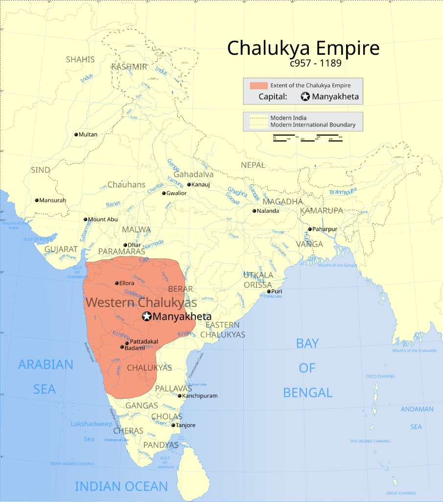
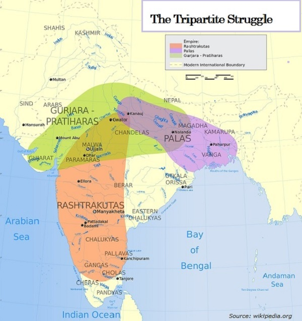
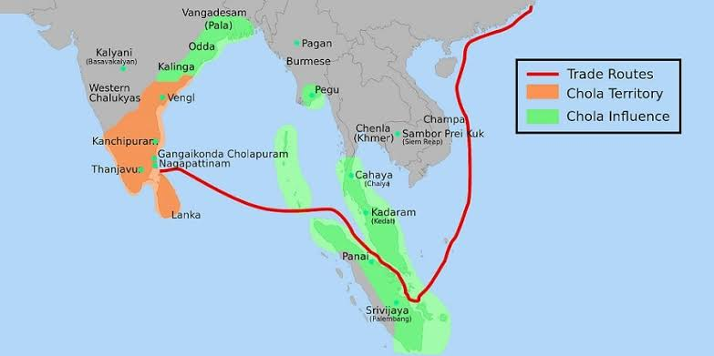
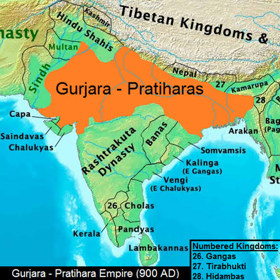
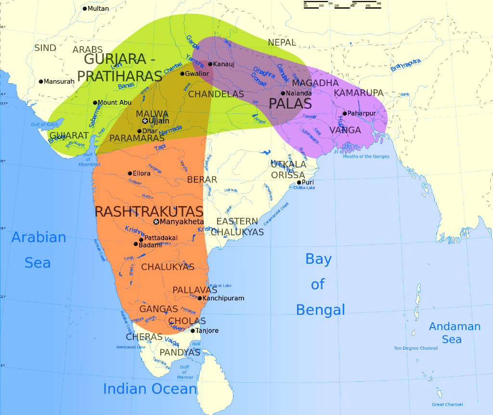
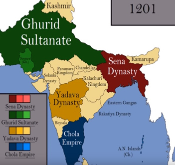
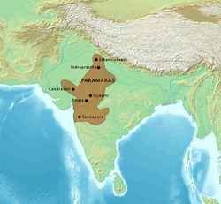

# Topic 1 — Early Medieval (प्रारंभिक मध्यकाल) India (Regional Kingdoms)
### ★ UPPCS Revision Sheet — Lucent / PW style (one home per fact · no repetition · Practice ≥70)

<strong>Covers syllabus</strong> (click to expand)

Early Medieval India | Major Dynasties of South India | Major Rulers of South India | Pallava (पल्लव) Dynasty | Chalukya (चालुक्य) Dynasty | Western Chalukyas | Rashtrakuta (राष्ट्रकूट) Dynasty | Chola (चोल) Empire | Chola Administration | Chola Local Self-Government | Chola Naval Power | Gurjara-Pratihara Dynasty | Tripartite Struggle (त्रिपक्षीय संघर्ष) for Kannauj (कन्नौज) | Pala Dynasty | Sena Dynasty | Paramara (परमार) Dynasty | Chandela (चंदेल) Dynasty | Gahadavala (गहड़वाल) Dynasty | Kalachuri Dynasty | Hoysala Dynasty | Kakatiya (काकतीय) Dynasty | Yadava (यादव) Dynasty | Medieval Names of Cities of Uttar Pradesh (उत्तर प्रदेश)

> **Sources baked in:** NCERT *Themes in Indian History Part II*, RS Sharma *Medieval India*, Ghatnachakra South India + Pre-Medieval Period, UPPCS Prelims PYQs 2018–2025
> **Weight:** ★★★ — dynasty↔capital, ruler↔dynasty, temple chronology, Chola A/R, Sena order, UP medieval city names
> **Last verified:** September 2026
> **Current Affairs:** N/A (purely historical; no 12–24 month scheme/appointment surface)

---

## Consolidated — 55 Must-Score Facts

1. Early Medieval India runs roughly **750–1200 CE** after Harsha (हर्ष) as an age of regional kingdoms and hereditary **samantas** (सामंत), not the Delhi Sultanate (दिल्ली सल्तनत) that begins in **1206**.
2. The **Tripartite Struggle** for **Kannauj** (कन्नौज) was fought by the **Pala**, **Gurjara-Pratihara**, and **Rashtrakuta** (राष्ट्रकूट) powers — not by the Cholas.
3. In the south, imperial power rotated **Pallava → Chalukya → Rashtrakuta → Chola**.
4. The **Pallava** (पल्लव) capital was **Kanchi** (कांची); the **Pandya** capital was **Madurai** (मदुरै).
5. Early Chalukyas ruled from **Badami (बादामी) / Vatapi**; **Eastern Chalukyas** from **Vengi** (**Pedavegi** near **Eluru**, West Godavari (गोदावरी), Andhra); later Western Chalukyas from **Kalyani** — do not merge the three seats.
6. The **Rashtrakuta** capital was **Manyakheta** (Malkhed) in the Deccan (दक्कन).
7. The imperial **Chola** capital moved from **Thanjavur** (तंजावुर) to **Gangaikondacholapuram** under Rajendra I.
8. **Hoysala** power centred on **Halebid / Dvarasamudra**; **Kakatiya** on **Warangal** (वारंगल); **Yadava** on **Devagiri** (देवगिरी) (later Daulatabad).
9. Ruler–dynasty facts: **Mahendravarman** was Pallava; **Kadungon** (कडुंगों) was Pandya; **Amoghavarsha** was Rashtrakuta; **Rajaraja** was Chola.
10. Temple chronology runs **Shore Temple** (शोर मंदिर) (~7th, Pallava Mahabalipuram (महाबलीपुरम)) → **Brihadishwara** (बृहदीश्वर) (**1010**, Rajaraja at Thanjavur) → **Gangaikondacholapuram** (~**1025**, Rajendra).
11. Sena succession (उत्तराधिकार क्रम) order is **Hemant → Vijaya → Ballal → Lakshman**.
12. Chola administration ran **Mandalam (मंडलम) → Valanadu → Nadu (नाडु) → Village**, and the empire had **four** (चातुर्याम) mandalams at its peak.
13. **Ur** was the ordinary village assembly; **Sabha (सभा) / Mahasabha** was the Brahmana (ब्राह्मण) **agrahara** assembly.
14. The Chola navy struck **Sri Lanka**, the **Maldives**, and **Kadaram (Kedah)**; **Nagapattinam** was a key port (बंदरगाह); the Bay of Bengal was called a “**Chola Lake**.”
15. In the Kannauj contest, **Dharmapala** (धर्मपाल) backed **Chakrayudha**; **Mihir Bhoja** (मिहिर भोज) recovered the city (~**836**); **Indra (इन्द्र) III** sacked it (**915–918**); **Krishna (कृष्णा) III** pressed again (**963**).
16. **Gopala** was elected Pala founder; **Dharmapala** founded **Vikramashila** (विक्रमशिला); **Devapala** marked the Pala peak; **Atisha** (अतीश) carried Buddhism (बौद्ध धर्म) toward Tibet.
17. Pratiharas moved from **Bhinmal** to **Kannauj**; **Nagabhatta I** checked the Arabs (अरब); **Mihir Bhoja** took the title **Adivaraha** (आदिवराह).
18. **Mihir Bhoja** (Pratihara (गुर्जर-प्रतिहार), Adivaraha, Kannauj) is not **Bhoja I** of the **Paramaras** at **Dhara** (धारा) in Malwa.
19. **Chandelas** held **Khajuraho (खजुराहो) / Mahoba / Kalinjar (कालिंजर)** in Bundelkhand; **Paramaras** held **Malwa / Dhara**.
20. **Gahadavalas** ruled **Kannauj and Banaras** in the 11th–12th century after Pratihara decline.
21. **Jay Chandra** of the Gahadavalas was killed at **Chandawar** (चंदावर) in **1194**.
22. UP medieval name facts: **Kannauj = Kanyakubja**; **Ayodhya (अयोध्या) = Saketa**; **Varanasi (वाराणसी) = Kashi (काशी) / Avimukta**.
23. **Mahoba** and **Kalinjar** (Banda district) are the Chandela strongholds in Bundelkhand **UP**.
24. **Kalachuris** ruled from **Tripuri** in the Chedi / Dahala belt.
25. **Pulakeshin II** (पुलकेशिन) of Badami defeated Harsha and left the **Aihole** (ऐहोल) prasasti; **Narasimhavarman I** took the title **Vatapikonda**.
26. The poet **Rajasekhara** (राजशेखर) lived at the courts of Pratihara **Mahendrapala I** and **Mahipala I** (*Karpuramanjari* (कर्पूरमंजरी), *Kavyamimamsa*, and related works).
27. Do not confuse **Kannauj (UP)** — the north sovereignty prize — with **Kanchi (TN)**, the Pallava capital.
28. Sena capital under Lakshman Sen is linked with **Nadia**; Pala seats stayed in the Bengal–Bihar belt with only episodic Kannauj holds.
29. Imperial Chola (साम्राज्य चोल) founder is **Vijayalaya** (विजयालय) (~**850**), not Rajaraja or Parantaka. **Parantaka I** took the title **Maduraikonda** after defeating the Madurai king.
30. **Battle of Takkolam (949)** — Rashtrakuta **Krishna III** led a confederacy that killed Chola prince **Rajaditya** (son of Parantaka I) and broke Chola power for a generation.
31. **Rajaraja I** (राजराज) created the standing **naval** arm, smashed the Chera fleet at **Kandalloor**, took **northern** Sri Lanka, and built **Brihadishwara** with its colossal **Nandi**.
32. **Rajendra I** took **whole Sri Lanka** (prisoner **Mahendra V**), defeated Pala **Mahipala**, founded **Gangaikondacholapuram**, built the artificial lake **Chola Gangam**, and made the Bay of Bengal a “**Chola Lake**.”
33. Under **Kulottunga I**, a Chola Buddhist / merchant mission of **72** traders went to **China (1077)**; he accepted Sinhala independence under **Vijayabahu** and married a daughter to prince **Virapperumal**.
34. Chola village boards (**Variyam**): **Thotta** = gardens; **Samvatsara** = annual; **Eri** = tanks; **Pon** = gold / finance. **Uttaramerur** is the Sabha working-system inscription.
35. **Eripatti** (एरिपट्टी) = land whose revenue maintains the village tank. **Taniyur** (तनियूर) = a very large village administered as a single unit (not a Brahmana gift). **Ghatika** = temple-attached college.
36. Chola **Nataraja** (नटराज) bronzes show the dancing Shiva with **four** hands; **Dakshinamurti** (दक्षिणामूर्ति) is Shiva as **teacher**, installed facing **south**.
37. Pallava **Simhavishnu** took the title **Avanisimha**; **Narasimhavarman I** is **Mahamalla** / **Vatapikonda** and sent naval help to Ceylon (**642**); **Mahendravarman I** (महेन्द्रवर्मन) wrote *Mattavilasa Prahasana (प्रहसन)* (मत्तविलास प्रहसन).
38. **Pulakeshin I** founded the Badami / Vatapi Chalukya house. **Aihole** prasasti of **Ravikirti** names **Kalidasa** (कालिदास) and **Bharavi** (भारवि). Chalukyas appointed **women** to high office (**Vijaya Bhattarika**).
39. **Kadamba** capital was **Vanavasi**; founder **Mayurasharman**; the state was annexed by **Pulakeshin II**. Chera capital memory is **Vanchi / Karuvur**.
40. **Meenakshi** (मीनाक्षी) temple at Madurai is linked in tradition to **Kulasekara Pandya** (later rebuilt under Nayakas). **Motupalli** was the Kakatiya overseas port (Marco Polo).
41. Cholas commonly designated a **Yuvraj** (heir) during the reigning king’s lifetime.
42. Sailendra / Srivijaya expedition under **Rajaraja I** and especially **Rajendra I** answered trade (पण्याध्यक्ष) obstruction toward China.
43. **Prithviraj (पृथ्वीराज) III** (Ajmer (अजमेर) Chauhan) won **First Tarain (तराइन) (1191)** and lost **Second Tarain (1192)** to Muhammad Ghori. **Vigraharaja IV** earlier took **Delhi** from the Tomaras.
44. **Anangpal Tomar** founded **Dhillika (Delhi)** in the 8th century as a Pratihara feudatory. **Jejakabhukti** (जेजाकभुक्ति) = ancient **Bundelkhand** (from Jeja / Jayashakti, Chandela).
45. Pala facts: **Gopala** (elected; **Odantapuri** (उदंतपुरी)); **Dharmapala** (**Vikramashila**, **Somapura / Paharpur**; title **Paramasaugata**); **Devapala** granted five villages for the **Sailendra / Balaputradeva** Nalanda (नालंदा) vihara (विहार).
46. **Kumaradevi** (queen of Govind Chandra Gahadavala) built the **Dharmachakra (धर्मचक्र) Jaina Vihara** at **Sarnath** (सारनाथ). **Lakshmidhara** wrote *Krityakalpataru*.
47. **Alha (आल्हा)–Udal** of **Mahoba** served Chandela **Parmardi / Paramardi**; struggle with Prithviraj appears in Chand Bardai’s *Prithviraj Raso* (पृथ्वीराज रासो) and Jagnik’s *Alha-khand* (*Parmal Raso*).
48. Kannauj medieval names include **Kanyakubja**, **Mahodaya**, and **Mahodaya Shri / Nagar Mahoday Shri**. **Koil** = Aligarh (अलीगढ़); **Mahotsava Nagar** = Mahoba.
49. **Paramara** power centre moved from **Ujjain** (उज्जैन) to **Dhara**. **Bhoja** wrote *Samarangana Sutradhara (सूत्रधार)* (architecture / devices) and founded **Bhojshala** (Saraswati (सरस्वती); Sanskrit school at Dhar, **1035**).
50. **Solanki / Chaulukya** capital was **Anhilwada** (अणहिलवाड़); founder line **Mularaja I**. Jain scholar **Hemachandra** advised **Kumarapala** (after fame under Jayasimha Siddharaja).
51. **Lakshmana Sena** started **Lakshmana Samvat**. Early medieval jurists are **Vijnaneshwara** (विज्ञानेश्वर) (*Mitakshara* (मिताक्षरा)), **Jimutavahana** (जीमूतवाहन) (*Dayabhaga* (दायाभाग)), and **Hemadri** — not **Rajasekhara** (poet).
52. **Dantidurga** founded Rashtrakutas and performed **Hiranyagarbha** at Ujjain. **Amoghavarsha I** (अमोघवर्ष) was born in a military camp on the Narmada (नर्मदा) during Govinda III’s northern return.
53. **Gangeyadeva** (Kalachuri of Tripuri) took the title **Vikramaditya** (विक्रमादित्य) and revived **gold** coinage; **Al-Biruni** mentions him and Tripuri.
54. *Hammira Mahakavya* (महाकाव्य) treats Chauhans as **Suryavanshi** / Agnikula. *Hammir Raso* (हम्मीर रासो) is by **Sharangadeva** (not Abdur Rehman). *Prithviraja Vijaya* (विजय) is by **Jayanaka**.
55. **Pundravardhana bhukti (भुक्ति)** was in **north Bengal** (later into north Bihar under Pala–Chandra–Sena). **Araghatta** = Persian-wheel style water device for irrigation.

---

## Confused Pairs

| A | B | Difference | Hindi |
|---|----|------------|-------|
| Early Medieval | Delhi Sultanate | ~750–1200 regional/feudal vs from **1206** Turkish rule | प्रारंभिक मध्यकाल / दिल्ली सल्तनत |
| Tripartite Struggle | South P-C-R-C cycle | Kannauj contest (Pala+Pratihara+Rashtrakuta) vs Tamil–Deccan power rotation | त्रिपक्षीय संघर्ष / दक्षिण चक्र |
| Pallava | Chola | **Kanchi**, pre-9th structural temples vs **Thanjavur** empire from Vijayalaya **850** | पल्लव / चोल |
| Early Chalukya | Western Chalukya | **Badami/Vatapi** (6th–8th) vs **Kalyani** (10th–12th) | प्राचीन चालुक्य / पश्चिमी चालुक्य |
| Ur | Sabha/Mahasabha | General village assembly vs Brahmana **agrahara** assembly | उर / सभा |
| Nadu | Mandalam | Basic unit (village cluster) vs province (empire had **4**) | नाडु / मंडलम |
| Mihir Bhoja | Bhoja I (Paramara) | **Pratihara**, title **Adivaraha**, Kannauj vs **Malwa/Dhara** scholar-king | मिहिर भोज / परमार भोज |
| Gahadavala | Pratihara | 11th–12th Kannauj+Banaras Rajputs vs 8th–10th imperial Kannauj holders | गहड़वाल / गुर्जर-प्रतिहार |
| Chandela | Paramara | Bundelkhand/**Khajuraho**/Mahoba vs Malwa/**Dhara** | चंदेल / परमार |
| Devagiri | Warangal | **Yadava** (later Daulatabad) vs **Kakatiya** (Orugallu) | देवगिरी / वारंगल |
| Kannauj | Kanchi | UP sovereignty prize vs Tamil Pallava capital | कन्नौज / कांची |
| Shore Temple | Brihadishwara | Pallava Mahabalipuram ~7th vs Chola Rajaraja **1010** Tanjore | शोर मंदिर / बृहदीश्वर |
| Adivaraha | Gangaikondachola | Mihir Bhoja (Pratihara) vs Rajendra I (Chola) | आदिवराह / गंगैकोंडचोल |
| Vijayalaya | Rajaraja I | Imperial Chola **founder ~850** vs peak navy / Brihadishwara builder | विजयालय / राजराज |
| Rajaraja I (N. Lanka) | Rajendra I (whole Lanka) | Northern conquest vs full island + Mahendra V prisoner | राजराज / राजेन्द्र |
| Thotta Variyam | Eri Variyam | Gardens / horticulture vs tanks and water | तोट्टा / एरी |
| Eripatti | Taniyur | Tank-maintenance land vs large single-unit village | एरिपट्टी / तनियूर |
| Nataraja | Dakshinamurti | Four-armed dancing Shiva vs teacher form facing south | नटराज / दक्षिणामूर्ति |
| Badami / Vatapi | Vanavasi | Early Chalukya capital vs **Kadamba** capital | वातापी / वनवासी |
| Vengi (Pedavegi) | Rajahmundry | Eastern Chalukya capital **Pedavegi** near **Eluru** vs later seat **Rajamahendravaram** | वेंगी / राजमहेन्द्रवरम |
| Vanchi / Karur | Madurai | Chera capital vs Pandya capital | वंची / मदुरै |
| Tarain | Chandawar | **1192** Prithviraj vs **1194** Jay Chandra | तराइन / चंदावर |
| Mihir Bhoja (Pratihara) | Bhoja (Paramara) | Adivaraha / Kannauj vs Dhara scholar-king / Bhojshala | मिहिर भोज / परमार भोज |
| Jejakabhukti | Kaushambi | Ancient **Bundelkhand** vs doab city | जेजाकभुक्ति / कौशांबी |
| Vikramashila | Odantapuri | **Dharmapala** vs **Gopala** (Bihar seats) | विक्रमशिला / ओदन्तपुरी |
| Prithviraj Raso | Prithviraja Vijaya | Chand Bardai vs **Jayanaka** | पृथ्वीराज रासो / विजय |
| Hammir Raso | Hammira Mahakavya | **Sharangadeva** vs Nayachandra Suri epic | हम्मीर रासो / महाकाव्य |
| Rajasekhara | Hemadri / Vijnaneshwara | Pratihara court poet vs early medieval **jurists** | राजशेखर / हेमाद्रि–विज्ञानेश्वर |
| Anhilwada | Dhara | Solanki capital vs Paramara capital | अणहिलवाड़ / धारा |

---

## Must-score facts — dynasty, capital, temple, UP tags

### Dynasty ↔ capital

| Dynasty | Capital / seat |
|---------|----------------|
| Pallava | **Kanchi** |
| Pandya | **Madurai** |
| Early Chalukya (प्राचीन चालुक्य) | **Badami / Vatapi** |
| Eastern Chalukya | **Vengi** |
| Western Chalukya (पश्चिमी चालुक्य) | **Kalyani** |
| Rashtrakuta | **Manyakheta (Malkhed)** |
| Imperial Chola | **Thanjavur** → **Gangaikondacholapuram** (Rajendra) |
| Hoysala | **Halebid / Dvarasamudra** |
| Kakatiya | **Warangal** |
| Yadava | **Devagiri** (later Daulatabad) |
| Gurjara-Pratihara | **Bhinmal** → **Kannauj** |
| Pala | Bengal–Bihar belt (episodic Kannauj) |
| Chandela | **Khajuraho / Mahoba / Kalinjar** |
| Paramara | **Malwa / Dhara** |
| Gahadavala | **Kannauj + Banaras** |
| Kalachuri | **Tripuri** |
| Kadamba | **Vanavasi** |
| Solanki / Chaulukya | **Anhilwada** |

### Ruler ↔ dynasty tag

| Ruler | Tag |
|-------|-----|
| Mahendravarman I | Pallava; *Mattavilasa Prahasana* |
| Narasimhavarman I | Pallava; **Vatapikonda / Mahamalla** |
| Pulakeshin II | Badami Chalukya; Harsha defeat; **Aihole** prasasti |
| Dantidurga | Rashtrakuta founder; **Hiranyagarbha** |
| Amoghavarsha I | Rashtrakuta |
| Vijayalaya | Imperial Chola founder (~**850**) |
| Rajaraja I | Chola navy; **Brihadishwara 1010** |
| Rajendra I | **Gangaikondachola** (गंगैकोंडचोल); whole Lanka; Chola Lake |
| Gopala | Pala founder (elected) |
| Dharmapala | **Vikramashila**; Paramasaugata |
| Mihir Bhoja | Pratihara; **Adivaraha** |
| Bhoja (Paramara) (परमार भोज) | Malwa / Dhara scholar-king |
| Jay Chandra | Gahadavala; killed **Chandawar 1194** |

### Temple / event ↔ year

| Item | Year / lock |
|------|-------------|
| Shore Temple (Mahabalipuram) | ~7th c., Pallava |
| Brihadishwara (Thanjavur) | **1010**, Rajaraja |
| Gangaikondacholapuram temple | ~**1025**, Rajendra |
| Battle of Takkolam | **949** (Krishna III vs Cholas) |
| First Tarain | **1191** (Prithviraj wins) |
| Second Tarain | **1192** (Ghori wins) |
| Chandawar | **1194** (Jay Chandra dies) |

### UP medieval name tags

| Modern | Medieval name |
|--------|---------------|
| Kannauj | **Kanyakubja / Mahodaya** |
| Ayodhya | **Saketa** |
| Varanasi | **Kashi / Avimukta** |
| Mahoba | **Mahotsava Nagar** (Chandela) |
| Aligarh | **Koil** |

---

## 1.1 Early Medieval India

**Period:** ~**750–1200 CE** (after Harsha; before full Turkish takeover of the north).

- After **Harsha (d. 647)**, no pan-India empire matched Gupta (गुप्त) extent.
- Politics ran through **regional kingdoms**, land grants, and hereditary **samantas** (feudatories).
- **Bhogapatis** and **nad-gavundas** acted as village-level intermediaries and weakened direct royal control over peasants.
- **Brahmanical agrahara** grants were tax-free villages that spread cultivation but also created a new landlord class.
- Northern power rested on the **Ganga (गंगा) valley**, Gujarat, and Malwa.
- Southern power rested on the **Kaveri** (कावेरी), **Krishna**, and **Godavari** (गोदावरी) deltas.
- Sanskrit learning, temple culture, the varna (वर्ण) framework, and guild trade continued in this age.
- The main break from the Gupta era was political fragmentation, not a civilizational collapse.
- In the north, the central theme was the **Tripartite Struggle for Kannauj**.
- In the south, power rotated through the Pallava, Chalukya, Rashtrakuta, and **Chola** cycle.
- **Sulaiman** called the Pala kingdom **Ruhma/Dharma** and praised its elephant corps.
- **Al-Masudi** called the Pratihara realm **Al-Juzr (Gurjara)** and the king **Baura** (likely a garbled form of **Adivaraha** for Mihir Bhoja’s line).
- **Araghatta** in economic stems means a water-lifting wheel used to irrigate land (Persian-wheel type), not bonded labour (बंधुआ मज़दूरी) or military land grants.
- This topic covers regional kingdoms and is **not** the Delhi Sultanate, which begins in **1206**.
- A common trap is calling Mihir Bhoja a “Sultan”; he was a Gurjara-Pratihara ruler.

> **Logic:** Early Medieval ends at the Rajput (राजपूत)–Turkish transition (~**Tarain 1192** / **Chandawar 1194**), not at Mughal (मुग़ल) rule.

---

## 1.2 Major Dynasties & Rulers of South India

**Master match home** for dynasty ↔ capital ↔ peak ruler (UPPCS bread-and-butter).

| Dynasty | Capital(s) | Region | Key rulers () |
|---------|------------|--------|-------------------|
| **Pallava** | **Kanchi** | N. Tamil Nadu / S. Andhra | Mahendravarman I; Narasimhavarman I (**Vatapikonda**) |
| **Early Chalukya** | **Badami / Vatapi** | Karnataka–Maharashtra | **Pulakeshin II** (defeated Harsha; Aihole) |
| **Eastern Chalukya** | **Vengi** (**Pedavegi** near **Eluru**) | Coastal Andhra (Godavari–Krishna delta (डेल्टा)) | **Vishnuvardhana** (branch of Pulakeshin II) |
| **Western Chalukya** | **Kalyani** | Deccan | Later Chalukyas; rivalry with Cholas |
| **Rashtrakuta** | **Manyakheta** (Malkhed) | Deccan | Dantidurga; **Amoghavarsha I**; Indra III; Krishna I (Ellora (एलोरा)) |
| **Chola** | **Thanjavur**; later **Gangaikondacholapuram** | Tamil country + overseas | Vijayalaya; **Rajaraja I**; **Rajendra I** |
| **Pandya** | **Madurai** | S. Tamil Nadu | **Kadungon** (revival ~6th c.) |
| **Chera** | **Vanchi / Karuvur (Karur)** | Kerala coast | Pressured by Chola navy; pepper (काली मिर्च) trade |
| **Hoysala** | **Halebid / Dvarasamudra** | Karnataka | **Vishnuvardhana**; Hoysalesvara |
| **Kakatiya** | **Warangal** (Orugallu) | Telangana | Ganapati (गणपतिदेव) Deva; **Rudramadevi** |
| **Yadava** | **Devagiri** (later Daulatabad) | Maharashtra | Singhana; **Ramachandra** |

### North & East dynasties (same match-drill home)

| Dynasty | Capital / base | Region | Key rulers () |
|---------|----------------|--------|-------------------|
| **Pala** | Bengal–Bihar seats; Kannauj episodic | East | **Gopala** (elected); **Dharmapala**; **Devapala** |
| **Gurjara-Pratihara** | **Bhinmal** → **Kannauj** | Rajasthan–UP–MP | Nagabhatta I; **Mihir Bhoja (Adivaraha)**; Mahendrapala I |
| **Paramara** | **Dhara** (earlier Ujjain) | Malwa | **Bhoja I** (scholar-king) |
| **Chandela** | **Khajuraho / Mahoba / Kalinjar** | Bundelkhand (**Jejakabhukti**) | **Dhanga**; **Vidyadhara** |
| **Gahadavala** | **Kannauj + Banaras** | Eastern UP doab (दोआब) | **Govind Chandra**; **Jay Chandra** |
| **Kalachuri** | **Tripuri** (Jabalpur belt) | Chedi / Dahala | **Gangeyadeva**; **Karna** |
| **Sena** | **Nadia** (Lakshman Sen) | Bengal | Hemant → Vijaya → Ballal → **Lakshman** |
| **Chauhan (Chahamana)** | **Ajmer** (later Delhi) | Rajasthan–Delhi corridor | **Vigraharaja IV**; **Prithviraj III** |
| **Tomar** | **Dhillika (Delhi)** | Delhi–Haryana | **Anangpal** |
| **Solanki / Chaulukya** | **Anhilwada** | Gujarat | **Mularaja I**; Jayasimha Siddharaja; **Kumarapala** |

> **Logic:** Pallava capital is **Kanchi**; Pandya capital is **Madura**; Yadava capital is **Devagiri**; Kakatiya capital is **Warangal**. **Mahendravarman I** was a **Pallava**; **Kadungon** revived the **Pandyas**; **Amoghavarsha I** was a **Rashtrakuta**; **Rajaraja I** was a **Chola**.

### PYQs — South dynasties (match)

**1. (UPPCS Prelims 2019, Q90)** Match List-I (Ruling Dynasties) with List-II (Capitals):

| List-I | List-II |
|--------|---------|
| A. Pallava | 1. Warangal |
| B. Pandya | 2. Kanchi |
| C. Yadava | 3. Madura |
| D. Kakatiya | 4. Devagiri |

*Row order in the table is not the answer code.*

A. 2 1 4 3
B. 2 3 4 1
C. 1 2 3 4
D. 2 4 3 1

Show answer

**Correct Answer:** **B** (2–3–4–1 / A-2, B-3, C-4, D-1)

**Detailed Explanation:**
- **A. Pallava → 2. Kanchi:** The Pallavas established their imperial capital at **Kanchipuram** (Kanchi) in northern Tamil Nadu, ruling from the 6th to late 9th century. Kanchi was a renowned centre of Sanskrit and Tamil learning.
- **B. Pandya → 3. Madura:** The Pandyas held their historical capital at **Madurai** (ancient Madura) along the Vaigai river in southern Tamil Nadu, celebrated since the Sangam age and later revived in the 6th century under Kadungon.
- **C. Yadava → 4. Devagiri:** The Seuna/Yadava dynasty established their fortified capital at **Devagiri** (later renamed Daulatabad by Muhammad bin Tughlaq) in the northern Deccan (Maharashtra).
- **D. Kakatiya → 1. Warangal:** The Kakatiyas ruled the eastern Deccan/Telangana region with their capital at **Warangal** (ancient Orugallu), famous for its four massive stone gateways (*kirti toranas*) and fort walls.

**Key Exam Takeaway / Trap:**
- Devagiri is the **Yadava** capital; Warangal is the **Kakatiya** capital. Swapping Devagiri and Warangal is the most frequent UPPCS distractor.
- Kanchi (Pallava) and Madurai (Pandya) are the core southern capitals tested in almost every alternate prelims paper.

**2. (UPPCS Prelims 2025, Q121)** Match List-I (Ruler) with List-II (Dynasty):

| List-I | List-II |
|--------|---------|
| A. Mahendravarman I | 1. Rashtrakuta |
| B. Kadungon | 2. Pallava |
| C. Amoghavarsha I | 3. Chola |
| D. Rajaraja I | 4. Pandya |

*Row order in the table is not the answer code.*

A. 4 2 3 1
B. 2 4 1 3
C. 2 4 3 1
D. 4 2 1 3

Show answer

**Correct Answer:** **B** (2–4–1–3 / A-2, B-4, C-1, D-3)

**Detailed Explanation:**
- **A. Mahendravarman I → 2. Pallava:** Early 7th-century Pallava king (c. 600–630 CE), pioneer of rock-cut cave architecture (*Mandagapattu*), gifted musician, and author of the satirical Sanskrit play *Mattavilasa Prahasana*.
- **B. Kadungon → 4. Pandya:** Inscriptional hero of the Velvikkudi copper plates who overthrew the Kalabhras around 590 CE and restored the First Pandya Empire at Madurai.
- **C. Amoghavarsha I → 1. Rashtrakuta:** Celebrated scholar-king (814–878 CE) of Manyakheta (Malkhed). He was a devout patron of Jainism (under Jinasena) and authored *Kavirajamarga*, the earliest extant landmark in Kannada poetics.
- **D. Rajaraja I → 3. Chola:** Peak imperial Chola monarch (985–1014 CE) who commissioned the colossal Brihadishwara Temple at Thanjavur, annexed northern Sri Lanka, and established the Chola naval supremacy.

**Key Exam Takeaway / Trap:**
- Do not mistake Kadungon as a Pallava or Chera; he is exclusively tied to the **Pandya revival**.
- Amoghavarsha I belongs to the **Rashtrakutas** of Manyakheta, not the Cholas or Chalukyas.

### Pandya & Chera (key facts)

- **Kadungon** revived the **Pandya** line around the **6th century**.
- **Kadungon** is the classic Pandya revival ruler paired with the Pandya dynasty.
- Later Pandyas ruled from **Madurai** and repeatedly clashed with Cholas for Tamil supremacy.
- **Rajaraja I** conquered Madurai.
- **Parantaka I** earlier defeated the Madurai king and took the title **Maduraikonda**.
- Pandya revival came again only after Chola decline.
- Tradition links the original **Meenakshi** shrine at Madurai with **Kulasekara Pandya**; the city is remembered as lotus-shaped around the temple.
- The **Cheras** drew wealth from **Malabar coast** trade in pepper and spices.
- Chera capital memory is **Vanchi / Vanji / Karuvur (Karur)** — not Puducherry.
- **Rajaraja I** destroyed the Chera navy at **Kandalloor / Trivandrum**, ending their maritime challenge.

---

## 1.3 Pallava Dynasty

**Capital:Kanchi (Kanchipuram (कांचीपुरम))** | **Span:** c. **575–897 CE** | **Rival:** Early Chalukyas of Badami

- **Simhavishnu (c. 575–600)** is treated as the dynastic restorer who made Kanchi the Pallava power centre. He took the title **Avanisimha (Avanisingh)** and defeated Chola, Pandya, Sinhala, and Kalabhra rivals.
- **Mahendravarman I (c. 600–630)** pioneered **rock-cut** (शैल-कट) architecture at Mahabalipuram and is a classic **Pallava** ruler.
- **Mahendravarman I** patronised Shaivism (शैव), Vaishnavism (वैष्णव), and Jainism (जैन धर्म) and wrote the Sanskrit humorous play ***Mattavilasa Prahasana***.
- **Narasimhavarman I (c. 630–668)** took the title **Mahamalla** (great wrestler). He took **Vatapi in 642** and earned the title **Vatapikonda**. The famous **Pancha Rathas** belong to his Mamalla phase.
- In **642** he sent **two naval expeditions** to Ceylon to help a Sri Lankan prince.
- **Parameshvaravarman I (c. 670–700)** carried titles such as Lokaditya, Ekamalla, Rananjaya, Ugradanda, and related warrior epithets.
- **Narasimhavarman II (Rajasimha)** built the structural (संरचनात्मक) **Shore Temple** at **Mahabalipuram** (महाबलीपुरम).
- **Nandivarman II (c. 731–795)** belongs to the later Pallava phase before Chola eclipse of Kanchi prestige.
- Pallava chronological spine for arrange stems: **Mahendravarman I → Narasimhavarman I → Parameshvaravarman I → Nandivarman II**.
- Pallava art moved from rock-cut caves (Mahendravarman) to monolith rathas (Mamalla) to structural stone temples (Rajasimha).
- The Pallava–Chalukya rivalry centred on the **Krishna–Tungabhadra (तुंगभद्रा) doab**.
- Both sides fought for control of **Vatapi** and **Kanchi**.

> **Logic:** Shore Temple = **Pallava**, not Chola. Do not swap **Kanchi** with **Kannauj**. **Mahamalla ≠ Chola**.

### PYQ — Temple chronology (Pallava + Chola)

**1. (UPPCS Prelims 2018, Q15)** Arrange the following temples chronologically:

I. Brihdishwar temple

II. Gangaikonda cholapuram (गंगैकोंड चोलपुरम) temple

III. Shore temple of Mahabalipuram

IV. Sapt pagoda

A. I, II, IV, III
B. II, I, III, IV
C. III, II, I, IV
D. IV, III, I, II

Show answer

**Correct Answer:** **D** (IV, III, I, II)

**Detailed Explanation:**
The correct chronological order from earliest to latest is:
1. **IV. Sapt Pagoda (Pancha Rathas, Mahabalipuram):** Monolithic rock-cut shrines carved during the reign of Pallava king **Narasimhavarman I 'Mahamalla'** (c. **630–668 CE**). These represent the earliest monolithic rock-cut phase of Dravidian architecture.
2. **III. Shore Temple of Mahabalipuram:** One of the earliest free-standing structural stone temples in South India, built by Pallava king **Narasimhavarman II 'Rajasimha'** (c. **700–728 CE**).
3. **I. Brihadishwara Temple at Thanjavur:** Grand structural Dravidian granite temple completed by Imperial Chola monarch **Rajaraja I** in **1010 CE** (11th century).
4. **II. Gangaikondacholapuram Temple:** Built by Rajaraja's son and successor, **Rajendra I**, around **1035 CE** (c. 1025–1035 CE) to commemorate his triumphant northern campaign to the holy river Ganga.

**Key Exam Takeaway / Trap:**
- Rajaraja I (father) built Thanjavur **before** Rajendra I (son) built Gangaikondacholapuram.
- Sapt Pagoda (rock-cut monoliths) preceded the Shore Temple (masonry/structural), though both are Pallava monuments at Mahabalipuram.

---

## 1.4 Chalukya Dynasty & Western Chalukyas

**Early Chalukyas:Badami / Vatapi** (c. **543–757**) | **Western / Later Chalukyas:Kalyani** (c. **973–1189**)

| Feature | Early (Badami) | Western (Kalyani) |
|---------|----------------|-------------------|
| Capital | **Badami / Vatapi** | **Kalyani** |
| Peak ruler | **Pulakeshin II** | Vikramaditya VI (high-water mark) |
| Main rival | **Pallavas** | **Cholas** (Vengi + Tungabhadra doab) |
| End | Overthrown by **Rashtrakutas** (**757**) | Pressed by Hoysalas, Yadavas, later Sultanate |

- **Pulakeshin I** was the real founder of the **Vatapi / Badami** Chalukya dynasty. **Kirtivarman I** and Mangalesha built the early Badami base before Pulakeshin II’s fame.
- Present **Badami** (बादामी) (Bagalkot district, Karnataka) is ancient **Vatapi**, Chalukya capital in the 6th–7th centuries.
- **Pulakeshin II (610–642)** was the most capable Early Chalukya ruler. He stopped **Harsha** near the **Narmada** (नर्मदा).
- The **Aihole inscription** of **Ravikirti** (रविकीर्ति) praises Pulakeshin II. At the end of the prasasti, Ravikirti claims fame like **Kalidasa** (कालिदास) and **Bharavi** (भारवि) — so **Kalidasa’s name** appears in the Aihole record.
- **Vikramaditya I** recovered Badami after the Pallava sack of Vatapi.
- **Vikramaditya II** captured Kanchi and patronised the **Virupaksha (विरूपाक्ष) temple at Pattadakal (पट्टदकल)**.
- Eastern Chalukyas of **Vengi** were founded by **Kubja Vishnuvardhana**, a brother / branch line of **Pulakeshin II**, after the Badami conquest of coastal Andhra.
- The capital **Vengi** (also **Vengipura**) is identified with **Pedavegi** (Peddavegi), a village near **Eluru** in **West Godavari** district, Andhra Pradesh — not with Badami, Kalyani, or Amaravati (अमरावती).
- The kingdom’s name stayed **Vengi** even when a later Eastern Chalukya centre rose at **Rajamahendravaram** (modern **Rajahmundry** (राजमहेन्द्रवरम)).
- Later Chola–Western Chalukya rivalry repeatedly turned on **Vengi** and the **Tungabhadra doab**.
- **Pattadakal** (पट्टदकल) (UNESCO) marks the Early Chalukya architectural peak.
- The queen **Lokmahadevi** built the **Virupaksha temple** at Pattadakal.
- Chalukyas frequently appointed **women** to high administrative posts. **Vijaya Bhattarika**, queen of Chandraditya (brother of Vikramaditya I), issued copper plates in her own name and ran administration efficiently; she was also a poetess. A royal sister **Kumkumadevi** could recommend (सिफारिश) a village grant to a learned Brahmana.
- Chinese writer **Matwalin (Ma-twalin)** gives an account of China–India relations in the Chalukya age.
- Chalukya origin legends claim **Agnikula** descent from **Ayodhya** (अयोध्या).
- That Ayodhya link is a UP-linked trap in Rajput-origin questions.

### Kadamba (neighbour fact)

- The **Kadamba** capital was **Vanavasi**.
- The dynasty was founded by **Mayurasharman**.
- **Pulakeshin II** annexed the Kadamba state.
- Kadambas are **not** a Sangam (संगम) Muvendar (मुवेन्दर) house.

> **Logic note:** Badami ≠ Kalyani ≠ Vengi. If the option says “Western Chalukya capital = Vatapi,” it is wrong. **Vanavasi = Kadamba**, not Chalukya. **Eastern Chalukya Vengi = Pedavegi near Eluru** — do not pick Rajahmundry as the original capital identification.

### PYQ — Western Chalukya vs Chola

**1.** Assertion (A): The **Western Chalukyas of Kalyani** repeatedly fought the **Cholas**.

Reason (R): Control of **Vengi** and the **Tungabhadra doab** was strategically valuable to both.

A. Both true, R explains A
B. Both true, R not explanation
C. A true, R false
D. A false, R true

Show answer

**Correct Answer:** **A** (Both A and R are true, and R is the correct explanation of A)

**Detailed Explanation:**
- **Assertion (A) is correct:** The Western Chalukyas of Kalyani (founded by Tailapa II in 973 CE) and the Imperial Cholas of Thanjavur engaged in relentless, multi-generational warfare throughout the 11th and 12th centuries (e.g. battles of Maski, Kudal-Sangamam, and Koppam).
- **Reason (R) is correct:** Two prime geopolitical flashpoints fueled this continuous warfare:
  1. **Control of Vengi (Eastern Chalukya kingdom):** The Cholas maintained marital and political alliances with Vengi (which culminated in the Chola-Chalukya union under Kulottunga I), whereas the Western Chalukyas viewed Vengi as their rightful sphere of influence.
  2. **The fertile Krishna–Tungabhadra Doab (Raichur doab):** This rich agricultural and mineral tract formed the contested borderland buffer between the northern Deccan and the deep South.
- **Why (R) explains (A):** The strategic compulsion to monopolize the fertile river valleys of the Tungabhadra doab and dominate the maritime outlets of the Godavari–Krishna delta at Vengi was the fundamental economic and geopolitical cause that provoked repeated military clashes between both empires.

**Key Exam Takeaway / Trap:**
- Badami/Vatapi Chalukyas fought the **Pallavas** (6th–8th c.).
- Kalyani/Western Chalukyas fought the **Cholas** (10th–12th c.). Never interchange these dynastic rival pairs.

---

## 1.5 Rashtrakuta Dynasty

**Capital:Manyakheta (Malkhed)** | **Founder:Dantidurga** (overthrew Early Chalukyas **757**) | **Span:** c. **753–972**

- **Dantidurga** laid the Rashtrakuta foundation and is remembered for the **Hiranyagarbha** ritual (कर्मकाण्ड) at **Ujjain**.
- **Krishna I** commissioned the monolithic **Kailasa (कैलास) temple at Ellora**.
- **Amoghavarsha I (814–878)** ruled for about **64 years**.
- He was born in a military camp near the **Narmada** while his father **Govinda III** returned from northern campaigns.
- He wrote **Kavirajamarga**, an early Kannada text.
- **Amoghavarsha I** is the classic **Rashtrakuta** ruler paired with Manyakheta.
- **Govinda III** campaigned north against Pratiharas and south against Tamil powers. He defeated Pratihara **Nagabhatta II** (Sanjan / Radhanpur plates).
- **Indra III** sacked **Kannauj (915–918)** in the tripartite contest.
- **Krishna III** defeated Chola **Parantaka I** (**949**) and reached Rameshwaram.
- **Krishna III** erected a **victory pillar at Rameshwaram** after the southern campaign.
- Al-Masudi called the Rashtrakuta emperor **Balhara / Vallabharaja**.
- **Chandrobalabbe**, daughter of Amoghavarsha I, administered the **Raichur doab**.
- Rashtrakuta provinces were called **rashtra**.
- Districts within them were **visaya**, forming a samanta-like feudal layer.
- The Rashtrakutas patronised Shaivism, Vaishnavism, and Jainism and tolerated Muslim traders in their ports.
- The empire ended when Manyakheta fell in **972**.
- Western Chalukyas rose in its place.

> **Logic:** Amoghavarsha I = Rashtrakuta (not Chola/Pallava). **Hiranyagarbha** = Dantidurga. Manyakheta is not a Pratihara capital.

---

## 1.6 Chola Empire

**Founder:Vijayalaya** took **Thanjavur ~850** | **Span:** c. **850–1279** | **Peak:Rajaraja I (985–1014)** and **Rajendra I (1014–1044)**

- After the Sangam Cholas there is a long interregnum until the medieval Cholas rise under **Vijayalaya**.
- **Vijayalaya** began as a Pallava feudatory before capturing Tanjore and founding the imperial Chola line in the **9th century**.
- **Aditya I** defeated the Pallavas and expanded Chola power in the Tamil core.
- **Parantaka I** defeated the Madurai king and assumed the title **Maduraikonda**. He pushed Chola borders northward.
- Chola emperors generally designated a **Yuvraj** (heir) during their own reign.

### Battle of Takkolam (949) — Cause, Course, Result

**Place:** Takkolam | **Chola side:** prince **Rajaditya**, son of **Parantaka I** | **Opponent:** Rashtrakuta **Krishna III** with Western Ganga and related allies

- **Cause:** Chola expansion under Parantaka I collided with Rashtrakuta ambitions in the Tamil–Deccan frontier.
- **Course:** At **Takkolam in 949**, Krishna III’s confederacy fought Rajaditya. The Chola prince was **killed on the battlefield**.
- **Result:** The Cholas were defeated and lost northern holdings for a generation. Krishna III later reached Rameshwaram and raised a victory pillar. Chola recovery waited until after Rashtrakuta collapse (**972**).

- After Rashtrakuta collapse (**972**), Cholas re-emerged as the dominant south Indian power.
- The golden age opens with **Rajaraja I**. He was the first Chola king to organise a standing **naval army (सेना)**.
- **Rajaraja I** defeated the Chera naval force at **Kandalloor**, conquered **northern Sri Lanka** (Anuradhapura destroyed; the south remained independent for a time), took the **Maldives**, and conquered Madurai.
- **Rajaraja I** and his son **Rajendra I** sent expeditions against the **Sailendra / Srivijaya** world of Southeast Asia when trade toward China was obstructed.
- **Rajaraja I** built **Brihadishwara (Rajarajesvaram) at Tanjore in 1010** — a peak **Dravida** (द्रविड़) granite temple with two **dvarapalas** and a colossal single-rock **Nandi** among the tallest in India.
- **Rajendra I** completed the conquest of **whole Sri Lanka** and brought Sinhala king **Mahendra V** as a prisoner.
- **Rajendra I** defeated Pala ruler **Mahipala**, took the title **Gangaikondachola**, and founded the new capital **Gangaikondacholapuram**.
- He built the artificial lake **Chola Gangam (Ponneri)** in memory of the Ganga-basin victory that included Bengal and Kalinga (कलिंग) kings.
- The Chola navy was the strongest in the region and turned the Bay of Bengal into a “**Chola Lake**.”
- Rajendra’s **1025** naval war hit **Srivijaya** and **Kadaram (Kedah)** after trade obstruction.
- Chola artists excelled in stone and especially **bronze** (कांस्य). The classic **Nataraja** (dancing Shiva) icons have **four hands**. In the right ear he wears a man’s earring and in the left a woman’s — the **Ardhanarishwara** hint.
- The **Dakshinamurti** form of Shiva shows him as **guru (गुरु) / teacher** giving knowledge to devotees. The image is installed facing **south**.
- Chola rulers cut **victory narratives on temple walls** and issued copper plates.
- That is why sources for the Cholas outrun earlier Tamil dynasties.
- **Kulottunga I** consolidated Chola power. In **1077** a Chola mission of **72** merchants / Buddhist traders was sent to **China**.
- When **Vijayabahu** proclaimed an independent Sinhala island in Kulottunga’s time, Kulottunga did not escalate hostility and married his daughter to Sinhala prince **Virapperumal**.
- The empire later cracked under Pandya–Hoysala–Kakatiya pressure. Near **1279** Chola power ended under **Rajendra III**; Malik Kafur’s southern campaigns come later (~**1310**).

> **Logic:** **Rajaraja I** built **Brihadishwara (1010)** before **Rajendra I** built **Gangaikondacholapuram (~1025)**. **Rajaraja I** was a **Chola** ruler. Chola founder = **Vijayalaya**, not Parantaka.

### PYQ — Chola sources

**1. (UPPCS Prelims 2020, Q8)Assertion (A):** We have much more information about Cholas than their predecessors.

**Reason (R):** The Chola rulers adopted (अंगीकृत) the practice of having inscriptions written on the walls of temples giving a historical narrative of their victories.

A. Both true and R explains A
B. Both true, R not explanation
C. A true, R false
D. A false, R true

Show answer

**Correct Answer:** **A** (Both A and R are true, and R is the correct explanation of A)

**Detailed Explanation:**
- **Assertion (A) is correct:** Historians possess far more detailed, accurate, and chronologically consistent information about the Chola Empire than any of their South Indian predecessors (such as the Pallavas, early Pandyas, or Cheras).
- **Reason (R) is correct:** Starting with Rajaraja I (985–1014 CE), the Chola administration institutionalized the practice of engraving formal historical introductions (*Meikeerthi* or *Prasasti*) directly on temple stone walls before recording any royal grant, donation, or decree. These inscriptions systematically documented the king's conquests, genealogy, administrative reforms, village boundaries, and tax assessments.
- **Why (R) explains (A):** Because large stone temples (like the Brihadishwara temples at Thanjavur and Gangaikondacholapuram) served as virtually indestructible public archives, thousands of preserved epigraphs provide an exceptionally rich, verifiable primary source base for the Cholas that does not survive for earlier dynasties.

**Key Exam Takeaway / Trap:**
- Rajaraja I was the innovator of the royal *Meikeerthi* (formal historical prologue) on temple walls.
- Do not assume that earlier dynasties like the Pallavas left more written records simply because they built rock-cut shrines earlier; the Cholas left vastly superior quantities of descriptive historical inscriptions.

---

## 1.7 Chola Administration

**Hierarchy:** King → **Mandalam** (province) → **Kottam / Valanadu** → **Nadu** → **Kurram** / village → **Gram Sabha** (ग्राम सभा).

- At peak the empire is often counted with about **four** great **mandalam** provinces — roughly **Tondaimandalam**, **Cholamandalam**, **Pandimandalam**, and **Gangapadi / Kongumandalam** (some handbooks count up to six provincial divisions).
- A province was divided into **Kottam** or **Valanadu** (commissionerate-like units).
- Each Kottam held several **Nadu** (districts). The assembly of a Nadu was the **Nattar**.
- The village association could be called **Kurram**. The smallest unit was the **Gram Sabha**.
- Land revenue was the fiscal core of Chola finance.
- Village-level surveys and **kudimai / karai** dues funded the state.
- **Brahmadeya** villages were Brahmana settlements.
- **Devadana** villages were temple-endowment lands.
- Officials and **agrahara** holders acted as intermediaries between the king and cultivating peasants.
- The standing army had separate **elephant**, **cavalry**, and **infantry** corps.
- The navy was a distinct strategic arm.
- Temple institutions stored land, cash, and inscription records.
- Administration and religion were tightly linked through these temple networks.

> **Logic:** Nadu is the basic territorial unit below Valanadu; **Mandalam** is the province. Do not reverse them.

---

## 1.8 Chola Local Self-Government

**Special feature of the Chola age:** systematic **autonomy of village administration**.

| Body / board | Who / meaning | Role |
|--------------|---------------|------|
| **Ur** | General village assembly | Ordinary (non-agrahara) villages |
| **Sabha / Mahasabha** | Brahmana assembly in **agrahara** villages | Higher autonomy; committee system |
| **Variyam** | Working committee of the Sabha | Supervised village executive work |
| **Thotta Variyam** (तोट्टा) | Garden / horticulture board | Gardens and groves |
| **Samvatsara Variyam** | Annual committee | Yearly oversight |
| **Eri Variyam** (एरी) | Tank committee | Lakes, tanks, water supply |
| **Pon Variyam** | Gold / finance committee | Precious metal and money matters |

- The **Uttaramerur** inscription archives how the executive committee of the Gram Sabha worked. Every such village had its own **Sabha** (सभा), largely independent of central command for local affairs.
- Many committee tenures used **lottery / kudavolai** selection instead of open hereditary office.
- Membership tests covered property, age, learning, and character.
- Local bodies collected dues, maintained tanks, and managed temple lands under royal oversight.

**Related land / college terms (high-yield pairs):**

| Term | Meaning |
|------|---------|
| **Eripatti** | Land whose revenue was set apart for maintenance of the **village tank** |
| **Taniyur** | A **very large village** administered as a single unit (not “land gifted to one Brahmana”) |
| **Ghatika** | A college generally attached to a temple |

> **Logic:** Ur ≠ Sabha**. Sabha = Brahmana agrahara assembly with stronger autonomy. **Taniyur ≠ Brahmadeya gift** in the usual wrong-pair stem.

---

## 1.9 Chola Naval Power

**Peak under Rajaraja I and Rajendra I** | **Bay of Bengal nicknamed “Chola Lake”**

| Target | Ruler | Fact |
|--------|-------|------|
| Sri Lanka | Rajaraja I, then Rajendra I | Northern then full-island control; Mahendra V prisoner under Rajendra |
| Maldives | **Rajaraja I** | Western sea lanes |
| Chera fleet | **Rajaraja I** | Defeat at **Kandalloor** |
| Srivijaya / **Kadaram (Kedah)** | **Rajendra I, 1025** | Malay / Sumatra trade choke |
| China embassies / missions | Chola court | **1016, 1033, 1077** (72 traders under **Kulottunga I**, 1077) |

- Merchant guilds (श्रेणी) such as **Manigramam**, **Nanadesi** (नानादेशी), and **Valanjiyar** backed long-distance trade.
- **Nagapattinam** served as a major Chola port with Buddhist monastery links to Southeast Asia.
- Naval power aimed to secure **Indian Ocean trade** in spices, textiles, ivory, and horses.
- Rajendra I attacked **Srivijaya** in **1025** because Chola merchants faced trade obstruction there.
- The Bay of Bengal was nicknamed **“Chola Lake”** during this maritime supremacy.
- Later Arab and Chinese shipping reduced Indian dominance in the Indian Ocean.
- The Chola navy was the first Indian empire to project **sustained naval power beyond the subcontinent**.

> **Logic:**1025 Kadaram / Srivijaya** = **Rajendra I**, not Rajaraja. “Chola Lake” = **Bay of Bengal**. First standing naval army = **Rajaraja I**.

### PYQ — “Chola Lake”

**1.** Assertion (A): The **Bay of Bengal** was called **“Chola Lake”** in the imperial Chola age.

Reason (R): **Rajendra I's** naval campaigns secured dominance over Bay of Bengal trade lanes including **Kadaram**.

A. Both true, R explains A
B. Both true, R not explanation
C. A true, R false
D. A false, R true

Show answer

**Correct Answer:** **A** (Both A and R are true, and R is the correct explanation of A)

**Detailed Explanation:**
- **Assertion (A) is correct:** Contemporaries and modern historians frequently refer to the **Bay of Bengal** as a **"Chola Lake"** during the 11th century, reflecting the unprecedented total naval dominance exercised by the Chola fleet over its waters.
- **Reason (R) is correct:** In **1025 CE**, Emperor **Rajendra I** launched an audacious trans-oceanic naval expedition across the Bay of Bengal against the maritime empire of **Srivijaya** (Sumatra/Java) and sacked key ports including **Kadaram (modern Kedah in Malaysia)**, Pannai, and Malaiyur. This secured the vital sea lanes through the Malacca Strait toward Song Dynasty China and eliminated piracy and trade blockades against Tamil merchant guilds (*Manigramam*, *Nanadesi*).
- **Why (R) explains (A):** By holding coastal control over Ceylon (Sri Lanka), the Maldives, the Coromandel coast, coastal Bengal/Odisha, and the strategic straits of Southeast Asia, the Chola navy effectively transformed the Bay of Bengal into an internal, undisputed imperial waterway ("lake").

**Key Exam Takeaway / Trap:**
- The overseas expedition to Kadaram and Srivijaya was launched in **1025 CE** by **Rajendra I**, not Rajaraja I.
- The term "Chola Lake" applies strictly to the **Bay of Bengal**, not the Arabian Sea or the Indian Ocean as a whole.

---

## 1.10 Gurjara-Pratihara Dynasty

**Early base:Bhinmal / Ujjain** | **Capital under Mihir Bhoja:Kannauj (Mahodaya / Mahodaya Shri)** | **Span:** 8th–10th c.

- **Pratihara** means “doorkeeper” in Rajput **Agnikula** legend.
- The Pratiharas are counted among the four fire-born clans in that tradition.
- **Nagabhatta I (730–756)** is often listed as dynastic founder who resisted **Arab** pressure from Sind (सिंध) (Gwalior inscription tradition).
- **Vatsaraja (c. 775–800)** is the consolidator who made the house a real imperial power in the tripartite age.
- Chronology spine: **Vatsaraja → Nagabhatta II → Mihir Bhoja → Mahendrapala I → Mahipala**.
- **Nagabhatta II** defeated **Dharmapala** near **Mongyr (Munger)** and revived Pratihara power in the doab.
- **Mihir Bhoja (Adivaraha / Prabhasa, ~836–885)** recovered **Kannauj around 836** and made it capital.
- Arab traveller **Sulaiman** visited in the reign of **Bhoja I (Mihir Bhoja)**.
- **Al-Masudi** praised Pratihara cavalry and called the king **Baura** (linked to the **Adivaraha** title).
- **Mahendrapala I (885–910)** extended the empire into Magadha (मगध), north Bengal, and Awadh (अवध).
- **Mahipala (912–944)** lost Kannauj to **Indra III**.
- Sanskrit poet **Rajasekhara** adorned the courts of **Mahendrapala I** and his son **Mahipala I**.
- His works include *Karpuramanjari*, *Kavyamimamsa*, *Viddhashalabhanjika*, *Balaramayana*, and related texts. He is a **poet**, not a jurist.
- Early medieval jurists are **Vijnaneshwara** (*Mitakshara*), **Jimutavahana** (*Dayabhaga*), and **Hemadri**.
- Pratihara courts sent mathematical and medical texts to **Baghdad**, showing wide cultural contact.
- **Kanauj school** of temple architecture flourished under Pratihara patronage.
- **Krishna III (Rashtrakuta)** invaded again in **963**, hastening Pratihara collapse.
- Feudatories later became **Paramaras**, **Chandelas**, and **Chauhans** as the empire cracked.

> **Logic:** Mihir Bhoja = Pratihara (title **Adivaraha**). Not the same person as **Paramara Bhoja** of Dhara. Kannauj = **Mahodaya / Mahodaya Shri**.

---

## 1.11 Tripartite Struggle for Kannauj
### Tripartite Struggle — Cause, Course, Result (overview)

**Actors:Palas** (east), **Gurjara-Pratiharas** (west), **Rashtrakutas** (south) | **Prize:Kannauj** symbolic capital

**Cause:** After Harsha's empire, **Kannauj** became the prestige seat of north Indian kingship. Three regional powers fought to control it and the **doab** (दोआब) trade routes.
**Course:** Dharmapala** installed a Pala nominee at Kannauj. **Mihir Bhoja** (Pratihara) recovered the city. **Dhruva** and **Govinda III** (Rashtrakutas) raided north and temporarily held Kannauj; **Indra III** famously sacked it.
**Result:** No single power permanently united India. The struggle weakened all three and left the **Gangetic plain** open to later **Turkish** breakthroughs after **Pratihara** decline.

**Three powers:Pala** (Bengal–Bihar) + **Gurjara-Pratihara** (Rajasthan–UP) + **Rashtrakuta** (Deccan) | **Prize:Kannauj** (post-Harsha sovereignty symbol)

| Actor | Move |
|-------|------|
| **Dharmapala** (Pala) | Occupied Kannauj and installed **Chakrayudha** as nominee |
| **Mihir Bhoja** (Pratihara) | Recovered Kannauj; held it as capital |
| **Indra III** (Rashtrakuta) | **Sacked Kannauj 915–918** and defeated **Mahipala** |
| **Krishna III** (Rashtrakuta) | Later northern raid **963** that further weakened Pratiharas |

- The struggle ran roughly from the **8th to 10th centuries**.
- No lasting pan-India winner emerged from it.
- **Cholas were not** a fourth Kannauj contestant.
- Kannauj mattered because it was Harsha’s old capital and a symbol of **Ganga-doab sovereignty**.
- After Pratihara decline, **Gahadavalas** later held Kannauj + Banaras in the UP doab.

> **Logic:** Tripartite = **exactly three**. Swap-trap: adding Chola or Chauhan as a main Kannauj player.

---

## 1.12 Pala Dynasty

**Region:Bengal + Bihar** | **Founder:Gopala (~750)**, elected by chiefs after anarchy | **Span:** mid-8th to mid-12th c.

- **Gopala (~750–770)** was chosen by local chiefs to end **matsyanyaya** (law of the jungle), recorded in the Khalimpur tradition of Dharmapala.
- Tibetan memory (Taranatha) links his birth near **Pundravardhana**.
- He is the major **elected medieval founder** fact, often paired with Pallava **Nandivarman Pallavamalla** as another publicly chosen king.
- **Gopala** founded / developed the **Odantapuri (Odantapura)** educational centre in **Bihar**.
- **Dharmapala (770–810)** entered the tripartite war for Kannauj and occupied the city.
- Inscriptions call him **Paramasaugata** (devoted Buddhist).
- He revived **Nalanda** (नालंदा) and founded **Vikramashila** (Bhagalpur, Bihar — not Banka).
- He also built the great monastery at **Somapura / Somapuri (Paharpur)**.
- Haribhadra and other Buddhist scholars are linked with his court; tradition credits many religious schools without religious persecution of others.
- **Devapala (810–850)** marked the territorial peak with Assam, Odisha, and Nepal contacts. He too is remembered as **Paramasaugata**.
- At the request of **Sailendra** king **Balaputradeva** of Suvarnadvipa / Java, Devapala granted **five villages** to maintain a Buddhist vihara at **Nalanda**.
- **Pundravardhana bhukti** lay in **north Bengal** and later stretched into northern Bihar under Pala–Chandra–Sena rule.
- Sulaiman called the Pala realm **Ruhma/Dharma** and praised its elephant corps.
- The Palas were great **Buddhist patrons** who also granted Brahmana villages and supported Shaivism/Vaishnavism.
- **Santarakshita** and **Atisha (Dipankara)** linked Pala Buddhism to **Tibet**. Vajrayana (वज्रयान) flourished at Vikramashila alongside grammar, logic, law, astronomy, and philosophy.
- **Mahipala (~988–1038)** briefly revived Pala power before Sena takeover in Bengal.
- Early medieval learning centres of this belt are **Nalanda**, **Vikramashila**, and **Odantapuri**. **Taxila** (तक्षशिला) belongs to an earlier age and is **not** an early-medieval Pala centre.
- **Bakhtiyar Khalji (खिलजी)** destroyed **Nalanda** and **Vikramashila** in the early **13th century** after Pala–Sena rule ended.

### Mithila neighbour (Karnata line)

- In the Mithila / north Bihar belt, the **Karnata** dynasty was founded by **Nanyadeva (c. 1097–1147)** with capital at **Simraungadh**.
- The last major Karnata king was **Harisimha (c. 1295–1324)**, remembered for protecting arts and starting the **Panji** system.

> **Logic:** Gopala = elected founder + Odantapuri**. **Vikramashila / Somapura = Dharmapala**. Balaputradeva = Sailendra request under **Devapala**.

---

## 1.13 Sena Dynasty

**Region:Bengal** (11th–13th c.) | **Founder line:Samanta (सामंत) Sena** | **Capital under Lakshman:Nadia (Navadwip)**

| Order (ascending) | Ruler | Fact |
|-------------------|-------|------|
| 1 | **Hemant Sen** | Starts the 2024 chain |
| 2 | **Vijaya Sen** | Defeated late Palas and consolidated Bengal |
| 3 | **Ballal Sen** | Compiled **Danasagara** on gifts; pushed Brahmanical orthodoxy |
| 4 | **Lakshman Sen** | Patronised **Jayadeva** (जयदेव); started **Lakshmana Samvat**; fled **Bakhtiyar Khalji (1204)** |

- The Senas claimed a Karnataka / Kshatriya origin before entering Bengal as Palas weakened.
- Full inscriptional line often runs Samanta → Hemanta → Vijaya → Ballala → Lakshmana → Visvarupa.
- **Vijaya Sen** expanded Sena power into **Bengal and part of Bihar**.
- **Ballal Sen** strengthened caste orthodoxy and Sanskrit learning at the cost of Pala-style Buddhism. He compiled **Danasagara**.
- **Lakshmana Sena (c. 1178–1206)** reigned about **28 years** and initiated **Lakshmana Samvat**.
- **Jayadeva**, author of **Gita Govinda** (गीत गोविंद), belonged to **Lakshman Sen’s** court at Nadia.
- **Muhammad Bakhtiyar Khalji** captured **Nadia in 1204** after entering disguised as a horse merchant.
- Lakshman Sen fled, marking the start of Turkish rule in Bengal.
- Sena administration followed earlier Pala models of land grants to Brahmins.

> **Logic:** Sena ruler order is **Hemant → Vijaya → Ballal → Lakshman**. **Lakshmana Samvat** belongs to the **Sena** dynasty, not Pala or Pratihara.

### PYQ — Sena chronology

**1. (UPPCS Prelims 2024, Q3)** Arrange the Sen rulers of Bengal in ascending order:

1. Ballal Sen

2. Lakshman Sen

3. Hemant Sen

4. Vijaya Sen

A. 4, 3, 2, 1
B. 2, 1, 4, 3
C. 1, 2, 3, 4
D. 3, 4, 1, 2

Show answer

**Correct Answer:** **D** (3–4–1–2 / Hemant Sen → Vijaya Sen → Ballal Sen → Lakshman Sen)

**Detailed Explanation:**
The correct ascending chronological succession of the Sena rulers of Bengal is:
1. **3. Hemant Sen (late 11th century):** Son of Samantasena; founded the independent principality in Radha (West Bengal) as Pala suzerainty waned.
2. **4. Vijaya Sen (c. 1095–1158 CE):** Real architect of the Sena Empire; defeated Madanapala, drove the Palas out of northern and western Bengal, took imperial titles (*Parama-mahesvara*, *Ariraja-vrishabha-sankara*), and established capitals at Vijayapura and Vikramapura.
3. **1. Ballal Sen (c. 1158–1179 CE):** Consolidated Bengal and Mithila; introduced *Kulinism* (social stratification system); compiled major socio-religious works including *Danasagara* and *Adbhutisagara*.
4. **2. Lakshman Sen (c. 1179–1206 CE):** Last prominent Hindu monarch of Bengal; initiated the *Lakshmana Samvat* era in 1179 CE; patronized celebrated Sanskrit poets including Jayadeva (*Gita Govinda*) and Dhoyi; fled his secondary capital Nadia when Bakhtiyar Khalji launched a surprise attack in 1204 CE.

**Mnemonic / Exam Trap:**
- Remember the succession order via **H–V–B–L** (Hemant → Vijaya → Ballal → Lakshman).
- A common trap is placing Ballal Sen before Vijaya Sen or confusing Hemant Sen with the feudatory progenitor Samantasena.

---

## 1.14 Paramara Dynasty

**Region:Malwa** | **Capital:Dhara** (earlier **Ujjain**) | **Peak:Bhoja I (c. 1010–1055)**, scholar-king

- Paramaras rose as **Pratihara feudatories** and fought **Kalachuris** for control of Malwa.
- Dynastic start is linked with **Upendra / Krishnaraja** in the 9th century; **Siyaka II** is often called the real founder of Paramara power. Capital settled at **Dhara**.
- **Bhoja I** patronised Sanskrit learning and is the archetype scholar-king of **Dhara**.
- His works include *Samarangana Sutradhara* (architecture and mechanical / scientific devices), *Sarasvatikanthabharana*, *Siddhanta Sangraha*, *Rajamartanda*, *Yukti-kalpataru*, *Charucharya*, and related texts.
- He established **Bhojshala** at **Dhar (1035)** as a Sanskrit school whose presiding deity is **Saraswati** (सरस्वती) (later associated with the Kamal Maula mosque premises).
- The **Samidheshwar / Tribhuvan Narayan** temple at Chittor (चित्तौड़) is linked with Paramara **Bhoja**.
- After Bhoja’s death, scholars remembered Dhara as “waterless” and Saraswati as unsupported — a famous mourning verse on learning’s collapse.
- **Munja** and **Udayaditya** are other Paramara names; **Gangeyadeva** is **Kalachuri**, not Paramara.
- **Rajasekhara**, author of **Kavyamimamsa**, served the **Pratihara** court, not Bhoja’s Paramara court.
- Paramara architecture and learning mark **Malwa**.
- **Padmagupta** (पद्मगुप्त) wrote *Navasahasankacharita* (नवसाहसांकचरित) on Paramara origin (king **Sindhuraja** (सिन्धुराज)). **Merutunga** (मेरुतुंग) wrote *Prabandha Chintamani* (प्रबंध चिंतामणि). The **Udaipur Prashasti** (उदयपुर प्रशस्ति) is another Paramara source.
- They must not be confused with Bundelkhand temples of the Chandelas.

> **Logic:** Dhara / Malwa = Paramara**. **Khajuraho = Chandela**. **Mihir Bhoja ≠ Paramara Bhoja**. Bhojshala deity = **Saraswati**.

---

## 1.15 Chandela Dynasty

**Region:Bundelkhand (Jejakabhukti)** | **Span:** c. **9th–13th c.** | **UP facts:Mahoba**, **Kalinjar (Banda)**

- **Nannuka (~831)** is the founder of the Chandela line in Bundelkhand.
- The region’s ancient name **Jejakabhukti** comes from **Jeja / Jayashakti**, grandson of Nannuka. Do **not** match Jejakabhukti with **Kaushambi** (कौशांबी).
- Chandela chronology spine: **Yasovarman (925–950) → Dhanga (950–1002) → Vidyadhara (c. 1017–1029) → Kirtivarman (c. 1060–1100)**.
- **Dhanga** is the classic **Khajuraho** (खजुराहो) temple patron. Tradition says he abandoned his body at the **Ganga–Yamuna (यमुना) sangam** at Prayagraj (प्रयागराज).
- **Kandariya Mahadeva** (कंदरिया महादेव) at Khajuraho is the Nagara-style showpiece; it is usually dated to **Vidyadhara’s** reign (many MCQs still park it under Dhanga’s Khajuraho age).
- **Vidyadhara** resisted Ghaznavid (गज़नवी) pressure and is the Kalinjar-age Chandela peak.
- **Parmardi / Paramardi (c. 1165–1203)** fought **Prithviraj Chauhan**.
- His Mahoba commanders **Alha** and **Udal** are remembered in folk (लोक) epic. The Chauhan–Chandela struggle appears in Chand Bardai’s *Prithviraj Raso* and in Jagnik’s *Alha-khand* (*Parmal Raso*).
- Khajuraho (UNESCO WHS (यूनेस्को)) belongs to the **Chandelas**, not Paramaras or Pratiharas.
- **Mahoba** and **Kalinjar** place the dynasty on the **UP–MP Bundelkhand** frontier tested by UPPCS.

> **Logic:** Assign **Khajuraho → Chandela**. **Jejakabhukti = Bundelkhand**. **Alha–Udal = Mahoba**, not Chanderi/Panna.

---

## 1.15a Chauhan, Tomar & Solanki (Pre-Medieval north–west)

### Chauhans (Chahamanas) of Ajmer–Delhi

- **Prithviraj III** is the famous **Prithviraj Chauhan** of Ajmer.
- **First Tarain (1191):** he defeated **Muhammad Ghori**.
- **Second Tarain (1192):** Ghori defeated and captured him — full Cause→Course→Result cards sit in Turkish Invasions Topic 2.
- **Vigraharaja IV** was the earlier Chauhan peak who conquered the Tomaras and annexed **Delhi** / eastern Punjab.
- *Hammira Mahakavya* presents Chauhans as **Suryavanshi** scions of Chahamana and as one of the four **Agnikula** clans. Early names include Vasudeva and Guvaka.
- *Hammir Raso* is by **Sharangadeva** (not Abdur Rehman).
- *Prithviraj Raso* is by **Chand Bardai**. *Prithviraja Vijaya* is by **Jayanaka**. *Visaldev Raso* is linked with **Narpati Nalha**.

### Tomaras of Delhi

- **Anangpal Tomar**, originally a Pratihara feudatory, founded **Dhillika (Delhi)** in the **8th century**.
- Later Chauhan power absorbed Delhi before the Ghurid (गौर) breakthrough.

### Solankis / Chaulukyas of Gujarat

- Agnikula Chaulukyas / Solankis were founded in power by **Mularaja I**.
- Capital was **Anhilwada (Anhilwara / Patan)**.
- Jain scholar **Hemachandra** rose under **Jayasimha Siddharaja (1093–1143)** and later advised **Kumarapala (1143–1172)**.
- **Jayasimha Siddharaja** is remembered for restoring a demolished mosque at **Khambhat** with a large grant (Aufi’s account).

> **Logic:** Delhi founder = **Tomar Anangpal**, not Chauhan. Solanki capital = **Anhilwada**, not Dhara.

---

## 1.16 Gahadavala Dynasty

**Capitals:Kannauj** (political) + **Banaras / Varanasi** (religious-economic) | **Span:** 11th–12th c. UP–Bihar doab

- **Chandradeva (~1090)** founded independent Gahadavala power at Kannauj after Pratihara collapse.
- **Madanapala (~1100–1114)** consolidated the early Gahadavala base in the doab.
- **Govind Chandra (~1114–1154)** was the greatest Gahadavala ruler.
- Persian (फ़ारसी) praise placed his territory from **Mongyr to Delhi**.
- His queen **Kumaradevi** was Buddhist and built the **Dharmachakra Jaina Vihara** at **Sarnath**.
- His minister **Lakshmidhara** wrote *Krityakalpataru*.
- **Vijay Chandra (~1154–1170)** ruled during the intermediate phase before Jay Chandra.
- **Jay Chandra (~1170–1194)** was the last major Gahadavala ruler and rivalled **Prithviraj Chauhan** over status and territory in the doab.
- **Muhammad Ghori** killed **Jay Chandra** at **Chandawar (1194)** and took Kannauj.
- The Gahadavalas patronised **Sanskrit learning** at Banaras.
- They held **Kannauj** as their political capital alongside Banaras.
- Kannauj never regained imperial stature after Turkish conquest of the Ganga valley.

> **Logic:** Jay Chandra dies at **Chandawar 1194**, not Tarain (**1192**, Prithviraj). **Kumaradevi’s vihara = Sarnath**, not Bodh Gaya (बोधगया).

### PYQ — Gahadavala dual capitals

**1.** Assertion (A): The **Gahadavalas** held **Kannauj** and **Kashi** (काशी) as dual centres of power.

Reason (R): **Kannauj** was the political sovereignty seat while **Kashi/Banaras** was the major religious-cultural centre.

A. Both true, R explains A
B. Both true, R not explanation
C. A true, R false
D. A false, R true

Show answer

**Correct Answer:** **A** (Both A and R are true, and R is the correct explanation of A)

**Detailed Explanation:**
- **Assertion (A) is correct:** The Gahadavalas (founded by Chandradeva in the late 11th century) maintained twin urban anchors in Uttar Pradesh: **Kannauj (Kanyakubja)** served as their political/imperial sovereign capital, while **Varanasi (Kashi)** served as their prestigious second/cultural capital and religious seat.
- **Reason (R) is correct:** The middle Gangetic doab between Kannauj and Varanasi commanded the most fertile agricultural alluvial belt in northern India as well as the prime riverine transit routes (*Ganga trade artery*), yielding immense agricultural revenue and strategic geopolitical dominance.
- **Why (R) explains (A):** The dual control of Kannauj (conferring traditional pan-Indian royal legitimacy) and Kashi (monopolizing pilgrim revenue, religious prestige, and eastern Gangetic commerce) formed the integrated economic and geopolitical foundation that enabled the Gahadavalas to dominate Uttar Pradesh for over a century until the Battle of Chandawar (1194 CE).

**Key Exam Takeaway / Trap:**
- Gahadavalas are explicitly called the kings of *Kanyakubja* and *Kashi* in their epigraphs.
- Chandawar (1194 CE), where Jayachandra was defeated by Muhammad Ghori, is located near modern Firozabad/Etawah in Uttar Pradesh.

---

## 1.17 Kalachuri Dynasty

**Region:Tripuri** near **Jabalpur** (Dahala / **Chedi** belt) | **Peak rulers:Gangeyadeva**, **Karna**

- Kalachuris of Tripuri are often called **Chedi** or **Dahala** Kalachuris in textbooks.
- **Gangeyadeva** expanded Kalachuri power and clashed with the **Paramaras of Malwa**.
- He adopted the title **Vikramaditya** and revived **gold** coin (मुद्रा) issues after a long gap in the pre-medieval north.
- **Al-Biruni** describes Gangeyadeva and his capital **Tripuri**.
- **Karna** continued the conflict with Paramaras and left strong coin and temple records.
- The Kalachuri capital was **Tripuri** near Jabalpur. Do not match it with Paramara **Dhara**, Chandela **Khajuraho**, or **Kannauj**.
- Their rise forms part of the wider **Rajput regional state** map after Pratihara decline.

> **Logic:** Tripuri / Jabalpur belt = Kalachuri**. **Gangeyadeva ≠ Paramara**. Do not park them at Dhara or Mahoba.

---

## 1.18 Hoysala Dynasty

**Capital:Dvarasamudra / Halebid** | **Span:** c. **1026–1343** | **Style:Vesara** (Dravida + Nagara (नागर) blend)

- **Vishnuvardhana** was the dynasty’s great builder and turned strongly to **Vaishnavism** under **Ramanuja (विशिष्टद्वैतवाद)’s** influence.
- **Hoysalesvara** at Halebid and **Chennakesava** at **Belur** (बेलूर) are the signature Hoysala monuments.
- Hoysala temples used **soapstone** and are famous for dense exterior sculpture.
- Hoysalas rose under Western Chalukya shadow (छाया), then fought Cholas and later Deccan rivals.
- **Veer Ballal** was a **Hoysala** ruler of Dvarasamudra/Halebid.

> **Logic:** Halebid/Dvarasamudra = Hoysala. Not Warangal, not Devagiri.

---

## 1.19 Kakatiya Dynasty

**Capital:Warangal (Orugallu)** | **Span:** c. **1083–1323** | **Peak:Ganapati Deva** | **Rudramadevi**

- **Ganapati Deva** expanded Kakatiya power into coastal Andhra and built the core Warangal fortifications.
- **Rudramadevi** ruled as **Rudradeva** in inscriptions.
- She was a woman ruler recorded under a male royal name.
- The dynasty is famous for **fort walls**, gateways, and **tank irrigation** networks in Telangana.
- The Kakatiya capital was **Warangal (Orugallu)**. Do not match it with Yadava **Devagiri**.
- **Motupalli** (present **Prakasam** district, Andhra Pradesh) was a famous Kakatiya seaport. Marco Polo visited through this port and wrote of Andhra prosperity.
- The Motupalli epigraph lists assessed rates on sandal, camphor, rose-water, ivory, pearls, coral, copper, zinc, lead, silk, pepper, and areca — a window on exports and imports.
- Ganapati Deva’s Motupalli charter protected sea merchants.
- Kakatiya power fell to Delhi Sultanate pressure in the early **14th century**.

> **Logic:** The Kakatiya capital was **Warangal**. **Motupalli** was their famous seaport, not Masulipatnam or Kakinada.

### PYQ — Rudramadevi

**1.** Assertion (A): **Rudramadevi** ruled the **Kakatiya** kingdom.

Reason (R): Inscriptions record her under the royal name **Rudradeva**.

A. Both true, R explains A
B. Both true, R not explanation
C. A true, R false
D. A false, R true

Show answer

**Correct Answer:** **A** (Both A and R are true, and R is the correct explanation of A)

**Detailed Explanation:**
- **Assertion (A) is correct:** **Rudramadevi** (reigned c. 1262–1289 CE) was one of the few prominent female sovereigns of medieval India, ruling the **Kakatiya kingdom** of Warangal with exceptional administrative, military, and defensive prowess. Venetian traveller Marco Polo, who visited Motupalli during her reign, lavishly praised her justice and governance.
- **Reason (R) is correct:** In accordance with the wishes of her father Ganapati Deva (who had no surviving sons), Rudramadevi was formally initiated into kingship through the male coronation ceremony (*Putrika ceremony*) and is officially referred to as **"Maharaja Rudradeva"** in numerous stone epigraphs across Telangana and Andhra.
- **Why (R) explains (A):** The historical fact that contemporary epigraphs issue royal edicts under her designated masculine throne name (*Rudradeva*) directly substantiates and validates her sovereign rule over the Kakatiya realm in official legal records.

**Key Exam Takeaway / Trap:**
- Rudramadevi belongs to the **Kakatiya dynasty of Warangal**, not the Yadavas of Devagiri or Hoysalas of Halebid.
- Her prime overseas commercial port was **Motupalli** (celebrated for Marco Polo's visit).

---

## 1.20 Yadava Dynasty

**Capital:Devagiri** (later **Daulatabad**) | **Span:** c. **1187–1317** | **Peak:Singhana** | late ruler **Ramachandra**

- The Yadavas promoted **Marathi** as a court language alongside Sanskrit.
- **Singhana** is remembered as the dynasty’s strong early ruler of the Devagiri line.
- **Ramachandra** submitted to **Alauddin Khalji (अलाउद्दीन खिलजी) in 1296** after Khalji’s Deccan campaigns.
- The dynasty finally ended in **1317** under Delhi Sultanate pressure.
- **Devagiri** later became **Daulatabad**.
- That link appears in Sultanate capital-shift questions.
- **Devagiri** is the **Yadava** capital.
- It must not be matched with Kakatiya **Warangal**.

> **Logic:** **Devagiri** was the **Yadava** capital. **Warangal** was the **Kakatiya** capital. **Ramachandra** was a Yadava ruler of Devagiri, not a Kakatiya ruler of Warangal.

### PYQ — NOT correctly matched

**1. (UPPCS Prelims 2018, Q96)** Which of the following pairs is **NOT** correctly matched (State–Ruler)?

A. Devgiri (देवगिरि)–Shankar Dev
B. Warangal–Ramchandra Dev
C. Hoysal–Veer Ballal
D. Madura–Veer Pandya

Show answer

**Correct Answer:** **B** (Warangal — Ramchandra Dev is NOT correctly matched)

**Detailed Explanation:**
- **Pair A: Devgiri — Shankar Dev (Correctly matched):** Singhana's lineage; Shankaradeva (Singhana II) was the son and successor of Ramachandra of the **Yadava dynasty of Devagiri**, who resisted Malik Kafur's expedition in 1312 CE.
- **Pair B: Warangal — Ramchandra Dev (INCORRECTLY matched):** **Ramachandra Dev** was the famous king of **Devagiri (Yadava dynasty)**, who submitted to Alauddin Khalji in 1296 CE. The contemporary ruler of **Warangal (Kakatiya dynasty)** during the Sultanate invasions was **Prataparudra II** (who surrendered the Koh-i-Noor diamond to Malik Kafur in 1310 CE).
- **Pair C: Hoysal — Veer Ballal (Correctly matched):** **Veera Ballala III** (c. 1292–1342 CE) was the prominent Hoysala monarch of **Dvarasamudra (Halebid)** who fought the Sultanate armies.
- **Pair D: Madura — Veer Pandya (Correctly matched):** **Vira Pandya** was involved in the Pandyan succession struggle with Sundara Pandya at **Madurai**, which prompted Malik Kafur's invasion of the far south in 1311 CE.

**Key Exam Takeaway / Trap:**
- Match key Deccan rulers during Alauddin Khalji / Malik Kafur's campaigns:
  - **Devagiri (Yadava):** Ramachandra Dev & Shankar Dev
  - **Warangal (Kakatiya):** Prataparudra II
  - **Dvarasamudra (Hoysala):** Veera Ballala III
  - **Madurai (Pandya):** Vira Pandya & Sundara Pandya

---

## 1.21 Medieval Names of Cities of Uttar Pradesh

| Modern / common | Medieval / classical name | Key fact |
|-----------------|---------------------------|-----------|
| **Kannauj** | **Kanyakubja**; **Mahodaya / Mahodaya Shri / Nagar Mahoday Shri** | Harsha capital; tripartite prize; Mihir Bhoja / later Gahadavala |
| **Ayodhya** | **Saketa** | Ancient–medieval continuity in Awadh |
| **Varanasi** (वाराणसी) | **Kashi / Banaras / Avimukta** | Gahadavala secondary capital; sacred centre |
| **Mahoba** | **Mahotsava Nagar** (also Mahoba) | Chandela capital in Bundelkhand **UP** |
| **Kalinjar** | Kalanjar fort | Chandela stronghold, **Banda** district |
| **Aligarh** | **Koil** | Early medieval name for the Aligarh belt |
| **Bundelkhand** | **Jejakabhukti** | Chandela country — **not** Kaushambi |

- **Kannauj** was Harsha’s old capital and the tripartite sovereignty prize.
- **Kashi / Banaras / Avimukta** was the Gahadavala religious-cultural centre, not the same role as Kannauj.
- The standard ancient–medieval name pair for Awadh is **Ayodhya** and **Saketa**.
- **Mahoba** and **Kalinjar** tie Chandela power to **Bundelkhand, UP**.
- Do not confuse **Kannauj (UP)** with **Kanchi (TN)**.
- Do not match **Jejakabhukti** with **Kaushambi**.

> **Logic:** Medieval UP place names to memorise: **Kannauj**, **Kashi**, **Ayodhya**, **Mahoba**, **Kalinjar**, **Koil**, and **Jejakabhukti** (Bundelkhand).

---

## Complete PYQ Bank (Topic 1)

**Q1. UPPCS Prelims 2025, Q121**

Match List-I (Ruler) with List-II (Dynasty):

| List-I | List-II |
|--------|---------|
| A. Mahendravarman I | 1. Rashtrakuta |
| B. Kadungon | 2. Pallava |
| C. Amoghavarsha I | 3. Chola |
| D. Rajaraja I | 4. Pandya |

*Row order in the table is not the answer code.*

A. 4 2 3 1
B. 2 4 1 3
C. 2 4 3 1
D. 4 2 1 3

Show answer

**Correct Answer:** **B** (2–4–1–3 / A-2, B-4, C-1, D-3)

**Detailed Explanation:**
- **A. Mahendravarman I → 2. Pallava:** Early 7th-century Pallava king of Kanchi; author of the Sanskrit farce *Mattavilasa Prahasana*; fought against Badami Chalukya king Pulakeshin II.
- **B. Kadungon → 4. Pandya:** Late 6th-century Pandya ruler who ended the Kalabhra interregnum, liberated Madurai, and revived the First Pandyan Empire.
- **C. Amoghavarsha I → 1. Rashtrakuta:** Famous 9th-century Rashtrakuta monarch of Manyakheta; patron of Jainism and author of *Kavirajamarga*, the earliest canonical Kannada work.
- **D. Rajaraja I → 3. Chola:** Imperial Chola ruler (985–1014 CE); conquered northern Sri Lanka, built the Brihadishwara Temple at Thanjavur, and pioneered naval administration.

**Key Exam Takeaway / Trap:**
- Kadungon revived the **Pandyas** (Madurai), while Simhavishnu simultaneously revived the **Pallavas** (Kanchi) around 575–590 CE.
- Amoghavarsha I ruled for 64 years at **Manyakheta** (Rashtrakuta), completely separate from the Chola line.

**Q2. UPPCS Prelims 2024, Q3**

Arrange the following Sen rulers of Bengal in ascending chronological order:

1. Ballal Sen
2. Lakshman Sen
3. Hemant Sen
4. Vijaya Sen

Select the correct answer from the codes given below:
A. 4, 3, 2, 1
B. 2, 1, 4, 3
C. 1, 2, 3, 4
D. 3, 4, 1, 2

Show answer

**Correct Answer:** **D** (3–4–1–2 / Hemant Sen → Vijaya Sen → Ballal Sen → Lakshman Sen)

**Detailed Explanation:**
The chronological sequence of the Sena kings of Bengal is:
1. **3. Hemant Sen (late 11th c.):** Established an independent principality in Bengal following the decline of Pala power.
2. **4. Vijaya Sen (c. 1095–1158 CE):** Consolidated Sena rule across Bengal and parts of Bihar; defeated the Pala king Madanapala.
3. **1. Ballal Sen (c. 1158–1179 CE):** Instituted *Kulinism* and authored the renowned socio-legal texts *Danasagara* and *Adbhutisagara*.
4. **2. Lakshman Sen (c. 1179–1206 CE):** Established the *Lakshmana Samvat* era; patronized Jayadeva (*Gita Govinda*); fled Nadia during Bakhtiyar Khalji's surprise raid in 1204 CE.

**Mnemonic / Exam Trap:**
- Use the mnemonic **H–V–B–L** (Hemant → Vijaya → Ballal → Lakshman).
- Never place Ballal Sen before Vijaya Sen or reverse the Ballal–Lakshman order.

**Q3. UPPCS Prelims 2020, Q8**

Given below are two statements, one is labelled as Assertion (A) and the other as Reason (R):

**Assertion (A):** We have much more information about Cholas than their predecessors.

**Reason (R):** The Chola rulers adopted the practice of having inscriptions written on the walls of temples giving a historical narrative of their victories.

Select the correct answer from the codes given below.
A. Both (A) and (R) are true and (R) is the correct explanation of (A)
B. Both (A) and (R) are true but (R) is not the correct explanation of (A)
C. (A) is true but (R) is false
D. (A) is false but (R) is true

Show answer

**Correct Answer:** **A** (Both A and R are true, and R is the correct explanation of A)

**Detailed Explanation:**
- **Assertion (A) is correct:** Modern historians possess significantly greater and more reliable historical data regarding the Imperial Cholas than for any preceding South Indian dynasty.
- **Reason (R) is correct:** Starting with Rajaraja I (985–1014 CE), the Cholas established the custom of prefacing their stone inscriptions with a formal historical narrative (*Meikeerthi*) recounting their lineage and military victories, carved directly upon the stone walls of magnificent temples like Thanjavur.
- **Why (R) explains (A):** The deliberate engraving of detailed historical accounts on permanent stone temple walls preserved a massive epigraphic archive, which directly accounts for the wealth of historical information available about the Cholas.

**Key Exam Takeaway / Trap:**
- The *Meikeerthi* tradition was an epigraphic innovation of the Imperial Cholas, initiated by Rajaraja I.

**Q4. UPPCS Prelims 2019, Q90**

Match List-I (Ruling Dynasties) with List-II (Capitals):

| List-I | List-II |
|--------|---------|
| A. Pallava | 1. Warangal |
| B. Pandya | 2. Kanchi |
| C. Yadava | 3. Madura |
| D. Kakatiya | 4. Devagiri |

*Row order in the table is not the answer code.*

A. 2 1 4 3
B. 2 3 4 1
C. 1 2 3 4
D. 2 4 3 1

Show answer

**Correct Answer:** **B** (2–3–4–1 / A-2, B-3, C-4, D-1)

**Detailed Explanation:**
- **A. Pallava → 2. Kanchi:** Capital at Kanchipuram (Tamil Nadu), celebrated for silk and religious learning.
- **B. Pandya → 3. Madura:** Capital at Madurai on the Vaigai river (Tamil Nadu), heartland of Tamil Sangam literature.
- **C. Yadava → 4. Devagiri:** Capital at Devagiri (modern Daulatabad, Maharashtra) in the northern Deccan.
- **D. Kakatiya → 1. Warangal:** Capital at Warangal (Orugallu, Telangana), famous for its rock fort and Thousand Pillar temple.

**Key Exam Takeaway / Trap:**
- Do not invert Devagiri (Yadava) and Warangal (Kakatiya).

**Q5. UPPCS Prelims 2018, Q15**

Arrange the following temples in a chronological order and select the correct answer from the codes given below:

I. Brihdishwar temple
II. Gangaikonda cholapuram temple
III. Shore temple of Mahabalipuram
IV. Sapt pagoda

Options:
A. I, II, IV, III
B. II, I, III, IV
C. III, II, I, IV
D. IV, III, I, II

Show answer

**Correct Answer:** **D** (IV, III, I, II)

**Detailed Explanation:**
Chronological sequence of temple construction:
1. **IV. Sapt Pagoda (Pancha Rathas, Mahabalipuram):** Monolithic rock-cut shrines constructed under Pallava king **Narasimhavarman I 'Mahamalla'** (c. **630–668 CE**).
2. **III. Shore Temple of Mahabalipuram:** Built by Pallava monarch **Narasimhavarman II 'Rajasimha'** (c. **700–728 CE**).
3. **I. Brihadishwara Temple at Thanjavur:** Grand granite structural temple completed by Imperial Chola king **Rajaraja I** in **1010 CE**.
4. **II. Gangaikondacholapuram Temple:** Built by his son **Rajendra I** around **1035 CE** to commemorate his victorious expedition to the Ganga.

**Key Exam Takeaway / Trap:**
- Rock-cut architecture (Sapt Pagoda) preceded structural masonry (Shore Temple).
- Thanjavur (Rajaraja I, 1010) preceded Gangaikondacholapuram (Rajendra I, ~1035).

**Q6. UPPCS Prelims 2018, Q96**

Which of the following pairs is NOT correctly matched?

State — Ruler

A. Devgiri — Shankar Dev
B. Warangal — Ramchandra Dev
C. Hoysal — Veer Ballal
D. Madura — Veer Pandya

Show answer

**Correct Answer:** **B** (Warangal — Ramchandra Dev is NOT correctly matched)

**Detailed Explanation:**
- **A. Devgiri — Shankar Dev (Correct):** Shankaradeva was the crown prince and ruler of the Yadavas of Devagiri who resisted Malik Kafur in 1312 CE.
- **B. Warangal — Ramchandra Dev (INCORRECT):** **Ramachandra Dev** was the king of **Devagiri (Yadava dynasty)**. The contemporary Kakatiya ruler of **Warangal** during the Delhi Sultanate campaigns was **Prataparudra II**.
- **C. Hoysal — Veer Ballal (Correct):** King Veera Ballala III ruled the Hoysalas from Dvarasamudra (Halebid).
- **D. Madura — Veer Pandya (Correct):** Vira Pandya was a co-ruler in the Pandyan kingdom at Madurai during the 1311 CE invasion.

**Key Exam Takeaway / Trap:**
- Ramachandra Dev is inextricably linked to **Devagiri (Maharashtra)**, not Warangal (Telangana).

### UKPCS Prelims 2025

**Q. UKPCS Prelims 2025, Q55**

Match List-I with List-II and select the correct answer using the code given below:

| List-I (Text) | List-II (Author) |
| --- | --- |
| A. Ramcharita | 1. Padmagupta |
| B. Navsahasankcharit | 2. Hemchandra |
| C. Kumarpalacharit | 3. Sandhyakarnandi |
| D. Vikramankdevacharit | 4. Bilhana (बिल्हण) |

*Row order is not the answer code.*

A. A-3, B-1, C-4, D-2
B. A-2, B-1, C-4, D-3
C. A-3, B-1, C-2, D-4
D. A-2, B-3, C-4, D-1

Show answer

**Correct Answer:** **C** (A-3, B-1, C-2, D-4)

**Detailed Explanation:**
- **A. Ramcharita → 3. Sandhyakar Nandi:** Sanskrit historical kavya in double-entendre (*slesha*), narrating simultaneously the story of Rama and the Pala king Ramapala (including the Kaivarta rebellion).
- **B. Navasahasankacharita → 1. Padmagupta:** Sanskrit court biography written for the Paramara king Sindhuraja of Malwa (who held the title Navasahasanka).
- **C. Kumarapalacharita → 2. Hemachandra:** Celebrated Jain polymath Hemachandra's biography of the Chaulukya/Solanki king Kumarapala of Gujarat.
- **D. Vikramankadevacharita → 4. Bilhana:** Kashmiri poet Bilhana's biographical poem celebrating the Western Chalukya monarch Vikramaditya VI of Kalyani.

**Key Exam Takeaway / Trap:**
- Do not confuse Sandhyakar Nandi's *Ramcharita* (Pala Bengal) with Abhinanda's *Ramacharita* or Tulsidas's *Ramcharitmanas*.
- Bilhana served the **Kalyani Chalukya** court, while Padmagupta served the **Paramara** court.

---

## Practice Zone — UPPCS Format Drill

> **30 questions** | Original drill | ≥60% multi-statement/application | A/R · Match · chronology · NOT-matched | Keys balanced | **Ans first, then Logic**

**Q1.** With reference to Early Medieval India, which of the following statements is/are correct?

1. The period is roughly dated about 1206–1526 CE as the Delhi Sultanate age.
2. The Delhi Sultanate begins in 1206 CE.
3. Early Medieval India is identical with the Delhi Sultanate phase.

A. Only 2

B. 1 and 2

C. 2 and 3

D. 1 and 3

Show answer

**Correct Answer:** **A** (Only Statement 2 is correct)

**Detailed Explanation:**
- **Statement 1 is incorrect:** Early Medieval India spans roughly **c. 750–1200 CE** (from the fragmentation of Harsha's empire to the eve of Turkish conquests). The period 1206–1526 CE designates the Delhi Sultanate.
- **Statement 2 is correct:** The Delhi Sultanate was formally founded in **1206 CE** by Qutb-ud-din Aibak following the death of Muhammad Ghori.
- **Statement 3 is incorrect:** Early Medieval India is characterized by regional Rajput and Deccan kingdoms (Gurjara-Pratihara, Pala, Rashtrakuta, Chola), completely distinct from the centralized Turkish sultanate phase.

**Key Exam Takeaway / Trap:**
- UPPCS strictly demarcates the Early Medieval phase as c. 750–1200 CE, distinct from the Sultanate (1206–1526 CE).

**Q2.** Match List-I with List-II and select the correct answer from the code given below:

| List-I (Dynasty) | List-II (Capital / seat) |
|------------------|--------------------------|
| A. Pallava | 1. Madurai |
| B. Pandya | 2. Kanchi |
| C. Rashtrakuta | 3. Manyakheta |
| D. Early Chalukya | 4. Badami / Vatapi |

*Row order is not the answer code.*

Code:

A. A-1, B-2, C-4, D-3
B. A-2, B-1, C-3, D-4
C. A-2, B-3, C-1, D-4
D. A-4, B-1, C-2, D-3

Show answer

**Correct Answer:** **B** (A-2, B-1, C-3, D-4)

**Detailed Explanation:**
- **A. Pallava → 2. Kanchi:** Capital at Kanchipuram (Tamil Nadu).
- **B. Pandya → 1. Madurai:** Capital at Madurai on the Vaigai river.
- **C. Rashtrakuta → 3. Manyakheta:** Capital established at Manyakheta (modern Malkhed, Karnataka) by Amoghavarsha I.
- **D. Early Chalukya → 4. Badami / Vatapi:** Capital at Vatapi (modern Badami, Bagalkot district, Karnataka) founded by Pulakeshin I.

**Key Exam Takeaway / Trap:**
- Early Chalukyas ruled from **Badami**, whereas Later Western Chalukyas ruled from **Kalyani**. Do not combine them.

**Q3.** Given below are two statements, one labelled as Assertion (A) and the other as Reason (R).

Assertion (A): The Tripartite Struggle was fought for control of Kannauj.

Reason (R): Pala, Gurjara-Pratihara, and Rashtrakuta powers contested the city.

A. Both (A) and (R) are true, but (R) is not the correct explanation of (A)
B. (A) is false, but (R) is true
C. (A) is true, but (R) is false
D. Both (A) and (R) are true and (R) is the correct explanation of (A)

Show answer

**Correct Answer:** **D** (Both A and R are true, and R is the correct explanation of A)

**Detailed Explanation:**
- **Assertion (A) is correct:** The Western Chalukyas of Kalyani and the Imperial Cholas were locked in fierce, continuous conflict across the 11th and 12th centuries.
- **Reason (R) is correct:** Control of the rich agricultural delta of Vengi and the strategic Krishna–Tungabhadra (Raichur) doab was critical to the security and revenue of both empires.
- **Why (R) explains (A):** The geopolitical competition over these fertile borderlands and commercial trade corridors directly caused recurring warfare between the two rival powers.

**Key Exam Takeaway / Trap:**
- The conflict between Kalyani Chalukyas and Cholas centered specifically on **Vengi and the Tungabhadra doab**.

**Q4.** Arrange the following temple-building landmarks in chronological order:

1. Brihadishwara (Thanjavur)
2. Shore Temple (Mahabalipuram)
3. Gangaikondacholapuram temple complex (Rajendra phase)

A. 1–2–3
B. 2–1–3
C. 2–3–1
D. 3–2–1

Show answer

**Correct Answer:** **B** (3–1–2 / Shore Temple → Brihadishwara → Gangaikondacholapuram)

**Detailed Explanation:**
The correct ascending chronological order is:
1. **3. Shore Temple of Mahabalipuram (c. 700–728 CE):** Built by Pallava king Narasimhavarman II 'Rajasimha'.
2. **1. Brihadishwara Temple at Thanjavur (1010 CE):** Commissioned by Imperial Chola king Rajaraja I.
3. **2. Gangaikondacholapuram Temple (c. 1035 CE):** Built by Rajendra I following his victorious Ganga expedition.

**Key Exam Takeaway / Trap:**
- Remember: Pallava structural temples (~8th c.) preceded Chola imperial temples (11th c.).
- Brihadishwara (father Rajaraja I) preceded Gangaikondacholapuram (son Rajendra I).

**Q5.** Which of the following pairs is/are NOT correctly matched?

1. Mihir Bhoja — Paramara scholar-king of Dhara
2. Mihir Bhoja — Pratihara ruler with title Adivaraha
3. Bhoja I — Paramara of Malwa / Dhara

A. 1 only
B. 2 only
C. 2 and 3 only
D. 1 and 3 only

Show answer

**Correct Answer:** **A** (Only pair 1 is NOT correctly matched)

**Detailed Explanation:**
- **Pair 1: Mihir Bhoja — Paramara scholar-king of Dhara (INCORRECT):** **Mihir Bhoja (c. 836–885 CE)** was the greatest emperor of the **Gurjara-Pratihara dynasty** of Kannauj, who bore the title *Adivaraha*. The famous scholar-king of Dhara in Malwa was **Bhoja I (c. 1010–1055 CE)** of the **Paramara dynasty**.
- **Pair 2: Bhoja I — Paramara of Dhara (Correct):** Authored *Samarangana Sutradhara* and founded the Bhojshala at Dhar.
- **Pair 3: Amoghavarsha I — Rashtrakuta of Manyakheta (Correct):** Long-reigning monarch and author of *Kavirajamarga*.

**Key Exam Takeaway / Trap:**
- Confusing **Mihir Bhoja** (Gurjara-Pratihara of Kannauj; title *Adivaraha*) with **Bhoja I** (Paramara of Dhara; scholar-king) is one of the oldest UPPCS traps.

**Q6.** With reference to Chola administration, which of the following statements is/are correct?

1. The hierarchy ran Mandalam → Valanadu → Nadu → Village.
2. The empire had four mandalams at its peak.
3. Ur was the Brahmana agrahara assembly.

A. Only 1, 2 and 3
B. Only 1 and 2
C. Only 2 and 3
D. 1 and 3

Show answer

**Correct Answer:** **B** (Statements 1 and 2 only are correct)

**Detailed Explanation:**
- **Statement 1 is correct:** The territorial administrative hierarchy of the Chola Empire ran: **Mandalam** (province) → **Valanadu / Kottam** (district cluster) → **Nadu** (district/taluk) → **Gramam / Kurram** (village unit).
- **Statement 2 is correct:** In classical Chola political structure, the core empire was divided into **four principal mandalams** (such as Chola-mandalam, Tondai-mandalam, Pandya-mandalam/Rajaraja-mandalam).
- **Statement 3 is incorrect:** The empire was **not** divided into 20 mandalams; even at its greatest expansion under Rajendra I (including overseas territories), the total formal mandalams never reached 20.

**Key Exam Takeaway / Trap:**
- Keep the descending administrative ladder clear: **Mandalam → Valanadu → Nadu → Kurram / Village**.

**Q7.** Consider the following pairs:

1. Hoysala — Halebid / Dvarasamudra
2. Kakatiya — Warangal
3. Yadava — Devagiri

Which of the pairs given above is/are correctly matched?

A. Only 1
B. 1 and 2
C. All 1, 2 and 3
D. 2 and 3

Show answer

**Correct Answer:** **C** (All three statements are correct)

**Detailed Explanation:**
- **Statement 1 is correct:** The **Hoysalas** ruled from **Halebid** (ancient **Dvarasamudra**) in modern Hassan district, Karnataka, noted for the star-shaped Hoysaleswara Temple.
- **Statement 2 is correct:** The **Kakatiyas** held their capital at **Warangal** (ancient **Orugallu**) in Telangana.
- **Statement 3 is correct:** The **Yadavas (Seunas)** ruled from the hill-fort capital of **Devagiri** (modern Daulatabad) in Maharashtra.

**Key Exam Takeaway / Trap:**
- Memorize the Deccan triangle: Hoysala–Halebid | Kakatiya–Warangal | Yadava–Devagiri.

**Q8.** Given below are two statements, one labelled as Assertion (A) and the other as Reason (R).

Assertion (A): The Battle of Takkolam (949) broke Chola power for a generation.

Reason (R): Rashtrakuta Krishna III’s confederacy killed Chola prince Rajaditya.

A. Both (A) and (R) are true, but (R) is not the correct explanation of (A)
B. (A) is false, but (R) is true
C. (A) is true, but (R) is false
D. Both (A) and (R) are true and (R) is the correct explanation of (A)

Show answer

**Correct Answer:** **D** (Both A and R are true, and R is the correct explanation of A)

**Detailed Explanation:**
- **Assertion (A) is correct:** During the 11th century, the Bay of Bengal earned the famous historical nickname **"Chola Lake"**.
- **Reason (R) is correct:** **Rajendra I** deployed his massive navy across the Bay of Bengal in **1025 CE**, capturing Srivijaya's capital in Sumatra and subduing the strategic port of **Kadaram (Kedah, Malaysia)** to protect Indian Ocean trade lanes.
- **Why (R) explains (A):** The complete maritime subjugation of the littoral states along the Bay of Bengal converted this vast body of water into an internal Chola highway.

**Key Exam Takeaway / Trap:**
- The naval assault on Kadaram occurred in **1025 CE** under **Rajendra I**.

**Q9.** Match List-I with List-II:

| List-I (Ruler) | List-II (Dynasty) |
|----------------|-------------------|
| A. Mahendravarman | 1. Chola |
| B. Amoghavarsha | 2. Pallava |
| C. Rajaraja | 3. Rashtrakuta |
| D. Kadungon | 4. Pandya |

*Row order is not the answer code.*

Code:

A. A-2, B-3, C-1, D-4
B. A-1, B-2, C-3, D-4
C. A-2, B-1, C-4, D-3
D. A-3, B-2, C-1, D-4

Show answer

**Correct Answer:** **A** (A-2, B-3, C-1, D-4)

**Detailed Explanation:**
- **A. Mahendravarman I → 2. Pallava; *Mattavilasa Prahasana*:** Celebrated Pallava royal dramatist and builder.
- **B. Narasimhavarman I → 3. Pallava; Vatapikonda / Mahamalla:** Sacked the Chalukya capital Vatapi in 642 CE and assumed the title *Vatapikonda*.
- **C. Pulakeshin II → 1. Badami Chalukya; Harsha defeat; Aihole:** Halted Harsha's southward expansion on the Narmada; immortalized in Ravikirti's Aihole prasasti.
- **D. Dantidurga → 4. Rashtrakuta founder; Hiranyagarbha:** Overthrew the Badami Chalukyas in 753–757 CE and performed the sacred *Hiranyagarbha* ritual at Ujjain.

**Key Exam Takeaway / Trap:**
- *Vatapikonda* is **Narasimhavarman I** (Pallava).
- *Hiranyagarbha at Ujjain* was performed by **Dantidurga** (Rashtrakuta founder).

**Q10.** With reference to the Pala rulers, which of the following statements is/are correct?

1. Gopala was elected as founder.
2. Dharmapala founded Vikramashila.
3. Devapala marks the Pala peak.

A. Only 1
B. Only 1 and 2
C. Only 1, 2 and 3
D. Only 2 and 3

Show answer

**Correct Answer:** **C** (All three statements are correct)

**Detailed Explanation:**
- **Statement 1 is correct:** **Gopala (c. 750 CE)** was democratically elected by regional chieftains to terminate *matsyanyaya* (anarchy/law of the jungle) in Bengal, as attested by the Khalimpur copper plate.
- **Statement 2 is correct:** **Dharmapala (c. 770–810 CE)**, a devout Buddhist (*Paramasaugata*), founded the prestigious monastic university of **Vikramashila** (near Bhagalpur, Bihar) and the Somapura Mahavihara.
- **Statement 3 is correct:** **Devapala (c. 810–850 CE)** granted **five villages** for the upkeep of the Nalanda monastery at the formal diplomatic request of the Sailendra king **Balaputradeva** of Suvarnadvipa (Java/Sumatra).

**Key Exam Takeaway / Trap:**
- Gopala founded **Odantapuri**; Dharmapala founded **Vikramashila**; Devapala patronized the Sailendra request at **Nalanda**.

**Q11.** Which of the following Chola village-board (Variyam) associations is/are correctly matched?

1. Thotta Variyam — gardens
2. Eri Variyam — tanks
3. Pon Variyam — gold / finance

A. Only 1
B. Only 1 and 2
C. All 1, 2 and 3
D. 2 and 3

Show answer

**Correct Answer:** **C** (All three statements are correct)

**Detailed Explanation:**
- **Statement 1 is correct:** **Thotta Variyam** was the executive committee responsible for the oversight of **gardens, orchards, and public horticulture**.
- **Statement 2 is correct:** **Samvatsara Variyam** was the premier **annual committee** overseeing general village administration.
- **Statement 3 is correct:** **Eri Variyam** was the vital **tank committee** responsible for water reservoirs, irrigation canals, and flood maintenance.

**Key Exam Takeaway / Trap:**
- Detailed functioning of these *Variyams* and the lot system (*Kudavolai*) is documented in the famous **Uttaramerur inscriptions** of Parantaka I (919 and 921 CE).
- *Pon Variyam* = Gold/currency committee.

**Q12.** Arrange the Sena succession correctly:

1. Ballal
2. Hemant
3. Lakshman
4. Vijaya

A. 2–4–1–3
B. 2–1–4–3
C. 4–2–1–3
D. 1–2–4–3

Show answer

**Correct Answer:** **A** (3–4–1–2 / Hemant → Vijaya → Ballal → Lakshman)

**Detailed Explanation:**
The correct ascending chronological order is:
1. **3. Hemant Sen:** Progenitor of the sovereign ruling dynasty in Bengal.
2. **4. Vijaya Sen:** Real conqueror who established Sena dominance over the Palas.
3. **1. Ballal Sen:** Cultural patron, social reformer, and author of *Danasagara*.
4. **2. Lakshman Sen:** Last prominent Sena sovereign; established the *Lakshmana Samvat*; fled Nadia in 1204 CE.

**Key Exam Takeaway / Trap:**
- Use the mnemonic **H–V–B–L**.

**Q13.** With reference to late 12th-century north Indian battles, which of the following statements is/are correct?

1. Prithviraj III won First Tarain (1191).
2. Prithviraj III lost Second Tarain (1192) to Muhammad Ghori.
3. Jay Chandra was killed at Chandawar in 1194.

A. All 1, 2 and 3
B. Only 2 and 3
C. Only 1
D. Only 1 and 2

Show answer

**Correct Answer:** **A** (All three statements are correct)

**Detailed Explanation:**
- **Statement 1 is correct:** **Prithviraj III (Chauhan)** decisively routed Muhammad Ghori at the **First Battle of Tarain** in **1191 CE**.
- **Statement 2 is correct:** In the fateful **Second Battle of Tarain (1192 CE)**, Ghori defeated and captured Prithviraj III, opening northern India to Turkish rule.
- **Statement 3 is correct:** Earlier in the 12th century, Chauhan king **Vigraharaja IV (Visaladeva)** conquered the Tomara Rajputs and formally annexed **Dhillika (Delhi)** to the Chauhan realm.

**Key Exam Takeaway / Trap:**
- Tarain I (1191 = Prithviraj won) vs. Tarain II (1192 = Ghori won).
- Vigraharaja IV also authored the Sanskrit drama *Harakeli Nataka*.

**Q14.** Given below are two statements, one labelled as Assertion (A) and the other as Reason (R).

Assertion (A): Kannauj and Kanchi refer to the same political capital in Early Medieval India.

Reason (R): Kanchi was the Pallava capital in the Tamil country.

A. Both (A) and (R) are true, but (R) is not the correct explanation of (A)
B. (A) is false, but (R) is true
C. (A) is true, but (R) is false
D. Both (A) and (R) are true and (R) is the correct explanation of (A)

Show answer

**Correct Answer:** **B** (Assertion A is false, but Reason R is true)

**Detailed Explanation:**
- **Assertion (A) is false:** The **Cholas were NOT a participant** in the Tripartite Struggle. The struggle for Kannauj was contested exclusively by three regional powers: the **Gurjara-Pratiharas** (west/north), the **Palas** (east), and the **Rashtrakutas** (south/Deccan). The Cholas were focused on their Tamil homeland and peninsular expansion.
- **Reason (R) is true:** **Kannauj (Kanyakubja)**, as the former imperial capital of Harsha, was universally acknowledged as the supreme symbol of political sovereignty (*chakravartin*) and master of the fertile Ganga-Yamuna doab.

**Key Exam Takeaway / Trap:**
- Tripartite struggle = **3 powers only** (Pala + Pratihara + Rashtrakuta). Introducing the Cholas or Chauhans is a classic UPPCS trap.

**Q15.** Which one of the following is NOT correctly matched?

A. Chandela — Khajuraho / Mahoba / Kalinjar
B. Paramara — Malwa / Dhara
C. Kalachuri — Vanavasi
D. Gahadavala — Kannauj and Banaras

Show answer

**Correct Answer:** **C** (Kalachuri — Vanavasi is NOT correctly matched)

**Detailed Explanation:**
- **A. Chandela — Khajuraho (Correct):** The Chandelas of Jejakabhukti built the magnificent temple complex at Khajuraho (Bundelkhand).
- **B. Paramara — Dhara (Correct):** The Paramaras ruled Malwa from their capital at Dhara (after shifting from Ujjain).
- **C. Kalachuri — Vanavasi (INCORRECT):** The **Kalachuris** ruled the Chedi/Dahala region from **Tripuri** (near Jabalpur, MP). **Vanavasi** was the capital of the **Kadamba dynasty** of Karnataka.
- **D. Solanki / Chaulukya — Anhilwada (Correct):** The Solankis ruled Gujarat from their capital at Anhilwada (Patan).

**Key Exam Takeaway / Trap:**
- Kalachuri capital = **Tripuri (Jabalpur)**.
- Kadamba capital = **Vanavasi (Banavasi)**.

**Q16.** Consider the following statements about imperial Chola expansion:

1. Rajaraja I took northern Sri Lanka and built Brihadishwara.
2. Rajendra I took whole Sri Lanka and founded Gangaikondacholapuram.
3. Vijayalaya was the imperial Chola founder about 850 CE.

A. 1 and 2
B. 1, 2 and 3
C. Only 2 and 3
D. Only 1

Show answer

**Correct Answer:** **B** (All three statements are correct)

**Detailed Explanation:**
- **Statement 1 is correct:** **Rajaraja I** conquered **northern Sri Lanka**, sacked the ancient capital Anuradhapura, established Polonnaruwa as his provincial center (*Jananathamangalam*), and built the Brihadishwara Temple (1010 CE).
- **Statement 2 is correct:** **Rajendra I** completed the conquest of the **entire island of Sri Lanka**, capturing the Sinhala monarch **Mahendra V** along with the royal crown jewels and transporting him as a captive to the Chola country.
- **Statement 3 is correct:** Under **Kulottunga I (reigned 1070–1120 CE)**, the Cholas recognized Sinhala independence under King **Vijayabahu I** and consolidated cordial diplomatic ties by marrying a Chola princess to prince Virapperumal.

**Key Exam Takeaway / Trap:**
- Rajaraja I = **Northern** Sri Lanka conquest.
- Rajendra I = **Entire** island of Sri Lanka annexed.
- Kulottunga I = Conciliatory release and recognition of Sinhala independence.

**Q17.** With reference to the Chola navy, which of the following statements is/are correct?

1. It struck Sri Lanka, the Maldives, and Kadaram (Kedah).
2. Nagapattinam was a key port.
3. The Bay of Bengal was called a “Chola Lake.”

A. 1 only
B. 1 and 2 only
C. 1, 2 and 3
D. 2 and 3 only

Show answer

**Correct Answer:** **C** (All three statements are correct)

**Detailed Explanation:**
- **Statement 1 is correct:** The Chola naval fleet carried out offensive operations across the Indian Ocean, subjugating Sri Lanka, the Maldives archipelago, and the Srivijaya strongholds including **Kadaram** (Malaysia).
- **Statement 2 is correct:** **Nagapattinam** was the primary commercial and naval port of the Cholas, home to the Chudamani Vihara built by the Sailendras with Chola royal permission.
- **Statement 3 is correct:** Total naval hegemony led contemporary observers to designate the Bay of Bengal as the **"Chola Lake"**.

**Key Exam Takeaway / Trap:**
- First standing Indian navy projection overseas = **Imperial Cholas**.

**Q18.** Match List-I with List-II:

| List-I | List-II |
|--------|--------|
| A. Kannauj | 1. Saketa |
| B. Ayodhya | 2. Kanyakubja |
| C. Varanasi | 3. Kashi / Avimukta |
| D. Mahoba belt | 4. Jejakabhukti / Bundelkhand |

*Row order is not the answer code.*

Code:

A. A-2, B-1, C-3, D-4
B. A-1, B-2, C-4, D-3
C. A-2, B-3, C-1, D-4
D. A-4, B-1, C-2, D-3

Show answer

**Correct Answer:** **A** (A-2, B-1, C-3, D-4)

**Detailed Explanation:**
- **A. Kannauj → 2. Kanyakubja:** Ancient classical name; also called *Mahodaya* and *Mahodaya Shri*.
- **B. Ayodhya → 1. Saketa:** Ancient urban identity frequently mentioned in Buddhist, Jain, and Sanskrit literature.
- **C. Varanasi → 3. Kashi / Avimukta:** Classical designations; *Avimukta-kshetra* is the sacred zone of Shiva in Varanasi.
- **D. Mahoba belt → 4. Jejakabhukti / Bundelkhand:** Derived from the Chandela ruler Jeja/Jayashakti.

**Key Exam Takeaway / Trap:**
- Aligarh was anciently known as **Koil/Kol**.
- Mahoba was known as **Mahotsava Nagar**.

**Q19.** Which of the following statements about the Gurjara-Pratiharas is/are correct?

1. They moved from Bhinmal to Kannauj.
2. Nagabhatta I checked the Arabs.
3. Mihir Bhoja took the title Adivaraha.

A. 1 and 2
B. 2 and 3
C. 1 and 3
D. 1, 2 and 3

Show answer

**Correct Answer:** **D** (Statements 1, 2 and 3 are all correct)

**Detailed Explanation:**
- **Statement 1 is correct:** The Gurjara-Pratiharas originated in southwest Rajasthan (with early bases at Mandavyapura/Jodhpur and **Bhinmal / Ujjain**) before capturing and transferring their permanent imperial capital to **Kannauj**.
- **Statement 2 is correct:** Early ruler **Nagabhatta I (c. 730–756 CE)** decisively checked Arab incursions advancing from Sindh toward Malwa and the western coast (as celebrated in the Gwalior inscription).
- **Statement 3 is correct:** The greatest Pratihara ruler, **Mihir Bhoja (c. 836–885 CE)**, adopted the imperial Vaishnava title **Adivaraha** (depicted on his silver *dramma* coins) and re-established Kannauj as his imperial seat.

**Key Exam Takeaway / Trap:**
- Arab traveler Sulaiman visited during Mihir Bhoja's reign; Al-Masudi visited during Mahipala's reign and referred to the king as *Baura* (Adivaraha).

**Q20.** Given below are two statements, one labelled as Assertion (A) and the other as Reason (R).

Assertion (A): Taniyur was a Brahmana gift-village identical with agrahara Sabha land.

Reason (R): Eripatti land revenue maintained the village tank.

A. Both (A) and (R) are true, but (R) is not the correct explanation of (A)
B. (A) is false, but (R) is true
C. (A) is true, but (R) is false
D. Both (A) and (R) are true and (R) is the correct explanation of (A)

Show answer

**Correct Answer:** **B** (Assertion A is false, but Reason R is true)

**Detailed Explanation:**
- **Assertion (A) is false:** A **Taniyur** (or *Thaniyur*) in Chola administrative terminology was a **very large, distinct revenue village** administered as an independent municipal unit directly under the district, detached from the standard *Nadu* jurisdiction. It was **NOT** an individual Brahmana gift-village (*Brahmadeya/Agrahara*).
- **Reason (R) is true:** **Eripatti** was a specific category of land whose revenue was dedicated solely to the **maintenance and repair of the village irrigation tank** (*Eri*), ensuring desilting and water security.

**Key Exam Takeaway / Trap:**
- *Taniyur* = Large independent administrative village unit.
- *Brahmadeya / Agrahara* = Tax-free land grant gifted to learned Brahmanas.
- *Eripatti* = Tank-maintenance endowment land.

**Q21.** Consider the following statements:

1. Early Chalukyas ruled from Badami / Vatapi.
2. Eastern Chalukyas ruled from Vengi.
3. Later Western Chalukyas ruled from Kalyani.

Which of the statements given above is/are correct?

A. Only 2 and 3
B. Only 1
C. Only 1 and 2
D. All 1, 2 and 3

Show answer

**Correct Answer:** **D** (Statements 1, 2 and 3 are all correct)

**Detailed Explanation:**
- **Statement 1 is correct:** The **Early Chalukyas (c. 543–757 CE)** established their capital at **Badami (ancient Vatapi)** in Karnataka, reaching their peak under Pulakeshin II before being overthrown by the Rashtrakutas.
- **Statement 2 is correct:** The **Eastern Chalukyas (c. 624–1070 CE)** were founded by Pulakeshin II's brother Kubja Vishnuvardhana at **Vengi** (Pedavegi near Eluru, coastal Andhra).
- **Statement 3 is correct:** The **Later / Western Chalukyas (c. 973–1189 CE)** overthrew the Rashtrakutas under Tailapa II and ruled from **Kalyani** (modern Basavakalyan, Karnataka), reaching their zenith under Vikramaditya VI.

**Key Exam Takeaway / Trap:**
- Never conflate the three Chalukya seats: Early = **Badami** | Eastern = **Vengi** | Western = **Kalyani**.

**Q22.** With reference to Early Medieval literature, which of the following is/are correct?

1. Rajasekhara lived at Pratihara courts of Mahendrapala I and Mahipala I.
2. Hammir Raso is by Sharangadeva.
3. Prithviraja Vijaya is by Jayanaka.

A. Only 1, 2 and 3
B. 2 and 3
C. Only 1
D. 1 and 2

Show answer

**Correct Answer:** **A** (Statements 1, 2 and 3 are all correct)

**Detailed Explanation:**
- **Statement 1 is correct:** Sanskrit dramatist and literary critic **Rajasekhara** was the revered court poet and guru of Gurjara-Pratihara kings **Mahendrapala I** and **Mahipala I**, composing *Karpuramanjari*, *Kavyamimamsa*, and *Balaramayana*.
- **Statement 2 is correct:** *Hammir Raso*, a celebrated epic recounting the valor of Hammiradeva of Ranthambore, was composed by **Sharangadeva** (often distinguished from Nayachandra Suri's *Hammira Mahakavya*).
- **Statement 3 is correct:** *Prithviraja Vijaya*, an authentic Sanskrit court epic celebrating the genealogy and victories of Prithviraj Chauhan, was composed by the Kashmiri court poet **Jayanaka** (in contrast to Chand Bardai's Braj-bhasha *Prithviraj Raso*).

**Key Exam Takeaway / Trap:**
- Rajasekhara was a court **poet and critic**, NOT a legal jurist like Vijnaneshwara or Jimutavahana.

**Q23.** Which of the following pairs is NOT correctly matched?

A. Pulakeshin II — Aihole prasasti context; defeated Harsha
B. Narasimhavarman I — Vatapikonda
C. Dantidurga — Rashtrakuta founder; Hiranyagarbha at Ujjain
D. Anangpal Tomar — founded Manyakheta

Show answer

**Correct Answer:** **D** (Anangpal Tomar — founded Manyakheta is NOT correctly matched)

**Detailed Explanation:**
- **A. Pulakeshin II — Aihole prasasti; defeated Harsha (Correct):** Composed by Ravikirti in 634 CE celebrating the victory over Harsha on the Narmada.
- **B. Narasimhavarman I — Vatapikonda (Correct):** Pallava ruler who sacked Vatapi in 642 CE.
- **C. Dantidurga — Rashtrakuta founder; Hiranyagarbha (Correct):** Performed the *Hiranyagarbha* at Ujjain to establish Rashtrakuta sovereign authority.
- **D. Anangpal Tomar — founded Manyakheta (INCORRECT):** **Anangpal Tomar** founded **Dhillika (modern Delhi)** in the 8th century (c. 736 CE). **Manyakheta (Malkhed)** was founded as the Rashtrakuta capital by Emperor **Amoghavarsha I**.

**Key Exam Takeaway / Trap:**
- Foundation of Delhi (*Dhillika*) = **Anangpal Tomar**.
- Foundation of Manyakheta = **Amoghavarsha I (Rashtrakuta)**.

**Q24.** With reference to south Indian imperial rotation, which of the following statements is/are correct?

1. Power rotated Pallava → Chalukya → Rashtrakuta → Chola.
2. The Tripartite Struggle was fought by the Cholas against the Pandyas alone.
3. The Tripartite Struggle for Kannauj was fought by the Cholas against the Pandyas alone.

A. 1 and 2

B. 2 and 3

C. Only 1

D. 1 and 3

Show answer

**Correct Answer:** **C** (Only Statement 1 is correct)

**Detailed Explanation:**
- **Statement 1 is correct:** The historical rotation of imperial hegemony in peninsular India followed the sequence: **Pallava** (6th–9th c.) → **Badami Chalukya** (6th–8th c.) → **Rashtrakuta** (8th–10th c.) → **Imperial Chola** (9th–13th c.).
- **Statements 2 and 3 are incorrect:** The **Tripartite Struggle** was fought for control of **Kannauj** in northern India by the **Palas, Gurjara-Pratiharas, and Rashtrakutas**. It had no connection whatsoever to the Cholas or a bilateral Chola–Pandya war.

**Key Exam Takeaway / Trap:**
- The South Indian imperial cycle rotated: **Pallava → Chalukya → Rashtrakuta → Chola**.

**Q25.** Consider the following statements:

1. Paramara power centre moved from Ujjain to Dhara.
2. Solanki / Chaulukya capital was Anhilwada.
3. Hemachandra advised Kumarapala in the Solanki circle.

A. 1 and 2
B. Only 1, 2 and 3
C. 2 and 3
D. Only 1

Show answer

**Correct Answer:** **B** (Statements 1, 2 and 3 are all correct)

**Detailed Explanation:**
- **Statement 1 is correct:** The Paramara capital initially functioned at Ujjain before being permanently established at **Dhara** (modern Dhar, MP) by Vairisimha II / Siyaka II.
- **Statement 2 is correct:** The Chaulukyas/Solankis of Gujarat ruled from their magnificent capital at **Anhilwada (Patan)**.
- **Statement 3 is correct:** Celebrated Jain scholar **Hemachandra** served as the royal preceptor and advisor to King **Kumarapala** (after winning fame under Jayasimha Siddharaja), converting Kumarapala to Jainism and promoting *Ahimsa* throughout Gujarat.

**Key Exam Takeaway / Trap:**
- Solanki capital = **Anhilwada (Patan)**.
- Paramara capital = **Dhara (Malwa)**.

**Q26.** Arrange the following Kannauj-contest episodes in chronological order:

1. Indra III sacked Kannauj (915–918)
2. Mihir Bhoja recovered Kannauj (~836)
3. Krishna III pressed again (963)

A. 2–1–3
B. 1–2–3
C. 2–3–1
D. 3–2–1

Show answer

**Correct Answer:** **A** (2–1–3 / Mihir Bhoja ~836 → Indra III 915–918 → Krishna III 963)

**Detailed Explanation:**
The correct chronological order of events in the contest for Kannauj is:
1. **2. Mihir Bhoja recovered Kannauj (~836 CE):** Gurjara-Pratihara emperor Mihir Bhoja reclaimed Kannauj from Pala influence and made it the permanent Pratihara capital.
2. **1. Indra III sacked Kannauj (915–918 CE):** Rashtrakuta emperor Indra III marched across the Narmada and Yamuna, devastated Kannauj, and routed Pratihara king Mahipala I.
3. **3. Krishna III invaded the north (963 CE):** Rashtrakuta monarch Krishna III led a late expedition into the northern plains, further crippling Pratihara authority.

**Key Exam Takeaway / Trap:**
- Sequence: Mihir Bhoja's recovery (~836) → Indra III's sack (915–918) → Krishna III's raid (963).

**Q27.** With reference to Chola iconography, which of the following statements is/are correct?

1. Dakshinamurti is installed facing east as a rule.
2. Nataraja bronzes show dancing Shiva with two hands only and no drum.
3. Dakshinamurti is Shiva as teacher, facing south.

A. 1 and 2

B. Only 3

C. 2 and 3

D. 1 and 3

Show answer

**Correct Answer:** **B** (Only Statement 3 is correct)

**Detailed Explanation:**
- **Statement 1 is incorrect:** **Dakshinamurti** (Shiva as the cosmic teacher of yoga, music, and gnosis) is canonically installed on the **southern niche** of the temple sanctum (*garbhagriha*), facing **south** (towards the realm of death/Yama), NOT east.
- **Statement 2 is incorrect:** Classic Chola Nataraja bronzes depict the dancing Shiva with **four hands** (holding the *damaru* in upper right, fire in upper left, *abhaya mudra* in lower right, and pointing to the lifted foot with lower left), trampling the demon of ignorance (*Apasmara*).
- **Statement 3 is correct:** Dakshinamurti represents Shiva as the ultimate universal teacher, perpetually facing south.

**Key Exam Takeaway / Trap:**
- Dakshinamurti = Shiva as **Teacher / Guru**, strictly facing **South**.
- Nataraja bronze = **Four-armed** dancing Shiva (*Ananda Tandava*).

**Q28.** Given below are two statements, one labelled as Assertion (A) and the other as Reason (R).

Assertion (A): Alha–Udal of Mahoba are linked with Chandela Parmardi / Paramardi.

Reason (R): Their struggle with Prithviraj appears in Prithviraj Raso and Alha-khand traditions.

A. Both (A) and (R) are true, but (R) is not the correct explanation of (A)
B. (A) is false, but (R) is true
C. (A) is true, but (R) is false
D. Both (A) and (R) are true and (R) is the correct explanation of (A)

Show answer

**Correct Answer:** **D** (Both A and R are true, and R is the correct explanation of A)

**Detailed Explanation:**
- **Assertion (A) is correct:** Folk-heroes **Alha and Udal** were legendary military generals serving King **Parmardi-deva (Paramardi)** of the **Chandela dynasty of Mahoba** (Bundelkhand).
- **Reason (R) is correct:** The heroic military clash of Alha and Udal defending Mahoba against the invading army of **Prithviraj Chauhan** (Battle of Mahoba, c. 1182 CE) is celebrated in the oral ballad tradition of *Alha-khand* (attributed to Jagnik) and in Chand Bardai's *Prithviraj Raso*.
- **Why (R) explains (A):** The rich literary and oral ballad tradition (*Raso* literature and *Alha-khand*) preserved their names and direct allegiance to the Chandela court in popular historical memory down to modern times.

**Key Exam Takeaway / Trap:**
- Alha and Udal are associated with **Mahoba** (Chandela), NOT Gwalior or Chanderi.
- Author of *Alha-khand* = **Jagnik**; Author of *Prithviraj Raso* = **Chand Bardai**.

**Q29.** Which of the following statements is/are correct?

1. Eastern Chalukya capital Vengi is linked with Pedavegi near Eluru.
2. Chera capital memory is Vanchi / Karuvur.
3. Pandya capital was Madurai.

A. Only 1
B. 1 and 2
C. Only 1, 2 and 3
D. 2 and 3

Show answer

**Correct Answer:** **C** (Statements 1, 2 and 3 are all correct)

**Detailed Explanation:**
- **Statement 1 is correct:** The original capital of the Eastern Chalukyas, **Vengi**, is identified with the modern village of **Pedavegi (Peddavegi)** near Eluru in the West Godavari district of Andhra Pradesh (distinct from their later secondary seat at Rajamahendravaram/Rajahmundry).
- **Statement 2 is correct:** The classical Chera capital is identified with **Vanchi** (also known as **Karuvur / Karur** on the Amaravathi river in Tamil Nadu / Kerala border).
- **Statement 3 is correct:** The ancient and medieval capital of the **Pandyas** was **Madurai** on the Vaigai river.

**Key Exam Takeaway / Trap:**
- Eastern Chalukya Vengi = **Pedavegi near Eluru**, NOT Amaravati or Badami.
- Chera capital = **Vanchi / Karuvur**.

**Q30.** Consider the following pairs:

1. Vijnaneshwara — Mitakshara
2. Jimutavahana — Dayabhaga
3. Rajasekhara — Krityakalpataru

A. Only 1 and 2
B. All 1, 2 and 3
C. 2 and 3
D. Only 1

Show answer

**Correct Answer:** **A** (Statements 1 and 2 only are correct)

**Detailed Explanation:**
- **Statement 1 is correct:** **Vijnaneshwara** (patronized by Western Chalukya king Vikramaditya VI of Kalyani) authored the **Mitakshara**, the premier legal commentary on the *Yajnavalkya Smriti* followed across most of India (holding that a son acquires an automatic birthright in ancestral coparcenary property).
- **Statement 2 is correct:** **Jimutavahana** authored the **Dayabhaga**, the seminal legal digest followed in Bengal and Assam (holding that sons acquire rights in ancestral property only after the father's death).
- **Statement 3 is incorrect:** *Krityakalpataru* (or *Kalpataru*), a monumental 14-volume digest on law, rituals, and statecraft, was authored by **Lakshmidhara**, the chief minister (*Mahasandhivigrahika*) of Gahadavala king Govindachandra of Kannauj. Rajasekhara was a poet and playwright (*Karpuramanjari*), not a legal encyclopedist.

**Key Exam Takeaway / Trap:**
- *Mitakshara* = **Vijnaneshwara** (Western Chalukya court).
- *Dayabhaga* = **Jimutavahana** (Bengal).
- *Krityakalpataru* = **Lakshmidhara** (Gahadavala court).

## Common Traps — Don't Fall For These

1. **Kannauj** is the UP tripartite and Gahadavala seat; do not confuse it with **Kanchi**, the Tamil Pallava capital.
2. **Mihir Bhoja** was the Gurjara-Pratihara ruler with the title **Adivaraha**; he is not **Bhoja I** of the Paramaras at **Dhara**.
3. **Brihadishwara (1010)** was built before **Gangaikondacholapuram (~1025)**; the father **Rajaraja I** preceded the son **Rajendra I**.
4. The **Shore Temple** belongs to the **Pallavas**, not the Cholas.
5. The **Tripartite Struggle** had exactly three main powers: Pala, Pratihara, and Rashtrakuta; the Cholas were not a Kannauj contestant.
6. Sena ruler order is **Hemant, Vijaya, Ballal, Lakshman (H-V-B-L)**, not alphabetical.
7. **Devagiri** is the Yadava capital and **Warangal** is the Kakatiya capital; never swap them.
8. **Gopala** was **elected** by chiefs; he was not a routine hereditary founder.
9. **Mahendravarman I** was a **Pallava** ruler, not a Chola.
10. **Kadungon** revived the **Pandyas**; he was not a Pallava or Chola fact.
11. **Manyakheta** was the **Rashtrakuta** capital, not a Pratihara or Chalukya capital.
12. **Khajuraho** belongs to the **Chandelas**, not the Paramaras or Pratiharas.
13. **Badami** was the Early Chalukya capital; **Kalyani** was the Western Chalukya capital; **Vengi** (**Pedavegi** near **Eluru**) was the Eastern Chalukya capital — not Rajahmundry as the primary identification.
14. **Ur** was the general village assembly; **Sabha** was the Brahmana **agrahara** assembly.
15. **Jay Chandra** died at **Chandawar in 1194**, not at Tarain in 1192.
16. **Kadaram** is **Kedah (Malaysia)**; the **1025** naval expedition against it was led by **Rajendra I**.
17. **Rajasekhara** served **Mahendrapala I** and **Mahipala I** at the Pratihara court, not Paramara **Bhoja I**.
18. **Rudramadevi** ruled the Kakatiyas and was recorded in inscriptions as **Rudradeva**.
19. **Agrahara** grants were **tax-free** villages, not heavily taxed Brahmana settlements.
20. **Chennakesava** is at **Belur (Hoysala)**; **Hoysalesvara** is at **Halebid**.
21. Imperial Chola founder is **Vijayalaya (~850)**, not Rajaraja or Parantaka; **Maduraikonda** = Parantaka I.
22. **Takkolam 949** = Rashtrakuta **Krishna III** vs Chola **Rajaditya** — not Pandya or Hoysala.
23. **Thotta Variyam** = gardens; **Eri** = tanks; **Pon** = gold — do not swap.
24. **Taniyur** ≠ Brahmadeya gift; it is a large single-unit village. **Eripatti** = tank-maintenance land.
25. **Nataraja** = four-handed dancing Shiva; **Dakshinamurti** = teacher facing south.
26. Northern Sri Lanka = **Rajaraja I**; whole island + Mahendra V = **Rajendra I**.
27. **72 traders to China (1077)** = **Kulottunga I**, not Rajendra alone.
28. **Chera capital ≠ Puducherry** → **Vanchi / Karuvur**. **Vanavasi** = Kadamba, not Chalukya.
29. **Motupalli** = Kakatiya port; Aihole names **Kalidasa** via Ravikirti’s boast.
30. First standing Chola navy = **Rajaraja I**; “Chola Lake” / Chola Gangam = **Rajendra I**.
31. **Prithviraj Chauhan** = **Prithviraj III**; Delhi founder city **Dhillika** = **Tomar Anangpal**.
32. **Vikramashila / Somapura** = **Dharmapala**; **Odantapuri** = **Gopala**; Sailendra five villages = **Devapala**.
33. **Jejakabhukti ≠ Kaushambi** → Bundelkhand. **Alha–Udal** = Mahoba Chandela.
34. *Hammir Raso* ≠ Abdur Rehman → **Sharangadeva**. *Prithviraja Vijaya* = **Jayanaka**.
35. Jurists = Hemadri / Vijnaneshwara / Jimutavahana; **Rajasekhara is not** a jurist.
36. **Lakshmana Samvat** = **Lakshmana Sena**. **Kumaradevi’s vihara** = **Sarnath**.
37. Paramara **Bhoja** ≠ Kalachuri **Gangeyadeva**. Bhojshala deity = **Saraswati**.
38. Solanki capital = **Anhilwada**; Kannauj = **Mahodaya / Mahodaya Shri**.
39. **Hiranyagarbha** = **Dantidurga**. **Araghatta** = irrigation waterwheel.
40. **Taxila** is **not** an early-medieval Pala learning centre beside Nalanda / Vikramashila / Odantapuri.
