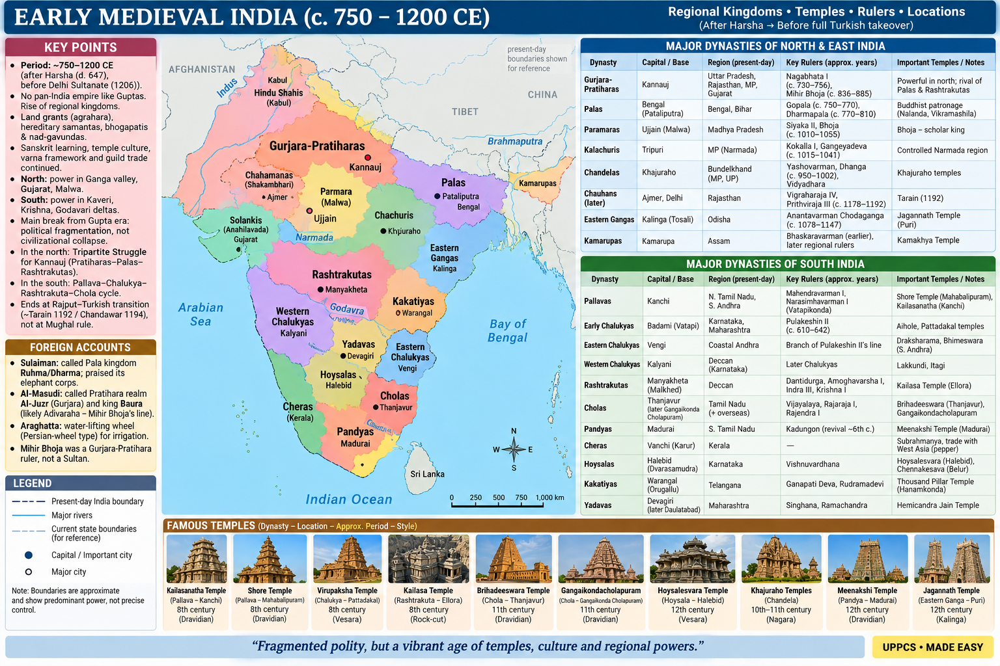

# Topic 1 — Early Medieval India (Regional Kingdoms)
### ★ UPPCS Revision Sheet — Lucent / PW style (one home per fact · no repetition · Practice ≥70)

<strong>Covers syllabus</strong> (click to expand)

Early Medieval India | Major Dynasties of South India | Major Rulers of South India | Pallava Dynasty | Chalukya Dynasty | Western Chalukyas | Rashtrakuta Dynasty | Chola Empire | Chola Administration | Chola Local Self-Government | Chola Naval Power | Gurjara-Pratihara Dynasty | Tripartite Struggle for Kannauj | Pala Dynasty | Sena Dynasty | Paramara Dynasty | Chandela Dynasty | Gahadavala Dynasty | Kalachuri Dynasty | Hoysala Dynasty | Kakatiya Dynasty | Yadava Dynasty | Medieval Names of Cities of Uttar Pradesh

> **Sources baked in:** NCERT *Themes in Indian History Part II*, RS Sharma *Medieval India*, Ghatnachakra South India + Pre-Medieval Period, UPPCS Prelims PYQs 2018–2025
> **Weight:** ★★★ — dynasty↔capital, ruler↔dynasty, temple chronology, Chola A/R, Sena order, UP medieval city names
> **Last verified:** September 2026
> **Current Affairs:** N/A (purely historical; no 12–24 month scheme/appointment surface)

---

## Consolidated — 55 Must-Score Facts

1. Early Medieval India runs roughly **750–1200 CE** after Harsha as an age of regional kingdoms and hereditary **samantas**, not the Delhi Sultanate that begins in **1206**.
2. The **Tripartite Struggle** for **Kannauj** was fought by the **Pala**, **Gurjara-Pratihara**, and **Rashtrakuta** powers — not by the Cholas.
3. In the south, imperial power rotated **Pallava → Chalukya → Rashtrakuta → Chola**.
4. The **Pallava** capital was **Kanchi**; the **Pandya** capital was **Madurai**.
5. Early Chalukyas ruled from **Badami / Vatapi**; **Eastern Chalukyas** from **Vengi** (**Pedavegi** near **Eluru**, West Godavari, Andhra); later Western Chalukyas from **Kalyani** — do not merge the three seats.
6. The **Rashtrakuta** capital was **Manyakheta** (Malkhed) in the Deccan.
7. The imperial **Chola** capital moved from **Thanjavur** to **Gangaikondacholapuram** under Rajendra I.
8. **Hoysala** power centred on **Halebid / Dvarasamudra**; **Kakatiya** on **Warangal**; **Yadava** on **Devagiri** (later Daulatabad).
9. Ruler–dynasty facts: **Mahendravarman** was Pallava; **Kadungon** was Pandya; **Amoghavarsha** was Rashtrakuta; **Rajaraja** was Chola.
10. Temple chronology runs **Shore Temple** (~7th, Pallava Mahabalipuram) → **Brihadishwara** (**1010**, Rajaraja at Thanjavur) → **Gangaikondacholapuram** (~**1025**, Rajendra).
11. Sena succession order is **Hemant → Vijaya → Ballal → Lakshman**.
12. Chola administration ran **Mandalam → Valanadu → Nadu → Village**, and the empire had **four** mandalams at its peak.
13. **Ur** was the ordinary village assembly; **Sabha / Mahasabha** was the Brahmana **agrahara** assembly.
14. The Chola navy struck **Sri Lanka**, the **Maldives**, and **Kadaram (Kedah)**; **Nagapattinam** was a key port; the Bay of Bengal was called a “**Chola Lake**.”
15. In the Kannauj contest, **Dharmapala** backed **Chakrayudha**; **Mihir Bhoja** recovered the city (~**836**); **Indra III** sacked it (**915–918**); **Krishna III** pressed again (**963**).
16. **Gopala** was elected Pala founder; **Dharmapala** founded **Vikramashila**; **Devapala** marked the Pala peak; **Atisha** carried Buddhism toward Tibet.
17. Pratiharas moved from **Bhinmal** to **Kannauj**; **Nagabhatta I** checked the Arabs; **Mihir Bhoja** took the title **Adivaraha**.
18. **Mihir Bhoja** (Pratihara, Adivaraha, Kannauj) is not **Bhoja I** of the **Paramaras** at **Dhara** in Malwa.
19. **Chandelas** held **Khajuraho / Mahoba / Kalinjar** in Bundelkhand; **Paramaras** held **Malwa / Dhara**.
20. **Gahadavalas** ruled **Kannauj and Banaras** in the 11th–12th century after Pratihara decline.
21. **Jay Chandra** of the Gahadavalas was killed at **Chandawar** in **1194**.
22. UP medieval name facts: **Kannauj = Kanyakubja**; **Ayodhya = Saketa**; **Varanasi = Kashi / Avimukta**.
23. **Mahoba** and **Kalinjar** (Banda district) are the Chandela strongholds in Bundelkhand **UP**.
24. **Kalachuris** ruled from **Tripuri** in the Chedi / Dahala belt.
25. **Pulakeshin II** of Badami defeated Harsha and left the **Aihole** prasasti; **Narasimhavarman I** took the title **Vatapikonda**.
26. The poet **Rajasekhara** lived at the courts of Pratihara **Mahendrapala I** and **Mahipala I** (*Karpuramanjari*, *Kavyamimamsa*, and related works).
27. Do not confuse **Kannauj (UP)** — the north sovereignty prize — with **Kanchi (TN)**, the Pallava capital.
28. Sena capital under Lakshman Sen is linked with **Nadia**; Pala seats stayed in the Bengal–Bihar belt with only episodic Kannauj holds.
29. Imperial Chola founder is **Vijayalaya** (~**850**), not Rajaraja or Parantaka. **Parantaka I** took the title **Maduraikonda** after defeating the Madurai king.
30. **Battle of Takkolam (949)** — Rashtrakuta **Krishna III** led a confederacy that killed Chola prince **Rajaditya** (son of Parantaka I) and broke Chola power for a generation.
31. **Rajaraja I** created the standing **naval** arm, smashed the Chera fleet at **Kandalloor**, took **northern** Sri Lanka, and built **Brihadishwara** with its colossal **Nandi**.
32. **Rajendra I** took **whole Sri Lanka** (prisoner **Mahendra V**), defeated Pala **Mahipala**, founded **Gangaikondacholapuram**, built the artificial lake **Chola Gangam**, and made the Bay of Bengal a “**Chola Lake**.”
33. Under **Kulottunga I**, a Chola Buddhist / merchant mission of **72** traders went to **China (1077)**; he accepted Sinhala independence under **Vijayabahu** and married a daughter to prince **Virapperumal**.
34. Chola village boards (**Variyam**): **Thotta** = gardens; **Samvatsara** = annual; **Eri** = tanks; **Pon** = gold / finance. **Uttaramerur** is the Sabha working-system inscription.
35. **Eripatti** = land whose revenue maintains the village tank. **Taniyur** = a very large village administered as a single unit (not a Brahmana gift). **Ghatika** = temple-attached college.
36. Chola **Nataraja** bronzes show the dancing Shiva with **four** hands; **Dakshinamurti** is Shiva as **teacher**, installed facing **south**.
37. Pallava **Simhavishnu** took the title **Avanisimha**; **Narasimhavarman I** is **Mahamalla** / **Vatapikonda** and sent naval help to Ceylon (**642**); **Mahendravarman I** wrote *Mattavilasa Prahasana*.
38. **Pulakeshin I** founded the Badami / Vatapi Chalukya house. **Aihole** prasasti of **Ravikirti** names **Kalidasa** and **Bharavi**. Chalukyas appointed **women** to high office (**Vijaya Bhattarika**).
39. **Kadamba** capital was **Vanavasi**; founder **Mayurasharman**; the state was annexed by **Pulakeshin II**. Chera capital memory is **Vanchi / Karuvur**.
40. **Meenakshi** temple at Madurai is linked in tradition to **Kulasekara Pandya** (later rebuilt under Nayakas). **Motupalli** was the Kakatiya overseas port (Marco Polo).
41. Cholas commonly designated a **Yuvraj** (heir) during the reigning king’s lifetime.
42. Sailendra / Srivijaya expedition under **Rajaraja I** and especially **Rajendra I** answered trade obstruction toward China.
43. **Prithviraj III** (Ajmer Chauhan) won **First Tarain (1191)** and lost **Second Tarain (1192)** to Muhammad Ghori. **Vigraharaja IV** earlier took **Delhi** from the Tomaras.
44. **Anangpal Tomar** founded **Dhillika (Delhi)** in the 8th century as a Pratihara feudatory. **Jejakabhukti** = ancient **Bundelkhand** (from Jeja / Jayashakti, Chandela).
45. Pala facts: **Gopala** (elected; **Odantapuri**); **Dharmapala** (**Vikramashila**, **Somapura / Paharpur**; title **Paramasaugata**); **Devapala** granted five villages for the **Sailendra / Balaputradeva** Nalanda vihara.
46. **Kumaradevi** (queen of Govind Chandra Gahadavala) built the **Dharmachakra Jaina Vihara** at **Sarnath**. **Lakshmidhara** wrote *Krityakalpataru*.
47. **Alha–Udal** of **Mahoba** served Chandela **Parmardi / Paramardi**; struggle with Prithviraj appears in Chand Bardai’s *Prithviraj Raso* and Jagnik’s *Alha-khand* (*Parmal Raso*).
48. Kannauj medieval names include **Kanyakubja**, **Mahodaya**, and **Mahodaya Shri / Nagar Mahoday Shri**. **Koil** = Aligarh; **Mahotsava Nagar** = Mahoba.
49. **Paramara** power centre moved from **Ujjain** to **Dhara**. **Bhoja** wrote *Samarangana Sutradhara* (architecture / devices) and founded **Bhojshala** (Saraswati; Sanskrit school at Dhar, **1035**).
50. **Solanki / Chaulukya** capital was **Anhilwada**; founder line **Mularaja I**. Jain scholar **Hemachandra** advised **Kumarapala** (after fame under Jayasimha Siddharaja).
51. **Lakshmana Sena** started **Lakshmana Samvat**. Early medieval jurists are **Vijnaneshwara** (*Mitakshara*), **Jimutavahana** (*Dayabhaga*), and **Hemadri** — not **Rajasekhara** (poet).
52. **Dantidurga** founded Rashtrakutas and performed **Hiranyagarbha** at Ujjain. **Amoghavarsha I** was born in a military camp on the Narmada during Govinda III’s northern return.
53. **Gangeyadeva** (Kalachuri of Tripuri) took the title **Vikramaditya** and revived **gold** coinage; **Al-Biruni** mentions him and Tripuri.
54. *Hammira Mahakavya* treats Chauhans as **Suryavanshi** / Agnikula. *Hammir Raso* is by **Sharangadeva** (not Abdur Rehman). *Prithviraja Vijaya* is by **Jayanaka**.
55. **Pundravardhana bhukti** was in **north Bengal** (later into north Bihar under Pala–Chandra–Sena). **Araghatta** = Persian-wheel style water device for irrigation.

---

## Confused Pairs

| A | B | Difference | Hindi |
|---|----|------------|-------|
| Early Medieval | Delhi Sultanate | ~750–1200 regional/feudal vs from **1206** Turkish rule | प्रारंभिक मध्यकाल / दिल्ली सल्तनत |
| Tripartite Struggle | South P-C-R-C cycle | Kannauj contest (Pala+Pratihara+Rashtrakuta) vs Tamil–Deccan power rotation | त्रिपक्षीय संघर्ष / दक्षिण चक्र |
| Pallava | Chola | **Kanchi**, pre-9th structural temples vs **Thanjavur** empire from Vijayalaya **850** | पल्लव / चोल |
| Early Chalukya | Western Chalukya | **Badami/Vatapi** (6th–8th) vs **Kalyani** (10th–12th) | प्राचीन चालुक्य / पश्चिमी चालुक्य |
| Ur | Sabha/Mahasabha | General village assembly vs Brahmana **agrahara** assembly | उर / सभा |
| Nadu | Mandalam | Basic unit (village cluster) vs province (empire had **4**) | नाडु / मंडलम |
| Mihir Bhoja | Bhoja I (Paramara) | **Pratihara**, title **Adivaraha**, Kannauj vs **Malwa/Dhara** scholar-king | मिहिर भोज / परमार भोज |
| Gahadavala | Pratihara | 11th–12th Kannauj+Banaras Rajputs vs 8th–10th imperial Kannauj holders | गहड़वाल / गुर्जर-प्रतिहार |
| Chandela | Paramara | Bundelkhand/**Khajuraho**/Mahoba vs Malwa/**Dhara** | चंदेल / परमार |
| Devagiri | Warangal | **Yadava** (later Daulatabad) vs **Kakatiya** (Orugallu) | देवगिरी / वारंगल |
| Kannauj | Kanchi | UP sovereignty prize vs Tamil Pallava capital | कन्नौज / कांची |
| Shore Temple | Brihadishwara | Pallava Mahabalipuram ~7th vs Chola Rajaraja **1010** Tanjore | शोर मंदिर / बृहदीश्वर |
| Adivaraha | Gangaikondachola | Mihir Bhoja (Pratihara) vs Rajendra I (Chola) | आदिवराह / गंगैकोंडचोल |
| Vijayalaya | Rajaraja I | Imperial Chola **founder ~850** vs peak navy / Brihadishwara builder | विजयालय / राजराज |
| Rajaraja I (N. Lanka) | Rajendra I (whole Lanka) | Northern conquest vs full island + Mahendra V prisoner | राजराज / राजेन्द्र |
| Thotta Variyam | Eri Variyam | Gardens / horticulture vs tanks and water | तोट्टा / एरी |
| Eripatti | Taniyur | Tank-maintenance land vs large single-unit village | एरिपट्टी / तनियूर |
| Nataraja | Dakshinamurti | Four-armed dancing Shiva vs teacher form facing south | नटराज / दक्षिणामूर्ति |
| Badami / Vatapi | Vanavasi | Early Chalukya capital vs **Kadamba** capital | वातापी / वनवासी |
| Vengi (Pedavegi) | Rajahmundry | Eastern Chalukya capital **Pedavegi** near **Eluru** vs later seat **Rajamahendravaram** | वेंगी / राजमहेन्द्रवरम |
| Vanchi / Karur | Madurai | Chera capital vs Pandya capital | वंची / मदुरै |
| Tarain | Chandawar | **1192** Prithviraj vs **1194** Jay Chandra | तराइन / चंदावर |
| Mihir Bhoja (Pratihara) | Bhoja (Paramara) | Adivaraha / Kannauj vs Dhara scholar-king / Bhojshala | मिहिर भोज / परमार भोज |
| Jejakabhukti | Kaushambi | Ancient **Bundelkhand** vs doab city | जेजाकभुक्ति / कौशांबी |
| Vikramashila | Odantapuri | **Dharmapala** vs **Gopala** (Bihar seats) | विक्रमशिला / ओदन्तपुरी |
| Prithviraj Raso | Prithviraja Vijaya | Chand Bardai vs **Jayanaka** | पृथ्वीराज रासो / विजय |
| Hammir Raso | Hammira Mahakavya | **Sharangadeva** vs Nayachandra Suri epic | हम्मीर रासो / महाकाव्य |
| Rajasekhara | Hemadri / Vijnaneshwara | Pratihara court poet vs early medieval **jurists** | राजशेखर / हेमाद्रि–विज्ञानेश्वर |
| Anhilwada | Dhara | Solanki capital vs Paramara capital | अणहिलवाड़ / धारा |

---

## Must-score facts — dynasty, capital, temple, UP tags

### Dynasty ↔ capital

| Dynasty | Capital / seat |
|---------|----------------|
| Pallava | **Kanchi** |
| Pandya | **Madurai** |
| Early Chalukya | **Badami / Vatapi** |
| Eastern Chalukya | **Vengi** |
| Western Chalukya | **Kalyani** |
| Rashtrakuta | **Manyakheta (Malkhed)** |
| Imperial Chola | **Thanjavur** → **Gangaikondacholapuram** (Rajendra) |
| Hoysala | **Halebid / Dvarasamudra** |
| Kakatiya | **Warangal** |
| Yadava | **Devagiri** (later Daulatabad) |
| Gurjara-Pratihara | **Bhinmal** → **Kannauj** |
| Pala | Bengal–Bihar belt (episodic Kannauj) |
| Chandela | **Khajuraho / Mahoba / Kalinjar** |
| Paramara | **Malwa / Dhara** |
| Gahadavala | **Kannauj + Banaras** |
| Kalachuri | **Tripuri** |
| Kadamba | **Vanavasi** |
| Solanki / Chaulukya | **Anhilwada** |

### Ruler ↔ dynasty tag

| Ruler | Tag |
|-------|-----|
| Mahendravarman I | Pallava; *Mattavilasa Prahasana* |
| Narasimhavarman I | Pallava; **Vatapikonda / Mahamalla** |
| Pulakeshin II | Badami Chalukya; Harsha defeat; **Aihole** prasasti |
| Dantidurga | Rashtrakuta founder; **Hiranyagarbha** |
| Amoghavarsha I | Rashtrakuta |
| Vijayalaya | Imperial Chola founder (~**850**) |
| Rajaraja I | Chola navy; **Brihadishwara 1010** |
| Rajendra I | **Gangaikondachola**; whole Lanka; Chola Lake |
| Gopala | Pala founder (elected) |
| Dharmapala | **Vikramashila**; Paramasaugata |
| Mihir Bhoja | Pratihara; **Adivaraha** |
| Bhoja (Paramara) | Malwa / Dhara scholar-king |
| Jay Chandra | Gahadavala; killed **Chandawar 1194** |

### Temple / event ↔ year

| Item | Year / lock |
|------|-------------|
| Shore Temple (Mahabalipuram) | ~7th c., Pallava |
| Brihadishwara (Thanjavur) | **1010**, Rajaraja |
| Gangaikondacholapuram temple | ~**1025**, Rajendra |
| Battle of Takkolam | **949** (Krishna III vs Cholas) |
| First Tarain | **1191** (Prithviraj wins) |
| Second Tarain | **1192** (Ghori wins) |
| Chandawar | **1194** (Jay Chandra dies) |

### UP medieval name tags

| Modern | Medieval name |
|--------|---------------|
| Kannauj | **Kanyakubja / Mahodaya** |
| Ayodhya | **Saketa** |
| Varanasi | **Kashi / Avimukta** |
| Mahoba | **Mahotsava Nagar** (Chandela) |
| Aligarh | **Koil** |

---

## 1.1 Early Medieval India

**Period:** ~**750–1200 CE** (after Harsha; before full Turkish takeover of the north).

- After **Harsha (d. 647)**, no pan-India empire matched Gupta extent.
- Politics ran through **regional kingdoms**, land grants, and hereditary **samantas** (feudatories).
- **Bhogapatis** and **nad-gavundas** acted as village-level intermediaries and weakened direct royal control over peasants.
- **Brahmanical agrahara** grants were tax-free villages that spread cultivation but also created a new landlord class.
- Northern power rested on the **Ganga valley**, Gujarat, and Malwa.
- Southern power rested on the **Kaveri**, **Krishna**, and **Godavari** deltas.
- Sanskrit learning, temple culture, the varna framework, and guild trade continued in this age.
- The main break from the Gupta era was political fragmentation, not a civilizational collapse.
- In the north, the central theme was the **Tripartite Struggle for Kannauj**.
- In the south, power rotated through the Pallava, Chalukya, Rashtrakuta, and **Chola** cycle.
- **Sulaiman** called the Pala kingdom **Ruhma/Dharma** and praised its elephant corps.
- **Al-Masudi** called the Pratihara realm **Al-Juzr (Gurjara)** and the king **Baura** (likely a garbled form of **Adivaraha** for Mihir Bhoja’s line).
- **Araghatta** in economic stems means a water-lifting wheel used to irrigate land (Persian-wheel type), not bonded labour or military land grants.
- This topic covers regional kingdoms and is **not** the Delhi Sultanate, which begins in **1206**.
- A common trap is calling Mihir Bhoja a “Sultan”; he was a Gurjara-Pratihara ruler.

> **Logic:** Early Medieval ends at the Rajput–Turkish transition (~**Tarain 1192** / **Chandawar 1194**), not at Mughal rule.

---

## 1.2 Major Dynasties & Rulers of South India

**Master match home** for dynasty ↔ capital ↔ peak ruler (UPPCS bread-and-butter).

| Dynasty | Capital(s) | Region | Key rulers () |
|---------|------------|--------|-------------------|
| **Pallava** | **Kanchi** | N. Tamil Nadu / S. Andhra | Mahendravarman I; Narasimhavarman I (**Vatapikonda**) |
| **Early Chalukya** | **Badami / Vatapi** | Karnataka–Maharashtra | **Pulakeshin II** (defeated Harsha; Aihole) |
| **Eastern Chalukya** | **Vengi** (**Pedavegi** near **Eluru**) | Coastal Andhra (Godavari–Krishna delta) | **Vishnuvardhana** (branch of Pulakeshin II) |
| **Western Chalukya** | **Kalyani** | Deccan | Later Chalukyas; rivalry with Cholas |
| **Rashtrakuta** | **Manyakheta** (Malkhed) | Deccan | Dantidurga; **Amoghavarsha I**; Indra III; Krishna I (Ellora) |
| **Chola** | **Thanjavur**; later **Gangaikondacholapuram** | Tamil country + overseas | Vijayalaya; **Rajaraja I**; **Rajendra I** |
| **Pandya** | **Madurai** | S. Tamil Nadu | **Kadungon** (revival ~6th c.) |
| **Chera** | **Vanchi / Karuvur (Karur)** | Kerala coast | Pressured by Chola navy; pepper trade |
| **Hoysala** | **Halebid / Dvarasamudra** | Karnataka | **Vishnuvardhana**; Hoysalesvara |
| **Kakatiya** | **Warangal** (Orugallu) | Telangana | Ganapati Deva; **Rudramadevi** |
| **Yadava** | **Devagiri** (later Daulatabad) | Maharashtra | Singhana; **Ramachandra** |

### North & East dynasties (same match-drill home)

| Dynasty | Capital / base | Region | Key rulers () |
|---------|----------------|--------|-------------------|
| **Pala** | Bengal–Bihar seats; Kannauj episodic | East | **Gopala** (elected); **Dharmapala**; **Devapala** |
| **Gurjara-Pratihara** | **Bhinmal** → **Kannauj** | Rajasthan–UP–MP | Nagabhatta I; **Mihir Bhoja (Adivaraha)**; Mahendrapala I |
| **Paramara** | **Dhara** (earlier Ujjain) | Malwa | **Bhoja I** (scholar-king) |
| **Chandela** | **Khajuraho / Mahoba / Kalinjar** | Bundelkhand (**Jejakabhukti**) | **Dhanga**; **Vidyadhara** |
| **Gahadavala** | **Kannauj + Banaras** | Eastern UP doab | **Govind Chandra**; **Jay Chandra** |
| **Kalachuri** | **Tripuri** (Jabalpur belt) | Chedi / Dahala | **Gangeyadeva**; **Karna** |
| **Sena** | **Nadia** (Lakshman Sen) | Bengal | Hemant → Vijaya → Ballal → **Lakshman** |
| **Chauhan (Chahamana)** | **Ajmer** (later Delhi) | Rajasthan–Delhi corridor | **Vigraharaja IV**; **Prithviraj III** |
| **Tomar** | **Dhillika (Delhi)** | Delhi–Haryana | **Anangpal** |
| **Solanki / Chaulukya** | **Anhilwada** | Gujarat | **Mularaja I**; Jayasimha Siddharaja; **Kumarapala** |

> **Logic:** Pallava capital is **Kanchi**; Pandya capital is **Madura**; Yadava capital is **Devagiri**; Kakatiya capital is **Warangal**. **Mahendravarman I** was a **Pallava**; **Kadungon** revived the **Pandyas**; **Amoghavarsha I** was a **Rashtrakuta**; **Rajaraja I** was a **Chola**.

### PYQs — South dynasties (match)

**1. (UPPCS Prelims 2019, Q90)** Match List-I (Ruling Dynasties) with List-II (Capitals):

| List-I | List-II |
|--------|---------|
| A. Pallava | 1. Warangal |
| B. Pandya | 2. Kanchi |
| C. Yadava | 3. Madura |
| D. Kakatiya | 4. Devagiri |

*Row order in the table is not the answer code.*

A. 2 1 4 3
B. 2 3 4 1
C. 1 2 3 4
D. 2 4 3 1

Show answer

**Ans: B (2 3 4 1)Facts:** A–2 Pallava–Kanchi | B–3 Pandya–Madura | C–4 Yadava–Devagiri | D–1 Kakatiya–Warangal

**Trap:** Warangal** is **Kakatiya**, not Pallava; **Devagiri** is **Yadava**, not Pandya. Do not confuse **Kanchi** with **Kannauj**.

**2. (UPPCS Prelims 2025, Q121)** Match List-I (Ruler) with List-II (Dynasty):

| List-I | List-II |
|--------|---------|
| A. Mahendravarman I | 1. Rashtrakuta |
| B. Kadungon | 2. Pallava |
| C. Amoghavarsha I | 3. Chola |
| D. Rajaraja I | 4. Pandya |

*Row order in the table is not the answer code.*

A. 4 2 3 1
B. 2 4 1 3
C. 2 4 3 1
D. 4 2 1 3

Show answer

**Ans: B (2 4 1 3)Facts:** A–2 Mahendravarman I–Pallava | B–4 Kadungon–Pandya | C–1 Amoghavarsha I–Rashtrakuta | D–3 Rajaraja I–Chola

**Trap:** Amoghavarsha I** is **Rashtrakuta** (Manyakheta), not Chola; **Kadungon** revived the **Pandyas**, not the Pallavas.

### Pandya & Chera (key facts)

- **Kadungon** revived the **Pandya** line around the **6th century**.
- **Kadungon** is the classic Pandya revival ruler paired with the Pandya dynasty.
- Later Pandyas ruled from **Madurai** and repeatedly clashed with Cholas for Tamil supremacy.
- **Rajaraja I** conquered Madurai.
- **Parantaka I** earlier defeated the Madurai king and took the title **Maduraikonda**.
- Pandya revival came again only after Chola decline.
- Tradition links the original **Meenakshi** shrine at Madurai with **Kulasekara Pandya**; the city is remembered as lotus-shaped around the temple.
- The **Cheras** drew wealth from **Malabar coast** trade in pepper and spices.
- Chera capital memory is **Vanchi / Vanji / Karuvur (Karur)** — not Puducherry.
- **Rajaraja I** destroyed the Chera navy at **Kandalloor / Trivandrum**, ending their maritime challenge.

---

## 1.3 Pallava Dynasty

**Capital:Kanchi (Kanchipuram)** | **Span:** c. **575–897 CE** | **Rival:** Early Chalukyas of Badami

- **Simhavishnu (c. 575–600)** is treated as the dynastic restorer who made Kanchi the Pallava power centre. He took the title **Avanisimha (Avanisingh)** and defeated Chola, Pandya, Sinhala, and Kalabhra rivals.
- **Mahendravarman I (c. 600–630)** pioneered **rock-cut** architecture at Mahabalipuram and is a classic **Pallava** ruler.
- **Mahendravarman I** patronised Shaivism, Vaishnavism, and Jainism and wrote the Sanskrit humorous play ***Mattavilasa Prahasana***.
- **Narasimhavarman I (c. 630–668)** took the title **Mahamalla** (great wrestler). He took **Vatapi in 642** and earned the title **Vatapikonda**. The famous **Pancha Rathas** belong to his Mamalla phase.
- In **642** he sent **two naval expeditions** to Ceylon to help a Sri Lankan prince.
- **Parameshvaravarman I (c. 670–700)** carried titles such as Lokaditya, Ekamalla, Rananjaya, Ugradanda, and related warrior epithets.
- **Narasimhavarman II (Rajasimha)** built the structural **Shore Temple** at **Mahabalipuram**.
- **Nandivarman II (c. 731–795)** belongs to the later Pallava phase before Chola eclipse of Kanchi prestige.
- Pallava chronological spine for arrange stems: **Mahendravarman I → Narasimhavarman I → Parameshvaravarman I → Nandivarman II**.
- Pallava art moved from rock-cut caves (Mahendravarman) to monolith rathas (Mamalla) to structural stone temples (Rajasimha).
- The Pallava–Chalukya rivalry centred on the **Krishna–Tungabhadra doab**.
- Both sides fought for control of **Vatapi** and **Kanchi**.

> **Logic:** Shore Temple = **Pallava**, not Chola. Do not swap **Kanchi** with **Kannauj**. **Mahamalla ≠ Chola**.

### PYQ — Temple chronology (Pallava + Chola)

**1. (UPPCS Prelims 2018, Q15)** Arrange the following temples chronologically:

I. Brihdishwar temple

II. Gangaikonda cholapuram temple

III. Shore temple of Mahabalipuram

IV. Sapt pagoda

A. I, II, IV, III
B. II, I, III, IV
C. III, II, I, IV
D. IV, III, I, II

Show answer

**Ans: D (IV, III, I, II)Order:** IV Sapt Pagoda (Pallava, Mahabalipuram, earliest) → III Shore Temple (Pallava, ~7th c.) → I Brihadishwara (**1010**, Rajaraja I, Chola) → II Gangaikondacholapuram (~**1025**, Rajendra I, Chola)

**Trap:** Never place **Brihadishwara after Gangaikondacholapuram** — Rajaraja (father) built Tanjore before Rajendra's capital-temple complex. **Shore Temple** is **Pallava**, not Chola.

---

## 1.4 Chalukya Dynasty & Western Chalukyas

**Early Chalukyas:Badami / Vatapi** (c. **543–757**) | **Western / Later Chalukyas:Kalyani** (c. **973–1189**)

| Feature | Early (Badami) | Western (Kalyani) |
|---------|----------------|-------------------|
| Capital | **Badami / Vatapi** | **Kalyani** |
| Peak ruler | **Pulakeshin II** | Vikramaditya VI (high-water mark) |
| Main rival | **Pallavas** | **Cholas** (Vengi + Tungabhadra doab) |
| End | Overthrown by **Rashtrakutas** (**757**) | Pressed by Hoysalas, Yadavas, later Sultanate |

- **Pulakeshin I** was the real founder of the **Vatapi / Badami** Chalukya dynasty. **Kirtivarman I** and Mangalesha built the early Badami base before Pulakeshin II’s fame.
- Present **Badami** (Bagalkot district, Karnataka) is ancient **Vatapi**, Chalukya capital in the 6th–7th centuries.
- **Pulakeshin II (610–642)** was the most capable Early Chalukya ruler. He stopped **Harsha** near the **Narmada**.
- The **Aihole inscription** of **Ravikirti** praises Pulakeshin II. At the end of the prasasti, Ravikirti claims fame like **Kalidasa** and **Bharavi** — so **Kalidasa’s name** appears in the Aihole record.
- **Vikramaditya I** recovered Badami after the Pallava sack of Vatapi.
- **Vikramaditya II** captured Kanchi and patronised the **Virupaksha temple at Pattadakal**.
- Eastern Chalukyas of **Vengi** were founded by **Kubja Vishnuvardhana**, a brother / branch line of **Pulakeshin II**, after the Badami conquest of coastal Andhra.
- The capital **Vengi** (also **Vengipura**) is identified with **Pedavegi** (Peddavegi), a village near **Eluru** in **West Godavari** district, Andhra Pradesh — not with Badami, Kalyani, or Amaravati.
- The kingdom’s name stayed **Vengi** even when a later Eastern Chalukya centre rose at **Rajamahendravaram** (modern **Rajahmundry**).
- Later Chola–Western Chalukya rivalry repeatedly turned on **Vengi** and the **Tungabhadra doab**.
- **Pattadakal** (UNESCO) marks the Early Chalukya architectural peak.
- The queen **Lokmahadevi** built the **Virupaksha temple** at Pattadakal.
- Chalukyas frequently appointed **women** to high administrative posts. **Vijaya Bhattarika**, queen of Chandraditya (brother of Vikramaditya I), issued copper plates in her own name and ran administration efficiently; she was also a poetess. A royal sister **Kumkumadevi** could recommend a village grant to a learned Brahmana.
- Chinese writer **Matwalin (Ma-twalin)** gives an account of China–India relations in the Chalukya age.
- Chalukya origin legends claim **Agnikula** descent from **Ayodhya**.
- That Ayodhya link is a UP-linked trap in Rajput-origin questions.

### Kadamba (neighbour fact)

- The **Kadamba** capital was **Vanavasi**.
- The dynasty was founded by **Mayurasharman**.
- **Pulakeshin II** annexed the Kadamba state.
- Kadambas are **not** a Sangam Muvendar house.

> **Logic note:** Badami ≠ Kalyani ≠ Vengi. If the option says “Western Chalukya capital = Vatapi,” it is wrong. **Vanavasi = Kadamba**, not Chalukya. **Eastern Chalukya Vengi = Pedavegi near Eluru** — do not pick Rajahmundry as the original capital identification.

### PYQ — Western Chalukya vs Chola

**1.** Assertion (A): The **Western Chalukyas of Kalyani** repeatedly fought the **Cholas**.

Reason (R): Control of **Vengi** and the **Tungabhadra doab** was strategically valuable to both.

A. Both true, R explains A
B. Both true, R not explanation
C. A true, R false
D. A false, R true

Show answer

**A/R logic:** A is true: Western Chalukyas of Kalyani repeatedly fought the **Cholas**.

**Ans: A (Both true, R explains A).**

**R is true:Vengi** and the **Tungabhadra doab** were strategically valuable to both.

**Why R explains A:** Control of those regions **motivated** the recurring wars.

**Trap:** Badami/Vatapi** = Early Chalukya; **Kalyani** = Western Chalukya — do not swap capitals.

---

## 1.5 Rashtrakuta Dynasty

**Capital:Manyakheta (Malkhed)** | **Founder:Dantidurga** (overthrew Early Chalukyas **757**) | **Span:** c. **753–972**

- **Dantidurga** laid the Rashtrakuta foundation and is remembered for the **Hiranyagarbha** ritual at **Ujjain**.
- **Krishna I** commissioned the monolithic **Kailasa temple at Ellora**.
- **Amoghavarsha I (814–878)** ruled for about **64 years**.
- He was born in a military camp near the **Narmada** while his father **Govinda III** returned from northern campaigns.
- He wrote **Kavirajamarga**, an early Kannada text.
- **Amoghavarsha I** is the classic **Rashtrakuta** ruler paired with Manyakheta.
- **Govinda III** campaigned north against Pratiharas and south against Tamil powers. He defeated Pratihara **Nagabhatta II** (Sanjan / Radhanpur plates).
- **Indra III** sacked **Kannauj (915–918)** in the tripartite contest.
- **Krishna III** defeated Chola **Parantaka I** (**949**) and reached Rameshwaram.
- **Krishna III** erected a **victory pillar at Rameshwaram** after the southern campaign.
- Al-Masudi called the Rashtrakuta emperor **Balhara / Vallabharaja**.
- **Chandrobalabbe**, daughter of Amoghavarsha I, administered the **Raichur doab**.
- Rashtrakuta provinces were called **rashtra**.
- Districts within them were **visaya**, forming a samanta-like feudal layer.
- The Rashtrakutas patronised Shaivism, Vaishnavism, and Jainism and tolerated Muslim traders in their ports.
- The empire ended when Manyakheta fell in **972**.
- Western Chalukyas rose in its place.

> **Logic:** Amoghavarsha I = Rashtrakuta (not Chola/Pallava). **Hiranyagarbha** = Dantidurga. Manyakheta is not a Pratihara capital.

---

## 1.6 Chola Empire

**Founder:Vijayalaya** took **Thanjavur ~850** | **Span:** c. **850–1279** | **Peak:Rajaraja I (985–1014)** and **Rajendra I (1014–1044)**

- After the Sangam Cholas there is a long interregnum until the medieval Cholas rise under **Vijayalaya**.
- **Vijayalaya** began as a Pallava feudatory before capturing Tanjore and founding the imperial Chola line in the **9th century**.
- **Aditya I** defeated the Pallavas and expanded Chola power in the Tamil core.
- **Parantaka I** defeated the Madurai king and assumed the title **Maduraikonda**. He pushed Chola borders northward.
- Chola emperors generally designated a **Yuvraj** (heir) during their own reign.

### Battle of Takkolam (949) — Cause, Course, Result

**Place:** Takkolam | **Chola side:** prince **Rajaditya**, son of **Parantaka I** | **Opponent:** Rashtrakuta **Krishna III** with Western Ganga and related allies

- **Cause:** Chola expansion under Parantaka I collided with Rashtrakuta ambitions in the Tamil–Deccan frontier.
- **Course:** At **Takkolam in 949**, Krishna III’s confederacy fought Rajaditya. The Chola prince was **killed on the battlefield**.
- **Result:** The Cholas were defeated and lost northern holdings for a generation. Krishna III later reached Rameshwaram and raised a victory pillar. Chola recovery waited until after Rashtrakuta collapse (**972**).

- After Rashtrakuta collapse (**972**), Cholas re-emerged as the dominant south Indian power.
- The golden age opens with **Rajaraja I**. He was the first Chola king to organise a standing **naval army**.
- **Rajaraja I** defeated the Chera naval force at **Kandalloor**, conquered **northern Sri Lanka** (Anuradhapura destroyed; the south remained independent for a time), took the **Maldives**, and conquered Madurai.
- **Rajaraja I** and his son **Rajendra I** sent expeditions against the **Sailendra / Srivijaya** world of Southeast Asia when trade toward China was obstructed.
- **Rajaraja I** built **Brihadishwara (Rajarajesvaram) at Tanjore in 1010** — a peak **Dravida** granite temple with two **dvarapalas** and a colossal single-rock **Nandi** among the tallest in India.
- **Rajendra I** completed the conquest of **whole Sri Lanka** and brought Sinhala king **Mahendra V** as a prisoner.
- **Rajendra I** defeated Pala ruler **Mahipala**, took the title **Gangaikondachola**, and founded the new capital **Gangaikondacholapuram**.
- He built the artificial lake **Chola Gangam (Ponneri)** in memory of the Ganga-basin victory that included Bengal and Kalinga kings.
- The Chola navy was the strongest in the region and turned the Bay of Bengal into a “**Chola Lake**.”
- Rajendra’s **1025** naval war hit **Srivijaya** and **Kadaram (Kedah)** after trade obstruction.
- Chola artists excelled in stone and especially **bronze**. The classic **Nataraja** (dancing Shiva) icons have **four hands**. In the right ear he wears a man’s earring and in the left a woman’s — the **Ardhanarishwara** hint.
- The **Dakshinamurti** form of Shiva shows him as **guru / teacher** giving knowledge to devotees. The image is installed facing **south**.
- Chola rulers cut **victory narratives on temple walls** and issued copper plates.
- That is why sources for the Cholas outrun earlier Tamil dynasties.
- **Kulottunga I** consolidated Chola power. In **1077** a Chola mission of **72** merchants / Buddhist traders was sent to **China**.
- When **Vijayabahu** proclaimed an independent Sinhala island in Kulottunga’s time, Kulottunga did not escalate hostility and married his daughter to Sinhala prince **Virapperumal**.
- The empire later cracked under Pandya–Hoysala–Kakatiya pressure. Near **1279** Chola power ended under **Rajendra III**; Malik Kafur’s southern campaigns come later (~**1310**).

> **Logic:** **Rajaraja I** built **Brihadishwara (1010)** before **Rajendra I** built **Gangaikondacholapuram (~1025)**. **Rajaraja I** was a **Chola** ruler. Chola founder = **Vijayalaya**, not Parantaka.

### PYQ — Chola sources

**1. (UPPCS Prelims 2020, Q8)Assertion (A):** We have much more information about Cholas than their predecessors.

**Reason (R):** The Chola rulers adopted the practice of having inscriptions written on the walls of temples giving a historical narrative of their victories.

A. Both true and R explains A
B. Both true, R not explanation
C. A true, R false
D. A false, R true

Show answer

**A/R logic:** A is true: Chola inscriptions, copper plates, temple records, and foreign references outrun Pallava and early Pandya documentation.

**Ans: A (Both true, R explains A).**

**R is true:** Rajaraja I and Rajendra I inscribed **victory narratives on temple walls** (e.g. Brihadishwara, Gangaikondacholapuram).

**Why R explains A:** Temple-wall inscriptions were **deliberate historical record-keeping**, which is why the Chola archive is richer.

**If the stem changed:** If R said “Cholas had no inscriptions,” R would be false → **C**.

---

## 1.7 Chola Administration

**Hierarchy:** King → **Mandalam** (province) → **Kottam / Valanadu** → **Nadu** → **Kurram** / village → **Gram Sabha**.

- At peak the empire is often counted with about **four** great **mandalam** provinces — roughly **Tondaimandalam**, **Cholamandalam**, **Pandimandalam**, and **Gangapadi / Kongumandalam** (some handbooks count up to six provincial divisions).
- A province was divided into **Kottam** or **Valanadu** (commissionerate-like units).
- Each Kottam held several **Nadu** (districts). The assembly of a Nadu was the **Nattar**.
- The village association could be called **Kurram**. The smallest unit was the **Gram Sabha**.
- Land revenue was the fiscal core of Chola finance.
- Village-level surveys and **kudimai / karai** dues funded the state.
- **Brahmadeya** villages were Brahmana settlements.
- **Devadana** villages were temple-endowment lands.
- Officials and **agrahara** holders acted as intermediaries between the king and cultivating peasants.
- The standing army had separate **elephant**, **cavalry**, and **infantry** corps.
- The navy was a distinct strategic arm.
- Temple institutions stored land, cash, and inscription records.
- Administration and religion were tightly linked through these temple networks.

> **Logic:** Nadu is the basic territorial unit below Valanadu; **Mandalam** is the province. Do not reverse them.

---

## 1.8 Chola Local Self-Government

**Special feature of the Chola age:** systematic **autonomy of village administration**.

| Body / board | Who / meaning | Role |
|--------------|---------------|------|
| **Ur** | General village assembly | Ordinary (non-agrahara) villages |
| **Sabha / Mahasabha** | Brahmana assembly in **agrahara** villages | Higher autonomy; committee system |
| **Variyam** | Working committee of the Sabha | Supervised village executive work |
| **Thotta Variyam** | Garden / horticulture board | Gardens and groves |
| **Samvatsara Variyam** | Annual committee | Yearly oversight |
| **Eri Variyam** | Tank committee | Lakes, tanks, water supply |
| **Pon Variyam** | Gold / finance committee | Precious metal and money matters |

- The **Uttaramerur** inscription archives how the executive committee of the Gram Sabha worked. Every such village had its own **Sabha**, largely independent of central command for local affairs.
- Many committee tenures used **lottery / kudavolai** selection instead of open hereditary office.
- Membership tests covered property, age, learning, and character.
- Local bodies collected dues, maintained tanks, and managed temple lands under royal oversight.

**Related land / college terms (high-yield pairs):**

| Term | Meaning |
|------|---------|
| **Eripatti** | Land whose revenue was set apart for maintenance of the **village tank** |
| **Taniyur** | A **very large village** administered as a single unit (not “land gifted to one Brahmana”) |
| **Ghatika** | A college generally attached to a temple |

> **Logic:** Ur ≠ Sabha**. Sabha = Brahmana agrahara assembly with stronger autonomy. **Taniyur ≠ Brahmadeya gift** in the usual wrong-pair stem.

---

## 1.9 Chola Naval Power

**Peak under Rajaraja I and Rajendra I** | **Bay of Bengal nicknamed “Chola Lake”**

| Target | Ruler | Fact |
|--------|-------|------|
| Sri Lanka | Rajaraja I, then Rajendra I | Northern then full-island control; Mahendra V prisoner under Rajendra |
| Maldives | **Rajaraja I** | Western sea lanes |
| Chera fleet | **Rajaraja I** | Defeat at **Kandalloor** |
| Srivijaya / **Kadaram (Kedah)** | **Rajendra I, 1025** | Malay / Sumatra trade choke |
| China embassies / missions | Chola court | **1016, 1033, 1077** (72 traders under **Kulottunga I**, 1077) |

- Merchant guilds such as **Manigramam**, **Nanadesi**, and **Valanjiyar** backed long-distance trade.
- **Nagapattinam** served as a major Chola port with Buddhist monastery links to Southeast Asia.
- Naval power aimed to secure **Indian Ocean trade** in spices, textiles, ivory, and horses.
- Rajendra I attacked **Srivijaya** in **1025** because Chola merchants faced trade obstruction there.
- The Bay of Bengal was nicknamed **“Chola Lake”** during this maritime supremacy.
- Later Arab and Chinese shipping reduced Indian dominance in the Indian Ocean.
- The Chola navy was the first Indian empire to project **sustained naval power beyond the subcontinent**.

> **Logic:**1025 Kadaram / Srivijaya** = **Rajendra I**, not Rajaraja. “Chola Lake” = **Bay of Bengal**. First standing naval army = **Rajaraja I**.

### PYQ — “Chola Lake”

**1.** Assertion (A): The **Bay of Bengal** was called **“Chola Lake”** in the imperial Chola age.

Reason (R): **Rajendra I's** naval campaigns secured dominance over Bay of Bengal trade lanes including **Kadaram**.

A. Both true, R explains A
B. Both true, R not explanation
C. A true, R false
D. A false, R true

Show answer

**A/R logic:** A is true: Imperial Chola naval power led contemporaries to call the **Bay of Bengal** the **“Chola Lake.”R is true:Rajendra I's1025** campaigns hit **Kadaram (Kedah)** and **Srivijaya**, securing trade lanes.

**Ans: A (Both true, R explains A).**

**Why R explains A:** Naval dominance over Bay trade routes **caused** the nickname.

**Trap:** Kadaram 1025** = **Rajendra I**, not Rajaraja I.

---

## 1.10 Gurjara-Pratihara Dynasty

**Early base:Bhinmal / Ujjain** | **Capital under Mihir Bhoja:Kannauj (Mahodaya / Mahodaya Shri)** | **Span:** 8th–10th c.

- **Pratihara** means “doorkeeper” in Rajput **Agnikula** legend.
- The Pratiharas are counted among the four fire-born clans in that tradition.
- **Nagabhatta I (730–756)** is often listed as dynastic founder who resisted **Arab** pressure from Sind (Gwalior inscription tradition).
- **Vatsaraja (c. 775–800)** is the consolidator who made the house a real imperial power in the tripartite age.
- Chronology spine: **Vatsaraja → Nagabhatta II → Mihir Bhoja → Mahendrapala I → Mahipala**.
- **Nagabhatta II** defeated **Dharmapala** near **Mongyr (Munger)** and revived Pratihara power in the doab.
- **Mihir Bhoja (Adivaraha / Prabhasa, ~836–885)** recovered **Kannauj around 836** and made it capital.
- Arab traveller **Sulaiman** visited in the reign of **Bhoja I (Mihir Bhoja)**.
- **Al-Masudi** praised Pratihara cavalry and called the king **Baura** (linked to the **Adivaraha** title).
- **Mahendrapala I (885–910)** extended the empire into Magadha, north Bengal, and Awadh.
- **Mahipala (912–944)** lost Kannauj to **Indra III**.
- Sanskrit poet **Rajasekhara** adorned the courts of **Mahendrapala I** and his son **Mahipala I**.
- His works include *Karpuramanjari*, *Kavyamimamsa*, *Viddhashalabhanjika*, *Balaramayana*, and related texts. He is a **poet**, not a jurist.
- Early medieval jurists are **Vijnaneshwara** (*Mitakshara*), **Jimutavahana** (*Dayabhaga*), and **Hemadri**.
- Pratihara courts sent mathematical and medical texts to **Baghdad**, showing wide cultural contact.
- **Kanauj school** of temple architecture flourished under Pratihara patronage.
- **Krishna III (Rashtrakuta)** invaded again in **963**, hastening Pratihara collapse.
- Feudatories later became **Paramaras**, **Chandelas**, and **Chauhans** as the empire cracked.

> **Logic:** Mihir Bhoja = Pratihara (title **Adivaraha**). Not the same person as **Paramara Bhoja** of Dhara. Kannauj = **Mahodaya / Mahodaya Shri**.

---

## 1.11 Tripartite Struggle for Kannauj
### Tripartite Struggle — Cause, Course, Result (overview)

**Actors:Palas** (east), **Gurjara-Pratiharas** (west), **Rashtrakutas** (south) | **Prize:Kannauj** symbolic capital

**Cause:** After Harsha's empire, **Kannauj** became the prestige seat of north Indian kingship. Three regional powers fought to control it and the **doab** trade routes.
**Course:** Dharmapala** installed a Pala nominee at Kannauj. **Mihir Bhoja** (Pratihara) recovered the city. **Dhruva** and **Govinda III** (Rashtrakutas) raided north and temporarily held Kannauj; **Indra III** famously sacked it.
**Result:** No single power permanently united India. The struggle weakened all three and left the **Gangetic plain** open to later **Turkish** breakthroughs after **Pratihara** decline.

**Three powers:Pala** (Bengal–Bihar) + **Gurjara-Pratihara** (Rajasthan–UP) + **Rashtrakuta** (Deccan) | **Prize:Kannauj** (post-Harsha sovereignty symbol)

| Actor | Move |
|-------|------|
| **Dharmapala** (Pala) | Occupied Kannauj and installed **Chakrayudha** as nominee |
| **Mihir Bhoja** (Pratihara) | Recovered Kannauj; held it as capital |
| **Indra III** (Rashtrakuta) | **Sacked Kannauj 915–918** and defeated **Mahipala** |
| **Krishna III** (Rashtrakuta) | Later northern raid **963** that further weakened Pratiharas |

- The struggle ran roughly from the **8th to 10th centuries**.
- No lasting pan-India winner emerged from it.
- **Cholas were not** a fourth Kannauj contestant.
- Kannauj mattered because it was Harsha’s old capital and a symbol of **Ganga-doab sovereignty**.
- After Pratihara decline, **Gahadavalas** later held Kannauj + Banaras in the UP doab.

> **Logic:** Tripartite = **exactly three**. Swap-trap: adding Chola or Chauhan as a main Kannauj player.

---

## 1.12 Pala Dynasty

**Region:Bengal + Bihar** | **Founder:Gopala (~750)**, elected by chiefs after anarchy | **Span:** mid-8th to mid-12th c.

- **Gopala (~750–770)** was chosen by local chiefs to end **matsyanyaya** (law of the jungle), recorded in the Khalimpur tradition of Dharmapala.
- Tibetan memory (Taranatha) links his birth near **Pundravardhana**.
- He is the major **elected medieval founder** fact, often paired with Pallava **Nandivarman Pallavamalla** as another publicly chosen king.
- **Gopala** founded / developed the **Odantapuri (Odantapura)** educational centre in **Bihar**.
- **Dharmapala (770–810)** entered the tripartite war for Kannauj and occupied the city.
- Inscriptions call him **Paramasaugata** (devoted Buddhist).
- He revived **Nalanda** and founded **Vikramashila** (Bhagalpur, Bihar — not Banka).
- He also built the great monastery at **Somapura / Somapuri (Paharpur)**.
- Haribhadra and other Buddhist scholars are linked with his court; tradition credits many religious schools without religious persecution of others.
- **Devapala (810–850)** marked the territorial peak with Assam, Odisha, and Nepal contacts. He too is remembered as **Paramasaugata**.
- At the request of **Sailendra** king **Balaputradeva** of Suvarnadvipa / Java, Devapala granted **five villages** to maintain a Buddhist vihara at **Nalanda**.
- **Pundravardhana bhukti** lay in **north Bengal** and later stretched into northern Bihar under Pala–Chandra–Sena rule.
- Sulaiman called the Pala realm **Ruhma/Dharma** and praised its elephant corps.
- The Palas were great **Buddhist patrons** who also granted Brahmana villages and supported Shaivism/Vaishnavism.
- **Santarakshita** and **Atisha (Dipankara)** linked Pala Buddhism to **Tibet**. Vajrayana flourished at Vikramashila alongside grammar, logic, law, astronomy, and philosophy.
- **Mahipala (~988–1038)** briefly revived Pala power before Sena takeover in Bengal.
- Early medieval learning centres of this belt are **Nalanda**, **Vikramashila**, and **Odantapuri**. **Taxila** belongs to an earlier age and is **not** an early-medieval Pala centre.
- **Bakhtiyar Khalji** destroyed **Nalanda** and **Vikramashila** in the early **13th century** after Pala–Sena rule ended.

### Mithila neighbour (Karnata line)

- In the Mithila / north Bihar belt, the **Karnata** dynasty was founded by **Nanyadeva (c. 1097–1147)** with capital at **Simraungadh**.
- The last major Karnata king was **Harisimha (c. 1295–1324)**, remembered for protecting arts and starting the **Panji** system.

> **Logic:** Gopala = elected founder + Odantapuri**. **Vikramashila / Somapura = Dharmapala**. Balaputradeva = Sailendra request under **Devapala**.

---

## 1.13 Sena Dynasty

**Region:Bengal** (11th–13th c.) | **Founder line:Samanta Sena** | **Capital under Lakshman:Nadia (Navadwip)**

| Order (ascending) | Ruler | Fact |
|-------------------|-------|------|
| 1 | **Hemant Sen** | Starts the 2024 chain |
| 2 | **Vijaya Sen** | Defeated late Palas and consolidated Bengal |
| 3 | **Ballal Sen** | Compiled **Danasagara** on gifts; pushed Brahmanical orthodoxy |
| 4 | **Lakshman Sen** | Patronised **Jayadeva**; started **Lakshmana Samvat**; fled **Bakhtiyar Khalji (1204)** |

- The Senas claimed a Karnataka / Kshatriya origin before entering Bengal as Palas weakened.
- Full inscriptional line often runs Samanta → Hemanta → Vijaya → Ballala → Lakshmana → Visvarupa.
- **Vijaya Sen** expanded Sena power into **Bengal and part of Bihar**.
- **Ballal Sen** strengthened caste orthodoxy and Sanskrit learning at the cost of Pala-style Buddhism. He compiled **Danasagara**.
- **Lakshmana Sena (c. 1178–1206)** reigned about **28 years** and initiated **Lakshmana Samvat**.
- **Jayadeva**, author of **Gita Govinda**, belonged to **Lakshman Sen’s** court at Nadia.
- **Muhammad Bakhtiyar Khalji** captured **Nadia in 1204** after entering disguised as a horse merchant.
- Lakshman Sen fled, marking the start of Turkish rule in Bengal.
- Sena administration followed earlier Pala models of land grants to Brahmins.

> **Logic:** Sena ruler order is **Hemant → Vijaya → Ballal → Lakshman**. **Lakshmana Samvat** belongs to the **Sena** dynasty, not Pala or Pratihara.

### PYQ — Sena chronology

**1. (UPPCS Prelims 2024, Q3)** Arrange the Sen rulers of Bengal in ascending order:

1. Ballal Sen

2. Lakshman Sen

3. Hemant Sen

4. Vijaya Sen

A. 4, 3, 2, 1
B. 2, 1, 4, 3
C. 1, 2, 3, 4
D. 3, 4, 1, 2

Show answer

**Ans: D (3 4 1 2)Order:** 3 Hemant Sen (founder) → 4 Vijaya Sen → 1 Ballal Sen → 2 Lakshman Sen (last; fled Bakhtiyar **1204**)

**Trap:** Alphabetical order (**Ballal before Hemant**) or reversing **Ballal–Lakshman** — mnemonic **H-V-B-L**.

---

## 1.14 Paramara Dynasty

**Region:Malwa** | **Capital:Dhara** (earlier **Ujjain**) | **Peak:Bhoja I (c. 1010–1055)**, scholar-king

- Paramaras rose as **Pratihara feudatories** and fought **Kalachuris** for control of Malwa.
- Dynastic start is linked with **Upendra / Krishnaraja** in the 9th century; **Siyaka II** is often called the real founder of Paramara power. Capital settled at **Dhara**.
- **Bhoja I** patronised Sanskrit learning and is the archetype scholar-king of **Dhara**.
- His works include *Samarangana Sutradhara* (architecture and mechanical / scientific devices), *Sarasvatikanthabharana*, *Siddhanta Sangraha*, *Rajamartanda*, *Yukti-kalpataru*, *Charucharya*, and related texts.
- He established **Bhojshala** at **Dhar (1035)** as a Sanskrit school whose presiding deity is **Saraswati** (later associated with the Kamal Maula mosque premises).
- The **Samidheshwar / Tribhuvan Narayan** temple at Chittor is linked with Paramara **Bhoja**.
- After Bhoja’s death, scholars remembered Dhara as “waterless” and Saraswati as unsupported — a famous mourning verse on learning’s collapse.
- **Munja** and **Udayaditya** are other Paramara names; **Gangeyadeva** is **Kalachuri**, not Paramara.
- **Rajasekhara**, author of **Kavyamimamsa**, served the **Pratihara** court, not Bhoja’s Paramara court.
- Paramara architecture and learning mark **Malwa**.
- They must not be confused with Bundelkhand temples of the Chandelas.

> **Logic:** Dhara / Malwa = Paramara**. **Khajuraho = Chandela**. **Mihir Bhoja ≠ Paramara Bhoja**. Bhojshala deity = **Saraswati**.

---

## 1.15 Chandela Dynasty

**Region:Bundelkhand (Jejakabhukti)** | **Span:** c. **9th–13th c.** | **UP facts:Mahoba**, **Kalinjar (Banda)**

- **Nannuka (~831)** is the founder of the Chandela line in Bundelkhand.
- The region’s ancient name **Jejakabhukti** comes from **Jeja / Jayashakti**, grandson of Nannuka. Do **not** match Jejakabhukti with **Kaushambi**.
- Chandela chronology spine: **Yasovarman (925–950) → Dhanga (950–1002) → Vidyadhara (c. 1017–1029) → Kirtivarman (c. 1060–1100)**.
- **Dhanga** is the classic **Khajuraho** temple patron. Tradition says he abandoned his body at the **Ganga–Yamuna sangam** at Prayagraj.
- **Kandariya Mahadeva** at Khajuraho is the Nagara-style showpiece; it is usually dated to **Vidyadhara’s** reign (many MCQs still park it under Dhanga’s Khajuraho age).
- **Vidyadhara** resisted Ghaznavid pressure and is the Kalinjar-age Chandela peak.
- **Parmardi / Paramardi (c. 1165–1203)** fought **Prithviraj Chauhan**.
- His Mahoba commanders **Alha** and **Udal** are remembered in folk epic. The Chauhan–Chandela struggle appears in Chand Bardai’s *Prithviraj Raso* and in Jagnik’s *Alha-khand* (*Parmal Raso*).
- Khajuraho (UNESCO WHS) belongs to the **Chandelas**, not Paramaras or Pratiharas.
- **Mahoba** and **Kalinjar** place the dynasty on the **UP–MP Bundelkhand** frontier tested by UPPCS.

> **Logic:** Assign **Khajuraho → Chandela**. **Jejakabhukti = Bundelkhand**. **Alha–Udal = Mahoba**, not Chanderi/Panna.

---

## 1.15a Chauhan, Tomar & Solanki (Pre-Medieval north–west)

### Chauhans (Chahamanas) of Ajmer–Delhi

- **Prithviraj III** is the famous **Prithviraj Chauhan** of Ajmer.
- **First Tarain (1191):** he defeated **Muhammad Ghori**.
- **Second Tarain (1192):** Ghori defeated and captured him — full Cause→Course→Result cards sit in Turkish Invasions Topic 2.
- **Vigraharaja IV** was the earlier Chauhan peak who conquered the Tomaras and annexed **Delhi** / eastern Punjab.
- *Hammira Mahakavya* presents Chauhans as **Suryavanshi** scions of Chahamana and as one of the four **Agnikula** clans. Early names include Vasudeva and Guvaka.
- *Hammir Raso* is by **Sharangadeva** (not Abdur Rehman).
- *Prithviraj Raso* is by **Chand Bardai**. *Prithviraja Vijaya* is by **Jayanaka**. *Visaldev Raso* is linked with **Narpati Nalha**.

### Tomaras of Delhi

- **Anangpal Tomar**, originally a Pratihara feudatory, founded **Dhillika (Delhi)** in the **8th century**.
- Later Chauhan power absorbed Delhi before the Ghurid breakthrough.

### Solankis / Chaulukyas of Gujarat

- Agnikula Chaulukyas / Solankis were founded in power by **Mularaja I**.
- Capital was **Anhilwada (Anhilwara / Patan)**.
- Jain scholar **Hemachandra** rose under **Jayasimha Siddharaja (1093–1143)** and later advised **Kumarapala (1143–1172)**.
- **Jayasimha Siddharaja** is remembered for restoring a demolished mosque at **Khambhat** with a large grant (Aufi’s account).

> **Logic:** Delhi founder = **Tomar Anangpal**, not Chauhan. Solanki capital = **Anhilwada**, not Dhara.

---

## 1.16 Gahadavala Dynasty

**Capitals:Kannauj** (political) + **Banaras / Varanasi** (religious-economic) | **Span:** 11th–12th c. UP–Bihar doab

- **Chandradeva (~1090)** founded independent Gahadavala power at Kannauj after Pratihara collapse.
- **Madanapala (~1100–1114)** consolidated the early Gahadavala base in the doab.
- **Govind Chandra (~1114–1154)** was the greatest Gahadavala ruler.
- Persian praise placed his territory from **Mongyr to Delhi**.
- His queen **Kumaradevi** was Buddhist and built the **Dharmachakra Jaina Vihara** at **Sarnath**.
- His minister **Lakshmidhara** wrote *Krityakalpataru*.
- **Vijay Chandra (~1154–1170)** ruled during the intermediate phase before Jay Chandra.
- **Jay Chandra (~1170–1194)** was the last major Gahadavala ruler and rivalled **Prithviraj Chauhan** over status and territory in the doab.
- **Muhammad Ghori** killed **Jay Chandra** at **Chandawar (1194)** and took Kannauj.
- The Gahadavalas patronised **Sanskrit learning** at Banaras.
- They held **Kannauj** as their political capital alongside Banaras.
- Kannauj never regained imperial stature after Turkish conquest of the Ganga valley.

> **Logic:** Jay Chandra dies at **Chandawar 1194**, not Tarain (**1192**, Prithviraj). **Kumaradevi’s vihara = Sarnath**, not Bodh Gaya.

### PYQ — Gahadavala dual capitals

**1.** Assertion (A): The **Gahadavalas** held **Kannauj** and **Kashi** as dual centres of power.

Reason (R): **Kannauj** was the political sovereignty seat while **Kashi/Banaras** was the major religious-cultural centre.

A. Both true, R explains A
B. Both true, R not explanation
C. A true, R false
D. A false, R true

Show answer

**A/R logic:** A is true: Kannauj and **Kashi** held **different symbolic roles** for Gahadavalas.

**Ans: A (Both true, R explains A).**

**R is true:** Kannauj was the **political seat**; Kashi was the **religious-cultural centre**.

**Why R explains A:** R states **how** the two cities differed in function.

**Trap:** Jay Chandra** died at **Chandawar (1194)**, not Tarain (1192).

---

## 1.17 Kalachuri Dynasty

**Region:Tripuri** near **Jabalpur** (Dahala / **Chedi** belt) | **Peak rulers:Gangeyadeva**, **Karna**

- Kalachuris of Tripuri are often called **Chedi** or **Dahala** Kalachuris in textbooks.
- **Gangeyadeva** expanded Kalachuri power and clashed with the **Paramaras of Malwa**.
- He adopted the title **Vikramaditya** and revived **gold** coin issues after a long gap in the pre-medieval north.
- **Al-Biruni** describes Gangeyadeva and his capital **Tripuri**.
- **Karna** continued the conflict with Paramaras and left strong coin and temple records.
- The Kalachuri capital was **Tripuri** near Jabalpur. Do not match it with Paramara **Dhara**, Chandela **Khajuraho**, or **Kannauj**.
- Their rise forms part of the wider **Rajput regional state** map after Pratihara decline.

> **Logic:** Tripuri / Jabalpur belt = Kalachuri**. **Gangeyadeva ≠ Paramara**. Do not park them at Dhara or Mahoba.

---

## 1.18 Hoysala Dynasty

**Capital:Dvarasamudra / Halebid** | **Span:** c. **1026–1343** | **Style:Vesara** (Dravida + Nagara blend)

- **Vishnuvardhana** was the dynasty’s great builder and turned strongly to **Vaishnavism** under **Ramanuja’s** influence.
- **Hoysalesvara** at Halebid and **Chennakesava** at **Belur** are the signature Hoysala monuments.
- Hoysala temples used **soapstone** and are famous for dense exterior sculpture.
- Hoysalas rose under Western Chalukya shadow, then fought Cholas and later Deccan rivals.
- **Veer Ballal** was a **Hoysala** ruler of Dvarasamudra/Halebid.

> **Logic:** Halebid/Dvarasamudra = Hoysala. Not Warangal, not Devagiri.

---

## 1.19 Kakatiya Dynasty

**Capital:Warangal (Orugallu)** | **Span:** c. **1083–1323** | **Peak:Ganapati Deva** | **Rudramadevi**

- **Ganapati Deva** expanded Kakatiya power into coastal Andhra and built the core Warangal fortifications.
- **Rudramadevi** ruled as **Rudradeva** in inscriptions.
- She was a woman ruler recorded under a male royal name.
- The dynasty is famous for **fort walls**, gateways, and **tank irrigation** networks in Telangana.
- The Kakatiya capital was **Warangal (Orugallu)**. Do not match it with Yadava **Devagiri**.
- **Motupalli** (present **Prakasam** district, Andhra Pradesh) was a famous Kakatiya seaport. Marco Polo visited through this port and wrote of Andhra prosperity.
- The Motupalli epigraph lists assessed rates on sandal, camphor, rose-water, ivory, pearls, coral, copper, zinc, lead, silk, pepper, and areca — a window on exports and imports.
- Ganapati Deva’s Motupalli charter protected sea merchants.
- Kakatiya power fell to Delhi Sultanate pressure in the early **14th century**.

> **Logic:** The Kakatiya capital was **Warangal**. **Motupalli** was their famous seaport, not Masulipatnam or Kakinada.

### PYQ — Rudramadevi

**1.** Assertion (A): **Rudramadevi** ruled the **Kakatiya** kingdom.

Reason (R): Inscriptions record her under the royal name **Rudradeva**.

A. Both true, R explains A
B. Both true, R not explanation
C. A true, R false
D. A false, R true

Show answer

**A/R logic:** A is true: Rudramadevi ruled the **Kakatiyas**.

**Ans: A (Both true, R explains A).**

**R is true:** Inscriptions record her under the royal name **Rudradeva**.

**Why R explains A:** The inscriptional name **proves** her reign as Kakatiya ruler.

**Trap:** Do not match **Warangal** with Yadava **Devagiri** — Kakatiya capital = **Warangal**.

---

## 1.20 Yadava Dynasty

**Capital:Devagiri** (later **Daulatabad**) | **Span:** c. **1187–1317** | **Peak:Singhana** | late ruler **Ramachandra**

- The Yadavas promoted **Marathi** as a court language alongside Sanskrit.
- **Singhana** is remembered as the dynasty’s strong early ruler of the Devagiri line.
- **Ramachandra** submitted to **Alauddin Khalji in 1296** after Khalji’s Deccan campaigns.
- The dynasty finally ended in **1317** under Delhi Sultanate pressure.
- **Devagiri** later became **Daulatabad**.
- That link appears in Sultanate capital-shift questions.
- **Devagiri** is the **Yadava** capital.
- It must not be matched with Kakatiya **Warangal**.

> **Logic:** **Devagiri** was the **Yadava** capital. **Warangal** was the **Kakatiya** capital. **Ramachandra** was a Yadava ruler of Devagiri, not a Kakatiya ruler of Warangal.

### PYQ — NOT correctly matched

**1. (UPPCS Prelims 2018, Q96)** Which of the following pairs is **NOT** correctly matched (State–Ruler)?

A. Devgiri–Shankar Dev
B. Warangal–Ramchandra Dev
C. Hoysal–Veer Ballal
D. Madura–Veer Pandya

Show answer

**Logic:** Ramachandra Dev was a **Yadava** ruler of **Devagiri** (later Daulatabad), not a **Kakatiya** ruler of **Warangal (Orugallu)**.

**Ans: B.**

**Trap:** **Devagiri = Yadava** and **Warangal = Kakatiya** — do not swap this Deccan capital pair.

---

## 1.21 Medieval Names of Cities of Uttar Pradesh

| Modern / common | Medieval / classical name | Key fact |
|-----------------|---------------------------|-----------|
| **Kannauj** | **Kanyakubja**; **Mahodaya / Mahodaya Shri / Nagar Mahoday Shri** | Harsha capital; tripartite prize; Mihir Bhoja / later Gahadavala |
| **Ayodhya** | **Saketa** | Ancient–medieval continuity in Awadh |
| **Varanasi** | **Kashi / Banaras / Avimukta** | Gahadavala secondary capital; sacred centre |
| **Mahoba** | **Mahotsava Nagar** (also Mahoba) | Chandela capital in Bundelkhand **UP** |
| **Kalinjar** | Kalanjar fort | Chandela stronghold, **Banda** district |
| **Aligarh** | **Koil** | Early medieval name for the Aligarh belt |
| **Bundelkhand** | **Jejakabhukti** | Chandela country — **not** Kaushambi |

- **Kannauj** was Harsha’s old capital and the tripartite sovereignty prize.
- **Kashi / Banaras / Avimukta** was the Gahadavala religious-cultural centre, not the same role as Kannauj.
- The standard ancient–medieval name pair for Awadh is **Ayodhya** and **Saketa**.
- **Mahoba** and **Kalinjar** tie Chandela power to **Bundelkhand, UP**.
- Do not confuse **Kannauj (UP)** with **Kanchi (TN)**.
- Do not match **Jejakabhukti** with **Kaushambi**.

> **Logic:** Medieval UP place names to memorise: **Kannauj**, **Kashi**, **Ayodhya**, **Mahoba**, **Kalinjar**, **Koil**, and **Jejakabhukti** (Bundelkhand).

---

## Complete PYQ Bank (Topic 1)

**Q1. UPPCS Prelims 2025, Q121**

Match List-I (Ruler) with List-II (Dynasty):

| List-I | List-II |
|--------|---------|
| A. Mahendravarman I | 1. Rashtrakuta |
| B. Kadungon | 2. Pallava |
| C. Amoghavarsha I | 3. Chola |
| D. Rajaraja I | 4. Pandya |

*Row order in the table is not the answer code.*

A. 4 2 3 1
B. 2 4 1 3
C. 2 4 3 1
D. 4 2 1 3

Show answer

**Ans: B (2 4 1 3)Facts:** A–2 Mahendravarman I–Pallava | B–4 Kadungon–Pandya | C–1 Amoghavarsha I–Rashtrakuta | D–3 Rajaraja I–Chola

**Trap:** Amoghavarsha I** = **Rashtrakuta** (Manyakheta); **Kadungon** = Pandya revival, not Pallava.

**Q2. UPPCS Prelims 2024, Q3**

Arrange the following Sen rulers of Bengal in ascending chronological order:

1. Ballal Sen
2. Lakshman Sen
3. Hemant Sen
4. Vijaya Sen

Select the correct answer from the codes given below:
A. 4, 3, 2, 1
B. 2, 1, 4, 3
C. 1, 2, 3, 4
D. 3, 4, 1, 2

Show answer

**Ans: D (3 4 1 2)Order:** 3 Hemant Sen → 4 Vijaya Sen → 1 Ballal Sen → 2 Lakshman Sen

**Trap:** Alphabetical or reversed **Ballal–Lakshman** order — fact **H-V-B-L**.

**Q3. UPPCS Prelims 2020, Q8**

Given below are two statements, one is labelled as Assertion (A) and the other as Reason (R):

**Assertion (A):** We have much more information about Cholas than their predecessors.

**Reason (R):** The Chola rulers adopted the practice of having inscriptions written on the walls of temples giving a historical narrative of their victories.

Select the correct answer from the codes given below.
A. Both (A) and (R) are true and (R) is the correct explanation of (A)
B. Both (A) and (R) are true but (R) is not the correct explanation of (A)
C. (A) is true but (R) is false
D. (A) is false but (R) is true

Show answer

**A/R logic:** A is true: Chola inscriptions, copper plates, and temple records outrun earlier Tamil dynasties.

**Ans: A (Both true, R explains A).**

**R is true:** Chola rulers inscribed **victory narratives on temple walls**.

**Why R explains A:** Temple-wall inscriptions were **deliberate historical record-keeping**, which is why the Chola archive is richer than Pallava/early Pandya sources.

**If the stem changed:** If R said “Cholas had no inscriptions,” R would be false → **C**.

**Q4. UPPCS Prelims 2019, Q90**

Match List-I (Ruling Dynasties) with List-II (Capitals):

| List-I | List-II |
|--------|---------|
| A. Pallava | 1. Warangal |
| B. Pandya | 2. Kanchi |
| C. Yadava | 3. Madura |
| D. Kakatiya | 4. Devagiri |

*Row order in the table is not the answer code.*

A. 2 1 4 3
B. 2 3 4 1
C. 1 2 3 4
D. 2 4 3 1

Show answer

**Ans: B (2 3 4 1)Facts:** A–2 Pallava–Kanchi | B–3 Pandya–Madura | C–4 Yadava–Devagiri | D–1 Kakatiya–Warangal

**Trap:** Devagiri** = Yadava; **Warangal** = Kakatiya — never swap this pair.

**Q5. UPPCS Prelims 2018, Q15**

Arrange the following temples in a chronological order and select the correct answer from the codes given below:

I. Brihdishwar temple
II. Gangaikonda cholapuram temple
III. Shore temple of Mahabalipuram
IV. Sapt pagoda

Options:
A. I, II, IV, III
B. II, I, III, IV
C. III, II, I, IV
D. IV, III, I, II

Show answer

**Ans: D (IV, III, I, II)Order:** IV Sapt Pagoda → III Shore Temple (Pallava, Mahabalipuram) → I Brihadishwara (**1010**, Rajaraja I) → II Gangaikondacholapuram (~**1025**, Rajendra I)

**Trap:** Brihadishwara **before** Gangaikondacholapuram; Shore Temple is **Pallava**, not Chola.

**Q6. UPPCS Prelims 2018, Q96**

Which of the following pairs is NOT correctly matched?

State — Ruler

A. Devgiri — Shankar Dev
B. Warangal — Ramchandra Dev
C. Hoysal — Veer Ballal
D. Madura — Veer Pandya

Show answer

**Logic:** Ramachandra Dev was a **Yadava** ruler of **Devagiri**, not a **Kakatiya** ruler of **Warangal**.

**Ans: B.**

**Trap:** **Devagiri = Yadava** | **Warangal = Kakatiya** — do not swap this Deccan capital pair.

### UKPCS Prelims 2025

**Q. UKPCS Prelims 2025, Q55**

Match List-I with List-II and select the correct answer using the code given below:

| List-I (Text) | List-II (Author) |
| --- | --- |
| A. Ramcharita | 1. Padmagupta |
| B. Navsahasankcharit | 2. Hemchandra |
| C. Kumarpalacharit | 3. Sandhyakarnandi |
| D. Vikramankdevacharit | 4. Bilhana |

*Row order is not the answer code.*

A. A-3, B-1, C-4, D-2
B. A-2, B-1, C-4, D-3
C. A-3, B-1, C-2, D-4
D. A-2, B-3, C-4, D-1

Show answer

**Ans: C (Series B provisional key).** Ramcharita → Sandhyakarnandi (Pala Ramapala); Navsahasankcharita → Padmagupta (Paramara Sindhuraja); Kumarpalacharita → Hemchandra; Vikramankadevacharita → Bilhana (Chalukya Vikramaditya VI). Reversing Hemchandra and Bilhana is the standard trap.

---

## Practice Zone — UPPCS Format Drill

> **30 questions** | Original drill | ≥60% multi-statement/application | A/R · Match · chronology · NOT-matched | Keys balanced | **Ans first, then Logic**

**Q1.** With reference to Early Medieval India, which of the following statements is/are correct?

1. The period is roughly dated about 750–1200 CE after Harsha.
2. The Delhi Sultanate begins in 1206 CE.
3. Early Medieval India is identical with the Delhi Sultanate phase.

A. 2 and 3 only
B. 1 and 2 only
C. 1 and 3 only
D. 1, 2 and 3

Show answer

**Ans: B.** Only 1 and 2 are correct.

**Logic:** Statement 3 confuses the regional/samanta age with Turkish rule from 1206.

**Q2.** Match List-I with List-II and select the correct answer from the code given below:

| List-I (Dynasty) | List-II (Capital / seat) |
|------------------|--------------------------|
| A. Pallava | 1. Madurai |
| B. Pandya | 2. Kanchi |
| C. Rashtrakuta | 3. Manyakheta |
| D. Early Chalukya | 4. Badami / Vatapi |

*Row order is not the answer code.*

Code:

A. A-1, B-2, C-4, D-3
B. A-2, B-1, C-3, D-4
C. A-2, B-3, C-1, D-4
D. A-4, B-1, C-2, D-3

Show answer

**Ans: B.** A-2, B-1, C-3, D-4.

**Logic:** Pallava–Kanchi; Pandya–Madurai; Rashtrakuta–Manyakheta; Early Chalukya–Badami.

**Q3.** Given below are two statements, one labelled as Assertion (A) and the other as Reason (R).

Assertion (A): The Tripartite Struggle was fought for control of Kannauj.

Reason (R): Pala, Gurjara-Pratihara, and Rashtrakuta powers contested the city.

A. Both (A) and (R) are true, but (R) is not the correct explanation of (A)
B. (A) is false, but (R) is true
C. (A) is true, but (R) is false
D. Both (A) and (R) are true and (R) is the correct explanation of (A)

Show answer

**Ans: D.** Both (A) and (R) are true and (R) correctly explains (A).

**A/R logic:** A names the Kannauj prize; R names the three contenders — not the Cholas.

**Q4.** Arrange the following temple-building landmarks in chronological order:

1. Brihadishwara (Thanjavur)
2. Shore Temple (Mahabalipuram)
3. Gangaikondacholapuram temple complex (Rajendra phase)

A. 1–2–3
B. 2–1–3
C. 2–3–1
D. 3–2–1

Show answer

**Ans: B.** Shore Temple (~7th) → Brihadishwara (1010) → Gangaikondacholapuram (~1025).

**Logic:** Pallava Shore Temple precedes Rajaraja’s Brihadishwara; Rajendra’s capital temple follows.

**Q5.** Which of the following pairs is/are NOT correctly matched?

1. Mihir Bhoja — Paramara scholar-king of Dhara
2. Mihir Bhoja — Pratihara ruler with title Adivaraha
3. Bhoja I — Paramara of Malwa / Dhara

A. 1 only
B. 2 only
C. 2 and 3 only
D. 1 and 3 only

Show answer

**Ans: A.** Only pair 1 is not correctly matched.

**Logic:** Mihir Bhoja is Pratihara (Adivaraha); Paramara Bhoja is the Dhara scholar-king.

**Q6.** With reference to Chola administration, which of the following statements is/are correct?

1. The hierarchy ran Mandalam → Valanadu → Nadu → Village.
2. The empire had four mandalams at its peak.
3. Ur was the Brahmana agrahara assembly.

A. 1 and 2 only
B. 2 and 3 only
C. 1 and 3 only
D. 1, 2 and 3

Show answer

**Ans: A.** Only 1 and 2 are correct.

**Logic:** Ur is the ordinary village assembly; Sabha/Mahasabha is the agrahara assembly.

**Q7.** Consider the following pairs:

1. Hoysala — Halebid / Dvarasamudra
2. Kakatiya — Warangal
3. Yadava — Devagiri

Which of the pairs given above is/are correctly matched?

A. 1 and 2 only
B. 2 and 3 only
C. 1, 2 and 3
D. 1 and 3 only

Show answer

**Ans: C.** All three pairs are correctly matched.

**Logic:** Devagiri later becomes Daulatabad; do not swap Yadava with Kakatiya Warangal.

**Q8.** Given below are two statements, one labelled as Assertion (A) and the other as Reason (R).

Assertion (A): The Battle of Takkolam (949) broke Chola power for a generation.

Reason (R): Rashtrakuta Krishna III’s confederacy killed Chola prince Rajaditya.

A. Both (A) and (R) are true, but (R) is not the correct explanation of (A)
B. (A) is false, but (R) is true
C. (A) is true, but (R) is false
D. Both (A) and (R) are true and (R) is the correct explanation of (A)

Show answer

**Ans: D.** Both (A) and (R) are true and (R) explains (A).

**A/R logic:** Cause–course–result: Rashtrakuta-led fight at Takkolam killed Rajaditya and checked Cholas.

**Q9.** Match List-I with List-II:

| List-I (Ruler) | List-II (Dynasty) |
|----------------|-------------------|
| A. Mahendravarman | 1. Chola |
| B. Amoghavarsha | 2. Pallava |
| C. Rajaraja | 3. Rashtrakuta |
| D. Kadungon | 4. Pandya |

*Row order is not the answer code.*

Code:

A. A-2, B-3, C-1, D-4
B. A-1, B-2, C-3, D-4
C. A-2, B-1, C-4, D-3
D. A-3, B-2, C-1, D-4

Show answer

**Ans: A.** A-2, B-3, C-1, D-4.

**Logic:** Mahendravarman–Pallava; Amoghavarsha–Rashtrakuta; Rajaraja–Chola; Kadungon–Pandya.

**Q10.** With reference to the Pala rulers, which of the following statements is/are correct?

1. Gopala was elected as founder.
2. Dharmapala founded Vikramashila.
3. Devapala marks the Pala peak.

A. 1 and 2 only
B. 1, 2 and 3
C. 1 and 3 only
D. 2 and 3 only

Show answer

**Ans: B.** All three statements are correct.

**Logic:** Also remember Odantapuri with Gopala and Somapura/Paharpur with Dharmapala.

**Q11.** Which of the following Chola village-board (Variyam) associations is/are correctly matched?

1. Thotta Variyam — gardens
2. Eri Variyam — tanks
3. Pon Variyam — gold / finance

A. 1 and 2 only
B. 1 and 3 only
C. 1, 2 and 3
D. 2 and 3 only

Show answer

**Ans: C.** All three are correctly matched.

**Logic:** Samvatsara Variyam handled annual affairs; Uttaramerur shows Sabha working rules.

**Q12.** Arrange the Sena succession correctly:

1. Ballal
2. Hemant
3. Lakshman
4. Vijaya

A. 2–4–1–3
B. 2–1–4–3
C. 4–2–1–3
D. 1–2–4–3

Show answer

**Ans: A.** Hemant → Vijaya → Ballal → Lakshman.

**Logic:** Lakshman Sen is linked with Nadia and Lakshmana Samvat.

**Q13.** With reference to late 12th-century north Indian battles, which of the following statements is/are correct?

1. Prithviraj III won First Tarain (1191).
2. Prithviraj III lost Second Tarain (1192) to Muhammad Ghori.
3. Jay Chandra was killed at Chandawar in 1194.

A. 1 and 2 only
B. 1, 2 and 3
C. 1 and 3 only
D. 2 and 3 only

Show answer

**Ans: B.** All three are correct.

**Logic:** Cause–course–result: disunited Rajputs; Tarain II opened the north; Chandawar removed Gahadavala power.

**Q14.** Given below are two statements, one labelled as Assertion (A) and the other as Reason (R).

Assertion (A): Kannauj and Kanchi refer to the same political capital in Early Medieval India.

Reason (R): Kanchi was the Pallava capital in the Tamil country.

A. Both (A) and (R) are true, but (R) is not the correct explanation of (A)
B. (A) is false, but (R) is true
C. (A) is true, but (R) is false
D. Both (A) and (R) are true and (R) is the correct explanation of (A)

Show answer

**Ans: B.** (A) is false, but (R) is true.

**A/R logic:** Kannauj (UP) was the north sovereignty prize; Kanchi is Pallava — not the same seat.

**Q15.** Which one of the following is NOT correctly matched?

A. Chandela — Khajuraho / Mahoba / Kalinjar
B. Paramara — Malwa / Dhara
C. Kalachuri — Vanavasi
D. Gahadavala — Kannauj and Banaras

Show answer

**Ans: C.** Kalachuris ruled from Tripuri; Vanavasi is Kadamba.

**Logic:** Kadamba capital Vanavasi vs Kalachuri Tripuri is a capital trap.

**Q16.** Consider the following statements about imperial Chola expansion:

1. Rajaraja I took northern Sri Lanka and built Brihadishwara.
2. Rajendra I took whole Sri Lanka and founded Gangaikondacholapuram.
3. Vijayalaya was the imperial Chola founder about 850 CE.

A. 1 and 2 only
B. 1 and 3 only
C. 1, 2 and 3
D. 2 and 3 only

Show answer

**Ans: C.** All three statements are correct.

**Logic:** Do not make Rajaraja the founder; Vijayalaya starts the imperial line.

**Q17.** With reference to the Chola navy, which of the following statements is/are correct?

1. It struck Sri Lanka, the Maldives, and Kadaram (Kedah).
2. Nagapattinam was a key port.
3. The Bay of Bengal was called a “Chola Lake.”

A. 1 only
B. 1 and 2 only
C. 1, 2 and 3
D. 2 and 3 only

Show answer

**Ans: C.** All three are correct.

**Logic:** Sailendra/Srivijaya expeditions answered China-trade obstruction under Rajaraja–Rajendra.

**Q18.** Match List-I with List-II:

| List-I | List-II |
|--------|--------|
| A. Kannauj | 1. Saketa |
| B. Ayodhya | 2. Kanyakubja |
| C. Varanasi | 3. Kashi / Avimukta |
| D. Mahoba belt | 4. Jejakabhukti / Bundelkhand |

*Row order is not the answer code.*

Code:

A. A-2, B-1, C-3, D-4
B. A-1, B-2, C-4, D-3
C. A-2, B-3, C-1, D-4
D. A-4, B-1, C-2, D-3

Show answer

**Ans: A.** A-2, B-1, C-3, D-4.

**Logic:** UP name tags: Kannauj–Kanyakubja; Ayodhya–Saketa; Varanasi–Kashi; Mahoba–Bundelkhand.

**Q19.** Which of the following statements about the Gurjara-Pratiharas is/are correct?

1. They moved from Bhinmal to Kannauj.
2. Nagabhatta I checked the Arabs.
3. Mihir Bhoja took the title Adivaraha.

A. 1 and 2 only
B. 2 and 3 only
C. 1 and 3 only
D. 1, 2 and 3

Show answer

**Ans: D.** All three are correct.

**Logic:** Mihir Bhoja recovered Kannauj about 836 — distinct from Paramara Bhoja of Dhara.

**Q20.** Given below are two statements, one labelled as Assertion (A) and the other as Reason (R).

Assertion (A): Eripatti land revenue maintained the village tank.

Reason (R): Taniyur was a Brahmana gift-village identical with agrahara Sabha land.

A. Both (A) and (R) are true, but (R) is not the correct explanation of (A)
B. (A) is false, but (R) is true
C. (A) is true, but (R) is false
D. Both (A) and (R) are true and (R) is the correct explanation of (A)

Show answer

**Ans: C.** (A) is true, but (R) is false.

**A/R logic:** Taniyur is a very large village administered as one unit — not a Brahmana gift.

**Q21.** Consider the following statements:

1. Early Chalukyas ruled from Badami / Vatapi.
2. Eastern Chalukyas ruled from Vengi.
3. Later Western Chalukyas ruled from Kalyani.

Which of the statements given above is/are correct?

A. 1 and 2 only
B. 1 and 3 only
C. 2 and 3 only
D. 1, 2 and 3

Show answer

**Ans: D.** All three are correct.

**Logic:** Do not merge Badami, Vengi, and Kalyani into one Chalukya seat.

**Q22.** With reference to Early Medieval literature, which of the following is/are correct?

1. Rajasekhara lived at Pratihara courts of Mahendrapala I and Mahipala I.
2. Hammir Raso is by Sharangadeva.
3. Prithviraja Vijaya is by Jayanaka.

A. 1 and 2 only
B. 2 and 3 only
C. 1 and 3 only
D. 1, 2 and 3

Show answer

**Ans: D.** All three are correct.

**Logic:** Do not confuse Rajasekhara (poet) with jurists Vijnaneshwara / Hemadri.

**Q23.** Which of the following pairs is NOT correctly matched?

A. Pulakeshin II — Aihole prasasti context; defeated Harsha
B. Narasimhavarman I — Vatapikonda
C. Dantidurga — Rashtrakuta founder; Hiranyagarbha at Ujjain
D. Anangpal Tomar — founded Manyakheta

Show answer

**Ans: D.** Anangpal Tomar founded Dhillika (Delhi); Manyakheta is Rashtrakuta.

**Logic:** Tomar Delhi vs Rashtrakuta Manyakheta is a foundation trap.

**Q24.** With reference to south Indian imperial rotation, which of the following statements is/are correct?

1. Power rotated Pallava → Chalukya → Rashtrakuta → Chola.
2. The Tripartite Struggle for Kannauj was fought by Pala, Pratihara, and Rashtrakuta.
3. The Tripartite Struggle was fought by the Cholas against the Pandyas alone.

A. 1 and 2 only
B. 2 and 3 only
C. 1 and 3 only
D. 1, 2 and 3

Show answer

**Ans: A.** Only 1 and 2 are correct.

**Logic:** Statement 3 invents a Chola–Pandya Kannauj contest; Kannauj contest is northern Tripartite.

**Q25.** Consider the following statements:

1. Paramara power centre moved from Ujjain to Dhara.
2. Solanki / Chaulukya capital was Anhilwada.
3. Hemachandra advised Kumarapala in the Solanki circle.

A. 1 and 2 only
B. 2 and 3 only
C. 1 and 3 only
D. 1, 2 and 3

Show answer

**Ans: D.** All three are correct.

**Logic:** Bhoja’s Bhojshala and Samarangana Sutradhara belong to the Paramara Dhara phase.

**Q26.** Arrange the following Kannauj-contest episodes in chronological order:

1. Indra III sacked Kannauj (915–918)
2. Mihir Bhoja recovered Kannauj (~836)
3. Krishna III pressed again (963)

A. 2–1–3
B. 1–2–3
C. 2–3–1
D. 3–2–1

Show answer

**Ans: A.** Mihir Bhoja ~836 → Indra III 915–918 → Krishna III 963.

**Logic:** Dharmapala backed Chakrayudha earlier in the same long contest.

**Q27.** With reference to Chola iconography, which of the following statements is/are correct?

1. Nataraja bronzes show dancing Shiva with four hands.
2. Dakshinamurti is Shiva as teacher, facing south.
3. Dakshinamurti is installed facing east as a rule.

A. 1 and 2 only
B. 2 and 3 only
C. 1 and 3 only
D. 1, 2 and 3

Show answer

**Ans: A.** Only 1 and 2 are correct.

**Logic:** Statement 3 swaps south-facing Dakshinamurti with an east-facing rule.

**Q28.** Given below are two statements, one labelled as Assertion (A) and the other as Reason (R).

Assertion (A): Alha–Udal of Mahoba are linked with Chandela Parmardi / Paramardi.

Reason (R): Their struggle with Prithviraj appears in Prithviraj Raso and Alha-khand traditions.

A. Both (A) and (R) are true, but (R) is not the correct explanation of (A)
B. (A) is false, but (R) is true
C. (A) is true, but (R) is false
D. Both (A) and (R) are true and (R) is the correct explanation of (A)

Show answer

**Ans: D.** Both (A) and (R) are true and (R) explains the literary memory of (A).

**A/R logic:** Bundelkhand Chandela lore feeds both Chand Bardai and Jagnik cycles.

**Q29.** Which of the following statements is/are correct?

1. Eastern Chalukya capital Vengi is linked with Pedavegi near Eluru.
2. Chera capital memory is Vanchi / Karuvur.
3. Pandya capital was Madurai.

A. 1 and 2 only
B. 1 and 3 only
C. 2 and 3 only
D. 1, 2 and 3

Show answer

**Ans: D.** All three are correct.

**Logic:** Do not replace Pedavegi with later Rajahmundry as the Eastern Chalukya identity seat.

**Q30.** Consider the following pairs:

1. Vijnaneshwara — Mitakshara
2. Jimutavahana — Dayabhaga
3. Rajasekhara — Krityakalpataru

Which of the pairs given above is/are correctly matched?

A. 1 and 2 only
B. 2 and 3 only
C. 1 and 3 only
D. 1, 2 and 3

Show answer

**Ans: A.** Only 1 and 2 are correctly matched.

**Logic:** Krityakalpataru is by Lakshmidhara; Rajasekhara is the Pratihara court poet.

## Common Traps — Don't Fall For These

1. **Kannauj** is the UP tripartite and Gahadavala seat; do not confuse it with **Kanchi**, the Tamil Pallava capital.
2. **Mihir Bhoja** was the Gurjara-Pratihara ruler with the title **Adivaraha**; he is not **Bhoja I** of the Paramaras at **Dhara**.
3. **Brihadishwara (1010)** was built before **Gangaikondacholapuram (~1025)**; the father **Rajaraja I** preceded the son **Rajendra I**.
4. The **Shore Temple** belongs to the **Pallavas**, not the Cholas.
5. The **Tripartite Struggle** had exactly three main powers: Pala, Pratihara, and Rashtrakuta; the Cholas were not a Kannauj contestant.
6. Sena ruler order is **Hemant, Vijaya, Ballal, Lakshman (H-V-B-L)**, not alphabetical.
7. **Devagiri** is the Yadava capital and **Warangal** is the Kakatiya capital; never swap them.
8. **Gopala** was **elected** by chiefs; he was not a routine hereditary founder.
9. **Mahendravarman I** was a **Pallava** ruler, not a Chola.
10. **Kadungon** revived the **Pandyas**; he was not a Pallava or Chola fact.
11. **Manyakheta** was the **Rashtrakuta** capital, not a Pratihara or Chalukya capital.
12. **Khajuraho** belongs to the **Chandelas**, not the Paramaras or Pratiharas.
13. **Badami** was the Early Chalukya capital; **Kalyani** was the Western Chalukya capital; **Vengi** (**Pedavegi** near **Eluru**) was the Eastern Chalukya capital — not Rajahmundry as the primary identification.
14. **Ur** was the general village assembly; **Sabha** was the Brahmana **agrahara** assembly.
15. **Jay Chandra** died at **Chandawar in 1194**, not at Tarain in 1192.
16. **Kadaram** is **Kedah (Malaysia)**; the **1025** naval expedition against it was led by **Rajendra I**.
17. **Rajasekhara** served **Mahendrapala I** and **Mahipala I** at the Pratihara court, not Paramara **Bhoja I**.
18. **Rudramadevi** ruled the Kakatiyas and was recorded in inscriptions as **Rudradeva**.
19. **Agrahara** grants were **tax-free** villages, not heavily taxed Brahmana settlements.
20. **Chennakesava** is at **Belur (Hoysala)**; **Hoysalesvara** is at **Halebid**.
21. Imperial Chola founder is **Vijayalaya (~850)**, not Rajaraja or Parantaka; **Maduraikonda** = Parantaka I.
22. **Takkolam 949** = Rashtrakuta **Krishna III** vs Chola **Rajaditya** — not Pandya or Hoysala.
23. **Thotta Variyam** = gardens; **Eri** = tanks; **Pon** = gold — do not swap.
24. **Taniyur** ≠ Brahmadeya gift; it is a large single-unit village. **Eripatti** = tank-maintenance land.
25. **Nataraja** = four-handed dancing Shiva; **Dakshinamurti** = teacher facing south.
26. Northern Sri Lanka = **Rajaraja I**; whole island + Mahendra V = **Rajendra I**.
27. **72 traders to China (1077)** = **Kulottunga I**, not Rajendra alone.
28. **Chera capital ≠ Puducherry** → **Vanchi / Karuvur**. **Vanavasi** = Kadamba, not Chalukya.
29. **Motupalli** = Kakatiya port; Aihole names **Kalidasa** via Ravikirti’s boast.
30. First standing Chola navy = **Rajaraja I**; “Chola Lake” / Chola Gangam = **Rajendra I**.
31. **Prithviraj Chauhan** = **Prithviraj III**; Delhi founder city **Dhillika** = **Tomar Anangpal**.
32. **Vikramashila / Somapura** = **Dharmapala**; **Odantapuri** = **Gopala**; Sailendra five villages = **Devapala**.
33. **Jejakabhukti ≠ Kaushambi** → Bundelkhand. **Alha–Udal** = Mahoba Chandela.
34. *Hammir Raso* ≠ Abdur Rehman → **Sharangadeva**. *Prithviraja Vijaya* = **Jayanaka**.
35. Jurists = Hemadri / Vijnaneshwara / Jimutavahana; **Rajasekhara is not** a jurist.
36. **Lakshmana Samvat** = **Lakshmana Sena**. **Kumaradevi’s vihara** = **Sarnath**.
37. Paramara **Bhoja** ≠ Kalachuri **Gangeyadeva**. Bhojshala deity = **Saraswati**.
38. Solanki capital = **Anhilwada**; Kannauj = **Mahodaya / Mahodaya Shri**.
39. **Hiranyagarbha** = **Dantidurga**. **Araghatta** = irrigation waterwheel.
40. **Taxila** is **not** an early-medieval Pala learning centre beside Nalanda / Vikramashila / Odantapuri.
