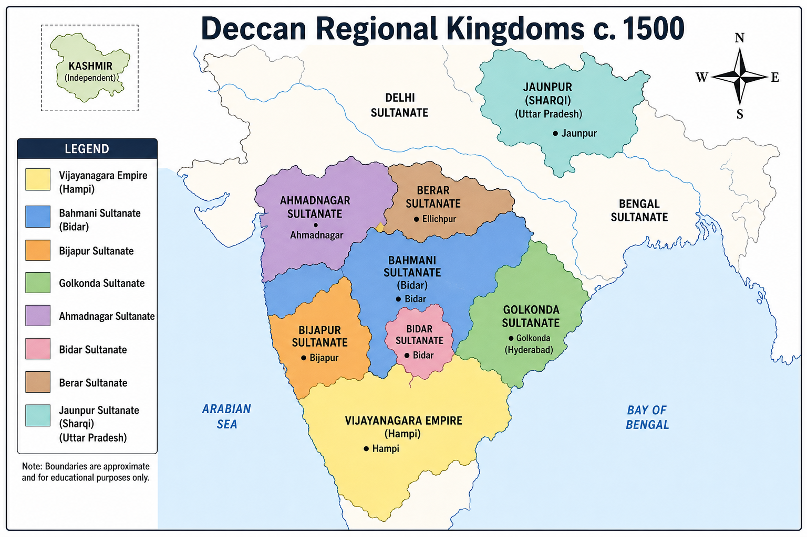
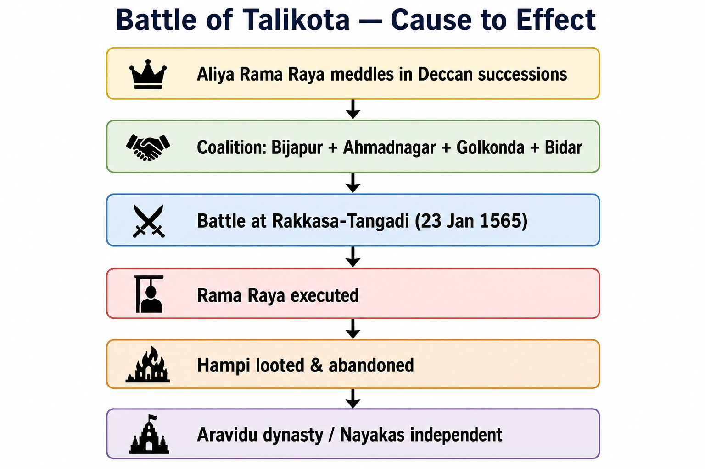

# Topic 3 — Regional Kingdoms (Sharqi, Kashmir, Vijayanagara, Bahmani & Deccan)
### ★ Complete Source of Truth — No other book/notes needed for this topic

> **Covers syllabus:** Sharki Kingdom | Rulers and Their States | Kashmir under Zain-ul-Abidin | Vijayanagara Empire | Vijayanagara Administration | Bahmani Kingdom | Deccan Sultanates | Krishnadevaraya | Battle of Talikota | Bahmani Administration  
> **Sources baked in:** NCERT *Themes in Indian History Part II*, RS Sharma *Medieval India*, export notes (Struggle for Empire I, Delhi Sultanate II), UPPCS/UPSC PYQs 2018–2025  
> **Exam weight:** ★★★ High — Sharqi architecture (UP), Zain-ul-Abidin tolerance, Vijayanagara–Bahmani rivalry, Talikota, Deccan Sultanate capitals, book–context matching  
> **Last verified:** July 2026

---

## Syllabus Coverage Map

| # | Syllabus bullet (`00_Syllabus.md`) | § Section | What must be inside |
|---|-----------------------------------|-----------|---------------------|
| 1 | Sharki Kingdom | 3.1 | Jaunpur capital; Malik Sarwar founder; Sharqi style; Atala & Lal Darwaza mosques; Shiraz of the East; Lodi annexation 1484 |
| 2 | Rulers and Their States | 3.2 | Master ruler ↔ state ↔ capital table (Sharqi, Kashmir, Vijayanagara, Bahmani, five Deccan Sultanates) |
| 3 | Kashmir under Zain-ul-Abidin | 3.3 | Bud Shah; abolished jaziya & cow slaughter; Sriya Bhatt; Zaina Lanka; economic revival |
| 4 | Vijayanagara Empire | 3.4 | 1336 foundation; Harihara & Bukka; Hampi capital; four dynasties; decline frame |
| 5 | Vijayanagara Administration | 3.5 | Nayankara/amara system; provinces; revenue; army; Mahanavami; dharma kingship |
| 6 | Bahmani Kingdom | 3.6 | Hasan Gangu 1347; Gulbarga → Bidar; eight tarafs; Mahmud Gawan |
| 7 | Deccan Sultanates | 3.7 | Five successor states; capitals; Kitab-i-Nauras; Gol Gumbaz; Golkonda 1687 |
| 8 | Krishnadevaraya | 3.8 | Tuluva dynasty; 1509–1529; Raichur 1520; Amuktamalyada; Ashtadiggajas |
| 9 | Battle of Talikota | 3.9 | 1565 Rakkasa-Tangadi; Rama Raya; confederacy; Hampi sack; political fallout |
| 10 | Bahmani Administration | 3.10 | Centralised Persian model; tarafs; Gawan's reforms; Riyaz-ul-Insha; decline causes |

---

## How to Use This File

1. **First read:** Syllabus Coverage Map → §3.2 master ruler–state table → one block per sitting (North §3.1–3.3 OR South §3.4–3.5 OR Deccan §3.6–3.10).
2. **Raata order:** Quick Revision Box → Must-Know Term Comparisons → Consolidated Reference → Common Traps.
3. **UPPCS drill:** Practice Zone + Complete PYQ Bank — **Jaunpur mosque pairs**, **Zain-ul-Abidin policies**, **book matching (2023 Q33)**, **Deccan ruler–work pairs**.
4. **Self-test gate:** Answer UPPCS 2023 Q36 (Zain-ul-Abidin) and Q33 (Riyaz-ul-Insha = Gawan letters) without opening notes.
5. **Revision cycle:** Day 1 = Sharqi + Kashmir; Day 2 = Vijayanagara + Krishnadevaraya; Day 3 = Bahmani + Deccan; Day 4 = Talikota + 40 Practice questions.

---

## How UPPCS Tests This Topic

| Pattern | What they ask | Your prep focus |
|---------|---------------|-----------------|
| **Monument ↔ city (NOT matched)** | Lal Darwaza–Jaunpur correct; Tin Darwaza–Ahmedabad **wrong** (Bidar) | §3.1; **UPPCS 2018 Q19** |
| **Monument chronology** | Atala Masjid (Jaunpur) before Sher Shah/Humayun tombs | §3.1; **UPPCS 2019 Q91** |
| **Ruler ↔ policy** | Zain-ul-Abidin abolished jaziya & cow slaughter | §3.3; **UPPCS 2023 Q36** |
| **Book ↔ context match** | Riyaz-ul-Insha = Mahmud Gawan's letters; Riyaz-us-Salatin = Bengal | §3.10; **UPPCS 2023 Q33** |
| **Author ↔ work (Deccan)** | Kitab-i-Nauras = Ibrahim Adil Shah II (Bijapur) | §3.7; **UPPCS 2020 Q44** |
| **Last ruler when Mughal seized** | Abul Hasan Qutb Shah when Golkonda fell 1687 | §3.7; **UPPCS 2020 Q35** |
| **Battle significance** | Talikota 1565 ended Vijayanagara as great power | §3.9 |
| **Ruler ↔ dynasty ↔ capital** | Krishnadevaraya–Tuluva–Hampi; Hasan Gangu–Bahmani–Gulbarga | §3.2 master table |

> **2023 overlap (Q33):** Mirat-e-Sikandari = **Gujarat victory**; Burhan-e-Masir = **Bahmani Ahmadnagar**; Riyaz-us-Salatin = **Bengal**; Riyaz-ul-Insha = **Gawan's letters**. Code **A (4-2-1-3)**.

---

## Quick Revision Box — Raata This First

```
SHARQI (JAUNPUR) — UP ★★★:
  Founder Malik Sarwar (Malik-us-Sharq) | Capital Jaunpur | "Shiraz of the East"
  Atala Masjid + Lal Darwaza Masjid = Sharqi style (lofty gates, huge arches)
  Malik Muhammad Jaisi (Padmavat) | Annexed by Bahlul Lodi 1484

KASHMIR — ZAIN-UL-ABIDIN (1420–1470):
  Bud Shah | Abolished jaziya + cow slaughter | Restored temples
  Sriya Bhatt (Hindu minister) | Zaina Lanka (Wular Lake island)

VIJAYANAGARA (1336–1565 peak):
  Founders Harihara I + Bukka I (Sangama) | Capital Hampi (Tungabhadra)
  Dynasties: Sangama → Saluva → Tuluva → Aravidu
  Krishnadevaraya (1509–1529, Tuluva) | Amuktamalyada | Ashtadiggajas
  Admin: Nayankara/amara system | Mahanavami festival

BAHMANI (1347–1518):
  Hasan Gangu = Alauddin Bahman Shah | Gulbarga → Bidar (Ahmad Shah I Wali)
  Mahmud Gawan (PM) — Riyaz-ul-Insha | Executed 1481
  Eight tarafs | Split → five Deccan Sultanates

DECCAN SULTANATES (post-1518):
  Bijapur (Adil Shahi) — Gol Gumbaz; Ibrahim Adil Shah II — Kitab-i-Nauras
  Golkonda (Qutb Shahi) — Hyderabad; Abul Hasan Qutb Shah (1687)
  Ahmadnagar (Nizam Shahi) | Bidar (Barid Shahi) | Berar (Imad Shahi)

BATTLE OF TALIKOTA (23 Jan 1565):
  Rakkasa-Tangadi | Rama Raya vs Bijapur+Ahmadnagar+Golkonda+Bidar
  Rama Raya killed | Hampi looted | Vijayanagara empire crippled
```

### Must-Know Term Comparisons (very frequently asked)

| Term | One-line difference | Hindi |
|------|---------------------|-------|
| **Sharqi vs Delhi Sultanate architecture** | Sharqi = Jaunpur (UP), massive gateways/arches without minaret emphasis; Delhi = arch-dome-minaret synthesis | शर्की / दिल्ली सल्तनत वास्तु |
| **Sharki vs Sharqi** | Same Jaunpur dynasty — syllabus uses "Sharki"; historians write "Sharqi" | शर्की / शर्क़ी |
| **Zain-ul-Abidin vs Sikandar Shah (Kashmir)** | Zain = tolerant Bud Shah, abolished jaziya; Sikandar = temple destruction, forced conversions | जैन-उल-आबिदीन / सिकंदर शाह (कश्मीर) |
| **Vijayanagara vs Bahmani** | Hindu south Indian empire vs first major Deccan Muslim kingdom — rivals 14th–16th c. | विजयनगर / बहमनी |
| **Hampi vs Vijayanagara** | Hampi = capital city/site; Vijayanagara = empire name — same polity | हंपी / विजयनगर साम्राज्य |
| **Krishnadevaraya vs Rama Raya** | Krishnadeva = greatest Tuluva king (1509–29); Rama Raya = regent killed at Talikota 1565 | कृष्णदेवराय / राम राय |
| **Nayankara vs Amaram** | Nayankara = Vijayanagara military grant to nayakas; Amaram = similar revenue assignment — often used interchangeably in sources | नायककारा / अमराम |
| **Gulbarga vs Bidar** | Bahmani capitals — Gulbarga early; Bidar from Ahmad Shah I Wali (~1429) | गुलबर्ग / बीदर |
| **Riyaz-us-Salatin vs Riyaz-ul-Insha** | Salatin = **Bengal** history; Insha = **Mahmud Gawan's letters** — 2023 Q33 trap | रियाज़-उस-सलातीन / रियाज़-उल-इंशा |
| **Tin Darwaza vs Teen Darwaza** | Tin Darwaza = **Bidar Fort** (Bahmani); Teen Darwaza = **Ahmedabad** gate — different monuments | तीन दरवाज़ा (बीदर) / तीन दरवाज़ा (अहमदाबाद) |
| **Talikota vs Raichur** | Talikota 1565 = Vijayanagara defeat; Raichur 1520 = Krishnadevaraya's victory over Bijapur | तालीकोटा / रायचूर |
| **Kitab-i-Nauras vs Amuktamalyada** | Nauras = Ibrahim Adil Shah II (Bijapur, music); Amuktamalyada = Krishnadevaraya (Telugu epic) | किताब-ए-नौरस / अमुक्तमाल्यद |

### Memory Tricks

| Trick | Remembers |
|-------|-----------|
| **M-S-M-H (Sharqi rulers)** | **M**alik Sarwar → **S**hamsuddin Ibrahim → **M**ahmud → **H**ussain (last) |
| **H-B-K-A (Vijayanagara dynasties)** | **H**arihara (Sangama) → **B**ukka line → **K**rishnadeva (Tuluva peak) → **A**ravidu (after Talikota) |
| **B-G-A-Q-B (Deccan five)** | **B**ijapur, **G**olkonda, **A**hmadnagar, **Q**… Bidar, **B**erar — five successor states |
| **Gawan = G letters** | **G**awan → **G**ulbarga/Bidar admin → **G**awan's **Riyaz-ul-Insha** |
| **Zain = Zero tax trap** | Zain-ul-Abidin **Zero** jaziya (abolished) — 2023 Q36 |
| **1565 = 5 sultanates vs 1 Raya** | Five Deccan states unite → Rama Raya dies at Talikota |
| **Jaunpur = Jaisi + Jami** | **J**aunpur patronised **J**aisi (Padmavat) + **J**ami/Atala mosques |
| **1687 Qutb last** | **Q**utb Shah last ruler when Aurangzeb took **Q**olkonda 1687 |

---

## Exam Visuals — High-ROI Images

> **Type priority:** Deccan political map → Talikota battle flow. Images stored locally (`images/`) for offline revision.

| # | Image | Use when revising |
|---|-------|-------------------|
| 1 | `images/deccan_regional_kingdoms_map.png` | Ruler–capital matching; Bahmani vs five successor states |
| 2 | `images/talikota_battle_flow.png` | 1565 confederacy vs Vijayanagara; cause → Hampi sack |





---

## 3.1 Sharqi (Sharki) Kingdom — Jaunpur Sultanate

### Definitions

| Term | Meaning |
|------|---------|
| **Sharqi / Sharki Sultanate** | Independent regional kingdom centred at **Jaunpur** (eastern UP), 1394–1484 CE — "Lord of the East" (Malik-us-Sharq) tradition |
| **Sharqi style** | Indo-Islamic architecture with **massive gateways, huge arches, bold stonework** — distinct from Delhi minaret-dominated idiom |
| **Shiraz of the East** | Honorific for **Jaunpur** under Sharqi patronage of Persian literature and learning |

### Sharqi Kingdom — How It Works

- **Origin:** After Timur's invasion weakened Delhi in 1398, **Malik Sarwar** declared independence at Jaunpur around **1394** and took the title **Malik-us-Sharq** (Lord of the East).
- **Geography:** The kingdom's core lay in **eastern UP**, especially Jaunpur, Ghazipur, and the Banaras region, though its claimed reach stretched from **Aligarh to Darbhanga** and from the Nepal foothills to Bundelkhand.
- **UP relevance:** Jaunpur is a **UPPCS favourite** because it was the only major medieval Indo-Islamic school located **inside Uttar Pradesh** apart from Delhi's nearby monument zone.
- **Political role:** The Sharqi state checked Bengal and contested the Lodis for the middle Ganga-Yamuna doab, making it a major post-Tughlaq regional power.
- **Ruler sequence:** The main line ran from Malik Sarwar to Mubarak Shah, **Shamsuddin Ibrahim Shah**, Mahmud Shah, Muhammad Shah, and finally **Hussain Shah**.
- **Culture:** The Sharqis patronised **Persian and Hindavi** literature, and **Malik Muhammad Jaisi** composed **Padmavat** in the Jaunpur intellectual milieu.
- **Architecture:** Sharqi builders constructed **Atala Masjid**, **Lal Darwaza Masjid**, and **Jami Masjid (Jaunpur)** with elevated plinths, pylon-like gateways, and arched halls rather than the typical Persian minaret profile.
- **Economy:** Jaunpur prospered on Ganga plain agriculture, river trade, crafts, and book production.
- **End:** **Bahlul Lodi** annexed Jaunpur in **1484** after a prolonged Lodi-Sharqi struggle, bringing it back into the Delhi Sultanate sphere before Babur.

> **Exam note:** **Lal Darwaza–Jaunpur** is **correctly matched** (2018 Q19); trap is **Tin Darwaza–Ahmedabad** — **Tin Darwaza belongs to Bidar Fort**, not Ahmedabad (which has **Teen Darwaza**).

### Sharqi Rulers — Quick Table

| Ruler | Period (approx.) | Note |
|-------|------------------|------|
| Malik Sarwar | 1394–1399 | Founder; Malik-us-Sharq |
| Mubarak Shah | 1399–1402 | Consolidation |
| Shamsuddin Ibrahim Shah | 1402–1440 | Atala Masjid; peak building phase |
| Mahmud Shah | 1440–1457 | |
| Muhammad Shah | 1457–1458 | Brief reign |
| Hussain Shah | 1458–1484 | Last ruler; lost to Bahlul Lodi |

### Exam Facts (raata)

- Sharqi capital is **Jaunpur** (eastern UP).
- The founder was **Malik Sarwar**, who used the title **Malik-us-Sharq**.
- Jaunpur was known as **Shiraz of the East**.
- The key mosques are **Atala Masjid** and **Lal Darwaza Masjid**.
- **Malik Muhammad Jaisi** and **Padmavat** are linked with the Jaunpur cultural milieu.
- The Sharqi kingdom was annexed by **Bahlul Lodi in 1484**.
- Sharqi architecture is **large arches and gates**, not Delhi-style dominant minarets.
- **Atala Masjid** predates **Humayun's Tomb** and **Sher Shah's Tomb** (chronology trap).

### PYQs — Sharqi Kingdom

1. **(UPPCS Prelims 2018, Q19)** Which of the following pairs is NOT correctly matched?  
   A. Adina Masjid – Mandu | B. Lal Darwaza Masjid – Jaunpur | C. Dakhil Darwaza – Gaour | D. Tin Darwaza – Ahmedabad  
   → **D** — Tin Darwaza is at **Bidar** (Deccan), not Ahmedabad; Lal Darwaza–Jaunpur is **correct**.

2. **(UPPCS Prelims 2019, Q91)** Arrange chronologically: I. Rabia Daurani's Tomb, Aurangabad | II. Sher Shah's Tomb, Sasaram | III. Humayun's Tomb, Delhi | IV. Atala Mosque, Jaunpur  
   → **B (IV, II, III, I)** — Atala (~15th c.) → Sher Shah (1545) → Humayun (1565) → Rabia Daurani (1678).

### Examples (3.1)

| Example | Detail |
|---------|--------|
| **Atala Masjid, Jaunpur** | Built under Sharqi patronage; appears in UPPCS chronology questions |
| **Malik Muhammad Jaisi** | Sufi-poet of Jaunpur circle; **Padmavat** |
| **Lal Darwaza Masjid** | Sharqi monument — paired with Jaunpur in matching questions |

---

## 3.2 Rulers and Their States — Master Matching Table

### Definitions

| Term | Meaning |
|------|---------|
| **Regional kingdom (15th–16th c.)** | Independent successor state after Delhi Sultanate fragmentation — this topic covers **Jaunpur, Kashmir, Vijayanagara, Bahmani, Deccan Sultanates** |
| **Ruler–state pair** | Standard UPPCS format — one wrong capital or dynasty in a list of four |

### Rulers and States — How It Works

- **Sharqi:** The **Malik Sarwar** line ruled the **UP** kingdom of **Jaunpur** from 1394 to 1484 until the Lodis ended it.
- **Kashmir Sultanate:** Shah Mir founded Muslim rule in Kashmir in the **14th century**, and **Zain-ul-Abidin (1420-1470)** marked its high point as **Bud Shah**.
- **Vijayanagara:** **Harihara I and Bukka I** founded Vijayanagara in **1336**, ruled from **Hampi**, and were followed by the **Sangama, Saluva, Tuluva, and Aravidu** dynasties.
- **Bahmani:** **Hasan Gangu (Alauddin Bahman Shah)** founded the Bahmani kingdom in **1347**, with **Gulbarga** and later **Bidar** as capitals and **Mahmud Gawan** as its famous minister.
- **Deccan Sultanates (from 1518):** The Bahmani breakup produced five successor states: **Bijapur**, **Golkonda**, **Ahmadnagar**, **Bidar**, and **Berar**.
- **Conflict axis:** The main conflict first ran between **Vijayanagara and Bahmani** power and later between **Vijayanagara and the Deccan confederacy** at Talikota in 1565.
- **UP angle:** Among these states, only **Sharqi Jaunpur** lies in modern **Uttar Pradesh**, so UP monument and cultural questions are especially likely.
- **Matching trap:** Students often confuse **Bidar**, the Bahmani and Barid capital, with **Bijapur**, the Adil Shahi centre.

> **Exam note:** In "NOT matched" lists, check **monument–city** first (Tin Darwaza), then **book–region** (Riyaz-us-Salatin ≠ Gawan letters).

### Master Table — Ruler ↔ State ↔ Capital

| State / Empire | Founder / Key ruler | Capital(s) | Period (approx.) |
|----------------|---------------------|------------|------------------|
| **Sharqi Sultanate** | Malik Sarwar | **Jaunpur** | 1394–1484 |
| **Kashmir Sultanate** | Zain-ul-Abidin (peak) | **Srinagar** | Zain: 1420–1470 |
| **Vijayanagara Empire** | Harihara I & Bukka I; Krishnadevaraya (peak) | **Hampi** (Vijayanagara) | 1336–1565 (peak) |
| **Bahmani Kingdom** | Hasan Gangu | **Gulbarga**, then **Bidar** | 1347–1518 |
| **Bijapur (Adil Shahi)** | Yusuf Adil Shah | **Bijapur** | 1490–1686 |
| **Golkonda (Qutb Shahi)** | Quli Qutb Shah | **Golkonda**, then **Hyderabad** | 1518–1687 |
| **Ahmadnagar (Nizam Shahi)** | Malik Ahmad | **Ahmadnagar** | 1490–1636 |
| **Bidar (Barid Shahi)** | Amir Barid | **Bidar** | 1492–1619 |
| **Berar (Imad Shahi)** | Fathullah Imad-ul-Mulk | **Ellichpur** | 1490–1574 |

### Exam Facts (raata)

- **Jaunpur** is Sharqi, **Hampi** is Vijayanagara, and **Bidar** is both the later Bahmani capital and the Barid Shahi centre.
- **Krishnadevaraya** is **Tuluva** dynasty, not Sangama founder.
- **Hasan Gangu** is **Bahmani** founder (1347).
- **Ibrahim Adil Shah II** is **Bijapur** is Kitab-i-Nauras.
- **Abul Hasan Qutb Shah** is last Golkonda ruler (**1687**).
- **Zain-ul-Abidin** is **Kashmir**, not Jaunpur or Deccan.

### PYQs — Rulers and States

1. **(UPPCS Prelims 2020, Q44)** Who wrote **Kitab-i-Nauras**? → **A. Ibrahim Adil Shah II** (Bijapur Adil Shahi).

2. **(UPPCS Prelims 2020, Q35)** Ruler of Golkonda when Aurangzeb seized it **1687**? → **A. Abul Hasan Qutb Shah**.

### Examples (3.2)

| Pair | Trap to avoid |
|------|---------------|
| **Hasan Gangu – Bahmani – Gulbarga** | Do not assign to Vijayanagara |
| **Krishnadevaraya – Vijayanagara – Hampi** | Not Bahmani capital |
| **Malik Sarwar – Sharqi – Jaunpur** | UP-specific — not Kashmir |

---

## 3.3 Kashmir under Zain-ul-Abidin

### Definitions

| Term | Meaning |
|------|---------|
| **Bud Shah** | "Great Sultan" — title of **Zain-ul-Abidin** (1420–1470), golden age of Kashmir Sultanate |
| **Zaina Lanka** | Artificial island built by Zain-ul-Abidin in **Wular Lake** — engineering feat |
| **Sriya Bhatt** | Influential **Hindu minister** under Zain-ul-Abidin — Justice & physician roles |

### Zain-ul-Abidin — How It Works

- **Context:** **Sikandar Shah (1389-1413)** preceded him with an orthodox phase marked by forced conversions, temple destruction, and the melting of idols for coinage under **Suha Bhatt's** influence.
- **Reversal:** Zain-ul-Abidin deliberately reversed these intolerant policies, so textbooks often compare his approach with **Akbar's later sulh-i-kul** as an analogy rather than an identity.
- **Religious policy:** He **abolished jaziya**, banned cow slaughter, restored temples, recalled exiled Brahmins, and permitted reconversion to Hinduism.
- **Administration:** He appointed Hindus such as **Sriya Bhatt** as Minister of Justice and court physician, making shared governance a visible part of his rule.
- **Cultural policy:** He patronised **Persian, Kashmiri, Sanskrit, and Tibetan** learning and commissioned translations of the **Mahabharata** and **Rajatarangini**.
- **Economic revival:** He promoted shawl weaving, papermaking, book-binding, stone-cutting, gold-beating, fireworks, and musket-making to rebuild Kashmir's craft base.
- **Public works:** He built dams, canals, bridges, and **Zaina Lanka** in Wular Lake as irrigation and prestige projects.
- **Military/diplomacy:** He defeated Ladakh Mongols and expanded influence over **Baltistan, Jammu, and Rajauri**, which helped secure the frontiers for internal peace.
- **Legacy:** Kashmir remembered him as **Bud Shah** because his reign represented the peak of medieval Kashmiri prosperity and composite culture.

> **Exam note:** **UPPCS 2023 Q36** directly asks who abolished **jaziya AND cow slaughter** — only **Zain-ul-Abidin** among options; **Sikandar Shah** did the opposite.

### Exam Facts (raata)

- Zain-ul-Abidin ruled **1420–1470**.
- Known as **Bud Shah** (Great Sultan).
- **Abolished jaziya** and **cow slaughter**.
- He **restored temples** and recalled exiles.
- **Sriya Bhatt** is key Hindu official.
- Translated **Mahabharata**, **Rajatarangini**.
- Built **Zaina Lanka** (Wular Lake).
- Promoted **shawl industry** and crafts.
- Preceded by intolerant **Sikandar Shah**.
- Often cited as **anticipating Akbar's tolerance** is statement-based trap (analogy, not same century/policy detail).

### PYQs — Kashmir

1. **(UPPCS Prelims 2023, Q36)** Which ruler of Kashmir abolished **Jaziya** and **cow slaughter**?  
   → **C. Zain-ul-Abidin**.

2. **(UPSC-pattern)** Assertion: Zain-ul-Abidin recalled Brahmin exiles. Reason: Sikandar Shah had persecuted Hindus.  
   → Both true; R explains A — standard textbook pairing.

### Examples (3.3)

| Example | Significance |
|---------|--------------|
| **Zaina Lanka** | Wular Lake island — public works |
| **Sriya Bhatt** | Hindu minister under Muslim sultan — tolerance symbol |
| **Shawl industry promotion** | Kashmir economic hallmark |

---

## 3.4 Vijayanagara Empire — Foundation and Phases

### Definitions

| Term | Meaning |
|------|---------|
| **Vijayanagara Empire** | Hindu kingdom of south India **1336–1646** (effective great-power phase till **1565**); capital at **Hampi** on **Tungabhadra** |
| **Sangama dynasty** | Founding line of Vijayanagara — **Harihara I & Bukka I** (sons of Sangama) |
| **Four dynasties** | **Sangama → Saluva → Tuluva → Aravidu** — successive ruling lines same empire |

### Vijayanagara Empire — How It Works

- **Foundation (1336):** **Harihara I** and **Bukka I** established the kingdom from the **Anegundi/Hampi** region in response to **Delhi Sultanate** expansion under **Muhammad bin Tughlaq** and wider Deccan instability.
- **Geographic core:** The empire's **Karnataka** heartland included the Tungabhadra-Krishna doab, and it later expanded into **Tamil country, Raichur doab, and Odisha** during the Gajapati conflicts.
- **Capital:** **Vijayanagara**, modern **Hampi** in Karnataka, became a UNESCO World Heritage site because its urban sprawl preserved royal and sacred precincts.
- **Bahmani rivalry:** From the **14th century**, Vijayanagara fought recurrent wars with the **Bahmani Kingdom** over the fertile **Raichur doab** between the Krishna and Tungabhadra rivers.
- **Dynastic shifts:** The **Saluva (1485)** and **Tuluva (1505)** coups replaced the Sangama line without destroying the empire's state structure.
- **Peak:** **Krishnadevaraya (1509–1529)** of the Tuluva dynasty brought Vijayanagara to its maximum territorial extent and cultural florescence (see §3.8).
- **Regency phase:** After the Tuluva decline, **Aliya Rama Raya**, an Aravidu-linked regent, dominated the court and led the empire into the **Talikota disaster of 1565**.
- **Post-1565:** After the capital was abandoned, the **Aravidu** dynasty ruled a diminished kingdom from **Penukonda/Chandragiri**, so the "empire" survived nominally but **Hampi never recovered**.
- **Sources:** **Dominica Barbosa (Duarte Barbosa)**, **Nuniz**, and **Paes** describe the city's wealth, while **epigraphs** and **temple pillars** record grants.

> **Exam note:** Founders = **Harihara & Bukka**, not Krishnadevaraya — founder vs greatest ruler trap.

### Vijayanagara Dynasties — Table

| Dynasty | Key rulers | Period (approx.) |
|---------|------------|------------------|
| **Sangama** | Harihara I, Bukka I, Deva Raya II | 1336–1485 |
| **Saluva** | Saluva Narasimha | 1485–1505 |
| **Tuluva** | Krishnadevaraya, Achyuta Raya | 1505–1570 |
| **Aravidu** | Tirumala, Venkata II | 1570–1646 |

### Exam Facts (raata)

- Founded **1336** by **Harihara I & Bukka I**.
- Capital is **Hampi (Vijayanagara)** on **Tungabhadra**.
- Four dynasties is **Sangama, Saluva, Tuluva, Aravidu**.
- Major rival is **Bahmani** then **Deccan Sultanates**.
- **Raichur doab** is chronic war zone.
- Peak ruler is **Krishnadevaraya (Tuluva)**.
- In **1565 Talikota** is turning point, Hampi sacked.
- **Vitthala Temple**, **Virupaksha**, **Hazara Rama** is Hampi monuments.
- Foreign accounts is **Nuniz**, **Paes**.

### PYQs — Vijayanagara Empire

1. **(UPSC Prelims pattern)** Who founded Vijayanagara?  
   → **Harihara and Bukka** — not Krishnadevaraya.

2. **(Statement-based)** Vijayanagara was established before Bahmani Kingdom.  
   → **False** — Bahmani **1347**, Vijayanagara **1336** — Vijayanagara slightly earlier; know both dates.

### Examples (3.4)

| Site / source | Link |
|---------------|------|
| **Hampi** | Capital ruins — Vijayanagara empire |
| **Vitthala Temple stone chariot** | Iconic Vijayanagara monument |
| **Nuniz's account** | Portuguese description of Krishnadevaraya's court |

---

## 3.5 Vijayanagara Administration

### Definitions

| Term | Meaning |
|------|---------|
| **Nayankara system** | Grant of territory to **nayakas** (military chiefs) for **troops and administration** in lieu of revenue — feudatory backbone |
| **Amaram** | Revenue assignment linked to nayankara obligations — maintain fixed contingent |
| **Mahanavami** | Great **Dasara** festival — royal display of power, tribute, military might at Vijayanagara |

### Vijayanagara Administration — How It Works

- **Monarchy:** The king acted as **dharma protector** and commander-in-chief and ruled through a **cabinet (Ashtapradhana)** of great officers, though exact titles varied by period.
- **Provincial structure:** The empire was divided into **rajyas/provinces** under **governors**, often royal relatives or loyal nayakas, with **nadu** district clusters and **villages** below them.
- **Nayankara/amara:** The king granted **amaram lands** to **nayakas**, who owed **military service**, tribute, and aid in succession wars. This system became the precursor to the post-1565 **Tanjor/Madurai nayak** states.
- **Revenue:** Land revenue was the main income, supported by surveys, **varied tenures** such as temple lands (**devadana**), Brahmin **agrahara**, and peasant holdings, plus **hundi** notes and cash-crop trade in pepper and horses at ports.
- **Army:** The army followed the **four-fold** tradition of **elephants, cavalry, infantry, and artillery**, and Portuguese traders supplied **horses and firearms** as gunpowder warfare grew in 16th-century Deccan conflicts.
- **Justice:** Local village assemblies and royal courts administered justice through **dharmashastra** and local custom, with the king serving as the final appeal.
- **Temple integration:** The state **patronised major temples** such as Virupaksha and Vitthala, recorded grants on **mandapa pillars**, and tied temple treasuries to the local economy.
- **Urban control:** The capital **Hampi** was highly planned, with a royal enclosure, bazaar streets described by Paes, tank systems, and **Tungabhadra** irrigation for agriculture.
- **Checks on nobles:** Periodic **transfers**, **hostages**, and **royal spies** limited nayaka autonomy, but **post-Talikota nayakas** became independent when the centre collapsed.

> **Exam note:** **Nayankara** is **Vijayanagara** — do not confuse with Delhi **iqta** (muqti) or Mughal **jagir** — similar logic, different polity.

### Exam Facts (raata)

- **Nayankara/amara** is military feudatory grants.
- **Nayakas** maintained troops from assigned revenue.
- **Mahanavami/Dasara** is royal festival of power.
- Provinces were placed under **governors**, while villages continued under local assemblies.
- **Land revenue** is primary fiscal base.
- The army is **elephants + cavalry + infantry + guns** (16th c.).
- **Temple grants** recorded on **Hampi pillars**.
- Post-1565 **nayakas** → independent **Nayak kingdoms** (Madurai, Tanjore, etc.).

### PYQs — Vijayanagara Administration

1. **(Statement-based)** Nayankara holders were primarily revenue collectors without military duty.  
   → **False** — core duty was **military service** for land grant.

2. **(Match)** Mahanavami — Vijayanagara royal festival | Amaram — revenue assignment to nayaka.  
   → Both correctly matched.

### Examples (3.5)

| Institution | Role |
|-------------|------|
| **Nayak of Madurai** (post-1565) | Spun off from Vijayanagara nayankara |
| **Virupaksha temple grants** | Pillar inscriptions — admin record |
| **Mahanavami platform, Hampi** | Royal ceremony site |

---

## 3.6 Bahmani Kingdom — Origin and Political History

### Definitions

| Term | Meaning |
|------|---------|
| **Bahmani Kingdom** | First independent **Muslim kingdom of the Deccan** (1347–1518); broke from Delhi Sultanate under **Hasan Gangu** |
| **Hasan Gangu** | Founder; throne name **Alauddin Bahman Shah** — kingdom named Bahmani |
| **Taraf** | Bahmani **province** — kingdom organised into **eight tarafs** (administrative divisions) |

### Bahmani Kingdom — How It Works

- **Foundation (1347):** **Hasan Gangu**, a **Brahmin convert** in tradition and a Delhi officer in the Deccan, rebelled against **Muhammad bin Tughlaq** and declared independence at **Gulbarga**.
- **Territory:** The kingdom controlled the northern Deccan, including parts of **modern Karnataka, Maharashtra, and Telangana**, and shared a chronic border with **Vijayanagara** over the **Raichur doab**.
- **Capital shift:** The early capital was **Gulbarga**, but **Ahmad Shah I Wali** moved it to **Bidar (~1429)** for better fortifications and water.
- **Conflict pattern:** Bahmani rulers alternated **war and marriage alliances** with Vijayanagara, and neither side achieved permanent conquest of the doab.
- **Mahmud Gawan:** **Mahmud Gawan**, the **Persian minister** under **Muhammad Shah III**, became the greatest Bahmani administrator by expanding east to the **Orissa coast** and disciplining nobles.
- **Gawan's fall (1481):** Rival nobles forged a **treason letter**, and the king ordered Gawan's execution, ending the administrative peak and intensifying factionalism.
- **Noble factions:** The rivalry between **Deccani and Afaqi (foreign)** nobles paralysed the court and foreshadowed later Mughal Deccan factional politics.
- **Dissolution (1518):** Weak later sultans could not hold the kingdom together, and under **Kalimullah**, the last Bahmani sultan, it split into **five Deccan Sultanates** (see §3.7).
- **Culture:** The court blended **Persianate** and **Deccani** elements in literature, Sufi orders, and architecture such as Bidar fort and the Gulbarga tombs.

> **Exam note:** **Bahmani founder = Hasan Gangu (1347)** — not Mahmud Gawan (minister, not founder).

### Bahmani Rulers — Selected Table

| Ruler | Note |
|-------|------|
| Alauddin Bahman Shah (Hasan Gangu) | Founder 1347 |
| Muhammad Shah I | Consolidation |
| Ahmad Shah I Wali | Shifted capital to Bidar |
| Muhammad Shah III | Mahmud Gawan's prime ministership |
| Kalimullah | Last sultan before breakup |

### Exam Facts (raata)

- Bahmani founded **1347** by **Hasan Gangu**.
- First capital **Gulbarga** → later **Bidar**.
- **Eight tarafs** (provinces).
- Rival of **Vijayanagara** is Raichur doab wars.
- **Mahmud Gawan** was the prime minister and was executed in **1481**.
- Kingdom ended **1518** → five successor states.
- **Persian + Deccani** noble factions.
- Architecture is **Bidar Fort**, **Gulbarga Bahmani tombs**.

### PYQs — Bahmani Kingdom

1. **(UPPCS Prelims 2023, Q33 — partial)** **Burhan-e-Masir** matches **History of Bahmani's Ahmadnagar** — Bahmani successor context.

2. **(Statement-based)** Mahmud Gawan founded the Bahmani Kingdom.  
   → **False** — **Hasan Gangu** founded; Gawan was **15th-c. minister**.

### Examples (3.6)

| Example | Detail |
|---------|--------|
| **Gulbarga** | First Bahmani capital |
| **Bidar Fort** | Capital after Ahmad Shah I Wali |
| **Raichur doab** | Bahmani–Vijayanagara conflict zone |

---

## 3.7 Deccan Sultanates — Successor States

### Definitions

| Term | Meaning |
|------|---------|
| **Deccan Sultanates** | Five states after Bahmani breakup (**c.1518**): **Bijapur, Golkonda, Ahmadnagar, Bidar, Berar** |
| **Adil Shahi** | Dynasty of **Bijapur** — **Yusuf Adil Shah** founder |
| **Qutb Shahi** | Dynasty of **Golkonda/Hyderabad** — **Quli Qutb Shah** founder |
| **Gol Gumbaz** | Tomb of **Muhammad Adil Shah** (Bijapur) — one of world's largest domes; **whispering gallery** |

### Deccan Sultanates — How It Works

- **Breakup:** The last Bahmani sultan, **Kalimullah**, could not control the governors, so **1518** marks the effective split into **five sultanates**.
- **Bijapur (Adil Shahi):** **Yusuf Adil Shah** founded the line in 1490, made **Bijapur** the capital, and the sultanate peaked under **Ibrahim Adil Shah II**, a **Sufi-influenced** music patron who wrote **Kitab-i-Nauras**.
- **Golkonda (Qutb Shahi):** **Quli Qutb Shah** founded the line at **Golkonda** fort near Hyderabad, and **Muhammad Quli Qutb Shah** founded **Hyderabad city in 1591** with the Charminar as its landmark. The state also became a **diamond trade** centre.
- **Ahmadnagar (Nizam Shahi):** **Malik Ahmad** founded Ahmadnagar with **Ahmadnagar** as its capital, and the sultanate is linked with the **Burhan-e-Masir** chronicle and alternating wars against the Mughals and Vijayanagara.
- **Bidar (Barid Shahi):** **Amir Barid** founded the Barid Shahi line at **Bidar**, whose **Tin Darwaza** in Bidar Fort is the 2018 Q19 trap against Ahmedabad.
- **Berar (Imad Shahi):** **Fathullah Imad-ul-Mulk** founded Berar with **Ellichpur** as its capital, but it remained the smallest successor state and was absorbed early by other powers.
- **Confederacy:** By **1565**, four sultanates, **Bijapur, Ahmadnagar, Golkonda, and Bidar**, united against **Vijayanagara** at **Talikota**.
- **Mughal phase:** Akbar and Aurangzeb gradually annexed **Ahmadnagar (1636)**, **Bijapur (1686)**, and **Golkonda (1687)**, bringing the Deccan fully under Mughal control by the late 17th century.
- **Cultural synthesis:** The sultanates developed **Deccani Urdu**, Indo-Persian architecture such as **Gol Gumbaz** and **Charminar**, and music schools distinct from the North Indian Mughal idiom.

> **Exam note:** **Kitab-i-Nauras = Ibrahim Adil Shah II (Bijapur)** — not Quli Qutb Shah (2020 Q44). **Abul Hasan Qutb Shah** ruled Golkonda when Aurangzeb seized **1687** (2020 Q35).

### Deccan Sultanates — Capitals Table

| Sultanate | Dynasty | Capital |
|-----------|---------|---------|
| Bijapur | Adil Shahi | Bijapur |
| Golkonda | Qutb Shahi | Golkonda → Hyderabad |
| Ahmadnagar | Nizam Shahi | Ahmadnagar |
| Bidar | Barid Shahi | Bidar |
| Berar | Imad Shahi | Ellichpur |

### Exam Facts (raata)

- Five successor states from Bahmani **1518**.
- **Ibrahim Adil Shah II** is **Kitab-i-Nauras** (Bijapur).
- **Gol Gumbaz** is Bijapur — **Muhammad Adil Shah's tomb**.
- **Tin Darwaza** is **Bidar Fort** (not Ahmedabad).
- **Quli Qutb Shah** is Golkonda founder line.
- **Hyderabad** founded **1591** (Muhammad Quli Qutb Shah).
- **Abul Hasan Qutb Shah** is last at Golkonda **1687**.
- **Burhan-e-Masir** is Ahmadnagar history.
- Confederated against Vijayanagara **1565**.

### PYQs — Deccan Sultanates

1. **(UPPCS Prelims 2020, Q44)** Author of **Kitab-i-Nauras**?  
   → **A. Ibrahim Adil Shah II**.

2. **(UPPCS Prelims 2020, Q35)** Ruler of Golkonda when Aurangzeb seized fort **1687**?  
   → **A. Abul Hasan Qutb Shah**.

### Examples (3.7)

| Monument / work | Sultanate |
|-----------------|-----------|
| **Gol Gumbaz, Bijapur** | Adil Shahi |
| **Charminar, Hyderabad** | Qutb Shahi |
| **Kitab-i-Nauras** | Ibrahim Adil Shah II (Bijapur) |

---

## 3.8 Krishnadevaraya — Tuluva Golden Age

### Definitions

| Term | Meaning |
|------|---------|
| **Krishnadevaraya** | Greatest **Vijayanagara** emperor (**1509–1529**); **Tuluva dynasty** |
| **Amuktamalyada** | Telugu **epic/prabandha** authored by **Krishnadevaraya** — Vishnu-devotee theme |
| **Ashtadiggajas** | "Eight elephants" — **eight great Telugu poets** at Krishnadevaraya's court |

### Krishnadevaraya — How It Works

- **Accession (1509):** Krishnadevaraya came to the throne after the **Saluva/Tuluva** transition and inherited **Bahmani successor wars** and **Gajapati** frontier conflicts.
- **Battle of Raichur (1520):** He led a personal campaign against **Ismail Adil Shah** of Bijapur, captured **Raichur fort**, and was celebrated in **inscriptions and literature** for this peak military moment.
- **Orissa/Gajapati:** He defeated **Prataparudra**, secured the Krishna river boundary, and made the **Udayagiri** campaign famous in tradition.
- **Diplomacy:** He made temporary peace with **Bijapur** after Raichur and used **Portuguese** contacts for **horses and guns**, showing pragmatic trade over religion.
- **Administration:** He strengthened **nayankara** inspections, restored temples, built **irrigation tanks**, and made **Mahanavami** celebrations reach their maximum scale in Paes's account.
- **Literature:** He authored **Amuktamalyada** in **Telugu**, patronised **Sanskrit** and **Kannada**, and hosted the **Ashtadiggajas**, including **Allasani Peddana** of Manucharitramu.
- **Religion:** He showed personal **Vaishnava** devotion at Tirumala but also patronised **Shaiva** temples, making his royal policy non-sectarian.
- **Succession:** His brother **Achyuta Raya** followed him with a weaker reign, and the later **Aliya Rama Raya** regency led to **Talikota**.
- **Death (1529):** The empire stood at its zenith when he died, but decline came from **succession disputes and the Deccan coalition**, not from his death alone.

> **Exam note:** **Krishnadevaraya ≠ founder** of Vijayanagara; he belongs to **Tuluva** dynasty — match questions test dynasty, not just name fame.

### Ashtadiggajas — Poets (complete list)

| # | Poet | Known work (if asked) |
|---|------|------------------------|
| 1 | Allasani Peddana | Manucharitramu |
| 2 | Nandi Thimmana | Parijatapaharanamu |
| 3 | Madayyagari Mallana | Rajasekhara Charitramu |
| 4 | Dhurjati | Kalahastiswara Satakamu |
| 5 | Ayyalaraju Ramabhadrudu | Ramabhyudayamu |
| 6 | Pingali Suranna | Garuda Puranam |
| 7 | Tenali Ramakrishna | Panduranga Mahatmyamu |
| 8 | Ramarajabhushanudu | Vasucharitramu |

### Exam Facts (raata)

- Ruled **1509–1529** (Tuluva dynasty).
- Greatest Vijayanagara ruler is **military + literary** peak.
- **Battle of Raichur 1520** is vs Bijapur.
- Author of **Amuktamalyada** (Telugu).
- Patron of **Ashtadiggajas** (eight poets).
- **Tenali Ramakrishna** at his court.
- **Nuniz** and **Paes** describe his reign.
- Died **1529** is empire peaked then slid to **1565** disaster under Rama Raya.

### PYQs — Krishnadevaraya

1. **(UPSC pattern)** Amuktamalyada was written by:  
   → **Krishnadevaraya** — not Ibrahim Adil Shah (Kitab-i-Nauras trap).

2. **(Chronology)** Krishnadevaraya's reign vs Battle of Talikota:  
   → Krishnadeva **1529 death**; Talikota **1565** — separate generations.

### Examples (3.8)

| Example | Link |
|---------|------|
| **Amuktamalyada** | Krishnadevaraya's Telugu work |
| **Raichur campaign 1520** | Military peak vs Bijapur |
| **Tenali Ramakrishna** | Court poet — popular culture reference |

---

## 3.9 Battle of Talikota (1565)

### Definitions

| Term | Meaning |
|------|---------|
| **Battle of Talikota** | **23 January 1565** battle at **Rakkasa-Tangadi** (near Krishna river) — catastrophic Vijayanagara defeat |
| **Rama Raya** | **Regent/general** of Vijayanagara at battle — captured and **beheaded** on spot |
| **Deccan confederacy** | Combined forces of **Bijapur, Ahmadnagar, Golkonda, Bidar** vs Vijayanagara |

### Battle of Talikota — How It Works

- **Background:** **Aliya Rama Raya**, who was Aravidu-linked, dominated the Vijayanagara court and **meddled in Deccan Sultanate successions**, alienating all four major sultanates.
- **Coalition:** **Bijapur (Ali Adil Shah I)**, **Ahmadnagar (Hussain Nizam Shah I)**, **Golkonda (Ibrahim Qutb Shah)**, and **Bidar (Ali Barid)** formed rare unity against a common threat.
- **Battlefield:** The battle took place at **Rakkasa-Tangadi** near **Talikota** in the Krishna-Tungabhadra region, where the Vijayanagara army was **numerically large** but **coordination weak**.
- **Turning point:** **Rama Raya** was captured and **executed**, after which Vijayanagara lines collapsed and **six months of looting** followed at **Hampi**.
- **Immediate result:** **Hampi** was abandoned as capital after its treasury and temples were plundered, and the **Aravidu** dynasty retreated to **Penukonda/Chandragiri**.
- **Long-term:** **Nayakas** such as those of Madurai, Tanjore, and Gingee became **independent**, and Vijayanagara central authority was never restored.
- **Mughal opportunity:** The weakened Deccan balance eventually allowed **Akbar/Aurangzeb** conquests, so Talikota indirectly reshaped **17th-century Deccan** politics.
- **Historiography:** Older accounts blamed the defeat on **Muslim treachery alone**, but the modern view emphasises **Rama Raya's overreach**, **noble defections**, and **strategic encirclement**.

> **Exam note:** Talikota **1565** — not same as **Raichur 1520** (Krishnadevaraya's victory). Date + outcome pair is high-yield.

### Exam Facts (raata)

- The date is **23 January 1565**.
- The site is **Rakkasa-Tangadi (Talikota)**.
- **Rama Raya** killed is not Krishnadevaraya (d. 1529).
- The enemies is **four Deccan Sultanates** coalition.
- **Hampi sacked and abandoned**.
- **Aravidu** moved capital southward.
- **Nayak kingdoms** emerged post-battle.
- End of Vijayanagara as **great power**.
- Listed in syllabus **High-Priority UPPCS Additions**.

### PYQs — Talikota

1. **(Statement-based)** Krishnadevaraya was killed at Talikota.  
   → **False** — **Rama Raya** killed **1565**; Krishnadeva died **1529**.

2. **(Match)** Talikota — 1565 | Raichur — 1520 Krishnadevaraya victory.  
   → Correct chronological pairing.

### Examples (3.9)

| Event | Consequence |
|-------|-------------|
| **Rama Raya's execution** | Vijayanagara army rout |
| **Hampi looting** | Capital desertion |
| **Madurai Nayak independence** | Fragmentation of south Indian polity |

---

## 3.10 Bahmani Administration — Structure and Mahmud Gawan

### Definitions

| Term | Meaning |
|------|---------|
| **Bahmani administration** | **Persianate centralised model** — sultan as head; **wazir/prime minister** powerful; **eight tarafs** |
| **Mahmud Gawan** | **Persian-born minister** (wazir) — reforms, land surveys, foreign trade promotion; author of **Riyaz-ul-Insha** |
| **Riyaz-ul-Insha** | Collection of **Mahmud Gawan's letters/state papers** — NOT history of Bengal |

### Bahmani Administration — How It Works

- **Central authority:** The sultan was assisted by the **wazir**, **mustaufi (finance)**, and **mir jumla (foreign trade)**, and the system copied and adapted **Delhi Sultanate** and **Persian** models.
- **Provinces (tarafs):** The kingdom was divided into **eight tarafs**, each under a **tarafdar** who collected revenue and maintained order. Weak tarafdars later became the basis of breakaway sultanates.
- **Noble factions:** The conflict between **Deccani** old local Muslim nobility and **Afaqi/Gharib** newer immigrants from Iran and Iraq paralysed administration when the factions split.
- **Gawan's reforms:** Gawan introduced **land measurement**, **strict accounting**, **cash salaries** for soldiers, and **merit appointments**, which temporarily reduced corruption.
- **Military:** The army used a **mixed force** of Deccani cavalry, **war elephants**, and increasing **artillery** shaped by contact with Vijayanagara and the Portuguese.
- **Revenue:** The state drew income from **khalisa** crown lands, assignments to nobles, and significant **trade tolls** on ports such as Chaul and Dabhol.
- **Justice:** **Qazi courts** and the sultan's court applied **sharia** as a baseline, while local Hindu customary law continued in villages.
- **Literary admin record:** **Riyaz-ul-Insha** preserves Gawan's governance correspondence, which UPPCS tests against **Riyaz-us-Salatin** from Bengal.
- **Decline mechanism:** After Gawan's **1481 execution**, reforms were reversed, tarafdars became **hereditary**, and the **1518 split** into five sultanates showed how administrative failure caused political fragmentation.

> **Exam note:** **UPPCS 2023 Q33** — **Riyaz-ul-Insha = Mahmud Gawan's letters (3)**; **Riyaz-us-Salatin = Bengal history (1)** — swapping these two = wrong code.

### Bahmani Admin Officers — Table

| Office | Function |
|--------|----------|
| **Wazir** | Prime minister — Mahmud Gawan held this |
| **Mustaufi** | Finance/accounts |
| **Mir Jumla** | Foreign trade / customs |
| **Tarafdar** | Provincial governor of taraf |

### Exam Facts (raata)

- **Eight tarafs** is provincial divisions.
- **Persianate centralised** bureaucracy.
- **Mahmud Gawan** was the chief minister, and his reforms belong to the **1460s–1481** period.
- **Riyaz-ul-Insha** is Gawan's letters.
- **Riyaz-us-Salatin** is **Bengal** (NOT Bahmani is trap).
- **Deccani vs Afaqi** faction conflict.
- Gawan executed **1481** is admin decline accelerates.
- In **1518**, Bahmani splits into five states.

### PYQs — Bahmani Administration

1. **(UPPCS Prelims 2023, Q33)** Match List-I (Book) / List-II (Context):  
   A. Mirat-e-Sikandari | B. Burhan-e-Masir | C. Riyaz-us-Salatin | D. Riyaz-ul-Insha  
   1. Bengal | 2. Ahmadnagar | 3. Gawan's letters | 4. Gujarat victory  
   → **A (4-2-1-3)** — D matches **3** (Gawan letters).

2. **(NOT matched)** Riyaz-us-Salatin — Collection of Mahmud Gawan's letters.  
   → **NOT matched** — that is **Riyaz-ul-Insha**.

### Examples (3.10)

| Source | Admin insight |
|--------|---------------|
| **Riyaz-ul-Insha** | Gawan's statecraft letters |
| **Land surveys under Gawan** | Revenue centralisation |
| **Tarafdar rebellion pattern** | Led to 1518 fragmentation |

---

## Consolidated Reference

### Chronology — Topic 3 Events

| Date | Event |
|------|-------|
| 1336 | Vijayanagara founded (Harihara & Bukka) |
| 1347 | Bahmani Kingdom founded (Hasan Gangu) |
| 1394 | Sharqi independence (Malik Sarwar) |
| 1420–1470 | Zain-ul-Abidin (Kashmir) |
| 1429 (approx.) | Bahmani capital → Bidar |
| 1481 | Mahmud Gawan executed |
| 1484 | Jaunpur annexed by Bahlul Lodi |
| 1518 | Bahmani → five Deccan Sultanates |
| 1520 | Krishnadevaraya — Battle of Raichur |
| 1529 | Death of Krishnadevaraya |
| 1565 | Battle of Talikota |
| 1687 | Aurangzeb captures Golkonda (Abul Hasan Qutb Shah) |

### Architecture & Monuments — Match Drill

| Monument | Location | Dynasty / State |
|----------|----------|-----------------|
| Atala Masjid | Jaunpur (UP) | Sharqi |
| Lal Darwaza Masjid | Jaunpur (UP) | Sharqi |
| Tin Darwaza | Bidar | Bahmani/Barid |
| Gol Gumbaz | Bijapur | Adil Shahi |
| Vitthala Temple | Hampi | Vijayanagara |
| Charminar | Hyderabad | Qutb Shahi |

### Books & Authors — Complete List

| Book | Context / Author link |
|------|-------------------------|
| **Riyaz-us-Salatin** | History of **Bengal** (Ghulam Husain Salim) |
| **Riyaz-ul-Insha** | **Mahmud Gawan's** letters |
| **Burhan-e-Masir** | History of **Ahmadnagar** (Bahmani successor) |
| **Mirat-e-Sikandari** | **Gujarat** — Sikandar's victory narrative |
| **Kitab-i-Nauras** | **Ibrahim Adil Shah II** (Bijapur) — music/songs |
| **Amuktamalyada** | **Krishnadevaraya** (Telugu) |
| **Padmavat** | **Malik Muhammad Jaisi** (Jaunpur circle) |

### UP Focus — Regional Kingdoms (Topic 3)

| Element | UPPCS relevance |
|---------|-----------------|
| **Jaunpur (Sharqi)** | Only Topic-3 capital inside UP — Atala Masjid, Lal Darwaza; "Shiraz of the East" |
| **Malik Muhammad Jaisi** | Associated with Jaunpur — Padmavat |
| **Sharqi–Lodi struggle** | Control of **middle Ganga–Yamuna** doab before Mughals |
| **Geography trap** | **Jaunpur district** appears in UP geography PYQs (forests, Ganga belt) — do not confuse with **Jaunpur Sultanate** history |
| **NOT in UP** | Vijayanagara (Karnataka), Bahmani capitals (Karnataka/Maharashtra/Telangana), Kashmir — negative "NOT located in UP" drills |
| **Exam link** | 2018 Q19 Lal Darwaza–Jaunpur; 2019 Q91 Atala chronology |

---

## Practice Zone — 40 Questions

**Q1.** Consider the following about the **Sharqi Sultanate**:

1. Malik Sarwar took the title Malik-us-Sharq.
2. Its capital was Patna.

Which is/are correct?

Options: A. Only 1 | B. Only 2 | C. Both 1 and 2 | D. Neither 1 nor 2

<details><summary>Show answer</summary>**Ans: A** — Capital was **Jaunpur**, not Patna.</details>

**Q2.** Which pair is **NOT** correctly matched?

Options: A. Lal Darwaza Masjid — Jaunpur | B. Atala Masjid — Jaunpur | C. Tin Darwaza — Bidar | D. Tin Darwaza — Ahmedabad

<details><summary>Show answer</summary>**Ans: D** — 2018 Q19 trap.</details>

**Q3.** Arrange chronologically (earliest first):

1. Atala Mosque, Jaunpur
2. Humayun's Tomb, Delhi
3. Sher Shah's Tomb, Sasaram

Options: A. 1-3-2 | B. 3-1-2 | C. 1-2-3 | D. 2-1-3

<details><summary>Show answer</summary>**Ans: A** — 2019 Q91 logic.</details>

**Q4.** Assertion (A): Jaunpur was known as the Shiraz of the East. Reason (R): It was a centre of Persian literary patronage under the Sharqis.

Options: A. Both true; R explains A | B. Both true; R not explanation | C. A true; R false | D. A false; R true

<details><summary>Show answer</summary>**Ans: A**</details>

**Q5.** Consider the following statements about **Jaunpur**:

1. Malik Muhammad Jaisi wrote Padmavat in its cultural milieu.
2. Jaunpur was annexed by Sikandar Lodi in 1484.

Which is/are correct?

Options: A. Only 1 | B. Only 2 | C. Both 1 and 2 | D. Neither 1 nor 2

<details><summary>Show answer</summary>**Ans: A** — Annexed by **Bahlul Lodi**, not Sikandar.</details>

**Q6.** The Sharqi Sultanate was finally annexed by:

Options: A. Ibrahim Lodi | B. Bahlul Lodi | C. Sikandar Lodi | D. Babur

<details><summary>Show answer</summary>**Ans: B** — **1484**.</details>

**Q7.** Which ruler of Kashmir abolished **jaziya** and **cow slaughter**?

Options: A. Sikandar Shah | B. Zain-ul-Abidin | C. Shamsuddin Shah | D. Haider Shah

<details><summary>Show answer</summary>**Ans: B** — 2023 Q36.</details>

**Q8.** Consider **Zain-ul-Abidin**:

1. He was known as Bud Shah.
2. He destroyed temples and forced conversions on a large scale.

Options: A. Only 1 | B. Only 2 | C. Both 1 and 2 | D. Neither 1 nor 2

<details><summary>Show answer</summary>**Ans: A** — Statement 2 describes **Sikandar Shah**.</details>

**Q9.** **Zaina Lanka** is associated with:

Options: A. Wular Lake | B. Dal Lake | C. Chilka Lake | D. Loktak Lake

<details><summary>Show answer</summary>**Ans: A**</details>

**Q10.** Match List-I / List-II:

List-I: A. Sriya Bhatt | B. Suha Bhatt | C. Malik Sarwar | D. Hussain Shah  
List-II: 1. Sharqi last ruler | 2. Jaunpur founder | 3. Zain-ul-Abidin's minister | 4. Sikandar Shah's advisor

Options: A. A-3, B-4, C-2, D-1 | B. A-4, B-3, C-1, D-2 | C. A-3, B-4, C-1, D-2 | D. A-2, B-1, C-3, D-4

<details><summary>Show answer</summary>**Ans: A**</details>

**Q11.** Consider the following:

1. Vijayanagara was founded in 1336.
2. Bahmani Kingdom was founded in 1336.

Which is/are correct?

Options: A. Only 1 | B. Only 2 | C. Both 1 and 2 | D. Neither 1 nor 2

<details><summary>Show answer</summary>**Ans: A** — Bahmani = **1347**.</details>

**Q12.** The founders of Vijayanagara were:

Options: A. Krishnadevaraya and Achyuta Raya | B. Harihara I and Bukka I | C. Hasan Gangu and Mahmud Gawan | D. Rama Raya and Tirumala

<details><summary>Show answer</summary>**Ans: B**</details>

**Q13.** Which dynasty did **Krishnadevaraya** belong to?

Options: A. Sangama | B. Saluva | C. Tuluva | D. Aravidu

<details><summary>Show answer</summary>**Ans: C**</details>

**Q14.** With reference to **Vijayanagara capitals and sites**, which statements is/are correct?

1. The royal capital was Hampi on the Tungabhadra.
2. Gol Gumbaz at Hampi was built by Krishnadevaraya.

Options: A. Only 1 | B. Only 2 | C. Both 1 and 2 | D. Neither 1 nor 2

<details><summary>Show answer</summary>**Ans: A** — Gol Gumbaz is at **Bijapur**, not Hampi.</details>

**Q15.** **Nayankara system** is associated with the administration of:

Options: A. Delhi Sultanate | B. Mughal Empire | C. Vijayanagara Empire | D. Bahmani Kingdom

<details><summary>Show answer</summary>**Ans: C**</details>

**Q16.** Consider the following:

1. Mahanavami was a festival displaying Vijayanagara royal power.
2. Amaram was a revenue assignment to nayakas.

Options: A. Only 1 | B. Only 2 | C. Both 1 and 2 | D. Neither 1 nor 2

<details><summary>Show answer</summary>**Ans: C**</details>

**Q17.** Bahmani Kingdom was founded in:

Options: A. 1336 | B. 1347 | C. 1394 | D. 1518

<details><summary>Show answer</summary>**Ans: B**</details>

**Q18.** Consider the following about the **Bahmani Kingdom**:

1. It was founded by Hasan Gangu in 1347.
2. Mahmud Gawan founded the kingdom and later became wazir.

Which is/are correct?

Options: A. Only 1 | B. Only 2 | C. Both 1 and 2 | D. Neither 1 nor 2

<details><summary>Show answer</summary>**Ans: A** — Gawan was **minister**, not founder.</details>

**Q19.** Which was **NOT** a capital of the Bahmani Kingdom?

Options: A. Gulbarga | B. Bidar | C. Bijapur | D. Both A and B were capitals

<details><summary>Show answer</summary>**Ans: C** — Bijapur = Adil Shahi later.</details>

**Q20.** Assertion (A): Mahmud Gawan strengthened Bahmani central administration. Reason (R): He introduced land surveys and strict revenue accounting.

Options: A. Both true; R explains A | B. Both true; R not explanation | C. A true; R false | D. A false; R true

<details><summary>Show answer</summary>**Ans: A**</details>

**Q21.** **Riyaz-ul-Insha** is:

Options: A. History of Bengal | B. Collection of Mahmud Gawan's letters | C. History of Gujarat | D. Telugu epic

<details><summary>Show answer</summary>**Ans: B**</details>

**Q22.** Match books / contexts:

List-I: A. Riyaz-us-Salatin | B. Burhan-e-Masir | C. Kitab-i-Nauras | D. Amuktamalyada  
List-II: 1. Ibrahim Adil Shah II | 2. Bengal | 3. Ahmadnagar | 4. Krishnadevaraya

Options: A. A-2, B-3, C-1, D-4 | B. A-3, B-2, C-4, D-1 | C. A-2, B-1, C-3, D-4 | D. A-4, B-3, C-2, D-1

<details><summary>Show answer</summary>**Ans: A**</details>

**Q23.** Author of **Kitab-i-Nauras**:

Options: A. Ibrahim Adil Shah II | B. Abul Hasan Qutb Shah | C. Krishnadevaraya | D. Zain-ul-Abidin

<details><summary>Show answer</summary>**Ans: A** — 2020 Q44.</details>

**Q24.** Ruler of Golkonda when Aurangzeb captured it in **1687**:

Options: A. Abul Hasan Qutb Shah | B. Ibrahim Qutb Shah | C. Muhammad Quli Qutb Shah | D. Ali Adil Shah II

<details><summary>Show answer</summary>**Ans: A** — 2020 Q35.</details>

**Q25.** Consider the following about **Gol Gumbaz**:

1. It is the tomb of Muhammad Adil Shah of Bijapur.
2. It is located at Bidar, the Bahmani capital.

Which is/are correct?

Options: A. Only 1 | B. Only 2 | C. Both 1 and 2 | D. Neither 1 nor 2

<details><summary>Show answer</summary>**Ans: A** — Location is **Bijapur**, not Bidar.</details>

**Q26.** How many Deccan Sultanates emerged from the Bahmani Kingdom?

Options: A. Three | B. Four | C. Five | D. Six

<details><summary>Show answer</summary>**Ans: C**</details>

**Q27.** Consider **Deccan Sultanates**:

1. Bijapur — Adil Shahi
2. Golkonda — Qutb Shahi

Options: A. Only 1 | B. Only 2 | C. Both 1 and 2 | D. Neither 1 nor 2

<details><summary>Show answer</summary>**Ans: C**</details>

**Q28.** Consider the following battles:

1. Battle of Talikota — 1565
2. Battle of Raichur — 1565

Which is/are correctly paired?

Options: A. Only 1 | B. Only 2 | C. Both 1 and 2 | D. Neither 1 nor 2

<details><summary>Show answer</summary>**Ans: A** — Raichur = **1520** (Krishnadevaraya).</details>

**Q29.** Who was killed at the Battle of Talikota?

Options: A. Krishnadevaraya | B. Rama Raya | C. Harihara I | D. Hasan Gangu

<details><summary>Show answer</summary>**Ans: B**</details>

**Q30.** The Battle of Talikota was fought between Vijayanagara and:

Options: A. Delhi Sultanate | B. Confederation of Deccan Sultanates | C. Mughal Empire | D. Portuguese

<details><summary>Show answer</summary>**Ans: B**</details>

**Q31.** Assertion (A): The Battle of Raichur (1520) and Battle of Talikota (1565) both resulted in Vijayanagara defeats. Reason (R): Both were fought against Bijapur.

Options: A. Both true; R explains A | B. Both true; R not explanation | C. A true; R false | D. A false; R true

<details><summary>Show answer</summary>**Ans: D** — Raichur was **Krishnadevaraya's victory**.</details>

**Q32.** With reference to **literary works**, which statements is/are correct?

1. Amuktamalyada was written in Telugu by Krishnadevaraya.
2. Kitab-i-Nauras was written in Telugu by Ibrahim Adil Shah II.

Options: A. Only 1 | B. Only 2 | C. Both 1 and 2 | D. Neither 1 nor 2

<details><summary>Show answer</summary>**Ans: A** — Kitab-i-Nauras is Persian/music work of **Ibrahim Adil Shah II**.</details>

**Q33.** Which is **NOT** correctly matched?

Options: A. Hasan Gangu — Bahmani founder | B. Malik Sarwar — Sharqi founder | C. Mahmud Gawan — Founded Vijayanagara | D. Quli Qutb Shah — Golkonda line

<details><summary>Show answer</summary>**Ans: C**</details>

**Q34.** Consider the following administrative terms:

1. Taraf — Bahmani provincial division.
2. Nayankara — Bahmani military grant system.

Which is/are correctly matched?

Options: A. Only 1 | B. Only 2 | C. Both 1 and 2 | D. Neither 1 nor 2

<details><summary>Show answer</summary>**Ans: A** — Nayankara = **Vijayanagara**.</details>

**Q35.** Match capitals:

List-I: A. Jaunpur | B. Hampi | C. Bidar | D. Bijapur  
List-II: 1. Adil Shahi | 2. Sharqi | 3. Vijayanagara | 4. Bahmani (later)

Options: A. A-2, B-3, C-4, D-1 | B. A-3, B-2, C-1, D-4 | C. A-2, B-4, C-3, D-1 | D. A-1, B-3, C-2, D-4

<details><summary>Show answer</summary>**Ans: A**</details>

**Q36.** Consider the following about **Krishnadevaraya**:

1. He belonged to the Tuluva dynasty.
2. He wrote Kitab-i-Nauras.

Options: A. Only 1 | B. Only 2 | C. Both 1 and 2 | D. Neither 1 nor 2

<details><summary>Show answer</summary>**Ans: A** — Kitab-i-Nauras = Ibrahim Adil Shah II.</details>

**Q37.** Assertion (A): Ashtadiggajas were eight great poets of Krishnadevaraya's court. Reason (R): Krishnadevaraya patronised Telugu literature and wrote Amuktamalyada himself.

Options: A. Both true; R explains A | B. Both true; R not explanation | C. A true; R false | D. A false; R true

<details><summary>Show answer</summary>**Ans: A**</details>

**Q38.** Which state is **NOT** a successor of the Bahmani Kingdom?

Options: A. Ahmadnagar | B. Golkonda | C. Jaunpur | D. Berar

<details><summary>Show answer</summary>**Ans: C** — Jaunpur = Sharqi, annexed by Lodis.</details>

**Q39.** Match List-I / List-II (2023 Q33 pattern):

List-I: A. Mirat-e-Sikandari | B. Riyaz-ul-Insha  
List-II: 1. Gawan's letters | 2. Gujarat victory

Options: A. A-2, B-1 | B. A-1, B-2 | C. A-2, B-2 | D. A-1, B-1

<details><summary>Show answer</summary>**Ans: A**</details>

**Q40.** Which among the following is located in **Uttar Pradesh**?

Options: A. Gol Gumbaz | B. Atala Masjid | C. Vitthala Temple | D. Gol Gumbaz and Vitthala Temple

<details><summary>Show answer</summary>**Ans: B** — Atala Masjid, **Jaunpur (UP)**.</details>

---

## Complete PYQ Bank (Topic 3)

> **Answers hidden** — click *Show answer* under each question to reveal.

**Q1. UPPCS Prelims 2018, Q19**

Which of the following pairs is NOT correctly matched?

Options: A. Adina Masjid – Mandu | B. Lal Darwaza Masjid – Jaunpur | C. Dakhil Darwaza – Gaour | D. Tin Darwaza – Ahmedabad

<details><summary>Show answer</summary>

**Ans: D** — **Tin Darwaza** is at **Bidar Fort** (Deccan), not Ahmedabad. **Lal Darwaza–Jaunpur** is correctly matched (Sharqi, UP).

</details>

**Q2. UPPCS Prelims 2019, Q91**

Arrange the following monuments in chronological order: I. Rabia Daurani's Tomb, Aurangabad | II. Sher Shah's Tomb, Sasaram | III. Humayun's Tomb, Delhi | IV. Atala Mosque, Jaunpur

Options: A. I, II, IV, III | B. IV, II, III, I | C. II, I, III, IV | D. III, IV, II, I

<details><summary>Show answer</summary>

**Ans: B (IV, II, III, I)** — Atala (15th c.) → Sher Shah (1545) → Humayun (1565) → Rabia Daurani (1678).

</details>

**Q3. UPPCS Prelims 2020, Q35**

Who was the ruler of Golkonda when Aurangzeb seized the fort of Golkonda in 1687?

Options: A. Abul Hasan Qutb Shah | B. Sikandar Adil Shah | C. Ali Adil Shah II | D. Akbar II

<details><summary>Show answer</summary>

**Ans: A** — Last Qutb Shahi ruler; Mughal annexation 1687.

</details>

**Q4. UPPCS Prelims 2020, Q44**

Who among the following was the author of the book **Kitab-i-Nauras**?

Options: A. Ibrahim Adil Shah II | B. Ali Adil Shah | C. Quli Qutab Shah | D. Akbar II

<details><summary>Show answer</summary>

**Ans: A** — Bijapur Adil Shahi ruler; music/song collection — not Krishnadevaraya (Amuktamalyada trap).

</details>

**Q5. UPPCS Prelims 2023, Q33**

Match List-I (Book) / List-II (Context): A. Mirat-e-Sikandari | B. Burhan-e-Masir | C. Riyaz-us-Salatin | D. Riyaz-ul-Insha — 1. Bengal | 2. Ahmadnagar | 3. Gawan's letters | 4. Gujarat victory

Options: A. A-(4), B-(2), C-(1), D-(3) | B. A-(2), B-(4), C-(1), D-(3) | C. A-(1), B-(2), C-(4), D-(3) | D. A-(4), B-(2), C-(3), D-(1)

<details><summary>Show answer</summary>

**Ans: A (4-2-1-3)** — Mirat-e-Sikandari = Gujarat (4); Burhan-e-Masir = Ahmadnagar (2); Riyaz-us-Salatin = Bengal (1); Riyaz-ul-Insha = Gawan's letters (3).

</details>

**Q6. UPPCS Prelims 2023, Q36**

Which among the following rulers of Kashmir abolished **Jaziya** and **cow slaughter**?

Options: A. Shamsuddin Shah | B. Sikandar Shah | C. Zain-ul-Abidin | D. Haider Shah

<details><summary>Show answer</summary>

**Ans: C** — Bud Shah; reversed Sikandar Shah's intolerant policies.

</details>

---

## Common Traps — Don't Fall For These

1. **Tin Darwaza-Ahmedabad is the wrong pair.** Tin Darwaza belongs to **Bidar**, while Ahmedabad has Teen Darwaza.
2. **Lal Darwaza-Jaunpur is a correct pair.** Do not mark it wrong in NOT-matched questions.
3. **Riyaz-us-Salatin and Riyaz-ul-Insha are different works.** Salatin is linked with **Bengal**, while Insha is **Mahmud Gawan's letters**.
4. **Kitab-i-Nauras and Amuktamalyada have different authors.** Nauras is by **Ibrahim Adil Shah II**, while Amuktamalyada is by **Krishnadevaraya**.
5. **Krishnadevaraya was not a founder of Vijayanagara.** Harihara and Bukka founded the empire; Krishnadevaraya was the Tuluva peak ruler.
6. **Talikota and Raichur had opposite outcomes for Vijayanagara.** Talikota in **1565** was a defeat, while Raichur in **1520** was Krishnadevaraya's victory.
7. **Rama Raya, not Krishnadevaraya, died at Talikota.** Krishnadevaraya died in **1529**, before the 1565 battle.
8. **Mahmud Gawan was a minister, not the Bahmani founder.** Hasan Gangu founded the Bahmani kingdom.
9. **Bijapur and Bidar are different Deccan centres.** Bijapur is Adil Shahi and Gol Gumbaz, while Bidar was a Bahmani capital and has Tin Darwaza.
10. **Gulbarga and Bidar were both Bahmani capitals at different times.** Bijapur was never a Bahmani capital.
11. **Zain-ul-Abidin and Sikandar Shah had opposite Kashmir policies.** Zain abolished jaziya, while Sikandar is linked with persecution.
12. **Sharqi Jaunpur was in eastern UP.** Do not treat Jaunpur as a Deccan state.
13. **There were five Deccan Sultanates.** The five were Bijapur, Golkonda, Ahmadnagar, Bidar, and Berar.
14. **Atala Masjid is earlier than Sher Shah's and Humayun's tombs.** This is the key 2019 Q91 chronology point.
15. **Abul Hasan Qutb Shah was the last Golkonda ruler in 1687.** He was not the founder Quli Qutb Shah.
16. **The Sharqi kingdom was annexed by Bahlul Lodi in 1484.** It was not annexed by Babur or Ibrahim Lodi.
17. **The Vijayanagara dynasty order is fixed.** The order is Sangama, Saluva, Tuluva, and Aravidu.
18. **Gol Gumbaz is at Bijapur.** It belongs to the Adil Shahi context, not Golkonda or Bidar.
