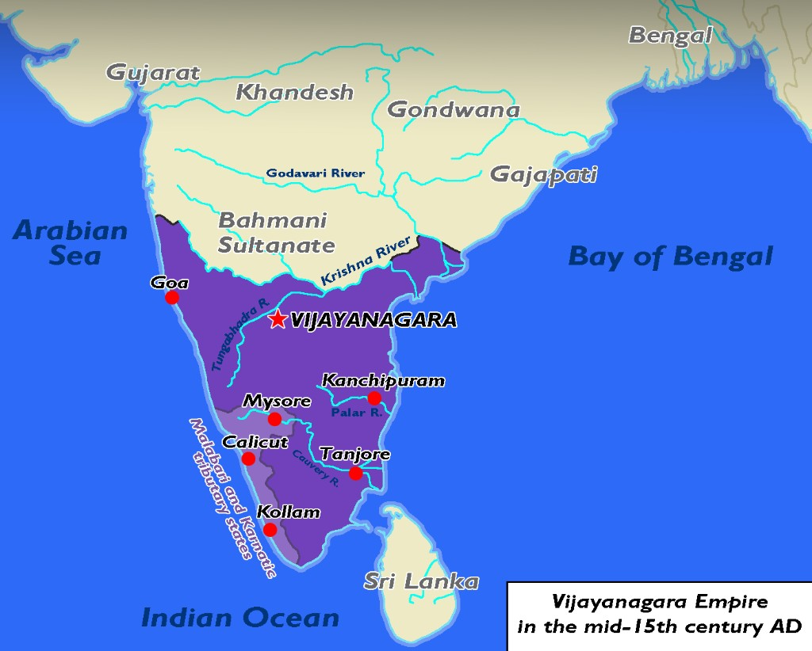
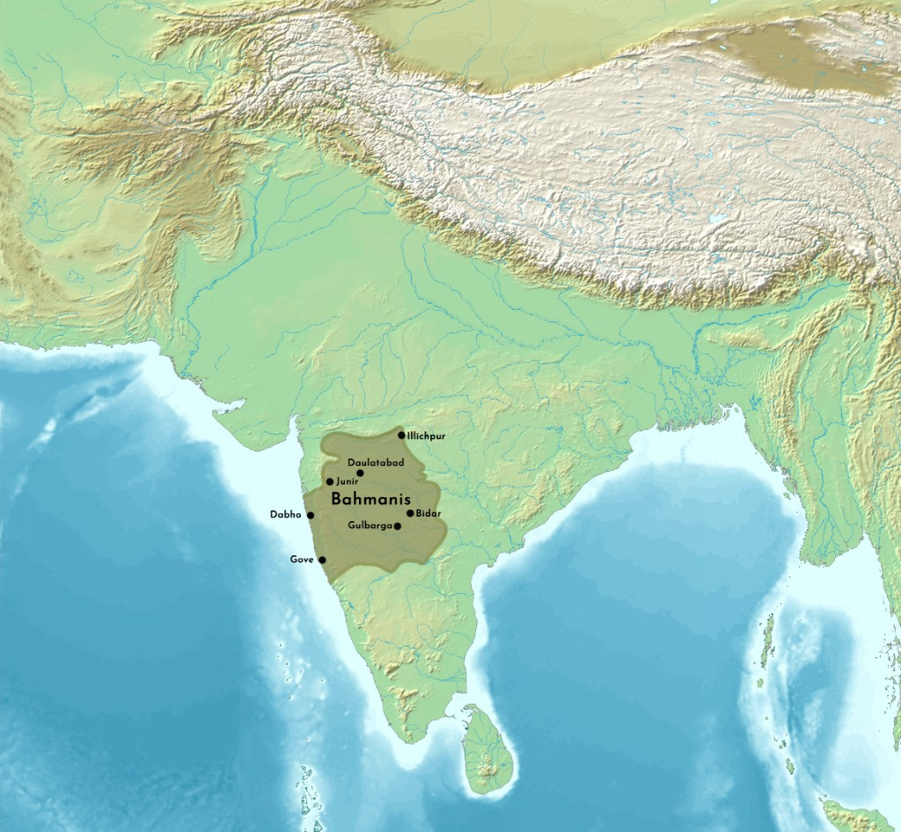
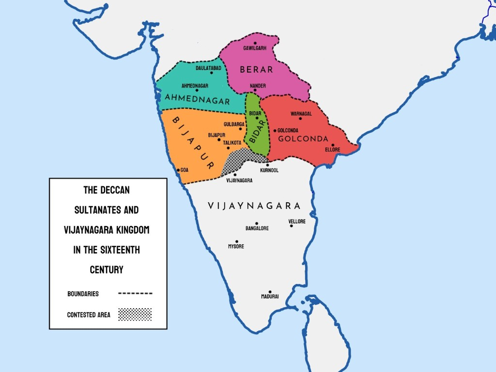

# Topic 3 — Regional Kingdoms (Sharqi (शर्की), Kashmir, Vijayanagara (विजयनगर), Bahmani & Deccan (दक्कन))
### ★ UPPCS Revision Sheet — Lucent / PW style (one home per fact · no repetition · Practice ≥45)

<strong>Covers syllabus</strong> (click to expand)

Sharqi Sultanate (Jaunpur (जौनपुर)) | Kashmir under Zain-ul-Abidin (ज़ैन-उल-आबिदीन) | Gujarat Sultanate (quick) | Vijayanagara Empire (विजयनगर) | Bahmani Kingdom (बहमनी) | Deccan Sultanates | Battle of Talikota

> **Sources baked in:** NCERT *Themes in Indian History Part II*, RS Sharma *Medieval India*, **Ghatnachakra** Provincial Dynasties of North India & Deccan (B–253+), UPPCS / UKPCS Prelims PYQs
> **Weight:** ★★★ — Sharqi architecture (UP), Zain-ul-Abidin tolerance, Vijayanagara–Bahmani rivalry, Talikota, Deccan capitals, book–context matching
> **Last verified:** September 2026
> **Current Affairs:** N/A (purely historical)

---

## Consolidated — 36 Must-Score Facts

1. **Firuz Shah** founded the city of **Jaunpur** (जौनपुर) in memory of cousin **Jauna Khan (Muhammad bin Tughlaq (मुहम्मद बिन तुगलक))**; **Malik Sarwar (Khwaja-i-Jahan / Malik-us-Sharq)** made it independent (**~1394**); **Ibrahim (इब्राहिम) Shah** made it **Siraj/Shiraz-i-Hind**.
2. **Atala Masjid** (अटाला मस्जिद) and **Lal Darwaza Masjid** are classic **Sharqi** (शर्की) monuments at Jaunpur in eastern **UP**.
3. Last Sharqi ruler **Hussain Shah** fell to **Bahlul Lodi** (**1479/1484** keys); **Vidyapati**’s *Kirtilata* praises Jaunpur under Ibrahim.
4. **Malik Muhammad Jaisi** composed **Padmavat** (पद्मावत) in the Jaunpur cultural circle.
5. **Zain-ul-Abidin** (**1420–1470**), called **Bud Shah**, abolished **jaziya** and cow slaughter and restored temples in Kashmir.
6. **Sriya Bhatt** was Zain-ul-Abidin’s Hindu minister; **Zaina Lanka** was his island palace on **Wular Lake**.
7. **Sikandar Shah** of Kashmir is the temple-destruction contrast (**Butshikan**) to tolerant **Zain-ul-Abidin**.
8. **Vijayanagara** (विजयनगर) was founded in **1336** by **Harihara I** and **Bukka I** (Sangama) with capital at **Hampi** (हम्पी) on the Tungabhadra (तुंगभद्रा); tradition links guidance to **Vidyaranya**.
9. Vijayanagara dynasties ran **Sangama → Saluva → Tuluva → Aravidu**.
10. **Deva Raya I / II** mark Sangama military peak against Bahmani; **Saluva Narasimha** founded the Saluva house; **Krishnadevaraya** (कृष्णदेवराय) (**1509–1529**, Tuluva) wrote **Amuktamalyada** (आमुक्तमाल्यदा) and patronised the **Ashtadiggajas**.
11. Vijayanagara used the **Nayankara / amara** system and celebrated the **Mahanavami** festival; do not equate Nayankara with Delhi Sultanate (दिल्ली सल्तनत) **iqta** (इक्ता).
12. **Bahmani** was founded in **1347** by **Hasan Gangu** as **Alauddin Bahman Shah**; the capital moved **Gulbarga → Bidar**.
13. Bahmani politics pitted **Afaqis (foreigners)** against **Deccanis (locals)**; **Mahmud Gawan** (Afaqi wazir) wrote **Riyaz-ul-Insha** (रियाज-उल-इंशा), organised **eight tarafs**, and was executed in **1481**.
14. After **1518** Bahmani split into five Deccan Sultanates: **Bijapur (बीजापुर), Golkonda, Ahmadnagar, Bidar, and Berar**.
15. **Bijapur (Adil Shahi)** holds **Gol Gumbaz (गोल गुम्बद) / Gol Gumbad** (tomb of **Muhammad Adil Shah**; among the world's largest domes); **Ibrahim Adil Shah II** (**Jagatguru / Ablababa**) wrote **Kitab-i-Nauras** (किताब-ए-नौरस), founded **Nauraspur**; **Firishta** (फरिश्ता) worked at his court.
16. **Golkonda (Qutb (कुतुब) Shahi)** later centred on **Hyderabad** (हैदराबाद); **Abul Hasan Qutb Shah** fell to Aurangzeb (औरंगजेब) in **1687**.
17. **Ahmadnagar** = Nizam (निजाम) Shahi; **Bidar** = Barid (बरीद-ए-मुमालिक) Shahi; **Berar** = Imad Shahi.
18. **Talikota (1565)** Cause–Course–Result: Rama Raya (रामा राय)’s Deccan overreach after Krishnadevaraya → Deccan alliance crushed Vijayanagara at Rakkasa-Tangadi (**23 Jan 1565**) → **Hampi** sacked and the empire ceased to be a great power.
19. **Raichur (1520)** was a **Krishnadevaraya** victory — do not confuse it with Talikota **1565**.
20. **Riyaz-ul-Insha** is Gawan’s letters; **Riyaz-us-Salatin** (रियाज-उस-सलातीन) is Bengal history (इतिहास) — never swap the two.
21. **Tin Darwaza** stands at **Bidar Fort**, not Ahmedabad (अहमदाबाद); Ahmedabad’s gate is **Teen Darwaza**. **Lal Darwaza–Jaunpur** is correctly matched.
22. Among these regional states, only **Sharqi Jaunpur** has its capital in modern **Uttar Pradesh** (उत्तर प्रदेश).
23. Chronology spine: Vijayanagara **1336** → Bahmani **1347** → Sharqi **1394** → Zain-ul-Abidin **1420–1470** → Gawan executed **1481** → Jaunpur annexed **1484** → Bahmani split **1518** → Talikota **1565**.
24. **Vitthala Temple** at Hampi is Vijayanagara; **Charminar** (चारमीनार) is Qutb Shahi Hyderabad.
25. **Kitab-i-Nauras** is Bijapur (Ibrahim Adil Shah II); **Amuktamalyada** is Krishnadevaraya’s Telugu epic.
26. **Manucharitramu** by **Allasani Peddana** belongs to Krishnadevaraya’s Ashtadiggajas circle.
27. **Burhan-e-Masir** is an Ahmadnagar chronicle; **Mirat-e-Sikandari** is a Gujarat narrative.
28. **Muzaffar Shah (1407)** founded Gujarat; **Mahmud Begada** took **Champaner** and **Girnar**; **Bahadur Shah** conceded **Diu** to the Portuguese.
29. **Yusuf Adil Shah** founded **Bijapur**; **Malik Ahmad** founded **Ahmadnagar** — do not swap founders.
30. **Jami Masjid (Jaunpur)** joins Atala and Lal Darwaza in the Sharqi UP monument set.
31. Vijayanagara–Bahmani rivalry centred on the **Raichur Doab** and Krishna–Tungabhadra frontier long before Talikota.
32. Deccan Sultanate common pattern used Persianate courts with local Telugu/Marathi/Kannada intermediaries under the five successor houses.
33. **Abul Hasan Tana Shah** is the last Qutb Shah memory paired with Aurangzeb’s **1687** Golkonda annexation.
34. **Ibrahim Shah Sharqi**’s cultural peak (**Siraj-i-Hind**) is the UP Sharqi identity line before Lodi annexation.
35. **Chand Bibi** of Ahmadnagar is the Deccan defence memory against Akbar’s late campaigns — do not place her at Talikota **1565**.
36. Post-Talikota Aravidu rulers shifted power southward; Hampi ceased to be the imperial capital after the **1565** sack.

---

## Confused Pairs

| A | B | Difference | Hindi |
|---|---|------------|-------|
| Firuz city (Jaunpur) | Sharqi state (Jaunpur) | City named for **Jauna Khan**; independent state by **Malik Sarwar** | फ़िरोज़ नगर / शर्की राज्य |
| Yusuf Adil Shah | Malik Ahmad | **Bijapur** founder vs **Ahmadnagar** founder | यूसुफ आदिल / मलिक अहमद |
| Sharqi architecture | Delhi Sultanate architecture | Jaunpur massive gateways/arches vs Delhi arch-dome-minaret idiom | शर्की स्थापत्य / सल्तनत स्थापत्य |
| Zain-ul-Abidin | Sikandar Shah (Kashmir) | Bud Shah abolished jaziya vs temple destruction phase | ज़ैन-उल-आबिदीन / सिकंदर शाह |
| Vijayanagara Empire | Bahmani Kingdom | Hindu south empire vs first major Deccan Muslim kingdom | विजयनगर / बहमनी |
| Krishnadevaraya | Rama Raya | Tuluva peak (1509–29) vs regent killed Talikota 1565 | कृष्णदेवराय / राम राय |
| Gulbarga & Bidar | Bijapur | Bahmani capitals (Gulbarga early, Bidar later) vs **Adil Shahi** centre | गुलबर्गा-बीदर / बीजापुर |
| Riyaz-us-Salatin | Riyaz-ul-Insha | **Bengal** history vs **Gawan's letters** | रियाज़-उस-सलातीन / रियाज़-उल-इंशा |
| Tin Darwaza (Bidar) | Teen Darwaza (Ahmedabad) | **Bidar Fort** gate vs **Ahmedabad** monumental triple gateway | तीन दरवाज़ा (बीदर) / तीन दरवाज़ा (अहमदाबाद) |
| Battle of Talikota (1565) | Battle of Raichur (1520) | 1565 defeat vs 1520 Krishnadevaraya victory | तालीकोटा (1565) / रायचूर (1520) |
| Kitab-i-Nauras | Amuktamalyada | Ibrahim Adil Shah II (Bijapur) vs Krishnadevaraya (Telugu) | किताब-ए-नौरस / अमुक्तमाल्यद |
| Nayankara system | Iqta system | Vijayanagara nayaka military land grants vs Delhi Sultanate muqti | नायककारा / इक्ता |

---

## Must-score facts — capitals, books, chronology

### State ↔ capital / founder

| State | Capital / founder lock |
|-------|------------------------|
| Sharqi | **Jaunpur**; independent by **Malik Sarwar (~1394)** |
| Vijayanagara | **Hampi**; **Harihara–Bukka 1336** (Sangama) |
| Bahmani | **Gulbarga → Bidar**; **Hasan Gangu 1347** |
| Bijapur | **Adil Shahi**; Gol Gumbaz |
| Golkonda | **Qutb Shahi**; later Hyderabad |
| Ahmadnagar | **Nizam Shahi** |
| Bidar | **Barid Shahi** |
| Berar | **Imad Shahi** |
| Gujarat Sultanate | Founded **Muzaffar Shah (1407)** |

### Book / monument ↔ context

| Item | Lock |
|------|------|
| Atala / Lal Darwaza Masjid | **Sharqi Jaunpur (UP)** |
| Amuktamalyada | **Krishnadevaraya** (Telugu) |
| Kitab-i-Nauras | **Ibrahim Adil Shah II** (Bijapur) |
| Riyaz-ul-Insha | **Mahmud Gawan** letters |
| Riyaz-us-Salatin | **Bengal** history (not Gawan) |
| Padmavat | **Malik Muhammad Jaisi** (Jaunpur circle) |
| Vitthala Temple | Vijayanagara **Hampi** |
| Charminar | Qutb Shahi **Hyderabad** |
| Tin Darwaza | **Bidar Fort** (not Ahmedabad Teen Darwaza) |

### Chronology spine

| Event | Year |
|-------|------|
| Vijayanagara founded | **1336** |
| Bahmani founded | **1347** |
| Sharqi independent | **~1394** |
| Zain-ul-Abidin (Bud Shah) | **1420–1470** |
| Gawan executed | **1481** |
| Jaunpur annexed (Lodi) | **1479 / 1484** |
| Bahmani split (5 Deccan states) | **1518** |
| Raichur (Krishnadevaraya win) | **1520** |
| Talikota | **1565** |

### Vijayanagara dynasty order

**Sangama → Saluva → Tuluva → Aravidu**

---

## 3.1 Sharqi Sultanate (Jaunpur)

**Period: ~1394–1479/1484** | **Capital: Jaunpur** (eastern UP) | **Founder of state: Malik Sarwar**

- **Firuz Shah Tughlaq** founded the **city of Jaunpur** in memory of his cousin **Jauna Khan** (**Muhammad bin Tughlaq** (मुहम्मद बिन तुगलक)).
- Under late Tughlaq weakness (**Mahmud Shah II** era, **~1394**), **Malik Sarwar** (a slave of that court) became independent. Delhi gave him titles **Malik-us-Sharq** (Lord of the East) and **Khwaja-i-Jahan**.
- He and his adopted (अंगीकृत) line founded the **Sharqi** dynasty. Independence lasted about **85 years**.
- The Sharqi core lay in **eastern UP** (Jaunpur–Ghazipur–Banaras); claims ran wider from Aligarh (अलीगढ़) toward Darbhanga.
- **Ibrahim Shah Sharqi (1402–1440)** was the greatest Sharqi ruler. **Sharqi style** architecture flowered; Jaunpur was called **Siraj-i-Hind / Shiraz-i-Hind** (Shiraz of the East) as a learning and culture centre.
- **Vidyapati** described Jaunpur and Ibrahim Shah in *Kirtilata*.
- **Mubarak Shah** followed Malik Sarwar; later **Mahmud Shah** faced Lodi pressure.
- **Hussain Shah** was the last Sharqi sultan. **Bahlul Lodi** defeated him and reattached Jaunpur to Delhi (**1479** in Ghatnachakra; many coaching keys also use **1484**).
- Monuments: **Atala Masjid**, **Lal Darwaza Masjid**, **Jami Masjid (Jaunpur)** — massive gateways and arches.
- **Malik Muhammad Jaisi** composed **Padmavat** in this cultural circle.

> **Logic:** Siraj-e-Hind is true because Jaunpur was a great education and culture centre under the Sharqis (**UP R.O./A.R.O. 2023** — both true, R explains A).

> **Logic:** Lal Darwaza–Jaunpur is **correct**. Do not confuse it with **Tin Darwaza–Ahmedabad**: Tin Darwaza stands at **Bidar Fort**, while Ahmedabad has **Teen Darwaza**. Among Topic-3 states, only **Sharqi Jaunpur** lies in modern **Uttar Pradesh**.

### PYQ — Sharqi monuments

**1. (UPPCS Prelims 2018, Q19)** Which of the following pairs is **NOT** correctly matched (Monument–Place)?

A. Adina Masjid–Mandu (मांडू)
B. Lal Darwaza Masjid–Jaunpur
C. Dakhil Darwaza–Gaour
D. Tin Darwaza–Ahmedabad

Show answer

**Ans: D.**

**Why wrong:** Tin Darwaza stands at **Bidar Fort** (Deccan), not Ahmedabad. Ahmedabad's famous gate is **Teen Darwaza**.

**Trap:** **Lal Darwaza–Jaunpur** (B) is **correct** Sharqi architecture (शर्की स्थापत्य) — candidates often mark B wrong because they confuse Lal Darwaza with Tin Darwaza.

**2. (UPPCS Prelims 2019, Q91)** Arrange the following in chronological order:

I. Rabia Daurani Tomb

II. Sher Shah (शेरशाह) Tomb

III. Humayun (हुमायूँ) Tomb

IV. Atala Mosque Jaunpur

A. I, II, IV, III
B. IV, II, III, I
C. III, II, I, IV
D. IV, III, I, II

Show answer

**Ans: B (IV, II, III, I).**

**Order:** IV **Atala Mosque, Jaunpur** (~**15th c.**, Sharqi) → II **Sher Shah's Tomb, Sasaram (सासाराम)** (**1545**) → III **Humayun's Tomb, Delhi** (**1565**) → I **Rabia Daurani's Tomb, Aurangabad** (**1678**).

**Trap:** Do not place **Humayun** before **Sher Shah** (शेरशाह) — Sher Shah died and was buried **20 years earlier**. Atala is **not** Mughal (मुग़ल); it belongs to the **Sharqi** phase.

---

## 3.2 Kashmir under Zain-ul-Abidin

**Reign:1420–1470** | **Capital:Srinagar** | **Title:Bud Shah** (Great Sultan) | **Also called:** Akbar (अकबर) of Kashmir

- Original name **Shahi Khan**; he sat on the Kashmir throne after his brother Ali Shah.
- His predecessor **Sikandar Shah (1389–1413)** had forced conversions, destroyed temples, and allowed cow slaughter under **Suha Bhatt**.
- **Zain-ul-Abidin (1420–1470)** reversed Sikandar’s intolerant policies and earned the title **Bud Shah**. He is also remembered as the **Akbar of Kashmir** for liberal religion, learning, and crafts.
- He **abolished jaziya** and banned cow slaughter.
- He **restored temples** and permitted reconversion to Hinduism.
- He appointed **Sriya Bhatt** as Minister of Justice and court physician.
- He patronised learning in **Persian (फ़ारसी), Kashmiri, Sanskrit, and Tibetan**.
- He commissioned translations of the **Mahabharata** (महाभारत) and **Rajatarangini** (राजतरंगिणी).
- He promoted **shawl weaving**, papermaking, and other crafts.
- He built dams, canals, and **Zaina Lanka**, an island in **Wular Lake**.
- He defeated the Ladakh (लद्दाख) Mongols and expanded influence over Baltistan, Jammu, and Rajauri.

> **Logic:** **Zain-ul-Abidin (Bud Shah)** alone abolished **jaziya** and banned **cow slaughter** in Kashmir.

### PYQ — Zain-ul-Abidin A/R

**1.** Assertion (A): **Zain-ul-Abidin** was called **Bud Shah** (Great Sultan).

Reason (R): He reversed **Sikandar Shah's** intolerant policies, abolished **jaziya**, and restored temples.

A. Both true, R explains A
B. Both true, R not explanation
C. A true, R false
D. A false, R true

Show answer

**A/R logic:** A is true: Zain-ul-Abidin was called **Bud Shah** (Great Sultan).

**Ans: A (Both true, R explains A).**

**R is true:** He **reversed Sikandar Shah's** intolerant policies — abolished **jaziya**, banned **cow slaughter**, and **restored temples**.

**Why R explains A:** Tolerant rule earned the **Bud Shah** title.

**Trap:** Sikandar Shah** was the **intolerant** predecessor — R describes the **reversal** that justified the honorific.

### PYQ — Kashmir

**1. (UPPCS Prelims 2023, Q36)** Which ruler of Kashmir abolished **Jaziya** and **cow slaughter**?

A. Shamsuddin Shah
B. Sikandar Shah
C. Zain-ul-Abidin
D. Haider Shah

Show answer

**Ans: C.**

**Why:** Zain-ul-Abidin (Bud Shah, 1420–1470) abolished **jaziya**, banned **cow slaughter**, and **restored temples** after **Sikandar Shah's** intolerant phase.

**Trap:** **Sikandar Shah** did the **opposite** — forced conversions and temple destruction. **Zain-ul-Abidin (Bud Shah)** abolished **jaziya** and banned **cow slaughter**.

---

## 3.2a Gujarat Sultanate

**Independent Gujarat | Muzaffar Shah line | Champaner–Girnar fame**

- Under late Tughlaq weakness, **Zafar (ज़फ़र) Khan** took the title **Muzaffar Shah** in **1407** and founded independent Gujarat.
- He defeated **Hoshang Shah** of Malwa, briefly held **Dhar**, then restored Malwa rather than annexing it permanently.
- **Mahmud Begada** (born **Fateh Khan**, ruling from **1458**; title **Abul Fateh Mahmud**) is the famous later Gujarat sultan.
- His headline victories are the forts of **Champaner** and **Girnar**.
- **Bahadur Shah** later allowed the **Portuguese** a fort at **Diu** by the **1535** treaty against Mughal danger, then regretted the concession.
- The chronicle **Mirat-e-Sikandari** is the Gujarat victory narrative used in book–context match stems.
- Do not relocate Gujarat’s capital story to **Ahmadabad-only** memory when the stem asks Begada’s fort victories — Champaner and Girnar are the keys.

---
## 3.3 Vijayanagara Empire

**Founded 1336** | **Founders Harihara I and Bukka I** (Sangama) | **Capital Hampi** on the Tungabhadra

| Dynasty | Key rulers | Period |
|---------|------------|--------|
| **Sangama** | Harihara I, Bukka I, Deva Raya II | 1336–1485 |
| **Saluva** | Saluva Narasimha | 1485–1505 |
| **Tuluva** | **Krishnadevaraya**, Achyuta Raya | 1505–1570 |
| **Aravidu** | Tirumala, Venkata II | 1570–1646 |

- Harihara I and Bukka I founded Vijayanagara in response to **Delhi Sultanate** (दिल्ली सल्तनत) expansion under **Muhammad bin Tughlaq** and wider Deccan instability.
- Vijayanagara fought chronic wars with the **Bahmani Kingdom** over the **Raichur doab (दोआब)** between the Krishna (कृष्णा) and Tungabhadra rivers.
- The empire reached its peak under **Krishnadevaraya (1509–1529)**.
- Decline accelerated under the regency of **Aliya Rama Raya**.
- After **Talikota in 1565**, Hampi was sacked and the **Aravidu** dynasty ruled a diminished kingdom from **Penukonda and Chandragiri**.
- Foreign travellers **Nuniz**, **Paes**, and **Duarte Barbosa** describe Hampi's wealth.
- Major Hampi monuments include the **Vitthala Temple**, **Virupaksha** (विरूपाक्ष), and **Hazara Rama** temples.

### Rulers and dynasties

**Harihara I (1336–1356, Sangama)**

- **Harihara I** and his brother **Bukka I** founded Vijayanagara at **Hampi** in **1336** after Delhi Sultanate pressure under **Muhammad bin Tughlaq**.
- Harihara had earlier served the **Kampili** kingdom and the **Hoysala** network before building an independent Hindu power in the Tungabhadra–Krishna zone.

**Bukka I (1356–1377, Sangama)**

- **Bukka I** consolidated the infant kingdom and strengthened Sangama authority over the core Kannada–Telugu belt.
- He continued temple patronage and frontier wars that fixed Vijayanagara as a permanent Deccan power.

**Harihara II (1377–1404, Sangama)**

- **Harihara II** extended Vijayanagara influence deeper into the **Tamil** country and the eastern coast.
- His reign saw the empire grow from a regional kingdom into a wider southern state.

**Deva Raya I (1406–1422, Sangama)**

- **Deva Raya I** rebuilt royal power after a brief internal crisis in the Sangama line.
- He fought the **Bahmanis** and restored Vijayanagara prestige in the **Raichur doab**.

**Deva Raya II (1424–1446, Sangama)**

- **Deva Raya II** was the greatest **pre-Tuluva** Vijayanagara ruler and is remembered as **Praudha Deva Raya**.
- He earned the title **Gajabetekara** (elephant hunter) and repeatedly defeated Bahmani armies in the Krishna–Tungabhadra belt.
- He patronised **Sanskrit** and **Telugu** learning and sent embassies to **Sri Lanka** and the **Far East**.
- His death in **1446** opened a phase of noble factionalism that weakened the Sangama line.

**Saluva Narasimha (1485–1490, Saluva)**

- **Saluva Narasimha** ended Sangama rule by seizing the throne in **1485** after prolonged ministerial and noble struggles.
- He began the short **Saluva** dynasty and tried to recentre authority in the hands of the king.

**Narasimha Raya II (1491–1505, Saluva)**

- **Narasimha Raya II** was a weak Saluva ruler under powerful nobles.
- His reign prepared the ground for the **Tuluva** seizure of power under **Vira Narasimha** and then **Krishnadevaraya**.

**Achyuta Raya (1529–1542, Tuluva)**

- **Achyuta Raya** was **Krishnadevaraya's** younger brother and succeeded him in **1529**.
- His reign saw court rivalry and the rise of the **Aravidu** and **Tirumala** factions.

**Sadasiva Raya (1542–1570, Tuluva)**

- **Sadasiva Raya** ruled in name while **Aliya Rama Raya** acted as the real regent.
- This regency period ended with the fatal overreach that produced the **Talikota** disaster.

**Aliya Rama Raya (regent, killed 1565)**

- **Rama Raya** was the dominant minister-regent who repeatedly interfered in Deccan Sultanate successions.
- His policy united **Bijapur, Ahmadnagar, Golkonda, and Bidar** against Vijayanagara at **Talikota (1565)**.
- He was **captured and beheaded** on the battlefield, and Hampi was sacked.

**Tirumala Raya & Venkata II (Aravidu, post-1565)**

- After **Talikota**, the **Aravidu** line ruled a reduced kingdom from **Penukonda** and later **Chandragiri**.
- **Venkata II** tried to recover prestige, but Vijayanagara never regained its pre-1565 imperial reach.
- The dynasty survived in name until **1646**, long after Hampi was abandoned.

### Administration

**Nayankara/amara system** | **Rajya** provinces | **Mahanavami** royal festival

| Office / unit | Function |
|---------------|----------|
| **Mahapradhana** | Prime minister; headed the central council |
| **Dandanayaka** | Law, order, and military coordination |
| **Rajya** | Province under a governor |
| **Nadu** (नाडु) | District cluster below the province |
| **Ur** | Ordinary village assembly |
| **Sabha** (सभा) | Brahmana (ब्राह्मण) **agrahara** assembly with stronger autonomy |
| **Nayaka** (नायक) | Feudatory holder of an **amaram** grant |
| **Amaram** | Land grant tied to military service |

- The king acted as **dharma protector** and commander-in-chief, assisted by a cabinet of great officers whose titles varied by period.
- Under the **nayankara/amara system**, the king granted **amaram lands** to **nayakas** in return for **military service**, tribute, and local administration.
- A **nayaka** maintained troops, collected revenue from his grant, and owed feudatory duty to the Vijayanagara throne.
- This system later became the precursor to post-1565 **Nayak kingdoms** such as **Madurai** (मदुरै), **Tanjore** (तंजावुर), and **Gingee**.
- **Land revenue** was the main income, drawn from temple lands (**devadana**), **agrahara** grants, and peasant holdings.
- The state also drew income from **customs**, **monopolies**, and tribute presented at royal festivals.
- The army (सेना) included **elephants, cavalry, infantry, and artillery** by the sixteenth century.
- The **Portuguese** at **Goa** (गोवा) supplied horses and firearms to Vijayanagara in Krishnadevaraya's age.
- The **Mahanavami/Dasara** festival at Hampi was a royal display of power, tribute collection, and military might.
- Temple grants were recorded on **mandapa (मंडप) pillars** at **Virupaksha** and **Vitthala**.

### Krishnadevaraya (1509–1529)

- In the **Battle of Raichur (1520)** (रायचूर), he defeated **Ismail Adil Shah** of Bijapur and captured Raichur fort, marking his military peak.
- He also defeated **Prataparudra** of Orissa/Gajapati and secured the Krishna boundary.
- He used **Portuguese** contacts to obtain horses and guns.
- He authored **Amuktamalyada**, a Telugu epic.
- He patronised the **Ashtadiggajas**, the eight great Telugu poets at his court.
- **Allasani Peddana** wrote **Manucharitramu** and served at Krishnadevaraya's court.
- **Tenali Ramakrishna (रामकृष्ण)** was another famous courtier of Krishnadevaraya.
- He was personally devoted to **Vaishnavism** (वैष्णव), but he also patronised **Shaiva** temples.
- He died in **1529**, and his brother **Achyuta Raya** succeeded him.
- Later, the **Rama Raya** regency led the empire toward Talikota.

> **Logic:** The founders of Vijayanagara were **Harihara I and Bukka I**, not Krishnadevaraya. The **nayankara** system belongs to **Vijayanagara**, not to the Delhi **iqta** or the Mughal **jagir** (जागीर). **Amuktamalyada** was written by Krishnadevaraya in Telugu; **Kitab-i-Nauras** was written by **Ibrahim Adil Shah II** of Bijapur.

---

## 3.4 Bahmani Kingdom

**Founded: 1347** | **Founder: Hasan Gangu** (throne name **Alauddin Hasan Bahman Shah**) | **Capitals: Gulbarga (Ahsanabad)**, then **Bidar**

- Bahmani rose during **Muhammad bin Tughlaq**'s Deccan turmoil after the **Amiran-e-Sadah** rebellions.
- **Zafar Khan / Hasan Gangu** declared independence at **Gulbarga** in **1347**, took the title **Alauddin Hasan Bahman Shah**, and named the capital **Ahsanabad**.
- Early rule divided the realm into four (चातुर्याम) provinces: **Gulbarga, Daulatabad, Berar, and Bidar**.
- **Ahmad Shah I Wali** later shifted the capital to **Bidar** around **1429**.

- The kingdom was divided into **eight tarafs**, or provinces, each ruled by a **tarafdar**.
- Bahmani was a long rival of **Vijayanagara** over the **Raichur doab**, and war and marriage alliances alternated between the two powers.
- **Mahmud Gawan**, the Persian wazir (वज़ीर) under Muhammad Shah III, expanded Bahmani power to the Orissa coast.
- Gawan also introduced land surveys and strict revenue accounting.
- He was executed in **1481** after a forged treason letter, and Bahmani's administrative peak ended with his death.
- Rival **Deccani and Afaqi** noble factions later paralysed the court.
- The last sultan was **Kalimullah**, and the kingdom split in **1518** into five Deccan Sultanates.

### Sultan chronology

| Sultan | Period | Fact |
|--------|--------|------|
| **Alauddin Bahman Shah (Hasan Gangu)** | 1347–1358 | Founder at Gulbarga |
| **Muhammad Shah I** | 1358–1375 | Early consolidation |
| **Firoz Shah (फ़िरोज़ शाह) Bahmani** | 1397–1422 | Pre-Bidar phase |
| **Ahmad Shah I Wali** | 1422–1436 | Capital shift to **Bidar** |
| **Muhammad Shah III** | 1463–1482 | **Mahmud Gawan** as wazir |
| **Kalimullah** | Last sultan | Kingdom split **1518** |

**Alauddin Bahman Shah / Hasan Gangu (1347–1358)**

- **Hasan Gangu** was a Turkish officer in the service of **Muhammad bin Tughlaq** who rebelled and declared independence at **Gulbarga in 1347**.
- He took the throne name **Alauddin Bahman Shah** and founded the first major Muslim kingdom of the Deccan.

**Muhammad Shah I (1358–1375)**

- **Muhammad Shah I** consolidated the infant Bahmani state after Hasan Gangu.
- He pushed back Vijayanagara pressure and fixed Gulbarga as a durable Deccan capital.

**Firoz Shah Bahmani (1397–1422)**

- **Firoz Shah Bahmani** ruled through a long phase of wars with **Vijayanagara** over the **Raichur doab**.
- His reign kept Bahmani power intact before the later shift to **Bidar**.

**Ahmad Shah I Wali (1422–1436)**

- **Ahmad Shah I Wali** moved the Bahmani capital from **Gulbarga** to **Bidar** around **1429**.
- He built fortifications and mosques that made **Bidar** the architectural centre of the kingdom.

**Muhammad Shah III (1463–1482)**

- **Muhammad Shah III** was a minor when he came to the throne, and real power passed to his minister **Mahmud Gawan**.
- Under this reign Bahmani armies reached the **Konkan**, **Goa**, and the **Orissa coast**.

**Kalimullah (last sultan)**

- **Kalimullah** was a weak last sultan after Gawan's execution and noble faction fights.
- The kingdom formally broke into **five Deccan Sultanates in 1518**.

### Mahmud Gawan (wazir, executed 1481)

**Persian-born minister** | **Wazir under Muhammad Shah III** | **Author of state letters preserved as *Riyaz-ul-Insha***

- **Mahmud Gawan** was born at **Gawan** in **Persia** and came to the Deccan as a trader before entering Bahmani service.
- He rose through military and diplomatic talent to become **wazir** (वज़ीर) (prime minister) under **Muhammad Shah III**.
- He was **not** the founder of the Bahmani kingdom — **Hasan Gangu** holds that fact.
- As wazir he conquered **Konkan** and **Goa** and extended Bahmani influence toward the **Orissa coast**.
- He introduced **land measurement**, **strict revenue accounting**, **cash salaries**, and **merit-based appointments** in place of hereditary noble privilege.
- He built a famous **madrasa at Bidar** and patronised Persian learning alongside fiscal reform.
- **Riyaz-ul-Insha** preserves his official **letters and state papers** and is a major source on Bahmani administration.
- Rival nobles forged a **treason letter** in his name; the sultan ordered his execution in **1481**.
- After Gawan's death, **Deccani** and **Afaqi** noble factions paralysed the court and the kingdom declined toward the **1518** split.

### Administration

| Office | Function |
|--------|----------|
| **Wazir** | Prime minister and head of civil administration |
| **Mustaufi** | Finance minister; accounts and audit |
| **Mir Jumla** | Foreign trade (पण्याध्यक्ष), customs, and commercial revenue |
| **Tarafdar** | Governor of a **taraf** (province) |
| **Kotwal** | City administration and law and order |
| **Barid** (बरीद-ए-मुमालिक) | Intelligence service and news reporting |
| **Ariz** | Military department; army rolls and pay |

- The kingdom was divided into **eight tarafs** (provinces), each under a **tarafdar**.
- Important taraf centres included **Daulatabad**, **Gulbarga**, **Bidar**, **Berar**, and the **Telangana** belt.
- Bahmani administration used a **Persianate centralised bureaucracy** adapted from the Delhi Sultanate model.
- Revenue came from **land tax**, **trade dues**, and **tribute** from subordinated chiefs.
- Weak tarafdars later broke away as the independent **Deccan Sultanates** after **1518**.

### Literary and historical sources

| Work | What it is | Key fact |
|------|------------|-----------|
| **Riyaz-ul-Insha** | Collection of **Mahmud Gawan's letters and state papers** | Bahmani administration; **not** Bengal history |
| **Riyaz-us-Salatin** | History of **Bengal** | Trap: sounds like Riyaz-ul-Insha but is a **different book** |
| **Burhan-e-Masir** | Chronicle of **Ahmadnagar** | Nizam Shahi successor state, not Bahmani court letters |
| **Mirat-e-Sikandari** | **Gujarat** victory narrative | Regional history; match with Gujarat |

> **Logic:** **Hasan Gangu** founded the Bahmani Kingdom; **Mahmud Gawan** was a minister. **Mirat-e-Sikandari** narrates the **Gujarat** victory; **Burhan-e-Masir** covers **Ahmadnagar**; **Riyaz-us-Salatin** is **Bengal** history; **Riyaz-ul-Insha** collects **Gawan's** letters.

### PYQ — Mahmud Gawan A/R

**1.** Assertion (A): **Mahmud Gawan** strengthened Bahmani administration as **wazir**.

Reason (R): His reforms included **land measurement**, **strict revenue accounting**, **cash salaries**, and **merit appointments**.

A. Both true, R explains A
B. Both true, R not explanation
C. A true, R false
D. A false, R true

Show answer

**A/R logic:** A is true: Mahmud Gawan strengthened Bahmani administration as **wazir**.

**Ans: A (Both true, R explains A).**

**R is true:** He introduced **land surveys** and **strict revenue accounting**.

**Why R explains A:** Fiscal and land reforms **were the means** of administrative strengthening.

**Trap:** Hasan Gangu** founded Bahmani — Gawan was **wazir**, not founder, but A correctly credits his administrative role.

### PYQ — Books match

**1. (UPPCS Prelims 2023, Q33)** Match List-I (Book) with List-II (Context):

| List-I | List-II |
|--------|---------|
| A. Mirat-e-Sikandari | 1. Bengal |
| B. Burhan-e-Masir | 2. Ahmadnagar |
| C. Riyaz-us-Salatin | 3. Gawan's letters |
| D. Riyaz-ul-Insha | 4. Gujarat victory |

*Row order in the table is not the answer code.*

A. 4-2-1-3
B. 2-4-1-3
C. 1-2-4-3
D. 4-2-3-1

Show answer

**Ans: A (4-2-1-3).**

**Facts:** A **Mirat-e-Sikandari** → **4** Gujarat victory | B **Burhan-e-Masir** → **2** Ahmadnagar | C **Riyaz-us-Salatin** → **1** Bengal | D **Riyaz-ul-Insha** → **3** Gawan's letters

**Trap:** Swapping **Riyaz-us-Salatin** (Bengal) with **Riyaz-ul-Insha** (Gawan) is the most common wrong code — the titles sound alike but contexts differ completely.

---

## 3.5 Deccan Sultanates

**Five successor states (from ~1518)** | All used **Persianate** central administration modelled on the Bahmani system

| Sultanate | Dynasty | Founder | Capital | Period |
|-----------|---------|---------|---------|--------|
| **Bijapur** (बीजापुर) | Adil Shahi | **Yusuf Adil Shah** (यूसुफ आदिल) | Bijapur | 1490–1686 |
| **Golkonda** | Qutb Shahi | **Quli Qutb Shah** | Golkonda → Hyderabad | 1518–1687 |
| **Ahmadnagar** | Nizam Shahi | **Malik Ahmad** (मलिक अहमद) | Ahmadnagar | 1490–1636 |
| **Bidar** | Barid Shahi | **Amir Barid** | Bidar | 1492–1619 |
| **Berar** | Imad Shahi | **Fathullah Imad-ul-Mulk** | Ellichpur | 1490–1574 |

### Common administrative pattern

| Element | Function |
|---------|----------|
| **Wazir / Peshwa (पेशवा)** | Chief minister |
| **Pargana** (परगना) | Basic revenue-admin unit |
| **Amil / Desai (आमिल)** | Revenue collector |
| **Qazi** (क़ाज़ी) | Judge under Islamic law |
| **Kotwal** | City police and order |

- All five states inherited the Bahmani **taraf** idea but ruled as separate sultanates after **1518**.
- Land revenue, trade customs, and feudatory tribute remained the main income sources.
- Four of them — **Bijapur, Ahmadnagar, Golkonda, and Bidar** — united against **Vijayanagara** at **Talikota (1565)**.
- The Mughals later absorbed them: **Ahmadnagar (1636)**, **Bijapur (1686)**, **Golkonda (1687)**.

### Bijapur (Adil Shahi)

- **Yusuf Adil Shah** founded the **Adil Shahi** line at **Bijapur** after the Bahmani collapse — **not** Ahmadnagar (**Nizam Shahi** = **Malik Ahmad**).
- **Ismail Adil Shah** was defeated by **Krishnadevaraya** at **Raichur (1520)**.
- **Ibrahim Adil Shah II** wrote **Kitab-i-Nauras** (Deccani), founded musical city **Nauraspur**, and was hailed **Jagatguru** and **Ablababa** (friend of the poor). **Firishta** completed *Tarikh-i-Firishta* in this milieu.
- **Muhammad Adil Shah** built **Gol Gumbaz** (गोल गुम्बद), famous for having one of the world's largest domes.
- Bijapur remained a major Deccan power until Aurangzeb annexed it in **1686**.

### Golkonda (Qutb Shahi)

- **Quli Qutb Shah** founded the **Qutb Shahi** dynasty and ruled from **Golkonda fort**.
- **Golkonda** was famous for **diamond mines** and overseas trade links.
- **Muhammad Quli Qutb Shah** founded **Hyderabad in 1591** and built the **Charminar**.
- **Abul Hasan Qutb Shah** was the **last** ruler when Aurangzeb captured Golkonda in **1687**.

### Ahmadnagar (Nizam Shahi)

- **Malik Ahmad** founded the **Nizam Shahi** kingdom with capital at **Ahmadnagar**.
- **Hussain Nizam Shah I** joined the anti-Vijayanagara coalition (गठबंधन) at **Talikota (1565)**.
- The court chronicle **Burhan-e-Masir** records Ahmadnagar history.
- The Mughals annexed Ahmadnagar in **1636** under **Shah Jahan** (शाहजहाँ); **Hussain Nizam Shah III** was imprisoned for life (Gwalior) after **Fateh Khan** surrendered **Daulatabad**.

### Bidar (Barid Shahi)

- **Amir Barid** was a former Bahmani minister who founded the **Barid Shahi** state at **Bidar**.
- **Tin Darwaza** in **Bidar Fort** is the standard monument fact for this centre.
- Bidar remained smaller than Bijapur and Golkonda and was absorbed by Bijapur in **1619**.

### Berar (Imad Shahi)

- **Fathullah Imad-ul-Mulk** founded the **Imad Shahi** line at **Ellichpur** in **Berar**.
- Berar was the **smallest** of the five successor states and was absorbed early by other Deccan powers.
- It rarely appears alone in match lists but completes the **five-sultanate** count after **1518**.

### Literary works of the Deccan Sultanates

| Work | Author / state | Key fact |
|------|----------------|-----------|
| **Kitab-i-Nauras** | **Ibrahim Adil Shah II** of **Bijapur** | Musical-devotional songs; **not** Krishnadevaraya |
| **Burhan-e-Masir** | Court chronicle of **Ahmadnagar** | Nizam Shahi history |
| **Amuktamalyada** | **Krishnadevaraya** of Vijayanagara | Telugu epic — cross-trap with Kitab-i-Nauras |

> **Logic:** Do not confuse **Bidar**, the Bahmani and later Barid Shahi centre, with **Bijapur**, the Adil Shahi capital. **Kitab-i-Nauras** was written by **Ibrahim Adil Shah II of Bijapur**, not by Krishnadevaraya.

### PYQs — Deccan Sultanates

**1. (UPPCS Prelims 2020, Q44)** Who among the following was the author of the book **Kitab-i-Nauras**?

A. Ibrahim Adil Shah II
B. Ali Adil Shah
C. Quli Qutab Shah
D. Akbar II

Show answer

**Ans: A.**

**Why:** Ibrahim Adil Shah II of **Bijapur (Adil Shahi)** wrote **Kitab-i-Nauras**, a collection of songs on music and devotion.

**Trap:** Krishnadevaraya** wrote **Amuktamalyada** (Telugu) — papers swap the two Deccan literary facts.

**2. (UPPCS Prelims 2020, Q34)** Who was the ruler of Golkonda when Aurangzeb seized the fort of Golkonda in **1687**?

A. Abul Hasan Qutb Shah
B. Sikandar Adil Shah
C. Ali Adil Shah II
D. Shayasta Khan

Show answer

**Ans: A.**

**Why:** Abul Hasan Qutb Shah was the **last Qutb Shahi** ruler when Aurangzeb captured Golkonda in **1687**.

**Trap:** Muhammad Quli Qutb Shah** founded **Hyderabad** and built **Charminar (1591)** — he ruled **a century earlier**, not in 1687.

---

## 3.6 Battle of Talikota (1565) (तालीकोटा)

**Date:23 January 1565** | **Site:Rakkasa-Tangadi** (near Talikota)

- **Cause:** Aliya Rama Raya**, the Vijayanagara regent, repeatedly meddled in Deccan Sultanate successions and alienated all four major successor states.
- **Course:** On **23 January 1565**, the four sultanates formed a coalition against Vijayanagara at **Rakkasa-Tangadi** near Talikota.
- The coalition included **Bijapur under Ali Adil Shah I**, **Ahmadnagar under Hussain Nizam Shah I**, **Golkonda under Ibrahim Qutb Shah**, and **Bidar under Ali Barid**.
- **Rama Raya** was captured and **beheaded** on the battlefield, and the Vijayanagara army collapsed.
- **Result:** Hampi was looted for about six months and the old capital was abandoned.
- The **Aravidu** dynasty retreated to **Penukonda and Chandragiri**, while **nayakas** became independent in Madurai, Tanjore, and Gingee.
- Talikota ended Vijayanagara as a **great power**, even though the empire survived in name until **1646**.

> **Logic:** Talikota (1565) is not the same as **Raichur (1520)**, which was Krishnadevaraya's victory. **Rama Raya** was killed at Talikota; Krishnadevaraya had died in **1529**.

### PYQ — Talikota A/R

**1.** Assertion (A): The **Battle of Talikota (1565)** ended Vijayanagara as a **great power**.

Reason (R): **Rama Raya** was **beheaded** on the battlefield and **Hampi** was sacked and abandoned.

A. Both true, R explains A
B. Both true, R not explanation
C. A true, R false
D. A false, R true

Show answer

**Ans: A (Both true, R explains A).**

**A is true:** Talikota **1565** ended Vijayanagara as a **great power**.

**R is true:Rama Raya** was **beheaded** and **Hampi** was **sacked**.

**Why R explains A:** The regent's death and capital looting **caused** the collapse of imperial power.

**Trap:** The empire survived in name under **Aravidu** until **1646** — A says "great power" ended, not every trace of the state.

---

## Complete PYQ Bank (Topic 3)

**Q1. UPPCS Prelims 2018, Q19**

Which of the following pairs is NOT correctly matched?

A. Adina Masjid – Mandu
B. Lal Darwaza Masjid – Jaunpur
C. Dakhil Darwaza – Gaour
D. Tin Darwaza – Ahmedabad

Show answer

**Correct Answer:** **A** (Adina Masjid — Mandu is NOT correctly matched)

**Detailed Explanation:**
- **Pair A: Adina Masjid — Mandu (INCORRECT):** The **Adina Masjid** was constructed in **Pandua** (Firuzabad, Bengal) around 1373–1375 CE by Sultan **Sikandar Shah** of the Ilyas Shahi dynasty. It was one of the largest mosques in the subcontinent, modeled on the Great Mosque of Damascus. The famous medieval mosque at **Mandu** (Malwa) is the Jami Masjid started by Hoshang Shah and completed by Mahmud Khalji.
- **Pair B: Lal Darwaza Masjid — Jaunpur (Correct):** Built in **1447 CE** by **Bibi Raji**, queen consort of Sultan Mahmud Shah Sharqi of Jaunpur, dedicated to saint Sayyid Ali Daud.
- **Pair C: Dakhil Darwaza — Gaur (Correct):** The grand triumphal entrance gateway to the citadel of **Gaur (Bengal)**, constructed around 1474 CE by Sultan Nasiruddin Barbak Shah.
- **Pair D: Tin Darwaza — Ahmedabad (Correct):** Celebrated triple-arched ceremonial gateway in **Ahmedabad (Gujarat)**, constructed in 1415 CE by Sultan Ahmad Shah I to serve as the royal entrance to the Maidan-i-Shah.

**Key Exam Takeaway / Trap:**
- *Adina Masjid* = **Pandua (Bengal)**, NOT Mandu.
- *Tin Darwaza* = **Ahmedabad (Gujarat)**.
- *Lal Darwaza* & *Atala Masjid* = **Jaunpur (Sharqi dynasty)**.

**Q2. UPPCS Prelims 2019, Q91**

Arrange chronologically: I. Rabia Daurani's Tomb, Aurangabad | II. Sher Shah's Tomb, Sasaram | III. Humayun's Tomb, Delhi | IV. Atala Mosque, Jaunpur

A. I, II, IV, III
B. IV, II, III, I
C. II, I, III, IV
D. III, IV, II, I

Show answer

**Correct Answer:** **B** (IV, II, III, I / Atala Mosque → Sher Shah's Tomb → Humayun's Tomb → Rabia Daurani's Tomb)

**Detailed Explanation:**
The correct ascending chronological sequence of construction is:
1. **IV. Atala Mosque, Jaunpur (1408 CE):** Founded by Firoz Shah Tughlaq in 1377 and completed by Sharqi Sultan **Ibrahim Shah Sharqi** in 1408 CE; hallmark of Sharqi architecture with its massive slanting propylon screen.
2. **II. Sher Shah's Tomb, Sasaram (1545 CE):** Magnificent three-tiered octagonal mausoleum standing in the middle of an artificial lake in Bihar, completed by his son Islam Shah immediately following Sher Shah's death in 1545 CE.
3. **III. Humayun's Tomb, Delhi (1565–1572 CE):** Commissioned by his chief consort **Bega Begum (Haji Begum)** and designed by Persian architect Mirak Mirza Ghiyas; the first monumental double-domed garden tomb (*Charbagh*) of Mughal architecture.
4. **I. Rabia Daurani's Tomb / Bibi Ka Maqbara, Aurangabad (1678 CE):** Built by Prince Azam Shah in memory of his mother Dilras Banu Begum (posthumously titled Rabia-ud-Daurani), chief consort of **Aurangzeb**; designed by architect Ataullah as an imitation of the Taj Mahal.

**Key Exam Takeaway / Trap:**
- Atala Mosque (early 15th c.) → Sher Shah (1545) → Humayun (1565–1572) → Bibi Ka Maqbara (1678).
- Sher Shah's tomb preceded Humayun's tomb by two decades.

**Q3. UPPCS Prelims 2020, Q34**

Who was the ruler of Golkonda when Aurangzeb seized the fort of Golkonda in 1687?

A. Abul Hasan Qutb Shah
B. Sikandar Adil Shah
C. Ali Adil Shah II
D. Shayasta Khan

Show answer

**Correct Answer:** **A** (Abul Hasan Qutb Shah)

**Detailed Explanation:**
- When Mughal Emperor **Aurangzeb** personally laid siege to the fortress of **Golkonda in 1687 CE**, the reigning monarch was **Abul Hasan Qutb Shah** (popularly remembered as **Tana Shah**, reigned 1672–1687 CE), the eighth and final ruler of the Qutb Shahi dynasty.
- The massive granite fort of Golkonda resisted the imperial Mughal army for **eight months**. Aurangzeb finally breached the fortress in September 1687 through the treachery of an Afghan commander inside, **Abdullah Khan Panni**, who opened the Khirki (gate) for a huge bribe.
- Abul Hasan was captured and imprisoned for the rest of his life in Daulatabad fort, and the Golkonda Sultanate was formally annexed to the Mughal Empire.

**Key Exam Takeaway / Trap:**
- Last ruler of Bijapur during Aurangzeb's 1686 annexation = **Sikandar Adil Shah**.
- Last ruler of Golkonda during Aurangzeb's 1687 annexation = **Abul Hasan Qutb Shah (Tana Shah)**.

**Q4. UPPCS Prelims 2020, Q44**

Who among the following was the author of the book **Kitab-i-Nauras**?

A. Ibrahim Adil Shah II
B. Ali Adil Shah
C. Quli Qutab Shah
D. Akbar II

Show answer

**Correct Answer:** **A** (Ibrahim Adil Shah II)

**Detailed Explanation:**
- Sultan **Ibrahim Adil Shah II (reigned 1580–1627 CE)** of the **Adil Shahi dynasty of Bijapur** was a celebrated scholar, poet, calligrapher, and lutanist.
- He authored the famous poetic musical anthology **Kitab-i-Nauras** (*Book of Nine Rasas*) in Dakhani Urdu/Persian. The book comprises 59 songs and 17 couplets set to classical Indian musical ragas, opening with invocations to Hindu deities—Goddess **Saraswati** and Lord **Ganesha**—alongside Prophet Muhammad and Sufi saint Gesudaraz of Gulbarga.
- Due to his extraordinary religious catholicity and generous patronage of Hindu and Muslim scholars alike, his subjects conferred upon him the reverent titles **Jagat Guru** (World Teacher) and **Abla Baba** (Friend of the Poor).

**Key Exam Takeaway / Trap:**
- *Kitab-i-Nauras* = **Ibrahim Adil Shah II (Bijapur)**.
- Founder of new capital Nauraspur = **Ibrahim Adil Shah II**.
- *Amuktamalyada* = **Krishnadevaraya (Vijayanagara)**.

**Q5. UPPCS Prelims 2023, Q33**

Match List-I (Book) with List-II (Context):

| List-I | List-II |
|--------|---------|
| A. Mirat-e-Sikandari | 1. Bengal |
| B. Burhan-e-Masir | 2. Ahmadnagar |
| C. Riyaz-us-Salatin | 3. Gawan's letters |
| D. Riyaz-ul-Insha | 4. Gujarat victory |

*Row order in the table is not the answer code.*

A. 4-2-1-3
B. 2-4-1-3
C. 1-2-4-3
D. 4-2-3-1

Show answer

**Correct Answer:** **A** (4–2–1–3 / A-4, B-2, C-1, D-3)

**Detailed Explanation:**
- **A. Mirat-e-Sikandari → 4. Gujarat victory / History of Gujarat Sultanate:** Composed in Persian around 1611 CE by Sikandar bin Muhammad Manjhu; provides an exhaustive, authoritative chronicle of the Sultans of Gujarat from Zafar Khan's revolt down to Akbar's Mughal conquest.
- **B. Burhan-e-Masir → 2. Ahmadnagar:** Composed by court historian Sayyid Ali Tabataba around 1599 CE under the patronage of Burhan Nizam Shah II; provides the most comprehensive history of the **Nizam Shahi dynasty of Ahmadnagar** and the Bahmanis.
- **C. Riyaz-us-Salatin → 1. Bengal:** Composed in Persian by Ghulam Husain Salim Zaidpuri in 1787–1788 CE at Malda; the first complete indigenous narrative history of the Muslim rulers of **Bengal** from Bakhtiyar Khalji to the Battle of Plassey.
- **D. Riyaz-ul-Insha → 3. Mahmud Gawan's diplomatic letters:** Master collection of royal and diplomatic letters composed by the eminent Bahmani prime minister and scholar **Khwaja Mahmud Gawan**.

**Key Exam Takeaway / Trap:**
- Do not confuse the two *Riyaz* titles: **Riyaz-us-Salatin** = History of Bengal | **Riyaz-ul-Insha** = Mahmud Gawan's Bahmani epistolary collection.

**Q6. UPPCS Prelims 2023, Q36**

Which among the following rulers of Kashmir abolished **Jaziya** and **cow slaughter**?

A. Shamsuddin Shah
B. Sikandar Shah
C. Zain-ul-Abidin
D. Haider Shah

Show answer

**Correct Answer:** **C** (Zain-ul-Abidin)

**Detailed Explanation:**
- Sultan **Zain-ul-Abidin (reigned 1420–1470 CE)**, the eighth Sultan of the Shah Miri dynasty of Kashmir, is celebrated in Indian history as the **"Akbar of Kashmir"**. His devoted Kashmiri subjects affectionately styled him **Bud Shah** (*The Great Sultan*).
- Reversing the severe persecution and iconoclasm of his father Sikandar Butshikan, Zain-ul-Abidin:
  1. Immediately **abolished Jizya** and the pilgrimage tax on Hindus.
  2. Enacted a strict prohibition against **cow slaughter**.
  3. Granted complete religious freedom, recalled exiled Kashmiri Pandits, granted them land endowments, and rebuilt destroyed Hindu temples.
  4. Appointed learned Hindus (such as Shriya Bhat as court physician and minister) to high administrative offices.
  5. Established a royal translation bureau (*Dar-ul-Tarjumah*) where Kalhana's *Rajatarangini* and the *Mahabharata* were translated into Persian, and Persian works into Sanskrit.

**Key Exam Takeaway / Trap:**
- *Akbar of Kashmir* / *Bud Shah* = **Zain-ul-Abidin**.
- Intolerant predecessor who destroyed Martand Sun Temple = **Sikandar Shah (Butshikan)**.

---

## Ghatnachakra Extra Drill — Provincial Dynasties (UPPCS first, then others)

Teaching for these stems sits in **3.1–3.4**. UPPCS keys aligned with Ghatnachakra.

**Q1. UPPCS Prelims 2003 / Mains 2004 / UDA 2002**

The city of Jaunpur was founded in the memory of:

A. Ghiyasuddin Tughlaq
B. Muhammad bin Tughlaq (Jauna Khan)
C. Firoz Shah Tughlaq
D. Akbar

Show answer

**Correct Answer:** **B** (Muhammad bin Tughlaq / Jauna Khan)

**Detailed Explanation:**
- The historic city of **Jaunpur** (in eastern Uttar Pradesh on the banks of the Gomti River) was founded in **1359 CE** by Sultan **Firoz Shah Tughlaq**.
- Firoz Shah established and named the city in loving memory of his cousin and predecessor, **Fakhruddin Jauna Khan**, who had ruled as Sultan **Muhammad bin Tughlaq** (1325–1351).
- In 1394, during the decay of the Tughlaq dynasty, the eunuch noble Malik Sarwar founded the independent **Sharqi dynasty** with Jaunpur as its capital.

**Key Exam Takeaway / Trap:**
- Classic UPPCS trap: Founded **BY** = **Firoz Shah Tughlaq**. Founded **IN MEMORY OF** = **Muhammad bin Tughlaq (Jauna Khan)**.

**Q2. UP UDA/LDA (Pre) 2006**

Who had established Jaunpur?

A. Muhammad bin Tughlaq
B. Firoz Shah Tughlaq
C. Ibrahim Shah Sharqi
D. Sikandar Lodi

Show answer

**Correct Answer:** **B** (Firoz Shah Tughlaq)

**Detailed Explanation:**
- **Firoz Shah Tughlaq (1351–1388):** A prolific city founder who established numerous urban centers including Firozabad, Fatehabad, Hissar-Firoza, and **Jaunpur** (founded in 1359 during his Bengal campaign).
- Later, in 1394, **Malik Sarwar (Khwaja-i-Jahan)** was appointed governor of the eastern provinces (*Sultan-ush-Sharq*) and laid the foundation of the independent Sharqi Sultanate of Jaunpur.

**Key Exam Takeaway / Trap:**
- City builder = **Firoz Shah Tughlaq**. Sharqi kingdom founder = **Malik Sarwar**.

**Q3. UPPCS Prelims 2001 / Lower 2004 / Mains 2005**

Which one of the following places was known as ‘Shiraz-i-Hind’ (Shiraz of the East) during the medieval period?

A. Agra
B. Delhi
C. Jaunpur
D. Lucknow

Show answer

**Correct Answer:** **C** (Jaunpur)

**Detailed Explanation:**
- During the 15th century under the patronizing rule of the **Sharqi Sultans** (especially **Ibrahim Shah Sharqi**, 1402–1440), Jaunpur emerged as a premier center of Islamic learning, theology, Persian literature, classical music, and architecture.
- Scholars, poets, theologians, and artisans flocked to Jaunpur from across the Islamic world following the devastation of Delhi by Timur (1398).
- Because of its extraordinary intellectual and cultural brilliance, Jaunpur was hailed as the **"Shiraz of India" (*Shiraz-i-Hind*)**, comparing it to Shiraz, the renowned cultural and literary capital of Persia.
- Renowned monuments include the **Atala Mosque** (built 1408), **Jhanjhari Mosque**, and **Lal Darwaza Mosque**.

**Key Exam Takeaway / Trap:**
- *Shiraz-i-Hind* = **Jaunpur** (specifically under **Ibrahim Shah Sharqi**).

**Q4. UPPCS Prelims 2017**

Who was the last ruler of the Sharqi dynasty of Jaunpur?

A. Ibrahim Shah
B. Hussain Shah Sharqi
C. Mahmud Shah
D. Mubarak Shah

Show answer

**Correct Answer:** **B** (Hussain Shah Sharqi)

**Detailed Explanation:**
- **Hussain Shah Sharqi (1458–1479):** The final independent sovereign of the Sharqi dynasty of Jaunpur. An accomplished patron of Hindustani classical music (credited with inventing the *Khayal* music form and *Jaunpuri Rag*), he engaged in a protracted military conflict with Sultan **Bahlol Lodi** of Delhi.
- Bahlol Lodi decisively defeated Hussain Shah Sharqi in 1479, captured Jaunpur, annexed the Sharqi realm to the Delhi Sultanate, and placed his son Barbak Shah on the throne of Jaunpur.
- Hussain Shah fled to Bihar and died in exile in 1500.

**Key Exam Takeaway / Trap:**
- Last Sharqi ruler = **Hussain Shah Sharqi**. Defeated and annexed by = **Bahlol Lodi (1479)**.

**Q5. UP R.O./A.R.O. (Pre) 2023**

Given below are two statements, one labelled as Assertion (A) and the other as Reason (R):

Assertion (A): Jaunpur is known as Siraj-e-Hind (Shiraz-i-Hind).
Reason (R): Under the Sharqi rulers, Jaunpur was a great centre of education and Islamic literature.

Select the correct answer from the code given below:

A. Both (A) and (R) are true and (R) is the correct explanation of (A)
B. Both (A) and (R) are true, but (R) is not the correct explanation of (A)
C. (A) is true, but (R) is false
D. (A) is false, but (R) is true

Show answer

**Correct Answer:** **A** (Both (A) and (R) are true and (R) is the correct explanation of (A))

**Detailed Explanation:**
- **Assertion (A) is true:** Jaunpur earned the celebrated title **Siraj-e-Hind** (*Shiraz of India*) throughout the 15th century.
- **Reason (R) is true:** The Sharqi monarchs, particularly Ibrahim Shah Sharqi, liberally patronized scholars, poets, jurists, and theologians. Madrasas in Jaunpur attracted students from all over northern India (even young Sher Shah Suri received his education in Arabic, Persian, and statecraft in Jaunpur).
- **Why (R) explains (A):** The profound educational and literary eminence of Jaunpur directly earned it comparison to the Persian intellectual city of Shiraz.

**Key Exam Takeaway / Trap:**
- Direct causal explanation: Jaunpur was called *Siraj-e-Hind* precisely **because** it was the premier center of Islamic education and literature in northern India.

**Q6. UPPCS Prelims 2023**

Which among the following rulers of Kashmir abolished Jizya and cow slaughter, earning the title "Akbar of Kashmir"?

A. Shamsuddin Shah Mir
B. Sikandar Butshikan
C. Haidar Shah
D. Zain-ul-Abidin

Show answer

**Correct Answer:** **D** (Zain-ul-Abidin)

**Detailed Explanation:**
- **Sultan Zain-ul-Abidin (1420–1470):** The eighth Sultan of Kashmir belonging to the Shah Mir dynasty, affectionately known to his subjects as **Bud Shah** (The Great King).
- Renowned for his enlightened religious toleration, he completely reversed the iconoclastic policies of his father Sikandar *Butshikan* (The Idol-Breaker):
  - Abolished the discriminatory **Jizya** tax on Hindus.
  - Banned **cow slaughter** and prohibited the killing of birds and fish in holy springs.
  - Recalled exiled Kashmiri Pandits, restored their confiscated lands, and rebuilt demolished Hindu temples.
  - Established a royal translation bureau where the *Mahabharata* and Kalhana's *Rajatarangini* were translated into Persian.
- Because of these benevolent policies, historians hail him as the **"Akbar of Kashmir"**.

**Key Exam Takeaway / Trap:**
- "Akbar of Kashmir" = **Zain-ul-Abidin (Bud Shah)**. Abolished Jizya over a century before Mughal Emperor Akbar did in 1564.

**Q7. UPPCS Prelims 2021**

Which one of the following is NOT correctly matched?

A. Baz Bahadur — Malwa
B. Sultan Muzaffar Shah — Gujarat
C. Yusuf Adil Shah — Bijapur
D. Qutbuddin Aibak — Bengal

Show answer

**Correct Answer:** **D** (Qutbuddin Aibak — Bengal)

**Detailed Explanation:**
- **Pair D is NOT correctly matched:** **Qutbuddin Aibak** was the founder of the Delhi Sultanate ruling from **Lahore and Delhi** (1206–1210). Bengal was conquered for the Sultanate by Ikhtiyar-ud-din Muhammad Bakhtiyar Khalji, and later ruled by independent sultans such as Shamsuddin Ilyas Shah.
- **Pair A is correctly matched:** **Baz Bahadur** was the last independent Sultan of **Malwa** (famous for his romance with Queen Roopmati), defeated by Akbar's army in 1561.
- **Pair B is correctly matched:** **Muzaffar Shah I (Zafar Khan)** founded the independent Sultanate of **Gujarat** in 1407.
- **Pair C is correctly matched:** **Yusuf Adil Shah** founded the **Adil Shahi dynasty of Bijapur** in 1489.

**Key Exam Takeaway / Trap:**
- Provincial dynasty match: Malwa (Baz Bahadur), Gujarat (Muzaffar Shah / Ahmad Shah), Bijapur (Yusuf Adil Shah), Bengal (Ilyas Shahi / Husain Shahi).

**Q8. UPPCS Mains 2005 / Prelims 2016**

The Bahmani Kingdom was founded in the year:

A. 1336
B. 1347
C. 1351
D. 1526

Show answer

**Correct Answer:** **B** (1347)

**Detailed Explanation:**
- The **Bahmani Kingdom** was founded in **August 1347 CE** by a rebellious Afghan/Turkic noble, **Ismail Mukh**, who voluntarily stepped aside in favor of **Hasan Gangu**.
- Hasan Gangu ascended the throne at Daulatabad taking the royal title **Alauddin Hasan Bahman Shah** (claiming descent from the legendary Persian king Bahman).
- He shifted the capital to **Gulbarga (Ahsanabad)** in northern Karnataka.
- **1336:** Foundation of the rival **Vijayanagara Empire** by Harihara I and Bukka I.

**Key Exam Takeaway / Trap:**
- Foundation years: **Vijayanagara = 1336**; **Bahmani = 1347**. Both emerged during the reign of Delhi Sultan **Muhammad bin Tughlaq**.

**Q8b. UPPCS Mains 2005 / Prelims 2016 (century stem)**

The Bahmani Kingdom was founded in which century?

A. 13th century
B. 14th century
C. 15th century
D. 16th century

Show answer

**Correct Answer:** **B** (14th century)

**Detailed Explanation:**
- The Bahmani Sultanate was founded in **1347 CE**, which falls directly in the **14th century** (1301–1400 CE).

**Key Exam Takeaway / Trap:**
- 1347 CE = 14th century.

**Q9. UPPCS Prelims 2020**

Who among the following was the author of the book *Kitab-i-Nauras*?

A. Ibrahim Adil Shah II
B. Ali Adil Shah
C. Quli Qutb Shah
D. Akbar

Show answer

**Correct Answer:** **A** (Ibrahim Adil Shah II)

**Detailed Explanation:**
- **Ibrahim Adil Shah II (1580–1627):** Renowned Sultan of Bijapur, celebrated as a brilliant poet, lutenist, and secular patron of arts.
- He authored the famous treatise ***Kitab-i-Nauras*** (Book of Nine Rasas) in Dakhani Urdu, containing 59 songs and 17 couplets set to classical Indian ragas.
- Remarkably, the book opens with devotional invocations to **Goddess Saraswati**, Lord Ganesha, and Hazrat Gesudaraz of Gulbarga.
- Because of his secular broadmindedness and immense charity to the poor, his subjects revered him with the honorific titles **Jagatguru** (World Teacher) and **Abla Baba** (Friend of the Poor). He also founded the planned city of **Nauraspur** near Bijapur.

**Key Exam Takeaway / Trap:**
- Author of *Kitab-i-Nauras* and bearer of titles *Jagatguru* / *Abla Baba* = **Ibrahim Adil Shah II of Bijapur**.

**Q10. UPPCS Prelims 2004**

Which of the following pairs of Deccan Sultanates and their founding dynasties is NOT correctly matched?

A. Nizam Shahi — Ahmadnagar
B. Adil Shahi — Bijapur
C. Qutb Shahi — Golconda
D. Imad Shahi — Bidar

Show answer

**Correct Answer:** **D** (Imad Shahi — Bidar)

**Detailed Explanation:**
- **Pair D is NOT correctly matched:** The **Imad Shahi dynasty** ruled **Berar** (founded in 1490 by Fathullah Imad-ul-Mulk, capital Ellichpur). The sultanate of **Bidar** was ruled by the **Barid Shahi dynasty** (founded in 1492 by Qasim Barid).
- The five successor sultanates that emerged from the disintegration of the Bahmani Kingdom are:
  1. **Adil Shahi** $\rightarrow$ **Bijapur** (1489, Yusuf Adil Shah)
  2. **Nizam Shahi** $\rightarrow$ **Ahmadnagar** (1490, Malik Ahmad)
  3. **Imad Shahi** $\rightarrow$ **Berar** (1490, Fathullah Imad-ul-Mulk)
  4. **Qutb Shahi** $\rightarrow$ **Golconda** (1512, Sultan Quli Qutb-ul-Mulk)
  5. **Barid Shahi** $\rightarrow$ **Bidar** (1492, Qasim Barid)

**Key Exam Takeaway / Trap:**
- Berar = **Imad Shahi**. Bidar = **Barid Shahi**. Do not swap Berar and Bidar!

### Other papers (Ghatnachakra Extra)

**Q-GC1. RAS/RTS 1993**

The ruler of Kashmir who was known as the “Akbar of Kashmir” was:

A. Shamshuddin Shah
B. Sikandar Butshikan
C. Haidar Shah
D. Zain-ul-Abidin

Show answer

**Correct Answer:** **D** (Zain-ul-Abidin)

**Detailed Explanation:**
- **Zain-ul-Abidin (1420–1470):** Known as *Bud Shah* (Great King); celebrated for his enlightened religious toleration, abolition of Jizya, patronization of Sanskrit literature, construction of canals and the Zaina Lank artificial island in Wular Lake.

**Key Exam Takeaway / Trap:**
- "Akbar of Kashmir" = **Zain-ul-Abidin**.

**Q-GC2. UK UDA/LDA Mains 2006**

Which among the following rulers abolished Jizya for the first time in India?

A. Zain-ul-Abidin
B. Muhammad-Bin-Tughluq
C. Hussain Shah Sharqi
D. Akbar

Show answer

**Correct Answer:** **A** (Zain-ul-Abidin)

**Detailed Explanation:**
- **Zain-ul-Abidin of Kashmir** was the first medieval Muslim ruler in the subcontinent to formally abolish the **Jizya** tax on his Hindu subjects during the early 15th century, decades before Mughal Emperor Akbar abolished it in 1564.

**Key Exam Takeaway / Trap:**
- Earliest abolition of Jizya in India = **Zain-ul-Abidin (Kashmir)**.

**Q-GC3. UKPCS Prelims 2002 / BPSC / UPPCS 1995**

The Bahmani State was established by:

A. Alauddin Hasan Bahman Shah (Hasan Gangu)
B. Ali Adil Shah
C. Hussain Nizam Shah
D. Mujahid Shah

Show answer

**Correct Answer:** **A** (Alauddin Hasan Bahman Shah / Hasan Gangu)

**Detailed Explanation:**
- Established in **1347** at Gulbarga by **Alauddin Hasan Bahman Shah** (Zafar Khan / Hasan Gangu), revolting against Sultan Muhammad bin Tughlaq.

**Key Exam Takeaway / Trap:**
- Bahmani founder = **Alauddin Hasan Bahman Shah (1347)**.

**Q-GC4. Chhattisgarh PCS 2014**

Which of the following was the first capital of the Bahmani Kingdom?

A. Gulbarga (Ahsanabad)
B. Bidar
C. Daulatabad
D. Golconda

Show answer

**Correct Answer:** **A** (Gulbarga / Ahsanabad)

**Detailed Explanation:**
- **Gulbarga (renamed Ahsanabad):** Served as the **first capital** of the Bahmani Kingdom from **1347 to 1424**.
- In **1424**, Sultan **Ahmad Shah Wali** transferred the capital from Gulbarga to the higher, healthier plateau of **Bidar (renamed Muhammadabad)**.

**Key Exam Takeaway / Trap:**
- Capital sequence: **Gulbarga (1347–1424)** $\rightarrow$ **Bidar (1424–1527)**.

**Q-GC5. UKPCS Prelims 2003 / UP Lower 2002**

Match List-I (Dynasty) with List-II (Capital/Centre):

List-I
A. Adil Shahi
B. Qutb Shahi
C. Nizam Shahi
D. Sharqi Shahi

List-II
1. Ahmadnagar
2. Bijapur
3. Golconda
4. Jaunpur

Code:
A. A-2, B-3, C-1, D-4
B. A-1, B-2, C-3, D-4
C. A-2, B-1, C-3, D-4
D. A-3, B-2, C-1, D-4

Show answer

**Correct Answer:** **A** (A-2, B-3, C-1, D-4)

**Detailed Explanation:**
- **A. Adil Shahi:** Ruled **Bijapur** (List-II: 2), founded 1489 by Yusuf Adil Shah.
- **B. Qutb Shahi:** Ruled **Golconda** (List-II: 3), founded 1512 by Sultan Quli Qutb Shah.
- **C. Nizam Shahi:** Ruled **Ahmadnagar** (List-II: 1), founded 1490 by Malik Ahmad.
- **D. Sharqi Shahi:** Ruled **Jaunpur** (List-II: 4), founded 1394 by Malik Sarwar.

**Key Exam Takeaway / Trap:**
- Classic provincial dynasty match: Adil Shahi (Bijapur), Qutb Shahi (Golconda), Nizam Shahi (Ahmadnagar), Sharqi (Jaunpur).

**Q-GC6. IAS (Pre) 2000**

Which one of the following Muslim rulers was hailed as the "Jagatguru" by his Muslim subjects because of his belief in secularism and broadmindedness?

A. Hussain Shah
B. Zain-ul-Abidin
C. Ibrahim Adil Shah II
D. Mahmud II

Show answer

**Correct Answer:** **C** (Ibrahim Adil Shah II)

**Detailed Explanation:**
- **Ibrahim Adil Shah II of Bijapur (1580–1627):** Conferred the honorific title **Jagatguru** (World Teacher) by his subjects for his syncretic cultural outlook, patronage of Hindu scholars, musicians, and temples, and his authorship of the *Kitab-i-Nauras*.

**Key Exam Takeaway / Trap:**
- *Jagatguru* = **Ibrahim Adil Shah II of Bijapur**.

**Q-GC7. IAS 1995**

Which one of the following monuments has a dome which is claimed to be one of the largest single masonry domes in the world, with a whispering gallery?

A. Tomb of Sher Shah, Sasaram
B. Jama Masjid, Delhi
C. Tomb of Ghiyasuddin Tughlaq, Delhi
D. Gol Gumbaz, Bijapur

Show answer

**Correct Answer:** **D** (Gol Gumbaz, Bijapur)

**Detailed Explanation:**
- **Gol Gumbaz (Bijapur, Karnataka):** The magnificent mausoleum of **Muhammad Adil Shah** (reign: 1627–1656), designed by architect Yaqut of Dabul and completed in 1656.
- It features a colossal hemispherical dome with an internal diameter of 44 meters (144 feet), constructed entirely of brick masonry without pillars or central supports—one of the largest single domes in the world (second only to St. Peter's Basilica in Rome).
- It houses the famous **Whispering Gallery** (*Acoustic Chamber*), where the faintest whisper is echoed eleven times across the vast interior.

**Key Exam Takeaway / Trap:**
- World-famous masonry dome and Whispering Gallery = **Gol Gumbaz (Bijapur)**, tomb of **Muhammad Adil Shah**.

**Q-GC8. IAS 2023**

Which among the following rulers of medieval Gujarat surrendered Diu to the Portuguese in 1535?

A. Ahmad Shah
B. Mahmud Begada
C. Bahadur Shah
D. Muhammad Shah

Show answer

**Correct Answer:** **C** (Bahadur Shah)

**Detailed Explanation:**
- In **1535**, facing imminent military defeat and invasion by the Mughal Emperor **Humayun**, Sultan **Bahadur Shah of Gujarat** formed a defensive alliance with the Portuguese Governor **Nuno da Cunha**.
- Under the **Treaty of Bassein / Diu (1535)**, Bahadur Shah ceded the strategic island fortress of **Diu** to the Portuguese, permitting them to build a factory and naval fortifications in exchange for military assistance against the Mughals.
- Later, in 1537, when Mughal pressure receded, negotiations soured and Bahadur Shah was drowned in a skirmish aboard a Portuguese ship off the coast of Diu.

**Key Exam Takeaway / Trap:**
- Ceded Diu to Portuguese in 1535 = **Bahadur Shah of Gujarat**.

**Q-GC9. MPPCS 2010**

Who built the Gujari Mahal inside the Gwalior Fort?

A. Raja Suraj Sen
B. Raja Man Singh Tomar
C. Raja Tej Karan
D. Akbar

Show answer

**Correct Answer:** **B** (Raja Man Singh Tomar)

**Detailed Explanation:**
- **Raja Man Singh Tomar of Gwalior (reign: 1486–1516):** The great Rajput builder and patron of classical Dhrupad music.
- He built the magnificent **Gujari Mahal** at the base of the Gwalior Fort for his beloved Gurjar queen, **Mrignayani** (the doe-eyed queen).
- Today, the palace houses the Central Archaeological Museum of Gwalior, containing famous sculptures including the celebrated *Salabhanjika* (Gyraspur Yakshi).

**Key Exam Takeaway / Trap:**
- Builder of Gujari Mahal and Man Mandir Palace = **Raja Man Singh Tomar of Gwalior**.

**Q-GC10. IAS 2001 / UPPCS Mains 2003 / RO 2014**

The exquisite temples of the Hoysala dynasty are chiefly located at:

A. Hampi and Hospet
B. Halebid and Belur
C. Tanjore and Madurai
D. Badami and Pattadakal

Show answer

**Correct Answer:** **B** (Halebid and Belur)

**Detailed Explanation:**
- **Hoysala Architecture (11th–14th century):** Famous for star-shaped (*stellate*) temple plans, soapstone (*chloritic schist*) construction, and intricate filigree relief carvings.
- Chief monuments are located at:
  - **Belur:** **Chennakeshava Temple**, built by King Vishnuvardhana in 1117 to commemorate his victory over the Cholas.
  - **Halebid (Dwarasamudra):** **Hoysaleshwara Temple**, dedicated to Lord Shiva, renowned for double shrines and miles of continuous narrative friezes.
  - **Somanathapura:** **Keshava Temple**, built by Somnatha Dandanayaka in 1268.
- These Hoysala temples were collectively inscribed as a **UNESCO World Heritage Site** in 2023.

**Key Exam Takeaway / Trap:**
- Primary Hoysala sites = **Halebid (Dwarasamudra)** and **Belur** (Hassan district, Karnataka).

**Q-GC10b. IAS 2001 / UPPCS Mains 2003 / RO 2014**

The modern name of the ancient Hoysala capital **Dwarasamudra** is:

A. Hampi
B. Halebidu (Halebid)
C. Belur
D. Badami

Show answer

**Correct Answer:** **B** (Halebidu / Halebid)

**Detailed Explanation:**
- **Dwarasamudra** (meaning "gateway of the sea/lake"), the capital of the Hoysala Empire from the 11th to 14th centuries, is today known as **Halebidu (Halebid)** in Hassan district, Karnataka.
- The city was plundered and devastated by Alauddin Khalji's general **Malik Kafur in 1310** and again by Muhammad bin Tughlaq in 1327, after which it was called *Hale-beedu* (Old City/Ruins).

**Key Exam Takeaway / Trap:**
- Ancient Dwarasamudra = Modern **Halebidu (Halebid)**.

**Q-GC11. UPPCS Pre 2019 / UKPCS 2021 / UP RO 2023**

Match List-I (Dynasty) with List-II (Capital):

List-I
A. Kakatiya
B. Hoysala
C. Yadava
D. Pandya

List-II
1. Dwarasamudra
2. Warangal
3. Madurai
4. Devagiri

Code:
A. A-2, B-1, C-4, D-3
B. A-1, B-2, C-4, D-3
C. A-2, B-4, C-1, D-3
D. A-4, B-1, C-2, D-3

Show answer

**Correct Answer:** **A** (A-2, B-1, C-4, D-3)

**Detailed Explanation:**
- **A. Kakatiya:** Capital was **Warangal** (Orugallu) in Telangana (List-II: 2).
- **B. Hoysala:** Capital was **Dwarasamudra** (Halebid) in Karnataka (List-II: 1).
- **C. Yadava (Seuna):** Capital was **Devagiri** (later Daulatabad) in Maharashtra (List-II: 4).
- **D. Pandya:** Capital was **Madurai** in Tamil Nadu (List-II: 3).

**Key Exam Takeaway / Trap:**
- Foundational four Deccan medieval kingdoms raided by Malik Kafur (1309–1311): Kakatiya (Warangal), Hoysala (Dwarasamudra), Yadava (Devagiri), Pandya (Madurai).

**Q-GC11b. UKPCS Prelims 2021 / UP RO 2023**

The celebrated medieval female monarch **Rudrama Devi** belonged to which dynasty?

A. Hoysala dynasty
B. Yadava dynasty
C. Kakatiya dynasty
D. Chalukya dynasty

Show answer

**Correct Answer:** **C** (Kakatiya dynasty)

**Detailed Explanation:**
- **Rani Rudrama Devi (reign: 1262–1289 CE):** One of the very few ruling queens in Indian history; was the daughter and chosen successor of King Ganapati Deva of the **Kakatiya dynasty of Warangal**.
- She ruled with great valor, completing the stone fortifications of Warangal Fort, defending her realm against invasions from the Yadavas of Devagiri and the Eastern Gangas.
- Venetian traveler **Marco Polo**, who visited Motupalli port during her reign in 1289–1293, recorded glowing praise for her just, prudent, and beloved administration.

**Key Exam Takeaway / Trap:**
- Rani Rudrama Devi = **Kakatiya dynasty of Warangal** (visited by **Marco Polo**).

### UKPCS Complete PYQ Bank

**Q1. UKPCS Prelims 2002**

The Bahmani State was established by:

A. Alauddin Hasan Bahman Shah (Hasan Gangu)
B. Mahmud Gawan
C. Firoz Shah Bahmani
D. Yusuf Adil Shah

Show answer

**Correct Answer:** **A** (Alauddin Hasan Bahman Shah / Hasan Gangu)

**Detailed Explanation:**
- Founded in **1347 CE** by **Alauddin Hasan Bahman Shah (Hasan Gangu)**, who revolted against the rule of Muhammad bin Tughlaq and established his capital at Gulbarga.

**Key Exam Takeaway / Trap:**
- Bahmani founder = **Alauddin Hasan Bahman Shah (1347)**.

**Q2. UKPCS Prelims 2003**

Match List-I (Dynasty) with List-II (Centre):

List-I
A. Adil Shahi
B. Qutb Shahi
C. Nizam Shahi
D. Sharqi Shahi

List-II
1. Ahmadnagar
2. Bijapur
3. Golconda
4. Jaunpur

Code:
A. A-2, B-3, C-1, D-4
B. A-1, B-2, C-3, D-4
C. A-2, B-1, C-3, D-4
D. A-3, B-2, C-1, D-4

Show answer

**Correct Answer:** **A** (A-2, B-3, C-1, D-4)

**Detailed Explanation:**
- Adil Shahi $\rightarrow$ **Bijapur** (1489)
- Qutb Shahi $\rightarrow$ **Golconda** (1512)
- Nizam Shahi $\rightarrow$ **Ahmadnagar** (1490)
- Sharqi Shahi $\rightarrow$ **Jaunpur** (1394)

**Key Exam Takeaway / Trap:**
- Direct matching: Adil (Bijapur), Qutb (Golconda), Nizam (Ahmadnagar), Sharqi (Jaunpur).

**Q3. Uttarakhand UDA/LDA (Mains) 2006**

Which among the following rulers of Kashmir abolished Jizya?

A. Zain-ul-Abidin
B. Sikandar
C. Shamsuddin
D. Haidar Shah

Show answer

**Correct Answer:** **A** (Zain-ul-Abidin)

**Detailed Explanation:**
- **Zain-ul-Abidin (1420–1470)** abolished **Jizya** and cow slaughter in Kashmir, earning the historical title **"Akbar of Kashmir"**.

**Key Exam Takeaway / Trap:**
- Abolished Jizya in Kashmir = **Zain-ul-Abidin**.

---

## Practice Zone — UPPCS Format Drill

> **30 questions** | Original drill | ≥60% multi-statement/application | A/R · Match · chronology · NOT-matched | Keys balanced | **Ans first, then Logic**

**Q1.** With reference to Sharqi Jaunpur, which of the following statements is/are correct?

1. Firuz Shah founded the city in memory of cousin Jauna Khan.
2. Malik Sarwar made it independent about 1394.
3. Ibrahim Shah made it Siraj / Shiraz-i-Hind.

A. 1 and 2
B. 1, 2 and 3
C. 2 and 3
D. Only 1

Show answer

**Correct Answer:** **B** (Statements 1, 2 and 3 are all correct)

**Detailed Explanation:**
- **Statement 1 is correct:** The Sharqi Sultanate was founded in **1394 CE** by the eunuch vizier **Malik Sarwar**, who received the title **Sultan-ush-Sharq** (King of the East) from Sultan Nasiruddin Mahmud Tughlaq during the disintegration of the Delhi Sultanate.
- **Statement 2 is correct:** Under the patronizing rule of the Sharqi monarchs (especially Ibrahim Shah Sharqi, 1402–1440 CE), Jaunpur became the foremost imperial center of Islamic learning, theology, Persian literature, and Hindustani classical music in northern India, earning the celebrated cultural title **Shiraz-i-Hind** (*The Shiraz of India*).
- **Statement 3 is correct:** Sharqi architecture developed a distinct regional style marked by massive battered sloping propylon screens flanking the central archway and an **absence of tall minarets**, as exemplified by the **Atala Mosque** (1408 CE), **Jami Masjid**, and **Lal Darwaza Masjid**.

**Key Exam Takeaway / Trap:**
- *Shiraz-i-Hind* = **Jaunpur**.
- City founded by **Firoz Shah Tughlaq** (in memory of Jauna Khan) in 1359 CE; independent Sharqi dynasty founded by **Malik Sarwar** in 1394 CE.

**Q2.** Match List-I with List-II:

| List-I (State / house) | List-II (Tag) |
|------------------------|---------------|
| A. Vijayanagara | 1. Gulbarga → Bidar |
| B. Bahmani | 2. Hampi; Harihara–Bukka 1336 |
| C. Bijapur | 3. Adil Shahi; Gol Gumbaz |
| D. Golkonda | 4. Qutb Shahi; later Hyderabad |

*Row order is not the answer code.*

Code:

A. A-1, B-2, C-4, D-3
B. A-2, B-1, C-3, D-4
C. A-2, B-3, C-1, D-4
D. A-3, B-1, C-2, D-4

Show answer

**Correct Answer:** **B** (A-2, B-1, C-3, D-4)

**Detailed Explanation:**
Following the disintegration of the Bahmani Kingdom around 1489–1527 CE, five independent Deccan Sultanates arose:
- **A. Adil Shahi → 2. Bijapur:** Founded in 1489 CE by Yusuf Adil Shah; famed for the massive Gol Gumbaz and Ibrahim Rauza.
- **B. Nizam Shahi → 1. Ahmadnagar:** Founded in 1490 CE by Malik Ahmad Nizam-ul-Mulk Bahri; famed for Chand Bibi's resistance.
- **C. Qutb Shahi → 3. Golkonda / Hyderabad:** Founded in 1512 CE by Sultan Quli Qutb-ul-Mulk; famed for Charminar and diamond trade.
- **D. Barid Shahi → 4. Bidar:** Founded in 1492 CE by Qasim Barid; held the former Bahmani capital.

**Key Exam Takeaway / Trap:**
- The fifth sultanate was **Imad Shahi of Berar** (capital Ellichpur/Gawilgarh, founded 1490).
- Remember the pairs: Bijapur–Adil Shahi | Ahmadnagar–Nizam Shahi | Golkonda–Qutb Shahi | Bidar–Barid Shahi | Berar–Imad Shahi.

**Q3.** Given below are two statements, one labelled as Assertion (A) and the other as Reason (R).

Assertion (A): The Battle of Talikota (1565) crippled Vijayanagara as a great power.

Reason (R): A Deccan alliance killed Rama Raya and sacked Hampi.

A. Both (A) and (R) are true, but (R) is not the correct explanation of (A)
B. (A) is false, but (R) is true
C. (A) is true, but (R) is false
D. Both (A) and (R) are true and (R) is the correct explanation of (A)

Show answer

**Correct Answer:** **D** (Both A and R are true, and R is the correct explanation of A)

**Detailed Explanation:**
- **Assertion (A) is correct:** The reign of Emperor **Krishnadevaraya (1509–1529 CE)** of the Tuluva dynasty represents the cultural, literary, and military golden age of the **Vijayanagara Empire**.
- **Reason (R) is correct:** Krishnadevaraya was an accomplished polymath who authored the celebrated Telugu political treatise **Amuktamalyada** and the Sanskrit drama *Jambavati Kalyanam*. His royal assembly (*Bhuvana Vijayam*) patronized the **Ashtadiggajas** (eight supreme Telugu literary titans), led by laureate **Allasani Peddana** (author of *Manucharitam*) and the witty court poet **Tenali Ramakrishna**.
- **Why (R) explains (A):** The personal literary genius of the sovereign combined with his generous, institutionalized patronage of the *Ashtadiggajas* elevated Telugu literature to its peak classical renaissance, directly defining the cultural brilliance asserted in (A).

**Key Exam Takeaway / Trap:**
- *Ashtadiggajas* = 8 Telugu poets in **Krishnadevaraya's court (Vijayanagara)**.
- *Ashtapradhan* = 8-minister administrative council of **Chhatrapati Shivaji Maharaj**. Never interchange them.

**Q4.** Arrange the following in chronological order:

1. Bahmani founded (1347)
2. Vijayanagara founded (1336)
3. Talikota (1565)
4. Sharqi independence (~1394)

A. 2–1–4–3
B. 1–2–4–3
C. 2–4–1–3
D. 2–1–3–4

Show answer

**Correct Answer:** **A** (1336 → 1347 → 1394 → 1565)

**Detailed Explanation:**
The precise chronological sequence is:
1. **Foundation of Vijayanagara Empire (1336 CE):** Established on the banks of the Tungabhadra by brothers Harihara I and Bukka I during the chaotic reign of Muhammad bin Tughlaq, inspired by sage Vidyaranya.
2. **Foundation of Bahmani Kingdom (1347 CE):** Established in the Deccan by Alauddin Hasan Bahman Shah (Hasan Gangu) at Gulbarga.
3. **Foundation of Sharqi Sultanate of Jaunpur (1394 CE):** Founded by Malik Sarwar (Khwaja Jahan) as Tughlaq central control collapsed prior to Timur's invasion.
4. **Battle of Talikota (1565 CE):** Historic confrontation on 23 January 1565 where the allied Deccan Sultanates defeated Vijayanagara and devastated Hampi.

**Key Exam Takeaway / Trap:**
- Vijayanagara (1336) was founded **11 years before** the Bahmani Kingdom (1347).
- Both arose during the reign of Sultan **Muhammad bin Tughlaq**.

**Q5.** Which of the following pairs is/are NOT correctly matched?

1. Riyaz-ul-Insha — Mahmud Gawan’s letters
2. Riyaz-us-Salatin — Bengal history
3. Riyaz-us-Salatin — Gawan’s official letters

A. 1 only
B. 3 only
C. 2 and 3 only
D. 1 and 2 only

Show answer

**Correct Answer:** **B** (Only pair 3 is NOT correctly matched)

**Detailed Explanation:**
- **Pair 1: Mirat-e-Sikandari — History of Gujarat (Correct):** Written by Sikandar bin Muhammad Manjhu (1611 CE), covering the Gujarat Sultans.
- **Pair 2: Burhan-e-Masir — History of Ahmadnagar (Correct):** Composed by Sayyid Ali Tabataba (1599 CE) on the Nizam Shahis.
- **Pair 3: Riyaz-us-Salatin — Mahmud Gawan's letters (INCORRECT):** **Riyaz-us-Salatin** is the history of **Bengal** authored by Ghulam Husain Salim in 1788. Mahmud Gawan's collection of letters and state correspondence is titled **Riyaz-ul-Insha**.

**Key Exam Takeaway / Trap:**
- *Riyaz-us-Salatin* = Bengal.
- *Riyaz-ul-Insha* = Mahmud Gawan (Bahmani).

**Q6.** With reference to Vijayanagara dynasties, which statements is/are correct?

1. Order runs Sangama → Saluva → Tuluva → Aravidu.
2. Krishnadevaraya (1509–1529) belonged to the Tuluva house.
3. Krishnadevaraya wrote Amuktamalyada.

A. Only 1
B. 1 and 2
C. All 1, 2 and 3
D. Only 2 and 3

Show answer

**Correct Answer:** **C** (Statements 1, 2 and 3 are all correct)

**Detailed Explanation:**
- **Statement 1 is correct:** The Vijayanagara state maintained an aggressive royal monopoly over the import of **Arabian and Persian warhorses** through Portuguese Goa and coastal ports (Honnavar, Bhatkal), as documented by Domingo Paes.
- **Statement 2 is correct:** The capital city of **Hampi / Vijayanagara** was protected by massive concentric rings of stone walls that encircled not only residences and palaces, but also extensive **agricultural fields and irrigation canals**, enabling the city to withstand prolonged sieges.
- **Statement 3 is correct:** The military-feudal structure was organized under the **Nayankara system**, where military commanders (*Amaranayakas*) were granted revenue tracts (*amaram*) in return for maintaining a fixed quota of foot-soldiers, cavalry, and war elephants.

**Key Exam Takeaway / Trap:**
- The *Nayankara* system was the Vijayanagara counterpart to the Delhi Sultanate's *Iqta* system.

**Q7.** Consider the following statements about Bahmani administration:

1. Hasan Gangu founded Bahmani as Alauddin Bahman Shah in 1347.
2. Mahmud Gawan organised eight tarafs.
3. Gawan was executed in 1481.

A. Only 1
B. Only 1 and 2
C. 1, 2 and 3
D. 2 and 3

Show answer

**Correct Answer:** **C** (Statements 1, 2 and 3 are all correct)

**Detailed Explanation:**
- **Statement 1 is correct:** The Bahmani Kingdom was established in **1347 CE** by **Alauddin Hasan Bahman Shah** (an Afghan officer originally known as Hasan Gangu), who revolted against Muhammad bin Tughlaq.
- **Statement 2 is correct:** The initial capital was established at **Ahsanabad (Gulbarga)**; it was later shifted to **Muhammadabad (Bidar)** in 1424 CE by Sultan Ahmad Shah Wali due to its better climate and strategic location.
- **Statement 3 is correct:** The kingdom achieved its administrative and military zenith under prime minister **Mahmud Gawan** (1463–1481 CE), an Iranian merchant-statesman who divided the realm into eight provinces (*tarafs*) and founded the great Madrasa of Bidar.

**Key Exam Takeaway / Trap:**
- First Bahmani capital = **Gulbarga** (1347–1424 CE).
- Second Bahmani capital = **Bidar** (1424–1527 CE).

**Q8.** Given below are two statements, one labelled as Assertion (A) and the other as Reason (R).

Assertion (A): Raichur (1520) and Talikota (1565) had the same political result for Vijayanagara.

Reason (R): Raichur was a Krishnadevaraya victory, while Talikota was a catastrophic defeat.

A. Both (A) and (R) are true, but (R) is not the correct explanation of (A)
B. (A) is false, but (R) is true
C. (A) is true, but (R) is false
D. Both (A) and (R) are true and (R) is the correct explanation of (A)

Show answer

**Correct Answer:** **B** (Assertion A is false, but Reason R is true)

**Detailed Explanation:**
- **Assertion (A) is false:** The Bahmani Kingdom did **NOT** remain a unified empire down to the 18th century. Following the unjust execution of Mahmud Gawan in 1481 CE and the weakness of later Sultans, the kingdom fragmented between 1489 and 1527 CE into **five independent Deccan Sultanates** (Ahmadnagar, Bijapur, Golkonda, Bidar, Berar).
- **Reason (R) is true:** Chronic factional warfare raged within the Bahmani nobility between the **Deccanis** (native Indian-born Muslims and local converts) and the **Afaqis / Pardesis** (foreign newcomers from Persia, Turkey, and Central Asia), which fatally undermined imperial unity.

**Key Exam Takeaway / Trap:**
- The *Deccani* vs. *Afaqi* ethnic factionalism was the direct internal cause of the disintegration of the Bahmani state.

**Q9.** Match List-I with List-II:

| List-I | List-II |
|--------|--------|
| A. Ahmadnagar | 1. Barid Shahi |
| B. Bidar | 2. Nizam Shahi |
| C. Berar | 3. Imad Shahi |
| D. Kitab-i-Nauras | 4. Ibrahim Adil Shah II |

*Row order is not the answer code.*

Code:

A. A-2, B-1, C-3, D-4
B. A-1, B-2, C-4, D-3
C. A-2, B-3, C-1, D-4
D. A-3, B-1, C-2, D-4

Show answer

**Correct Answer:** **A** (A-2, B-1, C-3, D-4)

**Detailed Explanation:**
- **A. Gol Gumbaz → 2. Bijapur:** Mausoleum of Muhammad Adil Shah (1656 CE) at Bijapur, boasting one of the largest unsupported acoustic dome spaces in the world with a famous "whispering gallery".
- **B. Charminar → 1. Hyderabad:** Grand ceremonial four-minaret monument constructed in 1591 CE by Muhammad Quli Qutb Shah at Hyderabad to commemorate the eradication of a devastating plague.
- **C. Atala Masjid → 3. Jaunpur:** Completed in 1408 CE by Ibrahim Shah Sharqi at Jaunpur (Uttar Pradesh).
- **D. Mahmud Gawan Madrasa → 4. Bidar:** Monumental three-storey theological college with minarets and glazed blue tiles built in 1472 CE by Mahmud Gawan at Bidar.

**Key Exam Takeaway / Trap:**
- Gol Gumbaz = **Bijapur** (Adil Shahi).
- Charminar = **Hyderabad** (Qutb Shahi).
- Mahmud Gawan Madrasa = **Bidar** (Bahmani).

**Q10.** With reference to Zain-ul-Abidin of Kashmir, which statements is/are correct?

1. He is called Bud Shah and ruled about 1420–1470.
2. He abolished jaziya and cow slaughter and restored temples.
3. Sriya Bhatt was his Hindu minister; Zaina Lanka stood on Wular Lake.

A. Only 1, 2 and 3
B. 2 and 3
C. Only 1
D. Only 1 and 2

Show answer

**Correct Answer:** **A** (Statements 1, 2 and 3 are all correct)

**Detailed Explanation:**
- **Statement 1 is correct:** Zain-ul-Abidin enacted total religious reconciliation: he abolished Jizya and the cremation tax on Hindus, banned cow slaughter, and restored sacred shrines.
- **Statement 2 is correct:** He was an engineering visionary who constructed extensive canals (e.g. Kakapur canal) and built the artificial island **Zaina Lank** in **Wular Lake**, upon which he erected a palace and mosque.
- **Statement 3 is correct:** He patronized the continuation of Kalhana's *Rajatarangini* by commissioning historian **Jonaraja** (Second Rajatarangini) and subsequently **Srivara** (Third Rajatarangini), bringing the historical chronicle down to his reign.

**Key Exam Takeaway / Trap:**
- Kalhana wrote *Rajatarangini* (12th c.); **Jonaraja** and **Srivara** continued it under **Zain-ul-Abidin (15th c.)**.

**Q11.** Which one of the following is NOT correctly matched?

A. Atala Masjid — Sharqi Jaunpur
B. Teen Darwaza — also Bidar Fort’s only name for the same gate
C. Tin Darwaza — Bidar Fort
D. Lal Darwaza Masjid — Sharqi Jaunpur

Show answer

**Correct Answer:** **B** (Tin Darwaza — Bidar is NOT correctly matched)

**Detailed Explanation:**
- **A. Dakhil Darwaza — Gaur (Correct):** Celebrated gateway in Gaur (Bengal) built by Barbak Shah.
- **B. Tin Darwaza — Bidar (INCORRECT):** The **Tin Darwaza** (or *Teen Darwaza*) is the famous triple-arched gate in **Ahmedabad (Gujarat)** built by Sultan Ahmad Shah I in 1415 CE. It is not located in Bidar.
- **C. Lal Darwaza — Jaunpur (Correct):** Mosque and gateway complex built by Bibi Raji in Jaunpur (UP).
- **D. Alai Darwaza — Delhi (Correct):** Masterpiece gateway built by Alauddin Khalji (1311 CE) at the Qutb complex.

**Key Exam Takeaway / Trap:**
- *Tin Darwaza* = **Ahmedabad (Gujarat)**.

**Q12.** With reference to Deccan Sultanates after 1518, which statements is/are correct?

1. Five states were Bijapur, Golkonda, Ahmadnagar, Bidar, and Berar.
2. Abul Hasan Qutb Shah of Golkonda fell to Aurangzeb in 1687.
3. Charminar belongs to Qutb Shahi Hyderabad.

A. Only 2 and 3
B. Only 1
C. Only 1 and 2
D. 1, 2 and 3

Show answer

**Correct Answer:** **D** (Statements 1, 2 and 3 are all correct)

**Detailed Explanation:**
- **Statement 1 is correct:** The **Vitthala Temple** at Hampi represents the peak of Vijayanagara architectural virtuosity, famous for its magnificent **monolithic stone chariot** (*Garuda shrine*).
- **Statement 2 is correct:** Its grand *Ranga Mandapa* features **56 musical pillars** (also called *Sa-Re-Ga-Ma pillars*) that emit distinct musical notes when gently tapped.
- **Statement 3 is correct:** Characteristic features of Vijayanagara temple architecture include monumental soaring entrance gateways called **Raya Gopurams**, elaborately sculpted pillars depicting rearing mythical beasts (*Yalis*), and ornate wedding pavilions called **Kalyana Mandapas**.

**Key Exam Takeaway / Trap:**
- Musical pillars & Stone Chariot = **Vitthala Temple at Hampi (Vijayanagara)**.
- *Raya Gopuram* = Monumental temple gateway named after Vijayanagara Rayas.

**Q13.** Consider the following statements:

1. Nayankara / amara is identical with Delhi Sultanate iqta practice.
2. Nayankara is identical with Delhi Sultanate iqta.
3. Mahanavami was a major Vijayanagara festival.

A. 1 and 2

B. 2 and 3

C. Only 3

D. 1 and 3

Show answer

**Correct Answer:** **C** (Only Statement 3 is correct)

**Detailed Explanation:**
- **Statement 1 is incorrect:** The **Nayankara system** was a **provincial military tenure system**, NOT an urban trade guild. The *Nayakas* were military generals assigned revenue tracts called *Amaram*.
- **Statement 2 is incorrect:** The **Ayagar system** was NOT a judicial council of royal princes; it was an autonomous **village administrative council comprising 12 hereditary functionaries** (headman/Reddi, accountant/Karnam, blacksmith, watchman/Talaiyari, washerman, etc.) who collectively managed village affairs and held tax-free plots (*Manyam*).
- **Statement 3 is correct:** Amaranayakas were required to maintain a designated contingent of horses, elephants, and foot soldiers for the imperial army and submit an annual tribute to the king at the Mahanavami festival.

**Key Exam Takeaway / Trap:**
- *Nayankara system* = Provincial military land tenure (*Amaram*).
- *Ayagar system* = 12 hereditary village functionaries.

**Q14.** Given below are two statements, one labelled as Assertion (A) and the other as Reason (R).

Assertion (A): Among the regional states of this chapter, only Sharqi Jaunpur has its capital in modern Uttar Pradesh.

Reason (R): Atala and Lal Darwaza mosques are classic Sharqi monuments at Jaunpur.

A. Both (A) and (R) are true, but (R) is not the correct explanation of (A)
B. (A) is false, but (R) is true
C. (A) is true, but (R) is false
D. Both (A) and (R) are true and (R) is the correct explanation of (A)

Show answer

**Correct Answer:** **A** (Both A and R are true, but R is not the correct explanation of A)

**Detailed Explanation:**
- **Assertion (A) is correct:** A succession of prominent foreign travelers visited the Vijayanagara Empire across two centuries: Italian merchant **Nicolo Conti** (visited c. 1420 under Devaraya I), Persian ambassador **Abdur Razzaq** (visited c. 1443 under Devaraya II), and Portuguese travelers **Duarte Barbosa**, **Domingo Paes** (under Krishnadevaraya), and **Fernao Nuniz** (under Achyuta Deva Raya).
- **Reason (R) is correct:** Abdur Razzaq, an envoy of Timurid ruler Shah Rukh of Persia, famously wrote in his travelogue *Matla-us-Sadain*: "The city of Bijanagar is such that eyes have not seen nor ears heard of any place to resemble it upon the whole earth."
- **Why (R) does NOT explain (A):** Abdur Razzaq's descriptive praise illustrates his personal admiration for Hampi's grandeur, but does not provide the causal explanation for why multiple travelers across Portugal, Italy, and Persia journeyed there (which was motivated by lucrative spice and horse trade, diplomacy, and exploration).

**Key Exam Takeaway / Trap:**
- Nicolo Conti = Visited under **Devaraya I** (1420 CE).
- Abdur Razzaq = Visited under **Devaraya II** (1443 CE).
- Domingo Paes = Visited under **Krishnadevaraya** (c. 1520 CE).
- Fernao Nuniz = Visited under **Achyuta Deva Raya** (c. 1535 CE).

**Q15.** Arrange Vijayanagara dynasty houses in order:

1. Tuluva
2. Sangama
3. Aravidu
4. Saluva

A. 2–4–1–3
B. 2–1–4–3
C. 4–2–1–3
D. 2–4–3–1

Show answer

**Correct Answer:** **A** (Sangama → Saluva → Tuluva → Aravidu)

**Detailed Explanation:**
The Vijayanagara Empire was governed successively by four distinct dynasties:
1. **Sangama Dynasty (1336–1485 CE):** Founded by Harihara I and Bukka I; peak under Devaraya II (149 years).
2. **Saluva Dynasty (1485–1505 CE):** Founded through the "First Usurpation" by Saluva Narasimha to counter imperial disintegration (20 years).
3. **Tuluva Dynasty (1505–1570 CE):** Founded through the "Second Usurpation" by Vira Narasimha; reached its zenith under **Krishnadevaraya (1509–1529 CE)**; suffered defeat at Talikota in 1565 under Rama Raya.
4. **Aravidu Dynasty (1570–1646 CE):** Founded by Tirumala Raya (brother of Rama Raya); shifted capital to Penukonda and later Chandragiri.

**Key Exam Takeaway / Trap:**
- Remember the sequence: **Sangama → Saluva → Tuluva → Aravidu**.
- Krishnadevaraya belonged to the **Tuluva** dynasty, NOT Sangama.

**Q16.** Which of the following statements about Jaunpur culture is/are correct?

1. Vidyapati’s Kirtilata praises Jaunpur under Ibrahim.
2. Malik Muhammad Jaisi composed Padmavat in the Jaunpur cultural circle.
3. Last Sharqi Hussain Shah fell to Bahlul Lodi.

A. Only 1
B. Only 1 and 2
C. All 1, 2 and 3
D. Only 2 and 3

Show answer

**Correct Answer:** **C** (Statements 1, 2 and 3 are all correct)

**Detailed Explanation:**
- **Statement 1 is correct:** The independent Sultanate of Gujarat was founded by **Zafar Khan (Muzaffar Shah I)** in 1407 CE following the paralysis of Delhi after Timur's invasion.
- **Statement 2 is correct:** His grandson, **Ahmad Shah I (1411–1442 CE)**, founded the capital city of **Ahmedabad** on the Sabarmati river in **1411 CE**, adorning it with the Jami Masjid and Tin Darwaza.
- **Statement 3 is correct:** The most celebrated ruler of the dynasty, **Sultan Mahmud Begarha (1459–1511 CE)**, earned the epithet *Begarha* (conqueror of two forts) because he captured the impregnable Rajput hill-fortresses of **Girnar (Junagadh)** in Saurashtra and **Champaner** in central Gujarat.

**Key Exam Takeaway / Trap:**
- *Begarha* title origin = Capture of **Girnar** and **Champaner** (two forts / *Do Garh*).
- European traveler Ludovico di Varthema left colorful accounts of Mahmud Begarha's massive mustache and legendary appetite.

**Q17.** Match List-I with List-II:

| List-I | List-II |
|--------|--------|
| A. Amuktamalyada | 1. Ibrahim Adil Shah II |
| B. Kitab-i-Nauras | 2. Krishnadevaraya |
| C. Burhan-e-Masir | 3. Ahmadnagar chronicle |
| D. Mirat-e-Sikandari | 4. Gujarat narrative |

*Row order is not the answer code.*

Code:

A. A-2, B-1, C-3, D-4
B. A-1, B-2, C-4, D-3
C. A-2, B-3, C-1, D-4
D. A-3, B-1, C-2, D-4

Show answer

**Correct Answer:** **A** (A-2, B-1, C-3, D-4)

**Detailed Explanation:**
- **A. Krishnadevaraya → 2. Amuktamalyada:** Celebrated epic poem composed in classical Telugu on the life and wedding of the Vaishnava Alwar saint Andal (Goda Devi) and Lord Ranganatha.
- **B. Ibrahim Adil Shah II → 1. Kitab-i-Nauras:** Masterpiece song collection composed in Dakhani Urdu celebrating musical ragas and syncretic deities.
- **C. Rana Kumbha → 3. Sangitaraja:** Monumental 5-part Sanskrit encyclopedic treatise on music, dance, and dramaturgy authored by Rana Kumbha of Mewar.
- **D. Zain-ul-Abidin → 4. Rajatarangini Persian translation & Shikwah:** Patron of Kashmiri letters and sponsor of Persian historical translations.

**Key Exam Takeaway / Trap:**
- *Amuktamalyada* = Telugu (Krishnadevaraya).
- *Jambavati Kalyanam* = Sanskrit (Krishnadevaraya).
- *Sangitaraja* = Sanskrit (Rana Kumbha).

**Q18.** With reference to Gujarat Sultanate facts in this chapter, which statements is/are correct?

1. Muzaffar Shah founded Gujarat in 1407.
2. Mahmud Begada took Champaner and Girnar.
3. Bahadur Shah conceded Diu to the Portuguese.

A. Only 1 and 2
B. All 1, 2 and 3
C. Only 2 and 3
D. Only 1

Show answer

**Correct Answer:** **B** (Statements 1, 2 and 3 are all correct)

**Detailed Explanation:**
- **Statement 1 is correct:** To contest Portuguese expansion in the Arabian Sea, Mahmud Begarha formed a naval coalition with the Mamluk Sultan of Egypt and the Zamorin of Calicut, defeating the Portuguese fleet at the **Battle of Chaul (1508 CE)** (where Portuguese viceroy Almeida's son Lourenço was killed).
- **Statement 2 is correct:** In **1509 CE**, Portuguese Viceroy Francisco de Almeida routed the combined Muslim fleet at the decisive naval **Battle of Diu**, establishing Portuguese naval dominance in the Indian Ocean.
- **Statement 3 is correct:** Begarha founded the city of **Mustafabad** at the base of Girnar hill and established **Muhammadabad** at Champaner.

**Key Exam Takeaway / Trap:**
- Naval Battle of Diu (1509) = **Francisco de Almeida** established Portuguese maritime supremacy (*Cartaz* system).

**Q19.** Which of the following pairs is NOT correctly matched?

A. Yusuf Adil — Bijapur founder line
B. Malik Ahmad — Ahmadnagar founder line
C. Hasan Gangu — Bahmani founder
D. Harihara–Bukka — Bahmani founders at Gulbarga

Show answer

**Correct Answer:** **D** (Harihara & Bukka — Bahmani Kingdom is NOT correctly matched)

**Detailed Explanation:**
- **A. Malik Sarwar — Sharqi dynasty of Jaunpur (Correct):** Assumed power in 1394 CE.
- **B. Zafar Khan — Gujarat Sultanate (Correct):** Assumed title Muzaffar Shah I in 1407 CE.
- **C. Alauddin Hasan Bahman Shah — Bahmani Kingdom (Correct):** Founded the Bahmani dynasty in 1347 CE at Gulbarga.
- **D. Harihara & Bukka — Bahmani Kingdom (INCORRECT):** **Harihara I and Bukka I** founded the **Vijayanagara Empire** in **1336 CE**. They were sworn rivals of the Bahmani Kingdom, NOT its founders.

**Key Exam Takeaway / Trap:**
- Vijayanagara founders = **Harihara & Bukka (1336 CE)**.
- Bahmani founder = **Alauddin Hasan Bahman Shah / Hasan Gangu (1347 CE)**.

**Q20.** Given below are two statements, one labelled as Assertion (A) and the other as Reason (R).

Assertion (A): Mahmud Gawan’s execution in 1481 immediately created the five sultanates the same year.

Reason (R): After 1518 the Bahmani kingdom split into five Deccan Sultanates.

A. Both (A) and (R) are true, but (R) is not the correct explanation of (A)
B. (A) is false, but (R) is true
C. (A) is true, but (R) is false
D. Both (A) and (R) are true and (R) is the correct explanation of (A)

Show answer

**Correct Answer:** **B** (Assertion A is false, but Reason R is true)

**Detailed Explanation:**
- **Assertion (A) is false:** Vijayanagara and the Bahmani Kingdom were **never peaceful, friendly allies**. On the contrary, from their very foundations in the 14th century down to the 16th century, they fought almost continuous, bitter, and destructive wars across every reign.
- **Reason (R) is true:** The fundamental geographic and geopolitical bone of contention was control over the **Raichur Doab** (the highly fertile agricultural tract between the Krishna and Tungabhadra rivers) as well as the diamond mines of Golkonda and the rich trading ports of the Krishna–Godavari delta.

**Key Exam Takeaway / Trap:**
- The contested borderland buffer between Vijayanagara and the Deccan Sultans was the **Krishna–Tungabhadra (Raichur) Doab**.

**Q21.** With reference to monuments, which statements is/are correct?

1. Charminar is a Sharqi Jaunpur monument.
2. Gol Gumbaz is the tomb of Muhammad Adil Shah at Bijapur.
3. Vitthala Temple is at Hampi.

A. 1 and 2
B. Only 2 and 3
C. Only 1 and 3
D. 1, 2 and 3

Show answer

**Correct Answer:** **B** (Statements 2 and 3 only are correct)

**Detailed Explanation:**
- **Statement 1 is incorrect:** **Gol Gumbaz** is the mausoleum of **Muhammad Adil Shah** (built c. 1656 CE) of the **Adil Shahi dynasty of Bijapur**, NOT the Nizam Shahis of Ahmadnagar.
- **Statement 2 is correct:** Gol Gumbaz features a gigantic hemispherical dome covering an unbroken single interior hall without central pillar supports, creating an acoustic whispering gallery where even a faint whisper reverberates multiple times.
- **Statement 3 is correct:** The **Charminar** in Hyderabad was built in **1591 CE** by **Muhammad Quli Qutb Shah** of Golkonda.

**Key Exam Takeaway / Trap:**
- Gol Gumbaz = **Bijapur** (Adil Shahi).
- Charminar = **Hyderabad** (Qutb Shahi).

**Q22.** Consider the following chronology spine items:

1. Gawan executed — 1481
2. Jaunpur annexed (Lodi) — 1479/1484
3. Bahmani split — 1518

Which of the above is/are correctly dated?

A. Only 1
B. Only 1 and 2
C. 1, 2 and 3
D. Only 2 and 3

Show answer

**Correct Answer:** **C** (Statements 1, 2 and 3 are all correct)

**Detailed Explanation:**
- **Statement 1 is correct:** Sultan **Sikandar Butshikan (1389–1413 CE)** preceded Zain-ul-Abidin; his reign was marked by iconoclasm and religious fanaticism in Kashmir.
- **Statement 2 is correct:** **Zain-ul-Abidin (1420–1470 CE)** ushered in an era of enlightened religious tolerance, cultural revival, and administrative justice.
- **Statement 3 is correct:** In **1479 CE**, Sultan **Bahlul Lodi** of Delhi defeated Sultan Husain Shah Sharqi, formally annexed the Sharqi kingdom of Jaunpur, and placed his son Barbak Shah on the throne of Jaunpur as governor.

**Key Exam Takeaway / Trap:**
- Annexation of Jaunpur into Delhi Sultanate = **Bahlul Lodi (1479 CE)**.

**Q23.** Which of the following statements about Ibrahim Adil Shah II is/are correct?

1. He was called Jagatguru / Ablababa.
2. He wrote Kitab-i-Nauras and founded Nauraspur.
3. Firishta worked at his court.

A. 2 and 3
B. Only 1
C. 1 and 2
D. 1, 2 and 3

Show answer

**Correct Answer:** **D** (Statements 1, 2 and 3 are all correct)

**Detailed Explanation:**
- **Statement 1 is correct:** The independent Sultanate of Malwa was established in **1401 CE** by **Dilawar Khan Ghori** at Dhar/Mandu following Timur's sack of Delhi.
- **Statement 2 is correct:** His son **Hoshang Shah (1406–1435 CE)** transferred the permanent capital to **Mandu**, renaming it **Shadiabad** (*The City of Joy*), and constructed the grand fortress city perched on the Vindhyan plateau.
- **Statement 3 is correct:** Famous architectural marvels of Mandu include the **Jahaz Mahal** (Ship Palace, built between two artificial lakes), the **Hindola Mahal** (Swinging Palace with sloping buttress walls), and **Hoshang Shah's Tomb** (India's first fully white-marble mausoleum, which served as a major architectural inspiration for the Taj Mahal).

**Key Exam Takeaway / Trap:**
- *Shadiabad* (City of Joy) = **Mandu (Malwa)**.
- Prototype of marble tomb architecture = **Hoshang Shah's Tomb at Mandu**.

**Q24.** Match List-I with List-II:

| List-I | List-II |
|--------|--------|
| A. Padmavat | 1. Allasani Peddana |
| B. Manucharitramu | 2. Malik Muhammad Jaisi |
| C. Riyaz-ul-Insha | 3. Mahmud Gawan |
| D. Amuktamalyada | 4. Krishnadevaraya |

*Row order is not the answer code.*

Code:

A. A-2, B-1, C-3, D-4
B. A-1, B-2, C-4, D-3
C. A-2, B-3, C-1, D-4
D. A-3, B-1, C-2, D-4

Show answer

**Correct Answer:** **A** (A-2, B-1, C-3, D-4)

**Detailed Explanation:**
- **A. Sharqi dynasty → 2. Jaunpur (Uttar Pradesh):** Founded by Malik Sarwar (1394–1479 CE).
- **B. Muzaffarid dynasty → 1. Gujarat:** Founded by Zafar Khan / Muzaffar Shah I (1407–1573 CE).
- **C. Ilyas Shahi dynasty → 3. Bengal:** Founded by Shamsuddin Ilyas Shah (1342–1487 CE).
- **D. Farooqi dynasty → 4. Khandesh:** Founded by Malik Raja Farooqi in the Tapti valley (capital Thalner / Burhanpur, 1382–1601 CE).

**Key Exam Takeaway / Trap:**
- Khandesh (capital Burhanpur/Asirgarh fort) was ruled by the **Farooqi dynasty** until annexed by Akbar in 1601 CE.

**Q25.** With reference to Talikota’s naming, which statements is/are correct?

1. The battle is dated 23 January 1526.
2. It is also called Rakkasa-Tangadi.
3. It was primarily a naval battle on the Tungabhadra estuary alone.

A. 1 and 2

B. 2 and 3

C. 1 and 3

D. Only 2

Show answer

**Correct Answer:** **D** (Only Statement 2 is correct)

**Detailed Explanation:**
- **Statement 1 is incorrect:** The Battle of Talikota (also known as the **Battle of Rakkasa-Tangadi** or *Bannihatti*) was fought on **23 January 1565 CE**, NOT 1526 CE (1526 was First Panipat).
- **Statement 2 is correct:** In this epic clash, an allied confederacy of **four Deccan Sultanates—Bijapur, Ahmadnagar, Golkonda, and Bidar**—united through matrimonial alliances to crush the Vijayanagara Empire.
- **Statement 3 is incorrect:** **Berar did NOT participate** in the confederacy against Vijayanagara because of its bitter bilateral enmity with neighboring Ahmadnagar.

**Key Exam Takeaway / Trap:**
- Which Deccan Sultanate stayed away from the anti-Vijayanagara alliance at Talikota? **Berar (Imad Shahi)**.
- Commander/Regent of Vijayanagara who was captured and executed = **Rama Raya**.

**Q26.** Given below are two statements, one labelled as Assertion (A) and the other as Reason (R).

Assertion (A): Krishnadevaraya’s reign marks the Tuluva peak of Vijayanagara.

Reason (R): He combined military success such as Raichur (1520) with literary patronage including Amuktamalyada and the Ashtadiggajas.

A. Both (A) and (R) are true, but (R) is not the correct explanation of (A)
B. (A) is false, but (R) is true
C. (A) is true, but (R) is false
D. Both (A) and (R) are true and (R) is the correct explanation of (A)

Show answer

**Correct Answer:** **D** (Both A and R are true, and R is the correct explanation of A)

**Detailed Explanation:**
- **Assertion (A) is correct:** The defeat at the Battle of Talikota (1565 CE) marked the catastrophic, permanent collapse of the imperial glory of the city of **Vijayanagara (Hampi)**.
- **Reason (R) is correct:** Following the complete routing of the Vijayanagara army and the capture and beheading of Rama Raya, the victorious Sultanate armies occupied the undefended capital and subjected Hampi to systematic plundering, pillage, burning, and sledgehammer destruction that lasted uninterrupted for over five months.
- **Why (R) explains (A):** The unprecedented physical devastation and deliberate demolition carried out by the combined Sultanate forces reduced the grandest metropolis of South India into an abandoned heap of desolate ruins, directly explaining the imperial collapse asserted in (A).

**Key Exam Takeaway / Trap:**
- Following the destruction of Hampi, Tirumala Raya salvaged the remnants of the court and established the fourth dynasty (**Aravidu**) at **Penukonda** (Andhra Pradesh).

**Q27.** Which of the following statements is/are correct?

1. Bahmani early capital was Gulbarga; later capital Bidar.
2. Tin Darwaza stands at Bidar Fort.
3. Lal Darwaza–Jaunpur is correctly matched with Sharqi architecture.

A. All 1, 2 and 3
B. 2 and 3
C. Only 1
D. Only 1 and 2

Show answer

**Correct Answer:** **A** (Statements 1, 2 and 3 are all correct)

**Detailed Explanation:**
- **Statement 1 is correct:** Sultan **Shamsuddin Ilyas Shah (1342–1357 CE)** formally united the three separate administrative divisions of Bengal (Satgaon, Sonargaon, and Lakhnauti) into an independent, sovereign kingdom and assumed the title *Shah-i-Bangalah*.
- **Statement 2 is correct:** Sultan **Alauddin Husain Shah (1493–1519 CE)**, founder of the Husain Shahi dynasty, was renowned for extraordinary religious tolerance; contemporary Hindus hailed him as an incarnation of Krishna (*Nripati Tilak* and *Jagat Bhushan*). He patronized the early Gaudiya Vaishnava movement of **Chaitanya Mahaprabhu**.
- **Statement 3 is correct:** Husain Shah enthusiastically patronized the translation of classical Sanskrit epics into the vernacular Bengali language: poet **Kavindra Parameshwar** translated the *Mahabharata* (the *Parameshvari Mahabharata*) under his royal patronage.

**Key Exam Takeaway / Trap:**
- Great patron of Bengali literature and Chaitanya Mahaprabhu = **Alauddin Husain Shah (Bengal)**.

**Q28.** Consider the following pairs:

1. Sangama founders — Harihara I and Bukka I
2. Bahmani founder — Hasan Gangu
3. Sharqi independent founder — Malik Sarwar

Which of the pairs given above is/are correctly matched?

A. 1, 2 and 3
B. 2 and 3
C. Only 1
D. Only 1 and 2

Show answer

**Correct Answer:** **A** (Statements 1, 2 and 3 are all correct)

**Detailed Explanation:**
- **Statement 1 is correct:** **Maharana Kumbha (reigned 1433–1468 CE)** of Mewar was an extraordinary warrior-monarch who fortified Mewar by constructing 32 of its 84 fortresses, including the formidable **Kumbhalgarh Fort** (with its 36-km-long perimeter wall).
- **Statement 2 is correct:** To commemorate his resounding military triumph over the combined armies of Mahmud Khalji of Malwa and the Sultan of Gujarat (Battle of Sarangpur, 1437 CE), Rana Kumbha erected the magnificent 9-storey **Vijay Stambha** (Tower of Victory / *Kirti Stambha*) at Chittorgarh between 1440 and 1448 CE (designed by architect Jaita).
- **Statement 3 is correct:** He was an erudite musicologist who authored foundational musical treatises, including **Sangitaraja**, **Sangitamimamsa**, and a scholarly commentary on Jayadeva's *Gita Govinda* titled *Rasikapriya*.

**Key Exam Takeaway / Trap:**
- *Vijay Stambha* at Chittor was built to celebrate the victory over **Malwa (Mahmud Khalji)**, NOT the Mughals.

**Q29.** Which one of the following is NOT correctly matched?

A. Gol Gumbaz — Bijapur
B. Vitthala Temple — Hampi
C. Atala Masjid — Jaunpur
D. Charminar — Gulbarga Bahmani core mosque

Show answer

**Correct Answer:** **D** (Charminar — Adil Shahi is NOT correctly matched)

**Detailed Explanation:**
- **A. Gol Gumbaz — Adil Shahi (Correct):** Built at Bijapur by Muhammad Adil Shah.
- **B. Mahmud Gawan Madrasa — Bahmani (Correct):** Built at Bidar by prime minister Mahmud Gawan.
- **C. Atala Mosque — Sharqi (Correct):** Built at Jaunpur by Ibrahim Shah Sharqi.
- **D. Charminar — Adil Shahi (INCORRECT):** The **Charminar** in Hyderabad was constructed in 1591 CE by Muhammad Quli Qutb Shah of the **Qutb Shahi dynasty of Golkonda/Hyderabad**, NOT the Adil Shahis of Bijapur.

**Key Exam Takeaway / Trap:**
- Charminar & Golkonda Fort = **Qutb Shahi**.
- Gol Gumbaz & Ibrahim Rauza = **Adil Shahi**.

**Q30.** With reference to regional Persian chronicles, which statements is/are correct?

1. Mirat-e-Sikandari is a Gujarat narrative.
2. Burhan-e-Masir is Bengal’s dynastic history.
3. Riyaz-ul-Insha is Bengal’s dynastic history.

A. Only 1

B. 1 and 2

C. 2 and 3

D. 1 and 3

Show answer

**Correct Answer:** **A** (Only Statement 1 is correct)

**Detailed Explanation:**
- **Statement 1 is correct:** **Mirat-e-Sikandari** is the definitive Persian history of the Gujarat Sultanate composed by Sikandar bin Muhammad Manjhu in 1611 CE.
- **Statement 2 is incorrect:** **Burhan-e-Masir** (written by Sayyid Ali Tabataba) is the history of the **Nizam Shahi dynasty of Ahmadnagar** and the Bahmanis; it does NOT chronicle the Bengal Sultanate (the history of Bengal is *Riyaz-us-Salatin*).
- **Statement 3 is incorrect:** The celebrated chronicle **Tarikh-i-Firishta** (also known as *Gulshan-i-Ibrahimi*), which provides the most comprehensive history of medieval India and regional sultanates, was composed by Muhammad Qasim Hindu Shah **Firishta** at the court of **Ibrahim Adil Shah II of Bijapur**, NOT at Delhi or Jaunpur.

**Key Exam Takeaway / Trap:**
- *Tarikh-i-Firishta* was dedicated to **Ibrahim Adil Shah II of Bijapur**.
- *Burhan-e-Masir* = **Ahmadnagar**.

## Common Traps — Don't Fall For These

1. **Tin Darwaza–Ahmedabad is wrong.** Tin Darwaza is at **Bidar**, while Ahmedabad has **Teen Darwaza**.
2. **Lal Darwaza–Jaunpur is correct.** Do not mark this pair wrong in NOT-matched lists.
3. **Riyaz-us-Salatin is not Riyaz-ul-Insha.** The first is a history of **Bengal**; the second is **Gawan's letters**.
4. **Kitab-i-Nauras is not Amuktamalyada.** Ibrahim Adil Shah II wrote the former; Krishnadevaraya wrote the latter.
5. **Krishnadevaraya was not the founder of Vijayanagara.Harihara I and Bukka I** founded the empire.
6. **Talikota is not Raichur.** Talikota (1565) was a defeat; Raichur (1520) was Krishnadevaraya's victory.
7. **Rama Raya died at Talikota.** Krishnadevaraya had already died in **1529**.
8. **Mahmud Gawan was not the Bahmani founder.Hasan Gangu** founded the Bahmani Kingdom.
9. **Bijapur is not Bidar.** They are different Deccan centres, and **Gol Gumbaz** stands at Bijapur.
10. **Bahlul Lodi annexed Jaunpur in 1484**, not Sikandar Lodi.
11. **Gol Gumbaz is at Bijapur**, not at Hampi or Bidar.
12. The **nayankara system belongs to Vijayanagara**, not to the Bahmani taraf system.
13. **Jaunpur is in UP.** It is the only Topic-3 capital inside Uttar Pradesh.
14. There were **five Deccan Sultanates**, not Jaunpur, because the Sharqi state had already been annexed.
15. **Abul Hasan Qutb Shah** was the last Golkonda ruler when the Mughals captured it in **1687**.

12. **Jaunpur city** was founded by **Firuz** for **Jauna Khan (MbT)**; the **Sharqi state** was founded by **Malik Sarwar (Khwaja-i-Jahan)**. Last Sharqi = **Hussain Shah**.
13. **Siraj/Shiraz-i-Hind** = Jaunpur under **Ibrahim Shah**; education/culture explains the title.
14. **Yusuf Adil Shah ≠ Ahmadnagar**; **Jagatguru / Kitab-i-Nauras / Nauraspur** = **Ibrahim Adil Shah II** of Bijapur.
15. **Gol Gumbad** = **Muhammad Adil Shah** (Bijapur). **Bahadur Shah** of Gujarat gave **Diu** to the Portuguese.
16. **Malik Sarwar ≠ Malwa**. **Zain-ul-Abidin (Bud Shah)** abolished **jaziya** and banned **cow slaughter** in Kashmir.

