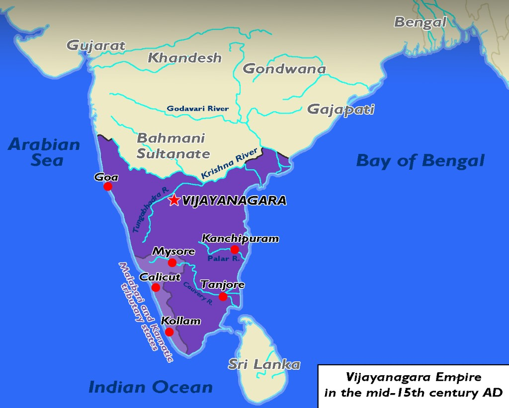
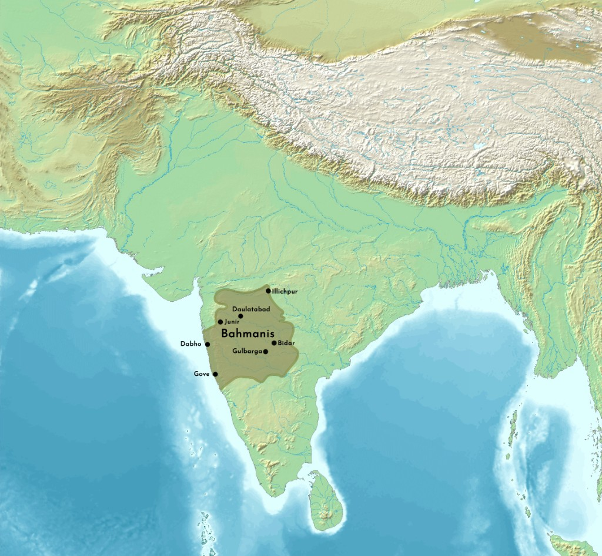
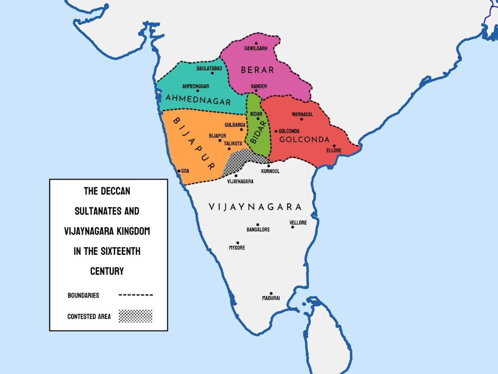

# Topic 3 — Regional Kingdoms (Sharqi (शर्की), Kashmir, Vijayanagara (विजयनगर), Bahmani & Deccan (दक्कन))
### ★ UPPCS Revision Sheet — Lucent / PW style (one home per fact · no repetition · Practice ≥45)

<strong>Covers syllabus</strong> (click to expand)

Sharqi Sultanate (Jaunpur (जौनपुर)) | Kashmir under Zain-ul-Abidin (ज़ैन-उल-आबिदीन) | Gujarat Sultanate (quick) | Vijayanagara Empire (विजयनगर) | Bahmani Kingdom (बहमनी) | Deccan Sultanates | Battle of Talikota

> **Sources baked in:** NCERT *Themes in Indian History Part II*, RS Sharma *Medieval India*, **Ghatnachakra** Provincial Dynasties of North India & Deccan (B–253+), UPPCS / UKPCS Prelims PYQs
> **Weight:** ★★★ — Sharqi architecture (UP), Zain-ul-Abidin tolerance, Vijayanagara–Bahmani rivalry, Talikota, Deccan capitals, book–context matching
> **Last verified:** September 2026
> **Current Affairs:** N/A (purely historical)

---

## Consolidated — 36 Must-Score Facts

1. **Firuz Shah** founded the city of **Jaunpur** (जौनपुर) in memory of cousin **Jauna Khan (Muhammad bin Tughlaq (मुहम्मद बिन तुगलक))**; **Malik Sarwar (Khwaja-i-Jahan / Malik-us-Sharq)** made it independent (**~1394**); **Ibrahim (इब्राहिम) Shah** made it **Siraj/Shiraz-i-Hind**.
2. **Atala Masjid** (अटाला मस्जिद) and **Lal Darwaza Masjid** are classic **Sharqi** (शर्की) monuments at Jaunpur in eastern **UP**.
3. Last Sharqi ruler **Hussain Shah** fell to **Bahlul Lodi** (**1479/1484** keys); **Vidyapati**’s *Kirtilata* praises Jaunpur under Ibrahim.
4. **Malik Muhammad Jaisi** composed **Padmavat** (पद्मावत) in the Jaunpur cultural circle.
5. **Zain-ul-Abidin** (**1420–1470**), called **Bud Shah**, abolished **jaziya** and cow slaughter and restored temples in Kashmir.
6. **Sriya Bhatt** was Zain-ul-Abidin’s Hindu minister; **Zaina Lanka** was his island palace on **Wular Lake**.
7. **Sikandar Shah** of Kashmir is the temple-destruction contrast (**Butshikan**) to tolerant **Zain-ul-Abidin**.
8. **Vijayanagara** (विजयनगर) was founded in **1336** by **Harihara I** and **Bukka I** (Sangama) with capital at **Hampi** (हम्पी) on the Tungabhadra (तुंगभद्रा); tradition links guidance to **Vidyaranya**.
9. Vijayanagara dynasties ran **Sangama → Saluva → Tuluva → Aravidu**.
10. **Deva Raya I / II** mark Sangama military peak against Bahmani; **Saluva Narasimha** founded the Saluva house; **Krishnadevaraya** (कृष्णदेवराय) (**1509–1529**, Tuluva) wrote **Amuktamalyada** (आमुक्तमाल्यदा) and patronised the **Ashtadiggajas**.
11. Vijayanagara used the **Nayankara / amara** system and celebrated the **Mahanavami** festival; do not equate Nayankara with Delhi Sultanate (दिल्ली सल्तनत) **iqta** (इक्ता).
12. **Bahmani** was founded in **1347** by **Hasan Gangu** as **Alauddin Bahman Shah**; the capital moved **Gulbarga → Bidar**.
13. Bahmani politics pitted **Afaqis (foreigners)** against **Deccanis (locals)**; **Mahmud Gawan** (Afaqi wazir) wrote **Riyaz-ul-Insha** (रियाज-उल-इंशा), organised **eight tarafs**, and was executed in **1481**.
14. After **1518** Bahmani split into five Deccan Sultanates: **Bijapur (बीजापुर), Golkonda, Ahmadnagar, Bidar, and Berar**.
15. **Bijapur (Adil Shahi)** holds **Gol Gumbaz (गोल गुम्बद) / Gol Gumbad** (tomb of **Muhammad Adil Shah**; among the world's largest domes); **Ibrahim Adil Shah II** (**Jagatguru / Ablababa**) wrote **Kitab-i-Nauras** (किताब-ए-नौरस), founded **Nauraspur**; **Firishta** (फरिश्ता) worked at his court.
16. **Golkonda (Qutb (कुतुब) Shahi)** later centred on **Hyderabad** (हैदराबाद); **Abul Hasan Qutb Shah** fell to Aurangzeb (औरंगजेब) in **1687**.
17. **Ahmadnagar** = Nizam (निजाम) Shahi; **Bidar** = Barid (बरीद-ए-मुमालिक) Shahi; **Berar** = Imad Shahi.
18. **Talikota (1565)** Cause–Course–Result: Rama Raya (रामा राय)’s Deccan overreach after Krishnadevaraya → Deccan alliance crushed Vijayanagara at Rakkasa-Tangadi (**23 Jan 1565**) → **Hampi** sacked and the empire ceased to be a great power.
19. **Raichur (1520)** was a **Krishnadevaraya** victory — do not confuse it with Talikota **1565**.
20. **Riyaz-ul-Insha** is Gawan’s letters; **Riyaz-us-Salatin** (रियाज-उस-सलातीन) is Bengal history (इतिहास) — never swap the two.
21. **Tin Darwaza** stands at **Bidar Fort**, not Ahmedabad (अहमदाबाद); Ahmedabad’s gate is **Teen Darwaza**. **Lal Darwaza–Jaunpur** is correctly matched.
22. Among these regional states, only **Sharqi Jaunpur** has its capital in modern **Uttar Pradesh** (उत्तर प्रदेश).
23. Chronology spine: Vijayanagara **1336** → Bahmani **1347** → Sharqi **1394** → Zain-ul-Abidin **1420–1470** → Gawan executed **1481** → Jaunpur annexed **1484** → Bahmani split **1518** → Talikota **1565**.
24. **Vitthala Temple** at Hampi is Vijayanagara; **Charminar** (चारमीनार) is Qutb Shahi Hyderabad.
25. **Kitab-i-Nauras** is Bijapur (Ibrahim Adil Shah II); **Amuktamalyada** is Krishnadevaraya’s Telugu epic.
26. **Manucharitramu** by **Allasani Peddana** belongs to Krishnadevaraya’s Ashtadiggajas circle.
27. **Burhan-e-Masir** is an Ahmadnagar chronicle; **Mirat-e-Sikandari** is a Gujarat narrative.
28. **Muzaffar Shah (1407)** founded Gujarat; **Mahmud Begada** took **Champaner** and **Girnar**; **Bahadur Shah** conceded **Diu** to the Portuguese.
29. **Yusuf Adil Shah** founded **Bijapur**; **Malik Ahmad** founded **Ahmadnagar** — do not swap founders.
30. **Jami Masjid (Jaunpur)** joins Atala and Lal Darwaza in the Sharqi UP monument set.
31. Vijayanagara–Bahmani rivalry centred on the **Raichur Doab** and Krishna–Tungabhadra frontier long before Talikota.
32. Deccan Sultanate common pattern used Persianate courts with local Telugu/Marathi/Kannada intermediaries under the five successor houses.
33. **Abul Hasan Tana Shah** is the last Qutb Shah memory paired with Aurangzeb’s **1687** Golkonda annexation.
34. **Ibrahim Shah Sharqi**’s cultural peak (**Siraj-i-Hind**) is the UP Sharqi identity line before Lodi annexation.
35. **Chand Bibi** of Ahmadnagar is the Deccan defence memory against Akbar’s late campaigns — do not place her at Talikota **1565**.
36. Post-Talikota Aravidu rulers shifted power southward; Hampi ceased to be the imperial capital after the **1565** sack.

---

## Confused Pairs

| A | B | Difference | Hindi |
|---|---|------------|-------|
| Firuz city (Jaunpur) | Sharqi state (Jaunpur) | City named for **Jauna Khan**; independent state by **Malik Sarwar** | फ़िरोज़ नगर / शर्की राज्य |
| Yusuf Adil Shah | Malik Ahmad | **Bijapur** founder vs **Ahmadnagar** founder | यूसुफ आदिल / मलिक अहमद |
| Sharqi architecture | Delhi Sultanate architecture | Jaunpur massive gateways/arches vs Delhi arch-dome-minaret idiom | शर्की स्थापत्य / सल्तनत स्थापत्य |
| Zain-ul-Abidin | Sikandar Shah (Kashmir) | Bud Shah abolished jaziya vs temple destruction phase | ज़ैन-उल-आबिदीन / सिकंदर शाह |
| Vijayanagara Empire | Bahmani Kingdom | Hindu south empire vs first major Deccan Muslim kingdom | विजयनगर / बहमनी |
| Krishnadevaraya | Rama Raya | Tuluva peak (1509–29) vs regent killed Talikota 1565 | कृष्णदेवराय / राम राय |
| Gulbarga & Bidar | Bijapur | Bahmani capitals (Gulbarga early, Bidar later) vs **Adil Shahi** centre | गुलबर्गा-बीदर / बीजापुर |
| Riyaz-us-Salatin | Riyaz-ul-Insha | **Bengal** history vs **Gawan's letters** | रियाज़-उस-सलातीन / रियाज़-उल-इंशा |
| Tin Darwaza (Bidar) | Teen Darwaza (Ahmedabad) | **Bidar Fort** gate vs **Ahmedabad** monumental triple gateway | तीन दरवाज़ा (बीदर) / तीन दरवाज़ा (अहमदाबाद) |
| Battle of Talikota (1565) | Battle of Raichur (1520) | 1565 defeat vs 1520 Krishnadevaraya victory | तालीकोटा (1565) / रायचूर (1520) |
| Kitab-i-Nauras | Amuktamalyada | Ibrahim Adil Shah II (Bijapur) vs Krishnadevaraya (Telugu) | किताब-ए-नौरस / अमुक्तमाल्यद |
| Nayankara system | Iqta system | Vijayanagara nayaka military land grants vs Delhi Sultanate muqti | नायककारा / इक्ता |

---

## Must-score facts — capitals, books, chronology

### State ↔ capital / founder

| State | Capital / founder lock |
|-------|------------------------|
| Sharqi | **Jaunpur**; independent by **Malik Sarwar (~1394)** |
| Vijayanagara | **Hampi**; **Harihara–Bukka 1336** (Sangama) |
| Bahmani | **Gulbarga → Bidar**; **Hasan Gangu 1347** |
| Bijapur | **Adil Shahi**; Gol Gumbaz |
| Golkonda | **Qutb Shahi**; later Hyderabad |
| Ahmadnagar | **Nizam Shahi** |
| Bidar | **Barid Shahi** |
| Berar | **Imad Shahi** |
| Gujarat Sultanate | Founded **Muzaffar Shah (1407)** |

### Book / monument ↔ context

| Item | Lock |
|------|------|
| Atala / Lal Darwaza Masjid | **Sharqi Jaunpur (UP)** |
| Amuktamalyada | **Krishnadevaraya** (Telugu) |
| Kitab-i-Nauras | **Ibrahim Adil Shah II** (Bijapur) |
| Riyaz-ul-Insha | **Mahmud Gawan** letters |
| Riyaz-us-Salatin | **Bengal** history (not Gawan) |
| Padmavat | **Malik Muhammad Jaisi** (Jaunpur circle) |
| Vitthala Temple | Vijayanagara **Hampi** |
| Charminar | Qutb Shahi **Hyderabad** |
| Tin Darwaza | **Bidar Fort** (not Ahmedabad Teen Darwaza) |

### Chronology spine

| Event | Year |
|-------|------|
| Vijayanagara founded | **1336** |
| Bahmani founded | **1347** |
| Sharqi independent | **~1394** |
| Zain-ul-Abidin (Bud Shah) | **1420–1470** |
| Gawan executed | **1481** |
| Jaunpur annexed (Lodi) | **1479 / 1484** |
| Bahmani split (5 Deccan states) | **1518** |
| Raichur (Krishnadevaraya win) | **1520** |
| Talikota | **1565** |

### Vijayanagara dynasty order

**Sangama → Saluva → Tuluva → Aravidu**

---

## 3.1 Sharqi Sultanate (Jaunpur)

**Period: ~1394–1479/1484** | **Capital: Jaunpur** (eastern UP) | **Founder of state: Malik Sarwar**

- **Firuz Shah Tughlaq** founded the **city of Jaunpur** in memory of his cousin **Jauna Khan** (**Muhammad bin Tughlaq** (मुहम्मद बिन तुगलक)).
- Under late Tughlaq weakness (**Mahmud Shah II** era, **~1394**), **Malik Sarwar** (a slave of that court) became independent. Delhi gave him titles **Malik-us-Sharq** (Lord of the East) and **Khwaja-i-Jahan**.
- He and his adopted (अंगीकृत) line founded the **Sharqi** dynasty. Independence lasted about **85 years**.
- The Sharqi core lay in **eastern UP** (Jaunpur–Ghazipur–Banaras); claims ran wider from Aligarh (अलीगढ़) toward Darbhanga.
- **Ibrahim Shah Sharqi (1402–1440)** was the greatest Sharqi ruler. **Sharqi style** architecture flowered; Jaunpur was called **Siraj-i-Hind / Shiraz-i-Hind** (Shiraz of the East) as a learning and culture centre.
- **Vidyapati** described Jaunpur and Ibrahim Shah in *Kirtilata*.
- **Mubarak Shah** followed Malik Sarwar; later **Mahmud Shah** faced Lodi pressure.
- **Hussain Shah** was the last Sharqi sultan. **Bahlul Lodi** defeated him and reattached Jaunpur to Delhi (**1479** in Ghatnachakra; many coaching keys also use **1484**).
- Monuments: **Atala Masjid**, **Lal Darwaza Masjid**, **Jami Masjid (Jaunpur)** — massive gateways and arches.
- **Malik Muhammad Jaisi** composed **Padmavat** in this cultural circle.

> **Logic:** Siraj-e-Hind is true because Jaunpur was a great education and culture centre under the Sharqis (**UP R.O./A.R.O. 2023** — both true, R explains A).

> **Logic:** Lal Darwaza–Jaunpur is **correct**. Do not confuse it with **Tin Darwaza–Ahmedabad**: Tin Darwaza stands at **Bidar Fort**, while Ahmedabad has **Teen Darwaza**. Among Topic-3 states, only **Sharqi Jaunpur** lies in modern **Uttar Pradesh**.

#> [!TIP]
> **Exam Anchor [UPPCS Prelims 2018, Q19]:** **Adina Masjid** is at **Pandua (Bengal)** built by Sikandar Shah, NOT at Mandu (MP). Lal Darwaza Masjid & Atala Masjid are in Jaunpur; Dakhil Darwaza is in Bengal. *(See Q1 in Complete PYQ Bank below)*

**2. (UPPCS Prelims 2019, Q91)** Arrange the following in chronological order:

I. Rabia Daurani Tomb

II. Sher Shah (शेरशाह) Tomb

III. Humayun (हुमायूँ) Tomb

IV. Atala Mosque Jaunpur

A. I, II, IV, III
B. IV, II, III, I
C. III, II, I, IV
D. IV, III, I, II

Show answer

**Ans: B (IV, II, III, I).**

**Order:** IV **Atala Mosque, Jaunpur** (~**15th c.**, Sharqi) → II **Sher Shah's Tomb, Sasaram (सासाराम)** (**1545**) → III **Humayun's Tomb, Delhi** (**1565**) → I **Rabia Daurani's Tomb, Aurangabad** (**1678**).

**Trap:** Do not place **Humayun** before **Sher Shah** (शेरशाह) — Sher Shah died and was buried **20 years earlier**. Atala is **not** Mughal (मुग़ल); it belongs to the **Sharqi** phase.

---

## 3.2 Kashmir under Zain-ul-Abidin

**Reign:1420–1470** | **Capital:Srinagar** | **Title:Bud Shah** (Great Sultan) | **Also called:** Akbar (अकबर) of Kashmir

- Original name **Shahi Khan**; he sat on the Kashmir throne after his brother Ali Shah.
- His predecessor **Sikandar Shah (1389–1413)** had forced conversions, destroyed temples, and allowed cow slaughter under **Suha Bhatt**.
- **Zain-ul-Abidin (1420–1470)** reversed Sikandar’s intolerant policies and earned the title **Bud Shah**. He is also remembered as the **Akbar of Kashmir** for liberal religion, learning, and crafts.
- He **abolished jaziya** and banned cow slaughter.
- He **restored temples** and permitted reconversion to Hinduism.
- He appointed **Sriya Bhatt** as Minister of Justice and court physician.
- He patronised learning in **Persian (फ़ारसी), Kashmiri, Sanskrit, and Tibetan**.
- He commissioned translations of the **Mahabharata** (महाभारत) and **Rajatarangini** (राजतरंगिणी).
- He promoted **shawl weaving**, papermaking, and other crafts.
- He built dams, canals, and **Zaina Lanka**, an island in **Wular Lake**.
- He defeated the Ladakh (लद्दाख) Mongols and expanded influence over Baltistan, Jammu, and Rajauri.

> **Logic:** **Zain-ul-Abidin (Bud Shah)** alone abolished **jaziya** and banned **cow slaughter** in Kashmir.

#> [!TIP]
> **Exam Anchor [Kashmir — Zain-ul-Abidin]:** Zain-ul-Abidin (*Bud Shah*, 1420–1470) reversed Sikandar Shah’s iconoclastic policies, abolished **Jizya** and **cow slaughter**, built the island **Zaina Lanka** in Wular lake, and commissioned the translation of *Rajatarangini* and *Mahabharata* into Persian. *(See Q6 in Complete PYQ Bank below)*

#> [!TIP]
> **Exam Anchor [UPPCS Prelims 2023, Q36]:** Ruler of Kashmir who abolished Jizya and cow slaughter was **Zain-ul-Abidin**. *(See Q6 in Complete PYQ Bank below)*

---

## 3.2a Gujarat Sultanate

**Independent Gujarat | Muzaffar Shah line | Champaner–Girnar fame**

- Under late Tughlaq weakness, **Zafar (ज़फ़र) Khan** took the title **Muzaffar Shah** in **1407** and founded independent Gujarat.
- He defeated **Hoshang Shah** of Malwa, briefly held **Dhar**, then restored Malwa rather than annexing it permanently.
- **Mahmud Begada** (born **Fateh Khan**, ruling from **1458**; title **Abul Fateh Mahmud**) is the famous later Gujarat sultan.
- His headline victories are the forts of **Champaner** and **Girnar**.
- **Bahadur Shah** later allowed the **Portuguese** a fort at **Diu** by the **1535** treaty against Mughal danger, then regretted the concession.
- The chronicle **Mirat-e-Sikandari** is the Gujarat victory narrative used in book–context match stems.
- Do not relocate Gujarat’s capital story to **Ahmadabad-only** memory when the stem asks Begada’s fort victories — Champaner and Girnar are the keys.

---
## 3.3 Vijayanagara Empire

**Founded 1336** | **Founders Harihara I and Bukka I** (Sangama) | **Capital Hampi** on the Tungabhadra

| Dynasty | Key rulers | Period |
|---------|------------|--------|
| **Sangama** | Harihara I, Bukka I, Deva Raya II | 1336–1485 |
| **Saluva** | Saluva Narasimha | 1485–1505 |
| **Tuluva** | **Krishnadevaraya**, Achyuta Raya | 1505–1570 |
| **Aravidu** | Tirumala, Venkata II | 1570–1646 |

- Harihara I and Bukka I founded Vijayanagara in response to **Delhi Sultanate** (दिल्ली सल्तनत) expansion under **Muhammad bin Tughlaq** and wider Deccan instability.
- Vijayanagara fought chronic wars with the **Bahmani Kingdom** over the **Raichur doab (दोआब)** between the Krishna (कृष्णा) and Tungabhadra rivers.
- The empire reached its peak under **Krishnadevaraya (1509–1529)**.
- Decline accelerated under the regency of **Aliya Rama Raya**.
- After **Talikota in 1565**, Hampi was sacked and the **Aravidu** dynasty ruled a diminished kingdom from **Penukonda and Chandragiri**.
- Foreign travellers **Nuniz**, **Paes**, and **Duarte Barbosa** describe Hampi's wealth.
- Major Hampi monuments include the **Vitthala Temple**, **Virupaksha** (विरूपाक्ष), and **Hazara Rama** temples.

### Rulers and dynasties

**Harihara I (1336–1356, Sangama)**

- **Harihara I** and his brother **Bukka I** founded Vijayanagara at **Hampi** in **1336** after Delhi Sultanate pressure under **Muhammad bin Tughlaq**.
- Harihara had earlier served the **Kampili** kingdom and the **Hoysala** network before building an independent Hindu power in the Tungabhadra–Krishna zone.

**Bukka I (1356–1377, Sangama)**

- **Bukka I** consolidated the infant kingdom and strengthened Sangama authority over the core Kannada–Telugu belt.
- He continued temple patronage and frontier wars that fixed Vijayanagara as a permanent Deccan power.

**Harihara II (1377–1404, Sangama)**

- **Harihara II** extended Vijayanagara influence deeper into the **Tamil** country and the eastern coast.
- His reign saw the empire grow from a regional kingdom into a wider southern state.

**Deva Raya I (1406–1422, Sangama)**

- **Deva Raya I** rebuilt royal power after a brief internal crisis in the Sangama line.
- He fought the **Bahmanis** and restored Vijayanagara prestige in the **Raichur doab**.

**Deva Raya II (1424–1446, Sangama)**

- **Deva Raya II** was the greatest **pre-Tuluva** Vijayanagara ruler and is remembered as **Praudha Deva Raya**.
- He earned the title **Gajabetekara** (elephant hunter) and repeatedly defeated Bahmani armies in the Krishna–Tungabhadra belt.
- He patronised **Sanskrit** and **Telugu** learning and sent embassies to **Sri Lanka** and the **Far East**.
- His death in **1446** opened a phase of noble factionalism that weakened the Sangama line.

**Saluva Narasimha (1485–1490, Saluva)**

- **Saluva Narasimha** ended Sangama rule by seizing the throne in **1485** after prolonged ministerial and noble struggles.
- He began the short **Saluva** dynasty and tried to recentre authority in the hands of the king.

**Narasimha Raya II (1491–1505, Saluva)**

- **Narasimha Raya II** was a weak Saluva ruler under powerful nobles.
- His reign prepared the ground for the **Tuluva** seizure of power under **Vira Narasimha** and then **Krishnadevaraya**.

**Achyuta Raya (1529–1542, Tuluva)**

- **Achyuta Raya** was **Krishnadevaraya's** younger brother and succeeded him in **1529**.
- His reign saw court rivalry and the rise of the **Aravidu** and **Tirumala** factions.

**Sadasiva Raya (1542–1570, Tuluva)**

- **Sadasiva Raya** ruled in name while **Aliya Rama Raya** acted as the real regent.
- This regency period ended with the fatal overreach that produced the **Talikota** disaster.

**Aliya Rama Raya (regent, killed 1565)**

- **Rama Raya** was the dominant minister-regent who repeatedly interfered in Deccan Sultanate successions.
- His policy united **Bijapur, Ahmadnagar, Golkonda, and Bidar** against Vijayanagara at **Talikota (1565)**.
- He was **captured and beheaded** on the battlefield, and Hampi was sacked.

**Tirumala Raya & Venkata II (Aravidu, post-1565)**

- After **Talikota**, the **Aravidu** line ruled a reduced kingdom from **Penukonda** and later **Chandragiri**.
- **Venkata II** tried to recover prestige, but Vijayanagara never regained its pre-1565 imperial reach.
- The dynasty survived in name until **1646**, long after Hampi was abandoned.

### Administration

**Nayankara/amara system** | **Rajya** provinces | **Mahanavami** royal festival

| Office / unit | Function |
|---------------|----------|
| **Mahapradhana** | Prime minister; headed the central council |
| **Dandanayaka** | Law, order, and military coordination |
| **Rajya** | Province under a governor |
| **Nadu** (नाडु) | District cluster below the province |
| **Ur** | Ordinary village assembly |
| **Sabha** (सभा) | Brahmana (ब्राह्मण) **agrahara** assembly with stronger autonomy |
| **Nayaka** (नायक) | Feudatory holder of an **amaram** grant |
| **Amaram** | Land grant tied to military service |

- The king acted as **dharma protector** and commander-in-chief, assisted by a cabinet of great officers whose titles varied by period.
- Under the **nayankara/amara system**, the king granted **amaram lands** to **nayakas** in return for **military service**, tribute, and local administration.
- A **nayaka** maintained troops, collected revenue from his grant, and owed feudatory duty to the Vijayanagara throne.
- This system later became the precursor to post-1565 **Nayak kingdoms** such as **Madurai** (मदुरै), **Tanjore** (तंजावुर), and **Gingee**.
- **Land revenue** was the main income, drawn from temple lands (**devadana**), **agrahara** grants, and peasant holdings.
- The state also drew income from **customs**, **monopolies**, and tribute presented at royal festivals.
- The army (सेना) included **elephants, cavalry, infantry, and artillery** by the sixteenth century.
- The **Portuguese** at **Goa** (गोवा) supplied horses and firearms to Vijayanagara in Krishnadevaraya's age.
- The **Mahanavami/Dasara** festival at Hampi was a royal display of power, tribute collection, and military might.
- Temple grants were recorded on **mandapa (मंडप) pillars** at **Virupaksha** and **Vitthala**.

### Krishnadevaraya (1509–1529)

- In the **Battle of Raichur (1520)** (रायचूर), he defeated **Ismail Adil Shah** of Bijapur and captured Raichur fort, marking his military peak.
- He also defeated **Prataparudra** of Orissa/Gajapati and secured the Krishna boundary.
- He used **Portuguese** contacts to obtain horses and guns.
- He authored **Amuktamalyada**, a Telugu epic.
- He patronised the **Ashtadiggajas**, the eight great Telugu poets at his court.
- **Allasani Peddana** wrote **Manucharitramu** and served at Krishnadevaraya's court.
- **Tenali Ramakrishna (रामकृष्ण)** was another famous courtier of Krishnadevaraya.
- He was personally devoted to **Vaishnavism** (वैष्णव), but he also patronised **Shaiva** temples.
- He died in **1529**, and his brother **Achyuta Raya** succeeded him.
- Later, the **Rama Raya** regency led the empire toward Talikota.

> **Logic:** The founders of Vijayanagara were **Harihara I and Bukka I**, not Krishnadevaraya. The **nayankara** system belongs to **Vijayanagara**, not to the Delhi **iqta** or the Mughal **jagir** (जागीर). **Amuktamalyada** was written by Krishnadevaraya in Telugu; **Kitab-i-Nauras** was written by **Ibrahim Adil Shah II** of Bijapur.

---

### 3.3.1 High-Yield Fact-Locks — Vijayanagara Empire (Ghatnachakra Master Spine)

1. **Founding & Reconversion:** Founded in **1336 CE** on the south bank of Tungabhadra by brothers **Harihara I and Bukka I** (sons of Sangama). Originally ministers of Kampili; captured by Muhammad bin Tughluq and converted to Islam; reconverted to Hinduism under the spiritual guidance of **Sage Vidyaranya** and his brother **Sayana** (the great Vedic commentator). First capital was **Anegundi**, later shifted to **Vidyanagara / Vijayanagara (Hampi)**.
2. **Four Successive Dynasties:**
   - **Sangama Dynasty (1336–1485):** Harihara I, Bukka I (sent embassy to Ming China in 1374), Harihara II (first to adopt imperial title *Maharajadhiraja* and conquer Goa/Canara), Devaraya I, Devaraya II (*Praudha Deva Raya*, title *Gajabetekara*).
   - **Saluva Dynasty (1485–1505):** Founded by **Saluva Narasimha** (*First Usurpation / Prathama Balapaharana* to save the empire from disintegration).
   - **Tuluva Dynasty (1505–1570):** Founded by **Vira Narasimha** (*Second Usurpation / Dvitiya Balapaharana*); reached golden age under **Krishnadevaraya (1509–1529)**; followed by Achyuta Raya (1529–1542) and Sadasiva Raya (1542–1570, puppet under regent Aliya Rama Raya).
   - **Aravidu Dynasty (1570–1649):** Founded by **Tirumala Raya** (brother of Rama Raya); shifted capital to **Penukonda**, later **Chandragiri**, and finally **Vellore**.
3. **Foreign Travellers Chronology Matrix (★★★ High-Yield PCS Trap):**
   - **Nicolo de Conti (Italy, 1420 CE):** Visited under **Devaraya I**; recorded city perimeter of 60 miles and grand celebrations of Navaratri and Deepavali.
   - **Abdur Razzaq (Persia/Herat, 1443 CE):** Ambassador of Timurid ruler Shahrukh to the court of **Devaraya II**; wrote: *"The city of Bijanagar is such that the pupil of the eye has never seen a place like it..."*; described **7 concentric circles of fortified walls** enclosing agricultural fields and orchards.
   - **Afanasy Nikitin (Russia, 1470 CE):** Visited Bahmani/Deccan; recorded poverty of peasants alongside royal luxury.
   - **Duarte Barbosa (Portugal, 1516 CE):** Visited under **Krishnadevaraya**; praised trade and complete religious tolerance.
   - **Domingo Paes (Portugal, 1520 CE):** Visited under **Krishnadevaraya**; described Krishnadevaraya as the most perfect, feared, and gallant king; provided eye-witness accounts of the **Mahanavami Dibba**.
   - **Fernao Nuniz (Portugal, 1535 CE):** Horse-trader who spent 3 years under **Achyuta Deva Raya**; chronicled the history of all earlier kings; uniquely recorded that **women in Vijayanagara were employed as wrestlers, astrologers, accountants, music masters, and armed royal bodyguards**.
   - **Cesare Federici (Italy, 1567 CE):** Visited Hampi 2 years after Talikota; recorded its total desolation.
4. **Krishnadevaraya (1509–1529 CE) — Zenith of Empire:**
   - **Titles:** *Andhra Bhoja*, *Abhinava Bhoja*, *Yavana-rajya-sthapana-acharya* (Restorer of the Bahmani/Yavana kingdom after reinstating Mahmud Shah at Bidar).
   - **Chief Minister / Advisor:** **Timmarusu** (affectionately called *Appaji*).
   - **Military Exploits:** Captured Udayagiri (1514) and Kondavidu from Gajapati ruler Prataparudra of Orissa; decisively defeated Ismail Adil Shah of Bijapur in the **Battle of Raichur (1520)**.
   - **City Foundation:** Founded the suburban city of **Nagalapuram** near Vijayanagara in honour of his mother **Nagala Devi**. Built the **Hazara Rama Temple** and **Vitthala Temple** (with 56 musical pillars) at Hampi.
   - **Diplomacy:** Maintained friendly alliance with Portuguese Governor **Afonso de Albuquerque**, securing a royal monopoly on imported Persian and Arabian war-horses.
   - **Literature:** Authored the celebrated Telugu masterpiece on statecraft **Amuktamalyada** (The Giver of Worn Garlands; centered on Andal / Vishnuchitta) and the Sanskrit drama **Jambavati Kalyanam**.
   - **Ashtadiggajas (Eight Celebrated Telugu Poets):** Allasani Peddana (*Andhra Kavita Pitamaha*, author of *Manucharitramu*), Nandi Timmana (*Parijatapaharanamu*), Tenali Ramakrishna (*Panduranga Mahatmyamu*), Madayyagari Mallana, Dhurjati, Ayyalaraju Ramabhadrudu, Pingali Surana, and Ramarajabhushanudu.
5. **Battle of Talikota / Rakshasi-Tangadi / Bannihatti (23 January 1565):**
   - **The Confederacy:** United alliance of 4 Deccan Sultanates: **Bijapur** (Ali Adil Shah I), **Ahmadnagar** (Hussain Nizam Shah I), **Golkonda** (Ibrahim Qutb Shah), and **Bidar** (Ali Barid Shah).
   - **The Excluded State (★★★ Repeated Exam Trap):** **Berar (Imad Shahi)** did NOT join the anti-Vijayanagara league due to fierce bilateral conflict with Ahmadnagar.
   - **Outcome:** Regent **Aliya Rama Raya** (nearly 80 years old) was captured and beheaded on the battlefield by Hussain Nizam Shah I. The victorious Muslim armies sacked, looted, and burned Hampi for over five months.
6. **Vijayanagara Coinage:**
   - Standard gold coin: **Varaha** (weighed ~52 grains; called **Pagoda** by European travellers, or *Hun* in the Deccan).
   - Depictions on gold coins: Shiva-Parvati, Venkateshvara, Lakshmi-Narayana, or the mythical double-headed giant eagle **Gandabherunda**.
   - Fractions of Varaha: **Pratapa** (1/2 Varaha), **Fanam** (1/10th or 1/20th Varaha).
   - Copper coin: **Jital** or **Tare**.
7. **Provincial & Village Administration:**
   - **Nayankara System:** Royal military chiefs (**Amara-nayakas**) were granted territories (**Amaram**) in lieu of salary and maintenance of fixed contingents of foot-soldiers, horses, and elephants. Nayakas paid an annual tribute and attended the king during wars and royal festivities (Mahanavami).
   - **Ayagar System:** Every village was an autonomous administrative unit governed by **12 hereditary functionaries (Ayagars)**, including the *Karnam* (village accountant), *Talari* (village watchman/police), and *Gauda* (headman). They were remunerated by tax-free land assignments called **Manyam**.
8. **Revenue & Taxes:**
   - Land revenue called **Shist** (assessed by the revenue department **Athavana**). Standard tax was 1/6th of produce, though wet land rates could rise to 1/3rd or 1/2.
   - **Marriage Tax (Kalyana-kanikkai):** Levied on both bride and groom; Krishnadevaraya officially abolished the marriage tax to alleviate social hardship.
9. **Social Life & Women's Status:**
   - Women occupied a remarkable diversity of public and court positions: acted as **wrestlers**, **palace guards**, **astrologers**, **accountants**, **clerks**, **musicians**, and **poets** (e.g., Gangadevi, wife of Kumara Kampana, who authored *Madhura Vijayam* celebrating the conquest of Madurai; Tirumalamba, author of *Varadambika Parinayam*).
   - Sati (*Sahagamana*) and Devadasi systems were prevalent.
10. **Post-Talikota Capitals:**
    - Tirumala shifted the royal seat to **Penukonda** (1567–1592); Venkata II shifted to **Chandragiri** (1592–1604) and later **Vellore**. In 1639, British factor Francis Day acquired Madras (Fort St. George) from Damarla Venkatadri Nayaka, a vassal of Vijayanagara King Venkata III at Chandragiri.

## 3.4 Bahmani Kingdom

**Founded: 1347** | **Founder: Hasan Gangu** (throne name **Alauddin Hasan Bahman Shah**) | **Capitals: Gulbarga (Ahsanabad)**, then **Bidar**

- Bahmani rose during **Muhammad bin Tughlaq**'s Deccan turmoil after the **Amiran-e-Sadah** rebellions.
- **Zafar Khan / Hasan Gangu** declared independence at **Gulbarga** in **1347**, took the title **Alauddin Hasan Bahman Shah**, and named the capital **Ahsanabad**.
- Early rule divided the realm into four (चातुर्याम) provinces: **Gulbarga, Daulatabad, Berar, and Bidar**.
- **Ahmad Shah I Wali** later shifted the capital to **Bidar** around **1429**.

- The kingdom was divided into **eight tarafs**, or provinces, each ruled by a **tarafdar**.
- Bahmani was a long rival of **Vijayanagara** over the **Raichur doab**, and war and marriage alliances alternated between the two powers.
- **Mahmud Gawan**, the Persian wazir (वज़ीर) under Muhammad Shah III, expanded Bahmani power to the Orissa coast.
- Gawan also introduced land surveys and strict revenue accounting.
- He was executed in **1481** after a forged treason letter, and Bahmani's administrative peak ended with his death.
- Rival **Deccani and Afaqi** noble factions later paralysed the court.
- The last sultan was **Kalimullah**, and the kingdom split in **1518** into five Deccan Sultanates.

### Sultan chronology

| Sultan | Period | Fact |
|--------|--------|------|
| **Alauddin Bahman Shah (Hasan Gangu)** | 1347–1358 | Founder at Gulbarga |
| **Muhammad Shah I** | 1358–1375 | Early consolidation |
| **Firoz Shah (फ़िरोज़ शाह) Bahmani** | 1397–1422 | Pre-Bidar phase |
| **Ahmad Shah I Wali** | 1422–1436 | Capital shift to **Bidar** |
| **Muhammad Shah III** | 1463–1482 | **Mahmud Gawan** as wazir |
| **Kalimullah** | Last sultan | Kingdom split **1518** |

**Alauddin Bahman Shah / Hasan Gangu (1347–1358)**

- **Hasan Gangu** was a Turkish officer in the service of **Muhammad bin Tughlaq** who rebelled and declared independence at **Gulbarga in 1347**.
- He took the throne name **Alauddin Bahman Shah** and founded the first major Muslim kingdom of the Deccan.

**Muhammad Shah I (1358–1375)**

- **Muhammad Shah I** consolidated the infant Bahmani state after Hasan Gangu.
- He pushed back Vijayanagara pressure and fixed Gulbarga as a durable Deccan capital.

**Firoz Shah Bahmani (1397–1422)**

- **Firoz Shah Bahmani** ruled through a long phase of wars with **Vijayanagara** over the **Raichur doab**.
- His reign kept Bahmani power intact before the later shift to **Bidar**.

**Ahmad Shah I Wali (1422–1436)**

- **Ahmad Shah I Wali** moved the Bahmani capital from **Gulbarga** to **Bidar** around **1429**.
- He built fortifications and mosques that made **Bidar** the architectural centre of the kingdom.

**Muhammad Shah III (1463–1482)**

- **Muhammad Shah III** was a minor when he came to the throne, and real power passed to his minister **Mahmud Gawan**.
- Under this reign Bahmani armies reached the **Konkan**, **Goa**, and the **Orissa coast**.

**Kalimullah (last sultan)**

- **Kalimullah** was a weak last sultan after Gawan's execution and noble faction fights.
- The kingdom formally broke into **five Deccan Sultanates in 1518**.

### Mahmud Gawan (wazir, executed 1481)

**Persian-born minister** | **Wazir under Muhammad Shah III** | **Author of state letters preserved as *Riyaz-ul-Insha***

- **Mahmud Gawan** was born at **Gawan** in **Persia** and came to the Deccan as a trader before entering Bahmani service.
- He rose through military and diplomatic talent to become **wazir** (वज़ीर) (prime minister) under **Muhammad Shah III**.
- He was **not** the founder of the Bahmani kingdom — **Hasan Gangu** holds that fact.
- As wazir he conquered **Konkan** and **Goa** and extended Bahmani influence toward the **Orissa coast**.
- He introduced **land measurement**, **strict revenue accounting**, **cash salaries**, and **merit-based appointments** in place of hereditary noble privilege.
- He built a famous **madrasa at Bidar** and patronised Persian learning alongside fiscal reform.
- **Riyaz-ul-Insha** preserves his official **letters and state papers** and is a major source on Bahmani administration.
- Rival nobles forged a **treason letter** in his name; the sultan ordered his execution in **1481**.
- After Gawan's death, **Deccani** and **Afaqi** noble factions paralysed the court and the kingdom declined toward the **1518** split.

### Administration

| Office | Function |
|--------|----------|
| **Wazir** | Prime minister and head of civil administration |
| **Mustaufi** | Finance minister; accounts and audit |
| **Mir Jumla** | Foreign trade (पण्याध्यक्ष), customs, and commercial revenue |
| **Tarafdar** | Governor of a **taraf** (province) |
| **Kotwal** | City administration and law and order |
| **Barid** (बरीद-ए-मुमालिक) | Intelligence service and news reporting |
| **Ariz** | Military department; army rolls and pay |

- The kingdom was divided into **eight tarafs** (provinces), each under a **tarafdar**.
- Important taraf centres included **Daulatabad**, **Gulbarga**, **Bidar**, **Berar**, and the **Telangana** belt.
- Bahmani administration used a **Persianate centralised bureaucracy** adapted from the Delhi Sultanate model.
- Revenue came from **land tax**, **trade dues**, and **tribute** from subordinated chiefs.
- Weak tarafdars later broke away as the independent **Deccan Sultanates** after **1518**.

### Literary and historical sources

| Work | What it is | Key fact |
|------|------------|-----------|
| **Riyaz-ul-Insha** | Collection of **Mahmud Gawan's letters and state papers** | Bahmani administration; **not** Bengal history |
| **Riyaz-us-Salatin** | History of **Bengal** | Trap: sounds like Riyaz-ul-Insha but is a **different book** |
| **Burhan-e-Masir** | Chronicle of **Ahmadnagar** | Nizam Shahi successor state, not Bahmani court letters |
| **Mirat-e-Sikandari** | **Gujarat** victory narrative | Regional history; match with Gujarat |

> **Logic:** **Hasan Gangu** founded the Bahmani Kingdom; **Mahmud Gawan** was a minister. **Mirat-e-Sikandari** narrates the **Gujarat** victory; **Burhan-e-Masir** covers **Ahmadnagar**; **Riyaz-us-Salatin** is **Bengal** history; **Riyaz-ul-Insha** collects **Gawan's** letters.

#> [!TIP]
> **Exam Anchor [Bahmani — Mahmud Gawan]:** Mahmud Gawan (*Khwaja Jahan*), prime minister under Muhammad Shah III, divided the 4 Bahmani tarafs into 8 smaller administrative units and established the famous **Madrasa at Bidar (1472)**. *(See Bahmani section below)*

#> [!TIP]
> **Exam Anchor [UPPCS Prelims 2023, Q33]:** Historical texts & regional contexts: *Mirat-e-Sikandari* = Gujarat (Sikandar bin Muhammad); *Burhan-e-Masir* = Ahmadnagar/Nizam Shahi (Ali bin Azizullah Tabataba); *Riyaz-us-Salatin* = Bengal (Ghulam Husain Salim); *Tazkirat-ul-Muluk* = Bijapur (Rafiuddin Shirazi). *(See Q5 in Complete PYQ Bank below)*

---

## 3.5 Deccan Sultanates

**Five successor states (from ~1518)** | All used **Persianate** central administration modelled on the Bahmani system

| Sultanate | Dynasty | Founder | Capital | Period |
|-----------|---------|---------|---------|--------|
| **Bijapur** (बीजापुर) | Adil Shahi | **Yusuf Adil Shah** (यूसुफ आदिल) | Bijapur | 1490–1686 |
| **Golkonda** | Qutb Shahi | **Quli Qutb Shah** | Golkonda → Hyderabad | 1518–1687 |
| **Ahmadnagar** | Nizam Shahi | **Malik Ahmad** (मलिक अहमद) | Ahmadnagar | 1490–1636 |
| **Bidar** | Barid Shahi | **Amir Barid** | Bidar | 1492–1619 |
| **Berar** | Imad Shahi | **Fathullah Imad-ul-Mulk** | Ellichpur | 1490–1574 |

### Common administrative pattern

| Element | Function |
|---------|----------|
| **Wazir / Peshwa (पेशवा)** | Chief minister |
| **Pargana** (परगना) | Basic revenue-admin unit |
| **Amil / Desai (आमिल)** | Revenue collector |
| **Qazi** (क़ाज़ी) | Judge under Islamic law |
| **Kotwal** | City police and order |

- All five states inherited the Bahmani **taraf** idea but ruled as separate sultanates after **1518**.
- Land revenue, trade customs, and feudatory tribute remained the main income sources.
- Four of them — **Bijapur, Ahmadnagar, Golkonda, and Bidar** — united against **Vijayanagara** at **Talikota (1565)**.
- The Mughals later absorbed them: **Ahmadnagar (1636)**, **Bijapur (1686)**, **Golkonda (1687)**.

### Bijapur (Adil Shahi)

- **Yusuf Adil Shah** founded the **Adil Shahi** line at **Bijapur** after the Bahmani collapse — **not** Ahmadnagar (**Nizam Shahi** = **Malik Ahmad**).
- **Ismail Adil Shah** was defeated by **Krishnadevaraya** at **Raichur (1520)**.
- **Ibrahim Adil Shah II** wrote **Kitab-i-Nauras** (Deccani), founded musical city **Nauraspur**, and was hailed **Jagatguru** and **Ablababa** (friend of the poor). **Firishta** completed *Tarikh-i-Firishta* in this milieu.
- **Muhammad Adil Shah** built **Gol Gumbaz** (गोल गुम्बद), famous for having one of the world's largest domes.
- Bijapur remained a major Deccan power until Aurangzeb annexed it in **1686**.

### Golkonda (Qutb Shahi)

- **Quli Qutb Shah** founded the **Qutb Shahi** dynasty and ruled from **Golkonda fort**.
- **Golkonda** was famous for **diamond mines** and overseas trade links.
- **Muhammad Quli Qutb Shah** founded **Hyderabad in 1591** and built the **Charminar**.
- **Abul Hasan Qutb Shah** was the **last** ruler when Aurangzeb captured Golkonda in **1687**.

### Ahmadnagar (Nizam Shahi)

- **Malik Ahmad** founded the **Nizam Shahi** kingdom with capital at **Ahmadnagar**.
- **Hussain Nizam Shah I** joined the anti-Vijayanagara coalition (गठबंधन) at **Talikota (1565)**.
- The court chronicle **Burhan-e-Masir** records Ahmadnagar history.
- The Mughals annexed Ahmadnagar in **1636** under **Shah Jahan** (शाहजहाँ); **Hussain Nizam Shah III** was imprisoned for life (Gwalior) after **Fateh Khan** surrendered **Daulatabad**.

### Bidar (Barid Shahi)

- **Amir Barid** was a former Bahmani minister who founded the **Barid Shahi** state at **Bidar**.
- **Tin Darwaza** in **Bidar Fort** is the standard monument fact for this centre.
- Bidar remained smaller than Bijapur and Golkonda and was absorbed by Bijapur in **1619**.

### Berar (Imad Shahi)

- **Fathullah Imad-ul-Mulk** founded the **Imad Shahi** line at **Ellichpur** in **Berar**.
- Berar was the **smallest** of the five successor states and was absorbed early by other Deccan powers.
- It rarely appears alone in match lists but completes the **five-sultanate** count after **1518**.

### Literary works of the Deccan Sultanates

| Work | Author / state | Key fact |
|------|----------------|-----------|
| **Kitab-i-Nauras** | **Ibrahim Adil Shah II** of **Bijapur** | Musical-devotional songs; **not** Krishnadevaraya |
| **Burhan-e-Masir** | Court chronicle of **Ahmadnagar** | Nizam Shahi history |
| **Amuktamalyada** | **Krishnadevaraya** of Vijayanagara | Telugu epic — cross-trap with Kitab-i-Nauras |

> **Logic:** Do not confuse **Bidar**, the Bahmani and later Barid Shahi centre, with **Bijapur**, the Adil Shahi capital. **Kitab-i-Nauras** was written by **Ibrahim Adil Shah II of Bijapur**, not by Krishnadevaraya.

#> [!TIP]
> **Exam Anchor [UPPCS Prelims 2020, Q44]:** *Kitab-i-Nauras* was authored by **Ibrahim Adil Shah II** of Bijapur (*Jagat Guru* / *Abla Baba*). *(See Q4 in Complete PYQ Bank below)*

**2. (UPPCS Prelims 2020, Q34)** Who was the ruler of Golkonda when Aurangzeb seized the fort of Golkonda in **1687**?

A. Abul Hasan Qutb Shah
B. Sikandar Adil Shah
C. Ali Adil Shah II
D. Shayasta Khan

Show answer

**Ans: A.**

**Why:** Abul Hasan Qutb Shah was the **last Qutb Shahi** ruler when Aurangzeb captured Golkonda in **1687**.

**Trap:** Muhammad Quli Qutb Shah** founded **Hyderabad** and built **Charminar (1591)** — he ruled **a century earlier**, not in 1687.

---

## 3.6 Battle of Talikota (1565) (तालीकोटा)

**Date:23 January 1565** | **Site:Rakkasa-Tangadi** (near Talikota)

- **Cause:** Aliya Rama Raya**, the Vijayanagara regent, repeatedly meddled in Deccan Sultanate successions and alienated all four major successor states.
- **Course:** On **23 January 1565**, the four sultanates formed a coalition against Vijayanagara at **Rakkasa-Tangadi** near Talikota.
- The coalition included **Bijapur under Ali Adil Shah I**, **Ahmadnagar under Hussain Nizam Shah I**, **Golkonda under Ibrahim Qutb Shah**, and **Bidar under Ali Barid**.
- **Rama Raya** was captured and **beheaded** on the battlefield, and the Vijayanagara army collapsed.
- **Result:** Hampi was looted for about six months and the old capital was abandoned.
- The **Aravidu** dynasty retreated to **Penukonda and Chandragiri**, while **nayakas** became independent in Madurai, Tanjore, and Gingee.
- Talikota ended Vijayanagara as a **great power**, even though the empire survived in name until **1646**.

> **Logic:** Talikota (1565) is not the same as **Raichur (1520)**, which was Krishnadevaraya's victory. **Rama Raya** was killed at Talikota; Krishnadevaraya had died in **1529**.

#> [!TIP]
> **Exam Anchor [Battle of Talikota (1565)]:** Fought on **23 January 1565** (Rakshasi-Tangadi / Bannihatti); alliance of Bijapur, Ahmadnagar, Golkonda, Bidar defeated Vijayanagara; **Aliya Rama Raya** captured and beheaded; **Berar** did NOT participate. *(See Ghatna Chakra Vijayanagara bank below)*

---

## 3.7 Master Fact-Locks — Medieval Geography, Regional Architecture & Polygars

| Topic / Category | Entity / Detail | Region / Present State / Notes |
|---|---|---|
| **Medieval State** | **Champaka (Chamba)** | Himachal Pradesh (Rajput state emerging post-Tripartite struggle) |
| **Medieval State** | **Kuluta (Kullu)** | Himachal Pradesh (Rajput state emerging post-Tripartite struggle) |
| **Medieval State** | **Durgara** | Jammu & Kashmir (Rajput state) |
| **South Indian Feudalism** | **Polygars (Palaiyakkarar)** | Territorial administrative & military governors appointed by **Nayaka rulers** of South India (16th–18th c.) |
| **Mandu (Malwa)** | **Jahaj Mahal** | Built by **Ghiyasuddin Khalji** in Mandu (*Exam Clarification:* NO 'Jantar Mahal' exists in Mandu) |
| **Bengal Architecture** | **Adina Masjid** | Located at **Pandua**, West Bengal; built by Sultan **Sikandar Shah** (1364–1374 CE) |
| **Bengal Architecture** | **Qadam Rasul** | Built by Sultan **Nusrat Shah** at Gaur |
| **Bengal Architecture** | **Chhota Sona Masjid** | Built by **Wali Muhammad** at Gaur |
| **Gujarat Architecture** | **Tin Darwaza** | Triple-arched ceremonial gate in Ahmedabad built by **Ahmad Shah I** (1415 CE) |
| **Gwalior Architecture** | **Gujari Mahal** | Built by Raja **Man Singh Tomar** (1486–1516 CE); currently converted into a museum |
| **Mewar Court Scholars** | **Court of Rana Kumbha** | Scholars: **Muni Sunder Suri**, **Natha**, **Tilla Bhatt** (*Trap:* Muni Jin Vijay Suri was in Akbar's court, NOT Kumbha's) |
| **Structural Typology** | **Double Dome** | Sikandar Lodi Tomb / Humayun's Tomb |
| **Structural Typology** | **Octagonal Tomb** | Tomb of Sher Shah Suri (Sasaram) |
| **Structural Typology** | **True Arch Tomb** | Tomb of Balban (Delhi) |
| **Structural Typology** | **World's Largest Dome** | Gol Gumbad of Muhammad Adil Shah (Bijapur) |

---

## Complete PYQ Bank — Ghatnachakra Provincial Dynasties of North India and Deccan

Complete unabridged 42-question bank from Ghatna Chakra covering Sharqi Jaunpur, Kashmir (Zain-ul-Abidin), Gujarat, Bahmani Kingdom, Deccan Sultanates, and Regional Architecture. Every question preserves full stem, options, exam tags, correct answer, and complete explanation with zero duplication.

---

**Q-GC1. U.P.P.C.S. (Mains) 2004, U.P.P.C.S. (Pre) 2003, U.P.P.C.S. (UDA/LDA) (Pre) 2002**

The city of Jaunpur was founded in the memory of :

- (a) Ghiyasuddin Tughluq
- (b) Muhammad-Bin-Tughluq
- (c) Firuz Shah Tughluq
- (d) Akbar

Show answer

**Answer: (b)**

**Explanation:**
B

Firuz Shah Tughluq built 300 new cities. Jaunpur was

established by the sultan of Delhi Firuz Shah Tughluq,

and named in the memory of his cousin Muhammad-binTughluq whose name was Jauna Khan. Firuz Shah Tughluq

appointed Malik Sarwar, an eunuch who was notorious

for being the lover of Firuz Shah Tughluq’s daughter, as

the governor of the region. The Sultanate was in disarray

because of factional fighting for power and Malik Sarwar

declared independence. He and his adopted son Mubarak

Shah founded the Sharqi Dynasty (dynasty of the East).

Jaunpur was independent for 85 years. But in 1479 A.D.,

Bahlul Lodi defeated its last emperor Hussain Shah and was

able to reconquer Jaunpur in 1479.

---

**Q-GC2. U.P.P.C.S. (UDA/LDA) (Pre) 2006**

Who had established Jaunpur?

- (a) Muhammad-Bin-Tughluq
- (b) Firuz Shah Tughluq
- (c) Ibrahim Shah Sharqi
- (d) Sikandar Lodi

Show answer

**Answer: (b)**

**Explanation:**
See the explanation of the above question.

*(Reference Context from previous question:)*
B

Firuz Shah Tughluq built 300 new cities. Jaunpur was

established by the sultan of Delhi Firuz Shah Tughluq,

and named in the memory of his cousin Muhammad-binTughluq whose name was Jauna Khan. Firuz Shah Tughluq

appointed Malik Sarwar, an eunuch who was notorious

for being the lover of Firuz Shah Tughluq’s daughter, as

the governor of the region. The Sultanate was in disarray

because of factional fighting for power and Malik Sarwar

declared independence. He and his adopted son Mubarak

Shah founded the Sharqi Dynasty (dynasty of the East).

Jaunpur was independent for 85 years. But in 1479 A.D.,

Bahlul Lodi defeated its last emperor Hussain Shah and was

able to reconquer Jaunpur in 1479.

---

**Q-GC3. U.P.P.C.S. (Pre) 2001**

Which one of the following places was known as ‘Shiraz
of East’ during the regime of Sharqi Rulers?

- (a) Agra
- (b) Delhi
- (c) Jaunpur
- (d) Varanasi U.P. Lower Sub. (Pre) 2004

Show answer

**Answer: (c)**

**Explanation:**
Jaunpur attained its greatest height under Sharqi Dynasty

ruler, Ibrahim Shah (1402-1440 AD). He constructed some

monuments in a new regional style of architecture known as

the Sharqi architecture. Jaunpur was also known as the Shiraz

of East or Shiraz-i-Hind during this period.

---

**Q-GC4. U.P.P.C.S. (Mains) 2005**

Which one of the following places was called “Shiraz
of India”?

- (a) Agra
- (b) Allahabad
- (c) Jaunpur
- (d) Lucknow

Show answer

**Answer: (c)**

**Explanation:**
See the explanation of the above question.

*(Reference Context from previous question:)*
Jaunpur attained its greatest height under Sharqi Dynasty

ruler, Ibrahim Shah (1402-1440 AD). He constructed some

monuments in a new regional style of architecture known as

the Sharqi architecture. Jaunpur was also known as the Shiraz

of East or Shiraz-i-Hind during this period.

---

**Q-GC5. U.P.P.C.S. (Pre) 2017**

Who was the last ruler of 'Jaunpur' state?

- (a) Mohammad Shah
- (b) Hussain Shah
- (c) Mubarak Shah
- (d) Ibrahim Shah

Show answer

**Answer: (b)**

**Explanation:**
Jaunpur city was founded in 14th century by Sultan Firuz Shah

Tughluq and named in memory of his cousin, MuhammadBin Tughluq whose real name was Jauna Khan. In 1394 AD,

Malik Sarwar established the independent Jaunpur state.

Hussain Shah was the last ruler of Jaunpur state defeated by

Bahlul Lodi. Jaunpur is historically known as 'Shiraz-i-Hind'.

---

**Q-GC6. U.P.P.C.S. (RO/ARO) (Pre) 2023**

Given below are two statements, in which one is
labelled as Assertion (A) and the other as Reason (R):
Assertion (A): Jaunpur is known as Siraj-e-Hind.
Reason (R): Jaunpur was a great centre of education
during the Sharqi period.
Select the correct answer using the code given below:
Code -

- (a) (A) is false but (R) is true.
- (b) Both
- (A) and (R) are true and (R) is correct explanation of
- (A) .
- (c) (A) is true but (R) is false.
- (d) Both
- (A) and (R) are true but (R) is not correct explanation of
- (A) .

Show answer

**Answer: (b)**

**Explanation:**
Ibrahim Shah Sharqi was the greatest ruler of the Sharqi

dynasty of Jaunpur. He was a lover of knowledge and art.

During his reign a new type of style, called 'Sharqi Art'

emerged. In this style, the simple type of minarets was

removed, and signs of Hindu influence started appearing in

it. During his time, the cultural fame of Jaunpur spread all

around and Jaunpur became famous by the name 'Siraj of

India/East' or 'Shiraz-i-Hind'. Jaunpur emerged as a great

center of education during the period of Sharqi rulers. Hence

both Assertion (A) and Reason (R) are true and R is correct

explanation of A.

---

**Q-GC7. R.A.S./R.T.S. (Pre) 1993**

Ruler of Kashmir who was also known as “Akbar of
Kashmir’ was-

- (a) Shamshuddin Shah
- (b) Sikandar Butshikan
- (c) Haidar Shah
- (d) Zain-ul-Abidin

Show answer

**Answer: (d)**

**Explanation:**
Shahi Khan (Zain-ul-Abidin), the brother of Ali Shah, became

the ruler of Kashmir in 1420 AD. He was the greatest king

of Kashmir. He earned a name for his policy of religious

tolerance and public welfare activities. He abolished Jizya

tax on Hindus and banned cow slaughter. He was the first

ruler to do so Mahabharata, Dashavatara and Rajtarangini

were translated into the Persian language during his period.

He was compared with Akbar due to his religious tolerance.

The scriptures ‘Jain Prakash’ and Jain-Vilas’ were compiled

during his rule. Also, he constructed artificial island of Zaina

Lank in the middle of Wular Lake.

---

**Q-GC8. State PCS**

Which among the following ruler abolished Jizya for
first time?

- (a) Zain-ul-Abidin
- (b) Muhammad-Bin-Tughluq
- (c) Hussain Shah Sharqi
- (d) Akbar Uttarakhand U.D.A./L.D.A. (Mains) 2006 Indian History General Studies B–255

Show answer

**Answer: (a)**

**Explanation:**
See the explanation of the above question.

*(Reference Context from previous question:)*
Shahi Khan (Zain-ul-Abidin), the brother of Ali Shah, became

the ruler of Kashmir in 1420 AD. He was the greatest king

of Kashmir. He earned a name for his policy of religious

tolerance and public welfare activities. He abolished Jizya

tax on Hindus and banned cow slaughter. He was the first

ruler to do so Mahabharata, Dashavatara and Rajtarangini

were translated into the Persian language during his period.

He was compared with Akbar due to his religious tolerance.

The scriptures ‘Jain Prakash’ and Jain-Vilas’ were compiled

during his rule. Also, he constructed artificial island of Zaina

Lank in the middle of Wular Lake.

---

**Q-GC9. U.P.P.C.S. (Pre) 2023**

Which among the following ruler of Kashmir abolished
Zaziya and Cow Slaughter?

- (a) Sikandar Shah
- (b) Shamsuddin Shah
- (c) Haider Shah
- (d) Zain-ul-Abidin

Show answer

**Answer: (d)**

**Explanation:**
See the explanation of the above question.

*(Reference Context from previous question:)*
Shahi Khan (Zain-ul-Abidin), the brother of Ali Shah, became

the ruler of Kashmir in 1420 AD. He was the greatest king

of Kashmir. He earned a name for his policy of religious

tolerance and public welfare activities. He abolished Jizya

tax on Hindus and banned cow slaughter. He was the first

ruler to do so Mahabharata, Dashavatara and Rajtarangini

were translated into the Persian language during his period.

He was compared with Akbar due to his religious tolerance.

The scriptures ‘Jain Prakash’ and Jain-Vilas’ were compiled

during his rule. Also, he constructed artificial island of Zaina

Lank in the middle of Wular Lake.

---

**Q-GC10. I.A.S. (Pre) 1999**

Consider the following statements :
The striking feature of the Jama Masjid in Kashmir
completed by Zain-ul-Abidin include(s) :
1. Turret
2. Similarity with Buddhist pagodas
3. Persian style
Which of the above statements is/are correct?

- (a) 1 alone
- (b) 1, 2 and 3
- (c) 1 and 3
- (d) 2 and 3

Show answer

**Answer: (b)**

**Explanation:**
Sikandar Butshikan built Jama Masjid in 1400 AD in Kashmir

which was expanded by Zain-ul-Abidin. The characteristics

of Jama Masjid include turret, the similarity with Buddhist

pagodas and Persian style. Hence, option (b) is the correct

answer.

---

**Q-GC11. (a) Muni Sunder Suri (b) Natha, (c) Tilla Bhatt (d) Muni Jin Vijay Suri, R.A.S./R.T.S. (Pre) 2016**

Who amongst the following scholars was not in the
Court of Kumbha?

Show answer

**Answer: (d)**

**Explanation:**
Muni Sunder Suri, Natha, and Tilla Bhatt were the scholars

in the court of Kumbha, but Muni Jin Vijay Suri was in the

court of Mughal emperor, Akbar.

---

**Q-GC12. U.P.P.C.S. (Pre) 2021**

Which one of the following is NOT correctly matched?
(Ruler) (State)

- (a) Rana Hamir – Mewar
- (b) Rana Chunda – Marwar
- (c) Malik Raja Farooqi – Khandesh
- (d) Malik Sarwar – Malwa Khwaja Jahan

Show answer

**Answer: (d)**

**Explanation:**
Jaunpur was an independent Islamic kingdom in North India

between 1394 AD and 1479 AD. Sharqui Dynasty ruled this

kingdom. It was founded by Khwaja Jahan Malik Sarwar

in 1394 AD.

---

**Q-GC13. I.A.S. (Pre) 2015**

Consider the following pairs :
Medieval Indian State Present Region
1. Champaka - Central India
2. Durgara - Jammu
3. Kuluta - Malabar
Which of the above pairs is/are correctly matched?

- (a) 1 and 2
- (b) 2 only
- (c) 1 and 3
- (d) 3 only

Show answer

**Answer: (b)**

**Explanation:**
The medieval Indian states such as Champaka (Chamba) and

Kuluta (Kullu) were related to current Himachal Pradesh.

Durgara was situated in Jammu and Kashmir, Champaka,

Durgara and Kuluta were related to Rajputs. These three

states rose as a result of the Tripartite struggling states'

downfall (Pal, Pratihara and Rashtrakuta).

---

**Q-GC14. Uttarakhand P.C.S. (Pre) 2002**

Bahmani State was established by –

- (a) Alauddin Hasan
- (b) Ali Abid Shah
- (c) Hussain Nizam Shah
- (d) Mujahid Shah

Show answer

**Answer: (a)**

**Explanation:**
Bahmani empire was founded by Alauddin Hasan Bahman

Shah (Zafar Khan), who was also known as Hasan Gangu,

in 1347 AD. He declared Gulbarga the capital of his empire

and named as Ahsanabad. He divided his empire into four

regions Gulbarga, Daulatabad, Berar and Bidar. Gulbarga was

the most significant district of the state. He annexed southern

Hindu rulers and started a new system of providing powers

and Jagirs to his followers. He abolished Jizya on the Hindus.

---

**Q-GC15. 60th to 62nd B.P.S.C. (Pre) 2016**

Who was the founder of Bahmani Kingdom?

- (a) Alauddin Hasan
- (b) Firuz Shah
- (c) Mahmud Gaonwa
- (d) Asaf Khan
- (e) None of the above/More than one of the above

Show answer

**Answer: (a)**

**Explanation:**
See the explanation of the above question.

*(Reference Context from previous question:)*
Bahmani empire was founded by Alauddin Hasan Bahman

Shah (Zafar Khan), who was also known as Hasan Gangu,

in 1347 AD. He declared Gulbarga the capital of his empire

and named as Ahsanabad. He divided his empire into four

regions Gulbarga, Daulatabad, Berar and Bidar. Gulbarga was

the most significant district of the state. He annexed southern

Hindu rulers and started a new system of providing powers

and Jagirs to his followers. He abolished Jizya on the Hindus.

---

**Q-GC16. U.P.P.C.S. (Mains) 2005**

The Bahmani Kingdom was founded in the year

- (a) 1336
- (b) 1338
- (c) 1347
- (d) 1361

Show answer

**Answer: (c)**

**Explanation:**
See the explanation of the above question.

*(Reference Context from previous question:)*
Bahmani empire was founded by Alauddin Hasan Bahman

Shah (Zafar Khan), who was also known as Hasan Gangu,

in 1347 AD. He declared Gulbarga the capital of his empire

and named as Ahsanabad. He divided his empire into four

regions Gulbarga, Daulatabad, Berar and Bidar. Gulbarga was

the most significant district of the state. He annexed southern

Hindu rulers and started a new system of providing powers

and Jagirs to his followers. He abolished Jizya on the Hindus.

---

**Q-GC17. Chhattisgarh P.C.S. (Pre) 2014**

Which of the following was the first capital of the
Bahamani Kingdom?

- (a) Bidar
- (b) Gulbarga B
- (c) Daulatabad
- (d) Hussainabad
- (e) None of these

Show answer

**Answer: (b)**

**Explanation:**
See the explanation of the above question.

*(Reference Context from previous question:)*
Bahmani empire was founded by Alauddin Hasan Bahman

Shah (Zafar Khan), who was also known as Hasan Gangu,

in 1347 AD. He declared Gulbarga the capital of his empire

and named as Ahsanabad. He divided his empire into four

regions Gulbarga, Daulatabad, Berar and Bidar. Gulbarga was

the most significant district of the state. He annexed southern

Hindu rulers and started a new system of providing powers

and Jagirs to his followers. He abolished Jizya on the Hindus.

---

**Q-GC18. U.P.P.C.S. (Pre) 1995**

Who among the following was founder of the Bahamani
Kingdom in Deccan :

- (a) Malik Ambar
- (b) Hasan Gangu
- (c) Muhammad Diwan
- (d) Sikandar Shah

Show answer

**Answer: (b)**

**Explanation:**
See the explanation of the above question.

*(Reference Context from previous question:)*
Bahmani empire was founded by Alauddin Hasan Bahman

Shah (Zafar Khan), who was also known as Hasan Gangu,

in 1347 AD. He declared Gulbarga the capital of his empire

and named as Ahsanabad. He divided his empire into four

regions Gulbarga, Daulatabad, Berar and Bidar. Gulbarga was

the most significant district of the state. He annexed southern

Hindu rulers and started a new system of providing powers

and Jagirs to his followers. He abolished Jizya on the Hindus.

---

**Q-GC19. U.P.P.C.S. (Pre) 2016**

Bahmani Kingdom was founded in –

- (a) 15th century A.D.
- (b) 14th century A.D.
- (c) 13th century A.D.
- (d) 16th century A.D.

Show answer

**Answer: (b)**

**Explanation:**
Bahmani Kingdom was founded by Alauddin Hasan

Bahman Shah in 14th century A.D. (1347 A.D.).

---

**Q-GC20. State PCS**

Match List- I with List- II and select the correct answer
by using the codes given below :
List- I List- II
A. Adil Shahi 1. Ahmednagar
B. Qutb Shahi 2. Bijapur
C. Nizam Shahi 3. Golconda
D. Sharqi Shahi 4. Jaunpur
Code:
A B C D

- (a) 1 2 3 4
- (b) 2 3 4 1
- (c) 3 4 1 2
- (d) 2 3 1 4 Uttarakhand P.C.S. (Pre) 2003 U.P. Lower Sub. (Pre) 2002

Show answer

**Answer: (d)**

**Explanation:**
The correctly matched order is :

Dynasty City Founder ruler

Adil Shahi Bijapur Yusuf Adil Shah

Qutb Shahi Golconda Quli Qutb Shah

Nizam Shahi Ahmednagar Malik Ahmad

Sharqi Shahi Jaunpur Malik Sarwar

---

**Q-GC21. I.A.S. (Pre) 2000**

Which one of the following Muslim rulers was hailed
as the ‘Jagadguru’ by his Muslim subject because of
his belief in secularism?

- (a) Hussain Shah
- (b) Zain-ul -Abidin
- (c) Ibrahim Adil Shah
- (d) Mahmud II

Show answer

**Answer: (c)**

**Explanation:**
Ibrahim Adil Shah-II was king of the Sultanate of Bijapur.

Under his reign, the dynasty had its greatest period, as he

extended its frontier to the south up toMysore. He was a skillful

administrator, artist, poet and a generous patron of arts. He

reverted to the Sunni sect of Islam but remained tolerant of

other religions. He is also known as Jagadguru. He founded a

new township at Nauraspur to give concrete shape to his idea

of a musical city. Ibrahim Adilshah-II wrote the book Kitabi-Nauras (Book of Nine Rasas) in Deccani language.

---

**Q-GC22. U.P.P.C.S. (Pre) 2020**

Who among the following was the author of the book
'Kitab-i-Nauras'?

- (a) Ibrahim Adil Shah II
- (b) Ali Adil Shah
- (c) Quli Qutab Shah
- (d) Akbar II

Show answer

**Answer: (a)**

**Explanation:**
Ibrahim Adil Shah II was ruler of Bijapur Kingdom. He wrote

'Kitab-i-Nauras' in Deccani language.

---

**Q-GC23. in 1631 and the entire royal family was killed by the, Mughal troops, I.A.S. (Pre) 2004**

How did the dynasty of Nizam Shahi of Ahmadnagar
come to an end?

- (a) Ahmadnagar was annexed to Mughal empire and Hussain Shah was consigned to life imprisonment
- (b) Mughal troops destroyed Daulatabad fort and killed Nizam-ul-Mulk of Ahmadnagar
- (c) Fateh Khan usurped the throne from Nizam-ul-Mulk
- (d) Malik Ambar was defeated in a battle with Mughals

Show answer

**Answer: (a)**

**Explanation:**
The founder of the city of Ahmadnagar Kingdom was Ahmad

Nizam Shah. It was conquered and annexed by Shahjahan

(1632). It is important to know that Shahjahan sent an army

with Mahawat Khan to win the Daulatabad fort. He bribed 10.5

lakhs to Fateh Khan to take over the fort. After that, Hussain

Nizam Shah-III was imprisoned for life at the Gwalior Fort.

---

**Q-GC24. U.P.P.C.S. (Pre) 2004**

Name the pair which is not correctly matched:

- (a) Baz Bahadur - Malwa
- (b) Qutb Shah - Golconda
- (c) Sultan Muzaffar Shah - Gujarat
- (d) Yusuf Adil Shah - Ahmadnagar

Show answer

**Answer: (d)**

**Explanation:**
Indian History General Studies B–257

In the given options, option (d) is not correctly matched.

Yusuf Adil Shah was the ruler of Bijapur, not Ahmadnagar.

Other options are correctly matched .

---

**Q-GC25. M.P. P.C.S. (Pre) 1990**

What is Golconda called at present :

- (a) Hyderabad
- (b) Karnataka
- (c) Bijapur
- (d) Banglore

Show answer

**Answer: (a)**

**Explanation:**
The ruins of Golconda (Capital of Qutb Shahi Dyansty)

are scattered in Hyderabad. It was under Qutb Shahi kings,

who ruled the region in 16th-17th century. Later, Aurangzeb

possessed it by ending Qutb Shahi Dynasty. It was famous

for diamond during that era.

---

**Q-GC26. I.A.S. (Pre) 2023**

Who among the following rulers of medieval Gujarat
surrendered Diu to Portuguese?

- (a) Ahmad Shah
- (b) Mahmud Begarha
- (c) Bahadur Shah
- (d) Muhammad Shah

Show answer

**Answer: (c)**

**Explanation:**
The Gujarat ruler who surrendered Diu to Portuguese was

Bahadur Shah. In 1535 AD, Bahadur Shah entered into a

treaty with Portuguese governor Nuno De Cunha to assist

against Mughal danger. In return Portuguese were allowed to

build a fortress in Diu and a site was granted for this purpose

in the harbour. After the Mughal danger had receded, the Shah

of Gujarat realised his mistake in allowing the Portuguese

to construct the Fort.

---

**Q-GC27. U.P.P.C.S. (Mains) 2003**

Which one of the following is correctly matched?

- (a) Kakatiya : Devgiri
- (b) Hoysala : Dwarasamudra
- (c) Yadava : Warangal
- (d) Pandya : Madurai U.P. Lower Sub (Pre) 2008

Show answer

**Answer: (b)**

**Explanation:**
& (d)

Dwarasamudra was the capital of Hoysala, while Warangal was

of Kakatiya Dynasty, Devgiri of Yadava Dynasty and Madurai

of Pandya. So, options (b) and (d) are both correct answers.

---

**Q-GC28. U.P.P.C.S. (RO/ARO) (Pre) 2014**

“Dwarasamudra’ was the capital of which dynastic
power?

- (a) Ganga
- (b) Kakatiya
- (c) Hoysala
- (d) Kadamba

Show answer

**Answer: (c)**

**Explanation:**
See the explanation of the above question.

*(Reference Context from previous question:)*
& (d)

Dwarasamudra was the capital of Hoysala, while Warangal was

of Kakatiya Dynasty, Devgiri of Yadava Dynasty and Madurai

of Pandya. So, options (b) and (d) are both correct answers.

---

**Q-GC29. I.A.S. (Pre) 2023**

Consider the following dynasties :
1. Hoysala 2. Gahadavala
3. Kakatiya 4. Yadava
How many of the above dynasties established their
kingdoms in early eighth century AD?

- (a) Only one
- (b) Only two
- (c) Only three
- (d) None

Show answer

**Answer: (d)**

**Explanation:**
Hoysala Empire was one of the powerful empires that ruled

the South India between the 10th and 14th centuries. The

Gahadwal dynasty was a Rajput dynasty that ruled parts

of the present day Indian states of Uttar Pradesh and Bihar

during the 11th and 12th centuries. The Kakatiya dynasty ruled

the eastern Deccan region of South India between the 12th

and 14th centuries. The Yadava dynasty of Devagiri was a

medieval South Indian dynasty. The Yadavas initially ruled

as feudatories of the Western Chalukyas. Their rule lasted

from the 12th century to the middle of the 14th century.

---

**Q-GC30. U.P.P.C.S. (Pre) 2019**

Match List-I with List-II and select the correct answer
using the codes given below the lists :
List-I List-II
(Ruling Dynasties) (Capitals)
A. Pallava 1. Warangal
B. Pandya 2. Kanchi
C. Yadava 3. Madura
D. Kakatiya 4. Devagiri
Codes :
A B C D

- (a) 2 1 4 3
- (b) 2 3 4 1
- (c) 1 2 3 4
- (d) 2 4 3 1

Show answer

**Answer: (b)**

**Explanation:**
Correct match is as follows :

List-I List-II

(Ruling Dynasties) (Capitals)

Pallava – Kanchi

Pandya – Madura

Yadava – Devagiri

Kakatiya – Warangal

---

**Q-GC31. Uttarakhand P.C.S. (Pre) 2021**

Which of the following Dynasty is associated with the
female King Rudrma Devi?

- (a) Eastern Ganga
- (b) Hoyasala
- (c) Kakatiya
- (d) Western Chalukya

Show answer

**Answer: (c)**

**Explanation:**
Rudrama Devi belonged to Kakatiya dynasty. The king of

this dynasty Ganapti did not have any sons, due to which,

after his death, Rudrama Devi became ruler. 

B

---

**Q-GC32. U.P.P.C.S. (RO/ARO) (Pre) 2023**

Consider the following statements with reference to
Rudrama and choose the correct statements about
her -
1. Rudrama was fourth independent ruler of Kakatiya
dynasty of Warangal.
2. She defeated Pandyas of South Tamil Nadu,
Eastern Ganga rulers of Orissa and Seuna rulers
of Devgiri.

- (a) Neither 1 nor 2
- (b) Only 1
- (c) Both 1 and 2
- (d) Only 2

Show answer

**Answer: (c)**

**Explanation:**
The sovereign Kakatiya empire emerged during the time

of the Kakatiya ruler Rudradeva (Pratap Rudradev I). After

him, Mahadev and Ganapati Dev became rulers respectively.

Rudrama was the daughter of Kakatiya Ganapati Dev of

Warangal and was fourth independent ruler.

She defeated Pandyas of South Tamil Nadu, Eastrn Ganga

rulers of Orissa and Seuna rulers of Devagiri. Hence both

statements are correct.

---

**Q-GC33. (d) Sringeri and Dharwar, I.A.S. (Pre) 2001**

Hoysala monuments are found in :

- (a) Hampi and Hospet
- (b) Halebid and Belur
- (c) Mysore and Bangalore

Show answer

**Answer: (b)**

**Explanation:**
Hoysala Monuments are found in Halebidu and Belur

(Karnataka). Hoysaleshvara temple at Halebidu is dedicated

to Shiva. Large and small temples built during this era are

of Hoysala architectural style including the Chennakeshava

temple at Belur. Hence, option (b) is correct.

---

**Q-GC34. U.P.P.C.S. (Mains) 2003**

What is modern name of Hoysaleshvara’s ancient
capital of Dwarasamudra?

- (a) Sringeri
- (b) Belur
- (c) Halebid
- (d) Somnathpur

Show answer

**Answer: (c)**

**Explanation:**
The capital of the Hoysala Dynasty was Dwarasamudra,

which is currently in Halebidu (Hassan district of Karnataka).

---

**Q-GC35. I.A.S. (Pre) 1995**

Which one of the following monuments has a dome
which is said to be one of the largest in the world?

- (a) Tomb of Sher Shah, Sasaram
- (b) Jama Masjid, Delhi
- (c) Tomb of Ghiyasuddin Tughluq, Delhi
- (d) Gol Gumbad, Bijapur

Show answer

**Answer: (d)**

**Explanation:**
The Mausoleum of Muhammad Adil Shah of Bijapur is

known as 'Gol Gumbad'. It is one of the world's largest domes.

---

**Q-GC36. Uttarakhand P.C.S. (Pre) 2012**

Match the following monuments with their concerned
ruler and select the correct codes given below :
A. Double Dome i. Sher Shah
B. Octagonal Tomb ii. Muhammad Adil Shah
C. True arch Tomb iii. Balban
D. Gol Gumbad iv. Sikandar Lodi
Code :
A B C D

- (a) iv iii i ii
- (b) iv i iii ii
- (c) i iii iv ii
- (d) ii iii i iv

Show answer

**Answer: (b)**

**Explanation:**
Monuments Rulers

Double Dome - Sikandar Lodi

Octagonal Tomb - Sher Shah

True Arch Tomb - Balban

Gol Gumbad - Muhammad Adil Shah

---

**Q-GC37. M.P. P.C.S. (Pre) 2017**

Which of the following rulers got the Jantar Mahal of
Mandu constructed?

- (a) Mahmud Shah Khilji
- (b) Alauddin Khilji
- (c) Bhoj Parmar
- (d) Hoshang Shah

Show answer

**Answer: (*)**

**Explanation:**
'Jahaj Mahal' in Mandu is a famous place which was built

during the period of Ghiyasuddin Khalji. There is no Jantar

Mahal in Mandu. Thats why this question was deleted by

M.P. P.S.C.

---

**Q-GC38. M.P.P.C.S. (Pre) 2019**

Which ruler among the following constructed 'Jahaj
Mahal' of Mandu?

- (a) Sultan Mahmud I
- (b) Sultan Sirazzuddin II
- (c) Adamshah I
- (d) Sikandar Shah

Show answer

**Answer: (*)**

**Explanation:**
See the explanation of the above question

*(Reference Context from previous question:)*
'Jahaj Mahal' in Mandu is a famous place which was built

during the period of Ghiyasuddin Khalji. There is no Jantar

Mahal in Mandu. Thats why this question was deleted by

M.P. P.S.C.

---

**Q-GC39. M.P.P.C.S. (Pre) 2010**

Who built Gujari Mahal ?

- (a) Suraj Sen
- (b) Man Singh
- (c) Tej Karan
- (d) Akbar

Show answer

**Answer: (b)**

**Explanation:**
Gujari Mahal was constructed by Raja Man Singh Tomar

between 1486-1516 A.D. It is a unique piece of architecture. 

Indian History General Studies B–259

---

**Q-GC40. M.P. P.C.S. (Pre) 2017**

Which of the following pairs is NOT correctly
matched?

- (a) Adina Masjid – Mandu
- (b) Lal Darwaza Masjid – Jaunpur
- (c) Dakhil Darwaza – Gaour
- (d) Tin Darwaza – Ahmedabad

Show answer

**Answer: (a)**

**Explanation:**
Adina Masjid (Jami Masjid) situated in Pandua of West

Bengal is a famous ruin which was built around 1364-1374

A.D. by ruler of Bengal Sikandarshah. Other options are

correctly matched.

---

**Q-GC41. U.P.P.C.S. (RO/ARO) (Mains) 2021**

Match List-I with List-II and select the correct answer
from the code given below the lists :
List-I List-II
(Monument) (Builder)
A. Atala Devi Masjid 1. Nusrat Shah
B. Chhota Sona Masjid 2. Ibrahim Shah Sharqi
C. Qadam Rasul 3. Sikandar Shah
D. Adina Masjid, Pandua 4. Wali Muhammad
Code :
A B C D

- (a) 1 2 3 4
- (b) 2 4 1 3
- (c) 2 1 3 4
- (d) 1 3 4 2

Show answer

**Answer: (b)**

**Explanation:**
Correctly matched list is as follows–

 List-I List-II

 (Monument) (Builder)

Atala Devi Masjid – Ibrahim Shah Sharqi

Chhota Sona Masjid – Wali Muhammad

Qadam Rasul – Nusrat Shah

Adina Masjid, Pandua – Sikandar Shah

---

**Q-GC42. (c) Territorial Administrative and Military Governors, (d) Newly enriched traders, U.P.P.C.S. (Re. Exam) (Pre) 2015**

Who were Polygars of South India?

- (a) Ordinary Zamindars
- (b) Mahajans

Show answer

**Answer: (c)**

**Explanation:**
Palaiyakkarar or Polygar was the feudal title of a class of

administrative and Military governors appointed by the

Nayaka rulers of South India during 16th to 18th centuries.

---

## Complete PYQ Bank — Ghatnachakra Vijayanagara Empire

Complete sequence of 48 questions from Ghatna Chakra Vijayanagara Empire (B–229 to B–235). Covers Sangama, Saluva, Tuluva, and Aravidu dynasties, Krishnadeva Raya's Ashtadiggajas and Amuktamalyada, foreign travellers, and the Battle of Talikota (1565).

**Q-GC-VIJAY-1.** Uttarakhand P.C.S. (Pre) 2004

The kingdom of Vijayanagara was founded by-

A. Vijay Raya

B. Harihara- II

C. Harihara and Bukka

D. Bukka- II

Show answer

**Correct Answer:** **C**

**Detailed Explanation:**
The Vijayanagara empire was founded by Harihara and Bukka
in 1336. This dynasty is known as Sangama Dynasty after their
father’s name. Harihara and Bukka were the ministers in the
court at Kampili. Muhammad Tughluq invaded Kampili and
arrested Harihara and Bukka. Both were forced to convert
to Islam. Later, both were sent to the south to suppress a
rebellion. They could not succeed, but under the influence of
Saint Vidyaranya, they again reverted to Hinduism to establish
the Vijayanagara Dynasty. They were inspired by their spiritual
teacher Vidyaranya and Sayan, a noted commentator of Vedas.
Four Dynasties ruled under this empire.
(i) Sangama dynasty (1336-1485 A.D.). (ii) Saluva dynasty
(1485-1505 A.D.), (iii) Tuluva dynasty (1505-1570 A.D.)
and (vi) Aravidu dynasty (1570-1672 A.D.). These dynasties
ruled over three hundred years. The capitals of Vijayanagara
were Anegundi, Vijayanagara, Penukonda and Chandragiri
respectively.

---

**Q-GC-VIJAY-2.** Uttarakhand P.C.S. (Pre) 2024

Who founded the Vijayanagara Empire in 1336 CE?

A. Rama Raya

B. Krishnadeva Raya

C. Harihara and Bukka

D. Achyuta Raya

Show answer

**Correct Answer:** **C**

**Detailed Explanation:**
The Vijayanagara empire was founded by Harihara and Bukka
in 1336. This dynasty is known as Sangama Dynasty after their
father’s name. Harihara and Bukka were the ministers in the
court at Kampili. Muhammad Tughluq invaded Kampili and
arrested Harihara and Bukka. Both were forced to convert
to Islam. Later, both were sent to the south to suppress a
rebellion. They could not succeed, but under the influence of
Saint Vidyaranya, they again reverted to Hinduism to establish
the Vijayanagara Dynasty. They were inspired by their spiritual
teacher Vidyaranya and Sayan, a noted commentator of Vedas.
Four Dynasties ruled under this empire.
(i) Sangama dynasty (1336-1485 A.D.). (ii) Saluva dynasty
(1485-1505 A.D.), (iii) Tuluva dynasty (1505-1570 A.D.)
and (vi) Aravidu dynasty (1570-1672 A.D.). These dynasties
ruled over three hundred years. The capitals of Vijayanagara
were Anegundi, Vijayanagara, Penukonda and Chandragiri
respectively.
*(Refer to Q-GC1 for primary reference context)*

---

**Q-GC-VIJAY-3.** M.P.P.C.S. (Pre) 2022

Vijayanagara Empire was established in which year?

A. 1336 A.D.

B. 1236 A.D.

C. 1436 A.D.

D. 1316 A.D.

Show answer

**Correct Answer:** **A**

**Detailed Explanation:**
The Vijayanagara Empire was established in 1336 A.D. by
Harihara Raya-I and his brother Bukka Raya I. They were
warrior chieftains and loyal officials in the administration of
Kakatiya dynasty, which ruled parts of the Deccan region.
After the fall of the Kakatiya Kingdom to the Delhi Sultanate,
the brothers were taken as prisoners but later released, and
they eventually established their own kingdom.

---

**Q-GC-VIJAY-4.** 67th B.P.S.C. (Pre) 2022

Who was the founder Vijayanagara Empire?

A. Deva Raya I

B. Krishnadeva Raya

C. Harihara-Bukka

D. Vira Narasimha Raya

E. None of the above/More than one of the above

Show answer

**Correct Answer:** **C**

**Detailed Explanation:**
Harihara and Bukka are the founders of the Vijayanagara
Empire in 1336 A.D. on the banks of Tungabhadra.

---

**Q-GC-VIJAY-5.** Uttarakhand Lower (Sub.) (Pre) 2010

The ‘Vijayanagara’ Kingdom was founded by –

A. Harihara and Bukka

B. Krishnadeva Raya

C. Pushyamitra

D. Bhadrabahu

Show answer

**Correct Answer:** **A**

**Detailed Explanation:**
Harihara and Bukka are the founders of the Vijayanagara
Empire in 1336 A.D. on the banks of Tungabhadra.
*(Refer to Q-GC4 for primary reference context)*

---

**Q-GC-VIJAY-6.** Jharkhand P.C.S. (Pre.) 2021

Which among the following kingdoms was founded by

two Brothers, Harihara and Bukka?

A. Kingdom of Vijayanagara

B. Kingdom of Kakatiyas

C. Kingdom of Hoysalas

D. Kingdom of Kampili

Show answer

**Correct Answer:** **A**

**Detailed Explanation:**
Harihara and Bukka are the founders of the Vijayanagara
Empire in 1336 A.D. on the banks of Tungabhadra.
*(Refer to Q-GC4 for primary reference context)*
*(Refer to Q-GC5 for primary reference context)*

---

**Q-GC-VIJAY-7.** Chhattisgarh P.C.S. (Pre) 2023

The Ruling Dynasties Sangama, Saluva, Tuluva were

associated with

A. Warangal

B. Kashmir

C. Vijayanagara

D. None of the above

Show answer

**Correct Answer:** **C**

**Detailed Explanation:**
Vijayanagara Empire was established by Harihara and Bukka
in 1336 A.D. The four dynasties of this empire are - Sangama
dynasty (1336-1485 A.D.), Saluva dynasty (1485-1505 A.D.),
Tuluva dynasty (1505-1570 A.D.) and Aravidu dynasty
(1570-1672 A.D.).

---

**Q-GC-VIJAY-8.** I.A.S. (Pre) 2015

Who of the following founded a new city on the South

bank of a tributary to river Krishna and undertook to

rule his new kingdom as the agent of a deity to whom

all the land south of the river Krishna was supposed

to belong?

A. Amoghavarsha- I

B. Ballala- II

C. Harihara- I

D. Prataparudra- II

Show answer

**Correct Answer:** **C**

**Detailed Explanation:**
Harihara- I founded a new city on the southern bank of
Tungabhadra River, a tributary to river Krishna and undertook
to rule his new kingdom as the agent of a deity to whom all
the land, south of the river Krishna was supposed to belong.
He was the founder of Vijayanagara Kingdom. He was the
eldest son of Sangama, who was the founder of Sangama
dynasty. He built a fort on the west side of Karnataka. Bukka
was the successor of Harihara- I.

---

**Q-GC-VIJAY-9.** U.P.P.C.S. (Pre) 2000

The lady poet who described the victorious expeditions

of her husband in her work ‘Madhura-Vijayam’ was :

A. Bharati

B. Ganga Devi

C. Varadambika

D. Vijjika

Show answer

**Correct Answer:** **B**

**Detailed Explanation:**
Harihara- I sent two armies under the leadership of Kumar
Savanna and Kumara Kampana to conquer Madurai in
1352-53 A.D. Kumara Kampana Adayar annexed Madurai
to Vijayanagara empire. Ganga Devi, the wife of Kumara
Kampana, described the chronicle victories of her husband
in her book Madhura Vijayam.

---

**Q-GC-VIJAY-10.** 40th B.P.S.C. (Pre) 1995

Identify the first ruler of Vijayanagara who captured

Goa from Bahamani?

A. Harihara- I

B. Harihara- II

C. Bukka- I

D. Devaraya- II

Show answer

**Correct Answer:** **B**

**Detailed Explanation:**
After the death of Bukka-I in 1377 A.D., his son,
Harihara-II ascended to the throne. He assumed the title
of “Maharajadhiraja” and conquered the region of Kanara,
Mysore, Kanchi, Trichinapalli and collected tax from the
king of Sri Lanka. His major achievement was winning the
Belgaum and Goa from Bahamani. He was the devotee of
Virupaksha form of Lord Shiva.

---

**Q-GC-VIJAY-11.** I.A.S. (Pre) 2023

Who among the following rulers of Vijayanagara

Empire constructed a large dam across Tungabhadra

River and a canal-cum aqueduct several kilometres

long from the river to the capital city?

A. Devaraya I

B. Mallikarjuna

C. Vira Vijaya

D. Virupaksha

Show answer

**Correct Answer:** **A**

**Detailed Explanation:**
Devaraya I is credited with making the capital of Vijayanagara
Empire one of the largest cities in the 15th century. He
constructed a dam on the Tungabhadra river around 1410
AD and constructed a 24 km long canal-cum-aqueduct from
Tungabhadra river to his capital.

---

**Q-GC-VIJAY-12.** I.A.S. (Pre) 2004

Consider the following Statements :

1. Narasimha Saluva ended the Sangama dynasty,

and seized the throne for himself and, started the

Saluva dynasty

2. Vira Narasimha deposed the last Saluva ruler and

seized the throne for himself

3. Vira Narasimha was succeeded by his younger

brother, Krishnadeva Raya

4. Krishnadeva Raya was succeeded by his halfbrother, Achyuta Raya

Which of the statements given above are correct?

A. 1, 2 and 3

B. 2, 3 and 4

C. 1 and 4

D. 1, 2, 3 and 4

Show answer

**Correct Answer:** **D**

**Detailed Explanation:**
The feudal lord of Chandragiri Narasimha Saluva dethroned
Prauda Deva Raya, the last ruler of Sangama dynasty and
acquired the throne in 1485 AD. He established a new
dynasty named Saluva dynasty and ruled for about five years.
Immadi Narasimha, the last ruler of Saluva dynasty and son
of Narasimha Saluva, was dethroned by Vira Narasimha.
Vira Narasimha established the Tuluva Dynasty. After Vira
Narasimha, his younger brother Krishnadeva Raya (1509-
1529 AD) ascended to the throne, followed by Achyuta Deva
Raya. So, all the statements given above are correct.

---

**Q-GC-VIJAY-13.** 43rd B.P.S.C. (Pre) 1999

With whom did the king of Vijayanagara, Krishnadeva

Raya fight the battle of Golconda?

A. Quli Qutb Shah

B. Qutbuddin Aybak

C. Ismail-Adil Khan

D. Gajapati

Show answer

**Correct Answer:** **A**

**Detailed Explanation:**
The battle of Golconda was fought between the king of
Vijayanagara, Krishnadeva Raya and Sultan of Golconda,
Quli Qutb Shah. Sultan Quli Qutb Shah founded the Qutb
Shahi Dynasty in Golconda. Quli Qutb Shah expanded his
kingdom by capturing forts at Warangal, Kondaveedu, at a
time when Krishnadeva Raya was busy fighting with the
rulers of Odisha. Quli’s campaign against Krishnadeva Raya
continued, but finally, he was defeated by him.

---

**Q-GC-VIJAY-14.** I.A.S. (Pre) 2024

Who of the following rulers of medieval India gave

permission to the Portuguese to build a fort at Bhatkal?

A. Krishnadevaraya

B. Narasimha Saluva

C. Muhammad Shah III

D. Yusuf Adil Shah

Show answer

**Correct Answer:** **A**

**Detailed Explanation:**
Krishnadevaraya was an emperor from the Tuluva dynasty
of the Vijayanagara Empire, reigning from 1509 to 1529 AD.
He is considered to be the greatest ruler of the Vijayanagara
Empire. Krishnadevaraya maintained friendly relations with
the Portuguese. He obtained guns and Arabian horses from
Portuguese merchants. On Portuguese governor Afonso
de Albuquerque’s request, Krishnadevaraya permitted the
construction of a fort at Bhatkal located in Uttara Kannada
district in Karnataka.

---

**Q-GC-VIJAY-15.** U.P. U.D.A./L.D.A. (Pre) 2001

Who were the ‘Ashtadiggajas’ in the court of

Krishnadeva Raya?

A. Eight ministers

B. Eight Telugu poets

C. Eight great warriors

D. Eight advisors

Show answer

**Correct Answer:** **B**

**Detailed Explanation:**
The governance of Krishnadeva Raya is known as the
golden age of Telugu literature. The ‘Ashtadiggajas’ were
the eight great poets and scholars of Telugu in the Court of
Vijayanagara. Telugu literature reached its peak during the
reign of Krishnadeva Raya. He assumed the title ‘Andhra
Bhoja’. ‘Peddana’ was ranked as the foremost of the
'Ashtadiggaja'. He had mastery over two languages, Telugu
and Sanskrit. Krishnadeva Raya was an accomplished
poet and writer. He authored ‘Amuktamalyada,’ which is
considered as one of the five top Telugu epics. Krishnadeva
Raya had a great interest in art and construction work. He
is credited with the construction of Nagalpuram city. The
Portuguese traveller Domingo Paes visited Vijayanagara
during his reign. Babur mentioned Krishnadeva Raya as the
most powerful of all the rulers of India in his autobiography.

---

**Q-GC-VIJAY-16.** Jharkhand P.C.S. (Pre) 2013

Who among these known as ‘Andhra Bhoj’?

A. Krishnadeva Raya

B. Rajendra Chola

C. Harihara

D. Bukka

Show answer

**Correct Answer:** **A**

**Detailed Explanation:**
The governance of Krishnadeva Raya is known as the
golden age of Telugu literature. The ‘Ashtadiggajas’ were
the eight great poets and scholars of Telugu in the Court of
Vijayanagara. Telugu literature reached its peak during the
reign of Krishnadeva Raya. He assumed the title ‘Andhra
Bhoja’. ‘Peddana’ was ranked as the foremost of the
'Ashtadiggaja'. He had mastery over two languages, Telugu
and Sanskrit. Krishnadeva Raya was an accomplished
poet and writer. He authored ‘Amuktamalyada,’ which is
considered as one of the five top Telugu epics. Krishnadeva
Raya had a great interest in art and construction work. He
is credited with the construction of Nagalpuram city. The
Portuguese traveller Domingo Paes visited Vijayanagara
during his reign. Babur mentioned Krishnadeva Raya as the
most powerful of all the rulers of India in his autobiography.
*(Refer to Q-GC15 for primary reference context)*

---

**Q-GC-VIJAY-17.** R.A.S./R.T.S.(Pre) 2010

The ‘Ashtadiggajas’ were associated with which of the

following rulers?

A. Shivaji

B. Krishnadeva Raya

C. Rajendra-I

D. Yashovarman

Show answer

**Correct Answer:** **B**

**Detailed Explanation:**
The governance of Krishnadeva Raya is known as the
golden age of Telugu literature. The ‘Ashtadiggajas’ were
the eight great poets and scholars of Telugu in the Court of
Vijayanagara. Telugu literature reached its peak during the
reign of Krishnadeva Raya. He assumed the title ‘Andhra
Bhoja’. ‘Peddana’ was ranked as the foremost of the
'Ashtadiggaja'. He had mastery over two languages, Telugu
and Sanskrit. Krishnadeva Raya was an accomplished
poet and writer. He authored ‘Amuktamalyada,’ which is
considered as one of the five top Telugu epics. Krishnadeva
Raya had a great interest in art and construction work. He
is credited with the construction of Nagalpuram city. The
Portuguese traveller Domingo Paes visited Vijayanagara
during his reign. Babur mentioned Krishnadeva Raya as the
most powerful of all the rulers of India in his autobiography.
*(Refer to Q-GC15 for primary reference context)*
*(Refer to Q-GC16 for primary reference context)*

---

**Q-GC-VIJAY-18.** U.P. U.D.A./L.D.A. (Pre) 2006

The ruling period of Krishnadeva Raya was the golden

age of which literature?

A. Konkani

B. Malayalam

C. Tamil

D. Telugu

Show answer

**Correct Answer:** **D**

**Detailed Explanation:**
The governance of Krishnadeva Raya is known as the
golden age of Telugu literature. The ‘Ashtadiggajas’ were
the eight great poets and scholars of Telugu in the Court of
Vijayanagara. Telugu literature reached its peak during the
reign of Krishnadeva Raya. He assumed the title ‘Andhra
Bhoja’. ‘Peddana’ was ranked as the foremost of the
'Ashtadiggaja'. He had mastery over two languages, Telugu
and Sanskrit. Krishnadeva Raya was an accomplished
poet and writer. He authored ‘Amuktamalyada,’ which is
considered as one of the five top Telugu epics. Krishnadeva
Raya had a great interest in art and construction work. He
is credited with the construction of Nagalpuram city. The
Portuguese traveller Domingo Paes visited Vijayanagara
during his reign. Babur mentioned Krishnadeva Raya as the
most powerful of all the rulers of India in his autobiography.
*(Refer to Q-GC15 for primary reference context)*
*(Refer to Q-GC16 for primary reference context)*
*(Refer to Q-GC17 for primary reference context)*

---

**Q-GC-VIJAY-19.** U.P.P.C.S. (Pre) 2016

Which city was founded by Krishnadeva Raya?

A. Warangal

B. Nagalapura

C. Udayagiri

D. Chandragiri

Show answer

**Correct Answer:** **B**

**Detailed Explanation:**
Shri Krishnadeva Raya was a great builder. The Hazara Rama
Temple, the Vitthala temple (Shree Vijay Vitthala Temple)
in the capital city, is attributed to him. He built a new city
called Nagalapuram in honour of his mother.

---

**Q-GC-VIJAY-20.** R.A.S./R.T.S. (Pre.) 2021

Consider the following statements and choose the

correct answer using the code given below–

Statement 1: Krishnadevaraya, ruler of Vijayanagara

wrote the treatise Amuktamalyada

Statement 2: Krishnadevaraya is also known by the name

of Andhra Bhoj

Statement 3: Allasani Peddana, the poet laureate well

versed in Sanskrit and Tamil, adorned his

court.

Code –

A. Statement 1 is true

B. Statement 2 is true

C. Both the statements 1 & 2 are true

D. All the three statements are true

Show answer

**Correct Answer:** **C**

**Detailed Explanation:**
Krishnadeva Raya, ruler of Vijayanagara empire wrote the
treatise Amuktamalyada. He was also known as Andhra
Bhoj. Allasani Peddana was one of the Ashtadiggaj of
Krishnadevaraya court, but he was a famous poet of Telugu
and Sanskrit literature and not Sanskrit and Tamil.

---

**Q-GC-VIJAY-21.** 68th B.P.S.C. (Pre) 2022

Who among the following famous rulers founded

a suburban township of Nagalapuram, near

Vijayanagara, after his mother's name?

A. Krishnadevaraya

B. Harihara

C. Bukka

D. More than one of the above

E. None of the above

Show answer

**Correct Answer:** **A**

**Detailed Explanation:**
The suburban township of Nagalapuram, near Vijayanagara
was founded by Krishnadeva Raya of Vijayanagara empire
in memory of his mother Nagala devi.

---

**Q-GC-VIJAY-22.** M.P.P.C.S. (Pre) 2014

The famous Hazara temple of Vijayanagara was built

during the reign of –

A. Krishnadeva Raya

B. Deva Raya-I

C. Deva Raya-II

D. Harihara-I

Show answer

**Correct Answer:** **A**

**Detailed Explanation:**
The famous Hazara Rama Temple of Vijayanagara was built
during the reign of Krishnadeva Raya.

---

**Q-GC-VIJAY-23.** Raj. P.C.S. (Pre) 2023

Which of the following poets was given the title of

'Andhra Kavita Pitamah' by Krishnadev Raya?

A. Allasani Peddana

B. Bhattumurti

C. Tenali Ramkrishana

D. Pingli Suranna

E. Question not attempted

Show answer

**Correct Answer:** **A**

**Detailed Explanation:**
The rule of Krishnadeva Raya is known as the golden age
of Telugu literature. Eight Telugu poets are regarded as
the eight pillars of his literary assembly and are known as
Ashtadiggajas. Among these eight poets, Allasani Peddana is
considered to be the greatest. He is given the title of Andhra
Kavita Pitamah. Krishnadeva Raya himself composed an
epic Telugu poem Amuktamalyada.

---

**Q-GC-VIJAY-24.** Rajasthan P.C.S. (Pre) 2024

In which language did poet Mallanārya compose the

texts Bhava Chintā Ratna and Veerasaivamrita in the

court of Krishnadeva Raya?

A. Sanskrit

B. Tamil

C. Telugu

D. Kannada

E. Question not attempted

Show answer

**Correct Answer:** **D**

**Detailed Explanation:**
The famous ruler of the Tuluva dynasty of the Vijayanagara
Empire, Krishnadeva Raya (1509–1529 AD), had the poet
Mallanārya in his court, who composed Bhava Chintā Ratna
and Veerasaivamrita in the Kannada language.
Bhava Chintā Ratna is based on Shiva worship and his
philosophy, expressing personal devotion and emotions
through spiritual themes. On the other hand, Veerasaivamrita
represents the theories and religious aspects of the Veera
Shaiva tradition.

---

**Q-GC-VIJAY-25.** U.P. U.D.A./L.D.A. (Mains) 2010

Abdur Razzaq visited Vijayanagara during the reign of

A. Devaraya- I

B. Devaraya- II

C. Krishnadeva Raya

D. Vira Vijaya

Show answer

**Correct Answer:** **B**

**Detailed Explanation:**
Persian ambassador Abdur Razzaq visited Vijayanagara
during the reign of Devaraya- II (1422-46 AD). Devaraya- II
belonged to Sangama dynasty.

---

**Q-GC-VIJAY-26.** Chhattisgarh P.C.S. (Pre) 2024

Who among the following travellers, visited the court

of Vijayanagara ruler Deva Raya II as a Persian

Ambassador?

A. Barbosa

B. Nicolo-de-Conti

C. Afanasy Nikitin

D. Abdur Razzaq

Show answer

**Correct Answer:** **D**

**Detailed Explanation:**
Persian ambassador Abdur Razzaq visited Vijayanagara
during the reign of Devaraya- II (1422-46 AD). Devaraya- II
belonged to Sangama dynasty.
*(Refer to Q-GC25 for primary reference context)*

---

**Q-GC-VIJAY-27.** 60th to 62nd B.P.S.C. (Pre) 2016

Which among the following King's reign Persian

traveller 'Abdur Razzak' came to India?

A. Dev Rai I

B. Krishnadeva Raya I

C. Dev Rai II

D. Krishna Rai II

E. None of the above/More than one of the above

Show answer

**Correct Answer:** **C**

**Detailed Explanation:**
Persian ambassador Abdur Razzaq visited Vijayanagara
during the reign of Devaraya- II (1422-46 AD). Devaraya- II
belonged to Sangama dynasty.
*(Refer to Q-GC25 for primary reference context)*
*(Refer to Q-GC26 for primary reference context)*

---

**Q-GC-VIJAY-28.** M.P.P.C.S. (Pre) 2016

Who was Nicolo Conti?

A. A famous painter

B. An Italian traveller who visited Vijayanagara Empire

C. A Portuguese traveller

D. A Persian traveller

Show answer

**Correct Answer:** **B**

**Detailed Explanation:**
Nicolo Conti, or Niccolo de Conti, was an Italian traveller
who visited India during the time of Deva Raya-I. He visited
the State of Vijayanagara.

---

**Q-GC-VIJAY-29.** I.A.S. (Pre.) 2021

According to Portuguese writer Nuniz, the women in

Vijayanagara Empire were experts in which of the

following areas?

1. Wrestling 2. Astrology

3. Accounting 4. Soothsaying

Select the correct answer using the code given below.

A. 1, 2 and 3 only

B. 1, 3 and 4 only

C. 2 and 4 only

D. 1, 2, 3 and 4

Show answer

**Correct Answer:** **D**

**Detailed Explanation:**
Farnao Nuniz (Nunes) visited the Vijayanagara empire
during the reign of Achyuta Deva Raya. He described
women being employed as dancers, domestic servants and
palanquin bearers. They were also wrestlers, astrologers and
soothsayers.

---

**Q-GC-VIJAY-30.** U.P.P.C.S. (Pre) 2012

Who among these was famous for Telugu translation?

1. Kamban 2. Kuttan

3. Nannaya 4. Tikkana

Choose the answer from the codes :

A. only 1, 2

B. only 2, 3

C. only 3, 4

D. only 4, 1

Show answer

**Correct Answer:** **C**

**Detailed Explanation:**
Nannaya, Tikkana, and Yerrapragada or Yerrann came to be
known as the Kavi Traya, which means the trinity of poets or
the three great poets. This Trinity translated the Mahabharata
from Sanskrit into Telugu during the period of 11th to 14th
century.

---

**Q-GC-VIJAY-31.** U.P.P.C.S. (Mains) 2008

Sayana, the famous commentator of the Vedic texts,

was patronized by –

A. Paramara rulers

B. Satavahana rulers

C. Vijayanagara rulers

D. Vakataka rulers

Show answer

**Correct Answer:** **C**

**Detailed Explanation:**
Sayana was a great commentator on Vedas. Two brothers
Harihara and Bukka laid the foundation of Vijayanagara
Empire, which was on the south bank of Tungabhadra river
near Anegundi Fort. They were also known as Sangama
brothers. It is said that a sage, Madhav Vidyaranya, and his
brother Sayana were the inspirational sources of this empire.

---

**Q-GC-VIJAY-32.** Uttarakhand P.C.S. (Pre) 2002

Sayana, the famous commentator of the Vedic texts,

flourished during the reign of :

A. The Chola kings

B. The Gupta kings

C. The Satavahana kings

D. The Vijayanagara kings

Show answer

**Correct Answer:** **D**

**Detailed Explanation:**
Sayana was a great commentator on Vedas. Two brothers
Harihara and Bukka laid the foundation of Vijayanagara
Empire, which was on the south bank of Tungabhadra river
near Anegundi Fort. They were also known as Sangama
brothers. It is said that a sage, Madhav Vidyaranya, and his
brother Sayana were the inspirational sources of this empire.
*(Refer to Q-GC31 for primary reference context)*

---

**Q-GC-VIJAY-33.** U.P.P.C.S. (Spl) (Mains) 2008

Who was enthroned 500 years ago?

A. Harihara- I

B. Krishnadeva Raya

C. Kulottunga- I

D. Rajaraya- I

Show answer

**Correct Answer:** **B**

**Detailed Explanation:**
Krishnadeva Raya was the greatest emperor of Vijayanagara
Empire, who reigned from 1509-1529 AD. Harihara- I (1336-
1356 AD) and Bukka laid the foundation of Vijayanagara.
Kulottunga-I (1070-1120 AD) was the grandson of Chola
emperor Rajendra-I. According to question, 2008 was the
year for completion of 500 years of Krishna Dev Rai's
coronation. But Harihara-I & Kulottunga-I also completed
their 500 yrs of coronation. Thus, there is an error in this
question. Hence, the nearest answer will be option (b).

---

**Q-GC-VIJAY-34.** M.P.P.C.S. (Pre) 1997

The famous battle held in 1565 is –

A. 1st Battle of Panipat

B. Battle of Khanwa

C. IInd Battle of Panipat

D. Battle of Talikota

Show answer

**Correct Answer:** **D**

**Detailed Explanation:**
The battle of Talikota (1565 A.D.), a watershed battle, was
fought between the Vijayanagara Empire and the Deccan
Sultanates (Barar was not included). It resulted in the defeat
of Vijayanagara and ended weakening one of the greatest
Indian empires originating from southern India before the
Maratha Empire. Talikota is situated in Karnataka near
Vijayapura district.

---

**Q-GC-VIJAY-35.** 66th B.P.S.C. Re-Exam (Pre) 2020

Which famous war took place in 1565 AD?

A. Panipat I War

B. Panipat II War

C. Khanwa War

D. Talikota War

E. None of the above/More than one of the above

Show answer

**Correct Answer:** **D**

**Detailed Explanation:**
The battle of Talikota (1565 A.D.), a watershed battle, was
fought between the Vijayanagara Empire and the Deccan
Sultanates (Barar was not included). It resulted in the defeat
of Vijayanagara and ended weakening one of the greatest
Indian empires originating from southern India before the
Maratha Empire. Talikota is situated in Karnataka near
Vijayapura district.
*(Refer to Q-GC34 for primary reference context)*

---

**Q-GC-VIJAY-36.** U.P.P.C.S. (Mains) 2014

The Battle of Talikota was fought between –

A. Akbar and Sultan of Malwa

B. Vijayanagara and the Bahmani Kingdom

C. Vijayanagara and combined forces of Bijapur,

Ahmadnagar and Golconda

D. Sher Shah and Humayun

Show answer

**Correct Answer:** **C**

**Detailed Explanation:**
The battle of Talikota (1565 A.D.), a watershed battle, was
fought between the Vijayanagara Empire and the Deccan
Sultanates (Barar was not included). It resulted in the defeat
of Vijayanagara and ended weakening one of the greatest
Indian empires originating from southern India before the
Maratha Empire. Talikota is situated in Karnataka near
Vijayapura district.
*(Refer to Q-GC34 for primary reference context)*
*(Refer to Q-GC35 for primary reference context)*

---

**Q-GC-VIJAY-37.** U.P.P.C.S. (Pre) 1993

The Battle of Talikota was fought in –

A. 1526 A.D.

B. 1565 A.D.

C. 1576 A.D.

D. 1586 A.D.

Show answer

**Correct Answer:** **B**

**Detailed Explanation:**
The battle of Talikota (1565 A.D.), a watershed battle, was
fought between the Vijayanagara Empire and the Deccan
Sultanates (Barar was not included). It resulted in the defeat
of Vijayanagara and ended weakening one of the greatest
Indian empires originating from southern India before the
Maratha Empire. Talikota is situated in Karnataka near
Vijayapura district.
*(Refer to Q-GC34 for primary reference context)*
*(Refer to Q-GC35 for primary reference context)*
*(Refer to Q-GC36 for primary reference context)*

---

**Q-GC-VIJAY-38.** I.A.S. (Pre) 2006

When Raja Wodeyar founded the Kingdom of Mysore,

who was the ruler of the Vijayanagara Empire?

A. Sadasiva

B. Tirumala

C. Ranga- II

D. Venkata- II

Show answer

**Correct Answer:** **D**

**Detailed Explanation:**
Tirumala, the brother of Rama Raya, dethroned Sadasiva
Raya and captured the power in 1570 AD. Thus, the rule
of Aravidu dynasty started. After Tirumala, his eldest son
Shri Ranga-I became king. Venkata-II became the king
after Ranga-I, who made Chandragiri his capital. He was
one among the greatest kings of Vijayanagara. He was a
contemporary of king Wodeyar, who laid the foundation of
Mysore State in 1612 A.D.

---

**Q-GC-VIJAY-39.** 39th B.P.S.C. (Pre) 1994

What was the chief characteristic of the financial

system of Vijayanagara Empire?

A. Surplus rent

B. Land Revenue

C. Income from seaports

D. Monetary system

Show answer

**Correct Answer:** **B**

**Detailed Explanation:**
The Vijayanagara kings enjoyed a massive income from
various sources like land revenue, wealth tax, trade tax,
commercial tax, tax on industry, social and community tax
and fines charged on crime. The main source of income
was from land revenue, which was fixed after the land was
measured and categorized. The tax, namely ‘Shisth’ (RaiRekha) was the main source of income to the state. The
revenue department was known as ‘Athavane.’

---

**Q-GC-VIJAY-40.** I.A.S. (Pre) 2016

Regarding the taxation system of Krishna Deva,

the ruler of Vijayanagara, consider the following

statements:

1. The tax rate on land was fixed depending on the

quality of the land.

2. Private owners of workshops paid an industry tax.

Which of the statements given above is/are correct?

A. 1 only

B. 2 only

C. Both 1 and 2

D. Neither 1 nor 2

Show answer

**Correct Answer:** **C**

**Detailed Explanation:**
Land revenue was the main source of income. The land was
divided into four categories for purposes of assessment,
namely wetland, dry lands, orchards and woods. The tax
rate varied depending upon the quality of land, crop, soil,
method of irrigation, etc. Thus, statement (1) is correct. The
private owners of the workshop had to pay industry tax. Thus,
statement (2) is also correct.

---

**Q-GC-VIJAY-41.** U.P.P.C.S. (Mains) 2008 · U.P.P.C.S. (Mains) 2007

Ruins of which of the following represent the old capital

of Vijayanagara?

A. Ahmadnagar

B. Bijapur

C. Golconda

D. Hampi

Show answer

**Correct Answer:** **D**

**Detailed Explanation:**
The ruins of Hampi (situated in Central Karnataka) represent
the ancient capital of the Vijayanagara Empire. The Virupaksha
temple, located in Hampi, was built during the Vijayanagara
period. Hampi is a UNESCO World Heritage Site.

---

**Q-GC-VIJAY-42.** 63rd B.P.S.C (Pre.) 2017

The remains of Vijayanagara empire are found in -:

A. Bijapur

B. Golconda

C. Hampi

D. Baroda

E. None of the above/ More than one of the above

Show answer

**Correct Answer:** **C**

**Detailed Explanation:**
The ruins of Hampi (situated in Central Karnataka) represent
the ancient capital of the Vijayanagara Empire. The Virupaksha
temple, located in Hampi, was built during the Vijayanagara
period. Hampi is a UNESCO World Heritage Site.
*(Refer to Q-GC41 for primary reference context)*

---

**Q-GC-VIJAY-43.** Jharkhand P.C.S. (Pre) 2023

The capital of Vijaynagar Empire was situated on the

bank of which river?

A. Tungabhadra

B. Narmada

C. Godavari

D. Bhima

Show answer

**Correct Answer:** **A**

**Detailed Explanation:**
Hampi was the capital of the Vijayanagara empire. Hampi is
situated on the southern bank of the river Tungabhadra. Group
of monuments at Hampi, is a UNESCO world heritage site
located in Vijayanagara district of Karnataka.

---

**Q-GC-VIJAY-44.** Chhattisgarh P.C.S. (Pre) 2008

Which ruler of Vijayanagara had sent his ambassador

to the emperor of China?

A. Harihara- I

B. Bukka- I

C. Krishnadeva Raya

D. Saluva Narasimha

Show answer

**Correct Answer:** **B**

**Detailed Explanation:**
The Vijayanagara Empire was founded by Harihara and
Bukka in 1336 AD. It is said that Vidyaranya (a sage) and
Sayana (a commentator of Vedas), were the inspirational
source of this empire. There were four dynasties that ruled
over Vijayanagara, i.e., Sangama Dynasty, Saluva Dynasty,
Tuluva Dynasty, and Aravidu Dynasty. Bukka- I (1356-77
AD), king of Sangama dynasty, had sent a mission to the
Emperor of China in 1374 AD.

---

**Q-GC-VIJAY-45.** Chhattisgarh P.C.S. (Pre) 2019

In whose court was the famous Telugu poet 'Srinath'?

A. Harihara Second

B. Dev Raya First

C. Dev Raya Second

D. Krishnadeva Raya

Show answer

**Correct Answer:** **C**

**Detailed Explanation:**
The Telugu Poet Srinath (1365-1441 AD) was in the court of
Deva Raya-II, who was the ruler of the Vijayanagara Empire.
He was also under the court of Pedakomati Vema Reddy, the
Reddy ruler of Kondavidu. CGPSC has deleted this question
in its revised answer key.

---

**Q-GC-VIJAY-46.** I.A.S. (Pre) 2019

Building Kalyaana Mandapas' was a notable feature

in the temple construction in the kingdom of –

A. Chalukya

B. Chandela

C. Rashtrakuta

D. Vijayanagara

Show answer

**Correct Answer:** **D**

**Detailed Explanation:**
Kalyana Mandapas, meant to celebrate divine weddings,
was a notable feature of the Vijayanagara Kingdom.

---

**Q-GC-VIJAY-47.** I.A.S. (Pre) 2007

Where is the famous Vijaya Vitthal Temple, having its

56 carved pillars emitting musical notes located?

A. Belur

B. Bhadrachalam

C. Hampi

D. Srirangam

Show answer

**Correct Answer:** **C**

**Detailed Explanation:**
The Vitthal temple (Shree Vijaya Vitthal Temple) was built
by the king of Tuluva Dynasty Krishnadeva Raya (1509-
29AD). One of the notable features of the Vitthal temple is
its musical pillars. This temple is situated in Hampi. Hampi
was the ancient capital of Vijayanagara Empire.

---

**Q-GC-VIJAY-48.** Uttarakhand P.C.S. (Pre) 2021

Which South Indian dance tradition was first developed

during the time of Vijaynagara?

A. Mohiniattam

B. Yakshagaan

C. Krishnaattam

D. Bharatanatyam

Show answer

**Correct Answer:** **B**

**Detailed Explanation:**
During the Vijayanagara period, Yakshagaan dance tradition
was developed for first time. Yakshagaan is mainly a traditional
folk dance of Karnataka, which is popular in its coastal district.
It is based on mythological and religious stories.

---

## Practice Zone — UPPCS Format Drill

> **30 questions** | Original drill | ≥60% multi-statement/application | A/R · Match · chronology · NOT-matched | Keys balanced | **Ans first, then Logic**

**Q1.** With reference to Sharqi Jaunpur, which of the following statements is/are correct?

1. Firuz Shah founded the city in memory of cousin Jauna Khan.
2. Malik Sarwar made it independent about 1394.
3. Ibrahim Shah made it Siraj / Shiraz-i-Hind.

A. 1 and 2
B. 1, 2 and 3
C. 2 and 3
D. Only 1

Show answer

**Correct Answer:** **B** (Statements 1, 2 and 3 are all correct)

**Detailed Explanation:**
- **Statement 1 is correct:** The Sharqi Sultanate was founded in **1394 CE** by the eunuch vizier **Malik Sarwar**, who received the title **Sultan-ush-Sharq** (King of the East) from Sultan Nasiruddin Mahmud Tughlaq during the disintegration of the Delhi Sultanate.
- **Statement 2 is correct:** Under the patronizing rule of the Sharqi monarchs (especially Ibrahim Shah Sharqi, 1402–1440 CE), Jaunpur became the foremost imperial center of Islamic learning, theology, Persian literature, and Hindustani classical music in northern India, earning the celebrated cultural title **Shiraz-i-Hind** (*The Shiraz of India*).
- **Statement 3 is correct:** Sharqi architecture developed a distinct regional style marked by massive battered sloping propylon screens flanking the central archway and an **absence of tall minarets**, as exemplified by the **Atala Mosque** (1408 CE), **Jami Masjid**, and **Lal Darwaza Masjid**.

**Key Exam Takeaway / Trap:**
- *Shiraz-i-Hind* = **Jaunpur**.
- City founded by **Firoz Shah Tughlaq** (in memory of Jauna Khan) in 1359 CE; independent Sharqi dynasty founded by **Malik Sarwar** in 1394 CE.

**Q2.** Match List-I with List-II:

| List-I (State / house) | List-II (Tag) |
|------------------------|---------------|
| A. Vijayanagara | 1. Gulbarga → Bidar |
| B. Bahmani | 2. Hampi; Harihara–Bukka 1336 |
| C. Bijapur | 3. Adil Shahi; Gol Gumbaz |
| D. Golkonda | 4. Qutb Shahi; later Hyderabad |

*Row order is not the answer code.*

Code:

A. A-1, B-2, C-4, D-3
B. A-2, B-1, C-3, D-4
C. A-2, B-3, C-1, D-4
D. A-3, B-1, C-2, D-4

Show answer

**Correct Answer:** **B** (A-2, B-1, C-3, D-4)

**Detailed Explanation:**
Following the disintegration of the Bahmani Kingdom around 1489–1527 CE, five independent Deccan Sultanates arose:
- **A. Adil Shahi → 2. Bijapur:** Founded in 1489 CE by Yusuf Adil Shah; famed for the massive Gol Gumbaz and Ibrahim Rauza.
- **B. Nizam Shahi → 1. Ahmadnagar:** Founded in 1490 CE by Malik Ahmad Nizam-ul-Mulk Bahri; famed for Chand Bibi's resistance.
- **C. Qutb Shahi → 3. Golkonda / Hyderabad:** Founded in 1512 CE by Sultan Quli Qutb-ul-Mulk; famed for Charminar and diamond trade.
- **D. Barid Shahi → 4. Bidar:** Founded in 1492 CE by Qasim Barid; held the former Bahmani capital.

**Key Exam Takeaway / Trap:**
- The fifth sultanate was **Imad Shahi of Berar** (capital Ellichpur/Gawilgarh, founded 1490).
- Remember the pairs: Bijapur–Adil Shahi | Ahmadnagar–Nizam Shahi | Golkonda–Qutb Shahi | Bidar–Barid Shahi | Berar–Imad Shahi.

**Q3.** Given below are two statements, one labelled as Assertion (A) and the other as Reason (R).

Assertion (A): The Battle of Talikota (1565) crippled Vijayanagara as a great power.

Reason (R): A Deccan alliance killed Rama Raya and sacked Hampi.

A. Both (A) and (R) are true, but (R) is not the correct explanation of (A)
B. (A) is false, but (R) is true
C. (A) is true, but (R) is false
D. Both (A) and (R) are true and (R) is the correct explanation of (A)

Show answer

**Correct Answer:** **D** (Both A and R are true, and R is the correct explanation of A)

**Detailed Explanation:**
- **Assertion (A) is correct:** The reign of Emperor **Krishnadevaraya (1509–1529 CE)** of the Tuluva dynasty represents the cultural, literary, and military golden age of the **Vijayanagara Empire**.
- **Reason (R) is correct:** Krishnadevaraya was an accomplished polymath who authored the celebrated Telugu political treatise **Amuktamalyada** and the Sanskrit drama *Jambavati Kalyanam*. His royal assembly (*Bhuvana Vijayam*) patronized the **Ashtadiggajas** (eight supreme Telugu literary titans), led by laureate **Allasani Peddana** (author of *Manucharitam*) and the witty court poet **Tenali Ramakrishna**.
- **Why (R) explains (A):** The personal literary genius of the sovereign combined with his generous, institutionalized patronage of the *Ashtadiggajas* elevated Telugu literature to its peak classical renaissance, directly defining the cultural brilliance asserted in (A).

**Key Exam Takeaway / Trap:**
- *Ashtadiggajas* = 8 Telugu poets in **Krishnadevaraya's court (Vijayanagara)**.
- *Ashtapradhan* = 8-minister administrative council of **Chhatrapati Shivaji Maharaj**. Never interchange them.

**Q4.** Arrange the following in chronological order:

1. Bahmani founded (1347)
2. Vijayanagara founded (1336)
3. Talikota (1565)
4. Sharqi independence (~1394)

A. 2–1–4–3
B. 1–2–4–3
C. 2–4–1–3
D. 2–1–3–4

Show answer

**Correct Answer:** **A** (1336 → 1347 → 1394 → 1565)

**Detailed Explanation:**
The precise chronological sequence is:
1. **Foundation of Vijayanagara Empire (1336 CE):** Established on the banks of the Tungabhadra by brothers Harihara I and Bukka I during the chaotic reign of Muhammad bin Tughlaq, inspired by sage Vidyaranya.
2. **Foundation of Bahmani Kingdom (1347 CE):** Established in the Deccan by Alauddin Hasan Bahman Shah (Hasan Gangu) at Gulbarga.
3. **Foundation of Sharqi Sultanate of Jaunpur (1394 CE):** Founded by Malik Sarwar (Khwaja Jahan) as Tughlaq central control collapsed prior to Timur's invasion.
4. **Battle of Talikota (1565 CE):** Historic confrontation on 23 January 1565 where the allied Deccan Sultanates defeated Vijayanagara and devastated Hampi.

**Key Exam Takeaway / Trap:**
- Vijayanagara (1336) was founded **11 years before** the Bahmani Kingdom (1347).
- Both arose during the reign of Sultan **Muhammad bin Tughlaq**.

**Q5.** Which of the following pairs is/are NOT correctly matched?

1. Riyaz-ul-Insha — Mahmud Gawan’s letters
2. Riyaz-us-Salatin — Bengal history
3. Riyaz-us-Salatin — Gawan’s official letters

A. 1 only
B. 3 only
C. 2 and 3 only
D. 1 and 2 only

Show answer

**Correct Answer:** **B** (Only pair 3 is NOT correctly matched)

**Detailed Explanation:**
- **Pair 1: Mirat-e-Sikandari — History of Gujarat (Correct):** Written by Sikandar bin Muhammad Manjhu (1611 CE), covering the Gujarat Sultans.
- **Pair 2: Burhan-e-Masir — History of Ahmadnagar (Correct):** Composed by Sayyid Ali Tabataba (1599 CE) on the Nizam Shahis.
- **Pair 3: Riyaz-us-Salatin — Mahmud Gawan's letters (INCORRECT):** **Riyaz-us-Salatin** is the history of **Bengal** authored by Ghulam Husain Salim in 1788. Mahmud Gawan's collection of letters and state correspondence is titled **Riyaz-ul-Insha**.

**Key Exam Takeaway / Trap:**
- *Riyaz-us-Salatin* = Bengal.
- *Riyaz-ul-Insha* = Mahmud Gawan (Bahmani).

**Q6.** With reference to Vijayanagara dynasties, which statements is/are correct?

1. Order runs Sangama → Saluva → Tuluva → Aravidu.
2. Krishnadevaraya (1509–1529) belonged to the Tuluva house.
3. Krishnadevaraya wrote Amuktamalyada.

A. Only 1
B. 1 and 2
C. All 1, 2 and 3
D. Only 2 and 3

Show answer

**Correct Answer:** **C** (Statements 1, 2 and 3 are all correct)

**Detailed Explanation:**
- **Statement 1 is correct:** The Vijayanagara state maintained an aggressive royal monopoly over the import of **Arabian and Persian warhorses** through Portuguese Goa and coastal ports (Honnavar, Bhatkal), as documented by Domingo Paes.
- **Statement 2 is correct:** The capital city of **Hampi / Vijayanagara** was protected by massive concentric rings of stone walls that encircled not only residences and palaces, but also extensive **agricultural fields and irrigation canals**, enabling the city to withstand prolonged sieges.
- **Statement 3 is correct:** The military-feudal structure was organized under the **Nayankara system**, where military commanders (*Amaranayakas*) were granted revenue tracts (*amaram*) in return for maintaining a fixed quota of foot-soldiers, cavalry, and war elephants.

**Key Exam Takeaway / Trap:**
- The *Nayankara* system was the Vijayanagara counterpart to the Delhi Sultanate's *Iqta* system.

**Q7.** Consider the following statements about Bahmani administration:

1. Hasan Gangu founded Bahmani as Alauddin Bahman Shah in 1347.
2. Mahmud Gawan organised eight tarafs.
3. Gawan was executed in 1481.

A. Only 1
B. Only 1 and 2
C. 1, 2 and 3
D. 2 and 3

Show answer

**Correct Answer:** **C** (Statements 1, 2 and 3 are all correct)

**Detailed Explanation:**
- **Statement 1 is correct:** The Bahmani Kingdom was established in **1347 CE** by **Alauddin Hasan Bahman Shah** (an Afghan officer originally known as Hasan Gangu), who revolted against Muhammad bin Tughlaq.
- **Statement 2 is correct:** The initial capital was established at **Ahsanabad (Gulbarga)**; it was later shifted to **Muhammadabad (Bidar)** in 1424 CE by Sultan Ahmad Shah Wali due to its better climate and strategic location.
- **Statement 3 is correct:** The kingdom achieved its administrative and military zenith under prime minister **Mahmud Gawan** (1463–1481 CE), an Iranian merchant-statesman who divided the realm into eight provinces (*tarafs*) and founded the great Madrasa of Bidar.

**Key Exam Takeaway / Trap:**
- First Bahmani capital = **Gulbarga** (1347–1424 CE).
- Second Bahmani capital = **Bidar** (1424–1527 CE).

**Q8.** Given below are two statements, one labelled as Assertion (A) and the other as Reason (R).

Assertion (A): Raichur (1520) and Talikota (1565) had the same political result for Vijayanagara.

Reason (R): Raichur was a Krishnadevaraya victory, while Talikota was a catastrophic defeat.

A. Both (A) and (R) are true, but (R) is not the correct explanation of (A)
B. (A) is false, but (R) is true
C. (A) is true, but (R) is false
D. Both (A) and (R) are true and (R) is the correct explanation of (A)

Show answer

**Correct Answer:** **B** (Assertion A is false, but Reason R is true)

**Detailed Explanation:**
- **Assertion (A) is false:** The Bahmani Kingdom did **NOT** remain a unified empire down to the 18th century. Following the unjust execution of Mahmud Gawan in 1481 CE and the weakness of later Sultans, the kingdom fragmented between 1489 and 1527 CE into **five independent Deccan Sultanates** (Ahmadnagar, Bijapur, Golkonda, Bidar, Berar).
- **Reason (R) is true:** Chronic factional warfare raged within the Bahmani nobility between the **Deccanis** (native Indian-born Muslims and local converts) and the **Afaqis / Pardesis** (foreign newcomers from Persia, Turkey, and Central Asia), which fatally undermined imperial unity.

**Key Exam Takeaway / Trap:**
- The *Deccani* vs. *Afaqi* ethnic factionalism was the direct internal cause of the disintegration of the Bahmani state.

**Q9.** Match List-I with List-II:

| List-I | List-II |
|--------|--------|
| A. Ahmadnagar | 1. Barid Shahi |
| B. Bidar | 2. Nizam Shahi |
| C. Berar | 3. Imad Shahi |
| D. Kitab-i-Nauras | 4. Ibrahim Adil Shah II |

*Row order is not the answer code.*

Code:

A. A-2, B-1, C-3, D-4
B. A-1, B-2, C-4, D-3
C. A-2, B-3, C-1, D-4
D. A-3, B-1, C-2, D-4

Show answer

**Correct Answer:** **A** (A-2, B-1, C-3, D-4)

**Detailed Explanation:**
- **A. Gol Gumbaz → 2. Bijapur:** Mausoleum of Muhammad Adil Shah (1656 CE) at Bijapur, boasting one of the largest unsupported acoustic dome spaces in the world with a famous "whispering gallery".
- **B. Charminar → 1. Hyderabad:** Grand ceremonial four-minaret monument constructed in 1591 CE by Muhammad Quli Qutb Shah at Hyderabad to commemorate the eradication of a devastating plague.
- **C. Atala Masjid → 3. Jaunpur:** Completed in 1408 CE by Ibrahim Shah Sharqi at Jaunpur (Uttar Pradesh).
- **D. Mahmud Gawan Madrasa → 4. Bidar:** Monumental three-storey theological college with minarets and glazed blue tiles built in 1472 CE by Mahmud Gawan at Bidar.

**Key Exam Takeaway / Trap:**
- Gol Gumbaz = **Bijapur** (Adil Shahi).
- Charminar = **Hyderabad** (Qutb Shahi).
- Mahmud Gawan Madrasa = **Bidar** (Bahmani).

**Q10.** With reference to Zain-ul-Abidin of Kashmir, which statements is/are correct?

1. He is called Bud Shah and ruled about 1420–1470.
2. He abolished jaziya and cow slaughter and restored temples.
3. Sriya Bhatt was his Hindu minister; Zaina Lanka stood on Wular Lake.

A. Only 1, 2 and 3
B. 2 and 3
C. Only 1
D. Only 1 and 2

Show answer

**Correct Answer:** **A** (Statements 1, 2 and 3 are all correct)

**Detailed Explanation:**
- **Statement 1 is correct:** Zain-ul-Abidin enacted total religious reconciliation: he abolished Jizya and the cremation tax on Hindus, banned cow slaughter, and restored sacred shrines.
- **Statement 2 is correct:** He was an engineering visionary who constructed extensive canals (e.g. Kakapur canal) and built the artificial island **Zaina Lank** in **Wular Lake**, upon which he erected a palace and mosque.
- **Statement 3 is correct:** He patronized the continuation of Kalhana's *Rajatarangini* by commissioning historian **Jonaraja** (Second Rajatarangini) and subsequently **Srivara** (Third Rajatarangini), bringing the historical chronicle down to his reign.

**Key Exam Takeaway / Trap:**
- Kalhana wrote *Rajatarangini* (12th c.); **Jonaraja** and **Srivara** continued it under **Zain-ul-Abidin (15th c.)**.

**Q11.** Which one of the following is NOT correctly matched?

A. Atala Masjid — Sharqi Jaunpur
B. Teen Darwaza — also Bidar Fort’s only name for the same gate
C. Tin Darwaza — Bidar Fort
D. Lal Darwaza Masjid — Sharqi Jaunpur

Show answer

**Correct Answer:** **B** (Tin Darwaza — Bidar is NOT correctly matched)

**Detailed Explanation:**
- **A. Dakhil Darwaza — Gaur (Correct):** Celebrated gateway in Gaur (Bengal) built by Barbak Shah.
- **B. Tin Darwaza — Bidar (INCORRECT):** The **Tin Darwaza** (or *Teen Darwaza*) is the famous triple-arched gate in **Ahmedabad (Gujarat)** built by Sultan Ahmad Shah I in 1415 CE. It is not located in Bidar.
- **C. Lal Darwaza — Jaunpur (Correct):** Mosque and gateway complex built by Bibi Raji in Jaunpur (UP).
- **D. Alai Darwaza — Delhi (Correct):** Masterpiece gateway built by Alauddin Khalji (1311 CE) at the Qutb complex.

**Key Exam Takeaway / Trap:**
- *Tin Darwaza* = **Ahmedabad (Gujarat)**.

**Q12.** With reference to Deccan Sultanates after 1518, which statements is/are correct?

1. Five states were Bijapur, Golkonda, Ahmadnagar, Bidar, and Berar.
2. Abul Hasan Qutb Shah of Golkonda fell to Aurangzeb in 1687.
3. Charminar belongs to Qutb Shahi Hyderabad.

A. Only 2 and 3
B. Only 1
C. Only 1 and 2
D. 1, 2 and 3

Show answer

**Correct Answer:** **D** (Statements 1, 2 and 3 are all correct)

**Detailed Explanation:**
- **Statement 1 is correct:** The **Vitthala Temple** at Hampi represents the peak of Vijayanagara architectural virtuosity, famous for its magnificent **monolithic stone chariot** (*Garuda shrine*).
- **Statement 2 is correct:** Its grand *Ranga Mandapa* features **56 musical pillars** (also called *Sa-Re-Ga-Ma pillars*) that emit distinct musical notes when gently tapped.
- **Statement 3 is correct:** Characteristic features of Vijayanagara temple architecture include monumental soaring entrance gateways called **Raya Gopurams**, elaborately sculpted pillars depicting rearing mythical beasts (*Yalis*), and ornate wedding pavilions called **Kalyana Mandapas**.

**Key Exam Takeaway / Trap:**
- Musical pillars & Stone Chariot = **Vitthala Temple at Hampi (Vijayanagara)**.
- *Raya Gopuram* = Monumental temple gateway named after Vijayanagara Rayas.

**Q13.** Consider the following statements:

1. Nayankara / amara is identical with Delhi Sultanate iqta practice.
2. Nayankara is identical with Delhi Sultanate iqta.
3. Mahanavami was a major Vijayanagara festival.

A. 1 and 2

B. 2 and 3

C. Only 3

D. 1 and 3

Show answer

**Correct Answer:** **C** (Only Statement 3 is correct)

**Detailed Explanation:**
- **Statement 1 is incorrect:** The **Nayankara system** was a **provincial military tenure system**, NOT an urban trade guild. The *Nayakas* were military generals assigned revenue tracts called *Amaram*.
- **Statement 2 is incorrect:** The **Ayagar system** was NOT a judicial council of royal princes; it was an autonomous **village administrative council comprising 12 hereditary functionaries** (headman/Reddi, accountant/Karnam, blacksmith, watchman/Talaiyari, washerman, etc.) who collectively managed village affairs and held tax-free plots (*Manyam*).
- **Statement 3 is correct:** Amaranayakas were required to maintain a designated contingent of horses, elephants, and foot soldiers for the imperial army and submit an annual tribute to the king at the Mahanavami festival.

**Key Exam Takeaway / Trap:**
- *Nayankara system* = Provincial military land tenure (*Amaram*).
- *Ayagar system* = 12 hereditary village functionaries.

**Q14.** Given below are two statements, one labelled as Assertion (A) and the other as Reason (R).

Assertion (A): Among the regional states of this chapter, only Sharqi Jaunpur has its capital in modern Uttar Pradesh.

Reason (R): Atala and Lal Darwaza mosques are classic Sharqi monuments at Jaunpur.

A. Both (A) and (R) are true, but (R) is not the correct explanation of (A)
B. (A) is false, but (R) is true
C. (A) is true, but (R) is false
D. Both (A) and (R) are true and (R) is the correct explanation of (A)

Show answer

**Correct Answer:** **A** (Both A and R are true, but R is not the correct explanation of A)

**Detailed Explanation:**
- **Assertion (A) is correct:** A succession of prominent foreign travelers visited the Vijayanagara Empire across two centuries: Italian merchant **Nicolo Conti** (visited c. 1420 under Devaraya I), Persian ambassador **Abdur Razzaq** (visited c. 1443 under Devaraya II), and Portuguese travelers **Duarte Barbosa**, **Domingo Paes** (under Krishnadevaraya), and **Fernao Nuniz** (under Achyuta Deva Raya).
- **Reason (R) is correct:** Abdur Razzaq, an envoy of Timurid ruler Shah Rukh of Persia, famously wrote in his travelogue *Matla-us-Sadain*: "The city of Bijanagar is such that eyes have not seen nor ears heard of any place to resemble it upon the whole earth."
- **Why (R) does NOT explain (A):** Abdur Razzaq's descriptive praise illustrates his personal admiration for Hampi's grandeur, but does not provide the causal explanation for why multiple travelers across Portugal, Italy, and Persia journeyed there (which was motivated by lucrative spice and horse trade, diplomacy, and exploration).

**Key Exam Takeaway / Trap:**
- Nicolo Conti = Visited under **Devaraya I** (1420 CE).
- Abdur Razzaq = Visited under **Devaraya II** (1443 CE).
- Domingo Paes = Visited under **Krishnadevaraya** (c. 1520 CE).
- Fernao Nuniz = Visited under **Achyuta Deva Raya** (c. 1535 CE).

**Q15.** Arrange Vijayanagara dynasty houses in order:

1. Tuluva
2. Sangama
3. Aravidu
4. Saluva

A. 2–4–1–3
B. 2–1–4–3
C. 4–2–1–3
D. 2–4–3–1

Show answer

**Correct Answer:** **A** (Sangama → Saluva → Tuluva → Aravidu)

**Detailed Explanation:**
The Vijayanagara Empire was governed successively by four distinct dynasties:
1. **Sangama Dynasty (1336–1485 CE):** Founded by Harihara I and Bukka I; peak under Devaraya II (149 years).
2. **Saluva Dynasty (1485–1505 CE):** Founded through the "First Usurpation" by Saluva Narasimha to counter imperial disintegration (20 years).
3. **Tuluva Dynasty (1505–1570 CE):** Founded through the "Second Usurpation" by Vira Narasimha; reached its zenith under **Krishnadevaraya (1509–1529 CE)**; suffered defeat at Talikota in 1565 under Rama Raya.
4. **Aravidu Dynasty (1570–1646 CE):** Founded by Tirumala Raya (brother of Rama Raya); shifted capital to Penukonda and later Chandragiri.

**Key Exam Takeaway / Trap:**
- Remember the sequence: **Sangama → Saluva → Tuluva → Aravidu**.
- Krishnadevaraya belonged to the **Tuluva** dynasty, NOT Sangama.

**Q16.** Which of the following statements about Jaunpur culture is/are correct?

1. Vidyapati’s Kirtilata praises Jaunpur under Ibrahim.
2. Malik Muhammad Jaisi composed Padmavat in the Jaunpur cultural circle.
3. Last Sharqi Hussain Shah fell to Bahlul Lodi.

A. Only 1
B. Only 1 and 2
C. All 1, 2 and 3
D. Only 2 and 3

Show answer

**Correct Answer:** **C** (Statements 1, 2 and 3 are all correct)

**Detailed Explanation:**
- **Statement 1 is correct:** The independent Sultanate of Gujarat was founded by **Zafar Khan (Muzaffar Shah I)** in 1407 CE following the paralysis of Delhi after Timur's invasion.
- **Statement 2 is correct:** His grandson, **Ahmad Shah I (1411–1442 CE)**, founded the capital city of **Ahmedabad** on the Sabarmati river in **1411 CE**, adorning it with the Jami Masjid and Tin Darwaza.
- **Statement 3 is correct:** The most celebrated ruler of the dynasty, **Sultan Mahmud Begarha (1459–1511 CE)**, earned the epithet *Begarha* (conqueror of two forts) because he captured the impregnable Rajput hill-fortresses of **Girnar (Junagadh)** in Saurashtra and **Champaner** in central Gujarat.

**Key Exam Takeaway / Trap:**
- *Begarha* title origin = Capture of **Girnar** and **Champaner** (two forts / *Do Garh*).
- European traveler Ludovico di Varthema left colorful accounts of Mahmud Begarha's massive mustache and legendary appetite.

**Q17.** Match List-I with List-II:

| List-I | List-II |
|--------|--------|
| A. Amuktamalyada | 1. Ibrahim Adil Shah II |
| B. Kitab-i-Nauras | 2. Krishnadevaraya |
| C. Burhan-e-Masir | 3. Ahmadnagar chronicle |
| D. Mirat-e-Sikandari | 4. Gujarat narrative |

*Row order is not the answer code.*

Code:

A. A-2, B-1, C-3, D-4
B. A-1, B-2, C-4, D-3
C. A-2, B-3, C-1, D-4
D. A-3, B-1, C-2, D-4

Show answer

**Correct Answer:** **A** (A-2, B-1, C-3, D-4)

**Detailed Explanation:**
- **A. Krishnadevaraya → 2. Amuktamalyada:** Celebrated epic poem composed in classical Telugu on the life and wedding of the Vaishnava Alwar saint Andal (Goda Devi) and Lord Ranganatha.
- **B. Ibrahim Adil Shah II → 1. Kitab-i-Nauras:** Masterpiece song collection composed in Dakhani Urdu celebrating musical ragas and syncretic deities.
- **C. Rana Kumbha → 3. Sangitaraja:** Monumental 5-part Sanskrit encyclopedic treatise on music, dance, and dramaturgy authored by Rana Kumbha of Mewar.
- **D. Zain-ul-Abidin → 4. Rajatarangini Persian translation & Shikwah:** Patron of Kashmiri letters and sponsor of Persian historical translations.

**Key Exam Takeaway / Trap:**
- *Amuktamalyada* = Telugu (Krishnadevaraya).
- *Jambavati Kalyanam* = Sanskrit (Krishnadevaraya).
- *Sangitaraja* = Sanskrit (Rana Kumbha).

**Q18.** With reference to Gujarat Sultanate facts in this chapter, which statements is/are correct?

1. Muzaffar Shah founded Gujarat in 1407.
2. Mahmud Begada took Champaner and Girnar.
3. Bahadur Shah conceded Diu to the Portuguese.

A. Only 1 and 2
B. All 1, 2 and 3
C. Only 2 and 3
D. Only 1

Show answer

**Correct Answer:** **B** (Statements 1, 2 and 3 are all correct)

**Detailed Explanation:**
- **Statement 1 is correct:** To contest Portuguese expansion in the Arabian Sea, Mahmud Begarha formed a naval coalition with the Mamluk Sultan of Egypt and the Zamorin of Calicut, defeating the Portuguese fleet at the **Battle of Chaul (1508 CE)** (where Portuguese viceroy Almeida's son Lourenço was killed).
- **Statement 2 is correct:** In **1509 CE**, Portuguese Viceroy Francisco de Almeida routed the combined Muslim fleet at the decisive naval **Battle of Diu**, establishing Portuguese naval dominance in the Indian Ocean.
- **Statement 3 is correct:** Begarha founded the city of **Mustafabad** at the base of Girnar hill and established **Muhammadabad** at Champaner.

**Key Exam Takeaway / Trap:**
- Naval Battle of Diu (1509) = **Francisco de Almeida** established Portuguese maritime supremacy (*Cartaz* system).

**Q19.** Which of the following pairs is NOT correctly matched?

A. Yusuf Adil — Bijapur founder line
B. Malik Ahmad — Ahmadnagar founder line
C. Hasan Gangu — Bahmani founder
D. Harihara–Bukka — Bahmani founders at Gulbarga

Show answer

**Correct Answer:** **D** (Harihara & Bukka — Bahmani Kingdom is NOT correctly matched)

**Detailed Explanation:**
- **A. Malik Sarwar — Sharqi dynasty of Jaunpur (Correct):** Assumed power in 1394 CE.
- **B. Zafar Khan — Gujarat Sultanate (Correct):** Assumed title Muzaffar Shah I in 1407 CE.
- **C. Alauddin Hasan Bahman Shah — Bahmani Kingdom (Correct):** Founded the Bahmani dynasty in 1347 CE at Gulbarga.
- **D. Harihara & Bukka — Bahmani Kingdom (INCORRECT):** **Harihara I and Bukka I** founded the **Vijayanagara Empire** in **1336 CE**. They were sworn rivals of the Bahmani Kingdom, NOT its founders.

**Key Exam Takeaway / Trap:**
- Vijayanagara founders = **Harihara & Bukka (1336 CE)**.
- Bahmani founder = **Alauddin Hasan Bahman Shah / Hasan Gangu (1347 CE)**.

**Q20.** Given below are two statements, one labelled as Assertion (A) and the other as Reason (R).

Assertion (A): Mahmud Gawan’s execution in 1481 immediately created the five sultanates the same year.

Reason (R): After 1518 the Bahmani kingdom split into five Deccan Sultanates.

A. Both (A) and (R) are true, but (R) is not the correct explanation of (A)
B. (A) is false, but (R) is true
C. (A) is true, but (R) is false
D. Both (A) and (R) are true and (R) is the correct explanation of (A)

Show answer

**Correct Answer:** **B** (Assertion A is false, but Reason R is true)

**Detailed Explanation:**
- **Assertion (A) is false:** Vijayanagara and the Bahmani Kingdom were **never peaceful, friendly allies**. On the contrary, from their very foundations in the 14th century down to the 16th century, they fought almost continuous, bitter, and destructive wars across every reign.
- **Reason (R) is true:** The fundamental geographic and geopolitical bone of contention was control over the **Raichur Doab** (the highly fertile agricultural tract between the Krishna and Tungabhadra rivers) as well as the diamond mines of Golkonda and the rich trading ports of the Krishna–Godavari delta.

**Key Exam Takeaway / Trap:**
- The contested borderland buffer between Vijayanagara and the Deccan Sultans was the **Krishna–Tungabhadra (Raichur) Doab**.

**Q21.** With reference to monuments, which statements is/are correct?

1. Charminar is a Sharqi Jaunpur monument.
2. Gol Gumbaz is the tomb of Muhammad Adil Shah at Bijapur.
3. Vitthala Temple is at Hampi.

A. 1 and 2
B. Only 2 and 3
C. Only 1 and 3
D. 1, 2 and 3

Show answer

**Correct Answer:** **B** (Statements 2 and 3 only are correct)

**Detailed Explanation:**
- **Statement 1 is incorrect:** **Gol Gumbaz** is the mausoleum of **Muhammad Adil Shah** (built c. 1656 CE) of the **Adil Shahi dynasty of Bijapur**, NOT the Nizam Shahis of Ahmadnagar.
- **Statement 2 is correct:** Gol Gumbaz features a gigantic hemispherical dome covering an unbroken single interior hall without central pillar supports, creating an acoustic whispering gallery where even a faint whisper reverberates multiple times.
- **Statement 3 is correct:** The **Charminar** in Hyderabad was built in **1591 CE** by **Muhammad Quli Qutb Shah** of Golkonda.

**Key Exam Takeaway / Trap:**
- Gol Gumbaz = **Bijapur** (Adil Shahi).
- Charminar = **Hyderabad** (Qutb Shahi).

**Q22.** Consider the following chronology spine items:

1. Gawan executed — 1481
2. Jaunpur annexed (Lodi) — 1479/1484
3. Bahmani split — 1518

Which of the above is/are correctly dated?

A. Only 1
B. Only 1 and 2
C. 1, 2 and 3
D. Only 2 and 3

Show answer

**Correct Answer:** **C** (Statements 1, 2 and 3 are all correct)

**Detailed Explanation:**
- **Statement 1 is correct:** Sultan **Sikandar Butshikan (1389–1413 CE)** preceded Zain-ul-Abidin; his reign was marked by iconoclasm and religious fanaticism in Kashmir.
- **Statement 2 is correct:** **Zain-ul-Abidin (1420–1470 CE)** ushered in an era of enlightened religious tolerance, cultural revival, and administrative justice.
- **Statement 3 is correct:** In **1479 CE**, Sultan **Bahlul Lodi** of Delhi defeated Sultan Husain Shah Sharqi, formally annexed the Sharqi kingdom of Jaunpur, and placed his son Barbak Shah on the throne of Jaunpur as governor.

**Key Exam Takeaway / Trap:**
- Annexation of Jaunpur into Delhi Sultanate = **Bahlul Lodi (1479 CE)**.

**Q23.** Which of the following statements about Ibrahim Adil Shah II is/are correct?

1. He was called Jagatguru / Ablababa.
2. He wrote Kitab-i-Nauras and founded Nauraspur.
3. Firishta worked at his court.

A. 2 and 3
B. Only 1
C. 1 and 2
D. 1, 2 and 3

Show answer

**Correct Answer:** **D** (Statements 1, 2 and 3 are all correct)

**Detailed Explanation:**
- **Statement 1 is correct:** The independent Sultanate of Malwa was established in **1401 CE** by **Dilawar Khan Ghori** at Dhar/Mandu following Timur's sack of Delhi.
- **Statement 2 is correct:** His son **Hoshang Shah (1406–1435 CE)** transferred the permanent capital to **Mandu**, renaming it **Shadiabad** (*The City of Joy*), and constructed the grand fortress city perched on the Vindhyan plateau.
- **Statement 3 is correct:** Famous architectural marvels of Mandu include the **Jahaz Mahal** (Ship Palace, built between two artificial lakes), the **Hindola Mahal** (Swinging Palace with sloping buttress walls), and **Hoshang Shah's Tomb** (India's first fully white-marble mausoleum, which served as a major architectural inspiration for the Taj Mahal).

**Key Exam Takeaway / Trap:**
- *Shadiabad* (City of Joy) = **Mandu (Malwa)**.
- Prototype of marble tomb architecture = **Hoshang Shah's Tomb at Mandu**.

**Q24.** Match List-I with List-II:

| List-I | List-II |
|--------|--------|
| A. Padmavat | 1. Allasani Peddana |
| B. Manucharitramu | 2. Malik Muhammad Jaisi |
| C. Riyaz-ul-Insha | 3. Mahmud Gawan |
| D. Amuktamalyada | 4. Krishnadevaraya |

*Row order is not the answer code.*

Code:

A. A-2, B-1, C-3, D-4
B. A-1, B-2, C-4, D-3
C. A-2, B-3, C-1, D-4
D. A-3, B-1, C-2, D-4

Show answer

**Correct Answer:** **A** (A-2, B-1, C-3, D-4)

**Detailed Explanation:**
- **A. Sharqi dynasty → 2. Jaunpur (Uttar Pradesh):** Founded by Malik Sarwar (1394–1479 CE).
- **B. Muzaffarid dynasty → 1. Gujarat:** Founded by Zafar Khan / Muzaffar Shah I (1407–1573 CE).
- **C. Ilyas Shahi dynasty → 3. Bengal:** Founded by Shamsuddin Ilyas Shah (1342–1487 CE).
- **D. Farooqi dynasty → 4. Khandesh:** Founded by Malik Raja Farooqi in the Tapti valley (capital Thalner / Burhanpur, 1382–1601 CE).

**Key Exam Takeaway / Trap:**
- Khandesh (capital Burhanpur/Asirgarh fort) was ruled by the **Farooqi dynasty** until annexed by Akbar in 1601 CE.

**Q25.** With reference to Talikota’s naming, which statements is/are correct?

1. The battle is dated 23 January 1526.
2. It is also called Rakkasa-Tangadi.
3. It was primarily a naval battle on the Tungabhadra estuary alone.

A. 1 and 2

B. 2 and 3

C. 1 and 3

D. Only 2

Show answer

**Correct Answer:** **D** (Only Statement 2 is correct)

**Detailed Explanation:**
- **Statement 1 is incorrect:** The Battle of Talikota (also known as the **Battle of Rakkasa-Tangadi** or *Bannihatti*) was fought on **23 January 1565 CE**, NOT 1526 CE (1526 was First Panipat).
- **Statement 2 is correct:** In this epic clash, an allied confederacy of **four Deccan Sultanates—Bijapur, Ahmadnagar, Golkonda, and Bidar**—united through matrimonial alliances to crush the Vijayanagara Empire.
- **Statement 3 is incorrect:** **Berar did NOT participate** in the confederacy against Vijayanagara because of its bitter bilateral enmity with neighboring Ahmadnagar.

**Key Exam Takeaway / Trap:**
- Which Deccan Sultanate stayed away from the anti-Vijayanagara alliance at Talikota? **Berar (Imad Shahi)**.
- Commander/Regent of Vijayanagara who was captured and executed = **Rama Raya**.

**Q26.** Given below are two statements, one labelled as Assertion (A) and the other as Reason (R).

Assertion (A): Krishnadevaraya’s reign marks the Tuluva peak of Vijayanagara.

Reason (R): He combined military success such as Raichur (1520) with literary patronage including Amuktamalyada and the Ashtadiggajas.

A. Both (A) and (R) are true, but (R) is not the correct explanation of (A)
B. (A) is false, but (R) is true
C. (A) is true, but (R) is false
D. Both (A) and (R) are true and (R) is the correct explanation of (A)

Show answer

**Correct Answer:** **D** (Both A and R are true, and R is the correct explanation of A)

**Detailed Explanation:**
- **Assertion (A) is correct:** The defeat at the Battle of Talikota (1565 CE) marked the catastrophic, permanent collapse of the imperial glory of the city of **Vijayanagara (Hampi)**.
- **Reason (R) is correct:** Following the complete routing of the Vijayanagara army and the capture and beheading of Rama Raya, the victorious Sultanate armies occupied the undefended capital and subjected Hampi to systematic plundering, pillage, burning, and sledgehammer destruction that lasted uninterrupted for over five months.
- **Why (R) explains (A):** The unprecedented physical devastation and deliberate demolition carried out by the combined Sultanate forces reduced the grandest metropolis of South India into an abandoned heap of desolate ruins, directly explaining the imperial collapse asserted in (A).

**Key Exam Takeaway / Trap:**
- Following the destruction of Hampi, Tirumala Raya salvaged the remnants of the court and established the fourth dynasty (**Aravidu**) at **Penukonda** (Andhra Pradesh).

**Q27.** Which of the following statements is/are correct?

1. Bahmani early capital was Gulbarga; later capital Bidar.
2. Tin Darwaza stands at Bidar Fort.
3. Lal Darwaza–Jaunpur is correctly matched with Sharqi architecture.

A. All 1, 2 and 3
B. 2 and 3
C. Only 1
D. Only 1 and 2

Show answer

**Correct Answer:** **A** (Statements 1, 2 and 3 are all correct)

**Detailed Explanation:**
- **Statement 1 is correct:** Sultan **Shamsuddin Ilyas Shah (1342–1357 CE)** formally united the three separate administrative divisions of Bengal (Satgaon, Sonargaon, and Lakhnauti) into an independent, sovereign kingdom and assumed the title *Shah-i-Bangalah*.
- **Statement 2 is correct:** Sultan **Alauddin Husain Shah (1493–1519 CE)**, founder of the Husain Shahi dynasty, was renowned for extraordinary religious tolerance; contemporary Hindus hailed him as an incarnation of Krishna (*Nripati Tilak* and *Jagat Bhushan*). He patronized the early Gaudiya Vaishnava movement of **Chaitanya Mahaprabhu**.
- **Statement 3 is correct:** Husain Shah enthusiastically patronized the translation of classical Sanskrit epics into the vernacular Bengali language: poet **Kavindra Parameshwar** translated the *Mahabharata* (the *Parameshvari Mahabharata*) under his royal patronage.

**Key Exam Takeaway / Trap:**
- Great patron of Bengali literature and Chaitanya Mahaprabhu = **Alauddin Husain Shah (Bengal)**.

**Q28.** Consider the following pairs:

1. Sangama founders — Harihara I and Bukka I
2. Bahmani founder — Hasan Gangu
3. Sharqi independent founder — Malik Sarwar

Which of the pairs given above is/are correctly matched?

A. 1, 2 and 3
B. 2 and 3
C. Only 1
D. Only 1 and 2

Show answer

**Correct Answer:** **A** (Statements 1, 2 and 3 are all correct)

**Detailed Explanation:**
- **Statement 1 is correct:** **Maharana Kumbha (reigned 1433–1468 CE)** of Mewar was an extraordinary warrior-monarch who fortified Mewar by constructing 32 of its 84 fortresses, including the formidable **Kumbhalgarh Fort** (with its 36-km-long perimeter wall).
- **Statement 2 is correct:** To commemorate his resounding military triumph over the combined armies of Mahmud Khalji of Malwa and the Sultan of Gujarat (Battle of Sarangpur, 1437 CE), Rana Kumbha erected the magnificent 9-storey **Vijay Stambha** (Tower of Victory / *Kirti Stambha*) at Chittorgarh between 1440 and 1448 CE (designed by architect Jaita).
- **Statement 3 is correct:** He was an erudite musicologist who authored foundational musical treatises, including **Sangitaraja**, **Sangitamimamsa**, and a scholarly commentary on Jayadeva's *Gita Govinda* titled *Rasikapriya*.

**Key Exam Takeaway / Trap:**
- *Vijay Stambha* at Chittor was built to celebrate the victory over **Malwa (Mahmud Khalji)**, NOT the Mughals.

**Q29.** Which one of the following is NOT correctly matched?

A. Gol Gumbaz — Bijapur
B. Vitthala Temple — Hampi
C. Atala Masjid — Jaunpur
D. Charminar — Gulbarga Bahmani core mosque

Show answer

**Correct Answer:** **D** (Charminar — Adil Shahi is NOT correctly matched)

**Detailed Explanation:**
- **A. Gol Gumbaz — Adil Shahi (Correct):** Built at Bijapur by Muhammad Adil Shah.
- **B. Mahmud Gawan Madrasa — Bahmani (Correct):** Built at Bidar by prime minister Mahmud Gawan.
- **C. Atala Mosque — Sharqi (Correct):** Built at Jaunpur by Ibrahim Shah Sharqi.
- **D. Charminar — Adil Shahi (INCORRECT):** The **Charminar** in Hyderabad was constructed in 1591 CE by Muhammad Quli Qutb Shah of the **Qutb Shahi dynasty of Golkonda/Hyderabad**, NOT the Adil Shahis of Bijapur.

**Key Exam Takeaway / Trap:**
- Charminar & Golkonda Fort = **Qutb Shahi**.
- Gol Gumbaz & Ibrahim Rauza = **Adil Shahi**.

**Q30.** With reference to regional Persian chronicles, which statements is/are correct?

1. Mirat-e-Sikandari is a Gujarat narrative.
2. Burhan-e-Masir is Bengal’s dynastic history.
3. Riyaz-ul-Insha is Bengal’s dynastic history.

A. Only 1

B. 1 and 2

C. 2 and 3

D. 1 and 3

Show answer

**Correct Answer:** **A** (Only Statement 1 is correct)

**Detailed Explanation:**
- **Statement 1 is correct:** **Mirat-e-Sikandari** is the definitive Persian history of the Gujarat Sultanate composed by Sikandar bin Muhammad Manjhu in 1611 CE.
- **Statement 2 is incorrect:** **Burhan-e-Masir** (written by Sayyid Ali Tabataba) is the history of the **Nizam Shahi dynasty of Ahmadnagar** and the Bahmanis; it does NOT chronicle the Bengal Sultanate (the history of Bengal is *Riyaz-us-Salatin*).
- **Statement 3 is incorrect:** The celebrated chronicle **Tarikh-i-Firishta** (also known as *Gulshan-i-Ibrahimi*), which provides the most comprehensive history of medieval India and regional sultanates, was composed by Muhammad Qasim Hindu Shah **Firishta** at the court of **Ibrahim Adil Shah II of Bijapur**, NOT at Delhi or Jaunpur.

**Key Exam Takeaway / Trap:**
- *Tarikh-i-Firishta* was dedicated to **Ibrahim Adil Shah II of Bijapur**.
- *Burhan-e-Masir* = **Ahmadnagar**.

## Common Traps — Don't Fall For These

1. **Tin Darwaza–Ahmedabad is wrong.** Tin Darwaza is at **Bidar**, while Ahmedabad has **Teen Darwaza**.
2. **Lal Darwaza–Jaunpur is correct.** Do not mark this pair wrong in NOT-matched lists.
3. **Riyaz-us-Salatin is not Riyaz-ul-Insha.** The first is a history of **Bengal**; the second is **Gawan's letters**.
4. **Kitab-i-Nauras is not Amuktamalyada.** Ibrahim Adil Shah II wrote the former; Krishnadevaraya wrote the latter.
5. **Krishnadevaraya was not the founder of Vijayanagara.Harihara I and Bukka I** founded the empire.
6. **Talikota is not Raichur.** Talikota (1565) was a defeat; Raichur (1520) was Krishnadevaraya's victory.
7. **Rama Raya died at Talikota.** Krishnadevaraya had already died in **1529**.
8. **Mahmud Gawan was not the Bahmani founder.Hasan Gangu** founded the Bahmani Kingdom.
9. **Bijapur is not Bidar.** They are different Deccan centres, and **Gol Gumbaz** stands at Bijapur.
10. **Bahlul Lodi annexed Jaunpur in 1484**, not Sikandar Lodi.
11. **Gol Gumbaz is at Bijapur**, not at Hampi or Bidar.
12. The **nayankara system belongs to Vijayanagara**, not to the Bahmani taraf system.
13. **Jaunpur is in UP.** It is the only Topic-3 capital inside Uttar Pradesh.
14. There were **five Deccan Sultanates**, not Jaunpur, because the Sharqi state had already been annexed.
15. **Abul Hasan Qutb Shah** was the last Golkonda ruler when the Mughals captured it in **1687**.

12. **Jaunpur city** was founded by **Firuz** for **Jauna Khan (MbT)**; the **Sharqi state** was founded by **Malik Sarwar (Khwaja-i-Jahan)**. Last Sharqi = **Hussain Shah**.
13. **Siraj/Shiraz-i-Hind** = Jaunpur under **Ibrahim Shah**; education/culture explains the title.
14. **Yusuf Adil Shah ≠ Ahmadnagar**; **Jagatguru / Kitab-i-Nauras / Nauraspur** = **Ibrahim Adil Shah II** of Bijapur.
15. **Gol Gumbad** = **Muhammad Adil Shah** (Bijapur). **Bahadur Shah** of Gujarat gave **Diu** to the Portuguese.
16. **Malik Sarwar ≠ Malwa**. **Zain-ul-Abidin (Bud Shah)** abolished **jaziya** and banned **cow slaughter** in Kashmir.

---

## Lucent GK Complete Comprehensive Reference & Direct Gap-Fill: Vijayanagar, Bahmani & Provincial Kingdoms

### 1. Vijayanagar Empire (1336–1650 AD)

#### Foundation & Four Dynasties
- **Foundation (1336 AD):** Founded by brothers **Harihara I and Bukka I** (sons of Sangama), who were originally feudatories of the Kakatiyas of Warangal and later ministers in the kingdom of Kampili. Located in the Deccan south of the Krishna and Tungabhadra rivers.
- **Master Table: The Four Dynasties of Vijayanagar:**
  | Dynasty | Period | Founder | Key Historical Profile |
  | :--- | :--- | :--- | :--- |
  | **Sangama Dynasty** | 1336–1485 AD | **Harihara I and Bukka I** | Established the kingdom; multi-generational contest with Bahmanis |
  | **Saluva Dynasty** | 1485–1505 AD | **Saluva Narasimha** | Short-lived house; Vasco da Gama reached Calicut (1498) |
  | **Tuluva Dynasty** | 1505–1570 AD | **Vira Narasimha** | Golden age under Krishna Deva Raya; Battle of Talikota (1565) |
  | **Aravidu Dynasty** | 1570–1650 AD | **Tirumala Raya** | Capital shifted to Penugonda and Chandragiri; gradual decline |

#### Chronological Rulers & Achievements
- **Harihara I & Bukka I (1336–1356 AD):**
  - Laid the political foundation of Vijayanagar.
  - Conflict with the Bahmani kingdom erupted immediately upon the establishment of both states.
  - **Three Flashpoint Conflict Zones:**
    1. **Raichur Doab:** The fertile tract between the Krishna and Tungabhadra rivers.
    2. **Krishna-Godavari Delta:** Highly fertile agricultural zone with lucrative overseas trade ports.
    3. **Marathwada:** Western transit corridor leading to Konkan ports.
- **Bukka I (1356–1379 AD):**
  - Strengthened the fortress city of Vidyanagar and renamed it **Vijayanagar** ("City of Victory").
  - Restored religious harmony between warring Vaishnavas and Jains.
  - Ambassadors from Malabar, Ceylon (Sri Lanka), and foreign kingdoms attended his court.
- **Harihara II (1379–1404 AD):** Consolidated imperial boundaries across southern India.
- **Deva Raya I (1406–1422 AD):**
  - Renowned for pioneering hydraulic engineering works: constructed a massive **dam across the Tungabhadra River** with extensive canals leading directly into the capital city.
  - Italian merchant traveller **Nicolo de Conti** visited Vijayanagar during his reign (c. 1420 AD).
- **Deva Raya II (1423–1446 AD):**
  - Greatest Sangama ruler; called ***Praudh Deva Raya***.
  - Ahmad Shah I of Bahmani invaded and exacted a war indemnity.
  - Began large-scale induction and recruitment of **Muslim cavalrymen and archers** into the imperial army to counter Bahmani tactical superiority.
  - Bearing the proud epigraphic title ***Gajabetekara*** ("The Elephant Hunter").
  - Sri Lanka paid regular tribute to his treasury.
  - Deep personal leaning towards Vira Shaivism, yet showed universal respect to all faiths.
  - Court culture: Eminent poet **Dindima** was the Sanskrit court poet, while celebrated Telugu poet **Srinatha** was honoured with the exalted title ***Kavisarvabhauma***.
  - Persian ambassador **Abdur Razzaq** (envoy of Timurid ruler Shah Rukh of Samarkand) visited Vijayanagar during his reign (1443 AD) and left magnificent descriptions.
- **Saluva Dynasty (1486–1505 AD):**
  - **Saluva Narasimha (1486–1491 AD):** Usurped the throne to arrest political disintegration (*First Usurpation*).
  - **Tirumala (1491 AD) & Immadi Narasimha (1491–1505 AD):** Minor rulers under the regency of powerful commander **Narsa Nayaka**. Portuguese explorer **Vasco da Gama landed at Calicut in 1498 AD** during the reign of Immadi Narasimha.
- **Tuluva Dynasty (1505–1570 AD):**
  - **Vira Narasimha (1505–1509 AD):** Son of Narsa Nayaka; executed Immadi Narasimha (*Second Usurpation*) and founded the Tuluva Dynasty.
  - **Krishna Deva Raya (1509–1529 AD):**
    - Placed on the throne by his astute chief minister **Saluva Timma**. Contemporary of Mughal Emperor Babur (who praised him in *Baburnama* as India's most powerful monarch).
    - Maintained cordial diplomatic and trade relations with Portuguese Governor **Afonso de Albuquerque**, whose ambassador **Friar Luis** resided at Vijayanagar.
    - Military triumphs: Conquered the Gajapati kingdom of Odisha (capturing Udayagiri and Kondavidu).
    - Architectural wonders: Built the **Vijaya Mahal (House of Victory)**, the **Hazara Rama Temple**, and the magnificent **Vitthalswami Temple** at Hampi.
    - Exalted Imperial Titles: ***Yavanaraja Sthapanacharya*** ("Restorer of the Yavana / Bidar Kingdom"), ***Abhinava Bhoja***, ***Andhra Bhoja***, and ***Andhra Pitamaha***.
    - Literary Genius: Authored the renowned Telugu treatise on statecraft and polity ***Amuktamalyada*** and the Sanskrit drama ***Jambavati Kalyanam***.
    - **The Ashtadiggajas (Eight Celebrated Telugu Poets):**
      1. **Allasani Peddana:** Authored *Manucharitam* and *Harikathasaram* (honoured as *Andhra Kavita Pitamaha*).
      2. **Nandi Timmaya:** Authored *Parijata Apaharanamu*.
      3. **Bhattamurthi:** Eminent scholar and poet.
      4. **Dhurjati:** Authored *Kalahasti Mahatmyam*.
      5. **Madayyagari Mallana:** Authored *Rajasekhara Charitramu*.
      6. **Raju Ramchandra (Ramarajabhushana):** Authored *Vasucharitramu*.
      7. **Pingali Surana:** Authored *Prabhavati Pradyumnamu*.
      8. **Tenali Ramakrishna:** Renowned wit and scholar, author of *Panduranga Mahamatyam*.
    - Foreign accounts: Portuguese travellers **Duarte Barbosa** and **Domingos Paes** visited Vijayanagar during his glorious reign.
  - **Achyuta Deva Raya (1529–1542 AD):** Brother and nominated successor of Krishna Deva Raya; Portuguese horse-trader **Fernao Nuniz** spent several years in Vijayanagar during his reign.
  - **Venkata I (1542 AD) & Sadashiva Raya (1543–1576 AD):** Puppet monarch; de facto sovereign power was exercised by the de facto regent **Aliya Rama Raya** and his brothers.
  - **The Battle of Talikota (23 January 1565 AD):**
    - Also known as the **Battle of Rakshasa-Tangadi**.
    - Fought between Vijayanagar under Rama Raya and the unified confederacy of four Deccan Sultanates (**Bijapur, Ahmadnagar, Golconda, and Bidar**; Berar did not join).
    - Rama Raya was captured on the battlefield and beheaded by Sultan **Hussain Nizam Shah I** of Ahmadnagar.
    - The imperial capital city of Vijayanagar (Hampi) was mercilessly ransacked and reduced to ruins.
    - Portuguese traveller **Caesar Frederick** visited the devastated city in 1567–1568 AD.
- **Aravidu Dynasty (1570–1650 AD):**
  - Founded by **Tirumala Raya** (brother of Rama Raya), who abandoned ruined Hampi and established the new capital at **Penugonda** (Andhra Pradesh), dividing the shrinking realm along linguistic lines.
  - Succeeded by rulers at **Chandragiri**; the dynasty and empire formally flickered out by **1646–1650 AD**.

#### Vijayanagar Administration, Society, Economy & Coins
- **Nayankara System:** The special feature of provincial governance. Military commanders (***Nayaks*** or ***Poligars***) were assigned revenue territories (***Amaram lands***) in exchange for maintaining specified quotas of troops and paying annual tribute to the Rayas.
- **Ayagar System:** The defining feature of autonomous village administration. A hereditary body of **12 village functionaries** (known as *Ayangars*) conducted all village judicial, administrative, and economic affairs. In return, they were granted tax-free village lands called ***Manyams*** in perpetuity.
- **Administrative Hierarchy:**
  | Administrative Unit | Modern Designation | Governing Official |
  | :--- | :--- | :--- |
  | **Mandalam** | Province | **Mandaleswara / Nayaka** |
  | **Nadu** | District | **Naduprabhu** |
  | **Gram** | Village | **Gauda** |
- **Coinage System of Vijayanagar:**
  - **Gold Coins:**
    - Principal unit: ***Varaha*** (also known by Europeans as the ***Pagoda***).
    - Half-unit: ***Perta*** (valued at half a Varaha).
    - Small denomination: ***Fanam*** (valued at 1/10th of a Perta).
    - All were minted from gold alloy.
  - **Silver Coin:** ***Tar***.
  - **Copper Coin:** ***Jital***.
- **Social Structure & Status of Women:**
  - Unique among medieval Indian empires: **employed women extensively in state services** (as palace guards, accountants, astrologers, wrestlers, and judges). Women even accompanied armies into military campaigns.
  - Promoted and recognized **widow remarriage**.
  - Social hierarchy classes:
    - *Viprulu:* Brahmins.
    - *Rajulu:* Kshatriyas.
    - *Nalavajativaru:* Shudras.
    - *Vipravinodins:* Artisans / craftsmen.
    - *Kaikollas:* Weavers.
  - Socio-economic terms:
    - *Besabaga:* System of forced labour.
    - *Sahagamana:* Practice of Sati.
- **Provida Architectural Style:**
  - Vijayanagar architecture evolved into the ornate **Provida style**.
  - Hallmark features: Immense numbers of intricately carved monolithic pillars and piers; the **rearing horse** was the most ubiquitous and dynamic decorative motif carved on pillars.
  - Prominent architectural additions: **Kalyana Mandapa** (elaborate marriage pavilion with raised platforms for deities) and **Amman shrines** (dedicated to the consort of the principal deity).
  - Outstanding monuments: Vitthalswami Temple and Hazara Rama Temple at Hampi; Tadapatri and Parvati Temples at Chidambaram; Varadaraja and Ekambaranatha Temples at Kanchipuram.
  - Special artistic practice: Elaborate narrative relief stone carvings depicting full episodes of the **Ramayana and Mahabharata** inscribed across temple walls (most magnificently executed at Hazara Rama Temple).

---

### 2. The Bahmani Kingdom (1347–1527 AD)
- **Alauddin Hasan Bahman Shah (1347–1358 AD):** Originally known as **Hasan Gangu**; rose in revolt against Muhammad-bin-Tughlaq; established the Bahmani Kingdom in 1347 AD with its initial capital at **Gulbarga** (Ahsanabad).
- **Tajuddin Firoz Shah (1397–1422 AD):** Greatest Bahmani sovereign; polyglot and intellectual dedicated to making the Deccan the premier cultural center of India. Inducted Hindus into administrative posts on a large scale. Developed major commercial maritime ports at **Chaul and Dabhol**, drawing merchant vessels from the Persian Gulf and Red Sea.
- **Ahmad Shah Wali (1422–1435 AD):** Transferred the royal capital from **Gulbarga to Bidar** (1429 AD).

#### Master Table: Breakup of the Bahmani Empire into 5 Deccan Sultanates

| Sultanate | Year of Rise | Founder | Ruling Dynasty | Eventual Annexation (By Whom & Year) |
| :--- | :--- | :--- | :--- | :--- |
| **1. Berar** | 1484 AD | **Fathullah Imad Shah** | **Imad Shahi** | Annexed in **1574 AD** by **Ahmadnagar** |
| **2. Bijapur** | 1489 AD | **Yusuf Adil Shah** | **Adil Shahi** | Annexed in **1686 AD** by **Aurangzeb** |
| **3. Ahmadnagar** | 1490 AD | **Malik Ahmad** | **Nizam Shahi** | Annexed in **1633 AD** by **Shah Jahan** |
| **4. Golconda** | 1518 AD | **Quli Qutub Shah** | **Qutub Shahi** | Annexed in **1687 AD** by **Aurangzeb** |
| **5. Bidar** | 1526–27 AD | **Amir Ali Barid** | **Barid Shahi** | Annexed in **1610 AD** by **Bijapur** |

- **Adil Shahi Dynasty Highlights (Bijapur):**
  - **Ibrahim Adil Shah I:** Introduced **Dakhini (Deccani Urdu)** in place of Persian as the official language of the court and revenue accounts.
  - **Muhammad Adil Shah:** Built the world-famous **Gol Gumbaz (Gol Gumbad)** at Bijapur, acclaimed for its acoustic marvel, the *"Whispering Gallery"*.
- **Qutub Shahi Dynasty Highlights (Golconda):**
  - **Quli Qutub Shah:** Erected the impregnable **Golconda Fort**.
  - **Muhammad Quli Qutub Shah:** Greatest sovereign of the line; in **1591 AD**, founded the city of **Hyderabad**, originally named **Bhagyanagar** (after his favourite royal beloved, Bhagyamati); constructed the iconic landmark monument **Charminar**.

---

### 3. Master Table: Other Independent Provincial Kingdoms of Medieval India

| Kingdom | Capital | Founder / First Sovereign | Key Historical Trait |
| :--- | :--- | :--- | :--- |
| **Jaunpur (Sharqi Kingdom)** | Jaunpur (Uttar Pradesh) | **Malik Sarwar (Khwaja Jahan)** | Founded 1394 AD; cultural *"Siraj-i-Hind"*; Atala Masjid; annexed by Bahlol Lodhi in 1484 |
| **Malwa** | Dhar, Mandu (Madhya Pradesh) | **Dilawar Khan Ghori** | Founded 1401 AD; famous monuments at Mandu (Jahaz Mahal, Hindola Mahal, Baz Bahadur & Roopmati) |
| **Gujarat** | Ahmadabad (Patan / Ahmedabad) | **Zafar Khan (Muzaffar Shah I) / Ahmad Shah** | Independent 1407 AD; Ahmad Shah founded Ahmedabad (1411); Mahmud Begada captured Champaner & Girnar |
| **Bengal** | Lakhnauti, Pandua, Ekdala | **Shamsuddin Iliyas Shah** | Unified Bengal in 1342 AD; Adina Masjid at Pandua; Alauddin Husain Shah period of cultural synthesis |
| **Khandesh** | Burhanpur, Asirgarh (Maharashtra/MP) | **Malik Raja Faruqi** | Independent 1388 AD in Tapti valley; fortress of Asirgarh annexed by Akbar in 1601 AD |

